# 人工智能43：因子观点融入机器学习

华泰研究

2021年3月10日|中国内地

## 深度研究

## 本文构建了可融入因子观点的随机森林模型，提升了随机森林的灵活性

相比线性模型，机器学习模型的复杂程度大幅提升，模型对于历史数据的拟合能力变强，但灵活性下降。在动态演化的金融市场中，机器学习的这些特性使其备受挑战。为了提升模型的灵活性，我们改进了sklearn的随机森林模型，可指定优先分裂的因子来分裂决策树，从而人为增大优先因子的重要性。最后，我们以价值、成长、质量为优先分裂因子分别训练模型，构建了中证800价值、中证800成长、中证800质量三个组合，该测试能为构建结合机器学习的SmartBeta策略提供一种思路。

## 面对量化投资中的挑战，如何提升机器学习的灵活性值得关注

2020年2季度，知名资产管理公司 AQR发表了论文《Can Machines“Learn”Finance?》，文中列举了机器学习在金融投资领域面临的挑战：(1)模型的可解释性；(2)金融市场的低信噪比；(3)市场始终在演化。对于因子投资，在一个因子有效性持续变化的市场中，线性模型具有简单灵活的优势。而机器学习模型由于结构复杂，灵活性相比线性模型大幅下降。具体表现为模型在历史数据上训练好之后不易调整，一旦市场环境发生变化，模型面临失效的风险，投资者想调整却无从下手。因此，本文着重讨论如何改进现有机器学习模型来提升灵活性。

## 随机森林模型改进：可指定优先分裂的因子

随机森林模型具有非线性拟合能力强和可解释性较强的优势，但对于动态演化的金融市场来说，标准的随机森林模型依然难以供投资者做主观调整。为了将因子观点融入模型，我们针对sklearn中的随机森林源码做了修改，使得模型中的决策树可在顶端的若干层根据指定的优先因子进行分裂，人为增大这些因子的重要性。改进后的模型新增了两个参数(1)speci_features：优先分裂的因子；(2)max_speci_depth：在决策树顶部使用优先因子分裂的层数。

## 选股组合测试：以价值、成长、质量为优先分裂因子分别构建模型

本文使用改进后的随机森林模型构建特定风格的组合，主要选取三类风格因子为优先分裂因子：价值、成长和财务质量。在中证800成分股内，我们构建了中证800价值、中证800成长、中证800质量三个月频调仓的组合，测试了不同max_speci_depth下模型的表现。以价值因子为例，其他参数不变的情况下，随着max_speci_depth的增大，价值因子在模型里的重要性上升。本文的选股组合测试能为构建结合机器学习的SmartBeta策略提供一种思路。

风险提示：通过随机森林模型构建选股策略是历史经验的总结，存在失效的可能。模型可解释性方法可能存在过度简化的风险。

研究员

SAC No. S0570516010001

林晓明

SFC No. BPY421

linxiaoming@htsc.com

+86-755-82080134

研究员

SAC No. S0570519110003

李子钰

liziyu@htsc.com

+86-755-23987436

研究员

SAC No. S0570520080004

何康，PhD

hekang@htsc.com

+86-21-28972039

联系人

王晨宇

SAC No. S0570119110038 wangchenyu@htsc.com

+8602138476179

## 华泰证券 2021 春季线上策略会

华泰证券研究所

## 繁荣的复苏

2021春季线上策略会

## 中证800 价值组合回测净值

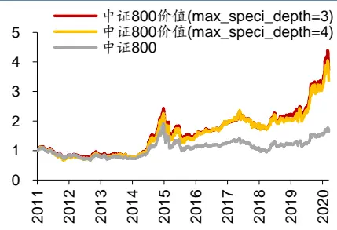
资料来源：Wind，朝阳永续，华泰研究

## 机器学习模型在量化投资应用中的挑战

2020 年 2 季度，知名资产管理公司 AQR 在 Journal Of Investment Management 上发表了论文《Can Machines“Learn”Finance?》，讨论了机器学习模型在量化投资应用中的可行性。虽然机器学习在许多领域已经大获成功，然而在金融投资领域依然面临诸多挑战，文中列举如下：

## 模型的可解释性

相比线性模型，机器学习模型的复杂程度大幅提升，使得模型的可解释性降低，成为“黑箱”。机器学习的这一“黑箱”属性在一些行业或许并不构成问题，然而，资管行业的特殊性在于，资产管理人有义务理解并告知委托人投资策略的风险所在，此时模型的可解释性就显得尤为关键。幸运的是，目前业界有大量关于机器学习模型可解释性研究的成果，我们在前期报告《揭开机器学习模型的“黑箱”》(2020.2.6)做了详细讨论。

## 金融市场的低信噪比

对于量化投资，金融市场的一大特征就是低信噪比(Low Signal-to-noise Ratio)。一方面有效信号往往淹没在繁多的噪声中。另一方面，由于交易行为的存在，金融市场的低信噪比特征将会长期持续。例如，一个有效的多头信号会伴随着投资者的交易而推升股价，从而持续削弱该信号的有效性，市场的表现越来越接近有效市场假说。

## 市场始终在演化

金融市场不仅呈现出低信噪比特征，还存在不断演化的现象。具体表现为市场本身的交易行为和内外部环境的变化都将持续影响信号的有效性，使得对于收益率的预测问题是非平稳的(non-stationary)。机器学习的优势在于学习稳定且可外推至未来的规律，而在非平稳的环境中，机器学习容易对噪声过拟合。

以因子投资为例，图表1为中证800成分股内各大类风格因子的累积RankIC，可知风格因子的表现有很大的不稳定性。市值因子在2017年前后的表现截然相反，从小市值风格变为大市值风格。估值因子在2019年前长期有效，2019年出现持续回撤。2017年后，动量反转、波动率、换手率因子的有效性相比之前大幅减弱。近两年表现较好的成长和财务质量因子在更早的时间则有一些波动。总体来看，风格因子的表现并不稳定。

图表1：中证 800 成分股内各大类风格因子的累计 RankIC
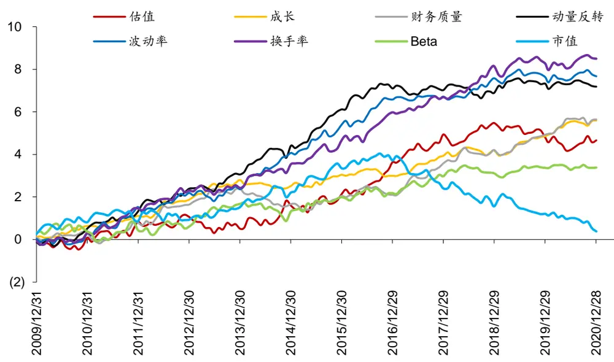
资料来源：Wind，华泰研究

在一个因子有效性持续变化的市场中，线性模型具有简单灵活的优势，传统的线性收益预测模型为：

$$
\widetilde{r_{J}^{T+1}}=\sum_{k=1}^{K}X_{jk}^{T+1}*\widetilde{f_{k}^{T+1}}
$$

上式中 $X_{jk}^{T+1}$ 为 T+1 时刻股票 j 在因子 k 上的因子暴露， $\widetilde{f_{k}^{T+1}}$ 为因子k的因子权重，rT+1为预期收益。投资者可根据自身对因子未来有效性的判断，对因子权重 $\widetilde{f_{k}^{T+1}}$ 进行调整，从而做出预判。

然而机器学习模型由于结构复杂，灵活性相比线性模型大幅下降。具体表现为机器学习模型在历史数据上训练好之后不易调整，一旦市场环境发生变化，模型面临失效的风险，投资者想调整模型却无从下手。

此外，我们在将机器学习应用于因子投资时发现，如果将量价类因子和基本面因子一起输入模型，量价类因子往往具有过大的权重，这对于倾向于使用基本面因子的投资者来说并非是一个理想的结果。而机器学习模型灵活性低的特性又导致投资者难以通过模型调整来增大基本面因子的权重。

例如，我们以82个因子(因子详细列表参见附录)作为输入，使用过去2年的月频数据，在中证800内训练随机森林模型，得到特征重要性排名前10的因子如图表2所示，可知量价类因子占了80%(蓝色背景)，权重过高。

图表2：随机森林模型中的特征重要性

| 因子名称 | 因子描述 | 因子所属大类 | 特征重要性 |
| --- | --- | --- | --- |
| In_capital macd | 总市值取对数 经典技术指标 | 市值 技术 | 0.0370 0.0366 |
| return_12m | 个股最近12个月收益率 | 动量反转 | 0.0358 |
| HAlpha | 个股60个月收益与上证综指回归的截距项 | 动量反转 | 0.0344 |
| std_3m |  |  |  |
| CON_EPS | 个股最近3个月的日收益率序列标准差 | 波动率 一致预期 EPS | 0.0309 |
| wgt_return_3m | 朝阳永续一致预期EPS 个股最近3个月内用每日换手率乘以每日收益率 动量反转 |  | 0.0285 0.0274 |
|  | 求算术平均值 个股最近6个月内用每日换手率乘以每日收益率 动量反转 |  |  |
| wgt_return_6m exp_wgt_return_6m | 求算术平均值 个股最近N个月内用每日换手率乘以函数 | 动量反转 | 0.0266 0.0263 |
|  | exp(-x_i/N/4)再乘以每日收益率求算术平均值， x_i为该日距离截面日的交易日的个数，N=6 |  |  |
| dif | 经典技术指标 | 技术 | 0.0259 |

资料来源：Wind，朝阳永续，华泰研究

综上所述，考虑到金融市场具有信噪比低和不断演化的特点，如何提升机器学习模型的灵活性使得投资者对模型更加可控，将是本文的研究重点。我们将基于随机森林模型，从源代码层面进行改进，使投资者可以指定当前需要重配的因子，实现因子观点融入机器学习。

## 随机森林模型改进：可指定优先分裂的因子

在华泰金工人工智能选股系列报告中，我们经过测试对比，认为基于决策树的机器学习模型(如随机森林、Boosting)最适合结合传统多因子数据构建选股模型，其具有非线性拟合能力强和可解释性较强的优势。因此本文针对随机森林进行改进。

## 随机森林模型简介

随机森林(Random Forest)是一种由诸多决策树通过 Bagging的方式组成的分类器。如图表3 所示，我们由原始数据集生成 N个 Bootstrap 数据集，对于每个 Bootstrap 数据集分别训练一个弱分类器，最终用投票、取平均值等方法组合成强分类器。

随机森林模型中的基本单元是决策树。决策树的构建完全基于数据驱动，模型寻找输入特征中信息增益最大的分裂方式来分裂决策树，直到分裂停止。通过多层的决策树分裂，模型可对历史数据做高精度的拟合，但对于动态演化的金融市场来说，对历史数据的高精度拟合未必能保证外推性。决策树的复杂性也使得投资者难以对已训练好的模型进行调整。

图表3：随机森林模型原理
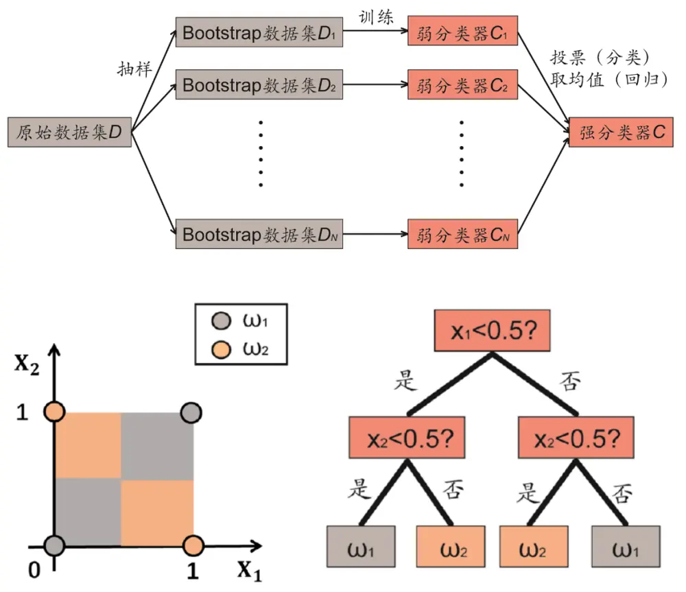
资料来源：华泰研究

Python程序包sklearn提供了方便可调用的随机森林模型，模型的主要参数如下：

图表4：随机森林主要参数

| 参数 | 参数含义 |
| --- | --- |
| max_depth | 单个决策树最大深度 |
| n_estimators | 决策树数目 |
| min_samples_leaf | 单个叶子节点最小的样本比例 |
| max_features | 单次分裂使用的最大特征比例 |

资料来源：sklearn，华泰研究

## 可指定优先分裂因子的随机森林模型

为了构建可指定优先分裂因子的随机森林模型，我们针对sklearn中的随机森林源码做了修改，使得模型中的决策树可在顶端的若干层根据指定的因子进行分裂，人为增大这些因子的重要性。

如图表5所示，假设决策树总共有5层，我们设定决策树的前3层只能使用成长类因子(ROE_G_q，Sales_G_q，Profit_G_q，OCF_G_q，因子详细说明请参见附录)分裂，则决策树的前3层只包含成长类因子，第4层和第5层才用其他因子分裂。这样构建的决策树中，成长类因子起到了主导作用，从而达到了向模型输入成长因子偏好的目的。

图表5：可优先根据成长类因子分裂的决策树结构
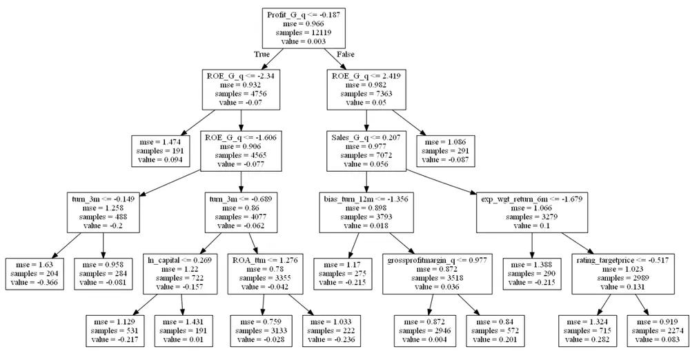
资料来源：Wind，朝阳永续，华泰研究

修改后的随机森林主要参数如下，我们新增了两个参数speci_features和max_speci_depth。

图表6：修改后的随机森林主要参数

| 参数 | 参数含义 |
| --- | --- |
| max_depth | 单个决策树最大深度 |
| n_estimators | 决策树数目 |
| min_samples_leaf | 单个叶子节点最小的样本比例 |
| max_features | 单次分裂使用的最大特征比例 |
| speci_features | 优先分裂的因子 |
| max_speci_depth | 在决策树顶部使用优先因子分裂的层数 |

资料来源：sklearn，华泰研究

## sklearn 源码修改要点

sklearn(https://github.com/scikit-learn)是机器学习领域最著名的开源项目。该项目使用Python语言作为各个模块的上层封装，对于追求高性能的底层算法，则使用Cython语言(Cython 通过类似 Python 的语法来编写 C 语言扩展并可以被 Python 调用)来实现。Cython的程序文件主要包含两种后缀名形式 pxd 和pyx:

1. pxd 文件是 Python 扩展模块头文件，类似于 C 语言的.h 头文件。

2. pyx 文件是 Python 扩展模块源代码文件，类似于 C 语言的.c 源代码文件。

我们针对sklearn主要做了以下文件的修改：

图表7：sklearn 中主要修改的文件

| 文件 | 修改逻辑 |
| --- | --- |
| tree/_tree.pxd | 修改决策树的深度优先建立方法，添加所需参数。 |
| tree/_tree.pyx |  |
| tree/_splitter.pxd | 修改决策树的节点分裂方法，加入优先分裂逻辑。 |
| tree/_splitter.pyx ensemble/_forest.py | 修改随机森林建立方法，添加所需参数。 |

资料来源：sklearn，华泰研究

修改完成后，需要重新编译整个项目才能让修改生效。

## 选股组合测试：以某类风格因子为优先分裂因子

本章我们以某类风格因子为优先分裂因子，使用改进后的随机森林模型构建特定风格的组合。主要选取三类风格因子为优先分裂因子：价值、成长和财务质量。本章的测试能为构建结合机器学习的 SmartBeta策略提供一种思路。

## 本章的测试流程如下：

1. 样本空间：中证800成分股。

2.回测区间：2011年1月31日至2021年2月26日。

3.因子库：包含估值、成长、财务质量、杠杆、市值、动量反转、波动率、换手率、一致预期等13大类因子(因子详细说明请参见附录)，共82个因子。对因子做去极值、缺失值填充、中性化、标准化的预处理。

4.预测目标：个股一个月后标准化的收益率。

5.模型训练：模型进行月度滚动训练，每次训练使用过去24个月的因子数据。

6. 组合构建：月频调仓，每个月最后一个交易日模型打分最高的前100只股票，按照流通市值加权的方法，在下一交易日按收盘价调仓，交易成本为双边千分之四。

## 中证800价值组合：优先分裂因子为价值类因子

本节我们选取8个价值类因子为优先分裂因子：EP、EPcut、BP、SP、NCFP、OCFP、DP、G/PE(因子详细说明请参见附录)。随机森林的参数设置如下，我们测试两种情况：max_speci_depth=3 和 max_speci_depth=4。

图表8：随机森林主要参数

| 参数 | 参数含义 参数取值 |
| --- | --- |
| max_depth | 单个决策树最大深度 |
| n_estimators 决策树数目 | 100 0.01 |
| min_samples_leaf | 单个叶子节点最小的样本比例 |
| max_features 单次分裂使用的最大特征比例 | 最多使用的特征数目为 sqrt(全部特征) |
| speci_features | 优先分裂的因子 EP、EPcut、BP、SP、NCFP、OCFP、DP、G/PE |

资料来源：Wind，华泰研究

模型训练后的特征重要性分析如下，可知排名前8的因子都是价值类因子。

图表9：随机森林模型中的特征重要性(只列出了排名前10的因子)

| max_speci_depth=3 |  | max_speci_depth=4 |  |
| --- | --- | --- | --- |
| 因子名称 | 特征重要性 | 因子名称 | 特征重要性 |
| NCFP | 0.0835 | BP | 0.1203 |
| BP | 0.0718 | NCFP | 0.1164 |
| EP | 0.0685 | EP | 0.0912 |
| EPcut | 0.0610 | G/PE | 0.0854 |
| G/PE | 0.0566 | EPcut | 0.0820 |
| SP | 0.0405 | SP | 0.0577 |
| OCFP | 0.0345 | OCFP | 0.0556 |
| DP | 0.0339 | DP | 0.0503 |
| CON_ROE | 0.0256 | CON_ROE | 0.0187 |
| In_price | 0.0242 | wgt_return_6m | 0.0164 |

资料来源：Wind，朝阳永续，华泰研究

大类因子的特征重要性统计如下，max_speci_depth=4时，价值类因子的特征重要性更高。

图表10：大类因子的特征重要性
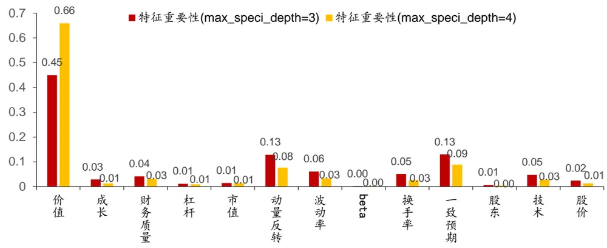
资料来源：Wind，朝阳永续，华泰研究

max_speci_depth=4的情况下，观察模型中某棵决策树的结构，可知决策树的前4层都使用价值因子来分裂，只有到第 5 层才使用其他因子(rsi，In_price，CON_NP_REL，std_3m)。也就是说，模型的选股逻辑由价值因子主导，使用价值因子做了4层判断之后，其他因子对于选股的决策才会起到作用。

图表11：优先根据价值类因子分裂的决策树结构
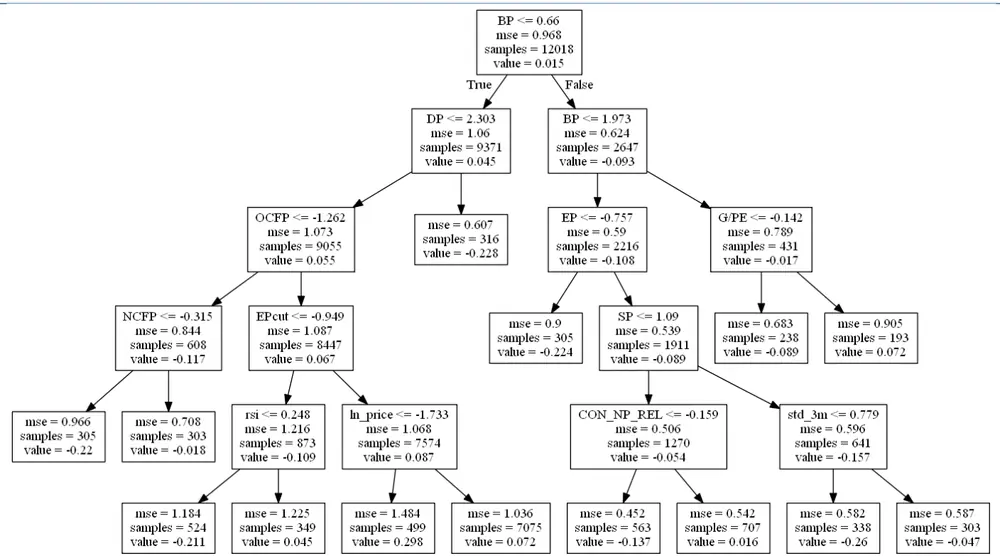
资料来源：Wind，朝阳永续，华泰研究

下图为中证800价值组合的回测绩效。

图表12：中证 800价值组合回测净值(回测区间：20110131~20210226)
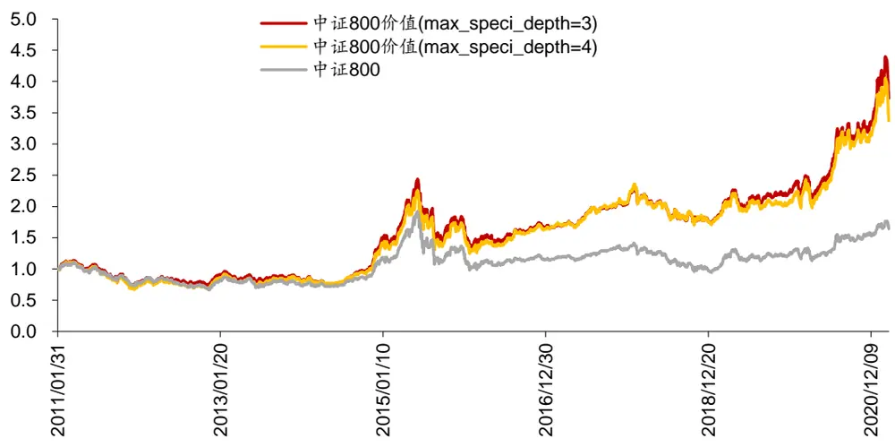
资料来源：Wind，朝阳永续，华泰研究

图表13：中证 800 价值组合回测指标(回测区间：20110131~20210226)

|  | 年化收益率 | 年化波动率 | 夏普比率 | 最大回撤 | 月均双边换手率 |
| --- | --- | --- | --- | --- | --- |
| 中证 800 价值(max_speci_depth=3) | 14.40% | 24.90% | 0.577 | 46.60% | 97.80% |
| 中证 800 价值(max_speci_depth=4) | 13.20% | 24.80% | 0.533 | 44.80% | 91.50% |
| 中证800 | 5.20% | 23.00% | 0.225 | 50.90% |  |

资料来源：Wind，朝阳永续，华泰研究

## 中证800成长组合：优先分裂因子为成长类因子

本节我们选取4个成长类因子为优先分裂因子：ROE_G_q，Sales_G_q，Profit_G_q，OCF_G_q(因子详细说明请参见附录)。随机森林的参数设置如下：

图表14：随机森林主要参数

| 参数 | 参数含义 |
| --- | --- |
| max_depth | 单个决策树最大深度 |
| n_estimators 决策树数目 | 100 |
| min_samples_leaf | 单个叶子节点最小的样本比例 |
| max_features | 0.01 单次分裂使用的最大特征比例 最多使用的特征数目为 sqrt(全部特征) |
| speci_features | 优先分裂的因子 ROE_G_q,OCF_G_q, Profit_G_q, OCF_G_q |

资料来源：Wind，华泰研究

模型训练后的特征重要性分析如下，可知排名前4的因子都是成长类因子。

图表15：随机森林模型中的特征重要性(只列出了排名前10的因子)

| max_speci_depth=3 |  |
| --- | --- |
| 因子名称 | 特征重要性 |
| Sales_G_q Profit_G_q | 0.1168 0.0984 |
| OCF_G_q | 0.0664 |
| ROE_G_q | 0.0647 |
| In_price | 0.0254 |
| return_12m | 0.0225 |
| CON_ROE | 0.0213 |
| HAlpha | 0.0210 |
| exp_wgt_return_6m | 0.0160 |
| dif | 0.0155 |

资料来源：Wind，朝阳永续，华泰研究

| max_speci_depth=4 |  |
| --- | --- |
| 因子名称 | 特征重要性 |
| Sales_G_q Profit_G_q OCF_G_q | 0.1895 0.1567 0.1198 |
| ROE_G_q | 0.1100 |
| In_price | 0.0210 |
| CON_ROE | 0.0144 |
| HAlpha | 0.0115 |
| std_FF3factor_6m | 0.0114 |
| exp_wgt_return_12m | 0.0111 |
| CON_NP_REL | 0.0103 |

大类因子的特征重要性统计如下，max_speci_depth=4时，成长类因子的特征重要性更高。

图表16：大类因子的特征重要性
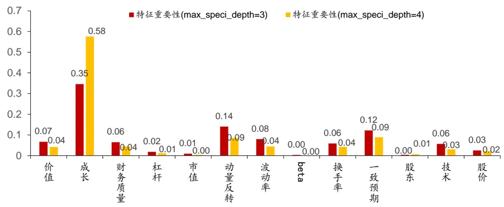
资料来源：Wind，朝阳永续，华泰研究

max_speci_depth=4的情况下，观察模型中某棵决策树的结构，可知决策树的前4层都使用成长因子来分裂，只有到第 5层才使用其他因子(wgt_return_12m，std_FF3factor_12m，bias_turn_12m,return_6m)。

图表17：优先根据成长类因子分裂的决策树结构
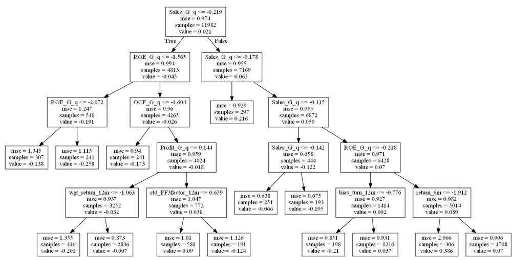
资料来源：Wind，朝阳永续，华泰研究

下图为中证800成长组合的回测绩效。

图表18：中证800成长组合回测净值(回测区间：20110131~20210226)
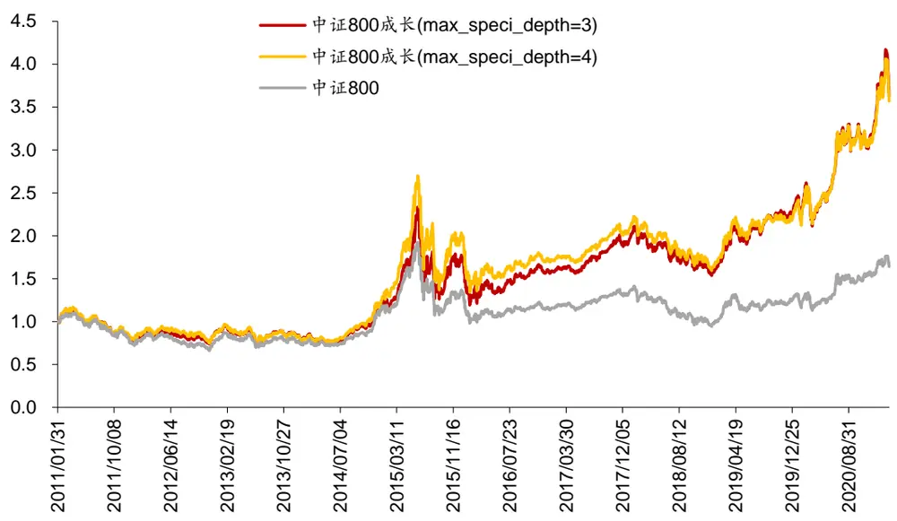
资料来源：Wind，朝阳永续，华泰研究

图表19：中证 800成长组合回测指标(回测区间：20110131~20210226)

|  | 年化收益率 | 年化波动率 | 夏普比率 | 最大回撤 | 月均双边换手率 |
| --- | --- | --- | --- | --- | --- |
| 中证 800成长(max_speci_depth=3) | 14.10% | 26.00% | 0.542 | 49.00% | 101.80% |
| 中证 800 成长(max_speci_depth=4) | 13.90% | 26.20% | 0.53 | 50.30% | 97.80% |
| 中证 800 | 5.20% | 23.00% | 0.225 | 50.90% |  |

资料来源：Wind，朝阳永续，华泰研究

## 中证800质量组合：优先分裂因子为财务质量类因子

本节我们选取12个财务质量类因子为优先分裂因子：ROE_q，ROE_ttm，ROA_q,ROA_ttm， grossprofitmargin_q，grossprofitmargin_ttm，profitmargin_q，profitmargin_ttm, assetturnover_q,assetturnover_ttm, operationcashflowratio_q,

operationcashflowratio_ttm(因子详细说明请参见附录)。随机森林的参数设置如下：

图表20：随机森林主要参数

| 参数 | 参数含义 | 参数取值 |
| --- | --- | --- |
| max_depth | 单个决策树最大深度 | 5 |
| n_estimators | 决策树数目 | 100 |
| min_samples_leaf | 单个叶子节点最小的样本比例 | 0.01 |
| max_features | 单次分裂使用的最大特征比例 | 最多使用的特征数目为 sqrt(全部特征) |
| speci_features | 优先分裂的因子 | ROE_q，ROE_ttm，ROA_q,ROA_ttm，grossprofitmargin_q, grossprofitmargin_ttm，profitmargin_q，profitmargin_ttm, assetturnover_q，assetturnover_ttm, |
| max_speci_depth | 在决策树顶部使用优先因子分裂的层数 | operationcashflowratio_q,operationcashflowratio_ttm 测试两种情况：max_speci_depth =3 和 max_speci_depth=4 |

资料来源：Wind，华泰研究

模型训练后的特征重要性分析如下，max_speci_depth=4时，排名前12的因子都是财务质量类因子。max_speci_depth=3时，其他因子的重要性上升。

图表21：随机森林模型中的特征重要性(只列出了排名前15的因子)

| max_speci_depth=3 |  |
| --- | --- |
| 因子名称 | 特征重要性 |
| ROA_9 ROE_ttm | 0.0646 0.0499 |
| operationcashflowratio_q profitmargin_ttm ROE_q profitmargin_q | 0.0345 0.0345 0.0333 0.0329 |
| ROA_ttm | 0.0299 |
| return_12m assetturnover_q | 0.0243 0.0220 |
| assetturnover_ttm | 0.0216 |
| macd In_price | 0.0195 0.0194 |
| CON_NP_REL | 0.0191 |
| HAlpha | 0.0179 |
| EP | 0.0169 |

资料来源：Wind，朝阳永续，华泰研究

| max_speci_depth=4 |  |
| --- | --- |
| 因子名称 | 特征重要性 |
| ROA_9 | 0.0788 |
| ROE_ttm | 0.0634 |
| ROE_q | 0.0597 |
| operationcashflowratio_q | 0.0564 |
| profitmargin_ttm | 0.0563 |
| ROA_ttm | 0.0550 |
| profitmargin_q | 0.0496 |
| operationcashflowratio_ttm | 0.0404 |
| assetturnover_ttm | 0.0398 |
| assetturnover_q | 0.0367 |
| grossprofitmargin_q | 0.0306 |
| grossprofitmargin_ttm | 0.0291 |
| return_12m | 0.0174 |
| In_price | 0.0148 |
| HAlpha | 0.0132 |

大类因子的特征重要性统计如下，max_speci_depth=4时，财务质量类因子的特征重要性更高。

图表22：大类因子的特征重要性
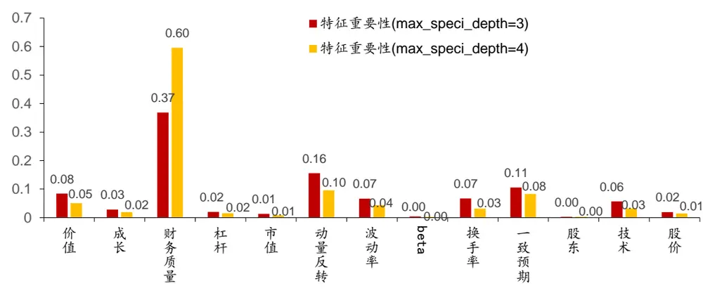
资料来源：Wind，朝阳永续，华泰研究

max_speci_depth=4的情况下，观察模型中某棵决策树的结构，可知决策树的前4层都使用财务质量类因子来分裂，只有到第 5层才使用其他因子(In_price，OCFP，CON_BP，CON_GPE_REL)。

图表23：优先根据财务质量类因子分裂的决策树结构
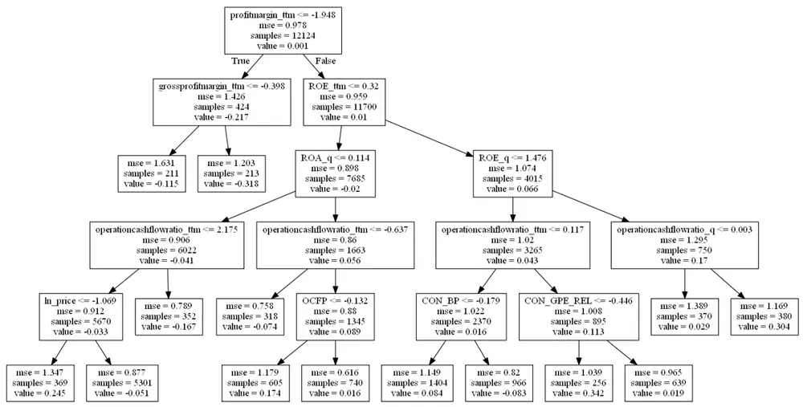
资料来源：Wind，朝阳永续，华泰研究

下图为中证800质量组合的回测绩效。

图表24：中证 800 质量组合回测净值(回测区间：20110131~20210226)
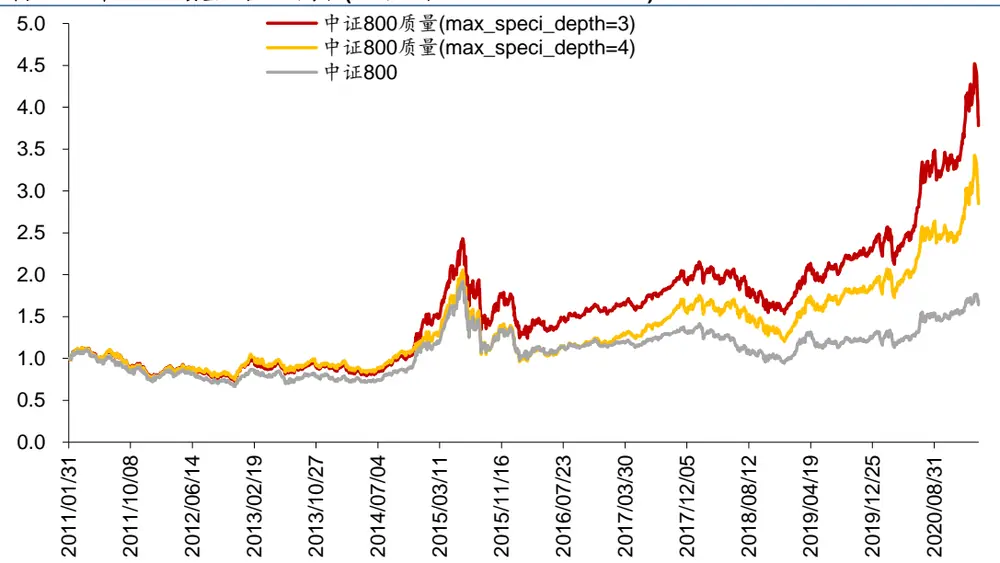
资料来源：Wind，朝阳永续，华泰研究

图表25：中证 800质量组合回测指标(回测区间：20110131~20210226)

|  | 年化收益率 | 年化波动率 | 夏普比率 | 最大回撤 | 月均双边换手率 |
| --- | --- | --- | --- | --- | --- |
| 中证 800质量(max_speci_depth=3) | 14.60% | 25.50% | 0.572 | 49.00% | 90.70% |
| 中证 800 质量(max_speci_depth=4) | 11.30% | 25.90% | 0.435 | 53.30% | 83.40% |
| 中证800 | 5.20% | 23.00% | 0.225 | 50.90% |  |

资料来源：Wind，朝阳永续，华泰研究

## 总结

## 本文总结如下：

1. 面对量化投资中的挑战，如何提升机器学习的灵活性值得关注。2020年2季度，知名资产管理公司 AQR发表了论文《Can Machines“Learn”Finance?》，文中列举了机器学习在金融投资领域面临的挑战：(1)模型的可解释性；(2)金融市场的低信噪比；(3)市场始终在演化。对于因子投资，在一个因子有效性持续变化的市场中，线性模型具有简单灵活的优势。而机器学习模型由于结构复杂，灵活性相比线性模型大幅下降。具体表现为模型在历史数据上训练好之后不易调整，一旦市场环境发生变化，模型面临失效的风险，投资者想调整却无从下手。因此，本文着重讨论如何改进现有机器学习模型来提升灵活性。

随机森林模型改进：可指定优先分裂的因子。随机森林模型具有非线性拟合能力强和可解释性较强的优势，但对于动态演化的金融市场来说，标准的随机森林模型依然难以供投资者做主观调整。为了将因子观点融入模型，我们针对sklearn中的随机森林源码做了修改，使得模型中的决策树可在顶端的若干层根据指定的优先因子进行分裂，人为增大这些因子的重要性。改进后的模型新增了两个参数(1)speci_features：优先分裂的因子；

(2)max_speci_depth：在决策树顶部使用优先因子分裂的层数。

选股组合测试：以价值、成长、质量为优先分裂因子分别构建模型。本文使用改进后的随机森林模型构建特定风格的组合，主要选取三类风格因子为优先分裂因子：价值、成长和财务质量。在中证800成分股内，我们构建了中证800价值、中证800成长、中证800质量三个月频调仓的组合，测试了不同max_speci_depth下模型的表现。以价值因子为例，其他参数不变的情况下，随着max_speci_depth的增大，价值因子在模型里的重要性上升。本文的选股组合测试能为构建结合机器学习的SmartBeta策略提供一种思路。

## 参考文献

[1] Ronen Israel, Bryan Kelly, Tobias Moskowitz. Can Machines “Learn” Finance? Journal of Investment Management, Vol. 18, No. 2, (2020), pp. 23–36.

## 风险提示

通过随机森林模型构建选股策略是历史经验的总结，存在失效的可能。模型可解释性方法可能存在过度简化的风险。

## 附录：因子列表

本文的随机森林模型所使用的因子列表如下：

图表26： 因子及其描述(表 1)

| 大类因子 | 具体因子 | 因子描述 |
| --- | --- | --- |
| 价值 | EP | 净利润(TTM)/总市值 |
| 价值 | EPcut | 扣除非经常性损益后净利润(TTM)/总市值 |
| 价值 | BP | 净资产/总市值 |
| 价值 | SP | 营业收入(TTM)/总市值 |
| 价值 | NCFP | 净现金流(TTM)/总市值 |
| 价值 | OCFP | 经营性现金流(TTM)/总市值 |
| 价值 | DP | 近12个月现金红利(按除息日计)/总市值 |
| 价值 | G/PE | 净利润(TTM)同比增长率/PE_TTM |
| 成长 | Sales_G_q | 营业收入(最新财报，YTD)同比增长率 |
| 成长 | Profit_G_q | 净利润(最新财报，YTD)同比增长率 |
| 成长 | OCF_G_q | 经营性现金流(最新财报，YTD)同比增长率 |
| 成长 | ROE_G_q | ROE(最新财报，YTD)同比增长率 |
| 财务质量 | ROE_q | ROE(最新财报，YTD) |
| 财务质量 | ROE_ttm | ROE(最新财报，TTM) |
| 财务质量 | ROA_q | ROA(最新财报，YTD) |
| 财务质量 | ROA_ttm | ROA(最新财报，TTM) |
| 财务质量 | grossprofitmargin_q | 毛利率(最新财报，YTD) |
| 财务质量 | grossprofitmargin_ttm | 毛利率(最新财报，TTM) |
| 财务质量 | profitmargin_q | 扣除非经常性损益后净利润率(最新财报，YTD) |
| 财务质量 | profitmargin_ttm | 扣除非经常性损益后净利润率(最新财报，TTM) |
| 财务质量 | assetturnover_q | 资产周转率(最新财报，YTD) |
| 财务质量 | assetturnover_ttm | 资产周转率(最新财报，TTM) |
| 财务质量 | operationcashflowratio_q | 经营性现金流/净利润(最新财报，YTD) |
| 财务质量 | operationcashflowratio_ttm | 经营性现金流/净利润(最新财报，TTM) |
| 杠杆 | financial_leverage | 总资产/净资产 |
| 杠杆 | debtequityratio | 非流动负债/净资产 |
| 杠杆 | cashratio | 现金比率 |
| 杠杆 | currentratio | 流动比率 |
| 市值 动量反转 | In_capital | 总市值取对数 |
| 动量反转 | Halpha | 个股60个月收益与上证综指回归的截距项 |
| 动量反转 | return_Nm wgt_return_Nm | 个股最近N个月收益率，N=1，3，6，12 个股最近N个月内用每日换手率乘以每日收益率求算术 |
| 动量反转 |  | 平均值，N=1，3，6，12 |
|  |  | 个股最近 N 个月内用每日换手率乘以函数 exp(-x_i/N/4) |
|  | exp_wgt_return_Nm | 再乘以每日收益率求算术平均值，x_i为该日距离截面日 |
|  |  | 的交易日的个数，N=1，3，6，12 |
| 波动率 | std_FF3factor_Nm | 特质波动率——个股最近N 个月内用日频收益率对 Fama |
|  |  | French三因子回归的残差的标准差，N=1，3，6，12 |
| 波动率 | std_Nm | 个股最近N个月的日收益率序列标准差，N=1，3，6，12 |
| 股价 | In_price | 股价取对数 |
| beta | beta | 个股60个月收益与上证综指回归的 beta |
| 换手率 | turn_Nm | 个股最近N 个月内日均换手率(剔除停牌、涨跌停的交易 |
| 换手率 | bias_turn_Nm | 日)，N=1，3，6,12 |
|  |  | 个股最近N个月内日均换手率除以最近2年内日均换手率 (剔除停牌、涨跌停的交易日)再减去1，N=1，3，6，12 |
| 股东 | holder_avgpctchange | 户均持股比例的同比增长率 |
| 技术 | MACD |  |
| 技术 | DEA | 经典技术指标，长周期取30日，短周期取10日，计算 |
| 技术 | DIF | DEA 均线的周期(中周期)取 15 日 |
| 技术 | RSI | 经典技术指标，周期取20日 |
| 技术 | PSY | 经典技术指标，周期取20日 |
| 技术 | BIAS | 经典技术指标，周期取20日 |

资料来源：Wind，华泰研究

图表27： 因子及其描述(表 2)

| 大类因子 | 具体因子 | 因子描述 |
| --- | --- | --- |
| 一致预期 | rating_average | wind 评级的平均值 |
| 一致预期 | rating_change | wind 评级(上调家数-下调家数)/总数 |
| 一致预期 | rating_targetprice | wind一致目标价/现价-1 |
| 一致预期 | CON_EP | 朝阳永续一致预期EP |
| 一致预期 | CON_EP_REL | 朝阳永续一致预期EP季度环比 |
| 一致预期 | CON_BP | 朝阳永续一致预期EP |
| 一致预期 | CON_BP_REL | 朝阳永续一致预期EP季度环比 |
| 一致预期 | CON_GPE | 朝阳永续一致预期 GPE |
| 一致预期 | CON_GPE_REL | 朝阳永续一致预期GPE季度环比 |
| 一致预期 | CON_ROE | 朝阳永续一致预期ROE |
| 一致预期 | CON_ROE_REL | 朝阳永续一致预期ROE季度环比 |
| 一致预期 | CON_EPS | 朝阳永续一致预期EPS |
| 一致预期 | CON_EPS_REL | 朝阳永续一致预期EPS季度环比 |
| 一致预期 | CON_NP | 朝阳永续一致预期归母净利润 |
| 一致预期 | CON_NP_REL | 朝阳永续一致预期归母净利润季度环比 |

资料来源：Wind，朝阳永续，华泰研究

## 免责声明

## 分析师声明

本人，林晓明、李子钰、何康，兹证明本报告所表达的观点准确地反映了分析师对标的证券或发行人的个人意见：彼以往、现在或未来并无就其研究报告所提供的具体建议或所表达的意见直接或间接收取任何报酬。

## 一般声明及披露

本报告由华泰证券股份有限公司（已具备中国证监会批准的证券投资咨询业务资格，以下简称“本公司”）制作。本报告所载资料是仅供接收人的严格保密资料。本报告仅供本公司及其客户和其关联机构使用。本公司不因接收人收到本报告而视其为客户。

本报告基于本公司认为可靠的、已公开的信息编制，但本公司及其关联机构(以下统称为“华泰”)对该等信息的准确性及完整性不作任何保证。

本报告所载的意见、评估及预测仅反映报告发布当日的观点和判断。在不同时期，华泰可能会发出与本报告所载意见、评估及预测不一致的研究报告。同时，本报告所指的证券或投资标的的价格、价值及投资收入可能会波动。以往表现并不能指引未来，未来回报并不能得到保证，并存在损失本金的可能。华泰不保证本报告所含信息保持在最新状态。华泰对本报告所含信息可在不发出通知的情形下做出修改，投资者应当自行关注相应的更新或修改。

本公司不是FINRA的注册会员，其研究分析师亦没有注册为FINRA的研究分析师/不具有FINRA分析师的注册资格。

华泰力求报告内容客观、公正，但本报告所载的观点、结论和建议仅供参考，不构成购买或出售所述证券的要约或招揽。该等观点、建议并未考虑到个别投资者的具体投资目的、财务状况以及特定需求，在任何时候均不构成对客户私人投资建议。投资者应当充分考虑自身特定状况，并完整理解和使用本报告内容，不应视本报告为做出投资决策的唯一因素。对依据或者使用本报告所造成的一切后果，华泰及作者均不承担任何法律责任。任何形式的分享证券投资收益或者分担证券投资损失的书面或口头承诺均为无效。

除非另行说明，本报告中所引用的关于业绩的数据代表过往表现，过往的业绩表现不应作为日后回报的预示。华泰不承诺也不保证任何预示的回报会得以实现，分析中所做的预测可能是基于相应的假设，任何假设的变化可能会显著影响所预测的回报。

华泰及作者在自身所知情的范围内，与本报告所指的证券或投资标的不存在法律禁止的利害关系。在法律许可的情况下，华泰可能会持有报告中提到的公司所发行的证券头寸并进行交易，为该公司提供投资银行、财务顾问或者金融产品等相关服务或向该公司招揽业务。

华泰的销售人员、交易人员或其他专业人士可能会依据不同假设和标准、采用不同的分析方法而口头或书面发表与本报告意见及建议不一致的市场评论和/或交易观点。华泰没有将此意见及建议向报告所有接收者进行更新的义务。华泰的资产管理部门、自营部门以及其他投资业务部门可能独立做出与本报告中的意见或建议不一致的投资决策。投资者应当考虑到华泰及/或其相关人员可能存在影响本报告观点客观性的潜在利益冲突。投资者请勿将本报告视为投资或其他决定的唯一信赖依据。有关该方面的具体披露请参照本报告尾部。

本报告并非意图发送、发布给在当地法律或监管规则下不允许向其发送、发布的机构或人员，也并非意图发送、发布给因可得到、使用本报告的行为而使华泰违反或受制于当地法律或监管规则的机构或人员。

本报告版权仅为本公司所有。未经本公司书面许可，任何机构或个人不得以翻版、复制、发表、引用或再次分发他人(无论整份或部分)等任何形式侵犯本公司版权。如征得本公司同意进行引用、刊发的，需在允许的范围内使用，并需在使用前获取独立的法律意见，以确定该引用、刊发符合当地适用法规的要求，同时注明出处为“华泰证券研究所”，且不得对本报告进行任何有悖原意的引用、删节和修改。本公司保留追究相关责任的权利。所有本报告中使用的商标、服务标记及标记均为本公司的商标、服务标记及标记。

## 中国香港

本报告由华泰证券股份有限公司制作，在香港由华泰金融控股（香港）有限公司向符合《证券及期货条例》及其附属法律规定的机构投资者和专业投资者的客户进行分发。华泰金融控股（香港）有限公司受香港证券及期货事务监察委员会监管，是华泰国际金融控股有限公司的全资子公司，后者为华泰证券股份有限公司的全资子公司。在香港获得本报告的人员若有任何有关本报告的问题，请与华泰金融控股（香港）有限公司联系。

## 香港-重要监管披露

- 华泰金融控股（香港）有限公司的雇员或其关联人士没有担任本报告中提及的公司或发行人的高级人员。

更多信息请参见下方“美国-重要监管披露”。

## 美国

在美国本报告由华泰证券（美国）有限公司向符合美国监管规定的机构投资者进行发表与分发。华泰证券（美国）有限公司是美国注册经纪商和美国金融业监管局（FINRA）的注册会员。对于其在美国分发的研究报告，华泰证券（美国）有限公司根据《1934年证券交易法》（修订版）第15a-6条规定以及美国证券交易委员会人员解释，对本研究报告内容负责。华泰证券（美国）有限公司联营公司的分析师不具有美国金融监管（FINRA）分析师的注册资格，可能不属于华泰证券（美国）有限公司的关联人员，因此可能不受FINRA关于分析师与标的公司沟通、公开露面和所持交易证券的限制。华泰证券（美国）有限公司是华泰国际金融控股有限公司的全资子公司，后者为华泰证券股份有限公司的全资子公司。任何直接从华泰证券（美国）有限公司收到此报告并希望就本报告所述任何证券进行交易的人士，应通过华泰证券（美国）有限公司进行交易。

## 美国-重要监管披露

- 分析师林晓明、李子钰、何康本人及相关人士并不担任本报告所提及的标的证券或发行人的高级人员、董事或顾问。分析师及相关人士与本报告所提及的标的证券或发行人并无任何相关财务利益。本披露中所提及的“相关人士”包括FINRA定义下分析师的家庭成员。分析师根据华泰证券的整体收入和盈利能力获得薪酬，包括源自公司投资银行业务的收入。

- 华泰证券股份有限公司、其子公司和/或其联营公司，及/或不时会以自身或代理形式向客户出售及购买华泰证券研究所覆盖公司的证券/衍生工具，包括股票及债券（包括衍生品）华泰证券研究所覆盖公司的证券/衍生工具，包括股票及债券（包括衍生品）。

- 华泰证券股份有限公司、其子公司和/或其联营公司，及/或其高级管理层、董事和雇员可能会持有本报告中所提到的任何证券（或任何相关投资）头寸，并可能不时进行增持或减持该证券（或投资）。因此，投资者应该意识到可能存在利益冲突。

## 评级说明

投资评级基于分析师对报告发布日后6至12个月内行业或公司回报潜力（含此期间的股息回报）相对基准表现的预期(A股市场基准为沪深300指数，香港市场基准为恒生指数，美国市场基准为标普500指数)，具体如下：

## 行业评级

增持：预计行业股票指数超越基准

中性：预计行业股票指数基本与基准持平

减持：预计行业股票指数明显弱于基准

## 公司评级

买入：预计股价超越基准15%以上

增持：预计股价超越基准5%~15%

持有：预计股价相对基准波动在-15%~5%之间

卖出：预计股价弱于基准15%以上

暂停评级：已暂停评级、目标价及预测，以遵守适用法规及/或公司政策

无评级：股票不在常规研究覆盖范围内。投资者不应期待华泰提供该等证券及/或公司相关的持续或补充信息

## 法律实体披露

中国：华泰证券股份有限公司具有中国证监会核准的“证券投资咨询”业务资格，经营许可证编号为：91320000704041011J香港：华泰金融控股(香港)有限公司具有香港证监会核准的“就证券提供意见”业务资格，经营许可证编号为：AOK809美国：华泰证券（美国）有限公司为美国金融业监管局（FINRA）成员，具有在美国开展经纪交易商业务的资格，经营业务许可编号为：CRD#:298809/SEC#:8-70231

## 华泰证券股份有限公司

南京南京市建邺区江东中路228号华泰证券广场1号楼/邮政编码：210019

电话：8625 83389999/传真：86 25 83387521电子邮件：ht-rd@htsc.com

## 深圳

深圳市福田区益田路5999号基金大厦10楼/邮政编码：518017电话：86 755 82493932/传真：86 755 82492062电子邮件：ht-rd@htsc.com

## 华泰金融控股（香港）有限公司

香港中环皇后大道中 99号中环中心 58楼5808-12室
电话：+852-3658-6000/传真：+852-2169-0770
电子邮件：research@htsc.com
http://www.htsc.com.hk

## 华泰证券（美国）有限公司

美国纽约哈德逊城市广场10号41楼（纽约10001）
电话：+212-763-8160/传真：+917-725-9702
电子邮件： Huatai@htsc-us.com
http://www.htsc-us.com

©版权所有2021年华泰证券股份有限公司

北京
北京市西城区太平桥大街丰盛胡同28号太平洋保险大厦A座18层/
邮政编码：100032
电话：861063211166/传真：861063211275
电子邮件：ht-rd@htsc.com
上海
上海市浦东新区东方路18号保利广场E栋23楼/邮政编码：200120
电话：862128972098/传真：862128972068
电子邮件：ht-rd@htsc.com