# 人工智能 44：深度卷积 GAN 实证

华泰研究

2021 年 4 月 13 日│中国内地

## 深度研究

## W-DCGAN 模型可用于多资产金融时间序列生成，效果良好

本文探讨 GAN 的重要变式——DCGAN（深度卷积生成对抗网络）在生成多资产金融时间序列中的应用。原始 GAN 模型存在固有缺陷，DCGAN 和WGAN 分别从网络结构和损失函数的角度提出改进，将两种改进方案融合可得到 W-DCGAN 模型。测试各模型对多资产金融时间序列的生成效果，并采用 9项单资产序列指标和 5 项多资产序列指标评价生成质量。结果表明DCGAN 表现不理想，结合 W 距离损失函数的W-DCGAN 效果好且略优于WGAN，W-DCGAN 能较好地复现出真实序列的各项典型化事实。

## DCGAN 的核心思想是针对网络结构改进原始 GAN

和 WGAN 针对损失函数改进的思路不同，DCGAN 的核心思想是针对网络结构改进原始 GAN。DCGAN 使用更灵活的转置卷积层和带步长的卷积层，分别替代 GAN 模型中的上采样层和池化层。同时，DCGAN 取消全连接层，并调整归一化层、激活函数、优化器等网络组件，使生成器和判别器均为全卷积网络结构。

## W-DCGAN 融合 DCGAN 的网络结构与 WGAN 的损失函数

尽管在网络结构上更为合理，DCGAN 并没有解决 GAN 模型的根本缺陷，并且仍需要小心设计训练过程及网络参数，调参难度较大，单纯使用DCGAN 模型在实践中效果并不理想。本文对 DCGAN模型做进一步改进，借鉴 WGAN 模型思想，将 W 距离应用于 DCGAN 的损失函数中，构建W-DCGAN 模型。W-DCGAN 不仅拥有 DCGAN 的原本优势，还由于W 距离的使用避免了梯度消失和模式崩溃现象。

## 实证结果表明 DCGAN 效果不佳，W-DCGAN 相比 WGAN 略胜一筹

我们测试各类生成模型在多资产金融时间序列（标普 500、上证综指、欧洲斯托克 50）生成任务中的表现，并采用前期研究构建的 9 项单资产序列指标和 5项多资产序列指标评价生成质量。结果表明，DCGAN 在自相关性、杠杆效应、盈亏不对称性、多资产交叉相关性等指标上生成效果不佳，W-DCGAN 和WGAN均表现较好；W-DCGAN 总体而言略胜一筹，在盈亏不对称性、Hurst指数、多资产滚动相关系数等指标上有显著优势。总的来看，W-DCGAN 模型能较好地复现出真实序列的各项典型化事实。

风险提示：DCGAN 和 W-DCGAN 生成虚假序列是对市场规律的探索，不构成任何投资建议。深度学习模型存在过拟合的可能。深度学习模型是对历史规律的总结，如果市场规律发生变化，模型存在失效的可能。

研究员

SAC No. S0570516010001

林晓明

linxiaoming@htsc.com

SFC No. BPY421

+86-755-82080134

研究员

SAC No. S0570519110003

李子钰

liziyu@htsc.com

+86-755-23987436

研究员

SAC No. S0570520080004

何康，PhD

hekang@htsc.com

+86-21-28972039

联系人

王晨宇

SAC No. S0570119110038 wangchenyu@htsc.com

+8602138476179

## W-DCGAN 生成多资产序列示例

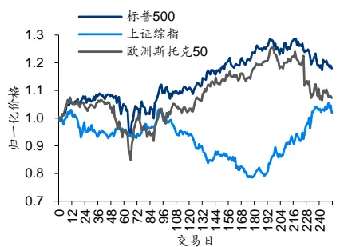
资料来源：Wind，华泰研究

## 研究背景

华泰金工生成对抗网络系列研究尝试将生成对抗网络 GAN 技术运用于量化投资研究。我们测试 GAN、WGAN、RGAN 等模型生成单个资产收益率的仿真时间序列。结果表明，生成对抗网络能够刻画单个资产真实收益率序列所具备的统计特性，如厚尾分布、波动率聚集等，其中WGAN 模型生成效果相对更佳。

由于实际投资研究可能涉及到多个资产，为拓宽应用场景，我们将 WGAN 模型进行改进，使其同时生成多个资产收益率的仿真时间序列，并构建交叉相关性、波动率相关性等用于评价多资产序列两两之间典型化事实的指标。结果表明，WGAN 模型能够胜任生成多资产收益率序列的任务。

作为 GAN 的一种经典变式，WGAN（Wasserstein GAN）将原始 GAN 中的 JS 散度替换成Wasserstein 距离（简称 W 距离），用判别器估计生成分布与真实分布的W 距离，用生成器拉近W 距离，以达到生成样本逼近真实样本的目标。换言之，WGAN 相对于原始 GAN的改进主要在损失函数部分，而基本没有改变 GAN 的网络结构。

作为 GAN 的另一经典变式，DCGAN（Deep Convolutional GAN，深度卷积生成对抗网络）相对于原始 GAN 的改进主要在网络结构部分。DCGAN 是引入 CNN 的 GAN：生成器中使用转置卷积层代替上采样层，判别器中使用带步长的卷积层代替池化层同时去掉全连接层，构成全卷积网络。DCGAN 在生成多资产收益率序列任务中表现如何？DCGAN 能否与WGAN“双剑合璧”，使用 DCGAN 的网络结构以及WGAN 的损失函数，从而达到更好的生成效果？

图表1： 原始 GAN的改进方式
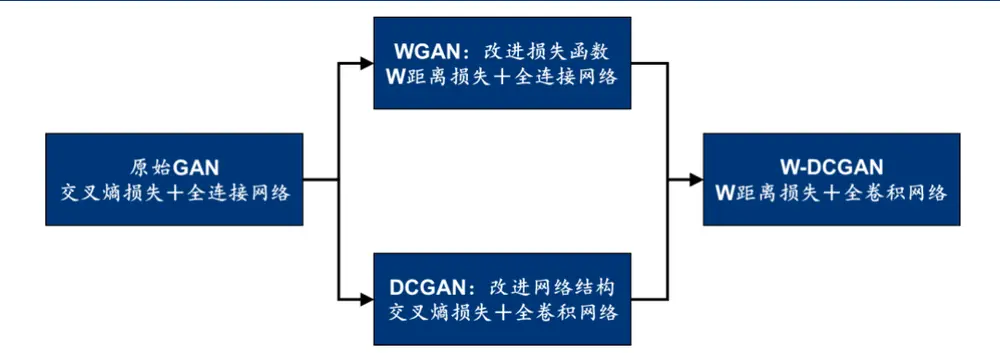
资料来源：华泰研究

本文首先介绍 DCGAN 的原理及算法，包括卷积与转置卷积、网络结构的设计规则、可能存在的问题等。在 DCGAN 模型判别器卷积层中，使用多通道处理多资产序列的输入，以适应生成多资产收益率的应用场景。随后简要回顾 WGAN 的基本思想以及优化目标函数，使其代替原本 DCGAN 模型中的二进制交叉熵损失函数，得到 W-DCGAN 模型。采用前期研究《人工智能 35：WGAN 应用于金融时间序列生成》（20200828）和《人工智能 38：WGAN 生成：从单资产到多资产》（20201124）中的 9 个单资产序列评价指标和 5 个多资产序列评价指标及其反映的典型化事实，以衡量模型的生成效果。

实证测试环节，我们分别测试 DCGAN、WGAN和W-DCGAN 模型对相同类型资产组合（标普 500 指数、上证综指、欧洲斯托克 50 指数）的生成效果。结果表明，单纯使用 DCGAN模型进行生成效果并不理想，W-DCGAN 模型生成的多资产收益率序列很好地复现了真实序列蕴含的典型化事实，并且生成效果整体优于 WGAN 模型。

## DCGAN 原理

## 卷积神经网络 CNN相关概念

CNN 是一种常见的深度学习网络架构，受生物自然视觉认知机制启发而来，最初由 YannLecun 等人于 1998 年提出。CNN 的本质是一个多层感知机，可以自动从数据中学习特征，并把结果向同类型位置数据泛化。CNN 采用局部连接和权值共享方式，既减少了权值数量使参数易于优化，又降低了模型复杂度减小过拟合风险。

随着数据量的增大和算力的增强，CNN 在很多领域取得成功，如图像识别、图像分割等。基础的 CNN 由卷积、激活、池化三种结构组成，当处理分类任务时，还需要引入全连接层完成从 CNN 输出特征到标签集的映射。华泰金工《人工智能 15：人工智能选股之卷积神经网络》（20190213）已阐释了 CNN 将高维数据映射到低维特征的机制。下面我们就DCGAN 网络结构中涉及到的重点结构予以介绍和说明。

## 特征学习：卷积与转置卷积

在 DCGAN 网络结构中，生成器使用转置卷积完成低维特征向高维特征的映射即上采样，判别器使用卷积完成高维特征向低维特征的映射即下采样，因此充分理解卷积和转置卷积的操作机制是重要且必要的。尽管从字面意思上来看，转置卷积操作与卷积操作相反，但事实上并非严格相反，且转置卷积的过程理解起来更晦涩。对此，本文引入仿射变换的形式，以一维卷积和转置卷积操作为例，对比两者的机制异同。

首先，我们取步长为 1，且不考虑填充和通道维度。假设一个 5维输入x，经过大小为 3 的卷积核 $\pmb{w}=\left[w_{1},w_{2},w_{3}\right]$ ′进行卷积，可以得到 3 维向量z。卷积操作可以写为：

$$
{\pmb z}={\pmb w}\otimes{\pmb x}=\left[\begin{array}{ccccc}{W_{1}}&{W_{2}}&{W_{3}}&{0}&{0}\\{0}&{W_{1}}&{W_{2}}&{W_{3}}&{0}\\{0}&{0}&{W_{1}}&{W_{2}}&{W_{3}}\end{array}\right]{\pmb x}\overset{\mathrm{def}}{=}{\pmb C}{\pmb x}
$$

反过来，如果我们想要把一个 3 维输入z，通过升维，得到 5 维向量x，只需把权重矩阵C进行转置（注意，只是形式上的转置，矩阵元素取值并非相等）。转置卷积操作可以写为：

$$
\pmb{x}=\pmb{v}\pmb{\otimes}\pmb{z}=\left[\begin{array}{ccc}{v_{1}}&{0}&{0}\\{v_{2}}&{v_{1}}&{0}\\{v_{3}}&{v_{2}}&{v_{1}}\\{0}&{v_{3}}&{v_{2}}\\{0}&{0}&{v_{3}}\end{array}\right]\pmb{z}\overset{\mathrm{def}}{=}\pmb{C}^{\prime}\pmb{z}
$$

进一步推广，如果考虑填充规模为 1，使一个 5维输入x，经过大小为 3的卷积核进行卷积，输出向量的维度仍然是 5 维，卷积操作可以写为：

$$
{\pmb z}={\pmb w}\otimes{\pmb x}=\left[\begin{array}{ccccc}{W_{2}}&{W_{3}}&{0}&{0}&{0}\\{W_{1}}&{W_{2}}&{W_{3}}&{0}&{0}\\{0}&{W_{1}}&{W_{2}}&{W_{3}}&{0}\\{0}&{0}&{W_{1}}&{W_{2}}&{W_{3}}\\{0}&{0}&{0}&{W_{1}}&{W_{2}}\end{array}\right]{\pmb x}\overset{\mathrm{def}}{=}{\pmb C}{\pmb x}
$$

反过来，如果我们想要把一个 5 维输入z，通过转置卷积的作用，仍然得到 5 维向量x，只需把权重矩阵C进行转置。此时，不难发现，转置卷积操作仿射变换矩阵非零元素的位置与卷积操作的情况是相同的，因此转置卷积在效果上与卷积也是相同的：

$$
x=v\otimes z={\left[\begin{array}{lllll}{v_{2}}&{v_{1}}&{0}&{0}&{0}\\{v_{3}}&{v_{2}}&{v_{1}}&{0}&{0}\\{0}&{v_{3}}&{v_{2}}&{v_{1}}&{0}\\{0}&{0}&{v_{3}}&{v_{2}}&{v_{1}}\\{0}&{0}&{0}&{v_{3}}&{v_{2}}\end{array}\right]}z\ {\stackrel{\mathrm{def}}{=}}\ C^{\prime}z
$$

最后，如果考虑步长为 2，使一个 5维输入x，经过大小为 3 的卷积核进行卷积，被降维至2 维，卷积操作可以写为：

$$
\pmb{z}=\pmb{w}\pmb{\otimes}\pmb{x}=\left[\begin{array}{ccccc}{w_{1}}&{w_{2}}&{w_{3}}&{0}&{0}\\{0}&{0}&{w_{1}}&{w_{2}}&{w_{3}}\end{array}\right]\pmb{x}\equiv\pmb{C}\pmb{x}
$$

反过来，如果我们想要把一个 2 维输入z，通过步长为 2的转置卷积的作用升维至 5维，只需把权重矩阵C进行转置。转置卷积操作可以写为：

$$
\pmb{x}=\pmb{v}\pmb{\otimes}\pmb{z}=\left[\begin{array}{ll}{v_{1}}&{0}\\{v_{2}}&{0}\\{v_{3}}&{v_{1}}\\{0}&{v_{2}}\\{0}&{v_{3}}\end{array}\right]\pmb{z}\stackrel{\mathrm{def}}{=}\pmb{C}^{\prime}\pmb{z}
$$

上述简单情形不难被推广至更复杂的情形。例如，在本文构建的 DCGAN 中，判别器从输入数据中提取特征，其中的一步（卷积层中的倒数第二层卷积）是将 31 维生成器生成结果$\pmb{g}$ ，通过大小为 4、步长为 2、填充规模为 1 的卷积操作，降维至 15 维。卷积操作可写为：

$$
\pmb{z}=\pmb{w}\pmb{\otimes}\pmb{g}=\left[\begin{array}{ccccccccc}{W_{2}}&{W_{3}}&{W_{4}}&{0}&{\cdots}&{0}&{0}&{0}&{0}\\{0}&{W_{1}}&{W_{2}}&{W_{3}}&{\cdots}&{0}&{0}&{0}&{0}\\{0}&{0}&{0}&{W_{1}}&{\cdots}&{0}&{0}&{0}&{0}\\{\vdots}&{\vdots}&{\vdots}&{\vdots}&{\vdots}&{\vdots}&{\vdots}&{\vdots}&{\vdots}\\{0}&{0}&{0}&{0}&{\cdots}&{W_{2}}&{W_{3}}&{W_{4}}&{0}\\{0}&{0}&{0}&{0}&{\cdots}&{0}&{W_{1}}&{W_{2}}&{W_{3}}\end{array}\right]\pmb{g}
$$

其中w的列数为输入维度 31，w的行数为 $\textstyle\left\lfloor{\frac{31+2*1-4}{2}}\right\rfloor+1=15$ ，即输出维度。

生成器用提取的特征与随机数序列来生成预测序列，其中的一步（转置卷积层中的第二层转置卷积）是将 15 维中间结果h，通过大小为 4、步长为 2、填充规模为 1的转置卷积操作，升维至 30 维。转置卷积操作可以写为：

$$
x=v\otimes h={\left[\begin{array}{llllll}{v_{2}}&{0}&{0}&{\cdots}&{0}&{0}\\{v_{3}}&{v_{1}}&{0}&{\cdots}&{0}&{0}\\{v_{4}}&{v_{2}}&{0}&{\cdots}&{0}&{0}\\{0}&{v_{3}}&{v_{1}}&{\cdots}&{0}&{0}\\{\vdots}&{\vdots}&{\vdots}&{\vdots}&{\vdots}&{\vdots}\\{0}&{0}&{0}&{\cdots}&{v_{4}}&{v_{2}}\\{0}&{0}&{0}&{\cdots}&{0}&{v_{3}}\\{0}&{0}&{0}&{\cdots}&{0}&{v_{4}}\\{0}&{0}&{0}&{\cdots}&{0}&{0}\end{array}\right]}h
$$

其中v的列数为输入维度 15，v的行数为 $(15-1)*2+4-2*1=30$ ，即输出维度。通过仿射变换，我们就不难理解卷积和转置卷积操作的机制。

## 引入非线性：激活函数

在卷积操作之后，通常引入偏置和非线性激活函数，给网络结构引入非线性因素，使得神经网络可以任意逼近任何非线性函数。假设经过卷积操作后有n个神经元 $.x_{1}\ldots...x_{n}$ ，对应n个权重 $\omega_{1}\ldots\ldots\omega_{n}$ ，若定义偏置为b，激活函数为ℎ()，则激活操作可以表示为：

$$
z_{\omega,x}=h(\sum_{i}^{n}\omega_{i}x_{i}+b)
$$

图表2： DCGAN涉及的激活函数

| 函数名称 | LeakyReLU | Tanh |
| --- | --- | --- |
| 函数表达式 | h(x) = max(ωx, x) | ex - e−x h(x) = |
| 这里取ω = 0.2 |  | ex + e−x |
| 函数图像 |  |  |

资料来源：华泰研究

可以看出，DCGAN 中广泛使用的 LeakyReLU(0.2)函数既不会导致梯度消失的问题，同时由于导数不为 0，也可以减少静默神经元的出现。

## 下采样：池化或带步长的卷积

池化是对信息进行抽象的过程，是一种下采样操作。在保持特征的某种不变性（旋转、平移、伸缩等）的前提下，压缩特征图大小、减少参数量、降低优化难度，尽量去除冗余信息保留关键信息，从而达到简化网络复杂度的目的。

此前我们使用的 GAN 包含 2*2 的最大值池化层。然而，这种暴力降低特征图分辨率的方法可能丢失大量信息，一个2*2的最大池化操作就会丢失近3/4的信息。在算力足够的情况下，可使用带步长的卷积操作替代池化进行下采样。

图表3： GAN判别器中最大值池化操作示意图
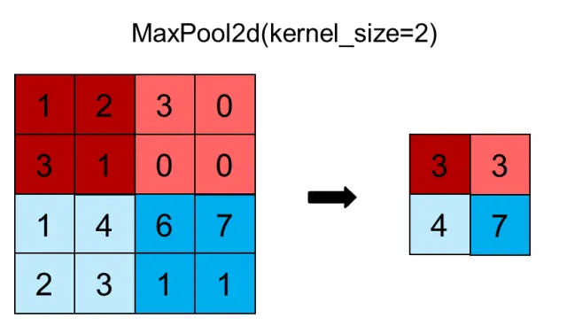
资料来源：华泰研究

图表4： DCGAN以带步长的卷积代替池化
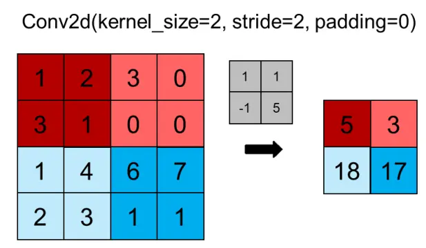
资料来源：华泰研究

## 映射至输出尺寸：全连接或卷积

全连接层一般会放在网络最后，用以综合所有信息进行降维。例如，此前我们使用的 GAN判别器的最后三层结构为全连接，将最终特征图映射到 1 个神经元作为输出。然而，全连接层参数量较大，容易过拟合，对于空间信息损失较多（因为需要“展平”）。在卷积操作中若卷积核感受野覆盖全图，其计算过程与全连接等效，故可以进行替代。

图表5： GAN判别器中全连接层的使用
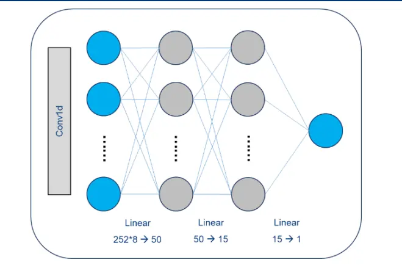
资料来源：华泰研究

图表6： DCGAN以卷积代替全连接
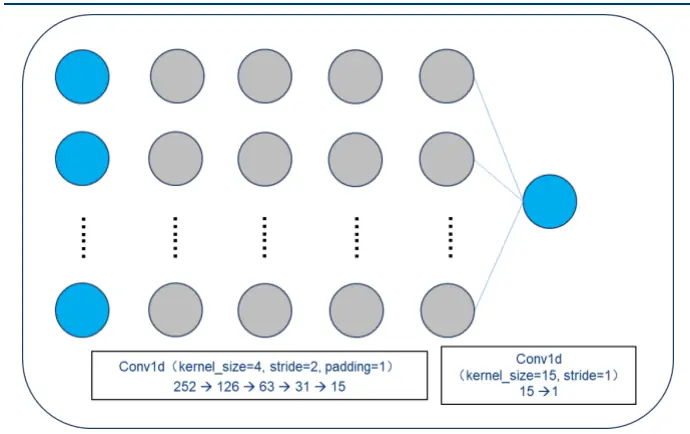
资料来源：华泰研究

## 深度卷积生成对抗网络 DCGAN

## DCGAN 基本原理

Radford 等（2016）将 CNN 与 GAN 有效结合，充分利用卷积操作强大的特征提取能力来提高学习效果，提出 DCGAN 结构。DCGAN 的基本原理与 GAN 一致，只是将生成器和判别器换成了全卷积网络。

图表7： DCGAN相比于 GAN的主要改进及优势

|  | 功能 | GAN | DCGAN | DCGAN 相比于 GAN 的优势 |
| --- | --- | --- | --- | --- |
| 生成器 G | 网络结构 | 邻近插值上采样层+卷积层 | 转置卷积层 | - |
|  | 归一化 | 批归一化层 | 批归一化层 | - |
|  | 激活 | Sigmoid() | Tanh() | 去中心化(均值为0） |
|  | 上采样 映射至输出尺寸 | 邻近插值上采样 全连接层 | 转置卷积 取消 | 可视化、信息冗余小、可以重叠融合 减小参数量、不易过拟合、可提取空间信 |
| 判别器 D |  |  |  | 息、无需输入固定尺寸 |
|  | 网络结构 | 卷积层+全连接层 | 卷积层 | - |
|  | 归一化 | 不使用归一化层 | 批归一化层 | 稳定训练 |
|  | 激活 | Sigmoid() | LeakyReLU() | 不会梯度消失 |
|  | 下采样 | 最大值池化层 | 带步长的卷积 | 信息损失小 |
|  | 映射至输出尺寸 | 全连接层 | 取消 | 减小参数量、不易过拟合、可提取空间信 |

资料来源：华泰研究

值得注意的是，作者使用全卷积网络的目的之一是希望可视化网络结构，观察中间层神经元输出结果，从而更好地理解训练过程。然而全卷积网络中的转置卷积操作可能会带来“棋盘效应”。Odena 等人（2016）详细论证了转置卷积与“棋盘效应”，并给出了减轻“棋盘效应”的上采样方法：其一是确保转置卷积核大小可以被步长整除，即本文使用的方式，但作者同时表示此方法在实践中并不能完全消除“棋盘效应”；其二是使用最近邻插值或双线性插值法缩放图像再进行常规卷积，即 GAN 与前期研究中的WGAN使用的方式。因此，转置卷积层的使用可能带来效果下降的风险。

图表8： 转置卷积棋盘效应示意图
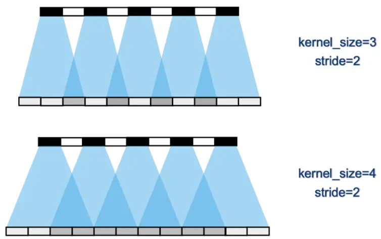
资料来源：华泰研究

## DCGAN 网络构建

为了尽量避免生成器 G或判别器 D任何一方过于强大，D 和 G在参数数量和网络复杂度方面应当接近平衡。同时，使用转置卷积层时，应尽量设置核尺寸可被步长整除以减轻棋盘效应。

生成器 G 网络使用含五个转置卷积层的全卷积网络结构。在多资产生成的应用场景下，我们需要通过参数设定保证最后一层转置层的输出为资产数目 K 乘以序列长度 T 的形式。G网络具体参数详见下表。

特别地，DCGAN 的经典应用场景为图像生成，我们关注的应用场景为金融资产收益率生成，考虑到两者的差异，我们将生成器 G 网络的输出层神经元激活函数从 Tanh 改为不激活。实证表明，如果输出层采用 Tanh 激活函数，得到的资产收益率更接近正态分布，从而失去真实资产收益率的厚尾特性；输出层不激活得到的资产收益率服从厚尾分布。

图表9： DCGAN生成器 G网络结构与参数

| 参数 | 取值 |
| --- | --- |
| 结构 | 含五个转置卷积层的全卷积网络 |
| 输入噪音向量（隐变量）pz(z) | 标准正态分布 |
| 输入层神经元数量 | 100 |
| 转置卷积层卷积核数量 | 64*8/64*4/64*2/64/K |
| 第一层转置卷积层核尺寸 | 4 |
| 第一层转置卷积层 Stride | 2 |
| 第一层转置卷积层 Padding | 1 |
| 第二层至第五层转置卷积层核尺寸 | 14 |
| 第二层至第五层转置卷积层 Stride | 1 |
| 第二层至第五层转置卷积层 Padding | 0 |
| 转置卷积层激活函数（除最后一层外） | ReLU() |
| 输出层神经元数量 | KXT |
| 是否标准化 | 是(Batch-Normalization) |
| 损失函数 | 二进制交叉熵（BCE） |
| 优化器 | Adam |
| 优化器学习速率 | 0.0002 |
| 优化器其他参数 | β=(0.5,0.999) |

资料来源：华泰研究

判别器 D 网络使用含五个卷积层的全卷积网络结构。在多资产生成的应用场景下，为了使D 具有鉴别多资产序列的能力，我们将第一层卷积层设置为多通道输入，每一通道对应多资产序列中的一个标的资产。D 网络具体参数详见下表。

图表10： DCGAN判别器 D网络构建

| 参数 | 取值 |
| --- | --- |
| 结构 | 含五个卷积层 |
| 输入层神经元数量 | K×T |
| 卷积层卷积核数量 | 64/64*2/64*4/64*8/1 |
| 卷积层核尺寸 | 4 |
| 卷积层 Stride | 2 |
| 卷积层 Padding | 1 |
| 卷积层激活函数 | LeakyReLU(0.2) |
| 输出层神经元数量 | 1 |
| 输出层激活函数 | Sigmoid() |
| 是否标准化 | 否 |
| 损失函数 | 二进制交叉熵（BCE） |
| 优化器 | Adam |
| 优化器学习速率 | 0.0002 |
| 优化器其他参数 | β=(0.5,0.999) |

资料来源：华泰研究

## DCGAN 训练算法

在 DCGAN 的实际训练过程中，判别器 D与生成器 G交替进行训练，判别器 D训练 1 次，生成器 G训练 1 次。DCGAN 训练算法的伪代码如下所示。

图表11： DCGAN训练算法伪代码
输入：迭代次数 T，小批量（minibatch）样本数量 m
1随机初始化 D 网络参数θ 和 G 网络参数 $\theta_{g}$ 
2 for t ←1 to T do
# 训练判别器 D
3从训练集 ${\it p}_{r}(x)$ 中随机采集 m 条样本 $\{x^{(m)}\}$ 
4从[0.9,1.1]均匀分布中采集 m 个随机数 $\{\epsilon_{1}^{~(m)}\}$ ，并计算 $\{\epsilon_{1}^{~(m)}\}$ 与{x(m)}的二进制交叉熵值 $.loss_{real}$ 
5从标准正态分布 ${\bar{\boldsymbol{\imath}}}p_{g}(z)$ 中采集 m 条样 ${\ k}\ k\ k\ K^{(m)}\}$ 
6从[0.1,0.3]均匀分布中采集 m 个随机数 $\{\epsilon_{2}^{~(m)}\}$ ，并计算 $\{\epsilon_{2}^{~(m)}\}$ $\mathcal{E}\{D(\mathrm{G}\big(z^{(i)}\big))\}$ }的二进制交叉熵值 $loss_{fake}$ 
7使用 Adam 优化器更新判别器 D，梯度为 $loss_{fake}$ 
# 训练生成器 G
8从标准正态分布 ${\mathfrak{p}}_{g}(z)$ 中随机采集 m 条样本 $\cdot\{z^{(m)}\}$ 
9从[0.1,0.3]均匀分布中采集 m 个随机数 $\{\epsilon_{2}^{~(m)}\}$ ，并计算 $\{\epsilon_{2}^{~(m)}\}$ 与{D(G(z(i)))}的二进制交叉熵 $\$10ss_{fake}$ 
10使用 Adam 优化器更新判别器 D，梯度为 $loss_{fake}$ 
11 end
输出：生成器 G
资料来源：华泰研究

## W-DCGAN 原理

## GAN、DCGAN 与 WGAN 的优势及不足

GAN 模型理论上能够利用生成器和判别器之间的博弈不断提升生成能力，但实际存在一些固有缺陷使其训练过程不稳定、生成效果不理想。因此，越来越多的变体被提出用于改善原始 GAN 模型的训练过程和生成效果。

## GAN 的缺点回顾

前期研究《人工智能 35：WGAN 应用于金融时间序列生成》（20200828）已详细讨论了GAN 模型的缺点，主要概括为以下三方面：

1. 生成器 G和判别器 D训练不同步问题。生成器与判别器的训练进度需要小心匹配，若匹配不当，导致判别器 D 训练不好，则生成器 G 难以提升；若判别器 D 训练得太好，则生成器 G训练容易梯度消失，难以训练。

2. 训练不收敛问题。生成器 G 与判别器 D 相互博弈，此消彼长，训练过程中任何一方的损失函数都不会出现明显的收敛过程，我们只能通过观察生成样本的的好坏判断训练是否充分，缺少辅助指示训练进程的指标。

3. 模式崩溃(Mode Collapse)问题。GAN 模型的生成样本容易过于单一，缺乏多样性。注意样本单一并不一定导致样本失真：GAN 生成的收益率序列表现出的经验特征与真实序列十分接近，但并不代表生成序列包含市场可能出现的各种情况。

## GAN 在网络结构上的改进：DCGAN

DCGAN 模型对 GAN 模型的改进集中在网络结构部分，即将生成器 G 和判别器 D 设计成全卷积网络，由此带来的优点包括：

1. 由于是全卷积网络，可以观察其中任意步骤的特征图来直观感受训练过程，即增强了可解释性。

2. 通过使用批归一化层将特征层输出归一化到一起，通过使用 LeakyRelu 激活函数防止梯度稀疏，进而在一定程度上稳定了训练。

3. 通过使用卷积和转置卷积操作，允许了网络学习自己的空间下采样/上采样，更好地提取了特征。

DCGAN 模型虽然有了更合理的网络结构，但仍存在一些缺点：

1. DCGAN 的损失函数交叉熵仍无法衡量不相交分布间的距离。

2. 在训练过程中如果判别器训练得太好，能够很好地分辨真假序列，分布不相交的情况会经常出现，若无法较好的分辨其距离就会阻碍生成器的训练。

3. 由于损失函数的不收敛以及对网络参数、结构及训练过程的要求较为严苛，DCGAN 网络设计及调参难度较大。

对比 DCGAN与 GAN 模型的缺点，不难发现 DCGAN 针对网络结构上的改进并没有实质上解决 GAN 模型的固有缺陷，在稳定训练方面“治标不治本”。因此，想要“根治”这个“顽疾”，就需要找到能够衡量不相交分布间距离远近，并且能够收敛性更好的损失函数。

## GAN 在损失函数上的改进：WGAN

Arjovsky 等（2017）使用 Wasserstein 距离（简称 W 距离）替代 GAN 所使用的 JS 散度，这样构建的生成对抗网络称为WGAN。W 距离的原始数学定义在实践中难以直接计算，可通过 Kantorovich-Rubinstein Duality 公式（Arjovsky，2017）将其等价变换为下式：

$$
\begin{array}{rlr}&{}&{W\big(p_{r},p_{g}\big)=\displaystyle\frac{1}{K}\operatorname*{sup}_{w:||f_{w}||_{L}\le K}(E_{x\sim p_{r}}[f_{w}(x)]-E_{x\sim p_{g}}[f_{w}(x)])}\\&{}&{\qquad=\displaystyle\frac{1}{K}\operatorname*{sup}_{w:||f_{w}||_{L}\le K}(E_{x\sim p_{r}}[f_{w}(x)]-E_{z\sim p_{z}}[f_{w}\big(G(z)\big)])}\end{array}
$$

前期研究《人工智能 35：WGAN 应用于金融时间序列生成》（20200828）和《人工智能38：WGAN 生成：从单资产到多资产》（20201124）已详细介绍 WGAN 的基本思想和实现细节，同时以 Bootstrap 重采样和 GARCH 模型等传统时间序列生成方法为对照组，充分验证了WGAN在生成单资产和多资产序列方面相对于传统方法的优势。

## DCGAN 和 WGAN 的结合：W-DCGAN

DCGAN和WGAN分别从网络结构和损失函数的角度改进原始 GAN模型，如果将 DCGAN的全卷积网络结构和WGAN 带梯度惩罚的W 距离损失结合，得到的W-DCGAN 或有可能进一步提升生成效果。

## W-DCGAN 网络构建

W-DCGAN 网络结构的构建思路与前文所述 DCGAN 模型相似，区别主要在于损失函数的计算上。W-DCGAN 采用 WGAN的损失函数，并且输出层神经元不采用激活函数。

图表12： W-DCGAN生成器 G网络结构与参数

| 参数 | 取值 |
| --- | --- |
| 结构 | 含五个转置卷积层的全卷积网络 |
| 输入噪音向量（隐变量）pz(z) | 标准正态分布 |
| 输入层神经元数量 | 100 |
| 转置卷积层卷积核数量 | 64*8/64*4/64*2/64/K |
| 第一层转置卷积层核尺寸 | 4 |
| 第一层转置卷积层 Stride | 2 |
| 第一层转置卷积层 Padding | 1 |
| 第二层至第五层转置卷积层核尺寸 | 14 |
| 第二层至第五层转置卷积层 Stride | 1 |
| 第二层至第五层转置卷积层 Padding | 0 |
| 转置卷积层激活函数（除最后一层外） | ReLU() |
| 输出层神经元数量 | KXT |
| 是否标准化 | 是（Batch-Normalization） |
| 损失函数 | −Ez~pz[fw(G(z))] |
| 优化器 | Adam |
| 优化器学习速率 | 0.0002 |
| 优化器其他参数 | β=(0.5,0.999) |

资料来源：华泰研究

图表13： W-DCGAN判别器 D网络构建与参数

| 参数 | 取值 |
| --- | --- |
| 结构 | 含五个卷积层 |
| 输入层神经元数量 | KXT |
| 卷积层卷积核数量 | 64/64*2/64*4/64*8/1 |
| 卷积层核尺寸 | 4 |
| 卷积层 Stride | 2 |
| 卷积层 Padding | 1 |
| 卷积层激活函数 | LeakyReLU(0.2) |
| 输出层神经元数量 | 1 |
| 输出层激活函数 | LeakyReLU(0.2) |
| 是否标准化 | 否 |
| 损失函数 | $E_{z\sim p_{z}}\big[f_{w}\big(G(z)\big)\big]-E_{x\sim p_{r}}[f_{w}(x)]+\lambda E_{\hat{x}\sim p_{\hat{x}}}[(\big\|\|\nabla_{\hat{x}}f_{w}(\hat{x})\|\big\|_{2}-1)^{2}]$ |
| 优化器 | Adam |
| 优化器学习速率 | 0.0002 |
| 优化器其他参数 | β=(0.5,0.999) |

资料来源：华泰研究

## W-DCGAN 训练算法

在 W-DCGAN 的实际训练过程中，判别器 D 与生成器 G 交替进行训练，判别器 D 训练 k次（本文取 k＝5），生成器 G 训练 1 次。W-DCGAN 训练算法的伪代码如下所示。

## 图表14： W-DCGAN 训练算法伪代码

```latex
输入：迭代次数 T，每轮迭代判别器 D训练次数 k，小批量（minibatch）样本数量 m
1随机初始化 D 网络参数θ 和 G 网络参数 $\theta_{g}$
2 for t ←1 to T do
# 训练判别器 D
3 for k ←1 to K do
# 采集小批量样本
4从训练集p (x)中采集 m 条样本 $\{x^{(m)}\}$
5从标准正态分布 $p_{g}(z)$ 中采集 m 条样本 $\{z^{(m)}\}$
6从[0,1]均匀分布中采集 m 个随机 $\bar{\chi}\{\epsilon^{(m)}\}$ ，并计算 $\hat{x}^{(i)}=\epsilon^{(i)}x^{(i)}+(1-\epsilon^{(i)}){\cal G}(z^{(i)})$ ，得 $\boldsymbol{\underline{{\mathfrak{E}}}}|\{\boldsymbol{\hat{x}}^{(m)}\}$
7使用 Adam 优化器更新判别器 D，梯度为：
$\nabla_{\theta_{d}}\frac{1}{m}\sum_{i=1}^{m}[D\left(G\left(\boldsymbol{z}^{(i)}\right)\right)-D\left(\boldsymbol{x}^{(i)}\right)+\lambda(\left|\left|\nabla_{\hat{\boldsymbol{x}}}D\left(\hat{\boldsymbol{x}}^{(i)}\right)\right|\right|_{2}-1)^{2}]$
8 end
# 训练生成器 G
9从标准正态分布 ${p_{g}(z)}$ 中采集 m 条样本 $\{z^{(m)}\}$
10使用 Adam 优化器更新生成器 G，梯度为：
$\nabla_{\theta_{g}}\frac{1}{m}{\sum_{i=1}^{m}[-D\left(G\left(z^{(i)}\right)\right)]}$
11 end
输出：生成器 G
```
资料来源：华泰研究

## 生成序列评价指标

## 单资产收益率序列的评价指标

Cont 在 2001 年发表的综述文章 Empirical properties of asset returns: stylized facts andstatistical issues 从厚尾分布、盈亏不对称性、波动率聚集等 11 个角度，Chakraborti 等人在 2011 年发表综述文章 Econophysics review: I. Empirical facts 从价格、收益率、成交量、波动率等角度，分别构建了单资产序列的评价指标。

本文沿用前期研究《人工智能 35：WGAN应用于金融时间序列生成》（20200828）构建的自相关性、厚尾分布、波动率聚集、杠杆效应、粗细波动率相关、盈亏不对称性、方差比率检验、长时程相关性、序列相似性 9 项指标，对生成的多资产收益率序列中的每个单资产收益率序列进行评价。各指标的具体计算过程本文不再赘述。下表简要概括 9 项指标的计算方法，及对应真实序列的典型化事实和评价结果。

图表15： 单资产收益率序列评价指标

| 指标名称 | 计算方法 | 真实序列的特点 |
| --- | --- | --- |
| 自相关性 | 滞后1~k阶自相关系数均值 | 弱有效市场不存在自相关：若不考虑收益再投资，接近0 |
| 厚尾分布 | 收益率分布单侧区间拟合幂律衰减系数α | 厚尾分布：一般介于3和5之间 |
| 波动率聚集 | 收益率绝对值序列1~k阶自相关系数关于k的拟合幂律衰减系数β | 低阶正相关，高阶不相关：一般介于0.1和0.5之间 |
| 杠杆效应 | 未来波动率领先当前收益率1~k阶相关系数均值 | 低阶负相关，高阶不相关：小于0 |
| 粗细波动率相关 | 周频收益率绝对值（粗波动率）和单周日频收益率绝对值之和（细波动率)不对称，细能预测粗，粗不能预测细：小于0 |  |
| 盈亏不对称性 | 滞后±k阶相关系数之差 盈亏±θ所需天数分布峰值之差 | 涨得慢，跌得快：大于0 |
| 方差比率检验 | 计算收益率序列若干阶的方差比率统计量 | 低阶随机游走，高阶非随机游走：低阶在[-1.96,1.96]范围内，高阶在范围 |
| 长时程相关性 | 计算收益率序列的Hurst指数 | 外 弱长时程相关：介于0.5和0.6之间 |
| 序列相似性 | 计算收益率序列间的DTW指标 | 多样性丰富：50左右，越大越好 |

资料来源：华泰研究

## 多资产收益率序列的评价指标

学术文献较少提及多资产收益率序列的典型化事实与评价指标。本文沿用前期研究《人工智能 38：WGAN生成：从单资产到多资产》（20201124）构建的交叉相关性、波动率相关性、交叉杠杆效应、滚动相关系数分布相似度、极端值相关性 5 项指标，对生成的多资产收益率序列的不同资产间协变关系进行评价。各指标的具体计算过程本文不再赘述。下表简要概括 5 项指标的计算方法，及对应真实序列的典型化事实和评价结果。

图表16： 多资产收益率序列评价指标

| 指标名称 | 计算方法 | 真实序列的特点 |
| --- | --- | --- |
| 交叉相关性 | 不同资产收益率序列0~k阶时滞交叉相关系数 | 0、1阶正相关，高阶不相关 |
| 波动率相关性 | 不同资产收益率绝对值序列0~k阶时滞交叉自相关系数 | 低阶波动率正相关 |
| 交叉杠杆效应 | 某一资产当前收益率滞后另一资产未来波动率1~k阶相关系数均值 | 低阶时滞交叉相关 |
| 滚动相关系数分布相似度 | 滚动相关系数分布 Anderson-Darling 检验统计量及其 p值 |  |
| 极端值相关性 | 某一资产收益率出现极端值时，另一资产收益率也出现极端值的概率 | 标普 500 与欧洲斯托克 50之间显著相关 |

资料来源：华泰研究

## 实证测试结果与讨论

下面以标普 500、上证综指、欧洲斯托克 50 三种资产构成的多资产收益率时间序列为例，展示 DCGAN 与 W-DCGAN 的生成效果，并与 WGAN 进行对比，使用前文介绍的单资产和多资产序列评价指标评价生成序列的质量。具体训练样本及模型通用参数如下两表所示。

图表17： 训练数据

| 资产名称 | Wind 代码 | 频率 | 起止日期 | 每条样本长度 |
| --- | --- | --- | --- | --- |
| 标普 500 | SPX.GI | 日频 | 1997/12/1~2021/3/31 | 252（约1年） |
| 上证综指 | 000001.SH | 日频 | 1997/12/1~2021/3/31 | 252（约1年） |
| 欧洲斯托克50 | SX5P.DF | 日频 | 1997/12/1~2021/3/31 | 252（约 1年） |

资料来源：Wind，华泰研究

图表18： DCGAN、W-DCGAN 和 WGAN 训练通用参数

| 参数 | DCGAN | W-DCGAN | WGAN |
| --- | --- | --- | --- |
| 迭代次数 | 4000 | 3000 | 1500 |
| 每轮迭代 G 和 D 训练次数比 1:1 |  | 1:5 | 1:5 |
| 小批量规模 | 24 |  |  |
| 优化器 | Adam |  |  |
| 生成网络 G 优化器参数 | 学习速率 2e-4，β = (0.5,0.999) |  |  |
| 判别网络 D 优化器参数 | 学习速率 2e-4，β = (0.5,0.999) |  |  |

资料来源：华泰研究

## 真实序列与生成序列展示

本节分别展示真实多资产序列、DCGAN 生成序列、W-DCGAN 生成序列、WGAN 生成序列共四类序列。对于每一类序列，分别展示随机抽取的两组样本。抽取的样本原始数据为对数收益率序列 r。展示时，将其转换为初始价格为 1的归一化价格序列。记第 0天资产价格为 1，则第 t天的资产价格如下式所示。

$$
P_{t}=\exp\left(\sum_{i=1}^{t}r_{i}\right)
$$

## 真实序列展示

从训练数据中抽取两组长度为 252 的真实收益率序列样本，并将其转换为初始价格为 1 的归一化价格序列，如下面两张图表所示。观察可知，三种资产真实序列可能存在一定短期相关性，其中标普 500 与欧洲斯托克 50 正相关性相对更强，两者与上证综指的正相关性相对弱。

图表19： 相同类型多资产收益率序列：真实样本 1
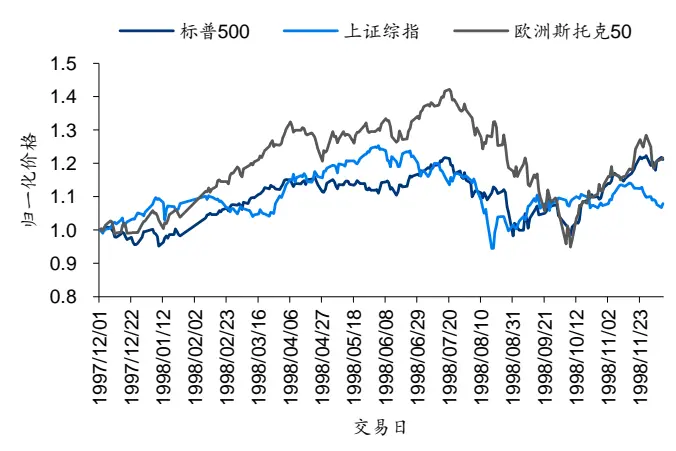
资料来源：Wind，华泰研究

图表20： 相同类型多资产收益率序列：真实样本 2
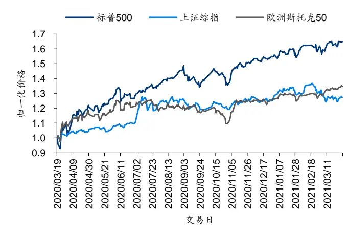
资料来源：Wind，华泰研究

## DCGAN 损失函数与生成序列展示

首先考察 DCGAN 生成器 G 和判别器 D 损失函数值的变化情况，如下图所示。结果显示，G 和 D 的损失函数值都存在一定程度的波动，但 G 和 D 分别在迭代 1000 和 2000 次（训练一个 Batch 为一次迭代）之后基本保持在相对稳定的水平上。

图表21： 相同类型资产 DCGAN损失函数
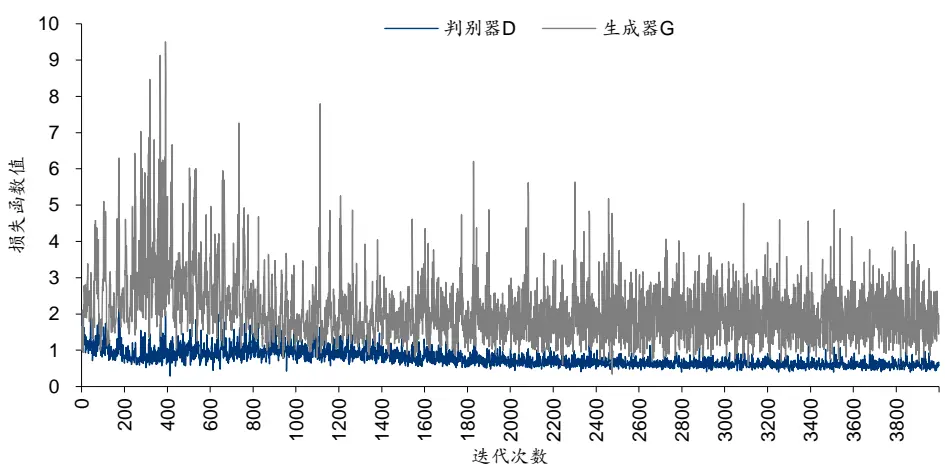
资料来源：Wind，华泰研究

下面两张图展示 DCGAN 随机生成的两组样本，生成的多资产收益率序列已转化为归一化价格序列。直观上看，标普 500 和欧洲斯托克 50 存在强的正相关性，两者和上证综指存在相对弱的正相关性，该现象与真实序列一致。

图表22： 相同类型多资产价格序列：DCGAN生成样本 1
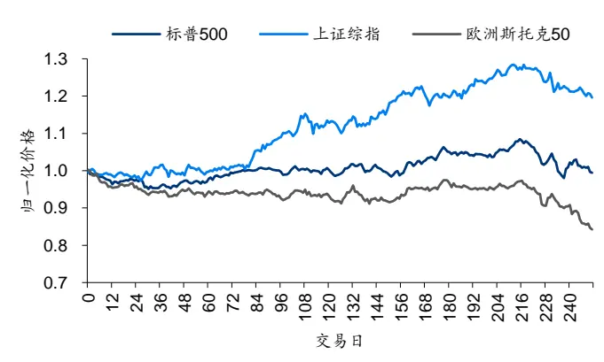
资料来源：Wind，华泰研究

图表23： 相同类型多资产价格序列：DCGAN生成样本 2
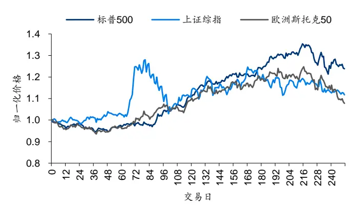
资料来源：Wind，华泰研究

## W-DCGAN 损失函数与生成序列展示

其次考察W-DCGAN生成器G和判别器D损失函数值的变化情况，如下图所示。结果显示，G 和 D的损失函数值在 2500 次迭代后基本保持在相对稳定的水平上。

图表24： 相同类型资产 W-DCGAN损失函数
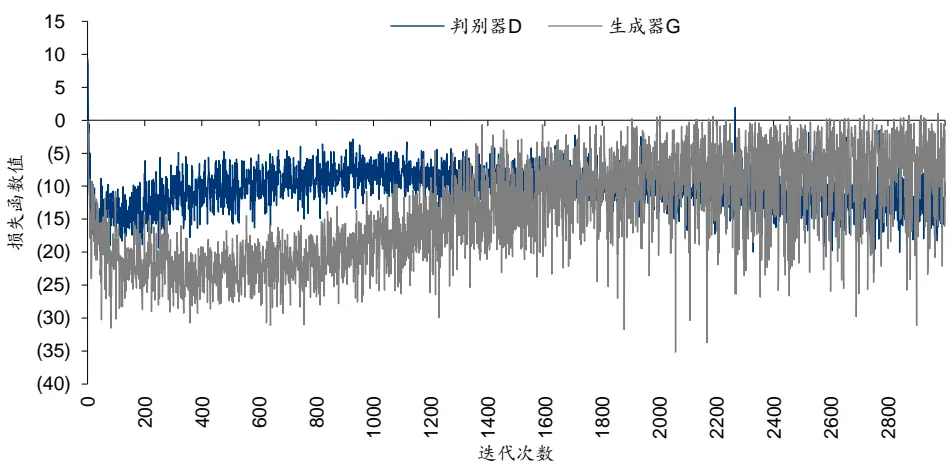
资料来源：Wind，华泰研究

下面两张图展示 W-DCGAN 随机生成的两组样本，生成的多资产收益率序列已转化为归一化价格序列。同样能观察到标普 500 和欧洲斯托克 50 存在强的正相关性，两者和上证综指存在相对弱的正相关性。

图表25： 相同类型多资产价格序列：W-DCGAN生成样本 1
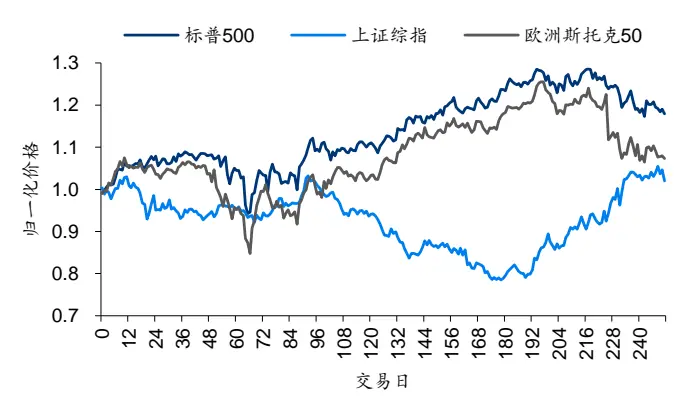
资料来源：Wind，华泰研究

图表26： 相同类型多资产价格序列：W-DCGAN生成样本 2
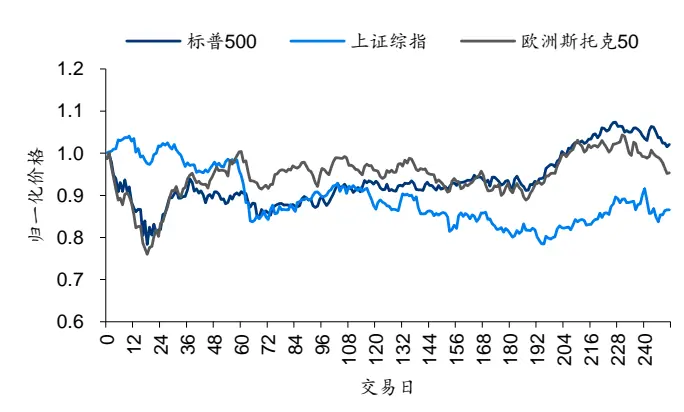
资料来源：Wind，华泰研究

## WGAN 生成序列展示

下面两张图展示WGAN 随机生成的两组样本，生成的多资产收益率序列已转化为归一化价格序列。WGAN 对于多资产收益率序列的生成效果已在前期研究《人工智能 38：WGAN生成：从单资产到多资产》中进行了详细论证，在此不再赘述。需要指出的是，使用W 距离作为损失函数的W-DCGAN和WGAN模型都存在训练时间较长、收敛速度较慢的缺点。

图表27： 相同类型多资产价格序列：WGAN生成样本 1
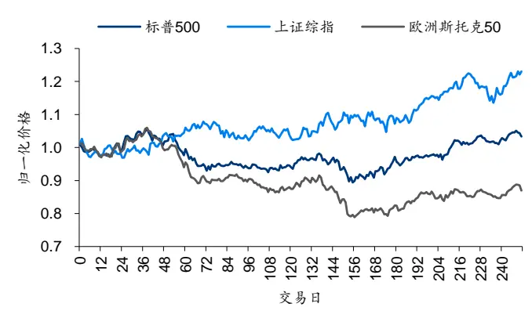
资料来源：Wind，华泰研究

图表28： 相同类型多资产价格序列：WGAN生成样本 2
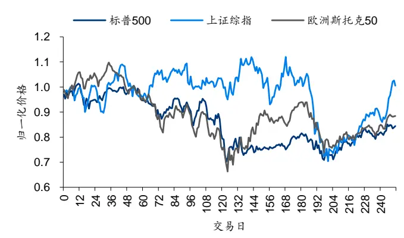
资料来源：Wind，华泰研究

## 评价指标对比

仅从上节展示的价格序列看，很难直观判断生成序列的质量，需结合量化指标对生成序列进行更为细致的评价。下面我们分别从单资产序列和多资产序列两个角度评价和对比生成序列的质量。

## 单资产序列评价指标

分别计算标普 500 指数、上证综指、欧洲斯托克 50 指数的真实序列和生成序列的单资产序列评价指标。本文以上证综指的 9项单资产序列评价指标计算结果为例，分别对真实序列、DCGAN 生成序列、W-DCGAN 生成序列、WGAN 生成序列进行比较分析。

以上证综指为例，真实序列的前 6 项单资产序列评价指标如下图所示。我们依次对真实序列的前 6项评价指标进行分析，并从中提取真实序列的典型化事实：

1. 自相关性：左上子图为收益率 k＝1~120 阶时滞自相关系数，各阶时滞自相关系数接近0，表明真实收益率序列不存在显著的自相关性。

2. 厚尾分布：中上子图为标准化单侧收益率的累积概率分布 P(r>x)，该函数衰减越快，表明分布越接近正态分布；衰减越慢，表明分布越接近厚尾分布。

3. 波动率聚集：右上子图为收益率绝对值序列的k=1~120阶时滞自相关系数，观察可知，上证综指的收益率绝对值序列存在较强的低阶时滞自相关，而高阶自相关性趋于零。

4. 杠杆效应：左下子图展示当前收益率和未来波动率的时滞相关性，观察可知两者低阶负相关，高阶不相关。

5. 粗细波动率相关：中下子图蓝色点线为粗波动率滞后细波动率 k 期的相关系数，橙色点线为±k 阶相关系数的差值，该差值刻画粗细波动率间相互预测能力的差异；橙色点线低阶为负值，表明当前细波动率对未来粗波动率的预测能力更强。

6. 盈亏不对称性：右下子图红点和蓝点分别代表实现累计盈利和亏损超过 10%所需的最少交易日数；红色分布峰值位于蓝色分布峰值右侧，表明涨得慢跌得快。

图表29： 上证综指：真实序列评价指标
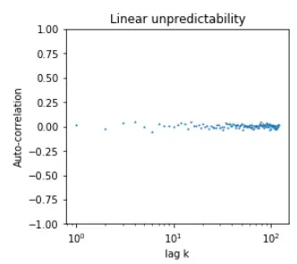

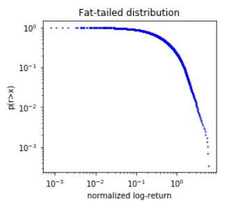

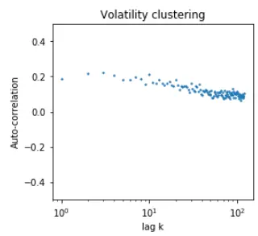

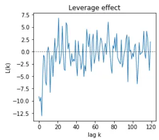
资料来源：Wind，华泰研究

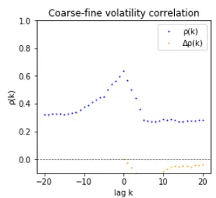

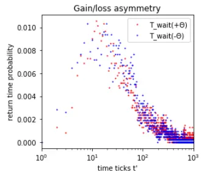

我们使用训练好的 DCGAN随机生成 1000 条多资产收益率序列，从中提取上证综指对应的收益率序列，计算 1000 条序列前 6项单资产序列评价指标并求均值，最终汇总计算结果如下图所示。结果表明，DCGAN 的生成效果不理想，难以准确复现自相关性（左上子图）、杠杆效应（左下子图）和盈亏不对称性（右下子图）。

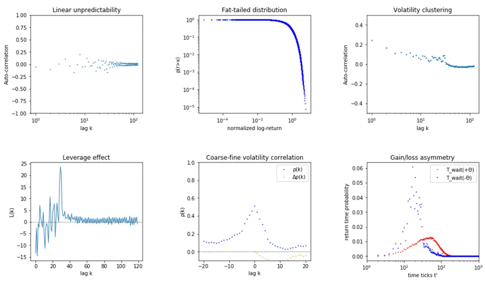
图表30： 上证综指：DCGAN生成序列评价指标
资料来源：Wind，华泰研究

我们使用训练好的 W-DCGAN 随机生成 1000 条多资产收益率序列，从中提取上证综指对应的收益率序列，计算 1000 条序列前 6 项单资产序列评价指标并求均值，最终汇总计算结果如下图所示。结果表明，W-DCGAN 能够较好地复现真实序列的各项典型化事实。

图表31： 上证综指：W-DCGAN生成序列评价指标
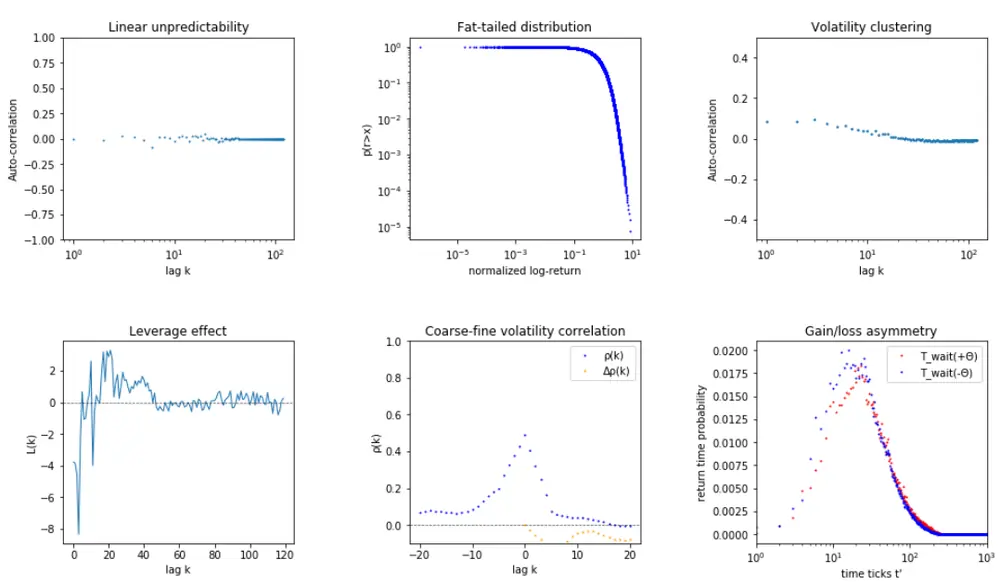
资料来源：Wind，华泰研究

计算 6项单资产序列评价指标的统计量。真实序列和 DCGAN、W-DCGAN 和WGAN 三种生成方法在前 6项评价指标上的表现汇总如下表所示。其中，自相关性方面，DCGAN 生成序列自相关系数波动较大，效果较差；厚尾分布方面，三种生成方法均表现出色；波动率聚集、粗细波动率相关和盈亏不对称性方面，W-DCGAN 比其他方法更接近真实序列；杠杆效应方面，尽量统计量和真实值略有偏差，DCGAN 和 W-DCGAN 生成序列总体复现出了低阶负相关高阶不相关的现象。就前 6 项单资产序列评价指标而言，DCGAN 生成效果不理想，W-DCGAN 生成序列较为“逼真”，且复现效果相比于 WGAN 更接近真实序列。

图表32： 上证综指：真实序列与不同生成方法在单资产序列评价指标上的表现对比

| 评价指标 | 统计量 | 真实序列 | DCGAN | W-DCGAN | WGAN |
| --- | --- | --- | --- | --- | --- |
| 自相关性 | 前10阶自相关系数均值 | 0.11 | 0.09 | 0.10 | 0.10 |
| 厚尾分布 | 拟合幂律衰减系数α | 4.23 | 4.26 | 4.27 | 4.34 |
| 波动率聚集 | 拟合幂律衰减系数β | 0.22 | 1.07 | 0.85 | 0.88 |
| 杠杆效应 | 前 10 阶相关系数均值 | (6.17) | (2.32) | (2.36) | (5.03) |
| 粗细波动率相关 | 滞后±1 阶相关系数之差 | (0.03) | (0.01) | (0.02) | 0.00 |
| 盈亏不对称性 | 盈亏±θ所需天数分布峰值之差 | 4.00 | 35.56 | 3.01 | 9.77 |

资料来源：Wind，华泰研究

下面展示各模型在方差比率检验指标上的表现。图表 33 至 35 中的蓝色虚线表示真实序列各阶方差比率检验统计值，箱线图代表 1000 条生成序列在各阶方差比率检验统计值分布。真实序列表现出短期（阶数 2~10）随机游走，即低阶方差比率检验统计量落在[-1.96，1.96]的范围内；高阶（阶数 50~100）非随机游走，即高阶方差比率检验统计量落在[-1.96，1.96]的范围外。总体来说，DCGAN 、W-DCGAN 与 WGAN 的生成序列都未能完美复现出这一特征，但W-DCGAN 生成序列的方差比检验统计量与真实序列更为接近。

图表33： 上证综指：DCGAN生成序列方差比率检验
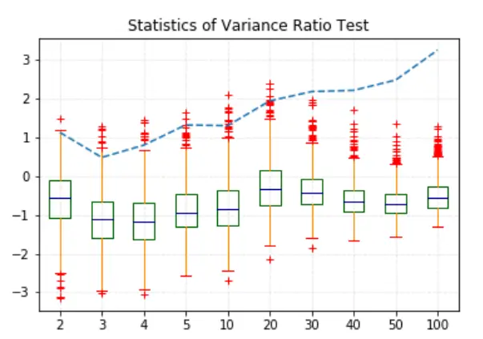
资料来源：Wind，华泰研究

图表34： 上证综指：W-DCGAN 生成序列方差比率检验
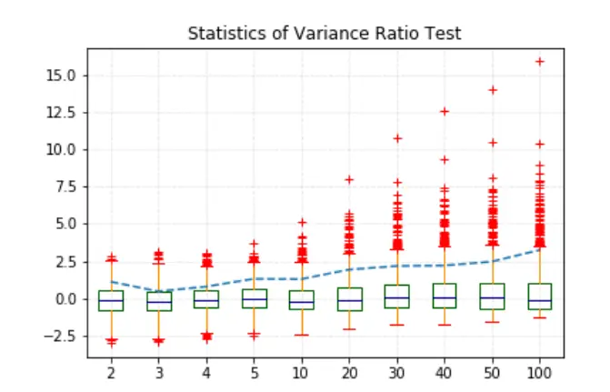
资料来源：Wind，华泰研究

图表35： 上证综指：WGAN序列方差比率检验
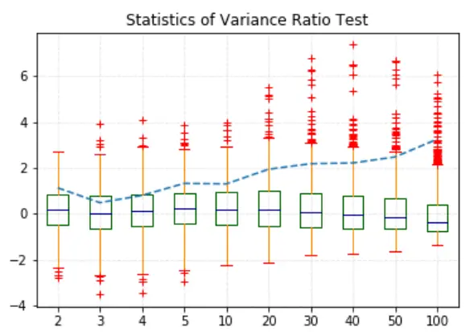
资料来源：Wind，华泰研究

图表36： 上证综指：方差比率检验统计值
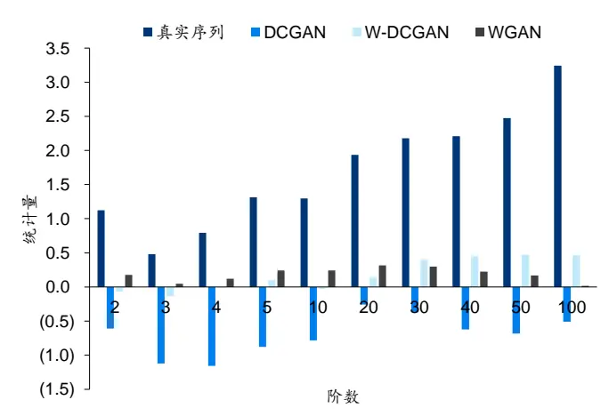
资料来源：Wind，华泰研究

DCGAN、W-DCGAN、WGAN 生成序列的 Hurst 指数值如下图所示。上证综指序列真实Hurst 值为 0.55，表现出弱长时程相关特征。W-DCGAN 生成序列 Hurst 值在[0.53,0.56)区间内频数较高，且有 57.4%的 Hurst 值大于 0.5，很好地体现出了弱长时程相关的特征，并且可以观察到其 Hurst值分布在 DCGAN 生成序列的右侧，和WGAN 接近。

图表37： 上证综指：DCGAN、W-DCGAN 与 WGAN 生成序列 Hurst 指数分布
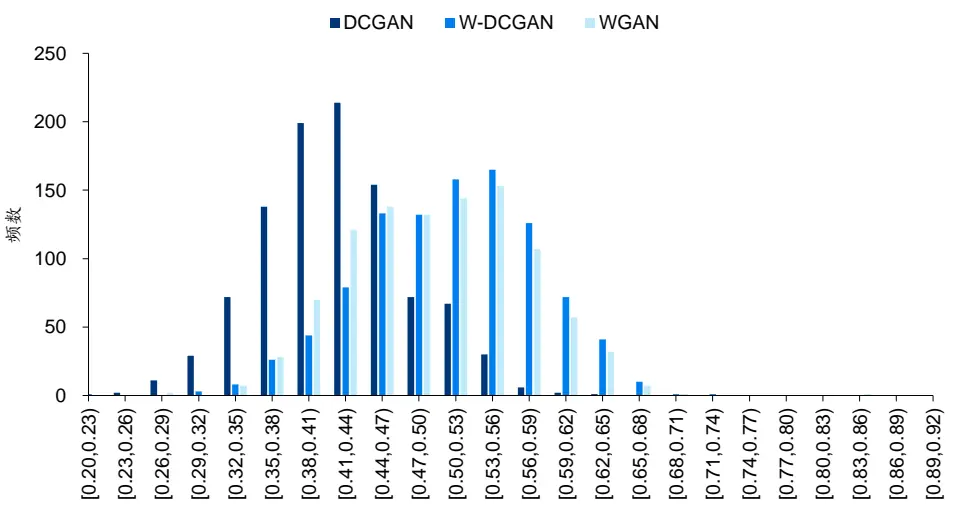
资料来源：Wind，华泰研究

仅根据表现出长时程相关的序列比例判定生成序列是否失真是不够的，这里对生成序列的Hurst值进行假设检验。我们想要验证生成分布在Hurst指标上的总体均值是否显著大于0.5，假设 ${\bf\nabla}_{\mu}$ 表示生成分布在 Hurst指标上的总体均值，则原假设和备择假设为：

$$
H_{0}\colon\mu_{H}>0.5H_{1}\colon\mu_{H}\leq~0.5
$$

生成的 1000 条虚假序列相当于从生成分布总体中的采样，对于这样的大样本检验，我们可以直接使用单样本正态总体均值的单边显著性检验统计量，如下所示：

$$
U=\frac{\sqrt{1000}(\bar{X}-0.5)}{S_{n}}
$$

其中X̅表示 1000 条生成样本 Hurst 指数的样本均值， $S_{n}$ 表示 1000 条生成样本 Hurst指数的样本方差，记 $\{h_{t}\}_{t=1,\ldots,1000}$ 为 1000 条生成序列的 Hurst指标值，即：

$$
\begin{array}{c}{{\bar{X}=\displaystyle\frac{1}{1000}\sum_{t=1}^{1000}h_{t}}}\\{{S_{n}=\displaystyle\frac{1}{999}\sum_{t=1}^{1000}(h_{t}-\bar{X})^{2}}}\end{array}
$$

在大样本（一般来说样本数大于 30）条件下，原假设 $H_{0}$ 成立时 U服从 N(0,1)标准正态分布，因此在 95%置信水平下，U 如果落入(−∞,−1.64]的拒绝域，则拒绝原假设，认为生成样本的 Hurst指数总体均值小于 0.5。

在上述假设检验下，DCGAN、W-DCGAN 与对照组 WGAN 生成的 1000 条序列检验结果如下表所示。W-DCGAN 模型 1000 条生成序列的 Hurst 均值假设检验统计量为 68.78，充分远离拒绝域；DCGAN 模型检验统计量为-712.20，WGAN 模型检验统计量为-5.48，落在拒绝域中，可以认为 DCGAN 和 WGAN 模型的 Hurst 均值小于 0.5。因此仅有 W-DCGAN生成序列复现出了真实序列的长时程相关特性。

图表38： 上证综指：DCGAN、W-DCGAN 与 WGAN生成样本 Hurst值假设检验结果

| 模型 | Hurst 均值 | Hurst 大于 0.5 比例 | 检验统计量U | 是否拒绝原假设 |
| --- | --- | --- | --- | --- |
| DCGAN | 0.42 | 10.60% | (712.20) | 是 |
| W-DCGAN | 0.51 | 57.40% | 68.78 | 否 |
| WGAN | 0.50 | 50.30% | (5.48) | 是 |

资料来源：Wind，华泰研究

为验证生成序列多样性，我们从 DCGAN 模型生成的 1000 条上证综指日频假序列中随机抽取 1000 组配对序列，计算这 1000 组配对序列之间的 DTW 指标，对 W-DCGAN 生成序列也进行同样的操作。两个模型的 DTW 分布如下图所示。整体上看来，W-DCGAN 生成样本序列之间的 DTW 值分布位于 DCGAN 右侧，WGAN 生成样本序列之间的 DTW 值分布位于 W-DCGAN 右侧，这意味着在生成序列的多样性上，WGAN 优于 W-DCGAN 优于 DCGAN。这印证了 W 距离的引入确实从根源上解决了原始 GAN 模型多样性低相似度高且容易模式崩溃的不足。

图表39： 上证综指：DCGAN、W-DCGAN 与 WGAN 生成序列 DTW 分布
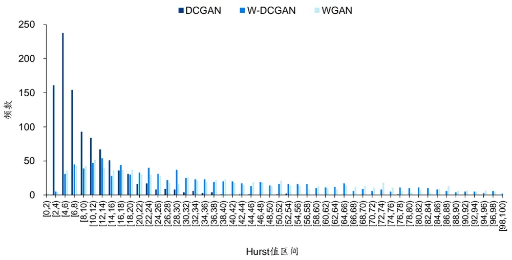
资料来源：Wind，华泰研究

## 多资产序列评价指标

进一步考察两对资产收益率序列——标普 500 和上证综指、标普 500 和欧洲斯托克 50 的多资产序列评价指标。特别地，由于三资产系统自由度为 2，通过两对资产的表现大致能推断第三对资产的表现，因此这里不再展示上证综指和欧洲斯托克 50 的结果。

我们依次对真实序列的各项评价指标进行分析，并从中提取真实序列的典型化事实：

1. 交叉相关性：两图中的左上子图展示两收益率序列的 k＝0~120 阶时滞交叉相关系数。观察可知，标普 500 和欧洲斯托克 50 存在显著的 0阶和 1 阶正相关性，标普 500 和上证综指存在一定 0 阶和 1阶正相关性，体现出全球股票资产的联动性。此外，两对资产之间均不存在显著的更高阶交叉相关性。

2. 波动率相关性：两图中的右上子图分别展示两对资产收益率的绝对值序列之间的交叉相关系数。观察可知，两对资产均存在低阶的波动率正相关性，其中标普 500 与欧洲斯托克 50之间的波动率正相关性更为显著。

3. 交叉杠杆效应：两图中的左下子图展示一种资产当前收益率与另一种资产未来波动率之间的时滞相关性。观察可知，两对资产之间均存在低阶负相关，其中标普 500 与欧洲斯托克 50 之间的负相关更为显著，持续阶数更多。

4. 滚动相关系数分布：两图的右下子图展示两对资产之间滚动相关系数的经验密度估计，黑色虚线标明分布的峰值位置。其中，标普 500 与上证综指的滚动相关系数分布接近对称分布，对称轴略大于 0，说明两者之间存在微弱的正相关关系；而标普 500 与欧洲斯托克 50 的滚动相关系数分布为非对称分布，峰值位于 0.9 附近，说明两者之间存在较强的短期正相关性。从图中还能看到，两资产之间的短期相关关系并不稳定，尤其是标普 500 与上证综指，其短期相关关系正负不定。

5. 极端值相关性：不适合作图，将在后文单独讨论。

图表40： 标普 500 vs 上证综指：真实序列相关性指标
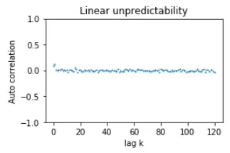

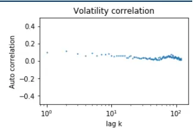
资料来源：Wind，华泰研究

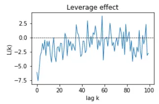

图表41： 标普 500 vs 欧洲斯托克 50：真实序列相关性指标
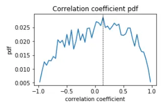

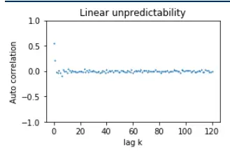

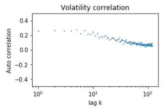

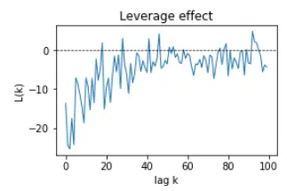
资料来源：Wind，华泰研究

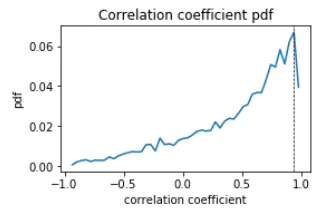

使用训练好的 DCGAN 随机生成 1000 条多资产收益率序列，针对本节考察的两对资产，计算 1000 条序列各项多资产序列评价指标并求均值，最后汇总计算结果，如下面两张图所示。结果表明，DCGAN 不能很好地复现交叉相关性（左上子图），显示出了高阶亦相关的特性；在杠杆效应上（左下子图）亦出现失真；在标普 500 和上证综指的滚动相关系数分布上（右下子图），原本真实序列的弱正相关被错误表现成了弱负相关。

图表42： 标普 500 vs 上证综指：DCGAN 生成序列相关性指标
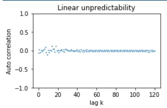

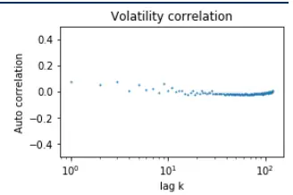
图表43： 标普 500 vs 欧洲斯托克 50：DCGAN生成序列相关性指标
资料来源：Wind，华泰研究

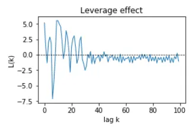

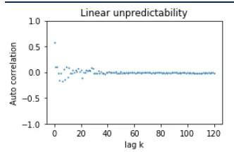

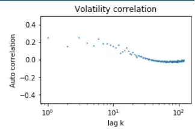

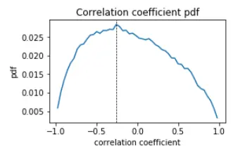

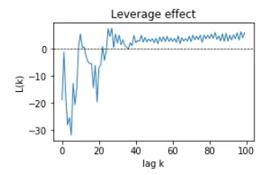
资料来源：Wind，华泰研究

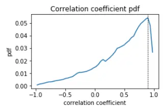

使用训练好的W-DCGAN随机生成1000条多资产收益率序列，针对本节考察的两对资产，计算 1000 条序列各项多资产序列评价指标并求均值，最后汇总计算结果，如下面两张图所示。结果表明，W-DCGAN 能较好复现真实序列的各项典型化事实。

图表44： 标普 500 vs 上证综指：W-DCGAN生成序列相关性指标
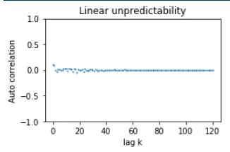

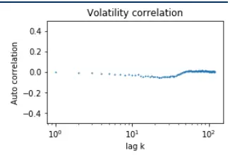

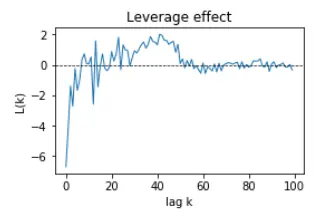
资料来源：Wind，华泰研究


图表45： 标普 500 vs 欧洲斯托克 50：W-DCGAN 生成序列相关性


资料来源：Wind，华泰研究


WGAN结果如下面两张图所示。WGAN在相关性指标上的整体表现较好，接近真实序列。

图表46： 标普 500 vs 上证综指：WGAN生成序列相关性指标


图表47： 标普 500 vs 欧洲斯托克 50：WGAN生成序列相关性指标


资料来源：Wind，华泰研究


资料来源：Wind，华泰研究


计算各项多资产序列评价指标的统计量，真实序列和各种生成方法在各项评价指标上的表现汇总如下面两张表所示。相对于 DCGAN 和 WGAN，W-DCGAN 在各项多资产序列评价指标中的表现均更为优异：

1. 交叉相关性：真实的多资产收益率序列呈现 0 阶和 1阶正相关性、高阶无显著交叉相关性；DCGAN 生成序列高阶存在显著交叉相关性，W-DCGAN 和 WGAN 能较好地复现两个股指间低阶显著正相关、高阶无显著相关的特性。

2. 波动率相关性：真实的多资产收益率序列呈现正的低阶波动率相关性；W-DCGAN能够复现标普 500 与欧洲斯托克 50 的低阶波动率相关性，但未能复现出标普 500 与上证综指的低阶波动率相关性，相比之下 DCGAN 和WGAN表现更好。

3. 交叉杠杆效应：在真实的多资产序列中，一种资产的当前收益率与另一种资产的未来波动率之间存在低阶时滞交叉相关性； DCGAN 复现效果不佳，W-DCGAN和WGAN 均表现较好。

4. 滚动相关系数分布相似度：尽管从经验密度估计图中看到，两种生成方法的结果都比较接近真实序列的结果，然而对真实序列和两种生成方法得到的滚动相关系数分布开展双样本 AD 检验发现，各种生成方法生成的滚动相关系数分布在 5%显著性水平下与真实分布存在差异。不过相较于 DCGAN 和 WGAN，W-DCGAN 的结果具有更小的检验统计量和更大的 p值，表明W-DCGAN 的滚动相关系数分布更接近真实分布。

5. 极端值相关性：标普 500 和欧洲斯托克 50 之间存在显著的极端值相关性；相较于DCGAN 和WGAN，W-DCGAN 能更好地复现真实序列的这一典型化事实。

图表48： 标普 500 vs 上证综指：不同生成方法相关性指标对比

| 评价指标 | 统计量 | 真实序列 | DCGAN | W-DCGAN | WGAN |
| --- | --- | --- | --- | --- | --- |
| 交叉相关性 | 0~10阶时滞交叉相关系数均值 | 0.03 | (0.01) | 0.02 | 0.03 |
| 波动率相关性 | 0~10阶时滞交叉相关系数均值 | 0.09 | 0.04 | (0.02) | 0.02 |
| 交叉杠杆效应 | 前10 阶时滞相关系数均值 | (3.20) | (0.01) | (1.68) | (2.72) |
| 滚动相关系数 | 滚动相关系数 AD 检验统计量 |  | 246.74 | (0.67) | 1.09 |
|  | 滚动相关系数 AD 检验 p 值 |  | 0.00 | 0.25 | 0.12 |
| 极端值相关性 | 极端值条件概率 | 0.00 | 0.00 | 0.03 | 0.01 |

资料来源：Wind，华泰研究
注：滚动相关系数 AD 检验统计量越小，代表生成序列越接近真实序列

图表49： 标普 500 vs 欧洲斯托克 50：不同生成方法相关性指标对比

| 评价指标 | 统计量 | 真实序列 | DCGAN | W-DCGAN | WGAN |
| --- | --- | --- | --- | --- | --- |
| 交叉相关性 | 0~10阶时滞交叉相关系数均值 | 0.06 | 0.03 | 0.06 | 0.06 |
| 波动率相关性 | 0~10阶时滞交叉相关系数均值 | 0.27 | 0.21 | 0.15 | 0.16 |
| 交叉杠杆效应 | 前10 阶时滞相关系数均值 | (14.73) | (17.14) | (7.95) | (9.03) |
| 滚动相关系数 | 滚动相关系数 AD 检验统计量 |  | 53.65 | 33.15 | 40.33 |
|  | 滚动相关系数 AD 检验 p 值 |  | 0.00 | 0.00 | 0.00 |
| 极端值相关性 | 极端值条件概率 | 0.33 | 0.02 | 0.18 | 0.14 |

注：滚动相关系数 AD 检验统计量越小，代表生成序列越接近真实序列
资料来源：Wind，华泰研究

## 总结与展望

本文探讨 GAN 模型的一类重要变式——DCGAN 在生成多资产金融时间序列中的应用。和WGAN针对损失函数改进的思路不同，DCGAN的核心思想是针对网络结构改进原始GAN。DCGAN 使用更灵活的转置卷积层和带步长的卷积层，分别替代 GAN 模型中的上采样层和池化层。同时，DCGAN 取消全连接层，并调整归一化层、激活函数、优化器等网络组件，使生成器和判别器均为全卷积网络结构。

尽管在网络结构上更为合理，DCGAN 并没有解决 GAN 模型的根本缺陷，并且仍需要小心设计训练过程及网络参数，调参难度较大，单纯使用 DCGAN 模型在实践中效果并不理想。本文对 DCGAN 模型做进一步改进，借鉴 WGAN 模型思想，将 W 距离应用于 DCGAN 的损失函数中，构建W-DCGAN 模型。W-DCGAN 不仅拥有 DCGAN 的原本优势，还由于W距离的使用避免了梯度消失和模式崩溃现象。

我们测试各类生成模型在多资产金融时间序列（标普 500、上证综指、欧洲斯托克 50）生成任务中的表现，并采用前期研究构建的 9 项单资产序列指标和 5 项多资产序列指标评价生成质量。结果表明，DCGAN 在自相关性、杠杆效应、盈亏不对称性、多资产交叉相关性等指标上生成效果不佳，W-DCGAN和WGAN均表现较好；W-DCGAN总体而言略胜一筹，在盈亏不对称性、Hurst 指数、多资产滚动相关系数等指标上有显著优势。总的来看，W-DCGAN 模型能较好地复现出真实序列的各项典型化事实。

本文基于真实多资产序列的典型化事实，验证了 W-DCGAN 在生成多资产收益率序列方面的能力。下面问题值得进一步探索：

1. 本文提出的多资产序列评价指标大部分局限于两类资产间。或可设计同时考察 k＞2 类资产收益率的评价指标，如资产协方差矩阵的特征值等，从而对 W-DCGAN 生成能力及局限性有更深入的认知。

2. W-DCGAN 模型的网络结构存在可视化训练中间结果和向量相加的能力，在本研究中并未充分利用。或可更加深入探究W-DCGAN 模型训练过程，揭开 GAN 模型黑箱。

## 参考文献

Arjovsky, M., & Bottou, L. (2017). Towards principled methods for training generative adversarial networks. arXiv preprint arXiv:1701.04862.

Cont, R. (2001). Empirical properties of asset returns: Stylized facts and statistical issues. Quantitative Finance, 1(2), 223–236.

Chakraborti, A. , Toke, I. M. , Patriarca, M. , & Abergel, F. . (2011). Econophysics review: i. empirical facts. Quantitative Finance, 11(7), 991-1012.

Lecun, Y. , & Bottou, L. . (1998). Gradient-based learning applied to document recognition. Proceedings of the IEEE, 86(11), 2278-2324.

Odena, A. , Dumoulin, V. , & Olah, C. . (2016). Deconvolution and checkerboard artifacts. Distill, 1(10).

Radford, A. , Metz, L. , & Chintala, S. . (2015). Unsupervised representation learning with deep convolutional generative adversarial networks. Computer Science.

## 风险提示

DCGAN 和 W-DCGAN 生成虚假序列是对市场规律的探索，不构成任何投资建议。深度学习模型存在过拟合的可能。深度学习模型是对历史规律的总结，如果市场规律发生变化，模型存在失效的可能。

## 免责声明

## 分析师声明

本人，林晓明、李子钰、何康，兹证明本报告所表达的观点准确地反映了分析师对标的证券或发行人的个人意见；彼以往、现在或未来并无就其研究报告所提供的具体建议或所表迖的意见直接或间接收取任何报酬。

## 一般声明及披露

本报告由华泰证券股份有限公司（已具备中国证监会批准的证券投资咨询业务资格，以下简称“本公司”）制作。本报告所载资料是仅供接收人的严格保密资料。本报告仅供本公司及其客户和其关联机构使用。本公司不因接收人收到本报告而视其为客户。

本报告基于本公司认为可靠的、已公开的信息编制，但本公司及其关联机构(以下统称为“华泰”)对该等信息的准确性及完整性不作任何保证。

本报告所载的意见、评估及预测仅反映报告发布当日的观点和判断。在不同时期，华泰可能会发出与本报告所载意见、评估及预测不一致的研究报告。同时，本报告所指的证券或投资标的的价格、价值及投资收入可能会波动。以往表现并不能指引未来，未来回报并不能得到保证，并存在损失本金的可能。华泰不保证本报告所含信息保持在最新状态。华泰对本报告所含信息可在不发出通知的情形下做出修改，投资者应当自行关注相应的更新或修改。

本公司不是 FINRA 的注册会员，其研究分析师亦没有注册为 FINRA 的研究分析师/不具有 FINRA 分析师的注册资格。

华泰力求报告内容客观、公正，但本报告所载的观点、结论和建议仅供参考，不构成购买或出售所述证券的要约或招揽。该等观点、建议并未考虑到个别投资者的具体投资目的、财务状况以及特定需求，在任何时候均不构成对客户私人投资建议。投资者应当充分考虑自身特定状况，并完整理解和使用本报告内容，不应视本报告为做出投资决策的唯一因素。对依据或者使用本报告所造成的一切后果，华泰及作者均不承担任何法律责任。任何形式的分享证券投资收益或者分担证券投资损失的书面或口头承诺均为无效。

除非另行说明，本报告中所引用的关于业绩的数据代表过往表现，过往的业绩表现不应作为日后回报的预示。华泰不承诺也不保证任何预示的回报会得以实现，分析中所做的预测可能是基于相应的假设，任何假设的变化可能会显著影响所预测的回报。

华泰及作者在自身所知情的范围内，与本报告所指的证券或投资标的不存在法律禁止的利害关系。在法律许可的情况下，华泰可能会持有报告中提到的公司所发行的证券头寸并进行交易，为该公司提供投资银行、财务顾问或者金融产品等相关服务或向该公司招揽业务。

华泰的销售人员、交易人员或其他专业人士可能会依据不同假设和标准、采用不同的分析方法而口头或书面发表与本报告意见及建议不一致的市场评论和/或交易观点。华泰没有将此意见及建议向报告所有接收者进行更新的义务。华泰的资产管理部门、自营部门以及其他投资业务部门可能独立做出与本报告中的意见或建议不一致的投资决策。投资者应当考虑到华泰及/或其相关人员可能存在影响本报告观点客观性的潜在利益冲突。投资者请勿将本报告视为投资或其他决定的唯一信赖依据。有关该方面的具体披露请参照本报告尾部。

本报告并非意图发送、发布给在当地法律或监管规则下不允许向其发送、发布的机构或人员，也并非意图发送、发布给因可得到、使用本报告的行为而使华泰违反或受制于当地法律或监管规则的机构或人员。

本报告版权仅为本公司所有。未经本公司书面许可，任何机构或个人不得以翻版、复制、发表、引用或再次分发他人(无论整份或部分)等任何形式侵犯本公司版权。如征得本公司同意进行引用、刊发的，需在允许的范围内使用，并需在使用前获取独立的法律意见，以确定该引用、刊发符合当地适用法规的要求，同时注明出处为“华泰证券研究所”，且不得对本报告进行任何有悖原意的引用、删节和修改。本公司保留追究相关责任的权利。所有本报告中使用的商标、服务标记及标记均为本公司的商标、服务标记及标记。

## 中国香港

本报告由华泰证券股份有限公司制作,在香港由华泰金融控股（香港）有限公司向符合《证券及期货条例》及其附属法律规定的机构投资者和专业投资者的客户进行分发。华泰金融控股（香港）有限公司受香港证券及期货事务监察委员会监管，是华泰国际金融控股有限公司的全资子公司，后者为华泰证券股份有限公司的全资子公司。在香港获得本报告的人员若有任何有关本报告的问题,请与华泰金融控股（香港）有限公司联系。

## 香港-重要监管披露

- 华泰金融控股（香港）有限公司的雇员或其关联人士没有担任本报告中提及的公司或发行人的高级人员。

更多信息请参见下方 “美国-重要监管披露”。

## 美国

在美国本报告由华泰证券（美国）有限公司向符合美国监管规定的机构投资者进行发表与分发。华泰证券（美国）有限公司是美国注册经纪商和美国金融业监管局（FINRA）的注册会员。对于其在美国分发的研究报告，华泰证券（美国）有限公司根据《 年证券交易法》（修订版）第 条规定以及美国证券交易委员会人员解释，对本研究报告内容负责。华泰证券（美国）有限公司联营公司的分析师不具有美国金融监管（FINRA）分析师的注册资格，可能不属于华泰证券（美国）有限公司的关联人员，因此可能不受 FINRA 关于分析师与标的公司沟通、公开露面和所持交易证券的限制。华泰证券（美国）有限公司是华泰国际金融控股有限公司的全资子公司，后者为华泰证券股份有限公司的全资子公司。任何直接从华泰证券（美国）有限公司收到此报告并希望就本报告所述任何证券进行交易的人士，应通过华泰证券（美国）有限公司进行交易。

## 美国-重要监管披露

- 分析师林晓明、李子钰、何康本人及相关人士并不担任本报告所提及的标的证券或发行人的高级人员、董事或顾问。分析师及相关人士与本报告所提及的标的证券或发行人并无任何相关财务利益。本披露中所提及的“相关人士”包括 FINRA 定义下分析师的家庭成员。分析师根据华泰证券的整体收入和盈利能力获得薪酬，包括源自公司投资银行业务的收入。

- 华泰证券股份有限公司、其子公司和/或其联营公司, 及/或不时会以自身或代理形式向客户出售及购买华泰证券研究所覆盖公司的证券/衍生工具，包括股票及债券（包括衍生品）华泰证券研究所覆盖公司的证券/衍生工具，包括股票及债券（包括衍生品）。

- 华泰证券股份有限公司、其子公司和/或其联营公司, 及/或其高级管理层、董事和雇员可能会持有本报告中所提到的任何证券（或任何相关投资）头寸，并可能不时进行增持或减持该证券（或投资）。因此，投资者应该意识到可能存在利益冲突。

## 评级说明

投资评级基于分析师对报告发布日后 6 至 12个月内行业或公司回报潜力（含此期间的股息回报）相对基准表现的预期（A 股市场基准为沪深 300 指数，香港市场基准为恒生指数，美国市场基准为标普 500 指数），具体如下：

## 行业评级

增持：预计行业股票指数超越基准

中性：预计行业股票指数基本与基准持平

减持：预计行业股票指数明显弱于基准

## 公司评级

买入：预计股价超越基准 15%以上

增持：预计股价超越基准 5%~15%

持有：预计股价相对基准波动在-15%~5%之间

卖出：预计股价弱于基准 15%以上

暂停评级：已暂停评级、目标价及预测，以遵守适用法规及/或公司政策

无评级：股票不在常规研究覆盖范围内。投资者不应期待华泰提供该等证券及/或公司相关的持续或补充信息

## 法律实体披露

中国：华泰证券股份有限公司具有中国证监会核准的“证券投资咨询”业务资格，经营许可证编号为：91320000704041011J香港：华泰金融控股（香港）有限公司具有香港证监会核准的“就证券提供意见”业务资格，经营许可证编号为：AOK809美国：华泰证券（美国）有限公司为美国金融业监管局（FINRA）成员，具有在美国开展经纪交易商业务的资格，经营业务许可编号为：CRD#:298809/SEC#:8-70231

## 华泰证券股份有限公司

南京南京市建邺区江东中路228号华泰证券广场1号楼/邮政编码：210019

电话：86 25 83389999/传真：86 25 83387521电子邮件：ht-rd@htsc.com

## 深圳

深圳市福田区益田路5999号基金大厦10楼/邮政编码：518017电话：86 755 82493932/传真：86 755 82492062电子邮件：ht-rd@htsc.com

## 华泰金融控股（香港）有限公司

香港中环皇后大道中 99号中环中心 58楼 5808-12室
电话：+852-3658-6000/传真：+852-2169-0770
电子邮件：research@htsc.com
http://www.htsc.com.hk

## 华泰证券（美国）有限公司

美国纽约哈德逊城市广场 10号 41楼（纽约 10001）
电话：+212-763-8160/传真：+917-725-9702
电子邮件: Huatai@htsc-us.com
http://www.htsc-us.com

©版权所有2021年华泰证券股份有限公司

北京
北京市西城区太平桥大街丰盛胡同28号太平洋保险大厦A座18层/
邮政编码：100032
电话：86 10 63211166/传真：86 10 63211275
电子邮件：ht-rd@htsc.com
上海
上海市浦东新区东方路18号保利广场E栋23楼/邮政编码：200120
电话：86 21 28972098/传真：86 21 28972068
电子邮件：ht-rd@htsc.com