# 人工智能 45：cGAN应用于资产配置

华泰研究

2021 年 4 月 19 日│中国内地

## 深度研究

## 人工智能系列 45：将条件生成对抗网络 cGAN 应用于大类资产配置

本文将生成对抗网络（GAN）的使用场景拓展至投资实践，采用 GAN 的变式条件生成对抗网络（cGAN）预测未来 20 个交易日各类资产收益率协方差矩阵，并应用于量化资产配置。cGAN 的核心思想是将随机数和资产收益率真实历史序列结合，训练条件生成器生成模拟未来序列，再训练条件判别器区分模拟和真实未来序列。重复生成多次进而得到多资产预期收益率协方差矩阵。对沪深 300、中债-国债总财富指数、黄金 9999 三类资产进行资产配置策略实证，自 2012 年初至 2021 年 3 月底，cGAN 相比于传统风险平价模型夏普比率从 1.41 提升至 1.62，Calmar 比率从 0.60 提升至 1.19。

## cGAN 从贝叶斯学派视角重新定义风险，克服了传统方法的不足

资产协方差矩阵是开展风险管理的基础。传统方法基于历史收益率序列计算资产协方差矩阵。其基本思想是适应性预期。然而，历史通常不等于未来。其次，传统方法估计的资产协方差矩阵通常只包含历史序列中的线性成分，而丢弃了其中蕴含的非线性信息，导致评估结果与真实情况发生偏差。针对传统方法的不足，本文使用 cGAN 从贝叶斯学派视角重新定义风险。cGAN基于市场未来隐状态和过去一段时间内的市场规律，预测未来一段时间的收益率后验分布，并根据收益率后验分布计算资产协方差矩阵。

## 条件生成器借鉴自编码器结构，充分利用条件序列蕴含的有效信息

条件生成器借鉴了自编码器的结构，旨在根据条件序列生成预测序列。其中，卷积层能够从条件序列中提取浓缩了资产收益率信息的特征序列，转置卷积层通过对特征序列与随机数序列的拼接序列进行上采样，生成预测序列。考虑到不同资产在不同时期的收益率及其波动差异较大，不利于模型训练，因此在输入条件生成器之前，需要对条件序列进行 3σ 标准化，并且对生成序列使用相同的标准化参数进行反标准化。

## 条件判别器使用 WGAN-GP损失函数，缓解训练不稳定与模式崩溃

条件判别器的主体结构是卷积层，旨在对生成序列的真实性进行评价。为了缓解cGAN在交替训练的过程中可能出现的训练不稳定与模式崩溃等问题，条件判别器使用 WGAN-GP 损失函数，来稳定梯度分布。出于与条件生成器相同的考虑，条件序列以及对照序列或生成序列在输入条件判别器之前均需要进行 3σ 标准化。为了不引入未来函数，三者均应使用条件序列的均值和标准差进行标准化。

## cGAN 优于传统风险平价方法，且在不同因素改变时彰显出鲁棒性

本研究以多资产风险平价组合为例，对比 cGAN 与传统风险平价模型在回测表现上的优劣。选取沪深 300 指数、中债-国债总财富指数、SGE 黄金9999 作为大类资产的代表，采用滚动窗口的方式进行回测。结果表明，改变模型训练代数（分别取 300、400、500、600 代）、训练过程随机数种子（分别取 0 和 1）、生成过程随机数种子（分别取 0和 1）、回测起始日期（延后 10 个交易日）、多资产组成（改为中证 800 指数、标普 500 指数、英国富时 100 指数），cGAN 的表现均优于传统方法，彰显出较高鲁棒性。

风险提示：cGAN 模型的训练结果对随机数种子较为敏感；cGAN 模型换手率较高，而本文回测未考虑交易成本的影响；模型根据历史规律总结，历史规律可能失效；模型结论基于统计工具得到，在极端情形下或存在解释力不足的风险。

研究员

SAC No. S0570516010001

林晓明

linxiaoming@htsc.com

SFC No. BPY421

+86-755-82080134

研究员

SAC No. S0570519110003

李子钰

liziyu@htsc.com

+86-755-23987436

研究员

SAC No. S0570520080004

何康，PhD

hekang@htsc.com

+86-21-28972039

联系人

王晨宇

SAC No. S0570119110038 wangchenyu@htsc.com

+8602138476179

## cGAN 与传统风险平价方法回测结果

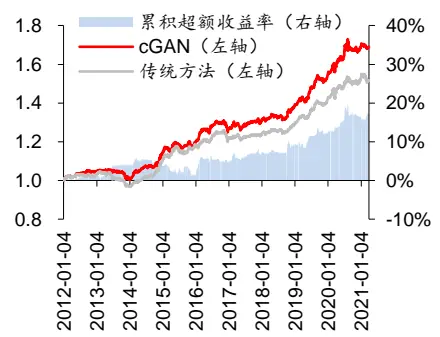
资料来源：Wind，华泰研究

## 研究背景

在华泰金工前期系列研究中，我们介绍了生成对抗网络（Generative Adversarial Network，简称 GAN）的概念及多种变式，使用 GAN 生成金融资产收益率虚假序列，并对生成序列的质量开展评价。结果表明，无论是生成单个资产还是多种资产，相对于 Bootstrap 重采样和 GARCH 模型等金融时间序列生成方法，GAN 生成的序列更为“逼真”。

GAN 的潜在应用场景包括数据增强、检测过拟合等方面，在各种应用场景中，投资者普遍感兴趣的方向是如何使用GAN预测未来指导投资实践。GAN本身不具备预测能力，但GAN的变式条件生成对抗网络（conditional Generative Adversarial Network，简称 cGAN）将监督学习引入 GAN 中，从而使预测成为可能。本文将介绍 cGAN 在投资实践方面的应用，具体而言我们将使用cGAN技术构建大类资产配置策略，并与传统风险平价模型进行对比。

随着市场套利力量的增加和信息技术的飞速发展，市场有效性逐步提升——信息和预期以更快的速度反映在资产价格中，使得预测资产收益变得愈发困难。同时，越来越多的市场参与者开始关注资产收益率的不确定性，即风险。一旦资产在未来某一截面的风险得到合理评估，诸多成熟的框架将成为市场参与者开展风险管理的利器，如 Makowitz模型、风险平价组合模型等。

传统的风险评估方法是采用适应性预期，即基于过去一段时间内的资产价格序列计算投资组合风险度量指标，如方差、在险价值、期望损失等，作为对截面风险的评估结果。然而，传统方法存在三个明显缺陷。首先，适应性预期以历史时间序列的波动代表未来某一时点的截面风险，存在度量维度不一致的问题。其次，由于资本市场瞬息万变，历史通常不等于未来。再次，传统方法估计的风险度量指标通常只包含历史序列中的线性成分，而丢弃了其中蕴含的非线性信息，导致评估结果与真实情况发生偏差。

对此，本文将使用 cGAN 来重新定义风险。cGAN 的基本结构包括条件生成器和条件判别器。条件生成器以过去一段较长时间内的真实序列（下文称条件序列）和随机数序列为输入，生成未来一段较短时间内的虚假序列（下文称生成序列）。其中，条件序列代表历史信息，条件生成器通过一系列线性和非线性运算能够提取出其中蕴含的线性和非线性信息；随机数序列反映资产未来收益率在隐空间中的状态，是风险的重要来源之一。

条件判别器以条件序列以及生成序列或与生成序列同时期的真实序列（下文称对照序列）为输入，评价生成序列与对照序列之间的差异。其中，对照序列起到了监督学习的作用，赋予 cGAN 预测未来的能力。我们将使用训练充分的条件生成器生成若干组虚假序列，并以虚假序列收益率的分布来刻画未来某一时点的截面风险。

本文将以大类资产配置为具体案例，对比传统方法定义的风险与本文重新定义的风险在风险管理中的表现。传统方法对风险的定义与本文对风险的重新定义之间的对比，本质上是频率学派与贝叶斯学派在风险管理上的一次较量。

## 现有风险管理体系回顾

## 常见的风险管理模型：资产协方差矩阵是基础

常见的风险管理工具包括 Makowitz模型和风险平价模型，其最优解分别为市场组合和风险平价组合。下文将简要介绍两者的原理。读者将不难发现，两者都需要事先对资产协方差矩阵进行估计。其中，Makowitz 模型还需要对资产收益率进行预测。不过，预测收益率属于资产定价的范畴，而不属于风险管理的范畴，本文暂时不作讨论。如何合理估计协方差矩阵是本文重点探讨的问题。

## Makowitz 模型

市场组合是这样一种投资组合：给定资产组成，市场组合在不同权重的投资组合中，具有最高的夏普比率（Makowitz, 1959）。记 r为资产收益率向量，Σ为资产协方差矩阵，w为各资产的权重向量，rf为无风险利率。如果我们以方差（或标准差）来度量投资组合的风险，则投资组合的整体收益和风险分别为：

$$
\begin{array}{c}{{r_{p}=w^{\prime}r}}\\{{\sigma_{p}^{2}=w^{\prime}\Sigma w}}\end{array}
$$

投资组合的夏普比率等于：

$$
SR=\frac{r_{p}-r_{f}}{\sigma_{p}}=\frac{w^{\prime}r-r_{f}}{\sqrt{w^{\prime}\Sigma w}}
$$

根据市场组合的定义，市场组合中各资产权重就是以下优化问题的解：

$$
\begin{array}{c}{{\displaystyle\operatorname*{argmax}_{w}\frac{w^{\prime}r-r_{f}}{\sqrt{w^{\prime}\Sigma w}}}}\\{{\displaystyle s.t.\sum_{i=1}^{K}w_{i}=1}}\\{{0\le w_{i}\le1,i=1,2,\ldots,K}}\end{array}
$$

## 风险平价模型

风险平价组合是这样一种投资组合：单个资产对投资组合的整体风险具有相同的风险贡献率。首先，资产 i的边际风险等于投资组合的整体风险对资产 i的权重求偏导：

$$
MRC_{i}=\frac{\partial\sigma_{p}}{\partial w_{i}}=\frac{[\pmb{\Sigma}\pmb{w}]_{i}}{\sigma_{p}}
$$

资产i的风险贡献率等于边际风险乘以资 $\dot{\bar{y}}$ i的权重，再除以投资组合的整体风险：

$$
RC_{i}=\frac{w_{i}*MRC_{i}}{\sigma_{p}}=\frac{w_{i}[\boldsymbol{\Sigma}\boldsymbol{w}]_{i}}{\boldsymbol{w}^{\prime}\boldsymbol{\Sigma}\boldsymbol{w}}
$$

根据风险平价组合的定义，风险平价组合中各资产权重需要满足的条件为：

$$
\frac{w_{i}[\boldsymbol{\Sigma}w]_{i}}{w^{\prime}\Sigma w}=\frac{1}{K},i=1,2,\dots,K
$$

该方程组通常难以求得解析解，因此需要将其转化为以下优化问题：

$$
\begin{array}{c}{\underset{w}{\mathrm{argmin}}\displaystyle\sum_{i}\left(\frac{w_{i}\left[\boldsymbol{\Sigma}\boldsymbol{w}\right]_{i}}{w^{\prime}\boldsymbol{\Sigma}w}-\frac{1}{K}\right)^{2}}\\{s.t.\displaystyle\sum_{i=1}^{K}w_{i}=1,0\leq w_{i}\leq1,i=1,2,\ldots,K}\end{array}
$$

该优化问题可用循环坐标下降（Cyclic Coordinate Descent，简称 CCD）算法求解，详见华泰金工研报《行业轮动系列之七：“华泰周期轮动”基金组合改进版》（2019-05-14）。

## 频率学派视角的风险定义方式：适应性预期

传统方法采用适应性预期来估计资产协方差矩阵，即使用过去一段时间内资产收益率的波动状况来衡量未来某一时点的截面风险（图表 1）。这种做法本质上遵循频率学派的观点。频率学派认为，尽管未来事件存在不确定性，但未来事件所处的空间是客观存在的，尽管这个空间的参数是未知的，但这些参数在一段时期内是固定不变的。对此，频率学派尝试用历史样本的统计规律去估计事件空间的参数，从而来刻画未来事件的不确定性。

虽然适应性预期仍然是目前投资领域的主流方法，但是它存在被人诟病的地方。首先，适应性预期以历史时间序列的波动代表未来某一时点的截面风险，存在度量维度不一致的问题。其次，由于资本市场瞬息万变，历史通常不等于未来。再次，传统方法估计的资产协方差矩阵通常只包含历史序列中的线性成分，而丢弃了其中蕴含的非线性信息，导致评估结果与真实情况发生偏差。虽然已经有研究者提出了更多风险度量指标，如在险价值、期望损失等，并在具体的场景中展示了其相对于方差的优势，但是这些指标的计算仍然依赖协方差矩阵，无法避免上述三个缺陷。

## 贝叶斯学派视角对风险的全新定义：条件生成对抗网络

与频率学派不同，贝叶斯学派认为未来事件所处的空间并非客观存在。具体来说，市场未来运行状态主要由隐空间中的状态 z决定，即先验分布 p(z)，同时受到历史信息 p(x|z)影响，对先验分布作出相应地修正，得到后验分布 p(z|x)。这种思想以数学公式表达，就是贝叶斯公式：

$$
p(\pmb{z}|\pmb{x})\propto p(\pmb{x}|\pmb{z})p(\pmb{z})
$$

著名的蒙提霍尔问题（三门问题）是应用贝叶斯思想解决的典型案例：最初，玩家面对三扇关闭的门，其中一扇门的后面是一辆汽车，另外两扇门后面没有任何奖品。当玩家选定了一扇门（假定是 a 门）之后，主持人将开启剩下两扇门的其中一扇（假定是 c门），里面没有任何奖品。此时玩家面临的问题是：是否应该更换最初的选择，而选择 b门？

从直觉上来看，在剩下的两扇门中选择任何一扇门都有 50%的概率中奖。设在不更换选择（仍然选择 a门）的情况下中奖为事件 A，在更换选择（选择 b门）的情况下中奖为事件 B，根据直觉，玩家的先验分布为 $\mathsf{P}(\mathsf{A})=\mathsf{P}(\mathsf{B})=0.5.$ 。然而，主持人的行为为玩家提供了信息。设主持人为了给玩家展示一扇空门而选择 c 门为事件 C。假设事件 A 发生，那么主持人可以随机在 b 门和 c 门中开一扇向玩家展示，事件 C发生的条件概率 $\mathsf{P}(\mathsf{C}|\mathsf{A}){=}0.5$ ；假设事件B发生，那么主持人只能将 c 门打开，事件 C 发生的条件概率 $\mathsf{P}(\mathsf{C}|\mathsf{B})=1$ o

根据贝叶斯公式可知，如果玩家能够利用主持人提供的信息及时修正先验分布，更换选择，那么中奖的概率将增大：

$$
{\frac{P(B|C)}{P(A|C)}}={\frac{P(C|B)P(B)}{P(C|A)P(A)}}=2
$$

为了将这种思想应用于风险管理，同时将资产价格序列中蕴含的非线性信息体现在对风险的度量中，本文尝试使用 cGAN 来重新定义风险，如图表 1 所示。市场未来运行状态由隐空间中的状态 z决定，z无法预知，因此资产未来收益率存在不确定性，即风险。z的分布即先验分布 p(z)，一般用标准多元正态分布 N(0,I)刻画。

我们基于历史信息，对 z的先验分布进行修正。记条件序列为 $\mathsf{R}_{\mathsf{W}}$ ，代表历史信息；记对照序列为 $\mathsf{RT}_{:}$ ，代表未来信息。我们将两者之间的映射关系记作 ${\sf Rw}^{}{\sf R}\tau$ ，并将这种关系在特定市场状况下的分布（即市场规律）记作 $\mathsf{p}(\mathsf{Rw{\mathrm{-}}R}\tau|z)$ 。以一系列 RW→RT|z 的样本对 cGAN开展半监督学习。通过反向传播算法，得到 z 的后验分布 p(z|RW→RT|)。整个半监督学习的过程可以用贝叶斯公式描述：

$$
p(z|R_{W}R_{T})\propto p(R_{W}R_{T}|z)p(z)
$$

给定一组新的 $\mathsf{R}_{\mathsf{W}}$ ，我们对 $\mathsf{p}(z|\mathsf{Rw}\to\mathsf{R}_{\mathsf{T}})$ 进行随机采样，经过 cGAN 的一系列线性和非线性变换，预测出不同的 $\mathsf{R}\tau$ ，据此可以近似拟合 $\mathsf{R}_{\mathsf{T}}$ 的后验分布。我们可以根据 $\mathsf{R}\tau$ 的后验分布来估计未来时期 T 的资产协方差矩阵。此外，cGAN 基于深度神经网络构建，能够提取出$\mathsf{R}_{\mathsf{W}}$ 中蕴含的非线性信息。综上所述，cGAN 克服了传统方法的三大缺陷。

图表1： 频率学派视角与贝叶斯学派视角下的风险定义对比
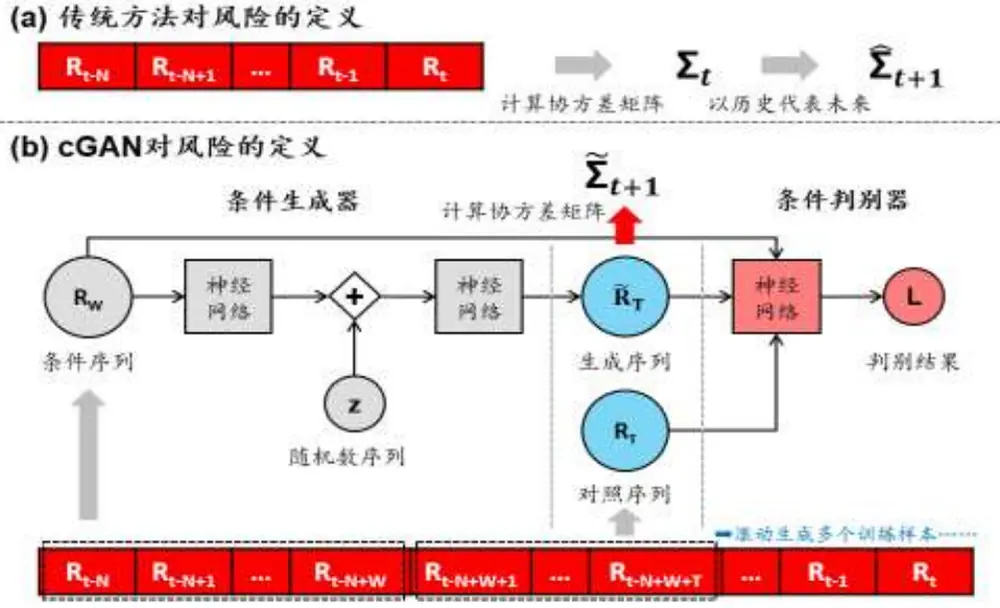
资料来源：华泰研究

## 基于条件生成对抗网络的风险定义

## 条件生成对抗网络的基本结构

cGAN 的基本结构包括条件生成器和条件判别器。cGAN 基本原理与华泰金工研报《人工智能 31：生成对抗网络 GAN 初探》（2020-05-08）介绍的 GAN 相同，即“以子之矛，攻子之盾”。条件生成器的目标是生成尽可能逼真的“赝品”，条件判别器的目标是尽可能将真品和“赝品”区分开，在交替训练的过程中，两者共同进步。

GAN 和 cGAN 的区别在于，除了以随机数为输入之外，cGAN 还需要以条件为输入。条件的作用相当于向模型施加约束，使模型输出满足用户的定制需求，而不再随心所欲。例如，我们训练 GAN 生成人脸，GAN 可以“天马行空”地生成老人、小孩、女人、男人的人脸。而如果我们在训练集中增加人脸对应的“标签”（即条件），那么当我们向训练后的 cGAN输入“女性”的条件时，cGAN 就能够定向生成女性人脸。

接下来，我们将详细介绍用于重新定义风险的 cGAN 的具体实现细节。

## 条件生成器的基本结构及参数

条件生成器网络采用类似于自编码器的结构，如图表 2所示。首先，K个资产长度为W 的条件序列矩阵 M 被排列为长度为 W、通道数为 K 的形式，通过一维卷积层和全连接层的作用，每个资产的特征数均被降维至 6。然后，提取的特征序列与相同长度的随机数序列拼接，使每个资产维度均达到 12。最后，拼接序列通过全连接层和转置卷积层的作用，被升维至长度为 T、通道数为 K的生成序列矩阵 $\widetilde{\mathbf{M}}_{\mathrm{f}^{\circ}}$ 。其中，每一通道代表一种资产的生成序列。转置卷积的概念请参考华泰金工研报《人工智能 44：深度卷积 GAN 实证》（2021-04-13）。

图表2： 条件生成器网络的基本结构
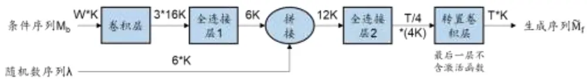
资料来源：PAGAN: Portfolio analysis with generative adversarial networks，华泰研究

上述网络结构最早由 Mariani et al.（2019）提出。我们在借鉴其结构和参数的同时，对其中的实现细节进行了优化，使网络具备更强大的生成能力：

1. 本文采用资产价格对数收益率序列作为输入和输出，而原文采用资产价格序列作为输入和输出。这是考虑到资产价格序列非平稳，可能导致模式学习困难。

2. 本文将每个资产的特征数降维至 6，而原文则将其降维至 1。这是考虑到仅用 1 个特征来表征序列自身及序列之间的统计性质容易丢失过多信息。

3. 我们删去了最后一层转置卷积层的激活函数，而原文则保留 ReLU 激活函数。第一个原因是因为根据上述第一点，本文拟生成资产价格对数收益率序列，其既有正值又有负值。第二个原因是，尽管原文使用 ReLU 是为了保证生成的资产价格序列不出现负值，然而ReLU 不能保证资产价格序列不出现零值。更严重的是，一旦资产价格序列出现大量零值，会使条件生成器梯度消失。从这个意义上来说，取消最后一层转置卷积层的激活函数，反而有利于条件生成器的学习。

条件生成器网络的结构参数详见图表 3。其中，步长为 2 的卷积核能够在提取序列特征时保证时序因果关系，与时间卷积网络（详见附录）有异曲同工之妙。需要注意的是，无论是时间序列维度还是截面维度，资产的收益率和波动率均可能存在较大差异，易造成训练过程中梯度剧烈变化，导致模型收敛困难。对此，在训练之前，我们还需要对输入数据进行标准化，具体做法是采用 3σ 标准化。对于每一种资产的对数收益率序列 x，我们首先对其减去均值，然后除以三倍标准差，使绝大部分数值在-1和 1 之间；相应地，对于生成序列ỹ ，我们再使用条件序列的均值和标准差对其进行反标准化：

$$
x_{t}\frac{x_{t}-\bar{x}_{t}}{3\sigma(x_{t})}
$$

$$
\tilde{y}_{t}3\tilde{y}_{t}\sigma(x_{t})+\bar{x}_{t}
$$

图表3： 条件生成器网络结构参数说明

| 组件名称 | 组件细节 | 组件功能 |
| --- | --- | --- |
| 条件序列 随机数序列 | 为适应一维卷积，需排列为长度为W、通道数等于资产数量K 为每个资产赋予6个随机数，独立同分布于标准正态分布 | 向 cGAN 施加约束条件 反映市场在隐空间中的状态 |
| 卷积层 | 含大小为5、步长为2的一维卷积核4层，批标准化，输出通道数分别为2K、 | 多资产对数收益率序列特征提取 |
| 全连接层1 | 4K、8K、16K，激活函数为LeakyReLU(0.2) 1层，需首先将卷积层的输出压平，输入大小为48K，输出大小为6K，激活函 数为 LeakyReLU(0.2) |  |
| 全连接层2 | 1层，输入大小为12K，输出大小为T*K，为适应一维转置卷积，需要将输出的多资产对数收益率序列生成 |  |
| 转置卷积层 | 形状调整为长度为 T/4、通道数为 4K的序列，激活函数为 LeakyReLU(0.2) 含大小为4、步长为2的一维转置卷积核2层，不开展批标准化；第一层输出 |  |

资料来源：华泰研究

## 条件判别器的基本结构及参数

条件判别器网络的结构与前期报告提出的结构相似，如图表 4 所示。条件序列与对照序列或生成序列拼接，并且被排列为长度为W+T、通道数为 K的形式，依次通过一维卷积层和全连接层的作用，得到判别值。判别值越大，表明条件判别器认为输入序列越“逼真”。条件判别器网络的结构参数详见图表 5。

图表4： 条件判别器网络的基本结构
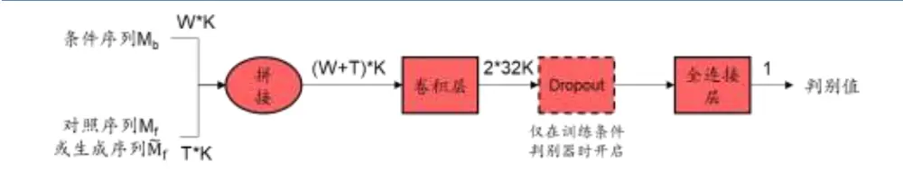
资料来源：PAGAN: Portfolio analysis with generative adversarial networks，华泰研究

出于与条件生成器相同的考虑，条件序列、对照序列、生成序列在输入条件判别器之前均需进行 3σ 标准化。为了不引入未来函数，三者均应使用条件序列的均值和标准差进行标准化。需要强调的是，在训练条件判别器的过程中，为了提高条件判别器的鲁棒性，防止其过拟合，我们对卷积层的输出进行 Dropout；而在训练条件生成器的过程中，为了充分发挥条件判别器识别真伪的能力，Dropout 被关闭。

图表5： 条件判别器网络结构参数说明

| 组成元件 | 组件细节 | 组件功能 |
| --- | --- | --- |
| 卷积层 | 含大小为5、步长为2的一维卷积核5层，不开展批标准化，输出通道数分别多资产对数收益率序列特征提取 为 2K、4K、8K、16K、32K，激活函数为LeakyReLU(0.2) |  |
| Dropout | 只在训练条件判别器的过程中开启，丢弃概率等于0.5 | 防止条件判别器过拟合 |
| 全连接层 | 共2层，第一层输入大小为64K，输出大小为32，激活函数为LeakyReLU(0.2)；基于提取的特征判断序列真伪 |  |
|  | 第二层输入大小为32，输出大小为1，没有激活函数 |  |

资料来源：华泰研究

## 损失函数的定义与训练模式

cGAN 的训练过程与普通的 GAN 相同，即条件判别器和条件生成器的训练交替进行。原始GAN存在训练不稳定、模式崩溃等问题（Goodfellow et al.，2014），对此本文采用WGAN-GP中使用的损失函数（Gulrajani et al.，2017）。WGAN-GP 在华泰金工前期研报《人工智能35：WGAN 应用于金融时间序列生成》（2020-08-28）已有介绍。记 G为条件生成器函数，是随机数序列的函数，输出生成序列；D为条件生成器函数，以对照序列或者生成序列为输入，输出判别值；p(z)为随机数序列先验概率密度分布；p(data)为真实序列的概率密度分布。条件生成器的目标是“欺骗”条件判别器，“想方设法”让条件判别器给予生成序列尽可能大的判别值。对于小批次训练来说，条件生成器的目标等于最大化期望判别值，如下式所示：

$$
\operatorname*{max}_{G}\mathbb{E}_{z\sim p(z)}\big[D\big(G(z)\big)\big]
$$

条件判别器的目标是尽可能地区分对照序列和生成序列，给予对照序列尽可能大的判别值，给予生成序列尽可能小的判别值，等价于最大化对照序列判别值和生成序列判别值之差，即 Wasserstein 距离（Arjovsky et al., 2017）。这便是 WGAN 中“W”的来源。此外，为了获得稳定的梯度分布，WGAN-GP 进一步在 Wasserstein 距离的基础上增加了梯度惩罚项。梯度惩罚项基于判别值对输入序列的平均梯度构建，旨在将梯度大小控制在一定范围内，既不会导致梯度爆炸，也不会导致梯度消失，其中，ϵ~U(0,1)。至此，对于小批次训练来说，条件判别器的目标可用下式表达：

$$
\operatorname*{max}_{D}\mathbb{E}_{\boldsymbol{x}\sim p(data)}[D(\boldsymbol{x})]-\mathbb{E}_{\boldsymbol{z}\sim p(\boldsymbol{z})}\big[D\big(G(\boldsymbol{z})\big)\big]-\lambda\mathbb{E}_{\boldsymbol{\overline{{x}}}\sim p(\boldsymbol{\epsilon}data+(1-\boldsymbol{\epsilon})G(\boldsymbol{z}))}[\|\nabla_{\boldsymbol{\bar{x}}}D(\boldsymbol{\overline{{x}}})\|_{2}-1]^{2}
$$

在使用 pytorch 等深度学习框架对其进行训练时，由于优化器默认使用随机梯度下降算法开展损失函数的最小化，因此相关的损失函数需要取相反数。需要注意的是，条件判别器不能使用批标准化，一方面是因为条件判别器需要独立评价每个样本的真实性，另一方面是因为 WGAN-GP 对小批次中的每个样本独立地施加梯度惩罚，而批标准化会引入样本之间的相互依赖关系。其它训练参数详见图表 6。

图表6： cGAN训练参数说明

| 训练参数 | 取值 |
| --- | --- |
| 条件序列长度W | 40 |
| 生成序列或对照序列长度T | 20 |
| 条件生成器优化器 | Adam |
| 条件生成器学习速率 | 2×10-5 |
| 条件判别器优化器 | Adam |
| 条件判别器学习速率 | 5×10-5 |
| 小批次规模 | 32 |
| 每代训练 G 和 D 训练次数比 | 1:1 |
| 训练平台 | Python3.7+CUDA10.0+pytorch1.1.0 |

资料来源：华泰研究

## 资产协方差矩阵预测

为了预测资产协方差矩阵，我们首先对随机数序列空间进行随机采样，得到 n 组随机数序列，输入经过充分训练的条件生成器，随机生成 n组长度为 T 的资产价格对数收益率序列。然后，我们将反标准化后的对数收益率序列转换为 T 日收益率：

$$
R_{T}=e^{\sum_{t=1}^{T}[log(P_{t})-log(P_{t-1})]}-1
$$

对于资产 k，我们可以计算 n 个 T 日收益率的预测值 $\{R_{k}^{1},R_{k}^{2},\dots,R_{k}^{n}\}$ ，该结果近似代表了资产 k 未来 T 日收益率的后验分布 $\widetilde{R}_{k}.$ 。最后，基于各资产的 T 日收益率后验分布，容易估计未来 T 日的资产协方差矩阵：

$$
\widetilde{\pmb{\Sigma}}_{T}=\left[\begin{array}{cccc}{var(\widetilde{R}_{1})}&{cov\big(\widetilde{R}_{1},\widetilde{R}_{2}\big)}&{\cdots}&{cov\big(\widetilde{R}_{1},\widetilde{R}_{K}\big)}\\{cov\big(\widetilde{R}_{2},\widetilde{R}_{1}\big)}&{var(\widetilde{R}_{2})}&{\cdots}&{cov\big(\widetilde{R}_{2},\widetilde{R}_{K}\big)}\\{\vdots}&{\vdots}&{\ddots}&{\vdots}\\{cov\big(\widetilde{R}_{K},\widetilde{R}_{1}\big)}&{cov\big(\widetilde{R}_{K},\widetilde{R}_{2}\big)}&{\cdots}&{var(\widetilde{R}_{K})}\end{array}\right]
$$

## 随机数序列的生成

使 $\widetilde{R}_{k}$ 尽可能接近真实的 T 日收益率后验分布的前提是，在随机数序列的先验空间进行随机采样时，要尽可能使样本均匀分布在整个概率空间[0,1]6K。然而，蒙特卡洛采样的结果容易受随机数种子的影响，当 n 不是非常大时，采样结果的均匀性可能并是不特别理想，将导致重复实验的结果产生较大差异。

自然而然能想到的一种解决方式是网格采样法，具体做法是：首先对概率空间的每一维度进行 s 等分，从而将整个 d 维概率空间划分为了 sd个边长为 1/s 的超立方体，然后再对每个超立方体进行蒙特卡洛采样，最终将得到 sd 组样本。不难理解，s 越大，概率空间被划分得越细，采样结果越接近真实分布。但是，这种做法面临“维度的诅咒”。以三资产场景为例，输入条件生成器的随机数高达 18 维，即使对每一维度只进行二等分，采样次数也将高达 $2^{18}{\approx}3\times10^{5}$ ，更何况二等分无法保证采样均匀性。因此，由于采样效率限制，网格采样只适合低维简单的应用场景。

对此，本文使用一种更高效的随机采样方法——拉丁超立方采样来估计资产协方差矩阵。与网格采样相同的是，拉丁超立方采样同样需要对概率空间的每一维度进行 s 等分；与网格采样不同的是，拉丁超立方采样并不对每个超立方体都进行蒙特卡洛采样，而是只对其中 s 个超立方体进行采样，且采样的结果需满足类似“数独”的规则，即正交于任何轴的任一超平面最多只有一个样本，从而将采样复杂度从 O(sd)降低至 O(s)。

拉丁超立方采样在二维（拉丁方阵采样）和三维（拉丁立方采样）情况下的示意图如图表7 所示：对于二维概率空间而言，任意行或任意列最多只能有一个样本；对于三维概率空间而言，任意平面最多只能有一个样本。最后，选择不同的随机数种子重复上述过程 M 次，就能够得到比较均匀的采样结果。仍然以三资产场景为例，我们可以对概率空间的每一维度进行 20 等分，并重复采样过程 50 次，即只需 1000 次采样，我们就可以得到均匀性较好的样本。我们将在接下来的实证研究中见证拉丁超立方采样的“威力”。

需要注意的是，网格采样和拉丁超立方采样都是对概率空间而非随机数的概率分布进行采样，采样的结果是概率 p 值。所以，如果原始分布不是标准均匀分布的话，我们还需要通过累积概率分布的逆函数将 p 值转化为随机数的实际值 z。

图表7： 拉丁超立方采样在二维和三维情况下的示意图
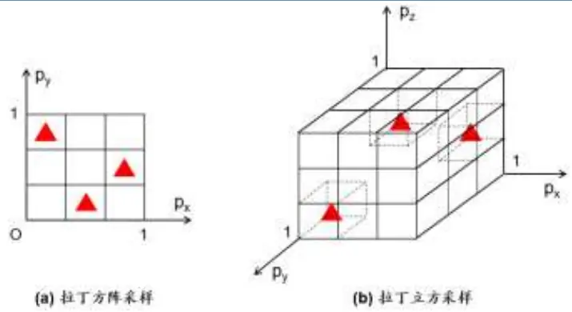
资料来源：华泰研究

## 生成序列质量评价指标体系

为了评价 cGAN 定义的风险是否合理，本文将从两个角度考察：

1) 其回测表现是否优于传统方法定义的风险；

2) 生成序列与真实序列的相关统计性质是否接近。

其中，回测方案将在下一部分结合实证案例介绍。本节着重介绍生成序列质量评价指标体系。华泰金工研报《人工智能 31：生成对抗网络 GAN 初探》（2020-05-08）构建了自相关性、厚尾分布、波动率聚集、杠杆效应、粗细波动率相关、盈亏不对称性等 6 项指标评价GAN（仅以随机数序列为输入）生成的单资产序列的质量。不过，对于 cGAN 生成的多资产序列，我们不能直接将上述 6 项指标迁移至本文。

首先，后文将尝试论证，随机数序列 z 的分布，在某种程度上刻画了市场未来所处的隐状态。如果对 z 的分布随机采样，得到一种利好或利空某一资产的隐状态，那么由于其恒作用于整个考察区间内生成序列的预测过程，将可能使得预测得到的生成序列呈现持续上涨或持续下跌的趋势。换句话说，在 cGAN 的生成序列中，除了条件序列，随机数序列对资产价格的涨跌走势也将起到至关重要的作用。在这种情况下，杠杆效应、盈亏不对称性等与资产价格涨跌有关的指标便不再适用于本研究了。

同时，本研究更关注风险，所以本文的评价指标体系在前期报告的基础上，增加了衡量资产收益率波动和多资产相关关系的指标，详见图表 8。从多样性的角度来说，不同随机数序列生成的虚假序列的评价指标应具有一定的差异性；从真实性的角度来说，真实序列的评价指标应在 n组生成序列评价指标构成的区间内，且尽可能地接近区间均值。

图表8： 生成序列评价指标

| 指标类型 | 评价指标 | 计算方法 | 真实序列特点 |
| --- | --- | --- | --- |
| 单资产指标 | 自相关性 | 收益率序列滞后1~5阶自相关系数的均值 | 若不考虑收益再投资，该指标接近0 |
|  | 偏自相关性 | 收益率序列滞后1~5阶偏自相关系数的均值 | 若不考虑收益再投资，该指标接近0 |
|  | 非正态性 | 收益率序列的 Jarque-Bera 统计量的 p 值 | 该指标接近0 |
|  | 平均波动率 | 20日滚动窗口收益率标准差分布的中位数 | 该指标排序：权益类>债券类 |
|  | 波动率聚集 | 收益率绝对值序列1~k阶自相关系数关于k的指数衰减系数 | 介于 0.1 和 0.5 之间 |
|  | 粗细波动率相关 | 周频收益率绝对值和单周日频收益率绝对值之和滞后±5阶相关系数之差 | 一般小于0 |
| 两资产指标 | 平均交叉相关性 | 收益率序列相关系数和1期时滞交叉相关系数的均值 | 若不存在长期相关关系，该指标接近0 |
|  | 相关关系不稳定性 | 20日滚动窗口相关系数分布的四分位距 | 若两资产的相关关系不稳定，该指标大于0 |

资料来源：华泰研究

## 自相关性

记资产日收益率序列为 r，其均值和标准差分别为 μ和 σ。自相关性指标用滞后 1~k 阶（建议k 取奇数，本研究取 5）的自相关系数的均值定义：

$$
\rho_{s}=\frac{E[(r_{t}-\mu)(r_{t+s}-\mu)]}{\sigma^{2}}
$$

$$
AC=\frac{1}{k}\sum_{s=1}^{k}\rho_{s}
$$

自相关性衡量了收益率序列是否存在自回归（Autoregressive, AR）的成分。如果收益率序列存在 AR 的成分，那么自相关系数将随着滞后阶数的增加呈现拖尾的特征，使自相关性指标显著不为 0。在弱有效市场中，如果不考虑资产收益的再投资，那么收益率序列不存在自相关，该指标接近 0；如果考虑收益的再投资，那么该指标应大于 0。

## 偏自相关性

偏自相关性指标用滞后 1~k 阶（建议k 取奇数，本研究取 5）的偏自相关系数的均值定义：

$$
\varphi_{11}=\rho_{1}
$$

$$
\varphi_{22}=\frac{\rho_{2}-\rho_{1}^{2}}{1-\rho_{1}^{2}}
$$

$$
\varphi_{sj}=\varphi_{s-1,j}-\varphi_{ss}\varphi_{s-1,j-1}
$$

$$
\varphi_{ss}=\frac{\rho_{s}-\sum_{j=1}^{s-1}\varphi_{s-1,j}\rho_{s-j}}{1-\sum_{j=1}^{s-1}\varphi_{s-1,j}\rho_{j}}
$$

$$
PAC=\frac{1}{k}\sum_{s=1}^{k}\varphi_{ss}
$$

偏自相关系数 $\varphi\mathsf{ss}$ 评价了 rt和 $\mathsf{r}_{\mathsf{t+S}}$ 在排除了 $\mathsf{r}_{\mathsf{t}+\mathsf{1}}$ 至 rt+s-1影响后的相关性。偏自相关性衡量了收益率序列是否存在滑动平均（Moving Average, MA）的成分。如果收益率序列存在 MA的成分，那么偏自相关系数将随着滞后阶数的增加呈现拖尾的特征，使偏自相关性指标显著不为 $0_{\circ}$ 在弱有效市场中，如果不考虑资产收益的再投资，那么收益率序列不存在偏自相关，该指标接近 0；如果考虑收益的再投资，那么该指标应大于 0。

## 非正态性

对于真实序列而言，资产收益率通常不服从正态分布，一是呈现厚尾，二是呈现右偏，这是因为“黑天鹅”事件发生的频率更高。不过，由于随机数序列出现重大利好环境和出现重大利空环境的概率是相等的，因此我们对生成序列的要求从右偏放宽到有偏。其中，厚尾可用峰度（kurtosis）评价，有偏可用偏度（skewness）评价。Jarque-Bera统计量同时考虑了峰度和偏度，我们据此构建非正态性指标。首先，偏度和峰度计算公式如下：

$$
\begin{array}{l}{Skew=\displaystyle\frac{E[(r_{t}-\mu)^{3}]}{\sigma^{3}}}\\{Kurt=\displaystyle\frac{E[(r_{t}-\mu)^{4}]}{\sigma^{4}}}\end{array}
$$

Jarque-Bera统计量基于偏度和峰度计算：

$$
JB=N\left[\frac{Skew^{2}}{6}+\frac{(Kurt-3)^{2}}{24}\right]
$$

Jarque-Bera 统计量渐进服从自由度为 2的卡方分布。据此，进一步将其转化为 p 值，作为非正态性指标。Jarque-Bera 检验的零假设为样本来自于正态总体。因此，如果一个收益率序列有偏且厚尾，那么其 Jarque-Bera 统计量的 p 值应低于显著性水平。实证检验表明，真实收益率序列的 p值接近 0。

$$
p_{JB}=(\chi^{2})^{-1}(JB,2)
$$

## 平均波动率

取窗口宽度等于生成序列长度 T，移动步长取 1，将移动窗口作用于全收益率序列，得到一系列长度为 T 的收益率子序列，并计算各子序列的标准差：

$$
vol_{t}=std([r_{t-T+1},r_{t-T+2},\ldots,r_{t}])
$$

平均波动率指标等于 vol 的中位数，衡量了资产收益率在较长时期内的平均波动水平：

$$
\overline{{vol}}=median(vol_{t})
$$

实证检验表明，权益类资产的平均波动率一般大于债权类资产的平均波动率。

## 波动率聚集

真实收益率序列存在波动率聚集现象——存在短时程的自相关性。以收益率绝对值表征波动，若波动率存在短时程自相关和长时程不相关，则收益率绝对值的自相关系数应随着滞后阶数 k 的提升而衰减，一般以幂律衰减刻画：

$$
AC(|r_{t}|,|r_{t+k}|)\propto k^{-\beta}
$$

拟合得到的 β 就是波动率聚集指标，对于真实序列而言，一般介于 0.1和 0.5 之间。

## 粗细波动率相关

定义过去 5 个交易日的区间收益率（即周收益率）的绝对值为粗波动率，定义过去 5 个交易日的日收益率绝对值之和为细波动率，粗细波动率相关指标使用粗波动率领先细波动率 5阶（可视作一周）的相关系数以及粗波动率滞后细波动率 5 阶的相关系数之差定义：

$$
v_{c}^{\tau}(t)=\left|et{}{'}\sum_{i=1}r_{t-i}\right|
$$

$$
v_{f}^{\tau}(t)=\sum_{i=1}^{\tau}|r_{t-i}|
$$

$$
\Delta\rho_{cf}^{\tau}(t)=AC\left(v_{c}^{\tau}(t),v_{f}^{\tau}(t+5)\right)-AC\left(v_{c}^{\tau}(t+5),v_{f}^{\tau}(t)\right)
$$

细波动率含有信息量较多，粗波动率含有信息量较少。理论上说，当前细波动率对未来粗波动率的预测能力，应当优于当前粗波动率对未来细波动率的预测能力。换言之，滞后±5阶的相关系数是不对称的。对于真实序列而言， $\Delta\rho_{cf}^{\tau}$ (t)一般小于0。

## 平均交叉相关性

平均交叉相关性是单资产自相关性在两资产场景下的推广，衡量了一段较长时期内两种资产的平均相关关系。我们首先两种资产收益率序列的相关系数：

$$
corr_{-}0_{ij}=\frac{E\big[(r_{i}^{t}-\mu_{i})\big(r_{j}^{t}-\mu_{j}\big)\big]}{\sigma_{i}\sigma_{j}}
$$

然后，考虑到两资产之间可能存在资产 i影响资产j 的价格走势或者资产j影响资产 i的价格走势的关系，我们仿照单资产滞后 k 阶自相关系数的计算方式，计算两种资产收益率序列的 k 期时滞交叉相关系数：

$$
corr_{-}k_{ij}=\frac{E\big[\big(r_{i}^{t+k}-\mu_{i}\big)\big(r_{j}^{t}-\mu_{j}\big)\big]}{\sigma_{i}\sigma_{j}}
$$

$$
corr\_k_{ji}=\frac{E\big[(r_{i}^{t}-\mu_{i})\big(r_{j}^{t+k}-\mu_{j}\big)\big]}{\sigma_{i}\sigma_{j}}
$$

$$
\overline{{corr\_k}}_{ij}=\frac{corr\_k_{ij}+corr\_k_{ji}}{2}
$$

平均交叉相关性指标用相关系数和 k 期时滞交叉相关系数（本研究取 k=1）定义：

$$
\overline{{corr}}_{ij}=\frac{corr_{-}0_{ij}+\sum_{s=1}^{k}\overline{{corr_{-}k}}_{ij}}{k+1}
$$

如果平均交叉相关性指标显著大于 0，表明两种资产的收益率序列长期呈现正相关关系；如果平均交叉相关性指标显著小于 0，表明两种资产的收益率序列长期呈现负相关关系；如果平均交叉相关性指标接近 0，表明两种资产的收益率序列不存在长期相关关系。

## 相关关系不稳定性

由于越来越多的统计套利者参与市场交易，多资产之间很难维持较长时间的固定相关关系。尤其是在大类资产配置领域，股票、债券、商品之间的相关关系时常会出现相关关系强弱变化、正负反转的现象。前期研报《人工智能 38：WGAN 生成：从单资产到多资产》（2020-11-23）已经通过绘制相关系数分布，揭示了这种现象的普遍性。对此，本研究进一步使用相关系数分布的四分位距（75%分位数和 25%分位数之差），设计了相关关系不稳定性指标，来衡量上述现象。

为了获得相关系数分布，我们采用与计算平均波动率指标相似的方式。取窗口宽度等于生成序列长度 T，移动步长取 1，将移动窗口分别作用于资产 i 和资产 j 的全收益率序列，得到一系列长度为 T 的收益率子序列，我们依次计算每一个移动窗口内两资产收益率子序列的相关系数，从而得到相关系数分布：

$$
corr_{-}0_{ij}^{t}=\frac{E\big[(r_{i}^{t}-\mu_{i}^{t})\big(r_{j}^{t}-\mu_{j}^{t}\big)\big]}{\sigma_{i}^{t}\sigma_{j}^{t}}
$$

于是，相关关系不稳定性指标是：

$$
\Delta corr_{ij}=\mathrm{percentile}\left(corr_{-}0_{ij}^{t},0.75\right)-\mathrm{percentile}\left(corr_{-}0_{ij}^{t},0.25\right)
$$

相关关系不稳定性指标越大，表明在较长时期内，两资产之间的短期相关关系越不稳定。

## 多资产风险平价组合的实证研究

本文以多资产风险平价组合为案例，对比基于 cGAN 定义的风险与传统方法定义的风险在回测表现中的差异。风险平价组合可使用循环坐标下降算法优化，感兴趣的读者可以参考《“华泰周期轮动”基金组合改进版》（2019-05-14）。本研究选取沪深 300 指数、中债-国债总财富指数、SGE黄金 9999，作为股票、债券、商品等三类资产的代表。其基本信息及其自 2012 年以来的走势分别如图表 9 和图表 10 所示。

图表9： 大类资产基本信息（考察期：20120104~20210331）

| 资产名称 | Wind 代码 | 年化收益率 | 年化波动率 | 夏普比率 | 最大回撤 | Calmar 比率 | 数据预处理 |
| --- | --- | --- | --- | --- | --- | --- | --- |
| 沪深 300 指数 | 000300.SH | 9.15% | 23.07% | 0.40 | -46.70% | 0.20 | 对数收益率+3σ标准化 |
| 中债-国债总财富指数 | CBA00601.CS | 3.88% | 2.13% | 1.82 | -5.85% | 0.66 | 对数收益率+3σ标准化 |
| SGE 黄金 9999 | AU9999.SGE | 0.92% | 13.84% | 0.07 | -40.08% | 0.02 | 对数收益率+3σ标准化 |

资料来源：Wind，华泰研究

图表10： 沪深 300、中债-国债总财富指数、SGE黄金 9999归一化净值对比（以 20120104收盘价为基准）
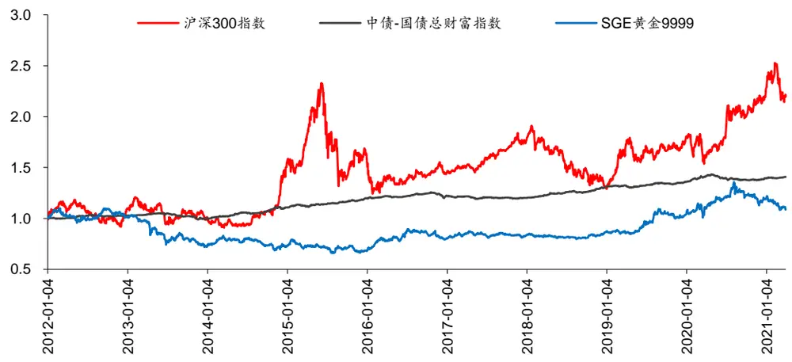
资料来源：Wind，华泰研究

## 回测方案

我们采用滚动窗口的方式开展回测。

对于 cGAN 风险平价方法，具体步骤如图表 11 所示：

1. 以 2012 年第一个交易日为回测起点，设调仓频率为 20 个交易日；

2. 获取调仓日之前（不含调仓日）1000 个交易日的各资产价格的对数收益率序列；

3. 以“40 个交易日条件序列+20 个交易日对照序列”的模式滚动生成 941 条样本，使用条件序列的均值和标准差对条件序列和对照序列均开展 3σ 标准化，然后对 cGAN 交替训练 M代（以全部样本被学习一次算一代）；

4. 以距离调仓日最近的 40 个交易日的 3σ 标准化后的对数收益率序列为条件序列，使用相同的随机数种子（本研究取 1）和拉丁超立方采样对随机数空间进行随机采样，获取1000 组随机数序列，使用训练后的 cGAN 随机生成 1000 组自调仓日起（含调仓日）未来 20个交易日的对数收益率序列，并使用条件序列的标准化参数反标准化；

5. 基于生成的对数收益率序列估计未来 20 日收益率的后验分布，并计算资产协方差矩阵；

6. 优化风险平价组合，获取调仓信号，在调仓日进行调仓；

7. 等到下一个调仓日，重复 2至 6，直至 2021 年 3 月 31 日终止回测。

图表11： 滚动窗口回测流程——cGAN
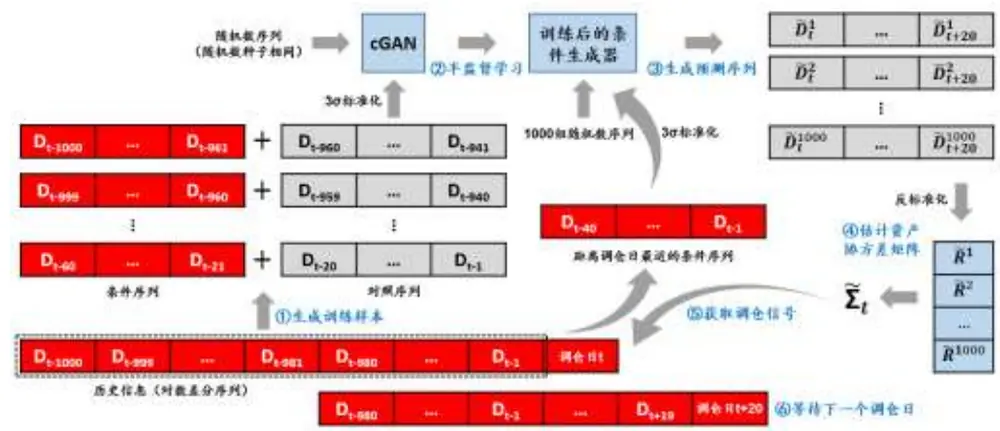
资料来源：华泰研究

对于传统风险平价方法，具体步骤如图表 12 所示：

1. 以 2012 年第一个交易日为回测起点，设调仓频率为 20 个交易日；

2. 获取调仓日之前（不含调仓日）1000 个交易日的各资产价格的对数收益率序列；

3. 选取第 1~20、21~40、…、981~1000 个交易日的子序列计算对应时期的 20 日收益率，得到长度为 50的历史 20 日收益率序列，并计算资产协方差矩阵；

4. 优化风险平价组合，获取调仓信号，在调仓日进行调仓；

5. 等到下一个调仓日，重复 2至 4，直至 2021 年 3 月 31 日终止回测。

图表12： 滚动窗口回测流程——传统方法
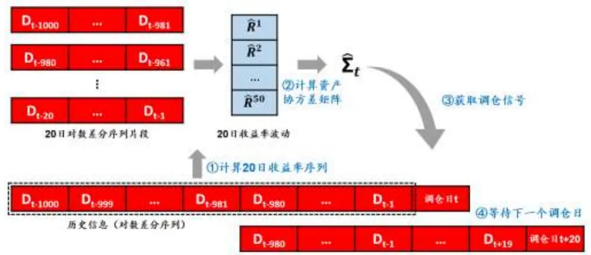
资料来源：华泰研究

可以看到，对于每一次调仓，cGAN 和传统方法利用的信息都是过去 1000 个交易日资产对数收益率序列的信息。这保证了两者结果的可比性。

在开展回测之前，首先需要确定每一个滚动窗口内 cGAN 的训练代数。图表 13 展示了第一个滚动窗口（2007 年 11 月 27 日至 2011 年 12 月 30 日）cGAN 的（最小化）损失函数随着训练代数的变化。结果显示，梯度惩罚项很快就收敛至较小的值，表明 WGAN-GP 能够很快地稳定梯度分布，使得接下来的训练过程顺利进行。训练约 130 代后，条件生成器损失持续提升，而条件判别器基本收敛。

尽管随着训练代数的增加，cGAN 趋向于收敛，但是仍需警惕过拟合现象的出现。过拟合体现在 cGAN 对于随机数序列不再敏感——条件判别器变得过于强大，几乎能够区分对照序列和生成序列；条件生成器也学会了一劳永逸的“欺骗”手段，只生成与对照序列十分接近的序列。为了确定合理的训练代数，本研究将首先考察模型训练代数对模型表现的影响。

图表13： 训练过程中 cGAN损失函数变化：以首个滚动窗口为例（样本范围：20071127~20111230）
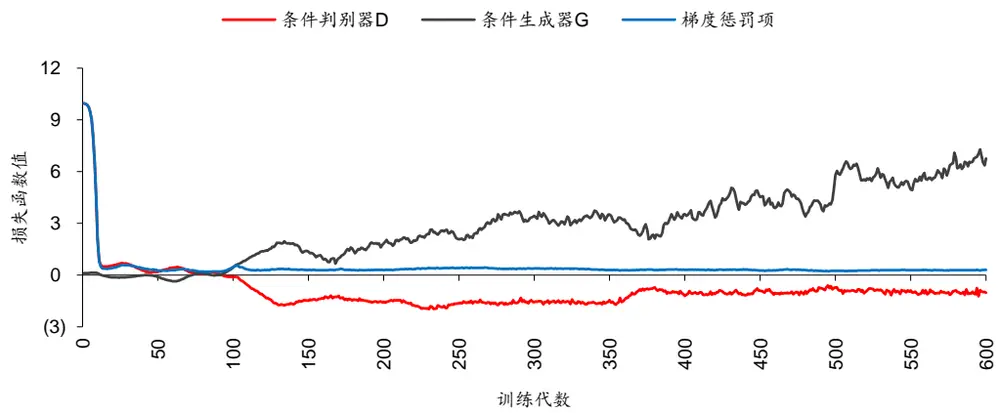
资料来源：Wind，华泰研究

## 改变模型训练代数对回测表现的影响

保持其他参数不变，依次选取模型训练代数为 300、400、500、600，回测结果净值曲线分别如图表 14 至图表 17所示，回测结果评价指标如图表 18 所示。结果表明，净值曲线走势在四种场景下差异不大，年化收益率、夏普比率、最大回撤、Calmar 比率等评价指标均显著优于传统方法。这说明cGAN在300~600的训练代数范围内，其表现稳定优于传统方法。

在接下来的研究中，我们将以训练 600 代后的 cGAN（后文简称“基础 cGAN 模型”）为例，考察更多其他因素对回测表现的影响。

图表14： 训练 300 代后 cGAN 与传统方法回测净值曲线（回测期：20120104~20210331）
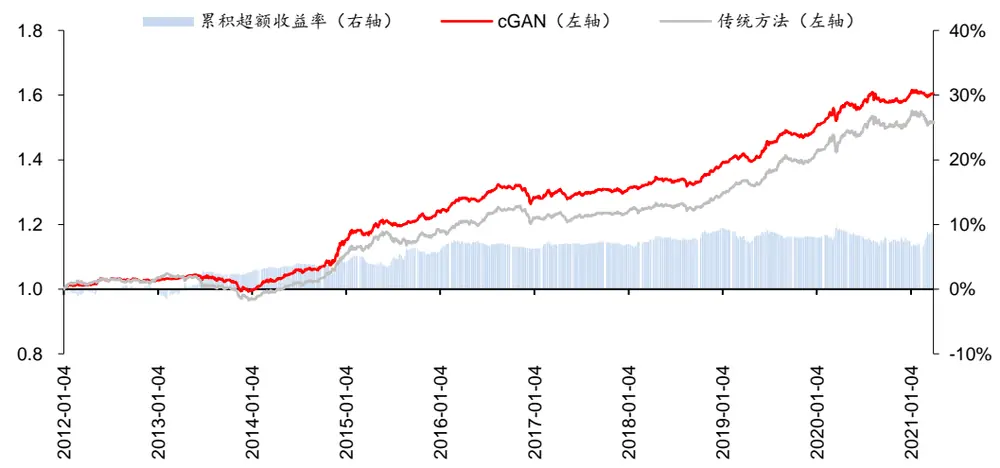
资料来源：Wind，华泰研究

图表15： 训练 400 代后 cGAN 与传统方法回测净值曲线（回测期：20120104~20210331）
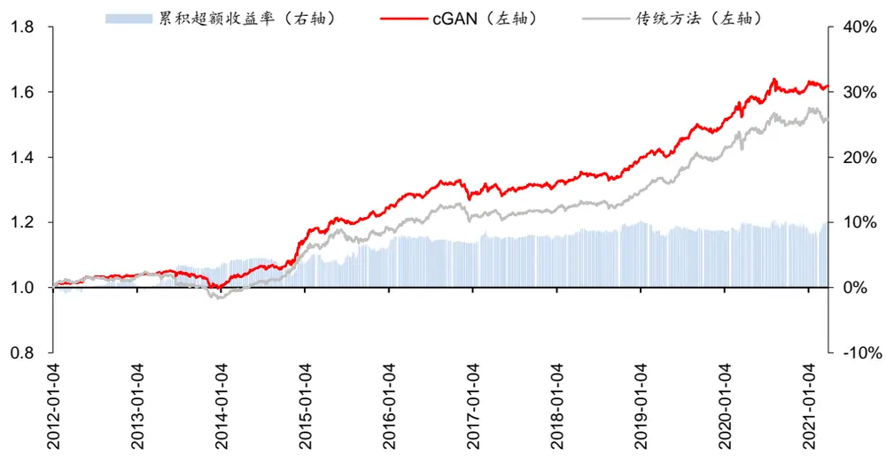
资料来源：Wind，华泰研究

图表16： 训练 500 代后 cGAN 与传统方法回测净值曲线（回测期：20120104~20210331）
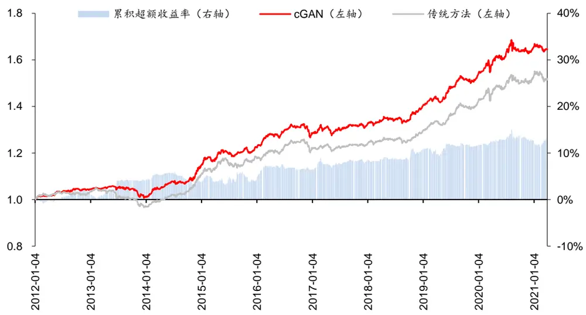
资料来源：Wind，华泰研究

图表17： 训练 600 代后 cGAN 与传统方法回测净值曲线（回测期：20120104~20210331）
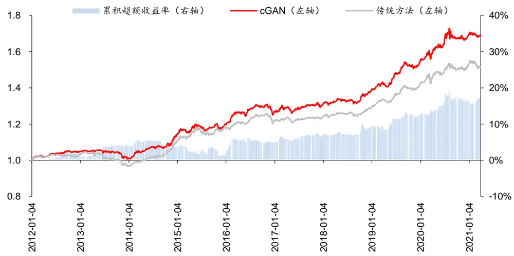
资料来源：Wind，华泰研究

图表18： 不同模型训练次数下回测结果评价指标对比

| 模型 | 年化收益率 | 年化波动率 | 夏普比率 | 最大回撤 | Calmar 比率 |
| --- | --- | --- | --- | --- | --- |
| 传统方法 | 4.73% | 3.36% | 1.41 | -7.86% | 0.60 |
| cGAN 训练 300 代 | 5.40% | 2.94% | 1.83 | -5.06% | 1.07 |
| cGAN 训练 400 代 | 5.49% | 3.10% | 1.77 | -5.25% | 1.05 |
| CGAN 训练 500 代 | 5.70% | 3.34% | 1.71 | -4.92% | 1.16 |
| CGAN 训练 600 代 | 5.95% | 3.68% | 1.62 | -4.98% | 1.19 |

资料来源：Wind，华泰研究

## 改变其他因素对回测表现的影响

本节在基础 cGAN 模型的基础上，依次改变训练过程的随机数种子、生成过程的随机数种子、回测起始日期、多资产组成，并进一步考察在这些因素变化的情况下，cGAN 的回测表现是否仍然优于传统方法。各实验组细节如下：

实验组一：将训练过程的随机数种子改成 0；

实验组二：将生成过程的随机数种子改成 0；

实验组三：回测起始日期相对于基础 cGAN 模型延后 10 个交易日，即建仓日为 2012 年 1月 18 日；

实验组四：将多资产组成改成中证 800 指数、英国富时 100 指数、标普 500 指数，开展全球股票资产配置。各资产基本信息及其自 2012 年以来的走势详见图表 19 和图表 20。

图表19： 全球股票资产基本信息（考察期：20120104~20210331）

| 资产名称 | Wind 代码 | 年化收益率 | 年化波动率 | 夏普比率 | 最大回撤 | Calmar 比率 | 数据预处理 |
| --- | --- | --- | --- | --- | --- | --- | --- |
| 中证 800 指数 | 000906.SH | 8.81% | 23.27% | 0.38 | -50.91% | 0.17 | 对数收益率+3σ标准化 |
| 英国富时 100 指数 | FTSE.GI | 1.90% | 16.09% | 0.12 | -36.61% | 0.05 | 对数收益率+3σ标准化 |
| 标普 500 指数 | SPX.GI | 13.46% | 16.72% | 0.81 | -33.92% | 0.40 | 对数收益率+3σ标准化 |

资料来源：Wind，华泰研究

图表20： 中证 800、英国富时 100指数、标普 500指数归一化净值对比（以 20120104收盘价为基准）
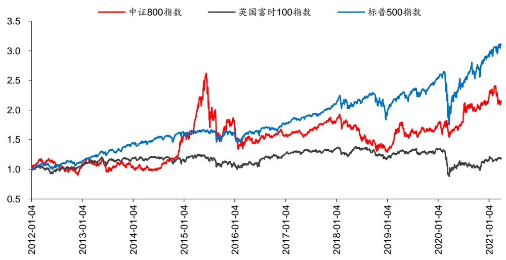
资料来源：Wind，华泰研究

各实验组回测结果净值曲线分别如图表 21 至图表 24 所示，回测结果评价指标如图表 25所示。结果表明，在各实验组的回测结果中，年化收益率、夏普比率、最大回撤、Calmar比率等评价指标均优于传统方法，进一步彰显出 cGAN 模型具有较高的鲁棒性。

图表21： 训练过程随机数种子取 0 时 cGAN 与传统方法回测净值曲线（回测期：20120104~20210331）
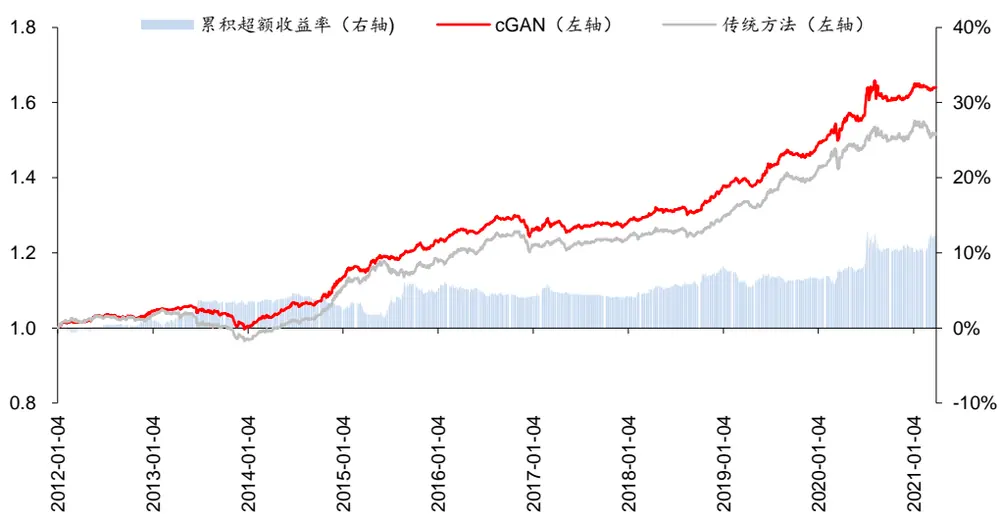
资料来源：Wind，华泰研究

图表22： 生成过程随机数种子取 0时 cGAN与传统方法回测净值曲线（回测期：20120104~20210331）
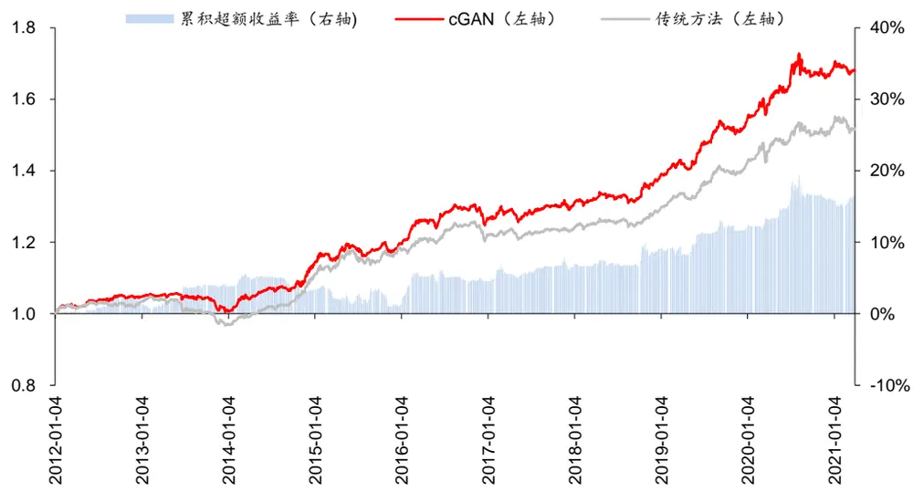
资料来源：Wind，华泰研究

图表23： 回测起点延后 10个交易日 cGAN 与传统方法回测净值曲线（回测期：20120118~20210331）
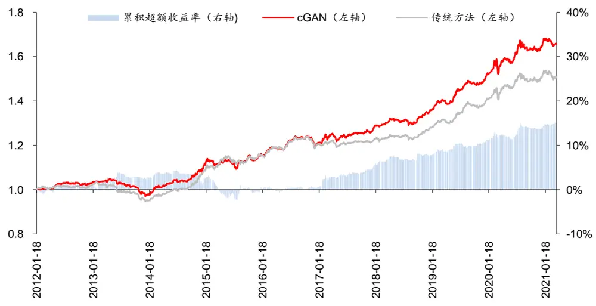
资料来源：Wind，华泰研究

图表24： 改变多资产组成 cGAN与传统方法回测净值曲线（回测期：20120104~20210331）
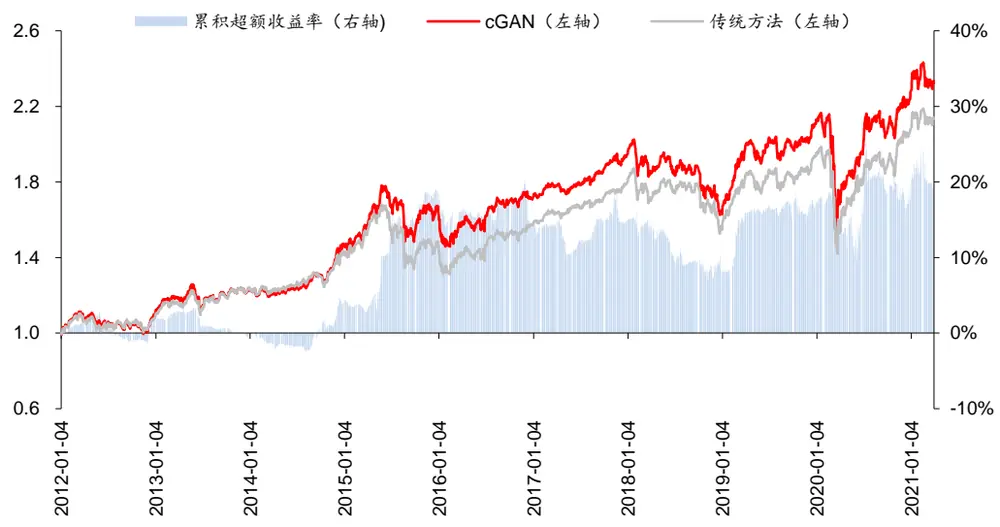
资料来源：Wind，华泰研究

图表25： 改变其他因素时回测结果评价指标对比

| 实验组 基础模型 | 风险定义 | 年化收益率 | 年化波动率 | 夏普比率 | 最大回撤 | Calmar 比率 |
| --- | --- | --- | --- | --- | --- | --- |
| 训练种子0 | 传统方法 | 4.73% | 3.36% | 1.41 | -7.86% | 0.60 |
|  | CGAN | 5.95% | 3.68% | 1.62 | -4.98% | 1.19 |
|  | 传统方法 | 4.73% | 3.36% | 1.41 | -7.86% | 0.60 |
| 生成种子0 | CGAN | 5.66% | 3.09% | 1.83 | -5.98% | 0.95 |
|  | 传统方法 | 4.73% | 3.36% | 1.41 | -7.86% | 0.60 |
| 起点延后 10 个交易日 | CGAN | 5.95% | 3.71% | 1.60 | -5.05% | 1.18 |
|  | 传统方法 | 4.68% | 3.45% | 1.35 | -8.50% | 0.55 |
| 改变多资产组成 | CGAN | 5.80% | 3.62% | 1.60 | -7.58% | 0.77 |
|  | 传统方法 | 8.79% | 13.31% | 0.66 | -28.43% | 0.31 |
|  | CGAN | 9.83% | 13.48% | 0.73 | -28.23% | 0.35 |

资料来源：Wind，华泰研究

值得关注的是，与基础 cGAN 模型相比，仅改变生成过程随机数种子对回测表现没有显著影响，而仅改变训练过程随机数种子则使得回测结果产生了与基础cGAN模型较大的差异。该结果从侧面印证了拉丁超立方采样相对于蒙特卡洛采样的优势——采样结果在概率空间中分布的均匀性，能够弥补因随机数种子带来的偶然性。

遗憾的是，拉丁超立方采样暂时很难应用于训练过程。训练过程涉及的随机因素较多，具体包括神经网络参数初始化、条件判别器中的 Dropout、小批次样本的选取顺序、小批次样本对应的随机数序列、梯度惩罚项中的 ϵ 等。其中，如果对前两个因素做改进，需要对深度学习框架的底仓代码进行修改，实现难度较大；如果对后三个因素做改进，由于小批次规模的限制，随机数规模过小，即使使用拉丁超立方采样也很难保证采样结果均匀性。对于这种看似“无解”的困境，我们建议在实际应用中，可以选取不同的随机数种子，并对结果进行 bagging 集成。

## 尝试揭开 cGAN的“思考”过程

cGAN 是一个“黑箱”模型。为了进一步增强 cGAN 结果的可信度，本节将以基础 cGAN模型为例，从价格走势、评价指标、持仓变化等三个方面对比 cGAN 和传统风险平价方法的异同，尝试揭开“黑箱”的“思考”过程。

## 价格走势对比

针对每一种资产，我们取 10 组生成序列，并将其还原为价格序列，结果如图表 26 至图表28 所示，从中至少能够得出如下三点结论。

首先，我们看到生成序列较为松散地分布在真实序列的两侧，且细节上并没有出现与真实序列完全相同的情况，表明 cGAN 还未进入过拟合阶段，生成序列具有一定的多样性。

其次，我们看到个别序列呈现长期上涨或长期下跌的态势。回顾回测流程（图表 11），每一个滚动窗口在生成未来 20 个交易日的对数收益率序列时都使用了相同的随机数种子，这保证了相同的随机数序列恒作用于同一组生成序列的整个预测过程。考虑到随机数序列反映了市场未来隐空间中的状态，每一组随机数序列都代表了不同的隐状态。如果某种隐状态未来利好或利空某类资产，那么，既然这种隐状态判断恒作用于整个预测过程，自然会导致预测得到的生成序列呈现长期上涨或下跌的态势。以上分析正是我们不选用与资产价格涨跌有关的指标的原因，其不仅从侧面印证了随机数序列的经济学含义，而且同样表明cGAN 还未进入过拟合阶段，因为生成序列随着随机数序列的改变而显著不同。

最后，我们也能看到生成序列与真实序列在波动趋势上具有较高相似度，例如沪深 300 指数在 2015 年大牛市和接踵而至股灾中的大起大落、以及从 2018 年底到 2019 年初的触底回升。这些细节的复现存在一定的时滞，这可能是因为条件生成器中类似于编码器的结构能够从条件序列中提取出浓缩了资产收益率信息的有效特征，而类似于解码器的结构在生成预测序列时在一定程度上复现了这些特征。

图表26： 沪深 300指数生成序列与真实序列价格走势对比（回测期：20120104~20210331）
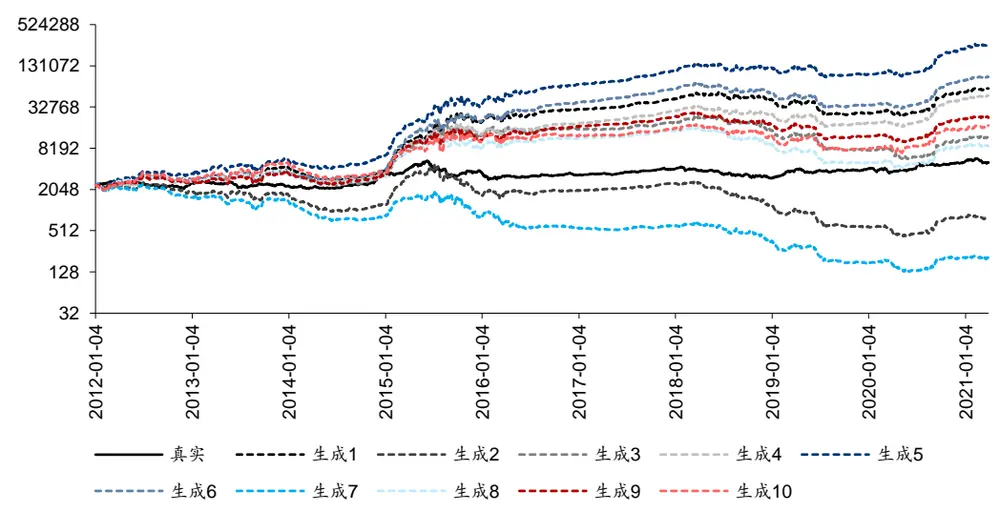
资料来源：Wind，华泰研究

图表27： 中债-国债总财富指数生成序列与真实序列价格走势对比（回测期：20120104~20210331）
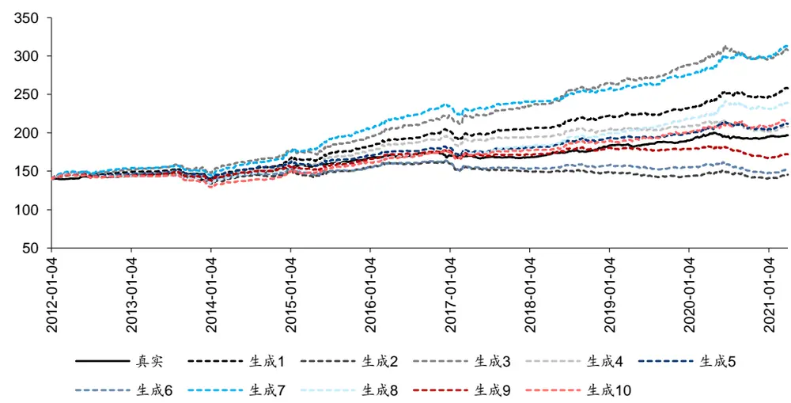
资料来源：Wind，华泰研究

图表28： SGE 黄金 9999 生成序列与真实序列价格走势对比（回测期：20120104~20210331）
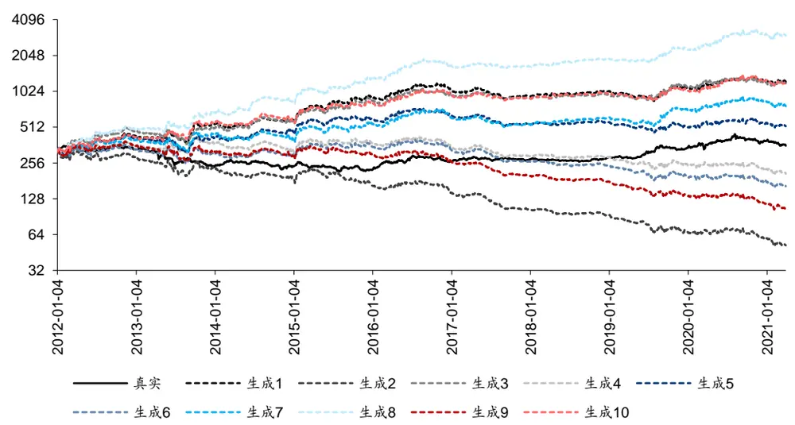
资料来源：Wind，华泰研究

## 评价指标对比

自相关性和偏自相关指标的对比如图表 29 至图表 32 所示。结果显示，真实序列的评价指标在生成序列评价指标的取值范围之内，且与模拟均值较为接近。事实上，真实的沪深 300指数和 SGE黄金 9999 均不存在显著的自相关性和偏自相关性，而中债-国债总财富指数存在显著为正的自相关性和偏自相关性。导致上述差异的原因在于，国债是一种低风险资产，长期来看，其收益率较为稳定。而且，中债-国债总财富指数在构建过程中引入了债券利息再投资的机制。cGAN 较好地复现了真实序列在自相关性和偏自相关性方面的特征。

图表29： 各大类资产生成序列自相关性指标分布
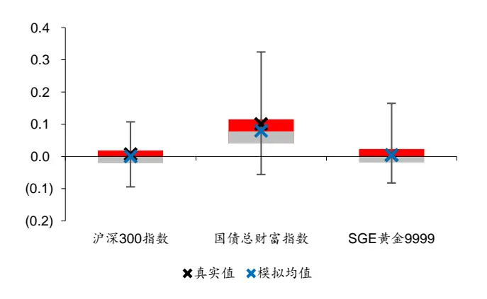
资料来源：Wind，华泰研究

图表30： 各大类资产生成序列偏自相关性指标分布
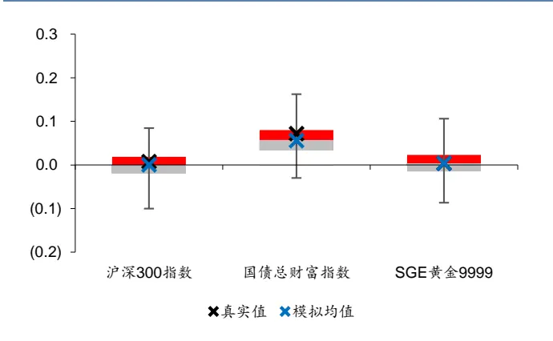
资料来源：Wind，华泰研究

图表31： 生成序列与真实序列自相关性指标对比

| 资产名称 | 生成序列评价指标取值范围 | 均值 | 真实序列评价指标 |
| --- | --- | --- | --- |
| 沪深 300 指数 | [-0.094, 0.108] | 0.000 | 0.008 |
| 中债-国债总财富指数 | [-0.056, 0.324] | 0.080 | 0.101 |
| SGE 黄金 9999 | [-0.082, 0.165] | 0.004 | 0.004 |

资料来源：Wind，华泰研究

图表32： 生成序列与真实序列偏自相关性指标对比

| 资产名称 | 生成序列评价指标取值范围 | 均值 | 真实序列评价指标 |
| --- | --- | --- | --- |
| 沪深 300 指数 | [-0.100, 0.084] | 0.000 | 0.007 |
| 中债-国债总财富指数 | [-0.030, 0.162] | 0.056 | 0.071 |
| SGE 黄金 9999 | [-0.087, 0.106] | 0.004 | 0.004 |

资料来源：Wind，华泰研究

非正态性指标的对比如图表 33 和图表 35 所示。结果显示，无论何种资产，真实收益率序列的 Jarque-Bera 检验的 p值接近 0，表明真实的收益率序列不满足正态分布。除极个别生成序列外，绝大部分生成序列的 Jarque-Bera 检验的 p值也接近 0。cGAN 较好地复现了真实序列不满足收益率正态性的特征。

图表33： 各大类资产生成序列非正态性指标分布
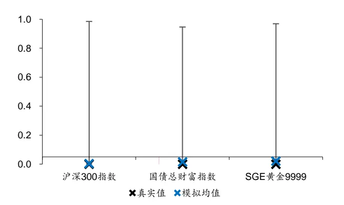
资料来源：Wind，华泰研究

图表34： 各大类资产生成序列平均波动率指标分布
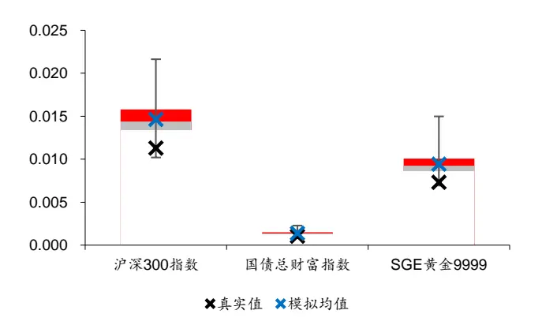
资料来源：Wind，华泰研究

图表35： 生成序列与真实序列非正态性指标对比

| 资产名称 | 生成序列评价指标取值范围 | 均值 | 真实序列评价指标 |
| --- | --- | --- | --- |
| 沪深 300 指数 | [0.000, 0.985] | 0.004 | 0.000 |
| 中债-国债总财富指数 | [0.000, 0.947] | 0.015 | 0.000 |
| SGE 黄金 9999 | [0.000, 0.969] | 0.021 | 0.000 |

资料来源：Wind，华泰研究

平均波动率指标的对比如图表 34 和图表 36 所示。结果显示，尽管真实序列的评价指标在生成序列评价指标的取值范围之内，但均低于模拟均值，表明 cGAN 容易系统性地高估资产收益的长期平均波动水平。这可能是因为生成序列中更容易出现持续快速上涨和持续快速下跌等极端情况，放大了收益率序列的波动。不过，cGAN 正确地复现了三种资产平均波动率的相对大小：沪深 300 指数>SGE黄金 9999>中债-国债总财富指数。

图表36： 生成序列与真实序列平均波动率指标对比

| 资产名称 | 生成序列评价指标取值范围 | 均值 | 真实序列评价指标 |
| --- | --- | --- | --- |
| 沪深 300 指数 | [0.0102, 0.0216] | 0.0146 | 0.0113 |
| 中债-国债总财富指数 | [0.0009, 0.0023] | 0.0014 | 0.0011 |
| SGE 黄金 9999 | [0.0069, 0.0150] | 0.0094 | 0.0073 |

资料来源：Wind，华泰研究

波动率聚集和粗细波动率相关指标的对比如图表 37 至图表 40 所示。结果显示，真实序列的评价指标均在生成序列评价指标的取值范围之内。其中，真实序列的波动率聚集指标与模拟均值较为接近，表明 cGAN 能够较好地复现波动率存在短时程自相关和长时程不相关的特征。然而，沪深300指数和SGE黄金9999真实序列的粗细波动率显著小于0，而cGAN的模拟均值在 0 附近，两者不一致，表明 cGAN 较难复现粗细波动率中蕴含的信息量的差异。这可能是因为该指标本身就存在噪音较大的缺陷（Takahashi et al.，2019），也有可能是因为转置卷积层在生成预测序列的过程中，没有考虑时序因果关系，导致粗波动率领先细波动率的相关系数与粗波动率滞后细波动率的相关系数并未呈现出不对称。

图表37： 各大类资产生成序列波动率聚集指标分布
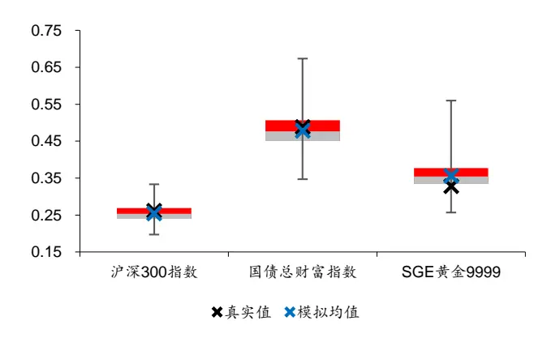
资料来源：Wind，华泰研究

图表38： 各大类资产生成序列粗细波动率相关指标分布
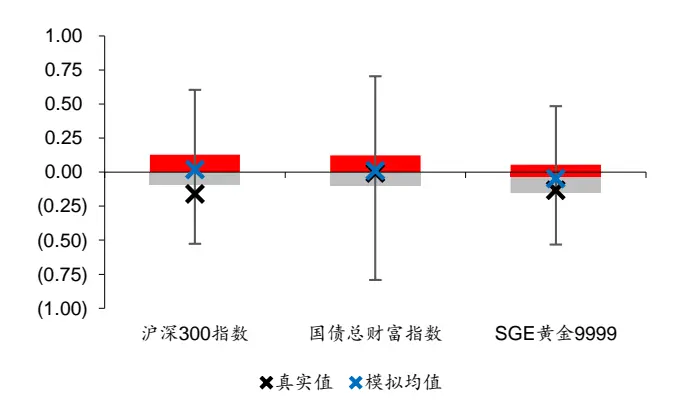
资料来源：Wind，华泰研究

图表39： 生成序列与真实序列波动率聚集指标对比

| 资产名称 | 生成序列评价指标取值范围 | 均值 | 真实序列评价指标 |
| --- | --- | --- | --- |
| 沪深 300 指数 | [0.197, 0.333] | 0.254 | 0.262 |
| 中债-国债总财富指数 | [0.347, 0.673] | 0.479 | 0.489 |
| SGE 黄金 9999 | [0.257, 0.560] | 0.356 | 0.328 |

资料来源：Wind，华泰研究

图表40： 生成序列与真实序列粗细波动率相关指标对比

| 资产名称 | 生成序列评价指标取值范围 | 均值 | 真实序列评价指标 |
| --- | --- | --- | --- |
| 沪深 300 指数 | [-0.526, 0.604] | 0.018 | -0.159 |
| 中债-国债总财富指数 | [-0.792, 0.704] | 0.011 | -0.005 |
| SGE 黄金 9999 | [-0.532, 0.484] | -0.046 | -0.132 |

资料来源：Wind，华泰研究

平均交叉相关性和相关关系不稳定性指标的对比如图表 41 至图表 44 所示。结果显示，真实序列的评价指标均在生成序列评价指标的取值范围之内。真实序列的平均交叉相关性指标均在 0附近，而相关关系不稳定性指标显著大于 0。这表明从长期来看，多资产之间并不存在稳定的相关关系。cGAN 的模拟均值同样呈现出平均交叉相关性指标在 0 附近、相关关系不稳定性指标显著大于 0 的情况，且与真实值较为接近，表明 cGAN 能够较好地复现真实多资产序列在一段较长时期内的相关关系。

图表41： 各大类资产生成序列平均交叉相关性指标分布
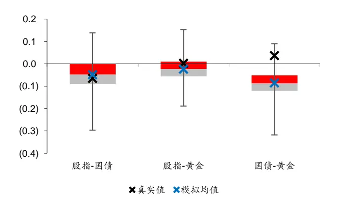
资料来源：Wind，华泰研究

图表42： 各大类资产生成序列相关关系不稳定性指标分布
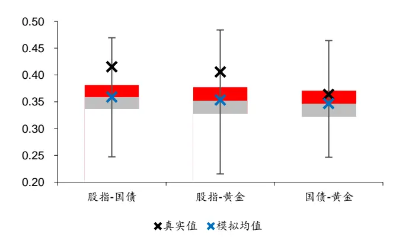
资料来源：Wind，华泰研究

图表43： 生成序列与真实序列平均交叉相关性指标对比

| 资产名称 | 生成序列评价指标取值范围 | 均值 | 真实序列评价指标 |
| --- | --- | --- | --- |
| 沪深 300 指数 | [-0.297, 0.139] | -0.049 | -0.065 |
| 中债-国债总财富指数 | [-0.189, 0.153] | -0.024 | 0.002 |
| SGE 黄金 9999 | [-0.318, 0.090] | -0.086 | 0.036 |

资料来源：Wind，华泰研究

图表44： 生成序列与真实序列相关关系不稳定性指标对比

| 资产名称 | 生成序列评价指标取值范围 | 均值 | 真实序列评价指标 |
| --- | --- | --- | --- |
| 沪深 300 指数 | [0.247, 0.470] | 0.359 | 0.415 |
| 中债-国债总财富指数 | [0.216, 0.484] | 0.354 | 0.406 |
| SGE 黄金 9999 | [0.246, 0.464] | 0.347 | 0.364 |

资料来源：Wind，华泰研究

综上所述，除粗细波动率相关指标外，cGAN 能够较好地复现真实序列的典型化事实。

## 仓位变化对比

最后，我们通过对比 cGAN 与传统风险平价方法的仓位变化，来尝试揭示 cGAN 的回测表现优于传统方法的可能原因。

图表 46、图表 48 和图表 50 分别展示了 cGAN 和传统方法计算得到的三种资产的仓位变化对比。结果显示，cGAN 与传统方法下仓位变化的趋势较为一致，表明 cGAN 与传统方法对于每种资产加仓或减仓方向的长期趋势判断一致。这可能是因为 cGAN 和传统方法在判断加仓或减仓方向时，利用的都是相邻两个滚动窗口交错部分（即上一个滚动窗口最早 20个交易日与当前滚动窗口最近 20 个交易日）的信息差，如图表 45 所示。

图表45： 相邻两个滚动窗口的信息差
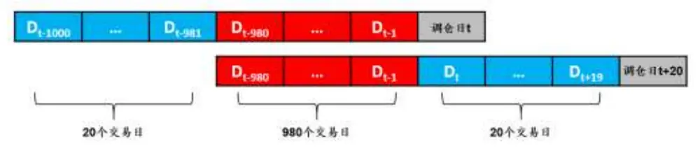
资料来源：华泰研究

不同的是，cGAN的仓位波动更剧烈。这可能是因为传统方法在计算资产协方差矩阵时，赋予过去 1000 个交易日信息同样的权重（图表 12），相邻两个滚动窗口的信息差相对于 1000个交易日的信息而言，占比较小，因而对协方差矩阵的计算结果的影响较小，所以仓位变化幅度较小。而对于 cGAN，尽管训练阶段同样平等对待过去 1000 个交易日的信息，但这只是为了从历史样本中学习出如何用 40 日序列预测 20 日序列的模式；而在生成预测序列时，cGAN 更重视最近 40 个交易日的信息（图表 11），相邻两个滚动窗口信息差相对于 40个交易日而言，占比较大，因而对协方差矩阵的计算结果的影响较大，所以仓位变化幅度较大。

正因为如此，cGAN 能够更敏锐地捕捉到市场的变化，对资产风险作出更合理的评估。图表 47、图表 49 和图表 51 分别展示了三种资产 cGAN 相对于传统方法的超配比例与资产价格走势的对比。在 2016 年下半年至 2017 年底、2020 年 5 月底至 8 月底的两轮单边牛市行情中，cGAN 均判断权益资产的风险较低，及时加仓沪深 300 指数，从而在牛市中获得更高收益。而在整个 2015 年以及 2020 年下半年至 2021 年 3 月底区间内，cGAN 均判断权益资产的风险较高，减仓沪深 300 指数，尽管放弃了前半程冲顶行情下的部分收益，但成功规避了后半程的急跌行情，控制了策略的最大回撤。

除此之外，cGAN 能够提取历史序列中的线性和非线性成分，而传统方法只利用了其中的线性成分。贝叶斯学派思想的引入将资产协方差矩阵的计算过程从时间序列维度“拉回”至截面维度。这些也可能是使得 cGAN 表现优于传统方法的原因。

图表46： cGAN和传统方法沪深 300指数仓位变化对比
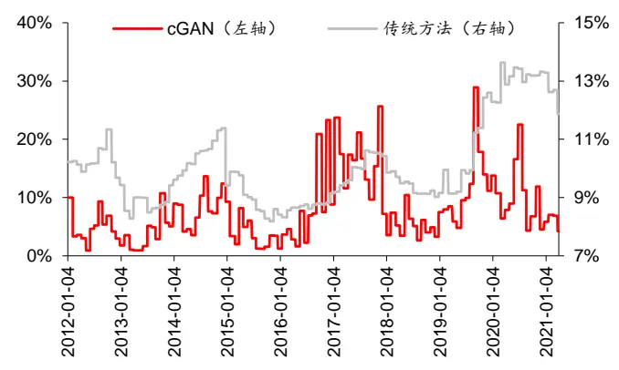
注：回测期：20120104~20210331
资料来源：Wind，华泰研究

图表47： 沪深 300指数超配比例与价格走势对比
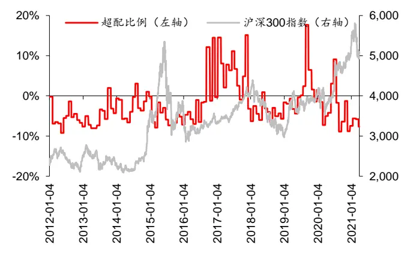
注：回测期：20120104~20210331
资料来源：Wind，华泰研究

图表48： cGAN和传统方法中债-国债总财富指数仓位变化对比
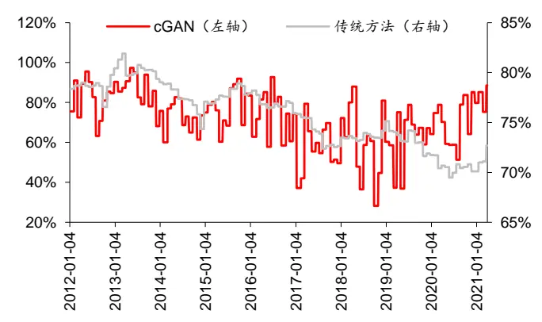
注：回测期：20120104~20210331
资料来源：Wind，华泰研究

图表49： 中债-国债总财富指数超配比例与价格走势对比
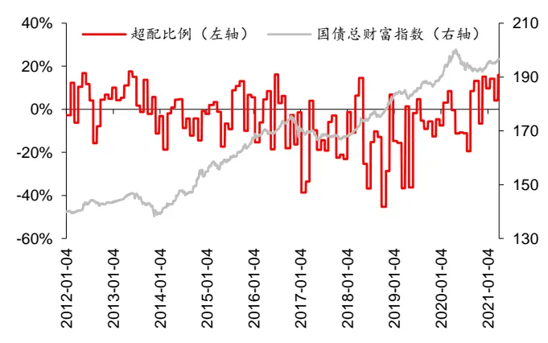
注：回测期：20120104~20210331
资料来源：Wind，华泰研究

图表50： cGAN和传统方法 SGE黄金 9999仓位变化对比
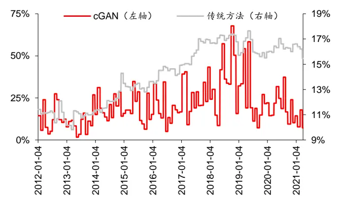
注：回测期：20120104~20210331
资料来源：Wind，华泰研究

图表51： SGE黄金 9999超配比例与价格走势对比
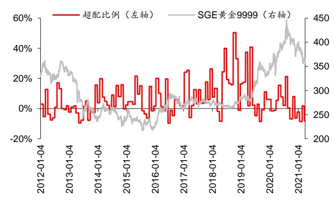
注：回测期：20120104~20210331
资料来源：Wind，华泰研究

| 图表52： CGAN逐一克服传统风险平价方法的缺陷 |  |
| --- | --- |
| CGAN 的解决方式 | 传统风险平价方法的缺陷 |
| 半监督学习，基于最近40个交易日的信息预测 | 用历史代表未来 |
| 用截面上的收益率后验分布评估截面风险 | 用时间序列维度的风险评估结果代替截面风险 |
| 神经网络提取了历史序列中的线性和非线性成分 | 只利用了历史序列中的线性成分 |

## 总结与展望

本文针对GAN在投资策略实践方面的应用开展了初步的尝试——基于cGAN对风险进行重新定义。与传统的仅基于历史收益率序列直接计算资产协方差矩阵不同，cGAN 基于市场未来隐状态（先验分布）和过去一段时间内的市场规律（似然信息），对未来一段时间内的资产协方差矩阵进行预测。

cGAN 的基本结构包括条件生成器和条件判别器。其中，条件生成器借鉴了自编码器的结构，旨在根据条件序列生成预测序列。其中，卷积层能够从条件序列中提取浓缩了资产收益率信息的特征序列，转置卷积层通过对特征序列与随机数序列的拼接序列进行上采样，生成预测序列。条件判别器的主体结构是卷积层，旨在对生成序列的真实性进行评价。条件判别器使用 WGAN-GP 损失函数，来缓解 GAN 的训练不稳定与模式崩溃等问题。如此构建的 cGAN 收敛性较好，模型训练不足 300 代，损失函数便接近稳定。通过对条件判别器和条件生成器进行交替训练，生成序列最终能够实现“以假乱真”的效果。

为了预测未来一段时间内的资产协方差矩阵，我们使用拉丁超立方采样获得 1000 组随机数序列，将其和最近 40 个交易日的对数收益率序列一同输入经过充分训练条件生成器，得到1000 组生成序列。其中，条件序列需要开展 3σ 标准化，生成序列需要使用相同的标准化参数反标准化。我们进一步将生成序列转化为未来 20 日收益率，并据此估计未来 20 日收益率的后验分布。基于该分布，可以计算资产协方差矩阵。

我们将 cGAN 应用于多资产风险平价组合，同时考察了其回测表现关于模型训练代数、训练过程随机数种子、生成过程随机数种子、回测起始日期和多资产组成等五类因素的灵敏度。结果表明，在设计的各项场景中，cGAN的回测表现均优于传统风险平价方法的回测表现，彰显出较高的鲁棒性。通过对比生成序列和真实序列的价格走势、评价指标、仓位变化，“黑箱”的神秘面纱被逐渐揭开，进一步增强了结果的可信度。

相对于传统方法，深度神经网络使得 cGAN 能够利用历史序列中的非线性成分，半监督学习使得 cGAN 能够对市场变化作出更灵敏的反应，贝叶斯学派思想的引入将资产协方差矩阵的计算过程从时间序列维度“拉回”至截面维度（图表 52）。上述原因使得 cGAN 能够对资产的真实风险作出更合理的评估。本文的探索是对现有风险管理体系的有益补充，也是贝叶斯学派与频率学派在风险管理中的又一次较量。

图表52： cGAN逐一克服传统风险平价方法的缺陷

在研究过程中，我们也产生了一些新的思考。首先，生成序列与真实序列在波动趋势上的相似性表明条件生成器中类似自编码器的结构能够从条件序列中提取出浓缩了资产收益率信息的有效特征。既然这些特征凝聚了资产收益率信息，那么是否有可能将其作为 alpha因子应用于选股？而且，如果在条件序列中增加更多的交易信息，如交易量，是否有可能进一步提升模型的预测能力？

此外，cGAN 将随机数序列单独作为神经网络的一个输入，并用其线性组合的先验分布来刻画市场未来在隐空间中的状态。另一种更直接的刻画隐状态的方式是对神经网络的权重赋予先验分布，然后通过监督学习修正先验分布，得到权重的后验分布，进而输出预测结果的后验分布。这便是贝叶斯神经网络的原理。与 cGAN 相比，贝叶斯神经网络在收敛上相对容易一些。它同样具备从贝叶斯学派视角重新定义风险的潜力。

## 参考文献

[1] Arjovsky M. 2017. Wasserstein GAN. Papers 1701.07875v3, arXiv.org.

[2] Bai S., et al. 2018. An empirical evaluation of generic convolutional and recurrent networks for sequence modeling. Papers 1803.01271v2, arXiv.org.

[3] Goodfellow, I., et al. 2014. Generative adversarial nets. In Proceedings of the 27th International Conference on Neural Information Processing Systems - Volume 2 (NIPS’14). MIT Press, Cambridge, MA, USA, 2672–2680.

[4] Gulrajani I., et al. 2017. Improved training of Wasserstein GANs. Papers 1704.00028v3, arXiv.org.

[5] Mariani G., et al. 2019. PAGAN: Portfolio analysis with generative adversarial networks. Papers 1909.10578, arXiv.org.

[6] Markowitz H.M., et al. 1959. Portfolio Selection: Efficient Diversification of Investments. New York: Wiley.

[7] Takahashi S., et al. 2019. Modeling financial time-series with generative adversarial networks. Physica A, 527: 121261.

[8] 邱锡鹏. 2020. 神经网络与深度学习. 北京: 机械工业出版社.

## 风险提示

cGAN 模型的训练结果对随机数种子较为敏感；cGAN模型换手率较高，而本文回测未考虑交易成本的影响；模型根据历史规律总结，历史规律可能失效；模型结论基于统计工具得到，在极端情形下或存在解释力不足的风险。

## 附录

## 时间卷积网络

在使用卷积神经网络提取时间序列特征时，通常需要保证每一步骤的时序因果关系不能颠倒，即 t时刻提取的特征仅由 t 时刻及更早的输入序列合成。对此，Bai et al. (2018)提出了时间卷积网络（Temporal Convolutional Network, TCN），其通过膨胀率成倍增加的膨胀卷积核，来保证时序因果关系，如图表 53 所示。本研究在构建条件生成器和条件判别器时，都借鉴了 TCN 的思想。不过，为了快速实现时间序列的降维，本研究仅选取图表 53 的蓝色路径，作为用来提取序列特征的组件。不难证明，蓝色路径可以通过直接对原始序列进行大小为 5、步长为 2的卷积操作近似实现。

图表53： 时间卷积网络的基本原理
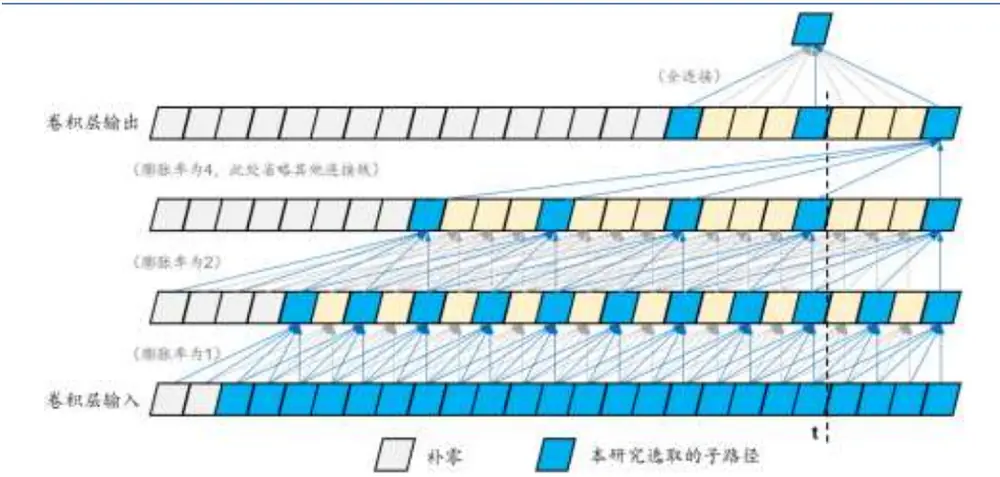
资料来源：An empirical evaluation of generic convolutional and recurrent networks for sequence modeling，华泰研究

## 免责声明

## 分析师声明

本人，林晓明、李子钰、何康，兹证明本报告所表达的观点准确地反映了分析师对标的证券或发行人的个人意见；彼以往、现在或未来并无就其研究报告所提供的具体建议或所表迖的意见直接或间接收取任何报酬。

## 一般声明及披露

本报告由华泰证券股份有限公司（已具备中国证监会批准的证券投资咨询业务资格，以下简称“本公司”）制作。本报告所载资料是仅供接收人的严格保密资料。本报告仅供本公司及其客户和其关联机构使用。本公司不因接收人收到本报告而视其为客户。

本报告基于本公司认为可靠的、已公开的信息编制，但本公司及其关联机构(以下统称为“华泰”)对该等信息的准确性及完整性不作任何保证。

本报告所载的意见、评估及预测仅反映报告发布当日的观点和判断。在不同时期，华泰可能会发出与本报告所载意见、评估及预测不一致的研究报告。同时，本报告所指的证券或投资标的的价格、价值及投资收入可能会波动。以往表现并不能指引未来，未来回报并不能得到保证，并存在损失本金的可能。华泰不保证本报告所含信息保持在最新状态。华泰对本报告所含信息可在不发出通知的情形下做出修改，投资者应当自行关注相应的更新或修改。

本公司不是 FINRA 的注册会员，其研究分析师亦没有注册为 FINRA 的研究分析师/不具有 FINRA 分析师的注册资格。

华泰力求报告内容客观、公正，但本报告所载的观点、结论和建议仅供参考，不构成购买或出售所述证券的要约或招揽。该等观点、建议并未考虑到个别投资者的具体投资目的、财务状况以及特定需求，在任何时候均不构成对客户私人投资建议。投资者应当充分考虑自身特定状况，并完整理解和使用本报告内容，不应视本报告为做出投资决策的唯一因素。对依据或者使用本报告所造成的一切后果，华泰及作者均不承担任何法律责任。任何形式的分享证券投资收益或者分担证券投资损失的书面或口头承诺均为无效。

除非另行说明，本报告中所引用的关于业绩的数据代表过往表现，过往的业绩表现不应作为日后回报的预示。华泰不承诺也不保证任何预示的回报会得以实现，分析中所做的预测可能是基于相应的假设，任何假设的变化可能会显著影响所预测的回报。

华泰及作者在自身所知情的范围内，与本报告所指的证券或投资标的不存在法律禁止的利害关系。在法律许可的情况下，华泰可能会持有报告中提到的公司所发行的证券头寸并进行交易，为该公司提供投资银行、财务顾问或者金融产品等相关服务或向该公司招揽业务。

华泰的销售人员、交易人员或其他专业人士可能会依据不同假设和标准、采用不同的分析方法而口头或书面发表与本报告意见及建议不一致的市场评论和/或交易观点。华泰没有将此意见及建议向报告所有接收者进行更新的义务。华泰的资产管理部门、自营部门以及其他投资业务部门可能独立做出与本报告中的意见或建议不一致的投资决策。投资者应当考虑到华泰及/或其相关人员可能存在影响本报告观点客观性的潜在利益冲突。投资者请勿将本报告视为投资或其他决定的唯一信赖依据。有关该方面的具体披露请参照本报告尾部。

本报告并非意图发送、发布给在当地法律或监管规则下不允许向其发送、发布的机构或人员，也并非意图发送、发布给因可得到、使用本报告的行为而使华泰违反或受制于当地法律或监管规则的机构或人员。

本报告版权仅为本公司所有。未经本公司书面许可，任何机构或个人不得以翻版、复制、发表、引用或再次分发他人(无论整份或部分)等任何形式侵犯本公司版权。如征得本公司同意进行引用、刊发的，需在允许的范围内使用，并需在使用前获取独立的法律意见，以确定该引用、刊发符合当地适用法规的要求，同时注明出处为“华泰证券研究所”，且不得对本报告进行任何有悖原意的引用、删节和修改。本公司保留追究相关责任的权利。所有本报告中使用的商标、服务标记及标记均为本公司的商标、服务标记及标记。

## 中国香港

本报告由华泰证券股份有限公司制作,在香港由华泰金融控股（香港）有限公司向符合《证券及期货条例》及其附属法律规定的机构投资者和专业投资者的客户进行分发。华泰金融控股（香港）有限公司受香港证券及期货事务监察委员会监管，是华泰国际金融控股有限公司的全资子公司，后者为华泰证券股份有限公司的全资子公司。在香港获得本报告的人员若有任何有关本报告的问题,请与华泰金融控股（香港）有限公司联系。

## 香港-重要监管披露

- 华泰金融控股（香港）有限公司的雇员或其关联人士没有担任本报告中提及的公司或发行人的高级人员。

更多信息请参见下方 “美国-重要监管披露”。

## 美国

在美国本报告由华泰证券（美国）有限公司向符合美国监管规定的机构投资者进行发表与分发。华泰证券（美国）有限公司是美国注册经纪商和美国金融业监管局（FINRA）的注册会员。对于其在美国分发的研究报告，华泰证券（美国）有限公司根据《 年证券交易法》（修订版）第 条规定以及美国证券交易委员会人员解释，对本研究报告内容负责。华泰证券（美国）有限公司联营公司的分析师不具有美国金融监管（FINRA）分析师的注册资格，可能不属于华泰证券（美国）有限公司的关联人员，因此可能不受 FINRA 关于分析师与标的公司沟通、公开露面和所持交易证券的限制。华泰证券（美国）有限公司是华泰国际金融控股有限公司的全资子公司，后者为华泰证券股份有限公司的全资子公司。任何直接从华泰证券（美国）有限公司收到此报告并希望就本报告所述任何证券进行交易的人士，应通过华泰证券（美国）有限公司进行交易。

## 美国-重要监管披露

- 分析师林晓明、李子钰、何康本人及相关人士并不担任本报告所提及的标的证券或发行人的高级人员、董事或顾问。分析师及相关人士与本报告所提及的标的证券或发行人并无任何相关财务利益。本披露中所提及的“相关人士”包括 FINRA 定义下分析师的家庭成员。分析师根据华泰证券的整体收入和盈利能力获得薪酬，包括源自公司投资银行业务的收入。

- 华泰证券股份有限公司、其子公司和/或其联营公司, 及/或不时会以自身或代理形式向客户出售及购买华泰证券研究所覆盖公司的证券/衍生工具，包括股票及债券（包括衍生品）华泰证券研究所覆盖公司的证券/衍生工具，包括股票及债券（包括衍生品）。

- 华泰证券股份有限公司、其子公司和/或其联营公司, 及/或其高级管理层、董事和雇员可能会持有本报告中所提到的任何证券（或任何相关投资）头寸，并可能不时进行增持或减持该证券（或投资）。因此，投资者应该意识到可能存在利益冲突。

## 评级说明

投资评级基于分析师对报告发布日后 6 至 12个月内行业或公司回报潜力（含此期间的股息回报）相对基准表现的预期（A 股市场基准为沪深 300 指数，香港市场基准为恒生指数，美国市场基准为标普 500 指数），具体如下：

## 行业评级

增持：预计行业股票指数超越基准

中性：预计行业股票指数基本与基准持平

减持：预计行业股票指数明显弱于基准

## 公司评级

买入：预计股价超越基准 15%以上

增持：预计股价超越基准 5%~15%

持有：预计股价相对基准波动在-15%~5%之间

卖出：预计股价弱于基准 15%以上

暂停评级：已暂停评级、目标价及预测，以遵守适用法规及/或公司政策

无评级：股票不在常规研究覆盖范围内。投资者不应期待华泰提供该等证券及/或公司相关的持续或补充信息

## 法律实体披露

中国：华泰证券股份有限公司具有中国证监会核准的“证券投资咨询”业务资格，经营许可证编号为：91320000704041011J香港：华泰金融控股（香港）有限公司具有香港证监会核准的“就证券提供意见”业务资格，经营许可证编号为：AOK809美国：华泰证券（美国）有限公司为美国金融业监管局（FINRA）成员，具有在美国开展经纪交易商业务的资格，经营业务许可编号为：CRD#:298809/SEC#:8-70231

## 华泰证券股份有限公司

南京南京市建邺区江东中路228号华泰证券广场1号楼/邮政编码：210019

电话：86 25 83389999/传真：86 25 83387521电子邮件：ht-rd@htsc.com

## 深圳

深圳市福田区益田路5999号基金大厦10楼/邮政编码：518017电话：86 755 82493932/传真：86 755 82492062电子邮件：ht-rd@htsc.com

## 华泰金融控股（香港）有限公司

香港中环皇后大道中 99号中环中心 58楼 5808-12室
电话：+852-3658-6000/传真：+852-2169-0770
电子邮件：research@htsc.com
http://www.htsc.com.hk

## 华泰证券（美国）有限公司

美国纽约哈德逊城市广场 10号 41楼（纽约 10001）
电话：+212-763-8160/传真：+917-725-9702
电子邮件: Huatai@htsc-us.com
http://www.htsc-us.com

©版权所有2021年华泰证券股份有限公司

北京
北京市西城区太平桥大街丰盛胡同28号太平洋保险大厦A座18层/
邮政编码：100032
电话：86 10 63211166/传真：86 10 63211275
电子邮件：ht-rd@htsc.com
上海
上海市浦东新区东方路18号保利广场E栋23楼/邮政编码：200120
电话：86 21 28972098/传真：86 21 28972068
电子邮件：ht-rd@htsc.com