# AlphaNet 改进：结构和损失函数

华泰研究

2021年7月04日中国内地

## 深度研究

## 本文提出AlphaNet的三个改进方向，均取得理想的改进效果

在华泰金工前期报告《AlphaNet：因子挖掘神经网络》(2020.6.14)和《再探AlphaNet：结构和特征优化》(2020.8.24)中，我们构建了端到端的因子挖掘和因子合成模型AlphaNet，深度学习的灵活性使得其具有很大的改进和定制空间。本文对市场规律和模型特点进行深入思考，提出了AlphaNet的三个改进方向：(1)特征提取层自定义Dropout机制；(2)损失函数加入中性化机制；(3)损失函数中提高多头样本权重。我们以前期报告中的AlphaNet-v2模型作为基线模型，对三个改进方向进行了测试，在测试中均取得了理想的改进效果。

## 特征提取层自定义Dropout机制：控制过拟合，提升模型训练速度

Dropout是神经网络中常用的控制过拟合技巧。本文借鉴Dropout的思想，针对 AlphaNet 的特征提取层实现了自定义Dropout 机制：对二元运算函数(ts_corr，ts_cov等)进行抽样遍历，该机制可从以下三点改善模型：(1)节约二元运算函数的计算开销，提升训练速度。此外由于计算开销的下降，更多原始特征可以输入模型，有可能提升模型的预测能力。(2)抽样遍历得到的特征之间相关性下降，有利于控制过拟合。(3)可降低不同随机数种子下训练模型的相关性，有利于模型集成。测试中，加入自定义Dropout机制的AlphaNet在收益方面的表现有小幅提升，同时训练耗时明显减少。

## 损失函数加入中性化机制：剔除风格，挖掘更纯粹的Alpha 因子

为了挖掘具有增量信息的因子，本文将因子中性化机制加入到AlphaNet的损失函数中，新的损失函数可引导模型挖掘与Barra风格因子相关性较低的因子，降低风格暴露，使得模型的预测结果具有更纯粹的Alpha属性。测试中，AlphaNet的损失函数加入中性化机制后，模型的超额收益虽然下降但是稳定性大幅提升，对回撤和波动的控制都显著改善，模型在2014年底、2019年初、2020年初的超额收益回撤都明显减小。值得注意的是，损失函数的中性化机制不仅适用于AlphaNet，也适用于任何神经网络选股模型，是一个通用的方法。

## 损失函数中提高多头样本权重：挖掘具有显著多头收益的因子

由于A股做空手段有限，在A股进行因子投资一个常见问题是如何挖掘具有显著多头收益的因子。针对AlphaNet，可通过提高多头样本权重来引导模型挖掘具有显著多头收益的因子。测试中，提高多头样本权重的AlphaNet在分层测试中TOP组合收益率、TOP组合信息比率更高，构建中证500指数增强组合的年化超额收益率、信息比率更高。该方法是一种简单而行之有效的方法，无需从底层代码对网络进行修改，其他神经网络选股模型也可进行尝试。

风险提示：通过人工智能模型构建的选股策略是历史经验的总结，存在失效的可能。神经网络受随机性影响较大，可解释性较低，使用需谨慎。

研究员

SAC No. S0570516010001

林晓明

linxiaoming@htsc.com

SFC No. BPY421

+86-755-82080134

研究员

SAC No. S0570519110003

李子钰

liziyu@htsc.com

+86-755-23987436

研究员

SAC No. S0570520080004

何康，PhD

SFC No. BRB318

hekang@htsc.com

+86-21-28972039

联系人

SAC No. S0570119110038

王晨宇

wangchenyu@htsc.com

+8602138476179

## 三种改进相对中证500的累积超额收益

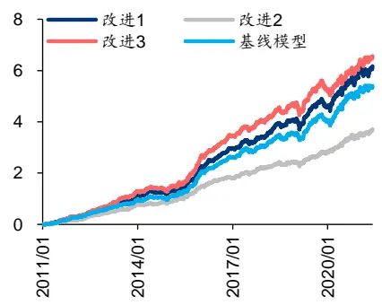
资料来源：Wind，华泰研究

## 本文研究导读

在华泰金工前期报告《AlphaNet：因子挖掘神经网络》(2020.6.14)和《再探AlphaNet：结构和特征优化》(2020.8.24)中，我们构建了端到端的因子挖掘和因子合成模型AlphaNet，并开发了多个版本的模型。

图表1：人工智能融入多因子选股体系
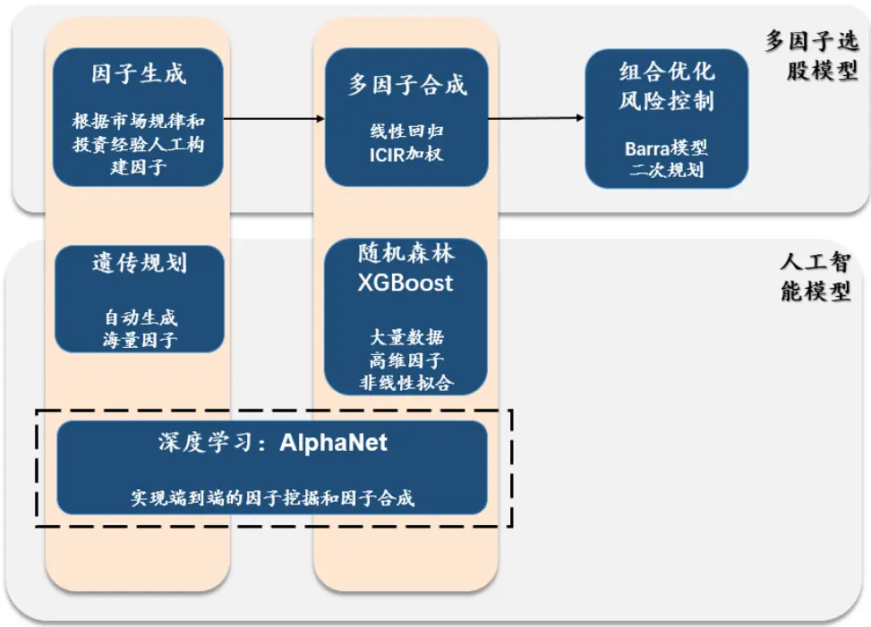
资料来源：华泰研究

深度学习的灵活性使得其具有很大的改进和定制空间。过去一年时间里，我们对市场规律和模型特点进行了深入思考，提出了AlphaNet的三个改进方向并测试其有效性。

图表2：AlphaNet 的三个改进方向
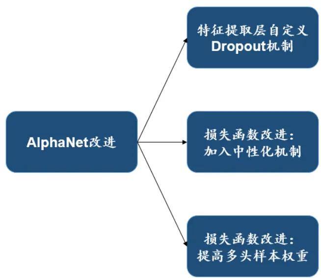
资料来源：华泰研究

| open(t-4) | open(t-3) | open(t-2) | open(t-1) | open(t) |  |
| --- | --- | --- | --- | --- | --- |
| high(t-4) | high(t-3) | high(t-2) | high(t-1) | high(t) |  |
| low(t-4) | low(t-3) | low(t-2) | low(t-1) | low(t) |  |
| close(t-4) | close(t-3) | close(t-2) | close(t-1) | close(t) |  |
| vwap(t-4) | vwap(t-3) | vwap(t-2) | vwap(t-1) | vwap(t) |  |
| volume(t-4) | volume(t-3) | volume(t-2) | volume(t-1) | volume(t) |  |
| return1(t-4) | return1(t-3) | return1(t-2) | return1(t-1) | return1(t) |  |
| turn(t-4) | turn(t-3) | turn(t-2) | turn(t-1) | turn(t) |  |
| free_turn(t-4) | free_turn(t-3) | free_turn(t-2) | free_turn(t-1) | free_turn(t) | ts_corr(X,Y,3) |
| open(t-4) | open(t-3) | open(t-2) | open(t-1) | open(t) |  |
| high(t-4) | high(t-3) | high(t-2) | high(t-1) | high(t) |  |
| low(t-4) | low(t-3) | low(t-2) | low(t-1) | low(t) |  |
| close(t-4) | close(t-3) | close(t-2) | close(t-1) | close(t) |  |
| vwap(t-4) | vwap(t-3) | vwap(t-2) | vwap(t-1) | vwap(t) |  |
| volume(t-4) | volume(t-3) | volume(t-2) | volume(t-1) | volume(t) |  |
| return1(t-4) | return1(t-3) | return1(t-2) | return1(t-1) | return1(t) |  |
| turn(t-4) | turn(t-3) | turn(t-2) | turn(t-1) | turn(t) |  |
| free_turn(t-4) | free_turn(t-3) | free_turn(t-2) | free_turn(t-1) | free_turn(t) |  |

图表4：ts_corr特征提取层的自定义 Dropout 机制
在时间维度上步进，与CNN类似，步进大小stride是可调参数
资料来源：华泰研究

## AlphaNet 的三个改进方向

## 特征提取层自定义 Dropout 机制

Dropout 是神经网络中常用的控制过拟合技巧。2012年，Alex Krizhevsky、Geoffrey E.Hinton 在其论文“ImageNet Classification with Deep Convolutional Neural Networks”中最早使用了Dropout 用于防止过拟合；该论文构建的 AlexNet 网络在当时取得了最佳的图像分类效果，此后 Dropout被广泛用于神经网络中。下图右侧展示了Dropout的原理，在神经网络的前向传播中，使得每个神经元以一定概率p不输出激活值，从而减少网络中的连接。本文参照 Dropout 的原理，为 AlphaNet的特征提取层设计了自定义 Dropout 机制。

图表3：Dropout 原理
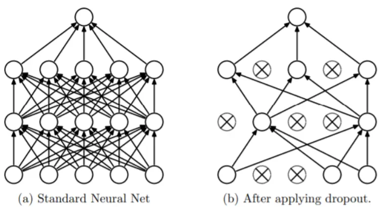
资料来源：Dropout: A Simple Way to Prevent Neural Networks from Overfitting, 2012，华泰研究

AlphaNet的特征提取层自定义Dropout 机制作用于二元运算函数(ts_corr，ts_cov等)上。如下图所示，ts_corr(X,Y,d)函数需要计算两个时间序列X和Y在d日内的相关系数，若输入的原始特征数量为9个，则需要遍历计算 $C_{9}^{2}=36^{\circ}\mathrm{{^k}}$ ，运算复杂度为O(n²)，计算开销较大，且两两遍历得到的36个特征相关性较高。因此，我们针对二元运算函数设计了自定义Dropout机制：抽样遍历，即从9个原始特征中随机抽样出n个(0<n<9)特征再两两遍历，可以较大幅度地降低计算开销和计算结果的相关性。

加入自定义Dropout机制后，需要确定抽样特征数量n的取值，n取值太小会使得抽样得到的特征太少，影响模型表现，n取值太大则会降低自定义Dropout机制的效果。由于我们会训练10个模型然后集成，本文的原则是在训练出的10个模型中，尽量遍历完所有的两两特征组合；在该原则下，为了获得n的最优取值，我们进行模拟特征抽样测试，考察不同n的取值下能够覆盖的两两特征组合比例。我们设定模拟次数为1000次，原始特征数量为15个，设n=[6,7,8,9,10,11]，下图展示了在不同n的取值下，10个模型中能够覆盖的两两特征组合比例。

图表5：1000 次模拟中，不同 n 的取值下 10 个模型中能够覆盖的两两特征组合比例

| n | 比例 |
| --- | --- |
| 6 | 78.64% |
| 7 | 89.42% |
| 8 | 95.52% |
| 9 | 98.59% |
| 10 | 99.65% |
| 11 | 99.94% |

资料来源：华泰研究

可知，当n=8时即可覆盖95%以上的两两特征组合，此时二元运算函数需要遍历的特征组合数目仅为 $C_{8}^{2}=28$ ，相比完全遍历的数目 ${\cal C}_{15}^{2}={\bf105}$ 大幅减少。

特征提取层自定义Dropout机制能带来以下三点优势：

1. 节约二元运算函数(ts_corr，ts_cov等)的计算开销，提升模型训练速度。另外由于计算开销的下降，更多原始特征可以输入模型，有可能提升模型的预测能力。

2. Dropout 最主要的功能就是控制过拟合。相比完全遍历，自定义 Dropout 机制的抽样遍历得到的特征之间相关性下降，有利于控制过拟合。

3. 在 AlphaNet的训练中我们使用不同的随机数种子训练多个模型后集成。自定义Dropout机制可以降低不同随机数种子下训练模型的相关性，更有利于模型集成。

最后，读者可能会有一个疑问：为什么不直接在特征提取层后加Dropout层而是实现自定义 Dropout 机制？本文的回答如下：

1. 直接在特征提取层后加Dropout层并不能降低计算开销，二元运算函数仍需对全部特征进行两两遍历。

2. 相比使用 Keras 的 Dropout API，自定义 Dropout 机制更能保证我们对模型的可控性。

## 损失函数改进：加入中性化机制

多因子选股框架中，一直以来一个备受关注的问题是如何挖掘相对于现有因子具有增量信息的因子，因子中性化是研究该问题的主要方法。针对该问题，我们将因子中性化机制加入到 AlphaNet 的损失函数中。

设真实的收益率为y，模型预测的收益率为y，常规的最小均方误差损失函数(MSE)可用下式表达：

$$
\mathrm{Loss}=\mathrm{MSE}(\boldsymbol{\mathrm{y}},\boldsymbol{\hat{\mathrm{y}}})
$$

由于未涉及到中性化机制，上式所训练的模型通常会和现有因子相关性较高。本文对AlphaNet 的损失函数进行改进，在计算 MSE之前，首先将y对 Barra 风格因子回归，得到残差 $\hat{\bf y}_{\mathrm{res}}$ ，再与y计算MSE作为损失函数，如下式：

$$
\mathrm{Loss}=\mathrm{MSE}(\mathrm{y},\hat{\mathrm{y}}_{\mathrm{res}})
$$

加入中性化机制的损失函数可以引导 AlphaNet挖掘与 Barra 风格因子相关性较低的因子，降低风格暴露，使得 AlphaNet 的预测结果具有更纯粹的 Alpha 属性。本文所使用的 Barra风格因子可参见附录。

## 损失函数改进：提高多头样本权重

由于A股做空手段有限，空头收益较难获取，在A股进行因子投资一个常见问题是如何挖掘具有显著多头收益的因子。在AlphaNet中，可以通过提高多头样本权重来引导模型挖掘具有显著多头收益的因子。

如下式所示，我们从单一样本角度考虑损失函数，设样本i的真实的收益率为 $y_{i}$ ，模型预测的收益率为i， $L(y_{i},\hat{y}_{i})$ 为样本i的损失函数， $w_{i}$ 为样本i损失函数的权重，则总体的损失函数LoSS为所有样本损失函数的加权和。默认情况下，所有样本的权重 $w_{i}$ 相等。我们也可以修改 $w_{i}$ 来改变样本的权重，使得某些样本的损失函数权重更大，则模型会更侧重优化这些样本的预测效果。

$$
\mathrm{Loss}=\sum_{i=1}^{n}w_{i}*L(y_{i},\hat{y}_{i})
$$

针对AlphaNet，我们可以提升训练集样本中多头样本的权重来引导模型挖掘具有显著多头收益的因子。

## 测试流程

## 基线模型和改进模型说明

我们以前期报告《再探 AlphaNet：结构和特征优化》(2020.08.24)中的 AlphaNet-v2为本文的基线模型(baseline model)。本文介绍的三种改进方式都在 AlphaNet-v2上进行，并与AlphaNet-v2进行测试对比。AlphaNet-v2的结构如下图所示。

图表6：AlphaNet-v2模型

| open(t-29) | …… | open(t-1) | open(t) |  |
| --- | --- | --- | --- | --- |
|  |  |  |  | ts_corr10 BNts_cov10 BNts_stddev10 BNLSTM预测(time_step=3,ts_zscore10 BN 目标output_units=30)ts_return10 BNts_decaylinBNear10特征提取层 |
| high(t-29) | "…" | high(t-1) | high(t) |  |
| low(t-29) | ……… | low(t-1) | low(t) |  |
| close(t-29) | .... | close(t-1) | close(t) |  |
| vwap(t-29) | ……… | vwap(t-1) | vwap(t) |  |
| volume(t-29) | .……. | volume(t-1) | volume(t) |  |
| return1(t-29) | ………. | return1(t-1) | return1(t) |  |
| turn(t-29) | ……… | turn(t-1) | turn(t) |  |
| free_turn(t-29) | .….… | free_turn(t-1) | free_turn(t) |  |
| close(t-29)/free_turn(t-29) | …… | close(t-1)/free_turn(t-1) | close(t)/free_turn(t) |  |
| open(t-29)/turn(t-29) | .… | open(t-1)/turn(t-1) | open(t)/turn(t) |  |
| volume(t-29)/low(t-29) | …… | volume(t-1)/low(t-1) | volume(t)/low(t) |  |
| vwap(t-29)/high(t-29) | ……… | vwap(t-1)/high(t-1) | vwap(t)/high(t) |  |
| low(t-29)/high(t-29) | … | low(t-1)/high(t-1) | low(t)/high(t) |  |
| vwap(t-29)/close(t-29) | … | vwap(t-1)/close(t-1) | vwap(t)/close(t) |  |

数据输入：个股量价“数据图片”维度：15*30

资料来源：华泰研究

## 三个改进模型的说明如下：

图表7：三个改进模型说明

| 模型名称 | 模型描述 |
| --- | --- |
| AlphaNet-v2.1 | 加入特征提取层自定义 Dropout 机制的 AlphaNet-v2 模型，抽样特征数量 n=8。 |
| AlphaNet-v2.2 | 在 AlphaNet-v2模型基础上，对损失函数加入中性化机制，中性化因子为Barra十大风格因子。 |
| AlphaNet-v2.3 | 在 AlphaNet-v2模型基础上，对每个截面中收益率排名前 50%的样本设置权重为2，排名后 50%的样本设 |
|  | 置权重为 1。在 Keras 中可以通过设置 sample_weight 来实现。 |

资料来源：华泰研究

## 数据准备

1.股票池：全A股。剔除ST、PT股票，剔除每个截面期下一交易日涨跌停和停牌的股票。

3.预测目标：个股10天后标准化的收益率。

4.回测区间：2011年1月31日至2021年6月30日。

5.样本内数据大小：每次训练都使用过去1500个交易日的数据作为样本内数据，每隔两天采样一次。

6.训练集和验证集比例：按照时间先后进行4：1划分，训练集在前，验证集在后。

图表8：原始特征列表

| 名称 | 定义 |
| --- | --- |
| return1 | 个股日频收益率(由相邻两个交易日的后复权收盘价计算得来) |
| open, close, high, low, volume | 个股日频开盘价、收盘价、最高价、最低价、成交量 |
| vwap | 个股日频成交量加权平均价 |
| turn, free_turn | 个股日频换手率、自由流通股换手率 |
| close/free_turn | 个股日频收盘价/个股日频自由流通股换手率 |
| open/turn | 个股日频开盘价/个股日频换手率 |
| volume/low | 个股日频成交量/个股日频最低价 |
| vwap/high | 个股日频成交量加权平均价/个股日频最高价 |
| low/high | 个股日频最低价/个股日频最高价 |
| vwap/close | 个股日频成交量加权平均价/个股日频收盘价 |

资料来源：Wind，华泰研究

## 模型训练和预测方式

1. 模型训练：从2011年1月31日开始，每隔半年进行滚动训练。样本内数据为过去1500个交易日的数据，训练集和验证集按照4：1划分。

2.模型预测：在每个样本外数据截面上，使用最新训练的模型预测。

考虑到神经网络的训练受随机数种子影响较大，我们会训练10个模型，并将10个模型的预测结果做等权平均，取该平均值为AlphaNet的合成因子。

## 模型测试方式

对于三个改进模型合成的因子，在全 A 股内测试，并与基线模型 AlphaNet-v2进行对比。

1.单因子IC测试和分层测试。分析因子的 RankIC均值、ICIR、分层组合年化收益率等指标。

2. 构建行业市值中性的中证500增强策略进行回测。分析策略的年化超额收益率、信息比率、超额收益最大回撤等指标。

## 特征提取层自定义 Dropout 机制的测试结果

2. AlphaNet-v2.1：加入特征提取层自定义 Dropout 机制的 AlphaNet-v2 模型，抽样特征数量 n=8。

单因子IC测试的方法如下：

1.样本空间：全A股。剔除ST、PT股票，剔除每个截面期下一交易日涨跌停和停牌的股票。

2.回测区间：2011年1月31日到2021年6月30日。

3.截面期：每隔10个交易日，用当前截面期因子值与当前截面期至下个截面期内的个股收益计算RankIC值。

4.因子进行行业市值中性。

## 单因子分层测试的方法如下：

1.股票池、回测区间、截面期均与IC测试一致。

2. 换仓：在每个截面期得到预测值，构建分层组合，在截面期下一个交易日按当日vwap换仓，交易费用为单边千分之二。

3. 分层方法：先将因子暴露度向量进行一定预处理，将股票池内所有个股按处理后的因子值从大到小进行排序，等分N层，每层内部的个股等权重配置。当个股总数目无法被N整除时采用任一种近似方法处理均可，实际上对分层组合的回测结果影响很小。分层测试中的基准组合为股票池内所有股票的等权组合。

4. 多空组合收益计算方法：用 Top 组每天的收益减去 Bottom 组每天的收益，得到每日多空收益序列r1,r2,…,rn，则多空组合在第 n 天的净值等 $\mp(1+\mathrm{r}_{1})(1+\mathrm{r}_{2})\cdots(1+\mathrm{r}_{\mathrm{n}})$

5.因子进行行业市值中性。

构建行业市值中性的指数增强策略回测的方法如下：

1.股票池、回测区间、与IC测试一致。

2. 换仓：周频调仓。在每个截面期得到预测值，通过组合优化模型得到新的持仓股票和权重，在截面期下一个交易日按当日vwap换仓，交易费用为单边千分之二，每次调仓双边换手率限制在30%。

下方两图为 AlphaNet-v2.1 和 AlphaNet-v2 的 IC 测试结果。相比 AlphaNet-v2，AlphaNet-v2.1 的 RankIC 均值略高，IC_IR略低，二者总体表现接近。

图表9： AlphaNet-v2.1 和 AlphaNet-v2 合成因子 IC 值分析(回测期 20110131～20210630)

|  | RankIC 均值 | RankIC 标准差 | IC_IR | IC>0 占比 |
| --- | --- | --- | --- | --- |
| AlphaNet-v2.1 | 11.45% | 10.44% | 1.10 | 88.89% |
| AlphaNet-v2 | 11.25% | 9.87% | 1.14 | 88.51% |

资料来源：Wind，华泰研究

图表10: AlphaNet-v2.1 和 AlphaNet-v2 合成因子的累计 RankIC (回测期 20110131～20210630)
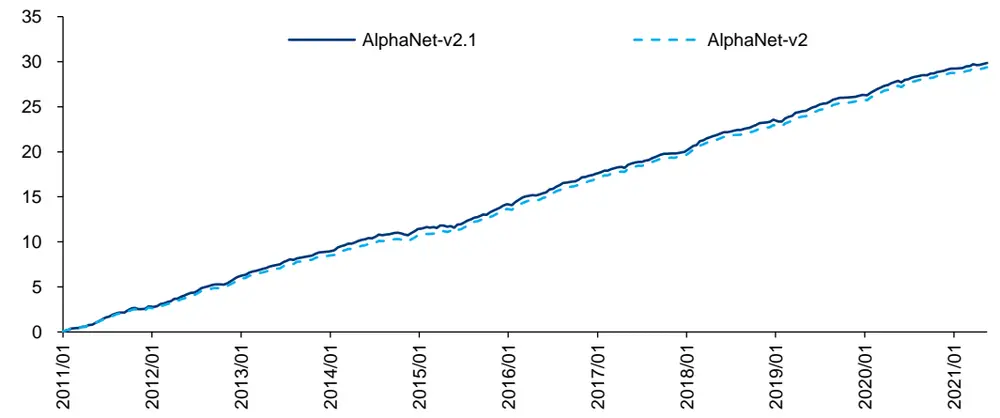
资料来源：Wind，华泰研究

下方图表为 AlphaNet-v2.1 和 AlphaNet-v2 的分层测试结果。相比 AlphaNet-v2，AlphaNet-v2.1 的 TOP 组合收益率略高，但 TOP 组合信息比率和胜率略低，二者总体表现接近。

图表11：AlphaNet-v2.1 和AlphaNet-v2 合成因子分层测试结果(回测期 20110131～20210630)

| 分层组合1～5(从左到右)年化超额收益率 |  |  |  |  |  | 多空组合年化收益率 | 多空组合夏普比率 | TOP 组合信息比率 TOP 组合胜率 |
| --- | --- | --- | --- | --- | --- | --- | --- | --- |
| AlphaNet-v2.1 | 15.79% | 3.85% | -4.38% | -13.53% | -25.27% |  |  |  |
| AlphaNet-v2 | 15.03% | 2.82% | -4.29% | -13.60% | -24.71% | 54.29% 52.19% | 6.14 6.18 | 3.42 79.20% 3.45 82.40% |

资料来源：Wind，华泰研究

图表12:AlphaNet-v2.1 合成因子的分层测试相对基准超额收益
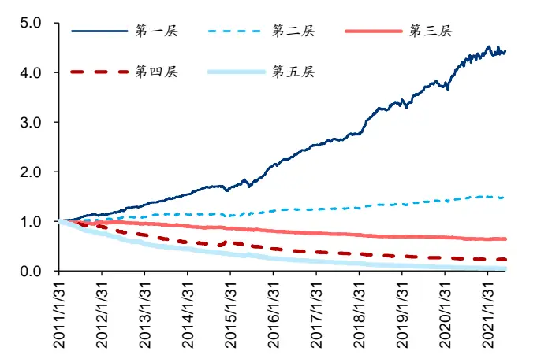
资料来源：Wind，华泰研究

图表13：AlphaNet-v2.1 和 AlphaNet-v2 第一层相对基准超额收益
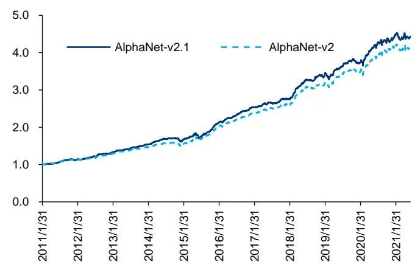
资料来源：Wind，华泰研究

下方图表为使用 AlphaNet-v2.1 和 AlphaNet-v2 构建中证 500 增强组合的测试结果。相比AlphaNet-v2，AlphaNet-v2.1 的年化超额收益率、信息比率、Calmar 比率更高。

图表14：行业市值中性的中证500 增强策略回测绩效(回测期：20110131～20210630)

|  | 年化收益率年化波动率 |  | 夏普比率 | 最大回撤 | 年化超额收年化跟踪误超额收益最大 |  |  | 信息比率 Calmar 比率 |  | 相对基准月 月均双边换 胜率 |
| --- | --- | --- | --- | --- | --- | --- | --- | --- | --- | --- |
|  |  |  |  |  | 益率 | 差 | 回撤 |  |  |  |
| AlphaNet-v2.1 | 27.11% | 24.50% | 1.11 | 43.49% | 21.50% | 6.52% | 8.22% | 3.30 | 2.62 84.00% | 手率 31.24% |
| AlphaNet-v2 | 25.55% | 24.85% | 1.03 | 44.72% | 20.13% | 6.31% | 8.05% | 3.19 2.50 | 79.20% | 31.42% |
| 中证 500 | 4.00% | 26.00% | 0.15 | 65.20% |  |  |  |  |  |  |

资料来源：Wind，华泰研究

图表15：行业市值中性的中证500增强策略逐年回测收益(回测期：20110131～20210630)

|  | 2011年 | 2012年 | 2013年 | 2014年 | 2015年 | 2016年 | 2017年 | 2018年 | 2019年 | 2020年 | 2021年 |  |
| --- | --- | --- | --- | --- | --- | --- | --- | --- | --- | --- | --- | --- |
|  |  |  |  |  |  |  |  |  |  |  |  | 收益率 收益率 |
| AlphaNet-v2.1 | 收益率 -6.82% | 收益率 27.86% | 收益率 50.26% | 46.41% | 105.22% | 收益率 5.80% | 收益率 11.25% | 收益率 -22.71% | 收益率 40.78% | 收益率 47.46% | 收益率 12.17% |  |
| AlphaNet-v2 | -9.47% | 26.26% | 42.19% | 44.96% | 109.31% |  | 12.17% |  | 41.66% |  |  |  |
|  |  |  |  |  |  | 5.00% |  | -25.09% |  | 47.40% | 10.76% |  |
| 中证 500 | -28.17% | 0.28% | 16.89% | 39.01% | 43.12% | -17.78% | -0.20% | -33.32% | 26.38% | 20.87% | 6.92% |  |

资料来源：Wind，华泰研究

图表16：行业市值中性的中证500 增强策略超额收益情况(回测期：20110131～20210630)
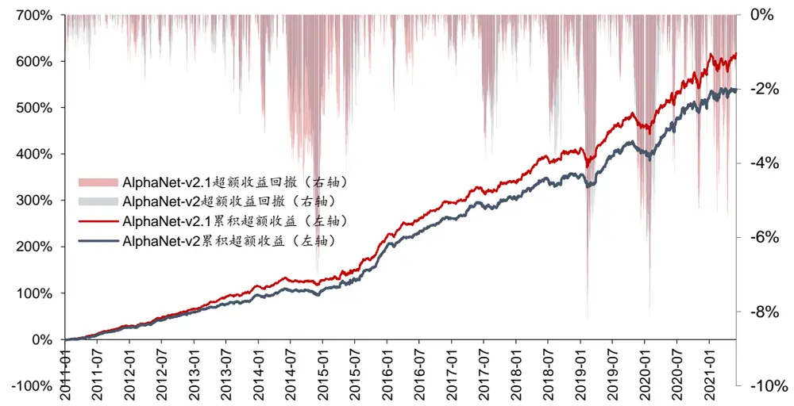
资料来源：Wind，华泰研究

加入特征提取层自定义Dropout机制后，AlphaNet在收益方面的表现有小幅提升，同时训练耗时明显减少，有助于在今后的研究中加入更多特征。

## 损失函数改进：加入中性化机制的测试结果

2. AlphaNet-v2.2：在 AlphaNet-v2 模型基础上，对损失函数加入中性化机制，中性化因子为 Barra 十大风格因子。

下方两图为 AlphaNet-v2.2 和 AlphaNet-v2 的 IC 测试结果。相比 AlphaNet-v2，

AlphaNet-v2.2 的 RankIC 均值较低，这是因为AlphaNet-v2.2 已剔除了Barra 十大风格因子的信息，更能反映模型挖掘出的增量Alpha，同时也规避了风格因子所带来的波动，IC_IR较高。

图表17：AlphaNet-v2.2 和 AlphaNet-v2 合成因子 IC 值分析(回测期 20110131～20210630)

|  | RankIC 均值 | RankIC 标准差 | IC_IR | IC>0 占比 |
| --- | --- | --- | --- | --- |
| AlphaNet-v2.2 | 7.99% | 6.96% | 1.15 | 89.66% |
| AlphaNet-v2 | 11.25% | 9.87% | 1.14 | 88.51% |

资料来源：Wind，华泰研究

图表18： AlphaNet-v2.2 和 AlphaNet-v2 合成因子的累计 RankIC (回测期 20110131～20210630)
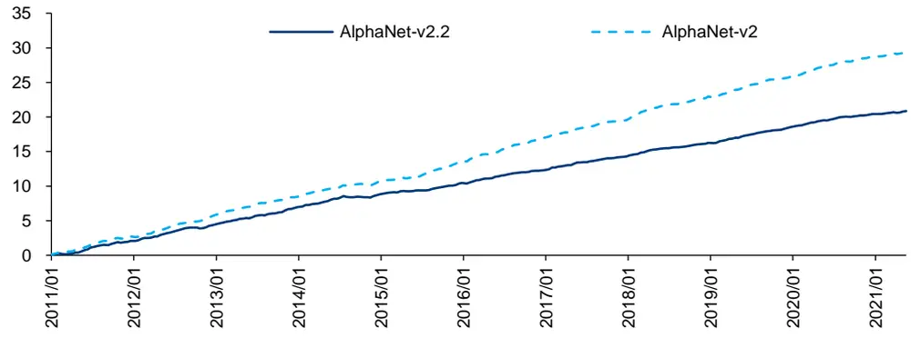
资料来源：Wind，华泰研究

下方图表为 AlphaNet-v2.2和AlphaNet-v2的分层测试结果。相比AlphaNet-v2，AlphaNet-v2.2 的 TOP 组合收益率较低，但 TOP 组合信息比率更高。

图表19：AlphaNet-v2.2合成因子的分层测试相对基准超额收益
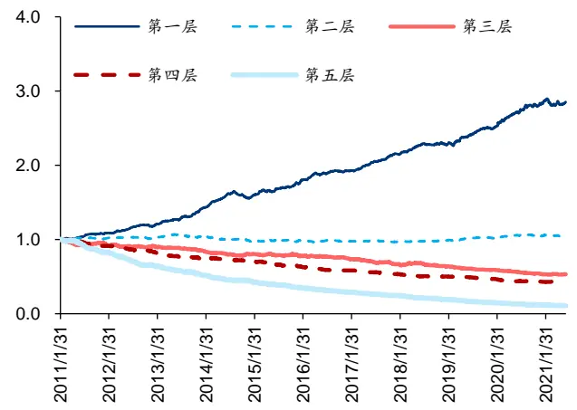
资料来源：Wind，华泰研究

图表20：AlphaNet-v2.2 和 AlphaNet-v2 第一层相对基准超额收益
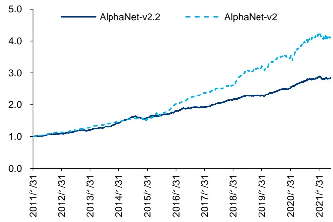
资料来源：Wind，华泰研究

图表21：AlphaNet-v2.2 和AlphaNet-v2 合成因子分层测试结果(回测期 20110131～20210630)

| 分层组合1～5(从左到右)年化超额收益率 |  |  |  |  |  | 多空组合年化收益率 | 多空组合夏普比率 | TOP 组合信息比率 TOP 组合胜率 |
| --- | --- | --- | --- | --- | --- | --- | --- | --- |
| AlphaNet-v2.2 | 10.79% | 0.31% | -5.97% | -8.15% | 37.72% |  |  |  |
| AlphaNet-v2 | 15.03% | 2.82% | -4.29% | -13.60% | -19.73% -24.71% | 52.19% | 6.05 6.18 | 3.55 76.00% 3.45 82.40% |

资料来源：Wind，华泰研究

下方图表为使用 AlphaNet-v2.2 和 AlphaNet-v2 构建中证 500 增强组合的测试结果。相比AlphaNet-v2，AlphaNet-v2.2的年化超额收益率较低，但超额收益最大回撤和Calmar 比率显著改善，2014年底、2019年初、2020年初的超额收益回撤都明显减小。

图表22：行业市值中性的中证500 增强策略回测绩效(回测期：20110131～20210630)

|  |  |  |  |  |  | 年化超额 年化跟踪 误差 | 超额收益 | 相对基准 |  |  | 月均双边 换手率 |
| --- | --- | --- | --- | --- | --- | --- | --- | --- | --- | --- | --- |
|  | 年化收益率年化波动率 |  | 夏普比率 | 最大回撤 | 收益率 |  |  | 最大回撤 | 信息比率 Calmar 比率 | 月胜率 |  |
| AlphaNet-v2.2 | 21.57% | 25.42% | 0.85 | 46.08% | 16.56% | 5.30% | 5.17% | 3.12 | 3.20 | 84.80% | 31.31% |
| AlphaNet-v2 | 25.55% | 24.85% | 1.03 | 44.72% | 20.13% | 6.31% | 8.05% | 3.19 | 2.50 | 79.20% | 31.42% |
| 中证 500 | 4.00% | 26.00% | 0.15 | 65.20% |  |  |  |  |  |  |  |

资料来源：Wind，华泰研究

图表23：行业市值中性的中证500 增强策略逐年回测收益(回测期：20110131～20210630)

|  | 2011年 | 2012年 | 2013年 | 2014年 | 2015年 | 2016年 | 2017年 | 2018年 | 2019年 | 2020年 | 2021年 |  |
| --- | --- | --- | --- | --- | --- | --- | --- | --- | --- | --- | --- | --- |
|  |  |  |  |  |  |  |  |  |  |  |  | 收益率 |
| AlphaNet-v2.2 | 收益率 -15.61% | 收益率 23.63% | 收益率 40.42% | 47.55% | 收益率 91.44% | 收益率 -4.34% | 收益率 13.89% | 收益率 -28.69% | 收益率 39.81% | 收益率 42.96% | 收益率 13.04% |  |
| AlphaNet-v2 | -9.47% | 26.26% | 42.19% | 44.96% | 109.31% | 5.00% | 12.17% | -25.09% | 41.66% | 47.40% | 10.76% |  |
| 中证 500 | -28.17% | 0.28% | 16.89% | 39.01% | 43.12% | -17.78% | -0.20% | -33.32% | 26.38% | 20.87% | 6.92% |  |

资料来源：Wind，华泰研究

图表24：行业市值中性的中证 500增强策略超额收益情况(回测期：20110131～20210630)
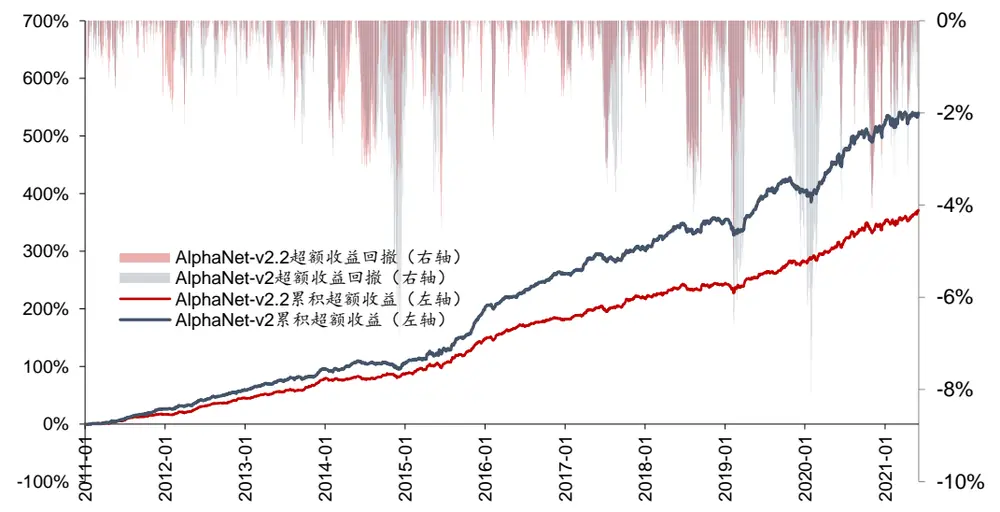
资料来源：Wind，华泰研究

损失函数加入中性化机制的 AlphaNet 能够挖掘更纯粹的 alpha，模型的超额收益虽然下降但是稳定性大幅提升，对回撤和波动的控制都显著改善。值得注意的是，损失函数的中性化机制不仅适用于AlphaNet，也适用于任何神经网络选股模型，是一个通用的方法。

## 损失函数改进：提高多头样本权重的测试结果

2. AlphaNet-v2.3：在 AlphaNet-v2 模型基础上，对每个截面中收益率排名前 50%的样本设置权重为2，排名后50%的样本设置权重为1。

下方两图为 AlphaNet-v2.3 和 AlphaNet-v2 的 IC 测试结果。相比 AlphaNet-v2，AlphaNet-v2.3 的 RankIC 均值略高，IC_IR 略低。

图表25：AlphaNet-v2.3 和 AlphaNet-v2 合成因子 IC 值分析(回测期 20110131～20210630)

|  | RankIC 均值 | RankIC 标准差 | IC_IR | IC>0 占比 |
| --- | --- | --- | --- | --- |
| AlphaNet-v2.3 | 11.70% | 10.78% | 1.09 | 86.97% |
| AlphaNet-v2 | 11.25% | 9.87% | 1.14 | 88.51% |

资料来源：Wind，华泰研究

图表26： AlphaNet-v2.3 和 AlphaNet-v2 合成因子的累计 RankIC (回测期 20110131～20210630)
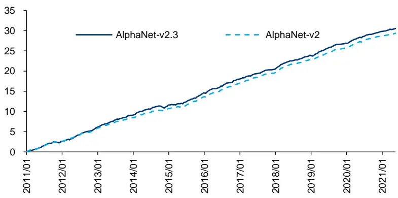
资料来源：Wind，华泰研究

下方图表为 AlphaNet-v2.3 和AlphaNet-v2的分层测试结果。相比 AlphaNet-v2，

AlphaNet-v2.3 的 TOP组合收益率、TOP组合信息比率更高，提高多头样本权重的损失函数表现出了应有的作用。

图表27：AlphaNet-v2.3合成因子的分层测试相对基准超额收益
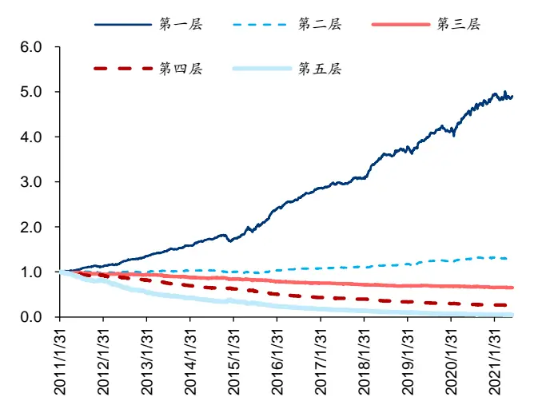
资料来源：Wind，华泰研究

图表28： AlphaNet-v2.3 和 AlphaNet-v2 第一层相对基准超额收益
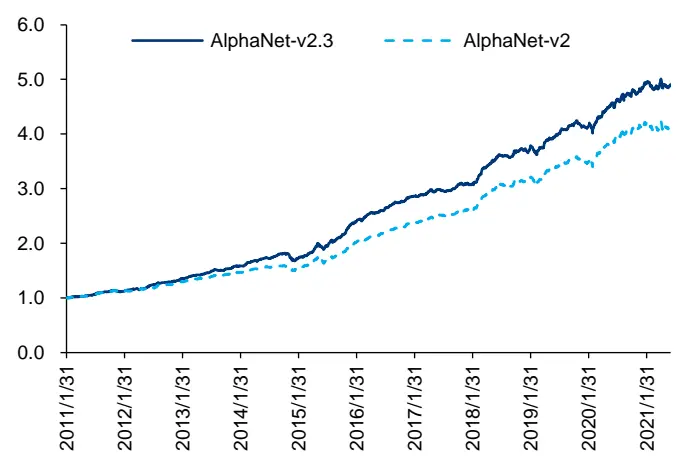
资料来源：Wind，华泰研究

图表29：AlphaNet-v2.3 和AlphaNet-v2 合成因子分层测试结果(回测期 20110131～20210630)

| 分层组合1～5(从左到右)年化超额收益率 |  |  |  |  |  | 多空组合年化收益率 | 多空组合夏普比率 | TOP 组合信息比率 TOP 组合胜率 |
| --- | --- | --- | --- | --- | --- | --- | --- | --- |
| AlphaNet-v2.3 | 16.90% | 2.51% | -4.25% | -12.51% | 56.05% |  |  |  |
| AlphaNet-v2 | 15.03% | 2.82% | -4.29% | -13.60% | -25.45% -24.71% | 52.19% | 6.03 6.18 | 3.79 81.60% 3.45 82.40% |

资料来源：Wind，华泰研究

下方图表为使用 AlphaNet-v2.3 和 AlphaNet-v2 构建中证 500 增强组合的测试结果。相比AlphaNet-v2，AlphaNet-v2.3的年化超额收益率、信息比率更高。

图表30：行业市值中性的中证500 增强策略回测绩效(回测期：20110131～20210630)

|  |  |  |  |  |  | 年化超额收 年化跟踪超额收益最大 |  | 相对基准 |  |  | 月均双边 |
| --- | --- | --- | --- | --- | --- | --- | --- | --- | --- | --- | --- |
|  |  | 年化收益率 年化波动率 | 夏普比率 | 最大回撤 | 益率 | 误差 | 回撒 | 信息比率 Calmar 比率 |  | 月胜率 | 换手率 |
| AlphaNet-v2.3 | 27.89% | 24.14% | 1.16 | 43.70% | 22.12% | 6.68% | 8.80% | 3.31 | 2.51 | 79.20% | 31.08% |
| AlphaNet-v2 | 25.55% | 24.85% | 1.03 | 44.72% | 20.13% | 6.31% | 8.05% | 3.19 | 2.50 | 79.20% | 31.42% |
| 中证 500 | 4.00% | 26.00% | 0.15 | 65.20% |  |  |  |  |  |  |  |

资料来源：Wind，华泰研究

图表31：行业市值中性的中证500 增强策略逐年回测收益(回测期：20110131～20210630)

|  | 2011年 | 2012年 | 2013年 | 2014年 | 2015年 | 2016年 | 2017年 | 2018年 | 2019年 | 2020年 | 2021年 |  |
| --- | --- | --- | --- | --- | --- | --- | --- | --- | --- | --- | --- | --- |
|  |  |  |  |  |  |  |  |  |  |  |  | 收益率 |
| AlphaNet-v2.3 | 收益率 -6.82% | 收益率 27.86% | 收益率 50.26% | 收益率 46.41% | 105.22% | 收益率 5.80% | 收益率 11.25% | 收益率 -22.71% | 收益率 40.78% | 收益率 47.46% | 收益率 12.17% |  |
| AlphaNet-v2 | -9.47% | 26.26% | 42.19% | 44.96% | 109.31% | 5.00% |  | -25.09% | 41.66% |  |  |  |
| 中证500 |  |  |  |  |  |  | 12.17% |  |  | 47.40% | 10.76% |  |
|  | -28.17% | 0.28% | 16.89% | 39.01% | 43.12% | -17.78% | -0.20% | -33.32% | 26.38% | 20.87% | 6.92% |  |

资料来源：Wind，华泰研究

图表32：行业市值中性的中证500 增强策略超额收益情况(回测期：20110131～20210630)
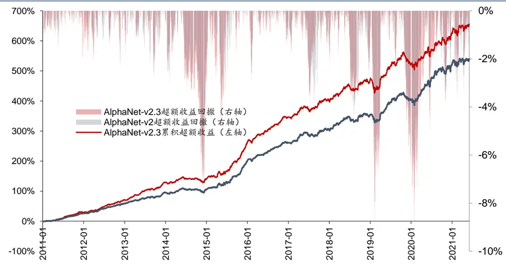
资料来源：Wind，华泰研究

损失函数中提高多头样本权重的方法是一种简单而行之有效的方法，无需从底层代码对网络进行修改，其他神经网络选股模型也可进行尝试。

## 总结

本文提出了AlphaNet的三个改进方向：(1)特征提取层自定义 Dropout 机制；(2)损失函数加入中性化机制；(3)损失函数中提高多头样本权重。我们以前期报告中的AlphaNet-v2模型作为基线模型，对三个改进方向进行了测试，在测试中均取得了理想的改进效果。

特征提取层自定义 Dropout 机制：控制过拟合，提升模型训练速度。Dropout是神经网络中常用的控制过拟合技巧。本文借鉴 Dropout的思想，针对 AlphaNet的特征提取层实现了自定义 Dropout 机制：对二元运算函数(ts_corr，ts_cov等)进行抽样遍历，该机制可从以下三点改善模型：(1)节约二元运算函数的计算开销，提升训练速度。此外由于计算开销的下降，更多原始特征可以输入模型，有可能提升模型的预测能力。(2)抽样遍历得到的特征之间相关性下降，有利于控制过拟合。(3)可降低不同随机数种子下训练模型的相关性，有利于模型集成。测试中，加入自定义Dropout机制的 AlphaNet在收益方面的表现有小幅提升，同时训练耗时明显减少。

损失函数加入中性化机制：剔除风格，挖掘更纯粹的Alpha因子。为了挖掘相对于现有因子具有增量信息的因子，本文将因子中性化机制加入到AlphaNet的损失函数中，新的损失函数可引导模型挖掘与Barra风格因子相关性较低的因子，降低风格暴露，使得模型的预测结果具有更纯粹的Alpha属性。测试中，AlphaNet的损失函数加入中性化机制后，模型的超额收益虽然下降但是稳定性大幅提升，对回撤和波动的控制都显著改善，模型在2014年底、2019年初、2020年初的超额收益回撤都明显减小。值得注意的是，损失函数的中性化机制不仅适用于AlphaNet，也适用于任何神经网络选股模型，是一个通用的方法。

损失函数中提高多头样本权重：挖掘具有显著多头收益的因子。由于A股做空手段有限，在A股进行因子投资一个常见问题是如何挖掘具有显著多头收益的因子。在AlphaNet中，可通过提高多头样本权重来引导模型挖掘具有显著多头收益的因子。测试中，提高多头样本权重的 AlphaNet在分层测试中TOP组合收益率、TOP组合信息比率更高，构建中证500指数增强组合的年化超额收益率、信息比率更高。该方法是一种简单而行之有效的方法，无需从底层代码对网络进行修改，其他神经网络选股模型也可进行尝试。

## 风险提示

通过人工智能模型构建的选股策略是历史经验的总结，存在失效的可能。神经网络受随机性影响较大，可解释性较低，使用需谨慎。

## 附录：Barra 风险因子模型

本文使用的 Barra USE4模型包含十个风格因子，其具体定义如下：

图表33：Barra 风格因子名称及其描述

| 大类 | 子类 | 因子简要描述 | 因子权重 |
| --- | --- | --- | --- |
| Size | LNCAP | 股票总市值的自然对数 | 1 |
| Beta | BETA | 股票收益率对中证全指收益率的线性回归斜率 | 1 |
| Momentum | RSTR | 历史收益率均值，采用指数加权计算 | 1 |
| Residual Volatility | DASTD | 历史波动率，采用指数加权计算 | 0.74 |
|  | CMRA | 历史收益率的波动幅度 | 0.16 |
|  | HSIGMA | Beta因子计算中线性回归残差项的标准差 | 0.1 |
| Non-linear Size | NLSIZE | Size 因子的三次方对 Size 因子的正交增量 | 1 |
| Book to Price | BTOP | 企业总权益值与当前市值的比值 | 1 |
| Liquidity | STOM | 过去一个月的流动性 | 0.35 |
|  | STOQ | 过去一个季度的流动性 | 0.35 |
|  | STOA | 过去一年的流动性 | 0.3 |
| Earning Yield | ETOP | 过去12个月的市盈率 | 0.66 |
| Growth | CETOP | 过去12个月的经营性净现金流与市值的比值 | 0.34 |
|  | EGRO | 过去5年企业归属母公司净利润的复合增长率 | 0.34 |
|  | MLEV | 市场杠杆 | 0.38 |
| Leverage | DTOA | 资产负债率 | 0.35 |
|  | BLEV | 账面杠杆 | 0.27 |

资料来源：USE4，华泰研究

## 免责声明

## 分析师声明

本人，林晓明、李子钰、何康，兹证明本报告所表达的观点准确地反映了分析师对标的证券或发行人的个人意见：彼以往、现在或未来并无就其研究报告所提供的具体建议或所表达的意见直接或间接收取任何报酬。

## 一般声明及披露

本报告由华泰证券股份有限公司（已具备中国证监会批准的证券投资咨询业务资格，以下简称“本公司”）制作。本报告所载资料是仅供接收人的严格保密资料。本报告仅供本公司及其客户和其关联机构使用。本公司不因接收人收到本报告而视其为客户。

本报告基于本公司认为可靠的、已公开的信息编制，但本公司及其关联机构(以下统称为“华泰”)对该等信息的准确性及完整性不作任何保证。

本报告所载的意见、评估及预测仅反映报告发布当日的观点和判断。在不同时期，华泰可能会发出与本报告所载意见、评估及预测不一致的研究报告。同时，本报告所指的证券或投资标的的价格、价值及投资收入可能会波动。以往表现并不能指引未来，未来回报并不能得到保证，并存在损失本金的可能。华泰不保证本报告所含信息保持在最新状态。华泰对本报告所含信息可在不发出通知的情形下做出修改，投资者应当自行关注相应的更新或修改。

本公司不是FINRA的注册会员，其研究分析师亦没有注册为FINRA的研究分析师/不具有FINRA分析师的注册资格。

华泰力求报告内容客观、公正，但本报告所载的观点、结论和建议仅供参考，不构成购买或出售所述证券的要约或招揽。该等观点、建议并未考虑到个别投资者的具体投资目的、财务状况以及特定需求，在任何时候均不构成对客户私人投资建议。投资者应当充分考虑自身特定状况，并完整理解和使用本报告内容，不应视本报告为做出投资决策的唯一因素。对依据或者使用本报告所造成的一切后果，华泰及作者均不承担任何法律责任。任何形式的分享证券投资收益或者分担证券投资损失的书面或口头承诺均为无效。

除非另行说明，本报告中所引用的关于业绩的数据代表过往表现，过往的业绩表现不应作为日后回报的预示。华泰不承诺也不保证任何预示的回报会得以实现，分析中所做的预测可能是基于相应的假设，任何假设的变化可能会显著影响所预测的回报。

华泰及作者在自身所知情的范围内，与本报告所指的证券或投资标的不存在法律禁止的利害关系。在法律许可的情况下，华泰可能会持有报告中提到的公司所发行的证券头寸并进行交易，为该公司提供投资银行、财务顾问或者金融产品等相关服务或向该公司招揽业务。

华泰的销售人员、交易人员或其他专业人士可能会依据不同假设和标准、采用不同的分析方法而口头或书面发表与本报告意见及建议不一致的市场评论和/或交易观点。华泰没有将此意见及建议向报告所有接收者进行更新的义务。华泰的资产管理部门、自营部门以及其他投资业务部门可能独立做出与本报告中的意见或建议不一致的投资决策。投资者应当考虑到华泰及/或其相关人员可能存在影响本报告观点客观性的潜在利益冲突。投资者请勿将本报告视为投资或其他决定的唯一信赖依据。有关该方面的具体披露请参照本报告尾部。

本报告并非意图发送、发布给在当地法律或监管规则下不允许向其发送、发布的机构或人员，也并非意图发送、发布给因可得到、使用本报告的行为而使华泰违反或受制于当地法律或监管规则的机构或人员。

本报告版权仅为本公司所有。未经本公司书面许可，任何机构或个人不得以翻版、复制、发表、引用或再次分发他人(无论整份或部分)等任何形式侵犯本公司版权。如征得本公司同意进行引用、刊发的，需在允许的范围内使用，并需在使用前获取独立的法律意见，以确定该引用、刊发符合当地适用法规的要求，同时注明出处为“华泰证券研究所”，且不得对本报告进行任何有悖原意的引用、删节和修改。本公司保留追究相关责任的权利。所有本报告中使用的商标、服务标记及标记均为本公司的商标、服务标记及标记。

## 中国香港

本报告由华泰证券股份有限公司制作，在香港由华泰金融控股（香港）有限公司向符合《证券及期货条例》及其附属法律规定的机构投资者和专业投资者的客户进行分发。华泰金融控股（香港）有限公司受香港证券及期货事务监察委员会监管，是华泰国际金融控股有限公司的全资子公司，后者为华泰证券股份有限公司的全资子公司。在香港获得本报告的人员若有任何有关本报告的问题，请与华泰金融控股（香港）有限公司联系。

## 香港-重要监管披露

- 华泰金融控股（香港）有限公司的雇员或其关联人士没有担任本报告中提及的公司或发行人的高级人员。

更多信息请参见下方“美国-重要监管披露”。

## 美国

在美国本报告由华泰证券（美国）有限公司向符合美国监管规定的机构投资者进行发表与分发。华泰证券（美国）有限公司是美国注册经纪商和美国金融业监管局（FINRA）的注册会员。对于其在美国分发的研究报告，华泰证券（美国）有限公司根据《1934年证券交易法》（修订版）第15a-6条规定以及美国证券交易委员会人员解释，对本研究报告内容负责。华泰证券（美国）有限公司联营公司的分析师不具有美国金融监管（FINRA）分析师的注册资格，可能不属于华泰证券（美国）有限公司的关联人员，因此可能不受FINRA关于分析师与标的公司沟通、公开露面和所持交易证券的限制。华泰证券（美国）有限公司是华泰国际金融控股有限公司的全资子公司，后者为华泰证券股份有限公司的全资子公司。任何直接从华泰证券（美国）有限公司收到此报告并希望就本报告所述任何证券进行交易的人士，应通过华泰证券（美国）有限公司进行交易。

## 美国-重要监管披露

- 分析师林晓明、李子钰、何康本人及相关人士并不担任本报告所提及的标的证券或发行人的高级人员、董事或顾问。分析师及相关人士与本报告所提及的标的证券或发行人并无任何相关财务利益。本披露中所提及的“相关人士”包括FINRA定义下分析师的家庭成员。分析师根据华泰证券的整体收入和盈利能力获得薪酬，包括源自公司投资银行业务的收入。

- 华泰证券股份有限公司、其子公司和/或其联营公司，及/或不时会以自身或代理形式向客户出售及购买华泰证券研究所覆盖公司的证券/衍生工具，包括股票及债券（包括衍生品）华泰证券研究所覆盖公司的证券/衍生工具，包括股票及债券（包括衍生品）。

- 华泰证券股份有限公司、其子公司和/或其联营公司，及/或其高级管理层、董事和雇员可能会持有本报告中所提到的任何证券（或任何相关投资）头寸，并可能不时进行增持或减持该证券（或投资）。因此，投资者应该意识到可能存在利益冲突。

## 评级说明

投资评级基于分析师对报告发布日后6至12个月内行业或公司回报潜力（含此期间的股息回报）相对基准表现的预期(A股市场基准为沪深300指数，香港市场基准为恒生指数，美国市场基准为标普500指数)，具体如下：

## 行业评级

增持：预计行业股票指数超越基准

中性：预计行业股票指数基本与基准持平

减持：预计行业股票指数明显弱于基准

## 公司评级

买入：预计股价超越基准15%以上

增持：预计股价超越基准5%~15%

持有：预计股价相对基准波动在-15%~5%之间

卖出：预计股价弱于基准15%以上

暂停评级：已暂停评级、目标价及预测，以遵守适用法规及/或公司政策

无评级：股票不在常规研究覆盖范围内。投资者不应期待华泰提供该等证券及/或公司相关的持续或补充信息

## 法律实体披露

中国：华泰证券股份有限公司具有中国证监会核准的“证券投资咨询”业务资格，经营许可证编号为：91320000704041011J香港：华泰金融控股(香港)有限公司具有香港证监会核准的“就证券提供意见”业务资格，经营许可证编号为：AOK809美国：华泰证券（美国）有限公司为美国金融业监管局（FINRA）成员，具有在美国开展经纪交易商业务的资格，经营业务许可编号为：CRD#:298809/SEC#:8-70231

## 华泰证券股份有限公司

南京南京市建邺区江东中路228号华泰证券广场1号楼/邮政编码：210019

电话：8625 83389999/传真：86 25 83387521电子邮件：ht-rd@htsc.com

## 深圳

深圳市福田区益田路5999号基金大厦10楼/邮政编码：518017电话：86 755 82493932/传真：86 755 82492062电子邮件：ht-rd@htsc.com

## 华泰金融控股（香港）有限公司

香港中环皇后大道中 99号中环中心 58楼5808-12室
电话：+852-3658-6000/传真：+852-2169-0770
电子邮件：research@htsc.com
http://www.htsc.com.hk

## 华泰证券（美国）有限公司

美国纽约哈德逊城市广场10号41楼（纽约10001）
电话：+212-763-8160/传真：+917-725-9702
电子邮件： Huatai@htsc-us.com
http://www.htsc-us.com

©版权所有2021年华泰证券股份有限公司

北京
北京市西城区太平桥大街丰盛胡同28号太平洋保险大厦A座18层/
邮政编码：100032
电话：861063211166/传真：861063211275
电子邮件：ht-rd@htsc.com
上海
上海市浦东新区东方路18号保利广场E栋23楼/邮政编码：200120
电话：862128972098/传真：862128972068
电子邮件：ht-rd@htsc.com