# 人工智能 47：cGAN模拟宏观指标

华泰研究

2021 年 8 月 04 日│中国内地

深度研究

将 GAN 的应用领域拓展至宏观研究，生成海量数据以应对样本稀缺问题本文将生成对抗网络（GAN）的应用领域拓展至宏观研究，采用条件生成对抗网络（cGAN）模拟宏观经济指标。宏观指标存在样本稀缺问题，生成海量仿真数据或能提高宏观研究论证效力。cGAN 使用过去一段时间真实数据作为条件序列，并结合随机输入，最终生成未来一段时间模拟序列。cGAN模拟宏观指标有两项应用场景：情景分析可以基于历史信息生成未来宏观指标，预测未来经济走势或进行压力测试；冲击响应分析可以考察某宏观指标的突变对其他指标的影响方向和程度，验证宏观经济运行逻辑。

## 给定过去 4个季度宏观指标，采用 cGAN 模拟未来 9个季度宏观指标

cGAN 的核心思想是在训练过程中增加额外条件信息，引导数据生成过程。本研究中，我们给定过去 4 个季度宏观指标（美国 5 项及中国 4 项）作为条件序列，采用 cGAN 模拟未来 9 个季度宏观指标。cGAN 包含条件生成器（cG）和条件判别器（cD）两组交替训练的网络。cG 输入包含高斯噪声和历史 4 个季度条件序列两部分；输出为未来 9 个季度假样本。cD 输入为完整 13个季度的真或假样本，真假样本区别在于后 9个季度是真实还是模拟序列；输出为样本属于真的概率。训练完成后，对比真假序列一阶自相关系数，以评估模拟数据真实性。

情景分析：站在任意时点模拟未来宏观指标路径，优于经典蒙特卡洛模拟cGAN 模拟宏观指标的一大应用场景是情景分析。相比经典蒙特卡洛模拟，cGAN 拟真效果更好，使用更灵活。我们站在 2019Q4 时点，采用过去 4个季度中美两国真实宏观数据，生成 1000 条未来 9个季度宏观指标。相当于回答：若未发生疫情，中美两国经济走势将如何？结果表明，cGAN 在2019 年末判断美国经济 2020 年总体延续复苏态势，GDP 同比和 10 年期国债利率拐点在 2020 年末或 2021 年初，失业率和 CPI 同比拐点在 2021年中；cGAN在 2019 年末判断中国经济 2020 年存在下行压力，GDP 同比和 10 年期国债利率 2020H2 转而下行，M2 同比 2021H1 转而上行。

冲击响应分析：考察某宏观指标突变对其他指标影响，验证宏观经济逻辑cGAN 模拟宏观指标的另一应用场景是冲击响应分析。对真实条件序列添加扰动，考察某项宏观指标发生突变时，其他指标将如何变化。我们站在2019Q4，采用过去 4个季度真实数据，将 2019Q4 美国联邦基金利率或中国 M2 同比调高 1 个标准差，对比冲击前后生成的 1000 条未来 9 个季度宏观指标。结果表明，针对美国经济，调高联邦基金利率将 1）抑制经济增长，2）抑制通胀，3）抑制就业，4）短期抬升利率但长期打压利率；针对中国经济，调高 M2 同比将 1）促进经济增长，2）引发通胀，3）短期打压利率但长期提升利率。所得结论均符合宏观经济基本逻辑。

当前时点预测未来中国经济，经济增长和利率拐点或将出现在 2021Q4站在 2021Q2 时点，采用过去 4 个季度真实宏观数据（2020Q3~2021Q2），借助 cGAN 生成 1000 条未来 9 个季度（2021Q3~2023Q3）宏观指标，对未来中国经济进行预判。cGAN 模型当前时点判断中国经济 2021 年下半年或仍缓慢上行，GDP 同比和 10 年期国债利率拐点将出现在 2021Q4，M2同比和 CPI 同比拐点将出现在 2022Q2。

风险提示：CGAN 模型存在黑箱问题，训练不收敛不同步，以及模式崩溃问题。深度学习模型存在过拟合的可能。深度学习模型是对历史规律的总结，如果市场规律发生变化，模型存在失效的可能。宏观指标生成效果易受极端值、基数效应影响。

研究员

SAC No. S0570516010001

林晓明

linxiaoming@htsc.com

SFC No. BPY421

+86-755-82080134

研究员

SAC No. S0570519110003

李子钰

liziyu@htsc.com

+86-755-23987436

研究员

SAC No. S0570520080004

SFC No. BRB318

何康，PhD

hekang@htsc.com

+86-21-28972039

## 2021Q2 模拟未来 9 季度中国 CPI 同比

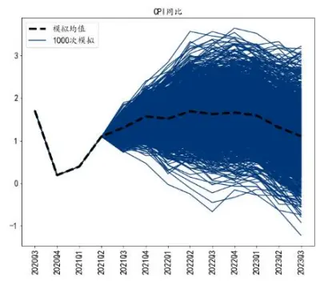
资料来源：Wind，华泰研究

## 研究导读

生成对抗网络（Generative Adversarial Networks，简称 GAN）是一种基于深度学习的生成模型，是近年来深度学习领域的研究热点。GAN 可用以生成以假乱真的人脸、图像、视频等，在金融领域 GAN 可用以模拟时间序列数据。相比于经典蒙特卡洛模拟技术，GAN的拟真效果更好，使用更为灵活。

华泰金工生成对抗网络系列研究自2020年5月以来已发布6篇研究报告，分别从模型改进、功能拓展与投资实践三方面，介绍 GAN 的理论和在金融领域的应用。此前研究中，我们主要使用 GAN 生成各类资产价格数据，一定程度上缓解了量化投资研究面临的小样本问题。样本量的增加能够提升统计分析效力和模型健壮性，同时使得海量数据下针对量化策略的过拟合测试成为可能。

相比于资产价格数据，宏观经济数据的样本稀缺性问题更为突出：一方面，宏观数据频率较低，例如季频 GDP 数据，相比日频行情数据，相同时间区间内的样本量小两个数量级。另一方面，宏观数据本身变化缓慢，这就使得很多宏观事件在历史上较为少见。例如我们谈论负利率对资产价格的影响，如果负利率在资本市场发展史上仅出现有限次，那么任何结论都只能是理论推演或者针对个别案例的归纳。因此，如果能将 GAN 用于宏观经济数据模拟，那么或许能够提升宏观研究的论证效力，帮助我们以更为定量的方式寻找大量数据背后的普遍规律。

图表1： 华泰金工生成对抗网络系列研究
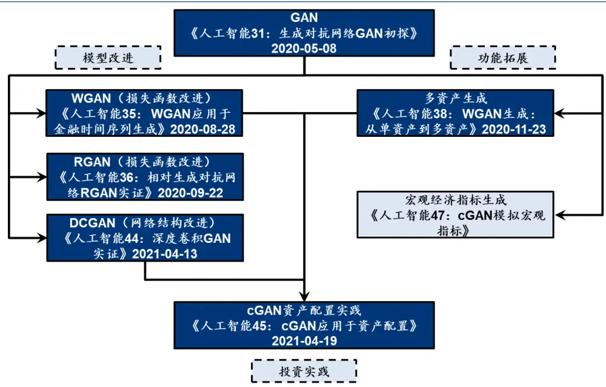
资料来源：华泰研究

本文介绍条件生成对抗网络（conditional Generative Adversarial Networks，简称 cGAN）在宏观经济指标模拟中的应用。cGAN 是 GAN 的变式，能够在给定条件下进行生成。本文采用 cGAN 尝试解决以下问题：给定过去 4 个季度各项宏观数据，如何模拟未来 9 个季度各项宏观数据？由于采用历史数据生成未来数据，此时的模拟也具备了预测价值。

美国 Wells Fargo 银行的 Fu 等人在 2019 年发表的论文 Time Series Simulation byConditional Generative Adversarial Net 就曾采用 cGAN 模拟美国经济数据。本文参考 Fu等（2019）研究范式，在复现美国经济数据模拟结果同时，测试中国经济数据的生成效果。

我们首先针对 5 项美国宏观经济指标及 4 项中国宏观经济指标进行模拟，交替训练 cGAN生成器和判别器网络。其次通过比较真实数据与生成数据统计量，检验 cGAN 训练情况。最后讨论两项具体应用场景，一方面模拟多条指标变化路径，实现宏观情景分析，另一方面尝试进行冲击响应分析，考察某个宏观指标改变对其余指标的影响。

图表2： 本文框架
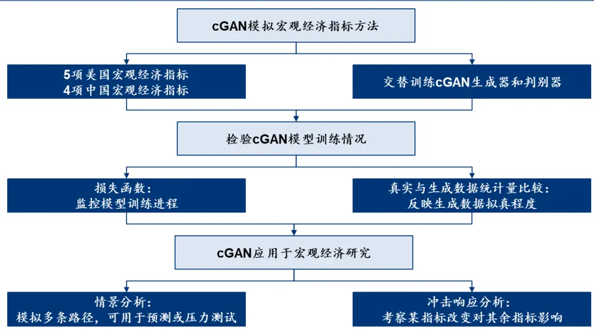
资料来源：华泰研究

## 方法

本研究希望解决的核心问题是：给定过去 4个季度各项宏观经济数据，如何采用 cGAN 模型模拟未来9个季度各项宏观经济数据？本节我们将从数据和模型两方面，介绍测试方法。

## 数据获取和预处理

测试分为美国宏观经济数据和中国宏观经济数据两部分，具体使用经济指标、数据时间和预处理方式如下表所示。美国宏观指标参考 Fu 等（2019）一文，选取联邦基金利率、GDP当季同比、CPI 当月同比、10 年期国债收益率、失业率共 5 项指标，从 1954Q3 至 2021Q2。中国宏观指标选取 M2 当月同比、GDP 当季同比、CPI 当月同比、10 年期国债到期收益率共 4 项指标，从 2002Q1 至 2021Q2。

## 预处理分为如下三步：

1. 数据对齐：将不同频率（日频、月频、季频）统一对齐为季频。

2. 数据平稳化：首先检验每项指标时间序列平稳性。若 ADF 单位根检验 p＜0.05，则拒绝虚无假设，不存在单位根，序列为平稳序列，不进行处理。若单位根检验 p＞0.05，则不拒绝虚无假设，存在单位根，序列为非平稳序列，需进行差分处理。一阶差分后，再进行单位根检验，此时各项指标均已满足平稳性条件。

3. 标准化：各项指标量纲存在差异，因此对每项指标进行 Z-score 标准化处理，转换为均值为 0，标准差为 1 的时间序列。

图表3： 本文所使用的宏观经济数据

| 指标名称 | 数据时间 美国宏观经济 | 预处理方式 |
| --- | --- | --- |
| 联邦基金利率 |  |  |
| GDP当季同比（不变价） |  |  |
| CPI当月同比 | 1954Q3~2021Q2 | 一阶差分 |
| 10年期国债收益率 |  |  |
| 失业率（季调） | 中国宏观经济 |  |
| M2当月同比 |  |  |
| GDP当季同比（不变价） | 2002Q1~2021Q2 |  |
| CPI当月同比 |  | 一阶差分 |

资料来源：Wind，华泰研究

由于 cGAN 模型需要从多条样本中学习数据背后的规律，我们对原始数据进行滚动采样，使每条样本长度为 13个季度，即历史 4 个季度（下文称为条件序列）＋未来 9 个季度（下文称为生成序列），如下图所示。

图表4： cGAN训练集滚动采样示意图

| 季度 | 1 | 2 | 3 | 4 5 | 6 | 7 | 8 | 9 | 10 | 11 | 12 | 13 | 14 | 15 |
| --- | --- | --- | --- | --- | --- | --- | --- | --- | --- | --- | --- | --- | --- | --- |
| 样本1 |  | 条件序列 |  |  | 生成序列 |  |  |  |  |  |  |  |  |  |
| 样本2 |  | 条件序列 |  |  | 生成序列 |  |  |  |  |  |  |  |  |  |
| 样本3 |  | 条件序列 |  |  | 生成序列 |  |  |  |  |  |  |  |  |  |

资料来源：华泰研究

滚动采样后，美国宏观数据从 267 个季度×5 项指标变为 255 条样本×13 个季度×5 项指标，中国宏观数据从 77 个季度×4 项指标变为 65 条样本×13 个季度×4 项指标。从样本量来看，美国宏观数据的 255 条样本基本达到训练一个简单 GAN 模型的下限，而中国宏观数据的 65 条样本偏少，存在过拟合风险。在训练过程中，需要通过其他方式监控模型训练是否出现过拟合。

另外需要指出，由于样本量有限，本研究统一采用全样本训练，即美国宏观数据训练集为1954Q3~2021Q2，中国宏观数据训练集为 2002Q1~2021Q2。后文中，站在历史时点所做的情景分析，都使用到了未来信息。仅有站在 2021Q2 时点的情景分析，是真正对样本外的预测。

## 条件生成对抗网络 cGAN

cGAN 由 Mirza 和 Osindero 在 2014 年提出，相比原始 GAN 模型，cGAN 在理念上的创新之处在于，在模型训练过程中增加额外条件信息，从而引导数据生成过程。例如，在生成人脸过程中增加性别信息，从而实现指定性别条件下的人脸生成。在华泰金工《人工智能45：cGAN 应用于资产配置》（2021-04-19）一文中，我们曾对 cGAN 模型进行详细阐述。

本研究中，条件生成器（conditional Generator，简记为 cG 或 G）的输入包含 30 维高斯噪声 z 和历史 4 个季度条件序列 c 两部分；输出为未来 9 个季度假样本。条件判别器（conditional Discriminator，简记为 cD 或 D）的输入为完整 13 个季度的真样本或假样本，真假样本的区别在于后 9 个季度是真实还是 cG 模拟的序列；输出为 0~1 之间的实数，代表样本属于真的概率。

图表5： cGAN 生成器与判别器输入示意图
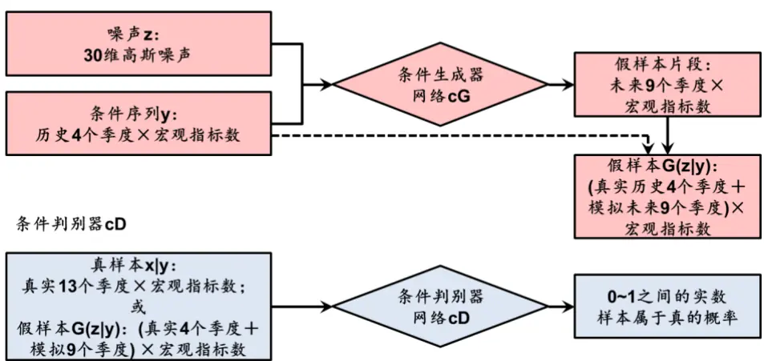
资料来源：华泰研究

本文使用的 cGAN 损失函数如下：

$$
\displaystyle\operatorname*{min}_{G}\operatorname*{max}_{D}V(D,G)=E_{x\sim p_{data}(x)}[logD(x|y)]+E_{z\sim p_{z}(z)}\left[log\left(1-D\big(G(z|y)\big)\right)\right]
$$

上式中，D 和 G 分别代表条件判别器和条件生成器；y 代表条件序列，即真实历史 4 个季度宏观数据；x|y代表真样本，即真实 13 个季度宏观数据，其中前 4个季度为 y；z代表高斯噪声；G(z|y)代表假样本，即真实和模拟合并后的 13 个季度宏观数据，其中前 4 个季度为 y。

损失函数中的 V(D,G)代表经典的二分类交叉熵损失函数。对条件判别器 D来说，训练目标为最大化 V(D,G)，即尽可能区分真假样本。对条件生成器 G 来说，训练目标为在此基础上最小化 V(D,G)，即尽可能“骗过”一个训练好的条件判别器 D。因此 cGAN 损失函数的本质是求解一个 minmax 极小化极大问题。实际训练过程中，一般采用交替训练方式，每轮迭代先训练 K次条件判别器 D，再训练 1次条件生成器 G。

cGAN 训练过程中可能出现模式崩溃问题，条件生成器的生成数据趋于单一，缺乏多样性。在华泰金工《人工智能 35：WGAN 应用于金融时间序列生成》（2020-08-28）文中，我们介绍了权值截断（weight clipping）和梯度惩罚（gradient penalty）两种解决方案。其中，权值截断是指在每一层反向传播更新权值之后对权重进行裁剪，若阈值 c＝0.1，则有：

$$
w_{update}^{clip}=\left\{\begin{array}{cc}{0.1,}&{if~w_{update}\geq0.1}\\{w_{update},}&{if~-0.1<w_{update}<0.1}\\{-0.1,}&{if~w_{update}\leq-0.1}\end{array}\right.
$$

梯度惩罚方法是将对权重的约束直接加入判别器损失函数中。本研究分别尝试了上述两种方法，发现权值截断方法效果更佳，因此后文统一展示权值截断方法结果。cGAN模型训练算法伪代码如下表所示。

## 图表6： cGAN 训练算法的伪代码

输入 迭代次数 T, 每轮迭代判别器训练次数 K, 小批量(minibatch)样本数量 m, 权值截断的阈值 c
1随机初始化 D 网络参数θ 和 G 网络参数θ
2 for t • 1 to T do
# 训练判别器 D
3 for k •1 to K do
# 采集小批量样本
4从正态分布 ${p_{g}(z)}$ 中采集 m 条样本 $\cdot\left\{z^{(m)}\right\}$ 
5从训练 $\dot{\bar{\mathbf{\rho}}}p_{data}(x)$ 中采集 m 条样 $\hbar\{x^{(m)}\}$ 及对应的条件 $-\{y^{(m)}\}$ 
6使用随机梯度上升更新判别器 D，梯度为：
$\nabla_{\theta_{d}}\frac{1}{m}\sum_{i=1}^{m}\left[logD\left(x^{(i)}|y^{(i)}\right)+log\left(1-D\left(G\left(z^{(i)}|y^{(i)}\right)\right)\right)\right]$ 
7对判别器参数进行权值截断(−c,c)
8 end
# 训练生成器 G
9从标准正态分 $\#p_{g}(z)$ 中采集 m 条样 ${\big\ k}{\big\{}z^{(m)}{\big\}}$ 
10使用随机梯度下降更新生成器 G，梯度为：
$\nabla_{\theta_{g}}\frac{1}{m}\sum_{i=1}^{m}log\left(1-D\left(G\left(z^{\left(i\right)}|y^{\left(i\right)}\right)\right)\right)$ 
11 end
输出 生成器 G
资料来源：华泰研究

## cGAN网络结构和训练参数

图表7： 条件生成器 cG网络结构
参数取值
结构含一个隐藏层的全连接神经网络
输入隐变量标准正态分布
输入层神经元数量隐变量数＋条件序列长度×指标个数
隐藏层神经元数量100
隐藏层激活函数LeakyReLU(0.2)
输出层神经元数量生成序列长度×指标个数
输出层激活函数tanh
是否批标准化否
损失函数交叉熵
优化器Adam
优化器参数学习速率 2e-4，β=(0.9,0.999)
资料来源：华泰研究

图表8： 条件判别器 cD网络结构

| 参数 | 取值 |
| --- | --- |
| 结构 | 含一个隐藏层的全连接神经网络 |
| 输入层神经元数量 | (条件序列长度+生成序列长度)×指标个数 |
| 隐藏层神经元数量 | 100 |
| 隐藏层激活函数 | LeakyReLU(0.2) |
| 输出层神经元数量 | 1 |
| 输出层激活函数 | Sigmoid |
| 是否批标准化 | 否 |
| 损失函数 | 交叉熵 |
| 优化器 | Adam |
| 优化器参数 | 学习速率2e-4，β=(0.9,0.999) |

资料来源：华泰研究

条件生成器 cG和条件判别器 cD的网络结构参数如以上两表所示。由于宏观经济数据样本量较小，我们倾向于选择简单网络结构以避免过拟合，两组网络均采用含一个隐藏层的全连接神经网络。其余参数中，隐变量数即高斯噪声 z 维数取 30，条件序列长度取 4，生成序列长度取 9，指标个数取 5（美国宏观数据）或 4（中国宏观数据）。cGAN 训练参数如下表所示。

图表9： cGAN 训练参数一览

| 参数 | 取值 |
| --- | --- |
| 迭代次数 | 1000 |
| 每轮迭代 G 和 D 的训练次数比 K | 1:5 |
| Batch size | 100 |
| 权值截断阈值C | ±0.1 |

资料来源：华泰研究

## 美国宏观经济指标结果

## 损失函数

本章展示美国宏观经济指标模拟结果。首先观察判别器和生成器损失函数随迭代次数变化情况，两者在 800 次迭代后收敛，此时模型表现应趋于稳定。实际训练中，我们取 1000次迭代后的模型进行后续分析。

图表10： 美国宏观经济指标 cGAN训练损失函数
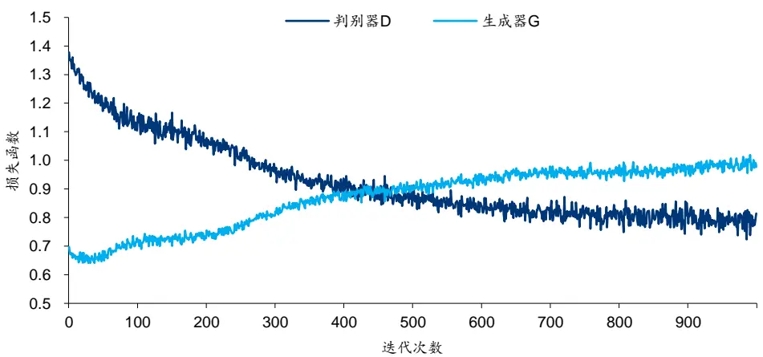
资料来源：Wind，华泰研究

## 真实与生成序列统计量比较

在《人工智能 31：生成对抗网络 GAN 初探》（2020-05-08）和《人工智能 35：WGAN 应用于金融时间序列生成》（2020-08-28）中，我们共设计 8 项统计指标以考察生成资产价格的真实性。和资产价格数据不同，宏观指标数据并不具有尖峰厚尾、波动率聚集等性质，因此难以直接沿用此前研究中的评价指标。

参考 Fu 等（2019）文献，我们采用简单的一阶自相关系数作为模拟数据真实性的度量指标。每轮迭代后，对于每项宏观指标，我们均计算生成的 1000 条时间序列的一阶自相关系数，并考察生成序列向真实序列的收敛情况。一方面考察生成序列与真实序列是否接近，另一方面也能够反映迭代次数是否合理，是对上文损失函数的补充。

图表 11 至 15 分别展示美国 5 项宏观指标的一阶自相关系数随迭代次数变化。总体来看，模拟均值和真实值接近，表明生成效果相对较好。对于图表 12 的 GDP 同比指标，真实数据体现出一阶正相关，而前 600 次迭代的生成数据为一阶负相关，800 次迭代后逐步攀升至真实数据附近，这也反映出我们对迭代次数的选择较为合理。

图表11： 美国联邦基金利率生成序列自相关系数随迭代次数变化
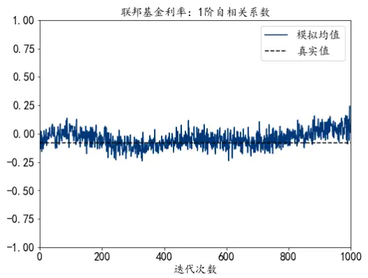
资料来源：Wind，华泰研究

图表12： 美国 GDP同比生成序列自相关系数随迭代次数变化
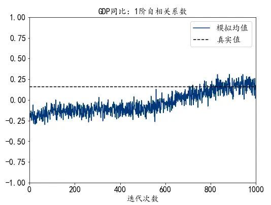
资料来源：Wind，华泰研究

图表13： 美国 CPI同比生成序列自相关系数随迭代次数变化
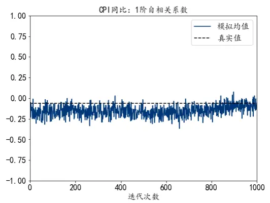
资料来源：Wind，华泰研究

图表14： 美国国债利率生成序列自相关系数随迭代次数变化
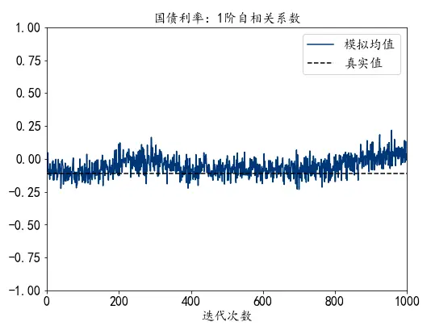
资料来源：Wind，华泰研究

图表15： 美国失业率生成序列自相关系数随迭代次数变化
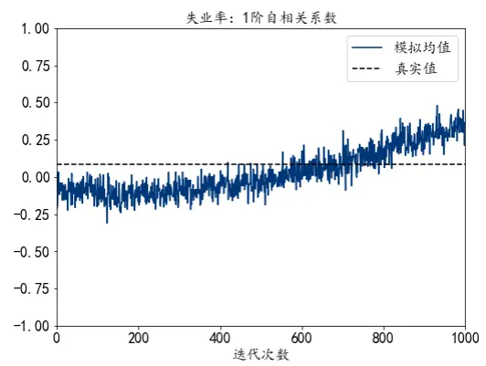
资料来源：Wind，华泰研究

## 情景分析

cGAN 模拟宏观指标的一大应用场景是情景分析。cGAN 生成数据的特点是兼顾“真实”和“多样”。真实来自于对历史真实序列规律的挖掘和学习，多样来自于生成过程中随机数的参与。相比经典蒙特卡洛模拟技术，cGAN 拟真效果更好，使用更为灵活，无需预设收益率分布相关参数。

站在 2019Q4（实际上部分数据发布于 2020 年 1 月），我们采用过去 4 个季度真实宏观数据（2019Q1~2019Q4），借助 cGAN 生成 1000 条未来 9 个季度（2020Q1~2022Q1）宏观指标。这组测试相当于回答下面的问题：若未发生疫情，美国经济走势将如何？

资料来源：Wind，华泰研究预测

图表16： 美国联邦基金利率情景分析（2019Q4模拟未来 9季度）
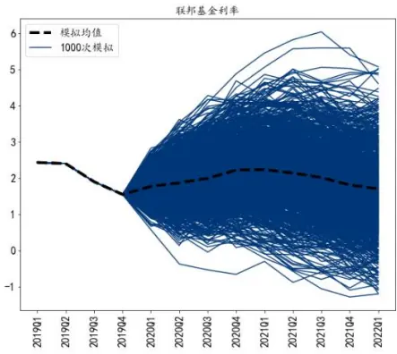

上图展示美国联邦基金利率的模拟结果。蓝色实线代表 1000 次模拟值，黑色虚线代表 1000次模拟均值。模拟值的不同分位点可作为压力测试依据，如悲观、中性、乐观假设。上图例子中，基准利率的 1%分位数代表最低利率情景假设，99%分位数代表最高利率情景假设。

进一步地，模拟均值反映了模型对未来经济的预测。站在 2019 年末，若未发生疫情，cGAN模型预测 2020 年至 2021Q1 美国将进入加息周期，基准利率将从 1.55%上行至 2.24%；而此后 4个季度基准利率将下行，2022Q1 下探至 1.70%。

类似地，站在 2019 年末，若未发生疫情，cGAN 模型对其他宏观指标的预测如下：

1. GDP 同比：2020 年前 3 个季度经济向好，2020Q3 上行至 3.5%；2020Q4 起步入衰退，2022Q1 下行至 2.7%。

2. CPI 同比：2020Q1 至 2021Q2 通胀抬头，2021Q2 上行至 2.8%；2021Q3 起通胀放缓，2022Q1 下行至 2.7%。

3. 10 年期国债收益率：2020 年利率上行，2020Q4 上行至 2.17%；2021Q1 起利率下行，2022Q1 下行至 2.04%。

4. 失业率：2020Q1 至 2021Q1 就业向好，2021Q1 下行至 3.1%；2021Q2 起失业率逐步攀升，2022Q1 上行至 3.7%。

总结而言，cGAN 模型在 2019 年末判断美国经济 2020 年总体延续复苏态势，伴随利率上行，通胀上行，失业率下降；经济增长和利率拐点出现在 2020 年末或 2021 年初，就业和通胀拐点出现在 2021 年中。

图表17： 美国 GDP同比情景分析（2019Q4模拟未来 9季度）
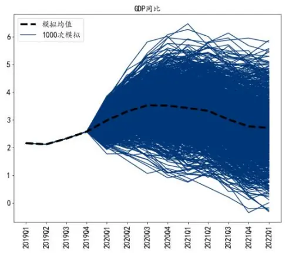
资料来源：Wind，华泰研究预测

图表18： 美国 CPI同比情景分析（2019Q4模拟未来 9季度）
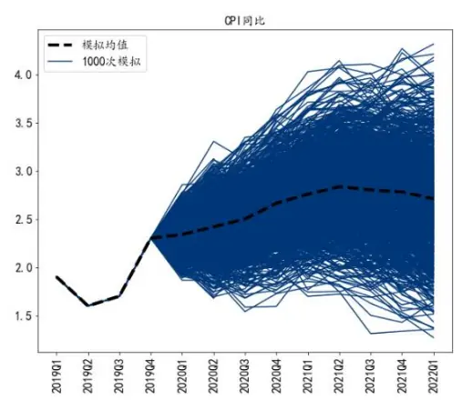
资料来源：Wind，华泰研究预测

图表19： 美国 10年期国债利率情景分析（2019Q4模拟未来 9季度）
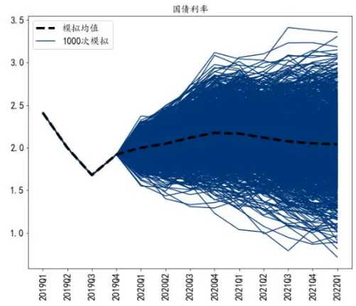
资料来源：Wind，华泰研究预测

图表20： 美国失业率情景分析（2019Q4模拟未来 9季度）
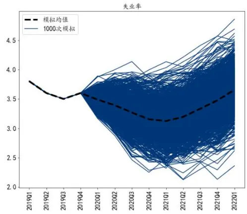
资料来源：Wind，华泰研究预测

## 冲击响应分析

cGAN 模拟宏观指标的另一大应用场景是冲击响应分析。由于 cGAN 生成器的条件序列可自由给定，我们可以对真实数据人为添加扰动，再生成相应模拟序列。对比扰动前后生成结果，可反映当一项宏观指标突然发生变化时，其他指标将随之发生哪些变化。

我们对比如下两种情景：

1. 站在 2019Q4，采用过去 4 个季度真实宏观数据（2019Q1~2019Q4），借助 cGAN 生成 1000 条未来 9 个季度（2020Q1~2022Q1）宏观指标。

2. 站在 2019Q4，采用过去 4个季度真实宏观数据，对 2019Q4 联邦基金利率调高 1个标准差，借助 cGAN 生成 1000 条未来 9 个季度宏观指标。

对比冲击前后生成的 1000 条宏观指标均值。这组测试相当于回答下面的问题：站在 2019年末，若美联储加息，美国经济走势将如何？

下图展示 2019Q4 联邦基金利率调高 1 个标准差后，对联邦基金利率自身影响。可知冲击后联邦基金利率生成序列的变化趋势未发生改变，仍为先升后降，拐点出现在 2020 年末或2021 年初。

图表21： 美国联邦基金利率冲击情景分析（2019Q4模拟未来 9季度）
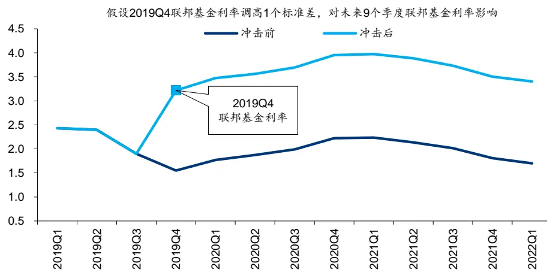
资料来源：Wind，华泰研究预测

左下图展示 2019Q4 联邦基金利率调高 1个标准差后，对 GDP 同比的影响。冲击后下个季度（2020Q1）GDP 同比相比冲击前降低 0.004pct，此后影响逐渐扩大，5个季度后（2021Q1）GDP 同比降低 0.12pct，9 个季度后（2022Q1）GDP 同比降低 0.18pct。可推知调高基准利率对经济增长为负向影响，符合我们的直观理解。

图表22： 美国 GDP同比情景分析（2019Q4模拟未来 9季度）
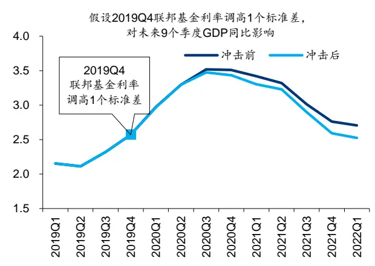
资料来源：Wind，华泰研究预测

图表23： 美国 CPI同比情景分析（2019Q4模拟未来 9季度）
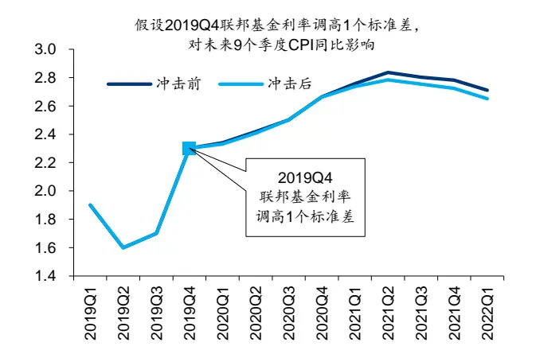
资料来源：Wind，华泰研究预测

图表 23展示 2019Q4 联邦基金利率调高 1个标准差后，对 CPI 同比的影响。冲击后下个季度（2020Q1）CPI 同比相比冲击前降低 0.004pct，此后影响逐渐扩大，5个季度后（2021Q1）CPI 同比降低 0.02pct，9 个季度后（2022Q1）CPI 同比降低 0.06pct。可推知调高基准利率对通胀为负向影响，同样符合我们的直观理解。

左下图展示 2019Q4 联邦基金利率调高 1个标准差后，对 10 年期国债收益率的影响。冲击后下个季度（2020Q1）国债利率相比冲击前升高 0.01pct，此后影响逐渐扩大，3个季度后（2020Q3）国债利率升高 0.018pct；但此后影响逐渐由正转负，6 个季度后（2021Q2）国债利率反而降低 0.006pct，9 个季度后（2022Q1）国债利率降低 0.02pct。可推知调高基准利率对国债利率短期为正向影响，但加息抑制经济，对国债利率长期为负向影响。

右下图展示 2019Q4 联邦基金利率调高 1 个标准差后，对失业率的影响。冲击后下个季度（2020Q1）失业率相比冲击前升高 0.003pct，此后影响逐渐扩大，5个季度后（2021Q1）失业率升高 0.04pct，9 个季度后（2022Q1）失业率升高 0.07pct。可推知调高基准利率对就业为负向影响，同样符合我们的直观理解。

图表24： 美国 10年期国债利率情景分析（2019Q4模拟未来 9季度）
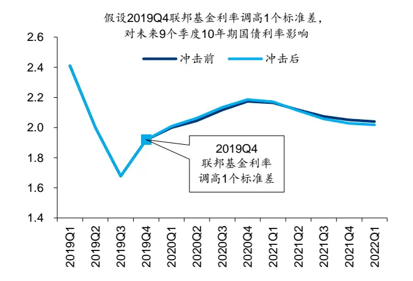
资料来源：Wind，华泰研究预测

图表25： 美国失业率情景分析（2019Q4模拟未来 9季度）
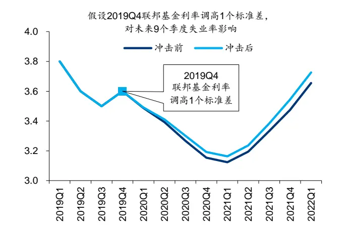
资料来源：Wind，华泰研究预测

总体而言，针对美国宏观经济数据的冲击假设分析得到如下结论：调高联邦基金利率将 1）抑制经济增长；2）抑制通胀；3）抑制就业；4）短期抬升利率但长期打压利率。

## 中国宏观经济指标结果

## 损失函数

本章展示中国宏观经济指标模拟结果。首先观察判别器和生成器损失函数随迭代次数变化情况，两者在 800 次迭代后收敛。我们取 1000 次迭代后的模型进行后续分析。

图表26： 中国宏观经济指标 cGAN训练损失函数
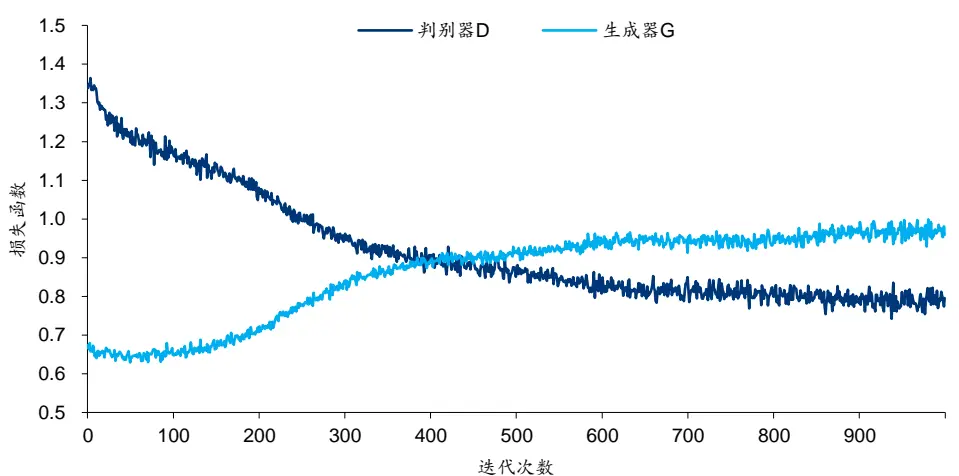
资料来源：Wind，华泰研究

## 真实与生成序列统计量比较

图表 27 至 30 分别展示中国 4 项宏观指标的一阶自相关系数随迭代次数变化。总体来看，模拟均值和真实值接近，表明生成效果相对较好。对于图表 30的国债利率指标，真实数据体现出一阶正相关，而前 600 次迭代的生成数据为一阶负相关，800 次迭代后逐步攀升至真实数据附近，这也反映出我们对迭代次数的选择较为合理。

图表27： 中国 M2同比生成序列自相关系数随迭代次数变化
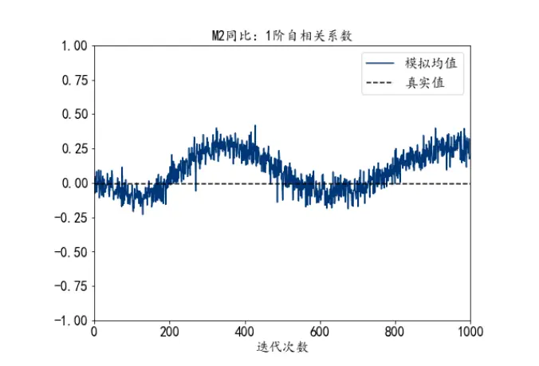
资料来源：Wind，华泰研究

图表28： 中国 GDP同比生成序列自相关系数随迭代次数变化
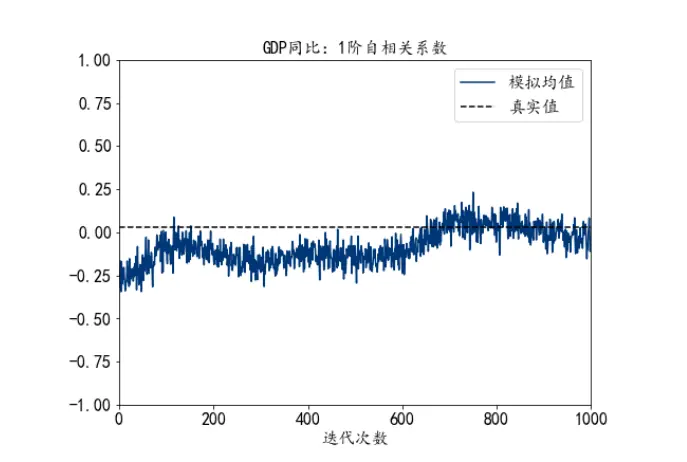
资料来源：Wind，华泰研究

图表29： 中国 CPI同比生成序列自相关系数随迭代次数变化
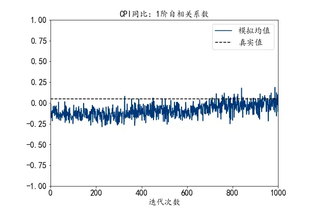
资料来源：Wind，华泰研究

图表30： 中国 10年期国债利率生成序列自相关系数随迭代次数变化
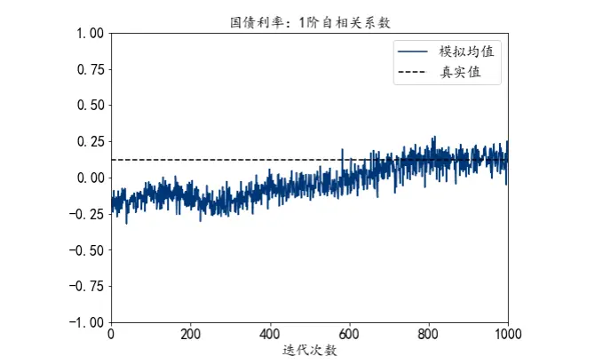
资料来源：Wind，华泰研究

## 情景分析

站在 2019Q4（实际上部分数据发布于 2020 年 1 月），我们采用过去 4 个季度真实宏观数据（2019Q1~2019Q4），借助 cGAN 生成 1000 条未来 9 个季度（2020Q1~2022Q1）宏观指标。这组测试相当于回答下面的问题：若未发生疫情，中国经济走势将如何？

cGAN 模型对各项宏观指标的预测如下：

1. M2 同比：2020Q1 至 2021Q1 货币持续收紧，2021Q1 下行至 7.2%；2021Q2 起步入宽松，2022Q1 上行至 8.5%。

2. GDP 同比：2020 年 GDP 同比在 6%附近窄幅波动；2020Q4 起进入下行区间，2022Q1下行至 5.0%。

3. CPI 同比：2020Q1 至 Q2 通胀抬头；2020Q3 至 2022Q1 通胀持续下行。

4. 10 年期国债收益率：2020Q1 至 Q3 利率小幅上行，2020Q3 上行至 3.26%；2020Q4起利率下行，2022Q1 下行至 3.01%。

这里需要补充说明 CPI 同比预测结果。受 2019 年下半年猪价快速上行影响，2019 年 12月全国 CPI 同比攀升至 4.5%，属于某种意义上的“极端值”。由于 cGAN 训练和生成的是同比序列的一阶差分，除非 cGAN 生成负的“极端值”，否则以 2019Q4 数据为基数，此后得到的同比结果仍在 4.5%附近。这也暴露出 cGAN生成宏观指标的缺陷，对极端值的“免疫力”不够。可能的解决方案是生成环比数据再推算同比指标，但环比受季节效应影响，环比至同比的推算又受基期轮换影响。本文暂时仍采用同比作为训练和生成的数据口径。

图表31： 中国 M2同比情景分析（2019Q4模拟未来 9季度）
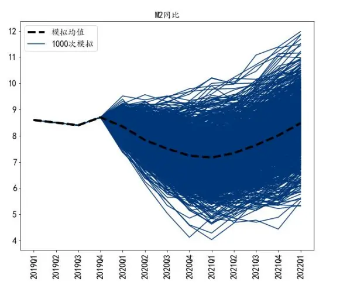
资料来源：Wind，华泰研究预测

图表32： 中国 GDP同比情景分析（2019Q4模拟未来 9季度）
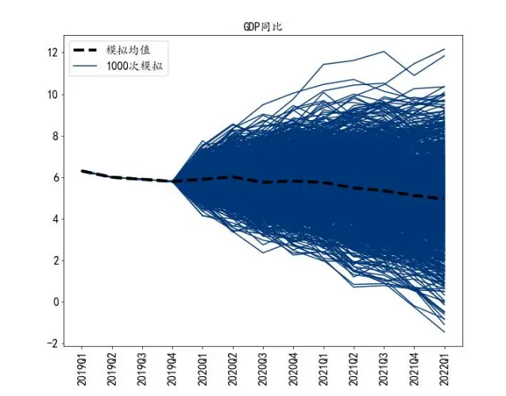
资料来源：Wind，华泰研究预测

图表33： 中国 CPI同比情景分析（2019Q4模拟未来 9季度）
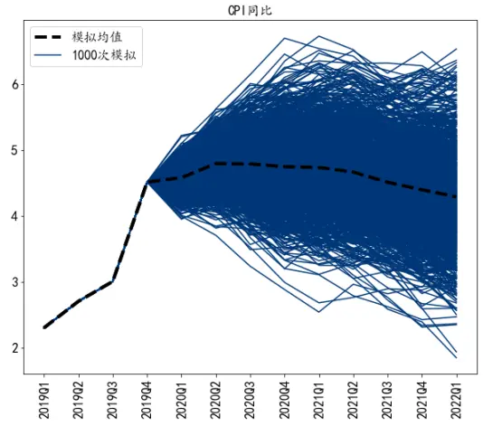
资料来源：Wind，华泰研究预测

图表34： 中国 10年期国债利率情景分析（2019Q4模拟未来 9季度）
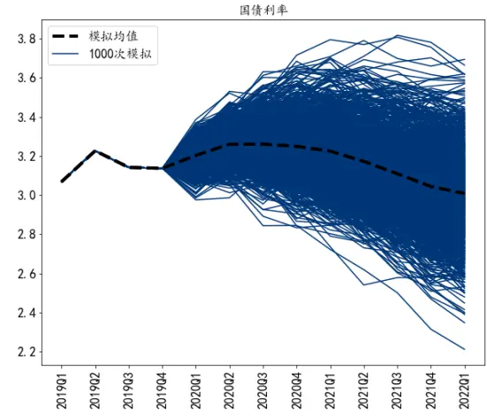
资料来源：Wind，华泰研究预测

## 冲击响应分析

类似美国宏观数据的冲击响应分析，对于中国宏观数据，我们对比如下两种情景：

1. 站在 2019Q4，采用过去 4 个季度真实宏观数据（2019Q1~2019Q4），借助 cGAN 生成 1000 条未来 9 个季度（2020Q1~2022Q1）宏观指标。

2. 站在 2019Q4，采用过去 4 个季度真实宏观数据，对 2019Q4 的 M2 同比调高 1 个标准差，借助 cGAN 生成 1000 条未来 9个季度宏观指标。

对比冲击前后生成的 1000 条宏观指标均值。这组测试相当于回答下面的问题：站在 2019年末，若增加货币投放，中国经济走势将如何？

左下图展示 2019Q4 的 M2 同比调高 1 个标准差后，对 M2 同比自身影响。可知冲击后 M2同比生成序列的变化趋势未发生改变，仍为先降后升，拐点出现在 2021Q1。

右下图展示 2019Q4 的 M2 同比调高 1 个标准差后，对 GDP 同比的影响。冲击后下个季度（2020Q1）GDP 同比相比冲击前升高 0.10pct，此后影响逐渐扩大，5个季度后（2021Q1）GDP 同比升高 0.32pct，9 个季度后（2022Q1）GDP 同比升高 0.41pct。可推知增加货币投放对经济增长为正向影响，符合我们的直观理解。

图表35： 中国 M2同比情景分析（2019Q4模拟未来 9季度）
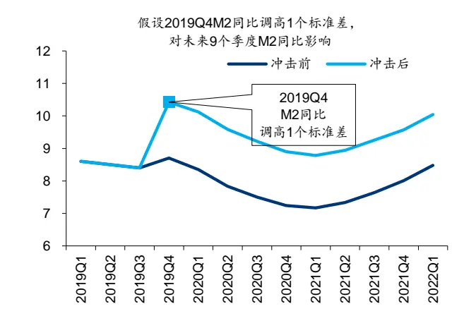
资料来源：Wind，华泰研究预测

图表36： 中国 GDP 同比情景分析（2019Q4 模拟未来 9 季度）
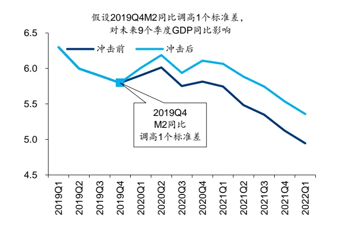
资料来源：Wind，华泰研究预测

左下图展示 2019Q4 的 M2 同比调高 1 个标准差后，对 CPI 同比的影响。冲击后下个季度（2020Q1）CPI 同比相比冲击前升高 0.005pct，此后影响逐渐扩大，5个季度后（2021Q1）CPI 同比升高 0.07pct，9 个季度后（2022Q1）CPI 同比升高 0.09pct。可推知增加货币投放对通胀为正向影响，同样符合我们的直观理解。

右下图展示 2019Q4 的 M2 同比调高 1 个标准差后，对 10 年期国债收益率的影响。冲击后下个季度（2020Q1）国债利率相比冲击前降低 0.01pct，但此后影响逐渐由负转正，3 个季度后（2020Q3）国债利率反而升高 0.007pct，9个季度后（2022Q1）国债利率升高 0.027pct。可推知增加货币投放对国债利率短期为负向影响，降低资金价格，但同时促进经济，因而对国债利率长期为正向影响。

图表37： 中国 CPI同比情景分析（2019Q4模拟未来 9季度）
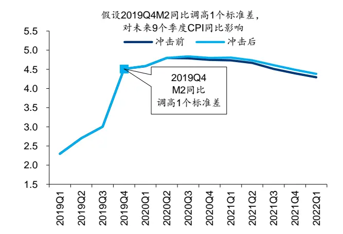
资料来源：Wind，华泰研究预测

图表38： 中国 10年期国债利率情景分析（2019Q4模拟未来 9季度）
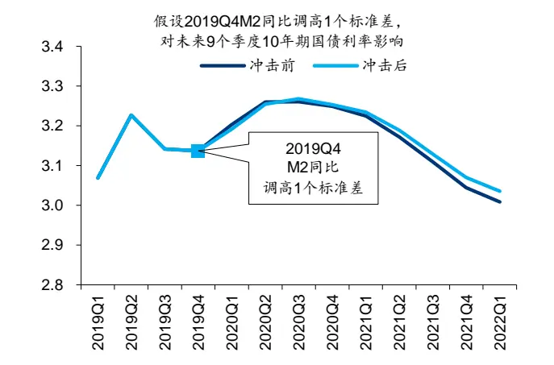
资料来源：Wind，华泰研究预测

总体而言，针对中国宏观经济数据的冲击假设分析得到如下结论：调高 M2同比将 1）促进经济增长；2）引发通胀；3）短期打压利率但长期提升利率。

## cGAN情景分析预测效果评估

在实际应用过程中，投资者往往关注模型预测效果。那么 cGAN 模型在学习历史规律后，生成序列与真实序列是否接近，cGAN 是否具备预测作用？以下我们试举两例说明。

## 2017Q2 模拟未来 9 个季度

站在 2017Q2，我们采用过去 4 个季度真实中国宏观经济指标（2016Q3~2017Q2），借助cGAN 生成 1000 条未来 9 个季度（2017Q3~2019Q3）宏观指标。图表 39 至 42 分别展示4 项指标结果，其中蓝色实线、黑色虚线和红色虚线分别代表 1000 次模拟、1000 次模拟均值和真实值。

左下图 M2 同比整体预测效果良好。真实值落在模拟值组成的包络内部，并且模拟结果成功预判到 M2 同比由下行转为上行的拐点出现在 2018 年中位置。尤其在模拟的前 7 个季度，模拟均值和真实值重合度较高。

右下图 GDP 同比整体预测效果良好。真实值落在模拟值组成的包络内部，并且模拟结果大致预判到 GDP 同比增速持续放缓。模拟的 9 个季度中，模拟均值和真实值重合度较高。

图表39： 中国 M2同比情景分析（2017Q2模拟 9季度）及真实值
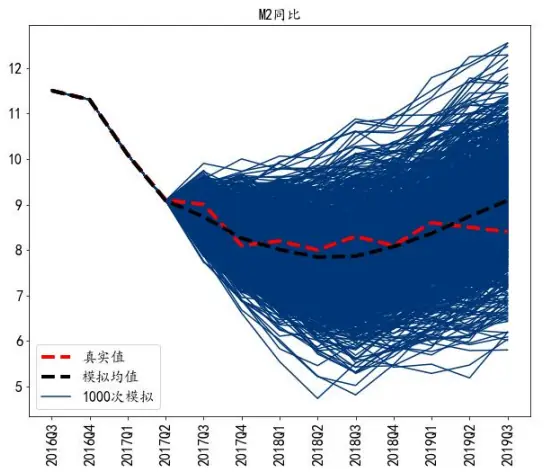
资料来源：Wind，华泰研究预测

图表40： 中国 GDP同比情景分析（2017Q2模拟 9季度）及真实值
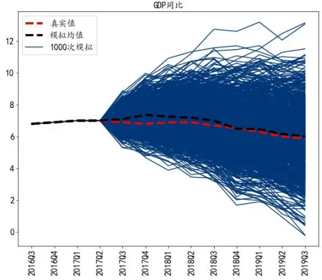
资料来源：Wind，华泰研究预测

图表41： 中国 CPI同比情景分析（2017Q2模拟 9季度）及真实值
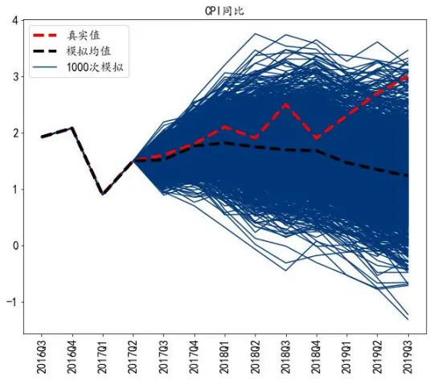
资料来源：Wind，华泰研究预测

图表42： 中国 10Y国债利率情景分析（2017Q2模拟 9季度）及真值
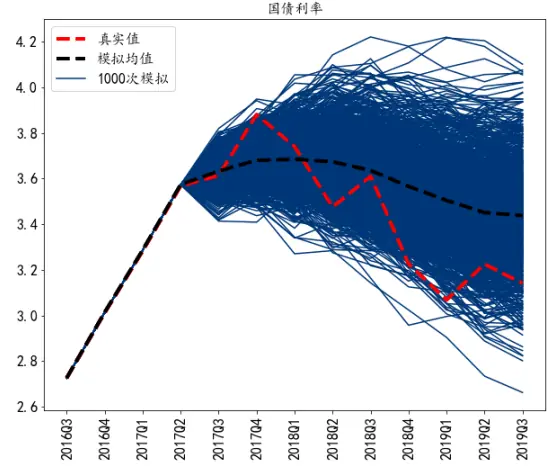
资料来源：Wind，华泰研究预测

左上图 CPI 同比整体预测效果尚可。真实值落在模拟值组成的包络内部。模型预判 CPI 同比在 2018Q1 由上行转为下行，实际上 CPI 同比持续走高。模拟的前 4个季度中，模拟均值和真实值重合度较高；后 5 个季度预测效果不佳。

右上图 10 年期国债利率整体预测效果尚可。真实值落在模拟值组成的包络内部，并且模拟结果成功预判到国债利率由上行转为下行的拐点出现在 2017年末至 2018年初位置。然而，模型低估了国债利率的变动幅度，模拟结果变化比现实更为温和。

## 2019Q4 模拟未来 9 个季度

站在 2019Q4，我们采用过去 4 个季度真实中国宏观经济指标（2019Q1~2019Q4），借助cGAN 生成 1000 条未来 9 个季度（2020Q1~2022Q1）宏观指标。图表 43 至 46 分别展示4 项指标结果。

总体而言，真实值均落在 1000 次模拟值组成的包络外部，疫情冲击是 cGAN 模型始料未及的。坦率地说，此时 cGAN 作为压力测试的效果是不过关的。这里也显示出 cGAN 模型的局限性，如果某个事件在历史上未发生过或发生次数极少，缺少足够样本供模型学习规律，那么模型自然无法做出准确预判。宏观预测始终面临样本量少、信噪比低的问题，不应高估量化模型的预测能力。

图表43： 中国 M2同比情景分析（2019Q4模拟 9季度）及真实值
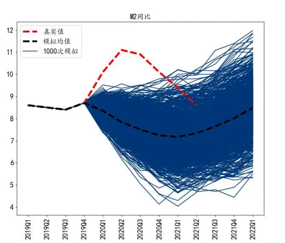
资料来源：Wind，华泰研究预测

图表44： 中国 GDP同比情景分析（2019Q4模拟 9季度）及真实值
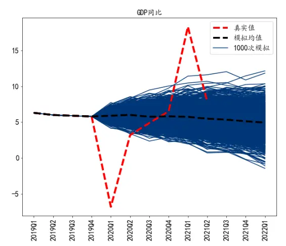
资料来源：Wind，华泰研究预测

图表45： 中国 CPI同比情景分析（2019Q4模拟 9季度）及真实值
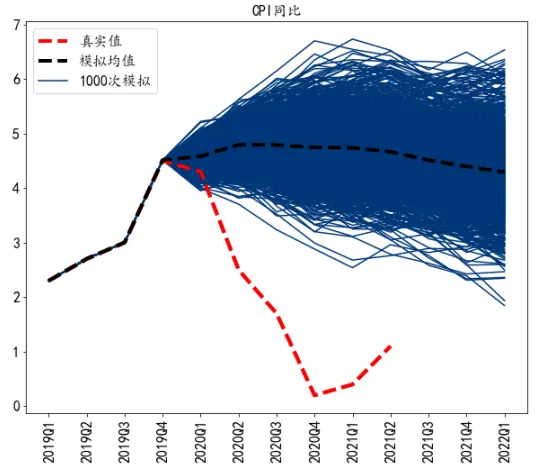
资料来源：Wind，华泰研究预测

图表46： 中国 10Y国债利率情景分析（2019Q4模拟 9季度）及真值
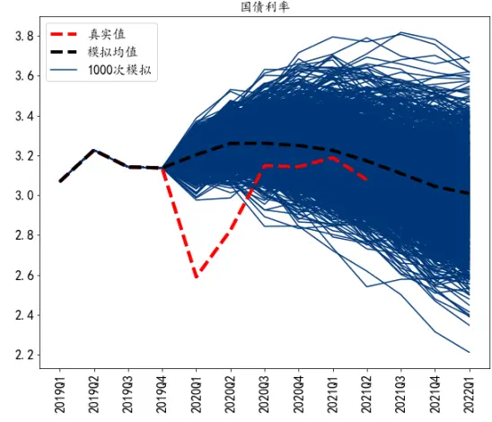
资料来源：Wind，华泰研究预测

## 当前时点对未来中国经济的预测

站在 2021Q2 时点，我们采用过去 4个季度真实宏观数据（2020Q3~2021Q2），借助 cGAN生成 1000 条未来 9个季度（2021Q3~2023Q3）宏观指标，对未来中国经济进行预判。cGAN模型对各项宏观指标的预测如下：

1. M2 同比：2021Q3 至 2022Q2 货币持续收紧，2022Q3 起步入宽松。

2. GDP 同比：2021Q3 至 Q4 经济上行，2022Q1 起步入衰退。

3. CPI 同比：2021Q3 至 2022Q2 通胀抬头，2022Q3 起通胀持续下行。

4. 10 年期国债收益率：2021Q3 至 Q4 利率上行，2021Q4 起利率下行。

总结而言，cGAN 模型当前时点判断中国经济 2021年下半年或仍缓慢上行，经济增长和利率拐点将出现在 2021Q4，货币投放和通胀拐点将出现在 2022Q2。

图表47： 中国 M2同比情景分析（2021Q2模拟未来 9季度）
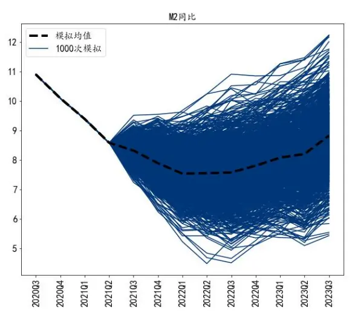
资料来源：Wind，华泰研究预测

图表48： 中国 GDP同比情景分析（2021Q2模拟未来 9季度）
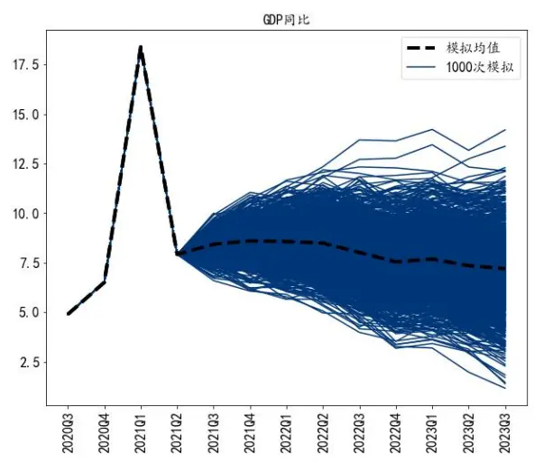
资料来源：Wind，华泰研究预测

图表49： 中国 CPI同比情景分析（2021Q2模拟未来 9季度）
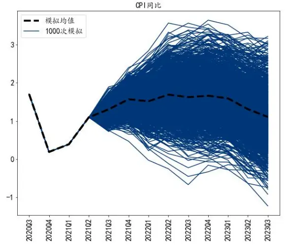
资料来源：Wind，华泰研究预测

图表50： 中国 10年期国债利率情景分析（2021Q2模拟未来 9季度）
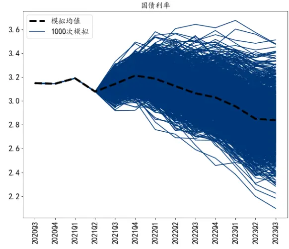
资料来源：Wind，华泰研究预测

## 总结

本文将生成对抗网络（GAN）的应用领域拓展至宏观研究，采用条件生成对抗网络（cGAN）模拟宏观经济指标。宏观指标存在样本稀缺问题，生成海量仿真数据或能提高宏观研究论证效力。cGAN 使用过去一段时间真实数据作为条件序列，并结合随机输入，最终生成未来一段时间模拟序列。cGAN 模拟宏观指标有两项应用场景：情景分析可以基于历史信息生成未来宏观指标，预测未来经济走势或进行压力测试；冲击响应分析可以考察某宏观指标的突变对其他指标的影响方向和程度，验证宏观经济运行逻辑。

cGAN 的核心思想是在训练过程中增加额外条件信息，从而引导数据生成过程。本研究中，我们给定过去 4 个季度宏观指标（美国 5 项及中国 4 项）作为条件序列，采用 cGAN 模拟未来 9个季度宏观指标。cGAN 包含条件生成器（cG）和条件判别器（cD）两组交替训练的网络。cG输入包含高斯噪声和历史 4个季度条件序列两部分；输出为未来 9 个季度假样本。cD 输入为完整 13 个季度的真或假样本，真假样本区别在于后 9 个季度是真实还是模拟序列；输出为样本属于真的概率。训练完成后，对比真假序列一阶自相关系数，以评估模拟数据真实性。

cGAN 模拟宏观指标的一大应用场景是情景分析。相比经典蒙特卡洛模拟，cGAN拟真效果更好，使用更灵活。我们站在 2019Q4 时点，采用过去 4 个季度的中美两国真实宏观数据，生成 1000 条未来 9个季度的宏观指标。相当于回答：若未发生疫情，中美两国经济走势将如何？结果表明，cGAN 在 2019 年末判断美国经济 2020年总体延续复苏态势，GDP同比和 10 年期国债利率拐点在 2020 年末或 2021 年初，失业率和 CPI同比拐点在 2021 年中；cGAN 在 2019 年末判断中国经济 2020 年存在下行压力，GDP 同比和 10 年期国债利率2020H2 转而下行，M2 同比 2021H1 转而上行。

cGAN 模拟宏观指标的另一应用场景是冲击响应分析。对真实条件序列添加扰动，考察某项宏观指标发生突变时，其他指标将如何变化。我们站在 2019Q4，采用过去 4个季度真实数据，将 2019Q4 美国联邦基金利率或中国 M2 同比调高 1 个标准差，对比冲击前后生成的1000 条未来 9 个季度宏观指标。结果表明，针对美国经济，调高联邦基金利率将 1）抑制经济增长，2）抑制通胀，3）抑制就业，4）短期抬升利率但长期打压利率；针对中国经济，调高 M2同比将 1）促进经济增长，2）引发通胀，3）短期打压利率但长期提升利率。所得结论均符合宏观经济基本逻辑。

站在 2021Q2 时点，采用过去 4 个季度真实宏观数据（2020Q3~2021Q2），借助 cGAN 生成 1000 条未来 9 个季度（2021Q3~2023Q3）宏观指标，对未来中国经济进行预判。cGAN模型当前时点判断中国经济2021 年下半年或仍缓慢上行，GDP 同比和 10年期国债利率拐点将出现在 2021Q4，M2 同比和 CPI 同比拐点将出现在 2022Q2。

本研究存在以下值得进一步挖掘之处：

1. 中国经济数据样本量有限，有效数据仅含 77 个季度，可能削弱 cGAN 模型生成效果。未来可考虑使用偏高频宏观数据以提升样本量。

2. 本研究预处理为同比数据简单差分后对完整序列进行标准化。实际上可采用更适合宏观数据的预处理方式，如对环比数据进行季调再用于训练。另外若条件序列长度足够，也可考虑针对每条样本的条件序列部分进行标准化，以应对时序上的异方差性问题。

3. 由于样本量有限，为避免过拟合，本研究采用最简单的含一个隐藏层的全连接神经网络。网络结构仍有一定优化空间。

4. 本研究参考 Fu 等（2019）文献，采用过去 4 个季度生成未来 9个季度，即使用相对短的历史数据生成相对长的未来数据。事实上更多的应用场景可能是使用长的历史预测短的未来，这意味着 4和 9这两项超参数也存在优化空间。

5. 本研究评价生成数据真实性仅采用一阶自相关系数。未来可考虑增加单序列评价指标（如季节效应等）及多序列评价指标（如宏观指标间滞后相关性等）。

## 参考文献

Fu, R. , Chen, J. , Zeng, S. , Zhuang, Y. , & Sudjianto, A. . (2019). Time series simulation by conditional generative adversarial net. arXiv.

Mirza, M. , & Osindero, S. . (2014). Conditional generative adversarial nets. Computer Science, 2672-2680.

## 风险提示

CGAN 模型存在黑箱问题，训练不收敛不同步，以及模式崩溃问题。深度学习模型存在过拟合的可能。深度学习模型是对历史规律的总结，如果市场规律发生变化，模型存在失效的可能。宏观指标生成效果易受极端值、基数效应影响。

## 免责声明

## 分析师声明

本人，林晓明、李子钰、何康，兹证明本报告所表达的观点准确地反映了分析师对标的证券或发行人的个人意见；彼以往、现在或未来并无就其研究报告所提供的具体建议或所表迖的意见直接或间接收取任何报酬。

## 一般声明及披露

本报告由华泰证券股份有限公司（已具备中国证监会批准的证券投资咨询业务资格，以下简称“本公司”）制作。本

本报告而视其为客户。

本报告基于本公司认为可靠的、已公开的信息编制，但本公司及其关联机构(以下统称为“华泰”)对该等信息的准确性及完整性不作任何保证。

本报告所载的意见、评估及预测仅反映报告发布当日的观点和判断。在不同时期，华泰可能会发出与本报告所载意见、评估及预测不一致的研究报告。同时，本报告所指的证券或投资标的的价格、价值及投资收入可能会波动。以往表现并不能指引未来，未来回报并不能得到保证，并存在损失本金的可能。华泰不保证本报告所含信息保持在最新状态。华泰对本报告所含信息可在不发出通知的情形下做出修改，投资者应当自行关注相应的更新或修改。

本公司不是 FINRA 的注册会员，其研究分析师亦没有注册为 FINRA 的研究分析师/不具有 FINRA 分析师的注册资格。

华泰力求报告内容客观、公正，但本报告所载的观点、结论和建议仅供参考，不构成购买或出售所述证券的要约或招揽。该等观点、建议并未考虑到个别投资者的具体投资目的、财务状况以及特定需求，在任何时候均不构成对客户私人投资建议。投资者应当充分考虑自身特定状况，并完整理解和使用本报告内容，不应视本报告为做出投资决策的唯一因素。对依据或者使用本报告所造成的一切后果，华泰及作者均不承担任何法律责任。任何形式的分享证券投资收益或者分担证券投资损失的书面或口头承诺均为无效。

除非另行说明，本报告中所引用的关于业绩的数据代表过往表现，过往的业绩表现不应作为日后回报的预示。华泰不承诺也不保证任何预示的回报会得以实现，分析中所做的预测可能是基于相应的假设，任何假设的变化可能会显著影响所预测的回报。

华泰及作者在自身所知情的范围内，与本报告所指的证券或投资标的不存在法律禁止的利害关系。在法律许可的情况下，华泰可能会持有报告中提到的公司所发行的证券头寸并进行交易，为该公司提供投资银行、财务顾问或者金融产品等相关服务或向该公司招揽业务。

华泰的销售人员、交易人员或其他专业人士可能会依据不同假设和标准、采用不同的分析方法而口头或书面发表与本报告意见及建议不一致的市场评论和/或交易观点。华泰没有将此意见及建议向报告所有接收者进行更新的义务。华泰的资产管理部门、自营部门以及其他投资业务部门可能独立做出与本报告中的意见或建议不一致的投资决策。投资者应当考虑到华泰及/或其相关人员可能存在影响本报告观点客观性的潜在利益冲突。投资者请勿将本报告视为投资或其他决定的唯一信赖依据。有关该方面的具体披露请参照本报告尾部。

本报告并非意图发送、发布给在当地法律或监管规则下不允许向其发送、发布的机构或人员，也并非意图发送、发布给因可得到、使用本报告的行为而使华泰违反或受制于当地法律或监管规则的机构或人员。

本报告版权仅为本公司所有。未经本公司书面许可，任何机构或个人不得以翻版、复制、发表、引用或再次分发他人(无论整份或部分)等任何形式侵犯本公司版权。如征得本公司同意进行引用、刊发的，需在允许的范围内使用，并需在使用前获取独立的法律意见，以确定该引用、刊发符合当地适用法规的要求，同时注明出处为“华泰证券研究所”，且不得对本报告进行任何有悖原意的引用、删节和修改。本公司保留追究相关责任的权利。所有本报告中使用的商标、服务标记及标记均为本公司的商标、服务标记及标记。

## 中国香港

本报告由华泰证券股份有限公司制作,在香港由华泰金融控股（香港）有限公司向符合《证券及期货条例》及其附属法律规定的机构投资者和专业投资者的客户进行分发。华泰金融控股（香港）有限公司受香港证券及期货事务监察委员会监管，是华泰国际金融控股有限公司的全资子公司，后者为华泰证券股份有限公司的全资子公司。在香港获得本报告的人员若有任何有关本报告的问题,请与华泰金融控股（香港）有限公司联系。

## 香港-重要监管披露

- 华泰金融控股（香港）有限公司的雇员或其关联人士没有担任本报告中提及的公司或发行人的高级人员。

更多信息请参见下方 “美国-重要监管披露”。

## 美国

在美国本报告由华泰证券（美国）有限公司向符合美国监管规定的机构投资者进行发表与分发。华泰证券（美国）有限公司是美国注册经纪商和美国金融业监管局（FINRA）的注册会员。对于其在美国分发的研究报告，华泰证券（美国）有限公司根据《 年证券交易法》（修订版）第 条规定以及美国证券交易委员会人员解释，对本研究报告内容负责。华泰证券（美国）有限公司联营公司的分析师不具有美国金融监管（FINRA）分析师的注册资格，可能不属于华泰证券（美国）有限公司的关联人员，因此可能不受 FINRA 关于分析师与标的公司沟通、公开露面和所持交易证券的限制。华泰证券（美国）有限公司是华泰国际金融控股有限公司的全资子公司，后者为华泰证券股份有限公司的全资子公司。任何直接从华泰证券（美国）有限公司收到此报告并希望就本报告所述任何证券进行交易的人士，应通过华泰证券（美国）有限公司进行交易。

## 美国-重要监管披露

- 分析师林晓明、李子钰、何康本人及相关人士并不担任本报告所提及的标的证券或发行人的高级人员、董事或顾问。分析师及相关人士与本报告所提及的标的证券或发行人并无任何相关财务利益。本披露中所提及的“相关人士”包括 FINRA 定义下分析师的家庭成员。分析师根据华泰证券的整体收入和盈利能力获得薪酬，包括源自公司投资银行业务的收入。

- 华泰证券股份有限公司、其子公司和/或其联营公司, 及/或不时会以自身或代理形式向客户出售及购买华泰证券研究所覆盖公司的证券/衍生工具，包括股票及债券（包括衍生品）华泰证券研究所覆盖公司的证券/衍生工具，包括股票及债券（包括衍生品）。

- 华泰证券股份有限公司、其子公司和/或其联营公司, 及/或其高级管理层、董事和雇员可能会持有本报告中所提到的任何证券（或任何相关投资）头寸，并可能不时进行增持或减持该证券（或投资）。因此，投资者应该意识到可能存在利益冲突。

## 评级说明

投资评级基于分析师对报告发布日后 6 至 12个月内行业或公司回报潜力（含此期间的股息回报）相对基准表现的预期（A股市场基准为沪深 300 指数，香港市场基准为恒生指数，美国市场基准为标普 500 指数），具体如下：

## 行业评级

增持：预计行业股票指数超越基准

中性：预计行业股票指数基本与基准持平

减持：预计行业股票指数明显弱于基准

## 公司评级

买入：预计股价超越基准 15%以上

增持：预计股价超越基准 5%~15%

持有：预计股价相对基准波动在-15%~5%之间

卖出：预计股价弱于基准 15%以上

暂停评级：已暂停评级、目标价及预测，以遵守适用法规及/或公司政策

无评级：股票不在常规研究覆盖范围内。投资者不应期待华泰提供该等证券及/或公司相关的持续或补充信息

## 法律实体披露

中国：华泰证券股份有限公司具有中国证监会核准的“证券投资咨询”业务资格，经营许可证编号为：91320000704041011J香港：华泰金融控股（香港）有限公司具有香港证监会核准的“就证券提供意见”业务资格，经营许可证编号为：AOK809美国：华泰证券（美国）有限公司为美国金融业监管局（FINRA）成员，具有在美国开展经纪交易商业务的资格，经营业务许可编号为：CRD#:298809/SEC#:8-70231

## 华泰证券股份有限公司

南京南京市建邺区江东中路228号华泰证券广场1号楼/邮政编码：210019

电话：86 25 83389999/传真：86 25 83387521电子邮件：ht-rd@htsc.com

## 深圳

深圳市福田区益田路5999号基金大厦10楼/邮政编码：518017电话：86 755 82493932/传真：86 755 82492062电子邮件：ht-rd@htsc.com

## 华泰金融控股（香港）有限公司

香港中环皇后大道中 99号中环中心 58楼 5808-12室
电话：+852-3658-6000/传真：+852-2169-0770
电子邮件：research@htsc.com
http://www.htsc.com.hk

## 华泰证券（美国）有限公司

美国纽约哈德逊城市广场 10号 41楼（纽约 10001）
电话：+212-763-8160/传真：+917-725-9702
电子邮件: Huatai@htsc-us.com
http://www.htsc-us.com

©版权所有2021年华泰证券股份有限公司

北京
北京市西城区太平桥大街丰盛胡同28号太平洋保险大厦A座18层/
邮政编码：100032
电话：86 10 63211166/传真：86 10 63211275
电子邮件：ht-rd@htsc.com
上海
上海市浦东新区东方路18号保利广场E栋23楼/邮政编码：200120
电话：86 21 28972098/传真：86 21 28972068
电子邮件：ht-rd@htsc.com