# 对抗过拟合：cGAN应用于策略调参

华泰研究

2021 年 10 月 12 日│中国内地

## 深度研究

## cGAN 生成模拟样本为应对策略参数过拟合提供新思路

本文构建了基于生成对抗网络的量化策略参数调优框架，为应对策略过拟合提供了新思路。传统基于单一历史路径进行参数调优的方法存在较高过拟合风险，而 cGAN 生成的拟真样本则可以对备选参数进行批量回测，通过观察备选参数的大样本统计表现来决定样本外所使用的参数。基于大数定律，在大样本模拟路径上的回测可以降低偶然因素对参数表现的影响，回归参数的本质表现，进而辨别参数的优劣。实证结果表明，cGAN 生成样本对备选参数具有较为明显的区分能力，基于 cGAN 的择时策略表现优于传统方法。

## 基于历史数据的参数调优可能由于路径随机与时序随机而产生过拟合

首先，在随机过程的视角下，资产历史数据只是随机过程的一条实现路径，仅在历史数据上进行回测无法观察到备选参数在潜在路径上的表现，这种路径随机性偏差可能导致历史回测的最优参数并不是“过去的最优解”。其次，样本内外的切分点可能位于市场规律或风格变换的“阵痛期”，因此样本内的最优参数无法捕捉变换后的市场规律或风格，这种时序随机性偏差可能导致“过去的最优解”不是“未来的最优解”。路径随机与时序随机的偏差相叠加容易带来参数过拟合的问题。

## 构建基于 cGAN 的参数调优框架

基于 cGAN 的参数调优框架包括以下步骤：1.以资产历史收益率序列为条件，训练 cGAN 生成大量未来的模拟收益率序列；2.采用自相关性、偏自相关性、厚尾分布、波动率聚集等指标来验证资产模拟收益率序列的拟真性；3.令备选参数在所有模拟路径上进行回测，计算各个参数的回测统计表现，由于备选信号与模拟路径数量级较高，回测时采用 numba 等加速包对回测流程加速；4.根据备选参数的统计表现选择在“模拟未来”整体表现更为稳健的参数应用于真实的未来，实际操作时可以选择多组表现稳健的备选参数进行信号集成。

## 利率债指数趋势择时实证：基于 cGAN 的方法优于传统方法

本文以中债-国债总净价（总指）指数为标的进行基于 cGAN 参数调优的趋势择时数据实证。具体回测时，采取每两年滚动的方式进行策略构建，即每两年年末训练 cGAN，生成 500 条未来 2 年的模拟路径并对备选信号进行回测，选择统计表现最稳健的参数应用于未来 2年择时，调仓频率为周频。实证结果表明，模拟路径对备选信号具有较强的区分能力，基于模拟路径进行备选参数选择是合理的。在全部回测区间内，多空择时夏普比率 1.85，历史最大回撤 3.54%；多空择时总调仓次数为 38 次，平均每年调仓 4.00次，多头端平均每次持仓 65.95 天，空头端平均每次持仓 54.95 天。

## 探讨回测参数、随机数种子对策略的影响及在其他标的上的测试

最后本文对策略构建中的参数及随机数种子点进行讨论：策略参数主要为每个截面期从备选参数里选择的参数数量，本文所有的备选参数为 277 组，我们测试了表现靠前的 N=130、140、150、160、170 的回测结果，以及不同随机数种子点的结果，结果表明策略较为稳健。在其他指数上的测试结果表明基于cGAN调参的方法回测效果也较好，且cGAN有更低的过拟合概率。

风险提示：cGAN 模型存在黑箱问题，训练不收敛不同步，以及模式崩溃问题。深度学习模型存在过拟合的可能。深度学习模型是对历史规律的总结，如果历史规律发生变化，模型存在失效的可能。cGAN 策略调参框架会受到底层信号失效的影响。

研究员

SAC No. S0570516010001

林晓明

linxiaoming@htsc.com

SFC No. BPY421

+86-755-82080134

研究员

SAC No. S0570520080004

何康，PhD

SFC No. BRB318

hekang@htsc.com

+86-21-28972039

研究员

李子钰

SAC No. S0570519110003

liziyu@htsc.com

联系人

+86-755-23987436

陈伟

SAC No. S0570121070169 chenwei018440@htsc.com

## 中债-国债总净价（总值）指数择时-多空（2011/12/30-2021/10/08）

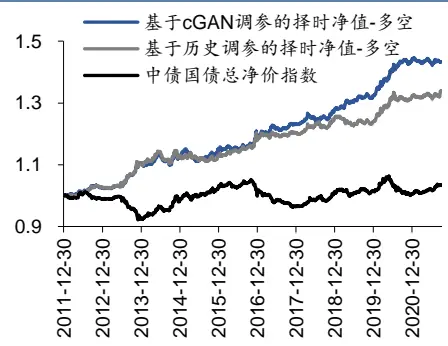
资料来源：Wind，华泰研究

## 研究导读

低信噪比是金融市场的重要特征之一。无论是主观交易试图通过人工复盘来总结不同历史区间的市场风格从而类比未来，还是量化交易希望借用机器算力来挖掘历史规律从而预测未来，共同点都是基于可观测的过去来辨别市场的噪声与信号，寻求具有内生逻辑的交易决策。低信噪比往往意味着市场充满偶然性，虽然在宏观周期的框架下金融市场仿佛秩序井然，但细化到每一个投资决策，没有人能完全肯定其所依靠的逻辑支撑究竟是井然的信号，还是偶然的噪音。

策略构建者为摆脱自然市场高熵的窘境，穷经皓首地找寻历史规律，渴望在脑海里构建一幅低熵的投资蓝图。然而遗憾的是，历史规律往往基于有限的样本获得，难以得到概率统计意义下的可靠结论，小样本带来的偶然性如影随形。甚至于，即使是完全理想的低熵蓝图也有可能因为国家政策、突发疫情等“偶然元素”的注入而重归于混乱，如同 alpha 因子与风险因子转变、市场风格切换一样自然而寻常。因此，对抗偶然性，检验策略稳健与否成为策略构建时绕不开的话题。

在量化交易领域，我们一般进行过拟合检验来测试交易策略的稳健性。华泰金工人工智能系列对策略构建中的过拟合检验已有多项研究，主要分为训练过拟合与回测过拟合两类，其中回测过拟合的一种研究思路是增加可观测的样本量，在更多的“平行世界”里观察参数表现。增加可观测的样本量可以理解为样本生成，而样本生成是生成对抗网络（GenerativeAeverisarial Networks, GAN）的强项，因此在 GAN 的帮助下，对抗过拟合或许可以走的更远。

图表1： 华泰金工过拟合相关研究
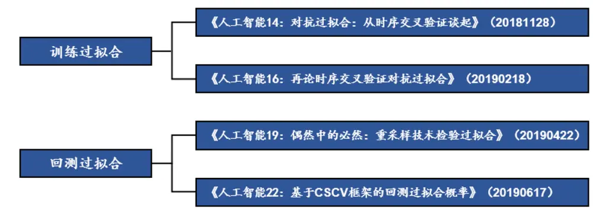
资料来源：华泰研究

本文将借助生成对抗网络来对过拟合检验进行初步探索。理论层面，本文提出了 GAN 应用于过拟合检验的流程框架，即首先利用生成对抗网络来生成金融时间序列样本，在验证生成样本足够拟真的基础上，令备选参数在所有生成路径上进行回测。其次观察每组参数在众多模拟路径上的统计表现，进而选择统计表现明显占优的参数组应用于未来，构建参数动态调整的交易策略。

数据实证层面，本文在上述框架下构建了基于 cGAN 的利率债指数趋势择时策略。我们选取了 277 组备选的趋势择时信号（包含不同参数与不同信号类型），利用 cGAN 生成中债国债总净价指数模拟样本，并令备选信号在模拟样本上回测，最后选取统计表现更有效的信号应用于样本外。实证表明，cGAN 生成的模拟路径对备选信号的区分能力较强，基于 cGAN调参的择时策略优于仅基于历史数据调参的择时策略，且基于 cGAN 调参的择时策略过拟合风险较低。

## 应对过拟合：利用 cGAN构建模拟未来

## 过拟合的困境

在对量化策略进行参数选择时，传统方法基于不同参数历史回测的收益或夏普选择最优参数，并将历史最优参数应用于未来。以唐奇安通道突破策略为例，该策略最重要的参数为回顾交易日数 N，为确定合适的参数，常见做法是对不同范围内的 N 在样本内（历史）进行遍历，选择回测收益最优的参数 N应用于样本外（未来）。此种做法虽然常见，但遗憾的是，常见并不意味着完全合理。

上述做法暗含的假设为：过去的最优解仍然是未来的最优解。对于变幻莫测的市场，上述假设可能过于粗糙，至少存在以下两个缺陷：1.历史数据表现最好并不等价于“过去的最优解”。如果用随机过程来描述金融时间序列，那么历史只是随机过程的一条实现路径，“历史表现好”不是“其他潜在路径表现也好”的充分条件，单一历史路径的表现具有较强的随机性。2.历史通常不等于未来。即使找到了“过去的最优解”，也无法保证其为“未来的最优解”，同一组策略参数在不同的市场环境下有可能演绎出相去甚远的结果，市场风格的转变对策略参数具有较大影响，同一组参数大概率不能从一而终。策略构建者选择的样本内外的切分点有可能恰好落在风格变换的“阵痛期”内，这种时序上的随机性也具有较大影响。

失之毫厘，谬以千里，重重假设放大了参数调优的偏差，不同环节所带来的随机性最终导致寻优参数与理想化的最优参数可能南辕北辙，如同蝴蝶效应般陷入过拟合的困境。因此仅仅使用历史数据来辨别备选参数的优劣或许并非最合理的方式。

图表2： 过拟合困境的产生
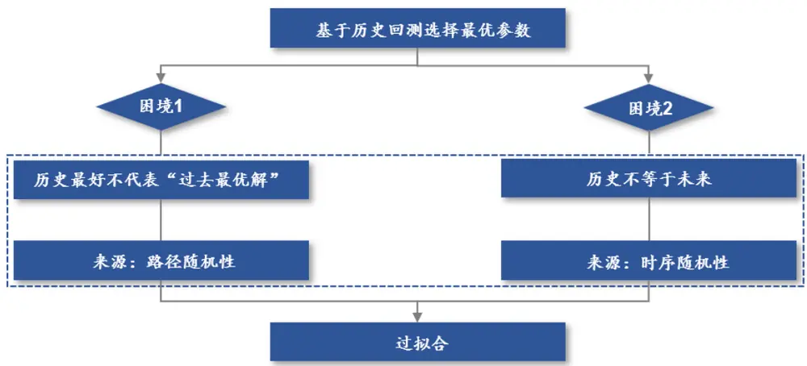
资料来源：华泰研究

有没有某种方法能尽量降低策略构建过程中随机性所带来的影响？或许从概率统计学科的大数定律里我们能得到一点启发。大数定律描述了这样一种现象：在随机事件的大量重复出现中，结果往往呈现几乎必然的规律。下面这个简单的例子更为清晰：抛一枚质地均匀的硬币，次数较少时正反面出现的次数或许并没有某种明显的规律，但随着抛硬币次数增加，正反面出现的频率逐渐收敛至 1/2，这就是“几乎必然的规律”。换言之，增加观测样本量可以达到降低随机性的效果。

根据大数定律的思想，在华泰金工研究《人工智能 19：偶然中的必然：重采样技术检验过拟合》（20190422）中我们提出使用 Bootstrap 方法来构建“平行 A股市场”以研究机器学习量化选股策略不同环节的随机性对回测结果的影响。其本质在于使用 Bootstrap 来模拟市场，考察某组参数或某种方法在众多潜在市场的表现，在大样本的条件下，某组参数或某种方法最终要摘下其“随机性”的面纱，收敛至“几乎必然的规律”——即该参数或方法到底是优是劣。

但实际上，使用 Bootstrap 来模拟历史或多或少只是某种“权宜之计”：其一，Bootstrap 模拟的历史是否真的代表了“平行 A股市场”？真实的金融资产往往表现出特定的统计特征，例如波动率聚集、杠杆效应等，然而华泰金工 GAN 系列研究已表明：Bootstrap 模拟的金融时序数据与真实市场仍存在较大差距。其二，Bootstrap 以历史模拟历史，即使筛选出了策略参数的“历史最优解”，仍然无法直接解决过拟合的第二个问题：历史不等于未来。

图表3： 上证综指真实序列与生成序列波动率聚集、杠杆效应、粗细波动相关特征对比
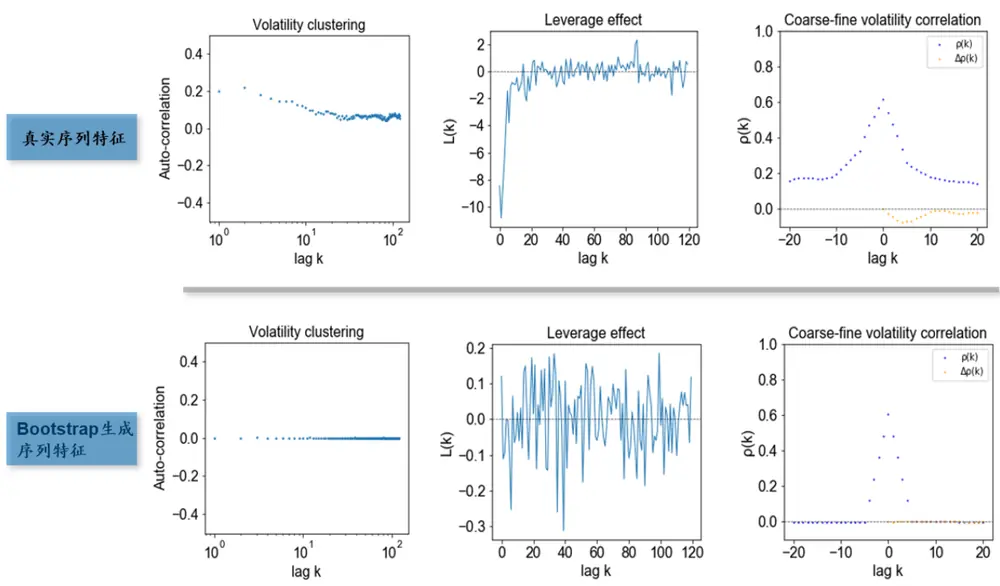
资料来源：Wind，华泰研究

条件生成对抗网络（Conditional Generative Adversarial Networks，cGAN）提供了潜在的解决方案。cGAN 与原始生成对抗网络大体思路相同，唯一不同的点在于 cGAN 引入“条件生成”的概念，可以生成指定条件下的样本。如果以金融资产的历史序列作为条件，生成未来序列，那么 cGAN 就可以起到模拟未来的效果。基于 cGAN 模拟的未来市场，我们可以直接观测备选参数在“未来”的统计表现，进而选择过拟合概率相对较小的参数。

## 利用条件生成对抗网络构建模拟未来

## cGAN 的基本原理

在进一步阐述基于 cGAN 进行参数调优的合理性之前，本文首先简要回顾 cGAN 的基本原理。类似于 GAN，cGAN 也基于判别器 D与生成器 G两组网络结构，但与 GAN不同的是，cGAN 中两组网络结构都以定语“条件”进行修饰。Mirza 等（2014）在 cGAN 原论文中所使用的目标函数如下所示：

$$
\begin{array}{rl}&{\underset{G}{\mathrm{min}}\underset{D}{\mathrm{max}}V(D,G)=E_{x\sim p_{r}}[logD(x|y)]+E_{z\sim p_{z}}\left[\log\left(1-D\big(G(z|y)\big)\right)\right]}\\&{\qquad=E_{x\sim p_{r}}[logD(x|y)]+E_{x\sim p_{f}}\big[\log\bigl(1-D(x|y)\bigr)\big]}\end{array}
$$

作为对比，这里我们列示原始生成对抗网络 GAN 的目标函数：

$$
\begin{array}{rl}&{\underset{G}{\mathop{\operatorname*{min}}}\underset{D}{\mathop{\operatorname*{max}}}V(D,G)=E_{x\sim p_{r}}[logD(x)]+E_{z\sim p_{z}}\big[\log\big(1-D(G(z))\big)\big]}\\&{\qquad=E_{x\sim p_{r}}[logD(x)]+E_{x\sim p_{f}}\big[\log\big(1-D(x)\big)\big]}\end{array}
$$

比较 cGAN 与 GAN 的目标函数，主要区别在于以下两点：

1. D(x|y)替代了D(x)，即 cGAN 中判别器的输入除了样本x以外，还包括条件输入y。判别器D不仅要判别输入的样本x是否来自真实世界，还要判别x是否与条件y所描述的对象一致，只有在条件y所代表的标签和样本x匹配时，判别器才判定生成样本为真。如下图所示，假设我们要生成火车的图片，只有当生成图片来自真实世界样本且确实为火车时，判别器才输出 1；否则判别器均输出 0。

2. G(z|y)替代了G(z)，即 cGAN 中生成器的输入除了隐变量z以外，还包含条件输入y，生成器的目标在于生成符合条件描述的样本。

图表4： cGAN 判别器判定示意图
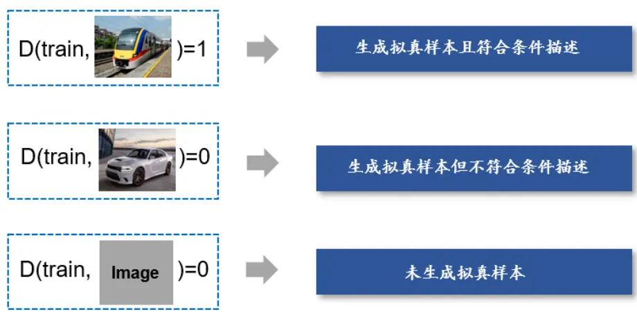
资料来源：华泰研究

除上述两点区别以外，cGAN 与原始 GAN 并无其他本质区别。cGAN 的整体网络构架可以用下图来表示：隐变量z与条件y输入给条件生成器G网络，G输出生成样本x ；生成样本x或真实样本x 与对应的条件y输入给条件判别器D网络，D输出样本及条件对判别为真的概率。在实际训练时，判别器与生成器仍然遵循交替训练的方式，二者相互博弈、相互提升，直至达到纳什均衡状态。

图表5： cGAN 判别器判定示意图
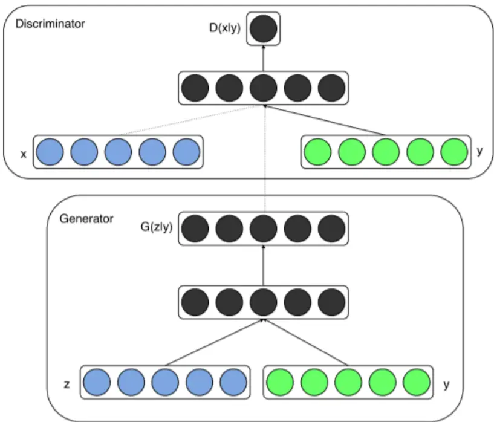
资料来源：Conditional Generative Adversarial Nets，华泰研究

由于 cGAN 并不对 GAN 的损失函数进行改进，因此 GAN 的缺陷如判别器与生成器训练进度不匹配、损失函数不收敛、模式崩溃等原因在 cGAN 中仍有可能出现。为提高生成样本的质量，本文令 cGAN 与 WGAN-GP 结合，即将 WGAN-GP 的损失函数应用于 cGAN 并修改相应的网络结构，得到 cWGAN 模型，后续数据实证部分将主要基于 cWGAN 展开，关于 WGAN 的细节读者可以参考华泰金工研究《人工智能 35：WGAN 应用于金融时间序列生成》（20200828）。cWGAN 的目标函数如下所示：

$$
\begin{array}{c}{\displaystyle\mathop{\operatorname*{min}}_{G}\mathop{\operatorname*{max}}_{D}V(D,G)=E_{x\sim p_{r}}[D(\boldsymbol{x}|\boldsymbol{y})]-E_{z\sim p_{z}}\big[D\big(G(\boldsymbol{z}|\boldsymbol{y})\big)\big]}\\{-\lambda E_{\widehat{x}\sim p(\epsilon x+(1-\epsilon)G(z|\boldsymbol{y}))}[\big||\nabla_{\widehat{x}}D(\widehat{x})|\big|_{2}-1]^{2}}\end{array}
$$

## cGAN 构建模拟未来的合理性

前文我们提到，基于历史回测选择最优参数的参数调优方法存在两个缺陷：1.历史最好不代表“过去最优解”；2.历史通常不等于未来。基于 Bootstrap 的历史模拟方法提出在模拟市场考察不同参数的统计表现，以此来进行参数调优的思想，但 Bootstrap 存在模拟样本不够拟真、仅以历史模拟历史的问题。

cGAN 融合过去与未来，为应对传统参数调优方法的缺陷提供了一种相对合理的方案：

1. 为解决第一个缺陷，即历史最好不代表“过去最优解”，cGAN 与 Bootstrap 的基本想法类似，即在大数定律的法则下，创造众多模拟的“平行市场”。在模拟市场里，对所有参数进行回测，最小化路径随机性带来的影响，从参数的大样本统计表现来选择过拟合概率最小的参数组。相比于 Bootstrap，GAN 具有更为卓越的拟真能力，可以在更宽泛的维度拟合真实序列的特征，因此其模拟的路径在回测时更具有可信度；

2. 为解决第二个缺陷，即历史通常不等于未来，cGAN 借助条件生成的框架，直接对未来市场进行模拟，即给定一段历史序列作为条件，生成未来一段时间的路径。cGAN 对市场的模拟思路融合历史与未来，直接考察不同参数组在“未来”的表现，进行后验参数选择。

图表6： cGAN 进行参数调优的合理性
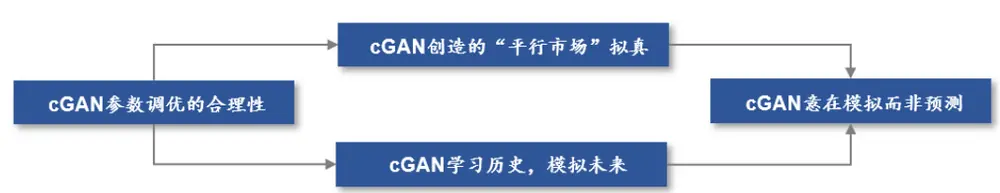
资料来源：华泰研究

值得说明的是，在本文的框架下，cGAN 的本质目的不在于预测，而在于模拟。在进行条件生成时，隐变量z可以理解为对未来市场状态空间的抽样，代表某种市场状态或市场规律，例如未来的市场风格、宏观变量、资产序列长时程相关性强弱等。换言之，隐变量z是市场规律/状态的向量化嵌入，蕴含某种先验信息，会影响生成序列的形态与特征。由于我们并不知道隐变量z与市场规律之间的具体映射关系，故从严格意义上来说，我们只知道 cGAN的生成序列是未来某种市场状态下可能出现的结果，但具体是哪种市场状态却不得而知。

因此本文所使用的 cGAN 本意不在于预测，也不能称之为预测，而是对众多可能的市场状态进行采样（对应着隐变量z的采样），模拟未来资产在不同市场状态下可能的实现路径，并在各种市场环境下检测备选参数的有效性，筛选出鲁棒性强的参数组。

## 利用 cGAN 进行参数调优的框架

综上所述，采用 cGAN 模拟未来路径，令备选参数在众多模拟路径里进行回测，选择整体回测效果靠前的参数作为样本外使用的实际参数是较为合理的做法。本小节以趋势择时策略为例对这个流程进行更清晰的定义，以构建起基于 cGAN 参数调优应对过拟合的框架，整体框架如下图所示。

图表7： cGAN参数调优框架
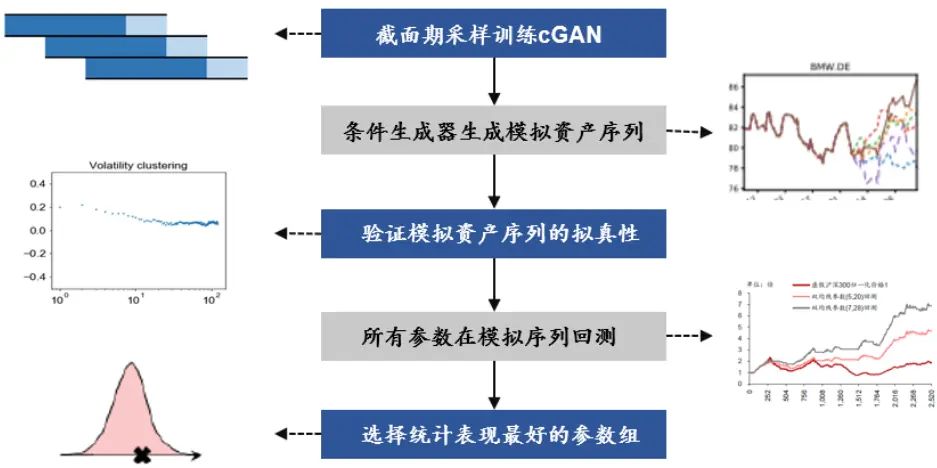
资料来源：华泰研究

## 截面期采样训练 cGAN

cGAN被提出之初，条件y是具有较为明显含义的标签，例如在生成不同性别的人脸任务中，条件y为指定的性别标签。但实际上，cGAN 的泛化能力较强，在时间序列生成任务里，条件y不一定是具有明显含义的某种标签，而可以是过去一段时间的已实现序列。二者的区别在于，指定的“某种标签”是可列的，而“已实现序列”是不可列的，在实际训练时，不同的两条时序样本条件序列大概率不会完全一致。

在某个截面期，为避免引入未来信息，我们仅使用过去一段时间作为样本内进行滚动采样（具体滚动采样方式参考本文数据实证部分），采集的每条样本包括条件与目标两部分，采集完成后输入给条件生成对抗网络进行训练。本文所使用的基础网络结构如下表所示。

图表8： cGAN 生成器 G 网络结构

| 参数 | 取值 |
| --- | --- |
| 结构 | 含三个卷积层、两个上采样层的卷积网络 |
| 输入条件序列y与隐变量z的拼接序列 | 隐变量采样自标准正态分布 |
| Layer1：一维卷积层 | Conv1d(1, 8, kernel_size=3, padding=1) |
| Layer2：上采样层 | Upsample(scale_factor=2) |
| Layer3：一维卷积层 | Conv1d(8, 16, kernel_size=3, padding=1) |
| Layer4：上采样层 | Upsample(scale_factor=2) |
| Layer5：一维卷积层 | Conv1d(16, 1, kernel_size=3, padding=1) |
| Layer6：全连接层 | Linear((dim(y) + dim(z)) * 4, dim(x)) |
| 是否标准化 | 否 |
| 卷积层激活函数 | LeakyReLU(0.2) |
| 全连接层激活函数 | 不激活 |
| 优化器 | Adam(Ir=0.001, betas=(0.5, 0.999)) |
| 损失函数 | −Ez~p,[fw(G(z\|y))] |

图表9： cGAN判别器 D网络结构

| 参数 | 取值 |
| --- | --- |
| 结构 | 含两个卷积层、一个池化层和三个全连接层的卷积网络 |
| 输入条件序列y与生成序列或真实序列x的拼接序列 生成序列x来自于生成器G |  |
| Layer1：一维卷积层 | Conv1d(1, 8, kernel_size=3, padding=1) |
| Layer2：最大值池化层 | MaxPool1d(kernel_size=2) |
| Layer3：一维卷积层 | Conv1d(8, 16, kernel_size=3, padding=1) |
| Layer4：全连接层 | Linear((dim(y) + dim(x)) ∥/ 2 * 16, 50 ) |
| Layer5：全连接层 | Linear(50, 15) |
| Layer6：全连接层 | Linear(15, 1) |
| 是否标准化 | 否 |
| 卷积层激活函数 | LeakyReLU(0.2) |
| 全连接层激活函数 | LeakyReLU(0.2) |
| 优化器 | Adam(Ir=0.001, betas=(0.1, 0.999)) |
| 损失函数 | $E_{x\sim p_{r}}[D(x\|y)]-E_{z\sim p_{z}}\big[D\big(G(z\|y)\big)\big]-\lambda E_{\widehat{x}\sim p(\epsilon x+(1-\epsilon)G(z\|y))}[\big\|\|\nabla_{\widehat{x}}D(\widehat{x})\|\big\|_{_{-}}-1]^{2}\mid$ |

资料来源：华泰研究

## 条件生成器生成模拟资产序列

在某个截面期训练完成后，下一步是对未来的序列进行模拟。选择采样时所选取的样本内离截面期最近的指定长度序列作为条件，从标准正态分布对隐变量进行采样，将二者的拼接序列输入给训练好的生成器 G 即可生成“未来”序列。实际操作时，生成序列长度需根据策略构建方案而定。例如，如果想要确定的是未来两年最合适的趋势择时参数，那么合理的做法是生成未来两年的模拟序列。这里仍有两种备选方案：

1. 一次性生成未来两年的模拟序列，即生成样本x的长度为 2 年。这种做法的优势在于生成序列直观，生成过程简单；劣势在于对条件样本长度要求更高，因为想要一把生成 2年长度的序列，逻辑上来说条件序列应不短于 2年，则条件样本与生成样本的总长度超过4 年，对滚动采样的区间长度造成一定压力。

2. 滚动生成未来两年的模拟序列，即生成样本x的长度小于 2 年，滚动生成直到生成序列长度满足 2 年。例如每次生成样本长度为 100 个交易日，则滚动 5 次并将生成序列拼接得到长度近似 2 年的生成序列。这种做法的优势在于对条件样本长度的要求更低，同样区间长度的采样区间里，可以获得更多训练样本；劣势在于，生成样本拼接时需要仔细考察拼接逻辑，否则拼接所得的序列将失去经济学意义，且实证结果也表明此种方案训练难度更大。

## 验证模拟资产的拟真性

生成序列拟真是对抗过拟合的前提，只有在 cGAN 生成序列与真实序列接近的基础上，基于模拟序列进行回测才有意义。不同的金融资产会表现出不同的特征，例如股票资产收益率序列具有较为明显的杠杆效应、粗细波动率相关及盈亏不对称性，而这些特征在债券上表现较不明显，因此不能机械照搬。作为框架性介绍，本小节仅介绍一些较为通用的检验指标。

## 1. 自相关性

一般认为，真实的股票资产日频序列不存在自相关性，各阶自相关系数近似为 0；真实的债券资产日频序列存在一定的低阶自相关性，高阶非自相关。自相关系数计算公式如下，其中μ和σ分别表示均值和标准差：

$$
Corr(r_{t},r_{t+k})=\frac{E[(r_{t}-\mu)(r_{t+k}-\mu)]}{\sigma^{2}}
$$

## 2. 偏自相关性

偏自相关系数 $\phi_{nn}$ 衡量了时间序列r 与 $r_{t-n}.$ 在扣除 $r_{t-2},\ldots,r_{t-n+1}$ 的影响之后的偏相关系数，常用于时间序列 AR 模型的定阶，即如果偏自相关系数p阶截尾，则 AR 模型的阶数为p。真实的股票资产日频序列不存在偏自相关性，各阶偏自相关系数近似为 0；真实的债券资产日频序列存在低阶偏自相关性。偏自相关系数计算公式如下：

$$
\phi_{11}=\rho_{1}
$$

$$
\phi_{22}=\frac{\rho_{2}-\rho_{1}^{2}}{1-\rho_{1}^{2}}
$$

$$
\phi_{sj}=\phi_{s-1,j}-\phi_{ss}\phi_{s-1,j-1}
$$

$$
\phi_{ss}=\frac{\rho_{s}-\sum_{j=1}^{s-1}\phi_{s-1,j}\rho_{s-j}}{1-\sum_{j=1}^{s-1}\phi_{s-1,j}\rho_{j}}
$$

## 3. 厚尾分布

实证数据表明，股票和债券收益率序列均表现出较为明显的尖峰厚尾分布特征。相比于正态分布，尖峰厚尾分布极端值出现的概率更高，对应到实际的经济学含义即为：“黑天鹅”事件发生概率更高。本文采用如下方法来衡量厚尾分布的程度：记标准化真实收益率的概率密度函数为 P(r)，对 $r>0\sharp\mathfrak{s}$ 部分拟合幂律函数，正态分布的衰减系数 $\alpha>5$ ，真实资产序列3 $<\alpha<5$ ：

$$
P(r)\propto r^{-\alpha}
$$

## 4. 波动率聚集

真实的股票或债券收益率序列存在较为明显的波动率聚集现象，当期资产大幅度的价格波动往往伴随着下一时段的大幅度价格波动，时间序列的经典模型 ARCH 及 GARCH 即用于拟合真实波动率序列的这种特征。从统计学上来说，波动率聚集体现为绝对值或二阶矩序列存在较为明显的低阶自相关性与高阶非自相关性，可以计算绝对值序列自相关系数随阶数 k 的幂律衰减系数来判定，真实序列的β一般介于 0.1~0.5：

$$
Corr(|r_{t}|,|r_{t+k}|)=k^{-\beta}
$$

## 所有参数在模拟序列上回测

生成序列经过真实性指标检验后，可以用于备选参数的回测。在华泰金工研究《华泰基本面轮动系列之七—行业配置策略：趋势追踪视角》（20200831）中我们介绍过一系列趋势追踪信号指标的构建方法，本文选取了其中部分指标，具体趋势指标的计算方法及参数选择见附录部分。对众多指标选择不同的参数，可以衍生出众多备选的择时信号，令所有的备选信号在生成的模拟序列里进行回测，计算回测业绩，进而可以选择过拟合概率更低的参数组。

在实际操作时还需考虑时间开销的问题。上述衍生出的备选信号数量级大约在 $10^{2}$ ，模拟未来路径的数量级大约在 $10^{3}$ ，每组信号需要在所有模拟路径里回测，故总的回测数量级大约为 $10^{5}$ ，这并不是一个小数目，在实践时需要考虑对回测流程进行加速。上述回测流程从逻辑上来说可以用两层 for 循环实现，因此可以考虑使用 python 中的 numba 包进行加速。numba 是可以将 python 函数编译为机器代码的 JIT 编译器（Just-in-time，即时编译器），主要使用场景为基于 numpy的代码、函数及循环操作加速，可以使代码运行速度接近 C或FORTRAN 语言，正适合用于本研究给模拟路径的回测进行加速。

在实际使用 numba 时，只需要进行两步操作：1.导入 numba 包；2.在函数定义之前插入一行numba装饰器@nb.njit即可。单截面期对所有模拟序列进行加速的示例代码如下图所示，可以看到函数内部主要是两层 for 循环结构。

图表10： numba回测加速代码示例
import numpy as np 
import numba as nb 
@nb.njit 
def multi_asset_backtest(..., ...): 
……"单期所有模拟序列回测……… 
backtest = [] 
for i in range(...): 
for j in range(...): 
strat value = 
backtest.append(strat_value) 
return backtest
资料来源：华泰研究

## 选择统计表现最好的参数组

回测完成以后，对于每组备选参数将会有 N 个回测结果，N 表示模拟路径的数目。将这 N个回测结果的业绩指标进行统计即可筛选出在“模拟未来”表现相对较好的参数组，例如可以中位数为基准，筛选夏普比率中位数最高的参数作为未来一段时间所使用的实际参数，可以合理认为这些参数的过拟合概率较低。

最后在筛选参数时，仍然有细节值得讨论：备选参数数量级为102，那么筛选多少组参数比较合理？不妨回到本文最开始对“随机性”的讨论上来进行思考。虽然通过 cGAN 生成“模拟未来”的方式降低了参数选择阶段的随机性，但遵循同样的逻辑，将筛选出的最优参数应用于真实未来时，真实未来也只是随机过程的 1 条实现路径，因此不可避免地存在路径随机性问题，最优参数仍然存在尾部风险。

为降低尾部风险出现的概率，筛选的最优参数数量不宜过少，例如可以保留在模拟路径里表现更好的前一半参数，在真实未来生成信号时，对这一半参数的信号进行集成，以此来降低单个信号发生尾部极端损失的概率。以下图为例，虽然从夏普比率中位数或均值来看，蓝色分布所对应的参数为最优参数，但参数在不同模拟路径的回测夏普表现出的方差较大，存在尾部极端风险，此时如果将黄色分布对应参数与蓝色分布对应参数进行集成，可以降低极端损失出现的概率。

图表11： 最优参数的尾部风险示意
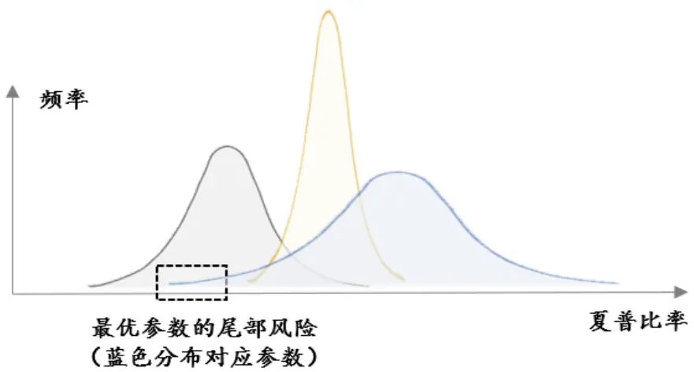
资料来源：华泰研究

## 基于 cGAN的债券趋势择时调参实证

本章以债券为标的展示条件生成对抗网络在对趋势类择时策略进行调参时的具体应用。遵循上一章所提出的框架，我们将按照五个步骤来构建债券趋势择时策略。下文将主要以中债-国债总净价总值指数（Wind 代码：CBA00602，下文称之为基准指数）为标的债券资产构建基于 cGAN 调参的择时策略，并与传统方法进行比较。

## cGAN生成模拟未来路径

本文采取滚动的方式生成基准指数在未来的模拟路径。具体来说，每两年为一个训练期，每两年的最后一个交易日我们训练cGAN并生成模拟未来。在选定的训练日，选取过去1500个交易日为样本内进行采样训练 cGAN 模型，每条样本的条件序列为过去 300 个交易日的收益率，生成目标序列为接下来 100 个交易日的收益率。

图表12： 单次 cGAN训练流程
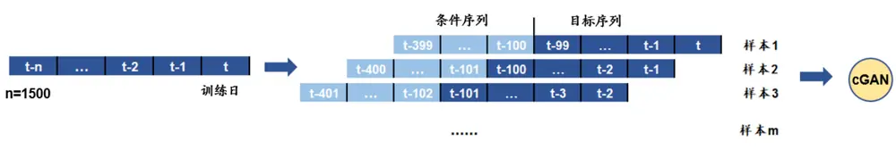
资料来源：华泰研究

在某个训练日训练完成后，以样本内最后一组条件为生成器的输入，滚动生成未来 500 个交易日（近似为两年）的资产价格序列。如下图所示，第一次滚动（Round1）以样本内最后 300 个交易日为条件，生成 k 条未来 100 个交易日的收益率路径；第二次滚动（Round2）以样本内最后 200 个交易日及上一轮生成的 100 个交易日为条件（拼接以后仍为 300 个交易日），生成 k 条未来 100 个交易日的收益率路径…依此类推，直至生成 k 条长度为 500个交易日的模拟收益率路径。本文 k 取 500，即每个训练日生成 500 条未来近两年的路径。

## 关于滚动样本生成，额外说明以下几点：

1. 训练日的选择分别为 2011-12-30、2013-12-31、2015-12-31、2017-12-29、2019-12-31，即每两年滚动一次。这样选择的原因在于，一方面如果间隔时间太短，相应地未来模拟路径也缩短，则在模拟路径上对备选趋势信号进行回测时受偶然因素影响较大；另一方面如果间隔时间太长，cGAN 模拟路径难度增加，模拟路径容易与真实市场产生较大偏离。综合考量，两年是合适的区间。

2. 在每个训练日训练完成后生成样本时，同一条路径的滚动使用相同的随机数序列，以保证路径生成时随机数所代表的市场隐状态相同，此时模拟路径的滚动拼接才有意义。

图表13： 单次 cGAN生成模拟路径流程
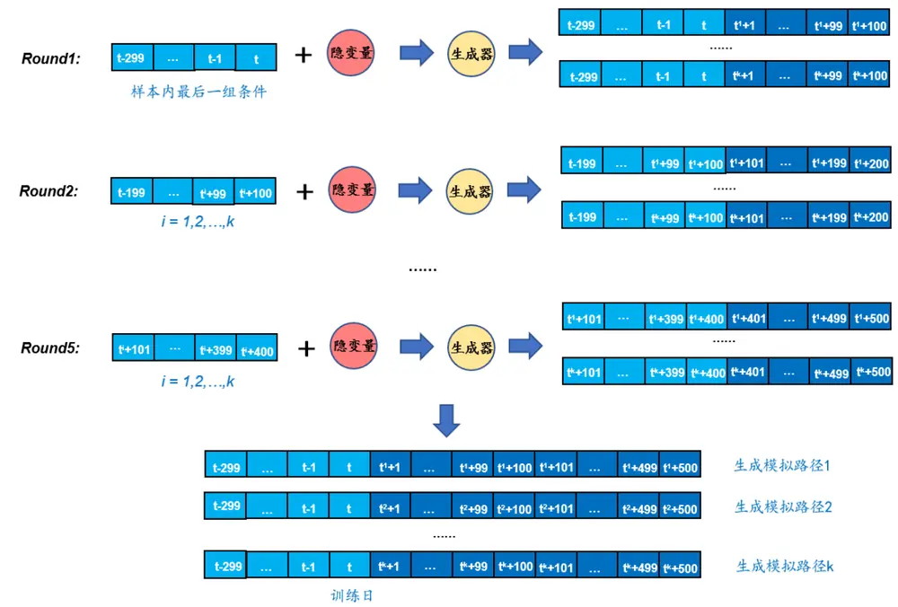
资料来源：华泰研究

## 训练损失函数及模拟路径展示

本小节展示训练损失函数及各期生成的模拟路径。由于各期损失函数形态大同小异，因此我们仅展示第一组训练日训练时的损失函数形态。展示各期生成的模拟路径时，从生成的所有模拟路径中随机选取若干条模拟路径进行展示。

图表14： 训练损失函数（训练日期为 2011-12-30）
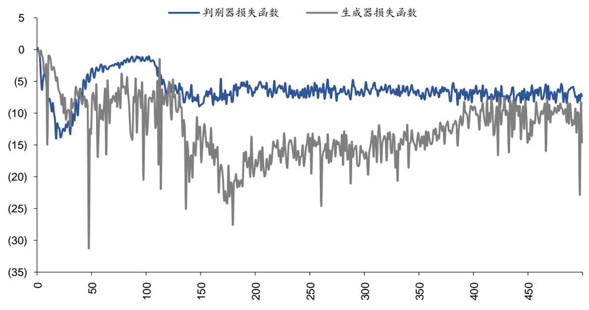
资料来源：Wind，华泰研究

训练日为 2011-12-30 的 cGAN 损失函数如上图所示。本文在构建 cGAN 时，采用的是WGAN-GP 的梯度惩罚损失函数，根据WGAN的相关理论，随着训练的进行，判别器损失函数逐渐收敛，收敛以后则表明模型基本训练充分。由上图可见，迭代训练 200 轮以前，判别器损失函数宽幅波动，此时生成器与判别器尚处于“激烈”的博弈对抗中，模拟样本分布与真实样本分布仍然存在一定差距；迭代训练 200 轮以后，判别器损失函数收敛，对抗训练逐渐达到平衡状态，此时生成器所拟合的生成条件分布与真实条件分布较为接近，从生成器采样即可得到未来的模拟路径。

图表15： 中债-国债总净价指数模拟路径（训练日期为 2011-12-30）
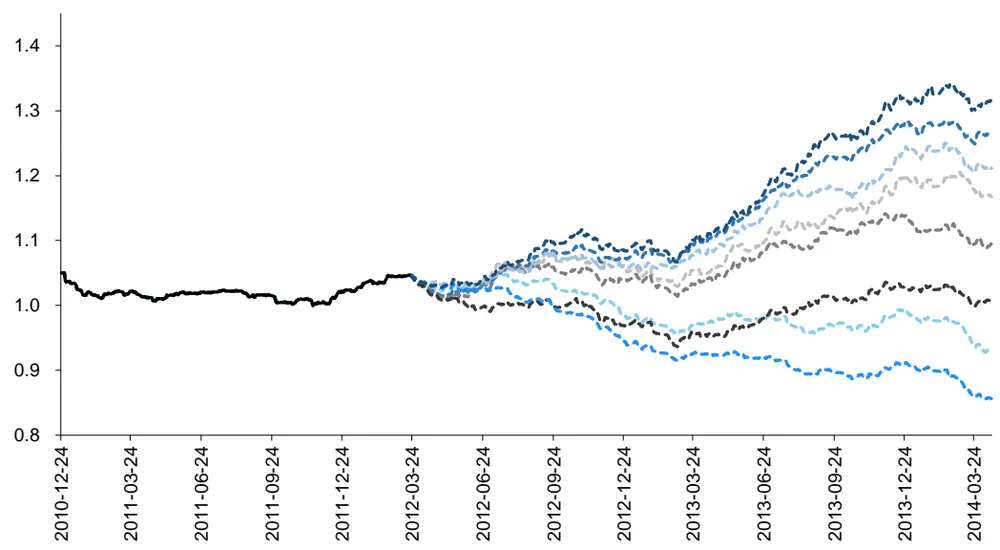
资料来源：Wind，华泰研究

图表16： 中债-国债总净价指数模拟路径（训练日期为 2013-12-31）
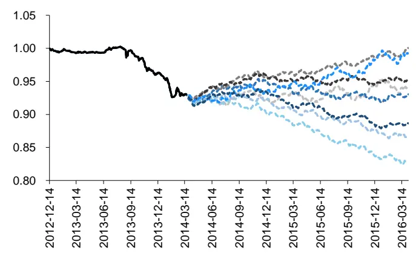
资料来源：Wind，华泰研究

图表17： 中债-国债总净价指数模拟路径（训练日期为 2015-12-31）
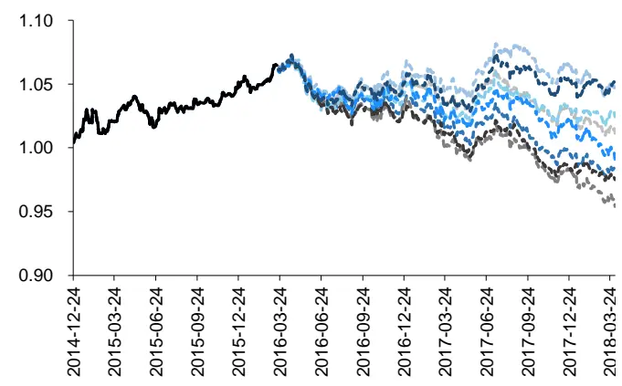
资料来源：Wind，华泰研究

图表18： 中债-国债总净价指数模拟路径（训练日期为 2017-12-29）
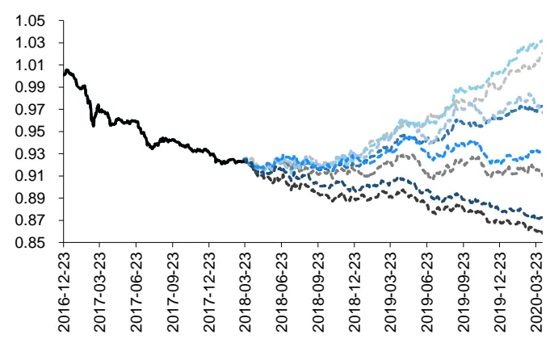
资料来源：Wind，华泰研究

图表19： 中债-国债总净价指数模拟路径（训练日期为 2019-12-31）
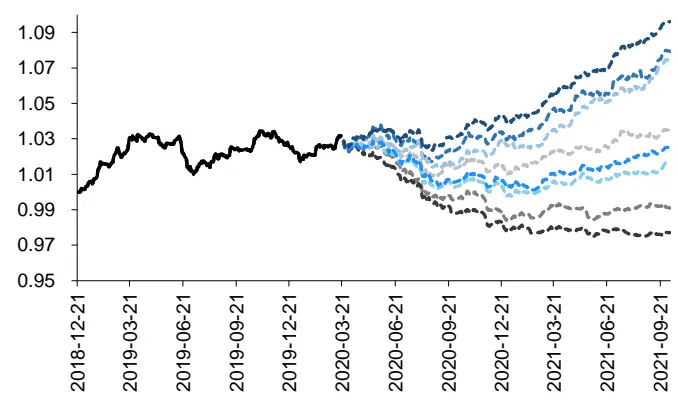
资料来源：Wind，华泰研究

图表 15-图表 19 展示各训练期 cGAN 生成器所生成的模拟路径，各训练日回溯 300 个交易日长度所展示的实线序列为真实中债-国债总净价指数的归一化序列，训练日以后的虚线序列为部分生成序列。可以看到，生成序列走势较为多样，受益于WGAN的引入基本没有发生过于明显的模式崩溃问题。下面我们将采用前文所述的评价指标来验证生成序列的统计特征。

## 生成序列评价指标展示

由于每个截面期仅生成未来两年的模拟序列，如果直接用两年长度的序列来计算各项统计指标可能存在一定的偶然性。因此我们将不同截面期的生成序列按顺序进行拼接（拼接时保证被拼接到同一条序列里的子生成序列在生成时采用的是相同的隐变量，这点可以通过控制随机数种子点来保证）。真实序列与生成序列的评价指标结果如下图表所示。从数值来看，在四组评价指标上 cGAN 生成序列与真实序列表现出的特征基本接近，因此可以认为在 cGAN 生成序列上进行趋势策略回测是合理的。

图表20： 中债国债总净价指数 cGAN生成序列自相关性、厚尾分布、波动率聚集特征对比
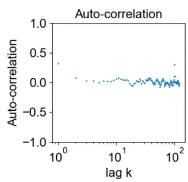
资料来源：Wind，华泰研究

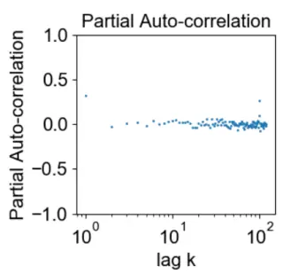

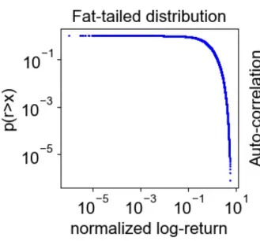

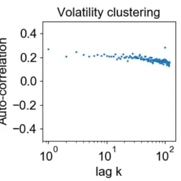

图表21： 中债国债总净价指数真实序列自相关性、厚尾分布、波动率聚集特征对比
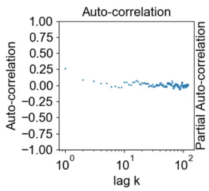
资料来源：Wind，华泰研究

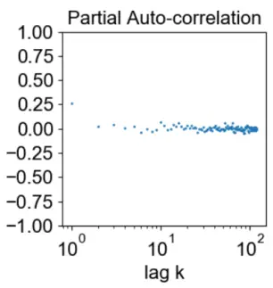

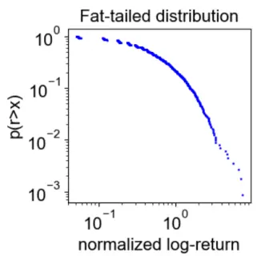

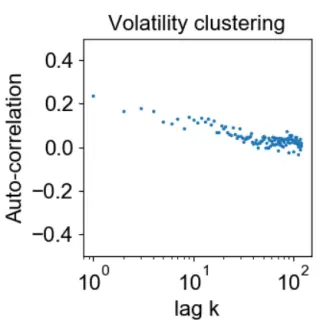

图表22： 中债国债总净价指数真实序列与生成序列评价指标

| 特征 | 指标值 | 真实序列 | CGAN 生成序列 | 合理取值范围 |
| --- | --- | --- | --- | --- |
| 自相关性 | 自相关系数均值 | 0.016 | 0.022 | 略大于0 |
| 偏自相关性 | 偏自相关系数均值 | 0.012 | 0.014 | 略大于0 |
| 厚尾分布 | 衰减系数α | 3.962 | 4.973 | 3~5 |
| 波动率聚集 | 衰减系数β | 0.486 | 0.104 | 0.1~0.5 |

资料来源：Wind，华泰研究

## 择时策略构建

长期来看债券类资产收益稳定、波动较低，趋势较容易捕捉，因此债券指数适用于趋势指标进行择时。尽管如此，趋势指标具体参数的确定仍然是较为棘手的问题。若简单将历史数据划分为样本内外，根据样本内回测表现确定最优参数，一方面不可避免地会遇到前文所述过拟合的问题，另一方面对样本外使用固定的历史最优参数并不合理，这是因为不同时期债券的趋势强度、波动程度仍存在一定差别，不同市场环境下最适应的指标参数可能不尽相同，这正是本研究采取滚动训练的原因。本小节将构建基于历史数据与基于 cGAN所生成的未来数据的两种债券择时策略并进行比较。

## 1. 基于历史数据的回测

采取滚动的方式，滚动日期与 cGAN 训练日期相同，在每个滚动日期，取过去 1000 个交易日为样本内分别对所有趋势指标进行回测，选择夏普比率最高的前 N 组参数作为未来两年使用的趋势信号。

## 2. 基于 cGAN 模拟路径的回测

采取滚动的方式，在每个训练日期，使用训练好的 cGAN 生成器生成 500 条模拟路径，并在这 500 条模拟路径上分别对所有趋势指标进行回测，回测完成后计算每组参数在 500 条模拟路径上夏普比率的中位数，选择夏普比率中位数最高的前 N 组参数作为未来两年使用的趋势信号。

## 具体回测细节如下：

a.回测时采用周频计算信号并调仓的方式，即在回测期内每周最后一个交易日收盘生成趋势信号，次周第一个交易日开盘开仓，仓位持有一周。历史路径回测、模拟未来路径回测均采用周频生成信号及调仓的方式；

b. 在每个滚动日期选定好 N 组趋势指标参数后，未来两年回测时每个调仓日期的趋势信号由以下方法产生：每周最后一个交易日收盘后，计算 N 组趋势指标的信号，多头回测时当 N 组信号中超过一半信号看多则次周做多，否则次周空仓；多空回测时当 N 组信号中超过一半信号看多则次周做多，否则次周做空。

c. 回测交易手续费取为万二，参数 N 取 150，即每次滚动仅保留近一半有效趋势信号。

图表23： 两种择时策略构建方法对比
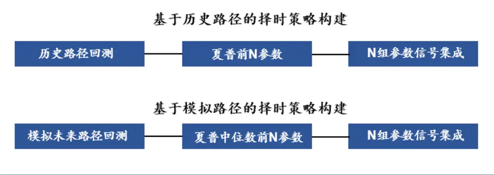
资料来源：华泰研究

## 回测结果展示及讨论

## 模拟路径对趋势信号的区分能力

在展示回测结果之前，我们先从数据实证的角度来检验 cGAN 模拟路径是否能有效区分不同趋势信号的择时效果强度。如果 cGAN 模拟路径对不同趋势信号完全没有区分能力，那么不同信号回测夏普分布之间难以观察到明显区分，分布重叠度较高。因此我们选取了回测夏普值中位数最大、居中、最小的 3 组趋势信号在全部路径上的回测结果进行展示，频率分布直方图的横轴区间长度为 0.5，结果如下图所示（以截面期 2011-12-30 为例）。

头部 3 组信号、居中 3 组信号与尾部 3 组信号形成较为明显的对比：头部的 3 组信号在所有模拟路径上回测的夏普值中枢在 2.5 左右，居中 3 组信号在所有模拟路径上回测的夏普值中枢在 1.5 左右，而尾部 3 组信号在所有模拟路径上回测的夏普值中枢则在-0.5 左右。从拟合的分布函数来看，三组参数的分布整体离散度近似，但中枢值具有明显差异，尤其是头尾两端的参数组分布重叠度较低，说明cGAN的模拟路径对备选信号确实具有区分能力。

图表24： 回测夏普中位数排名头部、居中、尾部 3组趋势信号回测夏普频率分布
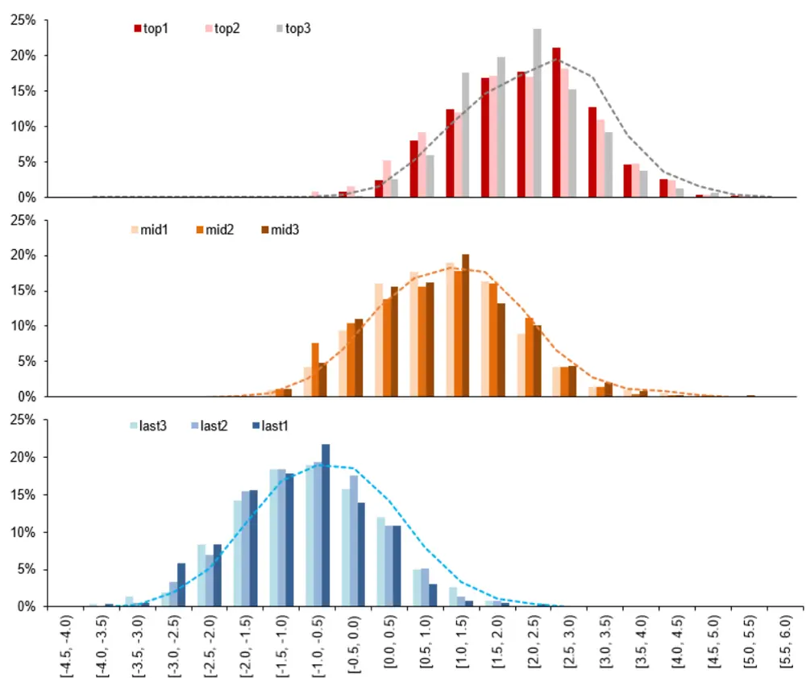
资料来源：Wind，华泰研究

虽然 cGAN 模拟路径对所有信号的头尾两端区分能力较强，但将头尾两端夏普值分别在更小的区间间隔上绘制频率分布直方图可见（区间长度为 0.25），头尾两端内部模拟路径对信号的区分能力有限。这可能并非由于 cGAN 模拟路径的区分能力不足导致，而是因为底层趋势信号的本质择时能力不分伯仲。实际上，当期头部 3 组信号分别为 DBCD_60_5_40、DBCD_60_20_5、DBCD_40_40_5，是同一个信号 DBCD 所衍生出的三组不同参数，而这三组参数没有表现出过于明显的区别是有可能的。靠前的信号有效性区分不明显，这也是我们最后在选择有效信号时纳入前一半信号，而不仅仅只纳入靠前的少部分信号的考量因素之一。

图表25： 回测夏普中位数排名尾部 3组趋势信号回测夏普频率分布
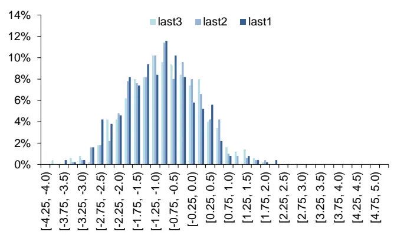
资料来源：Wind，华泰研究

图表26： 回测夏普中位数排名头部 3组趋势信号回测夏普频率分布
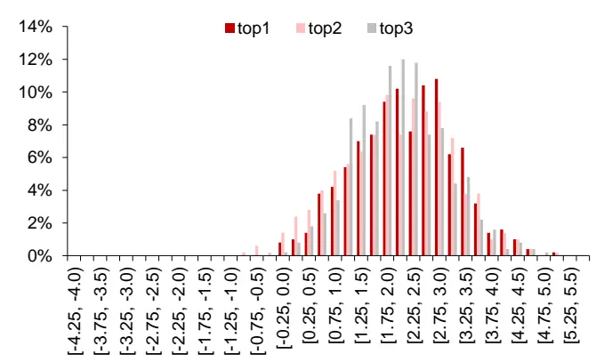
资料来源：Wind，华泰研究

## 回测结果展示

基于历史路径与 cGAN 模拟路径的中债-国债总净价指数择时策略的回测净值如下图所示。从纯多头择时来看，基于 cGAN 模拟路径调参的择时策略最明显的优势在于基本避开了2013 年 3 季度~2013 年底、2016 年底至 2017 年底及 2020 年 2 季度至 2020 年底这三段利率上行区间，即区间内基本均维持空仓。相比之下，基于历史路径调参的择时策略在后两段利率上行区间时常发出错误看多信号，使得择时策略净值发生回撤。此外可以观察到，cGAN 与历史两种方法对利率下行的大趋势把握较为准确，说明底层用于集成的趋势信号在债券品种上确实具有良好的多头择时能力。

从多空择时来看，基于 cGAN 模拟路径调参的择时策略整体回测结果更为稳健，基本抓住了中债国债总净价指数的每一段大趋势，夏普比率 1.85，历史最大回撤 3.54%。基于历史路径调参的择时策略虽然对于大趋势的把握没有发生显著反向，但对大趋势内部的短期反转未能及时捕捉，夏普比率 1.42，最大回撤 3.48%。除业绩差别以外，基于历史的参数调优方法从逻辑上来说还具有一定的过拟合风险。

图表27： 中债-国债总净价（总值）指数择时-多头（回测期 2011-12-30~2021-10-08）
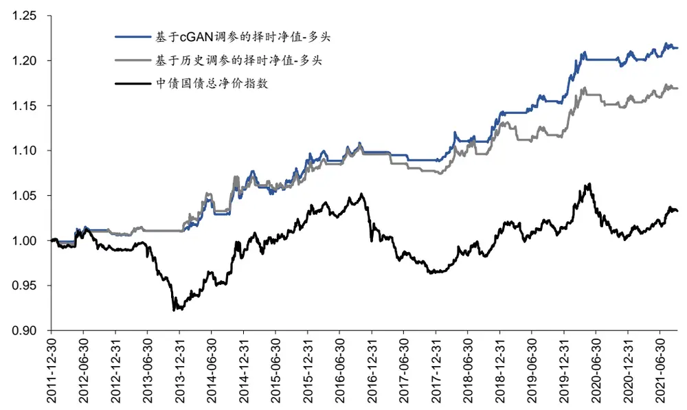
资料来源：Wind，华泰研究

图表28： 中债-国债总净价（总值）指数择时-多空（回测期 2011-12-30~2021-10-08）
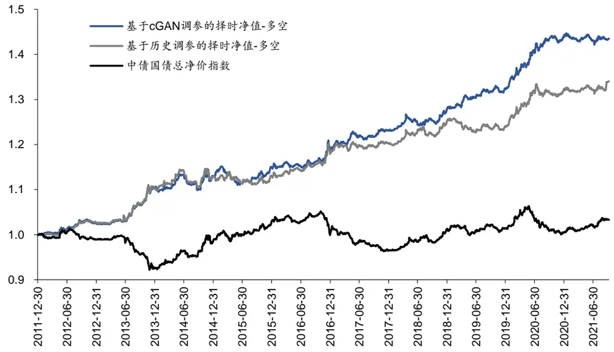
资料来源：Wind，华泰研究

图表29： 中债-国债总净价（总值）指数择时回测绩效（回测期 2011-12-30~2021-10-08）

|  | 区间收益 | 年化收益 | 年化波动 | 最大回撤 | 夏普比率 | 卡玛比率 |
| --- | --- | --- | --- | --- | --- | --- |
| CGAN 调参多头择时 | 21.43% | 2.09% | 1.56% | 2.38% | 1.34 | 0.88 |
| 历史调参多头择时 | 16.06% | 1.60% | 1.58% | 2.89% | 1.01 | 0.55 |
| CGAN 调参多空择时 | 43.45% | 3.92% | 2.12% | 3.54% | 1.85 | 1.11 |
| 历史调参多空择时 | 32.07% | 3.01% | 2.12% | 3.48% | 1.42 | 0.87 |
| 中债国债总净价指数 | 3.29% | 0.35% | 2.14% | 8.95% | 0.16 | 0.04 |

资料来源：Wind，华泰研究

## 持仓分析

基于 cGAN 参数调优构建的择时策略仓位变化如下图所示。多头择时与多空择时在多头端的持仓时间区间相同，多头择时的空仓时间区间则对应于多空择时的做空时间区间。在全部回测区间内，总调仓次数为 38 次，平均每年调仓 4.00 次，多头端平均每次持仓 65.95天，空头端（多空择时）平均每次持仓 54.95 天。因此虽然我们采用的趋势信号构建频率为每周，但总的交易次数较少，可能的原因是相比于股指、商品等资产，债券资产的趋势延续性较好，资产本身的波动性较低，趋势类信号不太容易受到短时间内的大幅波动而发生反转，而是当趋势明显形成时才会释放择时信号。

图表30： 中债-国债总净价（总值）指数择时-多头持仓（回测期 2011-12-30~2021-10-08）
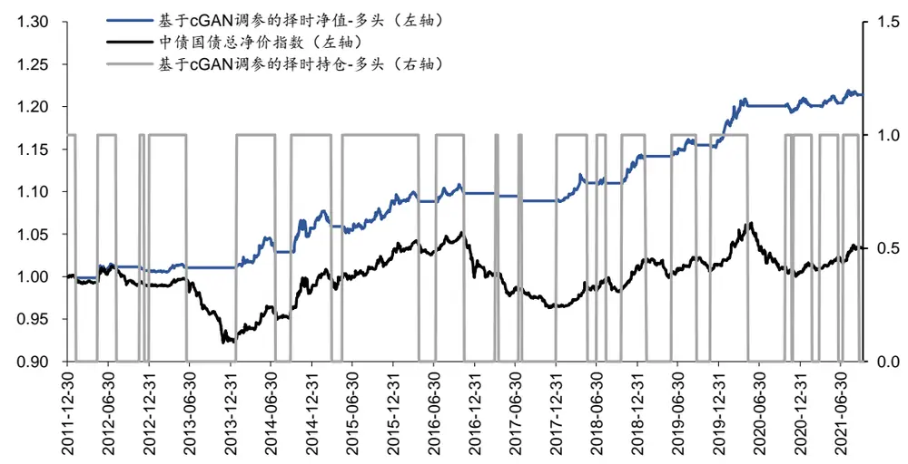
资料来源：Wind，华泰研究

图表31： 中债-国债总净价（总值）指数择时-多空持仓（回测期 2011-12-30~2021-10-08）
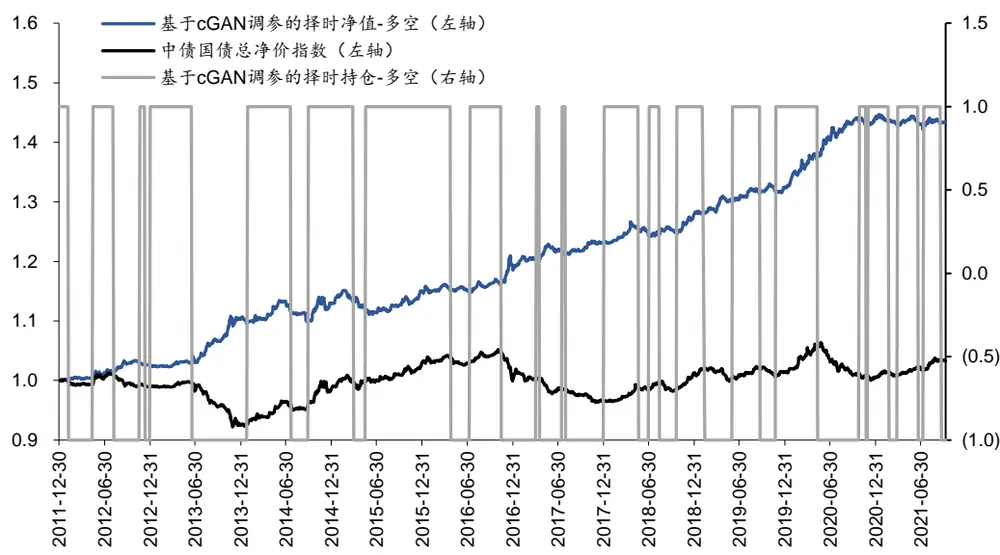
资料来源：Wind，华泰研究

## 择时策略稳健性分析

## 1. 有效信号选择数量 N测试

前文我们没有讨论有效信号保留数量 N=150 这个参数的选择理由，这里我们进行参数稳健性测试，测试结果如左下子图所示。N取不同值时债券择时策略没有表现出很明显的差异，基本保持相同的择时净值走势，说明基于 cGAN 模拟路径构建的择时策略具有较强的稳健性。除此之外，还可以观察到回测净值也没有随 N呈现出很明显的变化规律，N=150 时回测夏普比率最高。

## 2. 随机数种子点测试

此外我们还测试不同的随机数种子点对择时策略的影响。除前文展示结果所使用的随机数种子点外，这里额外选取了两组种子点，测试结果如右下子图所示。不同的随机数种子点下的回测结果也没有较为明显的差异，说明回测结果受随机数影响较小。

基于以上两组测试，可以合理认为基于 cGAN 模拟路径调参的债券择时策略较为稳健，且具有较低的过拟合概率。

图表32： 不同参数 N 测试（回测期 2011-12-30~2021-10-08）
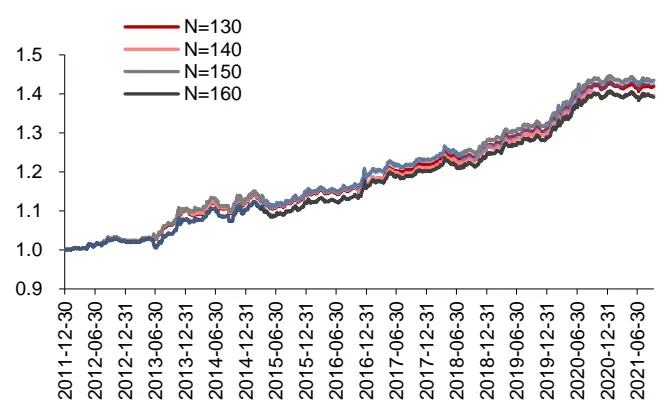
资料来源：Wind，华泰研究

图表33： 不同随机数种子点测试（回测期 2011-12-30~2021-10-08）
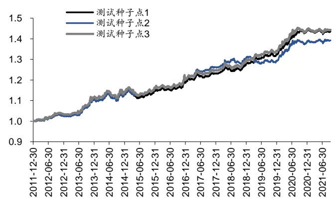
资料来源：Wind，华泰研究

图表34： 稳健性测试回测绩效（回测期 2011-12-30~2021-10-08）

|  | 区间收益 | 年化收益 | 年化波动 | 最大回撤 | 夏普比率 | 卡玛比率 |
| --- | --- | --- | --- | --- | --- | --- |
| 有效参数选择数量N |  |  |  |  |  |  |
| N=130 | 41.87% | 3.80% | 2.12% | 3.54% | 1.79 | 1.07 |
| N=140 | 39.57% | 3.62% | 2.12% | 3.54% | 1.71 | 1.02 |
| N=150 | 43.45% | 3.92% | 2.12% | 3.54% | 1.85 | 1.11 |
| N=160 | 39.55% | 3.62% | 2.12% | 3.54% | 1.71 | 1.02 |
| N=170 | 42.62% | 3.86% | 2.12% | 3.00% | 1.82 | 1.29 |
| 不同随机数种子点 |  |  |  |  |  |  |
| 随机数种子点1 | 43.45% | 3.92% | 2.12% | 3.54% | 1.85 | 1.11 |
| 随机数种子点2 | 39.21% | 3.59% | 2.12% | 3.00% | 1.69 | 1.20 |
| 随机数种子点3 | 44.28% | 3.99% | 2.12% | 3.54% | 1.88 | 1.13 |

资料来源：Wind，华泰研究

## 其他债券指数测试结果

本小节我们在不同的债券指数上进行测试，主要为不同期限的中债-国债总净价指数（10 年以上、7-10 年、5-7 年），在不同的标的上构建的 cGAN 择时策略区别较为明显。择时策略的表现随债券久期的增加单调变化，可能的原因在于不同久期的债券价格波动率绝对值水平不同，趋势强度不同，长久期债券的趋势性强于短久期，而本文所使用的底层信号均为趋势追踪信号，因此策略表现受到标的债券久期的影响较为明显。

图表35： 中债-国债总净价（10 年以上）指数择时-多空（回测期 2011-12-30~2021-10-08）

资料来源：Wind，华泰研究

图表36： 中债-国债总净价（7-10年）指数择时-多空

图表37： 中债-国债总净价（5-7年）指数择时-多空

资料来源：Wind，华泰研究

资料来源：Wind，华泰研究