# 人工智能 49：SinGAN单样本生成

华泰研究

2021 年 10 月 24 日│中国内地

深度研究

## SinGAN 基于单样本生成任意尺寸的模拟样本，捕捉数据长时程特征

本文介绍生成对抗网络的重要变式 SinGAN，并测试该方法在金融资产生成任务中的效果。SinGAN 基于单样本生成，可得到任意尺寸的模拟样本，该研究获 2019 年国际计算机视觉大会（ICCV2019）最佳论文奖。SinGAN由不同层级的 GAN“串联”而成，低层 GAN 学习粗糙的全局特征，高层GAN 学习精细的局部纹理。以资产收益率生成为实验任务，以 WGAN为对照组，测试结果表明，WGAN 在真序列较短、样本量较小时效果不佳，而SinGAN 在拟真性和多样性上均占优。同时，SinGAN 能更完整地捕捉真序列的频域特征，而WGAN无法复现中、长尺度周期。

## 样本量悖论和长度不匹配是制约 GAN 广泛应用的两处瓶颈

生成对抗网络存在一条经典悖论：应用 GAN 的初衷是解决样本稀缺问题，但训练好一组 GAN 的前提是需要足够数量的样本。“训练 GAN 本身需要大样本”是制约 GAN 广泛应用的一大瓶颈。另一方面，金融时间序列分析中通常使用“切片”方式对真实序列进行采样。采样序列和 GAN 生成序列长度必然短于真实序列，这就使得生成序列难以复现真实序列的长时程性质。

## SinGAN 由不同层级的 GAN 串联而成，实现从粗糙到精细特征的学习

SinGAN 基于单样本生成，可得到任意尺寸的模拟样本，解决样本量悖论和长度不匹配问题，该研究获 ICCV2019 最佳论文奖。SinGAN 由不同层级的GAN 以金字塔形式“串联”而成，这些 GAN 被依次训练。每层生成器 G的输入是噪声叠加前一层生成器输出并经上采样后的假样本。每层判别器 D的输入是 G 输出的假样本，或者原始数据经下采样后的真样本。这种多层级架构使得低层 GAN 学习粗糙的全局特征，即低频信息，高层 GAN 学习精细的局部纹理，即高频信息。

## SinGAN 在判别器网络和损失函数的设计上颇具巧思

除金字塔结构外，SinGAN 在判别器网络和损失函数的设计上也颇具巧思。SinGAN 判别器属于马尔可夫判别器，相比普通 GAN 关注更多局部信息，因此在保持原序列或图像的细节上具有优势。SinGAN 的损失函数为对抗损失和重构损失相加，对抗损失和普通 GAN 及其变式的思想一致，重构损失是为了确保某组特定噪音恰好可以生成真样本，从而提升训练的稳健性。

## SinGAN 在样本量较小时表现优于对照组，并且更完整地捕捉频域特征

我们设计四项金融资产收益率生成任务，测试 SinGAN 效果。对照组为WGAN 生成短序列拼接得到长序列。日频沪深 300 生成任务中，两组模型真实性和多样性指标均较好。日频科创 50 生成任务中，由于真序列较短、样本量较小，WGAN 出现严重的模式崩溃，而 SinGAN 在真实性和多样性指标上全面占优。月频标普 500 和欧元兑美元生成任务中，SinGAN 频域信号和真实序列接近，具有 42、100、200 个月附近的周期，而 WGAN 无法复现中、长尺度的周期。本质上，SinGAN 中的低层 GAN 学习低频信息，高层 GAN 学习高频信息，因此能更完整地捕捉数据的频域特征。

风险提示：SinGAN 生成序列是对市场规律的探索，不构成任何投资建议。深度学习模型存在过拟合的可能。深度学习模型是对历史规律的总结，如果市场规律发生变化，模型存在失效的可能。

研究员

SAC No. S0570516010001

林晓明

SFC No. BPY421

linxiaoming@htsc.com

+86-755-82080134

研究员

SAC No. S0570519110003

李子钰

liziyu@htsc.com

+86-755-23987436

研究员

SAC No. S0570520080004

何康，PhD

SFC No. BRB318

hekang@htsc.com

+86-21-28972039

## EURUSD 真序列与 SinGAN 生成序列

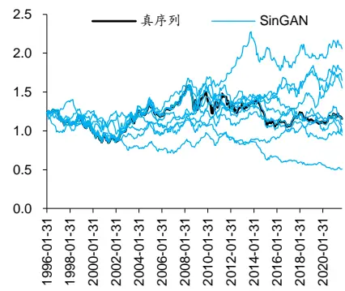
资料来源：Wind，华泰研究

## 研究导读

量化研究的基石之一是统计学，统计学的理论基础之一是大数定律，使用大数定律的前提是对数据进行采样。理想的量化研究从大样本中挖掘规律，并在大样本中检验策略有效性。然而实际研究中，由于技术、算力等方面的局限，投资者往往仅围绕有限的真实历史数据进行分析，难言真正的“大样本”。

针对这一潜在困境，华泰金工推出生成对抗网络（GAN）系列研究，自 2020 年 5 月以来已发布相关深度研究 8 篇，借助深度学习技术实现金融数据的大样本模拟生成。生成序列能够复现真实序列具备的重要统计学性质，目前已成功应用于风险预测、策略调参等领域。

然而，生成对抗网络存在一条经典悖论：应用 GAN 的初衷是解决样本稀缺问题，但训练好一组 GAN 的前提是需要足够数量的样本。如果初始样本数量不够，训练得到的 GAN 效果欠佳，就无法提供真正有效的大样本；如果初始样本数量足够，那么也没有必要使用 GAN。本质而言，“训练 GAN 本身需要大样本”是制约 GAN 广泛应用的一大瓶颈。

另一方面，金融时间序列是量化投资的重要研究对象，通常使用“切片”方式对时间序列进行采样。此时，采样得到的序列长度必然短于真实序列，并且样本数量越大，每条样本长度越短。进一步采用 GAN 生成时，模拟得到的序列长度也必然短于真实序列。换言之，真实序列与 GAN 生成序列的长度不匹配，也是 GAN 应用于量化领域的一大“痛点”。

针对以上两项缺陷，学界和业界研究者已展开探索尝试，其中具有代表性的研究之一是2019年国际计算机视觉大会（ICCV2019）最佳论文 SinGAN: Learning a Generative Model froma Single Natural Image。该研究提出 GAN 的变式 SinGAN，基于单幅图像样本进行生成，得到任意尺寸的模拟样本，从根本上解决样本量的悖论，若应用于时间序列生成，则可解决序列长度匹配问题。本文我们将介绍 SinGAN 原理，并测试 SinGAN 在生成金融时间序列的效果，重点关注 SinGAN 较普通 GAN 能否更好复现时域和频域上的长时程性质。

## SinGAN 原理

本章我们关注 SinGAN 基于单样本生成的原理，围绕模型架构、损失函数、训练和生成流程进行展开。这里假定读者已掌握 GAN 的基本原理，初次接触的读者可参考华泰金工往期研究《人工智能 31：生成对抗网络 GAN 初探》（2020-05-08）。

## 模型架构

SinGAN 由多个 GAN 以金字塔形式组成，各层级 GAN 分别实现从全局特征到局部纹理的学习。模型架构如下图所示，左侧 G 、G 、…、G 为 N+1 层生成器，右侧 $\begin{array}{rl}{\mathsf{D}_{0},}&{{}\mathsf{D}_{1},}\end{array}$ DN为 N+1 层判别器。训练过程如左侧箭头所示，由下至上依次训练：首先训练 $(G_{N},\mathsf{D}_{\mathsf{N}})$ 学习粗糙的全局纹理（低频信息）；最后训练 $(\mathsf{G}_{0},\mathsf{D}_{0})$ 学习精细的局部纹理（高频信息）。

图表1： SinGAN生成图像示意图
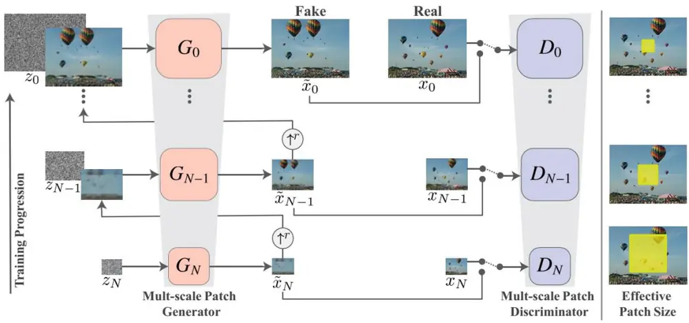
资料来源：Shaham, Dekel, & Michaeli. (2019). SinGAN: learning a generative model from a single natural image，华泰研究

SinGAN 第 n 层生成器 $\pmb{\mathsf{G}}_{\mathsf{n}}$ 的输入包含两部分：1）噪音 $\mathbf{z}_{\mathsf{n}},$ ，2）上一层生成器 $\pmb{G}_{\mathfrak{n}+1}$ 输出的假样本 $\widetilde{x}_{n+1}$ 经上采样得到的假样本 $\widetilde{x}_{n+1}\uparrow^{r}$ 。上采样的目的是使两项输入的尺寸匹配。如下图所示，两者相加后输入生成器 $\mathsf{G}_{\mathfrak{n}},\mathsf{G}_{\mathfrak{n}}$ 的输出再与上一层假样本 ${\tilde{x}}_{n+1}$ ↑r相加，得到当前层的假样本 ${\tilde{x}}_{n}$ 。此处应用了残差学习的思想，即每层生成器 $\mathsf{G}_{\mathsf{n}}$ 学习的是上一层生成器 $\sf{G}_{n+1}$ 没有学会的细节。

图表2： SinGAN 第 n 个生成器 $\pmb{G}_{\mathfrak{n}}$ 示意图
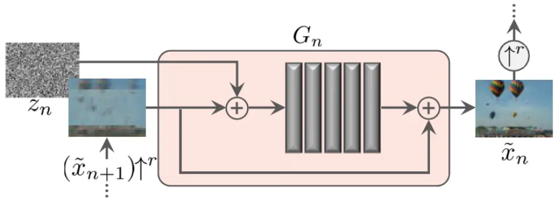
资料来源：Shaham, Dekel, & Michaeli. (2019). SinGAN: learning a generative model from a single natural image，华泰研究

SinGAN 第 n 层判别器 $\mathsf{D}_{\mathsf{n}}$ 的输入为真或假样本。假样本即同层生成器 $\mathsf{G}_{\mathsf{n}}$ 的输出 ${\tilde{x}}_{n}$ 。真样本由原始数据经固定采样率的下采样得到，每一层 GAN 的学习目标是生成不同分辨率下的原始数据。以图像生成为例：训练初始，低层级 GAN（如 GN和 DN）学习生成“高糊”原始图像；训练尾声，高层级 GAN（如 $\mathtt{G}_{0}$ 和 D0）学习生成“高清”原始图像。

SinGAN 应用于图像领域，可以基于单幅图像生成逼真并且丰富的虚假图像，效果如下图。

图表3： SinGAN生成图像实例

资料来源：Shaham, Dekel, & Michaeli. (2019). SinGAN: learning a generative model from a single natural image，华泰研究

我们总结 SinGAN 模型架构的关键：

1. SinGAN 由不同层级的 GAN“串联”而成，这些 GAN将依次训练。

2. 每层生成器 G 的输入是噪声叠加前一层生成器输出并经上采样后的假样本。

3. 每层判别器 D的输入是 G输出的假样本，或者原始数据经下采样后的真样本。

4. 这种多层级架构使得低层 GAN 学习粗糙的全局特征，高层 GAN 学习精细的局部纹理。

## 推导示例

我们将借助示例深入理解 SinGAN 的训练过程。对技术细节不感兴趣的读者可略过本节。

确定下采样比例及每层样本长度

第一步我们确定实际下采样率及每层样本长度。假定：

1. 原始单样本为长度 308 的一维收益率序列（后文实证测试部分美股及汇率月频序列长度为 308）。

2. 层与层间的初始下采样率为 0.8。最低层即第 N层样本长度为 15。

首先，确定构成 SinGAN 的 GAN 模型总层数：

$$
GAN,_{\mathbb{S}}^{\sharp}\mathbin{\mathbb{E}}^{\frac{\mu_{\mathtt{p}}}{\mathtt{S}}}\mathbin{\frac{\mathrm{3}\mu_{\mathtt{c}}}{\mathtt{S}}}=\left[log\frac{1}{\mathtt{F}\oplus\frac{1}{\mathtt{F}}\rVert\dot{\mathfrak{X}},\dot{\mathfrak{X}}\rVert\dot{\mathfrak{X}},\dot{\mathfrak{X}}+\frac{1}{\mathtt{S}}\sharp\mathrm{\ \ }\dot{\mathfrak{X}},\dot{\mathfrak{X}}\rVert_{\mathtt{S}}^{\sharp}}\right]+1=\left[log\frac{308}{0.8}\frac{308}{15}\right]+1=15
$$

其中⌈a⌉代表对实数 a 向上取整。

理论上，最高层即第0层样本长度为原始样本长度308；第1层样本长度为 $308\times0.8=246.5.$ 向下取整为 246；第 2 层样本长度为 $308\times0.8^{2}{=}197.1$ ，向下取整为 197；以此类推，第14 层样本长度为 $308\times0.8^{14}\mathrm{=}13.5$ ，向下取整为 13，与我们设定的最低层样本长度 15 接近，但不完全相同。

图表4： 原始时间序列数据下采样示意图
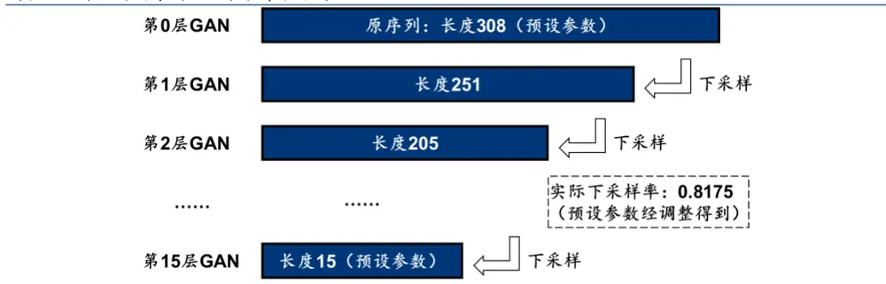
资料来源：华泰研究

为了使计算所得的最低层样本长度与设定的最低层样本长度在数值上完全匹配，在不改变原始样本长度的前提下，我们能做的只有对下采样比例 0.8 进行调整。计算公式为：

$$
1)\mathbb{H}\mathbb{H}\mathbb{H}\mathbb{H}\mathbb{H}\mathbb{H}=\mathbb{T}\Bigg/\frac{\mathbb{H}_{\Re}^{2}\mathbb{H}\mathbb{H}^{\pm}}{\mathbb{H}\mathbb{H}\mathbb{H}^{\pm}\mathbb{H}\mathbb{H}^{\pm}\mathbb{H}\mathbb{H}^{\pm}}\frac{1}{GAN\mathbb{H}\mathbb{H}^{\pm}\mathbb{H}^{\pm}}\Bigg|=1/\bigg[(\frac{308}{15})^{\frac{1}{15}}\bigg|\approx0.8175
$$

调整后，下采样率由 0.8 变为 0.8175，GAN 总层数由 15 变为 16。最高层即第 0 层样本长度为原始样本长度 308；第 1 层样本长度为 $308\times0.8175{=}251.8$ ，向下取整为 251。第 2层样本长度为 $308\times0.8175^{2}{=}205.9$ ，向下取整为 205。以此类推，第 15 层样本长度为 308$\times0.8175^{15}{=}15.0$ ，向下取整为 15，与我们设定的最低层样本长度 15 完全相同。

至此，第 15 层至第 0 层的样本长度可以确定下来，分别为 15、18、22、27、33、41、50、61、75、91、112、137、168、205、251、308，随后采用 Cubic 插值进行下采样。

## 推导每层 GAN 的输入和输出尺寸

承接上节，第二步我们推导每层 GAN 的输入和输出尺寸。继续假定：

1. 每层生成器G的网络架构为5层一维卷积，卷积核（kernel size）长度为3，步长（stride）为 1，边缘填充（padding）长度为 0，前 4 层卷积通道数（channel，即卷积核数量）为 32，第 5 层卷积通道数为 1。这种网络结构使得每层卷积的输出序列长度较输入序列长度减少 2，全部 5层卷积的输出序列长度较输入序列减少 10。

2. 每层判别器 D的网络架构为 5 层一维卷积，卷积层结构和生成器 G 完全相同。

我们遵循训练顺序，从第 15 层 GAN 网络开始推导，该层样本长度为 15，学习原始数据中最粗糙的全局特征。

1. 首先生成长度为 15 的噪音，左右两边边缘各填充 5个 0，得到长度为 25 的带 0噪音。随后输入至第15层生成器 $\mathsf{G}_{15}$ ，卷积后长度减少10，输出长度为15的第15层假样本。

2. 原序列长度为 308，下采样后得到长度为 15 的第 15 层真样本。将长度为 15 的真样本或假样本输入至第 15 层判别器 $\mathsf{D}_{15}$ ，得到长度为 5 的序列，最终求均值得到长度为 1的判别值。求均值操作属于马尔可夫判别器范畴，后文将展开介绍。

图表5： 第 15层 GAN生成器和判别器输入输出示意图
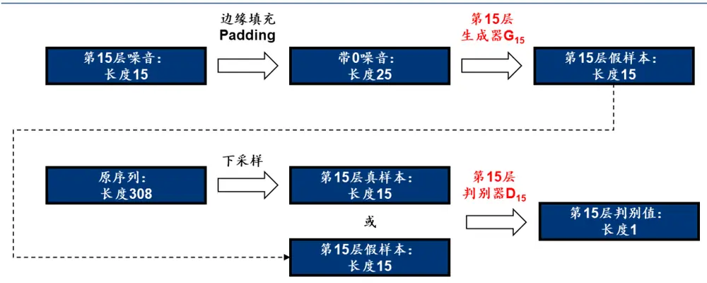
资料来源：华泰研究

图表6： 第 14层 GAN生成器和判别器输入输出示意图
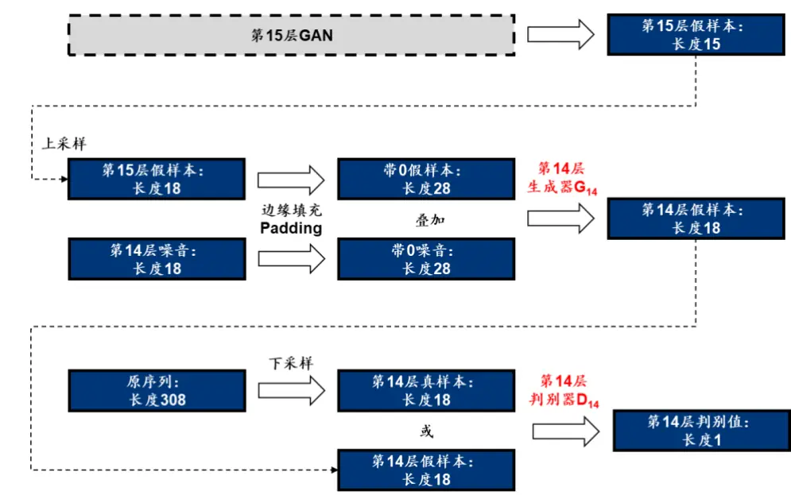
资料来源：华泰研究

下面我们推导第14层GAN网络，该层样本长度为18，学习原始数据中次粗糙的全局特征。1. 首先将第 15 层生成器 $\mathtt{G}_{15}$ 输出的长度为 15 的假样本，先经上采样（Cubic 插值）得到长度为 18 的假样本，再进行边缘填充，得到长度为 28 的带 0假样本。

2. 生成长度为 18的噪音，左右两边边缘各填充 5个 0，得到长度为 28的带 0噪音。

3. 将假样本与噪音相加（权重可通过超参数调整，后文将展开介绍），输入至第 14 层生成器 $\mathsf{G}_{14},$ ，卷积后长度减少 10，输出长度为 18 的第 14 层假样本。由于生成器实际学习的是残差，生成器输出结果还会和前一层假样本相加，得到最终输出。公式表示如下：

$$
\tilde{x}_{n}=(\tilde{x}_{n+1})\uparrow^{r}+G_{n}(z_{n},(\tilde{x}_{n+1})\uparrow^{r})
$$

4. 原序列长度为 308，下采样后得到长度为 18 的第 14 层真样本。将长度为 18 的真样本或假样本输入至第 14 层判别器 $\mathsf{D}_{14}$ ，得到长度为 8 的序列，最终求均值得到长度为 1的判别值。

此后每层 GAN 网络均和第 14 层 GAN 网络类似。直至最高层即第 0 层，该层样本长度为308，等同于原序列长度，学习原始数据中最精细的局部纹理。和此前层的最大区别在于，训练第 0层判别器 ${\sf D}_{0}$ 时，原序列无需经下采样，而是直接作为真样本输入至判别器。

## 损失函数

SinGAN 中第 n 层 GAN 的损失函数为：

$$
\operatorname*{min}_{G_{n}}\operatorname*{max}_{D_{n}}\ L_{adv}(G_{n},D_{n})+\alpha L_{rec}(G_{n})
$$

该损失函数借鉴了 CycleGAN（Zhu 等，2017）的设计方式，由对抗损失（adversarial loss，表示为 adv）和重构损失（reconstruction loss，表示为 rec）两部分组成。对抗损失惩罚假样本 ${\tilde{x}}_{n}$ 和真样本 $x_{n}$ 之间的距离。重构损失的引入是为了确保某一组特定噪音恰好可以生成真样本 $x_{n}$ 。

## 对抗损失

SinGAN 中对抗损失的思想和普通 GAN（及其变式）的损失相近，但一项细节上存在差异：

1. 普通 GAN 的判别器最后一层通常为全连接层，将上一层输出通过全连接神经网络转换为长度为 1 的序列。

2. SinGAN 判别器最后一层不设全连接层，输出一维向量（时间序列）或二维矩阵（图像），将向量或矩阵直接求均值，作为判别器的最终输出。

图表7： 普通 GAN（及其变式）和 SinGAN判别器对比
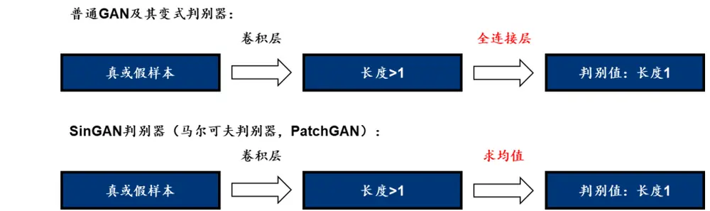
资料来源：华泰研究

SinGAN 的判别器属于马尔可夫判别器（Markovian disciminator）范畴，马尔可夫判别器也称 PatchGAN，在前述 CycleGAN 论文中就有体现，其特殊之处在于最后的求均值操作，求均值意义何在？

对于马尔可夫判别器，求均值操作前的向量或矩阵中的每个元素，代表原序列或图像中某一片感受野，相当于原序列或图像的某块局部区域（patch）。向量或矩阵中每个值的大小，代表该 patch 属于真的得分。向量或矩阵的均值，代表样本各局部区域属于真的平均得分。

普通 GAN 的判别器采用单个值衡量样本属于真的得分，而马尔可夫判别器使用向量或矩阵衡量样本中各局部区域属于真的得分。马尔可夫判别器相比普通 GAN 关注更多局部信息，因此在保持原序列或图像的细节上具有优势。

尽管普通 GAN 及其变式与 SinGAN 的马尔可夫判别器在思想上存在差异，但两者输出值的长度是一致的，均为 1。因此构建 SinGAN 对抗损失时仍可借鉴普通 GAN 及其变式。本文我们采用WGAN-GP的损失函数作为 SinGAN 损失函数的对抗损失部分：

$$
L_{adv}=D_{n}(\tilde{x}_{n})-D_{n}(x_{n})+\lambda(\big\|\nabla_{\tilde{x}_{n}}D_{n}(\tilde{x}_{n})\big\|_{\gamma}-1)^{2}
$$

关于 WGAN-GP 损失函数的具体含义，读者可以参考华泰金工往期研究《人工智能 35：WGAN应用于金融时间序列生成》（2020-08-28）。

## 重构损失

重构损失的思想在 CycleGAN 中亦有体现，在该论文中称为循环一致损失（cycleconsistency loss），其目标是寻找某一组特定噪音，使得生成序列尽可能接近真序列。重构损失衡量生成序列和真序列的距离，以 2范数的平方表征该距离。GAN的本质是学习从随机噪音到真序列的映射函数，重构损失的设计可以限制可能的映射函数空间，提升训练的稳健性。

我们选择 $\{z_{N}^{rec},z_{N-1}^{rec},...z_{0}^{rec}\}=\{z^{*},0,...,0\}$ 作为这组特定噪 $\lneqq$ ，其中 $z^{*}$ 为训练前随机选取的噪声序列，并且在训练过程中保持不变。若 $\tilde{x}_{n}^{rec}$ 为第 n 层生成器 $\mathsf{G}_{\mathsf{n}}$ 生成样本，则重构损失可以表示为：

$$
L_{rec}=\left\{\begin{array}{cl}{\|G_{n}(0,(\tilde{x}_{n+1}^{rec})\uparrow^{r})-x_{n}\|^{2},\frac{*}{\exists}n<N}&{}\\{\|G_{n}(z^{*})-x_{N}\|^{2},\frac{*}{\exists}n=N}&{}\end{array}\right.
$$

## 训练和生成流程

训练阶段，SinGAN 采用逐层训练方式，从第 N 层（最粗糙层）开始训练，每层训练结束后该层参数就固定下来，随后训练下一层。每层 GAN 训练方式和普通 GAN（及其变式）一致，每轮迭代中生成器和判别器交替训练。

图表8： SinGAN 训练伪代码
```latex
输入：原始序列 x，原始序列长度 real_size，最低层样本长度 min_size，初始下采样率 r_init，
每层 GAN 迭代次数 T，每次迭代判别器训练次数 ${\mathsf{T}}_{\mathsf{G}},$ 每次迭代生成器训练次数 ${\mathsf{T}}_{\mathsf{D}},$ 重构损失权重 α
1根据 min_size、real_size 和 r_init，计算实际下采样率 r 和 GAN 总层数 N+1
2 for n • N to 0 do # 训练第n层 GAN
3随机初始化判别器 $.D_{n}$ 网络参数和生成器 $G_{n}$ 网络参数
4当 $\cdot n=N^{\sharp}{\dag}$ ，随机选取噪音 $z^{*}$ （计算重构误差使用，训练过程中保持不变）
5原始序列x以采样率 $\cdot r^{n}{}_{;}$ 进行下采样，得到真样 $\therefore x_{n}$
6第n +1层生成器生成假样 $\mathbb{k}\tilde{x}_{n+1},$ 再进行上采样，得到前一层假样 $\therefore(\widetilde x_{n+1})$ ↑r
7 for t • 1 to T do # 迭代训练
8随机选取噪音 ${\mathrm{{\bar{z}}}}_{n}$
9 $\#n=N$ ，则生成假样本 ${\tilde{x}}_{n}=G_{n}(z_{n});$ $\ddagger n<N$ ，则生成假样本 $\cdot\tilde{x}_{n}=(\tilde{x}_{n+1})\uparrow^{r}+G_{n}(z_{n},(\tilde{x}_{n+1})\uparrow^{r})$
10 for $t_{D}$ • 1 to $T_{D}$ do
11根据真样本 $\cdot x_{n}$ 和假样 $\mathbb{A}\tilde{x}_{n},$ 计算对抗损失 $L_{adv}$ 和重构损失 $.L_{rec}$
12使用优化器更新判别器 $D_{n}$ 参数，优化目标为max $L_{adv}(G_{n},D_{n})+\alpha L_{rec}(G_{n})$
Dn
13 for $t_{G}$ • 1 to $T_{G}$ do
14 $\ddagger n=N,$ ，则生成假样本 $\therefore\tilde{x}_{n}=G_{n}(z_{n});$ ；若 $\cdot n{<}N,$ ，则生成假样 $\sharp\widetilde{x}_{n}=(\widetilde{x}_{n+1})\uparrow^{r}+G_{n}(z_{n},(\widetilde{x}_{n+1})\uparrow^{r})$
15根据真样 $\not\exists x_{n}$ 和假样本 $\therefore{\tilde{x}}_{n},$ 计算对抗损失 $.L_{adv}$ 和重构损失 $.L_{rec}$
16使用优化器更新生成器 $\boldsymbol{\cdot}\boldsymbol{G_{n}}_{3}^{\mathrm{~\#~}}$ 数，优化目标为minmax $L_{adv}(G_{n},D_{n})+\alpha L_{rec}(G_{n})$
Gn Dn
输出：N+1 层生成器 $\mathsf{G}_{0},\mathsf{G}_{1},...,\mathsf{G}_{N}$
```
资料来源：华泰研究

生成阶段，基于各层随机噪音 $\left\{z_{N},z_{N-1},\ldots z_{0}\right\}$ ，依次输入至各层生成器。对于第 n层生成器：1. 若n＝N，则生成该层假样本 ${\tilde{x}}_{n}=G_{n}(z_{n})$ ；

2. 若 $\cdot n{<}N$ ，则生成该层假样本 $\tilde{x}_{n}=(\tilde{x}_{n+1})\uparrow^{r}+G_{n}(z_{n},(\tilde{x}_{n+1})\uparrow^{r})$

按上述方式迭代，最终得到第 0 层生成器的输出 $\widetilde{x}_{0}$ ，即与原始序列长度相同的假样本。

## SinGAN 优势总结

普通 GAN 及其变式在模拟金融时间序列中的缺点有哪些？SinGAN 能否克服这些缺陷？

训练普通 GAN 及其变式依赖大样本，因此需要对原始时间序列进行切片采样。若原始序列长度为 T，切片长度为 t（t 一般小于 T），则采样序列长度为 t，GAN 生成样本长度同为 t。当步长为 1 时，样本量取最大值为 T－t＋1。此时，生成模型存在以下缺陷：

1. 采样及生成序列长度 t总是小于原始序列长度T，因此无法生成和原始序列等长的序列。

2. 生成序列长度较短，难以复现原始序列具有的长时程性质。如全球资产价格和经济指标存在周期性，定量可测度的周期最长达 200 个月，若切片长度小于 200 个月，就难以复现长周期。

3. 如果原始序列长度 T 较小，为保证合理切片长度，那么就需要牺牲样本量。当样本量较小时，GAN 训练质量将受到损伤，如出现模式崩溃现象。这点在部分上市时间较短的资 $\dot{\bar{y}}$ （如科创 50 指数）体现尤为明显。

图表9： 时间序列切片操作
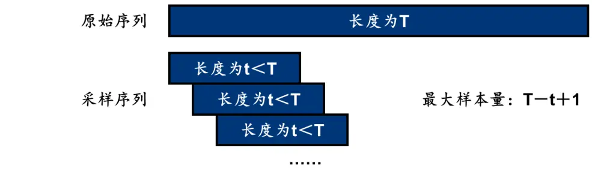
资料来源：华泰研究

SinGAN 可以克服上述缺陷：

1. SinGAN 可以生成与原序列等长的序列。事实上，由于 SinGAN 模型包含上采样和下采样操作，采样率可根据实际需求调整，SinGAN 生成序列长度甚至可以超过原序列。

2. 由于 SinGAN 生成序列和原序列等长，SinGAN 就有可能复现包括周期性在内的长时程性质。

3. SinGAN 生成不受样本量约束，因此对于上市时间较短的资产也可以实现生成。

理论上，可以采用普通 GAN 及其变式进行多次生成，再将多次生成的短序列拼接，得到和原始序列等长的生成序列。后文实证测试部分，我们将对比 1）SinGAN 直接生成以及 2）普通 GAN 及其变式生成再拼接这两种方案的优劣。

## SinGAN 测试方法

我们将以金融资产价格为研究对象，测试 SinGAN 生成效果。本章介绍具体测试方法。

## 数据处理

我们共进行四组测试，生成资产分别为日频沪深 300、日频科创 50、月频标普 500、月频欧元兑美元。原始序列均为价格数据，将价格转换为收益率，训练和生成对象均为收益率数据。由于收益率数值范围相对较小，为便于模型训练，在预处理时将原始收益率进行固定比例放大，生成后再将生成收益率进行相同比例缩小，缩放比例因资产而异。具体比例及原始序列基础信息如下表。

图表10： 原始序列基础信息

| 生成资产 | Wind 代码 | 原始（价格）序列时间 | 原始（收益率）序列长度 | 预处理缩放比例 |
| --- | --- | --- | --- | --- |
| 日频沪深 300 | 000300.SH | 2004-12-31 至 2021-09-30 | 4071 | 25 |
| 日频科创 50 | 000688.SH | 2019-12-31 至 2021-09-30 | 425 | 25 |
| 月频标普 500 | SPX.GI | 1996-01-31 至 2021-09-30 | 308 | 25 |
| 月频欧元对美元 | EURUSD.FX | 1996-01-31 至 2021-09-30 | 308 | 30 |

资料来源：Wind，华泰研究

## 网络结构

SinGAN 由多层 GAN“串联”组成，单层 GAN 包含生成器 G 和判别器 D。本文采用的 G和 D 网络结构已在“推导示例”一节介绍，相关超参数如下表。

图表11： SinGAN 中单层 GAN生成器 G和判别器 D网络结构相关超参数

| 超参数含义 | 超参数值 |
| --- | --- |
| 网络结构 | 5个卷积block，每个block包含一维卷积层+批标准化层+激活层 |
| 卷积核长度(kernel size) | 3 |
| 步长(stride) | 1 |
| 边缘填充长度（padding） | 0 |
| 通道数(channel) | 32（非输出层）或1（输出层） |
| 非输出层激活函数 | LeakyReLU(0.2) |
| 输出层激活函数 | Tanh(生成器 G)或无(判别器 D) |
| 第 n 层噪音与第 n+1 层假样本相加时，噪音项初始权重 | 0.1 |

资料来源：华泰研究

我们对“噪音项初始权重”超参数作展开介绍。前文我们提到，第 n 层（n＜N）生成器 Gn的输入有两项：1）第 n 层噪音 z ，2）第 n+1 层假样本上采样后得到长度匹配的假样本$(\widetilde x_{n+1})$ ↑r。这两项相加时，会赋予噪音项一定权重。各层噪音项权重有差异，第 n 层噪音项权重为 1）初始权重和 2）第 n层重构损失平方根这两项的乘积。

## 关键超参数

SinGAN 中样本长度及采样率相关超参数如下表。

图表12： 样本长度及采样率相关超参数

| 最高层样本长度 |  |  |  |
| --- | --- | --- | --- |
| 生成资产 | 最低层样本长度 | (等同于原序列长度) | 初始下采样率 (根据左侧3 项超参数计算得到) |
| 日频沪深300 | 15 | 4071 | 0.75 |
| 日频科创 50 | 15 | 425 | 0.8 17 |
| 月频标普 500 | 15 | 308 | 0.8 |
| 月频欧元对美元 | 15 | 308 | 0.75 |

资料来源：Wind，华泰研究

SinGAN 模型网络训练相关超参数如下表。

图表13： 训练相关超参数

| 超参数类别 | 超参数含义 超参数值 |
| --- | --- |
| 迭代次数 | 迭代次数 1000 |
| 每次迭代中 D 训练次数 | 3 |
|  | 每次迭代中G训练次数 3 |
| 优化器 | 优化器 Adam |
|  | 优化器学习速率 0.0005 |
|  | γ=0.1,β₁=0.5 |
| 损失函数 | 对抗损失中，WGAN-GP损失梯度惩罚项系数 0.1 |
|  | 对抗损失和重构损失相加时，重构损失系数 10 |

资料来源：华泰研究

由于 SinGAN 超参数众多，并且模型相对复杂，训练时间开销较大，本文并未进行超参数优化，均采用常规的超参数值。

## 评价指标

我们设计 SinGAN 的对照模型WGAN，采用WGAN-GP模型生成长度为原序列一半的假序列，再将两条序列直接拼接，得到长度与原序列一致的假序列。

设计如下检验指标评价 SinGAN 及对照模型生成质量：

1. 日频数据重点分析时域特征：选取 7 项真实性指标和 1 项多样性指标，如下表。具体计算方式请参考《人工智能 35：WGAN应用于金融时间序列生成》（2020-08-28）。

2. 月频数据重点分析频域特征：通过傅里叶变换考察生成序列的周期性质，检验生成序列是否和原始真实序列相近，具有 42、100、200 个月附近的周期信号。具体计算方式请参考华泰金工往期研究《工业社会的秩序》（2021-05-17）。

图表14： 生成序列真实性和多样性评价指标

| 指标名称 | 计算方法 | 真实序列的特点 |
| --- | --- | --- |
| 自相关性 | 滞后1~k阶自相关系数均值 | 弱有效市场不存在自相关：若不考虑收益再投资，接近0 |
| 厚尾分布 | 收益率分布单侧区间拟合幂律衰减系数α | 厚尾分布：一般介于3和5之间 |
| 波动率聚集 | 收益率绝对值序列1~k阶自相关系数关于k的拟合幂律衰减系数β | 低阶正相关，高阶不相关：一般介于0.1和0.5之间 |
| 杠杆效应 | 未来波动率领先当前收益率1~k阶相关系数均值 | 低阶负相关，高阶不相关：小于0 |
| 粗细波动率相关 | 周频收益率绝对值（粗波动率）和单周日频收益率绝对值之和（细波动率）不对称，细能预测粗，粗不能预测细：小于0 |  |
| 盈亏不对称性 | 滞后±k阶相关系数之差 盈亏±θ所需天数分布峰值之差 | 涨得慢，跌得快：大于0 |
| 长时程相关性 | 计算收益率序列的Hurst指数 | 弱长时程相关：介于0.5和0.6之间 |
| 序列相似性 | 计算收益率序列间的DTW指标 | 多样性丰富：50左右，越大越好 |

资料来源：华泰研究

## SinGAN 实证结果

本章我们展示 SinGAN 在四项生成任务中的表现，并与对照组 WGAN 拼接序列进行对比。核心结论如下：

1. 日频沪深 300 收益率生成任务中，SinGAN 和WGAN表现接近，真实性和多样性指标均较好。

2. 日频科创 50 收益率生成任务中，由于真序列较短、样本量较小，WGAN 出现了严重的模式崩溃，而 SinGAN 在真实性和多样性指标上全面占优。

3. 月频标普 500 和欧元兑美元收益率生成任务中，SinGAN 频域信号和真实序列接近，而WGAN 无法复现中、长尺度的周期。

## 日频沪深 300

沪深 300 真序列与 SinGAN 生成序列如下图。实际学习和生成采用收益率序列，绘图采用价格序列。实证测试共生成 1000 条假序列，这里随机展示 10 条。观察知，SinGAN 具备一定拟真性，同时生成序列内部具备一定多样性。后续将通过定量指标进行评价。

图表15： 沪深 300真序列与 SinGAN生成序列展示
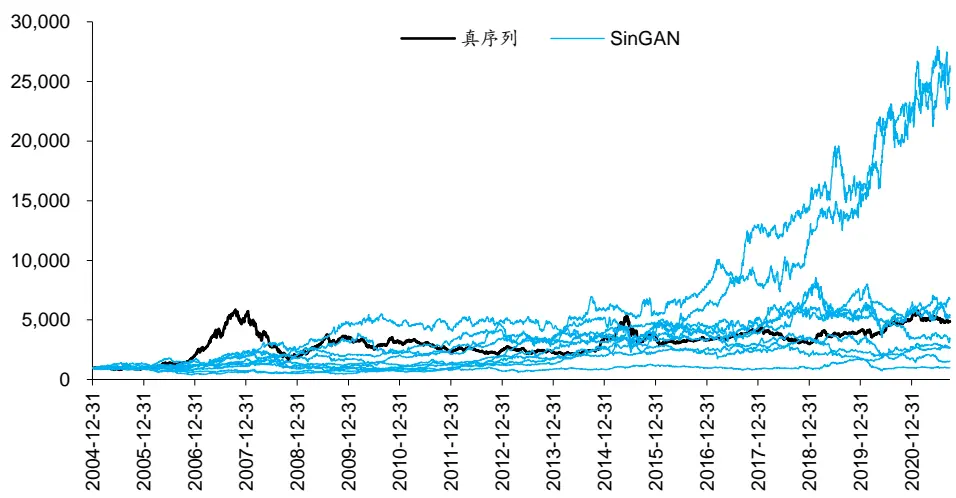
资料来源：Wind，华泰研究

沪深 300 真序列与 WGAN 生成序列如下图。观察知，WGAN 同样具备拟真性和多样性。往期研究《人工智能 35：WGAN 应用于金融时间序列生成》（2020-08-28）发现 WGAN在日频沪深 300 序列生成任务中表现出色，是生成效果相对较好的 GAN 变式。

图表16： 沪深 300真序列与对照组 WGAN 生成序列展示
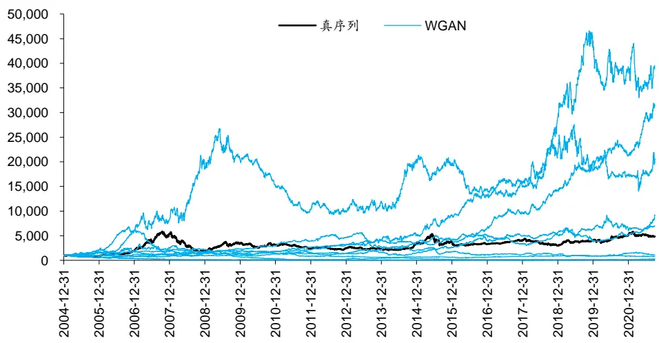
资料来源：Wind，华泰研究

沪深 300 真实与生成序列评价指标如下表，其中 SinGAN 和WGAN 评价指标为各自 1000条生成序列对应指标的均值。观察知，SinGAN 和WGAN 生成序列在前 7 项拟真性指标上均接近真实序列，在第 8 项多样性指标上同样较为接近。总的来看，在日频沪深 300 收益率序列生成任务中，SinGAN 和WGAN 均表现较好。

图表17： 沪深 300真实与生成序列评价指标

| 评价指标 | 统计量 | 真实序列 | SinGAN 生成序列 | WGAN 生成序列 |
| --- | --- | --- | --- | --- |
| 自相关性 | 前10阶自相关系数均值 | 0.008 | 0.006 | 0.010 |
| 厚尾分布 | 拟合幂律衰减系数 alpha | 4.507 | 4.861 | 4.707 |
| 波动率聚集 | 拟合幂律衰减系数 beta | 0.202 | 0.552 | 0.269 |
| 杠杆效应 | 前10 阶相关系数均值 | -5.296 | -4.584 | -4.045 |
| 粗细波动率相关 | 滞后正负1阶相关系数之差 | -0.022 | -0.012 | -0.001 |
| 盈亏不对称性 | 盈亏正负 theta 所需天数分布峰值之差 | 6.000 | 7.118 | 3.583 |
| 长时程相关性 | Hurst 指数 | 0.509 | 0.516 | 0.538 |
| 生成序列差异性 | DTW距离，越大代表生成数据越丰富 | / | 48.371 | 54.196 |

资料来源：Wind，华泰研究

## 日频科创 50

科创 50真序列与 SinGAN 生成序列如下图。观察知，SinGAN 生成序列与真实序列具有相似的趋势，阶段顶部和底部出现时点与真实序列基本一致。同时，生成序列并非完全等同，内部也具备一定多样性。

图表18： 科创 50真序列与 SinGAN生成序列展示
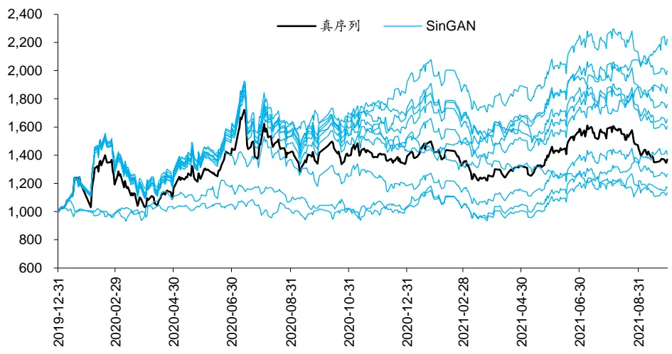
资料来源：Wind，华泰研究

图表19： 科创 50真序列与对照组 WGAN生成序列展示
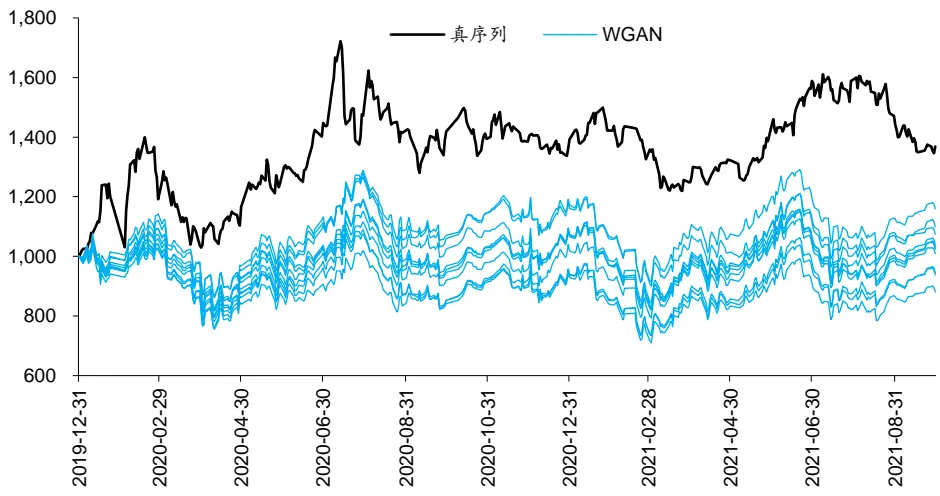
资料来源：Wind，华泰研究

科创 50真序列与WGAN 生成序列如上图。观察知，WGAN 生成序列内部高度一致，可以推测 WGAN 出现了模式崩溃。模式崩溃是指 GAN 及其变式生成过于单一的样本，缺乏多样性的现象。事实上，笔者在这组测试中对WGAN进行了多次调参，但都出现了模式崩溃。

一般而言，WGAN相较普通 GAN 更不易发生模式崩溃，但在科创 50 生成任务中，原始序列长度过短，2019 年底至 2021 年 9 月底共 425 个数据点，训练样本仅 200 余条。样本量过少可能是引发WGAN 模式崩溃的原因之一。

科创 50 真实与生成序列评价指标如下表。WGAN 在杠杆效应、盈亏不对称性两项拟真性指标上大幅偏离真实序列，而 SinGAN 在前 7 项拟真性指标上均接近真实序列。在第 8 项多样性指标上，SinGAN 优于出现模式崩溃的WGAN。

图表20： 科创 50真实与生成序列评价指标

| 评价指标 | 统计量 | 真实序列 | SinGAN 生成序列 | WGAN 生成序列 |
| --- | --- | --- | --- | --- |
| 自相关性 | 前10阶自相关系数均值 | -0.006 | 0.003 | 0.009 |
| 厚尾分布 | 拟合幂律衰减系数 alpha | 3.332 | 3.906 | 3.073 |
| 波动率聚集 | 拟合幂律衰减系数 beta | 0.560 | 0.575 | 0.998 |
| 杠杆效应 | 前10 阶相关系数均值 | 5.046 | 3.800 | -3.394 |
| 粗细波动率相关 | 滞后正负1 阶相关系数之差 | -0.014 | 0.007 | -0.137 |
| 盈亏不对称性 | 盈亏正负 theta 所需天数分布峰值之差 | -24.000 | -14.875 | -1.121 |
| 长时程相关性 | Hurst 指数 | 0.435 | 0.453 | 0.452 |
| 生成序列差异性 | DTW距离，越大代表生成数据越丰富 | / | 3.377 | 0.916 |

资料来源：Wind，华泰研究

总的来看，日频科创 50 收益率生成任务中，WGAN 出现严重的模式崩溃，而 SinGAN 在真实性和多样性指标上全面占优。

## 月频标普 500

标普 500 真序列与 SinGAN 生成序列如下图。观察知，SinGAN 生成序列与真实序列具有相似的趋势，刻画出美股近 15 年长期上涨的规律。同时，生成序列并非完全等同，内部也具备一定多样性。

图表21： 标普 500真序列与 SinGAN生成序列展示
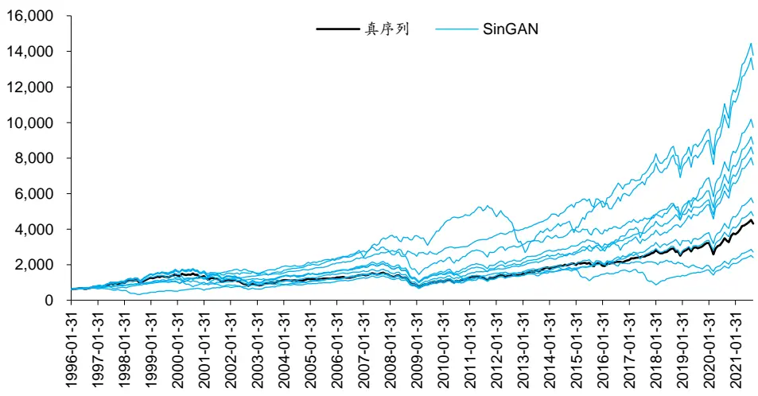
资料来源：Wind，华泰研究

标普 500 真序列与 WGAN 生成序列如下图。观察知，WGAN 同样具备较好的拟真性和多样性。往期研究《人工智能 35：WGAN 应用于金融时间序列生成》（2021-08-28）也发现WGAN在月频标普 500 序列生成任务中表现出色。

图表22： 标普 500真序列与对照组 WGAN 生成序列展示
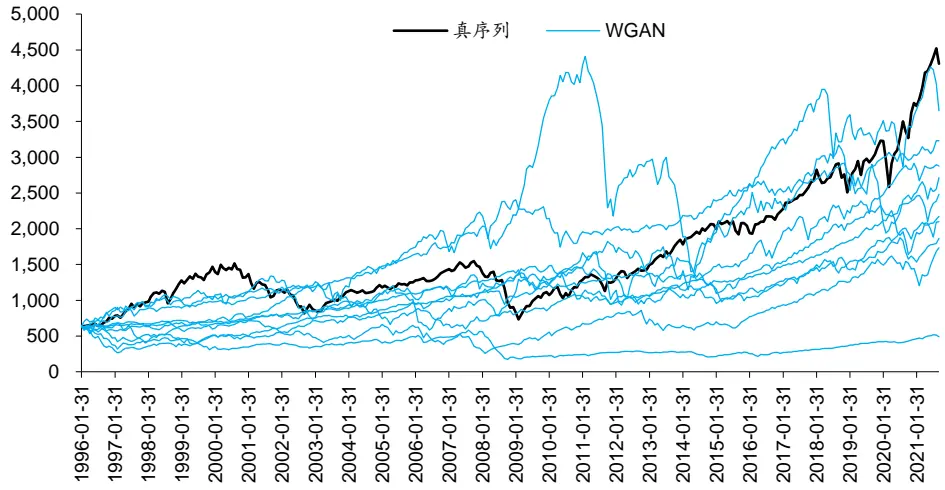
资料来源：Wind，华泰研究

下面考察真实与生成序列的频域特征。对月频标普 500 序列计算对数同比序列，随后进行傅里叶变换。标普 500 真实同比序列频谱如下图，前三个峰值分别对应 91.0、41.0、273.1个月周期。往期研究《工业社会的秩序》（2021-05-17）中，我们曾对全球 148 项资产价格和经济指标进行频谱分析，得出金融经济系统受 42、100、200 个月共同周期驱动的结论。下图标普 500 真实同比序列频谱结果与此前结论基本一致。

图表23： 标普 500真实同比序列频谱
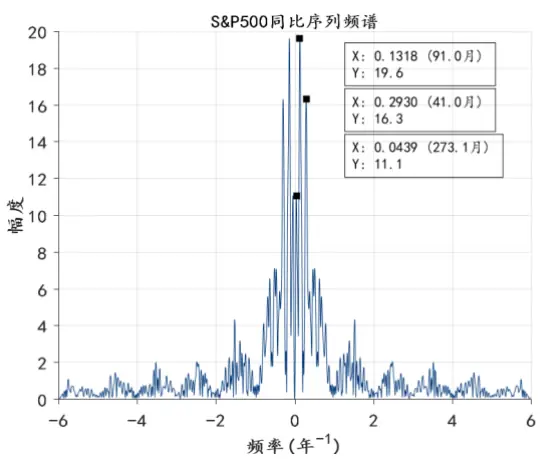
资料来源：Wind，华泰研究

图表24： 标普 500SinGAN 同比序列频谱
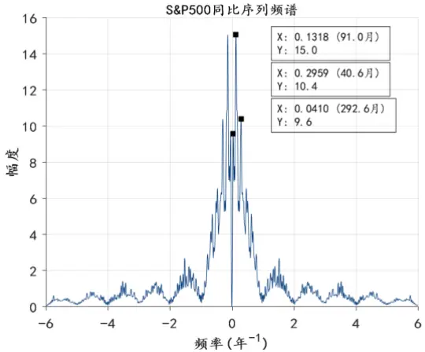
资料来源：Wind，华泰研究

标普 500SinGAN 同比序列频谱如上图，标普 500WGAN 同比序列频谱如下图，两幅频谱均为各自 1000 条生成序列频谱的均值。观察整体形态，SinGAN 与真序列相似，WGAN与两者差别较大。观察具体峰值，SinGAN 具有与真序列相似的 91.0、40.6、292.6 个月周期，而WGAN缺少 200 个月附近的长周期。

图表25： 标普 500WGAN 同比序列频谱
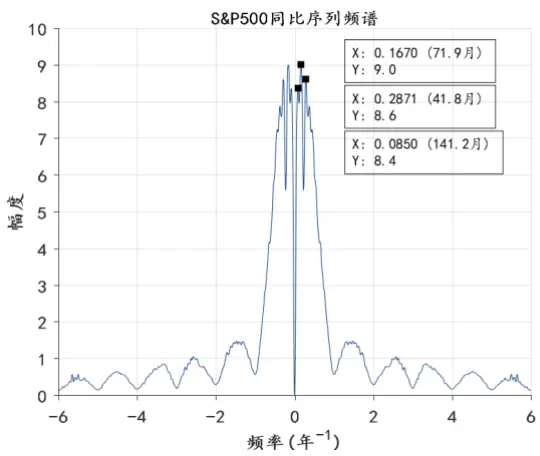
资料来源：Wind，华泰研究

## 月频欧元兑美元

图表26： 欧元兑美元真序列与 SinGAN生成序列展示
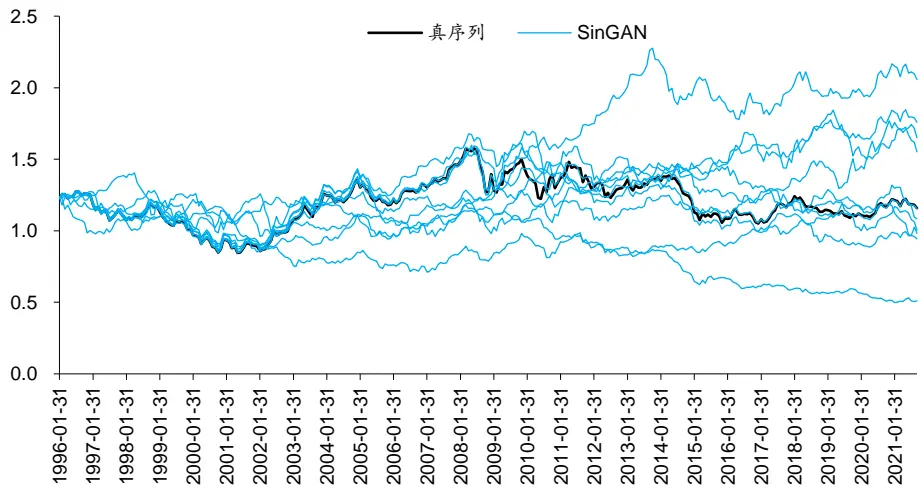
资料来源：Wind，华泰研究

图表27： 欧元兑美元真序列与对照组 WGAN生成序列展示
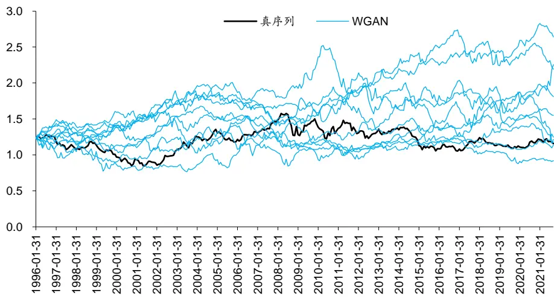
资料来源：Wind，华泰研究

欧元兑美元真序列与 SinGAN 生成序列如图 26，真序列与WGAN生成序列如图 27。观察知，SinGAN 和WGAN生成序列拟真性和多样性均较好。

欧元兑美元真实、SinGAN、WGAN同比序列频谱分别如图28至30。观察整体形态，SinGAN与真序列相似，WGAN与两者差别较大。观察具体峰值，真序列前三个峰值分别对应215.6、105.0、57.7 个月周期，SinGAN 序列前三个峰值分别对应 227.6、113.8、56.9 个月周期，两者频域特征接近，而WGAN 缺少 100 个月附近的中周期。

图表28： 欧元兑美元真实同比序列频谱
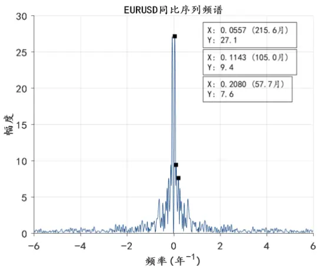
资料来源：Wind，华泰研究

图表29： 欧元兑美元 SinGAN同比序列频谱
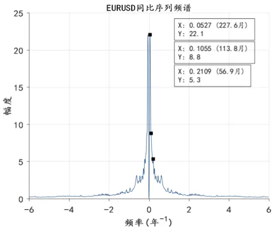
资料来源：Wind，华泰研究

图表30： 欧元兑美元 WGAN同比序列频谱
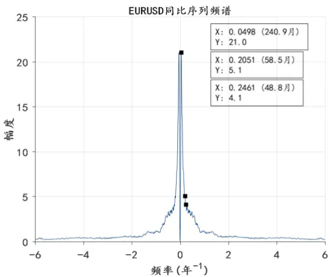
资料来源：Wind，华泰研究

月频标普500和欧元兑美元收益率生成任务中，各类方法前三大峰值对应周期汇总如下表。总的来看，SinGAN 频域信号和真实序列较为接近，而 WGAN无法复现中、长尺度的周期。本质上，SinGAN 的低层 GAN 学习低频信息，高层 GAN 学习高频信息，因此能更完整地捕捉数据的频域特征。

图表31： 标普 500和欧元兑美元频域信号前三大周期

| 生成资产 标普500 | 样本类别 | 第一大周期（月） | 第二大周期（月） | 第三大周期（月） |
| --- | --- | --- | --- | --- |
|  | 真实序列 | 91.0 | 41.0 | 273.1 |
|  | SinGAN 生成序列 | 91.0 | 40.6 | 292.6 |
|  | WGAN 生成序列 | 71.9 | 41.8 | 141.2 |
| 欧元兑美元 | 真实序列 | 215.6 | 105.0 | 57.7 |
|  | SinGAN 生成序列 | 227.6 | 113.8 | 56.9 |
|  | WGAN 生成序列 | 240.9 | 58.5 | 48.8 |

资料来源：Wind，华泰研究

SinGAN 在时域的生成结果能够复现出频域的规律，反过来也是对规律的印证。真实数据必然是信号和噪音的混杂，噪音通常缺少规律，对模型而言难以学习，因此生成对抗网络本质上学习了数据中的信号部分。生成序列和真实序列所展现出的相似特性，可能正是模型“去伪存真”保留下来的真正规律。

时域上看，无论是标普 500 还是欧元兑美元，SinGAN 生成数据和真实数据并不相同，但频域上看，真假数据展现出了高度一致的 42、100、200 个月附近的周期信号。这就说明，资产在时域上的涨跌方向、幅度、趋势的拐点等可能不存在显著规律，难以精确预测，但各类资产在频域上的周期变化是更易捕捉并且更为稳定的规律。

## 总结与讨论

本文介绍生成对抗网络的重要变式 SinGAN，并测试该方法在金融资产生成任务中的效果。SinGAN 基于单样本生成，可得到任意尺寸的模拟样本，该研究获 2019 年国际计算机视觉大会（ICCV2019）最佳论文奖。SinGAN 由不同层级的 GAN“串联”而成，低层 GAN 学习粗糙的全局特征，高层 GAN 学习精细的局部纹理。以资产收益率生成为实验任务，以WGAN为对照组，测试结果表明，WGAN在真序列较短、样本量较小时效果不佳，而SinGAN在拟真性和多样性上均占优。同时，SinGAN 能更完整地捕捉真序列的频域特征，而WGAN无法复现中、长尺度周期。

生成对抗网络存在一条经典悖论：应用 GAN 的初衷是解决样本稀缺问题，但训练好一组GAN 的前提是需要足够数量的样本。“训练 GAN 本身需要大样本”是制约 GAN 广泛应用的一大瓶颈。另一方面，金融时间序列分析中通常使用“切片”方式对真实序列进行采样。采样序列和 GAN 生成序列长度必然短于真实序列，这就使得生成序列难以复现真实序列的长时程性质。

SinGAN 基于单样本生成，可得到任意尺寸的模拟样本，解决样本量悖论和长度不匹配问题，该研究获 ICCV2019 最佳论文奖。SinGAN 由不同层级的 GAN 以金字塔形式“串联”而成，这些 GAN 被依次训练。每层生成器 G 的输入是噪声叠加前一层生成器输出并经上采样后的假样本。每层判别器 D 的输入是 G 输出的假样本，或者原始数据经下采样后的真样本。这种多层级架构使得低层 GAN 学习粗糙的全局特征，即低频信息，高层 GAN 学习精细的局部纹理，即高频信息。

除金字塔结构外，SinGAN 在判别器网络和损失函数的设计上也颇具巧思。SinGAN 判别器属于马尔可夫判别器，相比普通 GAN 关注更多局部信息，因此在保持原序列或图像的细节上具有优势。SinGAN 的损失函数为对抗损失和重构损失相加，对抗损失和普通 GAN 及其变式的思想一致，重构损失是为了确保某组特定噪音恰好可以生成真样本，从而提升训练的稳健性。

我们设计四项金融资产收益率生成任务，测试 SinGAN 效果。对照组为WGAN生成短序列拼接得到长序列。日频沪深 300 生成任务中，两组模型真实性和多样性指标均较好。日频科创50生成任务中，由于真序列较短、样本量较小，WGAN出现严重的模式崩溃，而SinGAN在真实性和多样性指标上全面占优。月频标普 500 和欧元兑美元生成任务中，SinGAN 频域信号和真实序列接近，具有 42、100、200 个月附近的周期，而WGAN 无法复现中、长尺度的周期。本质上，SinGAN 的低层 GAN 学习低频信息，高层 GAN 学习高频信息，因此能更完整地捕捉数据的频域特征。

SinGAN 对于量化研究具有一定启发意义。可以借助 SinGAN 检验低频量化策略有效性和过拟合程度。低频策略使用数据时间跨度长，普通 GAN 及其变式生成的模拟数据长度不足以支持策略回测，而 SinGAN 生成的完整长度数据可以满足需求。此外，SinGAN 的金字塔结构实现了从低频信息到高频信息的学习，而各频率信息混合正是金融时间序列的重要特性，在未来设计生成模型或判别模型时，SinGAN 的网络结构或可提供借鉴。

## 风险提示

SinGAN 生成序列是对市场规律的探索，不构成任何投资建议。深度学习模型存在过拟合的可能。深度学习模型是对历史规律的总结，如果市场规律发生变化，模型存在失效的可能。

## 参考文献

Shaham, T. R. , Dekel, T. , & Michaeli, T. . (2019). Singan: learning a generative model from a single natural image. IEEE.

Zhu, J. Y. , Park, T. , Isola, P. , & Efros, A. A. . (2017). Unpaired image-to-image translation using cycle-consistent adversarial networks. IEEE.

## 免责声明

## 分析师声明

本人，林晓明、李子钰、何康，兹证明本报告所表达的观点准确地反映了分析师对标的证券或发行人的个人意见；彼以往、现在或未来并无就其研究报告所提供的具体建议或所表迖的意见直接或间接收取任何报酬。

## 一般声明及披露

本报告由华泰证券股份有限公司（已具备中国证监会批准的证券投资咨询业务资格，以下简称“本公司”）制作。本报告所载资料是仅供接收人的严格保密资料。本报告仅供本公司及其客户和其关联机构使用。本公司不因接收人收到本报告而视其为客户。

本报告基于本公司认为可靠的、已公开的信息编制，但本公司及其关联机构(以下统称为“华泰”)对该等信息的准确性及完整性不作任何保证。

本报告所载的意见、评估及预测仅反映报告发布当日的观点和判断。在不同时期，华泰可能会发出与本报告所载意见、评估及预测不一致的研究报告。同时，本报告所指的证券或投资标的的价格、价值及投资收入可能会波动。以往表现并不能指引未来，未来回报并不能得到保证，并存在损失本金的可能。华泰不保证本报告所含信息保持在最新状态。华泰对本报告所含信息可在不发出通知的情形下做出修改，投资者应当自行关注相应的更新或修改。

本公司不是 FINRA 的注册会员，其研究分析师亦没有注册为 FINRA 的研究分析师/不具有 FINRA 分析师的注册资格。

华泰力求报告内容客观、公正，但本报告所载的观点、结论和建议仅供参考，不构成购买或出售所述证券的要约或招揽。该等观点、建议并未考虑到个别投资者的具体投资目的、财务状况以及特定需求，在任何时候均不构成对客户私人投资建议。投资者应当充分考虑自身特定状况，并完整理解和使用本报告内容，不应视本报告为做出投资决策的唯一因素。对依据或者使用本报告所造成的一切后果，华泰及作者均不承担任何法律责任。任何形式的分享证券投资收益或者分担证券投资损失的书面或口头承诺均为无效。

除非另行说明，本报告中所引用的关于业绩的数据代表过往表现，过往的业绩表现不应作为日后回报的预示。华泰不承诺也不保证任何预示的回报会得以实现，分析中所做的预测可能是基于相应的假设，任何假设的变化可能会显著影响所预测的回报。

华泰及作者在自身所知情的范围内，与本报告所指的证券或投资标的不存在法律禁止的利害关系。在法律许可的情况下，华泰可能会持有报告中提到的公司所发行的证券头寸并进行交易，为该公司提供投资银行、财务顾问或者金融产品等相关服务或向该公司招揽业务。

华泰的销售人员、交易人员或其他专业人士可能会依据不同假设和标准、采用不同的分析方法而口头或书面发表与本报告意见及建议不一致的市场评论和/或交易观点。华泰没有将此意见及建议向报告所有接收者进行更新的义务。华泰的资产管理部门、自营部门以及其他投资业务部门可能独立做出与本报告中的意见或建议不一致的投资决策。投资者应当考虑到华泰及/或其相关人员可能存在影响本报告观点客观性的潜在利益冲突。投资者请勿将本报告视为投资或其他决定的唯一信赖依据。有关该方面的具体披露请参照本报告尾部。

本报告并非意图发送、发布给在当地法律或监管规则下不允许向其发送、发布的机构或人员，也并非意图发送、发布给因可得到、使用本报告的行为而使华泰违反或受制于当地法律或监管规则的机构或人员。

本报告版权仅为本公司所有。未经本公司书面许可，任何机构或个人不得以翻版、复制、发表、引用或再次分发他人(无论整份或部分)等任何形式侵犯本公司版权。如征得本公司同意进行引用、刊发的，需在允许的范围内使用，并需在使用前获取独立的法律意见，以确定该引用、刊发符合当地适用法规的要求，同时注明出处为“华泰证券研究所”，且不得对本报告进行任何有悖原意的引用、删节和修改。本公司保留追究相关责任的权利。所有本报告中使用的商标、服务标记及标记均为本公司的商标、服务标记及标记。

## 中国香港

本报告由华泰证券股份有限公司制作,在香港由华泰金融控股（香港）有限公司向符合《证券及期货条例》及其附属法律规定的机构投资者和专业投资者的客户进行分发。华泰金融控股（香港）有限公司受香港证券及期货事务监察委员会监管，是华泰国际金融控股有限公司的全资子公司，后者为华泰证券股份有限公司的全资子公司。在香港获得本报告的人员若有任何有关本报告的问题,请与华泰金融控股（香港）有限公司联系。

## 香港-重要监管披露

- 华泰金融控股（香港）有限公司的雇员或其关联人士没有担任本报告中提及的公司或发行人的高级人员。

- 有关重要的披露信息，请参华泰金融控股（香港）有限公司的网页 https://www.htsc.com.hk/stock_disclosure其他信息请参见下方 “美国-重要监管披露”。

## 美国

在美国本报告由华泰证券（美国）有限公司向符合美国监管规定的机构投资者进行发表与分发。华泰证券（美国）有限公司是美国注册经纪商和美国金融业监管局（FINRA）的注册会员。对于其在美国分发的研究报告，华泰证券（美国）有限公司根据《1934 年证券交易法》（修订版）第 15a-6 条规定以及美国证券交易委员会人员解释，对本研究报告内容负责。华泰证券（美国）有限公司联营公司的分析师不具有美国金融监管（FINRA）分析师的注册资格，可能不属于华泰证券（美国）有限公司的关联人员，因此可能不受 FINRA 关于分析师与标的公司沟通、公开露面和所持交易证券的限制。华泰证券（美国）有限公司是华泰国际金融控股有限公司的全资子公司，后者为华泰证券股份有限公司的全资子公司。任何直接从华泰证券（美国）有限公司收到此报告并希望就本报告所述任何证券进行交易的人士，应通过华泰证券（美国）有限公司进行交易。

## 美国-重要监管披露

- 分析师林晓明、李子钰、何康本人及相关人士并不担任本报告所提及的标的证券或发行人的高级人员、董事或顾问。分析师及相关人士与本报告所提及的标的证券或发行人并无任何相关财务利益。本披露中所提及的“相关人士”包括 FINRA 定义下分析师的家庭成员。分析师根据华泰证券的整体收入和盈利能力获得薪酬，包括源自公司投资银行业务的收入。

华泰证券股份有限公司、其子公司和/或其联营公司, 及/或不时会以自身或代理形式向客户出售及购买华泰证券研究所覆盖公司的证券/衍生工具，包括股票及债券（包括衍生品）华泰证券研究所覆盖公司的证券/衍生工具，包括股票及债券（包括衍生品）。

- 华泰证券股份有限公司、其子公司和/或其联营公司, 及/或其高级管理层、董事和雇员可能会持有本报告中所提到的任何证券（或任何相关投资）头寸，并可能不时进行增持或减持该证券（或投资）。因此，投资者应该意识到可能存在利益冲突。

## 评级说明

投资评级基于分析师对报告发布日后 6 至 12个月内行业或公司回报潜力（含此期间的股息回报）相对基准表现的预期（A股市场基准为沪深 300 指数，香港市场基准为恒生指数，美国市场基准为标普 500 指数），具体如下：

## 行业评级

增持：预计行业股票指数超越基准

中性：预计行业股票指数基本与基准持平

减持：预计行业股票指数明显弱于基准

## 公司评级

买入：预计股价超越基准 15%以上

增持：预计股价超越基准 5%~15%

持有：预计股价相对基准波动在-15%~5%之间

卖出：预计股价弱于基准 15%以上

暂停评级：已暂停评级、目标价及预测，以遵守适用法规及/或公司政策

无评级：股票不在常规研究覆盖范围内。投资者不应期待华泰提供该等证券及/或公司相关的持续或补充信息

## 法律实体披露

中国：华泰证券股份有限公司具有中国证监会核准的“证券投资咨询”业务资格，经营许可证编号为：91320000704041011J香港：华泰金融控股（香港）有限公司具有香港证监会核准的“就证券提供意见”业务资格，经营许可证编号为：AOK809美国：华泰证券（美国）有限公司为美国金融业监管局（FINRA）成员，具有在美国开展经纪交易商业务的资格，经营业务许可编号为：CRD#:298809/SEC#:8-70231

## 华泰证券股份有限公司

南京南京市建邺区江东中路228号华泰证券广场1号楼/邮政编码：210019

电话：86 25 83389999/传真：86 25 83387521电子邮件：ht-rd@htsc.com

## 深圳

深圳市福田区益田路5999号基金大厦10楼/邮政编码：518017电话：86 755 82493932/传真：86 755 82492062电子邮件：ht-rd@htsc.com

## 华泰金融控股（香港）有限公司

香港中环皇后大道中 99号中环中心 58楼 5808-12室
电话：+852-3658-6000/传真：+852-2169-0770
电子邮件：research@htsc.com
http://www.htsc.com.hk

## 华泰证券（美国）有限公司

美国纽约哈德逊城市广场 10号 41楼（纽约 10001）
电话：+212-763-8160/传真：+917-725-9702
电子邮件: Huatai@htsc-us.com
http://www.htsc-us.com

©版权所有2021年华泰证券股份有限公司

北京
北京市西城区太平桥大街丰盛胡同28号太平洋保险大厦A座18层/
邮政编码：100032
电话：86 10 63211166/传真：86 10 63211275
电子邮件：ht-rd@htsc.com
上海
上海市浦东新区东方路18号保利广场E栋23楼/邮政编码：200120
电话：86 21 28972098/传真：86 21 28972068
电子邮件：ht-rd@htsc.com