# 人工智能 50：再探 cGAN资产配置

华泰研究

2021 年 11 月 09 日│中国内地

## 深度研究

系统梳理条件生成对抗网络（cGAN）应用于资产配置的方法论和实证结果本研究系统梳理条件生成对抗网络（cGAN）应用于资产配置的方法论，并提供相对全面的实证结果。依据预测对象分为收益协方差预测和均值预测两条主线展开。每一条主线内部，依次介绍预测方法、预测准确度评估和实践应用。在国内资产配置、全球资产配置和 A股板块配置场景下，考察 cGAN在风险预算模型和均值方差模型中的表现。结果表明，cGAN 总体优于基于历史收益和波动率的传统资产配置方法。

cGAN 预测资产收益均值及协方差的核心思想有别于传统资产配置方法cGAN 预测资产收益均值及协方差的核心思想是：以多资产过去 40 个交易日收益率序列作为条件信息，结合随机数序列，引导 cGAN 模型生成多资产未来 20 个交易日收益率序列，计算 20 日区间收益率及协方差。由于随机数的存在，每次生成结果存在差异。基于 1000 次生成结果，计算收益率均值及协方差均值。cGAN 均值预测有别于传统基于动量方法，协方差预测有别于传统基于历史波动率方法。

## cGAN 预测协方差更接近真实协方差，仓位和风险分配更接近理想情形

为评估 cGAN 协方差预测准确度，设计多项衡量预测协方差与真实协方差距离指标，分别为特征值分布、Frobenius 距离和相关矩阵距离。结果表明cGAN 方法预测协方差相比历史波动率方法更接近未来真实协方差。将cGAN 和历史波动率方法分别应用于风险平价模型，比较 1）各资产实际仓位与理想仓位，2）各资产实际风险分配与理想风险分配，结果表明 cGAN在仓位分配和风险分配上均更接近理想情形。

cGAN 预测单资产绝对收益表现不佳，预测多资产相对收益排名表现较好从基本统计指标和多空回测角度，评估 cGAN 收益均值预测准确度。cGAN使用跨度较短的最新数据进行预测，相比历史收益方法使用跨度较长的历史数据，cGAN 对市场近期变化较敏感，而基于历史收益方法的预测值波动低于 cGAN 预测收益和真实收益。cGAN 预测单资产绝对收益表现不佳，预测多资产相对收益排名表现较好。

多项测试场景表明 cGAN 在获取收益、控制波动和控制回撤方面具有优势将 cGAN 对收益协方差的预测应用于风险预算模型，将 cGAN 对收益均值及协方差的预测应用于均值方差模型。结果表明，在国内资产配置、全球资产配置以及 A股板块配置场景下，相比传统的基于历史收益和波动率方法，cGAN 在获取收益、控制波动和控制回撤方面具有稳定优势，夏普比率和Calmar 比率普遍高于传统方法。

风险提示：cGAN 模型的训练结果对随机数种子、超参数较为敏感；模型根据历史规律总结，历史规律可能失效；模型结论基于统计工具得到，在极端情形下或存在解释力不足的风险。

研究员

SAC No. S0570516010001

林晓明

SFC No. BPY421

linxiaoming@htsc.com

+86-755-82080134

研究员

SAC No. S0570519110003

李子钰

liziyu@htsc.com

+86-755-23987436

研究员

SAC No. S0570520080004

何康，PhD

SFC No. BRB318

hekang@htsc.com

+86-21-28972039

## 华泰证券 2022 年度投资峰会

## cGAN 和传统方法应用于均值方差模型

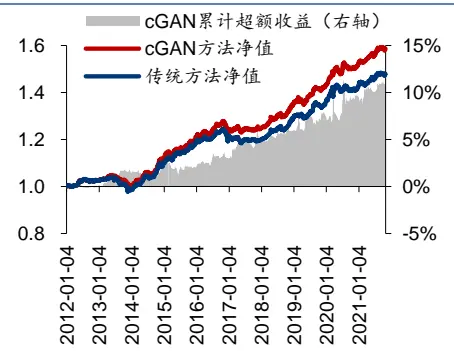
注：底层资产为沪深 300，中债-国债总财富指数，SGE黄金 9999；回测区间为 2012-01-04 至 2021-10-29资料来源：Wind，华泰研究

## 研究导读

传统生成对抗网络（GAN）精于模拟，拙于预测。然而投资人对量化模型的期待更多仍是预测未来。研究者将条件信息引入 GAN，将生成对抗网络改造成条件生成对抗网络（conditional GAN，简称 cGAN），从而实现给定条件下的生成。量化研究中，我们将历史数据视作条件信息，引导 cGAN 模型生成未来数据，从而实现通过历史预测未来。

在华泰金工往期研究《人工智能 45：cGAN 应用于资产配置》（2021-04-19）、《人工智能47：cGAN 模拟宏观指标》（2021-08-04）、《人工智能 48：对抗过拟合：cGAN 应用于策略调参》（2021-10-12）中，我们已借助 cGAN 模型分别实现量化资产配置、宏观经济前瞻、量化择时策略调参等实践应用。我们认为，cGAN不是坐而论道的工具，而是切实产生超额收益的来源。

在《人工智能 45：cGAN应用于资产配置》中，我们详细介绍了如何借助 cGAN 预测资产预期收益协方差矩阵，并应用于量化资产配置策略，结果表明 cGAN 相比传统历史波动率方法具有显著优势。作为前沿技术的初次尝试，前序研究仍有未尽之处，本研究我们将对cGAN 应用于资产配置的方法论进行充实和优化，并提供更为全面的实证测试结果，以论证该方法的优势和稳健性。

## 前序研究回顾

前序研究中，cGAN 预测资产协方差矩阵的核心思想是：以多资产过去 40 个交易日收益率序列作为条件信息，结合随机数序列，引导 cGAN 模型生成多资产未来 20 个交易日收益率序列，计算 20 日区间收益率。由于随机数的存在，每次生成结果存在差异。基于 1000 次生成结果计算协方差矩阵。

cGAN 对协方差矩阵的定义方式与传统历史波动率有本质差异。历史波动率方法将历史上不同时段的收益率视作真实收益率分布的采样，以采样的协方差衡量未来风险，前提假设是历史等同于未来。cGAN 方法基于历史收益率模拟未来收益率的可能路径，将不同模拟结果视作未来真实收益率分布的采样，以采样的协方差衡量未来风险。由于 cGAN 模型通常为复杂的非线性神经网络，cGAN 的前提假设是历史可以通过非线性的方式预测未来。比较而言，cGAN相比于传统方法更符合真实市场运行规律。

图表1： cGAN 预测资产收益协方差原始方法
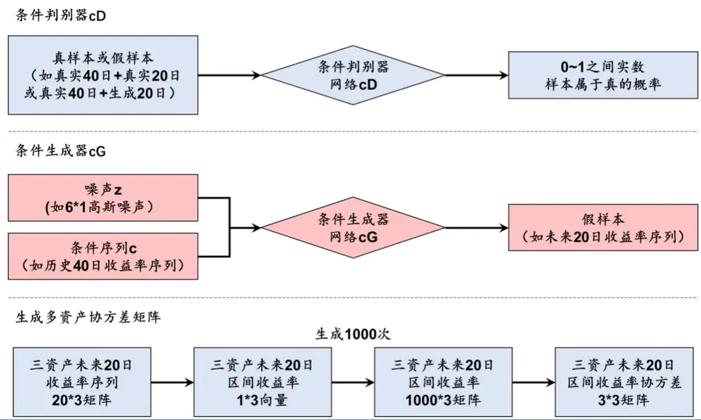
资料来源：华泰研究

cGAN 中随机数的引入是模型刻画市场未来风险的关键。我们认为，市场未来表现本质上取决于两方面因素：市场历史表现（似然信息）和市场在未来隐空间中的状态（先验信息）。隐空间的概念较为抽象，政策面、基本面、资金面、技术面、消息面等等都可能是隐空间的具象化表征。这些“面”通常难以确定性地预测，但如果我们对隐空间进行随机采样，相当于对市场未来可能出现的状态进行遍历式的演绎，那么反复多次演绎后的结果就蕴含了市场未来的风险信息。

cGAN 模型由条件判别器（cD）和条件生成器（cG）两个相互博弈的网络构成。条件判别器的输入为真序列，或者由真实条件序列和虚假生成序列拼接而成的假序列，输出为真假判别结果。条件生成器的输入为条件序列以及服从高斯分布的随机数，输出为生成序列。cGAN 条件判别器的主体是 5 层卷积层，条件生成器的主体是 4 层卷积层和 2 层转置卷积层。两组网络交替训练，详细网络结构和超参数请参考《人工智能 45：cGAN 应用于资产配置》（2021-04-19），及 2020 年由 IBM 研究院和 Three Bridges Capital 在 SSRN ElectronicJournal 合作发表的论文 Pagan: Portfolio Analysis with Generative Adversarial Networks。

图表2： cGAN 预测资产收益协方差网络结构
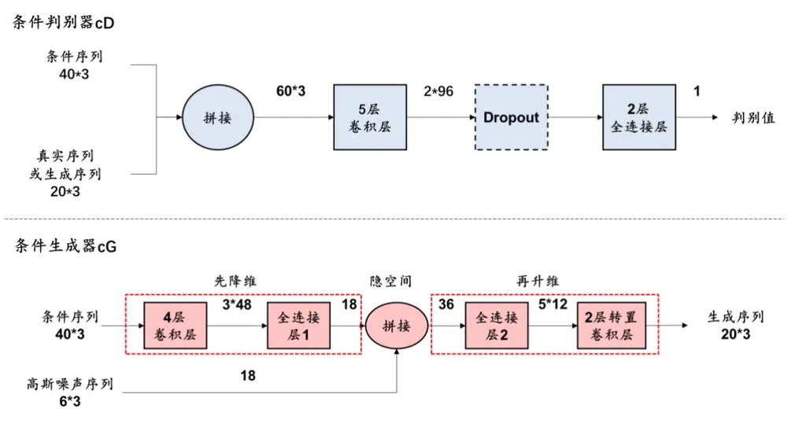
注：以预测 3 资产未来 20 个交易日收益协方差为例
资料来源：Zhu, Mariani, & Li. (2020). Pagan: Portfolio Analysis with Generative Adversarial Networks，华泰研究

在每个预测截面日，采用过去 1000 个交易日数据训练 cGAN 模型。具体而言，对 1000 个交易日各资产收益率序列进行采样，每条样本为连续 60 个交易日收益率序列，共得到 941条真样本。训练完成后，条件生成器将用于协方差矩阵的预测。

我们将 cGAN 和历史波动率方法预测的协方差矩阵分别应用于风险平价模型。底层资产为沪深 300、中债-国债总财富指数和 SGE 黄金 9999，回测区间为 2012-01-04 至 2021-10-29，调仓频率为 20 个交易日，调仓日为预测截面日的下个交易日，不计交易费用。结果表明，cGAN 方法显著优于历史波动率方法，夏普比率分别为 1.61 和 1.41，Calmar 比率分别为1.17 和 0.61，并且超额收益较为稳定。

在前序研究中，我们还对 cGAN 模型进行稳健性测试，例如改变训练和生成过程的随机数种子，改变回测起始日期，改变底层资产。各项测试场景中，cGAN 表现均优于历史波动率方法。此外，我们还尝试揭开 cGAN 模型的“黑箱”，从生成序列形态、真实性统计指标和仓位变动三个角度，解释 cGAN 产生超额收益的原因。

图表3： cGAN 预测波动率和历史波动率原始方法应用于风险平价模型对比
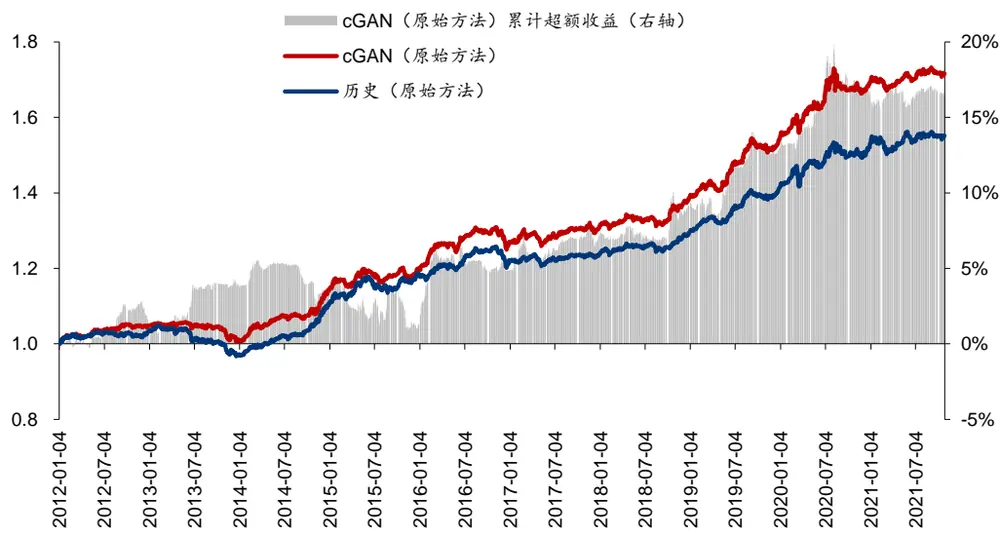
注：底层资产为沪深 300，中债-国债总财富指数，SGE 黄金 9999；回测区间为 2012-01-04 至 2021-10-29资料来源：Wind，华泰研究

然而前序研究存在未尽之处：首先，资产区间收益多次模拟的协方差可以衡量风险，多次模拟的均值是否可以衡量收益期望？其次，除直接观察回测表现外，能否从理论层面评估cGAN 协方差及均值预测的准确度？最后，除风险平价模型外，cGAN 方法在其他资产配置模型的适用性如何？

## 本文架构

本文是对前序研究的系统梳理和深入挖掘，依据预测对象分为收益协方差预测和均值预测两条主线展开。每条主线内部依次介绍预测方法、预测准确度评估和实践应用。实践应用环节，我们考察 cGAN 在风险预算模型和均值方差模型中的表现。另外，协方差预测部分，我们对 cGAN 回测表现优于历史波动率进行归因分析。以上两条主线的底层资产均为国内股票、债券、商品三种大类资产，全文第三部分我们还测试了全球五种大类资产配置以及 A股五种板块风格配置，以验证 cGAN 应用于资产配置的稳健性。

图表4： 本文架构
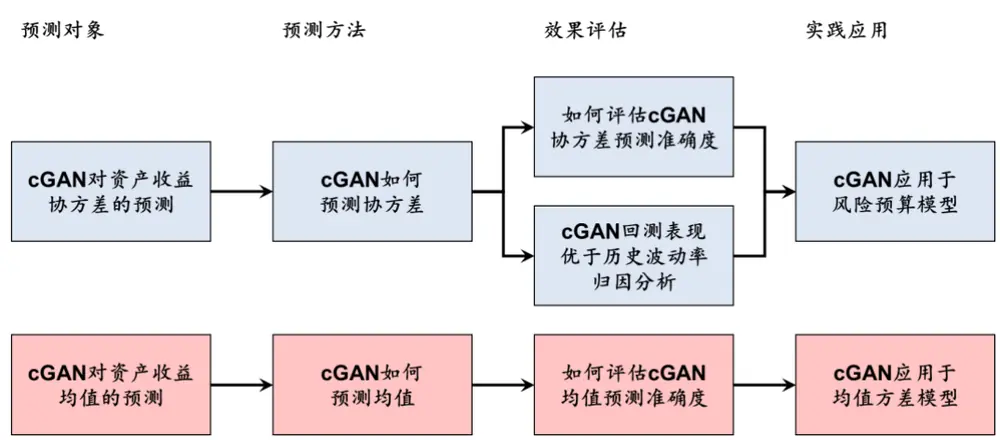
资料来源：华泰研究

注：以预测 3 资产未来 20 个交易日收益协方差为例资料来源：华泰研究

## cGAN对资产收益协方差的预测

本章介绍 cGAN 对资产收益协方差预测的方法、效果评估和实践应用。核心结论如下：

1. 前序研究中 cGAN 协方差预测方法为“单次模拟求区间收益，多次模拟求协方差”，本研究的改进方法为“单次模拟求协方差，多次模拟求协方差均值”，结果表明改进方法在控制组合波动上具有优势。

2. 设计 3项衡量预测协方差矩阵与真实协方差矩阵“距离”的指标，分别为特征值分布、Frobenius 距离和相关矩阵距离。结果表明，cGAN 方法预测的协方差相比历史波动率方法更接近未来真实协方差。

3. 基于 cGAN 和历史波动率方法构建风险平价模型，比较 1）各资产实际仓位与理想仓位，2）各资产实际风险分配与理想风险分配。结果表明 cGAN 更接近理想情形。

4. 将 cGAN 应用于风险预算模型，结果表明 cGAN 整体优于历史波动率方法。

## cGAN如何预测协方差

前序研究中，cGAN协方差矩阵预测的原始方法为：

1. 单次模拟生成各资产未来 20 日日频收益率矩阵。

2. 求和得到各资产未来 20 日区间收益率向量。

3. 重复模拟 1000 次，得到不同模拟路径下各资产未来 20 日区间收益率矩阵。

4. 计算协方差。

本研究中，cGAN 协方差矩阵预测的改进方法为：

1. 单次模拟生成各资产未来 20 日日频收益率矩阵。

2. 计算协方差。

3. 重复模拟 1000 次，得到 1000组未来 20 日日频收益率协方差矩阵。

4. 求均值。

原始方法和改进方法在核心思想上没有差异，区别在于收益率对应的时间频率。原始方法计算未来 20 日区间收益的协方差，类似于月收益率协方差，改进方法计算未来 20 日的日收益率协方差。改进方法的“分辨率”更高。

图表5： cGAN 预测资产收益协方差改进方法
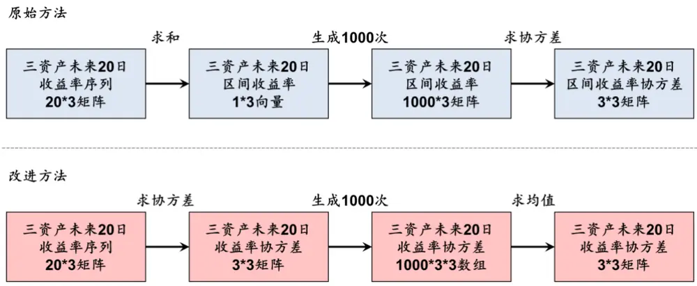

类似地，对于对照组历史波动率预测协方差，我们也做了相匹配的改进。

1. 原始方法：过去 1000 个交易日内，每隔 20 日计算区间收益率，计算 50 组 20 日区间收益率的协方差矩阵（半衰加权），类似于月收益率协方差。

2. 改进方法：过去 1000 个交易日内，每隔 20 日计算收益率协方差，再计算 50 组协方差均值（半衰加权）。

另外，我们计算真实的未来 20 日收益协方差作为参考标准。

资料来源：Wind，华泰研究

图表6： cGAN 预测波动率和历史波动率改进方法应用于风险平价模型对比
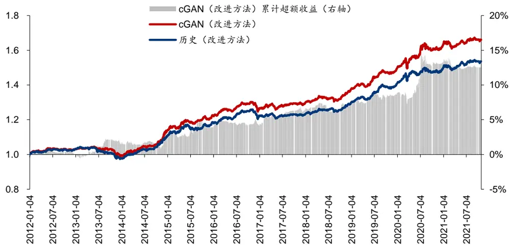
注：底层资产为沪深 300，中债-国债总财富指数，SGE 黄金 9999；回测区间为 2012-01-04 至 2021-10-29资料来源：Wind，华泰研究

在与前序研究相同的测试环境下，cGAN和历史波动率两种方案的改进方法回测结果如上图。cGAN 仍优于历史波动率，并且超额收益较为稳定。下表展示不同协方差预测方法详细回测指标，观察各方法夏普比率，最高为真实波动率（1.97），其次为 cGAN 预测波动率改进方法（1.74）。无论是 cGAN预测波动率还是历史波动率，改进方法夏普比率均优于原始方法（cGAN：1.74＞1.61；历史：1.63＞1.41），改进方法年化波动率均低于原始方法（cGAN：3.14%＜3.62%；历史：2.81%＜3.35%）。改进方法在控制波动方面更具优势。

图表7： 不同协方差预测方法应用于风险平价模型回测指标

|  | 年化收益率 | 年化波动率 | 夏普比率 | 最大回撤 | Calmar 比率 |
| --- | --- | --- | --- | --- | --- |
| cGAN预测波动率(原始方法） | 5.82% | 3.62% | 1.61 | -4.98% | 1.17 |
| 历史波动率（原始方法） | 4.71% | 3.35% | 1.41 | -7.75% | 0.61 |
| cGAN 预测波动率（改进方法） | 5.46% | 3.14% | 1.74 | -5.44% | 1.00 |
| 历史波动率（改进方法） | 4.60% | 2.81% | 1.63 | -6.63% | 0.69 |
| 真实波动率 | 4.70% | 2.63% | 1.79 | -7.44% | 0.63 |

注：底层资产为沪深 300，中债-国债总财富指数，SGE 黄金 9999；回测区间为 2012-01-04 至 2021-10-29

## 如何评估 cGAN协方差预测准确度

cGAN 方法为什么优于历史波动率方法？一个直观的猜测是 cGAN 对协方差的预测更接近真实协方差。为验证这一假设，参考华泰金工往期研究《不同协方差估计方法对比分析》（2019-11-05），我们设计 3 项衡量预测协方差矩阵与真实协方差矩阵“距离”的指标。

## 特征值分布

协方差矩阵的特征值反映了不同“主成分”的方差。对协方差矩阵进行特征值分解 Σ＝UΛUT，其中，U 的各列为正交的特征向量，对角阵 $\Lambda{=}\mathsf{diag}(\lambda_{1},\lambda_{2},...,\lambda\mathsf{d})$ ，对角元为从大到小排列的特征值，我们将考察特征值的分布情况。

历史波动率方法、cGAN 方法和真实协方差矩阵的特征值分布如下图，图中每个点代表某个预测截面日计算的协方差矩阵特征值。观察知，cGAN 和真实协方差特征值分布接近，历史波动率方法特征值分布较为集中，且更靠近 0。换言之，历史波动率方法可能低估真实风险。

图表8： 不同预测方法下的协方差矩阵特征值分布
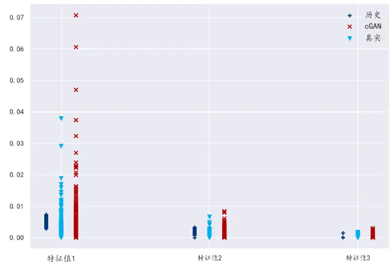
资料来源：Wind，华泰研究

## Frobenius 距离

Frobenius 范数距离可以衡量协方差估计量Σ̂和真实值Σ的偏差：

$$
D_{\widehat{\Sigma}}=\left.\widehat{\Sigma}-\Sigma\right._{F}=\sqrt{\sum_{i=1}^{d}\sum_{j=1}^{d}\left(\widehat{\sigma}_{ij}-\sigma_{ij}\right)^{2}}
$$

两个矩阵的 Frobenius 范数距离越大，则各对应元素数值差异越大，Frobenius 范数为 0表明两个矩阵完全相同。

然而该方法并不适合直接用于本研究场景。Frobenius 范数距离仅关注矩阵各元素绝对数值的差异。比如一个矩阵各元素是另一个矩阵的 10倍，两个矩阵的 Frobenius 范数距离可能很大，但矩阵内部各元素相对大小关系是相同的。多资产协方差预测场景中，相比于资产风险的绝对数值，我们更关注各资产风险的相对大小。

针对上述问题，我们首先对cGAN和历史波动率方法下协方差矩阵的特征值进行量级调整，将矩阵特征值乘以真实协方差与预测协方差的迹的比值：

$$
\hat{\boldsymbol{\Sigma}}_{c}=\boldsymbol{U}\left(\boldsymbol{\Lambda}*\frac{tr(\boldsymbol{\Sigma})}{tr(\hat{\boldsymbol{\Sigma}})}\right)\boldsymbol{U}^{T}
$$

若cGAN协方差数量级比真实值大10倍，而历史波动率的协方差数量级比真实值小10倍，则需对前者除以 10、后者乘以 10，再比较 Frobenius 范数距离。

图表9： 不同预测方法下的协方差矩阵与未来真实协方差矩阵 Frobenius距离
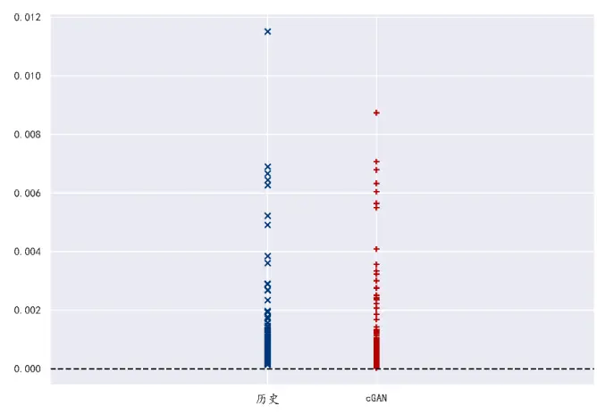
资料来源：Wind，华泰研究

量级修正后，历史波动率方法、cGAN 方法各自与真实协方差的 Frobenius 距离如上图。cGAN 方法距离均值为 0.0012，历史波动率方法距离均值为 0.0012，Wilcoxon 检验显示cGAN 和传统方法无显著差异 $(p{=}0.29)$ ）。两种方法 $\cdot\frac{\cdot}{\vert\pm}$ Frobenius 距离指标上未体现出区别，我们需要更敏感的评价指标。

## 相关矩阵距离

定义 $R_{1}$ 和 ${\bf\cdot}R_{2}$ 两个矩阵的相关距离为：

$$
D_{corr}(R_{1},R_{2})=1-\frac{tr\{R_{1}R_{2}\}}{\parallel R_{1}\parallel_{F}\parallel_{R_{2}}\parallel_{F}}
$$

其中 $D_{corr}(R_{1},R_{2})$ 为相关矩阵距离， $tr\{R_{1}R_{2}\}$ 为 $R_{1}R_{2}$ 的迹， $|R_{1}||_{F}$ 和 ${|R_{2}||}_{F}$ 分别为矩阵 ${\bf\nabla}\cdot{\cal R}_{1}$ 和 $\boldsymbol{\mathsf{R}}_{2}$ 的 Frobenius 范数。若 $R_{1}$ 和 $R_{2}$ 相同，则相关矩阵距离为 0；若二者正交，则该距离为 1。

历史波动率方法、cGAN 方法各自与真实协方差的相关矩阵距离如下图。cGAN 方法均值为-0.05，历史波动率方法均值为-0.07，Wilcoxon 检验显示 cGAN 显著高于历史波动率方法（p=0.001），cGAN 更接近 0，即更接近真实协方差。

图表10： 不同预测方法下的协方差矩阵与未来真实协方差矩阵相关矩阵距离
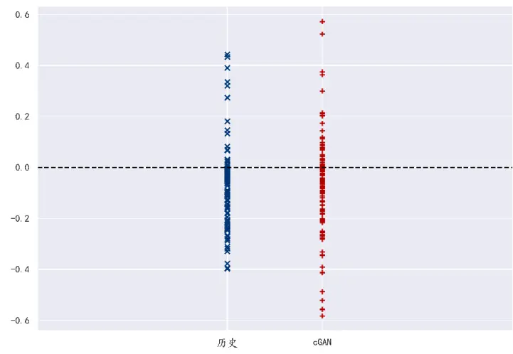
资料来源：Wind，华泰研究

## cGAN回测表现优于历史波动率的归因分析

通过计算距离指标，我们初步确认 cGAN 预测协方差更接近真实协方差。然而，并非协方差估计越准确，风险平价模型表现就越好。协方差的预测通过“组合构建”方才能够影响回测表现。我们需要从组合角度，更直观地分析 cGAN 回测表现为何优于历史波动率方法。

我们从以下两个角度分析：

1. 我们假定，如果处于上帝视角，已知未来 20 日真实协方差，那么风险平价模型将完美分配各资产仓位。cGAN 仓位分配是否更接近理想情形下的仓位分配？

2. 风险平价模型的目标是各资产风险均等分配。cGAN 的风险分配是否更接近理想情形下的风险分配？

## 与理想仓位分配比较

图表 11 至 13 分别展示不同协方差预测方法下的股票、债券和商品仓位，其中真实协方差对应前述理想情形。观察知，cGAN 仓位分配对理想仓位分配跟踪较紧密，而历史波动率方法仓位分配波动较小。历史波动率方法使用跨度较长（本研究为过去 1000 个交易日）的历史数据计算协方差，每个截面期引入新信息量有限，对市场近期变化不敏感。cGAN 方法同样使用跨度较长的历史数据训练模型，但使用跨度较短的最新数据（本研究为过去 40 个交易日）进行预测，对市场近期变化较敏感。

图表11： 不同协方差预测方法下的股票仓位
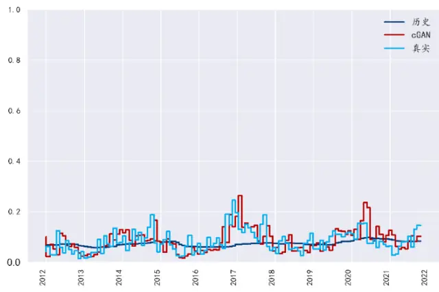
资料来源：Wind，华泰研究

图表12： 不同协方差预测方法下的债券仓位
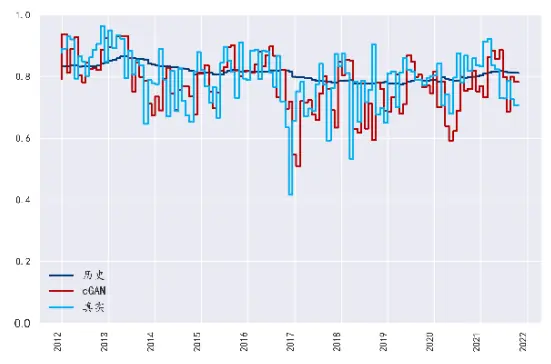
资料来源：Wind，华泰研究

图表13： 不同协方差预测方法下的商品仓位
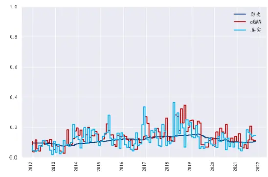
资料来源：Wind，华泰研究

## 与理想风险分配比较

风险平价模型中，若各资产实际分配权重向量为w，Σ为真实协方差矩阵，则资产i的实际风险贡献为：

$$
\sigma_{i}(w)=w_{i}\cdot\partial_{w_{i}}\sigma(w)={\frac{w_{i}(\Sigma w)_{i}}{\sqrt{w^{T}\Sigma w}}}
$$

理想情形下，各资产风险应等权分配，三种资产均等于 1/3。

图表14： cGAN 预测波动率下风险平价模型与理想风险分配比较
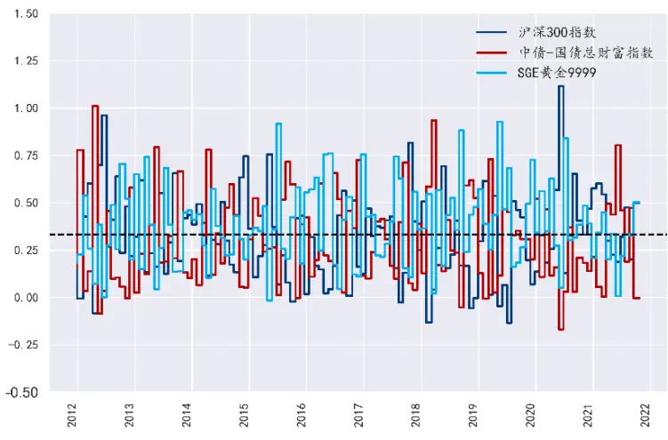
资料来源：Wind，华泰研究

比较 cGAN 方法和历史波动率方法下的实际风险分配与理想风险分配，如图表 14 和 15 所示。观察可知，cGAN 和历史波动率方法的风险分配均围绕 1/3 中枢波动，说明两者基本实现风险均等分配目标。但历史波动率的风险分配似乎存在周期性，而 cGAN 的风险分配平稳性更好。

图表15： 历史波动率下风险平价模型与理想风险分配比较
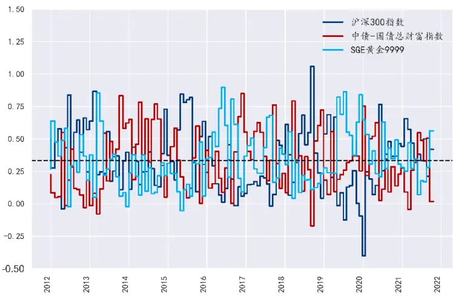
资料来源：Wind，华泰研究

为了验证这一猜测，我们计算两者风险分配的自相关性，如下图所示。cGAN方法风险分配的非 0 阶自相关系数围绕 0 波动，序列平稳性高。历史波动率方法风险贡献自相关性大致存在 1~6 期（跨度约半年内）的正自相关，12~24 期（跨度约 1~2 年）的负自相关，以及36 期（约 3 年）的正自相关，序列平稳性低。

图表16： 不同协方差预测方法下的资产实际风险分配自相关性
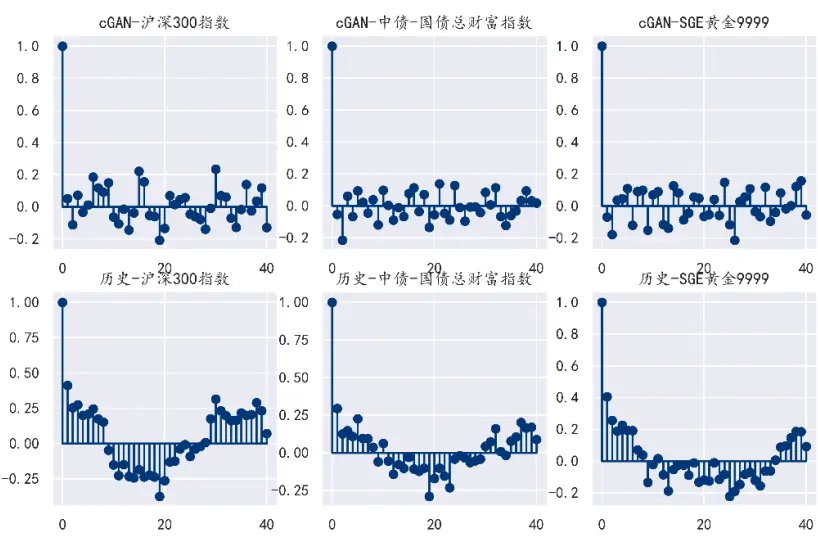
资料来源：Wind，华泰研究

为什么历史波动率方法风险分配存在跨度半年的正自相关性？我们认为本质源于资产收益的波动率聚集特性。资产上行趋势中，真实波动率通常逐渐降低，历史波动率方法由于采用跨度较长的历史数据计算协方差，对于近期市场变化相对“迟钝”，预测波动率降幅小于真实波动率降幅，此时风险分配将持续低于理想情形，从而错过上行趋势中的收益。例如图 11 和图 15 中，历史波动率方法 2017 年上半年在沪深 300 的仓位分配和风险分配均低于理想情形。

当上行趋势面临拐点，真实波动率通常大幅提升，此时历史波动率方法预测的波动率增幅小于真实波动率增幅，因此风险分配将持续高于理想情形，结果是逃不过拐点处的大跌。例如图 11 和图 15 中，历史波动率方法 2015 年年中在沪深 300 的仓位分配和风险分配均高于理想情形。换言之，历史波动率方法无法敏锐捕捉近期条件序列波动率上升（或下降）所引发的未来一段时间波动率上升（或下降），即波动率聚集特性。

风险分配平稳性有何现实意义？历史波动率方法风险分配存在 1~6 阶正自相关性，意味着在短期内对同一资产持续低配或高配风险，违背了风险平价本身的理念，尤其在拐点位置或面临较大风险。cGAN 方法所体现出的风险分配平稳性更符合风险平价的初衷，这可能是 cGAN 回测具有更低的波动率和最大回撤的深层次原因。

## cGAN应用于风险预算模型

风险平价模型可以视为风险预算模型的特殊形式，不同资产类别呈现的风险暴露水平相同，但是这往往会导致投资组合在权益类资产上的低权重。风险预算模型的优势在于根据不同的风险预算分配风险，在资产组合构建上更具灵活性。从前文对协方差估计准确性比较的结果看，cGAN 相比历史波动率方法预测协方差更准确，我们预期 cGAN 在不同风险预算比上的风险预算模型上表现也将更优。

图表17： 不同协方差预测方法应用于风险预算模型（股债商风险预算比为 8:1:1）
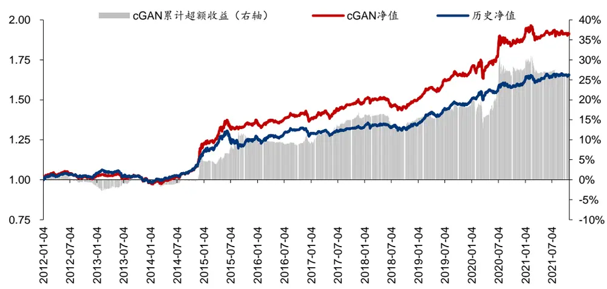
注：底层资产为沪深 300，中债-国债总财富指数，SGE 黄金 9999；回测区间为 2012-01-04 至 2021-10-29资料来源：Wind，华泰研究

图表18： 不同协方差预测方法应用于风险预算模型（股债商风险预算比为 1:8:1）
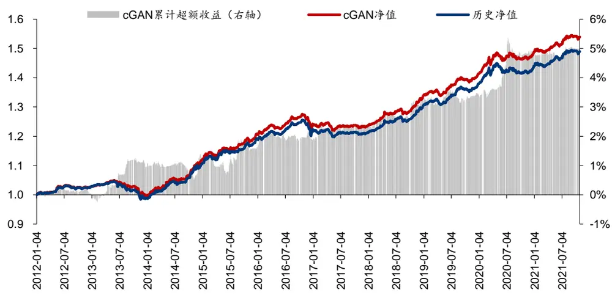
注：底层资产为沪深 300，中债-国债总财富指数，SGE 黄金 9999；回测区间为 2012-01-04 至 2021-10-29资料来源：Wind，华泰研究

图表19： 不同协方差预测方法应用于风险预算模型（股债商风险预算比为 1:1:8）
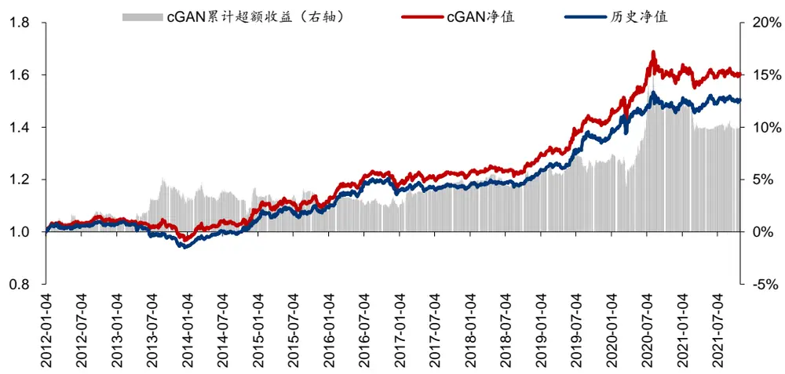
注：底层资产为沪深 300，中债-国债总财富指数，SGE 黄金 9999；回测区间为 2012-01-04 至 2021-10-29资料来源：Wind，华泰研究

当股债商风险预算比分别为 8:1:1、1:8:1 和 1:1:8，即风险暴露水平最高资产分别为沪深 300指数、中债-国债总财富指数和 SGE黄金 9999 时，净值如图 17至 19 所示。三种风险预算分配情形下的回测指标如下表。cGAN 相比历史波动率方法在获取收益和控制回撤方面具有稳定优势。股票、债券风险高配情形下，cGAN 相比历史波动率方法夏普比率更高；商品风险高配情形下，cGAN夏普比率略不及历史波动率方法。总的来看，cGAN 在风险预算模型上的表现优于历史波动率方法。

图表20： 不同协方差预测方法应用于风险预算模型回测指标

|  | 年化收益率 | 年化波动率 | 夏普比率 | 最大回撤 | Calmar 比率 |
| --- | --- | --- | --- | --- | --- |
|  |  | 股、债、商风险预算比为8:1:1 |  |  |  |
| CGAN | 7.04% | 5.38% | 1.31 | -7.70% | 0.91 |
| 历史 | 5.42% | 4.36% | 1.24 | -8.42% | 0.64 |
|  |  | 股、债、商风险预算比为1:8:1 |  |  |  |
| CGAN | 4.62% | 2.14% | 2.16 | -5.21% | 0.89 |
| 历史 | 4.26% | 2.13% | 2.00 | -5.98% | 0.71 |
|  |  | 股、债、商风险预算比为1:1:8 |  |  |  |
| CGAN | 5.08% | 5.16% | 0.99 | -8.81% | 0.58 |
| 历史 | 4.38% | 4.25% | 1.03 | -9.67% | 0.45 |

注：底层资产为沪深 300，中债-国债总财富指数，SGE 黄金 9999；回测区间为 2012-01-04 至 2021-10-29资料来源：Wind，华泰研究

## cGAN对资产收益均值的预测

本章介绍 cGAN 对资产收益均值预测的方法、效果评估和实践应用。核心结论如下：

1. 类似协方差预测方法，采用“单次模拟求区间收益，多次模拟求收益均值”方法预测收益均值。

2. 从基本统计指标和多空回测角度，评估 cGAN 收益均值预测准确度。结果表明 cGAN优于基于历史收益（即长期动量）的方法。

3. 将 cGAN 应用于均值方差模型，结果表明 cGAN整体优于基于历史收益和波动率方法。

## cGAN如何预测均值

本研究中，cGAN 收益均值预测的方法为：

1. 单次模拟生成各资产未来 20 日日频收益率矩阵。

2. 求和得到各资产未来 20 日区间收益率向量。

3. 重复模拟 1000 次，得到不同模拟路径下的各资产未来 20 日区间收益率矩阵。

4. 求均值。

图表21： cGAN预测资产收益均值方法
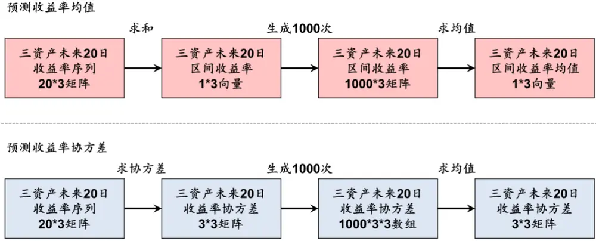
注：以预测 3 资产未来 20 个交易日区间收益为例
资料来源：华泰研究

对照组基于历史收益的预测方法为：过去 1000 个交易日内，每隔 20 日计算区间收益，再计算 50组区间收益均值（半衰加权）。对照组的本质是基于长期动量进行收益预测。另外，我们计算未来 20 日真实区间收益作为参考标准。

## 如何评估 cGAN均值预测准确度

我们从基本统计指标和多空回测角度，评估 cGAN 和基于历史收益方法的预测准确度。

## 基本统计指标

图表 22 至 24 分别展示两种收益均值预测方法和股票、债券、商品三种资产未来真实收益对比。观察知，cGAN 收益预测对真实收益的跟踪较紧密，而历史收益预测方法波动较小。原因与前述协方差预测类似，cGAN 使用跨度较短的最新数据（过去 40 个交易日）进行预测，相比历史收益方法使用跨度较长的历史数据（过去 1000 个交易日），cGAN 对市场近期变化较为敏感。

图表22： 不同收益均值预测和股票未来真实收益对比
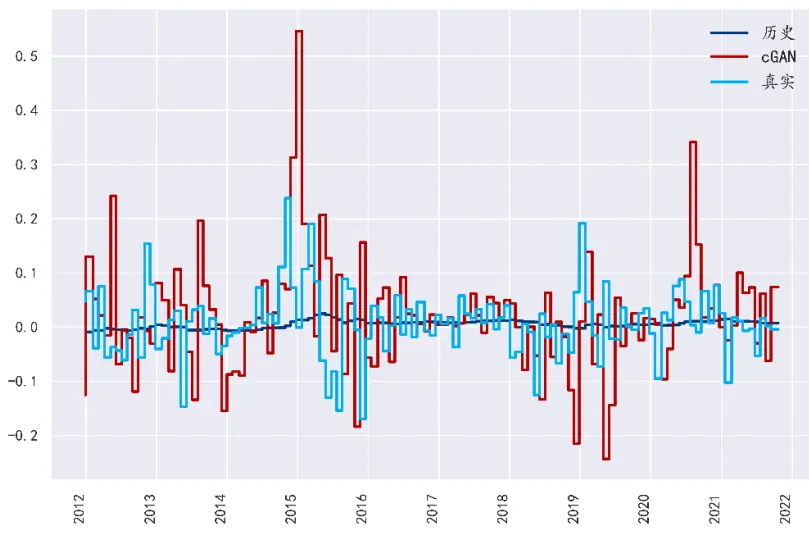
资料来源：Wind，华泰研究

图表23： 不同收益均值预测和债券未来真实收益对比
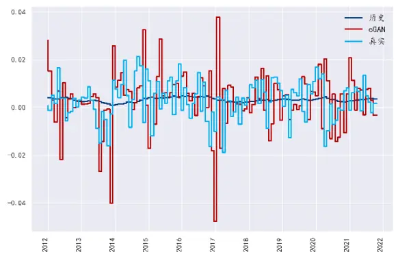
资料来源：Wind，华泰研究

图表24： 不同收益均值预测和商品未来真实收益对比
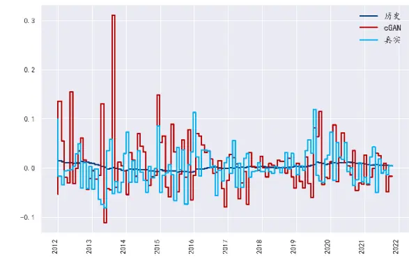
资料来源：Wind，华泰研究

定义如下基本统计指标：

1. MAE：针对单个资产，在每个预测截面日，计算预测收益与未来 20 日真实区间收益的误差绝对值，各截面日求均值。

2. 截面 IC均值：每个预测截面日，计算三资产预测收益和未来真实收益的 Pearson 相关系数，各截面日求均值。

3. IC_IR：各截面日 IC均值除以 IC 标准差。

4. 预测收益排名首位（或末位）资产真实收益均值：每个截面日，计算预测收益排名首位（或末位）的资产在未来 20 日的真实区间收益，各截面日求均值。

图表25： 不同收益均值预测方法下的基本统计指标

| 统计指标 | CGAN 历史 |
| --- | --- |
| MAE：股票 | 8.63% 4.54% |
| MAE：债券 | 1.06% 0.66% |
| MAE：商品 | 4.86% 2.91% |
| 截面 IC 均值 | 5.29% 4.80% |
| IC_IR | 7.51% 6.55% |
| 预测收益排名首位资产真实收益均值 | 0.65% 0.29% |
| 预测收益排名末位资产真实收益均值 | -0.10% 0.60% |

资料来源：Wind，华泰研究

基本统计指标结果如上表。从 MAE看，历史收益方法比 cGAN 更小，说明在绝对收益预测上，cGAN 表现并不突出。但是 cGAN 的截面 IC 均值及 IC_IR 均高于历史收益方法，说明cGAN 更擅长预测多资产相对收益排名。cGAN 预测收益排名首位资产真实收益更高，预测收益排名末位资产真实收益更低，进一步体现出 cGAN 预测相对收益排名的能力。

## 多空回测

定义如下回测方式：

1. 多头回测：每个预测截面日开仓做多收益预测排名首位的资产。

2. 空头回测：每个预测截面日开仓做空收益预测排名末位的资产。

3. 多空回测：每个预测截面日开仓做多收益预测排名首位的资产，开仓做空收益预测排名末位的资产。

图表 26 至 28 分别展示三组回测结果，cGAN 均优于历史收益方法，并且超额收益稳定。
总的来看，cGAN 预测单资产绝对收益表现不佳，预测多资产相对收益排名表现较好。

图表26： 不同收益均值预测方法下的多头回测
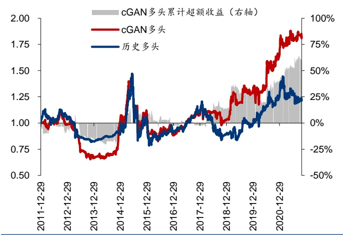
注：该策略为每个预测截面日开仓做多收益预测排名首位的资产资料来源：Wind，华泰研究

图表27： 不同收益均值预测方法下的空头回测
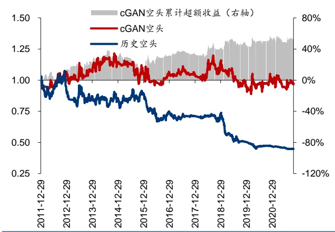
注：该策略为每个预测截面日开仓做空收益预测排名末位的资产资料来源：Wind，华泰研究

图表28： 不同收益均值预测方法下的多空回测
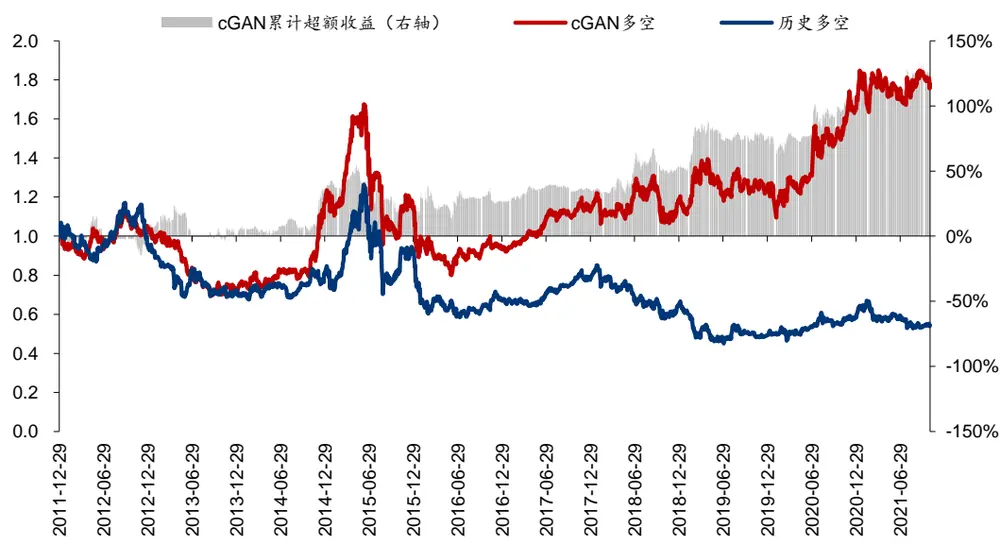
注：该策略为每个预测截面日开仓做多收益预测排名首位的资产，开仓做空收益预测排名末位的资产资料来源：Wind，华泰研究

## cGAN应用于均值方差模型

均值方差模型是更为经典的资产配置模型，基于预期收益μ和预期风险Σ求解资产权重w，在给定的风险厌恶水平 λ以及其他约束条件下，使得投资组合的期望效用最优：

$$
\begin{array}{r}{min-w^{T}\mu+\lambda w^{T}\Sigma w}\end{array}
$$

前文表明，相比基于历史收益和波动率的预测方法，cGAN 对于资产收益均值和协方差预测的准确度更高，因此我们预期 cGAN在均值方差模型上也将表现更好。

由于 cGAN 和历史收益方法得到的预期收益量级不同，在求解最优化问题前，事先对预期收益进行 Z-score 标准化处理，使得相同风险厌恶系数水平下，组合波动率水平接近，从而进行公平比较。

当风险厌恶系数为 1时，均值方差模型净值如下图，年化波动率在 15%左右。

图表29： 不同均值和协方差预测方法应用于均值方差模型（风险厌恶系数为 1）
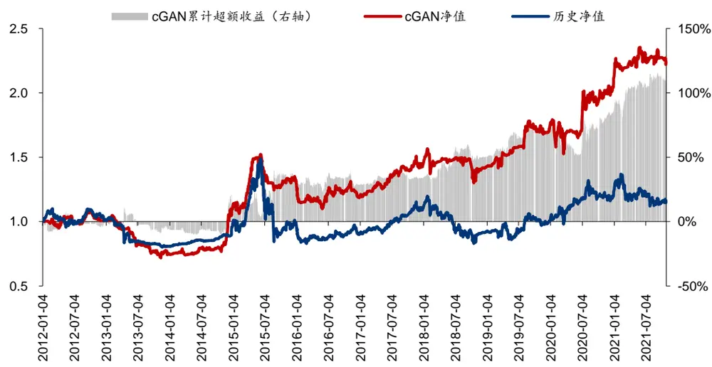
注：底层资产为沪深 300，中债-国债总财富指数，SGE 黄金 9999；回测区间为 2012-01-04 至 2021-10-29资料来源：Wind，华泰研究

当风险厌恶系数为 10时，均值方差模型净值如下图，年化波动率在 7%左右。

图表30： 不同均值和协方差预测方法应用于均值方差模型（风险厌恶系数为 10）
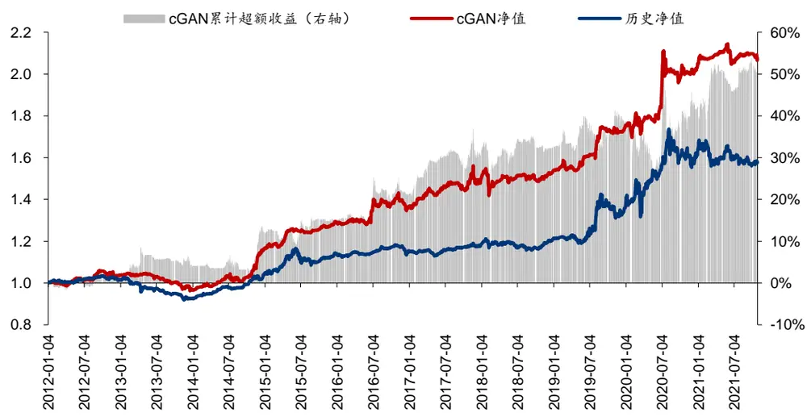
注：底层资产为沪深 300，中债-国债总财富指数，SGE 黄金 9999；回测区间为 2012-01-04 至 2021-10-29资料来源：Wind，华泰研究

当风险厌恶系数为 100 时，均值方差模型净值如下图，年化波动率约为 2%。

图表31： 不同均值和协方差预测方法应用于均值方差模型（风险厌恶系数为 100）
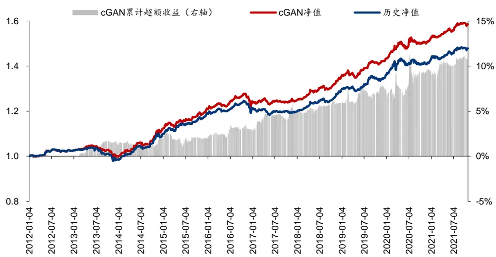
注：底层资产为沪深 300，中债-国债总财富指数，SGE 黄金 9999；回测区间为 2012-01-04 至 2021-10-29资料来源：Wind，华泰研究

三种风险厌恶系数下的回测指标如下表。相比历史收益和波动率方法，cGAN 在获取收益、控制波动和控制回撤方面均具有稳定优势。总的来看，cGAN 在均值方差模型上的表现优于传统方法。

图表32： 不同均值和协方差预测方法应用于均值方差模型回测指标

|  | 年化收益率 | 年化波动率 风险厌恶系数为1 | 夏普比率 | 最大回撤 | Calmar 比率 |
| --- | --- | --- | --- | --- | --- |
| CGAN | 8.82% | 14.97% | 0.59 | -33.63% | 0.26 |
| 历史 | 1.54% | 18.84% | 0.08 | -44.21% | 0.03 |
|  |  | 风险厌恶系数为 10 |  |  |  |
| CGAN | 7.96% | 6.47% | 1.23 | -9.15% | 0.87 |
| 历史 | 4.90% | 7.45% | 0.66 | -11.89% | 0.41 |
|  |  | 风险厌恶系数为 100 |  |  |  |
| CGAN | 4.95% | 2.27% | 2.18 | -5.28% | 0.94 |
| 历史 | 4.19% | 2.29% | 1.83 | -5.91% | 0.71 |

注：底层资产为沪深 300，中债-国债总财富指数，SGE 黄金 9999；回测区间为 2012-01-04 至 2021-10-29资料来源：Wind，华泰研究

## cGAN资产配置策略稳健性测试

以上两章实证测试使用的底层资产均为国内股票、债券、商品三种大类资产，为了验证 cGAN应用于资产配置的稳健性，本章我们将测试 cGAN 在全球五种大类资产配置以及 A 股五种板块风格配置上的效果。

## 全球资产配置

底层资产选取沪深 300、标普 500、日经 225、CRB 综合现货、中债-新综合财富（总值）指数，回测区间为 2012-01-04 至 2021-10-29，网络训练迭代次数由原先的 600 代增加至2000 代，其余模型、回测超参数均保持不变。

从协方差矩阵特征值分布来看，cGAN 和真实协方差特征值分布接近，历史波动率方法特征值分布较为集中，且更靠近 0。历史波动率方法可能低估真实风险。

图表33： 全球资产配置：不同预测方法下的协方差矩阵特征值分布
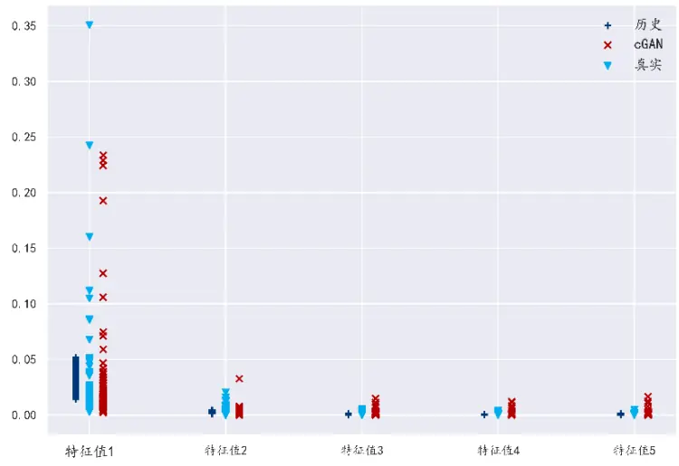
资料来源：Wind，华泰研究

从预测收益均值的多空回测来看，cGAN 均优于历史收益方法，但超额收益不够稳定。相比预测收益协方差，预测收益均值难度更大。

图表34： 全球资产配置：不同收益均值预测方法下的多空回测
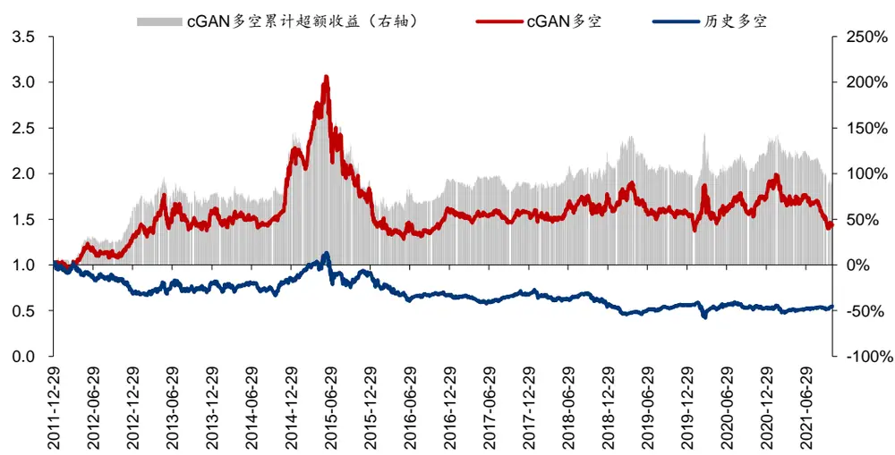
注：该策略为每个预测截面日开仓做多收益预测排名首位的资产，开仓做空收益预测排名末位的资产资料来源：Wind，华泰研究

当风险厌恶系数为 25时，均值方差模型净值如下图，年化波动率在 4%左右。

图表35： 全球资产配置：不同均值和协方差预测方法应用于均值方差模型（风险厌恶系数为 25）
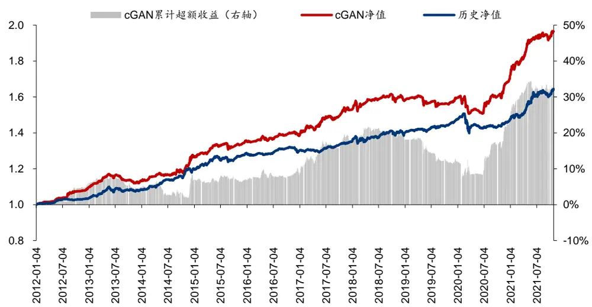
注：底层资产为沪深300，标普 500，日经225，CRB综合现货，中债-新综合财富（总值）指数；回测区间为2012-01-04 至2021-10-29资料来源：Wind，华泰研究

风险平价模型以及三种风险厌恶系数下的均值方差模型回测指标如下表。相比历史收益和波动率方法，cGAN 在获取收益和控制回撤方面均具有稳定优势，夏普比率和 Calmar 比率普遍高于传统方法，仅在风险平价模型夏普比率一项上与传统方法持平。

图表36： 全球资产配置：不同均值和协方差预测方法应用于资产配置模型回测指标

|  | 年化收益率 | 年化波动率 风险平价模型 | 夏普比率 | 最大回撤 | Calmar 比率 |
| --- | --- | --- | --- | --- | --- |
| CGAN | 5.24% | 1.99% | 2.63 | -3.04% | 1.73 |
| 历史 | 4.98% | 1.89% | 2.63 | -3.18% | 1.57 |
|  |  | 均值方差模型：风险厌恶系数为1 |  |  |  |
| CGAN | 8.84% | 16.93% | 0.52 | -39.98% | 0.22 |
| 历史 | 4.61% | 17.96% | 0.26 | -47.24% | 0.10 |
|  |  | 均值方差模型：风险厌恶系数为10 |  |  |  |
| CGAN | 9.34% | 7.60% | 1.23 | -16.42% | 0.57 |
| 历史 | 5.49% | 7.47% | 0.73 | -22.08% | 0.25 |
|  |  | 均值方差模型：风险厌恶系数为 25 |  |  |  |
| CGAN | 7.96% | 4.23% | 1.88 | -7.83% | 1.02 |
| 历史 | 5.48% | 3.44% | 1.60 | -8.68% | 0.63 |

注：底层资产为沪深300，标普 500，日经 225，CRB综合现货，中债-新综合财富（总值）指数；回测区间为 2012-01-04至 2021-10-29资料来源：Wind，华泰研究

## A股板块配置

底层资产选取中信金融、周期、消费、成长、稳定指数，回测区间为2012-01-04至2021-10-29，网络训练迭代次数由原先的 600 代增加至 2000 代，其余模型、回测超参数均保持不变。

从协方差矩阵特征值分布来看，cGAN 和真实协方差特征值分布接近，历史波动率方法特征值分布较为集中，且更靠近 0。历史波动率方法可能低估真实风险。

图表37： A股板块配置：不同预测方法下的协方差矩阵特征值分布

资料来源：Wind，华泰研究

从预测收益均值的多空回测来看，cGAN 均优于历史收益方法，但超额收益不够稳定。相比预测收益协方差，预测收益均值难度更大。

图表38： A股板块配置：不同收益均值预测方法下的多空回测
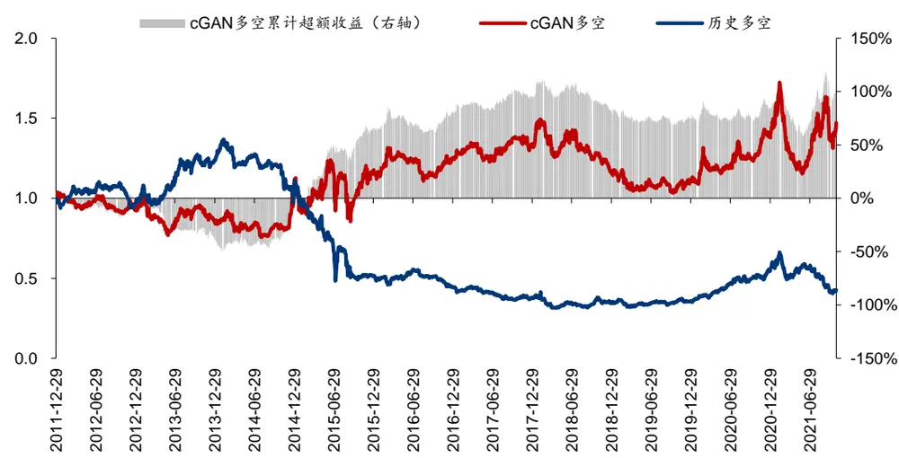
注：该策略为每个预测截面日开仓做多收益预测排名首位的板块，开仓做空收益预测排名末位的板块资料来源：Wind，华泰研究

当风险厌恶系数为 10时，均值方差模型净值如下图。

图表39： A股板块配置：不同均值和协方差预测方法应用于均值方差模型（风险厌恶系数为 10）
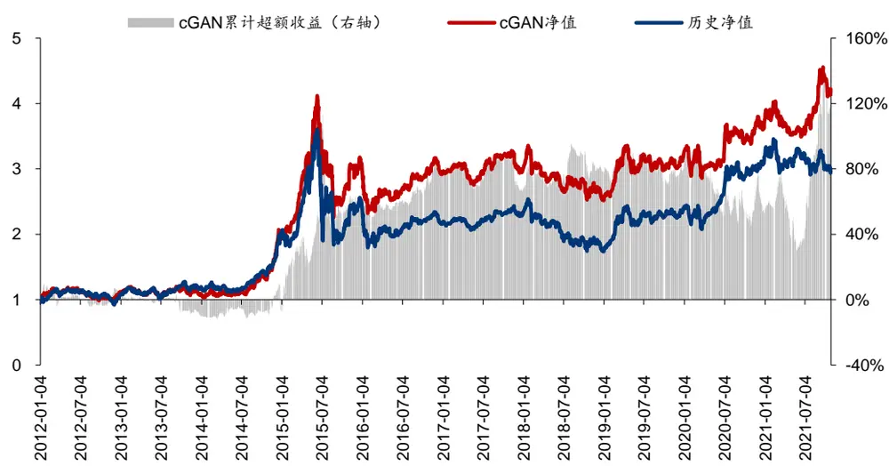
注：底层资产为中信金融、周期、消费、成长、稳定指数；回测区间为 2012-01-04 至 2021-10-29资料来源：Wind，华泰研究

风险平价模型以及三种风险厌恶系数下的均值方差模型回测指标如下表。相比历史收益和波动率方法，cGAN 在控制波动和控制回撤方面均具有稳定优势。夏普比率和 Calmar 比率普遍高于传统方法，仅在风险平价模型 Calmar比率一项上与传统方法持平。

图表40： A股板块配置：不同均值和协方差预测方法应用于资产配置模型回测指标

|  | 年化收益率 | 年化波动率 风险平价模型 | 夏普比率 | 最大回撤 | Calmar 比率 |
| --- | --- | --- | --- | --- | --- |
| cGAN | 11.49% | 23.61% | 0.49 | -53.57% | 0.21 |
| 历史 | 11.39% | 24.05% | 0.47 | -54.09% | 0.21 |
|  |  | 均值方差模型：风险厌恶系数为1 |  |  |  |
| CGAN | 13.59% | 26.26% | 0.52 | -50.22% | 0.27 |
| 历史 | 4.25% | 29.77% | 0.14 | -71.41% | 0.06 |
|  |  | 均值方差模型：风险厌恶系数为10 |  |  |  |
| CGAN | 16.28% | 22.59% | 0.72 | -45.26% | 0.36 |
| 历史 | 12.09% | 25.07% | 0.48 | -51.97% | 0.23 |
|  |  | 均值方差模型：风险厌恶系数为 25 |  |  |  |
| CGAN | 13.23% | 21.80% | 0.61 | -44.44% | 0.30 |
| 历史 | 13.66% | 23.38% | 0.58 | -46.61% | 0.29 |

注：底层资产为中信金融、周期、消费、成长、稳定指数；回测区间为 2012-01-04 至 2021-10-29资料来源：Wind，华泰研究

## 总结

本研究系统梳理条件生成对抗网络（cGAN）应用于资产配置的方法论，并提供相对全面的实证结果。依据预测对象分为收益协方差预测和均值预测两条主线展开。每条主线内部依次介绍预测方法、预测准确度评估和实践应用。在国内资产配置、全球资产配置和 A 股板块配置场景下，考察 cGAN 在风险预算模型和均值方差模型中的表现。结果表明，cGAN总体优于基于历史收益和波动率的传统资产配置方法。

cGAN 预测资产收益均值及协方差的核心思想是：以多资产过去 40 个交易日收益率序列作为条件信息，结合随机数序列，引导 cGAN 模型生成多资产未来 20 个交易日收益率序列，计算 20 日区间收益率及协方差。由于随机数的存在，每次生成结果存在差异。基于 1000次生成结果，计算收益率均值及协方差均值。cGAN均值预测有别于传统基于动量方法，协方差预测有别于传统基于历史波动率方法。

为评估 cGAN 协方差预测准确度，设计多项衡量预测协方差与真实协方差距离指标，分别为特征值分布、Frobenius 距离和相关矩阵距离。结果表明 cGAN 方法预测协方差相比历史波动率方法更接近未来真实协方差。将cGAN和历史波动率方法分别应用于风险平价模型，比较 1）各资产实际仓位与理想仓位，2）各资产实际风险分配与理想风险分配，结果表明cGAN 在仓位分配和风险分配上均更接近理想情形。

从基本统计指标和多空回测角度，评估 cGAN 收益均值预测准确度。cGAN 使用跨度较短的最新数据进行预测，相比历史收益方法使用跨度较长的历史数据，cGAN 对市场近期变化较敏感，而基于历史收益方法的预测值波动低于 cGAN 预测收益和真实收益。cGAN 预测单资产绝对收益表现不佳，预测多资产相对收益排名表现较好。

将 cGAN 对收益协方差的预测应用于风险预算模型，将 cGAN 对收益均值及协方差的预测应用于均值方差模型。结果表明，在国内资产配置、全球资产配置以及 A 股板块配置场景下，相比传统的基于历史收益和波动率方法，cGAN在获取收益、控制波动和控制回撤方面具有稳定优势，夏普比率和 Calmar 比率普遍高于传统方法。

本研究仍有以下未尽之处：1）cGAN 模型超参数较多，由于模型训练时间开销大，超参数未经优化，有待进行系统性调参测试；2）cGAN 模型对随机数种子较敏感，有待进行更大规模的敏感性测试；3）目前仅采用历史收益率数据作为条件信息，成交量和各类经济指标等数据对未来收益和风险预测也可能有效，条件信息有待进一步丰富；4）cGAN模型在本研究设置的三项测试场景中有效，在其他底层资产乃至选股场景下的有效性有待探索。

## 参考文献

Zhu, Y. , Mariani, G. , & Li, J. . (2020). Pagan: portfolio analysis with generative adversarial networks. SSRN Electronic Journal.

## 风险提示

cGAN 模型的训练结果对随机数种子、超参数较为敏感；模型根据历史规律总结，历史规律可能失效；模型结论基于统计工具得到，在极端情形下或存在解释力不足的风险。

## 免责声明

## 分析师声明

本人，林晓明、李子钰、何康，兹证明本报告所表达的观点准确地反映了分析师对标的证券或发行人的个人意见；彼以往、现在或未来并无就其研究报告所提供的具体建议或所表迖的意见直接或间接收取任何报酬。

## 一般声明及披露

本报告由华泰证券股份有限公司（已具备中国证监会批准的证券投资咨询业务资格，以下简称“本公司”）制作。本报告所载资料是仅供接收人的严格保密资料。本报告仅供本公司及其客户和其关联机构使用。本公司不因接收人收到本报告而视其为客户。

本报告基于本公司认为可靠的、已公开的信息编制，但本公司及其关联机构(以下统称为“华泰”)对该等信息的准确性及完整性不作任何保证。

本报告所载的意见、评估及预测仅反映报告发布当日的观点和判断。在不同时期，华泰可能会发出与本报告所载意见、评估及预测不一致的研究报告。同时，本报告所指的证券或投资标的的价格、价值及投资收入可能会波动。以往表现并不能指引未来，未来回报并不能得到保证，并存在损失本金的可能。华泰不保证本报告所含信息保持在最新状态。华泰对本报告所含信息可在不发出通知的情形下做出修改，投资者应当自行关注相应的更新或修改。

本公司不是 FINRA 的注册会员，其研究分析师亦没有注册为 FINRA 的研究分析师/不具有 FINRA 分析师的注册资格。

华泰力求报告内容客观、公正，但本报告所载的观点、结论和建议仅供参考，不构成购买或出售所述证券的要约或招揽。该等观点、建议并未考虑到个别投资者的具体投资目的、财务状况以及特定需求，在任何时候均不构成对客户私人投资建议。投资者应当充分考虑自身特定状况，并完整理解和使用本报告内容，不应视本报告为做出投资决策的唯一因素。对依据或者使用本报告所造成的一切后果，华泰及作者均不承担任何法律责任。任何形式的分享证券投资收益或者分担证券投资损失的书面或口头承诺均为无效。

除非另行说明，本报告中所引用的关于业绩的数据代表过往表现，过往的业绩表现不应作为日后回报的预示。华泰不承诺也不保证任何预示的回报会得以实现，分析中所做的预测可能是基于相应的假设，任何假设的变化可能会显著影响所预测的回报。

华泰及作者在自身所知情的范围内，与本报告所指的证券或投资标的不存在法律禁止的利害关系。在法律许可的情况下，华泰可能会持有报告中提到的公司所发行的证券头寸并进行交易，为该公司提供投资银行、财务顾问或者金融产品等相关服务或向该公司招揽业务。

华泰的销售人员、交易人员或其他专业人士可能会依据不同假设和标准、采用不同的分析方法而口头或书面发表与本报告意见及建议不一致的市场评论和/或交易观点。华泰没有将此意见及建议向报告所有接收者进行更新的义务。华泰的资产管理部门、自营部门以及其他投资业务部门可能独立做出与本报告中的意见或建议不一致的投资决策。投资者应当考虑到华泰及/或其相关人员可能存在影响本报告观点客观性的潜在利益冲突。投资者请勿将本报告视为投资或其他决定的唯一信赖依据。有关该方面的具体披露请参照本报告尾部。

本报告并非意图发送、发布给在当地法律或监管规则下不允许向其发送、发布的机构或人员，也并非意图发送、发布给因可得到、使用本报告的行为而使华泰违反或受制于当地法律或监管规则的机构或人员。

本报告版权仅为本公司所有。未经本公司书面许可，任何机构或个人不得以翻版、复制、发表、引用或再次分发他人(无论整份或部分)等任何形式侵犯本公司版权。如征得本公司同意进行引用、刊发的，需在允许的范围内使用，并需在使用前获取独立的法律意见，以确定该引用、刊发符合当地适用法规的要求，同时注明出处为“华泰证券研究所”，且不得对本报告进行任何有悖原意的引用、删节和修改。本公司保留追究相关责任的权利。所有本报告中使用的商标、服务标记及标记均为本公司的商标、服务标记及标记。

## 中国香港

本报告由华泰证券股份有限公司制作,在香港由华泰金融控股（香港）有限公司向符合《证券及期货条例》及其附属法律规定的机构投资者和专业投资者的客户进行分发。华泰金融控股（香港）有限公司受香港证券及期货事务监察委员会监管，是华泰国际金融控股有限公司的全资子公司，后者为华泰证券股份有限公司的全资子公司。在香港获得本报告的人员若有任何有关本报告的问题,请与华泰金融控股（香港）有限公司联系。

## 香港-重要监管披露

- 华泰金融控股（香港）有限公司的雇员或其关联人士没有担任本报告中提及的公司或发行人的高级人员。

- 有关重要的披露信息，请参华泰金融控股（香港）有限公司的网页 https://www.htsc.com.hk/stock_disclosure其他信息请参见下方 “美国-重要监管披露”。

## 美国

在美国本报告由华泰证券（美国）有限公司向符合美国监管规定的机构投资者进行发表与分发。华泰证券（美国）有限公司是美国注册经纪商和美国金融业监管局（FINRA）的注册会员。对于其在美国分发的研究报告，华泰证券（美国）有限公司根据《1934 年证券交易法》（修订版）第 15a-6 条规定以及美国证券交易委员会人员解释，对本研究报告内容负责。华泰证券（美国）有限公司联营公司的分析师不具有美国金融监管（FINRA）分析师的注册资格，可能不属于华泰证券（美国）有限公司的关联人员，因此可能不受 FINRA 关于分析师与标的公司沟通、公开露面和所持交易证券的限制。华泰证券（美国）有限公司是华泰国际金融控股有限公司的全资子公司，后者为华泰证券股份有限公司的全资子公司。任何直接从华泰证券（美国）有限公司收到此报告并希望就本报告所述任何证券进行交易的人士，应通过华泰证券（美国）有限公司进行交易。

## 美国-重要监管披露

- 分析师林晓明、李子钰、何康本人及相关人士并不担任本报告所提及的标的证券或发行人的高级人员、董事或顾问。分析师及相关人士与本报告所提及的标的证券或发行人并无任何相关财务利益。本披露中所提及的“相关人士”包括 FINRA 定义下分析师的家庭成员。分析师根据华泰证券的整体收入和盈利能力获得薪酬，包括源自公司投资银行业务的收入。

华泰证券股份有限公司、其子公司和/或其联营公司, 及/或不时会以自身或代理形式向客户出售及购买华泰证券研究所覆盖公司的证券/衍生工具，包括股票及债券（包括衍生品）华泰证券研究所覆盖公司的证券/衍生工具，包括股票及债券（包括衍生品）。

- 华泰证券股份有限公司、其子公司和/或其联营公司, 及/或其高级管理层、董事和雇员可能会持有本报告中所提到的任何证券（或任何相关投资）头寸，并可能不时进行增持或减持该证券（或投资）。因此，投资者应该意识到可能存在利益冲突。

## 评级说明

投资评级基于分析师对报告发布日后 6 至 12个月内行业或公司回报潜力（含此期间的股息回报）相对基准表现的预期（A股市场基准为沪深 300 指数，香港市场基准为恒生指数，美国市场基准为标普 500 指数），具体如下：

## 行业评级

增持：预计行业股票指数超越基准

中性：预计行业股票指数基本与基准持平

减持：预计行业股票指数明显弱于基准

## 公司评级

买入：预计股价超越基准 15%以上

增持：预计股价超越基准 5%~15%

持有：预计股价相对基准波动在-15%~5%之间

卖出：预计股价弱于基准 15%以上

暂停评级：已暂停评级、目标价及预测，以遵守适用法规及/或公司政策

无评级：股票不在常规研究覆盖范围内。投资者不应期待华泰提供该等证券及/或公司相关的持续或补充信息

## 法律实体披露

中国：华泰证券股份有限公司具有中国证监会核准的“证券投资咨询”业务资格，经营许可证编号为：91320000704041011J香港：华泰金融控股（香港）有限公司具有香港证监会核准的“就证券提供意见”业务资格，经营许可证编号为：AOK809美国：华泰证券（美国）有限公司为美国金融业监管局（FINRA）成员，具有在美国开展经纪交易商业务的资格，经营业务许可编号为：CRD#:298809/SEC#:8-70231

## 华泰证券股份有限公司

南京南京市建邺区江东中路228号华泰证券广场1号楼/邮政编码：210019

电话：86 25 83389999/传真：86 25 83387521电子邮件：ht-rd@htsc.com

## 深圳

深圳市福田区益田路5999号基金大厦10楼/邮政编码：518017电话：86 755 82493932/传真：86 755 82492062电子邮件：ht-rd@htsc.com

## 华泰金融控股（香港）有限公司

香港中环皇后大道中 99号中环中心 58楼 5808-12室
电话：+852-3658-6000/传真：+852-2169-0770
电子邮件：research@htsc.com
http://www.htsc.com.hk

## 华泰证券（美国）有限公司

美国纽约哈德逊城市广场 10号 41楼（纽约 10001）
电话：+212-763-8160/传真：+917-725-9702
电子邮件: Huatai@htsc-us.com
http://www.htsc-us.com

©版权所有2021年华泰证券股份有限公司

北京
北京市西城区太平桥大街丰盛胡同28号太平洋保险大厦A座18层/
邮政编码：100032
电话：86 10 63211166/传真：86 10 63211275
电子邮件：ht-rd@htsc.com
上海
上海市浦东新区东方路18号保利广场E栋23楼/邮政编码：200120
电话：86 21 28972098/传真：86 21 28972068
电子邮件：ht-rd@htsc.com