# 人工智能 51：文本 PEAD选股策略

华泰研究

2022 年 1 月 07 日│中国内地

## 深度研究

## 基于业绩公告相关文本的 SUE.txt 因子可以刻画 PEAD 效应

盈余后价格漂移效应（PEAD）是指股价在盈余公告发布后有较大概率向业绩高于或低于预期的方向漂移。传统 SUE 因子基于公告财务数据来衡量PEAD 效应并预测股票的异常收益，而本文尝试从纯文本的角度出发构建文本 SUE.txt 因子，对文本进行解构从而挖掘 alpha 信息。基于业绩预告与相关研报文本的数据实证表明，SUE.txt 因子具有较强的选股能力，机器学习模型对文本的拆分和解构与直观逻辑相符，模型可信度较高。最后使用华泰金工因子库对 SUE.txt 基础池进行增强，20130104-20211231 回测期年化收益 43.47%，相对中证 500 超额年化收益 29.98%；2021 年收益 52.79%。

滚动训练构建 SUE.txt 因子，特征为词频矩阵，标签为公告前后 2日 AR本文使用的公告为业绩预告，相关文本为分析师点评业绩预告研报文本标题和摘要。在对上述文本进行分词后，保留给定词性并选择样本内标题出现次数最多的 100 词和摘要出现次数最多的 500 词构建词频矩阵，作为模型的训练特征。同时计算业绩预告发布前后 2 个交易日相对中证 500 的超额收益，将其分为“上涨”、“震荡”、“下跌”三类，作为训练标签。最后，本文分别测试了 Logistic 模型和 XGBoost 模型，将模型预测的上涨和下跌类别的 log-odds 值之差，在进行指数衰减后，作为最终的 SUE.txt 因子。

## SUE.txt 因子分层选股效果优秀，XGBoost 模型优于 Logistic 模型

每月末追溯过去一季度业绩预告并计算相应的 SUE.txt 因子进行分 5 层回测。从结果来看，基于 XGBoost 模型和 Logistic 模型分别构建的 SUE.txt因子分层表现均较为优秀，其中 XGBoost 模型的多头端收益与分层效果均优于 Logistic 模型，两者在第一层股票池的年化收益分别为 27.62%与24.68%，回测期为 20130104-20211231。此外，本文使用构建训练标签的2 日 AR 特征，在进行同样的指数衰减处理后直接作为因子进行回测，发现SUE.txt 因子在盈利能力和分层能力上均显著强于 2 日 AR 因子，说明SUE.txt 因子对 2 日 AR因子具有明显的增益效果。

## 模型可解释性探索：词重要性分析结果与直观逻辑相符合

本文参考 Yano 等（2012）提出的词重要性和 Meursault 等（2021）采用的段落重要性概念，对模型的可解释性进行了探索。对词重要性分析的结果表明，“上调”、“预增”、“景气”等词对 SUE.txt 有较大的正面影响，而“下调”、“下滑”、“亏损”等词则有较大的负面影响，与直观逻辑相符。进一步本文构建了包含财报、运营、宏观环境和战略四大类的分类词典，将文本段落按其所包含的关键词进行分类。分析发现，描述宏观环境的段落占比最低，对 SUE.txt 有较大的正面影响；描述运营的段落占比最高，对 SUE.txt 有较大的负面影响；此外，描述财报的段落则包含较多好坏参杂的重要信息。

## 利用华泰金工因子库对 SUE.txt 股票池进行增强

本文选取 SUE.txt 因子的第一层股票分层作为基础池，选择华泰金工因子中分层效果较好且多头收益明显的因子对股池内的股票进行等权合成打分，并选择得分最高的 30 只股票作为增强池。在回测期 20130104-20211231 内，增强池年化收益 43.47%，夏普比率 1.57；相对中证 500 年化超额收益29.98%，2021 年绝对收益 52.79%，超额收益 36.19%。对成分股分析表明，SUE.txt 基础池与增强池在各板块的股票数量分布较为均衡，未出现板块明显超配的情况。

风险提示：通过机器学习模型构建选股策略是历史经验的总结，存在失效的可能。人工智能模型可解释程度较低，使用须谨慎。

研究员

SAC No. S0570516010001

林晓明

linxiaoming@htsc.com

SFC No. BPY421

+86-755-82080134

研究员

SAC No. S0570520080004

何康，PhD

SFC No. BRB318

hekang@htsc.com

+86-21-28972039

研究员

李子钰

SAC No. S0570519110003

SFC No. BRV743

liziyu@htsc.com

+86-755-23987436

联系人

陈伟

SAC No. S0570121070169 chenwei018440@htsc.com

## SUE.txt 增强池回测结果

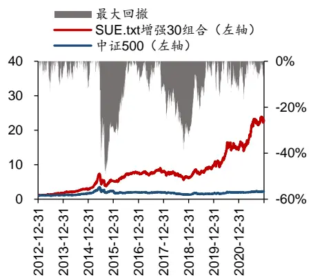
资料来源：Wind，朝阳永续，华泰研究

## 文本 PEAD选股框架

## PEAD 效应回顾

盈余后价格漂移效应（Post Earnings Announcement Drift, PEAD）最早由芝加哥大学 RayBall和 Philip Brown 在 1968 年提出，指的是盈利高于预期的股票会有较大概率在盈余公告后 3 个月内出现正向超额收益，而亏损高于预期的股票则会有较大概率在公告后的 3 个月内出现负向超额收益。PEAD 效应主要可归因于投资者反应不足，即由于其注意力的有限性，无法及时对公司盈利信息做出充分解读和反应，由此导致了 PEAD 现象的产生和持续。

作为广泛存在于各个时间区间和各个股票市场的异常现象，PEAD 效应自被提出以来便受到了业界和学术界的广泛关注。在过去的近 50 年间，投资者通常使用过往财报和分析师预期等财务数据计算标准化预期外盈利（Standardized Unexpected Earnings, SUE）指标来衡量 PEAD 效应，其计算方式为

$$
SUE=~{\frac{R_{t}-E_{t}}{\sigma(R_{t}-E_{t})}}
$$

其中 $R_{t}$ 表示 t期的实际盈利水平， $E_{t}$ 表示 t期的预期盈利水平， $\sigma(R_{t}-E_{t})$ 表示预期偏差的波动率。

## 文本 SUE.txt 因子的提出思路

传统基于财务数据计算的SUE因子不是本文关注的重点，本文重点关注与盈余公告相关的文本数据中蕴含的 alpha信息。传统SUE因子主要基于公告财务指标来预测股票的异常收益，其内含逻辑为财务指标在预期之外的好坏能一定程度上影响投资者未来的行为，并可以此推断股票是否会有异常收益。公告相关的文本数据与此类似，以分析师对业绩预告解读的文本为例，其更为直接地体现了分析师对业绩预告的理解和对公司未来盈利能力的预判，同样也能帮助预测股票是否会有异常收益。两种方法各有千秋，而本文将主要讨论后者。

具体来说，本文借鉴 Meursault 等（2021）的做法，构建了一种基于盈余公告相关文本数据的新型 SUE因子（下文简称 SUE.txt）。藉由盈余公告发布以后的相关文本与个股的异常收益，通过训练监督式机器学习分类模型的方式来实现对股票预期之外收益能力的预测。与传统 SUE 因子的计算方式不同，基于文本的方法不对盈余公告及相关文本中提及的任何财务数字进行计算，而仅侧重于语义拆解，通过对文本中提及的最常见词的分析，来挖掘对应股票产生公告后正向价格漂移的能力。

图表1： SUE.txt 计算框架图
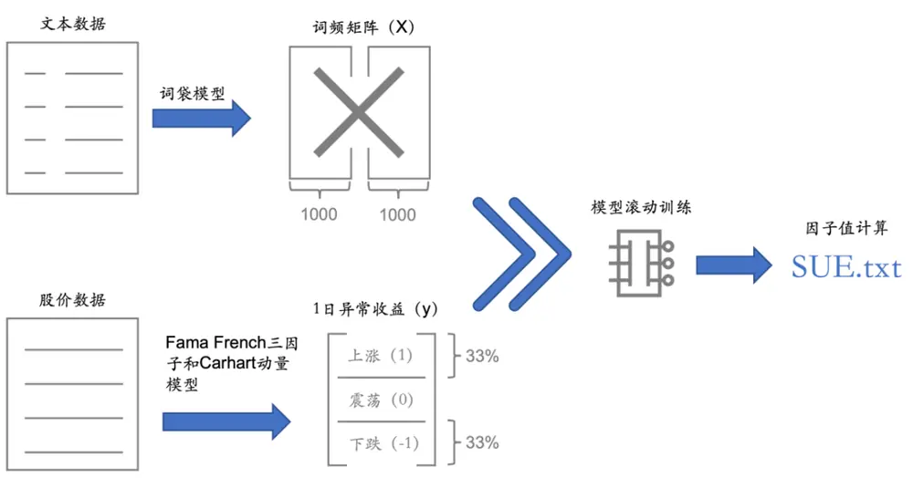
资料来源：PEAD.txt： Post-Earnings-Announcement Drift Using Text, 华泰研究

Meursault 等（2021）尝试使用如上框架在美股构建了 SUE.txt 因子，实证效果表明 SUE.txt因子不逊色于传统 SUE 因子。在该文中，作者使用沃顿数据（Wharton Research DataServices，WRDS) 平台上的美股上市公司盈余公告说明本文（Presentation）和问答（Q&A）环节的对话文本数据，采用词袋模型将上述文本词向量化，并构建词频矩阵，作为模型训练的特征（X）；同时将盈余公告发布后 1日异常收益特征三等分并进行标签化处理（“上涨”、“震荡”、“下跌”），作为模型训练的标签（y）。最后使用正则化逻辑回归模型，以滚动的形式（8 季度训练+1 季度测试）进行模型训练，并基于模型的“上涨”和“下跌”分类的log-odds 值计算最终的 SUE.txt 因子。

## 业绩公告与文本数据

A股的业绩公告主要有业绩预告、业绩快报和定期报告三类。各类型业绩公告的时间线如下图所示。下面我们展开描述三类业绩公告的具体内容。

图表2： A股市场的三类业绩公告 Timeline
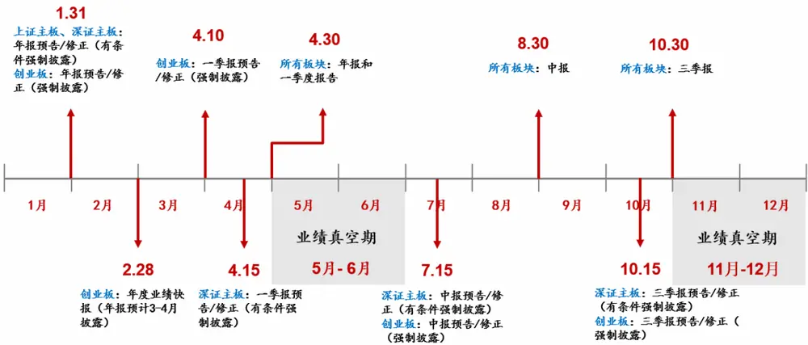
资料来源：上交所、深交所、华泰研究

## 定期报告

定期报告，即正式的季报、半年报和年报，为强制性披露，其主要反映了上市公司在该报告期内的经营和财务状况，包含公司的基本情况、主要会计数据和财务指标等信息。与业绩预告和业绩快报相较，定期报告内容最为详实、信息最为丰富、且披露要求最为严格。

## 业绩预告

业绩预告为上市公司在定期公告发布前，经营业绩有超常情况，达到披露条件而强制被动披露或者自愿披露的业绩预先报告，其主要披露了公司对下一季度（年度）的盈利预计情况。业绩预告可以单独进行披露，也可以在定期报告内对下一季度内的业绩进行预告，例如在正式的一季报内披露二季度的业绩预告。此外，如公司发现披露的业绩预告与实际业绩发生盈亏变化、预告金额或幅度差异较大等情况时，需要进行业绩预告修正。

图表3： 沪深主板业绩预告（修正）披露内容

|  | 若业绩预期将亏损或与上年同期相比扭亏为盈 |  | 若业绩预期与上年同期均盈利，且与上年同期相比将出现大幅变动 |  |
| --- | --- | --- | --- | --- |
| 项目 | 本报告期 | 上年同期 | 本报告期 | 上年同期 |
|  | 归属于上市公司股东的盈利/亏损：__万元-_万元 | 盈利/亏损：__万元 | 比上年同期增长/下降：__%-__%， | 盈利/亏损：__万元 |
| 净利润 基本每股收益 | 盈利/亏损：约__元 | 盈利/亏损：约__元 | 盈利/亏损：__万元-__万元 盈利/亏损：约__ | 盈利/亏损：约__元 |

资料来源：上交所、深交所、华泰研究

图表4： 沪深主板业绩预告（修正）披露规则

| 所属板块 上证主板 | 业绩预告 有条件强制披露，预计全年可能出现亏损、 | 业绩预告修正公告 业绩预告后，预计本期业绩与已披露的业绩预告情况差异 | 备注 基数过小除外：是指上市公司出现"净利 |
| --- | --- | --- | --- |
| 深证主板 | 扭亏为盈、净利润较前一年度增长或下降 50%以上（基数过小除外），应当披露年度 业绩预告。 有条件强制披露：净利润为负值：或预计净 利润与上年同期相比上升或者下降50%以 | 较大的情形 1.最新预计业绩或财务状况与已披露的业绩预告变动方向 不一致； 2.原业绩预告为区间，最新预计业绩高于原预告区间金额 | 润较前一年度增长或下降50%以上"情 形，且以每股收益作为比较基数较小的， 经交易所同意可以豁免进行业绩预告： 1.上一年年度报告每股收益绝对值低于或 等于0.05元； 2.上一期中期报告每股收益绝对值低于或 等于0.03元； |
| 创业板 | 强制披露：公司未在上一次定期报告中对本 报告期进行业绩预告的，应当及时以临时报 | 上限20%或低于原预告区间金额下限 20%; 3.原业绩预告为确定数，最新预计金额比原预告金额变动 达到50%以上； 4.其他重大差异情况。 1.最新预计的业绩变动方向与已披露的业绩预告不一致； 2.最新预计的业绩变动幅度或者盈亏金额超出原先预计范 围的 20%或者以上； | 3.上一期年初至第三季度报告期末每股收 益绝对值低于或等于0.04元。 |

资料来源：上交所、深交所、华泰研究

## 业绩快报

业绩快报通常在定期报告前单独发布，主要披露内容包括当年及上年同期主营业务收入、主营业务利润、利润总额、净利润、总资产、净资产、每股收益净资产收益率等数据和指标。业绩快报不强制要求披露：上证主板的上市公司可以在年度报告和中期报告披露前发布业绩快报；深圳主板鼓励上市公司在定期报告披露前主动披露快报，且对于拟发布第一季度报告业绩预告但其上年年报尚未披露的上市公司，应当在发布业绩预告的同时披露其上年度的业绩快报。

图表5： 沪深主板业绩快报（修正）披露规则

| 所属板块 | 业绩快报 | 业绩快报修正公告 | 备注 |
| --- | --- | --- | --- |
| 上证主板 | 不强制披露，公司如果已经汇总完成当期 | 在披露定期报告之前，公司若发现有关财务数据和指 | 若有关财务数据和指标的差异幅度达到20%以 |
|  | 财务数据，但因为年报尚没有编制完成， | 标的差异幅度将达到10%的，应当及时披露业绩快报 | 上的，上市公司应当在披露相关定期报告的同 |
|  | 可以先行对外披露业绩快报。 | 更正公告，说明具体差异及造成差异的原因。 | 时，以董事会公告的形式进行致歉，并说明差异 |
|  | 不强制披露，鼓励上市公司在定期报告披 | 上市公司在披露业绩快报后，如出现实际业绩与业绩 | 内容、原因及对公司内部责任人的认定情况等。 |
| 创业板 | 露前，主动披露定期报告业绩快报。 | 快报存在重大差异的，应当及时发布业绩快报修正公 |  |
|  | 有条件强制披露，鼓励上市公司在定期报 | 告。 |  |
|  |  | 年度报告预约在3-4月份，应在2月底之前披露年度 |  |
|  | 告披露前，主动披露定期报告业绩快报。 | 业绩快报；年度报告预约披露时间在3月份之前的公 |  |
|  |  | 司可不披露年度业绩快报。鼓励半年度报告预约披露 |  |
|  |  | 时间在8月份的公司在7月底前披露半年度业绩快 |  |
|  |  | 报。半年报和季报业绩快报不强制披露。 |  |

资料来源：上交所、深交所、华泰研究

图表6： 三类业绩说明方式的对比

|  | 业绩预告 | 业绩快报 | 定期报告 |
| --- | --- | --- | --- |
| 披露要求 | 有条件强制披露 | 不强制披露 | 要求披露 |
| 披露时间 | 早于业绩快报和定期报告 | 定期报告发布前 | 最晚 |
| 披露内容 | 预计经营业绩 | 主要财会和经营数据 | 所有财会和经营数据 |

资料来源：上交所、深交所、华泰研究

## 相关文本

不同业绩公告的具体内容差别较大，涉及到的相关文本数据也有所不同。具体来说主要包括以下几类：

1. 公告后的卖方分析师点评文本：个股发布业绩公告以后市场上的卖方分析师会及时发布点评或解读，这类文本数据包含较为明显的情感倾向；

2. 业绩公告本身的陈述文本：这类文本主要是指年报/半年报中的管理层讨论与分析文本，为公司管理层对财务报告与经营情况的解释分析，及对公司未来发展所面临的挑战和机遇进行说明；

3. 业绩公告相关的业绩说明会问答文本：上市公司发布业绩说明以后召开的业绩说明会会回答投资者对公司业绩及经营状况的相关提问，基于此所形成的问答文本也是一类重要业绩公告相关文本，可能包含无法书面说明的公司信息；

4. 其他文本：如业绩公告后的新闻文本、舆情文本等。

本文将主要使用业绩预告与相对应的分析师研报点评文本。

图表7： 业绩公告相关文本
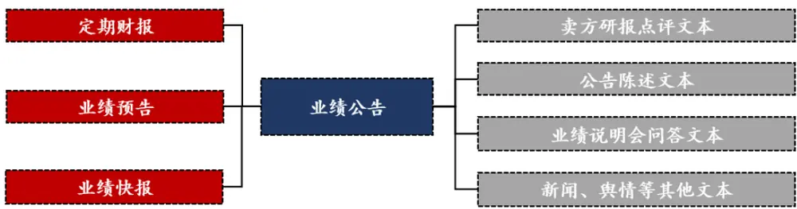
资料来源：华泰研究

## SUE.txt 因子构建

本章主要介绍基于文本的 SUE.txt 因子的构建与回测，主要分为数据预处理、机器学习模型训练、分层回测和结果的可解释性分析等部分。

## 数据预处理

## 数据来源

本文使用的公司业绩预告数据来自于万得底表 AShareProfitNotice，每条样本为一条预告，其数据包含了每支股票业绩预告的发布时间、预告财报期、预期净利润增速上下限、预期净利润上下限等字段。本文使用的卖方分析师研报文本数据来自于朝阳永续盈利预测数据库中的个股报告基础信息表 DER_REPORT_RESEARCH，数据回溯区间为 2011-01-01 至2021-12-31，每条样本为一篇报告，其数据包含股票代码、研报标题、研报摘要、研报发布时间等字段。两组数据的示例如以下两张图表所示。

图表8： 个股业绩预告数据示例

| 预期净利润增预期净利润增速 |  |  |  |  |  | 预期净利润下限预期净利润上限 |  |
| --- | --- | --- | --- | --- | --- | --- | --- |
| 证券代码 | 证券名称 | 发布日期 | 预告财报期 | 速下限（%） | 上限（%） | (万元) | (万元) |
| 300738.SZ | 奥飞数据 | 2021-01-04 | 20201231 | 50.11 | 53.48 | 15580 | 15930 |
| 300146.SZ | 汤臣倍健 | 2021-01-04 | 20201231 | 496.75 | 555.48 | 141200 | 162100 |
| 002416.SZ | 爱施德 | 2021-01-04 | 20201231 | 97.86 | 118.23 | 68000 | 75000 |
| 300031.SZ | 宝通科技 | 2021-01-05 | 20201231 | 30 | 40 | 39655 | 42706 |

资料来源：Wind，华泰研究

图表9： 个股报告基础信息表数据示例

| 证券代码 | 证券名称 | 报告日期 | 报告标题 | 报告摘要 |
| --- | --- | --- | --- | --- |
| 300738.SZ | 奥飞数据 | 2021-01-05 | 奥飞数据：Q4业绩高增，IDC业务迈入发展快车道 | XXX |
| 300738.SZ | 奥飞数据 | 2021-01-06 | 奥飞数据公司动态点评：机柜高速增长，全年业绩亮眼 | XXX |
| 300738.SZ | 奥飞数据 | 2021-01-06 | 奥飞数据：业绩基本符合预期，储备项目均稳步推进 | XXX |
| 300738.SZ | 奥飞数据 | 2021-01-07 | 奥飞数据：Q4扣非归母净利润增长加速，业绩步入快速提升期 | XXX |
| 300146.SZ | 汤臣倍健 | 2021-01-04 | 汤臣倍健：非经损益增长明显，主业保持平稳增长 | XXX |
| 300146.SZ | 汤臣倍健 | 2021-01-04 | 汤臣倍健：4Q投放力度空前，着眼中长期发展 | XXX |

资料来源：朝阳永续，华泰研究

## 数据匹配

由于难以精确定位与业绩预告相关的所有研报，因此我们假设业绩预告发布后的 5 个自然日内的所有个股相关研报都是对该业绩预告作出的评论和解读。

图表10： 数据匹配示意图
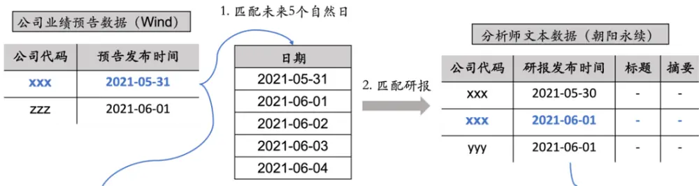

3. 匹配前后交易日

|  | 日期 |
| --- | --- |
| 前交易日 | 2021-05-28 |
| 后交易日 | 2021-06-01 |

4. 计算超额收益
资料来源：华泰研究

| 日期 | 股票调整后收盘价 | 中证500点位 | 超额收益 |
| --- | --- | --- | --- |
| 2021-05-28 | 100 | 6668 | 8.92% |
| 2021-06-01 | 110 | 6740 |  |

5. 合并报表

| 公司代码 | 发布时间 | 标题 | 摘要 | 超额收益 |
| --- | --- | --- | --- | --- |
| XXX | 2021-06-01 | - | - | 8.92% |

匹配过程中，我们首先读取万得的公司业绩预告数据，对于其中每一条业绩预告，我们根据其发布时间从朝阳永续的个股报告基础信息表中匹配未来 5 个自然日内的研报数据。同时，我们也对股票业绩预告发布前、后两个交易日内的收盘价进行了匹配，并以中证 500同一时间段内的收益作为基准，计算该股票该次业绩预告的两日异常收益（AbnormalReturn, AR）。

图表11： 业绩预告与研报匹配结果数据示例

| 证券代码 | 证券名称 | 预告发布时间 预告期 |  | 研报发布时间 | 研报标题 | 研报摘要 | 预告 AR |
| --- | --- | --- | --- | --- | --- | --- | --- |
| 300738.SZ | 奥飞数据 | 2021-01-04 | 20201231 | 2021-01-05 | 奥飞数据：Q4 业绩高增，IDC 业务迈入发展快车道 | XXX | 4.31% |
| 300738.SZ | 奥飞数据 | 2021-01-04 | 20201231 | 2021-01-06 | 奥飞数据公司动态点评：机柜高速增长，全年业绩亮眼 | XXX | 4.31% |
| 300738.SZ | 奥飞数据 | 2021-01-04 | 20201231 | 2021-01-06 | 奥飞数据：业绩基本符合预期，储备项目均稳步推进 | XXX | 4.31% |
| 300738.SZ | 奥飞数据 | 2021-01-04 | 20201231 | 2021-01-07 | 奥飞数据：Q4扣非归母净利润增长加速，业绩步入快速提升期 | XXX | 4.31% |
| 300146.SZ | 汤臣倍健 | 2021-01-04 | 20201231 | 2021-01-04 | 汤臣倍健：非经损益增长明显，主业保持平稳增长 | XXX | -0.56% |
| 300146.SZ | 汤臣倍健 | 2021-01-04 | 20201231 | 2021-01-04 | 汤臣倍健：4Q投放力度空前，着眼中长期发展 | XXX | -0.56% |

资料来源：Wind，朝阳永续，华泰研究

## 文本分词

完成数据匹配后，我们使用 Jieba 分词对研报的文本和摘要数据进行分词处理。利用 Jieba分词的词性标注功能，本文对分词后的文本根据其词性仅保留普通名词、专有名词、动词、副动词、动名词、形容词、副词对应的词语作为清洗后的数据。

图表12： 分词示意图
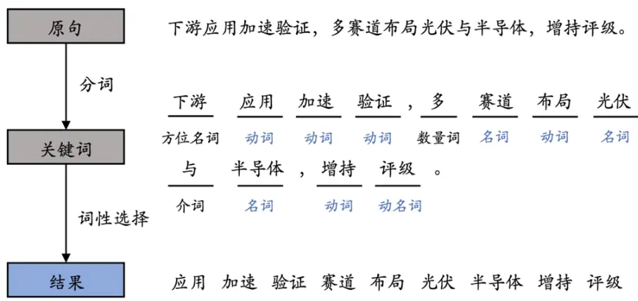
资料来源：华泰研究

## 模型训练与测试

本文使用滚动的形式进行模型训练，训练与测试流程分为以下几个步骤：

1. 数据集划分：每轮滚动确定样本内数据集与样本外数据集；

2. 特征与标签生成：对样本内文本进行词向量化并生成特征X与标签Y，记录使用的词语；

3. 训练：样本内进行 K折交叉验证训练，寻找最优参数；

4. 样本外预处理：对样本外文本进行词向量化，基于样本内所使用的词语；

5. 预测及因子构建：使用交叉验证得到的最优模型对样本外进行预测，并构建原始SUE.txt因子；

6. 因子衰减：将原始 SUE.txt 因子衰减至截面期得到调整后 SUE.txt 因子。

## 数据集划分

每次滚动样本内为过去24个月，样本外为未来12个月。例如对于某轮样本外的首月T月来说，我们将 T-24 至 T-1 月的数据作为样本内，T 月至 T+11 月的数据作为样本外；下一迭代期则以T-12月至T+11月的数据作为样本内，T+12至T+23月的数据作为样本外；以此类推。

图表13： 滚动训练示意图
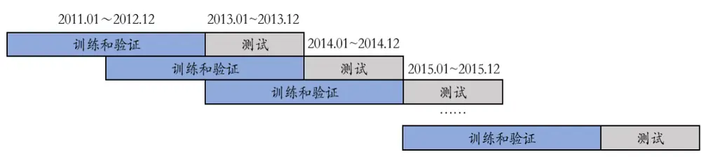
资料来源：华泰研究

## 特征处理与标签提取

我们使用 Python Scikit-learn 包中的 CountVectorizer 对分词结果进行向量化处理。CountVectorizer 是一个常见的文本特征提取方法，对于给定的训练文本，它可以计算每个词的出现频数，并将整个文本转换为对应的词频矩阵。每次滚动，我们以样本内的所有样本为整体，提取其研报标题出现频率最高的 100 个词、研报摘要出现频率最高的 500 个词，将文本转换为词频矩阵；上述做法的理由在于标题和摘要蕴含的信息量及词域丰富程度不同，因此选择的词语数量不同。最后将两个词频矩阵拼接，下图展示了文本数据转换为词频向量的结果。

图表14： A股市场的三类业绩公告 Timeline

| 特征X 标签Y |  |  |  |  |  |  |  |  |  |  |  |  |  |  |  |  |  |  |  |  |  |  |
| --- | --- | --- | --- | --- | --- | --- | --- | --- | --- | --- | --- | --- | --- | --- | --- | --- | --- | --- | --- | --- | --- | --- |
|  |  | 标题100词 |  |  |  |  |  |  |  |  | 摘要500词 [T-1,T+1] |  |  |  |  |  |  |  |  |  |  |  |
| 下滑 |  | 业务 | 业绩 | 中报 | 主业 | 产品 | 产能 | 亮眼 | u | 体化 一定 | 上升 |  | 上涨 | 上线 | 上行 | 上调 | 下滑 | 下行 | 下调 | 超额 |  |  |
| 样本1 |  | 1 | 0 | 1 | 0 | 0 | 0 | 0 | 0 | 0 | 0 |  |  | 0 | 0 | 0 |  |  |  | 2 1 |  |  |
|  |  | 0 | 0 | 0 | 1 | 0 | 1 | 0 |  | … | 0 | 0 | 0 0 | 0 |  | 1 | 0 | 0 0 | 1 1 | 0 | 2 | -1.50% … 2.00% |
| 样本2 |  |  |  | 0 | 0 | 1 | 1 | 0 |  | 1 | 1 | 1 | 1 | 1 |  | 0 | 0 | 0 | 0 | 0 | 0 |  |
| 样本3 | 1 | 1 |  |  |  |  |  |  | 0 |  |  |  |  |  |  |  |  |  |  |  | 0.20% |  |
| m | •• |  |  |  |  |  |  |  |  |  |  |  |  |  |  |  |  |  |  |  | m |  |
| 样本n |  |  |  |  |  |  |  |  |  |  |  |  |  |  |  |  |  |  |  |  | nn |  |

资料来源：华泰研究

计算出词频矩阵后，我们使用以下公式计算 log词频，作为我们训练模型的输入特征。

$$
X_{1}=\log(X_{0}+1)
$$

其中 $X_{0}$ 为原词频矩阵， $X_{1}$ 为处理后的训练特征。

对于样本外，我们做与样本内类似的处理，唯一不同之处是在使用 CountVectorizer 对其分词后的文本向量化的过程中，我们使用样本内（而非样本外）频率最高的 100 和 500 个词作为词典，构造 log词频矩阵。这是为了避免用到样本外的未来信息，同时保证样本内与样本外的文本分词词域相同。

对于样本内中此前计算的相对中证 500两日超额收益特征（不进行中性化处理），我们按以下方式将其分为三类后作为样本的训练标签：

1. 上涨（y = 1）：较大的正向超额收益，即样本的超额收益位于整体的前 30%；

2. 震荡（y = 0）：较低的正向或负向超额收益，即样本的超额收益位于整体的前 30%-70%；

3. 下跌（y = -1）：较大的负向超额收益，即样本的超额收益位于整体的后 30%。

## 逻辑回归模型与超参数选择

逻辑回归是广义线性模型的一种，用来解决有关“分类”的问题，其损失函数为：

$$
C(\overrightarrow{w})=\sum_{i=1}^{n}log(exp\Big(-y_{i}(X_{i}^{T}\overrightarrow{w}+c)\Big)+1)
$$

本文采用了弹性网络（elasticnet）正则化对逻辑回归模型的复杂度进行约束，模型的整体损失函数为：

$$
C(\vec{w})=\frac{1-p}{2}\vec{w}^{T}\vec{w}+p\|\vec{w}\|_{1}+\lambda\sum_{i=1}^{n}log(exp\Big({-y_{i}(X_{i}^{T}\vec{w}+c)}\Big)+1)
$$

其中∥w⃗ ∥ 代表向量w⃗ 的 1范数，参数p为 L1 正则化和 L2 正则化之间的分配比，参数λ为正则化强度系数的倒数，即当λ较小时，整体正则化强度更大。在训练时，我们将 L1 与 L2 正则化之间的分配比p设定为 0.5；参数λ则使用网格搜索和 5 折交叉验证的形式，选择验证集平均 AUC 最高的λ作为模型最终的超参数。

图表15： 逻辑回归超参数选择

| 基学习器 | 超参数 | 选择范围 |
| --- | --- | --- |
| Logistic Regression | 正则化强度倒数λ | [0.00001, 0.00003, 0.00006, 0.00008, 0.0001, 0.0003, 0.0006, |
|  |  | 0.0008, 0.001, 0.003, 0.006, 0.008, 0.01] |

资料来源：华泰研究

同时，由于本文处理的问题为多分类问题，我们使用 OvR（one-vs-rest）策略进行判别，即对第 K 类的分类决策，我们把所有该类样本作为正例，其他所有样本作为负例，在此基础上做二元逻辑回归，得到第 K类的分类模型。其他类别的分类模型同理。

## XGBoost 模型与超参数选择

极端梯度提升（XGBoost）是一种 Boosting集成算法，是通过将多个弱学习器（如决策树）以串联的方式组合起来的一个强学习器，其方式是通过弱学习器间的迭代，来不断缩小损失函数，XGBoost 训练流程示意如下。关于 XGBoost 模型的详细介绍可参考《华泰人工智能系列之六：人工智能选股之 Boosting 模型》（20170911）。

图表16： XGBoost 串行方法示意图
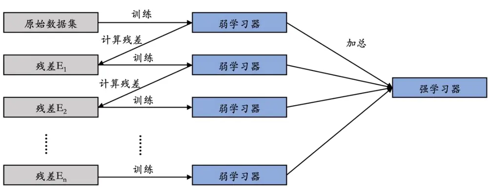
资料来源：华泰研究

与逻辑回归模型相同，我们对XGBoost分类器的全部超参数组合进行网格搜索，使用5折交叉验证选择验证集平均AUC最高的一组超参数作为模型最终的超参数。超参数设置如下表所示。

图表17： XGBoost 超参数选择

| 基学习器 | 超参数 | 选择范围 |
| --- | --- | --- |
| XGBoost | 学习速率（learning_rate） | [0.025, 0.05, 0.075] |
|  | 最大数深度(max_depth) | [3, 5] |
|  | 行采样比例(subsample) | [0.8, 0.85, 0.9, 0.95] |

资料来源：华泰研究

## SUE.txt 因子计算

模型在样本内训练完成后，我们在样本外进行测试。SUE.txt 因子生成的频率为每个月末，在月末截面期追溯过去一个季度的全市场业绩预告样本，使用训练好的模型进行预测，得到每条样本在每个类别上的概率估计值 ${\it p}_{c}(x)$ ，以此我们计算其 log-odds 值 $.L_{c}(x)$

$$
\begin{array}{c}{{L_{c\in\{h,m,l\}}(x)=log\displaystyle\frac{p_{c}(x)}{1-p_{c}(x)}}}\\{{SUE_{0}=L_{h}(x)-L_{l}(x)}}\end{array}
$$

其中 $c\in\{h,m,l\}$ 为三个类别标签，分别表示上涨、震荡、下跌。我们计算其上涨和下跌类别的 log-odds 值之差作为衰减前的因子值。最后，考虑到股票业绩发布日距离因子计算截面期时间越长，其 PEAD 效应就越弱，产生超额收益的概率就越低，因此我们以每个自然月最后一个交易日作为截面期，对计算出的原始 SUE.txt 因子按业绩预告发布日距离截面期时间做指数衰减。最终 SUE.txt 的计算公式为：

$$
SUE.txt=SUE_{0}*0.95^{T-t}
$$

其中 $SUE_{0}$ 为衰减前的因子值，T为月末截面日期，t为业绩预告发布日。对于同一支股票同一业绩预告对应多篇研报的情况，我们取多篇研报对应的SUE.txt均值作为该只股票在该截面期的因子值。

## 单因子分层回测

## 因子覆盖度

根据前文所述做法，月度各截面期的 SUE.txt 因子覆盖度如下图所示，整体来看 SUE.txt因子占全 A股的覆盖度不高，全历史均值在 15%左右，绝对数量均值约 450 只；近年来随着 A 股数量的持续增加，SUE.txt 因子覆盖股票数量却并未明显上涨，意味着 A 股覆盖的分析师数量并未显著增多，因此覆盖度占比逐渐走低。

图表18： SUE.txt 因子在全 A 股的覆盖度（回测期：2013-01-01~2021-12-31）
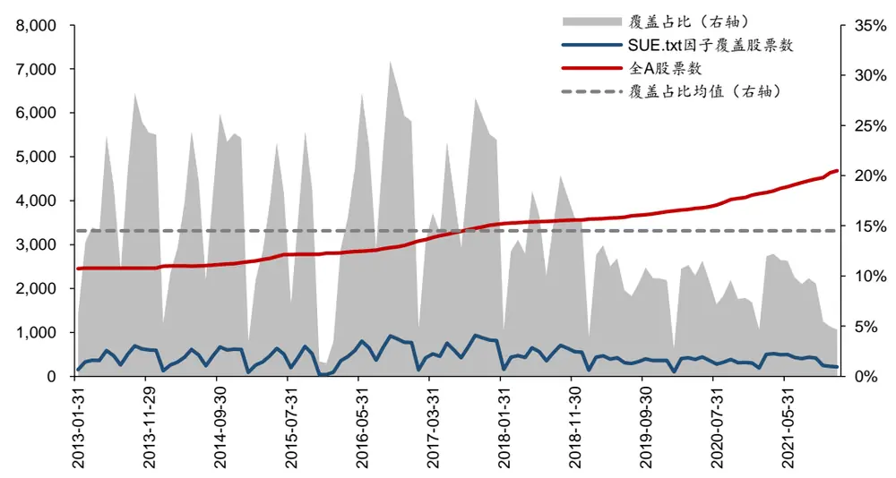
资料来源：Wind，朝阳永续，华泰研究

## 回测框架

依照因子值对股票进行打分，并以此构建投资组合进行回测，是衡量该因子对股票池是否有区分能力的最直观手段。我们按以下方式构建回测模型：

1. 股票池：每个截面期内 SUE.txt 因子有覆盖的股票；

2. 回溯区间：2013-01-31 至 2021-12-31；

3. 换仓期：根据每个自然月的因子值，在下个自然月的首个交易日按 vwap 价格调仓；

4. 数据处理：因子值为空的股票不参与分层；

5. 停牌、退市修正：对于在调仓日处于停牌状态的股票，则保持当期持仓与上一期相同；对于已退市但上一期有持仓的股票，则对其进行平仓。

## 回测结果

下述四张图展示了 XGBoost 模型和 Logistic 模型的分层回测结果，从结果上看 XGBoost模型表现优于 Logistic 模型，前者多头第一层的年化收益为 27.62%，第 1层相对第 5 层的对冲收益为 20.80%；后者则为 24.68%和 16.01%；在多头收益水平与分层能力上 XGBoost表现均优于 Logistic，模型层面的优化较为显著，这也提示我们：若要进一步优化 SUE.txt因子，模型层面的优化可能仍有提升空间。

图表19： 基于 XGBoost 的 SUE.txt 因子分层回测（回测期：2013-01-01~2021-12-31）
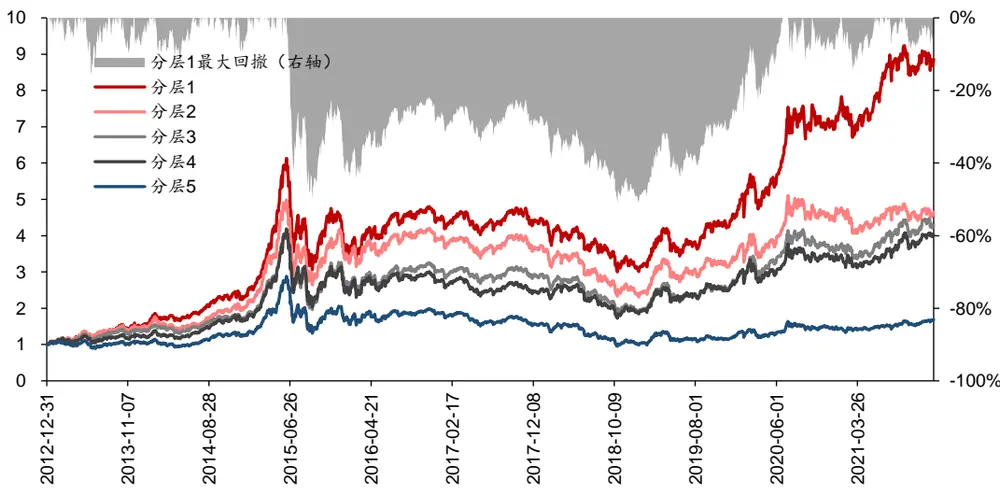
资料来源：Wind，朝阳永续，华泰研究

图表20： 基于 Logistic 的 SUE.txt 因子分层回测（回测期：2013-01-01~2021-12-31）
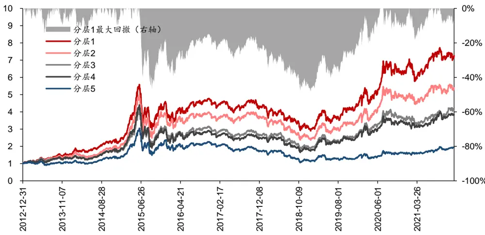
资料来源：Wind，朝阳永续，华泰研究

图表21： 基于 XGBoost 的 SUE.txt 因子对冲净值
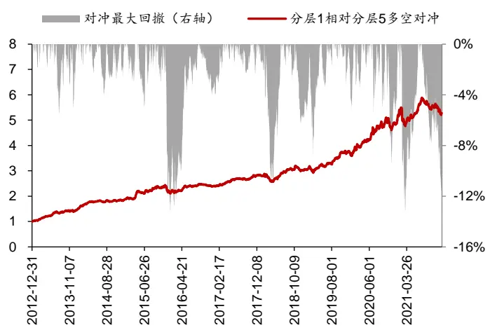
资料来源：Wind，朝阳永续，华泰研究

图表22： 基于 Logistic 的 SUE.txt 因子对冲净值
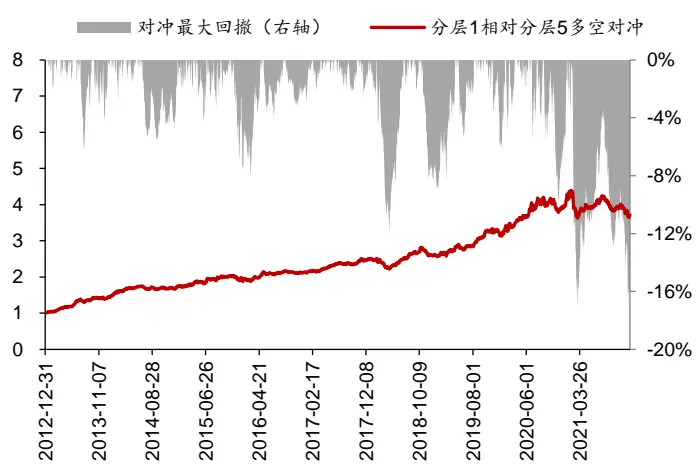
资料来源：Wind，朝阳永续，华泰研究

图表23： 分层回测业绩

| 模型 | 分层1 | 分层2 | 分层3 | 分层4 | 分层5 | 分层1相对分层5 |
| --- | --- | --- | --- | --- | --- | --- |
| XGBoost | 27.62% | 18.58% | 17.25% | 16.49% | 5.64% | 20.80% |
| Logistic | 24.68% | 20.52% | 16.93% | 15.86% | 7.47% | 16.01% |

资料来源：Wind，朝阳永续，华泰研究

此外，我们使用数据预处理步骤中得到的 2 日 AR 特征，在进行同样的指数衰减处理后，直接作为因子进行分层回测，结果见下图。可以看到，无论是多头收益水平还是分层效果，SUE.txt 因子都显著优于 2日 AR 因子。换言之，我们使用分类模型对特征进行拟合并计算SUE.txt 因子，对 2日 AR因子有明显的增益效果。

图表24： 2 日 AR 因子分层回测（回测期：2013-01-01~2021-12-31）
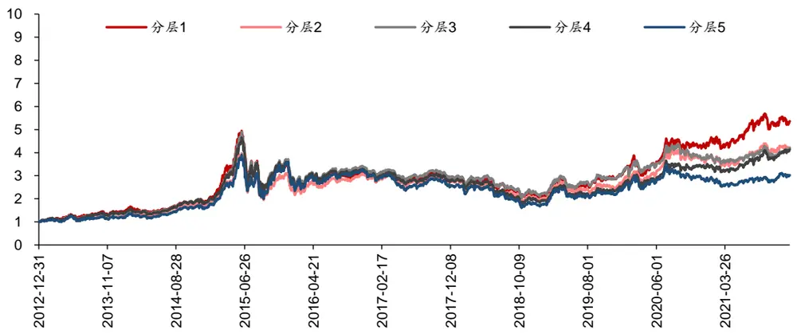
资料来源：Wind，朝阳永续，华泰研究

读者可能会有疑惑：在每个月月末计算 SUE.txt 因子时，我们实际上已经可以观测到过去一个季度所有业绩预告的已实现 2 日 AR，为何还要使用预测模型对 2日 AR 进行预测？增益信息体现在何处？

我们尝试对此进行解释。模型训练时将词频特征与 2日 AR 标签联系在一起，暗含假设是：业绩预告前后两日 AR 显著超越基准的股票将发生 PEAD 现象，而这个假设建立在预告样本足够多的基础上。在模型训练时，我们使用了 8 个季度的预告数据作为样本内，大样本条件下上述基础满足，因此机器学习模型较好地建立了词频—AR—PEAD 的联系；而样本外在预测时，我们仅追溯过去 1 个季度的预告样本，样本数量相对较少，导致公告预喜的样本未必产生明显的 AR（统计不显著），此时词频特征就是 AR 的替代，由此带来了增量信息，筛选出 AR 不显著但仍有可能发生 PEAD 效应的股票。参考论文作者并未就上述处理方法做出解释，这里仅尝试提出笔者的理解，抛砖引玉。

## 模型可解释性分析

本文所挖掘的文本 PEAD 效应本质上解构的是盈余公告发布以后卖方分析师对盈余公告的解读。从传统 SUE因子的角度来理解，若盈余公告业绩表现优秀，分析师可能会给出“超预期”、“预期之外”等情感表达十分强烈的词语；而除了“超预期”等表述之外，“上调”、“景气”、“看好”等偏正向的词语可能也蕴含分析师对上市公司未来表现的强烈看好，从而带来 PEAD 效应。那么本文构建的 SUE.txt 因子是否与逻辑直觉相符？

本小节我们尝试打开机器学习的“黑箱”，帮助读者了解 SUE.txt 因子的“思考”过程，提升对模型及预测结果的信任程度。我们将从 Logistic 回归模型的系数入手，构建分析师文本中的每个关键词、每个段落对最后结果贡献的重要程度指标。

## 单词重要性

本文使用 Yano 等（2012）提出的词重要性（word impact）概念。与传统特征重要性不同，词重要性不但能体现每个关键词对模型最后预测结果的重要程度，也同时可以反映词对最后结果的影响方向：例如在理想情况下，“上涨”、“上升”等词对结果应有较大的正面影响，而“下跌”、“下调”等词应对结果有较大的负面影响。

词重要性的计算由两部分构成：回归系数和词频。回归系数反映了单个词的每次出现对最终结果的影响方向和力度，而词频则体现了文本中每个关键词的出现次数。因此，词重要性被定义为逻辑回归模型“上涨”分类系数与“下跌”分类系数之差和词频之乘积：

$$
I_{w}(\boldsymbol{x})=\big(\beta_{x}^{\perp\sharp\sharp}-\mathrm\Large~\}_{x}^{\top\ast\sharp}\big)\frac{1}{N}\sum_{i=1}^{N}c_{ix}
$$

其中 $I_{w}(x)$ 是词 x的重要性， $\beta_{x}^{\frac{L}{\gamma\kappa}}\dot{\pi}\beta_{x}^{\mathcal{F},\ast}$ 分别为拟合后逻辑回归模型中词 $x^{\ 66}$ 上涨”和“下跌”分类的回归系数，N为总样本数， $\mathcal{F}_{\mathbf{\Phi}}c_{ix}$ 则是第 i条样本中词 x的对数词频。我们选取最后一个训练期作为示例，其训练集中单词重要性如下图所示。

图表25： 关键词重要性分析

| log 词频β("上涨")- β("下跌")单词重要性 |  |  |  |  |  |
| --- | --- | --- | --- | --- | --- |
|  |  |  |  | log 词频 | β("上涨")-β("下跌")单词重要性 |
| 增量 | 10.3 | 0.06 | 0.136 |  |  |
| 预增 | 8.34 | 0.3 | 0.097 |  |  |
| 提供 | 9.75 | 0.07 | 0.094 |  |  |
| 预计 |  | 10.05 | 0.04 |  |  |
| 预告 | 9.95 | 0.05 | 0.075 |  |  |
| 业绩 | 10.01 | 0.04 | 0.072 |  |  |
| 上调 | 7.98 | 0.29 | 0.067 |  |  |
| 净利润 | 10.14 | 0.02 | 0.049 |  |  |
| 买入 | 8.88 | 0.09 | 0.049 |  |  |
| 项目消费增持 |  | 9.11 | 0.05 |  |  |
|  | 8.2 | 0.12 | 0.0350.035 |  |  |
|  | 9.17 | 0.05 |  |  |  |
| 市占率 |  | 9.48 | 0.03 |  |  |
| 景气 |  | 7.81 | 0.14 |  |  |
| 电池 | 8.9 | 0.05 |  |  |  |

资料来源：华泰研究

|  | log 词频 β("上涨")−β("下跌") |  | 单词重要性 |
| --- | --- | --- | --- |
| 下滑 | 8.95 | -0.23 | -0.138 |
| 下降 | 9.16 | -0.12 | -0.086 |
| 竞争力 | 8.41 | -0.23 | -0.081 |
| 继续 | 9.65 | -0.06 | -0.077 |
| 形成 | 9.39 | -0.08 | -0.076 |
| 下调 | 7.69 | -0.42 | -0.071 |
| 对应 | 8.28 | -0.11 | -0.035 |
| 空间非后低于销售金额替代亏损基础 |  |  | 7.42 |
|  | 9.12 | -0.04 | -0.032 |
|  | 8.32 | -0.08 | -0.026 |
|  | 8.35 | -0.07 | -0.023 |
|  | 8.98 | -0.04 | -0.022 |
|  | 8.12 | -0.07 | -0.02 |
|  | 7.71 | -0.1 | -0.017 |
|  | 8.78 | -0.03 | -0.017 |

我们选取了系数差 $(\beta_{x}^{\tt LBE}-\beta_{x}^{\tt TBE})$ 最大的15个正向与负向关键词，以其对应log词频为x轴绘制散点图，如左下子图所示；同时，我们也选取了单词重要性最高的15个正向和负向关键词，如右下子图所示；以及词频最高的30个关键词，以同样方式绘制散点图，如第三张子图所示。为便于观察，在绘图时我们按其中系数差绝对值最大的点的值，对数据做标准化处理。

图表26： Top 15系数差最大的正向和负向关键词
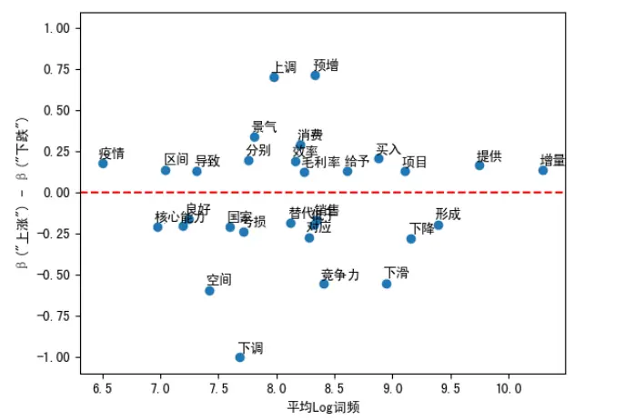
资料来源：华泰研究

图表27： Top 15单词重要性最高的正向和负向关键词
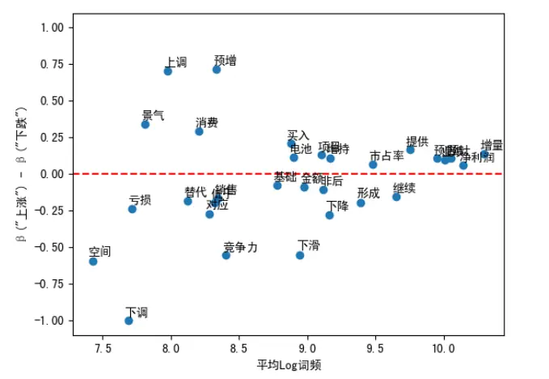
资料来源：华泰研究

图表28： Top 30词频最高的关键词
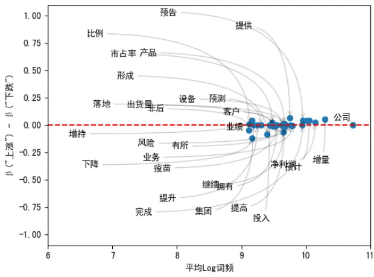
资料来源：华泰研究

系数差 $(\beta_{x}^{\tt Lik}-\beta_{x}^{\tt Tik})$ 可以帮助解读每个关键词的单次出现对模型结果的影响：其绝对值越大则影响越大，而其正负方向指示了对结果的影响方向。图 25 中可以看到，整体结果较为符合预期，如“上调”、“预增”等词对结果有较大的正面影响，而“下调”、“下滑”等词则对结果有较大的负面影响。最终模型预测结果由两方面因素决定，即关键词的系数差和词频。对比图 25 和图 26，可以看到两者显示的关键词并不完全重叠。图 27 中出现的新关键词，如“增持”，可能是由于其出现词频较高而对最终预测结果有较大的影响。此外由图27 可以看到，词频高的关键词（如“公司”、“业绩”等）由于对应的系数接近于零，这些词通常对结果只有较小的影响。

## 段落重要性

在对单词重要性进行解读后，我们自然而然的会想到一个问题：如果一个段落中同时包含了多个正向词和负向词，最后该段对于预测结果的重要性与方向该如何计算？原论文构建了基于段落的 SUE.txt 来解读不同类型的段落所蕴含的信息：

$$
\begin{array}{c}{{SUE.txt_{P}(X)=~\displaystyle\sum_{w\in X}\left(\beta_{w}^{\mathcal{L}\#K}-~\beta_{w}^{\mathcal{F}\#K}\right)\Delta_{w}}}\\{{\Delta_{w}=\log(2+b_{w})-\log(1+b_{w})}}\end{array}
$$

其中 X代表文本 D的某个段落， $\beta_{w}^{\frac{L}{\gamma\mathcal{E}}}\dot{\pi}\beta_{w}^{\mathcal{F}\ast}$ 分别为拟合后逻辑回归模型中对应词 w的“上涨”和“下跌”分类回归系数。我们在 $\Delta_{w}$ 中对词语按其出现次数进行加权处理，其中 $b_{w}$ 是词w在文本D中该次出现之前的累计出现次数，对于同一段落中的相同词语， $b_{w}$ 也不相同，在处理时会重复计算。这样处理的目的是使段落SUE. $\mathrm{txt}_{P}$ 可以和之前定义的文本SUE. $\mathrm{txt}_{0}$ 相洽，即文本 D 的SUE. $\operatorname{txt}_{0}$ 为其包含的段落SUE. $\mathrm{txt}_{P}$ 之和（其中 $c_{w}$ 表示词 w在文本 D 中总的出现次数）：

$$
\begin{array}{rl}&{\mathrm{SUE.}\operatorname{txt}_{0}(D)=\log\left(\frac{p\left(\frac{\cdot|\mathcal{H}_{\star}^{s}}{\mathcal{H}\cdot\mathcal{H}\cdot}\right)}{1-p\left(\frac{\cdot|\mathcal{H}\star}{\mathcal{H}\cdot}\right)}\right)-\log\left(\frac{p\left(\frac{\cdot|\mathcal{H}\star}{\mathcal{H}\cdot}\right)}{1-p\left(\frac{\cdot|\mathcal{H}\star}{\mathcal{H}\cdot}\right)}\right)}\\&{\qquad=\displaystyle\sum_{w\in D}(\beta_{w}^{\mathcal{L}\mathcal{H}}\log(1+c_{w})-\beta_{w}^{\mathcal{F}\mathcal{H}}\log(1+c_{w}))}\\&{\qquad=\displaystyle\sum_{X\in D,\quad w\in X}(\beta_{w}^{\mathcal{LB}}-\beta_{w}^{\mathcal{FB}})\log(1+c_{w})}\end{array}
$$

$$
\begin{array}{rl}{\displaystyle}&{=\sum_{X\in D,\quad w\in X}(\beta_{w}^{\mathcal{LB}}}\\&{\quad\quad\quad-\beta_{w}^{\mathcal{FA}})\{\mathrm{Ing}(2)-\log(1)\}+[\log(3)-\log(2)]+\cdots+[\log(1+c_{w})}\\&{\quad\quad-\log(c_{w})]\}}\\&{\quad\quad\quad\quad=\displaystyle\sum_{X\in D}\sum_{w\in X}(\beta_{w}^{\mathcal{LB}}-\beta_{w}^{\mathcal{FB}})\Delta_{w}}\\&{\quad\quad\quad\quad=\displaystyle\sum_{X\in D}\mathrm{SIE}.\operatorname{tan}_{r}(X)}\end{array}
$$

随后我们构建了一个分类词典，分为财报、运营、宏观环境和战略四大类 13 个小类，将每一个段落根据所包含的关键词划分至不同的类别（同一段落可同时归属于不同的类别）。我们用SUE. $\mathrm{txt}_{P}$ 代表每个段落的因子值，SUE. $\mathrm{txt}_{G}$ 代表每个分类的因子值。每个分类的$\operatorname{SUE}.\operatorname{txt}_{G}$ 值为其包含的段落SUE. $\mathrm{txt}_{P}$ 的均值：

$$
\mathrm{SUE.txt}_{G}={\frac{1}{|G|}}\sum_{X\in G}\mathrm{SUE.txt}_{P}(X)
$$

同时我们也计算了所包含段落的SUE. $\mathrm{txt}_{P}$ 的绝对值之和的均值（记为 $\mathsf{SUE.txt}_{G}^{abs})$ ）：

$$
\mathrm{SUE.txt}_{G}^{abs}=\frac{1}{|G|}\sum_{X\in G}|\mathrm{SUE.txt}_{P}(X)|
$$

SUE. $\mathrm{txt}_{G}$ 有助于我们了解该分类包含的信息对整体预测结果的影响，而SUE. $\mathrm{txt}_{G}^{abs}$ 可以指明该分类是否包含重要信息。例如某一组分类同时包含了相近数量的正向和负向评价，其$\operatorname{SUE}.\operatorname{txt}_{G}$ 值会接近于零，但其SUE. $\mathrm{txt}_{G}^{abs}$ 应较为显著。

每个分类的结果见以下四图，其中纵轴为SUE. $\mathrm{txt}_{G}$ 或 $\mathsf{SUE.txt}_{G}^{abs}$ ，而横轴为该分类包含段落数占总段落数的比例。由于每一段落可能包含多个同一分类的关键词，该段落在计算时会被重复计数，因此分类的段落占比可能会超过 100%。我们重复计数具有一定的合理性：如果一个段落包含了多个同一组内的关键词，在一定程度上也表明了该段落具有较高的信息含量，因此我们通过重复计数适当提高该段落的整体权重。

结合图表 28 和 29 可以看到，宏观环境在段落中占比最少，但对结果有较大的正面影响，运营占比最多，且对结果有较大的负面影响；此外财报分类有较低的平均SUE.txt 和显著的SUE.txtabs，说明该组包含了较多好坏参杂的重要信息。结合图表 30 和 31 来看，二级分类收入段落占比最多，对结果正面影响最大；债权融资虽然段落占比较少，但却对结果有着显著的负面影响；而宏观状况、生产销售、业务线等分类较高的SUE.txtabs也体现了这些分类实际上包含了较多的重要信息。一级分类和二级分类的词语字典如图表 32。

图表29： 一级分类 SUE.txt 平均值
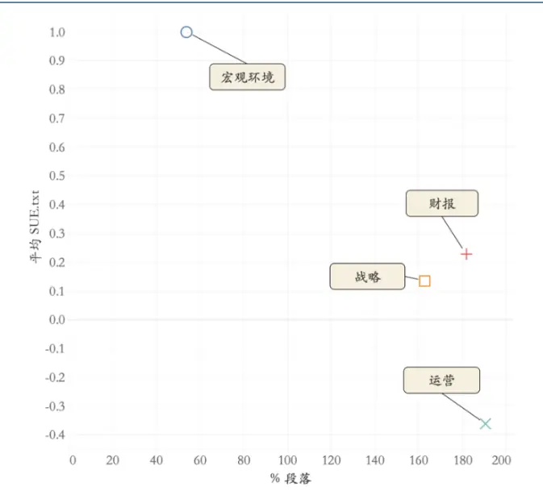
资料来源：华泰研究

图表30： 一级分类绝对 SUE.txt平均值
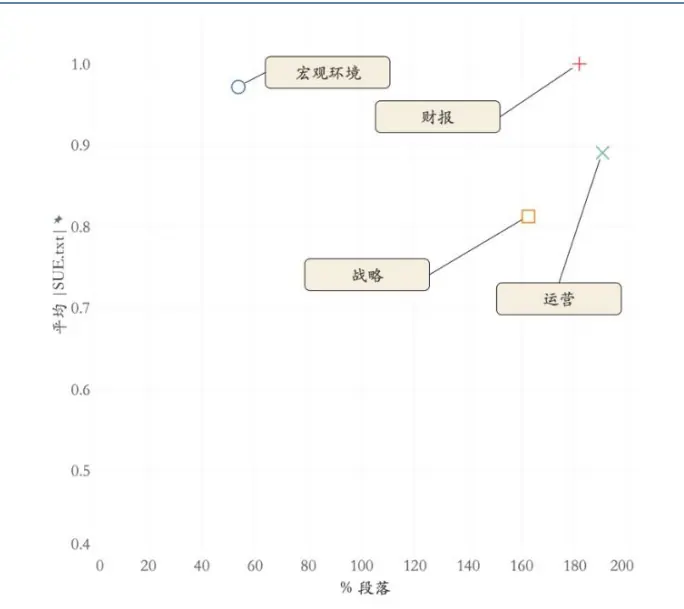
资料来源：华泰研究

图表31： 二级分类 SUE.txt 平均值
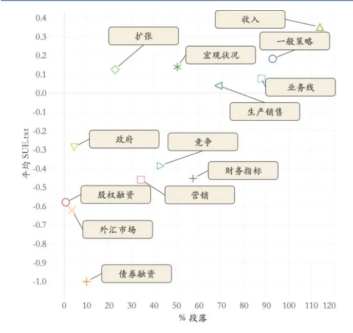
资料来源：华泰研究

图表32： 二级分类绝对 SUE.txt平均值
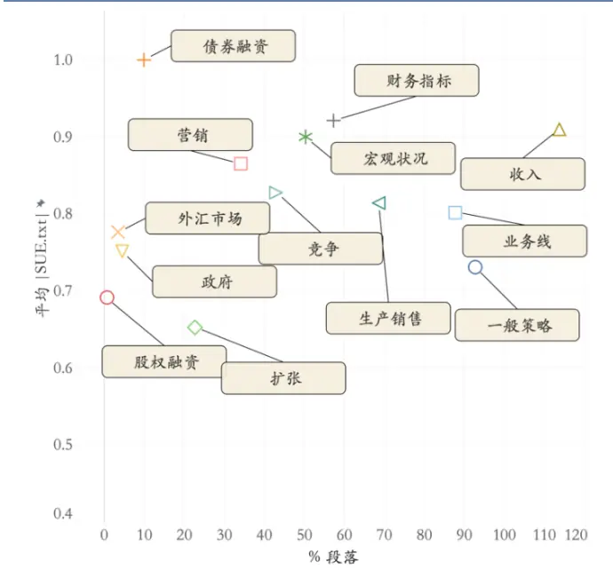
资料来源：华泰研究

图表33： 一级分类与二级分类词语字典

| 一级分类 | 二级分类 | 对应词语 |
| --- | --- | --- |
| 财报 | 收入 | 收益、收入、亏损、业绩、营收、利润、毛利、净利、利润、损失 |
|  | 财务指标 | 经营、应计、调整、折旧、减值、减计、摊销、资本支出、现金、费用、商誉、库存、负债、扣非、归母、债务、保证金、应付账款、 盈利能力、应收账款、销售、税收、运营 |
|  | 债券融资 | 债券、债务、借款、存款、融资、利息、利率、贷款、资产回报率、股本回报率、ROE、ROA、借贷、利得、股息、股权融资、贷款融 资、支付利息、回报、回购、股票购买 |
| 运营 | 生产销售 | 资产、积压、预定、佣金、订单、发货、运输、营销、服务、订阅、单位、产能、产量、生产、出货、厂商、材料、均价、渠道、建设、 开发、完成、建设、探索、售后、升级、改善、整修、改造、存货管理、检修、安装、库存、开放、外包、延迟、中断、关闭 |
|  | 业务线 | 需求、供应、供给、上游、中游、下游、龙头、工程、产业、地位、应用、业务、类别、组、产品、项目、服务、子公司 |
|  | 营销 |  |
|  | 外汇市场 | 广告、客户、顾客、发布、启动、营销、总量、价格、促销、折扣、销售、经销 汇率、外汇、货币、美元、日元、人民币、欧元、升值、贬值 |
| 战略 | 宏观状况 | GDP、CPI、PPI、PMI、条件、国家、经济、环境、出口、进口、通货膨胀、国际、宏观、地区、区域、稳定性、趋势、不确定、世界、 |
|  | 扩张 | 财政、景气、疫情、全国、全球、利率、政策、板块、消费 |
|  | 竞争 | 合并、收购、整合、投资、并购、重组、裁员、撤销、兼并、扩张、剥离 |
|  | 政府 | 竞争、行业、市场、合作、合伙人、伙伴、同盟、授予、投标、关闭、合同、交易、付款、获胜、获得、赢得 |
|  | 一般策略 | 行动、批准、合规、政府、法律、许可、专利、监管、机构、要求、规则、审理 |
|  |  | 效率、增长、主动、机会、战略、策略、品牌、平台、技术、科技、风险、领域、高端、主业、创新、加速、助力、布局、产业、升级 |

资料来源：华泰研究

## SUE.txt 股票池增强

本章我们考虑对基于 SUE.txt 构建的股票池进行增强（以下简称为 SUE.txt 股票池），基础SUE.txt 股票池为 SUE.txt 因子的第一层分层。增强的思路为：令备选因子在 SUE.txt 股票池内进行回测，优选分层效果明显或多头端收益较强的因子，进而对股票池内的股票进行集成打分，备选因子为华泰因子库因子。

## 华泰金工因子分层回测

华泰因子库见附录，在进行分层回测时华泰因子库的因子均进行过行业市值中性处理。各因子分 3层回测的业绩表现如下表所示：

图表34： 华泰金工因子在 SUE.txt股票池内的分层回测表现

| 具体因子 | 分层1 | 分层2 分层3 |
| --- | --- | --- |
| EP | 26.59% | 25.09% 27.91% |
| EPcut | 28.05% | 26.57% 24.33% |
| BP | 24.21% | 25.67% 30.27% |
| SP | 28.19% | 23.90% 27.20% |
| NCFP | 24.30% | 29.16% 27.01% |
| OCFP | 27.08% | 28.02% 23.29% |
| DP | 26.35% | 27.38% 25.09% |
| Sales_G_q | 31.28% | 26.08% 23.47% |
| Profit_G_q | 30.66% | 28.56% 19.83% |
| OCF_G_q | 31.05% | 22.23% 27.44% |
| ROE_G_q | 29.66% | 26.58% 23.04% |
| ROE_q | 29.87% | 29.78% 19.29% |
| ROE_ttm | 27.27% | 28.84% 23.45% |
| ROA_q | 29.11% | 28.28% 22.03% |
| ROA_ttm | 26.54% | 27.41% 26.15% |
| grossprofitmargin_q | 29.74% | 24.33% 27.41% |
| grossprofitmargin_ttm | 28.60% | 24.37% 28.39% |
| grossprofitmargin_q_g | 33.12% | 26.94% 26.78% |
| profitmargin_q | 28.05% | 27.30% 24.25% |
| profitmargin_ttm | 29.13% | 25.79% 25.51% |
| profitmargin_q_g | 33.52% | 24.71% 29.11% |
| assetturnover_q | 27.92% | 26.86% 24.88% |
| assetturnover_ttm | 29.47% | 25.25% 25.04% |
| operationcashflowratio_q | 25.70% | 29.66% 25.49% |
| operationcashflowratio_ttm | 34.11% | 23.66% 24.20% |
| financial_leverage | 20.24% | 35.30% 25.05% |
| debtequityratio | 26.92% | 28.80% 24.77% |
| cashratio | 28.54% | 22.78% 29.83% |
| currentratio | 25.11% | 24.17% 31.47% |
| In_capital | 28.21% | 26.84% 24.28% |
| HAlpha | 25.04% | 26.82% 28.27% |
| return_1m | 24.81% | 31.82% 19.67% |
| return_3m | 25.60% | 27.53% 25.21% |
| return_6m | 24.40% | 24.83% 29.34% |
| return_12m | 22.28% | 26.83% 30.22% |
| wgt_return_1m | 27.95% | 28.37% 19.83% |
| wgt_return_3m | 28.76% | 26.08% 23.88% |
| wgt_return_6m | 26.16% | 23.62% 29.38% |
| wgt_return_12m | 22.35% | 28.68% 27.89% |
| exp_wgt_return_1m | 27.38% | 23.06% 26.23% |
| exp_wgt_return_3m | 25.99% | 27.47% 23.47% |
| exp_wgt_return_6m | 28.24% | 25.61% 23.99% |
| exp_wgt_return_12m | 29.27% | 21.05% 29.24% |

资料来源：Wind，华泰研究

图表35： 华泰金工因子在 SUE.txt股票池内的分层回测表现（续）

| 具体因子 | 分层1 | 分层2 分层3 |  |
| --- | --- | --- | --- |
| std_FF3factor_1m | 24.74% | 31.18% | 21.48% |
| std_FF3factor_3m | 25.12% | 23.33% | 31.79% |
| std_FF3factor_6m | 22.12% | 27.42% | 30.30% |
| std_FF3factor_12mstd_1m | 20.56% | 30.22% | 29.37% |
|  | 20.41% | 30.01% | 27.06% |
| std_3m | 24.12% | 27.01% | 28.74% |
| std_6m | 22.65% | 22.66% | 34.88% |
| std_12m | 22.55% | 26.99% | 30.89% |
| In_price | 25.07% | 23.27% | 32.53% |
| beta | 30.55% | 26.64% | 24.16% |
| turn_1m | 25.51% | 28.17% | 25.68% |
| turn_3m | 26.60% | 27.46% | 24.87% |
| turn_6m | 22.57% | 30.63% | 26.81% |
| turn_12m | 26.67% | 23.52% | 30.80% |
| bias_turn_1m | 32.05% | 26.68% | 20.85% |
| bias_turn_3m | 33.34% | 26.47% | 20.99% |
| bias_turn_6m | 31.00% | 30.07% | 19.87% |
| bias_turn_12m | 32.30% | 24.66% | 24.06% |
| rating_average | 24.50% | 28.73% | 27.56% |
| rating_change | 24.06% | 28.57% | 24.26% |
| rating_targetprice | 29.41% | 21.61% | 28.78% |
| holder_avgpctchange | 30.45% | 27.21% | 20.54% |
| macd | 28.53% | 25.32% | 21.42% |
| dea | 27.83% | 26.66% | 22.60% |
| dif | 24.41% | 30.50% | 22.00% |
| rsi | 29.15% | 22.53% | 25.30% |
| psy | 25.60% | 27.88% | 23.91% |
| bias | 22.84% | 31.29% | 22.46% |

资料来源：Wind，华泰研究

根据分层回测结果，以下因子在 SUE.txt 基础池内分层表现较好：

1. 成长类因子：营业收入同比增长率（Sales_G_q）、净利润同比增长率（Profit_G_q）表现较好，其中净利润同比增长率因子分层能力稍逊；

2. 财务质量类因子：毛利率的季度变化（grossprofitmargin_q_g）、净利率的季度变化（netprofitmargin_q_g）、经营性现金流/净利润（operationcashflowratio_ttm）表现较好，其中净利率增长率的季度变化因子分层效果略差；

3. 杠杆类因子：流动比率（currentratio），多头端收益优秀，第 2、3 层区分不明显；

4. 波动率类因子：近 6个月、12 个月波动率因子（std_Nm）表现较好，其中近 6个月波动率多头收益显著，近 12 个月波动率分层效果较好；

5. 股价因子：对数股价（ln_price）多头端表现优秀，第 2、3 层区分不明显；

6. 换手率类因子：个股最近 N 个月内日均换手率除以最近 2 年内日均换手率再减 1（bias_turn_Nm），N 取 1、3、6、12 时多头端表现均十分优秀，说明该因子整体在SUE.txt 股池内的有效性受窗口期影响较小；N取 1和 3 时分层效果也较优；

7. 股东因子：户均持股比例的同比增长率（holder_avgpctchange），该因子多头收益良好，分层表现优秀。

## 因子等权合成

综合考虑各因子在 SUE.txt 基础池内的的多头收益与分层效果，我们选择了 Sales_G_q、grossprofitmargin_q_g、operationcashflowratio_ttm、currentratio、std_6m、ln_price、bias_turn_1m、bias_turn_3m、holder_avgpctchange 等因子进行集成，集成方法为计算等权均值，根据等权均值对 SUE.txt 股票池进行排序，筛选靠前的 N=30 只股票构成最终的文本 PEAD 增强股票池，30 只股票等权持有，月频调仓，交易手续费双边千三，回测净值如下图所示：

图表36： SUE.txt 股池增强组合净值（回测期：2013-01-01~2021-12-31）
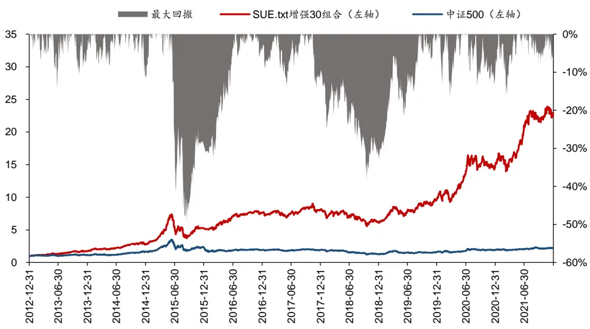
资料来源：Wind，华泰研究

图表37： SUE.txt 股池增强组合相对中证 500 超额净值（回测期：2013-01-01~2021-12-31）
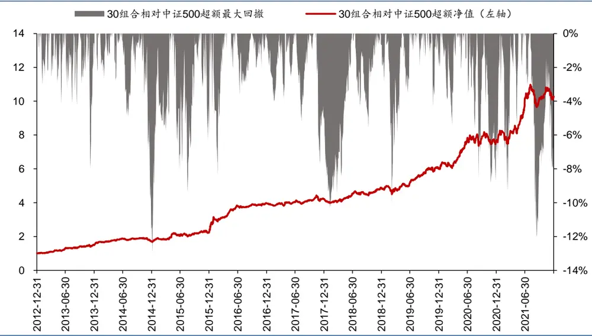
资料来源：Wind，华泰研究

图表38： SUE.txt股池增强组合分年度业绩表现

| 时间 | 年化收益率 | 年化超额收益 | 年化波动率 | 最大回撤 | 夏普比率 | 卡玛比率 |
| --- | --- | --- | --- | --- | --- | --- |
| 2013 | 80.01% | 51.81% | 28.61% | 14.10% | 2.80 | 5.67 |
| 2014 | 58.20% | 11.01% | 22.51% | 12.00% | 2.59 | 4.85 |
| 2015 | 92.43% | 30.27% | 42.57% | 49.67% | 2.17 | 1.86 |
| 2016 | 48.32% | 58.92% | 22.61% | 8.23% | 2.14 | 5.87 |
| 2017 | 5.65% | 7.24% | 18.16% | 14.92% | 0.31 | 0.38 |
| 2018 | -24.71% | 17.20% | 27.69% | 32.09% | -0.89 | -0.77 |
| 2019 | 60.32% | 25.88% | 24.65% | 16.83% | 2.45 | 3.58 |
| 2020 | 51.48% | 28.40% | 30.79% | 16.50% | 1.67 | 3.12 |
| 2021 | 52.79% | 36.19% | 23.72% | 16.57% | 2.23 | 3.19 |
| 成立以来 | 43.47% | 29.98% | 27.67% | 49.67% | 1.57 | 0.88 |

资料来源：Wind，华泰研究

图表39： SUE.txt股池增强组合分月度业绩表现

| 时间 | 1 | 2 | 3 | 4 | 5 | 6 | 7 | 8 | 9 | 10 | 11 | 12 |
| --- | --- | --- | --- | --- | --- | --- | --- | --- | --- | --- | --- | --- |
| 2013 | 9.12% | 5.10% | 1.83% | 2.88% | 15.84% | -9.16% | 9.31% | 6.12% | 15.29% | -4.74% | 13.45% | -4.59% |
| 2014 | 14.79% | 1.22% | -0.51% | 1.10% | 4.39% | 5.89% | 4.12% | 8.50% | 10.81% | 2.43% | 5.64% | -8.77% |
| 2015 | 15.87% | 4.86% | 20.28% | 24.02% | 32.64% | -17.57% | -9.01% | -17.16% | -1.39% | 16.99% | 10.46% | -1.21% |
| 2016 | -2.75% | -2.06% | 17.70% | 4.70% | 4.59% | 10.86% | -0.90% | 5.15% | 1.76% | 0.63% | 3.50% | -3.54% |
| 2017 | -2.73% | 2.98% | 1.06% | -0.87% | -7.68% | 7.68% | 2.53% | 3.56% | 4.36% | 1.30% | -7.08% | 2.04% |
| 2018 | -5.13% | -1.94% | 2.35% | -2.94% | 2.35% | -5.07% | -0.35% | -5.85% | -3.27% | -8.39% | 6.11% | -2.95% |
| 2019 | 2.88% | 13.69% | 13.79% | -2.49% | -6.16% | 3.03% | 3.09% | 2.79% | 6.41% | 3.17% | -2.72% | 10.18% |
| 2020 | 8.00% | 1.28% | -10.02% | 13.82% | 8.94% | 18.71% | 12.61% | 3.57% | -8.58% | 0.05% | -2.93% | 1.69% |
| 2021 | 5.72% | -3.59% | 4.59% | 6.23% | 8.39% | 16.01% | 5.72% | 2.18% | -3.01% | 0.93% | 6.56% | -3.27% |

资料来源：Wind，华泰研究

## 成分股分析

本小节我们对 SUE.txt 基础池及增强池的成分股进行分析，统计历史各期持仓在各板块的分布及在各宽基指数的覆盖度。从板块分布来看，SUE.txt股票池未出现明显高配某个板块的情况，整体上科技板块的占比略微高于其他板块。从宽基指数覆盖度来看，覆盖度从高到低为：中证1000> 中证500 > 沪深300，持仓偏中小市值，SUE.txt原始池的数量均值约为90只。

图表40： SUE.txt增强池在各板块的分布
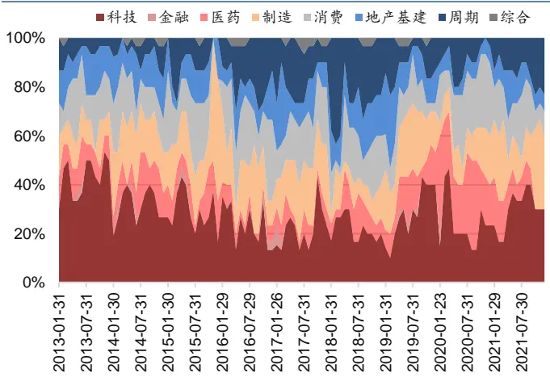
资料来源：Wind，华泰研究

图表41： SUE.txt基础池在各板块的分布
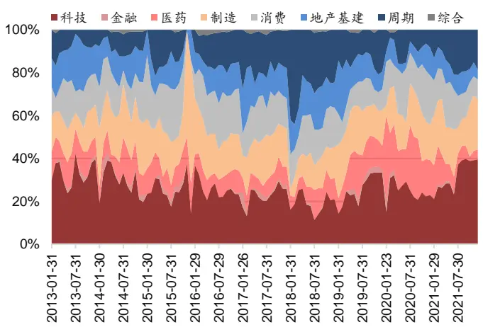
资料来源：Wind，华泰研究

图表42： SUE.txt增强池在各宽基指数中的覆盖度
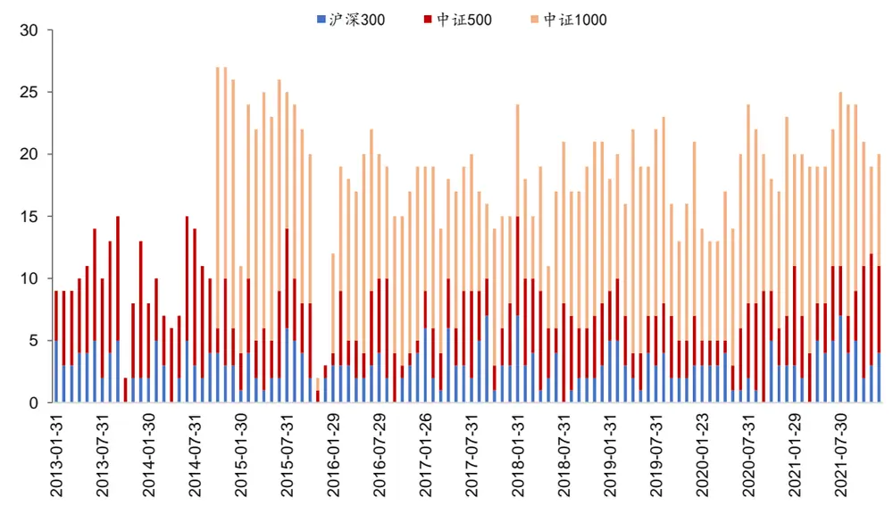
资料来源：Wind，华泰研究

图表43： SUE.txt原始池在各宽基指数中的覆盖度
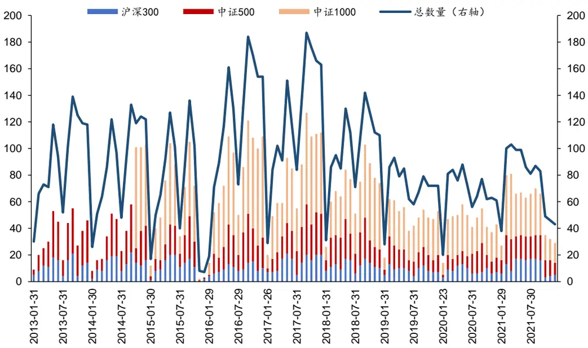
资料来源：Wind，华泰研究

## 总结与讨论

盈余后价格漂移效应（PEAD）指的是股票价格在盈余公告发布后有较大概率向业绩高于或低于预期的方向漂移。传统 SUE因子主要基于公告财务数据来衡量 PEAD 效应并预测股票的异常收益，而本文尝试从纯文本的角度出发构建文本 SUE因子，希望对相关文本进行解构从而挖掘 alpha 信息。基于业绩预告与相关研报点评文本的数据实证表明，文本 SUE因子具有较强的选股能力，机器学习模型对文本的拆分和解构与直观逻辑相符，模型可信度较高。最后使用华泰金工因子库对文本 SUE 基础池进行增强，回测期年化收益 43.47%，相对中证 500 超额年化收益 29.98%；2021 年收益 52.79%。

在文本 SUE.txt 因子构建环节，我们使用的公告为业绩预告，相关文本为分析师点评业绩预告研报文本的标题和摘要。在对上述文本进行分词后，保留给定词性并选择样本内标题出现次数最多的 100 词和摘要出现次数最多的 500 词构建词频矩阵，作为模型的训练特征。同时计算业绩预告发布前后 2 个交易日相对中证 500 的超额收益，将其分为“上涨”、“震荡”、“下跌”三类，作为训练标签。最后，我们分别测试了 Logistic 模型和 XGBoost 模型，将模型预测的上涨和下跌类别的 log-odds 值之差，在进行指数衰减后，作为最终的 SUE.txt因子。实证结果表明基于 XGBoost 构建的 SUE.txt 因子分层效果与多头收益能力均优于Logistic 模型。

对词重要性分析的结果表明，“上调”、“预增”、“景气”等词对 SUE.txt 有较大的正面影响，而“下调”、“下滑”、“亏损”等词则有较大的负面影响，与直观逻辑相符。进一步本文构建了包含财报、运营、宏观环境和战略四大类的分类词典，将文本段落按其所包含的关键词进行分类。分析发现，描述宏观环境的段落占比最低，对 SUE.txt 有较大的正面影响；描述运营的段落占比最高，对结果有较大的负面影响；此外，描述财报的段落则包含较多好坏参杂的重要信息。

最后我们选取 SUE.txt 因子的第一层股票分层作为基础池，选择华泰金工因子中在 SUE.txt基础池内分层效果较好且多头收益明显的因子对股池内的股票进行等权合成打分，并选择得分最高的 30 只股票作为增强池。回测期内，增强池年化收益 43.47%，夏普比率 1.57；相对中证 500 年化超额收益 29.98%，2021 年绝对收益 52.79%，超额收益 36.19%。对成分股分析表明，SUE.txt 基础池与增强池在各板块的股票数量分布较为均衡，未出现板块明显超配的情况。

值得说明的是，文本 PEAD 效应的刻画不仅仅局限于本文所提到的业绩预告和卖方分析师研报文本，本文仅基于上述两组文本提出了刻画文本 PEAD 效应的另一可行途径，但还存在以下值得改进之处：

1. 业绩预告作为一类重要的业绩公告，在全 A 股的覆盖度较低，在单独使用时只适合独立作为一个选股策略，难以融入传统多因子选股体系；若要融入多因子体系，可以尝试以正式的定期财报作为基础，仍以卖方分析师研报文本作为相关解读文本构建 SUE.txt因子，或可提高因子覆盖度；

2. 分析师研报主要受众为机构投资者，因此对分析师研报的解读更可能影响机构，对个人投资者影响相对更小，而舆情文本则可以反应个人投资者对业绩公告的解读，因此相关文本数据仍存在局限性；

3. 对 SUE.txt 基础池的增强，本文使用的华泰金工因子为更偏低频的基本面与量价类因子，增强效果或许仍然有限，高频因子作为量价信息更密集的因子，或许可以为 SUE.txt基础池提供额外的增量信息。

## 参考文献

Liang P J , Meursault V , Routledge B B , et al. PEAD.txt: Post-Earnings-Announcement Drift Using Text[J]. Working Papers, 2021.

Yano T , Smith N A , Wilkerson J D . Textual Predictors of Bill Survival in Congressional Committees[J]. 2012.

## 风险提示

通过机器学习模型构建选股策略是历史经验的总结，存在失效的可能。人工智能模型可解释程度较低，使用须谨慎。量化因子的效果与宏观环境和大盘走势密切相关，历史结果不能预测未来，敬请注意。

## 附录：华泰因子库

图表44： 选股模型中涉及的全部因子及其描述

| 大类因子 | 具体因子 | 因子描述 |
| --- | --- | --- |
| 估值 | EP | 净利润（TTM)/总市值 |
| 估值 | EPcut | 扣除非经常性损益后净利润（TTM）/总市值 |
| 估值 | BP | 净资产/总市值 |
| 估值 | SP | 营业收入（TTM)/总市值 |
| 估值 | NCFP | 净现金流（TTM）/总市值 |
| 估值 | OCFP | 经营性现金流（TTM）/总市值 |
| 估值 | DP | 近12个月现金红利（按除息日计）/总市值 |
| 估值 | G/PE | 净利润（TTM）同比增长率/PE_TTM |
| 成长 | Sales_G_q | 营业收入（最新财报，YTD）同比增长率 |
| 成长 | Profit_G_q | 净利润（最新财报，YTD）同比增长率 |
| 成长 | OCF_G_q | 经营性现金流（最新财报，YTD）同比增长率 |
| 成长 | ROE_G_q | ROE（最新财报，YTD）同比增长率 |
| 财务质量 | ROE_q | ROE（最新财报，YTD） |
| 财务质量 | ROE_ttm | ROE（最新财报，TTM） |
| 财务质量 | ROA_q | ROA（最新财报，YTD） |
| 财务质量 | ROA_ttm | ROA（最新财报，TTM） |
| 财务质量 | grossprofitmargin_q | 毛利率（最新财报，YTD） |
| 财务质量 | grossprofitmargin_q_g | 毛利率季度变化（最新财报，YTD） |
| 财务质量 | grossprofitmargin_ttm | 毛利率（最新财报，TTM) |
| 财务质量 | profitmargin_q | 扣除非经常性损益后净利润率(最新财报，YTD） |
| 财务质量 | profitmargin_q_g | 扣除非经常性损益后净利润率的季度变化（最新财报，YTD） |
| 财务质量 | profitmargin_ttm | 扣除非经常性损益后净利润率（最新财报，TTM) |
| 财务质量 | assetturnover_q | 资产周转率（最新财报，YTD） |
| 财务质量 | assetturnover_ttm | 资产周转率（最新财报，TTM） |
| 财务质量 | operationcashflowratio_q | 经营性现金流/净利润（最新财报，YTD） |
| 财务质量 | operationcashflowratio_ttm | 经营性现金流/净利润（最新财报，TTM） |
| 杠杆 | financial_leverage | 总资产/净资产 |
| 杠杆 | debtequityratio | 非流动负债/净资产 |
| 杠杆 | cashratio | 现金比率 |
| 杠杆 | currentratio | 流动比率 总市值取对数 |
| 市值 动量反转 | In_capital | 个股60个月收益与上证综指回归的截距项 |
|  | HAlpha | 个股最近N个月收益率，N=1，3，6，12 |
| 动量反转 | return_Nm | 个股最近N个月内用每日换手率乘以每日收益率求算术平均值，N=1，3，6，12 |
| 动量反转 | wgt_return_Nm | 个股最近N个月内用每日换手率乘以函数exp(-x_i/N/4)再乘以每日收益率求算术平均 |
| 动量反转 | exp_wgt_return_Nm | 值，x_i为该日距离截面日的交易日的个数，N=1，3，6，12 |
| 波动率 | std_FF3factor_Nm | 特质波动率—个股最近 N 个月内用日频收益率对 Fama French 三因子回归的残差 的标准差，N=1，3，6，12 |
| 波动率 | std_Nm | 个股最近N个月的日收益率序列标准差，N=1，3，6，12 |
| 股价 | In_price | 股价取对数 |
| beta | beta | 个股60个月收益与上证综指回归的 beta |
| 换手率 | turn_Nm | 个股最近N个月内日均换手率（剔除停牌、涨跌停的交易日），N=1，3，6，12 |
| 换手率 | bias_turn_Nm | 个股最近N个月内日均换手率除以最近2年内日均换手率（剔除停牌、涨跌停的交易 |
| 情绪 | rating_average | 日）再减去1，N=1，3，6，12 wind 评级的平均值 |
| 情绪 | rating_change | wind评级（上调家数-下调家数）/总数 |
| 情绪 | rating_targetprice | wind一致目标价/现价-1 |
| 股东 | holder_avgpctchange | 户均持股比例的同比增长率 |
| 技术 | MACD | 经典技术指标（释义可参考百度百科），长周期取30日，短周期取10日，计算DEA |
| 技术 | DEA | 均线的周期（中周期）取15日 |
| 技术 | DIF |  |
| 技术 | RSI | 经典技术指标，周期取20日 |
| 技术 | PSY | 经典技术指标，周期取20日 |
| 技术 | BIAS | 经典技术指标，周期取20日 |

资料来源：Wind，华泰研究

## 免责声明

## 分析师声明

本人，林晓明、何康、李子钰，兹证明本报告所表达的观点准确地反映了分析师对标的证券或发行人的个人意见；彼以往、现在或未来并无就其研究报告所提供的具体建议或所表迖的意见直接或间接收取任何报酬。

## 一般声明及披露

本报告由华泰证券股份有限公司（已具备中国证监会批准的证券投资咨询业务资格，以下简称“本公司”）制作。本报告所载资料是仅供接收人的严格保密资料。本报告仅供本公司及其客户和其关联机构使用。本公司不因接收人收到本报告而视其为客户。

本报告基于本公司认为可靠的、已公开的信息编制，但本公司及其关联机构(以下统称为“华泰”)对该等信息的准确性及完整性不作任何保证。

本报告所载的意见、评估及预测仅反映报告发布当日的观点和判断。在不同时期，华泰可能会发出与本报告所载意见、评估及预测不一致的研究报告。同时，本报告所指的证券或投资标的的价格、价值及投资收入可能会波动。以往表现并不能指引未来，未来回报并不能得到保证，并存在损失本金的可能。华泰不保证本报告所含信息保持在最新状态。华泰对本报告所含信息可在不发出通知的情形下做出修改，投资者应当自行关注相应的更新或修改。

本公司不是 FINRA 的注册会员，其研究分析师亦没有注册为 FINRA 的研究分析师/不具有 FINRA 分析师的注册资格。

华泰力求报告内容客观、公正，但本报告所载的观点、结论和建议仅供参考，不构成购买或出售所述证券的要约或招揽。该等观点、建议并未考虑到个别投资者的具体投资目的、财务状况以及特定需求，在任何时候均不构成对客户私人投资建议。投资者应当充分考虑自身特定状况，并完整理解和使用本报告内容，不应视本报告为做出投资决策的唯一因素。对依据或者使用本报告所造成的一切后果，华泰及作者均不承担任何法律责任。任何形式的分享证券投资收益或者分担证券投资损失的书面或口头承诺均为无效。

除非另行说明，本报告中所引用的关于业绩的数据代表过往表现，过往的业绩表现不应作为日后回报的预示。华泰不承诺也不保证任何预示的回报会得以实现，分析中所做的预测可能是基于相应的假设，任何假设的变化可能会显著影响所预测的回报。

华泰及作者在自身所知情的范围内，与本报告所指的证券或投资标的不存在法律禁止的利害关系。在法律许可的情况下，华泰可能会持有报告中提到的公司所发行的证券头寸并进行交易，为该公司提供投资银行、财务顾问或者金融产品等相关服务或向该公司招揽业务。

华泰的销售人员、交易人员或其他专业人士可能会依据不同假设和标准、采用不同的分析方法而口头或书面发表与本报告意见及建议不一致的市场评论和/或交易观点。华泰没有将此意见及建议向报告所有接收者进行更新的义务。华泰的资产管理部门、自营部门以及其他投资业务部门可能独立做出与本报告中的意见或建议不一致的投资决策。投资者应当考虑到华泰及/或其相关人员可能存在影响本报告观点客观性的潜在利益冲突。投资者请勿将本报告视为投资或其他决定的唯一信赖依据。有关该方面的具体披露请参照本报告尾部。

本报告并非意图发送、发布给在当地法律或监管规则下不允许向其发送、发布的机构或人员，也并非意图发送、发布给因可得到、使用本报告的行为而使华泰违反或受制于当地法律或监管规则的机构或人员。

本报告版权仅为本公司所有。未经本公司书面许可，任何机构或个人不得以翻版、复制、发表、引用或再次分发他人(无论整份或部分)等任何形式侵犯本公司版权。如征得本公司同意进行引用、刊发的，需在允许的范围内使用，并需在使用前获取独立的法律意见，以确定该引用、刊发符合当地适用法规的要求，同时注明出处为“华泰证券研究所”，且不得对本报告进行任何有悖原意的引用、删节和修改。本公司保留追究相关责任的权利。所有本报告中使用的商标、服务标记及标记均为本公司的商标、服务标记及标记。

## 中国香港

本报告由华泰证券股份有限公司制作,在香港由华泰金融控股（香港）有限公司向符合《证券及期货条例》及其附属法律规定的机构投资者和专业投资者的客户进行分发。华泰金融控股（香港）有限公司受香港证券及期货事务监察委员会监管，是华泰国际金融控股有限公司的全资子公司，后者为华泰证券股份有限公司的全资子公司。在香港获得本报告的人员若有任何有关本报告的问题,请与华泰金融控股（香港）有限公司联系。

## 香港-重要监管披露

- 华泰金融控股（香港）有限公司的雇员或其关联人士没有担任本报告中提及的公司或发行人的高级人员。

- 有关重要的披露信息，请参华泰金融控股（香港）有限公司的网页 https://www.htsc.com.hk/stock_disclosure其他信息请参见下方 “美国-重要监管披露”。

## 美国

在美国本报告由华泰证券（美国）有限公司向符合美国监管规定的机构投资者进行发表与分发。华泰证券（美国）有限公司是美国注册经纪商和美国金融业监管局（FINRA）的注册会员。对于其在美国分发的研究报告，华泰证券（美国）有限公司根据《1934 年证券交易法》（修订版）第 15a-6 条规定以及美国证券交易委员会人员解释，对本研究报告内容负责。华泰证券（美国）有限公司联营公司的分析师不具有美国金融监管（FINRA）分析师的注册资格，可能不属于华泰证券（美国）有限公司的关联人员，因此可能不受 FINRA 关于分析师与标的公司沟通、公开露面和所持交易证券的限制。华泰证券（美国）有限公司是华泰国际金融控股有限公司的全资子公司，后者为华泰证券股份有限公司的全资子公司。任何直接从华泰证券（美国）有限公司收到此报告并希望就本报告所述任何证券进行交易的人士，应通过华泰证券（美国）有限公司进行交易。

## 美国-重要监管披露

- 分析师林晓明、何康、李子钰本人及相关人士并不担任本报告所提及的标的证券或发行人的高级人员、董事或顾问。分析师及相关人士与本报告所提及的标的证券或发行人并无任何相关财务利益。本披露中所提及的“相关人士”包括 FINRA 定义下分析师的家庭成员。分析师根据华泰证券的整体收入和盈利能力获得薪酬，包括源自公司投资银行业务的收入。

华泰证券股份有限公司、其子公司和/或其联营公司, 及/或不时会以自身或代理形式向客户出售及购买华泰证券研究所覆盖公司的证券/衍生工具，包括股票及债券（包括衍生品）华泰证券研究所覆盖公司的证券/衍生工具，包括股票及债券（包括衍生品）。

- 华泰证券股份有限公司、其子公司和/或其联营公司, 及/或其高级管理层、董事和雇员可能会持有本报告中所提到的任何证券（或任何相关投资）头寸，并可能不时进行增持或减持该证券（或投资）。因此，投资者应该意识到可能存在利益冲突。

## 评级说明

投资评级基于分析师对报告发布日后 6 至 12个月内行业或公司回报潜力（含此期间的股息回报）相对基准表现的预期（A股市场基准为沪深 300 指数，香港市场基准为恒生指数，美国市场基准为标普 500 指数），具体如下：

## 行业评级

增持：预计行业股票指数超越基准

中性：预计行业股票指数基本与基准持平

减持：预计行业股票指数明显弱于基准

## 公司评级

买入：预计股价超越基准 15%以上

增持：预计股价超越基准 5%~15%

持有：预计股价相对基准波动在-15%~5%之间

卖出：预计股价弱于基准 15%以上

暂停评级：已暂停评级、目标价及预测，以遵守适用法规及/或公司政策

无评级：股票不在常规研究覆盖范围内。投资者不应期待华泰提供该等证券及/或公司相关的持续或补充信息

## 法律实体披露

中国：华泰证券股份有限公司具有中国证监会核准的“证券投资咨询”业务资格，经营许可证编号为：91320000704041011J香港：华泰金融控股（香港）有限公司具有香港证监会核准的“就证券提供意见”业务资格，经营许可证编号为：AOK809美国：华泰证券（美国）有限公司为美国金融业监管局（FINRA）成员，具有在美国开展经纪交易商业务的资格，经营业务许可编号为：CRD#:298809/SEC#:8-70231

## 华泰证券股份有限公司

南京南京市建邺区江东中路228号华泰证券广场1号楼/邮政编码：210019

电话：86 25 83389999/传真：86 25 83387521电子邮件：ht-rd@htsc.com

## 深圳

深圳市福田区益田路5999号基金大厦10楼/邮政编码：518017电话：86 755 82493932/传真：86 755 82492062电子邮件：ht-rd@htsc.com

## 华泰金融控股（香港）有限公司

香港中环皇后大道中 99号中环中心 58楼 5808-12室
电话：+852-3658-6000/传真：+852-2169-0770
电子邮件：research@htsc.com
http://www.htsc.com.hk

## 华泰证券（美国）有限公司

美国纽约哈德逊城市广场 10号 41楼（纽约 10001）
电话：+212-763-8160/传真：+917-725-9702
电子邮件: Huatai@htsc-us.com
http://www.htsc-us.com

©版权所有2022年华泰证券股份有限公司

北京
北京市西城区太平桥大街丰盛胡同28号太平洋保险大厦A座18层/
邮政编码：100032
电话：86 10 63211166/传真：86 10 63211275
电子邮件：ht-rd@htsc.com
上海
上海市浦东新区东方路18号保利广场E栋23楼/邮政编码：200120
电话：86 21 28972098/传真：86 21 28972068
电子邮件：ht-rd@htsc.com