# 人工智能 52：神经网络组合优化初探

华泰研究

2022 年 1 月 09 日│中国内地

## 深度研究

## 人工智能系列 52：初步探索基于神经网络的组合优化

在基于因子的量化投资流程中，因子生成、多因子合成、组合优化是三个重要步骤。组合优化一般是指通过凸优化方法将收益预测转换为资产权重的步骤，本文将尝试把组合优化融入到神经网络中，构建端到端的量化投资框架，该框架输入资产的原始数据，通过神经网络进行特征提取和合成，再通过可传播梯度的凸优化层(如 CvxpyLayers)优化得到资产权重，目标函数可直接定义为资产组合的收益率或其他指标，并以该目标优化整个神经网络。本文以资产配置中的风险预算模型为例，测试了基于神经网络的组合优化效果。在合理限制下，模型在两组资产配置测试中均能获得更好的收益表现。

## CvxpyLayers 能突破传统组合优化方法的局限

相对于因子生成和多因子合成，传统组合优化方法是一个独立的过程，不能传播梯度，因此无法借助神经网络进行端到端的优化，可能会有以下局限：(1)无法通过端到端的方式影响到组合优化的输入(如预期收益、风险预算)；(2)组合优化中的参数(如风险厌恶系数)只能通过遍历的方式来确定；(3)一般只进行单期优化。CvxpyLayers 在 Cvxpy的基础上，将凸优化过程作为网络层嵌入到神经网络中，使得梯度传播成为可能，从而具有突破以上局限的潜力。CvxpyLayers 项目目前由斯坦福大学凸优化研究组维护。

## 本文介绍了三个使用 CvxpyLayers 进行组合优化的案例及代码

CvxpyLayers 进行组合优化的案例，并提供相关问题的凸优化形式证明。具体包含：(1) Softmax函数的凸优化形式；(2) 风险预算模型的凸优化形式；(3)马科维茨模型。其中 Softmax 函数和风险预算模型的凸优化形式均采用拉格朗日乘子法进行证明。本文也给出了以上三个案例的样例代码。

## 本文介绍了基于 CvxpyLayers 的风险预算模型构建细节

实证方面，本文构建了两个基于 CvxpyLayers 的风险预算模型：(1)因子模型 FactorModel：人工构建大类资产因子，然后输入神经网络映射为风险预算，再对接 CvxpyLayers 优化得到资产权重。FactorModel 整合了因子合成和组合优化两个步骤。(2)端到端模型 LSTMModel：直接将大类资产的原始日频收益率数据输入神经网络的 LSTM 层映射为风险预算，再对接

CvxpyLayers 优化得到资产权重。两个模型都以最大化组合收益作为预测目标，并通过反向传播动态学习更优的风险预算。LSTMModel整合了因子挖掘、因子合成和组合优化三个步骤。

基于CvxpyLayers的模型在两组资产配置测试中均能获得更好的收益表现我们选取国内外比较典型的股票、债券、商品大类资产指数，测试基于CvxpyLayers 的风险预算模型在国内外资产配置和国内资产配置的表现，对比基准为风险平价模型。在对风险预算的上下限进行合理限制后，FactorModel和 LSTMModel 均能相对基准获得更好的收益表现。我们进一步分析 LSTMModel的超额收益来源，可知在国内外资产配置中，标普 500和彭博贵金属子指数的偏配是主要的超额收益来源；在国内资产配置中，中证 500 和 SGE黄金 9999 的偏配是主要的超额收益来源。

风险提示：通过神经网络构建的资产配置策略是历史经验的总结，存在失效的可能。神经网络受随机性影响较大，可解释性较低，使用需谨慎。

研究员

SAC No. S0570516010001

林晓明

linxiaoming@htsc.com

SFC No. BPY421

+86-755-82080134

研究员

SAC No. S0570519110003

李子钰

SFC No. BRV743

liziyu@htsc.com

+86-755-23987436

研究员

何康，PhD

SAC No. S0570520080004

SFC No. BRB318

hekang@htsc.com

+86-21-28972039

## LSTMModel2 的回测净值和超额收益

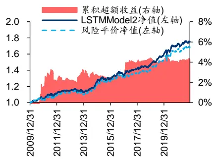
注：底层资产为：沪深 300、标普 500、中债-国债总财富指数、CBOT10 年期美国国债、彭博贵金属子指数，回测区间为 20091231~20211231
资料来源：Wind，Bloomberg，华泰研究

## 将组合优化融入端到端的神经网络框架中

华泰金工人工智能系列报告致力于将人工智能方法应用于量化投资的各个流程环节。如图表 1 所示，在基于因子的量化投资流程中，因子生成、多因子合成、组合优化是三个重要步骤。传统的机器学习方法(遗传规划、随机森林等)能针对单个步骤提供改进方案。但在分开执行不同步骤时，可能会存在目标函数不一致、信息损耗的问题。为了实现多个步骤的端到端(end to end)优化，需要借助神经网络和深度学习。我们在《人工智能 32：AlphaNet：因子挖掘神经网络》(2020.6.14)中构建了深度学习模型 AlphaNet，能实现端到端的因子挖掘和因子合成，但尚未将组合优化纳入。

本文将关注如何将组合优化也融入到神经网络和深度学习中，从而打通量化投资的三个步骤，实现全流程的端到端优化。具体而言我们将借助 CvxpyLayers，在进行凸优化的同时传播梯度。在一个理想的端到端神经网络框架中，输入资产的原始数据，通过神经网络进行特征提取和合成，再通过CvxpyLayers 优化得到资产权重，目标函数可直接定义为资产组合的收益率或其他指标，并使用该目标函数优化整个神经网络。

图表1： 人工智能模型融入量化投资流程
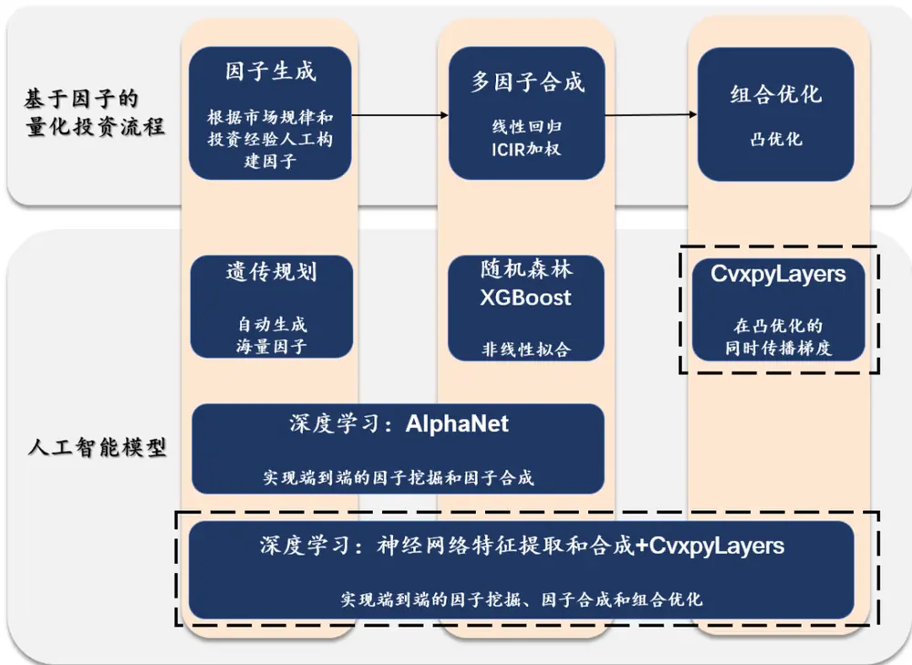
资料来源：华泰研究

## 基于神经网络的组合优化工具：CvxpyLayers

## 传统组合优化方法的局限

我们以马科维茨模型为例，来说明传统组合优化方法：

$$
\operatorname*{min}_{\boldsymbol{w}}\lambda\boldsymbol{w}^{T}\Sigma\boldsymbol{w}-\mu^{T}\boldsymbol{w}
$$

$$
\mathrm{s.t.}\quad\left\{{Aw=b\atop Gw\leq\ h}\right.
$$

式中w为权重， $\mu$ 为预期收益，Σ为协方差矩阵，λ为风险厌恶系数，目的是在给定约束下求解目标函数最优值时的w。该问题可以使用Matlab中的quadprog函数或者scipy的optimize模块来求解。这些传统求解方法可能会有以下局限：

1. 预期收益 $\mathbf{\nabla}\cdot\mu^{\mathbf{\nabla}}$ 是给定的，组合优化过程无法影响到预期收益，不能做到端到端的优化。

2. 对于λ这样的参数，需要通过遍历测试的方式来确定，无法在组合优化的同时确定。

3. 一般只进行单期优化。

存在以上局限，本质上都是因为传统组合优化方法是一个独立的过程，不能传播梯度，因此无法借助神经网络进行端到端的优化。

## 基于神经网络的凸优化研究回顾

针对基于神经网络的端到端凸优化，近年来有若干相关研究，本节进行简要回顾。

1. OptNet: Differentiable Optimization as a Layer in Neural Networks：论文发表于 2017年的 ICML 会议，作者针对二次规划开发了一个可求导的凸优化神经网络层。对应的代码地址为：https://github.com/locuslab/optnet。

2. Differentiable Convex Optimization Layers：论文发表于 2019 年的 NIPS 会议，作者针对更加广泛的凸优化问题开发了可求导的凸优化神经网络层 CvxpyLayers。对应的代码地址为：https://github.com/cvxgrp/cvxpylayers，CvxpyLayers 项目目前由斯坦福大学凸优化研究组维护。

3. A Surrogate Objective Framework for Prediction+Optimization with Soft Constraints：由微软亚洲研究院发表于 2021 年的 NIPS 会议，作者针对含有软约束的神经网络的预测+优化问题，提出了一个代理目标函数求解框架。对应的代码地址为：https://github.com/PredOptwithSoftConstraint/PredOptwithSoftConstraint。

## CvxpyLayers 简介

以上提到的研究中，CvxpyLayers 是一个较为成熟的项目，本节对 CvxpyLayers 进行简介。

图表2： CvxpyLayers：将凸优化问题嵌入现有的神经网络框架中
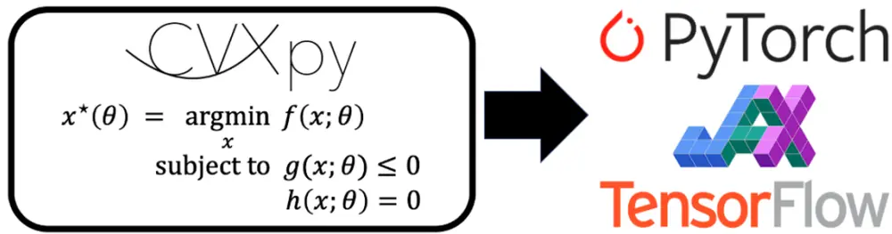
资料来源：华泰研究，https://github.com/cvxgrp/cvxpylayers

CvxpyLayers 在 Cvxpy 的基础上，将凸优化过程作为网络层嵌入到神经网络中，使得梯度传播成为可能。具体来讲，CvxpyLayers 做出了以下贡献：

1. 原理方面，CvxpyLayers 利用作者设计的 DPP(Disciplined parametrized programming，规范参数化规划)方法和 ASA(Affine-Solver-Affine，仿射-求解器-仿射)格式来表述凸优化问题，构建凸优化结果对模型参数的仿射映射，从而使求导变得可能，使我们不仅能用凸优化的方法完成优化，还能求出凸优化输出值对模型中待优化参数的梯度，以便神经网络进行梯度反向传播。原理的具体内容可参见论文“Differentiable ConvexOptimization Layers”。

2. 接口方面，CvxpyLayers 建立在 Cvxpy 库的基础上，可以根据 Cvxpy 的语法构建对象。此外，CvxpyLayers 整合了 PyTorch、Tensorflow 和 JAX 的接口，用户在构建神经网络时，可以像调用框架里的其他层一样，直接调用相关的凸优化层。

3. 应用方面，作者给出了一些具体的应用场景，以供用户参考。

接下来我们将展示一些与量化投资相关的应用实例，并提供相关问题的凸优化形式证明。

## 实例一：Softmax 函数的凸优化形式

神经网络的激活函数中，Softmax函数有多个输出值，且输出值之和为 1，可达到类似于资产权重分配的效果。Softmax 函数可以由下式直接计算。

$$
f(x)_{j}={\frac{e^{x_{j}}}{\sum_{i}e^{x_{i}}}}
$$

但实际上也可以用凸优化的方式得出 Softmax 函数的结果，相应的凸优化问题为：

$$
\operatorname*{min}_{w}-x^{T}w-H(w)
$$

$$
\begin{array}{rl}{\mathsf{s.t.}\quad}&{{}\left\{{\begin{array}{ll}{0<w<1}\\{1^{T}w=1}\end{array}}\right.}\end{array}
$$

其中的H(w)为熵函数：

$$
H(w)=-\sum_{i}w_{i}\log w_{i}
$$

接下来我们对此进行证明。

证明

对凸优化定义的原问题，拉格朗日乘子法给出目标函数：

$$
f(w)=-x^{T}w-H(w)-\lambda(1^{T}w-1)
$$

一阶条件为：

$$
{\frac{\partial f}{\partial w}}=-x+\log w+1-\lambda=0
$$

有

$$
w=e^{\lambda-1+x}
$$

代入约束 $1^{T}w=1$ ，有

$$
1^{T}e^{\lambda-1+x}=1
$$

得

$$
\lambda=-\log(1^{T}e^{x-1})
$$

代入前式，有

$$
w=\exp\{-\log(1^{T}e^{x-1})-1+x\}=\frac{e^{x}}{1^{T}e^{x}}
$$

证明凸优化问题与原问题是等价的。

## CvxpyLayers 代码样例

CvxpyLayers 可在凸优化问题的基础上对w进行约束，达到限制资产权重上限的目的，也即优化如下问题：

$$
\operatorname*{min}_{w}-x^{T}w-H(w)
$$

$$
\mathrm{s.t.}\qquad\left\{\begin{array}{ll}{0<w<1}\\{1^{T}w=1}\\{~w\leq u}\end{array}\right.
$$

CvxpyLayers 代码样例如下，其中 cp.entr(w)即熵函数H(w)。

图表3： 带约束的 softmax凸优化代码样例
1 import cvxpy as cp 
from cvxpylayers.torch import CvxpyLayer 
x = cp.Parameter(n) 
w = cp.Variable(n) 
obj = -x*w-cp.sum(cp.entr(w)) 
cons = [cp.sum(w) == 1., w <= u] 
prob = cp.Problem(cp.Minimize(obj),cons) 
layer = CvxpyLayer(prob, [x], [w])
资料来源：华泰研究

## 实例二：风险预算模型的凸优化形式

风险预算模型由风险平价模型推广而来，一般的风险预算模型需要求解以下优化问题：

$$
\operatorname*{min}_{\boldsymbol{w}}\sum_{i}^{n}\left(\frac{w_{i}(\Sigma\boldsymbol{w})_{i}}{\boldsymbol{w}^{T}\Sigma\boldsymbol{w}}-b_{i}\right)^{2}
$$

$$
\mathrm{~s.t.~}\quad\left\{\sum_{i}w_{i}=1\atop w_{i}>0\right.
$$

式中Σ为协方差矩阵，b为风险预算，w为要求的权重。该问题的解为：

$$
\frac{w(\Sigma w)_{i}}{w^{T}\Sigma w}=b_{i}
$$

该问题并非凸优化问题，因而若要使用 CvxpyLayers，需要将该问题转变为凸优化问题：

$$
\operatorname*{min}_{y}\sqrt{y^{T}\Sigma y}
$$

$$
\mathrm{s.t.}\qquad\left\{\sum_{i}b_{i}\ln y_{i}\geq c\qquad\right.\qquad
$$

求解后，有：

$$
w_{i}=\frac{y_{i}}{\sum_{i}y_{i}}
$$

其中， $y$ 为与w形状相同的向量，c为任意常数。其余定义与原问题相同。接下来我们对此进行证明。

证明

凸优化问题的拉格朗日函数为：

$$
f(y;\lambda,\lambda_{c})=\sqrt{y^{T}\Sigma y}-\lambda^{T}y-\lambda_{c}\left(\sum_{i}b_{i}\ln y_{i}-c\right)
$$

一阶条件为：

$$
{\frac{\partial f}{\partial y_{i}}}(y;\lambda,\lambda_{c})={\frac{1}{\sqrt{y^{T}\Sigma y}}}\sum_{j=1}^{n}y_{j}\sigma_{i,j}-\lambda_{i}-\lambda_{c}{\frac{b_{i}}{y_{i}}}=0\tag{1}
$$

KKT 条件为：

$$
\left\{\begin{array}{c}{{\lambda_{i}y_{i}=0}}\\{{\displaystyle{\lambda_{c}\left(\sum_{i}b_{i}\ln y_{i}-c\right)=0}}}\end{array}\right.
$$

因为 0不在ln $y_{i}$ 的定义域内，所 $\nu\lambda y_{i}$ 不能为 0，因而满足第一个条件意味着 $\lambda_{i}=0$ 。对于凸优化问题，若无约束，显然最优解为 $y=0$ ，但无法取得。当 $y>0$ 时，y越小目标函数也越小，因而最优解在条件的边界处，此时 $\begin{array}{r}{\sum_{i}b_{i}\ln y_{i}=c}\end{array}$ ，可知 $\lambda_{c}\neq0$ o

将上述信息代入式(1)，我们有解为：

$$
\frac{y_{i}(\Sigma{y})_{i}}{\sqrt{y^{T}\Sigma{y}}}=\lambda_{c}b_{i}\tag{2}
$$

对式(2)两边求和，有

$$
\sqrt{y^{T}\Sigma y}=\lambda_{c}\tag{3}
$$

将式(3)代入式(2)，有

即

$$
\frac{y_{i}(\Sigma{y})_{i}}{\sqrt{y^{T}\Sigma{y}}}=b_{i}\sqrt{y^{T}\Sigma{y}}
$$

$$
\frac{y_{i}(\Sigma y)_{i}}{y^{T}\Sigma y}=b_{i}\tag{4}
$$

将式(4)左侧上下同除以 $(\sum_{i}y_{i})^{2}$ ，我们有

$$
{\frac{\sum_{i}^{y_{i}}\left(\Sigma{\frac{y}{\sum_{i}^{\phantom{*}}y_{i}}}\right)_{i}}{{\frac{y}{\sum_{i}^{\phantom{*}}y_{i}}}^{T}\Sigma{\frac{y}{\sum_{i}^{\phantom{*}}y_{i}}}}}=b_{i}\tag{5}
$$

此时，我们将 $y_{i}/\sum_{i}y_{i}$ 记作 $w_{i}$ ，则式(5)变为

$$
\frac{w_{i}(\Sigma w)_{i}}{w^{T}\Sigma w}=b_{i}
$$

证明凸优化问题与原问题是等价的。

CvxpyLayers 代码样例

利用 CvxpyLayers 求解风险预算模型的代码样例如下，其中 Q_sqrt 为协方差矩阵平方根，b为风险预算，y 为权重。

图表4： 风险预算模型代码样例
1 import cvxpy as cp 
2 from cvxpylayers.torch import CvxpyLayer 
b = cp.Parameter(n,nonneg=True) 
5Q_sqrt = cp.Parameter((n,n)) 
6y = cp.Variable(n) 
7 cons = [y >= 0, b.T @ cp.log(y) >= c] 
8obj = cp.Minimize(cp.sum_squares(Q_sqrt @ y)) 
9 prob = cp.Problem(obj, cons) 
10layer = CvxpyLayer(prob, [b,Q_sqrt], [y])
资料来源：华泰研究

## 实例三：马科维茨模型

利用马科维茨效用函数进行组合优化的示例问题如下：

$$
\operatorname*{min}_{w}\frac{1}{2}w^{T}\Sigma w-\mu^{T}w
$$

$$
\mathrm{s.t.}\quad\left\{{Aw=b\atop Gw\leq\ h}\right.
$$

式中 $w$ 为权重， $\mu$ 为预期收益，Σ为协方差矩阵。目标函数中二次项前的系数为 $1/2$ ，而实际上我们可以设成任意值，也可以设计成参数，交由 CvxpyLayers 优化。CvxpyLayers 代码样例如下，其中 Q_sqrt 为协方差矩阵的平方根，q 为预期收益，A、b、G、h 分别是上述的约束参数。

## 图表5： 马科维茨模型代码样例

1 import cvxpy as cp 
2from cvxpylayers.torch import CvxpyLayer 
4Q_sqrt = cp.Parmeter((n,n)) 
5μ = cp.Parameter(n) 
6A = cp.Parameter((m,n)) 
7 b = cp.Parameter(m) 
8G = cp.Parameter((p,n)) 
9 h = cp.Parameter(p) 
10w = cp.Variable(n) 
11obj = cp.Minimize(0.5*cp.sum_square(Q_sqrt*w) - μ.T @ w) 
12 cons = [A @ w == b, G @ w <= h] 
13 prob = cp.Problem(obj, cons) 
14layer = CvxpyLayer(prob, parameters=[Q_sqrt, μ, A, b, G, h], variables=[w])
资料来源：华泰研究

## 基于 CvxpyLayers 的风险预算模型

本章将介绍 CvxpyLayers 在风险预算模型上的应用实证，构建模型的细节参考了普林斯顿大学在 2021 年初发表的论文“End-to-End Risk Budgeting Portfolio Optimization withNeural Networks”。为了使用 CvxpyLayers，需要通过以下凸优化问题求解资产权重（上一章已经推导过），其中 $b_{i}$ 为风险预算， $w_{i}$ 为资产权重。

$$
\begin{array}{c}{\displaystyle{\operatorname*{min}_{y}\sqrt{y^{T}\Sigma y}}}\\{\mathrm{s.t.}\quad\displaystyle{\left\{\begin{array}{ll}{\displaystyle{\sum_{i}b_{i}\ln y_{i}\geq c}}\\{\phantom{\displaystyle{\sum_{i}b_{i}\ln y_{i}\geq c}}}\\{\phantom{\displaystyle{\sum_{i}b_{i}\geq\sum_{j}}}}\end{array}\right.}}\end{array}
$$

求解后，有：

$$
w_{i}=\frac{y_{i}}{\sum_{i}y_{i}}
$$

本文构建并测试以下两个风险预算模型：

1. 因子模型 FactorModel：人工构建大类资产因子，然后输入神经网络映射为风险预算，再对接 CvxpyLayers 优化得到资产权重。模型整合了因子合成和组合优化两个步骤。

2. 端到端模型 LSTMModel：直接将大类资产的原始日频收益率数据输入神经网络的LSTM 层映射为风险预算，再对接 CvxpyLayers 优化得到资产权重。模型整合了因子挖掘、因子合成和组合优化三个步骤。

接下来我们将对数据和模型进行详细说明。

## 数据准备

1. 投资标的：选取国内外比较典型的股票、债券、大宗商品资产指数，形成两个资产配置标的池，分别对应国内外资产配置和国内资产配置。投资标的信息如图表 6~图表 9 所示。

图表6： 国内外资产配置标的池：大类资产基本信息(20020104~20211231)

| 资产名称 | Wind/Bloomberg 代码 | 年化收益率 | 年化波动率 | 夏普比率 |
| --- | --- | --- | --- | --- |
| 沪深300 | 000300.SH | 7.05% | 25.81% | 0.27 |
| 标普 500 | SPX.GI | 7.49% | 19.54% | 0.38 |
| 中债-国债总财富指数 | CBA00601.CS | 3.81% | 2.81% | 1.35 |
| CBOT10 年期美国国债 | TY.CBT | 1.14% | 6.28% | 0.18 |
| 彭博贵金属子指数 | BCOMPR | 7.61% | 20.35% | 0.37 |

资料来源：Wind，Bloomberg，华泰研究

图表7： 国内外资产配置标的池：大类资产归一化收盘价对比(20020104~20211231)
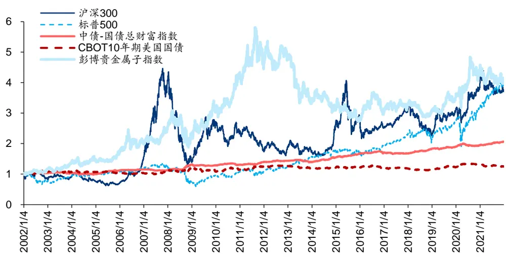
资料来源：Wind，Bloomberg，华泰研究

图表8： 国内资产配置标的池：大类资产基本信息(20041231~20211231)

| 资产名称 | Wind 代码 | 年化收益率 | 年化波动率 | 夏普比率 |
| --- | --- | --- | --- | --- |
| 沪深300 | 000300.SH | 10.14% | 26.52% | 0.38 |
| 中证 500 | 000905.SH | 12.83% | 30.15% | 0.43 |
| 中债-国债总财富(1-3 年)指数 | CBA00621.CS | 3.35% | 0.98% | 3.41 |
| 中债-国债总财富(7-10年)指数 | CBA00651.CS | 4.73% | 4.36% | 1.09 |
| SGE 黄金 9999 | AU9999.SGE | 7.22% | 16.45% | 0.44 |

资料来源：Wind，华泰研究

图表9： 国内资产配置标的池：大类资产归一化收盘价对比(20041231~20211231)
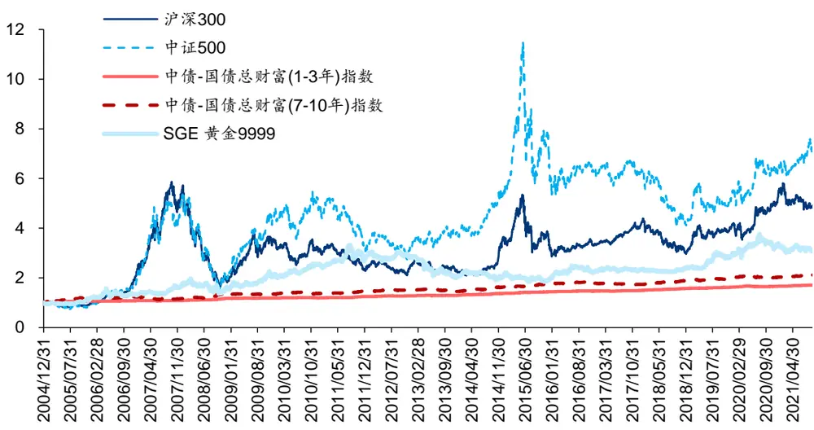
资料来源：Wind，华泰研究

2. 因子构建：使用资产过去 30 个交易日的收盘价计算因子，因子模型 FactorModel 和端到端模型 LSTMModel有不同的因子计算方式(后文有详细说明)。

3. 协方差矩阵：采用过去 30 个交易日 5 个资产的收益率构建协方差矩阵。

4. 预测目标构建：计算各资产未来 20个交易日的收益率，并与组合输出的资产权重相乘后求和得到组合收益，以最大化组合收益作为预测目标。

## 模型构建

因子模型 FactorModel 的构建主要参考论文“End-to-End Risk Budgeting Portfolio

Optimization with Neural Networks”中的方法。如图表 10 所示，模型主要步骤如下：

1. 每个资产构建 11 个因子，包括 10天、20 天、30 天的收益率和波动率，以及近 5天的日频收益率。总共得到 55 个因子作为模型的输入。

2. 因子经过两层全连接层和 Softmax函数映射为风险预算。

3. 与参考论文不同，我们在 Softmax函数后使用了激活函数 HardTanh，目的是限制风险预算的上下限在区间(lower,upper)，控制风险预算相比风险平价的偏离程度。HardTanh函数后再采用 normalize 函数将风险预算归一化。

$$
HardTanh(\mathbf{x})=\left\{{\begin{array}{lr}{upper}&{\quad if\ x>upper}\\{lower}&{\quad if\ x<lower}\\{x}&{\quad otherwise}\end{array}}\right.
$$

4. 将以上步骤生成的风险预算和协方差矩阵输入 CvxpyLayers 凸优化层得到组合权重，并通过组合权重和资产未来 20 个交易日的收益率计算出组合收益，以组合累计收益的负值为损失函数进行反向传播。

图表10： FactorModel 的结构
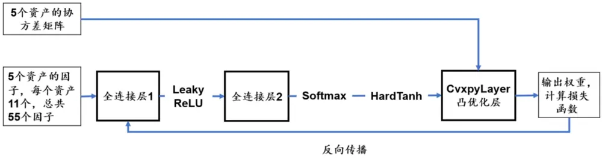
资料来源：华泰研究

图表11： FactorModel 模型细节

| 网络构成 | 包含组件 | 参数和说明 |
| --- | --- | --- |
| 全连接层1 全连接层2 | 10 个神经元 | 激活函数：Leaky ReLU，Negtive Slope: -0.1 |
|  | 5 个神经元 | 激活函数1：Softmax，目的是将全连接层的输出映射为5 个资产的风险预算。 激活函数2：HardTanh，目的是限制风险预算的上下限在区 间(lower,upper)，增加约束。HardTanh函数后再采用 normalize 函数将输出归一化。 |
| 凸优化层 | CvxpyLayers 凸优化层 | 将上一层输出的结果作为风险预算，并输入5个资产过去30 个交易日的协方差矩阵，凸优化层采用风险预算模型实现权 重优化。 |
| 模型其他参数 | 损失函数：组合累计收益的负值 优化器和学习率：Adam，0.01 batch_size: 100 训练的 epoch 数量：50 提前停止(early_stopping)：10 |  |

资料来源：华泰研究

在本文的开头我们指出，CvxpyLayers 使得构建端到端的量化投资模型成为可能。具体针对风险预算模型来说，我们将构建一个完全端到端的模型 LSTMModel。如图表 12所示，LSTMModel 与 FactorModel 的区别在于模型输入部分，与输入人工构建的因子不同，

LSTMModel 直接输入过去 30 个交易日 5个资产的日收益率，使用 LSTM 层提取原始收益率中的信息，并输出 55 个因子到全连接层(与 FactorModel输入的 55 个因子对应)，全连接层之后的结构与 FactorModel完全一致。

图表12： LSTMModel 的结构
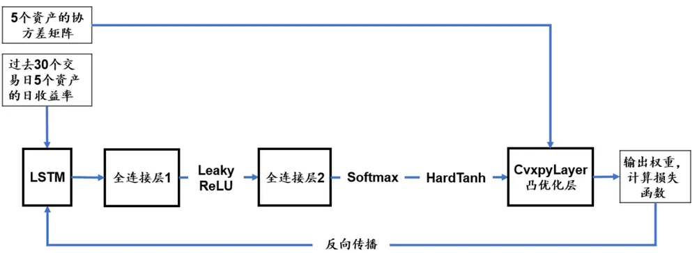
资料来源：华泰研究

图表13： LSTMModel 的模型细节

| 网络构成 | 包含组件 | 参数和说明 |
| --- | --- | --- |
| LSTM | 单层 LSTM | 输入维度：5，对应5个资产 输出神经元数：55，与 FactorModel 输入的 55 个因子对应 time_step:30 |
| 全连接层1 全连接层2 | 10 个神经元 5个神经元 | 激活函数：LeakyReLU，negtive slope:-0.1 激活函数1：Softmax，目的是将全连接层的输出映射为5 |
|  |  | 个资产的风险预算。 激活函数2:HardTanh，目的是限制风险预算的上下限在区 间(lower,upper)，增加约束。HardTanh 函数后再采用 normalize函数将输出归一化。 |
| 凸优化层 | CvxpyLayers 凸优化层 | 将上一层输出的结果作为风险预算，并输入5个资产过去30 个交易日的协方差矩阵，凸优化层采用风险预算模型实现权 重优化。 |
| 模型其他参数 | 损失函数：组合累计收益的负值 优化器和学习率：Adam，0.001 batch_size:100 训练的 epoch 数量：50 提前停止(early_stopping)：10 |  |

资料来源：华泰研究

## 模型训练和测试方式

1. 模型训练：对于国内外资产配置，从 2009 年 12 月 1日开始，每隔 100 个交易日滚动训练。样本内数据为此前 1800 个交易日的数据，训练集为前 1500 个，验证集为后 300个。对于国内资产配置，由于资产历史行情较短，从 2011 年 12 月 1 日开始，每隔 100个交易日滚动训练。样本内数据为此前 1500 个交易日的数据，训练集为前 1200 个，验证集为后 300 个。在训练集、验证集和测试集之间间隔 21 个交易日，以避免未来信息泄漏。

2. 模型测试：在测试集数据中，以 20个交易日为调仓频率，采用最新训练的模型和当前时点过去 30 个交易日数据，输入模型获取权重，进行调仓。

3. 考虑到神经网络训练受随机数影响较大，我们将上述步骤重复 5次，得到多组预测结果，并取等权平均为最终预测结果。

4. 回测区间：国内外资产配置：2009 年 12 月 31 日到 2021 年 12 月 31 日。国内资产配置：2011 年 12 月 30 日到 2021 年 12 月 31 日。

5. 交易成本：单边万分之五。

## 模型评价

我们从以下方面评价模型。

1. 策略净值曲线、年化收益率、夏普比率、最大回撤、Calmar比率、换手率等指标，并与风险平价模型对比。

2. 分析模型各期的风险预算和资产权重，并与风险平价模型对比。

3. 策略超额收益归因：将模型每一期对各个资产的偏配权重与资产未来 20 个交易日收益率相乘再累积，分解得到模型在各个资产上相对风险平价的超额收益。

## 模型测试结果：国内外资产配置

本章展示基于 CvxpyLayers 的风险预算模型在国内外资产配置的测试结果。

如图表 14~图表 16 所示，针对因子模型 FactorModel，我们设置三个不同的风险预算上限得到三个模型，并与风险平价模型对比回测绩效。可知三个模型相比风险平价模型的年化收益率都更高，模型达到了优化资产配置组合收益的目标。其中 FactorModel2 的年化收益率最高。

图表14： 模型回测绩效(回测区间为 20091231~20211231)

| 模型 |  |  | 年化收益率 年化波动率 | 夏普比率 | 1.69 | 最大回撤 Calmar 比率 总换手率 |  |  |
| --- | --- | --- | --- | --- | --- | --- | --- | --- |
| 风险平价 |  | 4.65% |  |  |  | 2.76% | -4.49% | 1.04 |
| FactorModel1 | 风险预算上下限为[0.05，0.25] | 4.90% | 2.98% | 1.64 | -4.11% |  | 1.19 | 33.54 36.59 |
| FactorModel2 | 风险预算上下限为[0.05，0.3] | 4.98% | 3.17% |  | 1.57 | -4.01% | 1.24 | 39.00 |
| FactorModel3 | 风险预算上下限为[0.05，0.35] |  | 4.86% | 3.29% | 1.48 | -4.34% | 1.12 | 39.07 |

资料来源：Wind，Bloomberg，华泰研究

图表15： 模型回测净值
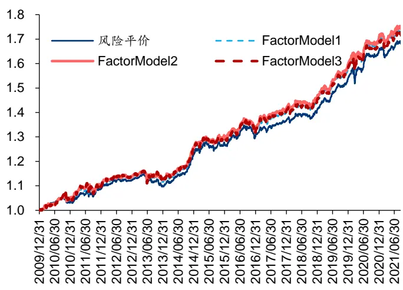
注：回测区间为 20091231~20211231
资料来源：Wind，Bloomberg，华泰研究

图表16： FactorModel2 的回测净值和超额收益
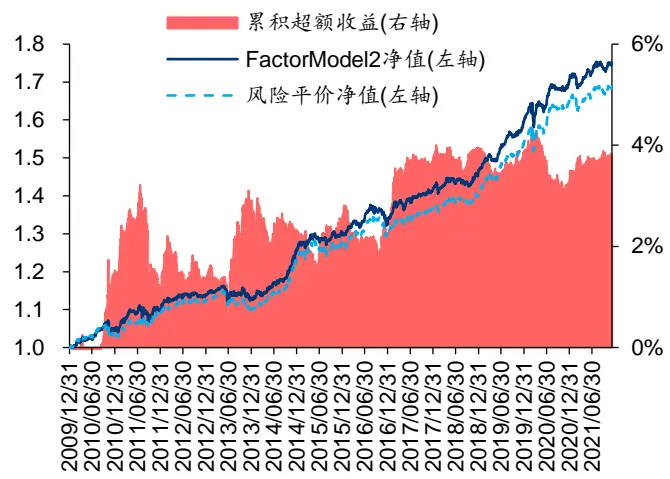
注：回测区间为 20091231~20211231
资料来源：Wind，Bloomberg，华泰研究

下图为 FactorModel2 的风险预算。各资产的平均风险预算为：沪深 300：23.66%，标普500：21.53%，中债-国债总财富指数：16.30%，CBOT10 年期美国国债：13.65%，彭博贵金属子指数：24.87%。

图表17： FactorModel2 的风险预算(回测区间为 20091231~20211231)
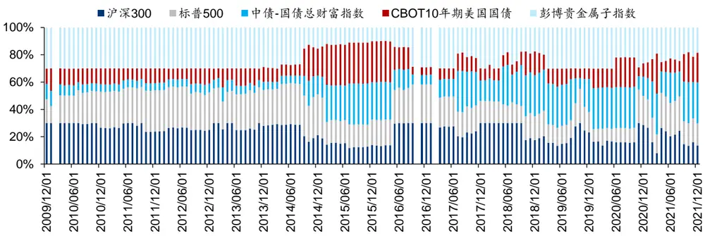
资料来源：Wind，Bloomberg，华泰研究

如图表 18~图表 20 所示，针对端到端模型 LSTMModel，我们设置三个不同的风险预算上限得到三个模型，并与风险平价模型对比回测绩效。可知三个模型相比风险平价模型的年化收益率都更高，模型在使用 LSTM 进行自动特征提取的同时，利用 CvxpyLayers 达到了优化资产配置组合收益的目标。其中 LSTMModel2 的年化收益率最高。

图表18： 模型回测绩效(回测区间为 20091231~20211231)

| 模型 | 年化收益率 | 年化波动率 | 夏普比率 | 最大回撤 Calmar 比率 总换手率 |  |  |
| --- | --- | --- | --- | --- | --- | --- |
| 风险平价 | 4.65% | 2.76% | 1.69 | -4.49% | 1.04 | 33.54 |
| LSTMModel1 风险预算上下限为[0.05，0.25] | 4.91% | 2.98% | 1.65 | -4.08% | 1.20 | 36.57 |
| LSTMModel2 风险预算上下限为[0.05，0.3] | 5.02% | 3.14% | 1.60 | -4.09% | 1.23 | 38.02 |
| LSTMModel3 风险预算上下限为[0.05，0.35] | 4.79% | 3.14% | 1.52 | -4.36% | 1.10 | 37.57 |

资料来源：Wind，Bloomberg，华泰研究

图表19： 模型回测净值
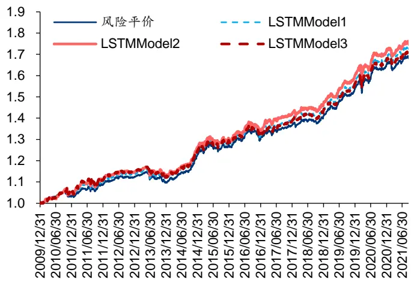
注：回测区间为 20091231~20211231资料来源：Wind，Bloomberg，华泰研究

图表20： LSTMModel2 的回测净值和超额收益
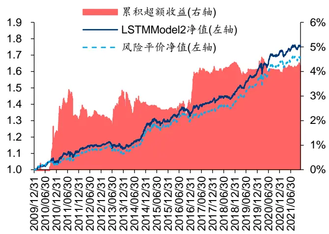
注：回测区间为 20091231~20211231资料来源：Wind，Bloomberg，华泰研究

下图为 LSTMModel2 的风险预算。各资产的平均风险预算为：沪深 300：20.76%，标普500：23.07%，中债-国债总财富指数：15.67%，CBOT10 年期美国国债：14.83%，彭博贵金属子指数：25.67%。

图表21： LSTMModel2 的风险预算(回测区间为 20091231~20211231)
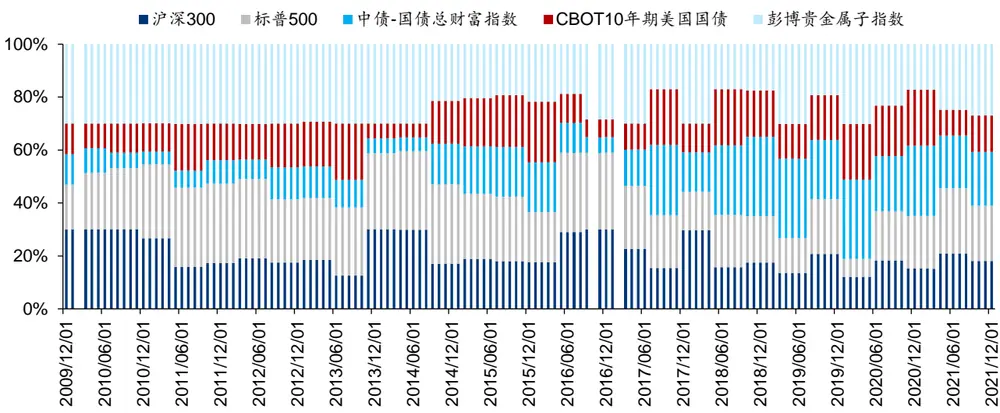
资料来源：Wind，Bloomberg，华泰研究

如图表 22~图表 25 所示，我们进一步分析 LSTMModel2 的各类资产偏配权重和超额收益贡献。可知 LSTMModel2 超配沪深 300、标普 500 和彭博贵金属子指数，低配中债-国债总财富指数和 CBOT10年期美国国债。相对于风险平价的超额收益贡献分解中，标普 500 和彭博贵金属子指数的偏配是主要的超额收益来源。

图表22： LSTMModel2 模型的平均偏配权重和超额收益贡献(回测区间为 20091231~20211231)

|  | 沪深300 | 标普 500 | 中债-国债总财富指数 | CBOT10 年期美国国债 | 彭博贵金属子指数 |
| --- | --- | --- | --- | --- | --- |
| 平均偏配权重 | 0.86% | 1.95% | -3.47% | -1.00% | 1.65% |
| 超额收益贡献 | -0.48% | 3.66% | -0.56% | -0.11% | 1.74% |

资料来源：Wind，Bloomberg，华泰研究

图表23： LSTMModel2 的权益类资产偏配权重与收盘价走势(回测区间为 20091231~20211231)
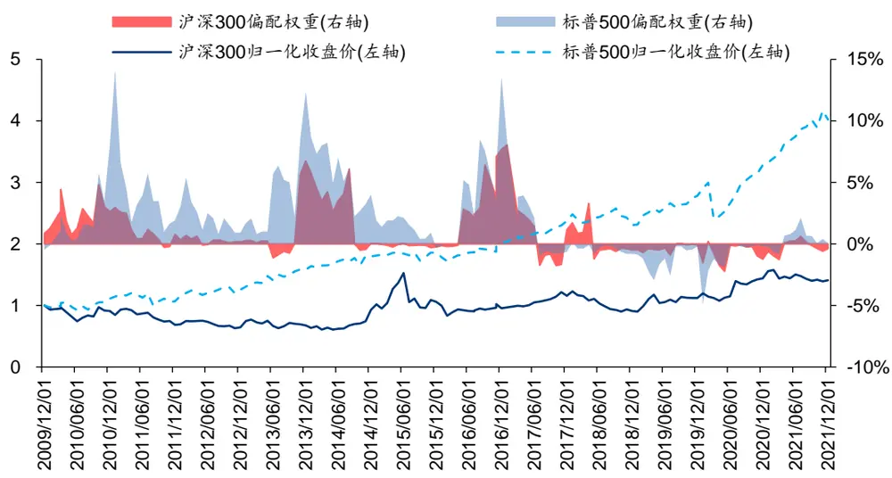
资料来源：Wind，Bloomberg，华泰研究

图表24： LSTMModel2 的债券类资产偏配权重与收盘价走势(回测区间为 20091231~20211231)
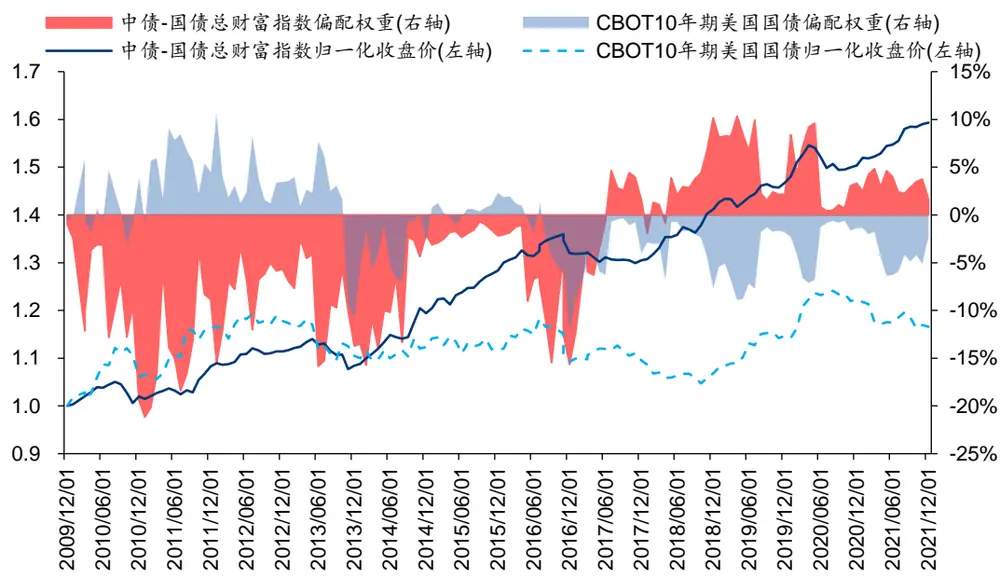
资料来源：Wind，Bloomberg，华泰研究

图表25： LSTMModel2 的彭博贵金属子指数偏配权重与收盘价走势(回测区间为 20091231~20211231)
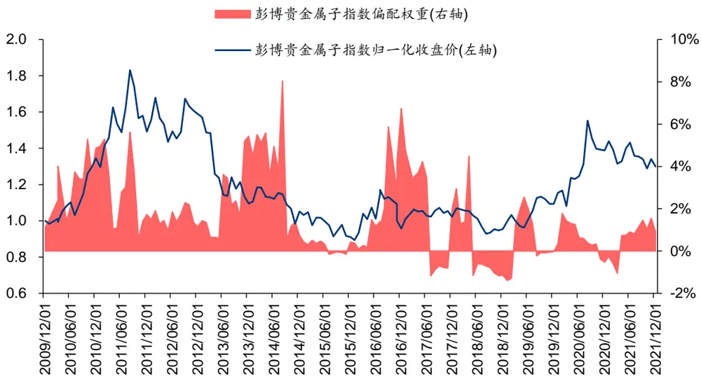
资料来源：Wind，Bloomberg，华泰研究

以下是 LSTMModel2 和风险平价模型各个资产的权重，供读者参考。

图表26： LSTMModel2 各个资产的权重(回测区间为 20091231~20211231)
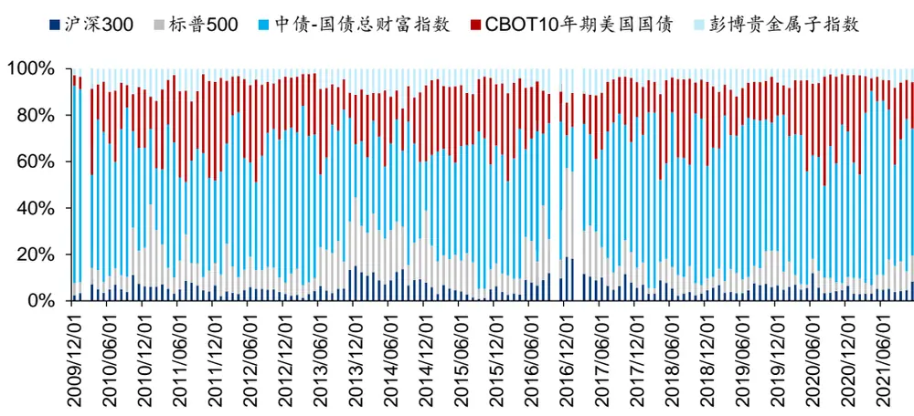
资料来源：Wind，Bloomberg，华泰研究

图表27： 风险平价模型各个资产的权重(回测区间为 20091231~20211231)
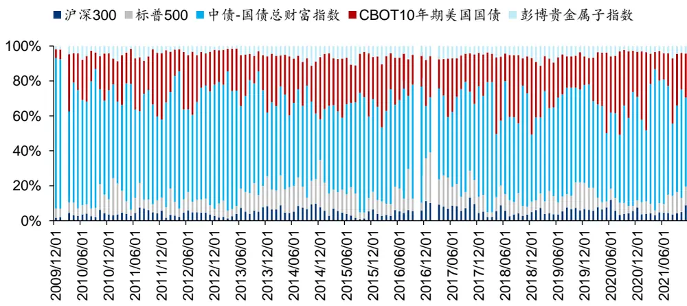
资料来源：Wind，Bloomberg，华泰研究

## 模型测试结果：国内资产配置

本章展示基于 CvxpyLayers 的风险预算模型在国内资产配置的测试结果。

如图表 28~图表 30 所示，针对因子模型 FactorModel，我们设置三个不同的风险预算上限得到三个模型，并与风险平价模型对比回测绩效。可知 FactorModel1 和 FactorModel2 相比风险平价模型的年化收益率都更高，在合理限制下，模型达到了优化资产配置组合收益的目标。其中 FactorModel2 的年化收益率最高。

图表28： 模型回测绩效(回测区间为 20111230~20211231)

| 模型 |  | 年化收益率 4.28% | 年化波动率 | 夏普比率 2.70 | 最大回撤 Calmar 比率 |  |  |
| --- | --- | --- | --- | --- | --- | --- | --- |
| 风险平价 |  |  |  |  | 1.59% | -2.88% | 总换手率 1.48 |
| FactorModel1 | 风险预算上下限为[0.05，0.3] | 4.49% | 1.66% | 2.71 | -2.62% | 1.72 | 18.43 18.88 |
| FactorModel2 | 风险预算上下限为[0.05，0.35] | 4.55% | 1.85% | 2.46 | -2.94% | 1.55 | 21.94 |
| FactorModel3 | 风险预算上下限为[0.05，0.4] | 4.24% | 1.67% | 2.54 | -2.92% | 1.45 | 19.35 |

资料来源：Wind，华泰研究

图表29： 模型回测净值
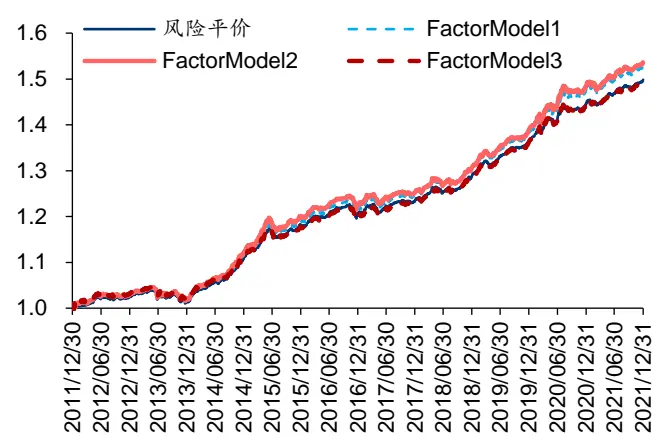
注：回测区间为 20111231~20211231资料来源：Wind，华泰研究

图表30： FactorModel2 的回测净值和超额收益
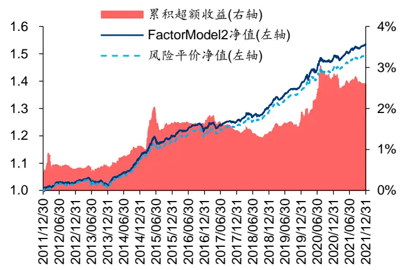
注：回测区间为 20111231~20211231资料来源：Wind，华泰研究

下图为 FactorModel2 的风险预算。各资产的平均风险预算为：沪深 300：19.61%，中证500：21.63%，中债-国债总财富(1-3 年)指数：15.48%，中债-国债总财富(7-10 年)指数：19.54%，SGE 黄金 9999：23.74%。

图表31： FactorModel2 的风险预算(回测区间为 20111230~20211231)
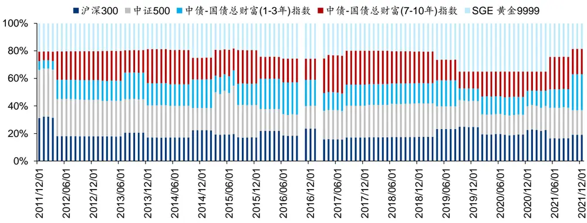
资料来源：Wind，华泰研究

如图表 32~图表 34 所示，针对端到端模型 LSTMModel，我们设置三个不同的风险预算上限得到三个模型，并与风险平价模型对比回测绩效。可知三个模型相比风险平价模型的年化收益率都更高，模型在使用 LSTM 进行自动特征提取的同时，利用 CvxpyLayers 达到了优化资产配置组合收益的目标。其中 LSTMModel2 的年化收益率最高。

图表32： 模型回测绩效(回测区间为 20111230~20211231)

| 模型 | 年化收益率 | 年化波动率 | 夏普比率 | 最大回撤 Calmar 比率 总换手率 |  |  |
| --- | --- | --- | --- | --- | --- | --- |
| 风险平价 | 4.28% | 1.59% | 2.70 | -2.88% | 1.48 | 18.43 |
| LSTMModel1 风险预算上下限为[0.05，0.3] | 4.49% | 1.88% | 2.40 | -2.97% | 1.51 | 21.91 |
| LSTMModel2 风险预算上下限为[0.05，0.35] | 4.56% | 2.09% | 2.19 | -3.89% | 1.17 | 24.47 |
| LSTMModel3风险预算上下限为[0.05，0.4] | 4.48% | 2.12% | 2.11 | -4.20% | 1.07 | 25.05 |

图表33： 模型回测净值
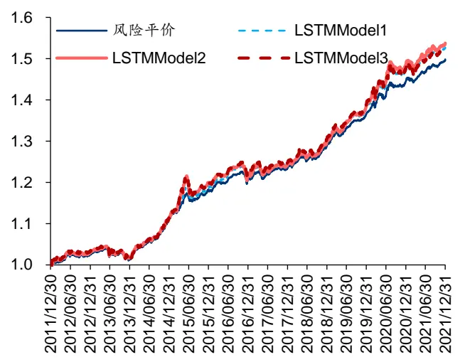
注：回测区间为 20111231~20211231资料来源：Wind，华泰研究

图表34： LSTMModel2 的回测净值和超额收益
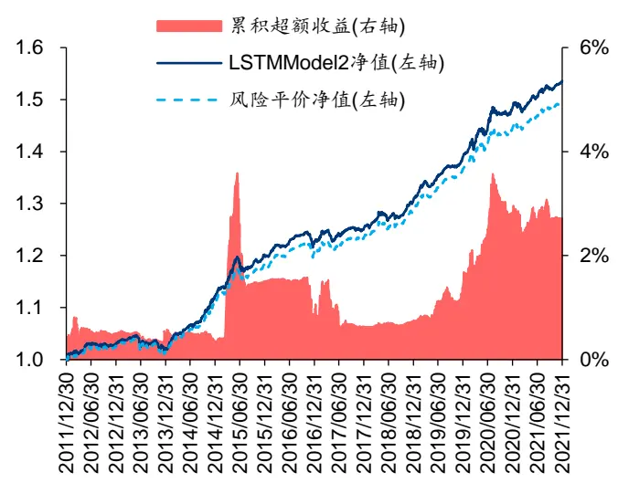
注：回测区间为 20111231~20211231资料来源：Wind，华泰研究

下图为 LSTMModel2 的风险预算。各资产的平均风险预算为：沪深 300：18.02%，中证500：21.87%，中债-国债总财富(1-3 年)指数：14.12%，中债-国债总财富(7-10 年)指数：21.73%，SGE 黄金 9999：24.27%。

图表35： LSTMModel2 的风险预算(回测区间为 20111230~20211231)
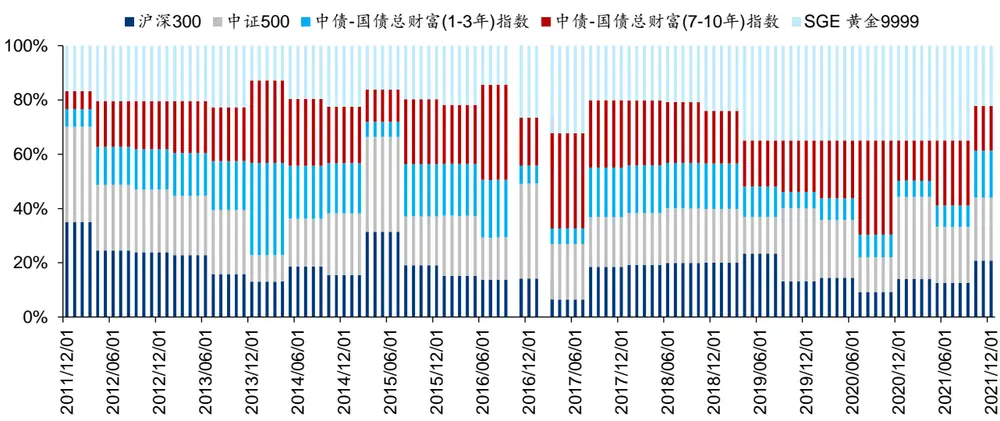
资料来源：Wind，华泰研究

如图表 36~图表 39 所示，我们进一步分析 LSTMModel2 的各类资产的偏配权重。可知LSTMModel2 超配沪深 300、中证 500、中债-国债总财富(7-10 年)指数和 SGE 黄金 9999，低配中债-国债总财富(1-3年)指数。相对于风险平价的超额收益贡献分解中，中证 500 和SGE黄金 9999 的偏配是主要的超额收益来源。

图表36： LSTMModel2 模型的平均偏配权重和超额收益贡献(回测区间为 20111230~20211231)

|  | 沪深300 | 中证 500中债-国债总财富(1-3 年)指数 中债-国债总财富(7-10 年)指数 |  | SGE 黄金 9999 |
| --- | --- | --- | --- | --- |
| 平均偏配权重 | 0.03% | 1.73% -6.58% | 3.51% | 1.32% |
| 超额收益贡献 | 0.79% | 5.13% | -1.85% 0.71% | 1.56% |

资料来源：Wind，Bloomberg，华泰研究

图表37： LSTMModel2 的权益类资产偏配权重与收盘价走势(回测区间为 20111230~20211231)
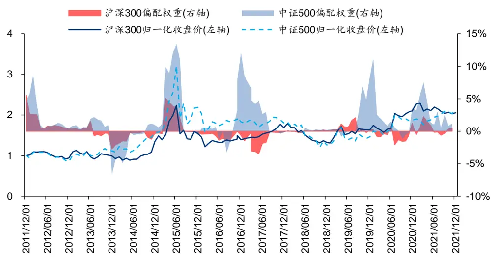
资料来源：Wind，华泰研究

图表38： LSTMModel2 的债券类资产偏配权重与收盘价走势(回测区间为 20111230~20211231)
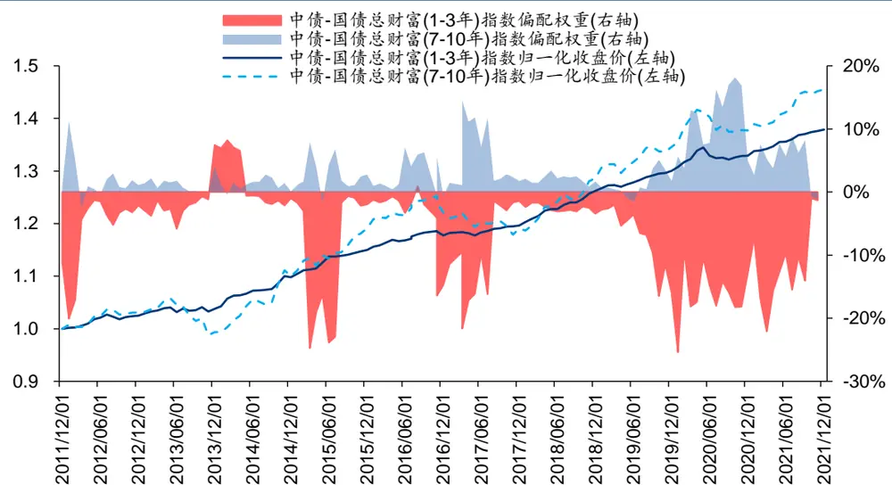
资料来源：Wind，华泰研究

图表39： LSTMModel2 的 SGE 黄金 9999 偏配权重与收盘价走势(回测区间为 20111230~20211231)
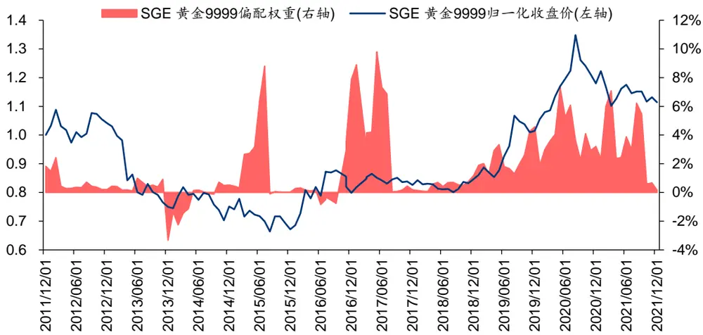
资料来源：Wind，华泰研究

以下是 LSTMModel2 和风险平价模型各个资产的权重，供读者参考。

图表40： LSTMModel2 各个资产的权重(回测区间为 20111230~20211231)
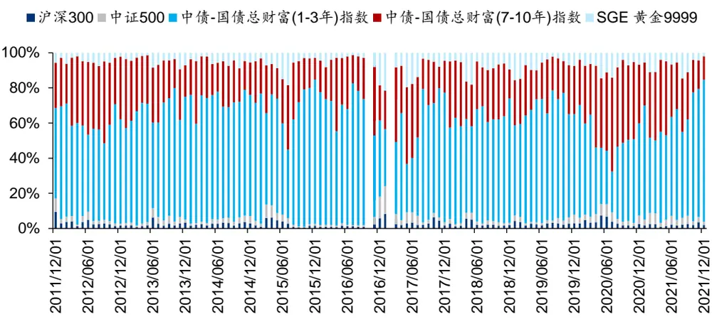
资料来源：Wind，华泰研究

图表41： 风险平价模型各个资产的权重(回测区间为 20111230~20211231)
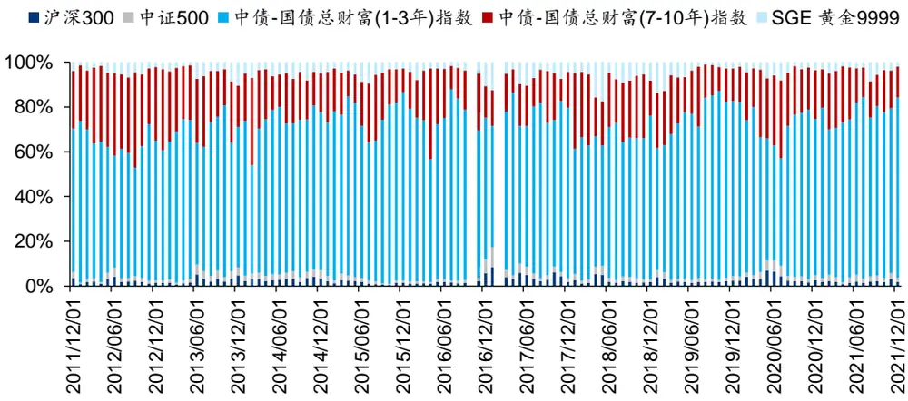
资料来源：Wind，华泰研究

## 总结与讨论

本文初步探索基于神经网络的组合优化。至此，我们打通量化投资的三个步骤(因子生成、多因子合成、组合优化)，完善了全流程端到端优化的框架。全文总结如下：

CvxpyLayers 能突破传统组合优化方法的局限。相对于因子生成和多因子合成，传统组合优化方法是一个独立的过程，不能传播梯度，因此无法借助神经网络进行端到端的优化，可能会有以下局限：(1)无法通过端到端的方式影响到组合优化的输入(如预期收益、风险预算)；(2)组合优化中的参数(如风险厌恶系数)只能通过遍历的方式来确定；(3)一般只进行单期优化。CvxpyLayers 在 Cvxpy 的基础上，将凸优化过程作为网络层嵌入到神经网络中，使得梯度传播成为可能，从而具有突破以上局限的潜力。CvxpyLayers 项目目前由斯坦福大学凸优化研究组维护。

本文介绍了三个使用 CvxpyLayers 进行组合优化的案例及代码。针对量化投资可能涉及的不同组合优化场景，本文介绍了三个使用 CvxpyLayers 进行组合优化的案例，并提供相关问题的凸优化形式证明。具体包含：(1) Softmax 函数的凸优化形式；(2) 风险预算模型的凸优化形式；(3)马科维茨模型。其中 Softmax 函数和风险预算模型的凸优化形式均采用拉格朗日乘子法进行证明。本文也给出了以上三个案例的样例代码。

本文介绍了基于 CvxpyLayers 的风险预算模型构建细节。实证方面，本文构建了两个基于CvxpyLayers 的风险预算模型：(1)因子模型 FactorModel：人工构建大类资产因子，然后输入神经网络映射为风险预算，再对接 CvxpyLayers 优化得到资产权重。FactorModel 整合了因子合成和组合优化两个步骤。(2)端到端模型 LSTMModel：直接将大类资产的原始日频收益率数据输入神经网络的 LSTM 层映射为风险预算，再对接 CvxpyLayers 优化得到资产权重。两个模型都以最大化组合收益作为预测目标，并通过反向传播动态学习更优的风险预算。LSTMModel整合了因子挖掘、因子合成和组合优化三个步骤。

基于 CvxpyLayers 的模型在两组资产配置测试中均能获得更好的收益表现。我们选取国内外比较典型的大类资产指数，测试基于 CvxpyLayers 的风险预算模型在国内外资产配置和国内资产配置的表现，对比基准为风险平价模型。在对风险预算的上下限进行合理限制后，FactorModel 和 LSTMModel 均能相对基准获得更好的收益表现。我们进一步分析LSTMModel 的超额收益来源。可知在国内外资产配置中，标普 500 和彭博贵金属子指数的偏配是主要的超额收益来源；在国内资产配置中，中证 500 和 SGE黄金 9999 的偏配是主要的超额收益来源。

有关基于神经网络的组合优化，依然有诸多细节可供讨论并尝试：

1. 本文的因子模型 FactorModel 只使用了简单的价量因子，加入基本面或宏观因子是值得尝试的方向。

2. 除了风险预算模型，CvxpyLayers 也有应用于多因子 CTA和多因子选股的潜力。

3. CvxpyLayers 提供了在组合优化的同时动态优化超参(如风险厌恶系数)的能力，其有效性有待验证。

## 参考文献

[1] Brandon Amos and J. Zico Kolter. OptNet: Differentiable optimization as a layer in neural networks. In Doina Precup and Yee Whye Teh, editors, Proceedings of the 34th International Conference on Machine Learning, volume 70 of Proceedings of Machine Learning Research, pages 136–145. International Convention Centre, Sydney, Australia, 06–11 Aug 2017. PMLR.

[2] Akshay Agrawal, Brandon Amos, Shane Barratt, Stephen Boyd, Steven Diamond, and J. Zico Kolter. Differentiable convex optimization layers. In Advances in Neural Information Processing Systems, volume 32, pages 9562–9574. Curran Associates, Inc., 2019.

[3] Brandon Amos. Differentiable Optimization-Based Modeling for Machine Learning. PhD thesis, Carnegie Mellon University, May 2019.

[4] Kai Yan, Jie Yan, Chuan Luo, Liting Chen, Qingwei Lin and Dongmei Zhang, A Surrogate Objective Framework for Prediction+Optimization with Soft Constraints. 32 pages, published as NeurIPS 2021 poster paper.

[5] S. Maillard, T. Roncalli, and J. Teiletche. On the properties of equally weighted risk contribution portfolios. The Journal of Portfolio Management, 2010.

[6] Uysal, Ayse Sinem and Li, Xiaoyue and Mulvey and John M, End-to-End Risk Budgeting Portfolio Optimization with Neural Networks. (July 9, 2021). Available at SSRN: https://ssrn.com/abstract=3883614 or http://dx.doi.org/10.2139/ssrn.3883614.

## 风险提示

通过神经网络构建的资产配置策略是历史经验的总结，存在失效的可能。神经网络受随机性影响较大，可解释性较低，使用需谨慎。

## 免责声明

## 分析师声明

本人，林晓明、李子钰、何康，兹证明本报告所表达的观点准确地反映了分析师对标的证券或发行人的个人意见；彼以往、现在或未来并无就其研究报告所提供的具体建议或所表迖的意见直接或间接收取任何报酬。

## 一般声明及披露

本报告由华泰证券股份有限公司（已具备中国证监会批准的证券投资咨询业务资格，以下简称“本公司”）制作。本报告所载资料是仅供接收人的严格保密资料。本报告仅供本公司及其客户和其关联机构使用。本公司不因接收人收到本报告而视其为客户。

本报告基于本公司认为可靠的、已公开的信息编制，但本公司及其关联机构(以下统称为“华泰”)对该等信息的准确性及完整性不作任何保证。

本报告所载的意见、评估及预测仅反映报告发布当日的观点和判断。在不同时期，华泰可能会发出与本报告所载意见、评估及预测不一致的研究报告。同时，本报告所指的证券或投资标的的价格、价值及投资收入可能会波动。以往表现并不能指引未来，未来回报并不能得到保证，并存在损失本金的可能。华泰不保证本报告所含信息保持在最新状态。华泰对本报告所含信息可在不发出通知的情形下做出修改，投资者应当自行关注相应的更新或修改。

本公司不是 FINRA 的注册会员，其研究分析师亦没有注册为 FINRA 的研究分析师/不具有 FINRA 分析师的注册资格。

华泰力求报告内容客观、公正，但本报告所载的观点、结论和建议仅供参考，不构成购买或出售所述证券的要约或招揽。该等观点、建议并未考虑到个别投资者的具体投资目的、财务状况以及特定需求，在任何时候均不构成对客户私人投资建议。投资者应当充分考虑自身特定状况，并完整理解和使用本报告内容，不应视本报告为做出投资决策的唯一因素。对依据或者使用本报告所造成的一切后果，华泰及作者均不承担任何法律责任。任何形式的分享证券投资收益或者分担证券投资损失的书面或口头承诺均为无效。

除非另行说明，本报告中所引用的关于业绩的数据代表过往表现，过往的业绩表现不应作为日后回报的预示。华泰不承诺也不保证任何预示的回报会得以实现，分析中所做的预测可能是基于相应的假设，任何假设的变化可能会显著影响所预测的回报。

华泰及作者在自身所知情的范围内，与本报告所指的证券或投资标的不存在法律禁止的利害关系。在法律许可的情况下，华泰可能会持有报告中提到的公司所发行的证券头寸并进行交易，为该公司提供投资银行、财务顾问或者金融产品等相关服务或向该公司招揽业务。

华泰的销售人员、交易人员或其他专业人士可能会依据不同假设和标准、采用不同的分析方法而口头或书面发表与本报告意见及建议不一致的市场评论和/或交易观点。华泰没有将此意见及建议向报告所有接收者进行更新的义务。华泰的资产管理部门、自营部门以及其他投资业务部门可能独立做出与本报告中的意见或建议不一致的投资决策。投资者应当考虑到华泰及/或其相关人员可能存在影响本报告观点客观性的潜在利益冲突。投资者请勿将本报告视为投资或其他决定的唯一信赖依据。有关该方面的具体披露请参照本报告尾部。

本报告并非意图发送、发布给在当地法律或监管规则下不允许向其发送、发布的机构或人员，也并非意图发送、发布给因可得到、使用本报告的行为而使华泰违反或受制于当地法律或监管规则的机构或人员。

本报告版权仅为本公司所有。未经本公司书面许可，任何机构或个人不得以翻版、复制、发表、引用或再次分发他人(无论整份或部分)等任何形式侵犯本公司版权。如征得本公司同意进行引用、刊发的，需在允许的范围内使用，并需在使用前获取独立的法律意见，以确定该引用、刊发符合当地适用法规的要求，同时注明出处为“华泰证券研究所”，且不得对本报告进行任何有悖原意的引用、删节和修改。本公司保留追究相关责任的权利。所有本报告中使用的商标、服务标记及标记均为本公司的商标、服务标记及标记。

## 中国香港

本报告由华泰证券股份有限公司制作,在香港由华泰金融控股（香港）有限公司向符合《证券及期货条例》及其附属法律规定的机构投资者和专业投资者的客户进行分发。华泰金融控股（香港）有限公司受香港证券及期货事务监察委员会监管，是华泰国际金融控股有限公司的全资子公司，后者为华泰证券股份有限公司的全资子公司。在香港获得本报告的人员若有任何有关本报告的问题,请与华泰金融控股（香港）有限公司联系。

## 香港-重要监管披露

- 华泰金融控股（香港）有限公司的雇员或其关联人士没有担任本报告中提及的公司或发行人的高级人员。

- 有关重要的披露信息，请参华泰金融控股（香港）有限公司的网页 https://www.htsc.com.hk/stock_disclosure其他信息请参见下方 “美国-重要监管披露”。

## 美国

在美国本报告由华泰证券（美国）有限公司向符合美国监管规定的机构投资者进行发表与分发。华泰证券（美国）有限公司是美国注册经纪商和美国金融业监管局（FINRA）的注册会员。对于其在美国分发的研究报告，华泰证券（美国）有限公司根据《1934 年证券交易法》（修订版）第 15a-6 条规定以及美国证券交易委员会人员解释，对本研究报告内容负责。华泰证券（美国）有限公司联营公司的分析师不具有美国金融监管（FINRA）分析师的注册资格，可能不属于华泰证券（美国）有限公司的关联人员，因此可能不受 FINRA 关于分析师与标的公司沟通、公开露面和所持交易证券的限制。华泰证券（美国）有限公司是华泰国际金融控股有限公司的全资子公司，后者为华泰证券股份有限公司的全资子公司。任何直接从华泰证券（美国）有限公司收到此报告并希望就本报告所述任何证券进行交易的人士，应通过华泰证券（美国）有限公司进行交易。

## 美国-重要监管披露

- 分析师林晓明、李子钰、何康本人及相关人士并不担任本报告所提及的标的证券或发行人的高级人员、董事或顾问。分析师及相关人士与本报告所提及的标的证券或发行人并无任何相关财务利益。本披露中所提及的“相关人士”包括 FINRA 定义下分析师的家庭成员。分析师根据华泰证券的整体收入和盈利能力获得薪酬，包括源自公司投资银行业务的收入。

华泰证券股份有限公司、其子公司和/或其联营公司, 及/或不时会以自身或代理形式向客户出售及购买华泰证券研究所覆盖公司的证券/衍生工具，包括股票及债券（包括衍生品）华泰证券研究所覆盖公司的证券/衍生工具，包括股票及债券（包括衍生品）。

- 华泰证券股份有限公司、其子公司和/或其联营公司, 及/或其高级管理层、董事和雇员可能会持有本报告中所提到的任何证券（或任何相关投资）头寸，并可能不时进行增持或减持该证券（或投资）。因此，投资者应该意识到可能存在利益冲突。

## 评级说明

投资评级基于分析师对报告发布日后 6 至 12个月内行业或公司回报潜力（含此期间的股息回报）相对基准表现的预期（A股市场基准为沪深 300 指数，香港市场基准为恒生指数，美国市场基准为标普 500 指数），具体如下：

## 行业评级

增持：预计行业股票指数超越基准

中性：预计行业股票指数基本与基准持平

减持：预计行业股票指数明显弱于基准

## 公司评级

买入：预计股价超越基准 15%以上

增持：预计股价超越基准 5%~15%

持有：预计股价相对基准波动在-15%~5%之间

卖出：预计股价弱于基准 15%以上

暂停评级：已暂停评级、目标价及预测，以遵守适用法规及/或公司政策

无评级：股票不在常规研究覆盖范围内。投资者不应期待华泰提供该等证券及/或公司相关的持续或补充信息

## 法律实体披露

中国：华泰证券股份有限公司具有中国证监会核准的“证券投资咨询”业务资格，经营许可证编号为：91320000704041011J香港：华泰金融控股（香港）有限公司具有香港证监会核准的“就证券提供意见”业务资格，经营许可证编号为：AOK809美国：华泰证券（美国）有限公司为美国金融业监管局（FINRA）成员，具有在美国开展经纪交易商业务的资格，经营业务许可编号为：CRD#:298809/SEC#:8-70231

## 华泰证券股份有限公司

南京南京市建邺区江东中路228号华泰证券广场1号楼/邮政编码：210019

电话：86 25 83389999/传真：86 25 83387521电子邮件：ht-rd@htsc.com

## 深圳

深圳市福田区益田路5999号基金大厦10楼/邮政编码：518017电话：86 755 82493932/传真：86 755 82492062电子邮件：ht-rd@htsc.com

## 华泰金融控股（香港）有限公司

香港中环皇后大道中 99号中环中心 58楼 5808-12室
电话：+852-3658-6000/传真：+852-2169-0770
电子邮件：research@htsc.com
http://www.htsc.com.hk

## 华泰证券（美国）有限公司

美国纽约哈德逊城市广场 10号 41楼（纽约 10001）
电话：+212-763-8160/传真：+917-725-9702
电子邮件: Huatai@htsc-us.com
http://www.htsc-us.com

©版权所有2022年华泰证券股份有限公司

北京
北京市西城区太平桥大街丰盛胡同28号太平洋保险大厦A座18层/
邮政编码：100032
电话：86 10 63211166/传真：86 10 63211275
电子邮件：ht-rd@htsc.com
上海
上海市浦东新区东方路18号保利广场E栋23楼/邮政编码：200120
电话：86 21 28972098/传真：86 21 28972068
电子邮件：ht-rd@htsc.com