# 人工智能 53：揭秘微软 AI量化研究

华泰研究

2022 年 1 月 12 日│中国内地

## 深度研究

## 揭秘微软亚研院 AI 量化投资研究，展望行业未来发展六大趋势

微软亚研院 2017 年以来共发表 12篇 AI 量化投资学术研究，其中选股主题超过半数，其他涉及风险模型、算法交易、数据增强、时间序列预测、基础架构等话题。这些研究的突出特点是前沿和务实，具有较高参考价值。前沿是指使用的 AI 技术，大量运用近年来热门的图神经网络、注意力机制，并灵活应用最优传输、自步学习、知识蒸馏、解耦表征等工具；务实是指解决的具体问题，如“AI 模型如何应对市场规律变化”，“如何引导模型学习罕见样本”，“如何充分挖掘事件、舆情蕴藏的信息”等，这些都是业界实践中会遇到、接地气的问题。我们透过微软 AI量化研究展望行业未来发展趋势。

微软亚研院与华夏基金、太平资产展开合作研究，实盘运作产品表现出色微软亚研院是推动 AI基础研究落地金融服务场景的先行者。2017 年以来，微软亚研院分别与华夏基金、太平资产就 AI 在金融领域的应用展开战略合作，其中 AI 赋能量化投资是合作研究的重点。经过四年多的磨合，两家机构量化部门均实现了从研究到产品的转化，实盘运作产品表现较为出色。出于商业合作的保密要求，具体研究内容不对外公开。可喜的是，微软亚研院公开发表了一批学术论文，尽管不等同于商业合作内容，我们仍得以管中窥豹，了解顶尖研究机构所关心的问题、他们的思考以及最终提供的解决方案。

因子选股模型主题：图神经网络挖掘关系信息，注意力机制分配模型权重因子选股模型是微软 AI 量化研究的核心。HIST 使用残差图神经网络，将股票间 1）基本面主导的显式关系和 2）量价主导的隐式关系融入模型。TRA训练不同机器学习模型，采用注意力机制分配权重，应对“市场规律具有时变特性”问题。REST 使用循环神经网络挖掘事件的时序信息，图神经网络挖掘事件在股票间的关系信息，拓展事件驱动选股的方法论。二阶学习范式研究采用注意力机制，对不同模型进行注意力权重分配。基金持仓信息可通过1）矩阵分解、2）图嵌入两种方式融入深度学习选股。HAN 通过注意力机制学习 1）相同日期舆情间的关系和 2）不同日期舆情的上下文关系。

## 风险模型、算法交易、数据增强、时间序列预测主题

其他研究涵盖风险模型、算法交易、数据增强、时间序列预测等主题。DRM研究采用深度学习挖掘风险因子，借助循环神经网络挖掘每只股票的时序信息，借助图神经网络挖掘股票间关系信息，设计损失函数以降低因子共线性。OPD 研究提出引入策略蒸馏的强化学习拆单算法，将基于历史和未来数据训练的模型迁移至仅基于历史数据训练的模型。ADD 研究提出一种数据增强技术，将原始因子中的超额收益信息与市场收益信息解耦，生成信噪比高的虚假样本，参与模型训练以提升预测模型表现。IGMTF 研究基于图神经网络挖掘不同变量不同时刻间的关系信息，用于多元时间序列预测。

## 行业未来发展六大趋势：全面与侧重，产学研合作，GNN 等前沿技术

透过微软 AI 量化研究，我们展望行业未来发展的六大趋势：覆盖领域趋于全面，不局限于因子选股；侧重交易数据和另类数据挖掘，发挥 AI 优势；科研机构与投资机构密切配合，提出正确的问题很重要；积极开展高校合作，持续培养研究人才；图神经网络和注意力机制可能具备广阔应用前景；细节是魔鬼，前沿技术融入各环节。AI量化研究的进步对参与者提出更高要求，需要持续跟踪学术前沿，从外部吸收能量和信息是对抗内卷的最佳方式。

风险提示：人工智能挖掘市场规律是对历史的总结，市场规律在未来可能失效。人工智能技术存在过拟合风险。学术研究和产业研究的出发点和方法论不完全一致，将学术研究成果应用于投资实践前，仍需经过严格测试与论证。

研究员

SAC No. S0570516010001

林晓明

SFC No. BPY421

linxiaoming@htsc.com

+86-755-82080134

研究员

SAC No. S0570519110003

李子钰

SFC No. BRV743

liziyu@htsc.com

+86-755-23987436

研究员

SAC No. S0570520080004

何康，PhD

SFC No. BRB318

hekang@htsc.com

+86-21-28972039

## 微软亚研院 AI 量化投资研究

因子选股模型主题

其他主题

HIST图神经网络选股

DRM深度学习风险模型

TRA交易模式学习

OPD强化学习算法交易

REST关系事件驱动选股

ADD数据增强

股票预测的二阶学习范式

基金持仓融入深度学习

IGMTF预测多元时间序列

Qlib AI量化投资平台

TTIO技术指标优化算法

HAN舆情深度学习选股

资料来源：微软亚研院，华泰研究

## 微软亚研院 AI 量化投资研究

2021 年是量化“逆袭”的一年。在中小市值风格和长期研究积淀的共同支持下，量化整体取得不逊于主动的收益水平。在众多围绕量化行业的讨论中，AI 是备受瞩目的关键词之一。私募量化虽然经历起落，总体规模仍大幅扩容，AI 技术可能是推动行业发展的核心引擎。公募量化涌现出一批明星产品，得益于和微软在 AI 研究方面的合作，华夏基金指增、对冲产品业绩表现亮眼，微软入局量化引发市场热议。博道、上银、中信建投等业绩排名前列的量化产品也呈现出与华夏类似的高收益、高换手特征。

微软亚洲研究院（以下简称微软亚研院）是推动 AI 基础研究落地金融服务场景的先行者。2017 年以来，微软亚研院分别与华夏基金、太平资产就 AI 在金融领域的应用展开战略合作，其中 AI赋能量化投资是合作研究的重点。经过四年多的磨合，两家机构量化部门均实现了了从研究到产品的转化，实盘运作产品表现较为出色。如下图，自产品成立日至 2021 年底，以中证 500 全收益指数为比较基准，华夏中证 500 指数增强 A年化收益率 42.6%，年化超额收益率18.2%；太平资产量化5号（人工智能）年化收益率16.3%，年化超额收益率9.3%。

图表1： 华夏中证 500指数增强 A业绩表现
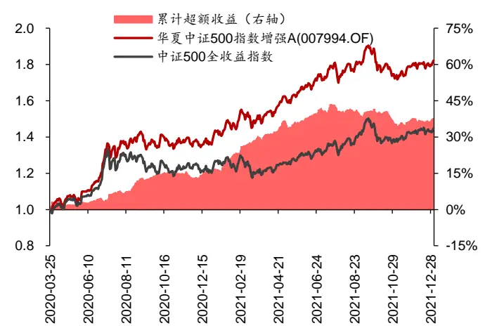
注：产品取累计单位净值，指数以产品成立日为基准取相对点位，比较区间取2020-03-25 至 2021-12-31
资料来源：Wind，华泰研究

图表2： 太平资产量化 5号(人工智能)业绩表现
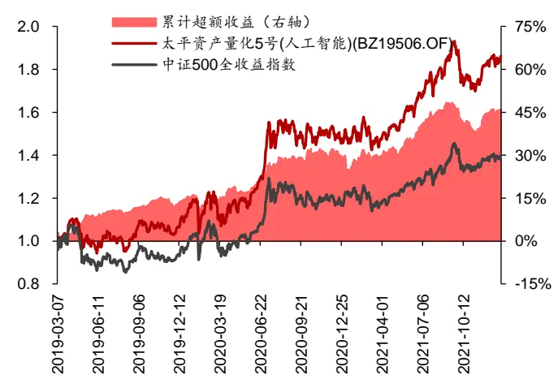
注：产品取累计单位净值，指数以产品成立日为基准取相对点位，比较区间取2019-03-07 至 2021-12-31资料来源：Wind，华泰研究

微软亚研院和两家机构开展了哪些研究？出于商业合作的保密要求，具体研究内容不对外公开。可喜的是，微软亚研院公开发表了一批学术论文，尽管不同于商业合作内容，我们仍得以管中窥豹，了解顶尖研究机构所关心的问题、他们的思考以及最终提供的解决方案。我们以微软亚研院量化投资研究为检索对象，共得到 12 篇论文，详细信息和部分开源代码地址详见下列图表及文末参考文献。

图表3： 微软亚研院 AI量化投资研究

| 研究简称 | 应用领域 | 核心方法 |  | 初稿发布时间会议收录情况 |
| --- | --- | --- | --- | --- |
| HIST 图神经网络选股 | 多因子选股 | 双重残差图神经网络 | 2021年10月 |  |
| TRA 交易模式学习 | 多因子选股 | 注意力机制 | 2021年6月 | KDD 2021 |
| REST 关系事件驱动选股 | 事件驱动选股 | 图神经网络，注意力机制 | 2021年2月 | WWW 2021 |
| 股票预测的二阶学习范式 | 多因子选股 | 注意力机制 | 2020年2月 |  |
| 基金持仓融入深度学习 | 另类数据结合多因子选股矩阵分解 |  | 2019年8月 | KDD 2019 |
| TTIO 技术指标优化算法 | 多因子选股 | 图嵌入 | 2019年8月 | KDD 2019 |
| HAN 舆情深度学习选股 | 另类数据选股 | 注意力机制 | 2017年12月 | WSDM 2018 |
| DRM 深度学习风险模型 | 风险模型 | 图神经网络 | 2021年7月 | ICAIF 2021 |
| OPD 强化学习算法交易 | 算法交易 | 强化学习 | 2021年3月 | AAAI 2021 |
| ADD 数据增强 | 数据增强、选股、择时 | 对抗训练 | 2020年12月 |  |
| IGMTF图神经网络预测多元时间序列 | 时间序列预测 | 图神经网络 | 2021年9月 |  |
| Qlib AI 量化投资平台 | 基础架构 | - | 2020年9月 |  |

资料来源：微软亚研院，华泰研究

图表4： 微软亚研院 AI量化投资部分研究开源代码

| 研究简称 | GitHub 地址 |
| --- | --- |
| HIST 图神经网络选股 | https://github.com/Wentao-Xu/HIST |
| TRA 交易模式学习 | https://github.com/microsoft/qlib/tree/main/examples/benchmarks/TRA |
| TTIO技术指标优化算法 | https://github.com/Elitack/IndicatorOptimization |
| OPD 强化学习算法交易 | https://seqml.github.io/opd/ |
| IGMTF图神经网络预测多元时间序列 | https://github.com/Wentao-Xu/IGMTF |
| Qlib AI 量化投资平台 | https://github.com/microsoft/qlib |

资料来源：微软亚研院，GitHub，华泰研究

12 篇研究涵盖量化投资各个领域，其中核心的选股主题超过半数，其他 5 篇涉及风险模型、算法交易、数据增强、时间序列预测、基础架构等话题。我们认为，这些研究的突出特点是“前沿”和“务实”，具有较高的参考价值。前沿是指使用的 AI 技术，大量运用近年来热门的图神经网络、注意力机制，并灵活应用最优传输、自步学习、知识蒸馏、解耦表征等前沿工具；务实是指解决的具体问题，如“AI 模型如何应对市场规律变化”，“如何引导模型学习罕见样本”，“如何充分挖掘事件、舆情蕴藏的信息”等，这些都是业界实践中会遇到、接地气的问题。

本文将对微软亚研院 AI 量化投资研究进行详细解读和点评，并尝试透过这些研究展望行业未来发展趋势。本文结构如下：

1. 首先讨论 7 篇因子选股模型研究。选股策略是微软亚研院和两家机构将研究落地产品化的首选途径，也是多数读者感兴趣的方向。

2. 其次讨论其他方向研究。5篇研究中，基础架构方向请见《人工智能 40：微软 AI 量化投资平台 Qlib 体验》（2020-12-22），本文不再展开。本文将介绍风险模型、算法交易、数据增强、时间序列预测 4篇研究。

3. 最后展望行业未来发展的六大趋势，分别是：覆盖领域趋于全面，不局限于因子选股；侧重交易数据和另类数据挖掘，发挥 AI 优势；科研机构与投资机构密切配合，提出正确的问题很重要；积极开展高校合作，持续培养研究人才；图神经网络和注意力机制可能具备广阔应用前景；细节是魔鬼，前沿技术融入各环节。

## 因子选股模型主题

## HIST：基本面信息结合图神经网络选股（2021 年10 月）

HIST图神经网络选股研究由微软亚研院和中山大学在2021年10月合作发布于arXiv平台，第一作者是中山大学-微软亚研院联合培养博士生 XuWentao，第二作者是微软亚研院机器学习组高级研究员 Liu Weiqing（刘炜清）。

传统选股模型假设股票间独立，但显然股票间存在相互影响，图神经网络可将股票间关系信息融入选股模型。该研究设计双重残差图神经网络 HIST，实现对股票间显式关系和隐式关系的挖掘。

HIST 网络的核心组件是一个编码器和三个预测模块：

1. 股票特征编码器（Stock Feature Encoder）：输入数据为 t 时刻股票过去 60 个交易日的开高低收、成交量、vwap 共 6 个原始量价因子，通过 GRU 网络得到量价因子的原始编码 Xt,0。

2. 显式关系模块（Predifined Concept Module）：基于股票所属行业和主营业务，构建股票间显式图网络。输入为原始编码 Xt,0，输出为收益预测Ŷt,0以及原始编码的估计量X̂t,0。X̂t,0代表量价因子中能够被显式图网络解释的信息。记 Xt,0 与X̂t,0的差为 Xt,1，Xt,1 代表量价因子中不能被显式图网络解释的信息。Ŷt,0代表能够被显式图网络解释的收益。

3. 隐式关系模块（Hidden Concept Module）：基于量价因子中不能被显式图网络解释的信息 Xt,1，构建股票间隐式图网络。输入为 Xt,1，输出为收益预测Ŷt,1以及输入编码的估计量X̂t,1。X̂t,1代表量价因子中能够被隐式图网络解释的信息。记 Xt,1与X̂t,1的差为 Xt,2，Xt,2 代表量价因子中不能被显式和隐式图网络解释的信息。Ŷt,1代表不能被显式图网络解释，但能够被隐式图网络解释的残差收益。

4. 个股信息模块（Individual Information Module）：基于量价因子中不能被显式和隐式图网络解释的信息，构建全连接网络。输入为 Xt,2，输出为收益预测Ŷ t,2。Ŷt,2代表前两步的残差收益。将Ŷt,0、Ŷt,1和Ŷt,2相加得到 Yt，通过全连接层，得到最终收益预测 pt。

图表5： HIST 网络结构
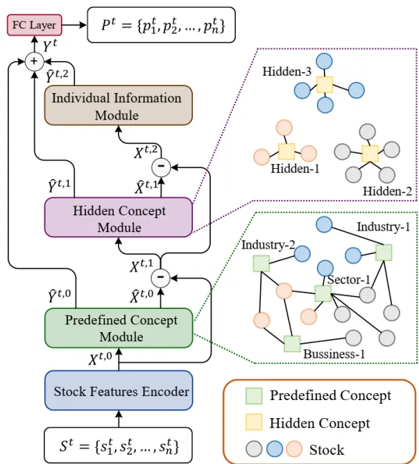
资料来源：Xu et al. (2021). Hist: a graph-based framework for stock trend forecasting via mining concept-oriented shared information. arXiv，华泰研究

结果显示，回测期内（2017 至 2020 年），引入显式和隐式图结构能够提升选股表现，HIST在中证 100 和沪深 300 股票池的 Rank IC、多头收益高于 LSTM、GATs 等深度学习模型。隐式图结构提取出的概念具备经济学含义（如高铁概念、国企概念等）。

图表6： HIST挖掘出的隐概念
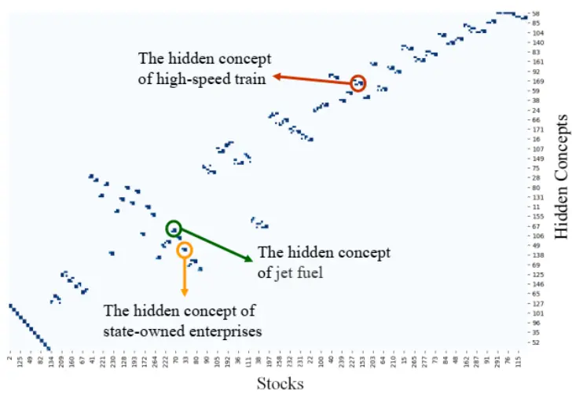
资料来源：Xu et al. (2021). Hist: a graph-based framework for stock trend forecasting via mining concept-oriented shared information. arXiv，华泰研究

我们认为，该研究的亮点是对预期收益的分解，将预期收益分为：

1. 股票间基本面关联解释的收益，由显式图神经网络预测。

2. 股票间交易行为关联解释的收益，由隐式图神经网络预测。

3. 股票自身特异性收益，由全连接网络预测。

这种分解在逻辑层面较合理，在实践层面也未引入过高的复杂度。

## TRA：交易模式学习（2021年 6月）

TRA 交易模式学习选股研究由微软亚研院在 2021 年 6 月发布于 arXiv，并被 2021 年 KDD国际数据挖掘与知识发现大会接收，共同第一作者是微软亚研院机器学习组实习生 LinHengxu 和时任研究员 Zhou Dong（周东）。

因子选股的本质是学习市场的特定交易模式（Trading Patterns），但市场存在不止一种交易模式，交易模式存在时变特性。例如在 A 股市场，小市值/大市值交易模式大致以 2017 年为界，反转/动量交易模式大致以2019年为界。该研究提出Temporal Routing Adaptor（TRA）模型，用以识别不同交易模式，在每种模式下使用与之相适应的预测器。

图表7： Predictors+Router 框架，不同形状代表交易模式，Router 识别交易模式，分别训练 Predictor
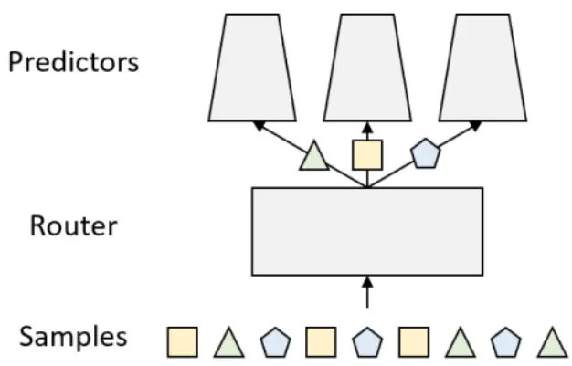
资料来源：Lin et al. (2021). Learning Multiple Stock Trading Patterns with Temporal Routing Adaptor and Optimal Transport. KDD，华泰研究

TRA模型的核心是注意力机制 Attention。构建方式如下：

1. 输入为因子时间序列 x，首先通过 LSTM层提取隐状态 $\mathsf{h}_{\mathsf{c}}$

2. 不考虑 Attention 的情况下，将 h 送至多个预测器，假设有 K个预测器，可得到不同预测值 $\hat{y}_{1}、\hat{y}_{2}、\hat{y}_{3}、\ldots、\hat{y}_{K}$ （下标 i代表预测器）。

3. 计算各预测器预测误差，每个样本（单只股票单个交易日）得到误差向量i （l K维向量）；每个样本取过去一段时间窗的预测误差，构成误差矩阵 ei（维数为时间窗长度×K）。

4. 对每个样本 i，计算隐状态 hi和误差矩阵 ei的注意力系数 ai（K维向量），归一化可得到标准化注意力系数 qi；以 $\mathbf{q}_{\mathrm{i}}$ 为权重对 $\hat{y}_{i}$ （下标 i代表样本）求加权平均，得到最终收益预测值 $\hat{-p_{i}}$ 。

图表8： TRA网络结构
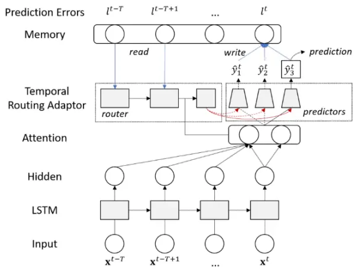
资料来源：Lin et al. (2021). Learning Multiple Stock Trading Patterns with Temporal Routing Adaptor and Optimal Transport. KDD，华泰研究

图表9： TRA注意力计算过程

$$
\begin{aligned}\mathbf{a}_{i}&=\pi(\mathbf{h}_{i},\mathbf{e}_{i}),\\\mathbf{q}_{i}&=\frac{\exp(\mathbf{a}_{i})}{\operatorname{sum}(\exp(\mathbf{a}_{i}))},\\\hat{\mathbf{p}}_{i}&=\mathbf{q}_{i}^{\top}\hat{\mathbf{y}}_{i}\end{aligned}
$$

资料来源：Lin et al. (2021). Learning Multiple Stock Trading Patterns with Temporal Routing Adaptor and Optimal Transport. KDD，华泰研究

此外，为了防止注意力权重 qi集中在个别预测器，损失函数中增加惩罚项，用来平衡 $\mathbf{q}_{\mathrm{i}}$ 中的样本，这一过程称为最优传输（Optimal Transport，简称 OT）。OT 最早用于解决最优运输以及物资分配问题，近年来为机器学习领域关注，生成对抗网络的变式WGAN就蕴含了OT 的思想。

TRA 研究参考 Cuturi 在 2013 年 NIPS 神经信息处理系统大会发表的论文 Learning MultipleStock Trading Patterns with Temporal Routing Adaptor and Optimal Transport，提出了TRA+OT 的损失函数，如下图所示。

损失函数中的 P和 L 均为 N×K矩阵，N为样本数量，K为预测器数量。P的 i行 k 列元素P 代表样本i分配到预测器k的概率，L的i行k列元素L 代表样本i在预测器k的损失值。P 通过求解优化问题得到，优化目标为最小化 P 和 L 的 Frobenius 内积（矩阵对应元素相乘再相加），约束条件为 P的行和为 1，且 P的列和与交易模式的先验比例 v成正比，v为网络自由参数，初始值为 1/N，即初始假设不同交易模式的出现频率均等。

在 TRA 的损失函数中增加 OT 正则化项，其本质是概率矩阵 P 和注意力权重 q 的交叉熵，目标是使得 q的分布尽可能接近 P，避免 q集中在个别预测器。

图表10： TRA+OT 损失函数

$$
\operatorname*{min}_{\mathbf{P}}\langle\mathbf{P},\mathbf{L}\rangle,
$$

$$
s.t.\sum_{i=1}^{N}\mathbf{P}_{ik}=\nu_{k}*N,\;\forall k=1...K.
$$

$$
\sum_{k=1}^{K}\mathbf{P}_{ik}=1,\;\forall i=1...N
$$

$$
\mathbb{P}_{ik}\in\{0,1\},\;\forall i=1...N,k=1...K,
$$

$$
\begin{array}{r}{\underset{\Theta,\pi,\psi}{\operatorname*{min}}\mathbb{E}_{(\mathbf{x}_{i},\mathbf{y}_{i})\in\mathcal{D}^{\mathrm{train}}}\left[\ell(\mathbf{x}_{i},\mathbf{y}_{i};\Theta,\pi,\psi)-\lambda\sum_{k=1}^{K}\mathbb{P}_{ik}\mathrm{log}(q_{ik})\right]}\end{array}
$$

资料来源：Lin et al. (2021). Learning Multiple Stock Trading Patterns with Temporal Routing Adaptor and Optimal Transport. KDD，华泰研究

该研究以 16 个传统基本面及量价因子在中证 800 成分股内进行月度选股为例，检验TRA+OT 模型表现，预测器设置为 ALSTM 和 Transformer 模型。结果显示，回测期内（2018年 9 月至 2020 年 6 月），相比基线模型，TRA+OT 能够有效提升 IC及多空组合表现。

我们认为，该研究的亮点是直面“市场规律具有时变特性”的核心问题，并使用 Attention机制来应对。长期以来，机器学习应用于量化投资的难点之一就在于市场并非独立同分布，违背大部分机器学习方法的前提假设。该研究的应对方式是，既然分布会变化，那么不妨训练不同机器学习模型，让 Attention 分配权重。同时，Optimal Transport 平衡权重可能也是必不可少的环节，本质是避免 Attention 的过拟合。

## REST：关系事件驱动选股（2021 年 2 月）

REST 关系事件驱动选股研究由微软亚研院和中山大学在 2021 年 2 月合作发布于 arXiv，并被 2021 年 WWW 国际万维网大会接收，第一作者是中山大学-微软亚研院联合培养博士生 Xu Wentao，第二作者是微软亚研院机器学习组高级研究员 Liu Weiqing（刘炜清）。

传统事件驱动模型忽略以下两点：1）事件对不同股票的影响程度不同（如事件对股票 A为正面影响，对股票 B为负面影响）；2）事件的间接影响（如事件通过股票 A对股票 B产生影响）。该研究提出关系事件驱动股票趋势预测模型（Relational Event-driven Stock TrendForecasting，REST），以解决上述问题。

REST 网络构建方式如下：

1. 事件信息编码器（Event Information Encoder）：原始事件数据由事件编码 t 和文本序列w 构成，通过多头注意力层（Type-specific Encoder）得到编码 e。每只股票 i 在日期 t取过去 3日的事件，通过 LSTM 得到事件信息编码 hit。

2. 股票上下文编码器（Stock Context Encoder）：输入包含历史事件编码 e 和历史事件反馈 v两部分。其中历史事件反馈 v为事件发生后一个交易日，开高低收、成交量、vwap这 6 个特征的变化率。e和 v各自通过 LSTM再拼接，得到股票 i 的上下文编码 hic。

3. 学习事件对不同股票的影响（Learning the Stock-dependent Influence）：对于股票 i，将 hit和 hic 拼接，通过单层神经网络，得到 t日事件信息对股票 i的效应强度 Diit。将股票池内所有股票的Diit放置在矩阵对角元，得到事件效应强度矩阵Dt。左乘事件信息H̅t，得到事件影响程度矩阵 H t。

4. 学习事件在股票间的影响（Learning the Cross-stock Influence）：利用行业、主营业务、股东、上下游关系等信息构建股票网络，将 H0t 送至图神经网络学习股票间关系信息，得到 H*t。图神经网络的核心是多跳 GCN。将 H*t送至全连接层得到最终预测收益 pt。

从 2013 至 2018 年的上市公司公告中提取 100629（沪深 300 股票池）和 183325 条（中证 500 股票池）事件，测试 REST 网络在上述股票池内的选股表现。对照组包含 ARIMA模型，不考虑事件信息的图神经网络模型，不考虑股票间关系的事件驱动模型。结果显示，回测期内（2018 年）REST 预测收益误差相比对照组更低，构建的日频换仓多头组合夏普比率更高。

图表11： REST 网络结构
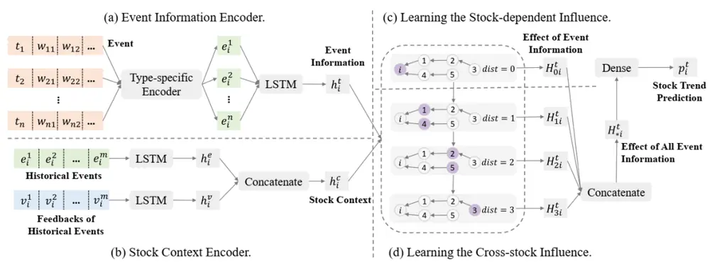
资料来源：Xu et al. (2021). REST: Relational Event-driven Stock Trend Forecasting. arXiv，华泰研究

图表12： REST案例：五粮液业绩超预期对贵州茅台和泸州老窖的影响方向相反，并间接影响通威股份
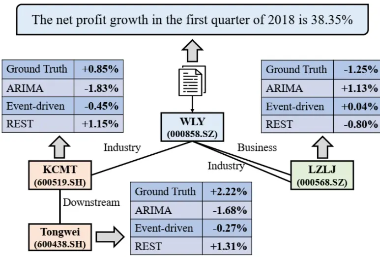
注：股票代码：五粮液（000858 CH），贵州茅台（600519 CH），泸州老窖（000568 CH），通威股份（600438 CH）资料来源：Xu et al. (2021). REST: Relational Event-driven Stock Trend Forecasting. arXiv，华泰研究

我们认为，该研究的亮点是拓展了深度学习应用于事件驱动选股的方法论。以往事件驱动研究的方法论较为单一且简单，这就意味着事件蕴含的信息未得到充分挖掘。深度学习中的循环神经网络可以挖掘事件的时序信息，图神经网络可以挖掘事件在股票间的关系信息，REST 网络将这些模块以特定方式组装起来，从而实现事件信息的高效利用，是对传统事件驱动研究方法论的升级。

## 股票预测的二阶学习范式（2020 年 2月）

二阶学习范式选股研究由微软亚研院和清华大学在 2020 年 2 月合作发布于 arXiv，第一作者是清华大学 Chen Chi，第二作者是微软亚研院机器学习组高级研究员 Zhao Li（赵立）。

传统股票预测模型学习从因子 X 到收益 Y 的映射关系，然而数据分布及市场规律存在时变特性，不存在单一、稳定的映射关系。该研究提出股票预测的二阶学习范式，采用注意力机制，对不同时间尺度模型所学习出的映射关系进行注意力权重分配。

## 二阶学习范式框架如下：

1. 一阶模型：学习从因子 X到收益 Y的映射关系 F。假设存在 4种时间尺度的线性模型，训练集长度分别为 s＝1、5、10、20 天，分别学习不同时间尺度下的规律。在 t时刻，每个子模型可表示为 $F_{\theta_{t}^{s}}$ ，其中参数表示为 $\theta_{\mathrm{t}}s$ 。

2. 二阶模型：学习不同映射关系 F 的注意力权重。在 t 时刻，将每个子模型参数 θs历史序列送至 LSTM，提取 t 时刻隐状态 ${\mathsf{ht}}^{s}\circ$ 在此后的 T 时刻，采用注意力机制，对各子模型参数的隐状态进行合成，得到合成参数 $\widehat{\theta_{T}}$ 。使用合成参数预测股票收益，使用预测误差优化包括 LSTM、注意力机制在内的所有参数。

以全 A 股为股票池，以 Alpha101 为选股因子，测试结果显示，回测期内（2017 年）二阶学习范式表现优于单个一阶模型，多头组合的年化收益率、夏普比率均更高。

图表13： 二阶学习范式框架
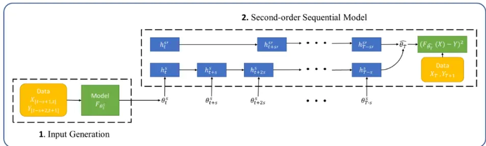
资料来源：Chen et al. (2020). Trimming the Sail: A Second-order Learning Paradigm for Stock Prediction. arXiv，华泰研究

我们认为，该研究和前述 TRA 交易模式学习有异曲同工之妙，亮点也是直面“市场规律有时变特性”的核心问题，同样使用 Attention 机制应对。二阶学习范式的提出时间早于 TRA，而 TRA 的复杂程度和对细节的把握（如 OT 的引入）似略胜一筹。

## 基金持仓融入深度学习（2019 年 8 月）

基金持仓融入深度学习研究由微软亚研院和清华大学在 2019 年 8 月合作发表于 KDD 国际数据挖掘与知识发现大会，第一作者是清华大学 Chen Chi，第二作者是微软亚研院机器学习组高级研究员 Zhao Li（赵立）。

该研究将基金持仓信息融入深度学习股票预测。首先将基金经理持仓矩阵通过矩阵分解（ Matrix Factorization ） 技 术 ， 拆 解 为 基 金 经 理 偏 好 和 股 票 内 在 属 性 （ IntrinsicProperties）。随后计算股票内在属性与当前市场状态的相关度。最后将该相关度与股票量价信息得到的表征融合，预测股票收益。

图表14： 基金经理偏好×股票内在属性＝基金经理在股票上的持仓
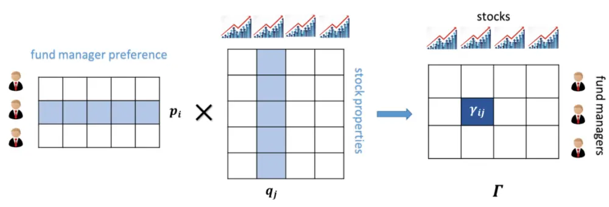
资料来源：Chen et al. (2019). Investment Behaviors Can Tell What Inside: Exploring Stock Intrinsic Properties for Stock Trend Prediction. KDD，华泰研究

股票内在属性如何通过矩阵分解得到？假定矩阵 Γ 表示某期基金经理持仓矩阵，第 i 行第 j列元素 γij表示基金经理 i 在股票 j 的持仓比例，通过基金半年报或年报统计得到。假定股票内在属性可以用 K 个维度刻画，自由参数 pi和 qj均为 K 维向量，pi代表基金经理 i 在 K 个内在属性上的偏好，qj 代表股票 j 在 K 个内在属性上的表征，pi 和 qj 的内积等于预测持仓γ̂ij。

矩阵分解的目标是：求解优化问题，寻找最优的 pi和 qj，使得真实持仓 γij和预测持仓γ̂ij的误差平方和尽可能小。实际设计损失函数时，还增加偏置项作为自由参数，同时引入正则化项控制过拟合。

股票预测网络分为静态输入（Static Inputs）和动态输入（Dynamic Inputs）两部分，分别处理股票内在属性输入（侧重于基本面）以及量价输入。其中动态输入部分的构建方式为：1. 输入为股票过去一段时间的 Alpha101 因子。

2. 通过循环神经网络层和全连接层，输出股票预测收益。

3. 训练上述网络。训练完成后，取循环神经网络层最后一个时刻的隐状态，作为量价输入的动态表征 Z（Dynamic Representations）。

## 静态输入部分的构建方式为：

1. 取最近交易日收益排名前 Kr只股票，计算各股票内在属性表征 Qj（等同于前文 qj）的均值，作为当前市场表征 St（Market Representations）。

2. 取过去一段时间的市场表征，通过 LSTM 层，得到未来市场表征的预测Ŝ（t Future MarketRepresentations）。

3. 将 Qj 与Ŝt相乘，得到股票j内在属性与未来市场表征的相关度 D。

4. 将 D与 Z拼接，通过全连接神经网络，最终得到股票收益预测。

图表15： 基金持仓融入深度学习网络构建
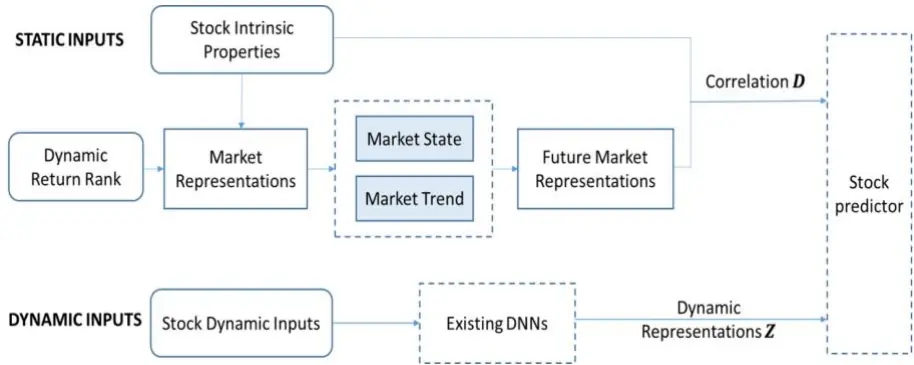
资料来源：Chen et al. (2019). Investment Behaviors Can Tell What Inside: Exploring Stock Intrinsic Properties for Stock Trend Prediction. KDD，华泰研究

以全 A 股为股票池，以仅采用量价输入的 LSTM 等模型为对照组，以 Mean AveragePrecision（MAP）和 Mean Reciprocal Rank（MRR）为评价指标，反映预测收益靠前股票的实际表现，每半年滚动训练模型。结果显示，回测期内（2013 至 2016 年），融入基金持仓的深度学习网络表现优于对照组模型。学习得到的股票内在属性各维度具备经济学含义。

## 我们认为，该研究的亮点有两方面：

1. 首先是丰富了基金持仓信息的使用方式。以往基金持仓信息一般用于构建基础股票池或重仓因子。该研究通过矩阵分解技术，将基金持仓信息转换为股票表征，并与量价信息相结合，实现了从原始持仓到预测收益的端到端学习。

2. 其次是考虑了基金持仓信息与当前市场状态的匹配度。基金重仓股的有效性随时间变化，并非稳定的 Alpha 来源。因此使用时需考虑当前市场状态是否利于基金重仓股。该研究没有直接将股票内在属性用于预测，而是计算股票内在属性和未来市场状态的相关度，再用于预测。这种动态使用基金持仓信息的方式，相比静态使用更为合理。

## TTIO：技术指标优化算法（2019年 8月）

TTIO 技术指标优化算法研究由微软亚研院、上海交通大学和清华大学在 2019 年 8 月合作发表于 KDD 国际数据挖掘与知识发现大会，第一作者是上海交通大学 Li Zhige，第二作者是清华大学 Yang Derek。

传统技术指标的计算方法对全部股票“一视同仁”，但同一个技术指标在不同股票中的变化范围不同。如乖离率（Bias）在稳定板块股票的时序波动幅度较小，但在周期板块股票的时序波动幅度较大。因此有必要对原始技术指标进行优化，针对不同股票采用不同的仿射变换（Affinity）参数。该研究提出 Technical Trading Indicator Optimization（TTIO）算法以实现技术指标的优化。

如何确定哪些股票使用相近的仿射变换参数？该研究并未采用传统的行业分类标准，而是借鉴基金经理的智慧，从基金持仓信息出发，构建基金-股票二分图（Fund-Stock BipartiteGraph），进而运用图嵌入（Graph Eembedding）技术，得到股票的嵌入（即隐藏表征）。若两只股票的嵌入值接近，则应使用接近的技术指标仿射变换参数。

## 图嵌入的具体实现方式为：

1. 根据基金持仓构建二分图，可表示为 G＝(U, V, E)，其中 U 为股票节点 u 构成的集合，V 为基金节点 v 构成的集合，E 为边的集合，每条边的权值 wfj,si代表股票 i 在基金 j 的持仓比例。

2. 将二分图中边的权值视作转移概率，构建股票节点随机游走序列。假定以股票 i为随机游走起点，股票 i到基金j的转移概率为归一化后的 w ，基金j到股票 i'的转移概率为归一化后的 $\mathsf{W}_{\mathsf{fj},\mathsf{Si}^{\prime}\circ}$ 。基于上述转移概率进行随机游走，每两步输出节点，即跳过基金节点，保留股票节点，得到一系列股票节点随机游走序列。序列中股票的邻接关系，可类比为句子中单词的上下文关系。

3. 采用Skip-Gram算法训练神经网络模型g，g(u)即股票u在基金-股票二分图中的嵌入。Skip-Gram 算法源于自然语言处理的词嵌入（Word Embedding），核心思想是最大化邻居单词的条件概率。应用于图嵌入场景时，目标函数为最大化前述股票节点随机游走序列中邻居股票的条件概率。

图表16： 基金-股票二分图
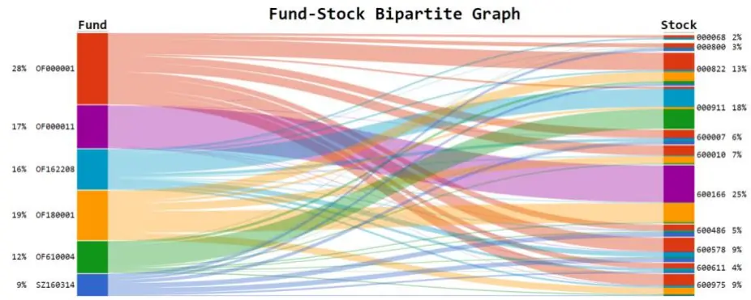
资料来源：Li et al. (2019). Individualized Indicator for All: Stock-wise Technical Indicator Optimization with Stock Embedding. KDD，华泰研究

得到股票的图嵌入后，基于嵌入值训练尺度变换网络，得到各股票技术指标仿射变换参数，并使用变换后的技术指标预测股票收益。网络具体构建方式为：

1. 尺度变换网络（Re-scaling Network）：输入为股票 i 的嵌入值 gi，通过简单的单层神经网络，技术指标 j 对应的网络自由参数为 wj，输出为股票 i 技术指标 j 的原始缩放权重$\mathbf{r}_{\mathrm{ij}}=\mathbf{w}_{\mathrm{i}}^{\top}\mathbf{g}_{\mathrm{i}}$ 。再将 rij进行 softmax 归一化，得到归一化权重 $\mathfrak{a}_{\mathrm{ij}}$

2. 技术指标最优缩放（Optimizing Indicator via Weighted Re-scaling）。将原始技术指标Iij和归一化权重 αij相乘，得到缩放后的技术指标 Iij’。网络的目标函数是最大化缩放后的技术指标与股票收益的 IC 值绝对值：max|corr(Ij’, R)|。

以全 A股为股票池，以 EMA、MACD、Bias 等七项技术指标为优化对象。对照组模型包含：使用原始或归一化技术指标，不使用图嵌入而直接通过神经网络优化缩放权重。结果显示，回测期内（2014 至 2016 年），TTIO策略 IC 值相比对照组更高，多头组合年化收益率更高。

我们认为，该研究的亮点是将嵌入（Embedding）技术引入股票预测问题。词嵌入是自然语言处理领域最基础的工具之一，可将离散的单词转换为连续的向量，以便参与后续神经网络运算。如果将股票视作单词，将基金持仓体现出的股票间关系视作单词的上下文关系，那么离散的股票也可以通过图嵌入转换为连续的向量。除了应用于技术指标优化，嵌入值可能蕴含了更多信息，例如嵌入值反映了股票间的距离，基于嵌入值或可以构建自下而上的行业分类体系。

## HAN：基于舆情数据的深度学习股票预测（2017 年 12 月）

HAN 舆情深度学习选股研究由微软亚研院和北京大学在 2017 年 12 月合作发布于 arXiv，并被 2018 年 WSDM 网络搜索和数据挖掘国际会议接收，第一作者是微软亚研院机器学习组实习生 Hu Ziniu，第二作者是微软亚研院机器学习组高级研究员 LiuWeiqing（刘炜清）。

该研究提出混合注意力网络（Hybrid Attention Networks，HAN），将深度学习应用于基于舆情数据的股票预测，核心是通过注意力机制 Attention 学习 1）相同日期舆情间的关系，2）不同日期舆情的上下文关系。

图表17： 混合注意力网络（HAN）结构
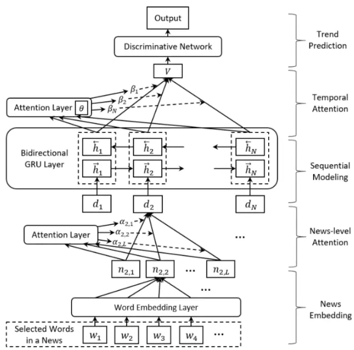
资料来源：Hu et al. (2017). Listening to Chaotic Whispers: A Deep Learning Framework for News-oriented Stock Trend Prediction. arXiv，华泰研究

## HAN 网络构建方式如下：

1. 舆情编码（News Embedding）：将个股 s 日期 t 新闻舆情 i 中的部分词语送至 WordEmbedding 层（Word2Vec），再对所有词语求均值，得到舆情向量 nt, i。

2. 舆情间注意力（News-level Attention）：将个股 s 日期 t 的全部 L 个舆情向量送至Attention 层，学习相同日期舆情间的关系，加权求和得到汇总舆情向量 dt。

3. 序列建模（Sequential Modeling）：将个股 s 在日期 1~N 的汇总舆情向量 $\mathbf{d}_{1}$ 、d2、…、$\mathsf{d}_{\mathbb{N}}$ 送至双向 GRU 层，得到每日舆情隐状态 $\vec{h}_{t}和\overleftarrow{h}_{t}$ o

4. 时序注意力（Temporal Attention）：将个股 s 每日舆情隐状态送至 Attention 层，学习不同日期舆情的上下文关系，加权求和得到汇总舆情隐状态 $\nabla_{\circ}$

5. 趋势预测（Trend Prediction）：将个股 s 的汇总舆情隐状态 V送至 MLP层，得到上涨/下跌/震荡三分类预测。

此外，该研究还通过自步学习机制（Self-paced Learning Mechanism），在训练早期跳过难以学习的样本，此后逐步纳入模型，从而提升训练效率。引入自步学习的 HAN 损失函数E(w, v, λ)如下图所示，包含两项：

1. 前半项为 v 与原始 HAN 损失的乘积，其中 v 的每个元素 vi取 0 或 1，代表第 i 条样本是否参与学习。

2. 后半项 f(v; λ)为自步学习的正则化项，用来惩罚 v不为 1，即 v取 0的情形，当正则化系数 λ较小时，原始 HAN 损失较大的样本也即难以学习的样本将不参与学习；当 λ 较大时，样本会尽可能参与学习。

由于正则化项为线性形式，最优的 v*存在解析解。训练开始阶段，λ取较小值，随后逐渐增大，实现先易后难的学习。

图表18： 引入自步学习的 HAN损失函数

$$
\min_{w,v\in[0,1]^{n}}E(w,v,\lambda)=\sum_{i=1}^{n}v_{i}L(y_{i},HAN(x_{i},w))+f(v;\lambda)
$$

$$
f(\boldsymbol{\upsilon};\lambda)=\frac{1}{2}\lambda\sum_{i=1}^{n}(\upsilon_{i}^{2}-2\upsilon_{i}).
$$

$$
v_{i}^{*}=argmin_{\upsilon}E(w^{*},\upsilon,\lambda)=\left\{\begin{aligned}-\frac{1}{\lambda}l_{i}+1\quad l_{i}<\lambda\\0\quad l_{i}\geq\lambda\end{aligned}\right.
$$

资料来源：Hu et al. (2017). Listening to Chaotic Whispers: A Deep Learning Framework for News-oriented Stock Trend Prediction. arXiv，华泰研究

该研究以东方财富和新浪财经为舆情数据源，2014 至 2017 年间清洗后得到 425250 条与股票相关的舆情，以全 A 股为股票池，以上涨/下跌/震荡三分类为预测目标，以随机森林、循环神经网络等传统舆情数据处理模型为对照组。结果显示，回测期内（2016年5月至2017年 3 月），相比于对照组，HAN 的预测正确率更高，构建的多头组合年化收益率更高。

我们认为，该研究的亮点是指出了深度学习应用于舆情数据选股的另一条路径。以往舆情选股研究往往局限于因子选股思路，例如将舆情数据通过情感分析模型转换为舆情因子。HAN 网络利用循环神经网络挖掘舆情的时序信息，利用注意力机制挖掘舆情间的关系信息，实现对舆情数据的充分挖掘。

## 风险模型、算法交易、数据增强和时间序列预测主题

## DRM：深度学习挖掘隐风险因子改进风险模型（2021 年 7月）

DRM深度学习风险模型研究由微软亚研院于2021年7月发布于arXiv，并被2021年ICAIF人工智能与金融国际会议接收，共同第一作者是微软亚研院机器学习组实习生 Lin Hengxu和时任研究员 Zhou Dong（周东）。

传统风险因子需要人为设计，该研究基于深度学习挖掘风险因子，核心思想是 1）借助循环神经网络挖掘每只股票的时序信息，2）借助图神经网络挖掘股票间的关系信息，3）设计损失函数以降低因子共线性。

深度风险模型（Deep Risk Model，DRM）构建方式如下：

1. 输入（x）：10 个 Barra USE4 风格因子 t-T 至 t-1 日的因子暴露。

2. 输出（f）：K个深度风险因子（文中 K＝10）t日的因子暴露。

3. 网络结构：

a. 下支为 GRU网络，学习每只股票的时序信息；

b. 上支为 GAT+GRU 网络，学习股票间的关系信息，其中 GAT 为图注意力网络；
c. 每个分支经过 FC网络（全连接层）得到 K/2个风险因子。

4. 损失函数：

a. 前半项为解释收益 y的 R2，y为未来 20 个交易日内的每日收益，即多任务学习；

b. 后半项为风险因子协方差矩阵的逆的迹，等价于方差膨胀因子 VIF，用于降低多重共线性。

深度风险模型输出风险因子暴露后，与 Barra USE4 的风格、行业、国家因子同时进行多元线性回归，得到因子收益率，随后进行协方差估计，得到预期协方差矩阵。结果显示引入深度学习因子的风险模型相比原始 Barra USE4 风险模型在回测期内（2017 年 1 月至 2020年 2 月）R2提升 1.9%。

图表19： 深度风险模型 Deep Risk Model 网络结构
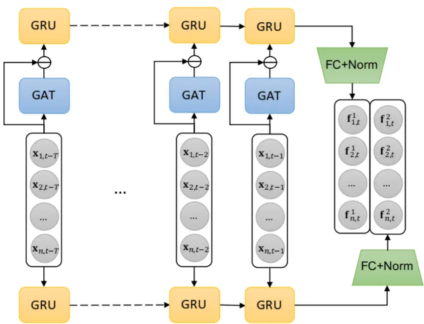
资料来源：Lin et al. (2021). Deep Risk Model: A Deep Learning Solution for Mining Latent Risk Factors to Improve Covariance Matrix Estimation. ICAIF，华泰研究

图表20： 深度风险模型 Deep Risk Model 损失函数

$$
\min_{\theta}\frac{1}{T}\sum_{t=1}^{T}\Big[\frac{1}{H}\sum_{h=1}^{H}\frac{\left\|\mathbf{y}_{\cdot,\mathbf{t}+\mathbf{h}}-\mathbf{F}_{\cdot t}(\mathbf{F}_{\cdot,t}^{\top}\mathbf{F}_{\cdot t})^{-1}\mathbf{F}_{\cdot,t}^{\top}\mathbf{y}_{\cdot t}\right\|_2^2}{\|\mathbf{y}_{\cdot,\mathbf{t}+\mathbf{h}}\|_2^2}+\lambda\mathrm{tr}\big((\mathbf{F}_{\cdot t}^{\top}\mathbf{F}_{\cdot t})^{-1}\big)\Big]
$$

资料来源：Lin et al. (2021). Deep Risk Model: A Deep Learning Solution for Mining Latent Risk Factors to Improve Covariance Matrix Estimation. ICAIF，华泰研究

我们认为，该研究的亮点是将深度学习引入风险模型。收益预测和风险预测是股票预测的核心。深度学习在收益预测上已有较多成功实践，但风险预测仍普遍沿用人为设计因子的传统方式。深度风险模型 Deep Risk Model 采用循环神经网络挖掘股票时序信息，采用图神经网络挖掘股票间关系信息，通过损失函数正则化项控制因子共线性，有效提升了风险模型的解释力度。

## OPD：强化学习应用于算法交易（2021年 3月）

强化学习算法交易研究由微软亚研院和上海交通大学于 2021 年 7 月合作发布于 arXiv，并被 2021 年 AAAI 国际先进人工智能协会年会接收，第一作者是微软亚研院机器学习组实习生 Fang Yuchen，第二作者是微软亚研院机器学习组高级研究员 Ren Kan（任侃）。

传统股票拆单算法有 TWAP、VWAP 等，强化学习技术也可应用于算法交易。但强化学习存在两个不足：1）股票市场信噪比低，学习交易策略的效率较低；2）每个时点只能根据历史信息进行决策，不考虑对未来走势的预测。该研究提出 Oracle Policy Distillation（OPD）技术，以解决上述两个问题。

OPD 的核心思想是：以基于历史数据进行强化学习的模型作为 Student，以基于全局数据进行强化学习的模型作为 Teacher，以 Teacher 引导 Student（策略蒸馏，PolicyDistillation），使得 Student 的动作更接近 Teacher。

图表21： Oracle Policy Distillation 框架
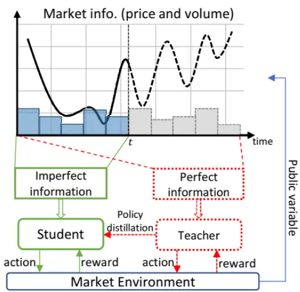
资料来源：Fang et al. (2021). Universal Trading for Order Execution with Oracle Policy Distillation. AAAI，华泰研究

拆单算法的问题表述：假设 Q 为目标卖出数量，pt为 t 时刻股票价格（该研究中为分钟线价格），qt为 t 时刻卖出数量，t时刻下单将在 t+1 时刻成交，那么交易算法的目标是在卖出数量为 Q 约束下，最大化总成交金额Σqp：

$$
\underset{}{\operatorname{argmax}}{\sum}_{t=0}^{T-1}(q_{t+1}\cdot p_{t+1}),\mathrm{s.t.}\underset{}{\sum}_{t=0}^{T-1}q_{t+1}=Q.
$$

强化学习的基础概念包含状态（State，s）、动作（Action，a）和奖赏（Reward，R）。强化学习的目标是学习一个从状态到决策的最优映射 a＝π(s)，称为策略（Policy，π）。本文中强化学习的损失函数大致分为策略优化（Policy Optimization）和策略蒸馏（PolicyDistillation）两部分。其中策略优化 Policy Optimization 的目标是优化交易策略，核心是奖赏 R 的设计，又可分为交易获利奖励R̂+和市场冲击惩罚R̂−两部分，如下图所示。

图表22： 强化学习奖赏 R和目标函数的策略优化（Policy Optimization）部分

$$
\hat{R}_{t}^{+}(\mathbf{s}_{t},a_{t})=\frac{q_{t+1}}{Q}\cdot\overbrace{\left(\frac{p_{t+1}-\tilde{p}}{\tilde{p}}\right)}^{\operatorname{price}\operatorname{normalization}}=a_{t}\left(\frac{p_{t+1}}{\tilde{p}}-1\right)
$$

$$
\hat{R}_{t}^{-}=-\alpha(a_{t})^{2}
$$

$$
\begin{aligned}{R_{t}(\mathbf{s}_{t},a_{t})}&{{}=\hat{R}_{t}^{+}(\mathbf{s}_{t},a_{t})+\hat{R}_{t}^{-}(\mathbf{s}_{t},a_{t})}\\{}&{{}=\left(\frac{p_{t+1}}{\tilde{p}}-1\right)a_{t}-\alpha\left(a_{t}\right)^{2}}\\\end{aligned}
$$

$$
\mathop{\operatorname{arg}\operatorname*{max}}_{\pi}\mathbb{E}_{\pi}\Big[\sum_{t=0}^{T-1}\gamma^{t}R_{t}(\mathbf{s}_{t},a_{t})\Big]
$$

资料来源：Fang et al. (2021). Universal Trading for Order Execution with Oracle Policy Distillation. AAAI，华泰研究

策略蒸馏 Policy Distillation 同样通过损失函数实现。如下图所示，s̃和ã分别为使用全局数据训练的Teacher强化学习模型的状态和动作，s和a分别为仅使用历史数据训练的Student强化学习模型的状态和动作。损失函数的含义是让 Student 的动作 a 尽可能接近 Teacher的动作ã。

图表23： 目标函数的策略蒸馏（Policy Distillation）部分

$$
L_{d}=-\mathbb{E}_{t}\left[\log\operatorname*{Pr}(a_{t}=\tilde{a}_{t}|\pi_{\pmb{\theta}},\pmb{s}_{t};\pi_{\phi},\tilde{\pmb{s}}_{t})\right]
$$

资料来源：Fang et al. (2021). Universal Trading for Order Execution with Oracle Policy Distillation. AAAI，华泰研究

OPD 模型可以简单视作结合了监督学习的强化学习。本文使用中证 800 成分股的分钟线价格和成交量训练 OPD 模型，并与对照组 TWAP、VWAP等拆单算法进行对比，结果显示，回测期内（2021 年 5 月至 6 月）OPD 模型在收益、盈亏比等指标上更具优势。

我们认为，该研究的亮点是将策略蒸馏 Policy Distillation 引入股票交易的强化学习。策略蒸馏的概念最早由 Google DeepMind 在 2015 年 11 月提出并发布于 arXiv，被 2016 年 ICLR国际表征学习大会接收。传统强化学习依赖大量样本和充分训练，策略蒸馏可以将一个在大样本集训练好的强化学习模型（Teacher）迁移至小样本集的模型（Student）。OPD 研究将基于历史和未来数据训练的模型迁移至仅基于历史数据训练的模型，是策略蒸馏在股票交易领域的有益尝试。

## ADD：数据增强预测股票收益和市场收益（2020 年12 月）

ADD 数据增强研究由微软亚研院于 2020 年 12 月发布于 arXiv，第一作者是微软亚研院机器学习组实习生 Tang Hongshun，第二作者是微软亚研院机器学习组研究员 Wu Lijun（吴郦军）。

金融数据的特点是信噪比低，数据增强技术可以基于原始因子（X），将 X中超额收益信息与市场收益信息解耦，生成信噪比高的虚假样本（X̂），参与模型训练以提升预测模型表现。该研究提出 Augmented Disentanglement Distillation （ADD）数据增强网络实现上述过程。

Augmented Disentanglement Distillation 是在 Disentanglement 解耦框架基础上，在损失函数中增加 Self-Distillation 自蒸馏提升训练效果，实现 Augmented 数据增强功能。

首先介绍 Disentanglement 解耦框架。解耦框架的作用是将因子中蕴含的超额收益信息与市场收益信息分离，包含 2 个编码器（Encoder）、1 个解码器（Decoder）和 4 个预测器（Predictor）。

1. 编码器包含超额编码器（Excess Encoder）和市场编码器（Market Encoder），两者输入为原始因子 X，输出分别为超额特征（Excess Feature）和市场特征（Market Feature）。

2. 解码器为重构解码器（Reconstruction Decoder），输入为超额特征和市场特征，输出为生成的虚假因子X̂。

3. 预测器包含 2个直接预测器（超额收益预测器、市场收益预测器）和 2个对抗预测器（对 抗超额收益预测器、对抗市场收益预测器）。其中：

a. 超额收益预测器为回归模型，输入为超额特征，输出为个股超额收益预测。

b. 市场收益预测器为分类模型，输入为市场特征，输出为大盘涨跌方向预测。

c. 对抗超额收益预测器为回归模型，输入为市场特征，输出为个股超额收益预测。

d. 对抗市场收益预测器为分类模型，输入为超额特征，输出为大盘涨跌方向预测。

对抗预测器的输入和输出不匹配，理论上不具备预测能力。如果对抗预测器预测效果好，那么应视作过拟合。因此我们希望直接预测器的误差尽可能低，而对抗预测器的误差尽可能高。

图表24： ADD 的 Disentanglement 框架
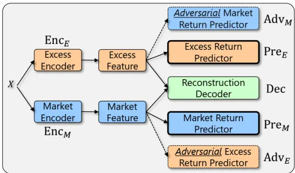
资料来源：Tang et al. (2020). ADD: Augmented Disentanglement Distillation Framework for Improving Stock Trend Forecasting. arXiv，华泰研究

## Disentanglement 解耦框架采用对抗训练方式，包含两个相互对抗的损失函数：

1. 损失函数 L1为直接预测器损失 $\mathsf{L}_{\mathsf{Pre}}.$ 、负对抗预测器损失-Ladv、解码器重构损失 $\mathsf{L}_{\mathsf{rec}}$ 三项之和。

a. 直接预测器损失 $\mathsf{L}_{\mathsf{Pre}}$ 是下面两项的加总：真实个股超额收益 YE和超额收益预测器预测个股超额收益 PreE(fE)的 MSE，真实大盘涨跌方向 $Y_{M}$ 和市场收益预测器预测大盘涨跌方向 $\operatorname*{Pre}_{M}(f_{M})$ 的交叉熵 CE。

b. 负对抗预测器损失 $-L_{adv}$ 是对抗预测器损失 $\mathsf{L_{adv}}$ 的相反数。 $\mathsf{L_{adv}}$ 是下面两项的加总：真实个股超额收益 $Y_{E}$ 和对抗超额收益预测器预测个股超额收益 $\mathsf{Adv}_{E}(f_{M})$ 的 MSE，真实大盘涨跌方向 $Y_{M}$ 和市场收益预测器预测大盘涨跌方向 $\mathsf{Adv}_{\mathsf{M}}(\mathsf{f}_{\mathsf{E}})$ 的交叉熵 CE。

c. 解码器重构损失 $\mathsf{L_{rec}}\colon$ 原始因子 X和重构解码器生成虚假因子X̂的 MSE。

2. 损失函数 L 为对抗预测器损失 $\mathsf{Ladvo}$

两者交替进行优化，类似于“左右互搏”，L 为训练主目标，L 协助训练。最终的效果是：

1. 编码器能够识别哪些是与超额收益有关的信息，哪些是与市场收益有关的信息，并将其有效分离，编码成特征。

2. 解码器能够基于编码得到的超额收益特征和市场收益特征，复原出原始信息。

3. 预测器的超额收益预测器和市场收益预测器具备预测能力。

图表25： ADD 损失函数

$$
\mathcal{L}_{Pre}=\mathtt{MSE}(\mathtt{Pre}_{E}(f_{E}),Y_{E})+\mathtt{CE}(\mathtt{Pre}_{M}(f_{M}),Y_{M}),
$$

$$
\mathcal{L}_{Adv}=\mathtt{MSE}(\mathtt{Adv}_{E}(f_{M}),Y_{E})+\mathtt{CE}(\mathtt{Adv}_{M}(f_{E}),Y_{M}),
$$

$$
\mathcal{L}_{Rec}=\mathtt{MSE}(X,\widehat{X}).
$$

$$
\begin{aligned}{\mathop{min}_{\theta_{{Enc}},\theta_{{Pre}},\theta_{{Dec}}}\mathcal{L}_{1}}&{{}=\mathcal{L}_{{Pre}}-\lambda*\mathcal{L}_{{Adv}}+\mu*\mathcal{L}_{{Rec}},}\\{\mathop{min}_{\theta_{{Adv}}}\mathcal{L}_{2}}&{{}=\mathcal{L}_{{Adv}}.}\\\end{aligned}
$$

资料来源：Tang et al. (2020). ADD: Augmented Disentanglement Distillation Framework for Improving Stock Trend Forecasting. arXiv，华泰研究

其次介绍Self-Distillation自蒸馏技术。前述OPD强化学习算法交易研究中已介绍策略蒸馏，使用训练较好的 Teacher 模型引导 Student 模型训练。ADD 研究中，每轮迭代会将上一轮基于数据集 D 训练好的编码器视作 Teacher，借助 Data Augmentation 技术生成虚假数据D̂（具体生成方式见后文），D 和D̂构成新数据集，在新数据集上使用 Teacher“蒸馏”出的知识，引导编码器 Student 训练。

Self-Distillation 的具体实现方式是在前述损失函数 $\mathsf{L}_{1}$ 中增加 $L_{\mathsf{dis}}$ 自蒸馏项，核心是对样本进行赋权，提升预测误差较大的交易日及个股权重。损失函数如下图所示。其中：

1. wdj 表示由 IC 计算的第 j 个交易日样本权重。如果某个交易日 IC 较低，表明预测误差较大，那么权重 wdj 将较大。

2. wsij 表示由 MSE 损失（MSE 相反数）计算的第 j 个交易日第 i 个股票样本权重。如果某个股票 MSE较高，表明预测误差较大，那么权重 wsij 将较大。

3. wij 表示最终确定的第 j个交易日第 i个股票样本权重，是 wdj 和 wsij 的加权和。

4. 以上一轮迭代训练的编码器为 Teacher，输出编码结果 h；使用新数据集训练 Student编码器，输出编码结果 hs。自蒸馏损失项 $\mathsf{L}_{\mathsf{dis}}$ 是 ht和 $\mathsf{h_{S}}$ 的加权 MSE，样本权重为上一轮迭代的 wij。

图表26： 引入自蒸馏 Self-Distillation 的 ADD 损失函数

$$
wd^{j}=\beta_{{day}}+(1-\beta_{{day}})*\frac{ic_{{max}}-ic^{j}}{ic_{{max}}-ic_{{min}}},
$$

$$
ws_{i}^{j}=\beta_{sample}+(1-\beta_{sample})*\frac{mse_{max}-mse_{i}^{j}}{mse_{max}-mse_{min}},
$$

$$
w_{i}^{j}=\alpha*wd^{j}+(1-\alpha)*ws_{i}^{j}.
$$

$$
\mathcal{L}_{Dis}=\sum_{i}\sum_{j}w_{i}^{j}*\mathtt{MSE}(ht_{i}^{j},hs_{i}^{j}).
$$

$$
\begin{aligned}{\mathop{min}_{\theta_{{Enc}},\theta_{{Pre}},\theta_{{Dec}}}\mathcal{L}_{1}}&{{}=\mathcal{L}_{{Pre}}-\lambda*\mathcal{L}_{{Adv}}+\mu*\mathcal{L}_{{Rec}}+\xi*\mathcal{L}_{{Dis}},}\\{\mathop{min}_{\theta_{{Adv}}}\mathcal{L}_{2}}&{{}=\mathcal{L}_{{Adv}}.}\\\end{aligned}
$$

资料来源：Tang et al. (2020). ADD: Augmented Disentanglement Distillation Framework for Improving Stock Trend Forecasting. arXiv，华泰研究

最后介绍 Augmented 数据增强。数据增强的目标是生成更多虚假样本参与模型训练，实现方式是将编码器得到的相邻两个交易日的超额特征 $f_{E}p$ 和市场特征 $f_{M}^{q},$ ，送至解码器，最终得到“融合”后的假样本。

图表27： 数据增强 Data Augmentation，将 Day1 超额特征和 Day2 市场特征融合，得到假样本
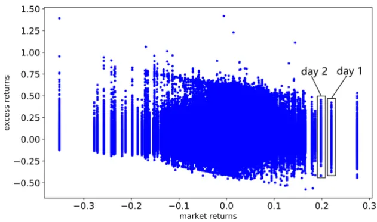
资料来源：Tang et al. (2020). ADD: Augmented Disentanglement Distillation Framework for Improving Stock Trend Forecasting. arXiv，华泰研究

以全 A股为股票池，以过去 60 个交易日开高低收、成交量、vwap 作为因子，以循环神经网络模型为对照组。结果表明，回测期内（2016 至 2019 年），超额收益预测器的 IC 和 RankIC 优于对照组，市场收益预测器的正确率和 F1 score优于对照组。以超额收益预测器构建选股策略，年化收益率高于对照组。

我们认为，该研究的亮点恰好对应 Augmented Disentanglement Distillation 这三个关键词：
1. Augmented 对应数据增强。数据增强即生成假样本参与模型训练，在图像识别领域已有广泛应用。在量化研究领域，尤其是中高频选股领域，以往研究者普遍认为现有数据量足以应付训练，假样本并不必要。而 ADD 研究证明以合理方式生成的假样本能够提升模型表现，尤其是与自蒸馏的结合，提升了模型对罕见样本的预测能力。

2. Disentanglement 对应解耦框架。解耦与表征学习（Representation Learning）是近年来人工智能领域的热点。Bengio 等人于 2013 年发表综述文章 Representation learning:a review and new perspectives，提出表征学习的目标之一是将特征的表征解耦成多个互相独立的因素。苏黎世联邦理工学院、Max-Planck 智能系统研究所和 Google Brain在 2018 年 11 月合作发表文章 Challenging Common Assumptions in the UnsupervisedLearning ofDisentangled Representations，探讨解耦在无监督学习中的可行性，被评为 2019 年 ICML国际机器学习大会最佳论文。

以往研究通常先从原始量价因子中提取特征，后预测超额收益。原始量价因子同时包含超额收益和市场收益，这里就存在特征（超额+市场）和标签（超额）不匹配的问题。ADD 研究将解耦的思想引入股票收益预测，将量价因子的表征解耦成超额收益特征和市场收益特征，特征（超额/市场）和标签（超额/市场）匹配，逻辑较合理，具有一定启发意义。

3. Distillation 对应知识蒸馏。ADD 研究中，Teacher 编码器和 Student 编码器的网络结构一致，因此称为自蒸馏 Self-Distillation。使用自蒸馏技术提高预测误差大的样本权重，引导模型学习罕见样本，实质上提升了模型在样本外的稳健性。

## IGMTF：图神经网络预测多元时间序列（2021 年 9月）

IGMTF 图神经网络预测多元时间序列研究由微软亚研院和中山大学于 2021 年 9 月合作发布于 arXiv，第一作者是中山大学-微软亚研院联合培养博士生 Xu Wentao，第二作者是微软亚研院机器学习组高级研究员 Liu Weiqing（刘炜清）。

传统多元时间序列预测技术忽视变量间的协变关系，该研究构建 IGMTF（instance-wisegraph-based framework for multivariate time series forecasting），核心思想是基于图神经网络挖掘不同变量不同时刻间的关系信息。

IGMTF 构建方式如下：

1. 输入（X）：多元时间序列，每个时刻的 X为 n×d矩阵，其中 n为变量个数，d为回看天数。交通、电力、汇率数据集变量个数分别为 n＝862、321 和 8。

2. 输出（p）：每个变量的预测值。

3. 网络结构：

a. 全训练样本编码器（Training Instances Encoder）：采用 GRU+MLP 网络对全样本X 进行编码，得到嵌入 E（每个时刻 Et为 n 个 l 维向量，l 为 MLP 输出单元数）。此步为推断模式（Inference Mode），不参与到参数优化。

b. 小批量样本编码器（Mini-batch Instances Encoder）：采用 GRU+MLP 网络对 t 时刻样本 Xt进行编码，得到嵌入 h（t n 个 l 维向量）。此步为训练模式（Training Mode），参与到参数优化。

c. 训练样本采样器（Training Instances Sampler）：对 E 和 h 在变量维度求均值，得到E̅（每个时刻E̅t为 l维向量）和h̅t（l维向量）。计算E̅中每个时刻和h̅t的余弦距离，选距离最近的前 k 个时刻，提取 E 中的这 k 个时刻，得到采样后的训练样本嵌入et（m 个 l维向量，其中 m＝n×k）。

d. 图聚合模块（Graph Aggregation Module）：计算 et（m 个 l 维向量）和 ht（n 个 l维向量）两两之间的余弦距离 A，以 A为权重将 et聚合为ĥt。

e. 预测模块（Forecasting Module）：ht 和ĥt直接拼接，通过 Linear 层得到预测值 pt。上述网络结构较复杂，本质仍是对变量间关系信息的挖掘。

图表28： IGMTF 网络结构
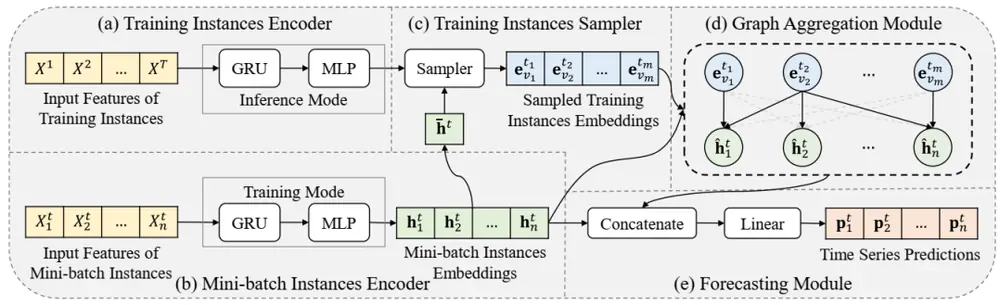
资料来源：Xu et al. (2021). Instance-wise Graph-based Framework for Multivariate Time Series Forecasting. arXiv，华泰研究

将 IGMTF 用于交通、电力、汇率等经典多元时间序列数据集的预测。对照组包含自回归AR 模型，结合神经网络的向量自回归 VAR-MLP，循环神经网络等传统时间序列预测模型。结果显示，IGMTF效果优于对照组，具体表现为误差更低，与真实值相关系数更高。

我们认为，该研究的亮点是将图神经网络融入多元时间序列分析，挖掘变量间非线性关系信息。传统基于统计方法的时间序列分析并非不考虑变量间协变关系，如向量自回归 VAR，但这些方法大多仅提取线性协变关系，并且依赖序列平稳的假设。循环神经网络等非线性方法对变量间协变关系的挖掘又不够充分。彼之所短正是图神经网络之所长，尤其在海量样本和复杂关系的场景里，图神经网络应能发挥重要作用。

## 透过微软 AI 量化研究展望行业发展六大趋势

通过对 2017 年以来微软亚研院 AI 量化投资研究的详细解读，我们试着展望行业未来发展六大趋势。

覆盖领域趋于全面，不局限于因子选股。近几年，国内机构因子选股体系日益成熟，普遍形成了从因子挖掘到因子合成再到风险中性组合构建的经典投研模式，以市场中性、指数增强为主要产品形式。研究者往往聚焦于挖掘 Alpha 因子、优化合成模型两个方向。行业越来越成熟，也越来越“卷”，策略同质化加剧，面临容量上限的困境。

本文介绍的微软研究，尽管仍以选股因子和模型为核心方向，但是也涉及风险模型、算法交易、Beta 择时等领域。即使是选股模型研究，也不局限于因子挖掘，而是灵活采用事件驱动、新闻舆情预测个股等思路。量化的本质只是适应市场，跳出现有框架，探索 AI 技术在因子选股以外的应用，是应对策略同质化的可行之道。

侧重交易数据和另类数据挖掘，发挥 AI 优势。近几年，国内量化行业的一个热点是基本面量化。然而微软研究较少围绕基本面做文章，更侧重交易数据和另类数据挖掘。AI 模型的优势是在海量样本中挖掘隐藏规律。例如REST关系事件驱动和HAN舆情数据学习研究中，样本量达数十万条。而基本面研究的特点是数据量较少，并且追求清晰的投资逻辑。基本面与 AI的结合可能尚欠火候。在尚未形成合理的 AI 基本面研究方法论背景下，不妨专注于AI 擅长的领域，扬长避短。

科研机构与投资机构密切配合，提出正确的问题很重要。微软研究提出的问题，如“AI 模型如何应对市场规律变化”，“如何引导模型学习罕见样本”，“如何充分挖掘事件、舆情蕴藏的信息”等，都是业界实践中会遇到、接地气的问题。微软作为新玩家，缺少一线投资经验，很多时候掌握技术但提不出问题（卖方研究也存在类似困扰）。投资机构则是有问题，但对技术不熟悉。两类机构的配合就显得尤为重要，投资端提出正确的问题，研究端采用最合适的技术加以解决。

积极开展高校合作，持续培养研究人才。本文介绍的微软研究，第一作者大多为实习生，或微软和高校联合培养研究生。据官网信息，微软亚研院与清华大学、中国科学技术大学、中山大学等多所高校开展联合培养项目以及实习生项目。在促进学术交流同时，提前布局人才培养和选拔。

图神经网络和注意力机制可能具备广阔应用前景。本文介绍的 9 篇研究中，图神经网络和注意力机制是上镜率最高的方法，各被 4 篇研究采用。两者的“走红”并不是巧合，他们具备以下共同之处。首先，两者都很“新”，图神经网络中常用的图卷积、图注意力分别在2017、2018 年提出，注意力机制的奠基性文章集中在 2014 至 2017 年发表。

更重要的是，相比传统机器学习，两者更匹配投资场景。传统方法将股票视作独立同分布样本，而图神经网络擅长挖掘股票间关系。注意力机制是对不同时刻间、不同股票间关系信息的提取。不同时刻、股票间存在广泛的相互关系，正是股票市场这一复杂网络的重要特征。我们认为，在传统模型面临天花板的情况下，图神经网络和注意力机制未来可能具备广阔的应用前景。

细节是魔鬼，前沿技术融入各环节。除图神经网络和注意力机制外，微软的几项研究灵活应用多种前沿技术，融入研究各环节。例如最优传输用于解决策略权重分配中的过拟合，自步学习用于提升训练效率，知识蒸馏用于引导模型学习罕见样本，解耦表征用于分离预测超额收益和预测市场收益的信息。这些工具在细节处对原始策略起到重要的补充和提升作用。AI 量化研究的进步对参与者提出了更高的要求，需要持续跟踪学术前沿，从外部吸收能量和信息或是对抗内卷的最佳方式。

## 参考文献

## 微软亚研院研究

[1] Xu, W. , Liu, W. , Wang, L. , Xia, Y. , Bian, J. , & Yin, J. , et al. (2021). Hist: a graph-based framework for stock trend forecasting via mining concept-oriented shared information. arXiv.

[2] Lin, H. , Zhou, D. , Liu, W. , & Bian, J. (2021). Learning Multiple Stock Trading Patterns with Temporal Routing Adaptor and Optimal Transport. KDD.

[3] Xu, W. , Liu, W. , Xu, C. , Bian, J. , Yin, J. , & Lin, T. (2021). REST: Relational Event-driven Stock Trend Forecasting. WWW.

[4] Chen, C. , Zhao, L. , Cao, W. , Bian, J. , & Xing, C. (2020). Trimming the Sail: A Second-order Learning Paradigm for Stock Prediction. arXiv.

[5] Chen, C. , Zhao, L. , Bian, J. , Xing, C. , & Liu, T. Y. . (2019). Investment Behaviors Can Tell What Inside: Exploring Stock Intrinsic Properties for Stock Trend Prediction. KDD.

[6] Li, Z. , Yang, D. , Zhao, L. , Bian, J. , & Liu, T. Y. . (2019). Individualized Indicator for All: Stock-wise Technical Indicator Optimization with Stock Embedding. KDD.

[7] Hu, Z. , Liu, W. , Bian, J. , Liu, X. , & Liu, T. (2017). Listening to Chaotic Whispers: A Deep Learning Framework for News-oriented Stock Trend Prediction. arXiv.

[8] Lin, H. , Zhou, D. , Liu, W. , & Bian, J. (2021). Deep Risk Model: A Deep Learning Solution for Mining Latent Risk Factors to Improve Covariance Matrix Estimation. ICAIF.

[9] Fang, Y. , Ren, K. , Liu, W. , Zhou, D. , Zhang, W. , & Bian, J. , et al. (2021). Universal Trading for Order Execution with Oracle Policy Distillation. AAAI.

[10] Tang, H. , Wu, L. , Liu, W. , & Bian, J. (2020). ADD: Augmented Disentanglement Distillation Framework for Improving Stock Trend Forecasting. arXiv.

[11] Xu, W. , Liu, W. , Bian, J. , Yin, J. , & Liu, T. (2021). Instance-wise Graph-based Framework for Multivariate Time Series Forecasting. arXiv.

[12] Yang, X. , Liu, W. , Zhou, D. , Bian, J. , & Liu, T. Y. . (2020). Qlib: an ai-oriented quantitative investment platform. arXiv.

## 其他研究

[13] Cuturi, M. . (2013). Sinkhorn distances: lightspeed computation of optimal transportation distances. Advances in Neural Information Processing Systems, 26, 2292-2300.

[14] Rusu, A. A. , Colmenarejo, S. G. , Gulcehre, C. , Desjardins, G. , Kirkpatrick, J. , & Pascanu, R. , et al. (2015). Policy distillation. Computer Science.

[15] Bengio, Yoshua, Courville, Aaron, Vincent, & Pascal. (2013). Representation learning: a review and new perspectives. IEEE Transactions on Pattern Analysis & Machine Intelligence, 35(8), 1798-1828.

[16] Locatello, F. , Bauer, S. , Lucic, M. , Gelly, S. , Schlkopf, B. , & Bachem, O. . (2019). Challenging common assumptions in the unsupervised learning of disentangled representations. ICML.

## 风险提示

人工智能挖掘市场规律是对历史的总结，市场规律在未来可能失效。人工智能技术存在过拟合风险。学术研究和产业研究的出发点和方法论不完全一致，将学术研究成果应用于投资实践前，仍需经过严格测试与论证。

附录：原文摘要

HIST：基本面信息结合图神经网络选股（2021 年10 月）

HIST: A Graph-based Framework for Stock Trend Forecasting via Mining Concept-Oriented Shared Information

Authors: Wentao Xu, Weiqing Liu, Lewen Wang, Yingce Xia, Jiang Bian, Jian Yin, Tie-Yan Liu

Abstract: Stock trend forecasting, which forecasts stock prices' future trends, plays an essential role in investment. The stocks in a market can share information so that their stock prices are highly correlated. Several methods were recently proposed to mine the shared information through stock concepts (e.g., technology, Internet Retail) extracted from the Web to improve the forecasting results. However, previous work assumes the connections between stocks and concepts are stationary, and neglects the dynamic relevance between stocks and concepts, limiting the forecasting results. Moreover, existing methods overlook the invaluable shared information carried by hidden concepts, which measure stocks' commonness beyond the manually defined stock concepts. To overcome the shortcomings of previous work, we proposed a novel stock trend forecasting framework that can adequately mine the concept-oriented shared information from predefined concepts and hidden concepts. The proposed framework simultaneously utilize the stock's shared information and individual information to improve the stock trend forecasting performance. Experimental results on the real-world tasks demonstrate the efficiency of our framework on stock trend forecasting. The investment simulation shows that our framework can achieve a higher investment return than the baselines.

TRA：交易模式学习（2021年 6月）

Learning Multiple Stock Trading Patterns with Temporal Routing Adaptor and Optimal Transport

Authors: Hengxu Lin, Dong Zhou, Weiqing Liu, Jiang Bian

Abstract: Successful quantitative investment usually relies on precise predictions of the future movement of the stock price. Recently, machine learning based solutions have shown their capacity to give more accurate stock prediction and become indispensable components in modern quantitative investment systems. However, the i.i.d. assumption behind existing methods is inconsistent with the existence of diverse trading patterns in the stock market, which inevitably limits their ability to achieve better stock prediction performance. In this paper, we propose a novel architecture, Temporal Routing Adaptor (TRA), to empower existing stock prediction models with the ability to model multiple stock trading patterns. Essentially, TRA is a lightweight module that consists of a set of independent predictors for learning multiple patterns as well as a router to dispatch samples to different predictors. Nevertheless, the lack of explicit pattern identifiers makes it quite challenging to train an effective TRA-based model. To tackle this challenge, we further design a learning algorithm based on Optimal Transport (OT) to obtain the optimal sample to predictor assignment and effectively optimize the router with such assignment through an auxiliary loss term. Experiments on the real-world stock ranking task show that compared to the state-of-the-art baselines, e.g., Attention LSTM and Transformer, the proposed method can improve information coefficient (IC) from 0.053 to 0.059 and 0.051 to 0.056 respectively. Our dataset and code used in this work are publicly available: https://github.com/microsoft/qlib/tree/main/examples/benchmarks/TRA

REST：关系事件驱动选股（2021年 2月）

REST: Relational Event-driven Stock Trend Forecasting

Authors: Wentao Xu, Weiqing Liu, Chang Xu, Jiang Bian, Jian Yin, Tie-Yan Liu

Abstract: Stock trend forecasting, aiming at predicting the stock future trends, is crucial for investors to seek maximized profits from the stock market. Many event-driven methods utilized the events extracted from news, social media, and discussion board to forecast the stock trend in recent years. However, existing event-driven methods have two main shortcomings: 1) overlooking the influence of event information differentiated by the stock-dependent properties; 2) neglecting the effect of event information from other related stocks. In this paper, we propose a relational event-driven stock trend forecasting (REST) framework, which can address the shortcoming of existing methods. To remedy the first shortcoming, we propose to model the stock context and learn the effect of event information on the stocks under different contexts. To address the second shortcoming, we construct a stock graph and design a new propagation layer to propagate the effect of event information from related stocks. The experimental studies on the real-world data demonstrate the efficiency of our REST framework. The results of investment simulation show that our framework can achieve a higher return of investment than baselines.

股票预测的二阶学习范式（2020 年 2月）

Trimming the Sail: A Second-order Learning Paradigm for Stock Prediction

Authors: Chi Chen, Li Zhao, Wei Cao, Jiang Bian, Chunxiao Xing

Abstract: Nowadays, machine learning methods have been widely used in stock prediction. Traditional approaches assume an identical data distribution, under which a learned model on the training data is fixed and applied directly in the test data. Although such assumption has made traditional machine learning techniques succeed in many real-world tasks, the highly dynamic nature of the stock market invalidates the strict assumption in stock prediction. To address this challenge, we propose the second-order identical distribution assumption, where the data distribution is assumed to be fluctuating over time with certain patterns. Based on such assumption, we develop a second-order learning paradigm with multi-scale patterns. Extensive experiments on real-world Chinese stock data demonstrate the effectiveness of our second-order learning paradigm in stock prediction.

基金持仓融入深度学习（2019 年 8 月）

Investment Behaviors Can Tell What Inside: Exploring Stock Intrinstic Properties for Stock Trend Prediction

Authors: Chi Chen, Li Zhao, Jiang Bian, Chunxiao Xing, Tie-Yan Liu

Stock trend prediction, aiming at predicting future price trend of stocks, plays a key role in seeking maximized profit from the stock investment. Recent years have witnessed increasing efforts in applying machine learning techniques, especially deep learning, to pursue more promising stock prediction. While deep learning has given rise to significant improvement, human investors still retain the leading position due to their understanding on stock intrinsic properties, which can imply invaluable principles for stock prediction. In this paper, we propose to extract and explore stock intrinsic properties to enhance stock trend prediction. Fortunately, we discover that the repositories of investment behaviors within mutual fund portfolio data form up a gold mine to extract latent representations of stock properties, since such collective investment behaviors can reflect the professional fund managers' common beliefs on stock intrinsic properties. Powered by extracted stock properties, we further propose to model the dynamic market state and trend using stock representations so as to generate the dynamic correlation between the stock and the market, and then we aggregate such correlation with dynamic stock indicators to achieve more accurate stock prediction. Extensive experiments on real-world stock market data demonstrate the effectiveness of stock properties extracted from collective investment behaviors in the task of stock prediction.

TTIO：技术指标优化算法（2019年 8月）

Individualized Indicator for All: Stock-wise Technical Indicator Optimization with Stock Embedding

Authors: Zhige Li, Derek Yang, Li Zhao, Jiang Bian, Tao Qin, Tie-Yan Liu

As one of the most important investing approaches, technical analysis attempts to forecast stock movement by interpreting the inner rules from historic price and volume data. To address the vital noisy nature of financial market, generic technical analysis develops technical trading indicators, as mathematical summarization of historic price and volume data, to form up the foundation for robust and profitable investment strategies. However, an observation reveals that stocks with different properties have different affinities over technical indicators, which discloses a big challenge for the indicator-oriented stock selection and investment. To address this problem, in this paper, we design a Technical Trading Indicator Optimization(TTIO) framework that manages to optimize the original technical indicator by leveraging stock-wise properties. To obtain effective representations of stock properties, we propose a Skip-gram architecture to learn stock embedding inspired by a valuable knowledge repository formed by fund manager's collective investment behaviors. Based on the learned stock representations, TTIO further learns a re-scaling network to optimize the indicator's performance. Extensive experiments on real-world stock market data demonstrate that our method can obtain the very stock representations that are invaluable for technical indicator optimization since the optimized indicators can result in strong investing signals than original ones.

HAN：基于舆情数据的深度学习股票预测（2017 年12 月）

Listening to Chaotic Whispers: A Deep Learning Framework for News-oriented Stock Trend Prediction

Authors: Ziniu Hu, Weiqing Liu, Jiang Bian, Xuanzhe Liu, Tie-Yan Liu

Abstract: Stock trend prediction plays a critical role in seeking maximized profit from stock investment. However, precise trend prediction is very difficult since the highly volatile and non-stationary nature of stock market. Exploding information on Internet together with advancing development of natural language processing and text mining techniques have enable investors to unveil market trends and volatility from online content. Unfortunately, the quality, trustworthiness and comprehensiveness of online content related to stock market varies drastically, and a large portion consists of the low-quality news, comments, or even rumors. To address this challenge, we imitate the learning process of human beings facing such chaotic online news, driven by three principles: sequential content dependency, diverse influence, and effective and efficient learning. In this paper, to capture the first two principles, we designed a Hybrid Attention Networks to predict the stock trend based on the sequence of recent related news. Moreover, we apply the self-paced learning mechanism to imitate the third principle. Extensive experiments on real-world stock market data demonstrate the effectiveness of our approach.

DRM：深度学习挖掘隐风险因子改进风险模型（2021 年 7月）

Deep Risk Model: A Deep Learning Solution for Mining Latent Risk Factors to Improve Covariance Matrix Estimation

Authors: Hengxu Lin, Dong Zhou, Weiqing Liu, Jiang Bian

Abstract: Modeling and managing portfolio risk is perhaps the most important step to achieve growing and preserving investment performance. Within the modern portfolio construction framework that built on Markowitz's theory, the covariance matrix of stock returns is a required input to calculate portfolio risk. Traditional approaches to estimate the covariance matrix are based on human-designed risk factors, which often require tremendous time and effort to design better risk factors to improve the covariance estimation. In this work, we formulate the quest of mining risk factors as a learning problem and propose a deep learning solution to effectively ``design'' risk factors with neural networks. The learning objective is also carefully set to ensure the learned risk factors are effective in explaining the variance of stock returns as well as having desired

orthogonality and stability. Our experiments on the stock market data demonstrate the effectiveness of the proposed solution: our method can obtain 1.9% higher explained variance measured by R2 and also reduce the risk of a global minimum variance portfolio. The incremental analysis further supports our design of both the architecture and the learning objective.

OPD：强化学习应用于算法交易（2021年 3月）

Universal Trading for Order Execution with Oracle Policy Distillation

Authors: Yuchen Fang, Kan Ren, Weiqing Liu, Dong Zhou, Weinan Zhang, Jiang Bian, Yong Yu, Tie-Yan Liu

Abstract: As a fundamental problem in algorithmic trading, order execution aims at fulfilling a specific trading order, either liquidation or acquirement, for a given instrument. Towards effective execution strategy, recent years have witnessed the shift from the analytical view with model-based market assumptions to model-free perspective, i.e., reinforcement learning, due to its nature of sequential decision optimization. However, the noisy and yet imperfect market information that can be leveraged by the policy has made it quite challenging to build up sample efficient reinforcement learning methods to achieve effective order execution. In this paper, we propose a novel universal trading policy optimization framework to bridge the gap between the noisy yet imperfect market states and the optimal action sequences for order execution. Particularly, this framework leverages a policy distillation method that can better guide the learning of the common policy towards practically optimal execution by an oracle teacher with perfect information to approximate the optimal trading strategy. The extensive experiments have shown significant improvements of our method over various strong baselines, with reasonable trading actions.

ADD：数据增强预测股票收益和市场收益（2020 年12 月）

ADD: Augmented Disentanglement Distillation Framework for Improving Stock Trend Forecasting

Authors: Hongshun Tang, Lijun Wu, Weiqing Liu, Jiang Bian

Abstract: Stock trend forecasting has become a popular research direction that attracts widespread attention in the financial field. Though deep learning methods have achieved promising results, there are still many limitations, for example, how to extract clean features from the raw stock data. In this paper, we introduce an Augmented Disentanglement Distillation (ADD) approach to remove interferential features from the noised raw data. Specifically, we present 1) a disentanglement structure to separate excess and market information from the stock data to avoid the two factors disturbing each other's own prediction. Besides, by applying 2) a dynamic self-distillation method over the disentanglement framework, other implicit interference factors can also be removed. Further, thanks to the decoder module in our framework, 3) a novel strategy is proposed to augment the training samples based on the different excess and market features to improve performance. We conduct experiments on the Chinese stock market data. Results show that our method significantly improves the stock trend forecasting performances, as well as the actual investment income through backtesting, which strongly demonstrates the effectiveness of our approach.

IGMTF：图神经网络预测多元时间序列（2021 年 9月）

# Instance-wise Graph-based Framework for Multivariate Time Series Forecasting

Authors: Wentao Xu, Weiqing Liu, Jiang Bian, Jian Yin, Tie-Yan Liu

Abstract: The multivariate time series forecasting has attracted more and more attention because of its vital role in different fields in the real world, such as finance, traffic, and weather. In recent years, many research efforts have been proposed for forecasting multivariate time series. Although some previous work considers the interdependencies among different variables in the same timestamp, existing work overlooks the inter-connections between different variables at different time stamps. In this paper, we propose a simple yet efficient instance-wise graph-based framework to utilize the inter-dependencies of different variables at different time stamps for multivariate time series forecasting. The key idea of our framework is aggregating information from the historical time series of different variables to the current time series that we need to forecast. We conduct experiments on the Traffic, Electricity, and Exchange-Rate multivariate time series datasets. The results show that our proposed model outperforms the state-of-the-art baseline methods.

Qlib：AI 量化投资平台（2020 年 9 月）

Qlib: An AI-oriented Quantitative Investment Platform

Authors: Xiao Yang, Weiqing Liu, Dong Zhou, Jiang Bian, Tie-Yan Liu

Abstract: Quantitative investment aims to maximize the return and minimize the risk in a sequential trading period over a set of financial instruments. Recently, inspired by rapid development and great potential of AI technologies in generating remarkable innovation in quantitative investment, there has been increasing adoption of AI-driven workflow for quantitative research and practical investment. In the meantime of enriching the quantitative investment methodology, AI technologies have raised new challenges to the quantitative investment system. Particularly, the new learning paradigms for quantitative investment call for an infrastructure upgrade to accommodate the renovated workflow; moreover, the data-driven nature of AI technologies indeed indicates a requirement of the infrastructure with more powerful performance; additionally, there exist some unique challenges for applying AI technologies to solve different tasks in the financial scenarios. To address these challenges and bridge the gap between AI technologies and quantitative investment, we design and develop Qlib that aims to realize the potential, empower the research, and create the value of AI technologies in quantitative investment.

## 免责声明

## 分析师声明

本人，林晓明、李子钰、何康，兹证明本报告所表达的观点准确地反映了分析师对标的证券或发行人的个人意见；彼以往、现在或未来并无就其研究报告所提供的具体建议或所表迖的意见直接或间接收取任何报酬。

## 一般声明及披露

本报告由华泰证券股份有限公司（已具备中国证监会批准的证券投资咨询业务资格，以下简称“本公司”）制作。本报告所载资料是仅供接收人的严格保密资料。本报告仅供本公司及其客户和其关联机构使用。本公司不因接收人收到本报告而视其为客户。

本报告基于本公司认为可靠的、已公开的信息编制，但本公司及其关联机构(以下统称为“华泰”)对该等信息的准确性及完整性不作任何保证。

本报告所载的意见、评估及预测仅反映报告发布当日的观点和判断。在不同时期，华泰可能会发出与本报告所载意见、评估及预测不一致的研究报告。同时，本报告所指的证券或投资标的的价格、价值及投资收入可能会波动。以往表现并不能指引未来，未来回报并不能得到保证，并存在损失本金的可能。华泰不保证本报告所含信息保持在最新状态。华泰对本报告所含信息可在不发出通知的情形下做出修改，投资者应当自行关注相应的更新或修改。

本公司不是 FINRA 的注册会员，其研究分析师亦没有注册为 FINRA 的研究分析师/不具有 FINRA 分析师的注册资格。

华泰力求报告内容客观、公正，但本报告所载的观点、结论和建议仅供参考，不构成购买或出售所述证券的要约或招揽。该等观点、建议并未考虑到个别投资者的具体投资目的、财务状况以及特定需求，在任何时候均不构成对客户私人投资建议。投资者应当充分考虑自身特定状况，并完整理解和使用本报告内容，不应视本报告为做出投资决策的唯一因素。对依据或者使用本报告所造成的一切后果，华泰及作者均不承担任何法律责任。任何形式的分享证券投资收益或者分担证券投资损失的书面或口头承诺均为无效。

除非另行说明，本报告中所引用的关于业绩的数据代表过往表现，过往的业绩表现不应作为日后回报的预示。华泰不承诺也不保证任何预示的回报会得以实现，分析中所做的预测可能是基于相应的假设，任何假设的变化可能会显著影响所预测的回报。

华泰及作者在自身所知情的范围内，与本报告所指的证券或投资标的不存在法律禁止的利害关系。在法律许可的情况下，华泰可能会持有报告中提到的公司所发行的证券头寸并进行交易，为该公司提供投资银行、财务顾问或者金融产品等相关服务或向该公司招揽业务。

华泰的销售人员、交易人员或其他专业人士可能会依据不同假设和标准、采用不同的分析方法而口头或书面发表与本报告意见及建议不一致的市场评论和/或交易观点。华泰没有将此意见及建议向报告所有接收者进行更新的义务。华泰的资产管理部门、自营部门以及其他投资业务部门可能独立做出与本报告中的意见或建议不一致的投资决策。投资者应当考虑到华泰及/或其相关人员可能存在影响本报告观点客观性的潜在利益冲突。投资者请勿将本报告视为投资或其他决定的唯一信赖依据。有关该方面的具体披露请参照本报告尾部。

本报告并非意图发送、发布给在当地法律或监管规则下不允许向其发送、发布的机构或人员，也并非意图发送、发布给因可得到、使用本报告的行为而使华泰违反或受制于当地法律或监管规则的机构或人员。

本报告版权仅为本公司所有。未经本公司书面许可，任何机构或个人不得以翻版、复制、发表、引用或再次分发他人(无论整份或部分)等任何形式侵犯本公司版权。如征得本公司同意进行引用、刊发的，需在允许的范围内使用，并需在使用前获取独立的法律意见，以确定该引用、刊发符合当地适用法规的要求，同时注明出处为“华泰证券研究所”，且不得对本报告进行任何有悖原意的引用、删节和修改。本公司保留追究相关责任的权利。所有本报告中使用的商标、服务标记及标记均为本公司的商标、服务标记及标记。

## 中国香港

本报告由华泰证券股份有限公司制作,在香港由华泰金融控股（香港）有限公司向符合《证券及期货条例》及其附属法律规定的机构投资者和专业投资者的客户进行分发。华泰金融控股（香港）有限公司受香港证券及期货事务监察委员会监管，是华泰国际金融控股有限公司的全资子公司，后者为华泰证券股份有限公司的全资子公司。在香港获得本报告的人员若有任何有关本报告的问题,请与华泰金融控股（香港）有限公司联系。

## 香港-重要监管披露

- 华泰金融控股（香港）有限公司的雇员或其关联人士没有担任本报告中提及的公司或发行人的高级人员。

- 有关重要的披露信息，请参华泰金融控股（香港）有限公司的网页 https://www.htsc.com.hk/stock_disclosure其他信息请参见下方 “美国-重要监管披露”。

## 美国

在美国本报告由华泰证券（美国）有限公司向符合美国监管规定的机构投资者进行发表与分发。华泰证券（美国）有限公司是美国注册经纪商和美国金融业监管局（FINRA）的注册会员。对于其在美国分发的研究报告，华泰证券（美国）有限公司根据《1934 年证券交易法》（修订版）第 15a-6 条规定以及美国证券交易委员会人员解释，对本研究报告内容负责。华泰证券（美国）有限公司联营公司的分析师不具有美国金融监管（FINRA）分析师的注册资格，可能不属于华泰证券（美国）有限公司的关联人员，因此可能不受 FINRA 关于分析师与标的公司沟通、公开露面和所持交易证券的限制。华泰证券（美国）有限公司是华泰国际金融控股有限公司的全资子公司，后者为华泰证券股份有限公司的全资子公司。任何直接从华泰证券（美国）有限公司收到此报告并希望就本报告所述任何证券进行交易的人士，应通过华泰证券（美国）有限公司进行交易。

## 美国-重要监管披露

- 分析师林晓明、李子钰、何康本人及相关人士并不担任本报告所提及的标的证券或发行人的高级人员、董事或顾问。分析师及相关人士与本报告所提及的标的证券或发行人并无任何相关财务利益。本披露中所提及的“相关人士”包括 FINRA 定义下分析师的家庭成员。分析师根据华泰证券的整体收入和盈利能力获得薪酬，包括源自公司投资银行业务的收入。

华泰证券股份有限公司、其子公司和/或其联营公司, 及/或不时会以自身或代理形式向客户出售及购买华泰证券研究所覆盖公司的证券/衍生工具，包括股票及债券（包括衍生品）华泰证券研究所覆盖公司的证券/衍生工具，包括股票及债券（包括衍生品）。

- 华泰证券股份有限公司、其子公司和/或其联营公司, 及/或其高级管理层、董事和雇员可能会持有本报告中所提到的任何证券（或任何相关投资）头寸，并可能不时进行增持或减持该证券（或投资）。因此，投资者应该意识到可能存在利益冲突。

## 评级说明

投资评级基于分析师对报告发布日后 6 至 12个月内行业或公司回报潜力（含此期间的股息回报）相对基准表现的预期（A股市场基准为沪深 300 指数，香港市场基准为恒生指数，美国市场基准为标普 500 指数），具体如下：

## 行业评级

增持：预计行业股票指数超越基准

中性：预计行业股票指数基本与基准持平

减持：预计行业股票指数明显弱于基准

## 公司评级

买入：预计股价超越基准 15%以上

增持：预计股价超越基准 5%~15%

持有：预计股价相对基准波动在-15%~5%之间

卖出：预计股价弱于基准 15%以上

暂停评级：已暂停评级、目标价及预测，以遵守适用法规及/或公司政策

无评级：股票不在常规研究覆盖范围内。投资者不应期待华泰提供该等证券及/或公司相关的持续或补充信息

## 法律实体披露

中国：华泰证券股份有限公司具有中国证监会核准的“证券投资咨询”业务资格，经营许可证编号为：91320000704041011J香港：华泰金融控股（香港）有限公司具有香港证监会核准的“就证券提供意见”业务资格，经营许可证编号为：AOK809美国：华泰证券（美国）有限公司为美国金融业监管局（FINRA）成员，具有在美国开展经纪交易商业务的资格，经营业务许可编号为：CRD#:298809/SEC#:8-70231

## 华泰证券股份有限公司

南京南京市建邺区江东中路228号华泰证券广场1号楼/邮政编码：210019

电话：86 25 83389999/传真：86 25 83387521电子邮件：ht-rd@htsc.com

## 深圳

深圳市福田区益田路5999号基金大厦10楼/邮政编码：518017电话：86 755 82493932/传真：86 755 82492062电子邮件：ht-rd@htsc.com

## 华泰金融控股（香港）有限公司

香港中环皇后大道中 99号中环中心 58楼 5808-12室
电话：+852-3658-6000/传真：+852-2169-0770
电子邮件：research@htsc.com
http://www.htsc.com.hk

## 华泰证券（美国）有限公司

美国纽约哈德逊城市广场 10号 41楼（纽约 10001）
电话：+212-763-8160/传真：+917-725-9702
电子邮件: Huatai@htsc-us.com
http://www.htsc-us.com

©版权所有2022年华泰证券股份有限公司

北京
北京市西城区太平桥大街丰盛胡同28号太平洋保险大厦A座18层/
邮政编码：100032
电话：86 10 63211166/传真：86 10 63211275
电子邮件：ht-rd@htsc.com
上海
上海市浦东新区东方路18号保利广场E栋23楼/邮政编码：200120
电话：86 21 28972098/传真：86 21 28972068
电子邮件：ht-rd@htsc.com