# 基于遗传规划的一致预期因子挖掘

华泰研究

2022年4月07日|中国内地

深度研究

## 华泰金工人工智能54：本文介绍了基于遗传规划的一致预期因子挖掘

遗传规划是一种启发式的公式演化技术，通过模拟自然界中遗传进化的过程来逐渐生成契合特定目标的公式群体，适合进行因子挖掘。本文运用遗传规划挖掘一致预期因子，是遗传规划系列研究的第四篇报告。实现层面，本文针对一致预期数据的特点量身定制数据处理方案，适配了遗传规划中的矩阵运算算法，使得短时间内进行大量因子挖掘成为可能。结果层面，本文展示了挖掘出的11个因子及其测试结果，因子可解释性较高，我们也对因子的构建逻辑和模式进行了详细分析。

## 分析师一致预期数据蕴含丰富的信息，具有深度挖掘的价值

分析师一致预期数据归纳总结了卖方分析师报告对个股的财务指标预测、评级以及关注情况，是除公司财报数据、交易数据以外重要的第三方数据，一致预期数据可达到日频更新的水平，一定程度上能反映基本面的高频变化，具有深度挖掘的价值。本文使用的一致预期数据包含：一致预期EPS、ROE、PE、PB等财务指标类预测数据，以及业绩上下调、分析师预测标准差等衍生数据。本文还引入真实的PE_TTM来与一致预期数据结合挖掘复合因子。

针对一致预期数据的特点和遗传规划的需求，本文量身定制数据处理方案考虑到每日每只股票通常包含2-3个未来年份的一致预期数据，本文设计了一个三维数据结构来存储一致预期数据，第一维是股票，第二维是交易日，第三维是预测年份。该数据结构具有以下优点：1）解决了年度财务报表公布前后一致预期数据预测年份变动的问题。2）适配了遗传规划中的矩阵运算算法，算法可在三维数据结构上快速运算得出因子值，使得短时间内进行大量因子挖掘成为可能。具体实现中，我们主要对gplearn的因子计算模块进行了修改，可支持三维数据结构的矩阵运算。

本文展示了挖掘出的11个因子及其测试结果，因子都有较高的可解释性对于挖掘出的一致预期因子，其可解释性至关重要，分析因子的构建逻辑可得以下结论：1）11个因子中，计算变化率的函数tsreturn出现次数最多，这与一致预期数据的内涵相符，分析师对于上市公司的预期变化，往往表明公司的基本面发生变化，可能对公司未来的股价产生影响。2）复合因子中，主要为数据之间的乘除，说明这两种运算是构建复合因子的有效方式。3)一致预期数据也可以和真实的基本面数据结合挖掘复合因子，其中本文挖掘所得的复合因子可视为一种超预期因子。4）改进的因子中多出现除以分析师预测标准差的运算，这可能与新冠疫情以来分析师预测离散度增大有关。

风险提示：通过遗传规划挖掘的选股因子是历史经验的总结，存在失效的可能。本文测试的股票池仅包含有分析师覆盖的A股，测试结论不能推广到全部A股。

研究员

SAC No. S0570516010001

林晓明

linxiaoming@htsc.com

SFC No. BPY421

+86-755-82080134

研究员

SAC No. S0570519110003

李子钰

SFC No. BRV743

liziyu@htsc.com

+86-755-23987436

研究员

SAC No. S0570520080004

何康，PhD

SFC No. BRB318

hekang@htsc.com

+86-21-28972039

## Alpha2 在全 A 股的分层测试结果

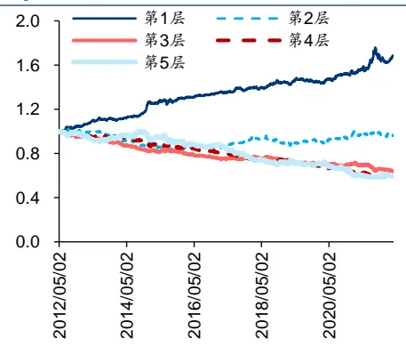
注：回测期：2012/4/27～2022/3/31
资料来源：朝阳永续，Wind，华泰研究

## 遗传规划研究回顾

遗传规划是一种启发式的公式演化技术，通过模拟自然界中遗传进化的过程来逐渐生成契合特定目标的公式群体，适合进行因子挖掘。在华泰金工人工智能系列前期报告中，有三篇遗传规划因子挖掘相关的报告，涉及量价因子挖掘、适应度改进、交叉验证等内容。本文中，我们将把遗传规划运用于分析师一致预期因子的挖掘。

图表1：华泰金工遗传规划相关研究
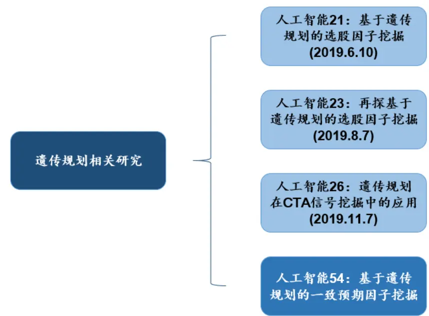
资料来源：华泰研究

下图介绍了遗传规划的总体流程，遗传规划从随机生成的公式群体开始，通过模拟自然界中遗传进化的过程来逐渐生成契合特定目标的公式群体。我们对遗传规划程序包gplearn进行深度改进，实现了遗传规划在因子挖掘上的应用。关于遗传规划的详细原理，可参见报告《人工智能23：基于遗传规划选股因子挖掘》(2019.6.10)。

图表2：遗传规划的总体流程
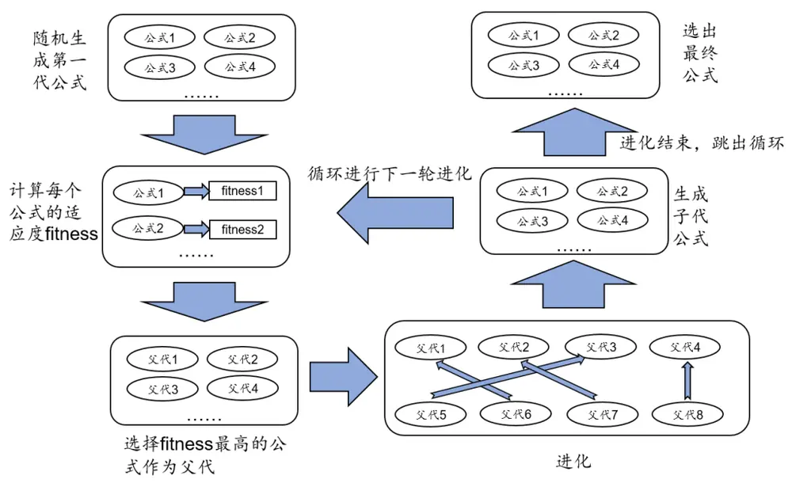
资料来源：华泰研究

## 分析师一致预期数据的特点和处理方法

## 一致预期数据的特点和形式

分析师一致预期数据归纳总结了市场上卖方分析师报告对个股的财务指标预测、评级以及关注情况，是除公司财报数据、交易数据以外重要的第三方数据，蕴含丰富的信息。且分析师一致预期数据可达到日频更新的水平，一定程度上能反映基本面的高频变化，具有深度挖掘的价值。我们以朝阳永续分析师一致预期数据库1.0版本为例，来对本文涉及的数据进行说明，如下图所示。

图表3：一致预期数据说明

| 数据名称 | 数据说明 |
| --- | --- |
| CON_EPS(对应表 1 的 C1) | 一致预期 EPS |
| CON_NP(对应表 1 的 C4) | 一致预期归属母公司净利润 |
| CON_ROE(对应表 1 的 C12) | 一致预期 ROE |
| CON_EP(对应表 1 的 C5) | 一致预期PE的倒数 |
| CON BP(对应表 1 的 CPB) | 一致预期 PB 的倒数 |
| CON_GPE(对应表 1 的 C6) | 一致预期 PE/G 的倒数 |
| CON_CAGR(对应表 1 的 C3) | 一致预期净利润2年复合增长率 |
| CON_NPG(对应表 1 的 C7) | 一致预期净利润同比增长率 |
| UP_NUMBER90(位于表 2) | 个股季业绩上调家数 |
| DOWN_NUMBER90(位于表2)个股季业绩下调家数 |  |
| DEGREE(位于表 3) | 分析师对上市公司的每股收益预测的标准差 |
| TDATE | 预测日期（截至日期） |
| RPT_DATE | 预测报告年度 |
| CON_TYPE | 预测类型。本文选择预测类型为1、2、4的数据。使用数据的优先级为：类型1>类型2>类型4 类型1：90日内有5家以上机构出具了该股的预测，严格按照朝阳永续的一致预期算法，对机构 |
|  | 影响力和时间影响力进行双重加权。 类型2：当预测机构数或预测时间等有效性达不到一致预期要求时，我们进入优化估算流程。比 |
|  | 如：预测机构数达不到要求，如只有2家机构，则根据机构的影响力直接取影响力大的机构的数 据作为一致预期数据；再如：满足不了90日内预测的要求，必须调取120日的预测数据，此时 |
|  | 90~120日的预测值必须两家以上预测值进行算术平均，平均值作为一个有效值参与90日内的加 |
|  | 权计算。 |
|  | 类型4：即统计日起的历史6个月内未有机构出具有效预测数据，因此沿用6个月前的一致预期 |

注：表 1：CON_FORECAST_STK，表 2:STOCK_REPORT_ADJUSTMENT，表 3:STOCK_DIVERSITY
资料来源：朝阳永续，华泰研究

每日每只股票的一致预期数据个数可能是不同的，一般包含2-3个未来年份(通常有卖方持续覆盖的情况下，不论是否披露财报，均有3年预测期数据，财报更新后没有卖方持续跟踪的，有2年预测期数据)。当某年的财务报表披露后，该年的一致预期数据就不再出现，所以一致预期数据的预测年份是在变化的。如下图，在2021年2月2日，股票000002有三年的一致预期数据，而股票000001则只有两年的一致预期数据，这是由于股票000001的2020年财报已披露，最小预测年份就会变成2021年，而股票000002的2020年财报尚未披露，故最小预测年份是2020年。

图表4：原始一致预期个股数据表

| STOCK_CODE | CON_DATE | CON_TYPE | RPT_DATE | CON_EPS | CON_NP | CON_EP | CON_ROE |
| --- | --- | --- | --- | --- | --- | --- | --- |
| 000001 | 2021/2/2 | 1 | 2021 | 1.7142 | 3328053.26 | 13.5807 | 0.0837 |
| 000001 | 2021/2/2 | 1 | 2022 | 1.977 | 3837099.075 | 11.7754 | 0.0881 |
| 000002 | 2021/2/2 | 1 | 2020 | 3.7394 | 4344869.064 | 7.5788 | 0.192 |
| 000002 | 2021/2/2 | 1 | 2021 | 4.1967 | 4876588.211 | 6.7529 | 0.1773 |
| 000002 | 2021/2/2 | 1 | 2022 | 4.7562 | 5526212.957 | 5.9585 | 0.1673 |

资料来源：朝阳永续，华泰研究

## 针对遗传规划需求的一致预期数据处理方法

在使用遗传规划进行量价因子挖掘时，因子计算过程是在二维(第一维是股票，第二维是交易日)的量价数据上进行矩阵预算。而在进行一致预期因子挖掘时，情况变得更加复杂了一些，每日每只股票通常包括未来2-3个年份的预期数据，此时需要一个三维数据结构来存储数据，第一维是股票，第二维是交易日，第三维是预测年份，如图表5所示，我们把原始一致预期个股数据表中的数据依次填入到三维数组中。

此外针对每只股票，每个交易日都使用最小预测年份的一致预期数据，因此还需要构建一个二维数组存储股票在各个交易日的最小预测年份。

图表5：一致预期数据的三维数组存储形式
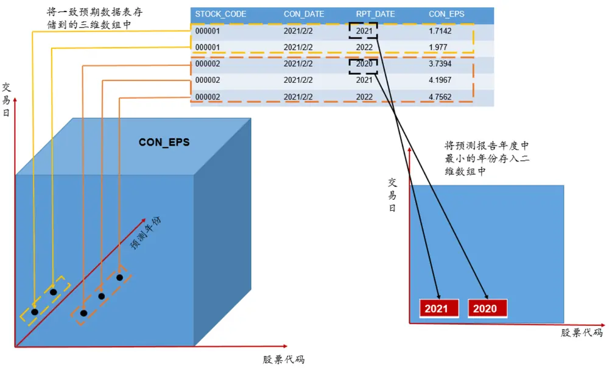
资料来源：朝阳永续，华泰研究

在构造好以上数据结构后，我们将通过一个简单的案例展示因子的计算方式。如图表6所示，以因子表达式ts_mean(CON_EPS,5)为例，计算过程为：

1. 首先对交易日进行遍历，在存储最小预测年份的二维数组中找到每只股票当日的最小预测的年份。如2021年2月2日，股票000001和股票000002的最小预测年份分别为2021年和2020年。

2. 针对每只股票在三维数组中查找过去5个交易日相同预测年份的数据，如股票000001需要找到(000001,2021/1/27-2021/2/2,2021)的数据，而股票000002则需要找到(000002,2021/1/27-2021/2/2,2020)的数据。

3. 基于每只股票的窗口数据，即可以计算ts_mean(CON_EPS,5)的运算值，该日运算完成后，再进行2021年2月3日的计算，最后将所有交易日的运算值合并则可以得到最终的运算结果。

4. 一致预期数据中，可能会出现 ENTRYDATE(入库日期)晚于TDATE(预测日期)的情形，我们针对此也进行了处理，避免使用未来信息。

图表6：ts_mean(CON_EPS，5)的计算过程
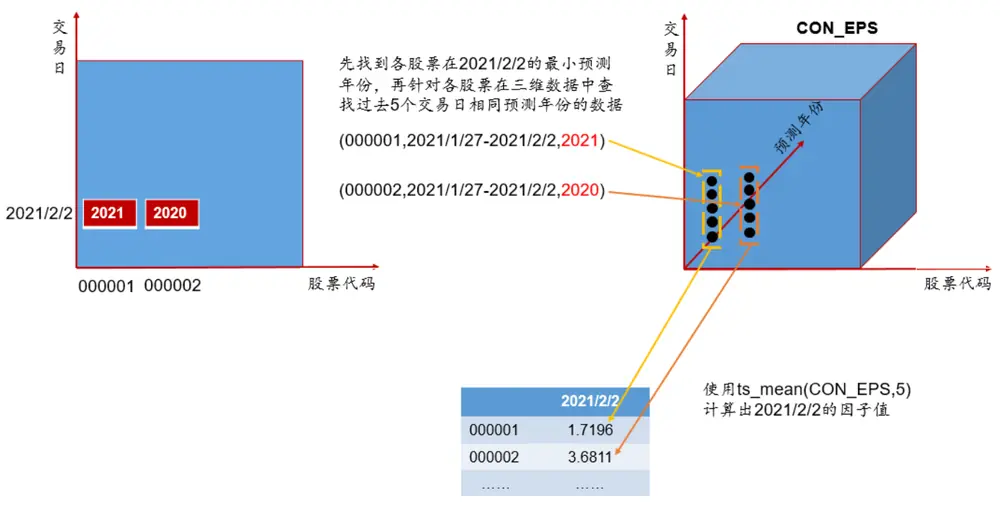
资料来源：朝阳永续，华泰研究

## 遗传规划一致预期因子挖掘的测试流程

测试流程包含下列步骤：

1. 数据获取和特征提取：

1) 股票池：全 A股中具有分析师一致预期数据的股票，剔除ST、PT股票，剔除每个截面期下一交易日涨停和停牌的股票。

2) 回测区间：2012/4/27～2022/3/31。时间排前80%的截面为训练集，后20%的截面为验证集。

3) 原始因子列表如图表7所示，函数列表如图表8所示。

4) 预测目标：个股20个交易日后的收益率。

图表7：原始因子列表

| 数据名称 | 数据说明 |
| --- | --- |
| CON_EPS | 一致预期 EPS |
| CON_NP | 一致预期归属母公司净利润 |
| CON_ROE | 一致预期 ROE |
| CON_EP | 一致预期 PE 的倒数 |
| CON_BP | 一致预期 PB 的倒数 |
| CON_GPE | 一致预期 PE/G 的倒数 |
| CON_CAGR | 一致预期净利润2年复合增长率 |
| CON_NPG | 一致预期净利润同比增长率 |
| UP_NUMBER90 | 个股季业绩上调家数 |
| DOWN_NUMBER90 | 个股季业绩下调家数 |
| DEGREE | 分析师对上市公司的每股收益预测的标准差 |
| EP | 个股 PE_TTM的倒数，用来挖掘与 CON_EP 相关的因子 |

资料来源：朝阳永续，Wind，华泰研究

图表8：函数列表

| 名称 | 定义 |
| --- | --- |
| X：以下函数中自变量 | X一般可以理解为向量{Xi}1≤i≤n，代表N只个股在某指定截面日的因子值，例如：X=close+open；若X为矩阵，则以下函 数可以理解为对每个列向量分别进行运算，再将结果按列合并。 |
| add(X, Y) | 返回值为向量，其中第i个元素为Xi+Yi |
| sub(X, Y) | 返回值为向量，其中第i个元素为Xi-Yi |
| mul(X, Y) | 返回值为向量，其中第i 个元素为Xi*Yi(对应 matlab 中的点乘) |
| div(X, Y) | 返回值为向量，其中第i个元素为Xi/Yi(对应 matlab 中的点除) |
| rank_add(X, Y) | 返回值为向量，其中第i个元素为Xi在向量X中的分位数加上Yi在向量Y中的分位数。 |
| rank_sub(X, Y) | 返回值为向量，其中第i个元素为Xi在向量X中的分位数减去Yi在向量Y中的分位数。 |
| rank_mul(X, Y) | 返回值为向量，其中第i个元素为Xi在向量X中的分位数乘以Yi在向量Y中的分位数。 |
| rank_div(X, Y) | 返回值为向量，其中第i个元素为Xi在向量X中的分位数除以Yi在向量Y中的分位数。 |
| inv(X) | 返回值为向量，其中第i个元素为X的倒数 |
| rank(X) | 返回值为向量，其中第i个元素为Xi在向量X中的分位数。 |
| ts_corr(X, Y, d) | 返回值为向量，其中第i个元素为过去d天X值构成的时序数列和Y值构成的时序数列的相关系数。 |
| decay_linear(X, d) | 返回值为向量，其中第i个元素为过去d天X值构成的时序数列的加权平均值，权数为d,d-1，...,1(权数之和应为1，需进 |
| ts_return(X, d) | 行归一化处理)，其中离现在越近的日子权数越大。 |
| ts_min(X, d) | 返回值为向量，其中第i个元素为过去d天Xi值的变化率。 |
| ts_max(X, d) | 返回值为向量，其中第i个元素为过去d天X值构成的时序数列中最小值。 |
| ts_mean(X, d) | 返回值为向量，其中第i个元素为过去d天X值构成的时序数列中最大值。 |
| ts_rank(X, d) | 返回值为向量，其中第i个元素为过去d天X值构成的时序数列中平均值。 |
| ts_sum(X, d) | 返回值为向量，其中第i个元素为过去d天X值构成的时序数列中本截面日X值所处分位数。 |
|  | 返回值为向量，其中第i个元素为过去d天Xi值构成的时序数列之和 |
| delay(X, d) | 返回值为向量，其中第i个元素为过去第 d 天的Xi值。 |

资料来源：gplearn，华泰研究

2. 使用图表7中的因子和图表8中的函数集，生成大量公式，按照遗传规划的流程进行公式的进化和筛选。公式适应度的计算：假设有公式F，得出该公式在截面t上对所有个股的因子向量Ft后，进行行业市值中性化，并计算因子的IC均值为适应度。

3. 对遗传规划挖掘出的因子进行IC测试、分层测试和相关性分析。

## 遗传规划所得一致预期因子的单因子测试

## 单因子测试方法简介

## IC 值分析法

因子的IC值是指因子在第T期的暴露度向量与T+1期的股票收益向量的相关系数，即

$$
IC^{T}=\operatorname{corr}(r^{T+1},X^{T})
$$

上式中因子暴露度向量XT一般不会直接采用原始因子值，而是经过去极值、中性化等手段处理之后的因子值。在实际计算中，使用Pearson相关系数可能受因子极端值影响较大，使用 Spearman 秩相关系数则更稳健一些，这种方式下计算出来的 IC一般称为 Rank IC。

## IC值分析模型构建方法如下：

1. 股票池：沪深300成分股、中证500成分股、全 A股，剔除ST、PT股票，剔除每个截面期下一交易日停牌的股票。

2. 回溯区间：2012/4/27～2022/3/31。

3. 截面期：每个交易日作为截面期计算因子值，与该截面期之后20个交易日内个股收益进行计算。

4. 先将因子暴露度向量进行去极值、行业市值中性化，再计算处理后的T期因子暴露度向量和 T+1 期股票收益向量的 Spearman 秩相关系数，作为 T 期因子 Rank IC 值。

5. 因子评价方法：

a) Rank IC 值序列均值——因子显著性；

b) Rank IC 值序列标准差——因子稳定性；

c) IC_IR(Rank IC 值序列均值与标准差的比值)——因子有效性；

d) RankIC 值序列大于零的占比—因子作用方向是否稳定。

## 分层回测法

依照因子值对股票进行打分，构建投资组合回测，是最直观的衡量因子优劣的手段。分层测试法与IC值分析相比，能够发掘因子对收益预测的非线性规律。也即，若存在一个因子分层测试结果显示，其Top组和Bottom组的绩效长期稳定地差于Middle组，则该因子对收益预测存在稳定的非线性规律，但在IC值分析过程中很可能被判定为无效因子。

## 分层测试模型构建方法如下：

1. 股票池、回溯区间与IC值分析法相同。

2. 换仓：每隔20个交易日换仓，在每个换仓截面期核算因子值，构建分层组合，在截面期下一个交易日按当日收盘价换仓，交易费用为单边0.2%。

3. 分层方法：先将因子暴露度向量进行一定预处理(下文中会指明处理方式)，将股票池内所有个股按处理后的因子值从大到小进行排序，等分N层，每层内部的个股等权重配置。当个股总数目无法被N整除时采用任一种近似方法处理均可，实际上对分层组合的回测结果影响很小。分层测试中的基准组合为股票池内所有股票的等权组合。

4. 多空组合收益计算方法：用 Top 组每天的收益减去Bottom 组每天的收益，得到每日多空收益序 $\mathfrak{H}|_{r_{1},r_{2},\cdots,r_{n}}$ ，则多空组合在第n天的净值等于 $\overline{{\cdot}}(1+r_{1})(1+r_{2})\cdots(1+r_{n})$ 0

5. 评价方法：全部N层组合年化收益率(观察是否单调变化)，多空组合的年化收益率、夏普比率、最大回撤等。

## 因子汇总说明

## 因子表达式和说明

我们用遗传规划进行因子挖掘，并精选了下表的11个因子进行展示。

图表9：因子表达式和说明

| 因子表达式 |  | 因子说明 |
| --- | --- | --- |
| Alpha1 | ts_return(CON_EPS, 60) | 一致预期 EPS 变化率因子 |
| Alpha2 | div(ts_return(CON_EPS, 60),ts_decay_linear(DEGREE, 60)) | 改进的一致预期EPS 变化率因子 |
| Alpha3 | div(ts_return(CON_ROE, 60),ts_decay_linear(DEGREE, 60)) | 改进的一致预期 ROE 变化率因子 |
| Alpha4 | sub(CON_ROE, ts_min(CON_ROE, 60)) | 一致预期 ROE 变化相关因子 |
| Alpha5 | -rank_div(ts_return(inv(CON_EP), 60),ts_decay_linear(DEGREE, 60)) | 改进的一致预期PE变化率因子 |
| Alpha6 | div(ts_return(CON_GPE, 40),ts_mean(DEGREE, 40)) | 改进的一致预期GPE变化率因子 |
| Alpha7 | div(sub(ts_decay_linear(UP_NUMBER90, 60),ts_decay_linear(DOWN_NUMBER90, 60)), | 改进的预期业绩上下调因子 |
| Alpha8 | ts_decay_linear(DEGREE, 60)) |  |
| Alpha9 | -ts_return(div(inv(CON_BP), CON_EPS), 60) | 一致预期复合因子 |
| Alpha10 | ts_return(mul(CON_GPE, CON_CAGR), 60) | 一致预期复合因子 一致预期复合因子 |
| Alpha11 | rank_mul(CON_CAGR, CON_EPS) div(EP, ts_mean(delay(CON_EP,5), 60)) | 一致预期 EP 和EP的复合因子 |

资料来源：朝阳永续，华泰研究

通过所列因子的表达式可知：

1.上表的因子中，计算变化率的函数 ts return出现次数最多，说明一致预期数据的变化率是一类常见的因子构建逻辑。这与一致预期数据的内涵相符，分析师对于上市公司的预期产生变化，往往表明公司的基本面发生变化，可能对公司未来的股价产生影响。

2.上表的一致预期复合因子中，主要为数据之间的乘除，说明这两种运算是构建一致预期复合因子的有效方式。

3.除了一致预期数据之间构建复合因子，一致预期数据也可以和真实的基本面数据构建复合因子。例如，Alpha11是一致预期EP和EP的复合因子，可将其视为基于一致预期EP的超预期因子。

4. 改进的一致预期因子中，多出现除以分析师预测标准差(DEGREE)的运算。根据文献[1]的研究，2020年新冠疫情以来，会发生意料之外的地区流动限制，从而增加分析师对疫情地区公司预测的离散度。由下图可知，2020年以来分析师预测标准差的中位数相比前几年明显上升。分析师预测标准差越小，一致预期分歧越小，因此在一致预期因子的计算中除以分析师预测标准差是一种改进因子的方法。

图表10：全A股内分析师预测标准差的中位数
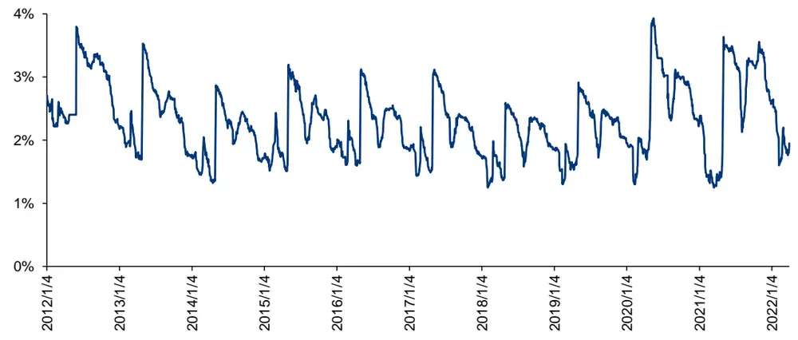
资料来源：朝阳永续，华泰研究

## 因子相关性分析，因子IC测试和分层回测结果汇总

下图为Alpha1~Alpha11因子的相关性矩阵。可知 Alpha1~Alpha4之间的相关性较高，实际上它们都是一致预期盈利变化相关的因子，其他因子间的相关性则较低。图表12~图表14 为 Alpha1~Alpha11 在沪深 300、中证 500 和全 A 股内的测试结果汇总。

图表11：Alpha1~Alpha11 因子的相关性矩阵
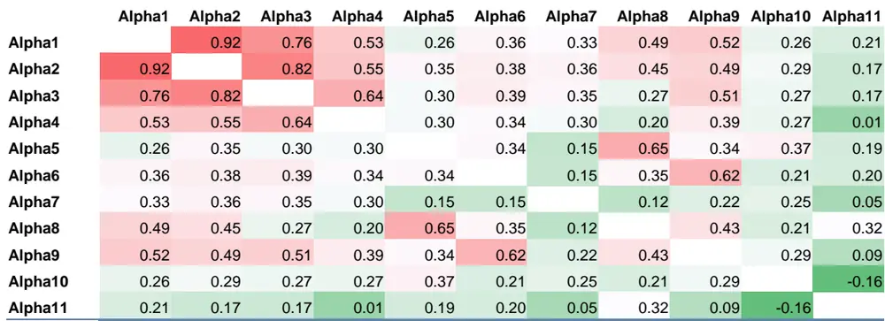
资料来源：朝阳永续，Wind，华泰研究

图表12：沪深 300 成分股内IC 测试和分层回测结果汇总

|  | RankIC 均值 | IC_IR TOP 组合年化超额收益率 TOP 组合信息比率 TOP 组合胜率 TOP 组合换手率 因子平均覆盖度 |  |  |  |  |
| --- | --- | --- | --- | --- | --- | --- |
| Alpha1 | 4.89% | 0.43 | 7.06% | 1.13 | 63.03% | 81.20% |
| Alpha2 | 4.87% | 0.42 | 5.38% | 0.86 57.14% | 85.19% | 87.64% |
| Alpha3 | 4.77% | 0.43 | 4.76% | 0.82 55.46% | 87.93% | 87.61% |
| Alpha4 | 2.39% | 0.26 | 5.01% | 0.88 58.82% | 79.52% | 98.99% |
| Alpha5 | 4.33% | 0.35 | 3.51% | 0.47 61.34% | 96.67% | 90.46% |
| Alpha6 | 3.28% | 0.32 | 2.41% | 0.38 52.94% | 114.92% | 75.89% |
| Alpha7 | 3.31% | 0.29 | 6.68% | 1.11 62.18% | 55.31% | 89.07% |
| Alpha8 | 3.93% | 0.30 | 1.57% | 0.22 50.42% | 101.26% | 97.26% |
| Alpha9 | 2.53% | 0.26 | 2.60% | 0.44 | 56.30% 92.93% | 90.82% |
| Alpha10 | 2.07% | 0.12 | 2.54% | 0.30 51.26% | 31.80% | 96.61% |
| Alpha11 | 4.93% | 0.43 | 2.26% | 0.32 | 46.22% | 81.70% 93.17% |

资料来源：朝阳永续，Wind，华泰研究

图表13：中证 500 成分股内IC 测试和分层回测结果汇总

|  | RankIC 均值 | IC_IR TOP 组合年化超额收益率 TOP 组合信息比率 TOP 组合胜率 TOP 组合换手率 因子平均覆盖度 |  |  |  |  |  |
| --- | --- | --- | --- | --- | --- | --- | --- |
| Alpha1 | 2.32% | 0.27 | 3.67% | 0.68 | 56.30% | 84.66% | 93.25% |
| Alpha2 | 2.74% | 0.30 | 3.10% | 0.60 | 49.58% | 95.61% | 65.52% |
| Alpha3 | 3.13% | 0.36 | 2.10% | 0.42 | 49.58% | 97.01% | 65.50% |
| Alpha4 | 2.03% | 0.26 | 0.60% | 0.13 | 46.22% | 88.37% | 94.95% |
| Alpha5 | 3.74% | 0.39 | 3.65% | 0.65 | 55.46% | 98.49% | 73.32% |
| Alpha6 | 3.32% | 0.38 | 1.26% | 0.24 | 48.74% | 117.21% | 57.53% |
| Alpha7 | 2.59% | 0.30 | 6.11% | 1.20 | 63.03% | 63.97% | 66.53% |
| Alpha8 | 4.28% | 0.41 | 1.85% | 0.35 | 54.62% | 101.97% | 93.40% |
| Alpha9 | 2.49% | 0.35 | 0.62% | 0.14 | 49.58% | 94.26% | 84.43% |
| Alpha10 | 2.57% | 0.21 | 3.71% | 0.59 | 57.14% | 37.37% | 91.06% |
| Alpha11 | 4.83% | 0.48 | 3.33% | 0.60 | 54.62% | 74.00% | 86.17% |

资料来源：朝阳永续，Wind，华泰研究

图表14：全 A 股内IC 测试和分层回测结果汇总

|  | RankIC 均值 | IC_IR TOP 组合年化超额收益率 TOP 组合信息比率 TOP 组合胜率 TOP 组合换手率 因子平均覆盖度 |  |  |  |  |  |
| --- | --- | --- | --- | --- | --- | --- | --- |
| Alpha1 | 1.79% | 0.30 | 4.24% | 1.08 | 63.03% | 80.55% | 78.36% |
| Alpha2 | 2.92% | 0.40 | 5.65% | 1.55 | 65.55% | 93.15% | 46.13% |
| Alpha3 | 3.14% | 0.46 | 5.11% | 1.54 | 65.55% | 94.19% | 46.11% |
| Alpha4 | 2.72% | 0.47 | 2.11% | 0.59 | 58.82% | 88.27% | 81.31% |
| Alpha5 | 3.14% | 0.39 | 2.51% | 0.48 | 54.62% | 95.80% | 53.20% |
| Alpha6 | 3.74% | 0.48 | 2.44% | 0.56 | 50.42% | 117.68% | 41.10% |
| Alpha7 | 1.98% | 0.30 | 4.66% | 1.21 | 67.23% | 60.92% | 47.93% |
| Alpha8 | 5.02% | 0.53 | 1.80% | 0.41 | 53.78% | 98.46% | 78.86% |
| Alpha9 | 3.66% | 0.58 | 2.88% | 0.91 | 56.30% | 92.74% | 71.00% |
| Alpha10 | 2.16% | 0.20 | 4.95% | 0.98 | 60.50% | 34.34% | 77.47% |
| Alpha11 | 4.52% | 0.57 | 2.81% | 0.56 | 54.62% | 71.98% | 72.98% |

资料来源：朝阳永续，Wind，华泰研究

## 因子详细测试结果

## Alpha1 的详细测试结果

Alpha1 = ts_return(CON_EPS， 60)，因子含义是一致预期 EPS 在过去 60 个交易日的变化率。由于该因子逻辑简明，已经被广泛使用，但仍有一定改进空间，改进后的因子为Alpha2。图表 15~图表 20 为 Alpha1 的测试结果。

图表15： Alpha1 在各个股票池内IC 值分析结果汇总(因子进行行业、市值中性)

|  | RankIC 均值 | RankIC 标准差 | IC_IR | IC>0 占比 |
| --- | --- | --- | --- | --- |
| 沪深 300 成分股 | 4.89% | 11.50% | 0.43 | 69.42% |
| 中证 500 成分股 | 2.32% | 8.48% | 0.27 | 61.98% |
| 全 A股 | 1.79% | 5.99% | 0.30 | 63.64% |

注：回测期：2012/4/27～2022/3/31
资料来源：朝阳永续，Wind，华泰研究

图表16:Alpha1 在各个股票池内分层回测结果汇总(因子进行行业、市值中性)

|  | 分层组合1~5(从左到右)年化超额收益率 |  |  | 多空组合年化收益率 | 多空组合夏普比率 TOP 组合信息比率 |  | TOP 组合胜率 | TOP 组合换手率 |
| --- | --- | --- | --- | --- | --- | --- | --- | --- |
| 沪深 300 成分股 | 7.06% | 0.25%-4.81%-5.33%-7.87% |  | 15.64% | 1.54 | 1.13 | 63.03% | 81.20% |
| 中证 500 成分股 |  | 3.67% -3.65% -1.04% -3.34% -5.38% |  | 9.25% | 1.12 | 0.68 | 56.30% | 84.66% |
| 全A股 | 4.24%-4.80% | 0.22%-4.62% | -3.90% | 8.30% | 1.37 | 1.08 | 63.03% | 80.55% |

注：回测期：2012/4/27～2022/3/31
资料来源：朝阳永续，Wind，华泰研究

图表17： Alpha1 分层组合 1~5 净值除以基准净值(沪深 300)
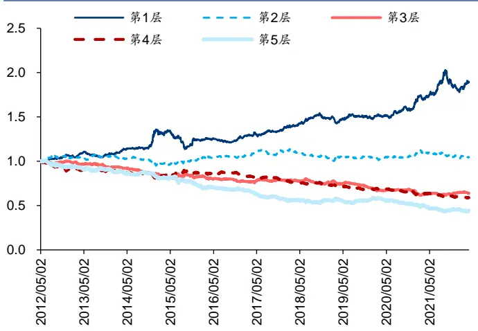
注：回测期：2012/4/27～2022/3/31
资料来源：朝阳永续，Wind，华泰研究

图表18：Alpha1 分层组合 1~5 净值除以基准净值(中证 500)
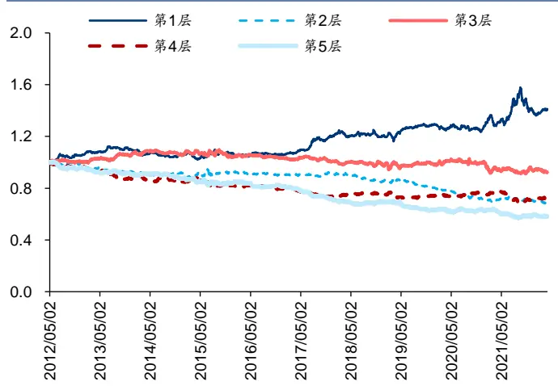
注：回测期：2012/4/27～2022/3/31
资料来源：朝阳永续，Wind，华泰研究

图表19: Alpha1 分层组合 1~5 净值除以基准净值(全 A 股)
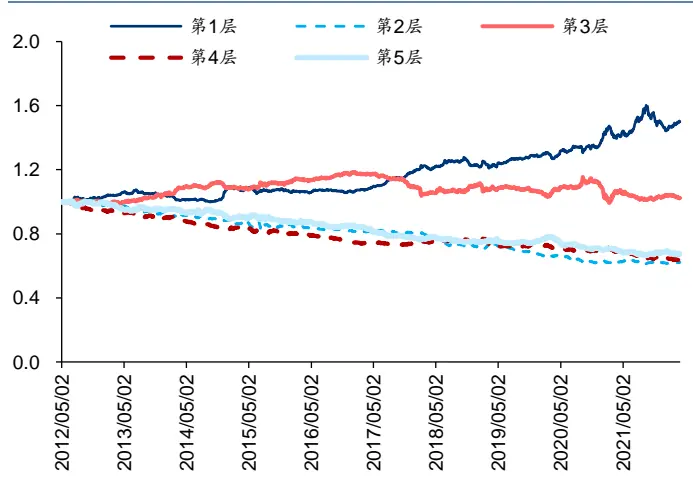
注：回测期：2012/4/27～2022/3/31
资料来源：朝阳永续，Wind，华泰研究

图表20：Alpha1 累积 RankIC
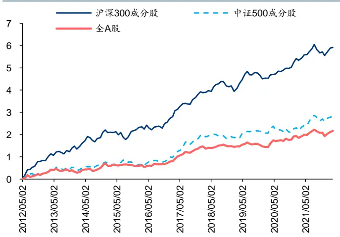
注：回测期：2012/4/27～2022/3/31
资料来源：朝阳永续，Wind，华泰研究

## Alpha2 的详细测试结果

Alpha2 = div(ts_return(CON_EPS，60),ts_decay_linear(DEGREE，60))，因子含义是一致预期EPS在过去60个交易日的变化率除以过去60个交易日分析师预测标准差(DEGREE)的线性衰减加权值。该因子在Alpha1的基础上，引入分析师预测标准差来进行调整，标准差越小，一致预期分歧越小，对因子取值有正向贡献。图表21~图表 26 为 Alpha2的测试结果。从 RankIC 均值、IC_IR 和多空组合表现来看，Alpha2 相比 Alpha1 在中证 500 成分股和全A股表现更好。

图表21：Alpha2 在各个股票池内IC 值分析结果汇总(因子进行行业、市值中性)

|  | RankIC 均值 | RankIC 标准差 | IC_IR | IC>0 占比 |
| --- | --- | --- | --- | --- |
| 沪深 300 成分股 | 4.87% | 11.71% | 0.42 | 66.12% |
| 中证 500 成分股 | 2.74% | 9.14% | 0.30 | 59.50% |
| 全 A股 | 2.92% | 7.33% | 0.40 | 68.60% |

注：回测期：2012/4/27～2022/3/31
资料来源：朝阳永续，Wind，华泰研究

图表22：Alpha2 在各个股票池内分层回测结果汇总(因子进行行业、市值中性)

|  | 分层组合1～5(从左到右)年化超额收益率 |  |  | 多空组合年化收益率 | 多空组合夏普比率 TOP组合信息比率 | TOP 组合胜率 | TOP 组合换手率 |
| --- | --- | --- | --- | --- | --- | --- | --- |
| 沪深 300 成分股 | 5.38% | 3.40% -4.24% -7.38% -7.82% | 13.78% | 1.43 | 0.86 | 57.14% | 85.19% |
| 中证 500 成分股 |  | 3.10% -0.05% -2.71% -3.93% -6.78% | 10.21% | 1.23 | 0.60 | 49.58% | 95.61% |
| 全 A股 |  | 5.65% -0.68% -4.60% -5.40% -4.98% | 10.96% | 1.80 | 1.55 | 65.55% | 93.15% |

注：回测期：2012/4/27～2022/3/31
资料来源：朝阳永续，Wind，华泰研究

图表23： Alpha2 分层组合 1~5 净值除以基准净值(沪深 300)
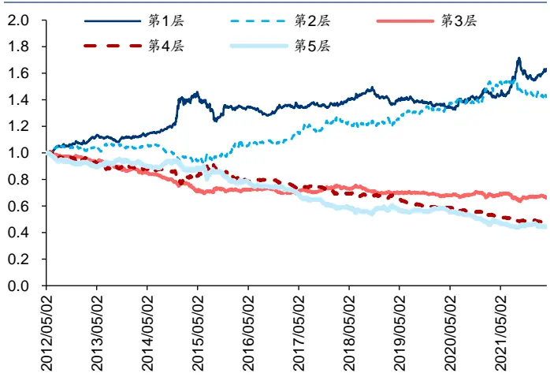
注：回测期：2012/4/27～2022/3/31
资料来源：朝阳永续，Wind，华泰研究

图表24：Alpha2 分层组合 1~5 净值除以基准净值(中证 500)
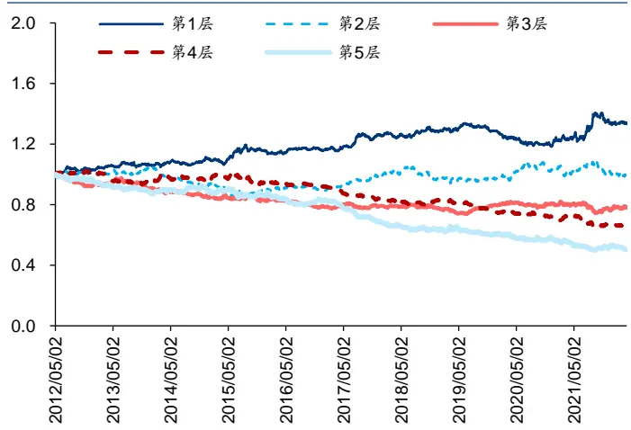
注：回测期：2012/4/27～2022/3/31
资料来源：朝阳永续，Wind，华泰研究

图表25： Alpha2 分层组合 1~5 净值除以基准净值(全 A 股)
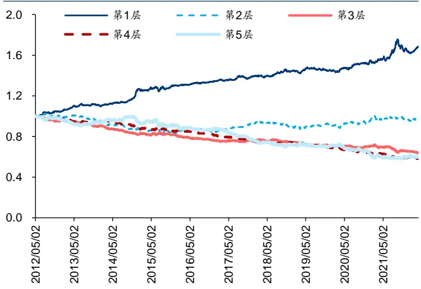
注：回测期：2012/4/27～2022/3/31
资料来源：朝阳永续，Wind，华泰研究

图表26：Alpha2 累积 RankIC
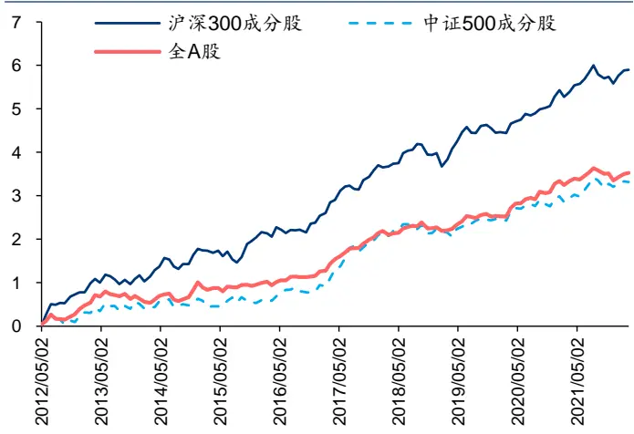
注：回测期：2012/4/27～2022/3/31
资料来源：朝阳永续，Wind，华泰研究

## Alpha3 的详细测试结果

Alpha3 = div(ts_return(CON_ROE, 60),ts_decay_linear(DEGREE,60))，因子含义是一致预期ROE在过去60个交易日的变化率除以过去60个交易日分析师预测标准差的线性衰减加权值，该因子形式上与Alpha2一致，属于改进的一致预期ROE变化率因子。图表27~图表 32 为 Alpha3 的测试结果。

图表27：Alpha3 在各个股票池内IC 值分析结果汇总(因子进行行业、市值中性)

|  | RankIC 均值 | RankIC 标准差 | IC_IR | IC>0 占比 |
| --- | --- | --- | --- | --- |
| 沪深 300 成分股 | 4.77% | 11.18% | 0.43 | 70.25% |
| 中证 500 成分股 | 3.13% | 8.77% | 0.36 | 57.85% |
| 全 A股 | 3.14% | 6.86% | 0.46 | 69.42% |

注：回测期：2012/4/27～2022/3/31
资料来源：朝阳永续，Wind，华泰研究

图表28：Alpha3在各个股票池内分层回测结果汇总(因子进行行业、市值中性)

|  | 分层组合1～5(从左到右)年化超额收益率 |  |  |  |  | 多空组合年化收益率 | 多空组合夏普比率 TOP 组合信息比率 |  | TOP 组合胜率 | TOP 组合换手率 |
| --- | --- | --- | --- | --- | --- | --- | --- | --- | --- | --- |
| 沪深 300 成分股 | 4.76% | 5.04% | -5.33% | -7.88% | -7.20% | 12.34% | 1.32 | 0.82 | 55.46% | 87.93% |
| 中证 500 成分股 | 2.10% | 1.81% | -3.60% | -4.59% | -6.00% | 8.26% | 1.03 | 0.42 | 49.58% | 97.01% |
| 全 A股 | 5.11% | 0.89% | -4.74% | -5.68% | -5.56% | 11.10% | 2.04 | 1.54 | 65.55% | 94.19% |

注：回测期：2012/4/27～2022/3/31
资料来源：朝阳永续，Wind，华泰研究

图表29：Alpha3 分层组合 1~5 净值除以基准净值(沪深 300)
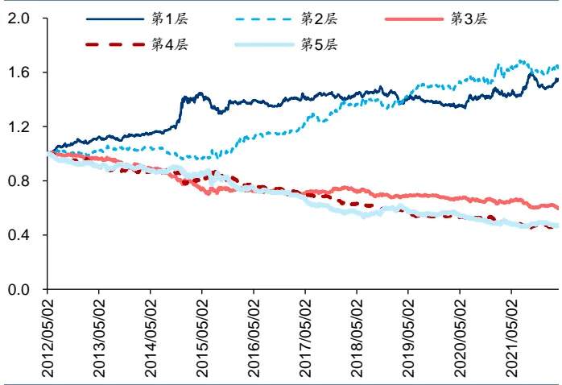
注：回测期：2012/4/27～2022/3/31
资料来源：朝阳永续，Wind，华泰研究

图表30：Alpha3 分层组合 1~5 净值除以基准净值(中证 500)
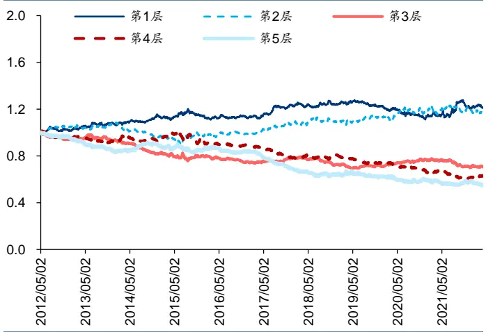
注：回测期：2012/4/27～2022/3/31
资料来源：朝阳永续，Wind，华泰研究

图表31： Alpha3 分层组合 1~5 净值除以基准净值(全 A 股)
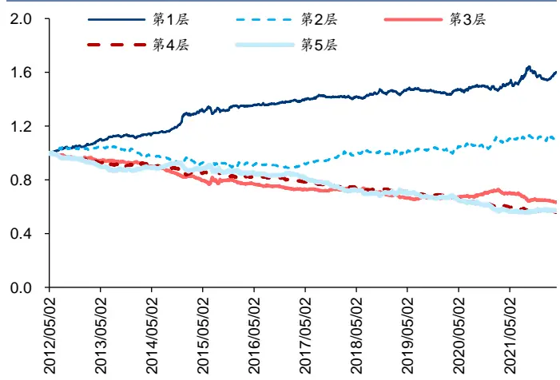
注：回测期：2012/4/27～2022/3/31
资料来源：朝阳永续，Wind，华泰研究

图表32：Alpha3 累积 RankIC
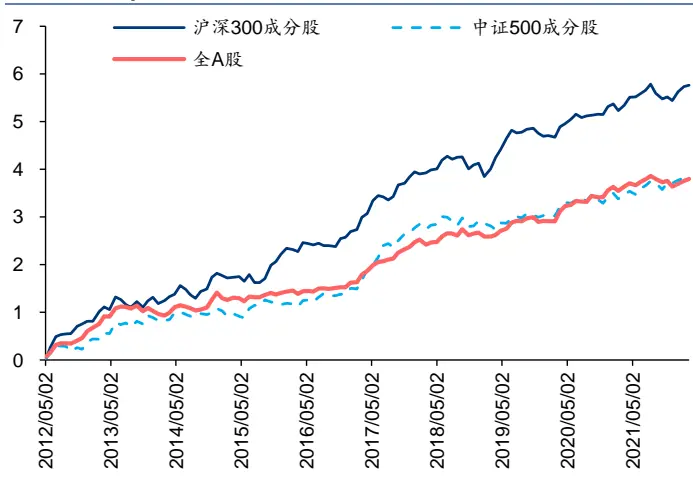
注：回测期：2012/4/27～2022/3/31
资料来源：朝阳永续，Wind，华泰研究

## Alpha4 的详细测试结果

Alpha4 = sub(CON_ROE, ts_min(CON_ROE， 60))，因子含义是当前的一致预期 ROE 值与过去 60 个交易日一致预期 ROE 最小值之差。图表 33~图表 38 为 Alpha4 的测试结果。

图表33：Alpha4 在各个股票池内IC 值分析结果汇总(因子进行行业、市值中性)

|  | RankIC 均值 | RankIC 标准差 | IC_IR | IC>0 占比 |
| --- | --- | --- | --- | --- |
| 沪深 300 成分股 | 2.39% | 9.04% | 0.26 | 61.16% |
| 中证 500 成分股 | 2.03% | 7.77% | 0.26 | 61.16% |
| 全 A股 | 2.72% | 5.79% | 0.47 | 68.60% |

注：回测期：2012/4/27～2022/3/31
资料来源：朝阳永续，Wind，华泰研究

图表34：Alpha4 在各个股票池内分层回测结果汇总(因子进行行业、市值中性)

| 分层组合1～5(从左到右)年化超额收益率 |  |  |  |  | 多空组合年化收益率 | 多空组合夏普比率 TOP 组合信息比率 |  | TOP 组合胜率 58.82% | TOP 组合换手率 79.52% |
| --- | --- | --- | --- | --- | --- | --- | --- | --- | --- |
| 沪深 300 成分股 |  | 5.01% -1.59% -3.22% -4.72% -8.65% |  |  |  |  |  |  |  |
| 中证 500 成分股 | 0.60%-1.64% |  | -0.40% | -3.12%-7.11% | 14.56% 8.08% | 1.64 1.18 | 0.88 0.13 | 46.22% | 88.37% |
| 全A股 | 2.11% | -0.82% | -0.35% | -2.22% -9.73% | 12.97% | 2.36 | 0.59 | 58.82% | 88.27% |

注：回测期：2012/4/27～2022/3/31
资料来源：朝阳永续，Wind，华泰研究

图表35：Alpha4 分层组合 1~5 净值除以基准净值(沪深 300)
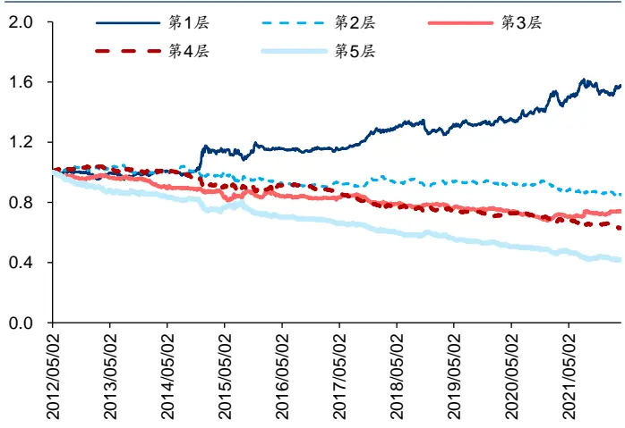
注：回测期：2012/4/27～2022/3/31
资料来源：朝阳永续，Wind，华泰研究

图表36： Alpha4 分层组合 1~5 净值除以基准净值(中证 500)
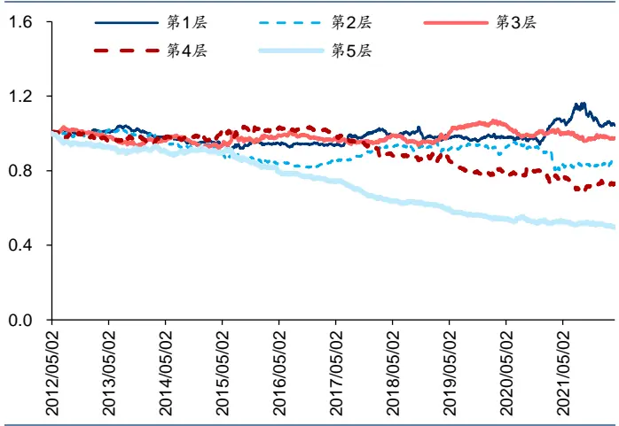
注：回测期：2012/4/27～2022/3/31
资料来源：朝阳永续，Wind，华泰研究

图表37： Alpha4 分层组合 1~5 净值除以基准净值(全 A 股)
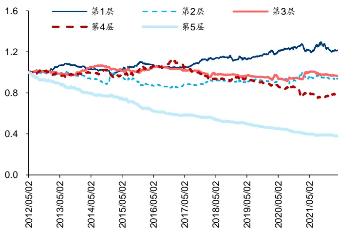
注：回测期：2012/4/27～2022/3/31
资料来源：朝阳永续，Wind，华泰研究

图表38：Alpha4 累积 RankIC
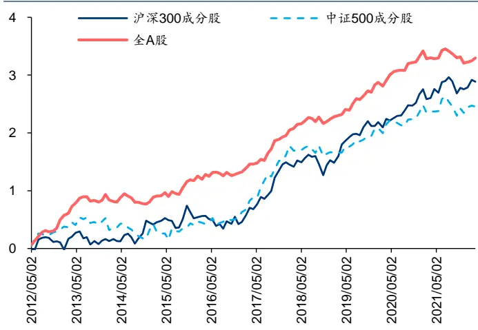
注：回测期：2012/4/27～2022/3/31
资料来源：朝阳永续，Wind，华泰研究

## Alpha5 的详细测试结果

Alpha5 = -rank_div(ts_return(inv(CON_EP),60),ts_decay_linear(DEGREE, 60))，因子先计算一致预期PE过去60个交易日的变化率和过去60个交易日分析师预测标准差的线性衰减加权值，再将二者的排序数相除并取相反数，本质上是一个改进的一致预期PE变化率因子。图表 39~图表 44 为 Alpha5 的测试结果。

图表39：Alpha5 在各个股票池内IC 值分析结果汇总(因子进行行业、市值中性)

|  | RankIC 均值 | RankIC 标准差 | IC_IR | IC>0 占比 |
| --- | --- | --- | --- | --- |
| 沪深 300成分股 | 4.33% | 12.29% | 0.35 | 65.29% |
| 中证 500 成分股 | 3.74% | 9.51% | 0.39 | 66.94% |
| 全 A股 | 3.14% | 8.00% | 0.39 | 63.64% |

注：回测期：2012/4/27～2022/3/31
资料来源：朝阳永续，Wind，华泰研究

图表40：Alpha5在各个股票池内分层回测结果汇总(因子进行行业、市值中性)

|  | 分层组合1~5(从左到右)年化超额收益率 |  |  | 多空组合年化收益率 | 多空组合夏普比率 TOP 组合信息比率 | TOP 组合胜率 | TOP 组合换手率 |
| --- | --- | --- | --- | --- | --- | --- | --- |
| 沪深 300 成分股 | 3.51% | 0.26% -4.07% -5.66% -5.92% | 9.21% | 0.74 | 0.47 | 61.34% | 96.67% |
| 中证 500 成分股 |  | 3.65% -1.28% -2.19% -6.10% -5.03% | 8.71% | 0.96 | 0.65 | 55.46% | 98.49% |
| 全A股 |  | 2.51% -1.70% -3.28% -3.89% -4.10% | 6.56% | 0.79 | 0.48 | 54.62% | 95.80% |

注：回测期：2012/4/27～2022/3/31
资料来源：朝阳永续，Wind，华泰研究

图表41：Alpha5 分层组合1~5 净值除以基准净值(沪深 300)
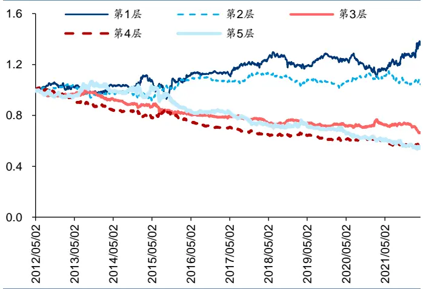
注：回测期：2012/4/27～2022/3/31
资料来源：朝阳永续，Wind，华泰研究

图表42：Alpha5 分层组合 1~5 净值除以基准净值(中证 500)
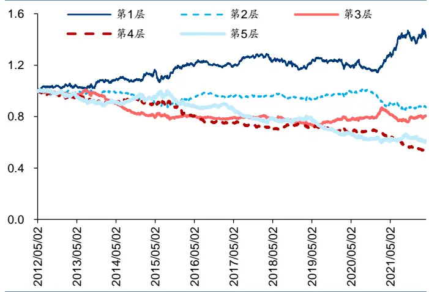
注：回测期：2012/4/27～2022/3/31
资料来源：朝阳永续，Wind，华泰研究

图表43： Alpha5 分层组合 1~5 净值除以基准净值(全 A 股)
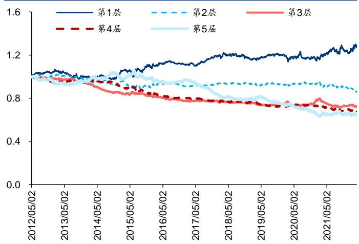
注：回测期：2012/4/27～2022/3/31
资料来源：朝阳永续，Wind，华泰研究

图表44：Alpha5 累积 RankIC
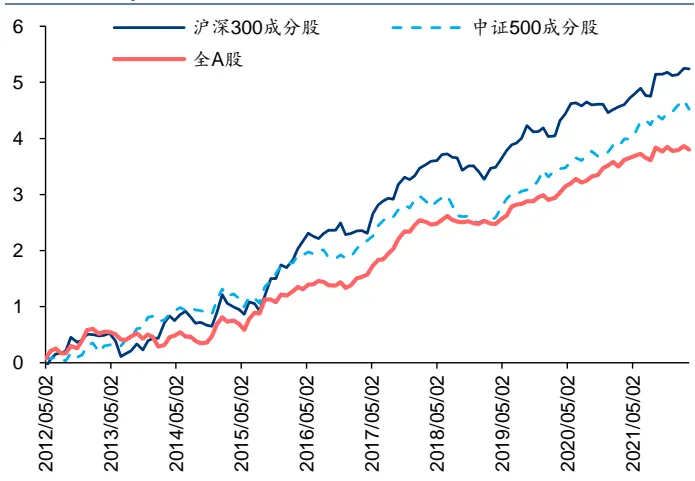
注：回测期：2012/4/27～2022/3/31
资料来源：朝阳永续，Wind，华泰研究

## Alpha6 的详细测试结果

Alpha6 = div(ts_return(CON_GPE，40),ts_mean(DEGREE，40))，因子含义是一致预期GPE在过去40个交易日的变化率除以过去40个交易日分析师预测标准差的线性衰减加权值，该因子形式上与 Alpha2 类似，属于改进的一致预期 GPE变化率因子。图表45~图表50 为 Alpha6 的测试结果。

图表45：Alpha6 在各个股票池内IC 值分析结果汇总(因子进行行业、市值中性)

|  | RankIC 均值 | RankIC 标准差 | IC_IR | IC>0 占比 |
| --- | --- | --- | --- | --- |
| 沪深 300 成分股 | 3.28% | 10.21% | 0.32 | 62.81% |
| 中证 500 成分股 | 3.32% | 8.75% | 0.38 | 60.33% |
| 全 A股 | 3.74% | 7.82% | 0.48 | 69.42% |

注：回测期：2012/4/27～2022/3/31
资料来源：朝阳永续，Wind，华泰研究

图表46：Alpha6在各个股票池内分层回测结果汇总(因子进行行业、市值中性)

|  | 分层组合1～5(从左到右)年化超额收益率 |  |  |  |  | 多空组合年化收益率 | 多空组合夏普比率 TOP 组合信息比率 |  | TOP 组合胜率 | TOP 组合换手率 |
| --- | --- | --- | --- | --- | --- | --- | --- | --- | --- | --- |
| 沪深 300 成分股 | 2.41% | -2.07% | -0.49% | -6.34% | -6.39% | 8.77% | 0.83 | 0.38 | 52.94% | 114.92% |
| 中证 500 成分股 | 1.26% | -1.37% | -1.73% | -3.20% | -7.78% | 9.36% | 1.06 | 0.24 | 48.74% | 117.21% |
| 全 A股 | 2.44% | 0.08% | -2.66% | -5.49% | -6.70% | 9.52% | 1.32 | 0.56 | 50.42% | 117.68% |

注：回测期：2012/4/27～2022/3/31
资料来源：朝阳永续，Wind，华泰研究

图表47：Alpha6 分层组合 1~5 净值除以基准净值(沪深 300)
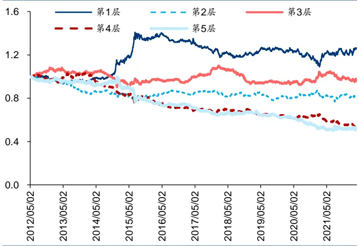
注：回测期：2012/4/27～2022/3/31
资料来源：朝阳永续，Wind，华泰研究

图表48：Alpha6 分层组合 1~5 净值除以基准净值(中证 500)
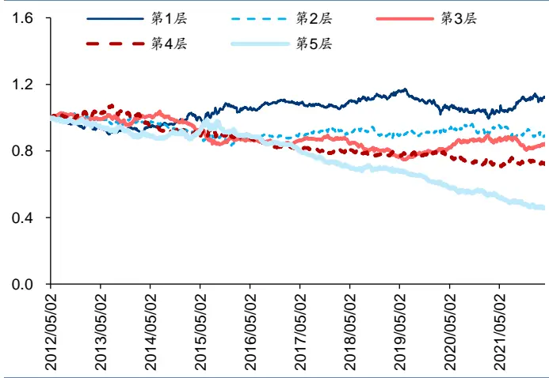
注：回测期：2012/4/27～2022/3/31
资料来源：朝阳永续，Wind，华泰研究

图表49： Alpha6 分层组合 1~5 净值除以基准净值(全 A 股)
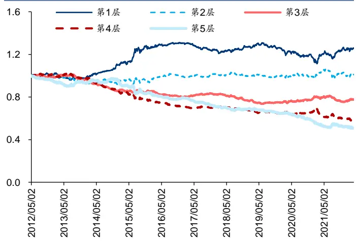
注：回测期：2012/4/27～2022/3/31
资料来源：朝阳永续，Wind，华泰研究

图表50：Alpha6 累积 RankIC
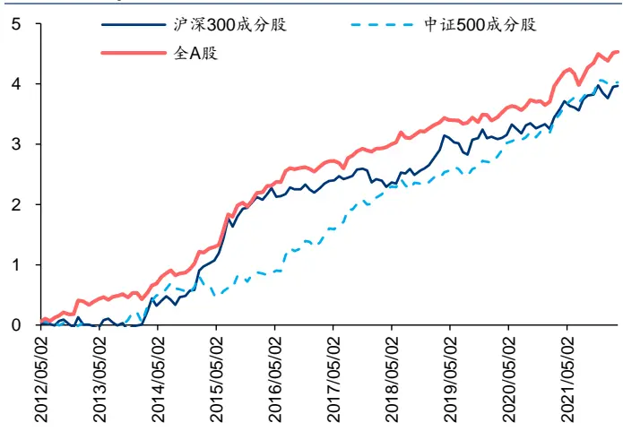
注：回测期：2012/4/27～2022/3/31
资料来源：朝阳永续，Wind，华泰研究

## Alpha7 的详细测试结果

Alpha7=div(sub(ts_decay_linear(UP_NUMBER90,

60),ts_decay_linear(DOWN_NUMBER90,60)),ts_decay_linear(DEGREE,60))，因子先分别计算个股季度业绩上调家数和下调家数过去60个交易日的线性衰减加权值，再除以过去60个交易日分析师预测标准差的线性衰减加权值。该因子属于改进的预期业绩上下调因子。图表 51~图表 56 为 Alpha7 的测试结果。

图表51：Alpha7 在各个股票池内IC 值分析结果汇总(因子进行行业、市值中性)

|  | RankIC 均值 | RankIC 标准差 | IC_IR | IC>0 占比 |
| --- | --- | --- | --- | --- |
| 沪深 300 成分股 | 3.31% | 11.30% | 0.29 | 59.50% |
| 中证 500 成分股 | 2.59% | 8.70% | 0.30 | 60.33% |
| 全 A 股 | 1.98% | 6.55% | 0.30 | 65.29% |

注：回测期：2012/4/27～2022/3/31
资料来源：朝阳永续，Wind，华泰研究

图表52：Alpha7 在各个股票池内分层回测结果汇总(因子进行行业、市值中性)

|  | 分层组合1～5(从左到右)年化超额收益率 |  | 多空组合年化收益率 | 多空组合夏普比率 TOP组合信息比率 |  | TOP 组合胜率 | TOP 组合换手率 55.31% |
| --- | --- | --- | --- | --- | --- | --- | --- |
| 沪深 300 成分股 | 6.68% | 0.70% -4.48% -7.04% -4.46% |  |  |  |  |  |
| 中证 500 成分股 | 6.11% | 0.18% -2.94% -6.96% -4.29% | 11.25% 10.54% | 1.21 1.35 | 1.11 1.20 | 62.18% 63.03% | 63.97% |
| 全 A股 |  | 4.66% -0.65% -2.17% -5.16% -4.58% | 9.54% | 1.73 | 1.21 | 67.23% | 60.92% |

注：回测期：2012/4/27～2022/3/31
资料来源：朝阳永续，Wind，华泰研究

图表53： Alpha7 分层组合 1~5 净值除以基准净值(沪深 300)
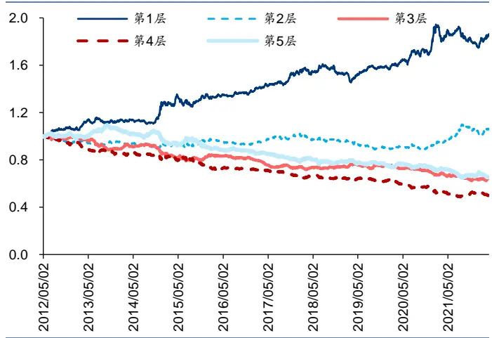
注：回测期：2012/4/27～2022/3/31
资料来源：朝阳永续，Wind，华泰研究

图表54：Alpha7 分层组合 1~5 净值除以基准净值(中证 500)
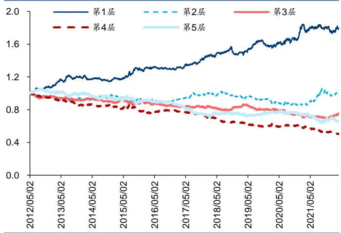
注：回测期：2012/4/27～2022/3/31
资料来源：朝阳永续，Wind，华泰研究

图表55： Alpha7 分层组合 1~5 净值除以基准净值(全 A 股)
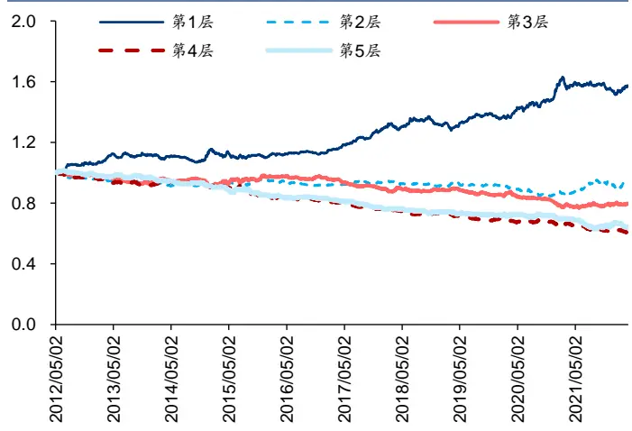
注：回测期：2012/4/27～2022/3/31
资料来源：朝阳永续，Wind，华泰研究

图表56：Alpha7 累积 RankIC
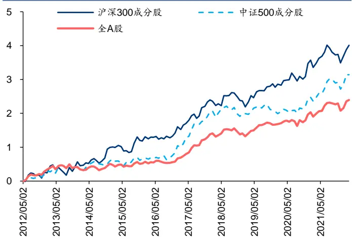
注：回测期：2012/4/27～2022/3/31
资料来源：朝阳永续，Wind，华泰研究

## Alpha8 的详细测试结果

Alpha8 = -ts_return(div(inv(CON_BP)，CON_EPS)，60)，因子先计算一致预期 PB 和一致预期EPS的比值，再计算其过去60个交易日的变化率，最后取相反数。该因子属于一致预期复合因子。图表 57~图表 62 为 Alpha8 的测试结果。

图表57：Alpha8 在各个股票池内IC 值分析结果汇总(因子进行行业、市值中性)

|  | RankIC 均值 | RankIC 标准差 | IC_IR | IC>0 占比 |
| --- | --- | --- | --- | --- |
| 沪深 300 成分股 | 3.93% | 13.03% | 0.30 | 63.64% |
| 中证 500 成分股 | 4.28% | 10.36% | 0.41 | 65.29% |
| 全 A股 | 5.02% | 9.40% | 0.53 | 71.90% |

注：回测期：2012/4/27～2022/3/31
资料来源：朝阳永续，Wind，华泰研究

图表58：Alpha8在各个股票池内分层回测结果汇总(因子进行行业、市值中性)

|  | 分层组合1～5(从左到右)年化超额收益率 |  |  | 多空组合年化收益率 | 多空组合夏普比率 TOP 组合信息比率 |  | TOP 组合胜率 50.42% | TOP 组合换手率 101.26% |  |
| --- | --- | --- | --- | --- | --- | --- | --- | --- | --- |
| 沪深 300 成分股 | 1.57% | 0.47% -2.48% -7.49% -6.14% |  |  |  |  |  |  | 7.27% |
| 中证 500 成分股 | 1.85% |  | -0.46%-1.31%-5.97%-7.43% |  | 9.42% | 0.57 0.95 | 0.22 0.35 | 54.62% | 101.97% |
| 全 A股 | 1.80% | 1.15%-1.63% | -6.59%-7.55% |  | 9.61% | 1.08 | 0.41 | 53.78% | 98.46% |

注：回测期：2012/4/27～2022/3/31
资料来源：朝阳永续，Wind，华泰研究

图表59： Alpha8 分层组合 1~5 净值除以基准净值(沪深 300)
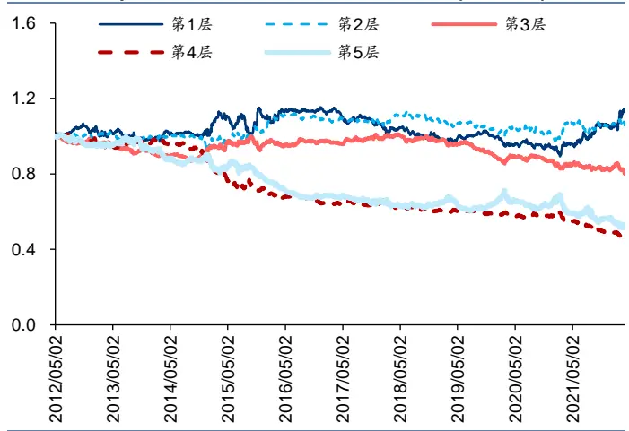
注：回测期：2012/4/27～2022/3/31
资料来源：朝阳永续，Wind，华泰研究

图表60： Alpha8 分层组合 1~5 净值除以基准净值(中证 500)
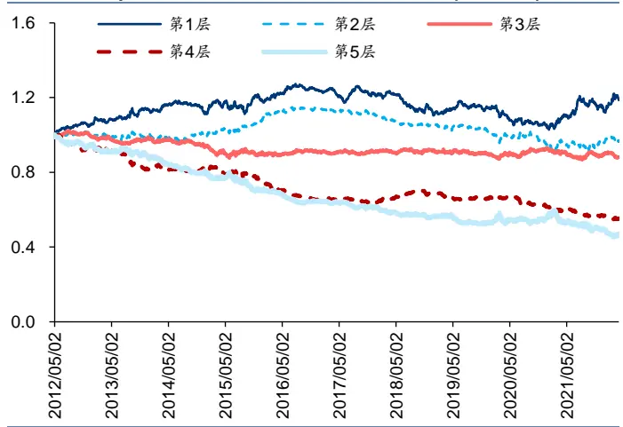
注：回测期：2012/4/27～2022/3/31
资料来源：朝阳永续，Wind，华泰研究

图表61： Alpha8 分层组合 1~5 净值除以基准净值(全 A 股)
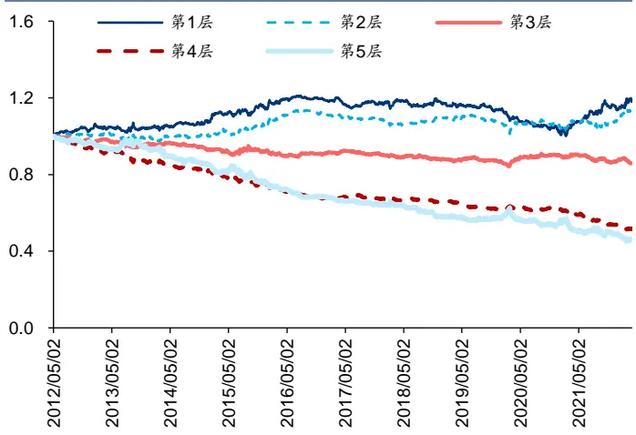
注：回测期：2012/4/27～2022/3/31
资料来源：朝阳永续，Wind，华泰研究

图表62：Alpha8 累积 RankIC
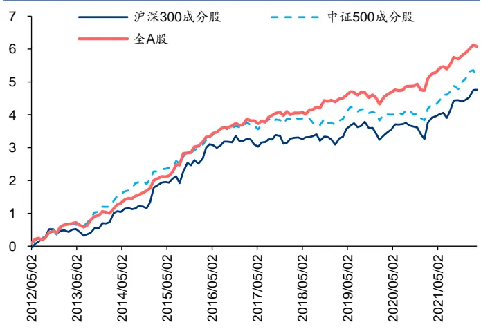
注：回测期：2012/4/27～2022/3/31
资料来源：朝阳永续，Wind，华泰研究

## Alpha9 的详细测试结果

Alpha9 = ts_return(mul(CON_GPE， CON_CAGR)， 60)，因子先计算一致预期 GPE 和一致预期净利润2年复合增长率的乘积，再计算其过去60个交易日的变化率。该因子属于一致预期复合因子。图表 63~图表 68 为 Alpha9 的测试结果。

图表63：Alpha9 在各个股票池内IC 值分析结果汇总(因子进行行业、市值中性)

|  | RankIC 均值 | RankIC 标准差 | IC_IR | IC>0 占比 |
| --- | --- | --- | --- | --- |
| 沪深 300 成分股 | 2.53% | 9.74% | 0.26 | 60.33% |
| 中证 500 成分股 | 2.49% | 7.03% | 0.35 | 66.12% |
| 全 A股 | 3.66% | 6.27% | 0.58 | 74.38% |

注：回测期：2012/4/27～2022/3/31
资料来源：朝阳永续，Wind，华泰研究

图表64：Alpha9在各个股票池内分层回测结果汇总(因子进行行业、市值中性)

|  | 分层组合1~5(从左到右)年化超额收益率 |  |  | 多空组合年化收益率 |  | 多空组合夏普比率 TOP 组合信息比率 | TOP 组合胜率 | TOP 组合换手率 |
| --- | --- | --- | --- | --- | --- | --- | --- | --- |
| 沪深 300 成分股 |  |  | 2.60% -1.09% -2.98% -4.75% -6.55% | 9.37% | 1.03 | 0.44 | 56.30% | 92.93% |
| 中证 500 成分股 | 0.62%-0.83% |  | 0.03%-6.20% -5.41% | 6.12% | 0.88 | 0.14 | 49.58% | 94.26% |
| 全 A股 |  | 2.88%-0.12% | -1.17%-5.98%-7.15% | 10.66% | 2.06 | 0.91 | 56.30% | 92.74% |

注：回测期：2012/4/27～2022/3/31
资料来源：朝阳永续，Wind，华泰研究

图表65： Alpha9 分层组合 1~5 净值除以基准净值(沪深 300)
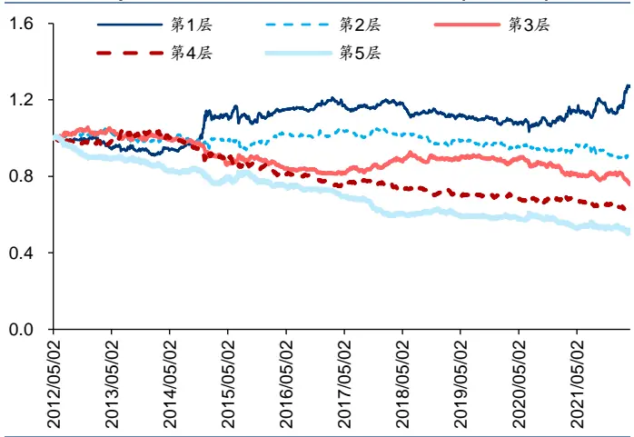
注：回测期：2012/4/27～2022/3/31
资料来源：朝阳永续，Wind，华泰研究

图表66： Alpha9 分层组合 1~5 净值除以基准净值(中证 500)
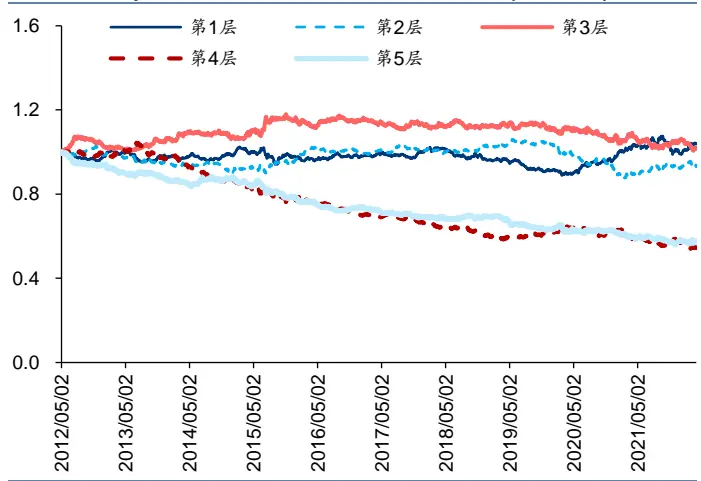
注：回测期：2012/4/27～2022/3/31
资料来源：朝阳永续，Wind，华泰研究

图表67： Alpha9 分层组合 1~5 净值除以基准净值(全 A 股)
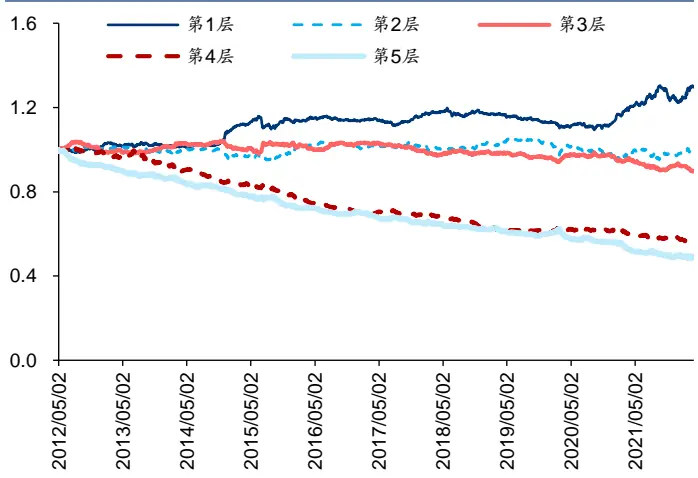
注：回测期：2012/4/27～2022/3/31
资料来源：朝阳永续，Wind，华泰研究

图表68：Alpha9 累积 RankIC
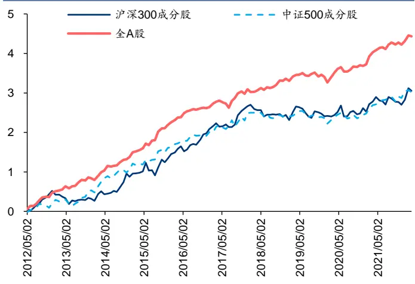
注：回测期：2012/4/27～2022/3/31
资料来源：朝阳永续，Wind，华泰研究

## Alpha10 的详细测试结果

Alpha10= rank_mul(CON_CAGR，CON_EPS)，因子计算一致预期净利润 2年复合增长率和一致预期EPS排序数的乘积。该因子属于一致预期复合因子。图表69~图表74为Alpha10的测试结果。

图表69： Alpha10 在各个股票池内IC 值分析结果汇总(因子进行行业、市值中性)

|  | RankIC 均值 | RankIC 标准差 | IC_IR | IC>0 占比 |
| --- | --- | --- | --- | --- |
| 沪深 300 成分股 | 2.07% | 16.68% | 0.12 | 57.85% |
| 中证 500 成分股 | 2.57% | 12.36% | 0.21 | 61.16% |
| 全 A股 | 2.16% | 11.02% | 0.20 | 57.85% |

注：回测期：2012/4/27～2022/3/31
资料来源：朝阳永续，Wind，华泰研究

图表70：Alpha10在各个股票池内分层回测结果汇总(因子进行行业、市值中性)

|  | 分层组合1～5(从左到右)年化超额收益率 |  | 多空组合年化收益率 |  | 多空组合夏普比率 TOP 组合信息比率 | TOP 组合胜率 | TOP 组合换手率 |
| --- | --- | --- | --- | --- | --- | --- | --- |
| 沪深 300 成分股 | 2.54% | 0.12%-2.11%-1.78%-4.45% |  | 6.33% | 0.44 0.30 | 51.26% | 31.80% |
| 中证 500 成分股 | 3.71% | 0.93% -1.96% -3.00% -4.77% | 8.36% | 0.79 | 0.59 | 57.14% | 37.37% |
| 全 A股 |  | 4.95% -0.39% -1.35% -3.23% -4.64% | 9.59% | 1.02 | 0.98 | 60.50% | 34.34% |

注：回测期：2012/4/27～2022/3/31
资料来源：朝阳永续，Wind，华泰研究

图表71：Alpha10 分层组合 1~5 净值除以基准净值(沪深 300)
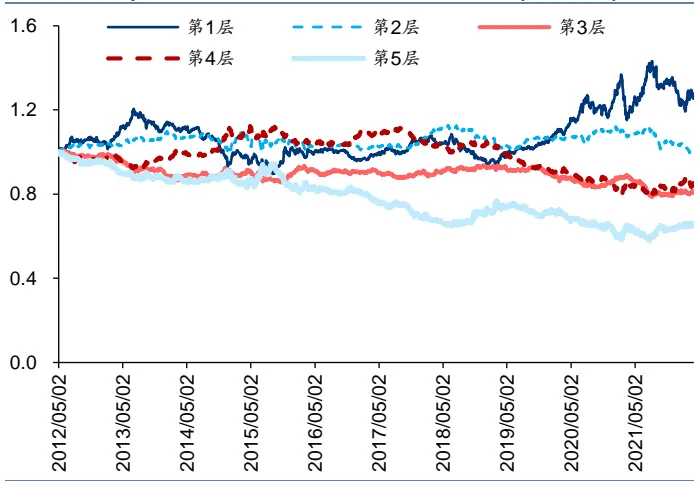
注：回测期：2012/4/27～2022/3/31
资料来源：朝阳永续，Wind，华泰研究

图表72： Alpha10 分层组合 1~5 净值除以基准净值(中证 500)
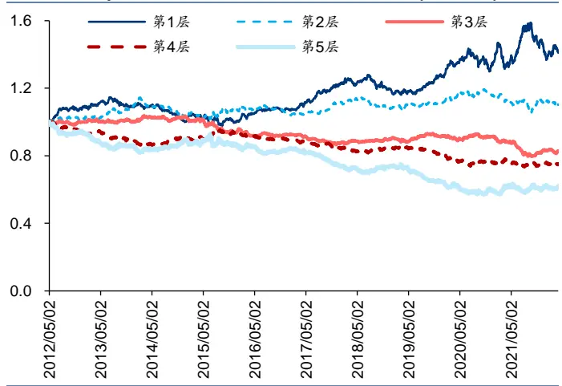
注：回测期：2012/4/27～2022/3/31
资料来源：朝阳永续，Wind，华泰研究

图表73：Alpha10 分层组合 1~5 净值除以基准净值(全 A 股)
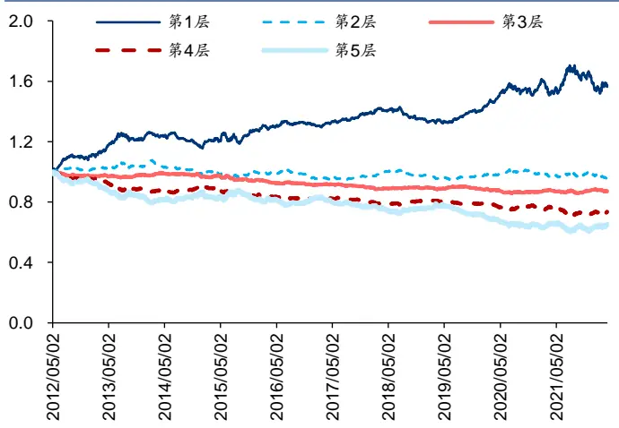
注：回测期：2012/4/27～2022/3/31
资料来源：朝阳永续，Wind，华泰研究

图表74：Alpha10 累积 RankIC
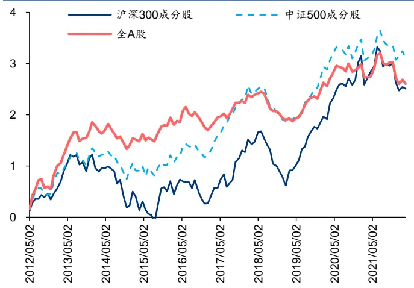
注：回测期：2012/4/27～2022/3/31
资料来源：朝阳永续，Wind，华泰研究

## Alpha11 的详细测试结果

Alpha11 = div(EP, ts_mean(delay(CON_EP,5)， 60))，因子首先将一致预期 EP 平移 5 天(即跳过最近5天一致预期EP)，再取过去60个交易日的均值，最后用个股真实的EP除以该均值。因子的内在含义是个股当前EP和前一段时间一致预期EP均值的比值，可视为一种超预期因子。图表 75~图表 80 为 Alpha11 的测试结果。

图表75：Alpha11 在各个股票池内IC 值分析结果汇总(因子进行行业、市值中性)

|  | RankIC 均值 | RankIC 标准差 | IC_IR | IC>0 占比 |
| --- | --- | --- | --- | --- |
| 沪深 300 成分股 | 4.93% | 11.52% | 0.43 | 71.07% |
| 中证 500 成分股 | 4.83% | 10.07% | 0.48 | 64.46% |
| 全 A股 | 4.52% | 7.87% | 0.57 | 69.42% |

注：回测期：2012/4/27～2022/3/31
资料来源：朝阳永续，Wind，华泰研究

图表76：Alpha11 在各个股票池内分层回测结果汇总(因子进行行业、市值中性)

|  | 分层组合1~5(从左到右)年化超额收益率 |  |  | 多空组合年化收益率 | 多空组合夏普比率 TOP 组合信息比率 |  | TOP 组合胜率 | TOP 组合换手率 |
| --- | --- | --- | --- | --- | --- | --- | --- | --- |
| 沪深 300 成分股 | 2.26% |  | 0.34% -2.32% -6.24% -5.25% | 6.89% | 0.52 | 0.32 | 46.22% | 81.70% |
| 中证 500 成分股 | 3.33% |  | -0.90%-1.59%-4.52%-5.92% | 9.29% | 0.94 | 0.60 | 54.62% | 74.00% |
| 全 A股 | 2.81% | -0.19%-2.77% | -4.79% -3.96% | 6.69% | 0.80 | 0.56 | 54.62% | 71.98% |

注：回测期：2012/4/27～2022/3/31
资料来源：朝阳永续，Wind，华泰研究

图表77：Alpha11分层组合1~5 净值除以基准净值(沪深 300)
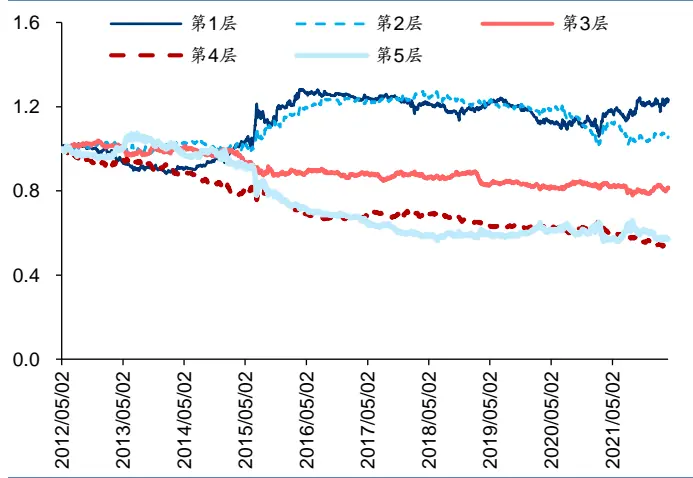
注：回测期：2012/4/27～2022/3/31
资料来源：朝阳永续，Wind，华泰研究

图表78：Alpha11 分层组合 1~5 净值除以基准净值(中证 500)
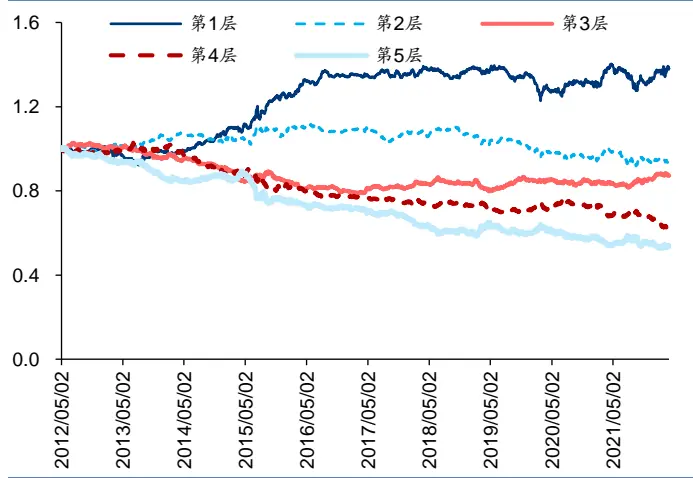
注：回测期：2012/4/27～2022/3/31
资料来源：朝阳永续，Wind，华泰研究

图表79：Alpha11 分层组合 1~5 净值除以基准净值(全 A 股)
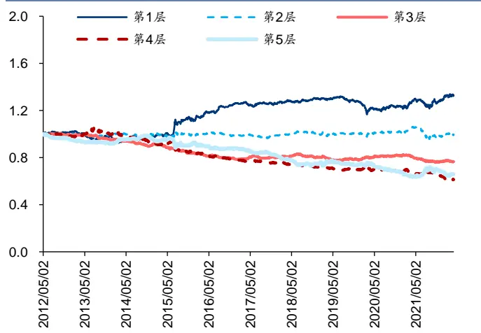
注：回测期：2012/4/27～2022/3/31
资料来源：朝阳永续，Wind，华泰研究

图表80：Alpha11 累积 RankIC
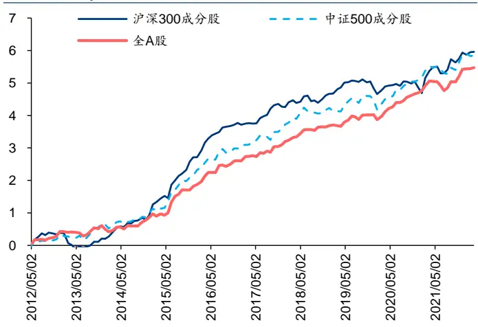
注：回测期：2012/4/27～2022/3/31
资料来源：朝阳永续，Wind，华泰研究

## 总结和讨论

本文总结如下：

本文介绍了基于遗传规划的一致预期因子挖掘。遗传规划是一种启发式的公式演化技术，通过模拟自然界中遗传进化的过程来逐渐生成契合特定目标的公式群体，适合进行因子挖掘。实现层面，本文针对一致预期数据的特点量身定制数据处理方案，适配了遗传规划中的矩阵运算算法，使得短时间内进行大量因子挖掘成为可能。结果层面，本文展示了挖掘出的11个因子及其测试结果，因子可解释性较高，我们也对因子的构建逻辑和模式进行了详细分析。

分析师一致预期数据蕴含丰富的信息，具有深度挖掘的价值。分析师一致预期数据归纳总结了卖方分析师报告对个股的财务指标预测、评级以及关注情况，是除公司财报数据、交易数据以外重要的第三方数据，一致预期数据可达到日频更新的水平，一定程度上能反映基本面的高频变化，具有深度挖掘的价值。本文使用的一致预期数据包含：一致预期EPS、ROE、PE、PB等财务指标类预测数据，以及业绩上下调、分析师预测标准差等衍生数据。本文还引入真实的PE_TTM来与一致预期数据结合挖掘复合因子。

针对一致预期数据的特点和遗传规划的需求，本文量身定制数据处理方案。考虑到每日每只股票通常包含2-3个未来年份的一致预期数据，本文设计了一个三维数据结构来存储一致预期数据，第一维是股票，第二维是交易日，第三维是预测年份。该数据结构具有以下优点：(1)解决了年度财务报表公布前后一致预期数据预测年份变动的问题。(2)适配了遗传规划中的矩阵运算算法，算法可在三维数据结构上快速运算得出因子值，使得短时间内进行大量因子挖掘成为可能。具体实现中，我们主要对gplearn的因子计算模块进行了修改，可支持三维数据结构的矩阵运算。

本文展示了挖掘出的11个因子及其测试结果，因子都有较高的可解释性。对于挖掘出的一致预期因子，其可解释性至关重要，分析因子的构建逻辑可得以下结论：(1)11个因子中，计算变化率的函数ts_return出现次数最多，这与一致预期数据的内涵相符，分析师对于上市公司的预期变化，往往表明公司的基本面发生变化，可能对公司未来的股价产生影响。(2)复合因子中，主要为数据之间的乘除，说明这两种运算是构建复合因子的有效方式。(3)一致预期数据也可以和真实的基本面数据结合挖掘复合因子，其中本文挖掘所得的复合因子可视为一种超预期因子。(4)改进的因子中多出现除以分析师预测标准差的运算，这可能与新冠疫情以来分析师预测离散度增大有关。

关于使用遗传规划挖掘预期类因子的研究，仍有以下值得尝试的方向：

1. 本文使用的是朝阳永续计算后的一致预期数据，实际上还可从原始研报数据出发构建定制的分析师预期数据(如核心分析师预期)来进行因子挖掘。

2.本文初步尝试了一致预期数据和真实基本面数据结合进行因子挖掘，这种方法或有深入研究的空间。

## 参考文献

[1] Gao H, Wen H, Yu S, “Pandemic Effect on Analyst Forecast Dispersion: Earnings Uncertainty or Information Lockdown?”, Emerging Markets Finance and Trade 2021: Volume 57, Issue 6, Pages 1699-1715.

## 风险提示

通过遗传规划挖掘的选股因子是历史经验的总结，存在失效的可能。本文测试的股票池仅包含有分析师覆盖的A股，测试结论不能推广到全部A股。

## 免责声明

## 分析师声明

本人，林晓明、李子钰、何康，兹证明本报告所表达的观点准确地反映了分析师对标的证券或发行人的个人意见：彼以往、现在或未来并无就其研究报告所提供的具体建议或所表达的意见直接或间接收取任何报酬。

## 一般声明及披露

本报告由华泰证券股份有限公司（已具备中国证监会批准的证券投资咨询业务资格，以下简称“本公司”）制作。本报告所载资料是仅供接收人的严格保密资料。本报告仅供本公司及其客户和其关联机构使用。本公司不因接收人收到本报告而视其为客户。

本报告基于本公司认为可靠的、已公开的信息编制，但本公司及其关联机构(以下统称为“华泰”)对该等信息的准确性及完整性不作任何保证。

本报告所载的意见、评估及预测仅反映报告发布当日的观点和判断。在不同时期，华泰可能会发出与本报告所载意见、评估及预测不一致的研究报告。同时，本报告所指的证券或投资标的的价格、价值及投资收入可能会波动。以往表现并不能指引未来，未来回报并不能得到保证，并存在损失本金的可能。华泰不保证本报告所含信息保持在最新状态。华泰对本报告所含信息可在不发出通知的情形下做出修改，投资者应当自行关注相应的更新或修改。

本公司不是FINRA的注册会员，其研究分析师亦没有注册为FINRA的研究分析师/不具有FINRA分析师的注册资格。

华泰力求报告内容客观、公正，但本报告所载的观点、结论和建议仅供参考，不构成购买或出售所述证券的要约或招揽。该等观点、建议并未考虑到个别投资者的具体投资目的、财务状况以及特定需求，在任何时候均不构成对客户私人投资建议。投资者应当充分考虑自身特定状况，并完整理解和使用本报告内容，不应视本报告为做出投资决策的唯一因素。对依据或者使用本报告所造成的一切后果，华泰及作者均不承担任何法律责任。任何形式的分享证券投资收益或者分担证券投资损失的书面或口头承诺均为无效。

除非另行说明，本报告中所引用的关于业绩的数据代表过往表现，过往的业绩表现不应作为日后回报的预示。华泰不承诺也不保证任何预示的回报会得以实现，分析中所做的预测可能是基于相应的假设，任何假设的变化可能会显著影响所预测的回报。

华泰及作者在自身所知情的范围内，与本报告所指的证券或投资标的不存在法律禁止的利害关系。在法律许可的情况下，华泰可能会持有报告中提到的公司所发行的证券头寸并进行交易，为该公司提供投资银行、财务顾问或者金融产品等相关服务或向该公司招揽业务。

华泰的销售人员、交易人员或其他专业人士可能会依据不同假设和标准、采用不同的分析方法而口头或书面发表与本报告意见及建议不一致的市场评论和/或交易观点。华泰没有将此意见及建议向报告所有接收者进行更新的义务。华泰的资产管理部门、自营部门以及其他投资业务部门可能独立做出与本报告中的意见或建议不一致的投资决策。投资者应当考虑到华泰及/或其相关人员可能存在影响本报告观点客观性的潜在利益冲突。投资者请勿将本报告视为投资或其他决定的唯一信赖依据。有关该方面的具体披露请参照本报告尾部。

本报告并非意图发送、发布给在当地法律或监管规则下不允许向其发送、发布的机构或人员，也并非意图发送、发布给因可得到、使用本报告的行为而使华泰违反或受制于当地法律或监管规则的机构或人员。

本报告版权仅为本公司所有。未经本公司书面许可，任何机构或个人不得以翻版、复制、发表、引用或再次分发他人(无论整份或部分)等任何形式侵犯本公司版权。如征得本公司同意进行引用、刊发的，需在允许的范围内使用，并需在使用前获取独立的法律意见，以确定该引用、刊发符合当地适用法规的要求，同时注明出处为“华泰证券研究所”，且不得对本报告进行任何有悖原意的引用、删节和修改。本公司保留追究相关责任的权利。所有本报告中使用的商标、服务标记及标记均为本公司的商标、服务标记及标记。

## 中国香港

本报告由华泰证券股份有限公司制作，在香港由华泰金融控股（香港）有限公司向符合《证券及期货条例》及其附属法律规定的机构投资者和专业投资者的客户进行分发。华泰金融控股（香港）有限公司受香港证券及期货事务监察委员会监管，是华泰国际金融控股有限公司的全资子公司，后者为华泰证券股份有限公司的全资子公司。在香港获得本报告的人员若有任何有关本报告的问题，请与华泰金融控股（香港）有限公司联系。

## 香港-重要监管披露

- 华泰金融控股（香港）有限公司的雇员或其关联人士没有担任本报告中提及的公司或发行人的高级人员。

- 有关重要的披露信息，请参华泰金融控股（香港）有限公司的网页 https://www.htsc.com.hk/stock_disclosure其他信息请参见下方“美国-重要监管披露”。

## 美国

在美国本报告由华泰证券（美国）有限公司向符合美国监管规定的机构投资者进行发表与分发。华泰证券（美国）有限公司是美国注册经纪商和美国金融业监管局（FINRA）的注册会员。对于其在美国分发的研究报告，华泰证券（美国）有限公司根据《1934年证券交易法》（修订版）第15a-6条规定以及美国证券交易委员会人员解释，对本研究报告内容负责。华泰证券（美国）有限公司联营公司的分析师不具有美国金融监管（FINRA）分析师的注册资格，可能不属于华泰证券（美国）有限公司的关联人员，因此可能不受FINRA关于分析师与标的公司沟通、公开露面和所持交易证券的限制。华泰证券（美国）有限公司是华泰国际金融控股有限公司的全资子公司，后者为华泰证券股份有限公司的全资子公司。任何直接从华泰证券（美国）有限公司收到此报告并希望就本报告所述任何证券进行交易的人士.应通过华泰证券（美国）有限公司进行交易。

## 美国-重要监管披露

- 分析师林晓明、李子钰、何康本人及相关人士并不担任本报告所提及的标的证券或发行人的高级人员、董事或顾问。分析师及相关人士与本报告所提及的标的证券或发行人并无任何相关财务利益。本披露中所提及的“相关人士”包括FINRA定义下分析师的家庭成员。分析师根据华泰证券的整体收入和盈利能力获得薪酬，包括源自公司投资银行业务的收入。

- 华泰证券股份有限公司、其子公司和/或其联营公司，及/或不时会以自身或代理形式向客户出售及购买华泰证券研究所覆盖公司的证券/衍生工具，包括股票及债券（包括衍生品）华泰证券研究所覆盖公司的证券/衍生工具，包括股票及债券（包括衍生品）。

- 华泰证券股份有限公司、其子公司和/或其联营公司，及/或其高级管理层、董事和雇员可能会持有本报告中所提到的任何证券（或任何相关投资）头寸，并可能不时进行增持或减持该证券（或投资）。因此，投资者应该意识到可能存在利益冲突。

## 评级说明

投资评级基于分析师对报告发布日后6至12个月内行业或公司回报潜力（含此期间的股息回报）相对基准表现的预期(A股市场基准为沪深300指数，香港市场基准为恒生指数，美国市场基准为标普500指数)，具体如下：

## 行业评级

增持：预计行业股票指数超越基准

中性：预计行业股票指数基本与基准持平

减持：预计行业股票指数明显弱于基准

## 公司评级

买入：预计股价超越基准15%以上

增持：预计股价超越基准5%~15%

持有：预计股价相对基准波动在-15%~5%之间

卖出：预计股价弱于基准15%以上

暂停评级：已暂停评级、目标价及预测，以遵守适用法规及/或公司政策

无评级：股票不在常规研究覆盖范围内。投资者不应期待华泰提供该等证券及/或公司相关的持续或补充信息

## 法律实体披露

中国：华泰证券股份有限公司具有中国证监会核准的“证券投资咨询”业务资格，经营许可证编号为：91320000704041011J香港：华泰金融控股(香港)有限公司具有香港证监会核准的“就证券提供意见”业务资格，经营许可证编号为：AOK809美国：华泰证券（美国）有限公司为美国金融业监管局（FINRA）成员，具有在美国开展经纪交易商业务的资格，经营业务许可编号为：CRD#:298809/SEC#:8-70231

## 华泰证券股份有限公司

南京南京市建邺区江东中路228号华泰证券广场1号楼/邮政编码：210019

电话：8625 83389999/传真：86 25 83387521电子邮件：ht-rd@htsc.com

## 深圳

深圳市福田区益田路5999号基金大厦10楼/邮政编码：518017电话：86 755 82493932/传真：86 755 82492062电子邮件：ht-rd@htsc.com

## 华泰金融控股（香港）有限公司

香港中环皇后大道中 99号中环中心 58楼5808-12室
电话：+852-3658-6000/传真：+852-2169-0770
电子邮件：research@htsc.com
http://www.htsc.com.hk

## 华泰证券（美国）有限公司

美国纽约哈德逊城市广场10号41楼（纽约10001）
电话：+212-763-8160/传真：+917-725-9702
电子邮件： Huatai@htsc-us.com
http://www.htsc-us.com

©版权所有2022年华泰证券股份有限公司

北京
北京市西城区太平桥大街丰盛胡同28号太平洋保险大厦A座18层/
邮政编码：100032
电话：861063211166/传真：861063211275
电子邮件：ht-rd@htsc.com
上海
上海市浦东新区东方路18号保利广场E栋23楼/邮政编码：200120
电话：862128972098/传真：862128972068
电子邮件：ht-rd@htsc.com