# 图神经网络选股的进阶之路

华泰研究

2022 年 4 月 11 日│中国内地

深度研究

## 人工智能 55：多角度改进图神经网络选股模型

本文从多角度改进图神经网络选股模型，构建周频换仓中证 500 指数增强策略。图神经网络能够学习资产间的相互影响，为预测提供增量信息。核心改进方向是引入残差网络结构，将预测收益拆解为股票间行业板块关联解释的收益、股票间因子关联解释的收益、特异性收益。以 2011 年 1 月至 2022年 3 月为回测期，分别以加权和等权 mse 为损失函数，500 指增策略年化超额收益率为 16.17%和 14.19%，信息比率为 2.14 和 2.43，年化双边换手率约 16倍。图神经网络和 XGBoost 模型日度超额收益率相关度仅为 0.12，等权配置策略年化超额收益率为 16.60%，信息比率提升至 2.94。

## 图神经网络是近年来深度学习热点，业界陆续应用于量化投资研究

图神经网络是近年来深度学习的研究热点，同时受到量化投资领域的广泛关注。在预测资产收益时，传统量化策略大多将各资产视作互不相关的个体，图神经网络能够学习资产间的相互影响，为预测提供增量信息。图卷积、图注意力等经典的图神经网络方法于 2016 至 2017 年提出，此后 IBM 日本研究院、Bloomberg、微软亚洲研究院、Amundi 等机构陆续将其应用于量化投资研究。华泰金工团队于 2021 年 2 月 21 日发布研报《图神经网络选股与Qlib实践》，证实图注意力网络在日频选股场景下表现优于传统机器学习。

## 设计残差图注意力网络结构 GAT+redisual，将股票收益拆解成三部分

本文是对前序研究的深入，借鉴微软亚研院 Xu等（2021）设计残差图注意力网络结构，将股票收益拆解成三部分，分别采用不同组件学习：原始因子编码后送入掩码自注意力层，学习股票间板块或行业关联解释的收益；上一层残差送入全局自注意力层，学习股票间因子关联解释的收益；上一层残差代表因子解释自身的特异性收益。股票池为全 A 股日均总市值和成交额排名前 60%个股，选取投资逻辑明确的 42 个基本面和量价因子，以 wmse（根据收益排序加权）为损失函数，构建中证 500 增强策略的年化超额收益率为 16.17%，信息比率为 2.14（回测期 2011-01-04 至 2022-03-31）。

## 考察网络结构、建图方式、损失函数、网络复杂度对选股模型的影响

考察网络结构、建图方式、损失函数、网络复杂度对选股模型的影响。引入残差结构有显著改进效果，从股票间板块、因子的关联中挖掘出有效信息。板块建图表现优于行业建图，产业链上下游股票即使分属不同行业，也存在相互影响。对比mse和wmse损失函数，2011~2013年两者接近，2014~2016年 mse 占优，2017 年至今 wmse 占优，随着因子多头端日趋拥挤，wmse优势逐步体现。对比隐状态为 64/32/16 的三组模型，hidden64＞hidden32＞hidden16，提升网络复杂度有改进效果，但也需与样本量、特征数相匹配。

## 图神经网络和 XGBoost相关度低，两者结合可以进一步降低风险

深度学习和传统机器学习的方法论具有一定差异，将低相关性的策略结合可以进一步降低风险。GAT+residual(wmse)和 XGBoost 模型日度超额收益率两者相关系数仅为 0.12。将两个策略等权配置，每 60个交易日进行再平衡，组合策略年化超额收益率为 16.60%，信息比率从 2.14 和 2.19（GAT 和XGBoost，下同）提升至 2.94，超额收益 Calmar 比率从 1.84 和 1.26 提升至 2.36，改进效果显著。

风险提示：人工智能挖掘市场规律是对历史的总结，市场规律在未来可能失效。人工智能技术存在过拟合风险。深度学习模型受随机数影响较大，本文未进行随机数敏感性测试。本文测试的选股模型调仓频率较高，假定以 vwap价格成交，忽略其他交易层面因素影响。

研究员

SAC No. S0570516010001

林晓明

linxiaoming@htsc.com

SFC No. BPY421

+86-755-82080134

研究员

SAC No. S0570519110003

李子钰

SFC No. BRV743

liziyu@htsc.com

+86-755-23987436

研究员

SAC No. S0570520080004

何康，PhD

SFC No. BRB318

hekang@htsc.com

+86-21-28972039

## GAT+residual（wmse）模型超额收益

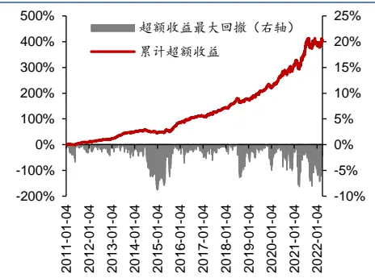
注：回测期 2011-01-04 至 2022-03-31，基准为中证 500资料来源：朝阳永续，Wind，华泰研究

GAT 和 XGBoost 等权模型超额收益
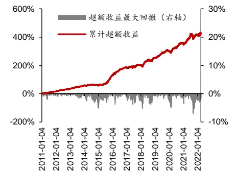
注：回测期 2011-01-04 至 2022-03-31，基准为中证 500资料来源：朝阳永续，Wind，华泰研究

## 研究导读

图神经网络（Graph Neural Networks）是近年来深度学习的研究热点，同时受到量化投资领域的广泛关注。在预测资产收益时，传统量化策略大多将各资产视作互不相关的个体，图神经网络能够学习资产间的相互影响，为预测提供增量信息。

图卷积、图注意力等经典的图神经网络方法于 2016 至 2017 年提出（Kipf & Welling，2016；Velickovic et al.，2017）。此后，业界陆续将这些技术应用于量化投资研究：

1) 2019 年，IBM 日本研究院测试了图卷积网络在日经 225 成分股内的选股效果，论文收录于 NIPS 会议（Matsunaga et al.，2019）。

2) 2020 年，Bloomberg 的一项研究证实了图注意力网络选股效果优于传统的供应链动量策略（Chang，2020）。

3) 2021 年，微软亚洲研究院发表多篇研究，将图神经网络分别应用于多因子选股、事件驱动选股、风险模型、时间序列预测（Xu et al.，2021；Xu et al.，2021；Lin et al.，2021；Xu et al.，2021）。

4)2021 年底，Amundi 发表图神经网络应用于全球及美国市场选股的工作论文，指出图神经网络层可以起到平滑高频信号、降低交易成本的作用，同时产业链信息的重要性在 2021 年显著提升（Pacreau et al.，2021）。

华泰金工团队于 2021 年 2 月 21 日发布研报《人工智能 42：图神经网络选股与 Qlib实践》，证实图注意力网络在日频选股场景下表现优于传统机器学习方法。

本文是对团队前序研究的深入，我们将图神经网络选股策略改造成更适合资管机构的版本，亮点包括：

1) 精选因子，选取投资逻辑较明确的基本面和量价因子；简化模型，使用简明且易训练的全连接层、图注意力层等结构。

2) 降低换手率，指数增强策略年化双边换手率约 16 倍；提升策略容量，股票池为全 A股日均总市值和成交额排名前 60%个股。

3)引入残差网络结构，将预测收益拆解为股票间行业板块关联解释的收益、股票间因子关联解释的收益、特异性收益。

4) 提升收益表现，以加权 mse（wmse）和等权 mse 为损失函数，以 2011 年 1 月至 2022年3月为回测期，构建中证500增强策略的年化超额收益率分别为16.17%和14.19%，信息比率分别为 2.14 和 2.43，超额收益 Calmar 比率分别为 1.84 和 1.62。

5) 结合传统机器学习，图神经网络和 XGBoost 模型日度超额收益相关度仅为 0.12，两者等权配置，组合策略年化超额收益率为 16.60%，信息比率提升至 2.94，超额收益Calmar 比率提升至 2.36。

图表1： GAT+residual（wmse）模型超额收益表现
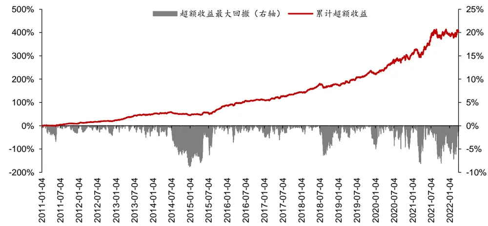
注：回测期 2011-01-04 至 2022-03-31，基准为中证 500 指数资料来源：朝阳永续，Wind，华泰研究

图表2： GAT+residual（wmse）模型月度超额收益

|  | 1月 | 2月 3月 4月 |  |  | 5月 | 6月 | 7月 | 8月 9月 |  | 10月 | 11月 | 12 | 月年超额收益 |
| --- | --- | --- | --- | --- | --- | --- | --- | --- | --- | --- | --- | --- | --- |
| 2011年 | 1.4% | -0.4% | -0.2% -0.3% |  | 2.2% | 1.5% | 1.2% | 1.7% | 2.2% | 0.3% | -1.4% | 1.6% | 10.3% |
| 2012年 | 2.5% | -0.4% | 2.0% 1.0% |  | 0.5% | 0.1% | 1.1% | 1.4% | 0.3% | 0.3% | -0.5% | 3.5% | 12.4% |
| 2013年 | 0.5% | 2.8% | 3.1% 3.6% |  | 0.6% | 4.3% | 0.5% | 1.6% | 1.3% | -1.0% | 1.9% | -0.7% | 20.1% |
| 2014年 | 3.0% | -1.9% | 2.1% 0.6% |  | 1.3% | 1.4% | -3.6% | -0.3% | -1.5% | 0.5% | 0.2% | -3.5% | -1.9% |
| 2015年 | 1.4% | 0.9% | -0.4% -0.2% |  | 5.9% | -1.1% | -1.3% | 5.1% | 5.5% | 2.9% | 5.4% | 1.3% | 27.9% |
| 2016年 | 1.3% | -0.2% | 4.7% -0.3% |  | 1.0% | 3.9% | -1.1% | 1.7% | 0.2% | 1.6% | 0.6% | -1.1% | 12.9% |
| 2017年 | -0.3% | 0.4% | 2.7% 2.3% |  | -1.2% | 2.4% | 0.3% | 2.8% | 1.3% | 1.7% | 1.1% | 1.2% | 15.8% |
| 2018年 | -0.2% | 2.2% | 3.5% | 0.6% | 2.9% | 4.2% | -1.9% | -3.2% | 2.6% | -0.3% | 2.7% | -0.4% | 13.2% |
| 2019年 | 1.4% | 0.1% | 3.6% | 0.9% | 1.7% | 2.2% | 0.5% | 1.6% | 1.9% | 3.5% | -0.3% | -0.8% | 17.6% |
| 2020年 | 0.9% | 2.8% | 0.9% | 5.2% | 2.7% | 4.4% | 1.1% | -0.7% | 1.8% | 2.1% | -4.2% | 6.7% | 26.1% |
| 2021年 | 3.4% | -2.6% | -1.4% | 7.9% | 3.3% | 5.0% | 4.8% | -0.3% | -2.0% | 1.9% | 2.3% | -2.6% | 21.0% |
| 2022年 | -0.2% | 0.8% 1.8% 2.4% |  |  |  |  |  |  |  |  |  |  |  |

注：回测期 2011-01-04 至 2022-03-31，基准为中证 500 指数
资料来源：朝阳永续，Wind，华泰研究

图表3： GAT+residual（mse）模型超额收益表现
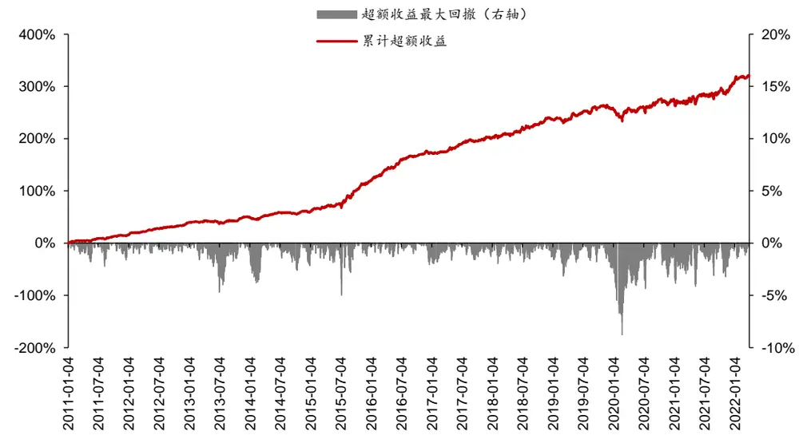
注：回测期 2011-01-04 至 2022-03-31，基准为中证 500 指数
资料来源：朝阳永续，Wind，华泰研究

图表4： GAT+residual（mse）模型月度超额收益

|  | 1月 | 2月 | 3月 | 4月 | 5月 | 6月 | 7月 | 8月 | 9月 | 10月 |  |  |  |
| --- | --- | --- | --- | --- | --- | --- | --- | --- | --- | --- | --- | --- | --- |
|  |  |  |  |  |  |  |  |  |  |  | 11月 | 12 | 月年超额收益 |
| 2011年 | 3.6% | 1.3% | 0.1% | 0.3% | 1.3% | 1.9% | 0.6% | 0.8% | 2.4% | 1.0% | 0.3% | 1.4% | 16.0% |
| 2012年 | 2.7% | 1.1% | 1.7% | 1.8% | 1.8% | 0.8% | 1.7% | 0.6% | 0.4% | 1.6% | 0.6% | 4.0% | 20.3% |
| 2013年 | 0.4% | 0.1% | 0.8% | 0.7% | -1.3% | -0.6% | -0.3% | 3.3% | -0.8% | 2.7% | 2.2% | 0.2% | 7.6% |
| 2014年 | -2.7% | 0.9% | 3.7% | 0.8% | 1.5% | 1.4% | -0.3% | 0.3% | -1.2% | 1.4% | 1.3% | -0.7% | 6.4% |
| 2015年 | 4.2% | 0.0% | 1.6% | 0.6% | 0.4% | 3.0% | 2.3% | 5.5% | 5.6% | 4.7% | 0.9% | 3.7% | 37.5% |
| 2016年 | 2.9% | 1.3% | 4.7% | 1.6% | 2.3% | 4.5% | 0.4% | 2.1% | -0.2% | 1.4% | 2.3% | -1.0% | 24.5% |
| 2017年 | -0.4% | 0.9% | 0.0% | 2.3% | 1.1% | 1.8% | 1.2% | 1.1% | -0.2% | 1.0% | 1.7% | -0.6% | 10.1% |
| 2018年 | 1.0% | 0.4% | 1.0% | 0.2% | 1.4% | 1.6% | 1.5% | -0.1% | 1.3% | 0.8% | 2.6% | -0.4% | 12.1% |
| 2019年 | 0.5% | -1.3% | 0.7% | 2.8% | -0.5% | 1.5% | 0.6% | 1.9% | 0.3% | 1.0% | -0.5% | -0.6% | 6.3% |
| 2020年 | -3.4% | -0.8% | 3.6% | -0.4% | 0.9% | 0.5% | 0.4% | 1.7% | 2.1% | -0.6% | -1.8% | 2.9% | 4.8% |
| 2021年 | -1.8% | 0.7% | -0.3% | 2.4% | 0.7% | 0.5% | -1.1% | -0.1% | 2.4% | -0.4% | 1.4% | 3.5% | 8.0% |
| 2022年 | 2.4% | 0.5% 0.9% 3.8% |  |  |  |  |  |  |  |  |  |  |  |

注：回测期 2011-01-04 至 2022-03-31，基准为中证 500 指数
资料来源：朝阳永续，Wind，华泰研究

图表5： GAT+residual（wmse）和 XGBoost 等权配置模型超额收益表现
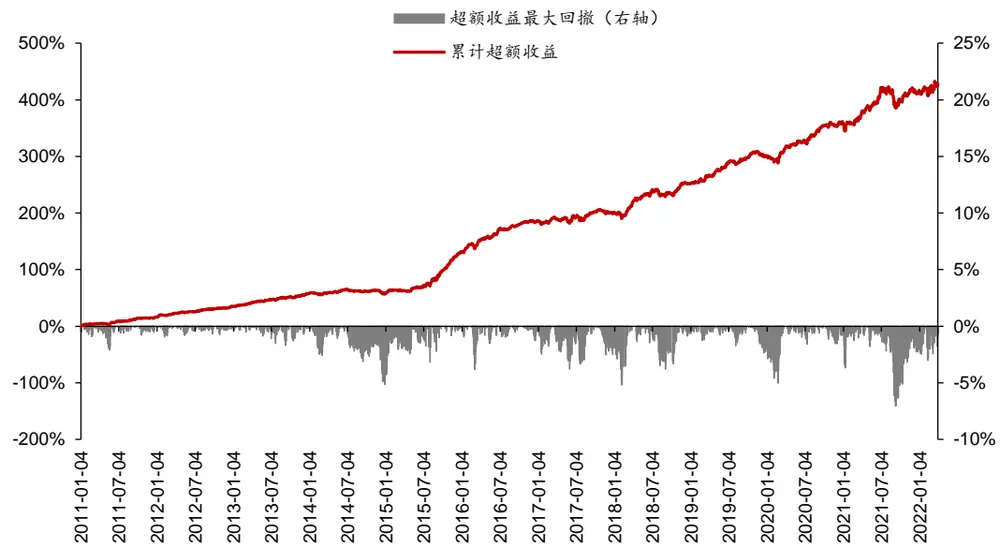
注：回测期 2011-01-04 至 2022-03-31，基准为中证 500 指数
资料来源：朝阳永续，Wind，华泰研究

图表6： GAT+residual（wmse）和 XGBoost 等权配置模型月度超额收益

|  | 1月 2月 |  | 3月 | 4月 | 5月 | 6月 | 7月 | 8月 | 9月 | 10月 |  |  |  |
| --- | --- | --- | --- | --- | --- | --- | --- | --- | --- | --- | --- | --- | --- |
|  |  |  |  |  |  |  |  |  |  |  | 11月 | 12 | 月年超额收益 |
| 2011年 | 3.4% | -0.2% | 1.6% | -0.4% | 2.1% | 1.8% | 0.7% | 1.2% | 3.0% | 0.5% | -0.4% | 1.8% | 16.2% |
| 2012年 | 3.0% | 0.3% | 2.5% | 1.5% | 0.3% | 0.5% | 2.2% | 1.3% | 0.2% | 1.2% | 0.1% | 2.2% | 16.3% |
| 2013年 | 1.1% 1.3% |  | 2.4% | 1.7% | 0.2% | 2.4% | -0.1% | 2.4% | 0.7% | 0.6% | 1.5% | 1.5% | 16.8% |
| 2014年 | 0.2% | -1.3% | 1.7% | 1.2% | 1.1% | 1.8% | -1.9% | 0.3% | -0.5% | 0.7% | 0.2% | -2.7% | 0.7% |
| 2015年 | 2.9% | 0.1% | -0.8% | -0.3% | 4.0% | 0.5% | 2.6% | 6.2% | 7.6% | 5.4% | 6.7% | 3.9% | 45.7% |
| 2016年 | 3.8% | -0.2% | 5.2% | 1.7% | 1.4% | 4.6% | -0.7% | 2.5% | 0.8% | 1.8% | 0.9% | -0.4% | 23.3% |
| 2017年 | -0.9% | 1.1% | 1.0% | 0.6% | -1.9% | 2.1% | -1.4% | 3.5% | 1.7% | 0.9% | -0.8% | -0.4% | 5.5% |
| 2018年 | -1.3% | 1.2% | 6.0% | 2.1% | 2.2% | 1.7% | 0.3% | -2.4% | 1.0% | 1.9% | 3.2% | 0.0% | 16.7% |
| 2019年 | 0.7% | 1.0% | 2.6% | 1.5% | 2.2% | 1.7% | 0.6% | 1.2% | 1.1% | 2.2% | -1.1% | -0.2% | 14.2% |
| 2020年 | -1.2% | 0.1% | 4.3% | 1.5% | 1.7% | 0.2% | 2.1% | 1.9% | 2.1% | 1.1% | -1.5% | 1.1% | 14.2% |
| 2021年 | 0.3% | 0.9% | 2.6% | 2.8% | 1.4% | 3.8% | 0.0% | -2.7% | -0.2% | 2.0% | 1.8% | -0.6% | 12.7% |
| 2022年 | 1.0% | 0.7% | 0.6% | 2.3% |  |  |  |  |  |  |  |  |  |

注：回测期 2011-01-04 至 2022-03-31，基准为中证 500 指数
资料来源：朝阳永续，Wind，华泰研究

图表7： 本文测试的部分模型回测绩效

|  | 年化收益年化波动 |  | 夏普比率 | 最大回撤Calmar 比 |  |  | 年化超额年化跟踪信息比 |  | 超额收益 | 超额收益相对基准年化双边 |  |  |
| --- | --- | --- | --- | --- | --- | --- | --- | --- | --- | --- | --- | --- |
|  |  |  |  |  |  |  |  |  |  | 最大回撤 Calmar 比率 |  |  |
| GAT+residual(wmse) | 率 18.47% | 率 27.49% | 0.67 | 47.92% | 率 0.39 | 收益率 16.17% | 误差 7.54% | 率 2.14 | 8.80% | 1.84 | 月胜率 71.85% | 换手率 16.06 |
| GAT+residual(mse) | 16.57% | 26.67% | 0.62 |  |  | 14.19% | 5.83% |  |  | 1.62 |  | 16.42 |
| GAT 和 XGBoost 等权季度再平衡 |  |  |  | 46.62% | 0.36 |  |  | 2.43 | 8.78% |  | 77.78% |  |
|  | 19.01% | 26.70% | 0.71 | 45.19% | 0.42 | 16.60% | 5.64% | 2.94 | 7.04% | 2.36 | 78.52% | 16.17 |

注：回测期 2011-01-04 至 2022-03-31，基准为中证 500 指数
资料来源：朝阳永续，Wind，华泰研究

## GAT+residual：引入残差结构的图注意力网络

## 残差结构

本文借鉴微软亚研院 Xu 等（2021）研究，设计残差图注意力网络结构，将股票收益拆解成三部分，分别采用不同网络组件进行学习：

1. 原始因子编码后送入掩码自注意力层（Masked Self-attention），学习股票间板块或行业关联解释的收益；

2. 上一层的残差送入全局自注意力层（Global Self-attention），学习股票间因子关联解释的收益；

3. 上一层的残差代表因子解释自身的特异性收益。

三部分收益预测相加后，再经过全连接层，得到最终的收益预测结果。

图表8： GAT+residual 网络结构
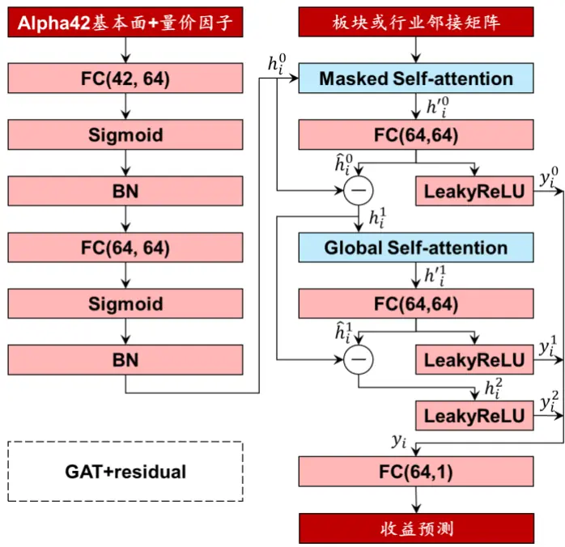
资料来源：华泰研究

上图展示残差图神经网络的结构（下文称 GAT+residual），具体细节如下。

1. 左侧为因子编码模块：对于任意股票 i，输入为截面上的 42 个基本面及量价因子（详细定义见后文），经过两组全连接层＋Sigmoid 激活＋批标准化层，得到 64 个隐状态 $\mathsf{h}_{\cdot}^{0},$

2. 掩码自注意力（Masked Self-attention）：对 $\mathsf{h}_{\mathsf{i}}$ 进行线性变换，得到 $\sf W^{0}h_{i}^{0};$ ；执行自注意力机制 $\mathsf{\Pi}\mathsf{0},$ ，得到任意两只股票 i、j 间的注意力分数 $\mathbf{e}_{\mathrm{ij}}^{.0}$ ，代表股票 j 对股票 i 的影响。注意力机制是将股票 i、j的特征拼接，再进行线性变换及 LeakyReLU 激活：

$$
e_{ij}^{0}=\pi_{0}\big(W^{0}h_{i}^{0},W^{0}h_{j}^{0}\big)=LeakyReLU(a^{0}\big[W^{0}h_{i}^{0}\parallel W^{0}h_{j}^{0}\big])
$$

基于板块或行业对股票进行建图，如果两只股票属于相同板块或行业，那么视作邻居。对于股票i的邻居 $\mathsf{j}\in\mathsf{N}(\mathsf{i})$ ，将注意力分数 $\mathbf{e}_{\parallel}^{.0}$ 进行softmax标准化，得到注意力权重 $\mathbf{d}\mathbf{j}^{0}\colon$ ：

$$
\alpha_{ij}^{0}=softmax_{j}(e_{ij}^{0})=\frac{\exp(e_{ij}^{0})}{\sum_{k\in N(i)}\exp(e_{ik}^{0})}
$$

对于股票 i，将所有邻居股票的隐状态根据注意力权重进行加权求和，再进行LeakyReLU 激活，最后加入自身隐状态 $\mathsf{h}\mathsf{i}^{0}$ ，得到股票 i更新后的隐状态 h’i0：

$$
{h_{\;i}^{\prime}}^{0}=h_{i}^{0}+LeakyReLU({\sum}_{j\in N(i)}\alpha_{ij}^{0}W^{0}h_{j}^{0}),
$$

掩码自注意力层的作用是学习股票板块或行业内部的相互影响。

3. 残差结构Ⅰ：将隐状态 $\mathsf{h}_{\mathsf{i}}^{\flat}{}^{0}$ 送至全连接层，得到 $\hat{h}_{i}^{0}$ 。首先计算 $\mathsf{h}_{\mathsf{i}}^{0}$ 和ℎ̂0的残差，得到新的隐状态 $\mathsf{h}_{\mathsf{i}}^{1}$ ，代表原始信息中无法被板块或行业关联解释的信息，类似于板块或行业中性化。随后对 $\hat{h}_{i}^{0}$ 进行 LeakyReLU 激活，得到 $y_{1}^{0}$ ，代表能够被板块或行业关联解释的收益表征。

4. 全局自注意力（GlobalSelf-attention）：和掩码自注意力类似，首先基于隐状态 $\mathsf{hi}^{1}$ 计算任意两只股票 i、j 间的注意力分数 $\mathbf{e}_{\mathrm{ij}}^{\mathrm{~r~}}$ ：

$$
e_{ij}^{1}=\pi_{1}\big(W^{1}h_{i}^{1},W^{1}h_{j}^{1}\big)=LeakyReLU(a^{1}\big[W^{1}h_{i}^{1}\parallel W^{1}h_{j}^{1}\big])
$$

随后进行 softmax标准化，得到注意力权重 $\mathbf{u}_{\mathrm{ij}}^{1}$ ：

$$
\alpha_{ij}^{1}=softmax_{j}(e_{ij}^{1})=\frac{\exp(e_{ij}^{1})}{\sum_{k}\exp(e_{ik}^{1})}
$$

对于股票 i，将所有股票的隐状态根据注意力权重进行加权求和，再进行 LeakyReLU激活，最后加入自身隐状态 $\mathsf{h}_{\mathsf{i}}^{1}$ ，得到股票 i更新后的隐状态 h’1：

$$
h_{\;i}^{\prime1}=h_{i}^{1}+LeakyReLU(\sum_{j}\alpha_{ij}^{1}W^{1}h_{j}^{1})
$$

全局自注意力和前述掩码自注意力的区别在于：掩码自注意力仅仅对相同板块或行业的股票间计算注意力权重，全局自注意力对任意两只股票间计算注意力权重。全局自注意力层的作用是学习任意两只股票间的相互影响。

5. 残差结构Ⅱ：将隐状态 h’i1 送至全连接层，得到 $\hat{h}_{i}^{1}$ 。首先计算 $\mathsf{h}_{\mathsf{i}}^{1}$ 和 $\hat{h}_{i}^{1}$ 的残差，得到新的隐状态 $\mathsf{h}\mathsf{i}^{2},$ ，代表原始信息中无法被因子关联解释的信息，类似因子中性化。随后对ℎ̂1进行 LeakyReLU 激活，得到 $y_{i}^{1}$ ，代表能够被因子关联解释的收益表征。

6. 输出层：将隐状态 $\mathsf{h}_{\mathsf{i}}^{2}$ 进行 LeakyReLU 激活，得到 $y_{1}^{2}$ ，代表因子解释自身的特异性收益表征。将 $y_{1}^{0}$ 、 $y_{i}^{1}$ 、 $y_{1}^{2}$ 三部分收益表征相加，得到汇总后的收益表征 $y_{1},$ 。再送至输出层，最终得到股票 i的收益预测。

图表9： 微软亚研院 HIST网络结构
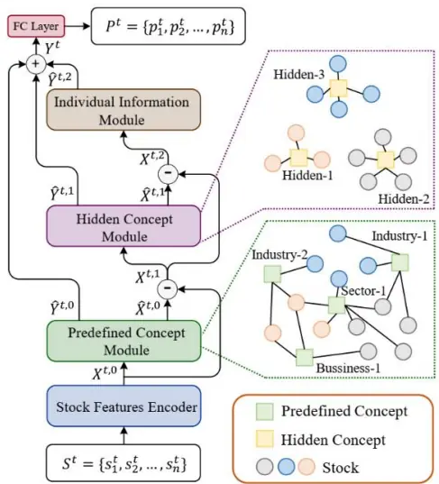
资料来源：Xu et al. (2021). Hist: a graph-based framework for stock trend forecasting via mining concept-oriented shared information. arXiv，华泰研究

GAT+residual 借鉴了 Xu等（2021）设计的 HIST 网络结构（如上图）。两者主要区别在于：

1. HIST 的输入为原始行情数据的时间序列，采用 GRU 层进行编码，得到隐状态 Xt,0；GAT+residual 的输入为截面上的基本面和量价因子，采用更易训练的全连接网络进行编码。

2. HIST 从 Tushare 提取 1000 余种股票概念（如密集调研、南北船合并、5G 等），在预定义概念模块进行建图；GAT+residual 的掩码自注意力模块采用板块或行业进行建图。

3. HIST 对每一种概念进行编码，计算股票与概念之间的余弦距离，以距离为权重将概念聚合至股票，从而更新股票隐状态。GAT+residual 的掩码自注意力模块则是直接计算股票之间的注意力，以注意力为权重将相同板块或行业股票聚合至自身，从而更新股票隐状态。我们认为，HIST 的概念编码适用于概念数量较多的场景，本研究场景下直接根据板块或行业建图即可。

## 对照模型

本文设计三组对照模型，从完整 GAT+residual结构中分别删除部分模块，其中：

1. GAT+mask 删除全局自注意力模块，核心是掩码自注意力。

2. GAT+global 删除掩码自注意力模块，核心是全局自注意力。华泰金工《人工智能 42：图神经网络选股与 Qlib 实践》（2021-02-21）采用此种网络结构。

3. nn 删除全局和掩码自注意力模块，本质是 3 层隐藏层的全连接神经网络。

三组对照模型的比较及网络结构示意图如下。

图表10： GAT+residual 和对照模型的比较

| 网络结构 | 因子编码模块 | 掩码自注意力 | 全局自注意力 | 输出层 |
| --- | --- | --- | --- | --- |
| GAT+residual | √ | √ | √ | √ |
| GAT+mask | √ | √ | X | √ |
| GAT+global | √ | X | √ | √ |
| nn | √ | X | X | √ |

资料来源：华泰研究

图表11： GAT+mask网络结构（对照模型）
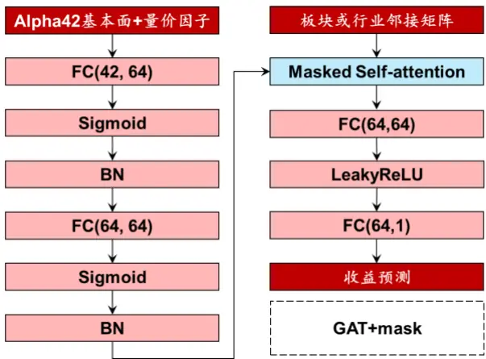
资料来源：华泰研究

图表12： GAT+global 网络结构（对照模型）
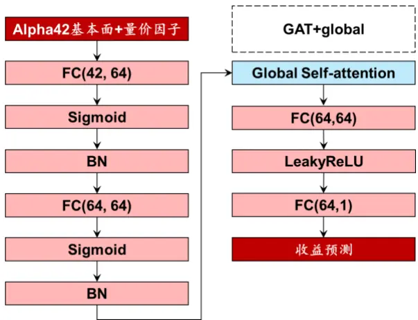
资料来源：华泰研究

图表13： nn网络结构（对照模型）
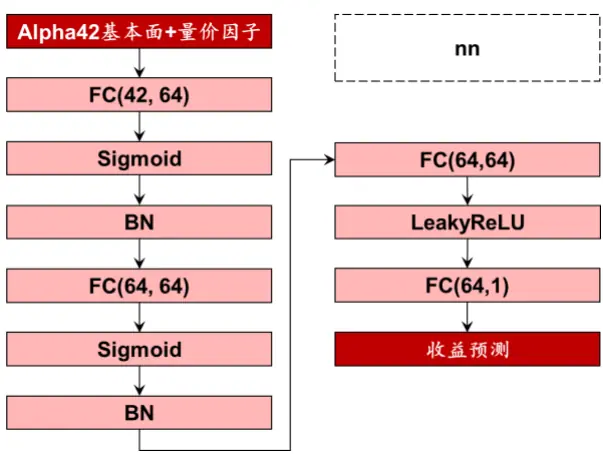
资料来源：华泰研究

## 选股模型构建方法

GAT 选股模型（含 GAT+residual 及三组对照模型）的构建可拆解为构建股票池、构建数据集、因子预处理、训练流程、设置模型、构建组合、回测等步骤，详细方法如下表。

图表14： GAT选股模型构建方法

| 步骤 | 参数 | 参数值 |
| --- | --- | --- |
| 构建股票池 | 股票池 | 全 A 股；剔除上市未满 63 个交易日个股，剔除ST、*ST、退市整理期个股； 每个季末截面期，在未停牌个股中，筛选过去1年日均成交额和日均总市值均排 名前 60%个股 |
| 构建数据集 | 特征 标签 邻接矩阵 | T 日 42 个基本面和量价因子 T+11 日相对于 T+1 日 vwap 收益率 每个年末截面期，根据中信一级行业合成板块（周期、消费、金融、成长、稳定） |
| 因子预处理 | 特征 | 构建邻接矩阵（或直接采用一级行业） 5 倍 MAD 缩尾；zscore 标准化；缺失值填为 0；不做中性化 剔除缺失值；截面排序数标准化 |
| 训练流程 | 标签 测试集完整区间 训练、验证、测试集划分 | 20110104~20220331 训练集252*6个交易日，验证集252*2个交易日，测试集126个交易日； 如第1 期训练集 20020910~20081205，验证集 20081208~20101231，测试集 20110104~20110711; 第 2 期训练集 20030325~20090616，验证集 20090617~20110711，测试集 |
| 设置模型 | 特殊处理 网络结构 隐单元数 | 20110712~20120113 剔除训练集、验证集最后10个交易日样本，防止信息泄露 GAT+residual（或 GAT+mask 或 GAT+global 或 nn） 64（或 32 或 16) |
|  | 损失函数 batch size | wmse（或 mse）；wmse 半衰期为 0.5，即截面期收益最高个股权重为1，收益 排名中位数个股权重为 0.5 每个交易日的全体股票视作一个batch |
|  | 学习率 优化器 | 0.0001 adam |
|  | 早停次数 | 20 |
| 构建组合 | 预训练 |  |
|  |  | 采用上期训练的模型 |
|  | 基准 | 中证 500 指数 |
|  | 优化目标 | 最大化预期收益 |
|  | 组合仓位 | 1 |
|  | 个股权重下限 | 0 |
|  | 个股偏离权重约束 | [-1%, 1%] |
|  | 行业偏离权重约束 | [-1%, 1%] |
|  | 风格偏离标准差约束 | [-1%, 1%] |
|  | 风格因子 | 对数流通市值，BP（预处理：5 倍 MAD 缩尾，zScore 标准化） |
|  | 调仓周期 | 每5个交易日 |
|  | 单次调仓单边换手率上限 | 15% |
|  | 成分股权重约束 | 无 |
| 回测 | 单边费率 | 0.002 |
|  | 交易价格 | vwap |
|  | 特殊处理 | 停牌不买入/卖出；一字板涨停不买入；一字板跌停不卖出；其余可交易股票重新 |

资料来源：华泰研究

GAT 选股模型使用的 42 个基本面及量价因子定义如下表。

图表15： GAT选股模型使用的 42个因子

| 类别 | 名称 | 计算方式 |
| --- | --- | --- |
| 估值 | bp_If | 1/市净率 |
|  | ep_ttm | 1/市盈率(TTM) |
|  | ocfp_ttm | 1/净经营性现金流(TTM) |
|  | dyr12 | 近 252 日股息率 |
| 预期 | con_eps_g | 一致预期 EPS(FY1)近 63 日增长率 |
|  | con_roe_g | 一致预期 ROE(FY1)近 63 日增长率 |
|  | con_np_g | 一致预期归母净利润(FY1)近 63 日增长率 |
| 反转 | ret_5d | 近5日区间收益率 |
|  | ret_1m | 近21 日区间收益率 |
|  | exp_wgt_return_3m | 近63 日收益率以换手率指数衰减加权 |
| 波动率 | std_1m | 收益率近 21 日标准差 |
|  | vstd_1m | 成交量近 21 日标准差 |
|  | ivr_ff3factor_1m | 残差收益率（收益率对万得全A、市值、BP因子收益率回归）近21日标准差 |
| 换手率 | turn_1m | 换手率近 21 日均值 |
|  | std_turn_1m | 换手率近 21 日标准差 |
|  | bias_turn_1m | 换手率近 21 日均值/近 504 日均值 |
| 日间技术 | std_ret_10d | 收益率近 10日标准差 |
|  | std_vol_10d | 成交量近 10日标准差 |
|  | std_turn_10d | 换手率近 10日标准差 |
|  | corr_ret_close | 收益率和收盘价近10日相关系数 |
|  | corr_ret_open | 收益率和开盘价近10日相关系数 |
|  | corr_ret_high | 收益率和最高价近10日相关系数 |
|  | corr_ret_low | 收益率和最低价近10日相关系数 |
|  | corr_ret_vwap | 收益率和均价近10日相关系数 |
|  | corr_ret_vol | 收益率和成交量近10日相关系数 |
|  | corr_ret_turn | 收益率和换手率近10日相关系数 |
|  | corr_vol_close | 成交量和收盘价近10日相关系数 |
|  | corr_vol_open | 成交量和开盘价近10日相关系数 |
|  | corr_vol_high | 成交量和最高价近10日相关系数 |
|  | corr_vol_low | 成交量和最低价近10日相关系数 |
|  | corr_vol_vwap | 成交量和均价近10日相关系数 |
| 日内技术 | low2high | low/high |
|  | vwap2close | vwap/close |
|  | kmid | (close-open)/open |
|  | klen | (high-low)/open |
|  | kmid2 | (close-open)/(high-low) |
|  | kup | (high-greater(open,close))/open |
|  | kup2 | (high-greater(open,close))/(high-low) |
|  | klow | (less(open,close)-low)/open |
|  | klow2 | (less(open,close)-low)/(high-low) |
|  | ksft | (2*close-high-low)/open |
|  | ksft2 | (2*close-high-low)/(high-low) |

资料来源：朝阳永续，Wind，华泰研究

下面对部分关键点作展开介绍。

## 股票池

股票池的设计需兼顾预测广度、策略容量、模型空间开销等方面。对于 Alpha 模型，整体而言股票池越大，预测广度越大，组合信息比率越高。然而当股票池扩大，会纳入一部分小市值、低流动性股票，策略容量受到限制。另外，图神经网络将每个交易日股票池内的全部股票视作一个 batch，batch size 高于其他类型网络（一般取 32、64、128 等）。股票池越大，计算自注意力的空间开销越多，GPU 训练时易出现显存不足的问题。

本研究的股票池设为全市场规模较大、流动性较好的个股。首先，从全 A 股中剔除上市未满 63 个交易日的个股，剔除 ST、*ST、退市整理期的个股。随后，在每个季末截面期的未停牌个股中，筛选过去 1 年日均成交额和日均总市值均排名前 60%的个股。历史各期股票池市值中位数在 40~240 亿元之间。

图表16： 股票池有效个股数量和市值中位数
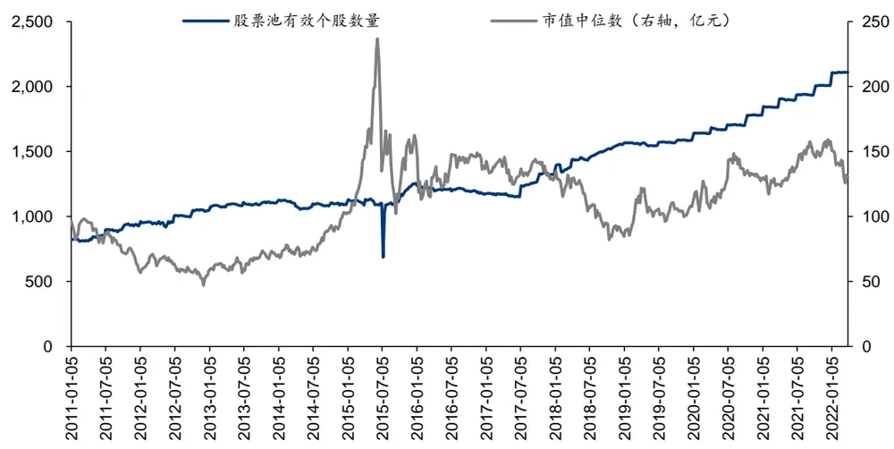
资料来源： Wind，华泰研究

## 邻接矩阵

掩码图注意力模块需要对股票进行建图，即对股票池内的N只股票构建N*N的邻接矩阵W。我们采取相对简单的方案，基于板块或一级行业建图。以行业建图为例，若两只股票 i、j属于相同行业，则 $W_{ij}=W_{ji}=1$ ，否则为 0。

基于行业建图的前提假设是仅有相同行业个股内部存在相互影响。实际上，对于处在产业链上下游的股票，即使分属不同行业，也存在相互影响。因此更为合理的方式是基于相对“粗糙”的板块进行建图。板块可由一级行业映射得到，映射关系如下表。

图表17： 一级行业映射至板块

| 板块 | 中信一级行业 |
| --- | --- |
| 周期 | 煤炭、机械、电力设备及新能源、有色金属、基础化工、建材、石油石化、国防军工、钢铁 |
| 消费 | 商贸零售、轻工制造、综合、医药、纺织服装、食品饮料、家电、汽车、消费者服务、农林牧渔 |
| 金融 | 房地产、非银行金融、银行、综合金融 |
| 成长 | 电子、通信、计算机、传媒 |
| 稳定 | 交通运输、电力及公用事业、建筑 |

资料来源：华泰研究

## 信息泄露

模型训练环节需谨防信息泄露。信息泄露是指训练、验证、测试集划分不当所导致的使用未来信息的问题（Prado，2018）。

以本研究为例，第一期滚动训练中，训练集为 2002-09-10 至 2008-12-05，验证集为2008-12-08 至 2010-12-31，测试集为 2011-01-04 至 2011-07-11。对于训练集的最后一条样本，因子对应 2008-12-05，标签对应后 11 个交易日即 2008-12-08 至 2008-12-22 区间的收益。此时训练集标签与后续验证集有重叠，训练集使用了未来信息。类似地，验证集也会使用测试集的未来信息。

合理的处理方式为删除训练集和验证集末尾的样本，上例中训练集末端从 2008-12-05 提前11 个交易日至 2008-11-20，验证集末端从 2011-07-11 提前 11 个交易日至 2011-06-23。

图表18： 信息泄露示意图，灰色代表信息泄露区间
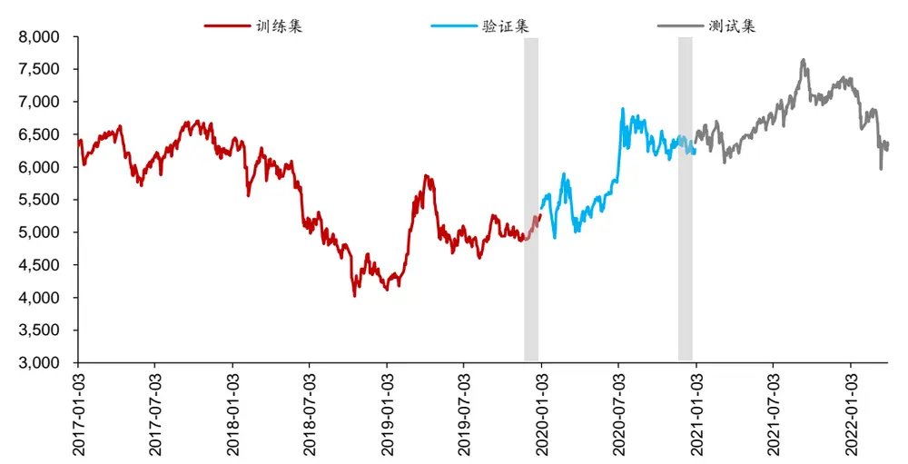
注：曲线为中证 500 指数，仅作示意使用，实际上任何策略都可能出现信息泄露资料来源：Wind，华泰研究

## 损失函数和评价指标

本文测试 mse 和加权 mse（wmse）两种损失函数。加权 mse提高截面上收益较高股票的权重，降低截面上收益较低股票的权重，从而提升模型多头端表现。

$$
weighted\_mse=\frac{1}{N}{\sum}_{N}w\cdot(pred-label)^{2}
$$

其中 N为截面期股票数量，权重 w根据股票收益率在截面上的排序，以 N/2 为半衰期进行加权。收益率排序最高股票的权重为 1，收益率排序中位数股票的权重为 0.5，收益率排序最低股票的权重为 0.25。

类似地，在评价模型预测能力时，除常规的IC和RankIC外，我们引入加权IC和加权RankIC：

$$
\begin{aligned}weighted_{-}IC=&\frac{\sum_{N}w\cdot pred\cdot label-(\sum_{N}w\cdot pred)\cdot(\sum_{N}w\cdot label)}{\sqrt{\sum_{N}w\cdot pred^{2}-(\sum_{N}w\cdot pred)^{2}}\cdot\sqrt{\sum_{N}w\cdot label^{2}-(\sum_{N}w\cdot label)^{2}}}\\weighted_{-}RanklC=&\frac{\sum_{N}w\cdot Rank(pred)\cdot Rank(label)-(\sum_{N}w\cdot Rank(pred))\cdot(\sum_{N}w\cdot Rank(label))}{\sqrt{\sum_{N}w\cdot Rank(pred)^{2}-(\sum_{N}w\cdot Rank(pred))^{2}}\cdot\sqrt{\sum_{N}w\cdot Rank(label)^{2}-(\sum_{N}w\cdot Rank(label))^{2}}}\end{aligned}
$$

其中 w的半衰期为 N/2，并且需要进行截面归一化。

## 预训练

为了提升模型训练效率，我们在滚动训练中引入预训练机制。如第二期滚动时，在第一期已训练好的参数基础上进行优化。由于训练集长度为 252*6 个交易日，滚动步长为 126 个交易日，因此前后两期滚动训练集有 5/6 的重叠，将前一期的参数迁移至后一期有合理之处。另外，预训练理论上有助于平滑前后两期模型的差距，避免模型间出现大幅波动。

本研究测试中，我们发现预训练在时间开销上没有显著改善，可能原因是网络规模不大，即使没有预训练，6 次左右迭代即可完成训练。同时是否预训练对模型表现影响较小，目前结果尚不足以证明预训练能带来显著改善。

## 测试结果

测试分为五部分，分别考察 1）网络结构、2）建图方式、3）损失函数、4）网络复杂度的影响，以及 5）图神经网络和 XGBoost 结合的效果，实际共测试 10组模型，如下表。

图表19： 一级行业映射至板块

| 考察内容 | 模型 | 网络结构 | 建图方式损失函数 |  | 网络复杂度（隐状态数） |
| --- | --- | --- | --- | --- | --- |
| 网络结构 | GAT+residual(sector+wmse+hidden64) | GAT+residual 板块 |  | wmse | 64 |
|  | GAT+mask | GAT+mask | 板块 | wmse | 64 |
|  | GAT+global | GAT+global | 全局 | wmse | 64 |
|  | nn | nn | 无 | wmse | 64 |
| 建图方式 损失函数 | GAT+residual(indus) | GAT+residual |  | 一级行业 wmse | 64 |
| 网络复杂度 | GAT+residual(mse) | GAT+residual 板块 |  | mse | 64 |
|  | GAT+residual(hidden32) | GAT+residual | I 板块 | wmse | 32 |
|  | GAT+residual(hidden16) | GAT+residual 板块 |  | wmse | 16 |
| 和 XGBoost 结合 XGBoost |  |  |  | 无 |  |
|  | GAT 和 XGBoost 等权季度再平衡 | GAT+residual 板块 |  | wmse | 64 |

资料来源：华泰研究

将模型对个股的收益预测值视作合成后的单因子，可进行单因子 IC 测试和分层测试（分 10层）。本文测试的全部模型合成因子评价指标如下表。

图表20： 本文测试的全部模型合成因子评价指标

| 加权 |  |  |  |  |  | Bottom Top 组 Bottom |  |  |  |  |  |  | 多空对 |
| --- | --- | --- | --- | --- | --- | --- | --- | --- | --- | --- | --- | --- | --- |
|  | RankIC 加权 IC RankIC |  |  |  |  |  | 加权 |  | 加权 Top 组 | 组精确 | 年化收 | 组年化 冲年化基准收 |  |
|  | IC 均值 | 均值 | 均值 | 均值 | ICIR RankICIR |  | ICIR RankICIR |  | 精确率 | 率 | 益率 | 收益率 | 收益率 益率 |
| GAT+residual(sector+wmse+hidden64) | 7.2% | 7.8% | 7.1% | 8.2% | 69.4% | 69.4% 72.4% |  | 78.9% | 54.5% | 57.4% 20.5% | -24.1% | 22.3% | 2.6% |
| GAT+mask | 7.0% | 7.4% | 7.1% | 8.0% | 61.5% | 60.8% 66.2% |  | 69.9% 54.4% |  | 57.0% 20.9% | -22.1% | 21.5% | 2.6% |
| GAT+global | 7.4% | 8.0% | 7.3% | 8.4% | 67.0% | 67.0% 69.2% |  | 75.5% | 54.8% | 57.5% 21.2% | -22.8% | 22.0% | 2.6% |
| nn | 7.8% | 8.1% | 7.8% | 8.7% | 74.6% | 71.0% 79.4% |  | 82.2% | 54.6% | 58.1% 21.8% | -27.3% | 24.6% | 2.6% |
| GAT+residual(indus) | 7.0% | 7.4% | 6.9% | 7.8% | 68.6% | 67.2% 71.3% |  | 75.8% | 54.2% | 57.0% 20.0% | -22.8% | 21.4% | 2.6% |
| GAT+residual(mse) | 7.8% | 10.1% | 2.0% | 5.5% | 73.0% | 91.5% 18.8% |  | 52.3% | 55.5% | 58.9% 18.7% | -30.3% | 24.5% | 2.6% |
| GAT+residual(hidden32) | 7.3% | 7.8% | 7.2% | 8.2% | 70.1% | 67.5% 73.3% |  | 76.5% | 54.7% | 57.2% 22.1% | -24.4% | 23.2% | 2.6% |
| GAT+residual(hidden16) | 7.1% | 7.6% | 7.4% | 8.3% | 71.1% | 69.9% 77.6% |  | 81.6% | 54.1% | 57.2% 20.0% | -23.5% | 21.7% | 2.6% |
| XGBoost | 8.4% | 11.4% | -0.3% | 4.5% | 78.7% 101.4% | -3.1% | 无 | 41.2% | 56.6% | 59.5% 22.8% | -30.2% | 26.5% | 5.7% |

注：回测期 2011-01-04 至 2022-03-31资料来源：朝阳永续，Wind，华泰研究

本文测试的全部模型回测绩效如下表。图神经网络模型中，GAT+residual(wmse)和GAT+residual(mse)表现相对较好。图神经网络和XGBoost以等权季度再平衡的方法结合，能够进一步提升回测表现。

图表21： 本文测试的全部模型回测绩效

|  | 年化收益年化波动 |  | 夏普比 | Calmar 年化超额 年化跟踪 信息 |  |  |  |  |  | 超额收益 | 超额收益相对基准年化双边 |  |
| --- | --- | --- | --- | --- | --- | --- | --- | --- | --- | --- | --- | --- |
|  | 率 | 率 |  | 率 最大回撤 | 比率 | 收益率 |  | 误差比率 | 最大回撤Calmar 比率 |  | 月胜率 | 换手率 |
| GAT+residual(sector+wmse+hidden64) | 18.47% | 27.49% | 0.67 | 47.92% | 0.39 | 16.17% | 7.54% | 2.14 | 8.80% | 1.84 | 71.85% | 16.06 |
| GAT+mask | 14.92% | 26.79% | 0.56 | 45.28% | 0.33 | 12.47% | 7.71% | 1.62 | 13.71% | 0.91 | 69.63% | 16.20 |
| GAT+global | 16.38% | 27.13% | 0.60 | 46.96% | 0.35 | 14.01% | 7.52% | 1.86 | 11.01% | 1.27 | 72.59% | 16.09 |
| nn | 15.55% | 27.42% | 0.57 | 46.35% | 0.34 | 13.23% | 8.14% | 1.63 | 15.62% | 0.85 | 70.37% | 16.01 |
| GAT+residual(indus) | 16.98% | 26.98% | 0.63 | 47.57% | 0.36 | 14.58% | 7.23% | 2.02 | 10.59% | 1.38 | 74.07% | 16.02 |
| GAT+residual(mse) | 16.57% | 26.67% | 0.62 | 46.62% | 0.36 | 14.19% | 5.83% | 2.43 | 8.78% | 1.62 | 77.78% | 16.42 |
| GAT+residual(hidden32) | 15.04% | 27.73% | 0.54 | 50.41% | 0.30 | 12.91% | 7.35% | 1.75 | 13.29% | 0.97 | 71.85% | 16.18 |
| GAT+residual(hidden16) | 13.05% | 27.37% | 0.48 | 47.66% | 0.27 | 10.80% | 7.77% | 1.39 | 12.55% | 0.86 | 68.89% | 16.08 |
| XGBoost | 19.10% | 26.82% | 0.71 | 42.48% | 0.45 | 16.58% | 7.58% | 2.19 | 13.14% | 1.26 | 71.11% | 16.07 |
| GAT 和 XGBoost 等权季度再平衡 | 19.01% | 26.70% | 0.71 | 45.19% | 0.42 | 16.60% | 5.64% | 2.94 | 7.04% | 2.36 | 78.52% | 16.17 |

注：回测期 2011-01-04 至 2022-03-31，基准为中证 500 指数
资料来源：朝阳永续，Wind，华泰研究

## 网络结构的影响

对比 GAT+residual、GAT+mask、GAT+global 和 nn 四组模型：

1. 从加权 RankIC 来看，nn＞GAT+residual＞GAT+mask＞GAT+global。

2. 从超额收益表现来看，GAT+residual＞GAT+global＞nn＞GAT+mask。

相比于单因子测试，我们更关注策略回测中能够实际拿到的收益及风险。结果表明：

1. 引入残差结构（GAT+residual）有显著改进效果，能够从股票间板块、因子的关联中挖掘出有效信息。

2. 全局建图（GAT+global）优于简单全连接神经网络（nn）。仅基于板块建图（GAT+mask）表现较差，可能损失跨板块股票之间的关联信息。

图表22： 各网络结构合成因子累计加权 RankIC
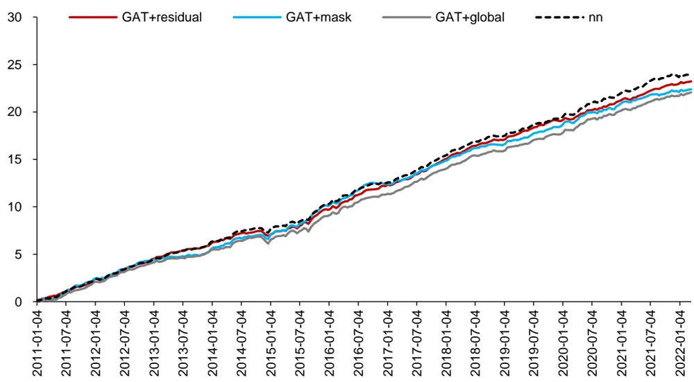
注：回测期 2011-01-04 至 2022-03-31资料来源：朝阳永续，Wind，华泰研究

图表23： 各网络结构超额收益表现
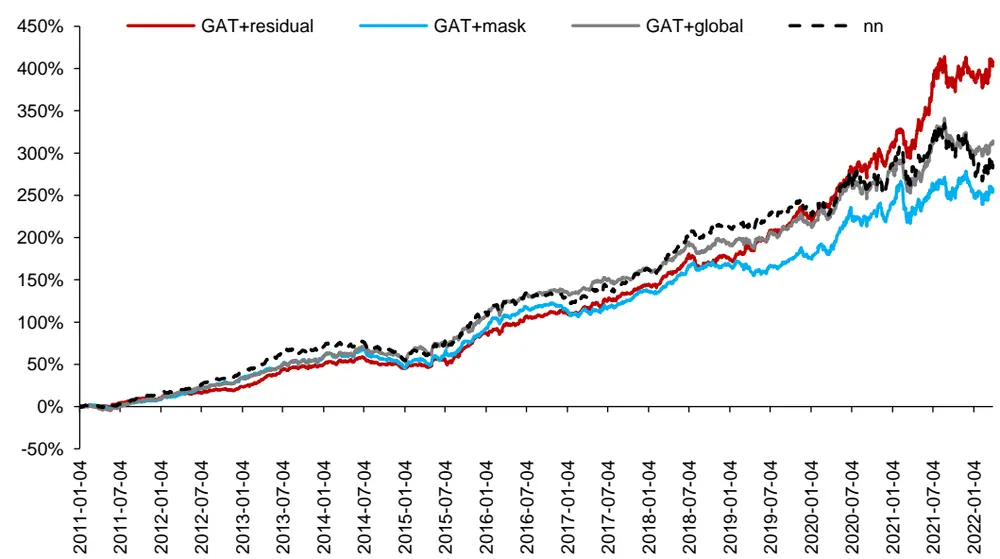
注：回测期 2011-01-04 至 2022-03-31，基准为中证 500 指数资料来源：朝阳永续，Wind，华泰研究

## 建图方式的影响

对比基于板块建图和基于一级行业建图两组模型，GAT+residual(sector)在加权 RankIC 和超额收益表现上均优于 GAT+residual(indus)。对于处在产业链上下游的股票，即使分属不同行业，也存在相互影响，因此基于相对“粗糙”的板块建图更为合理。

图表24： 各建图方式合成因子累计加权 RankIC
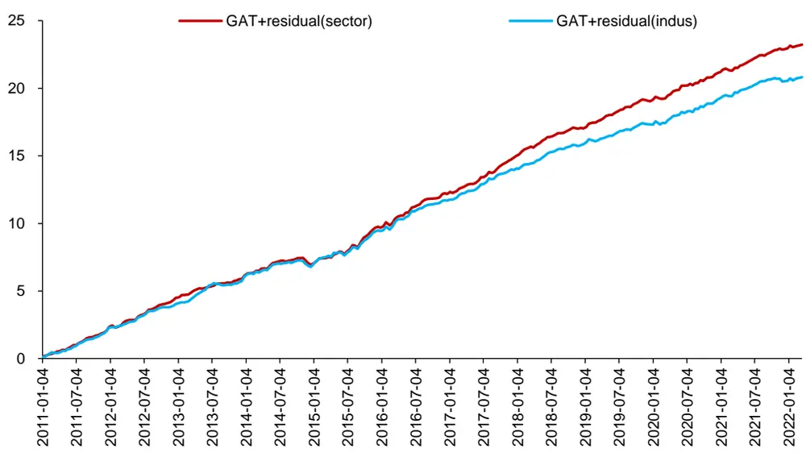
注：回测期 2011-01-04 至 2022-03-31资料来源：朝阳永续，Wind，华泰研究

图表25： 各建图方式超额收益表现
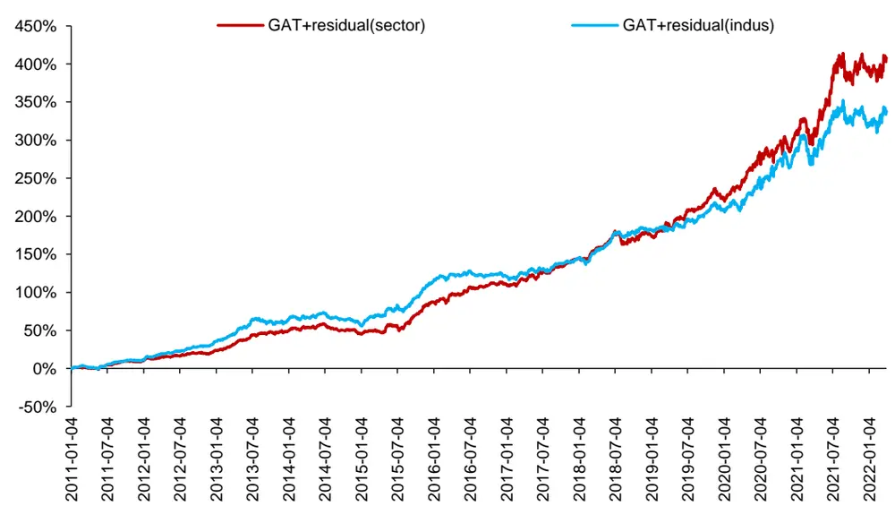
注：回测期 2011-01-04 至 2022-03-31，基准为中证 500 指数资料来源：朝阳永续，Wind，华泰研究

## 损失函数的影响

对比 wmse损失和 mse损失两组模型：

1. mse 模型在原始 RankIC 上占优，wmse 模型在加权 RankIC 上占优。

2. 从超额收益表现看，2011~2013 年两者接近，2014~2016 年 mse 占优，2017 年至今wmse 占优。随着因子多头端日趋拥挤，wmse 的优势逐步体现。

图表26： 各损失函数合成因子累计 RankIC
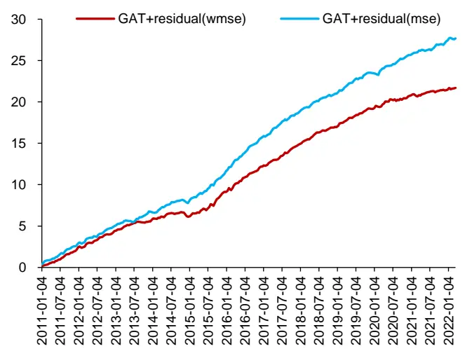
注：回测期 2011-01-04 至 2022-03-31资料来源：朝阳永续，Wind，华泰研究

图表27： 各损失函数合成因子累计加权 RankIC
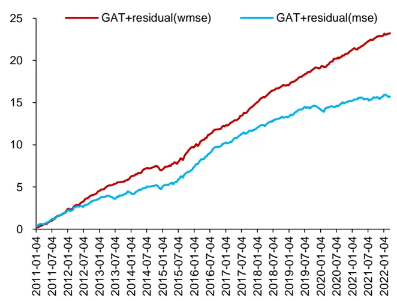
注：回测期 2011-01-04 至 2022-03-31资料来源：朝阳永续，Wind，华泰研究

图表28： 各损失函数超额收益表现
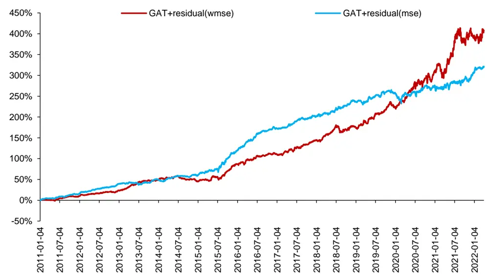
注：回测期 2011-01-04 至 2022-03-31，基准为中证 500 指数资料来源：朝阳永续，Wind，华泰研究

## 网络复杂度的影响

对比隐状态分别为64/32/16的三组模型，加权RankIC差距不大，超额收益表现上hidden64＞hidden32＞hidden16，表明提升网络复杂度有一定改进效果。但过高的复杂度也会增加训练时间和空间开销，以及带来过拟合问题，网络复杂度需要与样本量、特征数相匹配。

图表29： 各网络复杂度合成因子累计加权 RankIC
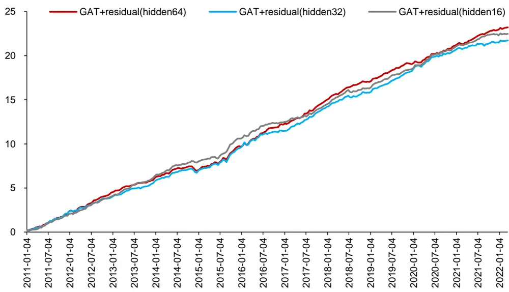
注：回测期 2011-01-04 至 2022-03-31资料来源：朝阳永续，Wind，华泰研究

图表30： 各网络复杂度超额收益表现
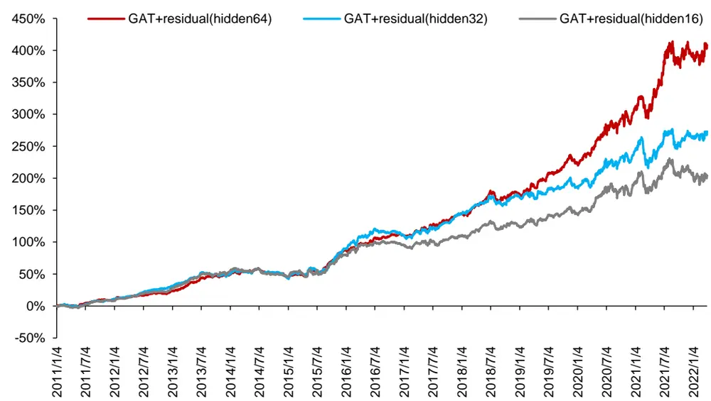
注：回测期 2011-01-04 至 2022-03-31，基准为中证 500 指数资料来源：朝阳永续，Wind，华泰研究

## 图神经网络和 XGBoost结合

深度学习和传统机器学习的方法论具有一定差异，将低相关性的策略结合可以进一步降低风险。传统机器学习部分我们采用 XGBoost 选股模型，其构建方法及使用的因子与图神经网络模型接近，部分细节存在差异，具体如下表。

图表31： XGBoost选股模型构建方法

| 步骤 | 参数 | 参数值 |
| --- | --- | --- |
| 构建股票池 | 股票池 | 全 A股；剔除上市未满 63个交易日个股，剔除ST、*ST、退市整理期个股； 每个季末截面期，在未停牌个股中，筛选过去1年日均成交额和日均总市值均排 名前 90%个股 |
| 构建数据集 | 特征 | T 日 42 个基本面和量价因子 T+11 日相对于 T+1 日收盘价收益率 |
| 因子预处理 | 标签 特征 标签 | 5 倍 MAD 缩尾；行业市值中性化；zscore 标准化；缺失值填为 0 剔除缺失值；截面排序数标准化 |
| 训练流程 | 测试集完整区间 训练、验证、测试集划分 | 20110104~20220331 训练集252*5个交易日，验证集252*1个交易日，测试集126个交易日； 如第1 期训练集 20041018~20091217，验证集 20091218~20101231，测试集 20110104~20110711; 第 2 期训练集 20050422~20100628，验证集 20100629~20110711，测试集 |
| 设置模型 | 特殊处理 模型 损失函数 | 20110712~20120113 剔除训练集、验证集最后10个交易日样本，防止信息泄露 XGBoost wmse（或 mse）；wmse 半衰期为 0.5，即截面期收益最高个股权重为1，收益 |
|  | 学习率 | 排名中位数个股权重为 0.5 |
|  | 最大迭代次数 | 0.05 1000 |
|  | 早停次数 | 20 |
|  | 最大树深 | 3 |
|  | 行列采样比例 | 0.8 |
| 构建组合 |  | 中证 500 指数 |
|  | 基准 |  |
|  | 优化目标 | 最大化预期收益 |
|  | 组合仓位 | 1 |
|  | 个股权重下限 | 0 |
|  | 个股偏离权重约束 | [-1%, 1%] |
|  | 行业偏离权重约束 | [-1%, 1%] |
|  | 风格偏离标准差约束 | [-1%, 1%] |
|  | 风格因子 | 对数流通市值（预处理：5 倍 MAD 缩尾，zscore 标准化） |
|  | 调仓周期 | 每5个交易日 |
|  | 单次调仓单边换手率上限 | 15% |
|  | 成分股权重约束 | 无 |
| 回测 | 单边费率 | 0.002 |
|  | 交易价格 | vwap |
|  | 特殊处理 | 停牌不买入/卖出；一字板涨停不买入；一字板跌停不卖出；其余可交易股票重新 |

资料来源：华泰研究

图表32： XGBoost选股模型使用的 42个因子

| 类别 | 名称 | 计算方式 |
| --- | --- | --- |
| 估值 | bp_If | 1/市净率 |
|  | ep_ttm | 1/市盈率(TTM) |
|  | ocfp_ttm | 1/净经营性现金流(TTM) |
|  | dyr12 | 近 252 日股息率 |
|  | sales_g_q | 营业收入同比增长率 |
| 成长 | profit_g_q | 归母净利润同比增长率 |
|  | ocf_g_q | 净经营性现金流同比增长率 |
|  | roe_g_q | roe 同比增长率 |
|  | roe_ttm | roe(TTM) |
| 盈利 | roa_ttm | roa(TTM) |
|  | roic_ttm | roic(TTM) |
|  | gp_ttm | 销售毛利率(TTM) |
|  | np_ttm | 销售净利率(TTM) |
|  | sales_var | 营业收入近5年标准差/均值 |
| 盈利波动性 |  | 归母净利润近5年标准差/均值 |
|  | profit_var ocf_var | 净经营性现金流近5年标准差/均值 |
|  | roe_var |  |
|  | assetturnover_ttm | roe 近 5 年标准差/均值 |
| 质量 | ocfr_ttm | 资产周转率(TTM) |
|  | currentdebt2debt | 经营现金流量比率(TTM) 流动负债率 |
|  | con_eps_g | 一致预期 EPS(FY1)近 63 日增长率 |
| 预期 | con_roe_g | 一致预期 ROE(FY1)近 63 日增长率 |
|  | con_np_g | 一致预期归母净利润(FY1)近 63 日增长率 |
|  | ret_5d | 近5日区间收益率 |
| 反转 | ret_1m | 近 21 日区间收益率 |
|  | ret_12m | 近 252 日区间收益率扣除近 21 日区间收益率 |
|  | exp_wgt_return_3m |  |
|  |  | 近63日收益率以换手率指数衰减加权 |
| 波动率 | std_1m | 收益率近 21 日标准差 |
|  | vstd_1m | 成交量近 21 日标准差 |
|  | ivr_ff3factor_1m | 残差收益率（收益率对万得全A、市值、BP因子收益率回归）近21日标准差 |
| 换手率 | turn_1m | 换手率近 21 日均值 |
|  | std_turn_1m | 换手率近 21 日标准差 |
|  | bias_turn_1m | 换手率近 21 日均值/近 504 日均值 |
| 日内技术 | kmid | (close-open)/open |
|  | klen | (high-low)/open |
|  | kmid2 | (close-open)/(high-low) |
|  | kup | (high-greater(open,close))/open |
|  | kup2 | (high-greater(open,close))/(high-low) |
|  | klow | (less(open,close)-low)/open |
|  | klow2 | (less(open,close)-low)/(high-low) |
|  | ksft | (2*close-high-low)/open |
|  | ksft2 | (2*close-high-low)/(high-low) |

资料来源：朝阳永续，Wind，华泰研究

GAT+residual(wmse)和 XGBoost 模型日度超额收益率如下图，两者相关系数仅为 0.12。

图表33： GAT+residual 和 XGBoost 模型日度超额收益率相关关系
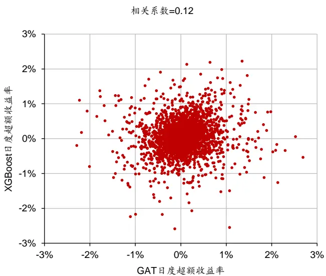
注：回测期 2011-01-04 至 2022-03-31，基准为中证 500 指数资料来源：朝阳永续，Wind，华泰研究

单策略超额收益表现如下图，2011~2016 年 XGBoost 占优，2017 年以来 GAT+residual占优。将两个策略等权配置，每60个交易日进行再平衡。组合策略年化超额收益率为16.60%，信息比率从 2.14 和 2.19（GAT+residual 和 XGBoost，下同）提升至 2.94，超额收益 Calmar比率从 1.84 和 1.26 提升至 2.36，改进效果显著。

图表34： GAT+residual 和 XGBoost 模型结合超额收益表现
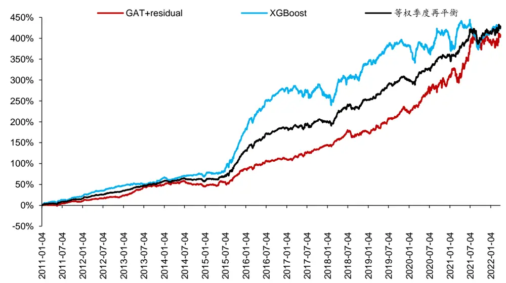
注：回测期 2011-01-04 至 2022-03-31，基准为中证 500 指数资料来源：朝阳永续，Wind，华泰研究

## 总结与讨论

本文从多角度改进图神经网络选股模型，构建周频换仓中证 500 指数增强策略。图神经网络能够学习资产间的相互影响，为预测提供增量信息。核心改进方向是引入残差网络结构，将预测收益拆解为股票间行业板块关联解释的收益、股票间因子关联解释的收益、特异性收益。以 2011 年 1 月至 2022 年 3 月为回测期，分别以加权和等权 mse为损失函数，500指增策略年化超额收益率为 16.17%和 14.19%，信息比率为 2.14 和 2.43，年化双边换手率约 16 倍。图神经网络和 XGBoost 模型日度超额收益率相关度仅为 0.12，等权配置策略年化超额收益率为 16.60%，信息比率提升至 2.94。

图神经网络是近年来深度学习的研究热点，同时受到量化投资领域的广泛关注。在预测资产收益时，传统量化策略大多将各资产视作互不相关的个体，图神经网络能够学习资产间的相互影响，为预测提供增量信息。图卷积、图注意力等经典的图神经网络方法于 2016 至2017 年提出，此后 IBM 日本研究院、Bloomberg、微软亚洲研究院、Amundi 等机构陆续将这些技术应用于量化投资研究。华泰金工团队于 2021 年 2 月 21 日发布研报《图神经网络选股与 Qlib 实践》，证实图注意力网络在日频选股场景下表现优于传统机器学习。

本文是对前序研究的深入，借鉴微软亚研院 Xu 等（2021）设计残差图注意力网络结构，将股票收益拆解成三部分，分别采用不同组件学习：原始因子编码后送入掩码自注意力层，学习股票间板块或行业关联解释的收益；上一层残差送入全局自注意力层，学习股票间因子关联解释的收益；上一层残差代表因子解释自身的特异性收益。股票池为全 A 股日均总市值和成交额排名前 60%个股，选取投资逻辑明确的 42 个基本面和量价因子，以 wmse（根据收益排序加权）为损失函数，构建中证 500 增强策略的年化超额收益率为 16.17%，信息比率为 2.14（回测期 2011-01-04 至 2022-03-31）。

考察网络结构、建图方式、损失函数、网络复杂度对选股模型的影响。引入残差结构有显著改进效果，从股票间板块、因子的关联中挖掘出有效信息。板块建图表现优于行业建图，产业链上下游股票即使分属不同行业，也存在相互影响。对比 mse 和 wmse 损失函数，2011~2013 年两者接近，2014~2016 年 mse 占优，2017 年至今 wmse 占优，随着因子多头端日趋拥挤，wmse 优势逐步体现。对比隐状态为 64/32/16 的三组模型，hidden64＞hidden32＞hidden16，提升网络复杂度有改进效果，但也需要与样本量、特征数相匹配。

深度学习和传统机器学习的方法论具有一定差异，将低相关性的策略结合可以进一步降低风险。GAT+residual(wmse)和 XGBoost 模型日度超额收益率两者相关系数仅为 0.12。将两个策略等权配置，每 60 个交易日进行再平衡，组合策略年化超额收益率为 16.60%，信息比率从 2.14 和 2.19（GAT 和 XGBoost，下同）提升至 2.94，超额收益 Calmar 比率从1.84 和 1.26 提升至 2.36，改进效果显著。

## 本研究存在以下未尽之处：

1. 建图方式较单一。目前仅基于板块建图，采用单头注意力机制学习。未来可以考虑基于股权结构关系、产业链等信息构建邻接矩阵，并采用多头注意力机制学习。

2. 图神经网络可解释性不足。目前仅通过回测表现评估图注意力机制效果。Yuan 等（2020）Explainability in Graph Neural Networks: A Taxonomic Survey 文章中综述了梯度法等多种针对图神经网络的可解释性工具，未来或可借鉴。

3. 图神经网络和 XGBoost 结合方式较简单。目前为等权配置。未来可以考虑采用风险平价、信号加权、Stacking 等方法配置，未来或有优化空间。

4. 因算力有限，未对超参数进行调优，未检验随机数敏感性，有待进一步测试。

## 参考文献

Chang, C. (2020). Supply Chain Momentum Strategies with Graph Neural Networks.

Kipf, T. N. , & Welling, M. . (2016). Semi-supervised classification with graph convolutional networks. arXiv.

Lin, H. , Zhou, D. , Liu, W. , & Bian, J. (2021). Deep Risk Model: A Deep Learning Solution for Mining Latent Risk Factors to Improve Covariance Matrix Estimation. ICAIF.

Matsunaga, D. , Suzumura, T. , & Takahashi, T. . (2019). Exploring graph neural networks for stock market predictions with rolling window analysis. NIPS.

Pacreau, G. , Lezmi, E. , & Xu, J. . (2021). Graph Neural Networks for Asset Management. Working Paper.

Prado, M. L. D. (2018). Advances in financial machine learning. Wiley.

Velikovi, P. , Cucurull, G. , Casanova, A. , Romero, A. , P Liò, & Bengio, Y. . (2017). Graph attention networks. arXiv.

Xu, W. , Liu, W. , Wang, L. , Xia, Y. , Bian, J. , & Yin, J. , et al. (2021). Hist: a graph-based framework for stock trend forecasting via mining concept-oriented shared information. arXiv.

Xu, W. , Liu, W. , Xu, C. , Bian, J. , Yin, J. , & Lin, T. (2021). REST: Relational Event-driven Stock Trend Forecasting. WWW.

Xu, W. , Liu, W. , Bian, J. , Yin, J. , & Liu, T. (2021). Instance-wise Graph-based Framework for Multivariate Time Series Forecasting. arXiv.

Yuan, H. , Yu, H. , Gui, S. , & Ji, S. . (2020). Explainability in graph neural networks: a taxonomic survey. arXiv.

## 风险提示

人工智能挖掘市场规律是对历史的总结，市场规律在未来可能失效。人工智能技术存在过拟合风险。深度学习模型受随机数影响较大，本文未进行随机数敏感性测试。本文测试的选股模型调仓频率较高，假定以 vwap 价格成交，忽略其他交易层面因素影响。

## 附录

GAT+residual 模型的残差结构类似于中性化操作，掩码自注意力+残差结构Ⅰ相当于非线性的板块或行业中性化，全局自注意力+残差结构Ⅱ相当于非线性的因子中性化。如果直接对因子以传统线性方式进行中性化，是否也能提升模型表现？

我们在 nn 模型上测试因子行业中性化的效果，对应下表中的 nn+neutralize(indus)模型。结果表明，中性化并未提升模型表现，回测绩效与原模型接近。由此可以推测，GAT+residual带来的提升并非简单源于中性化操作，而是挖掘出了板块或行业间的关系信息。

图表35： nn+因子中性化模型回测绩效

|  | Calmar 比年化超额收年化跟踪误信息比 |  |  |  |  |  |  |  | 超额收益 | 超额收益相对基准月年化双边换 |  |  |
| --- | --- | --- | --- | --- | --- | --- | --- | --- | --- | --- | --- | --- |
|  | 年化收益率年化波动率 |  | 夏普比率 | 最大回撤 | 率 | 益率 | 差 | 率 |  | 最大回撤 Calmar 比率 | 胜率 | 手率 |
| GAT+residual(indus) | 16.98% | 26.98% | 0.63 | 47.57% | 0.36 | 14.58% | 7.23% | 2.02 | 10.59% | 1.38 | 74.07% | 16.02 |
| nn+neutralize(indus) | 14.67% | 27.25% | 0.54 | 46.52% | 0.32 | 12.36% | 7.67% | 1.61 | 14.09% | 0.88 | 71.11% | 16.80 |
| nn | 15.55% | 27.42% | 0.57 | 46.35% | 0.34 | 13.23% | 8.14% | 1.63 | 15.62% | 0.85 | 70.37% | 16.01 |

注：回测期 2011-01-04 至 2022-03-31，基准为中证 500 指数
资料来源：朝阳永续，Wind，华泰研究

图表36： nn+因子中性化模型超额收益表现
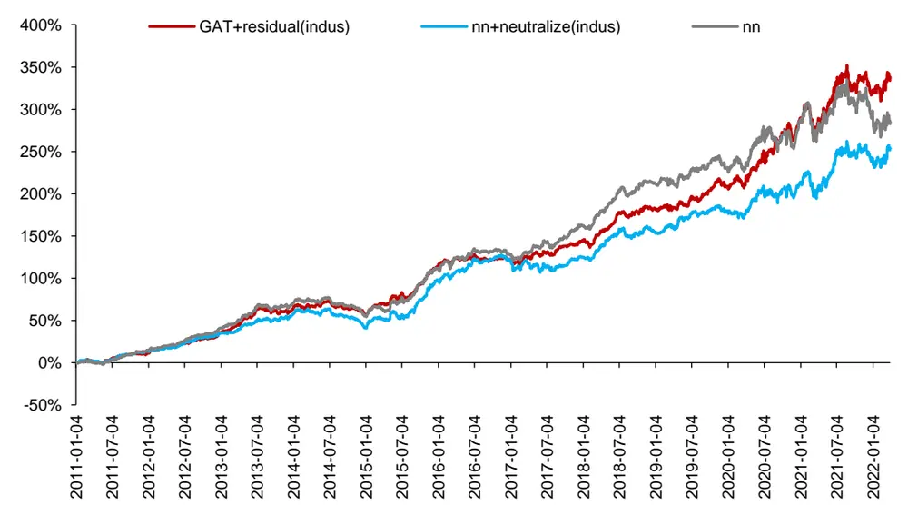
注：回测期 2011-01-04 至 2022-03-31，基准为中证 500 指数资料来源：朝阳永续，Wind，华泰研究

## 免责声明

## 分析师声明

本人，林晓明、李子钰、何康，兹证明本报告所表达的观点准确地反映了分析师对标的证券或发行人的个人意见；彼以往、现在或未来并无就其研究报告所提供的具体建议或所表迖的意见直接或间接收取任何报酬。

## 一般声明及披露

本报告由华泰证券股份有限公司（已具备中国证监会批准的证券投资咨询业务资格，以下简称“本公司”）制作。本报告所载资料是仅供接收人的严格保密资料。本报告仅供本公司及其客户和其关联机构使用。本公司不因接收人收到本报告而视其为客户。

本报告基于本公司认为可靠的、已公开的信息编制，但本公司及其关联机构(以下统称为“华泰”)对该等信息的准确性及完整性不作任何保证。

本报告所载的意见、评估及预测仅反映报告发布当日的观点和判断。在不同时期，华泰可能会发出与本报告所载意见、评估及预测不一致的研究报告。同时，本报告所指的证券或投资标的的价格、价值及投资收入可能会波动。以往表现并不能指引未来，未来回报并不能得到保证，并存在损失本金的可能。华泰不保证本报告所含信息保持在最新状态。华泰对本报告所含信息可在不发出通知的情形下做出修改，投资者应当自行关注相应的更新或修改。

本公司不是 FINRA 的注册会员，其研究分析师亦没有注册为 FINRA 的研究分析师/不具有 FINRA 分析师的注册资格。

华泰力求报告内容客观、公正，但本报告所载的观点、结论和建议仅供参考，不构成购买或出售所述证券的要约或招揽。该等观点、建议并未考虑到个别投资者的具体投资目的、财务状况以及特定需求，在任何时候均不构成对客户私人投资建议。投资者应当充分考虑自身特定状况，并完整理解和使用本报告内容，不应视本报告为做出投资决策的唯一因素。对依据或者使用本报告所造成的一切后果，华泰及作者均不承担任何法律责任。任何形式的分享证券投资收益或者分担证券投资损失的书面或口头承诺均为无效。

除非另行说明，本报告中所引用的关于业绩的数据代表过往表现，过往的业绩表现不应作为日后回报的预示。华泰不承诺也不保证任何预示的回报会得以实现，分析中所做的预测可能是基于相应的假设，任何假设的变化可能会显著影响所预测的回报。

华泰及作者在自身所知情的范围内，与本报告所指的证券或投资标的不存在法律禁止的利害关系。在法律许可的情况下，华泰可能会持有报告中提到的公司所发行的证券头寸并进行交易，为该公司提供投资银行、财务顾问或者金融产品等相关服务或向该公司招揽业务。

华泰的销售人员、交易人员或其他专业人士可能会依据不同假设和标准、采用不同的分析方法而口头或书面发表与本报告意见及建议不一致的市场评论和/或交易观点。华泰没有将此意见及建议向报告所有接收者进行更新的义务。华泰的资产管理部门、自营部门以及其他投资业务部门可能独立做出与本报告中的意见或建议不一致的投资决策。投资者应当考虑到华泰及/或其相关人员可能存在影响本报告观点客观性的潜在利益冲突。投资者请勿将本报告视为投资或其他决定的唯一信赖依据。有关该方面的具体披露请参照本报告尾部。

本报告并非意图发送、发布给在当地法律或监管规则下不允许向其发送、发布的机构或人员，也并非意图发送、发布给因可得到、使用本报告的行为而使华泰违反或受制于当地法律或监管规则的机构或人员。

本报告版权仅为本公司所有。未经本公司书面许可，任何机构或个人不得以翻版、复制、发表、引用或再次分发他人(无论整份或部分)等任何形式侵犯本公司版权。如征得本公司同意进行引用、刊发的，需在允许的范围内使用，并需在使用前获取独立的法律意见，以确定该引用、刊发符合当地适用法规的要求，同时注明出处为“华泰证券研究所”，且不得对本报告进行任何有悖原意的引用、删节和修改。本公司保留追究相关责任的权利。所有本报告中使用的商标、服务标记及标记均为本公司的商标、服务标记及标记。

## 中国香港

本报告由华泰证券股份有限公司制作,在香港由华泰金融控股（香港）有限公司向符合《证券及期货条例》及其附属法律规定的机构投资者和专业投资者的客户进行分发。华泰金融控股（香港）有限公司受香港证券及期货事务监察委员会监管，是华泰国际金融控股有限公司的全资子公司，后者为华泰证券股份有限公司的全资子公司。在香港获得本报告的人员若有任何有关本报告的问题,请与华泰金融控股（香港）有限公司联系。

## 香港-重要监管披露

- 华泰金融控股（香港）有限公司的雇员或其关联人士没有担任本报告中提及的公司或发行人的高级人员。

- 有关重要的披露信息，请参华泰金融控股（香港）有限公司的网页 https://www.htsc.com.hk/stock_disclosure其他信息请参见下方 “美国-重要监管披露”。

## 美国

在美国本报告由华泰证券（美国）有限公司向符合美国监管规定的机构投资者进行发表与分发。华泰证券（美国）有限公司是美国注册经纪商和美国金融业监管局（FINRA）的注册会员。对于其在美国分发的研究报告，华泰证券（美国）有限公司根据《1934 年证券交易法》（修订版）第 15a-6 条规定以及美国证券交易委员会人员解释，对本研究报告内容负责。华泰证券（美国）有限公司联营公司的分析师不具有美国金融监管（FINRA）分析师的注册资格，可能不属于华泰证券（美国）有限公司的关联人员，因此可能不受 FINRA 关于分析师与标的公司沟通、公开露面和所持交易证券的限制。华泰证券（美国）有限公司是华泰国际金融控股有限公司的全资子公司，后者为华泰证券股份有限公司的全资子公司。任何直接从华泰证券（美国）有限公司收到此报告并希望就本报告所述任何证券进行交易的人士，应通过华泰证券（美国）有限公司进行交易。

## 美国-重要监管披露

- 分析师林晓明、李子钰、何康本人及相关人士并不担任本报告所提及的标的证券或发行人的高级人员、董事或顾问。分析师及相关人士与本报告所提及的标的证券或发行人并无任何相关财务利益。本披露中所提及的“相关人士”包括 FINRA 定义下分析师的家庭成员。分析师根据华泰证券的整体收入和盈利能力获得薪酬，包括源自公司投资银行业务的收入。

华泰证券股份有限公司、其子公司和/或其联营公司, 及/或不时会以自身或代理形式向客户出售及购买华泰证券研究所覆盖公司的证券/衍生工具，包括股票及债券（包括衍生品）华泰证券研究所覆盖公司的证券/衍生工具，包括股票及债券（包括衍生品）。

- 华泰证券股份有限公司、其子公司和/或其联营公司, 及/或其高级管理层、董事和雇员可能会持有本报告中所提到的任何证券（或任何相关投资）头寸，并可能不时进行增持或减持该证券（或投资）。因此，投资者应该意识到可能存在利益冲突。

## 评级说明

投资评级基于分析师对报告发布日后 6 至 12个月内行业或公司回报潜力（含此期间的股息回报）相对基准表现的预期（A 股市场基准为沪深 300 指数，香港市场基准为恒生指数，美国市场基准为标普 500 指数），具体如下：

## 行业评级

增持：预计行业股票指数超越基准

中性：预计行业股票指数基本与基准持平

减持：预计行业股票指数明显弱于基准

## 公司评级

买入：预计股价超越基准 15%以上

增持：预计股价超越基准 5%~15%

持有：预计股价相对基准波动在-15%~5%之间

卖出：预计股价弱于基准 15%以上

暂停评级：已暂停评级、目标价及预测，以遵守适用法规及/或公司政策

无评级：股票不在常规研究覆盖范围内。投资者不应期待华泰提供该等证券及/或公司相关的持续或补充信息

## 法律实体披露

中国：华泰证券股份有限公司具有中国证监会核准的“证券投资咨询”业务资格，经营许可证编号为：91320000704041011J香港：华泰金融控股（香港）有限公司具有香港证监会核准的“就证券提供意见”业务资格，经营许可证编号为：AOK809美国：华泰证券（美国）有限公司为美国金融业监管局（FINRA）成员，具有在美国开展经纪交易商业务的资格，经营业务许可编号为：CRD#:298809/SEC#:8-70231

## 华泰证券股份有限公司

南京南京市建邺区江东中路228号华泰证券广场1号楼/邮政编码：210019

电话：86 25 83389999/传真：86 25 83387521电子邮件：ht-rd@htsc.com

## 深圳

深圳市福田区益田路5999号基金大厦10楼/邮政编码：518017电话：86 755 82493932/传真：86 755 82492062电子邮件：ht-rd@htsc.com

## 华泰金融控股（香港）有限公司

香港中环皇后大道中 99号中环中心 58楼 5808-12室
电话：+852-3658-6000/传真：+852-2169-0770
电子邮件：research@htsc.com
http://www.htsc.com.hk

## 华泰证券（美国）有限公司

美国纽约哈德逊城市广场 10号 41楼（纽约 10001）
电话：+212-763-8160/传真：+917-725-9702
电子邮件: Huatai@htsc-us.com
http://www.htsc-us.com

©版权所有2022年华泰证券股份有限公司

北京
北京市西城区太平桥大街丰盛胡同28号太平洋保险大厦A座18层/
邮政编码：100032
电话：86 10 63211166/传真：86 10 63211275
电子邮件：ht-rd@htsc.com
上海
上海市浦东新区东方路18号保利广场E栋23楼/邮政编码：200120
电话：86 21 28972098/传真：86 21 28972068
电子邮件：ht-rd@htsc.com