# 新闻舆情分析的 HAN 网络选股

华泰研究

2022 年 4 月 23 日│中国内地

## 深度研究

## 人工智能 56：使用混合注意力网络对个股的多条舆情进行挖掘

本文通过注意力机制来模仿人类学习新闻舆情时的“顺序内容依赖”和“多样化影响”，构建起对个股同一日多条新闻、不同自然日不同新闻进行文本挖掘从而预测个股短时走势的混合注意力机制网络HAN（Hybrid AttentionNetworks），在沪深 300 股票池内构建的 TopK-Dropout 策略具有较为明显的多头端收益，对训练后模型的注意力系数进行分析表明各模块的注意力机制可以较好地聚焦于个股的重点舆情，与预期较为一致。

## HAN网络设置三组注意力模块：词语注意力、新闻注意力和时序注意力

HAN 网络主要通过三组注意力模块来模仿人类学习新闻舆情的过程。词语注意力是指人类在浏览文字时聚焦于某些关键的词语和语句，抽象出重要的信息，形成对文本的理解；新闻注意力是指人类在阅读多条新闻时由于新闻蕴含的信息差异从而赋予不同的关注度；时序注意力是指人们根据新闻重要性和时效性的日间差异，为不同日期分配关注度。三组注意力都以神经网络权重的形式体现，最终赋予那些对股价影响更大的新闻以更高的权重系数。

## 在沪深 300股票池内进行数据实证，HAN多头端收益明显

以沪深 300 指数成分股为股票池进行数据实证，每条样本设置为个股过去10 个自然日的舆情，每个自然日设置舆情上限为 5 条，预测个股未来一个交易日的涨跌。以样本外预测得到属于上涨类别的概率作为HAN日频因子，并构建 30 只股票等权持有的组合，每天根据 HAN 日频因子值替换 1 只股票，该策略相对沪深 300 等权的年化超额为 15.96%，回测期20190103-20220331，分层回测表明HAN日频因子多头端收益较为明显。

## 设置多组对照试验验证注意力机制的有效性

为验证注意力机制的有效性，采取空白对照的方式对比了四组实验的结果。结果表明注意力机制的有无对最终结果有较大影响，有注意力模块的网络选股效果明显要好于无注意力模块的网络；不同模块注意力机制影响不同，词注意力模块的缺失对选股结果影响相对较小，去除词注意力模块以后年化收益与年化超额收益大约削减2%左右；新闻注意力与时序注意力的缺失对选股结果影响较大。

## 对注意力系数进行可解释性分析，整体与预期相符，但仍存提升空间

分析各个模块的注意力系数，发现词注意力模块中模型会对有实际含义的词赋予较高的注意力，对专有名词赋予较低的注意力；新闻注意力中模型会对与个股直接相关的新闻赋予较高的注意力，对行业/宏观的新闻赋予较低的注意力；时序注意力模块中会对较近期的新闻赋予较高的注意力。整体来看注意力系数的分析具有一定的逻辑，与我们的预期较为符合。

风险提示：通过深度学习模型构建选股策略是历史经验的总结，存在失效的可能。人工智能模型可解释程度较低，使用须谨慎。量化因子的效果与宏观环境和大盘走势密切相关，历史结果不能预测未来，敬请注意。

研究员

SAC No. S0570516010001

林晓明

SFC No. BPY421

linxiaoming@htsc.com

+86-755-82080134

研究员

SAC No. S0570519110003

李子钰

SFC No. BRV743

liziyu@htsc.com

+86-755-23987436

研究员

SAC No. S0570520080004

何康，PhD

SFC No. BRB318

hekang@htsc.com

+86-21-28972039

联系人

陈伟

SAC No. S0570121070169 chenwei018440@htsc.com

## HAN网络选股相对300等权超额净值

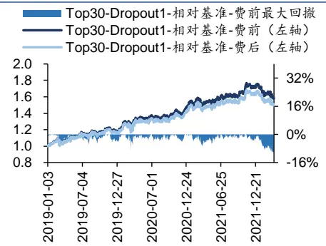
资料来源：Wind,华泰研究

## 研究背景

另类数据是指传统的价量、财务数据以外，能够为投资者提供增量信息的数据，比如新闻舆情、分析师研报、上市公司ESG数据等。与传统数据的最大区别在于，另类数据大多非结构化、来源多样，且数据源的收集较为困难。人工智能方法是对另类数据进行分析的有效手段，华泰金工人工智能系列已经有三篇对另类数据挖掘的相关研究，分别为《人工智能 37：舆情因子和 BERT 情感分类模型》（20201022）、《人工智能 41：基于 BERT 的分析师研报情感因子》（20210118）及《人工智能 51：文本 PEAD 选股策略》（20220107），分别对舆情文本和分析师研报文本进行了不同角度的挖掘，本文是文本挖掘的第四篇报告。

传统对于新闻舆情的挖掘大多停留在单条文本的处理，例如我们在文本 PEAD 选股策略的构建过程当中对每位分析师的业绩点评进行单独处理，而没有考虑到不同分析师的观点可能带来的不同影响以及如何整合不同的观点。这与我们阅读分析师点评的直观经验不相符：大多数情况下我们会阅读不同分析师、不同时间的点评，并认为某些点评是重要的而某些点评相对不那么重要，以此形成对个股的整体理解。

新闻舆情的解读与此类似，某段时间内与同一只个股相关的所有新闻中，并非所有新闻都有关键性影响，例如投资者对于新闻发布的市场当天涨跌幅数据并不那么关注，因为他们从行情软件中早已获知相关信息且该信息只能表征过去，但投资者会格外关注分析师对个股的解读以及后市观点，此类高信噪比的新闻对其接下来的投资行为可能具有决定性影响。

如何描述这种不同重要性程度所带来的对个股的不同影响？或许深度学习中的注意力机制为我们提供了一种可能的解决方案。本文通过注意力机制技术来模仿人类学习新闻舆情时的“顺序内容依赖”和“多样化影响”，构建起对个股同一日多条新闻、不同自然日不同新闻进行文本挖掘从而预测个股短时走势的混合注意力机制网络HAN（HybridAttention Networks），在沪深300股票池内具有较为显著的多头收益。本文将主要围绕以下几个部分展开：

1. HAN网络结构，重点对其中的注意力模块进行解读；

2. HAN应用于A股市场的实证，在沪深300股票池内对HAN日频因子进行有效性分析，尝试构建有效的选股策略；

3. 对不同模块的注意力机制进行空白对照实验；

4. 对不同模块的注意力机制进行解读。

## HAN 混合注意力机制网络原理

## 模型思想

面对纷繁复杂的股票新闻舆情，人们会根据顺序内容依赖（Sequential Context Dependency）和多样化影响（Diverse Influence）两个原则，形成对股票趋势的认知。第一，由于单一新闻蕴含的信息并不充足，人们往往会详尽地阅读近期与某家公司相关的所有新闻，进行更为可信的价格趋势预测，这就是顺序内容依赖。第二，不同新闻甚至不同词语提供的信息不尽相同，造成对股票预测的“多样化影响”。例如，相比于简单陈述过去市场表现，知名分析师对未来趋势的点评会显得更有参考价值；“定增”、“中标”、“减持”、“预增”等高信噪比词语比“的”、“与”、“晚间”等低信噪比词语更能吸引投资者的注意。

Ziniu Hu 等（2017）提出的混合注意力机制网络（Hybrid Attention Networks, HAN）可以模仿人类认知新闻的这两大原则对新闻舆情进行学习。为了模拟多样化影响，HAN在网络结构的前半部分引入了词语和新闻层面的注意力机制，对不同的词语和新闻赋予相应的权重，由网络自动学习权重分配，更有效地根据不同新闻的有效性来提取新闻文本中的信息。为了形成顺序内容依赖，HAN 在网络结构的后半部分运用了双向循环神经网络 BiGRU，适用于处理新闻时间序列数据，并进一步通过时间层面的注意力机制，对每个日期的新闻赋予不同的权重，从而实现对所有数据的整合，最终输出对股票趋势的预测。接下来我们将详细介绍HAN网络的原理及其中蕴含的思想。

## 模型结构

HAN模型的原始完整结构如图表1所示，包括词嵌入（Word Embedding）、词语注意力机制、新闻注意力机制、双向门控循环单元（BiGRU）、时间注意力机制及多层感知机（MLP）。值得一提的是，原论文中只有新闻和时间层次的注意力机制，但我们认为不同词语在新闻解读的过程中重要性也是千差万别的，因此增加了词语层次的注意力机制，如图表2所示。我们将对网络的各个模块进行解读。

图表1： HAN网络结构（原论文版）
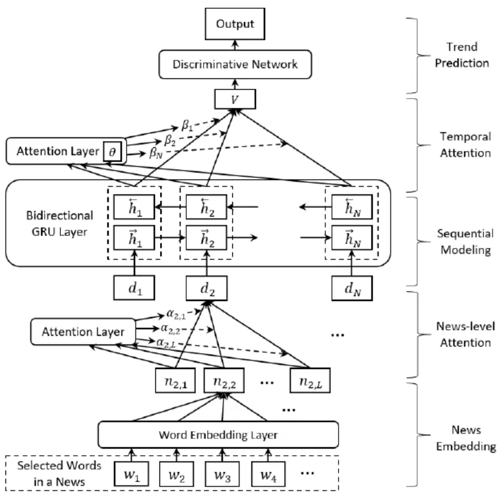
资料来源：Listening to Chaotic Whispers: A Deep Learning Framework for News-oriented Stock Trend Prediction，华泰研究

图表2： HAN网络结构（增加词语注意力机制）
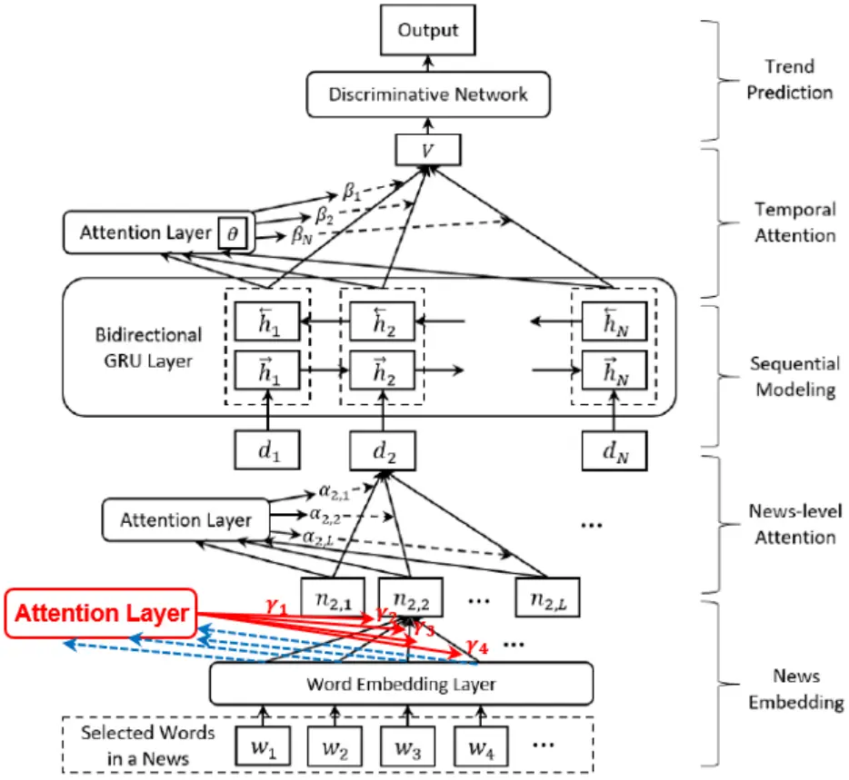
资料来源：Listening to Chaotic Whispers: A Deep Learning Framework for News-oriented Stock Trend Prediction，华泰研究

首先界定本文的任务目标：作为混合注意力机制网络的初探报告，我们借鉴了原论文的做法，以日频股票涨跌作为 HAN 网络的预测标签。对于第 t 个交易日的股票 S，我们想要利用过去N个自然日中与该股票相关的新闻 $[\mathsf{C}_{\mathsf{t}-\mathsf{N}},\mathsf{C}_{\mathsf{t}-\mathsf{N}+1},\hdots,\mathsf{C}_{\mathsf{t}-1}]$ 来预测该股票的t~t+1日收益，该收益可以用日频开盘价或成交均价来衡量。假设每个自然日与股票S有关的新闻有L则，$\mathsf{C}_{\mathsf{t}}=[\mathsf{n}_{\mathsf{t}}\mathsf{1},\mathsf{n}_{\mathsf{t}}\mathsf{2},\ldots,\mathsf{n}_{\mathsf{t}}\mathsf{L}]$ ；每则新闻有M个词语， $\mathsf{n}_{\mathrm{ti}}=[\mathsf{Wi}_{1},\mathsf{Wi}_{2},\ldots,\mathsf{WiM}]$

## 词嵌入

作为非结构化数据，新闻文本需要经过一定的预处理，才能输入神经网络模型。最简单的处理是one-hot编码，向量的每个维度对应一个词语，比如“华泰证券”可以表示为[[1, 0, 0,0], [0, 1, 0, 0], [0, 0, 1, 0], [0, 0, 0, 1]]。这样的不足是，如果想要覆盖所有的词汇，向量的维度将特别大，占据较高存储空间，且难以表征词语之间的相似性。词嵌入是一种更好的向量化方式，它基于文本中的上下文位置进行训练，既能构建出更低维度的向量，也能保留词语之间的相似性。

常见的词嵌入方法有 Skip-gram 和 CBOW，它们的基本思想是：词汇表中的每个词语可以表示为固定维度的向量；有大量的文本作为预训练语料；文本中的每个位置t上，有一个中心词语c和上下文词语o；根据词向量，计算c和o的相似度，得到给定c条件下o出现的概率（Skip-gram），或者给定o条件下c出现的概率（CBOW）；不断调整词向量，使得概率最大化。

下面以 Skip-gram 为例，介绍算法的原理。对于中心词语和上下文词语，各有一套词向量化的方式v 和u，比如中心词语c可表示为向量 $v_{\mathsf{c}},$ ，上下文词语o可表示为向量 $\mathsf{u}_{0},$ 。给定c条件下o出现的概率为

$$
P(o|c)=\frac{exp(u_{o}^{T}v_{c})}{\sum_{w\in V}exp(u_{w}^{T}v_{c})}
$$

预训练文本中的位置t=1, 2, … , T，给定中心词语wt，预测窗口大小为m 的上下文词语出现的概率为

$$
L(\theta)=\prod_{t=1}^{T}\prod_{-m\le j\le m,j\ne0}P(w_{t+j}|w_{t};\theta)
$$

目标函数 J(θ)定义为

$$
J(\theta)=-\frac{1}{T}logL(\theta)=-\frac{1}{T}\sum_{t=1}^{T}\sum_{-m\leq j\leq m,j\neq0}logP(w_{t+j}|w_{t};\theta)
$$

概率 L(θ)最大化，即目标函数 J(θ)最小化。可通过梯度下降法或随机梯度下降法等方法迭代，获得最优的词向量参数。

在实际操作中，我们首先借助 Python 中的 jieba 库，将段落切分成有意义的汉字和词语。比如，“中国铁建财务公司落地首笔国债逆回购”切分后变为“中国|铁建|财务|公司|落地|首笔|国债|逆|回购”；之后，利用北京师范大学和中国人民大学研究者开源的中文预训练词向量 Chinese-Word-Vectors，将切分的每个词语转化为 300 维的向量。

为了检验预训练词向量能否反映词语之间的相似性，我们做了一些测试。首先，根据词向量的余弦值可以计算词语之间的相似度，从而挑选出与测试词语最为接近的词语。比如，输入“复旦大学”，会发现“北京大学”、“南京大学”、“武汉大学”、“上海交通大学”是最为相似的词语，其中“北京大学”和“复旦大学”相似度为 0.63；输入“广州市”，会出现“天河区”、“越秀区”、“番禺区”、“花都区”、“海珠区”等广州市内的县级行政区划，其中“天河区”与“广州市”的相似度可达 0.74。另外，通过主成分分析（PCA）对词向量进行降维处理，可以用二维散点图直观地反映词语之间的关系。比如，“清华大学”、“北京大学”、“浙江大学”在散点图中的位置非常接近，说明这三个词语含义较为相近，类似的还有“北京”、“上海”、“广州”，以及“华泰”、“中信”、“中金”。通过这两个简单的测试，我们发现预训练词向量能够较好地表示词语的实际含义。

图表3： 词向量可视化
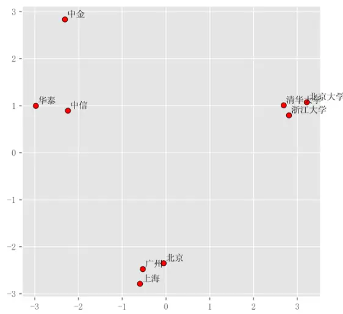
资料来源：华泰研究

## 词语注意力机制

人类在浏览文字时，往往不是按部就班地逐字阅读，而是会聚焦在一些关键的词语和语句上，抽象出重要的信息，形成对文本的理解。借鉴人类的阅读行为，2015 年 DzmitryBahdanau等人对传统的encoder-decoder模型加以改进，提出了注意力机制，有效提升了机器翻译的性能。模型结构如下图所示，其核心在于使用注意力机制构建了语境向量 c：

$$
c_{i}=\sum_{j=1}^{T_{x}}\alpha_{ij}h_{j}
$$

其中， $\mathsf{h}_{\mathsf{j}}$ 表示词语的注解， ${\tt G}_{\mathrm{lj}}$ 表示h 在构建语境向量 ${\tt Ci}$ 中的权重。 ${\tt d}_{\mathrm{ij}}$ 的确定需要两个步骤，首先是根据 decoder 中前一时刻的隐状态 $\tt Si-1$ 及 encoder 中的隐状态 $\mathsf{h}_{\mathsf{j}}.$ ，通过对齐模型 a计算得到 $\Theta_{\mathrm{ij}}^{\mathrm{a}}.$ ，再由 $\mathsf{eij}$ 进行 softmax 处理后得到 ${\tt Gi}_{\mathrm{l}}{\tt c}$ 。对齐模型是指，翻译前后的文本一般不是等长的，所以需要一个模型来对齐文本，原文中运用的对齐模型本质上也是一个前馈神经网络，能够刻画encoder第j 个输入与decoder第i 个输出的匹配程度，并与整个翻译模型中的其他参数联合训练。

$$
\begin{array}{c}{{e_{ij}=a(s_{i-1},h_{j})}}\\{{\alpha_{ij}=\displaystyle\frac{exp(e_{ij})}{\sum_{k=1}^{T_{x}}exp(e_{ik})}}}\end{array}
$$

图表4： 机器翻译模型
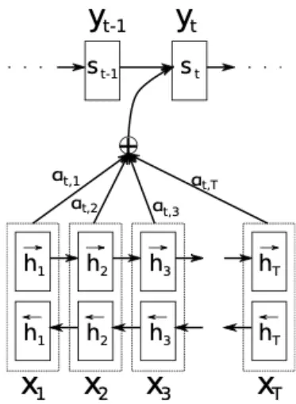
资料来源：Neural Machine Translation by Jointly Learning to Align and Translate，华泰研究

HAN 使用了词语注意力机制，以衡量不同词语在预测股票趋势中的差异化影响。相比于上述机器翻译模型，HAN确定权重的过程更为简单：每个向量化的词语 $\mathsf{W}_{\mathrm{l}}$ ，通过一层神经网络得到注意力值ui，使用softmax 标准化后得到词语的注意力权重 $\gamma_{\mathrm{i}}$ ，最后加权平均得到新闻层面的向量 $\mathsf{n}_{\circ}$ 具体的数学公式如下：

$$
\begin{array}{c}{{u_{i}=sigmoid(W_{w}w_{i}+b_{w})}}\\{{\gamma_{i}=\displaystyle\frac{exp(u_{i})}{\sum_{j=1}^{M}exp(u_{j})}}}\\{{{}}}\\{{{n=\displaystyle\sum_{i=1}^{M}\gamma_{i}w_{i}}}}\end{array}
$$

图表5： 词语注意力机制
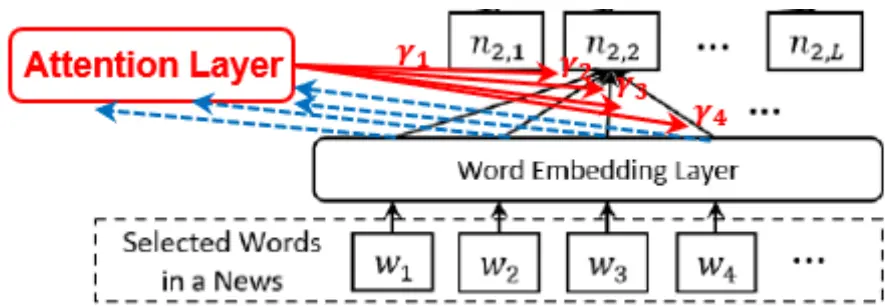
资料来源：华泰研究

## 新闻注意力机制

考虑到不同新闻在预测股票趋势中的差异化影响，HAN 也加入了新闻注意力机制。每则新闻n，通过一层神经网络得到注意力值 ${\mathsf{v}}_{\mathrm{i}},$ ，使用softmax标准化后得到新闻的注意力权重α，最后加权平均得到日期向量d，代表某一天中所有新闻的信息。具体的数学公式如下：

$$
\begin{array}{c}{{v_{i}=sigmoid(W_{n}n_{i}+b_{n})}}\\{{\alpha_{i}=\displaystyle\frac{exp(v_{i})}{\sum_{j=1}^{L}exp(v_{j})}}}\\{{\displaystyle d=\sum_{i=1}^{L}\alpha_{i}n_{i}}}\end{array}
$$

图表6： 新闻注意力机制
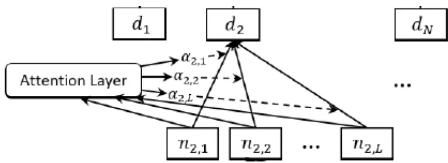
资料来源：华泰研究

## 双向门控循环单元

循环神经网络 RNN 是时间序列建模的经典模型，但标准 RNN 在应用中会遇到梯度消失的问题，难以记忆长期的信息。长短期记忆网络（LSTM）和门控循环单元（GRU）可以利用门控机制来保留长期信息，解决梯度消失问题。其中，GRU 结构更为简单，参数量更少，且能在语音识别等任务中与LSTM表现同样出色。

图表7： 门控循环单元的内部结构
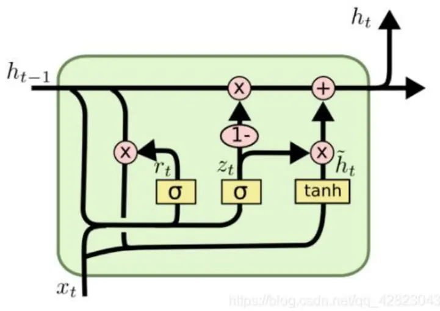
资料来源：华泰研究

GRU 包含一个重置门 rt和一个更新门 zt，重置门有助于捕捉时间序列中的短期关系，而更新门有助于捕捉长期关系：

$$
\begin{array}{r}{r_{t}=sigmoid(W_{r}d_{t}+U_{r}h_{t-1}+b_{r})}\\{z_{t}=sigmoid(W_{z}d_{t}+U_{z}h_{t-1}+b_{z})}\end{array}
$$

其中， $h_{t-1}$ 表示上一期的隐藏状态，ht的计算如下：

$$
h_{t}=(1-z_{t})\times h_{t-1}+z_{t}\times\widetilde{h_{t}}
$$

可以看出，h 是由上一期的隐藏状态 $h_{t-1}$ 和当期的候选隐藏状态 $\widetilde{h_{t}}$ 线性组合而成。候选隐藏状态 $\widetilde{h_{t}}$ 的计算如下：

$$
\widetilde{h_{t}}=tanh(W_{h}d_{t}+r_{t}\times(U_{h}h_{t-1})+b_{h})
$$

为了同时捕捉过去和未来的信息，HAN使用了双向门控循环单元（BiGRU）：

$$
\begin{array}{c}{{\overrightarrow{h_{\imath}}=\overrightarrow{GRU}(d_{i}),i\in[1,L]}}\\{{\overleftarrow{h_{\imath}}=\overleftarrow{GRU}(d_{i}),i\in[L,1]}}\\{{h=[\overrightarrow{h_{\imath}},\overleftarrow{h_{\imath}}]}}\end{array}
$$

值得注意的是，这里的未来信息是相对于过去而言的，比如使用前 10 天的新闻预测第 11天到 12 天股价的涨跌，那么第 5 天的新闻处理是可以利用第 1 天和第 10 天的信息的，在股价预测上并不会造成未来数据的问题。

图表8： 双向门控循环单元
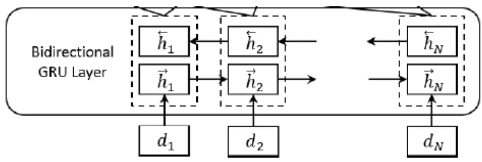
资料来源：华泰研究

## 时间注意力机制

HAN同样使用注意力机制，反映不同时间的新闻在股票预测中的差异化影响。BiGRU输出的每日信息 $\mathsf{h}_{\mathsf{i}},$ ，通过一层神经网络得到注意力值 ${\tt Oi,}$ ，使用softmax 标准化后得到日期的注意力权重 $\beta_{\mathrm{i}}$ ，最后加权平均得到 $\vee_{\circ}$ 具体的数学公式如下：

$$
o_{i}=sigmoid(W_{d}h_{i}+b_{d})
$$

$$
\beta_{i}=\frac{exp(o_{i})}{\sum_{j=1}^{N}exp(o_{j})}
$$

$$
V=\sum_{i=1}^{N}\beta_{i}h_{i}
$$

图表9： 时间注意力机制
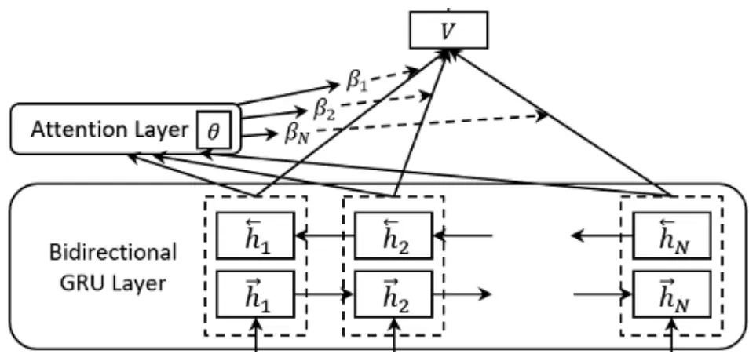
资料来源：华泰研究

## 多层感知机

经过词嵌入、循环神经网络和一系列的注意力机制，输出V可以表征股票S过去N个自然日的新闻舆情信息，接下来再通过判别网络层（三层全连接网络结构），最后输出对未来股票趋势的预测——上涨、下跌或平稳。

图表10： 判别网络结构

资料来源：华泰研究

## HAN 网络选股实证

本章应用 HAN 网络在 A 股市场进行新闻舆情分析选股的实证，主要探究两个目标：HAN网络选股是否有效以及不同模块的注意力机制对最终选股结果的影响。我们将主要分为以下几个部分展开介绍：

1）新闻舆情数据源介绍；

2）实验组与对照组的设计；

3）对比实验结果展示；

4）注意力分析。

总体来说，基于HAN网络的舆情分析选股较为有效，且模型的注意力分配基本与我们预想的较为一致。从结果来看，Word-Level、News-Level 和 Temporal-Level 三个模块的注意力对最终的回测结果都有较大影响，Word-Level 影响较小；News-Level 和 Temporal-Level影响较大。

## 新闻舆情数据源介绍

本文数据实证部分所使用的新闻舆情数据来自于万得底库Financial_News表，该表记录了自2015年以来A股市场每日的新闻舆情数据。这里我们展示该表按OPDATE字段提取出的2017/11/3日的部分舆情数据，对其中的字段进行解读。

图表11： Financial News 样本示例

| PUBLISHDATE OPDATE WINDCODES SOURCE MKTSENTIMENTSTITLE |  |  |  |  |  |  | CONTENT公司讯，中金岭南(000060)27日晚间公告，公司直属凡铅锌矿此前于10月9日实施分阶段流程停产检修。根据年度检修计划安排，公司直属凡口铅锌矿于10月25日停产检修完毕，10月26日全面恢复生产..浪科技讯10月27日下午消息，中国联通发布公告，披露017年前三季度财务与运营数据。报告显示，中国联通前三度营收为 2057.78亿元，其中服务收入1878.80亿元，比去年同期上升4.1%；移动服务收入为1170.38亿元，比去年同期上升 6.7%；EBITDA 为 653.83 亿元，较去年同期上升5.9%；联通公司权益持有者应占盈利为人民币40.54亿元，同比增加155.3%。中国联通2017年前三季度部分财务数据运营数据方面，2017年首三季度，移动出账用户净增1304 万户，达到 2.77 亿户，移动出账用户ARPU 为 48.4元，比2016年全年平均的46.4元明显提升...片概念午后持续活跃，截至发稿，通富微电、雅克科技2股涨停，景嘉微涨超7%，太极实业涨超5%，国科微、上海新阳、长电科技涨逾4%，紫光国芯盈方微、三安光电、北京君正等涨逾3%，全志科技、富瀚微、富满电子、欧比特涨逾2%，国民技术、圣邦股份、士兰微等十余股涨逾1%。中国经济网声明：股市资讯来源于合作媒体及机构，属作者个人观点，仅供投资者参考，并不构成投资建议。投资者据此操作，风险自担。现代农业机械”是柳工集团二次创业要大力发展的重要兴产业之一。柳工农机公司致力于“成为甘蔗生产全程机械化领导品牌”，以“实现甘蔗生产现代工业化系统管理”为使命，围绕全产业链思维、全程机械化思维及产业共享理念，依托柳工集团强大的研发、制造及营销体系，专注于甘蔗生产全程机械化产品研究。自进入现代农业机械产业以来，柳工农机公司取得了喜人的成绩。 |  |
| --- | --- | --- | --- | --- | --- | --- | --- | --- |
| 1 2017/10/27 2017/11/3 中金岭南：中金岭南 |  |  |  | e公司 |  | 中金岭南：直属e |  |  |
| 22:59:48 14:51:32 \|A 股：A 股\|公司：公 |  |  |  |  |  | 凡口铅锌矿恢口 |  |  |
| 司\|000060.SZ：中 |  |  |  |  |  | 复生产 |  |  |
|  |  |  | 金岭南\|ON0201:A |  |  |  |  |  |
|  |  |  | 股\|ON02:公司 |  |  |  |  |  |
| 2 2017/10/27 |  | 2017/11/3 | 中国联通：中国联通 | 新浪 | 600050.SH0401:中 中 | 国联通前三新 |  |  |
| 17:42:34 |  | 14:39:57 | \|A 股：A 股\|公司：公 |  | 国联通正面 | 季度净利40.542 |  |  |
|  |  |  | 司\|600050.SH：中 |  | \|ON11010301:A股正亿 | 元同比上升季 |  |  |
|  |  |  | 国联通\|ON0201:A |  | 面\|ON110103:公司 | 155.3% |  |  |
|  |  |  | 股\|ON02:公司 |  | 正面\|3745:正面情绪 |  |  |  |
|  |  |  |  |  | JON11:市场情绪 |  |  |  |
| 3 | 2017/11/3 | 2017/11/3 | 002156.SZ:通富微中 | 国 | 002156.SZ0401:通 | 芯片概念午后芯 |  |  |
| 13:46:33 13:46:35 |  |  | 电ON0201:A股经 | 济网 | 富微电正面 | 走强通富微电等 |  |  |
|  |  |  | \|300458.SZ:全志科 |  | \|ON11010301:A 股正 | 涨停 |  |  |
|  |  |  | 技\|600703.SH:三安 |  | 面\|ON110103:公司 |  |  |  |
|  |  |  | 光电\|ON02：公司 |  | 正面\|3745:正面情绪 |  |  |  |
|  |  |  |  |  | \|600703.SH0401:三 |  |  |  |
|  |  |  |  |  | 安光电正面\|ON11:市 |  |  |  |
|  |  |  |  |  | 场情绪 |  |  |  |
| 4 2017/11/3 2017/11/3 |  |  | 000528.SZ： 柳工 工 | 程机械 -0 | 00528.SZ0401:柳 | 柳工：二次创业“ |  |  |
| 11:12:50 11:12:51 |  |  | \|ON0201:A 股商 | 贸 | 工正面 | 大力拓展新兴新 |  |  |
|  |  |  | \|ON02:公司 |  | \|ON11010301:A 股正 | 领域 |  |  |
|  |  |  |  |  |  |  |  | 面\|ON110103:公司 |
|  |  |  |  |  |  |  |  | 正面\|3745:正面情绪 |
|  |  |  |  |  |  |  |  | \|882426.WIZM:建筑 |
|  |  |  |  |  |  |  |  | 机械与重型卡车正面 |
|  |  |  |  |  |  |  |  | \|ON110102:行业正 |
|  |  |  |  |  | 面\|ON11:市场情绪 |  |  |  |

资料来源：Wind，华泰研究

PUBLISHDATE字段表示该新闻的发布时间，OPDATE表示该新闻进入万得数据底库的时间。需要注意的是，存在少部分样本可能不是OPDATE当天发布的，例如上表中所展示的第一条样本是 2017/10/27 发布的，而该新闻直到 2017/11/3 才进入万得底库。从回测的角度，2017/10/27 当天我们无法从底库读取到这条新闻，而如果等到 2017/11/3 才使用该样本，则时效性已经不满足，因此这样的样本我们都予以剔除，保证发布日期与入库日期相同。

WINDCODES字段表示该新闻涉及到的股票代码，为新闻与股票应构建联系关系的唯一标识字段；MKTSENTIMENTS表示该条新闻的情感倾向，由万得标注，大部分新闻没有情感倾向标注。TITLE 与 CONTENT 为新闻的标题与摘要，是文本数据的具体来源，本文在对该文本进行处理时将标题与摘要拼接在一起当作每条样本的文本输入。

## 实验组设计：网络结构与参数设置

前文已经从理论层面详细介绍了 HAN 网络的结构，这里不再赘述。本章展示我们在tensorflow中搭建HAN网络时所使用的具体网络层数以及超参数设置。

图表12： 基于 Tensorflow 的 HAN 网络详细结构
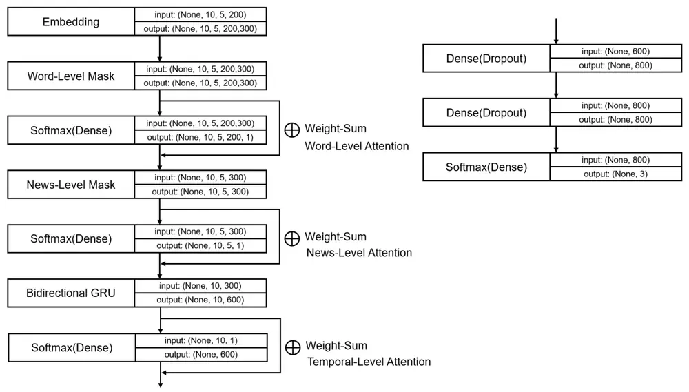
资料来源：华泰研究

本文所使用的Embedding预训练模型为北京师范大学和中国人民大学研究员开源的中文预训练词向量Chinese-Word-Vectors，将切分的每个词语转化为300维的向量，在第一章我们已经针对该预训练模型进行过一些测试，结果表明确实可以较好地衡量词语之间的相似程度，不再赘述。

这里我们展开解释训练迭代次数的选择原因：一般来说在神经网络训练时每个 epoch 里steps的步数是由样本总量和batch_size决定的，尽量保证每轮训练可以将全部样本遍历一次。但我们在实际训练中发现，受限于算力不足，如果每轮训练都将样本全部遍历一次大约需要 6000~8000 个 steps，时间开销较高，因此为兼顾训练时间与模型学习效率，我们将每轮 epoch 的训练迭代次数固定为 200 个 steps。这也就意味着，实际上可能存在部分样本没有参与训练。

图表13： HAN网络超参数

| 项目 | 参数选择 |
| --- | --- |
| 新闻回看天数N | 10 |
| 每天选取的新闻数量L | 5 |
| 每条新闻的长度W | 200 |
| Embedding 维度 V | 300 |
| 双向 GRU 的输出特征维度 | 600 |
| 判别模块全连接层神经元数量 | 800 |
| 单条新闻 PAD 方式 | post |
| 单条新闻 TRUNCATE 方式 | post |
| 训练迭代次数 epoch | 30 |
| 每轮迭代的训练步数 | 200 |
| 网络总可训练参数 | 2208806 |
| Batch Size | 64 |
| 优化器 | AdamWeightDecay Optimizer |
| Learning rate | 1e-4 |
| Early stopping | 是 |

资料来源：华泰研究

关于模型训练中的一些细节再予以单独说明：

1. 如果某个自然日个股新闻数量为零，则当天的 5 条新闻都以 PAD 进行处理；如果当天新闻数量大于5条，则按读取顺序依次取前5条新闻；

2. 本文进行的是分类任务，即根据样本内全部样本的个股日频收益率（按开盘价计算）上下三分之一分位数作为阈值，将样本划分为上涨、震荡、下跌三个类别；使用的损失函数为交叉熵损失函数。

## 对照组设计：删除不同模块注意力的对比试验

HAN 网络的设计围绕着注意力机制展开，因此关于注意力机制有无的对比试验是 HAN 网络研究绕不开的话题。本小节我们将三组注意力模块分别替换为等权求均值，在保证其他网络超参数都一致的条件下进行对比实验，使结果的比较有意义。对比试验如下图所示：

图表14： 删除不同模块注意力的对比试验
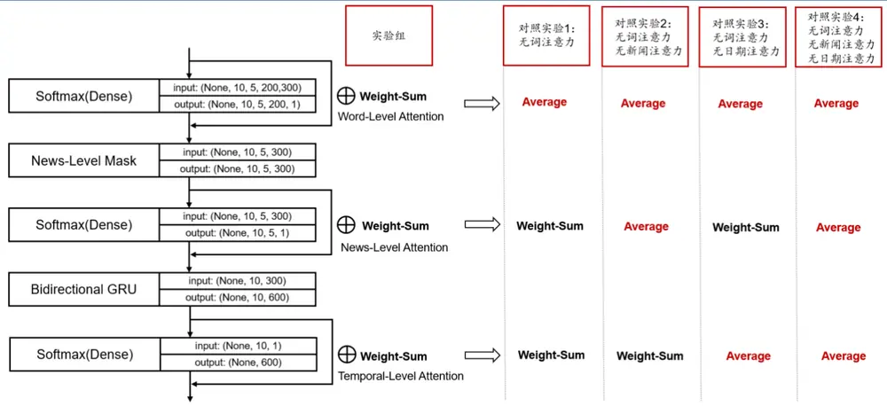
资料来源：华泰研究

上图中标记为 Weight-Sum 的模块表示有注意力机制，标记为 Average 的模块表示注意力机制被替换为向量等权平均：以词注意力机制为例，有注意力机制表示网络结构当中会对一条新闻的 200 个词编码向量（200 是预先设定的每条新闻的最大词语长度）生成对应的注意力权重，并加权求和得到该条新闻的编码向量；无注意力机制则直接将 200 个词向量编码求平均作为该条新闻的编码向量，如下图所示，其余模块对照组类似。

图表15： 词注意力机制的对照
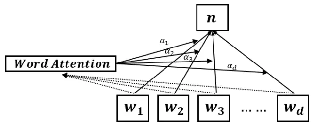
资料来源：华泰研究

$$
\ddagger{\ddagger{\ddagger{\mathstrut}}{\mathcal{H}}:{\mathit{\Omega}}n}=\alpha_{1}w_{1}+\alpha_{2}w_{2}+\alpha_{3}w_{3}+\cdots+\alpha_{d}w_{d}
$$

$$
\mathcal{\bar{\kappa}}\dot{\mathfrak{T}}\dot{\mathfrak{T}}\dot{\mathfrak{T}}:\quad n=\frac{1}{d}\sum_{k=1}^{d}w_{k}
$$

## 对比试验结果展示

本小节我们展示 HAN 网络新闻舆情分析在 A 股的选股实证结果。以沪深 300 为股票池，每条样本的输入特征为T 日过去 N天的新闻序列，每天最多选取的新闻数量为 L 条，每条新闻的长度为 W，每个单词的向量编码长度为 V，关于上述参数的选择可以参考图表 13。每条样本的标签为T+1日开盘价至T+2日开盘价，因此后文数据实证的调仓频率均为日频。

数据实证我们主要分为三个部分展开：

1. TopK-Dropout策略：回测开始的第一个交易日根据前一天 HAN 预测出的股票得分选择排名靠前的K只股票等权持有；接下来的每个交易日根据前一天HAN预测出的得分，剔除组合内得分最低的一只股票，纳入组合外得分最高的一只股票；

2. 因子 IC测试：将HAN预测得分视为日频因子进行因子IC计算；

3. 因子分层回测：将HAN预测得分视为日频因子进行单因子分层回测。

在展示数据测试的结果之前，我们可以首先看一下HAN预测得分在沪深300股票池上的覆盖度，该覆盖度的实际含义为：过去10个自然日中至少有1则新闻的股票数量，可以看到整体覆盖度超过90%，偶尔覆盖度会有降低。

图表16： HAN日频因子在沪深 300股票池覆盖度
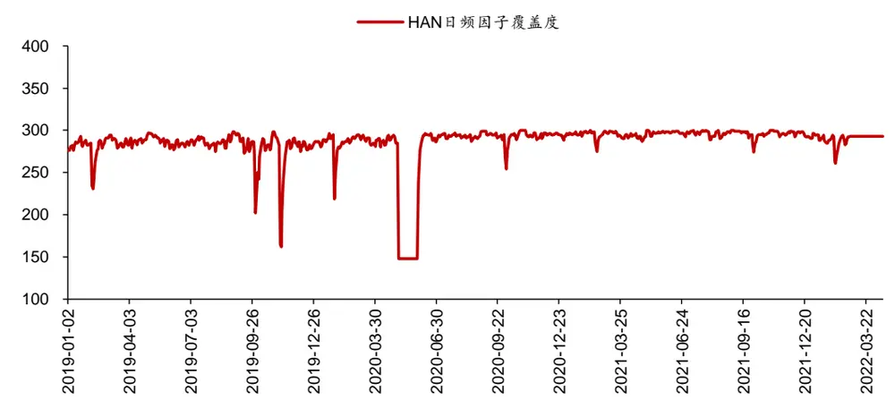
资料来源：Wind，华泰研究

## TopK-Dropout 策略

回测开始的第一个交易日我们根据前一天HAN预测出的股票得分选择排名靠前的K只股票等权持有；从第二个交易日开始每天根据前一天HAN预测出的得分，剔除当前持仓组合内得分最低的一只股票，并以剩余资金买入组合外得分最高的一只股票。每次模型重新训练时持有的K只股票会根据最新沪深300成分股全部重新替换为得分最靠前的K只股票。关于K的选择在对比实验时我们都以30为例进行展示；后文我们对K的选择进行讨论。

由于万得数据底库提供的新闻舆情数据从2015年开始，且初始数据质量不佳，因此第一轮训练我们以 2016-2018 的样本作为样本内，以 2019-2020 作为样本外；第二轮训练以2018-2020 作为样本内，以 2021-2022 作为样本外；两段样本外拼接为我们实际的回测区间：20190102-20220331。每日以开盘价对替换的股票进行调仓，交易手续费取双边千三。

图表17： Top30-Dropout1 策略净值-实验组
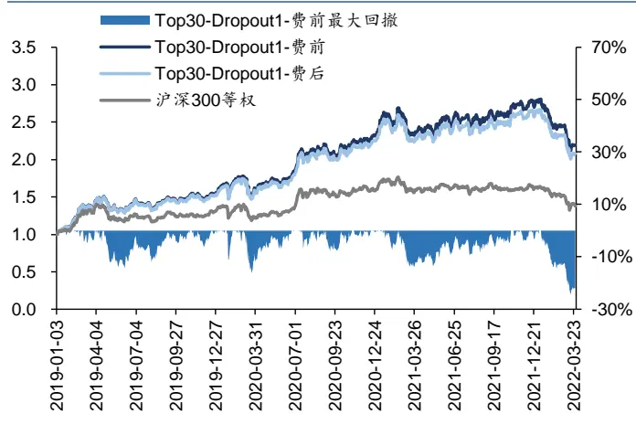
资料来源：Wind，华泰研究，回测期：20190102-20220331

图表18： Top30-Dropout1 相对净值-实验组
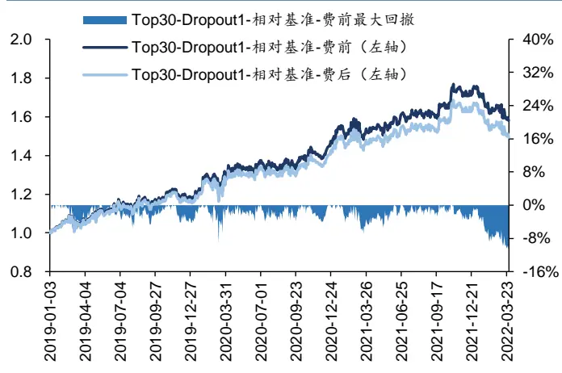
资料来源：Wind，华泰研究，回测期：20190102-20220331

图表19： Top30-Dropout1 策略净值-对照组 1
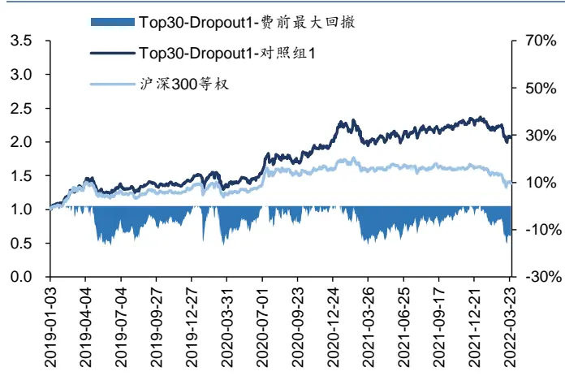
资料来源：Wind，华泰研究，回测期：20190102-20220331

图表20： Top30-Dropout1 相对净值-对照组 1
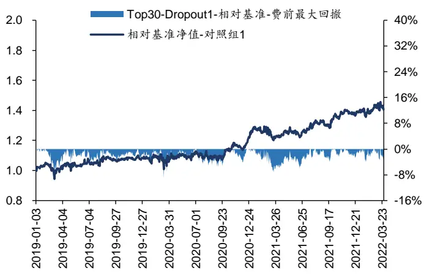
资料来源：Wind，华泰研究，回测期：20190102-20220331

图表21： Top30-Dropout1 策略净值-对照组 2
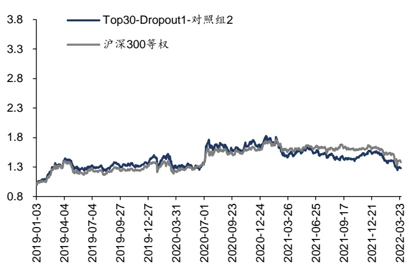
资料来源：Wind，华泰研究，回测期：20190102-20220331

图表22： Top30-Dropout1 相对净值-对照组 2
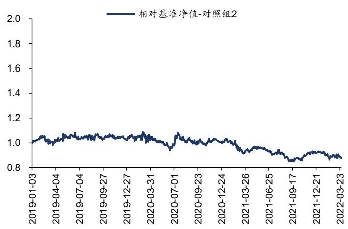
资料来源：Wind，华泰研究，回测期：20190102-20220331

图表23： Top30-Dropout1 策略净值-对照组 3
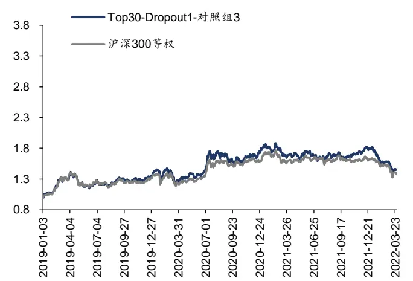
资料来源：Wind，华泰研究，回测期：20190102-20220331

图表24： Top30-Dropout1 相对净值-对照组 3
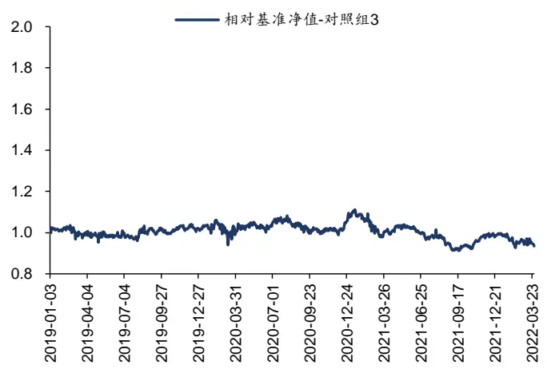
资料来源：Wind，华泰研究，回测期：20190102-20220331

图表25： Top30-Dropout1 策略净值-对照组 4
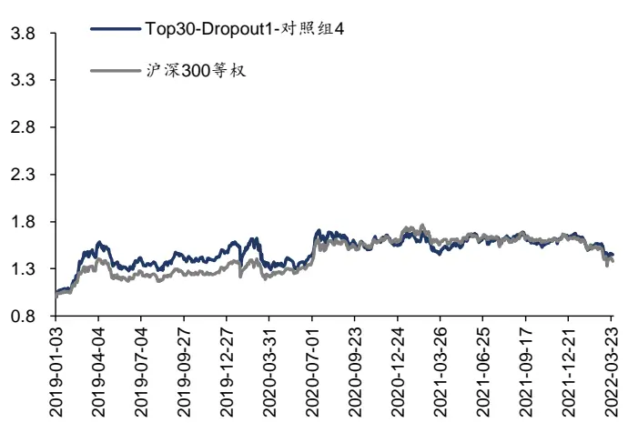
资料来源：Wind，华泰研究，回测期：20190102-20220331

图表26： Top30-Dropout1 相对净值-对照组 4
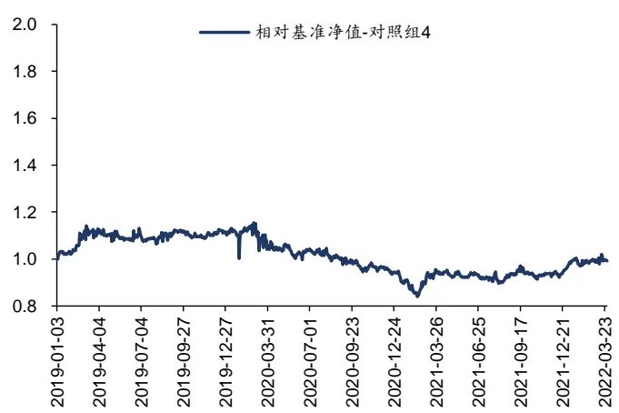
资料来源：Wind，华泰研究，回测期：20190102-20220331

图表27： 各实验组业绩对比

|  | 区间收益 | 年化收益 | 年化波动 | 最大回撤 | 夏普 | 卡玛 | 年化超额 |
| --- | --- | --- | --- | --- | --- | --- | --- |
| 实验组 | 119.20% | 28.73% | 24.73% | 24.45% | 1.16 | 1.18 | 15.96% |
| 对照组1 | 107.61% | 26.50% | 24.92% | 16.90% | 1.06 | 1.57 | 13.95% |
| 对照组2 | 27.93% | 8.25% | 25.02% | 31.96% | 0.33 | 0.26 | -2.47% |
| 对照组3 | 44.80% | 12.65% | 24.45% | 25.95% | 0.52 | 0.49 | 1.49% |
| 对照组4 | 44.96% | 12.69% | 24.92% | 20.43% | 0.51 | 0.62 | 1.53% |
| 沪深 300 等权 | 38.28% | 11.00% | 20.71% | 24.99% | 0.53 | 0.44 |  |

资料来源：Wind，华泰研究，回测期 20190102-20220331

通过以上对比实验，我们可以总结出如下结论：

1. HAN 混合注意力机制网络选股效果较为优秀，TopK-Dropout 策略在回测区间可以获得较为显著的超额回报，区间相对于沪深 300等权指数年化超额 15.96%，超额稳健；且 TopK-Dropout 策略受手续费影响较小；

2. 注意力机制的有无对最终结果有较大影响，有注意力模块的网络选股效果明显要好于无注意力模块的网络，且效果相差较大；

3. 不同模块注意力机制影响不同，词注意力模块的缺失对选股结果影响相对较小，去除词注意力模块以后年化收益与年化超额收益大约削减2%左右；新闻注意力与日期注意力的缺失对选股结果影响较大，去除新闻注意力或日期注意力以后选股结果几乎难以获得超额收益，超额收益在零附近波动。

但值得说明的是，我们在测试的过程中发现某些情形下，即使是三组注意力模块都存在，选股结果也可能由于模型超参数的变化而产生一定范围的波动，因此这里我们展示的对照试验结果未必呈现出了对应网络结构下的最优选股效果，仅是在保证其余超参数都一致的情形下的严格对照。

图表28： Top30-Dropout1 策略日频换手-实验组
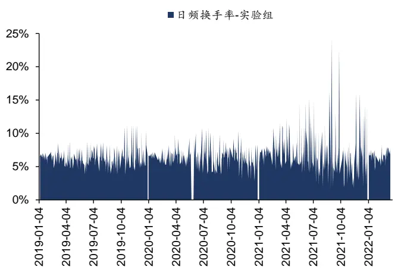
资料来源：Wind，华泰研究

图表29： Top30-Dropout1 策略日频换手-对照组 1
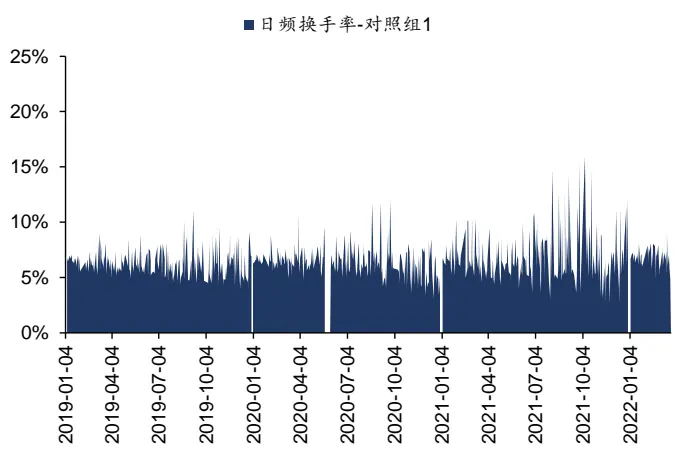
资料来源：Wind，华泰研究

图表30： HAN训练准确率
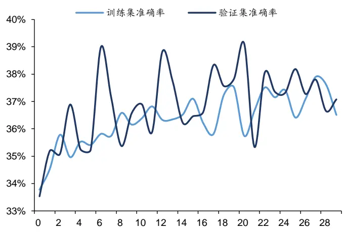
资料来源：Wind，华泰研究

图表31： HAN训练损失函数
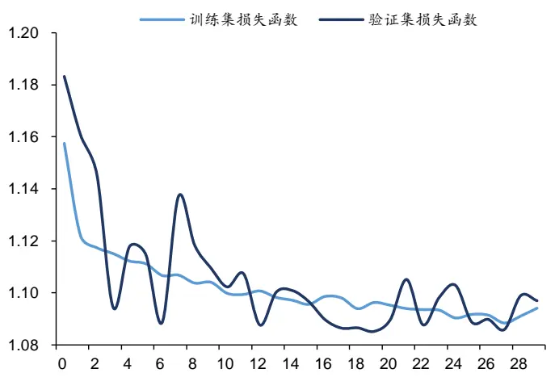
资料来源：Wind，华泰研究

除此以外，实验组对应的换手率及损失函数如上面图表所示。从换手率来看，基于 HAN网络的日频选股策略日频双边换手平均在6.5%左右，年化双边换手16倍。从损失函数来看，HAN 的训练过程可以看到较为典型的损失函数变化形态，图中所展示的结果大约在 20 轮迭代以后进入稳定状态。

本小节最后我们对实验组中不同 K的取值进行了测试，结果如下图所示。从结果来看 K 取20/30/40整体效果差别不大，说明基于HAN日频因子构建的TopK-Dropout策略对股票数量这一参数的敏感性程度较低。K取30时回测收益最高，波动幅度居中，最大回撤最小。

图表32： 实验组不同 K取值回测绝对净值
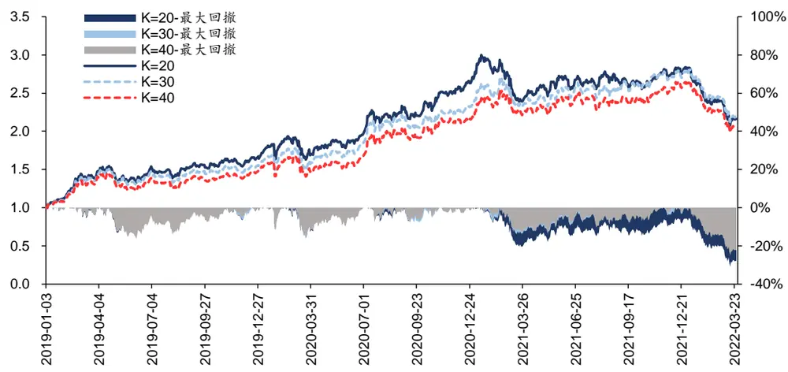
资料来源：Wind，华泰研究

图表33： 实验组不同 K取值回测相对净值
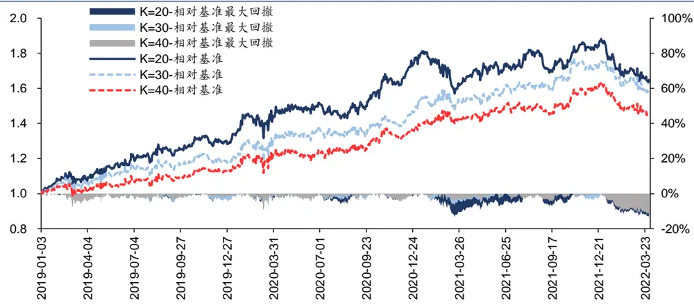
资料来源：Wind，华泰研究

图表34： 实验组不同 K取值的业绩对比

|  | 区间收益 | 年化收益 | 年化波动 | 最大回撤 | 夏普 | 卡玛 | 年化超额 |
| --- | --- | --- | --- | --- | --- | --- | --- |
| K=20 | 116.42% | 28.21% | 25.46% | 30.94% | 1.11 | 0.91 | 13.31% |
| K=30 | 119.20% | 28.73% | 24.73% | 24.45% | 1.16 | 1.18 | 13.68% |
| K=40 | 105.56% | 26.10% | 24.27% | 24.98% | 1.08 | 1.04 | 11.39% |

资料来源：Wind，华泰研究，回测期 20190102-20220331

## HAN日频因子 IC测试

将HAN网络预测所得到的每只股票上涨类别的概率视为日频因子，计算因子的IC值：

$$
IC^{T}=corr(r^{T+1},X^{T})
$$

其中rT+1表示 T+1 日个股收益率（按开盘价计算日频收益率），XT表示第 T 日个股对应的HAN 因子值。在多因子选股体系中，为验证单因子的有效性，上述因子值X我们一般会进行行业市值中性处理；但受限于算力，本文计算的HAN因子限制于沪深300股票池内，因此我们不对因子值进行行业市值中性预处理。

由于 HAN 输出的因子值是属于上涨类别的概率，因此较少出现异常值，可以直接使用 IC对因子有效性进行判断，无需秩相关系数，根据IC对因子进行评价的方法如下：

1) IC值序列均值——因子显著性；

2) IC值序列标准差——因子稳定性；

3) IC_IR（IC值序列均值与标准差的比值）——因子有效性；

4) IC 值序列大于零的占比——因子作用方向是否稳定。

图表35： 沪深 300实验组：日频 IC序列
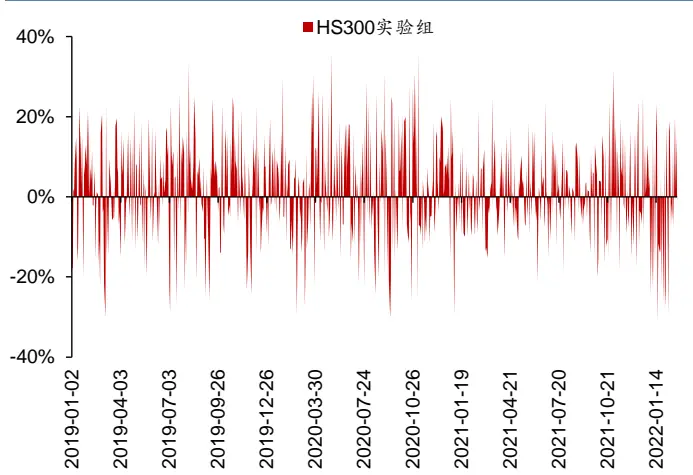
资料来源：Wind，华泰研究

图表36： 沪深 300对照组 1：日频 IC序列
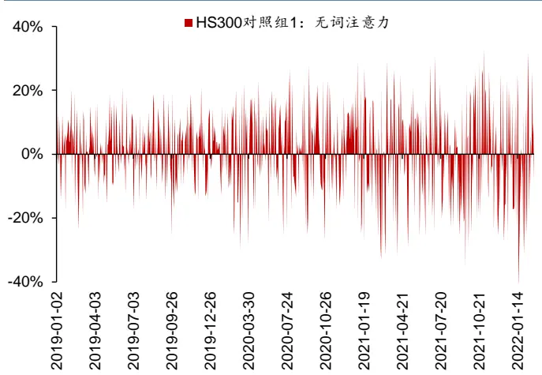
资料来源：Wind，华泰研究

图表37： 各对照组因子值日频累计 IC序列
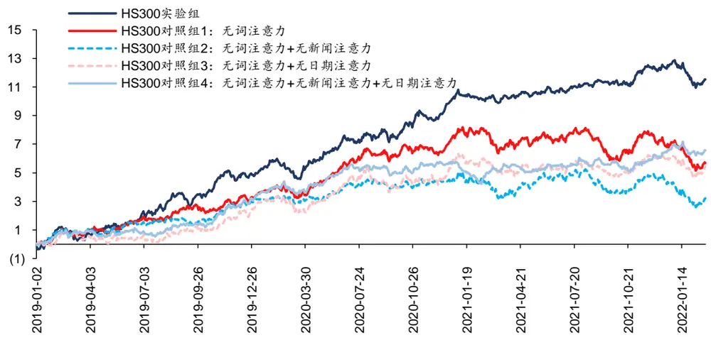
资料来源：Wind，华泰研究

从单因子IC的角度来看实验组的因子有效性也强于其余对照组，词注意力模块的缺失对因子有效性影响较小；新闻注意力与日期注意力模块的缺失对因子有效性影响较大。实验组日频IC均值为0.0154，IC_IR为0.1260；从因子IC的角度来看即使是实验组的有效性也不能称之为很强（一般认为IC_IR大于0.5是有效因子），一方面或许提示我们网络结构的设计仍有改进空间；但另一方面从下文的分析可以看出，HAN 日频因子的 IC_IR 不高可能是由于非多头端的相关性不强造成的。

## HAN日频因子分层测试

分层测试是单因子有效性检验的另一手段，本小节我们对单因子进行有效性检验。分层回测的方式为：按每日的因子值将沪深300股票池内股票分为5层，统计各层日频按开盘价计算的收益率的均值作为该层当日收益，在时间序列上对日频收益进行累乘得到该层的回测净值。

图表38： 沪深 300实验组：分层回测
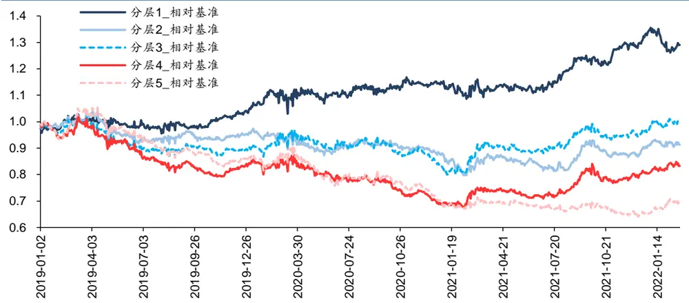
资料来源：Wind，华泰研究

图表39： 沪深 300对照组 1：分层回测
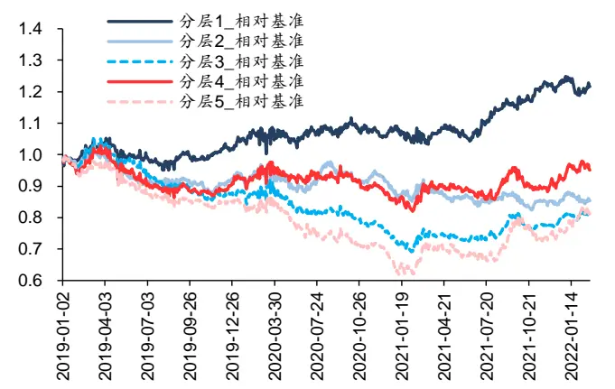
资料来源：Wind，华泰研究

图表40： 沪深 300对照组 2：分层回测
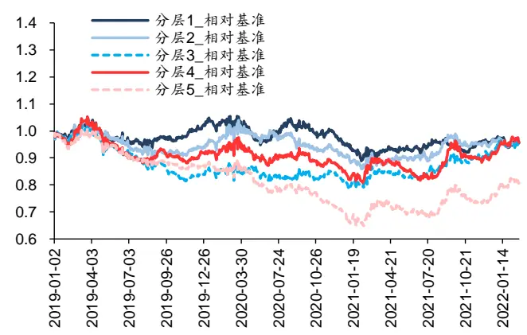
资料来源：Wind，华泰研究

图表41： 沪深 300对照组 3：分层回测
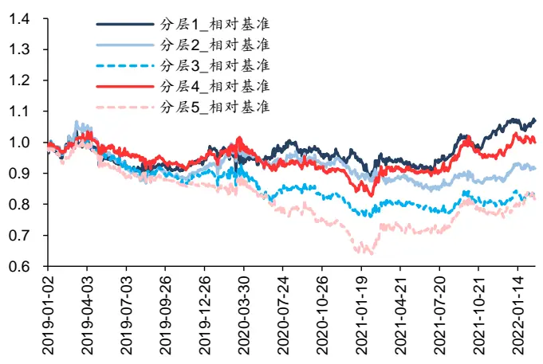
资料来源：Wind，华泰研究

图表42： 沪深 300对照组 4：分层回测
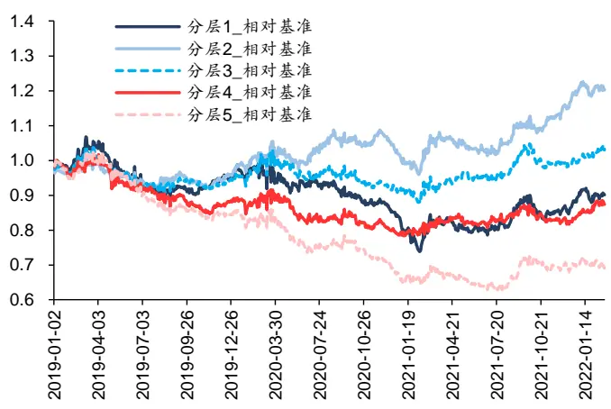
资料来源：Wind，华泰研究

图表43： 各实验组分层绝对收益对比

|  | 分层1 | 分层2 | 分层3 | 分层4 | 分层5 |
| --- | --- | --- | --- | --- | --- |
| 实验组 | 29.08% | -8.68% | -0.73% | -16.66% | -31.00% |
| 对照组1 | 21.59% | -14.63% | -19.19% | -4.87% | -18.77% |
| 对照组2 | -4.39% | -3.98% | -5.23% | -4.13% | -19.34% |
| 对照组3 | 7.02% | -8.42% | -16.75% | -0.09% | -18.19% |
| 对照组 4 | -9.92% | 20.31% | 3.12% | -12.70% | -30.93% |

资料来源：Wind，华泰研究

从分层回测的结果可以看到，HAN 实验组日频因子的多头侧收益非常明显，长期来看相对基准净值较为稳健；后面四层虽然单调性不如第一层，但整体可以看出区分度。结合上一小节对IC值的分析，我们不难发现HAN实验组日频因子的IC值不高主要是来自于非多头端的分层效果比较一般：回顾 HAN 日频因子的构建流程，我们是对每只股票过去 10 个自然日的新闻舆情进行分析，实际上模型比较关注的应当是新闻舆情覆盖度比较高的那些股票，而尾部的股票可能过去10个自然日相关的舆情数量很少，导致模型难以区分开，也属合理，这并不妨碍我们利用HAN日频因子的多头端收益贡献。

## 注意力分析

最后我们对模型训练当中的注意力实际结果进行分析展示，对注意力系数进行分析可以更为直观地看到HAN模型对文本是如何进行思考的，帮助我们了解当前网络结构设计的不合理之处，便于后续改进。

## 词注意力系数

下图展示词注意力模块部分样本的注意力系数，颜色越靠近红色表示网络赋予的注意力越高，颜色越靠近深蓝色表示网络赋予的注意力越低；我们选取了三组样本进行展示，如下图所示，其中UNK（Unknown Word）表示超出词域的词语：

图表44： 示例样本 1：词注意力展示

| UNK | 股份公司 | 点评 | 报告 | 业绩 | 符合 | 预期 | 高效 | 晶硅 | 投资 | 加速 | 新 | 事件 | 月 | 日 | 公司 | 发布 | 年 | 业绩 | 公告 | 显示 | 年 | 归属于 | 母公司 | 所有者 |
| --- | --- | --- | --- | --- | --- | --- | --- | --- | --- | --- | --- | --- | --- | --- | --- | --- | --- | --- | --- | --- | --- | --- | --- | --- |
| 的 | 净利润 | 为 | 亿元 | 较 | 上年 | 同期 | 增 | 营业 | 收入 | 为 | 亿元 | 较 | 上年 | 同期 | 增 | 基本 | 每股 | 收益 | UNK | 较 | 上年 | 同期 | 增 | 点评 |
| 新能源 | 业务 | UNK | 效应 | 助力 | 转型 | 升级 | 年 | 和o | 年 | UNK | 股份 | UNK | 太阳能 | 和o | UNK | 新能源 | 相继 | 注入 | 股份公司 | UNK | 股份 | 作为 | 国内 | 先进 |
| 的 | 太阳能 | 级 | 多晶硅 | 生产 | 企业 | 截止 | 报告 | 期末 | 已 | 拥有 | 万吨 | 年 | 的 | 多晶硅 | 产能 | 规模 | 居 | 全国 | 前列 | 同时 | 基于 | 多晶硅 | 还原 | 效率 |

资料来源：Wind，华泰研究

图表45： 示例样本 2：词注意力展示

| 信托公司 | 曲线 | 上市 | 有望 | 再 | 扩容 | 继 | 年底 | 信托业 | 迎来 | UNK | 曲线 | 上市 | 高峰 | 后 | 近期 | 这份 | 名单 | 又 | 增添 了 |  | UNK | 候选 成员 | 分别 |
| --- | --- | --- | --- | --- | --- | --- | --- | --- | --- | --- | --- | --- | --- | --- | --- | --- | --- | --- | --- | --- | --- | --- | --- |
| 是 | 渤海 | 信托 | 和 | 华宝 | 信托 | 其中 | 华宝 | 信托 | 是 | 时隔 | UNK | 后 | UNK | 闯关 | 业内人士 | 认为 | 信托公司 | 曲线上市 | 有利于 | 拓宽 | 融资 | 渠道 | 进一步 |
| 打破 | 净 | 资本 | 约束 | 对 | 公司 | 抗 | 风险 | 能力 | 及 | 品牌 | 建设 | 都 | 是 | 利好 | 后期 | 关键 | 也 | 在于如何 | 进行 | 资源 | UNK | 与 | 投资 |
| 两 | 公司 | 曲线 | 上市 | 方案 | UNK | 水面 | 日前 | UNK | 信托公司 | 的 | 曲线 | 上市 | 方案 | 同时 | 曝光 | UNK | 在 | 年初启动 | 重大 | 资产重组 | 而 | 停牌 | 的 |

资料来源：Wind，华泰研究

图表46： 示例样本 3：词注意力展示

| 传媒 | 互联网 | 行业 | 研究 | 周报 | 电视剧 | 板块 | 有望 | 回暖 | 看好 | 精品 | 剧 | 龙头 | 继续 | 看好 | 游戏 | 板块 | 高 | 景气 | 重点 | 关注 | 新 | 游戏 | 上线 后 |  |
| --- | --- | --- | --- | --- | --- | --- | --- | --- | --- | --- | --- | --- | --- | --- | --- | --- | --- | --- | --- | --- | --- | --- | --- | --- |
| 流水 | 我们 | 认为 | 从 | 半年报 | 来看 | 业绩 | 最好 | 确定性 | 最强 | 的 | 仍 | 是 | 游戏 | 板块 | 其中 | 三七 | UNK | 上半年 | 净利润 | 增速 | 为 | 完美 | 世界 | 上半年 |
| 净利润 | 增速 | 为 | 略高于 | 预期 | 预计 | 前 | 三季度 | 归母 | 净利润 | 增速 | UNK | 网络 | 归母 | 净利润 | 增速 | 略低于 | 预期 | 预计 | 前 | 三季度 | 归母 | 净利润 | 增速 | 净利润 |
| 恺 | 英 | 网络 | 上半年 | 归母 | 净利润增 | 速 | 为 | 预计 | 前 | 三季度 | 归母 | 净利润 | 增速 | 我们 | 认为 | 游戏 | 行业 | 已 | 进入 | UNK | 发展 | 阶段 | 龙头企业 | 制作 |

资料来源：Wind，华泰研究

## 从上述示例样本我们可以总结出以下三点结论：

1. 模型对于那些具有实际意义的词语会赋予较高的权重，例如示例1中的“符合”、“加速”、“助力”等词语、示例 2 中的“打破”、“利好”等词语及示例3 中的“看好”、“认为”等词语，而这些词语确实对判断对应文本的情感倾向有较重要的作用；

2. 模型对于专有名词赋予的注意力较低，例如示例1中的“多晶硅”、示例2中的“华宝”等词语，而这些词语单个出现时也确实对情感判断影响不大；

3. 最后我们需要指出模型的缺点：可以看到示例3中模型给予“景气”、“回暖”等词较低的权重，而“回暖”上文为“有望”，“景气”上文为“高”，按常规经验应当会给予这样一些词较高的权重，我们推测可能的原因在于 Embedding 词向量编码时我们并未使用金融语料库，而是较为泛用的中文语料库，可能导致模型对“景气”、“回暖”等金融领域的专用词语关注度不足。

## 新闻注意力系数

下图展示新闻注意力模块部分样本的注意力系数，由于我们设置的每日最大新闻数量为 5条，因此下图中展示的新闻注意力分配将在至多 5 条新闻上，不足 5 条的代表当天的新闻数量不足；颜色越靠近红色表示网络赋予的注意力越高，颜色越靠近深蓝色表示网络赋予的注意力越低

图表47： 示例样本 1：新闻注意力展示（东方航空：20160503日相关新闻）

| 新闻来源 | 发布时间 | 新闻内容（节选） | 新闻类型 |
| --- | --- | --- | --- |
|  | 元器件交易网 2016/5/36:32 | 东航客机惊险复飞降落后发现机翼被刺穿。前天上午，东航一架从成都飞康定的飞机由于机场天气情 况恶劣，接地后复飞返航，幸无人员伤亡. | 事件描述 |
| 证券日报 | 2016/5/3 8:20 | 4只“互联网+”主题基金抢发行。4月21日，国务院办公厅最新发布关于深入实施“互联网+流通” 行动计划的意见，提出加快推动流通转型升级. | 政策描述/事件描述 |
| 搜狐 | 2016/5/3 2:20 | 东航客机水平翼被插穿后返航机场进近灯光受损。飞机落地后被发现水平翼后插入了一根黄色管子， 疑似灯柱康定机场6个进近灯光受损.. | 事件描述 |
| 华讯财经 | 2016/5/3 16:50 | 明日最具爆发力六大牛股名单。明日最具爆发力六大牛股名单 | 观点推荐 |

资料来源：Wind，华泰研究

图表48： 示例样本 2：新闻注意力展示（三七互娱：20171221日相关新闻）

| 新闻来源 | 发布时间 | 新闻内容（节选） | 新闻类型 |
| --- | --- | --- | --- |
| 中国网 |  | 2017/12/2111:05 传媒与互联网行业2018年投资策略:优质内容引导下的“消费升级红利”。行业观点移动互联网流量红 利耗尽:2011-16年是移动互联网高速发展的时期,每个月都有上千万新用户涌入 | 观点推荐 |
| 证券时报网 | 2017/12/21 8:57 | 盘前有料券商解读中央经济工作会议重点关注6方面。重要的消息有哪些.. | 政策解读 |
| 中泰证券 | 2017/12/21 7:46 | 游戏行业专题之五：用户存量时代，产品精品化，买量常态化，强者愈强，游戏行业用户进入存量时代。 存量时代行业增量来自于ARPU提升，因此更加追求精品化游戏，且28效应明显 | 分析师点评 |
| 中国网 | 2017/12/21 15:14 | 传媒与互联网行业2018年投资策略:草木蔓发,春山可望。政策收紧，红利趋尽。人口红利的结束标志着 | 观点推荐 |
| 金融界 |  | 行业野蛮生长的阶段逐渐步入尾声、行业壁垒正在形成、流量增长不再是核心诉求 2017/12/2116:18 中国游戏规模破2000亿:腾讯网易占67%份额。12月19日，中国音数协游戏工委（GPC）、伽马数据 (CNG）、国际数据公司（IDC）联合发布了《2017年中国游戏产业报告》... | 现状描述 |

资料来源：Wind，华泰研究

图表49： 示例样本 3：新闻注意力展示（中联重科：20180508 日相关新闻）

| 新闻来源 | 发布时间 | 新闻内容（节选） | 新闻类型 |
| --- | --- | --- | --- |
| 中财网 | 2018/5/8 10:15 | 4月挖掘机销量点评：下游需求强劲销量维持高增长。行业近况根据中国工程机械工业协会挖掘机械分 会行业统计数据. | 数据点评 |
| 中财网 | 2018/5/8 9:06 | 机械行业动态：工程机械销售亮眼 高端制造加速发展。行业近况上周中金机械组合上涨3.64%，同期沪 深300指数上涨1.87%。本周我们继续看好工业自动化、 工程机械、半导体等板块投资标的.. | 数据点评/市场点评 |
| 慧聪网 | 2018/5/8 17:13 | 中联重科\|你所不知的中国服务工程师十年真实非洲经历. | 个股描述 |
| 慧聪网 | 2018/5/8 10:11 | 中联重科塔机进击南美 获阿根廷媒体盛赞。近日，正在建设世界上最大全预制混凝土结构大桥 —阿根 廷瓦力安特大桥的2台D1500-63中联重科塔机成为了当地热门话题. | 个股描述 |
| 中国机经网 | 2018/5/8 16:10 | 2017中国农机化发展白皮书（七） 新思路新举措新进展。烘干机持续高速增长得益于国家土地适 度规模化经营的发展、农机购置补贴政策的拉动和谷物干燥技术的逐步成熟... | 政策描述 |

资料来源：Wind，华泰研究

从上述结果我们可以总结出以下几点结论：

1. 模型对突发事件的描述性新闻赋予的注意力比较高，例如示例样本1中的航空股突发事件的两条相关新闻注意力高于其余两条，可能是由于这类新闻具有较高的时效性；

2. 模型对个股描述类的新闻会赋予更高的注意力，例如示例样本3中对第个股的描述新闻更为关注，而点评类的新闻如第一和第二条样本，可能由于是对相关行业进行的点评，与个股的即时性联系并不是特别强，因此赋予了较低的权重。

## 时序注意力系数

最后我们展示时序注意力系数。下图为2016-2018训练期的样本内模型在过去10个自然日时序水平上的注意力取值，我们随机采样了500条样本分别对这10个自然日的注意力系数计算均值。T-10表示前10个自然日，T-1表示前1个自然日，从结果来看时间越近的新闻平均赋予的注意力水平越高；时间越远的新闻平均赋予的注意力水平越低，与我们预期的较为符合。

图表50： 时序注意力展示
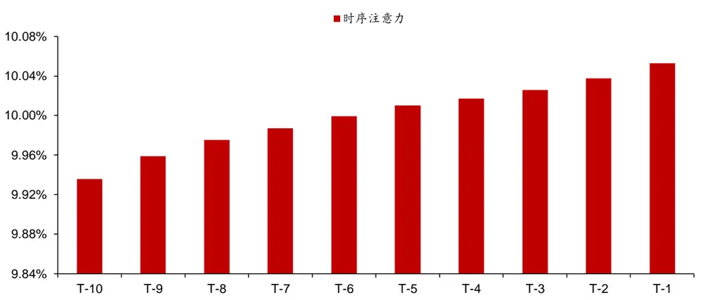
资料来源：Wind，华泰研究

但值得说明的是，可以看到前10个自然日的注意力系数没有体现出很大的差别，只在10%的水平上下浮动，说明模型对过去10个自然日的注意力分配也并没有特别集中在更近的自然日，也许意味着模型网络的设计仍然存在进一步提升的空间。

## 总结与展望

本文通过深度学习中的注意力机制技术来模仿人类学习新闻舆情时的“顺序内容依赖”和“多样化影响”，构建起对个股同一日多条新闻、不同自然日不同新闻进行文本挖掘从而预测个股短时走势的HAN网络，近年来在沪深300成分股内具有较为优秀的选股效果。HAN网络主要依赖三组注意力模块对人类学习新闻舆情的过程进行模拟：

1. 词语注意力机制：词语注意力机制模仿人类在阅读单条新闻时对不同单词赋予不同关注度的过程，人类在阅读单条新闻时大脑会将注意力集中于那些含有关键信息的词语，通过对少数关键词的重点理解来解读整句话的含义。词语注意力机制希望模仿这种学习方式，给予关键词的编码向量更高的权重，从而更为准确地解读整条新闻的正负向情感。

2. 新闻注意力机制：新闻注意力机制模仿人类在阅读多条新闻时对不同新闻赋予不同关注度的过程，不同的新闻蕴含的信息量不同，例如分析师点评类的舆情比市场表现描述类的舆情具有更高的未来信息含量，因此前者可能更容易引起我们的注意。新闻注意力机制希望模仿这种学习方式，给予信息含量更高的新闻以更高的权重，从而在众多新闻中抓住个股未来表现的关键影响因素。

3. 时序注意力机制：时序注意力机制模仿人类在阅读不同自然日的新闻时赋予不同关注度的过程，例如距离时间越远的新闻有效性越弱，距离时间越近的新闻有效性越强，或者某个自然日的新闻重要性程度远超其余自然日，此时人们更可能将注意力集中于近期发生的关键新闻舆情上。时序注意力机制希望模仿这种学习方式，给予不同日期的舆情以不同的权重，重点关注那些具有关键影响日期的新闻。

我们对上述三组注意力机制进行了数据实证，结果表明在三组注意力机制都存在的情况下，HAN网络确实可以构建出较为优秀的选股策略，HAN日频因子多头端收益较为明显。同时为验证注意力机制的必要性，我们也进行了三组对照试验，结果表明词注意力机制的缺失对最终结果影响较小，新闻注意力和时序注意力的缺失对最终结果影响较大。

图表51： 对照试验结果汇总

|  | 实验组 | 对照组1 | 对照组2 | 对照组3 | 对照组4 |
| --- | --- | --- | --- | --- | --- |
| 词注意力模块 | √ | X | X | X | X |
| 新闻注意力模块 | √ | √ | X | √ | X |
| 时序注意力模块 | √ | √ | √ | X | X |
| 是否有效 | 是 | 是 | 否 | 否 | 否 |

资料来源：华泰研究

最后我们对三组注意力机制模块的具体实验数据结果进行了讨论，总体而言三个注意力模块中注意力确实在一定程度上呈现出了我们所预期的效果，例如词注意力模块对于信噪比更高的词会给予更高的权重，新闻注意力模块对于个股直接相关的新闻会给予更高的权重，时序注意力模块对于更近的新闻会给予更高的权重。但也值得注意的是，部分注意力仍然存在不合预期之处，例如时序注意力分配在过去10天的注意力从绝对值来看并没有太大的差别，或提示我们HAN网络仍有提升空间。

本文作为注意力机制应用于新闻舆情分析的初探报告，仍然存在许多不足之处，例如：

1. 本文参考的原论文在训练HAN时表明自步学习（Self-paced Learning）可以有效地提升模型的表现。自步学习的大体思想是模仿人类在学习过程中由易到难的学习过程，在学习的初始阶段跳过较难学习的样本，关注较容易学习的样本；在学习一段时间后再引入较难学习的样本，本文对此暂未实现；

2. 原论文的发表时间为2017年，彼时NLP中的经典模型BERT还未被提出，因此HAN网络的第一层除了Word2Vec模型以外并未进行更复杂的编码，虽然本文第一层增加了词注意力模块，但提升效果仍然有限，因此可以考虑尝试在新闻注意力模块之前增加BERT模块对输入词向量再进行编码；

3. 虽然我们证明了 HAN 多头端确实具有明显正向收益，但目前仍未构建起投资机构可操作的多头策略，因此如何将多头alpha利用起来仍然值得深入挖掘。

## 参考文献

Hu, Ziniu, et al. "Listening to chaotic whispers: A deep learning framework for news-oriented stock trend prediction." Proceedings of the eleventh ACM international conference on web search and data mining. 2018.

## 风险提示

通过深度学习模型构建选股策略是历史经验的总结，存在失效的可能。人工智能模型可解释程度较低，使用须谨慎。量化因子的效果与宏观环境和大盘走势密切相关，历史结果不能预测未来，敬请注意。

## 免责声明

## 分析师声明

本人，林晓明、李子钰、何康，兹证明本报告所表达的观点准确地反映了分析师对标的证券或发行人的个人意见；彼以往、现在或未来并无就其研究报告所提供的具体建议或所表迖的意见直接或间接收取任何报酬。

## 一般声明及披露

本报告由华泰证券股份有限公司（已具备中国证监会批准的证券投资咨询业务资格，以下简称“本公司”）制作。本报告所载资料是仅供接收人的严格保密资料。本报告仅供本公司及其客户和其关联机构使用。本公司不因接收人收到本报告而视其为客户。

本报告基于本公司认为可靠的、已公开的信息编制，但本公司及其关联机构(以下统称为“华泰”)对该等信息的准确性及完整性不作任何保证。

本报告所载的意见、评估及预测仅反映报告发布当日的观点和判断。在不同时期，华泰可能会发出与本报告所载意见、评估及预测不一致的研究报告。同时，本报告所指的证券或投资标的的价格、价值及投资收入可能会波动。以往表现并不能指引未来，未来回报并不能得到保证，并存在损失本金的可能。华泰不保证本报告所含信息保持在最新状态。华泰对本报告所含信息可在不发出通知的情形下做出修改，投资者应当自行关注相应的更新或修改。

本公司不是 FINRA 的注册会员，其研究分析师亦没有注册为 FINRA 的研究分析师/不具有 FINRA 分析师的注册资格。

华泰力求报告内容客观、公正，但本报告所载的观点、结论和建议仅供参考，不构成购买或出售所述证券的要约或招揽。该等观点、建议并未考虑到个别投资者的具体投资目的、财务状况以及特定需求，在任何时候均不构成对客户私人投资建议。投资者应当充分考虑自身特定状况，并完整理解和使用本报告内容，不应视本报告为做出投资决策的唯一因素。对依据或者使用本报告所造成的一切后果，华泰及作者均不承担任何法律责任。任何形式的分享证券投资收益或者分担证券投资损失的书面或口头承诺均为无效。

除非另行说明，本报告中所引用的关于业绩的数据代表过往表现，过往的业绩表现不应作为日后回报的预示。华泰不承诺也不保证任何预示的回报会得以实现，分析中所做的预测可能是基于相应的假设，任何假设的变化可能会显著影响所预测的回报。

华泰及作者在自身所知情的范围内，与本报告所指的证券或投资标的不存在法律禁止的利害关系。在法律许可的情况下，华泰可能会持有报告中提到的公司所发行的证券头寸并进行交易，为该公司提供投资银行、财务顾问或者金融产品等相关服务或向该公司招揽业务。

华泰的销售人员、交易人员或其他专业人士可能会依据不同假设和标准、采用不同的分析方法而口头或书面发表与本报告意见及建议不一致的市场评论和/或交易观点。华泰没有将此意见及建议向报告所有接收者进行更新的义务。华泰的资产管理部门、自营部门以及其他投资业务部门可能独立做出与本报告中的意见或建议不一致的投资决策。投资者应当考虑到华泰及/或其相关人员可能存在影响本报告观点客观性的潜在利益冲突。投资者请勿将本报告视为投资或其他决定的唯一信赖依据。有关该方面的具体披露请参照本报告尾部。

本报告并非意图发送、发布给在当地法律或监管规则下不允许向其发送、发布的机构或人员，也并非意图发送、发布给因可得到、使用本报告的行为而使华泰违反或受制于当地法律或监管规则的机构或人员。

本报告版权仅为本公司所有。未经本公司书面许可，任何机构或个人不得以翻版、复制、发表、引用或再次分发他人(无论整份或部分)等任何形式侵犯本公司版权。如征得本公司同意进行引用、刊发的，需在允许的范围内使用，并需在使用前获取独立的法律意见，以确定该引用、刊发符合当地适用法规的要求，同时注明出处为“华泰证券研究所”，且不得对本报告进行任何有悖原意的引用、删节和修改。本公司保留追究相关责任的权利。所有本报告中使用的商标、服务标记及标记均为本公司的商标、服务标记及标记。

## 中国香港

本报告由华泰证券股份有限公司制作,在香港由华泰金融控股（香港）有限公司向符合《证券及期货条例》及其附属法律规定的机构投资者和专业投资者的客户进行分发。华泰金融控股（香港）有限公司受香港证券及期货事务监察委员会监管，是华泰国际金融控股有限公司的全资子公司，后者为华泰证券股份有限公司的全资子公司。在香港获得本报告的人员若有任何有关本报告的问题,请与华泰金融控股（香港）有限公司联系。

## 香港-重要监管披露

- 华泰金融控股（香港）有限公司的雇员或其关联人士没有担任本报告中提及的公司或发行人的高级人员。

- 有关重要的披露信息，请参华泰金融控股（香港）有限公司的网页 https://www.htsc.com.hk/stock_disclosure其他信息请参见下方 “美国-重要监管披露”。

## 美国

在美国本报告由华泰证券（美国）有限公司向符合美国监管规定的机构投资者进行发表与分发。华泰证券（美国）有限公司是美国注册经纪商和美国金融业监管局（FINRA）的注册会员。对于其在美国分发的研究报告，华泰证券（美国）有限公司根据《1934年证券交易法》（修订版）第15a-6条规定以及美国证券交易委员会人员解释，对本研究报告内容负责。华泰证券（美国）有限公司联营公司的分析师不具有美国金融监管（FINRA）分析师的注册资格，可能不属于华泰证券（美国）有限公司的关联人员，因此可能不受 FINRA 关于分析师与标的公司沟通、公开露面和所持交易证券的限制。华泰证券（美国）有限公司是华泰国际金融控股有限公司的全资子公司，后者为华泰证券股份有限公司的全资子公司。任何直接从华泰证券（美国）有限公司收到此报告并希望就本报告所述任何证券进行交易的人士，应通过华泰证券（美国）有限公司进行交易。

## 美国-重要监管披露

- 分析师林晓明、李子钰、何康本人及相关人士并不担任本报告所提及的标的证券或发行人的高级人员、董事或顾问。分析师及相关人士与本报告所提及的标的证券或发行人并无任何相关财务利益。本披露中所提及的“相关人士”包括 FINRA 定义下分析师的家庭成员。分析师根据华泰证券的整体收入和盈利能力获得薪酬，包括源自公司投资银行业务的收入。

华泰证券股份有限公司、其子公司和/或其联营公司, 及/或不时会以自身或代理形式向客户出售及购买华泰证券研究所覆盖公司的证券/衍生工具，包括股票及债券（包括衍生品）华泰证券研究所覆盖公司的证券/衍生工具，包括股票及债券（包括衍生品）。

- 华泰证券股份有限公司、其子公司和/或其联营公司, 及/或其高级管理层、董事和雇员可能会持有本报告中所提到的任何证券（或任何相关投资）头寸，并可能不时进行增持或减持该证券（或投资）。因此，投资者应该意识到可能存在利益冲突。

## 评级说明

投资评级基于分析师对报告发布日后6至12个月内行业或公司回报潜力（含此期间的股息回报）相对基准表现的预期（A股市场基准为沪深300指数，香港市场基准为恒生指数，美国市场基准为标普500指数），具体如下：

## 行业评级

增持：预计行业股票指数超越基准

中性：预计行业股票指数基本与基准持平

减持：预计行业股票指数明显弱于基准

## 公司评级

买入：预计股价超越基准15%以上

增持：预计股价超越基准5%~15%

持有：预计股价相对基准波动在-15%~5%之间

卖出：预计股价弱于基准15%以上

暂停评级：已暂停评级、目标价及预测，以遵守适用法规及/或公司政策

无评级：股票不在常规研究覆盖范围内。投资者不应期待华泰提供该等证券及/或公司相关的持续或补充信息

## 法律实体披露

中国：华泰证券股份有限公司具有中国证监会核准的“证券投资咨询”业务资格，经营许可证编号为：91320000704041011J香港：华泰金融控股（香港）有限公司具有香港证监会核准的“就证券提供意见”业务资格，经营许可证编号为：AOK809美国：华泰证券（美国）有限公司为美国金融业监管局（FINRA）成员，具有在美国开展经纪交易商业务的资格，经营业务许可编号为：CRD#:298809/SEC#:8-70231

## 华泰证券股份有限公司

南京南京市建邺区江东中路228号华泰证券广场1号楼/邮政编码：210019

电话：86 25 83389999/传真：86 25 83387521电子邮件：ht-rd@htsc.com

## 深圳

深圳市福田区益田路5999号基金大厦10楼/邮政编码：518017电话：86 755 82493932/传真：86 755 82492062电子邮件：ht-rd@htsc.com

## 华泰金融控股（香港）有限公司

香港中环皇后大道中 99号中环中心 58楼 5808-12室
电话：+852-3658-6000/传真：+852-2169-0770
电子邮件：research@htsc.com
http://www.htsc.com.hk

## 华泰证券（美国）有限公司

美国纽约哈德逊城市广场 10号 41楼（纽约 10001）
电话：+212-763-8160/传真：+917-725-9702
电子邮件: Huatai@htsc-us.com
http://www.htsc-us.com

©版权所有2022年华泰证券股份有限公司

北京
北京市西城区太平桥大街丰盛胡同28号太平洋保险大厦A座18层/
邮政编码：100032
电话：86 10 63211166/传真：86 10 63211275
电子邮件：ht-rd@htsc.com
上海
上海市浦东新区东方路18号保利广场E栋23楼/邮政编码：200120
电话：86 21 28972098/传真：86 21 28972068
电子邮件：ht-rd@htsc.com