# 人工智能 57：文本 FADT 选股

华泰研究

2022 年 7 月 01 日│中国内地

## 深度研究

## 对分析师盈利预测调整研报文本进行挖掘，构建FADT选股组合

本文对分析师盈利预测及评级调整中的文本数据进行挖掘，构建的forecast_adj_txt 因子表现较为优秀：从因子视角来看，该因子分十层回测严格单调，多头端收益显著，且与传统的forecast_adj 因子相关性低；从主动选股的视角来看，以该因子多头第一层为基础池进行进一步股票精选，构建出的主动量化 FADT 选股组合在回测期 20090123～20220630 内年化收益达到 44.13%，夏普比率 1.48，年化双边换手 16 倍。参数稳健性测试结果表明，模型受各组参数影响较小，文本因子过拟合程度较低。

盈利预测调整是“催化剂”事件的间接表达，使用机器学习识别相关文本本文的初衷是找出对股价有重要影响的“催化剂”事件，通过分析师盈利预测及评级调整等间接的方式可以对“催化剂”事件进行分析，因此我们的目标转换为对盈利预测调整的文本进行识别，找出分析师情感偏正向的调整事件。在构建模型时，输入特征为分析师研报文本转换成的词频矩阵，预测标签为研报发布前后两天对应个股的超额收益。在样本外根据模型预测得分构建 forecast_adj_txt 因子。测试结果表明该因子多头收益显著，分层效果严格单调，同时与传统方法构建的forecast_adj 因子相关性低。

对各参数进行稳健性测试，模型大概率不存在过度调参导致的过拟合问题对模型中的各组参数进行稳健性测试，主要讨论了以下参数：训练使用的非线性模型、研报标题和摘要采用的词数、样本内窗口长度、样本标签的时间区间、标签分类数量等。测试结果表明，文本因子对各组参数均不敏感，不同参数下 forecast_adj_txt 因子均具有较为稳定的分层效果，多头端绝对年化收益在 21%～23%之间，模型大概率不存在人为过度调参导致的过拟合问题，参数敏感性较低，这可能提示我们分析师盈利预测调整研报文本的情感识别是信噪比较高且规律不易随时间改变的场景。

基础池的构建方式多样，在基础池内进行股票精选构建FADT选股组合基础池的构建方式较为多样，可以直接以 forecast_adj_txt 多头第一层为基础池；也可以将 forecast_adj_txt 多头第一层与 SUE_txt 多头第一层或forecast_adj 多头第一层进行合并，使得基础池收益没有明显削弱的同时股票数量有所扩充。进一步考虑基本面的 ROE、净利润、营业收入、经营活动现金流、市值以及技术面的反转、换手、尾盘成交占比等因子，我们对基础池进行精选，构建每期25只股票等权持有的FADT选股组合。该组合在回测期 20090123～20220630 内年化收益 44.13%，夏普比率 1.48，年化双边换手16倍，相对中证500年化超额约30%。

## 关于策略容量与模型层面的更多思考

最后我们对策略容量以及模型改进进行更多思考。策略容量层面，我们提出三点可能提升策略容量的思路：1）降低调仓频率，增加调仓时间，数据实证表明月频调仓降低为双月频调仓，FADT组合仍然表现优秀；2）增加FADT组合的持股数量；3）修改回测框架，提高“资金使用效率”，严格预设固定频率调仓的方案未必是最优解。模型层面，词语组合的逻辑解释尚存瑕疵，或许可以尝试NLP中更高阶的模型来使得文本的识别逻辑更为自洽。

风险提示：通过机器学习模型构建选股策略是历史经验的总结，存在失效的可能。人工智能模型可解释程度较低，使用须谨慎。量化因子的效果与宏观环境和大盘走势密切相关，历史结果不能预测未来，敬请注意。

研究员

SAC No. S0570516010001

林晓明

linxiaoming@htsc.com

SFC No. BPY421

+(86) 755 8208 0134

研究员

SAC No. S0570519110003

李子钰

liziyu@htsc.com

SFC No. BRV743

+(86) 755 2398 7436

研究员

SAC No. S0570520080004

何康，PhD

hekang@htsc.com

SFC No. BRB318

+(86) 21 2897 2039

联系人

陈伟

SAC No. S0570121070169 chenwei018440@htsc.com

+(86) 21 2897 2228

## FADT 选股组合回测净值

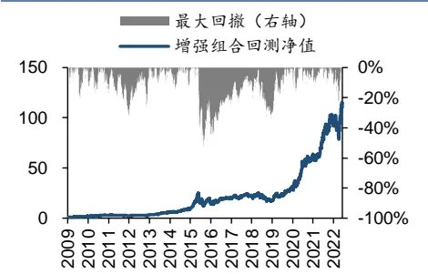
资料来源：Wind，朝阳永续，华泰研究，回测期：20090123-20220630

## FADT 选股组合相对中证500超额净值

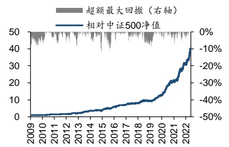
资料来源：Wind，朝阳永续，华泰研究，回测期：20090123-20220630

## 研究导读

Mark Minervini 在《股票魔法师》中提出过一个观点：明星股票的背后大多数都存在着某种“催化剂”事件，这些催化剂事件可能是连续靓眼的业绩、某款热销产品的出现，可能是新合同的签订，甚至可能是新CEO的任职。这些“催化剂”事件使得那些默默无闻、不为人知的股票开始得到机构投资者的关注，从而有机会向明星股票迈进。本文受上述观点启发，希望能找到对股价正向影响较大的“催化剂”，那么从量化的视角来看，有没有某种方法能对类似的“催化剂”事件进行监测？分析师盈利预测及评级调整或是一条可能的路径。

本文是华泰金工人工智能系列文本挖掘主题的第五篇报告，我们继续将视野聚焦于分析师研报文本，探究分析师盈利预测及评级调整这一场景下研报文本中的情感识别。本文的研究动机如上所述，我们希望找到对股价具有正向影响的“催化剂”事件，并将其数量化。由于“催化剂”没有某种特定的模式，不同的行业“催化剂”事件可能千差万别，如果从遍历的思路出发很难对所有事件进行系统监测。

现在我们尝试从另一个角度出发进行研究。由于行业研究员对个股进行覆盖，对个股的跟踪及时性更强，当个股出现了影响较大的“催化剂”事件以后，分析师大多会及时撰写点评报告，并可能对盈利预测及评级进行调整。这为我们提供了监测“催化剂”事件的间接思路，因此我们可以将目标转换为对分析师盈利预测及评级调整的研报文本进行情感识别，进而找出正向催化较强的个股。

参考前期报告《人工智能51：文本PEAD选股策略》（20220107）中对分析师业绩点评研报文本的研究思路，我们对盈利预测及评级调整的研报文本使用类似的方法论进行挖掘。令研报文本用词的词频矩阵作为输入特征，分析师研报发布前后两天的个股超额收益作为预测标签，使用机器学习模型进行交叉验证训练，在样本外根据模型预测得分构建forecast_adj_txt 因子，该因子十层严格单调，多头端收益显著，且与传统的 forecast_adj因子相关性较低。

在正文中我们花了比较多的篇幅来讨论整个模型构建过程中的参数敏感性问题，核心结论是：文本因子的构建基本不存在人为过度调参导致的过拟合问题，模型参数稳健性较高，分析师盈利预测调整研报文本的情感识别是信噪比较低且规律不易随时间改变的场景。在测试过程中，我们主要讨论了以下参数：训练使用的非线性模型、研报标题和摘要采用的词数、样本内窗口长度、样本标签的时间区间、标签分类数量等。

图表1： FADT 选股组合回测净值
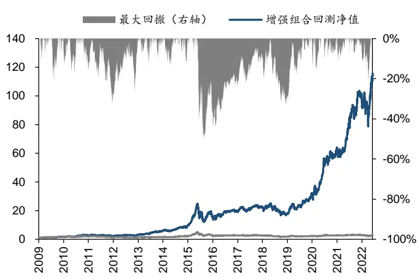
资料来源：Wind，朝阳永续，华泰研究，回测期：20090123-20220630

图表2： FADT 选股组合相对中证 500超额净值
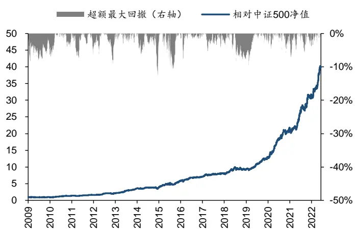
资料来源：Wind，朝阳永续，华泰研究，回测期：20090123-20220630

我们从主动量化选股的角度出发对forecast_adj_txt多头第一层的股票池进行精选。首先考虑股票的ROE、净利润、营业收入、经营活动现金流等考察一只股票首先会关注的基本面指标；其次我们考虑股票的反转、换手、尾盘成交占比等技术因素；最后我们还将市值风格纳入考虑。上述要素以因子的形式呈现，每月末将上述因子进行方向调整后等权合成，根据合成得分选择排名靠前的 25 只股票等权持有，组合回测期 20090123-20220630 内年化收益44.13%，夏普比率1.48，年化双边换手约16倍。我们将该组合命名为FADT组合（Forecast-Adjust-Text Portfolio）。

最后我们对策略容量以及模型改进进行更多思考。策略容量层面，我们提出三点可能提升策略容量的思路：1）降低调仓频率，增加调仓时间，数据实证表明月频调仓降低为双月频调仓，FADT 组合仍然表现优秀；2）增加 FADT 组合的持股数量；3）修改回测框架，提高“资金使用效率”，严格预设固定频率调仓的方案未必是最优解。模型层面，词语组合的逻辑解释尚存瑕疵，或许可以尝试NLP中更高阶的模型来使得文本的识别逻辑更为自洽。

## 分析师研报文本挖掘框架

## 研究回顾

在前期报告《人工智能51：文本PEAD选股策略》（20220107）中，我们提出使用卖方分析师研报文本对 PEAD 效应进行刻画，挖掘业绩被分析师看好的股票。在该模型中，我们使用业绩点评研报的标题和摘要文本作为特征，使用个股发布业绩前后的超额收益作为标签，判断分析师对上市公司业绩的情感倾向；构建出的SUE.txt因子分层效果较为优秀，且多头端收益明显。模型构建示意图如下所示。

图表3： SUE.txt因子构建示意图
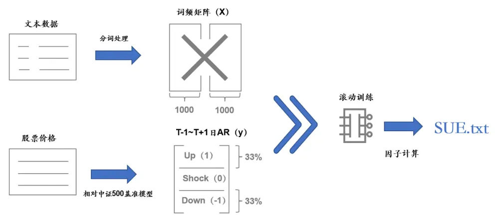
资料来源：华泰研究

现在我们面临如下几个问题，这些问题将会是本文讨论的重点：

1. 前文构建的模型逻辑上或存瑕疵，为什么用个股公告发布的 T-1~T+1 日作为标签？为什么不是研报发布日T-1~T+1作为标签？标签时间区间的长短有没有区别？

2. 前文中我们构建的SUE.txt因子仅考虑业绩预告这一种公告类型，受限于发布业绩预告的股票数量太少，因子覆盖度较低，一方面难以融入多因子选股体系，另一方面主动增强可操作的空间有限；虽然我们可以很自然地将SUE.txt的计算方法推广到三种公告类型上（推广的因子回测结果如下图表所示），但模型逻辑或多或少仍受质疑。

3. 分析师研报的应用有没有某种更自然的方法？能否不止局限于PEAD这一种场景？

图表4： 三类公告合并的 SUE.txt 因子分 10 层回测净值（回测期：20090123-20220630）
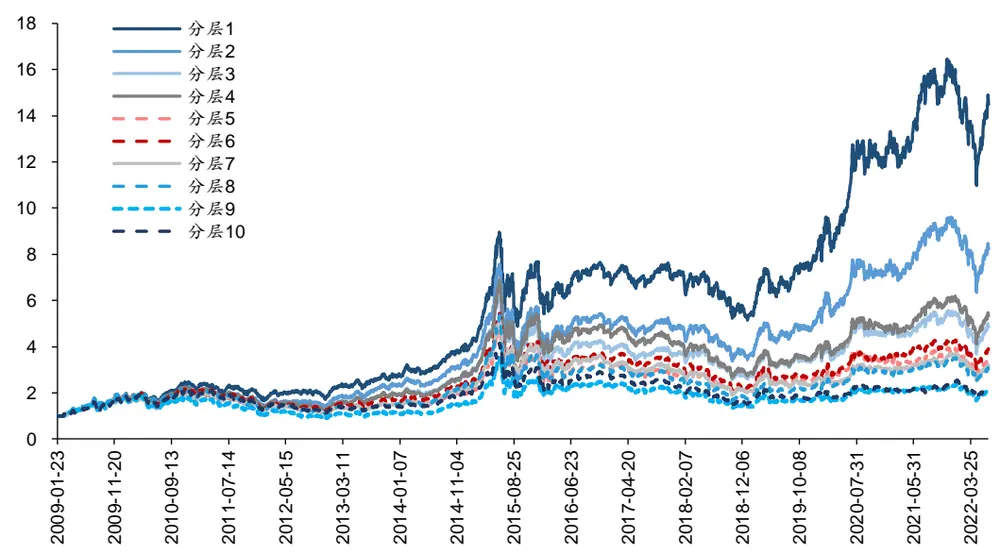
资料来源：Wind，朝阳永续，华泰研究

图表5： 三类公告合并的 SUE.txt 因子分 10 层回测超额净值（基准中证 500，回测期：20090123-20220630）
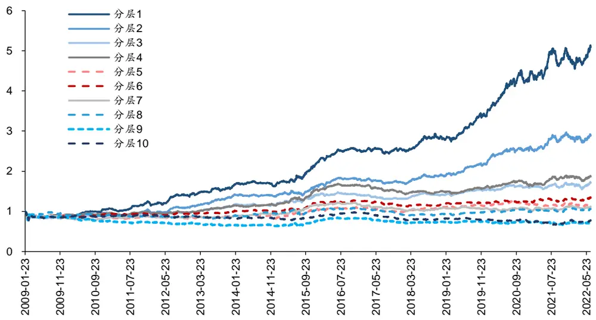
资料来源：Wind，朝阳永续，华泰研究

图表6： SUE.txt 因子覆盖度
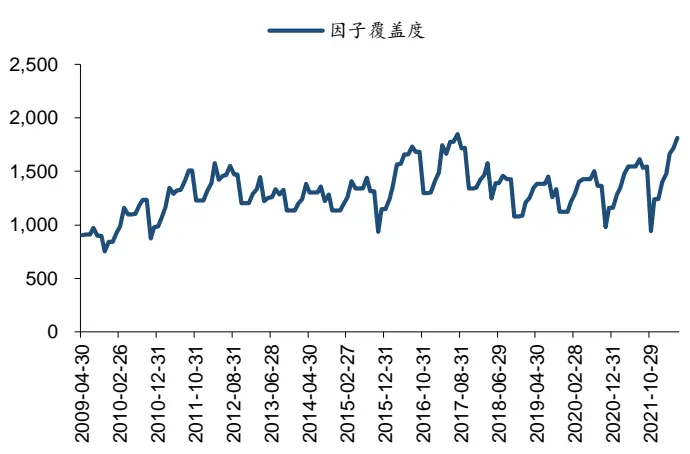
资料来源：Wind，朝阳永续，华泰研究

图表7： 分层 1相对于分层 10多空对冲净值
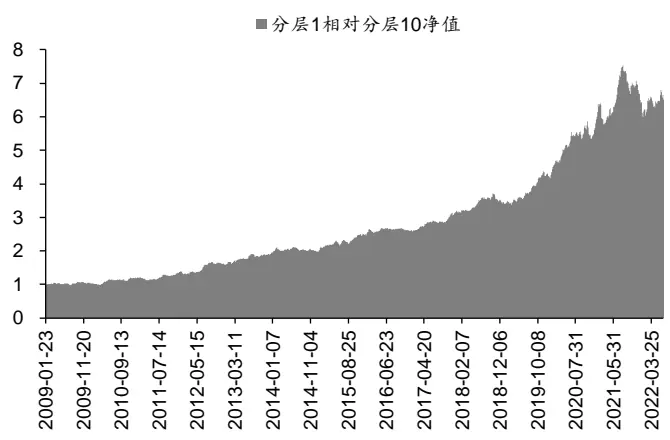
资料来源：Wind，朝阳永续，华泰研究

图表8： SUE.txt 因子分层 1 分年度业绩（基准中证 500，回测期：20090123-20220630）

| 时间 | 区间收益率 | 区间超额收益 | 年化波动率 | 最大回撤 | 夏普比率 | 卡玛比率 |
| --- | --- | --- | --- | --- | --- | --- |
| 2009 | 100.03% | -4.45% | 29.37% | 17.44% | 3.41 | 5.74 |
| 2010 | 31.16% | 18.75% | 27.16% | 21.31% | 1.15 | 1.46 |
| 2011 | -23.89% | 18.11% | 22.64% | 26.88% | -1.05 | -0.89 |
| 2012 | 18.81% | 16.45% | 23.76% | 18.65% | 0.79 | 1.01 |
| 2013 | 38.30% | 15.98% | 23.45% | 15.62% | 1.63 | 2.45 |
| 2014 | 39.84% | -0.26% | 19.45% | 12.65% | 2.05 | 3.15 |
| 2015 | 95.60% | 34.81% | 44.70% | 45.81% | 2.14 | 2.09 |
| 2016 | 2.16% | 14.64% | 30.26% | 23.08% | 0.07 | 0.09 |
| 2017 | 0.28% | 1.18% | 15.61% | 13.02% | 0.02 | 0.02 |
| 2018 | -27.39% | 12.28% | 25.39% | 28.00% | -1.08 | -0.98 |
| 2019 | 55.79% | 21.94% | 23.84% | 16.15% | 2.34 | 3.45 |
| 2020 | 53.29% | 29.82% | 29.27% | 15.51% | 1.82 | 3.44 |
| 2021 | 30.00% | 14.29% | 20.53% | 11.61% | 1.46 | 2.59 |
| 20220630 | -5.75% | 9.69% |  |  |  |  |
| 成立以来 | 23.94% | 14.47% | 26.92% | 45.81% | 0.89 | 0.52 |

资料来源：Wind，朝阳永续，华泰研究

其中第三个问题或许包含前两个问题的答案，我们顺着上述问题进行思考，在本文中进行另一种探索：即仍以分析师研报为数据源，但是脱离 PEAD 的场景，我们考虑分析师盈利预测及评级调整这两种场景下的文本挖掘。

## 分析师盈利预测及评级调整

本小节我们对研究动机进行一些补充，讨论分析师盈利预测及评级调整的两种场景。我们统计了历史上分析师盈利预测及评级调整每月的平均数量，如下图表所示。剔除首次覆盖的样本以后，可以看到每年的4/8/10月份整体分析师盈利预测及评级调整数量有明显上升，主要是因为对应月份为财报期，上市公司发布业绩公告比较密集，分析师会根据最新公告调整盈利预期及评级。其余月份的盈利预测调整及评级数量保持在较为均衡的水平，这些盈利预测大部分与财报业绩发布无关。

我们为什么要从业绩点评的文本挖掘迁移到分析师盈利预测调整&评级的文本挖掘上来？本质上我们是想找到“点燃”股价的催化剂事件。这种事件可能是上市公司交出了一份业绩亮眼的财报，净利润大超市场预期，进而得到机构投资者的关注（PEAD 效应也即在这种场景下发生）；也可能是其他催化剂事件，例如公司主营业务发生改变、与政府签订补贴协议、高频披露的销售额数据亮眼等。挖掘催化剂事件难以用量化的手段遍历，但是行业分析师对各类事件却有紧密的跟踪，因此我们采用间接的手段，从分析师盈利预测调整及评级变化来窥探这些催化剂事件。下面我们展示一些盈利预测调整的例子。

图表9： 盈利预测调整及评级调整分月份平均数量统计
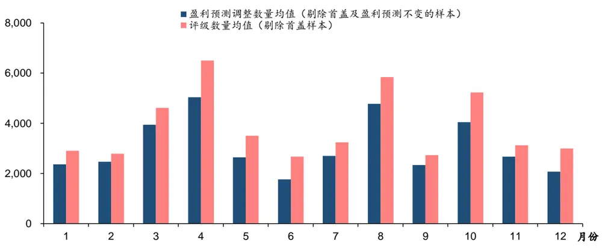
资料来源：Wind，朝阳永续，华泰研究

## 业绩公告披露场景

当上市公司发布业绩超过市场预期时，分析师基于最新公布的业绩，容易上调对该公司的未来盈利预测。例如下图我们截取了 2022Q1 财报季杭州银行这只股票发布业绩后的华泰分析师点评，由于该公司 1Q22 披露业绩超过分析师预期，因此分析师在摘要给出了盈利预测的调整。

图表10： 业绩公告披露场景下的盈利预测调整
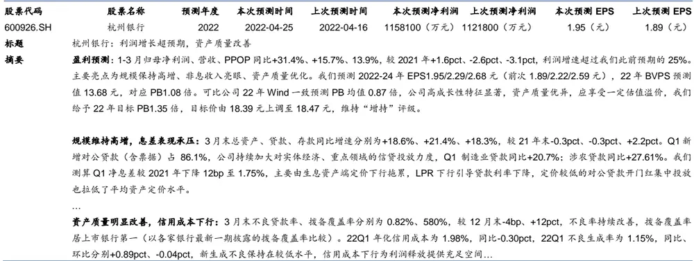
资料来源：朝阳永续，华泰研究

## 非业绩公告披露场景

在非业绩期，分析师也可能因为其他催化事件上调盈利预期，例如公司主营业务发生改变、与政府签订补贴协议、高频披露的销售额数据亮眼等；这些事件同样有可能吸引机构投资者的关注。下面我们展示了几组非业绩公布场景下的分析师盈利预测调整的例子。

图表11： 经营事件披露带来的盈利预测调整
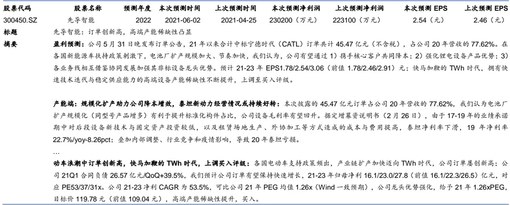
资料来源：朝阳永续，华泰研究

图表12： 股权激励带来的盈利预测调整

| 股票代码 300866.SZ | 股票名称 安克创新 | 预测年度本次预测时间 | 2023 2022-06-23 | 上次预测时间 2022-05-09 | 本次预测净利润 159300（万元） | 上次预测净利润 159000（万元） | 本次预测 EPS 3.92（元） | 上次预测 EPS 3.92（元） |
| --- | --- | --- | --- | --- | --- | --- | --- | --- |

资料来源：朝阳永续，华泰研究

上述两个例子展示了非业绩公布场景下的分析师盈利预测调整的例子。第一个例子是上市公司公告披露订单数量创新高，这类数据是定期财报之外的对业绩具有较大影响的信息，分析师在该公告披露后上调了盈利预测。第二个例子是安克创新披露股权激励草案，虽然股权激励可能不会直接对公司业绩造成影响，但是分析师认为股权激励有利于稳定人才队伍、激发骨干活力，也会间接对该公司经营带来正向影响，因此上调了盈利预测。除此以外，类似于白酒批发价上行、新药通过审批等非业绩公告的“催化剂”事件也均会造成分析师对盈利预测进行调整。

## 盈利预测及评级调整文本建模

本小节我们展示文本建模的方法。由于我们研究的分析师盈利预测调整及评级通常是跟随着点评报告一起发出的，因此相比于SUE.txt的构建，我们可以简化分析师盈利预测调整及评级文本因子的构建流程，使得整个流程更为自然。后文我们将基于盈利预测调整样本构建出的因子称为 forecast_adj_txt 因子，将基于评级调整样本构建出的因子称为forecast_score_adj_txt 因子。

## 分词处理

我们将单条分析师盈利预测及评级调整的研报视为一条样本，同样的我们第一个步骤是对研报文本进行分词处理；在分词的过程中我们仅保留普通名词、专有名词、动词、副动词、形容词、副词对应词性的词语。

图表13： 分词示意图
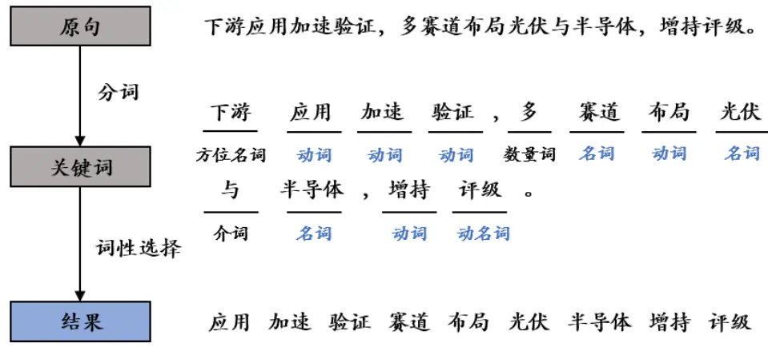
资料来源：华泰研究

## 转化为词频矩阵

第二步是计算词频矩阵。将每一轮训练的样本内全部样本进行分词处理以后，我们会统计研报标题和摘要出现频率最高的 200 和 1000 个词语（[200，1000]这组参数是人为设定的参数，后文会对此进行参数讨论），将这1200个词语作为本轮训练的词域。

图表14： 词域生成示意图

资料来源：华泰研究

词域确定好以后，我们将每条样本映射到词域中词语的出现频率上，生成词频向量，计算出词频向量以后，我们使用以下公式计算log词频，作为我们训练模型的输入特征。

$$
X_{1}=\log(X_{0}+1)
$$

其中 $X_{0}$ 为原词频向量， $X_{1}$ 为处理后的训练特征。预测目标取为研报发布前后两天（关于前后两天这个参数，我们在后文也会进行详细讨论）个股相对于中证 500 的超额收益（不进行中性化处理），我们按以下方式将其分为三类后作为样本的训练标签Y：

1. 上涨（y = 1）：较大的正向超额收益，即样本的超额收益位于整体的前30%；

2. 震荡（y = 0）：较低的正向或负向超额收益，即样本的超额收益位于整体的前 30%-70%；

3. 下跌（y = -1）：较大的负向超额收益，即样本的超额收益位于整体的后30%。

更为详细的分词处理流程，读者可以参考华泰金工前期研究《人工智能51：文本PEAD选股策略》（20220107），处理方法论类似。

图表15： 训练特征和训练标签的生成示意图

| 特征X 标签Y [T-1,T+1] |  |  |  |  |  |
| --- | --- | --- | --- | --- | --- |
| 摘要1000词 |  |  |  |  |  |
| 下滑 业务 0 | 业绩 | 中报 主业 产品 | 标题200词 | 产能 亮眼 m | 体化 上升 上涨 上线 上行 上调 下滑 |
| 样本1 1 | 1 0 0 0 0 0 0 | 0 0 0 | 下行 下调 |  |  |
| 样本2 0 | 0 0 0 1 0 0 0 0 1 0 0 1 0 | 1 0 1 0 1 1 | 0 0 0 1 2 |  |  |
| 样本3 1 | 1 0 0 0 1 1 1 1 0 0 0 0 0 |  |  |  |  |
| n |  |  |  |  |  |
| 样本n |  |  |  |  |  |

资料来源：华泰研究

## 样本内交叉验证，样本外生成因子值

每次滚动样本内为过去12个月，样本外为未来12个月。例如对于某轮样本外的首月T月来说，我们将T-12 至T-1月的数据作为样本内，T月至T+11 月的数据作为样本外；下一迭代期则以T-1月至T+11月的数据作为样本内，T+12至T+23月的数据作为样本外；以此类推。

图表16： 滚动训练示意图
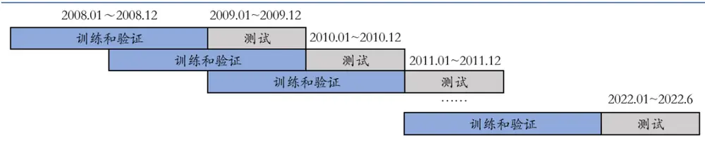
资料来源：华泰研究

模型在样本内训练完成后，我们在样本外进行测试。forecast_adj_txt 因子生成的频率为每个月末，在月末截面期追溯过去一个季度的全市场分析师盈利预测调整样本，使用训练好的模型进行预测，得到每条样本在每个类别上的概率估计值 $\_p_{c}(x)$ ，以此我们计算其 log-odds值 $L_{c}(x)$ ：

$$
\begin{aligned}L_{c\in\{h,m,l\}}(x)&=log\frac{p_{c}(x)}{1-p_{c}(x)}\\forecast_{-}&adj_{-}txt=L_{h}(x)-L_{l}(x)\end{aligned}
$$

其中 $c\in\{h,m,l\}$ 为三个类别标签，分别表示上涨、震荡、下跌。我们计算其上涨和下跌类别的log-odds值之差作为文本因子值。

## 数据实证及参数讨论

在前期报告《人工智能51：文本PEAD选股策略》（20220107）中，我们使用前文所述类似的方法论对上市公司业绩点评相关的分析师研报文本进行过挖掘。彼时，读者对于模型中的参数提出了一些讨论，因子稳健性与否颇受质疑；同时受困于业绩预告的数量过少，实际上增强组合可进行操作的空间有限。接下来的数据实证，我们将围绕上述两个问题展开讨论：

后文提到的所有组合回测及分层回测均为费后表现，手续费设置为双边千三，每月第一个交易日按当日均价调仓，对停牌股票进行权重调整，后文不再赘述。对盈利预测调整的样本，我们会剔除首盖样本及盈利预测不变的样本；评级仅剔除首盖样本。

## 基础模型实证

作为后续参数讨论的基础，我们首先给定基准模型。基准模型的各项参数选择如下表所示，对其中的一些参数进行解释：样本内窗口长度指的是每轮训练选用多长的时间区间作为样本内，取值为12个月表示我们选用过去一年的全部盈利预测调整样本作为样本内；样本标签的时间区间表示每条样本中Y的计算区间，T-1~T+1即表示研报发布前1天至后1天。

图表17： 基准模型参数选择

| 参数项目 | 参数取值 |
| --- | --- |
| 训练使用的非线性模型 | XGBoost |
| 研报标题采用的词数 | 200 |
| 研报摘要采用的词数 | 1000 |
| 样本内窗口长度 | 12个月（过去一年） |
| 样本标签的时间区间 | T-1~T+1 |
| 标签分类方式 | 三分类 |
| 样本外计算因子值的回溯区间 | 3个月 |

资料来源：华泰研究

样本外计算因子值的回溯区间表示在样本外每个月月末构建因子值时，选用过去多长时间区间内的样本。例如取值为 3 个月时，月末我们会追溯过去 3 个月的全部分析师盈利预测调整的样本，分别计算出文本得分，最后求均值得到个股的forecast_adj_txt因子。

图表18： 基准模型 forecast_adj_txt 因子分 10 层回测（回测期：20090123-20220630）
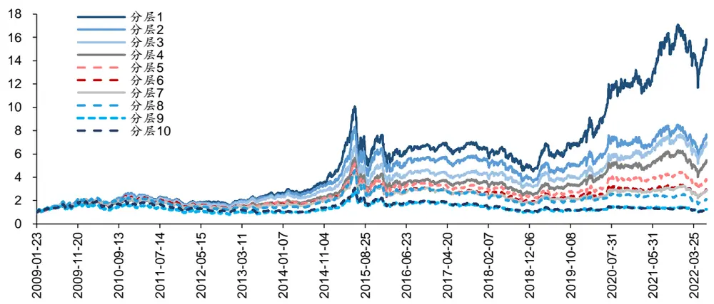
资料来源：Wind，朝阳永续，华泰研究

图表19： 基准模型 forecast_adj_txt 因子分 10 层回测超额净值（基准中证 500，回测期：20090123-20220630）
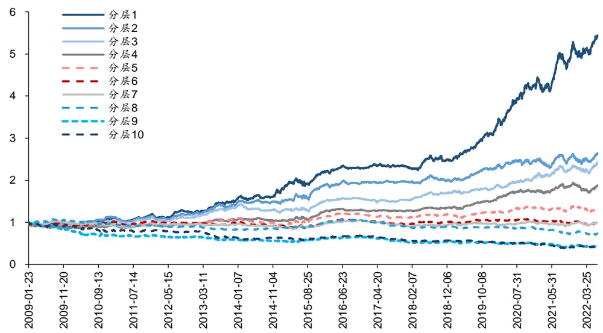
资料来源：Wind，朝阳永续，华泰研究

图表20： 基础模型因子覆盖度
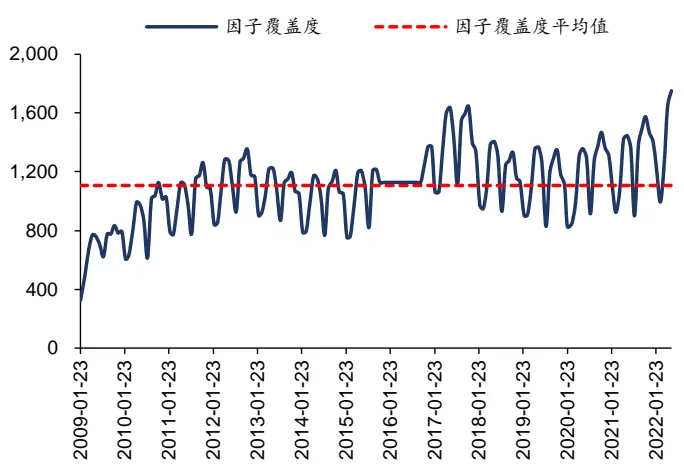
资料来源：Wind，朝阳永续，华泰研究

图表21： 分层 1相对于分层 10多空对冲净值
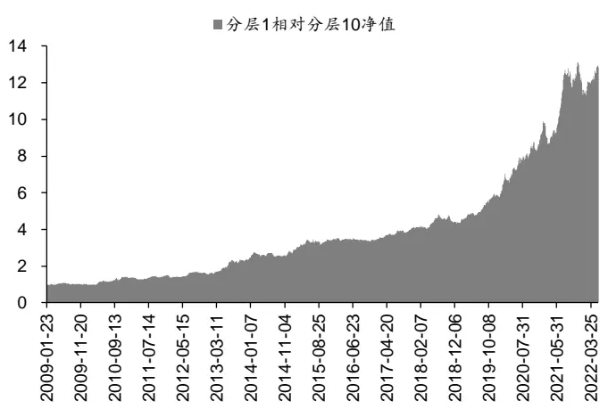
资料来源：Wind，朝阳永续，华泰研究

图表22： 基础模型 forecast_adj_txt 因子分层 1 分年度业绩（基准中证 500，回测期：20090123-20220630）

| 时间 | 区间收益率 | 区间超额收益 | 年化波动率 | 最大回撤 | 夏普比率 | 卡玛比率 |
| --- | --- | --- | --- | --- | --- | --- |
| 2009 | 99.85% | -4.92% | 32.48% | 21.99% | 3.07 | 4.54 |
| 2010 | 30.01% | 18.10% | 27.90% | 22.11% | 1.08 | 1.36 |
| 2011 | -29.77% | 9.31% | 24.20% | 32.32% | -1.23 | -0.92 |
| 2012 | 11.15% | 9.89% | 25.04% | 22.42% | 0.45 | 0.50 |
| 2013 | 49.81% | 26.63% | 25.94% | 13.85% | 1.92 | 3.60 |
| 2014 | 56.64% | 11.98% | 22.41% | 14.06% | 2.53 | 4.03 |
| 2015 | 88.26% | 30.05% | 44.56% | 50.83% | 1.98 | 1.74 |
| 2016 | -6.70% | 4.79% | 29.69% | 25.43% | -0.23 | -0.26 |
| 2017 | 0.15% | 1.34% | 15.43% | 14.49% | 0.01 | 0.01 |
| 2018 | -29.72% | 8.78% | 25.74% | 31.05% | -1.15 | -0.96 |
| 2019 | 61.38% | 27.01% | 25.12% | 18.10% | 2.44 | 3.39 |
| 2020 | 67.62% | 42.19% | 30.62% | 18.59% | 2.21 | 3.64 |
| 2021 | 36.79% | 20.71% | 21.85% | 15.02% | 1.68 | 2.45 |
| 20220630 | -3.95% | 11.72% |  |  |  |  |
| 成立以来 | 24.33% | 14.97% | 27.95% | 54.50% | 0.87 | 0.45 |

资料来源：Wind，朝阳永续，华泰研究

图表23： 基础模型 forecast_adj_txt 因子分 10 层回测各层业绩（基准中证 500，回测期：20090123-20220630）

|  | 分层1 | 分层2 | 分层3 | 分层4 | 分层5 | 分层6 | 分层7 | 分层8 | 分层9 | 分层10 |
| --- | --- | --- | --- | --- | --- | --- | --- | --- | --- | --- |
| 绝对收益 | 24.33% | 16.04% | 15.32% | 13.07% | 10.14% | 7.73% | 7.77% | 5.22% | 1.12% | 0.79% |
| 超额收益 | 13.80% | 7.45% | 6.78% | 4.69% | 1.98% | -0.25% | -0.21% | -2.57% | -6.38% | -6.68% |

资料来源：Wind，朝阳永续，华泰研究

从结果来看，forecast_adj_txt 因子分层效果十层严格单调，多头第一层自 2009 年以来全回测期的绝对收益为年化23.51%，相对于中证500的超额收益为年化14.66%；因子覆盖度平均每期为 1107 只，且近年来覆盖度呈现上升趋势。从多头端分年度业绩来看，forecast_adj_txt因子各年度相对于中证500超额收益几乎均为正（除2009年外），分年度表现较为稳健。（注：20151130-20160930期间由于数底库数据缺失，导致因子覆盖度极端低，故统一延续20151030的因子值）

## 参数讨论

接下来，我们对模型中的各个参数进行稳健性讨论，过拟合带来的超乐观预期是我们不愿看到的结果，现在我们对“是否有人为过度调参导致的过拟合嫌疑”这个问题给出答案。

## 样本标签的时间区间选择

在前期报告中，样本标签的时间选择是备受质疑的点，为什么是 T-1~T+1 天？其他参数区间是否可行？T-1~T+1 天从逻辑上来说的优势在何处？本小节我们从数据实证和逻辑解释两个角度出发，尝试再次讨论这个问题。

数据实证角度，首先我们对多组时间区间进行测试：讨论T-1~T+7、T-1~T+20、T-7~T+1、T-20~T+1这四组参数。其中T-1~T+7及T-1~T+20的假设为，对分析师盈利预测调整的情感判别更多信息来源于预测调整之后的股价变化；而T-7~T+1与T-20~T+1则相反。

图表24： 标签参数 1：T-1~T+7分层回测净值
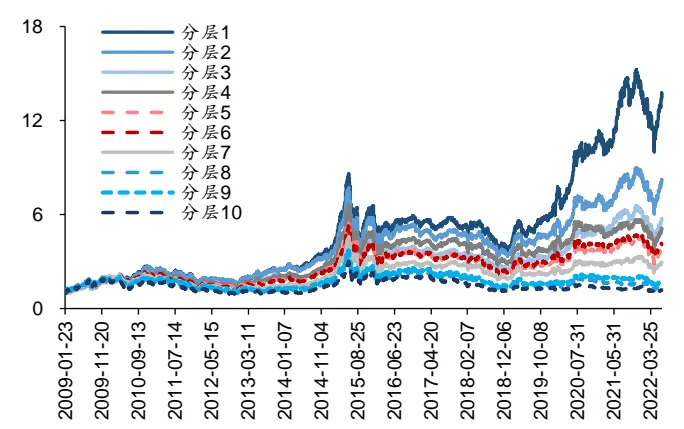
资料来源：Wind，朝阳永续，华泰研究

图表25： 标签参数 1：T-1~T+7分层年化收益与年化超额
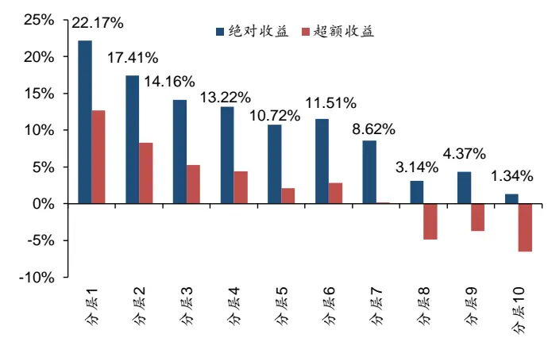
资料来源：Wind，朝阳永续，华泰研究

图表26： 标签参数 2：T-1~T+20分层回测净值
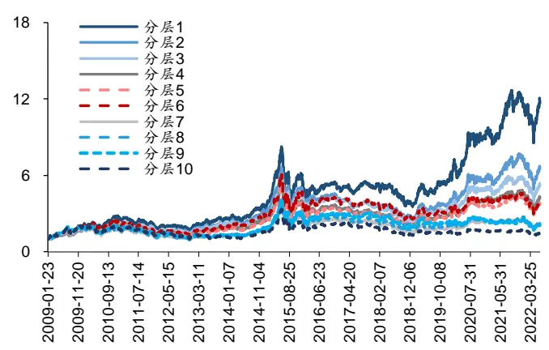
资料来源：Wind，朝阳永续，华泰研究

图表27： 标签参数 2：T-1~T+20分层年化收益与年化超额
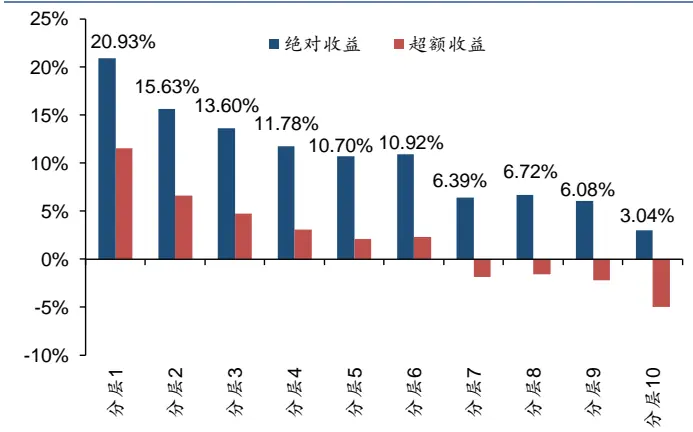
资料来源：Wind，朝阳永续，华泰研究

图表28： 标签参数 3：T-7~T+1分层回测净值
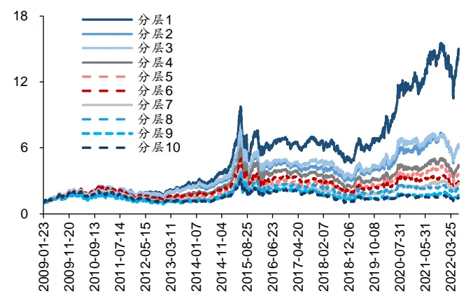
资料来源：Wind，朝阳永续，华泰研究

图表29： 标签参数 3：T-7~T+1分层年化收益与年化超额
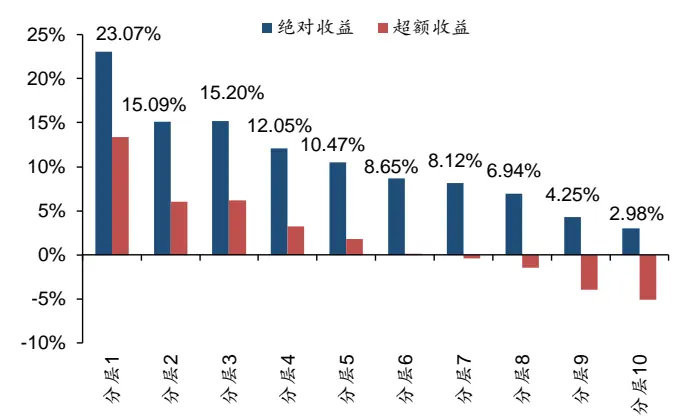
资料来源：Wind，朝阳永续，华泰研究

图表30： 标签参数 4：T-20~T+1分层回测净值
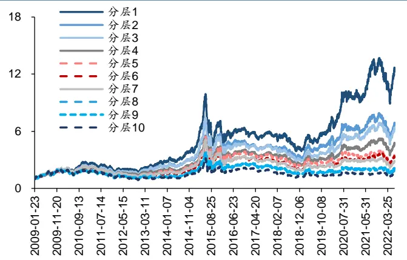
资料来源：Wind，朝阳永续，华泰研究

图表31： 标签参数 4：T-20~T+1分层年化收益与年化超额
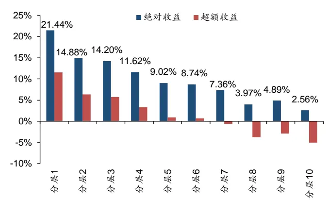
资料来源：Wind，朝阳永续，华泰研究

从整体结果来看，无论使用哪组标签，构建出的forecast_adj_txt因子都具有良好的分层效果，说明对于标签而言模型是稳健的，标签的变化不会对结果造成关键影响。但我们也发现，当标签的时间区间取太长时，多头端的收益会有所削弱，例如T-1~T+20多头收益弱于T-1~T+7，且 T-1~T+7 多头收益弱于 T-1~T+1。

我们认为上述结果合乎逻辑，在这里，对于标签的理解可能脱离时序关系来理解比较合适。实际上我们的目的并不是用分析师研报直接去预测股票未来一段时间的收益，如果基于这个逻辑那么严格来说应该是 T-1~T+20 表现更优。笔者认为，这里我们只是用 T-1~T+1 的股票收益来锚定分析师研报的情感表达，由于一般来说分析师点评时效性非常强，因此T-1~T+1仅包含点评事件本身，噪音较低；如果用T-1~T+20那么期间会包含更多非分析师点评事件的其他股票相关信息，噪音较高。故我们认为，使用T-1~T+1为标签完全合理。

## 训练时使用的非线性模型对比

基准模型中我们使用的是XGBoost模型，这里我们继续对使用的非线性模型进行讨论，备选的非线性模型有：Elastic Net、随机森林、GBDT、LightGBM 及 Stacking。关于这些模型的原理这里我们不再赘述，感兴趣的读者可以参考华泰金工人工智能系列往期报告。在样本内训练时我们都是采用的交叉验证训练，各模型选择的参数如下表所示。

图表32： 各模型超参数选择

| 非线性模型 超参数 | 选择范围 |
| --- | --- |
| XGBoost 学习速率（learning_rate） 最大树深（max_depth） | [0.025, 0.05, 0.075] [3, 5] |
| 行采样比例（subsample） Elastic Net（即带 L1 和L2 惩罚项的正则化强度倒数λ | [0.8, 0.85, 0.9, 0.95] |
| 逻辑回归) | [1e-5, 3e-5, 6e-5, 8e-5, 0.0001, 0.0003, 0.0006, 0.0008, 0.001, 0.003, 0.006, 0.008] |
| 随机森林 子树棵数（n_estimators） | [100, 200, 300] |
| 最大数深（max_depth） GBDT 学习速率（learning_rate） | [5, 7, 9] [0.001, 0.01, 0.1] |
| 最大数深（max_depth） | [3, 5] |
| 行采样比例（subsample） | [0.8, 0.85, 0.9] |
| LightGBM 学习速率（learning_rate） | [0.025, 0.05, 0.075] |
| 最大树深（max_depth） | [3,5, 7] |
| 特征采样比例（feature_fraction） | [0.8, 0.9, 0.1] |
| Stacking 基学习器 | Elastic Net 和 LightGBM |
| 二级学习器 |  |
|  | Elastic Net |

资料来源：华泰研究

图表33： 模型参数：ElasticNet 回测净值
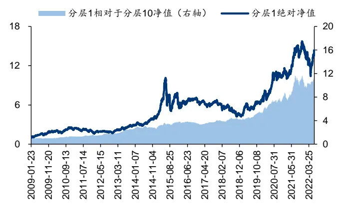
资料来源：Wind，朝阳永续，华泰研究

图表34： 模型参数：ElasticNet分层年化收益与年化超额

资料来源：Wind，朝阳永续，华泰研究

图表35： 模型参数：随机森林回测净值
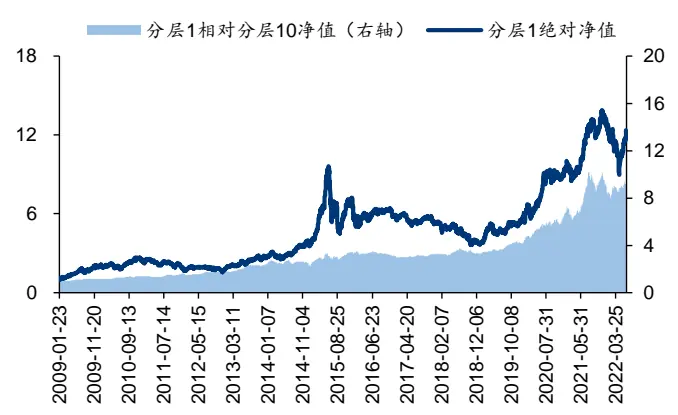
资料来源：Wind，朝阳永续，华泰研究

图表36： 模型参数：随机森林分层年化收益与年化超额
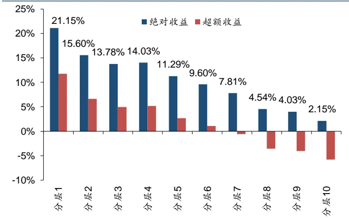
资料来源：Wind，朝阳永续，华泰研究

图表37： 模型参数：GBDT 回测净值
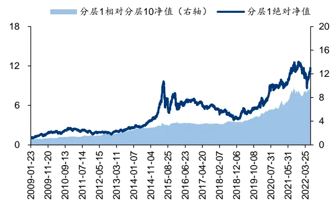
资料来源：Wind，朝阳永续，华泰研究

图表38： 模型参数：GBDT 分层年化收益与年化超额
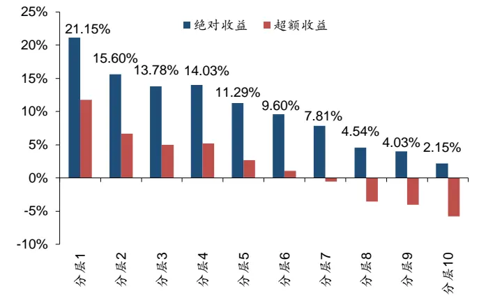
资料来源：Wind，朝阳永续，华泰研究

图表39： 模型参数：LightGBM 回测净值
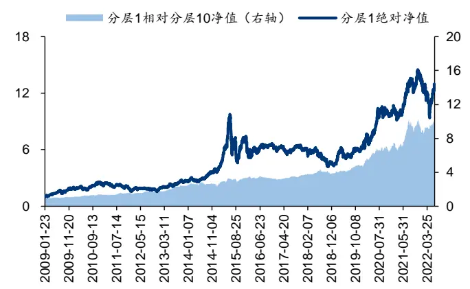
资料来源：Wind，朝阳永续，华泰研究

图表40： 模型参数：LightGBM 分层年化收益与年化超额
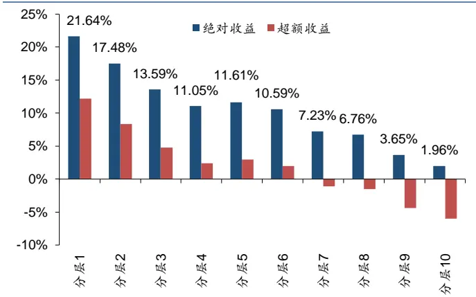
资料来源：Wind，朝阳永续，华泰研究

图表41： 模型参数：Stacking回测净值
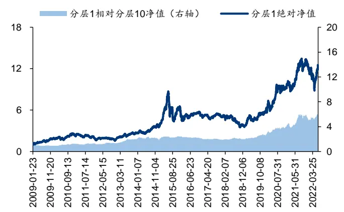
资料来源：Wind，朝阳永续，华泰研究

图表42： 模型参数：Stacking分层年化收益与年化超额
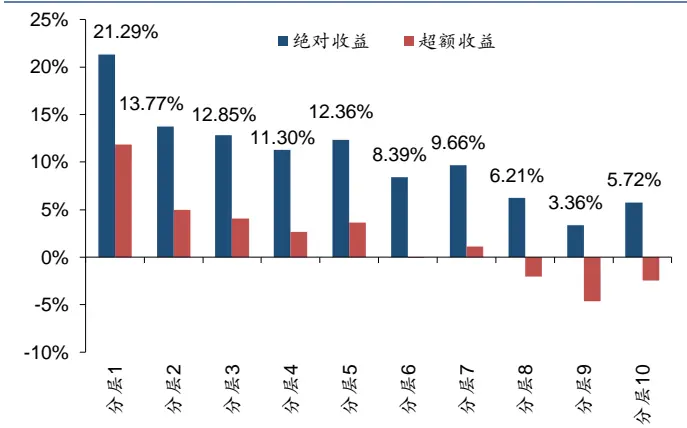
资料来源：Wind，朝阳永续，华泰研究

从各模型的对比结果来看，我们可以总结出以下结论：

1. 模型层面，在分析师盈利预测调整的情感识别场景下，不同的模型并未表现出非常明显的差距。以多头端第1层的绝对收益为例，XGBoost年化收益24.33%，是最好的模型；GBDT 年化收益 21.15%，是最差的模型；其余模型年化收益分布于 21%~23%之间，并未表现出明显差别，极差小于4%；

2. 集成模型 Stacking 没有进一步提升模型表现。我们对 ElasticNet 和 XGBoost 模型进行 Stacking 集成，发现并未明显提升模型表现，反而不如单一 XGBoost 的回测结果，相反还造成空头端单调性的衰减，可能是由于用于集成的两组底层模型相关性太高所导致，因此实际操作中我们还是推荐XGBoost模型。

我们不妨更深入的思考模型对比带给我们的启示。可以看到虽然不同的模型有差别，但不可否认这种差别很小，换言之模型本身性能的好坏对回测结果的影响没有想象中的大（提升没有想象中的大）。这种现象可能是由于，分析师盈利预测调整的情感识别是噪音较小的应用场景，在较长的时间区间内这种规律不容易改变（实际上接下来对于样本内窗口长度的讨论也支持这一结论）：分析师用乐观的语调对股票盈利预测进行调整，往往意味着分析师对个股的看好。噪音较低的规律使用简单的模型就已经有较好的识别效果，而这种主观上的强逻辑也支撑 forecast_adj_txt 因子不易失效。

## 样本内窗口长度的影响

在多因子非线性合成时，我们会考虑样本内窗口期长度的影响。例如使用XGBoost对多因子进行合成，取过去 6 年/3 年/1 年作为样本内进行训练会对合成因子的超额收益造成显著影响。窗口期取长表示我们希望模型学习更长时间内的规律，窗口期取短则表示我们希望模型能学习更短时间内的规律，前提是长短时间内的规律有明显不同，容易时变。那么在本报告的场景下规律是否容易发生时变？下面我们探究样本内窗口期长度的影响。

在对比实验时，我们仅改变每轮训练的样本内长度，其他参数保持与基准模型一致。我们测试了T=24/12/6个月时的模型表现，对比结果如下图所示。

图表43： 不同样本内窗口长度的分层绝对年化收益对比（T=6/12/24）
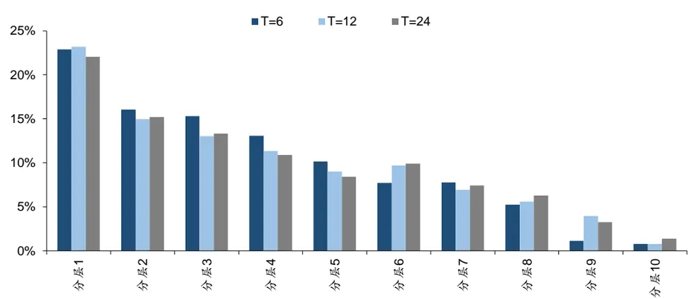
资料来源：Wind，朝阳永续，华泰研究

从上述结果来看，不同的样本内窗口长度对于最终结果并没有非常明显的影响，当样本窗口长度较短时，多头端的收益会略微偏高，且单调性相对更好（体现在第 5 层分层以后），这可能是因为行业分析师的用语风格可能随着市场风格的变化或有改变，但整体变化不大。可以认为forecast_adj_txt因子对窗口长度这一参数不敏感。

## 词数的影响

我们的文本数据来源于分析师盈利预测调整报告的标题和摘要，在构建词频矩阵时有一个很重要的参数即为标题和摘要分别使用的词语数量。从逻辑上来说，标题文本较短，所包含的词域较窄；摘要文本较长，所包含的词域较宽，因此标题和摘要选择的词语数量应有区别。这里我们讨论三组参数的回测结果，分别为[100, 500]、[200, 1000]、[300, 1500]。

图表44： 标题和摘要不同词数分层绝对年化收益对比（T=6/12/24）
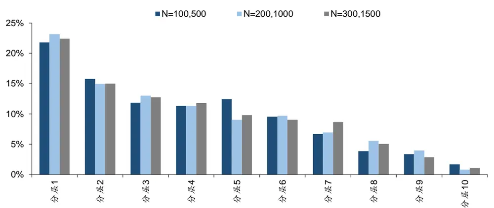
资料来源：Wind，朝阳永续，华泰研究

从对比结果来看，词数也不是敏感参数，词数增多并未对因子效果产生很明显的影响。可以合理推测，当所用词数到达一定数量以后，模型就可以较好地识别分析师在盈利预测调整时的用词规律，相反词数取得适中还能节省模型训练的时间开销，因此我们建议词数参数取[200, 1000]或[100, 500]即可。

## 分类数的影响

前文我们默认分类数为 3 类，这里我们对更多类别参数进行讨论。每组分类方式下，我们按如下方式生成 forecast_adj_txt 因子：

$$
\begin{aligned}&forecost\_adj\_txt=\mathrm{L}_h(x)-\mathrm{L}_l(x)\\&\quad L_{c\in\{h,l\}}=\log\frac{p_c(x)}{1-p_c(x)}\\\end{aligned}
$$

其中ℎ表示分位数最高的类别，l表示分位数最低的类别，例如在标签设置为5类的条件下，ℎ表示收益率前20%的类别，l表示收益率后20%的类别；对比结果如下图所示。

图表45： 不同标签分类数的分层绝对年化收益对比（分两类/三类/五类）
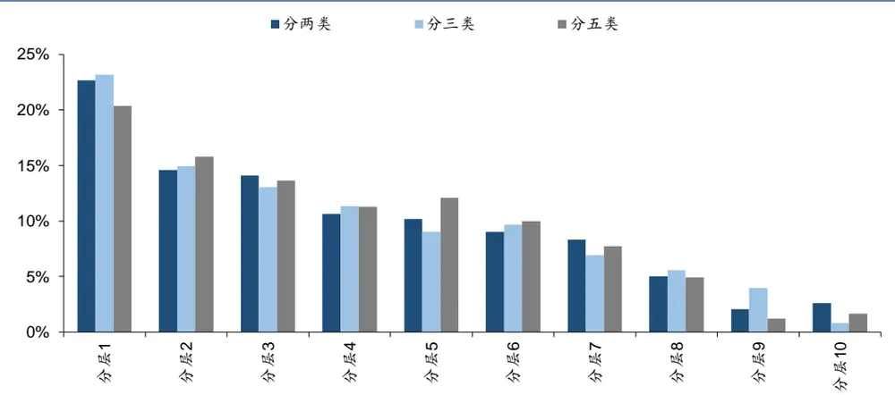
资料来源：Wind，朝阳永续，华泰研究

从结果来看，标签分类数也不是敏感参数，整体上分类数为5类时多头端的收益有所削弱，大约削减3%的年化收益，单调性上没有明显区别。

## 因子覆盖度与多头收益的平衡

我们继续考虑一个和模型训练本身没有关系的参数，即我们在样本外每个月末构建因子时的回溯时间。默认取值为 3 个月，即我们在每月末，会追溯过去三个月的所有分析师盈利预测调整的研报，计算因子值，然后等权加总到股票上作为该只股票最终的forecast_adj_txt因子。如果回溯区间长度较长，因子覆盖度会有所提升，但盈利预测调整研报的时效性减弱；如果回溯区间长度较短，则因子覆盖度降低，但盈利预测调整研报的时效性增强。

图表46： 回溯 6个月单因子分层回测净值
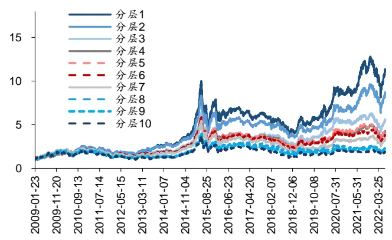
资料来源：Wind，朝阳永续，华泰研究

图表47： 回溯 6个月单因子覆盖度
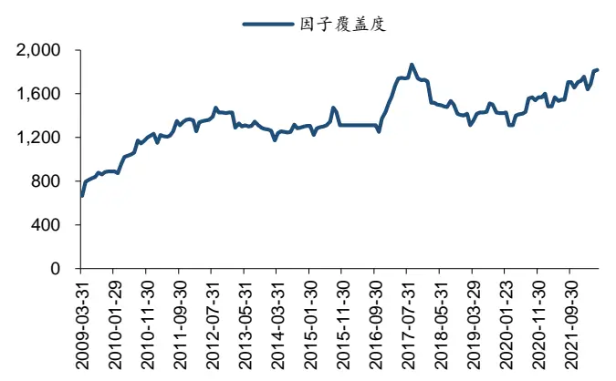
资料来源：Wind，朝阳永续，华泰研究

图表48： 回溯 4 个月单因子分层回测净值
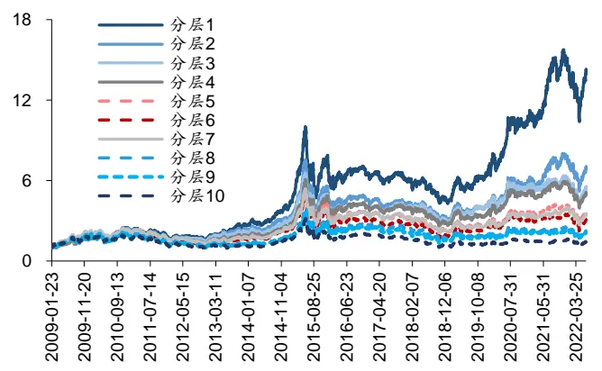
资料来源：Wind，朝阳永续，华泰研究

图表49： 回溯 4 个月单因子覆盖度
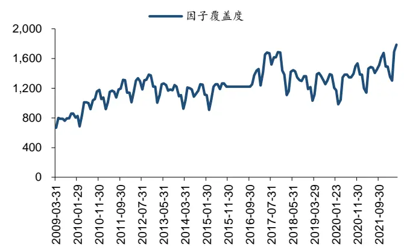
资料来源：Wind，朝阳永续，华泰研究

图表50： 回溯 3 个月单因子分层回测净值
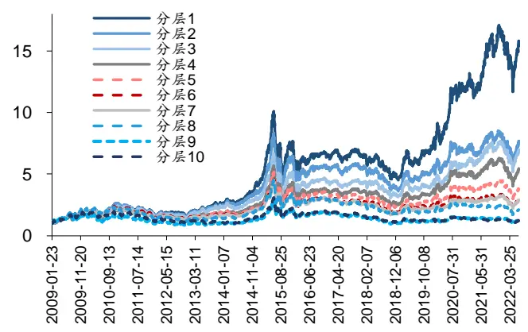
资料来源：Wind，朝阳永续，华泰研究

图表51： 回溯 3个月单因子覆盖度
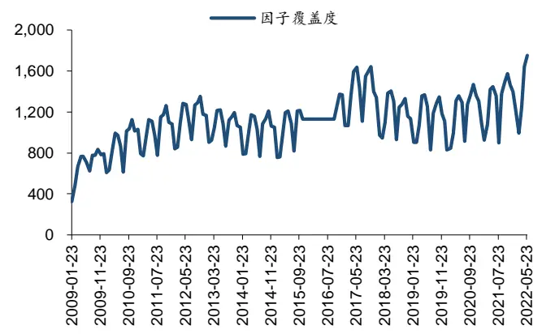
资料来源：Wind，朝阳永续，华泰研究

图表52： 不同回溯月份长度的因子分层绝对年化收益对比（回溯 6/4/3个月）
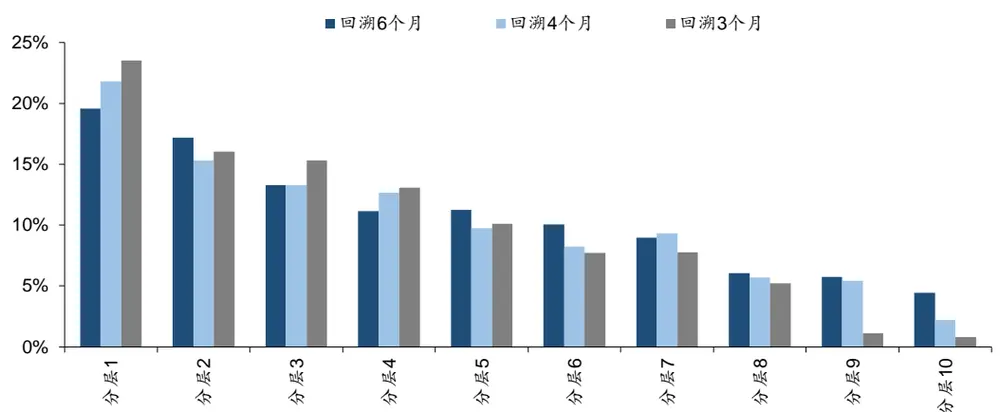
资料来源：Wind，朝阳永续，华泰研究

从上述结果来看，回溯时间区间越长，因子覆盖度越高，且覆盖度较为均衡，但对应的多头端收益明显削弱；回溯时间越短，因子覆盖度越低，且覆盖度较不均衡，会出现局部低点与局部高点。覆盖度的变化主要是由于财报期导致的，分析师更容易在财报季发布盈利预测调整，因此财报季因子覆盖度会升高，非财报季因子覆盖度会降低。综合来看，我们推荐回溯3个月或4个月，使多头端收益与股票池数量达到平衡。

## 分析师评级调整测试结果

按照与分析师盈利预测调整类似的方法论，我们对分析师评级调整的研报文本进行文本挖掘。我们构建的forecast_score_adj_txt因子的回测结果如下述图表所示。从结果来看，基于评级调整样本构建的因子效果不如盈利预测调整样本，一个可能的原因在于数据预处理时，我们对于盈利预测调整的样本，剔除了盈利预测不变的样本；而对于评级调整的样本没有进行类似操作。（因为评级分类少，如果将评级调整不变的样本删除，将会损失很多样本）。

图表53： forecast_score_adj_txt 因子分 10 层回测（回测期：20090123-20220630）
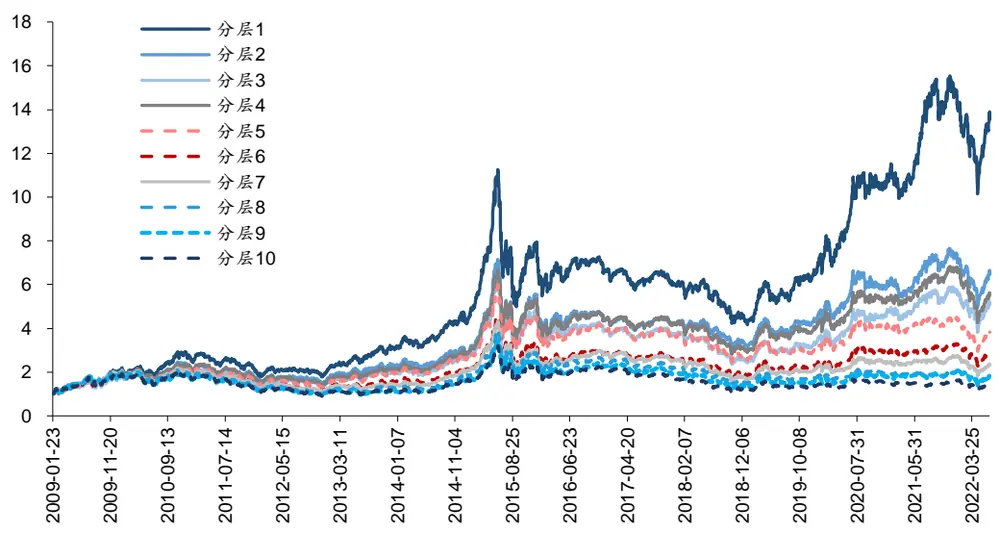
资料来源：Wind，朝阳永续，华泰研究

图表54： forecast_score_adj_txt 因子分 10 层回测超额净值（基准中证 500，回测期：20090123-20220630）
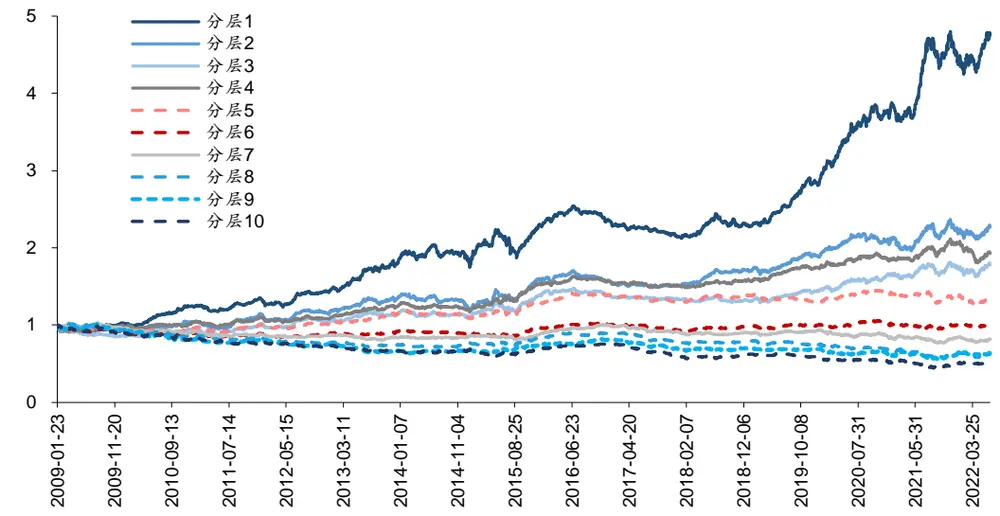
资料来源：Wind，朝阳永续，华泰研究

图表55： forecast_score_adj_txt 因子覆盖度
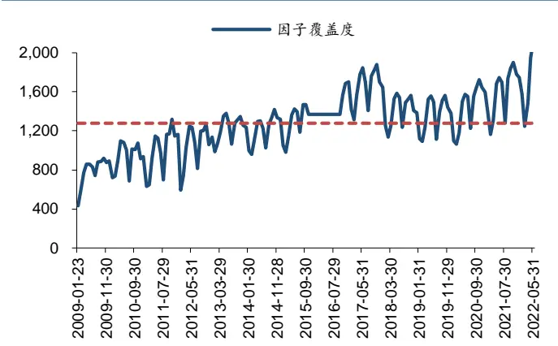
资料来源：Wind，朝阳永续，华泰研究

图表56： 分层 1相对于分层 10多空对冲净值
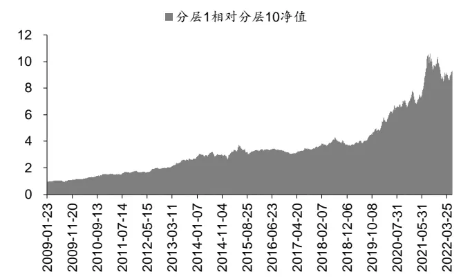
资料来源：Wind，朝阳永续，华泰研究

图表57： forecast_score_adj_txt 因子分层 1 分年度业绩（基准中证 500，回测期：20090123-20220630）

| 时间 | 区间收益率 | 区间超额收益 | 年化波动率 | 最大回撤 | 夏普比率 | 卡玛比率 |
| --- | --- | --- | --- | --- | --- | --- |
| 2009 | 124.41% | 7.26% | 33.46% | 17.56% | 3.72 | 7.08 |
| 2010 | 35.39% | 22.95% | 28.22% | 20.14% | 1.25 | 1.76 |
| 2011 | -30.86% | 7.19% | 23.05% | 33.35% | -1.34 | -0.93 |
| 2012 | 14.52% | 12.37% | 24.02% | 20.10% | 0.60 | 0.72 |
| 2013 | 51.81% | 27.86% | 24.96% | 12.96% | 2.08 | 4.00 |
| 2014 | 34.92% | -3.73% | 23.08% | 14.84% | 1.51 | 2.35 |
| 2015 | 89.77% | 30.50% | 46.60% | 55.56% | 1.93 | 1.62 |
| 2016 | -8.16% | 3.76% | 30.35% | 24.15% | -0.27 | -0.34 |
| 2017 | -9.93% | -8.97% | 14.78% | 14.31% | -0.67 | -0.69 |
| 2018 | -30.09% | 7.84% | 25.05% | 32.17% | -1.20 | -0.94 |
| 2019 | 59.71% | 25.60% | 24.05% | 15.91% | 2.48 | 3.75 |
| 2020 | 61.91% | 36.02% | 29.02% | 16.86% | 2.13 | 3.67 |
| 2021 | 38.56% | 22.57% | 22.54% | 13.30% | 1.71 | 2.90 |
| 20220630 | -5.83% | 10.25% |  |  |  |  |
| 成立以来 | 23.03% | 13.77% | 28.01% | 62.52% | 0.82 | 0.37 |

资料来源：Wind，朝阳永续，华泰研究

图表58： 基础模型 forecast_adj_txt 因子分 10 层回测各层业绩（基准中证 500，回测期：20090123-20220630）

|  | 分层1 | 分层2 | 分层3 | 分层4 | 分层5 | 分层6 | 分层7 | 分层8 | 分层9 | 分层10 |
| --- | --- | --- | --- | --- | --- | --- | --- | --- | --- | --- |
| 绝对收益 | 23.03% | 15.49% | 13.35% | 14.05% | 10.93% | 8.58% | 6.73% | 4.56% | 4.70% | 2.88% |
| 超额收益 | 12.81% | 6.52% | 4.55% | 5.19% | 2.32% | 0.15% | -1.55% | -3.56% | -3.43% | -5.11% |

资料来源：Wind，朝阳永续，华泰研究

## 因子扩展讨论及组合增强

## 因子扩展讨论

本小节我们对forecast_adj_txt因子进行扩展讨论。传统对分析师盈利预测调整进行分析时，我们更多会使用分析师盈利预测调整的幅度来构建因子。例如以下计算的分析师盈利预测调整因子为常见的构建方法：

$$
forecast\_adj_{s,T}=\operatorname*{median}_{i,t}(\frac{forecast\_new_{s,i,t}-forecast\_last_{s,i,t}}{forecast\_last_{s,i,t}}),T-1<t\leq T
$$

上述表达式中，forecast $\_adj_{s,T}$ 表示某只股票S在截面期T的因子值，T一般取为月末截面期。$forecast\_new_{s,i,t}$ 为分析师i对于股票S在时间t给出的盈利预测，forecast $\_last_{s,i,t}$ 为分析师i对于股票S上一次给出的盈利预测，我们统计过去一个月所有分析师盈利预测调整幅度的中位数作为因子值。该因子的分层回测结果如下图所示：

图表59： forecast_adj 因子分 10 层回测
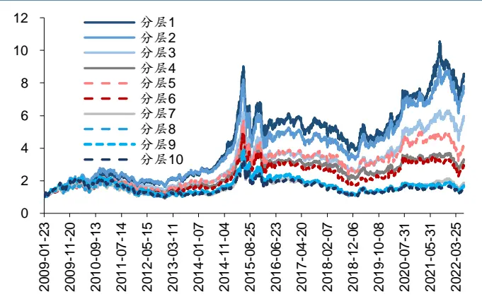
资料来源：Wind，朝阳永续，华泰研究

图表60： forecast_adj 因子分层年化收益与年化超额
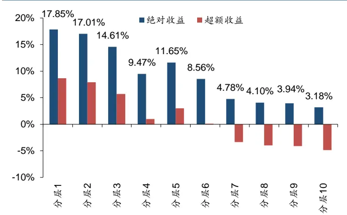
资料来源：Wind，朝阳永续，华泰研究

forecast_adj_txt 和 forecast_adj 因子数据同源，但是因子相关性并不高，平均值大约在 0.1左 右 。 令 forecast_adj_txt 对 forecast_adj 因 子 进 行 正 交 处 理 得 到 残 差 因 子forecast_adj_txt_res_1，我们发现残差因子仍然具有非常明显的分层效果及多头收益。

图表61： forecast_adj_txt_res_1 因子分 10 层回测
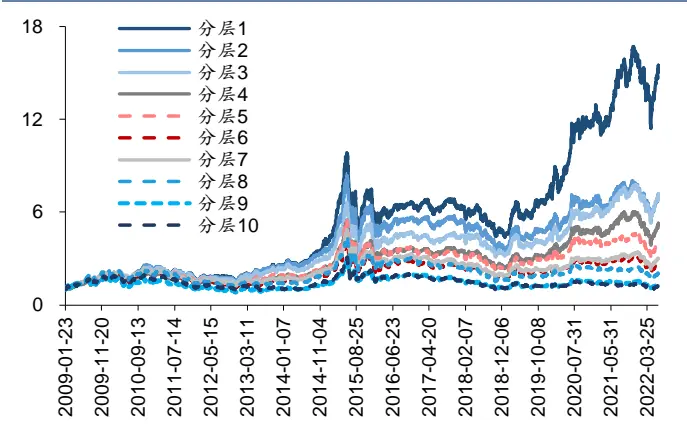
资料来源：Wind，朝阳永续，华泰研究

图表62： forecast_adj_txt_res_1 因子分层年化收益与年化超额
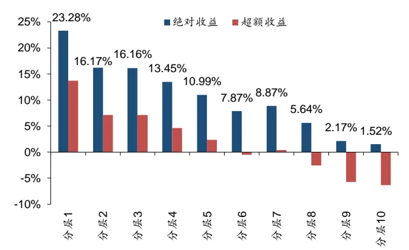
资料来源：Wind，朝阳永续，华泰研究

图表63： forecast_adj_txt 与 forecast_adj 因子相关性
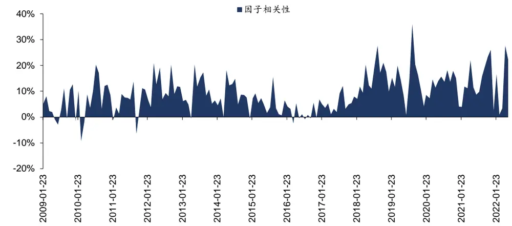
资料来源：Wind，朝阳永续，华泰研究

分析 forecast_adj_txt 与 sue_txt 因子的相关性，整体平均值大约在 0.5 左右。令forecast_adj_txt 因子对 sue_txt 因子进行正交处理得到残差因子 forecast_adj_txt_res_2，发现虽然残差因子分层效果有明显削弱，但多头端收益仍然较为显著，第一层年化收益为18.48%。

图表64： forecast_adj_txt_res_1 因子分 10 层回测
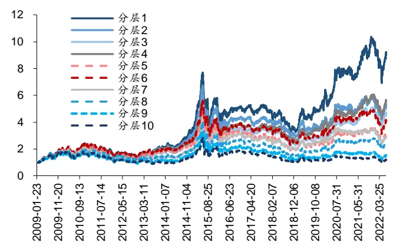
资料来源：Wind，朝阳永续，华泰研究

图表65： forecast_adj_txt_res_1 因子分层年化收益与年化超额
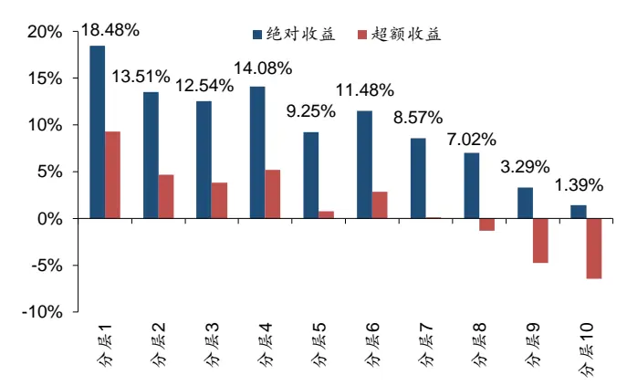
资料来源：Wind，朝阳永续，华泰研究

图表66： forecast_adj_txt 与 forecast_adj 因子相关性
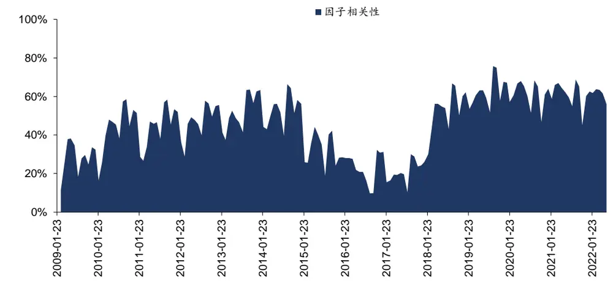
资料来源：Wind，朝阳永续，华泰研究

考虑 forecast_adj_txt 与 sue_txt 因子的区别。首先相关性偏高可能是由于分析师盈利预测调整有相当一部分场景是在上市公司发布业绩的场景，这一部分的样本重叠导致其实forecast_adj_txt 因子的样本域是包含 sue_txt 的样本域的。但又不仅如此，如我们前文所分析的，分析师盈利预测调整也可能在非业绩公告场景下产生，这一部分的样本或许是残差因子 forecast_adj_txt_res_2 的收益由来。

图表67： 各因子 IC对比

|  | forecast_adj | forecast_adj_txt | sue_txt | forecast_adj_txt_res_1 | forecast_adj_txt_res_2 |
| --- | --- | --- | --- | --- | --- |
| IC 均值 | 1.64% | 3.99% | 3.40% | 3.90% | 2.52% |
| IC 标准差 | 5.01% | 10.51% | 8.36% | 10.35% | 8.41% |
| ICIR | 0.33 | 0.38 | 0.41 | 0.38 | 0.30 |
| RankIC 均值 | 3.77% | 3.82% | 3.41% | 3.73% | 2.19% |
| RankIC 标准差 | 7.67% | 11.97% | 9.55% | 11.80% | 9.44% |
| RankICIR | 0.49 | 0.32 | 0.36 | 0.32 | 0.23 |

资料来源：Wind，朝阳永续，华泰研究

## 基础池的构建

现在我们再来考虑基础股票池的构建。最直接的方法是以 forecast_adj_txt 因子的分十层股票池第一层为基础股票池进行股票精选。当然考虑到forecast_adj_txt因子与其余两组因子的相关性并不算特别高，我们也可以考虑利用因子组合来构建基础股票池。这里我们给出两组示例，在不削减基础池收益的情况下扩充基础池股票数量。

从结果来看，两组基础股票池的年化收益均在22%~23%左右，每一期股票数量平均大约在200只左右，相对于中证500年化超额收益大约在13%左右，两组基础股票池供读者参考。

## 基础池示例 1：forecast_adj_txt 与 sue_txt 叠加

第一组尝试我们每月末以 forecast_adj_txt 的分十层的多头第一层叠加 sue_txt 分十层的多头第一层为基础股票池。基础股票池的收益特征及股票数量如下图表所示。

图表68： 基础股票池 1 回测净值（回测期：20090123-20220630）
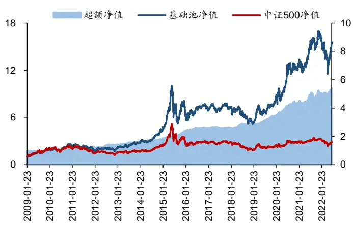
资料来源：Wind，朝阳永续，华泰研究

图表69： 基础股票池 1股票数量
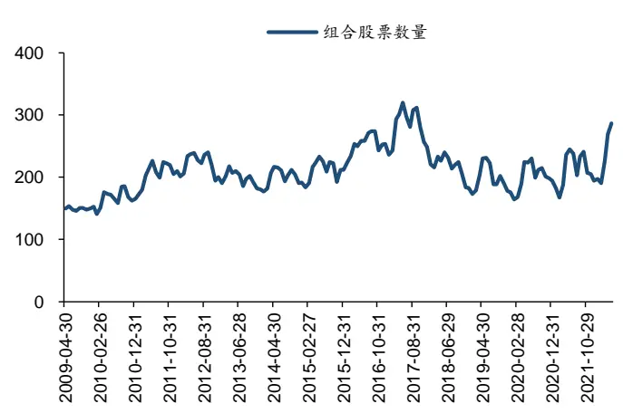
资料来源：Wind，朝阳永续，华泰研究

图表70： 基础股票池 1 分年度业绩（基准中证 500，回测期：20090123-20220630）

| 时间 | 区间收益率 | 区间超额收益 | 年化波动率 | 最大回撤 | 夏普比率 | 卡玛比率 |
| --- | --- | --- | --- | --- | --- | --- |
| 2009 | 105.55% | -2.13% | 32.17% | 18.97% | 3.28 | 5.56 |
| 2010 | 29.54% | 17.56% | 27.66% | 22.37% | 1.07 | 1.32 |
| 2011 | -26.59% | 14.03% | 23.23% | 29.38% | -1.14 | -0.91 |
| 2012 | 14.21% | 12.30% | 24.37% | 20.48% | 0.58 | 0.69 |
| 2013 | 40.77% | 18.43% | 24.23% | 14.65% | 1.68 | 2.78 |
| 2014 | 49.87% | 7.03% | 20.34% | 13.11% | 2.45 | 3.80 |
| 2015 | 91.89% | 32.39% | 44.12% | 47.87% | 2.08 | 1.92 |
| 2016 | -2.01% | 10.14% | 30.12% | 24.50% | -0.07 | -0.08 |
| 2017 | -0.44% | 0.60% | 15.25% | 13.61% | -0.03 | -0.03 |
| 2018 | -28.66% | 10.33% | 25.18% | 29.97% | -1.14 | -0.96 |
| 2019 | 55.84% | 22.28% | 24.06% | 16.68% | 2.32 | 3.35 |
| 2020 | 53.93% | 30.25% | 29.42% | 16.45% | 1.83 | 3.28 |
| 2021 | 32.45% | 16.51% | 20.43% | 12.68% | 1.59 | 2.56 |
| 20220630 | -5.97% | 9.45% |  |  |  |  |
| 成立以来 | 23.47% | 14.07% | 27.24% | 48.50% | 0.86 | 0.48 |

资料来源：Wind，朝阳永续，华泰研究

## 基础池示例 2：forecast_adj_txt 与 forecast_adj 叠加

第二组尝试我们每月末以 forecast_adj_txt 分十层的多头第一层叠加 forecast_adj 分十层的多头第一层为基础股票池。基础股票池的收益特征及股票数量如下图表所示。

图表71： 基础股票池 2 回测净值（回测期：20090123-20220630）
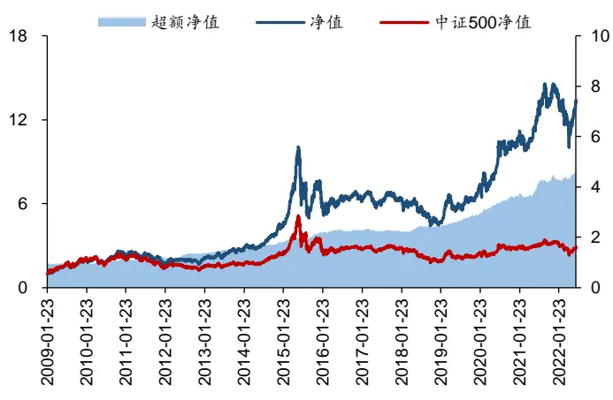
资料来源：Wind，朝阳永续，华泰研究

图表72： 基础股票池 2股票数量
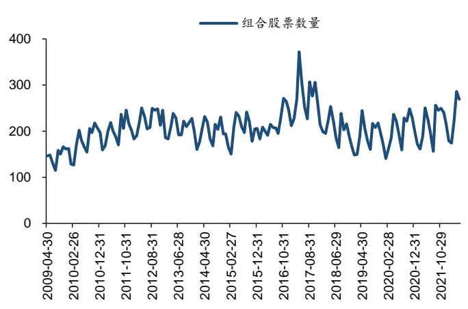
资料来源：Wind，朝阳永续，华泰研究

图表73： 基础股票池 2 分年度业绩（基准中证 500，回测期：20090123-20220630）

| 时间 | 区间收益率 | 区间超额收益 | 年化波动率 | 最大回撤 | 夏普比率 | 卡玛比率 |
| --- | --- | --- | --- | --- | --- | --- |
| 2009 | 108.02% | -0.55% | 33.55% | 21.66% | 3.22 | 4.99 |
| 2010 | 27.60% | 15.72% | 28.13% | 24.75% | 0.98 | 1.12 |
| 2011 | -29.35% | 10.10% | 24.02% | 31.74% | -1.22 | -0.92 |
| 2012 | 15.12% | 13.29% | 24.43% | 19.63% | 0.62 | 0.77 |
| 2013 | 39.55% | 17.52% | 24.11% | 14.84% | 1.64 | 2.67 |
| 2014 | 58.83% | 13.31% | 20.74% | 11.67% | 2.84 | 5.04 |
| 2015 | 76.48% | 22.33% | 43.94% | 50.38% | 1.74 | 1.52 |
| 2016 | -6.75% | 4.53% | 29.87% | 25.65% | -0.23 | -0.26 |
| 2017 | -2.57% | -1.33% | 16.36% | 16.73% | -0.16 | -0.15 |
| 2018 | -29.57% | 8.93% | 25.08% | 31.34% | -1.18 | -0.94 |
| 2019 | 52.42% | 19.29% | 23.74% | 18.29% | 2.21 | 2.87 |
| 2020 | 52.91% | 28.99% | 28.78% | 16.15% | 1.84 | 3.28 |
| 2021 | 35.66% | 19.75% | 20.86% | 12.74% | 1.71 | 2.80 |
| 20220630 | -6.16% | 9.26% |  |  |  |  |
| 成立以来 | 22.02% | 12.83% | 27.40% | 55.98% | 0.80 | 0.39 |

资料来源：Wind，朝阳永续，华泰研究

## 基础池增强：FADT 选股组合

本文的最后，我们基于基础股票池继续构建增强组合，这里我们直接以forecast_adj_txt的第一层为基础股票池。从基本面出发，我们认为ROE、营业收入、净利润、经营性现金流等维度是考察一只股票首先会关注的环节，应予以考虑；从技术面出发，我们发现反转、换手、尾盘成交占比等因子对基础池具有较好的区分度，也予以考虑；此外我们还考虑股票的市值风格。上述考虑的要素我们都以因子的形式体现，各要素具体选择的因子如下表所示。

图表74： 用于基础股票池增强的因子

| 维度 | 因子类型 | 因子名称 | 因子计算方法 | 因子方向 |
| --- | --- | --- | --- | --- |
| 基本面 | 财务质量 | ROE_q | 单季度 ROE | 1 |
|  | 估值 | OCFP | 经营性现金流（TTM）/总市值 | 1 |
|  | 成长 | Profit_G_q | 净利润 YTD 同比 | 1 |
|  | 成长 | Sales_G_q | 营业收入 YTD 同比 | 1 |
| 技术面 | 反转 | exp_wgt_return_1m | 个股最近 N个月内用每日换手率乘以函数 exp(-x_i/N/4) | -1 |
|  | 反转 | exp_wgt_return_6m | 再乘以每日收益率求算术平均值，x_i为该日距离截面日的交易-1 日的个数，N=1，6 |  |
|  | 换手 | bias_turn_1m | 个股最近1个月内日均换手率除以最近2年内日均换手率 (剔除停牌、涨跌停的交易日)再减去1 | -1 |
|  | 日内量价 | trans_at_last_ratio | 每各交易日最后半小时的成交量占全天成交量之比，对过去一-1 个月求均值 |  |
| 市值 | 市值 | In_capital | 对数总市值 | -1 |

资料来源：华泰研究

图表75： 基本面因子在基础股票池内分层回测年化收益
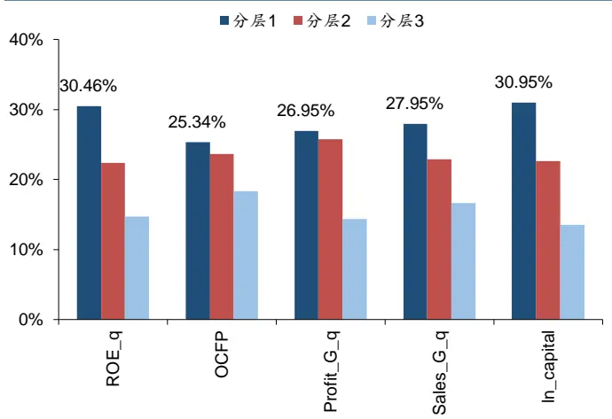
资料来源：Wind，朝阳永续，华泰研究

图表76： 技术面因子在基础股票池内分层回测年化收益
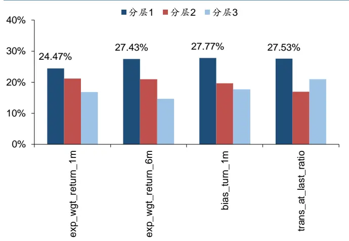
资料来源：Wind，朝阳永续，华泰研究

图表77： 增强组合回测业绩（回测期：20090123-20220630）
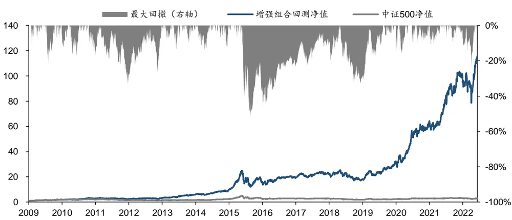
资料来源：Wind，朝阳永续，华泰研究

图表78： 增强组合回测超额净值（基准中证 500，回测期：20090123-20220630）
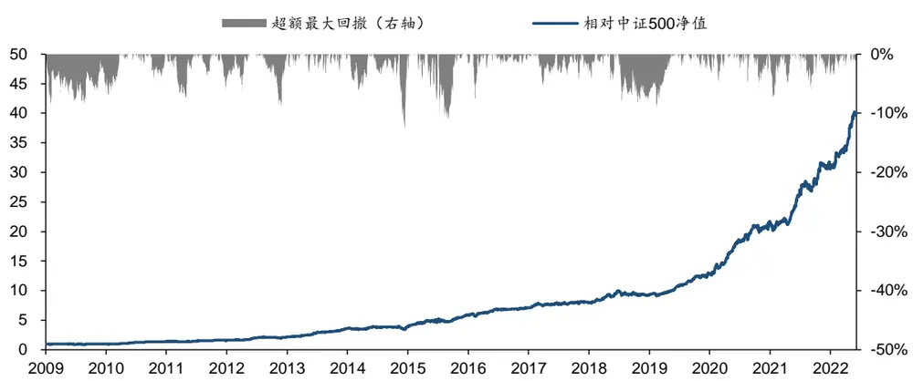
资料来源：Wind，朝阳永续，华泰研究

每月末，我们使用上述因子进行等权合成，合成之前需要对因子进行行业市值中性化处理，同时对因子方向进行调整。根据合成得分，我们选择靠前的25只股票等权重持有，每月第一个交易日调仓，剔除停牌股票及调仓日涨跌停股票（不剔除ST股票），交易手续费取双边千分之三。回测结果如上图所示，该组合回测区间内年化收益 44.13%，夏普比率 1.48，平均年化双边换手约16倍。分年度业绩情况如下表所示。我们将该组合称为FADT选股组合。

图表79： 增强组合分年度业绩（基准中证 500，回测期：20090123-20220630）

| 时间 | 区间收益率 | 区间超额收益 | 年化波动率 | 最大回撤 | 夏普比率 | 卡玛比率 |
| --- | --- | --- | --- | --- | --- | --- |
| 2009 | 109.96% | -0.29% | 32.11% | 21.15% | 3.42 | 5.20 |
| 2010 | 53.44% | 39.70% | 29.08% | 16.82% | 1.84 | 3.18 |
| 2011 | -20.18% | 24.71% | 25.20% | 28.04% | -0.80 | -0.72 |
| 2012 | 31.55% | 30.99% | 26.90% | 24.86% | 1.17 | 1.27 |
| 2013 | 101.11% | 69.82% | 27.52% | 13.58% | 3.67 | 7.45 |
| 2014 | 41.50% | 0.44% | 23.97% | 14.40% | 1.73 | 2.88 |
| 2015 | 142.76% | 64.88% | 48.61% | 52.04% | 2.94 | 2.74 |
| 2016 | 10.20% | 23.74% | 31.94% | 24.42% | 0.32 | 0.42 |
| 2017 | 14.42% | 15.13% | 18.02% | 15.25% | 0.80 | 0.95 |
| 2018 | -25.05% | 12.49% | 29.16% | 32.93% | -0.86 | -0.76 |
| 2019 | 73.69% | 36.39% | 25.49% | 15.77% | 2.89 | 4.67 |
| 2020 | 104.58% | 74.01% | 31.57% | 16.24% | 3.31 | 6.44 |
| 2021 | 71.76% | 50.59% | 23.37% | 10.64% | 3.07 | 6.75 |
| 20220630 | 12.48% | 25.21% |  |  |  |  |
| 成立以来 | 44.13% | 31.52% | 29.72% | 52.04% | 1.48 | 0.85 |

资料来源：Wind，朝阳永续，华泰研究

## 组合分析

最后我们对组合的持仓分布、风格进行分析。从持仓分布来看，FADT选股组合在各板块分布较为均衡，整体科技、消费板块上的股票配置数量偏多，周期、金融等板块股票配置偏少。宽基指数上，整体覆盖度偏中小市值股票，中证1800股票池内的股票平均来看覆盖度只能占到约 50%（中证 1800 成分股是指沪深 300+中证 500+中证 1000）。实际上大市值股票由于市场关注度高，分析师覆盖透彻，可能更不容易频繁出现大幅度的盈利预测调整，而市场关注度低的股票则相反，因此FADT股票池更多覆盖中小市值股票也合理。

图表80： FADT 选股组合各截面期板块分布情况
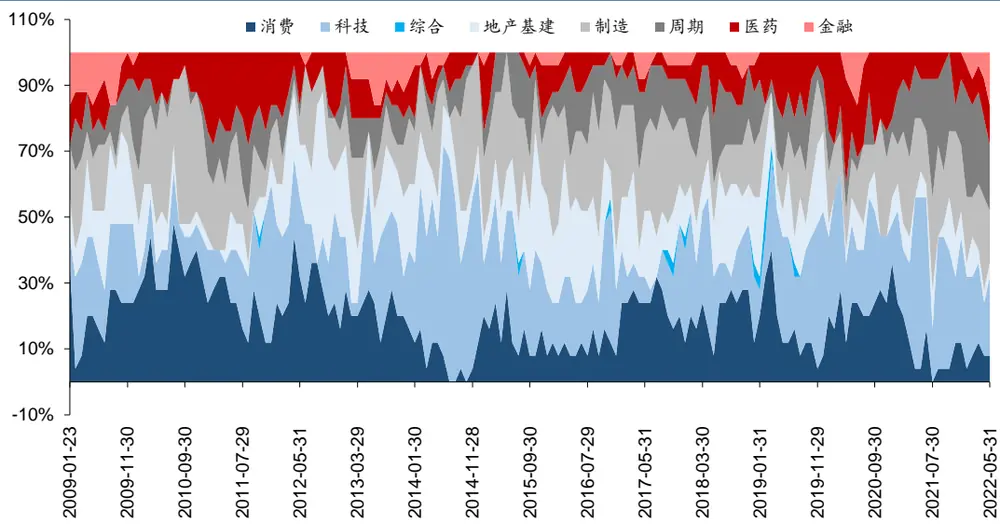
资料来源：Wind，朝阳永续，华泰研究

图表81： FADT 选股组合各截面期宽基指数覆盖度情况
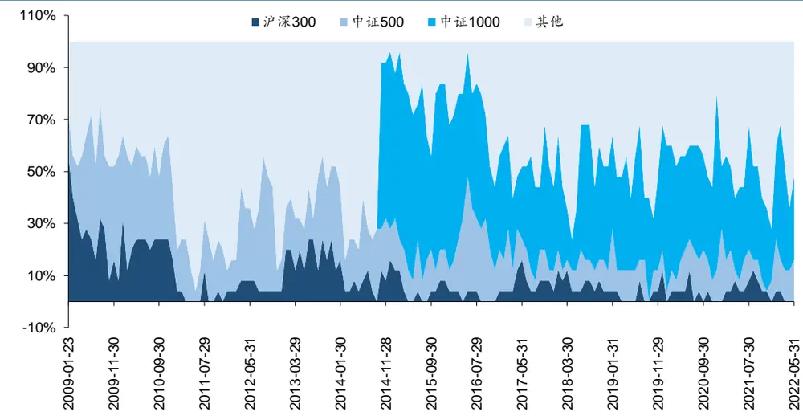
资料来源：Wind，朝阳永续，华泰研究

从 FADT 组合的 Barra 风格因子暴露程度来看，组合在市值风格上的负向暴露比较高，即偏小市值风格；在成长因子上长期为较明显的正向暴露，成长风格明显；在盈利因子上整体为正向暴露，说明FADT股票池注重成分股的盈利水平。

图表82： FADT 组合在市值因子上的暴露程度
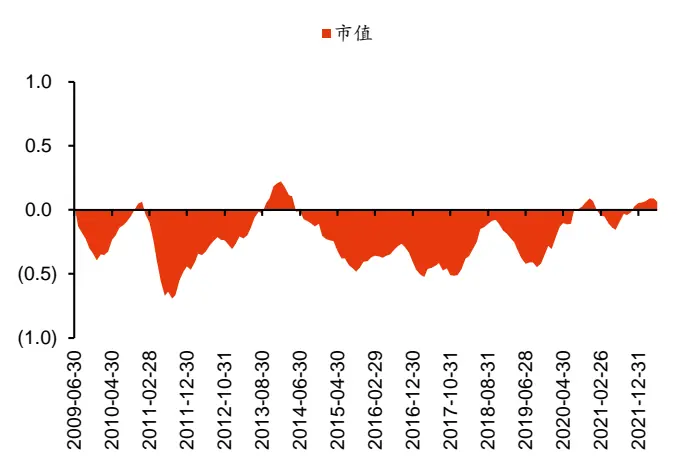
资料来源：Wind，朝阳永续，华泰研究

图表83： FADT 组合在 Beta因子上的暴露程度
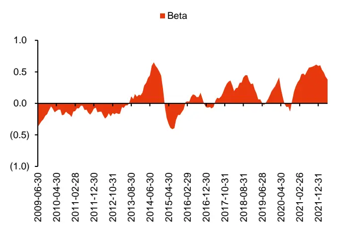
资料来源：Wind，朝阳永续，华泰研究

图表84： FADT 组合在动量因子上的暴露程度
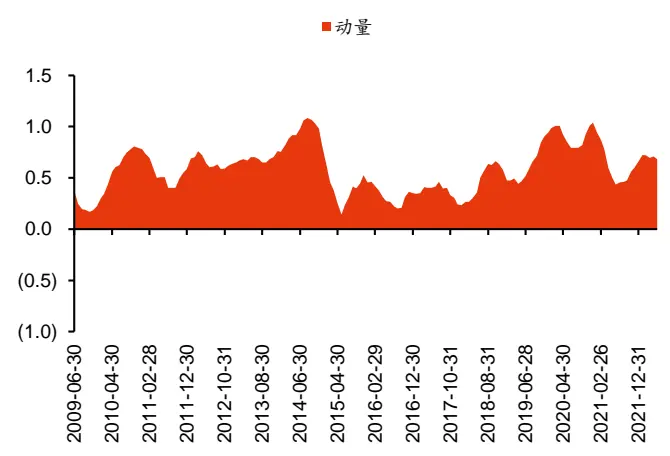
资料来源：Wind，朝阳永续，华泰研究

图表85： FADT 组合在残差波动率因子上的暴露程度
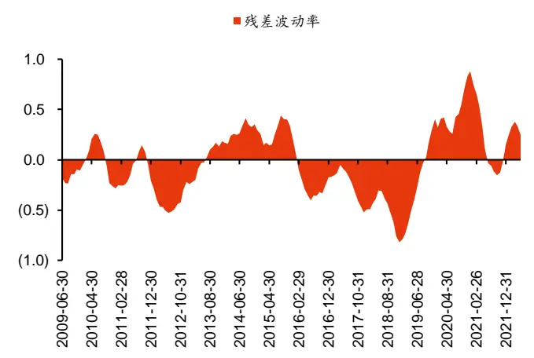
资料来源：Wind，朝阳永续，华泰研究

图表86： FADT 组合在非线性市值因子上的暴露程度
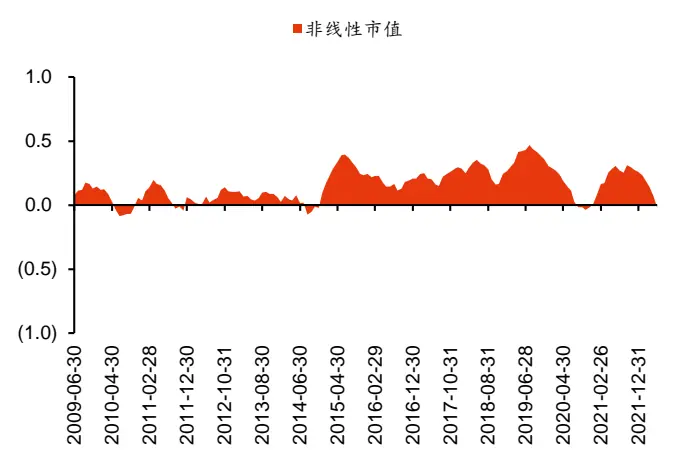
资料来源：Wind，朝阳永续，华泰研究

图表87： FADT 组合在 BP因子上的暴露程度
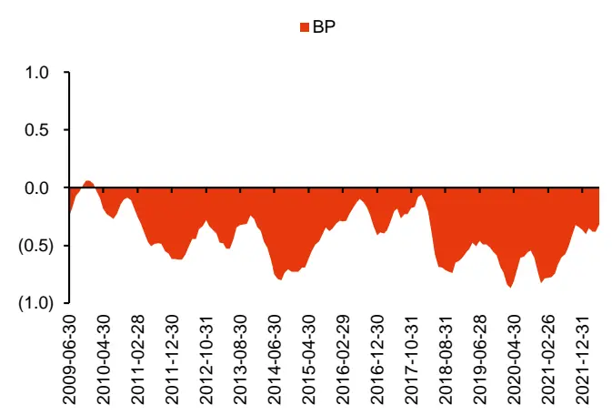
资料来源：Wind，朝阳永续，华泰研究

图表88： FADT 组合在流动性因子上的暴露程度
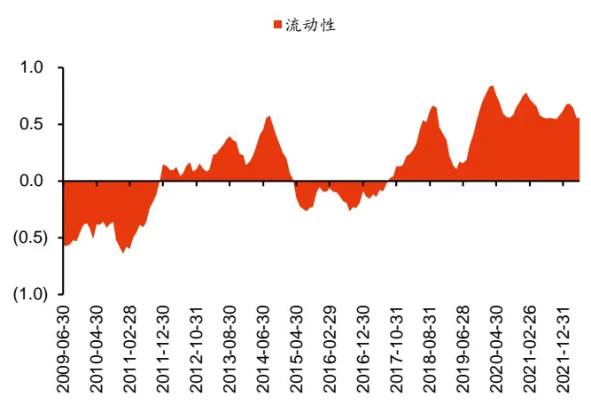
资料来源：Wind，朝阳永续，华泰研究

图表89： FADT 组合在盈利因子上的暴露程度
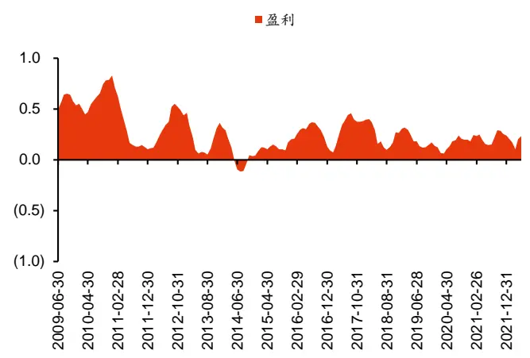
资料来源：Wind，朝阳永续，华泰研究

图表90： FADT 组合在成长因子上的暴露程度
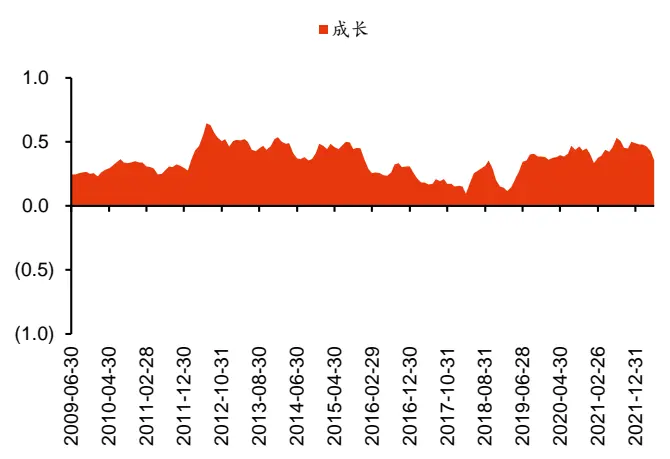
资料来源：Wind，朝阳永续，华泰研究

图表91： FADT 组合在杠杆因子上的暴露程度
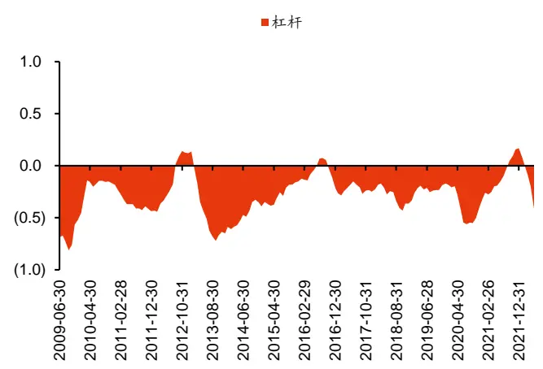
资料来源：Wind，朝阳永续，华泰研究

最后我们分析选股组合的单日交易策略容量。首先我们计算组合中每只股票的过去20个交易日日均成交额，该成交额的 10%作为每只股票单日可买入的最大金额；再将组合内所有股票日均成交额的下侧1/4分位数乘以组合股票数量，即为组合单日可买入的最大金额。从结果来看，历史平均单日策略容量为1.5亿元左右，如果需要进一步提高策略容量，可以考虑多个交易日建仓，同时降低调仓频率。

图表92： FADT 选股组合策略容量
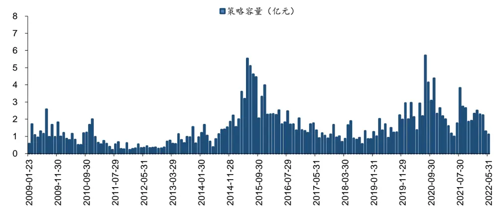
资料来源：Wind，朝阳永续，华泰研究

## 总结与思考

## 本文总结

本文承接前期报告《人工智能51：文本PEAD选股策略》的研究思路，进一步对分析师盈利预测调整及评级调整当中的文本数据进行挖掘，构建的forecast_adj_txt因子表现较为优秀：从因子视角来看，该因子分十层回测严格单调，多头端收益显著，且与传统的forecast_adj 因子相关性低；从主动选股的视角来看，以该因子多头第一层为基础池进行进一步股票精选，构建出的主动量化FADT选股组合回测期内年化收益达到44.13%，相对中证500年化超额超过30%。

与前期研究相比，本文在模型构建层面方法论没有太大差别，主要区别在于应用场景不同导致的数据源有所精简。本文的初衷是找出对股价有重要影响的“催化剂”事件，通过分析师盈利预测及评级调整，我们希望通过间接的方式找出这种事件，因此我们的目标转换为对盈利预测调整的文本进行识别，找出分析师情感偏正向的调整事件。通过目标转换，我们只需要用到盈利预测调整研报这一组数据源（前期研究需要用到业绩公告+研报两组数据源）。

在构建模型时，我们会对分析师研报文本进行分词，保留信噪比高的词语，并进一步转换为词频矩阵，以词频矩阵作为训练特征；同时以研报发布前后两天个股的超额收益为标签训练模型。在样本外我们根据模型预测得分构建 forecast_adj_txt 因子。测试结果表明forecast_adj_txt 因子多头收益显著，分层效果严格单调，同时与传统方法构建的forecast_adj 因子相关性低。

在正文中我们花了比较多的篇幅来讨论整个模型构建过程中的参数敏感性问题，核心结论为：文本因子的构建基本不存在人为过度调参导致的过拟合问题，模型参数稳健性较高，分析师盈利预测调整研报文本的情感识别是信噪比较低且规律不易随时间改变的场景。在测试过程中，我们主要讨论了以下参数：训练使用的非线性模型、研报标题和摘要采用的词数、样本内窗口长度、样本标签的时间区间、标签分类数量等。

本文的最后我们从主动量化选股的角度出发对forecast_adj_txt多头第一层的股票池进行精选。首先我们考虑股票的ROE、净利润、营业收入、经营活动现金流等考察一只股票首先会关注的基本面指标；其次我们考虑股票的反转、换手、尾盘成交占比等技术因素；最后我们还将市值风格纳入考虑。上述要素以因子的形式呈现，每月末将上述因子进行方向调整后等权合成，根据合成得分选择排名靠前的 25 只股票等权持有，该组合自 2009 年以来年化收益44.13%，夏普比率1.48，年化双边换手16倍。我们将该组合命名为FADT组合。

FADT选股组合整体偏中小市值，在宽基指数上覆盖度为非中证1800>中证1000>中证500>沪深300；组合偏成长风格，从历史平均来看在消费、科技板块上的配置数量偏多，在医药、金融板块上的配置数量偏少。分析组合的 Barra 风格因子暴露，市值因子负向暴露明显，盈利和成长因子正向暴露明显。

## 思考与展望

最后，整个策略还存在什么问题？我们希望能进行一些有意义的讨论，以此启发后续研究。

## 策略容量的讨论

在本报告的最后我们对 FADT 选股组合的策略容量进行了估算，整个组合的日均最大可交易金额约为 1.5 亿左右，如果我们拿出一周的时间进行调仓，最大交易金额约为 7.5 亿元，按每期单边 70%换手率计算，则策略容量约为 10.7 亿元。但目前框架下我们为月频调仓，因此一周的调仓期可能会对组合带来较大的收益损失。所以如何提升策略容量是我们想讨论的第一个问题。

1）我们尝试直接在原始FADT持仓组合的基础上，修改为双月频调仓，即按原始持仓每隔一个月进行调仓，这样每年进行 6 次调仓，年化双边换手降低为 8 倍。从下图所展示的回测净值来看，年化收益从月频调仓的 44.13%降低为 40.51%，削弱大约 4%；修改为双月频调仓后，调仓或建仓的时间区间要求则更低，如果以 2 周为调仓周期，则整个组合的策略容量大约可以达到20亿左右。

图表93： 双月频 FADT 选股组合回测净值（基准中证 500，回测期：20090123-20220630）
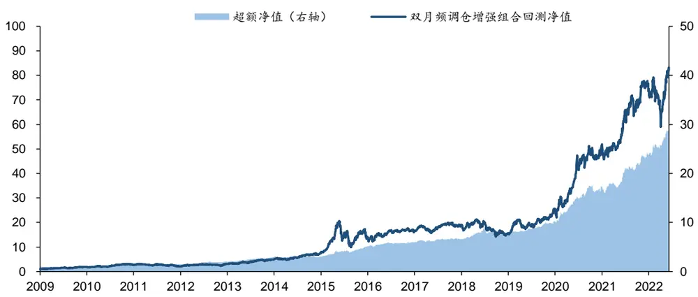
资料来源：Wind，朝阳永续，华泰研究

图表94： 双月频 FADT 选股组合分年度业绩（基准中证 500，回测期：20090123-20220630）

| 时间 | 区间收益率 | 区间超额收益 | 年化波动率 | 最大回撤 | 夏普比率 | 卡玛比率 |
| --- | --- | --- | --- | --- | --- | --- |
| 2009 | 102.43% | -3.89% | 32.06% | 20.94% | 3.20 | 4.89 |
| 2010 | 58.82% | 44.37% | 28.56% | 15.18% | 2.06 | 3.87 |
| 2011 | -27.00% | 14.48% | 26.21% | 30.87% | -1.03 | -0.87 |
| 2012 | 35.98% | 34.60% | 25.81% | 22.78% | 1.39 | 1.58 |
| 2013 | 75.00% | 46.88% | 27.06% | 14.20% | 2.77 | 5.28 |
| 2014 | 40.39% | 0.10% | 22.84% | 13.43% | 1.77 | 3.01 |
| 2015 | 153.42% | 75.06% | 47.66% | 51.51% | 3.22 | 2.98 |
| 2016 | 7.29% | 19.12% | 29.75% | 23.23% | 0.25 | 0.31 |
| 2017 | 11.53% | 12.82% | 16.86% | 15.58% | 0.68 | 0.74 |
| 2018 | -22.05% | 20.98% | 29.38% | 32.16% | -0.75 | -0.69 |
| 2019 | 58.75% | 24.41% | 25.03% | 18.15% | 2.35 | 3.24 |
| 2020 | 107.23% | 75.67% | 31.67% | 14.46% | 3.39 | 7.42 |
| 2021 | 60.27% | 41.08% | 23.83% | 11.95% | 2.53 | 5.04 |
| 20220630 | 7.52% | 20.22% |  |  |  |  |
| 成立以来 | 40.51% | 27.98% | 29.20% | 51.51% | 1.39 | 0.79 |

资料来源：Wind，朝阳永续，华泰研究

2）另一个较为直观的方法是持有更多的股票数量，例如最后的增强组合持有 30/40/50 只股票，当然对应的年化收益会有所削弱，经测算持有 30 只股票年化为 40.73%；持有 40只股票年化为36.92%；持有50只股票年化为34.64%。随着股票数量的增多，年化收益的削弱较为明显，因此持股数量与收益需根据实际情况进行权衡。

3）Mark Minervini 曾在《股票魔法师》中提到“资金利用率”这个概念，从主观投资者的角度出发，选股并不是一个固定频率的过程（即并不是我们的月频回测框架），而是以最大化“资金利用率”为目标，不定期调仓。试想，如果我们确实选到了经“催化剂”事件以后股价开始进入主升浪的股票，那么在下一个预设的调仓期，如果股票技术形态并未走坏，我们是否有必要一定按照原定持仓更换掉这只股票？能否等到这只股票技术形态开始破坏以后再逐步减仓以降低换手率、提高资金利用效率，从而提高策略容量？或许在主动量化选股的回测框架层面，我们还有更多的细节值得探索。下图给出了具体的一个例子。

图表95： 复盘 FADT 历史持仓示例：英科医疗（300677.SZ）
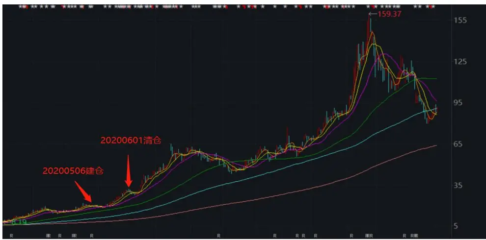
资料来源：Wind，华泰研究

上图给出了FADT历史持仓中的一个例子。20200506 我们建仓英科医疗（300677.SZ）这只股票，建仓平均成本价18.92；20200601我们清仓了这只股票，清仓平均成本价30.86，区间收益63.11%。但是观察彼时该股票的技术形态，实际上处于非常完美的多头排列状态（短均线位于长均线上方，依次排列），技术形态没有明显破坏，那么我们是否有必要在20200601当天清仓？或许我们无法完美在第一个股价局部峰值处卖出，但即使按技术形态开始有所走坏的2020年8-9月份，我们按最低价的42.67卖出，持有收益也达到125.53%。这提示我们，严格按照预设固定频率进行调仓，或许并不是最优的主动量化回测框架，采用一些技术手段或许能降低换手率，提高资金利用效率。

## 模型层面的讨论

模型层面，实际上备受质疑的一个点我们仍然没有很好的给出答案。模型在识别分析师研报情感时，仍然是以逐个词语进行识别的，浅度学习模型能否学习到词语之间的组合关系实际上并不好解释。例如“上调”前面跟的是“成本”还是“盈利”，实际上对于语义理解的影响很大，但是本文使用的浅度学习模型似乎很难从逻辑上完美解释为什么能很好地识别这种词语组合。在后续的研究中，我们会继续朝着这个点进行改进，尝试自然语言处理中的更多高阶模型，希望能提高模型的逻辑自洽程度。

## 风险提示

通过机器学习模型构建选股策略是历史经验的总结，存在失效的可能。人工智能模型可解释程度较低，使用须谨慎。量化因子的效果与宏观环境和大盘走势密切相关，历史结果不能预测未来，敬请注意。

## 免责声明

## 分析师声明

本人，林晓明、李子钰、何康，兹证明本报告所表达的观点准确地反映了分析师对标的证券或发行人的个人意见；彼以往、现在或未来并无就其研究报告所提供的具体建议或所表迖的意见直接或间接收取任何报酬。

## 一般声明及披露

本报告由华泰证券股份有限公司（已具备中国证监会批准的证券投资咨询业务资格，以下简称“本公司”）制作。本报告所载资料是仅供接收人的严格保密资料。本报告仅供本公司及其客户和其关联机构使用。本公司不因接收人收到本报告而视其为客户。

本报告基于本公司认为可靠的、已公开的信息编制，但本公司及其关联机构(以下统称为“华泰”)对该等信息的准确性及完整性不作任何保证。

本报告所载的意见、评估及预测仅反映报告发布当日的观点和判断。在不同时期，华泰可能会发出与本报告所载意见、评估及预测不一致的研究报告。同时，本报告所指的证券或投资标的的价格、价值及投资收入可能会波动。以往表现并不能指引未来，未来回报并不能得到保证，并存在损失本金的可能。华泰不保证本报告所含信息保持在最新状态。华泰对本报告所含信息可在不发出通知的情形下做出修改，投资者应当自行关注相应的更新或修改。

本公司不是 FINRA 的注册会员，其研究分析师亦没有注册为 FINRA 的研究分析师/不具有 FINRA 分析师的注册资格。

华泰力求报告内容客观、公正，但本报告所载的观点、结论和建议仅供参考，不构成购买或出售所述证券的要约或招揽。该等观点、建议并未考虑到个别投资者的具体投资目的、财务状况以及特定需求，在任何时候均不构成对客户私人投资建议。投资者应当充分考虑自身特定状况，并完整理解和使用本报告内容，不应视本报告为做出投资决策的唯一因素。对依据或者使用本报告所造成的一切后果，华泰及作者均不承担任何法律责任。任何形式的分享证券投资收益或者分担证券投资损失的书面或口头承诺均为无效。

除非另行说明，本报告中所引用的关于业绩的数据代表过往表现，过往的业绩表现不应作为日后回报的预示。华泰不承诺也不保证任何预示的回报会得以实现，分析中所做的预测可能是基于相应的假设，任何假设的变化可能会显著影响所预测的回报。

华泰及作者在自身所知情的范围内，与本报告所指的证券或投资标的不存在法律禁止的利害关系。在法律许可的情况下，华泰可能会持有报告中提到的公司所发行的证券头寸并进行交易，为该公司提供投资银行、财务顾问或者金融产品等相关服务或向该公司招揽业务。

华泰的销售人员、交易人员或其他专业人士可能会依据不同假设和标准、采用不同的分析方法而口头或书面发表与本报告意见及建议不一致的市场评论和/或交易观点。华泰没有将此意见及建议向报告所有接收者进行更新的义务。华泰的资产管理部门、自营部门以及其他投资业务部门可能独立做出与本报告中的意见或建议不一致的投资决策。投资者应当考虑到华泰及/或其相关人员可能存在影响本报告观点客观性的潜在利益冲突。投资者请勿将本报告视为投资或其他决定的唯一信赖依据。有关该方面的具体披露请参照本报告尾部。

本报告并非意图发送、发布给在当地法律或监管规则下不允许向其发送、发布的机构或人员，也并非意图发送、发布给因可得到、使用本报告的行为而使华泰违反或受制于当地法律或监管规则的机构或人员。

本报告版权仅为本公司所有。未经本公司书面许可，任何机构或个人不得以翻版、复制、发表、引用或再次分发他人(无论整份或部分)等任何形式侵犯本公司版权。如征得本公司同意进行引用、刊发的，需在允许的范围内使用，并需在使用前获取独立的法律意见，以确定该引用、刊发符合当地适用法规的要求，同时注明出处为“华泰证券研究所”，且不得对本报告进行任何有悖原意的引用、删节和修改。本公司保留追究相关责任的权利。所有本报告中使用的商标、服务标记及标记均为本公司的商标、服务标记及标记。

## 中国香港

本报告由华泰证券股份有限公司制作,在香港由华泰金融控股（香港）有限公司向符合《证券及期货条例》及其附属法律规定的机构投资者和专业投资者的客户进行分发。华泰金融控股（香港）有限公司受香港证券及期货事务监察委员会监管，是华泰国际金融控股有限公司的全资子公司，后者为华泰证券股份有限公司的全资子公司。在香港获得本报告的人员若有任何有关本报告的问题,请与华泰金融控股（香港）有限公司联系。

## 香港-重要监管披露

- 华泰金融控股（香港）有限公司的雇员或其关联人士没有担任本报告中提及的公司或发行人的高级人员。

- 有关重要的披露信息，请参华泰金融控股（香港）有限公司的网页 https://www.htsc.com.hk/stock_disclosure其他信息请参见下方 “美国-重要监管披露”。

## 美国

在美国本报告由华泰证券（美国）有限公司向符合美国监管规定的机构投资者进行发表与分发。华泰证券（美国）有限公司是美国注册经纪商和美国金融业监管局（FINRA）的注册会员。对于其在美国分发的研究报告，华泰证券（美国）有限公司根据《1934年证券交易法》（修订版）第15a-6条规定以及美国证券交易委员会人员解释，对本研究报告内容负责。华泰证券（美国）有限公司联营公司的分析师不具有美国金融监管（FINRA）分析师的注册资格，可能不属于华泰证券（美国）有限公司的关联人员，因此可能不受 FINRA 关于分析师与标的公司沟通、公开露面和所持交易证券的限制。华泰证券（美国）有限公司是华泰国际金融控股有限公司的全资子公司，后者为华泰证券股份有限公司的全资子公司。任何直接从华泰证券（美国）有限公司收到此报告并希望就本报告所述任何证券进行交易的人士，应通过华泰证券（美国）有限公司进行交易。

## 美国-重要监管披露

- 分析师林晓明、李子钰、何康本人及相关人士并不担任本报告所提及的标的证券或发行人的高级人员、董事或顾问。分析师及相关人士与本报告所提及的标的证券或发行人并无任何相关财务利益。本披露中所提及的“相关人士”包括 FINRA 定义下分析师的家庭成员。分析师根据华泰证券的整体收入和盈利能力获得薪酬，包括源自公司投资银行业务的收入。

华泰证券股份有限公司、其子公司和/或其联营公司, 及/或不时会以自身或代理形式向客户出售及购买华泰证券研究所覆盖公司的证券/衍生工具，包括股票及债券（包括衍生品）华泰证券研究所覆盖公司的证券/衍生工具，包括股票及债券（包括衍生品）。

- 华泰证券股份有限公司、其子公司和/或其联营公司, 及/或其高级管理层、董事和雇员可能会持有本报告中所提到的任何证券（或任何相关投资）头寸，并可能不时进行增持或减持该证券（或投资）。因此，投资者应该意识到可能存在利益冲突。

## 评级说明

投资评级基于分析师对报告发布日后6至12个月内行业或公司回报潜力（含此期间的股息回报）相对基准表现的预期（A股市场基准为沪深300指数，香港市场基准为恒生指数，美国市场基准为标普500指数），具体如下：

## 行业评级

增持：预计行业股票指数超越基准

中性：预计行业股票指数基本与基准持平

减持：预计行业股票指数明显弱于基准

## 公司评级

买入：预计股价超越基准15%以上

增持：预计股价超越基准5%~15%

持有：预计股价相对基准波动在-15%~5%之间

卖出：预计股价弱于基准15%以上

暂停评级：已暂停评级、目标价及预测，以遵守适用法规及/或公司政策

无评级：股票不在常规研究覆盖范围内。投资者不应期待华泰提供该等证券及/或公司相关的持续或补充信息

## 法律实体披露

中国：华泰证券股份有限公司具有中国证监会核准的“证券投资咨询”业务资格，经营许可证编号为：91320000704041011J香港：华泰金融控股（香港）有限公司具有香港证监会核准的“就证券提供意见”业务资格，经营许可证编号为：AOK809美国：华泰证券（美国）有限公司为美国金融业监管局（FINRA）成员，具有在美国开展经纪交易商业务的资格，经营业务许可编号为：CRD#:298809/SEC#:8-70231

## 华泰证券股份有限公司

## 南京

南京市建邺区江东中路228号华泰证券广场1号楼/邮政编码：210019

电话：86 25 83389999/传真：86 25 83387521

电子邮件：ht-rd@htsc.com

深圳
深圳市福田区益田路5999号基金大厦10楼/邮政编码：518017
电话：86 755 82493932/传真：86 755 82492062
电子邮件：ht-rd@htsc.com

## 华泰金融控股（香港）有限公司

香港中环皇后大道中 99号中环中心 58楼 5808-12室

电话：+852-3658-6000/传真：+852-2169-0770

电子邮件：research@htsc.com

http://www.htsc.com.hk

## 华泰证券（美国）有限公司

美国纽约哈德逊城市广场 10号 41楼（纽约 10001）

## ©版权所有2022年华泰证券股份有限公司

电话：+212-763-8160/传真：+917-725-9702

电子邮件: Huatai@htsc-us.com

http://www.htsc-us.com

北京
北京市西城区太平桥大街丰盛胡同28号太平洋保险大厦A座18层/
邮政编码：100032
电话：86 10 63211166/传真：86 10 63211275
电子邮件：ht-rd@htsc.com
上海
上海市浦东新区东方路18号保利广场E栋23楼/邮政编码：200120
电话：86 21 28972098/传真：86 21 28972068
电子邮件：ht-rd@htsc.com