# 分析师共同覆盖因子和图神经网络

华泰研究

2022年7月07日|中国内地

深度研究

## 人工智能58：构建基于分析师共同覆盖的因子，并融入图神经网络测试

由于金融市场中存在各种公司间关联，上市公司的股价并非完全独立地各自运行，而是呈现出领先滞后的现象，刻画上市公司的关联对于市场研究有积极意义。本文参考已有的研究，认为分析师共同覆盖可以从最根本的层面刻画上市公司的基本面关联，并进行了定性和定量的说明。实证层面，本文构建了基于分析师共同覆盖的关联动量因子，因子能表示股票间的短期领先滞后现象。同时，分析师共同覆盖能改进传统的反转、换手率、波动率因子，其背后的机制是均值回复现象。最后，本文将分析师共同覆盖融入图神经网络中，可提升对三类量价因子的合成效果。

## 分析师共同覆盖可以从最根本的层面刻画上市公司的基本面关联

近20多年来，学界对于上市公司间的股价关联动量效应进行了大量研究，Ali and Hirshleifer (2019) 提出了基于分析师共同覆盖的关联动量，并认为分析师共同覆盖能从最根本的层面刻画出上市公司的基本面关联，可以解释前人研究中的各类上市公司间关联动量现象。本文基于A股市场数据，构建了基于分析师共同覆盖的上市公司间关联，并通过社区发现Louvain算法，论证了分析师共同覆盖的上市公司具有基本面上的关联性，且这种关联性涉及多种基本面的角度，如同行业、同供应链、相似业务等。

## 基于分析师共同覆盖的关联动量因子能表示股票间的短期领先滞后现象

本文参照 Ali and Hirshleifer (2019)中的因子构建方法，构建了基于分析师共同覆盖的关联动量因子CFRET，该因子认为与某只股票关联的其他股票过去一段时间的收益率可以预测该股票未来的收益率，即体现出股票涨跌的领先滞后效应，本文还构建了行业关联动量因子和板块关联动量因子进行对比。在多种测试条件下，CFRET因子TOP组合都表现最好，侧面说明了分析师共同覆盖确实是刻画股票间关系的有效方式。此外，股票间的关联动量效应可能偏短期，持续时间在一周左右。

分析师共同覆盖能改进反转、换手率、波动率因子，机制是均值回复现象基于金融市场均值回复的现象，本文进一步构建了基于分析师共同覆盖的改进反转因子CFREV、改进换手率因子CFTURN、改进波动率因子CFSTD。对于CFREV， 其含义是前期自身跌幅较大，但关联股票涨幅较大的股票因子取值较大，是均值回复现象的表现(CFTURN和CFSTD的含义类似)。本文还构建了相应的行业改进因子和板块改进因子进行对比。在多种测试条件下，基于分析师共同覆盖的改进因子均能获得更好的表现，进一步说明了分析师共同覆盖确实是刻画股票间关系的有效方式。

将分析师共同覆盖融入图神经网络中，可提升对三类量价因子的合成效果本文将分析师共同覆盖关系输入图神经网络GAT，作为一种显式建图的方式来测试其在因子合成中的效果。针对反转、换手率、波动率因子的合成，相比全连接网络，GAT 的 RankIC 从 6.87%提升到 7.29%，ICIR 从 0.46提升到 0.55，分5层测试TOP组合年化超额收益率提升了3.17%，分析师共同覆盖确实为三个因子的合成贡献了增量信息。本文还从注意力权重矩阵的角度对GAT做可解释性分析，结论有：(1)相比关联股票，股票自身的特征对于收益预测贡献最显著，关联股票的特征能提供一定信息补充；(2)股票之间的相互影响程度是不对称的。

风险提示：因子测试是历史经验的总结，存在失效可能。本文测试的股票池仅包含有分析师覆盖的A股，测试结论不能推广到全A股。神经网络受随机性影响较大，可解释性较低，使用需谨慎。高频调仓受交易费用影响较大。

研究员

SAC No. S0570516010001

林晓明

SFC No. BPY421

linxiaoming@htsc.com

+(86) 755 8208 0134

研究员

SAC No. S0570519110003

李子钰

SFC No. BRV743

liziyu@htsc.com

+(86) 755 2398 7436

研究员

何康，PhD

SAC No. S0570520080004

SFC No. BRB318

hekang@htsc.com

+(86) 21 2897 2039

## 分析师共同覆盖 GAT模型累计 RankIC

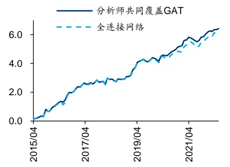
注：回测期：2015/4/1～2022/6/30
资料来源：朝阳永续，Wind，华泰研究

## 分析师共同覆盖：从最根本的层面刻画上市公司的基本面关联

## 文献综述：上市公司间关联动量相关研究

金融市场中，由于各种各样的公司间关联，上市公司的股价并非完全独立地各自运行，而是呈现出领先滞后的现象，即动量溢出效应(momentum spillover effects)。学界普遍认为，这主要是投资者的有限关注(limitedattention)导致信息在公司间的扩散较为缓慢所致。近年来，关于上市公司间关联动量涌现出较多研究成果，主要从不同的角度来定义上市公司之间的关联关系。

1. 行业动量：Moskowitz and Grinblat(1999)论证了美股存在显著的行业动量，过去的行业收益可以预测未来的股票回报。

2. 供应链动量：Menzly and Ozbas(2010) 指出供应链的上下游公司股票收益存在关联性，他们使用进出行业的货物流动数据，发现过去的客户和供应商商业收益来预测未来股票的收益有较好的效果。

3. 地理动量：Parsons et al. (2018)指出同一城市公司股票之间存在领先-滞后关系，即同城但不同行业和其他城市同行业的股价波动对公司未来收益有显著的影响。

4. 文本关联动量：Hoberg and Phillips (2018)提出对上市公司 10-K年度报告的“公司业务和产品”章节进行文本分析构建新的行业分类，新行业分类中存在显著的行业动量。

5. 科技动量：Lee et al. (2018)提出了科技关联度的新视角，通过专利之间的相关系数表示公司之间科技关联度的强弱，研究了科技关联度和公司股票预期收益率的关系，最后指出该因子的内在机制是投资者对于科技信息的反应不足。

6. 分析师共同覆盖动量：Ali and Hirshleifer (2019) 提出了基于分析师共同覆盖的关联动量，并认为分析师共同覆盖能从最根本的层面刻画出上市公司的基本面关联，可以解释以上研究中的各类上市公司间关联动量现象。

## 分析师共同覆盖的内在逻辑

如下图所示，我们按照分析师共同覆盖的逻辑，计算出当前与宁德时代最相关的14家上市公司，这些公司分属三个不同的一级行业。分析师共同覆盖的研究认为，分析师共同覆盖的上市公司具有基本面上的关联性，且这种关联性涉及多种基本面的角度，如同行业、同供应链、同地理位置、相似业务等。

图表1：按照分析师共同覆盖的逻辑，计算出当前与宁德时代最相关的14家上市公司
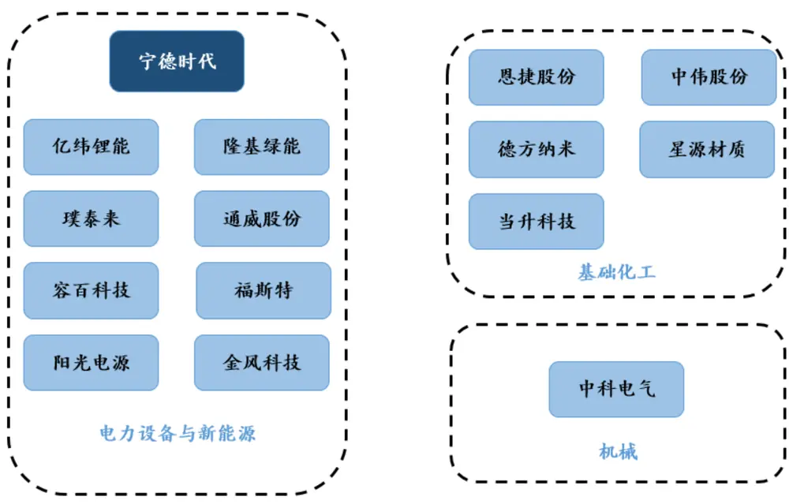
资料来源：朝阳永续，Wind，华泰研究

Ali and Hirshleifer (2019) 从三个方面论证了分析师共同覆盖能从最根本的层面刻画出上市公司的基本面关联。

1. 分析师的工作是收集并分析与上市公司基本面相关的各种信息，如客户、供应商、竞争对手等等，这说明分析师通常会共同覆盖有基本面关联的公司。

2. 如果使用同行业或同地理位置来代表上市公司的关联，会把上市公司聚合成多类，但类内公司的关系是无法精细刻画的。与之相比，分析师共同覆盖则可直接构建两个公司之间的联系。

3.上市公司之间的共享分析师数量是不断变化的，可以用定量方式明确计算出公司之间的关联强弱，这是其他关联动量研究所不具备的。

## 基于分析师共同覆盖的上市公司间关联构建

我们将使用邻接矩阵来表示上市公司间的关联关系，邻接矩阵的构建步骤如下：

1.每个季度末，选取过去6个月的所有分析师报告，列出全部撰写报告的分析师。

2. 对于每个分析师，找到其在过去6个月覆盖的全部上市公司，认为这些上市公司间有关联，即在邻接矩阵的相应位置加1。

3. 针对所有分析师，重复步骤2，即可构建每个季度末的上市公司邻接矩阵。考虑到分析师共同覆盖的数量变化不大，我们每个季度更新一次邻接矩阵。

下图为邻接矩阵的一部分取值，邻接矩阵中的数值代表共同覆盖这两只上市公司的分析师数量。为了避免极端值的影响，我们对邻接矩阵中的数值+1再取对数log得到新的邻接矩阵。

图表2：分析师共同覆盖邻接矩阵的部分取值

|  |  | 宁德时代亿纬锂能 当升科技 |  | 璞泰来恩捷股份 |  | 容百科技隆基绿能 |  | 通威股份 | 福斯特 中伟股份 | 德方纳米 | 星源材质 | 阳光电源 |  | 金风科技 |
| --- | --- | --- | --- | --- | --- | --- | --- | --- | --- | --- | --- | --- | --- | --- |
| 宁德时代 |  | 58 | 54 | 54 | 52 | 46 | 46 | 43 | 43 | 43 | 38 | 35 | 35 | 34 |
| 亿纬锂能 | 58 |  | 40 | 42 | 51 | 38 | 40 | 41 | 44 | 37 | 32 | 33 | 39 | 37 |
| 当升科技 | 54 | 40 |  | 48 | 47 | 52 | 32 | 33 | 40 | 38 | 32 | 34 | 35 | 28 |
| 璞泰来 | 54 | 42 | 48 |  | 45 | 45 | 28 | 32 | 31 | 45 | 33 | 30 | 31 | 26 |
| 恩捷股份 | 52 | 51 | 47 | 45 |  | 43 | 37 | 38 | 36 | 33 | 28 | 34 | 38 | 31 |
| 容百科技 | 46 | 38 | 52 | 45 | 43 |  | 27 | 35 | 33 | 45 | 34 | 28 | 33 | 26 |
| 隆基綠能 | 46 | 40 | 32 | 28 | 37 | 27 |  | 56 | 55 | 20 | 16 | 19 | 47 | 38 |
| 通威股份 | 43 | 41 | 33 | 32 | 38 | 35 | 56 |  | 52 | 26 | 21 | 15 | 48 | 42 |
| 福斯特 | 43 | 44 | 40 | 31 | 36 | 33 | 55 | 52 |  | 27 | 20 | 25 | 46 | 41 |
| 中伟股份 | 43 | 37 | 38 | 45 | 33 | 45 | 20 | 26 | 27 |  | 33 | 25 | 23 | 24 |
| 德方纳米 | 38 | 32 | 32 | 33 | 28 | 34 | 16 | 21 | 20 | 33 |  | 27 | 18 | 16 |
| 星源材质 | 35 | 33 | 34 | 30 | 34 | 28 | 19 | 15 | 25 | 25 | 27 |  | 21 | 14 |
| 阳光电源 | 35 | 39 | 35 | 31 | 38 | 33 | 47 | 48 | 46 | 23 | 18 | 21 |  |  |
| 金风科技 | 34 | 37 | 28 | 26 | 31 | 26 | 38 | 42 | 41 | 24 | 16 | 14 | 37 | 37 |

资料来源：朝阳永续，Wind，华泰研究

## 基于社区发现算法的分析师共同覆盖分析

表示上市公司间关联的邻接矩阵构建好之后，可以进一步使用社区发现算法对邻接矩阵进行分析，得到更为直观的信息。社区发现算法是一种研究复杂网络内部结构的工具。在复杂网络中，社区是一种局部性结构，该局部性结构内部连接紧密，而不同的局部性结构之间连接稀疏。将社区发现算法运用于上市公司间关联的邻接矩阵后，主要可以分析以下两个内容：1）上市公司可以分为哪些社区。2）每个社区的内部构成情况。

图表3：社区发现算法
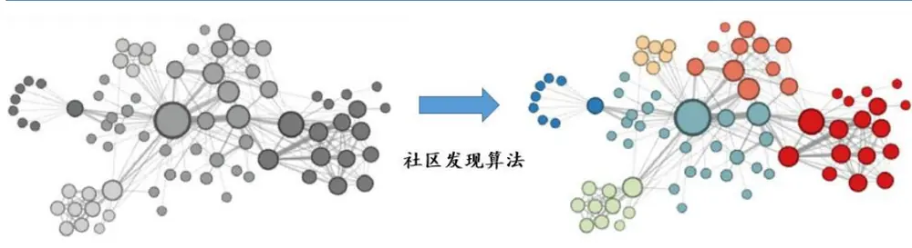
资料来源：华泰研究

在 Python 中可以使用 networkx 工具包中的 Louvain 算法来进行社区发现分析。我们使用截止到2022年3月底的分析师共同覆盖数据构建邻接矩阵，对邻接矩阵进行社区发现分析，可得到13个大的社区，同一社区内的股票具有较高的基本面相似性。如下图所示，我们选取社区1~社区3的部分股票进行简要说明。

图表4：社区发现算法部分结果

| 社区1 |  | 社区2 |  | 社区3 |  |
| --- | --- | --- | --- | --- | --- |
| 股票名称 | 中信一级行业 | 股票名称 | 中信一级行业 | 股票名称 | 中信一级行业 |
| 恒瑞医药 | 医药 | 华立科技 | 传媒 | 中自科技 | 基础化工 |
| 中新药业 | 医药 | 蓝色光标 | 传媒 | 上汽集团 | 汽车 |
| 楚天科技 | 医药 | 宝通科技 | 传媒 | 菱电电控 | 汽车 |
| 海尔生物 | 医药 | 万达电影 | 传媒 | 科博达 | 汽车 |
| 康泰生物 | 医药 | 中南传媒 | 传媒 | 中鼎股份 | 汽车 |
| 智飞生物 | 医药 | 电魂网络 | 传媒 | 长城汽车 | 汽车 |
| 迈瑞医疗 | 医药 | 新媒股份 | 传媒 | 阿尔特 | 汽车 |
| 翔宇医疗 | 医药 | 视觉中国 | 传媒 | 巨一科技 | 机械 |
| 百普赛斯 | 医药 | 三人行 | 传媒 | 双环传动 | 机械 |
| 昭衍新药 | 医药 | 光线传媒 | 传媒 | 比亚迪 | 汽车 |
| 纳微科技 | 基础化工 | 姚记科技 | 轻工制造 | 上声电子 | 汽车 |
| 百克生物 | 医药 | 风语筑 | 建筑 | 银轮股份 | 汽车 |
| 泰林生物 | 机械 | 元隆雅图 | 传媒 | 伯特利 | 汽车 |
| 爱尔眼科 | 医药 | 值得买 | 商贸零售 | 均胜电子 | 汽车 |
| 昊海生科 | 医药 | 天下秀 | 传媒 | 保隆科技 | 汽车 |

资料来源：朝阳永续，Wind，华泰研究

社区1主要包含医药行业的上市公司。尽管该组中纳微科技(688690 CH)和泰林生物(300813CH)所属中信一级行业分别为基础化工和机械行业，但二者均在产业链上与医药行业密切相关。纳微科技主营业务包括纳米微球及医药色谱填料的生产，而色谱填料与层析介质微球均是医药生产中分离纯化的核心材料。通过Wind关系网也可以发现，公司下游主要客户为圣诺医药(688117CH)，是一家主要从事多肽类药物生产开发的公司。泰林生物主营业务为微生物检测与控制技术系统产品、有机物分析仪器等制药装备的研发、制造和销售，同时公司在今年3月份研制出的NC膜是新冠检测试剂盒的重要材料之一。

社区2主要包含传媒行业的上市公司。但同样可以发现姚记科技(002605CH)、风语筑(603466 CH)和值得买(300785 CH)分属中信一级行业的轻工制造、建筑和商贸零售。其中姚记科技主要采取的是“大娱乐”发展战略，主营业务包括扑克牌、移动游戏与互联网创新营销。根据公司2021年年报，其控股子公司包括上海渡鸟翔游网络科技有限公司、大鱼竞技(北京)网络科技，均为游戏内容与短视频营销相关公司。风语筑是中国数字科技应用领域龙头企业，主要在高科技数字化展示应用、内容创意设计等领域有较多专利成果。根据公司2021年报，其有近52%的收入来自于文化及品牌数字化体验空间设计与建设，近47%来自于城市数字化体验空间设计与建设。值得买是一家消费领域门户型网站服务平台，主营业务是运营内容类导购平台“什么值得买”及相应移动客户端。“什么值得买”作为电商导购平台，主要依靠用户贡献内容与消费内容社区作为核心增长点。

社区3主要包含汽车行业的上市公司。其中可以发现中自科技(688737 CH)、巨一科技(688162CH)、双环传动(002472CH)分别归类为中信一级行业的基础化工、机械、机械行业，但从整车生产链上可以发现，三家公司与下游汽车制造生产存在紧密关系。其中中自科技是一家专注于我国移动污染源(机动车、非道路机械、船舶等)尾气处理催化剂领域研发的公司。根据公司2021年年报，其针对重卡的尾气催化剂产品对其总收入的占比达74%。同时根据Wind关系网也可以发现，其下游主要客户包括动力新科(600841 CH，中信一级分类：汽车)与中国重汽集团济南橡塑件有限公司。巨一科技主营业务主要集中于智能装备整体解决方案与电驱动系统。在产业链上属于整车生产链的中游，下游客户涵盖大众、一汽等多家汽车生产商。双环传动主要业务集中于汽车齿轮零部件的生产制造。根据2021年年报，汽车齿轮零部件生产业务占公司总营收的比重达83.6%。

## 基于分析师共同覆盖的关联动量因子

前文中我们构建了基于分析师共同覆盖的上市公司间关联关系，如何将这种关系运用于实际投资将是本文重点关注的内容。本章中，我们将参考Ali and Hirshleifer(2019)提到的方法构建基于分析师共同覆盖的关联动量因子。

Ali and Hirshleifer (2019) 论文中构建了基于分析师共同覆盖的关联动量因子 CF_RET(connected-firm return)，该因子认为与某只股票关联的其他股票过去一段时间的收益率可以预测该股票未来的收益率，即体现出股票涨跌的领先滞后效应(lead-lag effect)。具体来讲，股票i的关联动量因子为CF_RET，与之关联的股票j在过去一段时间的收益率为Retj，股票i和股票j间共同覆盖的分析师数量为 $\mathbf{n_{ij}}$ ，与股票i相关联的股票有N只，则CF_RET的计算方式如下：

$$
\mathrm{CF\_RET_i}=\frac{\sum_{j=1}^{\mathrm{N}}\mathrm{n_{ij}}\mathrm{net_j}}{\sum_{j=1}^{\mathrm{N}}\mathrm{n_{ij}}}
$$

为了避免极端值的影响，本文将 $\mathbf{\dot{n}_{ij}}$ 替换为 $\log(\mathbf{n_{ij}}+1)$ ，使用下式计算CF_RET。

$$
\mathrm{CF\_RET_i}=\frac{\sum_{\mathrm{j}=1}^{\mathrm{N}}\log(\mathrm{n_{ij}}+1)\mathrm{ReLU_j}}{\sum_{\mathrm{j}=1}^{\mathrm{N}}\log(\mathrm{n_{ij}}+1)}
$$

考虑到同行业和同板块也可以描述股票之间的关系，本文构建了行业关联动量因子Cl_RET(connected-industry return)和板块关联动量因子 CS_RET(connected-sectorreturn)，并将对比 CF_RET 与 CI_RET 和 CS_RET 的表现。具体来讲，CI_RET 因子的计算过程中认为同属中信一级行业的股票之间有关联，股票i的行业关联动量因子为CI_RET，与之关联的股票j流通市值为mktj，则CI_RET的计算方式如下：

$$
\mathrm{CI\_RET_i}=\frac{\sum_{j=1}^{N}\log(\mathrm{mkt_j})\mathrm{ReLU_j}}{\sum_{j=1}^{N}\log(\mathrm{mkt_j})}
$$

CS_RET的计算方式与CI_RET完全一致，区别在于使用相同板块来描述股票之间的关系。
下图为中信一级行业和5个板块的对应关系。

图表5：中信一级行业映射至板块

| 板块 | 中信一级行业 |
| --- | --- |
| 周期 | 煤炭、机械、电力设备及新能源、有色金属、基础化工、建材、石油石化、国防军工、钢铁 |
| 消费 | 商贸零售、轻工制造、综合、医药、纺织服装、食品饮料、家电、汽车、消费者服务、农林牧渔 |
| 金融 | 房地产、非银行金融、银行、综合金融 |
| 成长 | 电子、通信、计算机、传媒 |
| 稳定 | 交通运输、电力及公用事业、建筑 |

资料来源：华泰研究

另外需要说明的是，为了在后续的测试中进行公平的对比，计算CF_RET、CI_RET和CS_RET三个因子的样本空间都是全A股中有分析师覆盖的股票。因子覆盖度如下图所示，整个区间内全A股平均覆盖度为70%左右。

注：回测期：2012/1/5～2022/6/30资料来源：朝阳永续，Wind，华泰研究

图表6：因子覆盖度
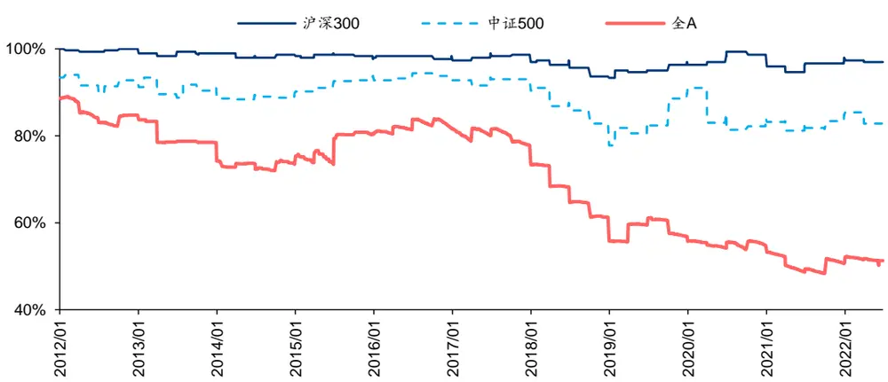
资料来源：朝阳永续，Wind，华泰研究

## 基于分析师共同覆盖的关联动量因子测试

本节将测试以下三个因子：

1. CF_RET_n：基于分析师共同覆盖的关联动量因子，使用股票过去n天的收益率计算关联动量。

2. CS_RET_n：板块关联动量因子，使用股票过去n天的收益率计算关联动量。

3. CI_RET_n：行业关联动量因子，使用股票过去n天的收益率计算关联动量。

1. 股票池：具有分析师覆盖的全部 A股，剔除ST、PT股票，剔除每个截面期下一交易日停牌的股票。

3. 调仓周期：测试调仓周期为日频、周频、月频调仓下因子的表现，即调仓周期分别为1个、5个、20个交易日。由于日频、周频调仓时组合换手率较高，交易费用对回测影响很大，因此我们将展示因子在有无交易费用情况下的测试结果。

4. 因子预处理：因子进行去极值、中性化、标准化。

5. 测试方法：IC值分析，因子分5层测试，分层测试中交易费用为单边千分之二。进行因子相关性分析。

## 日频调仓的单因子测试结果

从图表7~图表11可知，日频调仓时各因子的RankIC较小，都在1%以下，但因子的分层回测区分度较好，且在相同参数下，基于分析师共同覆盖的关联动量因子TOP组合表现最好。

图表7：各因子分5层测试TOP组合净值除以基准净值，无交易费用
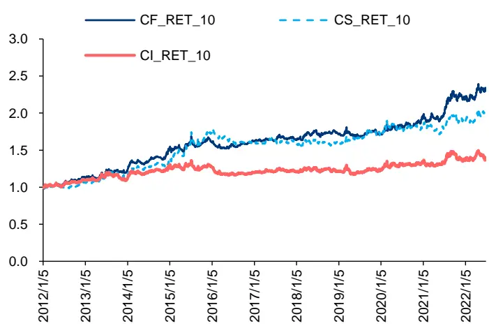
注：回测期：2012/1/5～2022/6/30
资料来源：朝阳永续，Wind，华泰研究

图表8：各因子分5层测试TOP组合净值除以基准净值，无交易费用
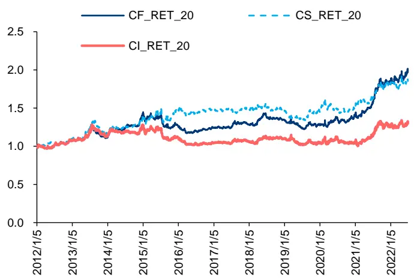

图表9：CF_RET_10分层组合1~5 净值除以基准净值，无交易费用
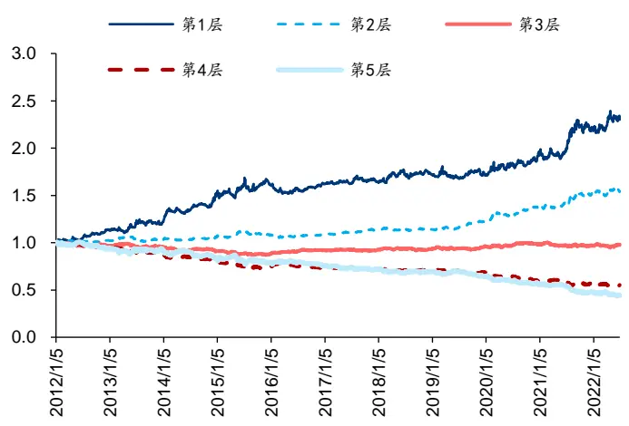
注：回测期：2012/1/5～2022/6/30
资料来源：朝阳永续，Wind，华泰研究

图表10：CF_RET_10分层组合1~5 净值除以基准净值，有交易费用
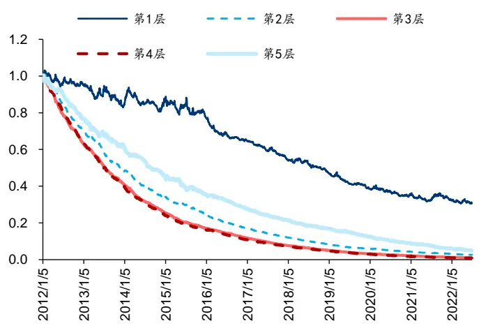
注：回测期：2012/1/5～2022/6/30
资料来源：朝阳永续，Wind，华泰研究

图表11：因子的IC值分析和分层回测结果汇总(因子进行行业、市值中性，无交易费用)

| RankIC 均值 RankIC 标准差 |  |  | IC_IR 0.02 | IC>0 占比 | TOP 组合年化超额收益率 TOP 组合信息比率 TOP 组合胜率 TOP 组合换手率 |  |  |  |
| --- | --- | --- | --- | --- | --- | --- | --- | --- |
| CF_RET_10 | 0.24% | 13.40% |  |  | 50.86% | 8.53% | 1.00 61.90% |  |
| CS_RET_10 | 0.44% | 12.71% | 0.03 | 52.32% | 6.96% | 0.84 | 59.52% | 41.42% 51.37% |
| Cl_RET_10 | -0.01% | 12.81% | 0.00 | 50.43% | 3.21% | 0.39 | 58.73% | 43.71% |
| CF_RET_20 | 0.13% | 13.89% | 0.01 | 49.61% | 6.90% | 0.77 | 60.32% | 29.16% |
| CS_RET_20 | 0.41% | 12.91% | 0.03 | 52.28% | 6.30% | 0.74 | 57.94% | 37.43% |
| CI_RET_20 | -0.16% | 13.29% | -0.01 | 49.73% | 2.70% | 0.57 | 49.21% | 32.42% |

注：回测期：2012/1/5～2022/6/30
资料来源：朝阳永续，Wind，华泰研究

## 周频调仓的单因子测试结果

从图表12~图表16可知，周频调仓时各因子的 RankIC较小，都在1%以下，但因子的分层回测区分度较好，且在相同参数下，基于分析师共同覆盖的关联动量因子TOP组合表现最好。

图表12：各因子分5层测试TOP组合净值除以基准净值，无交易费用
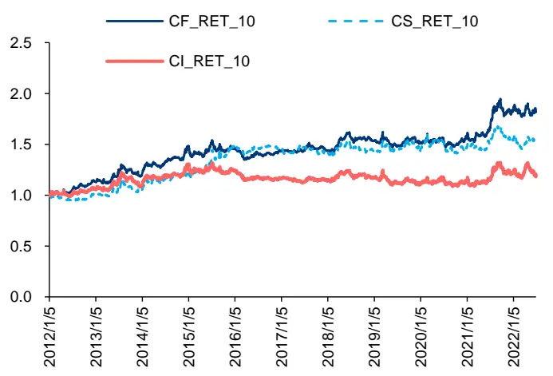
注：回测期：2012/1/5～2022/6/30
资料来源：朝阳永续，Wind，华泰研究

图表13：各因子分5层测试TOP组合净值除以基准净值，无交易费用
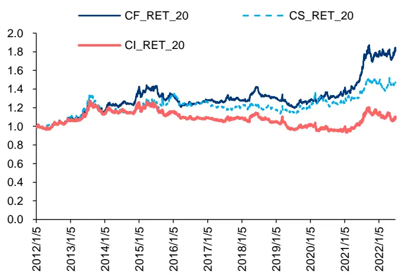
注：回测期：2012/1/5～2022/6/30
资料来源：朝阳永续，Wind，华泰研究

图表14：CF_RET_10分层组合1~5 净值除以基准净值，无交易费用
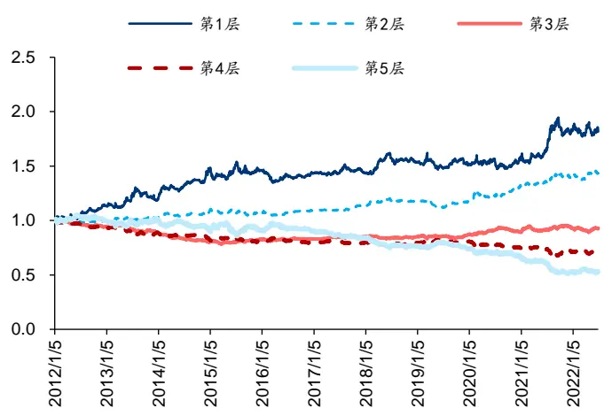
注：回测期：2012/1/5～2022/6/30
资料来源：朝阳永续，Wind，华泰研究

图表15：CF_RET_10分层组合1~5 净值除以基准净值，有交易费用
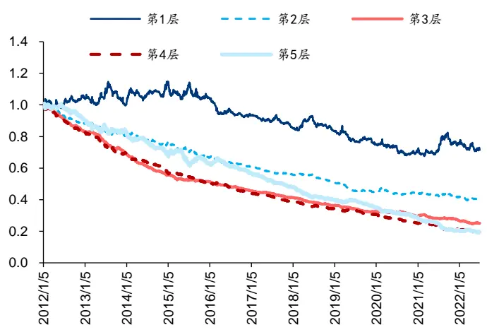
注：回测期：2012/1/5～2022/6/30
资料来源：朝阳永续，Wind，华泰研究

图表16：因子的IC值分析和分层回测结果汇总(因子进行行业、市值中性，无交易费用)

|  | RankIC 均值 | RankIC 标准差 | IC_IR | IC>0 占比 | TOP 组合年化超额收益率 TOP 组合信息比率 TOP 组合胜率 TOP 组合换手率 |  |  |  |
| --- | --- | --- | --- | --- | --- | --- | --- | --- |
| CF_RET_10 | 0.98% | 13.40% | 0.07 | 55.49% | 6.09% | 0.74 | 57.14% | 96.37% |
| CS_RET_10 | 0.84% | 13.07% | 0.06 | 51.37% | 4.42% | 0.55 | 52.38% | 102.00% |
| CI_RET_10 | 0.29% | 12.69% | 0.02 | 53.14% | 1.79% | 0.22 | 52.38% | 98.27% |
| CF_RET_20 | 0.48% | 14.10% | 0.03 | 52.94% | 6.06% | 0.70 | 50.00% | 69.75% |
| CS_RET_20 | 0.40% | 13.27% | 0.03 | 50.59% | 3.87% | 0.46 | 51.59% | 75.92% |
| CI_RET_20 | -0.09% | 13.30% | -0.01 | 48.43% | 0.94% | 0.11 | 46.03% | 73.04% |

注：回测期：2012/1/5～2022/6/30
资料来源：朝阳永续，Wind，华泰研究

## 月频调仓的单因子测试结果

从图表17~图表21可知，月频调仓时各因子的RankIC依然不显著，因子的分层回测区分度相比日频和周频调仓明显下降。在相同参数下，基于分析师共同覆盖的关联动量因子TOP组合表现最好。

图表17：各因子分5层测试TOP组合净值除以基准净值，无交易费用
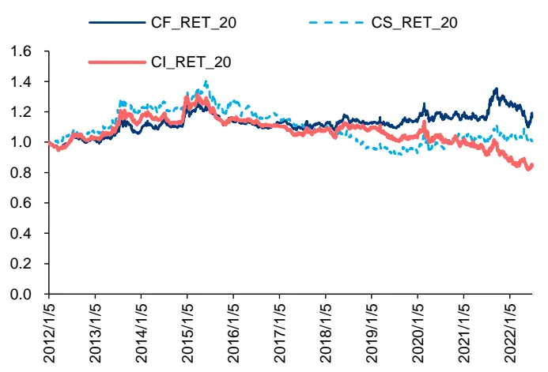
注：回测期：2012/1/5～2022/6/30
资料来源：朝阳永续，Wind，华泰研究

图表18：各因子分5层测试TOP组合净值除以基准净值，无交易费用
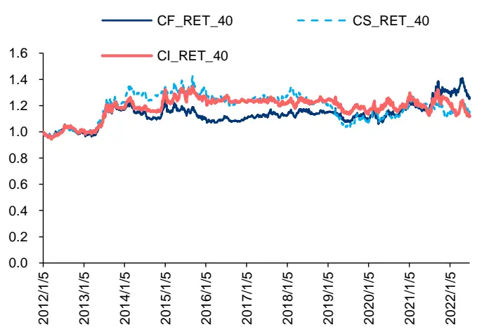
注：回测期：2012/1/5～2022/6/30
资料来源：朝阳永续，Wind，华泰研究

图表19：CF_RET_40分层组合1~5 净值除以基准净值，无交易费用
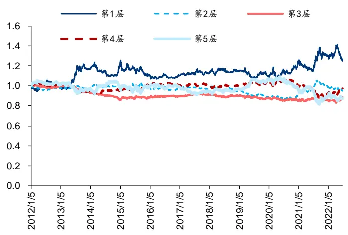
注：回测期：2012/1/5～2022/6/30
资料来源：朝阳永续，Wind，华泰研究

图表20：CF_RET_40分层组合1~5 净值除以基准净值，有交易费用
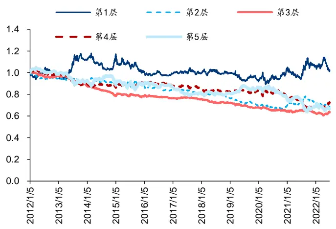
注：回测期：2012/1/5～2022/6/30
资料来源：朝阳永续，Wind，华泰研究

图表21：因子的IC值分析和分层回测结果汇总(因子进行行业、市值中性，有交易费用)

|  | RankIC 均值 | RankIC 标准差 | IC_IR | IC>0 占比 | TOP 组合年化超额收益率 TOP 组合信息比率 TOP 组合胜率 TOP 组合换手率 |  |  |  |
| --- | --- | --- | --- | --- | --- | --- | --- | --- |
| CF_RET_20 | 0.10% | 13.84% | 0.01 | 53.13% | -1.48% | -0.18 | 43.65% | 139.16% |
| CF_RET_40 | -0.73% | 13.13% | -0.06 | 48.44% | -3.08% | -0.39 | 47.62% | 137.08% |
| CS_RET_20 | -0.62% | 12.72% | -0.05 | 50.78% | -4.72% | -0.59 | 41.27% | 142.71% |
| CS_RET_40 | -0.68% | 14.68% | -0.05 | 49.22% | 0.36% | 0.04 | 44.44% | 102.26% |
| CI_RET_20 | -0.75% | 13.31% | -0.06 | 48.44% | -0.99% | -0.11 | 47.62% | 101.52% |
| CI_RET_40 | -1.24% | 13.33% | -0.09 | 48.44% | -1.12% | -0.13 | 45.24% | 101.91% |

注：回测期：2012/1/5～2022/6/30
资料来源：朝阳永续，Wind，华泰研究

## 因子相关性分析

各因子的相关性矩阵如下图所示，可知在相同的回溯周期下，CF_RET_n因子与n日动量因子相关性较低，与 CI_RET_n相关性较高。

图表22：各因子的相关性矩阵
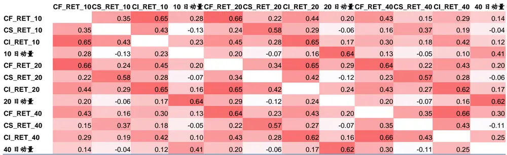
资料来源：朝阳永续，Wind，华泰研究

1. 本章我们测试了基于分析师共同覆盖的关联动量因子、板块关联动量因子和行业关联动量因子，在多种测试条件下，基于分析师共同覆盖的关联动量因子TOP组合都表现最好，侧面说明了分析师共同覆盖确实是刻画股票间关系的有效方式。

2. 如下图所示，在不计交易费用的情况下，CF RET 20 因子在日频和周频调仓时的TOP组合超额收益，表现都优于月频调仓，说明股票间的关联动量效应可能偏短期，持续时间在一周左右。

图表23：CF_RET_20 因子在不同调仓周期下的 TOP 组合超额收益，无交易费用
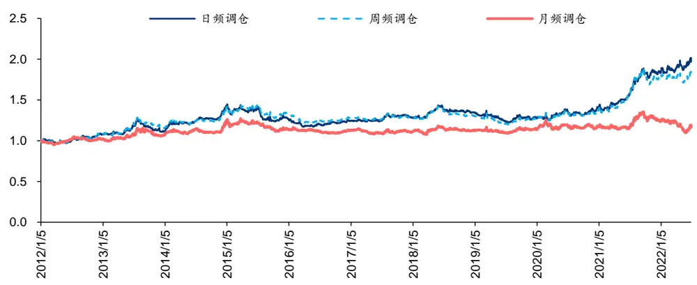
资料来源：朝阳永续，Wind，华泰研究

3. 日频和周频调仓时，关联动量因子的TOP组合受交易费用影响很大，无法作为单因子来直接选股，可将因子加入组合并控制组合换手率来缓解这个问题。

## 基于分析师共同覆盖的改进反转因子

A股市场长期存在反转效应，但该效应在近年来明显衰减，关于反转因子的改进有多种思路，本章我们将沿着分析师共同覆盖动量因子的构建思路，进一步构建基于分析师共同覆盖的改进反转因子CF_REV(connected-firm reverse)。具体来讲，股票i的改进反转因子为CF_REV，与之关联的股票j在过去一段时间的收益率为 $\mathrm{Ret}_{\mathrm{j}}$ ，股票i和股票j间共同覆盖的分析师数量为 $\mathbf{n_{ij}}$ ，与股票i相关联的股票有 $N只$ ，则CF_REV的计算方式如下：

$$
\mathrm{CF\_REV_{i}}=\frac{\sum_{j=1}^{N}\log(n_{ij}+1)\mathrm{ReLU_{j}}}{\sum_{j=1}^{N}\log(n_{ij}+1)}-\mathrm{ReLU_{i}}
$$

该因子的通俗理解方式为：我们在考虑股票自身反转效应的基础上，进一步考虑与之关联股票的动量效应，即前期自身跌幅较大，但关联股票涨幅较大的股票，因子取值较大。该因子同样描述了股价的领先滞后效应，并体现了股价的均值回复现象。

考虑到同行业和同板块也可以描述股票之间的关系，我们还构建了基于行业的改进反转因子 Cl_REV(connected-industry reverse)和基于板块的改进反转因子

CS_REV(connected-sector reverse)，并将对比 CF_REV与CI_REV 和 CS_REV 的表现。具体来讲，CIREV因子的计算过程中认为同属中信一级行业的股票之间有关联，股票i的行业改进反转因子为CF_REV，与之关联的股票j流通市值为 $\mathrm{mkt}_{\mathrm{j}}$ ，则CI $\mathrm{.REV_{i}}$ 的计算方式如下：

$$
\mathrm{CI\_REV_{i}}=\frac{\sum_{j=1}^{N}\log(\mathrm{mkt_{j}})\mathrm{ReLU_{j}}}{\sum_{j=1}^{N}\log(\mathrm{mkt_{j}})}-\mathrm{ReLU_{i}}
$$

CS_REV的计算方式与CI_REV完全一致，区别在于使用相同板块来描述股票之间的关系。

## 基于分析师共同覆盖的改进反转因子测试

本节将测试以下三个因子：

1. CF REV n：基于分析师共同覆盖的改进反转因子，使用股票过去n 天的收益率计算自身反转和关联动量。

2. CS_REV_n：基于板块的改进反转因子，使用股票过去n天的收益率计算自身反转和关联动量。

3. Cl_REV_n：基于行业的改进反转因子，使用股票过去n天的收益率计算自身反转和关联动量。

1. 股票池：具有分析师覆盖的全部 A 股，剔除ST、PT股票，剔除每个截面期下一交易日停牌的股票。

3. 调仓周期：测试调仓周期为日频、周频、月频调仓下因子的表现，即调仓周期分别为1个、5个、20个交易日。由于日频、周频调仓时组合换手率较高，交易费用对回测影响很大，因此我们将展示因子在有无交易费用情况下的测试结果。

4.因子预处理：因子进行去极值、中性化、标准化。

5. 测试方法：IC值分析，因子分5层测试，分层测试中交易费用为单边千分之二。进行因子相关性分析。

日频调仓的单因子测试结果

从图表 24~图表28可知，日频调仓时，在RankIC均值、IC_IR、TOP组合年化超额收益率等多项指标上，基于分析师共同覆盖的改进反转因子表现最好。

图表24：各因子分5 层测试 TOP组合净值除以基准净值，无交易费用
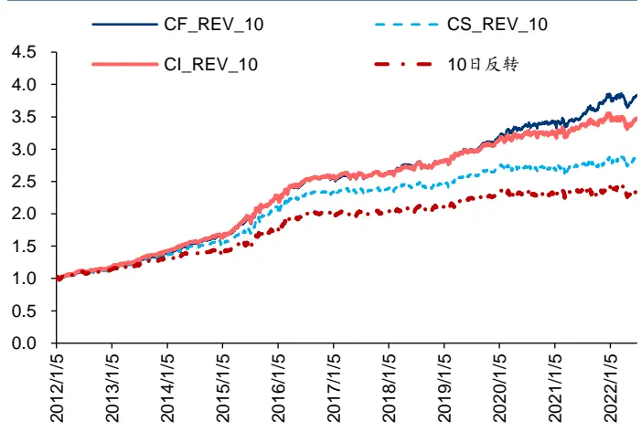
注：回测期：2012/1/5～2022/6/30
资料来源：朝阳永续，Wind，华泰研究

图表25：各因子分5 层测试 TOP组合净值除以基准净值，无交易费用
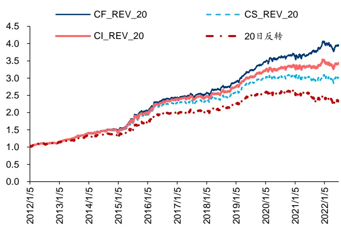
注：回测期：2012/1/5～2022/6/30
资料来源：朝阳永续，Wind，华泰研究

图表26：CF_REV_10 分层组合1~5 净值除以基准净值，无交易费用
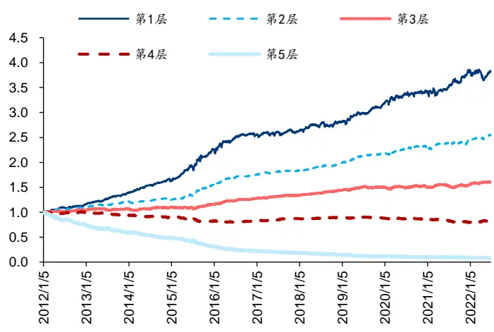
注：回测期：2012/1/5～2022/6/30
资料来源：朝阳永续，Wind，华泰研究

图表27：CF_REV_10 分层组合1~5 净值除以基准净值，有交易费用
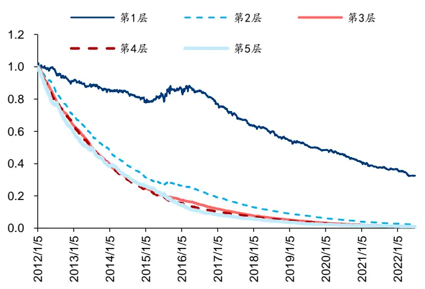
注：回测期：2012/1/5～2022/6/30
资料来源：朝阳永续，Wind，华泰研究

图表28：因子的IC值分析和分层回测结果汇总(因子进行行业、市值中性，无交易费用)

|  | RankIC 均值 | RankIC 标准差 | IC_IR | IC>0 占比 | TOP 组合年化超额收益率 TOP 组合信息比率 TOP 组合胜率 TOP 组合换手率 |  |  |  |
| --- | --- | --- | --- | --- | --- | --- | --- | --- |
| CF_REV_10 | 3.70% | 13.28% | 0.28 | 62.02% | 14.83% | 2.42 | 80.16% | 50.20% |
| CS_REV_10 | 3.56% | 14.47% | 0.25 | 60.25% | 11.60% | 1.73 | 73.02% | 50.12% |
| Cl_REV_10 | 3.58% | 13.08% | 0.27 | 62.22% | 13.73% | 2.26 | 77.78% | 49.69% |
| 10 日反转 | 3.45% | 15.97% | 0.22 | 59.62% | 9.37% | 1.25 | 65.87% | 50.06% |
| CF_REV_20 | 3.57% | 13.39% | 0.27 | 60.29% | 15.12% | 2.47 | 75.40% | 36.60% |
| CS_REV_20 | 3.44% | 14.75% | 0.23 | 58.92% | 12.08% | 1.76 | 69.84% | 36.43% |
| Cl_REV_20 | 3.43% | 13.20% | 0.26 | 61.15% | 13.57% | 2.24 | 76.98% | 36.17% |
| 20 日反转 | 3.31% | 16.44% | 0.20 | 58.25% | 9.28% | 1.19 | 65.08% | 36.26% |

注：回测期：2012/1/5～2022/6/30
资料来源：朝阳永续，Wind，华泰研究

周频调仓的单因子测试结果

从图表 29~图表33可知，周频调仓时，在RankIC均值、IC_IR、TOP组合年化超额收益率等多项指标上，基于分析师共同覆盖的改进反转因子表现最好。

图表29：各因子分5 层测试 TOP组合净值除以基准净值，无交易费用
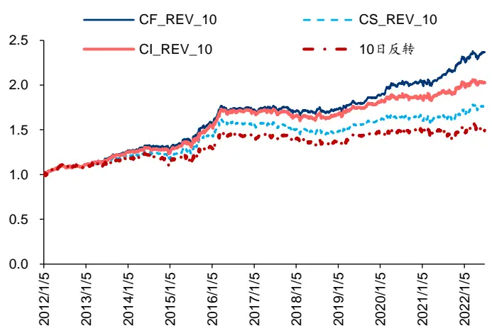
注：回测期：2012/1/5～2022/6/30
资料来源：朝阳永续，Wind，华泰研究

图表30：各因子分5层测试 TOP组合净值除以基准净值，无交易费用
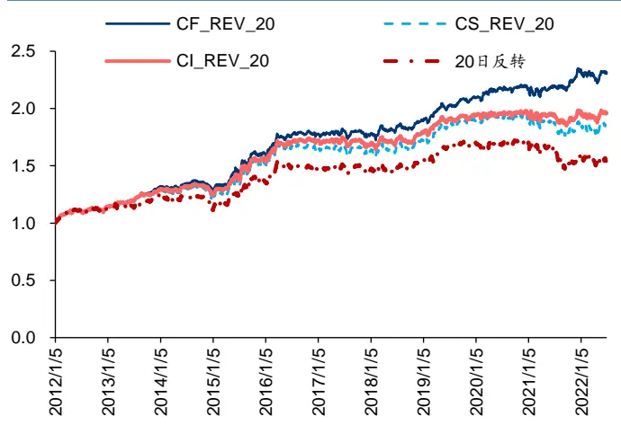
注：回测期：2012/1/5～2022/6/30
资料来源：朝阳永续，Wind，华泰研究

图表31：CF_REV_10 分层组合1~5 净值除以基准净值，无交易费用
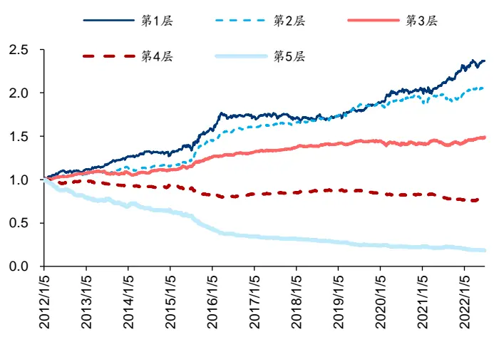
注：回测期：2012/1/5～2022/6/30

图表32：CF_REV_10 分层组合1~5 净值除以基准净值，有交易费用
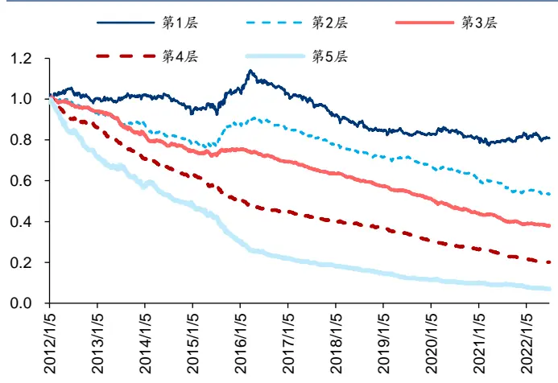
注：回测期：2012/1/5～2022/6/30
资料来源：朝阳永续，Wind，华泰研究
资料来源：朝阳永续，Wind，华泰研究

图表33：因子的IC值分析和分层回测结果汇总(因子进行行业、市值中性，无交易费用)

|  | RankIC 均值 | RankIC 标准差 | IC_IR | IC>0 占比 | TOP 组合年化超额收益率 TOP 组合信息比率 TOP 组合胜率 TOP 组合换手率 |  |  |  |
| --- | --- | --- | --- | --- | --- | --- | --- | --- |
| CF_REV_10 | 4.52% | 13.13% | 0.34 | 64.31% | 9.29% | 1.67 | 68.25% | 110.19% |
| CS_REV_10 | 4.08% | 14.25% | 0.29 | 61.37% | 6.08% | 0.99 | 57.94% | 110.34% |
| Cl_REV_10 | 4.22% | 12.94% | 0.33 | 63.53% | 7.66% | 1.39 | 62.70% | 109.71% |
| 10 日反转 | 3.88% | 15.62% | 0.25 | 58.63% | 4.38% | 0.62 | 55.56% | 110.70% |
| CF_REV_20 | 4.99% | 13.22% | 0.38 | 62.35% | 9.07% | 1.63 | 66.67% | 81.91% |
| CS_REV_20 | 4.66% | 14.52% | 0.32 | 60.00% | 6.68% | 1.05 | 55.56% | 81.93% |
| Cl_REV_20 | 4.67% | 13.02% | 0.36 | 61.57% | 7.38% | 1.32 | 61.90% | 81.29% |
| 20 日反转 | 4.42% | 16.04% | 0.28 | 57.45% | 4.83% | 0.66 | 53.97% | 82.04% |

注：回测期：2012/1/5～2022/6/30
资料来源：朝阳永续，Wind，华泰研究

## 月频调仓的单因子测试结果

从图表34~图表38可知，月频调仓时，在RankIC均值、IC_IR、TOP组合年化超额收益率等多项指标上，基于分析师共同覆盖的改进反转因子表现最好。此时交易费用对回测绩效的影响已不太显著。

图表34：各因子分5层测试TOP组合净值除以基准净值，无交易费用
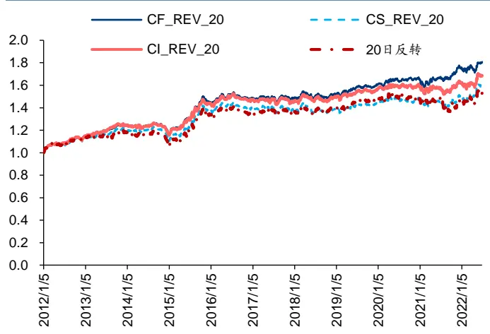
注：回测期：2012/1/5～2022/6/30
资料来源：朝阳永续，Wind，华泰研究

图表35：各因子分5层测试TOP组合净值除以基准净值，无交易费用
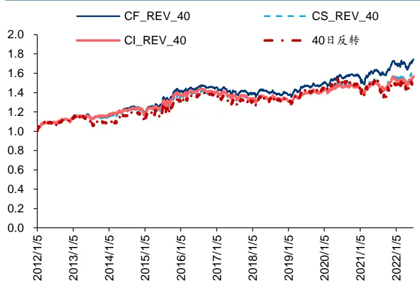
注：回测期：2012/1/5～2022/6/30
资料来源：朝阳永续，Wind，华泰研究

图表36：CF_REV_40 分层组合1~5 净值除以基准净值，无交易费用
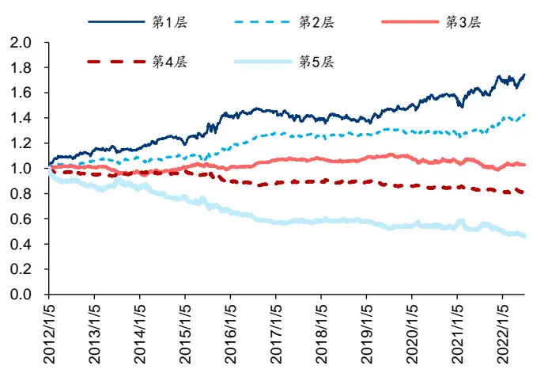
注：回测期：2012/1/5～2022/6/30

图表37：CF_REV_40 分层组合1~5 净值除以基准净值，有交易费用
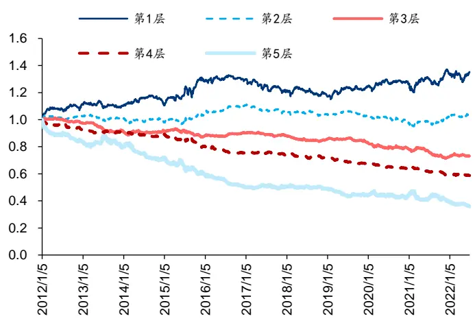
资料来源：朝阳永续，Wind，华泰研究
注：回测期：2012/1/5～2022/6/30
资料来源：朝阳永续，Wind，华泰研究

图表38：因子的IC值分析和分层回测结果汇总(因子进行行业、市值中性，有交易费用)

|  | RankIC 均值 | RankIC 标准差 | IC_IR | IC>0 占比 | TOP 组合年化超额收益率 TOP 组合信息比率 TOP 组合胜率 TOP 组合换手率 |  |  |  |
| --- | --- | --- | --- | --- | --- | --- | --- | --- |
| CF_REV_20 | 6.52% | 11.14% | 0.59 | 73.44% | 2.57% | 0.53 | 51.59% | 153.26% |
| CS_REV_20 | 6.19% | 12.59% | 0.49 | 70.31% | 1.21% | 0.22 | 46.83% | 153.43% |
| CI_REV_20 | 6.15% | 11.15% | 0.55 | 72.66% | 1.86% | 0.37 | 52.38% | 152.91% |
| 20 日反转 | 6.13% | 13.93% | 0.44 | 65.63% | 0.74% | 0.12 | 47.62% | 153.94% |
| CF_REV_40 | 6.41% | 12.73% | 0.50 | 67.97% | 3.34% | 0.63 | 56.35% | 116.51% |
| CS_REV_40 | 6.36% | 14.28% | 0.45 | 64.84% | 2.40% | 0.40 | 53.97% | 116.34% |
| CI_REV_40 | 5.99% | 12.85% | 0.47 | 67.97% | 2.29% | 0.44 | 52.38% | 115.22% |
| 40 日反转 | 6.23% | 16.03% | 0.39 | 63.28% | 1.78% | 0.25 | 52.38% | 117.37% |

注：回测期：2012/1/5～2022/6/30
资料来源：朝阳永续，Wind，华泰研究

## 因子相关性分析

各因子的相关性矩阵如下图所示，可知在相同的回溯周期下，n日反转因子和其三个改进因子相关性都较高，与CS_RET_n的相关性最高。

图表39：各因子的相关性矩阵
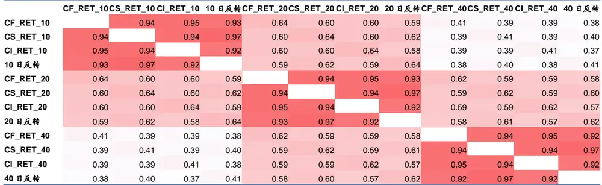
资料来源：朝阳永续，Wind，华泰研究

1.本章我们测试了基于分析师共同覆盖的改进反转因子、板块改进反转因子和行业改进反转因子，在多种测试条件下，基于分析师共同覆盖的改进反转因子都表现最好，侧面说明了分析师共同覆盖确实是刻画股票间关系的有效方式。

2. 日频和周频调仓时，改进反转因子的TOP组合受交易费用影响很大，无法作为单因子来直接选股，可将因子加入组合并控制组合换手率来缓解这个问题。

## 基于分析师共同覆盖的改进换手率、波动率因子

经过前文的测试可知，分析师共同覆盖可以对传统反转因子进行改进，且改进效果最好，体现了金融市场中的均值回复现象。由于反转因子是经典的负向因子，这令我们联想到：使用相似的因子构建逻辑，分析师共同覆盖是否可以对其他负向因子(如波动率、换手率因子)进行改进？

具体来讲，股票i的改进换手率因子为CF_TURNi，与之关联的股票j在过去一段时间的平均换手率为TURNj，股票i和股票j间共同覆盖的分析师数量为 $n_{ij}$ ，与股票i相关联的股票有N只，则CF_TURN的计算方式如下：

$$
\mathrm{CF}_{-}\mathrm{TURN}_{\mathrm{i}}=\frac{\sum_{\mathrm{j}=1}^{\mathrm{N}}\log(\mathrm{n}_{\mathrm{ij}}+1)\mathrm{TURN}_{\mathrm{j}}}{\sum_{\mathrm{j}=1}^{\mathrm{N}}\log(\mathrm{n}_{\mathrm{ij}}+1)}-\mathrm{TURN}_{\mathrm{i}}
$$

该因子的通俗理解方式为：我们在考虑股票i自身换手率的基础上，进一步考虑与之关联股票的换手率，即前期自身缩量(换手率较低)，但关联股票放量(换手率较高)的股票，因子取值较大。

同理，股票i的改进波动率因子为 $\mathrm{CF\_STD}_{i}$ ，与之关联的股票j在过去一段时间的波动率为STDj，则CF_STDi的计算方式如下：

$$
\mathrm{CF\_STD_{i}}=\frac{\sum_{j=1}^{N}\log(n_{ij}+1)\mathrm{STD_{j}}}{\sum_{j=1}^{N}\log(n_{ij}+1)}-\mathrm{STD_{i}}
$$

该因子的通俗理解方式为：我们在考虑股票i自身波动率的基础上，进一步考虑与之关联股票的波动率，即前期自身波动率较低，但关联股票波动率放大的股票，因子取值较大。

同样的，我们也可以构建基于行业和板块的改进因子来进行对比。分别得到行业改进换手率因子 CI TURN，板块改进换手率因子 CS TURN，行业改进波动率因子 CI STD，板块改进波动率因子CS_STD。

## 基于分析师共同覆盖的改进换手率、波动率因子测试

本节将测试以下六个因子：

1. CF TURN n：基于分析师共同覆盖的改进换手率因子，使用股票过去 n 天的换手率计算。

2. CS_TURN_n：基于板块的改进换手率因子，使用股票过去n天的换手率计算。

3. CI_TURN_n：基于行业的改进换手率因子，使用股票过去n天的换手率计算。

4. CF_STD_n:基于分析师共同覆盖的改进波动率因子，使用股票过去n天的波动率计算。

5. CS_STD_n：基于板块的改进波动率因子，使用股票过去n天的波动率计算。

6. CI_STD_n：基于行业的改进波动率因子，使用股票过去n天的波动率计算。

1. 股票池：具有分析师覆盖的全部 A 股，剔除ST、PT股票，剔除每个截面期下一交易日停牌的股票。

3. 调仓周期：月频调仓，即20个交易日。

4.因子预处理：因子进行去极值、中性化、标准化。

5. 测试方法：IC值分析，因子分5层测试，分层测试中交易费用为单边千分之二。进行因子相关性分析。

## 月频调仓的改进换手率因子测试结果

从图表 40~图表 44可知，月频调仓时，在RankIC 均值、IC_IR、TOP组合年化超额收益率等多项指标上，基于分析师共同覆盖的改进换手率因子表现都较好。

图表40：各因子分5层测试TOP组合净值除以基准净值，有交易费用
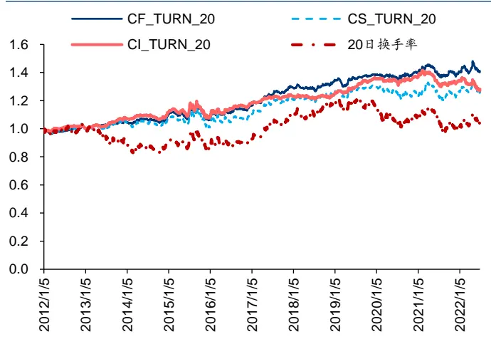
注：回测期：2012/1/5～2022/6/30
资料来源：朝阳永续，Wind，华泰研究

图表41：各因子分5层测试 TOP组合净值除以基准净值，有交易费用
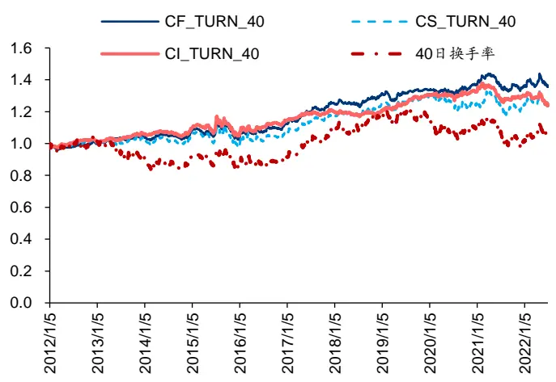
注：回测期：2012/1/5～2022/6/30
资料来源：朝阳永续，Wind，华泰研究

图表42：CF_TURN_20 分层组合1~5 净值除以基准净值有交易费用
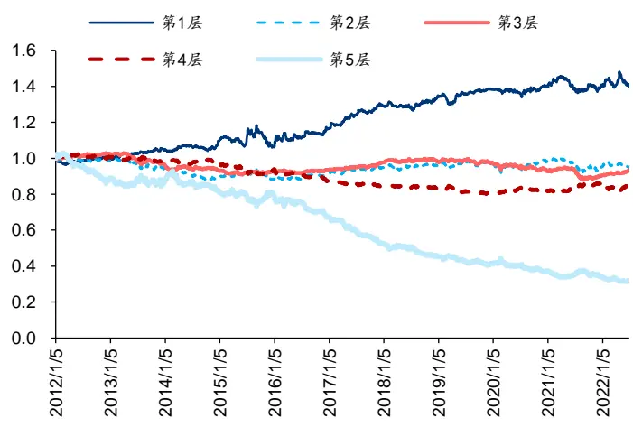
注：回测期：2012/1/5～2022/6/30
资料来源：朝阳永续，Wind，华泰研究

图表43：CF_TURN_40 分层组合1~5 净值除以基准净值有交易费用
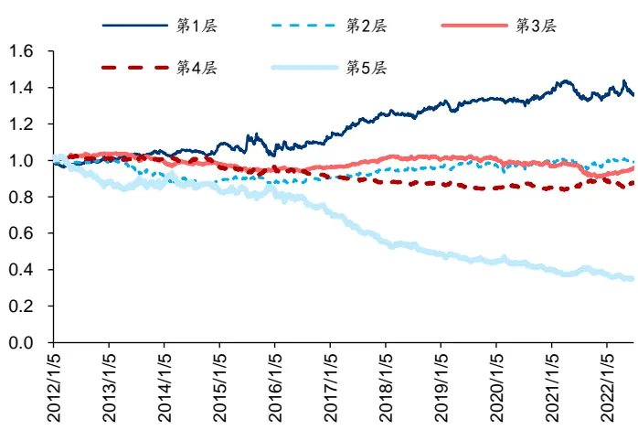
注：回测期：2012/1/5～2022/6/30
资料来源：朝阳永续，Wind，华泰研究

图表44：因子的IC值分析和分层回测结果汇总(因子进行行业、市值中性，有交易费用)

|  | RankIC 均值 | RankIC 标准差 | IC_IR | IC>0 占比 | TOP 组合年化超额收益率 TOP 组合信息比率 TOP 组合胜率 TOP 组合换手率 |  |  |  |
| --- | --- | --- | --- | --- | --- | --- | --- | --- |
| CF_TURN_20 | 7.09% | 15.32% | 0.46 | 67.97% | 2.58% | 0.53 | 57.14% | 66.38% |
| CS_TURN_20 | 7.03% | 16.51% | 0.43 | 65.63% | 1.38% | 0.24 | 52.38% | 62.17% |
| CI_TURN_20 | 6.80% | 13.78% | 0.49 | 67.97% | 1.87% | 0.45 | 56.35% | 68.09% |
| 20日换手率 | 6.65% | 20.36% | 0.33 | 64.06% | -1.04% | -0.12 | 49.21% | 52.35% |
| CF_TURN_40 | 6.60% | 15.44% | 0.43 | 66.41% | 2.25% | 0.46 | 54.76% | 54.15% |
| CS_TURN_40 | 6.66% | 16.47% | 0.40 | 64.84% | 1.32% | 0.23 | 52.38% | 49.99% |
| CI_TURN_40 | 6.40% | 13.80% | 0.46 | 65.63% | 1.62% | 0.39 | 57.14% | 54.48% |
| 40日换手率 | 6.32% | 20.33% | 0.31 | 64.06% | -0.93% | -0.11 | 50.79% | 41.87% |

注：回测期：2012/1/5～2022/6/30
资料来源：朝阳永续，Wind，华泰研究

## 改进换手率因子相关性分析

各因子的相关性矩阵如下图所示，因子间相关性较高。

图表45：各因子的相关性矩阵

| CF_TURN_20 |  |  | 0.89 | 0.87 | 0.87 | 0.97 | 0.87 | 0.85 |
| --- | --- | --- | --- | --- | --- | --- | --- | --- |
| CS_TURN_20 | 0.89 |  | 0.88 | 0.91 | 0.88 | 0.98 | 0.87 | 0.89 |
| CI_TURN_20 | 0.87 | 0.88 |  | 0.81 | 0.85 | 0.86 | 0.97 | 0.79 |
| 20日换手率 | 0.87 | 0.91 | 0.81 |  | 0.86 | 0.89 | 0.80 | 0.98 |
| CF_TURN_40 | 0.97 | 0.88 | 0.85 | 0.86 |  | 0.90 | 0.88 | 0.87 |
| CS_TURN_40 | 0.87 | 0.98 | 0.86 | 0.89 | 0.90 |  | 0.89 | 0.91 |
| CI_TURN_40 | 0.85 | 0.87 | 0.97 | 0.80 | 0.88 | 0.89 |  | 0.81 |
| 40日换手率 | 0.85 | 0.89 | 0.79 | 0.98 | 0.87 | 0.91 | 0.81 |  |

资料来源：朝阳永续，Wind，华泰研究

## 月频调仓的改进波动率因子测试结果

从图表46~图表50可知，月频调仓时，在RankIC均值、ICIR、TOP组合年化超额收益率等多项指标上，基于分析师共同覆盖的改进波动率因子表现都较好。

图表46：各因子分5层测试TOP组合净值除以基准净值，有交易费用
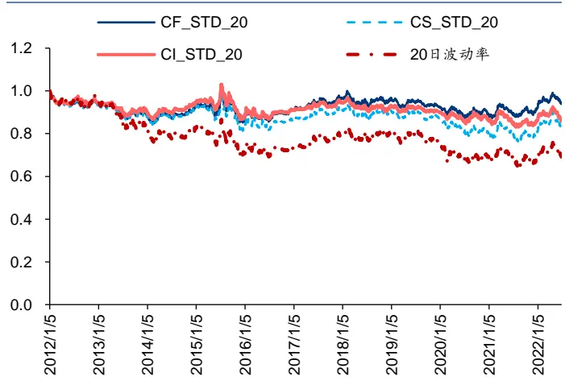
注：回测期：2012/1/5～2022/6/30
资料来源：朝阳永续，Wind，华泰研究

图表47：各因子分5 层测试TOP组合净值除以基准净值，有交易费用
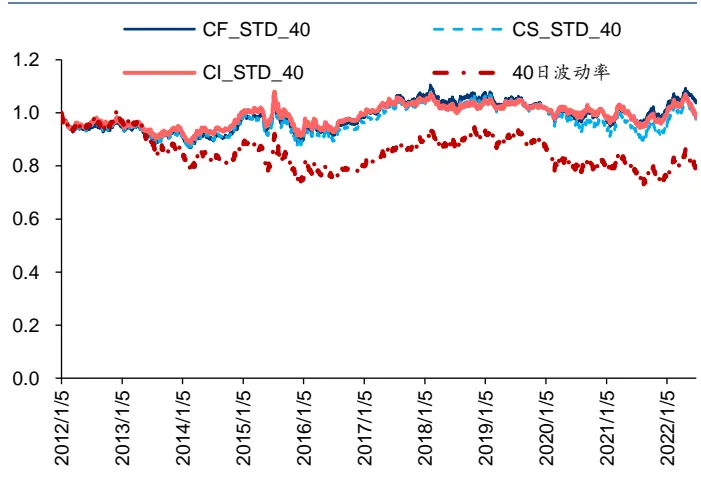
注：回测期：2012/1/5～2022/6/30
资料来源：朝阳永续，Wind，华泰研究

图表48：CF_STD_20 分层组合1~5 净值除以基准净值，有交易费用
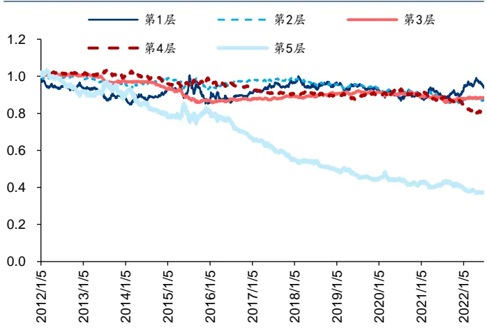
注：回测期：2012/1/5～2022/6/30
资料来源：朝阳永续，Wind，华泰研究

图表49：CF_STD_40 分层组合1~5 净值除以基准净值，有交易费用
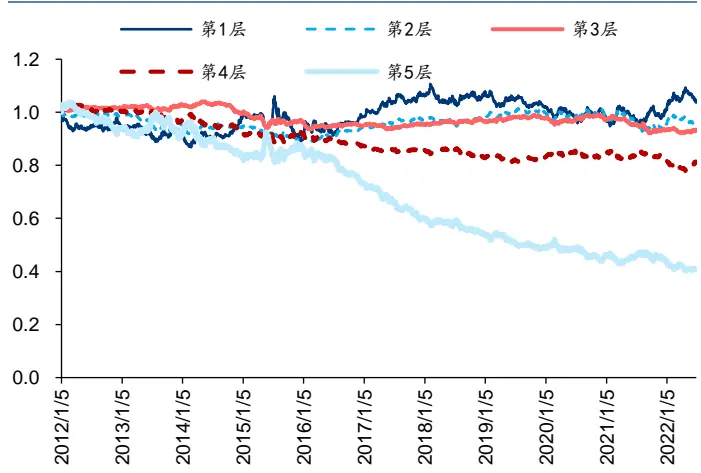
注：回测期：2012/1/5～2022/6/30
资料来源：朝阳永续，Wind，华泰研究

图表50：因子的IC值分析和分层回测结果汇总(因子进行行业、市值中性，有交易费用)

|  | RankIC 均值 | RankIC 标准差 | IC_IR | IC>0 占比 TOP 组合年化超额收益率 |  | TOP 组合信息比率 TOP 组合胜率 TOP 组合换手率 |
| --- | --- | --- | --- | --- | --- | --- |
| CF_STD_20 | 6.05% | 15.91% | 0.38 | 64.84% | -1.65% | -0.25 47.62% 102.00% |
| CS_STD_20 | 5.92% | 17.28% | 0.34 | 64.84% | -3.01% | -0.41 44.44% 97.86% |
| Cl_STD_2020 日波动率 | 5.82% | 15.36% | 0.38 | 64.84% | -2.35% | -0.40 44.44% 103.58% |
|  | 5.37% | 19.52% | 0.27 | 62.50% | -4.85% | -0.55 41.27% 90.49% |
| CF_STD_40 | 6.45% | 17.03% | 0.38 | 64.84% | -0.69% | -0.10 47.62% 71.55% |
| CS_STD_40 | 6.36% | 18.25% | 0.35 | 64.06% | -1.40% | -0.19 47.62% 68.05% |
| Cl_STD_4040日波动率 | 6.18% | 16.13% | 0.38 | 64.84% | -1.05% | -0.17 48.41% 71.98% |
|  | 5.76% | 20.68% | 0.28 | 61.72% | -3.70% | -0.41 45.24% 62.03% |

注：回测期：2012/1/5～2022/6/30
资料来源：朝阳永续，Wind，华泰研究

## 改进波动率因子相关性分析

各因子的相关性矩阵如下图所示，因子间相关性较高。

图表51：各因子的相关性矩阵
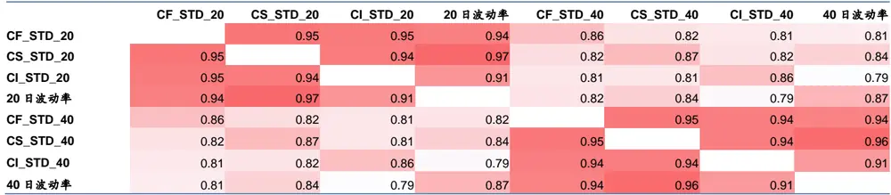
资料来源：朝阳永续，Wind，华泰研究

本章我们测试了基于分析师共同覆盖的改进换手率因子、板块改进换手率因子和行业改进换手率因子，以及基于分析师共同覆盖的改进波动率因子、板块改进波动率因子和行业改进波动率因子。在多种测试条件下，基于分析师共同覆盖的改进因子都有较优表现，侧面说明了分析师共同覆盖确实是刻画股票间关系的有效方式，且这种改进因子的方式在多类负向因子中具有普适性。

## 分析师共同覆盖运用于图神经网络GAT

分析师共同覆盖构建了股票之间的关系，图神经网络则可以融入股票之间的关系。本章我们将会把分析师共同覆盖关系输入图神经网络GAT，作为一种显式建图的方式，来测试其在因子合成中的效果。关于GAT的具体原理可参考华泰金工人工智能系列报告《图神经网络选股与Qlib实践》(2021.2.21)，《图神经网络选股的进阶之路》(2022.4.11)，本文不再赘述。

## 模型构建和参数说明

图表52~图表53为本文测试GAT模型和对照组模型的说明，输入的三个因子即为前文测试的反转、换手率、波动率因子。需要注意的是，输入GAT模型的邻接矩阵，目前仅包含股票之间是否有连接的信息(即有连接则邻接矩阵对应位置为1，没有连接则为0)，并没有输入邻接矩阵的权重(即连接的强弱信息)，也就是说GAT模型并没有充分利用到分析师共同覆盖邻接矩阵的信息。

图表52：GAT模型和对照组模型说明
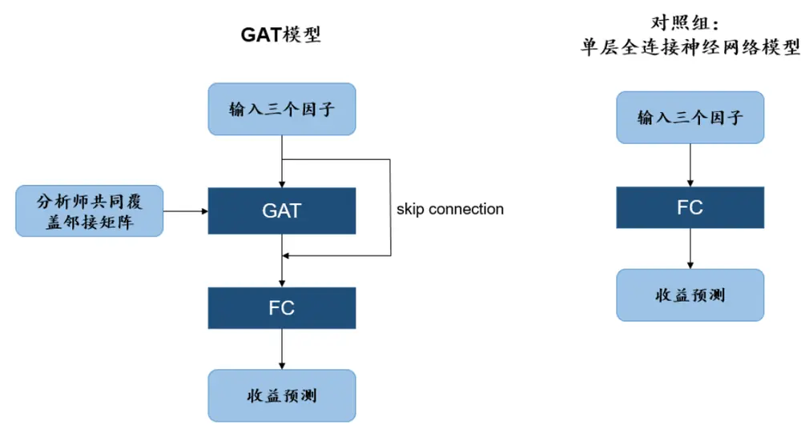
资料来源：华泰研究

下图为GAT模型的细节和参数量说明，GAT模型总参数数量为51个。单层全连接神经网 络的参数数量很少，为4(3+1)个。

图表53：GAT模型的细节和参数量说明

| 网络构成 GAT 层 | 包含组件 | 参数量说明 |
| --- | --- | --- |
|  | 两组可训练且长度为5的隐藏层向量，对 应自注意力机制中的 source 向量和target 向量 | 3*5：输入因子的升维操作 2*5：两组可训练且长度为5的隐藏层向量 |
|  |  | 3*5+1*5：skip connection 中全连接和偏置项的参数数量 |
|  |  | GAT总共参数数量：45 |
| FC层 模型其他参数损失函数：mse | 将长度为5的隐藏层向量映射为输出 | 5+1：FC层中的全连接和偏置项的参数数量 |

资料来源：华泰研究

## 模型训练和测试

1. 股票池：具有分析师覆盖的全部 A 股，剔除ST、PT股票，剔除每个截面期下一交易日停牌的股票。

2. 因子和标签：3个因子：40日反转、40日换手率、40日波动率，标签为未来20日收益率。

3. 滚动训练：从2015/2/27 开始，每次训练取过去750个交易日的数据，前500 个交易日为训练集、后230个交易日为验证集。每隔120个交易日滚动训练一次。回测区间：2015/4/1~2022/6/30。

4. 调仓周期：月频调仓，即20个交易日。

5. 测试方法：考虑到神经网络的随机性，两个模型都会训练5次，并将5次的预测结果等权集成。进行IC值分析，因子分5层测试，分层测试中交易费用为单边千分之二。

从图表54~图表56可知，在各项指标上，分析师共同覆盖GAT模型表现都比全连接网络更好，分析师共同覆盖确实为三个因子的合成贡献了增量信息。

图表54： 两个模型 TOP组合净值除以基准净值
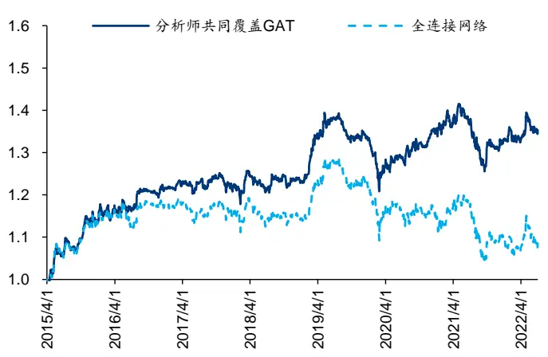
注：回测期：2015/4/1～2022/6/30
资料来源：朝阳永续，Wind，华泰研究

图表55：两个模型累计 RankIC
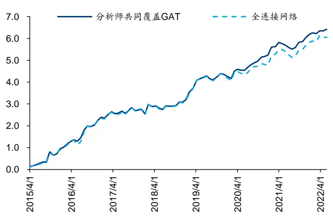
注：回测期：2015/4/1～2022/6/30
资料来源：朝阳永续，Wind，华泰研究

图表56：两个模型IC值分析和分层回测结果汇总(行业、市值中性)

|  | RankIC 均值 | RankIC 标准差 | IC_IR |  | IC>0 占比 TOP 组合年化超额收益率 TOP 组合信息比率 TOP 组合胜率 TOP 组合换手率 |  |  |  |
| --- | --- | --- | --- | --- | --- | --- | --- | --- |
| 分析师共同覆盖 GAT | 7.29% | 13.25% | 0.55 | 69.32% | 3.98% | 0.68 | 52.87% | 97.67% |
| 全连接网络 | 6.87% | 15.03% | 0.46 | 65.91% | 0.81% | 0.12 | 50.57% | 96.33% |

注：回测期：2015/4/1～2022/6/30
资料来源：朝阳永续，Wind，华泰研究

## GAT 模型可解释性分析

GAT模型通过学习得到股票之间的注意力权重矩阵(即下方的 $\alpha_{ij}^{0})$ 来表示股票之间的关联强弱，注意力权重矩阵的大小与输入的分析师共同覆盖邻接矩阵一致。

$$
\begin{array}{c}e_{ij}^{0}=\pi_{0}\Big(W^{0}h_{i}^{0},W^{0}h_{j}^{0}\Big)=LeakyReLU(a^{0}\Big(W^{0}h_{i}^{0}\parallel W^{0}h_{j}^{0}\Big))\quad 计算注意力分数e_{ij}^{0}\\\\\alpha_{ij}^{0}=softmax_{j}(e_{ij}^{0})=\frac{\exp(e_{ij}^{0})}{\sum_{k\in N(i)}\exp(e_{ik}^{0})}\quad 计算注意力权重\alpha_{ij}^{0}\\\\h_{\;i}^{\prime0}=h_{i}^{0}+LeakyReLU(\sum_{j\in N(i)}\alpha_{ij}^{0}W^{0}h_{j}^{0})\quad 将特征表示和注意力权重加权求和\end{array}
$$

本节我们将从注意力权重矩阵的角度来对GAT模型进行可解释性分析。如下表所示，我们选取最近一期训练的GAT模型，对宁德时代、东方环宇、中国神华和郑州煤电的关联股票进行分析。

图表57：4只股票的关联股票及其注意力权重

|  | 关联股票1 |  | 关联股票2 |  | 关联股票3 |  | 关联股票4 |  | 关联股票5 |  | 关联股票6 |  |
| --- | --- | --- | --- | --- | --- | --- | --- | --- | --- | --- | --- | --- |
|  | 股票简称 注意力权重 |  | 股票简称 | 注意力权重 | 股票简称 注意力权重 |  | 股票简称 | 注意力权重 |  | 股票简称 注意力权重 | 股票简称注意力权重 |  |
| 宁德时代 | 宁德时代 | 60.08% | 联赢激光 | 4.64% | 东方环宇 | 4.63% | 雅运股份 | 3.07% | 兴瑞科技 | 3.02% | 宏力达 | 1.56% |
| 东方环宇 | 东方环宇 | 80.48% | 兴瑞科技 | 2.30% | 雅运股份 | 2.30% | 郑州银行 | 0.40% | 科沃斯 | 0.05% | 宁德时代 | 0.02% |
| 中国神华 | 安源煤业 | 2.23% | 宝泰隆 | 1.99% | 郑州煤电 | 1.99% | 山西焦化 | 1.87% | 北部湾港 | 1.76% | 洪汇新材 | 1.57% |
| 郑州煤电 | 郑州煤电 | 8.76% | 美锦能源 | 2.53% | 宝泰隆 | 1.29% | 辽宁能源 | 1.00% | 靖远煤电 | 0.86% | 上海能源 | 0.71% |

资料来源：朝阳永续，Wind，华泰研究

分析上表，可得以下结论：

1. 对于宁德时代、东方环宇和郑州煤电，关联最强的股票就是其自身，实际上77.24%的股票都呈现出该现象，即股票自身的特征对于收益预测贡献最显著。

2. 注意力权重矩阵是非对称的，东方环宇对宁德时代的注意力权重为4.63%，宁德时代对东方环宇的注意力权重为0.02%，郑州煤电对中国神华的注意力权重为1.99%，中国神华则不是郑州煤电关联最强的6只股票之一，说明股票之间的相互影响程度是不对称的。

## 总结和讨论

近年来，投资者对于另类数据的关注程度日益上升。以产业链为代表的描述股票间关联的数据是一类重要的另类数据。有别于使用第三方的产业链数据来进行研究，本文构建了基于分析师共同覆盖的股票间关系，并应用于因子构建、改进和图神经网络模型，全面展示了如何利用分析师共同覆盖中的增量信息。本文总结如下：

1. 分析师共同覆盖可以从最根本的层面刻画上市公司的基本面关联。近20多年来，学界对于上市公司间的股价关联动量效应进行了大量研究，Ali and Hirshleifer (2019)提出了基于分析师共同覆盖的关联动量，并认为分析师共同覆盖能从最根本的层面刻画出上市公司的基本面关联，可以解释前人研究中的各类上市公司间关联动量现象。本文基于A股市场数据，构建了基于分析师共同覆盖的上市公司间关联，并通过社区发现Louvain算法，论证了分析师共同覆盖的上市公司具有基本面上的关联性，且这种关联性涉及多种基本面的角度，如同行业、同供应链、相似业务等。

2. 基于分析师共同覆盖的关联动量因子能表示股票间的短期领先滞后现象。本文参照Aliand Hirshleifer(2019)中的因子构建方法，构建了基于分析师共同覆盖的关联动量因子CF_RET，该因子认为与某只股票关联的其他股票过去一段时间的收益率可以预测该股票未来的收益率，即体现出股票涨跌的领先滞后效应，本文还构建了行业关联动量因子和板块关联动量因子进行对比。在多种测试条件下，CFRET因子TOP组合都表现最好，侧面说明了分析师共同覆盖确实是刻画股票间关系的有效方式。此外，股票间的关联动量效应可能偏短期，持续时间在一周左右。

3. 分析师共同覆盖能改进反转、换手率、波动率因子。基于金融市场均值回复的现象，本文进一步构建了基于分析师共同覆盖的改进反转因子CFREV、改进换手率因子CF_TURN、改进波动率因子CF_STD。对于CF_REV，其含义是前期自身跌幅较大，但关联股票涨幅较大的股票因子取值较大，是均值回复现象的表现(CF_TURN和CF_STD的含义类似)。本文还构建了相应的行业改进因子和板块改进因子进行对比。在多种测试条件下，基于分析师共同覆盖的改进因子均能获得更好的表现，进一步说明了分析师共同覆盖确实是刻画股票间关系的有效方式。

4. 将分析师共同覆盖融入图神经网络中，可提升对三类量价因子的合成效果。本文将分析师共同覆盖关系输入图神经网络GAT，作为一种显式建图的方式来测试其在因子合成中的效果。针对反转、换手率、波动率因子的合成，相比全连接网络，GAT的RankIC从 6.87%提升到 7.29%，IC_IR 从 0.46 提升到 0.55，分 5 层测试 TOP 组合年化超额收益率提升了3.17%，分析师共同覆盖确实为三个因子的合成贡献了增量信息。本文还从注意力权重矩阵的角度对GAT做可解释性分析，结论有：(1)相比关联股票，股票自身的特征对于收益预测贡献最显著，关联股票的特征能提供一定信息补充；(2)股票之间的相互影响程度是不对称的。

关于分析师共同覆盖和图神经网络的研究，仍有以下值得尝试的方向：

1. 基于分析师共同覆盖，能否构建其他的股票间关联因子和关联事件驱动策略？

2. 目前图神经网络GAT仅能利用股票间是否有关联的信息，而不能利用先验的股票间关联权重信息，关联权重信息的利用值得关注。

3.目前学界普遍认为GAT能较好地学习直接关联关系，而对间接关联关系学习效果不佳(比如 A 与 B 直接关联，B 与 C 直接关联，A 与 C 不直接关联，则 A 与 C 是间接关联)，我们将紧密跟踪学界在相关问题的研究动态。

## 参考文献

[1] Ali, Usman, and David Hirshleifer. “Shared Analyst Coverage: Unifying Momentum Spillover Effects." Journal of Financial Economics forthcoming (2019).

[2] Menzly, Lior, and Oguzhan Ozbas. “Market Segmentation and Cross-Predictability of Returns.” Journal of Finance 65.4 (2010): 1555-1580.

[3] Hoberg, Gerard, and Gordon M. Phillips. "Text-based industry momentum." Journal of Financial and Quantitative Analysis 53.6 (2018): 2355-2388.

[4] Parsons C A, Sabbatucci R, Titman S. Geographic Lead-Lag Effects[J]. Available at SSRN 2780139, (2018).

[5] Lee C, Sun S T, Wang R, et al. Technological Links and Predictable Returns[J]. Journal of Financial Economics (JFE), Forthcoming, (2018).

[6] Moskowitz T J, Grinblatt M. Do industries explain momentum?[J]. The Journal of finance, (1999), 54(4): 1249-1290.

## 风险提示

因子测试是历史经验的总结，存在失效可能。本文测试的股票池仅包含有分析师覆盖的A股，测试结论不能推广到全A股。神经网络受随机性影响较大，可解释性较低，使用需谨慎。高频调仓受交易费用影响较大。

## 免责声明

## 分析师声明

本人，林晓明、李子钰、何康，兹证明本报告所表达的观点准确地反映了分析师对标的证券或发行人的个人意见：彼以往、现在或未来并无就其研究报告所提供的具体建议或所表达的意见直接或间接收取任何报酬。

## 一般声明及披露

本报告由华泰证券股份有限公司（已具备中国证监会批准的证券投资咨询业务资格，以下简称“本公司”）制作。本报告所载资料是仅供接收人的严格保密资料。本报告仅供本公司及其客户和其关联机构使用。本公司不因接收人收到本报告而视其为客户。

本报告基于本公司认为可靠的、已公开的信息编制，但本公司及其关联机构(以下统称为“华泰”)对该等信息的准确性及完整性不作任何保证。

本报告所载的意见、评估及预测仅反映报告发布当日的观点和判断。在不同时期，华泰可能会发出与本报告所载意见、评估及预测不一致的研究报告。同时，本报告所指的证券或投资标的的价格、价值及投资收入可能会波动。以往表现并不能指引未来，未来回报并不能得到保证，并存在损失本金的可能。华泰不保证本报告所含信息保持在最新状态。华泰对本报告所含信息可在不发出通知的情形下做出修改，投资者应当自行关注相应的更新或修改。

本公司不是FINRA的注册会员，其研究分析师亦没有注册为FINRA的研究分析师/不具有FINRA分析师的注册资格。

华泰力求报告内容客观、公正，但本报告所载的观点、结论和建议仅供参考，不构成购买或出售所述证券的要约或招揽。该等观点、建议并未考虑到个别投资者的具体投资目的、财务状况以及特定需求，在任何时候均不构成对客户私人投资建议。投资者应当充分考虑自身特定状况，并完整理解和使用本报告内容，不应视本报告为做出投资决策的唯一因素。对依据或者使用本报告所造成的一切后果，华泰及作者均不承担任何法律责任。任何形式的分享证券投资收益或者分担证券投资损失的书面或口头承诺均为无效。

除非另行说明，本报告中所引用的关于业绩的数据代表过往表现，过往的业绩表现不应作为日后回报的预示。华泰不承诺也不保证任何预示的回报会得以实现，分析中所做的预测可能是基于相应的假设，任何假设的变化可能会显著影响所预测的回报。

华泰及作者在自身所知情的范围内，与本报告所指的证券或投资标的不存在法律禁止的利害关系。在法律许可的情况下，华泰可能会持有报告中提到的公司所发行的证券头寸并进行交易，为该公司提供投资银行、财务顾问或者金融产品等相关服务或向该公司招揽业务。

华泰的销售人员、交易人员或其他专业人士可能会依据不同假设和标准、采用不同的分析方法而口头或书面发表与本报告意见及建议不一致的市场评论和/或交易观点。华泰没有将此意见及建议向报告所有接收者进行更新的义务。华泰的资产管理部门、自营部门以及其他投资业务部门可能独立做出与本报告中的意见或建议不一致的投资决策。投资者应当考虑到华泰及/或其相关人员可能存在影响本报告观点客观性的潜在利益冲突。投资者请勿将本报告视为投资或其他决定的唯一信赖依据。有关该方面的具体披露请参照本报告尾部。

本报告并非意图发送、发布给在当地法律或监管规则下不允许向其发送、发布的机构或人员，也并非意图发送、发布给因可得到、使用本报告的行为而使华泰违反或受制于当地法律或监管规则的机构或人员。

本报告版权仅为本公司所有。未经本公司书面许可，任何机构或个人不得以翻版、复制、发表、引用或再次分发他人(无论整份或部分)等任何形式侵犯本公司版权。如征得本公司同意进行引用、刊发的，需在允许的范围内使用，并需在使用前获取独立的法律意见，以确定该引用、刊发符合当地适用法规的要求，同时注明出处为“华泰证券研究所”，且不得对本报告进行任何有悖原意的引用、删节和修改。本公司保留追究相关责任的权利。所有本报告中使用的商标、服务标记及标记均为本公司的商标、服务标记及标记。

## 中国香港

本报告由华泰证券股份有限公司制作，在香港由华泰金融控股（香港）有限公司向符合《证券及期货条例》及其附属法律规定的机构投资者和专业投资者的客户进行分发。华泰金融控股（香港）有限公司受香港证券及期货事务监察委员会监管，是华泰国际金融控股有限公司的全资子公司，后者为华泰证券股份有限公司的全资子公司。在香港获得本报告的人员若有任何有关本报告的问题，请与华泰金融控股（香港）有限公司联系。

## 香港-重要监管披露

- 华泰金融控股（香港）有限公司的雇员或其关联人士没有担任本报告中提及的公司或发行人的高级人员。

- 有关重要的披露信息，请参华泰金融控股（香港）有限公司的网页 https://www.htsc.com.hk/stock_disclosure其他信息请参见下方“美国-重要监管披露”。

## 美国

在美国本报告由华泰证券（美国）有限公司向符合美国监管规定的机构投资者进行发表与分发。华泰证券（美国）有限公司是美国注册经纪商和美国金融业监管局（FINRA）的注册会员。对于其在美国分发的研究报告，华泰证券（美国）有限公司根据《1934年证券交易法》（修订版）第15a-6条规定以及美国证券交易委员会人员解释，对本研究报告内容负责。华泰证券（美国）有限公司联营公司的分析师不具有美国金融监管（FINRA）分析师的注册资格，可能不属于华泰证券（美国）有限公司的关联人员，因此可能不受FINRA关于分析师与标的公司沟通、公开露面和所持交易证券的限制。华泰证券（美国）有限公司是华泰国际金融控股有限公司的全资子公司，后者为华泰证券股份有限公司的全资子公司。任何直接从华泰证券（美国）有限公司收到此报告并希望就本报告所述任何证券进行交易的人士.应通过华泰证券（美国）有限公司进行交易。

## 美国-重要监管披露

- 分析师林晓明、李子钰、何康本人及相关人士并不担任本报告所提及的标的证券或发行人的高级人员、董事或顾问。分析师及相关人士与本报告所提及的标的证券或发行人并无任何相关财务利益。本披露中所提及的“相关人士”包括FINRA定义下分析师的家庭成员。分析师根据华泰证券的整体收入和盈利能力获得薪酬，包括源自公司投资银行业务的收入。

- 华泰证券股份有限公司、其子公司和/或其联营公司，及/或不时会以自身或代理形式向客户出售及购买华泰证券研究所覆盖公司的证券/衍生工具，包括股票及债券（包括衍生品）华泰证券研究所覆盖公司的证券/衍生工具，包括股票及债券（包括衍生品)。

- 华泰证券股份有限公司、其子公司和/或其联营公司，及/或其高级管理层、董事和雇员可能会持有本报告中所提到的任何证券（或任何相关投资）头寸，并可能不时进行增持或减持该证券（或投资）。因此，投资者应该意识到可能存在利益冲突。

## 评级说明

投资评级基于分析师对报告发布日后6至12个月内行业或公司回报潜力（含此期间的股息回报）相对基准表现的预期(A股市场基准为沪深300指数，香港市场基准为恒生指数，美国市场基准为标普500指数)，具体如下：

## 行业评级

增持：预计行业股票指数超越基准

中性：预计行业股票指数基本与基准持平

减持：预计行业股票指数明显弱于基准

## 公司评级

买入：预计股价超越基准15%以上

增持：预计股价超越基准5%~15%

持有：预计股价相对基准波动在-15%~5%之间

卖出：预计股价弱于基准15%以上

暂停评级：已暂停评级、目标价及预测，以遵守适用法规及/或公司政策

无评级：股票不在常规研究覆盖范围内。投资者不应期待华泰提供该等证券及/或公司相关的持续或补充信息

## 法律实体披露

中国：华泰证券股份有限公司具有中国证监会核准的“证券投资咨询”业务资格，经营许可证编号为：91320000704041011J香港：华泰金融控股(香港)有限公司具有香港证监会核准的“就证券提供意见”业务资格，经营许可证编号为：AOK809美国：华泰证券（美国）有限公司为美国金融业监管局（FINRA）成员，具有在美国开展经纪交易商业务的资格，经营业务许可编号为：CRD#:298809/SEC#:8-70231

## 华泰证券股份有限公司

## 南京

南京市建邺区江东中路228号华泰证券广场1号楼/邮政编码：210019

电话：86 25 83389999/传真：86 2583387521电子邮件：ht-rd@htsc.com

深圳
深圳市福田区益田路5999号基金大厦10楼/邮政编码：518017
电话：86 755 82493932/传真：86 755 82492062
电子邮件：ht-rd@htsc.com

## 华泰金融控股（香港）有限公司

香港中环皇后大道中 99号中环中心 58楼5808-12室
电话：+852-3658-6000/传真：+852-2169-0770
电子邮件：research@htsc.com
http://www.htsc.com.hk

## 华泰证券（美国）有限公司

美国纽约哈德逊城市广场10号41楼（纽约10001）

电话：+212-763-8160/传真：+917-725-9702

电子邮件： Huatai@htsc-us.com

http://www.htsc-us.com

©版权所有2022年华泰证券股份有限公司

北京
北京市西城区太平桥大街丰盛胡同28号太平洋保险大厦A座18层/
邮政编码：100032
电话：861063211166/传真：861063211275
电子邮件：ht-rd@htsc.com
上海
上海市浦东新区东方路18号保利广场E栋23楼/邮政编码：200120
电话：862128972098/传真：86 2128972068
电子邮件：ht-rd@htsc.com