# 强化学习初探与 DQN择时

华泰研究

2022 年 7 月 21 日│中国内地

深度研究

## 人工智能系列之 59：强化学习初探与 DQN择时

本文介绍强化学习基础概念和经典算法，并构建股指日频择时策略。有别于传统监督学习对真实标签的拟合，强化学习不存在标准答案，而是针对长期目标的试错学习。其核心思想是个体通过与环境交互，从反馈的奖励信号中进行学习，数学上使用马尔可夫决策过程刻画。本文围绕基于价值的方法和基于策略的方法两个方向，依次介绍蒙特卡洛、时序差分、Sarsa、Q学习、DQN、策略梯度、REINFORCE、演员-评委算法。使用 DQN 构建上证指数择时策略，原始超参数样本外 2017 年至 2022 年 6 月年化超额收益率18.2%，夏普比率 1.31，年均调仓 42.0 次，优化后策略表现进一步提升。

强化学习的核心思想是智能体通过与环境的交互，从反馈信号中进行学习强化学习的核心思想是智能体通过与环境的交互，从反馈信号中进行学习。智能体首先观察环境的状态，采取某种动作，该动作对环境造成影响。随后，环境下一刻的状态和该动作产生的奖励将反馈给智能体。智能体的目标是尽可能多地从环境中获取总奖励。总奖励不是下一时刻的即时奖励，而是未来每个时刻奖励的“折现”之和。强化学习的结果是某种动作选择规则，称为策略，主要采用迭代方式训练。

## 马尔可夫决策过程是强化学习的数学基础

马尔可夫决策过程是强化学习的数学基础。马尔可夫决策过程从马尔可夫过程、马尔可夫奖励过程出发，在状态空间、状态转移矩阵基础上，相继引入奖励函数、折扣因子、动作空间而来。状态价值函数 v(s)代表状态 s未来总回报的期望，动作价值函数 q(s,a)代表状态 s下采取动作 a 未来总回报的期望，可以借助贝尔曼方程求解。贝尔曼期望方程是线性方程，可以通过解析方法求解任意策略的 v(s)和 q(s,a)。贝尔曼最优方程是非线性方程，需要通过迭代方法求解最优策略的 v*(s)和 q*(s,a)。

## 强化学习分为基于价值的方法和基于策略的方法

强化学习分为基于价值的方法和基于策略的方法。基于价值的方法先估计动作价值函数，称为策略评估，再采用贪心策略选择动作价值最高的动作，称为策略改进。根据策略评估方法不同，分为蒙特卡洛方法和时序差分方法。时序差分方法分为同轨策略 Sarsa 和离轨策略 Q 学习。Q 学习引入神经网络、经验回放、目标网络等改进得到 DQN。基于策略的方法直接拟合策略函数，基础是策略梯度算法，根据动作价值函数计算方法不同，分为REINFORCE 和演员-评委算法。

## 采用 DQN构建股指日频多头择时策略

采用DQN构建股指日频多头择时策略。状态定义为回看区间内的行情数据，动作分为做多、平多、持有三种，奖励定义为预测区间内多头或空头收益。基于训练集数据训练 DQN模型，多组随机数种子合成信号，基于测试集进行日频调仓回测。以上证指数为择时标的，2007 至 2016 年为训练集，2017至 2022 年 6 月为测试集，交易费率单边 0.5‰，原始超参数测试集年化超额收益率 18.2%，夏普比率 1.31，年均调仓 42.0 次。考察折扣因子、回放内存、回看区间、预测区间等超参数影响，优化后择时策略表现进一步提升。

风险提示：人工智能挖掘市场规律是对历史的总结，市场规律在未来可能失效。人工智能技术存在过拟合风险。强化学习模型对随机数、超参数敏感。强化学习模型可解释性较差。

研究员

SAC No. S0570516010001

林晓明

SFC No. BPY421

linxiaoming@htsc.com

+(86) 755 8208 0134

研究员

SAC No. S0570519110003

李子钰

SFC No. BRV743

liziyu@htsc.com

+(86) 755 2398 7436

研究员

SAC No. S0570520080004

何康，PhD

SFC No. BRB318

hekang@htsc.com

+(86) 21 2897 2039

## 强化学习择时策略净值

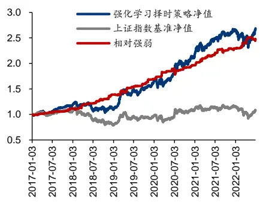
资料来源：Wind，华泰研究

## 导读

本文即将开启一段崭新而激动人心的研究旅程。我们将探索强化学习（reinforcementlearning）在量化投资中的应用。

以往我们接触的机器学习算法大多属于监督学习（supervised learning）。监督学习的特点是研究对象包含明确的“标准答案”，一般称为标签（label）。例如人脸识别中，标签为人的真实身份；语音识别中，标签为语音对应的真实文字；截面选股中，标签为个股未来真实涨跌幅。监督学习的目标是尽可能逼近标准答案。

然而在现实世界，大多数时候并不存在标准答案。例如围棋中的每一步棋，俄罗斯方块中的每一次操作，不存在最优解。就如同人生，报考哪个专业，选择哪种工作，和谁共度一生，都没有标准答案，我们只能在试错中学习。尽管有即时反馈，但这种学习往往需要围绕更长期的目标。例如围棋中赢得棋局，俄罗斯方块中获取高分，人生中收获幸福。针对长期目标的试错学习，正是强化学习的特殊之处。

或许可以这么说，有标准答案的监督学习是人们对现实进行抽象与简化，构建出的乌托邦；
而没有标准答案的强化学习，更接近世界的本质，也更接近真正意义上的“人工智能”。

强化学习理论的形成可追溯到上世纪七、八十年代。近十年来，融合深度学习的深度强化学习算法在游戏、机器人等领域展现出强大的统治力。谷歌 DeepMind 团队于 2013 年 12月向公众展示，如何利用强化学习在雅达利游戏中击败人类专业玩家。2016 年 3 月DeepMind 开发的 AlphaGo 以 4:1 击败世界围棋冠军李世石。2019 年 1 月，AlphaStar 在星际争霸游戏中击败人类职业选手。强化学习不断刷新人类的想象，成为人工智能的重要研究领域之一。

## 强化学习择时策略案例

强化学习在投资领域同样具有广阔应用前景。下图展示我们构建的强化学习上证指数择时策略回测表现。采用上证指数样本内行情数据（2007-01-04 至 2016-12-30）训练深度 Q网络（Deep Q-network，DQN），在样本外（2017-01-03 至 2022-06-30）进行回测。100组随机数种子合成信号，择时策略在样本外取得 18.2%的年化超额收益，夏普比率达 1.31，年均调仓 42.0 次。策略具体构建方法将在后面章节介绍。

图表1： 强化学习上证指数择时策略样本外回测表现（100组随机数种子合成信号）

注：T 日收盘发出信号，T+1 日开盘调仓，不做空，交易费率单边 0.5‰样本内 2007-01-04 至 2016-12-30，样本外 2017-01-03 至 2022-06-30资料来源：Wind，华泰研究

## 强化学习应用于投资的风险

上图的净值曲线无疑具备吸引力，但我们需要提前给读者“泼冷水”。我们认为，强化学习应用于投资存在以下不可忽视的风险：

1. 数据量不足。训练强化学习模型需要较大数据量。初代 AlphaGo 策略网络强化学习的样本量约在 108数量级。对于股票择时场景，日频行情样本量约在 103数量级，分钟频行情样本量约在 106 数量级，逐笔数据样本量约在 107数量级。强化学习可能更适用于高频领域。低频领域如果要应用强化学习，就只能牺牲模型复杂度，并承担过拟合风险。

2. 缺少仿真环境。强化学习注重个体与环境的交互。个体的决策作用于环境，并影响随后得到的数据。围棋中，我们的每步棋会影响到对手（可视作环境）的选择，进而得到新的棋局。设计一个可交互的环境，对训练强化学习模型至关重要，在提升数据量的同时，丰富了模型试错探索的空间。OpenAI团队开发的Gym工具包提供了广泛的仿真环境，从游戏到棋类再到机器人，几乎成为强化学习研究的“标配”。

而在传统量化研究中，通常只使用历史数据，缺少对市场的仿真模拟，模型的每个决策实际上并不会影响到市场。这种对市场的简化处理，一方面限制了新样本的获取，另一方面也压缩了强化学习模型的试错空间。然而试图模拟市场又谈何容易，这是强化学习应用于投资领域，相比于游戏等领域的关键差异和难点所在。

3. 可解释性差。深度强化学习相比深度学习“黑箱”程度更高。强化学习可解释性尚处于初步阶段，大量问题亟待解决。

4. 模型不稳定。强化学习模型超参数较多，并且对超参数、随机数种子较敏感。以前述择时策略为例，每组随机数种子单独产生信号，样本外策略相对基准强弱如下图，各随机数种子表现差距较大。年化超额收益均值 13.4%，最高 28.0%，最低-0.3%，标准差高达 8.0%，标准差超过均值的一半。

图表2： 强化学习上证指数择时策略样本外回测相对基准强弱（100组随机数种子单独产生信号）
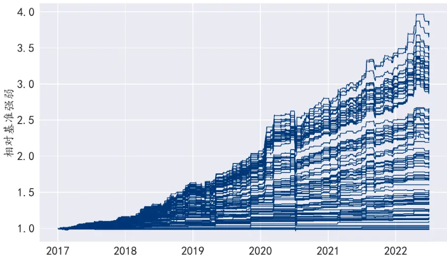
资料来源：Wind，华泰研究

## 本文框架

本文是华泰金工强化学习系列研究的开篇，各章节安排如下：

1. 强化学习概述和术语：以相对通俗的方式介绍强化学习基本概念，介绍状态、动作、奖励、策略等强化学习重要术语。

2. 马尔可夫决策过程：介绍强化学习的数学基础——马尔可夫过程、马尔可夫奖励过程和马尔可夫决策过程。

3. 强化学习经典算法：围绕基于价值的方法和基于策略的方法两个方向，依次介绍蒙特卡洛、时序差分、Sarsa、Q学习、DQN、策略梯度、REINFORCE、演员-评委算法。

4. 强化学习日频择时策略：介绍 DQN 上证指数日频择时策略构建方法，并进行参数敏感性测试。

强化学习难度较大。对于不同类型读者，建议在阅读上有所侧重：

1. 仅对投资策略感兴趣的读者，可阅读(1)(4)。

2. 有一定机器学习基础，但初次接触强化学习的读者，可阅读(1)(3)(4)。

3. 希望进一步理解强化学习数学基础的读者，可阅读(1)(2)(3)(4)。

## 强化学习概述和术语

## 基本概念

强化学习的核心思想是个体通过与环境的交互，从反馈信号中进行学习。正如新生儿通过哭闹、吮吸、抓握等探索环境，积累对世界的感知；游戏玩家通过尝试多种策略，积累对游戏规则的理解；投资者通过交易行为，积累对市场规律的认知。如果某种行为可以使得婴儿获得食物、游戏玩家获得高分、投资者获得收益，那么这种行为将得到“强化”。

强化学习由智能体和环境两部分构成。智能体（agent）是能够采取一系列行动并期望获得高收益或者达到某一目标的个体，如上文的新生儿、游戏玩家、投资者。影响智能体行动学习的其他因素统一称为环境（environment），如婴儿的父母和周围的物体、游戏的规则和敌人、投资标的和市场上其他参与者等。

智能体和环境每时每刻都会进行交互。智能体首先观察环境的状态（state），采取某种动作（action），该动作对环境造成影响。随后，环境下一刻的状态和该动作产生的奖励（reward）将反馈给智能体。智能体的目标是尽可能多地从环境中获取奖励。

我们以 DeepMind 科学家 Vishal Maini 在 Machine Learning for Humans 一书中展示的迷宫老鼠游戏为例，更直观地理解强化学习：假设我们控制老鼠在迷宫中自由行动，如果找到奶酪，就能得到+1000 分奖励；如果找到沿途水源，也能得到+10 分奖励；如果不幸触电，就会得到-100 分奖励。

图表3： 迷宫老鼠游戏理解强化学习
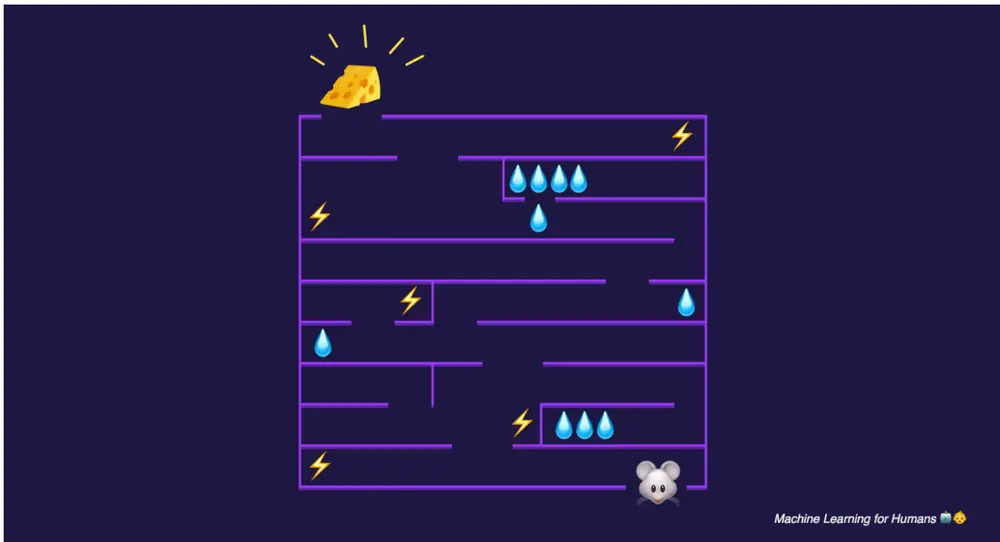
资料来源：Vishal Maini. (2017). Machine Learning for Humans，华泰研究

首先让老鼠自由探索整个环境。老鼠可能在初期探索中触电，得到负的奖励；下一轮中，老鼠会选择避开闪电；老鼠也可能很快发现入口附近的三个水源；从此花费全部时间收获这些微小奖励，不再有更高追求，因而错失更大的奖励。经历反复训练后，老鼠最终找到全部水源，并获得最大的奶酪奖励。

通过上述例子，我们得以重温强化学习模型的基本概念：智能体首先观察环境，采取行动与环境互动，获得正向或负向奖励。随后，智能体借助反馈修正策略，尽可能最大化奖励。这与投资交易场景非常匹配。投资者首先观察市场，采取买入、卖出、持有等动作，产生盈亏。随后，投资者通过复盘修正投资策略，目标是最大化预期收益。

下面我们将强化学习问题以数学语言描述。

图表4： 智能体与环境的交互
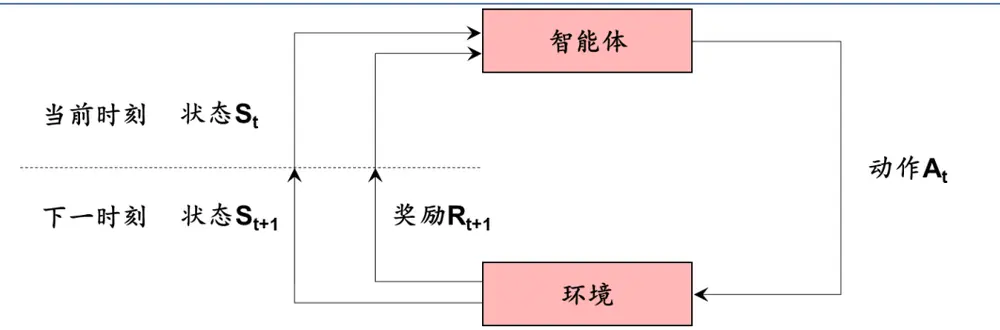
资料来源：华泰研究

强化学习的基本框架是智能体与环境的交 $\pmb{\mathcal{Z}}_{\circ}$ 。如上图所示，t 时刻智能体接受到环境的状态信号 $\mathsf{S}_{\mathrm{t}},$ ，并从该状态允许的动作空间中选择一种动作 $\mathsf{A}_{\mathsf{t}\circ}$ 。环境接收到智能体的动作信号，并于下一时刻反馈给智能体新的状态信号 $\mathsf{S}_{\mathsf{t}+1}$ 和即时奖励 $\mathsf{R}_{\mathsf{t}+1}$

强化学习的目标是智能体从环境中获得尽可能高的总奖励。前述例子中，老鼠可能在初期获得较多水源，从而得到较高的短期奖励；但这一行为可能使得老鼠错失更大的奶酪奖励，从而得到较低的长期奖励。因此，强化学习目标中的总奖励不是下一时刻的即时奖励，而是未来每个时刻奖励的“折现”之和：

$$
G_{t}=R_{t+1}+\gamma R_{t+2}+\gamma^{2}R_{t+3}+\cdots=\sum_{k=0}^{\infty}\gamma^{k}R_{t+k+1}
$$

上式中， $\sf{G}_{\sf t}$ 为 t时刻计算的总奖励，也称为回报（return）； $\curlyvee$ 为折扣因子（discount factor），类似金融里的折现率，满足 0≤γ≤1。

强化学习的结果是某种动作选择规则，称为策略（policy）。策略可以记做 π(a|s)，表示在某种状态 s下采取某种动作 a 的概率。

强化学习主要采用迭代方式训练。理想情况下，如果可以准确计算某种状态 s 下采取某种动作 a 后的回报 G，那么最优策略就只需要采取回报最大的动作即可。在模型迭代训练的过程中，通过智能体与环境的不断交互，对回报的估计逐渐逼近真实值，同时策略也逐步达到理想情况。

## 重要术语

强化学习有一套区别于传统机器学习的术语体系，厘清这些术语对理解强化学习至关重要。

## 智能体（agent）

由谁做动作或决策，谁就是智能体。如超级玛丽中，玛丽奥是智能体；无人驾驶中，无人车是智能体；算法交易中，自动交易员是智能体。

## 环境（environment）

环境是智能体与之交互的对象，可以抽象理解为交互过程中的规则或机理。超级玛丽中，游戏程序是环境；无人驾驶中，真实的物理世界是环境；算法交易中，市场是环境。

## 状态（state）

状态可以理解为对当前时刻环境的概括。超级玛丽中，可以将屏幕当前画面（或最近几帧画面）视作状态。玩家只需要知道当前画面（或最近几帧画面）就能够做出正确的决策，决定下一步是让玛丽奥向左走、向右走或向上跳。算法交易中，市场中的可观测变量，如行情数据、资金流向、新闻舆情等，都可以视作状态。状态是决策的依据。

## 状态空间（state space）

状态空间是指所有可能存在状态的集合，常以花体字母S表示。状态空间可以是离散的，也可以是连续的；可以是有限集，也可以是可数无限集。五子棋、象棋、围棋中，状态空间是离散有限集，可以枚举出所有可能存在的状态，即棋盘上的局面。超级玛丽、无人驾驶、算法交易中，状态空间是无限集，存在无穷多种可能的状态。

## 状态转移（state transition）

状态转移是环境从当前 t 时刻状态 s 转移到下一时刻状态 s’的过程。超级玛丽中，基于当前状态（屏幕上的画面），玛丽奥向上跳了一步，那么环境（游戏程序）就会计算出新的状态（下一帧画面）。中国象棋中，基于当前状态（棋盘上的局面），红方将“车”走到黑方“马”的位置，那么环境（游戏规则）就会将黑方的“马”移除，生成新的状态（棋盘上的新局面）。算法交易中，自动交易员基于当前状态（账户余额及盘口信息），执行一手市价买单，那么环境（市场）就会撮合交易，并给出新的状态（更新的账户余额及盘口信息）。数学上通常以状态转移函数（state transition function）表示，在当前状态 s，智能体执行动作 a，下一时刻状态转移至 s’的概率记为 pt(s’|s,a)：

$$
p_{t}(s^{\prime}|s,a)\triangleq\operatorname*{Pr}\{S_{t+1}=s^{\prime}|S_{t}=s,A_{t}=a\}
$$

## 动作（action）

动作是智能体基于当前状态所做出的决策。超级玛丽中，假设玛丽奥只能向左走、向右走或向上跳，那么动作是左、右、上三者之一。围棋中，棋盘上有 361 个位置，对应 361 种动作。算法交易中，动作可以是执行指定价格、指定方向、指定数量的交易单，或是等待。动作的选择可以是确定性的，也可以是随机的。

## 动作空间（action space）

动作空间是指所有可能动作的集合，常以花体字母A表示。超级玛丽中，动作空间是A＝{左, 右,上}。围棋中，动作空间是A＝{1,2,3, … ,361}。动作空间可以是离散或连续集合，可以是有限或无限集合。

## 奖励（reward）

奖励是指智能体执行动作后，环境反馈智能体的一个数值。奖励可以自行定义，如何定义奖励对于强化学习的结果至关重要。如超级玛丽中可以这样定义：玛丽奥吃到一枚金币，奖励+1；玛丽奥通过关卡，游戏结束，奖励+1000；玛丽奥碰到敌人，游戏结束，奖励-1000；无特殊事件发生，奖励为 0。通常假设奖励是当前状态 s、当前动作 a 和下一时刻状态 s的函数，记为 r(s,a,s’)。有时也假设奖励仅仅是 s 和 a的函数，记为 r(s,a)。

## 回报（return）

回报是从当前时刻开始到结束的所有奖励的总和，也称为累计奖励（cumulative futurereward）。通常将 t时刻的回报记为 $\mathsf{G}_{\mathrm{t}}$ ，以 γ 为折扣因子，采用类似“折现”的方式计算：

$$
G_{t}\triangleq R_{t+1}+\gamma R_{t+2}+\gamma^{2}R_{t+3}+\cdots=\sum_{k=0}^{\infty}\gamma^{k}R_{t+k+1}
$$

## 策略（policy）

策略是指根据当前状态，从动作空间中采取某种动作的决策规则。超级玛丽中，假设当前状态下玛丽奥前方有敌人，上方有金币，应该如何决策？我们大概率会决定向上跳，既能避开敌人，又能吃到金币。从状态到动作的映射就是我们的策略。数学上通常以策略函数（policy function）表示，状态 s 下采取动作 a 的概率记为 π(a|s)：

$$
\pi(a|s)\triangleq\operatorname*{Pr}\{A=a|S=s\}
$$

超级玛丽中，状态是游戏屏幕画面，作为策略函数的输入，输出每个动作的概率值：

$$
\pi{\bigl(}\pounds|s{\bigr)}=0.2,\pi{\bigl(}\pounds|s{\bigr)}=0.1,\pi{\bigl(}\pounds|s{\bigr)}=0.7
$$

## 价值（value）

价值是指给定策略下状态回报的期望。对中国象棋高手来说，卧槽马局面较为有利，该状态的价值较高；归心马局面较为不利，该状态的价值较低。而对不懂象棋的人来说，这两种状态的价值可能没有差别。因此，状态的价值取决于所采取的策略。数学上通常以状态价值函数（state-value function）表示，策略 π 下状态 s 的价值记为 $\mathsf{v}_{\pi}(\mathsf{s})$

$$
v_{\pi}(s)\triangleq\mathbb{E}_{\pi}[G_{t}|S_{t}=s]
$$

在 t时刻，未来可能有多种轨迹，回报 $\pmb{\mathsf{G}}_{\pmb{\mathrm{t}}}$ 具有不确定性，价值是随机变量 $\pmb{\mathsf{G}}_{\pmb{\mathrm{t}}}$ 的期望。强化学习的最终目标是寻找一种最优策略，使得价值最大化。

至此我们完成了与强化学习重要术语的初次接触。下一章我们将在马尔可夫决策过程的语境下重温这些术语。

## 马尔可夫决策过程

强化学习的基础框架是马可夫决策过程（Markov decision process，MDP）。本章我们遵循马尔可夫过程（Markov process，MP）、马尔可夫奖励过程（Markov reward process，MRP）、马尔可夫决策过程的顺序展开介绍。

## 马尔可夫过程

马尔可夫性是马尔可夫过程的基础。马尔可夫性假设未来的状态仅仅取决于现在的状态，独立于过去的状态。数学上可表示为：

$$
\operatorname*{Pr}\{S_{t+1}|S_{t}\}=\operatorname*{Pr}\{S_{t+1}|S_{1},S_{2},\dots,S_{t}\}
$$

其中 ${\sf S}_{\sf t}$ 代表 t 时刻状态。由上式可知，t时刻包含了 1至 t 时刻的全部信息。

马尔可夫过程也称为马尔可夫链（Markov chain），是一组具有 $\xrightarrow{\pi}$ 尔可夫性质的随机过程，可以表示为二元组〈S, P〉，其中S代表状态空间，P代表状态转移矩阵（state transition matrix），P的元素 $\mathcal{P}_{ss\prime}$ 代表从当前状态 s转移至下一状态 s’的概率，P的每行元素之和为 1：

$$
\begin{array}{r}{\mathcal{P}_{ss^{\prime}}=\operatorname*{Pr}\{S_{t+1}=s^{\prime}|S_{t}=s\}}\\{\mathcal{P}=\left[{\begin{array}{ccc}{\mathcal{P}_{11}}&{\cdots}&{\mathcal{P}_{1n}}\\{\vdots}&{\ddots}&{\vdots}\\{\mathcal{P}_{n1}}&{\cdots}&{\mathcal{P}_{nn}}\end{array}}\right]\quad}\end{array}
$$

我们通过 DeepMind 首席科学家、伦敦大学学院教授 David Silver 在强化学习课程中展示的学生上课案例，更直观地理解马尔可夫过程。Class 1为学生的开始状态，Sleep 为学生的结束状态，箭头所标数字为学生的状态转移概率。学生从开始到结束可能会经历不同轨迹：既可能按部就班完成 Class 1、Class 2、Class 3的学习并通过考试；也可能陷入刷Facebook的循环；还可能因通宵去 Pub导致错过考试而重修课程。

图表5： 学生上课案例理解马尔可夫过程
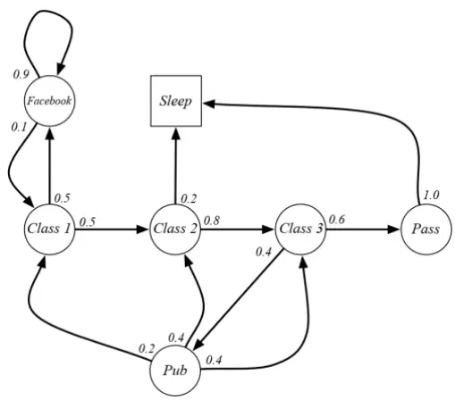
资料来源：David Silver. (2015). Reinforcement Learning，华泰研究

该 $\xrightarrow{\pi}$ 尔可夫过程的状态空间S可以表示为：

$$
\mathcal{S}=\{Class1,Class2,Class3,Pass,Pub,Facebook,Sleep\}
$$

该马尔可夫过程的状态转移矩阵P可以表示为：

$$
\mathcal{P}=\left[\begin{array}{cccccc}{0.5}&&&&{0.5}&\\&{0.8}&&&&{0.2}\\&&{0.6}&{0.4}&&\\&&&{1.0}\\{0.2}&{0.4}&{0.4}&&&\\{0.1}&&&&{0.9}&\\&&&&&{1}\end{array}\right]
$$

## 马尔可夫奖励过程

前文提到强化学习的目标是智能体从环境中获得尽可能高的总奖励，因此需要将奖励引入马尔可夫过程，这就是马尔可夫奖励过程。

## 奖励函数和折扣因子

马尔可夫奖励过程在 $\xrightarrow{\pi}$ 尔可夫过程基础上，引入奖励函数ℛ与折扣因子γ，可以表示为四元组 $\langle\mathcal{S},\mathcal{P},\mathcal{R},\gamma\rangle$ 。奖励函数ℛ为 t 时刻转移至状态 s 的即时奖励 $\mathsf{R}_{\mathsf{t}+1}$ （下标习惯上采用 t+1），奖励可能具有随机性，因此用期望表示：

$$
\mathcal{R}_{s}=\mathbb{E}[R_{t+1}\vert S_{t}=s]
$$

折扣因子γ表示未来奖励在当前时刻的“折现率”，介于 0 和 1 之间，折扣因子越大，未来奖励的影响越大。

下图为学生上课的马尔可夫奖励过程，红色 R 代表相应状态的即时奖励。上课的即时奖励为负值-2，Pub的即时奖励为较小的正值+1，通过考试的即时奖励为较大的正值+10。奖励函数ℛ可以表示为：

$$
\mathcal{R}=[-2,-2,-2,10,1,-1,0]^{T}
$$

图表6： 学生上课案例理解马尔可夫奖励过程
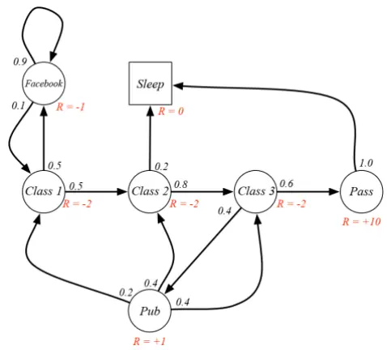
资料来源：David Silver. (2015). Reinforcement Learning，华泰研究

## 回报和价值函数

回报是从当前时刻开始到结束的所有奖励的“折现”之和：

$$
G_{t}=R_{t+1}+\gamma R_{t+2}+\gamma^{2}R_{t+3}+\cdots=\sum_{k=0}^{\infty}\gamma^{k}R_{t+k+1}
$$

回报的定义不考虑历史奖励。“往者不可谏，来者犹可追”。强化学习的意义是寻找未来的最优策略。基于马尔可夫性，未来仅取决于当前状态，与历史无关。

马尔可夫奖励过程中，价值函数是当前状态 s 下的回报期望，由于未来轨迹有多种可能，回报是随机变量，因此价值函数用期望表示：

$$
v(s)=\mathbb{E}[G_{t}|S_{t}=s]
$$

下图圆圈中的红色数字表示折扣因子 $\gamma{=}0.9$ 时，对应状态的价值函数值。观察可知，状态的即时奖励 R和价值 v并不等价。例如：

1. 左上角的圆圈对应 Facebook 状态，刷 Facebook 的即时奖励为较小的负值-1，但由于有 90%的概率陷入刷 Facebook 的循环，未来有较大可能持续获得-1 的奖励，将未来奖励折现后，该状态的价值为较大的负值-7.6。即时、廉价的快乐是慢性毒药。

2. Class 1、Class 2、Class 3 的即时奖励均为-2，但价值递增，分别为-5.0、0.9、4.1。Class 3 状态有 60%的概率通过考试，在下一时刻获得+10 的奖励，折现后价值较高。学习总是痛苦的，但随着日积月累，学习的价值会逐渐体现。

图表7： 学生上课案例理解马尔可夫奖励过程的奖励和价值
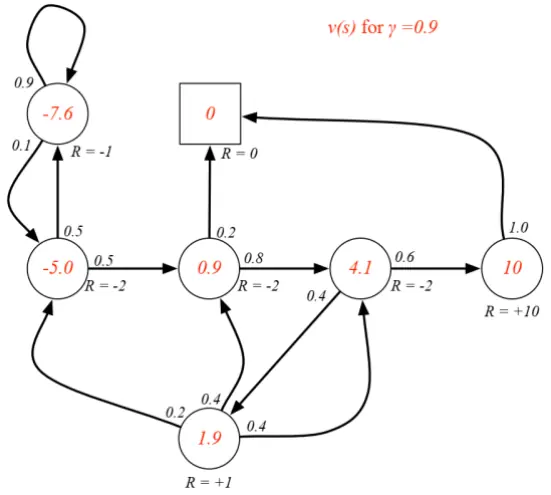
资料来源：David Silver. (2015). Reinforcement Learning，华泰研究

## 贝尔曼方程

以上我们仅给出价值函数的定义，未涉及价值函数的求解方法。学生上课案例中各状态的价值函数值应如何计算？我们需要引入贝尔曼方程（Bellman equation）。

从价值函数的定义出发，进行如下推导：

$$
\begin{array}{rl}&{v(s)=\mathbb{E}[G_{t}|S_{t}=s]}\\&{\qquad=\mathbb{E}[R_{t+1}+\gamma R_{t+2}+\gamma^{2}R_{t+3}+\cdots|S_{t}=s]}\\&{\qquad=\mathbb{E}[R_{t+1}+\gamma(R_{t+2}+\gamma R_{t+3}+\cdots)|S_{t}=s]}\\&{\qquad=\mathbb{E}[R_{t+1}+\gamma G_{t+1}|S_{t}=s]}\\&{\qquad=\mathbb{E}[R_{t+1}+\gamma v(S_{t+1})|S_{t}=s]}\end{array}
$$

上述推导将 t 时刻状态 s 的回报 $\mathsf{G}_{\mathtt{t}}$ 拆解为两部分：前半部分是当前状态的即时奖励 $\mathsf{R}_{\mathsf{t}+1}$ 后半部分是下一时刻状态 $\mathsf{S}_{\mathsf{t}+1}$ 的价值函数的折现 $\mathsf{V}\mathsf{V}(\mathsf{S}_{\mathsf{t}+1})$ o

下面考虑如何计算期望，期望具有可加性，因此前后两部分可分别计算。

1. 前半部分E $[R_{t+1}|S_{t}=s]$ 表示状态 s的即时奖励期望，等于即时奖励 $\mathcal{R}_{s}$ ；

2. 折扣因子 γ 为常数，可提取到期望外部。此时后半部分E[ $v(S_{t+1})|S_{t}=s]$ 表示下一时刻状态价值的期望。下一时刻的状态存在多种可能，其中任意状态 s’的价值函数为 $\mathsf{v}(\mathsf{s}^{\prime})$ 出现概率为 $\mathcal{P}_{ss\prime}$ 。对所有可能的 ${\\boldsymbol{\mathsf{S}}}^{\prime}$ 进行加权求和，求得下一时刻状态价值的期望$\begin{array}{r}{\sum_{s\prime\in\mathcal{S}}\mathcal{P}_{ss\prime}v(s\prime)}\end{array}$ 0

至此，我们得到马尔可夫奖励过程的贝尔曼方程：

$$
v(s)=\mathcal{R}_{s}+\gamma\sum_{s\prime\in\mathcal{S}}\mathcal{P}_{ss\prime}v(s^{\prime})
$$

简化为矩阵形式：

$$
\boldsymbol{v}=\mathcal{R}+\gamma\mathcal{P}\boldsymbol{v}
$$

$$
\begin{array}{r}{\underset{\ b{v}(n)}{\left[\begin{array}{c}{\ b{v}(1)}\\{\vdots}\\{\ b{v}(n)}\end{array}\right]}=\left[\begin{array}{c}{\mathcal{R}_{1}}\\{\vdots}\\{\mathcal{R}_{n}}\end{array}\right]+\gamma\left[\begin{array}{ccc}{\mathcal{P}_{11}}&{\cdots}&{\mathcal{P}_{1n}}\\{\vdots}&{\ddots}&{\vdots}\\{\mathcal{P}_{n1}}&{\cdots}&{\mathcal{P}_{nn}}\end{array}\right]\left[\begin{array}{c}{\ b{v}(1)}\\{\vdots}\\{\ b{v}(n)}\end{array}\right]}\end{array}
$$

贝尔曼方程是线性方程，可以直接求解：

$$
\begin{array}{r}{\boldsymbol{v}=\mathcal{R}+\gamma\mathcal{P}\boldsymbol{v}}\\{(I-\gamma\mathcal{P})\boldsymbol{v}=\mathcal{R}}\\{\boldsymbol{v}=(I-\gamma\mathcal{P})^{-1}\mathcal{R}}\end{array}
$$

已知状态转移矩阵P、奖励函数ℛ、折扣因子 $\forall,$ ，可以直接求出价值函数 v的解析解。

仍以学生上课为例，已知状态转移矩阵P和奖励函数ℛ，假设折扣因子 γ＝0.9，根据贝尔曼方程可以解出价值函数 v：

$$
\begin{array}{rl}&{v=(I-\gamma\mathcal{P})^{-1}\mathcal{R}}\\&{=\left(\left[\begin{array}{lllllll}{1}&&&&&&\\&{1}&&&&\\&&{1}&&&&\\&&{1}&&&&\\&&&{1}&&&\\&&&&{1}&&\\&&&&&{1}&\\&&&&&&{1}\end{array}\right]-0.9\left[\begin{array}{llllll}{0.5}&&&&{0.5}&&\\&{0.8}&&&{0.4}&&\\&&{0.4}&&&{1.0}\\{0.2}&{0.4}&{0.4}&&&\\{0.1}&&&&{0.9}&\\&&&&&{1}\end{array}\right]\right)^{-1}\left[\begin{array}{l}{-2}\\{-2}\\{-2}\\{10}\\{1}\\{-1}\\{0}\end{array}\right]}\\&{=[-5.0,0.9,4.1,10,1.9,-7.6,0]^{T}}\end{array}
$$

解析解只适用于小规模的马尔可夫奖励过程。大规模的马尔可夫奖励过程由于参数过多，通常采用迭代方式求数值解，例如蒙特卡洛方法，时序差分方法等，将在下一章强化学习经典算法中予以介绍。

## 马尔可夫决策过程

马尔可夫奖励过程中，状态转移以一定概率发生，智能体只能被动接受状态转移的结果，无法主动选择进入某种状态。强化学习强调智能体与环境的交互，智能体理应能影响环境。因此需要将智能体的动作引入马尔可夫奖励过程，这就是马尔可夫决策过程。

## 动作

马尔可夫决策过程在马尔可夫奖励过程基础上，引入动作空间A，可以表示为五元组$\langle\mathcal{S},\mathcal{A},\mathcal{P},\mathcal{R},\gamma\rangle$ 。此时，状态转移矩阵P代表在当前状态 s下执行动作 a时，下一时刻状态转移至 s’的概率：

$$
\mathcal{P}_{ss\prime}^{a}=\mathrm{Pr}\{S_{t+1}=s^{\prime}|S_{t}=s,A_{t}=a\}
$$

奖励函数ℛ代表在当前状态 s下执行动作 a时，下一时刻获得奖励的期望：

$$
\mathcal{R}_{s}^{a}=\mathbb{E}[R_{t+1}|S_{t}=s,A_{t}=a]
$$

和马尔可夫奖励过程相比，马尔可夫决策过程在条件部分引入动作，从而赋予智能体主观能动性。

下图仍以学生上课为例展示马尔可夫决策过程。在状态转移时引入动作，只有在执行特定动作后，才可实现相应的状态转移，并获得奖励。例如在 Class 3 状态（右侧圆圈）：当智能体选择动作 Study时，下一时刻将以 100%的概率转移至结束状态（上侧方块），并获得+10 的奖励；而当智能体选择动作 Pub 时，下一时刻将以 100%的概率转移至 Pub（下侧圆点），并获得+1 的奖励。这里的 100%概率仅是便于读者理解，实际可以是任意概率值。

图表8： 学生上课案例理解马尔可夫决策过程
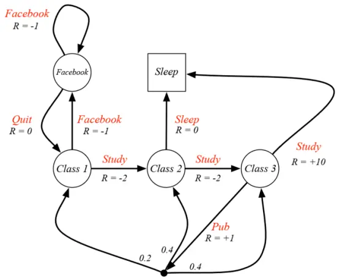
资料来源：David Silver. (2015). Reinforcement Learning，华泰研究

## 策略、状态价值函数和动作价值函数（Q函数）

强化学习的结果是确定根据当前状态从动作空间中采取某种动作的决策规则，称为策略。策略可以记为 π(a|s)，代表状态 s下采取动作 a的概率：

$$
\pi(a|s)=\operatorname*{Pr}\{A_{t}=a|S_{t}=s\}
$$

根据马尔可夫性，马尔可夫决策过程的策略仅与当前状态有关，与历史无关。

下面我们进一步将策略引入马尔可夫决策过程。对于给定的马尔可夫决策过程五元组$\langle\mathcal{S},\mathcal{A},\mathcal{P},\mathcal{R},\gamma\rangle$ 和策略 π，状态转移矩阵P和奖励函数ℛ可分别表示为：

$$
\mathcal{P}_{ss\prime}^{\pi}=\sum_{a\in\mathcal{A}}\pi(a|s)\mathcal{P}_{ss\prime}^{a}
$$

$$
\mathcal{R}_{s}^{\pi}=\sum_{a\in\mathcal{A}}\pi(a|s)\mathcal{R}_{s}^{a}
$$

在 $\xrightarrow{\pi}$ 尔可夫奖励过程中，状态的价值仅取决于状态本身，因此价值函数 $\mathsf{v}(\mathsf{s})$ 是状态 s 的函数。在马尔可夫决策过程中，由于动作的引入，状态的价值同时受到动作影响。定义两种基于策略的价值函数：状态价值函数（state-value function）和动作价值函数（action-valuefunction）。

状态价值函数和前述价值函数定义类似，沿用字母 v，仍为状态 s 的函数，代表策略 π 下状态 s 的回报期望：

$$
v_{\pi}(s)=\mathbb{E}_{\pi}[G_{t}|S_{t}=s]
$$

下图展示学生上课案例中的状态价值函数。假设学生采取随机策略，如 Class 1 状态学习和刷 Facebook 的概率均为 0.5，Class3 状态学习和 Pub 的概率也均为 0.5，即 $\pi(\mathsf{a}|\mathsf{s})=0.5$ 同时假设折扣因子 $\gamma=1$ ，那么各状态内部的红色数字就是该状态的价值函数值。在后续的贝尔曼期望方程部分我们将展示状态价值函数的计算方法。

图表9： 学生上课案例理解马尔可夫决策过程的状态价值函数
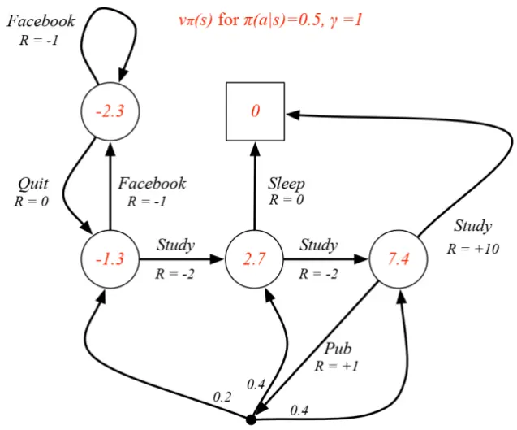
资料来源：David Silver. (2015). Reinforcement Learning，华泰研究

动作价值函数采用字母 q，是状态 s 和动作 a 的函数，也称为 Q 函数（Q-function），代表策略 π、状态 s 下执行动作 a 的回报期望：

$$
q_{\pi}(s,a)=\mathbb{E}_{\pi}[G_{t}|S_{t}=s,A_{t}=a]
$$

Q 函数是对智能体动作价值的评估，智能体可以根据不同动作的 Q 函数大小进行决策，如选择 Q 函数最大的动作。

## 贝尔曼期望方程

在马尔可夫奖励过程中，我们从价值函数出发，推导出贝尔曼方程。类似地，在马尔可夫决策过程中，从状态价值函数和动作价值函数出发，也可以推导各自的贝尔曼方程，称为贝尔曼期望方程（Bellman expectation equation）。

状态价值函数的贝尔曼期望方程为：

$$
v_{\pi}(s)=\mathbb{E}_{\pi}[R_{t+1}+\gamma v_{\pi}(S_{t+1})\vert S_{t}=s]
$$

展开并整理得到：

$$
v_{\pi}(s)=\sum_{a\in\mathcal{A}}\pi(a|s)(\mathcal{R}_{s}^{a}+\sum_{s^{\prime}\in\mathcal{S}}\mathcal{P}_{ss^{\prime}}^{a}v_{\pi}(s^{\prime}))
$$

动作价值函数的贝尔曼期望方程为：

$$
q_{\pi}(s,a)=\mathbb{E}_{\pi}[R_{t+1}+\gamma q_{\pi}(S_{t+1},A_{t+1})|S_{t}=s,A_{t}=a]
$$

展开并整理得到：

$$
q_{\pi}(s,a)=\mathcal{R}_{s}^{a}+\gamma\sum_{s\prime\in\mathcal{S}}\mathcal{P}_{ss\prime}^{a}\sum_{a\in\mathcal{A}}\pi(a^{\prime}|s^{\prime})q_{\pi}(s^{\prime},a^{\prime})
$$

两者存在下面的转换关系：

$$
v_{\pi}(s)=\sum_{a\in\mathcal{A}}\pi(a|s)q_{\pi}(s,a),q_{\pi}(s,a)=\mathcal{R}_{s}^{a}+\gamma\sum_{s^{\prime}\in\mathcal{S}}\mathcal{P}_{ss^{\prime}}^{a}v_{\pi}(s^{\prime})
$$

基于贝尔曼期望方程，我们可以求解不同策略的状态价值函数和动作价值函数。

将状态价值函数的贝尔曼期望方程简化为矩阵形式：

$$
\boldsymbol{v}_{\pi}=\mathcal{R}^{\pi}+\gamma\mathcal{P}^{\pi}\boldsymbol{v}_{\pi}
$$

可得到状态价值函数的解析解：

$$
\begin{array}{r}{v_{\pi}=(I-\gamma\mathcal{P}^{\pi})^{-1}\mathcal{R}^{\pi}}\end{array}
$$

同样以学生上课为例，这里不考虑 Pass和 Pub状态，新的状态空间为：

$$
\mathcal{S}=\{Class1,Class2,Class3,Facebook,Sleep\}
$$

假定策略为 π(a|s)＝0.5，该策略下状态转移矩阵为：

$$
\mathcal{P}^{\pi}=\left[\begin{array}{ccccc}{0.5}&&{0.5}&\\&&{0.5}&&{0.5}\\{0.1}&{0.2}&{0.2}&&{0.5}\\{0.5}&&&{0.5}&\end{array}\right]
$$

Class3 状态下，有 0.5 的概率转移至 Sleep；另有 0.5 的概率转移至 Pub，进而以 0.1、0.2、0.2 的概率转移至 Class 1、Class 2、Class 3。另外，由于 Sleep 为终止状态，状态转移矩阵最后一行各元素均为 0。

该策略下奖励函数为：

$$
\begin{array}{rl}&{\mathcal{R}^{\pi}=[0.5*(-2)+0.5*(-1),0.5*(-2)+0.5*0,0.5*10+0.5*1,0.5*(-1)+0.5*0,0]^{T}}\\&{\quad\quad=[-1.5,-1,5.5,-0.5,0]^{T}}\end{array}
$$

假设折扣因子 $\gamma=1$ ，根据贝尔曼期望方程可以解出状态价值函数 $\mathsf{v}_{\pi}$

$$
\begin{array}{rl}&{v_{\pi}=(I-\gamma\mathcal{P}^{\pi})^{-1}\mathcal{R}^{\pi}}\\&{\quad=\left(\left[\begin{array}{llllll}{1}&&&\\&{1}&&\\&&{1}&&\\&&&{1}&\\&&&&{1}\end{array}\right]-1\left[\begin{array}{lllll}{1}&{0.5}&&{0.5}&\\{0.1}&{0.2}&{0.2}&&{0.5}\\{0.5}&&&{0.5}&\end{array}\right]\right)^{-1}\left[\begin{array}{l}{-1.5}\\{-1}\\{5.5}\\{-0.5}\end{array}\right]}\\&{\quad=[-1.3,2.7,7.4,-2.3,0]^{T}}\end{array}
$$

## 最优策略、最优价值函数和贝尔曼最优方程

强化学习的目标是智能体从环境中获得尽可能高的总奖励。在马尔可夫决策过程中，我们定义最优策略（optimal policy）π*，满足在任意状态 s 和动作 a 下，状态价值函数和动作价值函数取最大值：

$$
v_{*}(s)=\operatorname*{max}_{\pi}v_{\pi}(s)
$$

$$
q_{*}(s,a)=\operatorname*{max}_{\pi}q_{\pi}(s,a)
$$

上面两式分别称为最优状态价值函数（optimal state-value function）和最优动作价值函数（optimal action-value function），统称最优价值函数（optimal value function）。 $\xrightarrow{\pi}$ 尔可夫决策过程的最优策略 π*(s)，是采取该状态 s下最优动作价值函数值最高的动作：

$$
\pi_{*}(s)=argmax_{a\in\mathcal{A}}q_{*}(s,a)
$$

左下图和右下图分别展示学生上课案例中，假定折扣因子 γ 为 1 时，最优状态价值函数和最优动作价值函数。观察左图左侧红色的 Class 1 状态，可以转移至右侧 Class 2或上方的Facebook，两种轨迹下的回报分别为-2+8＝6 以及-1+6＝5，因此 Class 1 状态的最优状态价值为两者的最大值 6。观察右图左上角的 Facebook 状态，继续刷 Facebook 的最优动作价值 q =5，退出 Facebook 的最优动作价值 q =6，此时最优策略为后者，其余状态下最优策略也均以红色箭头表示。

图表10： 学生上课案例理解马尔可夫决策过程的最优状态价值函数
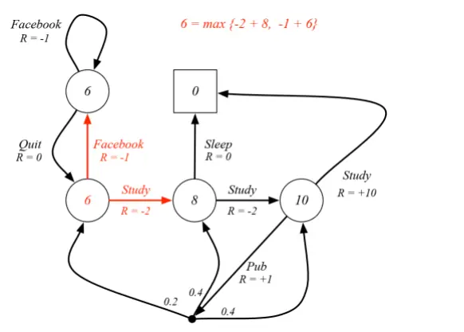
资料来源：David Silver. (2015). Reinforcement Learning，华泰研究

图表11： 学生上课案例理解马尔可夫决策过程的最优动作价值函数
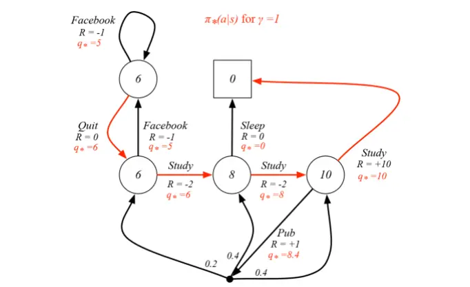
资料来源：David Silver. (2015). Reinforcement Learning，华泰研究

最优策略下的状态价值函数，应等于该状态下最优动作的动作价值函数：

$$
v_{*}(s)=\operatorname*{max}_{a}q_{*}(s,a)
$$

最优策略下的动作价值函数，应等于采取该动作的即时奖励，加上状态转移后各状态最优状态价值函数的加权和：

$$
q_{*}(s,a)=\mathcal{R}_{s}^{a}+\gamma\sum_{s\prime\in\mathcal{S}}\mathcal{P}_{ss^{\prime}}^{a}v_{*}(s^{\prime})
$$

分别将 q*(s,a)代入 v*(s)式，将 v*(s)代入 q*(s,a)式，可以得到贝尔曼最优方程（Bellmanoptimality equation）：

$$
\begin{array}{c}{{\displaystyle v_{*}(s)=\operatorname*{max}_{a}\mathcal{R}_{s}^{a}+\gamma\sum_{s\prime\in\mathcal{S}}\mathcal{P}_{ss\prime}^{a}v_{*}(s^{\prime})}}\\{{\displaystyle q_{*}(s,a)=\mathcal{R}_{s}^{a}+\gamma\sum_{s\prime\in\mathcal{S}}\mathcal{P}_{ss\prime}^{a}\operatorname*{max}_{a\prime}(s^{\prime},a^{\prime})}}\end{array}
$$

和前述贝尔曼方程、贝尔曼期望方程不同，贝尔曼最优方程不是线性方程，一般而言无法求解析解，需要采用迭代方式求数值解。下一章我们将介绍求解最优策略的各种强化学习经典算法。

## 强化学习经典算法

应用强化学习的基本思路是：首先对现实问题进行马尔可夫决策过程（MDP）建模，进而求解贝尔曼最优方程，得到最优策略。根据智能体对环境的掌握程度，可分为两种情况。当 MDP 的状态转移矩阵P和奖励函数ℛ已知，智能体了解环境的一切信息，此时强化学习属于有模型（model-based）方法，通常采用动态规划精确求解 MDP。然而，大部分现实问题的状态转移矩阵P和奖励函数ℛ未知，智能体必须与环境互动收集信息，此时强化学习属于免模型（model-free）方法，需要采用其他方式估计 MDP。本文主要关注免模型方法。

免模型的方法中，根据智能体学习的对象，又可以分为两种情况。基于价值（value-based）的方法学习价值函数，从而间接地学习策略。基于策略（policy-based）的方法不学习价值函数，而是直接学习策略。通俗地说，基于价值的方法会对每种状态下的动作进行评分，训练模型相当于训练评委，根据评委的评分选择得分最高的动作。基于策略的方法不会对状态和动作评分，训练模型相当于直接训练演员，演员知道每种状态下应选择何种动作。

图表12： 强化学习经典算法
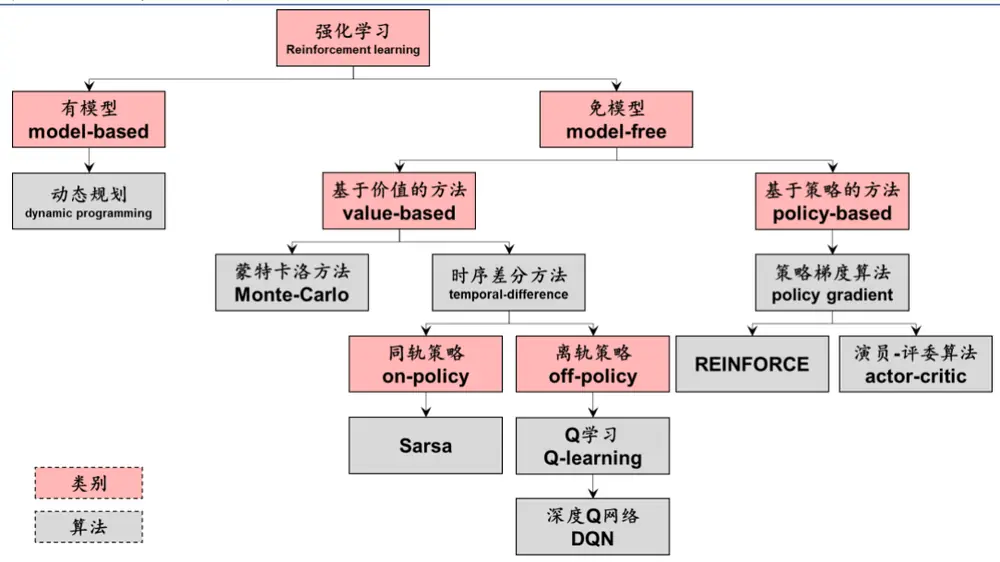
资料来源：华泰研究

## 基于价值的方法

基于价值的方法中，采用策略迭代（policy iteration）方式学习最优策略 π*，每轮迭代可分为两个阶段：

1. 策略评估（policy evaluation）：基于策略 π（非最优），估计动作价值函数 Q。这步也称为预测（prediction）。

2. 策略改进（policy improvement）基于估计的动作价值函数 Q，更新策略 π，通常采用ε-贪心算法。这步也称为控制（control）。

当迭代次数足够多，动作价值函数 Q将收敛至最优动作价值函数 q*，策略 π将收敛至最优策略 π*。

图表13： 策略迭代
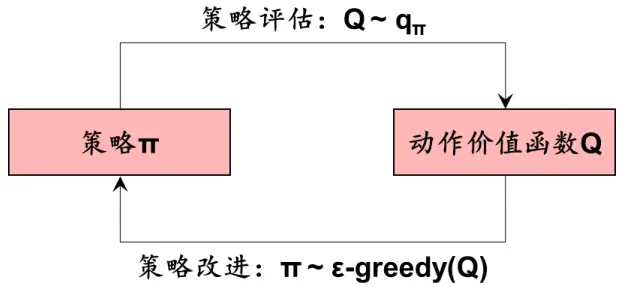
资料来源：华泰研究

## 蒙特卡洛方法

顾名思义，基于价值的方法关键在于计算价值函数。状态价值函数 vπ(s)是策略 π 下状态 s的未来回报 $\sf{G}_{\sf t}$ 的期望；动作价值函数 qπ(s,a)是策略 π 及状态 s 下采取动作 a 的未来回报$\sf{G}_{\sf t}$ 的期望。 $\sf{G}_{\sf t}$ 分布未知时，如何估计随机变量的期望？直观的思路之一是蒙特卡洛方法（Monte-Carlo methods）。

蒙特卡洛方法的核心思想是通过重复生成随机样本近似计算目标函数。蒙特卡洛方法应用广泛，不仅仅局限于强化学习。经典例子是估算圆周率，如下图所示，在 x∈[0,1]及 $y\in[0,1]$ 范围内以均匀分布生成随机点(x,y)，将满足 x2+y2≤1 的点标记为红色，其余点标记为蓝色。当重复次数足够多时，理论上红色点占比等于 1/4 圆面积除以正方形面积，即 π/4。将实际红色点占比乘以4，即得到估算的圆周率。当重复次数达10000次时，估算误差仅为0.45%。

图表14： 蒙特卡洛方法估算圆周率
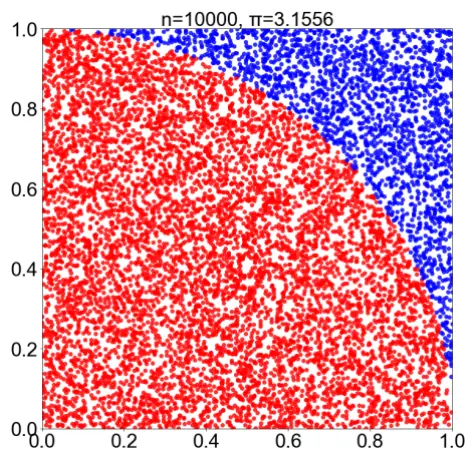
资料来源：华泰研究

强化学习中，如何采用蒙特卡洛方法计算状态价值函数呢？对于策略 π，可以利用该策略进行多次重复（如多次对弈、交易），每次重复从任意初始状态开始直到终止（如确定胜负、交易时间结束）。我们将每次重复称作幕（episode），每一幕中的状态 s、动作 a、奖励 r的时间序列称为轨迹（trajectory）。若策略存在随机性，则每一幕的轨迹应不同。统计每种状态 s 下的未来回报 $\mathsf{G}_{\mathrm{t}},$ ，计算平均值，得到状态价值函数 $\mathsf{v}_{\pi}(\mathsf{s})$ 的估计量 V(S)。统计每组状态 s和动作 a下的未来回报 Gt，计算平均值，得到状态价值函数 $\mathfrak{q}_{\mathfrak{n}}(\mathtt{s},\mathtt{a})$ 的估计量 ${\sf Q}({\sf S},{\sf A})$

蒙特卡洛方法可分为首次访问型（first-visit）和每次访问型（every-visit）两种。由于每一幕中访问同一状态的次数不唯一，既可以计算首次访问该状态后的回报均值，也可以计算每次访问该状态后的回报均值。首次访问型相比每次访问型更简单，下面将以首次访问型为例。

## 策略评估

策略评估阶段，首次访问型蒙特卡洛方法的状态价值函数可表示为：

$$
V(s)=\frac{G_{11}(s)+G_{21}(s)+G_{31}(s)+\cdots}{N(s)}
$$

其中 $\mathsf{G}_{21}(\mathsf{s})$ 代表第 2幕第 1 次访问状态 s获得的回报，N(s)代表状态 s的总访问次数。只要N(s)足够大，V(s)就能收敛到真实状态价值函数 vπ(s)：

$$
N(s)\to\infty,V(s)\to v_{\pi}(s)
$$

上述状态价值函数中，计算 V(s)需要保存全部历史幕的轨迹，若幕的数量非常大，会引起空间开销问题。我们可以将计算均值从全量方式改为增量方式：

$$
V(S_{t})=V(S_{t})+{\frac{1}{N(S_{t})}}(G_{t}-V(S_{t}))
$$

其中新增下标 t代表每一幕中的 t时刻，每次进入新的幕、新的时刻 t，V(St)都会得到更新，这样只需要保存最新幕的轨迹。增量方式和全量方式是等价的。

我们给出首次访问型蒙特卡洛方法策略评估伪代码。

## 图表15： 首次访问型蒙特卡洛方法策略评估伪代码

输入 待评估的策略 π，折扣因子 γ∈[0,1]
1初始化：状态价值函数 V(s)∈任意实数，回报列表 Returns(s)•空列表
2遍历每一幕：
3基于策略 π 生成一幕：S0, A0, R1, S1, A1, R2, …, ST-1, AT-1, RT
4回报 G•0
5逆序遍历该幕的每一步 t（t=T-1, T-2, …, 0）：
6 G•γG+R
7若 S 未出现在 S , S , …, S （即 S 首次访问）：
8将 G 添加至 Returns(S )
9 V(St)• average(Returns(St))
输出 V(s)收敛至最优状态价值函数 v*(s)
资料来源：华泰研究

与状态价值函数类似，动作价值函数可表示为：

$$
Q(S_{t},A_{t})=Q(S_{t},A_{t})+\frac{1}{N(S_{t},A_{t})}(G_{t}-Q(S_{t},A_{t}))
$$

至此，我们得到了策略 π下的状态价值函数和动作价值函数。但此时策略 π并非最优策略，我们需要基于价值函数对策略进行改进。

## 策略改进

策略改进阶段，通常采用 ε-贪心算法（ε-greedy methods）结合迭代方式进行优化。

贪心算法选择动作价值函数最高的动作，选择的结果是确定性的：

$$
\pi(s)=argmax_{a}q(s,a)
$$

此时策略不具备随机性，在状态 s 下将采取唯一的动作 argmax q(s,a)。贪心算法看似最优，实则不然。模型训练初期，智能体对环境的探索不够，很多状态-动作配对(s,a)从未经历过或出现次数较少，对动作价值函数 q(s,a)的估计不准确。贪心算法只选择当前 Q(S,A)最高的动作，限制了对环境的探索，很有可能错失 q(s,a)更高的动作。

联系前文迷宫老鼠游戏的例子，游戏初期老鼠可能很快会发现入口附近的水源，此时贪心算法的决策是每一幕只收获这些微小奖励，不对整个迷宫进行探索，从而错失更大的奶酪奖励。贪心算法为了眼下的最优，将动作局限在舒适区内，放弃了对环境的探索，错过了长远的、真正的最优。

为了鼓励智能体探索环境，我们将随机性引入贪心算法，这就是 ε-贪心算法：

$$
\pi(a|s)=\left\{\begin{array}{c}{{\varepsilon/{\mathrm{m}}+1-\varepsilon,\qquad\mathrm{if}\ a^{*}=argmax_{a}q(s,a)}}\\{{\varepsilon/{\mathrm{m}},\qquad\mathrm{otherwise}}}\end{array}\right.
$$

此时策略 π 的输出是状态 s 下采取动作 a 的概率，具有随机性。假设共有 m 种可选动作，其中动作价值最高的动作 ${\sf a^{\star}}.$ 被选中的概率为 ε/m+1-ε，其余动作被选中的概率为 ε/m。参数ε∈[0,1]，ε 越大则随机性越强，ε 为 0 时退化为贪心算法，ε 为 1 时相当于完全随机策略。

蒙特卡洛方法采用策略迭代方式进行优化，以第 k 轮迭代为例：

1. 策略评估阶段：基于策略 $\pi_{k-1}$ ，计算动作价值函数 $\mathsf{Q}$

2. 策略改进阶段：基于动作价值函数 Q，采用 ε-贪心算法得到新的策略 $\pi_{\kappa}$

当迭代次数足够多，动作价值函数 Q将收敛至最优动作价值函数 $\mathsf{q}^{\star}$ ，策略 π将收敛至最优策略 π*。

最后我们给出首次访问型蒙特卡洛方法策略改进伪代码。

## 图表16： 首次访问型蒙特卡洛方法策略改进伪代码

输入 ε>0，折扣因子 γ∈[0,1]
1初始化：任意策略 π，动作价值函数 Q(s,a)∈任意实数，回报列表 Returns(s,a)•空列表
2遍历每一幕：
3基于策略 π 生成一幕：S0, A0, R1, S1, A1, R2, …, ST-1, AT-1, RT
4回报 G•0
5逆序遍历该幕的每一步 t（t=T-1, T-2, …, 0）：
6 G•γG+Rt+1
7若(St,At)未出现在 S0, A0, S1, A1, …, St-1, At-1（即 St, At 首次访问）：
8将 G 添加至 Returns(St,At)
9 Q(St,At)•average(Returns(St,At))
10 A*•argmaxaQ(St,a)
11遍历状态 St下动作空间中全部可行动作 a（假定共 m 种）：
12π(a|St)•ε/m+1-ε（若 a＝A*）或 ε/m（若 a≠A*）
输出 π 收敛至最优策略 π*
资料来源：华泰研究

## 时序差分方法

应用蒙特卡洛方法时，每一幕需要从初始状态开始直到终止，采用完整轨迹数据进行策略评估和策略改进。以下棋为例，只有整盘棋结束，才能计算动作价值函数并更新策略。该方法只适用于有终止状态的马尔可夫决策过程，且学习效率较低。

与蒙特卡洛方法不同，时序差分方法（temporal-difference learning，TD）只需要下一时刻数据，就可以进行策略评估和策略改进。换言之，只要下一步棋走完，就能计算动作价值函数并更新策略。因此时序差分方法适用范围更广泛，学习效率较高。

回忆蒙特卡洛方法的状态价值函数，使用t时刻的回报 $\sf{G}_{\sf t}$ 更新t时刻的状态价值函数 $\mathsf{V}(\mathsf{S}_{\mathrm{f}})$

$$
V(S_{t})=V(S_{t})+{\frac{1}{N(S_{t})}}(G_{t}-V(S_{t}))
$$

将 1/N(St)替换为自由参数 α，代表学习率，α 越大，则 $\sf{G}_{\sf t}$ 对 $\mathsf{V}(\mathsf{S}_{\mathrm{f}})$ 的影响程度更大，即学习新信息 $\sf{G}_{\sf t}$ 的速率越快， $\sf{G}_{\sf t}$ 可以视作每次更新 $\mathsf{V}(\mathsf{S}_{\mathrm{f}})$ 时新的学习目标：

$$
V(S_{t})=V(S_{t})+\alpha(G_{t}-V(S_{t}))
$$

蒙特卡洛方法的学习目标为 $\mathsf{G}_{\mathrm{t}},$ ，需要每一幕进入终止状态才能得到。针对这一局限，时序差分方法对学习目标 G 进行替换，站在每一时刻进入下一时刻即可得到。根据贝尔曼方程，t 时刻的回报 $\sf{G}_{\sf t}$ 等于 t+1 时刻的奖励 $\mathsf{R}_{\mathsf{t}+1}$ ，再加上折扣因子 $\curlyvee$ 与 t+1 时刻的状态价值 $\mathsf{V}(\mathsf{S}_{\mathsf{t}+1})$ 的乘积：

$$
\begin{array}{rl}&{v(s)=\mathbb{E}[G_{t}|S_{t}=s]}\\&{\qquad=\mathbb{E}[R_{t+1}+\gamma R_{t+2}+\gamma^{2}R_{t+3}+\cdots|S_{t}=s]}\end{array}
$$

$$
\begin{array}{rl}&{=\mathbb{E}[R_{t+1}+\gamma(R_{t+2}+\gamma R_{t+3}+\cdots)|S_{t}=s]}\\&{=\mathbb{E}[R_{t+1}+\gamma G_{t+1}|S_{t}=s]}\\&{=\mathbb{E}[R_{t+1}+\gamma v(S_{t+1})|S_{t}=s]}\end{array}
$$

因此，可以将蒙特卡洛方法的学习目标由 $\sf{G}_{\sf t}$ 替换为 $\mathsf{R}_{{\sf t}+1}+\mathsf{v}\mathsf{V}(\mathsf{S}_{{\sf t}+1})$ 。这就是最简单的 TD(0)时序差分方法，使用 t+1 时刻的奖励 $\mathsf{R}_{\mathsf{t}+1}$ 和估计的状态价值 ${\mathsf{V}}({\mathsf{S}}_{1+1})$ 函数，更新 t时刻的状态价值函数 V(St)：

$$
V(S_{t})=V(S_{t})+\alpha[R_{t+1}+\gamma V(S_{t+1})-V(S_{t})]
$$

其中 $\mathsf{R}_{{\sf t}+1}{+}\mathsf{v}\mathsf{V}(\mathsf{S}_{{\sf t}+1}){-}\mathsf{V}(\mathsf{S}_{{\sf t}})$ 也称为时序差分误差（TD error）。

以上我们介绍了时序差分方法在策略评估阶段的状态价值函数。那么，如何估计动作价值函数 Q？围绕这个问题，时序差分方法又可以进一步分为两类，将在下面两节分别介绍：

1. 同轨策略（on-policy）：使用同一套策略更新动作价值函数和选择新的动作，代表算法是 Sarsa。

2. 离轨策略（off-policy）：使用两套策略，一套策略用于更新价值函数，另一套策略用于选择新的动作，代表算法是 Q学习（Q-learning）。

我们给出时序差分方法策略评估伪代码。

## 图表17： 时序差分方法策略评估伪代码

输入 待评估的策略 π；学习率 α∈(0,1]，折扣因子 γ∈[0,1]
1初始化：状态价值函数 V(s)∈任意实数，V(终止状态)=0
2遍历每一幕：
3初始化状态 S
4遍历该幕的每一步：
5 A•状态 S 下策略 π 选择的动作
6执行动作 A，环境反馈奖励 R，进入下一状态 S
7 V(S)•V(S)+α[R+γV(S’)-V(S)]
8 S•S’
9直到 S 为终止状态
输出 V(s)收敛至最优状态价值函数 v*(s)
资料来源：华泰研究

## Sarsa

时序差分方法的状态价值函数 V(St)：

$$
V(S_{t})=V(S_{t})+\alpha[R_{t+1}+\gamma V(S_{t+1})-V(S_{t})]
$$

将上式中的 V直接替换为 Q，即可得到 Sarsa的动作价值函数 Q(St,At)：

$$
Q(S_{t},A_{t})=Q(S_{t},A_{t})+\alpha[R_{t+1}+\gamma Q(S_{t+1},A_{t+1})-Q(S_{t},A_{t})]
$$

我们重新梳理时间线：t 时刻，智能体面对状态 $\mathsf{S}_{\mathsf{t}},$ ，基于策略 π 选择了动作 $\mathsf{A}_{\mathrm{t}};$ t+1 时刻，获得奖励 $\mathsf{R}_{\mathsf{t}+1}$ ，状态转移至 $\mathsf{S}_{\mathsf{t}+1}$ ，此时 Sarsa基于相同的策略 π选择了动作 $\mathsf{A}_{\mathsf{t}+1}$ 。时间顺序为 $\mathbb{S}_{\mathrm{t}}{}\mathbb{A}_{\mathrm{t}}{}\mathbb{R}_{\mathrm{t}+1}{}\mathbb{S}_{\mathrm{t}+1}{}\mathbb{A}_{\mathrm{t}+1}$ ，Sarsa 也由此得名。

Sarsa 在更新策略 π的动作价值函数 $\mathsf{Q}(\mathsf{S}_{\mathsf{t}},\mathsf{A}_{\mathsf{t}})$ 时，使用相同策略 π 所选择的动作 $\mathsf{A}_{\mathsf{t}+1}$ 。因此Sarsa 属于同轨策略。

Sarsa 在策略改进阶段可采用与蒙特卡洛方法相同的 ε-贪心算法，这里不再重复。我们给出Sarsa 策略评估伪代码。

图表18： Sarsa策略评估伪代码
输入 待评估的策略 π；学习率 α∈(0,1]，ε>0，折扣因子 γ∈[0,1]
1初始化：动作价值函数 Q(s,a)∈任意实数，Q(终止状态,任意动作)=0
2遍历每一幕：
3初始化状态 S
4状态 S 下基于 Q 函数采用 ε-贪心算法选择动作 A
5遍历该幕的每一步：
6执行动作 A，环境反馈奖励 R，进入下一状态 S’
7状态 S’下基于 Q 函数采用 ε-贪心算法选择动作 A
8 Q(S,A)•Q(S,A)+α[R+γQ(S’,A’)-Q(S,A)]
9 S←S'; A←A'
10直到 S 为终止状态
输出 Q(s,a)收敛至最优动作价值函数 q*(s,a)
资料来源：华泰研究

## Q 学习

Sarsa 的动作价值函数可表示为：

$$
Q(S_{t},A_{t})=Q(S_{t},A_{t})+\alpha[R_{t+1}+\gamma Q(S_{t+1},A_{t+1})-Q(S_{t},A_{t})]
$$

Q 学习的动作价值函数可表示为：

$$
Q(S_{t},A_{t})=Q(S_{t},A_{t})+\alpha[R_{t+1}+\gamma\operatorname*{max}_{a}Q(S_{t+1},a)-Q(S_{t},A_{t})]
$$

我们重新梳理时间线：t 时刻，智能体面对状态 $\mathsf{S}_{\mathsf{t}},$ 基于策略 π 选择了动作 $\mathsf{A}_{\mathrm{t}};$ ；t+1 时刻，获得奖励 $\mathsf{R}_{\mathsf{t}+1}$ ，状态转移至 $\mathsf{S}_{\mathsf{t}+1}$ ，此时 Q 学习采用贪心算法，选择使得 Q 函数最大的动作a，此时该动作的价值即为 maxQ(St+1,a)。

Q 学习在更新策略 π 的动作价值函数 $\mathsf{Q}(\mathsf{S}_{\mathsf{t}},\mathsf{A}_{\mathsf{t}})$ 时，使用贪心算法（而非策略 π）选择动作$\mathsf{A}_{\mathsf{t}+1}$ ，因此 Q学习属于离轨策略。

我们可以对比 Sarsa 与 Q学习两种时序差分方法：

1. 两者的唯一区别是更新策略 π 的动作价值函数时，如何选择 t+1 时刻的动作 $\mathsf{A}_{\mathsf{t}+1}$ 。Sarsa基于策略 π本身选择动作，而 Q学习采用贪心算法选择动作价值函数最高的动作。

2. 类比篮球比赛，将策略 π 视作教练既定的战术，在 t 时刻状态 ${\sf S}_{\sf t}$ 下，根据该战术选择动作 $\mathsf{A}_{\mathsf{t}\circ}$ 。在 t+1 时刻状态 $\mathsf{S}_{\mathsf{t}+1}$ 下，Sarsa 仍然忠实地执行既定战术 π，选择动作 $\mathsf{A}_{\mathsf{t}+1}$ ；Q 学习则随机应变，忽略教练的战术 π，自主选择最优动作 a。

3. Sarsa 较为保守，Q学习较为激进。Q学习可以大胆利用贪心算法探索环境，从而更有可能得到最优策略。

Q 学习在策略改进阶段采用 ε-贪心算法，这里不再重复。我们给出 Q学习策略评估伪代码。

图表19： Q学习策略评估伪代码
输入 待评估的策略 π；学习率 α∈(0,1]，ε>0，折扣因子 γ∈[0,1]
1初始化：动作价值函数 Q(s,a)∈任意实数，Q(终止状态,任意动作)=0
2遍历每一幕：
3初始化状态 S
4遍历该幕的每一步：
5状态 S 下基于 Q 函数采用 ε-贪心算法选择动作 A
6执行动作 A，环境反馈奖励 R，进入下一状态 S
7 Q(S,A)•Q(S,A)+α[R+γmaxaQ(S’,a)-Q(S,A)]
8 S•S’
9直到 S 为终止状态
输出 Q(s,a)收敛至最优动作价值函数 q*(s,a)
资料来源：华泰研究

## DQN

2015 年，DeepMind 在 Nature 发表论文 Human-level control through deep reinforcementlearning，首次将深度强化学习应用于游戏领域并战胜人类，论文采用的强化学习算法正是深度 Q 网络（Deep Q-learning Network，下文称 DQN）。

DQN在Q学习基础上加以改进，主要体现在以下三方面：引入神经网络逼近动作价值函数；
引入经验回放训练神经网络；引入目标网络提升训练稳定性。

## 引入神经网络逼近动作价值函数

前文介绍的蒙特卡洛方法、时序差分方法、Sarsa、Q学习中，动作价值函数（Q函数）的估计至关重要。上述方法的 Q 函数，可以理解成一张二维的 Q 表格（Q-table），两个维度分别是状态 S 和动作 A，每个单元格代表特定状态 s 和特定动作 a 下的动作状态函数值Q(s,a)。换言之，包含 Q学习在内的前述强化学习算法，均以表格形式表征动作价值函数。

当状态空间和动作空间较小时，Q 表格或许可以较好表征动作价值函数。但是现实问题中，状态空间和动作空间往往非常大，甚至可能存在无穷多种状态及可选动作。此时需要借助价值函数近似（value function approximation），用一个函数表征 Q 表格：

$$
Q(s,a;\theta)\approx q_{\pi}(s,a)
$$

其中 Q(s,a;θ)是以 θ 为参数的函数。由于多层神经网络可以拟合任意连续函数，通常将Q(s,a;θ)设计为神经网络，称为 Q网络（Q-network），θ 为网络参数。与 Q 学习不同，DQN利用 Q网络逼近动作价值函数。

## 引入经验回放训练神经网络

Q 学习使用最新采样得到的单条四元组样本 $(\mathsf{s}_{\mathrm{t}},\mathsf{a}_{\mathrm{t}},\mathsf{r}_{\mathrm{t}+1},\mathsf{S}_{\mathrm{t}+1})$ 来计算学习目标，并更新 Q 函数。训练神经网络一般使用小批量（mini-batch）样本的预测误差，通过反向传播算法更新网络参数。那么 Q 网络训练所需的小批量样本如何获取？

DQN 引入经验回放（experience replay）技巧，将历史训练过程中收集到的四元组样本(st,at,rt+1,st+1)存储在回放内存（replay memory）中，随机抽取小批量样本，训练 Q 网络。当回放内存装满时，删除旧数据，补充新数据。DQN原始论文中，回放内存容量为1000000，小批量样本量（batch size）为 32。

引入经验回放的优点在于：随机采样降低了样本间的关联；回放内存提升了样本利用率，单条样本在 DQN中可以多次参与 Q网络训练，而在 Q 学习中仅参与一次 Q函数更新。

图表20： DQN经验回放
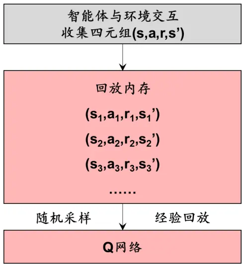
资料来源：华泰研究

图表21： DQN目标网络
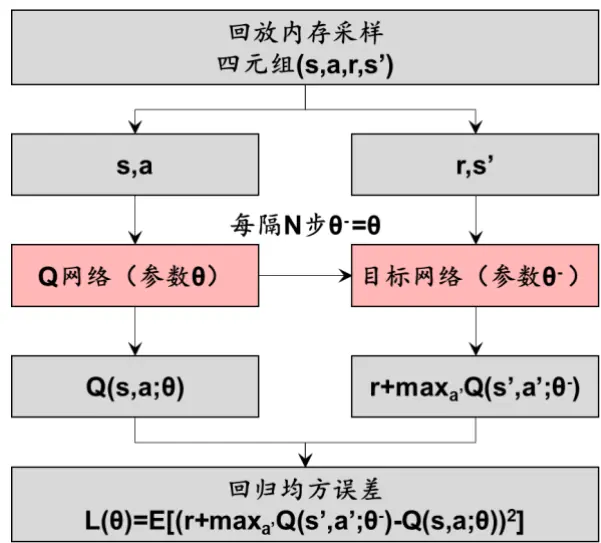
资料来源：华泰研究

## 引入目标网络提升训练稳定性

DQN 网络的输入为四元组 $(\mathsf{s}_{\mathrm{t}},\mathsf{a}_{\mathrm{t}},\mathsf{r}_{\mathrm{t}+1},\mathsf{s}_{\mathrm{t}+1})$ ，输出为动作价值函数的预测值 $\mathsf{Q}(\mathsf{s}_{\mathsf{t}},\mathsf{a}_{\mathsf{t}};\mathsf{\theta})$ 。参照 Q学习，将学习目标设为 $\mathsf{r}_{\mathsf{t}+1}{+\mathsf{V}\cdot\mathsf{max}}\mathsf{Q}(\mathsf{s}_{\mathsf{t}+1},\mathsf{a};\Theta)$ 。学习目标担任了监督学习中正确标签（label）的角色。类似监督学习中的回归问题，可以计算预测值和学习目标的均方误差，通过反向传播算法更新 Q网络参数。

Q 网络训练的难点在于， $\mathsf{Q}(\mathsf{s}_{\mathsf{t}},\mathsf{a}_{\mathsf{t}};\mathsf{\boldsymbol{\theta}})$ 既是预测值，又出现在学习目标 $\mathsf{r}_{\mathsf{t}+1}{+\mathsf{v}\cdot\mathsf{max}}\mathsf{Q}(\mathsf{s}_{\mathsf{t}+1},\mathsf{a};\Theta)$ 中。随着迭代的进行，预测值时刻发生变化，这就意味着学习目标也会时刻发生变化。如果说传统神经网络训练是“固定靶”，那么 Q网络训练就是“移动靶”，这样会导致训练不稳定。

DQN 引入目标网络（target network）解决训练不稳定问题。对于随机采样的小批量样本$(\mathsf{s},\mathsf{a},\mathsf{r},\mathsf{s}^{\prime})$ ，将原始动作价值函数：

$$
Q(s,a;\theta)=Q(s,a;\theta)+\alpha[r+\gamma\operatorname*{max}_{a^{\prime}}Q(s^{\prime},a^{\prime};\theta)-Q(s,a;\theta)]
$$

改为：

$$
Q(s,a;\theta)=Q(s,a;\theta)+\alpha[r+\gamma\operatorname*{max}_{a\prime}Q(s^{\prime},a\prime;\theta^{-})-Q(s,a;\theta)]
$$

此时，学习目标从 r+γ·maxQ(s,a;θ)改为 $\mathsf{r}+\mathsf{v}\cdot\mathsf{maxQ}(\mathsf{s},\mathsf{a};\Theta^{-})$ 。我们称以 θ-为参数的网络为目标网络，有别于以 θ 为参数的 Q 网络。关键之处在于，目标网络不参与梯度下降，参数 θ-不会时刻更新，而是每隔固定步数从 Q网络中复制参数 θ。换言之，DQN将“移动靶”改成每隔一段时间才移动一次的“准固定靶”，提升了训练稳定性。DQN 原始论文中，目标网络每隔 10000 步更新一次。DQN 的损失函数为：

$$
L(\theta)=\mathbb{E}\left[\left(r+\gamma\operatorname*{max}_{a^{\prime}}Q(s^{\prime},a^{\prime};\theta^{-})-Q(s,a;\theta)\right)^{2}\right]
$$

采用梯度下降法更新网络参数，损失函数的梯度为：

$$
\nabla L(\theta)=\mathbb{E}\left[\left(r+\gamma\operatorname*{max}_{a^{\prime}}Q(s^{\prime},a^{\prime};\theta^{-})-Q(s,a;\theta)\right)\nabla Q(s,a;\theta)\right]
$$

最后我们给出 DQN的算法流程图和伪代码。

图表22： DQN算法流程图
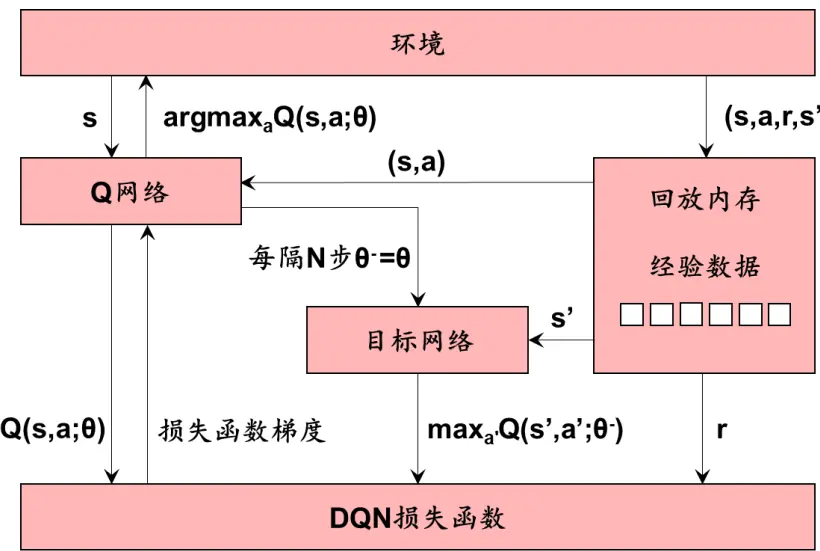
资料来源：华泰研究

## 图表23： DQN 伪代码

```csv
输入 Q 网络 Q(s,a;θ)，学习率 α∈(0,1]，ε>0，折扣因子 γ∈[0,1]，小批量样本数 batch size，目标网络更新频率 target update
1初始化：Q 网络 Q(s,a;θ)参数 θ，令目标网络 Q(s,a;θ-)参数 θ-•θ
2遍历每一幕：
3初始化状态 S
4遍历该幕的每一步：
5状态 S 下基于 Q 函数采用 ε-贪心算法选择动作 A
6执行动作 A，环境反馈奖励 R，进入下一状态 S’
7将该条数据(S,A,R,S’)存入回放记忆
8从回放记忆中随机采样 batch size 条数据
9计算梯度∇L(θ)，更新 Q 网络参数 θ•θ+α∇L(θ)
10每隔 target update 步，更新目标网络参数 θ-•θ
11 S•S’
12直到 S 为终止状态
输出 Q(s,a;θ)收敛至最优动作价值函数 q*(s,a)
```
资料来源：华泰研究

## 基于策略的方法

强化学习的最终目标是得到最优策略。基于价值的方法采取了“迂回”方式，先估计动作价值函数，再采用贪心算法选择动作价值函数最大值对应的动作。例如 DQN使用神经网络建立了从四元组(s,a,r,s’)到动作价值函数 Q(s,a)的映射，拟合动作价值函数。既然神经网络可以拟合任意连续函数，是否有更直接的方式，使用神经网络建立从输入信息到策略函数π(a|s)的映射，从而直接拟合策略函数呢？这就是基于策略的方法的基本思想。

在深入具体算法前，我们先介绍基于策略的方法相比于基于价值的方法的优势：

1. 基于价值的方法要求动作空间是有限集，例如围棋的动作至多有 361 种。但部分现实场景中，动作空间可能是无限集，例如控制机器人运动的速度和加速度。此时就要使用基于策略的方法。

2. 基于价值的方法中，最优策略通过贪心算法给出， $\boldsymbol{\Pi}^{\star}(\mathsf{s})=\mathsf{argmax}\mathsf{Q}(\mathsf{s},\mathsf{a})$ ，每种状态下的动作是唯一的，属于确定性策略。尽管可以通过 ε-贪心算法为策略引入随机性，总体仍是确定性的。

但部分现实场景需要随机性策略。例如剪刀石头布游戏，如果智能体采取确定性策略，就会很快被对手摸清规律，最优策略是剪刀、石头、布各占 1/3 概率。基于策略的方法可以输出每种状态下各动作的概率分布，属于随机性策略，适用于这种场景。

## 策略梯度算法

策略梯度算法（policy gradient）是最基础的基于策略的方法。采用神经网络拟合策略函数π(a|s;θ)，代表在状态 s下采取动作 a 的概率，其中 θ为网络参数：

$$
\pi(a|s;\theta)=\mathbb{P}(a|s,\theta)
$$

定义目标函数 J(θ)来衡量策略表现，神经网络的目标是最大化 J(θ)，采用梯度上升法更新神经网络参数 θ：

$$
\theta=\theta+\alpha{\sqrt{J(\theta)}}
$$

其中，∇̂J(θ)为策略目标函数梯度的估计，策略梯度算法由此得名。

J(θ)有多种具体定义方式。直观地看，策略 π 的状态价值函数越高，意味着策略表现越好。不失一般性，我们将 J(θ)定义为起始状态 s0的状态价值函数：

$$
J(\theta)\doteq v_{\pi_{\theta}}(s_{0})
$$

此时可以对 J(θ)求导，计算策略梯度∇J(θ)。策略梯度定理（policy gradient theorem）直接给出了答案：

$$
\nabla J(\theta)\propto\sum_{s}\mu(s)\sum_{a}q_{\pi}(s,a)\nabla\pi(a|s;\theta)
$$

其中， $\mu(\mathsf{s})$ 代表状态 s在全部轨迹中的出现概率，∝代表成正比。策略梯度定理的详细推导过程可参考 Sutton（2018）Reinforcement Learning:An Introduction 第二版 13.2 节。

策略梯度中包含对状态 s 的积分，由于 μ(s)为状态 s 的概率，根据数学期望的定义，策略梯度可以简化为期望形式：

$$
\begin{array}{rlr}{{\nabla J(\theta)\propto\sum_{s}\mu(s)\sum_{a}q_{\pi}(s,a)\nabla\pi(a|s;\theta)}}\\&{}&{=\mathbb{E}_{\pi}[\sum_{a}q_{\pi}(S_{t},a)\nabla\pi(a|S_{t};\theta)]~}\end{array}
$$

计算策略梯度需要对状态 s 和动作 a 进行积分，但大多数时候我们不知道 s 和 a 的分布，因此无法求出策略梯度的解析解。此时，可以借助蒙特卡洛方法的思想，重复多次采样求均值，求出策略梯度的近似值。

然而在近似策略梯度时，还有一个关键问题：如何估计上式中策略π的动作价值函数 $\mathsf{q}_{\mathtt{Pi}}(\mathsf{S}_{\mathtt{t}},\mathsf{a})?$ 下面我们将介绍两种方法：REINFORCE 采用蒙特卡洛方法计算的回报 $\sf{G}_{\sf t}$ 近似 $\mathsf{q}_{\mathtt{Pi}}(\mathsf{S}_{\mathtt{f},\mathsf{a}})$ 演员-评委算法（actor-critic）采用神经网络 $\mathsf{Q}(\mathsf{s},\mathsf{a};\mathsf{w})$ 近似 $\mathsf{q}_{\mathtt{Pi}}(\mathsf{S}_{\mathtt{f},\mathsf{a}})$ o

## REINFORCE

下面推导 REINFORCE 的策略梯度：

$$
\begin{array}{l}{\displaystyle\nabla J(\theta)=\mathbb{E}_{\boldsymbol\pi}\left[\sum_{a}q_{\boldsymbol{\pi}}(S_{t},a)\nabla{\boldsymbol\pi}(a|S_{t};\theta)\right]}\\{=\mathbb{E}_{\boldsymbol\pi}\left[\sum_{a}\pi(a|S_{t};\theta)q_{\boldsymbol\pi}(S_{t},a){\frac{\nabla{\boldsymbol\pi}(a|S_{t};\theta)}{\pi(a|S_{t};\theta)}}\right]}\\{=\mathbb{E}_{\boldsymbol\pi}\left[q_{\boldsymbol\pi}(S_{t},A_{t}){\frac{\nabla\pi(A_{t}|S_{t};\theta)}{\pi(A_{t}|S_{t};\theta)}}\right]~(\widetilde{\boldsymbol{x}}_{1}^{\sharp}A_{t}\widetilde{\boldsymbol{x}}\boldsymbol{\sharp}\boldsymbol{\sharp}\boldsymbol{\boldsymbol{\pi}}{\boldsymbol{\sharp}}\boldsymbol{\boldsymbol{\pi}},~\mathcal{K}_{\boldsymbol\pi}\widetilde{\sharp}\boldsymbol{\boldsymbol{\pi}}\widetilde{\boldsymbol{\pi}}\boldsymbol{\varphi}_{\boldsymbol{\varphi}}^{\varphi;\theta})}\\{=\mathbb{E}_{\boldsymbol\pi}\left[G_{t}{\frac{\nabla\pi(A_{t}|S_{t};\theta)}{\pi(A_{t}|S_{t};\theta)}}\right]~(\mathbb{H}\otimes\widetilde{\mathbb{d}}\mathbb{E}_{t}\widetilde{\mathbb{d}}\boldsymbol{G}_{t}\widetilde{\mathbb{d}}\boldsymbol{\boldsymbol{\pi}}\boldsymbol{\sharp}\boldsymbol{\varphi}_{t}{\boldsymbol{\varphi}}{\boldsymbol{\mathcal{H}}}\boldsymbol{\varphi}_{t}{\boldsymbol{\varphi}}\widetilde{\mathbb{d}}\boldsymbol{\boldsymbol{\pi}}\boldsymbol{\varphi}_{t}^{\varphi;\theta})}\\=\mathbb{E}_{\boldsymbol\pi}[G_{t}\nabla\pi(A_{t}|S_{t};\theta)]~(\nabla\end{array}
$$

其中，回报 $\mathsf{G}_{\mathtt{t}}\overline{{\mathtt{a}}}\overline{{\mathsf{J}}}$ 采用蒙特卡洛方法，对每一幕各时刻的折现奖励进行加总得到：

$$
G_{t}=\sum_{k=0}^{T}\gamma^{k}R_{t+k+1}
$$

网络参数 θ 通过梯度上升法更新：

$$
\theta=\theta+\alpha\gamma^{t}G_{t}\nabla\ln\pi(A_{t}|S_{t};\theta)
$$

我们进一步理解 REINFORCE 策略梯度的内在含义。REINFORCE 的损失函数和监督学习分类问题的损失函数有异曲同工之妙。分类问题常用的损失函数是交叉熵（cross entropy）：

$$
L=-\sum_{k}y_{k}\mathrm{ln}\hat{y}_{k}
$$

其中，k 为分类数； $y_{\mathsf{k}}$ 为真实 one-hot 标签，若样本属于 k 分类，则 $\mathsf{y}_{\mathsf{k}}$ 为 1，否则 $\mathsf{y}_{\mathsf{k}}$ 为 0；$\hat{y}_{k}$ 为预测值，即样本属于 k 分类的概率。真实值 $y_{\mathsf{k}}$ 和预测值 $\boldsymbol{\hat{y}_{k}}$ 越接近，交叉熵越小，损失函数越小。上式中的真实分类 $\mathsf{y}_{\mathsf{k}}$ 为离散值，若将其视作连续分布 Y，那么交叉熵可以改写成随机变量Ŷ的期望形式，本质是真实标签分布 Y和预测值分布Ŷ的距离：

$$
L=-\mathbb{E}_{Y}\big[\ln\hat{Y}\big]
$$

对于 REINFORCE 策略梯度：

$$
\nabla J(\theta)=\mathbb{E}_{\pi}[G_{t}\nabla\ln\pi(A_{t}|S_{t};\theta)]
$$

可以反推目标函数：

$$
J(\theta)=\mathbb{E}_{\pi}[G_{t}\ln\pi(A_{t}\vert S_{t};\theta)]
$$

定义损失函数 L(θ)为目标函数 J(θ)的相反数：

$$
L(\theta)=-\mathbb{E}_{\pi}[G_{t}\ln\pi(A_{t}|S_{t};\theta)]
$$

损失函数和目标函数的区别在于，前者追求最小化，后者追求最大化。

对比交叉熵损失和 REINFORCE 损失，两者在形式上接近，均为随机变量负对数的期望。交叉熵损失希望最小化真实标签分布 Y 和预测值分布Ŷ的距离。类比 REINFORCE 损失，可以视作最小化“真实动作分布”a 和“预测动作分布 $\because\pi(\mathsf{A}_{\mathrm{t}}|\mathsf{S}_{\mathrm{t}};\Theta)$ 的距离。

但问题在于，真实动作分布 a 只是实际执行的动作，不一定是最优动作，因此还需要乘以回报 $\mathsf{G}_{\mathsf{t}\circ}$ 。如果 $\mathsf{G}_{\mathtt{t}}$ 较大，说明真实动作重要，计算损失时权重应更高；反之则说明真实动作不重要，计算损失时权重应更低。REINFORCE 某种意义上可以理解成以真实动作 a 为标签，以回报 $\sf{G}_{\sf t}$ 为权重的监督学习。

实现策略梯度的技巧之一是添加基线（baseline），主要作用是降低模型的方差：

$$
\nabla J(\theta)=\mathbb{E}_{\boldsymbol{\pi}}\left[\sum_{a}(q_{\boldsymbol{\pi}}(S_{t},a)-b(S_{t}))\nabla{\boldsymbol{\pi}}(a|S_{t};\theta)\right]
$$

其中基线 b(St)通常为状态 $\mathsf{S}_{\mathtt{t}}$ 的函数，可任意设置，只要与动作 a 正交即可。一般设为状态${\sf S}_{\sf t}$ 的价值 V(St)：

$$
\nabla J(\theta)=\mathbb{E}_{\boldsymbol{\pi}}\left[\sum_{a}(q_{\boldsymbol{\pi}}(S_{t},a)-V(S_{t}))\nabla{\boldsymbol{\pi}}(a|S_{t};\theta)\right]
$$

添加基线的 REINFORCE 梯度和梯度上升表示为：

$$
\begin{array}{rl}&{\nabla J(\theta)=\mathbb{E}_{\pi}\left[\sum_{a}(G_{t}-V(S_{t}))\nabla\pi(a|S_{t};\theta)\right]}\\&{\theta=\theta+\alpha\gamma^{t}(G_{t}-V(S_{t}))\nabla\ln\pi(A_{t}|S_{t};\theta)}\end{array}
$$

最后我们给出不添加基线的 REINFORCE 伪代码。

## 图表24： REINFORCE 伪代码

输入 策略网络 π(a|s;θ)；学习率 α∈(0,1]，折扣因子 γ∈[0,1]
1初始化：策略网络 π(a|s;θ)参数 θ
2遍历每一幕：
3基于策略函数 π(θ)生成一幕：S0, A0, R1, S1, A1, R2, …, ST-1, AT-1, RT
4逆序遍历该幕的每一步 t（t=T-1, T-2, …, 0）：
5 $\mathsf{G}\in\mathsf{R}_{1+1}+\mathsf{Y}\mathsf{R}_{1+2}+...+\mathsf{Y}^{\top-1-1}\mathsf{R}_{7}$ 
6更新网络参数 θ•θ+αγtG∇lnπ(At|St;θ)
输出 π(a|s;θ)收敛至最优策略 π*

资料来源：华泰研究

## 演员-评委算法

下面推导演员-评委算法的策略梯度：

$$
\begin{array}{rlr}{\nabla J(\theta)=\mathbb{E}_{\boldsymbol\pi}\left[q_{\pi}(S_{t},A_{t})\frac{\nabla\pi(A_{t}|S_{t};\theta)}{\pi(A_{t}|S_{t};\theta)}\right]}&{}&\\{=\mathbb{E}_{\boldsymbol\pi}\left[Q(S_{t},A_{t};w)\frac{\nabla\pi(A_{t}|S_{t};\theta)}{\pi(A_{t}|S_{t};\theta)}\right]}&{}&{(\mathtt{H}\mathbin{\ddot{\rtimes}}\mathbin{\ddot{\angles{\varepsilon\ v{D}}}}\mathbin{\ddot{\varepsilon\ v{D}}}\mathbin{\ddot{\varepsilon{\ v{\ v{\varepsilon}}}}}Q(S_{t},A_{t};w)\mathbin{\ddot{\varepsilon{\ v{D}}}}\mathbin{\ddot{\langle\mathtt{h}\mathbin{\ v{\ v}}\mathbin{\ddot{\ v{\varepsilon}}}\mathbin{\ddot{\ v{\ v{\varepsilon}}}}\rvert}}\mathbin{\ddot{\varepsilon}}\mathbin{\ddot{\ v{\ v{\varepsilon}}}}\mathbin{\ddot{\ v{\ v{\varepsilon}}}}\mathbin{\ddot{\ v{\ v{\varepsilon}}}}\mathbin{\ddot{\ v{\ v{\varepsilon}}}})}\\&{}&{=\mathbb{E}_{\boldsymbol\pi}[Q(S_{t},A_{t};w)\nabla\ln\pi(A_{t}|S_{t};\theta)]}\end{array}
$$

其中， $\mathsf{Q}(\mathsf{S}_{\mathsf{t}},\mathsf{A}_{\mathsf{t}};\mathsf{w})$ 是以 w为参数的神经网络，用来拟合动作价值函数，称为价值网络（valuenetwork）。

演员-评委算法包含两组神经网络：策略网络 π(a|s;θ)和价值网络 Q(s,a;w)。策略网络执行动作，相当于演员；价值网络评估动作的价值，相当于评委。演员-评委算法由此得名。该方法可以看作基于价值的方法和基于策略的方法的交集，习惯上仍归入基于策略的方法。

演员-评委算法和生成对抗网络（generative adversarial networks，GAN）有异曲同工之妙。在生成对抗网络中，包含生成器和判别器两组网络。前者生成假数据，相当于假钞制造机，后者判别真假，即评估假数据质量，相当于验钞机，两者交替训练，“左右互搏”。在演员-评委算法中，策略网络生成动作，价值网络评估动作价值，两者同样交替训练。

图表25： 演员-评委算法和生成对抗网络的比较
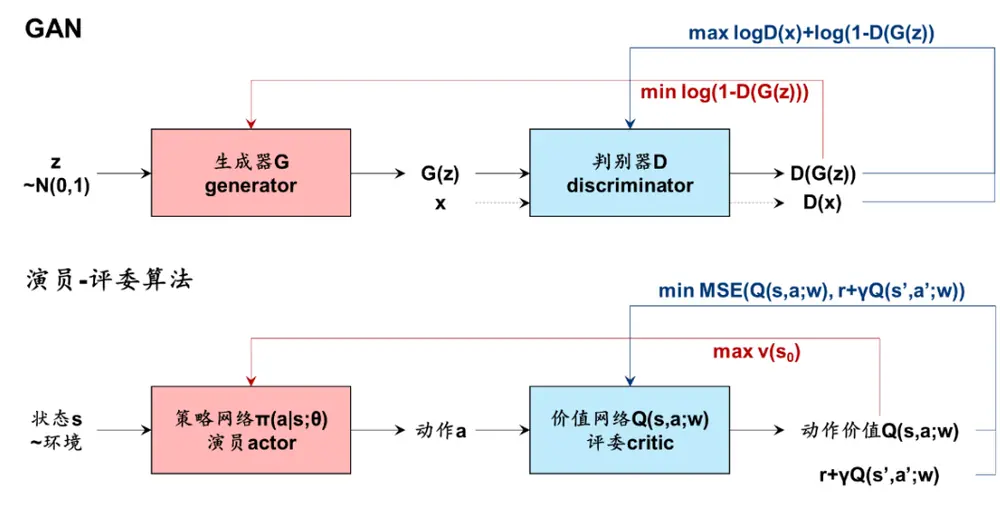
资料来源：华泰研究

对于策略网络（演员），目标函数沿用前述策略梯度算法思想，每一轮迭代中，参数 θ 通过梯度上升法更新：

$$
\theta=\theta+\alpha^{\theta}Q(S_{t},A_{t};w)\nabla\ln\pi(A_{t}|S_{t};\theta)
$$

其中 $\alpha^{\theta}$ 为策略网络学习率。添加基线的策略网络梯度和梯度上升表示为：

$$
\begin{array}{l}{\nabla J(\theta)=\mathbb{E}_{\boldsymbol{\pi}}\left[\sum_{a}(Q(S_{t},A_{t};w)-V(S_{t}))\nabla{\boldsymbol{\pi}}(a|S_{t};\theta)\right]}\\{\theta=\theta+\alpha^{\theta}\gamma^{t}(Q(S_{t},A_{t};w)-V(S_{t}))\nabla\ln\pi(A_{t}|S_{t};\theta)}\end{array}
$$

对于价值网络（评委），目标函数采用前述时序差分方法和 Sarsa的思想，将当前时刻价值网络输出的动作价值 $\mathsf{Q}(\mathsf{S}_{\mathsf{t}},\mathsf{A}_{\mathsf{t}};\mathsf{w})$ 视作“预测值”，将实际奖励 $\mathsf{R}_{\mathsf{t}+1}$ 与折现后的下一时刻动作价值 $\mathsf Q(\mathsf S_{t+1},\mathsf A_{t+1};\mathsf w)$ 视作“真实值”，希望最小化两者的均方误差。两者之差即时序差分误差。价值网络的损失函数为：

$$
L(w)=\mathbb{E}\left[\frac{1}{2}\big(R_{t+1}+\gamma Q(S_{t+1},A_{t+1};w)-Q(S_{t},A_{t};w)\big)^{2}\right]
$$

求导得到损失函数的梯度：

$$
\nabla L(w)=-\mathbb{E}\big[\big(R_{t+1}+\gamma Q(S_{t+1},A_{t+1};w)-Q(S_{t},A_{t};w)\big)\nabla Q(S_{t},A_{t};w)\big]
$$

每一轮迭代中，参数 w通过梯度下降法更新：

$$
\begin{array}{rl}&{w=w-\alpha^{w}\nabla L(w)}\\&{\quad=w+\alpha^{w}\big(R_{t+1}+\gamma Q(S_{t+1},A_{t+1};w)-Q(S_{t},A_{t};w)\big)\nabla Q(S_{t},A_{t};w)}\end{array}
$$

其中 $\alpha^{w}$ 为价值网络学习率。

最后我们给出演员-评委算法伪代码。

图表26： 演员-评委算法伪代码

资料来源：华泰研究

## 强化学习日频择时策略

本章介绍如何应用强化学习中的 DQN算法构建股指日频择时策略：

1. 强化学习的第一步是正确定义问题，对现实问题进行马尔可夫决策过程建模，定义状态空间S、动作空间A、状态转移矩阵P、奖励ℛ、折扣因子γ构成的五元组〈S, A, P, ℛ, γ〉，核心是定义奖励。

2. 第二步是确定强化学习算法。择时问题中，我们将智能体的决策简化为全仓做多、持有、平多三种动作，动作空间属于离散集，因此选择基于价值的方法中的 DQN。进而构建深度神经网络，包括确定网络结构、训练参数等。

3. 强化学习对超参数敏感，我们将进行参数敏感性分析。

## 马尔可夫决策过程构建

## 状态空间S

表征状态的原始数据为股指在回看区间内日度开盘价、最高价、最低价、收盘价。预处理方式为计算 t-lookback+1 至 t 日行情数据相对于过去 252 个交易日收盘价的 Z 分数。因此状态空间S为 lookback*4维实空间。回看区间 lookback取 5个交易日，同时测试 10和 15。

## 动作空间A

动作空间A定义为： $\mathcal{A}=\{buy,sell,hold\}$ 。其中 buy 代表全仓做多，sell 代表平多，hold代表持有多仓或者保持空仓，不涉及做空。基于 t日收盘价的状态选择动作，以 t+1 日开盘价执行交易。

## 状态转移矩阵P

我们无法对股票市场的状态转移进行精确描述，状态转移矩阵P对于智能体而言是未知的。因此采用免模型方法中的 DQN，免模型方法不需要状态转移矩阵，智能体通过与环境互动进入下一状态。

## 奖励R

## 奖励分四种情况：

1. 当前未持仓，且 At为 buy时，奖励为预测区间内扣费后多头收益率：

$$
R_{t+1}=100\cdot\left(\left(1-TC\right)\cdot\frac{Close_{t+horizon}}{Close_{t}}-1\right)
$$

2. 当前未持仓，且 At为 sell或 hold 时，奖励为预测区间内空头收益率：

$$
R_{t+1}=100\cdot\bigg(1-\frac{Close_{t+horizon}}{Close_{t}}\bigg)
$$

3. 当前持多仓，且 At为 sell时，奖励为预测区间内扣费后空头收益率：

$$
R_{t+1}=100\cdot\left(\left(1-TC\right)\cdot\left(2-\frac{Close_{t+horizon}}{Close_{t}}\right)-1\right)
$$

4. 当前持多仓，且 At为 buy或 hold 时，奖励为预测区间内多头收益率：

$$
R_{t+1}=100\cdot\bigg(\frac{Close_{t+horizon}}{Close_{t}}-1\bigg)
$$

其中 TC 为单边交易费率，本文取万分之五； $\mathsf{Close}_{\mathsf{t}+\mathsf{horizon}}$ 为 horizon 日收盘价，预测区间horizon 取 5 个交易日，同时测试 1和 10。

上述奖励的本质是允许做多和做空下的择时策略收益率。回测时只允许做多，但训练时可以做多和做空。如果奖励和回测一致，只允许做多，那么空仓状态下奖励始终为 0，奖励变化不敏感，Q 网络难以学习。

## 折扣因子γ

折扣因子 γ 取 0.9，同时测试 γ=0.5 和 0.7。

## DQN 模型构建

网络结构和流程

Q 网络是 DQN的核心组件，本文 Q网络结构为 3 层全连接网络，如下图所示。

图表27： Q网络结构
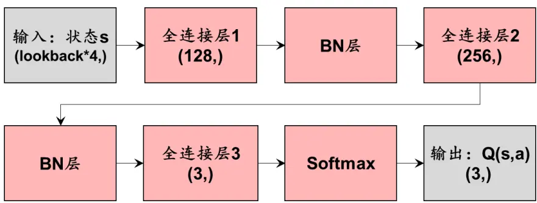
资料来源：华泰研究

DQN 训练和测试流程图如下。

图表28： DQN训练和测试流程图
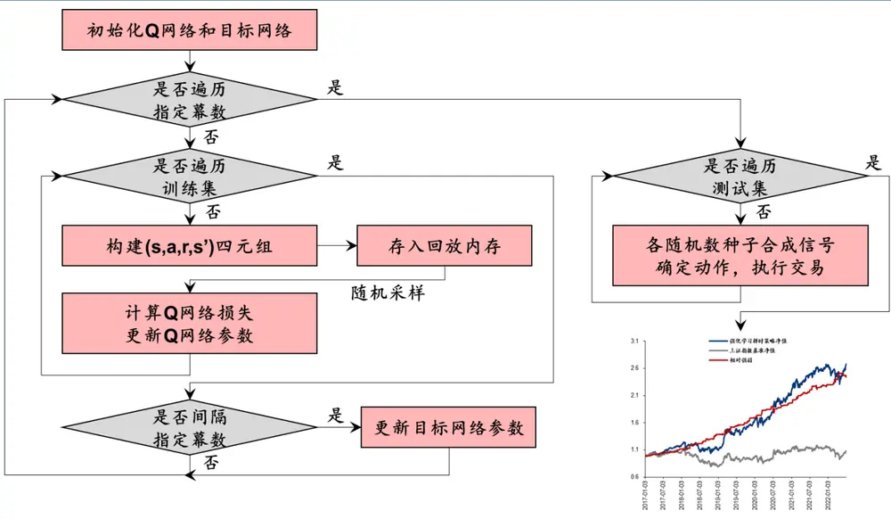
资料来源：华泰研究

## 主要步骤为：

1. 初始化 Q 网络和目标网络：随机初始化 Q 网络 Q(s,a;θ)的参数 θ，将 θ 复制给目标网络 Q(s,a;θ-)的参数 θ-。

2. 数据预处理，获取状态 s：每个交易日 t，计算 t-lookback+1 至 t 日指数开高低收价格相对过去 252 日收盘价的 Z分数，作为该日的状态 s。可类比监督学习的特征工程。

3. 遍历训练集，构建四元组：按时间顺序，遍历训练集内每个交易日。通过 Q 网络计算该日状态 s 的动作价值 Q(s,a;θ)，通过 ε-贪心算法得到动作 a；根据动作和奖励规则，确定奖励 r，即 t至 t+horizon 日多头或空头收益；将 t+horizon 日状态视作新的状态 s’。由此得到每个交易日的(s,a,r,s’)四元组。

4. 存入回放内存：将该条经验存入回放内存。当回放内存装满时，删除最早的一条数据。

5. 经验回放，优化 Q 网络：每得到一条经验，都对回放内存进行随机采样，得到小批量样本。基于 Q 网络和目标网络计算 Q 网络损失 L(θ)，采用优化器更新 Q 网络参数 θ。

6. 每隔指定幕数更新目标网络：每完整遍历一轮训练集，视作一幕。每隔指定幕数，将 θ复制给 θ-。当训练轮数达到指定幕数，停止训练。

7. 各随机数种子合成信号，测试集回测：每组随机数种子训练一组 Q网络。按时间顺序，遍历测试集内每个交易日。根据该日状态 s 及训练好的 Q 网络计算动作价值，选择动作价值最高的动作 argmaxaQ(s,a;θ)。100 组随机数种子结果以多数票规则合成，得到最终交易信号。当处于空仓状态时，若动作为 sell 或 hold 则继续保持空仓，若动作为buy 则于次日开盘做多。当处于做多状态时，若动作为 buy 或 hold 则继续保持做多，若动作为 sell则于次日开盘平仓。

## 数据和超参数

数据为上证指数 2007-01-04 至 2022-06-30 日度行情数据。其中 2007 至 2016 年为训练集，用来训练智能体；2017 至 2022 年为测试集，用来评估智能体表现。

DQN 模型超参数如下表所示。

图表29： DQN模型超参数

| 类别 | 超参数含义 | 超参数简称 取值 |
| --- | --- | --- |
| 状态 | 回看区间 | lookback 5; 测试 10, 15 |
| 奖励 | 预测区间 horizon | 5；测试 1,10 |
|  | 折扣因子 Y | 0.9；测试 0.5， 0.7 |
| DQN | 经验回放内存 | replay memory size 32;测试 16,64 |
|  | 小批量样本数 mini-batch size | 16 30 |
|  | 迭代幕数 | episodes |
|  | 目标网络更新频率 | target network update frequency 5 adam |
| Q网络 | 优化器 | optimizer |
|  | 学习率 | learning rate 0.001 |
|  | 梯度动量下降参数 betas | (0.9, 0.999) |
|  | 损失函数 loss | smooth_I1_loss |
|  | 梯度范围 clamp | [-1,1] |
| ε-贪心算法 | 初值 | ε start |
|  | 终值 | ε end |
|  | 指数衰减率 ε decay | 0.05 500 |

资料来源：华泰研究

## 结果和参数敏感性分析

全部超参数样本外回测评价指标如下表所示。

图表30： 全部超参数回测评价指标

| 年化超额年化跟踪 |  |  |  |  |  |  | 超额收益最 |  | 超额收益 |  |  |  |
| --- | --- | --- | --- | --- | --- | --- | --- | --- | --- | --- | --- | --- |
|  | 年化收益率 | 年化波动率 | 夏普比率 最大回撤 Calmar 比率 |  |  | 收益率 | 误差 | 信息比率 | 大回撤 Calmar 比率 |  | 胜率年化换手率 |  |
|  |  |  | 原始超参数：γ=0.9， |  | replay_memory=32,lookback=5, |  |  |  | horizon=5 |  |  |  |
| 原始超参数 | 20.5% 15.7% | 1.31 |  | 16.8% | 1.22 | 18.2% | 6.7% | 2.69 | 6.3% | 2.89 | 77.3% | 41.97 |
|  |  |  |  |  |  | 折扣因子Y |  |  |  |  |  |  |
| γ=0.5 | 35.1% | 12.6% | 2.79 | 11.4% | 3.07 | 31.2% | 11.7% | 2.68 | 10.8% | 2.88 | 83.8% | 49.53 |
| γ=0.7 | 34.9% | 13.5% | 2.59 | 11.5% | 3.04 | 31.3% | 10.8% | 2.89 | 10.5% | 2.98 | 79.8% | 49.15 |
| γ=0.9 | 20.5% | 15.7% | 1.31 | 16.8% | 1.22 | 18.2% | 6.7% | 2.69 | 6.3% | 2.89 | 77.3% | 41.97 |
|  |  |  |  |  | 回放内存 replay_memory |  |  |  |  |  |  |  |
| replay_memory=16 13.6% | 16.1% |  | 0.85 | 21.3% | 0.64 | 11.5% | 5.8% | 1.99 | 5.1% | 2.28 | 70.0% | 30.44 |
| replay_memory=32 | 20.5% | 15.7% | 1.31 | 16.8% | 1.22 | 18.2% | 6.7% | 2.69 | 6.3% | 2.89 | 77.3% | 41.97 |
| replay_memory=64 | 5.0% | 16.9% | 0.30 | 25.2% | 0.20 | 3.4% | 2.9% | 1.18 | 3.8% | 0.88 | 64.3% | 16.07 |
|  |  |  |  |  |  | 回看区间 lookback |  |  |  |  |  |  |
| lookback=5 | 20.5% | 15.7% | 1.31 | 16.8% | 1.22 | 18.2% | 6.7% | 2.69 | 6.3% | 2.89 | 77.3% | 41.97 |
| lookback=10 | 14.3% | 16.2% | 0.88 | 25.2% | 0.57 | 12.2% | 5.8% | 2.10 | 1.3% | 9.66 | 66.7% | 25.14 |
| lookback=15 | 12.8% | 16.5% | 0.78 | 20.4% | 0.63 | 10.8% | 4.5% | 2.43 | 2.1% | 5.14 | 63.8% | 26.28 |
|  |  |  |  |  |  | 预测区间 horizon |  |  |  |  |  |  |
| horizon=1 | 1.3% | 17.2% | 0.08 | 30.8% | 0.04 | -0.2% | 0.4% | -0.46 | 1.1% | -0.18 | 100.0% | 0.19 |
| horizon=5 | 20.5% | 15.7% | 1.31 | 16.8% | 1.22 | 18.2% | 6.7% | 2.69 | 6.3% | 2.89 | 77.3% | 41.97 |
| horizon=10 | 33.0% | 13.9% | 2.38 | 13.7% | 2.41 | 29.6% | 10.3% | 2.88 | 10.5% | 2.82 | 81.4% | 38.94 |
|  |  |  |  | 优化后超参数：y=0.5，replay_memory=32，lookback=5，horizon=10 |  |  |  |  |  |  |  |  |
| 优化后超参数 | 41.1% | 12.5% | 3.27 | 10.0% | 4.10 | 37.0% | 11.7% | 3.17 | 10.5% | 3.53 | 86.0% | 35.54 |

资料来源：Wind，华泰研究

## 原始超参数表现

原始超参数为：折扣因子 γ=0.9，回放内存 replay_memory=32，回看区间 lookback=5，预测区间 horizon=5。择时策略样本外年化超额收益率为 18.2%，夏普比率为 1.31，年均调仓 42.0 次。

图表31： 原始超参数样本外表现
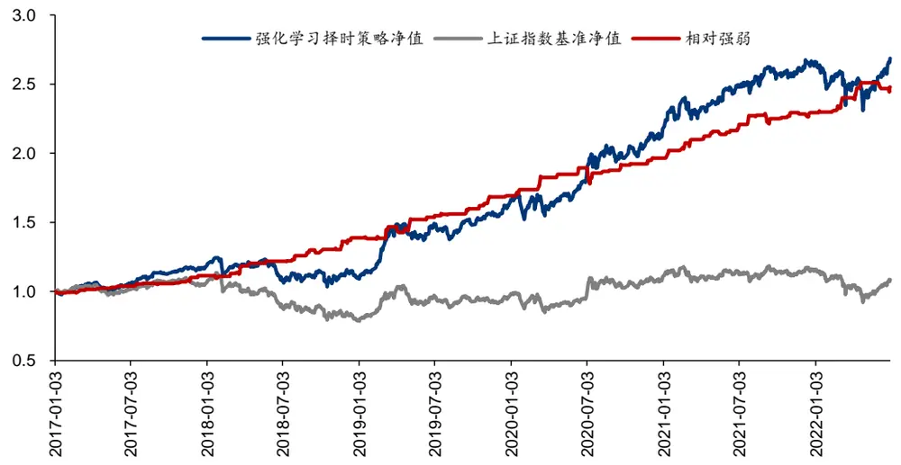
注：T 日收盘发出信号，T+1 日开盘调仓，不做空，交易费率单边 0.5‰样本内 2007-01-04 至 2016-12-30，样本外 2017-01-03 至 2022-06-30资料来源：Wind，华泰研究

## 折扣因子的影响

不同折扣因子收益率表现：γ=0.5 和 0.7 接近，γ=0.9 较差。折扣因子 γ 越小，远期奖励权重越低，越关注短期收益，有利于择时策略。

图表32： 折扣因子对策略净值影响
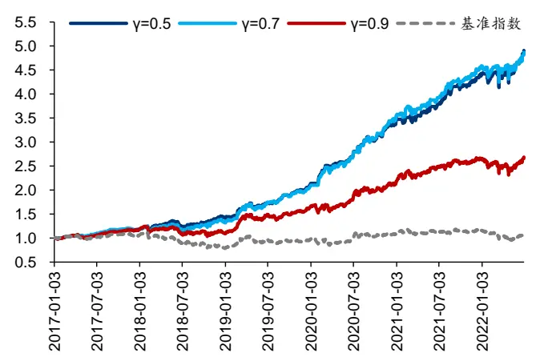
资料来源：Wind，华泰研究

图表33： 折扣因子对策略相对基准强弱影响
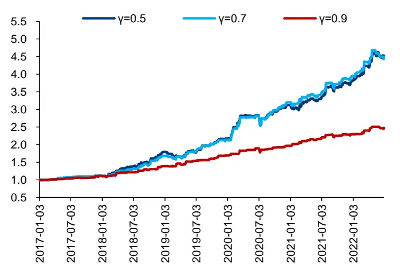
资料来源：Wind，华泰研究

## 回放内存的影响

不 同 回 放 内 存 收 益 率 表 现 ： replay_memory=32 最 好 ， replay_memory=16 次 之 ，replay_memory=64 最差。回放内存和另一个超参数小批量样本数有关联。此处小批量样本数为 16，那么当回放内存为 16 时，每次取回放内存中的全部样本参与训练，失去了随机采样的意义，有损于模型训练。当回放内存较大时，回放内存中包含了相对久远的经验，好比成年人用儿童的经验学习，也会有损于模型训练。

图表34： 回放内存对策略净值影响
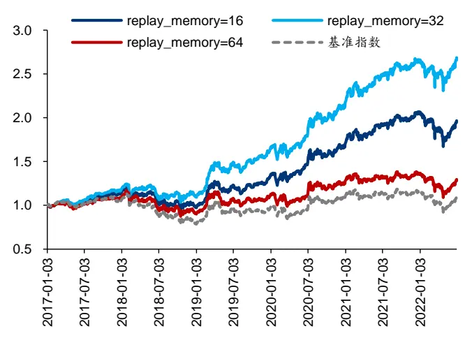
资料来源：Wind，华泰研究

图表35： 回放内存对策略相对基准强弱影响
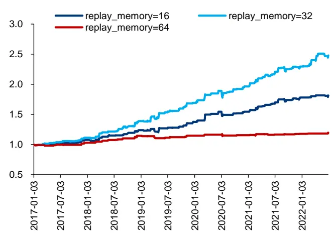
资料来源：Wind，华泰研究

## 回看区间的影响

不同回看区间收益率表现：lookback=5 最好，lookback=10 和 15 接近，lookback=15 略好。
过于久远的信息指示意义可能有限，降低数据信噪比，回看区间取短一些较好。

图表36： 回看区间对策略净值影响
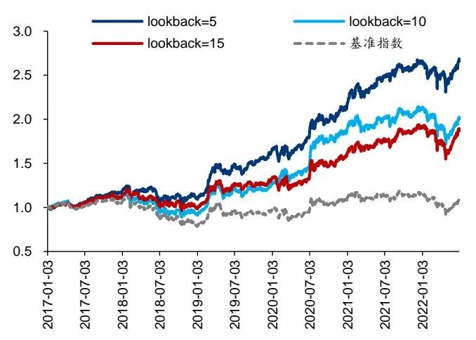
资料来源：Wind，华泰研究

图表37： 回看区间对策略相对基准强弱影响
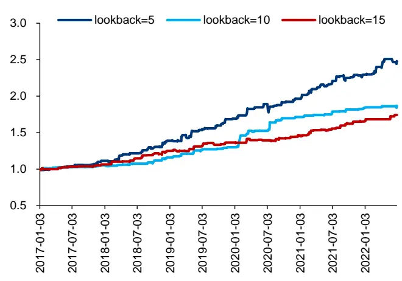
资料来源：Wind，华泰研究

## 预测区间的影响

不同预测区间收益率表现：horizon=10 最好，horizon=5 次之，horizon=1 最差。预测区间越大，计算奖励时目光越长远，有利于择时策略。预测区间 horizon=1 时，模型始终发出buy信号，因此策略和基准一致，这可能是因为下一日收益率随机性较大，模型难以学习。

图表38： 预测区间对策略净值影响
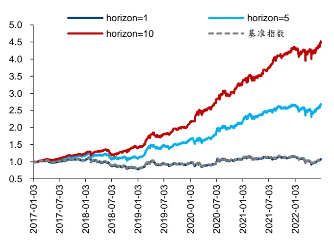
资料来源：Wind，华泰研究

图表39： 预测区间对策略相对基准强弱影响
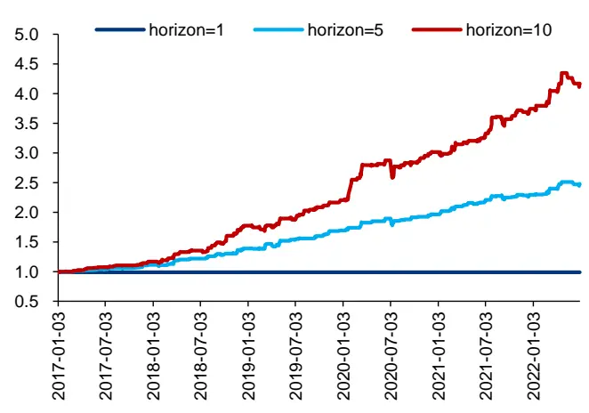
资料来源：Wind，华泰研究

## 优化后超参数表现

优化后的超参数为：折扣因子 γ=0.5，回放内存 replay_memory=32，回看区间 lookback=5，预测区间 horizon=10。此时，择时策略样本外年化超额收益率提升至 37.0%，夏普比率提升至 3.27，年均调仓 35.5 次。

图表40： 优化后超参数样本外表现
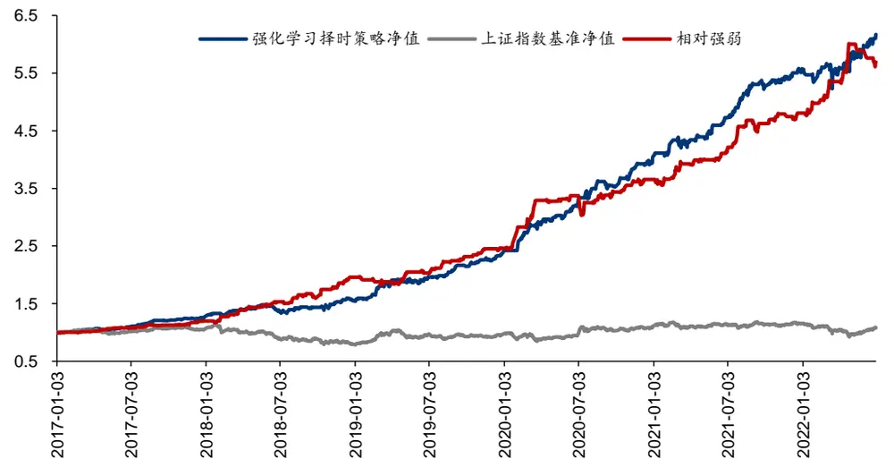
注：T 日收盘发出信号，T+1 日开盘调仓，不做空，交易费率单边 0.5‰样本内 2007-01-04 至 2016-12-30，样本外 2017-01-03 至 2022-06-30资料来源：Wind，华泰研究

## 总结

本文介绍强化学习基础概念和经典算法，并构建股指日频择时策略。有别于传统监督学习对真实标签的拟合，强化学习不存在标准答案，而是针对长期目标的试错学习。其核心思想是个体通过与环境交互，从反馈的奖励信号中进行学习，数学上使用马尔可夫决策过程刻画。本文围绕基于价值的方法和基于策略的方法两个方向，依次介绍蒙特卡洛、时序差分、Sarsa、Q 学习、DQN、策略梯度、REINFORCE、演员-评委算法。使用 DQN 构建上证指数择时策略，原始超参数样本外 2017 年至 2022 年 6 月年化超额收益率 18.2%，夏普比率 1.31，年均调仓 42.0 次，优化后策略表现进一步提升。

强化学习的核心思想是智能体通过与环境的交互，从反馈信号中进行学习。智能体首先观察环境的状态，采取某种动作，该动作对环境造成影响。随后，环境下一刻的状态和该动作产生的奖励将反馈给智能体。智能体的目标是尽可能多地从环境中获取总奖励。总奖励不是下一时刻的即时奖励，而是未来每个时刻奖励的“折现”之和。强化学习的结果是某种动作选择规则，称为策略，主要采用迭代方式训练。

马尔可夫决策过程是强化学习的数学基础。马尔可夫决策过程从马尔可夫过程、马尔可夫奖励过程出发，在状态空间、状态转移矩阵基础上，相继引入奖励函数、折扣因子、动作空间而来。状态价值函数 v(s)代表状态 s未来总回报的期望，动作价值函数 q(s,a)代表状态s 下采取动作 a 未来总回报的期望，可以借助贝尔曼方程求解。贝尔曼期望方程是线性方程，可以通过解析方法求解任意策略的 v(s)和 q(s,a)。贝尔曼最优方程是非线性方程，需要通过迭代方法求解最优策略的 v(s)和 q(s,a)。

强化学习分为基于价值的方法和基于策略的方法。基于价值的方法先估计动作价值函数，称为策略评估，再采用贪心策略选择动作价值最高的动作，称为策略改进。根据策略评估方法不同，分为蒙特卡洛方法和时序差分方法。时序差分方法分为同轨策略 Sarsa 和离轨策略 Q 学习。Q学习引入神经网络、经验回放、目标网络等改进得到 DQN。基于策略的方法直接拟合策略函数，基础是策略梯度算法，根据动作价值函数计算方法不同，分为REINFORCE 和演员-评委算法。

采用 DQN构建股指日频多头择时策略。状态定义为回看区间内的行情数据，动作分为做多、平多、持有三种，奖励定义为预测区间内多头或空头收益。基于训练集数据训练 DQN 模型，多组随机数种子合成信号，基于测试集进行日频调仓回测。以上证指数为择时标的，2007至 2016 年为训练集，2017 至 2022 年 6 月为测试集，交易费率单边 0.5‰，原始超参数测试集年化超额收益率 18.2%，夏普比率 1.31，年均调仓 42.0 次。考察折扣因子、回放内存、回看区间、预测区间等超参数影响，优化后择时策略表现进一步提升。

本文存在以下未尽之处：本研究仅对上证指数进行择时测试，可扩展至更多可交易标的。状态空间仅采用原始行情数据，可扩展至择时指标，或使用神经网络编码。强化学习算法仅测试 DQN，可扩展至其他算法。强化学习存在过拟合风险，需探索过拟合检验方法。

## 参考资料

李宏毅. (2021). 深度强化学习. 台湾大学公开课.

李科浇. (2020). 世界冠军带你从零实践强化学习. 百度飞桨公开课.

王琦, 杨毅远, & 江季. (2022). Easy RL：强化学习教程. 人民邮电出版社.

Zhou, J. (shuhuai008) . (2022). 机器学习白板推导系列. 哔哩哔哩.

Maini, V. (2017). Reinforcement Learning. Machine Learning for Humans.

Silver, D. . (2015). Reinforcement Learning. UCL Course.

Silver, D. , Huang, A. , Maddison, C. J. , Guez, A. , Sifre, L. , & Driessche, G. , et al. (2016). Mastering the game of go with deep neural networks and tree search. Nature 529, 484–489.

Sutton, R. , & Barto, A. . (2018). Reinforcement Learning: An Introduction Second edition. MIT Press.

Volodymyr, M. , Koray, K. , David, S. , Rusu, A. A. , Joel, V. , & Bellemare, M. G. , et al. (2015). Human-level control through deep reinforcement learning. Nature 518, 529–533.

## 风险提示

人工智能挖掘市场规律是对历史的总结，市场规律在未来可能失效。人工智能技术存在过拟合风险。强化学习模型对随机数、超参数敏感。强化学习模型可解释性较差。

## 免责声明

## 分析师声明

本人，林晓明、李子钰、何康，兹证明本报告所表达的观点准确地反映了分析师对标的证券或发行人的个人意见；彼以往、现在或未来并无就其研究报告所提供的具体建议或所表迖的意见直接或间接收取任何报酬。

## 一般声明及披露

本报告由华泰证券股份有限公司（已具备中国证监会批准的证券投资咨询业务资格，以下简称“本公司”）制作。本报告所载资料是仅供接收人的严格保密资料。本报告仅供本公司及其客户和其关联机构使用。本公司不因接收人收到本报告而视其为客户。

本报告基于本公司认为可靠的、已公开的信息编制，但本公司及其关联机构(以下统称为“华泰”)对该等信息的准确性及完整性不作任何保证。

本报告所载的意见、评估及预测仅反映报告发布当日的观点和判断。在不同时期，华泰可能会发出与本报告所载意见、评估及预测不一致的研究报告。同时，本报告所指的证券或投资标的的价格、价值及投资收入可能会波动。以往表现并不能指引未来，未来回报并不能得到保证，并存在损失本金的可能。华泰不保证本报告所含信息保持在最新状态。华泰对本报告所含信息可在不发出通知的情形下做出修改，投资者应当自行关注相应的更新或修改。

本公司不是 FINRA 的注册会员，其研究分析师亦没有注册为 FINRA 的研究分析师/不具有 FINRA 分析师的注册资格。

华泰力求报告内容客观、公正，但本报告所载的观点、结论和建议仅供参考，不构成购买或出售所述证券的要约或招揽。该等观点、建议并未考虑到个别投资者的具体投资目的、财务状况以及特定需求，在任何时候均不构成对客户私人投资建议。投资者应当充分考虑自身特定状况，并完整理解和使用本报告内容，不应视本报告为做出投资决策的唯一因素。对依据或者使用本报告所造成的一切后果，华泰及作者均不承担任何法律责任。任何形式的分享证券投资收益或者分担证券投资损失的书面或口头承诺均为无效。

除非另行说明，本报告中所引用的关于业绩的数据代表过往表现，过往的业绩表现不应作为日后回报的预示。华泰不承诺也不保证任何预示的回报会得以实现，分析中所做的预测可能是基于相应的假设，任何假设的变化可能会显著影响所预测的回报。

华泰及作者在自身所知情的范围内，与本报告所指的证券或投资标的不存在法律禁止的利害关系。在法律许可的情况下，华泰可能会持有报告中提到的公司所发行的证券头寸并进行交易，为该公司提供投资银行、财务顾问或者金融产品等相关服务或向该公司招揽业务。

华泰的销售人员、交易人员或其他专业人士可能会依据不同假设和标准、采用不同的分析方法而口头或书面发表与本报告意见及建议不一致的市场评论和/或交易观点。华泰没有将此意见及建议向报告所有接收者进行更新的义务。华泰的资产管理部门、自营部门以及其他投资业务部门可能独立做出与本报告中的意见或建议不一致的投资决策。投资者应当考虑到华泰及/或其相关人员可能存在影响本报告观点客观性的潜在利益冲突。投资者请勿将本报告视为投资或其他决定的唯一信赖依据。有关该方面的具体披露请参照本报告尾部。

本报告并非意图发送、发布给在当地法律或监管规则下不允许向其发送、发布的机构或人员，也并非意图发送、发布给因可得到、使用本报告的行为而使华泰违反或受制于当地法律或监管规则的机构或人员。

本报告版权仅为本公司所有。未经本公司书面许可，任何机构或个人不得以翻版、复制、发表、引用或再次分发他人(无论整份或部分)等任何形式侵犯本公司版权。如征得本公司同意进行引用、刊发的，需在允许的范围内使用，并需在使用前获取独立的法律意见，以确定该引用、刊发符合当地适用法规的要求，同时注明出处为“华泰证券研究所”，且不得对本报告进行任何有悖原意的引用、删节和修改。本公司保留追究相关责任的权利。所有本报告中使用的商标、服务标记及标记均为本公司的商标、服务标记及标记。

## 中国香港

本报告由华泰证券股份有限公司制作,在香港由华泰金融控股（香港）有限公司向符合《证券及期货条例》及其附属法律规定的机构投资者和专业投资者的客户进行分发。华泰金融控股（香港）有限公司受香港证券及期货事务监察委员会监管，是华泰国际金融控股有限公司的全资子公司，后者为华泰证券股份有限公司的全资子公司。在香港获得本报告的人员若有任何有关本报告的问题,请与华泰金融控股（香港）有限公司联系。

## 香港-重要监管披露

- 华泰金融控股（香港）有限公司的雇员或其关联人士没有担任本报告中提及的公司或发行人的高级人员。

- 有关重要的披露信息，请参华泰金融控股（香港）有限公司的网页 https://www.htsc.com.hk/stock_disclosure其他信息请参见下方 “美国-重要监管披露”。

## 美国

在美国本报告由华泰证券（美国）有限公司向符合美国监管规定的机构投资者进行发表与分发。华泰证券（美国）有限公司是美国注册经纪商和美国金融业监管局（FINRA）的注册会员。对于其在美国分发的研究报告，华泰证券（美国）有限公司根据《1934 年证券交易法》（修订版）第 15a-6 条规定以及美国证券交易委员会人员解释，对本研究报告内容负责。华泰证券（美国）有限公司联营公司的分析师不具有美国金融监管（FINRA）分析师的注册资格，可能不属于华泰证券（美国）有限公司的关联人员，因此可能不受 FINRA 关于分析师与标的公司沟通、公开露面和所持交易证券的限制。华泰证券（美国）有限公司是华泰国际金融控股有限公司的全资子公司，后者为华泰证券股份有限公司的全资子公司。任何直接从华泰证券（美国）有限公司收到此报告并希望就本报告所述任何证券进行交易的人士，应通过华泰证券（美国）有限公司进行交易。

## 美国-重要监管披露

- 分析师林晓明、李子钰、何康本人及相关人士并不担任本报告所提及的标的证券或发行人的高级人员、董事或顾问。分析师及相关人士与本报告所提及的标的证券或发行人并无任何相关财务利益。本披露中所提及的“相关人士”包括 FINRA 定义下分析师的家庭成员。分析师根据华泰证券的整体收入和盈利能力获得薪酬，包括源自公司投资银行业务的收入。

华泰证券股份有限公司、其子公司和/或其联营公司, 及/或不时会以自身或代理形式向客户出售及购买华泰证券研究所覆盖公司的证券/衍生工具，包括股票及债券（包括衍生品）华泰证券研究所覆盖公司的证券/衍生工具，包括股票及债券（包括衍生品）。

- 华泰证券股份有限公司、其子公司和/或其联营公司, 及/或其高级管理层、董事和雇员可能会持有本报告中所提到的任何证券（或任何相关投资）头寸，并可能不时进行增持或减持该证券（或投资）。因此，投资者应该意识到可能存在利益冲突。

## 评级说明

投资评级基于分析师对报告发布日后 6 至 12个月内行业或公司回报潜力（含此期间的股息回报）相对基准表现的预期（A 股市场基准为沪深 300 指数，香港市场基准为恒生指数，美国市场基准为标普 500 指数），具体如下：

## 行业评级

增持：预计行业股票指数超越基准

中性：预计行业股票指数基本与基准持平

减持：预计行业股票指数明显弱于基准

## 公司评级

买入：预计股价超越基准 15%以上

增持：预计股价超越基准 5%~15%

持有：预计股价相对基准波动在-15%~5%之间

卖出：预计股价弱于基准 15%以上

暂停评级：已暂停评级、目标价及预测，以遵守适用法规及/或公司政策

无评级：股票不在常规研究覆盖范围内。投资者不应期待华泰提供该等证券及/或公司相关的持续或补充信息

## 法律实体披露

中国：华泰证券股份有限公司具有中国证监会核准的“证券投资咨询”业务资格，经营许可证编号为：91320000704041011J香港：华泰金融控股（香港）有限公司具有香港证监会核准的“就证券提供意见”业务资格，经营许可证编号为：AOK809美国：华泰证券（美国）有限公司为美国金融业监管局（FINRA）成员，具有在美国开展经纪交易商业务的资格，经营业务许可编号为：CRD#:298809/SEC#:8-70231

## 华泰证券股份有限公司

南京南京市建邺区江东中路228号华泰证券广场1号楼/邮政编码：210019

电话：86 25 83389999/传真：86 25 83387521电子邮件：ht-rd@htsc.com

## 深圳深圳

深圳市福田区益田路5999号基金大厦10楼/邮政编码：518017电话：86 755 82493932/传真：86 755 82492062电子邮件：ht-rd@htsc.com

## 华泰金融控股（香港）有限公司

香港中环皇后大道中 99号中环中心 58楼 5808-12室
电话：+852-3658-6000/传真：+852-2169-0770
电子邮件：research@htsc.com
http://www.htsc.com.hk

## 华泰证券（美国）有限公司

美国纽约哈德逊城市广场 10号 41楼（纽约 10001）
电话：+212-763-8160/传真：+917-725-9702
电子邮件: Huatai@htsc-us.com
http://www.htsc-us.com

©版权所有2022年华泰证券股份有限公司

北京
北京市西城区太平桥大街丰盛胡同28号太平洋保险大厦A座18层/
邮政编码：100032
电话：86 10 63211166/传真：86 10 63211275
电子邮件：ht-rd@htsc.com
上海
上海市浦东新区东方路18号保利广场E栋23楼/邮政编码：200120
电话：86 21 28972098/传真：86 21 28972068
电子邮件：ht-rd@htsc.com