# 量化如何追求模糊的正确：有序回归

华泰研究

2022 年 10 月 11 日│中国内地

## 深度研究

## 人工智能系列之 60：有序回归损失函数应用于选股

本研究介绍有序回归原理，测试该方法在周频中证 500 指增模型中的表现，结果表明有序回归损失函数整体优于传统 mse 损失函数。分类会损失顺序和距离信息；回归可能欠缺实际投资含义，并且对异常值敏感；有序回归将分类和回归特点结合，追求“模糊的正确”。选股测试中，以全连接神经网络或残差图注意力网络为基模型，logistic 有序回归可以提升模型 Rank IC和多空收益；将加权 mse和有序回归预测结果集成，集成后年化超额收益、信息比率显著提升。

## 分类和回归的缺陷

分类和回归是两类常见的机器学习任务。选股场景中，既可设计为预测“涨”“跌”的分类问题，也可设计为预测收益率的回归问题。然而这两种任务类型各有缺陷。分类问题将预测目标由连续、稠密的收益率简化为离散、稀疏的类别，损失原始数据中的顺序和距离信息。回归问题的预测可能欠缺实际投资含义，如预测误差小但方向判断错误。另外，回归问题对异常值敏感。回归追求对目标的精确拟合，但金融数据信噪比低，有时“精确的错误”反而不如“模糊的正确”。

## 有序回归将分类和回归特点结合，追求“模糊的正确”

有序回归对分类损失函数加以改造，将分类和回归的特点结合，使得模型在保留信息同时，兼顾实际投资含义，追求“模糊的正确”。有序回归可基于二分类推导，将 K 分类问题转换为 K-1 个二分类问题，对这 K-1 个二分类损失函数求和，得到 K 分类有序回归损失函数。常用的二分类损失函数如logistic、exponential、hinge 损失都可以改造成有序回归形式。

## 有序回归损失函数相比基线加权 mse 在 Rank IC等指标上有提升

在周频中证 500 指增模型中，测试有序回归损失函数超额收益表现，以加权 mse 损失函数为基线。当基模型为全连接神经网络，logistic 有序回归损失函数可以提升模型 Rank IC、多空收益、年化超额收益和信息比率。当基模型为残差图注意力网络，logistic 有序回归损失函数可以提升模型 Rank IC和多空收益，但指增组合表现无显著改善。将 wmse 和有序回归预测结果进行集成，集成模型的年化超额收益、信息比率相比基线显著提升。

## 参数敏感性测试：损失函数、加权方式、分类数量、模型集成方式

考察损失函数、加权方式、分类数量、模型集成方式对模型表现的影响。Logistic 损失总体优于 exponential 和 hinge 损失；对截面收益高的股票赋予更高权重，样本加权、类别加权和样本-类别加权差异不大；对于全 A 股总市值和流动性前 60%股票池，分类数量为 10 时效果较好；预测值集成方法将子模型的预测值求均值再进行组合优化，效果总体优于子模型组合等权配置季度再平衡的组合集成方法。

风险提示：人工智能挖掘市场规律是对历史的总结，市场规律在未来可能失效。人工智能技术存在过拟合风险。深度学习模型受随机数影响较大，本文未进行随机数敏感性测试。本文测试的选股模型调仓频率较高，假定以 vwap价格成交，忽略其他交易层面因素影响。

研究员

SAC No. S0570516010001

林晓明

SFC No. BPY421

linxiaoming@htsc.com

+(86) 755 8208 0134

研究员

SAC No. S0570519110003

李子钰

SFC No. BRV743

liziyu@htsc.com

+(86) 755 2398 7436

研究员

SAC No. S0570520080004

何康，PhD

SFC No. BRB318

hekang@htsc.com

+(86) 21 2897 2039

## 有序回归超额收益（基模型为 nn）

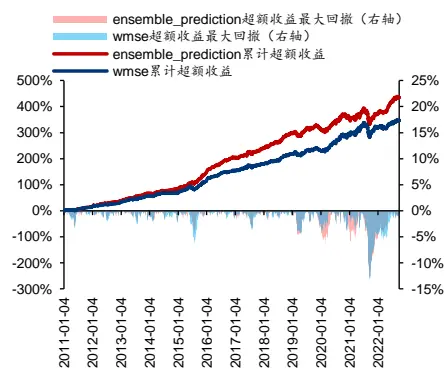
注：ensemble_prediction 为各有序回归预测值集成，wmse 为基线；回测期 2011-01-04 至 2022-09-30，基准为中证 500 指数
资料来源：朝阳永续，Wind，华泰研究

## 有序回归超额收益（基模型为 gat）

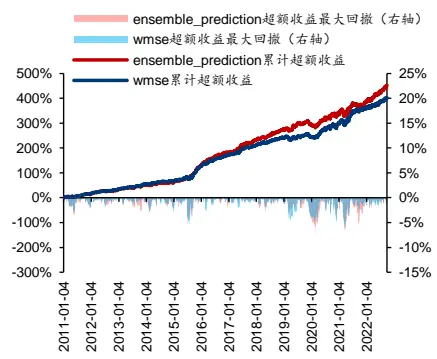
注：ensemble_prediction 为各有序回归预测值集成，wmse 为基线；回测期 2011-01-04 至 2022-09-30，基准为中证 500 指数
资料来源：朝阳永续，Wind，华泰研究

## 导读

分类和回归是两类常见的机器学习任务。选股场景中，既可设计为预测“涨”“跌”的分类问题，也可设计为预测收益率的回归问题。然而这两种任务类型各有缺陷：

1. 分类问题将预测目标由连续、稠密的收益率简化为离散、稀疏的类别，损失原始数据中的顺序和距离信息。

2. 回归问题的预测可能欠缺实际投资含义。假设股票收益率真实值为 0.6%，两次预测值分别为 1.8%和-0.6%，两次预测误差相同均为 1.2%，但前者方向判断正确，后者方向判断错误，将涨判断为跌，由此可见回归忽略了方向上的差异。另外，回归问题对异常值敏感。回归追求对目标的精确拟合，但金融数据信噪比低，有时“精确的错误”反而不如“模糊的正确”。

图表1： 为什么需要有序回归？
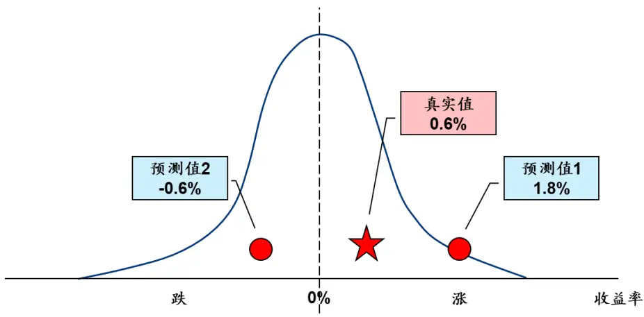
两次预测误差相同，但方向不同；回归忽略方向差异
资料来源：华泰研究

有序回归（ordinal regression）对分类损失函数加以改造，将分类和回归的特点结合，使得模型在保留信息同时，兼顾实际投资含义，追求“模糊的正确”。上世纪 80 年代以来，学者陆续提出有序回归相关算法，本研究主要参考麻省理工学院 Jason D. M. Rennie 和多伦多大学 Nathan Srebro 发表于 2005 年 IJCAI 会议的论文 Loss Functions for PreferenceLevels: Regression with Discrete Ordered Labels，测试有序回归在多因子选股场景中的效果。

图表2： 分类、回归、有序回归比较

|  | 标签 | 常用损失函数 | 优点 | 缺点 |
| --- | --- | --- | --- | --- |
| 分类 | 涨，跌 | logistic/交叉熵，exponential，hinge | 预测具有实际投资含义 对异常值不敏感 | 损失顺序和距离信息 |
| 回归 | 收益率 | mse, mae, huber | 无信息损失 | 预测可能欠缺实际投资含义 对异常值敏感 |
| 有序回归 | 收益率 | 分类损失函数求和 | 兼具分类和回归特点 |  |

资料来源：华泰研究

有序回归的损失函数并不复杂，可表示为如下形式。其中 x 为样本特征，y 为样本真实值，f 为基模型，f(x)为模型预测值，K 为分类数，c 为分类阈值，sgn 为符号函数，h 为分类损失函数（如 logistic、exponential、hinge 损失）。具体含义将在后文展开介绍。

$$
\begin{array}{cll}{{loss(f;x,y)=\displaystyle\sum_{k=1}^{K-1}h(sgn(y-c_{k})(f(x)-c_{k}))}}\\{{}}\\{{sgn(y-c_{k})=\displaystyle\left\{_{+1}^{-1}\right.\quad y\ <c_{k}}}\end{array}
$$

在周频中证 500 指增模型中，测试有序回归损失函数超额收益表现，以加权 mse（wmse）回归损失函数为基线，核心结论：

1. 当基模型为全连接神经网络（nn），logistic 有序回归损失函数可以提升模型 Rank IC、多空收益、年化超额收益和信息比率。

2. 当基模型为残差图注意力网络（gat_res），logistic有序回归损失函数可以提升模型RankIC 和多空收益，但指增组合年化超额收益和信息比率无显著改善。

3. logistic 有序回归损失函数与 wmse 的日度超额收益相关系数约为 0.7~0.92。将 wmse和有序回归预测结果进行集成，集成模型的年化超额收益、信息比率相比基线显著提升。

下图展示基模型为 nn时，有序回归集成模型和基线模型的超额收益及最大回撤。引入有序回归后，年化超额收益由 14.15%提升至 15.98%，信息比率由 2.38 提升至 2.76。

图表3： 有序回归超额收益表现（基模型为nn）
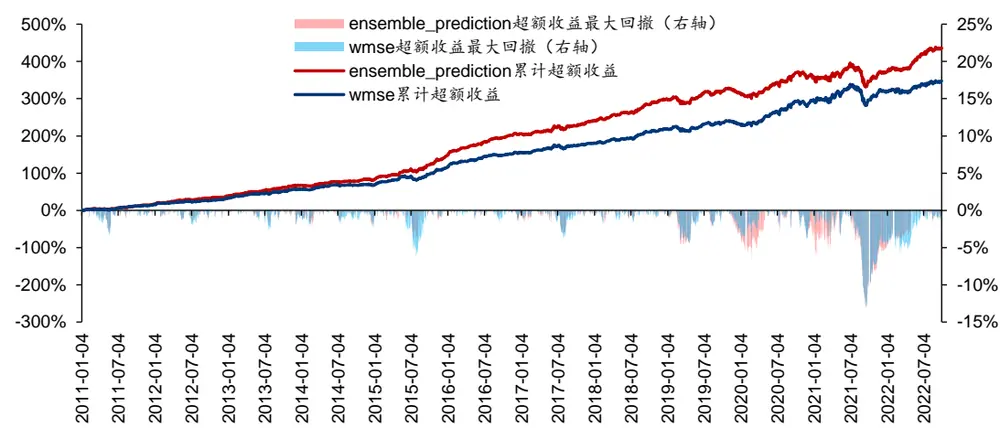
注：ensemble_prediction 为各有序回归预测值集成，wmse 为基线；回测期 2011-01-04 至 2022-09-30，基准为中证 500 指数资料来源：朝阳永续，Wind，华泰研究

下图展示基模型为 gat_res时，有序回归集成模型和基线模型的超额收益及最大回撤。引入有序回归后，年化超额收益由 15.33%提升至 16.30%，信息比率由 2.60 提升至 2.69。

图表4： 有序回归超额收益表现（基模型为gat_res）
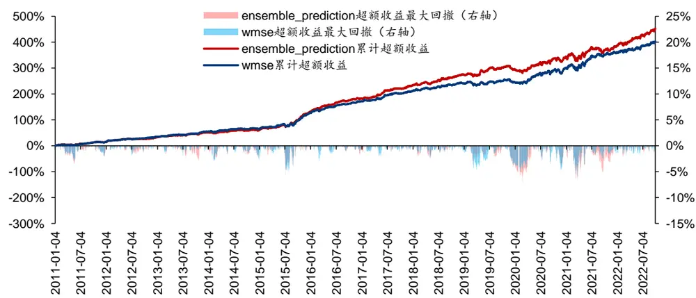
注：ensemble_prediction 为各有序回归预测值集成，wmse 为基线；回测期 2011-01-04 至 2022-09-30，基准为中证 500 指数资料来源：朝阳永续，Wind，华泰研究

## 有序回归原理

## 从二分类逻辑回归谈起

为了理解有序回归的原理，不妨从基础的二分类逻辑回归谈起。尽管逻辑回归称为回归，其实质是一种分类算法。假设 x 是样本特征；y 是样本真实分类，正例 y＝1，反例 y＝－1；f 通常为线性模型， $\mathsf{f}(\mathsf{x}){=}\mathsf{\Theta}^{\mathsf{T}}\mathsf{x}$

Sigmoid 函数将 f(x)由实数域转换为[0,1]，如图表 6 所示：

$$
\pi(f(x)){=}{\frac{1}{1+e^{-f(x)}}}
$$

此时，Π(f(x))代表预测样本属于正例的概率，1-Π(f(x))代表预测样本属于反例的概率。通常分类阈值 c＝0，当 $\mathsf{f}(\mathsf{x}){\geqslant}0$ 即Π $(\mathsf{f}(\mathsf{x})){\geqslant}0.5$ 时，判定样本属于正例，反之属于反例。

图表5： 二分类逻辑回归的概率密度函数
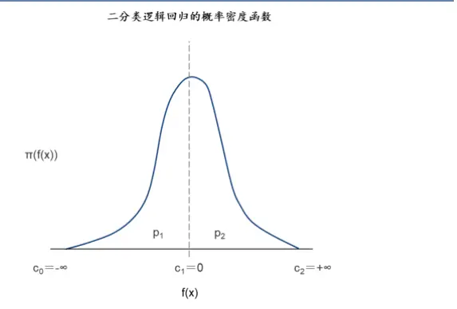
资料来源：华泰研究

图表6： 二分类逻辑回归的累积分布函数
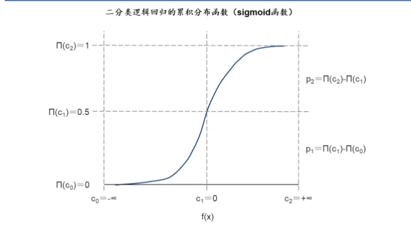
资料来源：华泰研究

交叉熵（cross entropy）衡量两个概率分布 p(x)和 q(x)的差异度：

$$
H=-\sum_{x}p(x)\log q(x)
$$

两个分布差异越大，交叉熵值越大。

二分类逻辑回归场景下，为评估分类表现，可以计算真实值和预测值概率分布的交叉熵：

1. 当 y＝1：真实值属于正例的概率为 1，属于反例的概率为 0；预测值属于正例的概率为Π(f(x))，属于反例的概率为 1-Π(f(x))。此时交叉熵为：

$$
\begin{array}{c}{{H=-\left[1\log\Pi\big(f(x)\big)+0\log\Big(1-\pi\big(f(x)\big)\Big)\right]=-\log\Pi\big(f(x)\big)}}\\{{{}}}\\{{=-\log\left(\displaystyle\frac{1}{1+e^{-f(x)}}\right)=\log(1+e^{-f(x)})}}\end{array}
$$

2. 当 $y=-1$ ：真实值属于正例的概率为 0，属于反例概率为 1；预测值属于正例的概率为Π(f(x))，属于反例的概率为 1-Π(f(x))。此时交叉熵为：

$$
\begin{array}{c}{{H=-\left[0\log\Pi\bigl(f(x)\bigr)+1\log\left(1-\pi\bigl(f(x)\bigr)\right)\right]=-\log\left(1-\pi\bigl(f(x)\bigr)\right)}}\\{{{}}}\\{{=-\log\left(1-\displaystyle\frac{1}{1+e^{-f(x)}}\right)=\log(1+e^{f(x)})}}\end{array}
$$

上述两种情况的交叉熵可以统一表示为：

$$
loss(f;x,y)=H=\log(1+e^{-yf(x)})
$$

交叉熵越大，表示真实值和预测值的差异越大，分类越不准确，因此可以作为逻辑回归损失函数，也称为 logistic 损失。除交叉熵外，另一种推导 logistic 损失的思路是利用极大似然估计，本文从略。

## 二分类拓展至多分类

二分类逻辑回归的 logistic 损失函数为：

$$
\begin{array}{r}{loss(f;x,y)=\log(1+e^{-yf(x)})}\end{array}
$$

记函数 h 为：

$$
h(yz)=\log(1+e^{-yz})
$$

当二分类阈值 $\mathtt{c}{=}0$ 时，logistic 损失可记为：

$$
loss(f;x,y)=\ h\bigl(yf(x)\bigr)=\ h(sgn(y-0)(f(x)-0))
$$

$$
sgn(y-0)=\left\{{\begin{array}{ll}{-1\quad}&{y<0}\\{+1\quad}&{y\geq0}\end{array}}\right.
$$

其中 sgn 为符号函数， $\mathsf{sgn}(\mathsf{y}-0)$ 代表真实值相对于分类阈值 c 的方向， $\mathsf{f}(\mathsf{x}){-}0$ 代表预测值相对于分类阈值 c的误差。

二分类拓展至多分类时，将单分类阈值拓展至多分类阈值。如图表 8，假设为四分类情形，分类阈值分别为 $\mathsf C_{1},~\mathsf C_{2},~\mathsf C_{3}\circ$ 将四分类拆解成 3 组二分类，将 3组 logistic 损失相加，即可得到四分类有序回归的 logistic 损失：

$$
loss(f;x,y)=\sum_{k=1}^{4-1}h(sgn(y-c_{k})(f(x)-c_{k}))
$$

$$
sgn(y-c_{k})=\left\{{\begin{array}{ll}{-1\quad}&{y<c_{k}}\\{+1\quad}&{y\geq c_{k}}\end{array}}\right.
$$

图表7： 多分类有序回归的概率密度函数
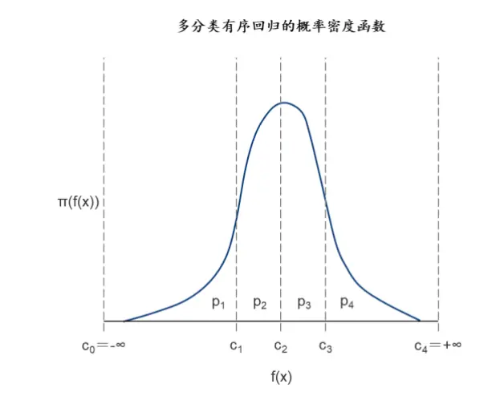
资料来源：华泰研究

图表8： 多分类有序回归的累积分布函数
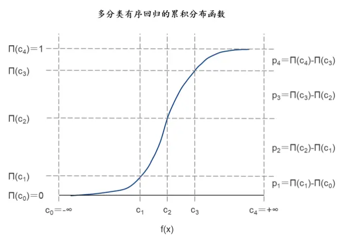
资料来源：华泰研究

至此，我们得到任意 K分类有序回归损失函数的一般形式：

$$
\log s(f;x,y)=\sum_{k=1}^{K-1}h(sgn(y-c_{k})(f(x)-c_{k}))
$$

$$
sgn(y-c_{l})=\left\{{\begin{array}{ll}{-1\quad}&{y<c_{k}}\\{+1\quad}&{y\geq c_{k}}\end{array}}\right.
$$

其中，f 除线性模型外，还可以是任意线性或非线性模型，如神经网络；h 除 logistic 损失外，还可以是其他损失函数形式，如 exponential 损失、hinge 损失等。

## 常用损失函数的有序回归形式

常用的二分类损失函数如：

1. 0-1 损失：

$$
h(yz)=\left\{{\begin{array}{ll}{0}&{{\quad yz\geq0}}\\{1}&{{\quad yz<0}}\end{array}}\right.
$$

2. Logistic 损失：

$$
h(yz)=\log(1+e^{-yz})
$$

3. Exponential 损失（指数损失）：

$$
h(yz)=e^{-yz}
$$

4. Hinge 损失（铰链损失、合页损失）：

$$
h(yz)=\left\{\begin{array}{ll}{0}&{\ yz\ge1}\\{1-yz}&{\ yz<1}\end{array}\right.
$$

5. Smoothed hinge 损失：

$$
h(yz)=\left\{\begin{array}{lr}{0}&{\qquad yz\geq1}\\{(1-yz)^{2}/2}&{\quad0<yz<1}\\{0.5-yz}&{\qquad yz\leq0}\end{array}\right.
$$

6. 改进最小二乘损失：

$$
h(yz)=\left\{\begin{array}{ll}{0}&{\ yz\geq1}\\{(1-yz)^{2}}&{\ yz<1}\end{array}\right.
$$

部分二分类损失函数形态如下图，这里假定样本真实分类 y为 1。0-1 损失和 hinge 损失的缺点是不可导，无法用梯度下降法优化；exponential 损失的特点是预测误差较大时，惩罚力度较大，因此对异常值较敏感。

图表9： 二分类损失函数示意图
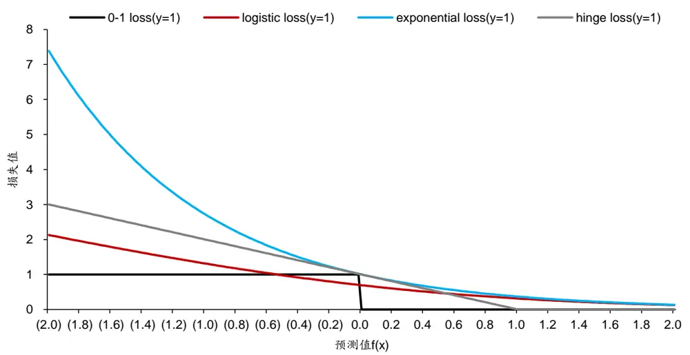
资料来源：华泰研究

将二分类拓展至多分类有序回归，部分损失函数形态如图表 10 和 11。假定分类数 K 为 5，分类阈值 c 为±0.4 和±1.2，样本真实值 y为 0 或 1。同时展示回归问题常用的 mse 损失作为对照。

总的看，除 exponential损失外，其他有序回归损失函数相比 mse 更平缓，没有 mse 那样“赏罚分明”。例如图表 10 中的 hinge 损失，当预测值 f(x)介于-0.4 至 0.4 间时，损失值均为 0，预测值只要和真实值属于同一类别，就判定预测正确，不给予惩罚。这也是有序回归追求“模糊的正确”的体现。

图表10： 有序回归损失函数示意图（K=5，y=0）
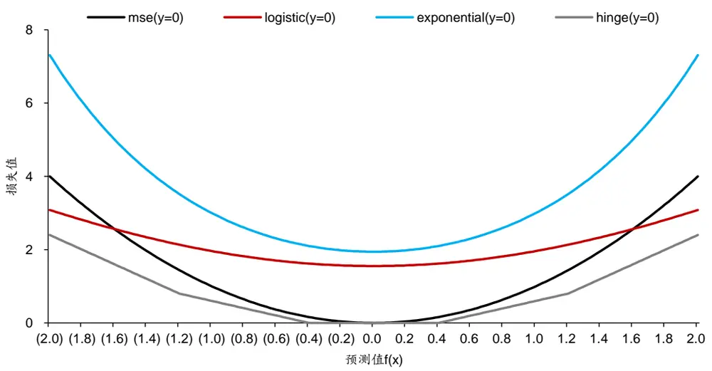
资料来源：华泰研究

图表11： 有序回归损失函数示意图（K=5，y=1）
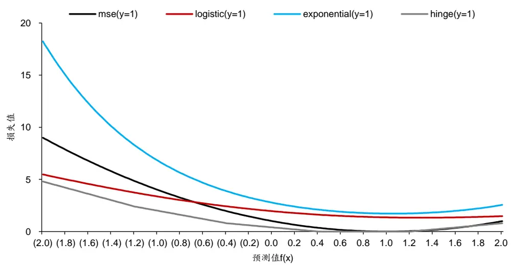
资料来源：华泰研究

## 方法

本研究在现有周频中证 500 指增模型基础上，将加权 mse（wmse）损失函数改为不同形式的有序回归损失函数，测试有序回归效果，并考察参数敏感性。

基模型 f 选取全连接神经网络（nn）或残差图注意力网络（gat_res）。分类阈值 c采用截面分位数，以 5分类为例，分类阈值为每个交易日股票收益 20%、40%、60%、80%分位数。

参数敏感性测试从以下四方面展开：

1. 损失函数 h：logistic、exponential 或 hinge。

2. 加权方式：基线 wmse 损失函数中，对每个截面股票未来收益高的股票赋予更高权重，采用半衰加权，半衰期为τ，收益最高股票权重为 1，收益分位数 1-τ股票权重为 0.5。有序回归损失函数中：

a. 样本加权（sample weighted，记为 sw）：同前述 wmse 加权方式。

b. 类别加权（class weighted，记为 cw）：每个截面将股票未来收益由低到高分为 K类，采用半衰加权，半衰期为τ，第 K 类股票权重为 1，第[K×(1-τ)]类股票权重为 0.5。

c. 样本-类别加权（sample-class weighted，记为 scw）：将上述两种方式得到的股票权重相乘。

## 3. 分类数量 K：10，同时测试 5 或 20。

4. 模型集成方式：将基线 mse 与各有序回归模型采用不同方式集成。

a. 预测值集成（ensemble_prediction）：将子模型的预测值求均值，再进行组合优化。

b. 组合权重集成（ensemble_portfolio）：将子模型组合优化后的持仓进行等权配置，每个季度再平衡。

图表12： 参数敏感性测试

| 损失函数 |  | 加权方式 | 分类数量 | 模型集成方式 |
| --- | --- | --- | --- | --- |
| 基线 |  |  |  |  |
| wmse | mse | 样本 | 1 | - |
| 损失函数 |  |  |  |  |
| sw_ord_logi | logistic | 样本 | 10 | - |
| sw_ord_exp | exponential | 样本 | 10 |  |
| sw_ord_hinge | hinge | 样本 | 10 |  |
| 加权方式 |  |  |  |  |
| cw_ord_logi | logistic | 类别 | 10 |  |
| scw_ord_logi | logistic | 样本和类别 | 10 |  |
| 分类数量 |  |  |  |  |
| sw_ord_logi_5 | logistic | 样本 | 5 | - |
| sw_ord_logi_20 | logistic | 样本 | 20 |  |
| 模型集成方式 |  |  |  |  |
| ensemble_prediction | wmse + sw_ord_logi + cw_ord_logi |  |  | 预测值集成 |
| ensemble_portfolio | wmse + sw_ord_logi + cw_ord_logi |  |  | 组合集成 |

资料来源：华泰研究

网络结构、选股模型构建方法及因子如下列图表。具体细节可参考华泰金工研报《人工智能 55：图神经网络选股的进阶之路》（2022-04-11）。

图表13： nn网络结构
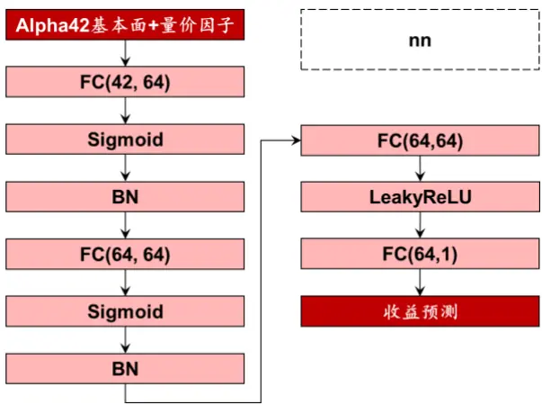
资料来源：华泰研究

图表14： gat_res 网络结构
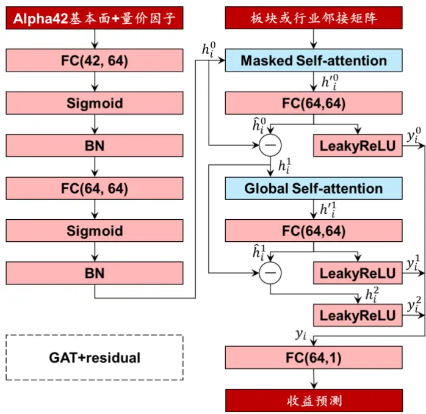
资料来源：华泰研究

图表15： 选股模型使用的 42个因子

| 类别 | 名称 | 计算方式 |  |
| --- | --- | --- | --- |
| 估值 | bp_If | 1/市净率 |  |
|  | ep_ttm | 1/市盈率(TTM) |  |
|  | ocfp_ttm | 1/净经营性现金流(TTM) |  |
|  | dyr12 | 近 252 日股息率 |  |
| 预期 | con_eps_g | 一致预期 EPS(FY1)近 63 日增长率 |  |
|  | con_roe_g | 一致预期 ROE(FY1)近 63 日增长率 |  |
|  | con_np_g | 一致预期归母净利润(FY1)近63 日增长率 |  |
|  | ret_5d | 近5日区间收益率 |  |
| 反转 | ret_1m | 近21 日区间收益率 |  |
|  | exp_wgt_return_3m | 近63日收益率以换手率指数衰减加权 |  |
|  | std_1m | 收益率近 21 日标准差 |  |
| 波动率 | vstd_1m | 成交量近 21 日标准差 |  |
|  | ivr_ff3factor_1m | 残差收益率（收益率对万得全A、市值、BP因子收益率回归）近21日标准差 |  |
|  | turn_1m | 换手率近 21 日均值 |  |
| 换手率 | std_turn_1m | 换手率近 21 日标准差 |  |
|  | bias_turn_1m | 换手率近 21 日均值/近 504 日均值 |  |
|  | std_ret_10d | 收益率近 10日标准差 |  |
|  | std_vol_10d |  |  |
|  | std_turn_10d | 成交量近 10日标准差 |  |
|  | corr_ret_close | 换手率近 10 日标准差 |  |
|  | corr_ret_open | 收益率和收盘价近10日相关系数 收益率和开盘价近10日相关系数 |  |
|  | corr_ret_high | 收益率和最高价近10日相关系数 |  |
|  | corr_ret_low | 收益率和最低价近10日相关系数 |  |
|  | corr_ret_vwap | 收益率和均价近10日相关系数 |  |
|  | corr_ret_vol | 收益率和成交量近10日相关系数 |  |
|  | corr_ret_turn | 收益率和换手率近10日相关系数 |  |
|  | corr_vol_close |  |  |
|  | corr_vol_open | 成交量和收盘价近10日相关系数 |  |
|  | corr_vol_high | 成交量和开盘价近10日相关系数 |  |
|  | corr_vol_low | 成交量和最高价近10日相关系数 |  |
|  | corr_vol_vwap | 成交量和最低价近10日相关系数 |  |
|  | 日内技术 low2high | 成交量和均价近10日相关系数 low/high |  |
|  |  | vwap2close | vwap/close |
|  |  | kmid |  |
|  |  | klen | (close-open)/open |
|  |  | kmid2 | (high-low)/open (close-open)/(high-low) |
|  |  | kup | (high-greater(open,close))/open |
| kup2 |  | (high-greater(open,close))/(high-low) |  |
| klow |  |  |  |
| klow2 |  | (less(open,close)-low)/open |  |
| ksft | (less(open,close)-low)/(high-low) (2*close-high-low)/open |  |  |
|  | ksft2 | (2*close-high-low)/(high-low) |  |

资料来源：朝阳永续，Wind，华泰研究

图表16： 选股模型构建方法

| 步骤 | 参数 | 参数值 |
| --- | --- | --- |
| 构建股票池 | 股票池 | 全A股；剔除上市未满63个交易日个股，剔除ST、*ST、退市整理期个股； |
|  |  | 每个季末截面期，在未停牌个股中，筛选过去1年日均成交额和日均总市值均排 |
|  |  | 名前 60%个股 |
| 构建数据集 | 特征 | T 日 42 个基本面和量价因子 |
|  | 标签 邻接矩阵 | T+11 日相对于 T+1 日 vwap 收益率 |
|  |  | 每个年末截面期，根据中信一级行业合成板块（周期、消费、金融、成长、稳定） 构建邻接矩阵 |
| 因子预处理 | 特征 标签 | 5 倍 MAD 缩尾；zscore 标准化；缺失值填为 0；不做中性化 |
| 训练流程 | 测试集完整区间 训练、验证、测试集划分 | 剔除缺失值；截面排序数标准化 |
|  |  | 20110104~20220930 |
|  |  | 训练集252*6个交易日，验证集252*2个交易日，测试集126个交易日； |
|  |  | 如第1期训练集 20020910~20081205，验证集 20081208~20101231，测试集 |
|  |  | 20110104~20110711; 第 2 期训练集 20030325~20090616，验证集 20090617~20110711，测试集 |
|  |  | 20110712~20120113 |
| 设置模型 | 特殊处理 | 剔除训练集、验证集最后10个交易日样本，防止信息泄露 |
|  | 网络结构 | nn（全连接神经网络）或 gat_res（残差图注意力网络） |
|  | 隐单元数 损失函数 | 64 加权 mse（基准）或有序回归 |
|  |  | 有序回归总分类数：10（或5、20） |
|  |  | 有序回归分类阈值：截面标签分位数 |
|  | batch size | 每个交易日的全体股票视作一个 batch |
|  | 学习率 | 0.0001 |
|  | 优化器 | adam |
|  | 早停次数 | 20 |
|  | 基准 | 中证 500 指数 |
|  | 优化目标 | 最大化预期收益 |
|  | 组合仓位 | 1 |
|  | 个股权重下限 个股偏离权重约束 | 0 |
|  | 行业偏离权重约束 | [-1%, 1%] |
|  | 风格偏离标准差约束 | [-1%, 1%] |
|  | 风格因子 | [-1%, 1%] |
|  | 调仓周期 | 对数流通市值（预处理：5倍 MAD 缩尾，zscore 标准化） |
|  | 单次调仓单边换手率上限 | 每5个交易日 15% |
|  | 成分股权重约束 | 无 |
|  | 单边费率 | 0.002 |
|  | 交易价格 | vwap |
|  | 特殊处理 | 停牌不买入/卖出；一字板涨停不买入；一字板跌停不卖出；其余可交易股票重新 |
|  |  | 分配权重 |

资料来源：华泰研究

## 结果

## 基模型为 nn

基模型为全连接神经网络（nn）时，全部测试模型因子评价指标及回测绩效如下列图表。
logistic 有序回归损失函数可以提升模型 Rank IC、多空收益、年化超额收益和信息比率。
将 wmse 和有序回归进行集成，集成模型相比基线的年化超额收益、信息比率显著提升。

图表17： 测试模型合成因子评价指标（基模型为 nn）
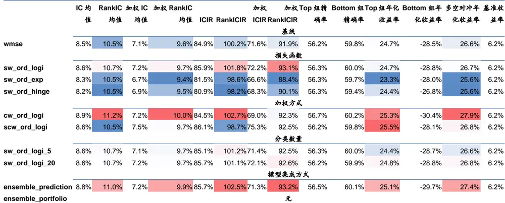
注：回测期 2011-01-04 至 2022-09-30
资料来源：朝阳永续，Wind，华泰研究

图表18： 测试模型回测绩效（基模型为 nn）

|  | 年化收益年化波动夏普比 率 |  |  | 最大回 Calmar 比 撒 |  | 年化超额收年化跟踪误信息比 超额收益最大 超额收益 Calmar 差 |  |  |  | 相对基准月 比率 | 年化双边换 胜率 | 手率 |
| --- | --- | --- | --- | --- | --- | --- | --- | --- | --- | --- | --- | --- |
|  |  |  |  | 率 | 率 | 率 | 益率 | 率 | 回撤 |  |  |  |
| wmse | 15.63% | 25.79% |  | 0.61 50.15% |  |  | 基线 |  |  |  |  |  |
|  |  |  |  |  | 0.31 | 14.15% | 5.95% 损失函数 | 2.38 | 13.08% | 1.08 | 78.72% | 16.14 |
| sw_ord_logi | 17.38% | 25.82% | 0.67 48.62% |  | 0.36 | 15.90% | 5.79% | 2.74 | 12.70% | 1.25 | 80.85% | 16.15 |
| sw_ord_exp | 13.78% | 25.72% | 0.54 50.50% |  | 0.27 | 12.31% | 5.87% | 2.10 | 11.79% | 1.04 | 78.72% | 16.10 |
| sw_ord_hinge | 15.82% | 25.92% | 0.61 49.44% |  | 0.32 | 14.38% | 6.03% | 2.39 | 12.53% | 1.15 | 77.30% | 16.20 |
|  |  |  |  |  |  |  | 加权方式 |  |  |  |  |  |
| cw_ord_logi | 17.12% | 26.40% | 0.65 50.46% |  | 0.34 | 15.82% | 5.89% | 2.69 | 13.07% | 1.21 | 82.27% | 16.63 |
| scw_ord_logi | 18.42% | 26.01% | 0.71 48.48% |  | 0.38 | 16.93% | 6.40% | 2.65 | 13.78% | 1.23 | 78.72% | 16.21 |
|  |  |  |  |  |  |  | 分类数量 |  |  |  |  |  |
| sw_ord_logi_5 | 16.56% | 25.72% |  | 0.64 49.26% | 0.34 | 15.06% | 5.84% | 2.58 | 13.07% | 1.15 | 80.14% | 16.15 |
| sw_ord_logi_20 | 16.93% | 25.93% | 0.65 49.22% |  | 0.34 | 15.48% | 5.88% | 2.63 | 12.32% | 1.26 | 78.72% | 16.16 |
|  |  |  |  |  |  |  | 模型集成方式 |  |  |  |  |  |
| ensemble_prediction | 17.42% | 25.94% |  | 0.67 48.54% | 0.36 | 15.98% | 5.79% | 2.76 | 12.95% | 1.23 | 81.56% | 16.26 |
| ensemble_portfolio | 16.73% | 25.94% |  | 0.64 49.75% |  |  |  |  | 12.95% |  | 79.43% |  |
|  |  |  |  |  | 0.34 | 15.30% | 5.59% | 2.74 |  | 1.18 |  | 16.33 |

注：回测期 2011-01-04 至 2022-09-30，基准为中证 500 指数
资料来源：朝阳永续，Wind，华泰研究

## 损失函数

对比 logistic、exponential、hinge 三种损失函数：

1. 从加权 Rank IC 和多空收益看：logistic＞wmse＞hinge≈exponential。

2. 从年化超额收益和信息比率看：logistic＞hinge＞wmse＞exponential。

总的来看，logistic 损失表现相对较好；exponential 损失对异常值敏感，表现不佳；hinge损失表现不突出。后续测试统一采用 logistic 损失。

图表19： 各损失函数超额收益表现（基模型为 nn）
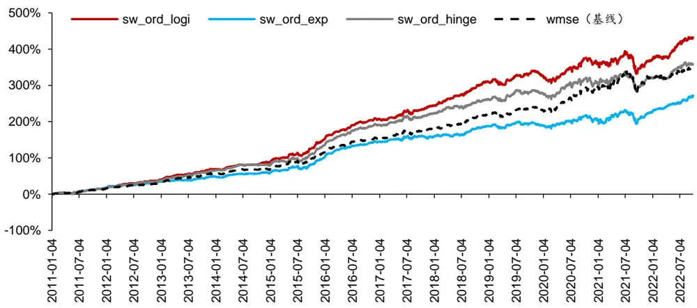
注：回测期 2011-01-04 至 2022-09-30，基准为中证 500 指数
资料来源：朝阳永续，Wind，华泰研究

## 加权方式

对比样本加权（sw）、类别加权（cw）、样本-类别加权（scw）三种加权方式：

1. 从加权 Rank IC 和多空收益看：cw＞sw≈scw＞wmse。

2. 从年化超额收益看：scw＞sw＞cw＞wmse。

3. 从信息比率看：sw＞cw＞scw＞wmse。

总的来看，各加权方式无显著优劣之分，均优于基线 wmse。

图表20： 各加权方式超额收益表现（基模型为 nn）
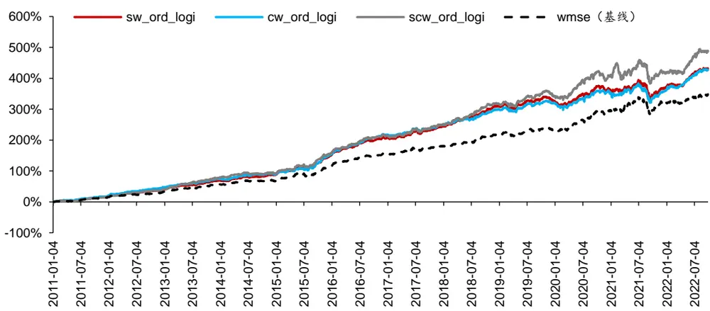
注：回测期 2011-01-04 至 2022-09-30，基准为中证 500 指数
资料来源：朝阳永续，Wind，华泰研究

## 分类数量

对比不同分类数量：

1. 从加权 Rank IC 看：10 类≈5 类≈20 类＞wmse。

2. 从多空收益看：20 类＞10类＞5类≈wmse。

3. 从年化超额收益和信息比率看：10 类＞20 类＞5 类＞wmse。

总的来看，分 10 类表现相对较好；分 5 类相比基线有优势但不突出；分 20 类表现不错但时间开销较大（约为 10 类的 1.4 倍）。后续测试统一采用分 10 类。

图表21： 各分类数量超额收益表现（基模型为 nn）
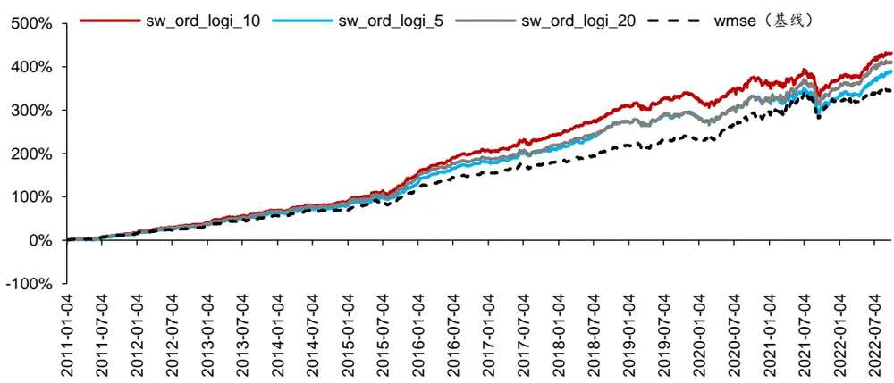
注：回测期 2011-01-04 至 2022-09-30，基准为中证 500 指数
资料来源：朝阳永续，Wind，华泰研究

## 模型集成方式

将 wmse、sw_ord_logi 和 cw_ord_logi 三个模型集成。对比预测值集成和组合集成：1. 从加权 Rank IC 和多空收益看：cw_ord_logi＞预测值集成＞sw_ord_logi＞wmse。2. 从年化超额收益看：预测值集成＞sw_ord_logi＞cw_ord_logi＞组合集成＞wmse。3. 从信息比率看：预测值集成＞sw_ord_logi≈组合集成＞cw_ord_logi＞wmse。

总的来看，预测值集成和组合集成均优于基线 wmse，预测值集成效果更好。

图表22： 各模型集成方式超额收益表现（基模型为 nn）
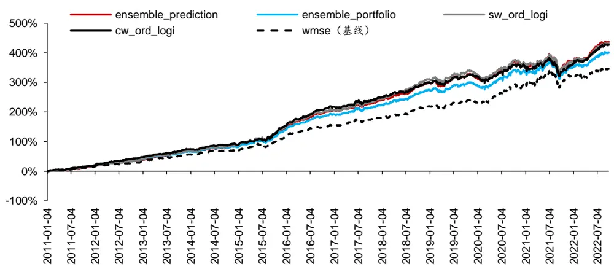
注：回测期 2011-01-04 至 2022-09-30，基准为中证 500 指数
资料来源：朝阳永续，Wind，华泰研究

## 基模型为 gat_res

基模型为残差图注意力网络（gat_res）时，全部测试模型因子评价指标及回测绩效如下列图表。logistic 有序回归损失函数可以提升模型 Rank IC 和多空收益，但组合年化超额收益和信息比率无显著改善。将 wmse、sw_ord_logi 和 cw_ord_logi 进行集成，集成模型年化超额收益、信息比率相比基线显著提升。

图表23： 测试模型合成因子评价指标（基模型为 gat_res）
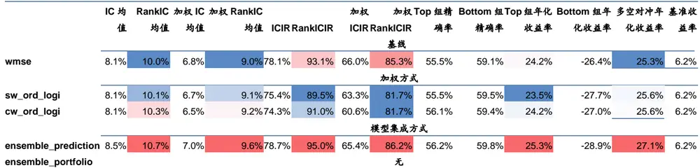
注：回测期 2011-01-04 至 2022-09-30
资料来源：朝阳永续，Wind，华泰研究

图表24： 测试模型回测绩效（基模型为 gat_res）

|  | 年化收益年化波动夏普比 | 最大回 Calmar 比 |  |  |  | 年化超额收年化跟踪误信息比超额收益最大超额收益 Calmar |  |  |  |  | 相对基准月 胜率 | 年化双边换 手率 |
| --- | --- | --- | --- | --- | --- | --- | --- | --- | --- | --- | --- | --- |
|  |  | 率 | 率 | 率 | 撤 率 | 益率 | 差 | 率 | 回撤 | 比率 |  |  |
| wmse | 16.53% | 26.71% |  | 0.62 50.24% | 0.33 | 15.33% | 基线 5.90% | 2.60 | 5.98% | 2.56 | 81.56% | 16.27 |
| sw_ord_logi | 16.14% | 26.43% |  | 0.61 48.14% | 0.34 | 14.84% | 加权方式 6.04% | 2.46 | 6.56% | 2.26 | 75.89% | 16.18 |
| cw_ord_logi | 16.28% | 26.19% |  | 0.62 49.35% | 0.33 | 14.92% | 5.87% | 2.54 | 9.78% | 1.52 | 78.01% | 16.66 |
|  |  |  |  |  |  |  | 模型集成方式 |  |  |  |  |  |
| ensemble_prediction | 17.52% | 26.71% |  | 0.66 48.67% | 0.36 | 16.30% | 6.06% | 2.69 | 7.06% | 2.31 | 75.89% | 16.30 |
| ensemble_portfolio | 16.35% | 26.33% |  | 0.62 49.24% | 0.33 | 15.06% | 5.40% | 2.79 | 5.91% | 2.55 | 78.72% | 16.40 |

注：回测期 2011-01-04 至 2022-09-30，基准为中证 500 指数
资料来源：朝阳永续，Wind，华泰研究

对比样本加权（sw）、类别加权（cw）、预测值集成和组合集成：

1. 从加权 Rank IC 和多空收益看：预测值集成＞sw≈cw＞wmse。

2. 从年化超额收益看：预测值集成＞wmse＞组合集成＞cw＞sw。

3. 从信息比率看：组合集成＞预测值集成＞wmse＞cw＞sw。

图表25： 各加权方式超额收益表现（基模型为 gat_res）
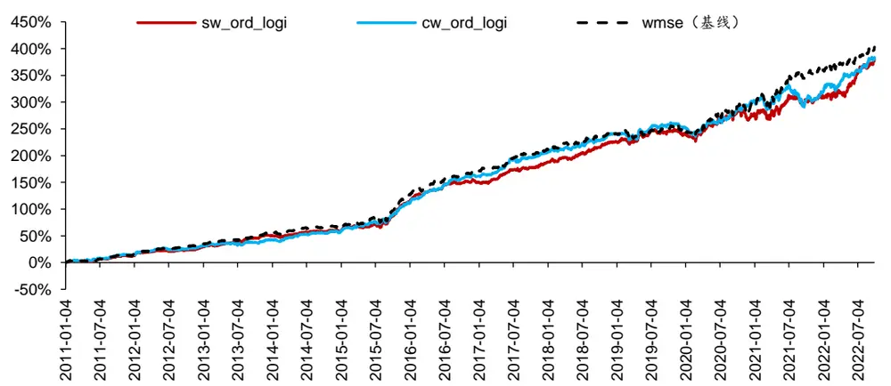
注：回测期 2011-01-04 至 2022-09-30，基准为中证 500 指数资料来源：朝阳永续，Wind，华泰研究

图表26： 各模型集成方式超额收益表现（基模型为 gat_res）
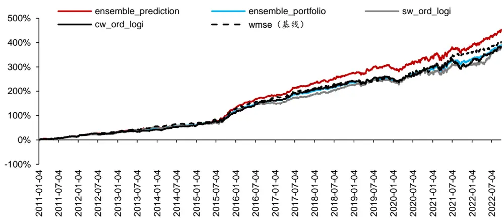
注：回测期 2011-01-04 至 2022-09-30，基准为中证 500 指数
资料来源：朝阳永续，Wind，华泰研究

## 讨论

## 有序回归和基线 wmse 相关度如何？

对于 wmse、sw_ord_logi 和 cw_ord_logi 三个模型，计算 1）日度预测值相关系数均值，2）组合日度超额收益相关系数。

预测值相关系数：nn 基模型相关度超过 0.95，gat_res 基模型相关度约为 0.83-0.84。

图表27： 子模型日度预测值相关系数均值

| 基模型为 nn | wmse | sw_ord_logi cw_ord_logi |  | 基模型为 gat_res | wmse | sw_ord_logi | cw_ord_logi |
| --- | --- | --- | --- | --- | --- | --- | --- |
| wmse |  | 0.98 | 0.96 | wmse |  | 0.84 | 0.83 |
| sw_ord_logi | 0.98 |  | 0.98 | sw_ord_logi | 0.84 |  | 0.84 |
| cw_ord_logi | 0.96 | 0.98 |  | cw_ord_logi | 0.83 | 0.84 |  |

资料来源：朝阳永续，Wind，华泰研究

超额收益相关系数：nn 基模型相关度约为 0.8~0.91，gat_res 基模型相关度约为 0.7-0.8。

图表28： 子模型日度超额收益相关系数

| 基模型为 nn | wmse | sw_ord_logi cw_ord_logi |  | 基模型为 gat_res | wmse | sw_ord_logi | cw_ord_logi |
| --- | --- | --- | --- | --- | --- | --- | --- |
| wmse |  | 0.91 | 0.81 | wmse |  | 0.79 | 0.73 |
| sw_ord_logi | 0.91 |  | 0.85 | sw_ord_logi | 0.79 |  | 0.71 |
| cw_ord_logi | 0.81 | 0.85 |  | cw_ord_logi | 0.73 | 0.71 |  |

资料来源：朝阳永续，Wind，华泰研究

总的来看，子模型间表现为中高相关，模型间的差异使得集成后表现进一步提升。

## 有序回归相比基线 wmse 优势是否稳定？

计算 1）有序回归与基线累计 Rank IC差值，2）有序回归与基线累计加权 Rank IC 差值。当基模型为 nn 时，sw_ord_logi、cw_ord_logi 和 ensemble_prediction 相比基线 wmse 均有稳定优势。

图表29： 有序回归与基线累计 Rank IC差值（基模型为 nn）
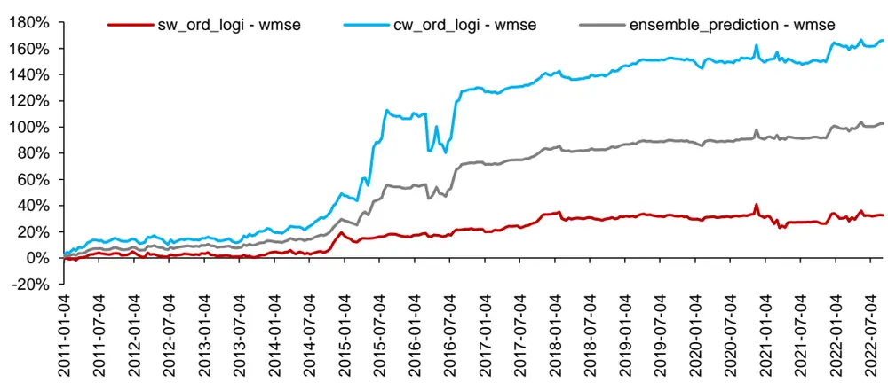
资料来源：朝阳永续，Wind，华泰研究

图表30： 有序回归与基线累计加权 Rank IC差值（基模型为 nn）
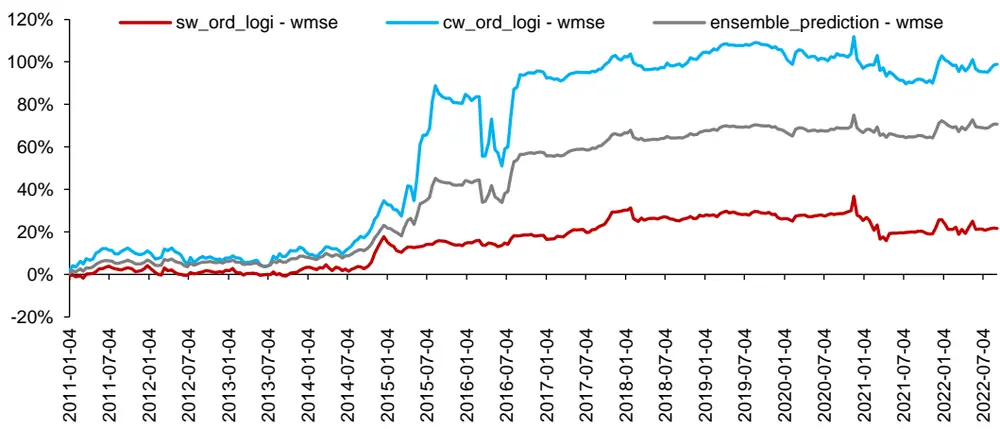
资料来源：朝阳永续，Wind，华泰研究

当基模型为 gat_res 时，sw_ord_logi、cw_ord_logi 相比基线 wmse 优势不明显，ensemble_prediction 相比基线 wmse 有稳定优势。

图表31： 有序回归与基线累计 Rank IC差值（基模型为 gat_res）
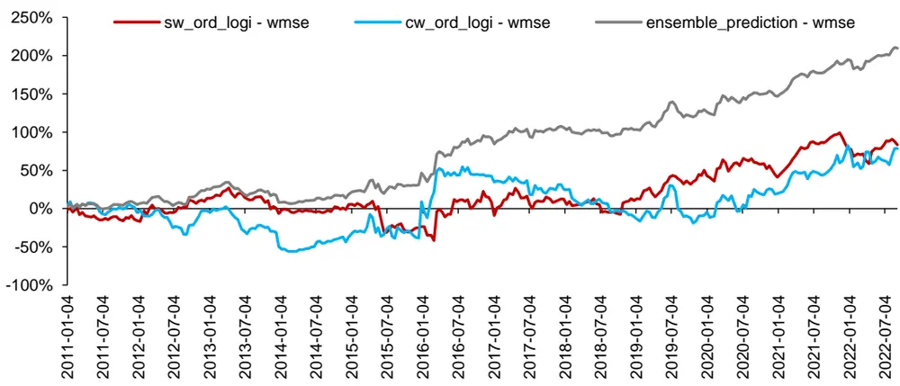
资料来源：朝阳永续，Wind，华泰研究

图表32： 有序回归与基线累计加权 Rank IC差值（基模型为 gat_res）
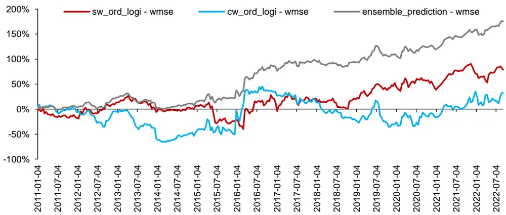
资料来源：朝阳永续，Wind，华泰研究

## 有序回归和多分类的比较

传统分类任务也可实现多分类，和有序回归有何区别？

首先，传统多分类任务，如 softmax 多分类，其标签为无序的离散值，如下表中总统候选人偏好。选股场景下，如果设计成上涨、震荡、下跌三分类，这三类存在顺序关系，那么采用常见的softmax多分类将损失原始收益率中的顺序信息。此时若仍希望使用分类方法，可考虑有序多分类。

其次，无论是二分类、多分类还是有序多分类，与有序回归的核心区别在于预测目标是离散值还是连续值。选股场景下，即使是有序多分类，标签仍是离散的类别而非连续的收益率，这样仍不可避免损失收益率中的距离信息。有序回归的优势在于，相比于分类任务保留更多距离信息，相比于传统回归任务对噪音有一定容忍度。

图表33： 二分类、多分类、有序多分类、有序回归比较

|  | 标签 | 案例 |
| --- | --- | --- |
| 二分类 | 2个离散值 | 是否愿意购买（愿意、不愿意） |
| 多分类 | 多个离散值且无序 | 总统候选人偏好（特朗普、希拉里、卢比奥） |
| 有序多分类 | 多个离散值且有序 | 幸福感（不幸福、比较幸福、非常幸福） |
| 有序回归 | 连续值 | 预期收益率（任意实数） |

资料来源：华泰研究

## 有序回归与 wmse 集成后表现提升的原因

有序回归与 wmse 集成模型和基线 wmse 的区别主要在于两点：1）有序回归的引入；2）“集成”操作本身。我们认为，有序回归集成模型预测能力的提升核心源于第一点，即有序回归损失函数降低了对噪声的敏感度。为了排除第二点集成本身的影响，设置对照组ensemble_seed，将三个不同随机数种子点下训练的 wmse 模型集成。

结果显示，直接将不同种子点的wmse模型集成后，年化超额收益、信息比率反不及基线wmse模型。有序回归集成模型表现提升的核心原因，可能在于和谁集成，而非集成本身。如果子模型损失函数一致，仅仅是随机数种子的差异，那么内部相关性较高，集成未必有效。

图表34： 有序回归集成与 wmse集成模型回测绩效（基模型为 nn）

|  | 年化收益年化波动夏普比 最大回 Calmar 比 |  |  |  | 年化超额收年化跟踪误信息比 超额收益最大超额收益 Calmar |  |  |  |  |  | 相对基准月年化双边换 | 胜率 手率 |
| --- | --- | --- | --- | --- | --- | --- | --- | --- | --- | --- | --- | --- |
|  | 率 | 率 | 率 | 撤 | 率 | 益率 | 差 | 率 | 回撤 | 比率 |  |  |
| ensemble_prediction | 17.42% | 25.94% | 0.67 48.54% |  | 0.36 | 15.98% | 5.79% | 2.76 | 12.95% | 1.23 | 81.56% | 16.26 |
| ensemble_seed | 14.65% | 26.12% | 0.56 48.96% |  | 0.30 | 13.26% | 6.27% | 2.11 | 12.95% | 1.02 | 76.60% | 16.14 |
| wmse | 15.63% | 25.79% | 0.61 50.15% |  | 0.31 | 14.15% | 5.95% | 2.38 | 13.08% | 1.08 | 78.72% | 16.14 |

注：回测期 2011-01-04 至 2022-09-30，基准为中证 500 指数
资料来源：朝阳永续，Wind，华泰研究

图表35： 有序回归集成与 wmse集成模型超额收益表现（基模型为 nn）
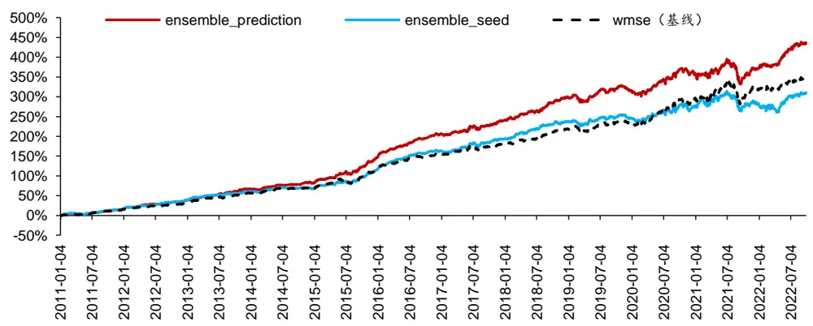
注：回测期 2011-01-04 至 2022-09-30，基准为中证 500 指数资料来源：朝阳永续，Wind，华泰研究

## 总结

本研究介绍有序回归原理，测试该方法在周频中证 500 指增模型中的表现，结果表明有序回归损失函数整体优于传统 mse 损失函数。分类会损失顺序和距离信息；回归可能欠缺实际投资含义，并且对异常值敏感；有序回归将分类和回归特点结合，追求“模糊的正确”。选股测试中，以全连接神经网络或残差图注意力网络为基模型，logistic 有序回归可以提升模型 Rank IC 和多空收益；将加权 mse 和有序回归预测结果集成，集成后年化超额收益、信息比率显著提升。

分类和回归是两类常见的机器学习任务。选股场景中，既可设计为预测“涨”“跌”的分类问题，也可设计为预测收益率的回归问题。然而这两种任务类型各有缺陷。分类问题将预测目标由连续、稠密的收益率简化为离散、稀疏的类别，损失原始数据中的顺序和距离信息。回归问题的预测可能欠缺实际投资含义，如预测误差小但方向判断错误。另外，回归问题对异常值敏感。回归追求对目标的精确拟合，但金融数据信噪比低，有时“精确的错误”反而不如“模糊的正确”。

有序回归对分类损失函数加以改造，将分类和回归的特点结合，使得模型在保留信息同时，兼顾实际投资含义，追求“模糊的正确”。有序回归可基于二分类推导，将 K分类问题转换为 K-1 个二分类问题，对这 K-1 个二分类损失函数求和，得到 K 分类有序回归损失函数。常用的二分类损失函数如 logistic、exponential、hinge 损失都可以改造成有序回归形式。

在周频中证 500 指增模型中，测试有序回归损失函数超额收益表现，以加权 mse 损失函数为基线。当基模型为全连接神经网络，logistic 有序回归损失函数可以提升模型 Rank IC、多空收益、年化超额收益和信息比率。当基模型为残差图注意力网络，logistic 有序回归损失函数可以提升模型 Rank IC 和多空收益，但指增组合表现无显著改善。将 wmse和有序回归预测结果进行集成，集成模型的年化超额收益、信息比率相比基线显著提升。

考察损失函数、加权方式、分类数量、模型集成方式对模型表现的影响。Logistic 损失总体优于 exponential 和 hinge 损失；对截面收益高的股票赋予更高权重，样本加权、类别加权和样本-类别加权差异不大；对于全 A 股总市值和流动性前 60%股票池，分类数量为 10 时效果较好；预测值集成方法将子模型的预测值求均值再进行组合优化，效果总体优于子模型组合等权配置季度再平衡的组合集成方法。

## 参考文献

Rennie, J., & Srebro, N. (2005). Loss Functions for Preference Levels: Regression with Discrete Ordered Labels. IJCAI.

## 风险提示

人工智能挖掘市场规律是对历史的总结，市场规律在未来可能失效。人工智能技术存在过拟合风险。深度学习模型受随机数影响较大，本文未进行随机数敏感性测试。本文测试的选股模型调仓频率较高，假定以 vwap 价格成交，忽略其他交易层面因素影响。

## 免责声明

## 分析师声明

本人，林晓明、李子钰、何康，兹证明本报告所表达的观点准确地反映了分析师对标的证券或发行人的个人意见；彼以往、现在或未来并无就其研究报告所提供的具体建议或所表迖的意见直接或间接收取任何报酬。

## 一般声明及披露

本报告由华泰证券股份有限公司（已具备中国证监会批准的证券投资咨询业务资格，以下简称“本公司”）制作。本报告所载资料是仅供接收人的严格保密资料。本报告仅供本公司及其客户和其关联机构使用。本公司不因接收人收到本报告而视其为客户。

本报告基于本公司认为可靠的、已公开的信息编制，但本公司及其关联机构(以下统称为“华泰”)对该等信息的准确性及完整性不作任何保证。

本报告所载的意见、评估及预测仅反映报告发布当日的观点和判断。在不同时期，华泰可能会发出与本报告所载意见、评估及预测不一致的研究报告。同时，本报告所指的证券或投资标的的价格、价值及投资收入可能会波动。以往表现并不能指引未来，未来回报并不能得到保证，并存在损失本金的可能。华泰不保证本报告所含信息保持在最新状态。华泰对本报告所含信息可在不发出通知的情形下做出修改，投资者应当自行关注相应的更新或修改。

本公司不是 FINRA 的注册会员，其研究分析师亦没有注册为 FINRA 的研究分析师/不具有 FINRA 分析师的注册资格。

华泰力求报告内容客观、公正，但本报告所载的观点、结论和建议仅供参考，不构成购买或出售所述证券的要约或招揽。该等观点、建议并未考虑到个别投资者的具体投资目的、财务状况以及特定需求，在任何时候均不构成对客户私人投资建议。投资者应当充分考虑自身特定状况，并完整理解和使用本报告内容，不应视本报告为做出投资决策的唯一因素。对依据或者使用本报告所造成的一切后果，华泰及作者均不承担任何法律责任。任何形式的分享证券投资收益或者分担证券投资损失的书面或口头承诺均为无效。

除非另行说明，本报告中所引用的关于业绩的数据代表过往表现，过往的业绩表现不应作为日后回报的预示。华泰不承诺也不保证任何预示的回报会得以实现，分析中所做的预测可能是基于相应的假设，任何假设的变化可能会显著影响所预测的回报。

华泰及作者在自身所知情的范围内，与本报告所指的证券或投资标的不存在法律禁止的利害关系。在法律许可的情况下，华泰可能会持有报告中提到的公司所发行的证券头寸并进行交易，为该公司提供投资银行、财务顾问或者金融产品等相关服务或向该公司招揽业务。

华泰的销售人员、交易人员或其他专业人士可能会依据不同假设和标准、采用不同的分析方法而口头或书面发表与本报告意见及建议不一致的市场评论和/或交易观点。华泰没有将此意见及建议向报告所有接收者进行更新的义务。华泰的资产管理部门、自营部门以及其他投资业务部门可能独立做出与本报告中的意见或建议不一致的投资决策。投资者应当考虑到华泰及/或其相关人员可能存在影响本报告观点客观性的潜在利益冲突。投资者请勿将本报告视为投资或其他决定的唯一信赖依据。有关该方面的具体披露请参照本报告尾部。

本报告并非意图发送、发布给在当地法律或监管规则下不允许向其发送、发布的机构或人员，也并非意图发送、发布给因可得到、使用本报告的行为而使华泰违反或受制于当地法律或监管规则的机构或人员。

本报告版权仅为本公司所有。未经本公司书面许可，任何机构或个人不得以翻版、复制、发表、引用或再次分发他人(无论整份或部分)等任何形式侵犯本公司版权。如征得本公司同意进行引用、刊发的，需在允许的范围内使用，并需在使用前获取独立的法律意见，以确定该引用、刊发符合当地适用法规的要求，同时注明出处为“华泰证券研究所”，且不得对本报告进行任何有悖原意的引用、删节和修改。本公司保留追究相关责任的权利。所有本报告中使用的商标、服务标记及标记均为本公司的商标、服务标记及标记。

## 中国香港

本报告由华泰证券股份有限公司制作,在香港由华泰金融控股（香港）有限公司向符合《证券及期货条例》及其附属法律规定的机构投资者和专业投资者的客户进行分发。华泰金融控股（香港）有限公司受香港证券及期货事务监察委员会监管，是华泰国际金融控股有限公司的全资子公司，后者为华泰证券股份有限公司的全资子公司。在香港获得本报告的人员若有任何有关本报告的问题,请与华泰金融控股（香港）有限公司联系。

## 香港-重要监管披露

- 华泰金融控股（香港）有限公司的雇员或其关联人士没有担任本报告中提及的公司或发行人的高级人员。

- 有关重要的披露信息，请参华泰金融控股（香港）有限公司的网页 https://www.htsc.com.hk/stock_disclosure其他信息请参见下方 “美国-重要监管披露”。

## 美国

在美国本报告由华泰证券（美国）有限公司向符合美国监管规定的机构投资者进行发表与分发。华泰证券（美国）有限公司是美国注册经纪商和美国金融业监管局（FINRA）的注册会员。对于其在美国分发的研究报告，华泰证券（美国）有限公司根据《1934 年证券交易法》（修订版）第 15a-6 条规定以及美国证券交易委员会人员解释，对本研究报告内容负责。华泰证券（美国）有限公司联营公司的分析师不具有美国金融监管（FINRA）分析师的注册资格，可能不属于华泰证券（美国）有限公司的关联人员，因此可能不受 FINRA 关于分析师与标的公司沟通、公开露面和所持交易证券的限制。华泰证券（美国）有限公司是华泰国际金融控股有限公司的全资子公司，后者为华泰证券股份有限公司的全资子公司。任何直接从华泰证券（美国）有限公司收到此报告并希望就本报告所述任何证券进行交易的人士，应通过华泰证券（美国）有限公司进行交易。

## 美国-重要监管披露

- 分析师林晓明、李子钰、何康本人及相关人士并不担任本报告所提及的标的证券或发行人的高级人员、董事或顾问。分析师及相关人士与本报告所提及的标的证券或发行人并无任何相关财务利益。本披露中所提及的“相关人士”包括 FINRA 定义下分析师的家庭成员。分析师根据华泰证券的整体收入和盈利能力获得薪酬，包括源自公司投资银行业务的收入。

华泰证券股份有限公司、其子公司和/或其联营公司, 及/或不时会以自身或代理形式向客户出售及购买华泰证券研究所覆盖公司的证券/衍生工具，包括股票及债券（包括衍生品）华泰证券研究所覆盖公司的证券/衍生工具，包括股票及债券（包括衍生品）。

- 华泰证券股份有限公司、其子公司和/或其联营公司, 及/或其高级管理层、董事和雇员可能会持有本报告中所提到的任何证券（或任何相关投资）头寸，并可能不时进行增持或减持该证券（或投资）。因此，投资者应该意识到可能存在利益冲突。

## 评级说明

投资评级基于分析师对报告发布日后 6 至 12个月内行业或公司回报潜力（含此期间的股息回报）相对基准表现的预期（A 股市场基准为沪深 300 指数，香港市场基准为恒生指数，美国市场基准为标普 500 指数），具体如下：

## 行业评级

增持：预计行业股票指数超越基准

中性：预计行业股票指数基本与基准持平

减持：预计行业股票指数明显弱于基准

## 公司评级

买入：预计股价超越基准 15%以上

增持：预计股价超越基准 5%~15%

持有：预计股价相对基准波动在-15%~5%之间

卖出：预计股价弱于基准 15%以上

暂停评级：已暂停评级、目标价及预测，以遵守适用法规及/或公司政策

无评级：股票不在常规研究覆盖范围内。投资者不应期待华泰提供该等证券及/或公司相关的持续或补充信息

## 法律实体披露

中国：华泰证券股份有限公司具有中国证监会核准的“证券投资咨询”业务资格，经营许可证编号为：91320000704041011J香港：华泰金融控股（香港）有限公司具有香港证监会核准的“就证券提供意见”业务资格，经营许可证编号为：AOK809美国：华泰证券（美国）有限公司为美国金融业监管局（FINRA）成员，具有在美国开展经纪交易商业务的资格，经营业务许可编号为：CRD#:298809/SEC#:8-70231

## 华泰证券股份有限公司

南京南京市建邺区江东中路228号华泰证券广场1号楼/邮政编码：210019

电话：86 25 83389999/传真：86 25 83387521电子邮件：ht-rd@htsc.com

## 深圳深圳

深圳市福田区益田路5999号基金大厦10楼/邮政编码：518017电话：86 755 82493932/传真：86 755 82492062电子邮件：ht-rd@htsc.com

## 华泰金融控股（香港）有限公司

香港中环皇后大道中 99号中环中心 58楼 5808-12室
电话：+852-3658-6000/传真：+852-2169-0770
电子邮件：research@htsc.com
http://www.htsc.com.hk

## 华泰证券（美国）有限公司

美国纽约哈德逊城市广场 10号 41楼（纽约 10001）
电话：+212-763-8160/传真：+917-725-9702
电子邮件: Huatai@htsc-us.com
http://www.htsc-us.com

©版权所有2022年华泰证券股份有限公司

北京
北京市西城区太平桥大街丰盛胡同28号太平洋保险大厦A座18层/
邮政编码：100032
电话：86 10 63211166/传真：86 10 63211275
电子邮件：ht-rd@htsc.com
上海
上海市浦东新区东方路18号保利广场E栋23楼/邮政编码：200120
电话：86 21 28972098/传真：86 21 28972068
电子邮件：ht-rd@htsc.com