# 深挖分析师共同覆盖中的关联因子

华泰研究

2022 年 10 月 26 日│中国内地

深度研究

人工智能 61：多角度深挖分析师共同覆盖中的关联因子，并用于指数增强分析师共同覆盖能刻画上市公司的基本面关联，本文是分析师共同覆盖主题的第二篇研究。本文从间接关联、关联事件驱动和指数增强组合构建的角度对分析师共同覆盖中的信息进行多角度挖掘，均取得了一定的改进效果。结合前期报告《分析师共同覆盖因子与图神经网络》(2022.7.7)，我们通过两篇报告系统梳理了如何在量化投资中使用股票间关联信息的方法论，该方法论也值得在其他股票关联类数据(如产业链、供应链数据)上尝试。

## 分析师共同覆盖间接关联可对直接关联信息进行补充，具有较大挖掘潜力

Shared analyst coverage: Unifying momentum spillover effect (Ali andHirshleifer, 2019)中关于分析师共同覆盖的研究认为，股票间接关联的特点有：(1)间接关联较为隐蔽，不易被投资者察觉，并且间接关联的数量远超直接关联，想要完全覆盖和利用间接关联公司的信息也存在困难，这意味着间接关联具有较大的挖掘潜力。(2)对于那些分析师覆盖数量较少(或直接关联较少)的公司，间接关联造成的股价领先滞后效应可能会更显著。(3)间接关联经多层连接，其领先滞后效应有所衰减，可能不如直接关联显著。

## 分析师共同覆盖间接关联可进一步改进反转因子的效果

本文进一步完善了基于分析师共同覆盖的改进反转因子，其含义是前期自身跌幅较大，但关联股票涨幅较大的股票因子取值较大，是均值回复现象的表现。基于分析师共同覆盖间接关联，本文首先构建了间接关联改进反转因子CF2_REV，CF2_REV 能改进传统反转因子的选股效果。本文进一步将直接关联改进反转因子CF1_REV和CF2_REV合成得到多层关联改进反转因子 CF_REV，CF_REV 在日频和周频调仓的多头组合超额收益都表现最好，相比传统反转因子有较大提升。

## 基于关联事件驱动的逻辑，可利用分析师共同覆盖改进事件因子

股票市场中，A公司发生事件，可能会沿着关联关系将事件的影响传导到其关联的公司，从而对关联公司的股价产生影响，本文基于分析师共同覆盖来构建关联事件因子。在原有事件因子化模型的基础上，我们选取前 N 家直接关联最紧密公司的事件来构建特征，融入关联公司的信息。当 N 逐渐增大时，因子的 TOP 组合年化超额收益率先增后减，当 N=3 时达到最高，而当 N=10 时因子表现最差，说明过多引入关联公司的事件信息可能带来噪声。从 RankIC 均值和 IC_IR 来看，关联事件因子相比事件因子没有提升。汇总测试结果，关联事件因子的提升较为有限。

分析师共同覆盖关联动量和改进反转因子可提升中证1000增强组合的表现基于原有的多因子中证 1000 增强模型，本文构建以下两个中证 1000 增强组合进行对比：(1)对照组合：技术因子中包含 6 个传统反转因子。(2)改进组合：将技术因子中的 6 个传统反转因子替换为 4个分析师共同覆盖动量和反转因子。2018 年以来，改进组合相比对照组合年化超额收益率从 15.56%提升至 16.92%，信息比率从 1.90 提升至 2.21，Calmar 比率从 1.73 提升至 2.40，年化跟踪误差、超额收益最大回撤均有改善，实现了对标的指数更稳健的增强，体现出分析师共同覆盖动量和反转因子相比传统反转因子更优秀的选股能力。

风险提示：因子测试和机器学习模型是历史经验的总结，存在失效可能。本文测试的股票池仅包含有分析师覆盖的 A股，测试结论不能推广到全 A股。高频调仓受交易费用影响较大。

研究员

SAC No. S0570516010001

林晓明

linxiaoming@htsc.com

SFC No. BPY421

+(86) 755 8208 0134

研究员

SAC No. S0570519110003

李子钰

SFC No. BRV743

liziyu@htsc.com

+(86) 755 2398 7436

研究员

SAC No. S0570520080004

何康，PhD

SFC No. BRB318

hekang@htsc.com

+(86) 21 2897 2039

## 改进反转因子 TOP组合累积超额收益

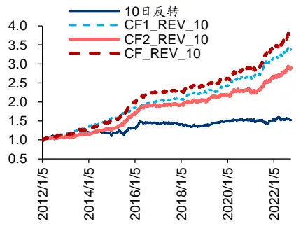
注：回测期：2012/1/5～2022/9/30，周频调仓，无交易费用。
资料来源：朝阳永续，Wind，华泰研究

中证 1000增强组合累积超额收益
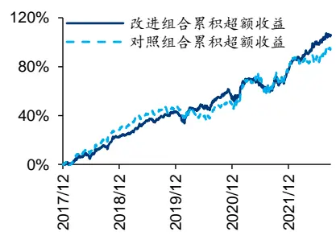
注：回测期：2018/1/2～2022/9/30，改进组合：因子池中包含分析师共同覆盖动量和反转因子，对照组合：因子池中包含传统反转因子。
资料来源：朝阳永续，Wind，华泰研究

## 分析师共同覆盖：从股票直接关联到间接关联

在华泰金工前期报告《分析师共同覆盖因子与图神经网络》(2022.7.7)中，我们借鉴论文Shared analyst coverage: Unifying momentum spillover effect (Ali and Hirshleifer, 2019)，基于分析师共同覆盖构建了 A 股市场上市公司的邻接矩阵，以此来刻画公司间的基本面关联。同时，我们通过实证研究发现，分析师共同覆盖的关联动量效应显著，对于反转、波动率、换手率等负向因子也有不错的改进效果。本篇报告中，我们同样从该论文中获得启发，将股票关联的视角从直接关联拓展到间接关联，希望挖掘到更深层次的上市公司关联信息。

## 前期研究回顾：基于分析师共同覆盖的股票直接关联

首先，我们回顾如何基于分析师共同覆盖来构建股票直接关联邻接矩阵，步骤如下：

1. 每个季度末，选取过去 6 个月的所有分析师报告，列出全部撰写报告的分析师。

2. 对于每个分析师，找到其在过去 6个月覆盖的全部上市公司，认为这些上市公司间有关联，即在邻接矩阵的相应位置加 1。

3. 针对所有分析师，重复步骤 2，即可构建每个季度末的上市公司邻接矩阵。考虑到分析师共同覆盖的数量变化不大，我们每个季度更新一次邻接矩阵。

如下图所示，我们使用截至 2022 年 6 月底的数据，计算出当前与宁德时代直接关联最强的13 家上市公司，这些公司分属三个不同的一级行业。分析师共同覆盖的上市公司具有基本面上的关联性，且这种关联性涉及多种基本面的角度，如同行业、同供应链、同地理位置、相似业务等。

图表1： 与宁德时代直接关联最强的 13家上市公司和所属行业
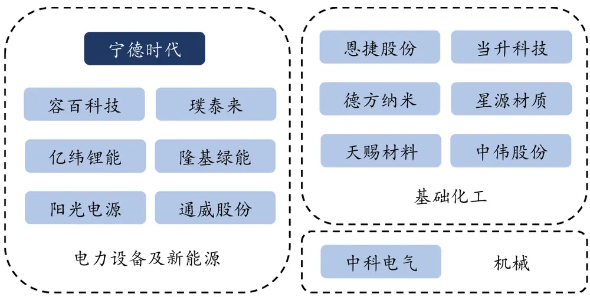
资料来源：朝阳永续，Wind，华泰研究

下图是宁德时代及其部分直接关联公司的邻接矩阵示意图，矩阵中数值表示两家上市公司间共同覆盖的分析师数量，可以表示关联的强弱。

图表2： 宁德时代及其部分直接关联公司的邻接矩阵

|  | 宁德时代 恩捷股份 |  | 亿纬锂能 | 当升科技 | 容百科技 | 璞泰来 | 隆基绿能 | 德方纳米 | 天赐材料 | 阳光电源 星源材质 |  | 中科电气派能科技通威股份 |  |  |
| --- | --- | --- | --- | --- | --- | --- | --- | --- | --- | --- | --- | --- | --- | --- |
| 宁德时代 |  | 81 | 76 | 72 | 71 | 69 | 66 | 65 | 65 | 64 | 60 | 58 | 53 | 53 |
| 恩捷股份 | 81 |  | 62 | 61 | 65 | 73 | 54 | 49 | 59 | 62 | 64 | 56 | 41 | 50 |
| 亿纬锂能 | 76 | 62 |  | 57 | 55 | 54 | 46 | 45 | 51 | 48 | 44 | 48 | 50 | 45 |
| 当升科技 | 72 | 61 | 57 |  | 58 | 55 | 44 | 37 | 50 | 43 | 49 | 45 | 33 | 41 |
| 容百科技 | 71 | 65 | 55 | 58 |  | 56 | 41 | 56 | 47 | 48 | 49 | 39 | 36 | 39 |
| 璞泰来 | 69 | 73 | 54 | 55 | 56 |  | 47 | 46 | 51 | 44 | 45 | 54 | 35 | 41 |
| 隆基绿能 | 66 | 54 | 46 | 44 | 41 | 47 |  | 29 | 36 | 77 | 32 | 36 | 32 | 81 |
| 德方纳米 | 65 | 49 | 45 | 37 | 56 | 46 | 29 |  | 45 | 37 | 41 | 39 | 31 | 28 |
| 天赐材料 | 65 | 59 | 51 | 50 | 47 | 51 | 36 | 45 |  | 39 | 48 | 42 | 34 | 33 |
| 阳光电源 | 64 | 62 | 48 | 43 | 48 | 44 | 77 | 37 | 39 |  | 40 | 36 | 37 | 71 |
| 星源材质 | 60 | 64 | 44 | 49 | 49 | 45 | 32 | 41 | 48 | 40 |  | 41 | 26 | 30 |
| 中科电气 | 58 | 56 | 48 | 45 | 39 | 54 | 36 | 39 | 42 | 36 | 41 |  | 29 | 31 |
| 派能科技 | 53 | 41 | 50 | 33 | 36 | 35 | 32 | 31 | 34 | 37 | 26 | 29 |  | 31 |
| 通威股份 | 53 | 50 | 45 | 41 | 39 | 41 | 81 | 28 | 33 | 71 | 30 | 31 | 31 |  |

资料来源：朝阳永续，华泰研究

## 股票间接关联：更深入地挖掘上市公司间的基本面联系

在分析师共同覆盖的视角下，如果公司 A与公司 B被相同的分析师覆盖，则 A与 B存在直接关联。如果公司 A 与公司 B 直接关联，公司 B 与公司 C 直接关联，但公司 A 与公司 C不直接关联，那么 A与 C即为间接关联，这意味着 C可能也会对 A产生潜在的影响。

Ali and Hirshleifer (2019)从三个方面讨论了间接关联可能产生的效应：

1. 间接关联较为隐蔽，不容易被投资者察觉，并且间接关联的数量远超直接关联，想要完全覆盖和利用间接关联公司的信息也存在困难，这意味着间接关联具有较大的挖掘潜力。

2. 对于那些分析师覆盖数量较少(或直接关联较少)的公司，间接关联造成的股价领先滞后效应可能会更显著。

3. 间接关联经过多层连接，其领先滞后效应有所衰减，可能不如直接关联那么显著。

## 间接关联强度的计算

本文的间接关联强度计算方式并不复杂，如果两家公司通过越多的“中间公司”(中间公司分别与这两家公司直接关联)形成间接关联，与“中间公司”的关联强度越大，那么这两家公司的间接关联强度就越高。由此我们构建了如下的间接关联强度计算方式：

$$
\mathbf{m}_{\mathrm{ij}}=\sum_{\mathrm{k}=1}^{\mathrm{N}}\log(\mathrm{n}_{\mathrm{ik}}+1)\times\log(\mathrm{n}_{\mathrm{kj}}+1)
$$

其中，mij表示公司 i 和公司 j 的间接关联强度（i ≠ j），N 表示所有的上市公司数量，nik表示公司 i和公司 k 之间共同覆盖的分析师数量。

重复以上步骤可以计算任意两家公司之间的间接关联强度，得到间接关联邻接矩阵。需要注意的是，如果两家公司已形成直接关联，就不需要考虑更复杂的间接关联，将它们之间的间接关联强度置为 0。下方为间接关联计算的示意图。

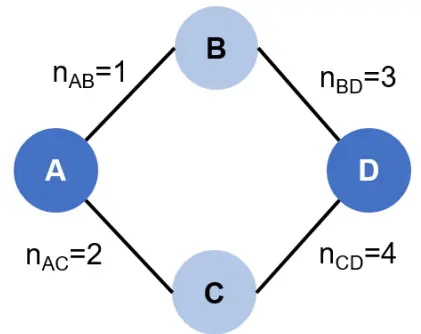

图表3： 间接关联强度的计算方式
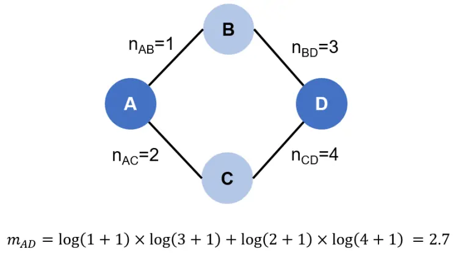
资料来源：华泰研究

根据间接关联邻接矩阵，我们找到与宁德时代间接关联强度最高的10家公司，如下图所示。这些公司的行业分布更加分散，与宁德时代的关系也较为隐蔽。比如，精测电子是一家平面显示信号测试技术的研究、开发、生产与销售为一体的高新技术企业，2021 年 1 月公司在深交所互动易平台上披露，公司已进入宁德时代的供应链，自研产品均有送样测试。

图表4： 与宁德时代间接关联强度最高的 10家上市公司
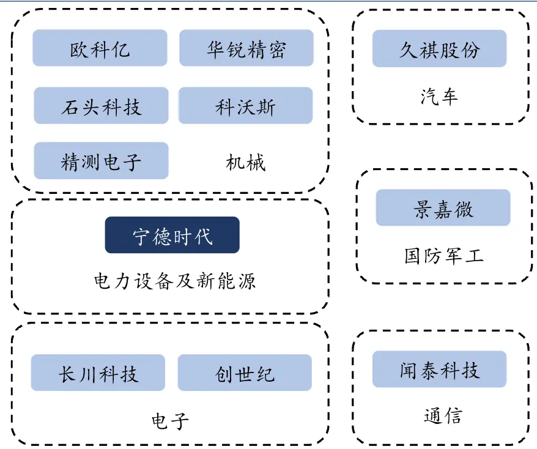
资料来源：朝阳永续，Wind，华泰研究

下图是宁德时代及其部分间接关联公司的邻接矩阵示意图，矩阵中的数值表示两家上市公司间接关联的强弱。

图表5： 宁德时代及其部分间接关联公司的邻接矩阵

|  | 宁德时代 | 长川科技 | 欧科亿 | 石头科技 | 华测导航 | 华锐精密 | 久祺股份 | 炬光科技 | 普源精电-U | 力量钻石 | 航天宏图 |
| --- | --- | --- | --- | --- | --- | --- | --- | --- | --- | --- | --- |
| 宁德时代 |  | 522.45 | 490.05 | 460.10 | 430.45 | 415.68 | 410.72 | 405.46 | 401.96 | 393.55 | 389.54 |
| 长川科技 | 522.45 |  | 0.00 | 0.00 | 0.00 | 0.00 | 203.08 | 0.00 | 0.00 | 0.00 | 0.00 |
| 欧科亿 | 490.05 | 0.00 |  | 0.00 | 0.00 | 0.00 | 0.00 | 0.00 | 0.00 | 0.00 | 0.00 |
| 石头科技 | 460.10 | 0.00 | 0.00 |  | 0.00 | 0.00 | 0.00 | 0.00 | 0.00 | 0.00 | 0.00 |
| 华测导航 | 430.45 | 0.00 | 0.00 | 0.00 |  | 0.00 | 0.00 | 0.00 | 0.00 | 0.00 | 0.00 |
| 华锐精密 | 415.68 | 0.00 | 0.00 | 0.00 | 0.00 |  | 0.00 | 0.00 | 0.00 | 0.00 | 0.00 |
| 久祺股份 | 410.72 | 203.08 | 0.00 | 0.00 | 0.00 | 0.00 |  | 174.23 | 171.09 | 0.00 | 145.48 |
| 炬光科技 | 405.46 | 0.00 | 0.00 | 0.00 | 0.00 | 0.00 | 174.23 |  | 0.00 | 206.00 | 0.00 |
| 普源精电-U | 401.96 | 0.00 | 0.00 | 0.00 | 0.00 | 0.00 | 171.09 | 0.00 |  | 0.00 | 0.00 |
| 力量钻石 | 393.55 | 0.00 | 0.00 | 0.00 | 0.00 | 0.00 | 0.00 | 206.00 | 0.00 |  | 0.00 |
| 航天宏图 | 389.54 | 0.00 | 0.00 | 0.00 | 0.00 | 0.00 | 145.48 | 0.00 | 0.00 | 0.00 |  |

资料来源：朝阳永续，华泰研究

## A股中直接关联与间接关联的描述性统计

使用截至2022年6月底的数据进行统计，A股市场中共有229,739对直接关联和2,170,928对间接关联。对于有分析师覆盖的公司，平均每家公司会与 180 家公司直接关联，与 1700家左右的公司形成间接关联。这既说明间接关联中可能蕴含丰富的信息，也暗示着间接关联更难被市场完全利用，挖掘潜力较大。

图表6： 平均每家公司直接关联、间接关联的公司数量
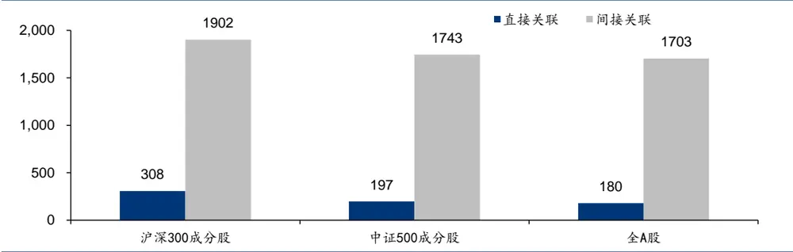
资料来源：朝阳永续，Wind，华泰研究

社会科学领域有个著名的小世界现象，又称六度空间理论，是指地球上任何两个陌生人最多通过六个中间人就可以建立联系，股票市场中是否也存在类似的小世界现象呢？

基于分析师共同覆盖的邻接矩阵，我们使用 Floyd-Warshall 算法计算任意两只股票间的最短路径，下图为所有最短路径的分布，可知一层间接关联(最短路径为2)是数量最多的关联，两层间接关联的数量次之，直接关联的数量排第三。任意两家上市公司最多只需要五层关联就可以建立联系，这与小世界现象的结论相符。

图表7： 最短路径分布
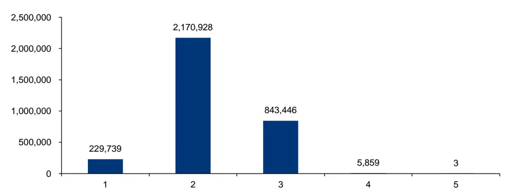
资料来源：朝阳永续，华泰研究

## 基于分析师共同覆盖的间接关联和多层关联动量因子

前文我们完成了直接和间接关联邻接矩阵的构建。间接关联的动量效应如何，能否提升直接关联的选股效果，是本章的重点。

## 间接关联和多层关联动量因子的构建

## 直接关联动量因子

首先我们参照《分析师共同覆盖因子与图神经网络》(2022.7.7)的做法，构建直接关联动量因子 CF1_RET。

$$
\mathrm{CF1\_RET_i}=\frac{\sum_{\mathrm{j}=1}^{\mathrm{N}}\log(\mathrm{n_{ij}}+1)\mathrm{ReLU_j}}{\sum_{\mathrm{j}=1}^{\mathrm{N}}\log(\mathrm{n_{ij}}+1)}
$$

其中 $\mathsf{n}_{\mathsf{ij}}$ 为股票 i和股票j的共同覆盖分析师数量， $\mathsf{Retj}$ 为股票j 过去一段时间的收益率。

## 间接关联动量因子

然后我们构建间接关联动量因子 CF2_RET。

$$
\mathbf{m}_{\mathrm{ij}}=\sum_{\mathrm{k}=1}^{\mathrm{N}}\log(\mathrm{n}_{\mathrm{ik}}+1)\times\log(\mathrm{n}_{\mathrm{kj}}+1)
$$

$$
\mathrm{CF2\_RET_i}=\frac{\sum_{\mathrm{j}=1}^{\mathrm{N}}\mathrm{m_{ij}}\times\mathrm{ReLU_j}}{\sum_{\mathrm{j}=1}^{\mathrm{N}}\mathrm{m_{ij}}}
$$

其中 $\mathsf{m}_{\mathsf{ij}}$ 是公司 i 和公司 j 的间接关联强度。

## 改进的间接关联动量因子

根据 Ali and Hirshleifer (2019)的论证，如果一家公司有很多直接关联公司，市场难以迅速整合所有关联公司的信息，这种情况下直接关联具有显著的领先滞后效应，而间接关联效果较弱。相反，如果一家公司的直接关联公司很少，那么信息传播效率较高，直接关联公司的信息会快速反映到股价上，此时进一步挖掘间接关联信息可能更有效。因此，我们可以对间接关联强度加以改进，得到改进的间接关联动量因子 ADJ_CF2_RET。

$$
\begin{aligned}\mathbf{m}_{ij}=\sum_{k=1}^{N}\log(\mathbf{n}_{ik}+1)\times\log(\mathbf{n}_{kj}+1)\\\mathbf{m}_{ij}=\frac{\mathbf{m}_{ij}}{\log(\mathbf{n}_{u}+1)}\\ADJ\_CF2\_RET_{i}=\frac{\sum_{j=1}^{N}\mathbf{m}_{ij}\times Return_{j}}{\sum_{j=1}^{N}\mathbf{m}_{ij}}\end{aligned}
$$

第二个式子中 numi表示与公司 i直接关联的公司数量，即间接关联强度与直接关联数量的对数成反比。

## 多层关联动量因子

最后，我们将直接关联动量因子 CF1_RET 和改进的间接关联动量因子 ADJ_CF2_RET 进行截面 Z_SCORE 标准化后等权合成，得到多层关联动量因子 CF_RET。

$$
\mathsf{CF\_RET}=\mathsf{Z\_SCORE(CF1\_RET)}+\mathsf{Z\_SCORE(ADJ\_CF2\_RET)}
$$

## 关联动量因子测试

本节将测试以下四个因子：

1. CF1_RET_n：基于分析师共同覆盖的直接关联动量因子，使用股票过去 n天的收益率计算关联动量。

2. CF2_RET_n：基于不加改进的间接关联强度计算的间接关联动量因子，使用股票过去n 天的收益率计算关联动量。

3. ADJ_CF2_RET_n：基于改进后的间接关联强度计算的改进间接关联动量因子，使用股票过去 n天的收益率计算关联动量。

4. CF_RET_n：基于直接关联和改进间接关联动量因子等权合成的多层关联动量因子，使用股票过去 n天的收益率计算关联动量。

## 因子覆盖度

分析师共同覆盖关联动量因子的样本空间都是全 A股中有分析师覆盖的股票。因子覆盖度如下图所示，整个区间内全 A股平均覆盖度为 70%左右，最高时接近 90%。

图表8： 因子覆盖度
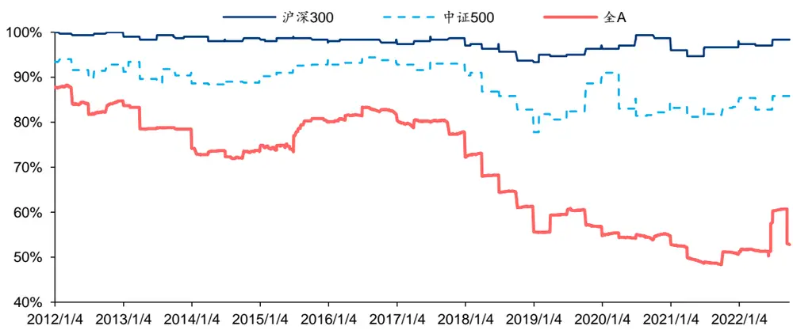
资料来源：朝阳永续，Wind，华泰研究

## 单因子测试方法

1． 股票池：具有分析师覆盖的全部 A 股，剔除 ST、PT 股票，剔除每个截面期下一交易日停牌的股票。

2． 回测区间：2012/1/5～2022/9/30。

3． 调仓周期：测试日频、周频调仓下因子的表现，即调仓周期分别为 1 个、5 个交易日。由于日频、周频调仓时组合换手率较高，交易费用对回测影响很大，因此我们将展示因子在有无交易费用情况下的测试结果。

5． 测试方法：IC 值分析，因子分 5 层测试，分层测试中交易费用为单边千分之二。进行因子相关性分析。

## 日频调仓的单因子测试结果

从图表 9~图表 13 可得以下结论：

1. 从 TOP组合年化超额收益率来看，改进的间接关联动量因子 ADJ_CF2_RET_n 表现优于未改进的间接关联动量因子 CF2_RET_n，说明改进是有效的。

2. 从 TOP组合年化超额收益率来看，多层关联动量因子 CF_RET_n 表现最好，说明综合利用直接关联和间接关联的信息能进一步提升因子的表现。

3. 多层关联动量因子 CF_RET_n 的分层回测区分度较好，但受交易费用影响很大，无法作为单因子来直接选股，可将因子加入组合并控制组合换手率来缓解这个问题，我们将在后续的指数增强组合测试中进行说明。

图表9： 各因子分 5层测试 TOP组合净值除以基准净值，无交易费用
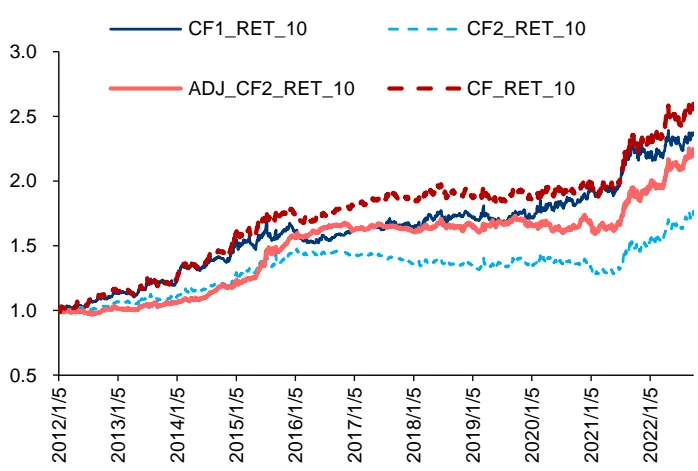
注：回测期：2012/1/5～2022/9/30
资料来源：朝阳永续，Wind，华泰研究

图表10： 各因子分 5层测试 TOP组合净值除以基准净值，无交易费用
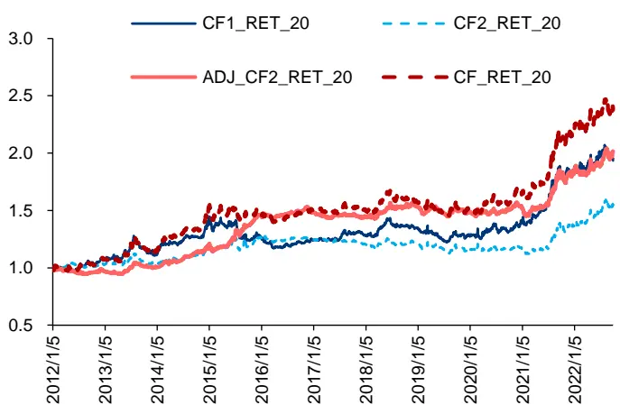
注：回测期：2012/1/5～2022/9/30
资料来源：朝阳永续，Wind，华泰研究

图表11： CF_RET_10分层组合 1~5净值除以基准净值，无交易费用
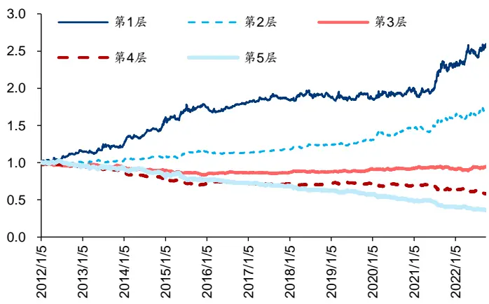
注：回测期：2012/1/5～2022/9/30
资料来源：朝阳永续，Wind，华泰研究

图表12： CF_RET_10分层组合 1~5净值除以基准净值，有交易费用
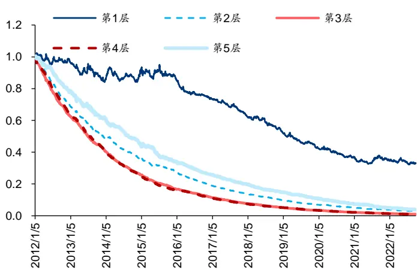
注：回测期：2012/1/5～2022/9/30
资料来源：朝阳永续，Wind，华泰研究

图表13： 因子的 IC 值分析和分层回测结果汇总(因子进行行业、市值中性，无交易费用)

|  | RankIC 均值 | RankIC 标准差 | IC_IR | IC>0 占比 | TOP 组合年化超额收益率 TOP 组合信息比率 TOP 组合胜率 TOP 组合换手率 |  |  |  |
| --- | --- | --- | --- | --- | --- | --- | --- | --- |
| CF1_RET_10 | 0.27% | 13.50% | 0.02 | 50.98% | 8.56% | 1.00 | 62.02% | 41.58% |
| CF2_RET_10 | 0.36% | 10.92% | 0.03 | 50.86% | 5.47% | 0.83 | 58.14% | 42.30% |
| ADJ_CF2_RET_10 | 0.70% | 10.01% | 0.07 | 53.47% | 8.03% | 1.37 | 60.47% | 41.01% |
| CF_RET_10 | 0.40% | 12.94% | 0.03 | 51.47% | 9.52% | 1.19 | 58.91% | 41.10% |
| CF1_RET_20 | 0.08% | 14.08% | 0.01 | 49.64% | 6.55% | 0.73 | 59.69% | 29.20% |
| CF2_RET_20 | 0.23% | 11.15% | 0.02 | 52.13% | 4.23% | 0.63 | 58.91% | 29.95% |
| ADJ_CF2_RET_20 | 0.62% | 10.18% | 0.06 | 53.20% | 6.90% | 1.15 | 61.24% | 29.83% |
| CF_RET_20 | 0.24% | 13.39% | 0.02 | 50.56% | 8.66% | 1.02 | 59.69% | 29.00% |

注：回测期：2012/1/5～2022/9/30
资料来源：朝阳永续，Wind，华泰研究

## 周频调仓的单因子测试结果

图表 14~图表 18 为周频调仓的单因子测试结果。周频调仓的结论与日频调仓基本一致，不再赘述。

图表14： 各因子分 5层测试 TOP组合净值除以基准净值，无交易费用
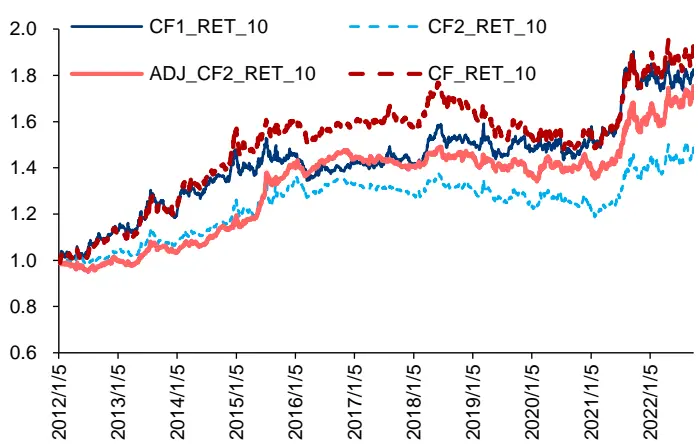
注：回测期：2012/1/5～2022/9/30
资料来源：朝阳永续，Wind，华泰研究

图表15： 各因子分 5层测试 TOP组合净值除以基准净值，无交易费用
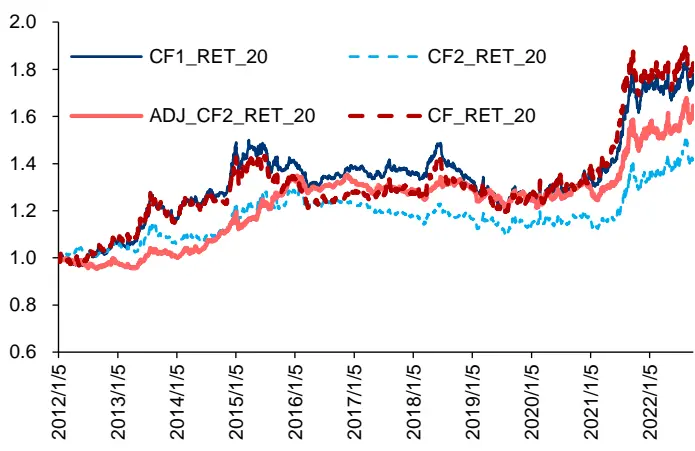
注：回测期：2012/1/5～2022/9/30
资料来源：朝阳永续，Wind，华泰研究

图表16： CF_RET_10分层组合 1~5净值除以基准净值，无交易费用
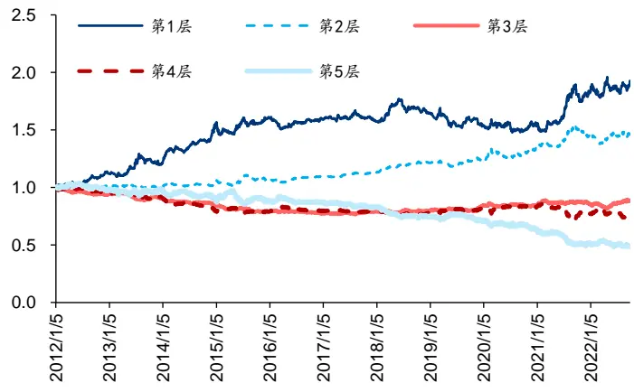
注：回测期：2012/1/5～2022/9/30
资料来源：朝阳永续，Wind，华泰研究

图表17： CF_RET_10分层组合 1~5净值除以基准净值，有交易费用
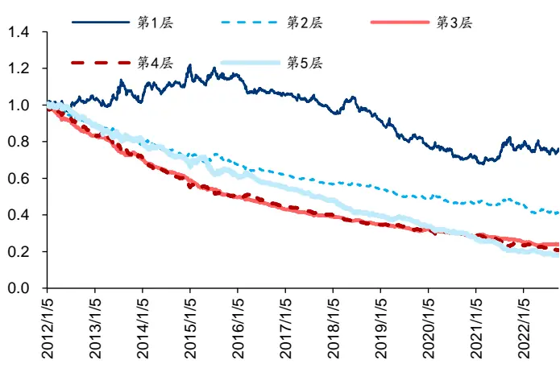
注：回测期：2012/1/5～2022/9/30
资料来源：朝阳永续，Wind，华泰研究

图表18： 因子的 IC值分析和分层回测结果汇总(因子进行行业、市值中性，无交易费用)

|  | RankIC 均值 | RankIC 标准差 | IC_IR | IC>0 占比 | TOP 组合年化超额收益率 TOP 组合信息比率 TOP 组合胜率 TOP 组合换手率 |  |  |  |
| --- | --- | --- | --- | --- | --- | --- | --- | --- |
| CF1_RET_10 | 0.97% | 13.71% | 0.07 | 55.07% | 5.91% | 0.71 | 58.14% | 96.11% |
| CF2_RET_10 | 0.67% | 11.38% | 0.06 | 52.01% | 3.75% | 0.59 | 53.49% | 96.99% |
| ADJ_CF2_RET_10 | 1.32% | 10.93% | 0.12 | 56.41% | 5.46% | 0.96 | 58.91% | 92.40% |
| CF_RET_10 | 0.99% | 13.27% | 0.07 | 54.11% | 6.43% | 0.83 | 57.36% | 93.45% |
| CF1_RET_20 | 0.51% | 13.89% | 0.04 | 52.39% | 5.60% | 0.68 | 51.16% | 68.53% |
| CF2_RET_20 | 0.35% | 11.89% | 0.03 | 53.15% | 3.49% | 0.52 | 53.49% | 70.86% |
| ADJ_CF2_RET_20 | 0.97% | 11.36% | 0.09 | 54.68% | 4.86% | 0.84 | 56.59% | 69.08% |
| CF_RET_20 | 0.41% | 14.37% | 0.03 | 53.15% | 5.89% | 0.67 | 50.39% | 69.23% |

注：回测期：2012/1/5～2022/9/30
资料来源：朝阳永续，Wind，华泰研究

## 因子相关性分析

各因子的相关性矩阵如下图所示，可知在相同的回溯周期下，直接关联动量因子CF1_RET_n 与两个间接关联动量因子 CF2_RET_n 和 ADJ_CF2_RET_n 的相关性较低；多层关联动量因子 CF_RET_n 与直接关联动量因子 CF1_RET_n 的相关性较高，说明在多层关联中，直接关联的贡献更大。

图表19： 各因子的相关性矩阵
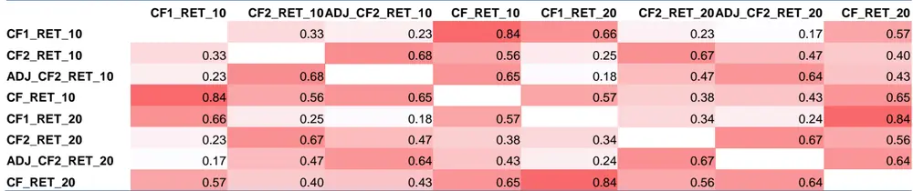
资料来源：朝阳永续，Wind，华泰研究

## 基于分析师共同覆盖的间接关联和多层关联改进反转因子

我们在报告《分析师共同覆盖因子与图神经网络》(2022.7.7)中使用基于分析师共同覆盖的直接关联来改进反转因子，取得了较好的改进效果。间接关联和多层关联能否进一步对反转因子进行改进，将是本章的重点。

## 间接关联和多层关联改进反转因子的构建

## 直接关联改进反转因子

首先我们构建直接关联改进反转因子 CF1_REV，CF1_REV 先计算直接关联动量因子CF1_RET 的 Z_SCORE 标准化和股票自身收益率的 Z_SCORE 标准化，再将二者相减。

$$
\mathrm{CF1\_RET_i}=\frac{\sum_{\mathrm{j}=1}^{\mathrm{N}}\log(\mathrm{n_{ij}}+1)\mathrm{ReLU_j}}{\sum_{\mathrm{j}=1}^{\mathrm{N}}\log(\mathrm{n_{ij}}+1)}
$$

$$
\mathsf{CF1\_REV}=\mathsf{Z\_SCORE(CF1\_RET)}-\mathsf{Z\_SCORE(Ret)}
$$

该因子的通俗理解方式为：我们在考虑股票自身反转效应的基础上，进一步考虑与之直接关联股票的动量效应，即前期自身跌幅较大，但关联股票涨幅较大的股票，因子取值较大。该因子描述了股价的领先滞后效应，并体现了股价的均值回复现象。

## 间接关联改进反转因子

接下来我们构建间接关联改进反转因子 CF2_REV，CF2_REV先计算改进的间接关联动量因子 ADJ_CF2_RET 的 Z_SCORE 标准化和股票自身收益率的 Z_SCORE 标准化，再将二者相减。

$$
\mathbf{m}_{\mathrm{ij}}=\sum_{\mathrm{k}=1}^{\mathrm{N}}\log(\mathrm{n}_{\mathrm{ik}}+1)\times\log(\mathrm{n}_{\mathrm{kj}}+1)
$$

$$
\mathrm{m_{ij}}=\frac{\mathrm{m_{ij}}}{\log(\mathrm{num_{i}}+1)}
$$

$$
\mathrm{ADJ\_CF2\_RET_i}=\frac{\sum_{j=1}^{N}\mathrm{m_{ij}}\times\mathrm{ReLU_j}}{\sum_{j=1}^{N}\mathrm{m_{ij}}}
$$

$$
\mathsf{CF2\_REV}=\mathsf{Z\_SCORE(ADJ\_CF2\_RET)-Z\_SCORE(Ret)}
$$

## 多层关联改进反转因子

最后，将直接关联改进反转因子和间接关联改进反转因子等权合成，即可得到多层关联改进反转因子 CF_REV。

$$
\mathrm{CF\_REV}=\mathrm{CF1\_REV}+\mathrm{CF2\_REV}
$$

## 基于分析师共同覆盖的改进反转因子测试

本节将测试以下三个因子：

1. CF1_REV_n：基于分析师共同覆盖的直接关联改进反转因子，使用股票过去 n 天的收益率计算自身反转和关联动量。

2. CF2_REV_n：基于分析师共同覆盖的间接关联改进反转因子，使用股票过去 n 天的收益率计算自身反转和关联动量。

3. CF_REV_n：基于分析师共同覆盖的多层关联改进反转因子，使用股票过去 n天的收益率计算自身反转和关联动量。

## 单因子测试方法

1． 股票池：具有分析师覆盖的全部 A 股，剔除 ST、PT 股票，剔除每个截面期下一交易日停牌的股票。

2． 回测区间：2012/1/5～2022/9/30。

3． 调仓周期：测试日频、周频调仓下因子的表现，即调仓周期分别为 1 个、5 个交易日。由于日频、周频调仓时组合换手率较高，交易费用对回测影响很大，因此我们将展示因子在有无交易费用情况下的测试结果。

5． 测试方法：IC 值分析，因子分 5 层测试，分层测试中交易费用为单边千分之二。进行因子相关性分析。

## 日频调仓的单因子测试结果

从图表 20~图表 24 可得以下结论：

1. 从 TOP组合年化超额收益率来看，多层关联改进反转因子 CF_REV_n 表现最好，说明综合利用直接关联和间接关联的信息能进一步提升反转因子的改进效果。

2. 从 TOP组合年化超额收益率来看，直接关联改进反转因子 CF1_REV_n 表现优于间接关联改进反转因子，说明直接关联的改进效果更显著，这与论文 Ali and Hirshleifer(2019)的结论一致。

3. 多层关联改进反转因子 CF_REV_n 的分层回测区分度较好，但受交易费用影响很大，无法作为单因子来直接选股，可将因子加入组合并控制组合换手率来缓解这个问题，我们将在后续的指数增强组合测试中进行说明。

图表20： 各因子分 5层测试 TOP组合净值除以基准净值，无交易费用
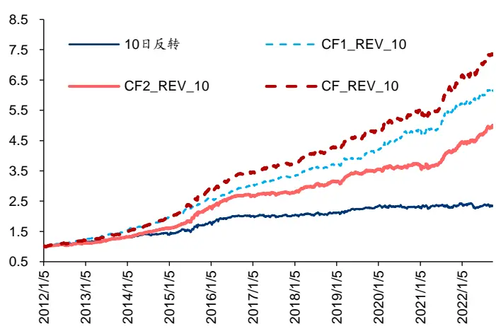
注：回测期：2012/1/5～2022/9/30
资料来源：朝阳永续，Wind，华泰研究

图表21： 各因子分 5层测试 TOP组合净值除以基准净值，无交易费用
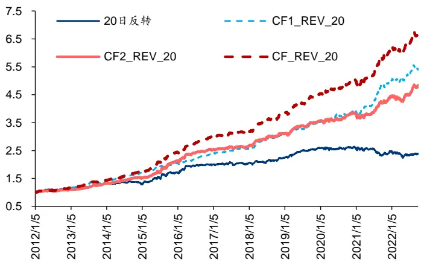
注：回测期：2012/1/5～2022/9/30
资料来源：朝阳永续，Wind，华泰研究

图表22： CF_REV_10分层组合 1~5净值除以基准净值，无交易费用
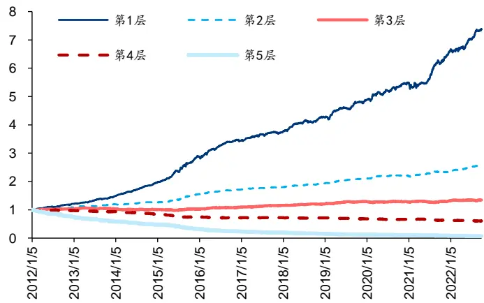
注：回测期：2012/1/5～2022/9/30
资料来源：朝阳永续，Wind，华泰研究

图表23： CF_REV_10分层组合 1~5净值除以基准净值，有交易费用
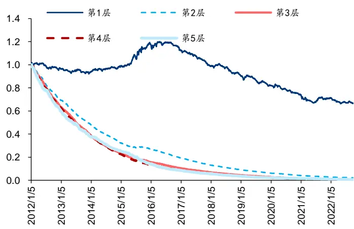
注：回测期：2012/1/5～2022/9/30资料来源：朝阳永续，Wind，华泰研究

图表24： 因子的 IC值分析和分层回测结果汇总(因子进行行业、市值中性，无交易费用)

|  | RankIC 均值 | RankIC 标准差 | IC_IR | IC>0 占比 | TOP 组合年化超额收益率 TOP 组合信息比率 TOP 组合胜率 TOP 组合换手率 |  |  |  |
| --- | --- | --- | --- | --- | --- | --- | --- | --- |
| 10 日反转 | 3.39% | 15.96% | 0.21 | 59.52% | 9.12% | 1.22 | 65.89% | 50.00% |
| CF1_REV_10 | 2.95% | 8.07% | 0.37 | 64.69% | 19.43% | 4.38 | 86.82% | 46.43% |
| CF2_REV_10 | 3.21% | 11.07% | 0.29 | 63.08% | 17.19% | 3.23 | 81.40% | 47.66% |
| CF_REV_10 | 3.43% | 9.65% | 0.36 | 65.03% | 21.70% | 4.55 | 83.72% | 47.80% |
| 20 日反转 | 3.29% | 16.48% | 0.20 | 58.22% | 9.21% | 1.18 | 65.12% | 36.24% |
| CF1_REV_20 | 2.71% | 7.87% | 0.34 | 63.77% | 17.88% | 4.01 | 82.95% | 33.35% |
| CF2_REV_20 | 3.07% | 11.25% | 0.27 | 60.28% | 16.83% | 3.06 | 82.17% | 34.66% |
| CF_REV_20 | 3.25% | 9.58% | 0.34 | 64.50% | 20.38% | 4.34 | 84.50% | 34.73% |

注：回测期：2012/1/5～2022/9/30
资料来源：朝阳永续，Wind，华泰研究

## 周频调仓的单因子测试结果

图表 25~图表 29 为周频调仓的单因子测试结果。周频调仓的结论与日频调仓基本一致，不再赘述。

图表25： 各因子分 5层测试 TOP组合净值除以基准净值，无交易费用
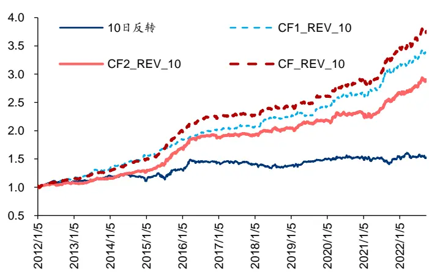
注：回测期：2012/1/5～2022/9/30
资料来源：朝阳永续，Wind，华泰研究

图表26： 各因子分 5层测试 TOP组合净值除以基准净值，无交易费用
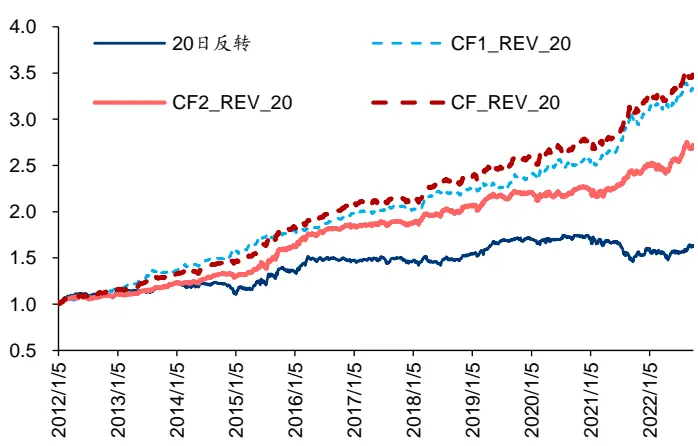
注：回测期：2012/1/5～2022/9/30
资料来源：朝阳永续，Wind，华泰研究

图表27： CF_REV_10分层组合 1~5净值除以基准净值，无交易费用
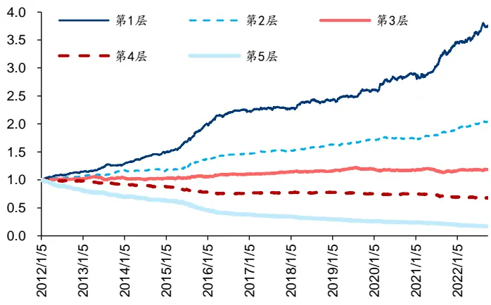
注：回测期：2012/1/5～2022/9/30
资料来源：朝阳永续，Wind，华泰研究

图表28： CF_REV_10分层组合 1~5净值除以基准净值，有交易费用
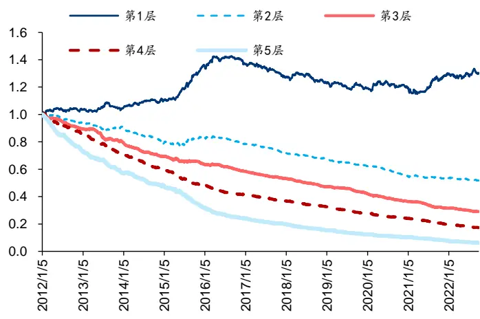
注：回测期：2012/1/5～2022/9/30
资料来源：朝阳永续，Wind，华泰研究

图表29： 因子的 IC值分析和分层回测结果汇总(因子进行行业、市值中性，无交易费用)

|  | RankIC 均值 | RankIC 标准差 | IC_IR | IC>0 占比 | TOP 组合年化超额收益率 TOP 组合信息比率 TOP 组合胜率 TOP 组合换手率 |  |  |  |
| --- | --- | --- | --- | --- | --- | --- | --- | --- |
| 10 日反转 | 3.85% | 15.71% | 0.25 | 58.32% | 4.48% | 0.63 | 58.14% | 110.56% |
| CF1_REV_10 | 4.02% | 8.05% | 0.50 | 70.17% | 12.69% | 3.02 | 74.42% | 104.90% |
| CF2_REV_10 | 4.15% | 11.00% | 0.38 | 65.20% | 11.11% | 2.30 | 72.87% | 104.64% |
| CF_REV_10 | 4.55% | 9.62% | 0.47 | 70.94% | 13.89% | 3.23 | 78.29% | 105.96% |
| 20 日反转 | 4.44% | 16.07% | 0.28 | 57.55% | 5.15% | 0.70 | 52.71% | 81.66% |
| CF1_REV_20 | 4.01% | 7.97% | 0.50 | 66.92% | 12.45% | 2.91 | 74.42% | 76.66% |
| CF2_REV_20 | 4.33% | 11.33% | 0.38 | 61.95% | 10.45% | 2.12 | 71.32% | 78.02% |
| CF_REV_20 | 4.65% | 9.69% | 0.48 | 67.11% | 13.08% | 3.05 | 78.29% | 78.35% |

注：回测期：2012/1/5～2022/9/30
资料来源：朝阳永续，Wind，华泰研究

## 因子相关性分析

各因子的相关性矩阵如下图所示。

图表30： 各因子的相关性矩阵

| 10 日反转 |  | CF1_REV_10 CF2_REV_10 CF_REV_10 20 |  |  |  | 日反转 CF1_REV_20 CF2_REV_20 CF_REV_20 |  |  |  |  |  |  |
| --- | --- | --- | --- | --- | --- | --- | --- | --- | --- | --- | --- | --- |
| 10 日反转 |  | 0.49 | 0.70 | 0.66 | 0.64 | 0.31 | 0.45 | 0.42 |  |  |  |  |
| CF1_REV_10 |  | 0.49 |  | 0.53 | 0.86 | 0.31 | 0.65 | 0.35 |  |  |  |  |
| CF2_REV_10 |  |  |  |  |  |  |  |  |  |  |  |  |
|  | 0.70 | 0.53 |  | 0.86 | 0.46 | 0.36 | 0.64 | 0.56 |  |  |  |  |
| CF_REV_10 |  |  |  |  |  |  |  |  |  |  |  |  |
|  |  |  |  |  | 0.66 | 0.86 | 0.86 |  | 0.43 | 0.57 | 0.56 | 0.64 |
| 20 日反转 | 0.64 | 0.31 | 0.46 | 0.43 |  | 0.48 | 0.70 | 0.66 |  |  |  |  |
| CF1_REV_20 | 0.31 | 0.65 | 0.36 | 0.57 | 0.48 |  | 0.53 | 0.86 |  |  |  |  |
| CF2_REV_20 |  | 0.45 | 0.35 | 0.64 | 0.56 | 0.70 | 0.53 |  |  |  |  |  |
| CF_REV_20 | 0.42 | 0.57 | 0.56 | 0.64 | 0.66 | 0.86 | 0.86 |  |  |  |  |  |

资料来源：朝阳永续，Wind，华泰研究

## 基于分析师共同覆盖的关联事件驱动因子

分析师共同覆盖能用于价量类因子的构建和改进，那么对于事件驱动类因子，能否融入股票间关联信息进行改进呢？如下图，从直觉上来讲，A公司发生事件，可能会沿着关联关系将事件的影响传导到其直接关联和间接关联的公司，从而对关联公司的股价产生影响。本章将对关联事件驱动因子进行实证。

图表31： 事件在关联公司间传导的示意图
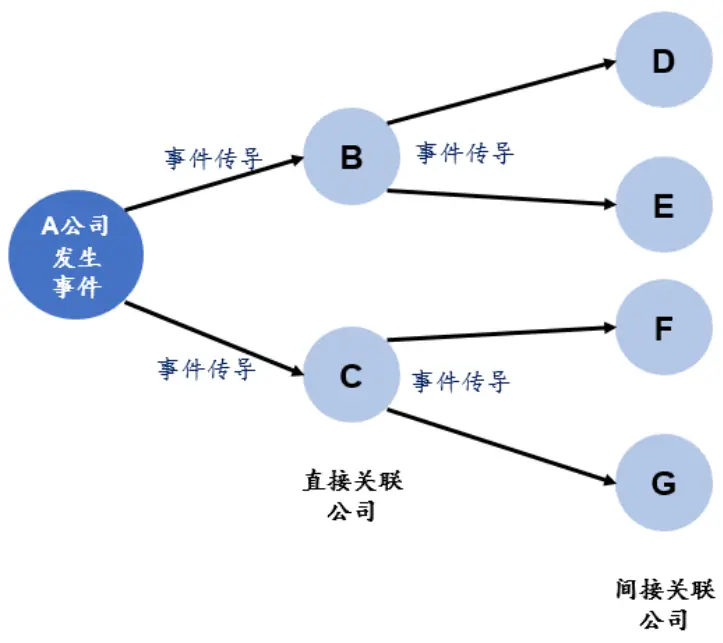
资料来源：华泰研究

## 事件因子化方法

在研究关联事件驱动因子之前，要关注的是如何对事件进行因子化。由于事件是不定期发生的，而选股因子则需要在每个时间截面上覆盖尽量多的股票，我们首先设计了一个事件因子化的方法，步骤如下：

1. 从 Wind 底层表 AShareMajorEvent 中提取出以下 20 类重大事件。

图表32： 20类重大事件

| 正面事件 | 负面事件 |
| --- | --- |
| 业绩预盈 | 业绩预警亏损 |
| 股权激励 | 被执行人 |
| 签订重大合同 | 股东拟减持股票 |
| 财政补贴 |  |
| 股东增持股票 | 股权冻结 |
| 诉讼胜诉 | 监管机构整改 |
|  | 诉讼被告方 |
| 澄清利空传闻 移出失信执行 | 失信执行 |
| 主体评级上调 | 主体评级下调 |
|  | 交易所问询函 |
|  | 会计师事务所异常变更 |
|  | 增发方案终止 |

资料来源：Wind，华泰研究

2. 另 外 我 们 也 将 机 构 调 研 视 为 事 件 ， 并 从 Wind 底 层 表 AshareISActivity 和AshareISParticipant 中构建以下 8 类机构调研事件。

图表33： 8类机构调研事件

| 证券公司资管调研 | 证券公司自营调研 |
| --- | --- |
| 基金公司调研 | 保险公司调研 |
| 投资公司调研 | 外资机构调研 |
| 证券公司调研 | 其他调研 |

资料来源：Wind，华泰研究

## 3. 按照下图的方式构建特征 X 和标签 y。

特征 X：将 20 类重大事件和 8 类机构调研数据合并得到 28 类事件数据，并统计每家公司过去 3 个月各类事件的累计发生次数，采用时间衰减处理，得到样本的特征 X。标签 y：以未来 20 个交易日的股票超额收益为标签，划分为 3类，得到标签 y。

4. 从 2014 年开始，每年初使用过去一年的数据训练 XGBoost 模型，并对当年的数据进行预测生成事件因子。每年滚动训练一次。

图表34： 事件因子化方法
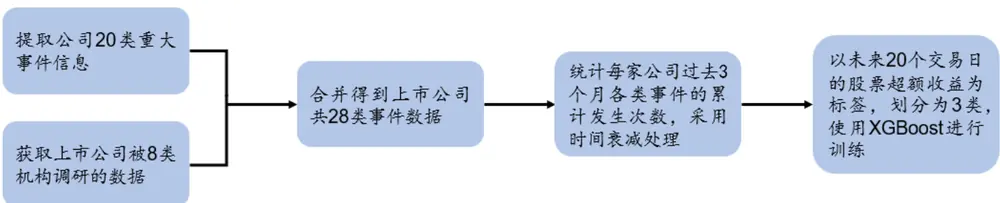

|  | 特征X |  |  |  |  |  | 标签y |
| --- | --- | --- | --- | --- | --- | --- | --- |
|  | 20类重大事件 |  |  | 8类被调研数据 |  |  |  |
|  | 业绩预盈 | 业绩预亏 | 股权激励 | 基金公司 | 证券公司 | 保险公司 |  |
| 样本1 | 2.5 | 0 | 1 | 1.6 | 0 | 0 | 2 |
|  | … |  |  | . |  | … |  |
| 样本n | 0 | 0.8 | 0 | 0 | 0 | 0.3 | 0 |

资料来源：华泰研究

## 事件因子测试

## 事件因子测试方法

1． 股票池：具有事件数据的全部 A 股，剔除 ST、PT 股票，剔除每个截面期下一交易日停牌的股票。

2． 回测区间：2014/1/3～2022/9/30。

3． 调仓周期：每隔 20 个交易日调仓。

5． 测试方法：IC值分析，因子分 5 层测试，分层测试中交易费用为单边千分之二。

## 事件因子测试结果

由图表 35~图表 37 可知，事件因子在 2017 年之前表现不佳，2017 年之后，因子多头呈现出稳定的超额收益。

图表35： 事件因子的 IC值分析和分层回测结果汇总(因子进行行业、市值中性)

|  | RankIC 均值 | RankIC 标准差 | IC_IR |  | IC>0 占比 TOP 组合年化超额收益率 TOP 组合信息比率 TOP 组合胜率 TOP 组合换手率 |  |  |  |
| --- | --- | --- | --- | --- | --- | --- | --- | --- |
| 事件因子 | 1.96% | 8.89% | 0.22 | 61.68% | 2.57% | 0.63 | 53.33% | 122.76% |
| 注：回测期：2014/1/3～2022/9/30 |  |  |  |  |  |  |  |  |

资料来源： Wind，华泰研究

图表36： 事件因子分层组合 1~5净值除以基准净值
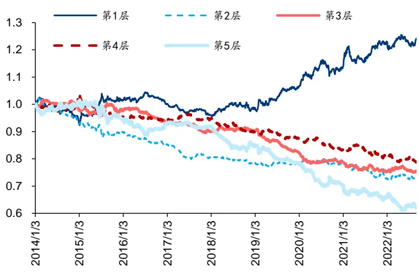
注：回测期：2014/1/3～2022/9/30
资料来源：Wind，华泰研究

图表37： 事件因子覆盖度
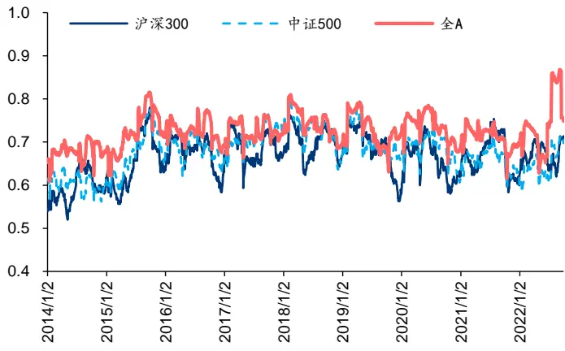
注：回测期：2014/1/3～2022/9/30
资料来源：Wind，华泰研究

## 特征重要性分析

选取 2021 年训练的模型进行特征重要性分析，可知与业绩(业绩预警亏损、业绩预警预盈)和机构调研相关的事件特征重要性靠前。

图表38： 特征重要性
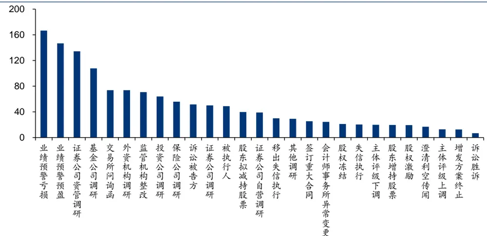
资料来源：Wind，华泰研究

## 基于分析师共同覆盖的关联事件因子构建方法

关联事件因子的构建方法与事件因子基本一致。如下图所示，我们将上市公司自身的 28 类事件数据和关联公司的 28 类事件数据进行合并，得到 56 个事件特征，即相比事件因子来说，特征 X从原先的 28 个扩充到了 56 个。后续步骤与事件因子的构造方法完全一致，不再赘述。

图表39： 基于分析师共同覆盖的关联事件因子构建方法
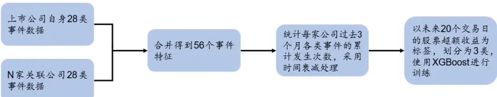

|  | 公司自身特征 N家关联公司特征 |  |  |  |  |  |  |  |  |  |  |  |  |  |  |  | 标签y |
| --- | --- | --- | --- | --- | --- | --- | --- | --- | --- | --- | --- | --- | --- | --- | --- | --- | --- |
|  | 20类重大事件 |  |  |  | 8类被调研数据 |  |  |  | 20类重大事件 |  |  |  | 8类被调研数据 |  |  |  |  |
|  | 业绩预盈 | 业绩预亏 | 股权激励 | … | 基金公司 | 证券公司 | 保险公司 |  | 业绩预盈 | 业绩预亏 | 股权激励 | … | 基金公司 | 证券公司 | 保险公司 |  |  |
| 样本1 | 2.5 | 0 | 1 |  | 1.6 | 0 | 0 |  | 3.5 | 0 | 1.2 |  | 1.8 | 0 | 0 |  | 2 |
|  | .… | a = a | .. | .… | 1 | …… | ... | = = | …. | = 1 * | t a = | a = 1 | …… | …… | .… | ± a E | . |
| 样本n | 0 | 0.8 | 0 |  | 0 | 0 | 0.3 |  | 0 | 0.9 | 0 |  | 0 | 0 | 0.4 |  | 0 |

资料来源：华泰研究

## 关联事件因子测试

## 关联事件因子测试方法

1． 股票池：具有事件数据的全部 A 股，剔除 ST、PT 股票，剔除每个截面期下一交易日停牌的股票。

2． 回测区间：2017/2/7～2022/9/30。由于事件因子在 2017 年之后才呈现出较好的选股效果，本节的测试从 2017 年之后开始。

3． 调仓周期：每隔 20 个交易日调仓。为了避免调仓的路径依赖问题，递进设置 20 条回测路径，并将 20 条回测路径的结果合并。

5． 测试方法：IC值分析，因子分 5 层测试，分层测试中交易费用为单边千分之二。

## 关联事件因子测试结果

在构建事件特征时，需要取前 N 家直接关联最紧密公司的事件来构建特征，我们分别取N=1,2,3,5,10，测试结果在图表 40~图表 42 中。可知当 N 逐渐增大时，因子的 TOP 组合年化超额收益率先增后减，当 N=3 时达到最高，而当 N=10 时因子表现最差，说明过多引入关联公司的事件信息可能带来噪声。从 RankIC 均值和 IC_IR 来看，关联事件因子相比事件因子没有提升。汇总测试结果，关联事件因子的提升较为有限。

图表40： 关联事件因子的 IC值分析和分层回测结果汇总(因子进行行业、市值中性)

|  | RankIC 均值 RankIC 标准差 |  | IC_IR |  | IC>0 占比TOP 组合年化超额收益率 TOP 组合信息比率 TOP 组合胜率 TOP 组合换手率 |  |  |  |
| --- | --- | --- | --- | --- | --- | --- | --- | --- |
| 事件因子 | 3.07% | 8.50% | 0.36 | 64.92% | 3.76% | 0.92 | 53.67% | 124.77% |
| 包含1家关联公司的事件因子 | 3.14% | 8.43% | 0.38 | 65.79% | 3.45% | 0.84 | 55.86% | 124.98% |
| 包含2家关联公司的事件因子 | 2.96% | 8.39% | 0.36 | 66.23% | 4.20% | 1.01 | 57.10% | 122.77% |
| 包含3家关联公司的事件因子 | 2.82% | 8.50% | 0.34 | 65.21% | 4.41% | 1.04 | 57.03% | 123.38% |
| 包含5家关联公司的事件因子 | 2.62% | 9.08% | 0.29 | 63.49% | 3.91% | 0.88 | 56.02% | 119.53% |
| 包含10家关联公司的事件因子 | 2.22% | 9.72% | 0.23 | 58.98% | 2.20% | 0.48 | 50.49% | 115.09% |

注：回测期：2017/2/7～2022/9/30
资料来源： Wind，华泰研究

图表41： 关联事件因子 TOP组合累积超额收益
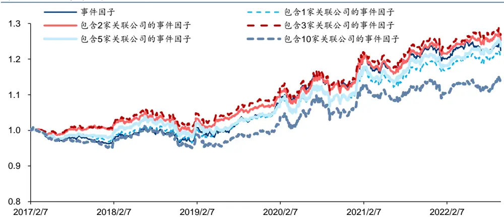
注：回测期：2017/2/7～2022/9/30
资料来源：Wind，华泰研究

图表42： 包含 3家关联公司的事件因子分层组合 1~5净值除以基准净值
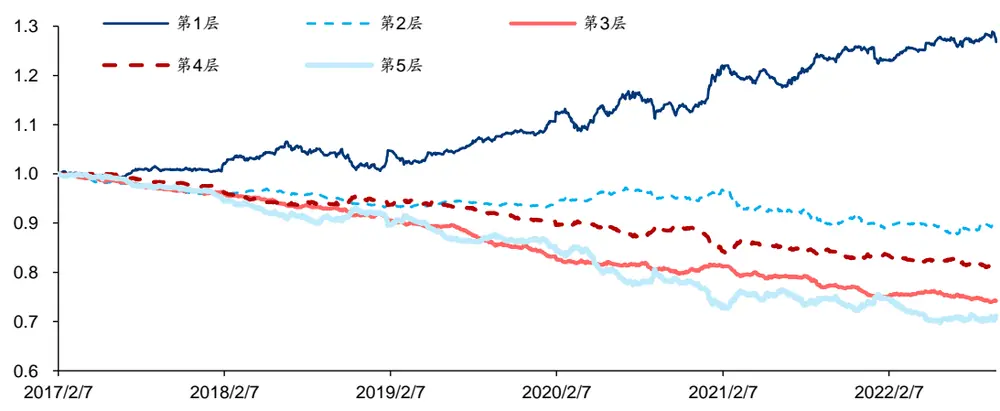
注：回测期：2017/2/7～2022/9/30
资料来源：Wind，华泰研究

## 特征重要性分析

选取 2021 年训练的模型进行特征重要性分析，图表 43~图表 44 分别展示了关联事件因子的 XGBoost 模型中，自身事件和关联公司事件的特征重要性。其中自身事件的特征重要性之和为 1774，关联公司事件的特征重要性之和为 1620，说明自身事件在模型中贡献更大。

图表43： 关联事件因子的 XGBoost模型中，自身事件的特征重要性
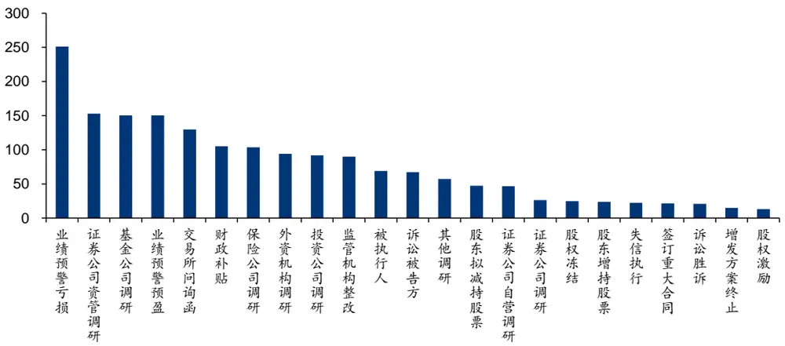
资料来源：Wind，华泰研究

图表44： 关联事件因子的 XGBoost模型中，关联公司事件的特征重要性
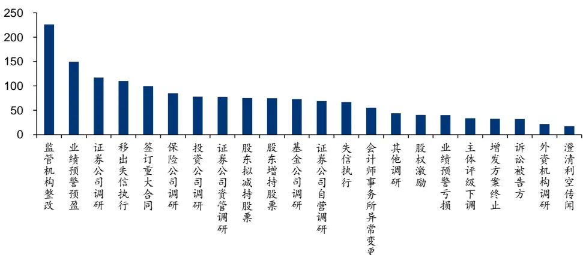
资料来源：Wind，华泰研究

注：回测期：2018/1/2～2022/9/30资料来源：朝阳永续，Wind，华泰研究

## 指数增强组合测试

本章主要讨论分析师共同覆盖因子能否改善现有指数增强组合的表现。我们将以中证 1000增强组合为例进行讨论。中证 1000 增强组合构建方法如下：

1. 因子：包含估值、成长、质量、技术、预期等因子。

2. 因子合成模型：Boosting 模型。

3. 组合构建方式：控制行业和市值暴露，个股权重偏离上限为 1%，成分股权重占比为 80%，周频调仓，周双边换手率上限为 30%，交易费用为单边千分之二，以下一个交易日的vwap 价格交易。

4. 回测区间：2018/1/2～2022/9/30。

我们构建以下两个中证 1000 增强组合进行对比：

1. 对照组合：技术因子中包含 6 个传统反转因子。

2. 改进组合：将技术因子中的 6 个传统反转因子替换为 4 个分析师共同覆盖动量和反转因子。

由图表 45~图表 47 可知，改进组合相比对照组合，在年化超额收益率、年化跟踪误差、超额收益最大回撤、信息比率、Calmar比率均有改善，实现了对标的指数更稳健的增强，体现出分析师共同覆盖动量和反转因子相比传统反转因子更优秀的选股能力。

图表45： 中证 1000增强超额收益表现
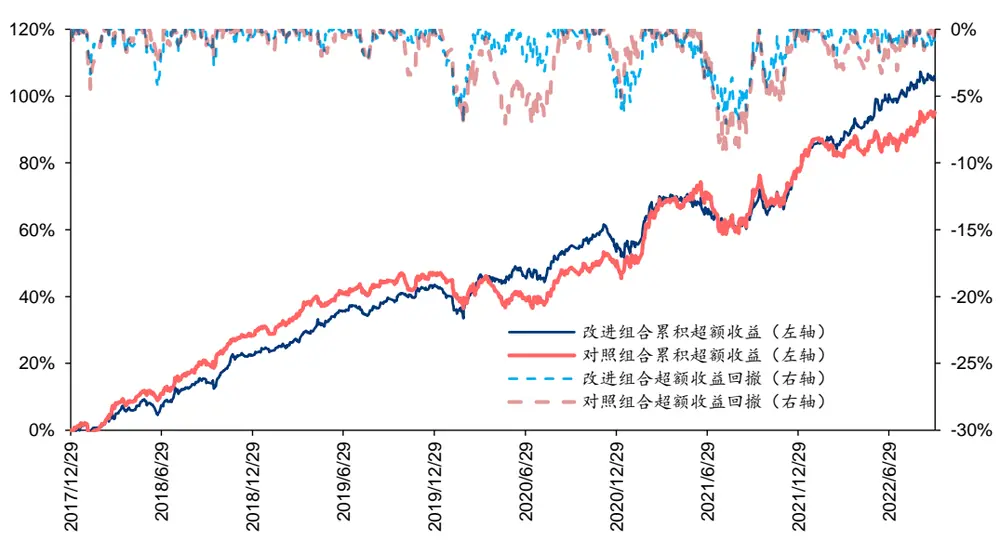

图表46： 中证 1000增强组合回测绩效

|  | 信息比 |  |  |  |  |  |  |  |  | Calmar 比相对基准月胜调仓双边 |  |  |
| --- | --- | --- | --- | --- | --- | --- | --- | --- | --- | --- | --- | --- |
|  | 年化收益率 | 年化波动率 | 夏普比率 | 最大回撤 | 年化超额收益率 | 年化跟踪误差 | 超额收益最大回撤 | 率 | 率 |  | 率 | 换手率 |
| 改进组合 | 14.31% | 24.55% | 0.58 | 35.23% | 16.92% | 7.65% | 7.05% | 2.21 | 2.40 |  | 71.93% | 27.80% |
| 对照组合 | 13.11% | 24.27% | 0.54 | 32.56% | 15.56% | 8.20% | 8.98% | 1.90 | 1.73 |  | 71.93% | 26.92% |
| 中证 1000 | -2.55% | 24.70% | -0.10 | 42.27% |  |  |  |  |  |  |  |  |

注：回测期：2018/1/2～2022/9/30
资料来源：朝阳永续，Wind，华泰研究

图表47： 中证 1000增强组合逐年收益率

|  | 2018年收益率 | 2019年收益率 | 2020年收益率 | 2021年收益率 | 2022 年收益率 |
| --- | --- | --- | --- | --- | --- |
| 改进组合 | -23.33% | 47.34% | 30.42% | 39.22% | -9.60% |
| 对照组合 | -19.51% | 43.70% | 22.71% | 45.08% | -14.26% |
| 中证1000 | -36.87% | 25.67% | 19.39% | 20.52% | -23.54% |

注：回测期：2018/1/2～2022/9/30
资料来源：朝阳永续，Wind，华泰研究

## 总结

结合前期报告《分析师共同覆盖因子与图神经网络》(2022.7.7)，我们通过两篇报告系统梳理了如何在量化投资中使用股票间关联信息的方法论，该方法论也值得在其他股票关联类数据(如产业链、供应链数据)上尝试。本文总结如下：

1. 分析师共同覆盖间接关联可对直接关联信息进行补充，具有较大挖掘潜力。Ali andHirshleifer (2019)中关于分析师共同覆盖的研究认为，股票间接关联的特点有：(1)间接关联较为隐蔽，不容易被投资者察觉，并且间接关联的数量远远超过直接关联，想要完全覆盖和利用间接关联公司的信息也存在困难，这意味着间接关联具有较大的挖掘潜力。(2)对于那些分析师覆盖数量较少(或直接关联较少)的公司，间接关联造成的股价领先滞后效应可能会更显著。(3)间接关联经多层连接，其领先滞后效应有所衰减，可能不如直接关联显著。

2. 分析师共同覆盖间接关联可进一步改进反转因子的效果。本文进一步完善了基于分析师共同覆盖的改进反转因子，其含义是前期自身跌幅较大，但关联股票涨幅较大的股票因子取值较大，是均值回复现象的表现。基于分析师共同覆盖间接关联，本文首先构建了间接关联改进反转因子 CF2_REV，CF2_REV 能改进传统反转因子的选股效果。本文进一步将直接关联改进反转因子CF1_REV和CF2_REV合成得到多层关联改进反转因子 CF_REV，CF_REV 在日频和周频调仓的多头组合超额收益都表现最好，相比传统反转因子有较大提升。

3. 基于关联事件驱动的逻辑，可利用分析师共同覆盖改进事件因子。股票市场中，A公司发生事件，可能会沿着关联关系将事件的影响传导到其关联的公司，从而对关联公司的股价产生影响，本文基于分析师共同覆盖来构建关联事件因子。在原有事件因子化模型的基础上，我们选取前 N 家直接关联最紧密公司的事件来构建特征，融入关联公司的信息。当 N 逐渐增大时，因子的 TOP 组合年化超额收益率先增后减，当 N=3 时达到最高，而当 N=10时因子表现最差，说明过多引入关联公司的事件信息可能带来噪声。从RankIC 均值和 IC_IR 来看，关联事件因子相比事件因子没有提升。汇总测试结果，关联事件因子的提升较为有限。

4. 分析师共同覆盖关联动量和改进反转因子可提升中证 1000 增强组合的表现。基于原有的多因子中证 1000 增强模型，本文构建以下两个中证 1000 增强组合进行对比：(1)对照组合：技术因子中包含 6 个传统反转因子。(2)改进组合：将技术因子中的 6 个传统反转因子替换为 4 个分析师共同覆盖动量和反转因子。2018 年以来，改进组合相比对照组合年化超额收益率从15.56%提升至16.92%，信息比率从1.90提升至2.21，Calmar比率从 1.73 提升至 2.40，年化跟踪误差、超额收益最大回撤均有改善，实现了对标的指数更稳健的增强，体现出分析师共同覆盖动量和反转因子相比传统反转因子更优秀的选股能力。

## 参考文献

Ali, Usman, and David Hirshleifer. “Shared Analyst Coverage: Unifying Momentum Spillover Effects.” Journal of Financial Economics forthcoming (2019).

## 风险提示

因子测试和机器学习模型是历史经验的总结，存在失效可能。本文测试的股票池仅包含有分析师覆盖的 A股，测试结论不能推广到全 A股。高频调仓受交易费用影响较大。

## 免责声明

## 分析师声明

本人，林晓明、李子钰、何康，兹证明本报告所表达的观点准确地反映了分析师对标的证券或发行人的个人意见；彼以往、现在或未来并无就其研究报告所提供的具体建议或所表迖的意见直接或间接收取任何报酬。

## 一般声明及披露

本报告由华泰证券股份有限公司（已具备中国证监会批准的证券投资咨询业务资格，以下简称“本公司”）制作。本报告所载资料是仅供接收人的严格保密资料。本报告仅供本公司及其客户和其关联机构使用。本公司不因接收人收到本报告而视其为客户。

本报告基于本公司认为可靠的、已公开的信息编制，但本公司及其关联机构(以下统称为“华泰”)对该等信息的准确性及完整性不作任何保证。

本报告所载的意见、评估及预测仅反映报告发布当日的观点和判断。在不同时期，华泰可能会发出与本报告所载意见、评估及预测不一致的研究报告。同时，本报告所指的证券或投资标的的价格、价值及投资收入可能会波动。以往表现并不能指引未来，未来回报并不能得到保证，并存在损失本金的可能。华泰不保证本报告所含信息保持在最新状态。华泰对本报告所含信息可在不发出通知的情形下做出修改，投资者应当自行关注相应的更新或修改。

本公司不是 FINRA 的注册会员，其研究分析师亦没有注册为 FINRA 的研究分析师/不具有 FINRA 分析师的注册资格。

华泰力求报告内容客观、公正，但本报告所载的观点、结论和建议仅供参考，不构成购买或出售所述证券的要约或招揽。该等观点、建议并未考虑到个别投资者的具体投资目的、财务状况以及特定需求，在任何时候均不构成对客户私人投资建议。投资者应当充分考虑自身特定状况，并完整理解和使用本报告内容，不应视本报告为做出投资决策的唯一因素。对依据或者使用本报告所造成的一切后果，华泰及作者均不承担任何法律责任。任何形式的分享证券投资收益或者分担证券投资损失的书面或口头承诺均为无效。

除非另行说明，本报告中所引用的关于业绩的数据代表过往表现，过往的业绩表现不应作为日后回报的预示。华泰不承诺也不保证任何预示的回报会得以实现，分析中所做的预测可能是基于相应的假设，任何假设的变化可能会显著影响所预测的回报。

华泰及作者在自身所知情的范围内，与本报告所指的证券或投资标的不存在法律禁止的利害关系。在法律许可的情况下，华泰可能会持有报告中提到的公司所发行的证券头寸并进行交易，为该公司提供投资银行、财务顾问或者金融产品等相关服务或向该公司招揽业务。

华泰的销售人员、交易人员或其他专业人士可能会依据不同假设和标准、采用不同的分析方法而口头或书面发表与本报告意见及建议不一致的市场评论和/或交易观点。华泰没有将此意见及建议向报告所有接收者进行更新的义务。华泰的资产管理部门、自营部门以及其他投资业务部门可能独立做出与本报告中的意见或建议不一致的投资决策。投资者应当考虑到华泰及/或其相关人员可能存在影响本报告观点客观性的潜在利益冲突。投资者请勿将本报告视为投资或其他决定的唯一信赖依据。有关该方面的具体披露请参照本报告尾部。

本报告并非意图发送、发布给在当地法律或监管规则下不允许向其发送、发布的机构或人员，也并非意图发送、发布给因可得到、使用本报告的行为而使华泰违反或受制于当地法律或监管规则的机构或人员。

本报告版权仅为本公司所有。未经本公司书面许可，任何机构或个人不得以翻版、复制、发表、引用或再次分发他人(无论整份或部分)等任何形式侵犯本公司版权。如征得本公司同意进行引用、刊发的，需在允许的范围内使用，并需在使用前获取独立的法律意见，以确定该引用、刊发符合当地适用法规的要求，同时注明出处为“华泰证券研究所”，且不得对本报告进行任何有悖原意的引用、删节和修改。本公司保留追究相关责任的权利。所有本报告中使用的商标、服务标记及标记均为本公司的商标、服务标记及标记。

## 中国香港

本报告由华泰证券股份有限公司制作,在香港由华泰金融控股（香港）有限公司向符合《证券及期货条例》及其附属法律规定的机构投资者和专业投资者的客户进行分发。华泰金融控股（香港）有限公司受香港证券及期货事务监察委员会监管，是华泰国际金融控股有限公司的全资子公司，后者为华泰证券股份有限公司的全资子公司。在香港获得本报告的人员若有任何有关本报告的问题,请与华泰金融控股（香港）有限公司联系。

## 香港-重要监管披露

- 华泰金融控股（香港）有限公司的雇员或其关联人士没有担任本报告中提及的公司或发行人的高级人员。

- 有关重要的披露信息，请参华泰金融控股（香港）有限公司的网页 https://www.htsc.com.hk/stock_disclosure其他信息请参见下方 “美国-重要监管披露”。

## 美国

在美国本报告由华泰证券（美国）有限公司向符合美国监管规定的机构投资者进行发表与分发。华泰证券（美国）有限公司是美国注册经纪商和美国金融业监管局（FINRA）的注册会员。对于其在美国分发的研究报告，华泰证券（美国）有限公司根据《1934 年证券交易法》（修订版）第 15a-6 条规定以及美国证券交易委员会人员解释，对本研究报告内容负责。华泰证券（美国）有限公司联营公司的分析师不具有美国金融监管（FINRA）分析师的注册资格，可能不属于华泰证券（美国）有限公司的关联人员，因此可能不受 FINRA 关于分析师与标的公司沟通、公开露面和所持交易证券的限制。华泰证券（美国）有限公司是华泰国际金融控股有限公司的全资子公司，后者为华泰证券股份有限公司的全资子公司。任何直接从华泰证券（美国）有限公司收到此报告并希望就本报告所述任何证券进行交易的人士，应通过华泰证券（美国）有限公司进行交易。

## 美国-重要监管披露

- 分析师林晓明、李子钰、何康本人及相关人士并不担任本报告所提及的标的证券或发行人的高级人员、董事或顾问。分析师及相关人士与本报告所提及的标的证券或发行人并无任何相关财务利益。本披露中所提及的“相关人士”包括 FINRA 定义下分析师的家庭成员。分析师根据华泰证券的整体收入和盈利能力获得薪酬，包括源自公司投资银行业务的收入。

华泰证券股份有限公司、其子公司和/或其联营公司, 及/或不时会以自身或代理形式向客户出售及购买华泰证券研究所覆盖公司的证券/衍生工具，包括股票及债券（包括衍生品）华泰证券研究所覆盖公司的证券/衍生工具，包括股票及债券（包括衍生品）。

- 华泰证券股份有限公司、其子公司和/或其联营公司, 及/或其高级管理层、董事和雇员可能会持有本报告中所提到的任何证券（或任何相关投资）头寸，并可能不时进行增持或减持该证券（或投资）。因此，投资者应该意识到可能存在利益冲突。

## 评级说明

投资评级基于分析师对报告发布日后 6 至 12个月内行业或公司回报潜力（含此期间的股息回报）相对基准表现的预期（A 股市场基准为沪深 300 指数，香港市场基准为恒生指数，美国市场基准为标普 500 指数），具体如下：

## 行业评级

增持：预计行业股票指数超越基准

中性：预计行业股票指数基本与基准持平

减持：预计行业股票指数明显弱于基准

## 公司评级

买入：预计股价超越基准 15%以上

增持：预计股价超越基准 5%~15%

持有：预计股价相对基准波动在-15%~5%之间

卖出：预计股价弱于基准 15%以上

暂停评级：已暂停评级、目标价及预测，以遵守适用法规及/或公司政策

无评级：股票不在常规研究覆盖范围内。投资者不应期待华泰提供该等证券及/或公司相关的持续或补充信息

## 法律实体披露

中国：华泰证券股份有限公司具有中国证监会核准的“证券投资咨询”业务资格，经营许可证编号为：91320000704041011J香港：华泰金融控股（香港）有限公司具有香港证监会核准的“就证券提供意见”业务资格，经营许可证编号为：AOK809美国：华泰证券（美国）有限公司为美国金融业监管局（FINRA）成员，具有在美国开展经纪交易商业务的资格，经营业务许可编号为：CRD#:298809/SEC#:8-70231

## 华泰证券股份有限公司

南京南京市建邺区江东中路228号华泰证券广场1号楼/邮政编码：210019

电话：86 25 83389999/传真：86 25 83387521电子邮件：ht-rd@htsc.com

## 深圳深圳

深圳市福田区益田路5999 号基金大厦10 楼/邮政编码：518017电话：86 755 82493932/传真：86 755 82492062电子邮件：ht-rd@htsc.com

## 华泰金融控股（香港）有限公司

香港中环皇后大道中 99号中环中心 58楼 5808-12室
电话：+852-3658-6000/传真：+852-2169-0770
电子邮件：research@htsc.com
http://www.htsc.com.hk

## 华泰证券（美国）有限公司

美国纽约公园大道 280号 21楼东（纽约 10017）
电话：+212-763-8160/传真：+917-725-9702
电子邮件: Huatai@htsc-us.com
http://www.htsc-us.com

©版权所有2022年华泰证券股份有限公司

北京
北京市西城区太平桥大街丰盛胡同28号太平洋保险大厦A座18层/
邮政编码：100032
电话：86 10 63211166/传真：86 10 63211275
电子邮件：ht-rd@htsc.com
上海
上海市浦东新区东方路18号保利广场E栋23楼/邮政编码：200120
电话：86 21 28972098/传真：86 21 28972068
电子邮件：ht-rd@htsc.com