# NLP综述：勾勒 AI语义理解的轨迹

华泰研究

2022 年 10 月 27 日│中国内地

## 深度研究

## 人工智能 62：NLP发展综述，勾勒 AI 语义理解的轨迹

本文是华泰金工人工智能系列文本挖掘主题下的理论介绍篇，重点对 NLP发展历史上各阶段的代表模型进行理论介绍。近年来金融文本类数据的结构化程度越来越高，这一印象中的“另类数据”已不再另类，想要更充分的利用这类数据的 alpha，势必要求投资者对文本挖掘技术有更全面的理解。基于此，本文对 NLP发展历史进行综述，帮助读者勾勒 NLP的发展轨迹，以更好地识别契合量化交易需求的模型，达到知己知彼的效果。

## 将 NLP历史划分为三阶段，从统计语言模型到预训练语言模型

可以将 NLP 发展历史划分为三阶段，各阶段呈现出较为鲜明的特点。第一阶段以统计语言模型为主，各类词语&句子的表征方法层出不穷，没有哪种模型占据绝对优势；第二阶段以 Word2Vec 类的词向量模型为主，WordEmbedding 技术大行其道，迁移学习的思想崭露头角；第三阶段预训练语言模型逐渐成熟，迁移学习的思想发挥到极致，BERT 等模型站在前人的肩膀上大放异彩，NLP进入崭新的时代。

## 第一阶段以传统统计语言模型为主，神经网络语言模型锋芒初露

我们主要介绍了该阶段的两个模型，分别为 N-gram 和 NNLM。N-gram 是为了估计一段自然语言文本出现概率的大小而提出的模型，按链式法则将句子拆解为词语出现的条件概率，以较为简单的想法实现了较好的效果，但存在无法建模更长的上下文语义以及无法建模词语间相似性的缺点。NNLM 则首次将深度学习的思想引入语言模型中，不仅可以对更长的文本进行建模，而且产生了“词向量”这一副产物，影响深远。

## 第二阶段以 Word2Vec 为代表，word embedding 方法成为标配

Word2Vec 包括 CBOW 和 Skip-gram 两组模型，任务分别为根据上下文预测中心词以及根据中心词来预测上下文，相比于第一阶段的 NNLM 简化了网络结构，同时使用了 Hierarchical Softmax 和 Negative Sampling 两种方法提高训练效率，使得大规模语料训练成为了现实。更重要的是，模型得到的词向量能够在语义上有非常好的表现。WordVec 之后一大批 wordembedding 方法相继涌现，从不同的角度对词编码、句子&段落编码进行改进，word embedding 成为 NLP研究的标配，迁移学习思想逐渐明朗。

## 第三阶段预训练语言模型大行其道，在巨人的肩膀上 BERT 模型诞生

ELMo、GPT 及 BERT 模型是第三阶段预训练语言模型的代表。ELMo 的特点是可以根据上下文动态地生成词向量，具有学习不同语境下词汇多义性的能力，且使用双向语言模型使得特征的提取更为准确。GPT 则首次将Transformer 应用于语言模型，并且设计了一套高效的训练策略，证明了Transformer 在 NLP领域具有超强的能力和潜力。BERT 模型集前人模型之大成，利用 Transformer实现了真正意义上的双向语义理解，并在预训练阶段使用MLM和NSP两个任务实现语义的更深层次理解，完善和扩展了GPT中设计的通用任务框架。

风险提示：通过机器学习模型构建选股策略是历史经验的总结，存在失效的可能。人工智能模型可解释程度较低，使用须谨慎。

研究员

SAC No. S0570516010001

林晓明

SFC No. BPY421

linxiaoming@htsc.com

+(86) 755 8208 0134

研究员

SAC No. S0570519110003

李子钰

SFC No. BRV743

liziyu@htsc.com

+(86) 755 2398 7436

研究员

SAC No. S0570520080004

何康，PhD

SFC No. BRB318

hekang@htsc.com

联系人

+(86) 21 2897 2039

陈伟

SAC No. S0570121070169 chenwei018440@htsc.com

+(86) 21 2897 2228

## 研究导读

随着传统数据的 alpha 竞争日益激烈，投资者开始寻求另类数据中的 alpha，文本数据是大家常规印象中的重要另类数据源。但随着各家数据供应商的数据服务趋于成熟，文本数据的结构化程度堪比传统数据，挖掘文本数据中的 alpha 开始逐渐成为标配，印象中的“另类数据”可能悄然间也已经不再另类，成为传统数据中的一员。如何充分利用现有的文本数据成为“时不我待”的需求。

本文是华泰金工人工智能系列文本挖掘主题的理论篇报告。在前序研究中我们已经尝试过使用自然语言处理（Natural Language Processing, NLP）模型来进行文本挖掘构建量化选股策略，在涉及到所用模型时我们进行了相关理论介绍。不过 NLP领域模型众多，并非所有模型都可以直接迁移到金融领域应用，理解各类模型的特性从而将逻辑更契合的模型进行迁移应用是更事半功倍的做法。基于上述动机，本文对 NLP发展历史进行梳理，详细介绍了各阶段的代表模型，读者可以将本文当成“NLP 入门手册”来阅读，我们力求以简短的语言将模型原理介绍清楚。

本文所梳理的 NLP发展三阶段可以用下面这张图来概括：

图表1： 本文介绍的三阶段 NLP模型
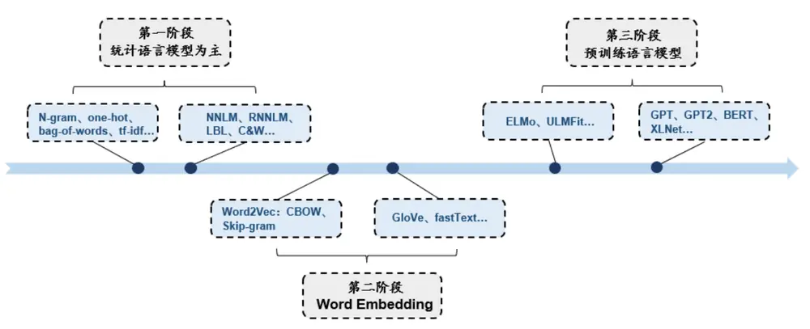
资料来源：华泰研究

## 第一阶段以传统统计语言模型为主，神经网络语言模型锋芒初露：

我们主要介绍了该阶段的两个模型，分别为 N-gram 和 NNLM。N-gram 是为了估计一段自然语言文本出现概率的大小而提出的模型，按链式法则将句子拆解为词语出现的条件概率，以较为简单的想法实现了较好的效果，但存在无法建模更长的上下文语义以及无法建模词语间相似性的缺点。NNLM 则首次将深度学习的思想引入语言模型中，不仅可以对更长的文本进行建模，而且产生了“词向量”这一副产物，影响深远。

## 第二阶段以 Word2Vec 为代表，word embedding 方法成为标配：

Word2Vec 包括 CBOW 和Skip-gram 两组模型，任务分别为根据上下文预测中心词以及根据中心词来预测上下文，相比于第一阶段的 NNLM 简化了网络结构，同时使用了Hierarchical Softmax 和 Negative Sampling 两种方法提高训练效率，使得大规模语料训练成为了现实。更重要的是，模型得到的词向量能够在语义上有非常好的表现。WordVec 之后一大批 word embedding 方法相继涌现，从不同的角度对词编码、句子&段落编码进行改进，word embedding 成为 NLP 研究的标配，迁移学习思想逐渐明朗。

## 第三阶段预训练语言模型大行其道，在巨人的肩膀上 BERT 模型诞生：

ELMo、GPT 及 BERT 模型是第三阶段预训练语言模型的代表。ELMo 的特点是可以根据上下文动态地生成词向量，具有学习不同语境下词汇多义性的能力，且使用双向语言模型使得特征的提取更为准确。GPT 则首次将 Transformer 应用于语言模型，并且设计了一套高效的训练策略，证明了 Transformer 在 NLP 领域具有超强的能力和潜力。BERT 模型集前人模型之大成，利用 Transformer 实现了真正意义上的双向语义理解，并在预训练阶段使用 MLM 和 NSP两个任务实现语义的更深层次理解，完善和扩展了 GPT 中设计的通用任务框架。

## 本文适合两类读者：

1. 不关心模型具体细节，只关心 NLP 的发展脉络。本文以时间线的方式介绍各阶段最具代表性的 NLP 模型，并在行文中穿插了模型产生背景及各自的优缺点，力求将整个发展流程线性化展示；

2. 关心代表模型的具体细节。本文在介绍代表模型时，以数学语言行文，包含数学公式推导、数据实例以及部分我们的理解，力求将重点模型本身的原理及实践方法介绍清楚。

本文不涉及应用层面的讨论，若读者对基于 NLP构建的量化交易策略感兴趣，可以阅读华泰金工人工智能系列的其他研究，本文作为配套参考。

## 第一阶段：传统统计语言模型

## N-gram

语言模型的本质在于预测一段自然语言文本的概率大小，通俗来说我们希望用概率来表示一段本文是人类语言的可能性。数学定义如下：如果某段文本表示为 $S_{i}=(w_{1},w_{2},w_{3},\ldots,w_{n})$ 那么语言模型就是计算该序列的出现概率：

$$
P(S_{i})=P(w_{1},w_{2},w_{3},\ldots,w_{n})
$$

最直观地根据大数定律里频率逼近概率的思想，当我们有人类历史上产生过的所有文本集合，那么可以将 $\cdot P(S_{i})$ 表示为如下公式。但显然要获取全历史的文本集合是一件难以实现的事，因此下述公式在实践层面难以实现。

$$
P(S_{i})=\frac{f(S_{i})}{\sum_{j=0}^{\infty}f(S_{j})}
$$

N-gram 模型正是为了解决上述估计所产生的方法。根据条件概率有如下表达式，其中 $P(w_{1})$ 表示词语 $w_{1}$ 出现在句子开头的概率， $P(w_{2}|w_{1})$ 表示给定词语 $w_{1}$ ，下一个词语是 $w_{2}$ 的概率，以此类推；某个词 $w_{n}$ 出现的概率取决于前面出现的 n-1 个词语。

$$
P(w_{1},w_{2},w_{3},\ldots,w_{n})=P(w_{1})P(w_{2}|w_{1})\ldots P(w_{n}|w_{1},w_{2},\ldots,w_{n-1})
$$

为更方便地计算上述概率，引入马尔可夫假设，即任意一个词语出现的概率只和它之前的N-1 个词语有关： $P(w_{i}|w_{1},w_{2},\ldots,w_{i-1})=P(w_{i}|w_{i-n-1},\ldots,w_{i-1})$ ，根据这个假设可以给出N-gram 语言模型的定义：

$$
P(w_{1},w_{2},w_{3},\ldots,w_{n})=\prod p(w_{i}|w_{i-1},\ldots,w_{1})=\prod p(w_{i}|w_{i-1},\ldots,w_{i-N+1})
$$

当 N 取 1/2/3 时我们分别得到 unigram/bigram/trigram 模型：

$$
\begin{array}{rl}{{\sf Uniqram}}&{{}~P(w_{1},w_{2},w_{3},\ldots,w_{n})=\prod p(w_{i})}\end{array}
$$

$$
\begin{array}{rlr}{{\sf Bigram}}&{{}}&{P(w_{1},w_{2},w_{3},\ldots,w_{n})=\prod p(w_{i}|w_{i-1})}\end{array}
$$

$$
\begin{array}{rlr}{\mathsf{Trigram}}&{{}}&{P(w_{1},w_{2},w_{3},\ldots,w_{n})=\prod p(w_{i}|w_{i-2},w_{i-1})}\end{array}
$$

图表2： 条件概率估计示例

给定语料

## <s> | am Sam <s>

## <s> Sam I am <s>

$$
<\mathrm{s}>\mid\mathrm{donotlikeeggandham<s}>
$$

$$
P({\boldsymbol{a}}m|I)={\frac{2}{3}}
$$

$$
P(I\mid<s>)=\frac{2}{3}
$$

$$
P(Sum|am)=\frac{1}{2}
$$

$$
P(do|I)=\frac{1}{3}
$$

资料来源：华泰研究

N-gram 模型中所做的马尔可夫假设忽略了语言中的长程依赖，例如文中某个代词可能指的是一两句话之前的名词， $而$ 不仅仅只和前几个词有关。实际情况中应用最多的是 $N{=}2$ 或 $N{=}3$ 的模型，当 N的取值继续增加时，模型效果提升不再显著。

以 $N{=}2$ 为例，实际在计算等号右侧的条件概率时，会根据条件概率公式进行如下转化：

$$
p(w_{i}|w_{i-1})=\frac{p(w_{i-1},w_{i})}{p(w_{i-1})}
$$

根据频率逼近概率的思想，在给定的语料库（Corpus）内来估计上述概率：

$$
p(w_i|w_{i-1})\approx\frac{count(w_i|w_{i-1})}{count(*|w_{i-1})}=\frac{count(w_i|w_{i-1})}{count(w_{i-1})}
$$

由于在语料库中计算时可能出现 $count(w_{i}|w_{i-1})$ 为零或者 $count(w_{i}|w_{i-1})$ 及 $.count(w_{i-1})$ 均为 1 的情况，会导致估计出的 ${\langle p(w_{i}|w_{i-1})}$ 明显有偏，常用拉普拉斯平滑、卡茨退避法、及删除插值法等方法来缓解上述估计过程中的有偏问题。

N-gram 这种基于统计的语言模型存在两个比较大的问题：1）N 无法取到很大的值，当 N很大时会使得计算复杂度指数上升，因此模型难以表征文本上下文较长的依赖关系；2）统计语言模型无法表征词语之间的相似性。

## NNLM：神经网络语言模型

如上所述 N-gram 主要存在无法建模更远的上下文依赖关系及无法建模出词语之间的相似度两个缺陷。Bengio 等（2003）在 NLP 的经典论文《A Neural Probabilistic Language Model》中首次将深度学习的思想引入语言模型中，提出 NNLM（Neural Net Language Model）的网络结构，并在得到语言模型的同时还产生了副产品：词向量。

## 词向量

在继续介绍 NNLM 的原理之前，我们先对词向量的概念进行介绍。词向量的目标在于令计算机能够通过词向量获取的信息和人类通过文本看到的信息一致。最早的词向量表示方法为 one-hot 独热编码表示法，即将词表内每一个词语映射到一个稀疏向量，该向量在词语对应的索引位置为 1，其余均为 0。

例如我们有一个词表 V={自，然，语，言，处，理}，那么我们有对应的 one-hot 词向量如下图所示：

## 图表3： One-hot encoding

$$
V=\{自,然,语,言,处,理\}
$$

$$
C(自)=(1,0,0,0,0)
$$

$$
C(然)=(0,1,0,0,0)
$$

$$
C(语)=(0,0,1,0,0,0)
$$

$$
C(言)=(0,0,0,1,0,0)
$$

$$
C(处)=(0,0,0,0,1,0)
$$

$$
C(理)=(0,0,0,0,1)
$$

资料来源：华泰研究

One-hot 表示方法十分直观且简单，但是存在维度灾难和语义鸿沟两个重要问题：

1） 维度灾难：通常我们使用的词表很大，此时 one-hot 的词向量维度也会很大，这会使得数据样本很稀疏，计算十分困难，存储开销也很大；

2） 语义鸿沟：采用 one-hot 编码的方式，任意两个词语之间均正交（内积为零），无法表达出词语之间的相似性，因此实际上计算机获取的信息和人类看到的信息并不一致。

为弥补上述缺陷，分布式向量（distributed representation）于 1986 年被 Hinton 提出，核心思想在于使用更低维的连续实数向量来表示词语，所有的向量构成一个词向量空间，含义相近的词语对应的词向量距离也更近。关于分布式向量名称的由来，有一个形象的解释：One-hot 表示向量中只有一个非零向量，非常集中；而分布式向量中有大量非零分量，相对分散，将词语的信息分布到各个分量当中了。

## NNLM 原理：三层全连接网络

NNLM 的目标及假设与 N-gram 模型类似，本质上就是一个 N-gram 语言模型。其目标为给定词语序列 $w_{1},w_{2},\ldots,w_{t-1},$ ,要预测出下一个词是 $w_{t}$ 的概率 $\cdot P(w_{t}|w_{1},w_{2},\ldots,w_{t-1})$ ；假设为当前词仅依赖于前 n-1 个词，因此

$$
P(w_{t}|w_{1},w_{2},\ldots,w_{t-1})=P(w_{t}|w_{t-n+1},w_{t-n+2},\ldots,w_{t-1})
$$

NNLM 网络的结构如下图所示，在任务开始之前，首先我们会确定一个词表V，记录了语料中出现的全部单词，其余各项参数解释如下：

1） |V|表示词汇表的大小，即语料中去重后单词的个数；

2） C表示词向量矩阵，将词表V中每一个词表示为维度为m的向量，大小为|V|×m；

3） $C(w_{i})$ 是单词 $w_{i}\vec{x}$ 对应的词向量，其中i为单词 $w_{i}$ 在整个词表V中的索引；

4） m是词向量的维度；

图表4： NNLM 网络结构
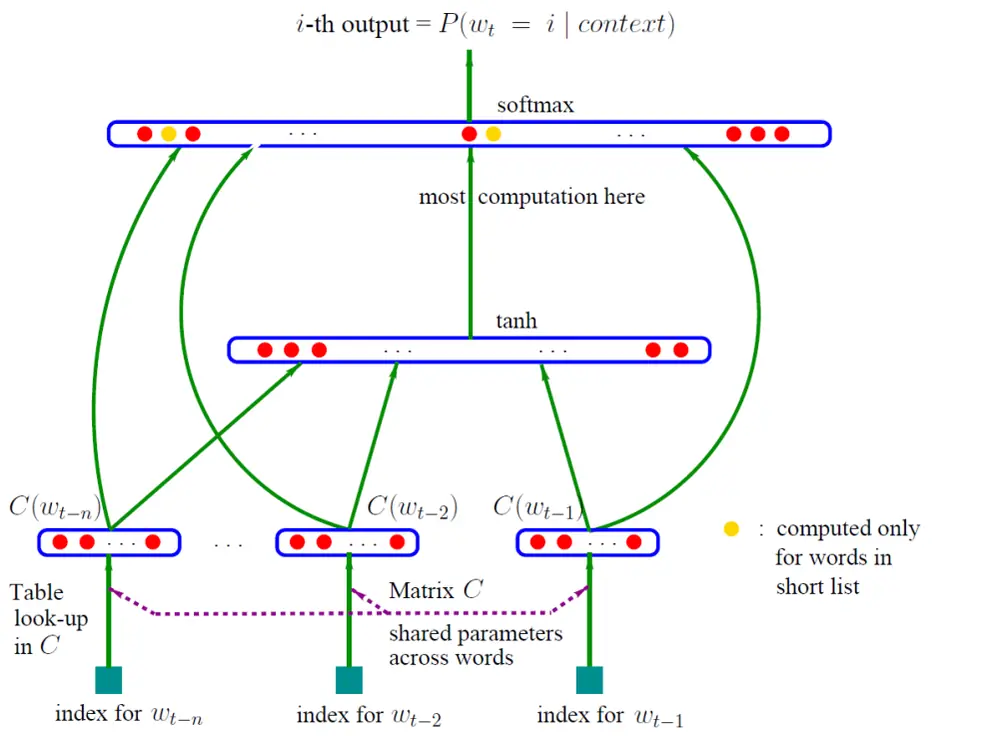
资料来源：A Neural Probabilistic Language Model，华泰研究

为了更好的理解 NNLM 的实际计算步骤，我们将前向传播的过程重新绘制如图表 5 所示。在输入层之前首先会将每个词语映射成词向量并拼接在一起，得到输入向量：

$$
\boldsymbol{x}=(C(w_{t-1}),C(w_{t-2}),\ldots,C(w_{t-n+1}))
$$

在实际操作中这一步我们通常通过 Embedding 层来完成，也即图表 5 所示的输入层之前的结构。得到输入向量x后会继续经过一层隐藏层+一层输出层得到最后的输出，输出层为|V维度的向量，经过 Softmax 激活后表示预测出在每个词上的出现概率。整个前向传播过程表达式为：

$$
y=b+Wx+Utanh(d+Hx)
$$

其中各矩阵的维度为

$$
\begin{aligned}\dim(b)&=|V|\times1\\\dim(W)&=|V|\times m(n-1)\\\dim(U)&=|V|\times|H|\\\dim(d)&=|H|\times1\\\dim(H)&=|H|\times m(n-1)\end{aligned}
$$

损失函数为交叉熵损失函数：

$$
Loss=CrossEntropy(y_{pred},y_{real})
$$

图表5： NNLM 前向传播示意图
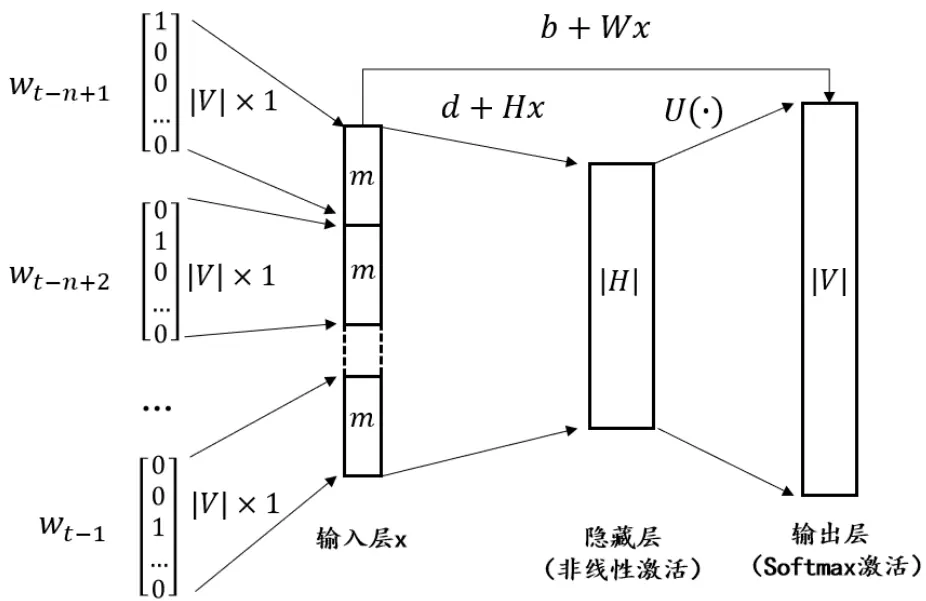
资料来源：华泰研究

可以看到上述网络结构实际上已经有一些残差结构的思想。我们可以将上述过程拆分为三个步骤：1）从词到词向量矩阵的映射，矩阵C中均为可训练参数，这部分参数量为|V|×m；2）从输入层到隐藏层，这部分矩阵d及H为可训练参数，参数量为 $|H|+|H|\times m(n-1);3)$ 从隐藏层到输出层，这部分矩阵b W U均为可训练参数，参数量为 $|V|+|V|\times m(n-1)+$ $|V|\times|H|$ ，所有可训练参数量为

$$
|V|\times(|H|+mn+1)+|H|\times(mn-m+1)
$$

上述参数量是 n 的线性函数，因此 NNLM 模型可以对更长的文本上下文依赖进行建模，解决了 N-gram 难以处理长依赖的问题。此外 NNLM 的另一重要贡献在于生成了副产物词向量，将模型的第一层特征映射矩阵当作词语的分布式表示（即矩阵 C），从而使得刻画词语之间的相似性也成为可能，启发了后来第二阶段 Word2Vec 的工作。

## NNLM 之后及 Word2Vec 之前

NNLM 解决了 N-gram 中的部分问题，但也有其缺点需要改进。一方面，虽然 NNLM 提高了 N-gram 的阶数，相比于统计语言模型有很大提升，但对于更长的文本依赖关系仍然不能很好的解决；另一方面，NNLM 的训练时间开销太长，Bengio 等在论文中的数据实证使用了 40 块 CPU，在含有 1400 万词语的语料中即使仅保留了出现频率最高的 17964 个词语来作为词典、训练 5个 epoch，也耗时超过 3周。

因此在 Word2Vec 问世前的接下来 10 年间，NLP 的一个重要研究方向是对 NNLM 进行改进及工程优化。按时间线我们列举其中一些相对比较重要的改进模型。

2007 年 Mnih 和 Hinton 提出的 LBL（Log-Bilinear Language Model）以及后续的一系列相关模型，省去了 NNLM 中的激活函数，直接把模型变成了一个线性变换，尤其是后来将Hierarchical Softmax 引入到 LBL 后，训练效率进一步增强，但是表达能力不如 NNLM 这种神经网络的结构。

2008 年 Collobert 和Weston 提出的 C&W 模型不再利用语言模型的结构，而是将目标文本片段整体当做输入，然后预测这个片段是真实文本的概率，所以它的工作主要是改变了目标输出。由于输出只是一个概率大小，不再是词典大小，因此训练效率大大提升，但由于使用了这种比较“别致”的目标输出，使得它的词向量表征能力有限。

2010 年 Mikolov 提出 RNNLM（Recurrent Neural Network based Language Model）直接对 $P(w_{t}|w_{1},w_{2},\ldots,w_{t-1})$ 进行建模而不使用 $P(w_{t}|w_{t-n+1},w_{t-n+2},\ldots,w_{t-1})$ 进行简化，目标是利用所有的上文信息来预测下一个词语。

图表6： RNNLM 网络结构
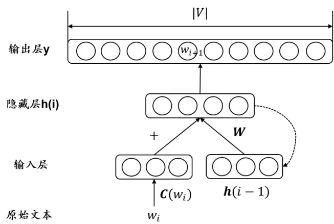
资料来源：Recurrent neural network based language model，华泰研究

RNNLM 的核心在于其隐藏层的算法：

$$
h(i)=\phi(C(w_{i})+Wh(i-1))
$$

其中φ为非线性激活函数，ℎ(i)表示文本中第i个词 $w_{i}$ 所对应的隐藏层，该隐藏层由当前的词向量C(wi)及上一个词对应的隐藏层ℎ(i − 1)结合得到，实际上即为 RNN 的结构。

RNNLM 并不采用 n 元近似，而是使用迭代的方式直接对所有上文进行建模。通过这种迭代推进的方式，每个隐藏层实际上包含了此前所有上文的信息，相比 NNLM 只能采用上文n 元短语作为近似，RNNLM 包含了更丰富的上文信息，也有潜力达到更好的效果。

NLP 发展早期实际上远不止 N-gram 和 NNLM 两组模型，还有的方法如：从 one-hot 表示一个词到用 bag-of-words 表示一段文本；从 k-shingles 把一段文本切分成一些文字片段，到汉语中各种序列标注方法将文本按语义进行分割；从 tf-idf 中用频率的手段来表征词语的重要性，到text-rank中借鉴page-rank的方法来表征词语的权重…在此我们不再详细展开。

彼时的各类语言模型如动荡的春秋战国，诸子百家群星闪耀，无论是在学术界还是工业界谁也没有绝对的实力进行统一。我们在前期研究《人工智能 57：文本 FADT 选股》（20220701）中使用的词频来表征文本的方法正属于这一时期语言模型中的一类。

## 第二阶段：Word2Vec词向量时代

在前期传统统计模型发展到一定阶段以后，新的时代也随之来临，在这个新时代里 wordembedding 方法逐渐成为标配。2013 年 Mikolov 连续发表了多篇在 NLP 历史上具有重要里程碑意义的论文，其中最著名的两篇分别为：

《Efficient estimation of word representation in vector space》

《Distributed Representations of Words and Phrases and their Compositionality》

前者首次提出 CBOW和 Skip-gram 模型，简化了 NNLM 的网络结构及参数量；后者进一步提出多种优化训练算法，包括 Hierarchical Softmax、Negative Sampling 和 Subsampling技术，极大地提升了训练效率。经过模型和训练技巧的双重优化，大规模语料训练成为了现实，更为重要的是，模型得到的词向量能够在语义上有非常好的表现，能将语义关系通过向量空间关系表征出来。

图表7： 词向量空间表征语义关系
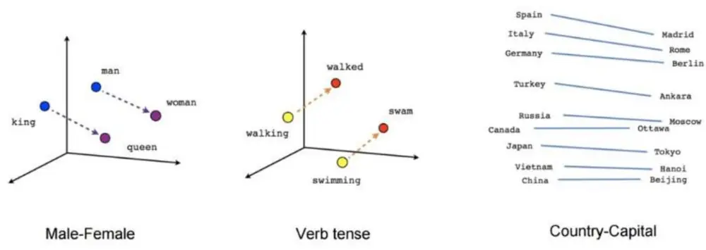
资料来源：华泰研究

Mikolov在发表上述两篇论文之后，彼时仍在谷歌工作的他继续开源了 word2vec 方法。实际上 word2vec 只是一个工具，而非某种模型，其背后的模型是 CBOW 和 Skip-gram，并且使用了 Hierarchical Softmax 和 Negative Sampling 这些训练优化方法。但为叙述简便，我们也以 word2vec 来指代上述模型。

图表8： CBOW 和 Skip-gram
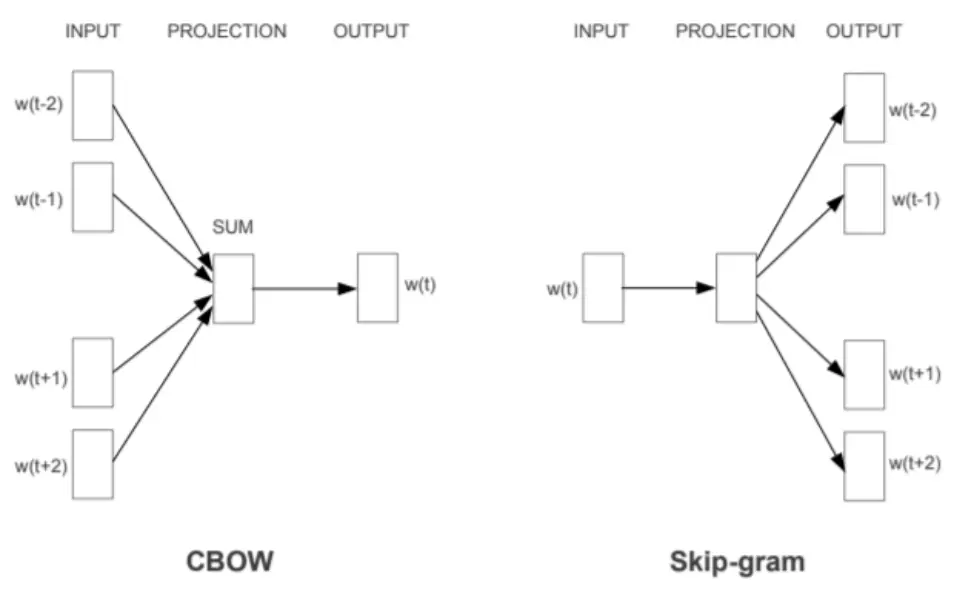
资料来源：Efficient estimation of word representation in vector space，华泰研究

CBOW 和 Skip-gram 都是轻量级的神经网络，本质上只有输入层和输出层两层（相比于NNLM，少了隐藏层），CBOW 是在知道词语 $w_{t}$ 上下文 $\ldots,w_{t-2},w_{t-1},w_{t+1},w_{t+2},\ldots$ 的情况下预测当前词 $w_{t}$ ；而 Skip-gram 则正好相反，是在知道词 $w_{t}$ 的 情 况 下 对 其 上下 文$\ldots,w_{t-2},w_{t-1},w_{t+1},w_{t+2},$ …进行预测，简化示意图如上图所示。

## CBOW：Continuous Bag-of-Words

CBOW 的任务是在知道词语 $w_{t}$ 上下文 $\ldots,w_{t-2},w_{t-1},w_{t+1},w_{t+2},.$ …的情况下预测当前词 $w_{t}$ 其网络结构如下图所示。我们可以与 NNLM 进行对比，发现两者结构十分相似，但是 CBOW没有中间隐藏层，输入层对 one-hot representation 进行线性变换以后直接连接到输出层。CBOW 将每个输入词语转换成词向量以后，也不再是 NNLM 中的拼接操作，而是将词向量进行求和（实际操作时也可以求平均），得到ℎ向量。

通过上述求和的操作可以发现，CBOW 的一个特点是在求语境 context 向量（ℎ向量）时，语境内词序已经丢弃，而这也是模型名称中 Continuous 的来源；另一个特点是 CBOW 最终的目标函数仍为语言模型的目标函数，所以需要顺序遍历语料中的每一个词，这是模型名称中 Bag-of-Words 的来源。

图表9： CBOW 网络结构
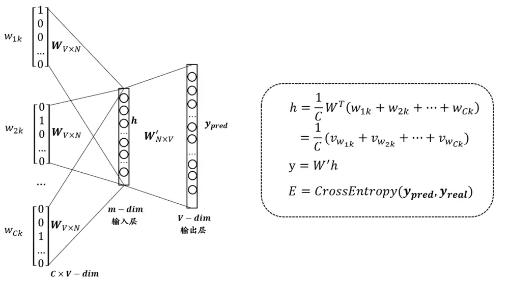
资料来源：华泰研究

## Skip-gram

Skip-gram 模型与 CBOW 相反，是知道词 $w_{t}$ 的情况下对其上下文 $\ldots,w_{t-2},w_{t-1},w_{t+1},w_{t+2},\ldots$ 进行预测，两组权重矩阵仍然共享，但损失函数是上下文 C 个损失函数之和。

CBOW 和 Skip-gram 两个模型的参数量均为2m|V|，与 NNLM 的参数量相比大大减少，且与上下文所选取的词数量无关，避免了 N-gram 中随着阶数 N 增大而使得计算复杂度急剧上升的问题。但是无论是 CBOW 还是 Skip-gram，如果没有训练优化算法，二者的输出层不可避免地要使用softmax操作，当字典数量很大时求softmax操作将带来很大的计算量。因此 Mikolov 在随后的论文中提到了 Hierarchical Softmax 和 Negative Sampling 这两种优化算法，下面我们分别进行介绍。

图表10： Skip-gram 网络结构
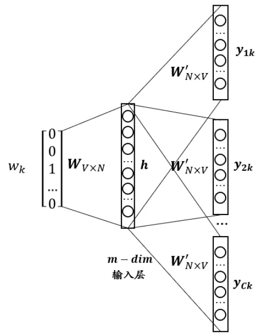
资料来源：华泰研究

$$
\pmb{h}=W^{T}w_{k}
$$

$$
y_{jk}=W^{\prime T}h
$$

由于 ${}^{\cdot}W_{N\times V}^{\prime}$ 共享，实际上计算出来的 $\left[\mathbf{y}_{jk}\right.$ 是一样的，但是因为上下文真实的标签不一样，所以最终计算出的损失函数不同。因为我们最终的目标是要生成词向量，而不是真的对上下文进行预测，所以 $W_{N\times V}^{\prime}$ 共享是合理的。

## 优化算法一：Hierachical Softmax

Mikolov 首先提到了 Hierachical Softmax，认为这是对 full softmax 的一种优化手段，前者将 Word2Vec 的输出层设计成一颗哈夫曼树（Huffman Tree）。

## 哈夫曼树

哈夫曼树是一种带权路径长度最短的二叉树，也称为最优二叉树。下图展示了一个例子：

图表11： 哈夫曼树示意图
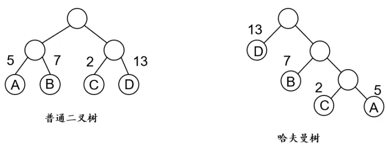
资料来源：华泰研究

左侧普通二叉树的带权路径长度： $WPL=5*2+7*2+2*2+13*2=54$ 右侧最优二叉树的带权路径长度： $WPL=5*3+2*3+7*2+13*1=48$ 可以证明上图右侧即为一颗哈夫曼树。

## 引入哈夫曼树的 CBOW

下面我们以 CBOW 为例展示如何引入哈夫曼树。首先我们根据词典中每个词的词频构建出一颗哈夫曼树，保证词频较高的词处于相对比较浅的层，词频较低的词处于相对比较深层的叶子节点上，每个词都处于该哈夫曼树的某个叶子节点上。

CBOW 的原始目标函数实际上如下，前文我们写成 CrossEntropy 的形式是因为如果不引入训练优化算法则实际训练时损失函数会设置成 CrossEntropy。这里我们回到 CBOW 的原始目标函数，是为了便于后文公式推导：

$$
:L=\sum_{w}logp(w|Context(w)).
$$

基于层次 Softmax的 CBOW 网络结构如下图所示。

图表12： 基于 Hierachical Softmax 的 CBOW 网络结构
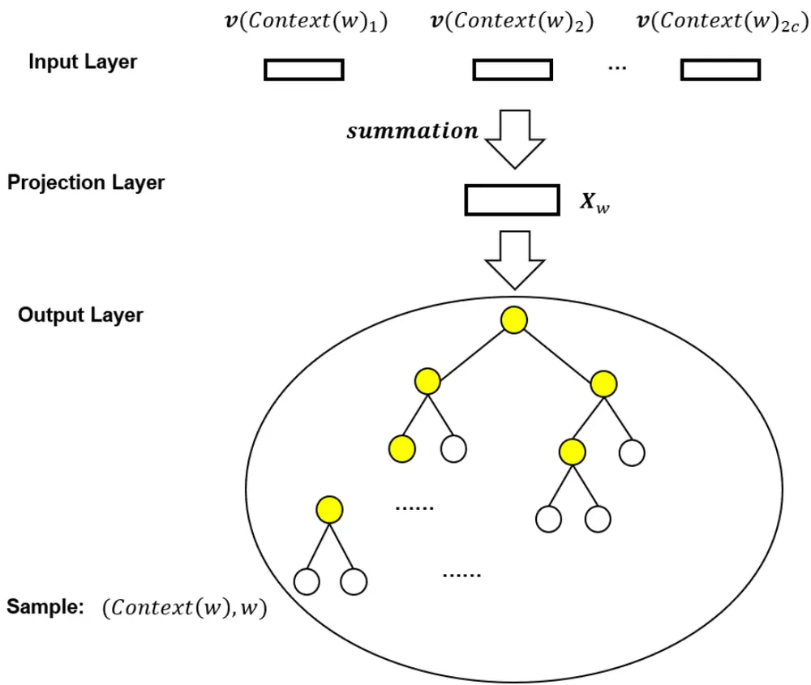
资料来源：华泰研究

输入层是指Context(w)中所包含的 2c个词的词向量： $v(Context(w)_{1}),v(Context(w)_{2})$ $v(Context(w)_{2c})$ ，投影层指的是直接对 2c个词向量进行累加，累加之后得到 $X_{w}$ ：

$$
X_{w}=\sum_{i=1}^{2c}v(context(w)_{i})
$$

输出层是一棵 Huffman 树，其中叶子节点共 N 个，对应词典中 N个单词，非叶子节点 N-1个，对应上图中标黄的结点。接下来我们将介绍基于层次 Softmax 的 CBOW 模型如何计算损失函数及对参数进行更新。

这部分我们结合实际例子来介绍，首先需要定义一些变量：

⚫ $\pmb{p}^{w}$ ：从根结点出发，到达单词w对应叶子结点的路径；

⚫ $l^{w};$ ：路径 $p^{w}$ 中包含的结点个数；

$\pmb{p}_{1}^{w},\pmb{p}_{2}^{w},\dots,\pmb{p}_{l^{w}}^{w};$ ：路径 $:p^{w}$ 中对应的各个结点，其中 $p_{1}^{w}$ 代表根结点，而pww 代表的是单词w对应的叶子结点；

$\pmb{d}_{2}^{w},\pmb{d}_{3}^{w},\dots,\pmb{d}_{l^{w}}^{w}\in\{\pmb{0},\pmb{1}\}$ ：单词w对应的哈夫曼编码，一个词的哈夫曼编码是由 $l^{w}-1$ 位构成的， $d_{j}^{w}$ 表示路径 $:p^{w}$ 中第 j 个结点对应的哈夫曼编码，根结点不参与对应的编码（因为根结点没有左右结点之分） $;d_{j}^{w}$ 取值为0或1，表示对应的结点为左子结点还是右子结点，根据Word2Vec 的定义，0对应右子结点，1 对应左子结点；

$\pmb{\theta}_{1}^{w},\pmb{\theta}_{2}^{w},\dots,\pmb{\theta}_{l^{w}-1}^{w}\in\Re^{m}$ ：路径 $p^{w}$ 中非叶子结点对应的向量， $\theta_{j}^{w}$ 表示路径 $p^{w}$ 中第 j 个非叶子结点对应的向量，这个向量实际上是模型可训练参数，在后续反向传播时将会根据梯度进行参数更新。

假设下图输出层部分为根据使用语料预先构建好的哈夫曼树，接下来我们推导如何对哈夫曼树中的参数进行更新。

图表13： Hierachical Softmax 实例
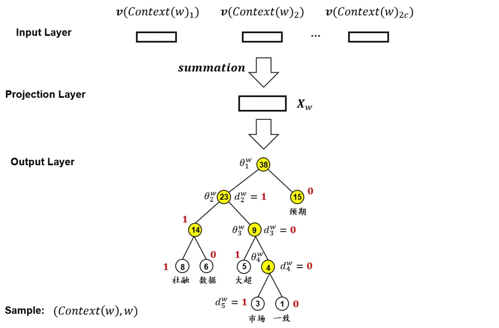
资料来源：华泰研究

根据Word2Vec 的原始定义，哈夫曼编码为 $d_{i}^{w}=0$ 表示正类（右子结点），编码为 $d_{i}^{w}=1$ 表示负类（左子结点），可以定义正负类别的公式：

$$
Label(p_{i}^{w})=1-d_{i}^{w},i=2{,}3{,}4,\ldots,l^{w}
$$

使用 Sigmoid 函数来对每个结点进行分类，结点被分为正类的概率为：

$$
\sigma(x_{w}^{T}\theta)=\frac{1}{1+e^{-x_{w}^{t}\theta}}
$$

被分为负类的概率则为 $1-\sigma(x_{w}^{T}\theta)$ ，这里的向量θ即为结点对应的向量 $\theta_{j}^{w}$ 。从根结点出发到达“市场”这个叶子结点需要经历 4次二分类，每次分类的概率分别为：

1. 第一次分类被分到负类： $p(d_{2}^{w}|x_{w},\theta_{1}^{w})=1-\sigma(x_{w}^{T}\theta_{1}^{w})$

2. 第二次分类被分到正类： $p(d_{3}^{w}|x_{w},\theta_{2}^{w})=\sigma(x_{w}^{T}\theta_{2}^{w})$

3. 第三次分类被分到正类： $p(d_{4}^{w}|x_{w},\theta_{3}^{w})=\sigma(x_{w}^{T}\theta_{3}^{w})$

4. 第四次分类被分到负类： $p(d_{5}^{w}|x_{w},\theta_{4}^{w})=1-\sigma(x_{w}^{T}\theta_{4}^{w})$

那么当 $w=$ 市场"时，则有如下表达式成立：

$$
p\big(\boldsymbol{w}\big|Context(\boldsymbol{w})\big)=p\left(市场\big|Context\big(市场\big)\right)=\prod_{j=2}^{5}p\big(d^w_j\big|\boldsymbol{x}_w,\theta^w_{j-1}\big)
$$

模型训练的目标则为优化θw, $\pmb{\theta}_{2}^{w},\dots,\pmb{\theta}_{l^{w}-1}^{w}$ 使得目标函数最大化。对于词典中任意一个单词w，哈夫曼树中都会存在唯一的路径从 $-p^{w}$ 从根结点到单词w对应的叶子结 $点$ 。路径 $:p^{w}$ 上存在lw −1个分支，每个分支都对 $应一个二分$ 类，将路径 $:p^{w}$ 上的二分类概率相乘就得到词语w出现的概率。因此条件概率 $p(\boldsymbol{w}|Context(\boldsymbol{w}))$ 的一般公式如下：

$$
p\big(\boldsymbol{w}\big|Context(\boldsymbol{w})\big)=\sum_{j=2}^{l^{w}}p(d_{j}^{w}|\boldsymbol{x}_{w},\boldsymbol{\theta}_{j-1}^{w})
$$

其中

$$
\begin{align*}p\big(d_j^w\big|x_w,\theta_{j-1}^w\big)=\left\{\begin{aligned}\sigma\big(x_w\theta_{j-1}^w\big),&\quad d_j^w=0,\\1-\sigma\big(x_w\theta_{j-1}^w\big),&\quad d_j^w=1,\end{aligned}\right.\\=[\sigma\big(x_w\theta_{j-1}^w\big)]^{1-d_j^w}\cdot[1-\sigma\big(x_w\theta_{j-1}^w\big)]^{d_j^w}\end{align*}
$$

将上式代入 CBOW 的目标函数中，得到

$$
\begin{align*}L=\sum_{w\in C}logp\big(w\big|Context(w)\big)\quad\\=\sum_{w\in C}log\prod_{j=2}^{l^w}\big[\sigma\big(x_w\theta_{j-1}^w\big)\big]^{1-d_j^w}\cdot\big[1-\sigma\big(x_w\theta_{j-1}^w\big)\big]^{d_j^w}\\=\sum_{w\in C}\sum_{j=2}^{l^w}\big(1-d_j^w\big)\cdot\log\big[\sigma\big(x_w\theta_{j-1}^w\big)\big]+d_j^w\cdot\log[1-\sigma\big(x_w\theta_{j-1}^w\big)].\end{align*}
$$

接下来我们将推导参数 $\theta_{j-1}^{w}$ 及 $x_{w}$ 的更新公式，为方便描述将上述双重求和后的公式记为$L(w,j)$

$$
L(w,j)=\left(1-d_{j}^{w}\right)\cdot\log[\sigma(x_{w}\theta_{j-1}^{w})]+d_{j}^{w}\cdot\log[1-\sigma(x_{w}\theta_{j-1}^{w})]
$$

$$
L=\sum_{w\in C}\sum_{j=2}^{l^{w}}L(w,j).
$$

首先考虑 $L(w,j)$ 关于 $\cdot\theta_{j-1}^{w}$ 1的梯度及更新公式：

$$
\begin{align*}\frac{\Delta L(w,j)}{\Delta\theta_{j-1}^w}=\big\{\big(1-d_j^w\big)\big[1-\sigma\big(x_w\theta_{j-1}^w\big)\big]x_w-d_j^w\sigma\big(x_w\theta_{j-1}^w\big)\big\}x_w\\=[1-d_j^w-\sigma\big(x_w\theta_{j-1}^w\big)]x_w\end{align*}
$$

$$
\theta_{j-1}^{w}\leftarrow\theta_{j-1}^{w}+\eta[1-d_{j}^{w}-\sigma\big(x_{w}\theta_{j-1}^{w}\big)]x_{w}
$$

其次考虑 $L(w,j)$ 关于 $x_{w}$ 的梯度及更新公式：

$$
\cfrac{\Delta L(w,j)}{\Delta x_{w}}=[1-d_{j}^{w}-\sigma\big(x_{w}\theta_{j-1}^{w}\big)]\theta_{j-1}^{w},
$$

上式仅是对于 $x_{w}$ 的梯度，而 $x_{w}$ 是Context(w)中所有单词累加的结果，还需要考虑对Context(w)中的每个单词v(w̃)进行更新，论文作者采用的方式为直接使用 $x_{w}$ 的梯度累加对单词v(w̃)进行更新：

$$
v(\widetilde{w})\leftarrow v(\widetilde{w})+\eta\sum_{j=2}^{l^{w}}\frac{\Delta L(w,j)}{\Delta x_{w}},\widetilde{w}\in Context(w)
$$

以上为基于 Hierachical Softmax 的 CBOW 参数更新推导，而基于 Hierachical Softmax 的Skip-gram 参数更新推导与之类似，正文受限于篇幅我们不再展开，推导过程参见附录。

## 优化算法二：Negative Sampling

Mikolov 等人提出的第二种优化算法是 Negative Sampling，它是 NCE（Noise ContrastiveEstimation）的简化版本，目的是用来提高训练速度并改善所得词向量的质量。与Hierarchical Softmax 相比，NEG 不再使用复杂的哈夫曼树，而是利用相对简单的随机负采样，能大幅提高性能，因而可作为 Hierarchical Softmax 的一种替代。

## 负采样

首先我们介绍负采样的操作方法，对于给定的词语w如何生成NEG(w)？这里正样本指的是词语w本身，负样本指的是字典 D 中w以外的词语。词典 D 中的词语在语料 C 中出现的频率各不相同，我们希望高频词被选为负样本的概率比较大，而低频词被选为负样本的概率比较小，本质上是带权采样的问题。

假设词典 D 中每个词语w可以对应一条线段，其长度为

$$
len(w)=\frac{counter(w)}{\sum_{u\in C}counter(u)}
$$

这里counter(u)表示词语u在语料 C 中出现的次数，分母用于归一化。将词典 D 中所有词语对应的线段拼接成长度为 1 的直线，如下图上半部分所示，出现频率越高的词语对应的线段长度越长。 $\begin{array}{r}{l_{0}=0,l_{1}=len(w_{1}),\dots,l_{k}=\sum_{j=1}^{k}len\big(w_{j}\big),k=1{,}2,\dots,N}\end{array}$ ，其中 $w_{j}$ 表示词典中第 j 个单词， $以\{l_i\}_{j=0}^N$ 为结点划分得到 N 条线段即为每个单词对应的线段 $\{I_{i}\}_{j=1}^{N}$ ，线段长度为 $len(w_{j})$ o

图表14： 负采样映射示意图
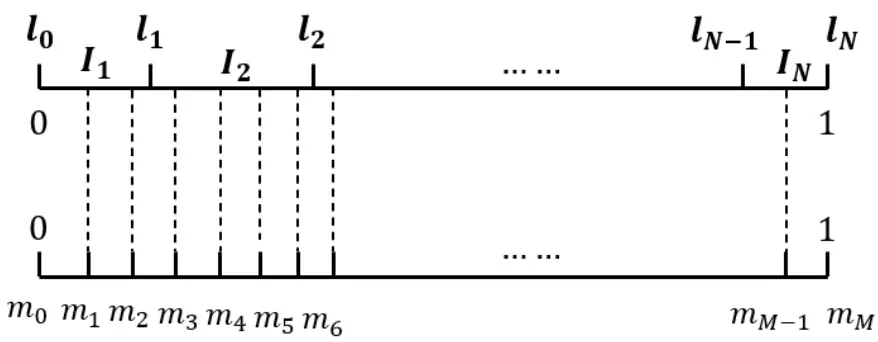
资料来源：华泰研究

上图的下半部分为我们引入的区间[0,1]上的等距剖分，将内部剖分结点 $\{m_{j}\}_{j=1}^{M-1}$ 投影到上半部分的非等距剖分上，建立 $\{m_j\}_{j=1}^{M-1}与\{I_j\}_{j=1}^{M}$ 1的映射关系：

$$
f(i)=w_{k},where\;m_{i}\in I_{k},i=1{,}2,\ldots,M-1
$$

根据上述映射关系进行负采样：对词语 $w_{j}$ 进行负采样，每次生成一个[1,M-1]之间的随机整数，f(i)即为一个采样样本；若 $f(i)=w_{j},$ ，即采样到 $w_{j}$ 本身则跳过，进行下一次采样。Word2Vec 在实际操作时，len(w)计算公式中不是直接使用counter(w)，而是对其做了α次幂，其中 $\alpha=0.75$ ：

$$
len(w)=\frac{counter(w)^{\alpha}}{\sum_{u\in C}[counter(u)]^{\alpha}}=\frac{counter(w)^{0.75}}{\sum_{u\in C}[counter(u)]^{0.75}}
$$

## 基于 Negative Sampling 的 CBOW

接下来介绍基于负采样算法的 CBOW。对于 $\left(w,Context(w)\right)$ ，对w进行负采样得到负样本子集 $NEG(w)\neq\emptyset$ ，对于 $\forall\widetilde{w}\in D$ ，定义单词w̃的标签如下，正样本的标签为 1，负样本的标签为 0：

$$
L^{w}(\widetilde{w})=\Big\{\begin{aligned}1,\quad\widetilde{w}=w\\0,\quad\widetilde{w}\neq w\end{aligned}
$$

对于一个给定的正样本 $\cdot(w,Context(w))$ ，希望最大化目标函数

$$
\begin{aligned}&g(w)=\prod_{u\in w\cup NEG(w)}p(u|Context(w))\\where\quad&p(u|Context(w))=\left\{\begin{aligned}&\sigma(x_w^T\theta^u),\quad L^w(u)=1\\&1-\sigma(x_w^T\theta^u),\quad L^w(u)=0\end{aligned}\right.\\&=[\sigma(x_w^T\theta^u)]^{L^w(u)}\cdot[1-\sigma(x_w^T\theta^u)]^{1-L^w(u)}\end{aligned}
$$

这里 $x_{w}$ 仍然表示Context(w)各个词语的词向量之和， $而\theta^{u}\in R^{m}$ 是引入的辅助向量，为待训练的参数。 $g(w)$ 简化以后也可以写成如下表达式

$$
g(w)=\sigma(x_w^T\theta^w)\prod_{u\in NEG(w)}[1-\sigma(x_w^T\theta^u)]
$$

其中 $\sigma(\cdot)$ 也是 Sigmoid 函数， $\sigma(x_{w}^{T}\theta^{u})$ 表示当上下文为Context(w)时，中心词为w的概率。因此最大化 $\llangle g(w)$ ，是希望 $\sigma(x_{w}^{T}\theta^{u})$ 最大化的同时 $\sigma(x_{w}^{T}\theta^{u}),u\in NEG(w)$ 最小化，即增大中心词被判定为正样本w的概率的同时降低中心词被判定为负样本的概率。

接下来对 CBOW 的原始目标函数进行改造，原始的目标函数为

$$
L=\sum_{w\in C}logp(w|Context(w))
$$

改造后的目标函数为

$$
\begin{align*}L=\sum_{w\in C}logg(w)\quad&\\=\sum_{w\in C}\sum_{u\in w\cup NEG(w)}\log\{[\sigma(x_w^T\theta^u)]^{L^w(u)}\cdot[1-\sigma(x_w^T\theta^u)]^{1-L^w(u)}\}\quad&\\=\sum_{w\in C}\sum_{u\in w\cup NEG(w)}L^w(u)\cdot log\sigma(x_w^T\theta^u)+[1-L^w(u)]\cdot\log[1-\sigma(x_w^T\theta^u)].&\\\end{align*}
$$

同样的为方便求梯度，记L(w, u)

$$
L(w,u)=L^{w}(u)\cdot log\sigma(x_{w}^{T}\theta^{u})+[1-L^{w}(u)]\cdot log[1-\sigma(x_{w}^{T}\theta^{u})]
$$

$L(w,u)$ 关于 $\cdot\theta^{u}$ 的梯度为

$$
\begin{align*}\cfrac{\Delta L(w,u)}{\Delta\theta^u}=L^w(u)[&1-\sigma(x_w^T\theta^u)]x_w-[1-L^w(u)]\cdot\sigma(x_w^T\theta^u)x_w\\&=[L^w(u)-\sigma(x_w^T\theta^u)]x_w\end{align*}
$$

$\theta^{u}$ 更新公式为

$$
\theta^{u}\leftarrow\theta^{u}+\eta[L^{w}(u)-\sigma(x_{w}^{T}\theta^{u})]x_{w}
$$

L(w, u)关于 $x_{w}$ 的梯度为

$$
\cfrac{\Delta L(w,u)}{\Delta x_{w}}=[L^{w}(u)-\sigma(x_{w}^{T}\theta^{u})]\theta^{u}.
$$

$x_{w}$ 的更新公式为

$$
v(\widetilde{w})=v(\widetilde{w})+\eta\sum_{u\in w\cup NEG(w)}\frac{\Delta L(w,u)}{\Delta x_w},\widetilde{w}\in Context(w)
$$

基于 Negative Sampling 的 Skip-gram 推导见附录。

在 Word2Vec 提出之后，一大批 word embedding 方法相继涌现，其中较为知名的有 GloVe和 fastText 等，这些模型各自从不同的角度得到了效果较好的词语 embedding 表征，下面我们继续对这两个模型进行介绍。

## GloVe

CBOW 和 skip-gram 方法虽然可以很好地对词汇进行类比，但是只基于文本局部的上下文窗口，而没有用到全局的词汇共现统计信息。Jeffrey Pennington 等（2014）提出的 GloVe方法基于全局词汇共现的统计信息来学习词向量，将统计信息与局部上下文窗口方法的优点相结合，发现效果得到明显提升。

## 共现矩阵

首先我们介绍基于窗口的共现矩阵， 假设我们的样本集由以下三句话构成：

1. I like deep learning.

2. I like NLP.

3. I enjoy flying.

当我们选取窗口长度为 1 时（即统计两个词连续出现的频率），各个词语的共现矩阵如下图所示，共现矩阵具有对称性。基于该矩阵，我们就可以将每个词语用向量表示，如单词 I对应的词向量为（0，2，1，0，0，0，0）。

图表15： 共现矩阵示意图

| Counts | 一 | like | enjoy | deep | learning | NLP | flying |
| --- | --- | --- | --- | --- | --- | --- | --- |
| 一 | 0 | 2 | 1 | 0 | 0 | 0 | 0 |
| like | 2 | 0 | 0 | 1 | 0 | 1 | 0 |
| enjoy | 1 | 0 | 0 | 0 | 0 | 0 | 1 |
| deep | 0 | 1 | 0 | 0 | 1 | 0 | 0 |
| learning | 0 | 0 | 0 | 1 | 0 | 0 | 0 |
| NLP | 0 | 1 | 0 | 0 | 0 | 0 | 0 |
| flying | 0 | 0 | 1 | 0 | 0 | 0 | 0 |

资料来源：华泰研究

但是使用共现矩阵来表示词向量存在几个问题：

1） 随着词汇量增多，向量的大小会变得很大；

2） 向量维度较高，存储空间要求高；

3） 向量稀疏，会给下游任务带来困难。

## GloVe 原理

有了共现矩阵的概念后，接下来考虑如何更好地表示出词向量。将某个语料库的共现矩阵记为 $X=(X_{ij})_{N\times N},\quad X_{ij}$ 表示指定窗口长度下词语 i 和词语 j 的共现次数，以及

$$
X_{i}=\sum_{k}X_{ik}
$$

表示语料库中词语 i出现的次数总和，

$$
P_{ij}=P(j|i)=\frac{X_{ij}}{X_{i}}
$$

表示词语 j出现在词语 i上下文的概率。下面我们以论文中的例子来介绍 GloVe 的原理。假设 i=ice，j=steam，当 k 取不同的词语如 solid、gas、water 时，我们可以得到概率 $\cdot P_{ik}=$ P(k|ice)、 $P_{jk}=P(k|steam)$ ，并进一步计算出P(k|ice)/P(k|steam)。例如当 k 取 solid 时，P(solid|ice)较大，P(solid|steam)较小，上述比值应该较大；当 k 取 gas 时，P(gas|ice)较小，P(gas|steam)较大，上述比值应该较小；当 k 取 water 或 fashion 时，与 ice 和 steam的共现概率同时很大或很小，对应的上述比值都接近 1。因此P(k|ice)/P(k|steam)可以一定程度上反映词汇之间的相关性。

图表16： 共现概率

| Probability and Ratio | $k=solid$ | $k=gas$ | $k=water$ | k = fashion |
| --- | --- | --- | --- | --- |
| P(k\|ice) | $1.9\times10^{-4}$ | $6.6\times10^{-5}$ | $3.0\times10^{-3}$ | $1.7\times10^{-5}$ |
| P(k\|steam) | $2.2\times10^{-5}$ | $7.8\times10^{-4}$ | $2.2\times10^{-3}$ | $1.8\times10^{-5}$ |
| $P(k\|ice)/P(k\|steam)$ | 8.9 | $8.5\times10^{-2}$ | 1.36 | 0.96 |

资料来源：GloVe： Global Vectors for Word Representation，华泰研究

接着作者提出一种猜想，能否通过训练词向量来使得词向量经过某种函数作用后可以得到上述比值，即满足如下公式：

$$
F\big(w_{i},w_{j},w_{k}\big)=\frac{P_{ik}}{P_{jk}}
$$

其中 $w_{i},w_{j},w_{k}$ 分别为词语 i、j、k 对应的词向量， $P_{ik}/P_{jk}$ 可以通过语料计算得到，F 为某个待定义的变换函数。考虑到词向量处于同一个线性空间，因此对 $w_{i},w_{j}$ 进行差分变换：

$$
F\big(w_{i}-w_{j},w_{k}\big)=\frac{P_{ik}}{P_{jk}}
$$

最直观能想到的函数 F为向量内积：

$$
F\big((w_{i}-w_{j})^{T}w_{k}\big)=F\big(w_{i}{}^{T}w_{k}-w_{j}{}^{T}w_{k}\big)=\frac{P_{ik}}{P_{jk}}
$$

将减法与除法联系到一起，又容易联想到指数计算，因此可以将 F取为指数函数：

$$
exp(w_{i}{}^{T}w_{k}-w_{j}{}^{T}w_{k})=\frac{\exp(w_{i}{}^{T}w_{k})}{\exp(w_{j}{}^{T}w_{k})}=\frac{P_{ik}}{P_{jk}}
$$

只需要保证分子分母分别相等，上式即可成立：

$$
\begin{array}{r}{\exp({w_{i}}^{T}w_{k})=P_{ik},}\\{\exp\bigl({w_{j}}^{T}w_{k}\bigr)=P_{jk},}\end{array}
$$

进一步目标可以转化为对于语料中的所有词汇，考察

$$
\exp({w_{i}}^{T}w_{k})=P_{ik}=\frac{X_{ik}}{X_{i}}
$$

$$
{w_{i}}^{T}w_{k}=\log\left(\frac{X_{ik}}{X_{i}}\right)=logX_{ik}-logX_{i}
$$

考虑到上述等号左侧 i和 k 应具有对称性，为保证右侧也具有对称性，引入两个偏置项：

$$
{w_{i}}^{T}w_{k}=\log X_{ik}-b_{i}-b_{k}
$$

此时 $logX_{i}$ 已经包含在 $.b_{i}$ 中。此时模型的目标转化为通过学习词向量的表示，使得上述等式尽量成立，故而损失函数的构建如下：

$$
J=\sum_{i,k=1}^{V}({w_{i}}^{T}w_{k}+b_{i}+b_{k}-logX_{ik})^{2}
$$

但是该目标函数存在一个缺点，即所有的共现词汇都采用同样的权重，因此作者对目标函数进行了进一步修正，通过语料中的词汇共现统计来改变其在目标函数中的权重，具体如下：

$$
J=\sum_{i,k=1}^{V}f(X_{ik})(w_i{}^Tw_k+b_i+b_k-logX_{ik})^2
$$

这里 V表示词汇数量，权重函数f需具备以下特性：

1） $f(0)=0$ ，即当词汇共现的次数为 0时，此时对应的权重应该为 0；

2）f(x)必须是一个非减函数，词汇共现的次数越大，权重递增；

3） 对于出现频率过高的词汇，f(x)赋权存在上限，避免过度加权。

例如作者提出的权重函数如下：

$$
f(x)=\Big\{\begin{matrix}{(x/x_{max})^{\alpha},\quad if\quad x<x_{max}}\\{1,\quad otherwise}\\\end{matrix}
$$

图表17： 当α = 0. 75时的f(x)
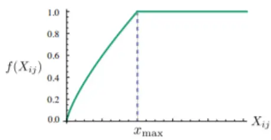
资料来源：GloVe： Global Vectors for Word Representation，华泰研究

## fastText

word2vec 和 GloVe 都不需要人工标记的监督数据，只需要语言内部存在的监督信号即可以完成训练，而 fastText则需要带有监督标记的文本分类数据才能完成训练。word2vec 中将文本中的每个单词作为最小单位，为每个单词生成一个向量，这样的做法忽略了单词内部的形态特征，例如 apple 和 apples，两个单词的内部形态类似，但是在传统的 word2vec中因为被转换为不同的 id 从而丢失了内部信息。

fastText 使用了字符级别的 n-grams 来表示一个单词，例如对于单词 apple，如果 n 取值为3 则它的 trigram 为：“app”，“ppl”，“ple”，可以用这 3 个 trigram 的向量叠加来表示“apple”的词向量，这有两点优势：

1. 低频词生成的词向量效果更好，因为其 n-gram 可以和其他词共享；

2. 对于训练词库之外的单词，仍然可以构建它们的词向量，因为可以叠加字符级 n-gram向量来组合成词库外的单词。

图表18： fastText 网络结构
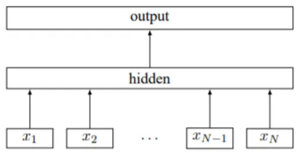
Figure 1: Model architecture of fastText for a sentence with N ngram features x1, .. . , xN. The features are embedded and averaged to form the hidden variable.
资料来源：Bag of Tricks for Efficient Text Classification，华泰研究

fastText 的网络结构和 CBOW 的网络结构类似，如上图所示，包括输入层、隐藏层和输出层三层网络，输出层也使用 Hierarchical Softmax 来提升训练效率，和 CBOW 相比有两个不同点：

1. CBOW 的输入层是目标单词的上下文词向量求和（或求平均），而 fastText 的输入是多个单词及其 n-gram 特征，将 bag-of-words 变成了 bag-of-features；

2. CBOW 预测目标是语境中的一个词，而 fastText预测目标是当前这段输入文本的类别（所以说 fastText 是一个有监督模型）。

公式的推导与 CBOW 类似，这里我们不再详细展开。

word2vec 的出现极大的促进了 NLP 的发展。

一方面，word2vec 一类的方法给每一个词语赋予向量表征。无论是早期的 NNLM 还是后来的 word2vec、GloVe、fastText 等，都可以用分布式向量来对词语进行描述，更好地刻画词语之间语义上的相似性。

另一方面，更为重要的是 word2vec 带来了一种全新的 NLP模型建立方法。在这之前，大多数 NLP任务都要在如何挖掘更多文本语义特征上花费大量时间，甚至一部分工作占去了整个任务工作量的绝大部分。

在以 word2vec 为代表的 distributed representation 方法大量涌现后（尤其是因为大规模语料上的预训练词向量成为现实，并且被证明确实行之有效之后），研究人员发现利用word2vec 在预训练上学习到的词向量来初始化他们自己模型的第一层，会带来极大的效果提升。此后几乎业内的默认做法便是使用 word2vec 或是其他 word embedding 模型的词向量来作为模型的第一层。

回过头来考虑，word2vec 类的模型表象似乎仅仅是使用分布式向量来对词语进行表示，这与过去使用离散式向量有何本质区别？有，因为它开启了一种全新的 NLP模型训练方式——迁移学习，在基础语料库上训练得到的词向量被迁移运用于下游的其他 NLP 任务，信息的利用效率得以成倍提高。

正如人类语言诞生之初，一旦某个原始人类的喉部发出的某个音节，经历史学家智慧且刨根问底的研究表明具有某个实际指代意义后，这便无比庄严的宣示着一个全新物种的诞生。迁移学习在 NLP中的一小步，大致与此相当。

## 第三阶段：以 BERT为代表，NLP站上“巨人之肩”

在 word2vec 提出之后，也有较多针对句子和段落级别的模型大量涌现，例如 Skip-thoughts、Quick-thoughts 和 Infersent 等，受限于篇幅本文不再详细展开。当然 NLP 的目标并不仅仅是对如何获得更好的词语或句子特征感兴趣，而是要将其应用到下游任务中。

在得到句子表征后，这些模型在评估各自性能时所采取的方法似乎无一例外地都使用类似的思路：将得到的句子表征在新的分类任务上进行训练，而彼时的模型一般只使用一个全连接层，然后连接 softmax进行分类。

这种分类任务足够简单，相比于同时期各种复杂设计的分类模型简直不值一提，但是这些简单的分类器却能比肩甚至超越同时代的复杂模型，这背后的原因正是迁移学习。但是我们的目标当然不是仅将迁移过程用在模型性能评估上，而是要迁移到下游任务中带来提升。以下介绍的模型基本都有迁移学习的思想，预训练语言模型的时代来临。

## 预训练语言模型

预训练语言模型是我们前文所提到的“迁移学习”的典型代表。深度学习中，无论是自然语言处理中的语料，还是计算机视觉中的图像，人工标注的训练数据总是稀少且准确度低，而未标注的数据却十分丰富，同时某类特殊的任务可能也没有充足的训练数据可以学习到规律。“预训练”（Pre-training）一般是将大量低成本收集的训练数据放在一起，通过预训练学习到这些数据中的共性，然后将提取出的共性迁移到特定任务的模型中，要么作为补充特征输入下游特定任务的模型，要么使用特定任务的少量标注数据对预训练模型进行“微调”，这样就完成“共性-特殊”的模型训练过程。

上一阶段介绍的 word2vec 可以称作是第一代预训练语言模型，特点是上下文无关（context-free），关注于词向量的生成，然而对特定任务神经网络的参数却关注不足。词向量的生成是静态的，不考虑上下文，因此会出现同一个词虽然在不同语境中含义不同，模型生成的词向量却完全相同这种情况。接下来我们要介绍的 NLP 模型更多是第二代预训练语言模型，NLP模型进入上下文相关（context-aware）时代，即使是同一个单词生成的词向量也会随着语境的改变动态调整。

## 这一阶段的 NLP模型可以按不同的方法进行分类：

1. 从不同的特征提取机制来看，可以分为基于 RNN 的 ELMo、ULMFiT，基于 Transformer的 GPT、BERT、基于 Transformer-XL 的 XLNet 等；

2. 从能否表示上下文以及预训练语言目标来看，可以分为单向表征的自回归语言模型（AutoRegressive Language Model），如 ULMFiT、GPT 等；双向表征的自编码语言模型（AutoEncoder Language Model），如 BERT 系列模型；双向表征的自回归语言模型，如 ELMo、XLNet 等；

3. 从预训练好的语言模型后续应用的方式来看，可以分为基于特征（Feature-based）的预训练模型，如 ELMo；基于微调（Fine-tuning）的预训练模型，如 GPT、BERT 等。

不同分类的 NLP模型有各自的特点，例如自回归模型更适合文本生成（NLG）任务，自编码模型更适合文本理解（NLU）任务，我们在介绍各模型时会详细去讲解。

## ELMo

## 模型预训练

在 word2vec 模型中，词和向量是一对一的关系，但即使是同一个词在不同的语境中也会有不同的含义，例如苹果既可能指一种水果，也可能指苹果公司，这样用同样的词向量来指代不同语境下的同一个词实际上是不合适的，而 ELMo 模型可以解决这一问题。

ELMo 的全称是 Embeddings from Language Models，是一个可以生成动态词向量的预训练语言模型，由 Matthew E. Peters 等人 2018 年在论文《Deep contextualized wordrepresentations》中首次提出。ELMo 模型综合起来说有如下两个特点：（1）ELMo 模型使用整段文本作为输入，根据上下文动态地生成词向量，因此可以学习不同语境下的词汇多义性；（2）没有像 word2vec 模型一样上下文一并作为输入，而是使用双向的语言模型，分别从正反两面在词元序列上运行，使提取的特征更准确。

ELMo 使用双向 LSTM 来完成上述任务。例如有一个具有 N 个词语的序列 $(t_{1},t_{2},\ldots,t_{N})$ , 对于前向语言模型, 我们利用前k −1个词来预测第k个词：

$$
p(t_{1},t_{2},\ldots,t_{N})=\prod_{k=1}^{N}p(t_{k}\mid t_{1},t_{2},\ldots,t_{k-1}).
$$

后向语言模型与前向语言模型相似，但它反向运行在序列上，使用后续的文本来预测前一个词:

$$
p(t_{1},t_{2},\ldots,t_{N})=\prod_{k=1}^{N}p(t_{k}\mid t_{k+1},t_{k+2},\ldots,t_{N}).
$$

双向语言模型（biLM）就是同时利用前向语言模型和后向语言模型来预测 $t_{k}$ 。双向语言模型训练的目标是最大化二者联合的对数似然函数：

$$
\Theta=argmax\sum_{k=1}^{N}(\log\mathsf{p}(t_{k}\mid t_{1},\ldots,t_{k-1};\Theta)+\log\mathsf{p}(t_{k}\mid t_{k+1},\ldots,t_{N};\Theta))
$$

图表19： ELMo 模型图
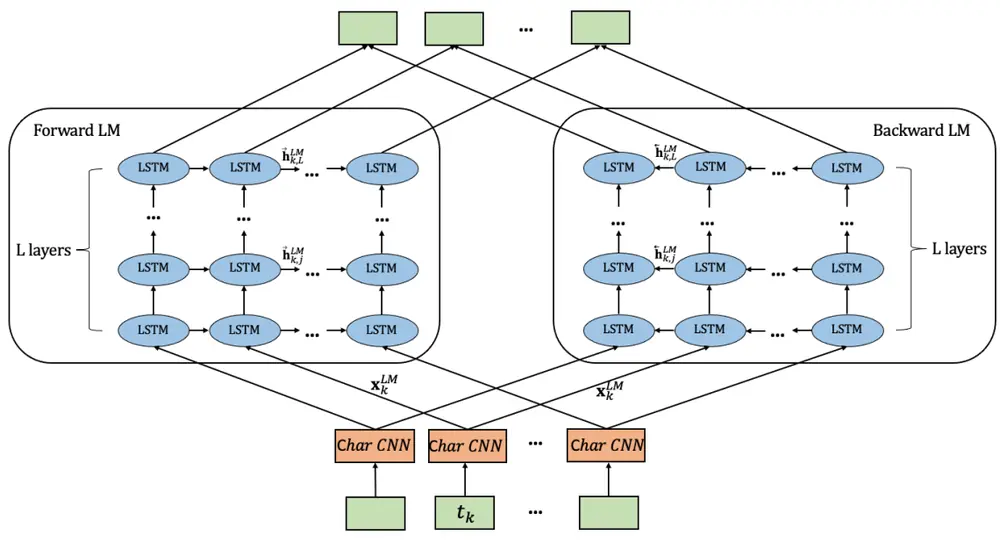
资料来源：华泰研究

在预训练阶段，对于一个词语 $\cdot t_{k}$ ，ELMo 模型使用通过 char-based CNN（Rafal Jozefowicz等 2016 年在论文《Exploring the Limits of Language Model》中提出的模型）生成原始的静态词向量作为模型的输入，用 $\mathbf{x}_{k}^{LM}$ 表示。若只考虑单层的 LSTM 和前向语言模型，将上一时刻的隐状态 $h_{k-1}$ 及 $\mathbf{.x}_{k}^{LM}\mathrm{~一~}$ 并送入 LSTM 可得到隐状态 $h_{k}$ ，在输出层按以下公式计算$p(t_{k}\mid t_{1},\ldots,t_{k-1})$ ，这种先经过CNN得到词向量，再计算Softmax的方法叫做CNN Softmax：

$$
h_{k}=\mathrm{LSTM}(t_{k}\mid t_{1},\ldots,t_{k-1})
$$

$$
p(t_{k}\mid t_{1},\ldots,t_{k-1})=\frac{\exp(CNN(t_{k})^{T}h_{k})}{\sum_{i=1}^{|V|}\exp(CNN(t_{k})^{T}h_{k})}
$$

后向语言模型部分类似，当考虑多层 LSTM 时将最后一层 LSTM 的输出作为上述 $h_{k}$ 。假设$\vec{\Theta}_{LSTM}$ 为正向 LSTM 模型的参数， $\overleftarrow{\Theta}_{LSTM}$ 为后向 LSTM 模型的参数， $\Theta_{s}$ 为 softmax 层参数，$\Theta_{x}$ 为将词语映射到原始词向量的映射层参数（即 char-based CNN 中的参数，这部分参数在模型训练时不变，由预训练好的 char-based CNN 定义），优化上文中提到的 biLM 的目标函数来进行模型训练：

$$
\Theta=argmax\sum_{k=1}^{N}\left(\log\mathsf{p}\big(t_{k}\mid t_{1},\ldots,t_{k-1};\Theta_{x},\overleftarrow{\Theta}_{LSTM},\Theta_{s}\big)+\log\mathsf{p}\big(t_{k}\mid t_{k+1},\ldots,t_{N};\Theta_{x},\overleftarrow{\Theta}_{LSTM},\Theta_{s}\big)\right)
$$

可以得到最终的 ELMo 模型。此外通过随机添加适当数量的 dropout 或者对 ELMo 模型的权重添加 L2 正则项，可以提高模型的表现。

## 词向量生成

词向量是语言模型的副产物，对于每个单词 $(t_{k}$ ，通过 L 层的 biLSTM 语言模型最后一共可以输出 1个静态词向量和 2L 个动态词向量：

$$
\begin{array}{rl}{R_{k}}&{=\big\{\mathbf{x}_{k}^{LM},\vec{\mathbf{h}}_{k,j}^{LM},\overleftarrow{\mathbf{h}}_{k,j}^{LM}\mid j=1,\dots,L\big\}}\\&{=\big\{\mathbf{h}_{k,j}^{LM}\mid j=0,\dots,L\big\}}\end{array}
$$

其中， $\mathbf{x}_{k}^{LM}$ 为最原始的输入静态词向量， $\vec{\mathbf{h}}_{k,j}^{LM}$ 为第k个输入词在第j层前向 LSTM 输出的动态隐向量，包含了前面文本的信息； $\mathbf{\check{h}}_{k,j}^{LM}$ 为第k个输入词在第j层后向 LSTM 的动态隐向量，包含了后面文本的信息。

有两种方式可以得到 ELMo 模型提取的最终的词向量，最简单的情形是直接使用最顶层biLSTM 的输出作为词向量，即使用 $\mathbf{h}_{k,L}^{LM}$ 作为EL $\mathsf{M}\mathbf{o}_{k}^{\mathsf{task}}$ ；另一种是将所有层的 $\mathbf{1}_{k,j}^{LM}$ 以一定权重进行加权，静态词向量和动态词向量组合起来得到最终词向量 $\mathbf{ELMo}_{k}^{\mathsf{task}}$ ，如下所示：

$$
\mathrm{ELMo}_{k}^{\mathrm{task}}=E\big(R_{k};\Theta^{\mathrm{task}}\big)=\gamma^{\mathrm{task}}\sum_{j=0}^{L}\;s_{j}^{\mathrm{task}}\mathbf{h}_{k,j}^{LM}
$$

其中， $s_{j}^{\mathsf{task}}$ 是经 softmax标准化后的各 LSTM层的权重， $\gamma^{\tt task}$ 是缩放因子。

一旦我们得到训练好的 ELMo 模型以及 ELMo 模型生成的每个单词的词向量，我们可以将其作为新特征，供下游任务使用。ELMo 模型的优势在于解决一词多义问题，同时可以学习到语法等词汇用法的复杂性。当然，ELMo 模型也有自己的不足之处，例如 LSTM 训练速度较慢、特征提取能力不如 Transformer、正向和反向 LSTM 之间无通信导致上下文特征融合不好等，从这个角度看，ELMo 模型的“双向特征表示”远不如一体化融合特征的 BERT模型，或者称它为“伪双向表征”语言模型更合适。

从今天来看，无论是word2vec还是GloVe都过于简单，受限于所使用模型的表征能力，某种意义上都只能得到比较偏上下文共现意义上的词向量，并且很少考虑词序对于词向量的影响。新的时代背景下算法人员需要一种能更深层次的揭示词或句子语义的方法，ELMo也应运而生。虽然 ELMo 本身思想足够简单，仅仅是引用和拼接前辈们的工作，但是它却足够有效，BERT诞生前在NLP领域掀起不小的波澜，在超过6项NLP的下游任务中超越同时代的最好效果。

(c) Classifier fine-tuning

## ULMFiT

在计算机视觉领域，迁移学习是一种常见的手段，首先在类似于 ImageNet 这样的大数据集上进行预训练，然后再对训练好的神经网络结合具体任务进行微调。然而之前在 NLP领域这一方法用的很少。

受此启发，2018 年 Jeremy Howard 等人发表论文《Universal Language Model Fine-tuningfor Text Classification》，提出了基于微调的通用语言模型 ULMFiT（Universal LanguageModel Fine-tuning），是“预训练模型微调”模式的开创性工作。ULMFiT 在 WikiText-103上预训练语言模型，以此学习到大规模语料的文本特征，再对预训练好的通用模型进行微调，使其可用于不同的文本分类任务。ULMFiT 由三个阶段组成，分别为通用领域的语言模型预训练、目标任务的语言模型微调、目标任务的分类器微调，如下图所示。

图表20： ULMFiT 的三阶段
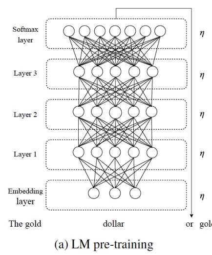

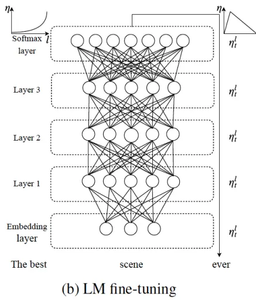
资料来源：Universal Language Model Fine-tuning for Text Classification，华泰研究

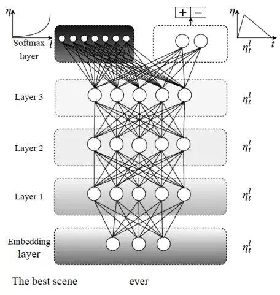

第一阶段为通用领域的语言模型预训练，用WikiText-103（28595 篇经过处理的Wikipedia文章，103M 单词）作为语料库，搭配 AWD-LSTM（ASGD Weight-Dropped LSTM）对语言模型进行预训练。AWD-LSTM 是一个三层的 LSTM 网络，主要做了如下两点改进：

1. 有研究表明，在语言建模任务中，传统的不带动量的 SGD 算法比动量 SGD 等其他算法要好。传统的 SGD 中权重更新步骤为：

$$
w_{k+1}=w_{k}-\gamma_{k}\widehat{\nabla}f(w_{k})
$$

k为迭代的次数， $w_{k}$ 为第k次迭代后的权值。ASGD（Averaged SGD）使用过去的权重求均值来进行部分权重的更新：

$$
w_{k+1}=\frac{1}{k-T+1}{\sum_{i=T}^{k}}~w_{i}.
$$

其中，k是迭代次数，T < k为指定的触发阈值。在前T个迭代中，ASGD 的权重更新方法和传统 SGD 完全相同。AWD-LSTM 使用 ASGD 的一种非单调触发变体——NT-ASGD，它的效果优于传统 SGD。

2. Dropout 在神经网络领域缓解过拟合上取得了巨大的成功。但由于 RNN 经常需要保持长期依赖，在 RNN 的隐藏状态上应用 Dropout 表现不佳。AWD-LSTM 使用DropConnect 进行改进，对隐藏状态之间权重矩阵进行 Dopout 操作来防止过拟合。

第二阶段为目标任务的语言模型微调，该过程仅需要对权值进行微调而不需彻底训练网络，
以下两种方法可以用于这一阶段的微调：
1. 正常的情况下，参数更新的公式为：

$$
\theta_{t}=\theta_{t-1}-\eta\cdot\nabla_{\theta}J(\theta)
$$

但实际上网络不同层可以获得的信息种类是不同的，因此不同层采用不同的学习率是更好的选择，这就是 ULMFiT 的微调策略之一——区别性微调策略（Discriminativefine-tuning），定义ηl对应第l层的学习速率，采用逐层递减来定义学习率，则：

$$
\begin{array}{c}{{\theta_{t}^{l}=\theta_{t-1}^{l}-\eta^{l}\cdot\nabla_{\theta^{l}}J(\theta)}}\\{{\eta^{l-1}=\eta^{l}/2.6}}\end{array}
$$

2. 为了使参数适合于特定的任务，我们希望模型在训练开始时参数就快速收敛到合适的区间，然后对参数进行精细的优化。在这过程中使用恒定的学习率或者衰减学习率不是一个好的选择。ULMFiT 提出一种倾斜三角学习率微调策略（Slanted triangularlearning rates），这种学习率调整策略首先迅速地增加学习率，再逐渐降低学习率，计算公式如下：

$$
p=\{\begin{aligned}&\quad\begin{aligned}cut&=[T\cdot cut_{-}frac]\\t&-\frac{t/cut\quad,\quad\quad\quad\quad\quad\quad\quad\quad\quad\quad\quad\quad\quad\quad\quad\quad\quad\quad\quad\quad\quad\quad\quad\quad\quad\quad\quad\quad\quad\quad\quad\quad\quad\quad\quad\quad\quad\quad\quad\quad\quad\quad\quad\quad\quad\quad\quad\quad\quad\quad\quad\quad\quad\quad\quad\quad\quad\quad\quad\quad\quad\quad\quad\quad\quad\quad\quad\quad\quad\quad\quad\quad\quad\quad\quad\quad\quad\quad\quad\quad\quad\quad\quad\quad\quad\quad\quad\quad\quad\quad\quad\quad\quad\quad\quad\quad\quad\quad\quad\quad\quad\quad\quad\quad\quad\quad\quad\quad\quad\quad\quad\quad\quad\quad\quad\quad\quad\quad\quad\quad\quad\quad\quad\quad\quad\quad\quad\quad\quad\quad\quad\quad\quad\quad\quad\quad\quad\quad\quad\quad\quad\quad\quad\quad\quad\quad\quad\quad\quad\quad\quad\quad\quad\quad\quad\quad\quad\quad\quad\quad\quad\quad\quad\quad\quad\quad\quad\quad\quad\quad\quad\quad\quad\quad\quad\quad\quad\quad\quad\quad\quad\quad\quad\quad\quad\quad\quad\quad\quad\quad\quad\quad\quad\quad\quad\quad\quad\quad\quad\quad\quad\quad\quad\quad\quad\quad\quad\quad\quad\quad\quad\quad\quad\quad\quad\quad\quad\quad\quad\quad\quad\quad\quad\quad\quad\quad\quad\quad\quad\quad\quad\quad\quad\quad\quad\quad\quad\quad\quad\quad\quad\quad\quad\quad\quad\quad\quad\quad\quad\quad\quad\quad\quad\quad\quad\quad\quad\quad\quad\quad\quad\quad\quad\quad\quad\quad\quad\quad\quad\quad\quad\quad\quad\quad\quad\quad\quad\quad\quad\quad\quad\quad\quad\quad\quad\quad\quad\quad\quad\quad\quad\quad\quad\quad\quad\quad\quad\quad\quad\quad\quad\quad\quad\quad\quad\quad\quad\quad\quad\quad\quad\quad\quad\quad\quad\quad\quad\quad\quad\quad\quad\quad\quad\quad\quad\quad\quad\quad\quad\quad\quad\quad\quad\quad\quad\quad\quad\quad\quad\quad\quad\quad\quad\quad\quad\quad\quad\quad\quad\quad\quad\quad\quad\quad\quad\quad\quad\quad\quad\quad\quad\quad\quad\quad\quad\quad\quad\quad\quad\quad\quad\quad\quad\quad\quad\quad\quad\quad\quad\quad\quad\quad\quad\quad\quad\quad\quad\quad\quad\quad\quad\quad\quad\quad\quad\quad\quad\quad\quad\quad\quad\quad\quad\quad\quad\quad\quad\quad\quad\quad\quad\quad\quad\quad\quad\quad\quad\quad\quad\quad\quad\quad\quad\quad\quad\quad\quad\quad\quad\quad\quad\quad\quad\quad\quad\quad\quad\quad\quad\quad\quad\quad\quad\quad\quad\quad\quad\quad\quad\quad\quad\quad\quad\quad\quad\quad\quad\quad\quad\quad\quad\quad\quad\quad\quad\quad\quad\quad\quad\quad\quad\quad\quad\quad\quad\quad\quad\quad\quad\quad\quad\quad\quad\quad\quad\quad\quad\ \end{aligned}\end{aligned}
$$

T为训练中总迭代的次数，cut frac是我们增加学习率的迭代的比例，cut是学习率由增加转减小的那次迭代，ratio 是最大学习率对最小学习率的倍数。

图表21： ULMFiT的倾斜三角学习率微调策略
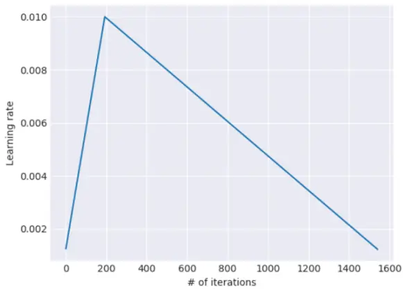
资料来源：Universal Language Model Fine-tuning for Text Classification，华泰研究

第三阶段是目标任务的分类器微调。在原来的网络中额外添加了两个线性层，同时加入Batch Normalization 和 Dropout 操作，使用 ReLU 作为中间层激活函数，最后用 softmax输出分类的概率分布，来完成文本分类的任务。由于我们做文本分类时的关键信号可能包括在文章各处出现的极少数词中，如果我们仅考虑模型最后一层隐藏状态的话可能会丢失许多重要信息，因此在 GPU 内存允许的情况下，ULMFiT 对尽可能多的模型前面层的隐藏状态进行平均池化和最大池化：

$$
\mathbf{h}_{c}=[\mathbf{h}_{T},\mathrm{maxpool}(\mathbf{H}),\mathrm{meanpool}(\mathbf{H})]
$$

其中 $\mathbf{H}=\{\mathbf{h}_{1},\dots,\mathbf{h}_{T}\}$ 。其次，ULMFiT 第三阶段采用了“逐渐解冻”(Gradual unfreezing)的微调方式，即没有一次性对所有层微调，而是从最后一层开始逐渐解冻模型，由后向前逐渐解冻并精调所有层，这样避免了一次过度调参造成的“灾难性遗忘”。

ULMFiT 的优点在于首次提出了一个基于微调的预训练语言模型，要处理一项 NLP 任务，不再需要从头开始训练模型，只需要在通用模型的基础上进行微调即可。缺点是主要做的是文本分类任务，无法应用于其他 NLP任务，如阅读理解、文本匹配等。

## GPT

循环神经网络RNN是NLP领域使用最多的深度学习模型，其往往也能够实现不错的效果，但 RNN 在训练过程中主要有两个问题，一是梯度爆炸或者消失，二是 RNN 是一个自回归结构，后一个隐状态的输入必须依赖于前一个隐状态的输出，不同单词无法并行导致模型的训练速度很慢。LSTM 的应用解决了梯度爆炸或消失，但没有从根本上改变 RNN 效率低下的问题，同时 LSTM 特征提取的能力也还不够强，在信息处理等方面还存在弊端。在这种情况下，Transformer 应运而生，它完全基于 Attention 机制，并行程度较高，模型训练速度快，最新一些 NLP模型如 GPT、BERT，网络架构都建立在 Transformer 的基础上。

理论上来说要理解这些最新 NLP 模型的工作原理，读者需要具有 Encoder-Decoder、Attention、Self-Attention、Transformer 等模型的知识储备，事实上这些模型也是整个 NLP领域的关键内容。因此本节先对这些必要的知识做一个介绍，再介绍 Transformer 在 NLP领域的应用之一——GPT。GPT 首次将 Transformer 应用在语言模型之中，实际上，它对于 NLP 发展的意义远大于它的名气。

## Encoder-Decoder、Attention、Self-Attention 与 Multi-Head Attention

RNN 的输入输出有 1对 n、n 对 n、n对 1、n对 m 等多种结构。机器翻译作为一种典型的NLP 任务，输入语言和目标语言的语法不同，因此语句的长度、词序都不尽相同，是一种典型的 n对 m 的 RNN结构。Encoder-Decoder 框架常用于机器翻译中，其由两个 RNN 网络组成，分别称为编码器（Encoder）和解码器（Decoder）。首先 Encoder 将输入的数据压缩进一个固定长度的语义向量c⃗ 作为中间状态（c⃗ 可能是 Encoder 最后一层的隐状态，也可能是各层隐状态的结合），然后再将c⃗ 送入 Decoder 进行解码。Encoder-Decoder 的工作原理可以用下图表示。

图表22： Encoder-Decoder 框架
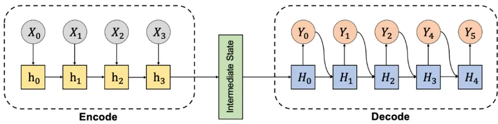
资料来源：华泰研究

Encoder-Decoder 结构的循环神经网络具有自身的局限性。Encoder-Decoder 的中间状态往往是一个具有固定长度的语义向量，这意味着它能够存储的信息是有限的。对于较长的句子，语义向量c⃗ 无法完全表达整个序列的信息，先输入的信息很容易被后输入的信息覆盖。然而 Decoder 网络所有的信息都来自于c⃗ ，无法获得足够的信息会使解码效果不佳。

人类在面临大量的外界信息时，人脑可以从这些大量输入信息中选择小部分的有用信息来重点处理，并忽略其他信息，这种能力叫做“注意力”（Attention）。比如说人在翻译一段话时，往往注意力会聚焦于当前的单词和上下文，而非整段话。Encoder-Decoder 也可以参照人脑的注意力机制进行改进，对一些关键的输入信息进行处理。

在 Encoder-Decoder 框架中，若用ℎ来代表 Encoder 中的隐藏层，用H来代表 Decoder 中的隐藏层，则 Decoder 网络中第t个隐藏层 $H_{t}=f(H_{t-1},y_{t-1})$ 。当我们引入 Attention 机制，使得网络在翻译不同的句子时可以对原文中不同的语句和单词给予重点关注时，Decoder网络中第t个隐藏层可以写成：

$$
H_{t}=f(H_{t-1},y_{t-1},C_{t})
$$

$$
C_{t}=\sum_{i=1}^{n_{sequence}}\alpha_{ti}h_{i}.
$$

其中， $C_{t}$ 是时刻t的上下文向量，是 Encoder 中所有隐藏层 $h_{i}$ 的加权平均。由于对每个隐藏层的关注程度不同，自然我们给每个 $-h_{i}$ 分配的权重也不同，这个权重我们称为全局对齐权重（Global Alignment Weights）。带有 Attention 的 Encoder-Decoder 的工作原理如下图所示：

图表23： 带有 Attention 的 Encoder-Decoder 框架图
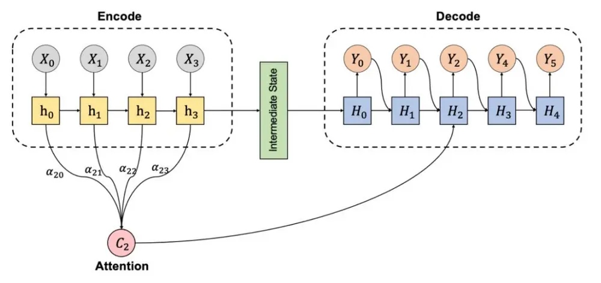
资料来源：华泰研究

可以看到，我们要解决的最关键的问题就是如何计算全局对齐权重，也就是 $\alpha_{ti}$ 的大小。定义 $.e_{ti}=s(h_{i},H_{t-1})$ 为相关能量（associated energy），综合 Encoder 中所有隐藏层并用向量形式表示， $\overrightarrow{e_{t}}=(s(h_{1},H_{t-1}),s(h_{2},H_{t-1}),\ldots,s(h_{n_{sequence}},H_{t-1}))$ ，则 $\overrightarrow{\alpha_{t}}=softmax(\overrightarrow{e_{t}})$ ，即注意力

$$
C_{t}=\sum_{i=1}^{n_{sequence}}\frac{\exp(s(h_{i},H_{t-1}))}{\sum_{j=1}^{n_{sequence}}\exp(s(h_{j},H_{t-1}))}h_{i}
$$

至于 $\boldsymbol{\cdot}\boldsymbol{e}_{ti}$ 的计算方法，具体来说有以下几种：

1. 加性模型： $s(h_i,H_{t-1})=v^t\tanh(Wh_i+UH_{t-1})$ ，W、U为可学习的参数。

2. 乘法模型： $s(h_{i},H_{t-1})=h_{i}WH_{t-1}$ ，W为可学习的参数。

3. 点积模型： $s(h_{i},H_{t-1})=h_{i}^{T}H_{t-1}$

上面的 Attention 机制我们也称为 Soft Attention，为与下文中介绍 Self-Attention 的工作机制相衔接，我们从寻址的角度再来探讨一下 Soft Attention。由于不需要中间状态来存储Encoder 中的信息，H可以直接调取ℎ的信息，因此类比于数据库的操作，我们给原先的H一个新的名字 $\mathbf{q},$ ，代表查询（Query），ℎ同时记为K和V，代表查询的键（Key）与值（Value），因此我们将 Attention 的算式改写为：

$$
Attention\big((\boldsymbol{K},\boldsymbol{V}),\boldsymbol{q}\big)=\sum_{i=1}^{n_{sequence}}\frac{\exp(s(k_i,\boldsymbol{q}))}{\sum_{j=1}^{n_{sequence}}\exp(s(k_j,\boldsymbol{q}))}v_i
$$

可以看到在 Soft Attention 中，Key 与 Value 其实是相等的，同时 Query 取自 Decoder 中的隐藏层。这与自注意力机制（Self-Attention）不同，在 Self-Attention 中，Key、Value、Query 是不相同的，Attention 计算需要的 Key、Value、Query 都完全直接来自于输入的词向量。Self-Attention 也是 Transformer 的基础。Transformer 是多层的 Encoder、Decoder的堆叠，Self-Attention 计算的 Attention 张量在各层之间流动，抛弃了 RNN、CNN 等复杂的神经网络架构，并行程度高。下图展现了 Self-Attention 的工作机制。

图表24： Self-Attention 可以视为 RNN 类模型的平替
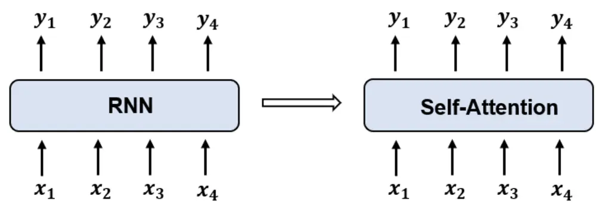
资料来源：华泰研究

图表25： Self-Attention 的工作机制
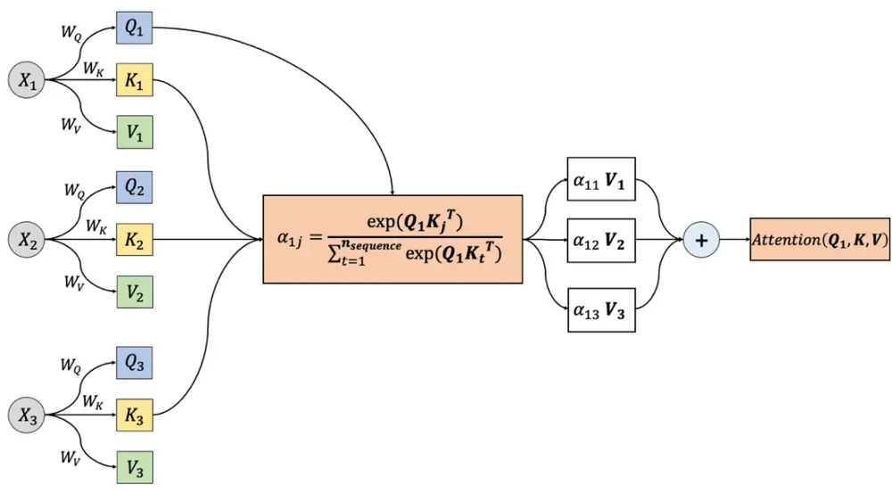
资料来源：华泰研究

Self-Attention 的计算步骤可以总结为如下几步：

1. 对于每一个单词词嵌入向量 $x_{i}$ ，分别让它乘上 $W^{Q}、W^{K}、W^{V}$ ，映射成三个新向量： $\pmb{q}_{i}$ （查询 Query）、 $K_{i}$ （键 $Key)$ $V_{i}$ （值 Value）。 $W^{Q}$ $W^{K}$ $W^{V}$ 都是可学习的参数矩阵。同时定义Q为整个序列的 Query 矩阵，K为整个序列的 Key 矩阵， V为整个序列的 Value 矩阵。

2. 我们接着计算对于词嵌入向量 $x_{i},$ ，第 j 个单词的全局对齐权重 $[\alpha_{ij}$ 。 $\alpha_{ij}$ 的计算可以参考Soft Attention 的点积模型方法，但我们使用输入单词的 Query 代替了输出单词的Query：

$$
\alpha_{ij}=\frac{\exp(\boldsymbol{Q}_i\boldsymbol{K}_j^T)}{\sum_{t=1}^{n_{sequence}}\exp(\boldsymbol{Q}_i\boldsymbol{K}_t^T)}
$$

$$
Attention(\boldsymbol{Q}_{i},\boldsymbol{K},\boldsymbol{V})=\sum_{j=1}^{n_{sequence}}\alpha_{ij}V_{j}
$$

3. 我们可以很容易看出，对于不同的输入词向量，Attention 的计算过程是完全可以并行进行的，这大大提高的模型的训练速度。我们可以将 Attention 的计算式重新写成：

$$
Attention(\boldsymbol{Q},\boldsymbol{K},\boldsymbol{V})=softmax(\frac{\boldsymbol{Q}\boldsymbol{K}^T}{\sqrt{d_k}})\boldsymbol{V}
$$

$\pmb{Q}\pmb{K}^{T}$ 的方差会比较大，易影响模型的稳定性，因此将其除以 $\sqrt{d_{k}}$ 进行缩放，使方差归一。

我们不妨梳理一下各参数的维度，因为这样更有利于理解整个 Self-Attention 机制。假设词汇表的大小为|V|，则一个单词可以转化为一个|V|维的 one-hot 向量。若词嵌入转换矩阵 $\cdot W^{E}$ 的维度为|V| $\times d_{embedding}$ ，则这个单词最终变成词嵌入向量 $\pmb{x}_{i}\in\mathbb{R}^{d_{embedding}}$ ，一个有$n_{sequence}$ 个单词的文本序列会被转换为矩阵X ∈ ℝnsequence×dembedding输入模型。我们用X分别 乘 上 三 个 可 学 习 的 参 数 矩 阵 $\boldsymbol{W}^{Q}\in\mathbb{R}^{d_{embedding}\times d_{k}}\quad,\quad\boldsymbol{W}^{K}\in\mathbb{R}^{d_{embedding}\times d_{k}}\quad,\quad\boldsymbol{W}^{V}\in$ $\mathbb{R}^{d_{embedding}\times d_{v}}$ ，映射成的三个矩阵为： $\pmb{Q}\in\mathbb{R}^{n_{sequence}\times d_{k}}\textbackslash\pmb{K}\in\mathbb{R}^{n_{sequence}\times d_{k}}\textbackslash\pmb{V}\in\mathbb{R}^{n_{sequence}\times d_{\pmb{v}}}\textbackslash$ 在论文《Attention Is All You Need》中假设 $.d_{k}=d_{v}=d_{embedding}=d_{model}\mathrm{{}^{\circ}}$ 。容易得出 $\pmb{Q}\pmb{K}^{T}\in$ ℝnsequence×nsequence， $\pmb{Q}\pmb{K}^{T}$ 的第 t 行表示第 t 个单词和其他单词计算注意力得到的权重。$softmax(\pmb{Q}\pmb{K}^{T}/\sqrt{d_{k}})\pmb{V}$ 的维度是 $|n_{sequence}\times d_{model}$ ，即 $Attention(\boldsymbol{Q},\boldsymbol{K},\boldsymbol{V})\in\mathbb{R}^{n_{sequence}\times d_{model}}$ 这和模型的输入维度完全一样。

对于每一个词嵌入向量 $x_{i}$ ，为了可以提取出更多的信息，我们引入了多头注意力机制（ Multi-Head Attention）。 Multi-Head Attention 其 实 就 是用 不 同 的参 数多 次 计 算了Self-Attention。具体来说，对于 $x_{i}$ ，我们设置 h组不同的参数 $\left(W_{1}^{Q}、W_{1}^{K}、W_{1}^{V}\right)、\left(W_{2}^{Q}、W_{2}^{K}\right.$ $W_{2}^{V})、\ldots、(W_{h}^{Q}、W_{h}^{K}、W_{h}^{V})$ ，并缩小Q、K、V的维度 $\_d_{\/k}\_d_{\/v}$ 至原来的 1/h。我们将不同参数计算出的结果（也称为 head）进行拼接，并乘上参数矩阵 $.W_{0}$ ，得到最终的 Attention，公式化表示为：

$$
Multi-HeadAttention(\boldsymbol{Q},\boldsymbol{K},\boldsymbol{V})=concat(head_1,head_2,\ldots,head_h)\boldsymbol{W}_0
$$

很容易看出，Multi-Head Attention 输出的 Attention 维数与 Self-Attention 相比是没有改变的。Multi-Head Attention 的工作流程可以用下图来表示：

图表26： Multi-Head Attention
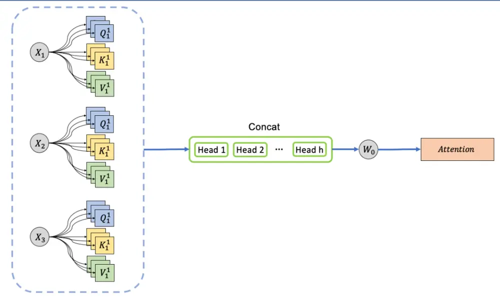
资料来源：华泰研究

## Transformer

前文也提到，RNN 由于其训练速度慢饱受诟病。2017 年，谷歌发表了论文《Attention is AllYou Need》。这篇文章完全摒弃了 RNN 和 CNN 的结构，提出了完全基于 Self-Attention 机制的 Transformer 架构，并应用于机器翻译任务，当时达到了 SOTA 效果。目前最新的 NLP模型，如 GPT、BERT 等，无一不是基于 Transformer 的网络架构，因此理解 Transformer的结构与原理是进一步解读其他 NLP 模型的前提条件。

总体上来看，Transformer 由一个 Encoder Block 和一个 Decoder Block 组成，一个 Block里又有若干个 Encoder/Decoder 模块堆叠而成（论文中各为 6 个）。每个模块包含了Multi-Head Attention 层、全连接层等功能不同的工作层，编码模块与解码模块中的工作层不尽相同，因此我们先分别对 Encoder 和 Decoder 模块进行一个介绍，再将这些模块组合起来，介绍 Transformer 的整体架构。

我们首先对 Transformer 的 Encoder 模块进行剖析。Encoder 模块的输入是一个大小为$n_{sequence}\times d_{model}$ 的矩阵，该矩阵在经过 Multi-Head Attention 层后，输出一个计算好的Attention 张量，并对其进行了残差连接。为减少梯度爆炸和梯度消失问题，Attention 一般需要进行标准化处理。由于每句话的序列长度不相同，因此如果使用 Batch Normalization进行归一化的话效果会比较差。Layer Normalization 常被用于自然语言处理中，用于在隐藏层不同单词之间进行标准化。Transformer 使用 Layer Normalization 来减少梯度问题，具体操作如下：

$$
\mu=\frac{1}{n_{sequence}}{\sum_{i=1}^{n_{sequence}}}A_{i},A_{i}\in R^{[1,d_{model}]}
$$

$$
\sigma=\sqrt{\frac{1}{n_{sequence}}{\sum_{i=1}^{n_{sequence}}(A_{i}-\mu)^{2}}}
$$

$$
LayerNorm(\mathrm{A})=\frac{\mathbf{g}}{\sigma}\odot(A-\mu)+\mathbf{b}
$$

$\mathbf{g}和\mathbf{b}$ 是 Layer Normalization 所需要的两个可学习参数，用以防止模型退化。Attention 经过标准化后进入一个全连接层，首先对其进行一个使用 ReLU 作为激活函数的全连接运算，经过此步后 Attention 的维度会增大，因此再使用一个无激活函数的线性层对其进行降维。再进行一次残差连接和 Layer Normalization 后，就可以将结果输出该 Encoder 模块，作为其他 Encoder 模块的输入。

Transformer 的 Decoder 模块实际上与 Encoder 差异比较大。由于 Decoder 在预测下一个单词的时候采取的是自回归的方式，在生成一个单词的时候，只能用到前面已经生成的单词。而且 Transformer 的输入必须是定长的句子，Decoder 模块的输入在已有的单词后面可能会有一长串无意义的占位符，这无疑会对 Attention 的计算带来干扰。

另一种情况是在模型训练时我们不使用 Decoder 已经生成的单词，而是直接使用 GroundTruth——一个完整的句子，预测其中某个词（Teacher-forcing的训练模式，后文中有介绍），这更会牵涉到信息泄露的问题。因此，Decoder 模块中的多头注意力采用的是 MaskedMulti-Head Attention，将掩码机制代入 Attention，即我们生成一个下三角全 0，上三角全为-inf 的矩阵M，遮盖于 $\cdot QK^{T}$ 矩阵之上，生成新的 masked $\pmb{Q}\pmb{K}^{T}$ 矩阵，之后计算全局对齐权重时，通过 softmax 可以将-inf 变为 0。这样，在预测第 t+1 个单词时，就看不见前 t 个单词之后的词了。用公式表示为：

$$
Attention(\boldsymbol{Q},\boldsymbol{K},\boldsymbol{V})=softmax(\frac{\boldsymbol{Q}\boldsymbol{K}^T\odot\boldsymbol{M}}{\sqrt{d_k}})\boldsymbol{V}
$$

下图也可以直观理解这一过程。

图表27： Masked Multi-Head Attention 原理图
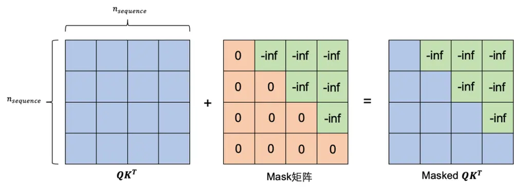
资料来源：华泰研究

计算好的 Attention 同样经过残差连接和标准化后，进入 Encoder-Decoder Multi-HeadAttention 层，这层本质上就是一层 Multi-Head Attention，但它的Q来自于上一层的输出，而K和V则是来自于最后一个 Encoder 模块的输出。此后又经过残差连接及标准化、全连接层等后，最终输出该 Decoder 模块，作为其他 Decoder 模块的输入。

图表28： Transformer 的 Encoder 模块
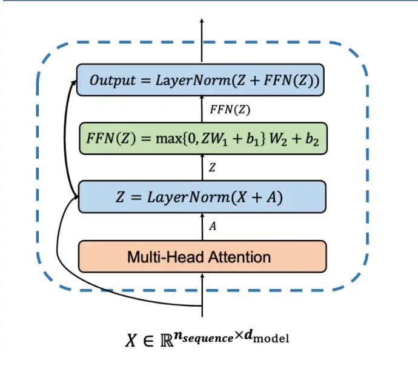
资料来源：华泰研究

图表29： Transformer 的 Decoder 模块
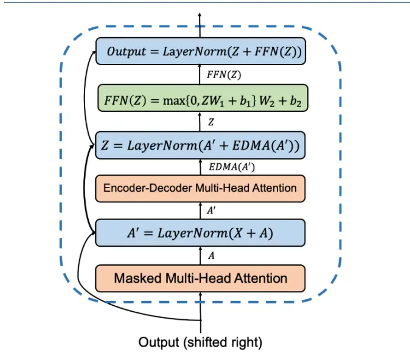
资料来源：华泰研究

了解清楚 Encoder 模块和 Decode 模块的结构之后，我们将其堆叠起来，组成最终的Transformer 网络。Encoder Block 的输入自然是文本序列的词嵌入向量矩阵，由于Transformer的输入必须为定长，长度过长的样本要进行截断，过短的文本要用特殊字符（例如“<PAD>”）进行补齐。此外，为提取不同单词的位置信息，Transformer引入了位置编码（Positional Encoding），将位置编码与原始词向量相加作为 Encoder Block 的输入，位置编码的编码准则如下：

$$
\begin{aligned}PE(pos,2i)&=sin(\frac{pos}{10000^{2i/d_{model}}})\\PE(pos,2i+1)&=cos(\frac{pos}{10000^{2i/d_{model}}})\end{aligned}
$$

pos是当前单词的位置；嵌入层的维度为偶数则使用sin函数，奇数则使用cos函数。输入信息依次经过6个 Encoder 模块后，向 Decoder Block 中各模块传递K和V的信息。我们不难看出，因为一个文本序列可以一次完整输入 Encoder Block，Encoder Block 实际上只需要运行一次，因此 Encoder Block 也可以看作是一个双向表征的 Transformer。

图表30： Transformer 整体结构图
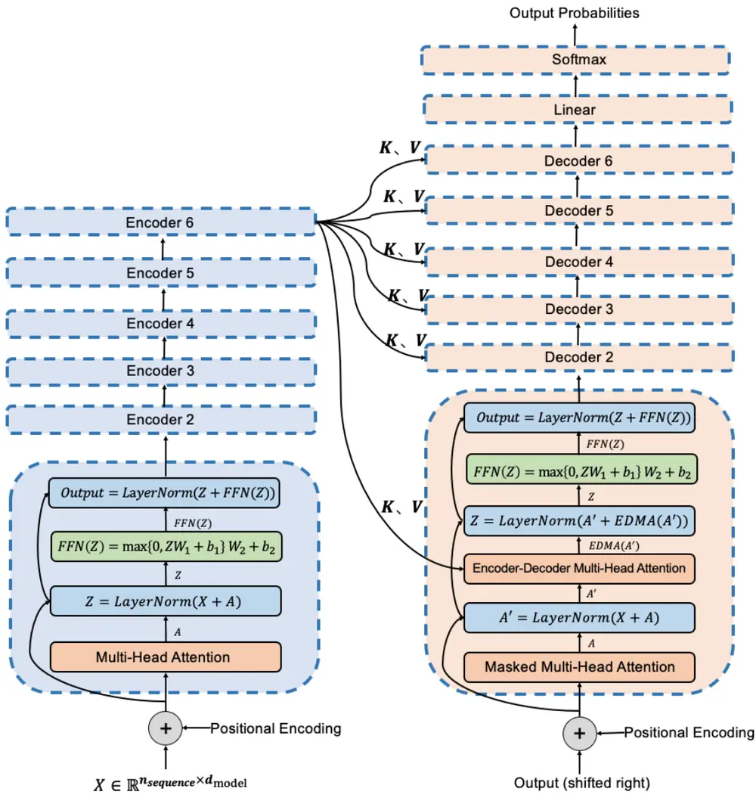
资料来源：华泰研究

Decoder Block 采用自回归的方式不断预测新单词。理论上来说，Decoder Block 是输入已有的 t 个单词去预测第 t+1 个单词，然后使用交叉熵损失函数进行优化。然而实际上Transformer 采用“导师驱动”（Teacher-forcing）的训练模式，即在 Decoder Block 考虑如何输出第 t+1 个词时，我们并不使用模型输出的前 t个词语，而是直接使用 Ground Truth（真实样本）中的前 t 个词，一方面预测准确度更高，另一方面这大大提高模型的收敛速度，因为预测第 t+1 个单词时不必等待前 t 个单词的输出，完全可以同时并行预测很多个单词。

这就好比我们在解决一道有多个小问，且每个小问相互关联的数学题时，如果直接给了我们前几个小问的标准答案，那我们在解决最后一小问自然准确度更高，速度也更快。当然Teacher-forcing 的训练模式也有一些弊端，例如训练和预测时解码方式的不一致导致的曝光偏差（Exposure Bias），以及模型生成结果必须与参考语料完全对应导致的翻译多样性缺失，在这里我们不展开讨论。

由于 Decoder Block 的输入有固定长度的限制，不允许超出或有空格，因此我们实际上直接将文本开始符“<SOS>”与标准答案——一个完整的符合长度的句子，加上位置编码后输入 Decoder Block。当我们实际向 Decoder Block 输入长度为 k 的文本序列时（包含开始符<SOS>）时，我们实际上是并行地在完成预测第 1、2、3、…、k 个单词的过程，具体来说，<SOS>用于预测第1个单词，<SOS>和标答中第1个单词用于预测第2个单词，<SOS>和标答中第 1、2 个单词用于预测第 3 个单词，依次类推。Masked Multi-Head Attention 的机制让我们丝毫不担心预测中信息泄露的问题。输入的 $n_{sequence}\times d_{model}$ 维矩阵在经过 6个Decoder 模块后，最后一个模块的输出需要经过一个线性层（与词嵌入转换矩阵的转置$W^{E^{\top}}$ ∈ ℝdmodel×|V|相乘，维数扩增到 $n_{sequence}\times|\mathbb{V}|)$ ），每行经过softmax 选择概率最高的一个单词作为预测结果，softmax 的具体原理如下图所示。

图表31： Softmax 预测原理图
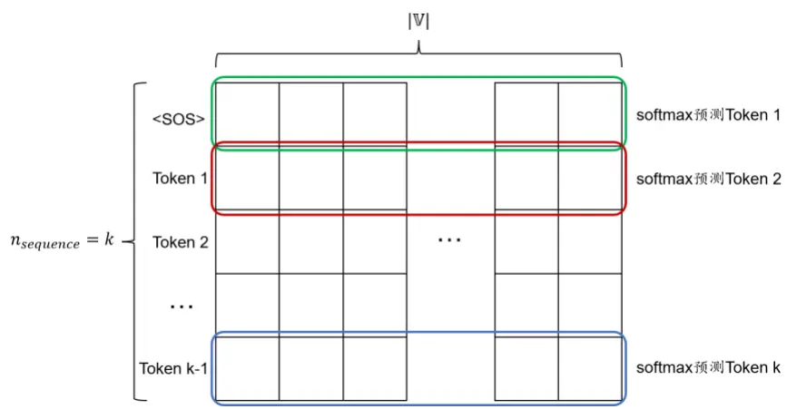
资料来源：华泰研究

## GPT

OpenAI 于 2018 年 率 先 提 出 基 于 Transformer 的 NLP 模 型 — — GPT(GenerativePre-Training)，来解决各种自然语言问题，例如分类、推理、相似度、问答等。GPT 摒弃了传统 NLP模型的结构——RNN，特征抽取的能力更强，能够学习到更丰富的语义语境信息。

GPT 基本单元是 Transformer 的 Encoder 模块和 Decoder 模块的结合，修改主有以下两方面：（1）因为 GPT 是单向表征的自回归语言模型，主要用来处理语言生成任务，因此将Encoder 模块的多头注意力层改成了 Decoder 中的 Masked Multi-Head Attention，这样在预测一个单词只会用到前面已经生成的单词，而无信息的泄露。（2）将 Encoder 模块的全连接层的激活函数换成了 GELU。我们可能看到在某些说法中，GPT 是基于 Decoder 的，那指的是 GPT 和 Decoder 一样使用了 Attention 的掩码机制，而非指应用了 Decoder 的结构。从 GPT 的模型结构上来看，GPT 共有 12 层，12 个 Multi-Head Attention 的 heads，768 维的隐藏层维度，点对点全连接层为 3072 维。

图表32： GPT结构图
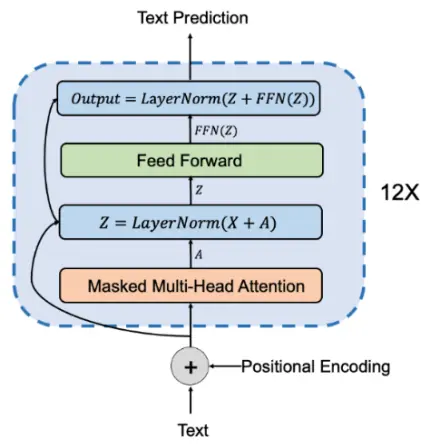
资料来源：华泰研究

GPT 是典型的“无监督预训练+有监督微调”的两阶段模型，先在没有标注的数据集中进行预训练，之后再在有标注的特定任务数据集上进行微调。GPT 使用 BooksCorpus 数据集作为语料库，该数据集包含了还包含了 7000 多本未发表的书。GPT 使用 ftfy库对数据集进行了清洗，并使用 spaCy 进行了分词。预训练阶段对于一个含有大量单词的语料库U =$\{u_{1},\ldots,u_{n}\}$ ，GPT 使用语言模型并极大化似然函数来进行优化：

$$
L_{1}(\mathcal{U})=\sum_{i}\log P(u_{i}\mid u_{i-k},\ldots,u_{i-1};\Theta),
$$

k是预测时所用到的单词的个数，P是用于预测的模型。我们定义 $U=(u_{-k},\ldots,u_{-1})$ 为输入的k个单词的 one-hot 编码序列， $W_{e}$ 为词嵌入映射矩阵， $W_{p}$ 为位置嵌入矩阵，L 表示堆叠的Block 层数，则 GPT 的预训练流程可以按如下方法公式化：

$$
\begin{aligned}h_{0}&=UW_{e}+W_{p}\\h_{l}=transformer_{block(h_{l-1})},l&\in\{1,2,3\ldots,L\}\\P(u)&=softmax(h_{L}W_{e}^{T})\end{aligned}
$$

预训练完成后需要对少量的带标注的数据对模型参数进行微调。我们使用一个有标注的数据集C，假设每个样本的单词是 $x^{1},\ldots,x^{m}$ ，标签为y。预训练中最后一个 Transformer 的输出实际上之前没有用到，我们用它和参数 $W_{y}$ 组成一个线性层共同预测 $P(y\mid x^{1},\ldots,x^{m})$ ：

$$
P(y\mid x^{1},\ldots,x^{m})=softmax(h_{l}^{m}W_{y})
$$

我们选择极大化 $.L_{2}(\mathcal{C})$ 作为微调阶段的目标函数：

$$
L_{2}(\mathcal{C})=\sum_{(x,y)}\log P(y\mid x^{1},\ldots,x^{m}).
$$

GPT 的作者发现，将预训练时的损失函数和微调阶段的损失函数加在一起，可以取得更好的效果，因此，作者将两部分损失加在一起进行优化：

$$
L_{3}(\mathcal{C})=L_{2}(\mathcal{C})+\lambda*L_{1}(\mathcal{C})
$$

实际上很容易看出，一般情况下在 GPT 的微调阶段，需要增加的参数只有 $W_{y}$ 。

下图展示了不同任务下 GPT 微调所需的输入形式和模型的修改。在分类任务中，将 Start+文本+Extract 输入到 Transformer中，得到的结果输入到线性分类器中，就可以将 GPT 改造成分类模型。在蕴含任务中，将先验与假设使用 Delim 分隔符分开输入到 Transformer中，接上 softmax 的线性层，就可以将 GPT 改造成蕴含模型。对于相似度问题和多重选择问题，也可以参照图中的方法进行修改，得到最终的结果。

图表33： GPT的微调
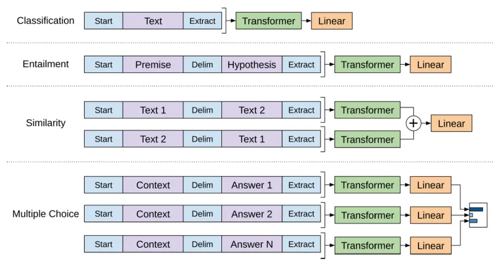
资料来源：Improving Language Understanding by Generative Pre-Training，华泰研究

GPT 首次摒弃基于 RNN 的传统 NLP 模型结构，将 Transformer 引入到模型中来。然而它的名气却并不十分大。一方面是宣传不力，另一方面仅仅在 GPT 几个月后，BERT 就横空出世，横扫各项榜单。一直到 OpenAI 发表了 GPT-2，GPT 才扬眉吐气了一把。GPT-2 与GPT 非常相似，我们在下面简单介绍一下这个模型。

## GPT-2

2019 年 OpenAI 发表论文《Language Models are Unsupervised Multitask Learners》，带来了 GPT 的迭代版本——GPT-2。从标题里就可以看得出来，OpenAI 认为现在这种“预训练+微调”的模式其实是不必要的了，语言模型应该直接冲击零样本无监督多任务学习器的目标，即预训练好的模型可以直接用于下游任务，完全舍弃微调阶段。GPT-2 的核心思想：虽然预训练阶段不指定特定的任务，但当一个模型已经“博览群书”，掌握充足的文本特征后，事实上我们已经没有必要再针对特定的任务专门去修改模型了，只需要将要做的任务也作为一个提示词，和文本一起输入预训练好的模型，就可以完成这个任务。这就好比于当我们对一本书滚瓜烂熟之后，不管是让我们做摘要，还是续写，我们都可以很轻松地直接去应对。

相较于第一代模型，GPT-2的主要改进有：

1. 由于这个语言模型要足够通用，要掌握足够多的文本知识，因此 GPT-2 构建了一个包含了 800 万个文档、容量达 40G 的高质量语料库——WebText。

2. 由于语料库非常大，要学习的东西非常多，自然模型也需要比较复杂。GPT-2 设计得非常深，Transformer达到了 48 层，隐层的维度为 1600，参数量达到惊人的 15 亿（为BERT 的 5 倍）。

3. 对网络结构也进行了调整，GPT-2 词汇表大小由 2 万提升到 50257，最大上下文大小(context size) 从一代的 512 个单词提升到了 1024，batch size 从 512 提升为 1024。此外，区别于普通 Transformer，GPT-2 将 Layer Normalization 放在了 MaskedMulti-Head Attention 层和 FFN 层的前面，并且在最后一层 Transformer 模块后又额外添加了一层 Layer Normalization，同时残差层初始化的方法也有修改。

图表34： GPT-2 结构图
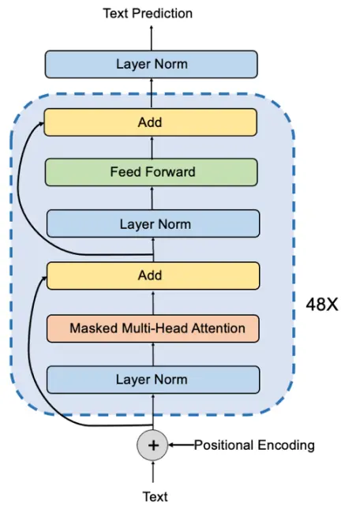
资料来源：华泰研究

可以看出 OpenAI 固执地延续使用着单向语言模型的结构，但由于模型足够复杂，语料库的规模足够大，即使去掉了微调阶段，模型完成特定任务的效果也不错。GPT-2 的文本生成能力尤其强，其生成的文本远超人们目前对语言模型的预期，以至于 OpenAI 担忧其将会导致滥用而一度暂停开源。

在 GPT-2 之后，OpenAI 于 2020 年继续提出了 GPT-3 模型，具有 1750 亿个参数，比 GPT-2高达 100 倍，且使用 45TB 数据进行训练。该模型经过将近 0.5 亿个单词的预训练，并且在不进行微调的情况下可以在多个 NLP基准上达到最先进的性能，堪称“暴力出奇迹”的典范，受限于篇幅本文不再详细展开。

## BERT

Google AI 研究院 2018 年 10 月发表论文《BERT: Pre-training of Deep BidirectionalTransformers for Language Understanding》，提出的一种新的预训练模型——BERT。BERT 模型全称是 Bidirectional Encoder Representation from Transformers，它是 NLP 领域里程碑式的进步，彼时在多项 NLP任务中夺得 SOTA结果。

前文所提到的语言模型（Language Model），如 ELMo、GPT，多是语言生成模型，例如根据前面的句子预测后一个单词，或者将原语言句子翻译成目标语言句子，自回归语言模型（AutoRegressive LM）对于处理这种生成任务得心应手，对于要预测的单词，既可以用自回归模型结合前面的信息从前往后预测，也可以结合后面的信息反向预测，甚至可以将二者结合起来构成双向（bidirectional）模型。但这样做仍不能完整地理解整个语句的语义，因为上下文的特征缺乏融合。

BERT 是自编码语言模型（AutoEncoderLM），为了能够同时得到上下文融合起来的信息，采用了双向的 Transformer，而不是像 GPT 一样完全放弃下文信息，或是像 ELMo 一样采用“伪双向”结构。具体来说，当随机遮盖住句子中的某个单词时，使用 Transformer 的Encoder 同时获取上下文的信息，将上下文信息进行融合来全向预测这个被掩码的单词，因此 BERT 的双向结构其实是更加深度的（deep bidirectional）。由于同时掌握了上下文信息，可以看出 BERT 目的并不是要构造一个语言生成模型，而是为了学习到整个语句的语义，因此 BERT 的语言模型其实是一种语言表征模型（Language Representation Model）。

图表35： BERT、GPT 与 ELMo 的区别
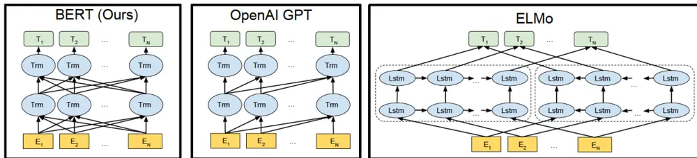
资料来源：BERT: Pre-training of Deep Bidirectional Transformers for Language Understanding，华泰研究

## BERT 的输入

BERT 的预训练语料库使用了 BooksCorpus 和英语维基百科两份数据，大约有 33 亿个单词，比 GPT 大数倍，语料需要进行预处理。BERT 首先采用 WordPiece 对句子进行分词，这种分词是精确到子词级别的，例如 playing 会被拆分为“play”+“##ing”。然后在每个句子首尾添加[CLS]和[SEP]标记（模型最后一层[CLS]位对应向量可以作为整句话的语义表示，用于下游的分类任务；[SEP] 用来分隔两句话，用来处理多语句的任务）。针对每个句子可能词数不同的情况，BERT 设置了一个专门指定每句话长度的超参，超过就进行截断，不足则在句尾用[PAD]标记进行补齐。BERT 的 Embedding 由以下三部分相加组成：

1. Token Embeddings：BERT 有一个三万多词的词汇表，通过词汇表将单词映射成one-hot 向量后，再乘上一个中间矩阵W，生成新的词嵌入向量。

2. Segment Embeddings：BERT 预训练阶段输入为两个句子，上下句子以[SEP]分割，segment embedding 用来区分每个单词属于前一句话还是后一句话。

3. Position Embeddings：和上文中 Transformer 用三角函数不同，BERT 的 PositionEmbeddings 是个可学习的嵌入向量，BERT 一个样本最多支持 512 个位置。

图表36： BERT 模型的 Embedding
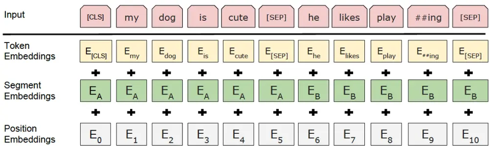
资料来源：BERT: Pre-training of Deep Bidirectional Transformers for Language Understanding，华泰研究

## BERT 预训练

BERT 模型非常深，有两种模型参数：BERT-Base 有 12 层 Encoder、768 维的隐藏层维度、12 个 Multi-Head Attention 的 heads，而 BERT-Large 有 24 层 Encoder、1024 维的隐藏层维度、24 个 Multi-Head Attention 的 heads。BERT 一共有两个预训练任务：MaskedLanguage Model（MLM）和 Next Sentence Prediction（NSP）。

## 1. Masked Language Model（MLM）

在每条训练样本中以 15%的概率随机地选中某个 token 位置用于预测，且被选中的 token会按概率替换成以下三个 token 之一：

1）80%的概率替换成[MASK]，如 The stock price rises —> The stock price [MASK]

2）10%的概率替换为其他 token，如 The stock price rises —> The stock price dives

3）10%的概率还是原来的 token，如 The stock price rises —> The stock price rises

被选中预测的位置，取最后一层 Encoder 对应的输出，再通过一个分类层（全连接+GELU+正则化）后，将输出向量乘以词嵌入矩阵，再用 softmax 就可以计算词汇表中每个单词的概率，进而与真实词求损失函数。

## 2. Next Sentence Prediction（NSP）

BERT 使用 NSP预训练来使模型有能力理解句子之间的关系，即预测两个句子是否是上下文关系。具体做法为对于每一个训练样例，在语料库中挑选出句子 A和句子 B来组成：1）50%的概率句子 B是句子 A的下一句，此时标记为 IsNext；

2）50%的概率句子B是语料中随机选取的句子（不一定是A的下一句），此时标记为NotNext；
把训练样例输入给 BERT，用[CLS]的输出向量进行二分类预测。

最后的预训练输入样本可能如下所示，在训练 BERT 模型时，MLM 和 NSP一起训练，BERT的损失函数由两个任务的损失函数共同组成:

$$
L(\theta,\theta_{1},\theta_{2})=L_{1}(\theta,\theta_{1})+L_{2}(\theta,\theta_{2})=-\sum_{i=1}^{M}\log p(m=m_{i}\mid\theta,\theta_{1})-\sum_{j=1}^{N}\log p(n=n_{i}\mid\theta,\theta_{2})
$$

其中 $m_{i}\in[1{,}2,\ldots,|V|]$ ，n ∈ [IsNext, Notnext]，BERT 使用 AdamW 作为优化器。

样本 1：[CLS] CSI500 rose [MASK] today [SEP] trading volume [MASK] greatly [SEP] 标签 1：IsNext

样本 2：[CLS] CSI500 [MASK] sharply today [SEP] penguin [MASK] are flight [SEP] 标签 2：NotNext

## BERT 应用于下游任务

BERT 可用于多种语言任务，完成预训练之后，要针对特定任务进行有监督的微调。前文也提到，ELMo 是“基于特征的预训练语言模型”，而 BERT 是“基于微调的预训练语言模型”，下游任务需要将模型改造成 BERT 模型，才可利用 BERT 模型预训练好的参数。

BERT 模型微调相对比较简单，仅需要在模型中再额外添加一个输出层即可。例如，下图的(a)、(b)分别是多句子和单句子的分类任务，Transformer 的输出中[CLS]标记位的向量经过一层维度为 H（隐藏层维数）×K（分类数）的网络 W 后用 softmax 进行分类，在特定任务数据集中对 Transformer 模型和网络W 进行有监督的训练直至收敛。

图表37： BERT模型的预训练
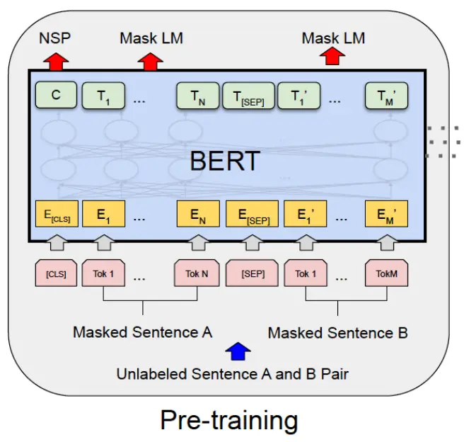
资料来源：BERT: Pre-training of Deep Bidirectional Transformers for Language Understanding，华泰研究

图表38： BERT模型的微调
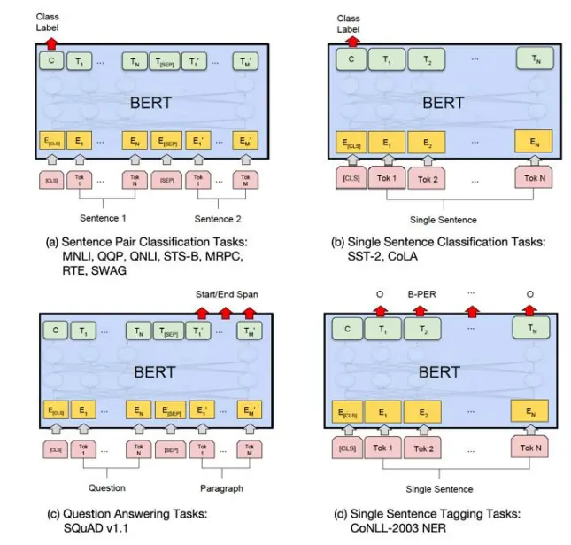
资料来源：BERT: Pre-training of Deep Bidirectional Transformers for Language Understanding，华泰研究

BERT 模型的优点在于相较于使用 RNN、LSTM 的其他 NLP 模型来说，使用 Transformer的架构做到了并行执行，同时采用深度双向表征的方法从上下文全向提取信息进行融合，使理解的语义更加完整。BERT后来又被改进为许多新模型，如RoBERTa、AIBert、SpanBert等，成为了一个系列，并长期霸占在各类 NLP任务榜单榜首。BERT 缺点是模型参数太多，而且模型太大，训练一次需要巨大的时间和硬件开销。同时因为没有采用自回归的结构，BERT 对文本生成任务的支持并不好。

## XLNet

在 XLNet 之前，NLP 模型无外乎分为两类：自回归语言模型（AutoRegressive LM）和自编码语言模型（AutoEncoder LM）。自回归语言模型使用上一时刻模型的输出作为下一时刻的输入，目标函数是根据前t −1个单词预测第t个单词的似然概率最大：

$$
\underset{\theta}{max}\log p_{\theta}(\mathbf{x})=\sum_{t=1}^{T}\log p_{\theta}(x_{t}\mid\mathbf{x}_{<t})=\sum_{t=1}^{T}\log\frac{\exp(h_{\theta}(\mathbf{x}_{1:t-1})^{\top}e(x_{t}))}{\sum_{x^{\prime}}\exp(h_{\theta}(\mathbf{x}_{1:t-1})^{\top}e(x^{\prime}))}
$$

自回归语言模型非常适合文本生成任务，但只能使用上文或下文的信息，或者上下文的“伪结合”。以 BERT 为代表的自编码语言模型在句子中用[MASK]随机遮住一些单词，并通过上下文信息融合全向预测这些单词，这是典型的 DAE（Denoising AutoEncoder）的思路。用x̅代表被掩码的单词，x̂代表没有被掩码的单词，自编码语言模型的目标函数为：

$$
\underset{\theta}{max}\log p_{\theta}(\bar{\mathbf{x}}\mid\hat{\mathbf{x}})\approx\sum_{t=1}^{T}m_{t}\log p_{\theta}(x_{t}\mid\hat{\mathbf{x}})=\sum_{t=1}^{T}m_{t}\log\frac{\exp(H_{\theta}(\hat{\mathbf{x}})_{t}^{\top}e(x_{t}))}{\sum_{x^{\prime}}\exp(H_{\theta}(\hat{\mathbf{x}})_{t}^{\top}e(x^{\prime}))}
$$

自编码语言模型很好地融合了上下文的信息，理解的语义更加完整，但其也有一些缺点，例如：（1）BERT 中有一个独立性假设，即被掩码的单词之间应相互独立，这忽略了单词之间的依赖性；（2）在预训练时输入中有[MASK]标记，然而在微调时是没有[MASK]标记的，使两个阶段产生差异；（3）更适合语义理解任务，语义生成能力差。

如果说我们希望一个语言模型既可以处理生成任务，又能深度双向训练，融合自编码语言模型和自回归语言模型的优点，理论上来说有两种思路：一是让在自编码语言模型的基础上使其具有生成能力，二是让自回归语言模型能够更好地使用使用上下文融合的信息。XLNet就是基于第二种思路。2019年10月，CMU和Google大脑团队联合发表论文《XLNet:Generalized Autoregressive Pretraining for Language Understanding》，提出了 XLNet 模型，当时在 20 项任务上全面超越了 BERT，创造了 NLP 预训练模型的新记录。XLNet 本质上是基于自回归语言模型的改进，但它也具有深度双向训练的能力。下面我们具体来介绍一下 XLNet 模型的特点与改进之处。

## 改进 1：排列组合语言模型（Permutation Language Modeling）

理论上来说，自回归语言模型只能使用上文或下文的信息，或者用上下文单独做一个预测并拼接起来，XLNet 模型巧妙引入了排列组合语言模型（Permutation Language Modeling），使自回归模型也可以全向学习文本内容。假设有一条文本序列 $\{X_{1},X_{2},X_{3},X_{4}\}$ ，若我们使用生成模型来预测 $|X_{3}|$ 的话，我们只能使用到 $X_{1}$ 和 $X_{2},$ 。排列组合语言模型对单词序列随机打乱，如下图所示，例如在左下角，要预测的文本序列被打乱成 $\{X_{1},X_{4},X_{2},X_{3}\}$ ，则在用语言模型预测 $X_{3}$ 时，就可以用到之前用不到的位置 4 的信息 $.X_{4}$ 了。排列组合语言模型的目标函数如下：

$$
\mathop{max}_{\theta}\mathbb{E}_{\mathbf{z}\sim\mathcal{Z}_{T}}\left[\sum_{t=1}^{T}\log p_{\theta}(x_{z_{t}}\mid\mathbf{x}_{\mathbf{z}_{<t}})\right]
$$

其中， $z_{T}$ 是所有可能的排列方式，z是其中一种排列方式， $z_{t}$ 指排列z中第 t个要预测的单词在原始序列中的位置， $\mathbf{z}_{<t}$ 指排列z中前 t-1个单词在原始序列中的位置。

图表39： 排列组合语言模型
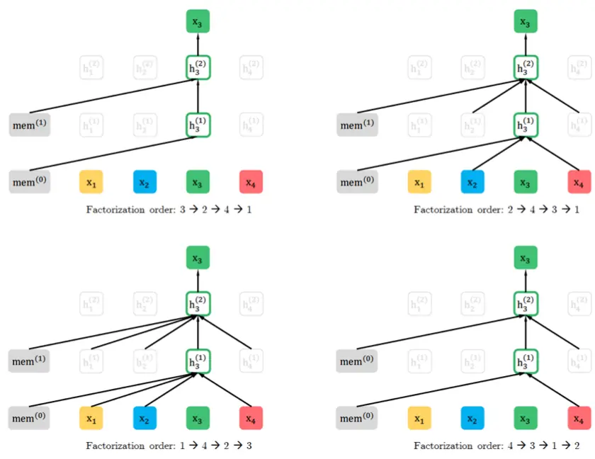
资料来源：XLNet: Generalized Autoregressive Pretraining for Language Understanding，华泰研究

理论上来说遍历所有排列后，模型一定可以双向学习到非常完整的上下文信息，但如果一个序列的单词数很多，可构成排列组合的数目可能过多，导致计算量爆炸，因此 XLNet 实际只采样其中一些排列进行训练，并且只预测其中约 14-16%的单词。另外，并不是说真的会打乱单词的顺序输入模型，而是通过 Attention掩码随机遮住一部分单词的，剩余的单词就相当于排列在要预测的单词之前了。

排列组合语言模型仍然采用自回归模型，并没有为要预测的单词添加[MASK]标记，因此其不依赖于 BERT 的独立性假设，同时自然也不存在下游无[MASK]标记导致上下游不同的问题。

## 改进 2：双流注意力机制（Two-Stream Self-Attention）

Two-Stream Self-Attention 的产生源于排列组合语言模型的需要，如果采用普通的Transformer 来建模排列组合语言模型的话，我们预测 $X_{z_{t}}$ 的概率分布可以用如下式子来表示：

$$
p_{\theta}\left(X_{z_{t}}=x\mid\mathbf{x}_{z_{<t}}\right)=\frac{\exp\left(e(x)^{T}h_{\theta}\left(\mathbf{x}_{z_{<t}}\right)\right)}{\sum_{x^{\prime}}\exp\left(e(x^{\prime})^{T}h_{\theta}\left(\mathbf{x}_{z_{<t}}\right)\right)}
$$

但这样会存在一个问题，在部分不同的排列情况下，排列组合语言模型预测不同位置的单词时会出现同样的结果。假设有两种不同的排列 $\mathbf{z}^{(1)}$ 和 $\pmb{\mathscr{x}}^{(2)}$ $\mathbf{z}_{<t}^{(1)}=\mathbf{z}_{<t}^{(2)}=\mathbf{z}_{<t}$ ，但 $z_{t}^{(1)}=i\neq$ $j=z_{t}^{(2)}$ ，很容易发现会有两个不同的位置却预测成了相同的单词：

$$
\frac{p_{\theta}\left(X_{i}=x\mid\mathbf{x}_{\mathbf{z}_{<t}}\right)}{z_{t}^{(1)}=i,x_{<t}^{(1)}=\mathbf{z}_{<t}}=\frac{p_{\theta}\left(X_{j}=x\mid\mathbf{x}_{\mathbf{z}_{<t}}\right)}{z_{t}^{(2)}=j,z_{<t}^{(2)}=\mathbf{z}_{<t}}=\frac{\exp\left(e(x)^{\top}h\left(\mathbf{x}_{\mathbf{z}_{<t}}\right)\right)}{\sum_{x^{\prime}}\exp\left(e(x^{\prime})^{\top}h\left(\mathbf{x}_{\mathbf{z}_{<t}}\right)\right)}
$$

我们不妨举个例子来更好地理解，假设原始的单词序列为 $\{X_{1},X_{2},X_{3},X_{4}\}$ ，现有 $\mathbf{\hat{z}}^{(1)}=$ $\{X_{1},X_{2},X_{3},X_{4}\}$ 和z $\mathbf{\xi}^{(2)}=\{X_{1},X_{2},X_{4},X_{3}\}$ 两种排列方式，则 $z_{3}^{(1)}=3\neq4=z_{3}^{(2)}$ 。在 $\mathbf{z}^{(1)}下$ ，我们第三个要预测的单词是原序列中位置为 3 的单词X3，在 $\mathbf{\nabla}_{\mathbf{\nabla}}\mathbf{z}^{(2)}$ 下，我们第三个要预测的单词是原序列中位置为 4 的单词 $X_{4}$ 。但实际上， $X_{3}$ 和 $X_{4}$ 却预测成了同一个单词：

$$
p_{\theta}\big(X_{3}=x\mid\mathbf{x}_{\mathbf{z}_{<3}}\big)=p_{\theta}\big(X_{4}=x\mid\mathbf{x}_{\mathbf{z}_{<3}}\big)=\frac{\exp\big(e(x)^{T}h_{\theta}(X_{1}X_{2})\big)}{\sum_{x^{\prime}}\exp\big(e(x^{\prime})^{T}h_{\theta}(X_{1}X_{2})\big)}
$$

这显然是非常不合理的。之所以会产生这种原因，是因为忽略掉了我们要预测的单词在原始序列中的位置信息。为此 XLNet 提出新的概率分布计算方法，在预测 $X_{z_{t}}$ 时将位置信息 $\cdot z_{t}$ 考虑了进去，但不包含内容信息 $X_{z_{t}}$ ：

$$
p_{\theta}(X_{z_t}=x\mid\mathbf{x}_{z_{<t}})=\frac{\exp\left(e(x)^{\top}g_{\theta}(\mathbf{x}_{z_{<t}},z_t)\right)}{\sum_{x'}\exp\left(e(x')^{\top}g_{\theta}(\mathbf{x}_{z_{<t}},z_t)\right)}
$$

XLNet 通过 Two-Stream Self-Attention 来实现上述思想。两个流分别为内容流（ContentStream）和查询流（Query Stream）。查询流就为了预测当前词，只包含当前词的位置信息，不包含当前词的内容信息；内容流主要为查询流提供其它词的位置信息和内容信息。具体操作上，内容流做 self-attention 时，Q取当前位置的全部信息（用 $h_{z_{t}}^{(m-1)}$ 表示），K和V取所有位置的全部信息（下图（a）所示）。查询流做 self-attention 时，Q取当前位置的位置信息（用 $g_{z_{t}}^{(m-1)}$ 表示），K和V取其他位置的全部信息（下图（b）所示）。也可以用下式来表示：

$$
g_{z_{t}}^{(m)}\gets\mathsf{Attention}\left(\mathsf{Q}=g_{z_{t}}^{(m-1)},\mathsf{KV}=\mathbf{h}_{z_{<t}}^{(m-1)};\theta\right),(\mathsf{query\:stream}\colon\mathsf{use}\enspace z_{t}\enspace\mathsf{but\:cant\:see}\enspace x_{z_{t}})
$$

$$
h_{z_{t}}^{(m)}\leftarrow Attention(\mathbf{Q}=h_{z_{t}}^{(m-1)},\mathbf{K}\mathbf{V}=\mathbf{h}_{z_{t}}^{(m-1)};\theta),(contentstream:usebothz_{t}andx_{z_{t}})
$$

下图（c）展示了如何用 Attention 掩码来实现双流机制。掩码矩阵红色部分代表被掩码，例如对于内容流掩码矩阵，若有顺序 3→2→4→1，2 能看到 3，则第二列第三行未被掩码，1 能看到 2、3、4，则第一列第二三四行均未被掩码，查询流掩码矩阵同理。

图表40： Two-Stream Self-Attention
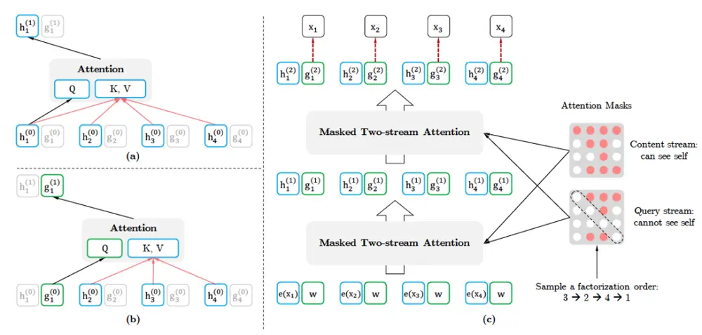
资料来源：XLNet: Generalized Autoregressive Pretraining for Language Understanding，华泰研究

## 改进 3：融入 Transformer-XL 的优点

BERT 模型里的 Transformer 固定了句子长度，输入句子的默认长度为 512，超过就进行截断，不足则在句尾用[PAD]标记进行补齐。对于一篇非常长的文本，就需要按照 VanillaTransformer 的做法进行拆分。

Vanilla Transformer 是谷歌 AI 团队在论文《Character-Level Language Modeling withDeeper Self-Attention》中提出的基于 Transformer 改进的一种模型。下图展示了 VanillaTransformer 训练和测试阶段的流程图。训练时将文本拆成许多个 segments，每次传给模型一个 segment 进行训练，第 1 个 segment 训练完成后，再传入第 2 个 segment 进行训练。测试时每次将输入向右移动一个位置，实现对单个单词的预测。

Vanilla Transformer 模型具有一些缺点：（1）不同 segment 之间的训练没有关联，也就是前后训练独立，打断了文本之间的联系，因此单词之间的最大依赖距离受输入长度的限制，造成上下文碎片化，例如下图（a）中 $x_{51}$ 其实是看不见 $x_{1}$ 的；（2）实际上每个 segment都从头训练一遍效率也比较低；（3）测试时每次只能移动一个单词的步长，同时需要重新构建一遍上下文并从头开始计算，效率非常低。

图表41： Vanilla Transformer 的训练和测试阶段
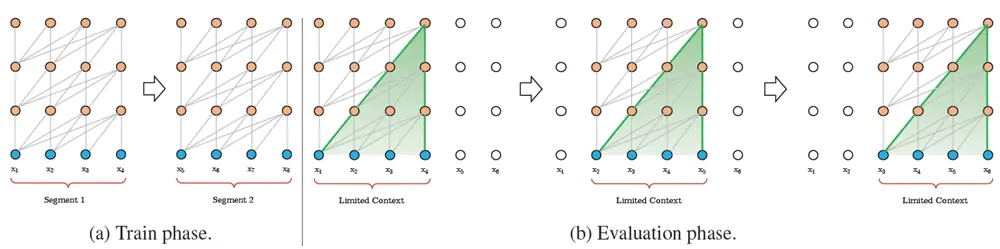
资料来源：Transformer-XL: Attentive Language Models Beyond a Fixed-Length Context，华泰研究

因此在 XLNet 中，CMU 和 Google 大脑团队并没有采用 Vanilla Transformer 的这种做法，而是引用了他们自己之前论文《Transformer-XL: Attentive Language Models Beyond aFixed-Length Context》提出的 Transformer-XL 模型，Transformer-XL 相对于 VanillaTransformer 主要有两个改进之处：循环机制（Recurrence Mechanism）和相对位置编码（Relative Positional Encodings），下面我们分别来进行介绍。

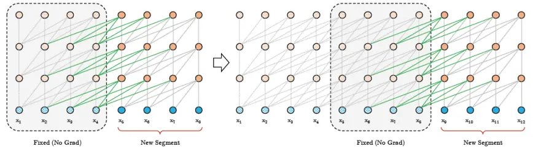

Transformer-XL 和 Vanilla Transformer 一样也是将长文本拆成许多个 segments，但不同的segment 之间不是完全孤立的，而是像 RNN 一样进行了串联。如下图（a）所示，对于第τ个 segment，每一个 Encoder 模块的隐状态输出，一方面作为下一层的输入，另一方面也用缓存进行了存储并输入到了第τ+1个 segment 的下一层 Encoder 模块。图中绿线就表示第τ个 segment 的隐状态输出，但其不参与第τ +1个 segment 的梯度计算。这就是 XLNet的循环机制。我们也可以用公式来表达这一过程：

$$
\begin{array}{c}{\tilde{\mathbf{h}}_{\tau+1}^{n-1}=[\mathbb{SG}(\mathbf{h}_{\tau}^{n-1})\circ\mathbf{h}_{\tau+1}^{n-1}]}\\{\mathbf{q}_{\tau+1}^{n},\mathbf{k}_{\tau+1}^{n},\mathbf{v}_{\tau+1}^{n}=\mathbf{h}_{\tau+1}^{n-1}\mathbf{W}_{q}^{\top},\tilde{\mathbf{h}}_{\tau+1}^{n-1}\mathbf{W}_{k}^{\top},\tilde{\mathbf{h}}_{\tau+1}^{n-1}\mathbf{W}_{v}^{\top}}\\{\mathbf{h}_{\tau+1}^{n}=\mathrm{Transformer-Layer}(\mathbf{q}_{\tau+1}^{n},\mathbf{k}_{\tau+1}^{n},\mathbf{v}_{\tau+1}^{n})}\end{array}
$$

h̃ τ+1n−1代表第τ个和第τ + 1个 segment 的隐向量沿长度方向的拼接，SG 是 stop-gradient 的意思。 $\mathbf{q}_{\tau+1}^{n},\mathbf{k}_{\tau+1}^{n},\mathbf{v}_{\tau+}^{n}$ 分别代表第τ + 1个 segment 第n层 Transformer 的三个矩阵， $\mathbf{h}_{\tau+1}^{n}$ 为计算出的隐向量。

图表42： Transformer-XL 的训练和测试阶段
(a) Training phase.
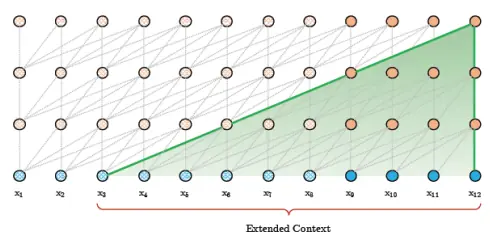
(b) Evaluation phase.
资料来源：Transformer-XL: Attentive Language Models Beyond a Fixed-Length Context，华泰研究

假设第n层的每个隐向量的计算用到了第n−1层L个隐向量（图中是 4），而第 $n-1$ 层的每个隐向量的计算用到了第n−2层L个隐向量，由上图（b）很容易看出最后一层某个隐向量可依赖的底层单词数目相比于 Vanilla Transformer 大大增加了。同时在测试过程中，每次移动步长可以为一个 segment，还可以利用缓存中之前 segment 的数据来预测当前segment，大大减少了计算量。

根据循环机制，我们在训练第τ + 1个 segment 时，实际上也用到第τ个 segment 传递过来的信息，因此我们也需要知道第τ个 segment 一些单词的位置情况。但如果我们用普通方法给输入添加位置编码，就会出现不同 segment 同一位置的位置编码完全相同的情况。Transformer-XL 使用相对位置编码来解决这一问题，即在计算当前位置隐向量的时候，考虑与之依赖单词的相对位置关系而非绝对位置关系。用E代表词嵌入向量，U代表位置向量，Vanilla Transformer 通过下面的式子计算 Attention：

$$
\begin{aligned}\mathbf{A}_{i,j}^{\mathrm{abs}}&=\left(\mathbf{W}_q\left(\mathbf{E}_{x_i}+\mathbf{U}_i\right)\right)^{\mathrm{T}}\left(\mathbf{W}_k\left(\mathbf{E}_{x_j}+\mathbf{U}_j\right)\right)\Bigg)\\&=\underbrace{\mathbf{E}_{x_i}^{\top}\mathbf{W}_q^{\top}\mathbf{W}_k\mathbf{E}_{x_j}}_{(a)}+\underbrace{\mathbf{E}_{x_i}^{\top}\mathbf{W}_q^{\top}\mathbf{W}_k\mathbf{U}_j}_{(b)}++\underbrace{\mathbf{U}_i^{\top}\mathbf{W}_q^{\top}\mathbf{W}_k\mathbf{E}_{x_j}}_{(c)}+\underbrace{\mathbf{U}_i^{\top}\mathbf{W}_q^{\top}\mathbf{W}_k\mathbf{U}_j}_{(d)}\end{aligned}
$$

使用相对位置编码 $\mathbf{R}_{i-j}$ 取代（b）(d)项的绝对位置编码Uj $(\mathbf{R}_{i-j}$ 也有固定的编码方式，用正弦函数生成，没有要学习的参数）。 $\mathbf{U}_{i}^{\mathsf{T}}\mathbf{W}_{q}^{\mathsf{T}}$ 代表第i个位置的 query向量，因为在考虑相对位置的时候，不需要查询绝对位置，所以可以直接用可训练的统一的参数u和v分别取代（c）（d）项的 $\mathbf{U}_{i}^{\mathsf{T}}\mathbf{W}_{q}^{\mathsf{T}}$ 。权重矩阵 $\cdot\mathbf{W}_{k,E}$ $\mathbf{W}_{k,R}$ 分别用于计算基于内容(词向量)的 key 向量和基于位置的 key 向量。综上，Transformer-XL 计算 Attention 的公式如下：

$$
\begin{aligned}\mathbf{A}_{i,j}^{\mathrm{abs}}&=\underbrace{\mathbf{E}_{x_i}^{\top}\mathbf{W}_q^{\top}\mathbf{W}_{k,E}\mathbf{E}_{x_j}}_{(a)}+\underbrace{\mathbf{E}_{x_i}^{\top}\mathbf{W}_q^{\top}\mathbf{W}_{k,R}\mathbb{R}_{i-j}}_{(b)}+\underbrace{u^{\top}\mathbf{W}_{k,E}\mathbf{E}_{x_j}}_{(c)}+\underbrace{v^{\top}\mathbf{W}_{k,R}\mathbb{R}_{i-j}}_{(d)}\\&=\left(\mathbf{W}_q\mathbf{E}_{x_i}+u\right)^{\top}\mathbf{W}_{k,E}\mathbf{E}_{x_j}+\left(\mathbf{W}_q\mathbf{E}_{x_i}+v\right)^{\top}\mathbf{W}_{k,R}\mathbb{R}_{i-j}\end{aligned}
$$

（a）项代表基于内容的寻址，（b）项基于内容的位置偏差，（c）项代表全局的内容偏差，（d）项代表全局的位置偏差。也可以将其合并成第二个等号后的形式。

同时考虑循环机制和相对位置编码的方法，用 $\mathbf{E}_{\mathbf{S}_{\tau}}$ 代表词嵌入序列，一个N层的Transformer-XL（只考虑一个 head）的计算公式可以归纳如下：

$$
\begin{aligned}\mathbf{h}_{\tau}^{0}&=\mathbf{E}_{S_{\tau}}\\\tilde{\mathbf{h}}_{\tau}^{n-1}&=[\mathrm{S}G(\mathbf{m}_{\tau}^{n-1})\circ\mathbf{h}_{\tau}^{n-1}]\\\mathbf{q}_{\tau}^{n},\mathbf{k}_{\tau}^{n},\mathbf{v}_{\tau}^{n}&=\mathbf{h}_{\tau}^{n-1}\mathbf{W}_{q}^{n\top},\tilde{\mathbf{h}}_{\tau}^{n-1}\mathbf{W}_{k,E}^{n\top},\tilde{\mathbf{h}}_{\tau}^{n-1}\mathbf{W}_{v}^{n\top}\\\mathbf{A}_{\tau,i,j}^{n}&=\mathbf{q}_{\tau,i}^{n\top}\mathbf{k}_{\tau,j}^{n}+\mathbf{q}_{\tau,i}^{n\top}\mathbf{W}_{k,R}^{n}\mathbf{R}_{i-j}+u^{\top}\mathbf{k}_{\tau,j}+v^{\top}\mathbf{W}_{k,R}^{n}\mathbf{R}_{i-j}\\\mathbf{a}_{\tau}^{n}&=\mathrm{Masked-Softmax}\left(\mathbf{A}_{\tau}^{n}\right)\mathbf{v}_{\tau}^{n}\\\mathbf{o}_{\tau}^{n}&=\mathrm{LayerNorm}(\mathrm{Linear}(\mathbf{a}_{\tau}^{n})+\mathbf{h}_{\tau}^{n-1})\\\mathbf{h}_{\tau}^{n}&=\mathrm{Positiveise-Feed-Forward}\left(\mathbf{o}_{\tau}^{n}\right)\end{aligned}
$$

可以看出 Transformer-XL 和 Vanilla Transformer 的一个重要区别是，前者每层计算Attention 都需要包含相对位置编码，但后者仅在单词首次嵌入时才会加上绝对位置编码。

排列组合语言模型使 XLNet 可以充分利用上下文信息进行训练，双流注意力机制使排列组合语言模型的预测结果更加合理，而基于 Transformer-XL 又使模型对于预测长文本表现更出色。通过以上三个方面的改进，XLNet 将自回归模型与深度双向训练结合在一起。XLNet其实提供了一种新的思路，较强的文本生成和出色的文本理解并不是不能通过同一个语言模型完成的，未来或将有更多新的 NLP模型朝着这个方向拓展。

我们对 ELMo、GPT、BERT 等代表模型的参数进行比较，如下表所示。

图表43： ELMo、GPT 及 BERT 的对比

|  | 数据集 | 模型 | 参数量 | 训练时间 | 训练配置 |
| --- | --- | --- | --- | --- | --- |
| ELMo | 1B Word Benchmark10亿词 | CNN-BIG-BiLSTM + ResiduleConnection | 90M | ■ | ■ |
| GPT | BooksCorpus8亿词 | Transformer Decoder,L=12, H=768, A=12 | 110M | 1个月 | 8 GPU |
| BERT | BooksCorpus+Wikipedia33亿词 | Transformer Encoder,L=24,H=1024,A=16 | 340M | 4天 | 64 TPU |

资料来源：华泰研究

从早期统计语言模型，到后来的 Word2Vec，再到集大成的预训练模型 BERT，NLP 领域迎来了新的时代。回望 BERT 的诞生历史，可以说是站在“巨人的肩膀”上：

1. Transformer Encoder 依赖于 Self-Attention 机制，因此 BERT 自带双向语义理解的功能，这里的“巨人”是 Transformer；

2. BERT 双向功能的机制使得其必须用 Masked-LM 来完成 token 级别的预训练，而这里的“巨人”则是语言模型、CBOW；

3. BERT 采用的 Next Sentence Prediction 则是借鉴了 skip-gram、skip-thoughts 和quick-thoughts 等的思想；

4. 为适配多任务下的迁移学习，BERT 设计了更通用的输入层和输出层，这则是借鉴了T-DMCA 和 GPT 的做法。

一般来说，要在下游使用预训练好的语言模型，主要有以下三种方式：

1. 将预训练模型当作特征提取器，直接将预训练模型的输出层去掉，然后使用去掉输出层之后的隐藏层输出作为特征，输入到我们精心设计好的 Task-specific 模型中去，特征提取器部分参数不变。

2. 将预训练模型整体接入 Task-specific 模型，继而重新在新的数据集上整体重新训练。与方法一类似，预训练模型的接入不一定只能接最后层的输出，可以尝试更复杂的接入方式。

3. 第三种方式则将上述两种方案结合，即保留预训练模型的一部分，另外一部分则和Task-specific 模型一起 finetune。

当然，第三阶段的预训练语言模型远不止我们上文所提到的几类，基于这些具有开创性的基础模型，各类变式层出不穷，或都在不同的子领域发光发热，例如针对金融领域会有专门训练好的 FinBERT 来识别金融用语，针对生物医学领域有专门的 BioBERT 来对生物医学文本进行挖掘等，这里我们也不再详细展开。

前文我们在描述时都是以基于英文文本处理来行文，但各大语言模型基本都有对应的中文版本，不同语言下的模型数据预处理时略有不同，这涉及到语言颗粒度的概念。英文一般不采用字粒度和词粒度，字粒度虽然词表小（仅有 26 个字母），但是输入时序列太长增加了计算压力，且单个字母无意义损失了语义信息；词粒度则词表太大，同一个词根会衍生出各种动词、名词和副词等，英文一般采用介于字和词之间的 Subword 粒度。中文目前大多数采用的是字粒度，即一个中文汉字一个 token，这样构建出的词表适中，且每个 token都有实际含义。

## 总结

本文对人工智能自然语言处理领域的历史进行回顾，梳理并详细介绍了 NLP发展三个阶段中的重要模型，帮助读者勾勒出 NLP 的发展轨迹。本文是华泰金工人工智能系列文本挖掘主题下的纯理论篇介绍，报告中仅涉及模型本身，不涉及任何应用，基于 NLP的具体策略构建可参考文本挖掘子系列的其他研究。

我们将 NLP的发展历史划分为三个阶段：

## 第一阶段以传统统计语言模型为主，神经网络语言模型锋芒初露：

我们主要介绍了该阶段的两个模型，分别为 N-gram 和 NNLM。N-gram 是为了估计一段自然语言文本出现概率的大小而提出的模型，按条件概率将句子拆解为词语出现的条件概率，以较为简单的想法实现了较好的效果，但存在无法建模更长的上下文语义以及无法建模词语间相似性的缺点。NNLM 则首次将深度学习的思想引入语言模型中，不仅可以对更长的文本进行建模，而且产生了“词向量”这一副产物，影响深远。

## 第二阶段以 Word2Vec 为代表，word embedding 方法成为标配：

Word2Vec 包括 CBOW 和Skip-gram 两组模型，任务分别为根据上下文预测中心词以及根据中心词来预测上下文，相比于第一阶段的 NNLM 简化了网络结构，同时使用了Hierarchical Softmax 和 Negative Sampling 两种方法提高训练效率，使得大规模预料训练成为了现实。更重要的是，模型得到的词向量能够在语义上有非常好的表现。WordVec 之后一大批 word embedding 方法相继涌现，从不同的角度对词编码、句子&段落编码进行改进，word embedding 成为 NLP 研究的标配，迁移学习思想逐渐明朗。

## 第三阶段预训练语言模型大行其道，在巨人的肩膀上 BERT 模型诞生：

ELMo、GPT 及 BERT 模型是第三阶段的预训练语言模型的代表。ELMo 的特点是可以根据上下文动态地生成词向量，具有学习不同语境下词汇多义性的能力，且使用双向语言模型使得特征的提取更为准确。GPT 则首次将 Transformer 应用于语言模型，并且设计了一套高效的训练策略，证明了 Transformer 在 NLP 领域具有超强的能力和潜力。BERT 模型集前人模型之大成，利用 Transformer实现了真正意义上的双向语义理解，并在预训练阶段使用 MLM 和 NSP两个任务实现语义的更深层次理解，完善和扩展了 GPT 中设计的通用任务框架。

在金融领域 BERT 的应用也较为合乎逻辑，使用 BERT 对新闻舆情、分析师研报等文本数据进行挖掘进而构建选股策略已经不能算是很另类的想法，正如在许多其他 NLP的子领域一样，甚至已经逐渐成为金融自然语言处理的标配，文本这一“另类数据”实际上也在逐渐成为“传统数据”。

虽然预训练语言模型成为标配，但是在不同的应用场景下仍然需要根据实际需求对输入数据进行特别加工，操作细节有其讲究。例如在对文本进行截断时，如果场景中总结性的句子大多出现在文本开头，那么应该进行后截断，保留总结性的语句给模型；反之则应进行前截断；如果文本中无效语句过多，也应考虑对无效语句进行预剔除…因此对于金融文本数据，预处理方法也可能对最终结果带来很大影响，希望在后续研究中我们能对此进行展开讨论。

## 风险提示

通过机器学习模型构建选股策略是历史经验的总结，存在失效的可能。人工智能模型可解释程度较低，使用须谨慎。

## 参考文献

[1]. Bengio, Y., Ducharme, R., & Vincent, P. (2000). A neural probabilistic language model.Advances in neural information processing systems,13.

[2]. Mnih, A., & Hinton, G. E. (2008). A scalable hierarchical distributed language model. Advances in neural information processing systems, 21.

[3]. Collobert, R., & Weston, J. (2008, July). A unified architecture for natural language processing: Deep neural networks with multitask learning. In Proceedings of the 25th international conference on Machine learning (pp. 160-167).

[4]. Mikolov, T., Karafiát, M., Burget, L., Cernocký, J., & Khudanpur, S. (2010, September). Recurrent neural network based language model. In Interspeech (Vol. 2, No. 3, pp. 1045-1048).

[5]. Mikolov, T., Chen, K., Corrado, G., & Dean, J. (2013). Efficient estimation of word representations in vector space. arXiv preprint arXiv:1301.3781.

[6]. Mikolov, T., Sutskever, I., Chen, K., Corrado, G. S., & Dean, J. (2013). Distributed representations of words and phrases and their compositionality. Advances in neural information processing systems, 26.

[7]. Pennington, J., Socher, R., & Manning, C. D. (2014, October). Glove: Global vectors for word representation. In Proceedings of the 2014 conference on empirical methods in natural language processing (EMNLP) (pp. 1532-1543).

[8]. Joulin, A., Grave, E., Bojanowski, P., & Mikolov, T. (2016). Bag of tricks for efficient text classification. arXiv preprint arXiv:1607.01759.

[9]. Peters, M. E., Neumann, M., Iyyer, M., Gardner, M., Clark, C., Lee, K., & Zettlemoyer, L. (2018, June). Deep Contextualized Word Representations. In Proceedings of the 2018 Conference of the North American Chapter of the Association for Computational Linguistics: Human Language Technologies, Volume 1 (Long Papers) (pp. 2227-2237).

[10]. Howard, J., & Ruder, S. (2018). Universal language model fine-tuning for text classification. arXiv preprint arXiv:1801.06146.

[11]. Vaswani, A., Shazeer, N., Parmar, N., Uszkoreit, J., Jones, L., Gomez, A. N., ... & Polosukhin, I. (2017). Attention is all you need. Advances in neural information processing systems, 30.

[12]. Radford, A., Narasimhan, K., Salimans, T., & Sutskever, I. (2018). Improving language understanding by generative pre-training.

[13]. Radford, A., Wu, J., Child, R., Luan, D., Amodei, D., & Sutskever, I. (2019). Language models are unsupervised multitask learners. OpenAI blog, 1(8), 9.

[14]. Devlin, J., Chang, M. W., Lee, K., & Toutanova, K. (2018). Bert: Pre-training of deep bidirectional transformers for language understanding. arXiv preprint arXiv:1810.04805.

[15]. Yang, Z., Dai, Z., Yang, Y., Carbonell, J., Salakhutdinov, R. R., & Le, Q. V. (2019). Xlnet: Generalized autoregressive pretraining for language understanding. Advances in neural information processing systems, 32.

[16]. Dai, Z., Yang, Z., Yang, Y., Carbonell, J., Le, Q. V., & Salakhutdinov, R. (2019). Transformer-xl: Attentive language models beyond a fixed-length context. arXiv preprint arXiv:1901.02860.

## 附录

## 基于 Hierachical Softmax 的 Skip-gram

Skip-gram 的原始目标函数如下

$$
L=\sum_{w\in C}logp(Context(w)|w)
$$

Skip-gram 的任务是在已知当前词语w的情况下对上下文Context(w)中的词语进行预测，条件概率函数的构造在 skip-gram 中定义如下

$$
p(Context(w)|w)=\prod_{u\in context(w)}p(u|w)
$$

类似 CBOW 中的推导，上式中p(u|w)可以写成

$$
\begin{align*}p(u|w)=\prod_{j=2}^{l^w}p(d^u_j|v(w),\theta^u_{j-1})\quad\\p\big(d^u_j\big|v(w),\theta^u_{j-1}\big)=[\sigma\big(v(w)^T\theta^u_{j-1}\big)]^{1-d^u_j}\cdot[1-\sigma\big(v(w)^T\theta^u_{j-1}\big)]^{d^u_j}.\end{align*}
$$

将上式代入 Skip-gram 的目标函数，得到

$$
L=\sum_{w\in C}log\prod_{u\in Context(w)}\prod_{j=2}^{l^w}\left[\sigma\big(v(w)^T\theta_{j-1}^u\big)\right]^{1-d_j^u}\cdot\left[1-\sigma\big(v(w)^T\theta_{j-1}^u\big)\right]^{d_j^u}
$$

$$
=\sum_{w\in C}\sum_{u\in Context(w)}\sum_{j=2}^{l^{w}}(1-d_{j}^{u})log\big[\sigma\big(v(w)^{T}\theta_{j-1}^{u}\big)\big]+d_{j}^{u}log\big[1-\sigma\big(v(w)^{T}\theta_{j-1}^{u}\big)\big]
$$

将三重求和符号内的表达式记为 $L(w,u,j)$

$$
L(w,u,j)=(1-d_{j}^{u})log\big[\sigma\big(v(w)^{T}\theta_{j-1}^{u}\big)\big]+d_{j}^{u}log\big[1-\sigma\big(v(w)^{T}\theta_{j-1}^{u}\big)\big]
$$

下面继续推导 $L(w,u,j)$ 关于 $\cdot\theta_{j-1}^{u}及v(w)$ 的梯度和更新公式：

$L(w,u,j)$ 关 $于\theta_{j-1}^{u}$ 的梯度：

$$
\begin{align*}\frac{\Delta L(w,u,j)}{\Delta\theta_{j-1}^u}=\big\{\big(1-d_j^u\big)1-\sigma\big(v(w)^T\theta_{j-1}^u\big)v(w)-d_j^u\sigma\big(v(w)^T\theta_{j-1}^u\big)x\big\}v(w)\\=[1-d_j^u-\sigma\big(v(w)^T\theta_{j-1}^u\big)]v(w)\end{align*}
$$

$\theta_{j-1}^{u}$ 的更新公式：

$$
\theta_{j-1}^{u}\leftarrow\theta_{j-1}^{u}+\eta[1-d_{j}^{u}-\sigma\big(v(w)^{T}\theta_{j-1}^{u}\big)]v(w)
$$

$L(w,u,j)$ 关于v(w)的梯度：

$$
\cfrac{\Delta L(w,u,j)}{\Delta v(w)}=[1-d_{j}^{u}-\sigma\big(v(w)^{T}\theta_{j-1}^{u}\big)]\theta_{j-1}^{u},
$$

$v(w)$ 的更新公式：

$$
v(w)\leftarrow v(w)+\eta\sum_{u\in Context(w)}\sum_{j=2}^{l^{w}}[1-d_{j}^{u}-\sigma\big(v(w)^{T}\theta_{j-1}^{u}\big)]\theta_{j-1}^{u}
$$

## 基于 Negative Sampling 的 Skip-gram

符号记法与正文相同，定义单词u的标签如下，正样本的标签为 1，负样本的标签为 0：

$$
L^{w}(u)=\Big\{\begin{aligned}1,\quad u=w\\0,\quad u\neq w\end{aligned}
$$

对于给定的样本(w, Context(w))，希望最大化 $\cdot g(w)$ ：

$$
\begin{aligned}&g(w)=\prod_{\widetilde{w}\in Context(w)}\prod_{u\in w\cup NEU^{\widetilde{w}}(w)}p(u|\widetilde{w})\\&p(u|\widetilde{w})=\left\{\begin{aligned}&\sigma(v(\widetilde{w})^{T}\theta^{u}),L^{w}(u)=1\\&1-\sigma(v(\widetilde{w})^{T}\theta^{u}),L^{w}(u)=0\end{aligned}\right.\\&=[\sigma(v(\widetilde{w})^{T}\theta^{u})]^{L^{w}(u)}\cdot[1-\sigma(v(\widetilde{w})^{T}\theta^{u})]^{1-L^{w}(u)}\\\end{aligned}
$$

这里 $.NEU^{w}(\widetilde{w})$ 表示处理词w̃时生成的负样本子集，右上角的标记w代表此时中心词为$w。g(w)$ 简化以后也可以写成如下表达式：

$$
g(w)=\prod_{\widetilde{w}\in context(w)}\sigma(v(\widetilde{w})^T\theta^w)\prod_{u\in NEU^{\widetilde{w}}(\widetilde{w})}[1-\sigma(v(\widetilde{w})^T\theta^u)]
$$

最大化 $\scriptstyle{\mathcal{J}}(w)$ 希望 $\sigma(v(\widetilde{w})^{T}\theta^{u})$ 最大化的同时 $\sigma(v(\widetilde{w})^{T}\theta^{u}),u\in NEU^{w}(\widetilde{w})$ 最小化，正好与Skip-gram 的目标相同。

接下来对 Skip-gram 的原始目标函数进行改造，原始的目标函数为

$$
L=\sum_{w\in C}logp(Context(w)|w)
$$

改造后的目标函数为

$$
\begin{align*}L=\sum_{w\in C}logg(w)\\=\sum_{w\in C}\sum_{\widetilde{w}\in Context(w)}\sum_{u\in w\cup NEU^{w}(\widetilde{w})}L^{w}(u)\log[\sigma(v(\widetilde{w})^{T}\theta^{u})]+[1-L^{w}(u)]\log[1-\sigma(v(\widetilde{w})^{T}\theta^{u})].\end{align*}
$$

同样的为方便求梯度， $记L(w,\widetilde{w},u)$

$$
L(w,\widetilde{w},u)=L^{w}(u)\log[\sigma(v(\widetilde{w})^{T}\theta^{u})]+[1-L^{w}(u)]\log[1-\sigma(v(\widetilde{w})^{T}\theta^{u})]
$$

$L(w,\widetilde{w},u)$ 关于 $\cdot\theta^{u}$ 的梯度为

$$
\begin{align*}\frac{\Delta L(w,\widetilde{w},u)}{\Delta\theta^u}=\{L^w(u)[1&-\sigma(v(\widetilde{w})^T\theta^u)]v(\widetilde{w})-[1-L^w(u)]\cdot\sigma(v(\widetilde{w})^T\theta^u)\}v(\widetilde{w})\\&=[L^w(u)-\sigma(v(\widetilde{w})^T\theta^u)]v(\widetilde{w})\end{align*}
$$

θu的更新公式：

$$
\theta^{u}\leftarrow\theta^{u}+\eta[L^{w}(u)-\sigma(v(\widetilde{w})^{T}\theta^{u})]v(\widetilde{w})
$$

$L(w,\widetilde{w},u)$ 关于v(w̃)的梯度为

$$
\cfrac{\Delta L(\boldsymbol{w},\widetilde{\boldsymbol{w}},\boldsymbol{u})}{\Delta v(\widetilde{\boldsymbol{w}})}=[L^{w}(\boldsymbol{u})-\sigma(v(\widetilde{\boldsymbol{w}})^{T}\theta^{u})]\theta^{u}.
$$

v(w̃)的更新公式：

$$
v(\widetilde{w})\leftarrow v(\widetilde{w})+\eta\sum_{u\in w\cup NEU^{W}(\widetilde{w})}\frac{\Delta L(w,\widetilde{w},u)}{\Delta v(\widetilde{w})},\ \widetilde{w}\in Context(w).
$$

## 免责声明

## 分析师声明

本人，林晓明、李子钰、何康，兹证明本报告所表达的观点准确地反映了分析师对标的证券或发行人的个人意见；彼以往、现在或未来并无就其研究报告所提供的具体建议或所表迖的意见直接或间接收取任何报酬。

## 一般声明及披露

本报告由华泰证券股份有限公司（已具备中国证监会批准的证券投资咨询业务资格，以下简称“本公司”）制作。本报告所载资料是仅供接收人的严格保密资料。本报告仅供本公司及其客户和其关联机构使用。本公司不因接收人收到本报告而视其为客户。

本报告基于本公司认为可靠的、已公开的信息编制，但本公司及其关联机构(以下统称为“华泰”)对该等信息的准确性及完整性不作任何保证。

本报告所载的意见、评估及预测仅反映报告发布当日的观点和判断。在不同时期，华泰可能会发出与本报告所载意见、评估及预测不一致的研究报告。同时，本报告所指的证券或投资标的的价格、价值及投资收入可能会波动。以往表现并不能指引未来，未来回报并不能得到保证，并存在损失本金的可能。华泰不保证本报告所含信息保持在最新状态。华泰对本报告所含信息可在不发出通知的情形下做出修改，投资者应当自行关注相应的更新或修改。

本公司不是 FINRA 的注册会员，其研究分析师亦没有注册为 FINRA 的研究分析师/不具有 FINRA 分析师的注册资格。

华泰力求报告内容客观、公正，但本报告所载的观点、结论和建议仅供参考，不构成购买或出售所述证券的要约或招揽。该等观点、建议并未考虑到个别投资者的具体投资目的、财务状况以及特定需求，在任何时候均不构成对客户私人投资建议。投资者应当充分考虑自身特定状况，并完整理解和使用本报告内容，不应视本报告为做出投资决策的唯一因素。对依据或者使用本报告所造成的一切后果，华泰及作者均不承担任何法律责任。任何形式的分享证券投资收益或者分担证券投资损失的书面或口头承诺均为无效。

除非另行说明，本报告中所引用的关于业绩的数据代表过往表现，过往的业绩表现不应作为日后回报的预示。华泰不承诺也不保证任何预示的回报会得以实现，分析中所做的预测可能是基于相应的假设，任何假设的变化可能会显著影响所预测的回报。

华泰及作者在自身所知情的范围内，与本报告所指的证券或投资标的不存在法律禁止的利害关系。在法律许可的情况下，华泰可能会持有报告中提到的公司所发行的证券头寸并进行交易，为该公司提供投资银行、财务顾问或者金融产品等相关服务或向该公司招揽业务。

华泰的销售人员、交易人员或其他专业人士可能会依据不同假设和标准、采用不同的分析方法而口头或书面发表与本报告意见及建议不一致的市场评论和/或交易观点。华泰没有将此意见及建议向报告所有接收者进行更新的义务。华泰的资产管理部门、自营部门以及其他投资业务部门可能独立做出与本报告中的意见或建议不一致的投资决策。投资者应当考虑到华泰及/或其相关人员可能存在影响本报告观点客观性的潜在利益冲突。投资者请勿将本报告视为投资或其他决定的唯一信赖依据。有关该方面的具体披露请参照本报告尾部。

本报告并非意图发送、发布给在当地法律或监管规则下不允许向其发送、发布的机构或人员，也并非意图发送、发布给因可得到、使用本报告的行为而使华泰违反或受制于当地法律或监管规则的机构或人员。

本报告版权仅为本公司所有。未经本公司书面许可，任何机构或个人不得以翻版、复制、发表、引用或再次分发他人(无论整份或部分)等任何形式侵犯本公司版权。如征得本公司同意进行引用、刊发的，需在允许的范围内使用，并需在使用前获取独立的法律意见，以确定该引用、刊发符合当地适用法规的要求，同时注明出处为“华泰证券研究所”，且不得对本报告进行任何有悖原意的引用、删节和修改。本公司保留追究相关责任的权利。所有本报告中使用的商标、服务标记及标记均为本公司的商标、服务标记及标记。

## 中国香港

本报告由华泰证券股份有限公司制作,在香港由华泰金融控股（香港）有限公司向符合《证券及期货条例》及其附属法律规定的机构投资者和专业投资者的客户进行分发。华泰金融控股（香港）有限公司受香港证券及期货事务监察委员会监管，是华泰国际金融控股有限公司的全资子公司，后者为华泰证券股份有限公司的全资子公司。在香港获得本报告的人员若有任何有关本报告的问题,请与华泰金融控股（香港）有限公司联系。

## 香港-重要监管披露

- 华泰金融控股（香港）有限公司的雇员或其关联人士没有担任本报告中提及的公司或发行人的高级人员。

- 有关重要的披露信息，请参华泰金融控股（香港）有限公司的网页 https://www.htsc.com.hk/stock_disclosure其他信息请参见下方 “美国-重要监管披露”。

## 美国

在美国本报告由华泰证券（美国）有限公司向符合美国监管规定的机构投资者进行发表与分发。华泰证券（美国）有限公司是美国注册经纪商和美国金融业监管局（FINRA）的注册会员。对于其在美国分发的研究报告，华泰证券（美国）有限公司根据《1934 年证券交易法》（修订版）第 15a-6 条规定以及美国证券交易委员会人员解释，对本研究报告内容负责。华泰证券（美国）有限公司联营公司的分析师不具有美国金融监管（FINRA）分析师的注册资格，可能不属于华泰证券（美国）有限公司的关联人员，因此可能不受 FINRA 关于分析师与标的公司沟通、公开露面和所持交易证券的限制。华泰证券（美国）有限公司是华泰国际金融控股有限公司的全资子公司，后者为华泰证券股份有限公司的全资子公司。任何直接从华泰证券（美国）有限公司收到此报告并希望就本报告所述任何证券进行交易的人士，应通过华泰证券（美国）有限公司进行交易。

## 美国-重要监管披露

- 分析师林晓明、李子钰、何康本人及相关人士并不担任本报告所提及的标的证券或发行人的高级人员、董事或顾问。分析师及相关人士与本报告所提及的标的证券或发行人并无任何相关财务利益。本披露中所提及的“相关人士”包括 FINRA 定义下分析师的家庭成员。分析师根据华泰证券的整体收入和盈利能力获得薪酬，包括源自公司投资银行业务的收入。

华泰证券股份有限公司、其子公司和/或其联营公司, 及/或不时会以自身或代理形式向客户出售及购买华泰证券研究所覆盖公司的证券/衍生工具，包括股票及债券（包括衍生品）华泰证券研究所覆盖公司的证券/衍生工具，包括股票及债券（包括衍生品）。

- 华泰证券股份有限公司、其子公司和/或其联营公司, 及/或其高级管理层、董事和雇员可能会持有本报告中所提到的任何证券（或任何相关投资）头寸，并可能不时进行增持或减持该证券（或投资）。因此，投资者应该意识到可能存在利益冲突。

## 评级说明

投资评级基于分析师对报告发布日后 6 至 12个月内行业或公司回报潜力（含此期间的股息回报）相对基准表现的预期（A 股市场基准为沪深 300 指数，香港市场基准为恒生指数，美国市场基准为标普 500 指数），具体如下：

## 行业评级

增持：预计行业股票指数超越基准

中性：预计行业股票指数基本与基准持平

减持：预计行业股票指数明显弱于基准

## 公司评级

买入：预计股价超越基准 15%以上

增持：预计股价超越基准 5%~15%

持有：预计股价相对基准波动在-15%~5%之间

卖出：预计股价弱于基准 15%以上

暂停评级：已暂停评级、目标价及预测，以遵守适用法规及/或公司政策

无评级：股票不在常规研究覆盖范围内。投资者不应期待华泰提供该等证券及/或公司相关的持续或补充信息

## 法律实体披露

中国：华泰证券股份有限公司具有中国证监会核准的“证券投资咨询”业务资格，经营许可证编号为：91320000704041011J香港：华泰金融控股（香港）有限公司具有香港证监会核准的“就证券提供意见”业务资格，经营许可证编号为：AOK809美国：华泰证券（美国）有限公司为美国金融业监管局（FINRA）成员，具有在美国开展经纪交易商业务的资格，经营业务许可编号为：CRD#:298809/SEC#:8-70231

## 华泰证券股份有限公司

南京南京市建邺区江东中路228号华泰证券广场1号楼/邮政编码：210019

电话：86 25 83389999/传真：86 25 83387521电子邮件：ht-rd@htsc.com

## 深圳深圳

深圳市福田区益田路5999号基金大厦10楼/邮政编码：518017电话：86 755 82493932/传真：86 755 82492062电子邮件：ht-rd@htsc.com

## 华泰金融控股（香港）有限公司

香港中环皇后大道中 99号中环中心 58楼 5808-12室
电话：+852-3658-6000/传真：+852-2169-0770
电子邮件：research@htsc.com
http://www.htsc.com.hk

## 华泰证券（美国）有限公司

美国纽约公园大道 280号 21楼东（纽约 10017）
电话：+212-763-8160/传真：+917-725-9702
电子邮件: Huatai@htsc-us.com
http://www.htsc-us.com

©版权所有2022年华泰证券股份有限公司

北京
北京市西城区太平桥大街丰盛胡同28号太平洋保险大厦A座18层/
邮政编码：100032
电话：86 10 63211166/传真：86 10 63211275
电子邮件：ht-rd@htsc.com
上海
上海市浦东新区东方路18号保利广场E栋23楼/邮政编码：200120
电话：86 21 28972098/传真：86 21 28972068
电子邮件：ht-rd@htsc.com