# 人工智能 63：再探文本 FADT选股

华泰研究

2022 年 10 月 28 日│中国内地

## 深度研究

## 人工智能 63：分析师研报文本挖掘框架升级

本文承接前期研究文本 FADT 选股，重点关注如何对文本因子本身进行升级。前期研究的核心思路是在特定场景下，以分析师研报文本的词频向量为特征，以研报发布前后两日个股超额收益为标签，引导 XGBoost 模型学习研报情绪蕴含的超额信息。在本文中我们将词频向量替换为 FinBERT 隐藏层编码的特征向量作为后续浅度学习模型的输入，隐藏层编码蕴含更丰富的文本语义信息，相比词频信息损失更少，以此带来更显著的 alpha 提升。

## 引入 FinBERT 编码以后文本因子收益提升明显

升级以后的文本因子十分层多头第一层年化收益由原版的 22.87%提升至27.50%，相对中证 500 超额收益由 14.75%提升至 19.19%（回测期20090123-20220930），提升较为明显。针对改进后的因子我们展示了三组应用案例：1）构建25只股票的主动量化不等权选股组合，年化收益45.90%，相对中证 500 年化超额 36.35%；2）限制在总市值 100 亿以上的股票池中用文本因子构建等权精选组合，Top20 年化收益 31.12%，相对中证 500 年化超额 23.94%；3）构建沪深 300 内精选 30 不等权组合，年化收益 17.58%，相对沪深 300 年化超额 12.44%。

FinBERT 是专门针对金融领域训练的 BERT，使用 Adapter-BERT 微调BERT 是 Google 在 2018 年提出的自然语言处理模型，在超过 11项的 NLP任务中均取得十分惊艳的结果。本文使用熵简科技于 2020 年末开源的FinBERT 模型，对于金融领域任务具有更强的针对性，在金融领域的相关任务中表现均超过原版 BERT。由于 FinBERT 微调参数量超过 1 亿，我们使用 Adapter-BERT 技术在基本不影响模型微调性能的前提下，降低微调参数至约三百万，提升模型的训练效率。

## 模型升级：FinBERT 微调+CLS 层编码+XGBoost 二次训练

使用 FinBERT 来对分析师研报文本进行向量编码并构建文本因子，主要包括三个步骤：1）使用万得新闻舆情文本对FinBERT进行微调，使得FinBERT的分类准确率可以达到 95%以上；2）使用 FinBERT 对分析师研报文本进行编码，将预处理过的研报文本输入给 FinBERT，提取 CLS层输出作为研报的特征向量；3）使用上述编码好的特征向量替代词频向量，使用与原版模型同样的标签，引导 XGBoost 模型样本内进行交叉验证训练，样本外预测并构建 forecast_adj_txt_bert 因子。

多组扩展测试表明过拟合概率低，更充分的语义理解带来显著 alpha提升同样我们还是关注模型升级过程中是否有过拟合的问题。除了基础参数，我们展示了五组扩展测试：1）文本预处理时，截断和分段的比较；2）FinBERT微调与不微调的比较；3）CLS 层编码与全连接层编码的比较；4）CLS 层编码与词频特征结合是否有提升；5）仅使用 FinBERT 微调的效果。整体来看前四组测试都有效，模型升级大概率不是偶然因素导致的过拟合。

## 与传统因子相关性低，且不同场景下文本因子均有明显提升

此外我们讨论了 forecast_adj_txt_bert 因子与 Barra 因子及传统多因子的相关性，发现相关性较低，alpha 特异性较强。最后我们在不同的场景下讨论了文本因子升级的效果，发现在业绩发布场景、卖方分析师评级调整场景下文本因子均有明显提升，再次说明模型升级较为稳健。

风险提示：通过机器学习模型构建选股策略是历史经验的总结，存在失效的可能。人工智能模型可解释程度较低，使用须谨慎。量化因子历史结果不能预测未来，互联网开源模型需注意可复现性，敬请知悉。

研究员

SAC No. S0570516010001

林晓明

linxiaoming@htsc.com

SFC No. BPY421

+(86) 755 8208 0134

研究员

SAC No. S0570519110003

李子钰

liziyu@htsc.com

SFC No. BRV743

+(86) 755 2398 7436

研究员

SAC No. S0570520080004

何康，PhD

hekang@htsc.com

SFC No. BRB318

+(86) 21 2897 2039

联系人

陈伟

SAC No. S0570121070169 chenwei018440@htsc.com

+(86) 21 2897 2228

## 两版本文本因子多头第一层净值

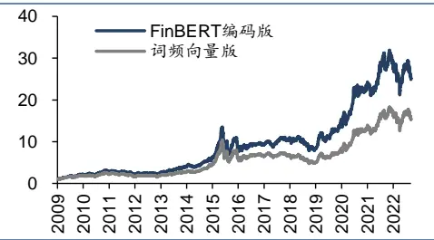
资料来源：Wind，朝阳永续，华泰研究，回测期：20090123-20220930

不等权主动量化选股组合净值
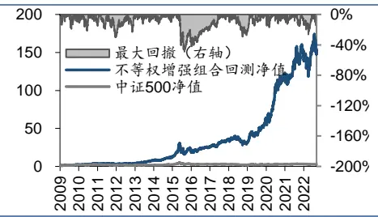
资料来源：Wind，朝阳永续，华泰研究，回测期：20090123-20220930

不等权主动量化选股组合超额净值
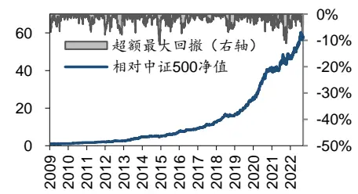
资料来源：Wind，朝阳永续，华泰研究，基准中证 500，回测期：20090123-20220930

## 分析师研报文本挖掘框架升级

## 研究回顾

在华泰金工前期研究《人工智能 51：文本 PEAD 选股策略》（20220107）及《人工智能 57：文本 FADT 选股》（20220701）两篇报告中，我们初步探索了分析师研报文本挖掘的方法，采用词频向量+浅度学习模型的方式，可以较为有效地对点评研报进行定量刻画。两篇报告采用的方法论基本一致，如下图所示。

图表1： 基于词频向量+XGBoost的分析师研报文本挖掘示意图
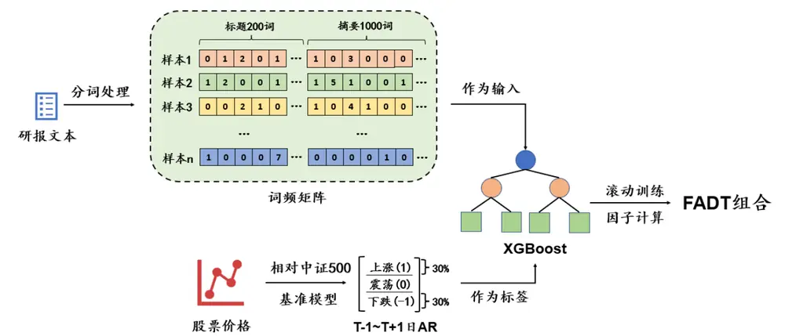
资料来源：华泰研究

在上篇报告中（人工智能 51），我们重点对模型本身进行了介绍，包括框架的初步提出、有效性实证及可解释性分析，在业绩发布的场景下，词频矩阵+浅度学习的方法论较为有效。在下篇报告中（人工智能 57），我们重点对场景进行了迁移，从业绩发布迁移到卖方盈利预测调整，挖掘业绩之外的增量信息，并论证了整个方法论的稳健性，即模型受超参数影响较小，策略过拟合程度相对较低。

在人工智能 57 中构建的 forecast_adj_txt 因子表现如下图所示。该因子的特点为多头端表现十分突出，说明分析师情感最为正向的那批热门股票组合具有非常显著且稳定的超额收益。从分层回测来看，第 2、3 层股票池与第 1 层股票池的差距较大，这或许暗示我们当前的词频矩阵的形式可以识别出情绪最强烈的那一档股票，但对于情绪次强烈的股票区分度或稍显不足。

图表2： forecast_adj_txt 因子分十层回测绝对净值
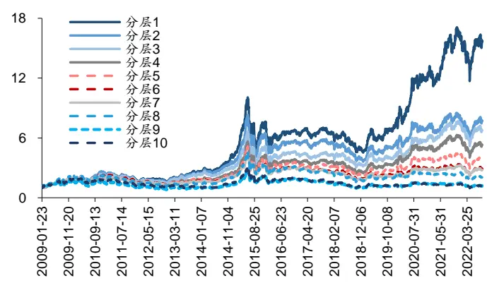
资料来源：Wind，朝阳永续，华泰研究，回测期 20090123-20220909

图表3： forecast_adj_txt 因子分十层相对中证 500 超额净值
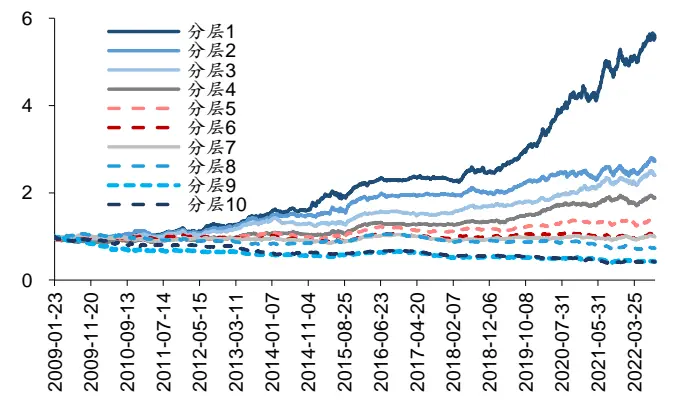
资料来源：Wind，朝阳永续，华泰研究，回测期 20090123-20220909

我们将两篇报告的重要经验及结论归纳如下：

1. 场景选择很重要：无论是业绩发布还是盈利预测调整，我们所选择的都是个股发生了较为明显边际变化的场景，而没有选择全部研究报告。前者带来的增量信息使得点评研报信噪比较高；后者并不一定具有增量信息因而部分研报信噪比较低（如部分没有盈利预测调整的报告等）。

2. 标签选择很重要：使用传统的情感标签很难对研报打正负向标签，且没有现成的标签数据，因此难以对信息进行有效提取，使用事件对市场当下的真实冲击作为标签是略显不自然但却有效且合乎情理的选择。

3. 模型参数不敏感：我们测试过不同参数组合对因子回测效果的影响，包括不同机器学习模型、样本内窗口长度、标题和摘要用词数量、标签分类数及标签计算时间区间长度等，发现构建出的因子比较稳健，过拟合程度相对较低。

## 文本挖掘框架的升级之路

## 逻辑瑕疵：分词的形式难以融入上下文关系

在本篇报告中，我们将研究重点放在模型改进上。我们认为可以改进的点如下：词频矩阵+浅度学习的模式本质上是对研报的用词进行理解，一句完整的话最后被拆解为若干词语的词频，在这个过程中容易损失上下文的语义信息，如“上调”这个词和“成本”或“盈利预测”组合在一起时将表达出完全相反的含义（“成本上调”是负向含义，“盈利预测上调”是正向含义），而浅度学习模型似乎无法学习这种词语组合。

回顾词频矩阵版本的流程，本质其实是将整段文本表征为“词频向量”，前提假设是“词频向量”可以表征整段文本的信息。但是我们在《人工智能 62： NLP综述，勾勒 AI 语义理解的轨迹》（20221027）中曾介绍过，实际上将句子转换成词频是 NLP 发展历史中较早期的做法，这无疑会损失很多句子中的上下文语义信息。那么我们如何对此进行改进？很自然的我们会想到，能否用一些更高阶的模型来对文本进行向量编码。

图表4： 文本向量编码方式
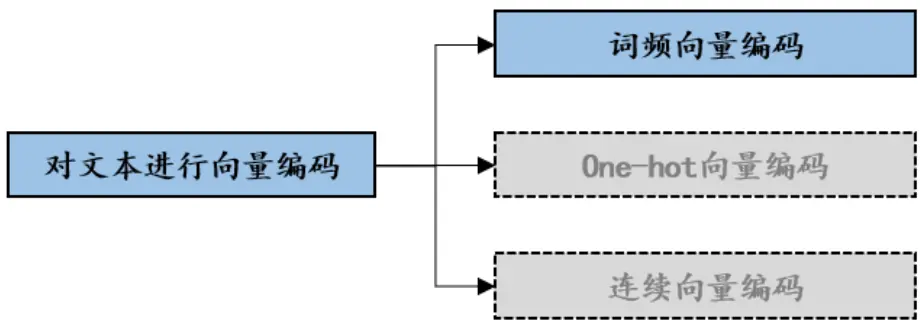
资料来源：华泰研究

## 改进方案：引入预训练自然语言处理模型

从自然语言处理的发展进程来看，如上文所述，实际上将句子拆分成词语并对词语进行理解这种做法已经是“词向量”还未问世之前的“旧版本”。以2013年Google开源的Word2Vec为分界限，文本处理开始进入较为高效的 word embedding 时代；再到 2018 年 BERT 问世，在 NLP 领域刷新了 11个任务的记录以后，预训练语言模型成为 NLP的标配。

本文将引入 BERT 模型对整套文本挖掘流程进行升级。具体而言，我们认为原始的词频矩阵形式对文本进行编码损失了较多语义信息，考虑到 BERT 在设计之初就对文本上下文语义信息进行学习，因此我们使用 BERT 对研报文本进行编码，替代原始的词频向量。升级以后的构建流程如下图所示。

图表5： 基于 FinBERT+XGBoost的分析师研报文本挖掘示意图
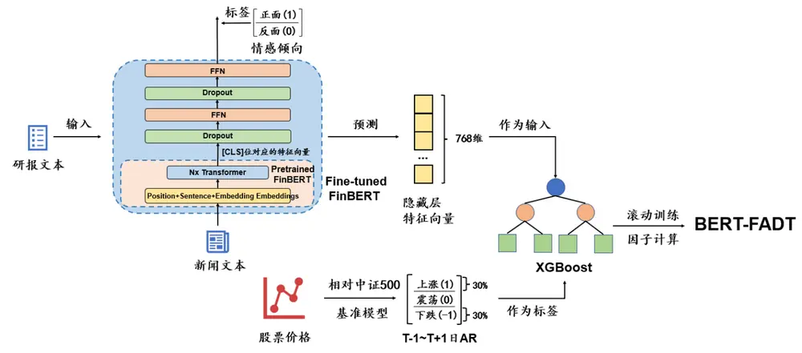
资料来源：华泰研究

总结上述步骤如下：

1） 微调预训练模型：使用带标注的新闻舆情数据对 FinBERT 进行微调，使得 FinBERT可以在测试集上获得较高的预测准确率；

2） 对研报文本进行语义编码：采用上述训练好的 FinBERT 对研报文本进行编码，输出FinBERT 的 CLS层 768 维向量，替代原版的词频向量；

3） 特征向量二次训练：将上述得到的特征向量作为特征输入给 XGBoost 模型，标签与原版标签相同，因子构建方式也与原版相同，训练 XGBoost 模型并构建因子值。

模型升级以后得到的因子我们称为 forecast_adj_txt_bert 因子，表现如下所示，多头年化收益有较明显的提升，从第一层 22.87%提升至 27.50%；相对中证 500 超额收益从原版 14.75%提升至 19.19%。

图表6： forecast_adj_txt_bert 因子分十层回测绝对净值
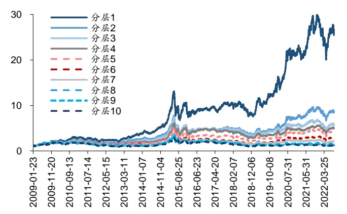
资料来源：Wind，朝阳永续，华泰研究，回测期 20090123-20220930

图表7： forecast_adj_txt_bert 因子分十层相对中证 500 超额净值
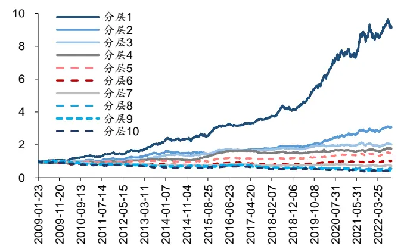
资料来源：Wind，朝阳永续，华泰研究，回测期 20090123-20220930

图表8： 两版本 forecast_adj_txt 因子多头第一层净值
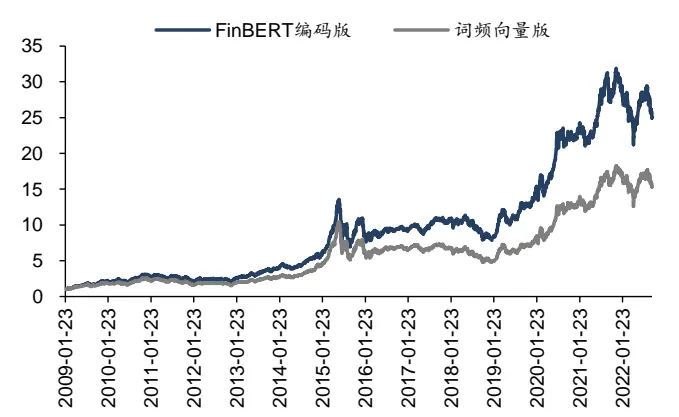
资料来源：Wind，朝阳永续，华泰研究，回测期：20090123-20220930

图表9： 两版本 forecast_adj_txt 因子多头第一层相对中证 500 净值
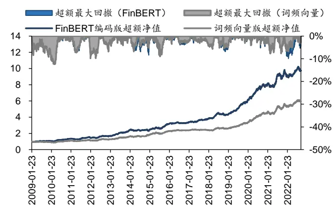
资料来源：Wind，朝阳永续，华泰研究，回测期：20090123-20220930

以模型升级以后的 forecast_adj_txt_bert 因子为基础池，我们继续给出两个主动量化选股组合的选股案例：

案例一：不带任何风格限制的主动量化选股组合（25 只股票，不等权组合），回测期20090123-20220930内年化收益 45.90%，相对中证 500年化超额 36.35%，夏普比率 1.58，回测表现如下图所示。

图表10： 不等权增强组合回测净值
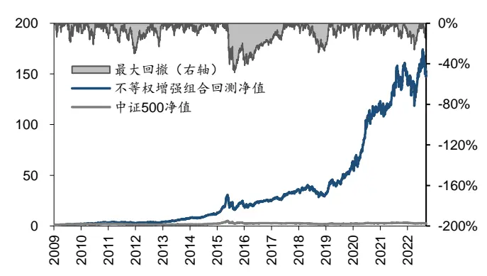
资料来源：Wind，朝阳永续，华泰研究，回测期：20090123-20220930

图表11： 不等权增强组合回测超额净值
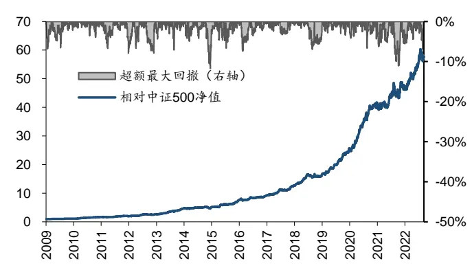
资料来源：Wind，朝阳永续，华泰研究，回测期：20090123-20220930

案例二：沪深 300 股票池内精选（限制在沪深 300 股票池内，不等权组合），回测期20090123-20220930 内年化收益 17.58%，相对沪深 300 年化超额收益 12.44%，夏普比率 0.66，回测表现如下所示。

图表12： 沪深 300股票池内精选组合回测净值
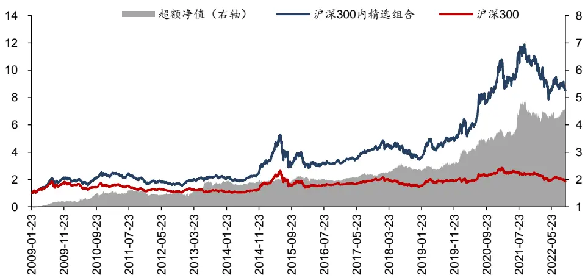
资料来源：Wind，朝阳永续，华泰研究，基准沪深 300，回测期：20090123-20220930

更为详细的参数选择、模型细节及训练过程展示我们将在后续正文部分详细展开。在介绍数据实证之前，我们将先对本文所使用到的模型理论进行介绍。本文将分为以下几个部分展开：

1） BERT、FinBERT 及 Adapter-BERT 原理介绍；

2） 基于 FinBERT 的 FADT 选股实证及扩展测试讨论；

3） 不同场景下文本因子的升级；

4） 应用案例。

## BERT、FinBERT 和 Adapter-BERT

## BERT 模型介绍

BERT 网络结构及输入

关于BERT模型更详细的原理及背景介绍可以参考华泰金工研究《人工智能62：NLP综述，勾勒 AI 语义理解的轨迹》，本文只对 BERT 模型进行基础概念的相关介绍，我们默认读者对 NLP 相关概念已经有一定基础。BERT 的全称为 Bidirectional Encoder Representationfrom Transformers，其中有两个关键词，一个是 Bidirectional，一个是 Transformers。

## 1. 关于 Bidirectional（双向）的理解：

对于某一个句子，例如“介绍本文采用的[Mask]语言模型”，我们遮住其中的“预训练”一词，想让模型预测出来。如果仅采用前文（即“介绍/本文/采用/的”）来预测[Mask]，或者仅采用后文（即“语言/模型”）来预测[Mask]，均称为单向预测，不能完整地理解整个语句的含义。BERT 的作者提出采用完整的上下文（即“介绍/本文/采用/的/…/语言/模型”）来进行双向的预测，具体采用 Transformers 模型来实现。

## 2. Transformer

Transformer 是 Google 在 2017 年提出的用于机器翻译的模型，近年来被推广到了各个领域，取得了较大的成功。Transformers 抛弃传统的 CNN、RNN 结构，采用编码器-解码器（encoder-decoder）的结构，其核心是自注意力机制，Transformer 的结构如下图所示。

图表13： Transformer 结构
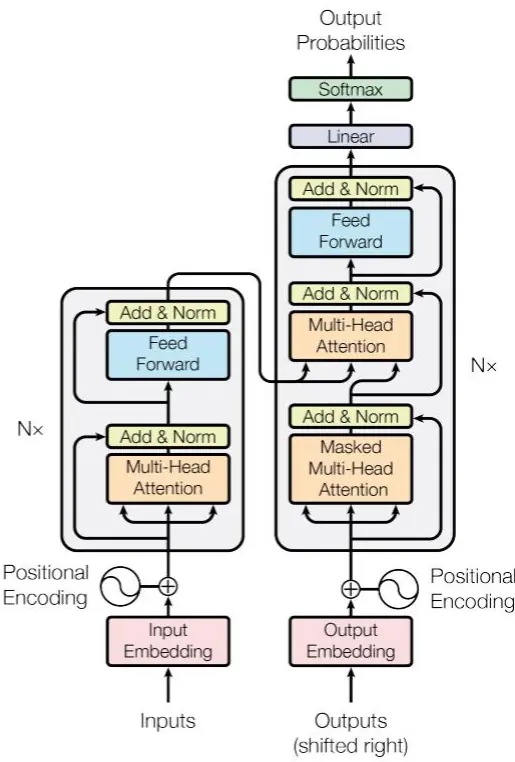
资料来源：《Attention is all you need》，华泰研究

BERT采用了Transformer的编码器，即上图中的左半部分结构，其中最重要的是Multi-HeadAttention（多头注意力）模块。所谓多头注意力，就是考虑多次自注意力机制，目的是提取多重语意的含义，而自注意力机制本质上就是相关性的计算。通过自注意力机制，模型得到了语句中每个词语与其他词语之间的相关性，从而把注意力放在相关性较大的词语上。例如，我们想翻译“The cat stuck out its tongue and licked its owner”这句话。在这个语句中，与“licked”最相关的词语是“cat”和“owner”，如下图所示，于是模型会重点联系“cat”和“owner”的语意来翻译“licked”这个词语。

图表14： 注意力机制示意图
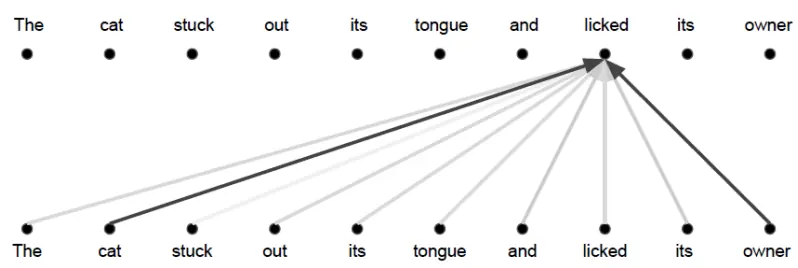
资料来源：华泰研究

将 Transformer 的编码器进行多层堆叠后，形成 BERT 的主体结构。由于 BERT 是一个预训练模型，因此需要适应各种各样的自然语言任务，模型的输入需要包含一句话（如文本情感分类、序列标注任务）或者两句话以上（文本摘要、自然语言推断、问答任务等）。

图表15： BERT的主体结构
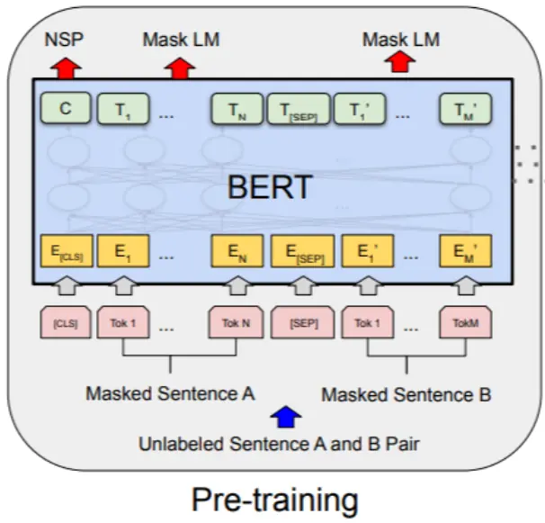
资料来源：《BERT:Pre-training of Deep Bidirectional Transformers For Language Understanding》，华泰研究

BERT 的输入为每一个 token 对应的表征（token 的直观理解即为单词或字符），除了 token以外还在输入的每一个序列开头插入特定的分类 token（[CLS]），该分类 token对应的最后一个 Transformer 层输出可以表征整个序列的信息。

模型如何分辨输入句子属于句子 A还是句子 B？BERT 采用两种办法来解决：

1. 在序列 tokens 中把分割 token（标记为[SEP]）插入到每个句子之后，代表句子结束；1. 在序列tokens中把分割token（标记为[SEP]）插入到每个句子之后，代表句子结束；

2. 为每一个 token 表征都添加一个可学习的分割 embedding 来指示其属于句子 A还是句子 B。

在 BERT 的原论文中，token 的表征由三部分构成，分别为 Token Embeddings、SegmentEmbeddings 和 Position Embeddings，如下图所示。

图表16： BERT的输入构成
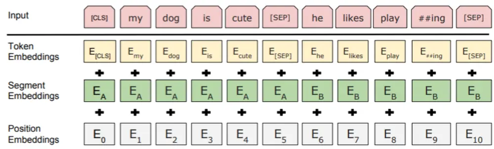
资料来源：《BERT:Pre-training of Deep Bidirectional Transformers For Language Understanding》，华泰研究

## BERT 预训练任务

预训练在计算机视觉领域（CV，Computer Vision）是较为成熟的概念，CV中所采用的预训练任务一般是 ImageNet 图像分类任务，完成图像分类任务的前提是必须能抽取出良好的图像特征，而 ImageNet 数据集具有规模大、质量高的优点，能获得较好的效果。NLP 中没有像 ImageNet 这样的高质量人工标注数据，因此 BERT 利用大规模文本数据的自监督性质来构建预训练任务，包括两项：Masked Language Model（MLM）和 Next SentencePrediction（NSP）。

## 1. Masked Language Model（MLM）

在每条训练样本中以 15%的概率随机地选中某个 token 位置用于预测，且被选中的 token会按概率替换成以下三个 token 之一：

再用该位置的输出向量去预测替换后的 token（输出向量接全连接层，再用 softmax 输出为每个 token 的概率，再和该位置的真实 token 向量求交叉熵损失函数）。

## 2. Next Sentence Prediction（NSP）

BERT 使用 NSP预训练来使模型有能力理解句子之间的关系，即预测两个句子是否是上下文关系。具体做法为对于每一个训练样例，在语料库中挑选出句子 A和句子 B来组成：1）50%的概率句子 B是句子 A的下一句，此时标记为 IsNext；

2）50%的概率句子B是语料中随机选取的句子（不一定是A的下一句），此时标记为NotNext；
把训练样例输入给 BERT，用[CLS]的输出向量进行二分类预测。

最后的预训练输入样本可能如下所示，每条样本在训练时MLM任务和NSP任务同时进行，两部分损失函数相加作为总体预训练损失函数。

样本 1：[CLS] CSI500 rose [MASK] today [SEP] trading volume [MASK] significantly [SEP] 标签 1：IsNext

样本 2：[CLS] CSI500 [MASK] sharply today [SEP] penguin [MASK] are flight [SEP] 标签 2：NotNext

预训练完成的BERT模型在下游应用时会进行Fine-Tuning操作，本文后续在应用FinBERT对研报文本进行编码时，也是考虑到经过微调的 CLS 向量可以更好地表征文本语义信息，所以在新闻舆情样本上进行了微调。

## FinBERT 模型介绍

我们没有采用 Google 发布的原版 BERT，而是采用了熵简科技在 2020 年末发布的 FinBERT：一款在大规模金融领域语料上预训练的中文 BERT 模型（https://github.com/valuesimplex/FinBERT）。FinBERT 采用与原版 BERT 相同的模型架构，但预训练方法略有不同，这里我们简要介绍 FinBERT 的预训练方法。

FinBERT 采用的预训练语料主要包括金融财经类新闻、研报或上市公司公告、金融类百科词条，经预处理之后得到约 30 亿 Tokens，这一数量超过了原生中文 BERT 的训练规模：

1） 金融财经类新闻：从公开渠道采集的最近十年的金融财经类新闻资讯，约 100 万篇；

2） 研报/上市公司公告：从公开渠道收集的各类研报和公司公告，来自 500 多家境内外研究机构，涉及 9000 家上市公司，包含 150 多种不同类型的研报，共约 200 万篇；

3） 金融类百科词条：从Wiki等渠道收集的金融类中文百科词条，约 100 万条。

基于上述数据集，熵简科技的 FinBERT 进行了两类预训练任务：

## 1. 字词级别的预训练：

1） Financial Whole Word Mask：该任务即前面提到的，随机遮住部分字词，让模型预测。这里进一步采用了全词Mask的方法，即对组成同一个词语的汉字全部进行Mask，从而使模型学习到领域内的先验知识，例如金融学概念之间的相关性等。

2） Next Sentence Prediction：引入预测下一句的任务，使模型理解句子间的关系。

## 2. 任务级别的预训练：

1） 研报行业分类：利用公司点评、行业点评类的研报自动生成了大量带有行业标签的语料，并构建了行业分类的文档级有监督任务。每个行业拥有 5k~20k 条语料，共计约 40 万条文档级语料。

2） 财经新闻的金融实体识别：利用已有的企业工商信息库和公开可查的上市公司董监高信息，基于金融财经新闻构建了命名实体识别类的有监督任务语料，共计约 50万条。

通过在金融语料上的预训练，FinBERT 在包括金融情绪分类的多个金融领域的下游任务中超过了普通 BERT 的性能。FinBERT 的预训练框架图如下图所示。

图表17： FinBERT 预训练框架图
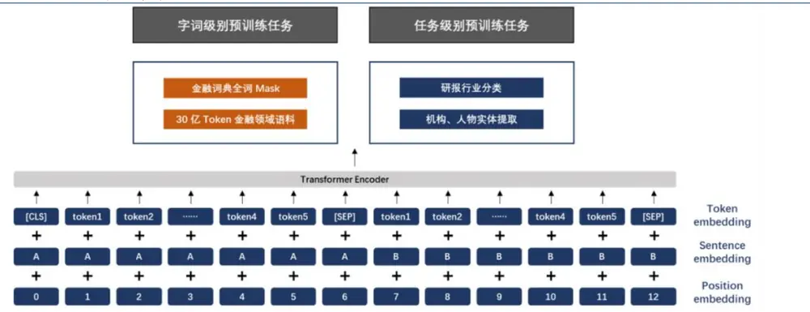
资料来源：熵简科技，华泰研究

## Adapter-BERT

上文所述的 FinBERT 模型参数量超过一亿，直接使用常规的微调方法对所有参数都进行微调，配置要求较高，很难实现。本文采用了 2019 年发表于机器学习顶级会议 ICML的 adapter-BERT（http://proceedings.mlr.press/v97/houlsby19a.html），在几乎不影响模型性能的情况下，将需要微调的参数减少到约三百万。

具体而言，在 BERT 的每个 Transformer 层内添加了两个 Adapter 模块，位于全连接层之后。Adapter 模块的主要结构为一个下采样全连接层和一个上采样全连接层，并且包括一个残差连接。Adapter 模块内的全连接层（下图绿色）的参数要远少于 Transformer 内的多头注意力层和全连接层（下图灰色）的参数。在微调过程中，只调整两图中绿色模块的参数，不调整灰色模块的参数，从而大幅减少了需要训练的参数量，最终总的可调参数量大概是预训练模型总参数量的 3%左右。

图表18： Adapter 模块构架及与 Transformer 的结合
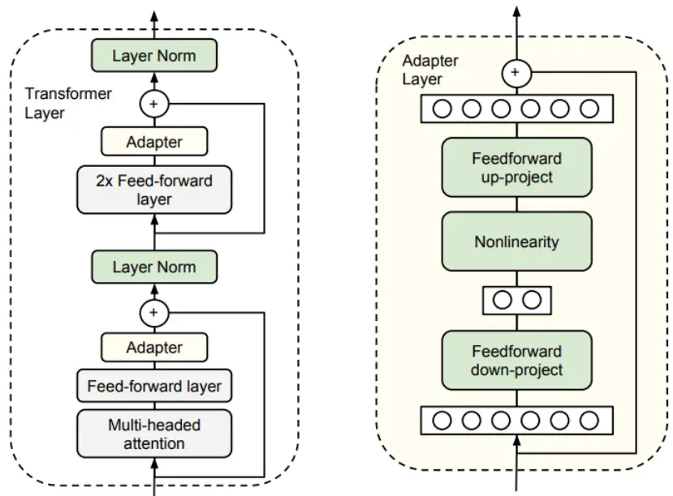
资料来源：《Parameter-Efficient Transfer Learning for NLP》，华泰研究

## 数据处理与模型训练

## FinBERT 模型微调

新闻舆情数据展示

一般来说如果预训练好的 BERT 不进行特定场景的微调操作，其 CLS层难以对整段文本进行向量编码，这是因为 BERT 在训练时的两个任务 MLM 和 NSP 都不是为了对句子进行编码而设计的，CLS 蕴含的信息不一定是充分的文本上下文信息，常规做法是会对 BERT 进行微调。我们使用带情感标注的万得新闻舆情数据对 FinBERT 进行微调，使得 CLS 层能更好地表征文本上下文信息。

Wind 新闻舆情数据库提供的舆情数据从 2015 年开始，为了尽可能少地使用到未来信息，同时保证可用于模型微调的训练样本数量足够，我们仅使用 2015-2017 三年的全部万得新闻舆情数据，并进行以下操作生成最终的待训练样本。

图表19： 带标注的新闻舆情数据预处理步骤

| 1）筛选出与A股个股相关的新闻并剔除行业类新闻； |
| --- |
| 2）剔除标题仅对行情进行描述的新闻； |
| 3）将新闻的标题与内容合并，并去除英文字母、阿拉伯数字、标点符号、特殊字符等无效字符； |
| 4）打标签，将正面情感的新闻文本标注为1，负面情感的新闻文本标注为0; |
| 5） 负采样，使得正面情感与负面情感的新闻文本数量保持一致； |
| 6）根据预训练时采用的词表，将文本中的字符转换成数字编码，得到tokens; |
| 7）在tokens的开头加上[CLS]标识符，用于后续分类任务；末尾加上[SEP]标识符，表示语句结束； |
| 8）根据需要对tokens进行截长补短，得到长度固定为N的tokens; |

资料来源：华泰研究

最终我们得到 14.8 万条金融新闻舆情情感分类样本。其中步骤 8）所使用的 tokens 长度 N将决定后续对研报进行情感编码时每次可以输入的文本长度，我们将在后文进行讨论。下表展示了万得新闻舆情数据库中的数据结构。

图表20： 万得新闻舆情数据格式

| 发布时间 | 新闻标题 | 新闻内容 | 来源 相关公司 |  | 市场情绪 |
| --- | --- | --- | --- | --- | --- |
| 2015/1/13 15:31:27 | LED 板块上涨 3.07% 华灿光电领涨 | 1月13日，2014年涨幅落后的LED板块周二强势中证网 回归，截至收盘时，板块平均上涨3.07%。个股方 面，华灿光电上涨9.99%，瑞丰光电、证通电子涨 |  | 300323.SZ:华灿光 电\|ON0201:A 股 \|ON02:公司 | 300323.SZ0401:华灿光电 正面\|ON11010301:A 股正 面\|ON110103:公司正面 |
| 2015/1/13 9:15:59 | 绩大幅下滑的点评 | 逾6%，鸿利光电、洲明科技、勤上光电、和而泰 等多股涨超 5%。 泸州老窖：存款异常及业1月9日晚，公司发布业绩预告，预计2014年归属于腾讯网 上市公司股东的净利润同比下降50%-75%，基本每 股收益约0.62-1.23元。同时，公司发布重大事项公 告，继2014年10月公司共计3.5亿元的存款出现异 常后，再发现在工行南阳中州支行的3.5亿存款异 |  | 000568.SZ:泸州老 窖\|ON0201:A 股 \|ON02:公司 | \|3745:正面情绪\|ON11:市场 情绪 000568.SZ0402:泸州老窖 负面\|ON11020301:A股负 面\|ON110203:公司负面 \|3746:负面情绪\|ON11:市场 情绪 |

资料来源：Wind，华泰研究

## FinBERT 微调

在微调 FinBERT 时我们需要搭建结构完整的网络层，在 FinBERT 前面我们添加了一个输入层；在 FinBERT 输出特征向量之后，首先截取[CLS]标识符对应的 768 维特征向量，然后通过两个 Dropout 层和两个全连接层的组合，映射到 2 维的情感分类概率。具体的网络结构如下图所示。

下述模型仅 FinBERT 层就拥有超过一亿参数，即使是在少量语料上微调，依然需要耗费大量时间。我们使用 Adapter-BERT 来减少待微调参数提升微调效率，Adapter-BERT 的理论内容参考上一章。

图表21： 微调 FinBERT 网络结构
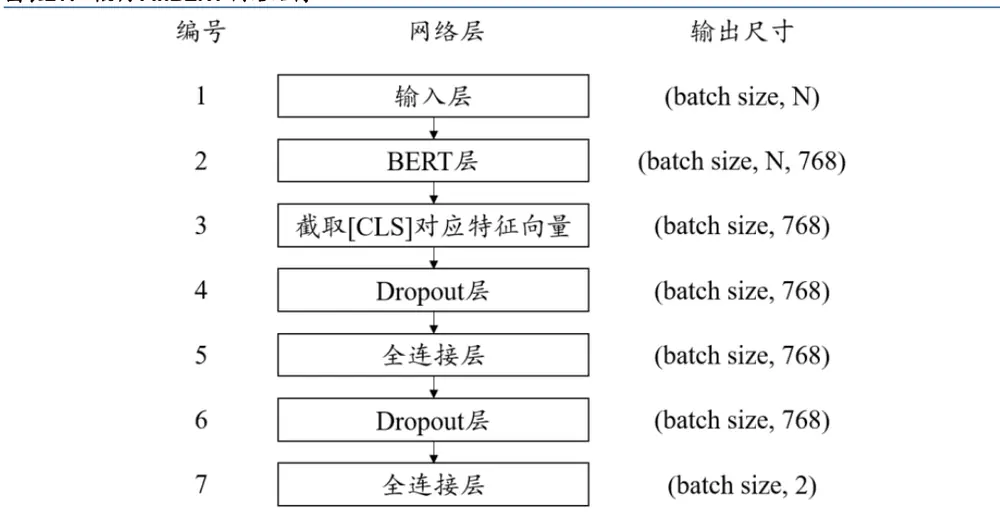
资料来源：华泰研究

微调 FinBERT 的超参数如下图表所示。超参数的选择不一定完全按照下表所示，FinBERT微调受随机数种子点影响较小，因此可以根据实际显卡配置对参数进行调整。实际上总训练轮数也可以降低，可以看到损失函数及分类准确率基本在 10轮以后就明显收敛。

图表22： FinBERT 微调参数设置

| 超参数说明 | 超参数取值 |
| --- | --- |
| 总训练轮数（total_epoch_count) | 50 |
| 热身训练轮数（warm_up_epoch_count） | 20 |
| 效果未提升则停止训练的轮数(patience) | 5 |
| 最大学习率（max_learn_rate） | 10-5 |
| 最终学习率(end_learn_rate） | 10-7 |
| 训练集占数据集的比重(train_split) | 0.7 |
| 验证集占训练集的比例(validation_split) | 0.3 |
| 批大小(batch_size) | 16 |
| Adaptor 尺寸(adaptor_size) | 64 |

图表23： FinBERT 微调损失函数
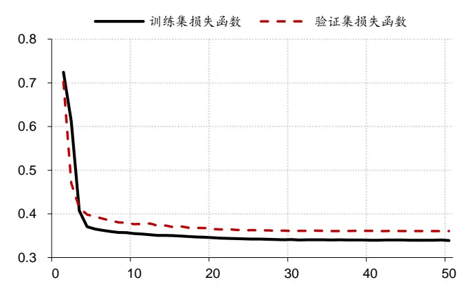
资料来源：Wind，华泰研究

图表24： FinBERT 微调准确率
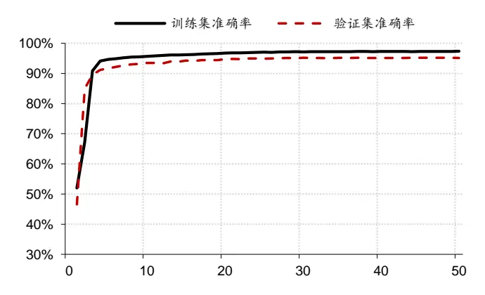
资料来源：Wind，华泰研究

微调 FinBERT 的训练曲线如上图所示，经过 50 轮 epoch 训练后训练集和验证集分别达到97.4%和 95.2%的训练准确率。

## FinBERT 编码与二次训练

FinBERT 研报编码

在微调完 FinBERT 以后，我们对每篇分析师研报进行编码。过去我们的做法是将每篇文本处理成词频向量，本质是认为拆解出的词频可以表征整段文本的语义信息；现在我们使用FinBERT 来对研报文本进行向量编码。首先，我们采用与生成微调样本类似的预处理方法，将研报文本预处理成 FinBERT 能读入的形式，具体而言：

图表25： 研报文本预处理步骤

| 1）将研报标题与摘要合并，并去除英文字母、阿拉伯数字、标点符号、特殊字符等无效字符； |
| --- |
| 2）根据预训练时采用的词表，将文本中的字符转换为数字编码，得到tokens; |
| 3）在tokens的开头加上[CLS]标识符，末尾加上[SEP]标识符； |
| 4）根据需要对tokens进行截长补短或切割为多段，得到长度固定为N的tokens; |

资料来源：华泰研究

值得注意的是，上图步骤 4）提到了处理长文本的两种方式：截长补短和切割为多段，截长补短即常规的 Truncate 和 Pad操作；切割为多段指的是按固定字符数将长文本切分为多条样本，我们会在后文进行讨论。此处 tokens 的长度 N 实际取决于 FinBERT 在数据预处理与训练时采用的 tokens 长度，关于这个参数我们也会在下文进行讨论。

上述预处理完成后，我们将研报文本输入给 FinBERT，然后去掉微调 FinBERT 网络结构中的 4~7 层，仅保留 1~3 层，输出 FinBERT 的 CLS层作为研报文本的向量编码，CLS层的维度为 768 维，流程如下图所示。接下来我们将上述隐藏层向量作为 XGBoost 的输入来进行第二次训练。

图表26： 二次训练示意图
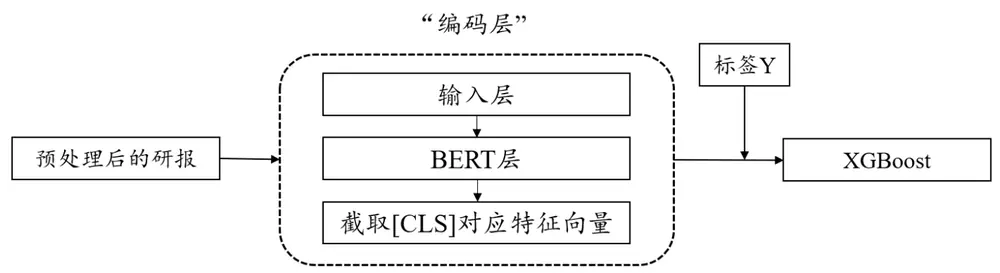
资料来源：华泰研究

## XGBoost 模型训练

相比于词频向量的版本，第二步训练我们唯一修改的地方仅在于输入给 XGBoost 模型的特征有所改变，其他细节基本相同。具体来说，XGBoost 的训练标签为研报发布前后两天，个股相对于中证 500 的超额收益（不进行中性化处理），我们按以下方式将其分为三类后作为训练标签 Y：

1. 上涨（y=1）：较大的正向超额收益，即样本的超额收益位于整体的前 30%；

2. 震荡（y=0）：较低的正向或负向超额收益，即样本的超额收益位于整体的前 30%~70%；

3. 下跌（y=-1）：较大的负向超额收益，即样本的超额收益位于整体的后 30%。

词频向量版与 BERT 版的训练样本对比如下图所示。词频向量的优势在于可解释性较强，可以很直观地看出每一维特征的含义，但是会损失较多语义信息；BERT 编码的优势在于对语义信息的利用更充分，但是可解释性较差，每一维特征的含义不明显。

图表27： 词频向量与 BERT版本训练样本对比

| 词频向量版本 |  |  |  |  |  |  |  |  |  |  |  |  |  |  |  |  |  | 标签Y |  |  |  |  |
| --- | --- | --- | --- | --- | --- | --- | --- | --- | --- | --- | --- | --- | --- | --- | --- | --- | --- | --- | --- | --- | --- | --- |
|  |  | 标题200词 |  |  |  |  |  |  | 摘要1000词 |  |  |  |  |  |  |  | [T-1,T+1] |  |  |  |  |  |
|  | 下滑 业务 业绩 中报 主业 产品 产能 亮眼 ... |  |  |  |  |  |  |  |  |  |  |  |  |  |  |  |  |  | 超额 |  |  |  |
| 样本1 | 1 | 0 | 1 | 0 | 0 | 0 | 0 | 0 | u | 0 0 | 0 | 0 |  | 0 | 0 | 1 | 2 | 1 |  | " | -1.50% |  |
| 样本2 | 0 | 0 | 0 | 1 |  | 1 | 0 | 1 | .. | 0 | 0 |  | 1 | 0 | 0 | 1 | 0 | 2 | … | 2.00% |  | 2 |
| 样本3 | 1 | 1 | 0 | 0 | 1 | 1 | 0 | 0 | 1 | 1 | 1 |  | 0 | 0 | 0 | 0 | 0 | 0 |  |  |  | 1 |
|  |  |  |  |  |  |  |  |  |  |  | 1 |  |  |  |  |  |  |  |  | u | 0.20% |  |
| 样本n | II |  |  |  |  |  |  |  |  |  |  |  |  |  |  |  |  |  |  |  | I |  |

|  | FinBERT-隐藏层向量 |  |  |  |  |  |  |  |  |  | [T-1,T+1] 超额 |
| --- | --- | --- | --- | --- | --- | --- | --- | --- | --- | --- | --- |
|  | 特征1 | 特征2 | 特征3 | 特征4 | 特征5 | 特征6 | 特征7 |  | 特征767 | 特征768 |  |
| 样本1 | 0.132 | -0.259 | -0.923 | 0.775 | 0.234 | 0.012 | -0.045 |  |  | -1.50% | 0 |
| 样本2 | 0.636 | -1.326 | 0.602 | 0.501 | 0.552 | -0.123 -0.235 | · | 0.664 0.048 | -0.286 1.156 | 2.00% | 2 |
| 样本3 | 0.199 | -0.069 | -0.255 | 0.476 | 1.764 | 0.567 | m | -0.453 | 1.682 | 0.20% | 1 |
| … | . |  |  |  | -1.123 |  | · |  |  |  |  |
| 样本n | u |  |  |  |  |  |  |  |  | .· ·· | ·· |

资料来源：华泰研究

我们采用滚动的方式对 XGBoost 模型进行训练，每次滚动样本内为过去 6个月，样本外为未来 12个月。例如对于某轮样本外的首月 T 月来说，我们将 T-6至 T-1 月的数据作为样本内，T 月至 T+11 月的数据作为样本外；下一迭代期则以 T+6 月至 T+11 月的数据作为样本内，T+12 至 T+23 月的数据作为样本外；以此类推。

图表28： 滚动训练示意图
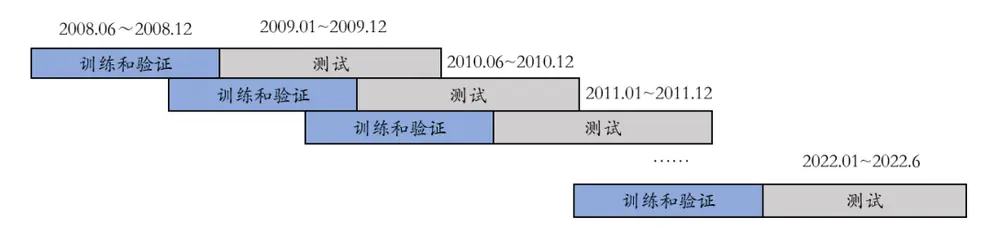
资料来源：华泰研究

在每次滚动训练时，我们都采用网格搜索的方式来进行最优超参数的搜索，并采用 5 折交叉验证的方式对模型性能进行评估。XGBoost的超参数选择范围及其他固定参数如下表所示。

图表29： XGBoost 超参数选择

| 超参数 | 取值 |
| --- | --- |
| 学习率（learning rate） | [0.025, 0.05, 0.075, 0.1] |
| 最大树深（max_depth） | [3, 5, 7] |
| 行采样比例（subsample） | [0.8, 0.85, 0.9, 0.95] |
| 固定参数 |  |
| 损失函数 | multi: softprob |
| 随机数种子点 | 42 |

资料来源：华泰研究

模型在样本内训练完成后，我们在样本外进行测试。forecast_adj_txt 因子生成的频率为每个月末，在月末截面期追溯过去一个季度的全市场分析师盈利预测调整样本，使用训练好的模型进行预测，得到每条样本在每个类别上的概率估计值 $\left[p_{c}(x)\right.$ ，以此我们计算其 log-odds值 $L_{c}(x)$ ：

$$
\begin{aligned}L_{c\in\{h,m,l\}}(x)&=log\frac{p_{c}(x)}{1-p_{c}(x)}\\forecast_{-}&adj_{-}txt=L_{h}(x)-L_{l}(x)\end{aligned}
$$

其中 $c\in\{h,m,l\}$ 为三个类别标签，分别表示上涨、震荡、下跌。我们计算其上涨和下跌类别的 log-odds 值之差作为文本得分。将个股过去一个季度有关盈利预测调整的全部点评研报文本得分求均值即为个股在当期截面的因子值。

## 数据实证：从更充分的语义理解到更显著的 Alpha 提升

## 基础模型实证

在进行更多参数讨论之前，同样的我们首先给出基准参数模型下的文本因子表现。主要讨论部分我们仍以盈利预测调整场景下的研报文本挖掘为主，后面我们同样展示业绩发布、评级调整场景下的文本因子升级效果。基准模型参数选择如下表所示。

图表30： 基础模型参数选择

| 参数 | 取值 |
| --- | --- |
| FinBERT 输入 tokens 长度(N) | 500 |
| 长文本处理方式 | 截长补短 |
| 分析师研报文本类型 | 盈利预测调整 |
| 样本内窗口长度 | 6个月 |
| 样本标签的时间区间 | T-1~T+1 |
| 样本外计算因子的回溯区间 | 3个月 |

资料来源：华泰研究

图表31： forecast_adj_txt_bert 因子分十层回测净值
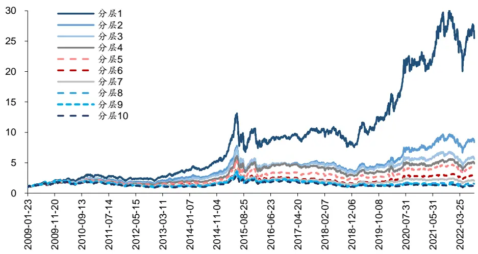
资料来源：Wind，朝阳永续，华泰研究，回测期：20090123-20220930

图表32： forecast_adj_txt_bert 因子分十层回测相对中证 500 净值
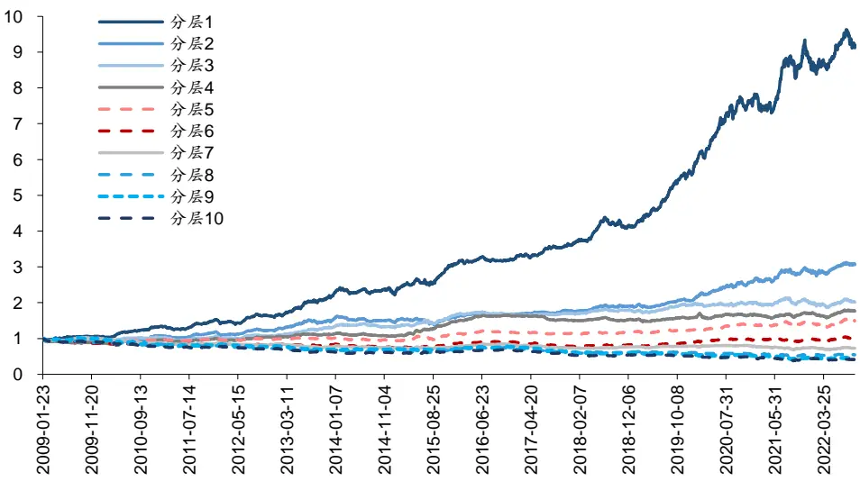
资料来源：Wind，朝阳永续，华泰研究，回测期：20090123-20220930

图表33： forecast_adj_txt_bert 因子多空对冲净值
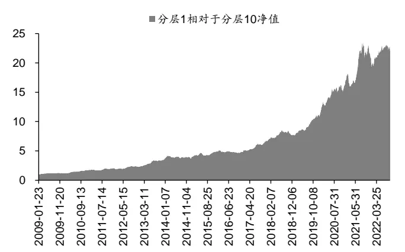
资料来源：Wind，朝阳永续，华泰研究，回测期：20090123-20220930

图表34： forecast_adj_txt_bert 因子覆盖度
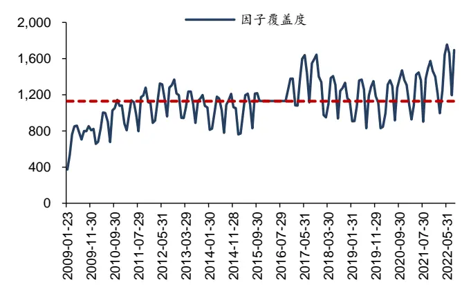
资料来源：Wind，朝阳永续，华泰研究

图表35： forecast_adj_txt_bert 因子分层 1 分年度业绩

| 时间 | 区间(年化)收益率区间（年化）超额收益 |  | 年化波动率 | 最大回撤 | 夏普比率 | 卡玛比率 |
| --- | --- | --- | --- | --- | --- | --- |
| 2009 | 130.65% | 11.32% | 33.98% | 20.02% | 3.84 | 6.53 |
| 2010 | 40.24% | 27.70% | 28.65% | 23.18% | 1.40 | 1.74 |
| 2011 | -25.62% | 15.73% | 24.19% | 28.16% | -1.06 | -0.91 |
| 2012 | 12.17% | 10.28% | 24.77% | 21.97% | 0.49 | 0.55 |
| 2013 | 68.29% | 41.64% | 26.45% | 12.80% | 2.58 | 5.34 |
| 2014 | 37.81% | -1.54% | 22.19% | 16.38% | 1.70 | 2.31 |
| 2015 | 99.50% | 37.78% | 44.96% | 48.79% | 2.21 | 2.04 |
| 2016 | -6.72% | 4.65% | 28.32% | 23.70% | -0.24 | -0.28 |
| 2017 | 12.69% | 14.00% | 16.31% | 13.76% | 0.78 | 0.92 |
| 2018 | -25.59% | 15.27% | 25.66% | 30.39% | -1.00 | -0.84 |
| 2019 | 75.15% | 37.75% | 25.34% | 17.82% | 2.97 | 4.22 |
| 2020 | 65.23% | 39.69% | 29.55% | 17.53% | 2.21 | 3.72 |
| 2021 | 33.04% | 17.13% | 22.34% | 13.38% | 1.48 | 2.47 |
| 20220930 | -17.25% | 8.34% |  |  |  |  |
| 成立以来 | 27.50% | 19.19% | 27.99% | 48.79% | 0.98 | 0.56 |

资料来源：Wind，朝阳永续，华泰研究，基准中证 500，回测期：20090123-20220930

词频向量版的十分层回测结果、与 FinBERT 编码版本的 forecast_adj_txt_bert 因子多头第一层对比、十分层业绩对比如下述图表所示。相比于词频向量版本，FinBERT 编码的版本多头收益提升显著，从原始 22.87%提升至 27.50%，多头收益提升接近 5Pct。FinBERT 编码版因子多头相对中证 500 超额收益在 2016、2017 年也获得明显正向超额，而词频向量版因子多头在这两年超额走平。从选定参数的基础模型来看，除多头以外，其余分层的提升不明显。

图表36： 词频向量-forecast_adj_txt 因子分十层回测净值
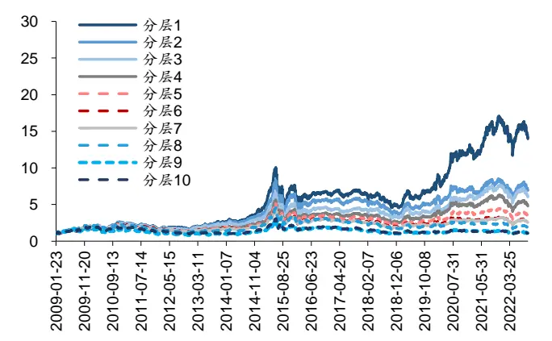
资料来源：Wind，朝阳永续，华泰研究，回测期：20090123-20220930

图表37： 词频向量-forecast_adj_txt 因子分十层相对中证 500 净值
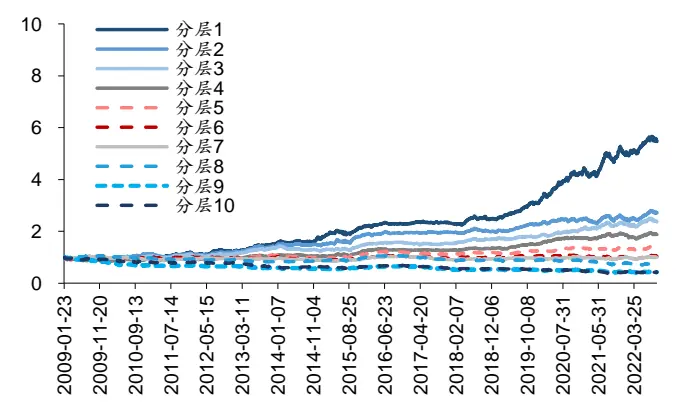
资料来源：Wind，朝阳永续，华泰研究，回测期：20090123-20220930

图表38： 两版本 forecast_adj_txt 因子多头第一层净值
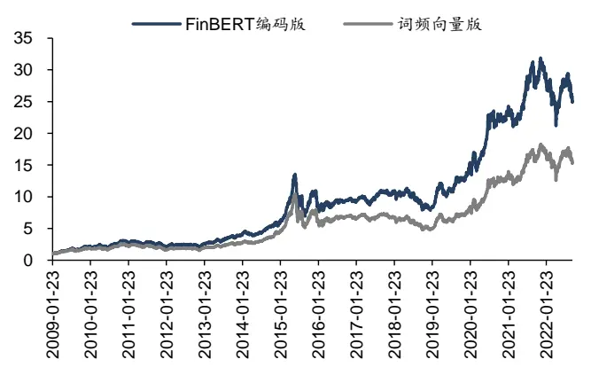
资料来源：Wind，朝阳永续，华泰研究，回测期：20090123-20220930

图表39： 两版本 forecast_adj_txt 因子多头第一层相对中证 500 净值
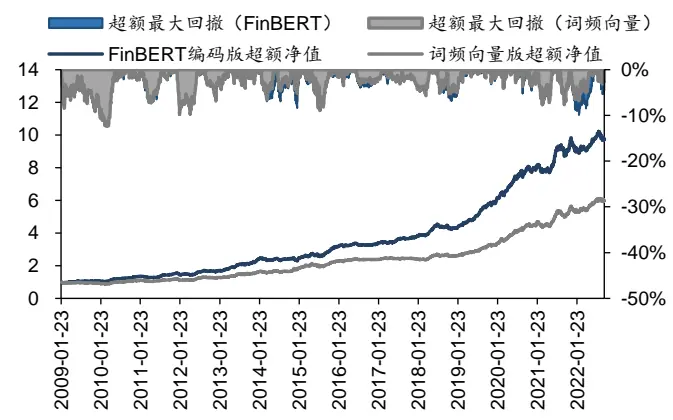
资料来源：Wind，朝阳永续，华泰研究，回测期：20090123-20220930

图表40： 两版本 forecast_adj_txt 因子十分层业绩比较

|  | 分层1 | 分层2 | 分层3 | 分层4 | 分层5 | 分层6 | 分层7 | 分层8 | 分层9 | 分层10 |
| --- | --- | --- | --- | --- | --- | --- | --- | --- | --- | --- |
| FinBERT 编码-绝对 | 27.50% | 16.83% | 13.20% | 12.06% | 10.64% | 7.38% | 4.78% | 2.58% | 1.13% | 0.48% |
| FinBERT 编码-超额 | 19.19% | 7.82% | 4.48% | 3.42% | 2.11% | -0.90% | -3.30% | -5.33% | -6.66% | -7.27% |
| 词频向量-绝对 | 22.87% | 15.76% | 14.57% | 12.57% | 9.83% | 7.66% | 7.34% | 4.82% | 0.65% | 0.66% |
| 词频向量-超额 | 14.75% | 7.83% | 6.72% | 4.86% | 2.31% | 0.28% | -0.01% | -2.36% | -6.25% | -6.24% |

资料来源：Wind，朝阳永续，华泰研究，基准中证 500，回测期：20090123-20220930

## 扩展测试一：文本截断和分段的比较

在 NLP 任务中需要根据实际应用场景来对文本进行一定的预处理，例如在某些场景下，可以尝试对原始文本进行过滤，降低有效文本的长度，从而提升模型性能。

图表41： 长文本分段操作示意图
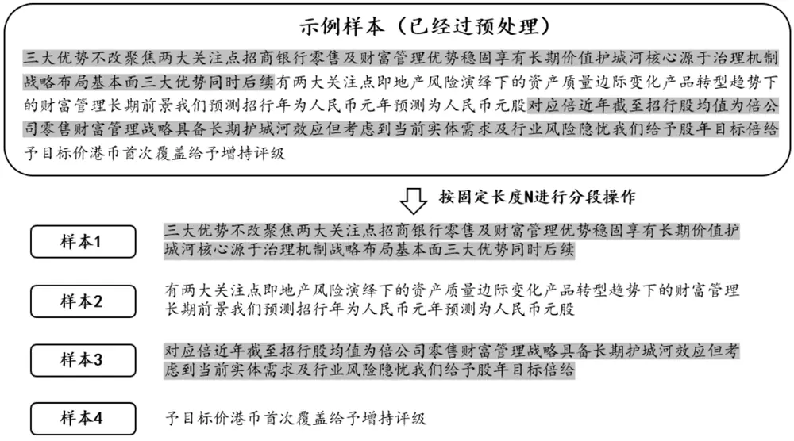
资料来源：华泰研究

在前文所述的基础模型中，我们采用的是前截断的方法来保证文本不超过指定字符数，从逻辑上来说我们将标题与摘要拼接，且大多数研报首段会总结最核心的观点，因此前截断保留关键信息是合乎逻辑的。这里我们再尝试一种预处理方法，即对长文本进行分段：如果一条文本字符数超过 N，那么我们以长度 N 为限将长文本分成多条样本，如上图所示。切分以后的每条样本都将作为一条单独的样本参与下一步 XGBoost 模型训练与预测。

在样本外预测时，每条研报样本的得分将由分段子样本的得分求均值得到。这里我们比较字符数为 500 或 200、分段或截断四种组合的测试结果，如图表 42-48 所示。从对比结果来看，有以下两点结论：

2. 样本分段的测试组多头超额更稳健，最近一年超额波动更小，可能是因为在合成因子时所使用的样本量更多，选股效果更稳定。

图表42： FinBERT+XGB+500 字分段—因子十分层净值
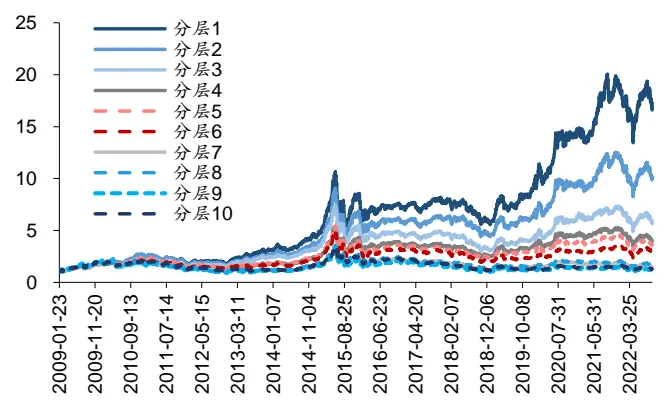
资料来源：Wind，朝阳永续，华泰研究，回测期：20090123-20220930

图表43： FinBERT+XGB+500 字分段—因子十分层超额净值
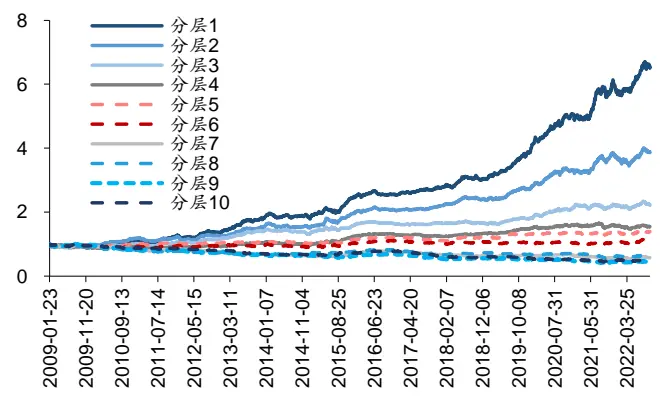
资料来源：Wind，朝阳永续，华泰研究，回测期：20090123-20220930

图表44： FinBERT+XGB+200 字截断—因子十分层净值
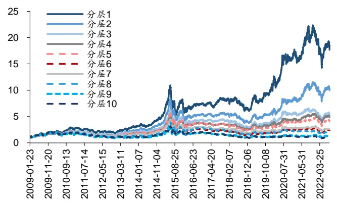
资料来源：Wind，朝阳永续，华泰研究，回测期：20090123-20220930

图表45： FinBERT+XGB+200 字截断—因子十分层超额净值
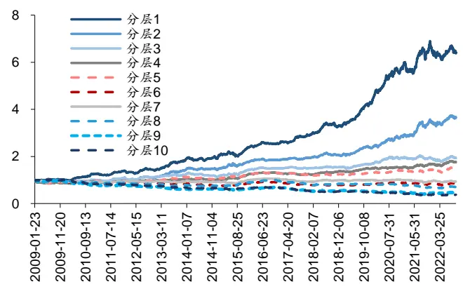
资料来源：Wind，朝阳永续，华泰研究，回测期：20090123-20220930

图表46： FinBERT+XGB+200 字分段—因子十分层净值
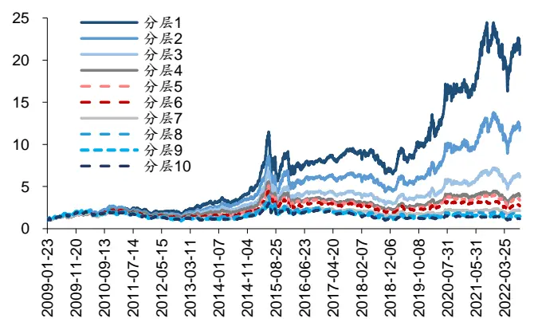
资料来源：Wind，朝阳永续，华泰研究，回测期：20090123-20220930

图表47： FinBERT+XGB+200 字分段—因子十分层超额净值
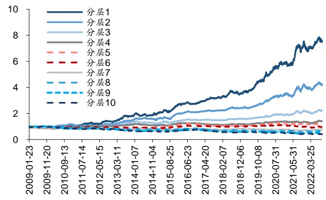
资料来源：Wind，朝阳永续，华泰研究，回测期：20090123-20220930

图表48： 截断与分段样本多头第一层股票超额净值比较
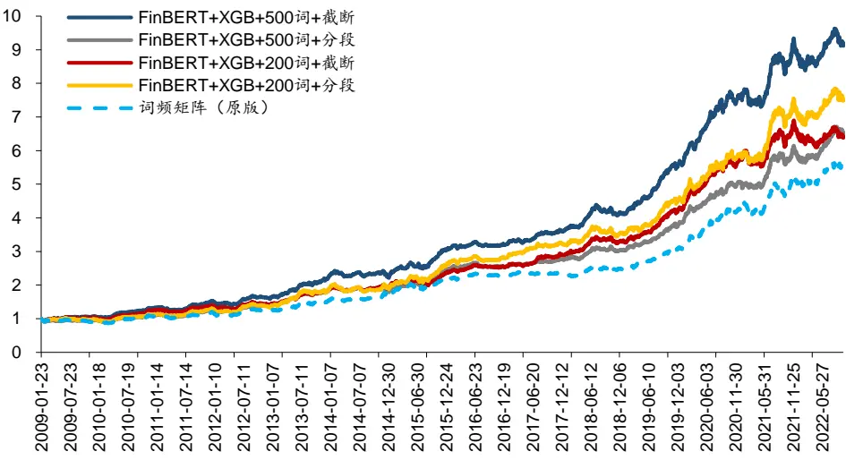
资料来源：Wind，朝阳永续，华泰研究，回测期：20090123-20220930

图表49： 分段与截断各测试组 forecast_adj_txt_bert 因子十分层业绩比较

| 分层1 |  | 分层2 分层3 分层4 |  |  |  |  |  |  |  |  |  |
| --- | --- | --- | --- | --- | --- | --- | --- | --- | --- | --- | --- |
| 分层5 |  | 绝对收益 |  |  |  |  |  |  |  |  |  |
| FinBERT+XGB+500 词+截断 | 27.50% | 16.83% | 13.20% | 12.06% | 10.64% |  | 7.38% | 4.78% | 2.58% | 1.13% | 0.48% |
| FinBERT+XGB+500 词+分段 | 24.70% | 18.91% | 14.02% | 10.95% | 10.05% |  | 8.36% | 2.98% | 3.69% | 1.02% | 1.79% |
| FinBERT+XGB+200 词+截断 | 24.52% | 18.38% | 12.83% | 12.01% |  | 10.61% | 6.11% | 6.79% | 4.53% | 1.16% | -0.37% |
| FinBERT+XGB+200 词+分段 | 25.69% | 19.61% | 13.95% | 10.09% |  | 8.82% | 7.07% | 5.20% | 3.62% | 2.22% | 0.51% |
| 词频向量 | 22.87% | 15.76% | 14.57% | 12.57% | 9.83% |  | 7.66% | 7.34% | 4.82% | 0.65% | 0.66% |
| 超额收益 |  |  |  |  |  |  |  |  |  |  |  |
| FinBERT+XGB+500 词+截断 | 19.19% | 7.82% | 4.48% | 3.42% |  | 2.11% | -0.90% | -3.30% | -5.33% |  | -6.66% |
| FinBERT+XGB+500 词+分段 | 16.33% | 9.74% | 5.23% | 2.40% | 1.56% |  | 0.01% | -4.96% | -4.31% | -6.77% | -7.27% -6.06% |
| FinBERT+XGB+200 词+截断 | 16.12% | 9.25% | 4.13% | 3.38% |  | 2.08% | -2.07% | -1.44% | -3.53% | -6.64% | -8.05% |
| FinBERT+XGB+200 词+分段 | 17.47% | 10.39% | 5.17% | 1.60% |  | 0.43% | -1.19% | -2.91% | -4.37% | -5.66% | -7.24% |
| 词频向量 | 14.75% | 7.83% | 6.72% | 4.86% |  | 2.31% | 0.28% | -0.01% | -2.36% | -6.25% | -6.24% |

资料来源：Wind，朝阳永续，华泰研究，基准中证 500，回测期：20090123-20220930

## 扩展测试二：是否有必要对 FinBERT进行微调？

前文我们提到过，如果不对 BERT 模型进行微调，BERT 的 CLS 或不能很好地表征语义信息，因为 BERT 预训练时 MLM 及 NSP两个任务都不是为了表征语义信息而提出的，因此任务目标不同。微调实际上是为了使得 BERT 能更好地表征语义信息。我们发现如果不对FinBERT 进行微调，在带标注的新闻舆情语料上的分类准确率约为 80%，微调以后分类准确率超过 96%。

本小节我们测试微调对文本因子的影响。对于不做微调的测试组，我们直接将研报文本预处理好以后输入给 FinBERT 并提取出 CLS层作为后续 XGBoost 模型训练的输入，其他流程相同，测试结果如下图表所示。从结果来看，如果不对 FinBERT 进行微调，虽然forecast_adj_txt_bert 因子也有比较明显的多头收益，但是相比于词频向量的版本没有明显提升。因此我们认为有必要对 FinBERT 进行微调。

图表50： FinBERT不微调—因子十分层净值
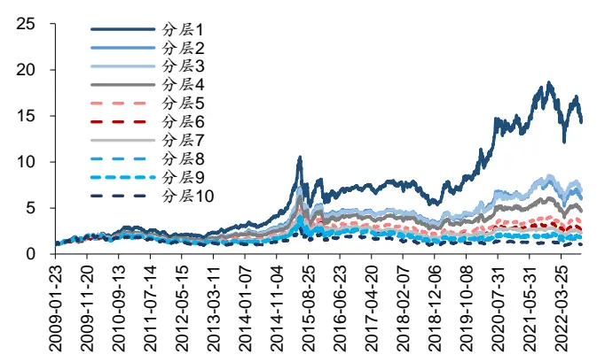
资料来源：Wind，朝阳永续，华泰研究，回测期：20090123-20220930

图表51： FinBERT不微调—因子十分层超额净值
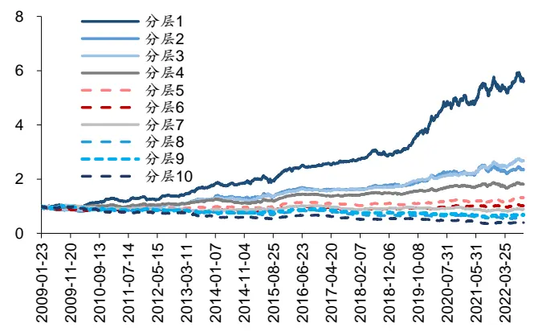
资料来源：Wind，朝阳永续，华泰研究，回测期：20090123-20220930

图表52： 微调与不微调多头第一层股票超额净值比较
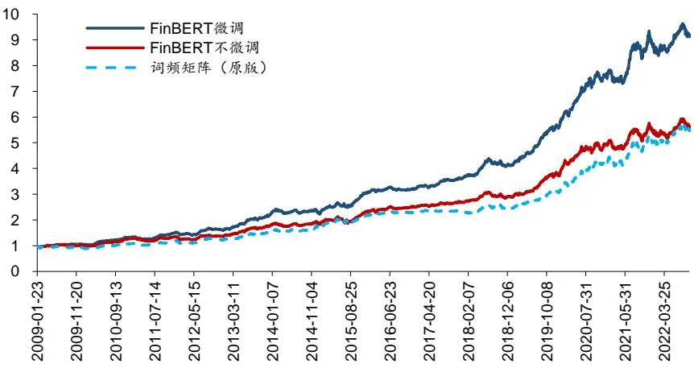
资料来源：Wind，朝阳永续，华泰研究，回测期：20090123-20220930

图表53： 微调与不微调 forecast_adj_txt_bert 因子十分层业绩比较

|  | 分层1 | 分层2 | 分层3 | 分层4 | 分层5 | 分层6 | 分层7 | 分层8 | 分层9 | 分层10 |  |  |
| --- | --- | --- | --- | --- | --- | --- | --- | --- | --- | --- | --- | --- |
|  | 绝对收益 |  |  |  |  |  |  |  |  |  |  |  |
| FinBERT 微调 | 27.50% | 16.83% | 13.20% | 12.06% | 10.64% | 7.38% |  | 4.78% | 2.58% | 1.13% | 0.48% |  |
| FinBERT 不微调 | 23.04% | 14.46% | 15.64% | 12.28% | 9.58% | 7.45% |  | 6.32% | 2.78% | 4.33% | 0.11% |  |
| 词频向量 | 22.87% | 15.76% | 14.57% | 12.57% | 9.83% | 7.66% |  | 7.34% | 4.82% | 0.65% | 0.66% |  |
|  | 超额收益 |  |  |  |  |  |  |  |  |  |  |  |
| FinBERT 微调 | 19.19% | 7.82% | 4.48% |  | 3.42% | 2.11% | -0.90% | -3.30% | -5.33% | -6.66% |  | -7.27% |
| FinBERT 不微调 | 14.86% | 5.63% | 6.72% | 3.62% |  | 1.13% | -0.84% | -1.88% | -5.15% | -3.72% |  | -7.61% |
| 词频向量 | 14.75% | 7.83% |  | 6.72% | 4.86% | 2.31% | 0.28% | -0.01% | -2.36% |  | -6.25% | -6.24% |

资料来源：Wind，朝阳永续，华泰研究，基准中证 500，回测期：20090123-20220930

## 扩展测试三：CLS 编码与全连接层编码对比

在对 FinBERT 进行微调时，CLS层后连接的是全连接层，该隐藏层也可以视为是对研报文本的编码。本小节我们尝试比较使用该全连接层进行编码与使用 CLS层进行编码的效果有何不同，两组测试结果如下图所示。

从结果来看全连接层也可以用于文本编码，构建出的文本因子相比于词频向量版本仍有一定提升，且近两年多头超额较为稳健，波动相对更小。此外全连接层编码得到的forecast_adj_txt_bert 因子分层更为明显，第二层表现也较好。

图表54： FinBERT全连接层编码—因子十分层净值
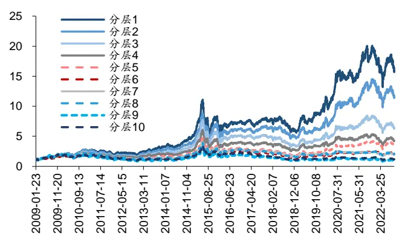
资料来源：Wind，朝阳永续，华泰研究，回测期：20090123-20220930

图表55： FinBERT全连接层编码—因子十分层超额净值
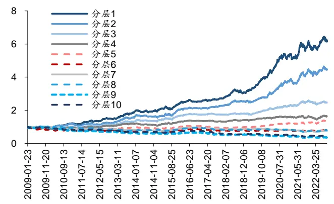
资料来源：Wind，朝阳永续，华泰研究，回测期：20090123-20220930

图表56： CLS层编码与全连接层编码多头第一层股票超额净值比较
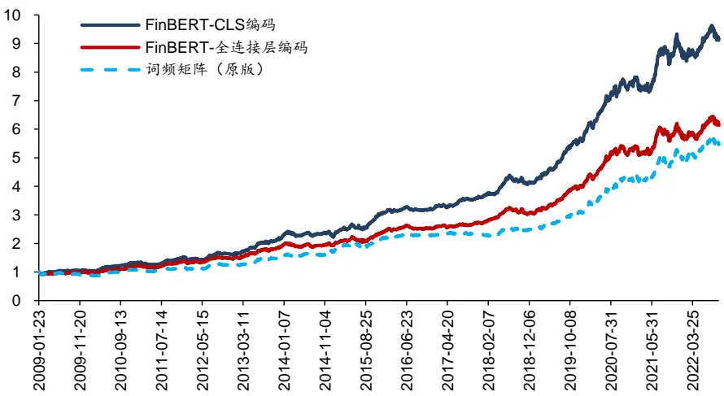
资料来源：Wind，朝阳永续，华泰研究，回测期：20090123-20220930

图表57： CLS 层编码与全连接层编码 forecast_adj_txt_bert 因子十分层业绩比较

| 分层1 |  | 分层2 | 分层3 | 分层4 | 分层5 | 分层6 | 分层7 | 分层8 | 分层9 | 分层10 |  |
| --- | --- | --- | --- | --- | --- | --- | --- | --- | --- | --- | --- |
| 绝对收益 |  |  |  |  |  |  |  |  |  |  |  |
| CLS 层编码 | 27.50% | 16.83% | 13.20% | 12.06% | 10.64% | 7.38% |  | 4.78% | 2.58% | 1.13% | 0.48% |
| 全连接层编码 | 24.12% | 20.18% | 14.90% | 11.40% |  | 9.85% | 5.30% | 4.94% | 5.54% | -0.56% | 1.04% |
| 词频向量 | 22.87% | 15.76% | 14.57% | 12.57% |  | 9.83% | 7.66% | 7.34% | 4.82% | 0.65% | 0.66% |
| 超额收益 |  |  |  |  |  |  |  |  |  |  |  |
| CLS 层编码 全连接层编码 | 19.19% |  | 7.82% | 4.48% | 3.42% | 2.11% | -0.90% | -3.30% | -5.33% | -6.66% | -7.27% |
|  |  | 16.08% | 10.91% | 6.05% | 2.81% | 1.38% | -2.81% | -3.15% | -2.60% | -8.22% | -6.75% |
| 词频向量 |  | 14.75% | 7.83% | 6.72% | 4.86% | 2.31% | 0.28% | -0.01% | -2.36% | -6.25% | -6.24% |

资料来源：Wind，朝阳永续，华泰研究，基准中证 500，回测期：20090123-20220930

## 扩展测试四：CLS 编码与词频特征结合

我们继续尝试将 CLS 编码与词频向量结合一起作为特征输入给 XGBoost 模型进行训练。当然从逻辑上来说 CLS编码基本已经包含文本的绝大部分信息，再纳入词频向量或有冗余，这里我们仅作为测试实验进行展示。

图表58： CLS编码+词频向量—因子十分层净值
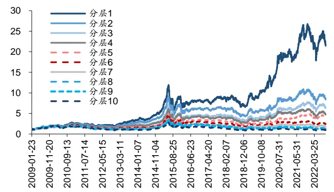
资料来源：Wind，朝阳永续，华泰研究，回测期：20090123-20220930

图表59： CLS编码+词频向量—因子十分层超额净值
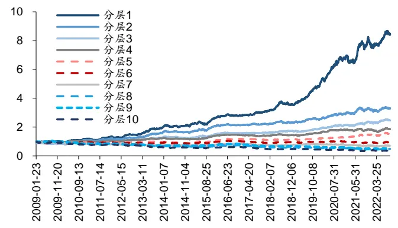
资料来源：Wind，朝阳永续，华泰研究，回测期：20090123-20220930

图表60： CLS编码+词频向量多头第一层股票超额净值比较
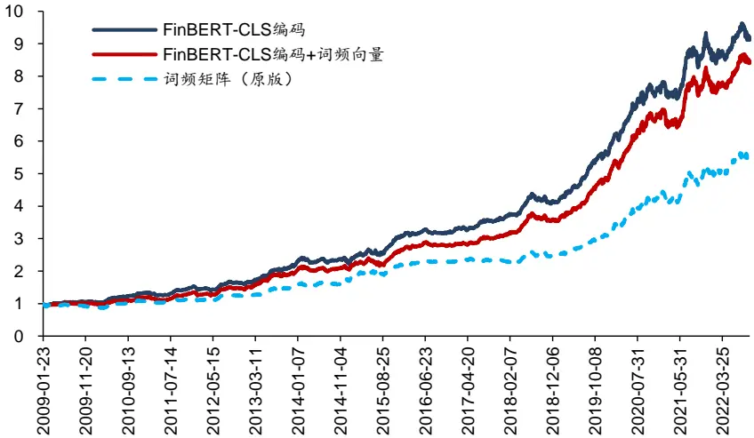
资料来源：Wind，朝阳永续，华泰研究，回测期：20090123-20220930

图表61： CLS 编码+词频向量 forecast_adj_txt_bert 因子十分层业绩比较

| 分层1 |  | 分层2 | 分层3 分层4 |  |  |  |  |  |  |  |  |
| --- | --- | --- | --- | --- | --- | --- | --- | --- | --- | --- | --- |
|  |  |  |  |  | 分层5 | 绝对收益 | 分层6 | 分层7 | 分层8 | 分层9 | 分层10 |
| CLS 编码 | 27.50% | 16.83% | 13.20% | 12.06% | 10.64% | 7.38% | 4.78% | 2.58% | 1.13% |  | 0.48% |
| CLS 编码+词频向量结合 | 26.12% | 17.45% | 14.93% | 12.47% | 10.90% | 6.85% |  | 4.50% | 1.63% | 1.86% | -0.50% |
| 词频向量 | 22.87% | 15.76% | 14.57% | 12.57% | 9.83% |  | 7.66% | 7.34% | 4.82% | 0.65% | 0.66% |
|  | 超额收益 |  |  |  |  |  |  |  |  |  |  |
| CLS 编码 CLS 编码+词频向量结合 | 19.19% | 7.82% | 4.48% | 3.42% |  | 2.11% | -0.90% | -3.30% | -5.33% | -6.66% | -7.27% |
|  | 17.49% | 9.41% | 7.05% | 4.77% | 3.30% |  | -0.47% | -2.66% | -5.33% | -5.12% | -7.31% |
| 词频向量 | 14.75% | 7.83% | 6.72% | 4.86% | 2.31% | 0.28% |  | -0.01% | -2.36% | -6.25% | -6.24% |

资料来源：Wind，朝阳永续，华泰研究，基准中证 500，回测期：20090123-20220930

从上述结果来看，额外加入词频向量作为特征以后效果并未有进一步提升，说明 CLS编码确实已经能涵盖绝大部分文本信息，但加入词频特征以后，forecast_adj_txt_bert 因子的分层效果有所提升。

## 扩展测试五：仅使用 FinBERT微调

除了前文 FinBERT 编码与 XGBoost 模型训练的改进思路以外，直接使用 FinBERT 在每一轮进行微调也是一种思路，微调时不再使用带标签的万得新闻舆情，而是直接使用研报，预测标签使用 XGBoost 模型训练时的标签。其余流程不变，测试结果如下图所示。

图表62： 仅 FinBERT微调—因子十分层净值
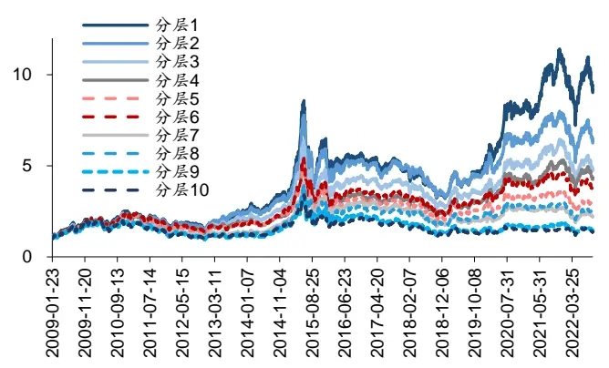
资料来源：Wind，朝阳永续，华泰研究，回测期：20090123-20220930

图表63： 仅 FinBERT微调—因子十分层超额净值
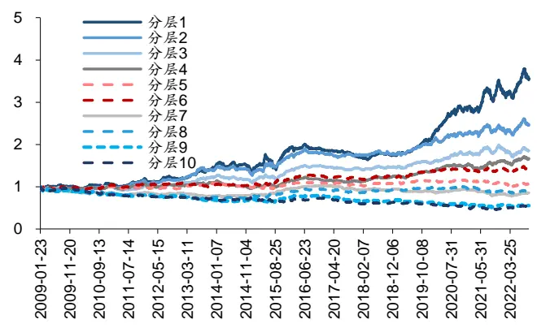
资料来源：Wind，朝阳永续，华泰研究，回测期：20090123-20220930

从上述结果来看，如果仅使用 FinBERT 微调而不引入第二步骤的 XGBoost 模型训练，构建出的文本因子效果明显削弱。我们认为有两种可能的解释：1）BERT模型的优势在于对语义本身的理解，如果直接引入个股超额收益这一标签进行学习，反而增加了模型学习的负担，模型既要学习语义理解，又要学习市场的反馈，导致效果不佳；2）FinBERT 参数量较大，可能是由于测试规模仍然不足所以导致没有得到潜在的更优解，而并非方案本身缺陷。

## Forecast_adj_txt_bert 因子讨论

我们继续对 forecast_adj_txt_bert 因子进行一些其他讨论。我们计算该文本因子与 Barra 风格因子及传统因子的皮尔森相关系数，如下图所示（在每个截面期计算相关系数时，仅保留都有因子值的股票）。文本因子与动量因子正相关性相对较高，历史均值大约在 0.3 左右；与 BP 因子负相关性相对较高，历史均值大约在-0.3 左右；与其余风格因子整体相关性偏低。文本因子与传统因子相关性也较低，历史每个截面期的相关系数均值都不超过 0.5。

图表64： Forecast_adj_txt_bert 因子与 Barra 风格因子相关性
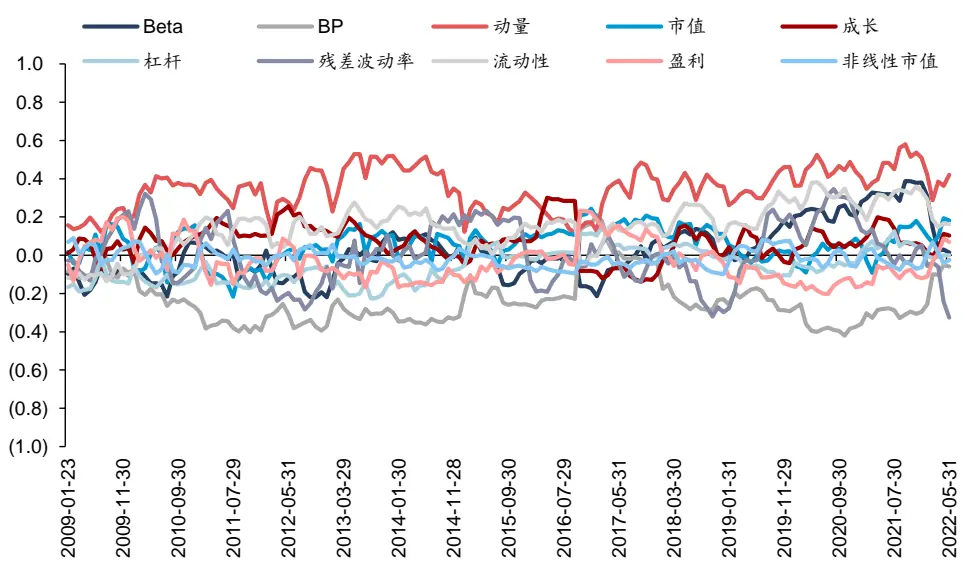
资料来源：Wind，朝阳永续，华泰研究

图表65： Forecast_adj_txt_bert 因子与传统因子相关性
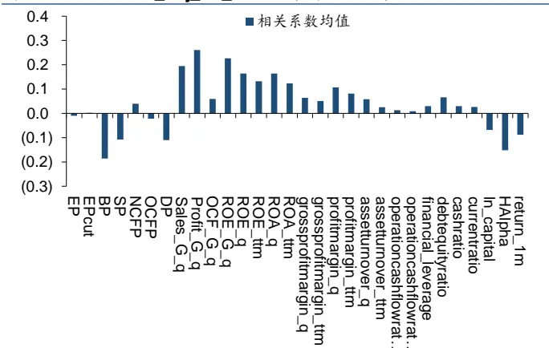
资料来源：Wind，朝阳永续，华泰研究，回测期：20090123-20220930

图表66： Forecast_adj_txt_bert 因子与传统因子相关性
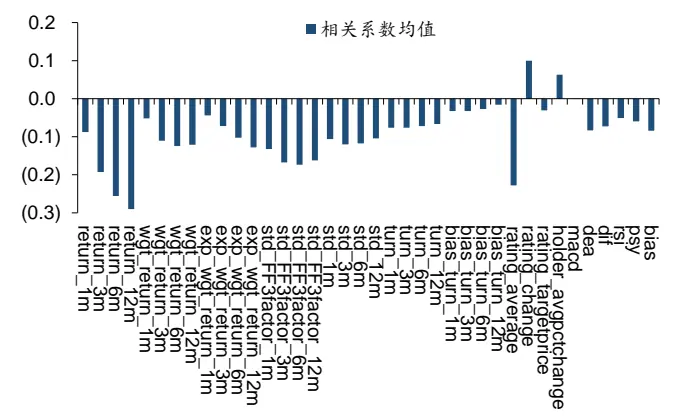
资料来源：Wind，朝阳永续，华泰研究

Forecast_adj_txt_bert 因子在沪深 300 与中证 500 中的覆盖度如下图表所示，在沪深 300中的覆盖度大约在 70%-80%，在中证 500 中的覆盖度大约在 40%-60%。

图表67： Forecast_adj_txt_bert 因子在沪深 300 与中证 500 中的覆盖度
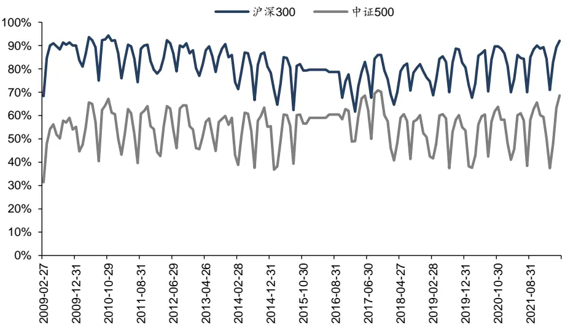
资料来源：Wind，朝阳永续，华泰研究

## 不同场景下的文本因子升级

业绩发布

在业绩发布场景下我们也可以对 SUE_txt 因子进行升级，SUE_txt 在计算时样本匹配流程如下图所示，业绩公告的类型包括业绩预告、业绩快报及正式财报。

3. 匹配前后交易日
图表68： SUE_txt因子构建采样示意图
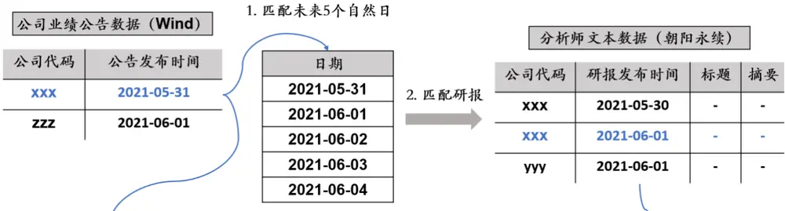

|  | 日期 |
| --- | --- |
| 前交易日 | 2021-05-28 |
| 后交易日 | 2021-06-01 |

4. 计算超额收益
资料来源：华泰研究

| 日期 | 股票调整后收盘价 | 中证500点位 | 超额收益 |
| --- | --- | --- | --- |
| 2021-05-28 | 100 | 6668 | 8.92% |
| 2021-06-01 | 110 | 6740 |  |

5. 合并报表

| 公司代码 | 发布时间 | 标题 | 摘要 | 超额收益 |
| --- | --- | --- | --- | --- |
| XXX | 2021-06-01 |  | = | 8.92% |

三类公告在合并时，按以下流程计算：

1. 模型训练：模型滚动训练时，所有类型的公告样本放在一起训练；同时进行样本预剔除，即对每个季度单独判断，如果该季度已经发布过业绩预告或快报，则不使用财报样本。2. 因子构建：

1） 在 4 月末追溯 2/3/4 月所有类型公告并计算因子值；在 8 月末，追溯 7/8 月所有类型公告并计算因子值；在 10 月末，追溯 10 月所有类型公告样本并计算因子值；

2） 在其余月末，首先延续上月末的因子值，然后对当月已经发布了新的业绩公告的股票，更新该公告对应的 SUE_txt 因子值。

图表69： SUE_txt_bert 因子十分层净值
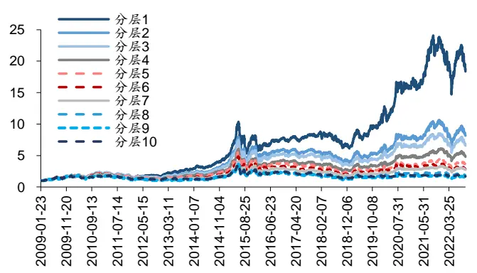
资料来源：Wind，朝阳永续，华泰研究，回测期：20090123-20220930

图表70： SUE_txt_bert 因子十分层相对中证 500 超额净值
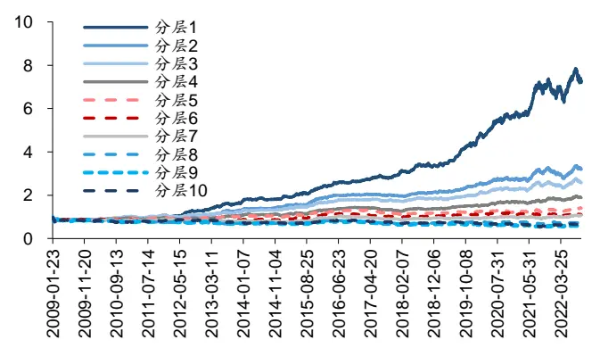
资料来源：Wind，朝阳永续，华泰研究，回测期：20090123-20220930

图表71： 两版本 sue_txt因子多头第一层净值
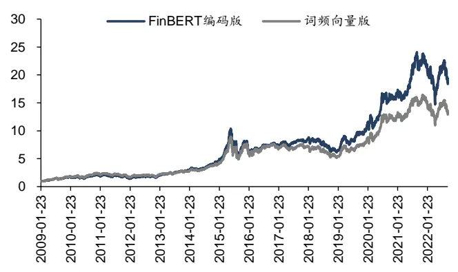
资料来源：Wind，朝阳永续，华泰研究，回测期：20090123-20220930

图表72： 两版本 sue_txt因子多头第一层相对中证 500净值
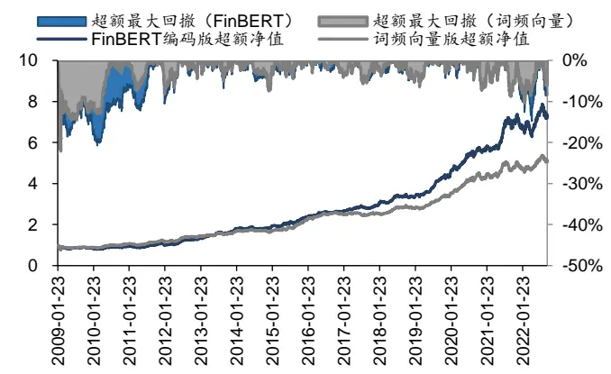
资料来源：Wind，朝阳永续，华泰研究，回测期：20090123-20220930

图表73： SUE_txt_bert 因子覆盖度
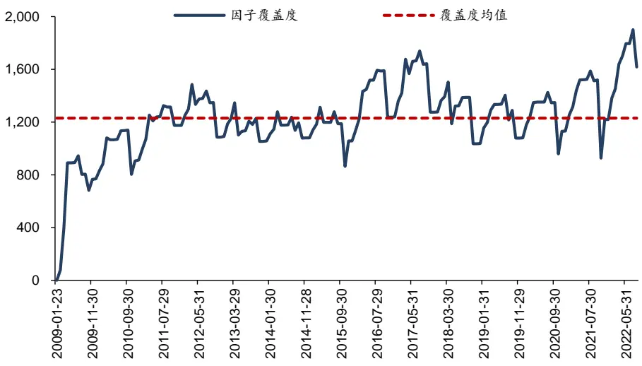
资料来源：Wind，朝阳永续，华泰研究

## 评级调整

卖方发布评级调整时也会伴随着点评研报，在《人工智能 57：文本 FADT 选股》中我们也讨论过针对评级调整事件的文本挖掘，彼时构建的文本因子 forecast_score_adj_txt 因子效果一般。这里我们同样对该因子进行升级，升级以后的效果如下所示。

图表74： Forecast_score_adj_txt_bert 十分层净值
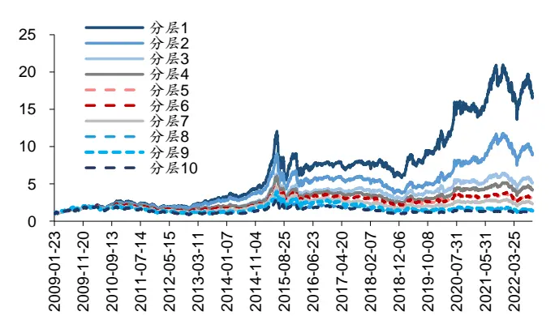
资料来源：Wind，朝阳永续，华泰研究，回测期：20090123-20220930

图表75： Forecast_score_adj_txt_bert 十分层相对中证 500 净值
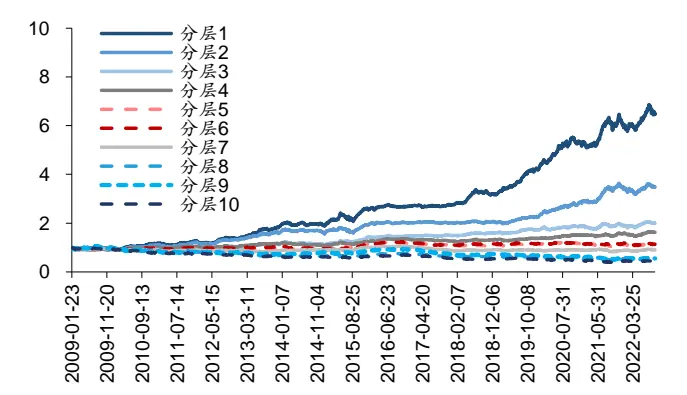
资料来源：Wind，朝阳永续，华泰研究，回测期：20090123-20220930

图表76： 两版本 forecast_score_adj_txt 因子多头第一层净值
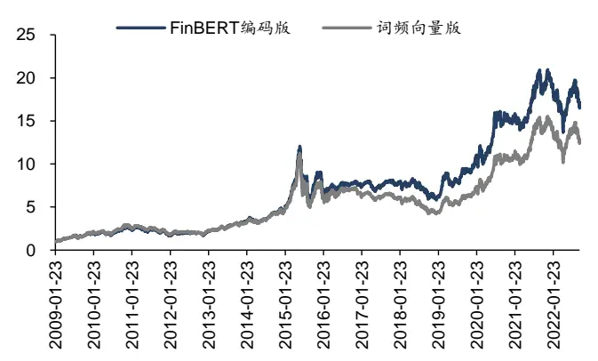
资料来源：Wind，朝阳永续，华泰研究，回测期：20090123-20220930

图表77： 两版本 forecast_score_adj_txt 因子多头第一层相对中证500 净值
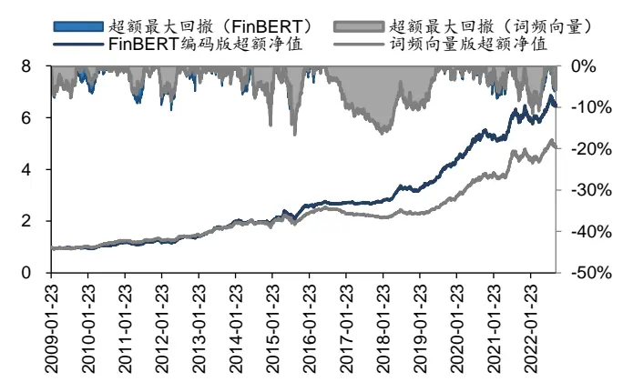
资料来源：Wind，朝阳永续，华泰研究，回测期：20090123-20220930

图表78： Forecast_score_adj_txt_bert 因子覆盖度
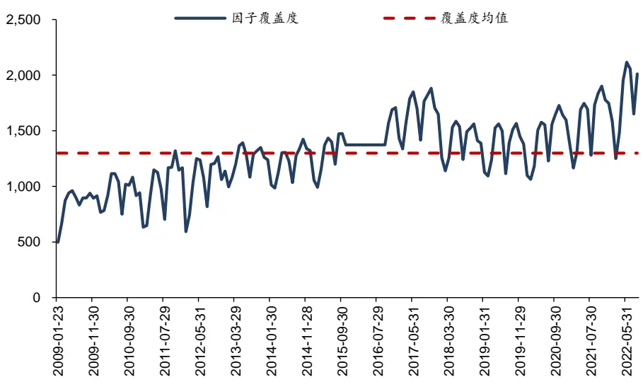
资料来源：Wind，朝阳永续，华泰研究

整体来看，无论是何种场景，引入 FinBERT 编码以后文本因子均有较为明显的提升，再次说明文本编码方式的改变带来的提升是稳健的，而非过拟合的结果。

## 文本因子的应用案例

## 案例一：主动量化选股组合

## 等权增强组合

在前期两篇相关报告中我们都曾将文本因子应用于构建主动量化选股组合，这里我们也不例外，继续展示主动量化选股组合的构建案例。以 forecast_adj_txt_bert 因子分十层的多头第一层为基础股票池，使用以下表格中的因子，每月将下述因子进行等权合成，合成之前会对因子进行行业市值中性化处理，同时对因子方向进行调整。相比于上篇报告（人工智能 57）所使用的 4个基本面+4 个技术面因子，这里我们纳入了更多因子进行合成，提高合成得分的稳定性。

根据合成得分我们选择得分靠前的 25 只股票等权重持有，每月第一个交易日调仓，剔除停牌股票及调仓日涨跌停股票，交易手续费取双边千分之三，回测结果如下图所示。

图表79： 用于基础股票池增强的因子

| 维度 | 因子类型 | 因子名称 | 因子计算方法 | 因子方向 |
| --- | --- | --- | --- | --- |
| 基本面 | 财务质量 | ROE_q | 单季度 ROE | 1 |
|  | 估值 | EP | PE的倒数 | 1 |
|  | 估值 | OCFP | 经营性现金流（TTM）/总市值 | 1 |
|  | 成长 | Profit_G_q | 净利润 YTD 同比 | 1 |
|  | 成长 | Sales_G_q | 营业收入 YTD 同比 | 1 |
|  | 股东 | Holder_avgpctchange | 户均持股比例的同比增长率 | 1 |
| 技术面 | 反转 | exp_wgt_return_1m | 个股最近 N 个月内用每日换手率乘以函数 exp(-x_i/N/4) | -1 |
|  | 反转 | exp_wgt_return_12m | 再乘以每日收益率求算术平均值，X_i为该日距离截面日的交易 日的个数，N=1，12 | -1 |
|  | 换手 | bias_turn_1m | 个股最近1个月内日均换手率除以最近2年内日均换手率 (剔除停牌、涨跌停的交易日)再减去1 | -1 |
|  | 日内量价 | trans_at_last_ratio | 每各交易日最后半小时的成交量占全天成交量之比，对过去一 | -1 |
|  | 日内量价 | Amihud_illiq | 个月求均值 分钟频率下单位成交额额驱动的股价变化幅度 | 1 |
| 市值 | 市值 | In_capital | 对数总市值 | -1 |

资料来源：华泰研究

图表80： 等权增强组合回测业绩
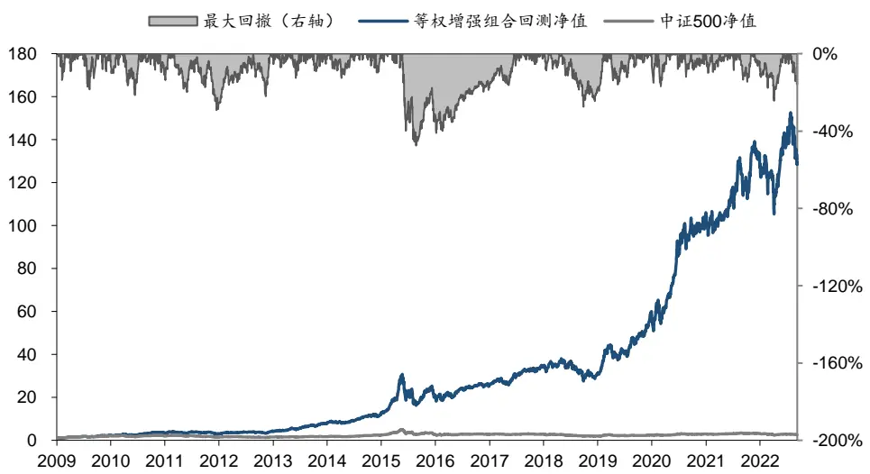
资料来源：Wind，朝阳永续，华泰研究，回测期：20090123-20220930

图表81： 等权增强组合回测超额净值
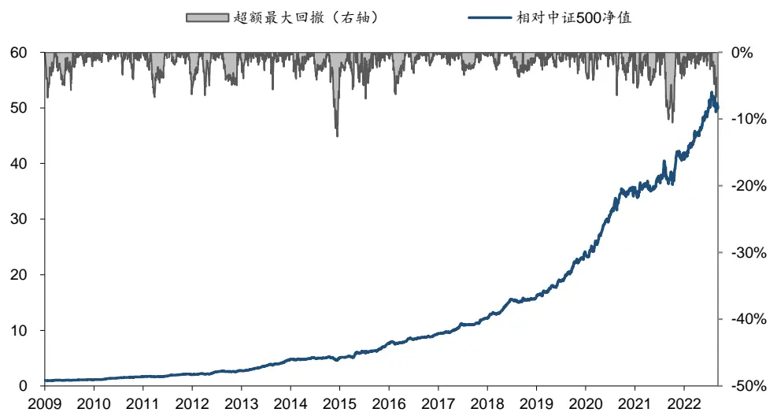
资料来源：Wind，朝阳永续，华泰研究，基准中证 500，回测期：20090123-20220930

图表82： 等权增强组合分年度业绩

| 时间 | 区间（年化）收益率 | 区间（年化）超额收益 | 年化波动率 | 最大回撤 | 夏普比率 | 卡玛比率 |
| --- | --- | --- | --- | --- | --- | --- |
| 2009 | 145.57% | 18.70% | 34.62% | 18.42% | 4.20 | 7.90 |
| 2010 | 60.60% | 47.02% | 29.71% | 21.44% | 2.04 | 2.83 |
| 2011 | -14.63% | 32.97% | 24.36% | 24.55% | -0.60 | -0.60 |
| 2012 | 31.96% | 31.08% | 25.88% | 21.32% | 1.23 | 1.50 |
| 2013 | 105.39% | 74.16% | 27.83% | 12.48% | 3.79 | 8.44 |
| 2014 | 40.66% | -0.02% | 21.89% | 12.50% | 1.86 | 3.25 |
| 2015 | 131.01% | 59.07% | 45.83% | 47.45% | 2.86 | 2.76 |
| 2016 | 11.78% | 23.87% | 29.21% | 22.49% | 0.40 | 0.52 |
| 2017 | 31.44% | 33.57% | 17.72% | 10.79% | 1.77 | 2.91 |
| 2018 | -15.16% | 31.14% | 25.20% | 27.43% | -0.60 | -0.55 |
| 2019 | 90.70% | 49.35% | 25.64% | 15.91% | 3.54 | 5.70 |
| 2020 | 88.02% | 58.84% | 29.92% | 16.91% | 2.94 | 5.20 |
| 2021 | 31.66% | 16.69% | 22.29% | 14.56% | 1.42 | 2.18 |
| 20220930 | -4.16% | 24.29% |  |  |  |  |
| 成立以来 | 44.39% | 34.90% | 28.56% | 47.45% | 1.55 | 0.94 |

资料来源：Wind，朝阳永续，华泰研究，基准中证 500，回测期：20090123-20220930

图表83： 等权增强组合分月度业绩

| 1月 2月 3月 4月 5月 6月 7月 8月 9月 10月 11月 12月 |  |  |  |  |  |  |  |  |  |  |  |  |
| --- | --- | --- | --- | --- | --- | --- | --- | --- | --- | --- | --- | --- |
| 2009 |  |  | 21.53% | 10.75% | 5.17% 7.90% |  | 11.91% | -15.61% | 7.77% 14.96% |  | 15.30% | 4.50% |
| 2010 | -1.60% | 6.87% | 5.16% | 4.33% | -3.91% -9.25% |  | 20.15% | 12.21% | 2.93% | 11.83% | 4.39% | -3.03% |
| 2011 | -1.56% | 11.29% | -4.12% | -3.67% | -7.45% 5.25% |  | 7.94% | 1.42% | -11.55% | 6.35% | -1.43% | -13.30% |
| 2012 | -2.83% | 13.58% | -1.55% | 2.23% | 4.46% 2.19% |  | -1.55% | 3.22% | -1.44% | -0.31% | -11.50% | 21.28% |
| 2013 | 7.47% | 7.00% | 1.20% | 1.29% | 20.59% -10.50% |  | 11.73% | 10.40% | 11.22% | -3.36% | 13.96% | 3.23% |
| 2014 | 6.51% | -1.28% | -1.36% | -1.18% | 3.69% 6.04% |  | 6.11% | 5.75% | 11.31% | 6.00% | 2.68% | -7.96% |
| 2015 | 16.11% | 7.48% | 24.40% | 12.06% | 38.74% -11.29% |  | -12.20% | -12.57% | -4.92% | 17.27 | % 13.65% | 8.47% |
| 2016 | -24.94% | -0.45% | 12.54% | -0.43% | 2.67% 8.99% |  | 0.09% | 5.57% | -0.17% | 3.28% | 1.74% | -1.20% |
| 2017 | 2.46% | 4.14% | 0.78% | -1.03% | -3.89% | 11.59% | 4.87% | 3.76% | 2.19% | 1.82% | 0.00% | 2.32% |
| 2018 | 1.22% | 2.53% | -0.19% | -1.21% | 5.61% | -4.16% | 2.13% | -8.93% | 0.01% | -9.30% | 2.02% | -3.36% |
| 2019 | 4.98% | 20.02% | 13.87% | -1.07% | -5.45% | 4.01% | 2.00% | 3.85% | 3.88% | 7.96% | 0.34% | 10.86% |
| 2020 | 4.40% | 5.91% | -4.15% | 13.42% | 6.45% | 14.02% | 17.05% | 9.20% | -5.50% | -0.09% | 2.78% | 3.53% |
| 2021 | -2.15% | 3.45% | -0.79% | 1.32% | 3.22% | 5.53% | 0.60% | 15.03% | -9.21% | -2.53 | % 19.05% | -1.11% |
| 2022 | -9.36% | 8.13 | % -6.04% | -8.70% | 9.86% | 12.69% | 2.80% | -3.89% | -7.48% |  |  |  |

资料来源：Wind，朝阳永续，华泰研究，基准中证 500，回测期：20090123-20220930

## 不等权增强组合

我们进一步考虑从等权组合到不等权组合。我们从技术面角度出发对文本 FADT 选股组合的权重进行调整，如果个股处于较为明显的上行趋势，则个股权重可以适当增加；反之若个股处于较为明显的下行趋势，则个股权重可以适当降低。具体来说，我们使用个股的多空头排列状态来对个股权重进行调整。多空头排列状态的定义如下：

多头排列：MA20>MA60>MA180

空头排列：MA20<MA60<MA180

权重调整流程如下所示：

1. 在调仓截面日判断组合内个股的多空头状态：如果过去 20 个交易日有超过 15 个交易日多头排列，则个股处于多头状态；如果过去 20 个交易日有超过 10 个交易日空头排列，则个股处于空头状态（空头给予的满足条件更宽松，给下行趋势的股票更大惩罚）；

2. 若个股为多头状态，则将原始的持仓权重乘以 2；若个股为空头状态，则将原始的持仓权重乘以 0.5；

3. 按 100%总仓位将调整后的持仓权重归一化；

4. 考虑到个股持仓权重不能过高，如果调整后个股权重超过 20%，则截断为 20%。

不等权增强组合的回测业绩如下图所示。

图表84： 不等权增强组合回测净值
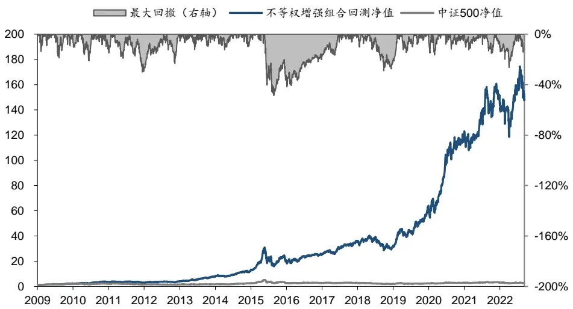
资料来源：Wind，朝阳永续，华泰研究，回测期：20090123-20220930

图表85： 不等权增强组合回测超额净值
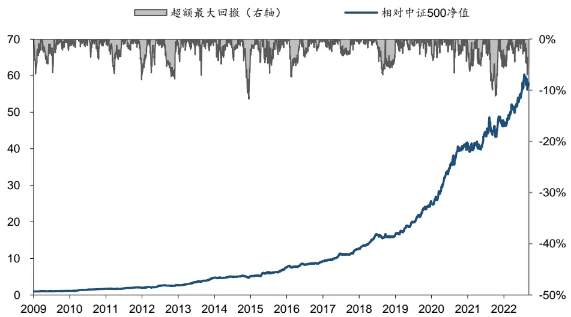
资料来源：Wind，朝阳永续，华泰研究，基准中证 500，回测期：20090123-20220930

图表86： 不等权增强组合分年度业绩

| 时间 | 区间（年化）收益率 | 区间（年化）超额收益 | 年化波动率 | 最大回撤 | 夏普比率 | 卡玛比率 |
| --- | --- | --- | --- | --- | --- | --- |
| 2009 | 143.78% | 17.75% | 34.59% | 18.75% | 4.16 | 7.67 |
| 2010 | 63.44% | 49.95% | 30.12% | 21.05% | 2.11 | 3.01 |
| 2011 | -17.87% | 27.79% | 24.58% | 25.31% | -0.73 | -0.71 |
| 2012 | 31.48% | 30.81% | 26.05% | 23.06% | 1.21 | 1.37 |
| 2013 | 108.99% | 77.15% | 28.54% | 12.24% | 3.82 | 8.91 |
| 2014 | 45.10% | 3.29% | 22.41% | 12.31% | 2.01 | 3.66 |
| 2015 | 121.56% | 53.08% | 46.21% | 48.51% | 2.63 | 2.51 |
| 2016 | 11.66% | 23.32% | 29.13% | 21.69% | 0.40 | 0.54 |
| 2017 | 39.11% | 41.63% | 18.82% | 10.70% | 2.08 | 3.65 |
| 2018 | -16.46% | 29.53% | 26.73% | 29.02% | -0.62 | -0.57 |
| 2019 | 98.90% | 55.87% | 25.41% | 14.65% | 3.89 | 6.75 |
| 2020 | 105.01% | 73.59% | 30.55% | 16.40% | 3.44 | 6.40 |
| 2021 | 30.62% | 15.73% | 23.76% | 15.19% | 1.29 | 2.02 |
| 20220930 | -3.83% | 25.23% |  |  |  |  |
| 成立以来 | 45.90% | 36.35% | 29.05% | 48.51% | 1.58 | 0.95 |

资料来源：Wind，朝阳永续，华泰研究，基准中证 500，回测期：20090123-20220930

图表87： 不等权增强组合分月度业绩

| 1月 2月 3月 4月 5月 6月 7月 8月 |  |  |  |  |  |  |  |  | 9月 10月 11月 12月 |  |  |  |
| --- | --- | --- | --- | --- | --- | --- | --- | --- | --- | --- | --- | --- |
| 2009 |  |  | 21.58% | 11.81% 5.09% 7.58% |  |  | 11.16% | -15.58% | 7.98% 14.28% |  | 15.29% | 4.37% |
| 2010 | -1.88% | 6.76% | 5.28% | 5.14% | -2.78% -9.48% |  | 19.31% | 11.90% | 3.56% | 11.97 | % 4.95% | -3.05% |
| 2011 | -3.77% | 10.97% | -4.29% | -2.65% | -7.85% 5.42% |  | 7.94% | 1.29% | -11.97% | 6.04% | -1.89% | -13.64% |
| 2012 | -3.78% | 14.53% | -1.20% | 2.10% | 4.63% 3.31% |  | -0.74% | 2.69% | -2.20% | -0.63% | -12.70% | 21.71% |
| 2013 | 6.85% | 6.97% | 1.52% | 1.46% | 19.57% -9.27% |  | 12.42% | 8.57% | 13.80% | -3.28% | 13.37% | 3.84% |
| 2014 | 6.18% | -1.37% | -1.84% | -0.58% | 4.56% 6.92% |  | 4.94% | 6.68% | 11.92% | 6.27% | 3.29% | -7.16% |
| 2015 | 14.98% | 8.06% | 22.48% | 12.26% | 38.37% -11.50% |  | -12.38% | -13.73% | -4.06% | 15.77 | % 13.61% | 8.27% |
| 2016 | -23.97% | 0.16% | 12.70% | -1.68% | 2.48% 10.56% |  | -1.43% | 5.33% | -0.04% | 3.39% | 1.37% | -1.16% |
| 2017 | 3.54% | 4.12 | % 1.04% | -0.77% | -3.64% | 12.85% | 5.46% | 3.40% | 1.97% | 1.87% | 1.30% | 3.58% |
| 2018 | 0.59% | 2.40 | % 1.90% | -0.13% | 5.57% | -3.74% | 1.47% | -9.46% | -1.43% | -9.96% | 1.09% | -3.20% |
| 2019 | 6.17% | 19.37 | % 14.55% | 0.22% | -5.15% | 4.20% | 2.06% | 5.88% | 2.75% | 7.76% | 0.64% | 10.99% |
| 2020 | 4.91% | 6.04 | % -3.16% | 14.62% | 8.81% | 15.23% | 17.38% | 9.21% | -5.15% | 0.56 | % 3.92% | 3.69% |
| 2021 | -2.10% | 1.91 | % -0.80% | 0.83% | 3.14% | 9.78% | 1.89% | 15.85% | -8.93% | -3.93 | % 16.01% | -1.78% |
| 2022 | -10.94% | 6.90 | % -4.24% | -9.95% | 9.59% | 11.78% | 4.48% | -2.97% | -6.93% |  |  |  |

资料来源：Wind，朝阳永续，华泰研究，基准中证 500，回测期：20090123-20220930

图表88： 不等权增强组合最大个股持仓权重
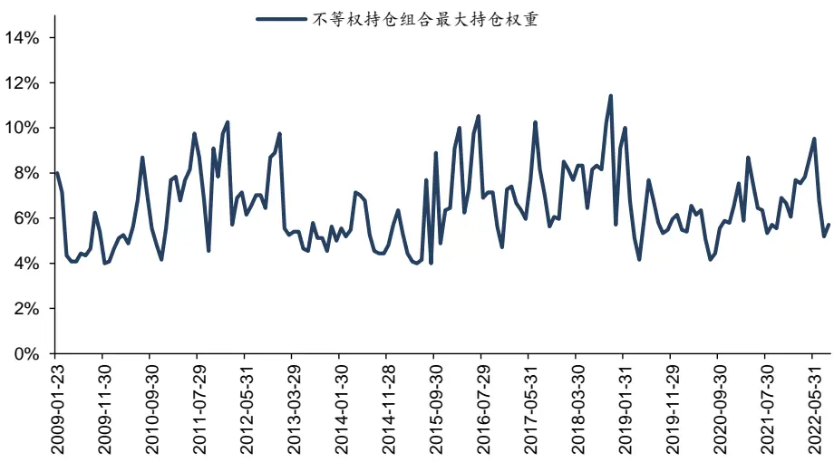
资料来源：Wind，朝阳永续，华泰研究，基准中证 500，回测期：20090123-20220930

等权与不等权组合的超额净值对比如下图所示。

图表89： 等权与不等权增强组合回测超额净值对比
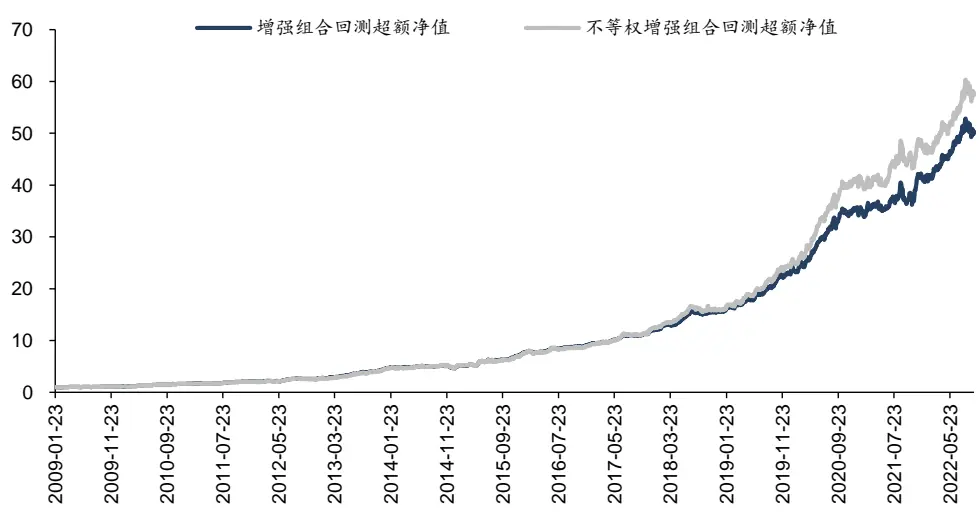
资料来源：Wind，朝阳永续，华泰研究，基准中证 500，回测期：20090123-20220930

## 加入市值限制的主动量化选股

考虑到部分投资者对股票市值有限制，不能投资池外市值过小的股票，因此我们考虑对股票组合的市值进行限制。首先在 forecast_adj_txt_bert 中对应截面期总市值低于 100 亿元的股票因子值置为 nan，对剩余个股在截面上进行十分层，仍以第一层为基础池，使用上文所述因子进行增强构建等权选股组合。

图表90： 市值大于 100亿的增强组合净值
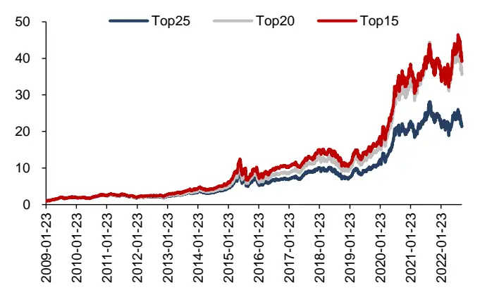
资料来源：Wind，朝阳永续，华泰研究，回测期：20090123-20220930

图表91： 市值大于 100亿的增强组合超额净值
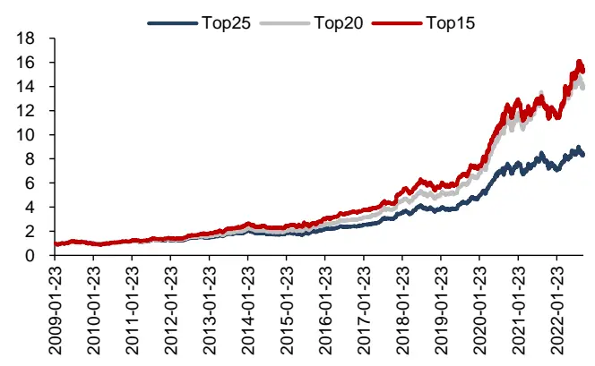
资料来源：Wind，朝阳永续，华泰研究，回测期：20090123-20220930

图表92： 市值大于 100亿的增强组合业绩

| 选股数量 | 年化收益率 | 年化超额收益 | 年化波动率 | 最大回撤 | 夏普比率 | 卡玛比率 |
| --- | --- | --- | --- | --- | --- | --- |
| 25 | 26.09% | 19.02% | 27.34% | 43.21% | 0.95 | 0.60 |
| 20 | 31.12% | 23.94% | 28.10% | 45.72% | 1.11 | 0.68 |
| 15 | 32.04% | 24.75% | 28.32% | 46.85% | 1.13 | 0.68 |

资料来源：Wind，朝阳永续，华泰研究，基准中证 500，回测期：20090123-20220930

## 案例二：沪深 300 内选股

第二组案例我们测试直接在沪深 300 股票池内进行选股的效果。与传统的指数增强不同，这里我们不控制行业市值中性，不控制风格中性，仅根据 forecast_adj_txt_bert 因子在沪深300 股票池内的打分选择靠前的 30只股票，按前文所述多空头排列权重调整方式对个股仓位进行调整，得到沪深 300 内不等权精选组合。组合表现如下图所示。

图表93： 沪深 300股票池内文本因子分五层回测净值
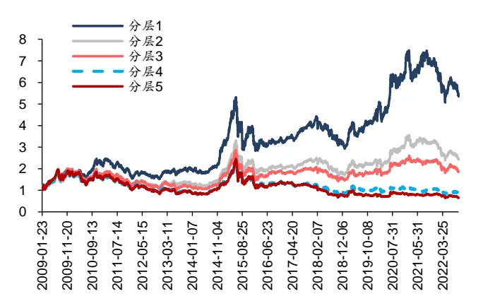
资料来源：Wind，朝阳永续，华泰研究，回测期：20090123-20220930

图表94： 沪深 300股票池内文本因子分五层回测超额净值
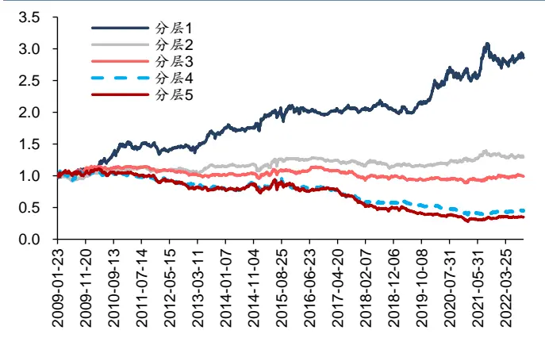
资料来源：Wind，朝阳永续，华泰研究，回测期：20090123-20220930

图表95： 沪深 300股票池内精选组合回测净值
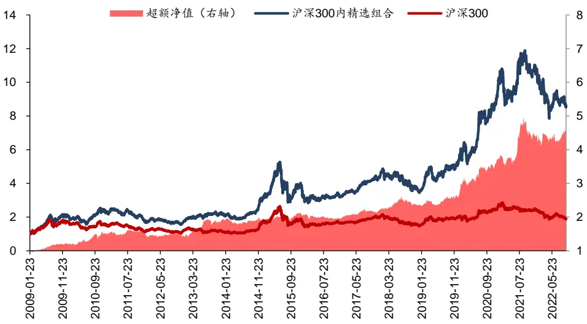
资料来源：Wind，朝阳永续，华泰研究，基准沪深 300，回测期：20090123-20220930

图表96： 沪深 300股票池内精选组合回测净值

| 时间 | 区间收益率 | 区间超额收益 | 年化波动率 | 最大回撤 | 夏普比率 | 卡玛比率 |
| --- | --- | --- | --- | --- | --- | --- |
| 2009 | 130.69% | 26.61% | 34.26% | 23.11% | 3.81 | 5.65 |
| 2010 | 11.05% | 25.98% | 27.53% | 26.38% | 0.40 | 0.42 |
| 2011 | -25.51% | 1.60% | 21.06% | 30.86% | -1.21 | -0.83 |
| 2012 | 3.61% | -3.61% | 21.38% | 19.88% | 0.17 | 0.18 |
| 2013 | 28.52% | 37.88% | 22.10% | 11.78% | 1.29 | 2.42 |
| 2014 | 41.65% | -8.37% | 20.57% | 15.88% | 2.02 | 2.62 |
| 2015 | 22.47% | 18.78% | 44.43% | 45.42% | 0.51 | 0.49 |
| 2016 | -9.63% | -4.06% | 25.90% | 20.77% | -0.37 | -0.46 |
| 2017 | 38.32% | 13.74% | 13.43% | 6.26% | 2.85 | 6.12 |
| 2018 | -22.02% | 7.72% | 25.69% | 28.19% | -0.86 | -0.78 |
| 2019 | 54.06% | 11.24% | 23.44% | 17.58% | 2.31 | 3.07 |
| 2020 | 79.89% | 43.27% | 29.45% | 20.05% | 2.71 | 3.98 |
| 2021 | 12.88% | 20.79% | 25.48% | 20.14% | 0.51 | 0.64 |
| 2022 | -19.84% | 3.14% |  |  |  |  |
| 成立以来 | 17.58% | 12.44% | 26.72% | 46.19% | 0.66 | 0.38 |

资料来源：Wind，朝阳永续，华泰研究，基准沪深 300，回测期：20090123-20220930

## 总结与展望

本文是华泰金工人工智能主题文本 PEAD、FADT 选股子系列的第三篇报告，重点从模型迭代的角度对文本选股策略进行升级，探讨如何通过更高阶的 NLP 模型来对分析师研报文本语义进行更充分的挖掘，从而带来更显著的 alpha 提升。我们的核心思路是使用 FinBERT模型的隐藏层来对研报文本进行编码，替代旧版本的词频向量，发现引入 FinBERT 词向量编码以后构建的 forecast_adj_txt_bert 因子相比于原版具有显著的提升。

报告的第一部分对 BERT、FinBERT 及 Adapter-BERT 模型进行了简要介绍。BERT 是 NLP发展第三阶段的集大成模型，核心思想是基于 Transformer 来对文本的上下文语义进行理解，主要包括MLM和NSP两个子任务。FinBERT则是针对金融领域特定场景预训练好的BERT模型，使用特定的金融语料进行训练，并扩展了预训练任务，在多个金融领域的下游任务中性能均超过了原版 BERT，本文使用 FinBERT 模型来对研报文本编码。Adapter-BERT模型在微调阶段使用，可以更高效地对 FinBERT 参数进行微调，在几乎不影响模型性能的情况下将待训练参数从超过1 亿降低到约三百万。

报告的第二部分对基于 FinBERT 编码的 FADT 选股进行数据实证。首先我们讨论了基础参数下的文本因子效果，发现 forecast_adj_txt_bert 因子十分层的第一层年化收益从原版的22.87%提升至 27.50%，提升接近 5Pct，改善十分显著。其次我们进行了五组扩展测试，分别讨论了预处理文本截断与分段的比较、FinBERT 微调与不微调的比较、CLS层编码与全连接层编码的比较、CLS编码与词频特征结合的测试、仅使用 FinBERT 微调的测试，结果如下表所示。

图表97： 各组数据实证结果对比

| 序号测试组 |  | 解释 | 是否有效 |
| --- | --- | --- | --- |
| 1 | FinBERT-CLS 编码基础参数 | 基础参数，文本截断，CLS编码 | 是 |
| 2 | 文本截断与分段 | 截断表示每条文本仅取前N字符；分段表示将文本按固 定长度划分为多条样本 | 均有效 |
| 3 | FinBERT 是否微调 | 不微调指直接将原始 FinBERT 用于研报文本向量编码， 微调指将 FinBERT进行微调后再给研报编码 | 均有效，微调更有效 |
| 4 | CLS 层编码与全连接层编码 | CLS 编码指使用 FinBERT 的 CLS 层向量对研报文本进 行编码；全连接层编码指使用 FinBERT 微调时的全连接 层对研报文本进行编码 | 均有效，CLS层编码更有效 |
| 5 | CLS 层编码与词频向量结合 | 将 CLS 层编码与词频向量 concat 一起作为 XGBoost 二 次训练的输入 | 均有效，特征结合无提升 |
| 6 | 仅 FinBERT 微调 | FinBERT 微调时直接用研报文本及事件前后的 AR 标 签，不使用万得新闻舆情进行微调 | 无效 |

资料来源：华泰研究

报告的第三部分我们展示了不同场景下文本因子的升级效果，包括业绩发布、卖方评级调整，发现引入 FinBERT 进行文本编码以后各场景下的文本因子均有明显提升，结合第二部分各参数组测试均有效的论证，说明FinBERT编码提升大概率不是偶然因素导致的过拟合。

报告的第四部分我们展示了三组文本因子的应用案例：

案例一：以 forecast_adj_txt_bert 因子的十分层第一层为基础池，使用额外的十二个基本面+量价因子进行增强，再使用多空头排列状态来对股票进行调权，构建的 25 只股票不等权组合回测期内年化收益 45.90%，相对中证 500 年化超额 36.35%，夏普比率 1.58。

案例二：限制在总市值 100 亿以上的股票池中进行上述增强，构建 20 只股票的选股组合，流程与案例一相同，回测期内年化收益 31.12%，相对中证 500 年化超额 23.94%。

案例三：限制在沪深 300 股票池内选股，每个截面期使用 forecast_adj_txt_bert 因子对沪深 300股票池内的股票进行排序，选取得分靠前的 30只股票构建沪深 300量化精选组合，回测期内年化收益 17.58%，相对沪深 300 年化超额 12.44%。

## 风险提示

通过机器学习模型构建选股策略是历史经验的总结，存在失效的可能。人工智能模型可解释程度较低，使用须谨慎。量化因子历史结果不能预测未来，互联网开源模型需注意可复现性，敬请知悉。

## 参考文献

[1]. Liang P J , Meursault V , Routledge B B , et al. PEAD.txt: Post-Earnings-Announcement Drift Using Text[J]. Working Papers, 2021.

[2]. Devlin J, Chang M W, Lee K, et al. Bert: Pre-training of deep bidirectional tra nsformers for language understanding[J]. arXiv preprint arXiv:1810.04805, 2018.

[3]. Houlsby N, Giurgiu A, Jastrzebski S, et al. Parameter-efficient transfer learning for NLP[C]//International Conference on Machine Learning. PMLR, 2019: 2790- 2799.

[4]. Yu Li, Panpan Hou, etc. (2020), GitHub repository, https://github.com/valuesimpl ex/FinBERT.

## 免责声明

## 分析师声明

本人，林晓明、李子钰、何康，兹证明本报告所表达的观点准确地反映了分析师对标的证券或发行人的个人意见；彼以往、现在或未来并无就其研究报告所提供的具体建议或所表迖的意见直接或间接收取任何报酬。

## 一般声明及披露

本报告由华泰证券股份有限公司（已具备中国证监会批准的证券投资咨询业务资格，以下简称“本公司”）制作。本报告所载资料是仅供接收人的严格保密资料。本报告仅供本公司及其客户和其关联机构使用。本公司不因接收人收到本报告而视其为客户。

本报告基于本公司认为可靠的、已公开的信息编制，但本公司及其关联机构(以下统称为“华泰”)对该等信息的准确性及完整性不作任何保证。

本报告所载的意见、评估及预测仅反映报告发布当日的观点和判断。在不同时期，华泰可能会发出与本报告所载意见、评估及预测不一致的研究报告。同时，本报告所指的证券或投资标的的价格、价值及投资收入可能会波动。以往表现并不能指引未来，未来回报并不能得到保证，并存在损失本金的可能。华泰不保证本报告所含信息保持在最新状态。华泰对本报告所含信息可在不发出通知的情形下做出修改，投资者应当自行关注相应的更新或修改。

本公司不是 FINRA 的注册会员，其研究分析师亦没有注册为 FINRA 的研究分析师/不具有 FINRA 分析师的注册资格。

华泰力求报告内容客观、公正，但本报告所载的观点、结论和建议仅供参考，不构成购买或出售所述证券的要约或招揽。该等观点、建议并未考虑到个别投资者的具体投资目的、财务状况以及特定需求，在任何时候均不构成对客户私人投资建议。投资者应当充分考虑自身特定状况，并完整理解和使用本报告内容，不应视本报告为做出投资决策的唯一因素。对依据或者使用本报告所造成的一切后果，华泰及作者均不承担任何法律责任。任何形式的分享证券投资收益或者分担证券投资损失的书面或口头承诺均为无效。

除非另行说明，本报告中所引用的关于业绩的数据代表过往表现，过往的业绩表现不应作为日后回报的预示。华泰不承诺也不保证任何预示的回报会得以实现，分析中所做的预测可能是基于相应的假设，任何假设的变化可能会显著影响所预测的回报。

华泰及作者在自身所知情的范围内，与本报告所指的证券或投资标的不存在法律禁止的利害关系。在法律许可的情况下，华泰可能会持有报告中提到的公司所发行的证券头寸并进行交易，为该公司提供投资银行、财务顾问或者金融产品等相关服务或向该公司招揽业务。

华泰的销售人员、交易人员或其他专业人士可能会依据不同假设和标准、采用不同的分析方法而口头或书面发表与本报告意见及建议不一致的市场评论和/或交易观点。华泰没有将此意见及建议向报告所有接收者进行更新的义务。华泰的资产管理部门、自营部门以及其他投资业务部门可能独立做出与本报告中的意见或建议不一致的投资决策。投资者应当考虑到华泰及/或其相关人员可能存在影响本报告观点客观性的潜在利益冲突。投资者请勿将本报告视为投资或其他决定的唯一信赖依据。有关该方面的具体披露请参照本报告尾部。

本报告并非意图发送、发布给在当地法律或监管规则下不允许向其发送、发布的机构或人员，也并非意图发送、发布给因可得到、使用本报告的行为而使华泰违反或受制于当地法律或监管规则的机构或人员。

本报告版权仅为本公司所有。未经本公司书面许可，任何机构或个人不得以翻版、复制、发表、引用或再次分发他人(无论整份或部分)等任何形式侵犯本公司版权。如征得本公司同意进行引用、刊发的，需在允许的范围内使用，并需在使用前获取独立的法律意见，以确定该引用、刊发符合当地适用法规的要求，同时注明出处为“华泰证券研究所”，且不得对本报告进行任何有悖原意的引用、删节和修改。本公司保留追究相关责任的权利。所有本报告中使用的商标、服务标记及标记均为本公司的商标、服务标记及标记。

## 中国香港

本报告由华泰证券股份有限公司制作,在香港由华泰金融控股（香港）有限公司向符合《证券及期货条例》及其附属法律规定的机构投资者和专业投资者的客户进行分发。华泰金融控股（香港）有限公司受香港证券及期货事务监察委员会监管，是华泰国际金融控股有限公司的全资子公司，后者为华泰证券股份有限公司的全资子公司。在香港获得本报告的人员若有任何有关本报告的问题,请与华泰金融控股（香港）有限公司联系。

## 香港-重要监管披露

- 华泰金融控股（香港）有限公司的雇员或其关联人士没有担任本报告中提及的公司或发行人的高级人员。

- 有关重要的披露信息，请参华泰金融控股（香港）有限公司的网页 https://www.htsc.com.hk/stock_disclosure其他信息请参见下方 “美国-重要监管披露”。

## 美国

在美国本报告由华泰证券（美国）有限公司向符合美国监管规定的机构投资者进行发表与分发。华泰证券（美国）有限公司是美国注册经纪商和美国金融业监管局（FINRA）的注册会员。对于其在美国分发的研究报告，华泰证券（美国）有限公司根据《1934 年证券交易法》（修订版）第 15a-6 条规定以及美国证券交易委员会人员解释，对本研究报告内容负责。华泰证券（美国）有限公司联营公司的分析师不具有美国金融监管（FINRA）分析师的注册资格，可能不属于华泰证券（美国）有限公司的关联人员，因此可能不受 FINRA 关于分析师与标的公司沟通、公开露面和所持交易证券的限制。华泰证券（美国）有限公司是华泰国际金融控股有限公司的全资子公司，后者为华泰证券股份有限公司的全资子公司。任何直接从华泰证券（美国）有限公司收到此报告并希望就本报告所述任何证券进行交易的人士，应通过华泰证券（美国）有限公司进行交易。

## 美国-重要监管披露

- 分析师林晓明、李子钰、何康本人及相关人士并不担任本报告所提及的标的证券或发行人的高级人员、董事或顾问。分析师及相关人士与本报告所提及的标的证券或发行人并无任何相关财务利益。本披露中所提及的“相关人士”包括 FINRA 定义下分析师的家庭成员。分析师根据华泰证券的整体收入和盈利能力获得薪酬，包括源自公司投资银行业务的收入。

华泰证券股份有限公司、其子公司和/或其联营公司, 及/或不时会以自身或代理形式向客户出售及购买华泰证券研究所覆盖公司的证券/衍生工具，包括股票及债券（包括衍生品）华泰证券研究所覆盖公司的证券/衍生工具，包括股票及债券（包括衍生品）。

- 华泰证券股份有限公司、其子公司和/或其联营公司, 及/或其高级管理层、董事和雇员可能会持有本报告中所提到的任何证券（或任何相关投资）头寸，并可能不时进行增持或减持该证券（或投资）。因此，投资者应该意识到可能存在利益冲突。

## 评级说明

投资评级基于分析师对报告发布日后 6 至 12个月内行业或公司回报潜力（含此期间的股息回报）相对基准表现的预期（A 股市场基准为沪深 300 指数，香港市场基准为恒生指数，美国市场基准为标普 500 指数），具体如下：

## 行业评级

增持：预计行业股票指数超越基准

中性：预计行业股票指数基本与基准持平

减持：预计行业股票指数明显弱于基准

## 公司评级

买入：预计股价超越基准 15%以上

增持：预计股价超越基准 5%~15%

持有：预计股价相对基准波动在-15%~5%之间

卖出：预计股价弱于基准 15%以上

暂停评级：已暂停评级、目标价及预测，以遵守适用法规及/或公司政策

无评级：股票不在常规研究覆盖范围内。投资者不应期待华泰提供该等证券及/或公司相关的持续或补充信息

## 法律实体披露

中国：华泰证券股份有限公司具有中国证监会核准的“证券投资咨询”业务资格，经营许可证编号为：91320000704041011J香港：华泰金融控股（香港）有限公司具有香港证监会核准的“就证券提供意见”业务资格，经营许可证编号为：AOK809美国：华泰证券（美国）有限公司为美国金融业监管局（FINRA）成员，具有在美国开展经纪交易商业务的资格，经营业务许可编号为：CRD#:298809/SEC#:8-70231

## 华泰证券股份有限公司

南京南京市建邺区江东中路228号华泰证券广场1号楼/邮政编码：210019

电话：86 25 83389999/传真：86 25 83387521电子邮件：ht-rd@htsc.com

## 深圳深圳

深圳市福田区益田路5999 号基金大厦10 楼/邮政编码：518017电话：86 755 82493932/传真：86 755 82492062电子邮件：ht-rd@htsc.com

## 华泰金融控股（香港）有限公司

香港中环皇后大道中 99号中环中心 58楼 5808-12室
电话：+852-3658-6000/传真：+852-2169-0770
电子邮件：research@htsc.com
http://www.htsc.com.hk

## 华泰证券（美国）有限公司

美国纽约公园大道 280号 21楼东（纽约 10017）
电话：+212-763-8160/传真：+917-725-9702
电子邮件: Huatai@htsc-us.com
http://www.htsc-us.com

©版权所有2022年华泰证券股份有限公司

北京
北京市西城区太平桥大街丰盛胡同28号太平洋保险大厦A座18层/
邮政编码：100032
电话：86 10 63211166/传真：86 10 63211275
电子邮件：ht-rd@htsc.com
上海
上海市浦东新区东方路18号保利广场E栋23楼/邮政编码：200120
电话：86 21 28972098/传真：86 21 28972068
电子邮件：ht-rd@htsc.com