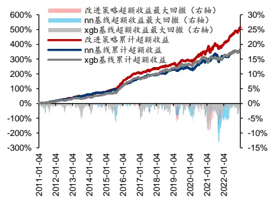

# 九坤 Kaggle 量化大赛有哪些启示？

华泰研究

2023 年 1 月 30 日│中国内地

深度研究

## 人工智能系列之 64：从九坤 Kaggle量化大赛高分方案中寻找借鉴

本文梳理 2022 年九坤 Kaggle 量化大赛高分队伍解决方案，提炼出特征工程、损失函数、交叉验证、模型集成四个主要方向，并应用于华泰人工智能中证 500 指数增强策略改进。结果表明：(1)特征工程引入均值因子对神经网络有效；(2)CCC 损失优于 MSE 损失和 IC 损失；(3)时序交叉验证作用不明显；(4) 集成神经网络和决策树类模型提升较稳定。对比整合多项改进的模型与基线模型，回测期 2011 年至 2022 年内，年化超额收益从 14.2%提升至 17.0%，信息比率从 2.3/2.4 提升至 2.7。

多家头部量化机构在 Kaggle 发布竞赛，九坤竞赛贴近实际量化选股场景随着数据科学在线社区日益成熟，越来越多的爱好者投身于网络编程竞赛之中。Kaggle 是全球知名的数据科学在线平台之一，Two Sigma、Optiver 等头部量化机构曾在 Kaggle 发布挑战竞赛。国内量化私募九坤投资于 2022年 1 月启动 Kaggle 竞赛，吸引两千多只队伍参赛。比赛具体任务为基于给定的 A 股匿名特征，预测股票未来短期收益，最终评价指标为预测收益和真实收益的 IC值，属于典型的监督学习问题，和实际量化选股场景较贴近。

四个改进方向：引入均值因子，引入 CCC损失，时序交叉验证，模型集成我们梳理九坤Kaggle量化大赛高分队伍解决方案，提炼出四个改进方向。(1)特征工程引入截面上全部股票因子的均值，均值因子可能反映原始因子整体分布的时变特性，是市场环境的一种简单表达。(2)损失函数引入一致性相关系数 CCC，可视作 IC 和 MSE 的融合，兼顾相关性和距离。(3)采用时序交叉验证选取最优超参数。(4)集成不同类型机器学习模型。以神经网络和XGBoost构建中证500指数增强策略作为基线，测试上述技巧的改进效果。

均值因子对神经网络有效，加权 CCC损失回测表现好，模型集成提升稳定四项改进技巧效果各异。特征工程引入的均值因子对神经网络有提升，但削弱了 XGBoost 模型。损失函数中，MSE 表现不突出；IC 损失单因子测试表现好，但指增组合回测表现差；CCC 损失在单因子测试表现一般，但指增组合回测表现较好；加权均优于等权。交叉验证调参改进不显著，考虑到时间开销大，性价比不高，算力有限前提下，使用经验超参数即可。模型集成提升较稳定，神经网络类和决策树类模型有互补效果。

## 讨论：(1)如何使用弱因子；(2)因子合成和组合优化的目标错配问题

研究发现均值因子对神经网络有效但对 XGBoost 无效。均值因子属于弱因子，有用但比重不宜过大。XGBoost 引入弱因子后，特征采样使原始因子可能被排除在外，从而削弱模型。神经网络可通过预处理缩小取值，有限度地使用弱因子。研究还发现 IC 损失单因子测试优于 MSE 损失，但指增组合表现差，本质是因子合成和组合优化的目标错配。IC 属于全局统计量，不会侧重于个别头部样本，但这些样本可能对组合优化影响较大。MSE 的特点之一是给予极端误差较大惩罚，恰好弥补IC弱点。CCC融合IC和MSE，兼顾共性和个性，是一类理想的损失函数。

风险提示：人工智能挖掘市场规律是对历史的总结，市场规律在未来可能失效。人工智能技术存在过拟合风险。深度学习模型受随机数影响较大，本文未进行随机数敏感性测试。本文测试的选股模型调仓频率较高，假定以 vwap价格成交，忽略其他交易层面因素影响。

研究员

SAC No. S0570516010001

林晓明

linxiaoming@htsc.com

SFC No. BPY421

+(86) 755 8208 0134

研究员

SAC No. S0570519110003

李子钰

SFC No. BRV743

liziyu@htsc.com

+(86) 755 2398 7436

研究员

SAC No. S0570520080004

何康，PhD

SFC No. BRB318

hekang@htsc.com

+(86) 21 2897 2039

## 基于九坤大赛改进策略超额收益表现

注：回测期 2011-01-04 至 2022-12-30，基准为中证 500资料来源：朝阳永续，Wind，华泰研究

## 下载完整报告

第一步：打开微信扫一扫，

第二步：关注右侧微信公众号:量化studio

## 九坤 20230203

第三步：微信后台输入关键字（中间无空格）：

第四步：按照给出的下载地址进行下载

## 研究导读

得益于数据科学在线社区日益成熟，机器学习和大数据的学习门槛逐渐降低，全球的爱好者都可以通过在线平台参与编程训练和竞赛项目，和顶尖团队进行较量和探讨。Kaggle 正是影响力较大的平台之一，囊括了超过 500 项竞赛、5万个数据库和 40 万组代码。美国白宫、斯坦福大学、北京大学、微软、谷歌等机构和企业都曾在 Kaggle 发布竞赛，征集解决方案。

量化投资和机器学习、大数据关系紧密，多家量化投资机构也在Kaggle平台发起挑战竞赛，发布方不乏 Winton、Two Sigma 等知名对冲基金，也包含 Jane Street、Optiver 等头部做市商。项目内容大多是基于资产历史行情、新闻数据或匿名特征，预测未来收益率或波动率。下表整理了 Kaggle 平台量化投资相关竞赛。2022 年 1 月，国内量化私募九坤投资也上线 Kaggle 竞赛，受到市场关注，2893 支队伍参赛，最终前 10 名队伍获得 10 万美元奖金。

图表1： Kaggle平台量化投资相关竞赛

| 发布时间 2015 年 10 月 Winton | 发布机构 | 竞赛描述 | 网址 |
| --- | --- | --- | --- |
|  |  | 预测 T 日 中至 T+2 日收益率 | 利用股票T-2 至T日中行情等数据，https://www.kaggle.com/competitions/the-winton-stock-m arket-challenge |
| 2016 年 12 月 Two Sigma |  | 利用资产匿名特征，预测价格 | https://www.kaggle.com/competitions/two-sigma-financia I-modeling/ |
| 2018 年 9 月 Two Sigma |  | 利用新闻数据，预测股票价格 | https://www.kaggle.com/competitions/two-sigma-financia l-news |
|  | 2020 年 11 月 Jane Street |  | 利用股票匿名特征，制定交易策略 https://www.kaggle.com/competitions/jane-street-market- prediction |
| 2021 年 6 月 Optiver |  | 分钟波动率 | 利用股票订单簿数据，预测未来 10 https://www.kaggle.com/competitions/optiver-realized-vol atility-prediction/ |
| 2021 年 11 月 G-research |  | 15分钟的残差收益率 | 利用数字货币行情数据。预测未来 https://www.kaggle.com/competitions/g-research-crypto-f orecasting/ |
| 2022 年 1月 九坤投资 |  | 最大化IC 值 | 利用股票匿名特征，预测收益率，https://www.kaggle.com/competitions/ubiquant-market-pr ediction/ |
|  |  | 未来收益率排序，最大化多空组合 change-prediction 夏普比率 | 2022年4月日本交易所集团 利用股票行情、财报等数据，预测 https://www.kaggle.com/competitions/jpx-tokyo-stock-ex |

资料来源：Kaggle，华泰研究

本文的主题是“抄作业”，九坤 Kaggle 量化大赛高手云集，高分队伍是否有经验值得借鉴？我们梳理了部分高分队伍公布的解决方案，提炼出有共性的四个方向——特征工程、损失函数、交叉验证和模型集成，并应用于中证 500 指数增强策略的改进。结果显示，改进策略相比基线策略有稳定提升，回测期 2011 年至 2022 年内，年化超额收益从 14.2%提升至17.0%，信息比率从 2.3/2.4 提升至 2.7。测试的改进技巧中，神经网络引入均值因子、CCC损失、模型集成提升作用较显著。

图表2： 部分测试模型回测绩效

|  | 年化收益年化波动夏普比 |  |  |  | 最大回 Calmar 比 年化超额收 率 | 年化跟踪信息比超额收益最大超额收益 Calmar 相对基准月年化双边换 |  |  |  |  | 胜率 手率 |
| --- | --- | --- | --- | --- | --- | --- | --- | --- | --- | --- | --- |
|  | 率 | 率 | 率 | 撒 |  | 益率 | 误差 | 率 回撤 | 比率 |  |  |
|  |  |  |  |  |  |  | 基线策略 |  |  |  |  |
| nn | 15.94% | 25.69% | 0.62 50.25% |  | 0.32 14.24% | 5.99% | 2.38 | 13.36% | 1.07 | 77.08% | 16.18 |
| xgb | 15.82% | 26.07% | 0.61 46.94% |  | 0.34 | 14.22% | 6.28% 2.26 | 9.70% | 1.47 | 68.75% | 16.26 |
|  |  | 26.33% | 0.7048.96% |  |  | 改进策略 |  |  |  |  |  |
| nn_fe+nn_wccc+xgb | 18.56% |  |  |  | 0.38 | 17.00% | 6.24% 2.73 | 9.32% | 1.82 | 76.39% | 16.31 |
| nn_fe+nn_wccc+xgb_cv | 18.57% | 26.38% | 0.7049.46% |  | 0.38 | 17.03% 6.36% | 2.68 | 9.54% | 1.79 | 73.61% | 16.31 |

注：回测期 2011-01-04 至 2022-12-30，基准为中证 500 指数
资料来源：朝阳永续，Wind，华泰研究