# GPT＋量化投资＝？

华泰研究

2023 年 3 月 24 日│中国内地

深度研究

## 人工智能系列之 65：解析 GPT 对量化投资的影响，顾短也兼长

相比ChatGPT和GPT-4在全社会范围引发的热议，量化投资领域对于GPT的态度显得相对冷静。ChatGPT 和 GPT-4展现出的强大语言生成能力和部分推理能力不可谓不惊艳，但和量化投资主流方法论——低信噪比场景下的预测模型有鲜明区别。这种因立场不同带来的感知差异，就如股指期货松绑无法令非量化从业者感到兴奋一样。我们认为在短期现实层面，量化投资行业可能难以直接受益于 GPT 模型。但长期看，如同人脑各区域分工明确但相互联系，现有量化投资预测模型可与各类大模型耦合扩展功能；算法升级和规模扩大后，量化模型可能涌现出预期外的能力，值得量化从业者期待。

## 两点展望：大模型的耦合，大模型的涌现

类比人脑，CNN、AlphaGo、GPT 的强大能力分别对应视觉区、高级认知区、语言区。诟病 ChatGPT 不懂推理计算，就像指责耳朵不会说话一样，忽略了 AI 模型可以耦合，就如人脑各区域存在相互联接。将现有量化投资预测模型和大语言、图像模型耦合，能否处理更大体量的文本信息？能否模拟“看盘高手”的决策？能否实现更拟真的多模态金融数据生成？涌现是指模型规模扩大后，自发产生预期之外的能力，量变产生质变。目前量化投资预测模型无法解决低信噪比、时变规律、小样本学习、数据非结构化等问题，在算法升级和模型规模扩大后，是否可能涌现出预期外的能力？

## 深度解析 ChatGPT 的原理，力求帮助读者全面了解其背后的机制

ChatGPT 是 OpenAI 的 GPT 模型在人机对话方面的应用延伸，使用基于人类反馈的强化学习（RLHF）进行训练。我们认为 RLHF 的一大优势在于可以充分利用数量有限的标注数据构建奖励机制，并在不断迭代中实时获得环境反馈，逐渐微调模型，使得回答尽可能接近人类的逻辑和意图。GPT 系列模型是大规模预训练语言模型的代表，为 ChatGPT 奠定了坚实基础。其中 GPT-3具有 1750 亿个参数，使用了 Few-shot 等先进技术，相比于预训练+微调模型的方式，Few-shot 更接近人类在面对各类语言问题时的思考模式，即人类只需要提示和少量示例就能回答各类语言问题。

## 哪些生成模型适用于金融数据生成？如何应用于量化投资？

ChatGPT 作为自然语言生成模型，在聊天对话场景取得了令人瞩目的成就。而在量化投资场景中，数值类型数据使用更为普遍，GAN、VAE、流模型、扩散模型是四类主流的数值类型数据生成模型。其核心是学习随机变量 z到生成数据 x’的映射，随后对 z进行采样，即可得到生成数据。量化投资学界和业界实践中，生成的金融数据包含时间序列、K线图像数据、截面特征标签数据、订单簿数据，生成得到的数据可以用于训练模型、检验模型、预测收益、预测风险、期权定价等。

## ChatGPT 或将在多方面对量化投资带来影响

我们认为 ChatGPT 对量化投资的影响可能是多方面的。其一，ChatGPT或将被用于生成财经新闻、论坛评论、研究报告等文本数据，极大提高文本数据的数量和噪音，对文本挖掘相关的量化交易策略有利有弊；其二，ChatGPT 或将被运用于量化策略代码编写，接入数据平台后可以实现交易策略的批量调参与样本外跟踪；其三，ChatGPT 还将降低量化研究的门槛，例如替代本地预训练-微调大模型，降低 NLP策略研究的难度、凭借强大的资源整合能力成为第三代搜索引擎后可以助力量化资讯的搜集效率等。

风险提示：人工智能挖掘市场规律是对历史的总结，市场规律在未来可能失效。人工智能技术存在过拟合风险。深度学习模型受随机数影响较大。

研究员

SAC No. S0570516010001

林晓明

SFC No. BPY421

linxiaoming@htsc.com

+(86) 755 8208 0134

研究员

SAC No. S0570519110003

李子钰

SFC No. BRV743

liziyu@htsc.com

+(86) 755 2398 7436

研究员

SAC No. S0570520080004

何康，PhD

SFC No. BRB318

hekang@htsc.com

+(86) 21 2897 2039

联系人

陈伟

SAC No. S0570121070169 chenwei018440@htsc.com

+(86) 21 2897 2228

## 导读

相比 ChatGPT 和 GPT-4 在全社会范围引发的热议，量化投资领域对于 GPT 的态度则显得相对冷静。就现阶段来说，ChatGPT 和 GPT-4展现出的强大的语言生成能力和一部分推理能力，不可谓不惊艳，但和狭义量化投资主流的方法论——低信噪比场景下的预测模型，有鲜明区别。这种因立场不同带来的感知差异，就如同股指期货松绑无法令非量化从业者感到兴奋一样。我们认为，在短期现实层面，量化投资行业可能难以直接受益于 GPT 模型。不过，本文仍希望顾短也兼长地分析 GPT 对于量化投资的影响。

不妨细说 GPT 和狭义量化投资方法论的立场差异。一是生成和预测的差别。何为智能？对话、写作、绘画当然属于智能，其共同点在于让模型实现生成，对应 GPT、AIGC 中的 G（Generative/Generated）。但在量化投资中，更智能代表更准确的预测和投资决策，这种预测能在未来被证真或证伪，也就是存在真实的预测目标，因此无关乎生成，而重在解析。

二是使用场景的信噪比不同。语言、图像冗余度高，即信噪比高，之所以语言考试中有完形填空任务，正是因为一段话中挖去少数词对语义理解影响不大。但一段资产价格序列，挖去最后一天的价格，人或模型试图来预测，难度非常大。如果像完形填空一样简单，金融市场应该很早就达到有效。本质是因为金融市场信噪比低，且时刻存在博弈，规律具有时变特性。大模型在低信噪比场景下的能力有待检验。基于以上两点，我们认为短期量化投资行业可能难以直接受益于 GPT 模型。

但长期看，我们认为 GPT 模型将解放量化投资的生产力。除了替代量化从业者日常低创造性的劳动（如制作文稿、报表，写基础代码等），以及智能投顾等广义投资领域的应用之外，GPT 对量化研究的启发至少还体现在两点。

一是大模型的耦合。如果将已有 AI 模型类比人类大脑，此前 CNN 的图像识别能力对应枕叶视觉区，AlphaGo的运算能力对应前额叶高级认知区，GPT的语言能力对应颞叶语言区，另外计算机近乎无限的记忆力对应海马区。有人诟病 ChatGPT 不懂推理计算，就像指责人的耳朵不会说话一样，忽略了 AI 模型是可以逐步发展以及相互耦合的，就如同人脑各区域不是独立工作，而是相互联接的。GPT-4实现的多模态生成，就是耦合了视觉区和语言区。未来的通用人工智能，可能就诞生于多个大模型的耦合之中。

对量化投资而言，目前常用的 AI 预测模型只解决了基于数值数据拟合收益率的问题，相当于只激活了类脑智能的很小一部分区域。现有预测模型和大语言模型、大图像模型、生成式模型耦合之后，能否处理更大体量的文本信息？能否模拟“看盘高手”的决策？能否实现更拟真的多模态金融数据生成？

二是大模型的涌现。这一点正在被 AI 领域热议。一般而言，大语言模型的性能会随规模的扩大而提升，两者的共变关系是可预测的；涌现则是指模型规模扩大后，自发产生预期之外的能力，如小样本学习、思维链、未经训练的指令遵循等，通俗地说即量变产生质变。Google 在 2022 年发布的论文 Emergent Abilities of Large Language Models 综述了这一现象。从复杂系统的角度看，涌现意味着秩序的产生，可能代表高维动力学系统中的稳态。对量化投资而言，目前小模型无法解决低信噪比、时变规律、小样本学习、数据非结构化等问题，在算法升级和模型规模扩大后，是否可能涌现出预期外的能力？科学家对涌现知之甚少，但 AI的成长时常超越人的认知。

下文将分三部分具体展开。首先解析历代 GPT 模型和 ChatGPT 原理。其次站在生成模型视角，介绍生成对抗网络、变分自编码器、流模型等生成模型的原理，及其在训练模型、检验模型、预测收益、预测风险等领域的应用案例。再次站在语言模型视角，从文本生成、代码生成等角度分析ChatGPT对量化投资的影响。最后介绍国内网络环境下使用ChatGPT的方法。

## ChatGPT 原理深度解析

NLP（Natural Language Process，自然语言处理）是人工智能的子领域，专注于人机交互和自然语言数据的处理和分析。近年来，NLP 领域最激动人心的成果莫过于预训练自然语言模型，GPT 系列模型作为预训练自然语言模型的一个重要分支，逐渐展现出 AI模型对于完成通用自然语言处理任务的强大能力。下图是 GPT 系列模型的发展路径。

图表1： GPT系列模型的发展路径
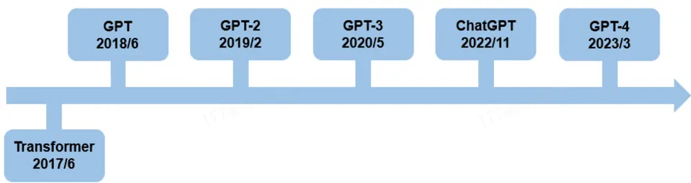
资料来源：华泰研究

## OpenAI 的四代 GPT 模型

2018~2023 年，OpenAI 陆续推出四代 GPT 模型。前三代每一代模型的规模和参数量逐渐增大，GPT-3 的参数量达 1750 亿个，第四代参数量未公开。模型在各类自然语言下游任务中的表现也越来越好。前三代模型的结构和参数如下图。

图表2： 前三代 GPT模型的结构
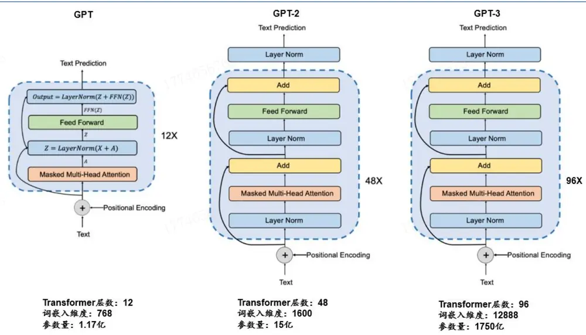
资料来源：OpenAI，华泰研究

## GPT 模型

2018 年，OpenAI 在论文 Improving Language Understanding by Generative PreTraining中提出了 GPT 模型。GPT 是单向表征的自回归语言模型，主要用来处理语言生成任务，其多头注意力模块为 Masked Multi-Head Attention，通过掩码的遮盖，在预测一个单词时只会用到前面已经生成的单词，而无信息的泄露。

GPT 是典型的“无监督预训练+有监督微调”的两阶段模型，先在没有标注的数据集中进行预训练，再在有标注的特定下游任务数据集上微调。在预训练阶段，对于一个含有大量单词的语料库 ${\boldsymbol{\cdot}}{\boldsymbol{\mathcal{U}}}=\{u_{1},\ldots,u_{n}\}$ ，GPT 使用极大化似然函数来进行优化：

$$
L_{1}(\mathcal{U})=\sum_{i}\log P(u_{i}\mid u_{i-k},\ldots,u_{i-1};\Theta),
$$

k是预测时所用到的单词的个数，P是用于预测的模型。我们定义 $.U=(u_{-k},\ldots,u_{-1})$ 为输入的k个单词的编码序列， $W_{e}$ 为词嵌入映射矩阵， $W_{p}$ 为位置嵌入矩阵，L 表示堆叠的 Block 层数，则 GPT 的预训练流程可以按如下方法公式化：

$$
\begin{aligned}h_{0}&=UW_{e}+W_{p}\\h_{l}=transformer_{block(h_{l-1})},l&\in\{1,2,3\ldots,L\}\\P(u)&=softmax(h_{L}W_{e}^{T})\end{aligned}
$$

预训练完成后需要使用少量带标注的下游任务数据对模型进行微调。

## GPT-2 和 GPT-3 模型

从 GPT-2开始，OpenAI 逐渐抛弃了“无监督预训练+有监督微调”的方式，尝试训练一种不需要进行下游任务微调就能处理各种自然语言任务的模型，并且认为随着模型参数量的不断增大，模型容纳的知识和可应对的任务会越来越多，语言模型应该往大模型的方向发展。GPT-2 相比 GPT 的变化主要包含：

1. 参见图表 3，GPT-2 中 Transformer 层的内部结构相比 GPT 有一定变化。

2. GPT-2 的 Transformer 层数增多，参数量达到了 15 亿个。

3. GPT-2 开创性地引入了 Zero-shot 技术，即模型在大规模参数下学习到了海量文本中的知识，不需要再针对下游任务微调。只需要将要做的任务也作为一个提示词，和文本一起输入预训练好的模型，就可以完成这个任务。

遗憾的是，因为基于 Zero-shot 的训练方式难度很大，GPT-2 在很多下游任务上的表现还不够好，但从开创性来讲 GPT-2 无疑是一个优秀的研究，为 GPT-3的诞生做好了准备。

2020 年，OpenAI 在论文 Language Models are Few-Shot Learners 提出了 GPT-3，GPT-3在多项任务上的表现超出了 GPT-2。GPT-3 相比 GPT-2 的变化主要包含：

1. 参见图表 3，GPT-3 中 Transformer 层的内部结构和 GPT-2 一致，但层数达到 96 层，参数数量达到 1750 亿个。

2. GPT-3 吸取了 GPT-2 的经验教训，在使用 Zero-shot 技术的同时，还引入了相对容易的 One-shot 和 Few-shot 技术。

下方将英语 cheese 翻译成法语的例子形象说明了 Zero-shot、One-shot、Few-shot 与微调的对比。

图表3： Zero-shot、One-shot、Few-shot 与微调的对比
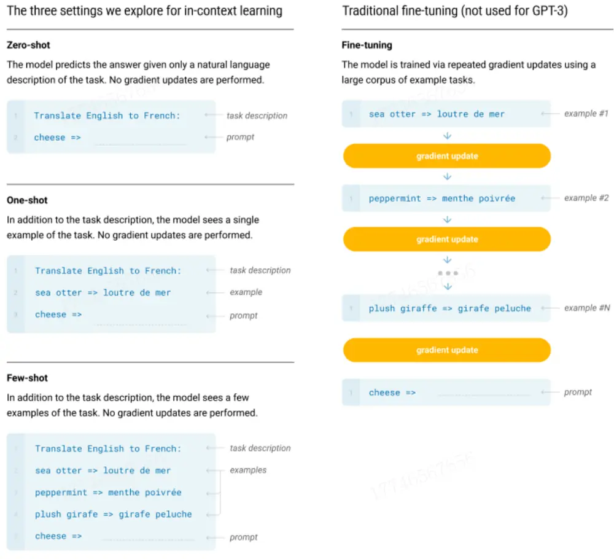
资料来源：Language Models are Few-Shot Learners，华泰研究

微调：模型会根据每个微调样本（example #1, example #2,…, example #N）产生梯度更新模型参数，微调完成之后将英语 cheese 翻译成法语。

Zero-shot：模型预测阶段，给模型提供一个任务提示 Translate English to French 并加上要翻译的单词cheese，也就是告诉模型需要做的是翻译任务。这个过程中不会有梯度更新。

One-shot：模型预测阶段，给模型提供一个任务提示 Translate English to French 并加上要翻译单词 cheese 的同时，增加一个翻译示例 sea otter => loutre de mer，也就是告诉模型需要做的是翻译任务，并且有一个参考示例。这个过程中不会有梯度更新。

Few-shot：模型预测阶段，给模型提供一个任务提示 Translate English to French 并加上要翻译单词 cheese 的同时，增加多个翻译示例，也就是告诉模型需要做的是翻译任务，并且有多个参考示例。这个过程中不会有梯度更新。

可以看出，Zero-shot、One-shot 和 Few-shot 更接近人类在面对各类语言问题时的思考模式，即人类只需要提示和少量示例就能回答各类语言问题。对于 Zero-shot，由于没有提供示例，是最有挑战的，即使是人类有时也难以在仅依赖任务描述而没有示例的情况下理解一个任务。

## GPT-4 模型

2023年3月14日OpenAI推出了GPT-4模型，向多模态通用人工智能迈出更坚实的一步。GPT-4 之前的模型都是语言模型，GPT-4 则升级为语言+图像的多模态模型，能够输入文本和图像，回答文本内容。

考虑到竞争格局和大型模型的安全影响，OpenAI 并未披露 GPT-4 的大小、硬件、数据集构建、训练方法等细节，只发表了一篇技术报告来介绍模型在各种任务上的性能。但 GPT-4并非一天建成的，我们依然可以通过已发表的相关研究论文来了解 GPT-4 使用的 AI 技术。下图整理了 GPT-4 原理概况及参考模型。

图表4： GPT-4原理概况及参考模型
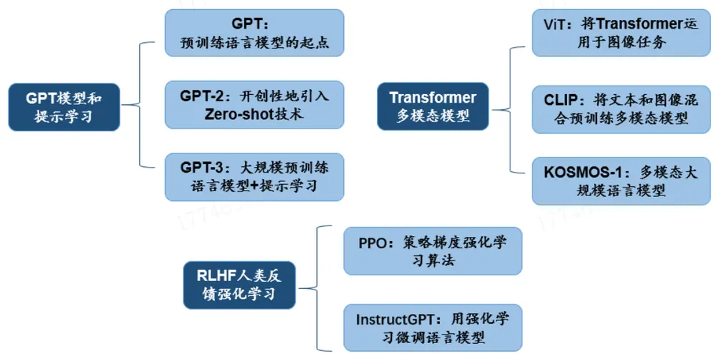
资料来源：华泰研究

## InstructGPT 和 ChatGPT：使用 RLHF 训练人机对话模型

InstructGPT 和 ChatGPT 都是 GPT 模型在人机对话方面的应用延伸，目的是使得机器的回答尽可能向人类的逻辑和意图看齐（Alignment）。二者都使用了基于人类反馈的强化学习（Reinforcement Learning from Human Feedback, RLHF）进行训练，由于 ChatGPT 的论文尚未发布，我们将主要参照 InstructGPT 的论文 Training language models to followinstructions with human feedback 来介绍 RLHF 的训练过程。

图表5： 使用 RLHF 训练 ChatGPT 的三个步骤
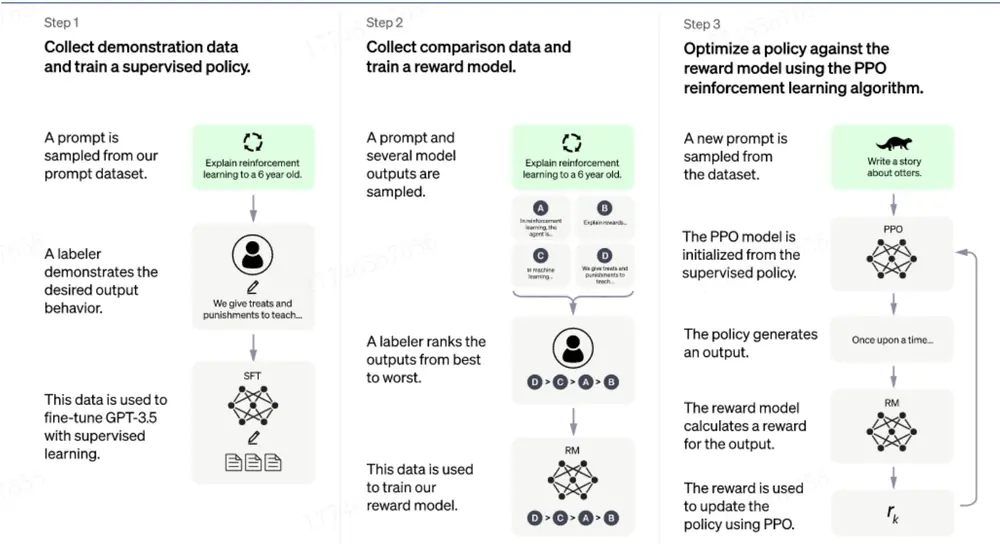
资料来源：OpenAI，华泰研究

上图展示了使用 RLHF 训练 ChatGPT 的三个步骤，分别是：

1. 利用人类标注的对话数据对 GPT-3.5 进行有监督训练微调。

2. 利用人类标注的对话打分数据训练一个打分模型，模型能评价机器回答的质量高低。

3. 利用步骤 2 中打分模型得到奖励函数，使用强化学习继续对步骤 1 中的模型微调。

步骤 1 较为简单，即利用人类标注的对话数据对 GPT-3.5 进行有监督训练微调得到 SFT（Supervised fine-tuning）模型。对话数据中包含的任务类型较为全面，包括文本分类、信息抽取、文本生成或重写、问答等等。在 InstructGPT 的论文中，该步骤使用的数据量为13000 条左右，这实际上是一个规模较小的数据，因此可以考虑使用文本增强（AugmentedText）的方法扩充这些数据。

图表6： 步骤 1：利用人类标注的对话数据对 GPT-3.5 进行有监督训练微调
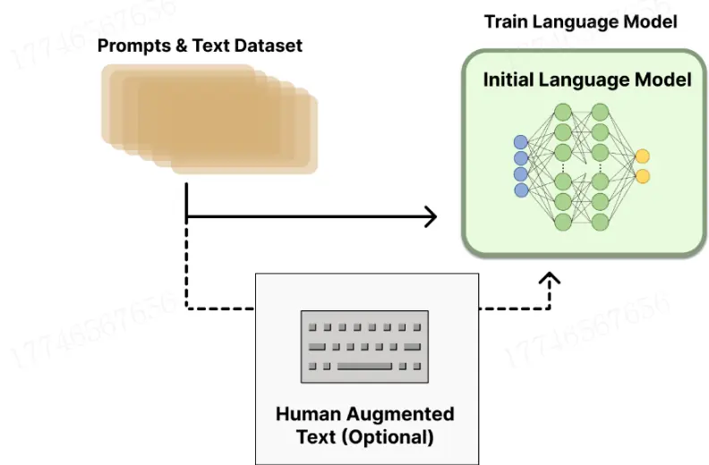
资料来源：HuggingFace RLHF，华泰研究

## 步骤 2需要按照以下流程进行：

1. 将大量的问题文本输入给微调过的 SFT 模型得到回答。

2. 人工按照某些标准对回答进行排序，标准可以是回答的可读性、无害性、正确性等等。

3. 需要注意的是，人工排序并不是给出 1、2、3、4 这样的排序数值（因为直接打分很容易受主观影响），而是给出 $D>C>A>B$ 这样的相对强弱。

4. 使用人工排序的结果训练一个打分模型（Reward Model），模型能评价一条回答的质量高低。在 InstructGPT 的论文中，训练打分模型使用了如下的 pairwise 排序损失函数：

$$
\mathrm{loss}(\theta)=-\frac{1}{\binom{K}{2}}E_{(x,y_{w},y_{l})\sim D}[\log(\sigma(r_{\theta}(x,y_{w})-r_{\theta}(x,y_{l})))]
$$

其中x是一个提问，针对x有 K（论文中 K=9）个回答，从中任选两个回答 $\cdot y_{w}和y_{l},r_{\theta}(x,y_{w})$ 是打分模型对 $y_{w}$ 的评分， $r_{\theta}(x,y_{w})-r_{\theta}(x,y_{l})$ 即两个回答的得分差值， $\log(\sigma(r_{\theta}(x,y_{w})-$ $r_{\theta}(x,\dot{y}_{l})))$ 则把得分差值转换为 Logistic 损失，最后把 Logistic 损失求均值并取相反数就得到loss(θ)。

InstructGPT 的论文中，步骤 2 总共使用了 33000 条人工标注的样本来训练。

图表7： 步骤 2：利用人类标注的对话打分数据训练一个打分模型
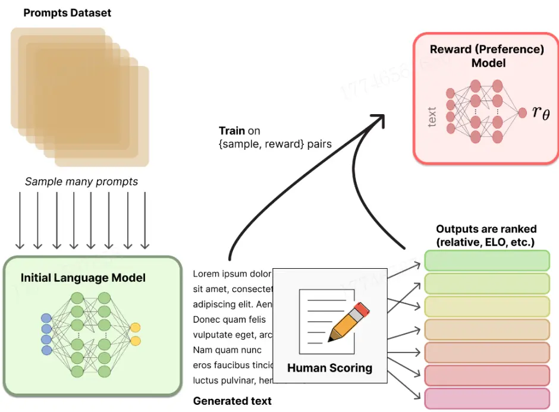
资料来源：HuggingFace RLHF，华泰研究

步骤 3使用强化学习对 SFT 模型继续进行微调，需要按照以下流程进行：

1. 向模型输入问题文本，例如：A dog is…步骤 1 的 SFT 模型给出回答：a furry mammal使用强化学习微调的模型给出回答：man’s best friend

2. 计算两个回答之间的 KL 散度来评价它们的相似程度，以 KL 散度作为惩罚项，目的是使得两个模型差异不要太大。

3. 将强化学习微调的模型回答（man’s best friend）输入第 2 步中的打分模型，得到打分$r_{\theta}$

4. 设置强化学习的奖励函数，使用 PPO 算法对模型进行微调。在 InstructGPT 的论文中，奖励函数设置为：

π∅RL(y|x)objective(∅) = E(x,y)~DπRL[rθ(x, y) − β logπSFT(y|x)+ γEx~D [log(π∅RL(x))]其中 $\pi_{\emptyset}^{RL}$ 代表 PPO 微调的模型， $\pi_{\emptyset}^{SFT}$ 代表 SFT 微调的模型， $D_{pretrain}$ 则是未微调的预训练模型。 $\log\left(\frac{\pi_{\emptyset}^{RL}(y|x)}{\pi_{\emptyset}^{SFT}(y|x)}\right)$ 即 KL 散度，超参数β和γ控制 KL 散度和未微调的预训练模型的影响。若 $\gamma=0$ ,则得到模型命名为 PPO 模型，若 $\gamma>0$ ,则得到模型命名为 PPO-ptx模型。整个奖励函数的含义是：在最大化打分 $r_{\theta}$ 的情况下，控制 $\pi_{\emptyset}^{RL}和\pi_{\emptyset}^{ST}$ 的差异，并且引入未微调模型来增强整体模型的鲁棒性。

5. 随着强化学习的不断训练，就能逐渐微调模型使得回答质量越来越接近人类的期望水平。

图表8： 步骤 3：使用强化学习 PPO算法继续微调模型
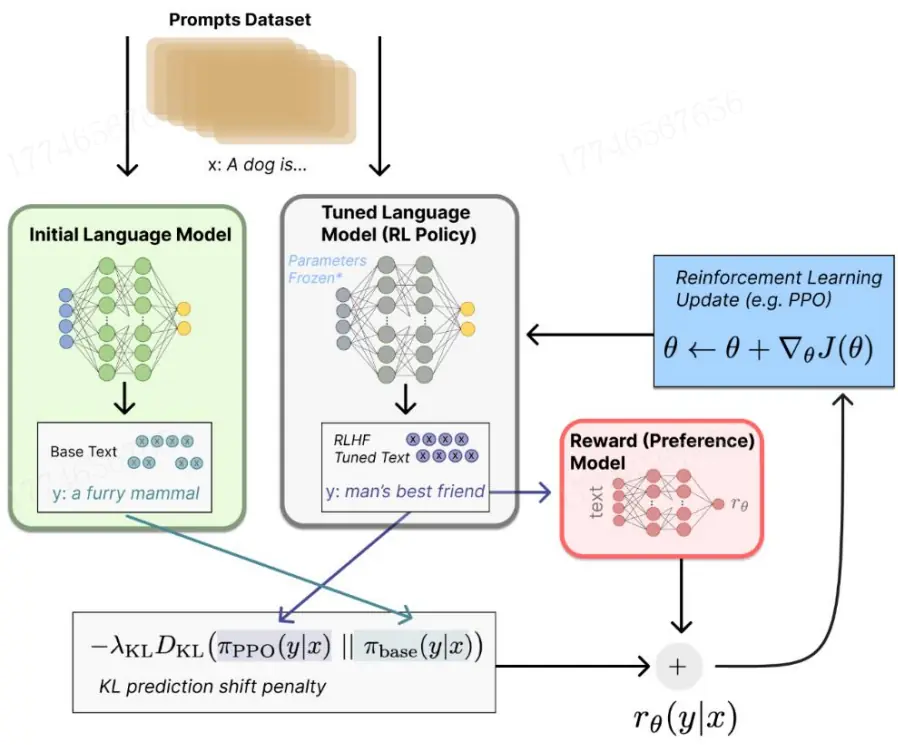
资料来源：HuggingFace RLHF，华泰研究

InstructGPT 的测试结果包含了很多值得注意的信息，我们将逐个展开分析。下图的横轴为模型大小，纵轴为模型相对于基准模型的胜率，基准模型是对 1750 亿参数的 GPT-3 微调得到的模型 SFT。

图表9： InstructGPT 的测试结果分析
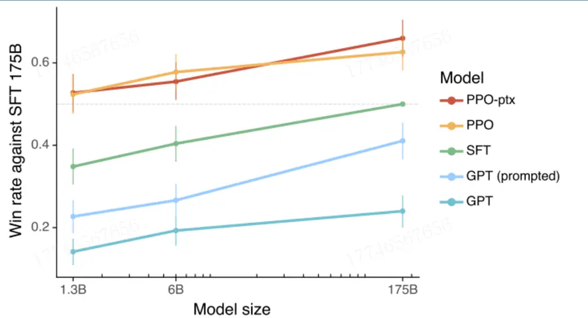
资料来源：Training language models to follow instructions with human feedback，华泰研究

1. 从上图可知，PPO 和 PPO-ptx 的表现最好，显著优于 SFT，PPO 和 PPO-ptx 之间没有显著的优劣之分。

2. 引入人工标注的数据进行 RLHF 训练对模型指标的提升是非常显著的，模型大小只有13 亿的 PPO 表现远优于模型大小达到 1750 亿的 GPT。

3. 上图 5个模型的指标都随着模型大小的增大而增大，且并未出现见顶的迹象，这可能说明继续增大模型规模还有进一步提升的空间，语言大模型的潜力还有进一步挖掘的可能。

## 关于 RLHF 的两点思考

首先，RLHF 的核心思想是用强化学习微调语言模型，相比监督学习，强化学习要复杂很多，需要定义环境、状态、奖励、策略等要素。复杂方法的引入，一般是因为其能展现出相比简单方法的特殊价值。对于 InstructGPT 来说，其使用的人工标注数据相对于模型规模来说是很小的，只有数万条而已，我们认为 RLHF 的一大优势就在于可以充分利用这些有限的标注数据。

具体来讲，RLHF中的打分模型学习了人类对机器回答的评价排序，相当于替代了人类反馈，能自动对更多回答进行打分。这种自动打分机制被融入到强化学习的奖励函数中，使得强化学习可以在模型的不断迭代中实时获得环境反馈，逐渐微调模型使得回答的可读性、无害性、正确性更好。

其次，读者可能会发现，GPT-3 和 ChatGPT 的训练方法论是矛盾的。GPT-3 尝试训练一种不需要进行下游任务微调就能处理各种自然语言任务的模型，而 ChatGPT 则又使用了微调模型的训练方法。我们认为这其实是两个研究的目的不同所致。GPT-3 尝试借鉴人类的思维模式，探索一种通用的语言大模型，GPT-3 更像是一种打地基式的工作，具有更高的全局规划和研究视野。与之相比，ChatGPT 则是一种更偏应用的研究，应用研究更关注的是模型在某个领域的实际效果，对能提升实际效果的方法论都可以吸收使用。实际上，ChatGPT 正是站在 GPT-3这个巨人的肩膀上，才取得了当前的惊艳效果。

Vaswani, A., Shazeer, N., Parmar, N., Uszkoreit, J., Jones, L., Gomez, A. N., ... & Polosukhin, I. (2017). Attention is all you need. Advances in neural information processing systems, 30.

Radford, A., Narasimhan, K., Salimans, T., & Sutskever, I. (2018). Improving language understanding by generative pre-training.

Radford, A., Wu, J., Child, R., Luan, D., Amodei, D., & Sutskever, I. (2019). Language models are unsupervised multitask learners. OpenAI blog, 1(8), 9.

Brown, T., Mann, B., Ryder, N., Subbiah, M., Kaplan, J. D., Dhariwal, P., ... & Amodei, D. (2020). Language models are few-shot learners. Advances in neural information processing systems, 33, 1877-1901.

Ouyang, L., Wu, J., Jiang, X., Almeida, D., Wainwright, C. L., Mishkin, P., ... & Lowe, R. (2022). Training language models to follow instructions with human feedback. arXiv preprint arXiv:2203.02155.

Schulman, J., Wolski, F., Dhariwal, P., Radford, A., & Klimov, O. (2017). Proximal policy optimization algorithms. arXiv preprint arXiv:1707.06347.

## 生成模型在量化投资中的应用

ChatGPT 作为自然语言生成模型，在聊天对话的场景中取得了令人瞩目的成就。而在量化投资场景中，研究对象除了文本类型数据外，更常用的仍是截面、时间序列等数值类型数据。哪些生成模型适用于数值类型数据生成？数值类型数据如何应用于量化投资？

## 哪些生成模型适用于数值类型数据生成？

生成模型的核心是学习随机变量 z 到生成数据 x’的映射。学习完成后对 z 进行随机采样，即可得到生成数据。GAN、VAE、流模型、扩散模型这四类主流的生成模型，其主要区别就体现在上述映射关系的表征和学习方式上。

图表10： 四类生成模型示意图
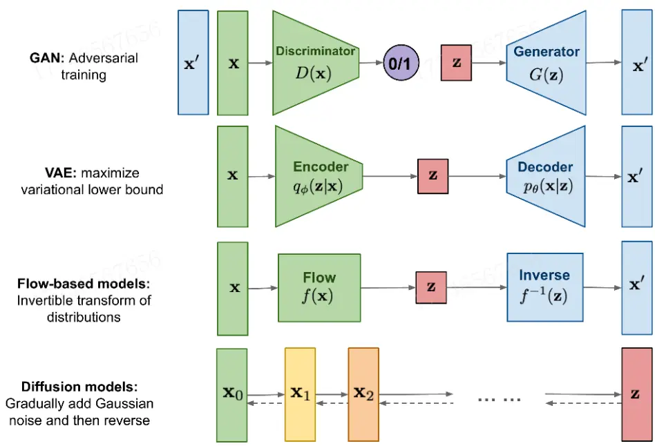
资料来源：https://lilianweng.github.io/posts/2021-07-11-diffusion-models/，华泰研究

## 生成对抗网络（Generative Adversarial Networks，GAN）

生成模型和判别模型属于人工智能的两大分支，但在 GAN 成为“网红”模型之前，学界和业界的研究重心主要放在判别模型，可以说，GAN 靠一己之力带“火”了生成模型。GAN的热潮一度席卷各项 AI 顶级会议，但其地位近几年逐渐被扩散模型取代。

GAN 由 Ian Goodfellow在 2014 年 NIPS 会议提出，精妙之处在于训练中引入博弈的思想。GAN 包含两个网络：生成器 G 和判别器 D。假设 G 的目标是生成尽可能逼真的赝品，那么 D 的目标是尽可能区分真品和 G 生成的赝品。原版 GAN 中 G 和 D的损失函数互为相反数，相当于零和博弈，两者交替训练，直到达到纳什均衡的理想状态，此时 D“明察秋毫”，而 G生成赝品的技艺同样“巧夺天工”。

从前述映射关系的角度分析，D 学习从样本（真样本 x或生成样本 x’）到真假判断（1 或 0）的映射 D(x)，G 学习从随机变量 z 到生成样本 x’的映射 G(z)，z 服从标准正态分布。G 和D 都可以通过复杂神经网络进行拟合。GAN 的核心是学习 G(z)，G 相当于“学生”，D 的作用类似“老师”，起辅助作用。

GAN 由于其独特的训练方式和优良的生成效果受到学界瞩目。研究者此后陆续提出各类GAN 的变式，例如针对损失函数改造的 WGAN，针对网络结构改造的 DCGAN，引入条件信息从而具备预测能力的 CGAN，扩大网络规模的 BigGAN，实现风格迁移的 StyleGAN，实现单样本生成的 SinGAN 等。GAN的缺点是训练不稳定，并且生成多样性不足。

图表11： GAN生成人脸实例与 GAN的损失函数
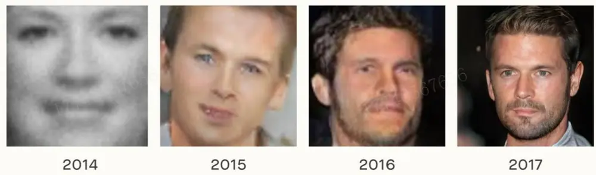

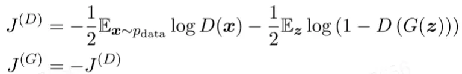
资料来源：The Malicious Use of Artificial Intelligence，华泰研究

图表12： SinGAN生成图像实例
Random samples from a single image

资料来源：SinGAN: learning a generative model from a single natural image，华泰研究

## 变分自编码器（Variational AutoEncoder，VAE）

VAE由Kingma和Welling在2013年提出，并发表于2014年ICLR会议。AE（AutoEncoder，自编码器）是一种经典的无监督学习方法，常用于降维。VAE 借鉴了 AE 的编码器-解码器结构，并引入概率图模型的变分推断思想（VAE中的 V）。此后学者连续提出 VAE的变式，其中VQ-VAE的改进版在2021年被OpenAI应用于第一代文本图像生成工具DALL·E1上。

GAN 和 VAE生成的起点都是随机变量 z（隐变量），两者不同之处在于，GAN 的 z从标准正态分布中采样，而 VAE的 z是从特定均值、方差的正态分布中采样，均值、方差是通过神经网络学习出来。VAE 的具体结构为：原始数据 x 通过编码器网络得到隐变量 z 的均值μ 和方差 σ，对正态分布进行采样得到隐变量 z，再通过解码器网络得到生成数据 x’。网络的损失函数是重构误差（如 x 和 x’的 MSE）和正则化项（约束均值和方差，尽量接近标准正态分布）两项之和。

VAE 相比 GAN 在数学上更“优美”。从贝叶斯概率模型的角度看，隐变量 z服从先验分布p(z)，编码器的本质是学习后验分布 qφ(z|x)，解码器的本质是学习似然分布 pθ(x|z)，也就是前述随机变量 z 到生成数据 x’的映射。训练 VAE 的过程，数学上等价于对 p(x|z)的参数进行极大似然估计，更确切地说是最大化似然函数的下确界。VAE 的另一优势是生成多样性比 GAN 更好，缺点是生成数据的真实度和清晰度不如 GAN。

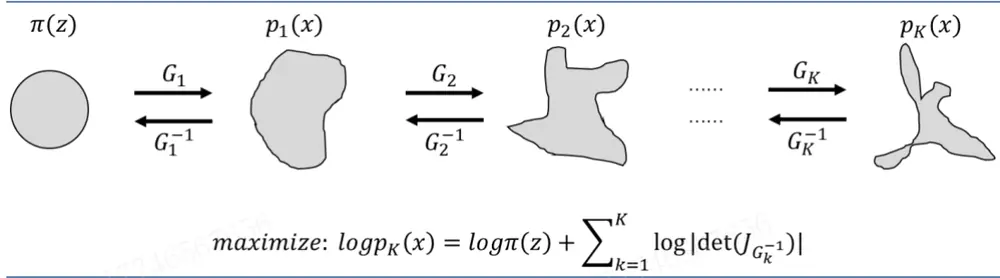
图表14： 基于流的模型网络示意图和损失函数
资料来源：华泰研究

图表13： VAE 网络结构和损失函数
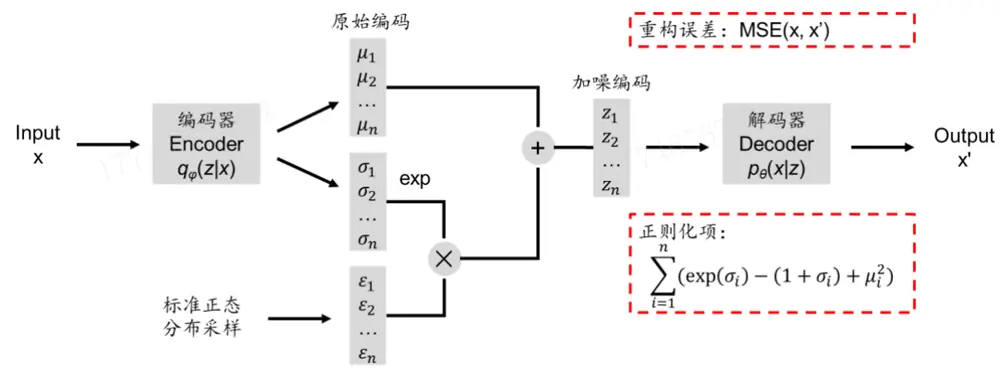
资料来源：华泰研究

## 基于流的模型（Flow-based Models）

的训练目标是最大化似然函数的下确界，然而优化函数的下确界不等于优化函数本身。基于流的模型（以下简称流模型）的训练目标是最大化似然函数本身，在数学上相比 VAE更严格。NICE 被认为是流模型的奠基之作（尽管全文未出现 flow），由 Dinh 等人于 2014年提出，被 2015 年 ICLR 会议接收。此后学者陆续提出 RealNVP、Glow等流模型，生成能力得到进一步提升。

流模型的本质是学习随机变量和真实数据之间的概率分布转换关系。假设随机变量 z 服从分布 $\mathbf{p}z(\mathbf{Z})$ ，真实数据 x服从分布 $\mathbf{p}\times(\mathbf{x})$ ，VAE学习的是 $\mathsf{p}_{\mathsf{Z}}(\mathsf{Z})$ 的均值和方差，而流模型中 $\mathbf{p}z(z)$ 是标准正态分布 π(z)，学习的是 x和之间的双射关系 $z=f(x)$ 与 $x=\mathrm{f}^{-1}(z)$ ，其中 f 必须是可逆函数。此时，f 相当于编码器，反函数 f-1 相当于解码器。

流模型训练过程中，实际训练的是解码器 f-1，可记为 G，一般为神经网络。根据变量替换定理，生成数据 x 的对数似然函数可以显式地表达为 $\log\pi(G^{-1}(x))+\log|\det(J_{G^{-1}})|$ ，其中 $\mathbf{J}\mathbf{G}^{-1}$ 代表解码器反函数（即编码器） $\mathbf{G}^{-1}$ 的雅可比矩阵。神经网络的训练目标是最大化对数似然函数。训练完成后，将高斯分布随机变量 z送入解码器，即可得到生成数据 $x=G(z)$

通常单个解码器 G 不足以实现隐变量 z 和数据 x 之间的分布转换，可以堆叠一系列解码器$\mathsf{G}_{1},\mathsf{G}_{2},\ldots\ldots,\mathsf{G}_{\mathsf{K}},$ ，此时生成过程 $\mathsf{x}{=}\mathsf{G}_{\mathsf{K}}(\dots\mathsf{G}_{2}(\mathsf{G}_{1}(z)))$ ，如同连续的数据流，因此得名流模型。流模型的重要假设是解码器 G 可逆，并非所有神经网络都满足可逆性，网络结构需要特别设计，如引入仿射耦合层等。

流模型的优点是逻辑完备，并且隐变量 z 具有高级的语义属性，例如将笑脸对应的隐变量减去普通人脸对应的隐变量，即可得到表征笑容的隐变量。但流模型参数量偏大，且在生成效果上相比 GAN和 VAE 没有显著优势，一直没有成为生成模型的主流。

## 扩散模型（Diffusion Model）

扩散模型的思想诞生于 2015 年，2020 年 DDPM（Denoising Diffusion Probabilistic Model）实现高分辨率图像生成，扩散模型开始逐渐取代 GAN，成为生成模型的主流。2022 年OpenAI 将其改进模型应用于第二代文本图像生成工具 DALL·E2 上，扩散模型凭借其强大的生成能力随 AIGC 一同成功“出圈”为人熟知。

与 VAE、流模型类似，扩散模型同样包含编码-解码的过程。扩散模型的特殊之处在于，编码和解码过程并非“一步到位”，而是经过一系列“小步慢走”实现的。以生成过程即解码为例：VAE直接学习隐变量z下真实数据x的似然分布p(x|z)，从随机变量z可直接生成x；扩散模型将该过程拆解为 T 步，高斯噪音 z 经过“扩散”依次得到 xT-1、xT-2、…、x1，最终生成 x’。

编码过程从真实数据 x 出发，每步添加高斯噪声 ε，依次得到 x1、x2、…、xT-1、xT。当扩散步数足够多时，xT可视作高斯分布随机变量 z，该过程也称为前向扩散，不涉及神经网络和参数训练。

解码过程从高斯噪音 z出发，每步训练神经网络，依次预测 xT-1、xT-2、…、x1、x0，x0即为生成数据 x’。神经网络的作用是降噪，输入为 x，原始扩散模型的预测目标为降噪后的数据x ，DDPM 的预测目标为前向扩散时添加的噪音 ε，x 减 ε可得 x 。DDPM的网络结构为U-Net，输入和输出数据维度一致。各步神经网络共享参数，DDPM 的输入还增加 timeembedding，表征当前进行到扩散过程的哪一步。

扩散模型的优点是生成质量优于 VAE，多样性和稳定性优于 GAN，缺点是对算力要求高，生成效率低。近年来，学者陆续从提高生成效率、提升泛化能力等角度提出改进，在计算机视觉、自然语言处理、时序数据建模等领域大放异彩。作为新涌现出的生成模型，扩散模型具有广阔的发展前景和应用价值。

图表15： DDPM 扩散模型结构
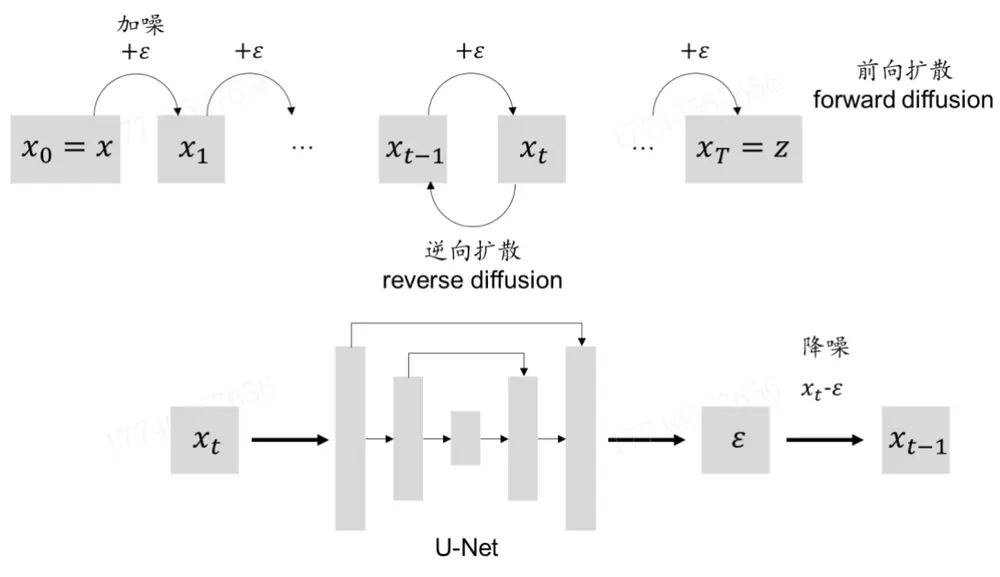
资料来源：华泰研究

## 生成数据如何应用于量化投资？

## 生成什么金融数据？

时间序列数据：金融时间序列数据生成是生成模型在量化投资领域的研究热点。东京大学Takahashi 等人 2019 年使用 GAN 生成标普 500 指数长达 50 年的日度价格序列，并证实GAN 生成的资产价格序列能够复现尖峰厚尾、波动率聚集等真实序列的典型化事实。富国银行 Fu 等人 2019 年使用 GAN 生成美股日度收益率序列以及美国 GDP、CPI 等宏观指标序列。JP Morgan Buehler 等人 2020 年使用 VAE生成不同尺度的资产价格序列，并指出VAE相比其他生成模型更适用于小样本集场景下的生成（尽管文中未对比其他模型）。

华泰金工团队在《人工智能 31：生成对抗网络 GAN 初探》（2020-05-08）中初次尝试将GAN 应用于单资产价格序列生成，在《人工智能 35：WGAN 应用于金融时间序列生成》（2020-08-28）中使用WGAN 提升生成真实性和多样性，在《人工智能 38：WGAN 生成：从单资产到多资产》（2020-11-23）中实现多资产价格序列生成。总的来看，时间序列生成技术目前较为成熟，模型以 GAN 为主，扩散模型可能是下一阶段的重要方向。

图表16： WGAN 生成标普 500月频价格序列
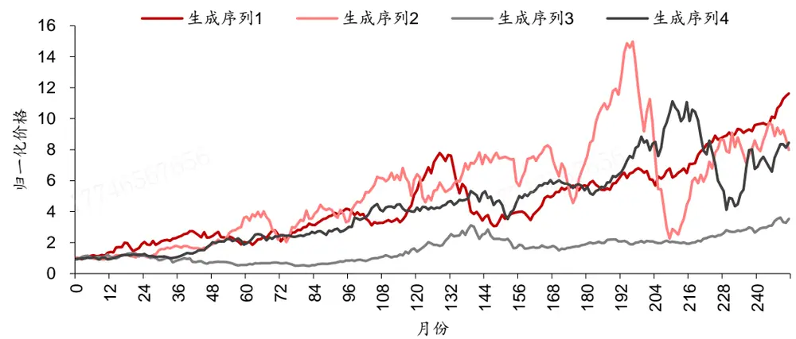
资料来源：Wind，华泰研究

K 线图像数据：在学术领域，图像生成是生成模型的“老本行”。香港科技大学 Wong 等人2020 年发表 GANStick: US Stock Forecasting with GAN-Generated Candlesticks，使用条件深度卷积 GAN 模型，基于美股历史 5 日 K 线图，生成未来 5 日 K 线图，再结合历史 5日 OHLC 数据（开高低收盘价），使用卷积双向 LSTM 预测未来股价。尽管论文中预测效果不错，我们认为，K线图和 OHLC 序列包含的信息一致，K线图相比 OHLC 还存在冗余，生成 K线图并用 K线图预测的必要性存疑，论文的创新性大于实用性。

图表17： GAN生成 K线图
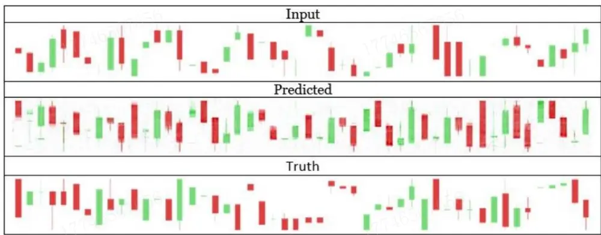
资料来源：Wong et al. (2020) GANStick: US Stock Forecasting with GAN-Generated Candlesticks，华泰研究

截面数据：截面数据是因子投资中常用的数据组织形式。未见到直接生成因子-收益组合的截面数据的研究，但金融场景下有生成类似特征-标签组合的研究。美国运通的 Efimov等人2020 年发表 Using Generative Adversarial Networks to Synthesize Artificial FinancialDatasets，使用 CDRAGAN 模型生成信用卡风险分析数据集。

实验结果表明，生成的截面数据和真实数据的分布接近，并且使用生成数据训练的监督学习模型表现也和真实数据训练得到的模型接近。作者指出，生成截面数据相比时间序列、图像数据的难点在于截面数据的异质性，如变量类型、范围、分布不一致，存在缺失值等，需要事先进行严格的数据预处理。

订单簿数据：市场微观数据也可以由生成模型模拟。台湾交通大学 Kuo 等人 2021 年发表Improving Generalization in Reinforcement Learning–Based Trading by Using aGenerative Adversarial Market Model，以 CGAN 和 WGAN 模型为基础，构建限价订单簿生成器 LOB-GAN，基于历史订单流模拟未来买单和卖单，进而训练强化学习组合优化模型，结果表明 LOB-GAN 的生成效果和回测表现优于其他生成方法。强化学习应用于量化投资的难点在于智能体和环境缺乏真实互动，从而限制智能体对环境的探索，订单簿生成模型可以实现对市场的模拟，相当于站在“上帝视角”再造市场，未来或有较高的应用价值。

图表18： 基于限价订单簿生成器 LOB-GAN 的强化学习组合优化模型
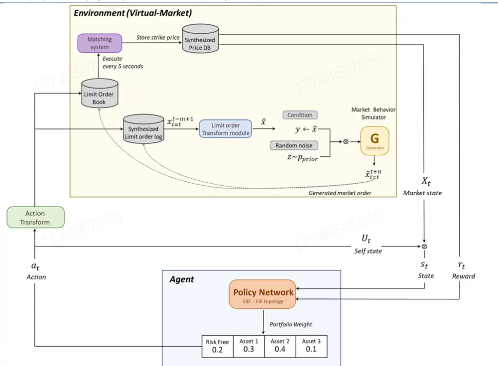
资料来源：Kuo et al. (2020) Improving Generalization in Reinforcement Learning–Based Trading by Using a Generative Adversarial Market Model，华泰研究

## 生成数据怎么用？

训练模型：当机器学习训练样本稀缺时，可能造成训练不稳定，此时生成数据是很好的补充。前述 Kuo 等（2021）即采用生成订单簿数据训练强化学习模型。UCL 的 Koshiyama等人 2019 年发表 Generative Adversarial Networks for Financial Trading StrategiesFine-Tuning and Combination，训练 GAN 生成股指价格序列，并使用生成序列训练回归树和神经网络择时策略。此类研究的挑战在于，生成数据相比真实数据可能并未提供增量信息，使用生成数据训练模型的理论基础是否扎实有待进一步探讨

检验模型：传统量化研究仅使用真实数据回测评估策略好坏，存在回测过拟合风险，而生成数据有助于提升模型检验的效力。华泰金工《人工智能 31：生成对抗网络 GAN 初探》

（2020-06-08）中，我们使用 GAN 模拟多组“平行世界”，观察真实世界表现好的策略在平行世界里是否依然稳健，以此评估策略过拟合程度。前述 Koshiyama 等（2019）和华泰金工《人工智能 48：对抗过拟合：cGAN 应用于策略调参》（2021-10-12）两项研究根据海量生成数据回测结果筛选择时策略参数，均发现策略表现优于仅根据单一真实数据回测结果筛选的参数。

预测收益：GAN 的变式之一 CGAN 可在给定的条件下进行生成，从而使生成模型兼具预测能力。陆军工程大学 Zhou等人 2018 年基于 A股历史分钟线数据生成未来分钟线，并预测分钟级别收益率；中国海洋大学 Zhang 等人 2019 年在日频数据上进行了测试。此类研究的挑战在于，收益率本身信噪比低，仅靠行情数据训练监督学习模型尚且有难度，生成模型并未提供增量信息，其预测可靠度有待进一步考察。

预测风险：相比收益率预测，风险预测更具可行性。前述 Fu 等（2019）生成收益率序列后，进而计算资产在险价值VaR和预期损失ES，相当于用生成模型替换传统蒙特卡洛模拟。IBMMariani等人2018年发表 PAGAN: Portfolio Analysis with Generative Adversarial Networks，华泰金工 2021 年发布报告《人工智能 45：cGAN 应用于资产配置》（2021-04-19），两项研究使用 CGAN 基于历史收益率序列生成多组未来收益率序列，进而计算生成序列的协方差矩阵，作为预期风险的度量，并用于风险平价策略，结果表明生成模型方法优于用传统历史波动率计算协方差矩阵。

期权定价：期权定价的核心是预测波动率，JP Morgan Wiese 等人 2019 年发表 DeepHedging: Learning to Simulate Equity Option Markets，使用生成模型预测期权隐含波动率。该研究将期权价格转为 DLV（discrete local volatilities），使用 GAN 预测不同到期日和不同行权价的 DLV网格。由于预测网格效率较低，论文提出用 PCA对 DLV网格降维，用 GAN预测降维后的 DVL。结果表明，用 GAN 预测 DLV 的 MSE，在峰度等指标优于其他模型。

华泰金工团队自 2020 年 5 月以来发布 10 篇报告，探讨以 GAN 为代表的生成模型在量化投资中的应用，其他模型诸如 VAE、扩散模型涉足较少。随着 AIGC、ChatGPT 带动生成模型热潮，我们认为以下方向具备探索价值：(1)扩散模型的运用；(2)高频数据的生成。

图表19： 华泰金工生成模型研究
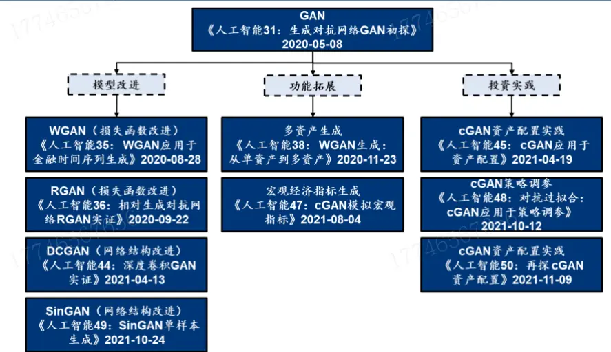
资料来源：华泰研究

Brundage, M. , Avin, S. , Clark, J. , Toner, H. , Eckersley, P. , & Garfinkel, B. , et al. (2018). The malicious use of artificial intelligence: forecasting, prevention, and mitigation.

Buehler, H., Horvath, B., Lyons, T., Arribas, I. P., & Wood, B. (2020). A data-driven market simulator for small data environments. arXiv preprint arXiv:2006.14498.

Dinh, L. , Krueger, D. , & Bengio, Y. . (2014). Nice: non-linear independent components estimation. arXiv e-prints.

Efimov, D. , Xu, D. , Kong, L. , Nefedov, A. , & Anandakrishnan, A. . (2020). Using generative adversarial networks to synthesize artificial financial datasets. arXiv.

Fu, R. , Chen, J. , Zeng, S. , Zhuang, Y. , & Sudjianto, A. . (2019). Time series simulation by conditional generative adversarial net. arXiv.

Goodfellow, I. , Pouget-Abadie, J. , Mirza, M. , Xu, B. , Warde-Farley, D. , Ozair, S. , Courville, A. , & Bengio, Y. (2014). Generative adversarial nets. In Proceedings of the 27th International Conference on Neural Information Processing Systems - Volume 2 (NIPS’14). MIT Press, Cambridge, MA, USA, 2672–2680.

Ho, J. , Jain, A. , & Abbeel, P. . (2020). Denoising diffusion probabilistic models.

Kingma, D. P. , & Welling, M. . (2014). Auto-encoding variational bayes.

Koshiyama, A. , Firoozye, N. , & Treleaven, P. . (2019). Generative adversarial networks for financial trading strategies fine-tuning and combination. arXiv.

Kuo, C. H. , Chen, C. T. , Lin, S. J. , & Huang, S. H. . (2021). Improving generalization in reinforcement learning–based trading by using a generative adversarial market model. IEEE Access, PP(99), 1-1.

Mariani G., et al. 2019. PAGAN: Portfolio analysis with generative adversarial networks. Papers 1909.10578, arXiv.org.

Shaham, T. R. , Dekel, T. , & Michaeli, T. . (2019). Singan: learning a generative model from a single natural image. IEEE.

Sohl-Dickstein, J. , Weiss, E. A. , Maheswaranathan, N. , & Ganguli, S. . (2015). Deep unsupervised learning using nonequilibrium thermodynamics. JMLR.org.

Takahashi, S. & Chen, Y. & Tanaka-Ishii, K. (2019). Modeling financial time-series with generative adversarial networks. Physica A: Statistical Mechanics and its Applications. 527. 121261. 10.1016/j.physa.2019.121261.

Wei, J., Tay, Y., Bommasani, R., Raffel, C., Zoph, B., Borgeaud, S., ... & Fedus, W. (2022). Emergent abilities of large language models. arXiv preprint arXiv:2206.07682.

Wiese, M., Bai, L., Wood, B., & Buehler, H. (2019). Deep hedging: learning to simulate equity option markets. arXiv preprint arXiv:1911.01700.

Wong, M. H., Lee, L. H., & Hui, P. (2020). GANStick: US stock forecasting with GAN-generated candlesticks.

Yang, L. , Zhang, Z. , Song, Y. , Hong, S. , Xu, R. , Zhao, Y. , Shao, Y. , Zhang, W. , Cui, B. & Yang, M. (2022). Diffusion Models: A Comprehensive Survey of Methods and Applications. 10.48550/arXiv.2209.00796.

## ChatGPT对量化投资影响几何？

前文我们详细分析了 ChatGPT 的模型原理以及与之类似的生成模型的应用，现在回到ChatGPT 模型应用本身，我们自然想问在量化投资领域，ChatGPT 可能会带来怎样的影响？不妨让我们先把这个问题抛给 ChatGPT 自身，让其进行一段“自我介绍”，由此再激发我们的思考。

## 三省吾身：ChatGPT的自我拷问

量化投资始于 Markowitz 模型与资本资产定价理论，再至 APT 和 Fama-Franch 三因子模型，而后多因子选股体系日臻完善，再到近年机器学习与深度学习在量化投资中的火热。从上世纪五十年代发展至今，理论模型和硬件设备的迭代更新带动着量化投资的不断变革。

作为 NLP发展第三阶段的标志性产物，ChatGPT 所带来的人机交互体验更上一层楼，全世界似乎都在期待它对于每个行业的革新和劳动力的解放，量化投资领域自然也不例外。“ChatGPT 可能对量化投资带来什么样的影响？”，它自己给出的答案是这样的：

图表20： ChatGPT回答：ChatGPT对量化投资可能带来怎样的影响
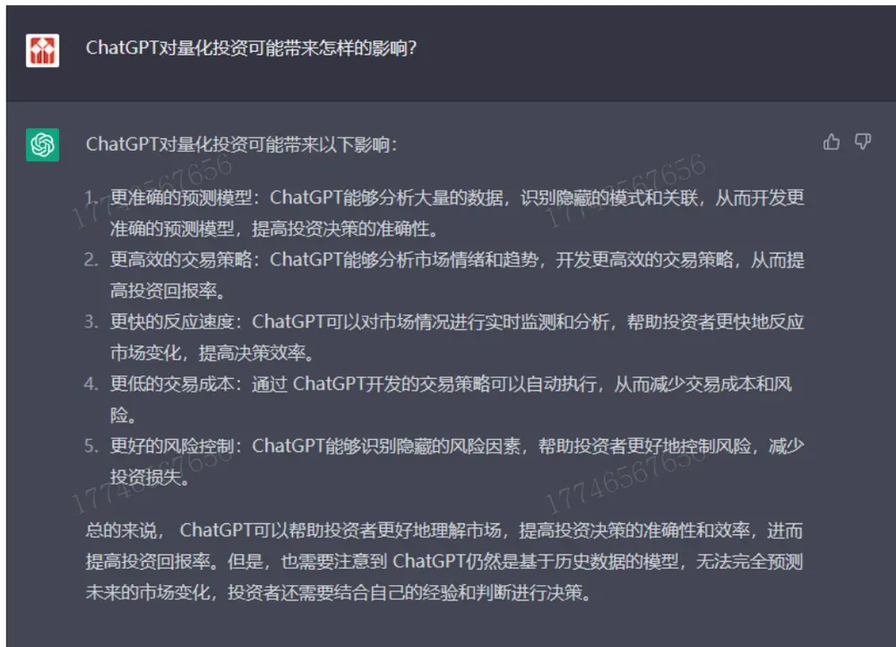
资料来源：ChatGPT，华泰研究

ChatGPT 列举出了五点其对量化投资的影响，一如 ChatGPT 在其他领域的部分回答中带给人的感受一样，似乎条理清晰，但却言之无物、过于宽泛。针对其中的每一点，我们希望 ChatGPT 能够给出更加详细的解释，因此我们继续提问：

图表21： ChatGPT回答：能否针对上述影响展开说明？
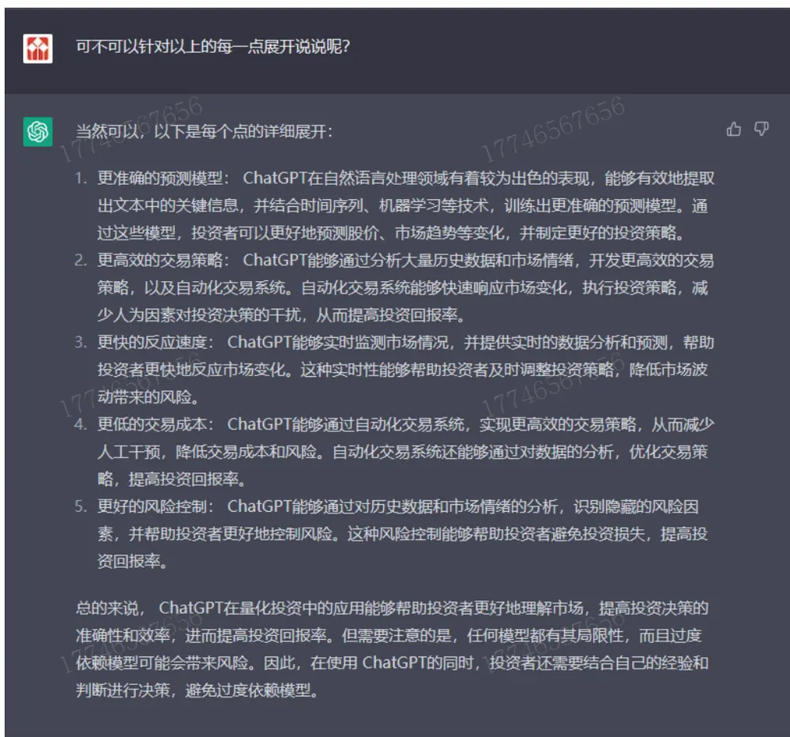
资料来源：ChatGPT，华泰研究

ChatGPT 进一步的解释说明并未跳脱以自我为中心的范畴，且上述回答不免让人感到ChatGPT 仍旧有些泛泛而谈，并未达到我们对其原有的想象和期待。ChatGPT 从训练语料中似乎学习到了量化投资的关键概念，甚至于饱含“合规意识”地在最后给出了风险提示，但对于从业者更想获知的切中肯綮的应用细节却闭口不谈。

综合来说，ChatGPT 对自己的认知虽然有限但也颇为清晰，也确实从自身应用的角度给出了一些具有参考意义的观点。但我们认为上述回答的认知仍然不够深刻与全面，就如同人类语言诞生之初，某个原始人类的喉部发出某个音节，可以被解读为生物学上一种全新物种的诞生，但却难以想象到后世千万年语言所交织起的灿烂人类文明才是其更深远的意义所在，我们认为 ChatGPT 对量化投资所带来的影响也必不止于此。对此我们尝试进行一些补充和讨论。

## ChatGPT所生成的海量文本是柄双刃剑

ChatGPT 的核心竞争力之一在于它的文本生成功能，目前已经有海外机构利用 ChatGPT编写新闻稿的案例，因此用 ChatGPT 生成财经新闻、财经论坛问答乃至于卖方分析师用它来写投资报告或也只不过是时间问题。ChatGPT 在部分场景下生成的文本在语义和逻辑上做到了和人类近乎一致，这种以假乱真的能力或将彻底改变传统资讯行业。

我们进行如下新闻文本生成实验。首先请读者阅读下面的两篇财经新闻快讯，内容主要与2023 年 2 月 13 日我国股市的融资买入情况相关。

图表22： ChatGPT伪造财经新闻：孰真孰假？
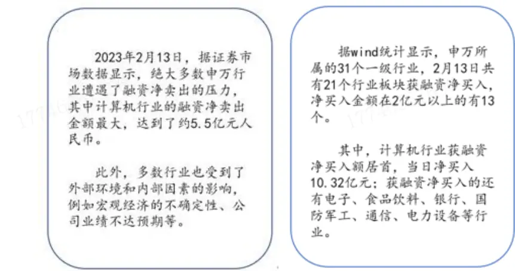
资料来源：证券时报，ChatGPT，华泰研究

以上两篇快讯中，一篇来自于证券时报网 2 月 14 日的报道，另一篇则由 ChatGPT 自主生成，各位读者能否分辨其中的真假？虽然略加思考后我们可以得出正确的答案，但随意浏览的情况下实难做出准确的判断，而浏览新闻时大部分情况下我们并不会刻意去辨别新闻真假与否。遑论目前可得的还只是初代 ChatGPT 模型，犹如 AlphaGO 问世之初，李世石尚有一战之力，而版本迭代后的 AlphaGO 以“大师（Master）”之名屠戮围棋高手以后，人类是否还能望其项背？或许不久以后的 ChatGPT 迭代版本也将上演重复的戏码。

上述问题的正确答案是，第二篇报道是证券时报所写，而第一篇是在和 ChatGPT 对话中加入部分关键字引导生成的结果。在可预见的未来，当ChatGPT大量渗透传统资讯行业以后，新闻信息的真实性再也无从保证，文本数据的增长速度和增长量或将超乎想象。这种海量的文本对量化投资研究来说，风险与机遇同在。

## 利好在于可供学习的样本量增加

数据量和数据不平衡度是制约机器学习模型训练和预测准确度的关键因素。下图展示了数据量及数据不平衡度对于不同机器学习模型的分类准确度的影响，其中 avNNet 代表神经网络模型。对于模型评价所采用的统计量指标为macro −F（该指标数值越大表示模型的预测效果越好），该指标的具体计算公式及其他模型名称可参考附录。

图表23： AI 模型受到样本量与样本不平衡度的影响
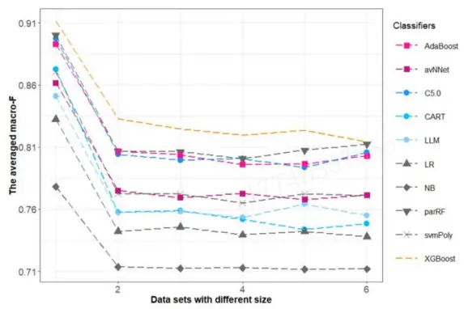

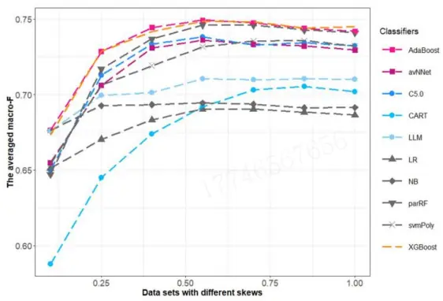
资料来源：The Effects of Class Imbalance and Training Data Size on Classifier Learning: An Empirical Study，华泰研究

该实验基于二分类样本，共有 9 个不同的数据集，涵盖气候、物理等多个领域，包括图片、文本等多种形式，实验结果具有一定的代表性。对于左图来说，横坐标代表实验轮次，每轮实验用于训练的样本量不断减少；而对于右图来说，横坐标表示正负样本比例，数值越接近于 1表示样本的不平衡度越低。

可以得出的结论是，无论是浅度学习模型还是深度学习模型，分类的准确度都与样本量成正比、与样本的不平衡度成反比。类比至量化投资领域，未来 ChatGPT 生成的海量财经新闻类文本或也将助力文本挖掘类量化交易策略的训练，提供更加“另类”的数据。

## 利空在于样本噪音或将大幅提升

数据质量对于数据分析和建模来说都是直接影响最终投资决策的关键性因素。下图展示了训练集和测试集样本数据质量对于神经网络模型最终预测准确度的影响，其中 MAPE（Mean Absolute Percent Error）作为模型的评价指标；Fraction Error 表示对于测试集（或训练集）数据加入干扰的数据比例，而 Amount Error 表示对于干扰数据的干扰幅度。该实验的场景为基金净值的预测，对其他量化投资领域而言，实验结果也具有一定的参考价值。

图表24： 数据质量对神经网络预测准确度的影响
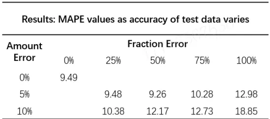

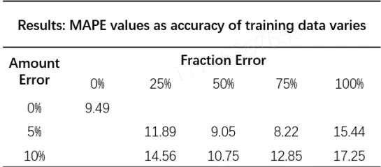
资料来源：Data quality in neural network models:effect of error rate and magnitude of error or predictive accuracy，华泰研究

可以得出的结论是，对于神经网络模型来说，当干扰数据量较少和干扰幅度较弱时（例如Amount Error = 5%，Fraction Error = 50%），模型的泛化能力和鲁棒性会得到一定程度的提高。但是当数据的干扰程度不断增大时，模型的预测准确度发生大幅下降。如果交易对手方或网络中一些不负责任的编辑利用 ChatGPT 生成大量歪曲事实甚至黑白颠倒的文稿，这些良莠不齐的文本或将给文本挖掘相关的策略带来比较严重的影响。

## ChatGPT替代量化研究员：路途还有多遥远？

2023 年 2 月 1 日，ChatGPT 通过了谷歌代码工程师的面试，为本就炙手可热的语言模型继续带来一波讨论热潮。从网络上的众多测试来看，ChatGPT 除了写作能力优秀，其“代码功底”也相当扎实，不仅写代码速度快，而且“精通”各种编程语言。下面我们通过量化投资研究中的两个具体场景，看看 ChatGPT 的表现究竟如何。

## 实验 1：计算夏普比率

利用 ChatGPT 计算夏普比率的指令和生成代码如下图所示：

图表25： ChatGPT回答：夏普比率计算代码
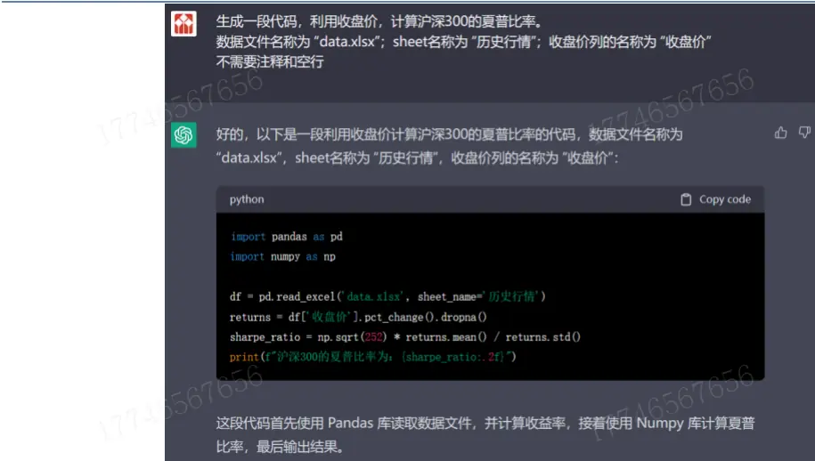
资料来源：ChatGPT，华泰研究

本地运行上述代码能够得到正确的计算结果。但是如果将我们的要求微调，删除数据文件名称或列名，ChatGPT 返回的代码大概率会因为数据结构不匹配而导致报错。由此不难发现一个潜在的隐患——指令的漏洞可能会导致 ChatGPT 生成代码的编译失败。

上述案例中，计算目标和数据较为简单，生成代码前尚且可以穷尽绝大部分可能报错的关键点。但是如果将量化投资研究比喻成乐高模型，计算夏普比率则只是其中的一块积木。因此在更加复杂的情境下，我们继续尝试使用 ChatGPT 生成相关的代码并观测。

## 实验 2：均线择时策略

我们的目标是利用ChatGPT生成均线择时策略的代码并绘制策略净值图像，输入ChatGPT的指令为“还是上述数据和要求，生成均线择时策略的代码，并画图出净值图像，要求使用多个频率的均线窗口，取其中的最优结果”。省略模块导入和图像生成等环节，仅截取核心计算代码如下所示：

图表26： ChatGPT回答：均线择时策略代码
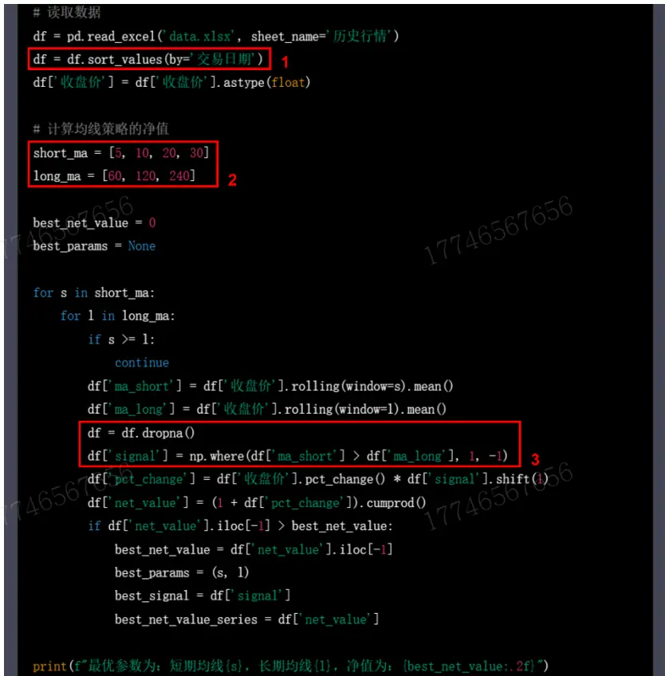
资料来源：ChatGPT，华泰研究

此次实验 ChatGPT 生成的代码并没有成功运行，其中有三处错误导致编译失败，如上图中标记所示，每处标记的错误原因为：

1. ChatGPT 无法根据列名自动识别日期，需要在指令中明确日期序列的列名。

2.ChatGPT 无法根据给定序列长度自动选择长短均线的参数。该实验数据中仅有 242 个交易日。长均线的参数过大时，不仅结果没有太大价值，而且为后续编译失败埋下了隐患。

3. ChatGPT 对代码的感知相对有限，此处错误也是编译失败的主要原因。计算移动平均值时，ChatGPT 将计算结果保存在变量“df”中，当临时变量“s = 5，l = 240”时，长期移动平均值前 239 行没有计算结果。因此对“df”使用 dropna 会导致其删除前239 行的数据，后续计算无法进行因而报错。

代码的严谨性与 ChatGPT 所带来的人机交互体验形成一种天然的对抗。通过上述两个实验不难发现，如果可以发出相对准确的指令，ChatGPT 具有向“量化研究员”发展的潜力。但一段代码中的错误往往出人意料，因此指令大多也难以达到 ChatGPT 的要求。如果为了ChatGPT 能够生成准确的代码而对指令形成一种范式，对于当前的使用体验无疑是一定程度上的人为降格。

另一方面，以上两个实验的代码量相对较少，而利用机器学习模型或深度学习模型进行量化研究时，代码量会是现在的数倍，届时 ChatGPT 生成的代码如果报错，进行人工修正所耗费的时间成本则与使用 ChatGPT 的初衷相悖。

目前而言，ChatGPT 与合格的“量化研究员”尚有差距，但仿佛可见曙光。如果将来 ChatGPT对于生成的代码能够实现后台运行和自主纠错，在此基础上配合数据平台的数据支持，将数据接口与 ChatGPT 相连接，那么 ChatGPT 或将可以实现基础量化策略的批量测试和样本外持续跟踪，极大降低量化研究员的人力成本。

## ChatGPT降低量化研究的门槛已经是触手可及的现在

无论是利用它生成代码还是生成文字，ChatGPT 爆红的背后或许并不一定是对传统职业的完全取代，但一定程度上降低了部分行业的准入门槛，对于量化研究来说亦是如此。

首先，犹如 ChatGPT 在“自我拷问”环节所回答的一样，虽然它是一种文本生成模型，但依附于底层的深度学习网络，其对文本语言拥有的强大理解力和判断力，这种能力或将降低文本挖掘类量化交易策略的研发成本。研究人员无需再耗费大量资源和精力训练自己的NLP大模型，而只需要通过特定的接口使用 ChatGPT，通过问答的模式对感兴趣的文本进行情感判别，乃至告别以往的本地化微调模式。

其次 ChatGPT 具有成为第三代搜索引擎的潜力，其所达到的资源整合效果是前所未有的。例如当我们需要了解某个领域的论文时，ChatGPT 可以同时快速地返回多篇相关领域的论文，并且阐述其中每一篇的研究结论，这极大的省去了我们在网站上逐一翻找文献所消耗的时间以及阅读浏览的时间。

实际上微软公司基于 OpenAI 的技术加持，已然在其搜索引擎必应（Bing）中融合了ChatGPT，版本迭代后的 Bing不再是 2.0 时代的搜索引擎，而今搜索、浏览和聊天已然被整合成一种统一的体验。我们不禁想象，未来是否可以拥有基于ChatGPT的金融数据中心，量化研究人员不仅可以快速的获取前沿的知识，也可以简单高效的获取相关的金融数据，且无需通过任何数据接口，只需要和 ChatGPT 对话的形式即可实现。

还有很多其他的应用，例如利用 ChatGPT 进行编程语言的转化，方便编程习惯不同的研究人员之间的协调和沟通；利用 ChatGPT 对因子进行批量的尝试和统计，减少体力型的研究工作等。现在的 ChatGPT 犹如一位天赋异禀的孩童，所有人都在想象着这位孩童长大后可以改变世界，但他究竟是会逐渐走向平庸，还是会满足大家的一切期待，或许只有时间才能给我们答案；但不可否认的是，这位孩童当下所展现出的能力已然锋芒毕露。

Zheng, W. & Jin, M. . (2020). The Effects of Class Imbalance and Training Data Size on Classifier Learning: An Empirical Study. SN Computer Science. 1. 10.1007/s42979-020-0074-0.

Klein, B. D. , & Rossin, D. F. . (2000). Data quality in neural network models: effect of error rate and magnitude of error on predictive accuracy. Omega, 27(5), 569-582.

## 国内如何使用 ChatGPT？

目前 OpenAI 相关服务未向中国开放，国内无法直接使用 ChatGPT，可以通过 BigQuant人工智能量化投资平台免费使用，具体步骤如下。

访问 BigQuant（https://bigquant.com/），点击右上角免费注册，使用微信或手机号注册。

图表27： BigQuant 注册界面

资料来源：BigQuant，华泰研究

登录成功后，点击上方导航栏“编写策略”，依次点击新建-通用策略-空白 Notebook，新建Notebook 调用 ChatGPT。

图表28： BigQuant 新建 Notebook
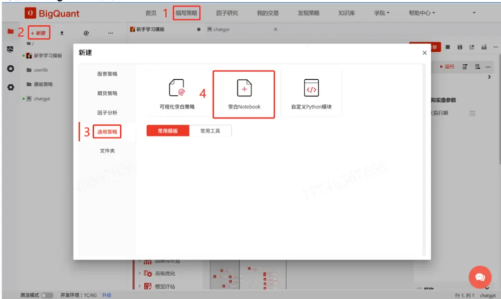
资料来源：BigQuant，华泰研究

打开新建的 Notebook，输入%%BigQuant_ChatGPT，换行输入问题，点击运行返回结果。
运行多个代码段，可实现多轮对话。

图表29： BigQuant 调用 ChatGPT
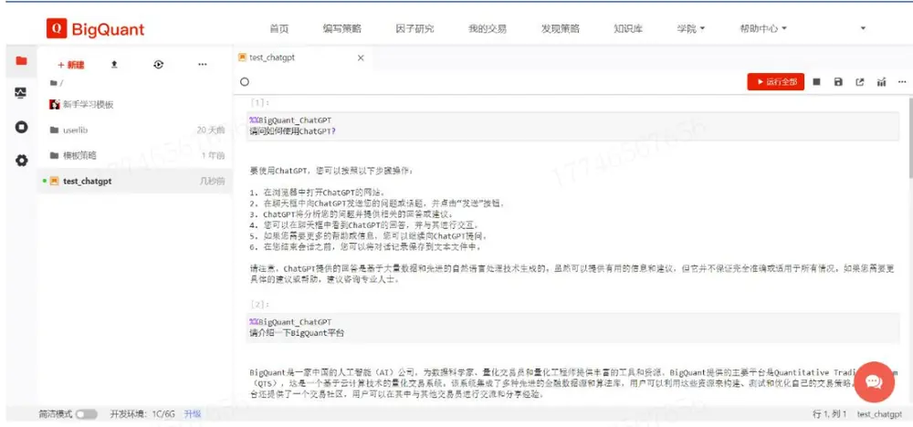
资料来源：BigQuant，华泰研究

## 风险提示

人工智能挖掘市场规律是对历史的总结，市场规律在未来可能失效。人工智能技术存在过拟合风险。深度学习模型受随机数影响较大。

## 附录

1. macro-F的计算公式，对于一个混淆矩阵来说，可以如下定义：

图表30： 混淆矩阵定义

|  | True condition |  |
| --- | --- | --- |
|  | Positive | Negative |
| Predicted condition |  |  |
| Positive | True positive (tp) | False positive (fp) |
| Negative | False negative (fn) | True negative (tn) |

资料来源：华泰研究

于是，macro-F 的计算过程为：

$$
P=\frac{tp}{tp+fp}\Rightarrow P_{macrol}
$$

$$
R={\frac{tp}{tp+fn}}=R_{macrol}
$$

$$
F_{macro}(\beta)=\frac{\left(1+\beta^{2}\right)P_{macro}R_{macro}}{\beta^{2}P_{macro}+R_{macro}}
$$

其中 $\beta$ 为一个固定的参数。

## 2. 模型名称参考表

图表31： 模型含义

| 模型简称 | 含义 |
| --- | --- |
| CART | classification and regression tree |
| C5.0 | C5.0 decision trees and rule-based models |
| parRF | parallel random forest |
| AdaBoost | adaptive boosting |
| XGBoost | extreme gradient boosting |
| avNNet | model averaged neural network |
| NB | naive Bayes |
| LR | logistic regression |
| LLM | logit leaf model |
| svmPoly | support vector machines with polynomial kernel |

资料来源：华泰研究

## 免责声明

## 分析师声明

本人，林晓明、李子钰、何康，兹证明本报告所表达的观点准确地反映了分析师对标的证券或发行人的个人意见；彼以往、现在或未来并无就其研究报告所提供的具体建议或所表迖的意见直接或间接收取任何报酬。

## 一般声明及披露

本报告由华泰证券股份有限公司（已具备中国证监会批准的证券投资咨询业务资格，以下简称“本公司”）制作。本报告所载资料是仅供接收人的严格保密资料。本报告仅供本公司及其客户和其关联机构使用。本公司不因接收人收到本报告而视其为客户。

本报告基于本公司认为可靠的、已公开的信息编制，但本公司及其关联机构(以下统称为“华泰”)对该等信息的准确性及完整性不作任何保证。

本报告所载的意见、评估及预测仅反映报告发布当日的观点和判断。在不同时期，华泰可能会发出与本报告所载意见、评估及预测不一致的研究报告。同时，本报告所指的证券或投资标的的价格、价值及投资收入可能会波动。以往表现并不能指引未来，未来回报并不能得到保证，并存在损失本金的可能。华泰不保证本报告所含信息保持在最新状态。华泰对本报告所含信息可在不发出通知的情形下做出修改，投资者应当自行关注相应的更新或修改。

本公司不是 FINRA 的注册会员，其研究分析师亦没有注册为 FINRA 的研究分析师/不具有 FINRA 分析师的注册资格。

华泰力求报告内容客观、公正，但本报告所载的观点、结论和建议仅供参考，不构成购买或出售所述证券的要约或招揽。该等观点、建议并未考虑到个别投资者的具体投资目的、财务状况以及特定需求，在任何时候均不构成对客户私人投资建议。投资者应当充分考虑自身特定状况，并完整理解和使用本报告内容，不应视本报告为做出投资决策的唯一因素。对依据或者使用本报告所造成的一切后果，华泰及作者均不承担任何法律责任。任何形式的分享证券投资收益或者分担证券投资损失的书面或口头承诺均为无效。

除非另行说明，本报告中所引用的关于业绩的数据代表过往表现，过往的业绩表现不应作为日后回报的预示。华泰不承诺也不保证任何预示的回报会得以实现，分析中所做的预测可能是基于相应的假设，任何假设的变化可能会显著影响所预测的回报。

华泰及作者在自身所知情的范围内，与本报告所指的证券或投资标的不存在法律禁止的利害关系。在法律许可的情况下，华泰可能会持有报告中提到的公司所发行的证券头寸并进行交易，为该公司提供投资银行、财务顾问或者金融产品等相关服务或向该公司招揽业务。

华泰的销售人员、交易人员或其他专业人士可能会依据不同假设和标准、采用不同的分析方法而口头或书面发表与本报告意见及建议不一致的市场评论和/或交易观点。华泰没有将此意见及建议向报告所有接收者进行更新的义务。华泰的资产管理部门、自营部门以及其他投资业务部门可能独立做出与本报告中的意见或建议不一致的投资决策。投资者应当考虑到华泰及/或其相关人员可能存在影响本报告观点客观性的潜在利益冲突。投资者请勿将本报告视为投资或其他决定的唯一信赖依据。有关该方面的具体披露请参照本报告尾部。

本报告并非意图发送、发布给在当地法律或监管规则下不允许向其发送、发布的机构或人员，也并非意图发送、发布给因可得到、使用本报告的行为而使华泰违反或受制于当地法律或监管规则的机构或人员。

本报告版权仅为本公司所有。未经本公司书面许可，任何机构或个人不得以翻版、复制、发表、引用或再次分发他人(无论整份或部分)等任何形式侵犯本公司版权。如征得本公司同意进行引用、刊发的，需在允许的范围内使用，并需在使用前获取独立的法律意见，以确定该引用、刊发符合当地适用法规的要求，同时注明出处为“华泰证券研究所”，且不得对本报告进行任何有悖原意的引用、删节和修改。本公司保留追究相关责任的权利。所有本报告中使用的商标、服务标记及标记均为本公司的商标、服务标记及标记。

## 中国香港

本报告由华泰证券股份有限公司制作,在香港由华泰金融控股（香港）有限公司向符合《证券及期货条例》及其附属法律规定的机构投资者和专业投资者的客户进行分发。华泰金融控股（香港）有限公司受香港证券及期货事务监察委员会监管，是华泰国际金融控股有限公司的全资子公司，后者为华泰证券股份有限公司的全资子公司。在香港获得本报告的人员若有任何有关本报告的问题,请与华泰金融控股（香港）有限公司联系。

## 香港-重要监管披露

- 华泰金融控股（香港）有限公司的雇员或其关联人士没有担任本报告中提及的公司或发行人的高级人员。

- 有关重要的披露信息，请参华泰金融控股（香港）有限公司的网页 https://www.htsc.com.hk/stock_disclosure其他信息请参见下方 “美国-重要监管披露”。

## 美国

在美国本报告由华泰证券（美国）有限公司向符合美国监管规定的机构投资者进行发表与分发。华泰证券（美国）有限公司是美国注册经纪商和美国金融业监管局（FINRA）的注册会员。对于其在美国分发的研究报告，华泰证券（美国）有限公司根据《1934 年证券交易法》（修订版）第 15a-6 条规定以及美国证券交易委员会人员解释，对本研究报告内容负责。华泰证券（美国）有限公司联营公司的分析师不具有美国金融监管（FINRA）分析师的注册资格，可能不属于华泰证券（美国）有限公司的关联人员，因此可能不受 FINRA 关于分析师与标的公司沟通、公开露面和所持交易证券的限制。华泰证券（美国）有限公司是华泰国际金融控股有限公司的全资子公司，后者为华泰证券股份有限公司的全资子公司。任何直接从华泰证券（美国）有限公司收到此报告并希望就本报告所述任何证券进行交易的人士，应通过华泰证券（美国）有限公司进行交易。

## 美国-重要监管披露

- 分析师林晓明、李子钰、何康本人及相关人士并不担任本报告所提及的标的证券或发行人的高级人员、董事或顾问。分析师及相关人士与本报告所提及的标的证券或发行人并无任何相关财务利益。本披露中所提及的“相关人士”包括 FINRA 定义下分析师的家庭成员。分析师根据华泰证券的整体收入和盈利能力获得薪酬，包括源自公司投资银行业务的收入。

华泰证券股份有限公司、其子公司和/或其联营公司, 及/或不时会以自身或代理形式向客户出售及购买华泰证券研究所覆盖公司的证券/衍生工具，包括股票及债券（包括衍生品）华泰证券研究所覆盖公司的证券/衍生工具，包括股票及债券（包括衍生品）。

- 华泰证券股份有限公司、其子公司和/或其联营公司, 及/或其高级管理层、董事和雇员可能会持有本报告中所提到的任何证券（或任何相关投资）头寸，并可能不时进行增持或减持该证券（或投资）。因此，投资者应该意识到可能存在利益冲突。

## 评级说明

投资评级基于分析师对报告发布日后 6 至 12个月内行业或公司回报潜力（含此期间的股息回报）相对基准表现的预期（A 股市场基准为沪深 300 指数，香港市场基准为恒生指数，美国市场基准为标普 500 指数），具体如下：

## 行业评级

增持：预计行业股票指数超越基准

中性：预计行业股票指数基本与基准持平

减持：预计行业股票指数明显弱于基准

## 公司评级

买入：预计股价超越基准 15%以上

增持：预计股价超越基准 5%~15%

持有：预计股价相对基准波动在-15%~5%之间

卖出：预计股价弱于基准 15%以上

暂停评级：已暂停评级、目标价及预测，以遵守适用法规及/或公司政策

无评级：股票不在常规研究覆盖范围内。投资者不应期待华泰提供该等证券及/或公司相关的持续或补充信息

## 法律实体披露

中国：华泰证券股份有限公司具有中国证监会核准的“证券投资咨询”业务资格，经营许可证编号为：91320000704041011J香港：华泰金融控股（香港）有限公司具有香港证监会核准的“就证券提供意见”业务资格，经营许可证编号为：AOK809美国：华泰证券（美国）有限公司为美国金融业监管局（FINRA）成员，具有在美国开展经纪交易商业务的资格，经营业务许可编号为：CRD#:298809/SEC#:8-70231

## 华泰证券股份有限公司

南京南京市建邺区江东中路228号华泰证券广场1号楼/邮政编码：210019

电话：86 25 83389999/传真：86 25 83387521电子邮件：ht-rd@htsc.com

深圳
深圳市福田区益田路5999号基金大厦10楼/邮政编码：518017
电话：86 755 82493932/传真：86 755 82492062
电子邮件：ht-rd@htsc.com

## 华泰金融控股（香港）有限公司

香港中环皇后大道中 99号中环中心 58楼 5808-12室
电话：+852-3658-6000/传真：+852-2169-0770
电子邮件：research@htsc.com
http://www.htsc.com.hk

## 华泰证券（美国）有限公司

美国纽约公园大道 280号 21楼东（纽约 10017）

电话：+212-763-8160/传真：+917-725-9702

电子邮件: Huatai@htsc-us.com

http://www.htsc-us.com

©版权所有2023年华泰证券股份有限公司

北京
北京市西城区太平桥大街丰盛胡同28号太平洋保险大厦A座18层/
邮政编码：100032
电话：86 10 63211166/传真：86 10 63211275
电子邮件：ht-rd@htsc.com
上海
上海市浦东新区东方路18号保利广场E栋23楼/邮政编码：200120
电话：86 21 28972098/传真：86 21 28972068
电子邮件：ht-rd@htsc.com