# 面向投资研究行业的 GPT使用指南

华泰研究

2023 年 4 月 26 日│中国内地

## 深度研究

## 人工智能系列之 66：四则案例展示如何使用 GPT 提升投研效率

人类社会发展的基本规律是先进生产力不断取代落后生产力。如同各行各业正在发生的变革一样，以 GPT 为代表的大语言模型也将重塑投资研究行业。本文通过(1)量化分析、(2)网页抓取、(3)文字摘要、(4)行情复盘四个案例，探讨 GPT 在投资研究中可能的应用场景，展示如何使用 ChatGPT 提升投研效率，并分析 ChatGPT 使用技巧。总的来看，ChatGPT 在代码编写、文本编写这两类任务上表现较好。一方面可以替代日常重复劳动，另一方面能拓展投研人员的能力圈。同时，生成高质量的回答需要提出正确的问题，我们通过实验总结出任务提示 Prompt 的若干经验。

## 代码编写任务经验

(1)ChatGPT 利好有代码基础但不熟练的开发者。可以省去大量网络搜索、查看帮助文档时间，大幅提升编程效率。(2)需要使用者有代码基础。ChatGPT 生成的代码可能有错误，需要人工查错；另外，涉及输入数据、输出结果这些个性化程度较高的环节，人工实现效率可能更高。(3)做优秀的产品经理。项目解耦很重要，ChatGPT 很难一步到位，将项目拆解成独立的子任务，引导 ChatGPT 写函数；明确需求很重要，指定函数的输入、输出变量名和格式。(4)代码出错没关系，可以提供报错信息要求 ChatGPT修改。GPT 支持 4096 个字符的上下文，能够在原有代码基础上修改。

## 文字编写任务经验

(1)文字处理是 ChatGPT 较为擅长的领域。自然语言相比代码冗余度更高，容错率也更高，生成质量整体较好。(2)任务提示 Prompt 应写在开头位置，实验表明当 Prompt写在结尾时，ChatGPT 可能无法正确理解意图。(3)GPT处理上下文字数有限制，需要拆分段落，合理分配每轮对话字数，输入以1000 个左右汉字为宜。(4)对于编写行情复盘这类“半监督式任务”（有往期答案但没有当期答案），可以在 Prompt 中提供少量样例，GPT 支持Few-shot 或 One-shot 学习，基于样例的生成效果相比无样例更好。也不必担心GPT没有学习2021年9月后的数据，新信息同样可作为Prompt提供。

## GPT 助力投资研究案例四则

(1)量化分析。目标：检验 MACD“金叉”“死叉”事件信号对个股收益预测能力。方法：将项目拆解成独立的子任务，引导 ChatGPT 写 Python 函数。(2)网页抓取。目标：程序化抓取东方财富股吧评论。方法：从原型代码出发，逐步添加需求。(3)文字摘要。目标：将约 10000 字的速记稿总结成约2000 字的会议纪要。方法：ChatGPT3.5 仅支持 4096 tokens 的上下文。需将原稿拆成约 1000 字的段落，分别概括大意并输出。(4)行情复盘。目标：基于 A 股市场当日行情数据，编写复盘文字。方法：提供行情数据和复盘样例，采用 One-shot 或 Few-shot 学习，生成质量高。

风险提示：GPT 生成内容不保证真实性。GPT 生成内容具有随机性。人工智能挖掘市场规律是对历史的总结，市场规律在未来可能失效。人工智能技术存在过拟合风险。深度学习模型受随机数影响较大。

研究员

SAC No. S0570516010001

SFC No. BPY421

林晓明

linxiaoming@htsc.com

+(86) 755 8208 0134

研究员

SAC No. S0570520080004

何康，PhD

SFC No. BRB318

hekang@htsc.com

+(86) 21 2897 2039

研究员

SAC No. S0570519110003

SFC No. BRV743

李子钰

liziyu@htsc.com

+(86) 755 2398 7436

## GPT应用于投资研究经验总结

人类社会发展的基本规律是先进生产力不断取代落后生产力。如同各行各业正在发生的变革一样，以 GPT 为代表的大语言模型也将重塑投资研究行业。

本文通过(1)量化分析、(2)网页抓取、(3)文字摘要、(4)行情复盘四则案例，探讨 GPT 在投资研究中可能的应用场景，展示如何使用 ChatGPT 提升投研效率，并分析 ChatGPT 使用技巧。

总的来看，ChatGPT 在代码编写、文本编写这两类任务上表现较好。一方面可以替代日常重复劳动，另一方面能够拓展投研人员的能力圈。例如，主动投研人员希望引入量化分析工具，或者借助网页抓取获取非结构化数据，都可以尝试用 ChatGPT 生成 Excel 公式或Python 等编程语言代码。同时，高质量的回答需要提出正确的问题，我们通过实验总结出任务提示 Prompt 的若干经验。

## 代码编写任务经验：

1. ChatGPT 利好有代码基础但不熟练的开发者。可以省去大量网络搜索、查看帮助文档时间，大幅提升编程效率。

2. 需要使用者有代码基础。ChatGPT 生成的代码可能有错误，需要人工查错；另外涉及输入数据、输出结果这些个性化程度较高的环节，人工实现效率可能更高。

3. 做优秀的产品经理。项目解耦很重要，ChatGPT 很难一步到位，要将项目拆解成独立的子任务，引导 ChatGPT 写函数；明确需求很重要，要指定函数的输入、输出变量名和格式。

4. 代码出错没关系，可以提供报错信息，要求 ChatGPT 修改。GPT 支持 4096 个字符的上下文，能够在原有代码基础上修改。

## 文字编写任务经验：

1. 文字处理是ChatGPT较为擅长的领域。自然语言相比代码冗余度更高，容错率也更高，生成质量整体较好。

2. 任务提示 Prompt 应写在开头位置。实验表明当 Prompt 写在结尾时，ChatGPT 可能无法正确理解意图。

3. GPT 处理上下文字数有限制，需要拆分段落，合理分配每轮对话字数，输入以 1000个左右汉字为宜。

4. 对于编写行情复盘这类“半监督式任务”（有往期答案但没有当期答案），可以在 Prompt中提供少量样例。GPT 支持 Few-shot 或 One-shot 学习，基于样例的生成效果相比无样例更好。也不必担心 GPT 没有学习 2021 年 9 月后的数据，新的信息同样可以作为Prompt 提供给 ChatGPT。

我们让 ChatGPT 总结这两类任务的技巧，如下图所示，和前述经验较为符合，供读者参考。另外要说明的是，尽管本文中的案例均围绕 GPT 展开，随着越来越多大语言模型的开发和上线，或将诞生功能更强、使用更便捷、成本更低的 GPT 替代方案，这也是新生产力取代旧生产力的体现。

图表1： ChatGPT代码编写任务技巧
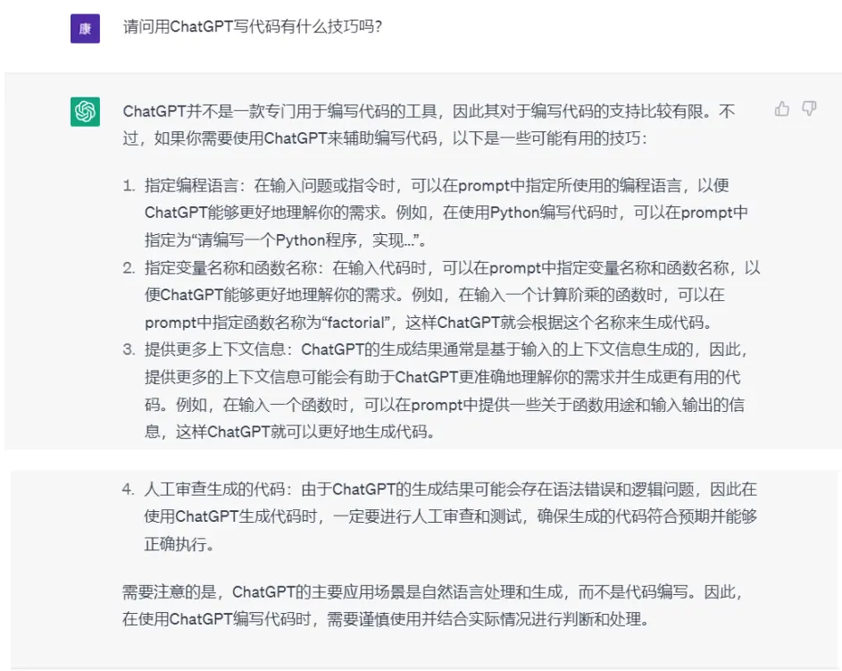
资料来源：ChatGPT，华泰研究

图表2： ChatGPT文字摘要任务技巧
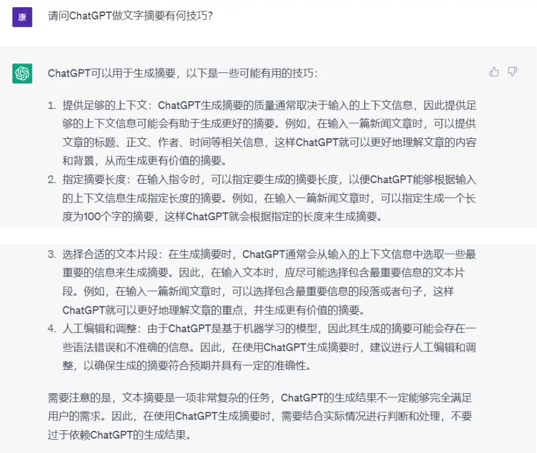
资料来源：ChatGPT，华泰研究

## 案例 1：量化分析

目标：检验 MACD“金叉”“死叉”事件信号对全市场个股收益预测能力。

方法：将项目拆解成独立的子任务，引导 ChatGPT 写 Python 函数。本文全部测试均基于ChatGPT3.5 网页版实现。

MACD 是经典的技术指标。当快线 DIF 自下而上穿过慢线 DEA，此时 MACD 由负转正，这种形态通常称为金叉，为做多信号。反之，当快线 DIF 自上而下穿过慢线 DEA，此时MACD 由正转负，这种形态通常称为死叉，为做空信号。MACD 指标对全市场个股是否具备择时能力？我们将借助 ChatGPT 生成量化分析代码进行检验。

图表3： MACD示意图
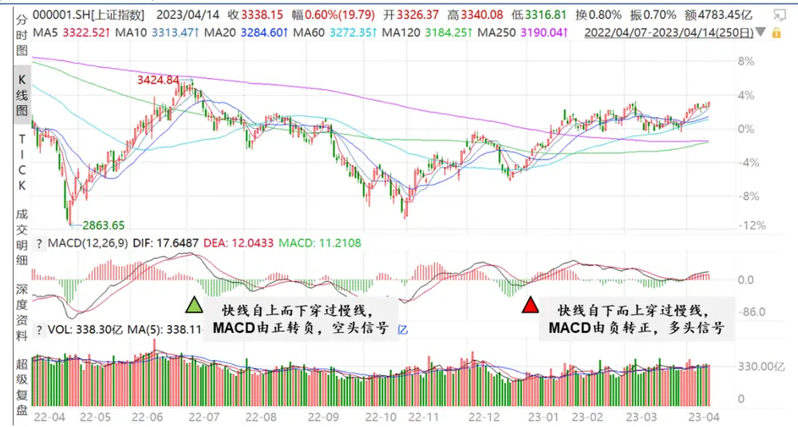
资料来源：Wind，华泰研究

ChatGPT 的工作(1)：计算 MACD。人的提问也称为 Prompt，我们在 Prompt 中明确输入数据变量名、类型和具体定义，并指定生成 Python 代码。

生成代码总体正确，并且包含注释和解读。但 ChatGPT 对输入数据格式理解有误。Prompt中指定输入的收盘价矩阵，index 为股票代码，columns为日期。但代码的输入变量，index为日期，columns 为股票代码。我们认为此处 ChatGPT 的错误完全可以接受，因为 PythonDataFrame 的习惯用法是将 index 定义为时间轴，ChatGPT 学习大量代码语料，生成结果贴近习惯用法。与其改变 ChatGPT，不如改变自己，后文我们将输入数据进行转置调整。

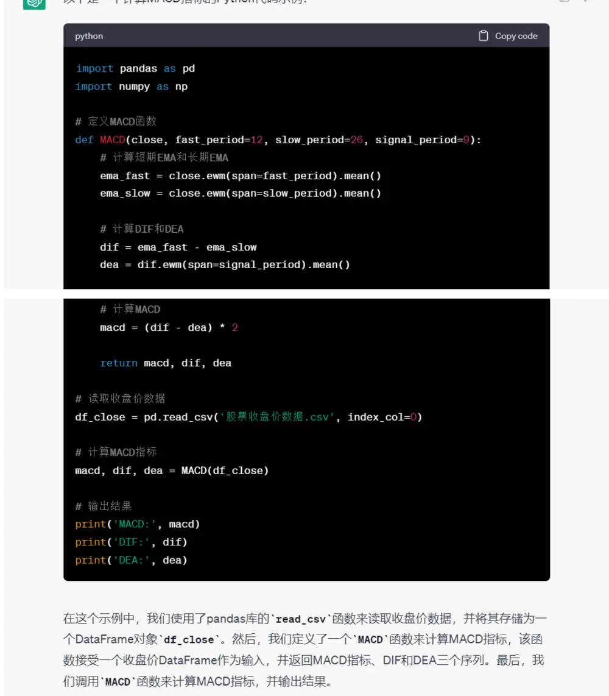
图表4： ChatGPT 的工作(1)：计算 MACD

康假设df_close是pandas.DataFrame格式的股票收盘价矩阵，index是股票代码，columns是日频交易日，请写一段Python代码计算股价的MACD指标。

S以下是一个计算MACD指标的Python代码示例：

资料来源：ChatGPT，华泰研究

ChatGPT 的工作(2)：发“金叉”“死叉”信号。金叉代表 MACD 由负转正，发做多信号；
死叉代表 MACD 由正转负，发做空信号。

生成代码总体正确。唯一的错误是函数内部第一行的 pct_change()应删除。

图表5： ChatGPT的工作(2)：发“金叉”“死叉”信号
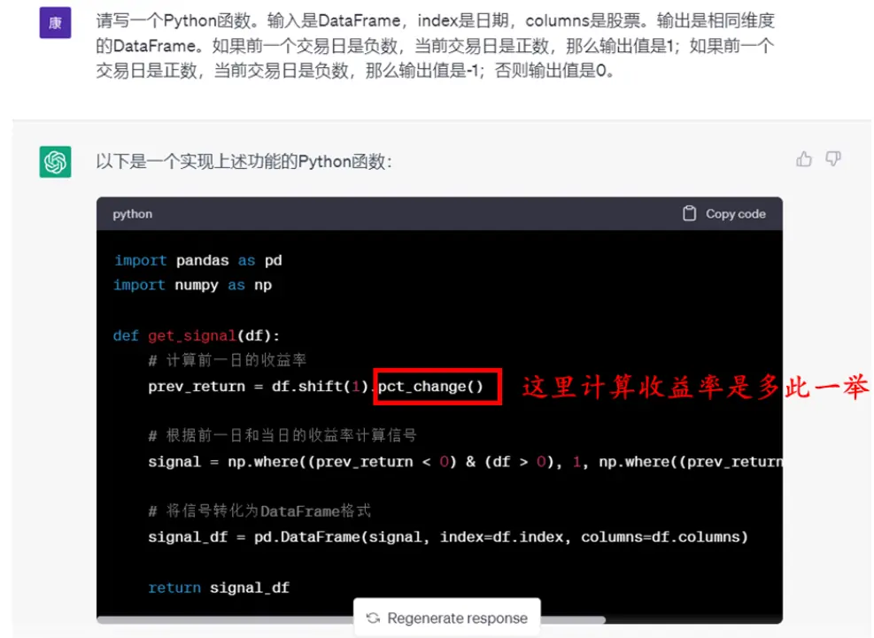
资料来源：ChatGPT，华泰研究

ChatGPT 的工作(3)：计算未来 horizon 个交易日收益率。预测区间长度 horizon 为变量，之后我们将对其进行遍历。

生成代码正确。注意这里我们没有在 Prompt 中指定输入数据的格式，由于 ChatGPT 支持4096 个 token 的上下文，无需铺垫背景也可正常理解人类意图。

图表6： ChatGPT 的工作(3)：计算未来 horizon 个交易日收益率
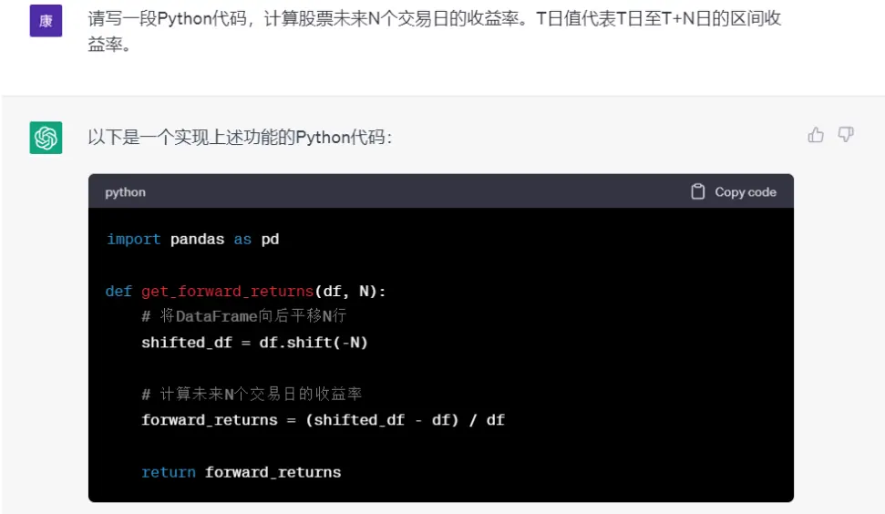
资料来源：ChatGPT，华泰研究

ChatGPT 的工作(4.1)：统计正数和负数数量，计算胜率使用。之后我们将从(3)输出的区间收益率矩阵中，分别根据(2)输出的多空信号，提取做多或做空信号下股票的区间收益率，并统计做多或做空胜率。

生成代码正确。

图表7： ChatGPT的工作(4.1)：统计正数和负数数量，计算胜率使用
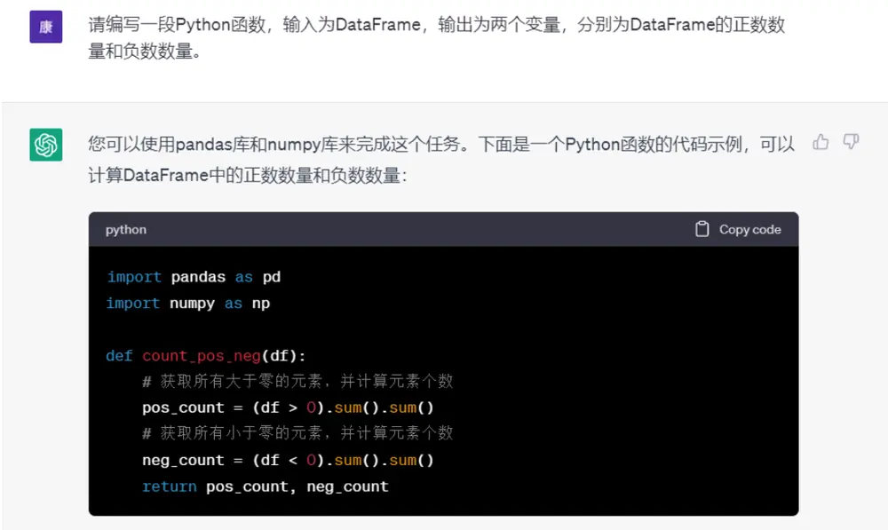
资料来源：ChatGPT，华泰研究

ChatGPT 的工作(4.2)：统计正数和负数均值，计算赔率使用。

生成代码有误。ChatGPT 这里没有考虑缺失值的影响。代码先对单个股票全部日期信号求均值，再对全部股票求均值（column-wise）；实际应对全部信号求均值（element-wise）。当各行列缺失值数量不一致时，原代码会造成较大偏差。

图表8： ChatGPT的工作(4.2)：统计正数和负数均值，计算赔率使用（第一次生成）
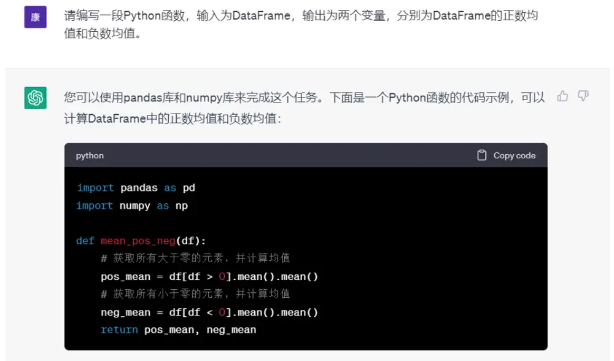
资料来源：ChatGPT，华泰研究

ChatGPT 的工作(4.2)：统计正数和负数均值，计算赔率使用。第二次生成补充要求，考虑各行列缺失值。

生成代码正确。有意思的是我们没有明示 ChatGPT 修改，但 ChatGPT“情商很高”，回答的第一句话表明理解了我们的意图。

图表9： ChatGPT的工作(4.2)：统计正数和负数均值，计算赔率使用（第二次生成）
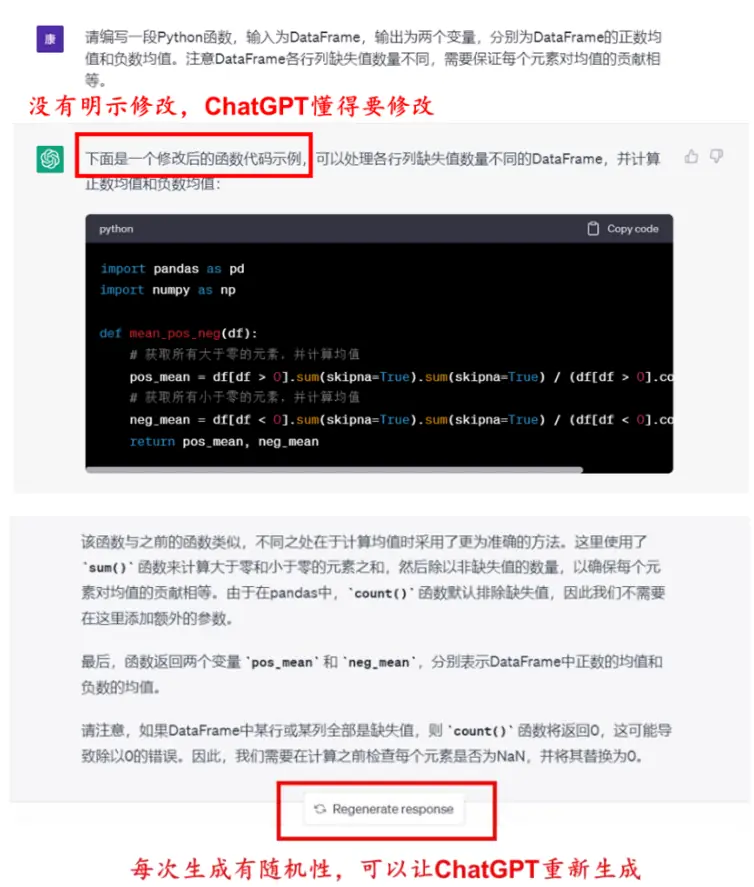
资料来源：ChatGPT，华泰研究

人的工作(1)：输入数据及预处理。ChatGPT 对输入数据的路径、格式没有概念，预处理涉及较多细节，这步交给人来做效率更高。

图表10： 人的工作(1)：输入数据及预处理
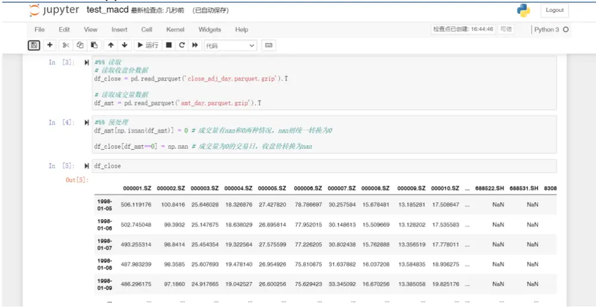
资料来源：ChatGPT，Wind，华泰研究

人的工作(2)：遍历预测区间，调用各函数，汇总结果。

图表11： 人的工作(2)：遍历预测区间，调用各函数，汇总结果
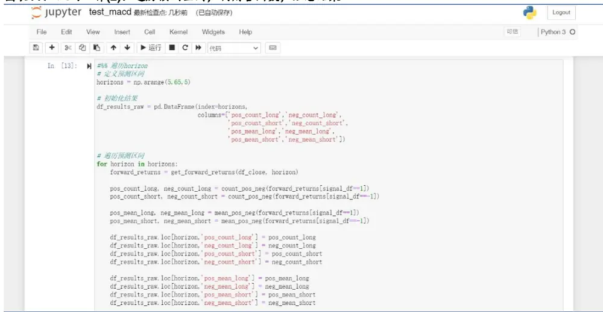
资料来源：ChatGPT，Wind，华泰研究

人的工作(3)：输出结果。和输入类似，ChatGPT 对输出数据的路径、格式没有概念，这步交给人来做效率更高。

图表12： 人的工作(3)：输出结果
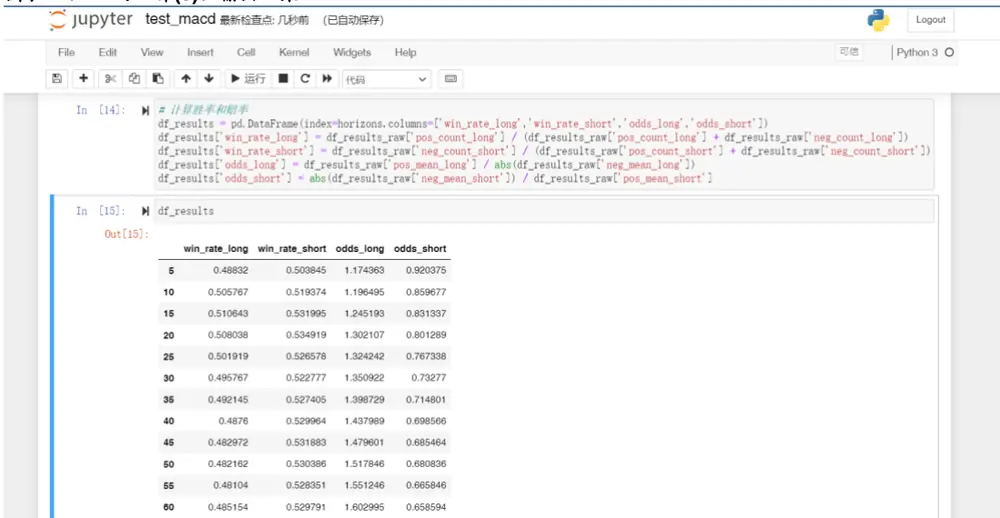
资料来源：ChatGPT，Wind，华泰研究

至此我们完成了对 MACD 个股择时信号的胜率、赔率统计。多、空信号胜率在 50%左右，难言有效。多头胜率低于 50%但赔率相对高，空头胜率高于 50%但赔率相对低。

总的来看，ChatGPT 基本可以胜任这类基础的量化分析代码任务，编程语言也不局限于Python，其他编程语言乃至 Excel公式，都可以尝试交给 ChatGPT 生成。

## 案例 2：网页抓取

目标：程序化抓取东方财富股吧评论。

方法：从原型代码出发，逐步添加需求。

东方财富股吧评论是使用较广泛的另类数据，可以反映短期散户投资者的情绪。通过网页抓取技术得到的文本结合自然语言处理技术，可以进行更为定量的多空情绪识别，是传统财务数据和行情数据的补充。

图表13： 东方财富股吧示意图
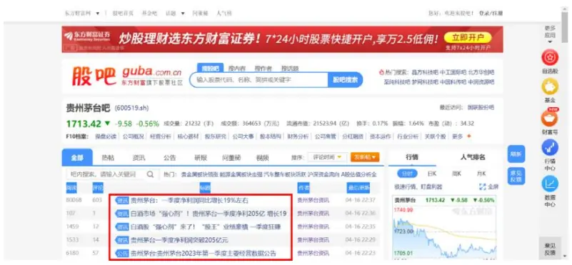
资料来源：东方财富，华泰研究

第 1步：直接提出需求，写一段网页抓取代码，以某上市公司为例。

生成代码正确。东方财富股吧是网页抓取的入门级案例， GPT 的训练语料很可能包含类似代码。ChatGPT 还贴心地给出了风险提示。另外，我们没有给出该上市公司的股票代码，但 ChatGPT 正确回复了 600519，表明中国 A股市场文本也在训练语料中。

图表14： 第 1步：直接提出需求
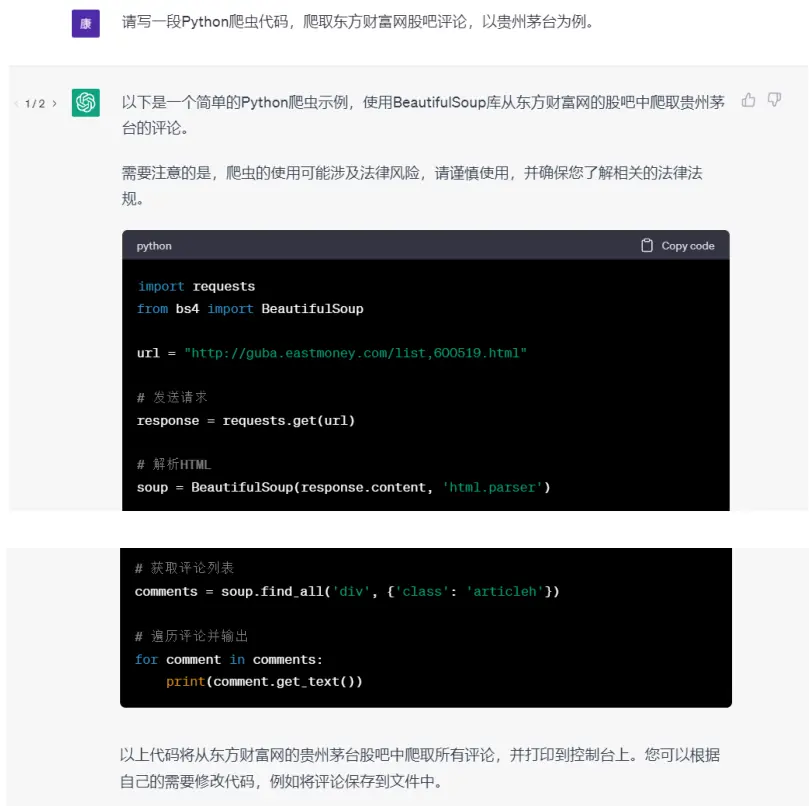
资料来源：ChatGPT，东方财富，华泰研究

第 2步：补充需求，保存为 Excel。

生成代码正确。不足之处是保存的 Excel 中，阅读量、评论数、标题、作者、最后更新时间等字段保存在同一个单元格，我们希望分字段保存在各列。

图表15： 第 2步：补充需求，保存为 Excel
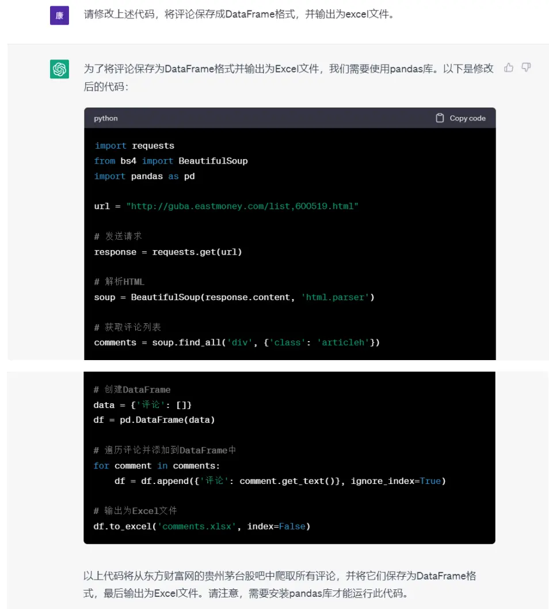
资料来源：ChatGPT，东方财富，华泰研究

图表16： 第 2 步：结果示意图
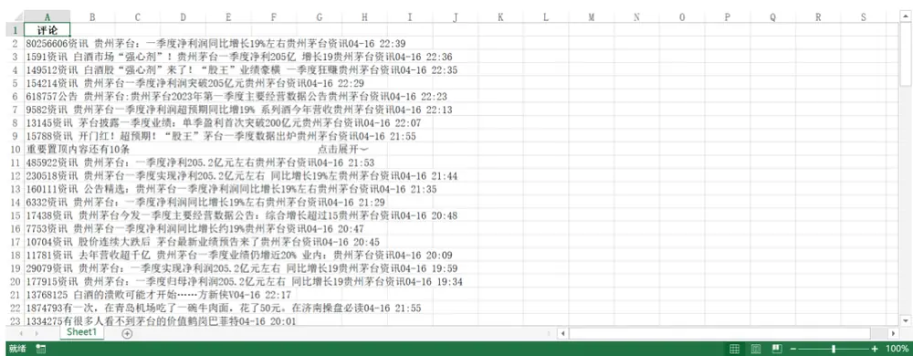
资料来源：东方财富，华泰研究

第 3 步：补充需求，分字段保存。

生成代码有误，直接运行报错 AttributeError: ‘NoneType’ object has no attribute ‘get_text’。

图表17： 第 3步：补充需求，分字段保存
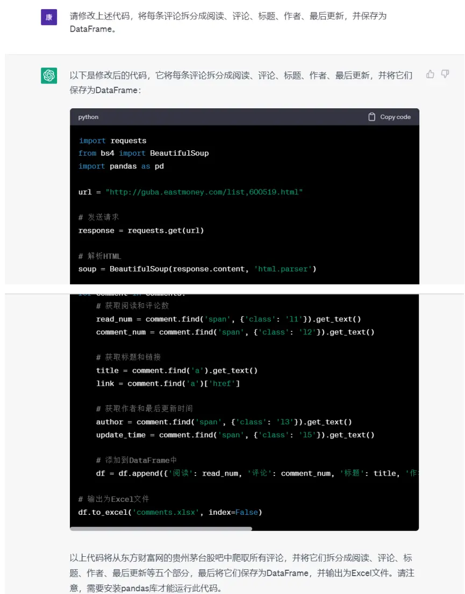
资料来源：ChatGPT，东方财富，华泰研究

图表18： 第 3步：报错信息
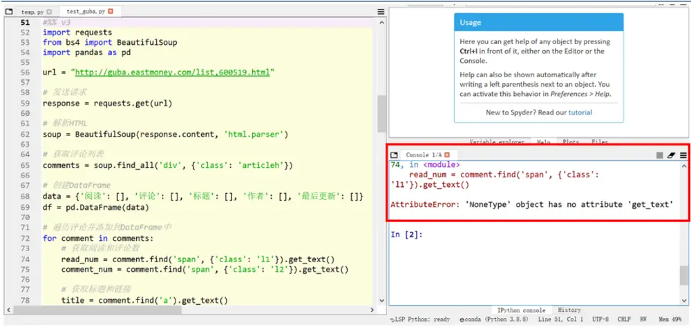
资料来源：ChatGPT，东方财富，华泰研究

第 4 步：补充需求，解决报错。假设我们没有编程经验，不理解报错含义，我们可以直接将 Python 报错信息提交给 ChatGPT。

生成代码正确，实现了分字段保存。Debug 是编程的痛点之一，ChatGPT 似乎也能应对。

图表19： 第 4步：补充需求，解决报错
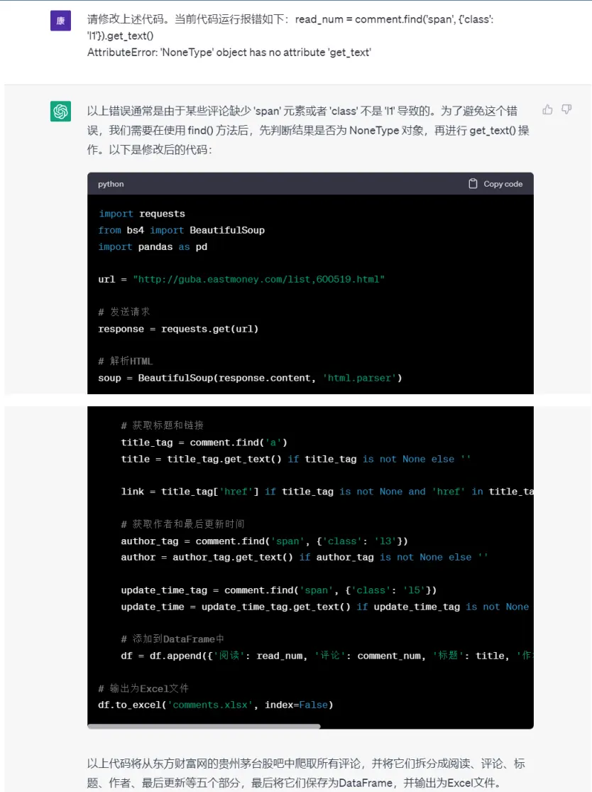
资料来源：ChatGPT，东方财富，华泰研究

图表20： 第 4步：结果示意图

|  | A | B | C | D | E | F | G | H | I | J | K | L | M | N | 0 | P | Q | R | S | ± |
| --- | --- | --- | --- | --- | --- | --- | --- | --- | --- | --- | --- | --- | --- | --- | --- | --- | --- | --- | --- | --- |
| 1 | 阅读 | 评论 | 标题 | 作者最后更新链接 |  |  |  |  |  |  |  |  |  |  |  |  |  |  |  |  |
| 2 81515 |  | 610 | 贵州茅台：资讯 贵州04-1622/news,600519,1298580938.html |  |  |  |  |  |  |  |  |  |  |  |  |  |  |  |  |  |
| 3 511 |  |  | 白酒市场 资讯 白酒04-16 22/news,600519,1298628413.html |  |  |  |  |  |  |  |  |  |  |  |  |  |  |  |  |  |
| 41024 | 6.3 |  | 贵州茅台资讯 贵州04-16 22/news,600519,1298609503.html |  |  |  |  |  |  |  |  |  |  |  |  |  |  |  |  |  |
| 51606 | 15 |  | 贵州茅台资讯 贵州04-1622/news,600519,1298610849.html |  |  |  |  |  |  |  |  |  |  |  |  |  |  |  |  |  |
| 61735 | 15 |  | 白酒股“资讯白酒04-16 22/news,600519,1298621369.html |  |  |  |  |  |  |  |  |  |  |  |  |  |  |  |  |  |
| 76278 |  |  | 贵州茅台公告贵州04-16 22/news,600519,1298580827.html |  |  |  |  |  |  |  |  |  |  |  |  |  |  |  |  |  |
| 81352 |  |  | 茅台披露·资讯 茅台04-16 22/news,600519,1298603271. html |  |  |  |  |  |  |  |  |  |  |  |  |  |  |  |  |  |
| 9 1634 | 5758 |  | 开门红！资讯 开门04-16 21/news,600519,1298611264.html |  |  |  |  |  |  |  |  |  |  |  |  |  |  |  |  |  |
| 10 |  |  |  |  |  |  |  |  |  |  |  |  |  |  |  |  |  |  |  |  |
| 114884 | 22 |  | 贵州茅台：资讯 贵州04-16 21/news,600519,1298583318.html |  |  |  |  |  |  |  |  |  |  |  |  |  |  |  |  |  |
| 122316 | 18 |  | 贵州茅台资讯 贵州04-16 21/news,600519,1298585268.html |  |  |  |  |  |  |  |  |  |  |  |  |  |  |  |  |  |
| 131628 | 11 |  | 公告精选：资讯 公告04-16 21/news,600519,1298595168. html |  |  |  |  |  |  |  |  |  |  |  |  |  |  |  |  |  |
| 14640 | 283419 |  | 贵州茅台：资讯 贵州04-16 21/news,600519,1298606848.html |  |  |  |  |  |  |  |  |  |  |  |  |  |  |  |  |  |
| 151766 |  |  | 贵州茅台资讯 贵州04-16 20/news,600519,1298594006.html |  |  |  |  |  |  |  |  |  |  |  |  |  |  |  |  |  |
| 16779 |  |  | 贵州茅台资讯 贵州04-16 20/news,600519,1298597382.html |  |  |  |  |  |  |  |  |  |  |  |  |  |  |  |  |  |
| 171095 |  |  | 股价连续资讯 股价04-16 20/news,600519,1298600962.html 去年营收资讯 去年04-16 20/news,600519,1298601874.html |  |  |  |  |  |  |  |  |  |  |  |  |  |  |  |  |  |
| 181196 192984 |  |  | 贵州茅台：资讯 贵州04-16 19/news,600519,1298583182.html |  |  |  |  |  |  |  |  |  |  |  |  |  |  |  |  |  |
| 201783 | 15 |  | 贵州茅台：资讯 贵州04-16 19/news,600519,1298582112.html |  |  |  |  |  |  |  |  |  |  |  |  |  |  |  |  |  |
| 2113346 | 75 |  | 有很多人有很多人04-16 22/news,600519,1297709422.html |  |  |  |  |  |  |  |  |  |  |  |  |  |  |  |  |  |

资料来源：东方财富，华泰研究

第 5步：补充需求，抓取多页。原代码只抓取了首页，我们希望抓取前 10 页。

生成代码正确，通过循环实现了分页抓取。

图表21： 第 5步：补充需求，抓取多页
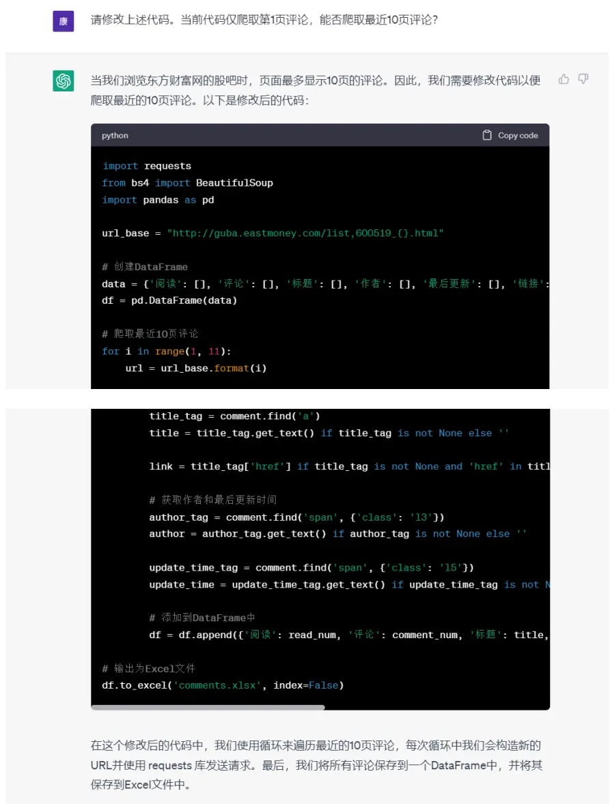
资料来源：ChatGPT，东方财富，华泰研究

图表22： 第 5步：结果示意图

|  | A | B | C | D | E | F | G | H | I | J | K | L | M | N | 0 | P Q | R |  | ± |
| --- | --- | --- | --- | --- | --- | --- | --- | --- | --- | --- | --- | --- | --- | --- | --- | --- | --- | --- | --- |
| 1 | 阅读 | 评论 | 标题 | 作者最后更新链接 |  |  |  |  |  |  |  |  |  |  |  |  |  | S |  |
| 799149 |  |  | 面唱空 |  |  |  | 面唱空04-13 10/news,600519,1297466243.html |  |  |  |  |  |  |  |  |  |  |  |  |
| 800130 |  |  | 个买烧 |  |  |  | 个买烧04-1310/news,600519,1297465760.html |  |  |  |  |  |  |  |  |  |  |  |  |
| 801131 |  |  |  |  |  |  | 跌的扭扭跌的扭扭04-13 10/news,600519,1297465574.html |  |  |  |  |  |  |  |  |  |  |  |  |
| 802306 |  |  | 日本央行日本央行04-1310/news,600519,1297465519.html |  |  |  |  |  |  |  |  |  |  |  |  |  |  |  |  |
| 803155 |  |  | 现在的贵：现在的贵:04-13 10/news,600519,1297464547.html |  |  |  |  |  |  |  |  |  |  |  |  |  |  |  |  |
| 804123 |  |  | 快回归你快回归你\|04-13 10/news,600519,1297463686.html |  |  |  |  |  |  |  |  |  |  |  |  |  |  |  |  |
| 805284 |  |  |  |  |  | 国家发改国家发改04-13 10/news,600519,1297203743.html |  |  |  |  |  |  |  |  |  |  |  |  |  |
| 806112 |  |  |  |  |  | 全国首家全国首家04-13 10//caifuhao.eastmoney.com/news/20230413105519867603710?from=guba&name=6LS15bee6IyF5Y%2bw5ZCn&gubaurl=aHR0cDovL2d1YmEuZWFzdG1v |  |  |  |  |  |  |  |  |  |  |  |  |  |
| 807153 |  |  |  |  |  | $贵州茅台$贵州茅台04-13 10/news,600519,1297461757.html |  |  |  |  |  |  |  |  |  |  |  |  |  |
| 808138 |  |  | 我早知道，我早知道，04-13 10/news,600519,1297442266.html |  |  |  |  |  |  |  |  |  |  |  |  |  |  |  |  |
| 809116 |  | 涨停 | 涨停 |  |  | 04-13 10/news, 600519,1297458524. htm1 |  |  |  |  |  |  |  |  |  |  |  |  |  |
| 810143 |  |  |  |  |  | 下跌中的，下跌中的.04-13 10/news,600519,1297447730.html |  |  |  |  |  |  |  |  |  |  |  |  |  |
| 811142 |  |  |  |  |  | 起来拉指起来拉指04-13 10/news,600519,1297444911.html |  |  |  |  |  |  |  |  |  |  |  |  |  |
| 812146 |  |  |  |  |  |  | 准备买入准备买入04-13 10/news,600519,1297443263.html |  |  |  |  |  |  |  |  |  |  |  |  |
| 813145 814126 | ,0,0,0,0,,2,,,1,,0,,,,0 |  |  |  |  |  | 贵州茅台贵州茅台:04-13 10/news,600519,1297443039.html |  |  |  |  |  |  |  |  |  |  |  |  |
| 8153415 | 18 |  |  |  |  | 买入了51(买入了51(04-1310/news,600519,1297442707.html |  |  |  |  |  |  |  |  |  |  |  |  |  |
| 816362 |  |  |  |  |  |  |  |  |  |  |  |  |  |  | 大家好：大家好：04-13 10//caifuhao.eastmoney.com/news/20230330215344825219200?from=guba&name=6LS15bee6IyF5Y%2bw5ZCn&gubaurl=aHR0cDovL2d1YmEuZWFzdG1v |  |  |  |  |
| 817125 |  |  | 茅台—涨茅台—涨04-13 10/news,600519,1297387623.html |  |  | 京东已经京东已经04-13 10/news,600519,1295841125.html |  |  |  |  |  |  |  |  |  |  |  |  |  |
| 818140 | 4100 |  | 老乡，喝老乡，喝04-1310/news,600519,1297431084.html |  |  |  |  |  |  |  |  |  |  |  |  |  |  |  |  |

资料来源：东方财富，华泰研究

实验 1：抓取 2023 年上市新股的股吧评论（无股票代码）。ChatGPT 的训练数据截至 2021年9月，如果要求ChatGPT抓取2023年上市新股的股吧评论，且不提供股票代码，ChatGPT会如何回应？如下图，ChatGPT 给出的代码是 600733，显然与我们希望抓取的新股代码不匹配。

图表23： 实验 1：抓取 2023年上市新股的股吧评论（无股票代码）
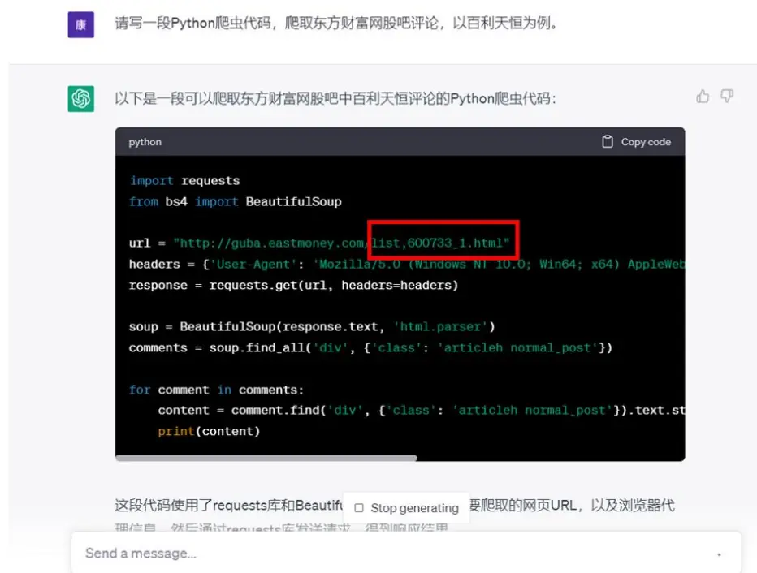
资料来源：ChatGPT，东方财富，华泰研究

实验 2：抓取 2023 年上市新股的股吧评论（含股票代码）。我们在 Prompt 中补充股票代码，ChatGPT 的回应中设置了变量 stock_code 储存股票代码，此时对于任意新股，只要给定股票代码，都可以实现股吧评论抓取。ChatGPT 具备了一定程度的泛化能力。

图表24： 实验 2：抓取 2023年上市新股的股吧评论（含股票代码）
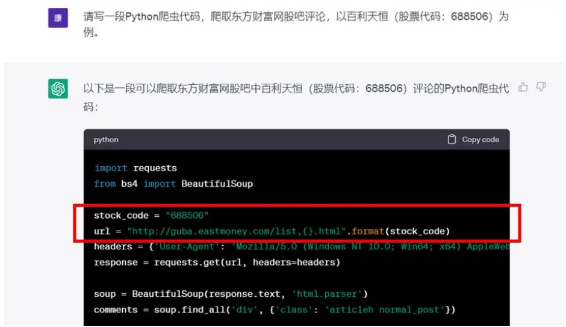
资料来源：ChatGPT，东方财富，华泰研究

总的来看，ChatGPT 可以胜任这类网页抓取任务。东方财富股吧属于入门级别的网页抓取，在网络上有大量案例供 GPT 训练。对于相对小众或者难度较大的网页抓取任务，可能需要更高的 Prompt 技巧。

## 案例 3：文字摘要

目标：将约 10000 字的速记稿总结成约 2000 字的会议纪要。

方法：ChatGPT3.5 仅支持 4096 tokens 的上下文。需将原稿拆成约 1000 字的段落，分别概括大意并输出。

撰写文字摘要、会议纪要、信息整理等是投研人员常规工作，此类任务适合交给 ChatGPT处理。

图表25： 原始速记稿
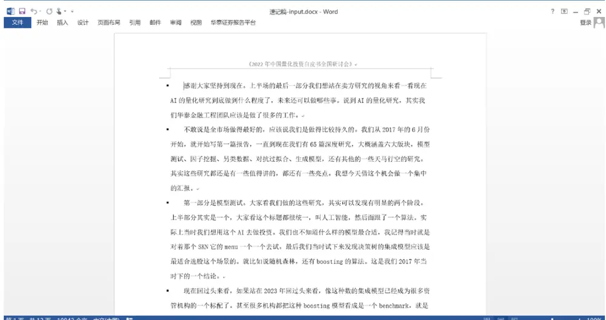
第1页，共12页 10942个字 中文(中国)
-+ 100%
资料来源：2022 年中国量化投资白皮书全国研讨会，华泰研究

我们询问ChatGPT输入和输出字数限制，答复如下图，最大输入/输出长度为2048个字符，即 1024 个汉字。因此需要对原始文本进行合理拆分，每次输入 1000 字左右为宜。

图表26： ChatGPT输入和输出字数限制
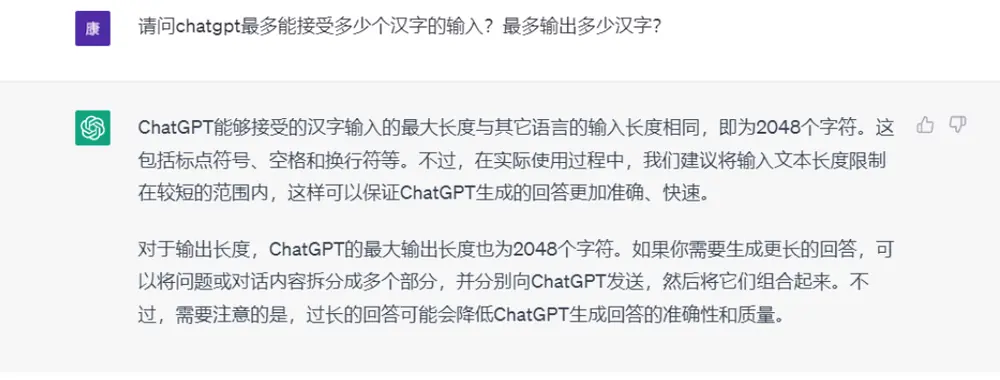
资料来源：ChatGPT，华泰研究

这里又有一个新问题，Prompt（如“请将这段话总结成 100 个左右汉字的中文纪要）应写在提问的开头还是结尾？我们继续询问 ChatGPT，答复如下图，应写在开头。我们在实验中也发现，当 Prompt 写在结尾时，ChatGPT 可能无法正确领会意图，将摘要任务理解成翻译任务。

图表27： ChatGPT Prompt 位置
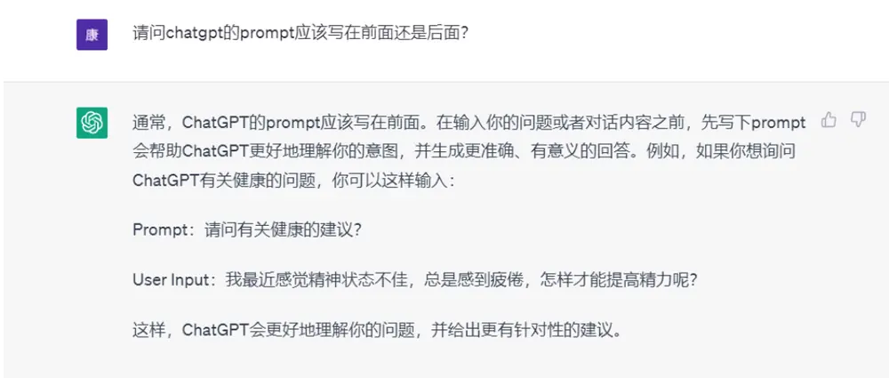
资料来源：ChatGPT，华泰研究

以下两张图展示拆分后的输入和输出。总的看，摘要正确概括了原文内容。文字处理是ChatGPT 较为擅长的领域。自然语言相比代码冗余度更高，容错率也更高，生成质量整体较好。

图表28： ChatGPT 总结会议纪要(1)
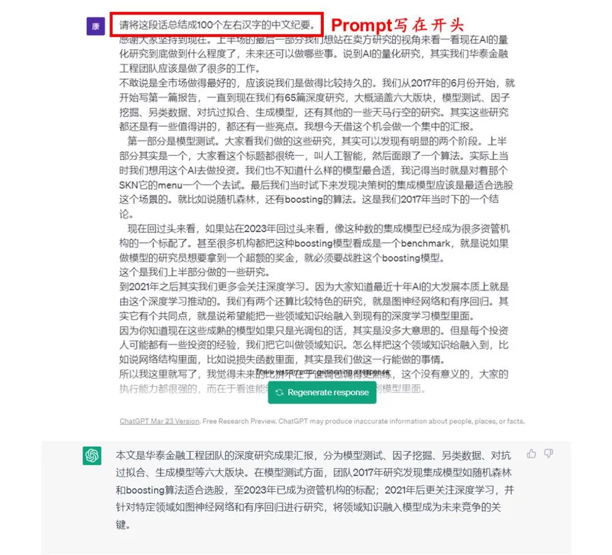
资料来源：ChatGPT，2022 年中国量化投资白皮书全国研讨会，华泰研究

图表29： ChatGPT 总结会议纪要(2)

## 康请将这段话总结成200个左右汉字的中文纪要。

第三部分是大模型给我们的启示。最近大模型也讨论的特别多。我也随便想了几个方向，不一定对。第一个就是多目标学习。以往我们做模型的时候其实是让同一个模型只能预测一个target、一个label，你只能做一件事。其实就好比小朋友脑容量有限，但是当我把这个模型扩大之后，脑容量提升之后，他其实就可以让一个模型去做不同的任务。

比如说右上角这个图，我们就举了一个例子。比如说我是同一个网络，我的主任务还是去做一个偏短期的预测，比如说预测未来10天的收益率，但是我还可以同时设置一些辅助任务，右边这一支，我可以让它同时去预测更长的未来20天的收益。大家想，我在看更长的，你看得更远，反而会有助于你走好眼前的路。所以这个其实就是多任务学习的一个范式

其实微软亚洲研究院在2021年也做过一个比较类似的研究，叫TCTS模型，我不展开讲了。当然它一定不是用上面这个结构，但还是有异曲同工之妙。本质上是多个label的一个学习。除了多任务学习之外，其实还有一个方向就是多模态学习。这个最近大家讨论得比较多。如果这个模型足够大，你可以让它接受不同形式的信息，比如说截面数据、时序数据，其至于图像数据，这个未来可能也是可以尝试的。

最后就是生成模型。我原来准备演讲的时候还做了一个小实验，就是我用了一个madejourney的开源版本open journey。我让它生成一个量化投资的现在和未来，我让它去生成一下，大家可以猜一下它生成什么样子，就这四个图。左上角好像是有这个货币，有这个纸币，然后纠结在一起，进入一个异世界。右上角这个图中间有一个，好像有点像白化的大猩猩，是不是它想说的是人性一直没有变。

左下角是一个有点邪恶的老头。右下角是一个时钟。我猜它想表达的就是当下和未来的意思。所以你看到，其实AI技术在生成图片上面已经可以做得很好，而且它很有创意。我觉得在投资里面可能大家现在用得还不多。因为这些AI机器背后的模型就是Diffusion，所以扩散模型我觉得也是未来我们可以尝试的一个方向。

最后就是GPT。GPT呢，我们觉得长期来看一定会重塑整个行业的。你往小了说，一些基础的代码就可以让这个GPT做，替代很多基础研究员的工作8sp更长远来看，我觉得它本质上最重要的是一个大模型的涌现。模型有限的事情，但是你模型一大，Regenerate response

最后总结一下，我觉得我们现在面临的是一个激动人心的时代。我们做卖方研究也很想继续为这个行业做出来一些贡献。就到这里，谢谢大家。

S这段话讲述了大模型给量化投资领域带来的启示。首先，多目标学习是一个重要的方向，可以让同一个模型同时处理多个任务，例如预测未来收益率和其他辅助任务。其次，多模态学习是一个热门的话题，可以让模型处外理不同形式的信息。第三，生成模型已经可以生成高质量的图片，未来可以尝试在投资领域使用。最后，GPT作为一个大模型，将会重塑整个行业，涌现出预期之外的能力，例如推理能力，可以帮助解决量化投资领域的问题。

资料来源：ChatGPT，2022 年中国量化投资白皮书全国研讨会，华泰研究

## 案例 4：行情复盘

目标：基于 A股当日行情数据，编写复盘文字。

方法：提供行情数据和复盘样例，采用 One-shot 或 Few-shot 学习，生成质量更高。

撰写行情复盘也是投研人员常规工作。此类任务的难点是定性和定量描述相结合，文本需要和数据相匹配。

实验 1：直接提供行情数据。以 2023 年 4月 17 日为例，我们提供沪深两市日内 30 分钟频价格以及日度成交额，在 Prompt 中要求 ChatGPT 写一段中文股评。这里需要注意，尽管ChatGPT 没有学过 2021 年 9 月之后的数据，但可以将新数据在 Prompt 中体现。

图表30： 实验 1：直接提供行情数据（提问）
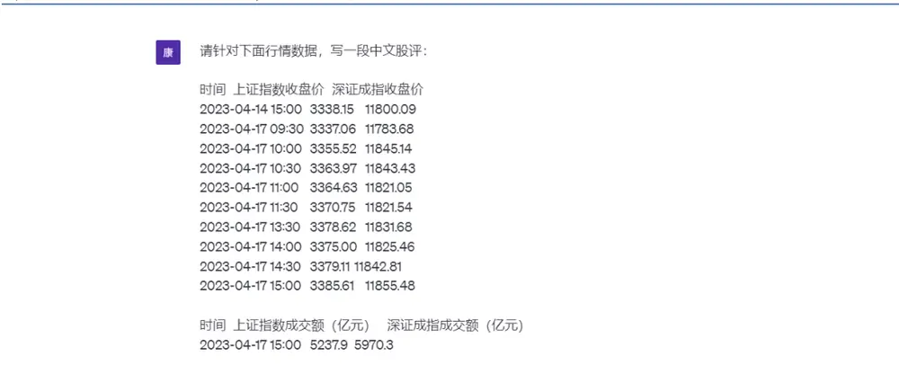
资料来源：ChatGPT，Wind，华泰研究

直接生成质量不佳。从形式角度看尚可；从内容角度看，对日内行情的分析不够，并且杜撰了部分内容。

图表31： 实验 1：直接提供行情数据（回答）
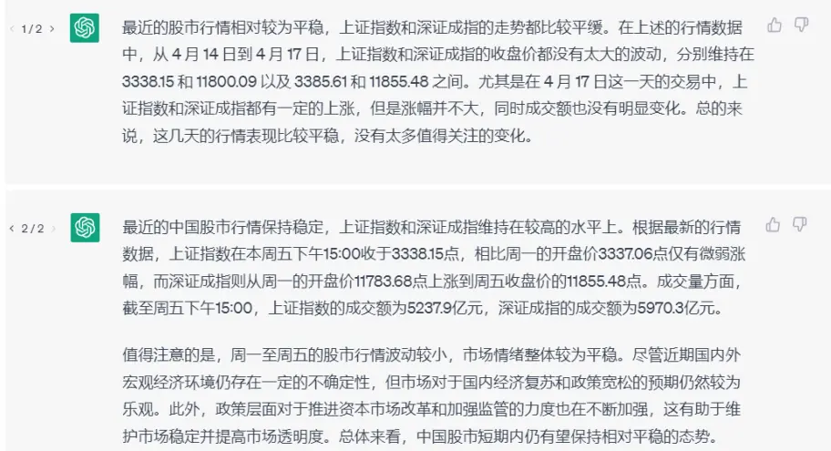
资料来源：ChatGPT，Wind，华泰研究

在 GPT3 论文 Language Models are Few-Shot Learners 中，OpenAI 团队证实 GPT 具有Zero-shot、One-shot 和 Few-shot 学习的能力，基于少数例子甚至完全没有例子，GPT 也能够理解指令实现相应功能。当然从测试表现看，Few-shot 优于 One-shot，One-shot 也优于 Zero-shot。前述实验 1 直接要求写复盘，相当于 Zero-shot 学习，我们可以尝试给出案例再要求写复盘，即采用 One-shot 学习。

图表32： Zero-shot 学习和 One-shot 学习
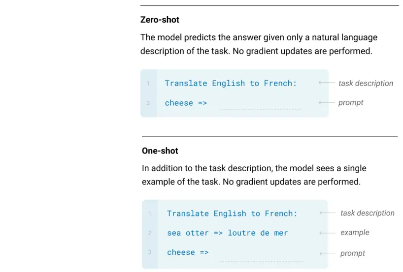
资料来源：Brown 等（2020）Language Models are Few-Shot Learners，华泰研究

实验 2：提供行情数据和复盘样例。我们首先给出 4月 14 日行情数据，并给出人工撰写的4 月 14 日复盘。随后给出 4 月 17 日行情数据，要求 ChatGPT 给出相应复盘。

图表33： 实验 2：提供行情数据和复盘样例（提问）
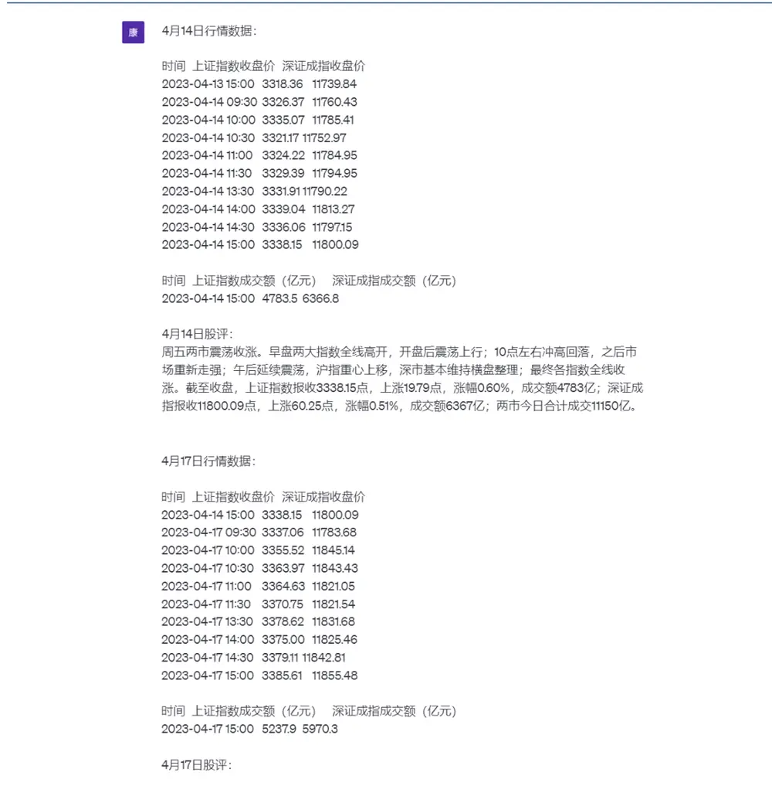
资料来源：ChatGPT，Wind，华泰研究

提供样例后生成质量显著提升，依次描述开盘、上午、午后、收盘行情，最后总结全天价、量情况。两条回答仍有小部分杜撰内容，需要后续少量人工修改，但整体质量在可接受范围。

图表34： 实验 2：提供行情数据和复盘样例（回答）
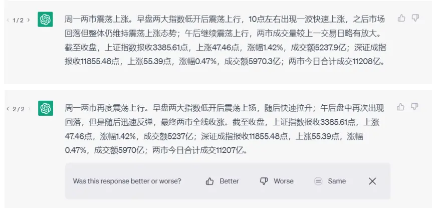
资料来源：ChatGPT，Wind，华泰研究

实验 3：前述实验的数据通过WindAPI 接口下载，可否要求 ChatGPT 编写下载数据代码？我们发现生成代码总体质量不错，但仍需要修改细节方能正确运行。相比前述 MACD 计算和网页抓取，WindAPI 代码更小众，可能在 GPT 训练语料中占比较小，因此生成质量相对差一些。不过对于有一定经验的开发者而言，在此基础上修改并不难。

图表35： 实验 3：编写下载数据代码
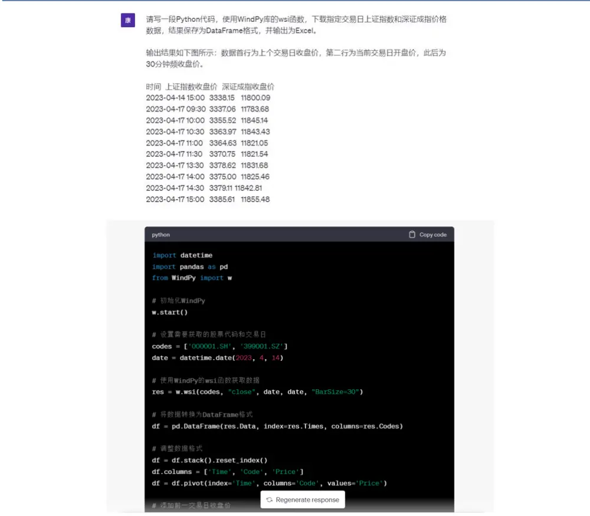
资料来源：ChatGPT，Wind，华泰研究

## 风险提示

GPT 生成内容不保证真实性。GPT 生成内容具有随机性。人工智能挖掘市场规律是对历史的总结，市场规律在未来可能失效。人工智能技术存在过拟合风险。深度学习模型受随机数影响较大。

## 免责声明

## 分析师声明

本人，林晓明、何康、李子钰，兹证明本报告所表达的观点准确地反映了分析师对标的证券或发行人的个人意见；彼以往、现在或未来并无就其研究报告所提供的具体建议或所表迖的意见直接或间接收取任何报酬。

## 一般声明及披露

本报告由华泰证券股份有限公司（已具备中国证监会批准的证券投资咨询业务资格，以下简称“本公司”）制作。本报告所载资料是仅供接收人的严格保密资料。本报告仅供本公司及其客户和其关联机构使用。本公司不因接收人收到本报告而视其为客户。

本报告基于本公司认为可靠的、已公开的信息编制，但本公司及其关联机构(以下统称为“华泰”)对该等信息的准确性及完整性不作任何保证。

本报告所载的意见、评估及预测仅反映报告发布当日的观点和判断。在不同时期，华泰可能会发出与本报告所载意见、评估及预测不一致的研究报告。同时，本报告所指的证券或投资标的的价格、价值及投资收入可能会波动。以往表现并不能指引未来，未来回报并不能得到保证，并存在损失本金的可能。华泰不保证本报告所含信息保持在最新状态。华泰对本报告所含信息可在不发出通知的情形下做出修改，投资者应当自行关注相应的更新或修改。

本公司不是 FINRA 的注册会员，其研究分析师亦没有注册为 FINRA 的研究分析师/不具有 FINRA 分析师的注册资格。

华泰力求报告内容客观、公正，但本报告所载的观点、结论和建议仅供参考，不构成购买或出售所述证券的要约或招揽。该等观点、建议并未考虑到个别投资者的具体投资目的、财务状况以及特定需求，在任何时候均不构成对客户私人投资建议。投资者应当充分考虑自身特定状况，并完整理解和使用本报告内容，不应视本报告为做出投资决策的唯一因素。对依据或者使用本报告所造成的一切后果，华泰及作者均不承担任何法律责任。任何形式的分享证券投资收益或者分担证券投资损失的书面或口头承诺均为无效。

除非另行说明，本报告中所引用的关于业绩的数据代表过往表现，过往的业绩表现不应作为日后回报的预示。华泰不承诺也不保证任何预示的回报会得以实现，分析中所做的预测可能是基于相应的假设，任何假设的变化可能会显著影响所预测的回报。

华泰及作者在自身所知情的范围内，与本报告所指的证券或投资标的不存在法律禁止的利害关系。在法律许可的情况下，华泰可能会持有报告中提到的公司所发行的证券头寸并进行交易，为该公司提供投资银行、财务顾问或者金融产品等相关服务或向该公司招揽业务。

华泰的销售人员、交易人员或其他专业人士可能会依据不同假设和标准、采用不同的分析方法而口头或书面发表与本报告意见及建议不一致的市场评论和/或交易观点。华泰没有将此意见及建议向报告所有接收者进行更新的义务。华泰的资产管理部门、自营部门以及其他投资业务部门可能独立做出与本报告中的意见或建议不一致的投资决策。投资者应当考虑到华泰及/或其相关人员可能存在影响本报告观点客观性的潜在利益冲突。投资者请勿将本报告视为投资或其他决定的唯一信赖依据。有关该方面的具体披露请参照本报告尾部。

本报告并非意图发送、发布给在当地法律或监管规则下不允许向其发送、发布的机构或人员，也并非意图发送、发布给因可得到、使用本报告的行为而使华泰违反或受制于当地法律或监管规则的机构或人员。

本报告版权仅为本公司所有。未经本公司书面许可，任何机构或个人不得以翻版、复制、发表、引用或再次分发他人(无论整份或部分)等任何形式侵犯本公司版权。如征得本公司同意进行引用、刊发的，需在允许的范围内使用，并需在使用前获取独立的法律意见，以确定该引用、刊发符合当地适用法规的要求，同时注明出处为“华泰证券研究所”，且不得对本报告进行任何有悖原意的引用、删节和修改。本公司保留追究相关责任的权利。所有本报告中使用的商标、服务标记及标记均为本公司的商标、服务标记及标记。

## 中国香港

本报告由华泰证券股份有限公司制作,在香港由华泰金融控股（香港）有限公司向符合《证券及期货条例》及其附属法律规定的机构投资者和专业投资者的客户进行分发。华泰金融控股（香港）有限公司受香港证券及期货事务监察委员会监管，是华泰国际金融控股有限公司的全资子公司，后者为华泰证券股份有限公司的全资子公司。在香港获得本报告的人员若有任何有关本报告的问题,请与华泰金融控股（香港）有限公司联系。

## 香港-重要监管披露

- 华泰金融控股（香港）有限公司的雇员或其关联人士没有担任本报告中提及的公司或发行人的高级人员。

- 有关重要的披露信息，请参华泰金融控股（香港）有限公司的网页 https://www.htsc.com.hk/stock_disclosure其他信息请参见下方 “美国-重要监管披露”。

## 美国

在美国本报告由华泰证券（美国）有限公司向符合美国监管规定的机构投资者进行发表与分发。华泰证券（美国）有限公司是美国注册经纪商和美国金融业监管局（FINRA）的注册会员。对于其在美国分发的研究报告，华泰证券（美国）有限公司根据《1934 年证券交易法》（修订版）第 15a-6 条规定以及美国证券交易委员会人员解释，对本研究报告内容负责。华泰证券（美国）有限公司联营公司的分析师不具有美国金融监管（FINRA）分析师的注册资格，可能不属于华泰证券（美国）有限公司的关联人员，因此可能不受 FINRA 关于分析师与标的公司沟通、公开露面和所持交易证券的限制。华泰证券（美国）有限公司是华泰国际金融控股有限公司的全资子公司，后者为华泰证券股份有限公司的全资子公司。任何直接从华泰证券（美国）有限公司收到此报告并希望就本报告所述任何证券进行交易的人士，应通过华泰证券（美国）有限公司进行交易。

## 美国-重要监管披露

- 分析师林晓明、何康、李子钰本人及相关人士并不担任本报告所提及的标的证券或发行人的高级人员、董事或顾问。分析师及相关人士与本报告所提及的标的证券或发行人并无任何相关财务利益。本披露中所提及的“相关人士”包括 FINRA 定义下分析师的家庭成员。分析师根据华泰证券的整体收入和盈利能力获得薪酬，包括源自公司投资银行业务的收入。

华泰证券股份有限公司、其子公司和/或其联营公司, 及/或不时会以自身或代理形式向客户出售及购买华泰证券研究所覆盖公司的证券/衍生工具，包括股票及债券（包括衍生品）华泰证券研究所覆盖公司的证券/衍生工具，包括股票及债券（包括衍生品）。

- 华泰证券股份有限公司、其子公司和/或其联营公司, 及/或其高级管理层、董事和雇员可能会持有本报告中所提到的任何证券（或任何相关投资）头寸，并可能不时进行增持或减持该证券（或投资）。因此，投资者应该意识到可能存在利益冲突。

## 评级说明

投资评级基于分析师对报告发布日后 6 至 12个月内行业或公司回报潜力（含此期间的股息回报）相对基准表现的预期（A 股市场基准为沪深 300 指数，香港市场基准为恒生指数，美国市场基准为标普 500 指数），具体如下：

## 行业评级

增持：预计行业股票指数超越基准

中性：预计行业股票指数基本与基准持平

减持：预计行业股票指数明显弱于基准

## 公司评级

买入：预计股价超越基准 15%以上

增持：预计股价超越基准 5%~15%

持有：预计股价相对基准波动在-15%~5%之间

卖出：预计股价弱于基准 15%以上

暂停评级：已暂停评级、目标价及预测，以遵守适用法规及/或公司政策

无评级：股票不在常规研究覆盖范围内。投资者不应期待华泰提供该等证券及/或公司相关的持续或补充信息

## 法律实体披露

中国：华泰证券股份有限公司具有中国证监会核准的“证券投资咨询”业务资格，经营许可证编号为：91320000704041011J香港：华泰金融控股（香港）有限公司具有香港证监会核准的“就证券提供意见”业务资格，经营许可证编号为：AOK809美国：华泰证券（美国）有限公司为美国金融业监管局（FINRA）成员，具有在美国开展经纪交易商业务的资格，经营业务许可编号为：CRD#:298809/SEC#:8-70231

华泰证券股份有限公司
南京
南京市建邺区江东中路228号华泰证券广场1号楼/邮政编码：210019

电话：86 25 83389999/传真：86 25 83387521电子邮件：ht-rd@htsc.com

深圳
深圳市福田区益田路5999号基金大厦10楼/邮政编码：518017
电话：86 755 82493932/传真：86 755 82492062
电子邮件：ht-rd@htsc.com

## 华泰金融控股（香港）有限公司

香港中环皇后大道中 99号中环中心 58楼 5808-12室
电话：+852-3658-6000/传真：+852-2169-0770
电子邮件：research@htsc.com
http://www.htsc.com.hk

## 华泰证券（美国）有限公司

美国纽约公园大道 280号 21楼东（纽约 10017）
电话：+212-763-8160/传真：+917-725-9702
电子邮件: Huatai@htsc-us.com
http://www.htsc-us.com

©版权所有2023年华泰证券股份有限公司

北京
北京市西城区太平桥大街丰盛胡同28号太平洋保险大厦A座18层/
邮政编码：100032
电话：86 10 63211166/传真：86 10 63211275
电子邮件：ht-rd@htsc.com
上海
上海市浦东新区东方路18号保利广场E栋23楼/邮政编码：200120
电话：86 21 28972098/传真：86 21 28972068
电子邮件：ht-rd@htsc.com