# AI 模型如何一箭多雕：多任务学习

华泰研究

2023 年 5 月 06 日│中国内地

## 深度研究

## 人工智能系列之 67：多任务学习初探

本研究介绍多目标学习基本概念，将多目标学习应用于量化选股场景。采用基础的硬参数共享机制，训练全连接神经网络同时预测未来 10 日和 20 日收益率排序，两项任务的损失函数采用 uncertainty weight 或 dynamicweight average 方式加权。结果表明：多任务学习的合成因子测试和指增组合回测指标均优于单任务学习；模型规模扩大，多任务学习的优势随之扩大；从子任务预测集成模型看，多任务相比单任务学习的优势在时序上较稳定。

## 直观理解多任务学习：“通才”胜过“专才”

传统 AI预测问题对模型的定位是“专才”，每个模型对应唯一的预测目标，执行某项特定功能，这种学习机制称为单任务学习。然而无论人类还是 AI，“通才”更符合人们对智能的期待。例如我们面对人脸可以同时识别性别和年龄，大语言模型既可以对话又可以写代码。多任务学习正是为训练通才这一目标提出的学习机制，每个模型对应多个预测目标，同时学习多项任务。多任务学习机制符合直观理解，例如识别性别和年龄的任务，可能基于相近的脸部特征，可以使用相同网络参数；学习英语的同时学习德语，由于归属相同语系，可能“触类旁通”，学习效率更高。

## 基础概念：两种参数共享架构，有效原因分析，常用损失加权方式

多任务学习利用任务间的关联性，共享信息表征，实现知识迁移，提高泛化能力。有两种常用架构：(1)硬参数共享，各任务底部层共享，顶部层独立；(2)软参数共享，各任务有独立的模型和参数，通过正则化提高参数相似性。多任务学习有效的原因：(1)知识迁移增强特征学习；(2)辅助任务对主任务进行正则化，帮助主任务聚焦于真正重要的特征，减少无关信息干扰；(3)可视作隐式的数据增强，有效增加样本数量，避免过拟合。各任务损失加权方式是决定模型表现的关键因素，常用方法如 uw、dwa、gls、rw等。

## 测试方法：预测 10日和 20日收益率，采用 uw 或 dwa 方式加权

我们在现有周频中证 500 指增模型基础上，引入多任务学习机制，测试改进效果。基线模型为 MLP 网络，特征为常规的基本面和量价因子。多任务学习网络前两层为任务共享层，第三层为任务特异层，采用传统的硬参数共享，使用 uw或 dwa 方式进行损失函数加权。同时设置单任务学习对照组。单任务学习和多任务学习均给出两组收益预测，分别对应未来 10 或 20 个交易日收益率。组合优化采用(1)10 日预测、(2)20 日预测、(3)10 日预测和20 日预测等权集成，分别构建中证 500 指数增强组合。

测试结果：多任务学习优于单任务学习，模型规模较大时优势体现更充分测试结果表明：隐单元数为 256 时，多任务学习的加权 RankIC 均值和信息比率均优于单任务学习，优势既分别体现在 10 日预测和 20 日预测两个子任务上，又体现在两者预测值集成上，集成多任务预测值整体优于单独使用子任务预测值。对比不同隐单元数的模型表现，随着模型规模扩大，多任务相比单任务学习的优势体现更充分，多任务相互兼容或需要以相对大的网络规模为前提。多任务学习中 10 日和 20 日收益率预测两个子任务协同训练，两者相关性较单任务学习更高。

风险提示：人工智能挖掘市场规律是对历史的总结，市场规律在未来可能失效。人工智能技术存在过拟合风险。深度学习模型受随机数影响较大。本文测试的选股模型调仓频率较高，假定以 vwap价格成交，忽略其他交易层面因素影响。

研究员

SAC No. S0570516010001

林晓明

SFC No. BPY421

linxiaoming@htsc.com

+(86) 755 8208 0134

研究员

SAC No. S0570520080004

何康，PhD

SFC No. BRB318

hekang@htsc.com

+(86) 21 2897 2039

研究员

李子钰

SAC No. S0570519110003

SFC No. BRV743

liziyu@htsc.com

+(86) 755 2398 7436

## 多任务学习示意图

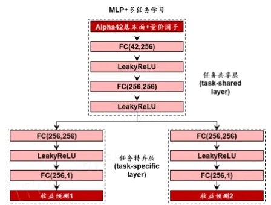
资料来源：华泰研究

## 测试模型加权 RankIC 均值

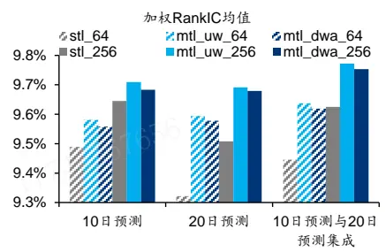
资料来源：朝阳永续，Wind，华泰研究

## 部分测试模型超额收益表现

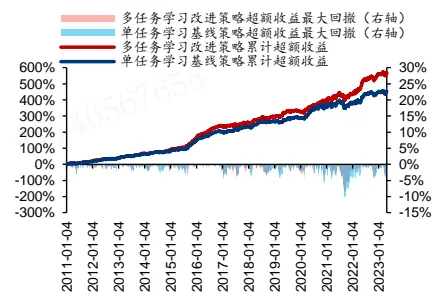
注：回测期 2011-01-04 至 2023-04-28，基准为中证 500资料来源：朝阳永续，Wind，华泰研究

## 导读

传统机器学习预测问题中，我们对模型的定位是“专才”，每个模型对应唯一的预测目标，执行某一项特定功能，这种学习机制称为单任务学习（single-task learning，STL）。然而，无论是人类还是 AI，“通才”更符合人们对智能的期待。例如，我们面对一张人脸可以同时识别性别和年龄，大语言模型既可以对话又可以写代码。如何训练一箭多雕的 AI 模型？

多任务学习（multi-task learning，MTL）正是为训练“通才”这一目标提出的一种学习机制。多任务学习中，每个模型对应多个预测目标，同时学习多项任务。这种学习机制符合人们的直观理解。例如识别性别和年龄的任务，可能基于相近的脸部特征，可以使用相同网络参数；学习英语的同时学习德语，由于归属相同语系，可能“触类旁通”，学习效率更高。

量化选股场景中，常用的预测目标是未来短期收益率。然而，投资组合的表现并非仅仅取决于收益率的预测。华泰金工研报《人工智能 17：人工智能选股之数据标注方法实证》（2019-03-13）提出使用夏普比率、Calmar 比率作为预测目标；《人工智能 60：量化如何追求模糊的正确：有序回归》（2022-10-11）测试分类、回归等预测目标；《人工智能 64：九坤 Kaggle 量化大赛有哪些启示》（2023-01-30）分别以个股收益率、截面收益率排序作为预测目标；不同区间的收益率也可以成为预测目标。

本研究介绍多目标学习基本概念，并将多目标学习应用于量化选股场景。测试采用基础的硬参数共享机制，训练全连接神经网络同时预测未来 10 日和 20 日收益率排序，两项任务的损失函数采用 uncertainty weight 或 dynamic weight average 方式加权。结果表明：多任务学习的合成因子测试和指增组合回测指标均优于单任务学习；模型规模扩大，多任务学习的优势随之扩大；从子任务预测集成模型看，多任务相比单任务学习的优势在时序上较稳定。

图表1： 部分测试模型超额收益表现（回测期 2011-01-04至 2023-04-28，基准为中证 500指数）
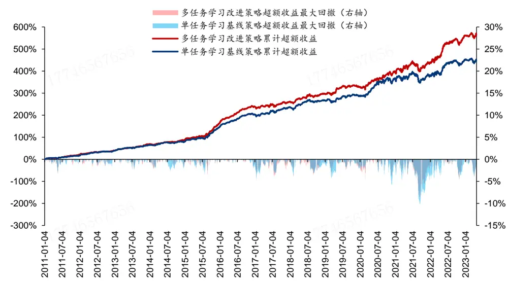
注：单任务学习为 stl_64，使用 10 日预测构建组合，多任务学习为 mtl_dwa_256，使用 10 日与 20 日预测均值构建组合资料来源：朝阳永续，Wind，华泰研究

图表2： 部分测试模型回测绩效（回测期 2011-01-04至 2023-04-28，基准为中证 500指数）

|  | 年化收益 年化波动 |  |  |  | Calmar 年化超额 收益率 | 年化跟踪 |  |  | 超额收益 | 超额收益 | 相对基准年化双边 月胜率 | 换手率 |
| --- | --- | --- | --- | --- | --- | --- | --- | --- | --- | --- | --- | --- |
|  |  | 率 | 率 夏普比率 | 最大回撤 |  | 比率 | 误差 信息比率 | 最大回撤 Calmar 比率 |  |  |  |  |
| 基线策略 stl_64 | 17.44% | 26.24% | 0.66 | 48.05% | 0.36 | 15.38% | 6.29% | 2.45 | 10.14% | 1.52 | 77.03% | 16.17 |
| 改进策略 mtl_dwa_256 | 19.46% | 25.95% | 0.75 | 47.72% | 0.41 | 17.27% | 6.23% | 2.77 | 8.61% | 2.01 | 79.05% | 16.14 |

注：单任务学习为 stl_64，使用 10 日预测构建组合，多任务学习为 mtl_dwa_256，使用 10 日与 20 日预测均值构建组合
资料来源：朝阳永续，Wind，华泰研究

## 多任务学习

多任务学习并不是新的机器学习技术。早在 1990 年，Suddarth 和 Kergosien 就提出在主任务外设置提示任务，从而帮助神经网络学习主任务。1997 年，Caruana 在综述中明确了多任务学习的概念，并分析其有效的原因。2017 年，Ruder 在综述中总结了多任务学习在深度学习领域的新进展。

## 多任务学习的概念和优势

传统单任务学习通常只优化一个指标，忽略其他相关任务的信息。多任务学习利用不同任务间的关联性，共享信息表征，实现任务间的知识迁移，提高模型的泛化能力。多任务学习在自然语言处理（Hashimoto 等，2016）、计算机视觉（Abdulnabi 等，2015）和股票预测（Ma和 Tan, 2022）等领域都获得了成功。

深度神经网络中实现多任务学习有两种常用方式：硬参数共享和软参数共享。硬参数共享由 Caruana（1997）提出，在硬参数共享架构中，所有任务共享底部层，不同任务拥有独立的顶部层，通过共享隐藏层减少过拟合风险。软参数共享中，每个任务都有自己的模型和参数，通过对不同模型参数间的距离进行正则化，提高参数相似性。

图表3： 多任务学习的硬参数共享
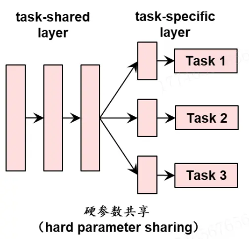
资料来源：华泰研究

图表4： 多任务学习的软参数共享
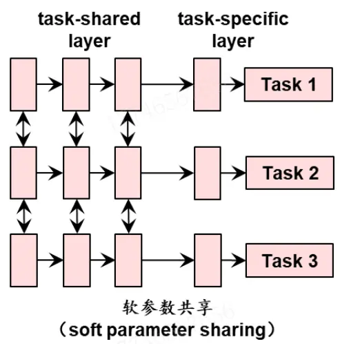
资料来源：华泰研究

多任务学习从以下几个方面提高原始模型的性能。首先，通过知识迁移增强对特征的学习，多个任务可以共享领域知识，提高模型泛化能力。其次，通过辅助任务对主任务进行正则化，帮助主任务聚焦于真正重要的特征，减少无关信息干扰，降低过拟合风险。再次，多任务学习可以视作隐式的数据增强，能够有效增加样本数量，避免过拟合。

## 多任务学习的损失加权方式

多任务学习中各任务损失函数加权方式是决定模型表现的关键因素。我们梳理常用的加权方式如下。

Kendall 等（2017）（uncertainty weight，UW）：利用各任务的不确定性作为权重。以双任务学习为例，损失函数中的 $\sigma_{1}\hbar\pmb{\sigma}_{2}$ 分别代表两项任务的不确定性， $\mathcal{L}_{1}(W)\dot{\ast}\ast\mathcal{\perp}_{2}(W)$ 分别代表两项任务的损失函数。任务的不确定性越大，其损失函数对模型更新的贡献就越小。具体实现时，不确定性 ${\boldsymbol{\sigma}}_{1}{\ \hbar}{\boldsymbol{\sigma}}_{2}$ 设为可更新的参数，直接由神经网络学习。

$$
{\mathcal{L}}(W,\sigma_{1},\sigma_{2})={\frac{1}{{2{\sigma_{1}}^{2}}}}{\mathcal{L}}_{1}(W)+{\frac{1}{{2{\sigma_{2}}^{2}}}}{\mathcal{L}}_{2}(W)+\log\sigma_{1}+\log\sigma_{2}
$$

Liu 等（2018）（dynamic weight average，DWA）：使得不同任务的学习速率尽量保持一致。DWA 回溯各任务过去 2 期损失函数值，若 t-1 期相比于 t-2 期升高，则给予该任务更高的权重，促进该任务的学习。

$$
\lambda_{k}(t)=\frac{Kexp\left(\frac{w_{k}(t-1)}{T}\right)}{\sum_{i}exp\left(\frac{w_{k}(t-1)}{T}\right)}
$$

$$
w_{k}(t-1)=\frac{\mathcal{L}_{k}(t-1)}{\mathcal{L}_{k}(t-2)}
$$

Chennupati 等（2019）（geometric loss strategy，GLS）：将各任务损失函数值的几何均值作为总损失。

$$
\mathcal{L}_{Total}=\prod_{i=1}^{n}\sqrt[n]{\mathcal{L}_{i}}
$$

Lin 等（2021）（random weight loss，RW）：直接向不同任务施加总和为 0 的随机权重。

## 多任务学习近期研究进展

硬参数共享和软参数共享是主流的参数共享机制，近年来有学者提出新的多任务学习机制。Misra 等（2016）提出 cross-stitch 网络（十字绣网络），使用线性单元学习每个任务特异性表征的最优组合，本质是通过端到端方式使得网络自动学习需要共享的特征。Yang 和Hospedales（2016）提出张量分解模型，将每层网络参数分解为共享和任务特异性参数。Ruder 等（2017）提出 sluice 网络（水闸网络），糅合硬参数共享和 cross-stitch 等技术，能够学习哪些层和子空间应该共享，以及网络在哪些层学习了合适的输入信息表征。

如何学习任务间的关系也是多任务学习领域的研究热点。Ma 等（2018）提出多门专家混合模型（MMoE），使用门控机制捕捉任务间差异，隐式建模任务关系。注意力机制也被应用于多任务学习。Zhao 等（2019）使用注意力网络静态捕捉任务关系。Ma 和 Tan（2020）提出基于注意力的模型，根据任务关系实现自适应和动态知识迁移。

图表5： cross-stitch 网络
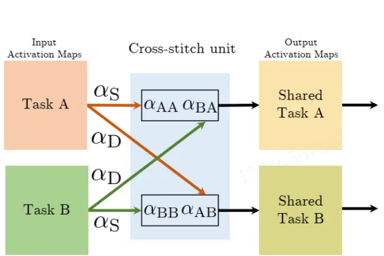
资料来源：Cross-stitch Networks for Multi-task Learning，华泰研究

图表6： 多门专家混合模型
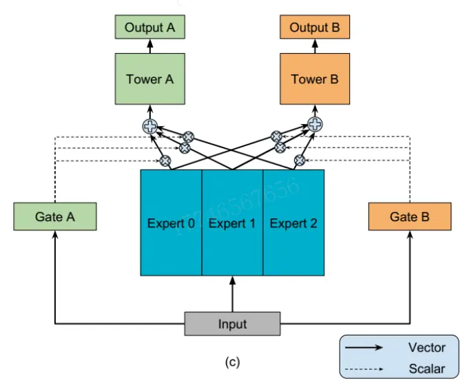
资料来源：Modeling Task Relationships in Multi-task Learning with Multi-gate Mixture-of-Experts，华泰研究

Ma 和 Tan（2022）将多任务学习应用于股票预测问题。传统股票预测中，通常以单只股票收益率为预测目标，这种预测称为 point-wise 预测，此时样本数量等于股票数量与交易日数量的乘积，由于样本量较大学习相对容易。另一类预测任务中，会将单个交易日全体股票收益率排序为预测目标，这种预测称为 list-wise 预测，此时样本数量等于交易日数量，由于样本量较小学习相对困难。Ma 和 Tan提出的多任务股票排序预测网络中，以 list-wise预测为主任务，point-wise 预测为辅助任务，引入注意力层学习任务间关系，实现动态知识迁移。

图表7： 多任务学习应用于股票排序问题
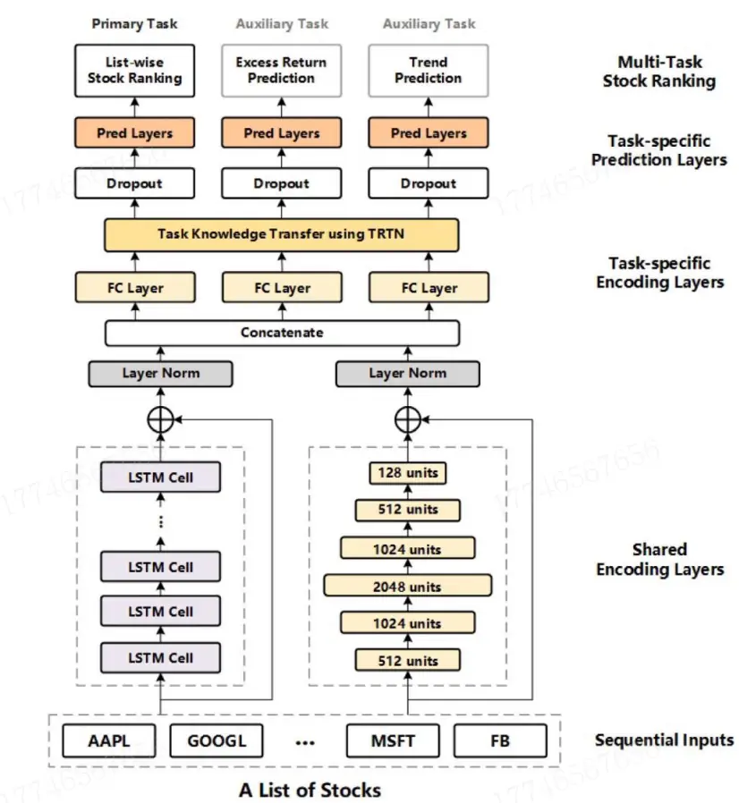
资料来源：Stock Ranking with Multi-Task Learning，华泰研究

## 方法

本研究在现有周频中证 500 指增模型基础上，引入多任务学习机制，测试改进效果。

主要测试模型如下表。其中 stl代表单任务学习，mtl代表多任务学习；64和 256 代表 MLP网络隐单元数；损失函数加权选取 uncertainty weight（uw）和 dynamic weight average（dwa）两种方法。

图表8： 主要测试模型

| 测试模型 | 学习方式 | 隐单元数 | 多任务学习损失函数加权方法 |
| --- | --- | --- | --- |
| stl_64 | 单任务 | 64 | - |
| mtl_uw_64 | 多任务 | 64 | uncertainty weight |
| mtl_dwa_64 | 多任务 | 64 | dynamic weight average |
| stl_256 | 单任务 | 256 | - |
| mtl_uw_256 656765 | 多任务 | 256 656765 | uncertainty weight |
| mtl_dwa_256 | 多任务 | 256 | dynamic weight average |

资料来源：华泰研究

基线模型为全连接神经网络，特征为 42 个常规的基本面和量价因子。标签为未来 10 或 20个交易日收益率在截面上的排序，损失函数为加权 mse，以截面个股收益率排序进行衰减加权。交叉验证方法为单次验证，以 252*6 个交易日为训练集，252*2 个交易日为验证集，252*0.5 个交易日为测试集，相当于约半年滚动训练一次。交叉验证配合早停，仅用于确定模型的迭代次数，其余超参数均为固定值。

模型训练环节，多任务学习采用传统的硬参数共享方式，同时设置单任务学习对照组。MLP网络结构如下图，前两层为任务共享层，第三层为任务特异层。单任务学习和多任务学习均给出两组收益预测，分别对应未来 10 或 20 个交易日收益率。组合优化环节，采用(1)10日预测、(2)20 日预测、(3)10 日预测和 20 日预测集成（等权均值），分别构建中证 500 指数增强组合。每个模型将对应三条回测净值。

图表9： 网络结构（以隐单元数 256为例）
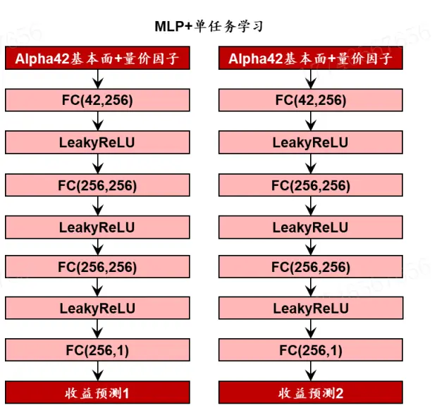
资料来源：华泰研究

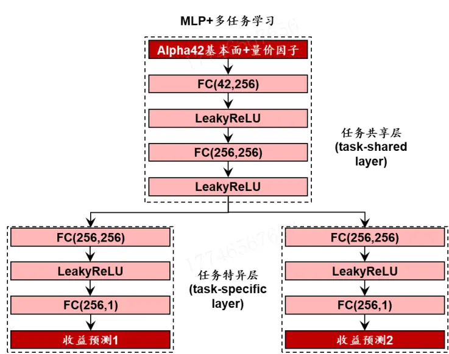

模型构建方法、选股因子如下列图表。具体细节可参考华泰金工研报《人工智能 55：图神经网络选股的进阶之路》（2022-04-11）和《人工智能 64：九坤 Kaggle 量化大赛有哪些启示》（2023-01-30）。

相比过往研报中的模型，我们进行三处改进：

1. 全连接神经网络的隐单元数从 64 扩充到 256。

2. 全连接神经网络的激活函数由 Sigmoid 改为更常用的 LeakyReLU，并删去批标准化层。

3. 随机数种子点由 1 组改为 5组求预测值均值。

图表10： 选股模型构建方法

| 步骤 | 参数 | 参数值 |
| --- | --- | --- |
| 构建股票池 | 股票池 | 全 A 股；剔除上市未满 63 个交易日个股，剔除ST、*ST、退市整理期个股； 每个季末截面期，在未停牌个股中，筛选过去1年日均成交额和日均总市值均排 名前 60%个股 |
| 构建数据集 | 特征 标签 | T 日 42 个基本面和量价因子 (1) T+11 日相对于 T+1 日收盘价收益率 (2) T+21 日相对于 T+1 日收盘价收益率 |
| 因子预处理 | 特征 标签 | 5 倍 MAD 缩尾；zscore 标准化；缺失值填为 0；不做中性化 剔除缺失值；截面排序数标准化 |
| 训练流程 | 测试集完整区间 训练、验证、测试集划分 | 20110104~20230428 训练集252*6个交易日，验证集252*2个交易日，测试集126个交易日； 如第1 期训练集 20020910~20081205，验证集 20081208~20101231，测试集 20110104~20110711; 第 2 期训练集 20030325~20090616，验证集 20090617~20110711，测试集 |
| 设置模型 | 567656 特殊处理 网络结构 隐单元数 损失函数 | 20110712~20120113 剔除训练集、验证集最后10或20个交易日样本，防止信息泄露 全连接神经网络 64 或 256 加权 mse（根据收益率衰减加权） |
| 构建组合 | 学习率 优化器 早停次数 随机数种子点 基准 | 每个交易日的全体股票视作一个 batch 0.0001 adam 20 5 组求均值 中证 500 指数 |
|  |  | 0 |
|  |  | 1 |
|  | 优化目标 | 最大化预期收益 |
|  | 组合仓位 |  |
|  | 个股权重下限 |  |
|  | 个股偏离权重约束 | [-1%, 1%] |
|  | 行业偏离权重约束 | [-1%, 1%] |
|  | 风格偏离标准差约束 | [-1%, 1%] |
|  | 风格因子 | 对数流通市值（预处理：5 倍 MAD 缩尾，zScore 标准化） |
|  | 调仓周期 | 每5个交易日 |
|  | 单次调仓单边换手率上限 | 7656 |
|  |  | 15% |
| 回测 | 成分股权重约束 | 无 |
|  | 单边费率 | 0.002 |
|  | 交易价格 |  |
|  | 特殊处理 | 停牌不买入/卖出；一字板涨停不买入；一字板跌停不卖出；其余可交易股票重新 |
|  |  | vwap |

资料来源：华泰研究

图表11： 选股模型使用的 42个因子

| 类别 | 名称 | 计算方式 |
| --- | --- | --- |
| 估值 | bp_If | 1/市净率 |
|  | ep_ttm | 1/市盈率(TTM) |
|  | ocfp_ttm | 1/净经营性现金流(TTM) |
|  | dyr12 | 近 252 日股息率 |
| 预期 | con_eps_g | 一致预期 EPS(FY1)近 63 日增长率 |
|  | con_roe_g | 一致预期 ROE(FY1)近 63 日增长率 |
|  | con_np_g | 一致预期归母净利润(FY1)近63日增长率 |
| 反转 | ret_5d | 近5日区间收益率 |
|  | ret_1m | 近21 日区间收益率 |
|  | exp_wgt_return_3m | 近 63 日收益率以换手率指数衰减加权 |
| 波动率 | std_1m | 收益率近 21 日标准差 |
|  | vstd_1m | 成交量近 21 日标准差 |
|  | ivr_ff3factor_1m | 残差收益率（收益率对万得全A、市值、BP因子收益率回归）近21日标准差 |
| 换手率 | turn_1m | 换手率近 21 日均值 |
|  | std_turn_1m | 换手率近 21 日标准差 |
|  | bias_turn_1m | 换手率近 21 日均值/近 504 日均值 |
| 日间技术 | std_ret_10d | 收益率近10日标准差 |
|  | std_vol_10d | 成交量近 10日标准差 |
|  | std_turn_10d | 换手率近 10 日标准差 |
|  | corr_ret_close | 收益率和收盘价近10日相关系数 |
|  | corr_ret_open | 收益率和开盘价近10日相关系数 |
|  | corr_ret_high | 收益率和最高价近10日相关系数 |
|  | corr_ret_low | 收益率和最低价近10日相关系数 |
|  | corr_ret_vwap | 收益率和均价近10日相关系数 17746567656 |
|  | corr_ret_vol | 收益率和成交量近10日相关系数 |
|  | corr_ret_turn | 收益率和换手率近10日相关系数 |
|  | corr_vol_close | 成交量和收盘价近10日相关系数 |
|  | corr_vol_open | 成交量和开盘价近10日相关系数 |
|  | corr_vol_high |  |
|  | corr_vol_low | 成交量和最高价近10日相关系数 |
|  | corr_vol_vwap | 成交量和最低价近10日相关系数 |
|  | 日内技术 | 成交量和均价近10日相关系数 low2high low/high |
|  |  | vwap2close vwap/close |
|  | kmid |  |
|  | klen | (close-open)/open |
|  |  | (high-low)/open 17746567656 |
| kmid2 | (close-open)/(high-low) |  |
| kup | (high-greater(open,close))/open |  |
| kup2 | (high-greater(open,close))/(high-low) |  |
| klow | (less(open,close)-low)/open |  |
| klow2 | (less(open,close)-low)/(high-low) |  |
| ksft | (2*close-high-low)/open |  |
| ksft2 | (2*close-high-low)/(high-low) |  |

资料来源：朝阳永续，Wind，华泰研究

## 结果

本研究主要测试模型因子评价指标及回测绩效如下列图表。核心结论如下：

1. 多任务学习的加权 RankIC均值和信息比率均优于单任务学习。

2. 模型规模扩大，多任务相比单任务学习的优势随之扩大。

3. 从子任务预测值集成模型上看，多任务相比单任务学习的优势在时序上较稳定。

图表12： 主要测试模型合成因子评价指标（回测期 2011-01-04至 2023-04-28）
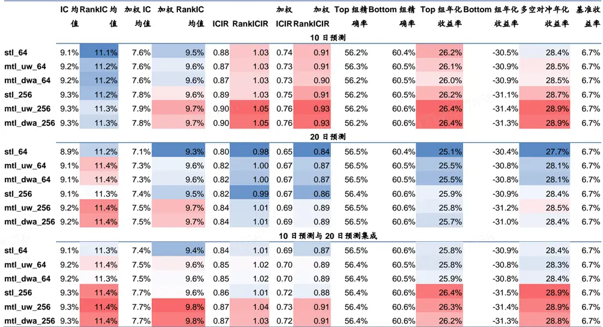
资料来源：朝阳永续，Wind，华泰研究

图表13： 全部测试模型回测绩效（回测期 2011-01-04至 2023-04-28，基准为中证 500指数）
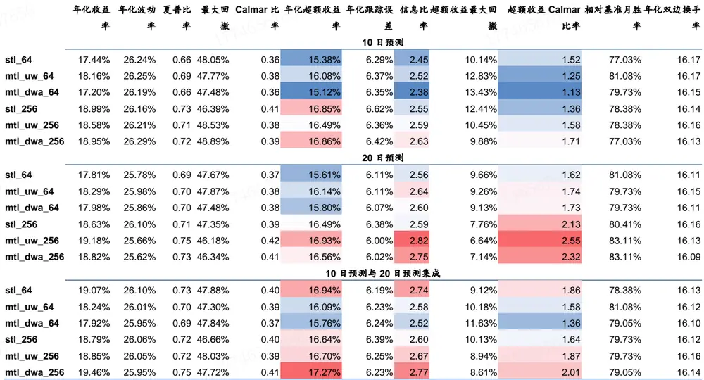
资料来源：朝阳永续，Wind，华泰研究

## 多任务学习在因子测试和组合回测上均优于单任务学习

首先考察隐单元数为 256 时，各模型合成因子测试和指增组合回测表现，观察可知：

1. 多任务学习 mtl_uw_256 和 mtl_dwa_256 的加权 RankIC 均值和信息比率均优于单任务学习 stl_256。

2. 多任务学习的优势既分别体现在 10 日预测和 20 日预测两个子任务上，又体现在两者预测值集成上。

3. uw和 dwa 两类多任务学习加权方式表现接近。

4. 对比不同预测任务，加权 RankIC 均值：集成>10 日预测≈20 日预测；信息比率：集成≈20 日预测>10日预测。总体而言，集成多任务预测结果或能带来稳定提升。

图表14： 测试模型加权 RankIC均值（隐单元数为 256）
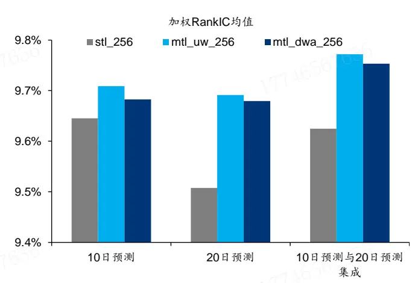
资料来源：朝阳永续，Wind，华泰研究

图表15： 测试模型信息比率（隐单元数为 256）
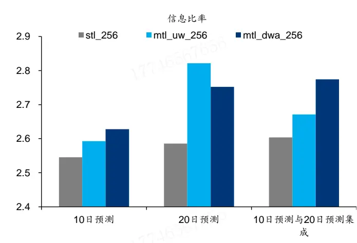
资料来源：朝阳永续，Wind，华泰研究

## 模型规模扩大，多任务相比单任务学习的优势随之扩大

对比隐单元数为 64 和 256 时各模型表现。从合成因子测试加权 RankIC均值看：

1. 隐单元数 256 整体优于隐单元数 64，表明扩大参数规模或能提升模型性能。

2. 隐单元数为 64时，多任务学习加权 RankIC均值同样优于单任务学习。但隐单元数 64的多任务学习，表现也仅仅和隐单元数 256 的单任务学习接近。

图表16： 测试模型加权 RankIC均值（隐单元数为 64或 256）
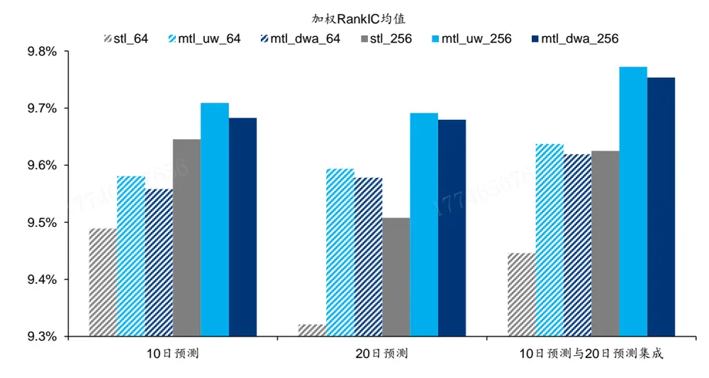
资料来源：朝阳永续，Wind，华泰研究

从指增组合回测信息比率看：

1. 隐单元数为 64 时，多任务学习相比单任务学习没有显著优势，尤其是 10 日预测与 20日预测集成时，单任务学习 stl_64 反而优于两类多任务学习模型。

2. 随着模型规模扩大，多任务学习相比单任务学习的优势体现更为充分。直观地看，参数数量较少时，模型拟合能力有限，各类任务可能“顾此失彼”。多任务相互兼容或需以相对大的网络规模为前提。

图表17： 测试模型信息比率（隐单元数为 64或 256）
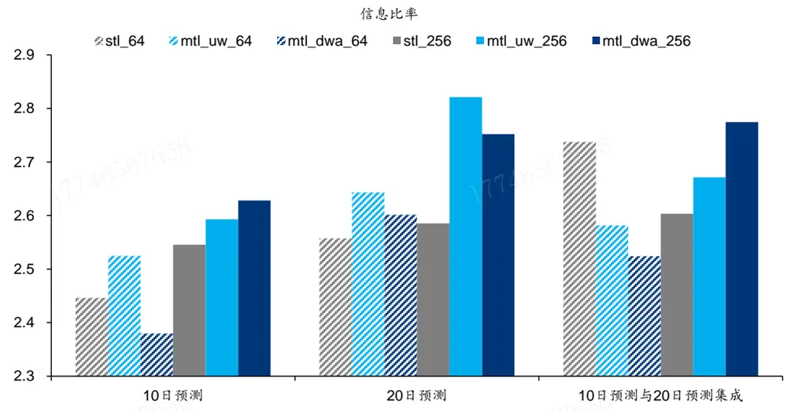
资料来源：朝阳永续，Wind，华泰研究

## 多任务相比单任务学习优势的时间分布：集成模型较稳定

多任务学习相比单任务学习的优势在时序上是否稳定？以隐单元数 256 为例，统计这两类任务累计加权 RankIC 值之差，如下图所示，结果表明：

1. 10 日预测：多任务学习的优势仅集中体现在 2020 年下半年至 2023 年 3 月区间，其余时间两类任务表现接近。

2. 20 日预测：多任务学习的优势仅集中体现在 2011 年至 2015 年上半年区间，其余时间两类任务表现接近。

3. 10 日预测与 20 日预测集成：融合 10 日预测和 20 日预测的特点，多任务学习的优势在时序上分布更均匀，仅在 2011 年下半年、2019 年下半年、2020 年上半年出现连续且幅度较大的回撤，其余时间多任务学习整体优于单任务学习。

图表18： 多任务与单任务学习累计加权 RankIC均值差（10日预测）
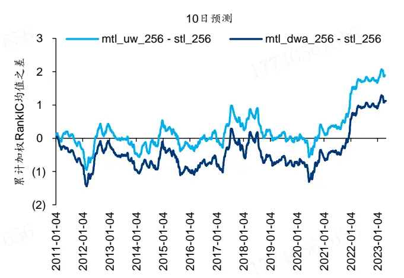
资料来源：朝阳永续，Wind，华泰研究

图表19： 多任务与单任务学习累计加权 RankIC均值差（20日预测）
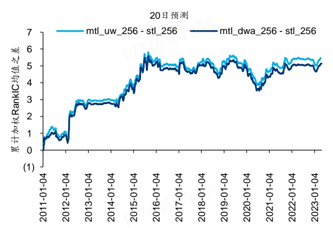
资料来源：朝阳永续，Wind，华泰研究

图表20： 多任务与单任务学习累计加权 RankIC均值差（10日预测与 20日预测集成）
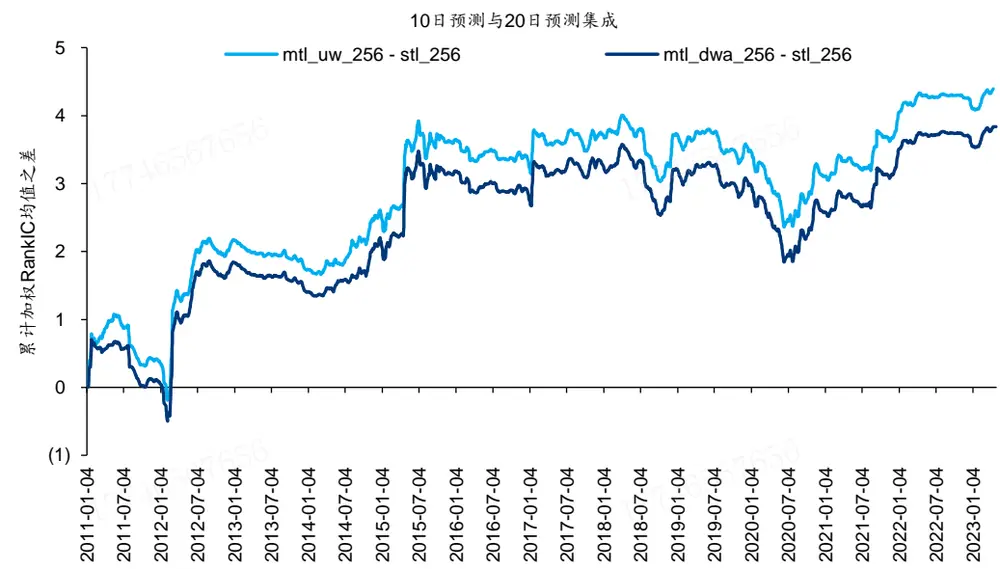
资料来源：朝阳永续，Wind，华泰研究

类似地，统计这两类任务累计超额收益之差，如下图所示。从 10 日预测、20 日预测和集成的超额收益看，多任务学习相比单任务学习的优势在时序上并不稳定。多任务学习在加权 RankIC上体现出的改进效果，经过组合优化后，很难完全体现在超额净值上。

图表21： 多任务与单任务学习累计超额收益差（10日预测）
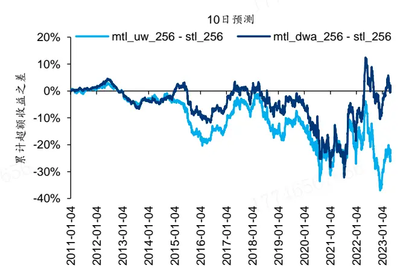
注：回测期 2011-01-04 至 2023-04-28，基准为中证 500 指数资料来源：朝阳永续，Wind，华泰研究

图表22： 多任务与单任务学习累计超额收益差（20日预测）
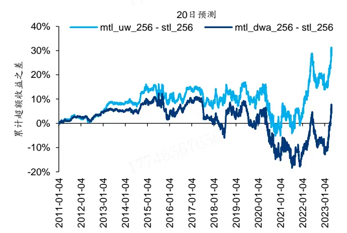
注：回测期 2011-01-04 至 2023-04-28，基准为中证 500 指数资料来源：朝阳永续，Wind，华泰研究

图表23： 多任务与单任务学习累计超额收益差（10日预测与 20日预测集成）
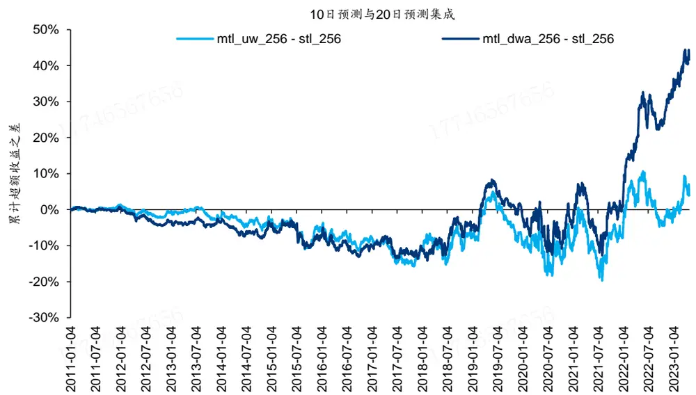
注：回测期 2011-01-04 至 2023-04-28，基准为中证 500 指数资料来源：朝阳永续，Wind，华泰研究

## 继续扩大规模：合成因子 RankIC 提升，指增组合信息比率下滑

当隐单元数从 64 扩大至 256 时，我们观察到合成因子加权 RankIC 和指增组合信息比率均有提升。继续将隐单元数扩大至 1024，合成因子测试和指增组合回测结果如下图所示：1. 隐单元数为 1024 时，合成因子加权 RankIC 均值显著提升，并且多任务学习mtl_uw_1024 和 mtl_dwa_1024 优于单任务学习 stl_1024。

2. 但与此同时，指增组合信息比率下降，且多任务相比单任务学习的优势大幅削弱。

单纯从 AI 因子合成这步看，(1)扩大模型规模和(2)引入多任务学习仍有改进效果。但这两项改进无法体现在指增组合优化上。这也印证了我们在《人工智能 64：九坤 Kaggle 量化大赛有哪些启示》（2023-01-30）提到的因子合成和组合优化错配问题，本文仍无法解决。

图表24： 测试模型加权 RankIC均值（隐单元数为 64、256或 1024）
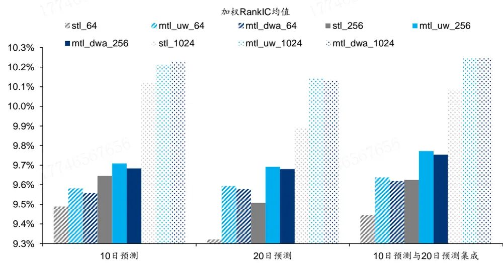
资料来源：朝阳永续，Wind，华泰研究

图表25： 测试模型信息比率（隐单元数为 64、256或 1024）
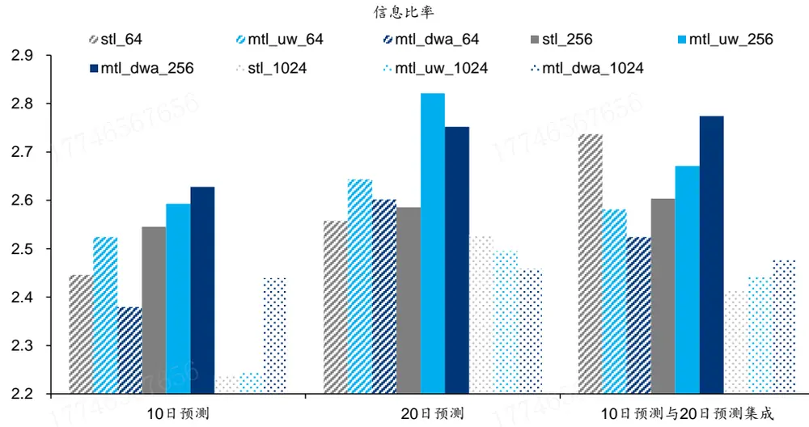
资料来源：朝阳永续，Wind，华泰研究

## 预测值相关性分析：多任务学习内部相关性更高

以隐单元数为 256 为例，统计各模型预测值相关性，方法为逐日计算相关系数矩阵，再对日期求均值，如下表所示：

1. 各模性内部相关性较高，相关系数均在 0.95 以上。

2. 观察每组模型内部，10 日预测与 20 日预测相关性，单任务学习 stl_256 为 0.954，多任务学习 mtl_uw_256 和 mtl_dwa_256 均为 0.977。多任务学习内部相关性更高。

未来 10 日收益率包含于未来 20 日收益率，理论上两者预测值相关性应较高。多任务学习中，10 日预测和 20 日预测两个子任务协同训练，因此相关性较单任务学习更高。

图表26： 测试模型预测值相关性（隐单元数为 256）

|  |  | stl_256 |  |  | mtl_uw_256 |  |  | mtl_dwa_256 |  |  |
| --- | --- | --- | --- | --- | --- | --- | --- | --- | --- | --- |
| stl_256 |  | 10 日预测 20 日预测 |  | 集成 | 10日预测 | 20日预测 | 集成 | 10日预测 | 20日预测 | 集成 |
|  | 10日预测 | 1 | 0.954 | 0.986 | 0.987 | 0.958 | 0.977 | 0.986 | 0.958 | 0.977 |
|  | 20 日预测 | 0.954 | 1 | 0.990 | 0.966 | 0.987 | 0.983 | 0.967 | 0.987 | 0.984 |
|  | 集成 | 0.986 | 0.990 | 1 | 0.987 | 0.985 | 0.992 | 0.987 | 0.985 | 0.992 |
| mtl_uw_256 | 10日预测 | 0.987 | 0.966 | 0.987 | 1 | 0.977 | 0.993 | 1.000 | 0.977 | 0.993 |
|  | 20 日预测 | 0.958 | 0.987 | 0.985 | 0.977 | 1 | 0.995 | 0.977 | 1.000 | 0.995 |
|  | 集成 | 0.977 | 0.983 | 0.992 | 0.993 | 0.995 | 1 | 0.993 | 0.995 | 1.000 |
| mtl_dwa_256 | 10 日预测 | 0.986 | 0.967 | 0.987 | 1.000 | 0.977 | 0.993 | 1 | 0.977 | 0.993 |
|  | 20 日预测 | 0.958 | 0.987 | 0.985 | 0.977 | 1.000 | 0.995 | 0.977 | 1 | 0.995 |
|  | 集成 | 0.977 | 0.984 | 0.992 | 0.993 | 0.995 | 1.000 | 0.993 | 0.995 | 1 |

资料来源：朝阳永续，Wind，华泰研究

## 总结

本研究介绍多目标学习基本概念，并将多目标学习应用于量化选股场景。采用基础的硬参数共享机制，训练全连接神经网络同时预测未来 10 日和 20 日收益率排序，两项任务的损失函数采用 uncertainty weight 或 dynamic weight average 方式加权。结果表明：多任务学习的合成因子测试和指增组合回测指标均优于单任务学习；模型规模扩大，多任务学习的优势随之扩大；从子任务预测集成模型看，多任务相比单任务学习的优势在时序上较稳定。

传统 AI预测问题对模型的定位是“专才”，每个模型对应唯一预测目标，执行某项特定功能，这种学习机制称为单任务学习。然而无论人类还是 AI，“通才”更符合人们对智能的期待。例如我们面对人脸可以同时识别性别和年龄，大语言模型既可以对话又可以写代码。多任务学习正是为训练通才这一目标提出的学习机制，每个模型对应多个预测目标，同时学习多项任务。多任务学习机制符合直观理解，如识别性别和年龄的任务，可能基于相近的脸部特征，可使用相同网络参数；学习英语的同时学习德语，由于归属相同语系，可能“触类旁通”，学习效率更高。

多任务学习利用任务间关联性，共享信息表征，实现知识迁移，提高泛化能力。有两种常用架构：(1)硬参数共享，各任务底部层共享，顶部层独立；(2)软参数共享，各任务有独立的模型和参数，通过正则化提高参数相似性。多任务学习有效的原因：(1)知识迁移增强特征学习；(2)辅助任务对主任务进行正则化，帮助主任务聚焦于真正重要的特征，减少无关信息干扰；(3)可视作隐式的数据增强，有效增加样本数量，避免过拟合。各任务损失加权方式是决定模型表现的关键因素，常用方法如 uw、dwa、gls、rw 等。

在现有周频中证 500 指增模型基础上，引入多任务学习机制，测试改进效果。基线模型为MLP 网络，特征为常规的基本面和量价因子。多任务学习网络前两层为任务共享层，第三层为任务特异层，采用传统的硬参数共享，使用 uw 或 dwa 方式进行损失函数加权，同时设置单任务学习对照组。单任务学习和多任务学习均给出两组收益预测，分别对应未来 10或 20 个交易日收益率。组合优化采用(1)10 日预测、(2)20 日预测、(3)10 日预测和 20 日预测等权集成，分别构建中证 500 指数增强组合。

测试结果表明：隐单元数为 256 时，多任务学习的加权 RankIC 均值和信息比率均优于单任务学习，优势既分别体现在 10 日预测和 20 日预测两个子任务上，又体现在两者预测值集成上，集成多任务预测值整体优于单独使用子任务预测值。对比不同隐单元数的模型表现，随着模型规模扩大，多任务相比单任务学习的优势体现更充分，多任务相互兼容或需以相对大的网络规模为前提。多任务学习中，10 日和 20 日收益率预测两个子任务协同训练，两者相关性较单任务学习更高。

本研究存在以下未尽之处：(1)任务设置：以预测不同区间收益率作为子任务，其他如分类/回归、收益率/夏普比率等任务有待测试；(2)加权方式：以 uw和 dwa 作为损失函数加权方式，其他如 gls、rw 等加权方式有待测试；(3)学习机制：以硬参数共享作为学习机制，其他如软参数共享、注意力等机制有待探索；(4)本研究发现隐单元数扩大至 1024 且采用多任务学习时，合成因子 RankIC大幅提升，但指增组合表现下滑，如何解决因子合成和组合优化错配问题有待探索。

## 参考文献

Abdulnabi, A. H., Wang, G., Lu, J., & Jia, K. (2015). Multi-task CNN model for attribute prediction. IEEE Transactions on Multimedia, 17(11), 1949–1959

Caruana, R. . (1997). Multitask learning. Machine Learning, 28(1), 41-75.

Chennupati, S. , Sistu, G. , Yogamani, S. , & Rawashdeh, S. A. . (2019). Multinet++: multi-stream feature aggregation and geometric loss strategy for multi-task learning. IEEE.

Hashimoto, K., Xiong, C., Tsuruoka, Y., & Socher, R. (2016). A joint many-task model: Growing a neural network for multiple NLP tasks. arXiv preprint arXiv:1611.01587.

Kendall, A. , Gal, Y. , & Cipolla, R. . (2017). Multi-Task Learning Using Uncertainty to Weigh Losses for Scene Geometry and Semantics. arXiv, 10.1109/CVPR.2018.00781.

Lin, B., Feiyang, Y. E., Zhang, Y., & Tsang, I. (2022). Reasonable Effectiveness of Random Weighting: A Litmus Test for Multi-Task Learning. Transactions on Machine Learning Research.

Liu, S. , Johns, E. , & Davison, A. J. . (2018). End-to-end multi-task learning with attention.

Ma, J., Zhao, Z., Yi, X., Chen, J., Hong, L., & Chi, E. H. (2018). Modeling task relationships in multi-task learning with multi-gate mixture-of-experts. In Proceedings of the 24th ACM SIGKDD international conference on knowledge discovery & data mining (pp. 1930–1939). ACM.

Ma, T., & Tan, Y. (2020b). Adaptive and dynamic knowledge transfer in multitask learning with attention networks. In Y. Tan, Y. Shi, & M. Tuba (Eds.), Communications in computer and information science: vol. 1234, Data mining and big data - 5th international conference, DMBD 2020, Belgrade, Serbia, July 14-20, 2020, Proceedings (pp. 1–13). Springer, http://dx.doi.org/10.1007/978-981-15-7205-0_1.

Ma, T. , & Tan, Y. . (2022). Stock ranking with multi-task learning. Expert Systems with Application(Aug.), 199.

Misra, I., Shrivastava, A., Gupta, A., & Hebert, M. (2016). Cross-stitch networks formulti-task learning. In Proceedings of the IEEE conference on computer vision and pattern recognition (pp. 3994–4003).

Ruder, S. . (2017). An overview of multi-task learning in deep neural networks.

Ruder, S., Bingel, J., Augenstein, I., and Søgaard, A. (2017). Sluice networks: Learning what to share between loosely related tasks.

Suddarth, S. C., & Kergosien, Y. L. (1990). Rule-injection hints as a means of improving network performance and learning time. Lecture Notes in Computer Science, 120– 129. doi:10.1007/3-540-52255-7_33.

Yang, Y., & Hospedales, T. (2016). Deep multi-task representation learning: A tensor factorisation approach. arXiv preprint arXiv:1605.06391.

Zhao, J., Du, B., Sun, L., Zhuang, F., Lv, W., & Xiong, H. (2019). Multiple relational attention network for multi-task learning. In A. Teredesai, V. Kumar, Y. Li, R. Rosales, E. Terzi, & G. Karypis (Eds.), Proceedings of the 25th ACM SIGKDD international conference on knowledge discovery & data mining, KDD 2019, Anchorage, AK, USA, August 4-8, 2019 (pp. 1123–1131). ACM, http://dx.doi.org/10.1145/3292500.3330861.

## 风险提示

人工智能挖掘市场规律是对历史的总结，市场规律在未来可能失效。人工智能技术存在过拟合风险。深度学习模型受随机数影响较大。本文测试的选股模型调仓频率较高，假定以vwap 价格成交，忽略其他交易层面因素影响。

## 免责声明

## 分析师声明

本人，林晓明、何康、李子钰，兹证明本报告所表达的观点准确地反映了分析师对标的证券或发行人的个人意见；彼以往、现在或未来并无就其研究报告所提供的具体建议或所表迖的意见直接或间接收取任何报酬。

## 一般声明及披露

本报告由华泰证券股份有限公司（已具备中国证监会批准的证券投资咨询业务资格，以下简称“本公司”）制作。本报告所载资料是仅供接收人的严格保密资料。本报告仅供本公司及其客户和其关联机构使用。本公司不因接收人收到本报告而视其为客户。

本报告基于本公司认为可靠的、已公开的信息编制，但本公司及其关联机构(以下统称为“华泰”)对该等信息的准确性及完整性不作任何保证。

本报告所载的意见、评估及预测仅反映报告发布当日的观点和判断。在不同时期，华泰可能会发出与本报告所载意见、评估及预测不一致的研究报告。同时，本报告所指的证券或投资标的的价格、价值及投资收入可能会波动。以往表现并不能指引未来，未来回报并不能得到保证，并存在损失本金的可能。华泰不保证本报告所含信息保持在最新状态。华泰对本报告所含信息可在不发出通知的情形下做出修改，投资者应当自行关注相应的更新或修改。

本公司不是 FINRA 的注册会员，其研究分析师亦没有注册为 FINRA 的研究分析师/不具有 FINRA 分析师的注册资格。

华泰力求报告内容客观、公正，但本报告所载的观点、结论和建议仅供参考，不构成购买或出售所述证券的要约或招揽。该等观点、建议并未考虑到个别投资者的具体投资目的、财务状况以及特定需求，在任何时候均不构成对客户私人投资建议。投资者应当充分考虑自身特定状况，并完整理解和使用本报告内容，不应视本报告为做出投资决策的唯一因素。对依据或者使用本报告所造成的一切后果，华泰及作者均不承担任何法律责任。任何形式的分享证券投资收益或者分担证券投资损失的书面或口头承诺均为无效。

除非另行说明，本报告中所引用的关于业绩的数据代表过往表现，过往的业绩表现不应作为日后回报的预示。华泰不承诺也不保证任何预示的回报会得以实现，分析中所做的预测可能是基于相应的假设，任何假设的变化可能会显著影响所预测的回报。

华泰及作者在自身所知情的范围内，与本报告所指的证券或投资标的不存在法律禁止的利害关系。在法律许可的情况下，华泰可能会持有报告中提到的公司所发行的证券头寸并进行交易，为该公司提供投资银行、财务顾问或者金融产品等相关服务或向该公司招揽业务。

华泰的销售人员、交易人员或其他专业人士可能会依据不同假设和标准、采用不同的分析方法而口头或书面发表与本报告意见及建议不一致的市场评论和/或交易观点。华泰没有将此意见及建议向报告所有接收者进行更新的义务。华泰的资产管理部门、自营部门以及其他投资业务部门可能独立做出与本报告中的意见或建议不一致的投资决策。投资者应当考虑到华泰及/或其相关人员可能存在影响本报告观点客观性的潜在利益冲突。投资者请勿将本报告视为投资或其他决定的唯一信赖依据。有关该方面的具体披露请参照本报告尾部。

本报告并非意图发送、发布给在当地法律或监管规则下不允许向其发送、发布的机构或人员，也并非意图发送、发布给因可得到、使用本报告的行为而使华泰违反或受制于当地法律或监管规则的机构或人员。

本报告版权仅为本公司所有。未经本公司书面许可，任何机构或个人不得以翻版、复制、发表、引用或再次分发他人(无论整份或部分)等任何形式侵犯本公司版权。如征得本公司同意进行引用、刊发的，需在允许的范围内使用，并需在使用前获取独立的法律意见，以确定该引用、刊发符合当地适用法规的要求，同时注明出处为“华泰证券研究所”，且不得对本报告进行任何有悖原意的引用、删节和修改。本公司保留追究相关责任的权利。所有本报告中使用的商标、服务标记及标记均为本公司的商标、服务标记及标记。

## 中国香港

本报告由华泰证券股份有限公司制作,在香港由华泰金融控股（香港）有限公司向符合《证券及期货条例》及其附属法律规定的机构投资者和专业投资者的客户进行分发。华泰金融控股（香港）有限公司受香港证券及期货事务监察委员会监管，是华泰国际金融控股有限公司的全资子公司，后者为华泰证券股份有限公司的全资子公司。在香港获得本报告的人员若有任何有关本报告的问题,请与华泰金融控股（香港）有限公司联系。

## 香港-重要监管披露

- 华泰金融控股（香港）有限公司的雇员或其关联人士没有担任本报告中提及的公司或发行人的高级人员。

- 有关重要的披露信息，请参华泰金融控股（香港）有限公司的网页 https://www.htsc.com.hk/stock_disclosure其他信息请参见下方 “美国-重要监管披露”。

## 美国

在美国本报告由华泰证券（美国）有限公司向符合美国监管规定的机构投资者进行发表与分发。华泰证券（美国）有限公司是美国注册经纪商和美国金融业监管局（FINRA）的注册会员。对于其在美国分发的研究报告，华泰证券（美国）有限公司根据《1934 年证券交易法》（修订版）第 15a-6 条规定以及美国证券交易委员会人员解释，对本研究报告内容负责。华泰证券（美国）有限公司联营公司的分析师不具有美国金融监管（FINRA）分析师的注册资格，可能不属于华泰证券（美国）有限公司的关联人员，因此可能不受 FINRA 关于分析师与标的公司沟通、公开露面和所持交易证券的限制。华泰证券（美国）有限公司是华泰国际金融控股有限公司的全资子公司，后者为华泰证券股份有限公司的全资子公司。任何直接从华泰证券（美国）有限公司收到此报告并希望就本报告所述任何证券进行交易的人士，应通过华泰证券（美国）有限公司进行交易。

## 美国-重要监管披露

- 分析师林晓明、何康、李子钰本人及相关人士并不担任本报告所提及的标的证券或发行人的高级人员、董事或顾问。分析师及相关人士与本报告所提及的标的证券或发行人并无任何相关财务利益。本披露中所提及的“相关人士”包括 FINRA 定义下分析师的家庭成员。分析师根据华泰证券的整体收入和盈利能力获得薪酬，包括源自公司投资银行业务的收入。

华泰证券股份有限公司、其子公司和/或其联营公司, 及/或不时会以自身或代理形式向客户出售及购买华泰证券研究所覆盖公司的证券/衍生工具，包括股票及债券（包括衍生品）华泰证券研究所覆盖公司的证券/衍生工具，包括股票及债券（包括衍生品）。

- 华泰证券股份有限公司、其子公司和/或其联营公司, 及/或其高级管理层、董事和雇员可能会持有本报告中所提到的任何证券（或任何相关投资）头寸，并可能不时进行增持或减持该证券（或投资）。因此，投资者应该意识到可能存在利益冲突。

## 评级说明

投资评级基于分析师对报告发布日后 6 至 12个月内行业或公司回报潜力（含此期间的股息回报）相对基准表现的预期（A 股市场基准为沪深 300 指数，香港市场基准为恒生指数，美国市场基准为标普 500 指数），具体如下：

## 行业评级

增持：预计行业股票指数超越基准

中性：预计行业股票指数基本与基准持平

减持：预计行业股票指数明显弱于基准

## 公司评级

买入：预计股价超越基准 15%以上

增持：预计股价超越基准 5%~15%

持有：预计股价相对基准波动在-15%~5%之间

卖出：预计股价弱于基准 15%以上

暂停评级：已暂停评级、目标价及预测，以遵守适用法规及/或公司政策

无评级：股票不在常规研究覆盖范围内。投资者不应期待华泰提供该等证券及/或公司相关的持续或补充信息

## 法律实体披露

中国：华泰证券股份有限公司具有中国证监会核准的“证券投资咨询”业务资格，经营许可证编号为：91320000704041011J香港：华泰金融控股（香港）有限公司具有香港证监会核准的“就证券提供意见”业务资格，经营许可证编号为：AOK809美国：华泰证券（美国）有限公司为美国金融业监管局（FINRA）成员，具有在美国开展经纪交易商业务的资格，经营业务许可编号为：CRD#:298809/SEC#:8-70231

## 华泰证券股份有限公司

南京南京市建邺区江东中路228号华泰证券广场1号楼/邮政编码：210019

电话：86 25 83389999/传真：86 25 83387521电子邮件：ht-rd@htsc.com

深圳
深圳市福田区益田路5999号基金大厦10楼/邮政编码：518017
电话：86 755 82493932/传真：86 755 82492062
电子邮件：ht-rd@htsc.com

## 华泰金融控股（香港）有限公司

香港中环皇后大道中 99号中环中心 58楼 5808-12室
电话：+852-3658-6000/传真：+852-2169-0770
电子邮件：research@htsc.com
http://www.htsc.com.hk

## 华泰证券（美国）有限公司

美国纽约公园大道 280号 21楼东（纽约 10017）

电话：+212-763-8160/传真：+917-725-9702

电子邮件: Huatai@htsc-us.com

http://www.htsc-us.com

©版权所有2023年华泰证券股份有限公司

北京
北京市西城区太平桥大街丰盛胡同28号太平洋保险大厦A座18层/
邮政编码：100032
电话：86 10 63211166/传真：86 10 63211275
电子邮件：ht-rd@htsc.com
上海
上海市浦东新区东方路18号保利广场E栋23楼/邮政编码：200120
电话：86 21 28972098/传真：86 21 28972068
电子邮件：ht-rd@htsc.com