# 神经网络多频率因子挖掘模型

华泰研究

2023 年 5 月 11 日│中国内地

深度研究

## 人工智能 68：构建神经网络多频率因子挖掘模型，并用于指数增强

神经网络能自动提取股票原始量价数据中的特征，实现端到端的因子挖掘和因子合成。本文重点研究如何设计网络结构以有效挖掘不同频率的股票量价数据。我们先将神经网络运用于 15 分钟频量价数据的挖掘，取得了较好效果，随后再加入日频数据构建多频率混合模型，并引入因子增量贡献的思想设计了两阶段增量学习模型。在对比测试中，多频率增量混合模型表现最好，构建的各类指数增强策略表现优秀。

## 神经网络在 15分钟频量价数据上表现较好，加入注意力机制后无改进

考虑到神经网络具有强大的特征提取能力，本文省去人工构建因子的步骤，直接对标准化后的原始 15 分钟 K线数据进行学习，神经网络骨干部分使用GRU 网络。样本空间为全 A 股，模型在 2017/1/4～2023/4/28 的回测期内周度RankIC均值为9.30%，分10层TOP组合年化超额收益率为24.18%(不计交易成本)。我们还尝试对 GRU 加入注意力机制，希望帮助模型更好地记忆长程序列信息，但在本文的测试中，加入注意力机制后没有改进效果。

## 基于日频+15分钟频数据的多频率混合模型分层测试效果明显提升

为了融入更多市场信息，我们在 15 分钟频数据的模型上，加入日频数据，构建多频率混合模型。模型通过两个输入分别接收日频量价和 15 分钟频量价数据，并分别使用 GRU提取特征，最后将两部分特征拼接并对接输出。样本空间为全 A 股，模型在 2017/1/4～2023/4/28 的回测期内周度 RankIC均值为 8.58%，分 10 层 TOP 组合年化超额收益率为 30.12%(不计交易成本)，TOP组合表现相比 15分钟频模型提升明显。

## 基于参数冻结+残差预测的多频率增量混合模型表现最好

针对多频率数据混合模型，我们引入因子增量贡献的思想，设计了一个两阶段训练的增量学习模型。第一阶段：只使用日频量价数据训练对应的神经网络分支，即先让网络学习日频级别的量价信息，第一阶段训练直到模型的loss 收敛为止。第二阶段：将日频量价数据分支网络结构的参数冻结，只前向传播，然后引入 15 分钟频数据学习残差，即再让网络学习分钟频量价数据能够贡献的增量信息。样本空间为全 A股，模型在 2017/1/4～2023/4/28的回测期内周度 RankIC均值为 10.22%，分 10 层 TOP组合年化超额收益率为 36.36%(不计交易成本)，在本文的所有模型中表现最好。

## 基于多频率增量混合模型构建多个指数增强组合，回测表现优秀

我们基于多频率增量混合模型构建多个指数增强组合，并回测了周双边换手率分别控制为 30%、40%和 50%的情况。在 2017/1/4～2023/4/28 的回测期内，沪深 300 增强组合年化超额收益率为 8.77%~9.48%，信息比率为1.21~1.40。中证 500 增强组合年化超额收益率为 17.39%~18.18%，信息比率为 3.11~3.29。中证 1000 增强组合年化超额收益率为 28.93%~31.57%，信息比率为 4.45~4.79。国证 2000 增强组合年化超额收益率为29.38%~31.19%，信息比率为 4.09~4.25。

风险提示：通过人工智能模型构建的选股策略是历史经验的总结，存在失效的可能。神经网络受随机性影响较大、可解释性较差，使用需谨慎。

研究员

SAC No. S0570516010001

林晓明

SFC No. BPY421

linxiaoming@htsc.com

+(86) 755 8208 0134

研究员

SAC No. S0570519110003

李子钰

SFC No. BRV743

liziyu@htsc.com

+(86) 755 2398 7436

研究员

SAC No. S0570520080004

SFC No. BRB318

何康，PhD

hekang@htsc.com

+(86) 21 2897 2039

## 中证 1000 增强组合累积超额收益

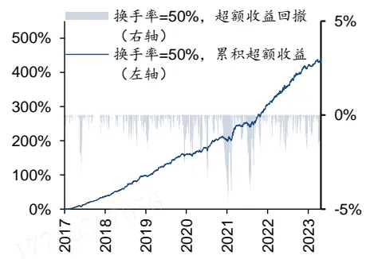
资料来源：华泰研究

## 本文研究导读

挖掘有效的因子是量化投资领域关注度经久不衰的话题，AI 技术的不断发展为因子挖掘不断提供新的可能。如下图所示，在华泰金工前期研究《基于遗传规划的选股因子挖掘》(2019.6.10)和《AlphaNet：因子挖掘神经网络》(2020.6.14)中，已系统讨论了基于遗传规划和神经网络的因子挖掘框架，其中神经网络能实现端到端的因子挖掘和因子合成。

图表1： 华泰金工因子挖掘研究框架
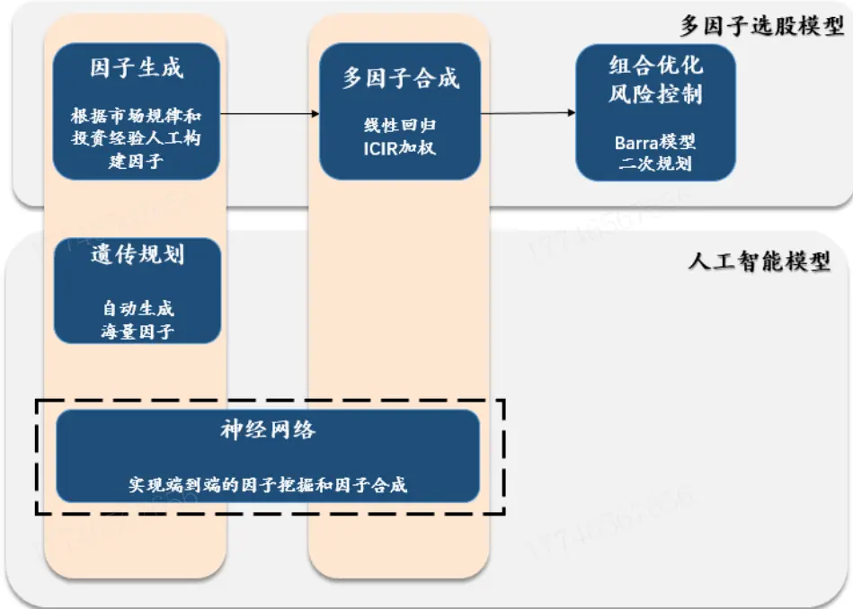
资料来源：华泰研究

本文将进一步探索将神经网络运用于量价因子挖掘，并构建超额收益显著的选股策略。与前期研究相比，本文的特点在于：

1. 前期研究主要针对日频量价数据挖掘，本文将着重研究日内分钟频数据挖掘，并与日频量价数据进行整合。

2. 本文根据数据特性，尝试了多种网络结构，并在某些方向上取得了显著的改进效果。

本文研究内容如下图所示。

图表2： 本文研究内容
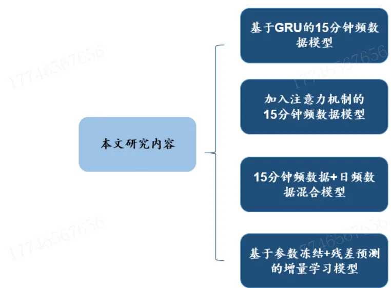
资料来源：华泰研究

经过测试，基于参数冻结+残差预测的增量学习模型具有最好的选股效果，基于该模型构建的周频调仓中证 1000 增强策略回测效果如下。

图表3： 中证 1000增强组合累积超额收益
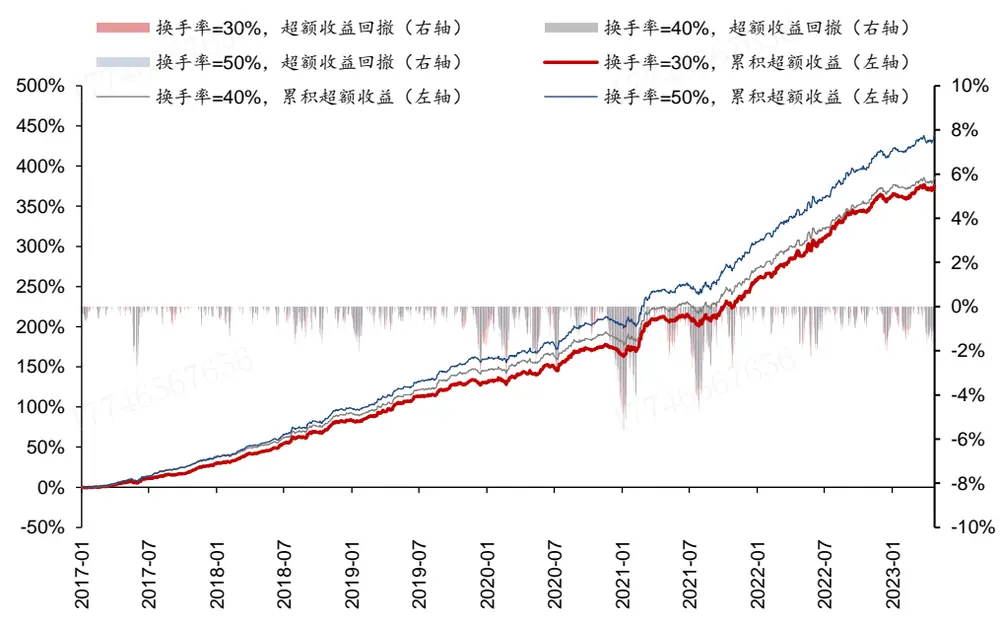
注：回测期：2017/1/4～2023/4/28
资料来源：Wind，华泰研究

图表4： 中证 1000增强组合回测绩效

|  |  |  |  |  |  |  | 超额收益最大 |  |  |  |  |
| --- | --- | --- | --- | --- | --- | --- | --- | --- | --- | --- | --- |
|  | 年化收益率 | 年化波动率 | 夏普比率 | 最大回撤 | 益率 | 误差 | 回撤 | 信息比率 Calmar 比率 |  | 相对基准月胜率 | 手率 |
| 换手率=30% | 23.70% | 22.88% | 1.04 | 28.66% | 28.93% | 6.51% | 5.52% | 4.45 | 5.24 | 82.67% | 32.84% |
| 换手率=40% | 24.09% | 23.01% | 1.05 | 29.09% | 29.38% | 6.56% | 5.57% | 4.48 | 5.27 | 90.67% | 42.27% |
| 换手率=50% | 26.15% | 23.13% | 1.13 | 28.46% | 31.57% | 6.59% | 4.62% | 4.79 | 6.83 | 90.67% | 51.42% |
| 中证 1000 | -4.27% | 22.92% | -0.19 | 52.14% |  |  |  |  |  |  |  |

注：回测期：2017/1/4～2023/4/28
资料来源：Wind，华泰研究

图表5： 中证 1000增强组合逐年收益率
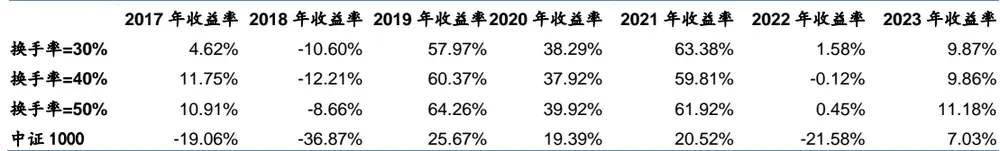
注：回测期：2017/1/4～2023/4/28
资料来源：Wind，华泰研究

## 基于 GRU的 15分钟频数据模型

本章的模型具有以下要点：

1. 针对日内分钟频数据，可先人工构建因子再输入神经网络进行学习。但考虑到神经网络具有强大的特征提取能力，我们将省去人工构建因子的步骤，直接对股票原始的 15 分钟 K线数据进行学习。

2. 为了保证模型训练的稳定，输入数据的分布要有较高的一致性，因此虽然输入的是原始K 线数据，仍需要对数据进行时序和截面标准化。

3. 标准化后的数据即可输入到常用的时序神经网络 GRU中进行训练。

模型的具体细节如下方图表所示。

图表6： 基于 GRU的 15分钟频数据模型
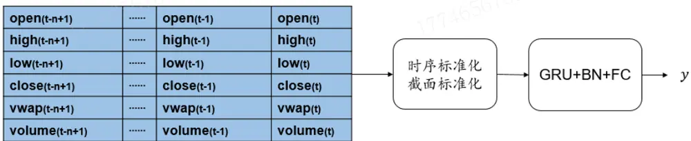
数据输入：个股量价序列维度：6*n
资料来源：华泰研究

图表7： 模型及数据细节

| 特征和标签 | 特征X：个股过去20个交易日的15分钟频开、高、低、收、vwap、成交量数据，序列长度为20*16=320 标签y：个股未来10个交易日的收益率。 特征预处理：每个特征先进行时间序列标准化，即将特征时间序列的每个值除以该序列的均值。再对每个特征进 行截面 z-score 标准化。 标签预处理：对标签进行截面z-score标准化。 |
| --- | --- |
| 模型结构 17 | 样本内训练数据从2013年开始，每5个交易日采样一次，训练集和验证集依时间先后按照4:1的比例划分。 656 GRU：输入维度6*320，输出维度30，层数为1层。 17746567656 BN：对 GRU 的输出进行批标准化。 |
| 模型其他参数 | FC：全连接层，输入维度30，输出维度1，对接模型输出。 损失函数：预测值与标签之间IC的相反数。 batch_size: 5000。 训练最大迭代轮数：100，早停轮数：10。 |

资料来源：华泰研究

## 加入注意力机制的 15分钟频数据模型

注意力机制(Attention)是当前深度学习领域常用的技术。当时序网络 GRU 接收的序列过长时，可能会出现信息“遗忘”的问题，此时对 GRU 的输出序列计算注意力可帮助模型更好地记忆长程序列信息。

假设GRU 模型输出长度为 M 的特征序列 $z_{i}$ ，则针对 $z_{i}$ 的注意力计算过程如下。

$$
\begin{array}{c}{{u_{i}=tanh(W_{w}z_{i}+b_{w})}}\\{{{}}}\\{{\gamma_{i}=\displaystyle\frac{exp(u_{i})}{\sum_{j=1}^{M}exp(u_{j})}}}\end{array}
$$

$$
o=\sum_{i=1}^{M}\gamma_{i}z_{i}
$$

模型的具体细节如下方图表所示，我们参考微软 qlib(https://github.com/microsoft/qlib)中ALSTM 模型的相关代码来实现。

图表8： 加入注意力机制的 15分钟频数据模型
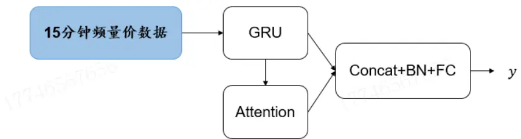
资料来源：华泰研究

## 图表9： 模型及数据细节

| 特征和标签 | 特征X：个股过去20个交易日的15分钟频开、高、低、收、vwap、成交量数据，序列长度为20*16=320 |
| --- | --- |
|  | 标签y：个股未来10个交易日的收益率。 数据预处理方法与图表7中一致。 17746567656 |
| 模型结构 | GRU：输入维度 6*320，输出维度30， 层数为 1层。 |
|  | Attention：计算 GRU 输出序列之间的 attention score，再加权到 GRU 输出序列之上，输出维度 30。 |
|  | Concat：将 GRU 和 Attention 的输出拼接，输出维度为 60 |
|  | BN：对 Concat 的输出进行批标准化。 |
|  | FC：全连接层，输入维度60，输出维度1，对接模型输出。 |
|  | 损失函数：预测值与标签之间IC的相反数。 |
|  | 模型其他参数 batch_size：5000。 17746567656 |
|  | 训练最大迭代轮数：100，早停轮数：10。 |
|  | 学习率：0.001，优化器：Adam。 |

资料来源：华泰研究

## 日频+15分钟频数据混合模型

为了融入更多市场信息，本章开始我们将在 15 分钟频数据的模型上加入日频数据，构建多频率数据混合模型。模型结构如下图所示，通过两个输入分别接收日频量价和 15 分钟频量价数据，并分别使用 GRU 提取特征，最后将两部分特征拼接并对接输出。模型整体结构并不复杂。

图表10： 日频+15分钟频数据混合模型
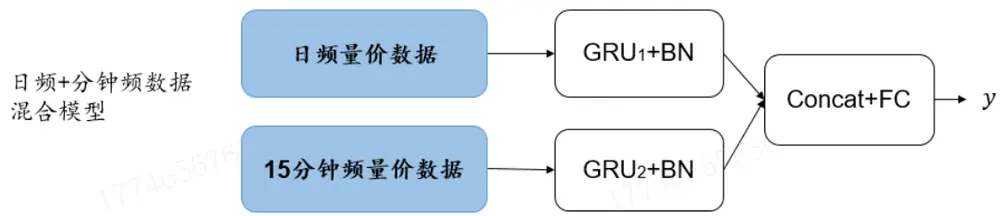
资料来源：华泰研究

## 图表11： 模型及数据细节

| 特征和标签 | 日频特征X：个股过去40个交易日的日频开、高、低、收、vwap、成交量数据。 标签y：个股未来10个交易日的收益率。 特征预处理：每个特征先进行时间序列标准化，即将特征时间序列的每个值除以该序列的最后一个值。再对每个 |
| --- | --- |
| 模型结构 | 特征进行截面 z-score 标准化。 1774656 分钟频数据及数据预处理方法与图表7中一致。 |
|  | GRU₁：输入维度 6*40，输出维度 30，输出使用 BN 进行批标准化。 |
|  | GRU2：输入维度6*320，输出维度30，输出使用 BN进行批标准化。 |
|  | Concat：将 GRU1和 GRU₂的输出拼接，输出维度为 60。 |
|  | FC：全连接层，输入维度60，输出维度1，对接模型输出。 |
|  | 损失函数：预测值与标签之间IC的相反数。 |
|  | 17746567656 |
|  | 训练最大迭代轮数：100，早停轮数：10。 |
| 模型其他参数 batch_size：5000。 |  |
|  | 学习率：0.001，优化器：Adam。 |
|  | 模型每隔半年重新训练一次。 |

资料来源：华泰研究

## 基于参数冻结+残差预测的增量学习模型

本章模型是在上一章模型上的进一步改进。传统量化投资中经常讨论的一个话题是因子的“增量贡献”，实际上我们可以将因子增量贡献的思想引入到神经网络的结构中，以实现端到端的增量学习模型。这不仅与传统量化投资的思想吻合，也可能取得更好的模型效果。具体而言，我们设计了一个两阶段训练的增量学习模型：

第一阶段：只使用日频量价数据训练对应的神经网络分支，即先让网络学习日频级别的量价信息。第一阶段训练直到模型的 loss收敛为止。

第二阶段：将日频量价数据分支网络结构的参数冻结，只前向传播。然后引入 15分钟频数据，学习y和ŷ 之间的残差，即再让网络学习分钟频量价数据能够贡献的增量信息。

模型的具体细节如下方图表所示。

图表12： 基于参数冻结+残差预测的增量学习模型
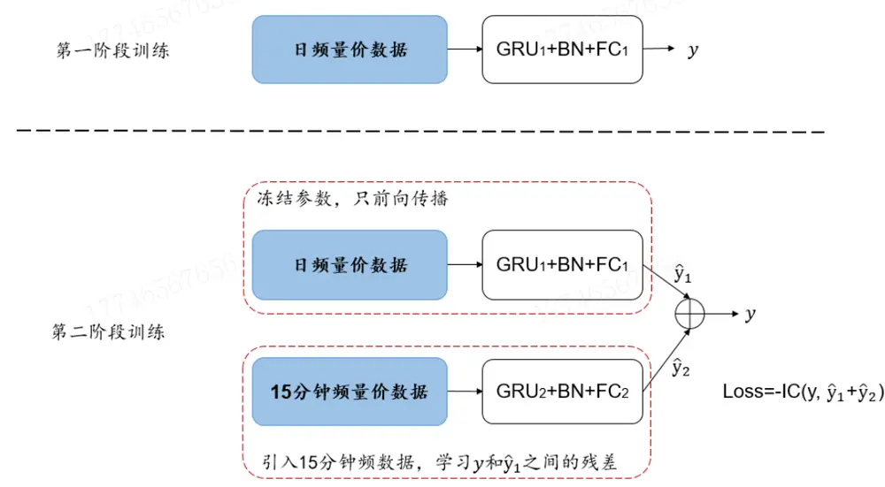
资料来源：华泰研究

## 图表13： 模型及数据细节

| 特征和标签 | 数据预处理方法与图表11中一致。 |
| --- | --- |
| 模型结构 | GRU1：输入维度 6*40，输出维度30，输出使用 BN 进行批标准化，再经过全连接层FC1得到1。 GRU2：输入维度 6*320，输出维度30，输出使用 BN进行批标准化，再经过全连接层 FC2得到2。 |
|  | 损失函数：预测值₁1+₂与标签之间IC的相反数。 |
| 模型其他参数 batch_size：5000。 |  |
|  | 训练最大迭代轮数：100，早停轮数：10。 |
|  | 学习率：0.001，优化器：Adam。 |
|  | 模型每隔半年重新训练一次。 16567656 |

资料来源：华泰研究

下图左侧为常规模型训练过程中IC的变化，右侧为两阶段训练模型训练过程中IC的变化，可知第一阶段训练在第 9 个 epoch 收敛，随后开始第二阶段训练，第二阶段训练在第 40个 epoch 附近收敛。

图表14： 模型训练时评价指标变化情况，右侧为两阶段训练模型的 IC变化
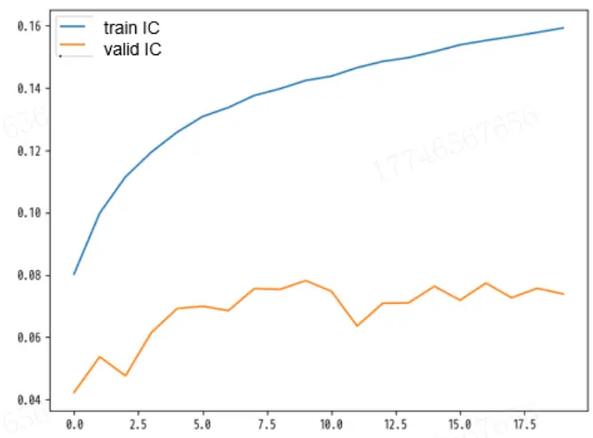
资料来源：Wind，华泰研究

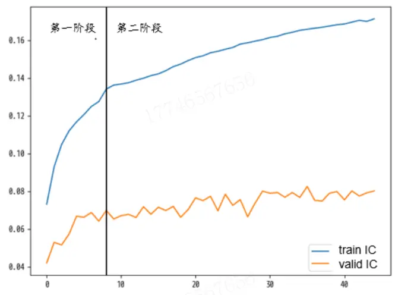

## 模型测试和对比

本章我们将使用单因子测试的方式，对以下 4 个模型进行测试和对比，为了减轻随机性干扰，4个模型都用不同随机数种子训练三次，将三次的模型等权集成。

15 分钟频模型：基于 GRU的 15 分钟频数据模型。

15 分钟频注意力模型：加入注意力机制的 15 分钟频数据模型。

多频率混合模型：日频+15分钟频数据混合模型。

多频率增量混合模型：基于参数冻结+残差预测的增量学习模型。

单因子测试方法如下：

1． 股票池：沪深 300 成分股、中证 500 成分股、中证 1000 成分股、全 A 股，剔除 ST、PT 股票，剔除每个截面期下一交易日停牌、涨停的股票。

2． 回测区间：2017/1/4～2023/4/28。

3． 调仓周期：周频，不计交易费用。

4． 因子预处理：因子进行去极值、行业市值中性化、标准化。

5． 测试方法：IC值分析，因子分 10 层测试，因子相关性分析。

## 测试结果：15 分钟频模型和 15分钟频注意力模型

15 分钟频模型和 15 分钟频注意力模型的输入数据完全一致，区别在于网络结构，我们将对二者的测试结果进行对比展示。整体来看，15 分钟频注意力模型并未呈现出优势。

图表15： 模型 IC值分析和分层回测结果汇总

|  | RankIC 均值 | RankIC 标准差 | IC_IR | IC>0 占比 | TOP 组合年化超额收益率 TOP 组合信息比率 TOP 组合胜率 TOP 组合换手率 |  |  |  |
| --- | --- | --- | --- | --- | --- | --- | --- | --- |
| 沪深 300 |  |  |  |  |  |  |  |  |
| 15 分钟频模型 | 5.86% | 14.98% | 0.39 | 66.78% | 15.39% | 1.60 | 65.79% | 125.11% |
| 15 分钟频注意力模型 | 5.60% | 14.45% | 0.39 | 63.19% | 15.95% | 1.60 | 69.74% | 116.73% |
| 中证 500 |  |  |  |  |  |  |  |  |
| 15 分钟频模型 | 6.57% | 10.97% | 0.60 | 73.62% | 17.33% | 2.14 | 68.42% | 122.66% |
| 15 分钟频注意力模型 | 6.24% | 10.58% | 0.59 | 76.22% | 10.58% | 1.40 | 65.79% | 118.76% |
| 中证1000 |  |  |  |  |  |  |  |  |
| 15 分钟频模型 | 8.97% | 8.95% | 1.00 | 85.67% | 23.77% | 3.42 | 82.89% | 126.28% |
| 15 分钟频注意力模型 | 8.49% | 8.94% | 0.95 | 84.36% | 18.40% | 2.79 | 77.63% | 116.98% |
| 全 A 股 |  |  |  |  |  |  |  |  |
| 15 分钟频模型 | 9.30% | 8.12% | 1.15 | 86.97% | 24.18% | 3.95 | 80.26% | 125.17% |
| 15 分钟频注意力模型 | 9.01% | 8.94% | 1.01 | 85.67% | 20.06% | 3.48 | 84.21% | 115.17% |

注：回测期：2017/1/4～2023/4/28
资料来源：Wind，华泰研究

图表16： 15分钟频模型分层组合相对净值，沪深 300成分股
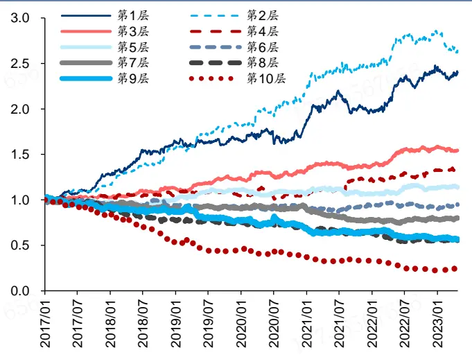
注：回测期：2017/1/4～2023/4/28
资料来源：Wind，华泰研究

图表17： 15分钟频注意力模型分层组合相对净值，沪深 300成分股
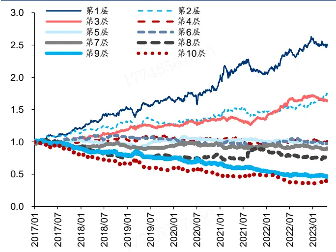
注：回测期：2017/1/4～2023/4/28
资料来源：Wind，华泰研究

图表18： 15分钟频模型分层组合相对净值，中证 500成分股
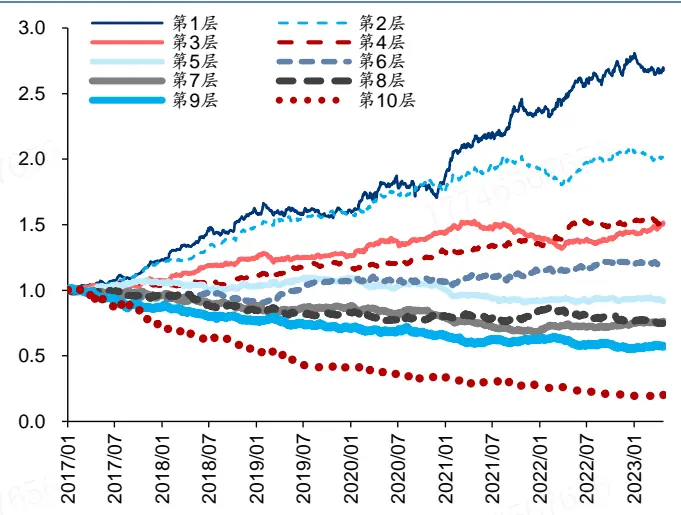
注：回测期：2017/1/4～2023/4/28
资料来源：Wind，华泰研究

图表19： 15分钟频注意力模型分层组合相对净值，中证 500成分股
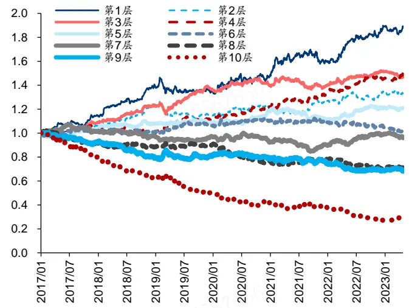
注：回测期：2017/1/4～2023/4/28
资料来源：Wind，华泰研究

图表20： 15 分钟频模型分层组合相对净值，中证 1000 成分股
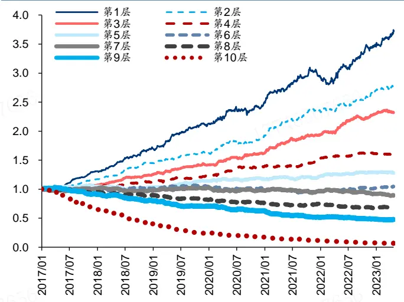
注：回测期：2017/1/4～2023/4/28
资料来源：Wind，华泰研究

图表21： 15 分钟频注意力模型分层组合相对净值，中证 1000 成分股
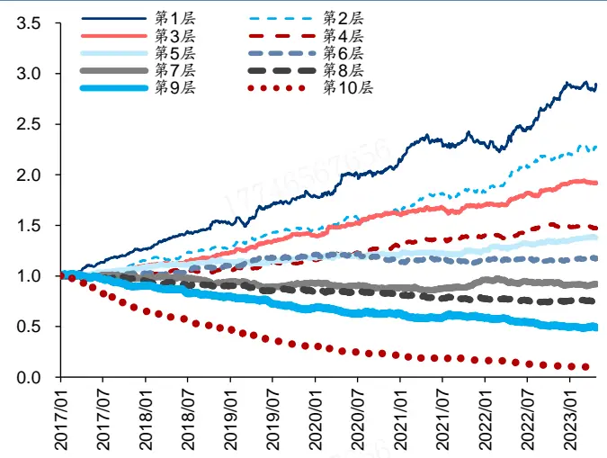
注：回测期：2017/1/4～2023/4/28
资料来源：Wind，华泰研究

图表22： 15分钟频模型分层组合相对净值，全 A股
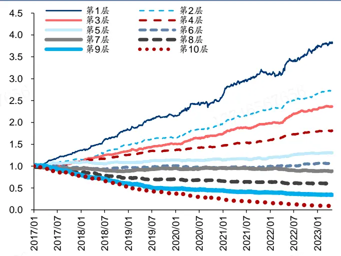
注：回测期：2017/1/4～2023/4/28
资料来源：Wind，华泰研究

图表23： 15分钟频注意力模型分层组合相对净值，全 A股
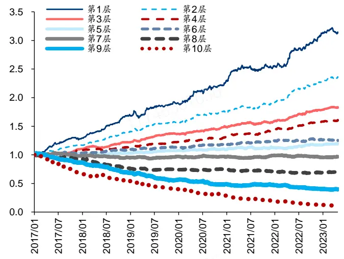
注：回测期：2017/1/4～2023/4/28
资料来源：Wind，华泰研究

## 测试结果：多频率混合模型和多频率增量混合模型

在下图的三个模型对比中，可得以下结论：

1. 两个多频率混合模型的 TOP组合年化超额收益率相比 15 分钟频模型有较大提升，说明引入日频量价信息对模型有较大贡献。

2. 多频率增量混合模型在各个股票池内都表现最好，且 TOP组合换手率最低，体现出增量学习模型的优势。

图表24： 模型 IC值分析和分层回测结果汇总

|  | RankIC 均值 | RankIC 标准差 | IC_IR | IC>0 占比 | TOP 组合年化超额收益率 TOP 组合信息比率 TOP 组合胜率 TOP 组合换手率 |  |  |  |
| --- | --- | --- | --- | --- | --- | --- | --- | --- |
| 沪深 300 |  |  |  |  |  |  |  |  |
| 15分钟频模型 | 5.86% | 14.98% | 0.39 | 66.78% | 15.39% | 1.60 | 65.79% | 125.11% |
| 多频率混合模型 | 7.02% | 13.48% | 0.52 | 71.01% | 29.25% | 2.97 | 76.32% | 110.94% |
| 多频率增量混合模型 | 7.19% | 13.46% | 0.53 | 72.88% | 29.42% | 3.09 | 80.26% | 105.83% |
| 中证500 |  |  |  |  |  |  |  |  |
| 15分钟频模型 | 6.57% | 10.97% | 0.60 | 73.62% | 17.33% | 2.14 | 68.42% | 122.66% |
| 多频率混合模型 | 7.19% | 10.16% | 0.71 | 76.55% | 21.67% | 2.68 | 75.00% | 110.88% |
| 多频率增量混合模型 | 8.08% | 9.80% | 0.82 | 80.39% | 26.53% | 3.42 | 77.63% | 104.47% |
| 中证 1000 |  |  |  |  |  |  |  |  |
| 15 分钟频模型 | 8.97% | 8.95% | 1.00 | 85.67% | 23.77% | 3.42 | 82.89% | 126.28% |
| 多频率混合模型 | 8.58% | 8.34% | 1.03 | 86.32% | 30.12% | 4.26 | 88.16% | 111.60% |
| 多频率增量混合模型 | 10.07% | 8.75% | 1.15 | 89.54% | 36.39% | 5.17 | 93.42% | 107.77% |
| 全 A 股 |  |  |  |  |  |  |  |  |
| 15分钟频模型 | 9.30% | 8.12% | 1.15 | 86.97% | 24.18% | 3.95 | 80.26% | 125.17% |
| 多频率混合模型 | 8.39% | 8.21% | 1.02 | 86.97% | 30.00% | 4.80 | 92.11% | 108.42% |
| 多频率增量混合模型 | 10.22% | 7.71% | 1.33 | 90.85% | 36.36% | 5.95 | 94.74% | 105.25% |

注：回测期：2017/1/4～2023/4/28
资料来源：Wind，华泰研究

图表25： 多频率混合模型分层组合相对净值，沪深 300成分股
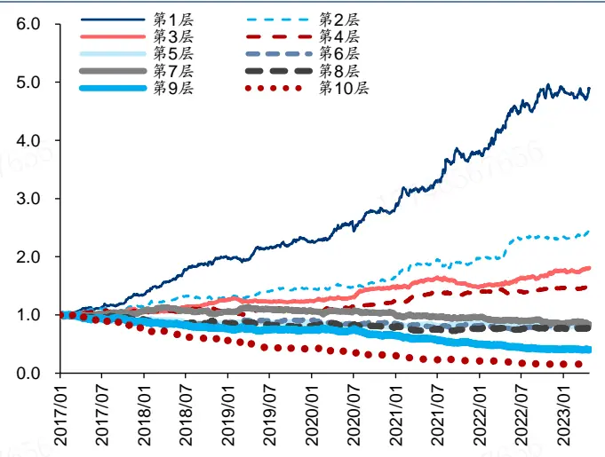
注：回测期：2017/1/4～2023/4/28
资料来源：Wind，华泰研究

图表26： 多频率增量混合模型分层组合相对净值，沪深 300成分股
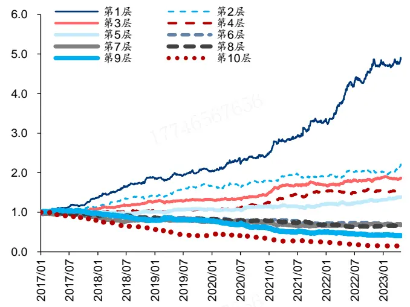
注：回测期：2017/1/4～2023/4/28
资料来源：Wind，华泰研究

图表27： 多频率混合模型分层组合相对净值，中证 500成分股
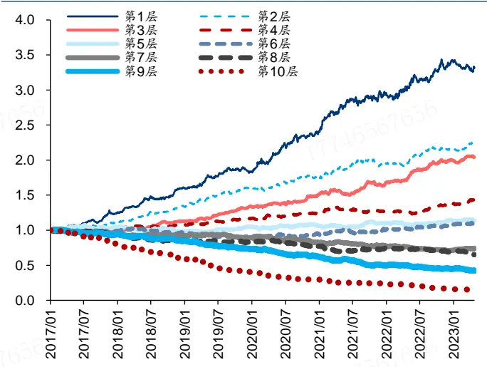
注：回测期：2017/1/4～2023/4/28
资料来源：Wind，华泰研究

图表28： 多频率增量混合模型分层组合相对净值，中证 500成分股
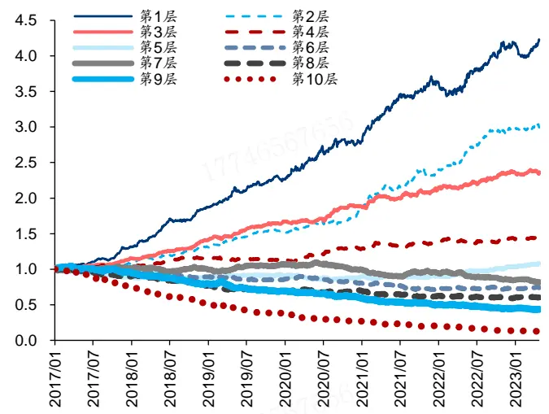
注：回测期：2017/1/4～2023/4/28
资料来源：Wind，华泰研究

图表29： 多频率混合模型分层组合相对净值，中证 1000成分股
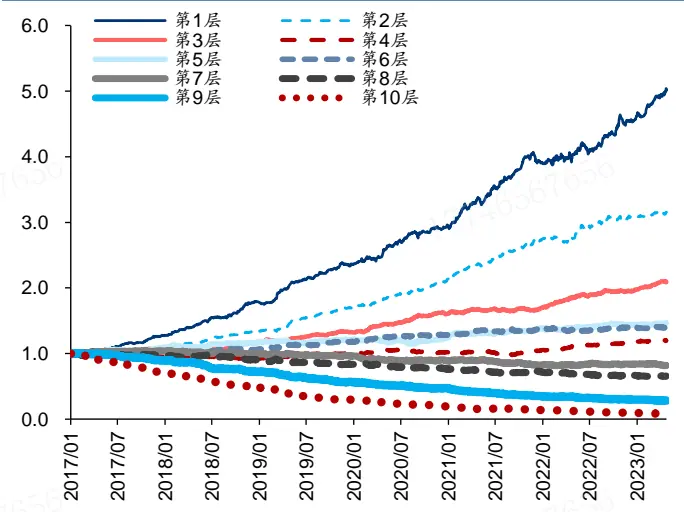
注：回测期：2017/1/4～2023/4/28
资料来源：Wind，华泰研究

图表30： 多频率增量混合模型分层组合相对净值，中证 1000成分股
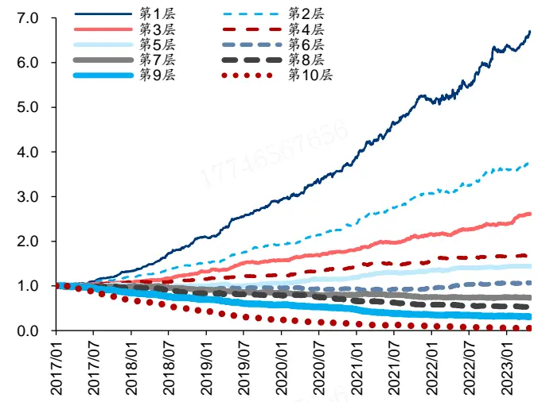
注：回测期：2017/1/4～2023/4/28
资料来源：Wind，华泰研究

图表31： 多频率混合模型分层组合相对净值，全 A股
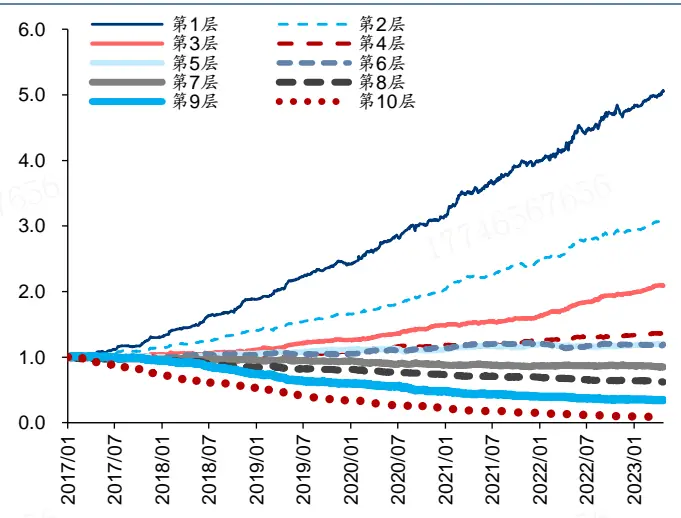
注：回测期：2017/1/4～2023/4/28
资料来源：Wind，华泰研究

图表32： 多频率增量混合模型分层组合相对净值，全 A股
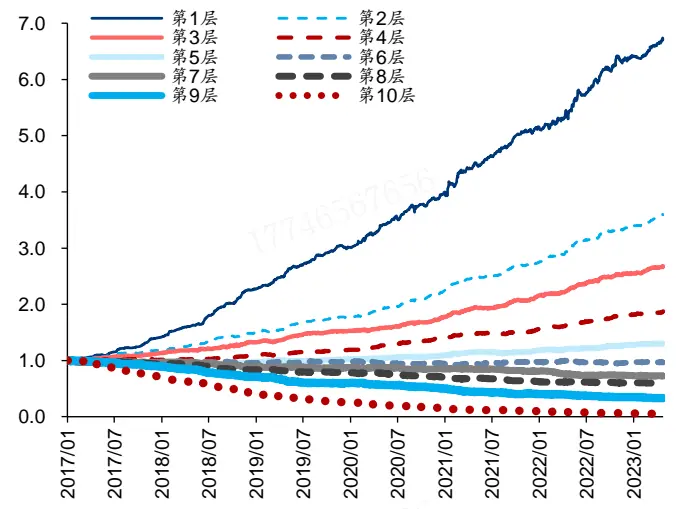
注：回测期：2017/1/4～2023/4/28
资料来源：Wind，华泰研究

## 模型间相关性分析

本章测试的四个模型间相关性如下。

图表33： 四个模型间相关性

|  | 15 分钟频模型 | 15 分钟频注意力模型 | 多频率混合模型 | 多频率增量混合模型 |
| --- | --- | --- | --- | --- |
|  |  | 0.6864 | 0.5148 | 0.5527 |
| 15分钟频模型 15 分钟频注意力模型 | 0.6864 |  | 0.4629 | 0.4576 |
| 多频率混合模型 | 0.5148 | 0.4629 |  | 0.7302 |
| 多频率增量混合模型 | 0.5527 | 0.4576 | 0.7302 |  |

资料来源：Wind，华泰研究

注：回测期：2017/1/4～2023/4/28资料来源：Wind，华泰研究

## 指数增强组合测试

从上一章的测试可以看出，基于参数冻结+残差预测的增量学习模型表现最好，本章我们将基于该模型构建各类指数增强策略，并展示回测结果。

## 沪深 300 增强

沪深 300 增强组合构建方法如下。

图表34： 沪深 300增强组合构建细节

| 优化目标 | 最大化预期收益 |
| --- | --- |
| 成分股权重约束 | 不低于 80% |
| 个股权重偏离上限 | 0.8% |
| 风格因子约束 | 行业市值中性 |
| 换手率约束 | 周双边换手率上限分别为30%、40%和50% |
| 调仓频率和交易成本 | 周频调仓，调仓当日以vwap价格成交，交易成本双边千分之四 7656 |

资料来源：华泰研究

沪深 300 增强组合回测结果如下图。

图表35： 沪深 300增强组合累积超额收益
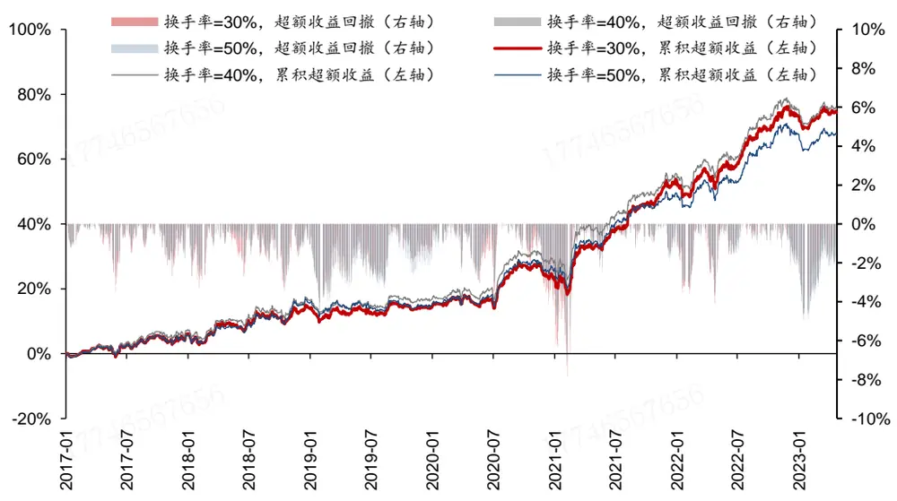

图表36： 沪深 300增强组合回测绩效

|  |  |  |  |  |  |  | 超额收益最大 | 调仓双边换 |  |  |  |
| --- | --- | --- | --- | --- | --- | --- | --- | --- | --- | --- | --- |
|  | 年化收益率 | 年化波动率 | 夏普比率 | 最大回撤 | 益率 | 误差 |  | 回撤 | 信息比率 Calmar 比率 | 相对基准月胜率 | 手率 |
| 换手率=30% | 12.76% | 18.78% | 0.68 | 27.56% | 9.48% | 5.72% | 7.84% | 1.66 | 1.21 | 68.00% | 32.80% |
| 换手率=40% | 12.88% | 18.76% | 0.69 | 27.35% | 9.58% | 5.79% | 6.85% | 1.66 | 1.40 | 65.33% | 41.95% |
| 换手率=50% | 12.03% | 18.85% | 0.64 | 27.67% | 8.77% | 5.87% | 7.08% | 1.49 | 1.24 | 66.67% | 51.33% |
| 沪深300 | 2.79% | 19.00% | 0.15 | 39.59% |  |  |  |  |  |  |  |

注：回测期：2017/1/4～2023/4/28
资料来源：Wind，华泰研究

图表37： 沪深 300增强组合逐年收益率

| 2017年收益率 2018年收益率2019年收益率2020年收益率 |  |  |  |  |  | 2021年收益率 | 2022 年收益率 -11.40% | 2023 年收益率 4.61% |
| --- | --- | --- | --- | --- | --- | --- | --- | --- |
| 换手率=30% | 26.95% | -19.55% | 36.18% | 37.12% | 19.37% |  |  |  |
| 换手率=40% | 28.33% | 56 -18.74% | 36.21% | 39.75% | 16.09% | 56 -11.51% | 4.23% |  |
| 换手率=50% | 26.55% | -18.18% | 34.83% | 39.20% | 13.77% | -11.76% | 3.96% |  |
| 沪深300 | 19.67% | -25.31% | 36.07% | 27.21% | -5.20% | -21.63% | 4.07% |  |

注：回测期：2017/1/4～2023/4/28
资料来源：Wind，华泰研究

## 中证 500 增强

中证 500 增强组合构建方法如下。

图表38： 中证 500增强组合构建细节

| 优化目标 | 最大化预期收益 |
| --- | --- |
| 成分股权重约束 | 不低于 60% 17746567656 |
| 个股权重偏离上限 | 0.8% |
| 风格因子约束 | 行业市值中性 |
| 换手率约束 | 周双边换手率上限分别为 30%、40%和50% |
| 调仓频率和交易成本 | 周频调仓，调仓当日以vwap价格成交，交易成本双边千分之四 |

资料来源：华泰研究

中证 500 增强组合回测结果如下图。

图表39： 中证 500增强组合累积超额收益
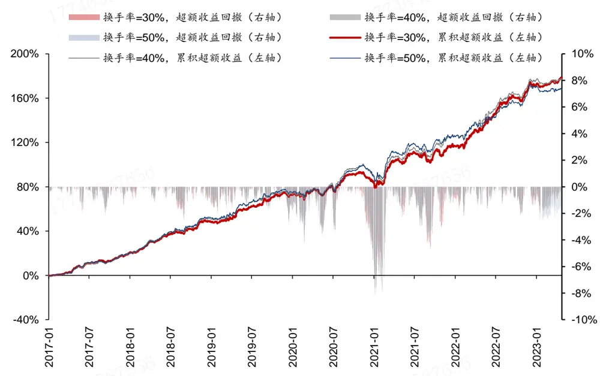
注：回测期：2017/1/4～2023/4/28
资料来源：Wind，华泰研究

图表40： 中证 500增强组合回测绩效

|  |  |  |  |  |  |  | 超额收益最大 | 调仓双边换 |  |  |  |
| --- | --- | --- | --- | --- | --- | --- | --- | --- | --- | --- | --- |
|  | 年化收益率 | 年化波动率 | 夏普比率 | 最大回撤 | 益率 | 误差 |  | 回撤 | 信息比率 Calmar 比率 | 相对基准月胜率 | 手率 |
| 换手率=30% | 17.71% | 20.55% | 0.86 | 29.74% | 18.18% | 5.52% | 7.41% | 3.29 | 2.45 | 78.67% | 32.54% |
| 换手率=40% | 17.58% | 20.55% | 0.86 | 28.84% | 18.05% | 5.55% | 8.17% | 3.25 | 2.21 | 77.33% | 41.68% |
| 换手率=50% | 16.93% | 20.57% | 0.82 | 28.71% | 17.39% | 5.59% | 7.60% | 3.11 | 2.29 | 74.67% | 50.89% |
| 中证 500 | -0.61% | 20.89% | -0.03 | 40.11% |  |  |  |  |  |  |  |

注：回测期：2017/1/4～2023/4/28
资料来源：Wind，华泰研究

图表41： 中证 500增强组合逐年收益率

| 2017年收益率 2018年收益率 2019年收益率2020年收益率 |  |  |  |  | 2021年收益率 | 2022 年收益率 | 2023 年收益率 |
| --- | --- | --- | --- | --- | --- | --- | --- |
| 换手率=30% | 17.63% | -17.56% | 47.28% | 29.47% |  |  |  |
| 换手率=40% | 17.63% | -16.06% | 45.43% | 32.59% | 36.66% 38.35% | -0.02% -2.61% | 8.93% 6.72% |
| 换手率=50% | 17.57% | -15.41% | 45.68% | 32.00% | 37.31% | -4.40% | 5.50% |
| 中证 500 | -2.25% | -33.32% | 26.38% | 20.87% | 15.58% | -20.31% | 6.42% |

注：回测期：2017/1/4～2023/4/28
资料来源：Wind，华泰研究

## 中证 1000 增强

中证 1000 增强组合构建方法如下。

图表42： 中证 1000增强组合构建细节

| 优化目标 | 最大化预期收益 |
| --- | --- |
| 成分股权重约束 | 不低于 80% 17746567656 |
| 个股权重偏离上限 | 0.8% |
| 风格因子约束 | 行业暴露<0.02，市值暴露<0.2 |
| 换手率约束 | 周双边换手率上限分别为30%、40%和50% |
| 调仓频率和交易成本 | 周频调仓，调仓当日以vwap价格成交，交易成本双边千分之四 |

资料来源：华泰研究

中证 1000 增强组合回测结果如下图。

图表43： 中证 1000增强组合累积超额收益
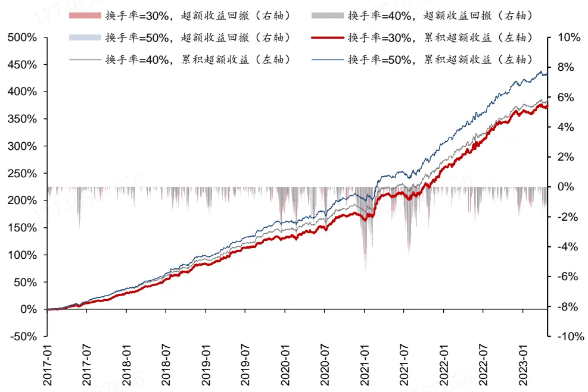
注：回测期：2017/1/4～2023/4/28
资料来源：Wind，华泰研究

图表44： 中证 1000增强组合回测绩效

|  |  |  |  |  |  |  | 超额收益最大 | 调仓双边换 |  |  |  |
| --- | --- | --- | --- | --- | --- | --- | --- | --- | --- | --- | --- |
|  | 年化收益率 | 年化波动率 | 夏普比率 | 最大回撤 | 益率 | 误差 |  | 回撤 | 信息比率 Calmar 比率 | 相对基准月胜率 | 手率 |
| 换手率=30% | 23.70% | 22.88% | 1.04 | 28.66% | 28.93% | 6.51% | 5.52% | 4.45 | 5.24 | 82.67% | 32.84% |
| 换手率=40% | 24.09% | 23.01% | 1.05 | 29.09% | 29.38% | 6.56% | 5.57% | 4.48 | 5.27 | 90.67% | 42.27% |
| 换手率=50% | 26.15% | 23.13% | 1.13 | 28.46% | 31.57% | 6.59% | 4.62% | 4.79 | 6.83 | 90.67% | 51.42% |
| 中证1000 | -4.27% | 22.92% | -0.19 | 52.14% |  |  |  |  |  |  |  |

注：回测期：2017/1/4～2023/4/28
资料来源：Wind，华泰研究

图表45： 中证 1000增强组合逐年收益率

| 2017年收益率 2018年收益率 2019年收益率2020年收益率 |  |  |  |  | 2021年收益率 | 2022 年收益率 | 2023 年收益率 |
| --- | --- | --- | --- | --- | --- | --- | --- |
| 换手率=30% | 4.62% | -10.60% | 57.97% | 38.29% |  |  |  |
| 换手率=40% | 11.75% | -12.21% | 60.37% | 37.92% | 63.38% 59.81% | 1.58% -0.12% | 9.87% 9.86% |
| 换手率=50% | 10.91% | -8.66% | 64.26% | 39.92% | 61.92% | 0.45% | 11.18% |
| 中证1000 | -19.06% | -36.87% | 25.67% | 19.39% | 20.52% | -21.58% | 7.03% |

注：回测期：2017/1/4～2023/4/28
资料来源：Wind，华泰研究

## 国证 2000 增强

国证 2000 增强组合构建方法如下。

图表46： 国证 2000增强组合构建细节

| 优化目标 | 最大化预期收益 |
| --- | --- |
| 成分股权重约束 | 不低于 80% 17746567656 |
| 个股权重偏离上限 | 1% |
| 风格因子约束 | 行业暴露<0.02，市值暴露<0.2 |
| 换手率约束 | 周双边换手率上限分别为30%、40%和50% |
| 调仓频率和交易成本 | 周频调仓，调仓当日以vwap价格成交，交易成本双边千分之四 |

资料来源：华泰研究

国证 2000 增强组合回测结果如下图。

图表47： 国证 2000增强组合累积超额收益
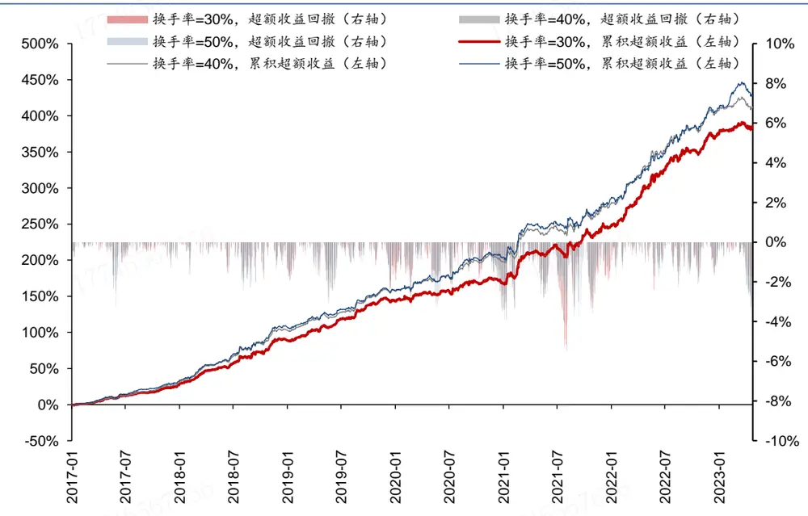
注：回测期：2017/1/4～2023/4/28
资料来源：Wind，华泰研究

图表48： 国证 2000增强组合回测绩效

|  |  |  |  |  |  |  | 超额收益最大 | 调仓双边换 |  |  |  |
| --- | --- | --- | --- | --- | --- | --- | --- | --- | --- | --- | --- |
|  | 年化收益率 | 年化波动率 | 夏普比率 | 最大回撤 | 益率 | 误差 |  | 回撤 | 信息比率 Calmar 比率 | 相对基准月胜率 | 手率 |
| 换手率=30% | 26.81% | 22.77% | 1.18 | 26.52% | 29.38% | 7.18% | 5.48% | 4.09 | 5.36 | 88.00% | 32.45% |
| 换手率=40% | 27.77% | 23.15% | 1.20 | 24.92% | 30.47% | 7.24% | 4.02% | 4.21 | 7.59 | 86.67% | 41.70% |
| 换手率=50% | 28.42% | 23.34% | 1.22 | 24.99% | 31.19% | 7.34% | 3.80% | 4.25 | 8.21 | 86.67% | 50.93% |
| 国证 2000 | -2.21% | 22.66% | -0.10 | 49.91% |  |  |  |  |  |  |  |

注：回测期：2017/1/4～2023/4/28
资料来源：Wind，华泰研究

图表49： 国证 2000增强组合逐年收益率

| 2017年收益率 2018年收益率 2019年收益率2020年收益率 |  |  |  |  |  | 2021年收益率 2022 年收益率 | 2023 年收益率 |
| --- | --- | --- | --- | --- | --- | --- | --- |
| 换手率=30% | 3.41% | -1.44% | 59.41% | 29.12% | 67.28% |  |  |
| 换手率=40% | 5.75% | 3.28% | 57.07% | 35.34% | 64.11% | 14.29% 11.74% | 9.39% 7.95% |
| 换手率=50% | 7.30% | 4.24% | 53.66% | 37.62% | 63.89% | 10.28% | 10.56% |
| 国证 2000 | -18.64% | -33.77% | 23.45% | 16.87% | 29.19% | -17.20% | 6.75% |

注：回测期：2017/1/4～2023/4/28
资料来源：Wind，华泰研究

## 总结

神经网络能自动提取股票原始量价数据中的特征，实现端到端的因子挖掘和因子合成。本文重点研究如何设计网络结构以有效挖掘不同频率的股票量价数据。全文总结如下：

神经网络在 15分钟频量价数据上表现较好，加入注意力机制后无改进。考虑到神经网络具有强大的特征提取能力，本文省去人工构建因子的步骤，直接对标准化后的原始 15 分钟 K线数据进行学习，神经网络骨干部分使用 GRU网络。样本空间为全A股，模型在2017/1/4～2023/4/28 的回测期内周度 RankIC 均值为 9.30%，分 10 层 TOP 组合年化超额收益率为24.18%(不计交易成本)。我们还尝试对 GRU 加入注意力机制，希望帮助模型更好地记忆长程序列信息，但在本文的测试中，加入注意力机制后没有改进效果。

基于日频+15 分钟频数据的多频率混合模型分层测试效果明显提升。为了融入更多市场信息，我们在 15 分钟频数据的模型上，加入日频数据，构建多频率混合模型。模型通过两个输入分别接收日频量价和 15 分钟频量价数据，并分别使用 GRU 提取特征，最后将两部分特征拼接并对接输出。样本空间为全 A 股，模型在 2017/1/4～2023/4/28 的回测期内周度RankIC 均值为 8.58%，分 10 层 TOP 组合年化超额收益率为 30.12%(不计交易成本)，TOP组合表现相比 15 分钟频模型提升明显。

基于参数冻结+残差预测的多频率增量混合模型表现最好。针对多频率数据混合模型，我们引入因子增量贡献的思想，设计了一个两阶段训练的增量学习模型。第一阶段：只使用日频量价数据训练对应的神经网络分支，即先让网络学习日频级别的量价信息，第一阶段训练直到模型的 loss 收敛为止。第二阶段：将日频量价数据分支网络结构的参数冻结，只前向传播，然后引入 15 分钟频数据学习残差，即再让网络学习分钟频量价数据能够贡献的增量信息。样本空间为全 A股，模型在 2017/1/4～2023/4/28 的回测期内周度 RankIC均值为10.22%，分 10 层 TOP 组合年化超额收益率为 36.36%(不计交易成本)，在本文的所有模型中表现最好。

基于多频率增量混合模型构建多个指数增强组合，回测表现优秀。我们基于多频率增量混合模型构建多个指数增强组合，并回测了周双边换手率分别控制为 30%、40%和 50%的情况。在 2017/1/4～2023/4/28 的回测期内，沪深 300 增强组合年化超额收益率为8.77%~9.48%，信息比率为 1.21~1.40。中证 500 增强组合年化超额收益率为17.39%~18.18%，信息比率为 3.11~3.29。中证 1000 增强组合年化超额收益率为28.93%~31.57%，信息比率为 4.45~4.79。国证 2000 增强组合年化超额收益率为29.38%~31.19%，信息比率为 4.09~4.25。

## 风险提示

通过人工智能模型构建的选股策略是历史经验的总结，存在失效的可能。神经网络受随机性影响较大、可解释性较差，使用需谨慎。

## 免责声明

## 分析师声明

本人，林晓明、李子钰、何康，兹证明本报告所表达的观点准确地反映了分析师对标的证券或发行人的个人意见；彼以往、现在或未来并无就其研究报告所提供的具体建议或所表迖的意见直接或间接收取任何报酬。

## 一般声明及披露

本报告由华泰证券股份有限公司（已具备中国证监会批准的证券投资咨询业务资格，以下简称“本公司”）制作。本报告所载资料是仅供接收人的严格保密资料。本报告仅供本公司及其客户和其关联机构使用。本公司不因接收人收到本报告而视其为客户。

本报告基于本公司认为可靠的、已公开的信息编制，但本公司及其关联机构(以下统称为“华泰”)对该等信息的准确性及完整性不作任何保证。

本报告所载的意见、评估及预测仅反映报告发布当日的观点和判断。在不同时期，华泰可能会发出与本报告所载意见、评估及预测不一致的研究报告。同时，本报告所指的证券或投资标的的价格、价值及投资收入可能会波动。以往表现并不能指引未来，未来回报并不能得到保证，并存在损失本金的可能。华泰不保证本报告所含信息保持在最新状态。华泰对本报告所含信息可在不发出通知的情形下做出修改，投资者应当自行关注相应的更新或修改。

本公司不是 FINRA 的注册会员，其研究分析师亦没有注册为 FINRA 的研究分析师/不具有 FINRA 分析师的注册资格。

华泰力求报告内容客观、公正，但本报告所载的观点、结论和建议仅供参考，不构成购买或出售所述证券的要约或招揽。该等观点、建议并未考虑到个别投资者的具体投资目的、财务状况以及特定需求，在任何时候均不构成对客户私人投资建议。投资者应当充分考虑自身特定状况，并完整理解和使用本报告内容，不应视本报告为做出投资决策的唯一因素。对依据或者使用本报告所造成的一切后果，华泰及作者均不承担任何法律责任。任何形式的分享证券投资收益或者分担证券投资损失的书面或口头承诺均为无效。

除非另行说明，本报告中所引用的关于业绩的数据代表过往表现，过往的业绩表现不应作为日后回报的预示。华泰不承诺也不保证任何预示的回报会得以实现，分析中所做的预测可能是基于相应的假设，任何假设的变化可能会显著影响所预测的回报。

华泰及作者在自身所知情的范围内，与本报告所指的证券或投资标的不存在法律禁止的利害关系。在法律许可的情况下，华泰可能会持有报告中提到的公司所发行的证券头寸并进行交易，为该公司提供投资银行、财务顾问或者金融产品等相关服务或向该公司招揽业务。

华泰的销售人员、交易人员或其他专业人士可能会依据不同假设和标准、采用不同的分析方法而口头或书面发表与本报告意见及建议不一致的市场评论和/或交易观点。华泰没有将此意见及建议向报告所有接收者进行更新的义务。华泰的资产管理部门、自营部门以及其他投资业务部门可能独立做出与本报告中的意见或建议不一致的投资决策。投资者应当考虑到华泰及/或其相关人员可能存在影响本报告观点客观性的潜在利益冲突。投资者请勿将本报告视为投资或其他决定的唯一信赖依据。有关该方面的具体披露请参照本报告尾部。

本报告并非意图发送、发布给在当地法律或监管规则下不允许向其发送、发布的机构或人员，也并非意图发送、发布给因可得到、使用本报告的行为而使华泰违反或受制于当地法律或监管规则的机构或人员。

本报告版权仅为本公司所有。未经本公司书面许可，任何机构或个人不得以翻版、复制、发表、引用或再次分发他人(无论整份或部分)等任何形式侵犯本公司版权。如征得本公司同意进行引用、刊发的，需在允许的范围内使用，并需在使用前获取独立的法律意见，以确定该引用、刊发符合当地适用法规的要求，同时注明出处为“华泰证券研究所”，且不得对本报告进行任何有悖原意的引用、删节和修改。本公司保留追究相关责任的权利。所有本报告中使用的商标、服务标记及标记均为本公司的商标、服务标记及标记。

## 中国香港

本报告由华泰证券股份有限公司制作,在香港由华泰金融控股（香港）有限公司向符合《证券及期货条例》及其附属法律规定的机构投资者和专业投资者的客户进行分发。华泰金融控股（香港）有限公司受香港证券及期货事务监察委员会监管，是华泰国际金融控股有限公司的全资子公司，后者为华泰证券股份有限公司的全资子公司。在香港获得本报告的人员若有任何有关本报告的问题,请与华泰金融控股（香港）有限公司联系。

## 香港-重要监管披露

- 华泰金融控股（香港）有限公司的雇员或其关联人士没有担任本报告中提及的公司或发行人的高级人员。

- 有关重要的披露信息，请参华泰金融控股（香港）有限公司的网页 https://www.htsc.com.hk/stock_disclosure其他信息请参见下方 “美国-重要监管披露”。

## 美国

在美国本报告由华泰证券（美国）有限公司向符合美国监管规定的机构投资者进行发表与分发。华泰证券（美国）有限公司是美国注册经纪商和美国金融业监管局（FINRA）的注册会员。对于其在美国分发的研究报告，华泰证券（美国）有限公司根据《1934 年证券交易法》（修订版）第 15a-6 条规定以及美国证券交易委员会人员解释，对本研究报告内容负责。华泰证券（美国）有限公司联营公司的分析师不具有美国金融监管（FINRA）分析师的注册资格，可能不属于华泰证券（美国）有限公司的关联人员，因此可能不受 FINRA 关于分析师与标的公司沟通、公开露面和所持交易证券的限制。华泰证券（美国）有限公司是华泰国际金融控股有限公司的全资子公司，后者为华泰证券股份有限公司的全资子公司。任何直接从华泰证券（美国）有限公司收到此报告并希望就本报告所述任何证券进行交易的人士，应通过华泰证券（美国）有限公司进行交易。

## 美国-重要监管披露

- 分析师林晓明、李子钰、何康本人及相关人士并不担任本报告所提及的标的证券或发行人的高级人员、董事或顾问。分析师及相关人士与本报告所提及的标的证券或发行人并无任何相关财务利益。本披露中所提及的“相关人士”包括 FINRA 定义下分析师的家庭成员。分析师根据华泰证券的整体收入和盈利能力获得薪酬，包括源自公司投资银行业务的收入。

华泰证券股份有限公司、其子公司和/或其联营公司, 及/或不时会以自身或代理形式向客户出售及购买华泰证券研究所覆盖公司的证券/衍生工具，包括股票及债券（包括衍生品）华泰证券研究所覆盖公司的证券/衍生工具，包括股票及债券（包括衍生品）。

- 华泰证券股份有限公司、其子公司和/或其联营公司, 及/或其高级管理层、董事和雇员可能会持有本报告中所提到的任何证券（或任何相关投资）头寸，并可能不时进行增持或减持该证券（或投资）。因此，投资者应该意识到可能存在利益冲突。

## 评级说明

投资评级基于分析师对报告发布日后 6 至 12个月内行业或公司回报潜力（含此期间的股息回报）相对基准表现的预期（A 股市场基准为沪深 300 指数，香港市场基准为恒生指数，美国市场基准为标普 500 指数），具体如下：

## 行业评级

增持：预计行业股票指数超越基准

中性：预计行业股票指数基本与基准持平

减持：预计行业股票指数明显弱于基准

## 公司评级

买入：预计股价超越基准 15%以上

增持：预计股价超越基准 5%~15%

持有：预计股价相对基准波动在-15%~5%之间

卖出：预计股价弱于基准 15%以上

暂停评级：已暂停评级、目标价及预测，以遵守适用法规及/或公司政策

无评级：股票不在常规研究覆盖范围内。投资者不应期待华泰提供该等证券及/或公司相关的持续或补充信息

## 法律实体披露

中国：华泰证券股份有限公司具有中国证监会核准的“证券投资咨询”业务资格，经营许可证编号为：91320000704041011J香港：华泰金融控股（香港）有限公司具有香港证监会核准的“就证券提供意见”业务资格，经营许可证编号为：AOK809美国：华泰证券（美国）有限公司为美国金融业监管局（FINRA）成员，具有在美国开展经纪交易商业务的资格，经营业务许可编号为：CRD#:298809/SEC#:8-70231

## 华泰证券股份有限公司

南京南京市建邺区江东中路228号华泰证券广场1号楼/邮政编码：210019

电话：86 25 83389999/传真：86 25 83387521电子邮件：ht-rd@htsc.com

## 深圳深圳

深圳市福田区益田路5999号基金大厦10楼/邮政编码：518017电话：86 755 82493932/传真：86 755 82492062电子邮件：ht-rd@htsc.com

## 华泰金融控股（香港）有限公司

香港中环皇后大道中 99号中环中心 58楼 5808-12室
电话：+852-3658-6000/传真：+852-2169-0770
电子邮件：research@htsc.com
http://www.htsc.com.hk

## 华泰证券（美国）有限公司

美国纽约公园大道 280号 21楼东（纽约 10017）

电话：+212-763-8160/传真：+917-725-9702

电子邮件: Huatai@htsc-us.com

http://www.htsc-us.com

©版权所有2023年华泰证券股份有限公司

北京
北京市西城区太平桥大街丰盛胡同28号太平洋保险大厦A座18层/
邮政编码：100032
电话：86 10 63211166/传真：86 10 63211275
电子邮件：ht-rd@htsc.com
上海
上海市浦东新区东方路18号保利广场E栋23楼/邮政编码：200120
电话：86 21 28972098/传真：86 21 28972068
电子邮件：ht-rd@htsc.com