## 华泰金工 | 华泰人工智能研究6周年回顾

华泰金融工程 华泰证券金融工程 2023-05-24 08:01 发表于上海

近年来，人工智能在量化投资领域已取得令人瞩目的成绩，同时也伴随诸多争议，机遇与挑战并存。2023年3月，ChatGPT的火爆出圈再一次将投资人的目光吸引到AI这一领域，大模型“涌现”所带来的惊喜令人充满期待。作为人工智能量化研究的先行者，华泰金工团队2017年6月1日以来陆续发布深度报告68篇，涵盖模型测试、因子挖掘、另类数据、对抗过拟合、生成对抗网络、综合六大主题。正值首篇研报发布6周年之际，我们对系列研究进行回顾，述往事，思来者。

## 目录

## 01 华泰人工智能研究6周年回顾

系列研究大事记模型测试主题因子挖掘主题另类数据主题对抗过拟合主题生成对抗网络主题综合主题

## 核心观点

## 华泰人工智能研究6周年回顾

近年来，人工智能在量化投资领域已取得令人瞩目的成绩，同时也伴随诸多争议，机遇与挑战并存。2023年3月，ChatGPT的火爆出圈再一次将投资人的目光吸引到AI这一领域，大模型“涌现”所带来的惊喜令人充满期待。作为人工智能量化研究的先行者，华泰金工团队2017年6月1日以来陆续发布深度报告68篇，涵盖模型测试、因子挖掘、另类数据、对抗过拟合、生成对抗网络、综合六大主题。正值首篇研报发布6周年之际，我们对系列研究进行回顾，述往事，思来者。

## 模型测试主题

模型测试是系列早期侧重的主题。2017年我们测试广义线性模型、支持向量机、决策树、神经网络等模型的选股效果，发现随机森林、XGBoost这两类决策树集成模型较为适合多因子选股场景，兼具拟合能力强、稳定性好、训练效率高等优点。近期我们关注多任务学习在AI量化策略中的应用，测试多目标损失函数的不同融合方式对超额收益的影响，挖掘不同预测目标下的增量信息。

## 因子挖掘、另类数据主题

持续迭代的因子库是多因子模型长期运作的基石。2019年6月，我们展示遗传规划在量价选股因子挖掘中的详细流程，并且持续探索改进方案，近期将算法拓展至一致预期因子挖掘。2020年6月，我们构建全新的因子挖掘神经网络AlphaNet，实现端到端的因子自动挖掘和合成。2023年5月，我们关注GRU网络在端到端因子挖掘中的应用，对个股日间和日内不同频率的数据进行混频合成，挖掘出的因子在不同的股票池中都展现出优秀的选股能力。2020年起，我们借助NLP中的技术对新闻舆情、分析师研报等另类数据，挖掘增量Alpha。

## 对抗过拟合、生成对抗网络、综合主题

投资者对人工智能的质疑集中于过拟合和黑箱，我们提供丰富的工具加以应对。金融市场数据量有限，过拟合难以避免，生成对抗网络（GAN）可以生成以假乱真的“伪造”数据，有助于我们训练模型和理解市场。我们还探索特征选择、另类标签、因果推断、无监督学习在投资中的应用。近期我们学习九坤在Kaggle举办的量化投资大赛中的成功经验，总结量化AI“炼丹”中的技巧，提升模型收益。跟进GPT大语言模型对量化投资可能带来的影响，通过四则实例分析GPT对投研工作带来的效率提升。

## 华泰人工智能系列的初心

人工智能并不神秘。其本质是以数理模型为核心工具，结合控制论、认知心理学等学科的研究成果，最终由计算机模拟人类的感知、推理、学习、决策过程。人工智能并非万能。现实世界高度复杂，任何模型相对于整个世界都太过简单。世界时刻处于演化中，没有任何模型能长期有效，必须同步保持更新。华泰人工智能系列的愿景，是通过切实的研究与实践，澄清人们对人工智能的误解和偏见，帮助人们更清晰地认识人工智能的长处和局限，从而更合理、高效地将人工智能运用于投资。回顾过往68篇研究，我们秉持了这一份初心，也希望为读者带来了启发。

## 正文

## 01 华泰人工智能研究6周年回顾

近年来，人工智能在量化投资领域已取得令人瞩目的成绩，同时也伴随诸多争议，机遇与挑战并存。2023年3月，ChatGPT的火爆出圈再一次将投资人的目光吸引到AI这一领域，大模型“涌现”所带来的惊喜令人充满期待。毫无疑问，AI研究已经展开了新的篇章。

作为人工智能量化研究的先行者，华泰金融工程团队自2017年6月1日以来陆续发布深度报告68篇，涵盖模型测试、因子挖掘、另类数据、对抗过拟合、生成对抗网络、综合六大主题。正值首篇研报发布6周年之际，对系列研究进行回顾，述往事，思来者。

## 系列研究大事记

2017年6月1日，《人工智能1：人工智能选股框架及经典算法简介》发布，开启模型测试主题。

2017年10月10日，首场人工智能Python培训在北京举办。

2018年1月2日，首篇人工智能周报发布，每周跟踪人工智能选股策略表现。

2018年11月28日，《人工智能14：对抗过拟合：从时序交叉验证谈起》发布，开启对抗过拟合主题。

2019年6月10日，《人工智能21：基于遗传规划的选股因子挖掘》发布，开启因子挖掘主题。

2020年5月8日，《人工智能31：生成对抗网络GAN初探》发布，开启生成对抗网络主题。

2020年5月26日，《AI开辟量化新航线》专题路演上线华泰机构服务平台行知。

2020年6月14日，《人工智能32：AlphaNet：因子挖掘神经网络》发布。

2020年10月22日，《人工智能37：舆情因子和BERT情感分类模型》发布，开启另类数据主题。

2020年12月15日，交易机会评分数据上线华泰金融数据服务平台INSIGHT。

2021年4月13日，AlphaNet因子数据上线INSIGHT。

2021年9月27日，人工智能选股策略数据库上线行知。

2021年10月22日，AI炼金术第一期《左右互搏的“GAN”》上线行知。

2022年4月29日，研究所和宽邦科技、亚马逊云科技、朝阳永续、金融阶联合撰写的《2021年中国量化投资白皮书》正式发布，在呈现量化金融领域当前发展现状同时，从人工智能、另类数据、高频交易等方面展望量化投资未来前景。

2023年4月，《2022年中国量化投资白皮书》正式发布，首场发布会行知线上观看人数累计超过8000人次。

图表1：华泰人工智能系列研究大事记
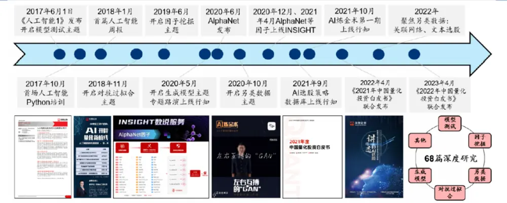

## 模型测试主题

模型测试是系列早期侧重的主题。多因子选股和机器学习在形式上匹配，是机器学习应用于量化投资的较好切入点。2017年，我们测试广义线性模型、支持向量机、决策树、神经网络等模型的选股效果，发现随机森林、XGBoost这两类决策树集成模型较为适合多因子选股场景，兼具拟合能力强、稳定性好、训练效率高等优点。

2022年我们关注深度学习研究热点——图神经网络。传统模型将股票视作互不相关的个体，而图神经网络可以学习股票间相互影响，为预测提供增量信息。我们构建的残差图注意力网络回测效果较好，并且与传统机器学习相关度低。近期我们关注多任务学习在AI量化策略中的应用，测试多目标损失函数的不同融合方式对超额收益的影响，挖掘不同预测目标下的增量信息。

图表2：模型测试主题

| 研报标题 | 发布日期 |
| --- | --- |
| 《人工智能1：人工智能选股框架及经典算法简介》 | 2017-06-01 |
| 《人工智能2：人工智能选股之广义线性模型》 | 2017-06-22 |
| 《人工智能3：人工智能选股之支持向量机模型》 | 2017-08-04 |
| 《人工智能4：人工智能选股之朴素贝叶斯模型》 | 2017-08-17 |
| 《人工智能5：人工智能选股之随机森林模型》 | 2017-08-31 |
| 《人工智能 6：人工智能选股之 Boosting 模型》 | 2017-09-11 |
| 《人工智能8：人工智能选股之全连接神经网络》 | 2017-11-23 |
| 《人工智能9：人工智能选股之循环神经网络模型》 | 2017-11-24 |
| 《人工智能11：人工智能选股之 Stacking 集成学习》 | 2018-05-03 |
| 《人工智能15：人工智能选股之卷积神经网络》 | 2019-02-13 |
| 《人工智能42：图神经网络选股与 Qlib 实践》 | 2021-02-21 |
| 《人工智能43：因子观点融入机器学习》 | 2021-03-11 |
| 《人工智能55：图神经网络选股的进阶之路》 | 2022-04-11 |
| 《人工智能60：量化如何追求模糊的正确：有序回归》 | 2022-10-11 |
| 《人工智能67：AI模型如何一箭多雕：多任务学习》 | 2023-05-06 |

图表3：XGBoost 选股模型
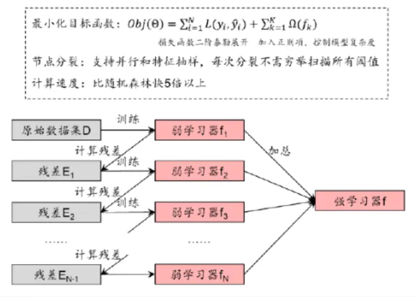

图表4：图神经网络选股模型
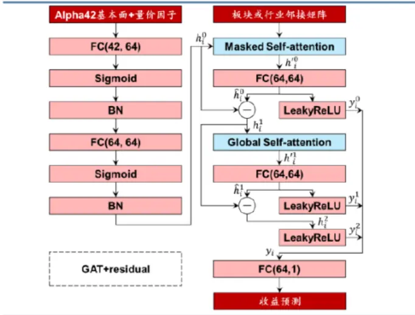

图表5：多任务学习挖掘不同预测目标下的增量信息
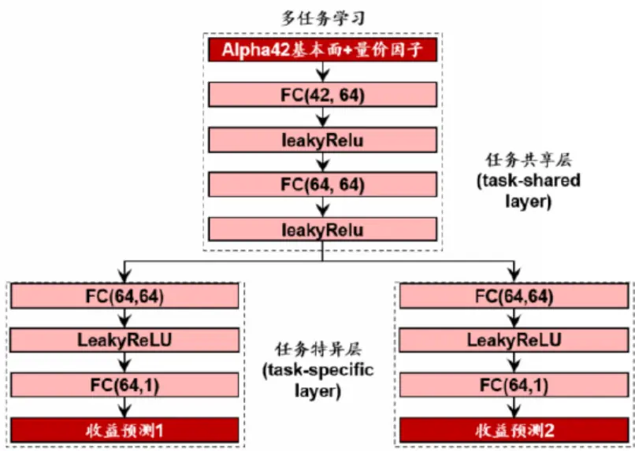

## 因子挖掘主题

持续迭代的因子库是多因子模型长期运作的基石。2019年6月，我们展示遗传规划在量价选股因子挖掘中的详细流程，并持续探索改进方案，同时还将算法拓展至一致预期因子挖掘。2020年6月，我们构建全新的因子挖掘神经网络AlphaNet，实现端到端的因子自动挖掘和合成，随后从网络结构、特征、损失函数等方向加以改进，样本外跟踪表现出色。近期我们关注GRU网络在端到端因子挖掘中的应用，对个股日间和日内不同频率的数据进行混频合成，挖掘出的因子在不同的股票池中都展现出优秀的选股能力。基于GRU混频因子挖掘构建的周频中证500指数增强组合回测期内（2017-01-03~2023-04-28）年化超额收益率18.18%，信息比率3.29；周频中证1000指数增强组合回测期内（2017-01-03~2023-04-28）年化超额收益率28.93%，信息比率4.45。

图表6：因子挖掘主题

| 研报标题 发布日期 |
| --- |
| 《人工智能21：基于遗传规划的选股因子挖掘》 2019-06-10 |
| 《人工智能23：再探基于遗传规划的选股因子挖掘》 2019-08-07 |
| 《人工智能26：遗传规划在CTA信号挖掘中的应用》 2019-11-25 |
| 《人工智能28：基于量价的人工智能选股体系概览》 2020-02-18 |
| 《人工智能32：AlphaNet：因子挖掘神经网络》 2020-06-14 |
| 《人工智能34：再探AlphaNet：结构和特征优化》 2020-08-24 |
| 《人工智能46：AlphaNet改进：结构和损失函数》 2021-07-04 |
| 《人工智能54：基于遗传规划的一致预期因子挖掘》 2022-04-07 |
| 《人工智能58：分析师共同覆盖因子和图神经网络》 2022-07-07 《人工智能61：深挖分析师共同覆盖中的关联因子》 2022-10-26 |
| 《人工智能68：神经网络多频率因子挖掘模型》 2023-05-11 |

图表7：遗传规划总体流程
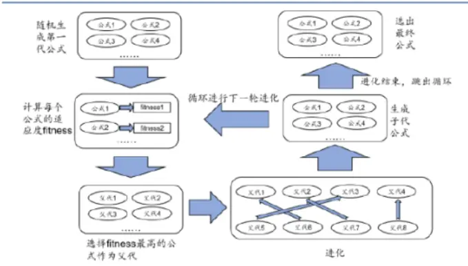

图表8：AlphaNet-v2 模型
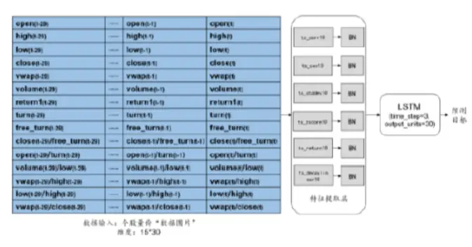

图表9：基于参数冻结+残差预测的增量GRU 学习模型
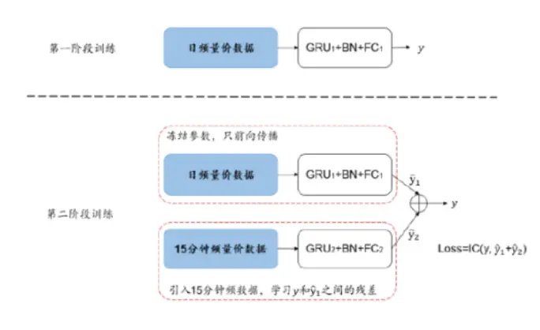

图表10：GRU-based 中证 1000 增强组合累积超额收益
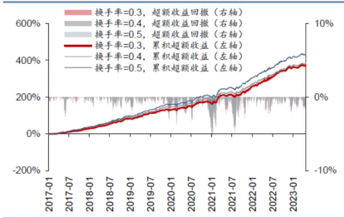

## 另类数据主题

基于基本面、行情等结构化数据构建的常规因子面临拥挤困境，另类数据或成为破局关键。2020年起，我们借助自然语言处理、注意力机制等深度学习技术，尝试从海量分析师研报、新闻舆情文本中发掘微言大义，构建分析师研报情感、FADT_BERT等选股因子及策略。

图表11：另类数据主题

| 研报标题 | 发布日期 |
| --- | --- |
| 《人工智能37：舆情因子和BERT情感分类模型》 | 2020-10-22 |
| 《人工智能41：基于BERT的分析师研报情感因子》 | 2021-01-18 |
| 《人工智能 51：文本 PEAD 选股策略》 | 2022-01-07 |
| 《人工智能 56：新闻舆情分析的HAN 网络选股》 | 2022-04-23 |
| 《人工智能 57：文本FADT选股》 | 2022-07-01 |
| 《人工智能62：NLP综述，勾勒AI语义理解的轨迹》 | 2022-10-27 |
| 《人工智能 63：再探文本FADT选股》 | 2022-10-28 |

图表12：基于BERT的分析师研报情感因子构建流程
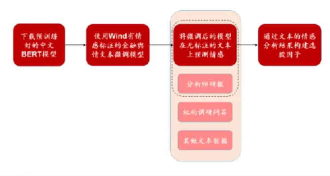

图表13: Forecast_adjust_txt_bert 因子构建流程
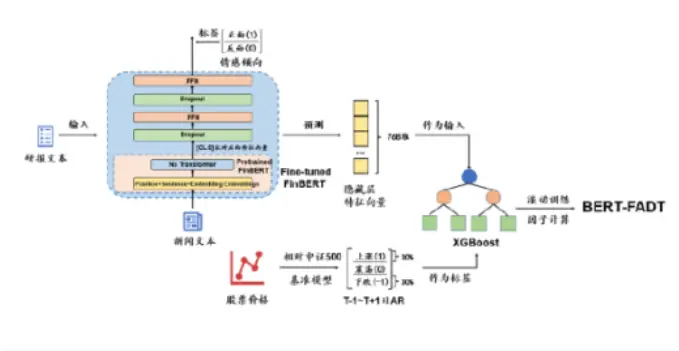

## 对抗过拟合主题

投资者对人工智能的质疑集中于过拟合和黑箱，我们提供丰富的工具加以应对：时序交叉验证相比传统交叉验证方法更适用于金融时序数据；重采样技术基于真实数据构建“平行世界”，检验策略参数过拟合概率；组合对称交叉验证（CSCV）是更为简单易行的过拟合检验流程；SHAP、ICE、SDT等模型可解释性工具能够揭示机器学习的“思考”过程。

图表14：对抗过拟合主题

| 研报标题 | 发布日期 |
| --- | --- |
| 《人工智能14：对抗过拟合：从时序交叉验证谈起》 | 2018-11-28 |
| 《人工智能16：再论时序交叉验证对抗过拟合》 | 2019-02-18 |
| 《人工智能19：偶然中的必然：重采样技术检验过拟合》 | 2019-04-22 |
| 《人工智能20：必然中的偶然：机器学习中的随机数》 | 2019-04-29 |
| 《人工智能22：基于CSCV框架的回测过拟合概率》 | 2019-06-17 |
| 《人工智能27：揭开机器学习模型的“黑箱”》 | 2020-02-06 |

图表15：重采样检验过拟合流程
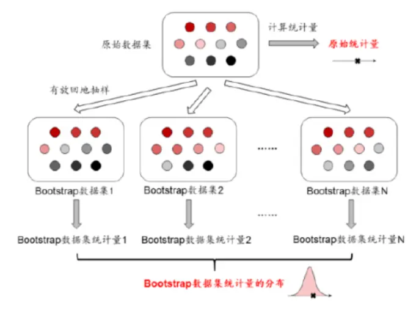

图表16： CSCV检验过拟合流程
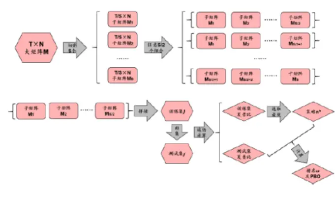

## 生成对抗网络主题

金融市场数据量有限，过拟合难以避免，生成对抗网络（GAN）可以生成假数据，有助于我们训练模型和理解市场。GAN通过判别器和生成器的“左右互搏”，实现海量数据模拟。从最初的GAN单资产生成出发，我们测试WGAN、RGAN、DCGAN、SinGAN等变式，并将功能拓展至多资产生成和宏观指标生成，最终应用于资产配置、策略调参等实践场景。

图表17：生成对抗网络主题

| 研报标题 发布日期 |
| --- |
| 《人工智能24：投石问路：技术分析可靠否？》 2019-09-02 |
| 《人工智能25：市场弱有效性检验与择时战场选择》 2019-11-17 |
| 《人工智能31：生成对抗网络GAN初探》 2020-05-08 |
| 《人工智能35：WGAN应用于金融时间序列生成》 2020-08-27 |
| 《人工智能36：相对生成对抗网络RGAN 实证》 2020-09-22 |
| 《人工智能38：WGAN生成：从单资产到多资产》 2020-11-23 |
| 《人工智能 44：深度卷积 GAN 实证》 2021-04-13 |
| 《人工智能45：cGAN应用于资产配置》 2021-04-19 |
| 《人工智能47：cGAN模拟宏观指标》 2021-08-04 |
| 《人工智能48：对抗过拟合：cGAN应用于策略调参》 2021-10-12 |
| 《人工智能49：SinGAN单样本生成》 2021-10-24 |
| 《人工智能50：再探cGAN资产配置》 2021-11-09 |

图表18：GAN 原理
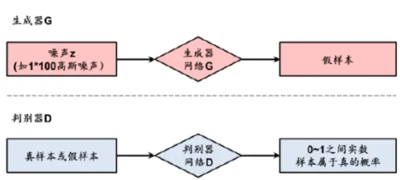

图表19：WGAN 生成上证指数价格序列
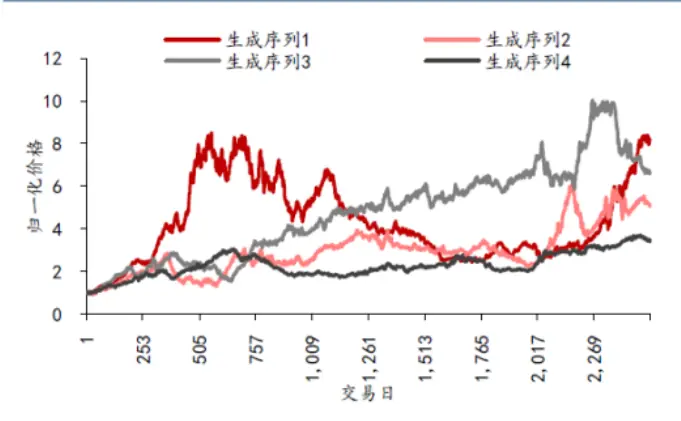

## 综合主题

我们还探索特征选择、另类标签、因果推断、无监督学习在投资中的应用。《人工智能52：神经网络组合优化初探》（2022-01-09）中，我们将组合优化融入神经网络，打通因子生成、多因子合成、组合优化这三个量化投资的重要步骤，实现端到端的量化投资全流程。《人工智能53：揭秘微软AI量化研究》（2022-01-12）中，我们透过微软亚洲研究院AI量化研究，展望行业发展六大趋势。《人工智能64：九坤Kaggle量化大赛有哪些启示》（2023-01-20）中，我们学习九坤在Kaggle举办的量化投资大赛中的成功经验，总结量化AI“炼丹”中的技巧，提升模型收益。

2023年3月ChatGPT火爆出圈后，我们也思考GPT与量化投资结合的方式。虽然量化投资行业短期内可能难以直接受益于GPT模型；但长期看，如同人脑各区域分工明确但相互联系，现有量化投资预测模型可与各类大模型耦合扩展功能；算法升级和规模扩大后，量化模型可能涌现出预期之外的能力，值得量化从业者期待。此外GPT能大幅提升投研效率，我们通过量化分析、网页抓取、文字摘要及行情复盘四个案例展示了GPT在投研工作中的可能应用场景，GPT均有不俗的表现。

图表20：综合主题

| 研报标题 | 发布日期 |
| --- | --- |
| 《人工智能7：人工智能选股之 Python 实战》 | 2017-09-19 |
| 《人工智能10：宏观周期指标应用于随机森林选股》 | 2018-03-20 |
| 《人工智能12：人工智能选股之特征选择》 | 2018-07-25 |
| 《人工智能13：人工智能选股之损失函数的改进》 | 2018-08-02 |
| 《人工智能17：人工智能选股之数据标注方法实证》 | 2019-03-13 |
| 《人工智能18：机器学习选股模型的调仓频率实证》 | 2019-04-09 |
| 《人工智能29：提升超额收益：另类标签和集成学习》 | 2020-03-19 |
| 《人工智能30：从关联到逻辑：因果推断初探》 | 2020-04-24 |
| 《人工智能33：数据模式探索：无监督学习案例》 | 2020-07-02 |
| 《人工智能39：周频量价选股模型的组合优化实证》 | 2020-12-21 |
| 《人工智能40：微软 AI量化投资平台Qlib体验》 | 2020-12-22 |
| 《人工智能52：神经网络组合优化初探》 | 2022-01-09 |
| 《人工智能53：揭秘微软 AI 量化研究》 | 2022-01-12 |
| 《人工智能59：强化学习初探与DQN择时》 | 2022-07-21 |
| 《人工智能64：九坤Kaggle量化大赛有哪些启示》 | 2023-01-30 |
| 《人工智能65：GPT+量化投资=？》 |  |
| 《人工智能66：面向投资研究行业的GPT使用指南》 | 2023-03-24 2023-04-26 |

华泰金工 | 华泰人工智能研究6周年回顾
图表21：组合构建融入神经网络实现端到端的量化投资全流程
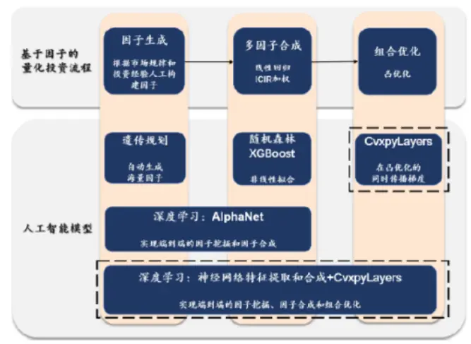

图表22：透过微软AI量化研究展望行业发展六大趋势
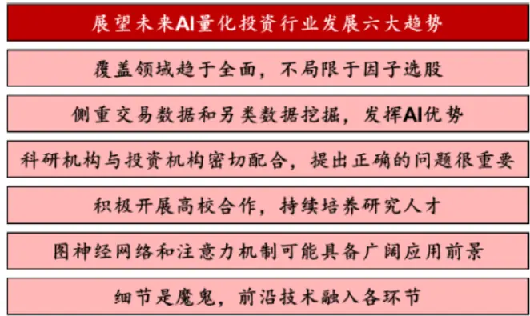

图表23：九坤Kaggle量化大赛带来的启示
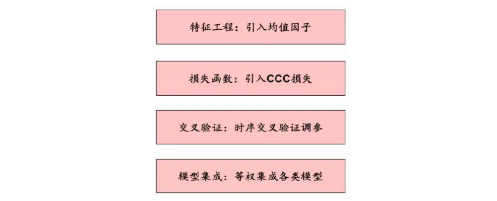

## 结语

人工智能并不神秘。其本质是以数理模型为核心工具，结合控制论、认知心理学等学科的研究成果，最终由计算机模拟人类的感知、推理、学习、决策过程。

人工智能并非万能。现实世界高度复杂，任何模型相对于整个世界都太过简单。世界时刻处于演化中，没有任何模型能长期有效，需要同步保持更新。

人工智能机遇与挑战并存。AI技术在量化行业的使用已是如火如荼，GPU、平台、算法枕戈待旦，但究竟是“人工智能”还是“人肉智能”争议不断，一遇回撤便喜提热搜。

正如我们在系列开篇研报里所写，华泰人工智能系列的愿景，是通过切实的研究与实践，澄清人们对人工智能的误解和偏见，帮助人们更清晰地认识人工智能的长处和局限，从而更合理、高效地将人工智能运用于投资。回顾过往68篇研究，我们秉持了这一份初心，也希望为读者带来了启发。

6年白驹过隙，AI技术发展如奔腾大河时不我待，希望我们能与读者共同见证AI的未来，未来已来。

## 风险提示：

人工智能挖掘市场规律是对历史的总结，市场规律在未来可能失效。人工智能技术存在过拟合风险。

## 相关研报

研报：《 华泰人工智能研究6周年回顾 》2023年5月22日

林晓明 S0570516010001 | BPY421

陈 烨 S0570521110001

李子钰 S0570519110003 | BRV743

何 康 S0570520080004 | BRB318

王晨宇 S0570522010001 | BTM049

陈 伟 S0570121070169