# Attention is indeed all you need

华泰研究

2023 年 8 月 22 日│中国内地

深度研究

## 人工智能系列之 69：注意力机制应用于量化选股多类场景

注意力机制是近年来人工智能领域影响深远的创新之一，但以往应用于量化投资多局限在行情时间序列编码，本研究展示多种形式的注意力机制在量化选股各类场景的运用。分别测试：(1)任务间注意力：提取多任务学习中的任务间关系信息；(2)股票间注意力：Transformer学习截面因子的股票间关系；(3)时序注意力：ALSTM 和 Transformer 编码因子时间序列。结果表明：(1)任务间注意力提升稳定；(2)股票间注意力提升主要体现在因子多头；(3)Transformer 时序注意力提升主要体现在合成因子及放宽组合优化约束情景。注意力机制在多数场景有效，Attention is indeed all you need。

## 自注意力：权重再分配表征数据内部关系

注意力系数的本质是两个向量的归一化相似度。自注意力通过计算输入信息中各元素间的注意力系数作为权重，将其他元素的信息聚合到自身。因此，自注意力的本质是基于相似度的权重再分配，用来表征数据内部关系。只要涉及权重分配和关系信息表征，都有可能引入注意力结构，万物皆可Attention。计算自注意力的对象，在自然语言处理场景下，通常是一条文本内的各单词；而在因子选股场景下，既可以是一条时间序列内的各时刻，又可以是一个截面内的各股票，还可以是一组网络内的各模块。

## 任务间注意力胜在稳定；股票间注意力的提升体现在合成因子多头

在多任务学习的任务共享层和任务特异层间引入多头自注意力层，编码任务间关系；将任务共享层的 MLP 网络替换为 Transformer 编码器，利用注意力机制学习因子的股票间关系。对比多任务学习基线、任务间注意力和股票间注意力模型。任务间注意力模型的合成因子和指数增强组合回测表现有稳定提升，提升同时体现在每个子任务以及子任务集成上。股票间注意力模型的合成因子 RankIC和 Top组收益有提升，但指增组合只在部分子任务以及子任务集成上观察到优势。

时序注意力：Transformer 优于 ALSTM，放宽组合优化约束后提升明显因子时间序列通常采用循环神经网络编码，将 LSTM 替换为 ALSTM 和Transformer，引入时序注意力编码时序信息。对比单任务学习基线和两类注意力模型。从合成因子评价指标看，LSTM和 ALSTM 接近，Transformer全面胜出，表明 Transformer 在编码时间序列上有显著优势。观察指增组合回测绩效，原始组合优化约束条件下基线模型较好，Transformer合成因子的优势难以体现在组合中；放宽约束条件后，以信息比率的下降为代价换取年化超额收益率的提升，Transformer 优于 LSTM 和 ALSTM。

## 模型集成：时序注意力提供较多增量信息，集成是“免费的午餐”

将基线模型和三类注意力模型的预测值等权集成。观察与基线模型相关性，任务间注意力>股票间注意力>时序注意力，时序注意力提供较多增量信息。合成因子 RankIC均值、对冲收益高于全部子模型，指增组合年化超额收益率高于全部子模型，部分关键指标仅次于时序注意力模型。集成模型与基线模型累计 RankIC差值稳定扩大，Top组年化收益从 25.8%提升至 28.6%，指增组合年化超额收益率从 17.2%提升至 18.2%，信息比率从 2.79 提升至3.00。总的来看，模型集成仍是“免费的午餐”，大概率可以提升模型性能。

风险提示：人工智能挖掘市场规律是对历史的总结，市场规律在未来可能失效。人工智能技术存在过拟合风险。深度学习模型受随机数影响较大。本文测试的选股模型调仓频率较高，假定以 vwap价格成交，忽略其他交易层面因素影响。

研究员

SAC No. S0570516010001

林晓明

linxiaoming@htsc.com

SFC No. BPY421

+(86) 755 8208 0134

研究员

SAC No. S0570520080004

何康，PhD

SFC No. BRB318

hekang@htsc.com

+(86) 21 2897 2039

研究员

李子钰

SAC No. S0570519110003

SFC No. BRV743

liziyu@htsc.com

+(86) 755 2398 7436

## 华泰证券研究所分析师名录

华泰证券CNITE

华泰证券

研究所分析师名录

Huatai Rescarch Analyst L.ist

## 多类注意力集成与基线 RankIC 差值

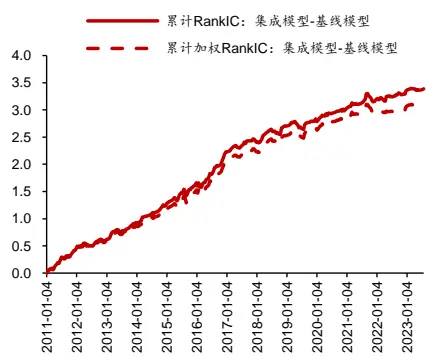
资料来源：朝阳永续，Wind，华泰研究

## 多类注意力集成与基线指增超额净值

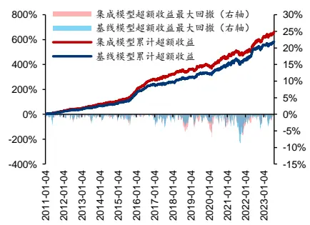
注：回测期 2011-01-04 至 2023-07-31，基准为中证 500资料来源：朝阳永续，Wind，华泰研究

## 导言

注意力（Attention）是近年来人工智能领域影响深远的创新之一。以自注意力为基础的Transformer 是 GPT 等自然语言模型的核心结构，同时逐渐取代了 CNN在计算机视觉的统治地位。注意力为何能在各领域实现模型性能上的提升？注意力的本质是权重分配，模拟人类视觉原理，使得网络加工信息时关注重要部分，忽略次要部分，实现更准确的信息提取。

自注意力（Self-Attention）是使用较广泛的注意力实现形式。自注意力通过计算输入信息中各元素间的相似度作为权重，将其他元素的信息聚合到自身元素。自注意力使得模型在处理单个元素时，同时考虑全局信息。这里“元素”的定义取决于具体场景：(1)自然语言处理中，元素可以是单个样本语句中的不同单词；(2)图像处理中，元素可以是单个样本图片中的不同像素；(3)图结构分析建模中，元素可以是图结构中的不同样本；(4)多任务学习中，元素可以是不同任务。只要涉及权重分配，都有可能引入注意力结构，万物皆可 Attention。

量化投资实践中，注意力的使用却并未如其他领域那么普遍。业内当前对注意力的应用主要集中在：(1)使用 ALSTM、AGRU、Transformer 等结构对时间序列进行编码，如华泰金工研报《人工智能 68：神经网络多频率因子挖掘模型》（2023-05-11）；(2)使用图注意力网络 GAT 提取股票间关系信息，如华泰金工研报《人工智能 55：图神经网络选股的进阶之路》（2022-04-11）等。注意力作为一种基础运算，可以灵活运用于神经网络的各环节，远不限于上述两点，值得深入挖掘。

本文探索注意力机制在量化选股中的应用，测试(1)多任务学习引入任务间注意力，(2)Transformer 学习截面因子的股票间关系，(3)ALSTM 和 Transformer 编码因子时间序列。结果表明：(1)任务间注意力提升全面且稳定；(2)截面 Transformer 有一定提升，主要体现在因子多头；(3)ALSTM 相比 LSTM 无改进，Transformer 有提升，提升体现在合成因子与放宽组合优化约束条件情景。注意力机制在多数场景有效，Attention is indeed all you need。

## 注意力在因子选股中的多种表现形式

本章首先简要回顾注意力的基础概念，随后介绍注意力在因子选股场景中的不同表现形式：任务间注意力、股票间注意力、时序注意力。

## 注意力系数：归一化相似度

实现注意力机制的关键是计算注意力系数。注意力系数的本质是两个向量的归一化相似度。如果 h、 $h_{\mathrm{j}}$ 两个向量相似度高，那么在编码 h 时，应给予 h 一定“注意力”，为 $h_{\mathrm{j}}$ 分配适当权重。

两个向量 hi、 $h_{\mathrm{j}}$ 的相似度可以表示为：

$$
e_{ij}=s(h_{i},h_{j})
$$

相似度函数 s的定义较灵活，常用以下几种形式：

1. 加性： $s(h_i,h_j)=v\tanh(Wh_i+Uh_j)$ ，v、W、U 为可学习的参数；

2. 乘性： $s\big(h_{i},h_{j}\big)=h_{i}Wh_{j}$ ，W 为可学习的参数；

3. 点积： $s\big(h_{i},h_{j}\big)=h_{i}^{T}h_{j}$

4. 缩放点积： $\begin{array}{r}{s\big(h_{i},h_{j}\big)=\frac{h_{i}^{T}h_{j}}{\sqrt{d_{\bar{\mu}}}},}\end{array}$ ，dh为向量 h的长度。

随后，参考向量 hi与所有向量的相似度，对 hi与 $h_{\mathrm{j}}$ 的相似度 $\Theta_{[]}$ 进行归一化，得到 hi与 $h_{\mathrm{j}}$ 的注意力系数 $\mathbf{a}_{ij}$ ：

$$
\alpha_{ij}=softmax_{j}(e_{ij})=\frac{\exp(e_{ij})}{\sum_{k}\exp(e_{ik})}
$$

## 自注意力：权重再分配表征数据内部关系

理解注意力机制的经典场景是信息检索问题。Q 代表查询（Query）序列，K、V 分别代表键（Key）和值（Value）对序列，q 代表单次查询。例如网购场景，q 是待搜索的商品名称，K 是全部商品名称，V 是全部商品对应的信息。计算 q 与 K 的每个键 ki的注意力系数，以此为权重对每个键的值 vi加权求和，得到 q的注意力：

$$
Attention\big(q,(K,V)\big)=\sum_{i}\frac{\exp(s(q,k_{i}))}{\sum_{j}\exp(s(q,k_{j}))}v_{i}
$$

图表1： Self-Attention 示意图
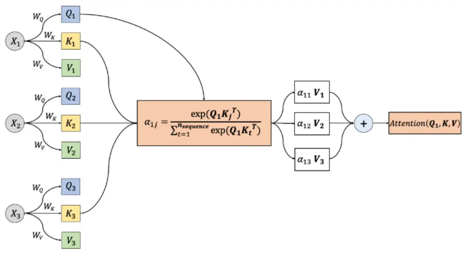
资料来源：华泰研究

信息检索问题中，Query、Key、Value 的来源不同。而自注意力（Self-Attention）中，Query、Key、Value 来自同一组数据，但经历不同的线性变换。数据 X 的自注意力计算步骤如下：

1. 对于 X 的每个元素 xi，分别乘以WQ、WK、 $W^{V}$ ，线性映射成三个新向量 $Q_{i},K_{i},V_{i},$ WQ、WK、WV都是可学习的参数矩阵。所有元素的三个新向量构成矩阵 Q、K、 $\nabla_{\circ}$

2. 对于 X的每个元素 xi，计算 xi和其他元素如 $x_{j}$ 的注意力系数 $\mathbf{a}_{ij}$ （这里以点积为例）；以注意力系数 $\mathfrak{a}_{\mathrm{ij}}$ 为权重，对所有元素（含自身）的值 $\nabla_{\mathbf{j}}$ 加权求和得到 $\mathsf{Xi}$ 的注意力，视作xi的新值：

$$
\alpha_{ij}=\frac{\exp(Q_iK_j^T)}{\sum_k\exp(Q_iK_k^T)}
$$

$$
Attention(Q_{i},K,V)={\sum_{j}}\alpha_{ij}V_{j}
$$

3. 将上述过程写成矩阵形式，实现并行计算； $\mathbf{Q}\mathsf{K}^{\mathsf{T}}$ 的方差较大，影响模型稳定性，因此除以 dk的平方根使方差归一化：

$$
Attention(Q,K,V)=softmax(\frac{QK^{T}}{\sqrt{d_{k}}})V
$$

自注意力的本质是基于相似度的权重再分配，以表征数据内部关系。计算自注意力的对象，在自然语言处理场景下，通常是一条文本内的各单词；而在因子选股场景下，既可以是一条时间序列内的各时刻，又可以是一个截面内的各股票，还可以是一组网络内的各模块。

## 多头自注意力：多组参数衡量相似度

上述自注意力计算过程，使用同一套自由参数 $\mathsf{W}^{\mathsf{Q}}、\mathsf{W}^{\mathsf{K}}、\mathsf{W}^{\mathsf{V}},$ ，相当于单一的相似度测度，因此称单头注意力（Single-Head Attention）。实际上，相似度可以有多种测度，使用多组自由参数计算注意力的过程称多头注意力（Multi-Head Attention）。

具体而 $\frac{言}{言}$ ，对于 xi，设置 h 组不同的参数 $(W_{1}^{Q}、W_{1}^{K}、W_{1}^{V})、(W_{2}^{Q}、W_{2}^{K}、W_{2}^{V})、\cdots、(W_{\hat{\lambda}}^{Q}$ $W_{h}^{K}、W_{\not h}^{V})$ ，并缩小 K、V的维度 $d_{k},d_{v}$ 至原来的 1/h。将不同参数的计算结果（也称为 head）进行拼接，并乘上参数矩阵 $W_{0}$ ，得到最终的注意力：

$$
Multi\;Head\;Attention(Q,K,V)=concat(head_1,head_2,\ldots,head_h)W_0
$$

多头自注意力的输出维数相比单头自注意力没有改变，复杂度更高，逻辑上也更合理，例如衡量股票相似度可以从基本面角度，也可以从技术面角度，理应设置多头注意力。

图表2： Multi-Head Attention 示意图
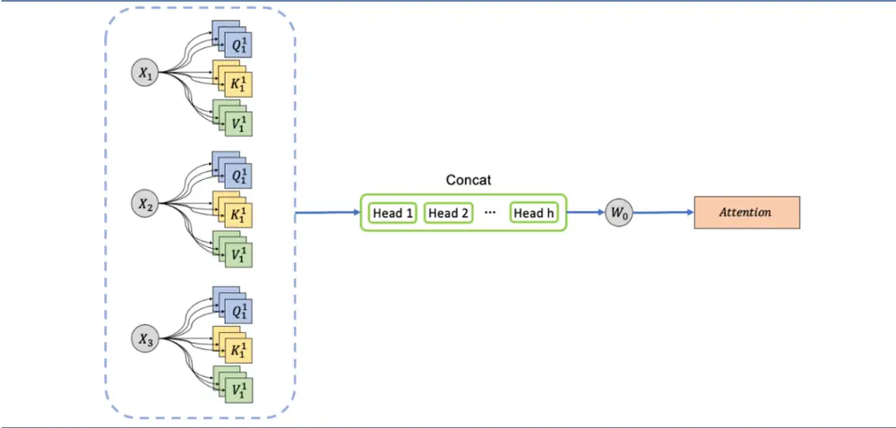
资料来源：华泰研究

## 场景一：任务间注意力

华泰金工研报《人工智能 67：AI 模型如何一箭多雕：多任务学习》（2023-08-06）中，我们将多任务学习应用于量化选股，训练MLP网络同时预测未来10日和20日收益率的排序。多任务学习机制采用传统硬参数共享方式，任务共享层后直接连接任务特异层，两项子任务由独立的任务特异层学习，不考虑任务间关系。

然而，任务间关系信息可能有助于下游任务。10 日收益率预测学习到的表征，可能对 20日收益率预测有意义，反之亦然。我们参考 Ma & Tan(2022)研究，向原多任务学习网络引入任务间注意力模块。任务共享层的输出，依次通过特征全连接层、拼接操作、任务全连接层、多头自注意力模块（此处采用缩放点积注意力），再经过残差连接，传入后续的任务特异层。

图表3： 多任务学习（左）和任务间注意力（右）网络结构示意图
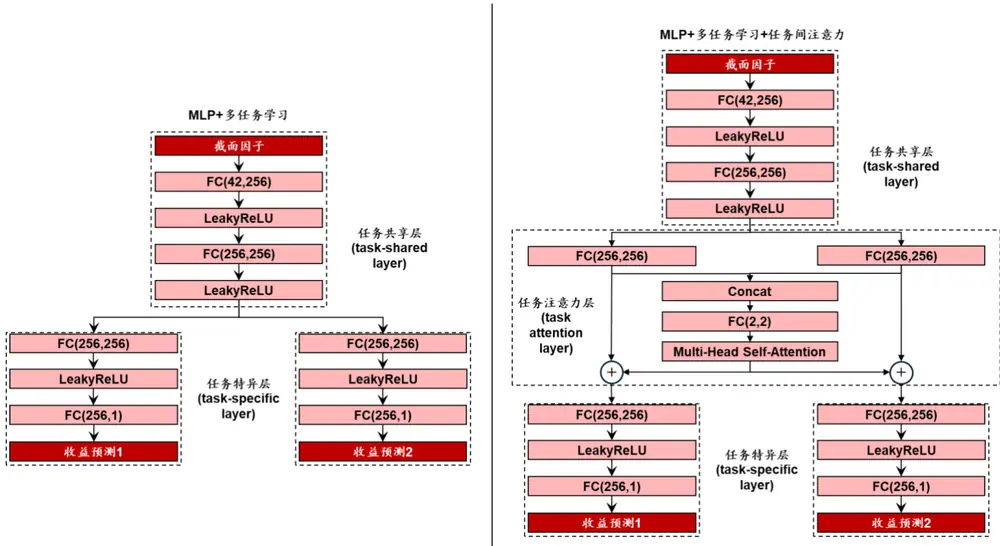
资料来源：华泰研究

## 场景二：股票间注意力

## 图注意力网络

传统因子选股模型将股票视作独立样本，然而股票未来收益率不仅与股票自身有关，也受到股票间相互关系的驱动。图注意力网络（Graph Attention Networks，GAT）使用股票间自注意力模块，学习股票间关系信息。华泰金工研报《人工智能 42：图神经网络选股与 Qlib实践》（2021-02-21）、《人工智能 55：图神经网络选股的进阶之路》（2022-04-11）、《人工智能 58：分析师共同覆盖因子和图神经网络》（2022-07-07）展示图注意力网络的多种应用方法，本文不再赘述。

## Transformer

除了图注意力网络外，另一种通过注意力机制学习股票间关系信息的方式是 Transformer。
此处应用 Transformer的难点在于数据维度的处理，以下展开介绍。

Transformer 模型接收的是序列形式的数据，输入神经网络张量的形状可以表示为（sequence length, batch size, model dimension），其中 sequence length 代表序列长度，即每个序列中的元素数量；batch size 代表批量大小，即每次输入神经网络的序列个数；model dimension 代表特征维度，即序列中每个元素包含的特征数。

传统自然语言处理任务中，sequence length 对应输入句子的长度，batch size 对应单次输入神经网络的句子数量，model dimension 对应句子中每个单词进行嵌入后的词向量维度。自注意力层提取的注意力信息是基于 sequence length 这个维度，即提取的句子中每个词对句子中所有词的注意力。

因此，若想将 Transformer 的编码器结构应用于股票因子数据，需要考虑将数据的哪个维度作为序列维度，从而提取出该维度上每个元素对于其他元素的注意力特征。这里我们以单个截面（即单个交易日）所有股票的因子数据作为一个样本，sequence length 对应该时间点的股票数量，model dimension 对应因子数量，该方法提取的是股票间注意力。

由于数据集中每天的股票数量可能不同，因此每个样本的 sequence length 存在差异，此时将样本组合为 batch 时需要对较短的样本进行补齐，并在后续训练时将补齐处的数据用填充掩码（padding mask）进行覆盖。同时，我们舍弃 Transformer 中的位置编码，这是因为某支股票在当天所有股票序列中的位置没有意义。注意力的定义采用 Transformer 标准的缩放点积注意力。

本文引入股票间注意力的方法是将多任务学习的任务共享层由 MLP 改为 Transformer。Transformer 包含两个标准 Transformer 编码器，其中每个 Transformer 编码器由多头注意力层、LayerNorm 层、Feed-Forward 层（核心是两个全连接层）、LayerNorm 层依次组成。

图表4： 截面因子 Transformer网络结构示意图
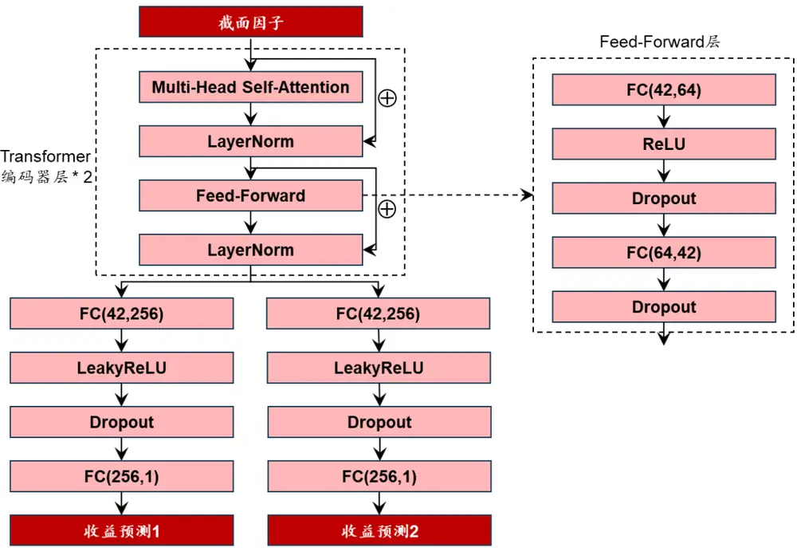
资料来源：华泰研究

## 时序注意力

若输入数据为因子的时间序列，常用的网络结构是(1)循环神经网络，(2)包含时序注意力的循环神经网络如 ALSTM、AGRU 等，(3)Transformer。本文使用 ALSTM（Attentional LSTM）和 Transformer 模型，提取因子日频时间序列中的时序关系信息。

华泰金工研报《人工智能 68：神经网络多频率因子挖掘模型》（2023-05-11）介绍了 AGRU（Attentional GRU）模型。ALSTM 与之类似，在 LSTM 层的最后一层隐状态时间序列后接单头自注意力运算（此处采用加性注意力），随后将自注意力的输出与 LSTM 最后一个时刻的隐状态拼接，送至输出层。

图表5： 因子时间序列 LSTM（左）和 ALSTM（右）网络结构示意图
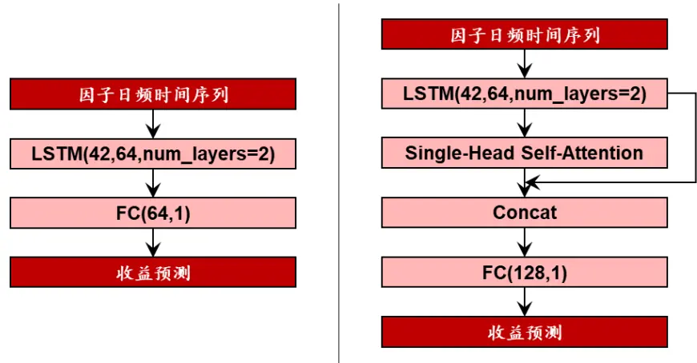
资料来源：华泰研究

Transformer 网络中，sequence length 维度对应时间，batch size 维度对应每只股票，modeldimension 维度对应因子。Transformer 包含位置编码（Positional Encoding）和两个标准Transformer 编码器，其中每个 Transformer 编码器由多头注意力层、LayerNorm 层、Feed-Forward 层（核心是两个全连接层）、LayerNorm 层依次组成。注意力的定义采用Transformer 标准的缩放点积注意力。

图表6： 因子时间序列 Transformer网络结构示意图
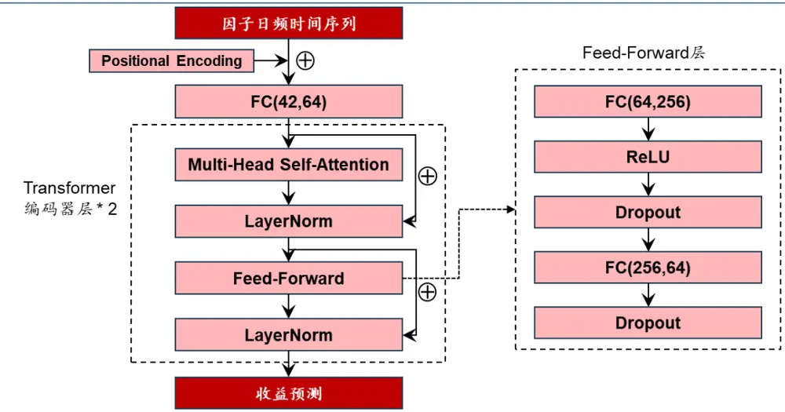
资料来源：华泰研究

## 方法

本研究在现有周频中证 500 指增模型基础上，引入不同类型的注意力结构，测试改进效果。主要测试模型和相关参数、构建方法、因子定义如下列表格所示。网络结构请见前一章图表。

图表7： 主要测试模型和相关参数

| 注意力类型 | 主体模型 | 注意力实现方式 | 其他参数 |
| --- | --- | --- | --- |
| 任务间注意力 | MLP+多任务学习 | 增加多头缩放点积自注意力层 | MLP: dim_hidden = 256; batch_size=1 (trading day); Self-Attention: num_heads=4; |
| 股票间注意力 | MLP+多任务学习 | 增加 Transformer 编码器模块， 含多头缩放点积自注意力层 | MLP: dim_hidden = 256; batch_size=32 (trading days); Transformer: num_blocks=2; num_heads=2; dim_feedforward=64; dropout=0.1; |
| 时序注意力 |  | LSTM+单任务学习 增加单头加性自注意力层(ALSTM） | seq_len取每个 batch内各截面股票数量的最大值; LSTM: dim_hidden = 64, num_layers=2; batch_size=1024 (stocks) |

资料来源：华泰研究

图表8： 选股模型构建方法

| 步骤 | 参数 | 参数值 |
| --- | --- | --- |
| 构建股票池 股票池 |  | 全 A 股；剔除上市未满 63 个交易日个股，剔除ST、*ST、退市整理期个股； 每个季末截面期，在未停牌个股中,筛选过去1年日均成交额和日均总市值均排名前60% |
| 构建数据集特征 |  | 个股 因子截面数据：T日42 个基本面和量价因子 |
|  | 标签 | 因子时序数据：T-20日至T日42 个基本面和量价因子 |
|  |  | 单任务学习：T+11 日相对于T+1 日收盘价收益率 |
|  |  | 多任务学习： |
|  |  | (1) T+11 日相对于 T+1 日收盘价收益率 (2) T+21 日相对于 T+1 日收盘价收益率 |
| 因子预处理 | 特征 | 5 倍 MAD 缩尾；zscore 标准化；缺失值填为 0；不做中性化 |
|  | 标签 测试集完整区间 | 剔除缺失值；截面排序数标准化 20110104~20230731 |
| 训练流程 | 训练、验证、测试集划分 | 训练集252*6个交易日，验证集252*2个交易日，测试集126个交易日； |
|  |  | 如第1期训练集 20020910~20081205，验证集 20081208~20101231，测试集 20110104~20110711; |
|  |  | 第 2 期训练集 20030325~20090616，验证集 20090617~20110711，测试集 20110712~20120113 |
|  | 特殊处理 损失函数 | 剔除训练集、验证集最后10或20个交易日样本，防止信息泄露 加权 mse（根据收益率衰减加权） |
|  | batch size | 每个交易日的全体股票视作一个 batch |
|  | 学习率 |  |
| 优化器 | 0.0001 |  |
|  |  | adam |
|  | 早停次数 | 20 |
| 构建组合 | 随机数种子点 | 5 组求均值 |
|  | 基准 | 中证 500 指数 |
|  | 优化目标 | 最大化预期收益；多任务学习采用(1)10日预测、(2)20日预测、(3)两种预测集成（等权 均值）分别构建组合 |
|  | 组合仓位 | 1 |
|  | 个股权重下限 个股偏离权重约束 | 0 |
|  | 行业偏离权重约束 | [-1%, 1%] |
|  | 风格偏离标准差约束 | [-1%, 1%] |
|  | 风格因子 | [-1%, 1%] |
|  | 调仓周期 | 对数流通市值（预处理：5倍MAD 缩尾，zscore 标准化） 每5个交易日 |
|  | 单次调仓单边换手率上限 | 15% |
|  | 成分股权重约束 |  |
|  |  | 无 |
| 回测 | 单边费率 | 0.002 |
|  | 交易价格 | vwap |
|  | 特殊处理 | 停牌不买入/卖出；一字板涨停不买入；一字板跌停不卖出；其余股票重新分配权重 |

图表9： 选股模型使用的 42个因子

| 类别 | 名称 | 计算方式 |
| --- | --- | --- |
| 估值 | bp_If | 1/市凈率 |
|  | ep_ttm | 1/市盈率(TTM) |
|  | ocfp_ttm | 1/净经营性现金流(TTM) |
|  | dyr12 | 近 252 日股息率 |
| 预期 | con_eps_g | 一致预期 EPS(FY1)近 63 日增长率 |
|  | con_roe_g | 一致预期 ROE(FY1)近 63 日增长率 |
|  | con_np_g | 一致预期归母净利润(FY1)近 63日增长率 |
| 反转 | ret_5d | 近5日区间收益率 |
|  | ret_1m | 近 21 日区间收益率 |
|  | exp_wgt_return_3m | 近63 日收益率以换手率指数衰减加权 |
| 波动率 | std_1m | 收益率近 21 日标准差 |
|  | vstd_1m | 成交量近 21 日标准差 |
|  | ivr_ff3factor_1m | 残差收益率（收益率对万得全A、市值、BP因子收益率回归）近21日标准差 |
| 换手率 | turn_1m | 换手率近 21 日均值 |
|  | std_turn_1m | 换手率近 21 日标准差 |
|  | bias_turn_1m | 换手率近 21 日均值/近 504 日均值 |
| 日间技术 | std_ret_10d | 收益率近 10日标准差 |
|  | std_vol_10d | 成交量近 10 日标准差 |
|  | std_turn_10d | 换手率近 10 日标准差 |
|  | corr_ret_close | 收益率和收盘价近10日相关系数 |
|  | corr_ret_open | 收益率和开盘价近10日相关系数 |
|  | corr_ret_high | 收益率和最高价近10日相关系数 |
|  | corr_ret_low | 收益率和最低价近10日相关系数 |
|  | corr_ret_vwap | 收益率和均价近10日相关系数 |
|  | corr_ret_vol | 收益率和成交量近10日相关系数 |
|  | corr_ret_turn | 收益率和换手率近10日相关系数 |
|  | corr_vol_close | 成交量和收盘价近10日相关系数 |
|  | corr_vol_open | 成交量和开盘价近10日相关系数 |
|  | corr_vol_high |  |
|  | corr_vol_low | 成交量和最高价近10日相关系数 |
|  | corr_vol_vwap | 成交量和最低价近10日相关系数 成交量和均价近10日相关系数 |
|  | 日内技术 | low2high low/high |
|  | vwap2close | vwap/close |
|  | kmid |  |
|  | klen | (close-open)/open |
|  | kmid2 | (high-low)/open |
| kup | (close-open)/(high-low) |  |
| kup2 | (high-greater(open,close))/open |  |
|  | (high-greater(open,close))/(high-low) |  |
| klow | (less(open,close)-low)/open |  |
| klow2 | (less(open,close)-low)/(high-low) |  |
| ksft | (2*close-high-low)/open |  |
| ksft2 | (2*close-high-low)/(high-low) |  |

资料来源：朝阳永续，Wind，华泰研究

## 结果

## 任务间注意力和股票间注意力

对比多任务学习基线、任务间注意力和股票间注意力模型，主要结论如下：

1． 任务间注意力模型在合成因子加权 RankIC 均值、合成因子加权 RankICIR、组合年化超额收益、组合信息比率方面有稳定提升，提升同时体现在 10日收益预测、20 日收益预测以及两者等权集成上。

2． 股票间注意力模型在合成因子加权 RankIC 均值、合成因子加权 RankICIR、合成因子Top 组年化收益率方面有稳定提升；10日收益预测的组合回测绩效略有下滑，但 20 日收益预测以及 10 日与 20 日预测等权集成的组合回测绩效有提升。

总的看，任务间注意力的提升胜在稳定；股票间注意力的提升突出体现在合成因子多头。

图表10： 任务间注意力和股票间注意力合成因子评价指标（回测期 2011-01-04至 2023-07-31）
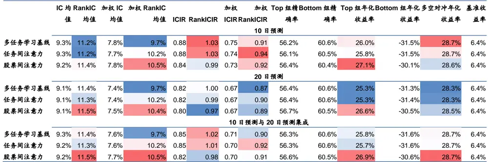
注：IC 使用 10 日收益率计算
资料来源：朝阳永续，Wind，华泰研究

图表11： 任务间注意力和股票间注意力指增组合回测绩效（回测期 2011-01-04至 2023-07-31，基准为中证 500）

| 年化收益率 | 年化波动率 |  | 夏普比率 | 最大回撤 Calmar 比率 |  | 年化超额 | 年化跟踪 误差 | 信息比率 | 超额收益 最大回撤 | 超额收益 Calmar 比率 | 月胜率 | 相对基准年化双边 换手率 |  |
| --- | --- | --- | --- | --- | --- | --- | --- | --- | --- | --- | --- | --- | --- |
|  |  |  |  |  |  |  |  |  |  |  |  |  | 收益率 10 日预测 |
| 多任务学习基线 | 18.82% | 26.03% | 0.72 | 49.18% | 0.38 | 17.00% | 6.38% |  | 9.26% |  |  |  |  |
| 任务间注意力 | 19.12% | 26.12% | 0.73 | 48.03% | 0.40 | 17.32% | 6.38% | 2.67 2.71 | 10.18% | 1.84 1.70 | 78.15% 78.81% | 16.13 16.16 |  |
| 股票间注意力 | 17.44% | 26.07% | 0.67 | 47.64% | 0.37 | 15.66% | 6.19% | 2.53 | 9.66% | 1.62 | 76.82% | 16.12 |  |
|  |  |  |  |  |  | 20 日预测 |  |  |  |  |  |  |  |
| 多任务学习基线 | 18.64% | 25.53% | 0.73 | 46.38% | 0.40 | 16.69% | 6.01% | 2.78 | 6.72% | 2.48 | 82.12% | 16.16 |  |
| 任务间注意力 | 19.36% | 25.50% | 0.76 | 46.34% | 0.42 | 17.40% | 5.99% | 2.91 | 4.56% | 3.82 | 80.79% | 16.16 |  |
| 股票间注意力 | 18.89% | 25.77% | 0.73 | 44.91% | 0.42 | 17.01% | 5.97% | 2.85 | 5.22% | 3.26 | 76.82% | 16.07 |  |
|  |  |  |  |  | 10 日预测与 20 日预测集成 |  |  |  |  |  |  |  |  |
| 多任务学习基线 | 19.11% | 25.67% | 0.74 | 47.18% | 0.41 | 17.19% | 6.17% | 2.79 | 8.85% | 1.94 | 79.47% | 16.12 |  |
| 任务间注意力 | 19.29% | 26.00% | 0.74 | 48.40% | 0.40 | 17.47% | 6.22% | 2.81 | 7.97% | 2.19 | 78.15% | 16.15 |  |
| 股票间注意力 | 19.20% | 25.83% | 0.74 | 45.48% | 0.42 | 17.33% | 6.04% | 2.87 | 5.89% | 2.94 | 80.13% | 16.08 |  |

资料来源：朝阳永续，Wind，华泰研究

合成因子和指增组合指标
图表12： 任务间注意力和股票间注意力 RankIC均值
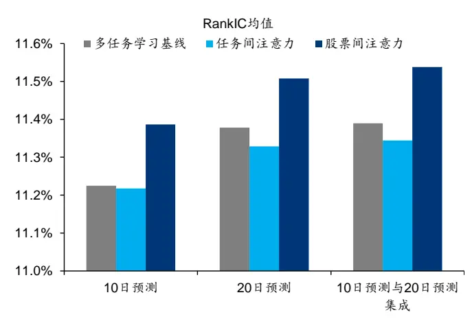
资料来源：朝阳永续，Wind，华泰研究

图表13： 任务间注意力和股票间注意力多头加权 RankIC均值
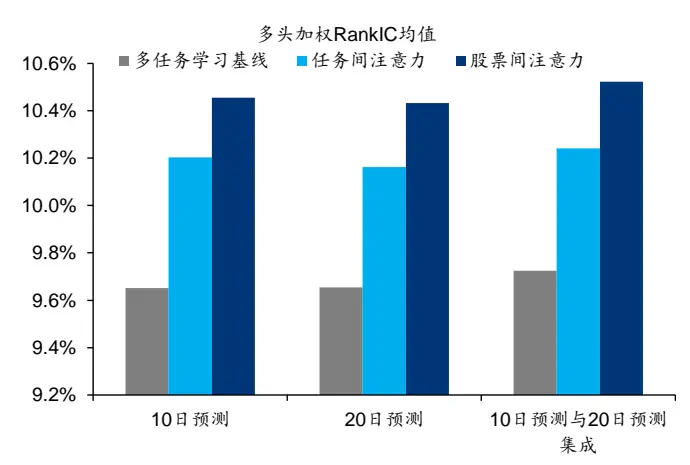
资料来源：朝阳永续，Wind，华泰研究

图表14： 任务间注意力和股票间注意力信息比率
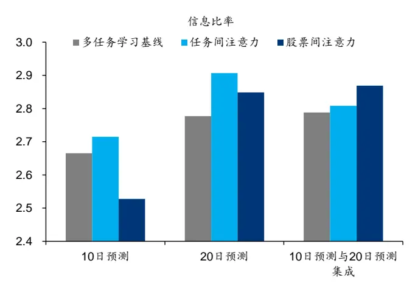
资料来源：朝阳永续，Wind，华泰研究

图表15： 任务间注意力和股票间注意力超额收益 Calmar比率
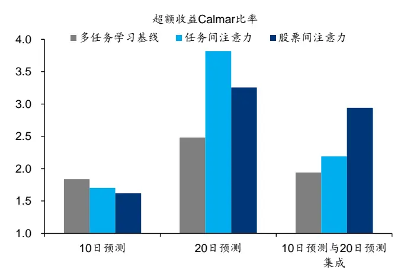
资料来源：朝阳永续，Wind，华泰研究

合成因子 Top组相对净值
图表16： 任务间注意力和股票间注意力 10日预测 Top组相对净值
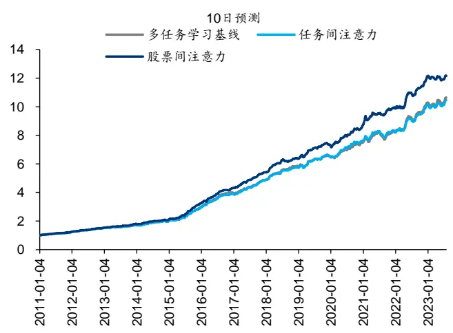
资料来源：朝阳永续，Wind，华泰研究

图表17： 任务间注意力和股票间注意力 20日预测 Top组相对净值
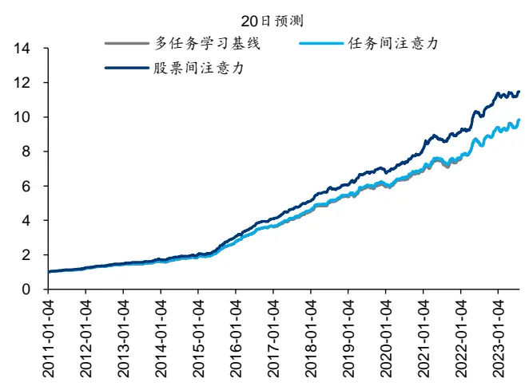
资料来源：朝阳永续，Wind，华泰研究

图表18： 任务间注意力和股票间注意力 10日预测与 20日预测集成 Top组相对净值
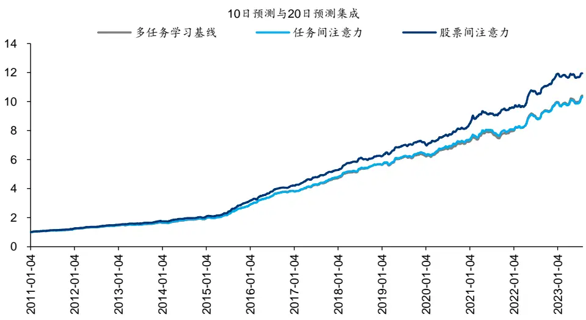
资料来源：朝阳永续，Wind，华泰研究

指数增强组合超额净值
图表19： 任务间注意力和股票间注意力 10日预测组合超额净值
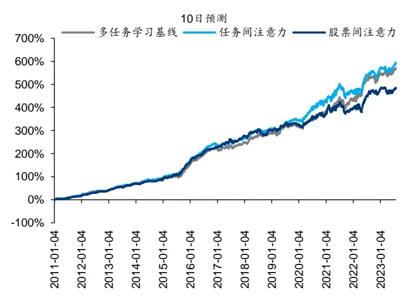
资料来源：朝阳永续，Wind，华泰研究

图表20： 任务间注意力和股票间注意力 20日预测组合超额净值
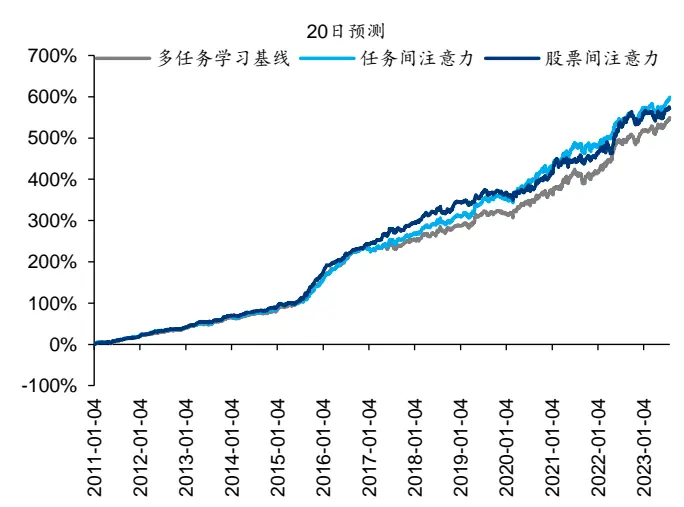
资料来源：朝阳永续，Wind，华泰研究

图表21： 任务间注意力和股票间注意力 10日预测与 20日预测集成组合超额净值
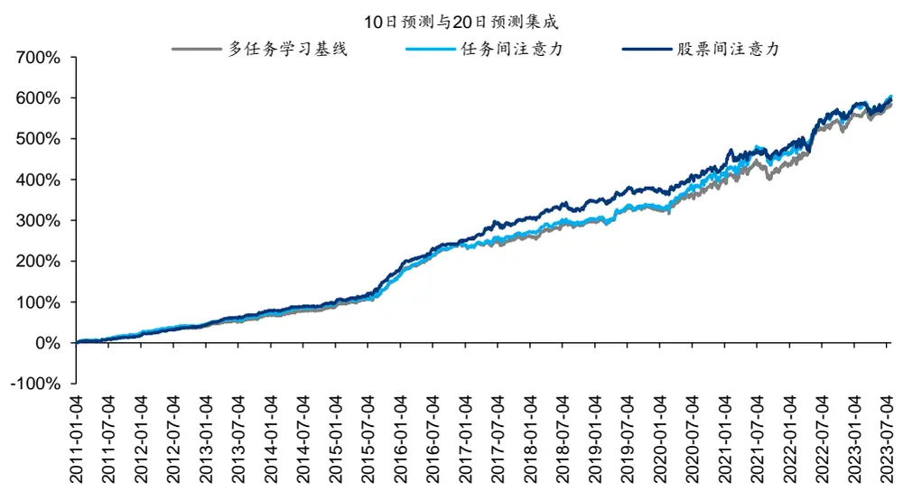
资料来源：朝阳永续，Wind，华泰研究

## 时序注意力

对比单任务学习基线、ALSTM和 Transformer模型，主要结论如下：

1. 以因子日频时间序列代替截面因子作为输入，合成因子测试表现有显著提升。即便是LSTM 基线模型，RankIC 均值、Top 组年化收益率就已高于前文多任务学习基线模型（12.0%>11.2%；27.2%>26.0%）。

2. 观察合成因子评价指标，LSTM 和 ALSTM 接近，Transformer 在包括 RankIC、Top 组收益在内各项指标全面胜出，表明 Transformer在应用注意力机制编码时间序列信息上有显著优势。

3. 观察原始组合优化约束条件下的指增组合回测绩效，基线 LSTM 反而更好。换言之，Transformer在合成因子中的优势，未能体现在指增组合上。可能原因是组合优化约束较为严格，“淹没”了合成因子的 alpha 信息。

4. 放宽组合优化约束条件后，指增组合的信息比率下降，但年化超额收益率提升，并且Transformer 优于 LSTM 和 ALSTM。

总的看，ALSTM 无改进，Transformer 有提升，提升主要体现在合成因子与放宽组合优化约束条件情景。

图表22： 时序注意力合成因子评价指标（回测期 2011-01-04 至 2023-07-31）

| 加权 |  |  |  |  |  |  | Bottom 组 |  |  |  |  |  | 多空对冲 |
| --- | --- | --- | --- | --- | --- | --- | --- | --- | --- | --- | --- | --- | --- |
|  | RankIC |  |  | 加权 IC RankIC |  | 加权 |  |  | 加权Top 组精 Bottom 组Top 组年化 |  |  | 年化收益 | 基准收 |
|  | IC 均值 | 均值 | 均值 | 均值 | ICIR RankICIR |  | ICIR RankICIR |  | 确率 精确率 | 收益率 | 率 | 率 | 益率 |
| LSTM（单任务学习基线） | 9.6% | 12.0% | 7.9% | 10.8% | 0.89 | 1.08 0.73 | 0.97 | 57.1% | 60.9% | 27.2% | -33.2% | 30.2% | 6.4% |
| ALSTM | 9.6% | 12.0% | 7.9% | 10.8% | 0.90 | 1.09 | 0.74 | 0.99 57.1% | 60.7% | 27.3% | -32.4% | 29.9% | 6.4% |
| Transformer | 9.9% | 12.3% | 8.3% | 11.2% | 0.94 | 1.12 0.79 |  | 1.03 57.4% | 61.0% | 29.0% | -33.5% | 31.2% | 6.4% |

注：IC 使用 10 日收益率计算
资料来源：朝阳永续，Wind，华泰研究

图表23： 原始约束条件下，时序注意力指增组合回测绩效（回测期 2011-01-04 至 2023-07-31，基准为中证 500）

|  | 年化收益 | 年化波动 |  |  | Calmar 年化超额 | 年化跟踪 |  |  | 超额收益 | 超额收益 | 相对基准年化双边 月胜率 | 换手率 |
| --- | --- | --- | --- | --- | --- | --- | --- | --- | --- | --- | --- | --- |
|  |  | 率 率 | 夏普比率 | 最大回撤 |  |  | 收益率 误差 | 最大回撤 Calmar 比率 |  |  |  |  |
| LSTM（单任务学习基线） | 19.67% | 25.67% | 0.77 | 47.22% | 比率 0.42 | 17.79% | 5.51% | 信息比率 3.23 | 7.50% | 2.37 | 78.81% | 16.40 |
| ALSTM | 18.13% | 25.74% | 0.70 | 48.49% | 0.37 | 16.29% | 5.53% | 2.95 | 9.18% | 1.78 | 78.15% | 16.36 |
| Transformer | 19.64% | 25.98% | 0.76 | 49.25% | 0.40 | 17.83% | 5.81% | 3.07 | 9.13% | 1.95 | 77.48% | 16.34 |

资料来源：朝阳永续，Wind，华泰研究

图表24： 放宽约束条件下，时序注意力指增组合回测绩效（回测期 2011-01-04至 2023-07-31，基准为中证 500）

|  | 年化收益 | 年化波动 Calmar |  |  |  | 年化超额 | 年化跟踪 |  | 超额收益 超额收益 |  |  | 相对基准年化双边 换手率 |
| --- | --- | --- | --- | --- | --- | --- | --- | --- | --- | --- | --- | --- |
|  |  | 率 | 率 夏普比率 | 最大回撤 | 比率 |  | 收益率 | 误差 信息比率 | 最大回撤 Calmar 比率 | 月胜率 |  |  |
| LSTM（单任务学习基线） | 20.82% | 26.17% | 0.80 | 45.55% | 0.46 | 18.97% | 6.92% | 2.74 | 11.83% | 1.60 | 78.81% | 21.10 |
| ALSTM | 20.51% | 26.07% | 0.79 | 47.53% | 0.43 | 18.64% | 6.77% | 2.75 | 12.67% | 1.47 | 76.16% | 21.13 |
| Transformer | 21.99% | 26.38% | 0.83 | 47.54% | 0.46 | 20.16% | 7.22% | 2.79 | 9.82% | 2.05 | 78.15% | 21.08 |

资料来源：朝阳永续，Wind，华泰研究

原始组合优化约束条件
图表25： 原始约束条件下，时序注意力合成因子评价指标
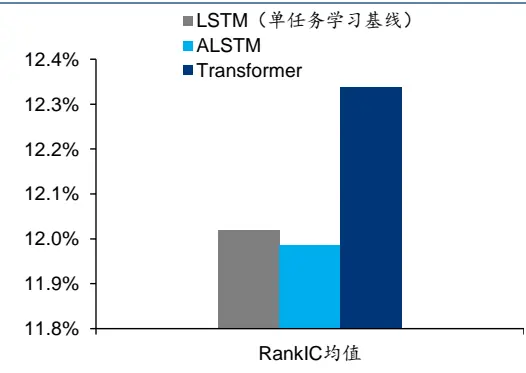
资料来源：朝阳永续，Wind，华泰研究

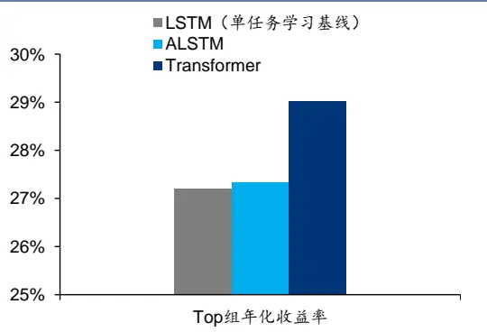

图表26： 原始约束条件下，时序注意力指增组合回测指标
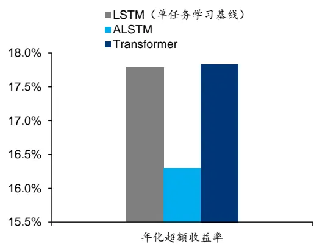
资料来源：朝阳永续，Wind，华泰研究

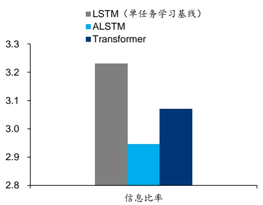

图表27： 时序注意力 Top组相对净值
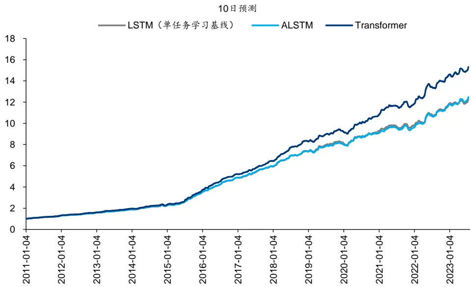
资料来源：朝阳永续，Wind，华泰研究

图表28： 原始约束条件下，时序注意力组合超额净值
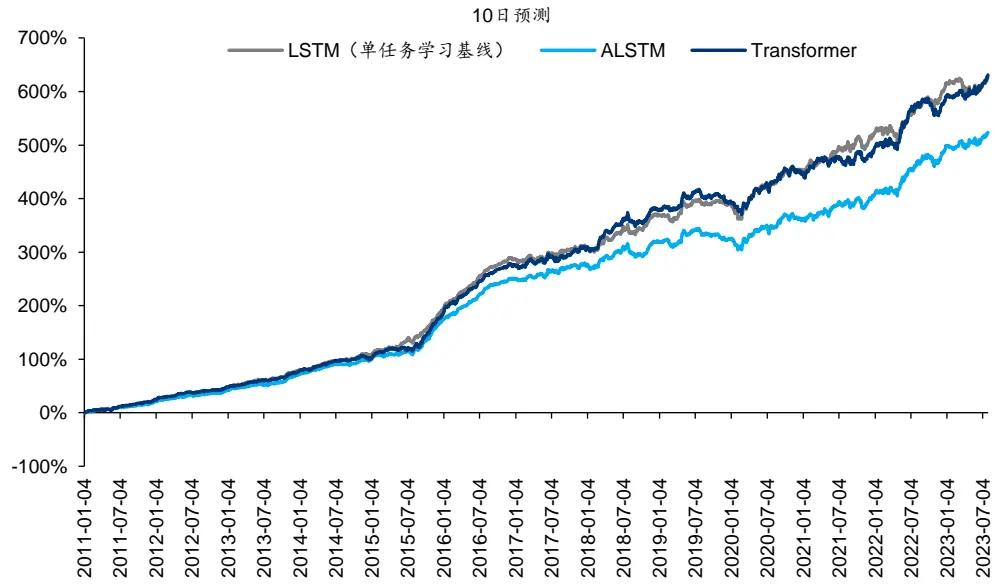
资料来源：朝阳永续，Wind，华泰研究

## 放宽组合优化约束条件

将个股偏离权重约束、行业偏离权重约束从±1%放宽至±2%，风格偏离标准差约束从±1%放宽至±20%，单次调仓单边换手率上限从 15%放宽至 20%。

图表29： 放宽组合优化约束条件

| 步骤 | 参数 | 参数值 |
| --- | --- | --- |
| 构建组合 | 基准 | 中证 500 指数 |
|  | 优化目标 | 最大化预期收益 |
|  | 组合仓位 |  |
|  | 个股权重下限 | 0 |
|  | 个股偏离权重约束 | [-2%, 2%] |
|  | 行业偏离权重约束 | [-2%, 2%] |
|  | 风格偏离标准差约束 | [-20%, 20%] |
|  | 风格因子 | 对数流通市值（预处理：5 倍 MAD 缩尾，zscore标准化） |
|  | 调仓周期 | 每5个交易日 |
|  | 单次调仓单边换手率上限 | 20% |
|  | 成分股权重约束 | 无 |

资料来源：华泰研究

图表30： 放宽约束条件下，时序注意力指增组合回测指标
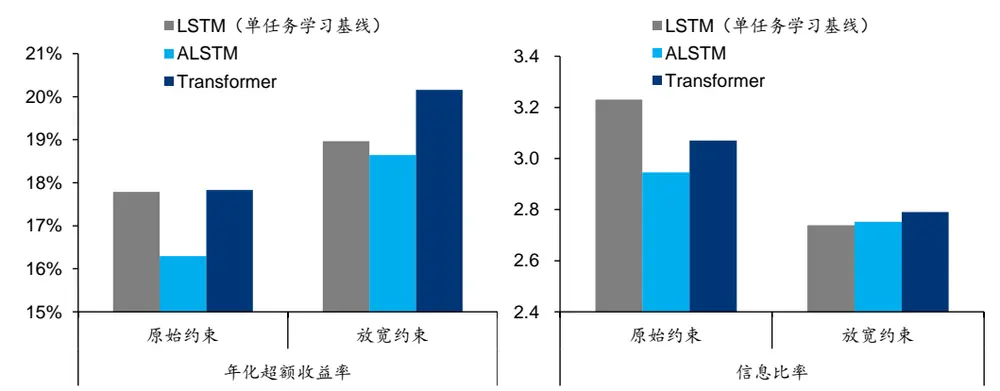
资料来源：朝阳永续，Wind，华泰研究

图表31： 放宽约束条件下，时序注意力组合超额净值
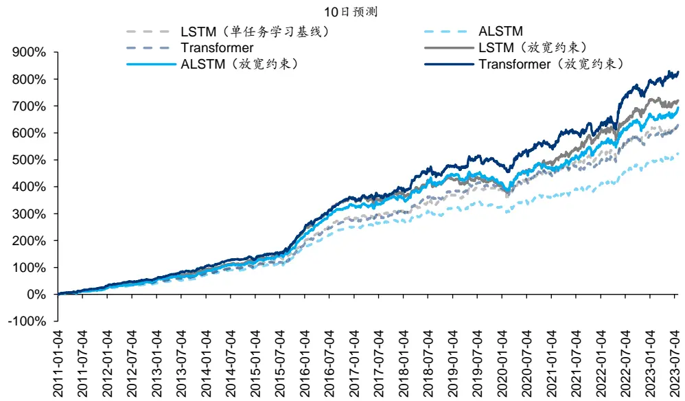
资料来源：朝阳永续，Wind，华泰研究

## 多类注意力集成

将多任务学习基线、任务间注意力、股票间注意力、时序注意力四类模型的预测值等权集成（其中前三项取10日预测与20日预测集成，时序注意力取Transformer模型10日预测）。考察子模型截面预测值相关性，指增组合净值日超额收益相关性，以及集成模型合成因子和指增组合（原始约束条件）表现。主要结论如下：

1. 与基线模型相关性：任务间注意力>股票间注意力>时序注意力。换言之，从增量信息的角度看，任务间关系信息<股票间关系信息<时序信息。

2. 集成模型合成因子的 RankIC 均值、对冲收益高于全部子模型，加权 RankIC 均值、RankICIR、Top组收益等指标仅次于时序注意力模型。

3. 集成模型指增组合的年化超额收益率高于全部子模型，信息比率仅次于时序注意力模型，超额收益 Calmar比率仅次于股票间注意力模型。

4. 集成模型与基线模型累计 RankIC 差值稳定扩大，表明从合成因子角度看，集成模型有稳定优势；但集成模型与基线模型指增组合超额净值的“喇叭口”未稳定扩大，表明从组合角度看，因子的优势未能充分体现在组合中。

总的看，模型集成仍然是“免费的午餐”，大概率能提升模型性能。

图表32： 子模型截面预测值相关系数均值

|  | 多任务学习基线 | 任务间注意力 | 股票间注意力 | 时序注意力 |
| --- | --- | --- | --- | --- |
| 多任务学习基线 | 1 | 0.99 | 0.91 | 0.74 |
| 任务间注意力 | 0.99 | 1 | 0.91 | 0.74 |
| 股票间注意力 | 0.91 | 0.91 | 1 | 0.70 |
| 时序注意力 | 0.74 | 0.74 | 0.70 | 1 |

资料来源：朝阳永续，Wind，华泰研究

图表33： 指增组合日超额收益相关系数

|  | 多任务学习基线 | 任务间注意力 | 股票间注意力 | 时序注意力 |
| --- | --- | --- | --- | --- |
| 多任务学习基线 |  | 0.94 | 0.80 | 0.73 |
| 任务间注意力 | 0.94 | 1 | 0.82 | 0.73 |
| 股票间注意力 | 0.80 | 0.82 | 1 | 0.73 |
| 时序注意力 | 0.73 | 0.73 | 0.73 | 1 |

资料来源：朝阳永续，Wind，华泰研究

图表34： 集成模型合成因子评价指标（回测期 2011-01-04 至 2023-07-31）

|  | RankIC 加权 IC 加权 RankIC |  |  |  | 加权 |  | 加权Top 组精 Bottom 组Top 组年化 Bottom 组年 |  |  |  |  | 多空对冲年基准收益 化收益率 | 率 |
| --- | --- | --- | --- | --- | --- | --- | --- | --- | --- | --- | --- | --- | --- |
|  | IC 均值 | 均值 | 均值 | 均值 | ICIR RankICIR |  | ICIR RankICIR | 确率 | 精确率 | 收益率 | 化收益率 |  |  |
| 多任务学习基线 | 9.3% | 11.4% | 7.6% | 9.7% | 0.85 | 1.02 | 0.71 | 0.90 56.3% | 60.6% | 25.8% |  | -31.6% 28.7% | 6.4% |
| 任务间注意力 | 9.2% | 11.3% | 7.6% | 10.2% | 0.85 | 1.01 0.70 | 0.92 | 56.3% | 60.6% | 25.7% | -31.6% | 28.7% | 6.4% |
| 股票间注意力 | 9.2% | 11.5% | 7.7% | 10.5% | 0.82 | 0.98 0.70 |  | 0.91 56.6% | 60.5% | 26.9% | -30.6% | 28.7% | 6.4% |
| 时序注意力 | 9.9% | 12.3% | 8.3% | 11.2% | 0.94 | 1.12 0.79 |  | 1.03 57.4% | 61.0% | 29.0% | -33.5% | 31.2% | 6.4% |
| 集成模型 | 10.1% | 12.5% | 8.4% | 10.7% | 0.90 | 1.08 0.76 |  | 0.95 57.3% | 61.4% | 28.6% | -34.7% | 31.6% | 6.4% |

注：IC 使用 10 日收益率计算
资料来源：朝阳永续，Wind，华泰研究

图表35： 集成模型指增组合回测绩效（回测期 2011-01-04至 2023-07-31，基准为中证 500）

|  | 年化收益 | 年化波动 Calmar |  |  |  | 年化超额 收益率 | 年化跟踪 |  | 超额收益 | 超额收益 | 相对基准年化双边 月胜率 | 换手率 |
| --- | --- | --- | --- | --- | --- | --- | --- | --- | --- | --- | --- | --- |
|  |  | 率 | 率 夏普比率 | 最大回撤 | 比率 |  | 误差 | 最大回撤 Calmar 比率 |  |  |  |  |
| 多任务学习基线 | 19.11% | 25.67% | 0.74 | 47.18% | 0.41 | 17.19% | 6.17% | 信息比率 2.79 | 8.85% | 1.94 | 79.47% | 16.12 |
| 任务间注意力 | 19.29% | 26.00% | 0.74 | 48.40% | 0.40 | 17.47% | 6.22% | 2.81 | 7.97% | 2.19 | 78.15% | 16.15 |
| 股票间注意力 | 19.20% | 25.83% | 0.74 | 45.48% | 0.42 | 17.33% | 6.04% | 2.87 | 5.89% | 2.94 | 80.13% | 16.08 |
| 时序注意力 | 19.64% | 25.98% | 0.76 | 49.25% | 0.40 | 17.83% | 5.81% | 3.07 | 9.13% | 1.95 | 77.48% | 16.34 |
| 集成模型 | 20.10% | 25.79% | 0.78 | 47.85% | 0.42 | 18.21% | 6.08% | 3.00 | 6.96% | 2.62 | 79.47% | 16.15 |

资料来源：朝阳永续，Wind，华泰研究

图表36： 集成模型与基线模型累计 RankIC差值
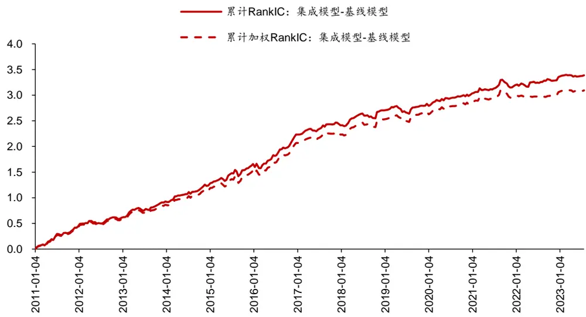
资料来源：朝阳永续，Wind，华泰研究

图表37： 集成模型超额收益表现（回测期 2011-01-04 至 2023-07-31，基准为中证 500）
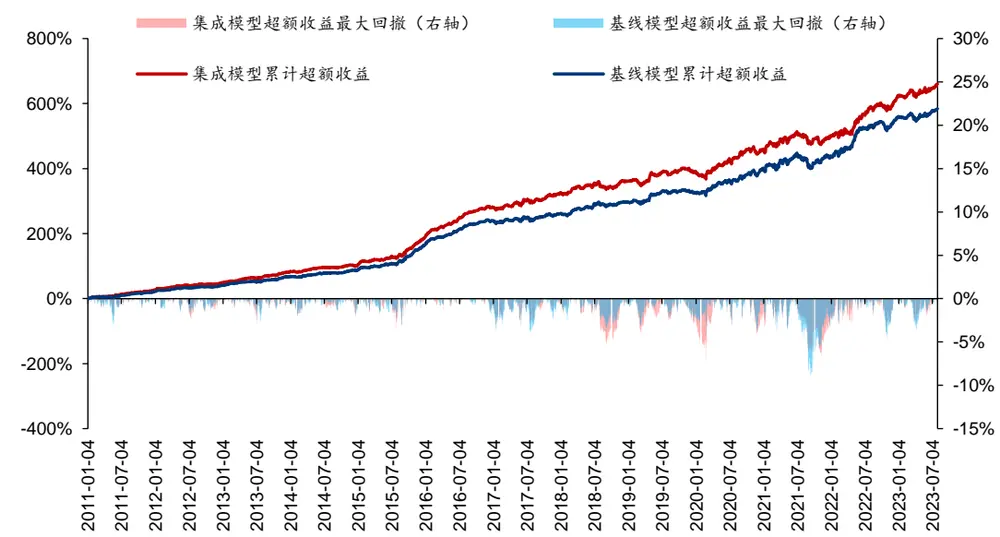
资料来源：朝阳永续，Wind，华泰研究

## 总结

注意力机制是近年来人工智能领域影响深远的创新之一，但以往应用于量化投资多局限在行情时间序列编码，本研究展示多种形式的注意力机制在量化选股各类场景的运用。分别测试：(1)任务间注意力：提取多任务学习中的任务间关系信息；(2)股票间注意力：Transformer 学习截面因子的股票间关系；(3)时序注意力：ALSTM 和 Transformer 编码因子时间序列。结果表明：(1)任务间注意力提升稳定；(2)股票间注意力提升主要体现在因子多头；(3)Transformer 时序注意力提升主要体现在合成因子及放宽组合优化约束情景。注意力机制在多数场景有效，Attention is indeed all you need。

注意力系数的本质是两个向量的归一化相似度。自注意力通过计算输入信息中各元素间的注意力系数作为权重，将其他元素的信息聚合到自身。因此，自注意力的本质是基于相似度的权重再分配，用来表征数据内部关系。只要涉及权重分配和关系信息表征，都有可能引入注意力结构，万物皆可 Attention。计算自注意力的对象，在自然语言处理场景下，通常是一条文本内的各单词；而在因子选股场景下，既可以是一条时间序列内的各时刻，又可以是一个截面内的各股票，还可以是一组网络内的各模块。

在多任务学习的任务共享层和任务特异层间引入多头自注意力层，编码任务间关系；将任务共享层的 MLP网络替换为Transformer编码器，利用注意力机制学习因子的股票间关系。对比多任务学习基线、任务间注意力和股票间注意力模型。任务间注意力模型的合成因子和指数增强组合回测表现有稳定提升，提升同时体现在每个子任务以及子任务集成上。股票间注意力模型的合成因子 RankIC 和 Top 组收益有提升，但指增组合只在部分子任务以及子任务集成上观察到优势。

因子时间序列通常采用循环神经网络编码，将 LSTM替换为 ALSTM和 Transformer，引入时序注意力编码时序信息。对比单任务学习基线和两类注意力模型。从合成因子评价指标看，LSTM 和 ALSTM 接近，Transformer 全面胜出，表明 Transformer 在编码时间序列上有显著优势。观察指增组合回测绩效，原始组合优化约束条件下基线模型较好，Transformer合成因子的优势难以体现在组合中；放宽约束条件后，以信息比率的下降为代价换取年化超额收益率的提升，Transformer 优于 LSTM 和 ALSTM。

将基线模型和三类注意力模型的预测值等权集成。观察与基线模型相关性，任务间注意力>股票间注意力>时序注意力，时序注意力提供较多增量信息。合成因子 RankIC 均值、对冲收益高于全部子模型，指增组合年化超额收益率高于全部子模型，部分关键指标仅次于时序注意力模型。集成模型与基线模型累计 RankIC 差值稳定扩大，Top组年化收益从 25.8%提升至 28.6%，指增组合年化超额收益率从 17.2%提升至 18.2%，信息比率从 2.79 提升至3.00。总的来看，模型集成仍是“免费的午餐”，大概率可以提升模型性能。

本研究存在以下未尽之处：(1)注意力机制的表现形式不局限上述三种。例如在多模态学习中同时学习截面、时间序列、文本等信息，采用注意力机制融合多个信息源。注意力机制的其他表现形式有待进一步探索。(2)Transformer 变体是近几年学界和业界的热点，研究者从稀疏、低秩、引入归纳偏置等众多角度提出改进方法。本文采用经典的 Transformer 编码器结构，并未对超参数、位置编码等细节进行探索，尚有优化空间。(3)本研究仍观察到合成因子表现提升但指增组合未见提升的现象，本质是指增约束条件未能体现在深度学习网络的架构或损失函数中，这始终是困扰我们的一个问题。

## 参考文献

Ma, T. , & Tan, Y. . (2022). Stock ranking with multi-task learning. Expert Systems with Application(Aug.), 199.

Vaswani, A., Shazeer, N., Parmar, N., Uszkoreit, J., Jones, L., Gomez, A. N., ... & Polosukhin, I. (2017). Attention is all you need. Advances in neural information processing systems, 30.

## 风险提示

人工智能挖掘市场规律是对历史的总结，市场规律在未来可能失效。人工智能技术存在过拟合风险。深度学习模型受随机数影响较大。本文测试的选股模型调仓频率较高，假定以vwap 价格成交，忽略其他交易层面因素影响。

## 免责声明

## 分析师声明

本人，林晓明、何康、李子钰，兹证明本报告所表达的观点准确地反映了分析师对标的证券或发行人的个人意见；彼以往、现在或未来并无就其研究报告所提供的具体建议或所表迖的意见直接或间接收取任何报酬。

## 一般声明及披露

本报告由华泰证券股份有限公司（已具备中国证监会批准的证券投资咨询业务资格，以下简称“本公司”）制作。本报告所载资料是仅供接收人的严格保密资料。本报告仅供本公司及其客户和其关联机构使用。本公司不因接收人收到本报告而视其为客户。

本报告基于本公司认为可靠的、已公开的信息编制，但本公司及其关联机构(以下统称为“华泰”)对该等信息的准确性及完整性不作任何保证。

本报告所载的意见、评估及预测仅反映报告发布当日的观点和判断。在不同时期，华泰可能会发出与本报告所载意见、评估及预测不一致的研究报告。同时，本报告所指的证券或投资标的的价格、价值及投资收入可能会波动。以往表现并不能指引未来，未来回报并不能得到保证，并存在损失本金的可能。华泰不保证本报告所含信息保持在最新状态。华泰对本报告所含信息可在不发出通知的情形下做出修改，投资者应当自行关注相应的更新或修改。

本公司不是 FINRA 的注册会员，其研究分析师亦没有注册为 FINRA 的研究分析师/不具有 FINRA 分析师的注册资格。

华泰力求报告内容客观、公正，但本报告所载的观点、结论和建议仅供参考，不构成购买或出售所述证券的要约或招揽。该等观点、建议并未考虑到个别投资者的具体投资目的、财务状况以及特定需求，在任何时候均不构成对客户私人投资建议。投资者应当充分考虑自身特定状况，并完整理解和使用本报告内容，不应视本报告为做出投资决策的唯一因素。对依据或者使用本报告所造成的一切后果，华泰及作者均不承担任何法律责任。任何形式的分享证券投资收益或者分担证券投资损失的书面或口头承诺均为无效。

除非另行说明，本报告中所引用的关于业绩的数据代表过往表现，过往的业绩表现不应作为日后回报的预示。华泰不承诺也不保证任何预示的回报会得以实现，分析中所做的预测可能是基于相应的假设，任何假设的变化可能会显著影响所预测的回报。

华泰及作者在自身所知情的范围内，与本报告所指的证券或投资标的不存在法律禁止的利害关系。在法律许可的情况下，华泰可能会持有报告中提到的公司所发行的证券头寸并进行交易，为该公司提供投资银行、财务顾问或者金融产品等相关服务或向该公司招揽业务。

华泰的销售人员、交易人员或其他专业人士可能会依据不同假设和标准、采用不同的分析方法而口头或书面发表与本报告意见及建议不一致的市场评论和/或交易观点。华泰没有将此意见及建议向报告所有接收者进行更新的义务。华泰的资产管理部门、自营部门以及其他投资业务部门可能独立做出与本报告中的意见或建议不一致的投资决策。投资者应当考虑到华泰及/或其相关人员可能存在影响本报告观点客观性的潜在利益冲突。投资者请勿将本报告视为投资或其他决定的唯一信赖依据。有关该方面的具体披露请参照本报告尾部。

本报告并非意图发送、发布给在当地法律或监管规则下不允许向其发送、发布的机构或人员，也并非意图发送、发布给因可得到、使用本报告的行为而使华泰违反或受制于当地法律或监管规则的机构或人员。

本报告版权仅为本公司所有。未经本公司书面许可，任何机构或个人不得以翻版、复制、发表、引用或再次分发他人(无论整份或部分)等任何形式侵犯本公司版权。如征得本公司同意进行引用、刊发的，需在允许的范围内使用，并需在使用前获取独立的法律意见，以确定该引用、刊发符合当地适用法规的要求，同时注明出处为“华泰证券研究所”，且不得对本报告进行任何有悖原意的引用、删节和修改。本公司保留追究相关责任的权利。所有本报告中使用的商标、服务标记及标记均为本公司的商标、服务标记及标记。

## 中国香港

本报告由华泰证券股份有限公司制作,在香港由华泰金融控股（香港）有限公司向符合《证券及期货条例》及其附属法律规定的机构投资者和专业投资者的客户进行分发。华泰金融控股（香港）有限公司受香港证券及期货事务监察委员会监管，是华泰国际金融控股有限公司的全资子公司，后者为华泰证券股份有限公司的全资子公司。在香港获得本报告的人员若有任何有关本报告的问题,请与华泰金融控股（香港）有限公司联系。

## 香港-重要监管披露

- 华泰金融控股（香港）有限公司的雇员或其关联人士没有担任本报告中提及的公司或发行人的高级人员。

- 有关重要的披露信息，请参华泰金融控股（香港）有限公司的网页 https://www.htsc.com.hk/stock_disclosure其他信息请参见下方 “美国-重要监管披露”。

## 美国

在美国本报告由华泰证券（美国）有限公司向符合美国监管规定的机构投资者进行发表与分发。华泰证券（美国）有限公司是美国注册经纪商和美国金融业监管局（FINRA）的注册会员。对于其在美国分发的研究报告，华泰证券（美国）有限公司根据《1934 年证券交易法》（修订版）第 15a-6 条规定以及美国证券交易委员会人员解释，对本研究报告内容负责。华泰证券（美国）有限公司联营公司的分析师不具有美国金融监管（FINRA）分析师的注册资格，可能不属于华泰证券（美国）有限公司的关联人员，因此可能不受 FINRA 关于分析师与标的公司沟通、公开露面和所持交易证券的限制。华泰证券（美国）有限公司是华泰国际金融控股有限公司的全资子公司，后者为华泰证券股份有限公司的全资子公司。任何直接从华泰证券（美国）有限公司收到此报告并希望就本报告所述任何证券进行交易的人士，应通过华泰证券（美国）有限公司进行交易。

## 美国-重要监管披露

- 分析师林晓明、何康、李子钰本人及相关人士并不担任本报告所提及的标的证券或发行人的高级人员、董事或顾问。分析师及相关人士与本报告所提及的标的证券或发行人并无任何相关财务利益。本披露中所提及的“相关人士”包括 FINRA 定义下分析师的家庭成员。分析师根据华泰证券的整体收入和盈利能力获得薪酬，包括源自公司投资银行业务的收入。

华泰证券股份有限公司、其子公司和/或其联营公司, 及/或不时会以自身或代理形式向客户出售及购买华泰证券研究所覆盖公司的证券/衍生工具，包括股票及债券（包括衍生品）华泰证券研究所覆盖公司的证券/衍生工具，包括股票及债券（包括衍生品）。

- 华泰证券股份有限公司、其子公司和/或其联营公司, 及/或其高级管理层、董事和雇员可能会持有本报告中所提到的任何证券（或任何相关投资）头寸，并可能不时进行增持或减持该证券（或投资）。因此，投资者应该意识到可能存在利益冲突。

## 评级说明

投资评级基于分析师对报告发布日后 6 至 12个月内行业或公司回报潜力（含此期间的股息回报）相对基准表现的预期（A 股市场基准为沪深 300 指数，香港市场基准为恒生指数，美国市场基准为标普 500 指数），具体如下：

## 行业评级

增持：预计行业股票指数超越基准

中性：预计行业股票指数基本与基准持平

减持：预计行业股票指数明显弱于基准

## 公司评级

买入：预计股价超越基准 15%以上

增持：预计股价超越基准 5%~15%

持有：预计股价相对基准波动在-15%~5%之间

卖出：预计股价弱于基准 15%以上

暂停评级：已暂停评级、目标价及预测，以遵守适用法规及/或公司政策

无评级：股票不在常规研究覆盖范围内。投资者不应期待华泰提供该等证券及/或公司相关的持续或补充信息

## 法律实体披露

中国：华泰证券股份有限公司具有中国证监会核准的“证券投资咨询”业务资格，经营许可证编号为：91320000704041011J香港：华泰金融控股（香港）有限公司具有香港证监会核准的“就证券提供意见”业务资格，经营许可证编号为：AOK809美国：华泰证券（美国）有限公司为美国金融业监管局（FINRA）成员，具有在美国开展经纪交易商业务的资格，经营业务许可编号为：CRD#:298809/SEC#:8-70231

华泰证券股份有限公司
南京
南京市建邺区江东中路228号华泰证券广场1号楼/邮政编码：210019

电话：86 25 83389999/传真：86 25 83387521电子邮件：ht-rd@htsc.com

深圳
深圳市福田区益田路5999号基金大厦10楼/邮政编码：518017
电话：86 755 82493932/传真：86 755 82492062
电子邮件：ht-rd@htsc.com

## 华泰金融控股（香港）有限公司

香港中环皇后大道中 99号中环中心 58楼 5808-12室
电话：+852-3658-6000/传真：+852-2169-0770
电子邮件：research@htsc.com
http://www.htsc.com.hk

## 华泰证券（美国）有限公司

美国纽约公园大道 280号 21楼东（纽约 10017）
电话：+212-763-8160/传真：+917-725-9702
电子邮件: Huatai@htsc-us.com
http://www.htsc-us.com

©版权所有2023年华泰证券股份有限公司

北京
北京市西城区太平桥大街丰盛胡同28号太平洋保险大厦A座18层/
邮政编码：100032
电话：86 10 63211166/传真：86 10 63211275
电子邮件：ht-rd@htsc.com
上海
上海市浦东新区东方路18号保利广场E栋23楼/邮政编码：200120
电话：86 21 28972098/传真：86 21 28972068
电子邮件：ht-rd@htsc.com