# 高频因子计算的 GPU加速

华泰研究

2023 年 10 月 16 日│中国内地

## 深度研究

人工智能系列之 70：使用 NVIDIA RAPIDS 对高频因子计算进行 GPU加速本文使用 NVIDIA RAPIDS 对高频因子计算进行 GPU加速。量化因子计算场景下，RAPIDS 的直接助力是用 CuPy、cuDF 的 GPU 运算替代 NumPy、Pandas 的 CPU 运算。在 RTX 3090 和 i9-10980XE 测试环境下计算分钟线因子，CuPy 和 cuDF 替换库函数的提速效果约为 6 倍，若同时将 for 循环替换为矩阵运算，最终提速超 100 倍。预计 RTX 4090 和 A800 提速更显著。最大化 ICIR 法合成高频因子，并与华泰金工神经网络多频率因子静态加权，构建中证 1000 指数增强组合，以 2016 年末至 2023 年 9 月为回测区间，信息比率从 3.70 提升至 3.87，超额收益 Calmar 比率从 2.41 提升至 3.96。

使用 CuPy/cuDF 替代 NumPy/Pandas，RTX 3090 实现约 6 倍性能提升RAPIDS的重要特性之一是将基于CUDA底层代码的优化以Python语言的形式体现。常用 API 如 CuPy（对标 NumPy）、cuDF（对标 Pandas）、cuML（对标 scikit-learn）等。由于 API 语法几乎相同，仅需轻量级代码修改，即可实现 CPU 运算到 GPU运算的迁移。针对全部因子使用 CuPy和 cuDF替换原函数，部分因子使用矩阵运算替换 for循环。结果表明：不引入矩阵运算时，单独替换库函数反而增加时间开销。若两步同时进行，替换库函数带来的性能提升约 6倍（RTX 3090），矩阵运算带来的性能提升约 18倍。GPU 性能同型号和数据量相关，单次运算数据量越大，加速效果越显著。

## 分钟线选股因子：价格全局特征类、价格局部特征类

本文测试 5 类共计 50 个分钟线选股因子。以下展示测试效果较好的因子及投资逻辑：(1)价格全局特征类：return_intraday、tp_diff、return_improved的本质是不同形式的日内反转因子，return_var的本质是日内低波动因子。(2)价格局部特征类：return_last_30min 和 return_skewness_last_30min 的本质是尾盘反转因子，return_upward_var 和 return_downward_var 的本质是日内低波动因子的精细化刻画。

## 分钟线选股因子：成交量/额类、成交关联价格类、价量相关性类

(3)成交量/额类：volume_open_30min_ratio 给予开盘成交不活跃的股票风 险溢价，市场情绪一般在开盘释放，该因子或反映理性交易者占比。 amount_out_order_avg_ratio 给予单笔流出金额较大的股票风险溢价，或对 应快速下跌后的反转或者主力的操纵行为。(4)成交关联价格类： cum_return_top30_order 的本质是反转因子的精细化刻画，大单推动的涨 幅更具信息量。(5)价量相关性类：VP、VP_top33_volume、VR_1min_lag 的本质都是捕捉量价背离，即缩量上涨或放量下跌。

## 最大化 ICIR法合成分钟线因子，与神经网络因子结合构建选股策略

进一步围绕分钟线因子构建选股策略。采用最大化 ICIR 法对前述 50 个因子进行合成，以未来 5 日收益为预测目标，合成因子 RankICIR（未年化）1.50，对冲组合夏普比率 3.59，Top 层信息比率 3.81。该合成因子和神经网络多频率因子相关系数为 0.25，两者截面标准化后静态融合，构建指数增强策略。结果显示，结合分钟线合成因子后，策略各项指标均有提升，尤其体现在回撤控制。中证 500 增强信息比率从 2.78 提升至 3.01，超额收益 Calmar比率从 1.37 提升至 2.07，中证 1000 增强信息比率从 3.70 提升至 3.87，超额收益 Calmar 比率从 2.41 提升至 3.96。

风险提示：人工智能挖掘市场规律是对历史的总结，市场规律在未来可能失效。人工智能技术存在过拟合风险。深度学习模型受随机数影响较大。本文测试的选股模型调仓频率较高，假定以 vwap价格成交，忽略其他交易层面因素影响。

研究员

SAC No. S0570516010001

林晓明

SFC No. BPY421

linxiaoming@htsc.com

+(86) 755 8208 0134

研究员

SAC No. S0570520080004

何康，PhD

SFC No. BRB318

hekang@htsc.com

+(86) 21 2897 2039

## 导言

量化投资作为一种技术驱动的方法论，对效率的追求是其永恒的核心。近年来，AI 方法的运用显著提升了因子挖掘和合成环节的效率，然而因子计算环节似乎未充分享受技术红利。传统因子计算通常采用 CPU 运算，随着高频数据的广泛应用，CPU 性能面临上限，而NVIDIA 引领的 GPU 软硬件生态日益成熟，使得高频因子计算的 GPU 加速成为可能。

RAPIDS 是 NVIDIA 针对数据科学与机器学习推出的 GPU 加速平台。RAPIDS 以 CUDA-XAI 为基础，由一系列开源软件库和 API 组成，支持完全在 GPU 上执行从数据加载和预处理到机器学习、图形分析和可视化的端到端数据科学工作流程。据 NVIDIA官网，RAPIDS能够为数据科学领域提供 50 倍的效率提升。

RAPIDS 的重要特性之一是将基于 CUDA底层代码的优化以 Python 高级语言的形式体现。常用 API 包括 cuDF（对标 Pandas）、cuML（对标 scikit-learn）、cuGraph（对标 networkX）等，由于 API 语法几乎相同，使用者仅需要轻量级的代码修改，即可实现 CPU 运算到 GPU运算的迁移。量化投资因子计算场景下，RAPIDS 的直接助力是用 CuPy、cuDF 库替代NumPy、Pandas 库，实现高频因子计算的 GPU 加速。

本研究使用 NVIDIA RAPIDS 对日内分钟线因子计算进行 GPU 加速。在 NVIDIA GeForceRTX 3090 和 Intel Core i9-10980XE 测试环境下，CuPy 和 cuDF 替换库函数的 GPU 提速效果约为 6 倍，若同时将 for循环替换为矩阵运算，最终提速超过 100 倍。使用最大化 ICIR法合成 50 个分钟线因子，并与华泰金工神经网络多频率因子静态加权，构建中证 1000 指数增强组合，以2016年末至2023年9月末为回测区间，组合信息比率从3.70提升至3.87，超额收益 Calmar 比率从 2.41 提升至 3.96。

图表1： RAPIDS：数据科学的 GPU加速
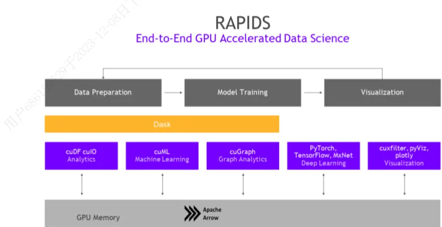
资料来源：NVIDIA，华泰研究

图表2： RAPIDS 常用库

| RAPIDS 库 | 对标 Python 库 | 功能 |
| --- | --- | --- |
| cuDF | Pandas | 数据集处理 |
| CuPy | NumPy | 科学计算 |
| cuML | scikit-learn | 机器学习 |
| cuGraph | networkX | 图结构处理 |
| cuSpatial | geoPandas | 空间分析 |
| cuCIM | scikit-image | 图像处理 |
| cuSignal | scipy.signal | 信号处理 |

资料来源：NVIDIA，华泰研究

## NVIDIA RAPIDS 实践

## RAPIDS 安装

RAPIDS 官网提供了详细安装方法，可参考：https://docs.rapids.ai/install。实际安装过程中可能遇到较多问题，可参考本文经验。

## 操作系统和 WSL安装

操作系统推荐 Ubuntu 20.04 和 CentOS 7。如使用 Windows 系统，需要通过 Linux 的Windows 子系统 WSL2（Windows Subsystem for Linux 2）。微软官网提供详细安装方法，参考：https://learn.microsoft.com/en-us/windows/wsl/install。

WSL 安装可能遇到较多问题，以下讲解要点：

1. 推荐使用 Window 11 系统。

2. 任务管理器—性能—CPU，确认 CPU 虚拟化已启用。

3. 启用或关闭Windows 功能，勾选“适用于 Linux 的Windows 系统”和“虚拟机平台”。

4. 管理员身份启动 Power Shell，运行 bcdedit /set hypervisorlaunchtype auto。

5. 网络和 Internet 设置—高级网络设置—属性，DNS服务器分配设为“手动”；Ipv4 DNS服务器，首选 DNS 设为 114.114.114.114，备用 DNS 设为 8.8.8.8。若此步不执行，安装WSL可能报错“无法解析服务器的名称或地址”。

图表3： WSL安装：启动或关闭 Windows功能
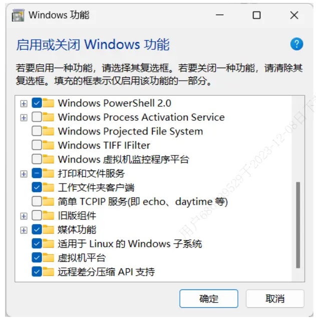
资料来源：华泰研究

图表4： WSL安装：DNS设置
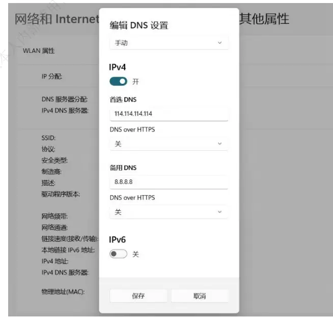
资料来源：华泰研究

6. 管理员身份启动 CMD，运行 wsl –update。如此步不执行，启动 Ubuntu可能报错。

7. 继续运行 wsl --install -d Ubuntu，安装 Ubuntu 子系统。

8. 启动“适用于 Linux 的Window 子系统”（WSL），设置账户和密码，完成 WSL 安装。

## WSL Conda 和 RAPIDS 安装

RAPIDS 官网提供了 WSL 中安装 Conda 和 RAPIDS 的方法，参考：

https://docs.rapids.ai/install#wsl2。

原文档较简略，Conda 和 RAPIDS 安装可能遇到较多问题，以下讲解要点：

1. 启动 WSL，登录 Ubuntu 系统。

2. 依次运行下列指令，下载和安装 Miniconda3：wget https://repo.anaconda.com/miniconda/Miniconda3-latest-Linux-x86_64.shbash Miniconda3-latest-Linux-x86_64.sh

3. 运行 export PATH=/home/username/miniconda3/bin:$PATH，设置环境变量。

4. 在 RAPIDS 官网（https://docs.rapids.ai/install）选择需要安装的版本、方式、CUDA版本、Python 版本、RAPIDS 库种类、附加扩展库，生成相应代码，在 WSL 中运行。以仅安装 cuDF 和 cuML 为例，运行代码 conda create --solver=libmamba -nrapids-23.08 -c rapidsai -c conda-forge -c nvidia cudf=23.08 cuml=23.08 python=3.10cuda-version=11.2。该指令将自动创建名为 rapids-23.08 的 conda 环境。

图表5： RAPIDS安装：选择版本
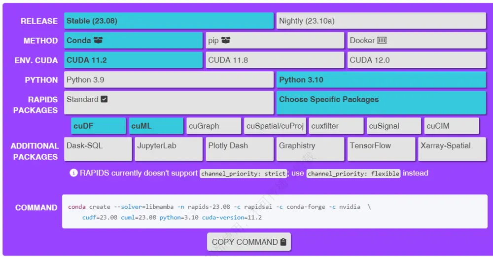
资料来源：NVIDIA，华泰研究

5. 运行 conda active rapids-23.08，进入该环境。

6. 运行 python，进入 Python 环境，依次运行下列代码，若正常运行则代表安装成功。import cudf

print(cudf.Series([1, 2, 3]))

7. Miniconda 环境仅安装少量库，可通过 conda install 安装 Pandas 等常用库。

8. 如需在代码中调用Windows 系统文件，路径为“/mnt/盘符/路径”，如“/mnt/d/data”。

图表6： RAPIDS 安装：在 WSL 中运行
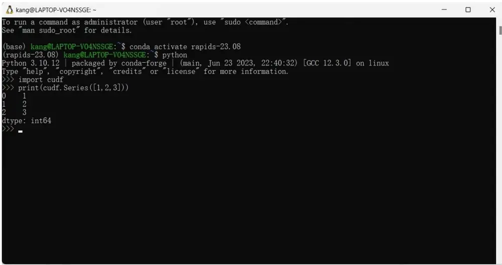
资料来源：华泰研究

## 高频因子代码优化

本文测试环境为：CPU——Intel Core i9-10980XE，GPU——NVIDIA GeForce RTX 3090（以下分别简称 i9-10980XE 和 3090）。以 2023 年 4 月 24 日单日全 A 股分钟线数据为例测试时间开销。

CPU 因子计算代码改造为 GPU 版本过程中，采用两种优化方式：

1. 使用 CuPy 和 cuDF 替换 NumPy 和 Pandas 函数（针对全部 50 个因子）；

2. 使用矩阵运算替换 for循环（针对 50 个因子中的 22 个因子）。

## 结果表明：

1. 单独使用(1)反而增加了时间开销。

2. 同时使用(1)(2)时间开销总体缩短约 117 倍，其中(1)贡献约 18.4 倍，(2)贡献约 6.4 倍。

3. GPU性能表现主要取决于数据量，单次运算涉及的数据量越大，GPU加速效果越显著。若数据量过小，反而不如 CPU 计算效率。

## 简单替换库函数

RAPIDS 的 CuPy、cuDF 对原始 CPU 代码的 NumPy、Pandas 具有同名接口性质，因此可以简单替换库名称简化工作量。如下图，以计算下行收益率方差 return_downward_var代码为例，简单替换 numpy.var 为 cupy.var 即可。cuDF 具体指令集可参考官方文档：https://docs.rapids.ai/api/cudf/stable/。

图表7： 计算下行收益率方差 return_downward_var 代码：for 循环+CPU
```python
1. import numpy as np
2. def return_downward_var(_return):
3. _return_down = _return * (_return<0)
4. RDV = np.empty(_return_down.shape[1])
5. for i_stk in range(_return_down.shape[1]):
6. if (_return_down[_return_down[:,i_stk]!=0,i_stk]).shape[0] == 0:
7. RDV[i_stk] = 0
else:
9. RDV[i_stk] = np.var(_return_down[_return_down[:,i_stk]!=0,i_stk])
10. return RDV
```
资料来源：华泰研究

图表8： 计算下行收益率方差 return_downward_var 代码：for 循环+GPU
```python
1. import cupy as cp
2. def return_downward_var(_return):
3. _return_down = _return * (_return<0)
4. RDV = cp.empty(_return_down.shape[1])
5. for i_stk in range(_return_down.shape[1]):
6. if (_return_down[_return_down[:,i_stk]!=0,i_stk]).shape[0] == 0:
7. RDV[i_stk] = 0
8. else:
9. RDV[i_stk] = cp.var(_return_down[_return_down[:,i_stk]!=0,i_stk])
10. return RDV
```
资料来源：华泰研究

然而实证发现，CPU 版代码单日高频因子计算时间开销为 12.34 秒，简单替换后，GPU 版代码时间开销超过 100 秒。问题在于原因子计算中代码大量使用 for 循环。具体而言：(1)RAPIDS 的接口仅实现了接口内部的并行计算，对 for 循环本身没有优化作用；(2)由于数据在 CPU 和 GPU 间拷贝传递，带来耗时影响。GPU 更适合进行批量运算，如果仅简单替换库函数，for循环逐轮小数据量地调用 GPU，反而造成拖累。

## 矩阵运算代替 for循环，同时替换库函数

我们重新梳理 for循环逻辑，改为矩阵运算，以 CuPy接口进行批量处理。以下图计算下行收益率方差 return_downward_var 代码为例。

图表9： 计算下行收益率方差 return_downward_var 代码：矩阵运算+CPU
```python
1. import numpy as np
2. def return_downward_var(_return):
3. _return_down = _return * (_return<0)
4. mask = (_return_down!=0).sum(axis=0)==0
5. _return_down[_return_down==0] = np.nan
6. RDV = np.nanvar(_return_down, axis=0)
7. RDV[mask]=0
8. return RDV
```
资料来源：华泰研究

图表10： 计算下行收益率方差 return_downward_var 代码：矩阵运算+GPU
```python
1. import cupy as cp
2. def return_downward_var(_return):
3. _return_down = _return * (_return<0)
4. mask = (_return_down!=0).sum(axis=0)==0
5. _return_down[_return_down==0] = cp.nan
6. RDV = cp.nanvar(_return_down, axis=0)
7. RDV[mask]=0
return RDV
```
资料来源：华泰研究

因子计算时间开销明细和汇总结果如下表所示：

1. 对于 50 个替换库函数的因子，GPU 相比 CPU 总时间开销从 0.91 秒缩短至 0.16 秒，性能提升约 5.9 倍。

2. 对于 22个使用矩阵运算代替 for循环的因子，CPU 总时间开销从 12.34 秒缩短至 0.67秒，性能提升约 18 倍。GPU 相比 CPU 总时间开销从 0.67 秒缩短至 0.11 秒，性能提升约 6.4 倍。两项改进总时间开销从 12.34 秒缩短至 0.11 秒，性能提升约 117倍。

总的看，GPU（3090）相比 CPU（i9-10980XE）计算因子带来的性能提升在 5.9~6.4 倍。当然约 6倍的加速并不是 GPU 的上限，加速效果受到显卡性能和数据量影响，4090、A100的加速效果应更强，同时单次运算的数据量越大，加速效果也越显著。据 NVIDIA 官网，RAPIDS 的提速可达 50 倍（https://www.nvidia.cn/deep-learning-ai/software/rapids/）。

同时我们观察没有 GPU 加速效果的因子：

1. 以 return_intraday、return_improved、return_last_30min 为例，仅使用日内两个时间点数据，使用数据量过少。

2. 以 intraday_maxdrawdown 为例，CuPy 还未实现 numpy.minimum.accumulate 接口，调用 GPU 反而耗时增加。

图表11： 因子计算环节 CPU、GPU性能对比（明细）

| 因子类别 | 因子名称 | 是否替换为 矩阵运算 | 矩阵运算+GPU 时间 矩阵运算+CPU 时间 for 循环+CPU 时间 |  |  |
| --- | --- | --- | --- | --- | --- |
|  |  |  | 开销（秒） | 开销（秒） | 开销（秒） |
| 价格全局特征 | return_intraday |  | 0.0011 | 0.0001 | 0.0001 |
|  | return_var |  | 0.0016 | 0.0030 | 0.0030 |
|  | return_skew |  | 0.0024 | 0.0152 | 0.0152 |
|  | return_kurtosis |  | 0.0035 | 0.0128 | 0.0128 |
|  | tp_diff |  | 0.0022 | 0.0038 | 0.0041 |
|  | price_trend_ratio |  | 0.0016 | 0.0025 | 0.0025 |
|  | intraday_maxdrawdown | 是 | 0.0163 | 0.0060 | 1.8093 |
|  | max_price_pos |  | 0.0031 | 0.0069 | 0.0072 |
|  | return_improved | 是 | 0.0001 | 0.0000 | 0.3610 |
|  | return_last_30min |  | 0.0002 | 0.0000 | 0.0000 |
|  | return_var_last_30min return_skew_last_30min |  | 0.0002 | 0.0004 | 0.0004 |
| 价格局部特征 |  |  | 0.0011 | 0.0025 | 0.0025 |
|  | return_kurtosis_last_30min |  | 0.0005 | 0.0022 | 0.0022 |
|  | return_downward_var | 是 | 0.0073 | 0.0237 | 0.1135 |
|  | return_upward_var | 是 | 0.0021 | 0.0236 | 0.1145 |
|  | return_downward_var_ratio | 是 | 0.0018 | 0.0256 | 0.1132 |
|  | return_upward_var_ratio | 是 | 0.0018 | 0.0253 | 0.1158 |
|  | return_downward_volatility_ratio | 是 |  | 0.0039 | 1.3882 |
|  |  |  | 0.0021 |  |  |
| 成交量/额 | cum_return_top_10 | 又供本人内部使用，不可传播 | 0.0049 | 0.0321 | 0.0335 0.0009 |
|  | volume_ratio_per_30min_1 volume_ratio_per_30min_2 |  | 0.0002 | 0.0009 | 0.0008 |
|  | volume_ratio_per_30min_3 |  | 0.0001 0.0001 | 0.0009 0.0006 | 0.0005 |
|  | volume_ratio_per_30min_4 |  | 0.0001 | 0.0005 | 0.0005 |
|  | volume_ratio_per_30min_5 |  | 0.0001 | 0.0005 | 0.0005 |
|  | volume_ratio_per_30min_6 |  | 0.0001 | 0.0005 | 0.0005 |
|  | volume_ratio_per_30min_7 |  | 0.0001 | 0.0005 | 0.0005 |
|  | volume_ratio_per_30min_8 |  | 0.0001 | 0.0005 | 0.0005 |
|  | volume_variance_ratio |  | 0.0021 | 0.0120 | 0.0112 |
|  | volume_open_30min_ratio |  | 0.0002 | 0.0002 | 0.0002 |
|  | amount_out_order_avg_ratio |  | 0.0020 | 0.0080 | 0.0079 |
| amount_net_top30_order_ratio |  | 0.0095 | 0.0609 | 0.0608 |  |
| 成交关联价格 | WVAD |  | 0.0029 | 0.0140 | 0.0135 |
|  | Amihud |  | 0.0019 | 0.0073 | 0.0072 |
|  | PVI |  | 0.0008 | 0.0026 | 0.0026 |
|  | cum_return_top30_order |  | 0.0076 | 0.0507 | 0.0917 |
|  | return_var_top33_volume | 是 | 0.0045 | 0.0455 | 0.1200 |
|  | return_kurtosis_top33_volume | 是 | 0.0077 | 0.0607 | 1.8881 |
|  | return_skew_top33_volume | 是 | 0.0066 | 0.0574 | 1.8552 |
|  | VP | 是 | 0.0052 | 0.0325 | 0.3756 |
| 价量相关性 | VR | 是 | 0.0044 | 0.0326 | 0.3741 |
|  | VR_1min_lead | 是 |  |  | 0.3770 |
|  | VR_1min_lag | 是 | 0.0044 | 0.0326 | 0.3723 |
|  | VP_last_30min | 是 | 0.0044 | 0.0329 |  |
|  | VR_last_30min | 是 | 0.0023 | 0.0075 | 0.3234 |
|  | VR_lead_last_30min |  | 0.0024 | 0.0070 | 0.3242 |
|  |  | 是 | 0.0024 | 0.0067 | 0.3237 |
|  | VR_lag_last_30min | 是 | 0.0024 | 0.0067 | 0.3228 |
|  | VP_top33_volume | 是 | 0.0065 | 0.0595 | 0.4074 |
|  | VR_top33_volume | 是 | 0.0069 | 0.0609 | 0.4060 |
| VR_lead_top33_volume | 是 |  | 0.0069 | 0.0602 | 0.4298 |
| VR_lag_top33_volume | 是 |  | 0.0069 | 0.0595 | 0.4290 |

注：使用 20230424 分钟 K 线数据
资料来源：华泰数智中台，华泰研究

图表12： 因子计算环节 CPU、GPU性能对比（汇总）
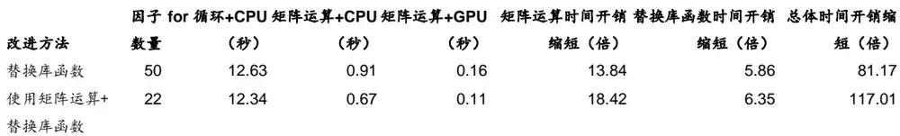
注：使用 20230424 分钟 K 线数据
资料来源：华泰数智中台，华泰研究

除了因子计算环节，我们还使用 cudf 库对 pandas 库进行替换，对数据读取、预处理环节也进行了优化，如下表。cudf库仅有数据导出环节的 to_csv函数性能更优（约 5 倍加速）。

不过测试发现，数据读取和预处理部分性能不佳的主要原因是数据量不足。单日分钟 K 线数据的维度约为 5000×242×11（全 A股*分钟*字段）。我们尝试构建虚拟数据集，发现当数据量扩大 4倍后，GPU性能超过 CPU。

图表13： 数据读取、预处理及导出环节 CPU、GPU性能对比

| 步骤 | 代码 | GPU（3090）时间开销（秒） | CPU（i9-10980XE）时间开销（秒） | CPU/GPU |
| --- | --- | --- | --- | --- |
| 数据读取 | read_csv | 0.9390 | 0.8006 | 0.8526 |
| 数据预处理 | pivot | 3.2265 | 2.1685 | 0.6721 |
|  | cal_return | 3.1892 | 0.0114 T传播与转载 | 0.0036 |
| 数据导出 | to_csv | 0.0425 | 0.2282 | 5.3753 |

注：cal_return 为((df_close-df_close.shift(1))/df_close).fillna(0)；使用 20230424 分钟 K 线数据不资料来源：华泰数智中台，华泰研究

## 分钟线因子

本文测试 50 个分钟线构建的选股因子，按构建逻辑分为如下 5类：

1. 价格全局特征（9 个因子）；

2. 价格局部特征（10 个因子）；

3. 成交量/额（12 个因子）；

4. 成交关联价格（7 个因子）；

5. 价量相关性（12 个因子）。

## 价格全局特征

价格全局特征类包括收益率/价格的分布特征，如方差、偏度、峰度等，以及最高价、最大回撤等。

图表14： 价格全局特征类因子

| 因子名称 | 含义 | 计算公式 | 因子方向 |
| --- | --- | --- | --- |
| return_intraday | 日内收益率 | $close_{15.00}-open_{9.30}$ | -1 |
| return_var | 收益率方差 | $\scriptstyle\sum_{i=1}^{n}(r_{i}-{\overline{{r}}})^{2}$ | -1 |
| return_skew | 收益率的偏度 | $\begin{array}{r}{\frac{\sum_{i=1}^{n}(r_{i}-\overline{{r}})^{3}}{n\left(\sum_{i=1}^{n}(r_{i}-\overline{{r}})^{2}\right)^{1.5}}}\end{array}$ 播与转载 | -1 |
| return_kurtosis | 收益率的峰度 | $\begin{array}{r}{\frac{\sum_{i=1}^{n}(r_{i}-\overline{{r}})^{4}}{n\left(\sum_{i=1}^{n}(r_{i}-\overline{{r}})^{2}\right)^{2}}-3}\end{array}$ | -1 |
| tp_diff | 典型价格差值 | (high15:00+low15:00+close15:00) (high9:30+low9:30+close9:30) 3 | -1 |
| price_trend_ratio | 股价变动趋势占比 | $\frac{close_{15:00}-close_{9:30}}{\sum_{i=2}^{n}\|(close_{i}-close_{i-1})\|}$ | -1 |
| intraday_maxdrawdown | 日内最大回撤 | $\mathrm{max}\left({\frac{\mathrm{close}_{\mathrm{i}}}{\mathrm{min}\left(\mathrm{close}_{\mathrm{i}^{\prime}},\mathrm{i}^{\prime}{>}\mathrm{i}\right)}}-1\right)$ | -1 |
| max_price_pos | 日内最高价出现时间 共本人内部 | $argmax(close_{i})$ | -1 |
| return_improved | 改进日内涨跌幅 | $close_{15.00}/close_{10.00}$ | -1 |

资料来源：华泰研究

## 价格局部特征

价格局部特征类包括收益率/价格分布的局部特征，如收盘前半小时、价格上行或下行阶段收益率/价格方差、偏度、峰度等因子。

图表15： 价格局部特征类因子

| 因子名称 用户68 | 含义 | 计算公式 | 因子方向 |
| --- | --- | --- | --- |
| return_last_30min | 收盘前半小时收益率 | $close_{15.00}/close_{14.31}$ | -1 |
| return_var_last_30min | 收盘前半小时的收益率方差 | $\begin{array}{r}{\sum_{t=14.31}^{15.00}\bigl(\mathrm{close}_{t}-\overline{{\mathrm{close}}}\bigr)^{2}}\end{array}$ | -1 |
| return_skew_last_30min | 收盘前半小时的收益率偏度 | kurtosis(rt), 14: 31 ≤ t ≤ 15: 00 | -1 |
| return_kurtosis_last_30min | 收盘前半小时的收益率峰度 | skew(rt), 14: 31 ≤ t ≤ 15: 00 | -1 |
| return_downward_var | 下行收益率方差 | $\mathrm{var}(r_{t}),\quad\mathrm{r_{t}}<0$ | -1 |
| return_upward_var | 上行收益率方差 | $\mathrm{var}(r_{t}),\quad{\mathrm{r}}_{\mathrm{t}}>0$ | -1 |
| return_downward_var_ratio | 下行收益率方差占比 | $\mathrm{upward\_var}(r_{t})/var(r_{t})$ | -1 |
| return_upward_var_ratio | 上行收益率方差占比 | downward_var(rt)/var(rt) | -1 |
| return_downward_volatility_ratio | 下行收益率波动占比 |  |  |
|  |  | $\frac{\sqrt{n}\sum_{i=1}^{n}\left(r_{i}\cdot I_{r_{i}>0}\right)^{2}}{\sum_{i=1}^{n}r_{i}^{2}}$ | -1 |
| cum_return_top_10 | 前10%最大累计涨幅 | $\Pi{\left(1+\boldsymbol{r_{i}}\cdot\boldsymbol{I_{y_{i}\geq y_{90\%}}}\right)}$ | -1 |

资料来源：华泰研究

## 成交量/额

成交量/额类包括成交额、成交量、成交笔数所构建的因子，如成交量的方差比率、开盘前30 分钟成交量占比、平均每单流出、大单净流入占比等。

图表16： 成交量/额类因子

| 因子名称 | 含义 | 计算公式 | 因子方 向 |
| --- | --- | --- | --- |
| volume_ratio_per_30min | 每半小时（共八组）成交量占总成 交量比例 | $\frac{\sum_{\mathrm{i}=30(\mathrm{j}-1)+1}^{30\mathrm{j}}volume_{i}}{\sum_{\mathrm{i}=1}^{240}volume_{i}};j$ 为分组id | -1/1/1/1/ 1/1/1/-1 |
| volume_variance_ratio | 方差比率，衡量成交量5分钟和 | $\begin{array}{r}{\|0\frac{var\big(\mathrm{cusum\it.volume_{i,k}}\big)/k}{var\big(\mathrm{cusum\it.volume_{i,j}}\big)/j}}\end{array}$ i | 1 |
|  | 分钟自相关性 | $\mathrm{cusum}_{-}volume_{i,5k}=\sum_{i-k}^{i}volume_{i},k=5,j=10$ |  |
| volume_open_30min_ratio | 前 30min 和午间休市后开盘 30mir |  | -1 |
|  | 交易量比值 | $\boxed{\begin{array}{c}{1}\\{\frac{\sum_{t=9.30}^{10.00}volume_{t}}{\sum_{t=13.00}^{13.30}volume_{t}}}\end{array}}$ |  |
| amount_out_order_avg_ratio 平均单笔流出金额占比 |  | $\frac{\sum_{i=1}^{N}\Bigl(amount_{i}\cdot I_{r_{i}<0}\Bigr)/\sum_{i=1}^{N}\Bigl(items\cdot I_{r_{i}<0}\Bigr)}{\sum_{i=1}^{N}amount_{i}/\sum_{i=1}^{N}items}$ | 1 |
| amount_top30_order_net_ratio 大单净流入占比 |  | $\frac{\sum_{i\in top30}amount_{i}\cdot I_{r_{i}>0}-\sum_{i\in top30}amount_{i}\cdot I_{r_{i}<0}}{\sum_{i\in top30}items};$ |  |
|  |  | $\begin{array}{r}{top30=\left(percentile\left(\frac{amount_{i}}{items_{i}}\right)>70\%\right)}\end{array}$ | -1 |

资料来源：华泰研究

## 成交关联价格

成交关联价格类包括收益率/价格关联对应范围的成交量所构建的因子，如大成交量对应的收益率方差、偏度、峰度，以及放量时收益率、大单涨幅等。

图表17： 成交关联价格类因子

| 因子名称 | 含义 | 计算公式 | 因子方向 |
| --- | --- | --- | --- |
| WVAD | 威廉变异离散量 | $\begin{array}{r}{\sum_{i=1}^{N}\frac{close_{i}-open_{i}}{high_{i}-low_{i}}\cdot volume_{i}}\end{array}$ | -1 |
| Amihud | 收益率除以总交易金额 | $mean\left(\frac{\|r_{i}\|}{volume_{i}.close_{i}}\right)$ | 1 |
| PVI 29于2023-12-08日下载 | 正成交量指标，放量时收益率之和 | $\begin{array}{r}{\sum_{i=1}^{N}r_{i}\cdot I_{volume_{i}>volume_{i-1}}}\end{array}$ $\begin{array}{r}{\prod_{i\in top30}(1+r_{i});}\end{array}$ | -1 |
| cum_return_top30_order 户68613 | 前30%的大单推动涨幅 | $\begin{array}{r}{top30=rank\left(\frac{amount_{i}}{items_{i}}\right)}\end{array}$ | -1 |
| return_var_top33_volume | 前1/3成交量对应的收益率方差 | $var_{i\in top_{3}^{\bot}}(1+r_{i});$ $top{\frac{1}{3}}=rank(volume_{i})$ | -1 |
| return_kurtosis_top33_volume | 前1/3成交量对应的收益率峰度 | $kurtosis_{i\in top_{3}^{\underline{{{1}}}}}(1+r_{i});$ $top{\frac{1}{3}}=rank(volume_{i})$ | -1 |
| return_skew_top33_volume | 前1/3成交量对应的收益率偏度 | $skew_{i\in top_{3}^{\bot}}(1+r_{i});$ $top{\frac{1}{3}}=rank(volume_{i})$ | -1 |

资料来源：华泰研究

资料来源：华泰研究

## 价量相关性

价量相关性类包括成交量/额和收益率/价格的相关系数所构建的因子，如量价相关性、收益率与量相关性、领先/滞后收益率与量相关性等。

图表18： 价量相关性类因子

| 因子名称 | 含义 | 计算公式 | 因子方向 |
| --- | --- | --- | --- |
|  |  | $\begin{array}{r}{\frac{cov(x,y)}{std(x)\cdot std(y)};}\end{array}$ |  |
| VP | 量价相关性 |  | -1 |
|  |  | $x=volume,y=close$ |  |
|  |  | ${\frac{cov(x,y)}{std(x)\cdot std(y)}};$ |  |
| VP_last_30min |  |  |  |
|  | 收盘前半小时的 VP | $x=volume_{14.30\leq t\leq15.00},$ | -1 |
|  |  | $y=close_{14.30\leq t\leq15.00}$ |  |
|  |  | ${\frac{cov(x,y)}{std(x)\cdot std(y)}};$ |  |
| VP_top33_volume | 前 1/3 成交量对应的 VP | $x=volume_{top_{3}^{1}},$ |  |
|  |  | $y=close_{i\in volume_{top\frac{1}{3}}}$ |  |
| VR |  | $\begin{array}{r}{\frac{cov(x,y)}{std(x)\cdot std(y)};}\end{array}$ |  |
|  | 收益率与量相关性 |  |  |
|  |  | $x=volume_{i},y=return_{i}$ 毛我 |  |
| VR_1min_lead | 领先一分钟 VR | ${\frac{cov(x,y)}{std(x)\cdot std(y)}};$ |  |
|  |  | $x=volume_{i},y=return_{i+1}$ |  |
| VR_1min_lag | 滞后一分钟 VR | $\begin{array}{r}{\frac{cov(x,y)}{std(x)\cdot std(y)};}\end{array}$ |  |
|  | 内部使用，不可传播与 | $x=volume_{i},y=return_{i-1}$ | -1 |
|  |  | $\begin{array}{r}{\frac{cov(x,y)}{std(x)\cdot std(y)};}\end{array}$ |  |
| VR_last_30min | 收盘前半小时的VR | $x=volume_{t,\ 14.30\leq t\leq15.00},$ |  |
|  |  |  | -1 |
|  | 仅供 | $y=return_{t+1},\ 14.30{\leq}t{\leq}15.00$ |  |
|  |  | $\begin{array}{r}{\frac{cov(x,y)}{std(x)\cdot std(y)};}\end{array}$ |  |
| VR_lead_last_30min |  | $x=volume_{t,\ 14.30\leq t\leq15.00},$ |  |
|  |  | $y=return_{t+1},\ 14.30{\leq}t{\leq}15.00$ |  |
|  |  | $\begin{array}{r}{\frac{cov(x,y)}{std(x)\cdot std(y)};}\end{array}$ |  |
|  | 收盘前半小时的滞后 VR | $x=volume_{t,\ 14.30\leq t\leq15.00},$ | -1 |
| 用户686139 |  | $y=return_{t-1},\ 14.30{\le}t{\le}15.00$ |  |
| VR_top33_volume |  | $\begin{array}{r}{\frac{cov(x,y)}{std(x)\cdot std(y)};}\end{array}$ |  |
|  | 前 1/3 成交量对应的 VR | $x=volume_{i,~i\in volume_{top\frac{1}{3}}},$ |  |
|  |  | $y=return_{i,~i\in volume}_{top\frac{1}{3}}$ |  |
|  |  | $\begin{array}{r}{\frac{cov(x,y)}{std(x)\cdot std(y)};}\end{array}$ |  |
| VR_lead_top33_volume | 前 1/3 成交量对应的领先 VR | $x=volume_{i,~i\in volume_{top\frac{1}{3}}},$ |  |
|  |  | $y=return_{i+1,~i\in volume}_{top\frac{1}{3}}$ |  |
|  |  | $\begin{array}{r}{\frac{cov(x,y)}{std(x)\cdot std(y)};}\end{array}$ |  |
| VR_lag_top33_volume |  |  |  |
|  | 前 1/3 成交量对应的领先 VR | $x=volume_{i,~i\in volume_{top\frac{1}{3}}},$ | -1 |
|  |  | $y=return_{i-1,~i\in volume}_{top\frac{1}{3}}$ |  |

## 单因子测试方法与结果

单因子测试方法如下：

1. 回测区间：2013/01/31~2023/09/28；

2. 回测样本：中证全指成分股；

3. 因子频率（采样频率）：日频；

4. 预测收益率区间（调仓频率）：5 日（周频）/10 日（双周频）/20 日（月频）；

5. 因子处理：过去 5/10/20 日取均值或累计值，5 倍中位数去极值，行业市值中性化，Z-score 标准化，缺失值填充；反向因子则乘以-1；

6. 交易费率：均不考虑。

## 价格全局特征

预 测 周 频 收 益 的 单 因 子 测 试 指 标 如 下 表 。 return_intraday 、 return_var 、 tp_diff 、return_improved 因子表现出色。其中 return_intraday、tp_diff、return_improved 的本质是不同形式的日内反转因子，return_var 的本质是日内低波动因子。

图表19： 价格全局特征因子测试指标（周频）
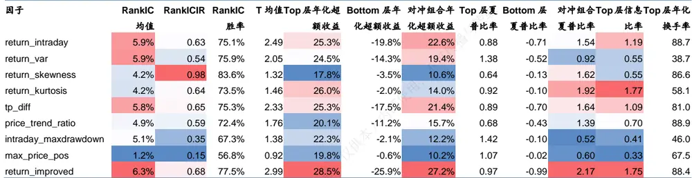
注：股票池：中证全指成分股；回测区间：2013-01-31 至 2023-09-28；因子进行行业市值中性；预测收益使用 T 至 T+5 日收盘价区间收益率资料来源： Wind，华泰数智中台，华泰研究

下图展示 return_improved 因子分层相对净值。Top 层 2022 年以来出现回撤，第 2 层 2023年以来出现回撤，因子有效性整体下滑。

图表20： return_improved 因子分层相对净值
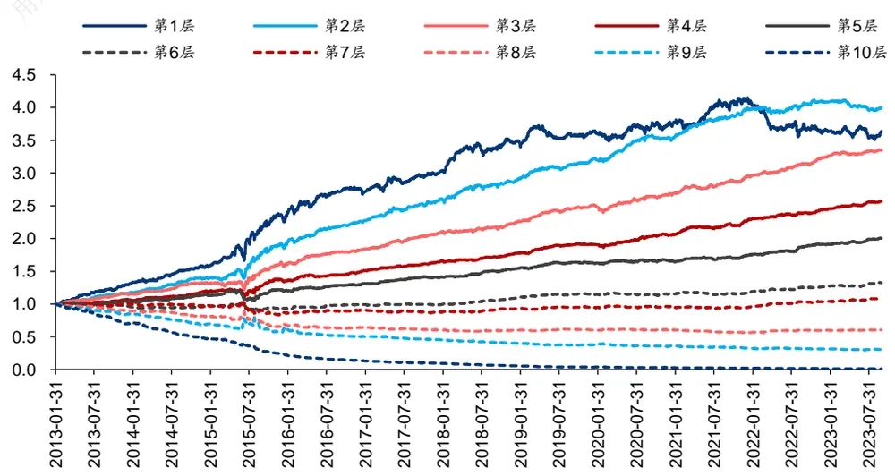
注：股票池：中证全指成分股；回测区间：2013-01-31 至 2023-09-28资料来源：Wind，华泰数智中台，华泰研究

同时展示双周频、月频单因子测试结果。

图表21： 价格全局特征因子测试指标（双周频）

| 因子 | RankIC | RankICIR RankIC |  | T 均值Top层年化超 Bottom 层年 对冲组合年 Top 层夏 Bottom 层 |  |  |  |  |  | 对冲组合Top层信息Top层年化 |  |
| --- | --- | --- | --- | --- | --- | --- | --- | --- | --- | --- | --- |
|  |  | 均值 | 胜率 |  | 额收益 | 化超额收益化超额收益 |  | 普比率 夏普比率 | 夏普比率 | 比率 | 换手率 |
| return_intraday | 6.0% | 0.64 | 75.1% | 2.75 23.8% | -13.0% |  | 18.4% 0.88 | -0.46 | 1.30 | 1.10 | 44.4 |
| return_var | 6.2% | 0.56 | 75.5% | 2.35 22.4% | -7.5% | 14.9% | 1.26 | -0.29 | 0.75 | 0.47 | 21.5 |
| return_skewness | 5.1% | 1.12 | 86.9% | 1.84 | 19.6% | -2.2% | 10.9% 0.70 | -0.14 | 1.75 | 0.91 | 43.0 |
| return_kurtosis | 4.7% | 0.71 | 74.6% | 1.77 | 25.3% | 1.2% | 12.1% 0.88 | 0.03 | 1.59 | 1.50 | 28.0 |
| tp_diff | 5.9% | 0.68 | 76.1% | 2.44 | 22.6% | -8.7% | 15.6% 0.75 | -0.33 | 1.18 | 0.65 | 40.5 |
| price_trend_ratio | 4.7% | 0.59 | 73.2% | 1.82 | 16.7% | -5.9% | 11.3% | 0.63 | -0.24 | 1.12 0.42 | 44.3 |
| intraday_maxdrawdown | 5.9% | 0.40 | 67.5% | 1.83 | 20.9% | -1.1% | 11.0% | 1.28 | -0.07 | 0.49 0.34 | 23.0 |
| max_price_pos | 0.2% | 0.02 | 51.8% | 0.65 | 18.2% | 6.7% | 5.8% | 0.95 | 0.20 | 0.37 0.17 | 33.7 |
| return_improved | 6.2% | 0.72 | 78.7% | 3.09 | 24.7% | -15.3% | 20.0% | 0.82 | -0.51 | 1.70 1.29 | 44.2 |

注：股票池：中证全指成分股；回测区间：2013-01-31 至 2023-09-28；因子进行行业市值中性；预测收益使用 T 至 T+10 日收盘价区间收益率资料来源： Wind，华泰数智中台，华泰研究

图表22： 价格全局特征因子测试指标（月频）
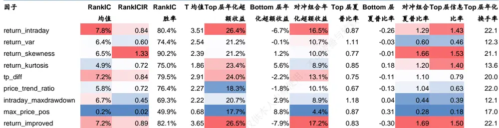
注：股票池：中证全指成分股；回测区间：2013-01-31 至 2023-09-28；因子进行行业市值中性；预测收益使用 T 至 T+20 日收盘价区间收益率资料来源： Wind，华泰数智中台，华泰研究

## 价格局部特征

价格局部特征因子预测周频收益的单因子测试指标如下表。return_last_30min、return_skewness_last_30min、return_upward_var、return_downward_var 因子表现出色。其 中 return_last_30min 和 return_skewness_last_30min 的 本 质 是 尾 盘 反 转 因 子 ，return_upward_var 和 return_downward_var 的本质是日内低波动因子的精细化刻画。

图表23： 价格局部特征因子测试指标（周频）
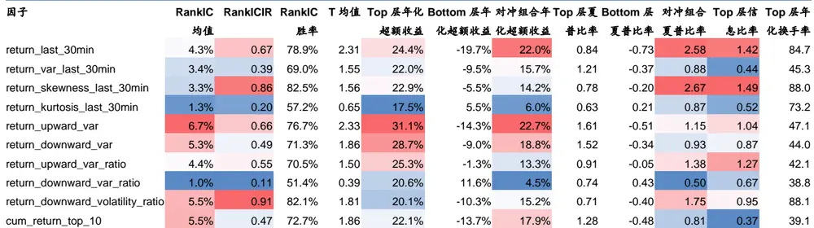
注：股票池：中证全指成分股；回测区间：2013-01-31 至 2023-09-28；因子进行行业市值中性；预测收益使用 T 至 T+5 日收盘价区间收益率资料来源： Wind，华泰数智中台，华泰研究

下图展示 return_downward_var 因子分层相对净值。Top 层表现较突出，2017 至 2020 年长期走平，2021 年后稳定上行；中间层区分度不高。

图表24： return_downward_var 因子分层相对净值
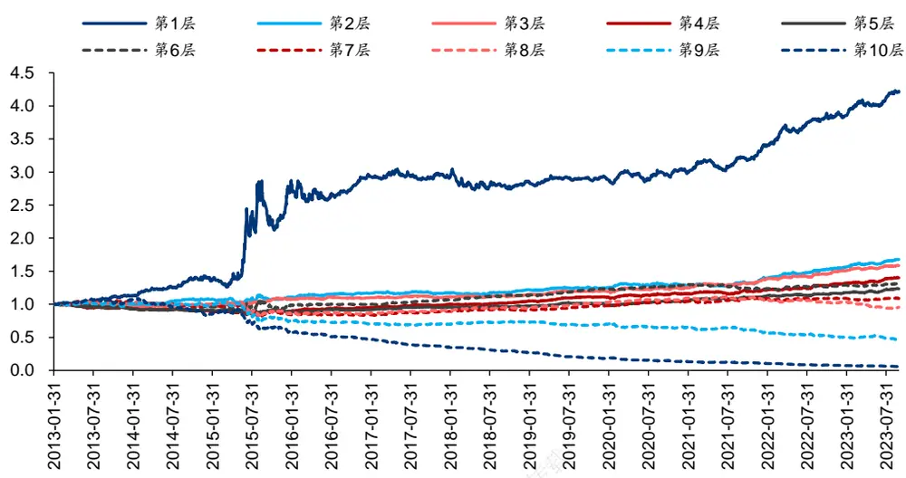
注：股票池：中证全指成分股；回测区间：2013-01-31 至 2023-09-28资料来源：Wind，华泰数智中台，华泰研究

图表25： 价格局部特征因子测试指标（双周频）
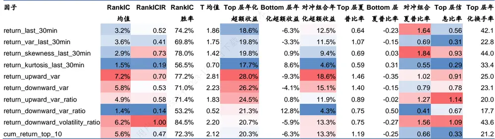
注：股票池：中证全指成分股；回测区间：2013-01-31 至 2023-09-28；因子进行行业市值中性；预测收益使用 T 至 T+10 日收盘价区间收益率资料来源： Wind，华泰数智中台，华泰研究

图表26： 价格局部特征因子测试指标（月频）
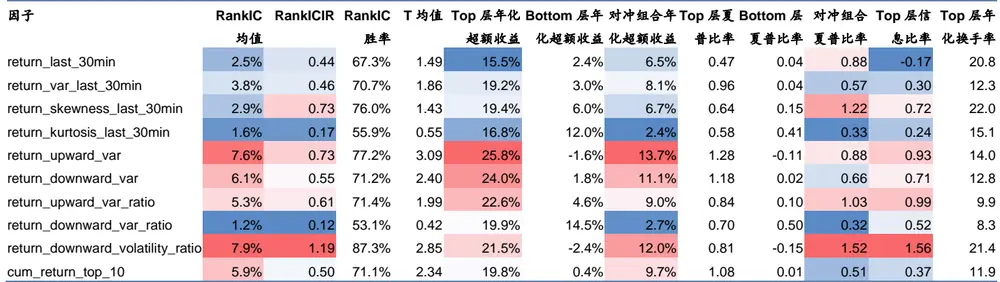
注：股票池：中证全指成分股；回测区间：2013-01-31 至 2023-09-28；因子进行行业市值中性；预测收益使用 T 至 T+20 日收盘价区间收益率资料来源： Wind，华泰数智中台，华泰研究

## 成交量/额

成交量/额因子预测周频收益的单因子测试指标如下表。volume_open_30min_ratio、amount_out_order_avg_ratio 因子表现出色。前者给予开盘成交不活跃的股票风险溢价，由于市场情绪一般在开盘释放，该因子可能反映理性交易者占比。后者给予单笔流出金额较大的股票风险溢价，可能对应快速下跌后的反转或者主力的操纵行为。

图表27： 成交量/额因子测试指标（周频）
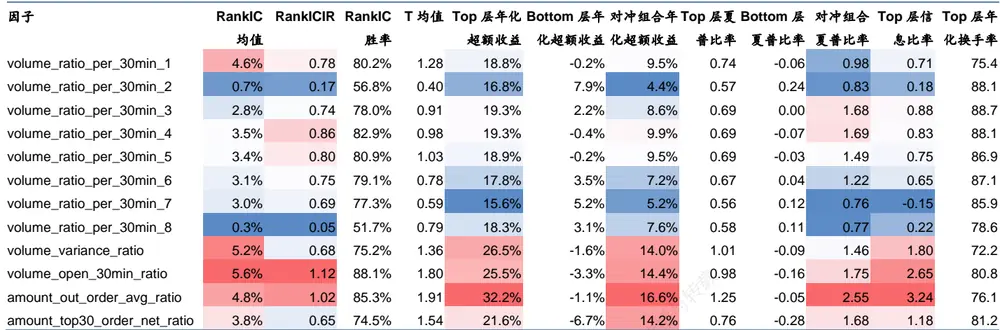
注：股票池：中证全指成分股；回测区间：2013-01-31 至 2023-09-28；因子进行行业市值中性；预测收益使用 T 至 T+5 日收盘价区间收益率资料来源： Wind，华泰数智中台，华泰研究

下图展示 amount_out_order_avg_ratio 因子分层相对净值。Top 层表现较突出，并且长期收益稳定。

图表28： amount_out_order_avg_ratio 因子分层相对净值
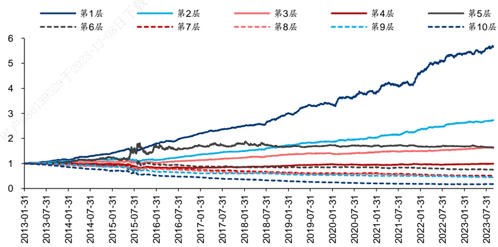
注：股票池：中证全指成分股；回测区间：2013-01-31 至 2023-09-28资料来源：Wind，华泰数智中台，华泰研究

图表29： 成交量/额因子测试指标（双周频）
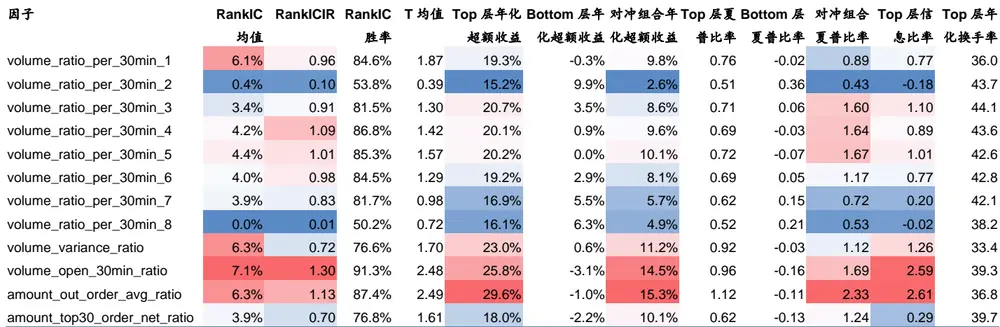
注：股票池：中证全指成分股；回测区间：2013-01-31 至 2023-09-28；因子进行行业市值中性；预测收益使用 T 至 T+10 日收盘价区间收益率资料来源： Wind，华泰数智中台，华泰研究

图表30： 成交量/额因子测试指标（月频）
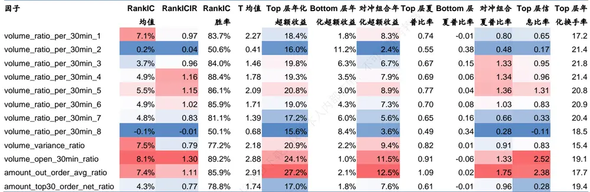
注：股票池：中证全指成分股；回测区间：2013-01-31 至 2023-09-28；因子进行行业市值中性；预测收益使用 T 至 T+20 日收盘价区间收益率资料来源： Wind，华泰数智中台，华泰研究

## 成交关联价格

成交关联价格因子预测周频收益的单因子测试指标如下表。cum_return_top30_order 因子表现出色。该因子的本质是反转因子的精细化刻画，大单推动的涨幅更具信息量。

图表31： 成交关联价格因子测试指标（周频）
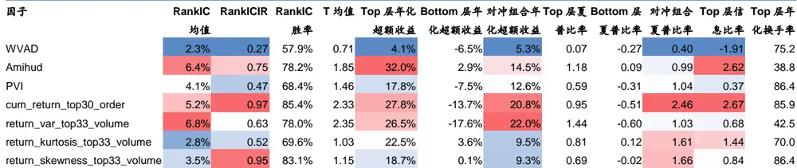
注：股票池：中证全指成分股；回测区间：2013-01-31 至 2023-09-28；因子进行行业市值中性；预测收益使用 T 至 T+5 日收盘价区间收益率资料来源： Wind，华泰数智中台，华泰研究

下图展示 cum_return_top30_order 因子分层相对净值。Top 层 2022 年以来出现回撤，第 3层表现较好。

图表32： cum_return_top30_order 因子分层相对净值
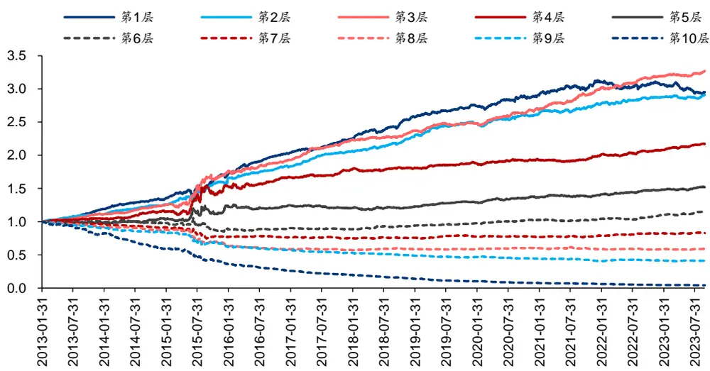
注：股票池：中证全指成分股；回测区间：2013-01-31 至 2023-09-28资料来源：Wind，华泰数智中台，华泰研究

图表33： 成交关联价格因子测试指标（双周频）
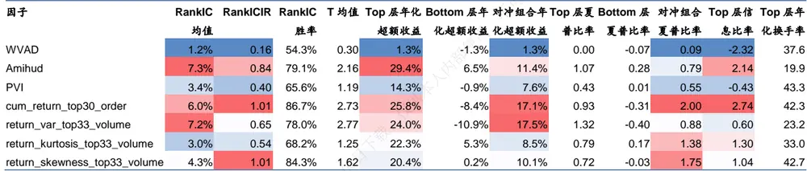
注：股票池：中证全指成分股；回测区间：2013-01-31 至 2023-09-28；因子进行行业市值中性；预测收益使用 T 至 T+10 日收盘价区间收益率资料来源： Wind，华泰数智中台，华泰研究

图表34： 成交关联价格因子测试指标（月频）
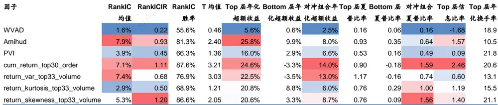
注：股票池：中证全指成分股；回测区间：2013-01-31 至 2023-09-28；因子进行行业市值中性；预测收益使用 T 至 T+20 日收盘价区间收益率资料来源： Wind，华泰数智中台，华泰研究

## 价量相关性

价量相关性因子预测周频收益的单因子测试指标如下表。VP、VP_top33_volume、VR_1min_lag 因子表现出色。这些因子的本质都是捕捉量价背离，即缩量上涨或放量下跌。

图表35： 价量相关性因子测试指标（周频）
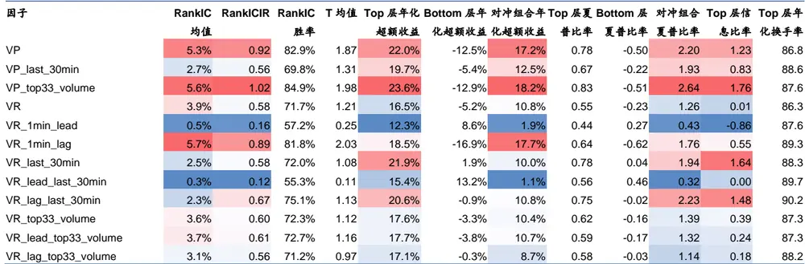
注：股票池：中证全指成分股；回测区间：2013-01-31 至 2023-09-28；因子进行行业市值中性；预测收益使用 T 至 T+5 日收盘价区间收益率资料来源： Wind，华泰数智中台，华泰研究

下图展示 VP_top33_volume 因子分层相对净值。Top层表现不突出，第 2、3 层相对较好，但 2021 年以来收益走平。

图表36： VP_top33_volume 因子分层相对净值
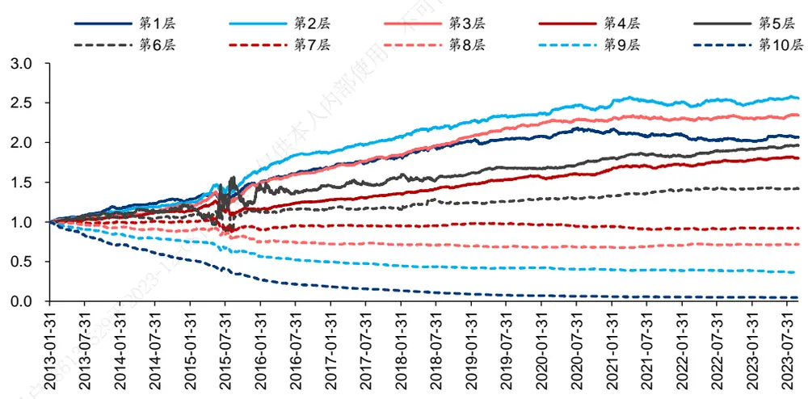
注：股票池：中证全指成分股；回测区间：2013-01-31 至 2023-09-28资料来源：Wind，华泰数智中台，华泰研究

图表37： 价量相关性因子测试指标（双周频）
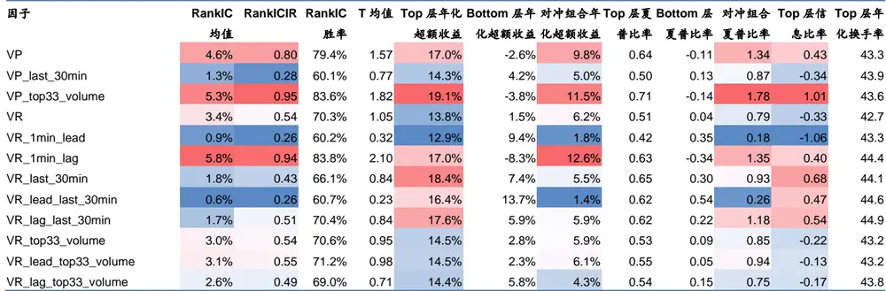
注：股票池：中证全指成分股；回测区间：2013-01-31 至 2023-09-28；因子进行行业市值中性；预测收益使用 T 至 T+10 日收盘价区间收益率资料来源： Wind，华泰数智中台，华泰研究

图表38： 价量相关性因子测试指标（月频）
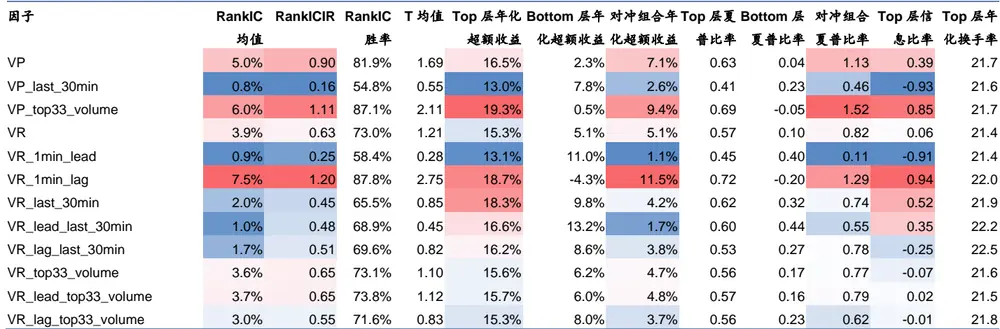
注：股票池：中证全指成分股；回测区间：2013-01-31 至 2023-09-28；因子进行行业市值中性；预测收益使用 T 至 T+20 日收盘价区间收益率资料来源： Wind，华泰数智中台，华泰研究

## 基于高频因子的指增策略

## 最大化 ICIR法合成因子

基于前述 50个高频因子，采用最大化 ICIR法进行因子合成。每个交易日选取T-260至T-20日因子未来 20 日 RankIC 值，并结合 Ledoit-Wolf 压缩估计求解因子权重，最终得到分钟线合成因子。

分钟线合成因子 IC 测试、回归测试、分层测试指标及分层相对净值如下图表所示。以未来5 日收益为预测目标，因子 RankICIR（未年化）1.50，对冲组合夏普比率 3.59，Top 层信息比率 3.81。最大化 ICIR法合成后，因子单调性提升，但仍然表现出空头端筛选效果明显优于多头端的特点，这也是大多数高频因子的典型特征。

图表39： 最大化 ICIR法合成因子测试指标（预测未来 5日收益）

| 因子 | RankIC | RankICIR RankIC |  | T 均值Top 层年化超 | Bottom 层年 | 对冲组合年 Top 层夏 |  |  | 对冲组合Top层信息Top层年化 |  |  |
| --- | --- | --- | --- | --- | --- | --- | --- | --- | --- | --- | --- |
|  |  |  |  |  |  | 化超额收益 化超额收益 | 普比率 | Bottom 层 夏普比率 | 夏普比率 | 比率 | 换手率 |
| 分钟线合成因子 | 均值 7.0% | 1.50 | 胜率 93.5% | 3.26 | 额收益 14.7% | -25.6% | 20.2% | 0.69 | -1.20 | 3.59 |  |
|  |  |  |  |  |  |  |  |  |  | 3.81 | 42.4 |

注：股票池：中证全指成分股；回测区间：2016-12-30 至 2023-09-28；因子进行行业市值中性；预测收益统一使用 T 至 T+5 日收盘价区间收益率资料来源： Wind，华泰数智中台，华泰研究

图表40： 分钟线合成因子分层相对净值
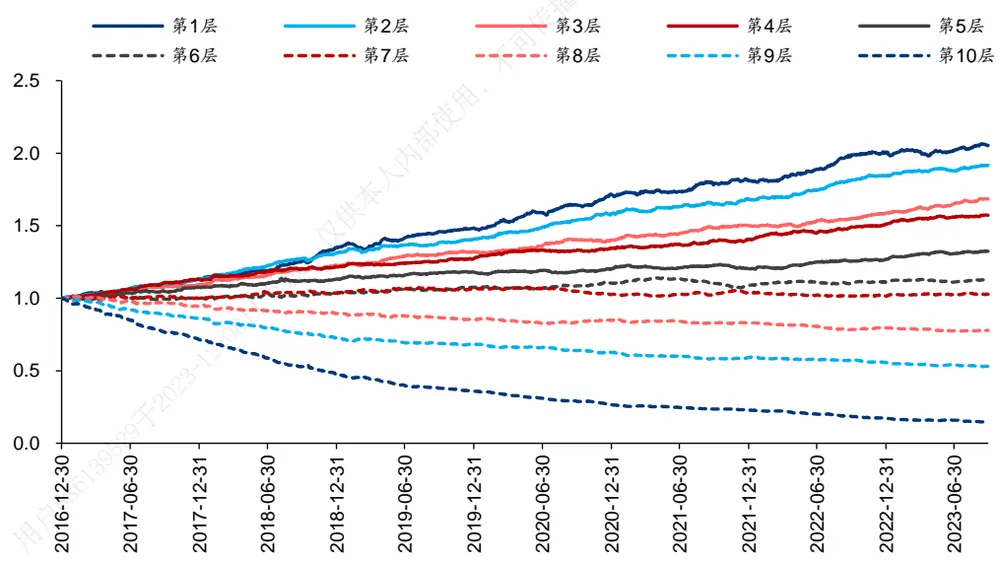
注：股票池：中证全指成分股；回测区间：2016-12-30 至 2023-09-28资料来源：Wind，华泰数智中台，华泰研究

## 指数增强组合

华泰金工研报《神经网络多频率因子挖掘模型》（2023-05-11）使用 GRU网络学习日 K线和 15 分钟 K线数据，得到神经网络多频率因子。原始因子和上述分钟线合成因子相关系数为 0.248。将两者截面标准化后，采用 9:1 静态比例线性结合，分别构建中证 500 和中证1000 指数增强策略。其余细节如下表所示。

图表41： 指数增强组合构建方法

| 步骤 | 参数 | 参数值 |
| --- | --- | --- |
| 股票池和回测股票池 |  | 中证全指成分股 |
| 区间 | 回测区间 | 2016/12/30-2023/09/28 |
| 构建组合 | 基准 | 中证 500 指数/中证 1000 指数 |
|  | 优化目标 | 最大化预期收益 |
|  | 组合仓位 | 1 |
|  | 个股权重下限 | 0 |
|  | 个股偏离权重约束 | [-1%, 1%] |
|  | 行业偏离权重约束 | [-2%, 2%] |
|  | 风格偏离标准差约束 | [-0.2, 0.2] |
|  | 风格因子 | 对数流通市值（预处理：5倍MAD缩尾，zScore标准化） |
|  | 调仓周期 | 每5个交易日 |
|  | 单次调仓单边换手率上限 | 25% |
| 回测 | 成分股权重约束 | 80% |
|  | 单边费率 | 0.002 |
|  | 交易价格 | vwap |
|  | 特殊处理 | 停牌不买入/卖出；一字板涨停不买入；一字板跌停不卖出；其余股票重新分配权重 |

资料来源：华泰研究

中证 500 指数增强回测绩效和超额净值如下所示。结合分钟线合成因子后，各项指标均有转提升，2023 年上半年回撤大幅降低。信息比率从 2.78 提升至 3.01，超额收益 Calmar比率播从 1.37 提升至 2.07。

图表42： 中证 500指数增强组合回测绩效

|  | 年化收益 | 年化波动 |  |  | Calmar 年化超额 | 年化跟踪 |  |  | 超额收益 | 超额收益 | 相对基准年化双边 月胜率 |
| --- | --- | --- | --- | --- | --- | --- | --- | --- | --- | --- | --- |
|  |  | 率 率 | 夏普比率 | 最大回撤 |  | 比率 收益率 | 误差 信息比率 | 最大回撤 Calmar 比率 |  |  |  |
| 神经网络多频率模型 | 15.2% | 21.4% | 0.71 | 31.0% | 0.49 | 16.8% | 6.1% | 2.78 | 12.3% | 1.37 | 换手率 72.8% 25.2 |
| 结合分钟线合成因子 | 16.0% | 21.4% | 0.75 | 30.4% | 0.53 | 17.7% | 5.9% | 3.01 8.6% | 2.07 | 76.5% | 25.2 |

注：回测区间：2016-12-30 至 2023-09-28
资料来源：Wind，华泰数智中台，华泰研究

图表43： 中证 500指数增强组合超额净值3-
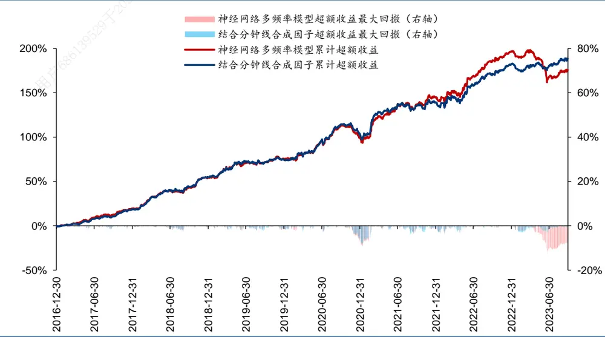
注：回测区间：2016-12-30 至 2023-09-28
资料来源：Wind，华泰数智中台，华泰研究

中证 1000 指数增强回测绩效和超额净值如下所示。结合分钟线合成因子后，各项指标同样均有提升，并且 2023 年上半年回撤大幅降低。信息比率从 3.70 提升至 3.87，超额收益Calmar 比率从 2.41 提升至 3.96。

图表44： 中证 1000指数增强组合回测绩效

|  | 年化收益 | 年化波动 |  |  | Calmar 年化超额 | 年化跟踪 |  |  | 超额收益 | 超额收益 | 相对基准年化双边 月胜率 |
| --- | --- | --- | --- | --- | --- | --- | --- | --- | --- | --- | --- |
|  |  | 率 率 | 夏普比率 | 最大回撤 比率 |  |  | 误差 | 最大回撤Calmar 比率 |  |  |  |
| 神经网络多频率模型 | 20.3% | 23.4% | 0.87 | 31.8% | 0.64 | 收益率 26.5% | 7.2% | 信息比率 3.70 | 11.0% | 2.41 | 换手率 77.8% 25.1 |
| 结合分钟线合成因子 | 21.2% | 23.8% | 0.89 | 33.7% | 0.63 | 27.6% | 7.1% | 3.87 7.0% | 3.96 | 84.0% | 25.3 |

注：回测区间：2016-12-30 至 2023-09-28
资料来源：Wind，华泰数智中台，华泰研究

图表45： 中证 1000指数增强组合超额净值
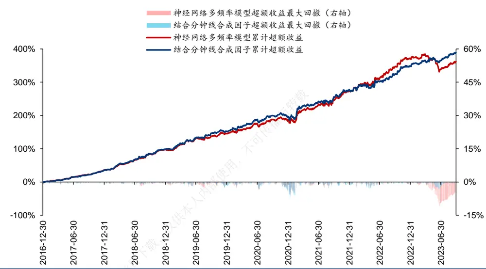
资料来源：Wind，华泰数智中台，华泰研究
注：回测区间：2016-12-30 至 2023-09-28

## 总结和讨论

本文使用 NVIDIA RAPIDS 对高频因子计算进行 GPU加速。量化因子计算场景下，RAPIDS的直接助力是用 CuPy、cuDF 的 GPU 运算替代 NumPy、Pandas 的 CPU 运算。在 NVIDIAGeForce RTX 3090 和 Intel Core i9-10980XE 测试环境下计算分钟线因子，CuPy 和 cuDF替换库函数的提速效果约为 6 倍，若同时将 for循环替换为矩阵运算，最终提速超 100 倍。预计 RTX 4090 和 A800 提速更显著。最大化 ICIR法合成因子，并与华泰金工神经网络多频率因子静态加权，构建中证 1000 指数增强组合，以 2016 年末至 2023 年 9 月末为回测区间，信息比率从 3.70 提升至 3.87，超额收益 Calmar比率从 2.41 提升至 3.96。

RAPIDS 的重要特性之一是将基于 CUDA底层代码的优化以 Python 高级语言的形式体现。
常用 API 如 CuPy（对标 NumPy）、cuDF（对标 Pandas）、cuML（对标 scikit-learn）等。
由于 API 语法几乎相同，仅需要轻量级代码修改，即可实现 CPU 运算到 GPU 运算的迁移。
针对全部因子使用 CuPy 和 cuDF 替换原函数；针对部分因子使用矩阵运算替换 for 循环。
结果表明：若不引入矩阵运算，单独替换库函数反而增加时间开销。若两步同时进行，替换库函数带来的性能提升约在 6 倍（RTX 3090），矩阵运算带来的性能提升约在 18 倍。
GPU 性能同型号和数据量相关，单次运算数据量越大，加速效果越显著。

本文测试 5 类共计 50 个分钟线选股因子。以下展示测试效果较好的因子及投资逻辑。

1. 价格全局特征类：return_intraday、tp_diff、return_improved 的本质是不同形式的日内反转因子，return_var 的本质是日内低波动因子。

2. 价格局部特征类：return_last_30min 和 return_skewness_last_30min 的本质是尾盘反转因子，return_upward_var 和 return_downward_var 的本质是日内低波动因子的精细化刻画。

3. 成交量/额类：volume_open_30min_ratio 给予开盘成交不活跃的股票风险溢价，市场 情绪一般在开盘释放，该因子或反映理性交易者占比。amount_out_order_avg_ratio 给予单笔流出金额较大的股票风险溢价，或对应快速下跌后的反转或者主力的操纵行为。

4. 成交关联价格类：cum_return_top30_order 的本质是反转因子的精细化刻画，大单推动的涨幅更具信息量。

5. 价量相关性类：VP、VP_top33_volume、VR_1min_lag 的本质都是捕捉量价背离，即缩量上涨或放量下跌。

进一步围绕分钟线因子构建选股策略。采用最大化 ICIR 法对前述 50 个因子进行合成，以未来 5 日收益为预测目标，合成因子 RankICIR（未年化）1.50，对冲组合夏普比率 3.59，Top 层信息比率 3.81。该合成因子和神经网络多频率因子相关系数为 0.25，两者截面标准化后静态融合，构建指数增强策略。结果显示，结合分钟线合成因子后，策略各项指标均有提升，尤其体现在回撤控制。中证500增强信息比率从2.78提升至3.01，超额收益Calmar比率从 1.37 提升至 2.07，中证 1000 增强信息比率从 3.70 提升至 3.87，超额收益 Calmar比率从 2.41 提升至 3.96。

## 本文有如下未尽之处：

1. 本文采集的数据均基于 RTX 3090 显卡，对目前行业里主流的 A800、RTX 4090 等显卡未进行测试。

2. RAPIDS 除 CuPy 和 cuDF 外，cuML（对标 scikit-learn）在量化投资行业可能也有实用意义，如使用 cuML 进行遗传规划因子挖掘，值得后续探索。3

3. 测试的分钟线因子具有非线性特征，部分因子 Top层不如第 2、3 层，进行非线性变换后或能提升因子表现；

4. 从分钟线因子和神经网络因子结合的方式上看，本文先对分钟线因子进行最大化 ICIR加权，再与神经网络因子进行静态合成，若采用动态或 AI 方法或有进一步提升空间。

## 来自 NVIDIA 的建议

以下是 NVIDIA 对 GPU 加速因子计算的建议（资料来源：NVIDIA 官网、 RAPIDS 官网）：

1. NumPy、Pandas 的数据处理中浮点数的默认格式是 float64，而 GPU 比较擅长于float32 的计算（RTX 3090 中，FP64 的运算能力仅为 FP32 的 1/64）。因此，在保证精度的情况下，可以考虑尽量使用 FP32 来进行计算，性能还会有进一步的提升。

2. 由于cuDF的IO读写函数采用了GDS技术（不经CPU和内存，直接从GPU读写NVME硬盘），在性能方面有较大的提升，所以建议直接把数据读到 GPU 中，在 GPU 里进行完整的数据处理。

3. 对于目前 cuDF 暂不支持的函数，可以通过 NUMBA-CUDA 来进行手工实现，可以进一步获得较大的性能收益（比如上千倍的性能提升）。

## 风险提示

人工智能挖掘市场规律是对历史的总结，市场规律在未来可能失效。人工智能技术存在过拟合风险。深度学习模型受随机数影响较大。本文测试的选股模型调仓频率较高，假定以vwap 价格成交，忽略其他交易层面因素影响。

## 免责声明

## 分析师声明

本人，林晓明、何康，兹证明本报告所表达的观点准确地反映了分析师对标的证券或发行人的个人意见；彼以往、现在或未来并无就其研究报告所提供的具体建议或所表迖的意见直接或间接收取任何报酬。

## 一般声明及披露

本报告由华泰证券股份有限公司（已具备中国证监会批准的证券投资咨询业务资格，以下简称“本公司”）制作。本报告所载资料是仅供接收人的严格保密资料。本报告仅供本公司及其客户和其关联机构使用。本公司不因接收人收到本报告而视其为客户。

本报告基于本公司认为可靠的、已公开的信息编制，但本公司及其关联机构(以下统称为“华泰”)对该等信息的准确性及完整性不作任何保证。

本报告所载的意见、评估及预测仅反映报告发布当日的观点和判断。在不同时期，华泰可能会发出与本报告所载意见、评估及预测不一致的研究报告。同时，本报告所指的证券或投资标的的价格、价值及投资收入可能会波动。以往表现并不能指引未来，未来回报并不能得到保证，并存在损失本金的可能。华泰不保证本报告所含信息保持在最新状态。华泰对本报告所含信息可在不发出通知的情形下做出修改，投资者应当自行关注相应的更新或修改。

本公司不是 FINRA 的注册会员，其研究分析师亦没有注册为 FINRA 的研究分析师/不具有 FINRA 分析师的注册资格。

华泰力求报告内容客观、公正，但本报告所载的观点、结论和建议仅供参考，不构成购买或出售所述证券的要约或招揽。该等观点、建议并未考虑到个别投资者的具体投资目的、财务状况以及特定需求，在任何时候均不构成对客户私人投资建议。投资者应当充分考虑自身特定状况，并完整理解和使用本报告内容，不应视本报告为做出投资决策的唯一因素。对依据或者使用本报告所造成的一切后果，华泰及作者均不承担任何法律责任。任何形式的分享证券投资收益或者分担证券投资损失的书面或口头承诺均为无效。

除非另行说明，本报告中所引用的关于业绩的数据代表过往表现，过往的业绩表现不应作为日后回报的预示。华泰不承诺也不保证任何预示的回报会得以实现，分析中所做的预测可能是基于相应的假设，任何假设的变化可能会显著影响所预测的回报。

华泰及作者在自身所知情的范围内，与本报告所指的证券或投资标的不存在法律禁止的利害关系。在法律许可的情况下，华泰可能会持有报告中提到的公司所发行的证券头寸并进行交易，为该公司提供投资银行、财务顾问或者金融产品等相关服务或向该公司招揽业务。

华泰的销售人员、交易人员或其他专业人士可能会依据不同假设和标准、采用不同的分析方法而口头或书面发表与本报告意见及建议不一致的市场评论和/或交易观点。华泰没有将此意见及建议向报告所有接收者进行更新的义务。华泰的资产管理部门、自营部门以及其他投资业务部门可能独立做出与本报告中的意见或建议不一致的投资决策。投资者应当考虑到华泰及/或其相关人员可能存在影响本报告观点客观性的潜在利益冲突。投资者请勿将本报告视为投资或其他决定的唯一信赖依据。有关该方面的具体披露请参照本报告尾部。

本报告并非意图发送、发布给在当地法律或监管规则下不允许向其发送、发布的机构或人员，也并非意图发送、发布给因可得到、使用本报告的行为而使华泰违反或受制于当地法律或监管规则的机构或人员。

本报告版权仅为本公司所有。未经本公司书面许可，任何机构或个人不得以翻版、复制、发表、引用或再次分发他人(无论整份或部分)等任何形式侵犯本公司版权。如征得本公司同意进行引用、刊发的，需在允许的范围内使用，并需在使用前获取独立的法律意见，以确定该引用、刊发符合当地适用法规的要求，同时注明出处为“华泰证券研究所”，且不得对本报告进行任何有悖原意的引用、删节和修改。本公司保留追究相关责任的权利。所有本报告中使用的商标、服务标记及标记均为本公司的商标、服务标记及标记。

## 中国香港

本报告由华泰证券股份有限公司制作,在香港由华泰金融控股（香港）有限公司向符合《证券及期货条例》及其附属法律规定的机构投资者和专业投资者的客户进行分发。华泰金融控股（香港）有限公司受香港证券及期货事务监察委员会监管，是华泰国际金融控股有限公司的全资子公司，后者为华泰证券股份有限公司的全资子公司。在香港获得本报告的人员若有任何有关本报告的问题,请与华泰金融控股（香港）有限公司联系。

## 香港-重要监管披露

- 华泰金融控股（香港）有限公司的雇员或其关联人士没有担任本报告中提及的公司或发行人的高级人员。

- 有关重要的披露信息，请参华泰金融控股（香港）有限公司的网页 https://www.htsc.com.hk/stock_disclosure其他信息请参见下方 “美国-重要监管披露”。

## 美国

在美国本报告由华泰证券（美国）有限公司向符合美国监管规定的机构投资者进行发表与分发。华泰证券（美国）有限公司是美国注册经纪商和美国金融业监管局（FINRA）的注册会员。对于其在美国分发的研究报告，华泰证券（美国）有限公司根据《1934 年证券交易法》（修订版）第 15a-6 条规定以及美国证券交易委员会人员解释，对本研究报告内容负责。华泰证券（美国）有限公司联营公司的分析师不具有美国金融监管（FINRA）分析师的注册资格，可能不属于华泰证券（美国）有限公司的关联人员，因此可能不受 FINRA 关于分析师与标的公司沟通、公开露面和所持交易证券的限制。华泰证券（美国）有限公司是华泰国际金融控股有限公司的全资子公司，后者为华泰证券股份有限公司的全资子公司。任何直接从华泰证券（美国）有限公司收到此报告并希望就本报告所述任何证券进行交易的人士，应通过华泰证券（美国）有限公司进行交易。

## 美国-重要监管披露

- 分析师林晓明、何康本人及相关人士并不担任本报告所提及的标的证券或发行人的高级人员、董事或顾问。分析师及相关人士与本报告所提及的标的证券或发行人并无任何相关财务利益。本披露中所提及的“相关人士”包括 FINRA定义下分析师的家庭成员。分析师根据华泰证券的整体收入和盈利能力获得薪酬，包括源自公司投资银行业务的收入。

- 华泰证券股份有限公司、其子公司和/或其联营公司, 及/或不时会以自身或代理形式向客户出售及购买华泰证券研究所覆盖公司的证券/衍生工具，包括股票及债券（包括衍生品）华泰证券研究所覆盖公司的证券/衍生工具，包括股票及债券（包括衍生品）。

- 华泰证券股份有限公司、其子公司和/或其联营公司, 及/或其高级管理层、董事和雇员可能会持有本报告中所提到的任何证券（或任何相关投资）头寸，并可能不时进行增持或减持该证券（或投资）。因此，投资者应该意识到可能存在利益冲突。

## 评级说明

投资评级基于分析师对报告发布日后 6 至 12个月内行业或公司回报潜力（含此期间的股息回报）相对基准表现的预期（A 股市场基准为沪深 300 指数，香港市场基准为恒生指数，美国市场基准为标普 500 指数），具体如下：

## 行业评级

增持：预计行业股票指数超越基准

中性：预计行业股票指数基本与基准持平

减持：预计行业股票指数明显弱于基准

## 公司评级

买入：预计股价超越基准 15%以上

增持：预计股价超越基准 5%~15%

持有：预计股价相对基准波动在-15%~5%之间

卖出：预计股价弱于基准 15%以上

暂停评级：已暂停评级、目标价及预测，以遵守适用法规及/或公司政策

无评级：股票不在常规研究覆盖范围内。投资者不应期待华泰提供该等证券及/或公司相关的持续或补充信息

## 法律实体披露

中国：华泰证券股份有限公司具有中国证监会核准的“证券投资咨询”业务资格，经营许可证编号为：91320000704041011J香港：华泰金融控股（香港）有限公司具有香港证监会核准的“就证券提供意见”业务资格，经营许可证编号为：AOK809美国：华泰证券（美国）有限公司为美国金融业监管局（FINRA）成员，具有在美国开展经纪交易商业务的资格，经营业务许可编号为：CRD#:298809/SEC#:8-70231

## 华泰证券股份有限公司

## 南京

南京市建邺区江东中路228号华泰证券广场1号楼/邮政编码：210019

电话：86 25 83389999/传真：86 25 83387521

电子邮件：ht-rd@htsc.com

## 深圳深圳

深圳市福田区益田路5999号基金大厦10楼/邮政编码：518017电话：86 755 82493932/传真：86 755 82492062电子邮件：ht-rd@htsc.com

## 华泰金融控股（香港）有限公司

香港中环皇后大道中 99号中环中心 58楼 5808-12室

电话：+852-3658-6000/传真：+852-2169-0770

电子邮件：research@htsc.com

http://www.htsc.com.hk

## 华泰证券（美国）有限公司

美国纽约公园大道 280号 21楼东（纽约 10017）

电话：+212-763-8160/传真：+917-725-9702

电子邮件: Huatai@htsc-us.com

http://www.htsc-us.com

©版权所有2023年华泰证券股份有限公司

北京
北京市西城区太平桥大街丰盛胡同28号太平洋保险大厦A座18层/
邮政编码：100032
电话：86 10 63211166/传真：86 10 63211275
电子邮件：ht-rd@htsc.com
上海
上海市浦东新区东方路18号保利广场E栋23楼/邮政编码：200120
电话：86 21 28972098/传真：86 21 28972068
电子邮件：ht-rd@htsc.com