# 自适应网络：从削足适履到量体裁衣

华泰研究

2023 年 12 月 01 日│中国内地

深度研究

## 人工智能系列之 71：基于门控自适应网络对股票样本“因材施教”

本研究介绍动态自适应神经网络的相关概念，将自适应网络应用于量化选股领域。本文采用门控机制构建样本自适应网络，门控单元参数通过梯度下降自动更新，经过训练达到控制不同复杂度的股票样本经历不同深度网络的效果。结果表明：自适应网络的合成因子测试与放松组合优化约束后的中证500 指增组合回测指标均总体优于传统网络；门控通过率在测试范围内取0.4 效果较优，门控损失权重和门控数量并未呈现出明显规律性。可解释性维度上，对样本特征复杂度与经历网络深度的分析也显示出正向相关趋势。

## 自适应网络基本概念：对股票样本进行量体裁衣式训练的有效方案

自适应网络的核心特色在于可针对数据输入动态调整神经网络架构与参数，有效应对网络架构与参数固定带来的适应性与表征力限制。自适应网络可分为样本自适应、空间自适应和时间自适应三类。其中样本自适应可针对不同样本适用不同架构的神经网络，缓解简单样本经历过深网络导致过拟合的概率。选股研究中存在类似问题，不同股票样本特征差异较大，设计针对性的训练方案可能是提升模型表现的可靠方案，自适应网络提供了实践途径。

## 门控自适应网络：独立的门控单元可有效控制样本经历网络深度

样本自适应可通过动态深度、动态宽度和动态路由三条路径实现。本文关注其中的动态深度路径，可通过早退机制或跳层机制构建。跳层机制中利用门控单元构建的自适应网络应用广泛，门结构由单独模块构建，具备较高灵活性，可自由控制下辖的网络层次，独立的门结构也提升了自适应控制模块的可解释性。门控单元通过特定损失函数经梯度下降进行参数更新，并通过损失权重与主干网络间维持平衡。本研究基于门控自适应网络构建模型，将其应用于量化选股实践。

## 测试结果：自适应网络在不同参数条件下均总体优于传统网络

本文对单门自适应网络进行初尝试，合成因子评价指标和放宽组合约束后的指增组合回测指标均总体优于传统网络。参数测试方面，对于门控通过率，测试范围内取值 0.4 效果最优；对于门控损失权重，测试范围内取值 10 效果最优；对于门控数量，测试范围内取值为 1，3，5 效果较优。举例而言，门控数目为单门时（门控通过率=0.4，门控损失权重=10），相比于传统网络，中证 500 指增年化超额收益率从 23.39%到 25.62%，信息比率从 2.95提升至 3.46（回测区间为 20110104-20231031）。

## 可解释性探索：样本特征复杂度与经历网络深度存在正向关系

本文采用一维熵指标衡量股票样本特征复杂度，试图验证门控自适应网络对股票样本经历网络深度的控制效果。将归属同一行业的股票样本一维熵与经历网络深度各自取均值，得到行业层面的特征复杂度和经历网络深度，二者存在较明显的正向相关趋势关系，即特征复杂度越高，经历的网络深度越深。从可解释性的维度，以上结果验证了门控自适应网络对不同复杂度股票量体裁衣式的针对性训练与预测。

风险提示：人工智能挖掘市场规律是对历史的总结，市场规律在未来可能失效。人工智能技术存在过拟合风险。深度学习模型受随机数影响较大。本文测试的选股模型调仓频率较高，假定以 vwap价格成交，忽略其他交易层面因素影响。

研究员

SAC No. S0570516010001

林晓明

linxiaoming@htsc.com

SFC No. BPY421

+(86) 755 8208 0134

研究员

SAC No. S0570520080004

何康，PhD

hekang@htsc.com

SFC No. BRB318

+(86) 21 2897 2039

## 不同自适应网络与基线指增超额净值

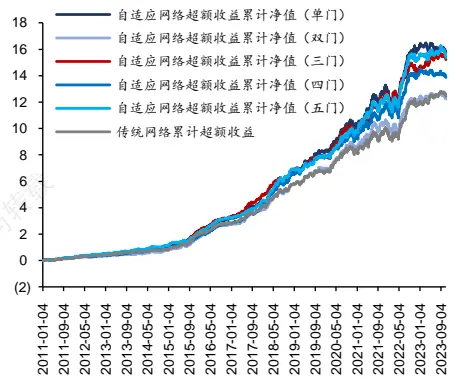
注：回测期 2011-01-04 至 2023-10-31，基准为中证 500资料来源：朝阳永续，Wind，华泰研究

## 导言

“子深其深，浅其浅，益其益，尊其尊”。 ——《墨子·大取》

传统的神经网络选股研究中，神经网络架构通常固定，这可能导致一个潜在问题：特征较复杂与特征较简单的股票将通过同一固定架构下的神经网络进行训练或预测，倘若该架构正适合特征简单的股票，那么特征复杂的股票将面临“削足适履”之痛，反之亦然。因此，针对不同复杂度的股票样本进行“量体裁衣”式的网络架构选择，可能是提升选股模型表现的有效路径，如图 1所示。

图表1： 样本自适应网络应用于选股模型训练图示
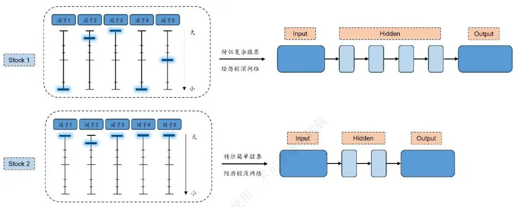
资料来源：华泰研究

学界的相关研究已广泛深入，为应对网络架构与参数固定带来的适应性与表征力限制，研究者们采用动态神经网络（Dynamic Neural Network）作为解决方案（Han, et al., 2021）：动态神经网络指在训练过程中能够针对数据输入动态调整神经网络架构与参数的神经网络，可降低计算冗余度且具备更高的可解释性和适应水平。动态神经网络可分为样本自适应（Sample-Wise），空间自适应（Spatial-Wise）和时间自适应（Temporal-Wise）三种，后两种常被应用于计算机视觉与自然语言处理领域，如图 2。

图表2： 动态自适应神经网络研究框架总览
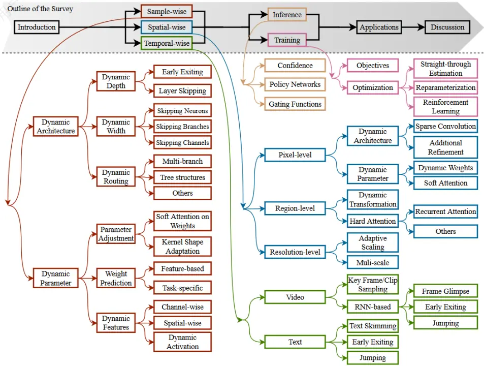
资料来源：Dynamic Neural Networks: A Survey，华泰研究

本研究基于门控自适应神经网络，通过门控单元控制不同特征复杂度股票样本所经历网络深度，对股票样本进行量体裁衣式的训练以及预测。基于包含华泰金工神经网络多频率因子和文本因子的44因子数据集，我们训练门控自适应网络，并构建中证500指数增强组合，以 2011 年初至 2023 年 10 月末为回测区间，门控数目为单门时（门控通过率=0.4，门控损失权重=10），相比于传统网络，年化超额收益率从 23.39%到 25.62%，信息比率从 2.95提升至 3.46。另一方面，我们利用一维熵定量衡量股票特征复杂度，一维熵越高，股票特征复杂度越高，从而尝试为自适应网络的效果提升提供可解释性。我们发现在行业层面，样本特征复杂度与经历网络深度显示出正向相关趋势，为自适应网络的“因材施教”提供验证。

## 动态自适应神经网络

传统的深度神经网络往往采用静态结构设计，无法根据样本复杂度进行推理深度上的调整，这种静态结构存在诸多弊端：一方面，如果数据集中样本间差异较大，静态网络结构的表征能力和泛化能力可能会更差；另一方面，静态结构下所有样本均进行同等深度的推理大大降低了运算效率。动态自适应神经网络（Dynamic Adaptive Neural Network）试图解决这一问题，其在推理过程中基于不同输入动态调整网络结构和参数，除了能够提升模型适应与表征能力，也能根据网络模块的激活与否，在神经网络与可解释性之间搭建桥梁。

## 样本自适应

样本自适应（Sample-Wise）是动态自适应神经网络中应用广泛的一种方案，旨在针对不同样本动态调整神经网络结构或网络参数，以提升网络计算效率和表征力。其中动态网络结构的调整可从几条路径实现：

（1） 动态深度（Dynamic Depth），通过早退（Early Exiting）或跳层（Layer Skipping）机制控制样本所经历的网络深度；

（2） 动态宽度（Dynamic Width），不同样本经历的网络深度保持一致，但通过忽略特定神经元或混合专家（Mixture of Experts，MoE）机制调整不同样本经历的网络宽度，达到使隐藏神经元所表征的特征动态失活的效果；

（3） 动态路由（Dynamic Routing），动态路由通过开发具有各种可能推断路径的多形式超网络，并在超网络内执行动态路由，以使神经网络计算图适应每个样本。

本研究的关注重点为动态深度下的样本自适应网络，以下从早退机制下的多退出分支网络（Multi-exit Neural Network）和跳层机制下的门网络（Gate Neural Network）进行详细介绍。

## 早退机制

顾名思义，早退（EarlyExiting）机制指样本在尚未经过更深层网络时提前输出，以达到控制样本经历网络深度之目的。早退机制最直观的实现方式是使用级联模型，如图 3，当输入Input 经历第一级模型 Model1后路由器 Router 将判断其是否直接输出，若 Router 判断为否，Input 将重新输入 Model2得到最终输出，其中 Model1为较浅网络，Model2为较深网络。级联模型的缺陷在于当 Input需经历较深网络时，较浅网络的计算是冗余的，中层分类器结构解决了这一问题。

相比于相互独立的级联模型，中层分类器结构仅包含主干网络，并在主干网络中引入分类器结构，从而构建一个紧凑的多出口网络，不同出口将共享部分主干网络。中层分类器结构隐含的思想是，浅层网络可提取出相对粗糙的特征，而这些特征足够使得部分样本预测（例如分类任务）在浅层网络即可达到较高的置信度水平，相较之下，静态网络任由这些样本经历更深网络，模型过拟合的可能性更高。

图表3： 样本自适应网络下的早退机制实现
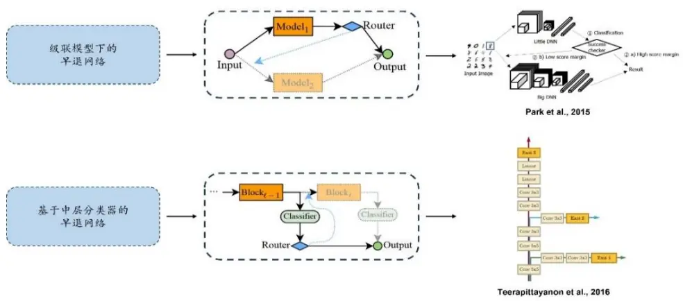
资料来源：Dynamic Neural Networks: A Survey，Big/Little Deep Neural Network for Ultra Low Power Inference，BranchyNet: Fast Inference via Early Exiting from Deep Neural Networks，华泰研究

## 跳层机制

不同于早退机制下忽略执行某节点后续所有网络层，跳层机制指跳过某些中间层网络而直接执行后续网络。跳层网络基于类似 ResNet 的跳跃连接（Skip Connection）构建，用以维持前向传播的连续性，其常见实现主要包括基于 Halting Score、门结构和 Policy Network等三类跳层网络。

对于 Halting score 下的跳层网络，如图 4，在 Input 与 Output 中间的中层网络中（例如X1），每个中层网络将输出经过 Halting Score 计算模块（例如ℋ1），进而得到一个预测停止分数（例如 0.1），当预测停止分数总和≥ 1时，以分数加权各层网络输出得到最终输出。HaltingScore 网络在实现动态样本自适应的同时，也充分利用了 ResNet 预防网络退化的优势。

相比于 Halting Score，门结构下的跳层网络更具有即插即用的特性。门结构由单独模块（例如 Gating Module）构建，以 Resnet 为例，门结构利用 Softmax 或 GumbleSoftmax 执行二级制决策，控制残差学习模块的执行与否，从而达到控制样本经历网络层数的效果。跳层网络的优势在于其灵活性，可以自由控制需要控制的网络层次，独立的门结构也增加了样本自适应控制模块的可解释性。本研究实证测试部分也将主要参考此类结构网络。

与门结构类似，Policy Network 可以看做是多个门控结构的融合。Policy Network 输出多个中间层网络的二进制决策，进而同时控制多个中间层网络的执行与否。在 Wu et al.(2018)的研究中，Policy Network 独立于主网络，接受原始样本图片输入，输出各模块激活状态的向量，并经过强化学习对 Policy Network 进行训练。

图表4： 样本自适应网络下的跳层机制实现
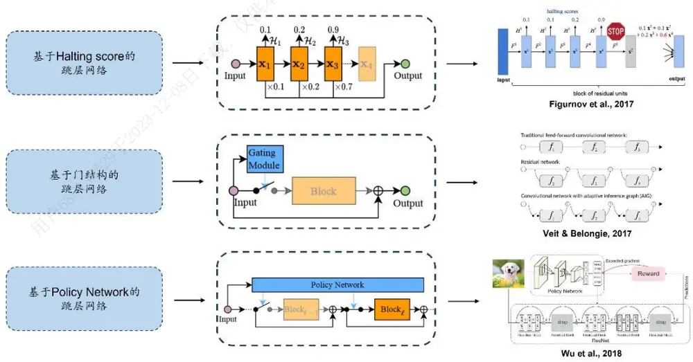
资料来源：Dynamic Neural Networks: A Survey，华泰研究

## 空间自适应

在视觉学习领域，CNN 最终的预测可能仅依赖于图片中的个别重要区域，而其余区域带来了计算冗余度和噪音。空间自适应（Space-Wise）针对这一问题进行优化，其主要思路是对不同区域进行动态自适应推理，保证预测准确率的同时，降低计算成本。空间自适应可分为像素水平（Pixel-Level）、区域水平（Region-Level）和分辨率水平（Resolution-Level），其中像素水平和区域水平均指对图片样本的不同区域进行自适应推理，而分辨率水平从分辨率的角度削减训练冗余度，例如训练过程中选择性激活不同分辨率水平的子网络。

图表5： 分辨率水平下的空间自适应网络
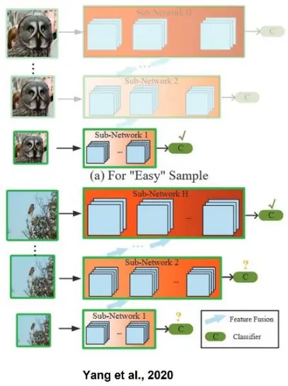

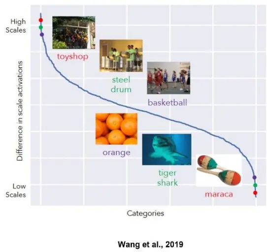
资料来源：ELASTIC: Improving CNNs with Dynamic Scaling Policies，Resolution Adaptive Networks for Efficient Inference，华 泰研究

## 时间自适应

除了空间维度下的空间自适应，自适应网络也可以处理时间序列数据，例如文本和视频，这种被称为时间自适应（Temporal-Wise）动态网络。与空间自适应类似，时间自适应可以向不重要时序位置的输入动态分配更少的计算资源或直接不进行计算，以提升网络效率。时间自适应的实现也与样本自适应、空间自适应类似，可采用早退或跳层机制实现网络的部动态性，所基于的网络结构则主要为 RNN 与 LSTM及其各类变体。人

总结而言，动态自适应神经网络在计算机视觉，以及近年来大火的 NLP领域应用已颇为深，入，例如 Universal Transformers、FastBERT 等等。在量化选股研究中，个股之间的差异性普遍存在，静态结构下的神经网络忽视这种差异性，可能导致模型对某些股票样本存在-0过拟合现象，但样本自适应网络为“量体裁衣”式的模型训练与预测提供了可行方案。本23研究使用基于门结构的自适应网络，构建动态的选股神经网络，使得不同特征复杂度的股于票样本经历不同深度网络，结果显示自适应网络相比传统静态网络存在效果提升。95

## 方法

本文基于门控结构下的样本自适应方案，构建可根据股票样本特征复杂度自适应调整样本所经网络深度的选股模型，并构建指数增强策略。值得强调的是，在该方法下，股票样本特征复杂度由门控结构自行判断，并据此决定样本历经网络深度，门控结构参数根据梯度下降进行更新，具体方法如下。

## 自适应网络模型构建

基于门结构的自适应神经网络，最核心的结构是门控单元。我们参考 Veit & Belongie(2017)的研究（对应前文所述“基于门结构的跳层网络”），对门结构加以改造与优化，具体实现如图 6 所示。自适应网络与传统网络最大的差异在于自适应网络拥有额外的门结构，门结构控制中间一层全连接网络与 LeakyReLU 网络的激活与否。每一条股票样本输入主干网络的同时也将输入门结构，经过门结构中的多个全连接层与激活层后，最后通过GumbelSoftMax 获得形如[0，1]的向量，决定该股票是否通过被门控控制的网络中间层，以达到控制不同股票样本经历不同深度网络的目的。

图表6： 传统网络与自适应网络结构实现
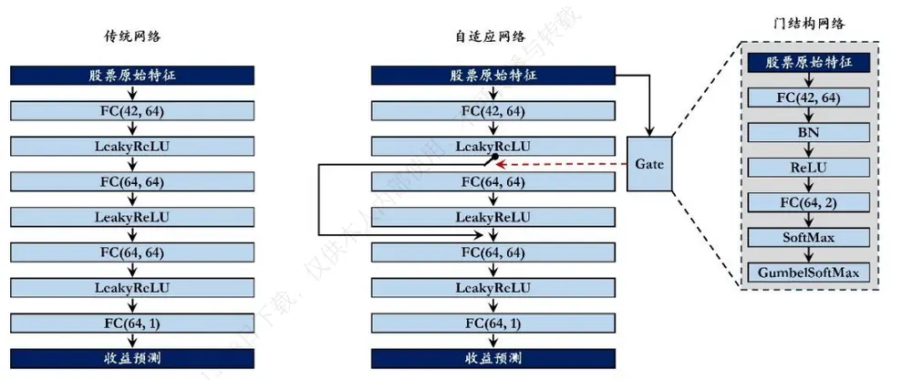
资料来源：Convolutional Networks with Adaptive Inference Graphs，华泰研究

为了训练主干网络与门结构，我们使用以下损失函数对二者同时进行参数更新：

$$
\mathcal{L}=\mathcal{L}_{M}+\lambda\mathcal{L}_{G}
$$

$$
\mathcal{L}_{G}=\frac{1}{|L|}{\sum_{l\in L}\left(\frac{1}{|B|}{\sum_{i\in B}g_{l,i}}-t_{l}\right)^{2}}
$$

其中， $\mathcal{L}_{M}$ 和 ${\mathcal{L}}_{G}$ 分别为主干网络与门结构的损失，λ是需手动调整的超参数，表示门结构的损失系数，用以控制门结构与主干网络间的损失平衡。

在 $\mathcal{L}_{G}$ 中，L代表门控单元数，B代表 Batch Size（指股票样本数）， $g_{l,i}$ 代表第i个输入是否跳过第l个门（0表示跳过，1 表示不跳过）。 $t_{l}$ 也是需手动调整的超参数，表示门结构通过率，即门结构可使多少比例的股票通过所控网络。在该损失函数下，我们可通过预设门结构通过率与实际通过率的差异生成损失，进而训练门结构。

## 模型训练

以下为自适应网络模型训练与传统网络模型训练的详细参数与因子特征：

图表7： 选股模型构建方法

| 步骤 | 参数 | 参数值 |
| --- | --- | --- |
| 构建股票池 | 股票池 | 全 A股；剔除上市未满 63 个交易日个股，剔除ST、*ST、退市整理期个股； 每个季末截面期，在未停牌个股中，筛选过去1年日均成交额和日均总市值均排 名前 60%个股 |
| 构建数据集 | 特征 标签 | T 日 42 个基本面和量价因子 T+11 日相对于 T+1 日收盘价收益率 |
| 因子预处理 | 特征 标签 | 5 倍 MAD 缩尾；zscore 标准化；缺失值填为 0；不做中性化 剔除缺失值；截面排序数标准化 |
| 训练流程 | 测试集完整区间 训练、验证、测试集划分 | 20110104~20231031 训练集252*6个交易日，验证集252*2个交易日，测试集126个交易日； 如第1期训练集 20020910~20081205，验证集 20081208~20101231，测试集 20110104~20110711; |
|  |  | 第2 期训练集 20030325~20090616，验证集 20090617~20110711，测试集 20110712~20120113 |
|  | 特殊处理 损失函数 | 剔除训练集、验证集最后10个交易日样本，防止信息泄露 加权 mse（根据收益率衰减加权） |
|  | batch size | 32（每个交易日的全体股票视作一个 batch) |
|  | 学习率 | 0.001 |
|  | 优化器 | adam |
| 构建组合 | 早停次数 | 20 |
|  | 随机数种子点 | 42 |
|  | 基准 | 中证 500 指数 不可传播与转载 |
|  | 优化目标 | 最大化预期收益 |
|  | 组合仓位 | 1 |
|  | 个股权重下限 | 0 部使用 |
|  | 个股偏离权重约束 | [-1%, 1%] |
|  | 行业偏离权重约束 | [-1%, 1%] |
|  | 风格偏离标准差约束 | [-1%, 1%] |
|  | 风格因子 | 对数流通市值（预处理：5倍 MAD 缩尾，zscore 标准化） |
|  | 调仓周期 | 每5个交易日 |
|  | 单次调仓单边换手率上限 |  |
|  |  | 15% |
| 回测 | 成分股权重约束 单边费率 | 无 0.002 |
|  | 交易价格 | vwap |
|  | 特殊处理 | 停牌不买入/卖出；一字板涨停不买入；一字板跌停不卖出；其余可交易股票重新 |
| 861395 |  | 分配权重 |

资料来源：华泰研究户

图表8： 选股模型使用的 42个因子

| 类别 | 名称 | 计算方式 |
| --- | --- | --- |
| 估值 | bp_If | 1/市凈率 |
|  | ep_ttm | 1/市盈率(TTM) |
|  | ocfp_ttm | 1/净经营性现金流(TTM) |
|  | dyr12 | 近 252 日股息率 |
| 预期 | con_eps_g | 一致预期 EPS(FY1)近 63 日增长率 |
|  | con_roe_g | 一致预期 ROE(FY1)近 63 日增长率 |
|  | con_np_g | 一致预期归母净利润(FY1)近 63日增长率 |
| 反转 | ret_5d | 近5日区间收益率 |
|  | ret_1m | 近 21 日区间收益率 |
|  | exp_wgt_return_3m | 近63 日收益率以换手率指数衰减加权 |
| 波动率 | std_1m | 收益率近 21 日标准差 |
|  | vstd_1m | 成交量近 21 日标准差 |
|  | ivr_ff3factor_1m | 残差收益率（收益率对万得全A、市值、BP因子收益率回归）近21日标准差 |
| 换手率 | turn_1m | 换手率近 21 日均值 |
|  | std_turn_1m | 换手率近 21 日标准差 |
|  | bias_turn_1m | 换手率近 21 日均值/近 504 日均值 |
| 日间技术 | std_ret_10d | 收益率近10日标准差 |
|  | std_vol_10d | 成交量近 10日标准差 |
|  | std_turn_10d | 换手率近 10 日标准差 与转载 |
|  | corr_ret_close | 收益率和收盘价近10日相关系数 |
|  | corr_ret_open | 收益率和开盘价近10日相关系数 |
|  | corr_ret_high | 收益率和最高价近10日相关系数 |
|  | corr_ret_low | 收益率和最低价近10日相关系数 |
|  | corr_ret_vwap | 收益率和均价近10日相关系数 |
|  | corr_ret_vol | 收益率和成交量近10日相关系数 |
|  | corr_ret_turn | 收益率和换手率近10日相关系数 |
|  | corr_vol_close | 成交量和收盘价近10日相关系数 |
|  | corr_vol_open | 成交量和开盘价近10日相关系数 |
|  | corr_vol_high | 成交量和最高价近10日相关系数 |
|  | corr_vol_low -08日下 | 成交量和最低价近10日相关系数 |
|  | corr_vol_vwap | 成交量和均价近10日相关系数 |
|  | 日内技术 | low2high low/high |
|  |  | vwap2close vwap/close |
|  | kmid | (close-open)/open |
|  | klen |  |
|  | kmid2 | (high-low)/open |
| 用户68 kup | (close-open)/(high-low) |  |
| kup2 | (high-greater(open,close))/open |  |
| klow | (high-greater(open,close))/(high-low) |  |
|  | (less(open,close)-low)/open |  |
| klow2 | (less(open,close)-low)/(high-low) |  |
| ksft | (2*close-high-low)/open |  |
| ksft2 | (2*close-high-low)/(high-low) |  |

资料来源：朝阳永续，Wind，华泰研究

## 结果

## 门控自适应网络初尝试

首先，我们构建最为简单的单门自适应网络，进行门控自适应网络初次探索。参数方面，门控通过率设为 0.75，门控损失权重设为 20，其余模型参数与传统全连接神经网络保持一致。模型对比方面，我们计算神经网络合成因子的相关评价指标，同时构建中证 500 指数增强策略，以对比传统网络和自适应网络之间的效果差异。在指增策略的对比中，我们测试了两种组合约束条件，原始组合约束条件对应图表 7，放宽组合约束条件对应图表 14。

## 原始组合约束条件

图表9： 传统网络与自适应网络合成因子评价指标

|  |  |  |  |  | 加权 |  |  |  |  |  |  | Bottom 组 多空对冲 | 基准收 |
| --- | --- | --- | --- | --- | --- | --- | --- | --- | --- | --- | --- | --- | --- |
| IC 均值 | RankIC 加权 IC 均值 |  | 加权 | RankIC ICIR RankICIR |  |  |  | 加权 |  | Top 组精 Bottom 组 Top 组年化 | 年化收益年化收益 |  |  |
| 传统网络(42 因子) |  | 均值 | 均值 |  |  |  | ICIR RankICIR | 确率 | 精确率 | 收益率 |  | 率 率 | 益率 |
|  | 8.69%10.58% |  | 7.27% 9.63% | 0.84 |  | 0.99 0.71 |  | 0.91 55.71% | 60.06% | 23.73% | -29.98% | 26.86% | 5.68% |
| 自适应网络(单门，42 因子) | 8.79% | 10.69% | 7.37% 9.75% | 0.86 |  | 1.01 0.73 |  | 0.93 | 55.73% | 60.28% | 23.84% | -30.74% 27.29% | 5.68% |

注：回测区间：2011-01-04 至 2023-10-31
资料来源：朝阳永续，Wind，华泰研究

图表10： 传统网络与自适应网络合成因子累计 RankIC
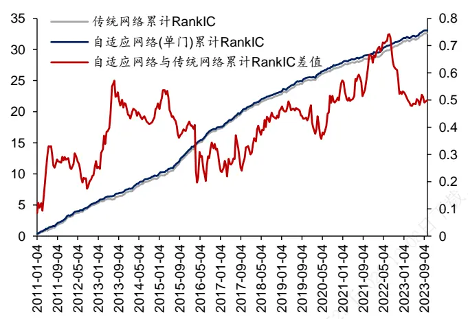
资料来源：朝阳永续，Wind，华泰研究

图表11： 自适应网络与传统网络 Top100 等权组合超额收益净值曲线
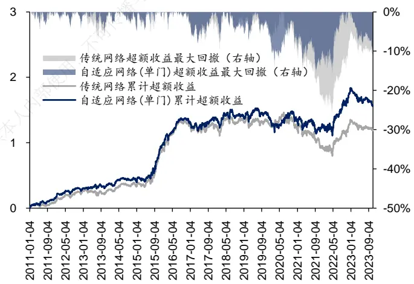
注：回测区间：2011-01-04 至 2023-10-31资料来源：朝阳永续，Wind，华泰研究

图表12： 自适应网络与传统网络中证 500指增超额收益净值曲线
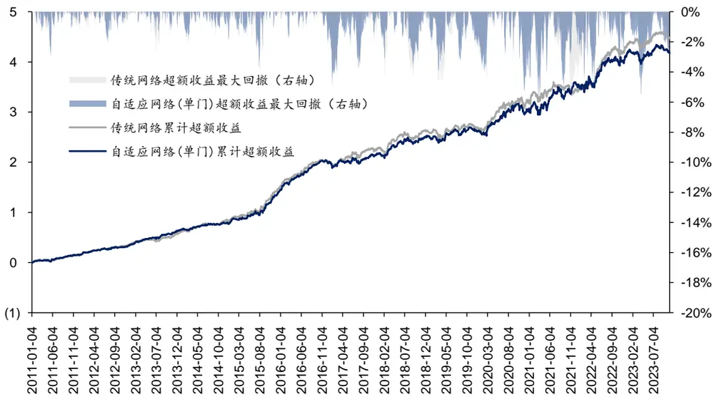
注：回测区间：2011-01-04 至 2023-10-31资料来源：朝阳永续，Wind，华泰研究

图表13： 自适应网络与传统网络中证 500指数增强组合回测绩效

|  | 年化收益 | 年化波动 率 | 夏普比率 最大回撤 |  | Calmar 比率 | 年化超额 收益率 | 年化跟踪 误差 | 信息比率 | 超额收益 | 超额收益 最大回撤 Calmar 比率 |  | 相对基准年化双边 |
| --- | --- | --- | --- | --- | --- | --- | --- | --- | --- | --- | --- | --- |
|  | 率 |  |  |  |  | Top100 等权策略 |  |  |  |  | 月胜率 | 换手率 |
|  |  |  |  | 47.48% |  | 6.57% | 8.50% | 0.77 | 27.01% | 0.24 | 53.90% |  |
| 传统网络(42 因子) 自适应网络(单门，42 因子) | 7.16% 8.58% | 27.17% 26.93% | 0.26 0.32 | 47.78% | 0.15 0.18 | 7.93% | 8.38% | 0.95 | 16.55% | 0.48 | 62.99% | 69.61 69.84 |
|  |  |  |  |  |  | 中证 500 指增策略 |  |  |  |  |  |  |
| 传统网络(42 因子) 15.61% | 25.70% |  | 0.61 | 47.46% | 0.33 | 14.74% | 5.93% | 2.49 | 5.51% | 2.68 | 73.38% | 16.08 |
| 自适应网络(单门，42 因子) | 15.07% | 25.79% | 0.58 | 47.45% | 0.32 | 14.22% | 6.18% | 2.30 | 6.17% | 2.30 | 74.68% |  |
|  |  |  |  |  |  |  |  |  |  |  |  | 16.12 |

注：回测区间：2011-01-04 至 2023-10-31
资料来源：朝阳永续，Wind，华泰研究

可以看到，对于合成因子评价指标，门控自适应网络的 RankIC 均值、加权 RankIC 均值、RankICIR、加权 RankICIR、Top组年化收益率以及多空对冲年化收益率等指标优于传统网络。在因子指标效果提升的加持下，Top100 等权策略上自适应网络的年化超额收益率、信息比率、超额收益 Calmar比率以及相对基准月胜率均显著优于传统网络。不过在中证 500指增策略上，自适应网络却显著差于传统网络，仅有相对基准月胜率指标优于传统网络。

## 放宽组合约束条件

以上 Top100 等权策略与指增策略的结果存在不一致，即自适应网络在 Top100 等权策略中显示出效果提升，却并未在指增策略中显示出来。对此我们猜测，由于指增策略约束的存在，自适应网络“因材施教”尚未惠及指增组合，所以自适应网络的效果并未发挥出来，于是我们尝试放松指增策略约束，放松后的约束如下：

图表14： 放宽组合优化约束条件

| 步骤 | 参数 | 参数值 |
| --- | --- | --- |
| 构建组合 | 基准 | 中证 500 指数 |
|  | 优化目标 3日下载，仅供 | 最大化预期收益 |
|  | 组合仓位 | 1 |
|  | 个股权重下限 | 0 |
|  | 个股偏离权重约束 | [-2%, 2%] |
|  | 行业偏离权重约束 | [-2%, 2%] |
|  | 风格偏离标准差约束 | [-20%, 20%] |
| 用户68613952 | 风格因子 | 对数流通市值（预处理：5倍 MAD 缩尾，zscore 标准化） |
|  | 调仓周期 | 每5个交易日 |
|  | 单次调仓单边换手率上限 | 20% |
|  | 成分股权重约束 | 无 |

资料来源：华泰研究

放松组合优化约束后的效果对比如下：

图表15： 自适应网络与传统网络中证 500指增超额收益净值曲线（放宽约束）
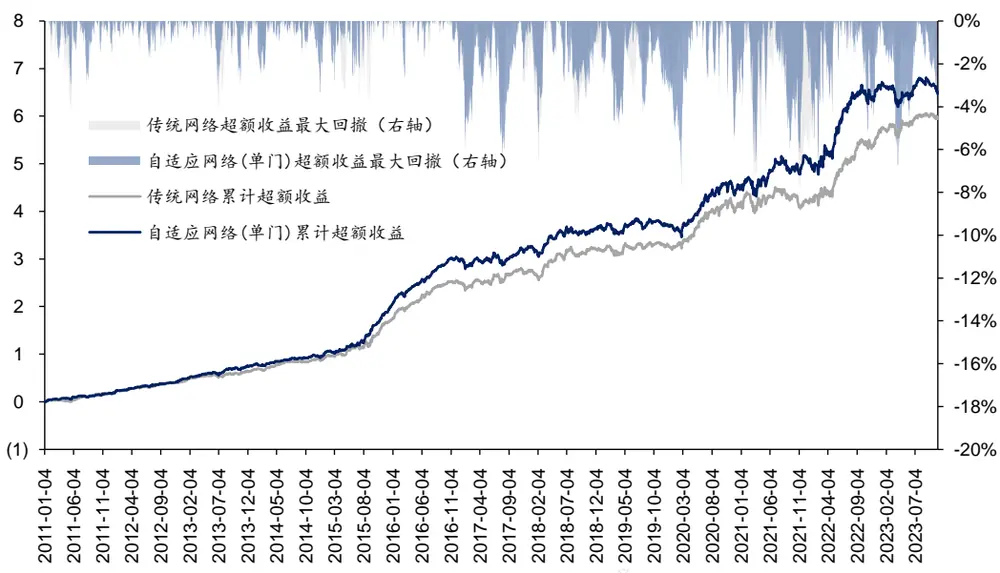
注：回测区间：2011-01-04 至 2023-10-31资料来源：朝阳永续，Wind，华泰研究

图表16： 自适应网络与传统网络中证 500指数增强组合回测绩效（放宽约束）

|  | 年化收益年化波动 |  | 夏普比率 | 最大回撤 | Calmar | 年化超额 年化跟踪 |  | 信息比率 | 超额收益 | 超额收益 |  | 相对基准年化双边 |
| --- | --- | --- | --- | --- | --- | --- | --- | --- | --- | --- | --- | --- |
|  |  |  |  |  |  | 比率 | 收益率 |  |  |  |  |  |
| 传统网络(42 因子) | 率 17.73% | 率 26.59% | 0.67 | 48.64% | 0.36 | 16.98% | 误差 7.66% | 2.22 | 最大回撤 Calmar 比率 8.11% | 2.09 | 月胜率 74.68% | 换手率 20.96 |
| 自适应网络(单门，42 因子) | 18.51% | 26.34% | 0.70 | 43.95% | 0.42 | 17.66% | 7.76% | 2.28 | 8.05% | 2.20 | 75.97% | 20.97 |

注：回测区间：2011-01-04 至 2023-10-31
资料来源：朝阳永续，Wind，华泰研究

放松组合优化约束后，可看到自适应网络带来的效果提升较为明显，自适应网络在年化收益率、夏普比率、年化超额收益率、信息比率、超额收益 Calmar比率以及相对基准月胜率等多项指标上均显著优于传统网络。

## 引入多频率因子与文本因子

值得注意的是，此前我们使用的 42 因子（如图表 8）构造相对较简单，考虑到因子拥挤等原因，这些因子失效的可能性愈发变大。为此，我们引入华泰金工构建的神经网络多频率因子和文本选股因子：（1）多频率因子，源于报告《人工智能 68：神经网络多频率因子挖掘》（2023-05-11）；（2）文本因子，源于报告《人工智能 63：再探文本 FADT 选股》（2022-10-28）。数据集中有效因子的引入，可能会为策略带来效果上的显著提升。我们仍然以中证 500 增强策略为例，在放宽组合约束的条件下进行验证，结果如下：

图表17： 自适应网络与传统网络中证 500指增超额收益净值曲线（44因子）
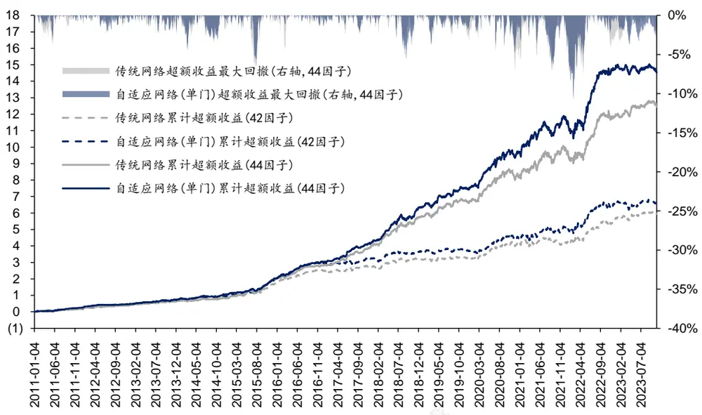
注：回测区间：2011-01-04 至 2023-10-31
资料来源：朝阳永续，Wind，华泰数智中台，华泰研究

图表18： 中证 500指数增强组合回测绩效（44因子）

|  | 年化收益年化波动 |  | 夏普比率 | 最大回撤 | Calmar | 年化超额 年化跟踪 |  | 信息比率 | 超额收益 | 超额收益 |  | 相对基准年化双边 |
| --- | --- | --- | --- | --- | --- | --- | --- | --- | --- | --- | --- | --- |
|  |  |  |  |  |  | 比率 | 收益率 |  |  |  |  |  |
| 传统网络(44 因子) | 率 24.00% | 率 27.19% | 0.88 | 50.75% | 0.47 | 23.39% | 误差 7.92% | 2.95 | 最大回撤Calmar 比率 9.66% | 2.42 | 月胜率 79.87% | 换手率 21.01 |
| 自适应网络(单门，44 因子) | 25.79% | 26.05% | 0.99 | 47.40% | 0.54 | 24.83% | 7.43% | 3.34 | 10.81% | 2.30 | 82.47% | 20.86 |

注：回测区间：2011-01-04 至 2023-10-31
资料来源：朝阳永续，Wind，华泰数智中台，华泰研究

引入多频率因子和文本 fadt_BERT 因子后（即 44 因子），传统网络与自适应网络相对引入前（即 42 因子）有显著效果提升，突出了有效的因子特征对于神经网络以及投资组合效果提升的重要性。此外，自适应网络相对传统网络的效果提升仍然明显，在年化收益率等多项绩效指标上均优于传统网络。

## 门控通过率的影响

正如前文所示，对于门控自适应网络而言，需要调整的超参数包括门控通过率、门控损失权重和门控数量，以下我们仍然使用单门结构，选取[0.2，0.3，0.4，0.5，0.6，0.7，0.8]的通过率对自适应网络进行测试，数据集延续 44 因子版本，策略仍然使用中证 500 增强策略，测试结果如下：

图表19： 不同门控通过率下自适应网络中证500指增超额收益净值曲线（44因子）
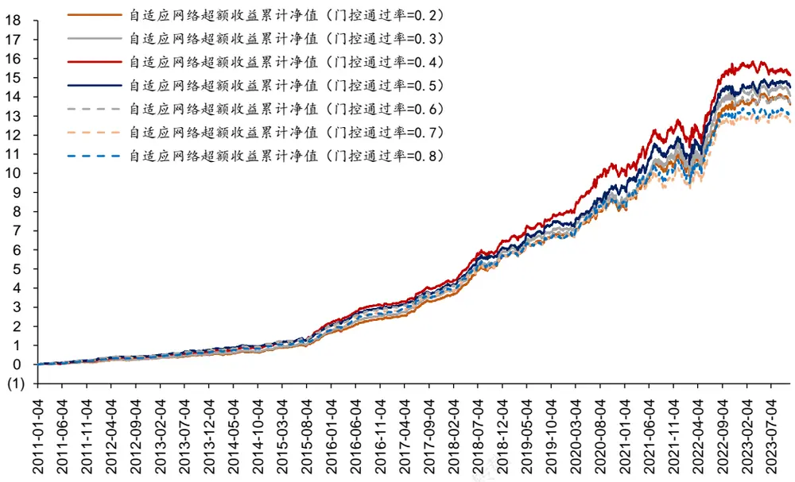
注：回测区间：2011-01-04 至 2023-10-31
资料来源：朝阳永续，Wind，华泰数智中台，华泰研究

图表20： 不同门控通过率下自适应网络中证500指数增强组合回测绩效（44因子）

|  | 年化收益 率 | 年化波动 率 | 夏普比率 | 最大回撤 | Calmar 比 年化超额 |  | 年化跟踪 | 信息比率 | 超额收益 | 超额收益相对基准年化双边 |  |  |
| --- | --- | --- | --- | --- | --- | --- | --- | --- | --- | --- | --- | --- |
|  |  |  |  |  | 率 收益率 | 误差 |  |  |  | 最大回撤Calmar 比率 | 月胜率 | 换手率 |
| 自适应网络（门控通过率=0.2） | 25.09% | 26.28% | 0.95 | 46.93% | 0.53 | 24.21% | 7.47% | 3.24 | 9.78% | 2.48 | 77.92% | 20.96 |
| 自适应网络（门控通过率=0.3） | 25.49% | 26.00% | 0.98 | 45.50% | 0.56 | 24.52% | 7.42% | 3.30 | 11.10% | 2.21 | 79.22% | 20.91 |
| 自适应网络（门控通过率=0.4） | 26.06% | 26.44% | 0.99 | 45.16% | 0.58 | 25.22% | 7.49% | 3.37 | 10.58% | 2.38 | 78.57% | 20.93 |
| 自适应网络（门控通过率=0.5） | 25.78% | 26.04% | 0.99 | 46.91% | 0.55 | 24.82% | 7.46% | 3.33 | 11.48% | 2.16 | 80.52% | 20.89 |
| 自适应网络（门控通过率=0.6） | 25.34% | 25.72% | 0.99 | 43.74% | 0.58 | 24.28% | 7.33% | 3.31 | 9.98% | 2.43 | 81.17% | 20.86 |
| 自适应网络（门控通过率=0.7) | 24.56% | 25.92% | 0.95 | 47.96% | 0.51 | 23.57% | 7.35% | 3.21 | 10.79% | 2.19 | 79.22% | 20.80 |
| 自适应网络（门控通过率=0.8） | 24.77% | 26.05% | 0.95 | 48.04% | 0.52 | 23.82% | 7.42% | 3.21 | 10.42% | 2.29 | 79.22% | 20.83 |

注：回测区间：2011-01-04 至 2023-10-31
资料来源：朝阳永续，Wind，华泰数智中台，华泰研究

图表21： 不同门控通过率下中证 500指增策略的年化收益率
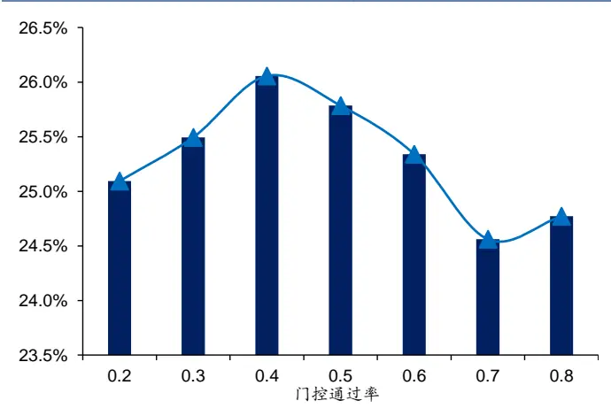
注：回测区间：2011-01-04 至 2023-10-31资料来源：朝阳永续，Wind，华泰数智中台，华泰研究

图表22： 不同门控通过率下中证 500指增策略的年化超额收益率
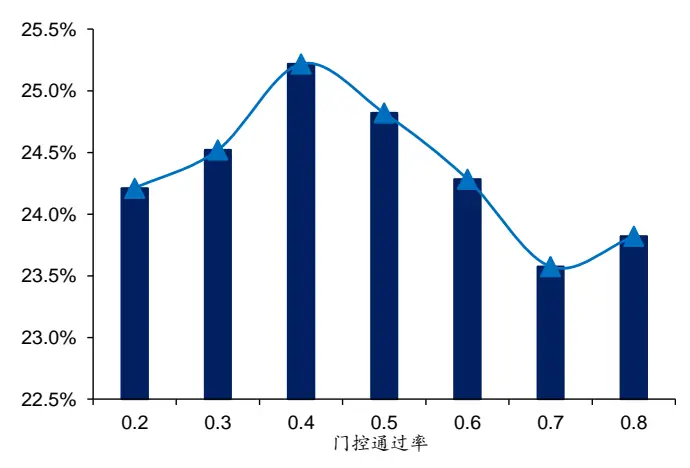
注：回测区间：2011-01-04 至 2023-10-31资料来源：朝阳永续，Wind，华泰数智中台，华泰研究

图表23： 不同门控通过率下中证 500指增策略的信息比率
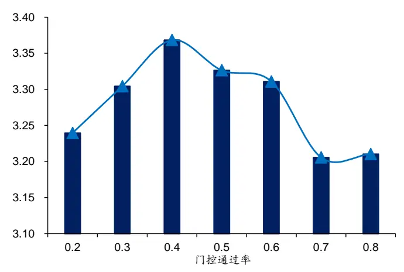
注：回测区间：2011-01-04 至 2023-10-31资料来源：朝阳永续，Wind，华泰数智中台，华泰研究

图表24： 不同门控通过率下中证 500指增策略的相对基准月胜率
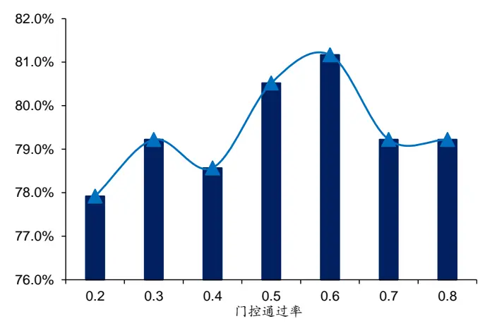
注：回测区间：2011-01-04 至 2023-10-31资料来源：朝阳永续，Wind，华泰数智中台，华泰研究

在单门条件下，中证 500 指数增强策略的多项业绩指标基本以门控通过率=0.4 为中枢，显示出倒 U 型趋势，当门控通过率大于 0.4 或小于 0.4 时，指增策略年化收益率和超额年化收益率等指标均呈下降趋势。

## 门控损失权重的影响

我们继续对门控损失权重超参数进行测试，以下我们仍然使用单门结构，固定门控通过率=0.4，选取门控损失权重为[1,5,10,15,20,25,30,50,100]对自适应网络进行测试，数据集延续 44 因子版本，策略仍然使用中证 500 增强策略，测试结果如下：

图表25： 不同门控损失权重下自适应网络中证 500指增超额收益净值曲线（44因子）
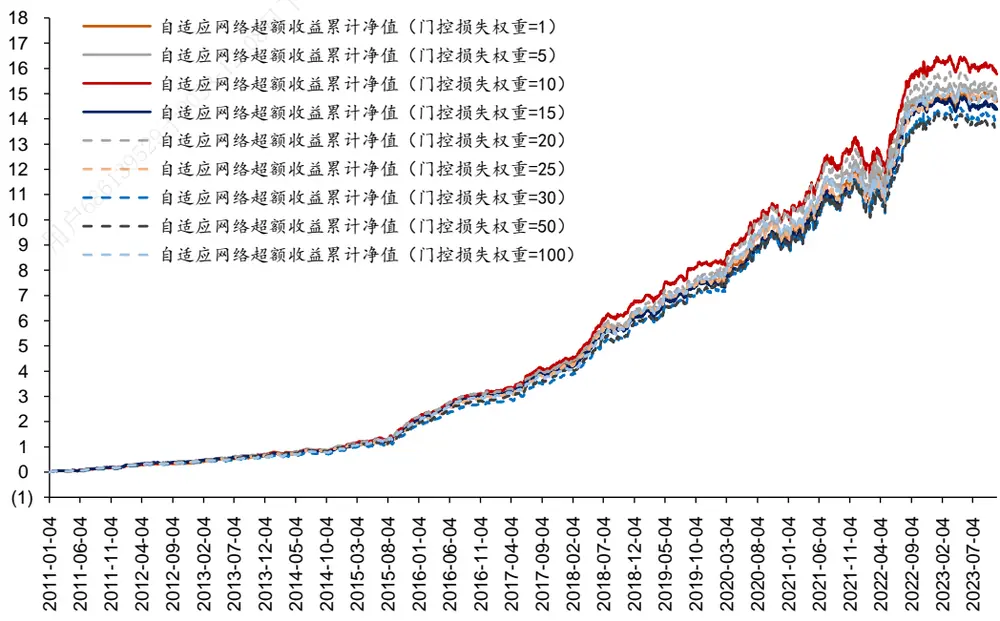
注：回测区间：2010-12-31 至 2023-10-31资料来源：朝阳永续，Wind，华泰数智中台，华泰研究

图表26： 不同门控损失权重下自适应网络中证 500指数增强组合回测绩效（44因子）

|  | 年化收益 年化波动 | 率 | 夏普比率 最大回撤 |  | Calmar 比 年化超额 | 年化跟踪 | 误差 | 超額收益 信息比率 |  | 超额收益相对基准年化双边 |  |
| --- | --- | --- | --- | --- | --- | --- | --- | --- | --- | --- | --- |
|  |  |  |  |  |  |  |  |  |  | 最大回撤Calmar 比率 | 月胜率 |
| 自适应网络（门控损失权重=1） | 率 25.77% | 26.46% | 0.97 | 47.58% | 率 0.54 | 收益率 24.94% | 7.45% | 3.35 10.63% |  | 2.35 80.52% | 换手率 20.93 |
| 自适应网络 (门控损失权重=5) | 25.78% | 26.58% | 0.97 | 46.99% | 0.55 | 24.98% | 7.56% | 3.30 10.82% | 2.31 | 79.87% | 20.96 |
| 自适应网络（门控损失权重=10） | 26.53% | 26.22% | 1.01 | 46.49% | 0.57 | 25.62% | 7.40% | 3.46 11.61% |  | 2.21 79.87% | 20.91 |
| 自适应网络 （门控损失权重=15） | 25.59% | 26.39% | 0.97 | 45.33% | 0.56 | 24.74% | 7.49% | 3.30 10.89% |  | 2.27 79.22% | 20.93 |
| 自适应网络（门控损失权重=20） | 26.06% | 26.44% | 0.99 | 45.16% | 0.58 | 25.22% | 7.49% | 3.37 10.58% |  | 2.38 78.57% | 20.93 |
| 自适应网络（门控损失权重=25） | 25.74% | 26.37% | 0.98 | 47.34% | 0.54 | 24.87% | 7.52% | 3.31 10.51% |  | 2.37 79.87% | 20.92 |
| 自适应网络（门控损失权重=30） | 25.30% | 26.27% | 0.96 | 47.17% | 0.54 | 24.41% | 7.45% | 3.27 | 11.09% | 2.20 80.52% | 20.90 |
| 自适应网络（门控损失权重=50） | 25.06% | 26.29% | 0.95 | 47.57% | 0.53 | 24.18% | 7.51% | 3.22 11.42% |  | 2.12 77.92% | 20.90 |
| 自适应网络（门控损失权重=100） | 25.80% | 26.36% | 0.98 | 47.09% | 0.55 | 24.94% | 7.47% | 3.34 | 10.38% | 2.40 79.87% | 20.89 |

注：回测区间：2011-01-04 至 2023-10-31
资料来源：朝阳永续，Wind，华泰数智中台，华泰研究

图表27： 不同门控损失权重下中证 500指增策略的年化收益率
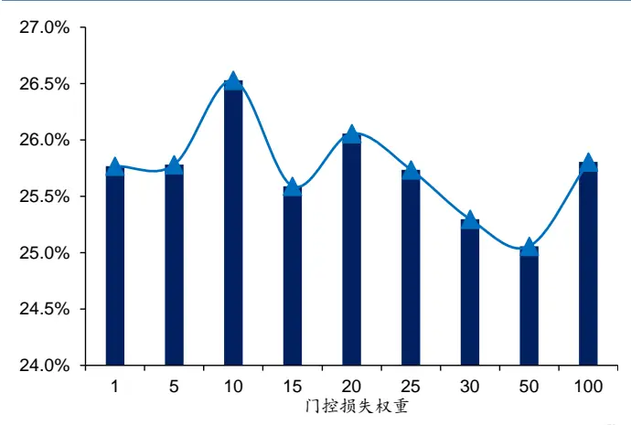
注：回测区间：2011-01-04 至 2023-10-31
资料来源：朝阳永续，Wind，华泰数智中台，华泰研究

图表28： 不同门控损失权重下中证 500指增策略的年化超额收益率
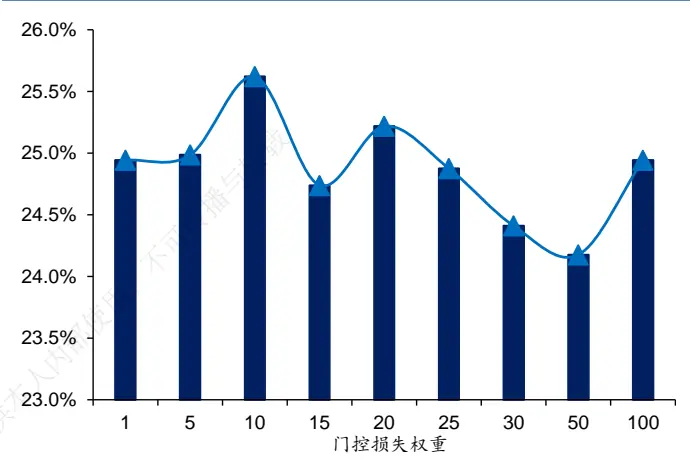
注：回测区间：2011-01-04 至 2023-10-31
资料来源：朝阳永续，Wind，华泰数智中台，华泰研究

图表29： 不同门控损失权重下中证 500指增策略的信息比率
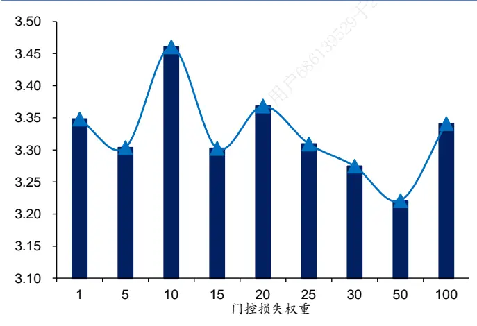
注：回测区间：2011-01-04 至 2023-10-31
资料来源：朝阳永续，Wind，华泰数智中台，华泰研究

图表30： 不同门控损失权重下中证 500指增策略的相对基准月胜率
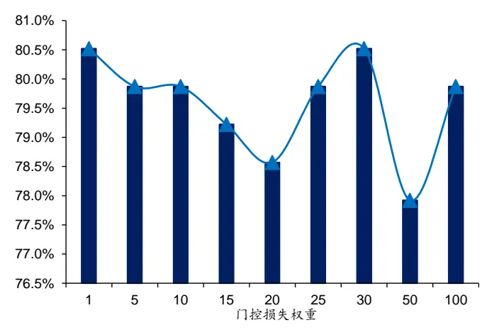
注：回测区间：2011-01-04 至 2023-10-31
资料来源：朝阳永续，Wind，华泰数智中台，华泰研究

在单门且门控通过率=0.4 的条件下，不同水平的门控损失权重下的策略表现并未和门控通过率一样显示出倒 U 型的规律，而是随着损失权重的增大，显示出较不规律的波动特征。其中，总体表现最佳的门控损失权重为 10，年化收益率和超额年化收益率分别为 26.53%和 25.62%，夏普比率和信息比率分别为 1.01 和 3.46。

## 门控数量的影响

除了门控通过率和门控损失权重之外，门控单元的数量也是自适应网络的重要特征，门控单元越多，样本经历网络深度的可能性就越多。上文仅使用单个门控单元进行测试，为使测试对比更为全面，我们进一步训练了包含多门控单元的自适应网络。前文对门控通过率的对比测试中，我们发现单门条件下通过率等于 0.4 时的效果最好，因此，对于多门控单元的自适应网络，随着门控数量的增加，我们适当降低了通过率，从而保证大部分样本不会通过门控单元，防止样本经历过深的网络。

图表31： 不同门控数量对比中的门控单元参数设置

|  | 门控单元数目 | 门控通过率 | 门控损失权重 |
| --- | --- | --- | --- |
| 单门 | 1 | 0.4 | 10 |
| 双门 | 2 | [0.3, 0.3] | 10 |
| 三门 | 3 | [0.2, 0.2, 0.2] | 10 |
| 四门 | 4 | [0.2, 0.2, 0.2, 0.2] | 10 |
| 五门 | 5 | [0.15, 0.15, 0.15, 0.15] | 10 |

资料来源：华泰研究

图表32： 不同门控数量下自适应网络中证 500指增超额收益净值曲线（44因子）
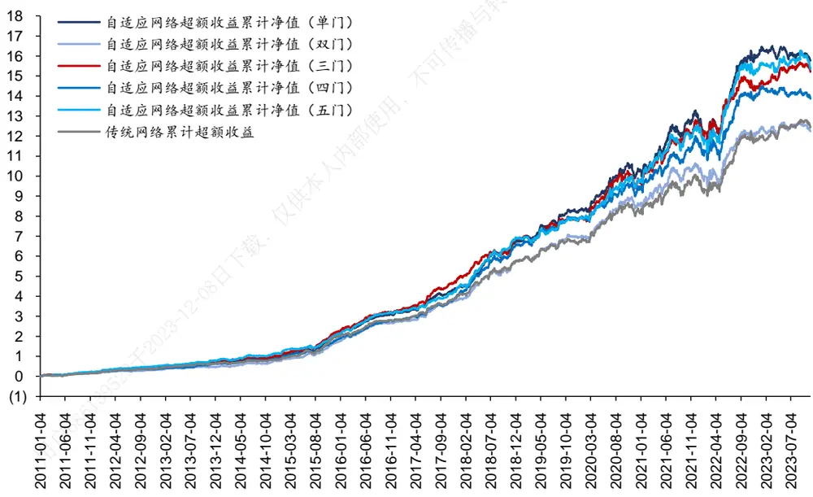
注：回测区间：2010-12-31 至 2023-10-31
资料来源：朝阳永续，Wind，华泰数智中台，华泰研究

图表33： 不同门控单元数目下自适应网络中证 500指数增强组合回测绩效（44因子）

|  | 年化收益 率 | 年化波动 率 | 夏普比率 | 最大回撤 | Calmar 比率 | 年化超额 年化跟踪 |  | 信息比率 | 超额收益 | 超额收益 |  | 相对基准年化双边 |
| --- | --- | --- | --- | --- | --- | --- | --- | --- | --- | --- | --- | --- |
|  |  |  |  |  |  | 收益率 | 误差 |  |  | 最大回撤 Calmar 比率 | 月胜率 |  |
| 自适应网络（单门） | 26.53% | 26.22% | 1.01 | 46.49% | 0.57 | 25.62% | 7.40% | 3.46 | 11.61% | 2.21 | 79.87% | 换手率 20.91 |
| 自适应网络（双门） | 24.11% | 26.25% | 0.92 | 47.93% | 0.50 | 23.24% | 7.33% | 3.17 | 9.94% | 2.34 | 77.27% | 20.89 |
| 自适应网络（三门） | 26.19% | 26.16% | 1.00 | 45.00% | 0.58 | 25.28% | 7.29% | 3.47 | 8.04% | 3.14 | 81.17% | 20.93 |
| 自适应网络（四门） | 25.26% | 26.31% | 0.96 | 48.19% | 0.52 | 24.40% | 7.36% | 3.31 | 9.34% | 2.61 | 74.68% | 20.94 |
| 自适应网络（五门） | 26.34% | 26.01% | 1.01 | 46.51% | 0.57 | 25.36% | 7.47% | 3.39 | 10.10% | 2.51 | 77.92% | 20.95 |
| 传统网络 | 24.00% | 27.19% | 0.88 | 50.75% | 0.47 | 23.39% | 7.92% | 2.95 | 9.66% | 2.42 | 79.87% | 21.01 |

注：回测区间：2010-12-31 至 2023-10-31
资料来源：朝阳永续，Wind，华泰数智中台，华泰研究

可以看到在上述五种门控自适应网络中，不同网络在不同指标上存在各自的优势，例如：单门自适应网络的整体表现最优，年化收益率和年化超额收益率均优于其他自适应网络；三门自适应网络的最大回撤、超额收益最大回撤、超额收益 Calmar比率和相对基准月胜率均优于其他网络；单门和五门自适应网络的夏普比率均较高。

## 可解释性探索：样本特征复杂度与经历网络深度

以上结果从不同角度显示出，相比于传统网络，自适应网络在指增策略上存在较稳定的效果提升。正如前文所言，我们使用自适应网络的初心在于减少训练过程中的“削足适履”现象，对股票样本进行自适应地“量体裁衣”和“因材施教”。那么自适应网络是否的确对具有不同特征复杂度水平的股票自适应调整经历网络深度了呢？为验证该问题，我们需要完成两件事：（1）测量测试集中各股票样本特征复杂度；（2）计算测试集各股票样本经历网络深度。

对于特征复杂度，我们引入图像处理领域中的一维熵概念。熵，指体系的混乱程度，熵越大则体系越为混乱，图像熵是图像特征的一种统计形式，反映图像各像素点的分布复杂程度。其中，图像一维熵是指仅考虑图像灰度值的聚集特征，而不考虑空间特征，其计算公式如下：

$$
H=-\sum_{i=0}^{255}\log P_{i}
$$

其中 $P_{i}$ 表示图像中灰度值为i（0-255）的像素所占的比例，熵始终为正数。为将一维熵应用于股票特征，我们首先将标准化后的股票特征Rank化，例如大于3.5的股票特征赋值为9、在 2.5 和 3.5 之间的特征赋值为 8，随后应用上述公式，股票样本的一维熵越大，股票特征复杂度越高，对应的，股票未来收益率会愈加难以预测，从而倾向于经历更深的神经网络，反之亦然。

图表34： 一维熵与特征复杂度图示
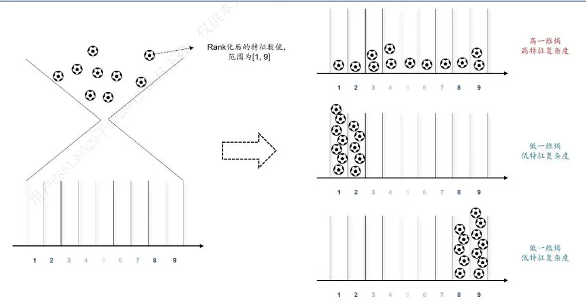
资料来源：华泰研究

对于股票样本经历网络深度的计算，我们在使用自适应网络时即输出了每个股票样本通过网络时各门控单元的状态，通过统计股票通过门控单元的数目，我们即可获得股票经历网络深度的表示。考虑到股票数目众多，行业在解释性层面可能更为友好，我们统计了行业层面上特征复杂度与经历网络深度（行业内股票均值）的关系，结果如下。

图表35： 特征复杂度与平均经历网络深度(行业维度)
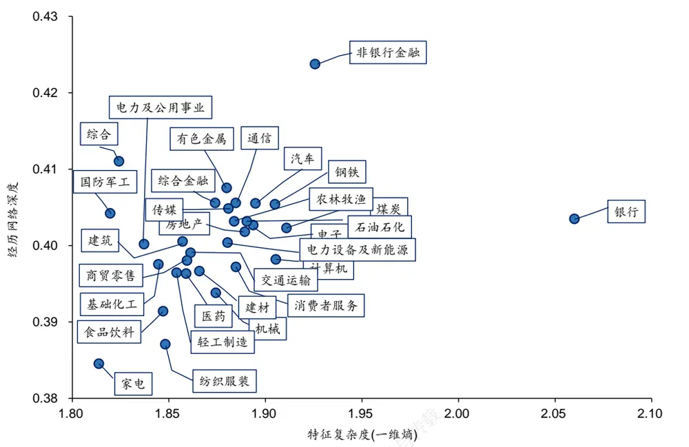
资料来源：朝阳永续，Wind，华泰数智中台，华泰研究

可以看到，由一维熵代理的特征复杂度与经历网络深度间存在较明显的正向相关趋势，行业内股票特征复杂度的均值越高，行业内股票经历的网络深度均值就越高，与自适应网络的出发点保持一致，自适应网络相对传统网络的效果提升得到一定程度的解释性验证。

## 总结

本文是门控自适应神经网络在量化选股中的实践探索。由门控单元搭建的自适应网络中，门控单元将控制股票样本是否通过其下辖的网络层，若为通过状态，股票样本经历的总体网络深度将更深，反之则更浅。门控单元的参数通过梯度下降自动更新，并通过损失权重参数与主干网络的损失维持平衡。基于包含华泰金工神经网络多频率因子和文本因子的 44因子数据集，我们训练自适应网络，并构建中证 500 指数增强组合，以 2011 年初至 2023年 10 月末为回测区间，门控数目为单门时（门控通过率=0.4，门控损失权重=10），相比于传统网络，年化超额收益率从 23.39%到 25.62%，信息比率从 2.95 提升至 3.46。

人工智能领域中对自适应网络的研究广泛而深远。动态神经网络可分为样本自适应，空间自适应和时间自适应三种。以样本自适应为例，可以从动态深度、动态宽度和动态路由三条路径实现动态网络结构的调整，其中，动态深度可通过不同的早退机制和跳层机制来构建。我们选用门控机制下的样本自适应网络进行选股模型构建，门控单元具有即插即用的灵活性优势，同时，独立的门控结构也具备较高的可解释性。

## 本文的主要结果及结论如下：

1. 门控自适应网络在合成因子评价指标上比传统网络更优，在 top100 等权策略和放宽组合约束条件后的中证 500 指增策略上表现总体优于传统网络。

2. 对于门控通过率参数，我们测试[0.2，0.3，0.4，0.5，0.6，0.7，0.8]共 7 种通过率，从中证 500 指增策略表现上看，年化收益率/年化超额收益率等指标围绕通过率=0.4呈现倒 U型趋势。

3. 对于门控损失权重，我们测试[1，5，10，15，20，25，30，50，100]共 9 种权重，从中证 500 指增策略表现上看，各类指标随权重的变化未呈现明显规律。

4. 对于门控数量，我们测试了单门、双门、三门、四门和五门共 5 种情况，与门控损失权重类似，指增策略指标并未呈现明显规律变化；除双门自适应网络外，其余均总体优于传统网络在指增策略上的表现。

5. 本文试图为门控自适应网络带来的效果提升寻求一定可解释性，我们发现样本特征复杂度与样本经历深度间存在较明显的正向相关趋势，这为样本自适应网络可对复杂/简单样本进行针对性训练的假设提供了验证。

本文仍有多项未尽之处：（1）本研究中的门控单元接受原始特征输入，然而门控单元应接受隐藏层输入还是原始特征输入尚无定论，可进一步探索；（2）门结构下的样本自适应网络包括多项需手动调整的超参数，例如门控通过率、门控损失权重以及门控数量，这些参数的调整在不同选股场景中是否遵循特定逻辑，也可深入探究；（3）不同门数量下的自适应网络在指增策略指标上表现出不同优势，或可形成相关性较低的策略，为模型融合提供低成本方案。

## 参考文献

Dehghani, M., Gouws, S., Vinyals, O., Uszkoreit, J., & Kaiser, Ł. (2018). Universal transformers. arXiv preprint arXiv:1807.03819.

Figurnov, M., Collins, M. D., Zhu, Y., Zhang, L., Huang, J., Vetrov, D., & Salakhutdinov, R. (2017). Spatially adaptive computation time for residual networks. In Proceedings of the IEEE conference on computer vision and pattern recognition (pp. 1039-1048).

Han, Y., Huang, G., Song, S., Yang, L., Wang, H., & Wang, Y. (2021). Dynamic neural networks: A survey. IEEE Transactions on Pattern Analysis and Machine Intelligence, 44(11), 7436-7456.

Park, E., Kim, D., Kim, S., Kim, Y. D., Kim, G., Yoon, S., & Yoo, S. (2015, October). Big/little deep neural network for ultra low power inference. In 2015 International Conference on Hardware/Software Codesign and System Synthesis (CODES+ ISSS) (pp. 124-132). IEEE.

Teerapittayanon, S., McDanel, B., & Kung, H. T. (2016, December). Branchynet: Fast inference via early exiting from deep neural networks. In 2016 23rd international conference on pattern recognition (ICPR) (pp. 2464-2469). IEEE.

Veit, A., & Belongie, S. (2018). Convolutional networks with adaptive inference graphs. In Proceedings of the European Conference on Computer Vision (ECCV) (pp. 3-18).

Wang, H., Kembhavi, A., Farhadi, A., Yuille, A. L., & Rastegari, M. (2019). Elastic: Improving cnns with dynamic scaling policies. In Proceedings of the IEEE/CVF Conference on Computer Vision and Pattern Recognition (pp. 2258-2267).

Wu, Z., Nagarajan, T., Kumar, A., Rennie, S., Davis, L. S., Grauman, K., & Feris, R. (2018). Blockdrop: Dynamic inference paths in residual networks. In Proceedings of the IEEE conference on computer vision and pattern recognition (pp. 8817-8826).

Yang, L., Han, Y., Chen, X., Song, S., Dai, J., & Huang, G. (2020). Resolution adaptive networks for efficient inference. In Proceedings of the IEEE/CVF conference on computer vision and pattern recognition (pp. 2369-2378).

孙毅, 李健, 徐昕, & 王宇茹. (2022). 深度自适应动态神经网络进展综述. Laser &Optoelectronics Progress, 59(14), 1415008-1415008.

## 风险提示

人工智能挖掘市场规律是对历史的总结，市场规律在未来可能失效。人工智能技术存在过拟合风险。深度学习模型受随机数影响较大。本文测试的选股模型调仓频率较高，假定以vwap 价格成交，忽略其他交易层面因素影响。

## 免责声明

## 分析师声明

本人，林晓明、何康，兹证明本报告所表达的观点准确地反映了分析师对标的证券或发行人的个人意见；彼以往、现在或未来并无就其研究报告所提供的具体建议或所表迖的意见直接或间接收取任何报酬。

## 一般声明及披露

本报告由华泰证券股份有限公司（已具备中国证监会批准的证券投资咨询业务资格，以下简称“本公司”）制作。本报告所载资料是仅供接收人的严格保密资料。本报告仅供本公司及其客户和其关联机构使用。本公司不因接收人收到本报告而视其为客户。

本报告基于本公司认为可靠的、已公开的信息编制，但本公司及其关联机构(以下统称为“华泰”)对该等信息的准确性及完整性不作任何保证。

本报告所载的意见、评估及预测仅反映报告发布当日的观点和判断。在不同时期，华泰可能会发出与本报告所载意见、评估及预测不一致的研究报告。同时，本报告所指的证券或投资标的的价格、价值及投资收入可能会波动。以往表现并不能指引未来，未来回报并不能得到保证，并存在损失本金的可能。华泰不保证本报告所含信息保持在最新状态。华泰对本报告所含信息可在不发出通知的情形下做出修改，投资者应当自行关注相应的更新或修改。

本公司不是 FINRA 的注册会员，其研究分析师亦没有注册为 FINRA 的研究分析师/不具有 FINRA 分析师的注册资格。

华泰力求报告内容客观、公正，但本报告所载的观点、结论和建议仅供参考，不构成购买或出售所述证券的要约或招揽。该等观点、建议并未考虑到个别投资者的具体投资目的、财务状况以及特定需求，在任何时候均不构成对客户私人投资建议。投资者应当充分考虑自身特定状况，并完整理解和使用本报告内容，不应视本报告为做出投资决策的唯一因素。对依据或者使用本报告所造成的一切后果，华泰及作者均不承担任何法律责任。任何形式的分享证券投资收益或者分担证券投资损失的书面或口头承诺均为无效。

除非另行说明，本报告中所引用的关于业绩的数据代表过往表现，过往的业绩表现不应作为日后回报的预示。华泰不承诺也不保证任何预示的回报会得以实现，分析中所做的预测可能是基于相应的假设，任何假设的变化可能会显著影响所预测的回报。

华泰及作者在自身所知情的范围内，与本报告所指的证券或投资标的不存在法律禁止的利害关系。在法律许可的情况下，华泰可能会持有报告中提到的公司所发行的证券头寸并进行交易，为该公司提供投资银行、财务顾问或者金融产品等相关服务或向该公司招揽业务。

华泰的销售人员、交易人员或其他专业人士可能会依据不同假设和标准、采用不同的分析方法而口头或书面发表与本报告意见及建议不一致的市场评论和/或交易观点。华泰没有将此意见及建议向报告所有接收者进行更新的义务。华泰的资产管理部门、自营部门以及其他投资业务部门可能独立做出与本报告中的意见或建议不一致的投资决策。投资者应当考虑到华泰及/或其相关人员可能存在影响本报告观点客观性的潜在利益冲突。投资者请勿将本报告视为投资或其他决定的唯一信赖依据。有关该方面的具体披露请参照本报告尾部。

本报告并非意图发送、发布给在当地法律或监管规则下不允许向其发送、发布的机构或人员，也并非意图发送、发布给因可得到、使用本报告的行为而使华泰违反或受制于当地法律或监管规则的机构或人员。

本报告版权仅为本公司所有。未经本公司书面许可，任何机构或个人不得以翻版、复制、发表、引用或再次分发他人(无论整份或部分)等任何形式侵犯本公司版权。如征得本公司同意进行引用、刊发的，需在允许的范围内使用，并需在使用前获取独立的法律意见，以确定该引用、刊发符合当地适用法规的要求，同时注明出处为“华泰证券研究所”，且不得对本报告进行任何有悖原意的引用、删节和修改。本公司保留追究相关责任的权利。所有本报告中使用的商标、服务标记及标记均为本公司的商标、服务标记及标记。

## 中国香港

本报告由华泰证券股份有限公司制作,在香港由华泰金融控股（香港）有限公司向符合《证券及期货条例》及其附属法律规定的机构投资者和专业投资者的客户进行分发。华泰金融控股（香港）有限公司受香港证券及期货事务监察委员会监管，是华泰国际金融控股有限公司的全资子公司，后者为华泰证券股份有限公司的全资子公司。在香港获得本报告的人员若有任何有关本报告的问题,请与华泰金融控股（香港）有限公司联系。

## 香港-重要监管披露

- 华泰金融控股（香港）有限公司的雇员或其关联人士没有担任本报告中提及的公司或发行人的高级人员。

- 有关重要的披露信息，请参华泰金融控股（香港）有限公司的网页 https://www.htsc.com.hk/stock_disclosure其他信息请参见下方 “美国-重要监管披露”。

## 美国

在美国本报告由华泰证券（美国）有限公司向符合美国监管规定的机构投资者进行发表与分发。华泰证券（美国）有限公司是美国注册经纪商和美国金融业监管局（FINRA）的注册会员。对于其在美国分发的研究报告，华泰证券（美国）有限公司根据《1934 年证券交易法》（修订版）第 15a-6 条规定以及美国证券交易委员会人员解释，对本研究报告内容负责。华泰证券（美国）有限公司联营公司的分析师不具有美国金融监管（FINRA）分析师的注册资格，可能不属于华泰证券（美国）有限公司的关联人员，因此可能不受 FINRA 关于分析师与标的公司沟通、公开露面和所持交易证券的限制。华泰证券（美国）有限公司是华泰国际金融控股有限公司的全资子公司，后者为华泰证券股份有限公司的全资子公司。任何直接从华泰证券（美国）有限公司收到此报告并希望就本报告所述任何证券进行交易的人士，应通过华泰证券（美国）有限公司进行交易。

## 美国-重要监管披露

- 分析师林晓明、何康本人及相关人士并不担任本报告所提及的标的证券或发行人的高级人员、董事或顾问。分析师及相关人士与本报告所提及的标的证券或发行人并无任何相关财务利益。本披露中所提及的“相关人士”包括 FINRA定义下分析师的家庭成员。分析师根据华泰证券的整体收入和盈利能力获得薪酬，包括源自公司投资银行业务的收入。

- 华泰证券股份有限公司、其子公司和/或其联营公司, 及/或不时会以自身或代理形式向客户出售及购买华泰证券研究所覆盖公司的证券/衍生工具，包括股票及债券（包括衍生品）华泰证券研究所覆盖公司的证券/衍生工具，包括股票及债券（包括衍生品）。

- 华泰证券股份有限公司、其子公司和/或其联营公司, 及/或其高级管理层、董事和雇员可能会持有本报告中所提到的任何证券（或任何相关投资）头寸，并可能不时进行增持或减持该证券（或投资）。因此，投资者应该意识到可能存在利益冲突。

## 评级说明

投资评级基于分析师对报告发布日后 6 至 12个月内行业或公司回报潜力（含此期间的股息回报）相对基准表现的预期（A 股市场基准为沪深 300 指数，香港市场基准为恒生指数，美国市场基准为标普 500 指数），具体如下：

## 行业评级

增持：预计行业股票指数超越基准

中性：预计行业股票指数基本与基准持平

减持：预计行业股票指数明显弱于基准

## 公司评级

买入：预计股价超越基准 15%以上

增持：预计股价超越基准 5%~15%

持有：预计股价相对基准波动在-15%~5%之间

卖出：预计股价弱于基准 15%以上

暂停评级：已暂停评级、目标价及预测，以遵守适用法规及/或公司政策

无评级：股票不在常规研究覆盖范围内。投资者不应期待华泰提供该等证券及/或公司相关的持续或补充信息

## 法律实体披露

中国：华泰证券股份有限公司具有中国证监会核准的“证券投资咨询”业务资格，经营许可证编号为：91320000704041011J香港：华泰金融控股（香港）有限公司具有香港证监会核准的“就证券提供意见”业务资格，经营许可证编号为：AOK809美国：华泰证券（美国）有限公司为美国金融业监管局（FINRA）成员，具有在美国开展经纪交易商业务的资格，经营业务许可编号为：CRD#:298809/SEC#:8-70231

## 华泰证券股份有限公司

## 南京

南京市建邺区江东中路228号华泰证券广场1号楼/邮政编码：210019

电话：86 25 83389999/传真：86 25 83387521

电子邮件：ht-rd@htsc.com

## 深圳深圳

深圳市福田区益田路5999号基金大厦10楼/邮政编码：518017电话：86 755 82493932/传真：86 755 82492062电子邮件：ht-rd@htsc.com

## 华泰金融控股（香港）有限公司

香港中环皇后大道中 99号中环中心 58楼 5808-12室

电话：+852-3658-6000/传真：+852-2169-0770

电子邮件：research@htsc.com

http://www.htsc.com.hk

## 华泰证券（美国）有限公司

美国纽约公园大道 280号 21楼东（纽约 10017）

电话：+212-763-8160/传真：+917-725-9702

电子邮件: Huatai@htsc-us.com

http://www.htsc-us.com

©版权所有2023年华泰证券股份有限公司

北京
北京市西城区太平桥大街丰盛胡同28号太平洋保险大厦A座18层/
邮政编码：100032
电话：86 10 63211166/传真：86 10 63211275
电子邮件：ht-rd@htsc.com
上海
上海市浦东新区东方路18号保利广场E栋23楼/邮政编码：200120
电话：86 21 28972098/传真：86 21 28972068
电子邮件：ht-rd@htsc.com