# 基于全频段量价特征的选股模型

华泰研究

2023 年 12 月 08 日│中国内地

深度研究

## 人工智能系列之 72：挖掘高频和低频量价数据中的 alpha

随着人工智能技术在量化投资中的普及，投资者对于量价数据的研究越来越充分。本文聚焦于高频和低频量价数据的信息挖掘。首先，基于分钟频、逐笔成交和逐笔委托几种高频数据，构建并测试了 27 个高频因子，再使用深度学习模型对因子进行合成。接着，利用日 k 线、周 k线和月 k 线几种低频量价数据，提出一个硬参数共享的多任务深度学习模型，实现端到端的因子挖掘和因子合成。最后，两类因子合成后得到的全频段融合因子表现进一步提升，构建的中证 500 和中证 1000 指数增强策略表现优秀。

## 基于分钟频、逐笔成交和逐笔委托数据，构建并测试 27 个高频因子

利用分钟频数据，构造尾盘收益率偏度、下行收益率波动占比等价格类因子，成交量占比、成交量与成交笔数相关性等交易量类因子，以及早盘成交量与收益率相关性、大单推动涨幅等价量关联类因子。利用逐笔成交数据，通过还原大单，构建大单成交金额占比、早盘大单买入占比等大单因子，也可根据买方或卖方主动成交，构建开盘主动买入占比、净主动买入与滞后或超前收益率相关性等因子。对于逐笔委托数据，主要基于统计量构造了买卖单委托量峰度之差、买单委托量与委托价格相关性等因子。

## 深度学习模型在高频因子合成上表现较好

本文构建以 GRU 为核心的深度学习模型，对 27 个高频因子进行合成。样本空间为全 A 股，模型在 2017/1/4～2023/11/30 的回测期内周度 RankIC均值为 9.10%，分 10 层 TOP 组合年化超额收益率为 26.20%(不计交易成本)。高频深度学习因子在 RankIC 均值、IC_IR、IC>0 占比、TOP 组合年化超额收益率、TOP 组合信息比率、TOP 组合胜率多项指标上表现优于单因子中的最佳表现，体现了多因子合成的优势。相比于等权和 ICIR 加权，深度学习能够捕捉时序和非线性规律，合成效果明显更好。

## 多任务学习可助力低频量价数据的挖掘

本文利用日频、周频和月频三类数据，提出了一个硬参数共享的多任务深度学习模型，实现端到端的因子挖掘和因子合成。三种频率的数据通过同一个GRU 模块提取时序信息，实现知识共享，再输出三个子任务预测，等权合成为最终预测。借鉴多因子合成的思想，模型通过优化每个子任务预测的IC，并控制彼此间的相关性，便可提升合成因子的表现。样本空间为全 A股，模型在 2017/1/4～2023/11/30 的回测期内周度 RankIC 均值为 10.44%，分 10 层 TOP组合年化超额收益率为 31.05%(不计交易成本)，TOP组合表现明显优于日频量价模型。消融实验验证了多任务学习设计的有效性。

## 高频深度学习因子和低频多任务因子合成后的全频段融合因子表现更佳

样本空间为全 A 股，全频段融合因子在 2017/1/4～2023/11/30 的回测期内周度 RankIC 均值为 11.47%，分 10 层 TOP 组合年化超额收益率为32.25%(不计交易成本)，回测表现进一步提升。基于全频段融合因子，构建中证 500 和中证 1000 指数增强组合。在周双边换手率分别控制为 30%、40%和 50%的情况下，2017/1/4～2023/11/30 回测期内中证 500 增强组合年化超额收益率为 19.46%、18.44%和 17.68%，信息比率为 3.31、3.11 和2.97；中证 1000 增强组合年化超额收益率为 29.48%、30.14%和 28.97%，信息比率为 4.33、4.30 和 4.05。

风险提示：借助高频因子、人工智能构建的选股策略是历史经验的总结，存在失效的可能。深度学习的可解释性较弱，使用需谨慎。

研究员

SAC No. S0570516010001

林晓明

linxiaoming@htsc.com

SFC No. BPY421

+(86) 755 8208 0134

研究员

SAC No. S0570520080004

何康，PhD

SFC No. BRB318

hekang@htsc.com

+(86) 21 2897 2039

联系人

SAC No. S0570123070272

卢炯

lujiong@htsc.com

+(86) 755 8249 2388

## 全频段融合因子分层组合相对净值

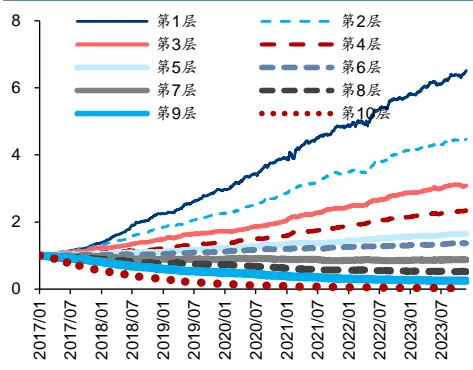
资料来源：Wind，华泰数据中台，华泰研究

## 研究导读

随着人工智能技术在量化投资中的普及，投资者对于量价数据的挖掘越来越充分。根据频率的不同，量价数据可划分为低频和高频数据。低频量价数据包括日 k 线、周 k 线、月 k线等，高频量价数据包括分钟 k 线、逐笔成交、逐笔委托、tick 数据等。

图表1： 量价数据类型
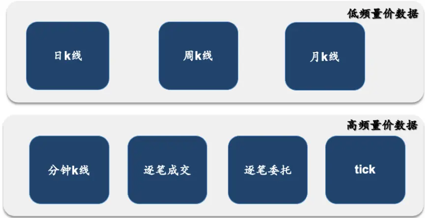
资料来源：华泰研究

在低频量价数据的应用中，一方面可根据市场规律和投资经验人工构造因子，另一方面也可运用深度学习等模型实现端到端的因子挖掘和因子合成。而高频量价数据一般需要先进行降频处理，通过人工构造特征形成更加明确的信号。

华泰金工前期报告《神经网络多频率因子挖掘模型》（2023.5.11）中，基于日 k 线和 15 分钟 k 线构建了端到端的深度学习模型，获得了不错的选股效果；报告《高频因子计算的 GPU加速》（2023.10.16）展示了在 GPU 的助推下可实现分钟频因子的高效计算。

本文将进一步探索量价数据的挖掘，相比于前期研究，本文主要有以下特点：

1. 基于分钟频、逐笔成交和逐笔委托三类高频数据，构造了多个表现较好且相关性较低的因子，并利用深度学习模型进行多因子合成。

2. 在日 k 线基础上引入周 k 线、月 k 线数据，使用多任务深度学习模型进行联合训练，显著改进了日频量价模型的表现。

本文研究内容如下图所示。

图表2： 本文研究内容
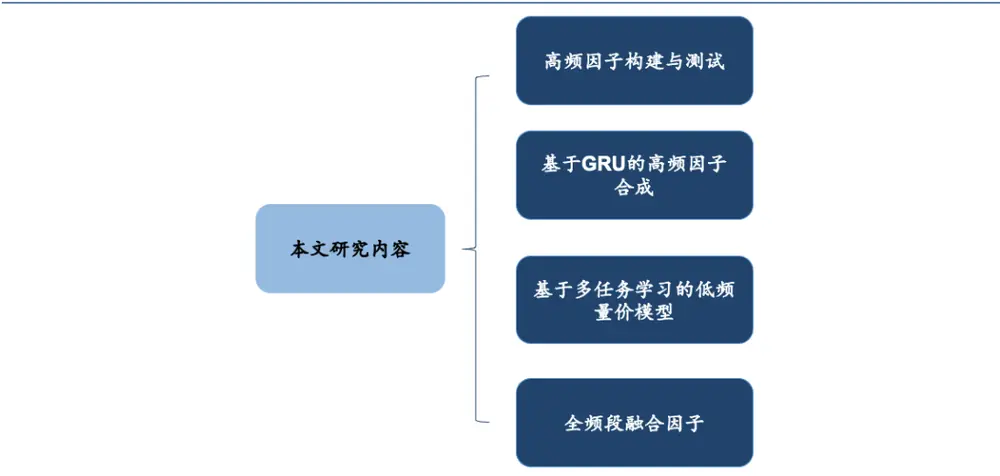
资料来源：华泰研究

研究发现，由高频深度学习因子和低频多任务因子合成得到的全频段融合因子具有较好的选股效果，该因子的周频调仓回测表现如下。

图表3： 全频段融合因子 IC值分析和分层回测结果汇总

|  | RankIC 均值 RankIC 标准差 |  | IC_IR | IC>0 占比 | TOP 组合年化超额收益率 TOP 组合信息比率 TOP 组合胜率 TOP 组合换手率 |  |  |  |
| --- | --- | --- | --- | --- | --- | --- | --- | --- |
| 全频段融合因子 | 11.47% | 8.64% | 1.33 | 91.37% | 32.25% | 5.35 | 85.54% | 91.92% |

资料来源：Wind，华泰数据中台，华泰研究
注：换手率为周频单次调仓双边换手率

图表4： 全频段融合因子分层组合相对净值
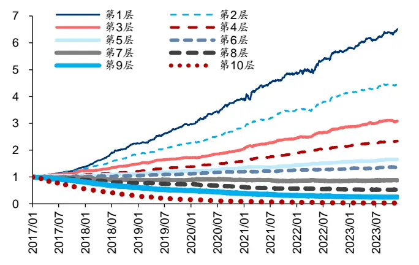
资料来源：Wind，华泰数据中台，华泰研究

图表5： 全频段融合因子累积 RankIC
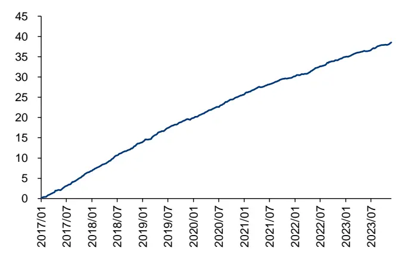
资料来源：Wind，华泰数据中台，华泰研究

## 高频因子构建与测试

利用分钟频、逐笔成交和逐笔委托数据，本研究构建并测试了多个高频因子。根据回测表现和相关性分析，保留了表现较好且相关性较低的 27 个因子，包括 15 个分钟频因子、8个逐笔成交因子和 4个逐笔委托因子。本章将展示这些因子的构建方式和测试结果。

## 分钟频因子

分钟线数据包括股票每分钟的开盘价、最高价、最低价、收盘价、成交金额、成交量、成交笔数等数据。本文利用价格数据，构造了尾盘收益率偏度、下行收益率波动占比等因子；利用成交量数据，构造了成交量占比、成交量与成交笔数相关性等因子；利用价格与成交量的关联，构造了早盘成交量与收益率相关性、大单推动涨幅等因子。

部分因子具有一定的逻辑性。下行收益率波动占比刻画了股票收益的不对称性和极端性，下行波动越大，说明股票经历了较大的负收益，未来可能会发生反转。收益率偏度也是类似的逻辑，因此两者的相关性非常高。使用尾盘收益率偏度，可大幅降低与下行收益率波动占比因子的相关性，同时尾盘具有较强的投机性和反转效应。

成交量占比描述了日内成交量的分布特征，根据统计规律，股票未来收益率与开盘半小时和收盘半小时的成交量占比呈负相关，而与其他时刻的成交量占比呈正相关。由于股票成交一般集中在早盘和收盘，成交分布更加均衡的股票可能意味着正面的信号。

大单推动涨幅反映了大单对市场的冲击，由大单交易带来的短时间上涨较难持续，未来可能会回归到正常水平。下行单笔成交金额占比则刻画了下跌时平均每笔成交金额的相对大小，因子值越大，说明可能是大单卖出带来的短时间下跌，或是下跌时仍有大单买入抄底，未来大概率会反弹。

还有些因子的逻辑比较难以解释，但经过严谨的统计检验，仍可作为量化策略的有效信号。

图表6： 分钟频因子

| 因子名称 | 因子含义 | 因子方向 |
| --- | --- | --- |
| late_skew_ret | 尾盘收益率偏度 | -1 |
| down_vol_perc | 下行收益率波动占比 | 1 |
| corr_ret_lastret | 前后两分钟收益率的相关性 | -1 |
| corr_close_nextopen | 前一分钟收盘价与后一分钟开盘价的相关性 | 1 |
| volume_perc2 | 第2个半小时成交量占全天成交量比例 | 1 |
| volume_perc3 | 第3个半小时成交量占全天成交量比例 | 1 |
| volume_perc4 | 第4个半小时成交量占全天成交量比例 | 1 |
| volume_perc5 | 第 5 个半小时成交量占全天成交量比例 | 1 |
| volume_perc6 | 第6个半小时成交量占全天成交量比例 | 1 |
| volume_perc7 | 第7个半小时成交量占全天成交量比例 | 1 |
| corr_volume_item | 成交量与成交笔数的相关性 | -1 |
| early_corr_volume_ret | 早盘成交量与收益率的相关性 | 1 |
| bigorder_ret | 大单推动涨幅 | -1 |
| down_single_amt_perc | 下行单笔成交金额占比 | 1 |
| corr_volume_amplitude | 成交量与振幅的相关性 | -1 |

资料来源：华泰研究

我们使用单因子测试的方法，对以上 15 个分钟频因子进行测试。

单因子测试方法如下：

1．股票池：全 A股，剔除 ST 股票，剔除每个截面期下一交易日停牌、涨停的股票。

2．回测区间：2013/2/1～2023/11/30。

3．调仓周期：周频，不计交易费用。

4．因子预处理：因子取过去 20 日均值、去极值、行业市值中性化、标准化。

5．测试方法：IC 值分析，因子分 5层测试。

测试结果如下所示。下行收益率波动占比、成交量与成交笔数相关性、前后两分钟收益率相关性、下行单笔成交金额占比、大单推动涨幅几个因子的 RankIC 表现突出。下行单笔成交金额占比、下行收益率波动占比、前一分钟收盘价与后一分钟开盘价相关性几个因子的多头超额收益表现突出。多数因子在分层回测中展现了较好的单调性。

图表7： 分钟频因子 IC值分析和分层回测结果汇总

|  | RankIC 均值 | RankIC 标准差 | IC_IR | IC>0 占比 | TOP 组合年化超额收益率 TOP 组合信息比率 TOP 组合胜率 TOP 组合换手率 |  |  |  |
| --- | --- | --- | --- | --- | --- | --- | --- | --- |
| late_skew_ret | 1.74% | 5.55% | 0.31 | 62.17% | 3.42% | 1.61 | 66.92% | 71.86% |
| down_vol_perc | 6.72% | 12.12% | 0.55 | 73.00% | 15.82% | 3.25 | 76.15% | 54.21% |
| corr_ret_lastret | 5.56% | 15.11% | 0.37 | 64.26% | 6.64% | 0.93 | 56.92% | 23.93% |
| corr_close_nextopen | 2.36% | 15.11% | 0.16 | 59.70% | 12.57% | 2.09 | 67.69% | 13.18% |
| volume_perc2 | 1.29% | 9.15% | 0.14 | 54.37% | 5.31% | 1.21 | 61.54% | 64.80% |
| volume_perc3 | 4.00% | 6.83% | 0.59 | 75.67% | 9.26% | 2.93 | 80.77% | 67.20% |
| volume_perc4 | 4.40% | 5.79% | 0.76 | 79.28% | 6.86% | 2.35 | 72.31% | 65.46% |
| volume_perc5 | 4.73% | 6.98% | 0.68 | 73.38% | 7.40% | 2.36 | 80.00% | 62.58% |
| volume_perc6 | 4.45% | 6.62% | 0.67 | 75.48% | 5.92% | 1.89 | 76.92% | 63.90% |
| volume_perc7 | 4.35% | 7.43% | 0.59 | 73.95% | 4.16% | 1.19 | 66.92% | 61.07% |
| corr_volume_item | 5.78% | 13.71% | 0.42 | 65.02% | 4.50% | 0.68 | 56.92% | 30.00% |
| early_corr_volume_ret | 1.59% | 7.33% | 0.22 | 58.37% | 5.50% | 1.41 | 63.85% | 68.97% |
| bigorder_ret | 5.39% | 8.21% | 0.66 | 77.38% | 9.72% | 2.87 | 79.23% | 67.37% |
| down_single_amt_perc | 5.56% | 13.36% | 0.42 | 67.49% | 17.95% | 3.49 | 79.23% | 39.52% |
| corr_volume_amplitude | 4.38% | 12.41% | 0.35 | 63.88% | 2.95% | 0.48 | 53.85% | 32.44% |

资料来源：Wind，华泰数据中台，华泰研究

图表8： late_skew_ret 分层组合相对净值
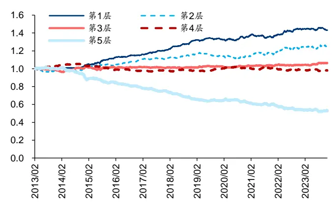
资料来源：Wind，华泰数据中台，华泰研究

图表9： down_vol_perc 分层组合相对净值
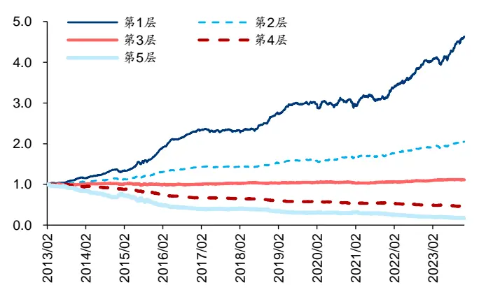
资料来源：Wind，华泰数据中台，华泰研究

图表10： corr_ret_lastret 分层组合相对净值
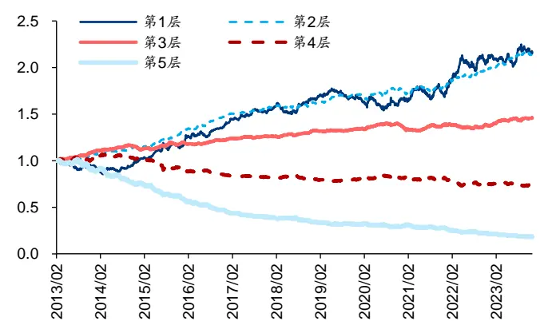
资料来源：Wind，华泰数据中台，华泰研究

图表11： corr_close_nextopen 分层组合相对净值
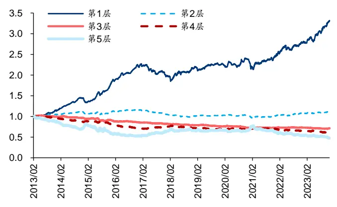
资料来源：Wind，华泰数据中台，华泰研究

图表12： volume_perc2 分层组合相对净值
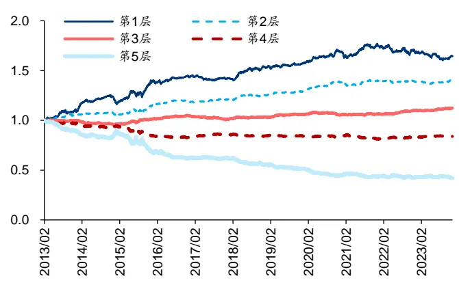
资料来源：Wind，华泰数据中台，华泰研究

图表13： volume_perc3 分层组合相对净值
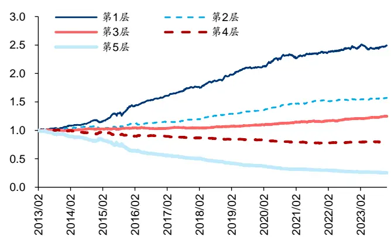
资料来源：Wind，华泰数据中台，华泰研究

图表14： volume_perc4 分层组合相对净值
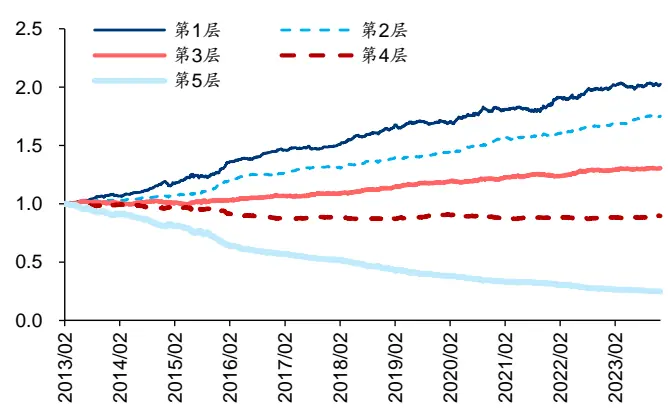
资料来源：Wind，华泰数据中台，华泰研究

图表15： volume_perc5 分层组合相对净值
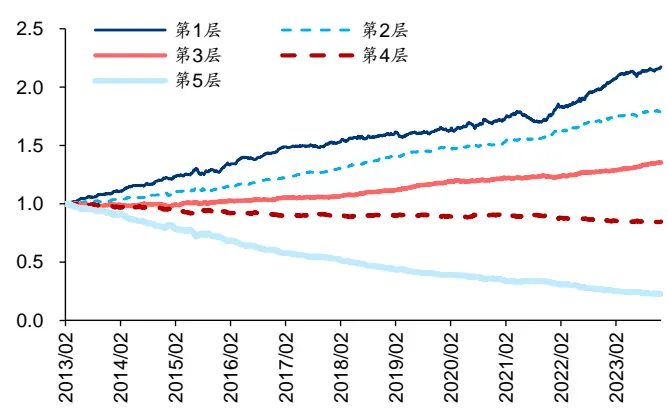
资料来源：Wind，华泰数据中台，华泰研究

图表16： volume_perc6 分层组合相对净值
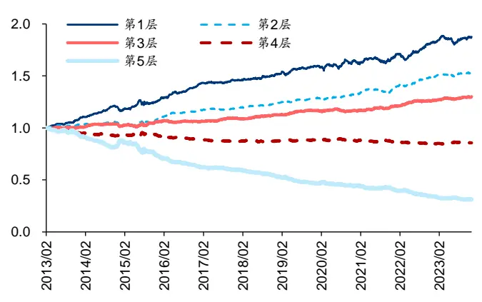
资料来源：Wind，华泰数据中台，华泰研究

图表17： volume_perc7 分层组合相对净值
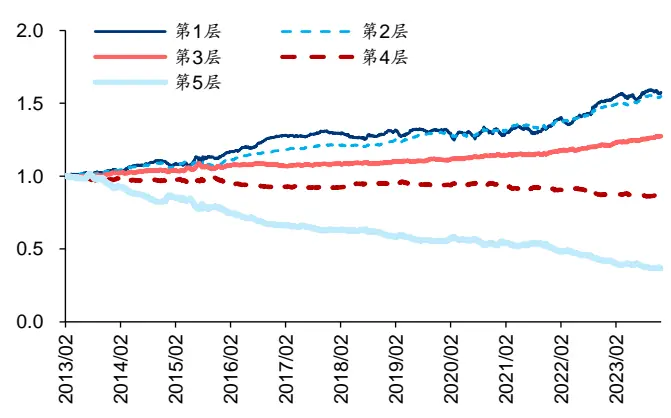
资料来源：Wind，华泰数据中台，华泰研究

图表18： corr_volume_item 分层组合相对净值
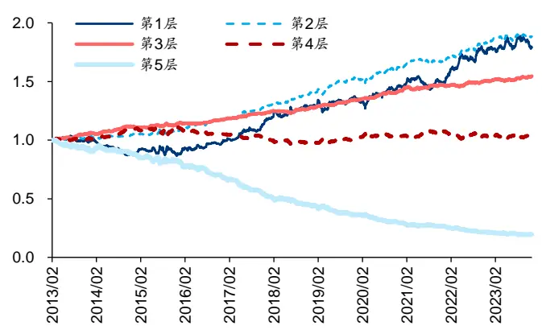
资料来源：Wind，华泰数据中台，华泰研究

图表19： early_corr_volume_ret 分层组合相对净值
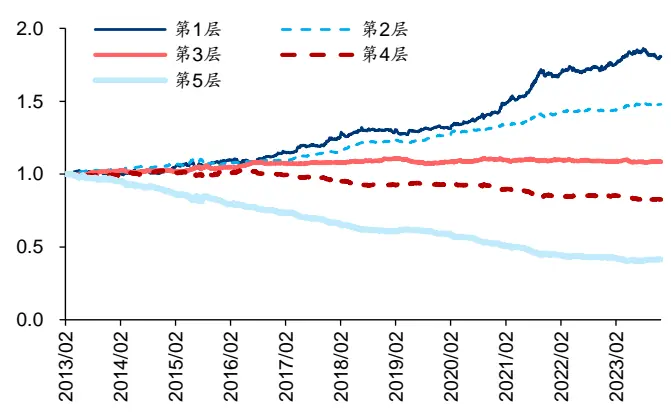
资料来源：Wind，华泰数据中台，华泰研究

图表20： bigorder_ret 分层组合相对净值
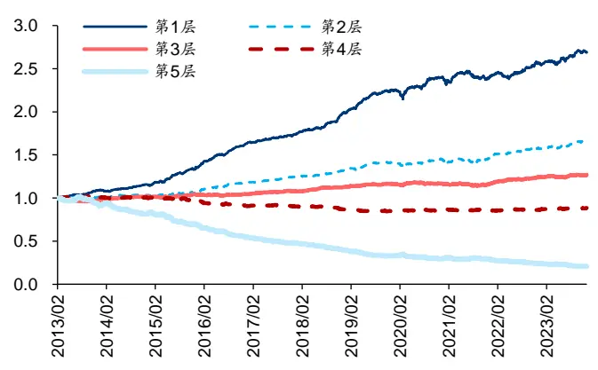
资料来源：Wind，华泰数据中台，华泰研究

图表21： down_single_amt_perc 分层组合相对净值
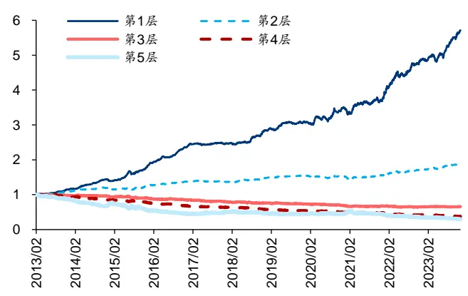
资料来源：Wind，华泰数据中台，华泰研究

图表22： corr_volume_amplitude 分层组合相对净值
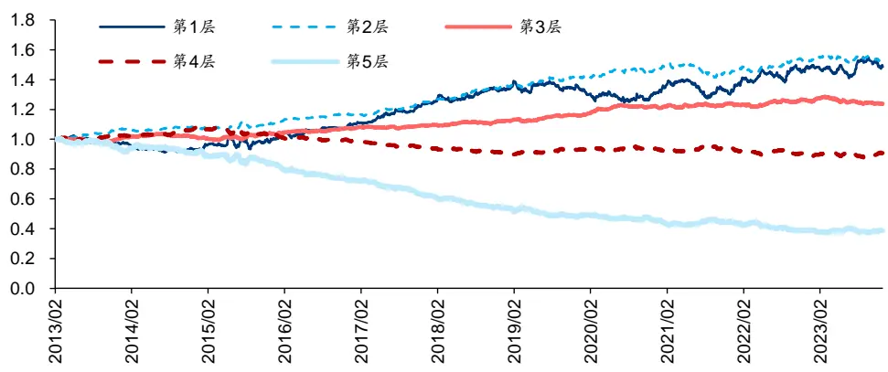
资料来源：Wind，华泰数据中台，华泰研究

分钟频因子间的相关性如下，因子间的相关系数均不超过 0.6。

图表23： 分钟频因子间相关性
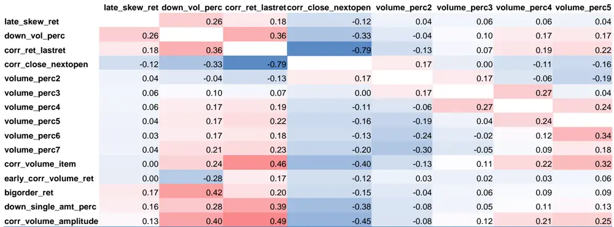
资料来源：Wind，华泰数据中台，华泰研究

图表24： 分钟频因子间相关性（续表）
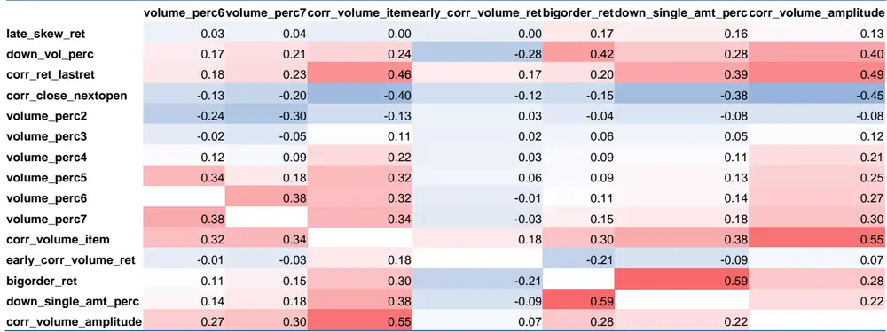
资料来源：Wind，华泰数据中台，华泰研究

## 逐笔成交因子

逐笔成交数据是关于股票每笔成交明细的数据，包括成交量、成交价格、买方编号、卖方编号、买卖标志等信息。利用编号将相同买方或卖方编号的成交数据进行合并，可以还原得到完整的买卖单信息，并由此识别大单，构建大单成交金额占比、早盘大单买入占比等大单因子；根据买卖标志，可判断每笔成交属于买方或卖方主动成交，从而构建开盘主动买入占比、净主动买入与滞后或超前收益率相关性等因子。

除了大单推动涨幅外，其余大单因子普遍具有正向指引作用。大单成交金额占比刻画了股票成交中大单的贡献度。早盘大单买入占比反映了早盘大单中买入与卖出的相互博弈。大单推动涨幅与使用分钟频数据计算出的因子逻辑类似，但由于使用不同颗粒度的数据，两个因子的相关性其实不高。

交易集中度的定义是每笔买单或卖单的成交金额的平方和，除以全天成交金额的平方。但这种方法计算出的因子与成交金额因子相关性非常高，因为成交金额越小，说明买卖单数量越少，集中度就越大。因此我们使用买卖单集中度之差，来描述两者的相对强弱。

早盘主动买入占比体现了早盘交易中主动买入意愿的强度，也具有正向选股作用。

图表25： 逐笔成交因子

| 因子名称 | 因子含义 | 因子方向 |
| --- | --- | --- |
| bigorder_amt_perc | 大单成交金额占比 | 1 |
| early_bigorder_buy_perc | 早盘大单买入占比 | 1 |
| bigorder_ret2 | 大单推动涨幅 | -1 |
| early_active_bigorder_ret | 早盘主动大单推动涨幅 | 1 |
| concentration_diff | 买卖单集中度之差 | -1 |
| early_active_buy_perc | 早盘主动买入占比 | 1 |
| corr_netactivebuy_lastret | 后一分钟净主动买入与前一分钟收益率的相关性 | -1 |
| corr_netactivebuy_nextret | 前一分钟净主动买入与后一分钟收益率的相关性 | -1 |

资料来源：华泰研究

同样使用单因子测试的方法，对以上 8 个逐笔成交因子进行测试。由于 2014 年以后才开始有逐笔数据，因此回测区间为 2014/1/30～2023/11/30，其他测试条件与分钟频因子相同。

测试结果如下所示。后一分钟净主动买入与前一分钟收益率相关性、买卖单集中度之差、早盘主动大单推动涨幅几个因子的 RankIC 表现突出。早盘主动买入占比、买卖单集中度之差、大单推动涨幅、大单成交金额占比几个因子的多头超额收益表现突出。多数因子在分层回测中展现了较好的单调性。

图表26： 逐笔成交因子 IC值分析和分层回测结果汇总

|  | RankIC 均值 | RankIC 标准差 | IC_IR | IC>0 占比 | TOP 组合年化超额收益率 TOP 组合信息比率 TOP 组合胜率 TOP 组合换手率 |  |  |  |
| --- | --- | --- | --- | --- | --- | --- | --- | --- |
| bigorder_amt_perc | 4.29% | 13.35% | 0.32 | 60.96% | 10.55% | 1.91 | 66.95% | 27.05% |
| early_bigorder_buy_perc | 2.51% | 9.35% | 0.27 | 63.47% | 9.68% | 2.45 | 72.03% | 54.44% |
| bigorder_ret2 | 4.69% | 8.09% | 0.58 | 73.49% | 10.58% | 3.64 | 84.75% | 63.39% |
| early_active_bigorder_ret | 4.90% | 10.05% | 0.49 | 70.15% | 6.32% | 1.51 | 64.41% | 62.08% |
| concentration_diff | 5.02% | 8.73% | 0.57 | 73.70% | 10.94% | 2.29 | 73.73% | 50.88% |
| early_active_buy_perc | 2.61% | 11.00% | 0.24 | 60.96% | 12.40% | 2.58 | 73.73% | 55.87% |
| corr_netactivebuy_lastret | 5.88% | 11.37% | 0.52 | 72.44% | 8.85% | 1.84 | 72.03% | 46.30% |
| corr_netactivebuy_nextret | 4.17% | 10.77% | 0.39 | 65.97% | 4.76% | 1.12 | 62.71% | 52.18% |

资料来源：Wind，华泰数据中台，华泰研究

图表27： bigorder_amt_perc 分层组合相对净值
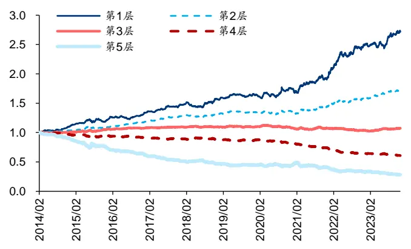
资料来源：Wind，华泰数据中台，华泰研究

图表28： early_bigorder_buy_perc 分层组合相对净值
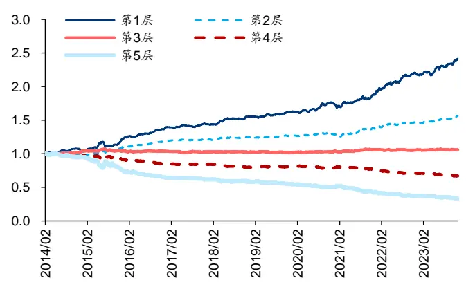
资料来源：Wind，华泰数据中台，华泰研究

图表29： bigorder_ret2 分层组合相对净值
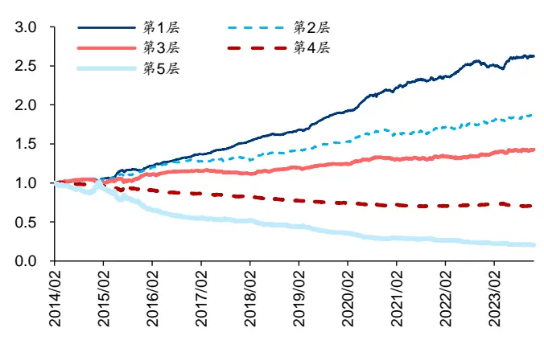
资料来源：Wind，华泰数据中台，华泰研究

图表30： early_active_bigorder_ret 分层组合相对净值
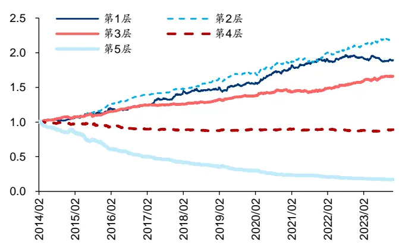
资料来源：Wind，华泰数据中台，华泰研究

图表31： concentration_diff 分层组合相对净值
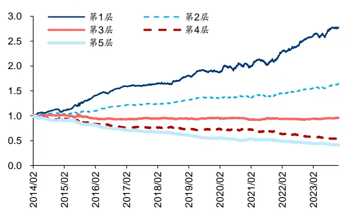
资料来源：Wind，华泰数据中台，华泰研究

图表32： early_active_buy_perc 分层组合相对净值
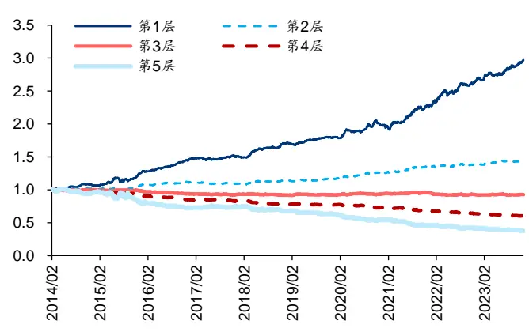
资料来源：Wind，华泰数据中台，华泰研究

图表33： corr_netactivebuy_lastret 分层组合相对净值
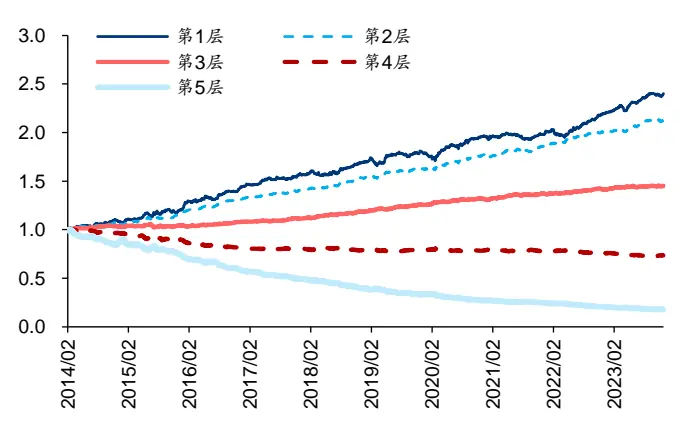
资料来源：Wind，华泰数据中台，华泰研究

图表34： corr_netactivebuy_nextret 分层组合相对净值
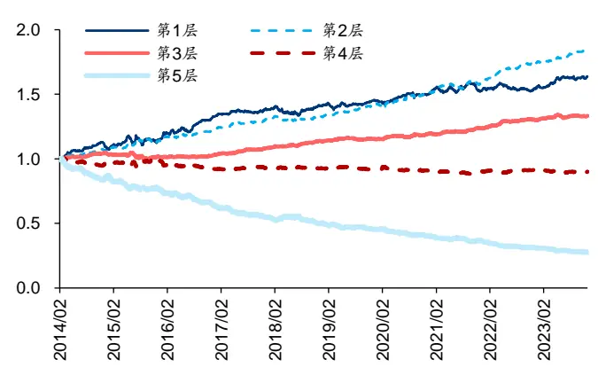
资料来源：Wind，华泰数据中台，华泰研究

逐笔成交因子间的相关性如下，因子间的相关系数均不超过 0.5。

图表35： 逐笔成交因子间相关性
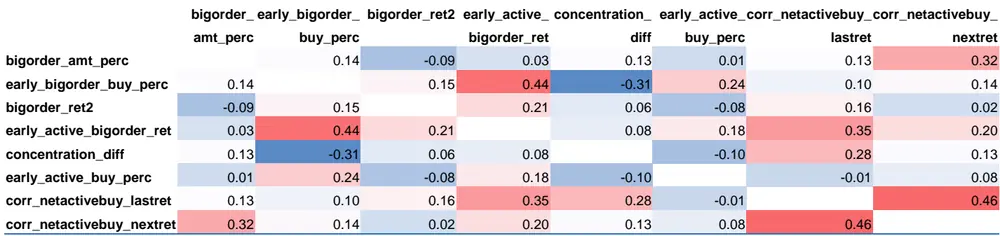
资料来源：Wind，华泰数据中台，华泰研究

## 逐笔委托因子

逐笔委托数据是关于股票每笔委托明细的数据，包括委托买卖方向、委托量、委托价格等信息。逐笔委托数据仍然可以从大单的逻辑出发，构建委托大单因子，但与逐笔成交的类似因子相关性很强。因此，本文主要基于偏度、峰度、相关系数等统计量构造了逐笔委托因子。

图表36： 逐笔委托因子

| 因子名称 | 因子含义 | 因子方向 |
| --- | --- | --- |
| skew_order_diff | 买卖单委托量偏度之差 | -1 |
| kurt_order_diff | 买卖单委托量峰度之差 | -1 |
| early_kurt_order | 早盘委托量的峰度 | -1 |
| corr_buyorder_volume_price | 买单委托量与委托价格的相关性 | -1 |

资料来源：华泰研究

使用单因子测试的方法，对以上 4 个逐笔委托因子进行测试，测试条件与逐笔成交因子相同。

测试结果如下所示。买单委托量与委托价格相关性因子的 RankIC较高，早盘委托量的峰度因子的多头超额收益较高，但近年来有所衰减。

图表37： 逐笔委托因子 IC值分析和分层回测结果汇总

|  | RankIC 均值RankIC 标准差 |  | IC_IR | IC>0 占比 | TOP 组合年化超额收益率 TOP 组合信息比率 TOP 组合胜率 TOP 组合换手率 |  |  |
| --- | --- | --- | --- | --- | --- | --- | --- |
| skew_order_diff | 1.46% | 6.95% | 0.21 | 61.17% | 5.16% 1.24 | 61.86% | 56.10% |
| kurt_order_diff | 3.61% | 8.30% | 0.43 | 66.81% | 8.63% 2.25 | 77.97% | 49.94% |
| early_kurt_order | 2.96% | 11.73% | 0.25 | 58.04% | 9.71% 1.99 | 69.49% | 32.24% |
| corr_buyorder_volume_price4.09% |  | 7.80% | 0.52 | 71.40% | 8.84% 2.29 | 75.42% | 39.20% |

资料来源：Wind，华泰数据中台，华泰研究

图表38： skew_order_diff 分层组合相对净值
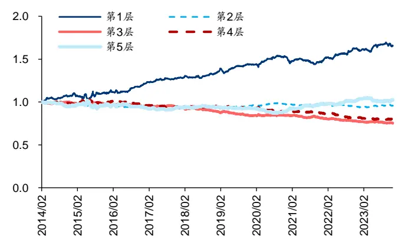
资料来源：Wind，华泰数据中台，华泰研究

图表39： kurt_order_diff 分层组合相对净值
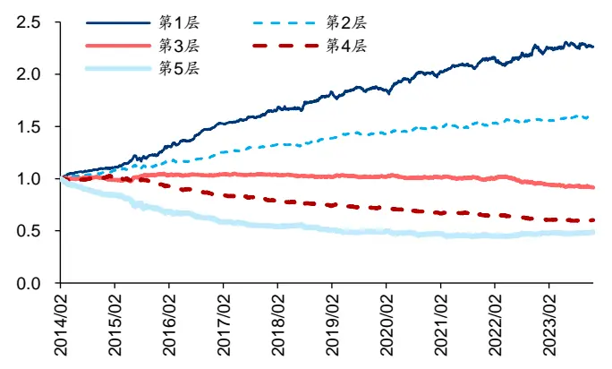
资料来源：Wind，华泰数据中台，华泰研究

图表40： early_kurt_order 分层组合相对净值
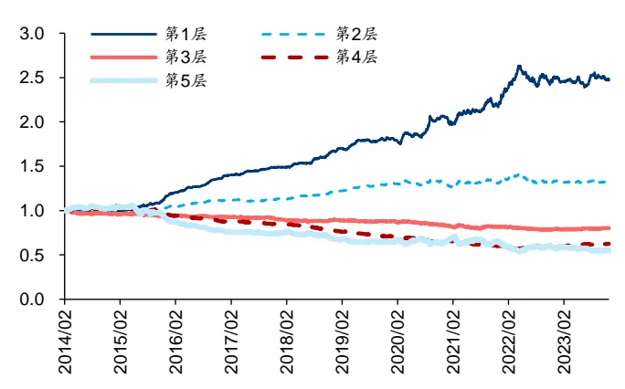
资料来源：Wind，华泰数据中台，华泰研究

图表41： corr_buyorder_volume_price 分层组合相对净值
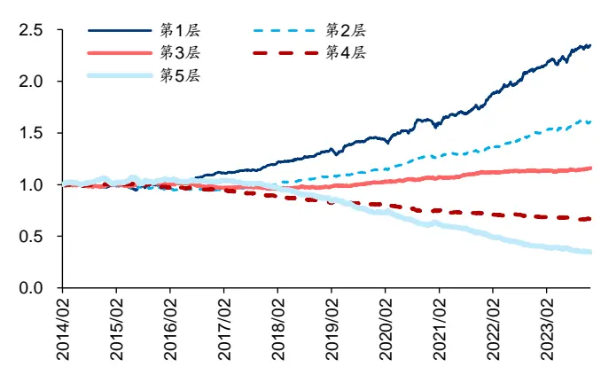
资料来源：Wind，华泰数据中台，华泰研究

逐笔委托因子间的相关性如下，因子间的相关系数均不超过 0.4。

图表42： 逐笔委托因子间相关性

|  | skew_order_diff | kurt_order_diff |  | early_kurt_order corr_buyorder_volume_price |
| --- | --- | --- | --- | --- |
| skew_order_diff |  | 0.37 | 0.15 | -0.02 |
| kurt_order_diff | 0.37 |  | 0.04 | 0.03 |
| early_kurt_order | 0.15 | 0.04 |  | 0.10 |
| corr_buyorder_volume_price | -0.02 | 0.03 | 0.10 |  |

资料来源：Wind，华泰数据中台，华泰研究

## 基于 GRU的高频因子合成

本章将构建以门控循环单元（GRU）[1]为核心的深度学习模型，对上述 27 个高频因子进行合成，以形成统一的信号。

## 模型结构与超参数

为了保证模型训练的稳定性，首先需要对因子进行预处理，包括中位数去极值、行业市值中性化、截面 z-score 标准化、缺失值填充等步骤，再输入模型。

深度学习模型包括 GRU、批标准化层（BN）、全连接层（FC）和激活函数 Sigmoid 几个重要部分，最后输出对未来 10 个交易日收益率的预测。

模型具体细节如下方图表所示。

图表43： 基于 GRU的高频因子模型
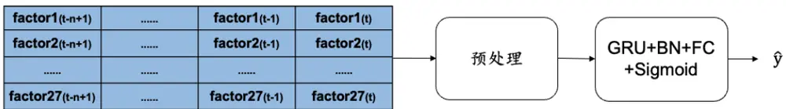
数据输入：个股高频因子序列维度：27*n
资料来源：华泰研究

图表44： 模型及数据细节

| 特征和标签 | 特征X：个股过去40个交易日的高频因子数据。 标签y：个股未来10个交易日（T+1～T+11）的收益率。 特征预处理：对每个因子进行中位数去极值、行业市值中性化、截面z-Score标准化、缺失值填充。 |
| --- | --- |
| 模型结构 | 标签预处理：对标签进行截面 z-Score标准化。 样本内训练数据从2013年开始，每5个交易日采样一次，训练集和验证集依时间先后按照4:1的比例划分。 GRU：输入维度27*40，输出维度30，层数为1层。 BN：对 GRU 的输出进行批标准化。 |
| 模型其他参数 | FC：全连接层，输入维度30，输出维度1。 Sigmoid：对 FC 的输出进行非线性变换。 损失函数：预测值与标签之间IC的相反数。 batch_size:5000。 |

资料来源：华泰研究

## 高频深度学习因子测试

使用单因子测试的方法，对高频深度学习合成因子进行测试。为了减轻随机性干扰，本文的深度学习模型都用不同随机数种子训练三次，将三次的模型等权集成，作为最终的因子信号。回测区间为 2017/1/4～2023/11/30，其他测试条件与高频因子相同。值得注意的是，尽管预测标签为未来 10 日收益率（T+1～T+11），但回测的调仓频率和 RankIC计算仍为 5日（T+1～T+6）。拉长预测周期的目的是为了降低换手率，与后续的组合优化更加适配。

测试结果如下所示。深度学习因子在 RankIC 均值、IC_IR、IC>0 占比、TOP 组合年化超额收益率、TOP 组合信息比率、TOP 组合胜率多项指标上表现优于单因子中的最佳表现，体现了多因子合成的优势。

此外，本研究还测试了等权和 ICIR 加权两种线性合成方法，表现明显不如深度学习因子，说明深度学习能够更好地捕捉时序和非线性的规律。

图表45： 高频深度学习因子 IC值分析和分层回测结果汇总

|  | RankIC 均值 | RankIC 标准差 | IC_IR | IC>0 占比 TOP 组合年化超额收益率 TOP 组合信息比率 TOP 组合胜率 TOP 组合换手率 |  |  |  |  |
| --- | --- | --- | --- | --- | --- | --- | --- | --- |
| 高频深度学习因子 | 9.10% | 10.25% | 0.89 | 82.44% | 26.20% | 4.38 | 89.16% | 80.47% |
| 高频等权合成因子 | 8.43% | 10.53% | 0.80 | 74.41% | 12.14% | 1.99 | 67.47% | 50.13% |
| 高频 ICIR 加权因子 | 7.38% | 9.77% | 0.76 | 75.89% | 10.85% | 1.87 | 68.68% | 55.48% |

资料来源：Wind，华泰数据中台，华泰研究

图表46： 高频深度学习因子分层组合相对净值
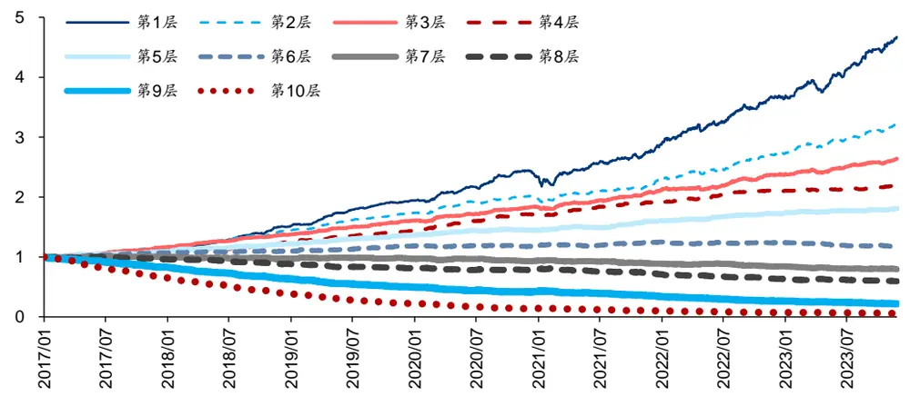
资料来源：Wind，华泰数据中台，华泰研究

图表47： 因子 TOP组合相对净值
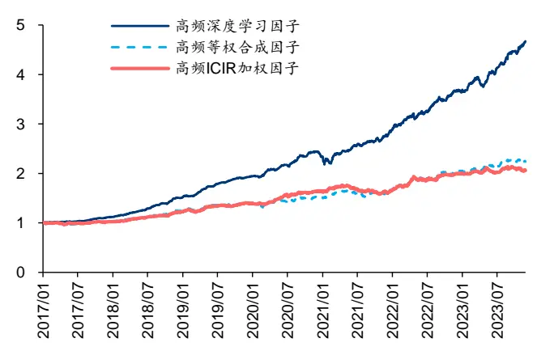
资料来源：Wind，华泰数据中台，华泰研究

图表48： 因子累积 RankIC
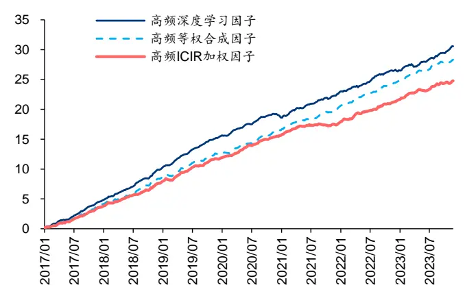
资料来源：Wind，华泰数据中台，华泰研究

高频深度学习因子与常见量价因子的相关性普遍较低，其中与换手率、成交金额的相关系数相对较高。

图表49： 高频深度学习因子与常见量价因子的相关性

|  | 反转 | 市值 | 成交金额 | 换手率 | beta |
| --- | --- | --- | --- | --- | --- |
| 高频深度学习因子 | 0.13 | 0.06 | 0.30 | 0.32 | 0.19 |

资料来源：Wind，华泰数据中台，华泰研究

## 基于多任务学习的低频量价模型

除了高频外，低频量价数据也蕴含着丰富的信息。本文利用日频、周频和月频三类数据，提出了一个硬参数共享的多任务深度学习模型[2, 3]，实现端到端的因子挖掘和因子合成。

## 模型结构与超参数

本文提出的低频多任务学习模型具有以下特点：

1. 同时引入日频、周频和月频三种不同颗粒度的量价数据，使模型接收更多的信息。

2. 日 k 线、周 k 线和月 k 线在时序上的信息传递可能具有相似性，因此可通过同一个 GRU模块提取时序信息，实现知识共享。

3. 借鉴多因子合成的思想，利用三种频率的数据先得到三个子任务预测 $\begin{aligned}\left|\widehat{y}_{1}、\widehat{y}_{2}和\widehat{y}_{3}\right.\end{aligned}$ ，再等权合成为ŷ。不直接对最终预测ŷ进行训练，而是优化每个子任务预测的 IC，并控制彼此间的相关性。具体而言，设计以下的损失函数：

$$
\begin{aligned}Loss=-[corr(\hat{y}_{1},y)+error(\hat{y}_{2},y)+error(\hat{y}_{3},y)]+\lambda[corr(\hat{y}_{1},\hat{y}_{2})+error(\hat{y}_{1},\hat{y}_{3})\\+error(\hat{y}_{2},\hat{y}_{3})]\end{aligned}
$$

考虑到 IC的重要性高于因子间相关性，本研究将超参数λ设为 0.01。

图表50： 基于多任务学习的低频量价模型
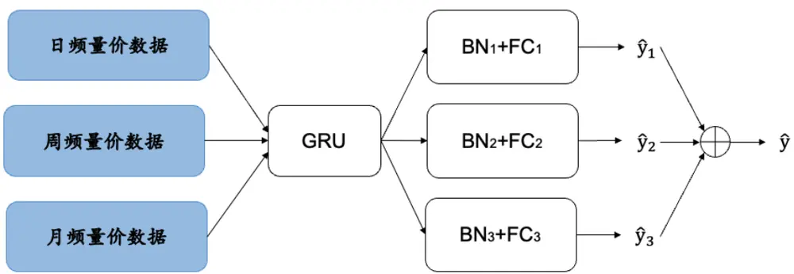
资料来源：华泰研究

图表51： 模型及数据细节

| 特征和标签 | 日频特征X1：个股过去40个交易日的日频开、高、低、收、vwap、成交量数据。 周频特征X2：个股过去20周的周频开、高、低、收、vwap、成交量数据。 月频特征X3：个股过去12月的月频开、高、低、收、vwap、成交量数据。 标签y：个股未来10个交易日（T+1～T+11）的收益率。 特征预处理：每个特征先进行时间序列标准化，即将特征时间序列的每个值除以该序列的最后一个值。再对每个 |
| --- | --- |
| 模型结构 | GRU：输入维度 6*seq(seq=40、20 或12)，输出维度 30。 BN1~3：对三类数据的 GRU输出进行批标准化。 FC1~3:：全连接层，输入维度30，输出维度1。 输出：三个子任务预测等权合成。 |
| 模型其他参数 batch_size：5000。 | 训练最大迭代轮数：100，早停轮数：10。 学习率：0.005，优化器：Adam。 模型每隔半年重新训练一次。 |

资料来源：华泰研究

## 低频多任务因子测试

使用单因子测试的方法，对低频多任务学习合成因子进行测试。测试条件与高频深度学习因子一致。

为验证多任务学习的有效性，本研究设计了三个消融实验：

1. 只训练日频量价数据得到日频因子。

2. 单独训练日频、周频和月频数据，将三个结果等权合成。

3. 进行多任务学习，但不共享 GRU 模块，而采用三个独立的 GRU。

测试结果如下所示。与日频因子相比，低频多任务因子在 RankIC均值、IC_IR 上有所下降，但在 TOP 组合年化超额收益率、TOP 组合信息比率、TOP 组合胜率、TOP 组合换手率多项指标上表现明显更优。近年来日频因子的多头收益明显衰减，而多任务模型仍能维持较稳定的收益。若简单进行等权合成，或者采用独立 GRU，因子在多数指标的表现均有所减弱，说明多任务学习和参数共享的设计是有效的。

图表52： 低频多任务因子 IC值分析和分层回测结果汇总
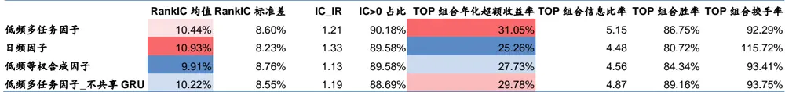
资料来源：Wind，华泰数据中台，华泰研究

图表53： 低频多任务因子分层组合相对净值
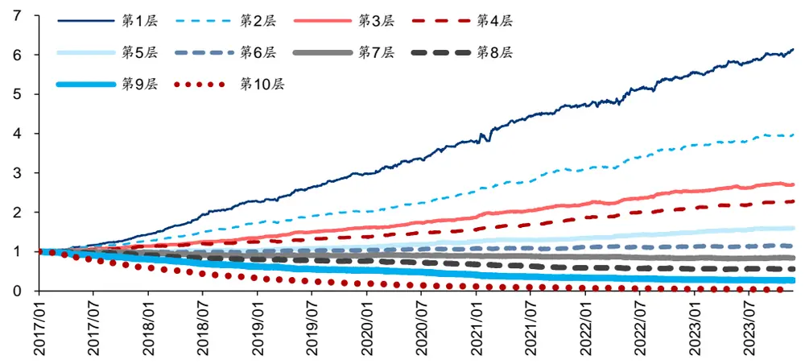
资料来源：Wind，华泰数据中台，华泰研究

图表54： 因子 TOP组合相对净值
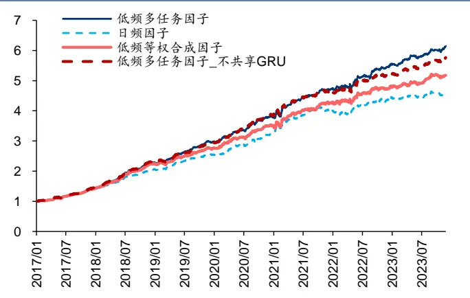
资料来源：Wind，华泰数据中台，华泰研究

图表55： 因子累积 RankIC
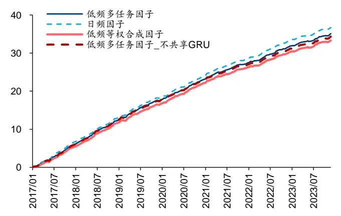
资料来源：Wind，华泰数据中台，华泰研究

低频多任务因子与常见量价因子的相关性普遍较低，此外与高频深度学习因子的相关性也仅为 0.28。

图表56： 低频多任务因子与常见量价因子、高频深度学习因子的相关性

|  | 反转 | 市值 | 成交金额 | 换手率 | beta | 高频深度学习因子 |
| --- | --- | --- | --- | --- | --- | --- |
| 低频多任务因子 | 0.09 | -0.05 | 0.12 | 0.21 | 0.13 | 0.28 |

资料来源：Wind，华泰数据中台，华泰研究

## 全频段融合因子与指数增强

前面两章分别基于高频因子和低频量价数据，使用深度学习合成了高频深度学习因子和低频多任务因子。至此，本研究对月频、周频、日频和高频数据实现了初步的挖掘。本章进一步将高频深度学习因子和低频多任务因子按照 1:3 比例进行合成（相当于把高频因子作为多任务学习框架中的第 4 个数据源），得到了全频段融合因子。

## 全频段融合因子测试

使用单因子测试的方法，对全频段融合因子进行测试。测试条件与高频深度学习因子、低频多任务因子一致。

测试结果如下所示。引入高频因子后，全频段融合因子除了 TOP 组合胜率略有下降外，在RankIC 均值、IC_IR、IC>0 占比、TOP 组合年化超额收益率、TOP 组合信息比率、TOP组合换手率等多项指标上表现优于低频多任务因子。

此外，本研究也尝试直接将高频因子加入多任务模型，与日频、周频、月频数据联合训练，得到全频段多任务因子的效果并不如简单合成的全频段融合因子。分析原因如下：

1． 高频因子与低频量价的输入特征有差异，无法共享 GRU。

2． 高频深度学习因子与低频多任务因子本身相关性较低，通过联合训练控制因子间相关性的帮助不大。

3． 高频因子的有效起始时间为 2013 年，若要跟低频量价特征一起训练，需要减少低频量价的历史训练样本，或者将更早期的高频因子填充为 0，可能会降低模型的准确性。

图表57： 全频段融合因子 IC值分析和分层回测结果汇总

|  | RankIC 均值 | RankIC 标准差 | IC_IR | IC>0 占比 TOP 组合年化超额收益率 TOP 组合信息比率 TOP 组合胜率 TOP 组合换手率 |  |  |  |
| --- | --- | --- | --- | --- | --- | --- | --- |
| 全频段融合因子 | 11.47% | 8.64% | 1.33 | 91.37% | 32.25% 5.35 | 85.54% | 91.92% |
| 高频深度学习因子 | 9.10% | 10.25% | 0.89 | 82.44% | 26.20% 4.38 | 89.16% | 80.47% |
| 低频多任务因子 | 10.44% | 8.60% | 1.21 | 90.18% | 31.05% 5.15 | 86.75% | 92.29% |
| 全频段多任务因子 | 10.99% | 8.61% | 1.28 | 91.07% | 30.53% 5.14 | 84.34% | 90.97% |

资料来源：Wind，华泰数据中台，华泰研究

图表58： 全频段融合因子分层组合相对净值
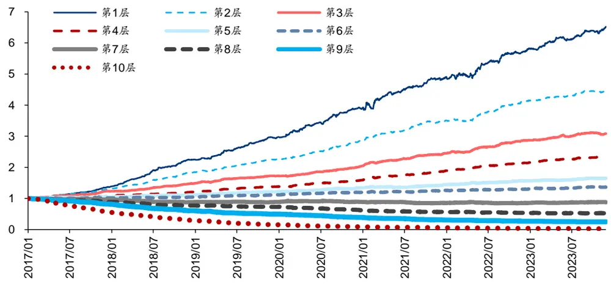
资料来源：Wind，华泰数据中台，华泰研究

图表59： 因子 TOP组合相对净值
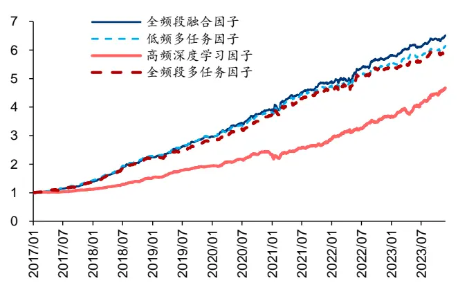
资料来源：Wind，华泰数据中台，华泰研究

图表60： 因子累积 RankIC
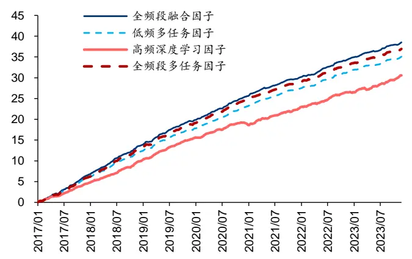
资料来源：Wind，华泰数据中台，华泰研究

全频段融合因子与常见量价因子的相关性普遍较低。

图表61： 全频段融合因子与常见量价因子的相关性

|  | 反转 | 市值 | 成交金额 | 换手率 | beta |
| --- | --- | --- | --- | --- | --- |
| 全频段融合因子 | 0.11 | -0.02 | 0.19 | 0.26 | 0.16 |

资料来源：Wind，华泰数据中台，华泰研究

## 基于全频段融合因子的指数增强策略

使用全频段融合因子，构建中证 500 和中证 1000 指数增强组合，构建方法如下。

图表62： 指数增强组合构建细节

| 优化目标 | 最大化预期收益 |
| --- | --- |
| 成分股权重约束 | 不低于 80% |
| 个股权重偏离上限 | 0.8% |
| 风格因子约束 | 行业暴露<0.02，市值暴露<0.2 |
| 换手率约束 | 周双边换手率上限分别为 30%、40%和50% |
| 调仓频率和交易成本 | 周频调仓，调仓当日以vwap价格成交，交易成本双边千分之四 |

资料来源：华泰研究

## 中证 500 增强

中证 500 增强组合回测结果如下图。

图表63： 中证 500增强组合累积超额收益
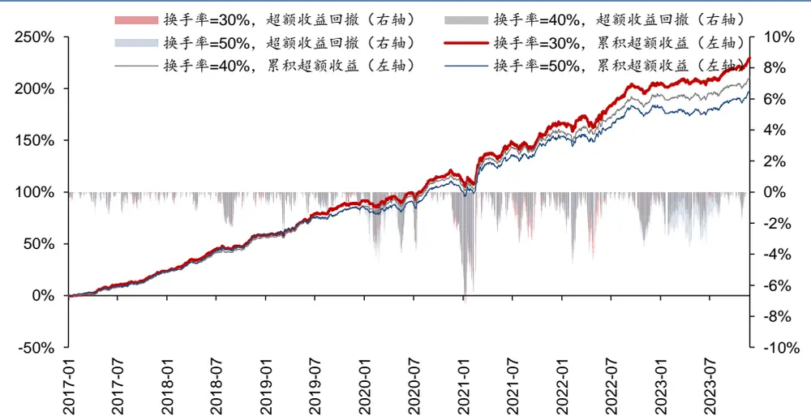
资料来源：Wind，华泰数据中台，华泰研究

图表64： 中证 500增强组合回测绩效

|  |  |  |  |  |  |  | 超额收益最大 | 调仓双边换 |  |  |  |
| --- | --- | --- | --- | --- | --- | --- | --- | --- | --- | --- | --- |
|  | 年化收益率 | 年化波动率 | 夏普比率 | 最大回撤 | 益率 | 误差 |  | 回撤 | 信息比率 Calmar 比率 | 相对基准月胜率 | 手率 |
| 换手率=30% | 17.19% | 20.30% | 0.85 | 29.78% | 19.46% | 5.88% | 7.21% | 3.31 | 2.70 | 79.27% | 32.39% |
| 换手率=40% | 16.20% | 20.27% | 0.80 | 29.43% | 18.44% | 5.94% | 6.97% | 3.11 | 2.64 | 79.27% | 41.57% |
| 换手率=50% | 15.43% | 20.37% | 0.76 | 29.95% | 17.68% | 5.95% | 7.17% | 2.97 | 2.47 | 80.49% | 50.89% |
| 中证 500 | -2.08% | 20.37% | -0.10 | 40.11% |  |  |  |  |  |  |  |

资料来源：Wind，华泰数据中台，华泰研究

图表65： 中证 500增强组合逐年收益率

| 2017年收益率 2018年收益率 2019年收益率2020年收益率 |  |  |  |  | 2021年收益率 | 2022 年收益率 | 2023年收益率 |
| --- | --- | --- | --- | --- | --- | --- | --- |
| 换手率=30% | 21.07% | -14.55% | 53.16% | 33.32% |  |  |  |
| 换手率=40% | 20.06% | -14.73% | 50.75% | 33.93% | 46.67% 45.72% | -8.89% -9.66% | 2.67% 0.63% |
| 换手率=50% | 20.92% | -13.95% | 47.58% | 30.63% | 46.88% | -11.43% | 0.35% |
| 中证500 | -2.25% | -33.32% | 26.38% | 20.87% | 15.58% | -20.31% | -5.31% |

资料来源：Wind，华泰数据中台，华泰研究

## 中证 1000 增强

中证 1000 增强组合回测结果如下图。

图表66： 中证 1000增强组合累积超额收益
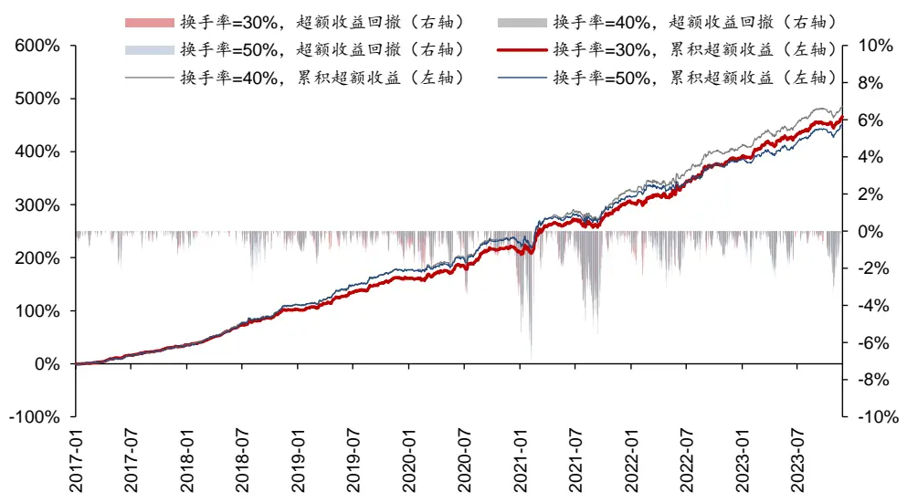
资料来源：Wind，华泰数据中台，华泰研究

图表67： 中证 1000增强组合回测绩效

|  |  |  |  |  |  |  | 超额收益最大 | 调仓双边换 |  |  |  |
| --- | --- | --- | --- | --- | --- | --- | --- | --- | --- | --- | --- |
|  | 年化收益率 | 年化波动率 | 夏普比率 | 最大回撤 | 益率 | 误差 |  | 回撤 | 信息比率 Calmar 比率 | 相对基准月胜率 | 手率 |
| 换手率=30% | 23.13% | 22.59% | 1.02 | 31.96% | 29.48% | 6.81% | 4.90% | 4.33 | 6.02 | 87.80% | 33.16% |
| 换手率=40% | 23.70% | 22.85% | 1.04 | 32.25% | 30.14% | 7.01% | 6.45% | 4.30 | 4.67 | 82.93% | 42.70% |
| 换手率=50% | 22.60% | 22.86% | 0.99 | 31.92% | 28.97% | 7.15% | 6.98% | 4.05 | 4.15 | 82.93% | 51.80% |
| 中证 1000 | -5.08% | 22.37% | -0.23 | 52.14% |  |  |  |  |  |  |  |

资料来源：Wind，华泰数据中台，华泰研究

图表68： 中证 1000增强组合逐年收益率

| 2017年收益率 2018年收益率 2019年收益率2020年收益率 |  |  |  |  | 2021年收益率 | 2022 年收益率 | 2023 年收益率 |
| --- | --- | --- | --- | --- | --- | --- | --- |
| 换手率=30% | 9.75% | -5.66% | 62.49% | 43.04% |  |  |  |
| 换手率=40% | 9.43% | -1.27% | 64.73% | 42.13% | 56.81% 56.87% | -5.18% -6.24% | 12.82% 11.91% |
| 换手率=50% | 8.78% | -0.53% | 64.50% | 42.19% | 52.64% | -8.40% | 10.83% |
| 中证 1000 | -19.06% | -36.87% | 25.67% | 19.39% | 20.52% | -21.58% | -2.68% |

资料来源：Wind，华泰数据中台，华泰研究

## 总结

随着人工智能技术在量化投资中的普及，投资者对于量价数据的研究越来越充分。本文聚焦于高频和低频量价数据的信息挖掘，总结如下：

基于分钟频、逐笔成交和逐笔委托数据，构建并测试 27 个高频因子。利用分钟频数据，构造尾盘收益率偏度、下行收益率波动占比等价格因子，成交量占比、成交量与成交笔数相关性等成交量类因子，以及早盘成交量与收益率相关性、大单推动涨幅等价量关联类因子。利用逐笔成交数据，通过还原大单，构建大单成交金额占比、早盘大单买入占比等大单因子，也可根据买方或卖方主动成交，构建开盘主动买入占比、净主动买入与滞后或超前收益率相关性等因子。对于逐笔委托数据，主要基于统计量构造了买卖单委托量峰度之差、买单委托量与委托价格相关性等因子。

深度学习模型在高频因子合成上表现较好。本文构建以 GRU 为核心的深度学习模型，对27 个高频因子进行合成。样本空间为全 A股，模型在 2017/1/4～2023/11/30 的回测期内周度 RankIC 均值为 9.10%，分 10 层 TOP 组合年化超额收益率为 26.20%(不计交易成本)。高频深度学习因子在 RankIC 均值、IC_IR、IC>0 占比、TOP 组合年化超额收益率、TOP组合信息比率、TOP 组合胜率多项指标上表现优于单因子中的最佳表现，体现了多因子合成的优势。相比于等权和 ICIR 加权，深度学习能够捕捉时序和非线性规律，合成效果明显更好。

多任务学习可助力低频量价数据的挖掘。本文利用日频、周频和月频三类数据，提出了一个硬参数共享的多任务深度学习模型，实现端到端的因子挖掘和因子合成。三种频率的数据通过同一个 GRU模块提取时序信息，实现知识共享，再输出三个子任务预测，等权合成为最终预测。借鉴多因子合成的思想，模型通过优化每个子任务预测的 IC，并控制彼此间的相关性，便可提升合成因子的表现。样本空间为全 A 股，模型在 2017/1/4～2023/11/30的回测期内周度 RankIC 均值为 10.44%，分 10 层 TOP 组合年化超额收益率为 31.05%(不计交易成本)，TOP 组合表现明显优于日频量价模型。消融实验验证了多任务学习设计的有效性。

高频深度学习因子和低频多任务因子合成后的全频段融合因子表现更佳。样本空间为全 A股，全频段融合因子在 2017/1/4～2023/11/30 的回测期内周度 RankIC 均值为 11.47%，分10 层 TOP 组合年化超额收益率为 32.25%(不计交易成本)，回测表现进一步提升。基于全频段融合因子，构建中证500和中证1000指数增强组合。在周双边换手率分别控制为30%、40%和 50%的情况下，2017/1/4～2023/11/30 回测期内中证 500 增强组合年化超额收益率为 19.46%、18.44%和 17.68%，信息比率为 3.31、3.11 和 2.97；中证 1000 增强组合年化超额收益率为 29.48%、30.14%和 28.97%，信息比率为 4.33、4.30 和 4.05。

## 风险提示

借助高频因子、人工智能构建的选股策略是历史经验的总结，存在失效的可能。深度学习的可解释性较弱，使用需谨慎。

## 参考文献

[1] Cho K, Van Merriënboer B, Gulcehre C, et al. Learning phrase representations using RNN encoder-decoder for statistical machine translation[J]. arXiv preprint arXiv:1406.1078, 2014.

[2] Caruana R. Multitask learning[J]. Machine learning, 1997, 28: 41-75.

[3] Ma T, Tan Y. Stock ranking with multi-task learning[J]. Expert Systems with Applications, 2022, 199: 116886.

## 免责声明

## 分析师声明

本人，林晓明、何康，兹证明本报告所表达的观点准确地反映了分析师对标的证券或发行人的个人意见；彼以往、现在或未来并无就其研究报告所提供的具体建议或所表迖的意见直接或间接收取任何报酬。

## 一般声明及披露

本报告由华泰证券股份有限公司（已具备中国证监会批准的证券投资咨询业务资格，以下简称“本公司”）制作。本报告所载资料是仅供接收人的严格保密资料。本报告仅供本公司及其客户和其关联机构使用。本公司不因接收人收到本报告而视其为客户。

本报告基于本公司认为可靠的、已公开的信息编制，但本公司及其关联机构(以下统称为“华泰”)对该等信息的准确性及完整性不作任何保证。

本报告所载的意见、评估及预测仅反映报告发布当日的观点和判断。在不同时期，华泰可能会发出与本报告所载意见、评估及预测不一致的研究报告。同时，本报告所指的证券或投资标的的价格、价值及投资收入可能会波动。以往表现并不能指引未来，未来回报并不能得到保证，并存在损失本金的可能。华泰不保证本报告所含信息保持在最新状态。华泰对本报告所含信息可在不发出通知的情形下做出修改，投资者应当自行关注相应的更新或修改。

本公司不是 FINRA 的注册会员，其研究分析师亦没有注册为 FINRA 的研究分析师/不具有 FINRA 分析师的注册资格。

华泰力求报告内容客观、公正，但本报告所载的观点、结论和建议仅供参考，不构成购买或出售所述证券的要约或招揽。该等观点、建议并未考虑到个别投资者的具体投资目的、财务状况以及特定需求，在任何时候均不构成对客户私人投资建议。投资者应当充分考虑自身特定状况，并完整理解和使用本报告内容，不应视本报告为做出投资决策的唯一因素。对依据或者使用本报告所造成的一切后果，华泰及作者均不承担任何法律责任。任何形式的分享证券投资收益或者分担证券投资损失的书面或口头承诺均为无效。

除非另行说明，本报告中所引用的关于业绩的数据代表过往表现，过往的业绩表现不应作为日后回报的预示。华泰不承诺也不保证任何预示的回报会得以实现，分析中所做的预测可能是基于相应的假设，任何假设的变化可能会显著影响所预测的回报。

华泰及作者在自身所知情的范围内，与本报告所指的证券或投资标的不存在法律禁止的利害关系。在法律许可的情况下，华泰可能会持有报告中提到的公司所发行的证券头寸并进行交易，为该公司提供投资银行、财务顾问或者金融产品等相关服务或向该公司招揽业务。

华泰的销售人员、交易人员或其他专业人士可能会依据不同假设和标准、采用不同的分析方法而口头或书面发表与本报告意见及建议不一致的市场评论和/或交易观点。华泰没有将此意见及建议向报告所有接收者进行更新的义务。华泰的资产管理部门、自营部门以及其他投资业务部门可能独立做出与本报告中的意见或建议不一致的投资决策。投资者应当考虑到华泰及/或其相关人员可能存在影响本报告观点客观性的潜在利益冲突。投资者请勿将本报告视为投资或其他决定的唯一信赖依据。有关该方面的具体披露请参照本报告尾部。

本报告并非意图发送、发布给在当地法律或监管规则下不允许向其发送、发布的机构或人员，也并非意图发送、发布给因可得到、使用本报告的行为而使华泰违反或受制于当地法律或监管规则的机构或人员。

本报告版权仅为本公司所有。未经本公司书面许可，任何机构或个人不得以翻版、复制、发表、引用或再次分发他人(无论整份或部分)等任何形式侵犯本公司版权。如征得本公司同意进行引用、刊发的，需在允许的范围内使用，并需在使用前获取独立的法律意见，以确定该引用、刊发符合当地适用法规的要求，同时注明出处为“华泰证券研究所”，且不得对本报告进行任何有悖原意的引用、删节和修改。本公司保留追究相关责任的权利。所有本报告中使用的商标、服务标记及标记均为本公司的商标、服务标记及标记。

## 中国香港

本报告由华泰证券股份有限公司制作,在香港由华泰金融控股（香港）有限公司向符合《证券及期货条例》及其附属法律规定的机构投资者和专业投资者的客户进行分发。华泰金融控股（香港）有限公司受香港证券及期货事务监察委员会监管，是华泰国际金融控股有限公司的全资子公司，后者为华泰证券股份有限公司的全资子公司。在香港获得本报告的人员若有任何有关本报告的问题,请与华泰金融控股（香港）有限公司联系。

## 香港-重要监管披露

- 华泰金融控股（香港）有限公司的雇员或其关联人士没有担任本报告中提及的公司或发行人的高级人员。

- 有关重要的披露信息，请参华泰金融控股（香港）有限公司的网页 https://www.htsc.com.hk/stock_disclosure其他信息请参见下方 “美国-重要监管披露”。

## 美国

在美国本报告由华泰证券（美国）有限公司向符合美国监管规定的机构投资者进行发表与分发。华泰证券（美国）有限公司是美国注册经纪商和美国金融业监管局（FINRA）的注册会员。对于其在美国分发的研究报告，华泰证券（美国）有限公司根据《1934 年证券交易法》（修订版）第 15a-6 条规定以及美国证券交易委员会人员解释，对本研究报告内容负责。华泰证券（美国）有限公司联营公司的分析师不具有美国金融监管（FINRA）分析师的注册资格，可能不属于华泰证券（美国）有限公司的关联人员，因此可能不受 FINRA 关于分析师与标的公司沟通、公开露面和所持交易证券的限制。华泰证券（美国）有限公司是华泰国际金融控股有限公司的全资子公司，后者为华泰证券股份有限公司的全资子公司。任何直接从华泰证券（美国）有限公司收到此报告并希望就本报告所述任何证券进行交易的人士，应通过华泰证券（美国）有限公司进行交易。

## 美国-重要监管披露

- 分析师林晓明、何康本人及相关人士并不担任本报告所提及的标的证券或发行人的高级人员、董事或顾问。分析师及相关人士与本报告所提及的标的证券或发行人并无任何相关财务利益。本披露中所提及的“相关人士”包括 FINRA定义下分析师的家庭成员。分析师根据华泰证券的整体收入和盈利能力获得薪酬，包括源自公司投资银行业务的收入。

华泰证券股份有限公司、其子公司和/或其联营公司, 及/或不时会以自身或代理形式向客户出售及购买华泰证券研究所覆盖公司的证券/衍生工具，包括股票及债券（包括衍生品）华泰证券研究所覆盖公司的证券/衍生工具，包括股票及债券（包括衍生品）。

- 华泰证券股份有限公司、其子公司和/或其联营公司, 及/或其高级管理层、董事和雇员可能会持有本报告中所提到的任何证券（或任何相关投资）头寸，并可能不时进行增持或减持该证券（或投资）。因此，投资者应该意识到可能存在利益冲突。

## 评级说明

投资评级基于分析师对报告发布日后 6 至 12个月内行业或公司回报潜力（含此期间的股息回报）相对基准表现的预期（A 股市场基准为沪深 300 指数，香港市场基准为恒生指数，美国市场基准为标普 500 指数），具体如下：

## 行业评级

增持：预计行业股票指数超越基准

中性：预计行业股票指数基本与基准持平

减持：预计行业股票指数明显弱于基准

## 公司评级

买入：预计股价超越基准 15%以上

增持：预计股价超越基准 5%~15%

持有：预计股价相对基准波动在-15%~5%之间

卖出：预计股价弱于基准 15%以上

暂停评级：已暂停评级、目标价及预测，以遵守适用法规及/或公司政策

无评级：股票不在常规研究覆盖范围内。投资者不应期待华泰提供该等证券及/或公司相关的持续或补充信息

## 法律实体披露

中国：华泰证券股份有限公司具有中国证监会核准的“证券投资咨询”业务资格，经营许可证编号为：91320000704041011J香港：华泰金融控股（香港）有限公司具有香港证监会核准的“就证券提供意见”业务资格，经营许可证编号为：AOK809美国：华泰证券（美国）有限公司为美国金融业监管局（FINRA）成员，具有在美国开展经纪交易商业务的资格，经营业务许可编号为：CRD#:298809/SEC#:8-70231

华泰证券股份有限公司
南京
南京市建邺区江东中路228号华泰证券广场1号楼/邮政编码：210019

电话：86 25 83389999/传真：86 25 83387521电子邮件：ht-rd@htsc.com

深圳
深圳市福田区益田路5999号基金大厦10楼/邮政编码：518017
电话：86 755 82493932/传真：86 755 82492062
电子邮件：ht-rd@htsc.com

## 华泰金融控股（香港）有限公司

香港中环皇后大道中 99号中环中心 58楼 5808-12室
电话：+852-3658-6000/传真：+852-2169-0770
电子邮件：research@htsc.com
http://www.htsc.com.hk

## 华泰证券（美国）有限公司

美国纽约公园大道 280号 21楼东（纽约 10017）
电话：+212-763-8160/传真：+917-725-9702
电子邮件: Huatai@htsc-us.com
http://www.htsc-us.com

©版权所有2023年华泰证券股份有限公司

北京
北京市西城区太平桥大街丰盛胡同28号太平洋保险大厦A座18层/
邮政编码：100032
电话：86 10 63211166/传真：86 10 63211275
电子邮件：ht-rd@htsc.com
上海
上海市浦东新区东方路18号保利广场E栋23楼/邮政编码：200120
电话：86 21 28972098/传真：86 21 28972068
电子邮件：ht-rd@htsc.com