## 华泰金工 | 遗传规划因子挖掘的GPU加速

原创 林晓明 何康 华泰证券金融工程 2024年02月20日 22:02

本研究使用GPU算力对遗传规划因子挖掘进行加速，基于DEAP开源框架，使用PyTorch拓展算子和适应度函数。分析遗传规划全流程时间开销，大规模矩阵运算主要涉及因子值计算与IC值计算，优化空间大。相较其他技术路线，PyTorch+CUDA较易实现，通信成本低，加速效果好。结果表明，在Intel Core i9-13900KF和NVIDIA GeForce RTX 4090测试环境下，GPU能够实现7~9倍加速效果。5轮挖掘每轮进化3代总耗时12.4小时，得到350个符合入库条件的因子。优质因子中ts_grouping_sortavg算子和turn特征的组合出现频次高。

## 核心观点

## 人工智能系列之73：使用GPU算力对遗传规划因子挖掘进行加速

本研究使用GPU算力对遗传规划因子挖掘进行加速。遗传规划的痛点之一是运算效率低，因子进化不具备方向性，需要反复迭代筛选。我们基于DEAP开源框架，使用PyTorch拓展算子和适应度函数。结果表明，在Intel Core i9-13900KF和NVIDIA GeForce RTX 4090测试环境下，对于遗传规划全流程及核心的因子值计算和IC值计算环节，GPU能提供7~9倍的加速效果。5轮挖掘每轮进化3代总耗时12.4小时，得到350个符合入库条件的因子。

## 大规模矩阵运算主要涉及因子值计算与IC值计算，优化空间大

分析遗传规划全流程时间开销，大规模矩阵运算主要涉及因子值计算与IC值计算环节，均针对个股层面，每轮迭代需要重复数千次（取决于种群数量），并迭代若干轮，时间开销大，具备较大优化空间。而后代选择、交叉变异等环节仅作用于算子表达式，即针对因子层面，不涉及大规模矩阵计算，时间开销低。本研究测试场景下，单次计算单因子全历史的因子值和IC值，CPU平均时间开销分别为8.5秒和0.8秒，GPU平均时间开销分别为1秒和0.0007秒，GPU加速效果显著。

## 技术路线的选择：PyTorch+CUDA较易实现，通信成本低，加速效果好

遗传规划的GPU加速有三种可行的技术路线：RAPIDS、Numba+CUDA和PyTorch+CUDA。RAPIDS代码改写工程量小，但实证表明加速效果不如PyTorch。Numba+CUDA在大规模运算时加速效果更好，但代码改写工程量大，且部分复杂函数仍需在CPU执行，通信成本高。PyTorch+CUDA代码改写工程量小，上手容易，全部运算均可在GPU上完成，数据流连贯，通信成本低。本研究采用PyTorch+CUDA路线，不改写DEAP底层代码，而是新定义一批基于PyTorch的算子和适应度函数，添加到DEAP框架中。

## 合理种群数量条件下，GPU能够实现7~9倍加速效果

本研究构建了以残差收益率为优化目标的因子挖掘流程。每一轮挖掘以剔除上一轮新因子的残差收益率为优化目标，适应度为样本内年化RankICIR。因子入库条件为适应度高且与已有因子相关度低。定义29个初始特征和31个算子。当种群数量分别为30/100/300时，因子挖掘全流程GPU相比CPU的加速倍数分别为4.4/7.9/8.1倍。其中核心的因子计算和IC值计算环节，GPU相比CPU的加速倍数分别为4.6/7.7/8.9倍。考虑到种群数量较低时不具备参考意义，我们认为GPU提供的7~9倍加速是相对合理的结果。

## 优质因子中ts_grouping_sortavg算子和turn特征的组合出现频次高

正式实验中种群数量设为3000，进行5轮挖掘，每轮进化3代，共挖掘出350个符合入库条件的因子，总时间开销约12.4小时，平均单轮进化时间开销约0.8小时。对部分样本外多头表现较好的因子表达式进行解读，我们发现ts_grouping_sortavg算子和turn特征的组合出现频次较高，其含义是基于过去一段时间每日换手率进行筛选，针对换手率最高或最低的部分交易日的对应指标求均值。相比直接求指标的区间均值，换手率最高或最低的交易日可能蕴含更丰富的信息。

## 正文

## 01 遗传规划GPU加速的工程实现

运算效率决定了量化策略的执行和迭代速度。随着行业数据粒度不断细化，数据体量日益增加，量化策略的比拼从框架完善逐渐下沉到细节打磨和工程实现，如何充分利用算力提升开发效率，已成为量化机构竞争的新赛道。

遗传规划是量化投资常用的因子挖掘算法。站在深度学习已成为主流的今天，遗传规划的“灰箱”属性仍有其特殊价值：挖掘出的因子既超越人脑想象，又具备一定的可解释性。然而，遗传规划的“痛点”之一是运算效率低。基因的进化不具备方向性，只不过是好的变异经历漫长的时间被自然选择；因子的进化同样充满随机性，需要通过反复迭代从海量候选因子中筛选出优质因子。

本研究尝试使用GPU算力提升遗传规划的运算效率。我们基于DEAP框架，使用PyTorch拓展算子和适应度函数，实现因子挖掘的GPU加速。结果表明，在Intel Core i9-13900KF和NVIDIAGeForce RTX 4090测试环境下，对于遗传规划全流程以及核心的因子计算值和IC值计算环节，GPU能提供7~9倍的加速效果，5轮挖掘每轮进化3代总耗时12.4小时，共得到350个符合入库条件的因子。

## 成熟开源框架介绍

遗传规划算法拥有大量成熟开源框架。基于CPU平台的DEAP、gplearn、geppy等在业界被广泛使用。基于GPU平台的KarooGP、TensorGP也逐渐受到关注，这两个框架均基于TensorFlow开发。2021年，NVIDIA印度团队采用cuML实现遗传规划算法，发现其运算效率优于gplearn、KarooGP和TensorGP，在两组数据集上的运算效率分别是gplearn的119和40倍，但代码未开源。

图表1：基于Python 的遗传规划开源框架

| 名称 | 运算平台 | GitHub 地址 | 初代发布年份 |
| --- | --- | --- | --- |
| DEAP | CPU | https://github.com/DEAP/deap | 2010 |
| gplearn | CPU | https://github.com/trevorstephens/gplearn | 2015 |
| geppy | CPU | https://github.com/ShuhuaGao/geppy | 2018 |
| KarooGP | CPU/GPU(TensorFlow) | https://github.com/kstaats/karoo_gp | 2017 |
| TensorGP | CPU/GPU(TensorFlow) | https://github.com/AwardOfSky/TensórGP号.华泰证券金融工2021 |  |

华泰金工研报《人工智能21：基于遗传规划的选股因子挖掘》（2021-06-10）等研究采用gplearn框架。由于该框架仅支持二维数据，无法实现三维数据（股票×时间×初始特征）的传入，当时我们针对因子挖掘场景进行了大量深度定制改造。

本文选择DEAP框架进行定制改造。相比于gplearn，DEAP的功能架构更具延展性。DEAP采用模块化编程的设计思路，可使用简练的编程语言，“注册（register）”初始特征、初始种群、算子树等功能模块。代码结构清晰，后续运维方便。后文我们将基于PyTorch实现DEAP框架CPU至GPU的拓展。

图表2：DEAP框架主要特点

| 模块名称 | 主要特点 |
| --- | --- |
|  | 初始因子传入 可传入任意格式数据（array、dataframe、graph、audio），且支持自定义分类（如定义初始因子1-10为量价因 子，因子11-20为基本面因子），以便后续对算子开展个性化定制 |
| 算子定义 | 可附加数据格式约束，如某算子(a/b).rolling(int_n)可约束a为量价因子，b为基本面因子，int_n为随机整型变量， “引导”计算机算法按照人类设定的思路开展因子挖掘 |
| 适应度选择 | 支持定义复杂的适应度函数，可将风格市值中性化、单因子测试等嵌入其中 |
| 交叉变异 | 提供丰富的交叉变异工具包，如交叉包括单点交叉、混合交叉，变异包括高斯突变、乱序突变、均匀整数突变等 |
| 后代选择 | 支持采用锦标赛选择、轮盘赌选择、有放回的随机选择等后代选取发式号。华泰证券金融工程 |

## 加速优化空间分析

遗传规划的基础概念请详见华泰金工研报《人工智能21：基于遗传规划的选股因子挖掘》（2021-06-10），本文不再展开介绍。

从工程实现角度，遗传规划因子挖掘的哪些环节存在加速优化空间？下图展示了遗传规划全流程。算法的输入为初始特征，每个特征可以视作个股×日期的二维pandas.DataFrame矩阵，假设样本为全A股连续10年日频数据，那么每个特征包含的元素数量在千万数量级。

大规模DataFrame矩阵运算主要涉及“适应度评估”模块的因子值计算与IC值计算两个环节。该模块针对个股层面，每轮迭代需要重复数千次（取决于种群数量），并在此基础上迭代若干轮，时间开销较大。而“后代选择”、“交叉变异”模块仅作用于算子表达式，即针对因子层面，不涉及大规模DataFrame矩阵计算，时间开销较低。

图表3：遗传规划流程分析
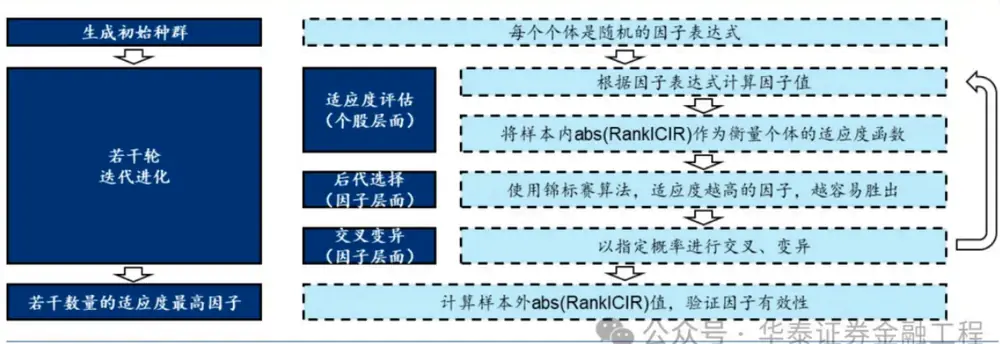

我们进一步测试遗传规划各模块CPU运算的时间开销，如下表：

1.全部初始特征读取耗时较长约30秒，但仅执行一次；

2.中性化耗时不短约7秒，表达式交叉变异耗时较短约0.7秒，两者仅执行有限次；

3.对单因子进行因子值和IC值计算分别耗时约8.5秒和0.8秒，两者执行次数约为迭代次数×种群数量。假设种群数量在千数量级，那么两者将执行上万次，有较大优化空间。

针对不同环节、不同运算类型，可分类采取差异化的GPU加速优化措施，后文将展开介绍。

另外需要说明，中性化环节单次时间开销并不低，是否需要加速优化取决于中性化的对象。如果针对预期收益y做中性化，那么该运算执行次数仅取决于迭代轮数，可以不做优化。例如第1轮对y做行业市值中性取残差，第2轮对该残差做上一轮的因子中性取残差……但如果针对因子x做中性化，那么该运算执行次数将达数万次，很有必要进行GPU加速。

图表4：遗传规划各环节加速优化空间分析

| 执行次数 | 模块名称 | CPU 时间开销 | GPU 时间开销 | GPU 加速优化空间 |
| --- | --- | --- | --- | --- |
| 一次 | 数据读取 | 33s（全部数据） | 暂不优化 | 仅重复一次，优化必要性不大，且优化空间有限 |
| 迭代轮数 | 收益中性化 | 7s（全历史） | 暂不优化 | 解析解：可通过 CuPy、Numba+CUDA、 torch.Tensor 实现； |
|  | 表达式交叉变 0.7s 异 |  | 暂不优化 | 数值解：可通过 torch.NN 梯度下降实现 轻量级数据运算，耗时较少，不需要优化 |
| (上万次) | 因子值计算 (元素级) 迭代轮数×种群数量 因子值计算 (非元素级) | ~8.5s (单因子全历史; 度) | ~1s (单因子全历史； 度) | 如矩阵加法 A+B 等，各元素逐一加和，可通过 torch.Tensor 实现加速 取决于因子复杂取决于因子复杂如加权移动平均等，涉及矩阵不同行列的复杂变 换，可通过 Numba+CUDA 实现加速 |

注：测试环境：CPU Intel Core i9-13900KF，GPU NVIDIA GeForce RTX 4090：全历对应 10样泰内和券程本

## GPU加速技术路线

如何实现遗传规划的GPU加速？下面介绍三种可行的技术路线。

## RAPIDS

华泰金工研报《人工智能70：高频因子计算的GPU加速》（2023-10-16）中，我们测试了NVIDIA RAPIDS的加速效果。RAPIDS是NVIDIA针对数据科学与机器学习推出的GPU加速平台。其重要特性是将基于CUDA底层代码的优化以Python高级语言的形式体现。常用API包括CuPy（对标NumPy）、cuDF（对标Pandas）、cuML（对标scikit-learn）等，由于API语法几乎相同，仅需要轻量级的代码修改，即可实现CPU到GPU运算的迁移。

图表5：RAPIDS：数据科学的 GPU 加速
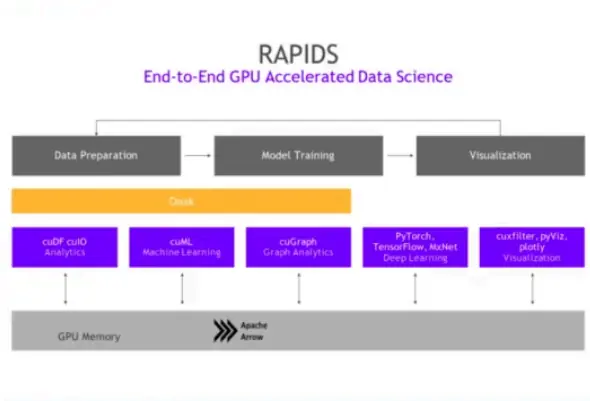

图表6：RAPIDS加速因子计算代码范例
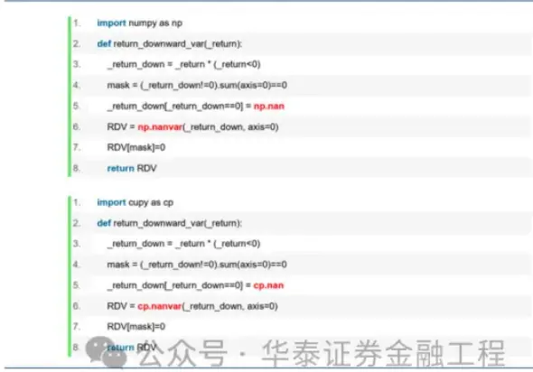

针对遗传规划场景，RAPIDS技术路线的改造思路如下：

1.考虑到pandas.DataFrame的运算速度低于numpy.ndarray，并且参与因子挖掘运算的初始特征均为“股票×时间”的标准同源结构，不涉及数据对齐需求，故采用numpy.ndarray统一替代pandas.DataFrame。

2.采用CuPy替代NumPy，通过轻量化改写实现GPU加速。

## Numba+CUDA

Numba是常用的Python加速方式。Numba是Python函数的即时（Just-in-time，简称JIT）编译器。C/C++属于编译型语言，代码首次运行前，经编译器转换为可执行机器码。而Python属于解释性语言，代码每次运行前都需要重新编译，拖累了运行速度。JIT技术可在运行时将调用的函数或程序段编译成机器码载入内存，以提升Python代码运行速度。

Numba的CPU加速的实现方式是在待编译的函数前加装饰器，如：@numba.vectorize，@numba.jit。Numba同样支持GPU加速，修改装饰器即可，如：@numba.cuda.vectorize，@numba.cuda.jit。

针对遗传规划场景，Numba+CUDA技术路线的改造思路如下：

1.以前述RAPIDS技术路线为基础，对简单函数采用CuPy替代。

2.对部分复杂函数（如线性衰减加权decay_linear等）采用Numba+CUDA手工复写。

图表7：Numba+CUDA 代码范例
import math 
import scipy.stats 
import numpy as np 
from numba import vectorize 
7. x = np.random.uniform(-3, 3, size=100000000).astype(np.float32) 
10.SQRT_2PI= np.float32)((2*math.pi)**0.5) 
12. @vectorize(['float32(float32, float32, float32)], target='cuda') 
13. def gaussian_pdf(x, mean, sigma): 
15. returnmath.exp(-0.5 *((x-mean)/ sigma)**2)/(sigma * SQRT_2PI) 
18. gaussian_pdf(x, 0.0, 1.0) 
21. scipy.stats.norm.pdf(x, loc=np.float32(0.0), scale=np.float32(1.0))

## PyTorch+CUDA

PyTorch是目前学界和业界常用的开源机器学习和深度学习框架。Pytorch的加速功能不仅体现在神经网络训练的反向传播上，也可用于Tensor计算的前向传播上。

针对遗传规划场景，PyTorch技术路线的改造思路如下：

1.采用torch.Tensor结构替代原NumPy、CuPy结构，采用Tensor张量“计算图”代替原NumPy数据流。

2.对NumPy中的简单函数，直接替换为Tensor结构适用的新函数，如numpy.concatenate替换为torch.cat。

3.对NumPy中的复杂函数（如rolling、correlation、rankpct等），基于Tensor基础函数进行手动改写。

4.将Tensor张量使用.to(device)传至显存，实现全数据流的GPU运算。

图表8：NumPy 和 PyTorch 等价函数对比

| NumPy 函数 | PyTorch 函数 | NumPy 函数 | PyTorch 函数 | NumPy 函数 | PyTorch 函数 |
| --- | --- | --- | --- | --- | --- |
| np.array() | torch.tensor() | np.random.randn()torch.randn() |  | np.exp() | torch.exp() |
| np.zeros() | torch.zeros() | np.sum() | torch.sum() | np.log() | torch.log() |
| np.ones() | torch.ones() | np.mean() | torch.mean() | np.dot() | torch.dot() |
| np.arange() | torch.arange() | np.max() | torch.max() | np.matmul() | torch.matmul() |
| np.linspace() | torch.linspace() | np.min() | torch.min() | np.transpose() | torch.transpose() |
| np.eye() | torch.eye() | np.argmax() | torch.argmax() | np.reshape() | torch.reshape() |
| np.random.rand()torch.rand() |  | np.argmin() | torch.argmin() 公众号 | np.concatenate()torch.cat() 程 |  |

## 技术路线对比和最终方案

对比上述三种技术路线：

1.RAPIDS代码改写工程量小，但实证表明加速效果不如PyTorch。

2.Numba+CUDA在大规模运算时加速效果更好，但代码改写工程量大，且部分复杂函数可能仍需在CPU上执行，拉高了通信成本。

3.PyTorch+CUDA代码改写工程量小，上手较容易，全部运算均可在GPU上完成，且数据流较连贯，通信成本低。

需要说明的是，三种技术路线并不冲突。在开发能力允许情况下，可以将CuPy、cuDF、Numba、PyTorch等多个库穿插使用。

综合考虑性能和工作量，本研究采用第三种PyTorch+CUDA路线。重点针对DEAP框架中的因子值计算和IC值计算两个环节进行代码改造，方案如下图。与其称为“改造”，不如称为“拓展”，我们并没有改写DEAP底层代码，而是新定义了一批函数，“添加”到DEAP框架中。

图表9：基于 DEAP 框架的 GPU 加速方案
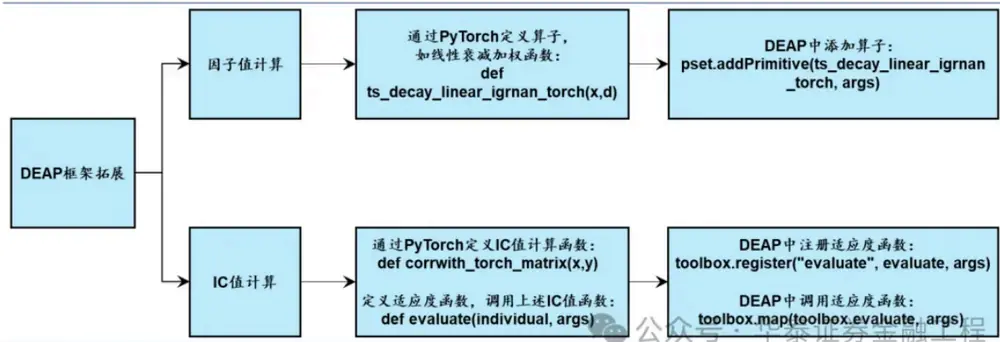

## 02 GPU加速案例分析

本章将展示三个GPU加速案例，作为前述三种技术路线对比的代码展示和结果补充。测试环境为CPU Intel Core i9-13900KF，GPU NVIDIA GeForce RTX 4090。

## 元素级运算：矩阵加法

元素级运算对矩阵中每个元素做相同运算操作。案例一为矩阵加法A+B。下图分别展示：(1)原始pandas.DataFrame加法代码；(2)技术路线一和二结合，即CuPy+Numba+CUDA代码；(3)技术路线三PyTorch+CUDA代码。

图表10：矩阵加法GPU加速测试部分代码
2. data = pd.DataFrame(np.random.randn(5000,5000)) 
5. def df_plus(a,b): 
return a+b 
8. for i in range(10): 
out = df_plus(data,data) 
12. @vectorize(["float32(float32, float32)"], target='cuda') 
13. def numba_plus(a,b): 
return a+b 
16. data_cp = cp.array(data,dtype='float32') 
17. for i in range(10): 
18. out = numba_plus(data_cp,data_cp) 
21. def torch_plus(a,b): 
22. return a+b 
24. data_cuda = torch.tensor(np.array(data,dtype='float32')).to('cuda') 
25. for i in range(10): 
26. out = torch_plus(data_cuda,data_cuda)

假设矩阵维度为5000×5000，即元素数量在千万数量级，与A股日度数据量相匹配。结果显示，该数量级规模运算下，技术路线三PyTorch+CUDA加速效果约为61倍，技术路线一和二相结合的CuPy+Numba+CUDA加速效果约为4倍。PyTorch+CUDA性能优于其他方案。另外需要说明，我们的测试结果仅反映该数据量下各技术路线的性能。实际上如果数据量进一步扩大，Numba+CUDA因其预编译的优势，相比PyTorch+CUDA速度或更快。

图表11：矩阵加法 GPU 加速测试结果
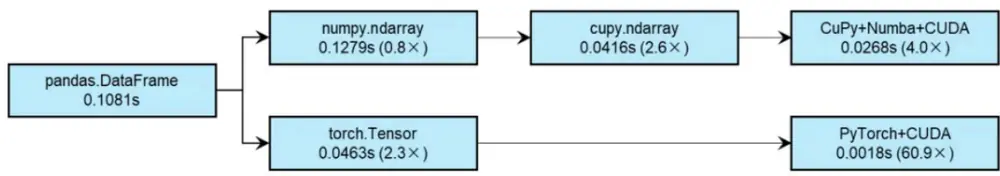

## 非元素级运算：线性衰减加权decay_linear

非元素级运算涉及矩阵不同行列的复杂变换。案例二中，对单个矩阵A的每一列，以长度d为滚动窗口，与向量[d,d-1,…1]进行加权求和。该运算常用于因子表达式的构建。我们分别测试NumPy、NumPy+Numba+CUDA、CuPy、PyTorch+CUDA方案。由于代码较冗长，此处不做展示。

假设矩阵维度为5000×5000，结果表明，PyTorch+CUDA加速效果约为328倍，优于其他方案；NumPy+Numba+CUDA次之，加速效果约为59倍；CuPy运算效率反而低。这里需要补充说明，限于篇幅我们没有测试CuPy+Numba+CUDA方案，实际上经过更精细的改造，可能实现优于PyTorch+CUDA的效果。

图表12：线性衰减加权 GPU加速测试结果
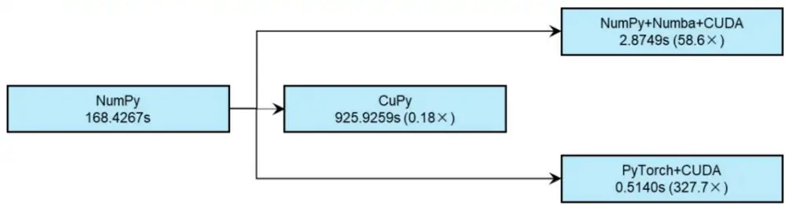

## 非元素级运算：计算相关系数corrwith

案例三中，对两个矩阵A和B逐行计算相关系数，得到相关系数序列，对应因子挖掘中IC值计算的场景。通过pandas.DataFrame.corrwith函数可以在CPU上高效实现。PyTorch中没有内置直接等价的函数（torch.corrcoef只接受单个矩阵输入），需手工实现。可以通过for循环逐行计算，也可采用矩阵运算形式。下图展示：(1)原始pandas.DataFrame.corrwith代码；(2)PyTorch改写为矩阵运算并结合CUDA加速的代码。

图表13：计算相关系数GPU加速测试部分代码
2. data_a = pd.DataFrame(np.random.randn(5000,5000)) 
3. data_b = pd.DataFrame(np.random.randn(5000,5000)) 
5. # pandas.DataFrame.corrwith 
6. corr = data_a.corrwith(data_b,axis=1) 
9. def corrwith_torch_matrix(x,y): 
assert (x.shape == y.shape) 
x_mean = x - torch.nanmean(x, 1, keepdim=True) # [TS, CS] 
y_mean = y - torch.nanmean(y, 1, keepdim=True) # [TS, CS] 
nomi = torch.nansum(x_mean*y_mean, 1) 
denomi = torch.sqrt(torch.nansum(x_mean**2, 1)) *torch.sqrt(torch.nansum(y_mean**2,1)) 
corr = nomi / denomi # [TS, 1] 
return corr 
18. data_a_cuda = torch.tensor(np.array(data_a,dtype='float32')).to('cuda') 
19. data_b_cuda = torch.tensor(np.array(data_b,dtype='float32')).to('cuda') 
20. corr = corrwith_torch_matrix(data_a_cuda,data_b_cuda)

结果显示，千万个矩阵元素的数量级规模下，无论是否采用CUDA，PyTorch+for循环相比pandas的效率反而更低；改为矩阵运算后，PyTorch展现出优势，PyTorch+矩阵运算+CUDA加速效果约为146倍。

图表14： 计算相关系数 GPU加速测试结果
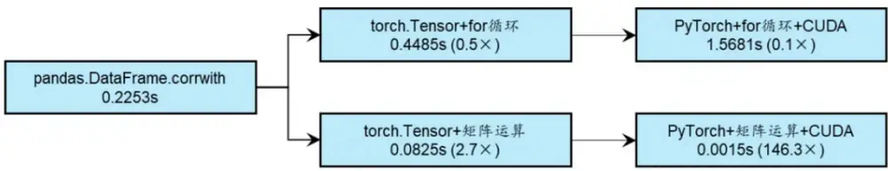
注：括号内数字代表相对 pandas.DataFrame加速倍数；测试环境：CPUIntelCorei9-390KF，GPUVIDIAFoRT4090

## 03 因子挖掘测试

本章介绍GPU加速遗传规划因子挖掘的方法，展示CPU和GPU时间开销对比及挖掘出的单因子测试结果。

## 方法

参考华泰金工研报《人工智能28：基于量价的人工智能选股体系概览》（2020-02-18），本研究构建了以残差收益率为优化目标的因子挖掘流程。具体而言，我们以挖掘增量信息为目标：第1轮挖掘以剔除行业市值因子的残差收益率为优化目标，计算适应度；从第2轮开始，以剔除上一轮新因子的残差收益率为优化目标，计算适应度；共重复5轮。每一轮挖掘（大循环）内部，共进行3代进化（小循环）。因子入库条件为：因子样本内年化RankICIR的绝对值大于2.5，并且与因子库已有因子截面相关系数均值的绝对值低于0.7。

图表15：以残差收益率为优化目标的遗传规划因子挖掘流程
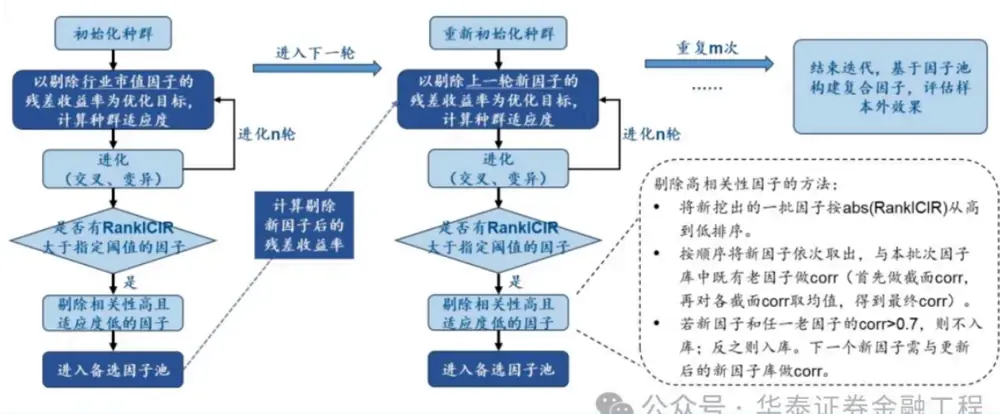

由于算力限制，本研究采用静态训练集，以2010-2019年共10年数据为样本内时段，挖掘得到的因子用于2020年1月至2024年1月的样本外测试。

图表16：遗传规划参数

| 参数名称 | 参数设置 |
| --- | --- |
| 样本内时段 | 2010-01-04 至2019-12-31 |
| 样本外时段 | 2020-01-02 至 2024-01-31 |
| 选股域 | 中证全指成分股 |
| 种群数量 | 3000；每轮迭代的公式数量 |
| 精英数量 | 500；该数量的公式被随机选中，其中适应度最高的公式能进行交叉或变异生成下一代公式 |
| 大循环次数 | 5；每轮大循环重新开始挖掘，创立全新种群，以上一轮残差收益率为优化目标 |
| 小循环次数 | 3；每轮大循环内部进行几次挖掘 |
| 最大深度 | 3；公式树最高复杂度 |
| 交叉概率 | 0.35；两个个体之间进行交叉变异的概率 |
| 变异概率 | 0.25；个体进行突变变异的概率 |
| 优化目标 | T+1 至 T+11 区间残差收益率 |
| 适应度函数 | 样本内年化 RankICIR |
| 因子入库条件 | 适应度绝对值>2.5，且和已有因子相关度绝对值<0.7 |
| 测试环境 | CPU Intel Core i9-13900KF，GPU NVIDIA GeForce RTX 4090公众号·华泰证券金融工程 |

设置31个算子，可分为加减乘除等元素级运算、滚动平均和切分等时序运算、截面排名等截面运算共三大类。设置29个初始特征，分为时序标准化特征和原始特征共两类。其中，原始特征名称后缀为ori；时序标准化特征为滚动60日zscore时序标准化处理后的因子，在不引入未来信息的前提下，使得因子可在同一量纲下进行加减乘除操作。对于相关系数等算子，需要以原始特征作为数据，从而保留特征量纲信息，避免算子丧失解释意义。

华泰金工 | 遗传规划因子挖掘的GPU加速
图表17：31个算子

| 算子分类 | 算子名称 | 算子定义 | 输入参数 |
| --- | --- | --- | --- |
| 元素级运算 | add(X,Y) | X,Y 两因子相加 |  |
|  | sub(X,Y) | X,Y 两因子相减 |  |
|  | mul(X,Y) | X,Y两因子相乘 |  |
|  | div(X,Y) | X,Y 两因子相除 |  |
|  | log_torch(X) | log(X) |  |
|  | sqrt_torch(X) |  |  |
|  |  | sqrt(X) -X |  |
|  | neg(X) |  |  |
|  | sigmoid_torch(X) sign_torch(X) | sigmoid(X) = 1 / (1+exp(-X)) X的符号函数，当X为正时，输出1：X为负时，X(或Y)：原始特征 |  |
|  | ts_delay_torch(X,d) | 输出-1；X为0时，输出0 X因子 d 日前的取值 | X(或 Y): 时序标准化特征 |
|  | ts_delta_torch(X,d) | X因子 t-d 日至 t 日的变动数值 | d: 1-10的正整数 |
|  | ts_delaypct_torch(X,d) | X因子 t-d 日至 t 日的变动百分比 |  |
|  | ts_correlation_torch(X,Y,d) | X,Y两因子在过去d日滚动时序上的相关系数 |  |
|  | ts_argmin_torch(X,d) | X因子在过去d日滚动时序上最小值对应的日期 |  |
|  |  | 编号(按时间倒序分别为d，d-1， ……，2,1) X(或 Y)：原始特征 |  |
|  | ts_argmax_torch(X,d) | X因子在过去d日滚动时序上最大值对应的日期d：2-10的正整数 |  |
|  |  | 编号（编号定义同上） |  |
|  | ts_rank_torch(X,d) ts_covariance_torch(X,Y,d) | X因子在过去d日滚动时序上的百分比排名 |  |
|  | ts_decay_linear_igrnan_torch(X,d) | X,Y 两因子在过去d 日滚动时序上的协方差 X因子在过去d日滚动时序上的加权平均（权重 |  |
| 时序运算 |  | 按时间倒序分别为d，d-1，……，2,1) |  |
|  |  | ts_ SubPosDecayLinear_torch(X,Y,d) relu(X-Y)在过去d 日滚动时序上的加权平均(权 |  |
|  | ts_min_torch(X,d) | 重取值同上） | X(或 Y): 时序标准化特征 |
|  | ts_max_torch(X,d) | X因子在过去d日滚动时序上的最小值数值 | d: 2-10 的正整数 |
|  |  | X因子在过去d日滚动时序上的最大值数值 |  |
|  | ts_stddev_torch(X,d) | X因子在过去d日滚动时序上的标准差数值 |  |
|  | ts_sum_torch(X,d) | X因子在过去d日滚动时序上的累计求和 |  |
|  | ts_rankcorr_torch(X,Y,d) | X因子的截面百分比排名与Y因子的截面百分比 |  |
|  |  | 排名在过去d日滚动时序上的相关系数 |  |
|  |  | ts_grouping_ascsortavg_torch(X,Y,d,n)在过去d 日浓动时序分组上，Y因子最小的 n 天 |  |
|  |  | 范围内对应的X因子的平均值 | X: 时序标准化特征 |
|  |  | ts_grouping_decsortavg_torch(X,Y,d,n)在过去d 日滚动时序分组上，Y因子最大的 n 天 | Y: 原始特征 |
|  |  | 范围内对应的X因子的平均值 |  |
|  |  | ts_grouping_diffsortavg_torch(X,Y,d,n)在过去d 日滚动时序分组上，Y因子最大的 n 天 | d: 正整数10、15、20、40 n:1-10的正整数 |
|  |  | 范围内对应的X因子的平均值-Y因子最小的n |  |
|  |  | 天范围内对应的X因子的平均值 |  |
|  | rank_pct_torch(X) | X因子在每一时间截面上的百分比排名 |  |
|  | rank_sub_torch(X,Y) | X 因子的截面百分比排名-Y 因子的截面百分比 |  |
| 截面运算 |  | 排名 |  |
|  | rank_div_torch(X,Y) | X因子的截面百分比排名/Y因子的截面百分比排X(或Y): 时序标准化特征 |  |
|  |  | 名 |  |

图表18：29个初始特征

| 特征含义 | 滚动60日时序标准化特征名称 | 原始特征名称 |
| --- | --- | --- |
| 收盘价（后复权） | close | close_ori |
| 开盘价（后复权） | open1 | open1_ori |
| 最高价（后复权） | high | high_ori |
| 最低价（后复权） | low | low_ori |
| 均价（后复权） | vwap | vwap_ori |
| 成交量 | volume | volume_ori |
| 成交额 | amt | amt_ori |
| 换手率 | turn | turn_ori |
| 市净率倒数 | bp | bp_ori |
| 市盈率TTM倒数 | ep | ep_ori |
| 经营性现金流TTM/总市值 | ocfp | ocfp_ori |
| 近12个月股息率 | dp | dp_ori |
| 当日收益率 | 1 | return1_ori |
| 过去20日成交量均值 | adv20 | adv20_ori |
| 过去60日成交量均值 | adv60 | 公众adv60_ori华泰证券金融工程 |

## 时间开销对比

首先对比不同种群数量下，单轮进化全部环节CPU和GPU时间开销。当种群数量分别为30、100、300时，因子挖掘全流程GPU相比CPU的加速倍数分别为4.4、7.9、8.1倍。其中核心的遗传规划环节（因子值计算+IC值计算）时间占比高，GPU相比CPU加速倍数分别为4.6、7.7、8.9倍。我们未测试种群数量为1000时CPU时间开销。考虑到种群数量较少时结果不具备代表性，我们认为在种群数量100、300情况下，GPU提供的7~9倍加速是相对合理的结果。

图表19： 单轮进化全部环节 CPU 和GPU 时间开销对比

| 运算平台 | 种群数量 | 精英数量 | 设置参数 (秒) | 遗传规划 (秒) | 因子入库和全流程（秒； 导出（秒）除读取数据） |  | 遗传规划GPU全流程（除读取数据） 加速倍数 | GPU 加速倍数 |
| --- | --- | --- | --- | --- | --- | --- | --- | --- |
| CPU | 30 | 5 | 5.0E-04 | 310.9 | 24.0 | 334.8 | 1 |  |
| CPU | 100 | 17 | 1.7E-03 | 1326.5 | 248.0 | 1574.4 | 1 | 1 |
| CPU | 300 | 50 | 1.8E-03 | 3522.4 | 888.6 | 4411.0 | 1 |  |
| CPU | 1000 | 167 | 1 | 1 | 1 | 1 | 1 | 1 |
| GPU | 30 | 5 | 1.0E-03 | 68.3 | 7.2 | 75.5 | 4.6 | 4.4 |
| GPU | 100 | 17 | 1.6E-03 | 171.6 | 28.2 | 199.7 | 7.7 | 7.9 |
| GPU | 300 | 50 | 1.8E-03 | 397.9 | 148.7 | 546.6 | 8.9 | 8.1 |
| GPU | 1000 | 167 | 1.2E-02 | 1265.6 | 315.5 | 1581.1 | 1 | 1 |

图表20：单轮进化核心环节（因子计算+IC值计算）CPU和GPU时间开销对比
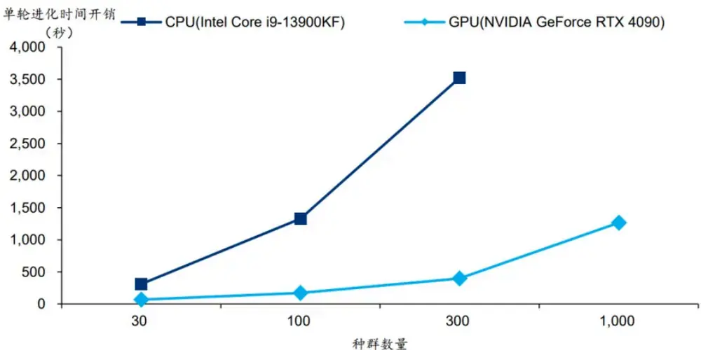

## 单因子展示

正式实验中，我们将种群数量设为3000，进行5轮挖掘，每轮进化3代。5轮分别挖掘出136、87、42、47、38个符合入库条件因子，合计350个因子，总时间开销约12.4小时，平均单轮进化时间开销约0.8小时。

以下展示全部因子样本外中性化年化RankICIR和原始年化RankICIR频次分布。

图表21：全部因子样本外年化 RankICIR频次分布
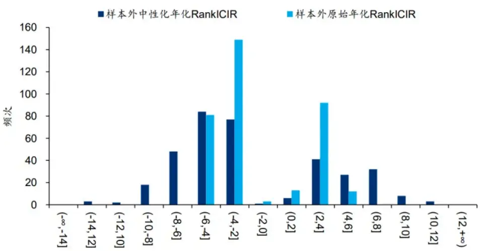

图表22：挖掘得到的部分因子表达式

| 因子编号 | 因子表达式 |
| --- | --- |
| Alpha1 | ts_grouping_diffsortavg_torch(sigmoid_torch(high), turn_ori, 15, 7) |
| Alpha2 | ts_grouping_diffsortavg_torch(ts_rank_torch(close_ori, 9), turn_ori, 20, 1) |
| Alpha3 | ts_grouping_diffsortavg_torch(close, amt_ori, 10, 6) |
| Alpha4 | add(amt, ts_sum_torch(ts_rankcorr_torch(low, volume, 10), 6)) |
| Alpha5 | log_torch(ts_rankcorr_torch(volume, close, 7)) |
| Alpha6 | sigmoid_torch(ts_rankcorr_torch(amt, high, 7)) |
| Alpha7 | ts_grouping_diffsortavg_torch(bp, volume_ori, 10, 3) |
| Alpha8 | sigmoid_torch(ts_rankcorr_torch(amt, close, 5)) |
| Alpha9 | rank_div_torch(sqrt_torch(adv20), rank_pct_torch(adv20)) |
| Alpha10 | sigmoid_torch(ts_rankcorr_torch(volume, bp, 9)) 公众号：华泰证券金融工程 |

上表展示部分因子表达式，下图展示这部分因子样本外累计RankIC，调仓频率为10日，因子均做行业市值中性化。

图表23：部分因子双周频累计 RankIC
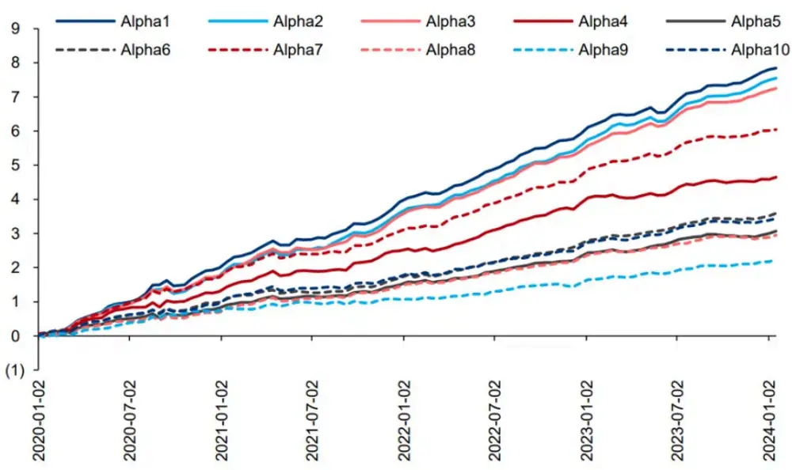

由于我们以RankICIR为适应度指标，部分因子存在空头区分度高但多头收益不佳的现象。以下有选择地展示部分多头表现较好的因子样本外分层测试结果。

Alpha1：ts_grouping_diffsortavg(sigmoid(high), turn_ori,15, 7)。(1)计算时序标准化最高价，做sigmoid归一化；(2)近15日中换手率最高与最低的7日内，求(1)步结果各自均值之差；本质是精细化的动量因子，反向因子。

Alpha12：ts_grouping_diffsortavg(rank_add(volume, vwap), turn_ori, 40, 7)。(1)计算时序标准化成交量与vwap截面排序之和；(2)近40日中换手率最高与最低的7日内，求(1)步结果各自均值之差；本质是精细化的动量和流动性因子，反向因子。

图表24：Alpha1 因子样本外分层测试相对净值
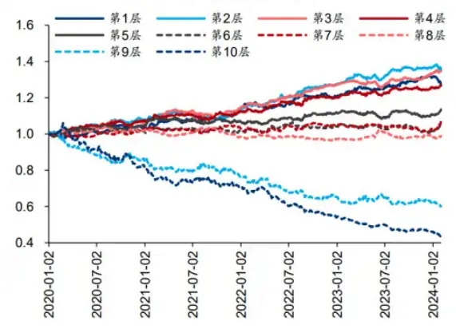

图表25：Alpha12因子样本外分层测试相对净值
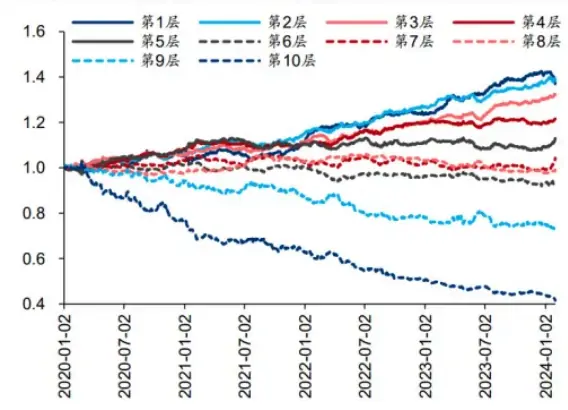

Alpha224：ts_grouping_decsortavg(amt, turn_ori, 15, 4)。(1)计算时序标准化成交额；(2)近40日中换手率最低的4日内，求(1)步结果均值；本质是精细化的流动性因子，反向因子。

Alpha226：rank_sub(log(ts_argmin(adv20_ori, 2)), scale(ts_grouping_decsortavg(amt,turn_ori, 20, 8)))。(1)计算20日均成交量；(2)计算(1)步结果近2日最大值距今日期，取对数；(3)近20日中换手率最低的8日内，求时序标准化成交额的均值，做截面标准化；(4)计算(2)和(3)步结果截面排序之差；逻辑较复杂，本质是精细化的低流动性因子，正向因子。

图表26：Alpha224 因子样本外分层测试相对净值
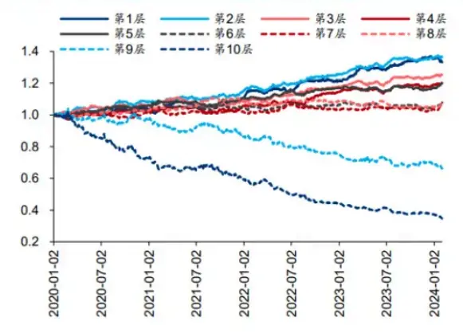

图表27：Alpha226 因子样本外分层测试相对净值
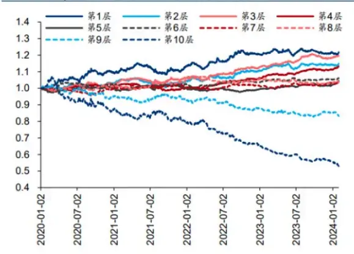

Alpha229 ： neg(rank_sub(ts_grouping_decsortavg(vwap, turn_ori, 40, 7),ts_argmax(turn_ori, 6)))。(1)计算时序标准化vwap；(2)近40日中换手率最低的7日内，求(1)步结果均值；(3)计算近6日换手率最高日距今日期；(4)计算(2)和(3)步结果截面排序之差；(5)取相反数；逻辑较复杂，本质是精细化的反转和低流动性因子，正向因子。

Alpha230：ts_grouping_diffsortavg(vwap, turn_ori, 40, 2)。(1)计算时序标准化vwap；(2)近40日中换手率最高和最低的2日内，求(1)步结果各自均值之差；本质是精细化的动量因子，反向因子。

图表28：Alpha229 因子样本外分层测试相对净值
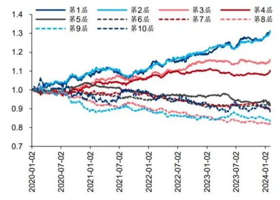

图表29：Alpha230因子样本外分层测试相对净值
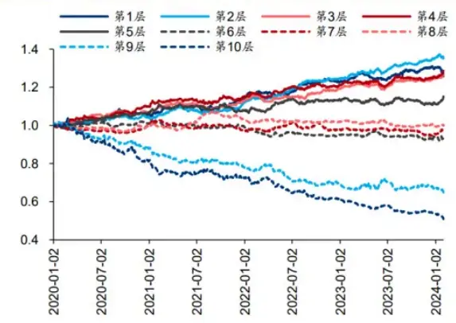

Alpha271：ts_grouping_ascsortavg(ts_delaypct(low, 6), turn_ori, 40, 1)。(1)计算时序标准化最低价，计算近6日变动百分比；(2)取近40日中换手率最高日的(1)步结果；本质是精细化的动量因子，反向因子。

Alpha313：ts_grouping_decsortavg(scale(ts_min(adv60, 2)), turn_ori, 20, 6)。(1)计算时序标准化60日均成交量，求近2日最小值，做截面标准化；(2)近20日中换手率最低的6日内，求(1)步结果均值；本质是精细化的流动性因子，反向因子。

图表30：Alpha271 因子样本外分层测试相对净值
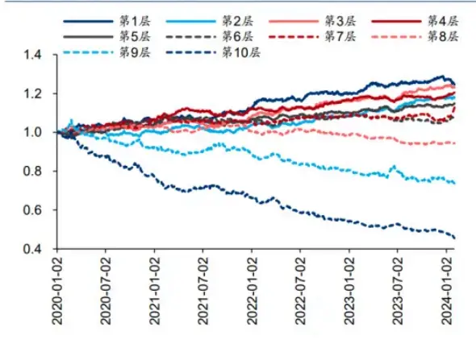

图表31：Alpha313 因子样本外分层测试相对净值
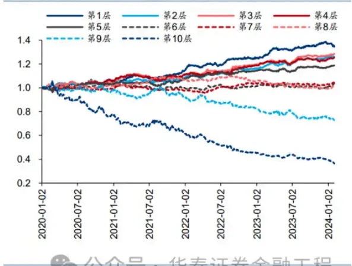
注：回测区间为2020-01-02至2024-01131

通过上述因子表达式的解读，我们发现ts_grouping_sortavg算子和turn特征的组合出现频次较高，其含义是基于过去一段时间每日换手率进行筛选，针对换手率最高或最低的部分交易日的对应指标求均值。相比直接求指标的区间均值，换手率最高或最低的交易日可能蕴含更丰富的信息。

以下展示上述8个因子样本外测试指标，调仓频率为10日，因子均做行业市值中性化。

图表32：部分因子样本外测试指标
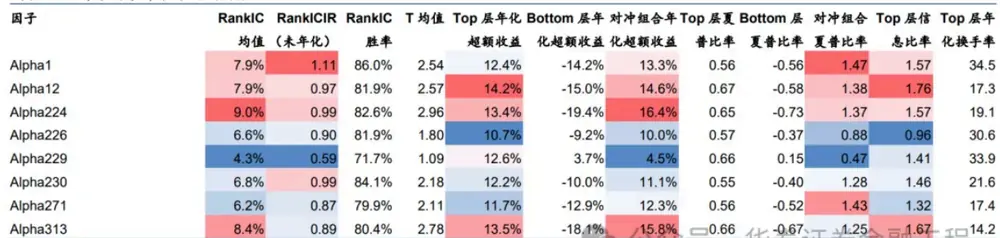
注：股票池：中证全指成分股：回测区间：2020-01-02至2024-01-31：因子进行行业市值中性：预测收益使府下至+10日收盘价区榈收益库出个王

## 04 总结和讨论

本研究使用GPU算力对遗传规划因子挖掘进行加速。遗传规划的痛点之一是运算效率低，因子进化不具备方向性，需要反复迭代筛选。我们基于DEAP开源框架，使用PyTorch拓展算子和适应度函数。结果表明，在Intel Core i9-13900KF和NVIDIA GeForce RTX 4090测试环境下，对于遗传规划全流程及核心的因子值计算和IC值计算环节，GPU能提供7~9倍的加速效果。5轮挖掘每轮进化3代总耗时12.4小时，得到350个符合入库条件的因子。

分析遗传规划全流程时间开销，大规模矩阵运算主要涉及因子值计算与IC值计算环节，均针对个股层面，每轮迭代需要重复数千次（取决于种群数量），并迭代若干轮，时间开销大，具备较大优化空间。而后代选择、交叉变异等环节仅作用于算子表达式，即针对因子层面，不涉及大规模矩阵计算，时间开销低。本研究测试场景下，单次计算单因子全历史的因子值和IC值，CPU平均时间开销分别为8.5秒和0.8秒，GPU平均时间开销分别为1秒和0.0007秒，GPU加速效果显著。

遗传规划的GPU加速有三种可行的技术路线：RAPIDS、Numba+CUDA和PyTorch+CUDA。RAPIDS代码改写工程量小，但实证表明加速效果不如PyTorch。Numba+CUDA在大规模运算时加速效果更好，但代码改写工程量大，且部分复杂函数仍需在CPU执行，通信成本高。PyTorch+CUDA代码改写工程量小，上手容易，全部运算均可在GPU上完成，数据流连贯，通信成本低。本研究采用PyTorch+CUDA路线，不改写DEAP底层代码，而是新定义一批基于PyTorch的算子和适应度函数，添加到DEAP框架中。

本研究构建了以残差收益率为优化目标的因子挖掘流程。每一轮挖掘以剔除上一轮新因子的残差收益率为优化目标，适应度为样本内年化RankICIR。因子入库条件为适应度高且与已有因子相关度低。定义29个初始特征和31个算子。当种群数量分别为30/100/300时，因子挖掘全流程GPU相比CPU的加速倍数分别为4.4/7.9/8.1倍。其中核心的因子计算和IC值计算环节，GPU相比CPU的加速倍数分别为4.6/7.7/8.9倍。考虑到种群数量较低时不具备参考意义，我们认为GPU提供的7~9倍加速是相对合理的结果。

正式实验中种群数量设为3000，进行5轮挖掘，每轮进化3代，共挖掘出350个符合入库条件的因子，总时间开销约12.4小时，平均单轮进化时间开销约0.8小时。对部分样本外多头表现较好的因子表达式进行解读，我们发现ts_grouping_sortavg算子和turn特征的组合出现频次较高，其含义是基于过去一段时间每日换手率进行筛选，针对换手率最高或最低的部分交易日的对应指标求均值。相比直接求指标的区间均值，换手率最高或最低的交易日可能蕴含更丰富的信息。

本研究存在以下未尽之处：(1)以ICIR为适应度挖掘得到的部分因子存在多头端表现不佳的问题，可使用PyTorch实现因子多头收益计算，优化适应度指标；(2)丰富初始特征和算子，提升因子表现；(3)受限于算力，本研究采用固定样本内时段的测试框架，可改为滚动样本内时段以应对因子失效现象；(4)有别于团队过往研究，本研究引入时序标准化特征，作为原始特征的补充，时序标准化操作能带来多大的边际提升，需要更严谨的消融实验证明；(5)其他枚举式因子挖掘算法如OpenFE同样面临运算效率低的缺点，或存在GPU加速空间。

## 参考资料

Sathia, V., Ganesh, V., & Nanditale, S. R. T. (2021). Accelerating Genetic Programming using GPUs. arXiv preprint arXiv:2110.11226.

百度飞桨《基于Numba的CUDA Python编程简介》：

https://aistudio.baidu.com/projectdetail/5965667

## 风险提示：

遗传规划挖掘的选股因子是历史经验的总结，存在失效可能。遗传规划得到的因子可解释性较低，

使用需谨慎。机器学习模型存在过拟合的风险。

## 相关研报

研报：《 遗传规划因子挖掘的GPU加速》2024年2月19日

林晓明 S0570516010001 | BPY421

何康 S0570520080004 | BRB318

## 关注我们

## 华泰证券金融工程

主要进行量化投资相关的研究和讨论工作。

427篇原创内容

公众号

## 华泰证券研究所国内站（研究Portal）

https://inst.htsc.com/research

访问权限：国内机构客户

## 华泰证券研究所海外站

https://intl.inst.htsc.com/research

访问权限：美国及香港金控机构客户

添加权限请联系您的华泰对口客户经理

## 免责声明

## ▲向上滑动阅览

本公众号不是华泰证券股份有限公司（以下简称“华泰证券”）研究报告的发布平台，本公众号仅供华泰证券中国内地研究服务客户参考使用。其他任何读者在订阅本公众号前，请自行评估接收相关推送内容的适当性，且若使用本公众号所载内容，务必寻求专业投资顾问的指导及解读。华泰证券不因任何订阅本公众号的行为而将订阅者视为华泰证券的客户。

本公众号转发、摘编华泰证券向其客户已发布研究报告的部分内容及观点，完整的投资意见分析应以报告发布当日的完整研究报告内容为准。订阅者仅使用本公众号内容，可能会因缺乏对完整报告的了解或缺乏相关的解读而产生理解上的歧义。如需了解完整内容，请具体参见华泰证券所发布的完整报告。

本公众号内容基于华泰证券认为可靠的信息编制，但华泰证券对该等信息的准确性、完整性及时效性不作任何保证，也不对证券价格的涨跌或市场走势作确定性判断。本公众号所载的意见、评估及预测仅反映发布当日的观点和判断。在不同时期，华泰证券可能会发出与本公众号所载意见、评估及预测不一致的研究报告。

在任何情况下，本公众号中的信息或所表述的意见均不构成对任何人的投资建议。订阅者不应单独

人工智能 25量化选股 17

人工智能 · 目录

上一篇

华泰金工 | 基于全频段量价特征的选股模型

下一篇

华泰金工 | GPT因子工厂：多智能体与因子挖 掘

个人观点，仅供参考