# 华泰金工 | GPT因子工厂：多智能体与因子挖掘

原创 林晓明 何康 华泰证券金融工程 2024年02月22日 08:51

本研究基于GPT和多智能体系统构建端到端的量价因子挖掘系统。在本研究构建的“GPT因子工厂”中，三类角色各司其职：FactorGPT负责构建因子表达式；CodeGPT，负责将因子表达式转换为可自动执行的程序，并计算结果；EvalGPT，负责对因子计算结果进行回测检验，同时生成优化建议，并可将建议返回给FactorGPT，进而继续优化该因子。在二次优化后的因子中，IC表现靠前（前20%）绝对值均值为0.034，RankIC表现靠前（前20%）绝对值均值为0.054，因子表现整体较好。首次因子挖掘获得的因子中，因子分层效果总体较好。因子相关性方面，第一次优化后与第二次优化后的因子相关性水平依旧保持，因子工厂产出的因子相关性普遍较低。优化建议内容方面，词频结果显示EvalGPT擅长从窗长等角度对因子表达式提出优化建议。

## 核心观点

## 人工智能系列之74：基于GPT的多智能体系统应用于量价因子挖掘

本研究介绍大语言模型与智能体相关概念，基于GPT和多智能体系统构建端到端的量价因子挖掘系统。在本研究构建的“GPT因子工厂”中，三类角色各司其职：（1）FactorGPT，负责构建因子表达式；（2）CodeGPT，负责将因子表达式转换为可自动执行的程序，并计算结果；（3）EvalGPT，负责对因子计算结果进行回测检验，同时生成优化建议，并可将建议返回给FactorGPT，进而继续优化该因子。在二次优化后的因子中，IC表现靠前（前20%）绝对值均值为0.034，RankIC表现靠前（前20%）绝对值均值为0.054，因子表现整体较好。

## 大语言模型与因子挖掘：大语言模型乘风而上，因子挖掘或可借力腾升

大语言模型指基于大量文本数据预训练的超大型语言模型，其参数规模通常达到数十亿乃至数千亿级别，主流大语言模型大多基于Transformers架构构建，通过自监督的预训练方式，获得理解和生成自然语言的能力。大语言模型在诸如办公、绘画、影视、游戏等多个领域的应用持续成熟。Alpha-GPT是大语言模型应用于量化研究的范例，其通过大语言模型与人类交互的方式赋能因子挖掘，然而Alpha-GPT挖掘因子的方式本质依然是遗传算法，没有充分利用大模型处理数据、生成代码、调用工具等能力，而这些能力恰好匹配因子挖掘各项流程的关键点。

## 大语言模型多智能体系统：多智能体分工合作展现群体智慧

智能体概念最早来源于亚里士多德等人的哲学思考。通常而言，智能体指具有行动能力的实体，具有行使意志、做出选择、采取行动、对外界刺激做出反应的能力。大语言模型具备智能体的反应性、主动性和社交能力等特征，总体符合智能体的定义，具备成为通用人工智能的潜力。更近一步，让不同的智能体负责不同的分工，也即多智能体系统，通过协商合作的方式或能更加有效地解决复杂问题。相较于单智能体，多智能体系统具有更加广阔的应用前景，也在大语音模型研究领域受到了更多的关注。

## 因子挖掘效果：GPT因子工厂展现出高水平的因子挖掘效果

本文对“GPT因子工厂”的因子挖掘效果进行测试，进行50次因子挖掘，每次因子挖掘包括首次挖掘、第一次优化和第二次优化。首次因子挖掘获得的因子中，分层1年化超额收益均值为11.14%，分层5年化超额收益均值为-1.11%，分层1-分层5年化超额收益均值为12.25%，因子分层效果总体较好。因子相关性方面，首次因子挖掘中，因子相关系数绝对值均值为0.229，优化后变为0.192和0.230，第一次优化后与第二次优化后的因子相关性水平依旧保持，因子工厂产出的因子相关性普遍较低。

## 因子优化效果：优化后的因子效果提升明显

EvalGPT可根据回测结果对单个因子提出优化建议，并提交建议至FactorGPT用于优化因子表达式。从结果上看，50次测试中，第二次优化后，相较首次挖掘和第一次优化，显示出较为明显的提升效果，例如|t|均值从4.57和4.53提升至4.65，|t|>2占比从69.44%和69.60%提升至71.27%。优化建议内容方面，词频结果显示EvalGPT擅长从窗长等角度对因子表达式提出优化建议。

## 正文

## 01 导言

“积力之所举，则无不胜也；众智之所为，则无不成也。” ——《淮南子·主术训》

自OpenAI推出ChatGPT以来，大语言模型（Large Language Model，LLM）在语义理解、多轮对 话 、 内 容 生 成 等 方 面 展 现 出 的 能 力 频 频 超 出 预 期 ， 通 用 人 工 智 能 （ Artificial GeneralIntelligence，AGI）似乎已处目之所及之处。大语言模型在诸如办公、绘画、影视、游戏等多个领域的应用持续成熟，而量化金融领域的大语言模型应用却寥寥无几。如何以大语言模型为底座，实现有效且完善的量化研究应用，可能是值得探索的通幽之径。

在大语言模型领域中，模型本身的能力尚显单薄，为了进一步发挥大语言模型的能力，使其能自动化地完成高复杂度任务，学界持续探索基于大模型的多智能体（Multi-Agent）框架。多智能体系统由多个智能体组成，每个智能体的实现均依赖于单个大语言模型，并具有与环境交互、与其他智能体合作协同的能力。智能体可以通过一系列的连续行为，实现人类给定的任务目标。有学者认为，基于大语言模型的多智能体可能是迈向通用人工智能重要途径之一。

图表1：基于大语言模型的自主性智能体发展趋势
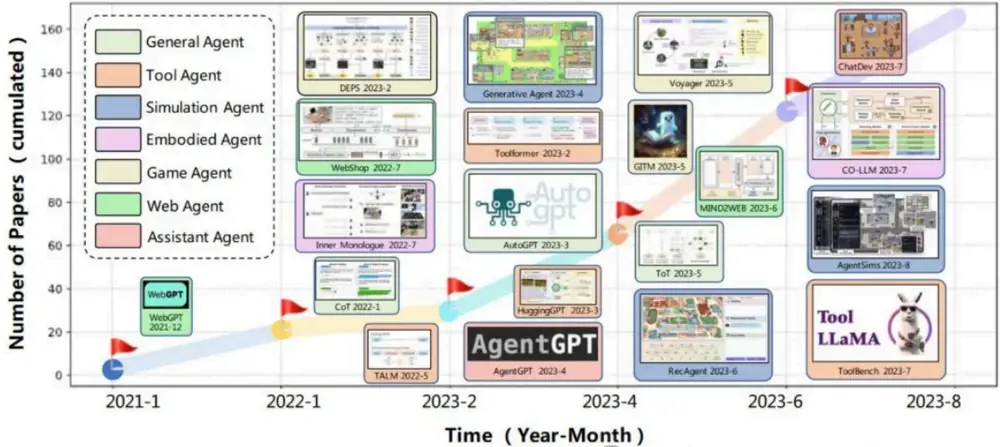

在量化研究中，与多智能体系统较为贴近的应用场景之一可能是因子挖掘。传统的因子挖掘框架往往基于遗传规划，涉及算子组合、回测优化等多项子流程，整体过程较为复杂，直接调用大语言模型难以完成；但基于多智能体系统，使大模型调用工具、与环境交互、以及智能体间分工合作，或能显著提升大语言模型完成复杂任务的能力。

本研究基于GPT模型，通过大模型扮演“GPT因子工厂”中的三个不同角色，以实现因子挖掘功能：FactorGPT负责构建和优化因子表达式，CodeGPT负责生成代码文件，EvalGPT负责因子回测和评估，最终实现端到端因子挖掘系统。我们使用“GPT因子工厂”进行50次因子挖掘测试，每次因子挖掘包括首次挖掘、第一次优化和第二次优化。测试结果显示：因子表现方面，首次挖掘中，IC表现靠前（前20%）绝对值均值为0.031，RankIC表现靠前（前20%）绝对值均值为0.045，首次挖掘出的因子表现整体较好；因子相关性方面，首次因子挖掘中，因子相关系数绝对值均值为0.229，第一次优化后变为0.192，第二次优化后变为0.230，总体相关性偏低；因子优化方面，第二次优化后的因子相较首次挖掘和第一次优化，显示出较为明显的提升效果。

## 02 大语言模型与多智能体

大语言模型（Large Language Model， LLM）指基于大量文本数据预训练的超大型语言模型，其参数规模通常达到数十亿乃至数千亿级别。目前主流大语言模型都基于Transformers架构，通过自监督的预训练方式，获得理解和生成自然语言的能力。经典的Transformers结构分为编码器（Encoder）和解码器（Decoder）两部分，大语言模型由此可以分为三种架构：第一种是仅使用编码器（Encoder-Only），代表模型如BERT；第二种是仅使用解码器（Decoder-Only），代表模型如GPT；第三种是同时使用编码器和解码器（Encoder-Decoder），代表模型如T5。

图表2：大语言模型进化树
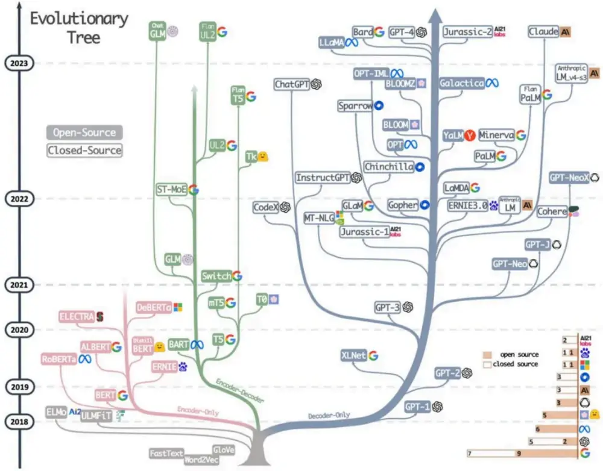

大语言模型虽然能力出众，但其训练和运行成本较为高昂，普通用户很难私有化部署；此外，目前开源的大语言模型在性能上与闭源模型依然有显著差距。因此大模型公司通常采用“语言模型即服务”（LLM-as-a-Service）的方式，通过网页或者接口为用户提供服务，例如百度于2023年推出文心一言大语言模型，允许用户通过网页和接口访问该模型。

## 大语言模型与因子挖掘

目前大语言模型在多个垂直领域已经开始落地应用，例如金融领域大模型BloombergGPT、医疗领域大模型灵医大模型、政务领域九州大模型等。在量化研究中，Saizhuo Wang等人提出了Alpha-GPT，通过大语言模型与人类交互的方式赋能因子挖掘。他们将大语言模型作为量化研究员和因子挖掘之间的中间层：利用大模型将研究员的意图转化为种子因子，再通过传统的遗传算法搜索有效因子，通过回测和评估的因子会通过大模型进行解释，最终呈现给研究员。在整个过程当中，大模型的作用主要是辅助人工，简化了研究员的工作流程。

图表3：Alpha-GPT 因子挖掘框架
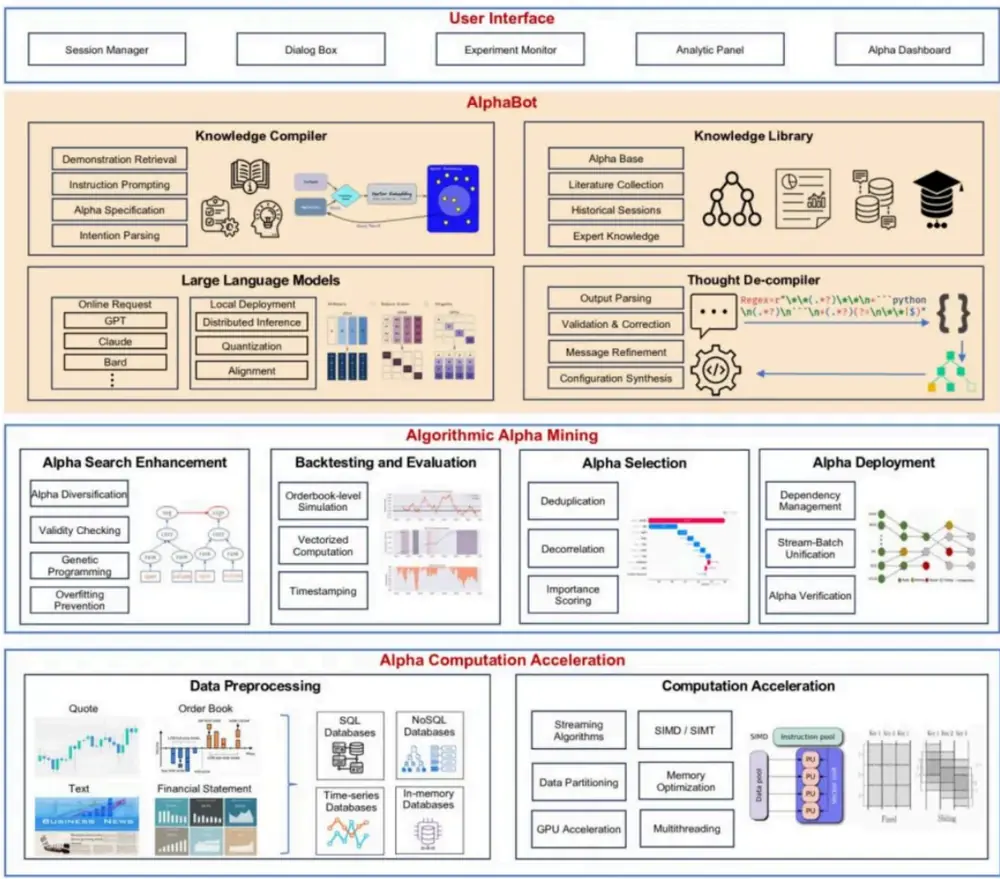

然而，Alpha-GPT挖掘因子的方式本质依然是遗传算法，没有充分利用大模型处理数据、生成代码、调用工具等能力。与之不同，本文期望充分利用大模型的上述能力，基于大模型实现端到端的量价因子挖掘框架，实现因子从构思到回测再到优化的自动化全流程。

## 基于大语言模型的智能体

智能体的概念由来已久，最早来源于亚里士多德等人的哲学思考。通常而言，智能体是指具有行动能力的实体，具有行使意志、做出选择、采取行动、对外界刺激做出反应的能力。有研究者认为，大语言模型已经具有智能体的一些特征，包括反应性、主动性和社交能力。

## 反应性

反应性是指智能体可以对环境中的刺激和变化作出迅速的反应。大语言模型可以感知文本输入的变化，并通过文本输出作出相应的反馈。此外，人们还通过多模态技术扩展了大语言模型的感知和行为空间，例如，让模型具备调用工具的能力，从而与现实世界进行交互；具备调用工具能力的大语言模型可以通过搜索引擎检索金融知识；通过计算器计算复杂的公式；从数据库中读取数据等等。

OpenAI提供的多个GPT模型都具有调用工具的能力。使用者需要在API接口中提供作为工具的函数的功能描述和接口信息，当模型认为需要调用函数时，会返回特定的字段，其中包括调用函数的具体参数；在函数执行结束之后，用户还可以将调用结果以文本的形式反馈给模型，供其选择下一步行动。

## 主动性

主动性是指智能体具备主动采取目标导向的行动以实现目标的能力。智能体不仅可以对环境的刺激做出反馈，还可以推理、规划、采取积极行动以达到指定目标。大语言模型已经展现出很强的推理和规划能力，包括逻辑推理能力、数学推导能力、任务分解能力等。

## 社交能力

社交能力是指智能体可以与其他智能体（包括人类）通过某些语言进行交互。大语言模型已经展现出较强的自然语言理解和生成能力，可以轻松地与人类进行沟通；此外，人们发现利用一些特殊的提示，可以使大语言模型扮演不同的角色，模仿现实社会中的劳动分工。通过让多个智能体模仿社会中的合作与竞争，人们可以提高大语言模型完成复杂任务的能力。

## 从单智能体到多智能体

亚当·斯密在《国富论》中曾说：“劳动生产力上最大的增进，以及运用劳动时所表现更大的熟练、技巧和判断力，似乎都是分工的结果”。基于大模型的单智能体虽然可以出色地完成理解、生成任务，但是不能与其他智能体进行沟通合作。而基于大模型的多智能体系统则可以体现出“群体的智慧”：让不同的智能体负责不同的分工，通过协商合作的方式更加有效地解决问题。一方面，分工可以让每个智能体专注于解决特定问题，更好地释放其完成任务的潜力；另一方面，智能体之间多轮的沟通可以让它们在解决问题时更加全面深入，提高了他们解决问题的能力。因此，相较于单智能体，多智能体系统具有更加广阔的应用前景，也受到了更多的研究关注。

总的来说，大语言模型的多项能力符合智能体的定义，具备成为通用人工智能的潜力。利用大语言模型搭建智能体，充分发挥大语言模型完成复杂任务的能力，成为目前人工智能领域的研究热点之

## LangChain：多智能体开源实现框架

LangChain是一个开源的Python框架，旨在利用大语言模型开发端到端的应用程序。通过LangChain提供的模块、工具，开发者可以将大语言模型集成到应用程序之中，大大降低了基于大语言模型的应用开发门槛。

公众号·华泰证券金融工程

图表4：LangChain 架构
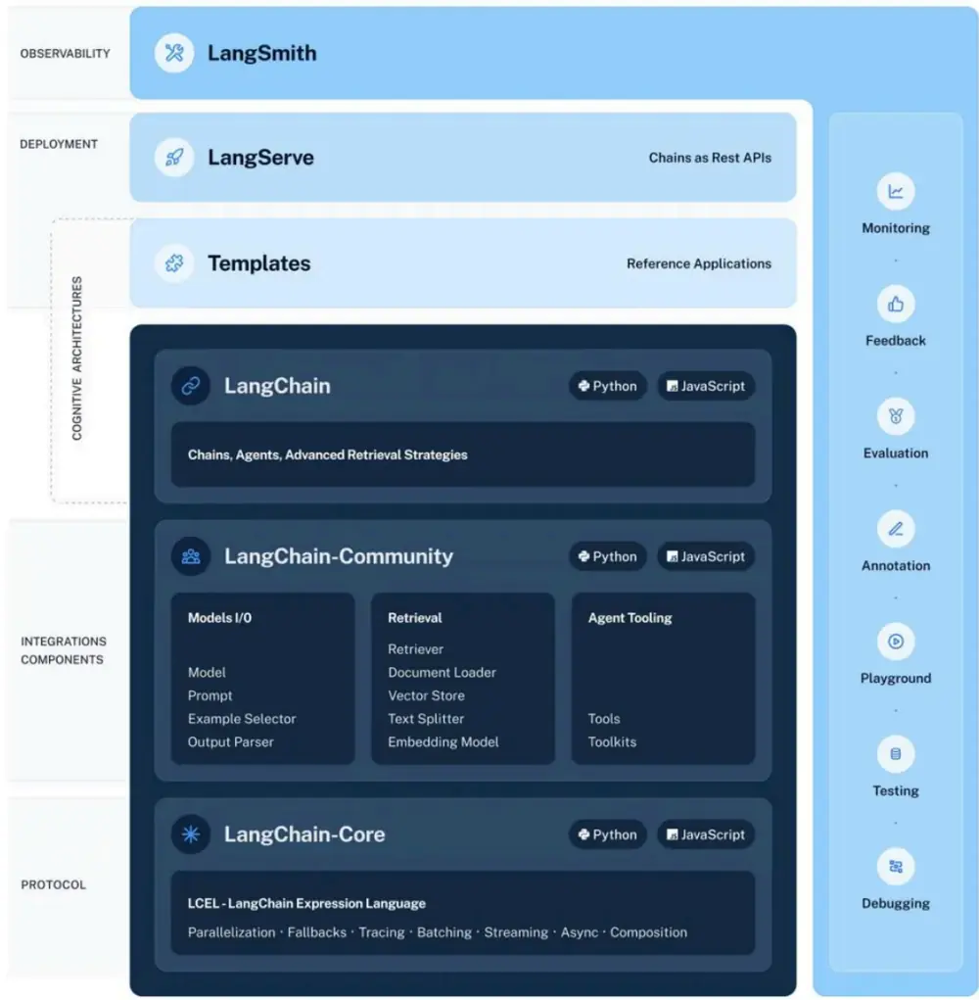

LangChain框架覆盖了大语言模型应用从开发到产品化再到部署的全过程，目前分为4个部分：LangChain Libraries 是 Python 和 Javascript 库 ， 包 含 各 模 块 的 接 口 和 集 成 ；LangChainTemplates包含了大量任务的提示模版；LangServe可以直接将LangChain中的模块部署为REST接口；LangSmith为开发者提供了调试、测试、评估平台。LangChain采用模块化设计，可以组合不同的模块实现自定义的功能。我们可以自定义提示模版，将动态信息转换为适合大语言模型的格式；可以设计输出解析器，将大语言模型的输出转换为格式化信息；可以定义智能体和工具组，根据用户的输入决定调用合适的工具。

LangChain是目前影响力最大的大语言模型应用开发框架之一，本研究参考了LangChain的部分设计思路，构建起基于多智能体的因子挖掘框架。

## 03 方法

本研究设计构建的“GPT因子工厂”是基于GPT模型的多智能体系统，在该系统中，智能体具备三种不同分工：（1）FactorGPT，负责构建因子表达式；（2）CodeGPT，负责将因子表达式转换为可自动执行的程序，并计算结果；（3）EvalGPT，负责对因子计算结果进行回测检验，同时生成优化建议，并可将建议返回给FactorGPT，进而继续优化该因子。因子挖掘过程中，所有步骤均可由智能体自动执行，无需人为干预，最终将输出因子的表达式、含义、代码、回测结果以及优化建议。

图表5：GPT因子工厂示意图
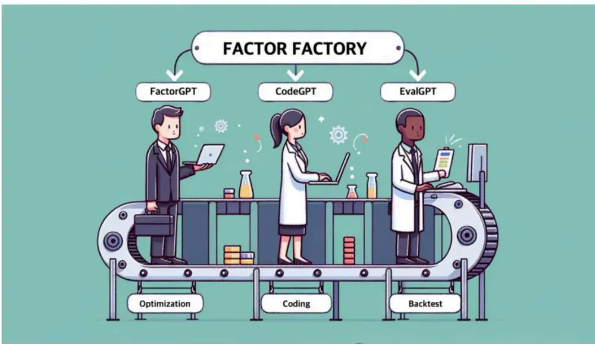
公众号·华泰证券金融工程

## GPT因子工厂

## FactorGPT

FactorGPT在“因子工厂”中负责利用底层数据字段生成因子表达式。为提高模型的生成质量，我们采用了Few-Shot方式，在提示中加入已有的因子示例。我们要求模型直接输出因子的名称、数学表达式和含义。为了获得稳定的输出格式，我们使用输出解析器将输出的因子信息解析为结构化内容。

图表6：FactorGPT使用字段

| 字段 | 含义 |
| --- | --- |
| S_DQ_OPEN | 开盘价(元) |
| S_DQ_HIGH | 最高价(元) |
| S_DQ_LOW | 最低价(元) |
| S_DQ_CLOSE | 收盘价(元) |
| S_DQ_VOLUME | 成交量(手)公众号：华泰证券金融工程 |

## CodeGPT

CodeGPT负责将因子表达式转换为可执行的代码文件。为降低模型“幻觉”现象，我们设定模型可自主调用或自行生成算子，使得代码可执行性更高。模型生成代码后，将运行代码文件，若有报错信息抛出，模型将根据报错信息修改代码文件。模型将不断迭代上述过程直到代码文件可以运行，直至成功运行。

## EvalGPT

EvalGPT负责对因子的计算结果进行回测，并根据回测结果给出评价和优化建议。EvalGPT的输入为因子值，输入之后将通过回测模块获得因子回测结果，例如IC、RankIC、年化收益率等指标。随后，EvalGPT会根据回测结果对因子做出评价和优化建议。为了获得稳定的输出格式，我们同样使用输出解析器进行内容解析。

在经历了上述三个智能体处理后，我们将获得如下信息：因子名称、因子表达式、因子含义、因子可执行代码文件、因子值、因子回测结果、因子评估结果、因子优化建议。如需继续优化该因子，我们可将EvalGPT生成的优化建议直接反馈给FactorGPT，让大模型继续改进当前因子，并重复上述流程。通过以上设计，我们实现了因子“构建-计算-回测-优化”的全自动循环流程。

## 测试方案

为检验“GPT因子工厂”因子挖掘的能力，本研究进行50次因子挖掘测试。每次因子挖掘包含三次全流程循环：

（1）首次因子挖掘：FactorGPT生成因子表达式，CodeGPT生成代码，EvalGPT进行回测并提出优化建议；

（2）第一次优化：FactorGPT根据上一轮EvalGPT提出的优化建议改进因子表达式，CodeGPT和EvalGPT继续重复其分工流程；

（3）第二次优化：FactorGPT再次根据EvalGPT提出的建议改进表达式，CodeGPT和EvalGPT继续重复工作。

## 04 结果

## 因子挖掘实例

以下展示GPT因子工厂的运行实例。如图表7，GPT因子工厂运行过程中，将持续汇报当前因子挖掘进展，便于详细观察多智能体FactorGPT、CodeGPT和EvalGPT的工作内容。

图表7：GPT因子工厂运行实例截图
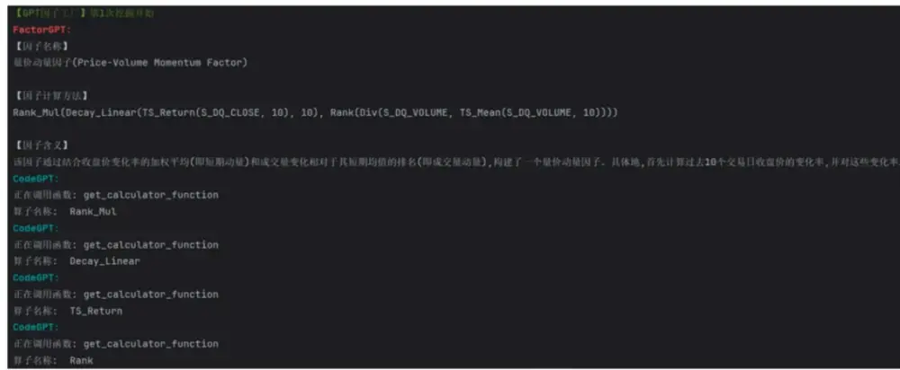

图8、图9和图10展示GPT因子工厂挖掘出因子后，进行第二次优化后的一个因子实例。从累计周度IC和RankIC看，因子表现较为稳定，方向为正向；从分层回测结果上看，因子分层差异明显，不同分层间指标单调变化，表明该因子效果较好。

图表8：GPT因子工厂因子实例

| 因子名称（FactorGPT） | 因子释义（FactorGPT） | 因子表达式（FactorGPT） |
| --- | --- | --- |
|  | 性较低的股票。首先计算过去10天股价的移动平均值，再计算过去10天成交量的移动平 均值，然后将这两个移动平均值进行排名处理，并计算它们的排名比值。排名比值旨在识别 |  |
|  | 那些股价持续稳定上涨且成交量较高的股票。同时考虑了过去30天股票最高价与最低价 之差的标准差的逆，从而减小了高波动股票在因子中的权重。 |  |
|  |  | Rank_Mul(Div(Rank(TS_Mean(S_DQ_C |
|  | 通过这种设计，因子着重关注那些具有稳定上涨动力和相对较高的市场活跃度，但又不受日LOSE， |  |
| 更进一步优化的量价动力因子 |  | 10)), |
|  | 内过度波动影响的股票。这不仅有助于提升因子的预测准确性，还有助于筛选出那些潜在的 Rank(TS_Mean(S_DQ_VOLUME，10))， |  |
|  | 低风险且收益稳定的投资机会。 | Inv(TS_Std(Sub(S_DQ_HIGH, |
|  |  | S_DQ_LOW), 30))) |
|  | 这样的进一步改进可以： |  |
|  | 1. 通过稳定的移动平均来降低短期波动的影响，提升因子的稳定性。 |  |
|  | 2. 通过捕获长期的量价关系来增强因子的预测能力。 |  |
|  | 3. 引入价格波动的倒数来降低高波动性股票的影响，寻找波动性小、趋势稳定的交易机会。 |  |
|  | 4. 改善IC 标准差和rank_IC 标准差，提升整体因子的信息比率。 | 公众号：华泰证券金融工程 |

图表9：GPT因子工厂因子累计周度IC和RankIC 实例
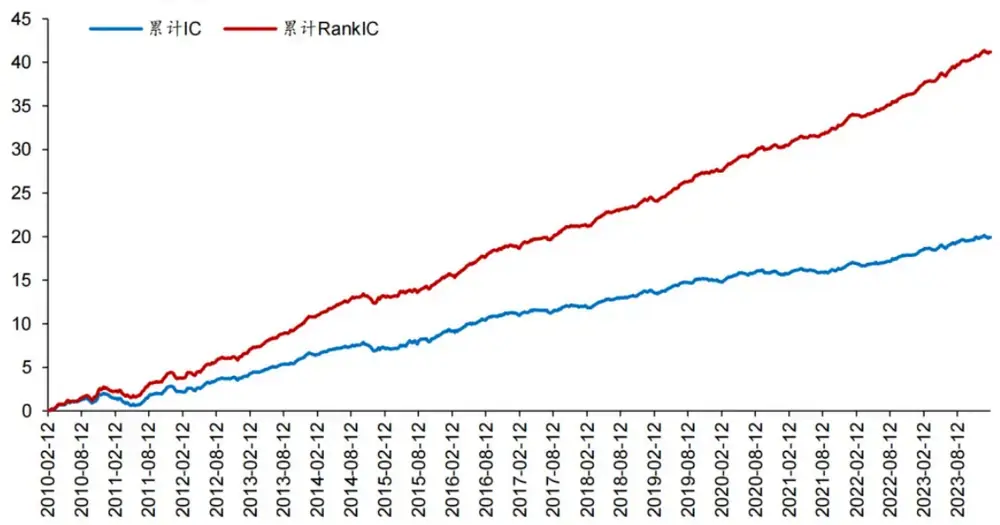

图表10：GPT因子工厂因子分层回测结果实例

|  | 年化收益率 | 年化波动率 | 夏普比率 | 最大回撤 | 年化超额收益超额收益年化 |  | 信息比率 | 超额收益最大 回撤 | 调仓胜率 | 相对基准盈亏 比 |
| --- | --- | --- | --- | --- | --- | --- | --- | --- | --- | --- |
|  |  |  |  |  | 率 | 波动率 |  |  |  |  |
| 分层1 | 20.20% | 23.11% | 0.87 | -39.97% | 18.60% | 11.00% | 1.69 | -25.40% | 62.66% | 1.03 |
| 分层2 | 13.83% | 26.43% | 0.52 | -52.85% | 13.30% | 10.57% | 1.26 | -23.51% | 60.42% | 1.01 |
| 分层3 | 7.89% | 27.18% | 0.29 | -60.47% | 7.71% | 9.70% | 0.79 | -22.55% | 58.88% | 0.94 |
| 分层4 | 0.05% | 28.33% | 0.00 | -70.76% | 0.17% | 9.99% | 0.02 | -42.23% | 54.55% | 0.86 |
| 分层5 | -8.37% | 27.92% | -0.30 | -86.21% | -8.42% | 10.49% | -0.80 | -71.25% | 46.57% | 0.88 |
| 基准 | 0.87% | 22.57% | 0.04 | -57.85% |  |  |  |  |  |  |

## 因子挖掘效果

首次因子挖掘能最大程度反映GPT在因子挖掘方面的能力。图表11展示初次挖掘出的部分因子表达式，因子表达式总体较为复杂，FactorGPT可以产出复杂且具备因子释义的因子。对于全部因子回测结果，从累计周度IC和累计周度RankIC看，GPT挖掘出的因子方向较为稳定，不乏持续展现出IC和RankIC持续单调且低波动的因子。

图表11：GPT因子工厂初次挖掘产出的部分因子表达式

|  | 因子表达式（FactorGPT） |
| --- | --- |
| GPT-Alpha1 | Div(TS_Corr(Mul(S_DQ_CLOSE, S_DQ_VOLUME), TS_Return(S_DQ_CLOSE, 1), 10), TS_Std(S_DQ_VOLUME, 10)) |
| GPT-Alpha2 | Div(TS_Return(Add(S_DQ_HIGH, S_DQ_LOW), 10), TS_Mean(S_DQ_VOLUME, 10)) |
| GPT-Alpha3 | Rank_Div(TS_Corr(Decay_Linear(S_DQ_CLOSE, 5), Decay_Linear(S_DQ_VOLUME, 5), 5), TS_Std(Sub(Add(S_DQ_HIGH, S_DQ_LOW), Mul(S_DQ_OPEN, 2)), 5)) |
| GPT-Alpha4 | Rank_Mul(TS_Return(S_DQ_CLOSE, 20), Rank(TS_Mean(S_DQ_VOLUME, 20))) |
| GPT-Alpha5 | Rank_Div(Rank_Add(TS_Return(S_DQ_CLOSE, 10), TS_Std(Sub(S_DQ_HIGH, S_DQ_LOW), 10)), Rank(TS_Mean(S_DQ_VOLUME, 10))) |
| GPT-Alpha6 | Rank_Div(Rank_Add(TS_Std(S_DQ_CLOSE, 20), TS_Std(S_DQ_VOLUME, 20)), Rank_Mul(TS_Return(S_DQ_CLOSE, |
| GPT-Alpha7 | Inv(TS_Corr(S_DQ_CLOSE, S_DQ_VOLUME, 5)))) Rank_Sub(Rank(Div(Decay_Linear(TS_Std(S_DQ_CLOSE, 20), 20), Decay_Linear(TS_Std(S_DQ_VOLUME, 20), Rank(TS_Corr(Decay_Linear(S_DQ_CLOSE, 20), Decay_Linear(S_DQ_VOLUME, 20), 20))) |
| GPT-Alpha8 | Rank_Add(Rank_Sub(TS_Std(S_DQ_CLOSE, 20), TS_Std(S_DQ_VOLUME, 20)), Rank_Mul(TS_Return(Add(S_DQ_HIGH, S_DQ_LOW), 5), Inv(TS_Corr(S_DQ_CLOSE, S_DQ_VOLUME, 5))) |
| GPT-Alpha9 | Rank_Add(Rank_Mul(Decay_Linear(TS_Return(S_DQ_CLOSE, 10), 10), Inv(TS_Corr(S_DQ_CLOSE, S_DQ_VOLUME, |
| GPT-Alpha10 | Rank_Sub(Rank(Div(TS_Std(S_DQ_HIGH, 20), TS_Std(S_DQ_LOW, 20))), Rank(TS_Std(S_DQ_VOLUME, 20)))) Rank_Add(Rank_Div(TS_Return(S_DQ_CLOSE, 10), TS_Mean(S_DQ_VOLUME, 10)), Rank(TS_Std(Add(S_DQ_CLOSE, 公众号华泰证券金融工程 |

图表12：首次因子挖掘因子累计周度IC
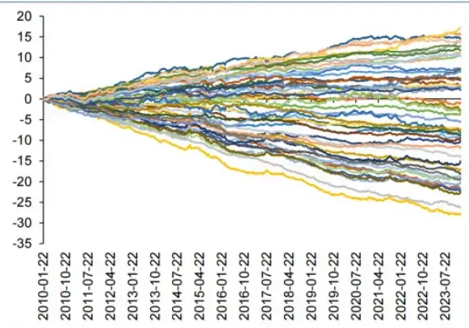

图表13:首次因子挖掘因子累计周度RanklC
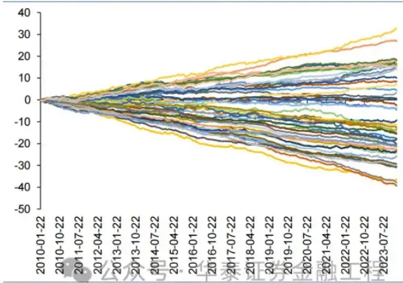

从分层回测结果上看，50次因子挖掘中，因子分层1年化超额收益普遍高于分层5超额收益，分层1-分层5最大值为28.29%，最小值为0.40%。从分层回测年化超额收益均值上看，分层1年化超额收益均值为11.14%，分层5年化超额收益均值为-1.11%，分层1-分层5年化超额收益均值为12.25%。总体来看，因子分层效果较好。

图表14：首次因子挖掘分层回测年化超额收益
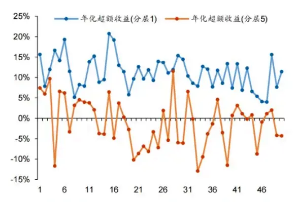

图表15：首次因子挖掘分层回测年化超额收益均值
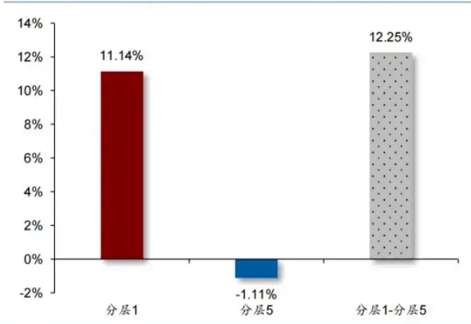

## 因子相关性

因子相关性对于评价因子挖掘框架而言尤为重要。我们统计GPT因子工厂进行50次因子挖掘的因子相关系数，结果如下图。对于首次因子挖掘，因子相关系数最大值为0.911，最小值为-0.632，因子相关为负的相关系数均值为-0.186，因子相关为正的相关系数均值为0.248，因子相关系数绝对值均值为0.229。平均来看，50次因子挖掘出的因子相关性处于较低水平。

第一次优化后，因子相关系数最大值为0.753，最小值为-0.745，因子相关为负的相关系数均值为-0.175，因子相关为正的相关系数均值为0.202，因子相关系数绝对值均值为0.192；第二次优化后，因子相关系数最大值为0.835，最小值为-0.872，因子相关为负的相关系数均值为-0.224，因子相关为正的相关系数均值为0.236，因子相关系数绝对值均值为0.230。总体而言，优化后因子相关系数极值在正负区间更为均衡，第一次优化后因子相关性均值水平有所降低，但第二次优化相比于第一次优化并无提升。

图表16：首次因子挖掘因子相关性
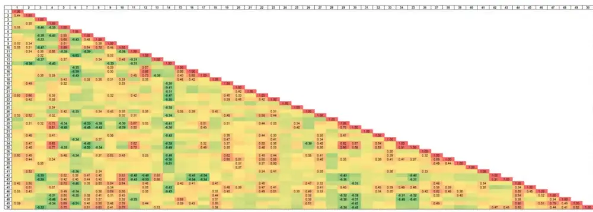

图表17：第一次优化后因子相关性
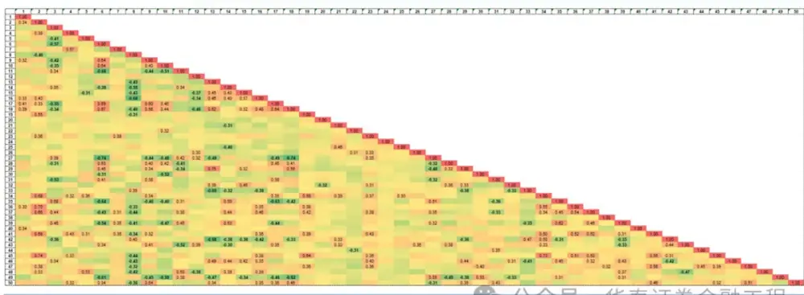

图表18：第二次优化后因子相关性
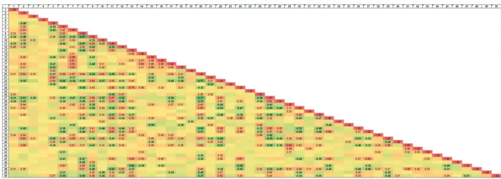

图表19：因子相关性水平统计汇总

|  | 最大值 | 最小值 | 负相关均值 | 正相关均值 | 绝对值均值 |
| --- | --- | --- | --- | --- | --- |
| 首次因子挖掘 | 0.911 | -0.632 | -0.186 | 0.248 | 0.229 |
| 第一次优化后 | 0.753 | -0.745 | -0.175 | 0.202 | 0.192 |
| 第二次优化后 | 0.835 | -0.872 | 公-0.224化泰0.236 |  | 金融工和积.230 |

## 因子优化效果

GPT因子工厂的灵活性之一在于能够进行无限次优化，我们在50次因子挖掘测试中，按顺序进行两次连续优化，我们预期EvalGPT能够根据回测结果进行更具针对性的因子优化。从累计IC和RankIC曲线分布的形态上看，第一次优化和第二次优化后，50个因子的曲线分布更加扩散，意味着优化后的因子IC和RankIC存在一定提升。数值上也进一步确认了这一点：首次挖掘因子累计周度IC最大值为17.23，最小值为-27.67，累计周度RankIC最大值为32.90，最小值为-39.27；第一次优化后因子累计周度IC最大值为21.10，最小值为-28.52，累计周度RankIC最大值为30.38，最小值为-49.75；第二次优化后因子累计周度IC最大值为29.86，最小值为-28.04，累计周度RankIC最大值为44.11，最小值为-43.36。

EvalGPT在第二次优化后的部分相关指标上，相较首次挖掘和第一次优化，显示出较为明显的提升效果。例如第二次优化后，IC均值绝对值前20%求平均从0.031（首次挖掘，下同）和0.028（第一次优化后，下同）提升至0.034，RankIC均值绝对值前20%求平均从0.045和0.046提升至0.054，|t|均值从4.57和4.53提升至4.65，|t|>2占比从69.44%和69.60%提升至71.27%。但总体IC均值绝对值求平均并未有明显提升，首次挖掘IC均值绝对值求平均为0.016，RankIC均值绝对值求平均为0.025，第一次优化后略有降低，分别变为0.013和0.023，第二次优化后变为0.016和0.025，EvalGPT对于表现良好的因子优化效果更为明显。

图表20：第一次优化后因子累计周度IC
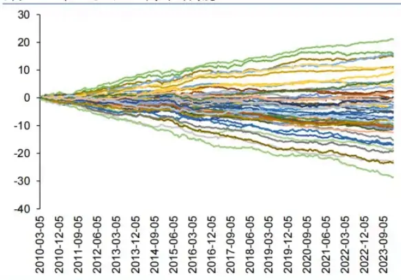

图表21：第一次优化后因子累计周度 RankIC
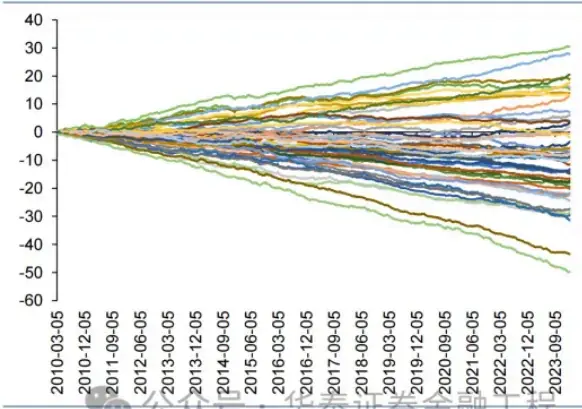

图表22：第二次优化后因子累计周度IC
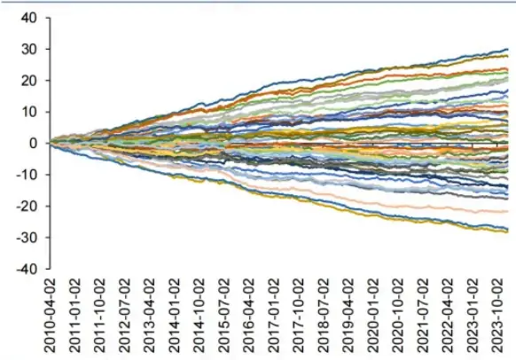

图表23：第二次优化后因子累计周度RankIC
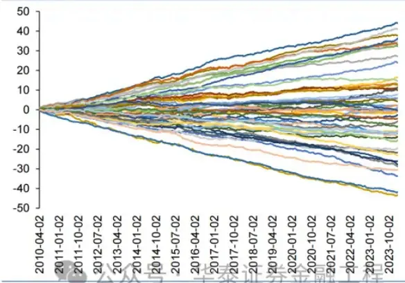

图表24：因子统计指标表现汇总

|  | IC 均值绝对值 RankIC 均值绝对 |  | IC 均值绝对 RankIC 均值绝 |  | 累计周度IC 累计周度 IC 累计周度 RankIC 累计周度 RankIC |  |  |  |  | It\|均值 \|tl>2 占比 |
| --- | --- | --- | --- | --- | --- | --- | --- | --- | --- | --- |
|  | 前 20%求平均 值前 20%求平均 |  | 值求平均 | 对值求平均 | 最大值 | 最小值 | 最大值 | 最小值 |  |  |
| 首次因子挖掘 | 0.031 | 0.045 | 0.016 | 0.025 | 17.23 | -27.67 | 32.9 | -39.27 | 4.57 | 69.44% |
| 第一次优化后 | 0.028 | 0.046 | 0.013 | 0.023 | 21.1 | -28.52 | 30.38 | -49.75 | 4.53 | 69.60% |
| 第二次优化后 | 0.034 | 0.054 | 0.016 | 0.025 | 29.86 | -28.04众号 | 44.泰证43.36 | 1 | 融4.6571.:27% |  |

## 因子释义与优化建议

对因子表达式进行释义解读、根据回测结果提出优化建议，是GPT用于因子挖掘的核心优势之一。我们绘制首次因子挖掘得到的50个因子释义以及优化建议词云图，如下图所示，对于FactorGPT输出的因子释义来说，词频最高的是“价格”、“成交量”、“因子”、“波动性”等词语，与提供给FactorGPT的底层表字段含义基本一致，展现量价因子的各维度特征。对于EvalGPT的因子优化建议而言，词频最高的是“窗口”、“因子”、“调整”、“时间”、“价格”等，与表达式核心参数——时间窗相照应，表明EvalGPT可能会优先通过调整因子表达式中涉及的时间窗来优化因子表现。

图表25：FactorGPT 因子释义词云(首次因子挖掘)

图表26: EvalGPT因子优化建议词云(首次因子挖掘)

## 05 总结

本文是大语言模型与多智能体用于量价因子挖掘的深入实践。在本研究构建的“GPT因子工厂”中，三类角色各司其职：（1）FactorGPT，负责构建因子表达式；（2）CodeGPT，负责将因子表达式转换为可自动执行的程序，并计算结果；（3）EvalGPT，负责对因子计算结果进行回测检验，同时生成优化建议，并可将建议返回给FactorGPT，进而继续优化该因子。GPT因子工厂二次优化后的因子中，IC表现靠前（前20%）绝对值均值为0.034，RankIC表现靠前（前20%）绝对值均值为0.054，因子表现整体较好。

大语言模型的发展如火如荼，大模型应用层出不穷。客观而言，目前大语言模型本身的能力依然尚显单薄，为了进一步发挥大语言模型的能力，使其能自动化地完成高复杂度任务，构建更为复杂且具备影响力的应用，学界持续探索基于大模型的多智能体（Multi-Agent）框架，智能体本身的主动性、反应性等能力大幅扩展大模型的能力边界，而多智能间的分工合作进一步显示出“群体的智慧”。本文利用大语言模型和多智能体实现量价因子挖掘框架，是大语言模型应用于量化研究的重要探索。

本文的主要结果及结论如下：

1. 基于GPT和多智能体实现的因子挖掘框架，可持续挖掘复杂有效的量价因子，并且由于大语言模型输出的随机性，挖掘出的因子间相关性也在可接受范围内。

2. 对于因子挖掘效果，首次因子挖掘获得的因子中，分层1年化超额收益均值为11.14%，分层5年化超额收益均值为-1.11%，分层1-分层5年化超额收益均值为12.25%，因子分层效果总体较好。

3. 对于因子相关性，首次因子挖掘中，因子相关系数绝对值均值为0.229，优化后变为0.192和0.230，第一次优化后与第二次优化后的因子相关性水平依旧保持，因子工厂产出的因子相关性普遍较低。

4. 对于因子优化效果，第二次优化后，相较首次挖掘和第一次优化，显示出较为明显的提升效果，例如|t|均值从4.57和4.53提升至4.65，|t|>2占比从69.44%和69.60%提升至71.27%。

5. 因子释义和优化建议方面，GPT相比于传统因子挖掘框架（例如遗传规划）显示出较大优势，词频分析显示FactorGPT能够从底层表字段出发，较准确显示出因子的量价特征；EvalGPT则擅长从窗长等角度对因子提出优化建议。

本文仍有多项未尽之处：（1）本研究测试使用的量价底层表字段较少，可尝试增加字段提升因子构建复杂度；（2）本研究仅涉及量价特征，基本面、一致预期以及宏观中观指标的加入能否提升因子挖掘效果，值得深入探索；（3）本文测试中仅进行两次额外优化，更多次优化后能否持续提升因子效果，也可深入评估。

## 参考资料

Wang, L., Ma, C., Feng, X., Zhang, Z., Yang, H., Zhang, J., ... & Wen, J. R. (2023). A survey on large language model based autonomous agents. arXiv preprint arXiv:2308.11432. Wang, S., Yuan, H., Zhou, L., Ni, L. M., Shum, H. Y., & Guo, J. (2023). Alpha-GPT: Human-AI Interactive Alpha Mining for Quantitative Investment. arXiv preprint arXiv:2308.00016.

Yang, J., Jin, H., Tang, R., Han, X., Feng, Q., Jiang, H., ... & Hu, X. (2023). Harnessing the power of llms in practice: A survey on chatgpt and beyond. arXiv preprint arXiv:2304.13712.

## 风险提示：

GPT挖掘因子是对历史的总结，具有失效风险。GPT挖掘量价因子可解释性受限，使用需谨慎。大模型训练集广泛，可能存在过拟合风险。

## 相关研报

研报：《 金工：GPT因子工厂：多智能体与因子挖掘》2024年2月20日

林晓明 S0570516010001 | BPY421

何康 S0570520080004 | BRB318

## 关注我们

华泰证券金融工程
主要进行量化投资相关的研究和讨论工作。427篇原创内容

公众号

## 华泰证券研究所国内站（研究Portal）

https://inst.htsc.com/research

访问权限：国内机构客户

华泰证券研究所海外站

https://intl.inst.htsc.com/research

访问权限：美国及香港金控机构客户

添加权限请联系您的华泰对口客户经理

## 免责声明

## ▲向上滑动阅览

本公众号不是华泰证券股份有限公司（以下简称“华泰证券”）研究报告的发布平台，本公众号仅供华泰证券中国内地研究服务客户参考使用。其他任何读者在订阅本公众号前，请自行评估接收相关推送内容的适当性，且若使用本公众号所载内容，务必寻求专业投资顾问的指导及解读。华泰证券不因任何订阅本公众号的行为而将订阅者视为华泰证券的客户。

本公众号转发、摘编华泰证券向其客户已发布研究报告的部分内容及观点，完整的投资意见分析应以报告发布当日的完整研究报告内容为准。订阅者仅使用本公众号内容，可能会因缺乏对完整报告的了解或缺乏相关的解读而产生理解上的歧义。如需了解完整内容，请具体参见华泰证券所发布的完整报告。

本公众号内容基于华泰证券认为可靠的信息编制，但华泰证券对该等信息的准确性、完整性及时效性不作任何保证，也不对证券价格的涨跌或市场走势作确定性判断。本公众号所载的意见、评估及预测仅反映发布当日的观点和判断。在不同时期，华泰证券可能会发出与本公众号所载意见、评估及预测不一致的研究报告。

在任何情况下，本公众号中的信息或所表述的意见均不构成对任何人的投资建议。订阅者不应单独

## 量化选股 17人工智能 25

人工智能 · 目录

上一篇

华泰金工 | 遗传规划因子挖掘的GPU加速

下一篇

华泰金工 | “GPT如海”：RAG与代码复现

个人观点，仅供参考