# 华泰 | 金工：如何捕捉长时间序列量价数据的规律

原创 林晓明 何康 华泰睿思 2024年03月15日 07:10

## 人工智能系列之75：patch思想用于长时间序列量价选股模型

随着高频数据的普及和算力的发展，量化投资中使用的时间序列数据长度正逐渐扩展。传统GRU模型在处理长序列数据时可能存在信息遗忘、难以捕捉周期性和异质性规律等问题。本研究引入patch的思想，按照交易日将股票的长时间序列量价数据划分为多个patch，设计PatchModel1和PatchModel2两个模型，并在两个选股场景下进行测试。结果表明，patch模型具有增量信息，模型融合后相比GRU均有提升。使用两个场景下的合成因子对前期报告的全频段融合因子加以改进，回测表现有所提高。

## 核心观点

## 传统GRU模型在处理长序列数据时可能存在一些“盲区”

作为一种经典的时间序列深度学习模型，GRU在量化投资中有着广泛应用。然而，GRU在处理长时间序列量价数据存在一些缺陷。首先，当序列非常长的时候，GRU会遇到梯度消失、信息遗忘的问题。其次，高频量价数据具有一定的周期性，GRU难以捕捉这种周期性的规律。此外，长时间序列量价数据的日内和日间信息传递具有异质性，但参数共享的设计造成GRU只能一视同仁地处理所有时间点的数据。

## 模型引入patch设计能够有效缓解GRU的不足

Patch的思想可概括为对数据进行分块处理，并将每一块作为一个整体传入模型，在时间序列预测和计算机视觉等领域均有应用。本研究按照交易日将股票的长时间序列量价数据划分为多个patch，使模型可以有效缓解信息遗忘的问题，并引入以日为周期的先验知识，差异化地分析日内和日间信息传递。本文设计了PatchModel1和PatchModel2两个模型。PatchModel1使用GRU处理日内的时序数据，再通过注意力机制构建日间的联系；PatchModel2将日内时点信息拆解为不同的特征，再使用GRU来挖掘日间的时序规律。

## Patch模型相较于基准GRU模型具有增量信息

本研究在两个场景下测试patch模型的表现。在15分钟频量价数据序列中，patch模型回测表现优于GRU，且模型间预测值相关性不高，等权合成因子的表现进一步提升。样本空间为全A股，GRU与patch模型合成后，2017/1/4～2024/2/29的回测期内周度RankIC均 值 从 8.86% 提 升 到 9.58% ， 分 10 层 TOP 组 合 年 化 超 额 收 益 率 从 21.15% 提 升 到24.65%。在30分钟频量价特征序列中，patch模型回测表现略弱于GRU，但仍能提供增量信息。GRU与patch模型合成后，周度RankIC均值从8.27%提升到8.62%，分10层TOP组合年化超额收益率从20.42%提升到21.64%。

## 改进全频段融合因子，回测表现有所增强

使用上述两个实验场景中的合成因子，对前期报告的全频段融合因子加以改进。全频段融合 因 子 在 2017/1/4 ～ 2024/2/29 的 回 测 期 内 周 度 RankIC 均 值 从 10.42% 提 升 到11.33%，分10层TOP组合年化超额收益率从32.61%提升到34.40%。基于全频段融合因子2.0版本构建指数增强组合。在周双边换手率分别控制为30%、40%和50%的情况下，2017/1/4～2024/2/29回测期内中证500增强组合年化超额收益率为18.93%、18.57%和 18.43% ， 信 息 比 率 为 3.27 、 3.12 和 3.00； 中 证 1000 增 强 组 合 年 化 超 额 收 益 率 为29.25%、30.92%和28.94%，信息比率为4.35、4.48和4.12。

风险提示：借助高频因子、人工智能构建的选股策略是历史经验的总结，存在失效的可能。深度学习的可解释性较弱，使用需谨慎。

## 正文

## 研究导读

随着高频数据的普及和算力的发展，量化投资中使用的时间序列数据长度正逐渐扩展。以华泰金工的研究为例，2020年6月报告《AlphaNet：因子挖掘神经网络》中，使用过去30个交易日的日频量价数据作为模型输入，时间序列的长度为30；2023年5月报告《神经网络多频率因子挖掘模型》中，使用过去20个交易日的15分钟K线数据作为模型输入，时间序列的长度达到320。

更长的时间序列量价数据蕴含着更加丰富的信息，也带来了新的问题：传统时间序列模型可能难以充分挖掘长序列中的规律。例如，门控循环单元（GRU）是一种经典的时间序列深度学习模型，在量化投资中有着广泛应用。然而，GRU模型在处理长序列数据时可能存在一些“盲区”：（1）尽管GRU中使用了重置门和更新门来控制信息的流动，但仍会遇到梯度消失、信息遗忘的问题，当序列非常长的时候尤为明显；（2）高频量价数据具有一定的周期性，比如早盘和尾盘的交易量一般比盘中更大，GRU难以捕捉这种周期性的规律；（3）长时间序列量价数据的信息传递具有异质性，特别是从收盘到次日开盘，隔夜信息很可能与日内信息有较大差异，但参数共享的设计造成GRU只能一视同仁地处理所有时间点的数据。如何使用合适的模型来捕捉长时间序列数据的规律？

Patch思想可能是值得借鉴的解决方案，通过对时间序列数据进行分块处理，能够有效兼顾局部和全局信息。本研究将长时间序列量价数据按照交易日划分为多个patch，对日内和 日 间 的 时 间 序 列 展 开 差 异 化 建 模 ， 以 改 善 GRU 的 表 现 。 本 文 设 计 了 两 个 模 型PatchModel1和PatchModel2，并在15分钟频量价数据序列和30分钟频量价特征序列两个实验场景下进行测试。结果表明：patch模型接近或优于基准GRU模型，而且信息互补，模型融合后相比GRU均有提升。

图表1：15分钟频量价模型的IC值分析和分层回测结果汇总

|  | RankIC 均值 | RankIC 标准差 | IC_IR | IC>0 占比 | TOP组合年化超额收益率 | TOP 组合信息比率 | TOP 组合胜率 | TOP 组合换手率 |
| --- | --- | --- | --- | --- | --- | --- | --- | --- |
| GRU | 8.86% | 7.47% | 1.19 | 88.76% | 21.15% | 4.06 | 82.56% | 120.05% |
| PatchModel1 | 8.43% | 7.18% | 1.17 | 87.90% | 21.95% | 4.30 | 81.40% | 111.90% |
| PatchModel2 | 8.78% | 6.72% | 1.31 | 92.22% | 23.52% | 4.62 | 90.70% | 115.28% |
| GRU+PatchModel1+PatchModel2 | 9.58% | 7.54% | 1.27 | 92.22% | 24.65% | 4.59 | 87.21% | 110.15% |

图表2：30分钟频量价模型的IC值分析和分层回测结果汇总

|  | RankIC 均值 | RankIC 标准差 | IC_IR | IC>0 占比 | TOP 组合年化超额收益率 | TOP 组合信息比率 | TOP 组合胜率 | TOP 组合换手率 |
| --- | --- | --- | --- | --- | --- | --- | --- | --- |
| GRU | 8.27% | 6.38% | 1.30 | 90.78% | 20.42% | 3.86 | 86.05% | 106.86% |
| PatchModel1 | 7.83% | 6.41% | 1.22 | 87.32% | 19.72% | 3.91 | 81.40% | 96.42% |
| PatchModel2 | 8.03% | 6.82% | 1.18 | 86.17% | 18.03% | 4.56 | 89.54% | 119.15% |
| GRU+PatchModel1+PatchModel2 | 8.62% | 6.64% | 1.30 | 89.05% | 21.64% | 4.69 | 86.05% | 104.95% |

图表3：15 分钟频量价模型相对净值（分 10 层 TOP层）
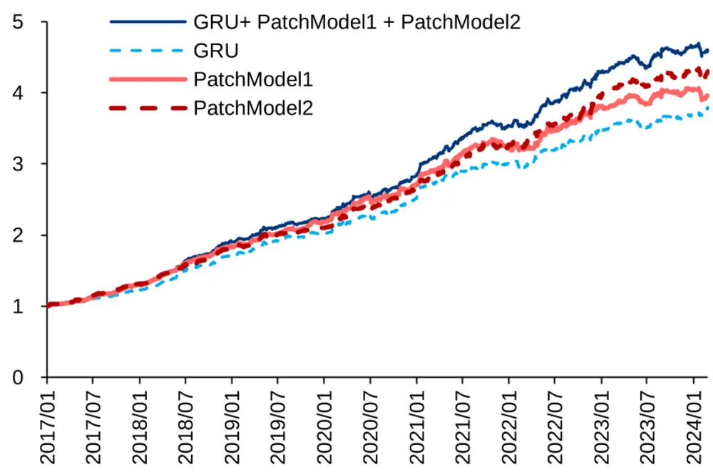

图表4：30 分钟频量价模型相对净值（分10层 TOP层）
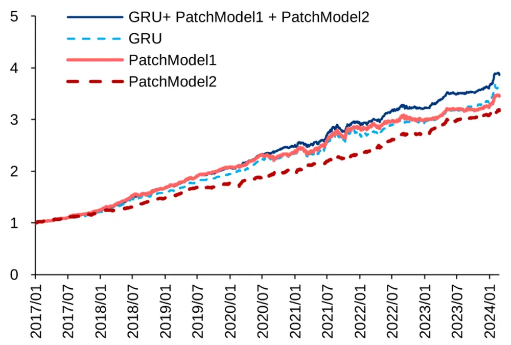

## Patch思想

## Patch的概念与优点

Patch的思想可以概括为对时间序列数据进行分块处理，并将每一块作为一个整体传入模型。对数据进行patch处理具备以下优点：（1）模型保留了局部信息，在时间序列中模型可以捕捉某一时间点前后一段时间的信息，而不只是这一时间点的信息；（2）在给定相同时间窗口下，对模型进行patch处理减少了算力以及内存的占用，提升了模型的运行效率；（3）模型可以捕捉更长时间窗口的信息，由于时间序列通常携带大量的时间冗余信息，因此在过往的研究中通常调低采样频率或设计稀疏连接的方法来忽略部分数据点，而进行patch处理后的数据可以在保留全部数据点的基础上避免冗余信息的影响。

## Patch的相关研究

近年来许多学者将patch的思想应用在不同的深度学习领域。Nie等（2022）提出patch时间序列Trans former模型（PatchTST），并应用于多变量时间序列预测和自监督表征学习中。PatchTST模型包括patch和通道独立两个核心部分：patch将时间序列分解为多个子序列，作为Transformer的输入token；通道独立意味着每个输入token只包含来自单个变量的信息。论文比较了PatchTST与多个Transformer类模型在不同领域数据集上的表现，发现PatchTST展现了更好的预测能力。论文还尝试了自监督学表征学习，模型性能也有提升。

图表5：PatchTST模型
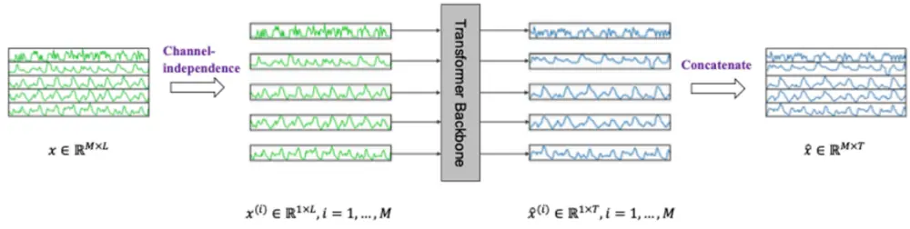
(a) PatchTST Model Overview

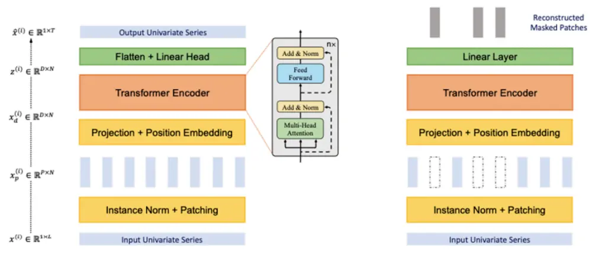
(b) Transformer Backbone (Supervised)
(c) Transformer Backbone (Self-supervised)

Zhang等（2023）提出多尺度Transformer金字塔网络（MTPNet），用于有效捕捉在多个不受约束的尺度上的时间依赖性。模型使用了维度不变编码（Dimension InvariantEmbedding ） 的 方 法 。 以 往 的 编 码 方 式 包 括 两 种 ， 在 空 间 上 分 patch 或 在 时 间 上 分patch。该研究认为应该同时考虑空间和时间两个维度，先通过卷积对原来的时间序列做处理，实现空间维度信息的融合，然后在时间维度上进行分patch的操作。这种方式使得每个patch的编码同时保留了空间和时间维度的信息。

图表6：空间、时间、维度不变编码方法
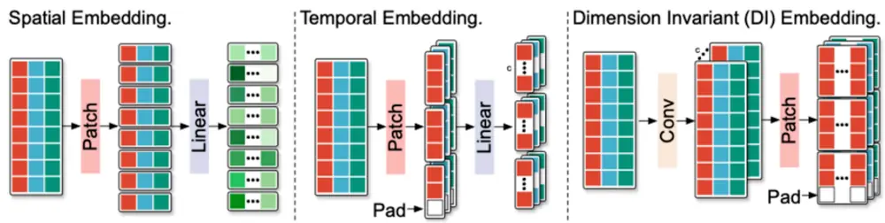

此 外 ， 在 计 算 机 视 觉 领 域 ， Dosovitskiy 等 （ 2020 ） 基 于 patch 提 出 视 觉 Transformer模型（ViT），并得到了比卷积神经网络更出色的性能。应用于大型数据集上时，ViT模型可以捕捉图片中局部信息，并减少需要的计算资源。

图表7：ViT模型
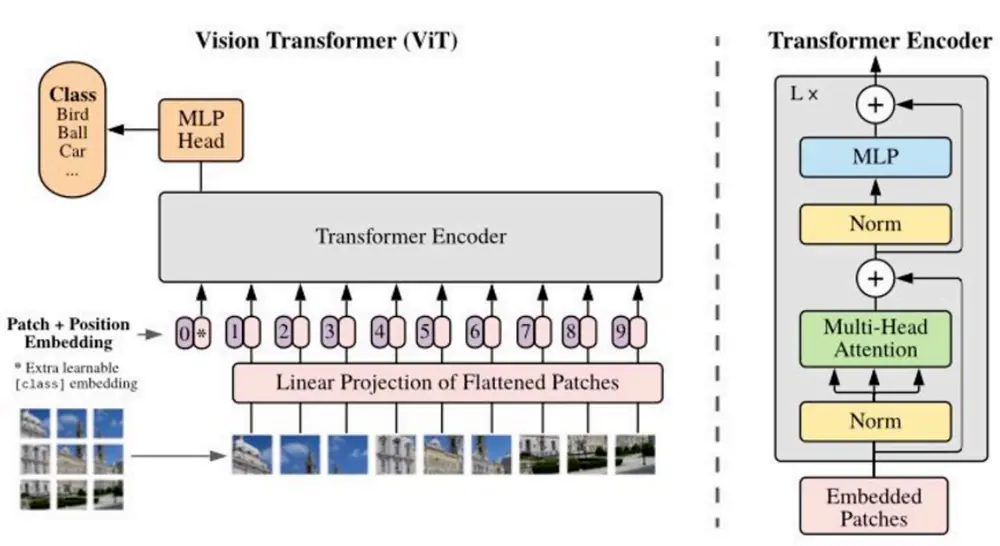

OpenAI最新成果Sora模型能够将文本描述转换为相应的视频内容，在技术和效果上都有巨 大 突 破 ， 核 心 之 一 是 spacetime patch ， 先 将 视 频 压 缩 到 低 维 空 间 ， 再 分 解 为 时 空patch序列，作为Transformer的输入token，这使得Sora能够适应不同分辨率的视频。

图表8： Sora 模型的 spacetime patch
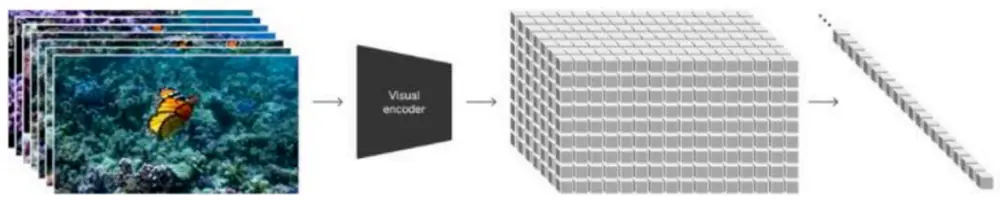

## 实验设计

## 方法

借鉴上述思想，股票的长时间序列数据也可划分为多个patch，很自然的方法便是按照交易日来分割，即每个patch为同一交易日的日内数据，不同patch属于不同交易日。这种做法可以有效缓解GRU的不足：（1）GRU在分析长时间序列数据时会出现信息遗忘的问题，而patch能够处理更长时间窗口的信息；（2）GRU难以捕捉高频量价数据的周期性规律，patch划分方法可引入以日为周期的先验知识；（3）GRU只能同质化地处理不同时刻的信息传递，patch能够差异化地分析日内和日间信息传递。

将 股 票 分 割 为 patch 之 后 ， 还 会 涉 及 两 个 问 题 ： （ 1 ） patch 内 的 数 据 如 何 建 模 ； （ 2 ）patch间的数据如何建模。一种思路是，patch内数据具有时序规律，可使用GRU进行建模，之后再通过注意力或拼接等方式构建patch间的联系，由此我们设计出第一个模型PatchModel1。还有一种思路是，patch内数据可拆解为不同的特征（例如早盘数据是一个特征，尾盘数据是另一个特征），再使用GRU来挖掘patch间的时序规律，基于这种思路我们设计出第二个模型PatchModel2。

## PatchModel1

PatchModel1使用GRU捕捉patch内的时序信息，再通过注意力机制构建patch间的联系，网络结构如下图。

输入维度为t×f的数据（其中t代表序列长度，f代表特征数量），首先将输入数据划分为多个patch，每个patch属于同一天，得到维度为m×n×f的向量（其中m代表天数，n代表每 一 天 内 时 间 序 列 的 长 度 ） 。 例 如 ， 序 列 长 度 为 320 的 15 分 钟 频 开 、 高 、 低 、 收 、vwap、成交量数据，可转换为20×16×6的向量，即过去20个交易日，每个交易日有16个15分钟区间，每个区间有6个特征。

接着，使用GRU模型提取每个patch内部的时间序列信息，取最后一个时间步的输出，得到m个维度为h的向量，其中h代表隐含层维度。考虑到每天的序列都是从开盘到收盘，具有一定的共性，本研究使用相同参数的GRU对不同patch进行建模。最后，使用注意力机制对不同patch的输出进行加权，再接入全连接层，得到预测值。计算注意力的方法为：

图表9：PatchModel1 网络结构
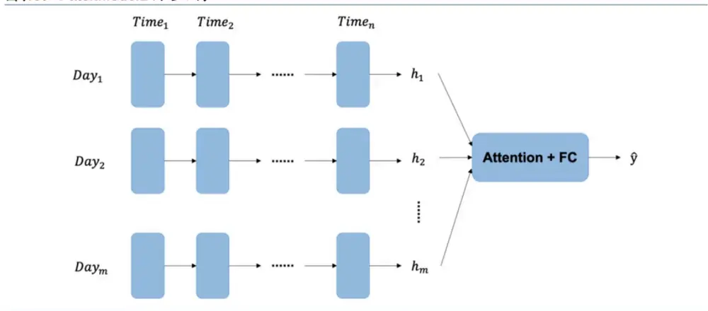

## PatchModel2

PatchModel2使用GRU来挖掘patch间的时序规律，网络结构如下图。

同PatchModel1一样，输入维度为t×f的数据，通过patch的划分可变换得到维度为m×n×f的向量。接着，借鉴PatchTST论文中通道独立的设计，对于每个原始特征，使用GRU提取patch间的时间序列信息，其中以每个patch作为时间步，patch内更细颗粒度的时间作为新的特征。考虑到不同通道的时间序列规律不一定相似，此模型使用不同参数的GRU。取最后一个时间步的输出，得到f个维度为h的隐含层。最后，将不同原始特征的隐含层拼接起来，再接入全连接层，得到预测值。

图表10：PatchModel2 网络结构
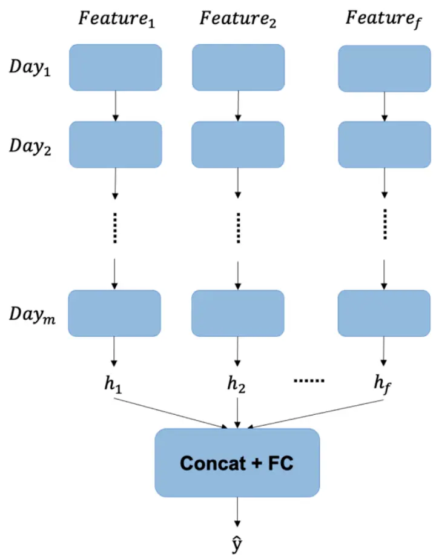

## 实验场景

## 15分钟频量价数据序列

华泰金工报告《神经网络多频率因子挖掘模型》（2023.5.11）中设计了基于GRU的15分钟频量价数据模型，使用个股过去20个交易日的15分钟频开、高、低、收、vwap、成交量数据来预测未来10个交易日的收益率。报告还尝试加入注意力机制来更好地记忆长序列信息，但相比原始GRU模型并无优势。本文将在此场景下测试patch模型的有效性。

图表11：模型及数据细节

| 特征和标签 | 特征X：个股过去20个交易日的15分钟频开、高、低、收、vwap、成交量数据，序列长度为20×16=320。 标签y：个股未来10个交易日（T+1～T+11）的收益率。 特征预处理：每个特征先进行时间序列标准化，即将特征时间序列的每个值除以该序列的均值。再对每个特征进 行截面 z-score 标准化。 标签预处理：对标签进行截面 z-score标准化。 |
| --- | --- |
|  | 样本内训练数据从2013年开始，每5个交易日采样一次，训练集和验证集依时间先后按照4:1的比例划分。 损失函数：预测值与标签之间IC的相反数。 |
| 模型训练参数 | batch_size: 5000。 |
|  | 训练最大迭代轮数：100，早停轮数：10。 |
|  | 学习率：0.005，优化器：Adam。 |
|  | 模型每隔半年重新训练一次。 |

图表12：网络结构对比

| GRU 基准模型 | GRU：输入维度320×6，输出维度30，层数为1层。 BN：对 GRU 的输出进行批标准化。 |
| --- | --- |
| PatchModel1 | FC：全连接层，输入维度30，输出维度1。 GRU：输入维度16×6，输出维度30，层数为1层，数量20个。 Attention：计算每个GRU输出隐含层的得分，再加权求和，输出维度30。 BN：对 Attention的输出进行批标准化。 |
| PatchModel2 | FC：全连接层，输入维度30，输出维度1。 GRU：输入维度20×16，输出维度30，层数为1层，数量6个。 Concat：将多个 GRU 的输出拼接，输出维度 180。 BN：对 Concat 的输出进行批标准化。 |

## 30分钟频量价特征序列

华泰金工报告《基于全频段量价特征的选股模型》（2023.12.8）中使用分钟频、逐笔成交和逐笔委托数据，构建多个日频化因子。本研究将这些因子提升到30分钟频，使用个股过去40个交易日的30分钟频量价特征作为深度学习模型的输入，预测未来10个交易日的收益率，并测试此场景下patch模型的有效性。值得一提的是，量价特征使用30分钟频的原因是与前个实验15分钟频量价数据保持差异，以便论证模型的鲁棒性。

图表13：模型及数据细节

| 特征和标签 | 特征X：个股过去40个交易日的30分钟频量价特征，序列长度为40×8=320。 标签y：个股未来10 个交易日（T+1～T+11）的收益率。 |
| --- | --- |
|  | 特征预处理：对每个因子进行中位数去极值、行业市值中性化、截面z-Score标准化、缺失值填充。 标签预处理：对标签进行截面 z-Score标准化。 |
|  | 样本内训练数据从2013年开始，每5个交易日采样一次，训练集和验证集依时间先后按照4:1的比例划分。 损失函数：预测值与标签之间IC的相反数。 |
| 模型训练参数 |  |
|  | batch_size: 5000。 |
|  | 训练最大迭代轮数：100，早停轮数：10。 |
|  | 学习率：0.005，优化器：Adam。 模型每隔半年重新训练一次。 |

图表14：网络结构对比

| GRU基准模型 GRU：输入维度320×22，输出维度 30，层数为1层。 BN：对 GRU 的输出进行批标准化。 FC：全连接层，输入维度30，输出维度1。 |
| --- |
| PatchModel1 GRU：输入维度8×22，输出维度30，层数为1层，数量40个。 Attention：计算每个GRU输出隐含层的得分，再加权求和，输出维度30。 BN：对 Attention 的输出进行批标准化。 FC：全连接层，输入维度30，输出维度1。 |
| PatchModel2 GRU：输入维度 40×8，输出维度 30，层数为1层，数量 22个。 Concat:将多个 GRU 的输出拼接，输出维度 660。 BN：对 Concat 的输出进行批标准化。 FC：全连接层，输入维度660，输出维度1。 |

## 结果

我们使用单因子测试的方法，对以上模型进行测试。为了减轻随机性干扰，本文的深度学习模型都用不同随机数种子训练三次，将三次的模型等权集成，作为最终的因子信号。

## 单因子测试方法如下：

1．股票池：全A股，剔除ST股票，剔除每个截面期下一交易日停牌、涨停的股票。

2．回测区间：2017/1/4～2024/2/29。

3．调仓周期：周频，不计交易费用。

4．因子预处理：因子去极值、行业市值中性化、标准化。

5．测试方法：IC值分析，因子分10层测试，因子间相关性分析。

## 15分钟频量价数据序列

测试结果如下所示。与GRU基准模型相比，PatchModel1和PatchModel2整体表现更优，尽管RankIC均值略低，但TOP组合年化超额收益率和信息比率明显更高，TOP组合换手率也有所下降。

模型间预测值的相关性不高，GRU、PatchModel1和PatchModel2三个模型间预测值的相关系数在0.5～0.7之间。进一步将模型进行等权合成，合成因子的回测表现强于单因子。其中，三模型合成因子的TOP组合年化超额收益率领先其他因子，达到24.65%。

图表15: 15分钟频量价模型的IC值分析和分层回测结果汇总

|  | RankIC 均值 | RankIC 标准差 | IC_IR | IC>0 占比 | TOP 组合年化超额收益率 | TOP 组合信息比率 | TOP 组合胜率 | TOP 组合换手率 |
| --- | --- | --- | --- | --- | --- | --- | --- | --- |
| GRU | 8.86% | 7.47% | 1.19 | 88.76% | 21.15% | 4.06 | 82.56% | 120.05% |
| PatchModel1 | 8.43% | 7.18% | 1.17 | 87.90% | 21.95% | 4.30 | 81.40% | 111.90% |
| PatchModel2 | 8.78% | 6.72% | 1.31 | 92.22% | 23.52% | 4.62 | 90.70% | 115.28% |
| GRU+PatchModel1 | 9.13% | 7.57% | 1.21 | 90.78% | 22.32% | 4.26 | 79.07% | 112.41% |
| GRU+PatchModel2 | 9.58% | 7.45% | 1.29 | 92.51% | 24.33% | 4.57 | 88.37% | 113.12% |
| GRU+PatchModel1+PatchModel2 | 9.58% | 7.54% | 1.27 | 92.22% | 24.65% | 4.59 | 87.21% | 110.15% |

图表16：15分钟频量价模型相对净值
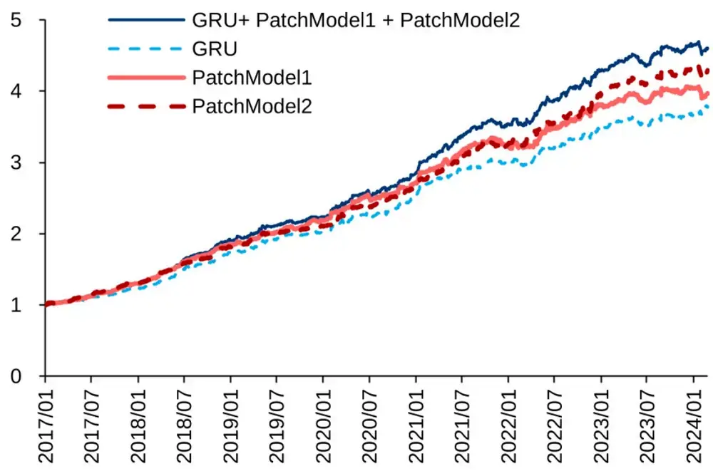

图表17：15 分钟频量价模型累计 RankIC
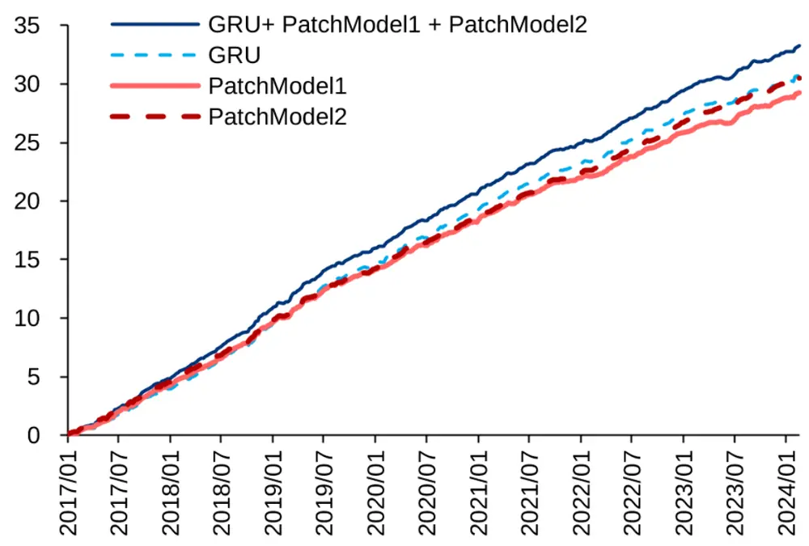

图表18：15分钟频量价模型间预测值相关性

| GRUGRU |  | PatchModel1 PatchModel2 GRU+PatchModel1+PatchModel2 |  |  |  |
| --- | --- | --- | --- | --- | --- |
|  |  |  | 0.69 | 0.58 | 0.84 |
| PatchModel1PatchModel2GRU+PatchModel1+PatchModel2 | 0.69 |  | 0.63 | 0.86 |  |
|  | 0.58 | 0.63 |  | 0.81 |  |
|  | 0.84 0.86 |  | 0.81 |  |  |

15分钟频patch模型相对GRU模型的增量信息是否仅来源于对日间信息的捕捉，改用日频量价数据模型能否囊括这些信息？本研究训练了一个基于过去40个交易日的日频量价数据来预测未来10日收益率的日频GRU模型。首先进行相关性分析，15分钟频GRU与日频GRU模型的相关性为0.53，而PatchModel1、PatchModel2与日频GRU模型的相关性均更低，三模型合成因子与日频GRU模型的相关性为0.55，仅提高0.02。接着使用15分钟 频 量 价 模 型 信 号 对 日 频 GRU 信 号 做 回 归 ， 再 对 残 差 进 行 回 测 ， PatchModel1 、PatchModel2以及三模型合成因子的残差在多数指标上都好于GRU残差。此外，还可使用patch模型信号对日频GRU和15分钟频GRU信号同时做回归，残差超额同样显著。综上，patch模型通过网络结构设计更好地融合日内和日间信息，并非15分钟频GRU和日频GRU的简单加和。

图表19：15分钟频量价模型与日频量价模型的相关性

|  | 15 分钟频 GRU | PatchModel1 | PatchModel2 | GRU+PatchModel1+PatchModel2 |
| --- | --- | --- | --- | --- |
| 日频 GRU | 0.53 | 0.50 | 0.46 | 0.55 |

图表20：15分钟频量价模型残差的IC 值分析和分层回测结果汇总

|  | RankIC 均值 RankIC 标准差 |  | IC_IR | IC>0 占比 | TOP组合年化超额收益率 | TOP 组合信息比率 | TOP 组合胜率 | TOP 组合换手率 |
| --- | --- | --- | --- | --- | --- | --- | --- | --- |
| GRU残差 | 3.92% | 5.90% | 0.66 | 76.66% | 4.88% | 1.04 | 66.28% | 132.63% |
| PatchModel1 残差 | 3.57% | 5.61% | 0.64 | 75.79% | 6.32% | 1.45 | 66.28% | 121.76% |
| PatchModel2 残差 | 4.21% | 5.48% | 0.77 | 78.67% | 7.96% | 1.77 | 70.93% | 128.18% |
| GRU+PatchModel1+PatchModel2 残差 | 4.57% | 6.03% | 0.76 | 78.10% | 8.79% | 1.98 | 73.26% | 124.73% |

## 30分钟频量价特征序列

测试结果如下所示。在此实验场景下，PatchModel1、PatchModel2的RankIC均值和TOP组合年化超额收益率表现略弱于GRU基准模型。不过，单模型间预测值的相关系数在0.6～0.8之间，patch模型仍能提供增量信息，与GRU等权合成后的因子表现强于单因子。其中，三模型合成因子表现较好，RankIC均值为8.62%，TOP组合年化超额收益率为21.64%。

图表21：30分钟频量价模型的IC值分析和分层回测结果汇总

|  | RankIC 均值 | RankIC 标准差 | IC_IR | IC>0 占比 | TOP 组合年化超额收益率 | TOP 组合信息比率 | TOP 组合胜率 | TOP 组合换手率 |
| --- | --- | --- | --- | --- | --- | --- | --- | --- |
| GRU | 8.27% | 6.38% | 1.30 | 90.78% | 20.42% | 3.86 | 86.05% | 106.86% |
| PatchModel1 | 7.83% | 6.41% | 1.22 | 87.32% | 19.72% | 3.91 | 81.40% | 96.42% |
| PatchModel2 | 8.03% | 6.82% | 1.18 | 86.17% | 18.03% | 4.56 | 89.54% | 119.15% |
| GRU+PatchModel1 | 8.36% | 6.52% | 1.28 | 88.76% | 21.62% | 4.07 | 84.88% | 99.69% |
| GRU+PatchModel2 | 8.64% | 6.65% | 1.30 | 89.91% | 21.88% | 5.16 | 88.37% | 111.80% |
| GRU+PatchModel1+PatchModel2 | 8.62% | 6.64% | 1.30 | 89.05% | 21.64% | 4.69 | 86.05% | 104.95% |

图表22：30分钟频量价模型相对净值
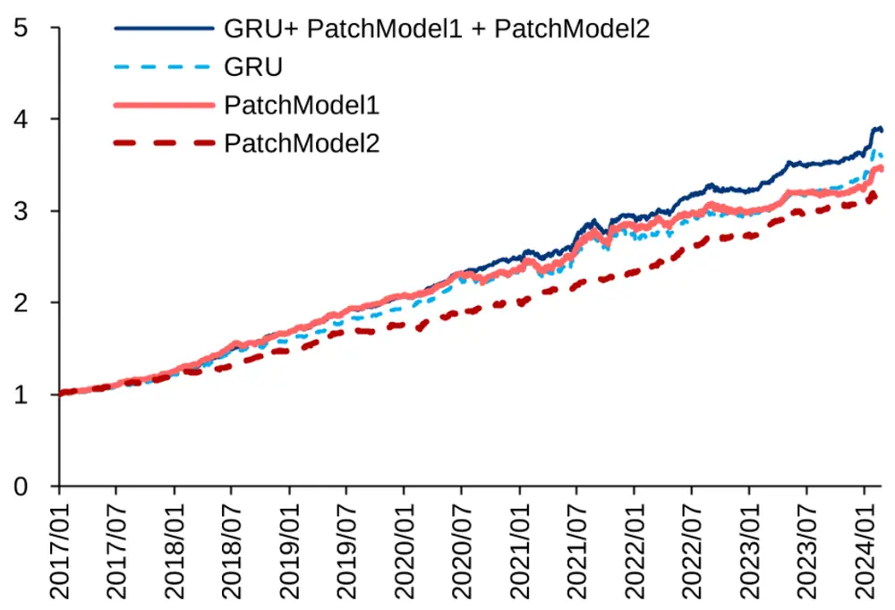

图表23：30 分钟频量价模型累计 RankIC
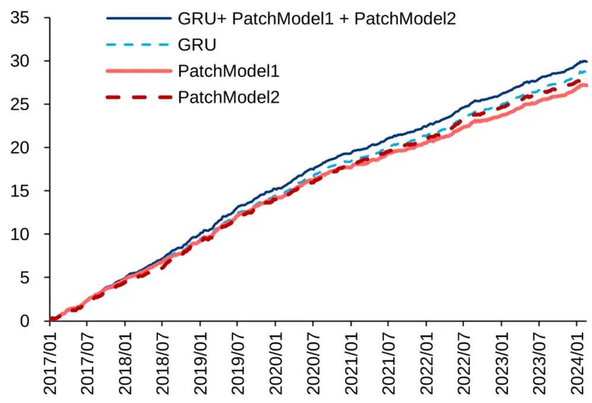

图表24：30分钟频量价模型间预测值相关性

|  | GRU | PatchModel1 | PatchModel2 | GRU+PatchModel1+PatchModel2 |
| --- | --- | --- | --- | --- |
| GRU |  | 0.75 | 0.66 | 0.88 |
| PatchModel1 | 0.75 |  | 0.66 | 0.88 |
| PatchModel2 | 0.66 | 0.66 |  | 0.84 |
| GRU+PatchModel1+PatchModel2 | 0.88 | 0.88 | 0.84 |  |

## 全频段融合因子的改进

华泰金工报告《基于全频段量价特征的选股模型》（2023.12.8）中基于高频因子和低频量价数据，使用深度学习训练得到高频深度学习因子和低频多任务因子，再将两者按照1:3比例合成得到全频段融合因子。我们用上述两个实验场景中的合成因子对全频段融合因子加以改进。15分钟频量价模型因子、30分钟频量价模型因子、高频深度学习因子、低频多任务因子按照1:1:1:3比例进行合成，得到全频段融合因子2.0版本。

图表25：全频段融合因子2.0 构建方法
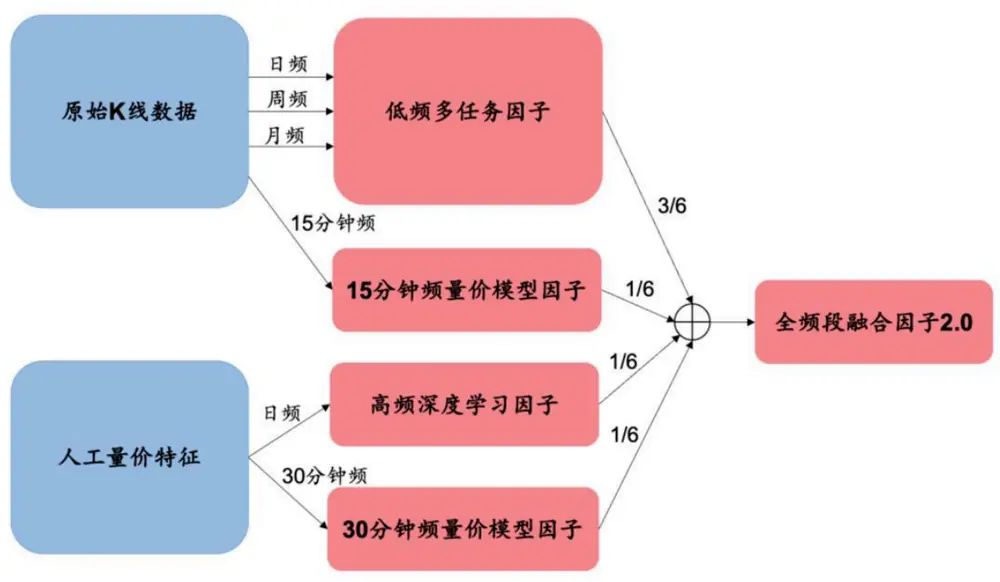

## 全频段融合因子测试

使用单因子测试的方法，对全频段融合因子1.0和2.0版本进行测试。全频段融合因子2.0在RankIC均值、IC_IR、TOP组合年化超额收益率、TOP组合信息比率、TOP组合胜率等多项指标上表现更加突出。

图表26：全频段融合因子IC值分析和分层回测结果汇总

|  | RankIC 均值 | RankIC 标准差 | IC_IR |  | IC>0 占比 TOP 组合年化超额收益率 | TOP 组合信息比率 TOP 组合胜率 TOP 组合换手率 |  |  |
| --- | --- | --- | --- | --- | --- | --- | --- | --- |
| 全频段融合因子1.0 | 10.42% | 7.23% | 1.44 | 92.22% | 32.61% | 6.12 | 89.54% | 90.50% |
| 全频段融合因子 2.0 | 11.33% | 7.55% | 1.50 | 91.93% | 34.40% | 6.38 | 93.02% | 92.32% |

图表27：全频段融合因子相对净值
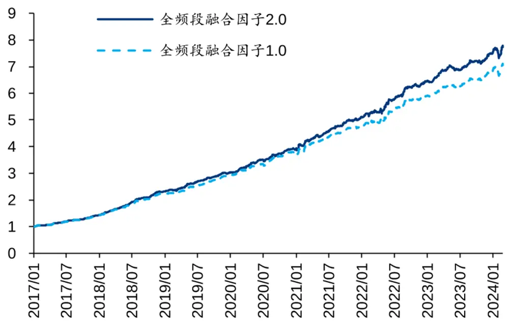

图表28：全频段融合因子累计 RankIC
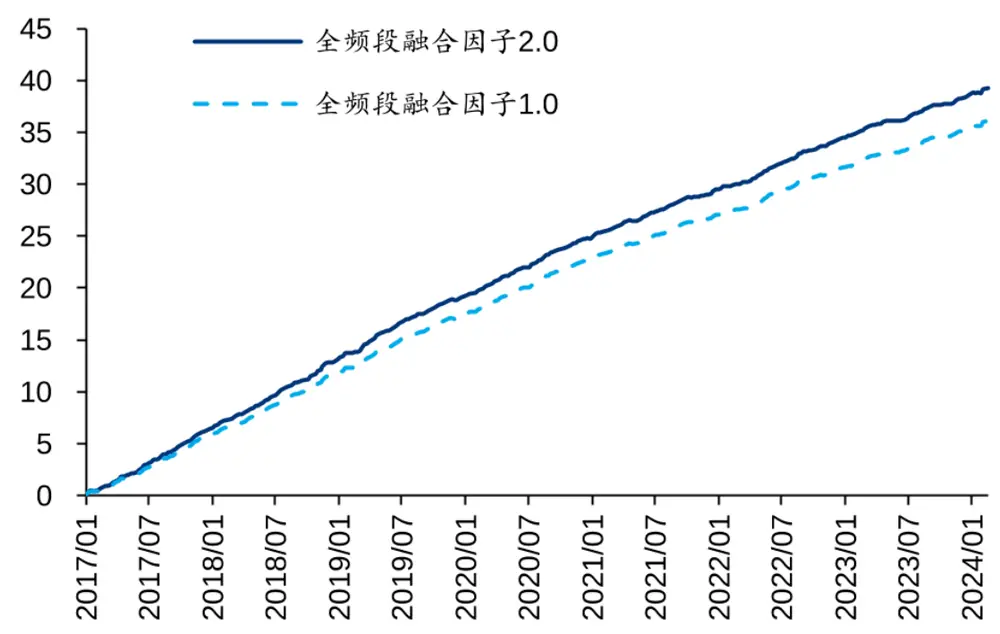

## 指数增强策略

使用全频段融合因子，构建中证500和中证1000指数增强组合，构建方法如下。

图表29：指数增强组合构建细节

| 优化目标 | 最大化预期收益 |
| --- | --- |
| 成分股权重约束 | 不低于 80% |
| 个股权重偏离上限 | 0.8% |
| 风格因子约束 | 行业暴露<0.02，市值暴露<0.2 |
| 换手率约束 | 周双边换手率上限分别为 30%、40%和50% |
| 调仓频率和交易成本 | 周频调仓，调仓当日以vwap价格成交，交易成本双边千分之四 |

## 中证500增强

中证500增强组合回测结果如下。两种版本全频段融合因子构建的中证500增强策略，超额收益接近，但2.0版本的跟踪误差和超额收益最大回撤更低，因此信息比率和Calmar比率普遍更高。

图表30：中证500增强组合累计超额收益（换手率30%）
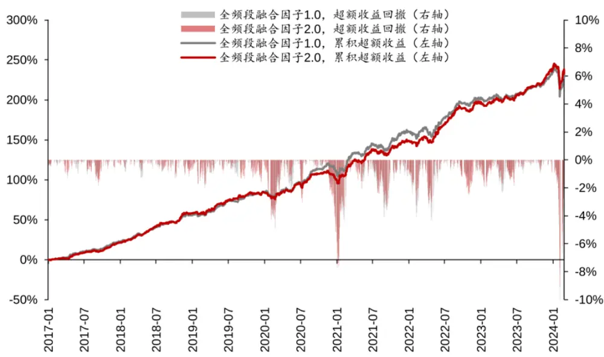

图表31：中证 500 增强组合回测绩效

|  |  | 年化收益率 | 年化波动率 | 夏普比率最大回撤 |  | 年化超额收年化跟踪误超额收益最 |  |  | 信息比率Calmar 比率 | 相对基准月 | 调仓双边换 胜率 手率 |
| --- | --- | --- | --- | --- | --- | --- | --- | --- | --- | --- | --- |
|  |  |  |  |  |  | 益率 | 差 | 大回撤 |  |  |  |
|  | 全频段融合 换手率=30% | 15.28% | 20.94% | 0.73 | 30.55% | 18.66% | 5.94% | 10.37% | 3.14 | 1.80 80.00% | 32.65% |
| 因子1.0 | 换手率=40% | 15.46% | 21.06% | 0.73 | 30.28% | 18.86% | 6.11% | 10.45% | 3.09 1.80 | 78.82% | 42.10% |
|  | 换手率=50% | 15.33% | 21.18% | 0.72 | 31.27% | 18.76% | 6.20% | 10.67% | 3.03 1.76 | 82.35% | 51.56% |
| 全频段融合换手率=30% |  | 15.55% | 20.84% | 0.75 | 29.64% | 18.93% | 5.79% | 9.10% | 3.27 2.08 | 80.00% | 32.83% |
| 因子 2.0 | 换手率=40% | 15.18% | 21.01% | 0.72 | 29.84% | 18.57% | 5.96% | 9.57% | 3.12 1.94 | 77.65% | 42.46% |
|  | 换手率=50% | 15.02% | 21.15% | 0.71 | 31.36% | 18.43% | 6.15% | 9.92% | 3.00 1.86 | 76.47% | 52.00% |
| 中证 500 |  | -2.98% | 20.75% | -0.14 | 41.69% |  |  |  |  |  |  |

图表32：中证 500 增强组合逐年收益率

|  | 2017年收益率 | 2018年收益率 | 2019年收益率 |  | 2020年收益率 | 2021年收益率 | 2022 年收益率 | 2023年收益率 | 2024年收益率 |
| --- | --- | --- | --- | --- | --- | --- | --- | --- | --- |
| 全频段融合因子换手率=30% |  | 20.47% | -15.53% | 50.24% | 37.86% | 43.30% | -7.74% | 2.04% | -2.54% |
| 1.0 | 换手率=40% | 21.53% | -12.91% | 51.23% | 33.75% | 44.87% | -10.33% | 3.19% | -2.24% |
|  | 换手率=50% | 21.42% | -12.49% | 49.75% | 34.89% | 46.51% | -11.53% | 2.72% | -2.60% |
| 全频段融合因子换手率=30% |  | 19.22% | -13.47% | 47.87% | 31.64% | 43.80% | -5.06% | 4.95% | -1.92% |
| 2.0 | 换手率=40% | 20.03% | -12.67% | 46.83% | 34.41% | 42.52% | -6.76% | 2.88% | -2.44% |
|  | 换手率=50% | 20.34% | -11.72% | 44.51% | 36.93% | 45.70% | -9.66% | 0.82% | -2.03% |
| 中证 500 |  | -2.25% | -33.32% | 26.38% | 20.87% | 15.58% | -20.31% | -7.42% | -1.52% |

中证1000增强

中证1000增强组合回测结果如下。全频段融合因子2.0版本同样在跟踪误差、超额收益最大回撤、信息比率和Calmar比率上体现出优势。

图表33：中证1000增强组合累计超额收益（换手率30%）
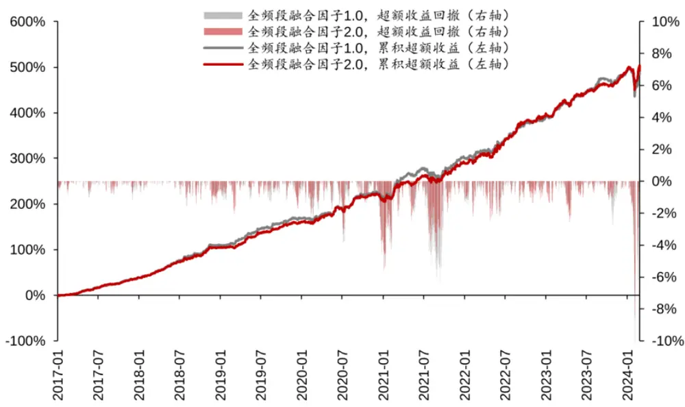

图表34：中证1000 增强组合回测绩效

|  |  | 年化收益率 | 年化波动率 | 夏普比率最大回撤 |  | 年化超额收年化跟踪误超额收益最 大回撤 |  |  | 信息比率Calmar 比率 | 相对基准月 | 调仓双边换 |
| --- | --- | --- | --- | --- | --- | --- | --- | --- | --- | --- | --- |
|  |  |  |  |  |  | 益率 | 差 |  |  |  | 胜率 手率 |
|  | 全频段融合 换手率=30% | 19.74% | 23.65% | 0.83 | 34.74% | 28.97% | 7.03% | 10.17% | 4.12 2.85 | 85.88% | 33.38% |
| 因子1.0 | 换手率=40% | 20.42% | 23.83% | 0.86 | 34.46% | 29.73% | 7.26% | 11.19% | 4.09 2.66 | 85.88% | 42.91% |
|  | 换手率=50% | 19.81% | 23.89% | 0.83 | 34.90% | 29.08% | 7.38% | 11.99% | 3.94 2.43 | 84.71% | 52.22% |
| 全频段融合换手率=30% |  | 20.02% | 23.51% | 0.85 | 33.24% | 29.25% | 6.73% | 8.41% | 4.35 3.48 | 87.06% | 33.99% |
| 因子 2.0 | 换手率=40% | 21.54% | 23.65% | 0.91 | 32.97% | 30.92% | 6.90% | 9.36% | 4.48 3.30 | 88.24% | 43.33% |
|  | 换手率=50% | 19.68% | 23.78% | 0.83 | 34.25% | 28.94% | 7.03% | 10.23% | 4.12 2.83 | 87.06% | 52.66% |
| 中证 1000 |  | -7.23% | 22.95% | -0.31 | 52.14% |  |  |  |  |  |  |

图表35：中证 1000 增强组合逐年收益率

| 2017年收益率 2018年收益率 |  |  |  |  |  |  |  |  |
| --- | --- | --- | --- | --- | --- | --- | --- | --- |
| 全频段融合因子换手率=30% | 12.05% | -4.36% | 2019年收益率 61.06% | 2020年收益率 40.80% | 2021年收益率 53.71% | 2022 年收益率 -4.68% | 2023 年收益率 13.31% | 2024年收益率 -9.74% |
| 1.0 | 换手率=40% | 10.35% | -3.41% | 64.77% | 42.11% | 55.89% | -5.35% | 14.47% -9.94% |
| 换手率=50% | 9.71% | -1.56% | 63.52% | 41.23% | 53.66% | -4.85% | 12.35% | -10.67% |
| 全频段融合因子换手率=30% | 12.01% | -6.44% | 59.69% | 42.84% | 51.80% | -0.55% | 11.68% | -8.37% |
| 2.0 换手率=40% | 11.69% | -1.63% | 62.11% | 47.27% | 52.02% | -2.94% | 14.17% | -8.83% |
| 换手率=50% | 10.98% | -0.04% | 61.55% | 44.11% | 48.73% | -6.33% | 11.56% | -9.69% |
| 中证 1000 | -19.06% | -36.87% | 25.67% | 19.39% | 20.52% | -21.58% | -6.28% | -9.22% |

## 总结

随着高频数据的普及和算力的发展，量化投资中使用的时间序列数据长度正逐渐扩展。传统GRU模型在处理长序列数据时可能存在信息遗忘、难以捕捉周期性和异质性规律等问题。本研究引入patch的思想，按照交易日将股票的长时间序列量价数据划分为多个patch，设计PatchModel1和PatchModel2两个模型，并在两个选股场景下进行测试。结果表明，patch模型具有增量信息，模型融合后相比GRU均有提升。使用两个场景下的合成因子对前期报告的全频段融合因子加以改进，回测表现有所提高。

传统GRU模型在处理长序列数据时可能存在一些“盲区”。作为一种经典的时间序列深度学习模型，GRU在量化投资中有着广泛应用。然而，GRU在处理长时间序列量价数据存在一些缺陷。首先，当序列非常长的时候，GRU会遇到梯度消失、信息遗忘的问题。其次，高频量价数据具有一定的周期性，GRU难以捕捉这种周期性的规律。此外，长时间序列量价数据的日内和日间信息传递具有异质性，但参数共享的设计造成GRU只能一视同仁地处理所有时间点的数据。

模型引入patch设计能够有效缓解GRU的不足。Patch的思想可概括为对数据进行分块处理，并将每一块作为一个整体传入模型，在时间序列预测和计算机视觉等领域均有应用。本研究按照交易日将股票的长时间序列量价数据划分为多个patch，使模型可以有效缓解信息遗忘的问题，并引入以日为周期的先验知识，差异化地分析日内和日间信息传递。本文设计了PatchModel1和PatchModel2两个模型。PatchModel1使用GRU处理日内的时序数据，再通过注意力机制构建日间的联系；PatchModel2将日内时点信息拆解为不同的特征，再使用GRU来挖掘日间的时序规律。

Patch模型相较于基准GRU模型具有增量信息。本研究在两个场景下测试patch模型的表现。在15分钟频量价数据序列中，patch模型回测表现优于GRU，且模型间预测值相关性不高，等权合成因子的表现进一步提升。样本空间为全A股，GRU与patch模型合成后，2017/1/4 ～ 2024/2/29 的 回 测 期 内 周 度 RankIC 均 值 从 8.86% 提 升 到 9.58% ， 分 10 层TOP组合年化超额收益率从21.15%提升到24.65%。在30分钟频量价特征序列中，patch模 型 回 测 表 现 略 弱 于 GRU ， 但 仍 能 提 供 增 量 信 息 。 GRU 与 patch 模 型 合 成 后 ， 周 度RankIC均值从8.27%提升到8.62%，分10层TOP组合年化超额收益率从20.42%提升到21.64%。

改进全频段融合因子，回测表现有所增强。使用上述两个实验场景中的合成因子，对前期报告的全频段融合因子加以改进。全频段融合因子在2017/1/4～2024/2/29的回测期内周度RankIC均值从10.42%提升到11.33%，分10层TOP组合年化超额收益率从32.61%提升到34.40%。基于全频段融合因子2.0版本构建指数增强组合。在周双边换手率分别控制为30%、40%和50%的情况下，2017/1/4～2024/2/29回测期内中证500增强组合年化 超 额 收 益 率 为 18.93% 、 18.57% 和 18.43% ， 信 息 比 率 为 3.27 、 3.12 和 3.00； 中 证1000 增 强 组 合 年 化 超 额 收 益 率 为 29.25% 、 30.92% 和 28.94% ， 信 息 比 率 为 4.35 、 4.48和4.12。

## 风险提示

借助高频因子、人工智能构建的选股策略是历史经验的总结，存在失效的可能。深度学习的可解释性较弱，使用需谨慎。

## 参考文献

[ 1 ] N i e Y, N g u y e n N H , S i n t h o n g P, e t a l . A t i m e s e r i e s i s w o r t h 6 4 w o r d s : L o n g - t e r m f o r e c a s t i n g w i t h t r a n s f o r m e r s [ J ] . a r X i v p r e p r i n t arXiv:2211.14730, 2022.

[2] Zhang Y, Wu R, Dascalu S M, et al. Multi-scale transformer pyramid n e t w o r k s fo r m u l t i va r i a t e t i m e s e r i e s fo re c a s t i n g [ J ] . I E E E A c c e s s , 2 0 2 4 .

[3] Dosovitskiy A , Beyer L, Kolesnikov A , et al. An image is wor th 16x16 w o rd s : Tr a n s fo r m e r s fo r i m a g e re c o g n i t i o n a t s c a l e [ J ] . a r X i v p re p r i n t arXiv:2010.11929, 2020.

[4] Dehghani M, Mustafa B, Djolonga J, et al. Patch n’pack : Navit, a v i s i o n t r a n s fo r m e r fo r a n y a s p e c t r a t i o a n d re s o l u t i o n [ J ] . A d va n c e s i n N e u r a l I n f o r m a t i o n P r o c e s s i n g Sy s t e m s , 2 0 2 4 , 3 6 .

[5] Arnab A , Dehghani M, Heigold G, et al. Vivit: A video vision transformer[C]//Proceedings of the IEEE/CVF international conference on computer vision. 2021: 6836-6846.

## 相关研报

研报：《如何捕捉长时间序列量价数据的规律》2024年3月14日

林晓明 S0570516010001 | BPY421

何康 S0570520080004 | BRB318

## 关注我们

## 华泰睿思

华泰证券研究所官方公众号。研究服务0距离，投资决策1点通。

3804篇原创内容

公众号

## 华泰证券研究所国内站（研究Portal）

https://inst.htsc.com/research

访问权限：国内机构客户

## 华泰证券研究所海外站

https://intl.inst.htsc.com/research

访问权限：美国及香港金控机构客户

添加权限请联系您的华泰对口客户经理

## 免责声明

## ▲向上滑动阅览

本公众号不是华泰证券股份有限公司（以下简称“华泰证券”）研究报告的发布平台，本公众号仅供华泰证券中国内地研究服务客户参考使用。其他任何读者在订阅本公众号前，请自行评估接收相关推送内容的适当性，且若使用本公众号所载内容，务必寻求专业投资顾问的指导及解读。华泰证券不因任何订阅本公众号的行为而将订阅者视为华泰证券的客户。

本公众号转发、摘编华泰证券向其客户已发布研究报告的部分内容及观点，完整的投资意见分析应以报告发布当日的完整研究报告内容为准。订阅者仅使用本公众号内容，可能会因缺乏对完整报告的了解或缺乏相关的解读而产生理解上的歧义。如需了解完整内容，请具体参见华泰证券所发布的完整报告。

本公众号内容基于华泰证券认为可靠的信息编制，但华泰证券对该等信息的准确性、完整性及时效性不作任何保证，也不对证券价格的涨跌或市场走势作确定性判断。本公众号所载的意见、评估及预测仅反映发布当日的观点和判断。在不同时期，华泰证券可能会发出与本公众号所载意见、评估及预测不一致的研究报告。

在任何情况下，本公众号中的信息或所表述的意见均不构成对任何人的投资建议。订阅者不应单独依靠本订阅号中的内容而取代自身独立的判断，应自主做出投资决策并自行承担投资风险。订阅者若使用本资料，有可能会因缺乏解读服务而对内容产生理解上的歧义，进而造成投资损失。对依据或者使用本公众号内容所造成的一切后果，华泰

个人观点，仅供参考

华泰 | 金工：如何捕捉长时间序列量价数据的规律