# 华泰 | 金工深度：AI量价选股模型风控探讨

原创 林晓明 何康 华泰睿思 2024年04月26日 07:22

2024年1月底2月初，量化Alpha策略超额收益大面积回撤，本研究以AI量价选股模型为分析对象，探讨回撤原因和可能应对方法。

## 核心观点

## 人工智能76：探讨AI量价选股模型回撤原因和可能应对方法

2024年1月底2月初，量化Alpha策略超额收益大面积回撤，本研究以AI量价选股模型为分析对象，探讨回撤原因和可能应对方法。市值下沉背后的Beta风险以及策略同质化引发的Alpha衰减是主要原因。从因子角度看，AI量价因子和低频量价因子相关度高。从组合角度看，2021年下半年以来，组合收益归因中的残差收益走弱，市值、流动性因子收益走强，风格收益的贡献掩盖了Alpha本身的衰减。AI量价模型或具备一定风格择时能力，但包含尾部风险。约束非线性市值或市值高阶矩可部分控制市值结构的风险。

## AI量价因子长期暴露反转/低波/低流动性风格，1月底2月初小盘暴露高

AI量价因子长期暴露反转、低波、低流动性风格；和市值因子截面相关性长期中枢接近0，市值风格相对均衡；但由于模型偏好超跌股票，2024年1月底2月初小盘超跌，模型快速漂移至小盘风格，从而暴露较高市值风险。因子测试显示，AI量价因子多头端和小市值、低流动性因子同步回撤。对AI模型预测目标做更严格的风格中性化，回撤仍难以避免。传统的因子拥挤度指标属于同步指标，或难言具备预判能力。

## 成分股外暴露盈亏同源，2021H2以来风格收益贡献掩盖Alpha衰减

市值下沉的风险体现在成分股外暴露和市值风格切换两方面。不限制成分股比例时，近三年小盘行情中超额更高，今年一季度回撤和反弹力度也更高。配置成分外股票，利用选股模型宽度是重要的收益来源，但盈亏同源。组合收益归因显示，2021年下半年以来，残差收益走弱，而市值、流动性因子收益走强，风格收益的贡献掩盖了Alpha本身的衰减，直到迎来今年一季度Alpha回撤和市值风格切换的双重考验。

## AI量价模型具备一定风格择时能力，控制非线性市值或市值高阶矩可行

是否应在组合优化时更严格地控制市值偏离？计算组合相对基准市值偏离，以及未来5个交易日市值因子收益率，两者呈现正相关，即AI量价模型对市值风格具备短期预测能力。但2024年1月底、2月底的持仓属于离群点，模型遭遇了尾部风险。在适当暴露市值风格的前提下，控制非线性市值或者市值高阶矩，可避免哑铃型配置和市值下沉，回测显示在不削弱超额的情况下能有效降低2024年一季度的回撤。

## 在投资人对收益的高预期以及行业产能过剩的环境下，本轮回撤或难避免

本文并未得到超出行业预期的结论。在投资人对收益的高预期以及行业产能过剩的大环境下，对多数管理人而言，本轮回撤或难避免。部分管理人选择在2月初主观切换模型，事后看进退失据，但当时切或不切都有充分理由，只是市场以成败论英雄。长期看行业发展，Alpha必然衰减，风格暴露本就盈亏同源；只能持续挖掘新的Alpha来源，风格管理是否可行也是见仁见智的问题。

风险提示：人工智能挖掘市场规律是对历史的总结，市场规律在未来可能失效。人工智能技术存在过拟合风险。深度学习模型受随机数影响较大。本文测试的选股模型调仓频率较高，假定以vwap价格成交，忽略其他交易层面因素影响。

## 正文

## 2024年一季度量化回撤复盘

站在后验视角评述历史时，一切都显得无比清晰。但在事件发生的当下，历史总是写满了不得已。市值下沉以及策略同质化背后的风险，管理人未必看不到，但是在投资人对收益的高预期以及行业产能过剩的环境下，大部分管理人不得不做出他们的选择。2024年1月底2月初量化的集体回撤，是众多偶然因素层层演绎后的必然结果。

本轮量化回撤行情中，指增、中性等Alpha策略经历艰难时刻，其中AI量价类策略的回撤尤为明显。本研究将以AI量价选股策略为分析对象，探讨超额回撤原因和可能应对方案。在此之前，首先从Beta、基差、风格、Alpha等角度回顾本轮行情。

## Beta和基差

AI量价类策略主要应用于中证500、中证1000增强等产品以及相应中性产品，我们观察其Beta和基差情况。2024年一季度Beta先抑后扬，拐点在2月5日。受雪球产品集中敲入影响，IC和IM合约在1月中和2月初深度贴水，当季合约年化负基差分别超过15%和20%。2月6-7日基差快速收敛，给中性策略造成较大压力。

图表1：中证 500 指数和IC 当季合约年化基差
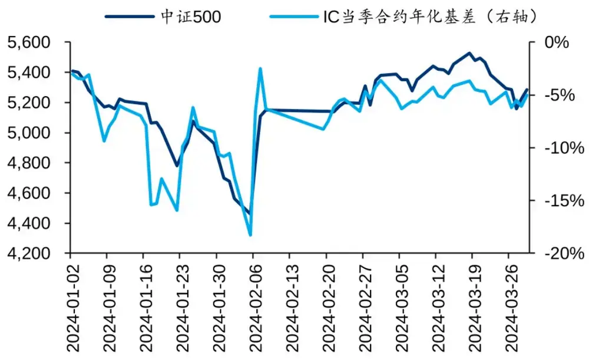

图表2：中证1000 指数和IM 当季合约年化基差
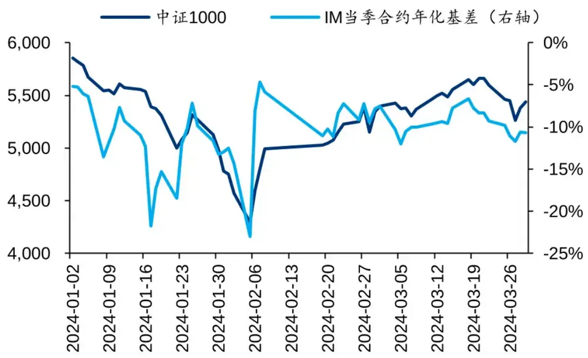

## 市值风格

由于大部分量化策略采用全市场选股，并有一定程度市值下沉，市值风格是影响量化策略超额的重要因素。2024年一季度行情以2月7日为界，2月7日及以前为鲜明的大盘风格，2月的前5个交易日，市值因子收益率大幅攀升；2月8日及以后为小盘风格。尽管如此，不能简单将量化与小微盘策略划等号，下面对公、私募量化产品业绩分析也将印证这一点。

图表3：重要宽基指数相对净值
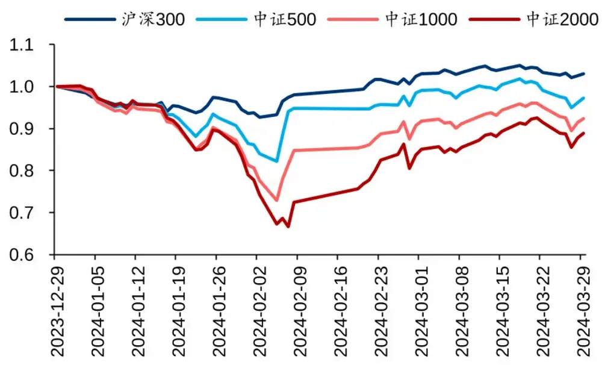

图表4：市值因子累计收益率
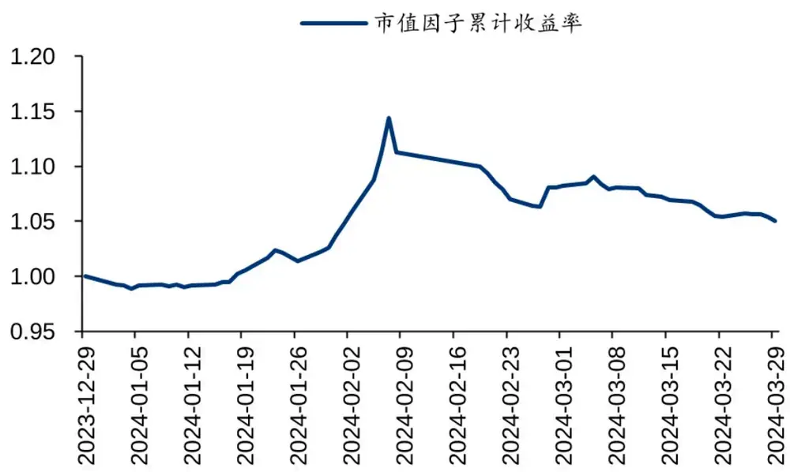

## Alpha

观察2024年一季度公募中证500、中证1000指数增强基金整体表现，超额收益高点位于1月31日；随后在2月的前5个交易日快速回撤，低点在2月7日，回撤幅度平均为2%；此后超额缓慢修复，但截至3月底未回到前期高点。

这里也能看出，量化策略在大、小盘风格行情下均可能获得超额收益，量化不等于小微盘。但2月前5个交易日，大小盘分化尤为明显，系统或处于非稳态，量化难以适应此类行情。

图表5：公募中证500指数增强基金超额收益净值
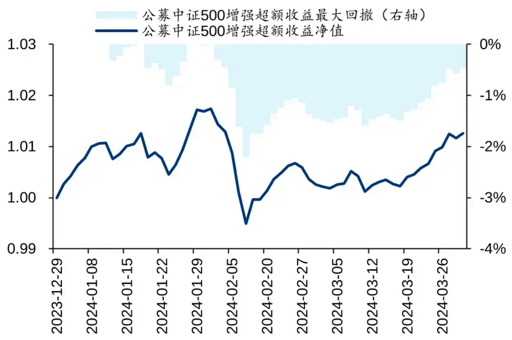

图表6：公募中证1000指数增强基金超额收益净值
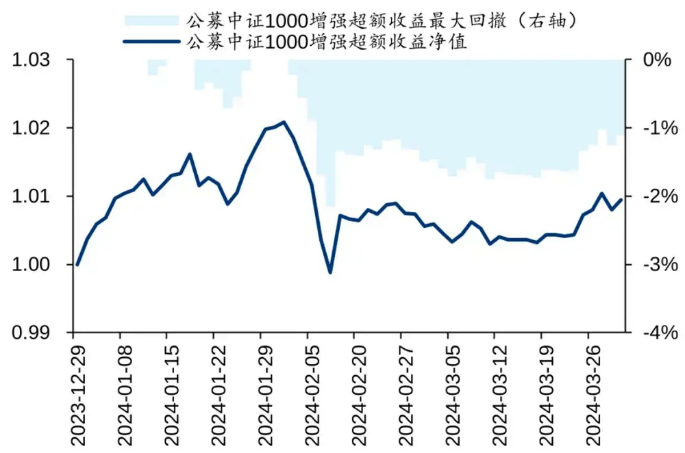

2024年一季度私募中证500、中证1000指数增强基金表现总体和公募相仿，但由于私募指数增强风控更宽松，无明确成分股比例限制，且私募AI量价模型的应用更为广泛，私募回撤幅度相较公募更大。

图表7：私募中证500 指数增强基金超额收益净值
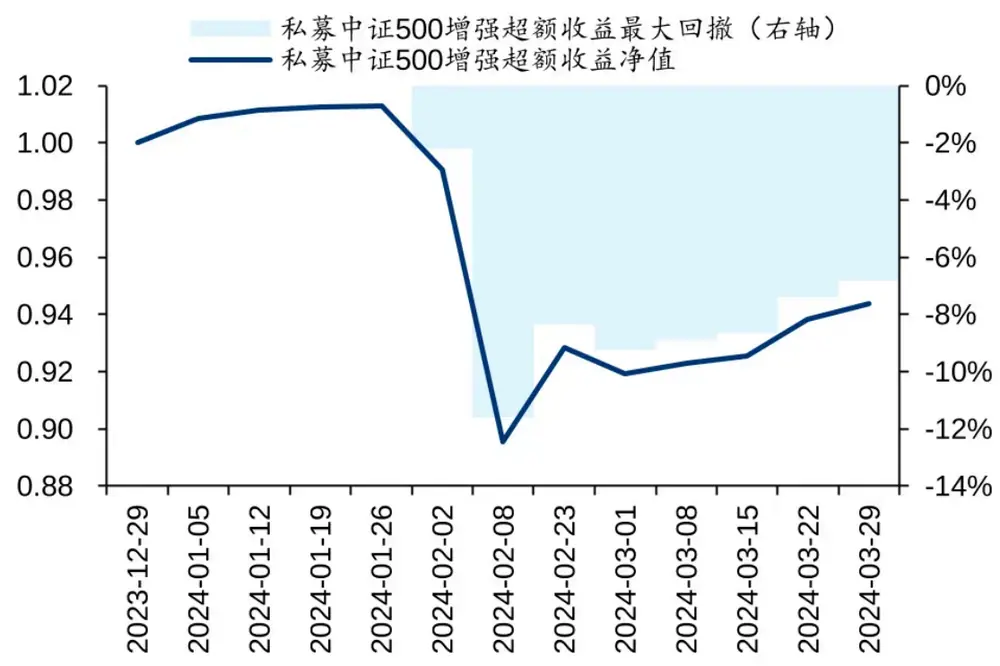

图表8：私募中证1000指数增强基金超额收益净值
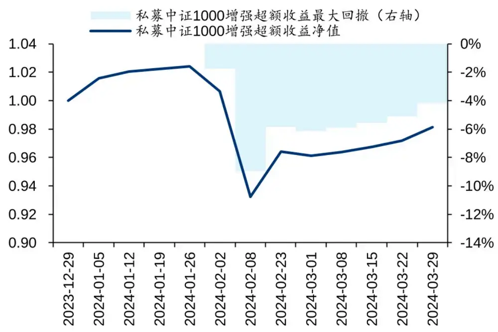

图表9：AI量价选股模型
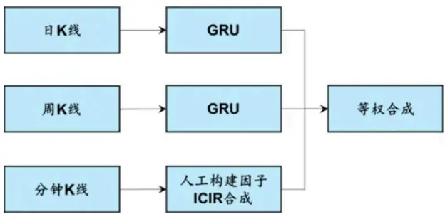

由于公募基金仅披露日净值，滞后披露季度持仓，多数私募基金仅披露周净值，若仅针对这些量化产品分析回撤原因，可挖掘空间有限。我们将围绕华泰AI量价选股模型，从因子和组合角度进行更全面的分析。

华泰金工研报《基于全频段量价特征的选股模型》（2023-12-08）采用GRU模型从日K线、周K线、月K线等低频数据中提取特征，同时人工从分钟线、逐笔数据中构建高频因子，训练AI选股模型。

本研究以华泰AI量价选股模型为分析对象，对前述模型做简化，仅采用日K线、周K线和分钟K线三类数据，等权合成得到预测信号。其中日K线、周K线GRU模型构建可参考《神经网络多频率因子挖掘模型》（2023-05-11），分钟K线因子构建可参考《高频因子计算的GPU加速》（2023-10-16），本文不做展开。

图表9:AI量价选股模型
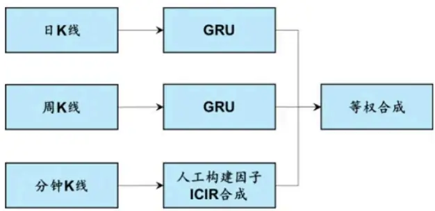

图表10：组合优化和回测设置

| 步骤 | 参数 | 参数值 |
| --- | --- | --- |
| 构建组合 | 基准 | 中证 500、中证 1000 指数 |
|  | 优化目标 | 最大化预期收益 |
|  | 组合仓位 | 1 |
|  | 个股权重下限 | 0 |
|  | 个股偏离权重约束 | [-1%, 1%] |
|  | 行业偏离权重约束 | [-2%, 2%] |
|  | 风格偏离标准差约束 风格因子 | [-0.3, 0.3] |
| 调仓周期 | 市值 |  |
|  | 每5个交易日 |  |
| 单次调仓单边换手率上限 | 20% |  |
| 成分股权重约束下限 | 80% |  |
| 起止日期 | 2016-12-30 至 2024-03-29 |  |
| 回测 | 单边费率 | 0.0015 |
|  | 交易价格 | vwap |
|  | 特殊处理 |  |
|  |  | 停牌不买入/卖出；一字板涨停不买入；一字板跌停不卖出；其余股票重新分配权重 |

采用AI量价因子构建中证500、中证1000增强组合，回测区间2016年末至2024年3月，选股域为中证全指，约束成分股比例下限80%，其余细节如上表，回测绩效指标如下表。该模型在2024年一季度出现较大回撤，超额收益最大回撤分别为4.0%和4.3%。

图表11：AI量价选股模型中证 500增强和中证1000增强绩效指标
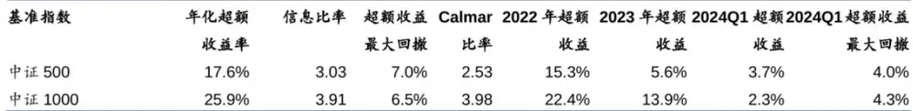

图表12：AI量价选股模型中证500增强超额收益净值
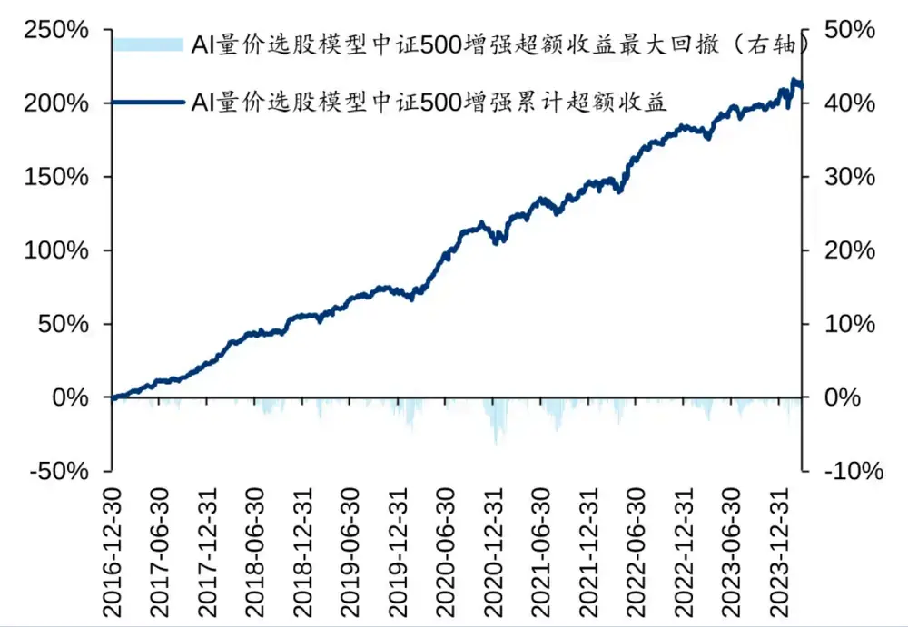

图表13：AI量价选股模型中证1000增强超额收益净值
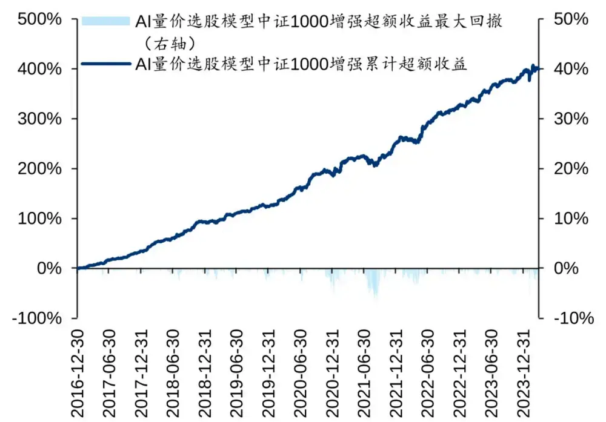

图表14：AI量价选股模型中证500增强超额收益净值（2024Q1）
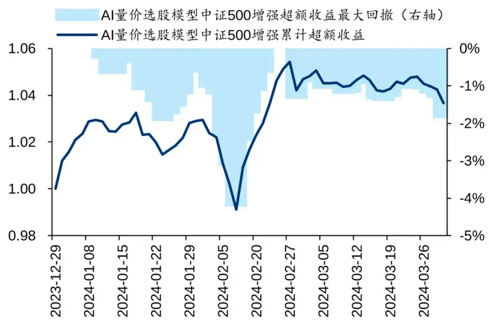
注：回测区间2016-12-30至2024-03-29，展示区间2023-12-29至2024-03-29

图表15：AI量价选股模型中证1000增强超额收益净值（2024Q1)
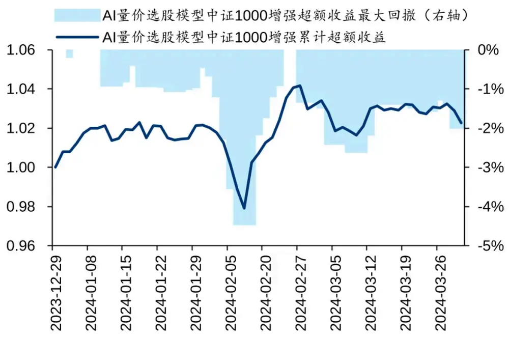

## 因子层面探讨

本节从因子层面分析AI量价因子的特征和回撤原因，探讨可能应对方法。

## 市值相对均衡，低频量价因子暴露高，2月初小盘暴露高

统计AI量价因子与Barra风格因子以及部分常用量价因子的截面相关系数。首先观察市值因子，相关系数均值为0.047，表明AI量价因子并没有鲜明的大小盘倾向。但在2024年2月初，负相关程度快速提升，2月7日达到历史低点-0.49。

AI量价因子和10日动量、10日波动、10日流动性因子长期负相关，相关系数均值分别为-0.28、-0.43、-0.41。换言之，AI量价因子长期暴露反转、低波、低流动性风格，这也是量价模型的常规特征。2月初，与低波、低流动性因子负相关程度快速下降，2月8日达到2021年春节以来的高点。

如何理解AI量价因子在2月初的异动？我们认为可能是市值结构高度分化的结果。AI量价模型长期暴露反转风格，偏好超跌股票，1月底2月初小盘超跌，模型快速漂移至小盘风格；同时这段时间小盘股波动提升、成交活跃，因此在低波、低流动性的暴露也逐步降低。

图表16：AI量价因子和市值因子截面相关系数
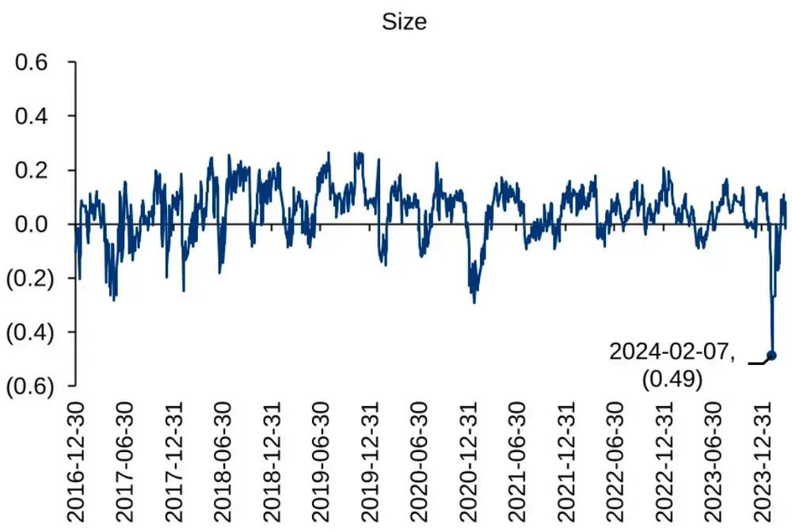

图表17：AI量价因子和常用量价因子截面相关系数
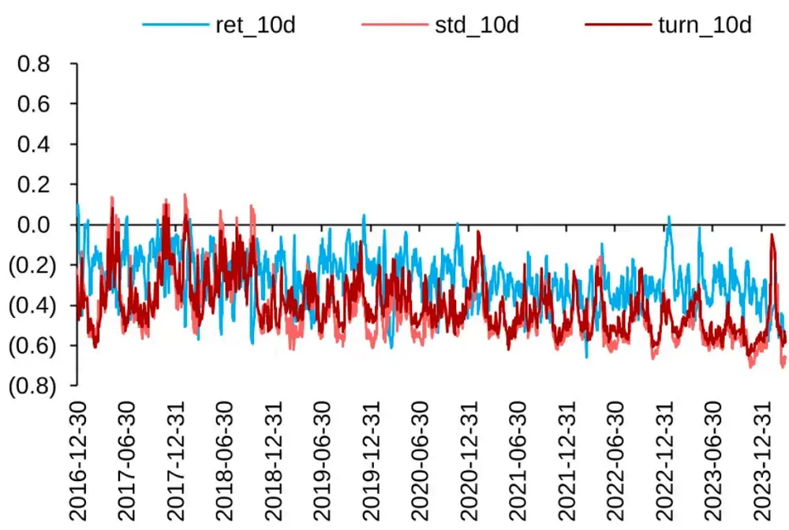

分别定义因子值前5%、后5%股票为多、空头，计算市值因子暴露的截面均值。多头市值暴露历史均值为-0.59，空头为1.70。从全市场范围看，AI量价因子没有鲜明的大小盘风格，但是从特定域看，AI量价因子多头仍然偏中小盘，空头偏大盘。

图表18：AI量价因子多、空头的市值因子暴露
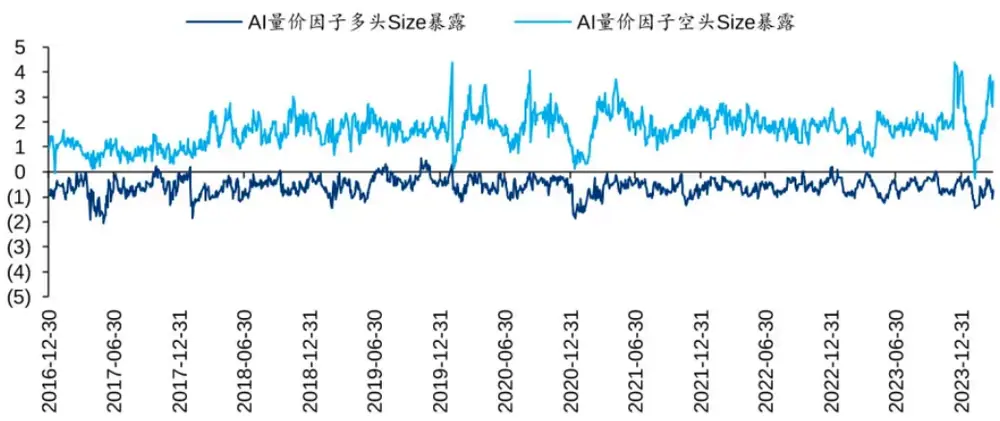

## AI量价因子与小盘、低流动性因子多头同步回撤

对AI量价因子和风格因子做单因子测试，关注分层回测多头端表现。AI量价因子回撤出现在2024年2月1-7日；这段时间内小盘、低流动性因子也出现大幅回撤。反转、低波因子未出现明显回撤。

对AI量价因子做行业、市值、10日动量、10日波动、10日流动性因子中性化。剥离行业、市值和低频量价风格后，中性化的AI量价因子多头在2月5-7日仍有回撤。因此不能将AI量价因子回撤简单归因为小市值和低频量价风格的回撤。

图表19：AI量价因子与常用量价因子多头相对净值
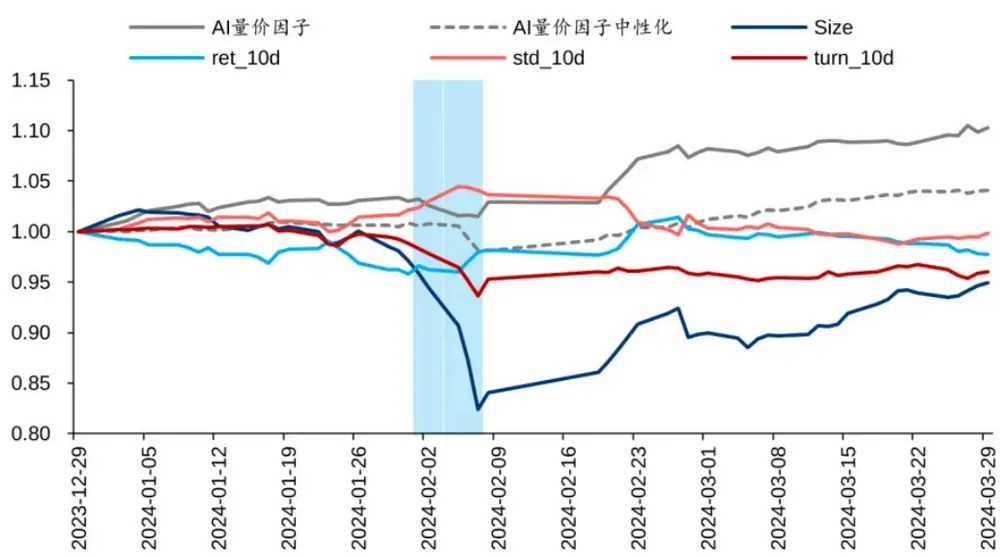

## 对预测目标风格中性化无效

既然AI量价模型较易学习到低频量价风格，我们尝试在模型训练阶段，对预测标签y进行更严格的中性化。原模型仅对标签进行行业市值中性，新模型进行行业、市值和上述三个低频量价因子中性。测试表明，无论是全域IC还是多头收益，更严格的中性化对结果几乎无影响，仍无法解决2月初的回撤问题。

图表20：预测标签y中性化方式对 AI量价因子多头相对净值影响
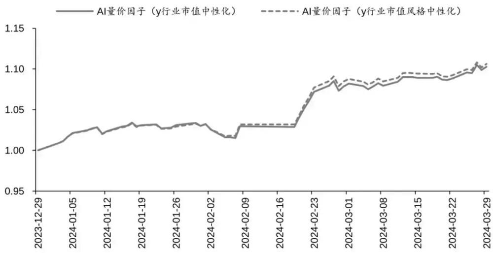

## 因子拥挤度指标为同步指标，或不具备预判能力

行业/因子拥挤度是常用的行业/因子择时指标。这里我们参考华泰金工研报《基于拥挤度的市值风格轮动策略》（2022-12-13），设计AI量价因子拥挤度指标。

## 因子拥挤度计算方式为：

1. 每个交易日计算个股过去10个交易日的日均换手率；

2. 取因子值排名前5%个股的换手率，以及因子值排名后5%个股的换手率，两者求比值，得到当前交易日因子拥挤度。

总体来看，2023年AI量价因子拥挤度中枢整体下移，这与2021年以来AI量价模型日趋拥挤的观感不符，可能与指标定义有关。局部看，2024年2月5-7日因子拥挤度快速上升，于2月7日达到2018年3月以来峰值。但此时因子已出现回撤，可见拥挤度指标为同步指标，可能不具备预判能力。

图表21：AI量价因子拥挤度
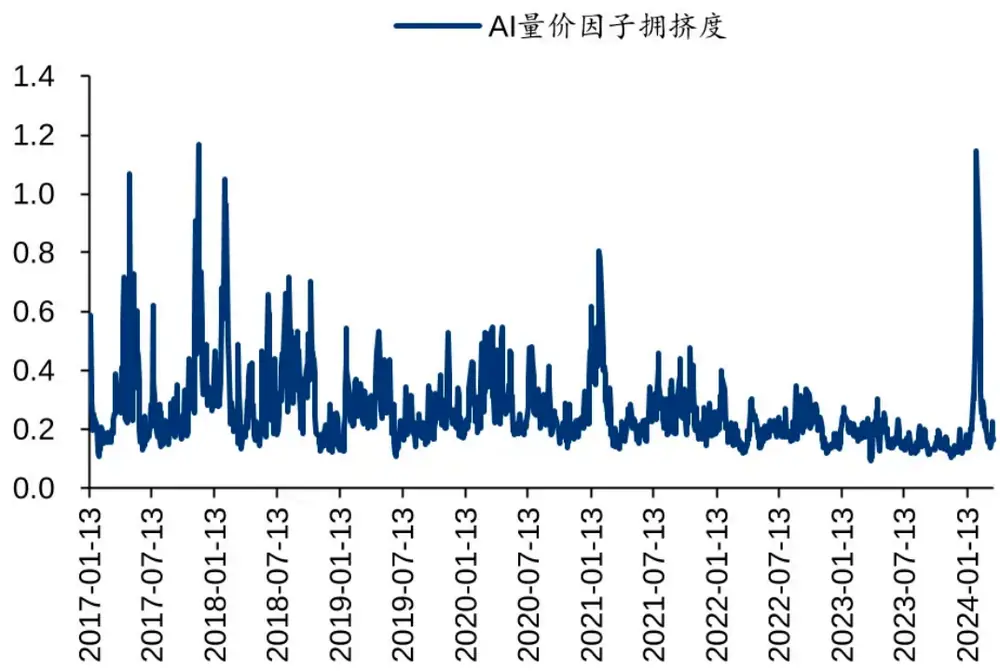

图表22：AI量价因子拥挤度（2024Q1）
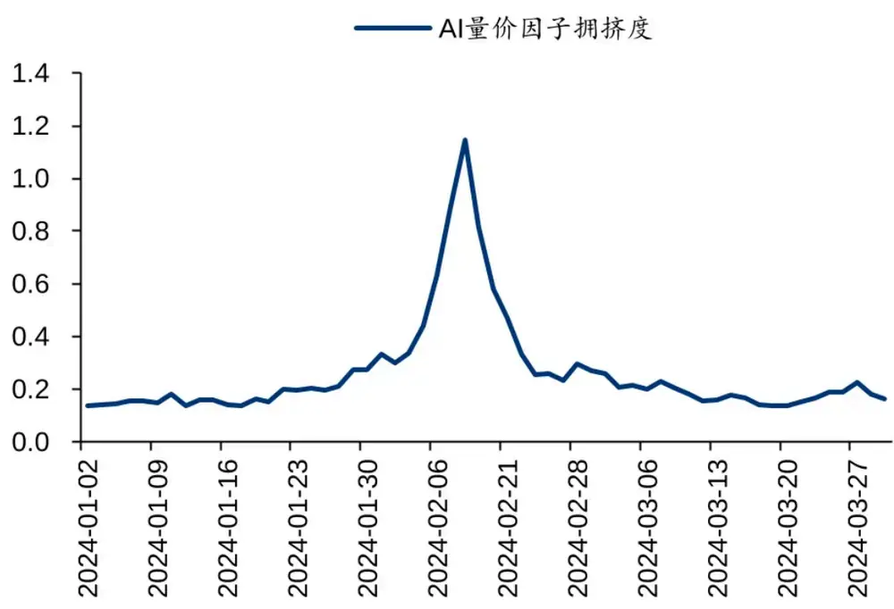

## 组合层面探讨

本节从组合层面分析AI量价指数增强组合回撤原因，探讨可能应对方法。限于篇幅，我们仅展示中证1000增强结果，中证500增强结果相近。基线模型的约束条件为：成分股比例下限80%，市值偏离在±0.3倍标准差之间。

## 成分股外暴露是收益来源，但盈亏同源

本轮量化回撤，公募指增回撤控制优于私募指增，原因之一是公募指增有80%成分股约束，私募指增不限制成分股比例，而2月初成分内表现大幅优于成分外。

从历史回测看，不限制成分股比例时，实际优化得到的成分股比例均值约30%，2016年底至2024Q1的超额收益接近，2022年及2024Q1的超额收益优于严控成分股比例，且2024年2月7日及以前回撤更大，同时此后反弹力度也更大。

由此看，配置成分外股票，利用选股模型宽度是重要的收益来源，但盈亏同源。因此并不能一刀切地说，指增是否应该配置成分外。但在评价基金产品时，应将相近成分股约束的产品一同比较。

图表23：成分股比例约束对中证1000增强组合影响

| 成分股比例 | 实际成分股 | 年化超额 | 信息比率 | 超额收益 |  |  | Calmar 2022 年超额 2023 年超额 2024Q1 超额 |  | 2024Q1 超额 |
| --- | --- | --- | --- | --- | --- | --- | --- | --- | --- |
| 约束下限 | 比例均值 | 收益率 |  |  | 最大回撤 | 比率 | 收益 | 收益 | 收益 收益最大回撤 |
| 100% | 100% | 25.5% | 4.19 | 5.2% | 4.89 | 20.8% | 10.6% | 2.1% | 3.1% |
| 80% | 80% | 25.9% | 3.91 | 6.5% | 3.98 | 22.4% | 13.9% | 2.3% | 4.3% |
| 0% | 32.6% | 26.5% | 3.61 | 9.1% | 2.90 | 28.4% | 13.7% | 4.7% | 8.4% |

图表24：成分股比例约束对中证1000 增强组合 2024Q1超额净值影响
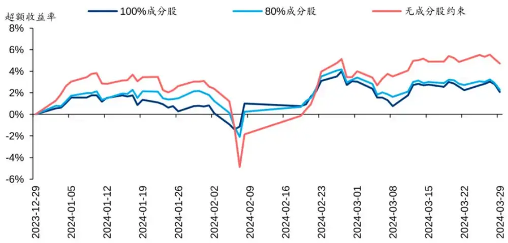

## 风格收益的贡献掩盖了Alpha本身的衰减

对组合进行Barra收益归因，下图展示市值因子、量价因子和残差的累计收益率。从绝对量看，残差收益相比风格因子高出一个数量级。但从相对趋势看，残差累计收益的斜率在2021年下半年后明显衰减，2023年下半年后基本走平，而市值和流动性因子累计收益的斜率在2021年下半年后明显提升。观察2024年一季度的收益归因，残差收益和市值因子收益同步回撤。

这表明，以市值和流动性因子为代表的风格收益的贡献，掩盖了AI量价模型Alpha本身的衰减。最终迎来了2024年一季度出现Alpha回撤和市值风格切换的双重考验。而Alpha衰减大概率还是由于策略同质化。

图表25：AI量价选股模型中证1000增强组合收益归因
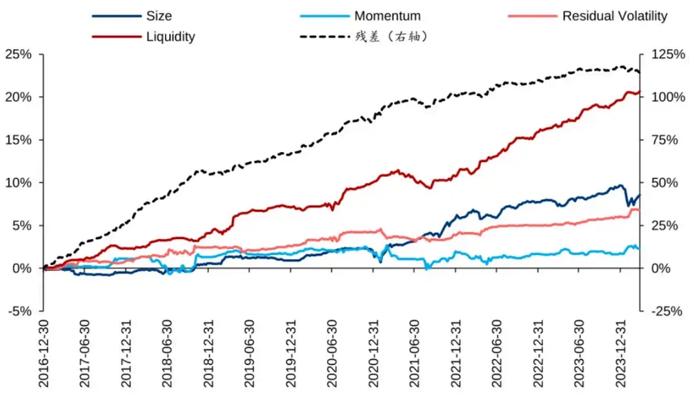

图表26：AI量价选股模型中证1000增强组合收益归因分阶段统计（年化）
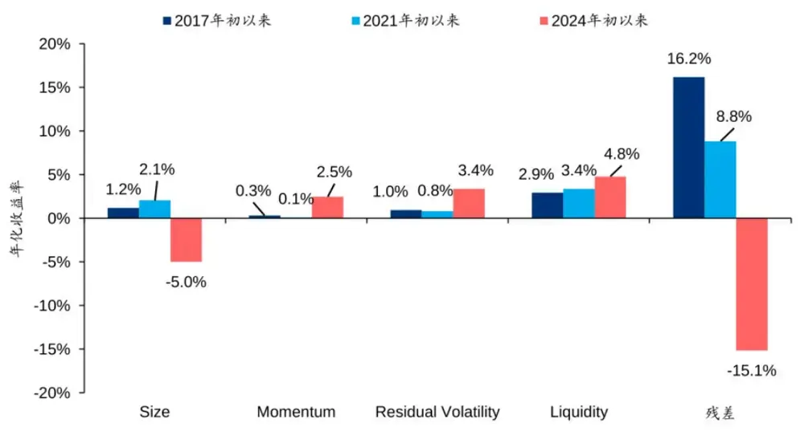

## AI量价模型具备一定风格择时能力，但包含尾部风险

既然AI量价模型不可避免受到市值风格影响，那么是否应在组合优化时更严格地控制市值偏离？我们的结论是，AI量价模型具备一定市值风格择时能力，适当的市值偏离能够贡献稳定超额收益，但包含尾部风险。

在每个组合周度调仓日，我们计算组合相对基准中证1000指数的市值偏离，以及未来5个交易日市值因子收益率。如图表27，两者呈现鲜明的正相关关系，相关系数为0.21；实际上，如果剔除左上方的离群点，两者相关系数可达0.27。这表明，AI量价模型在市值上的偏离方向，对未来市值风格具备一定的短期预测能力。从前述收益归因结果也可知，市值因子偏离贡献整体较为稳健。

然 而 图 表 27 左 上 角 存 在 三 个 离 群 点 ， 分 别 对 应 2021-01-05 、 2024-01-29 、 2024-02-27的三次调仓，组合市值相对基准偏向小盘，但未来5个交易日大盘显著占优，即组合遭遇 了 市 值 因 子 偏 离 带 来 的 尾 部 风 险 。 同 样 ， 左 下 角 的 两 个 离 群 点 ， 分 别 对 应 2021-02-09、2024-02-20的两次调仓，可以认为组合获得了市值因子偏离带来的尾部收益。

图表27：AI量价组合相对基准（中证1000）市值偏离与未来5日市值因子收益率
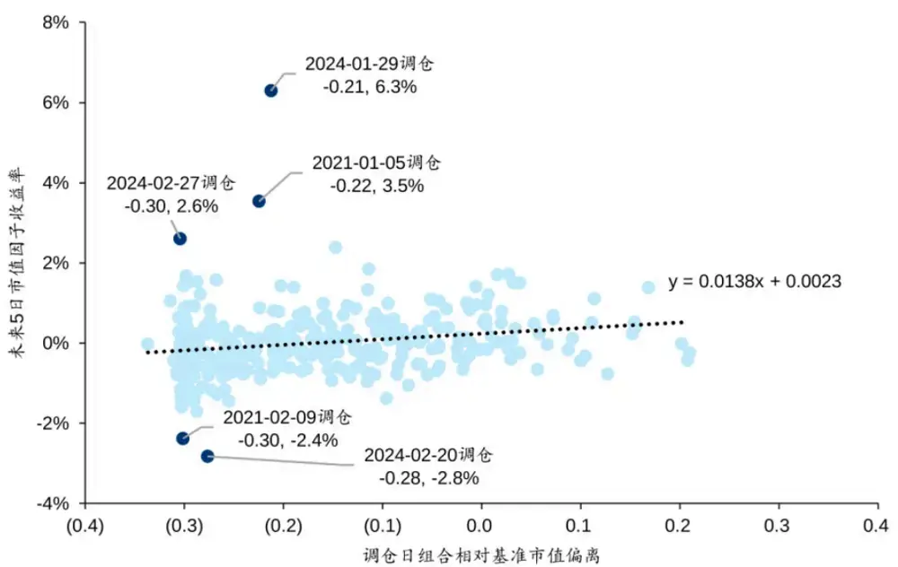

类似地，除市值因子，对于动量、残差波动率、流动性因子，无论是AI量价合成因子还是单因子，均与这些风格因子正相关。AI量价模型的风格择时能力也体现在其他量价风格上。

图表28：组合相对基准（中证1000）风格偏离与未来5日风格因子收益率相关系数

|  | Size | Momentum | Residual Volatility | Liquidity |
| --- | --- | --- | --- | --- |
| AI量价（合成）因子 | 0.21 | 0.14 | 0.11 | 0.12 |
| 日 K 线 GRU 单因子 | 0.20 | 0.09 | 0.09 | 0.17 |
| 周 K 线 GRU 单因子 | 0.12 | 0.11 | 0.07 | 0.11 |

观察组合市值偏离的时间序列，2017-2021年上半年存在相对频繁的大小盘切换，但在2021年下半年之后，长期偏向小盘，且偏离度接近约束下限-0.3，与市场风格匹配，这也是市值收益贡献在2021年下半年后显著提升的佐证。

图表29：组合相对基准（中证1000）市值偏离时间序列
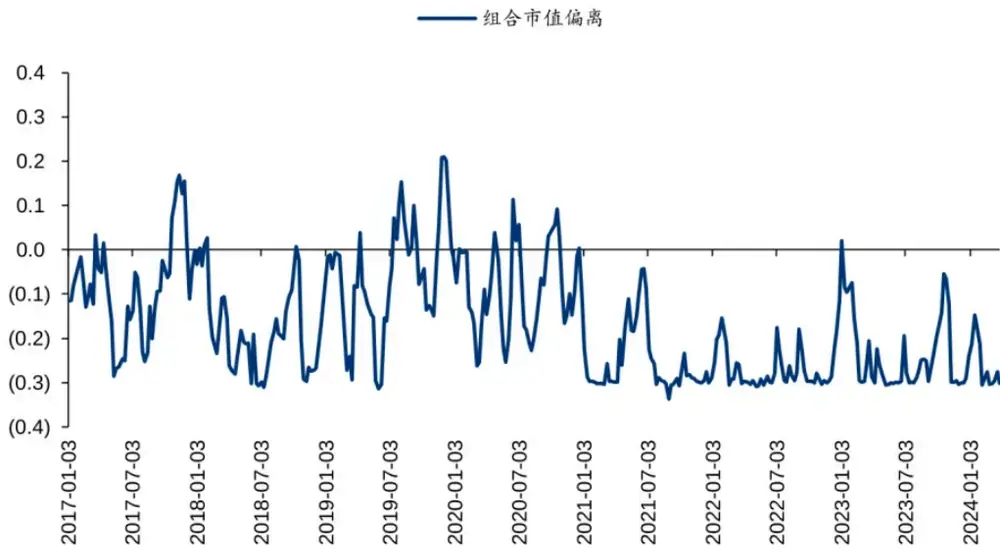

## 约束非线性市值或市值高阶矩可部分控制风险

收益归因结果表明，组合在市值因子上的偏离能贡献稳定收益，更严格的市值约束将削弱这部分超额。除主观限制选股域外，还有哪些方式可以控制AI量价模型的风险？

近些年市场热议的哑铃型配置，本质是低配非线性市值因子，若市场市值结构变化，例如微盘股回撤，非线性市值可能成为风险来源。简单的思路是添加组合优化约束条件，控制非线性市值因子偏离。测试结果如下表，非线性市值偏离约束在±0.3或更窄范围内，组合2024年一季度回撤有小幅改善，同时超额收益总体接近。

图表30：非线性市值约束对中证1000增强组合绩效指标影响（80%成分股约束）

| 非线性市值偏离约束 | 年化超额 收益率 | 信息比率 | 超额收益 |  |  | Calmar 2022 年超额 2023 年超额 2024Q1 超额 2024Q1 超额收益 |  |  |
| --- | --- | --- | --- | --- | --- | --- | --- | --- |
|  |  |  | 最大回撤 | 比率 | 收益 | 收益 | 收益 | 最大回撤 |
| 无 | 25.9% | 3.91 | 6.5% | 3.98 | 22.4% | 13.9% | 2.3% | 4.3% |
| [-0.10,0.10] | 26.2% | 3.98 | 5.7% | 4.59 | 23.6% | 12.5% | 4.2% | 4.0% |
| [-0.20,0.20] | 25.8% | 3.90 | 6.2% | 4.17 | 22.8% | 13.3% | 2.8% | 4.2% |
| [-0.30,0.30] | 25.9% | 3.92 | 6.8% | 3.78 | 23.3% | 12.8% | 3.4% | 3.9% |
| [-0.40,0.40] | 25.9% | 3.90 | 6.4% | 4.03 | 23.6% | 13.0% | 2.6% | 4.9% |

图表31：非线性市值约束对中证1000增强组合小微盘股比例影响(80%成分股约束)

| 非线性市值偏离约束 | 市值后 10%股票持仓比例 | 市值后 20%股票持仓比例 | 市值后 30%股票持仓比例 |
| --- | --- | --- | --- |
| 无 | 3.2% | 7.0% | 11.4% |
| [-0.10,0.10] | 3.1% | 7.0% | 11.5% |
| [-0.20,0.20] | 3.0% | 6.9% | 11.4% |
| [-0.30,0.30] | 3.1% | 6.9% | 11.3% |
| [-0.40,0.40] | 3.2% | 7.0% | 11.4% |

除了控制非线性市值因子外，行业里另一种常用做法是控制市值高阶矩：

举例而言，若组合采用哑铃型配置，一端配置微盘，另一端配置超大市值，此时组合市值暴露与基准接近，但组合市值二阶矩将大幅高于基准指数市值二阶矩。我们希望约束组合的市值二阶矩偏离，避免哑铃型配置和过度市值下沉。

图表32：基准和组合市值分布的高阶矩示意图
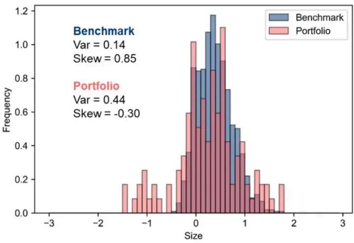

测试结果如下表，在我们所测试的市值二阶矩约束范围内，组合2024年一季度回撤均得到改善，整体超额收益以及2024年一季度超额收益还略有提升。

图表33：市值二阶矩约束对中证1000增强组合绩效指标影响（80%成分股约束）
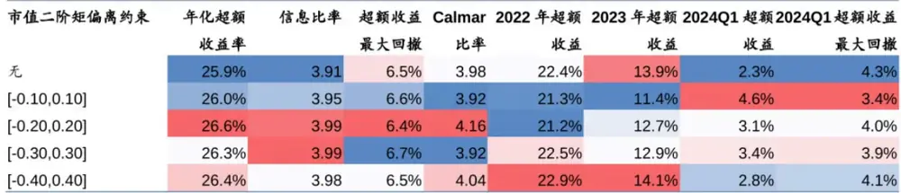

图表34：市值二阶矩约束对中证1000增强组合小微盘股比例影响(80%成分股约束）

| 市值二阶矩偏离约束 | 市值后 10%股票持仓比例 | 市值后 20%股票持仓比例 | 市值后 30%股票持仓比例 |
| --- | --- | --- | --- |
| 无 | 3.2% | 7.0% | 11.4% |
| [-0.10,0.10] | 1.5% | 4.4% | 8.4% |
| [-0.20,0.20] | 2.3% | 5.9% | 10.3% |
| [-0.30,0.30] | 2.9% | 6.6% | 11.0% |
| [-0.40,0.40] | 3.1% | 6.9% | 11.3% |

类似地，还可以控制组合市值三阶矩偏离：

举例而言，若组合市值严重下沉，即使组合市值暴露与基准接近，但组合市值分布呈现负偏态（长尾在左侧），三阶矩为负数，低于基准指数市值三阶矩。我们希望约束组合的市值三阶矩偏离，同样起到避免过度市值下沉的作用。

测试结果如下表，市值三阶矩偏离约束在±0.3或更窄范围内，组合2024年一季度回撤有一定改善，整体超额收益略有下滑。

图表35：市值三阶矩约束对中证1000增强组合绩效指标影响（80%成分股约束）
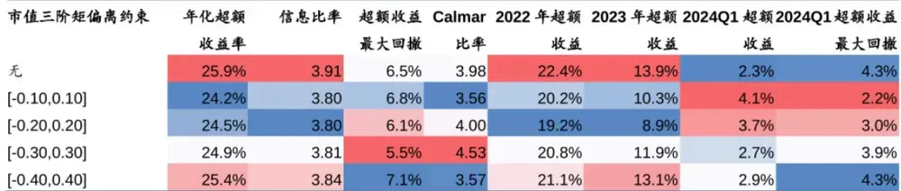

图表36：市值三阶矩约束对中证1000增强组合小微盘股比例影响(80%成分股约束）

| 市值三阶矩偏离约束 | 市值后 10%股票持仓比例 | 市值后 20%股票持仓比例 | 市值后 30%股票持仓比例 |
| --- | --- | --- | --- |
| 无 | 3.2% | 7.0% | 11.4% |
| [-0.10,0.10] | 1.7% | 4.5% | 8.4% |
| [-0.20,0.20] | 1.8% | 5.1% | 9.2% |
| [-0.30,0.30] | 2.1% | 5.7% | 10.0% |
| [-0.40,0.40] | 2.5% | 6.2% | 10.6% |

## 总结

2024年1月底2月初，量化Alpha策略超额收益大面积回撤，本研究以AI量价选股模型为分析对象，探讨回撤原因和可能应对方法。市值下沉背后的Beta风险以及策略同质化引发的Alpha衰减是主要原因。从因子角度看，AI量价因子和低频量价因子相关度高。从组合角度看，2021年下半年以来，组合收益归因中的残差收益走弱，市值、流动性因子收益走强，风格收益的贡献掩盖了Alpha本身的衰减。AI量价模型或具备一定风格择时能力，但包含尾部风险。约束非线性市值或市值高阶矩可部分控制市值结构的风险。

AI量价因子长期暴露反转、低波、低流动性风格；和市值因子截面相关性长期中枢接近0，市值风格相对均衡；但由于模型偏好超跌股票，2024年1月底2月初小盘超跌，模型快速漂移至小盘风格，从而暴露较高市值风险。因子测试显示，AI量价因子多头端和小市值、低流动性因子同步回撤。对AI模型预测目标做更严格的风格中性化，回撤仍难以避免。传统的因子拥挤度指标属于同步指标，或难言具备预判能力。

市值下沉的风险体现在成分股外暴露和市值风格切换两方面。不限制成分股比例时，近三年小盘行情中超额更高，今年一季度回撤和反弹力度也更高。配置成分外股票，利用选股模型宽度是重要的收益来源，但盈亏同源。组合收益归因显示，2021年下半年以来，残差收益走弱，而市值、流动性因子收益走强，风格收益的贡献掩盖了Alpha本身的衰减，直到迎来今年一季度Alpha回撤和市值风格切换的双重考验。

是否应在组合优化时更严格地控制市值偏离？计算组合相对基准市值偏离，以及未来5个交易日市值因子收益率，两者呈现正相关，即AI量价模型对市值风格具备短期预测能力。但2024年1月底、2月底的持仓属于离群点，模型遭遇了尾部风险。在适当暴露市值风格的前提下，控制非线性市值或者市值高阶矩，可避免哑铃型配置和市值下沉，回测显示在不削弱超额的情况下能有效降低2024年一季度的回撤。

本文并未得到超出行业预期的结论。在投资人对收益的高预期以及行业产能过剩的大环境下，对多数管理人而言，本轮回撤或难避免。部分管理人选择在2月初主观切换模型，事后看进退失据，但当时切或不切都有充分理由，只是市场以成败论英雄。长期看行业发展，Alpha必然衰减，风格暴露本就盈亏同源；只能持续挖掘新的Alpha来源，风格管理是否可行也是见仁见智的问题。

## 风险提示

人工智能挖掘市场规律是对历史的总结，市场规律在未来可能失效。人工智能技术存在过拟合风险。深度学习模型受随机数影响较大。本文测试的选股模型调仓频率较高，假定以vwap价格成交，忽略其他交易层面因素影响。

## 相关研报

研报：《AI量价选股模型风控探讨》2024年4月25日

林晓明 分析师 S0570516010001 | BPY421

何康 分析师 S0570520080004 | BRB318

## 关注我们

## 华泰睿思

华泰证券研究所官方公众号。研究服务0距离，投资决策1点通。

3804篇原创内容

公众号

## 华泰证券研究所国内站（研究Portal）

https://inst.htsc.com/research

访问权限：国内机构客户

## 华泰证券研究所海外站

https://intl.inst.htsc.com/research

访问权限：美国及香港金控机构客户

添加权限请联系您的华泰对口客户经理

## 免责声明

## ▲向上滑动阅览

本公众号不是华泰证券股份有限公司（以下简称“华泰证券”）研究报告的发布平台，本公众号仅供华泰证券中国内地研究服务客户参考使用。其他任何读者在订阅本公众号前，请自行评估接收相关推送内容的适当性，且若使用本公众号所载内容，务必寻求专业投资顾问的指导及解读。华泰证券不因任何订阅本公众号的行为而将订阅者视为华泰证券的客户。

本公众号转发、摘编华泰证券向其客户已发布研究报告的部分内容及观点，完整的投资意见分析应以报告发布当日的完整研究报告内容为准。订阅者仅使用本公众号内容，可能会因缺乏对完整报告的了解或缺乏相关的解读而产生理解上的歧义。如需了解完整内容，请具体参见华泰证券所发布的完整报告。

本公众号内容基于华泰证券认为可靠的信息编制，但华泰证券对该等信息的准确性、完整性及时效性不作任何保证，也不对证券价格的涨跌或市场走势作确定性判断。本公众号所载的意见、评估及预测仅反映发布当日的观点和判断。在不同时期，华泰证券可能会发出与本公众号所载意见、评估及预测不一致的研究报告。

在任何情况下，本公众号中的信息或所表述的意见均不构成对任何人的投资建议。订阅者不应单独依靠本订阅号中的内容而取代自身独立的判断，应自主做出投资决策并自行承担投资风险。订阅者若使用本资料，有可能会因缺乏解读服务而对内容产生理解上的歧义，进而造成投资损失。对依据或者使用本公众号内容所造成的一切后果，华泰

个人观点，仅供参考