## 华泰金工 | 多任务学习选股模型的改进

原创 林晓明 何康 华泰证券金融工程 2024年05月09日 07:30

## 华泰金融工程

本研究将从预测目标、网络结构、组合优化三个角度探索多任务学习选股模型的改进。首先，在原有多期限收益率预测基础上，引入夏普比率作为新增的预测目标；其次，参考腾讯2020年发表的PLE（Progressive Layered Extraction）模型，在原有GRU网络内部引入多层专家和门控网络；再次，采用多周期优化（Multi-Period Optimization）融合不同期限的收益预测。结果表明，改进模型相比基线均有提升，引入PLE总体优于引入夏普比率，PLE结合多周期优化模型在指数增强组合的超额收益上优于大部分对照模型。回测期2016-12-30至2024-04-30内，周单边换手20%条件下，中证500增强组合年化超额收益18.1%，信息比率3.05，中证1000增强组合年化超额收益28.7%，信息比率4.24。

## 核心观点

## 人工智能78：从预测目标、网络结构、组合优化角度改进多任务学习

本文从预测目标、网络结构、组合优化角度探讨多任务学习选股模型的改进。在多期限收益预测基础上，引入夏普比率作为预测目标；参考腾讯2020年发表的PLE模型，在GRU内部引入多层专家和门控网络；采用多周期优化融合不同期限收益预测。结果表明，改进模型相比基线均有提升，引入PLE总体优于引入夏普比率，PLE结合多周期优化模型在指数增强组合的超额收益上优于大部分对照模型。回测期2016-12-30至2024-04-30内，周单边换手20%条件下，中证500增强组合年化超额收益18.1%，信息比率3.05，中证1000增强组合年化超额收益28.7%，信息比率4.24。

## 改进方向之一：引入夏普比率，预测目标考虑风险信息

本研究的多任务学习基线模型架构为：针对日K线和周K线，分别采用多任务GRU网络，同时预测未来10日和20日收益率，预测值求均值视作单因子；针对分钟K线，人工构建50个因子，采用最大化10日ICIR法合成；最后将日K线、周K线和分钟K线因子等权合成。基线模型的预测目标仅考虑收益，未考虑风险。改进方向之一采用包含收益和风险信息的夏普比率作为目标，在10日和20日收益预测基础上，引入20日夏普比率预测任务。

## 改进方向之二：引入PLE架构，采用多层专家和门控网络提升表征能力

腾讯PCG团队2020年提出PLE（Progressive Layered Extraction）架构，采用多层专家和门控网络设计，提升特征表征能力。改进方向之二将PLE引入基线模型的双层GRU网络。其中，第一层的任务共享专家网络和任务特定专家网络接受相同的原始K线输入信息，采用单层GRU提取浅层特征表征后，通过第一层门控单元进行融合；第二层的任务共享专家网络和任务特定专家网络接受特异的输入信息，采用单层GRU提取深层特征表征后，通过第二层门控单元进行融合。门控单元均采用单层GRU网络与Softmax激活。后续的任务特异层与基线模型一致。

## 改进方向之三：引入多周期优化，最大化多期收益并限制远期换手

多任务学习同时预测不同期限收益率，基线模型直接求均值作为最终预测，缺点是投资意义不明确。改进方向之三采用多周期优化技术，将10日和20日收益预测同时输入组合优化器。单周期优化中，每期组合优化的目标函数为最大化预期收益。多周期优化中，目标函数除了最大化预期收益项外，还加入了换手率惩罚项。在最大化组合短期收益和长期收益的同时，限制组合当期换手以及下期可能的换手。

## 测试结果：三项改进均有效，PLE+多周期优化模型表现出色

测试结果表明，三项改进相比基线均有提升。从GRU单因子看，引入夏普比率和引入PLE均优于对应的基线。从指数增强组合看，引入PLE总体优于引入夏普比率。将“多任务学习+PLE取10日预测”与“多任务学习+PLE取20日预测”的预测值作为多周期优化的输入变量，构建中证500和中证1000指数增强组合，超额收益优于大部分对照模型，同时在回撤控制上体现出优势。回测期2016-12-30至2024-04-30内，周单边换手20%条件下，中证500增强年化超额收益18.1%，信息比率3.05，Calmar比率3.22；中证1000增强年化超额收益28.7%，信息比率4.24，Calmar比率6.93。

## 正文

## 01 研究导读

华泰金工团队前期研究《AI模型如何一箭多雕：多任务学习》（2023-05-06）和《基于全频段量价特征的选股模型》（2023-12-08）中，我们采用多任务学习的硬参数共享机制，替代常规的单任务学习，有效提升了选股模型的表现。本研究将从预测目标、网络结构、组合优化三个角度探索多任务学习选股模型的改进。

首先，在原有多期限收益率预测基础上，引入夏普比率作为新增的预测目标；其次，参考腾讯2020年发表的PLE（Progressive Layered Extraction）模型，在原有GRU网络内部引入多层专家和门控网络；再次，采用多周期优化（Multi-Period Optimization）融合不同期限的收益预测。测试上述方案在因子和组合层面的改进效果。

结果表明，改进后的模型相比基线均有提升，其中引入PLE的效果总体优于引入夏普比率，PLE结合多周期优化的模型在指数增强组合超额收益上优于大部分对照模型。回测期2016-12-30至2024-04-30内，周单边换手20%条件下，中证500增强组合年化超额收益18.1%，信息比率3.05，超额收益Calmar比率3.22；中证1000增强组合年化超额收益28.7%，信息比率4.24，超额收益Calmar比率6.93。

图表1：部分测试模型累计超额收益（基准为中证500指数）
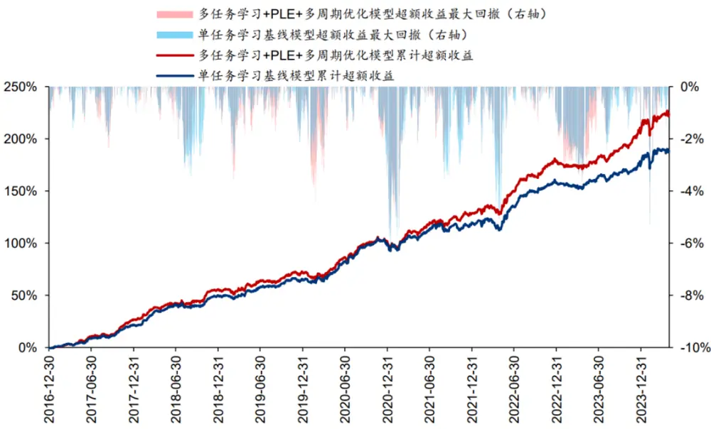

图表2：部分测试模型回测绩效（基准为中证500指数）

|  | 年化超额 收益率 | 年化跟踪 误差 | 信息比率 | 超额收益 最大回撤 Calmar 比率 | 超额收益 | 相对基准 月胜率 | 年化双边 换手率 |
| --- | --- | --- | --- | --- | --- | --- | --- |
| 单任务学习基线 | 16.19% | 5.77% | 2.80 | 6.11% | 2.65 | 79.55% | 20.33 |
| 多任务学习基线 | 16.46% | 5.94% | 2.77 | 5.73% | 2.87 | 76.14% | 20.30 |
| 多任务学习+夏普比率 | 17.57% | 5.85% | 3.00 | 5.44% | 3.23 | 79.55% | 20.37 |
| 多任务学习+PLE | 17.89% | 5.97% | 3.00 | 6.08% | 2.94 | 76.14% | 20.31 |
| 多任务学习+PLE+多周期优化 | 18.11% | 5.93% | 3.05 | 5.63% | 3.22 | 77.27% | 20.29 |

图表3：部分测试模型累计超额收益（基准为中证1000指数）
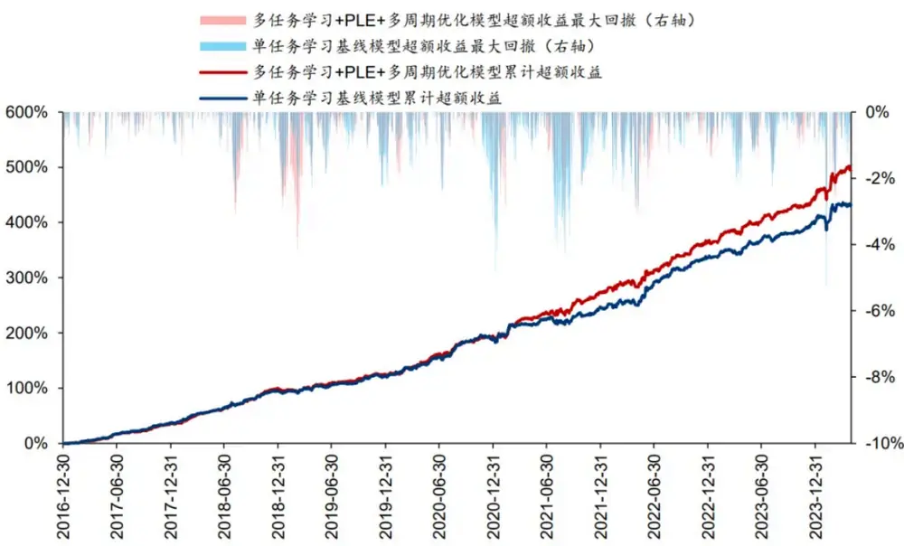

图表4：部分测试模型回测绩效（基准为中证1000指数）

|  | 年化超额 收益率 | 年化跟踪 误差 | 信息比率 | 超额收益 最大回撤 Calmar 比率 | 超额收益 | 相对基准 | 年化双边 |
| --- | --- | --- | --- | --- | --- | --- | --- |
| 单任务学习基线 | 26.71% | 6.63% | 4.03 | 5.21% | 5.12 | 月胜率 87.50% | 换手率 20.35 |
| 多任务学习基线 | 27.30% | 6.85% | 3.98 | 6.26% | 4.36 | 87.50% | 20.27 |
| 多任务学习+夏普比率 | 27.98% | 6.58% | 4.25 | 5.72% | 4.89 | 88.64% | 20.29 |
| 多任务学习+PLE | 28.60% | 6.76% | 4.23 | 4.25% | 6.74 | 93.18% | 20.26 |
| 多任务学习+PLE+多周期优化 | 28.72% | 6.78% | 4.24 | 4.14% | 6.93 | 93.18% | 20.28 |

## 02 多任务学习选股模型的改进

## 基线模型

本研究设置了单任务学习和多任务学习两类基线模型。单任务学习基线模型的架构为：

1. 对于日K线和周K线，采用GRU模型预测未来10日收益率，将预测值作为单因子；

2. 对于分钟K线，人工构建50个因子，采用最大化10日ICIR法合成，同样得到单因子；

3. 最后将日K线、周K线和分钟K线因子等权合成。

分钟K线因子定义请参考华泰金工研报《高频因子计算的GPU加速》（2023-10-16）。

图表5：单任务学习基线模型示意图
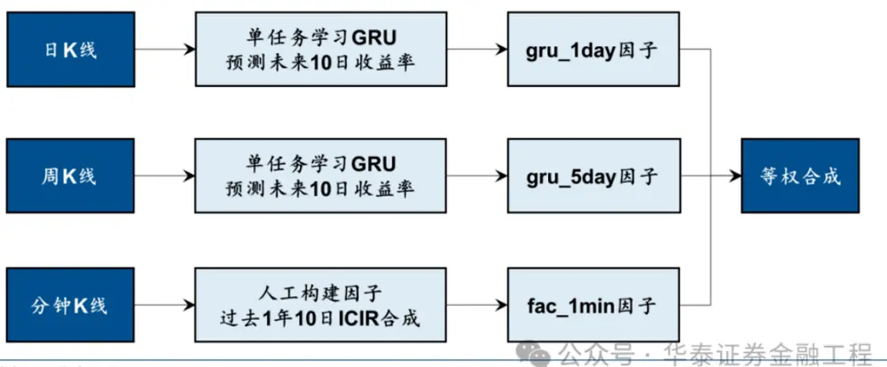

单任务学习基线中的GRU模型采用简单的两层GRU网络，如下图。

图表6： 单任务学习 GRU 模型网络结构
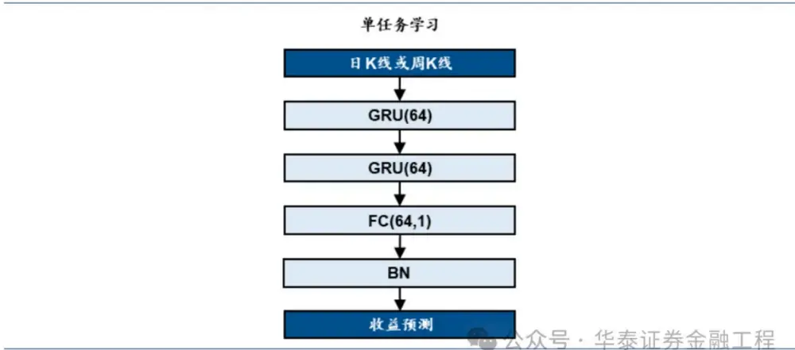

传统AI预测问题对模型的定位是“专才”，每个模型对应唯一预测目标，执行特定功能，这种学习机制称为单任务学习。然而无论人类还是AI，“通才”更符合人们对智能的期待。例如我们面对人脸可以同时识别性别和年龄，大语言模型可以对话和写代码。多任务学习正是为训练通才这一目标所设计的学习机制，每个模型对应多个预测目标，同时学习多项任务。多任务学习利用任务间的关联性，共享信息表征，实现知识迁移，提高泛化能力。

本研究中的多任务学习基线模型采用与单任务学习相近的架构。和单任务学习基线模型的主要区别在于：日K线和周K线模块的GRU模型同时预测未来10日和20日收益率。取10日收益预测，或者取两者均值，作为对应模块的单因子。

图表7：多任务学习基线模型示意图
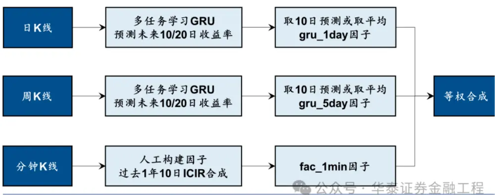

多任务学习基线模型中，任务共享层同样采用简单的两层GRU网络，任务特异层各自包含一个输出层。多个预测任务的损失函数采用DWA（Dynamic Weight Average）加权（Liu等，2018）：

$$
\begin{aligned}\lambda_{k}(t)=&\frac{Kexp\left(\frac{w_{k}(t-1)}{T}\right)}{\sum_{i}exp\left(\frac{w_{i}(t-1)}{T}\right)},\\w_{k}(t-1)=&\frac{\mathcal{L}_{k}(t-1)}{\mathcal{L}_{k}(t_{平面})}\end{aligned}
$$

DWA加权使得不同任务的学习速率尽量保持一致，回溯各任务过去2期损失函数值，若t-1期相比于t-2期高，则给予该任务更高的权重，促进该任务的学习。

图表8：多任务学习GRU模型网络结构
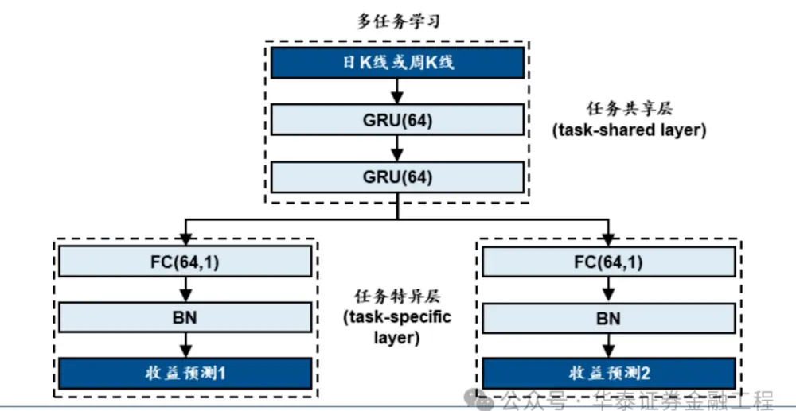

损失函数为截面IC相反数的均值。全部测试均对5组随机数种子点训练下的结果求均值。组合优化和回测设置如下表。

图表9：组合优化和回测设置

| 步骤 构建组合 | 参数 | 参数值 |  |
| --- | --- | --- | --- |
|  | 基准 | 中证 500 指数，中证 1000 指数 |  |
|  | 优化目标 | 最大化预期收益 |  |
|  | 组合仓位 | 1 |  |
|  | 个股权重下限 | 0 |  |
|  | 个股偏离权重约束 | [-1%, 1%] |  |
|  | 行业偏离权重约束 | [-2%, 2%] |  |
|  | 风格偏离标准差约束 风格因子 | [-0.3, 0.3] |  |
|  | 调仓周期 | 市值 |  |
|  |  | 每5个交易日 |  |
|  | 单次调仓单边换手率上限 | 20% |  |
|  | 成分股权重约束下限 | 80% |  |
|  | 起止日期 | 2016-12-30 至 2024-04-30 |  |
|  | 回测 单边费率 |  | 0.0015 |
| 交易价格 |  | vwap |  |
| 特殊处理 |  |  |  |
|  |  | 停牌不买入/卖出；一字板涨停不买入：字板跌停不卖出；其余股票重新分配权重 |  |

## 预测目标：引入夏普比率

多任务学习基线模型同时预测不同期限的收益率，仅考虑收益，未考虑风险。考虑到多任务学习要求任务间有相似性，直接预测波动率可能不合理，我们采用包含收益和风险信息的夏普比率作为新的预测目标，网络结构如下图。具体而言，本研究在10日和20日收益的基础上，引入20日夏普比率作为第三项预测任务。不采用10日夏普比率的原因是时间区间过短，指标计算容易受到异常值影响。

图表10：多任务学习+夏普比率GRU模型网络结构
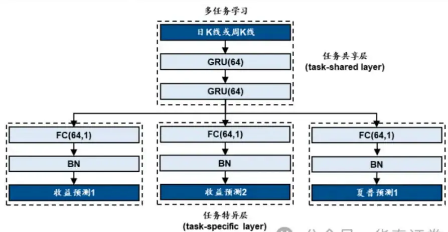

## 网络结构：引入PLE

多任务学习基线模型采用经典的硬参数共享机制，任务共享层使用相同网络，结构简单。但由于各任务可能需要针对性的特征表征，硬参数共享会限制模型性能。研究者陆续提出Cross-StitchNetwork（十字绣网络）、Sluice Network（水闸网络）、MMOE（多门专家混合模型）等多任务学习的变式，提升了模型的表征能力。

2020年，腾讯PCG（Platform and Content Group）团队提出一种创新的多任务学习网络PLE（Progressive Layered Extraction），实证测试效果优于硬参数共享、MMOE等其他形式的多任务学习网络，获得RecSys2020会议最佳长论文奖。

PLE架构如下图，其特色可以总结为以下三点：

1. 两类专家分离。我们可以将任务共享层看成“特征提取专家”。硬参数共享中，只有一位专家，同时应对多项下游任务的特征提取，可能出现“故此失彼”。在CGC（可视作PLE的单层简化版本）和PLE中，存在两类专家——任务共享的专家网络（蓝色）和任务特异的专家网络（任务1红色，任务2绿色），三者分工明确各司其职。子任务的共性部分由任务共享专家学习，个性部分由任务特异专家学习，从而使得特征表征更为灵活和有针对性。

2. 门控网络。任务共享专家网络和任务特异专家网络的输出，通过门控网络G动态融合，传递至相应的下游任务。“动态”代表每个样本有其特定的融合权重，取决于G的输出。门控网络在华泰金工前期研究《自适应网络：从削足适履到量体裁衣》（2023-12-01）中亦有实践。

3. 多层级专家。有别于CGC的单层专家网络，PLE包含多层专家网络，逐层提取信息。第一层专家接受相同的原始输入，负责提取浅层信息；后续层的专家接受上层传递来的差异化的输入，负责提取深层信息。PLE的全称Progressive Layered Extraction——渐进式分层提取即得名于此。

图表11：PLE示意图
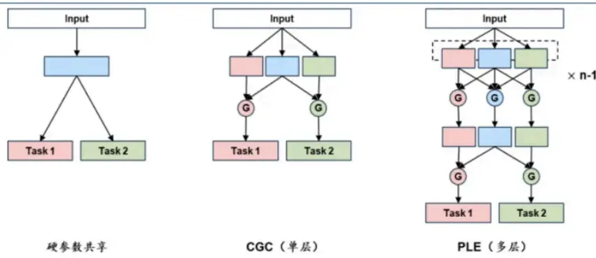

原论文中，专家网络和门控网络均采用简单的全连接层。我们将PLE思想引入多任务学习基线模型的双层GRU网络：

1. 第一层的任务共享专家网络和任务特定专家网络接受相同的原始输入信息，采用单层GRU提取浅层特征表征后，通过第一层门控单元进行融合；

2. 第二层的任务共享专家网络和任务特定专家网络接受特异的输入信息，采用单层GRU提取深层特征表征后，通过第二层门控单元进行融合；

3. 后续的任务特异层和基线模型一致。

其中门控单元为单层GRU网络，以Softmax为激活函数。各GRU参数均不共享。本研究完整的PLE网络结构如下图。

图表12：多任务学习+PLEGRU模型网络结构
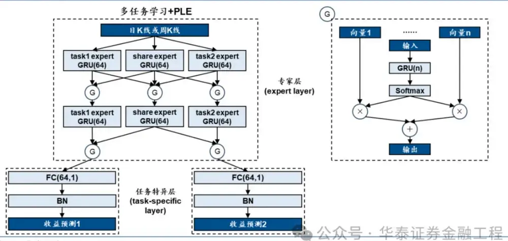

## 组合优化：引入多周期优化

多任务学习模型同时预测不同期限的收益率（本研究选取未来10日和20日）。基线模型中，我们对多个预测结果采取两种处理方式：

1. 直接取10日预测，便于和单任务学习基线模型对照。

2. 取10日预测和20日预测等权平均。

从前期研究《AI模型如何一箭多雕：多任务学习》（2023-05-06）结果来看，等权平均整体效果更稳定。但这种处理方式的缺点在于，10日收益率和20日收益率求均值的投资意义不明确。可能的解决方案是采用多周期优化技术，将两组预测值同时输入到组合优化器。Boyd等人在2016年发表论文Multi-Period Trading via Convex Optimization，详细介绍了多周期优化的理论推导和实现方法。本研究使用的多周期优化损失函数是原论文的简化版，省略了持仓成本项和风险项。

单周期优化中，每期组合优化的目标函数为最大化预期收益：

$$
\operatorname*{max}_{w}w^{T}r
$$

其中，r为收益率预测值向量，w为股票持仓权重向量。组合优化的约束条件包括个股绝对权重、相对权重、行业风格偏离、成分股下限、当期换手率上限等。

多周期优化中，目标函数除最大化预期收益项外，还加入了换手率惩罚项。以双周期优化为例：

$$
\operatorname*{max}_{w,w_{2}}w^{T}u_{1}-\lambda_{1}||w-w^{-}||+w_{2}^{T}u_{2}-\lambda_{2}||w_{2}-w||
$$

其中，u1代表短期收益率预测向量，u2代表长期收益率预测中扣除短期收益率预测的部分。例如，假设u1为T至T+10日区间预期收益（即T日收盘价和T+10日收盘价之间的区间收益，下同），那么u2应为T+10至T+20日区间预期收益。本研究中，u2需要通过20日收益预测值rt,t+20和10日收益预测值rt,t+10推算：

$$
u_{2}=\frac{r_{t,t+20}+1}{r_{t,t+10}+1}-1.
$$

目标函数包含多项与持仓权重有关的变量。其中，w-为已实现的上期持仓权重向量；w为待求解的短周期下的股票当期持仓权重向量；w2为待求解的长周期下的股票下期持仓权重向量。目标函数的第二项||w - w-||代表实际当期换手率，第四项||w2 - w||代表预期下期换手率。组合优化的约束条件同时包含对w和w2的约束。

目标函数包含两项自由参数，λ1为当期换手惩罚系数，λ2为下期换手惩罚系数。本研究中均取0.2，实际可通过遍历方法进行参数寻优。

总的看，多周期优化的目标函数可以按如下解读：最大化组合短期收益和长期收益的同时，限制组合当期换手以及下期可能的换手。换言之，尽管组合优化器在进行“当下”的求解，但“目光”会更长远。

本研究的多任务学习+多周期优化模型架构如下图。短期预测和长期预测部分均由日K线、周K线、分钟K线三组模块构成，GRU的预测目标与ICIR法的预测区间相匹配。

图表13：多任务学习+多周期优化模型示意图
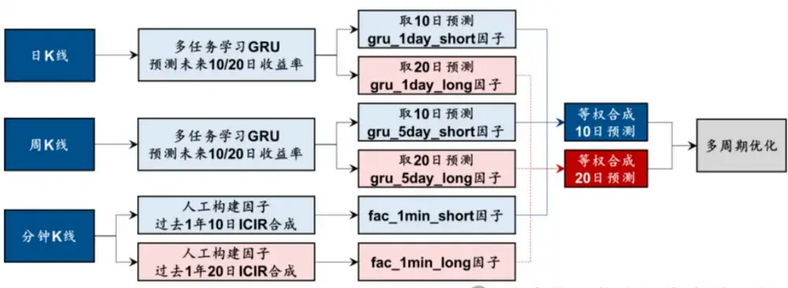

## 03 测试结果

测试结果分四部分展示：

1.引入夏普比率、引入PLE对日K线gru_1day因子在因子层面的改进。

2.引入夏普比率、引入PLE对周K线gru_5day因子在因子层面的改进。

3.引入夏普比率、引入PLE对合成因子在因子和组合层面的改进。

4.引入多周期优化在组合层面的改进。

## gru_1day因子

日K线gru_1day因子的单因子测试结果如下表。考察RankIC均值：

1. 多任务学习全面优于单任务学习；

2. 多个预测值取平均优于取10日预测；

3. 每种预测值处理方式内部，引入夏普比率和引入PLE两者没有鲜明规律，但均优于对应的基线。

其余指标的规律与RankIC均值不尽相同。其中RankICIR、Top层年化超额收益、对冲组合年化超额收益的规律总体接近。后文不再对其余指标展开解读。

图表14: gru 1day 因子测试指标
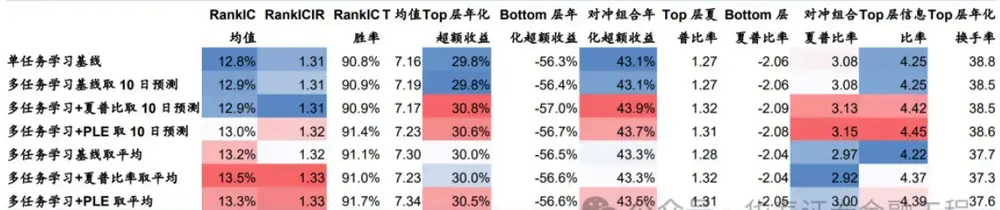
注：股票池：中证全指成分股：回测区间：2016-12-30至2024-04-30：预测收益统一使用T至T+10日收盘价区间收益率：1日频调仓，考交费用个王

部分测试因子Top层相对净值如下图。

图表15：gru_1day 因子 Top 层相对净值
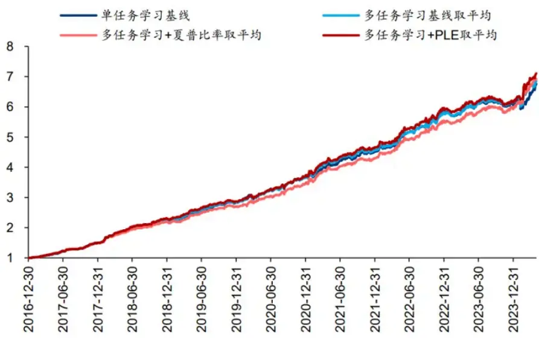

## gru_5day因子

周K线gru_5day因子的单因子测试结果如下表。同样考察RankIC均值：

1. 除多任务学习基线取10日预测外，其余多任务学习均优于单任务学习。

2. 多个预测值取平均优于取10日预测；

3. 每种预测值处理方式内部，引入夏普比率和引入PLE两者没有鲜明规律，但均优于对应的基线。

图表16: gru_5day因子测试指标
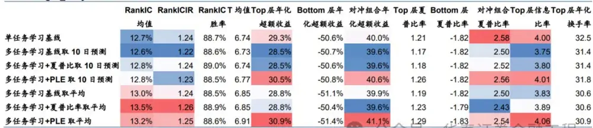
注：股票池：中证全指成分股：回测区间：2016-12-30至2024-04-30：预测收益统一使用T至T+10日收盒价大间物益率：10日调处考透交需费用柱

部分测试因子Top层相对净值如下图。

图表17：gru_5day 因子 Top 层相对净值
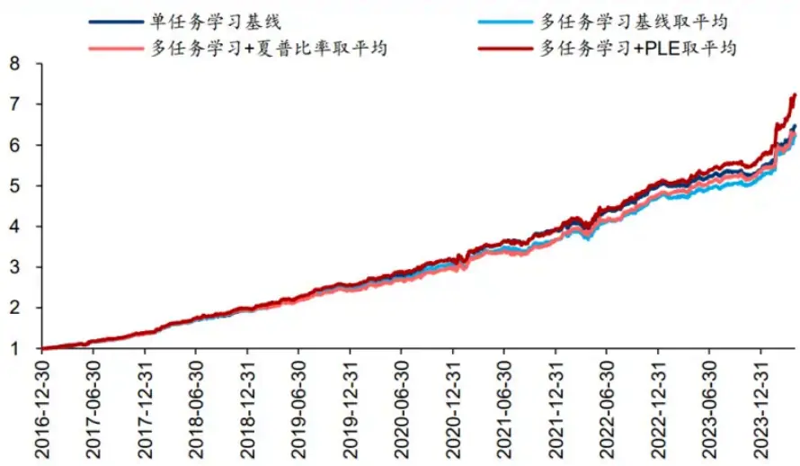

## 合成因子和指数增强组合

日K线、周K线、分钟K线三者等权求均值得到合成因子，单因子测试结果如下表。RankIC均值的规律与gru_5day因子一致，这里不再重复。

图表18：合成因子测试指标
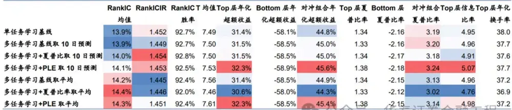

部分测试因子Top层相对净值如下图。

图表19：合成因子 Top 层相对净值
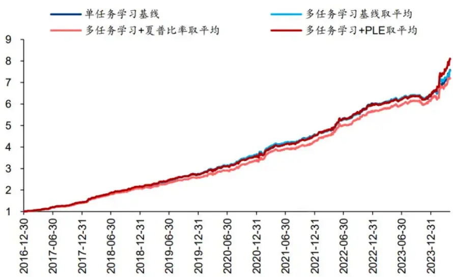

以合成因子构建指数增强组合。中证500指数增强组合回测结果如下表。从年化超额收益率、信息比率和超额收益Calmar比率看，引入夏普比率和引入PLE的回测表现均优于对应的多任务学习基线。从年化超额收益率看，引入PLE略优于对应的引入夏普比率模型。

图表20：合成因子指数增强组合回测绩效（基准为中证500指数）

|  | 年化超额 收益率 | 年化跟踪 误差 | 信息比率 | 超额收益 最大回撤 Calmar 比率 | 超额收益 | 相对基准 | 年化双边 |
| --- | --- | --- | --- | --- | --- | --- | --- |
| 单任务学习基线 | 16.19% | 5.77% | 2.80 | 6.11% | 2.65 | 月胜率 79.55% | 换手率 20.33 |
| 多任务学习基线取10日预测 | 15.27% | 5.89% | 2.59 | 6.22% | 2.45 | 75.00% | 20.32 |
| 多任务学习+夏普比率取10日预测 | 16.75% | 5.83% | 2.87 | 6.27% | 2.67 | 80.68% | 20.37 |
| 多任务学习+PLE取10日预测 | 17.61% | 5.91% | 2.98 | 6.10% | 2.88 | 80.68% | 20.34 |
| 多任务学习基线取平均 | 16.46% | 5.94% | 2.77 | 5.73% | 2.87 | 76.14% | 20.30 |
| 多任务学习+夏普比率取平均 | 17.57% | 5.85% | 3.00 | 5.44% | 3.23 | 79.55% | 20.37 |
| 多任务学习+PLE取平均 | 17.89% | 5.97% | 3.00 | 6.08% | 2.94 | 76.14% | 20.31 |

中证1000指数增强组合回测结果如下表。多任务学习+PLE取平均模型在年化超额收益率、超额收益Calmar比率方面优于其余模型，多任务学习+夏普比率取平均模型在信息比率方面优于其余模型。

图表21：合成因子指数增强组合回测绩效（基准为中证1000指数）

|  | 年化超额 收益率 | 年化跟踪 误差 | 信息比率 | 超额收益 最大回撤 Calmar 比率 | 超额收益 | 相对基准 | 年化双边 |
| --- | --- | --- | --- | --- | --- | --- | --- |
| 单任务学习基线 | 26.71% | 6.63% | 4.03 | 5.21% | 5.12 | 月胜率 87.50% | 换手率 20.35 |
| 多任务学习基线取10日预测 | 26.63% | 6.74% | 3.95 | 6.65% | 4.00 | 84.09% | 20.30 |
| 多任务学习+夏普比率取10日预测 | 25.33% | 6.77% | 3.74 | 6.19% | 4.09 | 86.36% | 20.30 |
| 多任务学习+PLE取10日预测 | 25.64% | 6.66% | 3.85 | 4.64% | 5.53 | 84.09% | 20.29 |
| 多任务学习基线取平均 | 27.30% | 6.85% | 3.98 | 6.26% | 4.36 | 87.50% | 20.27 |
| 多任务学习+夏普比率取平均 | 27.98% | 6.58% | 4.25 | 5.72% | 4.89 | 88.64% | 20.29 |
| 多任务学习+PLE取平均 | 28.60% | 6.76% | 4.23 | 4.25% | 6.74 | 93.18% | 20.26 |

## 多周期优化

将“多任务学习+PLE取10日预测”与“多任务学习+PLE取20日预测”的预测值作为多周期优化的输入变量，构建指数增强组合。中证500指数增强组合回测结果如下表。多周期优化在超额收益和信息比率方面略弱于单独用20日预测值构建的组合，但Calmar比率优于其他模型，展现出回撤控制上的优势。

需要补充说明，由于我们设置的组合优化器换手率惩罚项系数较小（λ1=λ2=0.2），并且模型主要仍受量价信号驱动，多周期优化的实际换手率与对照模型类似，趋近换手率约束上限。扩大惩罚系数后，可以观察到换手率显著降低，但超额收益也同步下降。

图表22：多周期优化指数增强组合回测绩效（基准为中证500指数）

|  | 年化超额 收益率 | 年化跟踪 误差 | 信息比率 | 超额收益 最大回撤 Calmar 比率 | 超额收益 | 相对基准年化双边 |  |
| --- | --- | --- | --- | --- | --- | --- | --- |
| 多任务学习+PLE取平均（对照） | 17.89% | 5.97% | 3.00 | 6.08% | 2.94 | 月胜率 76.14% | 换手率 20.31 |
| 多任务学习+PLE取10 日预测 | 17.61% | 5.91% | 2.98 | 6.10% | 2.88 | 80.68% | 20.34 |
| 多任务学习+PLE 取 20 日预测 | 18.31% | 5.95% | 3.08 | 7.26% | 2.52 | 73.86% | 20.19 |
| 多任务学习+PLE+多周期优化 | 18.11% | 5.93% | 3.05 | 5.63% | 3.22 | 77.27% | 20.29 |

多周期优化模型中证500指数增强组合累计超额收益和逐月超额收益如图表23和24。

图表23：多周期优化模型指数增强组合累计超额收益（基准为中证500指数）
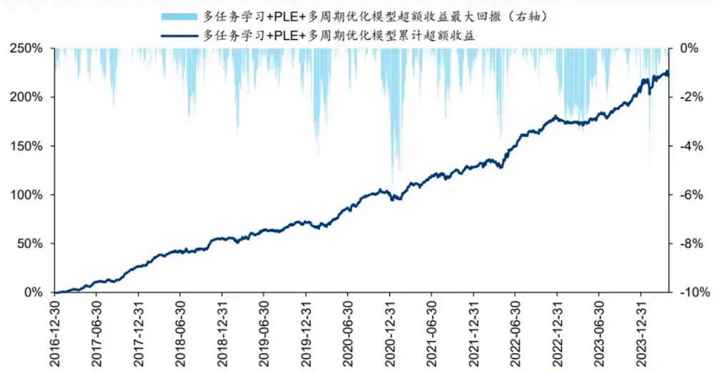

图表24：多周期优化模型指数增强组合逐月超额收益（基准为中证500指数）

| 1月 2月 |  |  | 3月 | 4月 | 5月 | 6月 | 7月 | 8月 | 9月 | 10月 11月 |  | 12 | 月年超额收益 |
| --- | --- | --- | --- | --- | --- | --- | --- | --- | --- | --- | --- | --- | --- |
| 2017年 | 0.6% | 0.9% | 1.7% | 1.1% | 1.8% | 4.1% | 0.1% | 1.1% | 1.0% | 5.1% | 4.3% | 2.5% | 26.9% |
| 2018年 | 0.7% | 3.9% | 4.2% | 0.0% | 2.3% | 0.9% | 0.2% | -1.3% | 2.6% | 1.1% | 5.4% | 0.9% | 22.8% |
| 2019年 | 0.3% | -1.5% | 1.5% | 2.0% | 0.1% | 2.4% | 0.3% | -0.2% | 1.7% | 2.4% | 1.2% | -0.3% | 10.3% |
| 2020年 | -1.8% | -0.4% | -0.6% | 4.8% | 3.4% | 2.8% | 1.3% | 4.0% | 1.7% | 0.1% | 1.0% | -0.8% | 16.6% |
| 2021年 | -1.0% | 1.6% | 5.0% | -0.4% | 1.1% | 2.8% | -0.1% | -1.5% | 3.0% | 0.3% | 2.6% | -0.1% | 14.1% |
| 2022年 | 1.8% | 0.8% | -0.1% | -2.5% | 5.3% | 3.8% | 4.9% | 1.5% | -0.6% | 1.8% | 2.6% | 1.3% | 22.1% |
| 2023年 | -1.7% | -0.1% | 0.3% | -0.4% | 1.2% | 2.3% | -1.3% | 2.3% | 1.6% | 0.8% | 3.2% | 1.3% | 9.6% |
| 2024年 | 3.8% | 0.5% | 1.0% | 0.5% |  |  |  |  |  |  |  |  | 5.9% |

中证1000指数增强组合回测结果如下表。多周期优化模型在超额收益、信息比率、Calmar比率方面优于其余模型。

图表25：多周期优化指数增强组合回测绩效（基准为中证1000指数）

|  | 年化超额 收益率 | 年化跟踪 误差 | 信息比率 | 超额收益 最大回撤 Calmar 比率 | 超额收益 | 相对基准年化双边 |  |
| --- | --- | --- | --- | --- | --- | --- | --- |
| 多任务学习+PLE取平均（对照） | 28.60% | 6.76% | 4.23 | 4.25% | 6.74 | 月胜率 93.18% | 换手率 20.26 |
| 多任务学习+PLE取10 日预测 | 25.64% | 6.66% | 3.85 | 4.64% | 5.53 | 84.09% | 20.29 |
| 多任务学习+PLE取 20 日预测 | 28.41% | 6.80% | 4.18 | 4.23% | 6.71 | 86.36% | 20.24 |
| 多任务学习+PLE+多周期优化 | 28.72% | 6.78% | 4.24 | 4.14% | 6.93 | 93.18% | 20.28 |

多周期优化模型中证1000指数增强组合累计超额收益和逐月超额收益如图表26和27。

图表26：多周期优化模型指数增强组合累计超额收益（基准为中证1000指数）
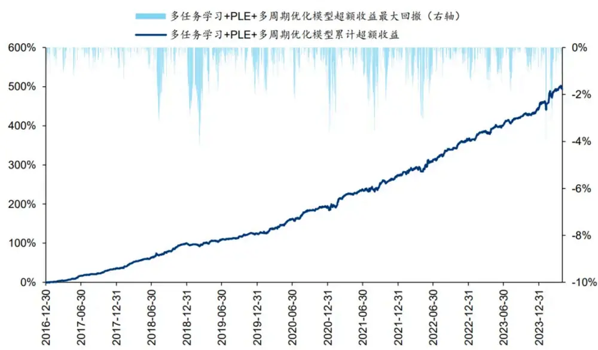

图表27：多周期优化模型指数增强组合逐月超额收益（基准为中证1000指数）

|  | 1月 | 2月 | 3月 | 4月 5月 |  | 6月 | 7月 | 8月 | 9月 | 10月 | 11月 | 12 | 月年超额收益 |
| --- | --- | --- | --- | --- | --- | --- | --- | --- | --- | --- | --- | --- | --- |
| 2017年 | 0.8% | 1.4% | 1.8% | 2.7% | 2.3% | 6.8% | 1.9% | 1.4% | 1.7% | 4.6% | 3.5% | 2.2% | 35.8% |
| 2018年 | 0.9% | 4.9% | 5.7% | 2.3% | 2.8% | 2.2% | 4.8% | 0.2% | 4.9% | 3.2% | 5.5% | 2.0% | 47.4% |
| 2019年 | -1.7% | -0.5% | 2.7% | 1.4% | 0.8% | 1.4% | 1.4% | 0.9% | 2.0% | 1.8% | 2.2% | -0.6% | 12.4% |
| 2020年 | 0.9% | 1.7% | 2.4% | 4.3% | 3.0% | 3.2% | 0.6% | 5.6% | 2.1% | 1.4% | 1.0% | 1.1% | 30.7% |
| 2021年 | 1.4% | 5.2% | 2.8% | 0.8% | 0.6% | 2.8% | -1.2% | 0.0% | 5.5% | 1.1% | 2.7% | 2.4% | 26.7% |
| 2022年 | 2.6% | 0.8% | 2.2% | -2.6% | 4.2% | 3.3% | 2.1% | 3.6% | 0.5% | 0.9% | 3.6% | 1.6% | 25.3% |
| 2023年 | -0.3% | 3.9% | 0.7% | 0.8% | 1.1% | 1.2% | 1.6% | 1.5% | 1.1% | 0.8% | 1.1% | 1.5% | 16.1% |
| 2024年 | 4.0% | 3.1% | 1.5% | 0.9% |  |  |  |  |  |  |  |  | 9.8% |

## 04 总结

本研究从预测目标、网络结构、组合优化角度探讨多任务学习选股模型的改进。在多期限收益预测基础上，引入夏普比率作为预测目标；参考腾讯2020年发表的PLE模型，在GRU内部引入多层专家和门控网络；采用多周期优化融合不同期限收益预测。结果表明，改进模型相比基线均有提升，引入PLE总体优于引入夏普比率，PLE结合多周期优化模型在指数增强组合的超额收益上优于大部分对照模型。回测期2016-12-30至2024-04-30内，周单边换手20%条件下，中证500增强组合年化超额收益18.1%，信息比率3.05，中证1000增强组合年化超额收益28.7%，信息比率4.24。

本研究的多任务学习基线模型架构为：针对日K线和周K线，分别采用多任务GRU网络，同时预测未来10日和20日收益率，预测值求均值视作单因子；针对分钟K线，人工构建50个因子，采用最大化10日ICIR法合成；最后将日K线、周K线和分钟K线因子等权合成。基线模型的预测目标仅考虑收益，未考虑风险。改进方向之一采用包含收益和风险信息的夏普比率作为目标，在10日和20日收益预测基础上，引入20日夏普比率预测任务。

腾讯PCG团队2020年提出PLE（Progressive Layered Extraction）架构，采用多层专家和门控网络设计，提升特征表征能力。改进方向之二将PLE引入基线模型的双层GRU网络。其中，第一层的任务共享专家网络和任务特定专家网络接受相同的原始K线输入信息，采用单层GRU提取浅层特征表征后，通过第一层门控单元进行融合；第二层的任务共享专家网络和任务特定专家网络接受特异的输入信息，采用单层GRU提取深层特征表征后，通过第二层门控单元进行融合。门控单元均采用单层GRU网络与Softmax激活。后续的任务特异层与基线模型一致。

多任务学习同时预测不同期限收益率，基线模型直接求均值作为最终预测，缺点是投资意义不明确。改进方向之三采用多周期优化技术，将10日和20日收益预测同时输入组合优化器。单周期优化中，每期组合优化的目标函数为最大化预期收益。多周期优化中，目标函数除了最大化预期收益项外，还加入了换手率惩罚项。在最大化组合短期收益和长期收益的同时，限制组合当期换手以及下期可能的换手。

测试结果表明，三项改进相比基线均有提升。从GRU单因子看，引入夏普比率和引入PLE均优于对应的基线。从指数增强组合看，引入PLE总体优于引入夏普比率。将“多任务学习+PLE取10日预测”与“多任务学习+PLE取20日预测”的预测值作为多周期优化的输入变量，构建中证500和中证1000指数增强组合，超额收益优于大部分对照模型，同时在回撤控制上体现出优势。回测期2016-12-30至2024-04-30内，周单边换手20%条件下，中证500增强组合年化超额收益18.1%，信息比率3.05，超额收益Calmar比率3.22；中证1000增强组合年化超额收益28.7%，信息比率4.24，超额收益Calmar比率6.93。

本研究存在如下未尽之处：（1）引入夏普比率和引入PLE的改进原因未深入探索。例如，夏普比率标签的意义是否仅仅起到缓解过拟合的作用，而非学到了风险信息？PLE的意义是否仅仅提升了模型复杂度，而非促进了特征表征的学习？从学术研究角度，或可进一步通过对照实验分析。（2）量价数据预测周期通常较短，可结合基本面数据进行更长期限的预测，使用多周期优化，可能是融合量价和基本面信息的有效途径。

## 参考文献：

Boyd, S., Busseti, E., Diamond, S., Kahn, R. N., Koh, K., Nystrup, P., & Speth, J. (2017). Multi-period trading via convex optimization. Foundations and Trends in Optimization, 3(1), 1-76.

Liu, S., Johns, E., & Davison, A. J. (2019). End-to-end multi-task learning with attention. In Proceedings of the IEEE/CVF conference on computer vision and pattern recognition (pp. 1871-1880).

Tang, H., Liu, J., Zhao, M., & Gong, X. (2020). Progressive layered extraction (PLE): A novel multi-task learning (MTL) model for personalized recommendations. In

Proceedings of the 14th ACM Conference on Recommender Systems (pp. 269-278).

## 风险提示：

人工智能挖掘市场规律是对历史的总结，市场规律在未来可能失效。人工智能技术存在过拟合风险。深度学习模型受随机数影响较大。本文测试的选股模型调仓频率较高，假定以vwap价格成交，忽略其他交易层面因素影响。

## 相关研报

研报：《 多任务学习选股模型的改进》2024年5月6日

林晓明 S0570516010001 | BPY421

何康 S0570520080004 | BRB318

## 关注我们

## 华泰证券金融工程

主要进行量化投资相关的研究和讨论工作。

427篇原创内容

公众号

## 华泰证券研究所国内站（研究Portal）

https://inst.htsc.com/research

访问权限：国内机构客户

华泰证券研究所海外站

https://intl.inst.htsc.com/research

访问权限：美国及香港金控机构客户

添加权限请联系您的华泰对口客户经理

免责声明

## ▲向上滑动阅览

本公众号不是华泰证券股份有限公司（以下简称“华泰证券”）研究报告的发布平台，本公众号仅供华泰证券中国内地研究服务客户参考使用。其他任何读者在订阅本公众号前，请自行评估接收相关推送内容的适当性，且若使用本公众号所载内容，务必寻求专业投资顾问的指导及解读。华泰证券不因任何订阅本公众号的行为而将订阅者视为华泰证券的客户。

本公众号转发、摘编华泰证券向其客户已发布研究报告的部分内容及观点，完整的投资意见分析应以报告发布当日的完整研究报告内容为准。订阅者仅使用本公众号内容，可能会因缺乏对完整报告的了解或缺乏相关的解读而产生理解上的歧义。如需了解完整内容，请具体参见华泰证券所发布的完整报告。

本公众号内容基于华泰证券认为可靠的信息编制，但华泰证券对该等信息的准确性、完整性及时效性不作任何保证，也不对证券价格的涨跌或市场走势作确定性判断。本公众号所载的意见、评估及预测仅反映发布当日的观点和判断。在不同时期，华泰证券可能会发出与本公众号所载意见、评估及预测不一致的研究报告。

在任何情况下，本公众号中的信息或所表述的意见均不构成对任何人的投资建议。订阅者不应单独

## 人工智能 25

人工智能 · 目录

上一篇

下一篇

华泰金工 | “GPT如海”：RAG与代码复现

华泰金工 | 双目标遗传规划应用于行业轮动

个人观点，仅供参考