原创 林晓明 徐特 华泰证券金融工程 2024年05月24日 07:02

## 「华泰金融工程

本文提出了双目标遗传规划模型，并将其应用于周频行业轮动。自2022Q3电力设备及新能源行业的行情结束以来，市场主线强度转弱、行业轮动速度加快，月频行业轮动模型难以持续稳定地获取超额收益，促使我们去研发更适合当前市场环境的周频行业轮动策略。一种思路是使用选股因子合成行业轮动因子，但其是否有效一定程度上取决于“运气”。另一种思路就是直接使用行业指数的量价数据来构建行业轮动因子。传统的单目标遗传规划存在因子评价不全面、严重的种群拥挤等痛点。对此，我们研发出了双目标遗传规划框架，同时将|IC|和NDCG@k作为适应度函数来评价因子有效性，通过双目标对抗来缓解种群拥挤问题，并最终挖掘出了一批兼具单调性和多头组表现的因子。实证研究表明，在周频行业轮动场景中，双目标遗传规划模型的表现显著优于单目标遗传规划模型。2022-09-30至2024-04-30，扣费前年化超额收益为25.74%，年化换手为单边约13倍。

## 核心观点

## 人工智能79：应用双目标遗传规划构建周频行业轮动策略

本文提出了双目标遗传规划模型，并将其应用于周频行业轮动。自2022Q3电力设备及新能源行业的行情结束以来，市场主线强度转弱、行业轮动速度加快，月频行业轮动模型难以持续稳定地获取超额收益，构建周频行业轮动策略是应对良策。双目标遗传规划同时以|IC|和NDCG@k作为适应度函数来评价因子有效性，挖掘出了一批兼顾单调性和多头组表现的因子。我们使用贪心策略将其合成为综合因子。2022-09-30至2024-04-30，综合因子的扣费前年化超额收益为25.74%，夏普比率1.70，最大回撤-21.47%，显著优于单目标遗传规划模型的表现；年化换手为单边约13倍。

## 双目标遗传规划在进化过程中更易保持种群多样性

遗传规划流程主要包括交叉变异、适应度评估、子代选择等三个步骤，能否维持种群多样性是因子挖掘能否成功的关键。单目标遗传规划不仅因子评价维度不全面，还面临严重的种群拥挤问题。与单目标遗传规划相比，双目标遗传规划在适应度评估阶段选取两个侧重点不同的评价指标来评价因子有效性，在子代选择阶段采用NSGA-II算法，形成了双目标的对抗，种群拥挤的速度自然会慢得多。此外，我们还做了如下努力来尽可能保持种群多样性——在设置种群规模和进化次数的时候要求前者远大于后者，同时将初始种群分为若干小种群，让每一个小种群单独执行遗传规划流程。

## 双目标遗传规划模型的表现显著优于单目标遗传规划模型

同时将|IC|和NDCG@k作为适应度函数来评价因子有效性。其中，|IC|侧重因子单调性，NDCG@k侧重多头组表现。考虑到本研究可以拓展至选股场景，故遗传规划算子使用PyTorch实现便于GPU加速，共计64个。我们每隔3个月重新训练模型。每个重训练日，为了降低随机因素的干扰，设置了6个随机数种子执行了6轮因子挖掘，并使用贪心策略将6轮因子挖掘的结果合成为周频行业轮动综合因子。消融实验仅以|IC|或NDCG@k作为适应度函数开展单目标遗传规划，其他参数细节均保持不变。在相同的回测区间内，双目标遗传规划模型的表现显著优于单目标遗传规划模型。

## 正文

## 01 本文导读

物竞天择，适者生存。

行业轮动一直是A股投资一个重要的研究课题。大多数买方和卖方机构都布局了由包括基本面和技术面组成的月频行业轮动模型，其中基本面一般起主导作用。但近两年，由于投资者信心不足、市场主线不强、行业轮动速度较快，鲜有月频模型能够持续稳定地获取超额收益，我们的模型也不例外。于是，部分投资者开始着眼周频行业轮动的研究，其中技术面一般起主导作用。然而，根据我们的经验，像MACD、KDJ等常见技术指标在周频行业轮动场景中几乎全部失效，寻求人工智能(AI)等高级因子挖掘手段，成了新的探索方向。

由于行业轮动场景具有截面小样本的特点，大家普遍担心AI模型潜在的过拟合风险，于是使用选股因子合成行业轮动因子似乎顺理成章。但是，这种做法得到的行业轮动因子是否有效似乎“听天由命”，而且由于要先得到选股因子，工程计算量通常不低。那么，是否有办法直接基于各行业指数的量价数据来挖掘行业轮动因子呢？容易想到的方式包括端到端有监督学习和遗传规划等启发式因子挖掘。对于前者，我们暂时没有取得有效进展。本文将重点介绍我们在遗传规划上取得的成果。全文回测均使用前期报告《经济周期实证、理论及应用》(2024-01-10)使用的中信行业指数，每次调仓选信号前5名的行业作为多头组等权配置。遗传规划模型的净值如下图所示：

图表1：遗传规划周频行业轮动模型净值
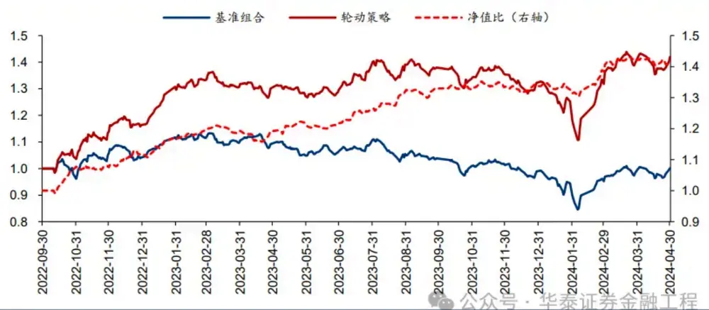

## 背景一：市场主线强度不高，月频行业轮动模型表现不稳定

我们的月频行业轮动模型从因子定价模型出发。一个行业的表现可以被拆分为由市场和风格Beta所解释的部分以及残差。针对Beta部分，我们撰写了一系列有关行业景气度的研究报告，从宏观、中观、微观三个视角去捕捉行业盈利能力g和盈利能力边际变化Δg都大于零的机会，详见前期报告《行业景气投资的顶层设计和落地方案》(2023-09-14)和我们每周发布的观点周报。残差部分是无法被市场和风格Beta所解释的部分，可能蕴含着如技术进步、政策支持等行业专属信息。我们采用技术分析的方法构建了残差动量因子来捕捉行业专属信息的异动，详见前期报告《行业残差动量定价能力初探》(2024-02-05)。从统计学原理来说，Beta部分和残差部分是不相关的；根据实证，综合景气度子策略和残差动量子策略也几乎不相关。因此，我们最后把两个子策略按信号进行等权融合。

图表2：华泰金工月频行业轮动模型框架
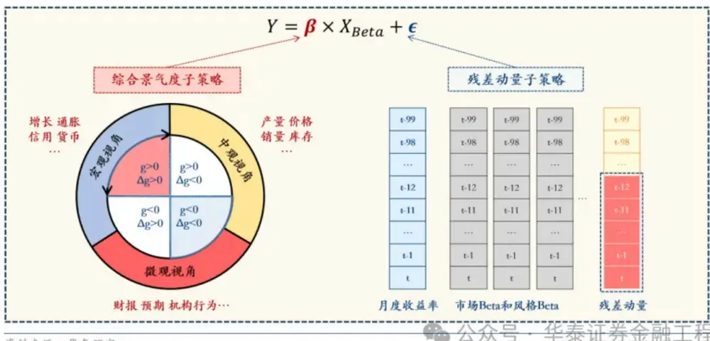

取回测区间 2016-04-30 至 2024-04-30，每月末选择综合得分前五名的中信行业指数等权 配置，次月第一个交易日按收盘价完成调仓。结果显示，自从 2022Q3 电力设备及新能源 行业的行情结束后，月频行业轮动模型的表现就下了一个台阶。2022 年 9 月之前，模型相 对于全体行业等权基准的年化超额收益约为 17%；而 2022 年 9 月之后，年化超额收益就 下降至了约 7%。而且不难发现，2022 年 9 月之后相较 2022 年 9 月之前，月频行业轮动 模型的换手率提升了约40%，表明一个行业投资机会的持续时间变短了。这可能是因为彼 时美联储正在快速加息，全球投资者的风险偏好迅速降低，即使基本面还未被股价充分兑 现，更多投资者的心态也可能是“落袋为安”去寻找下一个投资机会，而不愿意对股价可 能继续上涨“下重注”，导致市场交易缺乏主线、行业轮动速度较快。

图表3：华泰金工月频行业轮动模型净值
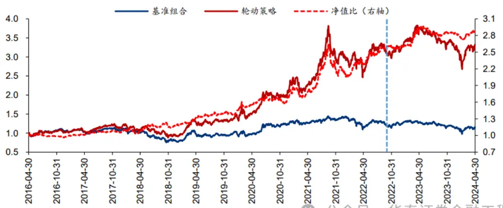

| 回测区间：2016-04-30 至2022-09-30 月频行业轮动 | 年化收益 19.72% | 年化波动 24.17% | 夏普比率 0.82 | 最大回撤 -35.43% | 卡玛比率 55.65% | 年化换手 单边 3.1 倍 |
| --- | --- | --- | --- | --- | --- | --- |
| 行业等权基准 | 2.72% | 19.19% |  | 0.14众号33.94%泰证券02%融工程1 |  |  |
| 资料来源：Wind，华泰研究 图表5：月频行业轮动模型业绩：2022年9月之后 |  |  |  |  |  |  |
| 回测区间：2022-09-30 至 2024-04-30 | 年化收益 | 年化波动 | 夏普比率 | 最大回撤 | 卡玛比率 | 年化换手 |
| 月频行业轮动 行业等权基准 | 6.29% -0.70% | 18.15% 15.99% | 0.35 -0.04众号26.49%泰证64%融工程1 | -30.03% | 20.94% | 单边 4.3 倍 |

对此，我们设计了市场主线强弱指标。该指标的基本思想是尝试寻找在不同期限下收益率均靠前的行业，如果找得到，表明市场主线较强：

1) 在每个交易日，计算N个行业指数5/10/20/40/60日收益率；

2) 截面上，计算各行业指数不同期限收益率的升序排名并归一化；如收益率最高的行业就是N/N，第二名是N-1/N，以此类推；

3) 在每个交易日，计算各行业指数不同期限收益率归一化排名的均值，得到行业相对强弱指标；如右子图中行业C在5个期限下的排名是N-2/N,N-4/N,N-2/N,N-2/N,N-3/N，则该行业的相对强弱指标等于N-2.6/N；

4) 截面上，取相对强弱指标前5名的行业，计算这5个行业相对强弱指标的均值，得到市场主线强弱指标；

5) 对日频的市场主线强弱指标开展指数移动平均(alpha=2/21)。

左子图是市场主线最强的情况——按照上述计算步骤，对于N=31来说，市场主线强度的理论最大值等于0.935。不过，这种理想情况几乎不可能出现在实际投资中。于是，我们允许前五名行业在各期限收益率下，有平均不超过2名的误差，如右子图所示。其市场主线强度不会低于0.871。这个数是强主线阈值。

我们用月末值来表征该月市场主线强弱，其与当月模型超额收益率相关系数为+0.36，这说明市场主线越强，月频行业轮动模型越容易获得超额收益。2022年9月之后相较2022年9月之前，市场主线强弱指标的均值下降了约0.01，超过强主线阈值月份的比例下降了约5%，说明市场主线有所变弱，一定程度上导致月频行业轮动模型表现有所变差。最近三个月市场主线都处于较弱水平，我们也无法预测这种状态还将持续多久，只能够通过提升行业轮动策略的调仓频率进行应对。

图表6：市场主线强弱指标计算示例

| Ret_5d | Ret_10d | Ret_20d | Ret_40d | Ret_60d |
| --- | --- | --- | --- | --- |
| A | A | A | A | A |
| B | B | B | B | B |
| C(N-2/N) | C(N-2/N) | C(N-2/N) | C(N-2/N) | C(N-2/N) |
| D | D | D | D | D |
| E | E | E | E | E |

市场主线最强的情况：[N+(N-1)+(N-2)+(N-3)+(N-4)]/5N=0.935

| Ret_5d | Ret_10d | Ret_20d | Ret_40d | Ret_60d |
| --- | --- | --- | --- | --- |
| B | E | A | B | A |
| A | B | B | A | F |
| C(N-2/N) | H | C(N-2/N) | C(N-2/N) | D |
| D | D | G | D | C(N-3/N) |
| F | C(N-4/N) | E | E | G |

强市场主线的阈值：N+(N-1)+(N2)±(N-3)+(N-4)-101/5N=0.871 1 融

图表7：月末市场主线强弱指标与当月模型超额收益率相关系数为+0.36
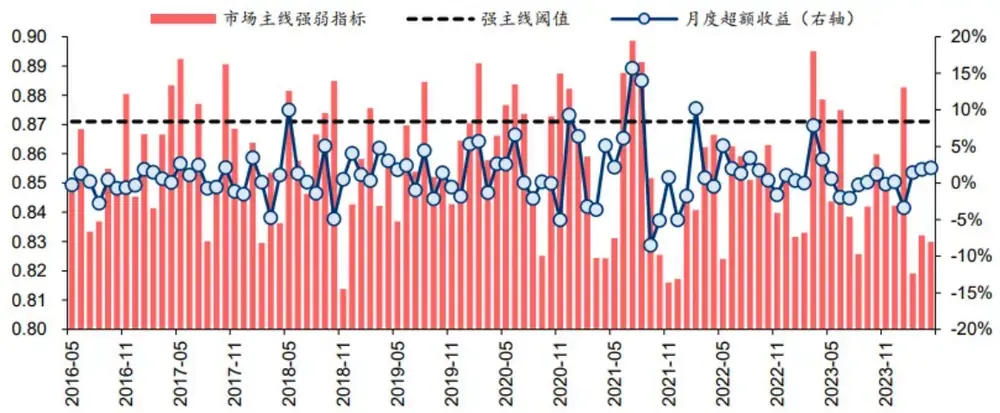

## 背景二：用选股因子合成行业轮动因子其有效性无法被保证

构建周频行业轮动模型，容易想到的思路是用选股因子合成行业轮动因子。但是，行业轮动因子是否有效一定程度上取决于“运气”，这是因为选股因子中混合着个股Alpha信息和行业Beta信息。如果对选股因子开展行业中性化处理，那么由于行业轮动信息被去除，行业轮动因子基本上无效。如果不对选股因子开展行业中性化处理，那就得看选股因子中是个股Alpha信息为主还是行业Beta信息为主，如果是前者，那么行业轮动因子也大概率无效；如果是后者，那么行业轮动因子或许有效。

图表8：选股因子有效性是行业轮动因子有效性的必要非充分条件
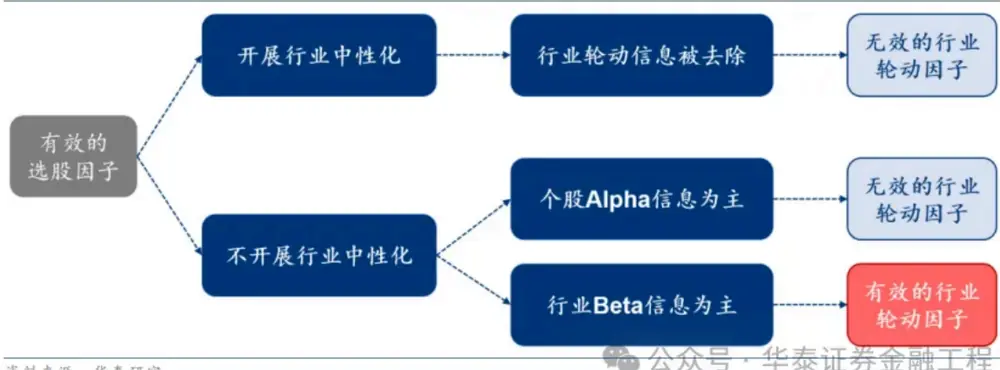

基于前期报告《基于全频段量价特征的选股模型》(2023-12-08)，我们就得到了一个有效的周频行业轮动因子。具体来说，我们使用Level2和分钟频K线等高频数据构建了一系列日频因子，并通过端到端有监督学习，得到了fh；同样采用端到端有监督学习，基于日频、周频、月频量价数据挖掘出了fl。然后，将 $\mathfrak{f}_{\mathfrak{h}}$ 和fl按照1:3的权重合成为选股因子。最后，将选股因子按照流通市值加权的方式合成为行业轮动因子。需要注意的是，fh和fl都没有开展行业中性化。

取回测区间2017-01-08至2024-04-30，每周六选择综合得分前五名的中信行业指数等权配置，下周第一个交易日按开盘价、最高价、最低价、收盘价的均价完成调仓。这里需要说明，之所以没有像月频模型那样使用收盘价调仓，是因为调仓价格对于月频模型来说没有像周频模型那样敏感，采用均价更符合实战场景。后文构建的周频行业轮动模型都采用这个规则进行回测。回测结果显示，2022年9月之前，模型相对于全体行业等权基准的年化超额收益约为22%；2022年9月之后，年化超额收益反而上升至约24%，显示出周频行业轮动模型在市场主线较弱的环境中更强的适应性。

图表9：全频段量价选股因子的挖掘方法
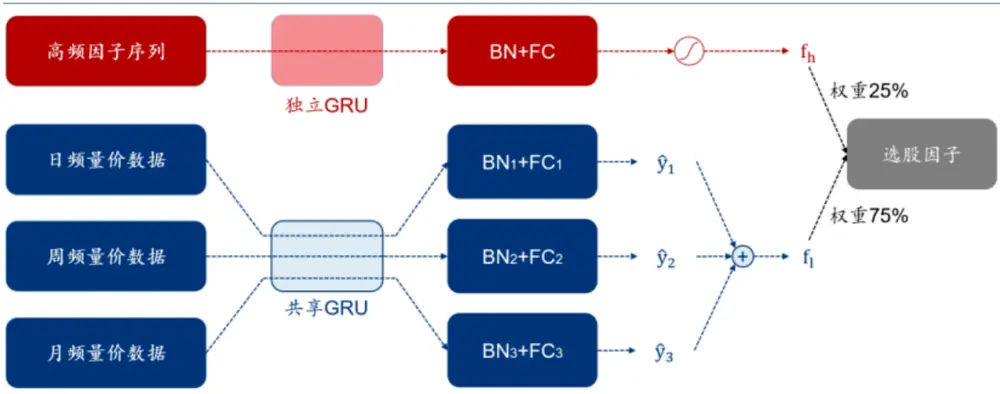

图表10：华泰金工全频段量价周频行业轮动模型净值
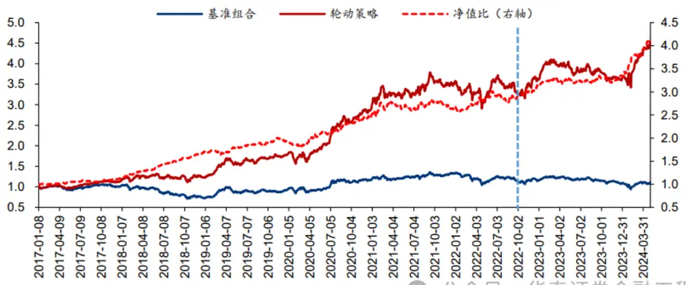

图表11：全频段量价周频行业轮动模型业绩：2022年9月之前

| 回测区间：2016-12-31至2022-09-30 | 年化收益 | 年化波动 | 夏普比率 | 最大回撤 | 卡玛比率 | 年化换手 |
| --- | --- | --- | --- | --- | --- | --- |
| 周频行业轮动 | 23.70% | 16.39% | 1.45 | -23.37% |  | 1.01 单边约 20 倍 |
| 行业等权基准 | 2.07% | 15.75% | 0.13 | -33.14%表证0.06 |  | 融工程！ |

图表12：全频段量价周频行业轮动模型业绩：2022年9月之后

| 回测区间：2022-09-30 至 2024-04-30 | 年化收益 | 年化波动 | 夏普比率 | 最大回撒 | 卡玛比率 | 年化换手 |
| --- | --- | --- | --- | --- | --- | --- |
| 周频行业轮动 | 24.24% | 14.33% | 1.69 | -16.63% |  | 1.46 单边约 22 倍 |
| 行业等权基准 | 0.07% | 13.19% | 0.01 | -25.31%0.00 |  | 融工程！ |

## 02 双目标遗传规划原理详解

## 单目标遗传规划面临的痛点

使用遗传规划开展量价因子挖掘的基本研究范式如左图所示。首先，开展种群初始化，即随机生成规定数量的因子表达式，因子表达式采用“树”的数据结构进行存储。然后，进行规定数量轮迭代进化。每轮迭代进化由交叉变异、适应度评估、子代选择等三个步骤组成。在交叉变异阶段，按照一定顺序依次选取两个因子，按照指定的交叉概率交换一部分“基因”即子表达式，再按照指定的变异概率用一个随机生成的子表达式代替已存在的子表达式，相关示例详见前期报告《基于遗传规划的选股因子挖掘》(2019-06-10)。在适应度评估阶段，我们根据因子表达式，计算出训练集上每个资产的因子序列，然后在截面上进一步计算因子评价指标，对于单目标遗传规划来说，通常选择|IC或者|ICIR|作为适应度函数。在子代选择阶段，单目标遗传规划通常采用锦标赛、轮盘赌等选择排序算法来选取子代，一般来说，因子适应度越高，有越大的概率被选中；子代作为新的父代重复上述进化过程。最后，我们将训练集上优化后的因子在验证集上验证其有效性，开展二次筛选，这一步当然也可以人工干预，例如尝试解释一下因子背后的逻辑。

图表13：单目标遗传规划与双目标遗传规划流程对比
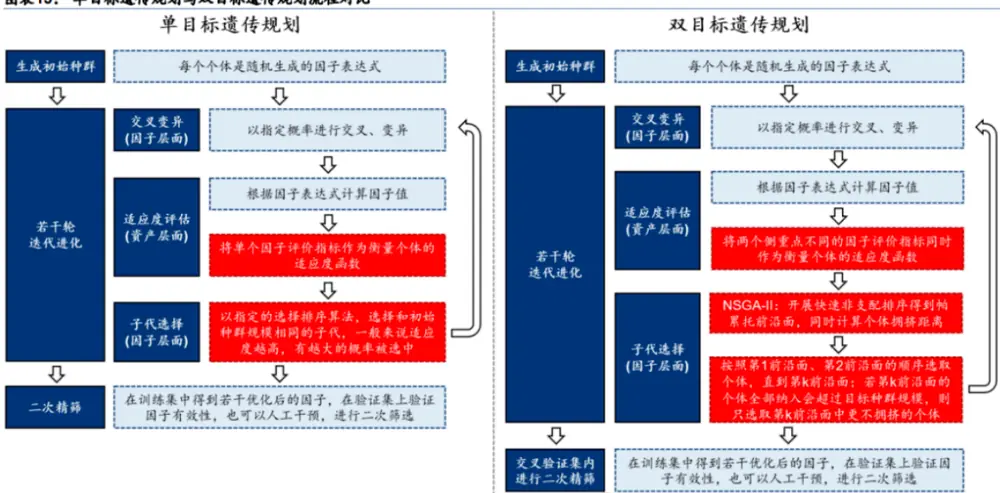

在实践中我们发现，单目标遗传规划存在以下痛点。首先，仅有一个适应度函数作为优化目标，无法全面概括因子的全部特性。我们的许多前期报告都有提及这一点，这已是量化投资领域的共识。如|IC|侧重当期因子值和未来收益率之间的单调性，至于主要是由多头端贡献的还是由空头端贡献的，|IC|就无能为力了。更重要的是，单目标遗传规划可能面临严重的种群拥挤问题。所谓种群拥挤，是指在进化过程中，个体的“基因”趋同，导致种群多样性降低。这就好比明代科举制度和现代选拔制度：明代科举制度采用“八股文”，始于“破题”，末于“束股”，通过考试筛选出来的人才几乎是“清一色”的满腹经纶却只会纸上谈兵；而现代选拔制度考察多门学科、有多种升学途径，各领域人才“百花齐放”。

针对上述痛点，本文提出了双目标遗传规划。其基本研究范式与单目标遗传规划相似。不同的是，在适应度评估阶段，双目标遗传规划选取两个侧重点不同的评价指标来评价因子有效性。在单目标遗传规划中，通过比较评价指标的大小，就能评价两个因子的优劣；而在双目标遗传规划中，可能会出现双目标矛盾的情况，这就需要我们进一步分析两个因子的支配关系了。在子代选择阶段，双目标遗传规划采用NSGA-II算法来选择子代。

## NSGA-II算法重要概念

这一小节，我们来解释一下NSGA-II算法(Deb et al, 2002)涉及的重要概念：

1）支配与非劣：在双目标遗传规划中，每个样本均存在两个评价维度。当个体p的一个评价指标优于个体q，而另一个评价指标不比个体q差，就称为个体p支配个体q；顾名思义，支配就是一个个体绝对占优于另一个个体。当个体p的一个评价指标优于个体q而另一个评价指标劣于个体q，就称个体p和个体q相互非劣；非劣是指两个个体势均力敌、互不支配。

2）非支配前沿面：通过快速非支配排序，可以将种群划分为如右图所示的分层状态。同一层内任何两个个体之间都是相互非劣的，所以这些分层也被称作非支配前沿面。显然，在一个种群中，存在最优的非支配前沿面，其中的个体是完全不受种群中其他任何个体支配的，这一前沿面被称为帕累托前沿面或第1前沿面。往后依次为第2前沿面、第3前沿面等。因篇幅原因，快速非支配排序的原理详见NSGA-II算法原文。

图表14：重要概念示意图之支配与非劣
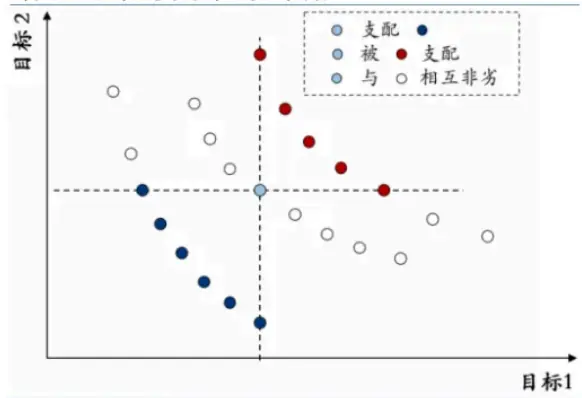

图表15：重要概念示意图之非支配前沿面
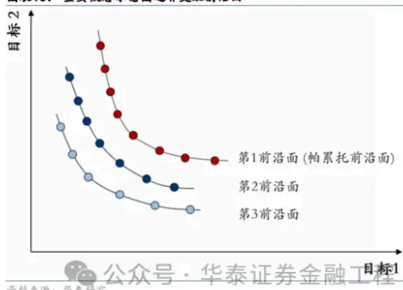

3）拥挤距离：若两个个体处于不同前沿面，可以直接根据前沿面顺序比较孰优孰劣，跟拥挤距离关系不大；但如果两个个体处于同一个前沿面，那就需要使用拥挤距离来选出更好的个体。具体来说，对于个体i，我们首先确定同一前沿面上其“邻居”，即个体i-1和个体i+1；个体i-1和个体i+1在坐标轴上包围形成长方形，其面积就是拥挤距离。拥挤距离越大，表明个体越不拥挤，对维持种群多样性来说越重要。处于前沿面两端的个体，是同一前沿面上差异最大的一对个体，其拥挤距离设为正无穷。

4）精英选择策略：是双目标遗传规划中独特的用于优选个体的方法。首先，将父代种群与子代种群合并，子代种群规模不应小于父代。然后，对合并后的种群开展快速非支配排序，得到非支配前沿面。接着，按照第1前沿面、第2前沿面的顺序依次选取个体，直至达到目标种群规模。如果纳入第k前沿面的全部个体会造成种群规模超过目标种群规模，则只纳入第k前沿面中最不拥挤的个体，以尽量维持种群多样性。

图表16：重要概念示意图之拥挤距离
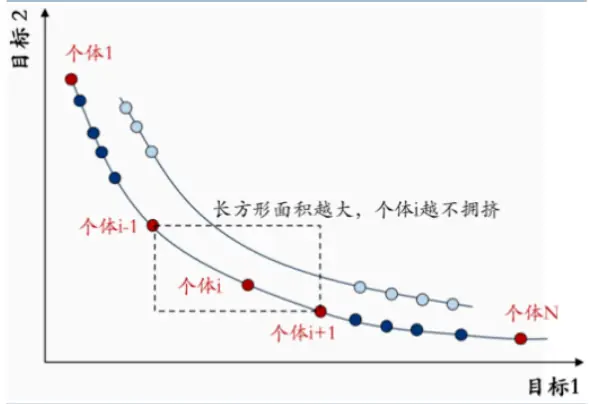

图表17：重要概念示意图之精英选择策略
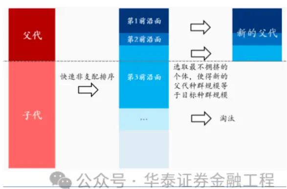

## 遗传规划算子介绍

我们在前期报告《遗传规划因子挖掘的GPU加速》(2024-02-19)的基础上，进一步将算子补充到64个，以提升因子的表达能力。新增的算子函数同样使用PyTorch实现。虽然行业轮动场景仅涉及30余个行业指数，截面上样本数不及选股场景的百分之一，没有必要使用GPU加速，但本研究是有可能拓展到选股场景的，故用PyTorch实现以未雨绸缪。

图表18：元素级运算算子（20个）

| 算子函数 | 算子含义 | 参数范围 |
| --- | --- | --- |
| add_const(X, c) | X+c | c: 1,2,...,10 |
| mul_const(X, c) | X*c | c: 1,2,..,10 |
| add(X,Y) | X+Y | 1 |
| sub(X,Y) | X-Y | I |
| mul(X,Y) | X*Y | I |
| div(X,Y) | X/Y | 一 |
| log_torch(X) | In(max(X,1.0e-12)) | I |
| exp_torch(X) | exp(X) | 1 |
| sqrt_torch(X) | sqrt(max(X,0)) | 1 |
| square_torch(X) | X^2 | 1 |
| sin_torch(X) | sin(X) | 1 |
| cos_torch(X) | cos(X) | I |
| neg(X) | -X | I |
|  |  | I |
| inv(X) | 1/X | I |
| sign_torch(X) | X的正负性 |  |
| abs_torch(X) | \|X\| | I |
| sigmoid_torch(X) | 对应 pytorch 中的 Sigmoid 激活函数 | 1 |
| hardsigmoid_torch(X) | 对应 pytorch 中的 HardSigmoid 激活函数 | I |
| leakyrelu_torch(X, α) | 对应 pytorch 中的 LeakyReLU 激活函数 | α: 0,0.1,..,0..9 |
| gelu_torch(X) | 对应 pytorch中的 GELU激活函数。华泰证券金融工程！ |  |

图表19：截面运算算子（8个）

| 算子函数 | 算子含义 | 参数范围 |
| --- | --- | --- |
| xs_cutquartile_torch(X, α) | 采用四分位数法拉回截面上的离群值 α-四分位距倍数：1.5,2.0,2.5,3.0 |  |
| xs_cutzscore_torch(X, α) | 采用 zscore 法拉回截面上的离群值 | α-离群值阈值： 1.5,2.0,2.5,3.0 |
| rank_pct_torch(X) | 截面上分位数 | 1 |
| xs_regres_torch(X, Y) | 截面上Y对X开展一元线性回归的残差 | 1 |
| xs_sortreverse_torch(X, n, mode) | X 截面前/后 n 名对应的 X 乘以-1 |  |
| xs_zscorereverse_torch(X, a, mode) | X截面z值大于/小于阈值对应的X乘以-1 | n: 1,2,...,10 |
| xs_grouping_sortreverse_torch (X, Y, n, mode) | Y 截面前/后 n 名对应的 X 乘以-1 | α: 1.5,2.0,2.5,3.0 |
| xs_grouping_zscorereverse_torch(X, Y, α, mode) | Y截面z值大于/小于阈值对应的X乘以-1 | mode: 0-前端，1-后端，2-两端 华泰证券 融工程 |

图表20：时序运算算子（28个）

| 算子函数 | 算子含义 | 参数范围 |
| --- | --- | --- |
| ts_cutquartile_torch(X, α) | 采用四分位数法拉回时序扩展窗口上的离群值 | α: 1.5,2.0,2.5,3.0 |
| ts_cutzscore_torch(X, α) | 采用zscore法拉回时序扩展窗口上的离群值 | α: 1.5,2.0,2.5,3.0 |
| ts_delay_torch(X, d) | 时间序列延后d期 | d: 1,2,...,10 |
| ts_delta_torch(X, d) | 时间序列的d期差分 | d: 1,2,...,10 |
| ts_pctchange_torch(X, d) | 时间序列的d期百分比变化 | d: 1,2,...,10 |
| ts_rollrank_torch(X, d) | 滚动d日的分位数 | d: 10,15,...,60 |
| ts_rollzscore_torch(X, d) | 滚动d日的z值 | d: 10,15,...,60 |
| ts_rollcorr_torch(X, Y, d) | X 和Y滚动d日的相关系数 | d: 10,15,...,60 |
| ts_rankcorr_torch(X, Y, d) | X和Y滚动d日的秩相关系数 | d: 10,15,...,60 |
| ts_covariance_torch(X, Y, d) | X和Y滚动d日的协方差 | d: 10,15,...,60 |
| ts_max_torch(X, d) | 滚动d日最大值 | d: 2,3,...,20 |
| ts_min_torch(X, d) | 滚动d日最小值 | d: 2,3,...,2020 |
| ts_argmax_torch(X, d) | 滚动d日最大值的索引除以d | d: 2,3,...,20 |
| ts_argmin_torch(X, d) | 滚动d日最小值的索引除以d | d: 2,3,...,20 |
| ts_sum_torch(X, d) | 滚动d日之和 | d: 2,3,...,20 |
| ts_mean_torch(X, d) | 滚动d日均值 | d: 2,3,...,20 |
| ts_decay_linear_mean_torch(X, d) | 滚动d日按时间索引作为权重求均值 | d: 2,3,...,20 |
| ts_rollweighted_mean_torch(X, Y, d) | 滚动d日中，以归一化的Y为权重，求X均值 | d: 2,3,...,2020 |
| ts_median_torch(X, d) | 滚动d日中位数 | d: 5,6,...,20 |
| ts_var_torch(X, d) | 滚动d日方差 | d: 5,6,...,20 |
| ts_stddev_torch(X, d) | 滚动d日标准差 | d: 5,6,...,20 |
| ts_avgdev_torch(X, d) | 滚动d日平均偏差 | d: 5,6,...,20 |
| ts_kurt_torch(X, d) | 滚动d日峰度 |  |
| ts_skew_torch(X, d) |  | d: 5,6,...,20 |
|  | 滚动d日偏度 | d: 5,6,...,20 |
| ts_regbeta_torch(X, Y, d) | 滚动d日中，Y对X开展一元线性回归的斜率 | d: 10,15,...,60 |
| ts_regalpha_torch(X, Y, d) | 滚动d日中，Y对X开展一元线性回归的截距 | d: 10,15,...,60 |
| ts_regres_torch(X, Y, d) | 滚动d日中，Y对X开展一元线性回归的最近一期残差 | d: 10,15,...,60 |
| ts_fftpeak_torch(X, d) | 滚动d日中，对X做傅里叶变换，取频谱图峰值。化表证券d：10,15.60 |  |

图表21：时序切割算子（8个）

| 算子函数 | 算子含义 | 参数范围 |
| --- | --- | --- |
| ts_ascsortcut_torch(X, d, n, mode) | 滚动d日中，将X最小的n天切割出来 |  |
| ts_decsortcut_torch(X, d, n, mode) | 滚动d日中，将X最大的n天切割出来 | d: 10,15,...,60 |
| ts_asczscorecut_torch(X, d, α, mode) | 滚动d日中，将X的z值小于-α的时间切割出 | n: 1,2,...,10 |
| ts_deczscorecut_torch(X, d, α, mode) | 来；若不存在，则切割出X最小的1天 | α: 1.5,2.0,2.5,3.0 |
|  | 滚动d日中，将X的z值大于α的时间切割出 |  |
|  | 来；若不存在，则切割出X最大的1天 | mode: |
| ts_grouping_ascsortcut_torch(X, Y, d, n, mode) | 滚动d日中，将Y最小的n天切割出来 | 1-切割部分求X之和，2-全 |
| ts_grouping_decsortcut_torch(X, Y, d, n, mode) | 滚动d日中，将Y最大的n天切割出来 | 序列X之和减去切割部分 |
| ts_grouping_asczscorecut_torch(X, Y, d, α, mode) | 滚动d日中，将Y的z值小于-α的时间切割出 | 的X之和，3-切割部分X乘 |
| ts_grouping_deczscorecut_torch(X, Y, d, α, mode) | 来；若不存在，则切割出Y最小的1天 | 以-1 后再求全序列X之和 |
|  | 滚动d日中，将Y的z值大于α的时间切割出 |  |
|  | 来；若不存在，则切割出￥最大的1天泰证券金融工程 |  |

## 03 双目标遗传规划应用于行业轮动

## 适应度函数定义

|IC|是量化投资中最常用的因子评价指标，它等于截面上各行业当期因子值排名与未来一段时期内涨跌幅排名相关系数的绝对值。但在行业轮动场景中，只有|IC|高是不够的。这是因为实践行业轮动的投资者通常更关心多头组能否跑赢基准，而|IC|侧重单调性，高|IC|也有可能是空头组显著跑输基准带来的，无法和多头组表现出色划上等号。

归一化折损累计增益(NDCG)在评价因子有效性，会给予多头组表现更高的关注度。其计算过程同样使用截面上各行业当期因子值和下期收益率——计算当期因子值降序排名i，如因子值最大的行业i=1，因子值最小的行业i=N；计算下期收益率的分组得分r，在全体行业分6组的场景下，表现最好的一组中各行业得分均为5，表现最差的一组中各行业得分均为0；组间按升序排名，与因子值的排序方向相反；处于同一组的行业不做更精细区分，是因为多头组行业会被一揽子等权买入，组内排序的差异并不会影响策略表现。

每个行业都有了r和i，我们首先计算每个行业的DCG_i：

$$
DCG_{i}={\frac{2^{r}-1}{\log_{2}(i+1)}}
$$

然后，取因子值前k名即i≤k的行业，取其DCG_i之和，得到DCG@k：

$$
DCG@k=\sum_{i=1}^{k}DCG_{i}
$$

对于因子值前k名的行业，i是给定的即1至k，所以DCG_i的分母也是给定的，其大小完全取决于分子中的r。r越大即模型预测越准确，那么DCG_i越大，DCG@k也越大。当然DCG@k的数量级会受到行业数量、分组数量、k的影响。本研究k=5。为了统一量纲，我们可以计算出理想情况即真实收益率排名完全预测准确时的DCG@k，记作IDCG@k。然后，我们可以使用IDCG@k对DCG@k进行去量纲化：

$$
NDCG@k={\frac{DCG@k}{IDCG@k}}
$$

|IC|和NDCG@k的取值范围都是0至1，数值越大，因子越有效。我们希望遗传规划得到的因子同时具备较高的|IC|和较高的NDCG@k，因为如果NDCG@k较低，意味着多头组表现不佳；如果|IC|较低，意味着因子单调性不好，会给多因子线性合成造成麻烦。

图表22：IC|和NDCG 的区别
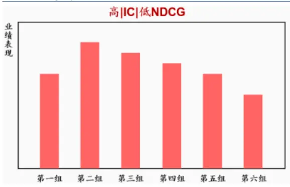

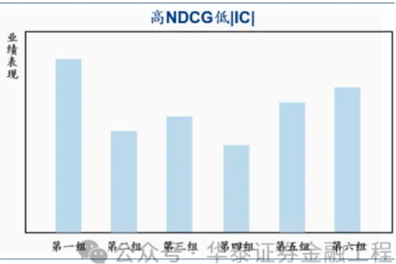

## 因子挖掘流程

在因子挖掘流程中能否维持种群多样性是因子挖掘能否成功的关键。前文已经说过，相较于单目标遗传规划，双目标遗传规划由于双目标之间的对抗，种群拥挤的速度自然会慢得多。但这不等于不会拥挤，毕竟随着多轮优胜劣汰，优秀“基因”的复制将呈现指数级增长，而新的优秀“基因”的出现概率却仅近似于一个较小的常数。一方面，除非交叉概率或变异概率等于1，否则父代因子总有一定概率既没有参与交叉又没有参与变异，而原封不动地被保留到了子代，这里不可能产生新的优秀“基因”。另一方面，为了能够让优秀“基因”传承下去，交叉概率一般设置得比较大而变异概率一般设置得比较小，像本研究交叉概率和变异概率分别设置为0.8、0.3；而且，变异“基因”不一定有原“基因”优秀。

对此，我们还做了如下努力来尽可能阻止种群拥挤。首先，在设置种群规模和进化次数的时候，我们延续前期报告《遗传规划因子挖掘的GPU加速》(2024-02-19)中的做法，要求前者远大于后者。换句话说，由种群规模来决定初始种群多样性，并且在有限的进化次数内，即使发生了极端的种群拥挤，种群多样性依然能够保持在一个可以接受的水平。在本研究中，种群规模设置为2500，进化次数设置为10。

其次，我们将初始种群分为50个小种群，每一个小种群单独执行遗传规划流程。我们主要担心种群中可能会出现“超强基因”，导致其他的优秀“基因”被替换掉。一旦初始种群被分割成若干份，即使出现一个“超强基因”，它也只会被限制在其中一个小种群中，其他小种群中的优秀“基因”依然有机会得以保留。这种做法的思想有点像大陆分裂，如果地球一直处于盘古大陆状态，像澳大利亚的袋鼠就不一定会出现了。

图表23：一轮因子挖掘流程图
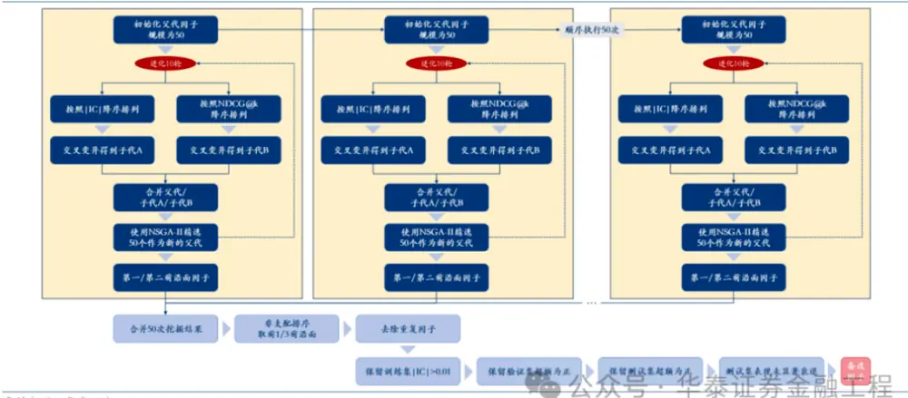

一轮因子挖掘流程的其他细节详见上图。因子挖掘从2022-09-30开始，即专门针对月频行业轮动模型效果变差的阶段建模，我们每隔3个月重新挖掘一遍因子。为了降低随机因素的干扰，我们设置了6个不同的随机数种子，执行6轮因子挖掘。一个滚动窗口的长度略长于6年，其中约5年的数据为训练集，用于因子挖掘，约半年的数据用于验证集，约半年的数据用于测试集。滚动窗口中之所以既设置验证集又设置测试集，是为了模拟因子样本外跟踪半年没有失效才被纳入因子库的场景。

在验证集和测试集中，我们不再采用|IC|、NDCG@k等评价指标，而是直接对多头组开展周频调仓回测，使用多头组相对于行业等权基准的超额收益作为评价指标。我们不仅要求验证集和测试集上单因子超额收益都为正，还要求测试集表现相对于验证集表现未显著衰退。具体来说，我们使用验证集和测试集的日超额收益序列开展备择假设为“后者均值小于前者均值”的单边t检验，p值越接近于0表明因子失效越严重，显著性水平取0.05。因为计算|IC|和NDCG@k时均采用了未来10个交易日收益率，所以训练集、验证集、测试集、重训练日之间都要间隔10个交易日，防止信息泄露。

图表24：一个滚动窗口中训练集、验证集、测试集划分示意图
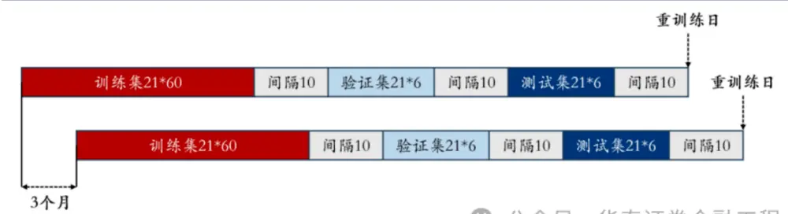

我们对因子挖掘流程使用的输入变量和涉及的参数细节进行了总结：

图表25：因子挖掘流程使用的输入变量（26个）

| 输入变量 | 变量含义 | 输入变量 | 变量含义 |
| --- | --- | --- | --- |
| close_ori | 收盘价原始值 | close_st | 收盘价/收盘价滚动60日均值 |
| open_ori | 开盘价原始值 | open_st | 开盘价/收盘价滚动60日均值 |
| high_ori | 最高价原始值 | high_st | 最高价/收盘价滚动60日均值 |
| low_ori | 最低价原始值 | low_st | 最低价/收盘价滚动60日均值 |
| volume_ori | 成交额原始值 | volume_st | 成交额/成交额滚动60日均值 |
| turn_ori | 换手率原始值 | turn_qt | 换手率5年分位数 |
| wopen_st | 滚动5日开盘价/收盘价滚动60日均值 | mopen_st | 滚动20日开盘价/收盘价滚动60日均值 |
| whigh_st | 滚动5日最高价/收盘价滚动60日均值 | mhigh_st | 滚动20日最高价/收盘价滚动60日均值 |
| wlow_st | 滚动5日最低价/收盘价滚动60日均值 | mlow_st | 滚动20日最低价/收盘价滚动60日均值 |
| wvolume_st | 滚动5日成交额/成交额滚动60日均值 | mvolume_st | 滚动20日成交额/成交额滚动60日均值 |
| wturn_qt | 换手率5日均值的滚动5年分位数 | mturn_qt | 换手率20日均值的滚动5年分位数 |
| daily_ret | 日收益率 | daily_exc | 相对于行业等权基准的日超额收益率 |
| pblf_ori | 市净率原始值 | pblf_qt | 市净率滚动4年分位数 |

图表26：因子挖掘流程涉及的参数细节

| 参数细节名称 参数细节说明 |
| --- |
| 目标种群规模 2500，分成50个小种群，每个小种群独立执行遗传规划 |
| 进化次数 10 |
| 因子表达式最低阶数 1 |
| 因子表达式最高阶数 3 |
| 交叉概率 0.8 |
| 变异概率 0.3 |
| 随机试验次数 6 |
| 训练集规模 21*60 |
| 训练集标签 未来10 个交易日收益率 |
| 训练集评价指标 \|IC\|和 NDCG@k，k=5 |
| 验证集规模 21*6 |
| 验证集评价指标 周频调仓，多头组相对行业等权基准的超额收益 |
| 测试集规模 21*6 |
| 测试集评价指标 周频调仓，多头组相对行业等权基准的超额收益 |
| 因子失效标准 单边t检验p值≤0.05，t检验的备择假设为测试集超额收益小于验证集超额收益 |

## 实证：同时将|IC|和NDCG@k作为适应度函数

在每个重训练日，执行了6轮因子挖掘流程之后，我们得到了若干备选因子。我们按照各因子在验证集和测试集上的信息比率降序排名，取前10名因子，其表达式及在滚动窗口中的表现详见附录。我们采用贪心策略将这10个因子合成为综合因子。贪心策略的过程主要考察目标因子和已被选中因子之间的相关性；因子合成采用截面排名加权求和的方式，权重等于上一小节提及的因子失效检验p值减显著性水平0.05。通过贪心策略得到日频综合因子后，我们进一步对其开展时间跨度为10个交易日的指数移动平均，再降频为周度综合因子。之所以开展指数移动平均，一方面是有利于降低因子换手率，另一方面是因为训练集标签是未来10个交易日收益率，所以近10个交易日的因子可能都含有关于行业未来涨跌幅的信息。具体步骤和细节详见下图：

图表27：多因子合成流程
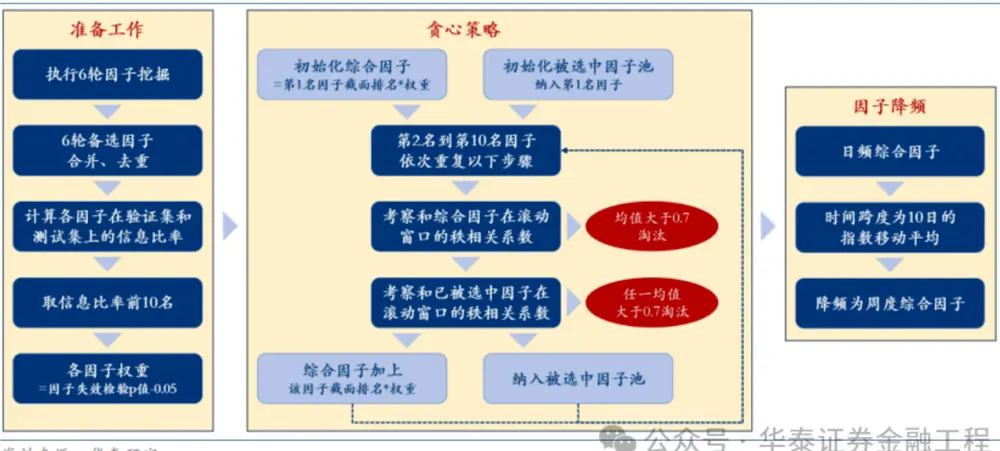

取回测区间2022-09-30至2024-04-30，每周六选择综合因子前五名的中信行业指数等权配置，下周第一个交易日按开盘价、最高价、最低价、收盘价的均价完成调仓。回测结果显示，双目标遗传规划周频行业轮动模型的扣费前年化超额收益为25.74%，和全频段量价周频行业轮动模型的表现不相上下，前者的优势在低换手，后者的优势在低回撤。

图表28：双目标遗传规划周频行业轮动模型净值
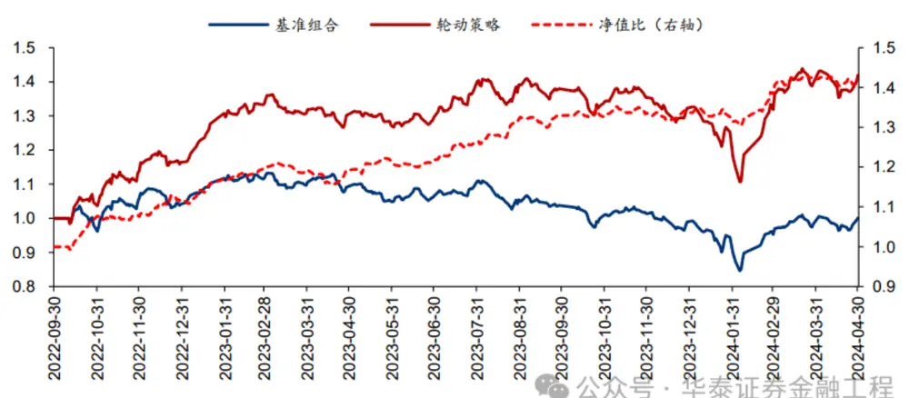

图表29：双目标遗传规划周频行业轮动模型业绩

| 回测区间：2022-09-30 至2024-04-30 | 年化收益 | 年化波动 | 夏普比率 | 最大回撤 | 卡玛比率 | 年化换手 |
| --- | --- | --- | --- | --- | --- | --- |
| 周频行业轮动 | 25.81% | 15.17% | 1.70 | -21.47% |  | 1.20 单边约 13 倍 |
| 行业等权基准 | 0.07% | 13.19% | の 0,01 | 25.31%泰证0.00 |  | 融工程！ |

## 消融实验：仅以|IC|或NDCG@k作为适应度函数

在消融实验中，每一轮因子挖掘退化成了仅以|IC|或NDCG@k为适应度函数的单目标遗传规划，多因子合成流程、遗传规划和因子合成流程中的其他参数细节均保持不变。在同样的回测区间里，无论是以|IC|还是以NDCG@k为适应度函数，单目标遗传规划模型的表现与双目标遗传规划模型的表现均呈现天壤之别，其中以NDCG@k为适应度函数的模型截至报告发布日仍跑输行业等权基准。

图表30：仅以|IC|为目标的遗传规划模型净值
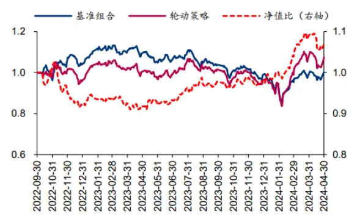

图表31：仅以NDCG@k为目标的遗传规划模型净值
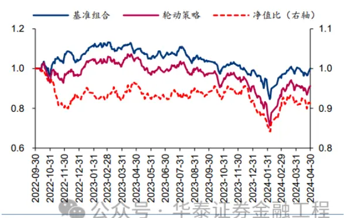

## 更多思考

从双目标遗传规划和单目标遗传规划的结果对比来看，双目标对抗确实可能将因子挖掘引入了一条与单目标遗传规划截然不同的路径，尽管双目标遗传规划的优势还需要更多场景如选股因子挖掘的验证。我们不禁好奇，对于另一类常见的因子挖掘范式——端到端有监督学习，引入双目标对抗的机制或许也能够提升模型表现，不过实现难度似乎不低。

从挖掘出来的因子来看，时序切割因子、成交额相关变量被识别为“优秀”基因。回测区间内共有7个重训练日，信息比率前10名因子共有70个，其中有52个因子表达式用到了时序切割因子。时序切割的思想是“分域建模”，这也是量化投资领域重要的课题之一。至于成交额相关变量的频繁出现，可能是因为回测区间内A股市场缺乏增量资金，量对于把握行业投资机会可能更为重要，所谓“得量者得势”。

双目标遗传规划仍然存在工程上的改进空间。比如，目前随机数种子只能控制种群的初始化，还无法控制交叉和变异，在一定程度上会影响因子的可复现性。我们暂时还无法彻底解决这个问题，但可以通过重复执行因子挖掘流程来尽量降低随机因素的干扰。再如，加入更多的输入数据，如基本面数据，或者实现更多不同功能的算子，对提升种群多样性可能也是有益的。以及，我们也可以为算子增加一些限制性条件，让其尽量不出现匪夷所思的表达式，如自己除以自己，来缩小无效搜索空间。

本研究在一台配置普通的计算机上完成——内存为24G，CPU型号为i7-7700，GPU型号为GTX1660-6G。一个随机数种子需要启动7个Console，执行7个重训练日的因子挖掘任务，不到8个小时能够运行完毕。如果算力允许的话，适当提高重训练频率可能有助于应对因子过快失效的风险。

## 参考文献

Deb K, Pratap A, Agarwal S, et al. A fast and elitist multiobjective genetic algorithm: NSGA-II[J]. IEEE Transactions on Evolutionary Computation, 2002, 6(2):182-197.

## 风险提示

遗传规划在滚动窗口中挖掘历史规律，规律可能在下次重新挖掘之前失效；月频和周频行业轮动模型都有其适用的市场条件，无法保证在任何市场条件下均可取得超额收益；涉及的具体行业不代表任何投资意见，请投资者谨慎理性地看待。

## 04 附录：重训练日挖掘出来的信息比率前十名因子一览

图表32：重训练日 2022-09-30 的前十名因子

| 因子表达式 | 训练集 \|IC\| | 训练集 NDCG 信息比率 信息比率 | 验证集 | 测试集失效检验 | p值 |
| --- | --- | --- | --- | --- | --- |
| div(ts_decsortcut_torch(exp_torch(wvolume_st), 60, 2, 2), sqrt_torch(pblf_qt)) | 0.087 | 0.389 | 4.16 | 1.71 | 0.08 |
| ts_grouping_asczscorecut_torch(add(mlow_st, pblf_qt), ts_cutzscore_torch(open_ori, 1.5), 10, 3.0, 1) | 0.089 | 0.386 | 4.76 | 0.89 | 0.06 |
| div(ts_deczscorecut_torch(ts_argmax_torch(low_ori, 8), 10, 3.0, 0), volume_st) | 0.094 | 0.320 | 3.33 | 1.88 | 0.20 |
| div(pblf_qt, xs_zscorereverse_torch(ts_decsortcut_torch(volume_st, 60, 5, 2), 2.0, 1)) | 0.072 | 0.393 | 2.49 | 2.04 | 0.35 |
| ts_regalpha_torch(close_st, ts_cutquartile_torch(close_st, 2.0), 55) | 0.103 | 0.363 | 2.39 | 2.01 | 0.33 |
| div(ts_cutzscore_torch(pblf_qt, 2.0), ts_grouping_asczscorecut_torch(mvolume_st, neg(close_ori), 50, 2.0, 2)) | 0.074 | 0.389 | 2.04 | 1.66 | 0.41 |
| ts_covariance_torch(log_torch(close_st), ts_cutzscore_torch(low_ori, 1.5), 50) | 0.092 | 0.389 | 1.16 | 2.50 | 0.73 |
| div(ts_decsortcut_torch(volume_st, 60, 2, 2), pblf_qt) | 0.076 | 0.389 | 1.67 | 1.83 | 0.49 |
| div(add(ts_rollrank_torch(high_ori, 55),wlow_st), ts_sum_torch(ts_sum_torch(wvolume_st, 2), 12)) | 0.105 | 0.339 | 2.57 | 0.93 | 0.19 |
| div(add(ts_rollrank_torch(high_ori, 50), wlow_st), ts_sum_torch(ts_sum_torch(wvolume_st, 5), 12)) 注：高亮的因子用到了时序切割算子，下同 与 | 0.106 | 0.338 | 3.26 | 0.22 | 0.05 |

图表33：重训练日2022-12-31 的前十名因子

| 因子表达式 | 训练集 \|ιc\| | 训练集 | 验证集 NDCG 信息比率信息比率 |  | 测试集 失效检验 p值 |
| --- | --- | --- | --- | --- | --- |
| div(ts_cutzscore_torch(square_torch(close_st), 2.0), square_torch(close_st)) exp_torch(div(ts_grouping_decsortcut_torch(mvolume_st, mvolume_st, 20, 7, 0), ts_cutzscore_torch(whigh_st, | 0.087 0.087 | 0.367 0.327 | 4.84 3.48 | 1.66 2.05 | 0.11 0.22 |
| 2.5))) |  |  |  |  |  |
| ts_grouping_deczscorecut_torch(ts_covariance_torch(mopen_st, abs_torch(wlow_st), 20), abs_torch(low_ori), 10, 2.5, 2) | 0.096 | 0.353 | 1.79 | 3.67 | 0.76 |
| xs_regres_torch(ts_rollzscore_torch(open_ori, 60), ts_decsortcut_torch(wvolume_st, 30, 5, 1)) ts_grouping_asczscorecut_torch(div(wvolume_st, wvolume_st), open_ori, 45, 2.5, 0) | 0.103 | 0.336 | 3.08 | 1.84 | 0.24 |
| ts_grouping_decsortcut_torch(exp_torch(volume_st), div(ts_rollrank_torch(pblf_qt, 50), ts_delay_torch(pblf_qt, | 0.085 0.089 | 0.341 0.332 | 2.77 2.17 | 1.94 2.45 | 0.32 0.46 |
| 9)), 50, 9, 2) |  |  |  |  |  |
| div(mvolume_st, sigmoid_torch(ts_rollrank_torch(high_ori, 55))) | 0.109 | 0.320 | 3.25 | 1.34 | 0.15 |
| ts_regalpha_torch(ts_rollzscore_torch(close_ori, 45), add_const(sqrt_torch(wvolume_st), 5), 40) xs_regres_torch(ts_rollzscore_torch(open_ori, 60), ts_decsortcut_torch(wvolume_st, 30, 2, 1)) | 0.087 | 0.336 | 3.23 | 1.33 | 0.20 |
| ts_grouping_ascsortcut_torch(wvolume_st, leakyrelu_torch(leakyrelu_torch(low_ori, 0.7), 0.7), 55, 10,0)公众0.086 | 0.107 | 0.335 0.345 | 3.37 | 1.10 | 0.13 0.28 |

图表34：重训练日 2023-03-31 的前十名因子

| 因子表达式 | 训练集 \|ıc\| | 训练集 | 验证集 NDCG 信息比率 信息比率 |  | 测试集失效检验 |
| --- | --- | --- | --- | --- | --- |
| div(ts_cutzscore_torch(abs_torch(low_st), 2.0), low_st) | 0.081 | 0.361 | 4.41 | 3.35 | p值 0.50 |
| ts_grouping_ascsortcut_torch(wvolume_st, ts_rollweighted_mean_torch(ts_decsortcut_torch(high_ori, 25, 6, 0), | 0.103 | 0.354 | 2.62 | 4.63 | 0.76 |
| mopen_st, 4), 45, 5, 0) ts_covariance_torch(inv(wlow_st), mlow_st, 45) | 0.068 | 0.359 | 4.18 | 1.73 | 0.07 |
| ts_covariance_torch(mopen_st, wlow_st, 25) | 0.086 | 0.346 | 2.30 | 3.36 | 0.51 |
| sigmoid_torch(ts_grouping_ascsortcut_torch(sqrt_torch(volume_st), sigmoid_torch(mopen_st), 45, 8, 0)) | 0.094 | 0.333 | 2.45 | 3.10 | 0.58 |
| sigmoid_torch(ts_grouping_ascsortcut_torch(sqrt_torch(volume_st), sigmoid_torch(mopen_st), 40, 7, 0)) | 0.088 | 0.341 | 1.87 | 3.63 | 0.77 |
| sigmoid_torch(ts_grouping_ascsortcut_torch(sqrt_torch(volume_st), sigmoid_torch(mopen_st), 45, 7, 0)) | 0.094 | 0.339 | 1.94 | 3.52 | 0.79 |
| ts_covariance_torch(ts_min_torch(pblf_ori, 16), high_st, 45) | 0.054 | 0.382 | 3.19 | 1.57 | 0.14 |
| ts_regalpha_torch(ts_rollweighted_mean_torch(sqrt_torch(high_ori), high_ori, 18), ts_cutzscore_torch(high_ori, 1.5), 60) | 0.099 | 0.358 | 2.41 | 2.30 | 0.52 |

图表35：重训练日 2023-06-30 的前十名因子

| 因子表达式 | 训练集 \|IC\| | 训练集 NDCG | 验证集 信息比率 | 信息比率 | 测试集 失效检验 p值 |
| --- | --- | --- | --- | --- | --- |
| xs_zscorereverse_torch(ts_grouping_ascsortcut_torch(mvolume_st, ts_cutzscore_torch(mhigh_st, 1.5), 50, 10, 0), 2.0, 1) | 0.076 | 0.340 | 2.49 | 3.76 | 0.75 |
| ts_cutquartile_torch(ts_grouping_asczscorecut_torch(wvolume_st, pblf_qt, 50, 3.0, 0), 1.5) | 0.070 | 0.355 | 3.82 | 1.96 | 0.11 |
| ts_grouping_ascsortcut_torch(add_const(mvolume_st, 8), mopen_st, 40, 8, 0) | 0.094 | 0.325 | 3.45 | 1.84 | 0.17 |
| ts_grouping_ascsortcut_torch(mvolume_st, wlow_st, 50, 8, 0) | 0.082 | 0.344 | 2.69 | 2.01 | 0.27 |
| ts_grouping_ascsortcut_torch(ts_grouping_deczscorecut_torch(wvolume_st, volume_st, 15, 3.0, 1), wlow_st, 50, 4, 0) | 0.075 | 0.344 | 2.82 | 1.76 | 0.24 |
| ts_grouping_deczscorecut_torch(wvolume_st, neg(high_ori), 50, 3.0, 0) | 0.086 | 0.350 | 3.09 | 1.40 | 0.16 |
| ts_grouping_ascsortcut_torch(mvolume_st, wlow_st, 50, 3, 0) | 0.074 | 0.347 | 2.16 | 2.32 | 0.49 |
| ts_grouping_ascsortcut_torch(volume_st, leakyrelu_torch(low_ori, 0.9), 45, 8, 0) | 0.105 | 0.345 | 3.64 | 0.82 | 0.07 |
| ts_grouping_ascsortcut_torch(volume_st, leakyrelu_torch(leakyrelu_torch(low_ori, 0.9), 0.9), 45,8.0) | 0.105 0.084 | 0.345 0.326 | 3.64 2.25 | 0.82 南2.09 | 9.07 |

图表36：重训练日 2023-09-30 的前十名因子

| 因子表达式 | 训练集 | 训练集 | 验证集 |  | 测试集 失效检验 |
| --- | --- | --- | --- | --- | --- |
|  | \|IC\| |  | NDCG 信息比率 信息比率 |  | p值 |
| xs_grouping_zscorereverse_torch(ts_decsortcut_torch(mvolume_st, 15, 5, 0), high_ori, 3.0, 0) xs_grouping_zscorereverse_torch(add_const(ts_grouping_deczscorecut_torch(wvolume_st, wvolume_st, 40, | 0.077 0.094 | 0.346 0.345 | 3.43 3.09 | 2.81 3.09 | 0.36 0.47 |
| 3.0, 2), 2), ts_min_torch(daily_ret, 20), 2.5, 1) |  |  |  |  |  |
| ts_grouping_asczscorecut_torch(volume_st, ts_rankcorr_torch(ts_grouping_ascsortcut_torch(wturn_qt, turn_ori, 55, 7, 1), ts_asczscorecut_torch(open_ori, 35, 2.0, 0), 35), 40, 2.0, 1) | 0.092 | 0.332 | 2.42 | 3.76 | 0.63 |
| ts_delay_torch(ts_grouping_decsortcut_torch(wvolume_st, mopen_st, 25, 6, 2), 1) | 0.097 | 0.330 | 2.05 | 4.10 | 0.77 |
| xs_grouping_zscorereverse_torch(ts_decsortcut_torch(mvolume_st, 15, 2, 0), high_ori, 3.0, 0) | 0.078 | 0.344 | 2.93 | 3.16 | 0.52 |
| ts_grouping_ascsortcut_torch(add(mvolume_st, open_st), ts_decsortcut_torch(open_ori, 20, 3, 2), 35, 9, 0) | 0.098 | 0.329 | 3.63 | 2.37 | 0.20 |
| ts_grouping_ascsortcut_torch(abs_torch(mvolume_st), add(pblf_qt, whigh_st), 50, 2, 0) | 0.092 | 0.350 | 0.57 | 5.33 | 0.97 |
| ts_regalpha_torch(ts_rollrank_torch(mopen_st, 15), wvolume_st, 45) | 0.097 | 0.335 | 3.07 | 2.68 | 0.32 |
| ts_min_torch(add_const(xs_regres_torch(mhigh_st, mvolume_st), 4), 20) ts_regalpha_torch(ts_rollrank_torch(mopen_st, 45), wvolume_st, 30) | 0.075 公众号 | 0.355 | 2.06 | 3.63 | 0.84 |

图表37：重训练日 2023-12-31 的前十名因子

| 因子表达式 | 训练集 \|IC\| | 训练集 | 验证集 NDCG 信息比率 信息比率 |  | 测试集失效检验 |
| --- | --- | --- | --- | --- | --- |
| ts_grouping_ascsortcut_torch(neg(sqrt_torch(mvolume_st)), | 0.102 | 0.334 | 1.05 | 5.38 | p值 0.97 |
| ts_grouping_ascsortcut_torch(xs_zscorereverse_torch(close_ori, 2.0, 1), close_ori, 10, 8, 1), 50, 7, 0) |  |  |  |  |  |
| ts_grouping_decsortcut_torch(wvolume_st, mopen_st, 30, 8, 2) | 0.103 | 0.333 | 1.80 | 4.60 | 0.86 |
| ts_grouping_decsortcut_torch(wvolume_st, mopen_st, 25, 10, 2) | 0.103 | 0.331 | 1.90 | 3.93 | 0.80 |
| ts_grouping_ascsortcut_torch(xs_cutquartile_torch(mvolume_st, 1.5), open_ori, 50, 7, 0) | 0.100 | 0.342 | 0.99 | 4.63 | 0.92 |
| ts_grouping_ascsortcut_torch(mvolume_st, open_ori, 55, 8, 0) | 0.098 | 0.342 | 0.45 | 4.79 | 0.97 |
| ts_grouping_ascsortcut_torch(mvolume_st, open_st, 55, 10, 0) | 0.097 | 0.350 | 1.16 | 4.01 | 0.89 |
| ts_grouping_ascsortcut_torch(mvolume_st, high_ori, 50, 9, 0) | 0.098 | 0.338 | 0.40 | 4.73 | 0.96 |
| ts_grouping_ascsortcut_torch(ts_decay_linear_mean_torch(wvolume_st, 4), mopen_st, 40, 10, 0) | 0.097 | 0.340 | 1.92 | 3.13 | 0.69 |
| ts_grouping_decsortcut_torch(wvolume_st, mopen_st, 25, 8, 2) | 0.106 | 0.336 | 2.01 | 2.99 | 0.64 |
| ts_grouping_ascsortcut_torch(wvolume_st, open_ori, 50, 10, 0) | 公介0.109化0.340证 |  |  | 0.884.060.90 |  |

图表38：重训练日 2024-03-31的前十名因子

| 图表38：量训练日2024-03-31的前十名因子 因子表达式 |  |  |  |  |  |  |
| --- | --- | --- | --- | --- | --- | --- |
|  | 训练集 \|IC\| | 训练集 NDCG 信息比率 信息比率 | 验证集 |  | 测试集失效检验 | p值 |
| ts_grouping_decsortcut_torch(mul_const(xs_cutzscore_torch(mvolume_st, 1.5), 2), xs_grouping_sortreverse_torch(ts_ascsortcut_torch(high_ori, 30, 9, 2), ts_rollzscore_torch(daily_ret, 15), 7, 0), | 0.094 | 0.330 | 5.32 | 4.18 |  | 0.55 |
| 20, 6, 2) ts_grouping_decsortcut_torch(mul_const(xs_cutzscore_torch(mvolume_st, 2.0), 2), | 0.095 | 0.334 | 4.86 |  | 3.96 | 0.57 |
| xs_grouping_sortreverse_torch(ts_ascsortcut_torch(high_ori, 30, 9, 2), ts_rollzscore_torch(daily_ret, 15), 7, 0), 20, 6, 2) |  |  |  |  |  |  |
| ts_grouping_ascsortcut_torch(wvolume_st, inv(ts_decsortcut_torch(daily_exc, 40, 6, 2)), 35, 3, 2) | 0.092 | 0.330 |  | 4.49 | 2.64 | 0.40 |
| ts_grouping_ascsortcut_torch(wvolume_st, mopen_st, 45, 10, 0) xs_grouping_zscorereverse_torch(ts_max_torch(leakyrelu_torch(mvolume_st, 0.4), 11), | 0.090 0.089 | 0.331 0.338 |  | 3.07 | 3.88 3.57 | 0.78 |
| ts_mean_torch(wlow_st, 11), 2.5, 0) |  |  |  | 3.32 |  | 0.66 |
| ts_grouping_ascsortcut_torch(mvolume_st, mopen_st, 40, 4, 0) | 0.095 | 0.330 |  | 2.26 | 4.59 | 0.88 |
| ts_grouping_deczscorecut_torch(volume_st, ts_ftpeak_torch(volume_st, 15), 40, 2.0, 2) | 0.094 | 0.305 |  | 3.42 | 3.43 | 0.71 |
| ts_regalpha_torch(log_torch(high_st), mvolume_st, 50) | 0.095 | 0.334 |  | 1.42 | 5.02 | 0.97 |
| ts_ascsortcut_torch(xs_grouping_zscorereverse_torch(wvolume_st, pblf_ori, 2.5, 0), 40, 2, 2) | 0.088 | 0.343 |  | 2.66 | 3.73 | 0.82 |
| ts_rollweighted_mean_torch(ts_grouping_ascsortcut_torch(mvolume_st, mopen_st, 25, 9, 0), mvolume_st,2)0.097 化0.3363.612.75和0.45 资料来源：Wind，华泰研究 |  |  |  |  |  |  |

## 相关研报

研报：《 双目标遗传规划应用于行业轮动》2024年5月20日

分析师：林晓明 S0570516010001｜BPY421

分析师：徐特 S0570523050005

分析师：何康 S0570520080004｜BRB318

联系人：卢炯 S0570123070272

## 关注我们

## 华泰证券金融工程

主要进行量化投资相关的研究和讨论工作。

427篇原创内容

公众号

华泰证券研究所国内站（研究Portal）

https://inst.htsc.com/research

访问权限：国内机构客户

华泰证券研究所海外站

https://intl.inst.htsc.com/research

访问权限：美国及香港金控机构客户

添加权限请联系您的华泰对口客户经理

## 免责声明

## ▲向上滑动阅览

本公众号不是华泰证券股份有限公司（以下简称“华泰证券”）研究报告的发布平台，本公众号仅供华泰证券中国内地研究服务客户参考使用。其他任何读者在订阅本公众号前，请自行评估接收相关推送内容的适当性，且若使用本公众号所载内容，务必寻求专业投资顾问的指导及解读。华泰证券不因任何订阅本公众号的行为而将订阅者视为华泰证券的客户。

本公众号转发、摘编华泰证券向其客户已发布研究报告的部分内容及观点，完整的投资意见分析应以报告发布当日的完整研究报告内容为准。订阅者仅使用本公众号内容，可能会因缺乏对完整报告的了解或缺乏相关的解读而产生理解上的歧义。如需了解完整内容，请具体参见华泰证券所发布的完整报告。

本公众号内容基于华泰证券认为可靠的信息编制，但华泰证券对该等信息的准确性、完整性及时效性不作任何保证，也不对证券价格的涨跌或市场走势作确定性判断。本公众号所载的意见、评估及预测仅反映发布当日的观点和判断。在不同时期，华泰证券可能会发出与本公众号所载意见、评估及预测不一致的研究报告。

在任何情况下，本公众号中的信息或所表述的意见均不构成对任何人的投资建议。订阅者不应单独

人工智能 25行业轮动 6量化投资 1 ETF投资策略 17

人工智能 · 目录

上一篇华泰金工 | 多任务学习选股模型的改进

下一篇华泰金工 | 机器学习模拟投资者分歧