## 华泰金工 | 机器学习模拟投资者分歧

原创 林晓明何康卢炯 华泰证券金融工程 2024年06月18日 06:00

投资者分歧是推动交易的原因之一，对金融市场的资产定价具有重要意义。本研究运用机器学习来模拟投资者分歧。将不同的特征集输入给多个机器学习模型，模拟投资群体接收差异化信息源、并产生不同投资预测的过程。最后，根据模型预测差异构建的分歧度因子，能够有效刻画投资者分歧，对股票未来收益具有显著的预测作用。研究发现，投资者分歧度越高，股票预期收益越低。样本空间为全A股，机器学习分歧度因子在2017/1/4～2024/5/31的回测期内周度RankIC均值为7.66%，分5层TOP组合年化超额收益率为9.71%，周频双边换手率为61.97%。超参数选择对分歧度因子的影响基本不大。股票做空限制、动量和投资者认可度对分歧度因子具有显著影响。

## 核心观点

## 人工智能系列之80：机器学习用于模拟投资者分歧

投资者分歧是推动交易的原因之一，对金融市场的资产定价具有重要意义。本文运用机器学习来模拟投资者分歧。将不同的特征集输入给多个机器学习模型，模拟投资群体接收差异化信息源、并产生不同投资预测的过程。最后，根据模型预测差异构建的分歧度因子，能够有效刻画投资者分歧，对股票未来收益具有显著的预测作用。

## 投资者分歧度越高，股票预期收益越低

Miller（1977）认为投资者分歧会造成股票价格过高，未来回报下降，原因是乐观投资者推高股价，而悲观投资者受到做空限制，对市场的影响力更弱。本文利用现有的多个深度学习因子，构建深度学习分歧度因子，验证了投资者分歧与股票未来收益的负相关性。样本空间为全A股，因子在2017/1/4～2024/5/31的回测期内周度RankIC均值为6.06%，分5层TOP组合年化超额收益率为9.75%，周频双边换手率为117.70%。

## 树模型能够高效模拟投资者分歧

本文使用50个LightGBM模型来模拟投资者的预测观点。输入特征为股票截面特征，包含估值、成长、财务质量、量价、一致预期等类别，共43个。每个模型会随机选取20个特征进行训练，以模仿投资者接收差异化信息源。最后，计算所有模型对同一交易日同只股票的预测值的标准差，构建机器学习分歧度因子。因子在相同回测期内周度RankIC均值提升至7.66%，分5层TOP组合年化超额收益率为9.71%，周频双边换手率下降至61.97%。

## 超参数选择对分歧度因子的影响基本不大

不同预测周期构建的分歧度因子回测表现接近，但预测周期越长，TOP组合换手率越低，因为长线投资者的预测分歧在短期内变化不会太剧烈。不同投资者数量构建的分歧度因子回测表现差异不大，但投资者数量设置过少可能会造成RankIC偏低和换手率偏高。特征数量对分歧度因子的回测表现具有一定影响，随机选取的特征数量过多会导致投资者之间难以产生预测分歧。LightGBM、XGBoost和CatBoost等不同机器学习模型构建的分歧度因子回测表现接近。

## 股票做空限制、动量和投资者认可度对分歧度因子具有显著影响

使用机构持股比例衡量个股的做空难易程度，机构持股比例低的股票池中分歧度因子多空表现更加显著，多空组合年化收益率从32.89%提升至54.05%，说明做空限制是分歧度因子的坚实基础。近期涨幅最大的股票池中分歧度因子的多空组合年化收益率高达63.04%，表明乐观投资者占据主导地位，观点分歧造成的买卖不对称性进一步增强。根据模型预测均值构建投资者认可度因子，发现一致看多的股票组合预期收益最高，“争议看空”的股票组合预期收益最低，分歧度与认可度因子等权合成的复合因子RankIC和多头收益均有提升。

## 正 文

## 01 投资者分歧与资产定价

投资者分歧是推动交易的原因之一，对金融市场的资产定价具有重要意义，以往很多论文对投资者分歧开展了深入研究。Miller（1977）认为投资者分歧会造成股票价格过高，未来回报下降，原因是乐观投资者推高股价，而悲观投资者受到做空限制，对市场的影响力更弱。Diether等（2002）发现分析师盈利预测的分歧也会导致更低的股票未来收益。

由于信息来源不同和行为偏差等原因，投资者会产生对股价预期的分歧。但投资者分歧并不容易直接观测，Berkman等（2009）提出一些代理指标来间接反映这种分歧：

（1）历史盈利波动性。如果一家公司过去几年盈利的波动性很大，说明这家公司未来的盈利更难预测，投资者对公司的估值更容易产生分歧。这种方法的缺点是滞后性，无法反映近期市场分歧。

（2）公司年龄。年龄越大的公司具有更长的经营数据，而且一般已经进入成熟期，发展前景的确定性更强，因此投资者分歧更低。这种方法同样难以刻画近期市场观点。

（3）换手率。股票换手率越大，说明股票交易活跃，买卖双方的预期具有更大分歧，尽管股票交易并不完全是由分歧造成的。

（4）特质波动率。特质波动率衡量股票的非系统性风险和不确定性，不确定性会带来投资者分歧。

（5）分析师预测标准差。卖方分析师盈利预测的标准差能够反映不同分析师预期的分歧，不过分析师观点不一定会形成交易行为，而且股票覆盖度有限。

## 机器学习模拟投资者分歧

Bali等人于2023年在NBER上发表论文《Machine Forecast Disagreement》，旨在研究金融市场中的投资者信念分歧及其对股票未来收益的影响。论文提出一种新的投资者信念分歧的测量方法，利用不同机器学习模型来模拟投资者的异质性预测，称之为“机器预测分歧”（MachineForecast Disagreement,MFD）。论文的主要贡献包括：提出了一种新的资产层面信念分歧测量方法；证明了MFD在解释个股截面收益方面的强大预测能力；探讨了MFD alpha的经济学基础，特别是卖空限制条件的影响。

论文使用来自Jensen等（2022）提供的数据集，包括股票回报和153个特征信息。样本涵盖1966年7月至2022年12月期间在NYSE、AMEX和NASDAQ交易的普通股。为了避免小盘和低流动股票的影响，剔除价格低于5美元的股票。研究采用10年滚动窗口估计随机森林回归模型，每个投资者被赋予一个特定的模型和特征子集。最后通过计算每只股票在每个月的投资者预测分歧的标准差来构建MFD。超参数设定包括：投资者数量为100，每个投资者的特征数量为76，决策树的最大深度为3，决策树的数量为2000，样本采样率为0.05，列采样率为0.05。

论文发现，MFD能够显著预测个股的未来收益，高MFD的股票未来收益显著低于低MFD的股票。按MFD分组的最高和最低十分位数股票的市值加权（等权）组合，其月度回报差异为1.14%（1.32%），具有很高的统计显著性。此外，MFD与分析师预测分歧（AFD）相比，表现出更强的预测能力和更高的数据覆盖率。进一步的分析表明，MFD alpha的产生与股票卖空成本和套利限制有关，在高卖空成本和高散户持有率的股票中，MFD alpha更为显著。论文还发现，MFD在股票盈利公告期间的预测能力更为明显，表明MFD捕捉到了由投资者信念分歧引起的股票价格错配。综上所述，该论文不仅提出了一种新的信念分歧测量方法，还揭示了其在股票定价中的重要作用。

图表1：机器学习模拟投资者分歧
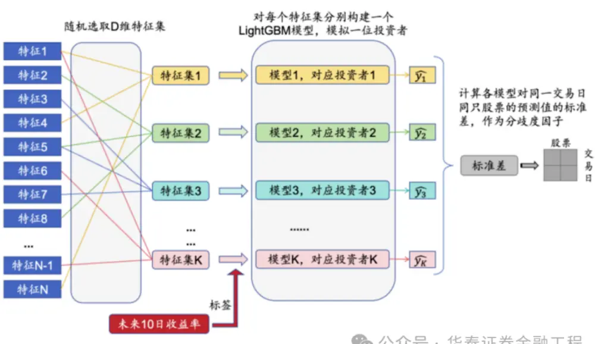

本篇报告借鉴Bali等（2023）的研究，运用机器学习来模拟投资者分歧。将不同的特征集输入给多个机器学习模型，模拟投资群体接收差异化信息源、并产生不同投资预测的过程。最后，根据模型预测差异构建的分歧度因子，能够有效刻画投资者分歧，对股票未来收益具有显著的预测作用。

图表2：机器学习分歧度因子IC值分析和分层回测结果汇总

|  | RankIC 均值 | RankIC 标准差 | IC_IR |  | IC>0 占比 TOP 组合年化超额收益率 TOP 组合信息比率 TOP 组合胜率 TOP 组合换手率 |  |  |  |
| --- | --- | --- | --- | --- | --- | --- | --- | --- |
| 机器学习分歧度因子 | 7.66% | 10.18% | 0.75 | 77.78% | 9.71% | 2.46 | 68.54% | 61.97% |

图表3：机器学习分歧度因子分层组合相对净值
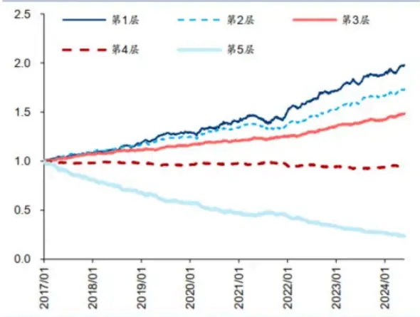

图表4：机器学习分歧度因子累计RankIC
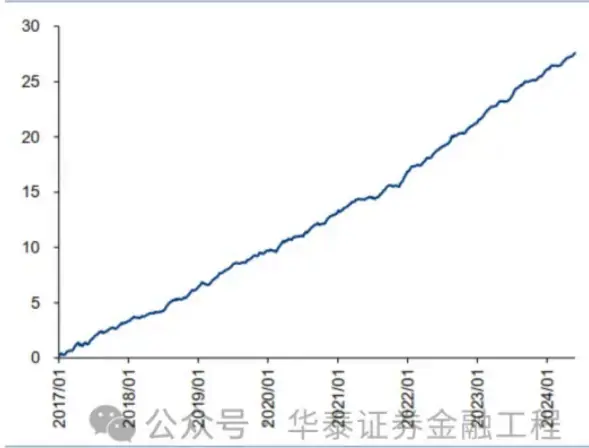

## 02 基于机器学习的分歧度因子

## 初步探索

华泰金工前期报告《基于全频段量价特征的选股模型》（2023.12.8）和《如何捕捉长时间序列量价数据的规律》（2024.3.14），利用日k线、周k线、月k线、分钟k线、逐笔成交和逐笔委托等数据，训练多个深度学习模型。这些模型对股票收益具有较强的预测能力，且相关性不高，能够初步模拟投资者分歧。

图表5：全频段量价模型体系
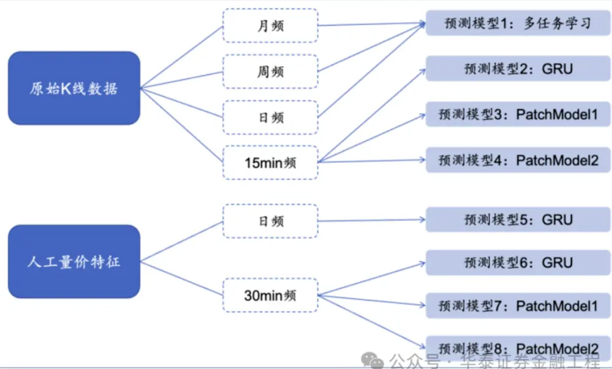

通过计算深度学习模型间的标准差，构建深度学习分歧度因子，并进行单因子测试。投资者分歧度越高，未来预期收益越低，因此在回测前先进行方向调整（下同）。单因子测试方法如下：

1．股票池：全A股，剔除ST股票，剔除每个截面期下一交易日停牌、涨停的股票。

2．回测区间：2017/1/4～2024/5/31。

3．调仓周期：周频，不计交易费用。

4．因子预处理：去极值、行业市值中性化、标准化。

5．测试方法：IC值分析，因子分5层测试。

测试结果如下所示。方向调整后的深度学习分歧度因子在分层回测中呈现了较好的单调性，第一组（分歧度最低的20%）收益明显高于其他组，第五组（分歧度最高的20%）收益明显低于其他组。

图表6：深度学习分歧度因子IC值分析和分层回测结果汇总

|  | RankIC 均值 RankIC 标准差 |  | IC_IR |  | IC>0 占比 TOP 组合年化超额收益率 TOP 组合信息比率 TOP 组合胜率 TOP 组合换手率 |  |  |  |
| --- | --- | --- | --- | --- | --- | --- | --- | --- |
| 深度学习分歧度因子 | 6.06% | 7.13% | 0.85 | 81.94% | 9.75% | 3.03 | 83.15% | 117.70% |

图表7：深度学习分歧度因子分层组合相对净值
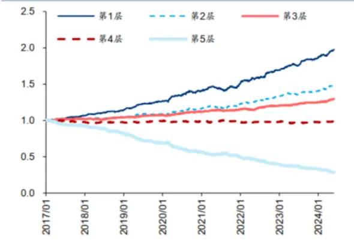

图表8：深度学习分歧度因子累计RankiC
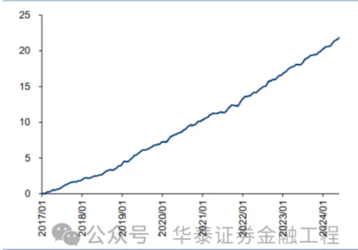

## 数据与方法

由多个深度学习模型构建的分歧度因子具有显著的选股效果，但模型训练成本较高，只能模仿少数投资者观点，难以大规模应用。参考Bali等（2023）的研究，我们采用树模型来提升预测效率。

输入特征为股票截面特征，包含估值、成长、财务质量、量价、一致预期等类别，共43个。为了模拟投资者接收差异化信息源，每个模型会随机选取20个特征进行训练，而非采用全部特征。预测目标是股票未来10个交易日的收益率。

模型采用LightGBM，数量为50个，即模拟50位投资者的预测观点。模型采用默认超参数，没有进行超参数寻优，以节省运算时间。模型每年重新训练一次，每次训练使用过去6年数据，按照7:3比例划分训练集和验证集。

最后，计算所有模型对同一交易日同只股票的预测值的标准差，构建机器学习分歧度因子。

图表9：机器学习模拟投资者分歧
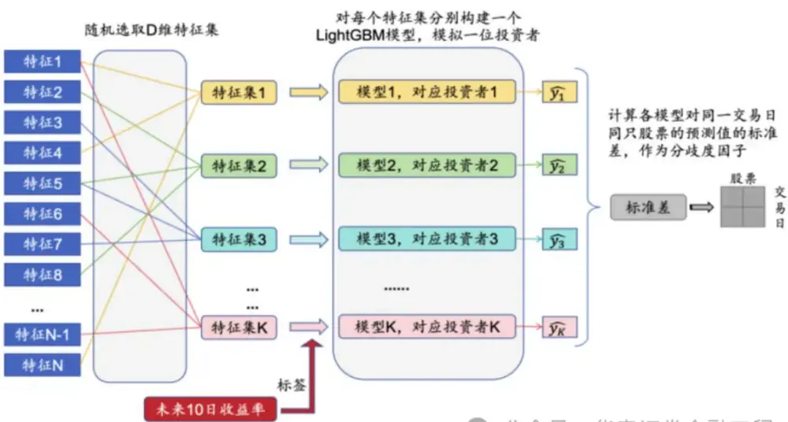

## 分歧度因子回测

对机器学习分歧度因子进行单因子测试，测试方法与前文保持一致。机器学习分歧度因子同样具有较好的分层单调性。相比于深度学习分歧度，该因子的第一层超额收益接近，而RankIC明显提升，换手率大幅下降。

图表10：机器学习分歧度因子IC值分析和分层回测结果汇总

|  | RankIC 均值 RankIC 标准差 |  | IC_IR |  | IC>0 占比 TOP 组合年化超额收益率 TOP 组合信息比率 TOP 组合胜率 TOP 组合换手率 |  |  |  |
| --- | --- | --- | --- | --- | --- | --- | --- | --- |
| 机器学习分歧度因子 | 7.66% | 10.18% | 0.75 | 77.78% | 9.71% | 2.46 | 68.54% | 61.97% |

图表11：机器学习分歧度因子分层组合相对净值
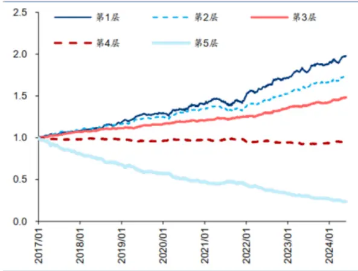

图表12： 机器学习分歧度因子累计 RankIC
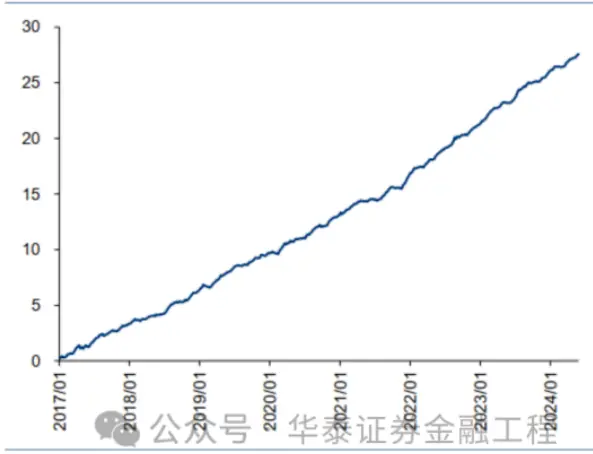

## 参数敏感性分析

机器学习的超参数可能对分歧度因子的计算产生影响，以下对几个参数进行敏感性分析，包括预测周期、投资者数量、特征数量和机器学习模型。

## 预测周期

不同预测周期构建的分歧度因子回测表现接近，其中预测10日收益率的因子RankIC和多头收益表现略好。一个明显的规律是，预测周期越长，TOP组合换手率越低，这是因为长线投资者的预测分歧在短期内变化不会太剧烈。

图表13：不同预测周期的分歧度因子IC值分析和分层回测结果汇总

|  | RankIC 均值 | RankIC 标准差 | IC_IR | IC>0 占比 TOP 组合年化超额收益率 TOP 组合信息比率 TOP 组合胜率 TOP 组合换手率 |  |  |  |  |
| --- | --- | --- | --- | --- | --- | --- | --- | --- |
| 分歧度因子（5日） | 7.65% | 10.21% | 0.75 | 78.33% | 8.78% | 2.26 | 67.42% | 71.47% |
| 分歧度因子（10日） | 7.66% | 10.18% | 0.75 | 77.78% | 9.71% | 2.46 | 68.54% | 61.97% |
| 分歧度因子（20日） | 7.30% | 9.87% | 0.74 | 75.83% | 9.58% | 号 | 华2泰证8.54% | 融工5673% |

图表14：不同预测周期的分歧度因子TOP 组合相对净值
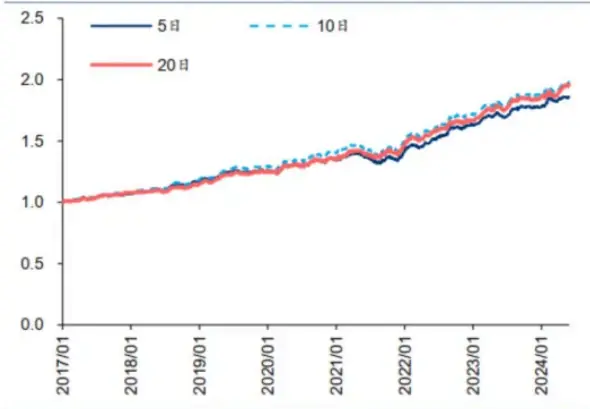

图表15：不同预测周期的分歧度因子累计 RanklC
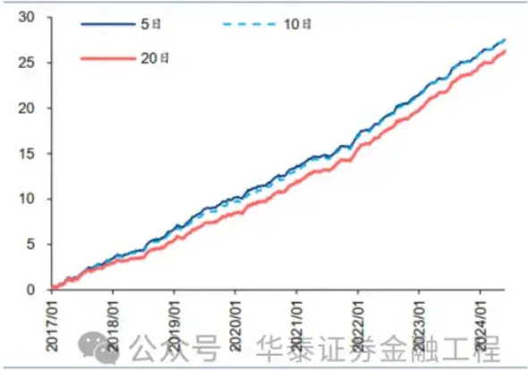

## 投资者数量

不同投资者数量构建的分歧度因子回测表现差异不大。随着投资者数量增加，RankIC有所提升，换手率有所下降。深度学习分歧度因子也验证了这一发现，由于投资者数量过少（8个深度学习因子），其RankIC偏低，换手率过高。

图表16：不同投资者数量的分歧度因子IC值分析和分层回测结果汇总

|  | RankIC 均值 RankIC 标准差 |  | IC_IR | IC>0 占比 TOP 组合年化超额收益率 TOP 组合信息比率 TOP 组合胜率 TOP 组合换手率 |  |  |  |  |
| --- | --- | --- | --- | --- | --- | --- | --- | --- |
| 分歧度因子（25 个投资者） | 7.38% | 9.86% | 0.75 | 77.22% | 10.26% | 2.70 | 71.91% | 68.61% |
| 分歧度因子（50个投资者） | 7.66% | 10.18% | 0.75 | 77.78% | 9.71% | 2.46 | 68.54% | 61.97% |
| 分歧度因子（100个投资者） | 7.70% | 10.11% | 0.76 | 78.06% | 10.18% | 2.57 | 70.79% | 60.71% |

图表17：不同投资者数量的分歧度因子TOP组合相对净值
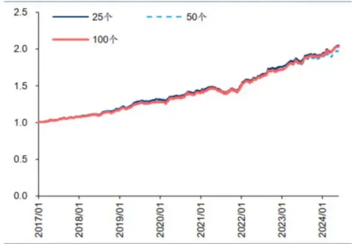

图表18：不同投资者数量的分歧度因子累计RanklC
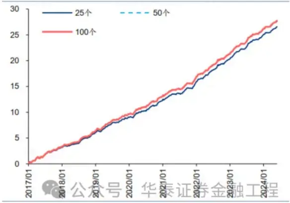

## 特征数量

特征数量对分歧度因子的回测表现具有一定影响。随机选取的特征数量越多，因子的RankIC和多头收益越低，而换手率越高。利用机器学习构建分歧度因子的逻辑是，通过随机选取特征集，模拟投资者接收差异化信息源。如果特征数量过多，投资者之间就难以产生预测分歧。

图表19：不同投资者数量的分歧度因子IC值分析和分层回测结果汇总

|  | RankIC 均值 | RankIC 标准差 | IC_IR |  | IC>0 占比 TOP 组合年化超额收益率 TOP 组合信息比率 TOP 组合胜率 TOP 组合换手率 |  |  |  |
| --- | --- | --- | --- | --- | --- | --- | --- | --- |
| 分歧度因子（10个特征） | 8.15% | 10.45% | 0.78 | 78.33% | 10.06% | 2.35 | 70.79% | 59.67% |
| 分歧度因子（20个特征） | 7.66% | 10.18% | 0.75 | 77.78% | 9.71% | 2.46 | 68.54% | 61,97% |
| 分歧度因子（30 个特征） | 7.21% | 9.81% | 0.73 | 77.22% | Z9.65% | 2.52 | 69.66% | 触工 162.74% |

图表20：不同特征数量的分歧度因子TOP组合相对净值
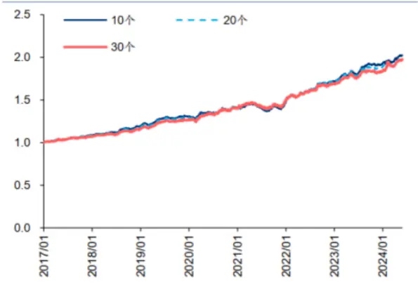

图表21：不同特征数量的分歧度因子累计RanklC
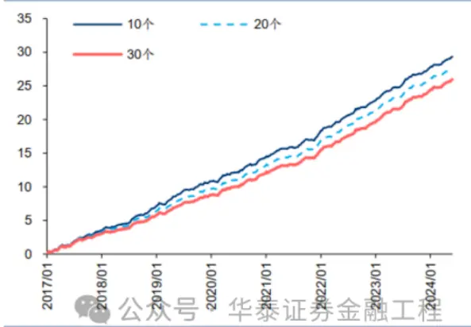

## 机器学习模型

不同机器学习模型构建的分歧度因子回测表现接近，其中LightGBM模型的RankIC和多头收益表现较好，XGBoost模型的换手率较低。

图表22：不同机器学习模型的分歧度因子IC值分析和分层回测结果汇总

|  | RankIC 均值 | RankIC 标准差 | IC_IR | IC>0 占比 TOP 组合年化超额收益率 TOP 组合信息比率 TOP 组合胜率 TOP 组合换手率 |  |  |  |  |
| --- | --- | --- | --- | --- | --- | --- | --- | --- |
| 分歧度因子（LightGBM） | 7.66% | 10.18% | 0.75 | 77.78% | 9.71% | 2.46 | 68.54% | 61.97% |
| 分歧度因子（XGBoost） | 6.99% | 8.70% | 0.80 | 80.56% | 9.62% | 2.61 | 75.28% | 56.30% |
| 分歧度因子（CatBoost) | 7.29% | 9.56% | 0.76 | 77.78% | 9.63% | 2.56 | 70.79% | 61.84% |

图表23：不同机器学习模型的分歧度因子TOP组合相对净值
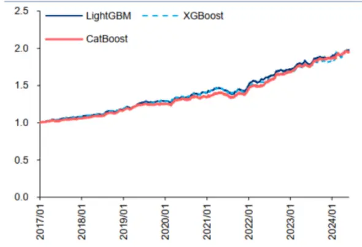

图表24：不同机器学习模型的分歧度因子累计 RanklC
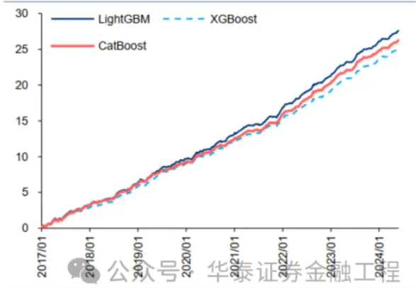

## 相关性分析

机器学习分歧度因子与常见量价因子相关性如下，其中与换手率和特质波动率的相关性较高，这两个因子也是文献中常用来刻画投资者分歧的代理指标。对比因子的多头超额收益，机器学习分歧度因子表现比换手率、特质波动率更加稳定，近期也没有出现大幅回撤。

图表25：机器学习分歧度因子与常见量价因子的相关性

|  | 反转 | 市值 | 成交金额 | 换手率 | beta | 特质波动率 |
| --- | --- | --- | --- | --- | --- | --- |
| 机器学习分歧度因子 | 0.20 | -0.09 |  | 0.35公众60 |  | 华泰证030金融工程61 |

图表26：机器学习分歧度因子、换手率、特质波动率的多头超额净值对比
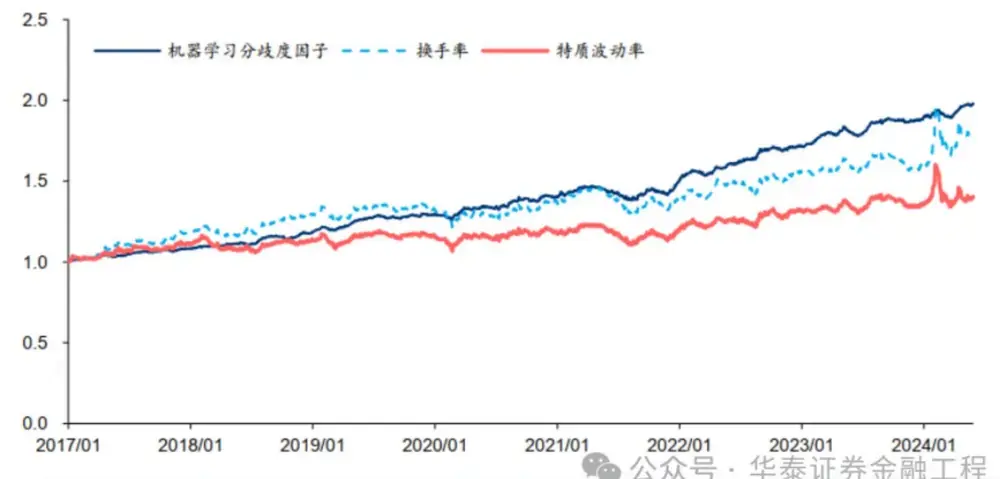

## 影响因素分析

除了模型超参数外，其他因素也会对分歧度因子的表现产生影响，比如做空限制、动量和投资者认可度。

## 做空限制

如果股票容易做空，即使投资者分歧度高，悲观投资者同样能够充分表达观点，与乐观投资者分庭抗礼，股价虚高的可能性降低。机构持股比例可用来衡量个股的做空难易程度，机构持股比例高的股票做空相对容易，机构持股比例低的股票做空相对困难。

通过Wind获取个股每季度的机构持股比例，由于报告披露有一定的滞后性，为避免使用未来信息，1～4月份用去年三季报数据，5～8月份用一季报数据，9～10月份用半年报数据，11～12月份用三季报数据。

参考Fama和French（2015）提出的方法，沿着分歧度和机构持股比例两个维度将股票分成5x5的25宫格组合，计算每个组合的年化收益率。从左往右观察，分歧度越高，股票组合预期收益越低；从上往下观察，机构持股比例越高，股票组合预期收益越高。在机构持股比例低的股票池中分歧度因子的多空表现更好，特别是空头端，说明做空限制是分歧度因子的坚实基础。

图表27：按照分歧度和机构持股比例分组的组合年化收益率

|  | 分歧度低 | 2 | 3 | 4 | 分歧度高 |
| --- | --- | --- | --- | --- | --- |
| 机构持股比例低 | 8.68% | 5.30% | 0.40% | -8.94% | -30.44% |
| 2 | 10.06% | 6.17% | 5.79% | -0.99% | -19.45% |
| 3 | 10.83% | 6.59% | 3.49% | -1.96% | -15.55% |
| 4 | 8.86% | 7.21% | 4.41% | 2.52% | -13.87% |
| 机构持股比例高 | 10.97% | 11.21% | 9.75% | 3.37% | -9.20% |

图表28：按照机构持股比例分组的分歧度因子IC值分析和分层回测结果汇总

|  | RankIC 均值 | RankIC 标准差 | IC_IR | IC>0 占比 | 多空组合年化收益率 | 多空组合夏普比率 |
| --- | --- | --- | --- | --- | --- | --- |
| 分歧度因子（所有股票） | 7.66% | 10.18% | 0.75 | 77.78% | 32.89% | 3.48 |
| 分歧度因子（机构持股比例低） | 9.66% | 13.31% | 0.73 | 75.56% | 54.05% | 4.89 |
| 分歧度因子（机构持股比例高） | 5.63% | 9.11% | 0.62 | 73.06% 众号 |  | 华卷14%券金融工程2.19 |

图表29：按照机构持股比例分组的分歧度因子多空净值
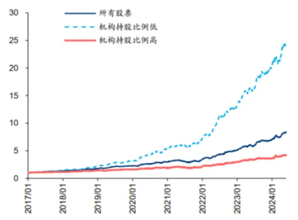

图表30：按照机构持股比例分组的分歧度因子累计RanklC
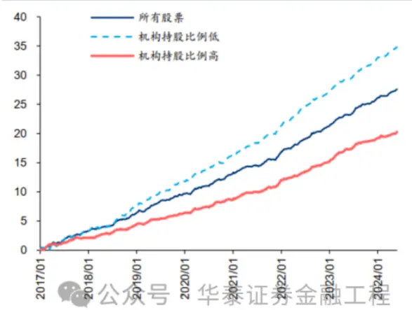

## 动量

计算个股最近20个交易日涨跌幅，沿着分歧度和近期收益两个维度将股票分成5x5的25宫格组合，计算每个组合的年化收益率。从左往右观察，分歧度越高，股票组合预期收益越低；从上往下观察，当近期收益过高时，股票组合预期收益非常低，体现出反转效应。近期上涨的股票池中分歧度因子的多空表现更加显著，空头效应很强，而近期下跌的股票池中分歧度因子的分组收益不严格单调。如果股票近期下跌，说明悲观投资者的观点已经有所释放，观点分歧造成的买卖不对称性减弱；如果股票近期上涨，说明乐观投资者占据主导地位，观点分歧造成的买卖不对称性进一步增强。

图表31：按照分歧度和近期收益分组的组合年化收益率

|  | 分歧度低 | 2 | 3 | 4 | 分歧度高 |
| --- | --- | --- | --- | --- | --- |
| 近期收益低 | 10.17% | 4.78% | 5.78% | 0.51% | -4.80% |
| 2 | 8.77% | 8.12% | 8.84% | 6.54% | -4.70% |
| 3 | 11.41% | 8.07% | 7.72% | 4.25% | -6.79% |
|  | 12.64% | 10.26% | 8.34% | 1.31% | -11.51% |
| 近期收益高 | 2.99% | -0.98% | -9.59% | -25.06% | -38.20% |

图表32：按照近期收益分组的分歧度因子IC值分析和分层回测结果汇总

|  | RankIC 均值 | RankIC 标准差 | IC_IR | IC>0 占比 | 多空组合年化收益率 | 多空组合夏普比率 |
| --- | --- | --- | --- | --- | --- | --- |
| 分歧度因子（所有股票） | 7.66% | 10.18% | 0.75 | 77.78% | 32.89% | 3.48 |
| 分歧度因子（近期收益低） | 5.33% | 11.44% | 0.47 | 69.72% | 14.89% | 券金融工程 1.65 |
| 分歧度因子（近期收益高） | 9.80% | 12.03% | 0.81 | 80.56% 公从亏 | 63.04% | E4.47 |

图表33：按照近期收益分组的分歧度因子多空净值
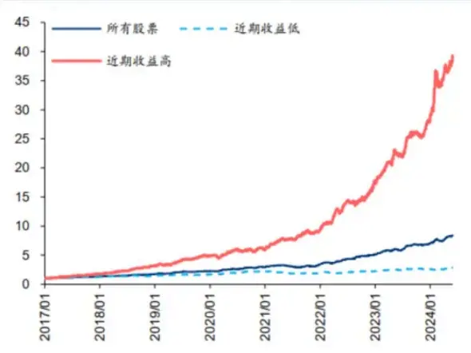

图表34：按照近期收益分组的分歧度因子累计RanklC
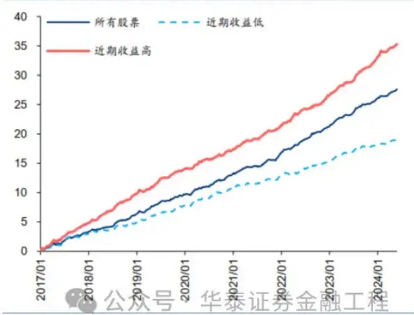

## 投资者认可度

如果说标准差能够模拟投资者观点分歧，那么均值则可以刻画投资者认可度。计算所有模型对同一交易日同只股票的预测值的均值，构建认可度因子。该因子对未来收益具有正向的预测能力，机器学习中的集成学习也体现了这一思想。

图表35：认可度因子IC值分析和分层回测结果汇总

|  |  | RankIC 均值 RankIC 标准差 | IC_IR |  |  | IC>0 占比 TOP 组合年化超额收益率 TOP 组合信息比率 TOP 组合胜率 TOP 组合换手率 |  |  |
| --- | --- | --- | --- | --- | --- | --- | --- | --- |
| 认可度因子 | 8.34% | 9.01% | 0.93 | 81.94% | 12.57% | 3.06 | 76.40% | 65.45% |

图表36：认可度因子分层组合相对净值
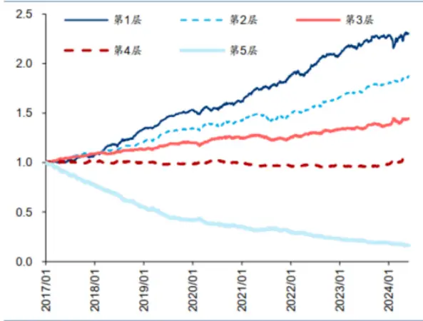

图表37：认可度因子累计 RankIC
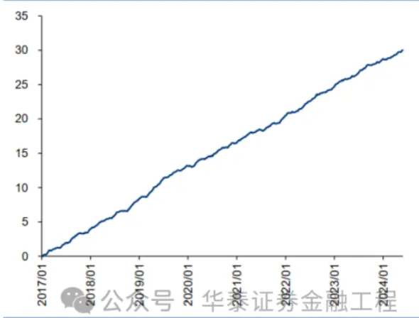

沿着分歧度和认可度两个因子维度将股票分成5x5的25宫格组合，计算每个组合的年化收益率。从左往右观察，分歧度越高，股票组合预期收益越低；从上往下观察，认可度越高，股票组合预期收益越高，均与前文研究结论一致。投资者一致看多（认可度高，分歧度低）的股票组合收益最高，与常识相符；然而收益最低的却不是投资者一致看空（认可度低，分歧度低）的股票组合，而是“争议看空”（认可度低，分歧度高），并且认可度低的股票池中分歧度因子的多空收益更为显著。

图表38：按照分歧度和认可度分组的组合年化收益率

|  | 分歧度低 | 2 | 3 | 4 | 分歧度高 |
| --- | --- | --- | --- | --- | --- |
| 认可度低 | -6.49% | -12.02% | -21.19% | -31.51% | -37.24% |
| 2 | 4.51% | 3.49% | 1.52% | -2.60% | -6.47% |
| 3 | 6.59% | 6.68% | 5.70% | 4.55% | 1.68% |
|  | 12.99% | 11.36% | 10.49% | 8.72% | 2.33% |
| 认可度高 | 16.68% | 14.75% | 13.36% | 11.02% | 6.52% |

图表39：按照认可度分组的分歧度因子IC值分析和分层回测结果汇总

|  | RankIC 均值 | RankiC 标准差 | IC_IR | IC>0 占比 | 多空组合年化收益率 | 多空组合夏普比率 |
| --- | --- | --- | --- | --- | --- | --- |
| 分歧度因子（所有股票） | 7.66% | 10.18% | 0.75 | 77.78% | 32.89% | 3.48 |
| 分歧度因子（认可度低） | 7.84% | 9.87% | 0.79 | 80.28% | 47,17% | 4.17 |
| 分歧度因子（认可度高） | 3.33% | 10.50% | 0.32 | 62.78%从亏 | 9142% | 正券金融工程11 |

图表40：按照认可度分组的分歧度因子多空净值
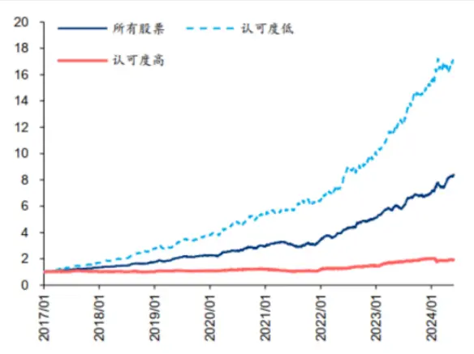

图表41：按照认可度分组的分歧度因子累计 RankIC
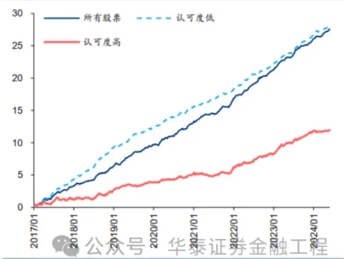

将分歧度因子与认可度因子等权合成，得到复合因子的RankIC和多头收益均有提升。

图表42：复合因子IC值分析和分层回测结果汇总

|  | RankIC 均值 | RankIC 标准差 | IC_IR | IC>0 占比 TOP 组合年化超额收益率 TOP 组合信息比率 TOP 组合胜率 TOP 组合换手率 |  |  |  |  |
| --- | --- | --- | --- | --- | --- | --- | --- | --- |
| 分歧度因子 | 7.66% | 10.18% | 0.75 | 77.78% | 9.71% | 2.46 | 68.54% | 61.97% |
| 认可度因子 | 8.34% | 9.01% | 0.93 | 81.94% | 12.57% | 3.06 | 76.40% | 65.45% |
| 复合因子 | 9.02% | 9.47% | 0.95 | 81.94% | 13.07% | 3.25 | 74.16% | 64.41% |

图表43：复合因子 TOP 组合相对净值
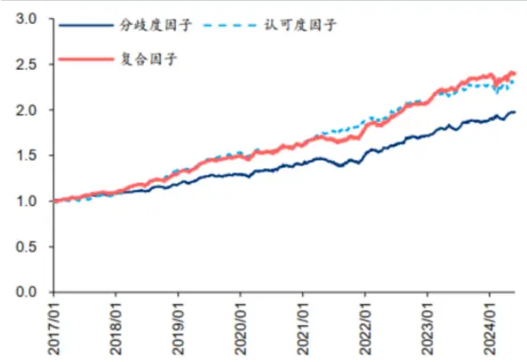

图表44：复合因子累计 RankIC
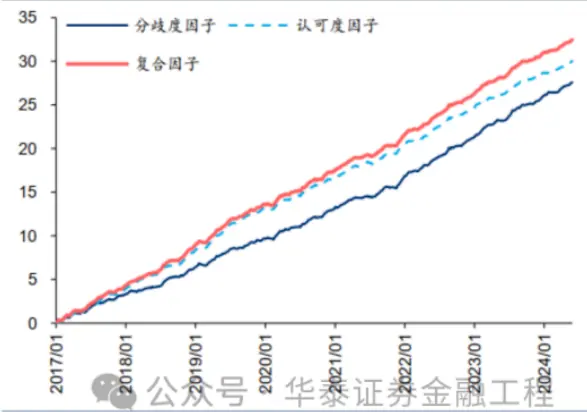

## 04 总结

投资者分歧是推动交易的原因之一，对金融市场的资产定价具有重要意义。本文运用机器学习来模拟投资者分歧。将不同的特征集输入给多个机器学习模型，模拟投资群体接收差异化信息源、并产生不同投资预测的过程。最后，根据模型预测差异构建的分歧度因子，能够有效刻画投资者分歧，对股票未来收益具有显著的预测作用。

投资者分歧度越高，股票预期收益越低。Miller（1977）认为投资者分歧会造成股票价格过高，未来回报下降，原因是乐观投资者推高股价，而悲观投资者受到做空限制，对市场的影响力更弱。本文利用现有的多个深度学习因子，构建深度学习分歧度因子，验证了投资者分歧与股票未来收益的负相关性。样本空间为全A股，因子在2017/1/4～2024/5/31的回测期内周度RankIC均值为6.06%，分5层TOP组合年化超额收益率为9.75%，周频双边换手率为117.70%。

树模型能够高效模拟投资者分歧。本文使用50个LightGBM模型来模拟投资者的预测观点。输入特征为股票截面特征，包含估值、成长、财务质量、量价、一致预期等类别，共43个。每个模型会随机选取20个特征进行训练，以模仿投资者接收差异化信息源。最后，计算所有模型对同一交易日同只股票的预测值的标准差，构建机器学习分歧度因子。因子在相同回测期内周度RankIC均值提升至7.66%，分5层TOP组合年化超额收益率为9.71%，周频双边换手率下降至61.97%。

超参数选择对分歧度因子的影响基本不大。不同预测周期构建的分歧度因子回测表现接近，但预测周期越长，TOP组合换手率越低，因为长线投资者的预测分歧在短期内变化不会太剧烈。不同投资者数量构建的分歧度因子回测表现差异不大，但投资者数量设置过少可能会造成RankIC偏低和换手率偏高。特征数量对分歧度因子的回测表现具有一定影响，随机选取的特征数量过多会导致投资者之间难以产生预测分歧。LightGBM、XGBoost和CatBoost等不同机器学习模型构建的分歧度因子回测表现接近。

股票做空限制、动量和投资者认可度对分歧度因子具有显著影响。使用机构持股比例衡量个股的做空难易程度，机构持股比例低的股票池中分歧度因子多空表现更加显著，多空组合年化收益率从32.89%提升至54.05%，说明做空限制是分歧度因子的坚实基础。近期涨幅最大的股票池中分歧度因子的多空组合年化收益率高达63.04%，表明乐观投资者占据主导地位，观点分歧造成的买卖不对称性进一步增强。根据模型预测均值构建投资者认可度因子，发现一致看多的股票组合预期收益最高，“争议看空”的股票组合预期收益最低，分歧度与认可度因子等权合成的复合因子RankIC和多头收益均有提升。

## 参考文献：

Miller E M. Risk, uncertainty, and divergence of opinion[J]. The Journal of Finance, 1977, 32(4): 1151-1168.

Diether K B, Malloy C J, Scherbina A. Differences of opinion and the cross section of stock returns[J]. The Journal of Finance, 2002, 57(5): 2113-2141.

Berkman H, Dimitrov V, Jain P C, et al. Sell on the news: Differences of opinion, shortsales constraints, and returns around earnings announcements[J]. Journal of Financial Economics, 2009, 92(3): 376-399.

Bali T G, Kelly B T, Mörke M, et al. Machine Forecast Disagreement[R]. National Bureau of Economic Research, 2023.

Jensen T I, Kelly B, Pedersen L H. Is there a replication crisis in finance?[J]. The Journal of Finance, 2023, 78(5): 2465-2518.

Fama E F, French K R. A five-factor asset pricing model[J]. Journal of Financial Economics, 2015, 116(1): 1-22.

## 风险提示：

借助机器学习构建的选股策略是历史经验的总结，存在失效的可能。机器学习存在过拟合的风险。
本文回测暂未考虑交易费用。

## 相关研报

研报：《 金工：机器学习模拟投资者分歧》2024年6月15日

分析师：林晓明 S0570516010001 | BPY421

分析师：何康 S0570520080004 | BRB318

联系人：卢炯 S0570123070272

## 关注我们

## 华泰证券金融工程

主要进行量化投资相关的研究和讨论工作。

427篇原创内容

公众号

## 华泰证券研究所国内站（研究Portal）

https://inst.htsc.com/research

访问权限：国内机构客户

华泰证券研究所海外站

https://intl.inst.htsc.com/research

访问权限：美国及香港金控机构客户

添加权限请联系您的华泰对口客户经理

## 免责声明

## ▲向上滑动阅览

本公众号不是华泰证券股份有限公司（以下简称“华泰证券”）研究报告的发布平台，本公众号仅供华泰证券中国内地研究服务客户参考使用。其他任何读者在订阅本公众号前，请自行评估接收相关推送内容的适当性，且若使用本公众号所载内容，务必寻求专业投资顾问的指导及解读。华泰证券不因任何订阅本公众号的行为而将订阅者视为华泰证券的客户。

本公众号转发、摘编华泰证券向其客户已发布研究报告的部分内容及观点，完整的投资意见分析应以报告发布当日的完整研究报告内容为准。订阅者仅使用本公众号内容，可能会因缺乏对完整报告的了解或缺乏相关的解读而产生理解上的歧义。如需了解完整内容，请具体参见华泰证券所发布的完整报告。

本公众号内容基于华泰证券认为可靠的信息编制，但华泰证券对该等信息的准确性、完整性及时效性不作任何保证，也不对证券价格的涨跌或市场走势作确定性判断。本公众号所载的意见、评估及预测仅反映发布当日的观点和判断。在不同时期，华泰证券可能会发出与本公众号所载意见、评估及预测不一致的研究报告。

在任何情况下，本公众号中的信息或所表述的意见均不构成对任何人的投资建议。订阅者不应单独

## 人工智能 25

人工智能 · 目录

上一篇

华泰金工 | 双目标遗传规划应用于行业轮动

华泰金工 | ESG分歧度因子和AI量价增强策略

下一篇

个人观点，仅供参考