## 华泰金工 | ESG分歧度因子和AI量价增强策略

原创 林晓明 源洁莹等 华泰证券金融工程 2024年08月01日 08:04

A股市场Alpha竞争激烈，个股财务和量价信息挖掘已较充分，ESG等另类数据逐渐成为市场关注点。本文测试ESG分歧度因子在A股市场的表现，随后将ESG与AI量价因子结合，构建沪深300成分内增强策略。ESG数据和传统财务、量价数据的重要区别在于数据口径不唯一、不统一，不同评级机构之间存在一定差异，这种分歧或可成为ESG评级外的增量信息。测试结果表明，在单因子层面，结合ESG分歧度的ESG综合因子在RankICIR、多头组合表现等方面优于ESG评级因子。以沪深300成分内高ESG个股为底仓，结合AI量价因子构建指数增强组合，相比纯AI量价模型在收益和ESG水平上均有提升。

## 核心观点

## 人工智能81：测试ESG分歧度因子，结合AI量价因子构建指增策略

本文测试ESG分歧度因子在A股市场的表现，随后将ESG与AI量价因子结合，构建沪深300成分内增强策略。ESG数据和传统财务、量价数据的重要区别在于数据口径不唯一、不统一，不同评级机构之间存在一定差异，这种分歧或可成为ESG评级外的增量信息。测试结果表明，在单因子层面，结合ESG分歧度的ESG综合因子在RankICIR、多头组合表现等方面优于ESG评级因子。以沪深300成分内高ESG个股为底仓，结合AI量价因子构建指数增强组合，相比纯AI量价模型在收益和ESG水平上均有提升。

## ESG分歧度是投资决策的增量信息

ESG投资理念在现代金融市场中的重要性日益凸显。与传统的财务、量价数据不同，ESG评级数据口径不唯一、不统一，不同评级机构评分和评级存在差异，这种内部差异可能会成为投资决策的增量信息，有望为投资者提供新的视角。不同评级机构对同一企业的ESG评级结果存在分歧，这种分歧可能源于评级机构在评级体系、方法论和权重分配上的不同。学界研究表明，ESG评级分歧不仅反映了市场对企业ESG表现的不同认识，也可能影响投资决策和股票收益。

## 结合ESG分歧度的ESG综合因子在有效性和稳定性上优于ESG评级因子

通过对A股市场ESG评级分歧度的实证研究，我们发现ESG评级和ESG分歧度与股票收益之间存在一定的相关性，两因子叠加得到的ESG综合因子表现稳健。在沪深300、中证500、中证全指成分股的单因子测试中，ESG综合因子表现出较好的有效性，稳定性相较于ESG评级因子有明显提升。ESG分歧度可以作为投资策略的一部分，提高基于ESG信息的决策质量。

## 高ESG底仓并结合AI量价因子构建沪深300成分股内的增强策略

将ESG因子与AI量价因子结合，构建了沪深300成分股内的增强策略。实证结果表明，结合高ESG底仓和AI量价因子的策略在回测期内（2017-01-26至2024-06-28）实现了10.55%的年化超额收益，信息比率2.79，业绩表现和ESG水平相较于仅用AI量价因子的基准策略有明显提升。高ESG底仓个股叠加有效的量价因子是基本面与量价信息的有机结合，或能够辅助投资者给出更为全面的投资决策。

## 正文

## 01 ESG研究发展和评级分歧

A股市场Alpha竞争激烈，个股财务和量价信息挖掘已较充分，ESG等另类数据逐渐成为市场关注点。但ESG因子面临收益表现偏弱的问题，如何改造ESG因子提升其选股能力？

ESG数据和传统财务、量价数据的重要区别之一，是数据口径不唯一、不统一，不同评级机构评分和评级存在差异。近年来，学术界涌现出一批研究探讨ESG分歧的成因和影响，为我们挖掘ESG评级背后增量信息，进而改造ESG因子提供了启示。

本研究构建ESG分歧度因子，与ESG评级结合构建ESG综合因子，测试其在A股市场的选股效果。由于ESG因子在沪深300成分股内覆盖度高且表现较好，我们以沪深300成分内高ESG个股为底仓，构建ESG与AI相结合的沪深300成分内增强策略，相比纯AI量价的基线模型在收益和ESG水平上均有提升。

## 海内外日益重视ESG研究与投资

近年来，随着全球经济的快速发展和资源环境压力的日益增大，投资者、企业、政府及社会各界对可持续发展问题的关注度显著提升。ESG投资理念应运而生，它强调在投资决策过程中不仅要考虑传统的财务指标，还要综合评估企业在环境保护（E）、社会责任（S）和公司治理（G）三个方面的表现。这一理念的兴起，反映了全球范围内对可持续发展、社会责任和长期价值创造的深刻认识。

海外对于ESG的研究和评级相对成熟，结合ESG理念进行投资的应用也更为广泛。Parnassus投资公司成立超过30年，是美国最大的纯ESG共同基金管理公司之一。该公司所有的基金都采用ESG投资策略，专注于投资具有社会责任感的公司。Parnassus核心股票基金（Parnassus Core EquityFund）是该公司旗下规模最大、历史最悠久的基金之一，基金成立于1992年，截至2024年3月规模超过300亿美元。

图表1： Parnassus Core Equity Fund 净值走势
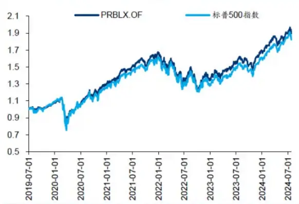

图表2：Parnassus Core Equity Fund 规模变化（单位：亿美元）
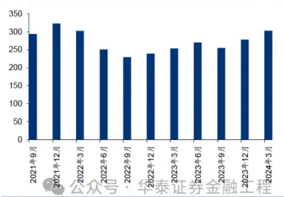

法国巴黎资产管理公司（BNP Paribas Asset Management）认为采用可持续方法进行投资，不仅可以获得更好的风险调整回报，还可以为整个社会创造可持续增长。成立于2019年的法巴可持续多元资产增长基金以及法巴可持续多元资产平衡基金均是ESG投资产品。投资策略表明，子基金将其资产（不包括现金）至少90%根据可持续主题方法及／或同业最佳方法进行投资，基金考虑的ESG因素包括低碳、共融经济、尊重人权等。

图表3：法国巴黎资产管理公司代表性ESG产品

| 基金全称 | 基金代码 | ISIN 代码 | 投资类型 | 成立日期 | 最新规模 |
| --- | --- | --- | --- | --- | --- |
| 法巴可持续多元资产增长基金 | BNP000281 | LU1956155946 | 股票型基金 | 2019/12/5 | 657,270,000.00 EUR |
| 法巴可持续多元资产平衡基金 | BNP000255 | LU1956154386 |  |  | 混合型基金2019/12/5泰1,312,380,000.00EUR |

在国内，ESG的发展也日益受到关注。根据万得数据库，富时罗素、商道融绿、盟浪、华证、万得等机构均有发布对于A股上市公司的ESG评级。2017年以来，各机构ESG评级对A股上市公司的覆盖数量逐步增加。当前商道融绿、华证、万得均定期发布超过5300家上市公司的ESG评级结果。

图表4：各评级机构对A股上市公司的覆盖数量
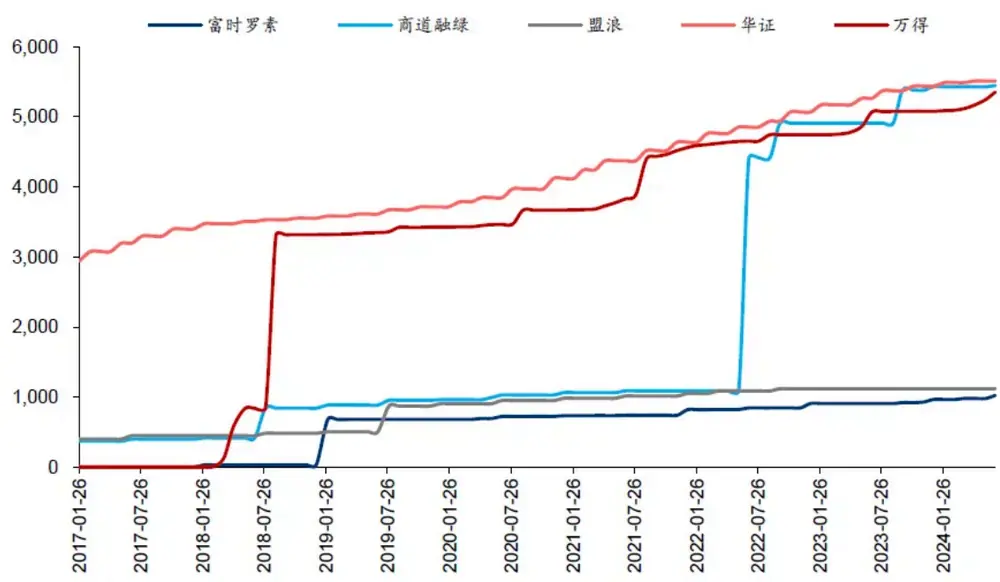

各评级机构评估企业在环境、社会和治理方面的表现时所采取的指标、方法和评估体系均存在一定差异。比如在指标体系的构建与评级方法论层面上，盟浪采用独创的FIN-ESG评估模型，融合了经济 表 现 （ Financial ） 、 创 新 能 力 （ Innovation ） 、 价 值 准 则 （ Norm ） 、 环 境 表 现（Environmental）、社会表现（Social）和公司治理（Governance）六大体系指标。而万得ESG评级体系则由管理实践与争议事件两大部分组成。管理实践指标体系区分环境、社会、治理三大维度，细分29个议题，并下设500多个具体指标；争议事件则基于新闻舆情、法律诉讼、监管处罚进行评估。

ESG评级体系的差异使得不同机构对同一上市公司的ESG评级结果可能出现分化。在应用上市公司的ESG得分进行投资时，不同评级机构的结果是否可比、如何评估不同评级机构的分歧成为关键的问题。

图表5：各评级机构的 ESG 评级结果

| 评级机构 | ESG 结果 ESG 结果概述 |  |
| --- | --- | --- |
| 富时罗素 | 评分 | ESG整体评级的分值在0至5分，其中5分为最高评分。 |
| 商道融绿 | 评级 | 优秀(A+、A）、良好(A-、B+）、一般(B、B-、C+）、薄弱(C、C-)、重大负面事件(D)。 共设10个大等级，分别为AAA、AA、A、BBB、BB、B、CCC、CC、C和D。其中：AA至B级 |
| 盟浪 | 评级 | 用“+”和“-”号进行微调，因此，总共20个子等级；D级表示使用筛选子模型筛出的公司。 |
| 华证 | 评级 | 系统测算上市公司的ESG得分水平（总分为100分），并相应地给予“AAA-C”的九档评级。 |
| 万得 | 评分 | WindESG综合得分由管理实践得分（总分7分）和争议事件得分（总分3分）组成程 |

## 学界关于ESG分歧度的研究成果

ESG评级结果的差异客观存在，近年来，学界也逐渐着眼于ESG分歧度的研究，在ESG分歧度的产生原因、结果影响、如何应用ESG分歧度进行投资决策层面上均有相关成果。

## 为什么出现分歧？

Berg等人2022年于Review of Finance杂志发表的论文Aggregate Confusion: The Divergence首次定量分解ESG评分分歧的驱动因素。作者提出ESG评分分歧可分解为范围（scope）、测量（measurement）和权重（weight）三方面的差异。

范围分歧指每家评级机构的评级体系不同，如穆迪、标普、MSCI包含三个维度，路孚特包含四个维度，KLD包含七个维度。测量分歧指每家评级机构对相同细分指标的评分不同，即便是CEO是否兼任董事会主席这类客观指标，各机构评分相关系数均值也仅为0.59。权重分歧指每家评级机构下各细分指标的权重不同，如KLD评级前三大权重指标为气候风险管理、产品安全和薪酬，穆迪评级前三大权重指标为多样性、环境政策和劳动实践。

通过对评分差异进行方差分解，得到范围、测量、权重分歧的贡献分别为38%、56%和6%，超过一半的ESG评级差异可以归因于评级机构的测量方法。

Brandon等人2021年发表的论文ESG Rating Disagreement and Stock Returns系统性地测试了ESG评分分歧度对股票收益的影响。作者以7家评级机构对标普500成分股的ESG评分为研究对象，发现ESG评分分歧度与股票月度收益呈正相关，相关性主要取决于环境E维度的分歧。作者对此的解释是，高ESG分歧度可能被视作额外的风险因子，因而受到风险溢价的补偿。

图表7：ESG评分分歧度与股票收益的关系（美股市场研究）
Table 4: Stock returns and ESG rating disagreement

| Dependent Variable: |  |  |  |  |
| --- | --- | --- | --- | --- |
|  |  | Retums |  |  |
| Pillars: | (1) Total | (2) Environmental | (3) Social | (4) Governance |
| Disp | 0.698 | 1.012 | 0.630 | -0.059 |
| ME | (1.995) | (2.375) | (1.515) | (-0.136) |
|  | -0.134 (-0.726) | -0.128 (-0.686) | -0.135 (-0.725) | -0.119 (-0.635) |
| BM | 0.216 (0.973) | 0.233 | 0.218 | 0.226 |
| GP | 0.231 | (1.048) 0.246 | (0.984) 0.234 | (1.021) 0.222 |
| Momentum | (0.772) | (0.825) | (0.781) | (0.745) |
|  | 0.360 (1.114) | 0.348 | 0.359 | 0.361 |
| StdEPS | -0.232 | (1.064) | (1.109) | (1.120) -0.228 |
|  |  | -0.193 | -0.233 |  |
|  | (-1.337) | (-1.116) | (-1.344) | (-1.313) |
| Beta | 0.165 | 0.188 | 0.168 | 0.158 |
|  | (0.330) | (0.376) | (0.336) | (0.316) |
| TVol |  |  |  |  |
|  | -0.081 | -0.115 | -0.084 | -0.073 |
|  | (-0.227) | (-0.328) | (-0.237) | (-0.206) |
| Industry * Month FE | Yes | Yes | Yes | Yes |
| N | 42,058 |  | 42,058 | 42,058 |
| Adjusted R2 | 0.347 | 41,786 0.348 | 0.347 | 0.347 |

Note: This table displays the results of pooled panel regressions of monthly stock returns on ESG rating disagreement. The first row reports the results for disagreement in the total ESG rating and the rows (2) – (4) report the results for the E, S, and G pillar separately. The dependent variable Returns is the firm's monthly stock return. We measure ESG rating disagreement by the standard deviation of ratings available for a given firm at a given point in time (Disp). We also include industry-month fixed effects and control for standard characteristics that have been found to explain stock returns, namely market capitalization (Banz 1981). book-to-market (Fama and French 1995), gross profitability (Novy-Marx 2013), momentum (Jegadeesh and Titman 1993), the dispersion of analyst forecasts of the firm's one year ahead earnings forecasts (Diether et al. 2002), the firm's beta (Frazzini and Pedersen 2014), and total volatility (Ang et al. 2006). z-statistics based on double clustered standard errors (month and firm) are reported in parentheses

公众号：华泰证券金融工程

Avramov等人2022年于Journal of Financial Economics杂志发表的论文Sustainable Investing探讨ESG评分不确定性对宏观股权风险溢价和微观股票截面Alpha的影响。作者以6家评级机构对美股上市公司的评分为研究对象，通过理论建模和实证测试，得出如下结果：ESG不确定性会降低养老基金等社会责任投资者的持股数量，抑制股票投资需求，降低股权风险溢价；从截面角度，对于低ESG不确定性的股票，ESG评分和股票收益呈负相关，而对于高ESG不确定性的股票，ESG-alpha负相关性消失甚至逆转，表明ESG不确定性反而提升了股票截面Alpha。

Wang等人2023年发表的论文 ESG rating disagreement and stock returns: Evidence from以6家评级机构对A股上市公司的ESG评分为研究对象，测试ESG分歧度与股票回报的关系。实证测试发现，ESG分歧度与股票年度收益呈负相关，这与Brandon等 (2021)美股市场的研究结论刚好相反。作者对此的解释是ESG分歧度会削弱投资者情绪，降低股票收益预期。这种负面影响在非国有企业、高ESG评级、低机构投资者占比的上市公司体现更为明显；治理G维度的分歧是主要影响因素。

图表8：ESG评分分歧度与股票收益的关系（A股市场研究）
Table 14 Dimensional rating disagreement and stock returns.

|  | Dependent Variable: Ret |  |  |  |
| --- | --- | --- | --- | --- |
|  | (1) | (2) | (3) | (4) |
|  | ESG | E | S | G |
| Dis | -0.4311*** | 0.0339 | -0.0688 | -0.1824** |
| Constant | (-4.0893) | (0.4385) | (-1.0465) | (-2.1100) |
|  | 6.5734*** | 0.6442 | 0.8800 | 1.1109** |
|  | (10.5770) | (1.0339) | (1.5517) | (2.0371) |
| Controls | Yes | Yes | Yes | Yes |
| YearFe | Yes | Yes | Yes | Yes |
| Industry Fe | Yes | Yes | Yes | Yes |
| N | 14,308 | 10,177 | 14,009 | 14,185 |
| Adjusted R² | 0.2192 | 0.3045 | 0.2570 | 0.2505 |

t statistics in parentheses, $^{\ast}p<0.1,^{\ast\ast}p<0.05,$ 公从号：华泰证券金融工程
资料来源：ESG rating disagreement and stock returns: Evidence from China,华泰研究

Liu 等 人 2023 年 发 表 的 论 文 ESG rating disagreement and idiosyncratic return同样以A股市场为研究对象，发现ESG分歧度与股票特质波动率呈正相关。作者认为ESG分歧会增加投资者对该公司信息的关注度，并且增加投资者噪声交易的比例，从而导致波动率的提升。该效应在高分析师覆盖度、高分析师分歧度的上市公司体现更为明显；外资和机构投资者的参与会降低ESG分歧度带来的影响。

文献中的研究模型以基于面板数据的多元线性回归为主，通过显著性水平衡量分歧度对收益的影响。但未放在业界常用的因子回测场景下测试，未考察因子有效性的时序变化，未在不同股票池考察因子有效性的差异。

## 02 ESG分歧度的定义与案例

## ESG分歧度因子的构建

参考论文 Sustainable Investing with ESG Rating Uncertainty中的方法，构建ESG分歧度因子。首先在每个截面上把ESG评级、评分均转换为分位数水平，表征公司的ESG得分在同期所有公司中的排序，确保不同评级机构的评级结果具有可比性。需指出，商道融绿、盟浪、华证仅给出ESG评级，评级相同的公司分位数水平一致，可能出现较多并列情况。在每个截面上计算不同评级机构的ESG评分相关性，2017年至今的均值如下图表所示。整体而言，各机构的ESG评级相似度在0.5附近，说明不同机构对A股上市公司的ESG评级确实存在一定差异。

图表9：各家评级机构的ESG评分相关性

|  | 富时罗素 | 商道融绿 | 盟浪 | 华证 | 万得 |
| --- | --- | --- | --- | --- | --- |
| 富时罗素 |  | 0.56 | 0.48 | 0.44 | 0.44 |
| 商道融绿 | 0.56 |  | 0.54 | 0.45 | 0.47 |
| 盟浪 | 0.48 | 0.54 |  | 0.51 | 0.53 |
| 华证 | 0.44 | 0.45 | 0.51 |  | 0.37 |
| 万得 | 0.44 | 0.47 | 0.53 | 0.37 |  |
| 平均 | 0.48 | 0.51 | 0.51众号·华泰.44券金融工0.45 |  |  |

每期在获得至少两家评级的公司中计算ESG分歧度因子，两两分别计算评级机构之间ESG得分的标准差，再取均值即为ESG分歧度因子。举例而言，若公司获得三家评级机构的ESG有效评级，分位数 水 平 分 别 为 0.3 、 0.5 、 0.8 则 对 应 计 算 ESG 分 歧 度 因 子 值 为(0.1414+0.3536+0.2121)/3=0.2357 。 同 时 ， 定 义 ESG 评 级 因 子 为 有 效 评 级 的 均 值 ， 即(0.3+0.5+0.8)/3=0.5333。

每期ESG分歧度因子覆盖的个股数量如下图表所示。2018年8月起，超过3000家公司存在多家评级机构的ESG有效评级；2023年6月以来，5000余家上市公司存在ESG评级分歧度。此外，2017年至今，A股上市公司的ESG分歧度中枢呈现下滑趋势。

图表10：ESG分歧度因子覆盖个股数量
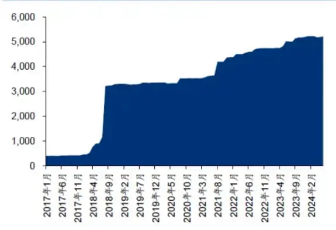

图表11：ESG分歧度因子中枢
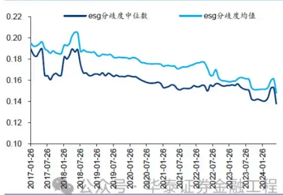

## 个股ESG分歧度示例

以宁德时代（300750 CH）、恒生电子（600570 CH）、首钢股份（000959 CH）为例展示ESG评级以及ESG分歧度。

## 宁德时代（300750 CH）：ESG评级逐步抬升且ESG分歧度呈下降趋势

2024年以来，宁德时代均获得五家评级机构的ESG评级，整体得分处于较高水平。各机构的评级结果存在一定分化，华证和商道融绿ESG评级提升，但万得ESG得分相较年初有所下滑。

图表12：2024年各评级机构对宁德时代的ESG评级

|  | 华证 | 万得 | 富时罗素 | 盟浪 | 商道融绿 |
| --- | --- | --- | --- | --- | --- |
| 2024/1/31 | BBB | 8.22 | 2.2 | AA | A- |
| 2024/2/29 | BBB | 8.2 | 2.2 | AA | A- |
| 2024/3/29 | BBB | 7.5 | 2.2 | AA | A |
| 2024/4/30 | A | 7.5 | 2.2 | AA | A |
| 2024/5/31 | A | 7.51 | 2.2 | AA | A |
| 2024/6/28 | A | 7.5 | 公众号：华泰券金融工程A |  |  |

计算宁德时代的ESG评级和ESG分歧度。自2018年以来ESG评级逐步上升，同时ESG分歧度逐渐下滑，说明各评级机构对于宁德时代的ESG认可度抬升，且趋于一致。

图表13：宁德时代 ESG 评级与 ESG 分歧度
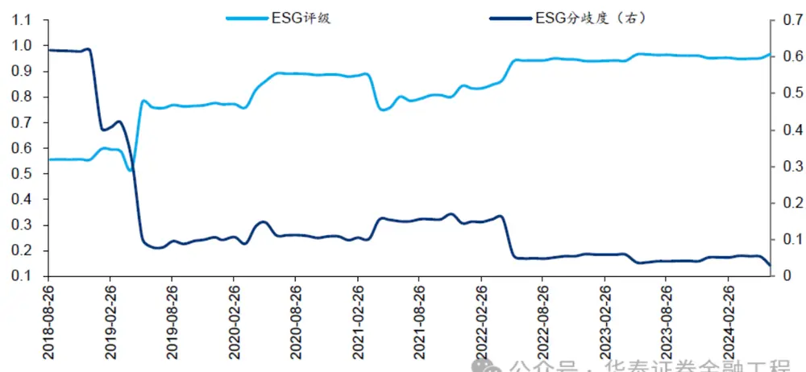

## 恒生电子（600570 CH）：ESG得分上行但ESG分歧度呈波动特征

2019年之前仅有华证、盟浪、商道融绿发布对于恒生电子的ESG评级，整体评级得分不高。2019年后恒生电子的ESG得分中枢明显抬升，且较为稳定。但ESG分歧度呈现波动特征，主要原因是恒生电子在华证的ESG评级分位数发生明显变化。

图表14：恒生电子在各评级机构的ESG评级分位数
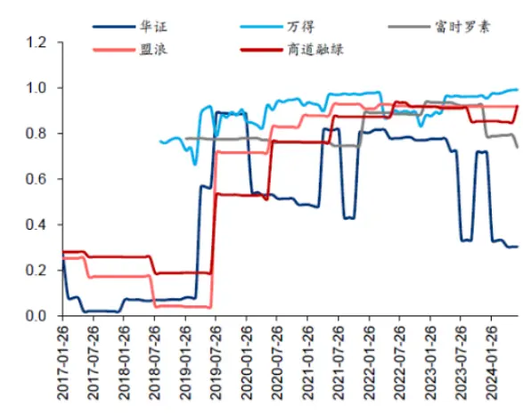

图表15：恒生电子 ESG 得分与 ESG 分歧度
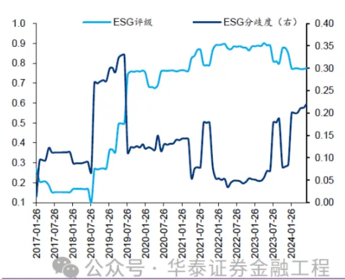

## 首钢股份（000959 CH）：ESG得分与ESG分歧度均震荡变化

各评级机构对首钢股份的ESG评级均呈现较大幅度的变化，导致首钢股份的总体ESG得分未呈现明显趋势，ESG分歧度中枢也处于相对较高的水平。

图表16：首钢股份在各评级机构的ESG评级分位数
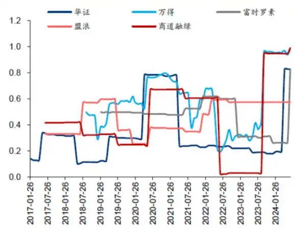
资料来源：Wind，华泰研究

图表17：首钢股份 ESG 得分与 ESG 分歧度
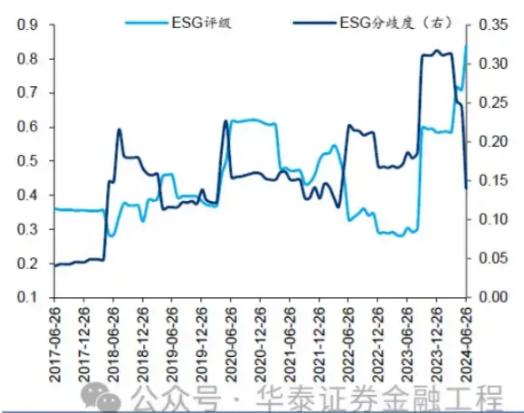
资料来源：Wind，华泰研究

## 03 ESG相关因子的A股实证研究

基于ESG评级和前述分歧度定义，构建三个ESG因子，测试其在A股市场的表现：

1. ESG评级因子：有效评级的均值。

2. ESG分歧度因子：计算任意两家评级机构之间ESG分位数的标准差，再取均值。根据论文ESGrating disagreement and stock returns: Evidence from China的结论，ESG分歧度与股票年度收益呈负相关。因此ESG分歧度因子取相反数。

3. ESG综合因子：ESG评级与ESG分歧度等权相加。ESG综合因子值较大的个股对应的ESG评级较高且各家评级机构的一致性较高。

## 主要测试结论如下：

1. ESG评级因子与股票收益呈现一定的正相关，ESG分歧度因子有效性不如ESG评级因子本身。

2. ESG综合因子的Top层年化收益和信息比率相较于ESG评级因子均有提升，说明结合ESG分歧度构建ESG综合因子可以对ESG评级因子进行有效的改进。

3. 无中性化的因子在收益表现上更优，但行业市值中性化后的因子在2020-2022年间的累计RankIC和Top层净值的回撤明显减小，RankIC稳定性更高。

4. 不同分歧度计算方式中，两两配对求标准差的方法所构建的ESG综合因子在Top层和对冲组合收益表现上优于普通标准差的方法，RankIC更稳健。

## ESG评级、ESG分歧度、ESG综合因子测试

对ESG评级因子、ESG分歧度因子、ESG综合因子进行单因子测试，方法如下：

1．股票池：沪深300成分股/中证500成分股/中证全指成分股。

2．回测区间：2017-01-26至2024-06-28。

3．调仓周期：月频，不计交易费用。

4．因子预处理：行业市值中性化、标准化，缺失值填充为0。

ESG评级因子与股票收益呈现一定的正相关，在中证500、中证全指成分股内RankIC胜率超过60%，且Top组合相较于基准组合存在正超额。通常直接应用ESG得分构建因子较难获得明显超额收益，ESG信息主要发挥负向剔除的作用。但我们将ESG得分转换为分位数后利用均值构建ESG评级因子，多头端能有正向的收益贡献。可能的原因在于平均分数较高可能稳定性不足，但平均排名较高能综合体现不同评级机构的ESG打分，因此多头组合长期有一定超额收益。

注：回测区间：201716至2024-068伞证分立出工性

从RankICIR和RankIC胜率来看，ESG分歧度因子的有效性不如ESG评级因子本身。从逻辑上而言，ESG分歧度因子要求多家评级机构对成分股公司进行ESG评级。评级机构对上市公司覆盖度不足、每个上市公司获得的ESG评级数量少都可能导致ESG分歧度因子代表性不佳。特别地，ESG分歧度因子在中证500成分股上的有效性较弱可能是因为2018年6月之前中证500成分股的ESG分歧度因子缺失值超过50%。

从路径上看，在中证全指成分股中，ESG评级因子的RankIC在2020-2022年间出现回撤，而对应区间内ESG分歧度因子的RankIC有正向贡献，因此ESG综合因子的RankIC回撤相较于ESG评级因子有明显改善。此外，在沪深300、中证500、中证全指成分股的测试中，ESG综合因子的Top层年化收益和信息比率相较于ESG评级因子均有提升。单独应用ESG分歧度因子进行选股未必能获得理想的效果，但结合ESG分歧度构建ESG综合因子能对ESG评级因子进行有效的改进。

图表18：ESG 相关因子测试指标
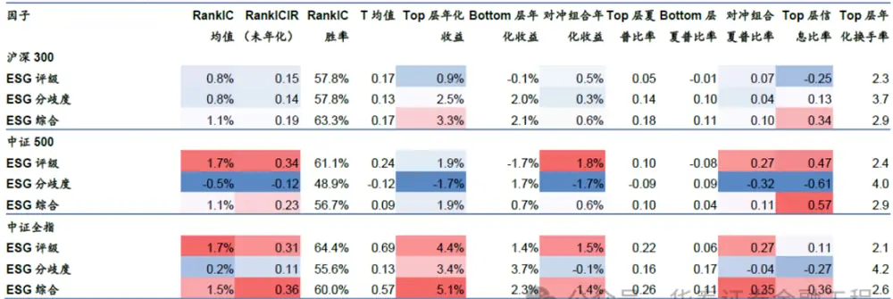
注：回测区间：2017-01-26至2024-06-28：因子进行行业市值中性：预测收益使用下个自然月区间收益率从午泰证分金出工柱

图表19：ESG 相关因子累计 RankIC（沪深300 和中证 500）
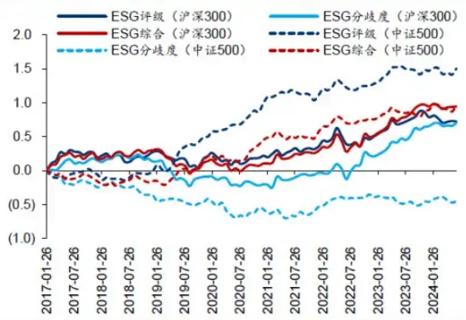

图表20：ESG 相关因子累计 RankIC（中证全指成分股）
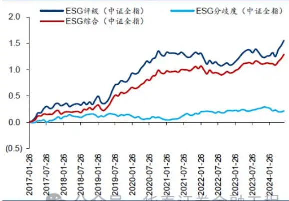

图表21：ESG 相关因子 Top 层相对净值（沪深 300 和中证 500）
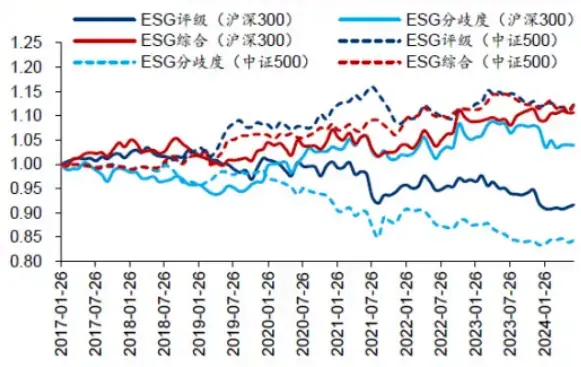

图表22：ESG 相关因子 Top 层相对净值（中证全指成分股）
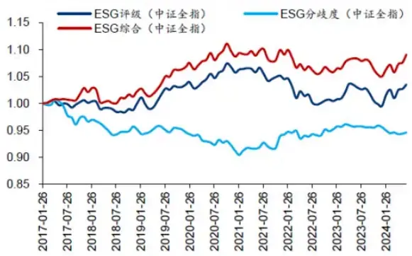

注：回测区间：20170126至2024-06-28：水调文工程

从因子分层测试结果来看，ESG相关因子不能严格满足单调性。ESG评级因子、ESG分歧度因子在第2层、第3层、第4层之间的分层效果相对理想，第1层和第5层的稳定性不足。ESG综合因子的单调性有所改善，前2层组合稳定优于末2层，且2018年以来超额收益累积相对平稳，区分度较高。

图表23：ESG评级因子分层测试（中证全指成分股）
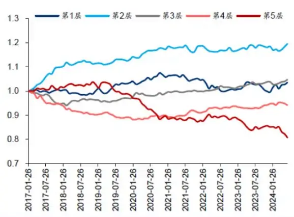

图表24：ESG分歧度因子分层测试（中证全指成分股）
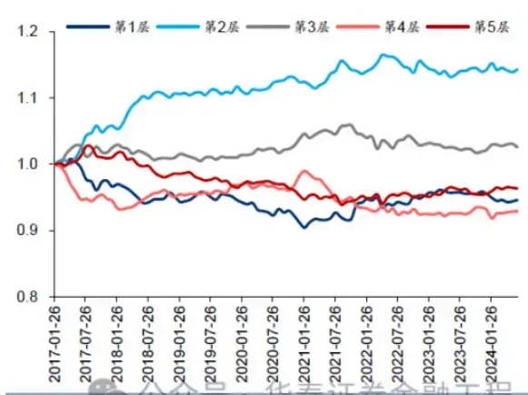
注：回测区间：20170128至2024-06-28：有调仓不升文易师土

图表25：ESG综合因子分层测试（中证全指成分股）
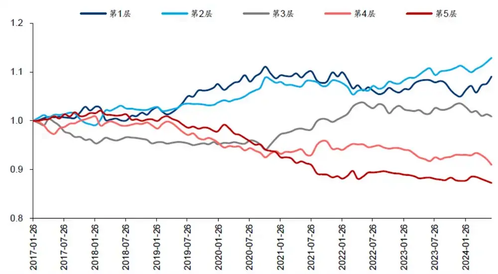
公众号·华泰证券金融工程

## 中性化方法

分别测试无中性化、行业中性化、行业市值中性化三种处理方式下各因子的效果。对于ESG评级因子而言，无中性化的因子在RankIC、Top层和对冲组合的收益表现上均显著更优。行业市值中性化会使得因子的RankIC均值降低、Top层和对冲组合的超额收益有所下滑。可能的原因是个股的市值和所处的行业本身是评级机构在进行ESG评级时的考量因素。但从因子累计RankIC和Top层相对净值来看，行业市值中性化后的因子在2020-2022年间的回撤明显减小，RankIC稳定性高于无中性化的因子。

注：回测区间：20170126至2024-06-28：省调仓不升交易删期个王

图表26：不同中性化方法下，ESG评级因子测试指标

| 因子 |  |  |  |  | RankIC RankICIR RankIC T 均值 Top 层年化 Bottom 层年 对冲组合年 Top 层夏 Bottom 层 |  |  |  |  | 对冲组合 | Top 层信 Top 层年 |  |
| --- | --- | --- | --- | --- | --- | --- | --- | --- | --- | --- | --- | --- |
|  |  | 均值（未年化） | 胜率 |  | 收益 | 化收益 | 化收益 | 普比率 | 夏普比率 | 夏普比率 |  | 息比率化换手率 |
| 沪深300 |  |  |  |  |  |  |  |  |  |  |  |  |
| ESG 评级（无中性化） | 3.3% | 0.33 | 65.6% | 0.44 | 5.6% | -1.8% | 3.7% | 0.33 | -0.09 | 0.46 | 0.80 | 2.0 |
| ESG评级（行业中性） | 2.4% | 0.33 | 64.4% | 0.37 | 2.3% | -0.9% | 1.6% | 0.13 | -0.04 | 0.22 | 0.11 | 2.1 |
| ESG 评级（行业市值中性） | 0.8% | 0.15 | 57.8% | 0.17 | 0.9% | -0.1% | 0.5% | 0.05 | -0.01 | 0.07 | -0.25 | 2.3 |
| 中证 500 |  |  |  |  |  |  |  |  |  |  |  |  |
| ESG评级（无中性化） | 2.4% | 0.39 | 55.6% | 0.37 | 2.5% | -2.4% | 2.4% | 0.13 | -0.11 | 0.34 | 0.67 | 1.9 |
| ESG 评级（行业中性） | 1.8% | 0.34 | 55.6% | 0.26 | 1.5% | -1.8% | 1.7% | 0.08 | -0.09 | 0.25 | 0.34 | 2.2 |
| ESG评级（行业市值中性） | 1.7% | 0.34 | 61.1% | 0.24 | 1.9% | -1.7% | 1.8% | 0.10 | -0.08 | 0.27 | 0.47 | 2.4 |
| 中证全指 |  |  |  |  |  |  |  |  |  |  |  |  |
| ESG 评级（无中性化） | 2.6% | 0.27 | 62.2% | 0.78 | 5.7% | 0.7% | 2.5% | 0.30 | 0.03 | 0.27 | 0.32 | 1.8 |
| ESG评级（行业中性） | 2.1% | 0.28 | 62.2% | 0.66 | 4.7% | 1.3% | 1.7% | 0.25 | 0.06 | 0.24 | 0.16 | 1.9 |
| ESG评级（行业市值中性） | 1.7% | 0.31 | 64.4% | 0.69 | 4.4% | 1.4% | 15% | 0.22 | 化0.06 | 027 | 911 | 和2.1 |

图表27：ESG 评级因子累计 RankIC（沪深 300 和中证500）
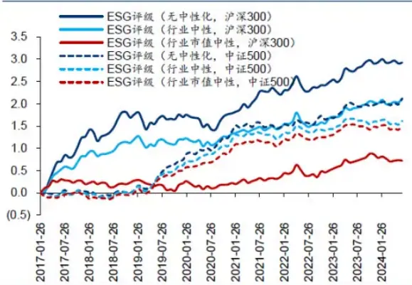

图表28：ESG评级因子累计 RankIC（中证全指成分股）
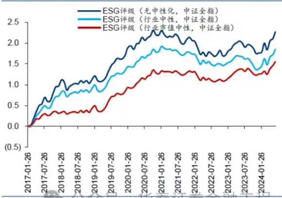
注：回测区间：201亿0126至2024-0628泰证分立融出柱

图表29：ESG 评级因子 Top 层相对净值（沪深 300 和中证 500）
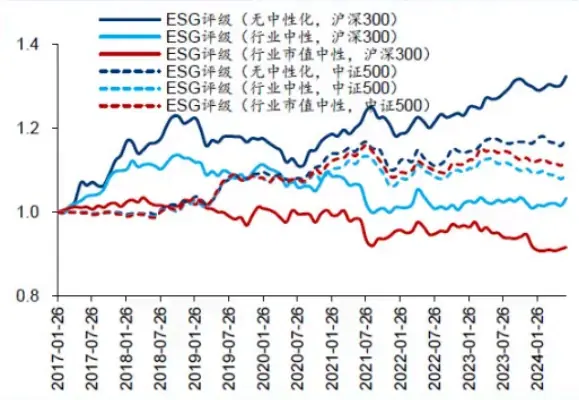

图表30：ESG评级因子 Top 层相对净值（中证全指成分股）
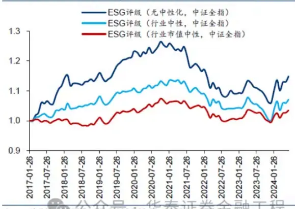

ESG综合因子的测试结果与ESG评级因子类似。特别地，在大多数场景中，ESG综合因子的RankICIR、Top层年化超额收益和对冲组合年化超额收益优于ESG评级因子。

图表31：不同中性化方法下，ESG综合因子测试指标
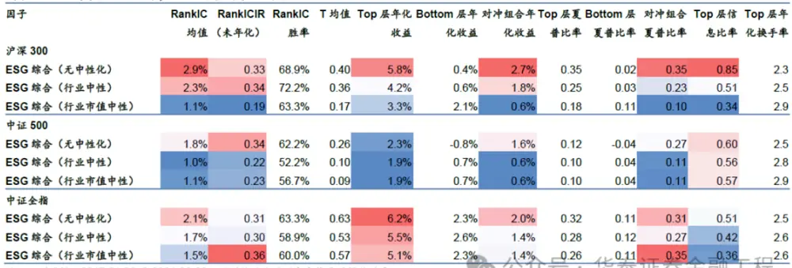

图表32：ESG 综合因子累计 RankIC（沪深 300 和中证 500）
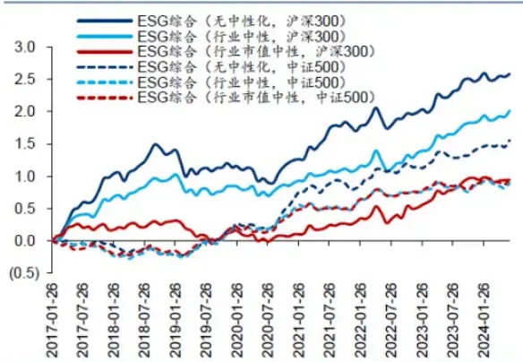

图表33：ESG 综合因子累计 RankIC（中证全指成分股）
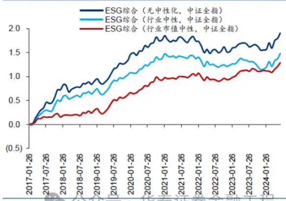

图表34：ESG 综合因子 Top 层相对净值（沪深 300 和中证 500）
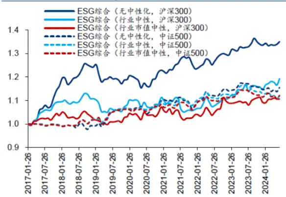

图表35：ESG 综合因子 Top 层相对净值（中证全指成分股）
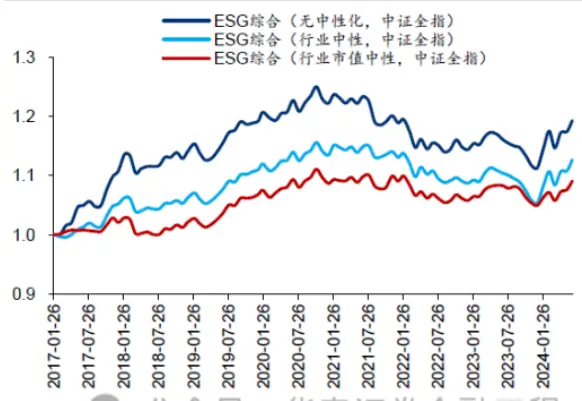
注：回测区间：20170126至2024-06-28：调址分计支易费用柱

## 分歧度计算方式

前文分歧度计算中，对于获得多家评级机构ESG评级的个股，采用两两配对计算标准差再取均值的方法得到ESG分歧度。作为对照，考虑采用普通标准差的方法计算ESG分歧度。

在沪深300、中证500、中证全指的测试中，ESG分歧度（配对）与ESG分歧度（标准差）因子的整体效果基本相当。但对于ESG综合因子而言，ESG综合（配对）因子的Top层和对冲组合的收益表现均稳定优于ESG综合（标准差），累计RankIC表现也更为稳健。可能的原因是由于不同评级机构对A股上市公司的覆盖程度不同，导致不同个股获得的ESG评级数量不一致，两两配对的计算方式使得个股之间的ESG分歧度更可比，同时弱化偏离较大的评级对结果的影响，因此我们更推荐两两配对的计算方式。

图表36：不同分歧度计算方式下，ESG因子测试指标

| 因子 | RankIC | RankICIR RankIC |  |  | T 均值 Top 层年化 Bottom 层年 对冲组合年 Top 层夏 Bottom 层 |  |  |  |  | 对冲组合 | Top 层信 Top 层年 |  |
| --- | --- | --- | --- | --- | --- | --- | --- | --- | --- | --- | --- | --- |
|  |  | 均值（未年化） | 胜率 |  | 收益 | 化收益 | 化收益 | 普比率 | 夏普比率 | 夏普比率 |  | 息比率化换手率 |
| 沪深300 |  |  |  |  |  |  |  |  |  |  |  |  |
| ESG 分歧度（配对） | 0.8% | 0.14 | 57.8% | 0.13 | 2.5% | 2.0% | 0.3% | 0.14 | 0.10 | 0.04 | 0.13 | 3.7 |
| ESG 分歧度（标准差） | 0.9% | 0.16 | 60.0% | 0.14 | 2.1% | 0.7% | 0.7% | 0.12 | 0.04 | 0.11 | 0.05 | 3.5 |
| ESG综合（配对） | 1.1% | 0.19 | 63.3% | 0.17 | 3.3% | 2.1% | 0.6% | 0.18 | 0.11 | 0.10 | 0.34 | 2.9 |
| ESG 综合（标准差） | 1.1% | 0.20 | 63.3% | 0.18 | 2.4% | 1.4% | 0.5% | 0.14 | 0.07 | 0.08 | 0.13 | 2.8 |
| 中证500 |  |  |  |  |  |  |  |  |  |  |  |  |
| ESG分歧度（配对） | -0.5% | -0.12 | 48.9% | -0.12 | -1.7% | 1.7% | -1.7% | -0.09 | 0.09 | -0.32 | -0.61 | 4.0 |
| ESG 分歧度（标准差） | -0.6% | -0.14 | 45.6% | -0.14 | -1.2% | 2.2% | -1.7% | -0.06 | 0.11 | -0.31 | -0.49 | 3.9 |
| ESG 综合（配对） | 1.1% | 0.23 | 56.7% | 0.09 | 1.9% | 0.7% | 0.6% | 0.10 | 0.04 | 0.11 | 0.57 | 2.9 |
| ESG 综合（标准差） | 1.0% | 0.22 | 55.6% | 0.08 | 1.7% | 1.1% | 0.3% | 0.09 | 0.05 | 0.06 | 0.48 | 2.9 |
| 中证全指 |  |  |  |  |  |  |  |  |  |  |  |  |
| ESG 分歧度（配对） | 0.2% | 0.11 | 55.6% | 0.13 | 3.4% | 3.7% | -0.1% | 0.16 | 0.17 | -0.04 | -0.27 | 4.2 |
| ESG分歧度（标准差） | 0.1% | 0.07 | 52.2% | 0.08 | 3.4% | 3.7% | -0.1% | 0.16 | 0.18 | -0.05 | -0.35 | 4.2 |
| ESG 综合（配对） | 1.5% | 0.36 | 60.0% | 0.57 | 5.1% | 2.3% | 1.4% | 0.26 | 0.11 | 0.35 | 0.36 | 2.6 |
| ESG综合（标准差） | 1.4% | 0.35 | 62.2% | 0.53 | 4.8% | 2.6% | 1.1% | 0.24 | 0.12 | 0.27 | 0.24 | 2.6 |

图表37：不同分歧度计算方式累计 RankIC(沪深300和中证 500)
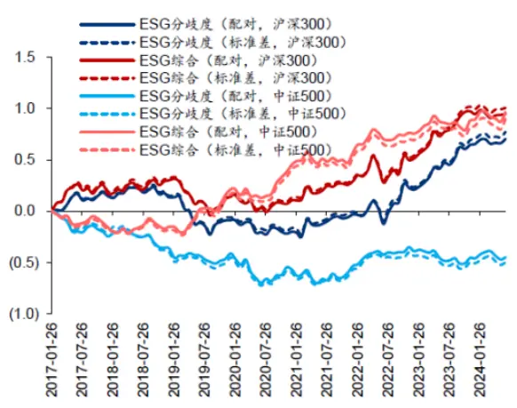

图表38：不同分歧度计算方式累计RankIC(中证全指成分股）
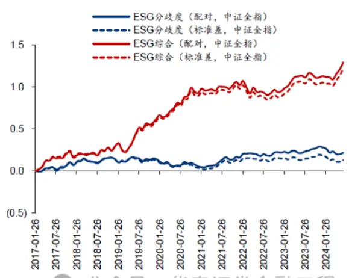
注：回测区间：201亿0126至2024-0628泰证券金融工柱

图表39：不同分歧度计算方式Top 层相对净值(沪深300和中证 500)
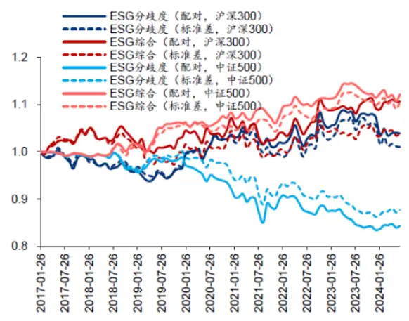

图表40：不同分歧度计算方式Top层相对净值（中证全指成分股）
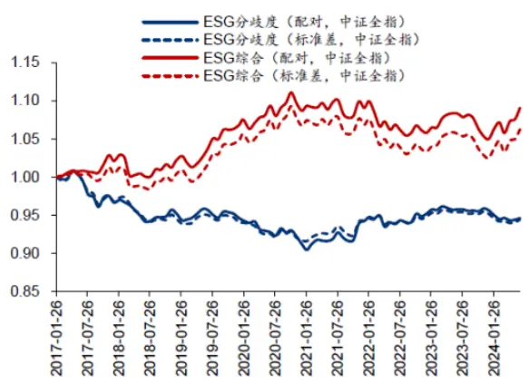
注：回测区间：201亿0126至2024-06-28泰证券支易期工程

## 04 ESG与AI量价因子结合构建沪深300成分内增强策略

ESG数据在沪深300股票池覆盖度高；引入分歧度信息的ESG综合因子在沪深300成分股票池内RankIC和多头端收益均表现较好。得益于以上两点，我们以沪深300成分股内高ESG个股为底仓，结合华泰金工AI量价因子，构建沪深300成分内增强策略。

具体方法为：

1.每个月末截面期，在沪深300成分股票池内，计算未经中性化的ESG综合因子，筛选因子值排名前100的个股，构建底仓。

2.每个半月频截面期（每月15日或15日前最近的一个交易日），以前一步得到的底仓作为股票池，提取AI量价因子作为收益预测，以沪深300为基准，通过求解组合优化器，构建指数增强组合。

基线模型不使用高ESG个股作为底仓，直接在沪深300成分股票池内，以AI量价因子作为收益预测，构建指数增强组合。AI量价因子请见华泰金工《人工智能72：基于全频段量价特征的选股模型》（2023-12-08）。

组合优化相关设置如下：半月频调仓，单次调仓单边换手率上限30%，个股偏离约束±1%，行业偏离约束±2%，市值偏离约束±0.3倍标准差。在截面期的下个交易日以vwap价格调仓，交易费率双边千三。

结果表明，回测期2017-12-29至2024-06-28内，ESG底仓+AI增强组合年化超额收益10.55%，对照模型AI增强组合年化超额收益9.0%，ESG底仓带来1.55pct的年化收益提升，信息比率从2.17提升至2.79，换手率年化双边15倍。

图表41：ESG与AI量价因子结合构建沪深300 成分内增强组合累计超额收益
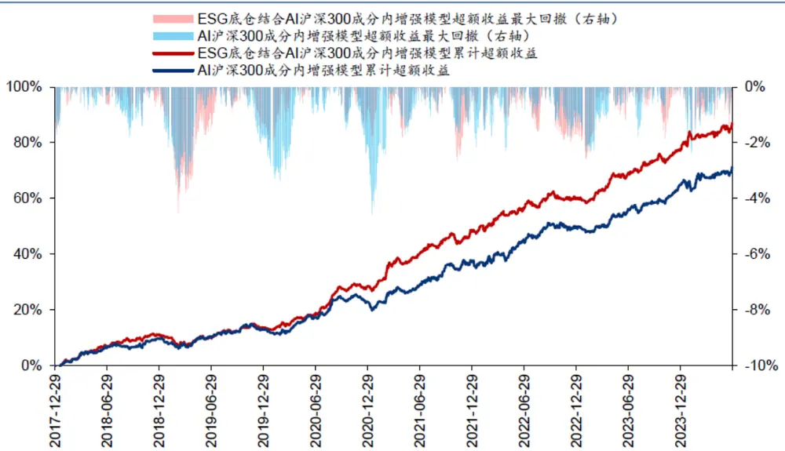

图表42：ESG 与 AI量价因子结合构建沪深300 成分内增强组合回测绩效

|  | 误差 |  |  |  |  |
| --- | --- | --- | --- | --- | --- |
| 9.00% | 4.14% | 2.17 | 4.59% | 1.96 | 69.23% 15.09 |
| 10.55% | 3.78% | 2.79 | 4.55% | 2.32 | 79.49% 14.96 |

图表43：ESG与AI量价因子结合构建沪深300 成分内增强组合逐月超额收益

|  | 1月 | 2月 | 3月 4月 |  | 5月 6月 7月 |  | 8月 | 9月 | 10月 | 11月 12 |  | 月年超额收益 |
| --- | --- | --- | --- | --- | --- | --- | --- | --- | --- | --- | --- | --- |
| 2018年 | 1.0% | 1.3% | 1.6% | 1.0% | 1.4% 0.5% | 0.9% | 0.8% | 0.3% | -0.3% | 2.2% | 0.1% | 11.2% |
| 2019年 | -1.3% | -1.8% | 0.0% | 0.9% | 1.7% -0.3% | 1.2% | 0.9% | -0.3% | 1.3% | 0.8% | -1.0% | 2.1% |
| 2020年 | -0.6% | 1.3% | 0.4% | 2.1% | 0.5% 1.0% | 1.4% | 4.0% | 1.7% | 0.2% | 0.9% | -0.4% | 13.2% |
| 2021年 | 0.2% | 2.0% | 4.6% | -0.8% | 1.2% 1.6% | 2.3% | -0.5% | 2.1% | 0.3% | -0.3% | 1.9% | 15.4% |
| 2022年 | 1.2% | 0.6% | 1.4% | 0.5% | 0.6% 1.2% | 0.5% | 0.8% | 1.5% | -0.6% | -0.2% | 0.2% | 8.0% |
| 2023年 | -0.9% | 0.7% | 2.3% | 1.8% | 1.2% 0.4% | 0.7% | 1.0% | 0.8% | 0.3% | 0.9% | 0.9% | 10.6% |
| 2024年 | 3.9% | -0.5 | % -0.3% | 0.6% | 1.2% 0.7% | 5.6% |  |  |  |  |  |  |

计算组合加权ESG得分，ESG底仓结合AI组合平均得分为0.77，高于沪深300指数（0.74）和纯AI量价组合（0.71）。ESG底仓提升了组合收益表现，同时提升了组合的ESG水平。

图表44：ESG 与 AI 量价因子结合构建沪深 300 成分内增强组合加权ESG 得分
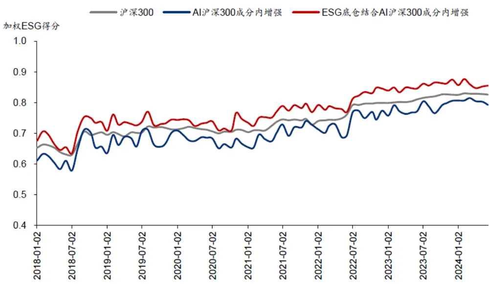

## 05 总结与讨论

ESG投资理念在现代金融市场中的重要性日益凸显。与传统的财务、量价数据不同，ESG评级数据口径不唯一、不统一，不同评级机构评分和评级存在差异，这种内部差异可能会成为投资决策的增量信息，有望为投资者提供新的视角。

不同评级机构对同一企业的ESG评级结果存在分歧，这种分歧可能源于评级机构在评级体系、方法论和权重分配上的不同。学界研究表明，ESG评级分歧不仅反映了市场对企业ESG表现的不同认识，也可能影响投资决策和股票收益。

通过对A股市场ESG评级分歧度的实证研究，我们发现ESG评级和ESG分歧度与股票收益之间存在一定的相关性，两因子叠加得到的ESG综合因子表现稳健。在沪深300、中证500、中证全指成分股的单因子测试中，ESG综合因子表现出较好的有效性，稳定性相较于ESG评级因子有明显提升，表明ESG分歧度可以作为投资策略的一部分，能提高基于ESG信息的决策质量。

进一步地，我们创新性地将ESG因子与AI量价因子结合，构建了沪深300成分股内的增强策略。实证结果表明，结合高ESG底仓和AI量价因子的策略在回测期内实现了10.55%的年化超额收益，信息比率2.79，业绩表现相较于仅用AI量价因子的基准策略有明显提升。高ESG底仓个股叠加有效的量价因子是基本面与量价信息的有机结合，能辅助投资者给出更为全面的投资决策。

本研究的缺点在于，部分评级机构可得的数据仅为评级数据，而非评分，因此转化为分位数时，相同评级样本的分位数相同，分位数分布相对离散，如果股票评级变动，分位数将出现较大变化，使得分歧度出现跃升或跃降。如果采用评分数据构建分歧度因子，分歧度的变化可能更为连续，相比评级数据更为合理。

综上所述，ESG投资不仅符合全球可持续发展的趋势，而且在实际投资中展现出了较高的应用价值。随着ESG投资理念的进一步普及和评级体系的完善，ESG相关数据可能更为完备和结构化，从而在投资中具备更广泛的应用。

## 参考文献

Avramov, D., Cheng, S., Lioui, A., & Tarelli, A. (2022). Sustainable investing with ESG rating uncertainty. Journal of financial economics, 145(2), 642-664.

Berg, F., Koelbel, J. F., & Rigobon, R. (2022). Aggregate confusion: The divergence of ESG ratings. Review of Finance, 26(6), 1315-1344.

Gibson Brandon, R., Krueger, P., & Schmidt, P. S. (2021). ESG rating disagreement and stock returns. Financial analysts journal, 77(4), 104- 127.

Liu, X., Yang, Q., Wei, K., & Dai, P. F. (2024). ESG rating disagreement andidiosyncratic return volatility: Evidence from China. Research in International Business and Finance, 70, 102368.

Wang, J., Wang, S., Dong, M., & Wang, H. (2024). ESG rating disagreement and stock returns: Evidence from China. International Review of Financial Analysis, 91, 103043.

## 风险提示：

ESG评级的不稳定性、市场认知差异和外部环境变化都可能影响投资策略的表现。借助机器学习构建的选股策略是历史经验的总结，存在失效的可能。机器学习存在过拟合的风险。本报告不涉及对个股的投资建议。

## 相关研报

研报：《 ESG分歧度因子和AI量价增强策略》2024年7月30日

分析师：林晓明 S0570516010001 | BPY421

分析师：源洁莹 S0570521080001 | BRR314

分析师：何康 S0570551080001 | BRR314

关注我们

## 华泰证券金融工程

主要进行量化投资相关的研究和讨论工作。

427篇原创内容

公众号

## 华泰证券研究所国内站（研究Portal）

https://inst.htsc.com/research

访问权限：国内机构客户

## 华泰证券研究所海外站

https://intl.inst.htsc.com/research

访问权限：美国及香港金控机构客户

添加权限请联系您的华泰对口客户经理

## 免责声明

## ▲向上滑动阅览

本公众号不是华泰证券股份有限公司（以下简称“华泰证券”）研究报告的发布平台，本公众号仅供华泰证券中国内地研究服务客户参考使用。其他任何读者在订阅本公众号前，请自行评估接收相关推送内容的适当性，且若使用本公众号所载内容，务必寻求专业投资顾问的指导及解读。华泰证券不因任何订阅本公众号的行为而将订阅者视为华泰证券的客户。

本公众号转发、摘编华泰证券向其客户已发布研究报告的部分内容及观点，完整的投资意见分析应以报告发布当日的完整研究报告内容为准。订阅者仅使用本公众号内容，可能会因缺乏对完整报告的了解或缺乏相关的解读而产生理解上的歧义。如需了解完整内容，请具体参见华泰证券所发布的完整报告。

本公众号内容基于华泰证券认为可靠的信息编制，但华泰证券对该等信息的准确性、完整性及时效性不作任何保证，也不对证券价格的涨跌或市场走势作确定性判断。本公众号所载的意见、评估及预测仅反映发布当日的观点和判断。在不同时期，华泰证券可能会发出与本公众号所载意见、评估及预测不一致的研究报告。

在任何情况下，本公众号中的信息或所表述的意见均不构成对任何人的投资建议。订阅者不应单独

## 人工智能 25

人工智能 · 目录

上一篇

华泰金工 | 机器学习模拟投资者分歧

华泰金工 | GPT因子工厂2.0：基本面与高频因子挖掘

下一篇

个人观点，仅供参考