## 华泰金工 | GPT因子工厂2.0：基本面与高频因子挖掘

原创 林晓明 何康等 华泰证券金融工程 2024年09月27日 22:28

本研究在前期报告《GPT因子工厂：多智能体与因子挖掘》（20240220）的基础上，将大模型因子挖掘扩展至基本面与高频因子挖掘场景。本文继续沿用前期报告中的多智能体架构，核心改变在于针对基本面与高频因子定制化设计算子，以尽可能保证因子表达式的合乎逻辑。从结果上看，GPT因子工厂2.0在基本面因子挖掘中表现尚可，在高频因子挖掘中表现优异，因子相关性均普遍偏低。此外，本文利用GPT因子工厂产出的因子进行指增策略实践，基于高频因 子 构 建 中 证 1000 指 增 策 略 （ 回 测 区 间 20161230- 20240920 ） ， 年 化 超 额 收 益 率 为31.32%，信息比率为4.20，策略效果较为出色。

## 核心观点

## 人工智能82：GPT因子工厂扩展至基本面与高频因子挖掘

本研究在前期报告《GPT因子工厂：多智能体与因子挖掘》（20240220）的基础上，将大模型因子挖掘扩展至基本面与高频因子挖掘场景。本文继续沿用前期报告中的多智能体架构，核心改变在于针对基本面与高频因子定制化设计算子，以尽可能保证因子表达式的合乎逻辑。在基本面因子挖掘中，因子周度IC均值为0.011，周度RankIC均值为0.013；对于高频因子挖掘，因子周度IC均值为0.020，周度RankIC均值为0.031，GPT因子工厂2.0挖掘高频因子质量较高。利用GPT因子工厂2.0产出的高频因子构建中证1000指增策略（回测区间20161230- 20240920），年化超额收益率为31.32%，信息比率为4.20。

## 因子挖掘与GPT因子工厂：大模型因子挖掘或成为因子挖掘新兴方案

因子挖掘在量化研究中占据核心地位，是为多因子模型补充Alpha源的重要途径。传统的因子挖掘主要包括人工手动挖掘和算法自动挖掘两种方案：人工手动挖掘依赖于量化研究员对市场的理解与直觉，离不开研究员的专业素养，需消耗高昂的人力成本；算法自动挖掘将因子挖掘流程自动化，有效降低人力成本，然而其缺陷是过拟合风险与可解释性难题。大模型因子挖掘或将成为新兴的因子挖掘方案，其可行性在前期报告中已得到证明，同时大模型可给予清晰的逻辑解释，过拟合风险或更可控。

## 基本面与高频因子挖掘：或是自动化因子挖掘难涉之境

算法自动化因子挖掘相比于人工挖掘存在诸多优势，但却鲜有针对基本面或高频因子的自动化因子挖掘，人工挖掘因子似乎更具优势。对于基本面因子挖掘而言，传统算法在无法利用专业知识的前提下，难以构造具备逻辑性的基本面因子。对于高频因子而言，传统算法可能难以在表达式中融入日频化采样，高频因子表达式的复杂性形成一道隐形的墙。大模型或许是解决之道，一方面在于大模型近乎人类的逻辑推理能力，另一方面在于，从自然语言中诞生的大模型拥有更灵活的因子构建与因子计算能力。

## 因子挖掘效果：基本面因子表现尚可，高频因子效果优异

本文对GPT因子工厂2.0产出的基本面因子和高频因子挖掘效果进行测试，分别进行30次因子挖掘，每次因子挖掘仅包括首次挖掘。因子IC方面，30个基本面因子IC均值为0.011，RankIC均值为0.013，|t均值为1.542；23个筛选后的高频因子IC均值为0.020，RankIC均值为0.031，|t|均值为4.588。因子相关性方面，基本面因子相关系数绝对值均值为0.10，高频因子相关系数绝对值均值为0.17，因子工厂产出的因子相关性普遍偏低。

## 指数增强策略实践：基于量价与高频因子的指增策略均表现较出色

本文基于量价和高频因子分别进行指增策略实践检验。对于前期报告初次挖掘产出的量价因子，沪深300、中证500、中证1000指增策略年化超额收益率分别为7.18%、10.34%、18.50%，对于高频因子，三类指增年化超额分别为13.78%、18.40%、31.32%。将合成后的量价因子与高频因子按1:4权重合并，合并后因子三类指增年化超额分别为12.38%、17.74%、30.72%。指增策略实践表明，GPT因子工厂产出的高频因子效果总体优于量价因子，基于高频因子可构建效果较出色的指增策略。

## 正文

## 01 导言

“一法通，万法通” ——谚语

自多因子框架诞生以来，因子挖掘便成为无数量化从业者与学术研究者百谈不厌的话题。因子挖掘的常规技法不外乎两种：人工挖掘与机器挖掘，后者包括遗传规划、深度学习与强化学习等。与常规技法不同，随着大语言模型的兴起，利用大模型挖掘因子也成为大模型在量化领域的先锋应用之一，华泰金工在前期报告《GPT因子工厂：多智能体与因子挖掘》（20240220）中做了深度探索。

量价因子挖掘是自动化因子挖掘的“起手式”，遗传规划等如此，大模型亦是如此。对于狭义的因子挖掘而言，产出的因子需要具备明确的因子表达式，量价数据恰恰拥有形成明确表达式的诸多优势：含义清晰、格式整齐、维度一致等等。然而，在面对基本面与高频因子时，遗传规划等方案常陷入困境，原因在于，一方面基本面因子往往需要清晰的逻辑支撑，仅凭算子的组合很难形成逻辑效果兼备的因子，另一方面高频因子日频化操作需要复杂的格式转换，需要考量算子间细致的逻辑关系。大模型近乎人类的逻辑推理能力或许能成为基本面因子与高频因子挖掘困境的解决之道。

本文是对前序研究GPT因子工厂在基本面与高频因子挖掘场景下的扩展。在框架设计上，本文沿用了GPT因子工厂的多智能体框架：FactorGPT负责因子挖掘，CodeGPT负责代码撰写，EvalGPT负责因子评估。字段方面，对于基本面因子挖掘，我们筛选资产负债表、现金流量表、利润表中的部分财务指标作为底层字段；对于高频因子挖掘，我们使用分钟频原始量价数据作为底层字段，包括最高价、最低价、开盘价、收盘价、成交额、成交量和成交笔数7个字段。算子方面，为了贴合基本面与高频因子挖掘，本文设计构建定制化的算子列表，以实现不同场景下的因子挖掘功能。

GPT因子工厂2.0显示出较优异的因子挖掘性能。对于基本面因子，因子工厂产出的30个基本面因子IC均值为0.011，RankIC均值为0.013，|t|均值为1.542，因子总体效果尚可，因子相关系数为正的系数均值为0.10，相关系数为负的系数均值为-0.09，所有相关系数绝对值的均值为0.10，总体相关性较低。对于高频因子，因子工厂产出30个因子，经筛选后保留23个因子，其IC均值为0.020，RankIC均值为0.031，|t|均值为4.588，因子表现较为出色，相关性方面，相关系数为正的系数均值为0.20，相关系数为负的系数均值为-0.13，所有相关系数绝对值的均值为0.17，因子相关性同样偏低。

与此同时，本文利用前序研究GPT因子工厂中产出的量价因子与本文产出的高频因子进行指增策略实证。对于前序研究初次挖掘产出的量价因子，沪深300指增策略年化超额收益率为7.18%，信息比率1.53，中证500指增策略年化超额收益率为10.34%，信息比率1.61，中证1000指增策略年化超额收益率为18.50%，信息比率2.61。对于高频因子，沪深300指增策略年化超额收益率为13.78%，信息比率2.73，中证500指增策略年化超额收益率为18.40%，信息比率为2.68，中证1000指增策略年化超额收益率为31.32%，信息比率4.20。将合成后的量价因子与高频因子按1:4权重合并，量价高频合并因子沪深300指增策略年化超额收益率为12.38%，信息比率2.45，中证500指增策略年化超额收益率为17.74%，信息比率为2.56，中证1000指增策略年化超额收益率为30.72%，信息比率4.08。上述结果表明，仅基于GPT因子工厂产出因子即可构建效果较出色的指增策略，有效彰显了GPT因子工厂的实用价值。

## 02 大语言模型与因子挖掘

近几年来，由ChatGPT引发的大模型浪潮席卷各行各业，大模型应用在不同领域不断带来技术革新。金融领域亦是如此，大语言模型的海量文本处理能力、逻辑推理能力、生成能力使其在金融领域具有广阔的应用前景。Zhao et al.（2024）认为，大模型在金融任务中展现出的能力可分为5种：问答、情感分析、命名实体识别、时序预测、以及数学推理，基于这些能力，大模型在金融工程、金融预测、金融风险管理、金融实时问答等任务中的应用被广泛探索。

图表1：大语言模型在金融任务中的能力
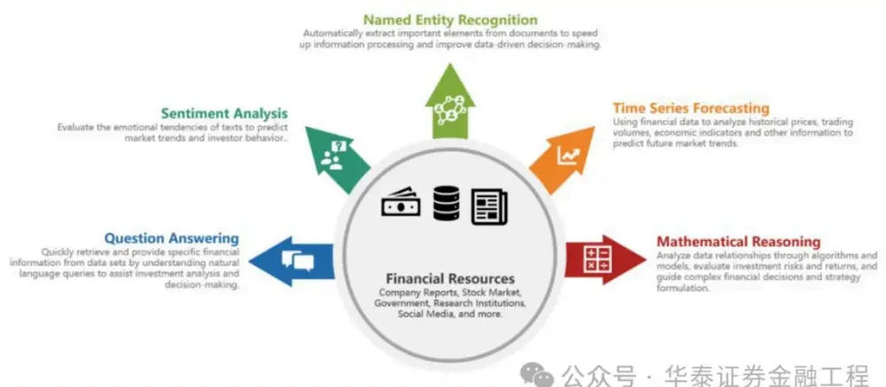

在大模型自身能力的基础上，合理的应用架构是提升大模型应用效果的必经之路，例如多智能体（Multi-Agent）架构。举例而言，Zhang et al.（2024）提出专为金融交易场景设计的大模型智能体架构FinAgent。FinAgent通过其多模态能力处理金融市场数值、文本和视觉数据在内的多模态数据，同时利用低层反思模块分析市场价格变动、高层反思模块评估历史交易决策，在融合专家指导与技术分析指标后实现最终的交易决策。从测试结果上看，FinAgent的交易盈利效果显著好于传统技术交易策略（MACD、KDJ&RSI等）和其他复杂算法（SAC、PPO、DQN、FinGPT和FinMem），显示出智能体架构加持下的大模型应用潜力。

图表2：FinAgent 架构
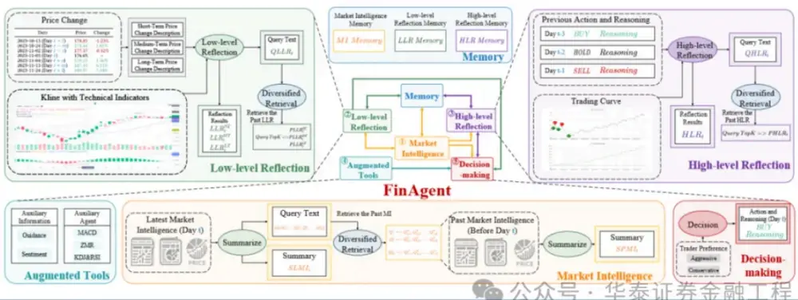

## 基于大模型的因子挖掘

因子挖掘在量化研究中占据核心地位，是为多因子模型补充Alpha源的重要途径。传统的因子挖掘主要有两种方案，一种是人工手动挖掘，另一种是算法自动挖掘。对于人工手动挖掘而言，量化研究员将其对市场的理解与直觉转化为因子表达式，进而捕捉Alpha，这一过程将会不断循环，依赖的是研究员的专业素养以及高昂的人力成本。对于算法自动挖掘，因子表达式将由算法生成，例如遗传规划在上百个算子与字段构成的探索空间中不断试错，以逐渐提升因子IC值等为优化目标，而这类方案的缺陷在于庞大探索空间带来的高昂算力成本，并且算法无法提供任何因子含义，可解释性往往受到诟病。

利用大模型进行因子挖掘或许是一种解决之道。在前期研究“GPT因子工厂”中，我们基于GPT+多智能体架构搭建了大模型驱动的因子挖掘框架，为大模型的因子挖掘能力提供证据支持。在GPT因子工厂中，三个智能体有序分工：FactorGPT负责因子表达式与因子释义生成，CodeGPT基于FactorGPT产出的因子表达式撰写因子计算代码，EvalGPT对因子回测结果进行评估并提出优化建议。在多智能体架构的加持下，我们完成了因子挖掘流程的拆解，使得GPT因子工厂的因子产出过程稳定且有效。

图表3：GPT因子工厂架构
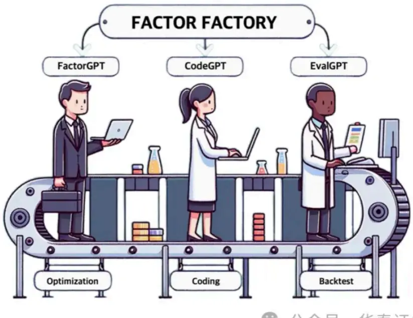

学界同样对基于大模型的因子挖掘进行了诸多探索，港科大和IDEA研究院等机构开发的Alpha-GPT是其中的代表。Alpha-GPT的设计理念是提供一个可交互的自动化因子挖掘框架，因此在其架构设计中，大模型发挥的作用在于将研究人员的思路转化为遗传规划算法参数，再由遗传规划算法进行因子挖掘，最后将表现较好的因子返回给研究人员。Alpha-GPT的优势在于既能将研究人员的想法融入到因子挖掘过程中，又能结合大模型与遗传算法的优势，大大节省人力成本。

Alpha-GPT 2.0 借 助 多 智 能 体 架 构 对 Alpha-GPT 进 行 了 全 面 升 级 。 Alpha-GPT 2.0 由 AlphaMining Agent，Alpha Modeling Agent和Alpha Analysis Agent构成，其中，Alpha MiningAgent负责根据市场数据进行因子挖掘，结合研究人员见解构建因子或进行因子增强，AlphaModeling Agent负责因子的机器学习建模、构建有效的Alpha信号，Alpha Analysis Agent则结合实时知识，对因子进行全面的投资组合分析和风险管理。

图表4: Alpha-GPT 与 Alpha-GPT 2.0 因子挖掘框架
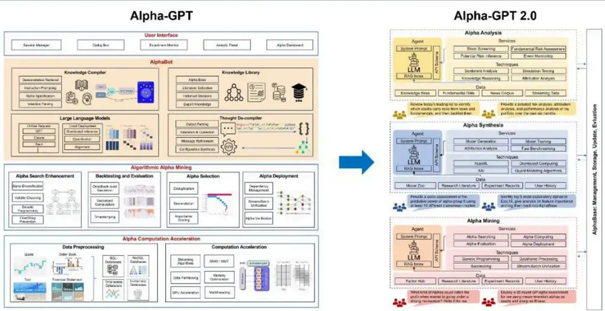

## 基本面与高频因子挖掘

尽管算法自动化因子挖掘相比于人工挖掘有诸多优势，但却鲜有针对基本面因子和高频因子的自动化因子挖掘，人工挖掘因子在这些场景下似乎更具优势。对于基本面因子挖掘而言，底层字段主要来源于各类财务报表，报表与指标间的勾稽关系较为复杂，传统算法在无法利用专业知识的前提下，难以构造具备逻辑性的基本面因子。对于高频因子而言，传统算法挖掘方案的困境在于难以在表达式中融入日频化采样，当前主流的高频因子挖掘方案实际是利用时序神经网络学习高频数据的隐含规律，直接预测未来股票收益，本质上已经脱离了公式化的传统因子挖掘方案，但神经网络“黑箱”问题仍然是难解之痛。

在前序研究“GPT因子工厂”的基础上，本文尝试继续使用大模型进行基本面因子与高频因子挖掘。对于基本面因子挖掘，我们筛选资产负债表、现金流量表、利润表中的部分财务指标作为底层字段，同时设计了基本面因子构造中常用的算子；对于高频因子挖掘，我们使用分钟频原始量价数据作为底层字段，同样也为高频因子构造了一批定制算子。除此之外，本文尝试分别利用GPT因子工厂产出的量价因子与高频因子构建指数增强策略，最终将经过LGBM模型合成后的量价因子与高频因子加权合成，构建最终的指数增强策略。

## 03 方法

本文主要探究“GPT因子工厂”在基本面与高频因子挖掘场景下的适用性。在应用架构设计层面，本文仍然遵循以往“GPT因子工厂”的多智能体架构：FactorGPT、CodeGPT与EvalGPT。核心改进在于字段与算子方面，基本面因子挖掘主要基于原始财务指标数据，高频因子挖掘主要基于分钟K线量价数据，算子则针对因子特性进行个性化设计及筛选。无论是基本面还是高频因子挖掘，所有步骤均由智能体自动执行，因子工厂将依据参数设定源源不断产出因子，同时将因子的表达式、含义、计算代码、回测结果以及优化建议保存至本地。

基本面因子挖掘

字段

基 本 面 因 子 版 GPT 因 子 工 厂 主 要 依 赖 于 Wind 数 据 源 中 的 AShareCashFlow 、AShareBalanceSheet和AShareIncome三张表，具体底层字段如下：

图表7：GPT因子工厂（基本面因子）底层字段-AShareBalanceSheet

| 字段 | 含义 | 字段 | 含义 |
| --- | --- | --- | --- |
| MONETARY_CAP | 货币资金 | TOT_CUR_ASSETS | 流动资产合计 |
| TRADABLE_FIN_ASSETS | 交易性金融资产 | TOT_NON_CUR_ASSETS | 非流动资产合计 |
| NOTES_RCV | 应收票据 | OTH_CUR_ASSETS | 其他流动资产 |
| ACCT_RCV | 应收账款 | OTH_NON_CUR_ASSETS | 其他非流动资产 |
| OTH_RCV | 其他应收款 | TOT_ASSETS | 资产总计 |
| INT_RCV | 应收利息 | ST_BORROW | 短期借款 |
| INVENTORIES | 存货 | NOTES_PAYABLE | 应付票据 |
| FIN_ASSETS_AVAIL_FOR_SALE | 可供出售金融资产 | INT_PAYABLE | 应付利息 |
| RED MONETARY CAP FOR SALE | 买入返售金融资产 | ST_BONDS_PAYABLE | 应付短期债券 |
| HELD_TO_MTY_INVEST | 持有至到期投资 | ST_FINANCING_PAYABLE | 应付短期融资款 |
| LONG_TERM_EQY_INVEST | 长期股权投资 | NON_CUR_LIAB_DUE_WITHIN_1Y | 一年内到期的非流动负债 |
| INVEST_REAL_ESTATE | 投资性房地产 | LT_BORROW | 长期借款 |
| GOODWILL | 商誉 | BONDS_PAYABLE | 应付债券 |
| DEFERRED_TAX_ASSETS | 递延所得税资产 | LT_PAYABLE | 长期应付款 |
| PREPAY | 预付款项 | FIN_ASSETS_FAIR_VALUE | 以公允价值计量且其变动计入其他综合收 益的金融资产 |
| FIX_ASSETS | 固定资产 | EMPL_BEN_PAYABLE | 应付职工薪酬 |
| CONST_IN_PROG | 在建工程 | OTH_PAYABLE | 其他应付款 |
| PROJ_MATL | 工程物资 | TRADABLE_FIN_LIAB | 交易性金融负债 |
| INTANG_ASSETS | 无形资产 | DEFERRED_TAX_LIAB | 递延所得税负债 |
| OIL_AND_NATURAL_GAS_ASSETS | 油气资产 | DVD_PAYABLE | 应付股利 |
| DEBT_INVESTMENT | 债权投资 | ACCT_PAYABLE | 应付账款 |
| OTHER_DEBT_INVESTMENT | 其他债权投资 | TOT_CUR_LIAB | 流动负债合计 |
| OTHER_EQUITY_INVESTMENT | 其他权益工具投资 | TOT_NON_CUR_LIAB | 非流动负债合计 |
| OTHER_ILLIQUIDFINANCIAL_ASSETS 其他非流动金融资产 |  | TOT_LIAB | 负债合计 |
| FIN_ASSETS_FAIR_VALUE | 以公允价值计量且其变动计入其他综合收MINORITY_INT |  | 少数股东权益 |
| LONG_TERM_REC | 益的金融资产 |  |  |
| CONTRACTUAL_ASSETS | 长期应收款 | TOT_SHRHLDR_EQY_EXCL_MIN_INT 股东权益合计(不含少数股东权益) |  |
| SURPLUS_RSRV | 合同资产 |  | TOT_SHRHLDR_EQY_INCL_MIN_INT 股东权益合计(含少数股东权益) |
| TAXES_SURCHARGES_PAYABLE | 盈余公积金 | TOT_LIAB_SHRHLDR_EQY 公众号 CAP_STK | 负债及股东权益总计 华泰证券金融工程 |

图表8：GPT因子工厂（基本面因子）底层字段-ASharelncome

| 字段 | 含义 | 字段 | 含义 |
| --- | --- | --- | --- |
| NET_PROFIT_INCL_MIN_INT_INC | 净利润(含少数股东损益) | LESS_SELLING_DIST_EXP | 减：销售费用 |
| NET_PROFIT_EXCL_MIN_INT_INC | 净利润(不含少数股东损益) | LESS_GERL_ADMIN_EXP | 减：管理费用 |
| EBIT | 息税前利润 | LESS_IMPAIR_LOSS_ASSETS | 减：资产减值损失 |
| EBITDA | 息税折旧摊销前利润 | OTHER_INCOME | 其他收益 |
| TOT_PROFIT | 利润总额 | LESS_FIN_EXP | 减：财务费用 |
| INC_TAX | 所得税 | STMNOTE_FINEXP | 财务费用：利息费用 |
| OPER_REV | 营业收入 | FIN_EXP_INT_INC | 财务费用：利息收入 |
| LESS_TAXES_SURCHARGES_OPS | 减：营业税金及附加 | PLUS_NET_INVEST_INC | 投资收益 |
| TOT_OPER_REV | 营业总收入 | OPER_PROFIT | 营业利润 |
| LESS_OPER_COST | 减：营业成本 | PLUS_NON_OPER_REV | 营业外收入 |
| LESS_INT_EXP | 减：利息支出 | NET_PROFIT_AFTER_DED_NR_LP 公众号 | 扣非净利润 证券金融工程 |

## 算子

基本面因子版GPT因子工厂主要依赖于以下算子：

图表9：基本面因子算子列表

| 名称 | 定义 |
| --- | --- |
| X：以下函数中自变量 | X 是 DataFrame 格式的矩阵 |
| 元素算子 |  |
| YOY (X) | 对X进行同比处理 |
| QOQ(X) | 对X进行环比处理 |
| Inv(X) | 返回X中每个元素的倒数（1除以每个元素） |
| Abs(X) | 返回X中每个元素的绝对值 |
| Sign(X) | 返回X中每个元素的符号（1为正，0为0，-1为负） |
| Log(X) | 返回X中每个元素的自然对数 |
| Exp(X) | 返回X中每个元素的指数函数值 |
| Sqrt(X) | 返回X中每个元素的平方根 |
| Pow(X, y) | 返回X中每个元素的幂运算值 |
| Delay(X, d) | 返回过去第d个季度的X值 |
| 截面算子 |  |
| CS_Rank(X) | 对X进行截面排序 |
| CS_Indus_Rank(X, indus_belong) | 对X进行行业截面排序 |
| 关系算子 |  |
| Add(X,Y) | 将X,Y逐元素相加并返回结果 |
| Sub(X,Y) | 从 X 中逐元素减去Y 并返回结果 |
| Mul(X,Y) | 将X和Y逐元素相乘并返回结果 |
| Div(X,Y) | 将X逐元素除以Y 并返回结果 |
| Rank_Add(X,Y) | 返回X中元素的分位数和Y中对应元素的分位数的和 |
| Rank_Sub(X,Y) | 返回X中元素的分位数和Y中对应元素的分位数的差 |
| Rank_Mul(X,Y) | 返回X中元素的分位数和Y中对应元素的分位数的乘积 |
| Rank_Div(X,Y) | 用X中元素的分位数除以Y中对应元素的分位数并返回结果 |
| 时序算子 |  |
| TS_Corr(X,Y,d) | 过去d季度X值构成的时序数列和Y值构成的时序数列的相关系数 |
| TS_Std(X,d) | 过去d季度X值的标准差 |
| TS_Min(X,d) | 过去d季度X值构成的时序数列中最小值 |
| TS_Max(X,d) | 过去d季度X值构成的时序数列中最大值 |
| TS_Mean(X,d) | 过去d季度X值构成的时序数列的平均值 |
| TS_Sum(X,d) | 过去d季度X值构成的时序数列之和公众号。华泰证券金融工程 |

## 高频因子挖掘

## 字段

高频因子版GPT因子工厂依赖于以下底层字段：

图表10：GPT因子工厂（高频因子）底层字段

| 字段 | 含义 |
| --- | --- |
| OPEN | 开盘价 |
| HIGH | 最高价 |
| LOW | 最低价 |
| CLOSE | 收盘价 |
| AMOUNT | 成交额 |
| VOLUME | 成交量 |
| ITEMS | 公众号·华泰证券金融工程 成交笔数 |

## 算子

高频因子版GPT因子工厂依赖于以下算子：

图表11：高频因子挖掘算子列表

| 名称 | 定义 |
| --- | --- |
| X：以下函数中自变量 元素算子 | X 是 DataFrame 格式的矩阵 |
| Abs(X) | 返回X中每个元素的绝对值 |
| Sign(X) | 返回X中每个元素的符号（1为正，0为0，-1为负） |
| Log(X) | 返回X中每个元素的自然对数 |
| Exp(X) | 返回X中每个元素的指数函数值 |
| Sqrt(X) | 返回X中每个元素的平方根 |
| 关系算子 |  |
| Add(X,Y) | 将X和Y逐元素相加并返回结果 |
| Sub(X,Y) | 从X 中逐元素减去Y并返回结果 |
| Mul(X,Y) | 将X和Y逐元素相乘并返回结果 |
| Div(X,Y) | 将X逐元素除以Y并返回结果 |
| 聚合算子 |  |
| Agg_Std(X) | 返回序列X的标准差 |
| Agg_Var(X) | 返回序列X的方差 |
| Agg_Mean(X) | 返回序列X的均值 |
| Agg_Median(X) | 返回序列X的中位数 |
| Agg_Sum(X) | 返回序列X的加和 |
| Agg_Max(X) | 返回序列X的最大值 |
| Agg_Min(X) | 返回序列X的最小值 |
| Agg_Argmax(X) | 返回序列X的最大值的索引值 |
| Agg_Argmin(X) | 返回序列X的最小值的索引值 |
| Agg_Skew(X) | 返回序列X的偏度 |
| Agg_Kurt(X) | 返回序列X的峰度 |
| Agg_Corr(X, Y) | 返回序列X与Y的相关系数 |
| Agg_Cov(X, Y) | 返回序列X与Y的协方差 |
| Agg_Quantile(X, q) | 返回序列 X的 q 分位数 |
| 聚合展开算子 |  |
| Agg_Explode_Return(X, m=1) | 返回序列X的分钟收益率，m默认为1 |
| Agg_Explode_Cumsum(X) | 返回序列X的累加序列 |
| Agg_Explode_Cumprod(X) | 返回序列X的累乘序列 |
| Agg_Explode_Cummin(X) | 返回序列X的累加序列滚动最小值 |
| Agg_Explode_Cummax(X) | 返回序列X的累加序列滚动最大值 |
| Agg_Explode_Ewmmean(X, half_life=10) | 返回序列X的指数加权移动平均，half_life默认为10 |
| Agg_Explode_Ewmstd(X, half_life=10) | 返回序列X的指数加权移动标准差，half life默认为 10 |
| Agg_Explode_Ewmvar(X, half_life=10) | 返回序列X的指数加权移动方差，half life默认为10 |
| Agg_Explode_Rollingmean(X, window_size=10) | 返回序列 X 的滚动均值，window size 默认为 10 |
| Agg_Explode_Rollingstd(X, window_size=10) | 返回序列 X 的滚动标准差，window size 默认为 10 |
| Agg_Explode_Rollingvar(X, window_size=10) | 返回序列 X的滚动方差，window_size 默认为 10 |
| Agg_Explode_Rollingskew(X, window_size=10) | 返回序列 X的滚动偏度，window_size 默认为 10 |
| Agg_Explode_Rollingmin(X, window_size=10) | 返回序列X的滚动最小值，window_size 默认为10 |
| Agg_Explode_Rollingmax(X, window_size=10) | 返回序列X的滚动最大值，window_size 默认为 10 |
| Agg_Explode_Rollingsum(X, window_size=10) | 返回序列 X的滚动求和，window_size 默认为 10 |
| Agg_Explode_Rollingquantile(X, window_size=10, q=0.25) | 返回序列 X 的滚动 q 分位数，window_size 默认为 10，q 默 |
| 采样算子 | 认为0.25 |

Tp_Sample (X, h=15, m=0)
返回序列X的特定时点采样华泰证券金融工程

## 选股组合构建

为检验GPT因子工厂产出因子的实用性，我们基于前期报告《GPT因子工厂：多智能体与因子挖掘》（20240220）挖掘的量价因子与本期报告挖掘的高频因子构建指数增强选股组合。通过将因子输入LightGBM模型中进行训练，利用训练完成的模型预测股票未来收益，最后基于股票预测收益构建选股组合。模型训练与选股组合构建的参数如下表所示。

图表12：选股模型构建方法

| 步骤 | 参数 | 参数值 |
| --- | --- | --- |
| 构建股票池 | 股票池 | 全A股；剔除上市未满63个交易日个股，剔除ST、*ST、退市整理期个股 |
| 构建数据集 | 特征 | T日23 个高频因子/T日 50 个量价因子 |
|  | 标签 | T+11 日相对于T+1 日收盘价收益率 |
| 因子预处理 | 特征 | 5 倍MAD 缩尾；zScore 标准化；缺失值填为0；不做中性化 |
|  | 标签 | 剔除缺失值；截面排序数标准化；行业市值中性化 |
| 训练流程 | 测试集完整区间 | 20161130~20240920 |
|  | 训练、验证、测试集划分 | 训练集252*3个交易日，验证集126个交易日，测试集126个交易日 |
|  | 特殊处理 | 剔除训练集、验证集最后10个交易日样本，防止信息泄露 |
|  | 损失函数 | mse |
|  | 调参方式 | FLAML |
|  | 随机数种子点 | 5个随机数种子点取平均 |
| 构建组合 | 基准 | 中证 500 和中证 1000 指数 |
|  | 优化目标 | 最大化预期收益 |
|  | 组合仓位 | 1 |
|  | 个股权重下限 | 0 |
|  | 个股偏离权重约束 | [-1%, 1%] |
|  | 行业偏离权重约束 | [-2%, 2%] |
|  | 风格偏离标准差约束 | [-0.2, 0.2] |
|  | 风格因子 | 对数流通市值 |
|  | 调仓周期 | 每5个交易日 |
|  | 单次调仓单边换手率上限 | 20% |
|  | 成分股权重约束 | 80% |
| 回测 | 单边费率 | 0.0015 |
|  | 交易价格 | vwap |
|  | 特殊处理 | 停牌不买入/卖出；一字板涨停不买入；一字板跌停不卖出；其余可交易股票重新 |
|  |  | 分配权重 公众号·华泰证券金融工程 |

## 04 结果

在GPT因子工厂2.0的测试中，我们共产出30个基本面因子和30个高频因子。对于FactorGPT而言，我们使用的模型为gpt-4-1106-preview，与前期报告GPT因子工厂中的一致，而其他智能体均改为gpt-4o，这意味着对于产出的因子而言，其样本外区间为2023年11月6日之后，保留较长的样本外区间能够提供因子及策略效果的观察窗口，确保结论的可靠性。此次测试中我们仅对因子进行初次挖掘，未进行因子优化循环，一方面尽可能反映大模型直接产出因子的能力，另一方面为避免可能的未来信息。

## 基本面因子挖掘实例

以下展示基本面因子版GPT因子工厂2.0的产出实例。图表13-15展示GPT因子工厂2.0挖掘出的一个基本面因子实例：从因子释义看，该因子被GPT命名为“短期偿债能力因子”，因子同时考虑企业货币资金同比增长排名和短期负债排名，并将二者相除，试图反映企业流动性管理水平，因子释义与因子表达式相符；从累计周度IC和RankIC看，因子表现尚可，正向趋势较为明显；从分层回测结果上看，分层1年化收益率、夏普比率和年化超额收益率优于其他分层，因子总体分层效果在可接受范围内。

图表14：GPT因子工厂2.0产出的基本面因子实例累计周度IC和RankIC
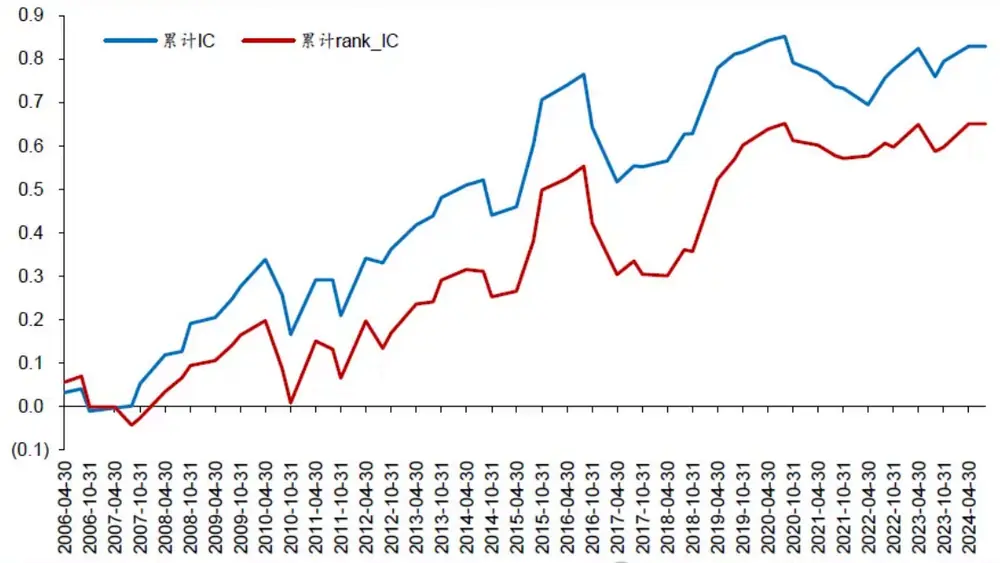
公众号：华泰证券金融工程

图表15：GPT因子工厂2.0产出的基本面因子实例分层回测结果实例

| 年化超额收益超额收益年化 超额收益最大 相对基准盈亏 |  |  |  |  |  |  |  |  |  |  |  |
| --- | --- | --- | --- | --- | --- | --- | --- | --- | --- | --- | --- |
|  | 年化收益率 | 年化波动率 | 夏普比率 | 最大回撤 | 率 | 波动率 | 信息比率 | 回撤 | 调仓胜率 | 比0.681.56 |  |
| 分层1 | 16.09% | 29.23% | 0.55 | -67.03 | % 1.76% | 4.73% | 0.37 | -14.87% | 67.86% |  |  |
| 分层2 | 14.80% | 28.85% | 0.51 | -69.52% | 0.60% | 2.57% | 0.23 | -9.07% | 46.43% |  |  |
| 分层3 | 13.15% | 28.78% | 0.46 | -70.10% | -0.89% | 3.19% | -0.28 | -23.71% | 48.21% | 0.88 |  |
| 分层4分层5 | 13.61% | 28.49% | 0.48 | -69.63% | -0.55% | 2.88% | -0.19 | -20.10% | 48.21% | 0.98 |  |
|  |  | 12.95% | 28.29% | 0.46 | -69.66 | % -1.19% | 2.80% | -0.42 | -21.68% | 35.71% | 0.99 |
| 基准 | 14.18% | 28.54% | 0.50 | -69.18% |  |  | 华专证 |  | 券合融工程 |  |  |

## 基本面因子挖掘效果

我们对30个基本面因子进行总体效果评估。图表16与17展示所有基本面因子的累计周度IC和累计RankIC，总体而言，大部分基本面因子的周度IC或RankIC累计趋势较为明确，少数因子累计值趋近于0或存在较大波动，局部看，不乏累计周度IC和RankIC持续单调且波动较小的优质基本面因子。

图表16：GPT因子工厂2.0产出的基本面因子累计周度IC
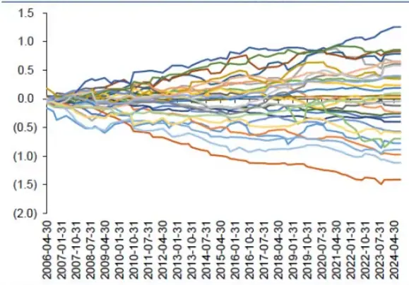

图表17：GPT因子工厂2.0产出的基本面因子累计周度 RankIC
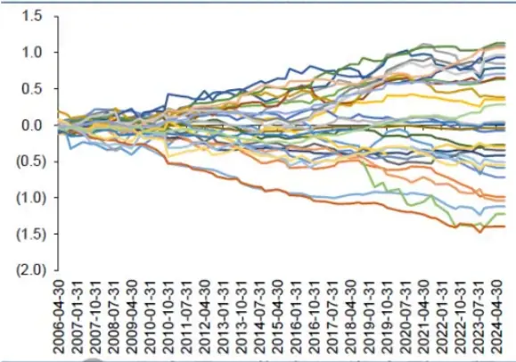
注：回测区间：2006/0430至2024-0912泰润为中存全往融程

从相关性上看，GPT因子工厂2.0产出的基本面因子相关性普遍偏低。因子相关系数最大值为0.91，最小值为-0.94，相关系数为正的系数均值为0.10，相关系数为负的系数均值为-0.09，所有相关系数绝对值的均值为0.10。

图表18：GPT因子工厂2.0产出的基本面因子相关系数矩阵
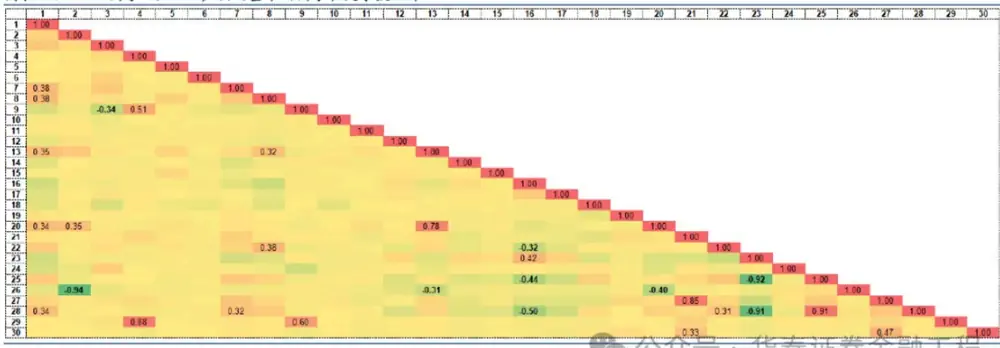

## 高频因子挖掘实例

对于高频因子挖掘，我们同样展示一个GPT因子工厂2.0的产出实例。图表19-21是一个高频因子实例：从因子释义看，该因子被GPT命名为“高频价格量相关波动因子”，通过计算收盘价滚动波动性与成交量滚动波动性间的相关系数得到因子值，大模型认为价格与成交量之间的短期相关性反映了市场的情绪变动；从累计周度IC和RankIC看，因子方向为负向，周度IC与RankIC均较为稳定；从分层回测结果上看，分层5各项指标均优于其他分层，因子总体分层效果较优。

图表19：GPT因子工厂2.0产出的高频因子实例

| 因子名称（FactorGPT） | 因子释义（FactorGPT） 该因子测量股票收盘价波动性与成交量波动性在短期内的相关性。通过计算10分钟窗口 | 因子表达式（FactorGPT） |
| --- | --- | --- |
|  | 的滚动标准差，我们获取到价格和成交量的波动情况，并通过关系算子Agg Corr分析它们 之间的短期相互关系。 1.**收盘价的滚动波动性(Agg_Explode_Rollingstd(CLOSE， window_size=10))**: |  |
|  | 捕提每10分钟收盘价的波动情况，反映价格在此期间内的波动性。 2.**成交量的滚动波动性(Agg Explode_Rollingstd(VOLUME, window_size=10))**: |  |
|  | 捕捉每10分钟成交量的波动情况，反映市场交易活跃程度。 |  |
|  | 3. **收盘价与成交量的短期相关性(Agg Corr(...))**: |  |
| 高频价格量相关波动因子 | 通过计算收盘价和成交量波动的相关性，了解在短期内价格变化与交易活跃度之间的相 | Agg_Corr(Agg_Explode_Rollingstd(CLO |
|  | 互影响。 | SE, window_size=10), |
|  | 4. **整体思路**： | Agg_Explode_Rollingstd(VOLUME, |
|  | 思考股票的波动性不仅仅体现在价格上，还体现在交易量上。市场上对于某一股票的需 | window_size=10)) |
|  | 求和供给变动会同时影响这两个因素。因此，价格与成交量的波动性相关性可能揭示出市场 |  |
|  | 对该股票的情绪和预期。 |  |
|  | 5. **实际意义**. |  |
|  | 高频交易中，了解价格与成交量之间的短期相关性是十分重要的。相关性的不断变化可 |  |
|  | 能预示着市场动态及潜在交易机会。如相关性升高，则可能表明市场情绪对价格变动反应较 |  |
|  | 为敏感，适合于实施趋势跟踪或动量策略：如相关性降低.市场情绪可能较为沉稳，适合采用 |  |
|  | 相对价值或平均回归策略。这种方法有助于量化交易者实时监测和调整策略，以适应市场变 | 公众号·华泰证券金融工程 |

图表20：GPT因子工厂 2.0产出的高频因子实例累计周度IC和RankIC 实例
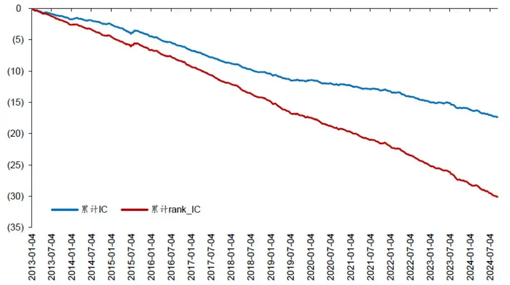
公众号·华泰证券金融工程

图表21：GPT因子工厂2.0产出的高频因子实例分层回测结果实例

| 年化超额收益超额收益年化 超额收益最大 相对基准盈亏 |  |  |  |  |  |  |  |  |  |  |  |  |
| --- | --- | --- | --- | --- | --- | --- | --- | --- | --- | --- | --- | --- |
|  | 年化收益率 | 年化波动率 | 夏普比率 | 最大回撤 | 率 | 波动率 | 信息比率 | 回撤 | 比48.08% 0.910.9758.93% 1.02 |  |  |  |
| 分层1 |  |  |  |  |  |  |  |  |  |  |  |  |
|  | -4.95% | 28.04% | -0.18 | -83.72% | -6.68% | 11.75% | -0.57 | -65.11% |  |  | 48.08% |  |
| 分层2 |  | 6.40% | 28.06% | 0.23 | -62.88% | 4.55% | 11.13% | 0.41 |  |  | -35.57% | 55.09% |
| 分层3 | 13.26% | 27.76% | 0.48 | -56.12% | 11.23% | 10.82% | 1.04 | -22.34% |  |  |  |  |
| 分层4 |  | 16.13% | 27.35% | 0.59 | -54.03% | 13.96% | 10.57% | 1.32 | -21.25% | 62.60% |  |  |
| 分层5 | 22.47% | 26.30% | 0.85 | -54.29% | 19.89% | 10.09% | 1.97 | -19.59% | 1.08 |  |  |  |
| 基准 | 2.66% | 22.24% | 0.12 | -57.85% |  |  | 公入号 化专订券全融工程 |  |  |  |  |  |

## 高频因子挖掘效果

总体效果上，GPT因子工厂在高频因子挖掘上展现出较大的潜力。从累计周度IC和RankIC的结果中看，因子的累计周度IC与RankIC趋势均较为明确，部分因子展现出持续强劲的IC和RankIC累计趋势，表明因子效果较为稳定。值得强调的是，部分因子的累计曲线中间部分为直线且后续存在缺失值，原因可能在于因子计算过程中出现极端值导致长期空值。

图表22：GPT因子工厂 2.0产出的高频因子累计周度IC
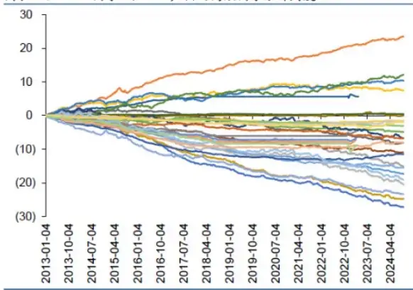
回测区间：2013-01-04至2024-09-20，基准为中证全指

图表23：GPT 因子工厂 2.0 产出的高频因子累计周度 RankIC
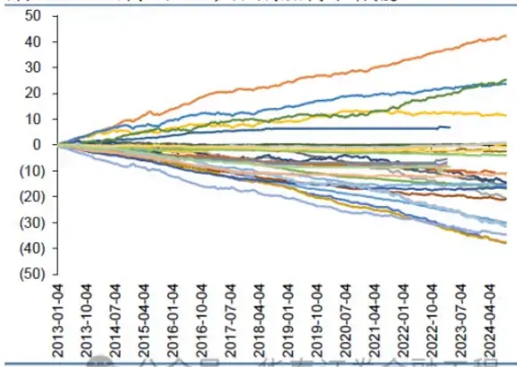
回测区间：2013-01-04至2024-09-20，基准有冲封全金融出

从因子相关性上看，GPT因子工厂2.0产出的高频因子相关性同样普遍偏低。将周度IC与RankIC累计曲线异常的因子剔除，我们保留剩下的23个因子进行相关性检验：因子相关系数最大值为0.97，最小值为-0.86，相关系数为正的系数均值为0.20，相关系数为负的系数均值为-0.13，所有相关系数绝对值的均值为0.17。

图表24：GPT因子工厂2.0产出的高频因子相关性
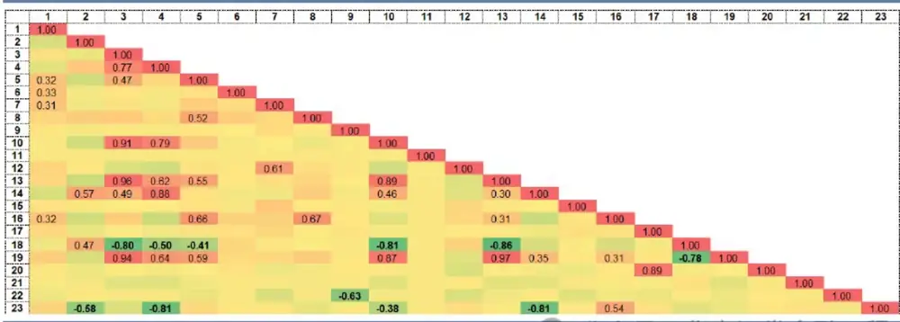
公众号：华泰证券金融工程

## 基于GPT因子工厂的指数增强策略实践

作为因子挖掘的一种手段，GPT因子工厂并不直接输出投资组合或量化策略。为验证GPT因子工厂因子产出的实际效果，我们将因子输入机器学习模型，基于模型预测结果构建指数增强策略。由于基本面因子频率较低，较难与量价因子和高频因子混合，这里我们仅对量价因子和高频因子进行测试。

## 基于合成量价因子的指数增强策略

对于前期报告《GPT因子工厂：多智能体与因子挖掘》（20240220）中产出的量价因子，我们选取首次挖掘的50个因子，不进行额外筛选，直接输入LGBM模型中进行训练，具体训练参数请参考图表12。

经LGBM模型合成后的因子TOP层相对净值及累计双周度IC和RankIC如图表25和26，因子TOP层在样本外并未衰减，双周度IC与RankIC保持稳定。

图表25：LGBM 合成量价因子 TOP 层相对净值
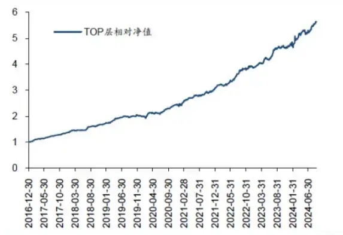

图表26： LGBM 合成量价因子累计双周度 IC 与 RankIC
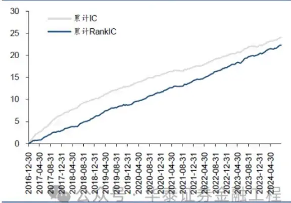

基于LGBM合成量价因子构建的沪深300指数增强组合策略净值与绩效如下：

图表27：基于LGBM合成量价因子的指数增强组合策略净值（基准为沪深300指数）
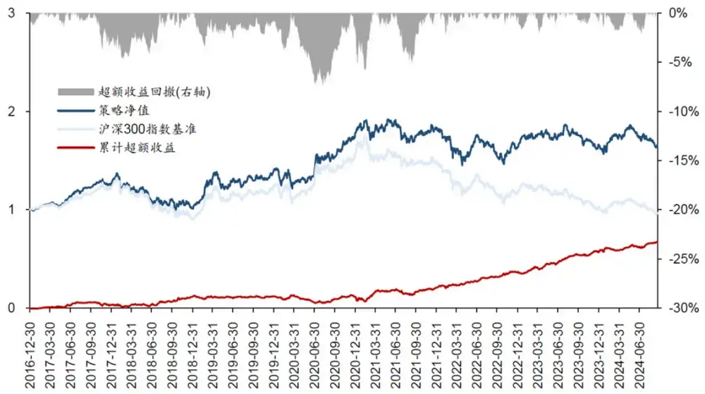

图表28：基于LGBM合成量价因子的指数增强组合策略回测绩效（基准为沪深300指数）

|  | 年化收益 | 年化波动 |  |  | Calmar 比 |  | 年化超额 年化跟踪 |  | 超额收益 超额收益 |  | 相对基准年化双边 |  |
| --- | --- | --- | --- | --- | --- | --- | --- | --- | --- | --- | --- | --- |
|  |  | 率 | 率 夏普比率 | 最大回撤 | 率 | 收益率 | 误差 | 信息比率 | 最大回撤Calmar 比率 |  | 月胜率 换手率 |  |
| 合成量价因子 | 7.06% | 16.89% | 0.42 | 27.65% | 0.26 | 7.18% | 4.69% | 1.53 | 7.42% | 0.97 | 65.59% | 11.94 |

基于LGBM合成量价因子构建的中证500指数增强组合策略净值与绩效如下：

图表29：基于LGBM合成量价因子的指数增强组合策略净值（基准为中证500指数）
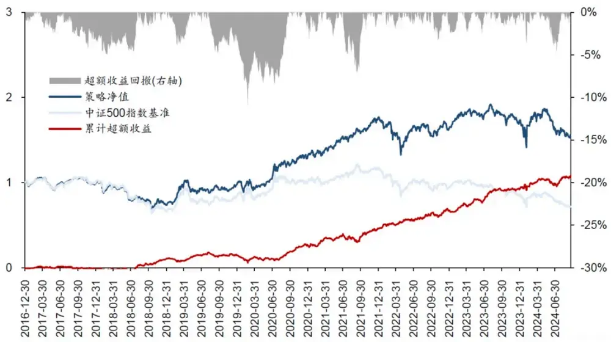

图表30：基于LGBM合成量价因子的指数增强组合策略回测绩效（基准为中证500指数）

|  | 年化收益 | 年化波动 |  |  | Calmar 比 年化超额 |  | 年化跟踪 |  | 超额收益 | 超额收益 |  |  | 相对基准年化双边 |
| --- | --- | --- | --- | --- | --- | --- | --- | --- | --- | --- | --- | --- | --- |
|  |  | 率 | 率 | 夏普比率 | 最大回撤 | 率 | 收益率 | 误差 信息比率 |  | 最大回撤Calmar 比率 |  | 月胜率 换手率 |  |
| 合成量价因子 | 6.09% | 19.12% | 0.32 | 36.72% |  | 0.17 | 10.34% | 6.41% | 1.61 | 10.86% | 0.95 | 66.67% | 20.95 |

基于LGBM合成量价因子构建的中证1000指数增强组合策略净值与绩效如下：

图表31：基于LGBM合成量价因子的指数增强组合策略净值（基准为中证1000指数）
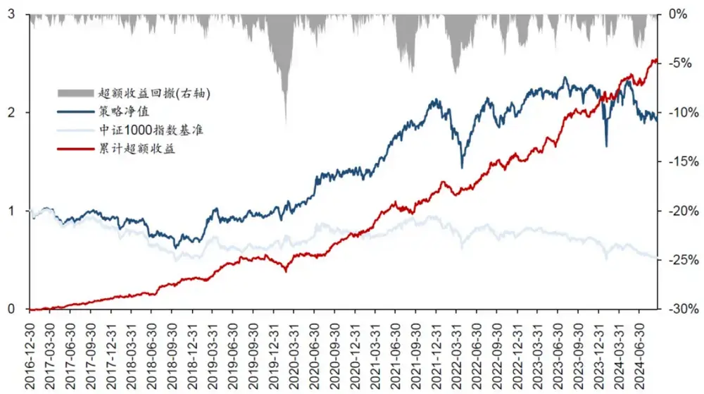

图表32：基于LGBM合成量价因子的指数增强组合策略回测绩效（基准为中证1000指数）

|  | 年化收益 | 年化波动 |  | Calmar 比 |  | 年化超额 | 年化跟踪 |  | 超额收益 | 超额收益 |  | 相对基准年化双边 |
| --- | --- | --- | --- | --- | --- | --- | --- | --- | --- | --- | --- | --- |
|  |  |  |  | 夏普比率 | 最大回撤 |  | 收益率 | 信息比率 |  | 最大回撒Calmar 比率 | 月胜率 换手率 |  |
| 合成量价因子 | 率 9.38% | 率 21.33% |  |  |  | 率 |  | 误差 |  |  |  |  |
|  |  |  | 0.44 | 40.13% | 0.23 | 18.50% | 7.10% | 2.61 | 11.41% | 1.62 | 79.57% | 20.86 |

## 基于合成高频因子的指数增强策略

对于GPT因子工厂2.0产出的高频因子，我们选取前文中保留的23个因子，同样不再进行额外筛选，直接输入LGBM模型中进行训练，具体训练参数请参考图表12。经LGBM模型合成后的因子TOP层相对净值及累计双周度IC和RankIC如图表33和34。

图表33：LGBM 合成高频因子 TOP 层相对净值
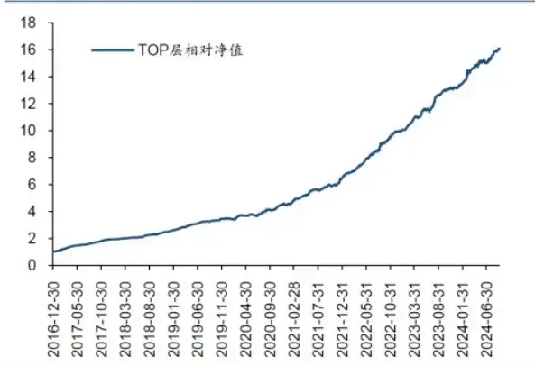

图表34：LGBM 合成高频因子累计双周度 IC 与 RankIC
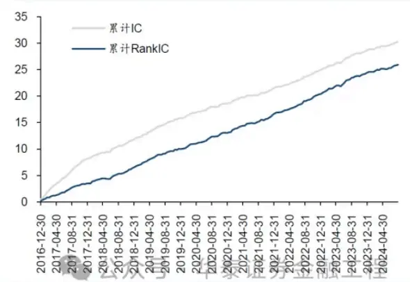

基于LGBM合成高频因子构建的沪深300指数增强组合策略净值与绩效如下：

图表35：基于LGBM合成高频因子的指数增强组合策略净值（基准为沪深300指数）
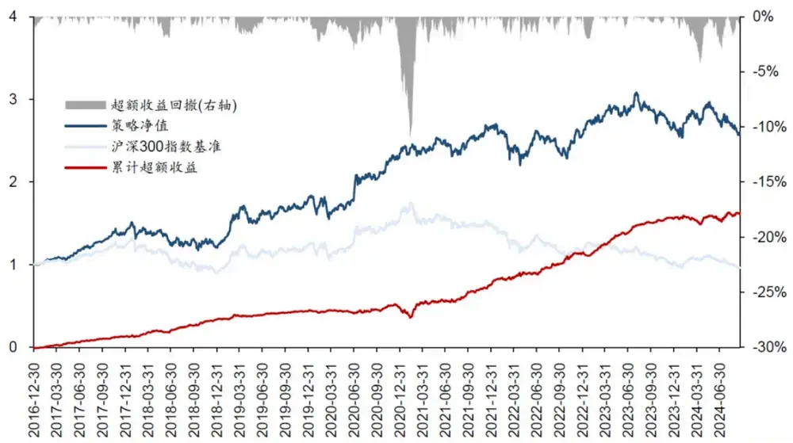

图表36：基于LGBM合成高频因子的指数增强组合策略回测绩效（基准为沪深 300 指数）

|  | 年化收益 | 年化波动 |  |  | Calmar 比 年化超额 |  |  | 年化跟踪 |  | 超额收益 超额收益 相对基准年化双边 |  |  |
| --- | --- | --- | --- | --- | --- | --- | --- | --- | --- | --- | --- | --- |
|  |  | 率 | 率 夏普比率 | 最大回撤 |  | 率 收益率 | 误差 | 信息比率 | 最大回撤Calmar 比率 |  | 月胜率 | 换手率 |
| 合成量价因子 | 13.67% | 16.91% | 0.81 | 22.72% | 0.60 | 13.78% | 5.05% | 2.73 | 10.98% | 1.25 | 78.49% | 11.76 |

基于LGBM合成高频因子构建的中证500指数增强组合策略净值与绩效如下：

图表37：基于LGBM 合成高频因子的指数增强组合策略净值（基准为中证500 指数）
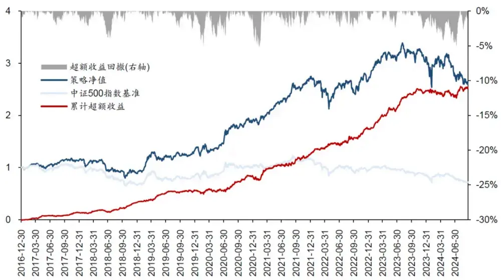

图表38：基于LGBM合成高频因子的指数增强组合策略回测绩效（基准为中证500 指数）

|  | 年化收益 | 年化波动 |  |  | Calmar 比 |  | 年化超额 年化跟踪 |  | 超额收益 |  | 超额收益 相对基准年化双边 |  |
| --- | --- | --- | --- | --- | --- | --- | --- | --- | --- | --- | --- | --- |
|  |  | 率 | 率 夏普比率 | 最大回撤 |  | 率 收益率 | 误差 | 信息比率 | 最大回撤 Calmar 比率 |  | 月胜率 换手率 |  |
| 合成高频因子 | 13.79% | 19.50% | 0.71 | 34.06% | 0.40 | 18.40% | 6.86% | 2.68 | 7.86% | 2.34 | 74.19% | 20.92 |

基于LGBM合成高频因子构建的中证1000指数增强组合策略净值与绩效如下：

图表39：基于LGBM合成高频因子的指数增强组合策略净值（基准为中证1000指数）
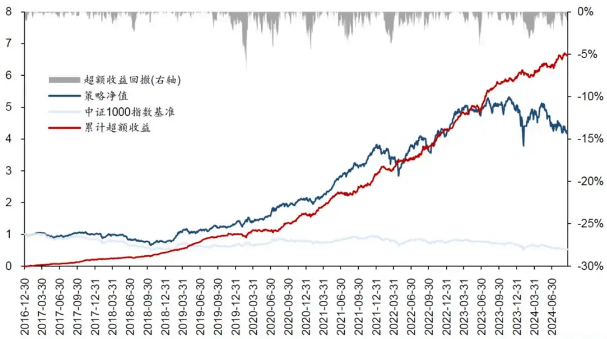

图表40：基于LGBM 合成高频因子的指数增强组合策略回测绩效（基准为中证1000 指数）

|  | 年化收益 | 年化波动 |  |  | Calmar 比 年化超额 |  | 年化跟踪 |  | 超额收益 | 超额收益 相对基准年化双边 |  |  |
| --- | --- | --- | --- | --- | --- | --- | --- | --- | --- | --- | --- | --- |
|  |  | 率 | 率 夏普比率 | 最大回撤 | 率 | 收益率 | 误差 | 信息比率 |  | 最大回撤Calmar 比率 | 月胜率 | 换手率 |
| 合成高频因子 | 21.33% | 21.02% | 1.01 | 39.21% | 0.54 | 31.32% | 7.46% | 4.20 | 6.57% | 4.77 | 86.02% | 20.61 |

## 基于量价高频合并因子的指数增强策略

我们将经过LGBM合成后的量价因子与高频因子按1:4的权重合并，形成量价高频合并因子，基于该因子构建分别构建沪深300、中证500与中证1000指数增强策略。基于量价高频合并因子构建的沪深300指数增强组合策略净值与绩效如下：

图表41：基于量价高频合并因子的指数增强组合策略净值（基准为沪深300指数）
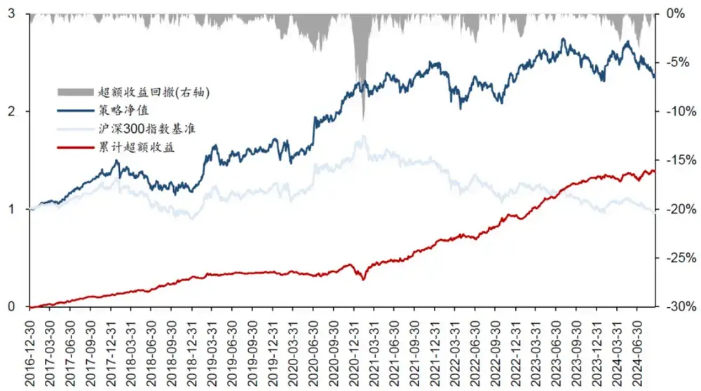

图表42：基于量价高频合并因子指数增强组合逐月超额收益（基准为沪深300指数）

| 1月 2月 3月 |  |  |  | 4月 5月 |  | 6月 | 7月 | 8月 | 9月 10月 |  | 11月 | 12月 | 年超额收益 |
| --- | --- | --- | --- | --- | --- | --- | --- | --- | --- | --- | --- | --- | --- |
| 2017年 | 0.0% | 1.6% | 1.4% | 0.6% | 0.7% | 1.0% | 2.2% | 1.0% | 1.5% | -0.5% | 1.4% | 0.6% | 12.0% |
| 2018年 | 1.3% | 0.8% | 1.3% | 0.8% | -0.5% | 1.0% | 2.5% | 1.3% | 0.9% | 3.2% | 0.7% | 1.6% | 15.9% |
| 2019年 | 0.1% | 0.4% | 1.6% | 0.1% | 1.1% | -0.1% | 0.8% | -0.8% | 0.5% | 0.2% | 0.9% | -0.5% | 4.2% |
| 2020年 | -0.7% | -0.7% | 2.0% | -1.7% | -0.2% | -1.5% | 0.4% | 1.0% | 2.2% | 1.8% | 2.7% | -1.9% | 3.1% |
| 2021年 | -3.5% | 1.9% | 5.0% | 0.4% | 1.0% | 0.1% | 1.3% | 0.6% | 4.6% | 0.5% | 2.3% | 1.9% | 17.0% |
| 2022年 | 3.5% | -0.7% | 1.3% | 1.0% | 0.3% | -1.1% | 3.0% | 2.2% | 1.8% | 4.9% | 1.7% | -0.5% | 18.5% |
| 2023年 | -1.4% | 2.7% | 3.1% | 2.4% | 2.3% | 0.7% | 3.2% | 1.9% | 0.8% | 1.1% | 1.3% | 0.2% | 19.8% |
| 2024年 | 0.8% | 0.1% | -1.2% | 1.4% | 1.1% | -2.4% | 2.8% | 0.0% | 0.3% |  |  |  | 3.0% |

图表43：指数增强组合回测绩效汇总（基准为沪深300指数）

|  | 年化超额 收益率 | 年化跟踪 |  | 超额收益 | 超额收益 | 相对基准年化双边 |  |
| --- | --- | --- | --- | --- | --- | --- | --- |
| 量价合成因子 | 7.18% | 误差 4.69% | 信息比率 1.53 | 最大回撤 Calmar 比率 7.42% | 0.97 | 月胜率 65.59% | 换手率 11.94 |
| 高频合成因子 | 13.78% | 5.05% | 2.73 | 10.98% | 1.25 | 78.49% | 11.76 |
| 量价高频合并因子 | 12.38% | 5.06% | 2.45 | 11.09% | 1.12 | 78.49% | 11.79 |

基于量价高频合并因子构建的中证500指数增强组合策略表现如下：

图表44：基于量价高频合并因子的指数增强组合策略净值（基准为中证500指数）
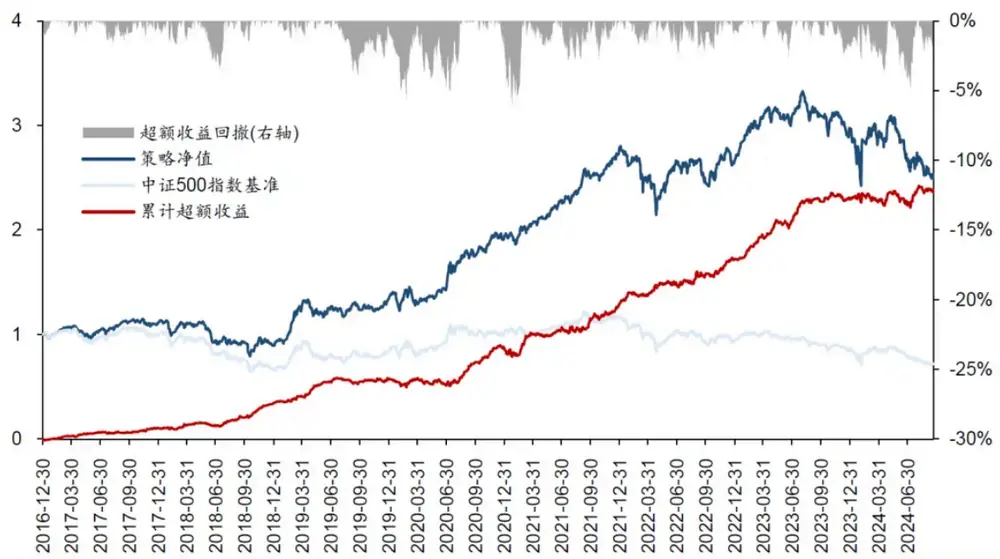

图表45：基于量价高频合并因子指数增强组合逐月超额收益（基准为中证500指数）

|  | 1月 | 2月 | 3月 | 4月 5月 6月 |  |  | 7月 | 8月 9月 |  | 10月 11月 |  | 12 | 月年超额收益 |
| --- | --- | --- | --- | --- | --- | --- | --- | --- | --- | --- | --- | --- | --- |
| 2017年 | 0.2% | 1.3% | 1.5% | 1.3% | 1.0% | 0.8% | -0.6% | 0.6% | -0.1% | 1.0% | 2.3% | 1.1% | 10.8% |
| 2018年 | 0.1% | -1.0% | 2.8% | 2.1% | -0.5% | -1.8% | 3.0% | 2.1% | 1.6% | 4.4% | 4.9% | 1.5% | 20.9% |
| 2019年 | 1.5% | 1.8% | 1.8% | 4.5% | 3.9% | 1.5% | 1.8% | -1.1% | -0.8% | 1.3% | 0.2% | 0.5% | 17.9% |
| 2020年 | -1.8% | -0.9% | 2.9% | -1.9% | 0.4% | -3.1% | 2.4% | 6.5% | 5.3% | 3.3% | 4.5% | -0.4% | 18.2% |
| 2021年 | -2.0% | 4.5% | 5.2% | -1.3% | 0.7% | 2.4% | 0.0% | -1.1% | 5.6% | 1.0% | 1.7% | 4.6% | 23.0% |
| 2022年 | 4.7% | -1.4% | 0.5% | 3.3% | 1.7% | -0.9% | 1.5% | 3.0% | -0.3% | 0.8% | 2.2% | 2.4% | 18.7% |
| 2023年 | 0.6% | 3.8% | 3.1% | 2.3% | 1.7% | 1.2% | 5.8% | 0.0% | 0.3% | 1.8% | 0.2% | -1.3% | 21.0% |
| 2024年 | 0.9% | 0.2% | -2.1% | 2.7% -0.3% |  | -3.1% | 4.4% | 0.4% | -0.6% | 2.4% |  |  |  |

图表46：指数增强组合回测绩效汇总（基准为中证500指数）

|  | 年化超额 收益率 | 年化跟踪 |  | 超额收益 | 超额收益 | 相对基准 | 年化双边 |
| --- | --- | --- | --- | --- | --- | --- | --- |
| 量价合成因子 | 10.34% | 误差 6.41% | 信息比率 1.61 | 最大回撤 Calmar 比率 10.86% | 0.95 | 月胜率 66.67% | 换手率 20.95 |
| 高频合成因子 | 18.40% | 6.86% | 2.68 | 7.86% | 2.34 | 74.19% | 20.92 |
| 量价高频合并因子 | 17.74% | 6.93% | 2.56 | 5.89% | 3.01 | 74.19% | 20.90 |

基于量价高频合并因子构建的中证1000指数增强组合策略表现如下：

图表47：基于量价高频合并因子指数增强组合策略净值（基准为中证1000指数）
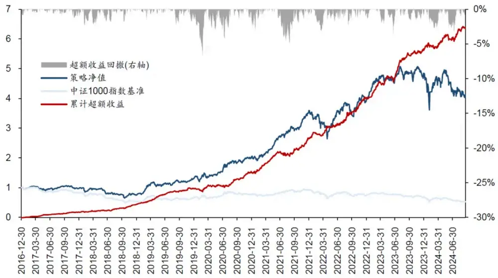

图表48：基于量价高频合并因子指数增强组合逐月超额收益（基准为中证1000指数）

|  | 1月 | 2月 3月 4月 5月 6月 |  |  |  |  | 7月 8月 9月 10月 11月 12 |  |  |  |  |  | 月年超额收益 |
| --- | --- | --- | --- | --- | --- | --- | --- | --- | --- | --- | --- | --- | --- |
| 2017年 | 0.7% | 1.4% | 1.0% | 2.0% | 3.6% | 0.5% | 1.3% | 1.1% | 0.9% | 2.6% | 0.9% | 0.8% | 18.0% |
| 2018年 | 1.1% | -0.7% | 1.8% | 1.5% | 0.9% | -0.2% | 2.3% | 2.7% | 1.2% | 3.0% | 4.0% | 2.2% | 21.6% |
| 2019年 | 4.2% | 2.0% | 2.7% | 5.2% | 5.8% | 2.1% | 4.1% | 2.2% | -0.1% | 1.0% | 4.1% | -0.8% | 37.4% |
| 2020年 | -0.7% | -0.7% | 7.4% | -0.5% | 0.5% | -2.6% | 1.3% | 5.0% | 6.2% | 1.5% | 6.0% | 2.3% | 28.1% |
| 2021年 | 0.9% | 4.8% | 5.8% | 4.6% | 4.8% | 2.9% | -2.8% | -1.2% | 6.6% | 1.9% | 2.2% | 7.6% | 44.6% |
| 2022年 | 5.6% | -1.9% | 0.5% | 6.1% | 1.1% | 1.8% | 0.7% | 8.1% | 0.3% | 3.4% | 4.2% | 2.7% | 37.5% |
| 2023年 | 0.7% | 5.1% | 3.9% | 1.1% | 1.9% | 0.1% | 9.4% | 1.4% | 2.1% | 1.9% | 0.2% | 0.4% | 31.8% |
| 2024年 | 3.6% | -1.5% | -0.2% 4.4% 1.7% |  |  | -2.3% | 2.9% 2.7% |  | -0.5% | 11.1% |  |  |  |

图表49：指数增强组合回测绩效汇总（基准为中证1000指数）

|  | 年化超额 收益率 | 年化跟踪 误差 | 信息比率 | 超额收益 最大回撤 Calmar 比率 | 超额收益 | 相对基准年化双边 月胜率 | 换手率 |
| --- | --- | --- | --- | --- | --- | --- | --- |
| 量价合成因子 | 18.50% | 7.10% | 2.61 | 11.41% | 1.62 | 79.57% | 20.86 |
| 高频合成因子 | 31.32% | 7.46% | 4.20 | 6.57% | 4.77 | 86.02% | 20.61 |
| 量价高频合并因子 | 30.72% | 7.52% | 4.08 | 6.72% | 4.57 | 83.87% | 20.57 |

总结而言，量价高频合并因子的效果主要来源于高频合成因子，量价合成因子一定程度上成为拖累。基于量价高频合并因子构建的沪深300增强策略年化超额收益率为12.38%，略逊于合成高频因子的13.78%。基于量价高频合并因子的中证500增强策略历史表现优异，年化超额收益率，但近一年来效果平平。而中证1000增强策略历史区间超额收益稳定，在2024年年内测试区间也获得了11%左右的年化超额收益，总体效果较好。

此外，我们测试了华泰金工前期报告《基于全频段量价特征的选股模型》（20231208）中全频段因子与本文因子间的相关性，结果如下表。全频段因子与本文产出的量价合成因子、高频合成因子与量价高频合并因子总体相关性较低，分别为0.38、0.26与0.31；量价合成因子与高频合成因子相关性略高，为0.57。

图表50：GPT因子工厂产出合成因子与全频段因子相关性

|  | 全频段因子 | 量价合成因子 | 高频合成因子 | 量价高频合并因子 |
| --- | --- | --- | --- | --- |
| 全频段因子 | 1.00 |  |  |  |
| 量价合成因子 | 0.38 | 1.00 |  |  |
| 高频合成因子 | 0.26 | 0.57 | 1.00 | 1.00 |
| 量价高频合并因子 | 0.31 | 0.73 | 0.97 |  |

## 05 总结

本文是GPT因子工厂扩展至基本面与高频因子挖掘场景的深入实践。在GPT因子工厂2.0中，架构上基本沿用之前的多智能体架构，即FactorGPT生成因子表达式和因子释义，CodeGPT生成因子计算代码，EvalGPT负责评估因子结果以及生成优化建议。在因子效果方面，30个基本面因子IC均值为0.011，RankIC均值为0.013，|t|均值为1.542；23个筛选后的高频因子IC均值为0.020，RankIC均值为0.031，|t|均值为4.588。因子相关性方面，基本面因子相关系数绝对值均值为0.10，高频因子相关系数绝对值均值为0.17，因子工厂产出的因子相关性普遍偏低。基本面因子效果总体尚可，高频因子表现出色。

因子挖掘一直是量化研究皇冠上的明珠之一，基于大模型的因子挖掘在未来或将成为极具潜力的新兴方案。传统因子挖掘无论是基于人工还是自动化算法，皆存在得此失彼的现状，大模型一方面能够降低人工挖掘因子的高人力成本，另一方面能够有效弥补自动化算法缺乏可解释性与灵活性的缺陷。华泰金工前期报告《GPT因子工厂：多智能体与因子挖掘》（20240220）是对大模型挖掘因子可行性的有力证明，而本文不仅进一步将这种可行性扩展至基本面与高频因子挖掘，同时利用GPT产出因子构建出较出色的中证1000指数增强策略，有效彰显了GPT因子工厂的实用价值。

## 本文的主要结果及结论如下：

1. GPT因子工厂可扩展至基本面与高频因子挖掘场景，因子产出质量较好。因子工厂产出的30个基本面因子IC均值为0.011，RankIC均值为0.013，因子工厂产出的23个高频因子IC均值为0.020，RankIC均值为0.031。

2. GPT产出的因子相关性偏低继续在基本面与高频因子挖掘中得到体现。基本面因子相关系数绝对值均值为0.10，高频因子相关系数绝对值均值为0.17。

3. GPT因子工厂产出的因子可构建较出色的中证1000指增策略。仅基于前期报告《GPT因子工厂：多智能体与因子挖掘》（20240220）产出的量价因子可构建出年化超额收益率达18.50%的中证1000指增策略，基于本文产出的高频因子可构建出年化超额收益率达31.32%的中证1000指增策略，二者加权合成后中证1000指增策略年化超额为30.72%。

本文仍有多项未尽之处：（1）本研究挖掘的高频因子仅限于分钟K线，尚未尝试更高频量价数据的因子挖掘；（2）本研究仅涉及较低频的财报基本面因子挖掘，未来可尝试将量价与基本面指标融合、以及使用例如一致预期数据，构建更为高频的基本面因子；（3）本文并未将基本面因子融入指增策略构建中，未来可尝试向策略中融入多维信息，以提升指增策略稳定性。

## 参考文献

Wang, S., Yuan, H., Zhou, L., Ni, L. M., Shum, H. Y., & Guo, J. (2023). Alpha-gpt: Human-ai interactive alpha mining for quantitative investment.arXiv preprint arXiv:2308.00016. Yuan, H., Wang, S., & Guo, J. (2024). Alpha-GPT 2.0: Human-in-the-Loop AI for Quantitative Investment.arXiv preprint arXiv:2402.09746.

Zhang, W., Zhao, L., Xia, H., Sun, S., Sun, J., Qin, M., ... & An, B. (2024). FinAgent: A Multimodal Foundation Agent for Financial Trading: Tool-Augmented, Diversified, and Generalist.arXiv preprint arXiv:2402.18485.

Zhao, H., Liu, Z., Wu, Z., Li, Y., Yang, T., Shu, P., ... & Liu, T. (2024). Revolutionizing finance with llms: An overview of applications and insights.arXiv preprint arXiv:2401.11641.

## 风险提示：

GPT挖掘因子是对历史的总结，具有失效风险。GPT挖掘因子可解释性受限，使用需谨慎。大模型训练集广泛，可能存在过拟合风险。

## 相关研报

研报：《 金工：GPT因子工厂2.0：基本面与高频因子挖掘》2024年9月26日

分析师：林晓明 S0570516010001 | BPY421

分析师：何康 S0570520080004 | BRB318

## 关注我们

联系人：沈洋 S0570123070271

## 华泰证券金融工程

主要进行量化投资相关的研究和讨论工作。

427篇原创内容

公众号

## 华泰证券研究所国内站（研究Portal）

https://inst.htsc.com/research

访问权限：国内机构客户

华泰证券研究所海外站

https://intl.inst.htsc.com/research

访问权限：美国及香港金控机构客户

添加权限请联系您的华泰对口客户经理

## 免责声明

## ▲向上滑动阅览

本公众号不是华泰证券股份有限公司（以下简称“华泰证券”）研究报告的发布平台，本公众号仅供华泰证券中国内地研究服务客户参考使用。其他任何读者在订阅本公众号前，请自行评估接收相关推送内容的适当性，且若使用本公众号所载内容，务必寻求专业投资顾问的指导及解读。华泰证券不因任何订阅本公众号的行为而将订阅者视为华泰证券的客户。

本公众号转发、摘编华泰证券向其客户已发布研究报告的部分内容及观点，完整的投资意见分析应以报告发布当日的完整研究报告内容为准。订阅者仅使用本公众号内容，可能会因缺乏对完整报告的了解或缺乏相关的解读而产生理解上的歧义。如需了解完整内容，请具体参见华泰证券所发布的完整报告。

本公众号内容基于华泰证券认为可靠的信息编制，但华泰证券对该等信息的准确性、完整性及时效性不作任何保证，也不对证券价格的涨跌或市场走势作确定性判断。本公众号所载的意见、评估及预测仅反映发布当日的观点和判断。在不同时期，华泰证券可能会发出与本公众号所载意见、评估及预测不一致的研究报告。

在任何情况下，本公众号中的信息或所表述的意见均不构成对任何人的投资建议。订阅者不应单独

## 人工智能 25

人工智能 · 目录

上一篇

华泰金工 | ESG分歧度因子和AI量价增强策略

下一篇

华泰金工 | 大模型本地部署手册

个人观点，仅供参考