## 华泰金工 | 大模型本地部署手册

原创 林晓明 何康等 华泰证券金融工程 2024年10月09日 07:59

本文是大模型本地部署的实用参考手册，详细介绍大模型及其应用的本地部署流程。对于大模型本地部署，本文从前后端是否存在的角度将不同部署框架分为三类：前后端皆存在的大模型集成运行环境、仅含前端的对话式网页应用、仅含后端的本地大模型运行库，分别以Ollama和LM Studio、ChatGPT Next Web与llama.cpp为例进行部署流程介绍。对于大模型应用本地部署，本文分别以AnythingLLM和Dify作为RAG应用框架和多智能体应用框架的代表，进行详细的部署说明及应用实例构建。

## 核心观点

## 人工智能83：大模型本地部署实用参考手册

本文是大模型本地部署的实用参考手册，详细介绍大模型及其应用的本地部署流程。对于大模型本地部署，本文从前后端是否存在的角度将不同部署框架分为三类：前后端皆存在的大模型集成运行环境、仅含前端的对话式网页应用、仅含后端的本地大模型运行库，分别以Ollama和LM Studio、ChatGPTNext Web与llama.cpp为例进行部署流程介绍。对于大模型应用本地部署，本文分别以AnythingLLM和Dify作为RAG应用框架和多智能体应用框架的代表，进行详细的部署说明及应用实例构建。

## 大模型本地部署：集成运行环境Ollama

Ollama是一个集成化的大模型本地部署开源工具。Ollama支持通过程序文件或Docker安装，同时提供了一个丰富的官方预置模型库，可通过简易命令下载或部署大模型，对于非官方预置模型，Ollama支持导入gguf格式或Safetensors格式的模型源文件，用户也可通过配置文件Modelfile进行个性化参数设置。此外，Ollama支持通过终端API或Python API提供大模型调用接口，便于外部程序化调用。

## 大模型本地部署：前后端兼备的LM Studio

LM Studio是一款在本地运行和管理大模型的专业桌面应用，支持加载gguf格式的大模型文件，而无需安装Python环境及其他任何组件。与Ollama相比，LM Studio更适合非专业人士使用，例如其用户界面更为友好、模型选择更为广泛、内置HTTP Server可一键启动从而便于调用测试等等。与此同时，LM Studio支持丰富的大模型参数设定，包括多项高级参数和推理参数等，为用户提供了丰富的定制空间。

## 大模型本地部署：跨平台ChatGPT Next Web与纯后端llama.cpp

与Ollama或LM Studio这类偏集成的部署方案不同，ChatGPT Next Web与llama.cpp代表了更纯粹的前端或后端部署方案。ChatGPT Next Web代表一类跨平台的对话式大模型轻页面应用，支持Web、

Linux、Windows、MacOS等多平台应用部署，核心特色是轻量化。llama.cpp代表一类专注于大模型推理与量化技术的后端框架，适用于原始开发阶段，llama.cpp的核心特色更在于技术性。

## 大模型应用本地部署：AnythinLLM与Dify

若将大模型本地部署看做夯实地基，大模型应用的本地部署则是楼宇建设。本文将大模型应用框架分为两类，RAG应用框架和多智能体应用框架，分别以AnythinLLM和Dify为例进行介绍。AnythinLLM是一个开源的企业级文档聊天机器人解决方案，用户可通过简易步骤构建私人的知识库应用。Dify则是一个全流程覆盖的专业级AI应用开发平台，结合了工作流、RAG、智能体、模型管理等海量功能，用户可基于Dify开发并发布功能复杂的大模型应用。

## 正文

## 01 导言

随着大语言模型在诸多领域的深入应用，隐私性、安全性及应用成本等问题是大模型企业级应用必须直面的挑战，大模型本地部署可能是解决这一挑战极为有效的途径。大模型本地部署通过减少企业和用户对云服务的依赖，达到降低成本的效果，同时显著提升数据安全和隐私保护水平，便于进一步促进企业对合规性要求的遵守。与此同时，大模型本地部署能以相对便捷的方式提供品类繁多的大模型，例如嵌入模型、聊天模型与多模态模型等，有效助力不同类型的大模型应用构建。

随着大模型应用浪潮的持续蔓延，大模型在金融投研领域应用的广泛性进一步凸显了大模型本地部署的价值。华泰金工在前期已发布多篇关于大模型在量化投研场景下的应用报告，包括《GPT因子工厂：多智能体与因子挖掘》（20240220）、《“GPT如海”：RAG与代码复现》（20240506）和《GPT因子工厂2.0：基本面与高频因子挖掘》（20240926）。学界对大模型应用的探索同样广泛且深入，包括因子挖掘、财务分析、情感分析等角度。通过大模型本地部署，大模型应用构建的成本及运行速度可获得显著提升，进而提高研究效率。

除了大模型本地部署之外，大模型应用框架同样是提升大模型应用开发便捷性的利器。从应用框架理论的角度看，RAG（Retrieval-Augmented Generation，检索增强生成）和多智能体架构一直是大模型应用开发避无可避的参考框架，其具体含义在前文GPT如海及GPT因子工厂报告中均有详细介绍，在此不为赘述。而RAG和多智能体的高级开源框架也数不胜数，例如基于RAG的AnythingLLM、RAGFlow等，基于多智能体的Dify、AutoGPT、AutoGen等，这些框架为大模型应用开发提供了优质的解决方案参考，可在保证应用效果的同时，大大提升开发效率。

本文是大模型本地部署的实用参考手册，详细介绍大模型及其应用的本地部署流程。对于大模型本地部署，本文从前后端是否存在的角度将不同部署框架分为三类：前后端皆存在的大模型集成运行环境、仅含前端的对话式网页应用、仅含后端的本地大模型运行库，分别以Ollama和LMStudio、ChatGPT Next Web与llama.cpp为例进行部署流程介绍。对于大模型应用本地部署，本文分别以AnythingLLM和Dify作为RAG应用框架和多智能体应用框架的代表，进行详细的部署说明及应用实例构建。

## 02 大模型本地部署

相比于商业大模型的API服务，本地部署大模型无论对于企业或个人用户都具有无可替代的地位，一方面本地部署大模型能有效降低使用成本，另一方面大大提高了大模型应用的安全性和稳定性。

纵览大模型各类开源部署框架，本地部署方案种类繁多，本文从前后端是否存在的角度将不同部署框架分为三类，分别为：前后端皆存在的大模型集成运行环境、仅含前端的对话式网页应用、仅含后端的本地大模型运行库。下文将以Ollama和LM Studio为例解释集成运行环境下的大模型本地部署，以ChatGPT Next Web为例介绍仅含前端的对话式网页应用的大模型本地部署，最后以llama-cpp为例展示仅含后端的本地大模型部署。

## 集成运行环境：Ollama

Ollama（Omni-Layer Learning Language Acquisition Model）是一个专为在本地环境中运行和定制大语言模型而设计的开源工具。Ollama提供了一个简单而高效的接口，用于创建、运行和管理大语言模型，同时还提供了一个丰富的模型库，可轻松集成到各类应用程序中。Ollama基于Go语言开发而成，支持大模型完全下载并存储在本地计算机，同时提供API接口，从而实现大模型的本地部署。

## Ollama安装

Ollama安装有两种可选途径：（1）官网支持macOS、Linux和Windows系统的下载和安装。用户可根据所使用的设备类型，从官网直接下载对应系统的安装包进行本地安装，安装完毕后启动Ollama，在终端中直接使用ollama create或ollama run指令即可创建或下载大语言模型；（2）由于官方提供了Docker镜像 ollama/ollama，用户也可通过Docker完成安装，不过由于Docker存在一层额外封装，使用CPU/GPU需要不同的配置：

## 1. CPU模式：

直 接 运 行 以 下 指 令 ： docker run -d -v ollama:/root/.ollama -p 11434:11434 --nameollama ollama/ollama

## 2. NVIDIA GPU模式：

首 先 参 考 NVIDIA 官 网 （ https://docs.nvidia.com/datacenter/cloud-native/container-toolkit/latest/install-guide.html）安装容器工具包，然后运行以下命令使用GPU模式启动容器：docker run -d --gpus=all -v ollama:/root/.ollama -p 11434:11434 --name ollamaollama/ollama

图表2：Ollama 指令

| 指令名称 | 指令作用 |
| --- | --- |
| ollama create | 创建模型 |
| ollama run | 下载并运行模型 |
| ollama pull | 个性化修改模型 |
| ollama rm | 删除模型 |
| ollama cp | 复制模型 |
| ollama show | 显示模型信息 |
| ollama list | 罗列设备中已有模型 |
| ollama serve | 启动大模型server公众号。华泰证券金融工程 |

## Ollama运行官方预置大模型

Ollama官方提供的模型库包含诸多性能出色的开源大模型，用户可以根据自己的需求选择合适的模型。

图表3：可直接使用Ollama run 指令下载的模型（部分）

| 模型 | 参数量 | 大小 | 指令 |
| --- | --- | --- | --- |
| Llama3 | 8B | 4.7GB | ollama run llama3 |
| Llama3 | 70B | 40GB | ollama run Ilama3:70b |
| Phi 3 Mini | 3.8B | 2.3GB | ollama run phi3 |
| Phi 3 Medium | 14B | 7.9GB | ollama run phi3:medium |
| Gemma | 2B | 1.4GB | ollama run gemma:2b |
| Gemma | 7B | 4.8GB | ollama run gemma:7b |
| Mistral | 7B | 4.1GB | ollama run mistral |
| Moondream 2 | 1.4B | 829MB | ollama run moondream |
| Neural Chat | 7B | 4.1GB | ollama run neural-chat |
| Starling | 7B | 4.1GB | ollama run starling-Im |
| Code Llama | 7B | 3.8GB | ollama run codellama |
| Llama 2 Uncensored | 7B | 3.8GB | ollama run llama2-uncensored |
| LLaVA | 7B | 4.5GB | ollama run llava |
| Solar | 10.7B | 6.1GB | ollama run solar |
| Qwen2 | 7B | 4.4GB | ollama run qwen2 |
| Qwen2 | 72B | 44GB | ollama run qwen2730号：华泰证券金融工程 |

根据本文实践经验，本地部署大模型通过Ollama运行时，运行7B的模型RAM应至少为8GB，运行13B的模型RAM应至少为16GB，运行33B的模型RAM应至少为32GB。然而，由于笔记本电脑的处理器速度和算力通常难以企及专业服务器，基于笔记本本地部署大模型时运行速度一般较慢，由于笔记本电脑的CPU和GPU需要额外工作来满足需求，大模型的介入或将进一步导致电脑超负荷运转，性能减弱。

因此，在算力受限时，选择模型时需在模型效果与运行效率间做出取舍：例如，我们在实践中发现在MacBook Air（M1，8GB）运行8B大小的模型（Llama3）时，出现明显卡顿；而运行2B大小的Gemma时则较为流畅。因此，进行本地大模型部署时要在设备限制下（如RAM，GPU等硬件条件）优选大模型。

Ollama在使用便易之余也提供了个性化设定空间，用户可通过修改大模型配置文件Modelfile进行自定制设置，例如改写system prompt：

1. 使用指令ollama pull+模型名称；

2. 在默认文件夹中创建新的Modelfile并进行编辑，例如在Modelfile中写入以下内容：将模型角色设定为超级马里奥，并提高temperature值为1从而增加模型生成回复的随机性。

## Ollama导入其他开源大模型

若用户需要自行创建模型，Ollama支持导入gguf格式或Safetensors格式的模型源文件。gguf（GPT-Generated Unified Format）是一种针对大规模机器学习模型设计的二进制格式文件规范，它主要针对快速加载和保存模型进行了优化，使其能够高效地进行推理，从而消耗更低的资源。而Safetensors格式不包含执行代码，因此在加载模型时无需进行反序列化操作，从而实现更快的加载速度。

上述两种格式的大语言模型均可在Huggingface网站（https://huggingface.co/）或镜像网站（https://hf-mirror.com）下载至本地，通过创建Modelfile完成大模型导入（需使用FROM指令指向要导入模型的文件路径，适用于gguf格式大模型的指令为FROM /path/to/file.gguf，适用于Safetensors格式大模型的指令为FROM /path/to/safetensors/directory），随后即可创建新的模型并运行。

对于非上述两种格式但可转换为gguf的开源大模型，可将模型数据先转换为gguf格式后再使用创建Modelfile的方式导入大模型。格式转换方法众多，本文仅以llama.cpp为例，具体步骤如下：

## 1. 准备转换工具：运行

git clone https://github.com/ggerganov/llama.cpp.git，克隆llama.cpp项目到本地，准备安装所需的依赖包；

2. 配置环境：进入llama.cpp文件夹所在目录，使用pip install -r requirements.txt命令安装llama依赖包；

3. 使用convert.py工具：使用convert.py将模型转换为gguf格式。运行convert.py时，需要指定包含模型文件的目录。例如，如果有一个名为llama3的PyTorch模型，可以通过运行pythonllama.cpp/convert.py llama3 --outfile llama3.gguf --outtype f16将其转换为具有FP16权重的gguf模型。

4. 构建llama.cpp应用程序：在llama.cpp项目中，创建一个新的build目录，然后进入该目录。在这里，可以编译llama应用程序，以便进一步处理或使用转换后的模型文件。

## Ollama交互方式

尽管Ollama属于集成式大模型本地运行环境，但Ollama并未提供系统界面，对部署后的模型交互便捷性产生挑战。Ollama支持页面交互和API交互两种交互形式，前者使用门槛低，更适合用户日常使用，后者则更具开发便捷性。

基于此，Ollama本地部署完成后，为其赋予界面可能是降低用户使用门槛、扩展大模型应用场景的必经之路。根据界面应用类型分类，我们将Ollama界面配置分为网页应用和桌面应用两种。本文提供3个使用方便且维护良好的界面应用配置方案。

图表5：Ollama界面应用

| 应用名称 | 类型 | 安装下载及配置方案 |
| --- | --- | --- |
| Open WebUI | 网页应用 | 1. 通过 Docker 安装在 terminal 输入指令： docker run -d -p 3000:8080 --gpus=all -v ollama:/root/.ollama -v open-webui:/app/backend/data --name open-webui -restart always ghcr.io/open-webui/open-webui:ollama |
|  |  | 若出现报错“Unable to find image'ghcr.io/open-webui/open-webui:ollama'locally”，可通过如下指令解决： docker pull ghcr.io/open-webui/open-webui:git-a92c538-cuda 2. 安装后，通过 http://localhost:3000 访问 Open WebUI |
| Chatbox | 桌面应用 | 1. 下载匹配系统的开源应用程序文件（https://github.com/Bin-Huang/chatbox/releases），直接安装即可 2. 选择 Ollama 部署的模型：在设置中选择 Ollama 为模型提供方，再选择特定模型（Chatbox 同样支持 OpenAI，Claude，chat GLM 等模型） |
| AnythingLLM | 桌面应用 | 1. 下载 Anything LLM应用(https://anythingllm.com/），官网支持 Windows/Linux/Mac(Intel/Apple Silicon）系统，直接点击安装 |
|  |  | 即可 |
|  |  | 2. 自定义界面：进入程序后，在左下角可找到设置莱单，点击“Customization”可将系统语言设为中文（若需要也可在此页面自定 |
|  |  | 义向用户显示的自动消息） |
|  |  | 3. 配置Ollama和运行：进入“人工智能提供商”栏目，LLM提供商选择Ollama（若使用其他本地部署方式也可根据需要选择对应 的供应商)，下方可选择具体的模型(使用前先需要在Ollama中下载)并设置最大的token数，设置完成后点击右上角“save changes” |

除了上述赋予界面的交互方案，API交互也是Ollama这类集成运行环境的核心交互形式，包括本地终端API交互和Python API交互两大类。本地终端API交互及Python API交互命令如下。

图表6：Ollama API 交互示例
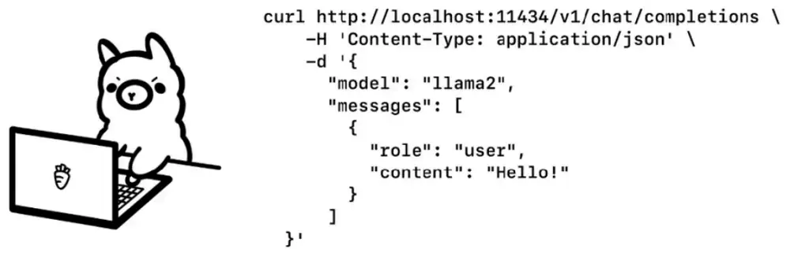

图表7：本地终端API交互命令示例
API分类 命令示例 
生成补全（流式） curl http://localhost:11434/api/generate -d '{ 
"model": "Ilama2", 
"prompt": "Why is the sky blue?" 
生成补全（非流式） curl http://localhost:11434/api/generate -d { 
"model": "llama2", 
"prompt": "Why is the sky blue?", 
"stream": false 
y 
对话补全（流式） curl http://localhost:11434/api/chat -d { 
"model": "Ilama2", 
"messages": [ 
{ 
"role": "user", 
"content": "why is the sky blue?" 

对话补全（非流式） curl http://localhost:11434/api/chat -d { 
"model": "Ilama2", 
"messages": [ 
{ 
"role": "user", 
"content": "why is the sky blue?" 
], 
"stream": false

图表8： 基于 Ollama 的 Python Ollama API 接口代码示例
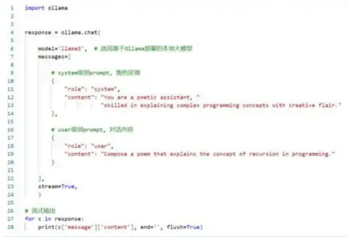

图表9：基于 Ollama 的 Python OpenAI API 接口代码示例
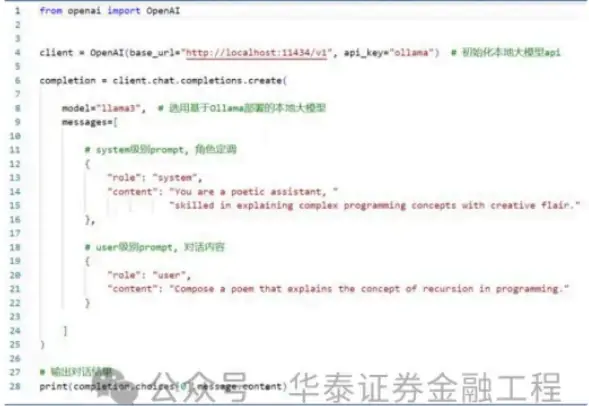

## Ollama并发

对于大模型而言，并发（Concurrency）是多个请求在宏观上同时执行的能力，这并不意味着这些任务在物理上同时进行，而是它们在时间上被分割成小部分，并且由操作系统或执行环境快速交替执行，从而给用户一种同时进行的感受。合理使用并发可以显著提升资源利用率和系统吞吐量，从而在一定程度上提升推理效率。Ollama 0.2以上版本支持并默认启用了并发功能，这意味着Ollama解锁了两项功能，多请求并行和多模型对话。多请求并行只需要在处理每个请求时额外占用极少量的存储空间，即可实现同时处理多个聊天对话、同时处理文件的多个部分，以及同时处理多用户的单次对话。多模型对话则意味着可将嵌入模型与聊天模型同时导入内存，提升了RAG类应用的运行效率，除此之外，也可实现其他大小模型的并行处理。

图表10：Ollama 并发示例
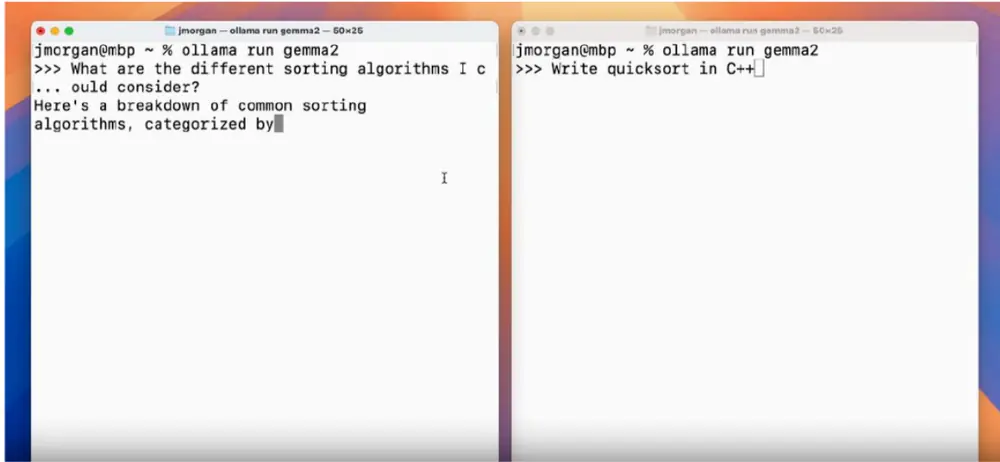

图表11：Ollama 并发参数

| 参数名称 | 功能介绍 |
| --- | --- |
| OLLAMA_MAX_LOADED_MODELS | 可同时加载的最大模型数量（前提是它们适合可用内存），默认值为3 *GPU 数量或3（用于 CPU 推理）；例如，指令 set |
| OLLAMA_NUM_PARALLEL | OLLAMA_MAX_LOADED_MODELS=3 可实现 3 个模型同时运行。 每个模型同时处理的最大并行请求数，默认将根据可用内存自动选择4 或1；例如，指令 set OLLAMA_NUM_PARALLEL=2 可实现单个模型 |
| OLLAMA_MAX_QUEUE | 同时处理2个请求。 |

## 集成运行环境：LM Studio

LM Studio是一款用于在本地运行和管理大语言模型的桌面应用，支持加载全部gguf格式的大模型，无需安装Python环境及其他众多组件。LM Studio加载模型、启用GPU、可视化界面操作与模型监控都较为简便。

与Ollama等其他本地部署大模型的工具相比，LM Studio具备诸多优势：其用户界面友好且使用便捷，模型选择更为广泛，模型管理自动化（可自动下载、更新和配置环境），支持多模型chat（便于对比不同模型的效果），内置HTTP Server支持OpenAI API、方便开发人员进行本地模型部署和API测试等。

## LM Studio安装及配置

LM Studio官网提供了mac（M1/M2/M3）、Linux和Windows系统中下载安装LM Studio的方式，可参考LM Studio官网（https://lmstudio.ai/）。设置模型保存路径时，由于大模型文件较大，建议选择较大硬盘文件夹保存模型文件。

值得强调的是，LM studio仅支持gguf格式原文件，模型下载安装既可以直接在LM Studio中下载 ， 也 可 以 在 Huggingface 官 网 （ http://huggingface.co ） 或 镜 像 网 站 （ https://hf-mirror.com）手动下载大模型源文件安装，下载完毕后存入已设置的模型保存路径（新建三层文件夹结构，例如models/publisher/repository，将模型文件放入最后一层内，选择my models，改变模型加载目录为models即可）。可通过Local models folder查看模型目录和配置信息。

## 安装中可能存在以下潜在问题：

1. 设置模型Preset：手动安装时，可能不存在匹配的模型配置，我们选择相似的模型即可，如基于Llama模型的变体选择Llama的配置，一般是可用的。

2. 无法联网或搜索：一种解决方案是，关闭LM Studio，用vs code等类似工具，打开LM-Studio安 装 文 件 夹 （ 如 Windows: C:\Users**\AppData\Loca\LM-Studio 或 Mac:/Users/a/.cache/lm-studio），然后在文件夹下所有文件中查找替换，把全部找到的huggingface.co替换为hf-mirror.com，再打开LM Studio点击resume即可。

## LM Studio交互方式：对话界面

由于LM Studio自带交互界面，对于非开发需求的个人用户而言，可以直接使用其交互界面，免去界面部署工作。LM Studio的模型交互支持单模型对话和多模型对话，左侧工具栏的AI chat tab提供了与单模型对话的途径，具体步骤如下：

1. 加载模型：选择想进行对话的模型，在最上方点击下拉选项进行加载；

2. 开始对话：输入问题，开始与选定的模型对话。

图表13：LM Studio 单模型对话示例
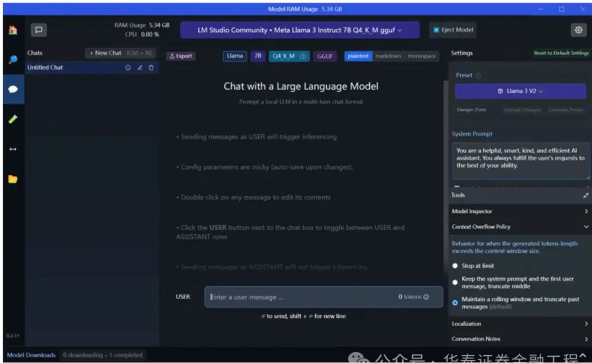

为了提高运算效率和推理质量，LM Studio支持手动调整参数，包括高级参数设置和推理参数设置，两者均可以在模型对话框的右侧设置页面以手动输入的方式调整。具体参数及参数含义如下表所示。

图表14：LM Studio 高级参数（Advanced Configuration）

| 参数英文名称 Context Length | 参数中文名称 上下文长度 | 参数含义 模型的“工作内存”，即处理输入信息时能够考虑的最大文本量（一次处理的最大 |
| --- | --- | --- |
|  |  | 询和更长的文档，具有更强的理解能力，但推理时间和显存空间也会增加；若聊天 内容超过了可用的“工作内存”，则模型可能会无法生成回应，系统默认值为2048 (界面会显示所选模型支持的最大token 个数)。 “探索参数”，用以调整模型生成文本时的创造性和多样性，从原理上改变softmax 函数表达式。当模型的温度较高时（如0.8、1或更高），模型会更倾向于从较多样 |
|  |  | 错误和不连贯之处；而当温度较低时（如0.2、0.3等），模型主要会从具有较高概 |
|  |  | 得过于保守和重复。因此在实际应用中，需要根据具体需求来权衡选择合适的温度 |
|  |  | 率的词汇中选择，从而产生更平稳、更连贯的文本。但此时，生成的文本可能会显 |
|  |  | 值，在鼓励模型生成多样性答复的同时保证一定的准确性，例如Temperature=0代 |
| Tokens to generate |  | 表模型一定会选择概率值最大的 token；系统默认值为0.8。 |
|  | 最大 token 数 | 模型生成的token数的最大值，限制了模型输出的长，不仅影响文本的详细程度， |
|  |  | 还影响到模型处理长篇内容的能力；需要生成较长文本时则使用更高的tokens to |
|  |  | generate，但较高的值可能导致更详细的输出，但也可能增加语句偏离主题的风险； |
|  |  | 系统默认值为-1，代表没有强制停止的上限、生成token数由模型自己决定。 |
|  | CPU 线程 |  |
| CPU Threads |  |  |
|  |  | CPU用于计算的线程数量；需注意的是，增加线程数量不一定会生成更好的结果， |
|  |  | 可通过多次实验确定最优选择；系统默认值为4。华泰证券金融工程 |

图表15：LM Studio 推理参数（Inference Parameters）

| 参数英文名称 | 参数中文名称 | 参数含义 |
| --- | --- | --- |
| Top K Sampling | 顶部K抽样 | 表示下一个生成的 token从K个最可能的 token 中随机挑选，例如，如果设置K=10， 那么模型每次选择单词时，只会在可能性最高的10个单词中选择；其中K越大，生成 文本的多样性越大，但答复合理性降低的风险也更大（但合理性不一定降低，因为通 过引入随机性，可以避免贪心解码的局部最优问题）；K越小，生成文本越保守；系 |
| Repeat penalty | 惩罚系数 | 统默认值为40。 用于避免模型生成重复单调的文本，penalty值越高，生成重复文本所受“惩罚”值越 大，模型则会更容易规避以上行为。这是一个决定模型是否偏好新词语的参数，较高 的惩罚值将使模型更倾向于生成新出现的词语，而不是重复已有的词语；系统默认值 为1.1（例如：所给任务为“生成一段和河流有关的文字”时，惩罚系数较低时生成文 |
| Min P Sampling | 最小P抽样 | 时可能为“河流是生命的摇篮，这片水域中有很多鱼，它通向海洋”）。 P 为0~1 的数，表示考虑范围内 token 的最小概率值(相对最有可能的 token 的概率)； 例如，系统默认值为0.05，即相对概率小于0.05的 token不会被模型考虑；P越小， 被考虑的token越多，生成文本的多样性越大，但准确性也可能更低，反之亦然。 |
| Top P Sampling | 顶部P抽样 | 表示下一个生成的 token从一个累积概率至少为P的 token子集合中随机挑选，用以 平衡生成文本的多样性和质量(候选词列表是动态的，从tokens里按百分比选择候选 词，模型从累计概率大于或等于“p”的最小集合中随机选择一个，如果p=0.9，选择 |

图表16:LM Studio Prompt 格式

| 参数英文名称 | 参数中文名称 参数含义 |  |
| --- | --- | --- |
| System Message Prefix | 系统信息前缀 | 系统 prompt信息前缀，系统默认无 |
| System Message Suffix | 系统信息后缀 | 系统 prompt信息后缀，系统默认为\n |
| User Message Prefix | 用户信息前缀 | 用户信息前缀，系统默认为\n###Instruction:\n |
| User Message Suffix | 用户信息后缀 | 用户信息后缀，系统默认为\n###Response:\n |
| Stop Strings | 停止字符串 | 遇到此字符串时，模型会终止生成token |

公众号·华泰证券金融工程

LM Studio左侧工具栏的Playground tab提供了与多模型同时对话的途径，具体使用步骤与单模型对话类似：

1. 加载多个模型：在最上方下拉按钮中选择想要同时加载的多个模型（需确保主机内存充足）；

2. 开始对话：右下方对话栏中，输入问题后，多个模型将按顺序答复，便于对比。

图表17：LM Studio 多模型对话示例
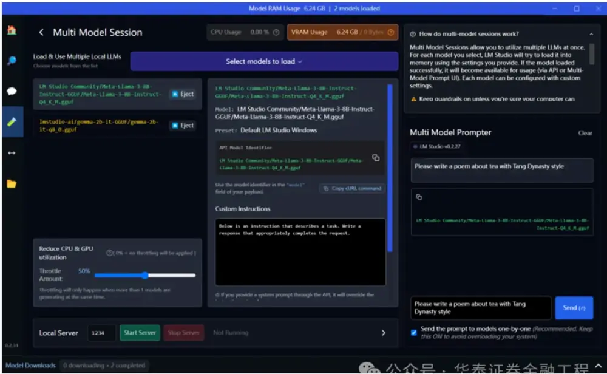

## LM Studio交互方式：API接口

与Ollama类似，LM Studio也为用户提供了本地API接口，其中发送请求和接收回复的形式与OpenAI API形式相同，使用时仅需将代码中用到OpenAI url处指向localhost:PORT即可。具体步骤如下：

1. 打开LM Studio中的Local Server tab，下拉菜单选定要运行的模型，选择Start Server（要关闭服务器则选择Stop Server）；

2. 使用该提供的API接口示例代码如下（PORT可在左侧“Server Port”处查看）；

3. 界面左上方可观察显存与CPU占用情况，可视机器负载情况更换模型；

4. 通 过 “Embedding Model Settings” 菜 单 ， 可 选 择 并 运 行 文 本 嵌 入 模 型 ， 通 过POST/v1/embeddings接口进行使用。

图表18：基于 LM Studio 的 Python OpenAI API 接口代码示例
1 from openai import OpenAI 
4 client = OpenAI(base_url="http://localhost:1234/v1", api_key="lm-studio") # 初始化本地大模型api 
5 
6 completion =client.chat.completions.create( 
8 model="Qwen/Qwen1.5-7B-Chat-GGUF/qwen1_5-7b-chat-q5_k_m.gguf"， #选用基于LM studio部署的本地大模型 
messages=[ 
10 
# system级别prompt，角色定调 
{ 
"role": "system", 
"content":"你是一个技艺精湛的诗意助手，擅长用创意的方式解释复杂的编程概念。" 
}, 
# user级别prompt，对话内容 
18 { 
"role": "user", 
20 "content"："用诗歌的方式解释编程中的递归概念。 
} 
] 
) 
26 #输出对话结果 
print(completion.choices[0].message.content)

## 仅含前端的对话式网页应用：ChatGPT Next Web

ChatGPT Next Web是基于 OpenAI API 的对话式网页应用，支持 GPT3，GPT4 & Gemini Pro模 型 。 ChatGPT Next Web 提 供 轻 量 化 （ ~5MB ） 的 跨 平 台 客 户 端（Linux/Windows/MacOS）、完备的Markdown支持（LaTeX公式、Mermaid流程图等）、精心设计的UI（响应式设计，支持深色模式等）、极快的首屏加载速度（页面大小仅约100kb）。ChatGPT Next Web保证用户隐私安全，将所有数据保存在用户浏览器本地。ChatGPT NextWeb具有预制角色功能（“面具”，即对模型提前设置好的角色设定，模型会以某种特定的方式/风格进行回应，方便创建、分享和调试个性化对话），海量的内置prompt列表，自动压缩上下文聊天记录（在节省Token的同时支持超长对话）。

图表19：ChatGPT Next Web 面具功能
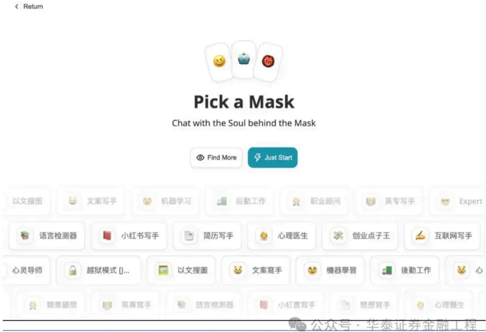

## ChatGPT Next Web部署

ChatGPT Next Web提供多平台的应用文件（Linux/Windows/MacOS），直接从官方Github仓库中下载即可（https://github.com/ChatGPTNextWeb/ChatGPT-Next-Web）。如果需要将ChatGPT Next Web部署为服务器形式向外界暴露端口，可以通过Vercel和Docker两种方式实现。

Vercel是一个面向现代Web应用程序的全球托管平台，它提供了一系列强大的功能，包括零配置部署、自动化构建和部署流程等。Vercel的目标是简化前端开发者的工作流程，让他们能够专注于编写代码，而不必过多关注部署和运维方面的问题。因此，对于特定项目而言，相比更常见的Docker部署，使用Vercel进行部署可以有效简化部署流程。

图表20：ChatGPT Next Web 部署方案
部暑渠道 方案操作细节
Vercel 1.获取 OpenAl API Key:进入 OpenAI 个人 Dashboard 的 API keys 栏目(https://platform.openai.com/api-keys)，
选择“+ Create new secret key”创建即可，复制 Secret key 备用
2.获取 Google API Key:从 Google Cloud 菜单选择进入或直接通过链接打开 Google 的 API Console 栏目
(https://console.developers.google.com/)，在项目列表打开或创建一个新项目，选择左侧菜单中的Credentials，点
击 Create credentials -> API key 即可， 复制 API key 备用
3.开始部署：在官方 Github(https://github.com/ChatGPTNextWeb/ChatGPT-Next-Web/blob/main/README CN.md)
选择 Deploy，注册Vercel账号(可直接使用 Github 账号登陆），填入以上两个 API Key 和页面访问密码 CODE（配
置该密码后，用户需要在设置页手动填写访问码才可以正常聊天，否则会通过消息提示未授权状态；务必将密码的位数
设置得足够长，最好7位以上，否则会被爆破)
Docker 1.安装 docker 后运行，拉取镜像 docker pull yidadaa/chatgpt-next-web
2.通过运行以下指令创建并启动容器：
docker run -d -p 3000:3000 \
-e OPENAI API KEY=sk-xxxx\
-e CODE=页面访问密码\
yidadaa/chatgpt-next-web
另外，也可以指定 proxy：
docker run -d -p 3000:3000 \
-e OPENAI API KEY=sk-xxxx\
-e CODE=页面访问密码\
--net=host \
-e PROXY URL=http://127.0.0.1:7890\
yidadaa/chatgpt-next-web
如果使用本地代理需要账号密码，可以输入以下指令：
-e PROXY_URL="http://127.0.0.1;7890 user password"
如果你需要指定其他环境变量，请自行在上述命令中增加-e环境变量=环境变量值来指定
3.启动完成后，在http://localhost:3000 端口即可访问

图表21： 将 ChatGPT Next Web 部署到 Vercel
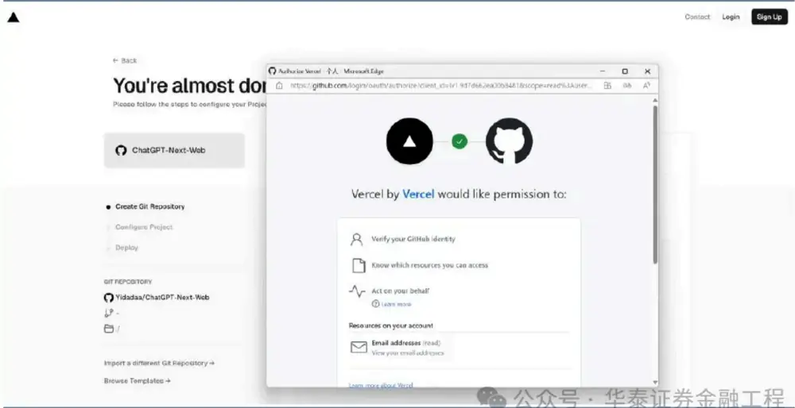

## 仅含后端的本地大模型运行库：llama.cpp

llama.cpp是一个用于大模型推理的C++库，主要利用C++重写了Llama的推理代码，将Meta开源大语言模型Llama进行量化，其最大的优点在于不需要GPU，在本地CPU上即可部署。

## llama.cpp本地部署

llama.cpp 的 本 地 部 署 同 样 支 持 Windows 、 Linux 和 MacOS 系 统 ， 但 相 比 Linux 和 MacOS ，llama.cpp在Windows 上的部署略繁琐。

## 部署步骤：

1. 下载llama.cpp git clone https://github.com/ggerganov/llama.cpp

## 2. 编译llama.cpp

Linux和MacOS系统下的编译可在llama.cpp目录下直接输入make指令完成；对于Windows用户而言，需采用官方提供的软件w64devkit进行编译。下载最新版本的w64devkit.exe（https://github.com/skeeto/w64devkit/releases），安装并运行，之后输入以下指令完成编译：
cd llama.cpp
make

3. 下 载 llama.cpp 支 持 的 模 型 ： llama.cpp 支 持 转 换 的 模 型 有 PyTorch 的 .pth ， huggingface的.safetensors，以及ggmlv3，此步骤下载需要的模型至llama.cpp的models目录下，例如gitclone https://huggingface.co/4bit/Llama-2-7b-chat-hf ./models/Llama-2-7b-chat-hf

4. 转化为gguf格式（也可直接从huggingface下载gguf格式的模型，放在models目录下）：先 通过指令pip install -r requirements.txt安装依赖，再通过以下指令转换模型： python convert.py ./models/Llama-2-7b-chat-hf --vocabtype spm`` ``params = Params(n_vocab=32000, n_embd=4096, n_mult=5504, n_layer=32, n_ctx=2048, n_ff=11008, n_head=32, n_head_kv=32, f_norm_eps=1e-05, f_rope_freq_base=None, f_rope_scale=None, ftype=None, path_model=PosixPath('models/Llama-2-7b-chathf'))``Loading vocab file 'models/Llama-2-7b-chat-hf/tokenizer.model', type 'spm'``...``Wrote models/Llama-2-7b-chat-hf/ggml-model-f16.ggu

5. 选择量化精度，执行模型量化：quantize指令提供各种精度的量化，执行指令时修改相应参数即 可，例如： ./quantize ./models/Llama-2-7b-chat-hf/ggml-model-f16.gguf ./models/Llama-2-7bchat-hf/ggml-model-q4_0.gguf Q4_0`` ``llama_model_quantize_internal: model size = 12853.02 MB``llama_model_quantize_internal: quant size = 3647.87 MB``llama_model_quantize_internal: hist: 0.036 0.015 0.025 0.039 0.056 0.076 0.096 0.112 0.118 0.112 0.096 0.077 0.056 0.039 0.025 0.021

6. 加载并启动模型：运行./main二进制文件即可

此外，llama-cpp-python提供了llama.cpp库的python绑定，相比于llama.cpp使用更加便捷，安装llama-cpp-python仅需运行指令pip install llama-cpp-python，并下载gguf格式的模型，具体操作与llama.cpp一致。其基本对话和Server调用的代码使用示例如下：

图表22：基于llama-cpp-python 的基本对话代码示例
1 from llama_cpp import Llama 
11m = Llama( 
model path="./model/owen1 5-0 5b-chat-g8 @.gguf". 
# saed=1337, # Uncomment to set a specific seed 
response = llm.create_chat_completion( 
messages=[ 
response_format={ 
temperature=0.7, 
print(response['choices ][e]['message']['content'])

图表23：基于 Ilama-cpp-python 的 Server 调用代码示例
1 import requests 
ur1 = 'http://localhost:8000/v1/chat/completions 
4 headers = { 
'Content-Type': 'application/json' 
data = { 
'content':'You are a helpful assistant.', 
'content': 'What is the capital of France?', 
response = requests.post(url, headers=headers, json=data) 
print(response.json()) 
print(response json(choices]r@ message']content])

## 部署方案对比

本文尝试从多个维度对比Ollama、LM Studio、ChatGPT Next Web和llama.cpp这四种大模型本地部署方案。首先，从前后端是否存在的角度，Ollama和LM Studio属于集成运行环境，前端和后端兼备；ChatGPT Next Web是对话式网页应用，仅含前端；llama.cpp是基于C++的大模型运行库，仅含后端。

从用户体验角度看，Ollama因其开源特性和命令行界面，有一定的技术使用门槛，但通过赋予界面的额外操作，可有效降低因缺少图形界面而带来的使用难度；而LM Studio则通过其图形用户界面，为非技术用户提供了更友好的体验。ChatGPT Next Web作为纯粹的前端方案，强调了其界面的美观和丝滑交互体验，提供了极快的首屏加载速度和流式响应，支持 Markdown以及多国语言。而llama.cpp作为一个专注于性能优化的方案，尽管在易用性方面不如其他方案直观，却在技术社区和开发场景中受到高度评价。

在大模型兼容度方面，LM Studio和llama.cpp对非常用的开源大模型具有高度的兼容度，导入非常用模型操作简单便捷，仅限制模型格式为gguf；Ollama尽管支持非常用模型的导入，但需借助Modelfile实现，操作相对繁复；ChatGPT Next Web当前则不支持GPT3、GPT4及 Gemini Pro模型之外的大模型导入。

在大模型定制性方面，Ollama具备高度自定义的能力，允许用户根据需求调整模型；LM Studio在定制性方面提供了平衡，既满足专业需求也考虑到用户友好度；llama.cpp支持大模型量化；ChatGPT Next Web在模型性能的定制上没有突出优势。在部署和安装方面，Ollama和ChatGPTNext Web在这一维度具有领先优势，前者部署便捷，且对硬件设备的需求较低，而后者支持一键安装且相比之下更轻量。

图表24：大模型本地部署方案对比
Ollama LM Studio ChatGPT Next Web llama.cpp
是否含前端√V V x
是否含后端V V x√
用户界面CLI GUI CLI/GUI CLI
操作系统支持macOS/Linux/Windows macOS/Linux/Windows macOS/Linux/Windows/Web/PWA macOS/Linux/Windows
平台开放性开源闭源开源开源
是否提供 Python API√√x
硬件要求低高性能 PC/服务器
模型兼容性多模型支持多模型支持仅支持 GPT3、GPT4 及 Gemini Pro 模型 特定模型优化
模型定制能力高中低高
安全性SSL/TLS未明确
易用性中高高

## 03 大模型应用本地部署

对于基于大模型的投研领域应用构建而言，对本地部署大模型附加一站式的应用框架可能是大模型投研应用的合理形态。从框架对应的理论来看，大模型应用框架可分为两类，一类是基于RAG（ Retrieval-Augmented Generation ， 检 索 增 强 生 成 ） 的 应 用 框 架 ， 包 括 Anything LLM 和RAGFlow等；另一类则是专注于多智能体架构的应用框架，包括Dify、AutoGPT、AutoGen等。我们将以Anything LLM和Dify为例，分别对上述两类大模型应用框架展开介绍。

## RAG应用框架：AnythingLLM

AnythingLLM是Mintplex Labs开发的一款可以与任何内容聊天的私人ChatGPT，是高效、可定制、开源的企业级文档聊天机器人解决方案。支持多种文档类型（PDF、TXT、DOCX等），具有对话和查询两种聊天模式。

## AnythingLLM本地部署

AnythingLLM安装到本地有两种版本可供选择，一种是Docker版本，另一种是Desktop版本。Docker 版 本 与 Desktop 版 本 功 能 存 在 差 异 ， 对 比 如 下 表 。 从 对 比 结 果 上 看 ， Desktop 版AnythingLLM似乎功能更为受限。

图表25： AnythingLLM Desktop 与 Docker 版本对比

| 功能 | Desktop | Docker |
| --- | --- | --- |
| 多用户支持 | x | √ |
| 嵌入式聊天插件 | X | √ |
| 一键安装 |  | x |
| 私人文件接入 |  |  |
| 连接外部向量数据库 |  |  |
| 大语言模型兼容性（使用任何大模型） |  | √ |
| 内置 embedding 供应 |  | √ |
| 内置LLM供应 |  | X |
| 白标（定制化服务） | x | 公众号：华泰证券金融工程 |

由于Desktop直接下载程序文件即可安装，较为简单，以下将展示Docker版本的部署方案。在确保已安装Docker的前提下，于终端中输入docker pull mintplexlabs/anythingllm。在完成拉取最新的AnythingLLM镜像后，对于Windows系统而言，需以管理员权限在PowerShell中运行以下命令：

```powershell
$env:STORAGE_LOCATION="$HOME\Documents\anythingllm"; `
If(!(Test-Path $env:STORAGE_LOCATION)) {New-Item $env:STORAGE_LOCATION -
ItemType Directory}; `
```

```shell
If(!(Test-Path"$env:STORAGE_LOCATION\.env")){New-
Item"$env:STORAGE_LOCATION\.env" -ItemType File}; `
docker run -d -p 3001:3001 `
--cap-add SYS_ADMIN `
-v "$env:STORAGE_LOCATION`:/app/server/storage" `
-v "$env:STORAGE_LOCATION\.env:/app/server/.env" `
-e STORAGE_DIR="/app/server/storage" `
mintplexlabs/anythingllm;
```

如上述命令显示文件挂载失败，可在C:\Users\Admin\Documents\anythingllm文件夹中自行构 建.env命令后重新运行上述命令。

```shell
在Linux或Mac系统下，需运行以下命令：
export STORAGE_LOCATION=$HOME/anythingllm && \
mkdir -p $STORAGE_LOCATION && \
touch "$STORAGE_LOCATION/.env" && \
docker run -d -p 3001:3001 \
--cap-add SYS_ADMIN \
-v ${STORAGE_LOCATION}:/app/server/storage \
-v ${STORAGE_LOCATION}/.env:/app/server/.env \
-e STORAGE_DIR="/app/server/storage" \
mintplexlabs/anythingllm
```

上述配置完成后，在网页端输入http://localhost:3001即可在访问本地AnythingLLM。该平台支持接入本地部署的Ollama、LM Studio等大模型集成运行环境，可根据实际需求完成接入。

图表26：AnythingLLM 接入 Ollama
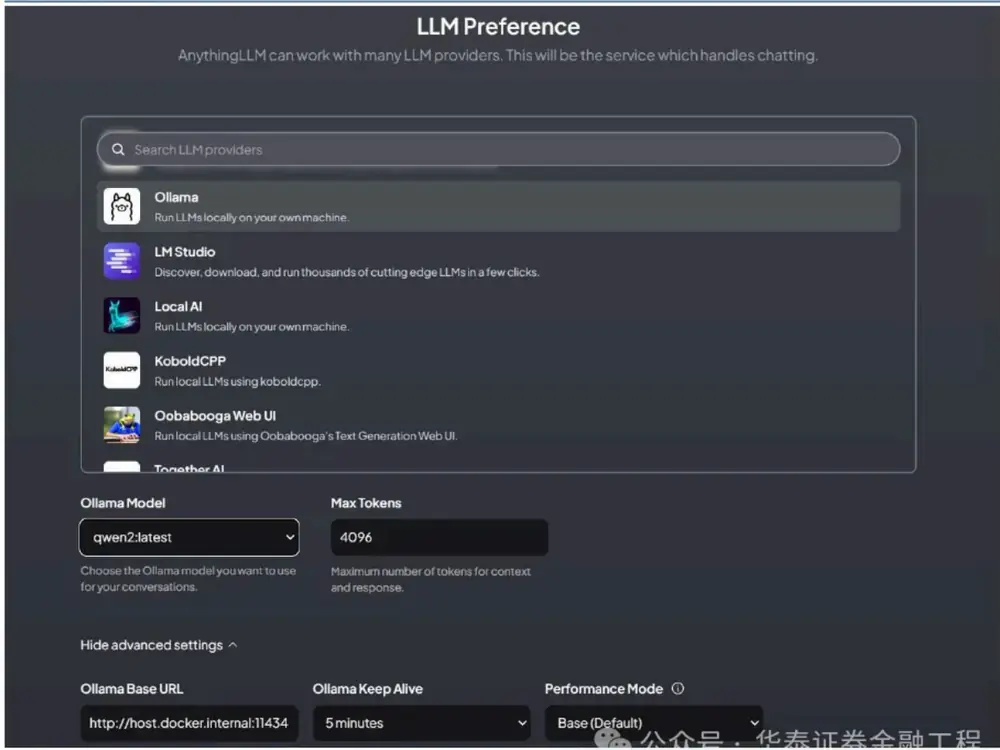

## AnythingLLM应用实例：私人知识库

AnythingLLM为用户提供了便捷的私人知识库构建途径，本文以此功能构建一个应用实例供读者参考。我们以AnythingLLM Desktop版为例，直接将80余篇华泰金工人工智能系列研究的PDF文件上传至文档库（My Documents）中，并将所有文档移动到当前工作区（Workspace），随后点击“Save and Embed”按钮，AnythingLLM将利用已设定的词嵌入模型将文档转为词向量存至向量数据库中。除聊天大模型为Ollama部署的Qwen2之外，其余均为默认配置：词嵌入模型为AnythingLLM Embedder，向量数据库为LanceDB。

向量数据库构建完毕后，意味着以华泰金工人工智能系列研究报告为主体的私人知识库搭建完成。我们可直接在对话框输入问题，大模型将以私人知识库为参考回答相关问题。例如下图中询问“请简要介绍华泰金工的GPT因子工厂2.0研究”，大模型能够相对简洁准确地将该篇研究进行总结并输出。

图表27：基于AnythingLLM的私人知识库应用实例
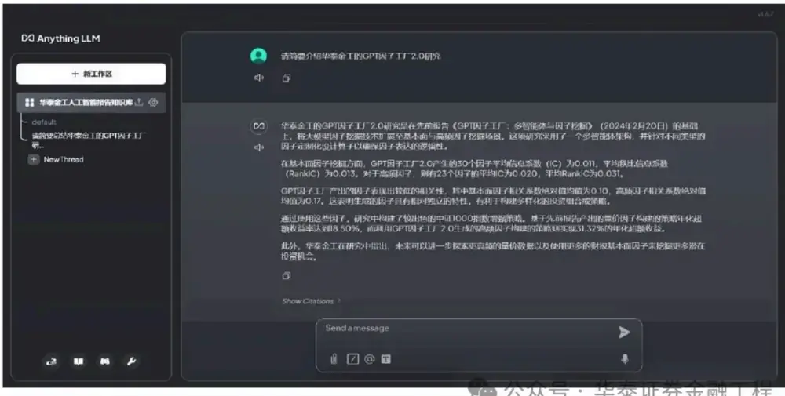

## 多智能体应用框架：Dify

相比于Anything LLM，Dify作为全流程覆盖的专业AI应用开发平台，更适合具备工程开发能力的专业用户，存在一定使用门槛。Dify界面结合了工作流、RAG、智能体、模型管理等丰富功能。核心功能主要包括以下几点：

1. 工作流（Workflow）：在画布上构建适用于大模型的AI工作流程；

2. 全面的模型支持：与数百种专有/开源大模型以及数十种推理提供商和自托管解决方案无缝集成，涵盖GPT系列、通义千问、ChatGLM以及任何与OpenAI API兼容的模型；

图表28：Dify模型支持
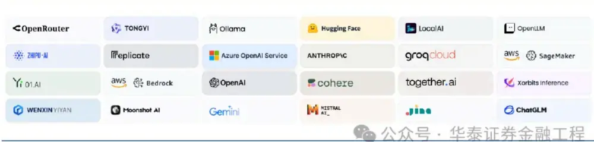

3. Prompt IDE：用于制作提示、比较模型性能以及向基于聊天的应用程序添加其他功能（如文本转语音）的直观界面；

4. 检索增强生成（RAG）：广泛的RAG功能，涵盖从文档摄入到检索的全流程，支持从PDF、PPT和其他常见文件中提取文本；

5. 智能体（Agent）：可基于LLM函数调用或ReAct提示框架定义智能体，并可为智能体添加设定或自定义工具。Dify为智能体提供了丰富的内置工具，如谷歌搜索、Stable Diffusion和WolframAlpha等；

6. LLMOps：随时间监视和分析应用程序日志和性能。可以根据生产数据和标注持续改进提示、数据集和模型；

7. API接口：所有Dify的功能都带有相应的API，因此可以轻松地将Dify集成到自己的业务逻辑中。

## Dify本地部署

根据Dify官方文档，在部署Dify之前，请确保本地硬件满足最低系统要求：CPU >= 2 Core，RAM >= 4GB。部署Dify的通用方案是使用Docker进行部署，在运行安装命令之前，请确保主机上已安装Docker和Docker Compose。首先，使用git命令克隆Dify源代码至本地：git clonehttps://github.com/langgenius/dify.git；随后，依次执行以下命令：

1. 进入Dify 源代码的Docker目录

cd dify/docker

2. 复制环境配置文件

cp .env.example .env

3. 启动Docker容器

docker compose up -d

## 4. 检查是否所有容器都正常运行

docker compose ps

最后，在浏览器中输入http://localhost即可访问dify。

图表29：Docker 部署 Dify 流程示例
[+] Running 11/11 
√ Network docker_ssrf_proxy_network Created 
√ Network docker_default Created 
√ Container docker-redis-1 Started 
√ Container docker-ssrf_proxy-1 Started 
√ Container docker-sandbox-1 Started 
√ Container docker-web-1 Started 
√ Container docker-weaviate-1 Started 
√ Container docker-db-1 Started 
√ Container docker-api-1 Started 
√ Container docker-worker-1 Started 
√ Container docker-nginx-1 Started

如果初始状态下设置管理员账户时，界面无法正常显示，且容器中postgres并未正常运行，可通过以 下 步 骤 解 决 ： 首 先 运 行 docker volume create --name=pgdata ， 接 着 在 docker-compose.yaml文件中修改postgres db的volumes为pgdata:/var/lib/postgresql/data，并在文 件 尾 部 volumes 中 增 加 pgdata: external: true ， 最 后 重 新 部 署 即 可 （ 顺 序 运 行 dockercompose down与docker compose up -d两项命令）。

Dify同样支持接入Ollama，仅需在设置-模型供应商-Ollama中填入下图所示信息即可。

图表30：Dify 接入 Ollama
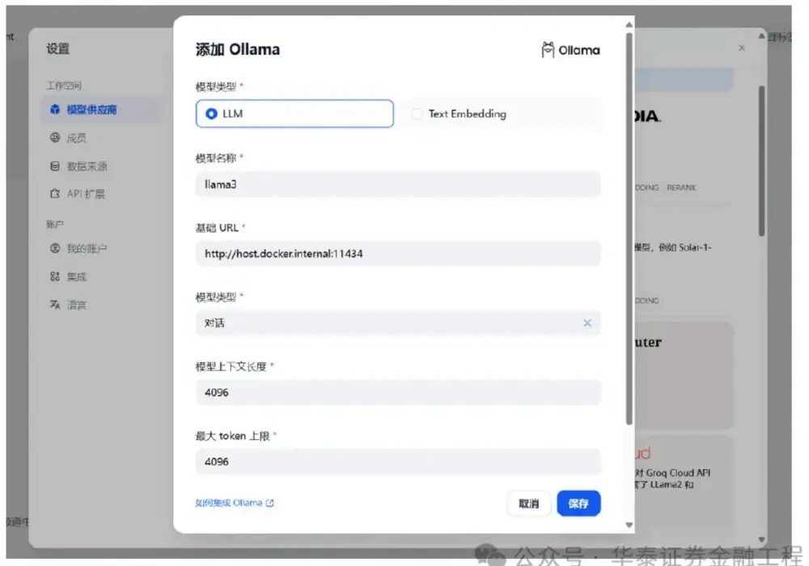

其中，基础 URL通常填写http://<your-ollama-endpoint-domain>:11434（需填写可访问到的Ollama 服 务 地 址 ） ； 若 Dify 为 Docker 部 署 ， 建 议 填 写 局 域 网 IP 地 址 ， 如 ：http://192.168.1.100:11434 或 Docker 宿 主 机 IP 地 址 （ 宿 主 机 IP 可 通 过 在 终 端 输 入 pinghost.docker.internal 获 取 ） ， 如 ： http://172.17.0.1:11434； 若 为 本 地 源 码 部 署 ， 可 填 写http://localhost:11434。

## Dify应用实例：翻译助手工作流

Dify为用户提供了海量的应用模板支持，在构建应用时，可直接从模板中构建，大大降低了应用构建难度。下图为Dify提供的部分应用模板展示。

图表31：Dify应用模板
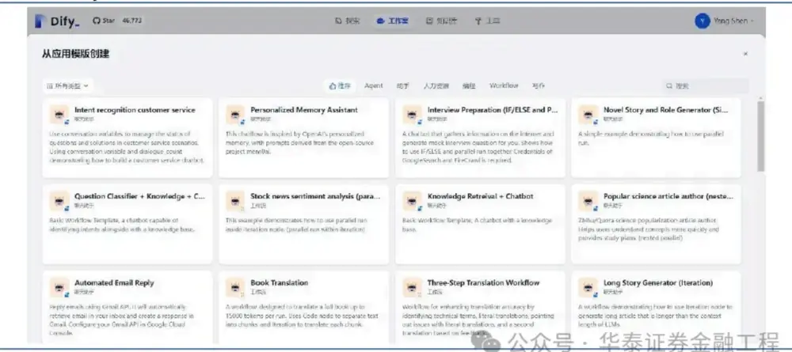

我们基于“Book Translation”应用模板构建一个简单的翻译助手应用。对于该工作流，如下图所示，首先利用一个代码（CODE）节点将输入文本切分成块，以保证大模型的翻译质量，随后将文本块送入迭代（ITERATION）节点进行循环翻译，每一次翻译均需经历4步处理，即识别术语（IDENTIFY TERMS）→首次翻译（1ST TRANSLATION）→问题（PROBLEMS）→二次翻译（2ND TRANSLATION），最后利用模板（TEMPLATE）节点将翻译内容汇总，以完成翻译任务。

图表32：基于 Dify的翻译助手工作流
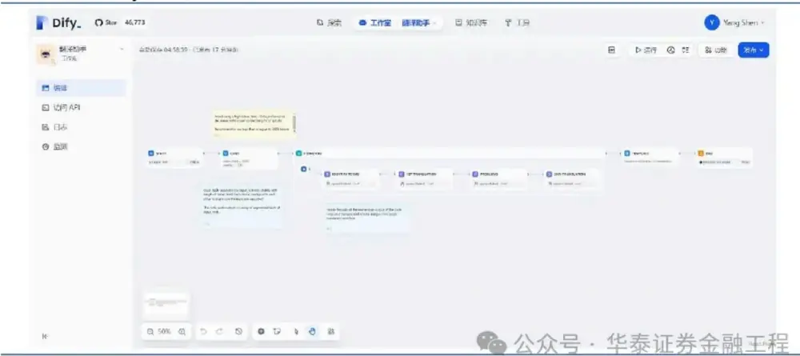

我们将华泰金工前期报告《Ten Points to Watch for CSI A500》（20240911）第一段摘要输入该翻译助手，经上述工作流后可直接获得中文翻译结果，如下图所示。整体翻译效果良好，但仍有提升空间，翻译效果可能主要取决于大模型本身能力及工作流架构设计。

图表33：基于Dify的翻译助手工作流翻译结果示例
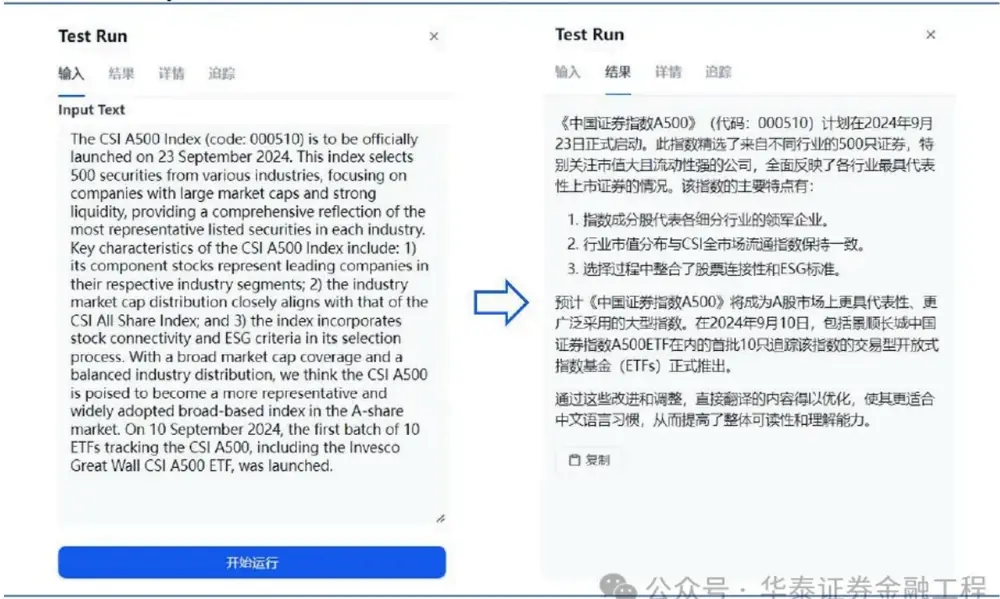

## 04 总结

本文尝试提供一份清晰易用的大模型本地部署参考手册。对于大模型本地部署，本文从前后端是否存在的角度将不同部署框架分为三类：前后端皆存在的大模型集成运行环境、仅含前端的对话式网页应用、仅含后端的本地大模型运行库，并逐一以Ollama和LM Studio、ChatGPT Next Web与llama.cpp为例进行详细的部署流程介绍，同时选择多项维度对比不同部署方案的优劣势。

对于大模型应用本地部署，本文从框架理论出发，基于RAG与多智能体架构对大模型应用框架进行分类，RAG应用框架包括Anything LLM和RAGFlow等开源框架，多智能体应用框架包括Dify、AutoGPT、AutoGen等。本文分别以AnythingLLM和Dify为例，进行框架部署流程的介绍和注意事项说明，同时尝试构建私人知识库与翻译助手应用实例，从效果上看，模型输出质量较高。值得强调的是，大模型应用的效果不仅取决于应用流程搭建，例如智能体和工作流设计，也受限于大模型本身能力。

## 总结上述部署方案，本文有以下观点：

1. 对于大模型本地部署，从用户体验与功能完备性上看，Ollama与LM Studio最值得推荐。Ollama具有一定的技术使用门槛，但通过赋予界面的额外操作，可有效降低因缺少图形界面而带来的使用难度；而LM Studio则通过其完善的图形用户界面，为非技术用户提供了更友好的体验。

2. 作为纯后端的大模型本地部署方案，llama.cpp更专注于性能优化。应用涉及推理加速或大模型量化时，可关注类似于llama.cpp的大模型推理运行库。

3. 开源大模型应用框架是探索大模型应用时既具便捷性、成本也较为低廉的参考方案。以Dify为例，可以通过简易的操作与官方模板参照快速构建应用，进而高效实现大模型应用构建的尝试。

## 风险提示：

大模型是海量数据训练获得的产物，输出准确性可能存在风险；不同大模型效果存在差异，需谨慎选择；大模型本地部署框架稳定性可能受到版本切换的影响。

相关研报

研报：《 金工：大模型本地部署手册》2024年10月07日

分析师：林晓明 S0570516010001 | BPY421

分析师：何康 S0570520080004 | BRB318

## 关注我们

联系人：沈洋 S0570123070271

## 华泰证券金融工程

主要进行量化投资相关的研究和讨论工作。

427篇原创内容

公众号

华泰证券研究所国内站（研究Portal）

https://inst.htsc.com/research 访问权限：国内机构客户

## 华泰证券研究所海外站

https://intl.inst.htsc.com/research

访问权限：美国及香港金控机构客户

添加权限请联系您的华泰对口客户经理

## 免责声明

## ▲向上滑动阅览

本公众号不是华泰证券股份有限公司（以下简称“华泰证券”）研究报告的发布平台，本公众号仅供华泰证券中国内地研究服务客户参考使用。其他任何读者在订阅本公众号前，请自行评估接收相关推送内容的适当性，且若使用本公众号所载内容，务必寻求专业投资顾问的指导及解读。华泰证券不因任何订阅本公众号的行为而将订阅者视为华泰证券的客户。

本公众号转发、摘编华泰证券向其客户已发布研究报告的部分内容及观点，完整的投资意见分析应以报告发布当日的完整研究报告内容为准。订阅者仅使用本公众号内容，可能会因缺乏对完整报告的了解或缺乏相关的解读而产生理解上的歧义。如需了解完整内容，请具体参见华泰证券所发布的完整报告。

本公众号内容基于华泰证券认为可靠的信息编制，但华泰证券对该等信息的准确性、完整性及时效性不作任何保证，也不对证券价格的涨跌或市场走势作确定性判断。本公众号所载的意见、评估及预测仅反映发布当日的观点和判断。在不同时期，华泰证券可能会发出与本公众号所载意见、评估及预测不一致的研究报告。

在任何情况下，本公众号中的信息或所表述的意见均不构成对任何人的投资建议。订阅者不应单独

## 人工智能 25

人工智能 · 目录

上一篇华泰金工 | GPT因子工厂2.0：基本面与高频因子挖掘

华泰金工 | SAM：提升AI量化模型的泛化性能

下一篇

个人观点，仅供参考