## 华泰金工 | SAM：提升AI量化模型的泛化性能

原创 林晓明 何康等 华泰证券金融工程 2024年10月12日 09:12

本研究介绍一种低成本、高通用性的正则化方法——Sharpness Aware Minimization（SAM），从优化器的角度提升模型的泛化性能。在GRU基线模型的基础上，采用传统优化器AdamW、SAM优化器及其四种改进版本进行对照实验。结果表明应用SAM优化器能显著提升模型预测因子的多头端收益，且基于各类SAM模型构建的指数增强组合业绩均显著优于基线模型。其中，GSAM模型在三组指数增强组合上均取得良好表现，沪深300、中证500和中证1000增强组合年化超额收益分别为10.9%、15.1%和23.1%，信息比率分别为1.87、2.26和3.12，显著优于基线模型，而ASAM模型2024年表现突出，三组指数增强组合超额收益均领先基线模型约5 pct。

## 核心观点

## 人工智能84：应用SAM优化器提升AI量化模型的泛化性能

本研究介绍一种低成本、高通用性的正则化方法——Sharpness Aware Minimization（SAM），从优化器的角度提升模型的泛化性能。在GRU基线模型的基础上，采用传统优化器AdamW、SAM优化器及其四种改进版本进行对照实验。结果表明应用SAM优化器能显著提升模型预测因子的多头端收益，且基于各类SAM模型构建的指数增强组合业绩均显著优于基线模型。其中，GSAM模型在三组指数增强组合上均取得良好表现，而ASAM模型2024年表现突出。

## SAM优化器通过追求“平坦极小值”，增强模型鲁棒性

SGD、Adam等传统优化器进行梯度下降时仅以最小化损失函数值为目标，易落入“尖锐极小值”，导致模型对输入数据分布敏感度高，泛化性能较差。SAM优化器将损失函数的平坦度加入优化目标，不仅最小化损失函数值，同时最小化模型权重点附近损失函数的变化幅度，使优化后模型权重处于一个平坦的极小值处，增加了模型的鲁棒性。基于SAM优化器，ASAM、GSAM等改进算法被陆续提出，从参数尺度自适应性、扰动方向的准确性等方面进一步增强了SAM优化器的性能。

## SAM优化器能降低训练过程中的过拟合，提升模型的泛化性能

SAM优化器设计初衷是使模型训练时在权重空间中找到一条平缓的路径进行梯度下降，改善模型权重空间的平坦度。可通过观察模型训练过程中评价指标的变化趋势以及损失函数地形图对其进行验证。从评价指标的变化趋势分析，SAM模型在验证集上IC、IR指标下降幅度较缓，训练过程中评价指标最大值均高于基线模型；从损失函数地形分析，SAM模型在训练集上损失函数地形相较基线模型更加平坦，测试集上损失函数值整体更低。综合两者，SAM优化器能有效抑制训练过程中的过拟合，提升模型的泛化性能。

## SAM优化器能显著提升AI量化模型表现

本研究基于GRU模型，对比AdamW优化器与各类SAM优化器模型表现。从预测因子表现看，SAM优化器能提升因子多头收益；从指数增强组合业绩看，SAM模型及其改进版本模型在三组指数增强组合业绩均显著优于基线模型。2016-12-30至2024-09-30内，综合表现最佳模型为GSAM模型，单因子回测TOP层年化收益高于31%，沪深300、中证500和中证1000增强组合年化超额收益分别为10.9%、15.1%和23.1%，信息比率分别为1.87、2.26和3.12，显著优于基线模型。2024年以来ASAM模型表现突出，三组指数增强组合超额收益均领先基线模型约5 pct。

## 正文

## 01 导读

提升泛化性能是增强AI量化模型表现的关键。对AI量化模型应用适当的正则化方法，可以进一步“强化”模型，提升其泛化性能，让量化策略的表现更进一步。正则化方法的目标为引导模型捕捉数据背后的普遍规律，而不是单纯地记忆数据样本，从而提升模型的泛化性能。正则化方法种类繁多，其通过改造损失函数或优化器、对抗训练、扩充数据集、集成模型等手段，使模型训练过程更加稳健，避免模型对训练数据的过拟合。

本研究介绍一种低成本、高通用性的正则化方法Sharpness Aware Minimization（SAM），从优化器的角度提升模型的泛化性能。该方法对传统优化器梯度下降的算法进行改进，提出了鲁棒性更强的SAM优化器，通过寻找权重空间内的“平坦极小值”，使模型不仅在训练集上表现良好，且在样本外同样表现稳定。SAM优化器提出后，学术界陆续迭代出了各类改进的SAM优化器，从不同角度进一步增强SAM优化器的表现。

本研究在GRU模型的基础上应用SAM优化器及其各类改进版本进行实验，结果表明：

1. SAM优化器相较于传统优化器在模型训练过程中验证集上过拟合速度降低，且损失函数曲面平坦度提升，展现出更强的泛化性能；

2. SAM优化器及其改进版本训练模型预测因子2016-12-30至2024-09-30内多头组年化收益31.4%，相较于等权基准信息比率4.0，相比基线模型提升显著；

3. 应用SAM优化器及其改进版本训练模型构建指数增强组合，相较于GRU基线模型提升显著，沪深300、中证500、中证1000指数增强组合超额收益提升在1-2 pct；

4. 对比各SAM优化器训练模型表现，回测全区间内GSAM模型预测因子指标及指增组合业绩指标表现较好，ASAM模型2024年以来表现突出。

图表1：基线模型与GSAM模型累计超额收益（基准为中证1000指数）
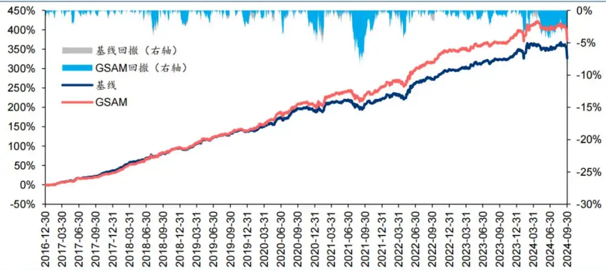

图表2： 基线模型与 GSAM 模型回测绩效对比

| 基准 | 实验名称 | 年化收益率年化波动率 |  | 夏普比率 |  | 最大回撒Calmar比率 年化超额收 年化跟踪误 |  |  |  | 信息比率超额收益最 |  | 超额收益相对基准月 |
| --- | --- | --- | --- | --- | --- | --- | --- | --- | --- | --- | --- | --- |
|  |  |  |  |  |  |  | 益率 | 差 |  | 大回撒Calmar 比率 | 胜率 |  |
| 沪深300 | 基线 | 13.0% | 19.0% | 0.68 | 26.0% | 0.50 | 9.9% | 5.8% | 1.73 | 10.2% | 0.98 | 72.0% |
|  | GSAM | 13.9% | 19.1% | 0.73 | 24.8% | 0.56 | 10.9% | 5.8% | 1.87 | 8.7% | 1.24 | 73.1% |
| 中证500 | 基线 GSAM | 12.8% 14.0% | 21.6% 21.6% | 0.59 | 32.1% | 0.40 | 14.0% | 6.6% | 2.12 | 10.2% | 1.37 | 73.1% |
|  |  |  |  | 0.65 | 32.8% | 0.43 | 15.1% | 6.7% | 2.26 | 9.4% | 1.60 | 77.4% |
|  |  | 15.2% | 24.4% | 0.62 | 34.5% | 0.44 | 21.4% | 7.5% | 2.87 | 8.8% | 2.45 | 81.7% |
| 中证1000 基线 | GSAM | 16.8% | 24.4% | 0.69 | 34.2% | 0.49 | 23.1% | 7.4% | 3.12 | 9.4% | 2.47 | 77.4% |

## 02 SAM优化器与模型泛化性能

## 正则化方法

正则化方法（regularization）旨在使模型变得“更简单”，防止过拟合。机器学习中的一个关键挑战是让模型能够准确预测未见过的数据，而不仅仅是在熟悉的训练数据上表现良好，即降低模型的泛化误差。正则化的目标是鼓励模型学习数据中的广泛模式，而不仅仅记住数据本身。正则化方法通过各类手段，使训练后的模型处于最佳状态，在训练数据和测试数据上取得同样良好的表现。

图表3：模型的泛化性能
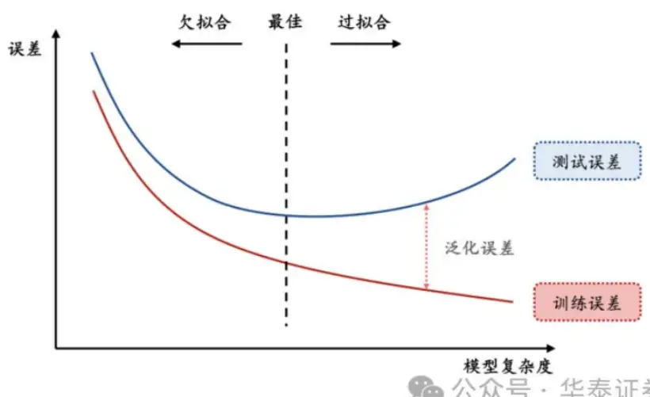

正则化方法的形式多样。其中狭义的正则化通常指显式正则化方法，即在损失函数中显式添加一个惩罚项或约束，降低模型的复杂性，典型的显式正则化项包括L1、L2正则化；而广义的正则化通常指隐式正则化，其含义较为广泛，在现代机器学习方法中无处不在，包括早停、Dropout、数据增强、去极值、多任务学习、模型集成等，几乎所有致力于增强模型泛化性能的方法都可归于此类。

图表4：正则化方法分类汇总
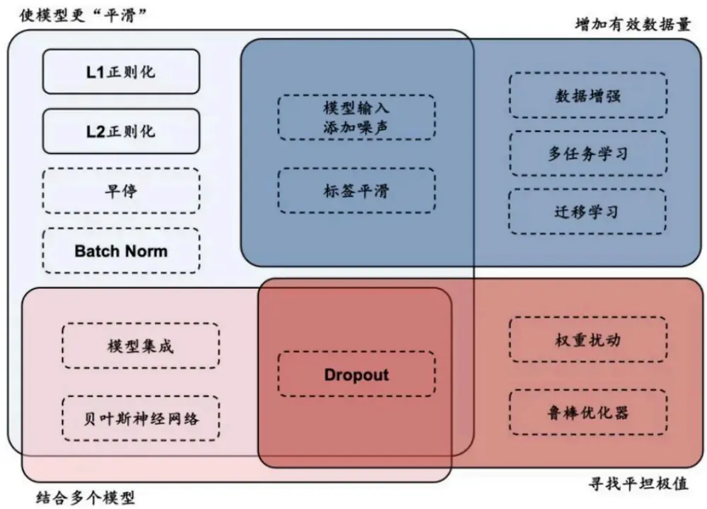

## 传统优化器及其局限性

深度学习领域中，优化器的选择对于模型训练的效率和最终性能至关重要。在众多优化算法中，随机梯度下降（SGD）及其变体是最为基础且广泛使用的优化方法之一。SGD通过逐次或批量更新权重来最小化损失函数，尽管简单有效，但其学习率的选择和振荡问题是主要局限。为了克服这些问题，Adagrad、RMSprop以及Adam等优化器被陆续提出，有效提升了SGD优化器适用性和性能。下表汇总了深度学习中常用的传统优化器的特点和局限性。

## 华泰金工 | SAM：提升AI量化模型的泛化性能

图表5：传统优化器汇总

| 优化器 | 公式 | 特点 | 局限 |
| --- | --- | --- | --- |
| SGD | $g_{t}=\nabla_{w}\frac{1}{\|\mathcal{B}_{t}\|}\cdot\sum_{i\in\mathcal{B}_{t}}L(y_{i},f(x_{i},w))$ | 通过每次迭代使用单个或一小批样本来更新权重，最小 化损失函数 | 需要手动调整学习率，且调整不当可能导致收敛速度慢 或不收敛 |
| Adagrad | $w_{t}=w_{t-1}-\eta_{t}g_{t}$ ${\pmb g}_{t}=\pmb\nabla_{{\boldsymbol w}}L({\pmb y}_{t},f({\pmb x}_{t},{\pmb w}))$ $\begin{array}{r}{s_{t}=s_{t-1}+g_{t}^{2}}\end{array}$ $\begin{array}{r}{w_{t}=w_{t-1}-\frac{\eta}{\sqrt{s_{t}+\epsilon}}\cdot g_{t}^{2}}\end{array}$ | 自适应学习率优化算法，为每个参数提供不同的学习率，学习率随着时间的推移而单调递减，最终可能变得过 提升稀疏权重优化鲁棒性 | 小，导致收敛缓慢 |
|  | ${\pmb g}_{t}=\nabla_{w}L({\pmb y}_{t},f({\pmb x}_{t},{\pmb w}))$ $\begin{array}{r}{s_{t}=\gamma\cdot s_{t-1}+(1-\gamma)\cdot g_{t}^{2}}\end{array}$ $\begin{array}{r}{w_{t}=w_{t-1}-\frac{\eta}{\sqrt{s_{t}+\epsilon}}\cdot g_{t}^{2}}\end{array}$ | 稳定性 | 需要调整学习率和指数衰减因子，调参复杂；记录各参 数滑动窗口内梯度值占用内存较高 |
| Adam | ${\pmb g}_{t}=\nabla_{w}L({\pmb y}_{t},f({\pmb x}_{t},{\pmb w}))$ $\boldsymbol{v}_{t}=\beta_{1}\cdot\boldsymbol{v}_{t-1}+(1-\beta_{1})\cdot\boldsymbol{g}_{t}$ $\begin{array}{r}{{\pmb{s}}_{t}={\pmb{\beta}}_{2}\cdot{\pmb{s}}_{t-1}+(1-{\beta}_{2})\cdot{\pmb{g}}_{t}^{2}}\end{array}$ $\begin{array}{r}{g_{t}^{\prime}=\frac{\eta_{t}\cdot\hat{v}_{t}}{\sqrt{\hat{s}_{t}}+\epsilon}}\end{array}$ | 结合了动量法和RMSprop的优点，同时使用了梯度的 一阶矩估计（动量）和二阶矩估计（梯度的平方） | 开始阶段的一阶和二阶矩估计可能有偏差，影响初期的 表现 |
| AdamW | $w_{t}=w_{t-1}-g_{t}^{\prime}$ ${\pmb g}_{t}=\nabla_{w}L({\pmb y}_{t},f({\pmb x}_{t},{\pmb w}))$ $\boldsymbol{v}_{t}=\beta_{1}\cdot\boldsymbol{v}_{t-1}+(1-\beta_{1})\cdot\boldsymbol{g}_{t}$ $\begin{array}{r}{{\pmb{s}}_{t}={\pmb{\beta}}_{2}\cdot{\pmb{s}}_{t-1}+(1-{\beta}_{2})\cdot{\pmb{g}}_{t}^{2}}\end{array}$ | 在 Adam 的基础上直接在权重更新中加入了权重衰减 (L2正则化)，而不是作为学习率的一部分 | 需要调整多个超参数 |

除了以上汇总的优缺点，传统的优化器相比本文介绍的SAM优化器还有一个共同的局限：传统优化器通常只考虑最小化训练集上的损失函数，可能陷入“尖锐极小值”，这些极小值点处虽然训练损失较低，但往往会导致过拟合现象，即模型对训练数据过度拟合而泛化性能较差。相比之下，SAM优化算法能够克服这些局限性，在训练时寻找“平坦极小值”，这些极小值不仅在训练集上表现出较低的损失，而且在测试集上也具有较好的泛化性能。

## Sharpness Aware Minimization

Sharpness Aware Minimization （ SAM ） 方 法 最 初 由 Google Research 团 队 Foret 等 人（2021）提出。该方法的出发点为对模型进行优化时，不仅希望优化后的模型权重所处位置损失函数较小，同时还希望该位置在模型权重空间中损失函数的“地形”较为平坦。由此引申出三个问题：什么是损失函数“地形”？为什么平坦的极值点处模型的泛化性能较优？如何追求平坦的极值点？

## 什么是损失函数“地形”？

损失函数地形即损失函数值与模型参数之间的变化关系。在优化问题中，损失函数可看作以模型参数为自变量的函数，用公式表示即 $L_{w}(y_{\mathcal{B}},f(x_{\mathcal{B}},w))$ 。对于神经网络这类具有大量参数的模型，自变量为一个高维向量。若不对模型参数进行降维处理，则损失函数地形为高维空间中的一个曲面，曲面上的每一个点代表一组自变量取值时的损失函数值。

由于高维空间损失函数曲面难以可视化，作为研究对象不够直观，因此通常可对模型参数降维，通过简化后的低维空间进行可视化和理解。举例来说，假设模型中只有一个可变参数，则此时损失函数地形即退化为一维的损失函数曲线；同样假设从高维模型参数中提取两个主要分量作为模型参数，即可将损失函数与参数之间的变化关系用二维曲面进行表示，这也是最为常见的做法。

图表7：损失函数地形示意图（三维山峰图形式）
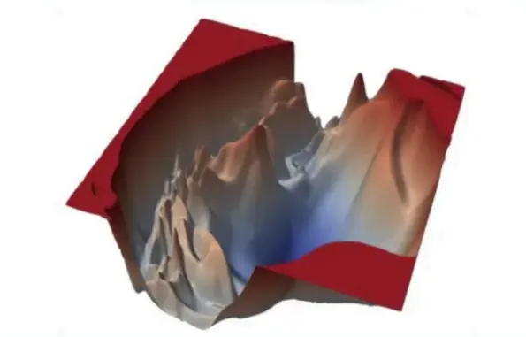

图表8：损失函数地形示意图（二维等高线形式）
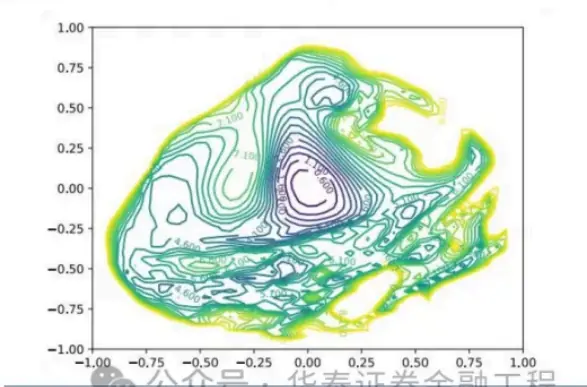
资料来源：Li et al. Visualizing the Loss Landscabe of Neural Nets. 2018.华泰

## 为什么平坦的极值点处模型的泛化性能较优？

以一维损失函数曲线为例进行说明。下图展示了两个形态不同的极值点，其中左边的极值点较为“平坦”，即损失函数随着模型参数的变化较小，而右边“尖锐”的极值点则相反。若模型训练完成后处于右边的“尖锐”极值点，虽然其在训练数据上的损失函数值较小，但当模型在测试数据上进行实际预测时，由于测试数据与训练数据之间分布的偏差，预测结果将会产生较大误差。而若模型训练完成后处于左边的“平坦”极值点，则测试数据与训练数据的偏差给模型预测带来的影响就相对微小。

## 如何追求平坦的极值点？

SAM优化器通过两次梯度下降，微调梯度下降的方向来寻找权重空间中较为平坦的极值点。具体做法为：将传统的优化器的优化目标从优化一个权重点位置处的损失函数改为优化这个点以及其扰动范围内全部点损失函数的最大值。用公式表达即：

其中 代表优化的目标函数， 代表模型权重，而 则代表权重点 附近的一个微小扰动值，为控制该扰动值大小的超参数。

而某权重点扰动范围内损失函数最大值的位置其实是已知的。常规优化算法梯度下降时沿着该权重点处损失函数的负梯度方向前进，可使损失函数最速下降。因此，损失函数最大值的位置的方向即损失函数的正梯度方向。在该权重点处沿着损失函数正梯度方向前进一小步的位置即扰动范围内损失函数最大值处。用公式表达即：

$$
\hat{\epsilon}~(w)=\rho\frac{\nabla_{w}L_{\mathcal{S}}(w)}{||\nabla_{w}L_{\mathcal{S}}(w)||_{2}}
$$

其中， $\hat{\pmb{\epsilon}}\left(\pmb{w}\right)$ 表示的就是损失函数上升最快的扰动方向， $\nabla_{w}L_{\mathcal{S}}(w)$ 为损失函数 $L_{\mathcal{S}}$ 在 $w$ 处的梯度，而分母中的 $|\nabla_{w}L_{\mathcal{S}}(w)||_{2}$ 则表示该梯度张量的二阶模。

将 $\hat{\pmb{\epsilon}}\left(\pmb{w}\right)$ 代入 $L_{\mathcal{S}}^{SAM}(\pmb{w})$ 中并求梯度，经过泰勒展开及近似，就可以得到SAM优化算法在训练时每一步实际更新的梯度：

$$
\nabla_{\pmb{w}}L_{\mathcal{S}}^{SAM}(\pmb{w})=\nabla_{\pmb{w}}L_{\mathcal{S}}(\pmb{w}+\hat{\epsilon}\left(\pmb{w}\right))\approx\nabla_{\pmb{w}}L_{\mathcal{S}}(\pmb{w})|_{\pmb{w}+\hat{\epsilon}\left(\pmb{w}\right)}
$$

即在SAM算法中，每一次梯度下降时用损失函数 $\pmb{L}_{\mathcal{S}}$ 在 $\mathbf{w}+\hat{\pmb{\epsilon}}\left(\pmb{w}\right)$ 处的梯度更新点处的模型权重。
SAM优化器算法流程示意图和伪代码如下图所示。

图表10：SAM 算法的两次梯度下降示意图
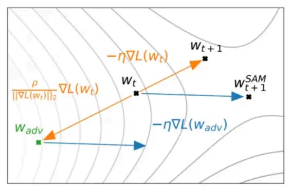

图表11：SAM 算法的伪代码
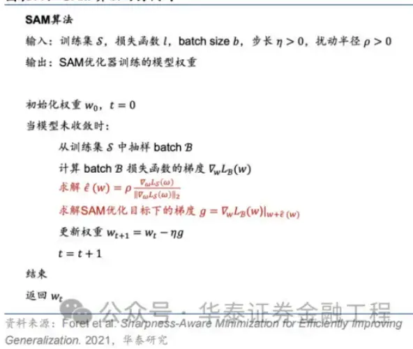

## SAM优化器的改进

SAM优化器一经提出即在学术界引起了广泛关注。SAM优化器通过简洁有效的算法逻辑增强了模型的泛化性能，但同样也存在多方面的改进空间。许多改进版本的SAM优化器被陆续提出，汇总如下：

对SAM优化器的改进主要分为两个方向，分别着重优化SAM优化器的性能和效率。对于应用于量化选股的AI模型而言，优化器的泛化性能才是最终决定模型预测效果的因素，因此优化器的效率相较于其性能并不关键。接下来简要介绍着眼于改进性能的几种改进SAM优化器。

## ASAM

Adaptive Sharpness Aware Minimization（ASAM）由Kwon等（2021）提出。ASAM优化器相较于SAM优化器的改进类似于Adagrad优化器相较于SGD优化器的改进，区别在于后者调整学习率大小以适应神经网络中不同参数的尺度，而前者调整权重空间内扰动半径以适应神经网络中不同参数的尺度。ASAM优化器引入了自适应扰动半径的概念，在计算权重空间内扰动半径时考虑到各参数的尺度，因此通过该方法计算得到的SAM优化路径与各参数本身的尺度无关，解决了SAM中锐度定义的敏感性问题，提高了模型的泛化性能。

## GSAM

Surrogate Gap Guided Sharpness Aware Minimization（GSAM）由Zhuang等（2022）提出。该研究发现扰动后损失与扰动前损失之差（即surrogate gap）更能准确衡量模型权重空间极小值处损失地形的平坦度。由此进一步推导出GSAM优化器的梯度更新方法：第一步类似于SAM，通过梯度下降最小化扰动损失；第二步则在实际更新权重时首先将扰动前梯度在扰动后梯度方向上投影得到垂直分量，接着将扰动后梯度与该垂直方向分量相加得到最终梯度下降的方向，更新模型权重。

图表15：GSAM优化器的梯度下降方向示意图
图表16：GSAM 算法的伪代码
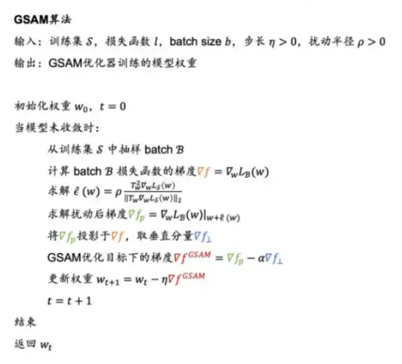

## GAM

Gradient Norm Aware Minimization（GAM）由Zhang等（2023）提出。本研究发现，应用SAM方法时常常因为小区域内存在多个极值点的情形导致“误判”：即使在小扰动半径内损失函数波动非常剧烈，但因为扰动后参数点的损失函数与扰动前差距较小而认为在该扰动范围内损失函数是“平坦”的。因此，GAM方法通过同时优化扰动半径内的零阶平坦度（损失函数平坦度）以及一阶平坦度（梯度平坦度）避免了该种“误判”。

图表17：GAM 算法中的零阶平坦度和一阶平坦度
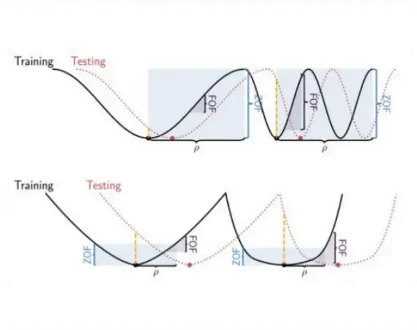

图表18：GAM 算法的伪代码
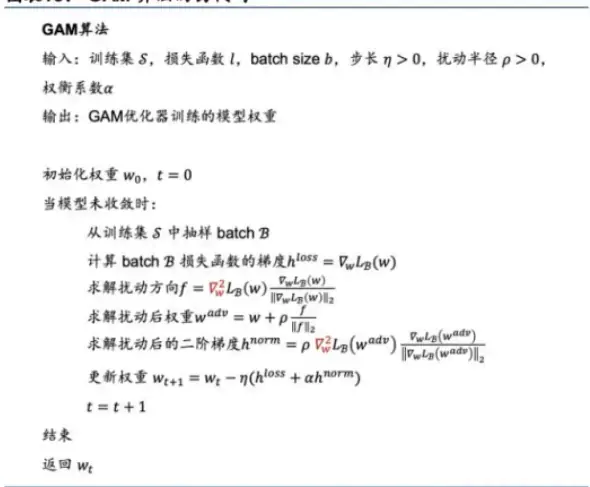

## FSAM

Friendly Sharpness Aware Minimization（FSAM）由Li等（2024）提出。研究发现SAM优化器的扰动方向可以被分解为全梯度分量和仅与每个小批量相关的随机梯度噪声分量，且前者对泛化性能的有显著的负面影响。FSAM优化器通过指数移动平均（EMA）估计扰动方向中的全梯度分量，并将其从扰动向量中剥离，仅利用随机梯度噪声分量作为扰动向量，成功减少了全梯度成分对泛化性能的负面影响，从而提高了模型的泛化性能。

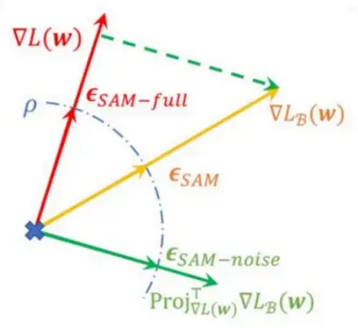

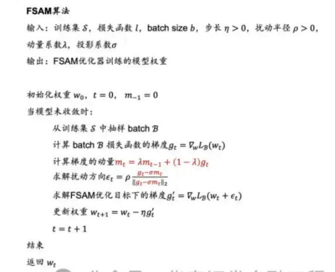
资料来源：Lretal. Frièndly Shatpness-Aware Mmimization.2024一华泰究

## 03 实验方法

## 基线模型

本研究基于端到端的GRU量价因子挖掘模型测试SAM优化器的改进效果。基线模型的构建方法如下图，分别使用两个GRU模型从日K线和周K线中提取特征得到预测值，作为单因子，再将两个单因子等权合成得到最终的预测信号。GRU模型的构建细节可参考《神经网络多频率因子挖掘模型》（2023-05-11），本文不做展开。

图表21：基线模型网络结构
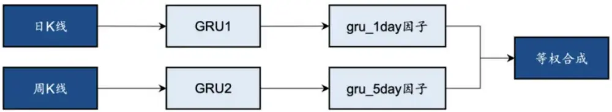

基线模型输入数据细节及训练超参数设置如下表：

图表22：基线模型训练细节

| 特征和标签 | 输入特征：过去30日（周）的开、高、低、收、vwap、成交量 预测标签：未来10日收益率 |
| --- | --- |
|  | 特征预处理：先用收盘价和成交量对时序数据去量纲，再针对面板数据进行7倍中位数去极值、标准化、 |
|  | 填充缺失值 标签预处理：截面5倍中位数去极值、行业市值中性化、标准化 |
|  | 数据集划分：训练集10年，验证集、测试集均为1年，每隔1年滚动训练 |
| 模型训练参数 | 随机数种子点：5组不同随机数种子点，预测结果取均值 GRU层数：2；隐藏层维度：64 Batch Size：5000，从训练集中随机选取样本；时序长度：30 损失函数：IC的相反数 最大迭代次数：100；早停次数：20 |

## SAM优化器

SAM优化器的突出特点即适用性强，同一种SAM优化器能够封装各类不同的基础优化器，而无需对模型训练的流程进行大范围的修改。本研究将SAM优化器应用于基线模型，GRU的网络结构及超参数均不做改变，仅改变模型训练时使用的优化器。其中，SAM优化器及其4种改进版本均选取AdamW作为基础优化器，优化器的学习率、动量和权重衰减等超参数均不做调整。5组对比实验采用的SAM优化器及其特有参数取值汇总如下。

图表23：SAM 优化器超参数设置

| 优化器 | 参数 参数值 |
| --- | --- |
| SAM ASAM | 扰动半径系数 0.05 扰动半径系数 |
|  | 0.5 自适应率 0.01 |
| GSAM | 扰动半径系数 0.05 垂直分量权重 0.2 |
| GAM | 零阶扰动半径系数 0.02 一阶扰动半径系数 0.2 |
| FSAM | 扰动半径系数 0.05 |
|  | 动量衰减系数 0.9 |
|  | 动量分量权重 公众号·华泰证券金融工程.01 |

## 04 实验结果

本研究在GRU基线模型的基础上，保持模型结构、数据集不变，改变训练使用的优化器共进行6组对比实验。以下分别从模型训练时的收敛性、损失函数地形、模型预测因子表现和基于模型构建指数增强组合业绩等方面展示实验结果。

## 模型收敛性

模型训练过程中损失函数和评价指标在验证集上表现的变化趋势是模型泛化性能最直观的体现。若 训练时随着Epoch增加，验证集的评价指标短暂提升后迅速下降，则说明模型过拟合严重，泛化性 能不佳；反之，若验证集的评价指标随着Epoch增加稳健提升，则说明模型泛化性能较好。

本节选取相同种子点、相同数据集下的基线模型与SAM模型，对比训练过程中两者在验证集上IC、IR等指标的变化趋势。

图表24：训练过程中验证集IC变化趋势
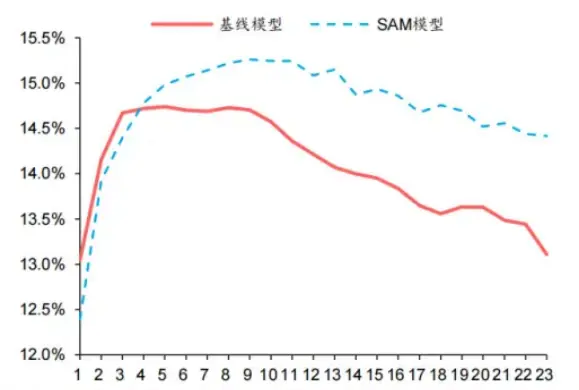

图表25：训练过程中验证集IR变化趋势
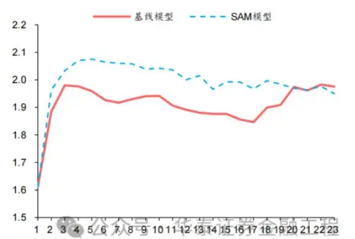

结果表明，基线模型与SAM模型在验证集上IC、IR指标变化趋势均为先上升后下降，但相较而言，SAM模型下降幅度较缓，且训练过程中指标最大值均高于基线模型，证明SAM优化器有效抑制了过拟合，提升了模型的泛化性能。

## 损失函数地形

SAM优化器设计初衷是使模型训练时在权重空间中找到一条平缓的路径进行梯度下降，即每次权重更新时损失函数不剧烈变化，最终在权重空间中停留在一个平坦的极值点处。因此，本节尝试对模型权重空间上的损失函数进行可视化，以检验SAM优化器的应用效果。

循环神经网络的权重通常包含数以万计的参数，以GRU为例，输入时序维度为30、隐藏层维度为64、特征数为6、层数为2的网络共包含40000多个权重参数，每次梯度下降时，优化器同时对所有参数迭代更新。因此，可视化一个数万维度权重空间上的损失函数值并非易事。常见的解决方法为通过PCA、t-SNE等技术将高维空间的权重降维至二维或三维，从而绘制一幅损失函数“地形图”。

本研究采用PCA方法，绘制损失函数“地形图”，具体步骤如下：

1. 选取训练轨迹上验证集最优权重作为原点；

2. 对训练轨迹上的所有权重向量运用主成分分析，从中提取出两个主成分向量，分别作为二维图像的两个轴方向；

3. 生成一组二维离散点阵作为图像每个像素点的坐标，并对每个坐标点对应的神经网络权重在给定数据集上使用全部样本进行一次推理，计算损失函数值，作为该点的像素值。该步骤完成后即可绘制出一张二维的损失函数地形图像；

4. 将模型训练时每个Epoch的模型权重投影至该二维平面，实现模型训练轨迹的可视化。

依据该方法，本文选取基线模型与SAM模型，在相同数据集和相同的随机数种子点的前提下，分别绘制损失函数地形图。绘制时对两组实验分别选取主成分轴，并采用相同的损失函数等高线和相同的像素分辨率，分别绘制训练集和测试集上的损失函数地形，结果如下：

对比以上结果发现：

1. 两组实验的第一主成分轴均达到80%左右的方差贡献率，且两个主成分轴的累计贡献率均超过了90%，说明两幅损失函数曲面图均能很好的反映训练轨迹沿途损失函数的变化趋势；

2. 训练集上基线模型损失函数地形图等高线较为密集，而SAM模型损失函数地形图等高线较为稀疏且分布均匀，说明SAM优化器能有效改善损失地形的平坦度，符合预期；

3. SAM模型在测试集上的损失函数地形与基线模型相比整体损失函数值较低，其中SAM模型早停处损失函数值小于-0.17，而基线模型早停处损失函数值大于-0.16，说明SAM模型泛化误差较小，即在训练数据与测试数据上表现同样良好，有效抑制了过拟合。

## 因子表现

针对6组实验，分别测试模型预测因子表现。单因子测试的细节如下：

图表30：单因子测试细节

| 预测因子 每组实验 pv1day 与 pv5day 因子截面标准化后等权合成 |  |
| --- | --- |
| 测试区间 | 2016-12-30 至2024-09-30 |
| 测试范围 | 中证全指成分股 |
| IC 值分析 | 每个截面日预测因子与未来10日收益率间计算RanklC |
| 分层回测 | 根据预测因子从高到低分为10组，回测时周频调仓，不计交易费用。华泰证券金融工程 |

测试结果如下，可得出如下结论：

1. SAM模型与基线模型预测因子RankIC及RankICIR表现接近，表明将传统优化器改为SAM优化器并未显著提升模型预测因子的RankIC表现；

2. 5组SAM模型TOP组收益率均高于基线模型，其中GAM、GSAM、FSAM组提升较为明显，FSAM模型表现最佳。证明应用SAM优化器能有效改善预测因子多头端预测准确性，提升多头组表现；

3. 几组实验预测因子分层效果均较为优异，多头端收益5组SAM优化器模型普遍高于基线模型。

图表31：单因子测试结果

| 实验名称 | RankIC 均值 RankIC 波动率 |  | RankICIR |  | RankIC 胜率 TOP 组收益率 | TOP 组胜率 | TOP 组信息比率 |
| --- | --- | --- | --- | --- | --- | --- | --- |
| 基线 | 13.62% | 10.40% | 1.31 | 90.49% | 30.26% | 60.28% | 3.86 |
| SAM | 13.51% | 10.46% | 1.29 | 90.39% | 30.50% | 60.38% | 3.81 |
| ASAM | 13.46% | 10.41% | 1.29 | 90.39% | 30.61% | 59.75% | 3.86 |
| GAM | 13.59% | 10.41% | 1.30 | 90.76% | 31.39% | 61.66% | 3.97 |
| GSAM | 13.59% | 10.41% | 1.31 | 90.65% | 31.25% | 61.07% | 3.98 |
| FSAM | 13.56% | 10.35% | 1.31 | 90.87% | 31.41% | 61.02% | 4.04 |

图表34：分层回测净值
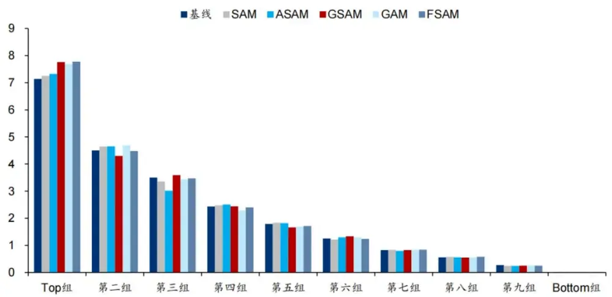
注：股票池：中证全指成分股：回测区间：2016-12-30至2024-09-30；周频调仓公升变易费用泰组收为金益。程

## 指数增强组合表现

将以上6组实验得到的预测因子应用于组合优化，分别构建沪深300、中证500及中证1000指数增强组合。组合优化及回测细节如下。

图表35：组合优化及回测细节

| 组合优化 | 成分股权重约束：不低于80% |
| --- | --- |
|  | 控制风格：市值（Size）、非线性市值（NLS） |
|  | 风格暴露约束：0.3 |
|  | 行业暴露约束：0.02 |
|  | 个股绝对权重上限：0.15 个股权重偏离上限：0.01 |
| 回测 | 单边换手率上限：0.2 |
|  | 调仓频率：周频 |
| 成交价格：vwap |  |
| 调仓费率：双边千分之三 | 公众号·华泰证券金融工程 |

## 沪深300增强组合

基于6组实验预测因子构建的沪深300指数增强组合回测结果如下。测试结果表明，SAM模型及4个改进模型年化超额收益及信息比率相较于基线模型均有稳定提升。其中GSAM模型表现最佳，年化超额收益、信息比率、超额收益Calmar比率及胜率在几组实验中均排名第一。

图表36：沪深300指增组合回测绩效

| 实验名称 | 年化收益率年化波动率 |  | 夏普比率 | 最大回撤 | 年化超额收 | 年化跟踪误 | 信息比率超额收益最 | 超额收益 |  | 相对基准月 | 年化双边换 |
| --- | --- | --- | --- | --- | --- | --- | --- | --- | --- | --- | --- |
|  |  |  |  |  |  |  |  | 差 |  |  |  |
| 基线 | 13.0% | 19.0% | 0.68 | 26.0% | 益率 9.9% | 5.8% | 1.73 | 10.2% | 大回撤 Calmar 比率 0.98 | 胜率 72.0% | 手率 20.23 |
|  | 13.8% | 19.1% | 0.72 | 25.0% | 10.8% | 5.9% | 1.85 | 8.9% | 1.22 | 72.0% | 20.24 |
| SAM ASAM | 13.5% | 18.9% | 0.71 | 25.5% | 10.5% | 5.7% | 1.82 | 8.8% | 1.19 | 71.0% | 20.21 |
| GAM | 13.5% | 19.0% | 0.71 | 26.6% | 10.5% | 5.8% | 1.81 | 8.6% | 1.23 | 73.1% | 20.22 |
| GSAM | 13.9% |  | 0.73 |  |  |  | 1.87 |  | 1.24 |  |  |
| FSAM |  | 19.1% | 0.72 | 24.8% | 10.9% | 5.8% |  | 8.7% |  | 73.1% | 20.22 |
|  | 13.8% | 19.0% |  | 26.0% | 10.8% | 5.8% | 1.86 | 10.0% | 1.07 | 69.9% | 20.23 |

图表37：沪深300指增组合累计超额收益
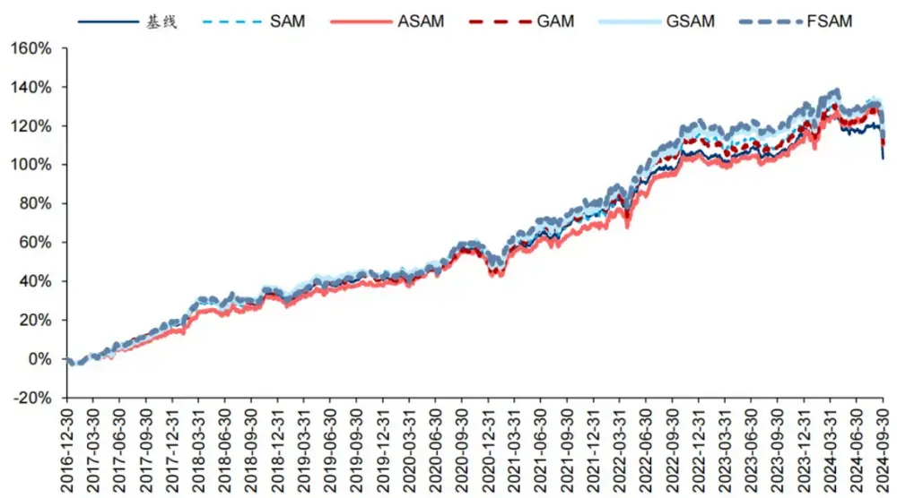

图表38：基线模型与GSAM模型累计超额收益（基准为沪深300指数）
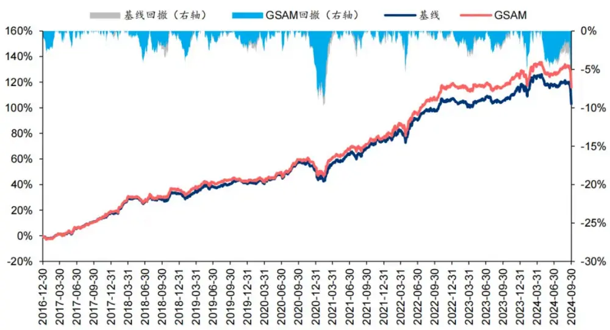

## 中证500增强组合

基于6组实验预测因子构建的中证500指数增强组合回测结果如下。测试结论与沪深300类似，GSAM模型年化超额最高为15.1%，FSAM模型信息比率最高为2.29。另外，除了GAM模型外，其余模型在回撤控制和月度胜率方面相较于基线模型也同样具有优势。

图表39：中证 500 指增组合回测绩效

| 实验名称 | 年化收益率年化波动率 |  | 夏普比率 | 最大回撤 | 年化超额收 | 年化跟踪误 | 信息比率 超额收益最 |  |  | 超额收益 相对基准月 | 年化双边换 手率 |
| --- | --- | --- | --- | --- | --- | --- | --- | --- | --- | --- | --- |
|  |  |  |  |  |  |  |  | 差 | 大回撒 Calmar 比率 |  |  |
| 基线 | 12.8% | 21.6% | 0.59 | 32.1% | 益率 14.0% | 6.6% | 2.12 | 10.2% | 1.37 | 胜率 73.1% | 20.30 |
|  | 13.4% | 21.7% | 0.62 | 32.9% | 14.6% | 6.7% | 2.17 | 8.4% | 1.74 | 73.1% | 20.29 |
| SAM ASAM | 13.0% | 21.5% | 0.60 | 33.8% | 14.1% | 6.7% | 2.12 | 9.3% | 1.51 | 77.4% | 20.26 |
| GAM | 13.7% | 21.7% | 0.63 | 31.9% | 14.9% | 6.7% | 2.22 | 10.3% | 1.45 | 77.4% | 20.29 |
| GSAM | 14.0% | 21.6% |  |  |  | 6.7% | 2.26 |  | 1.60 |  |  |
| FSAM |  |  | 0.65 0.64 | 32.8% | 15.1% 15.0% | 6.6% | 2.29 | 9.4% | 1.59 | 77.4% | 20.30 |
|  | 13.8% | 21.6% |  | 32.7% |  |  |  | 9.5% |  | 74.2% | 20.28 |

图表40：中证 500 指增组合累计超额收益
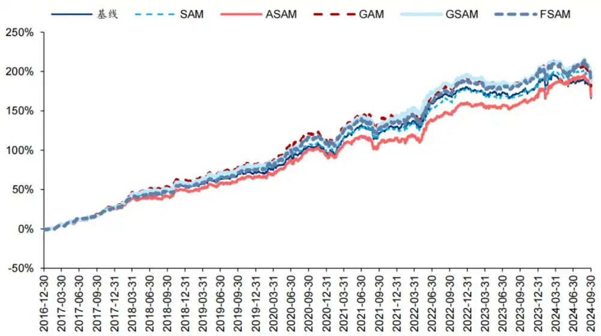

图表41：基线模型与GSAM模型累计超额收益（基准为中证500指数）
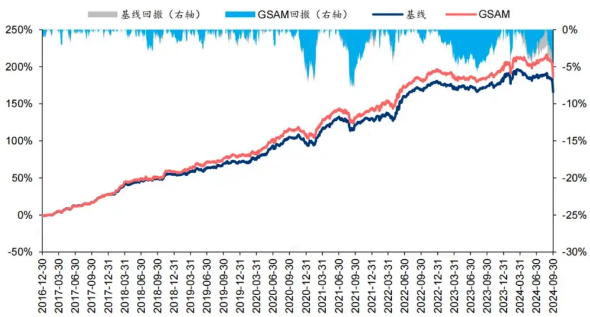

## 中证1000增强组合

基于6组实验预测因子构建的中证1000指数增强组合回测结果如下。测试结果表明，SAM优化器模型在年化超额收益和信息比率指标上相对基线模型均有明显优势，可将年化超额收益提升2%，信息比率提升0.2左右。其中从超额收益及信息比率角度看表现最好的模型为ASAM，可将年化超额收益从21.4%提升至24.6%，信息比率从2.87提升至3.25。

图表42：中证1000 指增组合回测绩效

| 实验名称 | 年化收益率年化波动率 |  | 夏普比率 | 最大回撤 | 年化超额收 益率 | 年化跟踪误 | 信息比率超额收益最 | 超额收益 |  | 相对基准月 | 年化双边换 手率 |
| --- | --- | --- | --- | --- | --- | --- | --- | --- | --- | --- | --- |
|  |  |  |  |  |  |  |  | 差 | 大回撤 Calmar 比率 |  |  |
| 基线 | 15.2% | 24.4% | 0.62 | 34.5% | 21.4% | 7.5% | 2.87 | 8.8% | 2.45 | 胜率 81.7% | 20.35 |
| SAM | 16.8% | 24.6% | 0.68 | 34.9% | 23.2% | 7.6% | 3.06 | 8.1% | 2.87 | 80.6% | 20.34 |
| ASAM | 18.3% | 24.3% | 0.75 | 33.6% | 24.6% | 7.6% | 3.25 | 8.9% | 2.76 | 82.8% | 20.33 |
| GAM | 16.9% | 24.5% | 0.69 | 32.9% | 23.2% | 7.5% | 3.07 | 8.9% | 2.61 | 82.8% | 20.31 |
| GSAM | 16.8% | 24.4% | 0.69 | 34.2% | 23.1% | 7.4% | 3.12 | 9.4% | 2.47 | 77.4% | 20.30 |
| FSAM | 16.5% | 24.4% | 0.67 | 34.3% | 22.8% | 7.5% | 3.04 | 10.3% | 2.20 | 78.5% | 20.36 |

图表43：中证1000指增组合累计超额收益
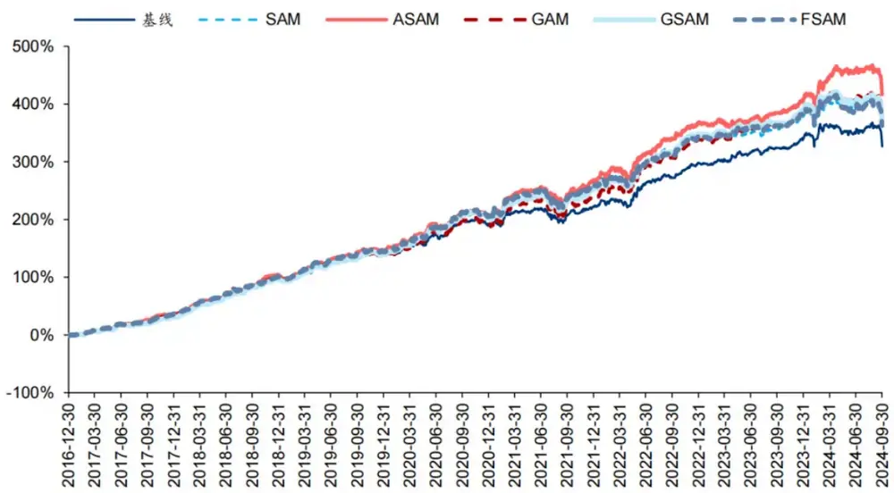

图表44：基线模型与GSAM模型累计超额收益（基准为中证1000指数）
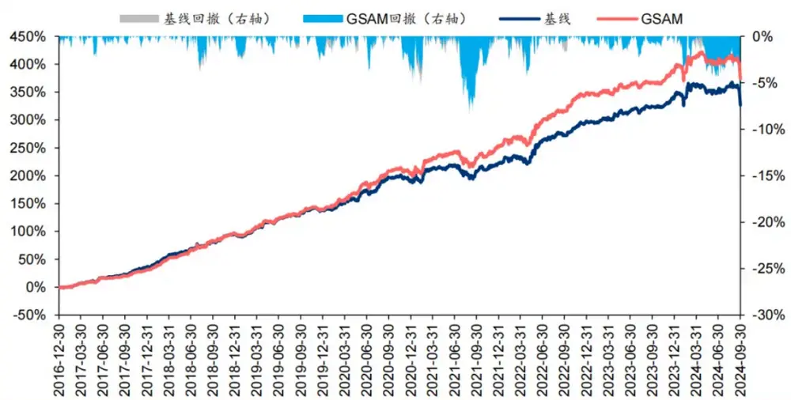

## 2024年业绩表现

统计各指增组合2024年以来业绩表现如下。分析发现，各指增组合在2024年9月末的大幅波动下超额收益均迎来显著回撤。但SAM模型及其改进模型相对基线模型均具有稳定优势。其中ASAM模型在2024年表现突出，三组指增业绩均排名第一，且超额收益领先基线模型约5%。

图表45：沪深 300 指增组合 2024 年累计超额收益
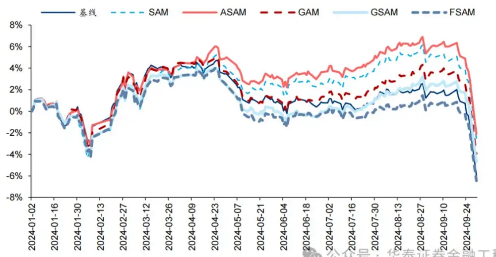

图表46：沪深300 指增组合 2024年月度超额收益

| 1月 2月 3月 4月 5月 6月 |  |  |  |  |  |  | 7月 8月 9月 2024年1至9月 |  |  |  |
| --- | --- | --- | --- | --- | --- | --- | --- | --- | --- | --- |
| 基线 | 1.02% | 3.33% | 0.98% -0.60% |  | -2.48% | -0.13% | 0.40% 0.04% |  | -7.10% | -4.79% |
| SAM | -0.25% | 3.28% | 1.83% 0.22% |  | -1.44% | 0.03% | 1.63% | 0.37% | -6.82% | -1.48% |
| ASAM | 0.76% | 3.45% | 1.00% 0.92% |  | -1.69% | 0.39% | 1.27% | 0.39% | -7.09% | -0.96% |
| GAM | 0.73% | 3.32% | 1.45% | -0.64% | -2.46% | 0.22% | 0.79% 0.67% |  | -6.60% | -2.81% |
| GSAM | -0.02% | 3.11% | 1.09% | -0.63% | -2.37% | -0.08% | 1.19% 0.83% |  | -6.53% | -3.66% |
| FSAM | 0.11% | 2.90% | 1.25% -0.68% |  | -2.77% | 0.19% 0.32%公-0.01% |  |  | -6.55%证 | 券金融工-5.40% |

图表47：中证500 指增组合 2024 年累计超额收益
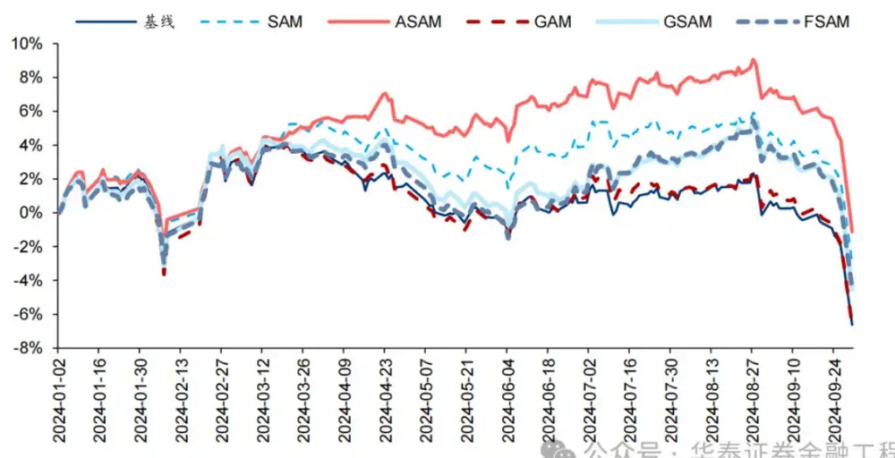

图表48：中证500指增组合 2024 年月度超额收益

|  | 1月 | 2月 3月 4月 5月 |  |  |  | 6月 7月 |  | 8月 9月 2024年1至9月 |  |  |
| --- | --- | --- | --- | --- | --- | --- | --- | --- | --- | --- |
| 基线 | 3.51% | 0.54% | 0.85% | -1.62% | -1.93% | 0.82%0.42% |  | -1.14% | -6.49% | -5.22% |
| SAM | 3.88% | 0.78% | 1.72% | -0.87% | -1.31% | 1.19% 0.74% |  | -0.54% | -6.78% | -1.54% |
| ASAM | 3.92% | 0.95% | 2.04% | 0.36% -0.11% |  | 1.32% 0.30% |  | -0.50% | -7.39% | 0.50% |
| GAM | 3.12% | 0.99% | 0.44% | -1.71% | -1.56% | 1.02% | 0.40% | -0.87% | -6.93% | -5.29% |
| GSAM | 3.09% | 1.46% | 0.73% | -0.93% | -2.34% | 0.95% | 1.60% | 0.01% | -7.40% | -3.18% |
| FSAM | 2.89% | 0.96% | 0.84% | -0.95% | -2.49% | 1.34% | 2.07%公 | 0.14% | -7.35%证 | 券金融工317% |

图表49：中证1000 指增组合 2024 年累计超额收益
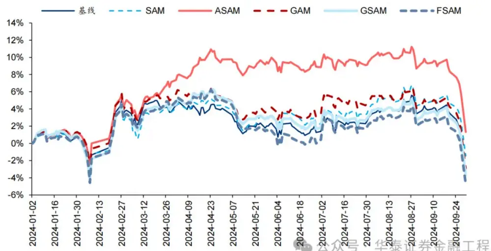

图表50：中证1000指增组合2024年月度超额收益

| 基线 | 1月 2月 |  | 3月 4月 5月 6月 7月 |  |  |  | 8月 9月 2024年1至9月 |  |  |
| --- | --- | --- | --- | --- | --- | --- | --- | --- | --- |
|  | 1.58% | 3.25% | -0.09% 0.38% | -1.64% | -1.08% | 1.73% | 0.41% | -6.87% | -2.63% |
| SAM | 1.39% | 2.49% | 0.62% 0.78% | -1.12% | -1.10% | 1.84% | 0.31% | -5.55% | -0.57% |
| ASAM | 2.24% | 3.52% | 2.30% 2.46% | 0.19% | -0.97% | 0.56% | -0.75% | -6.79% | 2.41% |
| GAM | 2.20% | 3.03% | 0.84% 0.25% | -1.17% | -1.10% | 1.88% | -0.85% | -6.72% | -1.96% |
| GSAM | 1.62% | 2.71% | 0.87% 1.03% | -2.05% | -1.45% | 1.45% | -0.47% | -6.18% | -2.72% |
| FSAM | 1.49% | 2.66% | 0.98% 0.70% | -3.39% | -1.45% | 2.23%公众 | 19% | -6.64证券金融工391% |  |

## 05 总结

本研究介绍一种低成本、高通用性的正则化方法Sharpness Aware Minimization（SAM），从优化器的角度提升模型的泛化性能。本文首先综述各类正则化方法在改善模型泛化性能中的重要性，其次分析SAM优化器相较于传统优化器的改进及其原理，接着介绍学术界对SAM优化器的进一步改进，最后以端到端的GRU量价因子挖掘模型作为基线模型，改变训练模型使用的优化器进行实证。结果表明应用SAM优化器能有效抑制模型过拟合，显著提升模型预测因子的多头端收益，且基于各SAM模型构建的指数增强组合业绩均显著优于基线模型。

提升泛化性能是增强AI量化模型表现的关键。对AI量化模型应用适当的正则化方法，可以进一步“强化”模型，提升其泛化性能，让量化策略的表现更进一步。正则化方法的目标为引导模型捕捉数据背后的普遍规律，而不是单纯地记忆数据样本，从而提升模型的泛化性能。正则化方法种类繁多，其通过改造损失函数或优化器、对抗训练、扩充数据集、集成模型等手段，使模型训练过程更加稳健，避免模型对训练数据的过拟合。

SAM优化器通过追求“平坦极小值”，增强模型鲁棒性。SGD、Adam等传统优化器进行梯度下降时仅以最小化损失函数值为目标，易落入“尖锐极小值”，导致模型其对输入数据分布敏感度高，泛化性能较差。SAM优化器将损失函数的平坦度加入优化目标，不仅最小化损失函数值，同时最小化模型权重点附近损失函数的变化幅度，使优化后模型权重处于一个平坦的极小值处，增加了模型的鲁棒性。基于SAM优化器，ASAM、GSAM等改进算法被陆续提出，从参数尺度自适应性、扰动方向的准确性等方面进一步增强了SAM优化器的性能。

SAM优化器能降低训练过程中的过拟合，提升模型的泛化性能。SAM优化器设计初衷是使模型训练时在权重空间中找到一条平缓的路径进行梯度下降，改善模型权重空间的平坦度。可通过观察模型训练过程中评价指标的变化趋势以及损失函数地形图对其进行验证。从评价指标的变化趋势分析，SAM模型在验证集上IC、IR指标下降幅度较缓，训练过程中评价指标最大值均高于基线模型；从损失函数地形分析，SAM模型在训练集上损失函数地形相较基线模型更加平坦，测试集上损失函数值整体更低。综合两者，SAM优化器能有效抑制训练过程中的过拟合，提升模型的泛化性能。

SAM优化器能显著提升AI量化模型表现。本研究基于GRU模型，对比AdamW优化器与各类SAM优化器模型表现。从预测因子表现看，SAM优化器能提升因子多头收益；从指数增强组合业绩看，SAM模型及其改进版本模型在三组指数增强组合业绩均显著优于基线模型。2016-12-30至2024-09-30内，综合表现最佳模型为GSAM模型，单因子回测TOP层年化超额收益高于31%，沪深300、中证500和中证1000增强组合年化超额收益分别为10.9%、15.1%和23.1%，信息比率分别为1.87、2.26和3.12，显著优于基线模型。2024年以来ASAM模型表现突出，三组指数增强组合超额收益均领先基线模型约5%。

## 本研究仍存在以下未尽之处：

1. 本研究测试SAM模型均采用文献中推荐参数，并未针对AI量化模型做大范围参数调优；

2. 本研究仅对SAM优化器的性能改进版本优化器进行测试，未对效率改进版本的优化器进行测试。SAM优化器在训练时需要进行两次梯度下降，由此会带来一定的额外计算成本，对SAM优化器的效率进行改进有望提升AI量化模型的训练效率；

3. 本研究对各改进版本的SAM优化器进行单独测试，后续研究中可尝试结合各类改进方向，得到一个综合改进版本的SAM优化器。

## 参考文献

Kwon, J., Kim, J., Park, H., Choi, I.K., 2021. ASAM: Adaptive Sharpness-Aware Minimization for Scale-Invariant Learning of Deep Neural Networks, in: Proceedings of the 38th International Conference on Machine Learning. Presented at the International Conference on Machine Learning, PMLR, pp. 5905–5914.

Sun, Y., Shen, L., Chen, S., Ding, L., Tao, D., 2023. Dynamic Regularized Sharpness Aware Minimization in Federated Learning: Approaching Global Consistency and Smooth Landscape, in: Proceedings of the 40th International Conference on Machine Learning. Presented at the International Conference on Machine Learning, PMLR, pp. 32991– 33013.

Li, T., Yan, W., Lei, Z., Wu, Y., Fang, K., Yang, M., Huang, X., 2022. Efficient Generalization Improvement Guided by Random Weight Perturbation.

Du, J., Yan, H., Feng, J., Zhou, J.T., Zhen, L., Goh, R.S.M., Tan, V.Y.F., 2022. Efficient Sharpness-aware Minimization for Improved Training of Neural Networks.

Li, T., Zhou, P., He, Z., Cheng, X., Huang, X., 2024. Friendly Sharpness-Aware Minimization. Presented at the Proceedings of the IEEE/CVF Conference on Computer Vision and Pattern Recognition, pp. 5631–5640.

Zhang, X., Xu, R., Yu, H., Zou, H., Cui, P., 2023. Gradient Norm Aware Minimization Seeks First-Order Flatness and Improves Generalization. Presented at the Proceedings of the IEEE/CVF Conference on Computer Vision and Pattern Recognition, pp. 20247–20257.

Mi, P., Shen, L., Ren, T., Zhou, Y., Sun, X., Ji, R., Tao, D., 2022. Make Sharpness-Aware Minimization Stronger: A Sparsified Perturbation Approach.

Zhao, Y., Zhang, H., Hu, X., 2023. Randomized Sharpness-Aware Training for Boosting Computational Efficiency in Deep Learning.

Foret, P., Kleiner, A., Mobahi, H., Neyshabur, B., 2021. Sharpness-Aware Minimization for Efficiently Improving Generalization.

Du, J., Zhou, D., Feng, J., Tan, V., Zhou, J.T., 2022. Sharpness-Aware Training for Free. Advances in Neural Information Processing Systems 35, 23439–23451.

Zhuang, J., Gong, B., Yuan, L., Cui, Y., Adam, H., Dvornek, N., Tatikonda, S., Duncan, J., Liu, T., 2022. Surrogate Gap Minimization Improves Sharpness-Aware Training.

Liu, Y., Mai, S., Chen, X., Hsieh, C.-J., You, Y., 2022. Towards Efficient and Scalable Sharpness-Aware Minimization. Presented at the Proceedings of the IEEE/CVF Conference on Computer Vision and Pattern Recognition, pp. 12360–12370.

Li, H., Xu, Z., Taylor, G., Studer, C., Goldstein, T., 2018. Visualizing the Loss Landscape of Neural Nets, in: Advances in Neural Information Processing Systems. Curran Associates, Inc.

## 风险提示：

人工智能挖掘市场规律是对历史的总结，市场规律在未来可能失效。深度学习模型受随机数影响较大。本文回测假定以vwap价格成交，未考虑其他影响交易因素。

## 相关研报

研报：《 金工：SAM：提升AI量化模型的泛化性能》2024年10月10日

分析师：林晓明 S0570516010001 | BPY421

分析师：何康 S0570520080004 | BRB318

联系人：浦彦恒 S0570124070069

## 关注我们

## 华泰证券金融工程

主要进行量化投资相关的研究和讨论工作。

427篇原创内容

公众号

## 华泰证券研究所国内站（研究Portal）

https://inst.htsc.com/research

访问权限：国内机构客户

华泰证券研究所海外站

https://intl.inst.htsc.com/research

访问权限：美国及香港金控机构客户

添加权限请联系您的华泰对口客户经理

## 免责声明

## ▲向上滑动阅览

本公众号不是华泰证券股份有限公司（以下简称“华泰证券”）研究报告的发布平台，本公众号仅供华泰证券中国内地研究服务客户参考使用。其他任何读者在订阅本公众号前，请自行评估接收相关推送内容的适当性，且若使用本公众号所载内容，务必寻求专业投资顾问的指导及解读。华泰证券不因任何订阅本公众号的行为而将订阅者视为华泰证券的客户。

本公众号转发、摘编华泰证券向其客户已发布研究报告的部分内容及观点，完整的投资意见分析应以报告发布当日的完整研究报告内容为准。订阅者仅使用本公众号内容，可能会因缺乏对完整报告的了解或缺乏相关的解读而产生理解上的歧义。如需了解完整内容，请具体参见华泰证券所发布的完整报告。

本公众号内容基于华泰证券认为可靠的信息编制，但华泰证券对该等信息的准确性、完整性及时效性不作任何保证，也不对证券价格的涨跌或市场走势作确定性判断。本公众号所载的意见、评估及预测仅反映发布当日的观点和判断。在不同时期，华泰证券可能会发出与本公众号所载意见、评估及预测不一致的研究报告。

在任何情况下，本公众号中的信息或所表述的意见均不构成对任何人的投资建议。订阅者不应单独

## 人工智能 25

人工智能 · 目录

上一篇华泰金工 | 大模型本地部署手册

下一篇华泰金工 | PortfolioNet: 神经网络求解组合优化

个人观点，仅供参考