## 华泰金工 | PortfolioNet: 神经网络求解组合优化

原创 林晓明何康孙浩然 华泰证券金融工程 2024年11月01日 08:55

本研究提出PortfolioNet神经网络，这一网络开创性地将组合约束融入到Alpha因子挖掘的网络结构中，通过单个神经网络完成输入、预测到组合优化决策的全流程，一并产生“选股因子”与“投资组合权重”两项输出。该网络在不改变因子预测模块的基础上，增加约束矩阵生成器与组合优化层，并构造了同时优化IC与组合收益的复合损失函数。我们基于PortfolioNet构建指数增强组合，实证结果表明，该组合在提升收益和控制回撤方面均展现出一定优势。在回测区间2020-11-30至2024-09-30内，中证1000组合的年化超额由7.63%提升至13.55%，信息比率由1.15提升至2.24，超额最大回撤由8.99%降低至6.44%。

## 核心观点

## 人工智能 85：基于端到端神经网络的Alpha策略组合优化

本研究提出PortfolioNet神经网络，这一网络开创性地将组合约束融入到Alpha因子挖掘的网络结构中，通过单个神经网络完成输入、预测到组合优化决策的全流程，一并产生“选股因子”与“投资组合权重”两项输出。该网络在不改变因子预测模块的基础上，增加约束矩阵生成器与组合优化层，并构造了同时优化IC与组合收益的复合损失函数。我们基于PortfolioNet构建指数增强组合，实证结果表明，该组合在提升收益和控制回撤方面均展现出一定优势。在回测区间2020-11-30至2024-09-30内，中证1000组合的年化超额由7.63%提升至13.55%，信息比率由1.15提升至2.24，超额最大回撤由8.99%降低至6.44%。

## “可微”的LinSAT算法助力实现“边预测边优化”

在传统的“先预测后优化”框架下，组合优化结果对不同方向的预测误差敏感性截然不同，在某些情况下，IC更高的因子反而会做出更差的决策。而解决这一问题的有效思路或是“边预测边优化”，具体来说，就是寻找可微的组合优化框架，将约束条件融入到因子挖掘的神经网络结构中。学界业界陆续提出了LinSAT、SPO+、NCE等可微组合优化算法。经综合比较，我们选取LinSAT作为本研究的底层算法，这一开源算法求解准确度高、运行速度快、较为贴合金融投资场景，是行之有效的底层方法论。

## PortfolioNet可双目标优化收益预测与组合决策

我们基于LinSAT算法构建端到端组合优化网络PortfolioNet，这一网络实现了由“原始数据输入”至“投资组合输出”的一站式建模。该网络在传统GRU模型基础之上，增加了约束矩阵生成器与组合优化层，并且以IC与组合收益率同时作为优化目标，引导网络向组合整体效益最大化的方向开展梯度下降。该网络内的所有参数可以实现联合优化，克服了传统两阶段方法各自为战、陷入局部最优的痛点。在完成训练之后的样本外决策环节，本着“精益求精”的目的，可考虑将网络输出的端到端因子套用传统的外部优化器，求解得到更优的投资组合。

## PortfolioNet可提升指数增强组合表现

基于PortfolioNet构建的指增策略相比于传统GRU模型效果提升明显。在回测区间2020-11-30至2024-09-30内，300指增、1000指增年化超额收益分别提升3.70%、5.92%；2024年以来则分别提升2.85%、7.40%；最大回撤显著降低。500指增年化超额在全区间下降0.95%，2024年以来提升9.55%。通过添加端到端组合优化模块，我们可以在不改变深度学习算法的基础上，有效提升AI量价因子的决策能力。

## 正文

## 01 导读

“All models are wrong, but some are useful.” ——George E.P. Box

在Alpha策略的传统研究范式中，“单因子测试-多因子合成-组合优化”是策略构建的三部曲。目前的AI量价模型已经实现前两个步骤的端到端建模，但第三步组合优化环节由于数学原理复杂、难以实现反向传播，鲜有人将其与AI量价模型打通、实现一站式的参数优化。

当下，因子挖掘与组合优化仍处于“各行其是”的状态，这种“两阶段”模式的弊端是显而易见的。强大的网络结构能够挖出有效的因子，然而有效的因子并不意味着有效的投资组合。在组合构建阶段，除预期收益率之外，成分股的权重、行业的偏离度、风格暴露的偏离度，都是优化算法需要考虑的重要因素。传统的AI量价模型一般以收益率作为单一优化目标，未考虑这些风控约束条件，挖出的因子很可能偏离最优组合的“靶心”。

如何解决“两阶段”组合优化的痛点？寻找可微的组合优化框架，将约束条件融入到因子挖掘的网络结构中，或是有效的解决思路。在前期研报《神经网络组合优化初探》(2022-01-09)中，我们曾基于cvxpylayers框架开展了将神经网络应用于大类资产配置的组合优化探索。此后，学界业界陆续提出了LinSAT、SPO+、NCE等神经网络组合优化算法。经综合比选，我们选取LinSAT作为本研究的底层算法，这一开源算法求解准确度高、运行速度快、较为贴合金融投资场景，是行之有效的基础方法论。

我们基于端到端的思想提出了PortfolioNet神经网络。这一网络达成了由“原始数据输入”至“投资组合输出”的一站式建模。具体来说，网络在传统GRU模型基础之上，增加了约束矩阵生成器与组合优化层，并且以IC与组合收益率同时作为优化目标，引导网络向组合整体效益最大化的方向开展梯度下降。该网络内的所有参数可以实现联合优化，克服了传统两阶段方法各自为战、陷入局部最优的痛点。而在样本外决策环节，本着“精益求精”的目的，可考虑将网络输出的端到端因子套用传统的外部优化器，求解得到更优的投资组合。

本文针对沪深300、中证500、中证1000三个指数增强场景开展测试，实验结果表明，基于PortfolioNet构建的指增策略相比于传统GRU模型效果明显提升。300指增、1000指增超额收益在全历史区间上分别提升3.70%、5.92%，2024年以来则分别提升2.85%、7.40%，且最大回撤显著降低；500指增在全区间表现稍逊，但2024年以来也提升9.55%。通过添加端到端组合优化模块，我们可以在不改变深度学习算法的基础上，有效提升AI量价因子的决策能力。

图表1： 传统两阶段方法与 PortfolioNet 端到端神经网络结构对比

## 02 端到端组合优化简介

## 组合优化问题描述

“预测+优化”是Alpha策略构建的通用范式，这一思路无论对新兴的端到端模型还是传统的两阶段模型都是通用的。具体来说，我们首先通过某种预测算法得到选股因子（这一因子可被视为股票的预期收益率），随后通过求解组合优化问题，在最大化预期收益的同时，控制与基准指数的风格行业偏离，做出最优投资决策。以指数增强场景为例，常见的组合优化问题可描述如下：

$$
\begin{aligned}\max_{\boldsymbol{w}}\sum w_{\mathrm{i}}F_{\mathrm{i}}\\s.t\quad\sum w_{\mathrm{i}}=1\\-\delta_{insd}\leq 行业偏离\leq\delta_{insd}\\-\delta_{stk}\leq 个股偏离\leq\delta_{stk}\\-\delta_{sty}\leq 风格偏离\leq\delta_{sty}\\成分股权重\geq\delta_{bch}\\换手率\leq\delta_{turn}\\跟踪误差\leq\delta_{track}\end{aligned}
$$

其中，wi即为待求解的组合权重，i代表第i支个股；Fi为先前得到的选股因子（即预测收益率），δ为预先设定的上下限阈值。

根据过往经验，在严格约束成分股权重及风险因子暴露之后，跟踪误差自然地能得到较好的控制。对于上述组合优化问题，若不考虑跟踪误差的二次约束，并进一步精简换手率的一范数约束，该优化问题即可简化为最简单的线性规划问题。

## 端到端组合优化的构建初衷

当下，因子挖掘与组合优化仍处于“各行其是”的状态，也就是“先预测、再优化”，这种“两阶段（Two-Stage）”模式的弊端是显而易见的。在组合构建阶段，除预期收益率之外，成分股的权重、行业的偏离度、风格暴露的偏离度，都是投资决策需要考虑的重要因素。然而，传统的AI量价模型往往以收益率作为单一优化目标，未考虑这些风控约束条件，即便训练得出了强大的因子，但也并不一定能由此做出最优的投资决策。

接下来，我们将举例展示传统两阶段法的痛点——更优秀的因子反而可能选出更差的投资组合，随后阐述端到端模型如何通过“边预测、边优化”来改善这一现象。

## 传统两阶段法：强大的因子有时会做出更差的决策

我们将场景简化为最简单的投资组合线性优化（LP）问题。这一问题的可行域、最优解取值如图表
2、图表3所示。假设仅有A、B两支股票，收益预测模型输出的量价因子为 ，待求解投资组
合为；真实收益率则为。对于投资组合w，我们仅有两个正约束，以及某种风格约束。在传统两阶段法下，收益预测模型以最大化IC
为训练目标；在组合优化阶段，根据预测的量价因子和给定的风格约束求解最优权重o

假设真实收益率，则组合最优决策为，最优收益率r*=0.5。考虑如下两种预测情形：

1、 预测量价因子，此时IC=-1，IC值非常低，但做出的投资决策即为最优决策，组合收益率也达到最优收益率0.5。

2、预测量价因子，此时IC=1，投资决策，IC更大，但投资决策与最优决策大相径庭，收益率也低于最优收益率。

图表2：IC更优的预测任务反而会造成错误决策
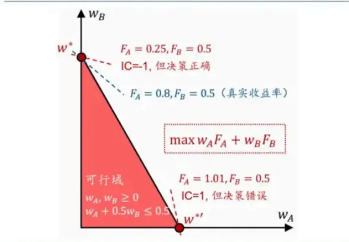

图表3：不同方向的收益率预测偏差带来了截然不同的决策误差
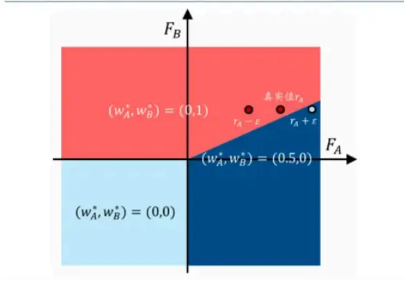

由图表3进一步可见，决策过程对不同方向的预测误差敏感性截然不同。有些方向的误差是可以容忍的（比如收益率由正确值rA=0.8被错误的低估为 $\mathsf{FA}=\mathsf{rA}-\mathsf{E}=0.25$ ），即便预测误差较大也能引导我们做出正确的投资决策；而有些方向的误差变动是不能容忍的（如收益率被高估为$\mathsf{FA}=\mathsf{rA}+\mathsf{g}^{\prime}=1.01$

上面仅介绍了最简单的线性规划单约束情形。而在决策目标、约束条件更为复杂时，两阶段造成的误差偏离会愈加严重。我们可以在图表4中“略见一斑”，传统GRU因子的多头组合无论在市值风格和行业风格上都与指数基准有明显的偏离，传统的因子挖掘流程与投资组合的优化目标显然不完全一致。

图表4：传统GRU量价因子的风格偏离与行业偏离（以2024-09-30 时间截面为例）

|  |  | GRU 因子多头组合 | 中证 1000 基准 | 中证 500 基准 | 沪深 300 基准 |
| --- | --- | --- | --- | --- | --- |
| 风格暴露 | 市值风格 | 0.62 | 0.61 | 1.39 | 2.62 |
| 行业配置 | 电力及公共事业 | 11.4% | 3.9% | 3.6% | 4.1% |
|  | 基础化工 | 11.4% | 15.2% | 8.2% | 2.6% |
|  | 交通运输 | 9.7% | 3.4% | 2.1% | 3.7% |
|  | 医药 | 7.7% | 12.5% | 9.9% | 6.8% |
|  | 机械 | 7.3% | 7.0% | 6.9% | 2.8% |

## 综上，我们可以得到以下结论：

1、 传统的量价因子模型单独训练，梯度传递未与组合优化环节打通，优化目标也与组合决策过程存在偏离；

2、 数值相同、方向不同的“预测误差”，可能造成截然不同的“决策误差”。

3、 预测误差并不是量价模型的“金标准”，能否引导做出正确的投资决策才是“金标准”。

## 端到端组合优化：“边预测、边优化”解决传统研究痛点

端到端模型可有力解决传统两阶段法的痛点。具体来说，端到端组合优化就是将组合约束求解融入到因子挖掘的网络结构中，通过单个神经网络来完成从输入、预测到组合优化决策的全流程，所有参数联合训练、同步进行梯度传递。网络不再简单地以预测误差作为损失函数，而是全局考虑预测误差、决策优劣等情况，采取类似于多任务学习的思路，化“局部最优”为“全局最优”。这样一来，模型不一定能预测出最精确的收益率向量，但能够引导我们做出最优的投资决策。

## 端到端组合优化的技术路线

如何将组合优化模块嵌入神经网络？由链式法则可知，这一过程最大的技术难点便是难以实现梯度下降。为了解决组合优化过程不可微的困扰，学者们提出了多种解决策略，包括决策优化法、损失函数近似法、可微优化法。下面将展开详述。

## 技术难点：难以实现梯度下降

我们首先通过链式法则说明传统端到端优化模型的“不可微”难题。我们知道，端到端模型的最大特点就是将模型输出由“预测因子F”变成了“由F做出的投资决策、也就是组合权重w*(F)”。根据链式法则，此时模型参数的梯度可分解为：

$$
\frac{\partial l(\boldsymbol{w}^*(\boldsymbol{F}),\boldsymbol{r})}{\partial\boldsymbol{\theta}}=\frac{\partial l(\boldsymbol{w}^*(\boldsymbol{F}),\boldsymbol{r})}{\partial\boldsymbol{w}^*(\boldsymbol{F})}*\frac{\partial\boldsymbol{w}^*(\boldsymbol{F})}{\partial\boldsymbol{F}}*\frac{\partial\boldsymbol{F}}{\partial\boldsymbol{\theta}}
$$

其中 $\frac{\partial F}{\partial\pmb{\theta}}\pmb{\mathrm{l}}$ 即为传统量价模型的梯度， $\frac{\partial l(\pmb{w}^{*}(\pmb{F}),\pmb{r})}{\partial\pmb{w}^{*}(\pmb{F})}$ 也可由损失函数的数学表达式简单推导得出，唯一的难点在于组合优化梯度 $\left|\frac{\partial\boldsymbol{w}^*(F)}{\partial F}\right.$ 的求解。

传统优化器通常采用单纯形法、内点法、分支定界法等启发式算法求解组合优化问题，cvxpy、mosek等求解器均沿用这一思路。然而，虽然优化问题中的目标函数 $[w_{\mathrm{i}}F_{\mathrm{i}}$ 是可微的，但这一问题的优化求解过程本身是难以求导的。

一种“简单粗暴”的方式是，通过数学推导直接给出最优解的显式数学表达式。以上文中提及的线性规划问题为例，其显式表达式如图表5所示，可以看到，其在实数域上是一个分段常数函数

（Piecewise Constant Function），换句话说，其值域是离散的。其一阶导数要么为0，要么不存在。在预测因子F发生变化时，最优解要么不发生改变，要么会从可行域的一个极点跳到另一个极点（如图表6所示，FA仅变动一个极小值，最优解却非连续地由w*突变至w*'）（详见唐博《当机器学习遇上运筹学：PyEPO与端到端预测后优化》）。

图表5：线性规划最优解在全样本空间上的分段常数函数取值
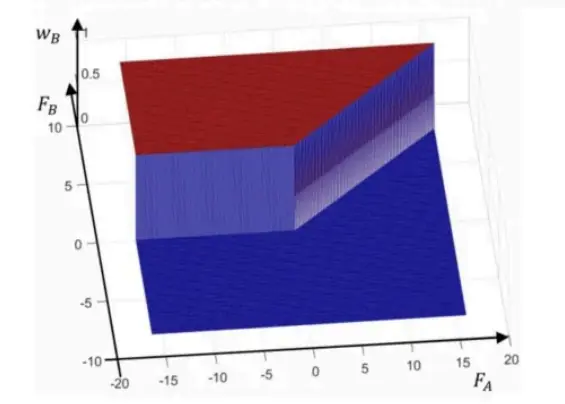

图表6：线性规划问题在边界处可能发生非连续跳变
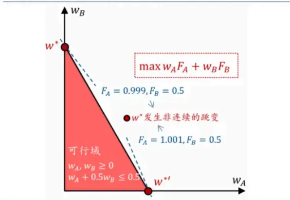

由此可见，一方面传统的优化求解算法往往并未提供求解过程的梯度信息，另一方面，当最优解在线性约束边界附近变动时，模型可能无法通过梯度传递对参数进行调整。

在神经网络中，所有功能层（Layer）都需要是可微的、支持梯度下降的，这样才能实现梯度的反向传播，对参数不断训练、更新。在端到端组合优化神经网络中，为了解决组合优化过程不可微的困扰，研究者们提出了三种解决策略：

1、 决策优化法：直接对决策过程或决策结果开展优化。常见做法是强化学习或模仿学习。

2、 损失函数近似法：重新设计一个可微且非零的替代损失函数。

3、 可微优化法：通过寻找替代梯度信息等方式，开发可微的组合优化网络构件，用以更新模型参数。

下面将简要介绍上述三种方法。其中后两种方法作为近年新兴的方法，算法效率更高、学术研究更为活跃，也是我们后续将在PortfolioNet中主要选用的方法。

## 决策优化法：直接建模决策过程

开展端到端组合优化，最直观的想法是构建网络对组合优化逐个时间步进行序列决策建模，常见做法包括强化学习（Reinforcement Learning）与模仿学习（Imitation Learning，可视为有监督的强化学习）。Wang（2024）指出，在神经网络求解组合优化问题的领域，配合强化学习的自回归式方法曾经是研究的主流，但其劣势也非常明显，首先基于自回归的约束施加方法需要多次调用网络进行前向计算，效率不高；其次强化学习中动作空间过大、奖励函数稀疏、训练时间长等常见问题可能也无法避免。目前，这一类方法正在逐渐被可微优化法等更高效的思路取代。

## 损失函数近似法：寻找替代损失函数

通常的端到端组合优化损失函数被设计为L(w*(F),r)的形式，由于这一函数包含了组合权重的决策值w*(F)，所以其梯度是难以求解的。对此最直观的想法便是寻找一个可微的替代损失函数。

一种简单的思路是，不在网络中施加任何组合优化模块，而是在网络的损失函数中增加硬约束（Hard Constraints）。Kervadec（2022）便设计了一种新型障碍函数（Barrier-Functions），进而基于CNN深度学习模型直接学习组合优化最优解。但综合来看，目前的预测模型，无论是线性回归、决策树、还是神经网络，在处理带有硬约束的问题上仍存在难度。因此，对于高维度、有复杂约束的优化问题，这一方法的预测结果常常面临可行性问题。

还有一种有趣的思路，是利用网络强大的拟合能力来“大力出奇迹”。由“万能近似定理”可知，神经网络理论上具备拟合任何函数的能力。基于该思想，有学者直接用复杂网络训练一个可微的近似损失函数，来拟合原有的不可微损失函数。如Shah等人（2022）提出了一种称为局部优化决策损失的策略，通过训练一个神经网络近似损失函数来应对传统损失函数无法有效传播梯度的问题。然而，这种方法增加了模型训练步骤，且其实际表现高度依赖于近似损失函数的准确性，可能面临过拟合等问题，仍需进一步验证其效用。

图表8：Shah(2022)所提出的局部优化决策损失策略
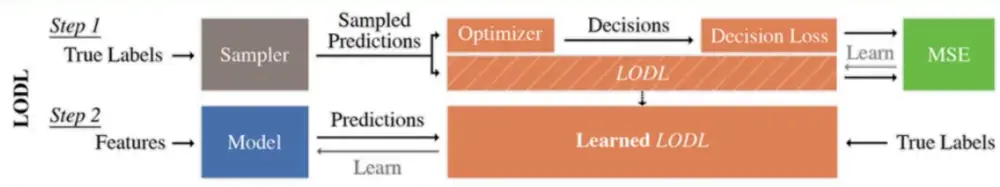

相比于上述两种思路，更为有效的几种损失函数近似算法包括SPO+、黑箱法等方法，这些方法已经由成熟的开源工具包PyEPO进行工程实现。具体来说，Elmachtoub等人（2021）为线性目标函数的决策误差设计了一个可微的替代损失凸函数——SPO+损失函数；Pogančić等人（2019）则提出“Differentiable Black-box”方法，将求解器函数视为“黑箱”，利用解空间的几何形状等性质找到替代梯度，通过插值法巧妙地将图表5中曾展示的分段常数函数转化为分段线性函数。

图表9:Pogančić等人(2019)将原损失函数近似为梯度非零的分段线性函数
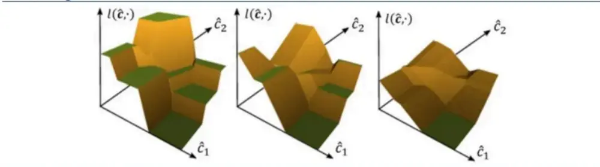

## 可微优化法：设计可微的组合优化网络构件

可微优化法直接将优化求解的过程变得可微。也就是通过某种近似算法或数学变换，使得优化过程的梯度具有良好的可获取性和传递性。

Amos等人（2017）提出了OptNet，该算法通过求解KKT条件的线性方程组来计算求解器反向传播的梯度，这也是首款神经网络组合优化求解器。值得注意的是，这类基于KKT条件的方法不仅能计算目标函数的梯度，还能处理约束条件中的参数梯度，在组合优化问题中的应用非常广泛。

为了更好的拓展OptNet的适用场景，Agrawal等人（2019）将规范的凸优化问题转换成锥优化问题，发布了较为成熟的神经网络组合优化层cvxpylayers，也就是传统求解器cvxpy的神经网络可微版本。值得注意的是，在华泰金工前期研报《神经网络组合优化初探》(2022-01-09)中，我们就曾运用cvxpylayers开展了将神经网络组合优化应用于资产配置的探索。

然而，相比于《神经网络组合优化初探》的资产配置场景，Alpha选股场景的组合优化在参数量和约束条件上更为复杂，此类大规模优化问题的求解难度显著增大。McKenzie等人（2023）就曾指出，“基于KKT条件的神经网络组合优化算法计算成本很高，例如cvxpylayers便难以求解超过100个决策变量的优化问题”。

此后，学者相继提出了高斯扰动法、噪声对比估计法（Noise Contrastive Estimation，NCE）等新方法，这些成熟方法已由开源工具包进行了工程实现。

以上算法均能实现一个完整的优化求解过程，也就是输出结果既满足给定的约束条件，又能实现目标函数的最大化。但是这些方法都需要调用/编写一个求解器，这导致很可能需要把数据转移到CPU进行计算。是否存在一种方法，不执着于求解完整的优化问题，而是单纯地将给定的输入转化成满足特定约束的输出，并且全程可基于GPU开展运算？答案是肯定的，也就是我们在本文主要借鉴的LinSAT算法。

LinSAT算法由Wang等人于2023年提出，其专注于找到“最接近无约束输入”的“可行解输出”。该算法最大的亮点是可以像神经网络激活层一样，通过投影操作将输入映射至可行域，完成前述决策目标；并且算法全程基于GPU运算，求解速度非常快。原作者同步提供了开源工具包LinSATNet，我们可以方便地在神经网络中封装并调用这一算法。

图表11：LinSAT可在神经网络内将无约束的输入投影为符合约束的输出
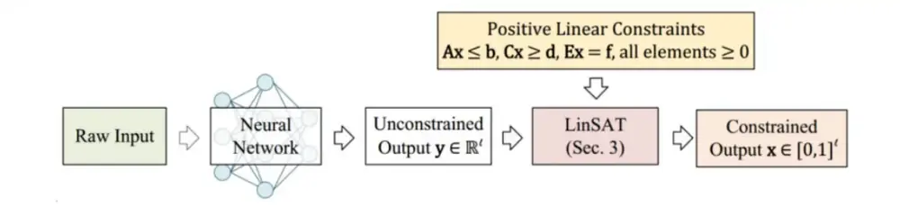

LinSAT背后的数学推导非常复杂，其研究逻辑可大致梳理如下：

1、 首先回顾经典Sinkhorn算法。该算法将原始的非负矩阵S作为输入，结合给定的一组“边缘分布”u,v（可近似看作某种约束条件），输出满足约束条件的归一化矩阵Γ。

2、 创新性地将上述算法拓展为广义Sinkhorn算法，并证明了其收敛性。经典算法仅可处理一组边缘分布u,v,（一组边缘分布可直观理解为一组约束）；而广义算法可处理多组边缘分布U,V。

3、 设计LinSAT可微投影层，将无约束的输入y投影为符合线性约束的输出x。要想通过Sinkhorn算法实现这一构想，需要完成以下三步操作：

（1）将原始输入y编码为Sinkhorn算法中的非负矩阵S；

（2）将原始线性约束Aw≤b,Cw≥d,Ew=f转换为Sinkhorn算法中的“边缘分布” U,V；

（3）将S,U,V代入广义Sinkhorn算法，完成组合约束投影。

下面，我们将基于LinSAT构建端到端组合优化网络PortfolioNet，探索这一算法在投资组合优化场景应用的可行性。

## 03 网络结构：由“先预测后优化”至“边预测边优化”

我们的PortfolioNet端到端网络将预测与优化决策环节打通，可实现由原始数据输入至Portfolio权重的一站式建模。该网络由Smart Prediction与Portfolio Decision两个模块构成。

Smart Prediction模块承担了传统AI量价模型的职能，进行量价因子Smart Factor的合成。之所以称之“Smart”，是由于该模块同时接收了IC损失函数和组合优化层两者传递的梯度信息，其产生的AI量价因子也因此获得了优化决策环节带来的信息增益。

Portfolio Decision模块可根据前者生成的量价因子开展网络内部的优化决策，模块核心在于OptLayer组合优化层，底层算法为Wang（2023）提出的LinSAT算法。组合决策收益与IC值同时作为损失函数，对整个网络的参数进行梯度传递与更新。

PortfolioNet相比传统两阶段方法的主要改动有四点：组合优化层OptLayer、与之配套的约束矩阵生成器、双目标损失函数以及双结果输出。下面对这四部分展开详述。

图表12： 传统两阶段方法与 PortfolioNet 端到端神经网络结构对比
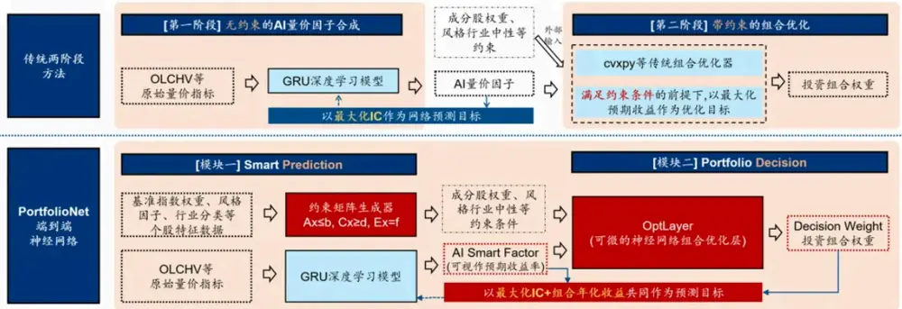

## OptLayer：可微的组合优化层

OptLayer组合优化层是实现“边预测边优化”的关键。其接收网络前半部分输出的Smart Factor因子作为输入，在给定的约束条件下，做出投资决策并输出组合权重Decision Weight。

图表13:基于 LinSAT的组合优化层 Optlayer 功能示意
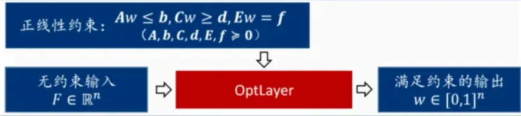

具体来说，本文中的组合优化层主要依赖于Wang等人（2023）提出的LinSAT可微优化算法。相比于传统优化器，该算法可像普通网络激活层一样完成特定约束的投影，既能实现网络内部的前向传播，又能给出梯度信息以供反向传播。不过，其专注于将给定的无约束输入转换为满足约束的输出，并未执着于求解完整的优化问题（例如将目标函数最大化/最小化）。因此，目标函数最大/最小化的需求将通过构造网络全局的损失函数来实现。

## LinSAT算法的适用场景限定如下：

1、 输入为任意的无约束向量F，输出为满足线性约束、且取值介于0、1之间的w；

2、F和w都是n维向量，n为个股全样本的个数；

3、线性约束需以矩阵形式给定： $\mathsf{A}\mathsf{w}\leq\mathsf{b},\mathsf{C}\mathsf{w}\geq\mathsf{d},\mathsf{E}\mathsf{w}=\mathsf{f},$ 。且其中的所有元素都要大于0。

在不考虑做空的情形下，组合优化问题的输入、输出及线性约束形式，都恰好符合该算法的适用场景。总之，基于LinSAT的OptLayer可在神经网络内部有效承担投资决策的职能，实现了端到端的“边预测边优化”。

## 约束矩阵生成器：如何得到A/b/C/d/E/f矩阵？

如何将策略组合的约束条件转换为OptLayer所需要的约束形式Aw≤b,Cw≥d,Ew=f？下面将以指数增强场景为例展开介绍。

图表14：约束矩阵的不同数学形式
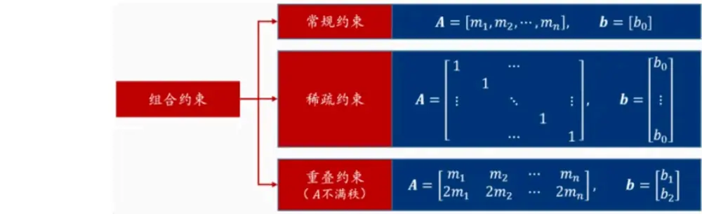

## 常规约束：通过简单数学变换得到

市值偏离、行业偏离等常规约束矩阵可依靠简单数学变换得到。

以行业偏离约束为例，我们有：

$$
-\delta_{insd}\leq Z\pmb{w}-Z\pmb{w}^{benchmark}\leq\delta_{insd}
$$

其中 $\boldsymbol{w}\in\mathbb{R}^n$ 为决策变量，也就是指增组合的资产权重； $\mathbf{Z}\in\mathbb{R}^{30\ast n}$ 为行业哑变量（即30个一级行业×n支个股）； $\pmb{w}^{benchmark}\in\mathbb{R}^{n}$ 表示基准组合中的资产权重； $\delta_{insd}$ 代表行业偏离的上限约束。

将已知变量移到一侧，待求解变量留在另一侧，移项可得：

$$
-\delta_{insd}+\pmb{Z}\pmb{w}^{benchmark}\leq\pmb{Z}\pmb{w}\leq\delta_{insd}+\pmb{Z}\pmb{w}^{benchmark}
$$

对 应 至 OptLayer 的 约 束 形 式 Aw≤b ， $\mathbf{C}\mathbf{w}\geq\mathbf{d}$ ， 可 知 ： $\pmb{A}=\pmb{Z},\pmb{b}=\delta_{insd}+\pmb{Z}\pmb{w}^{benchmark},\pmb{C}=\pmb{Z}$ $\pmb{d}=-\delta_{insd}+\pmb{Z}\pmb{w}^{benchmark}$ o

市值偏离、完全投资、成分股下限等约束矩阵可由类似过程得到，在此不再赘述。这类约束矩阵是相对稠密的、“矮小”的。

## 稀疏约束：如何节省GPU显存

不同于行业市值的稠密约束矩阵，个股上下限的约束条件若直接以Aw≤b，Cw≥d的形式给出，矩阵会非常高大且稀疏（若同时约束上下限，5000支个股对应着10000行的约束矩阵）。为了避免显存“爆表”，我们可采取以下技巧节约显存：

1、仅约束绝对上下限时：

巧用LinSAT的天然约束，将

变换为：

其中。此时优化层输出变为，也就意味着，满足绝对上限约束。

2、仅约束相对上下限

时：

准指数的成分股数量），有效降低约束矩阵维度。此外，也可改写整体优化问题，直接对相对权重开展优化求解，以之替换掉原有的绝对权重w。

## 3、 同时约束绝对上下限和相对上下限时：

将相对上下限与绝对上下限重叠的约束条件做剔除，进一步降低约束条件数量。

## 双结果输出：Decision Weight与Smart Factor

PortfolioNet共输出两项实用的结果。第一项为Decision Weight，也就是网络末端Optlayer所输出的组合权重，这一权重已经基本满足组合约束，可直接作为投资持仓，开展组合回测实验。第二项为Smart Factor，这一因子虽然未直接经过组合优化层的处理，但也并非普通的AI量价因子。该因子是和组合优化层联合训练、共同更新参数得出的“Smart”因子，可帮助做出最优的投资决策；在组合测试环节，可将该因子与传统优化器结合开展回测实验。

## 损失函数：考虑组合收益的双目标损失

网络具有两项结果输出，也就意味着有两种形式的误差：其中w*(F)（即Decision Weight）可用来计算决策误差，F（即Smart Factor）对应预测误差。一方面，如果仅仅采用预测误差作为损失函数，那就失去了端到端优化的意义；另一方面，虽然决策误差是衡量模型的金标准，但决策变量的分布并不像因子变量那样容易刻画，如果单一选取决策误差作为损失函数，很可能带来过拟合风险。

此外，在前文我们曾反复论述，决策误差和预测误差并非完全正相关的，二者在极端情况下甚至可能“此消彼长”。对此，最优的选择便是采用类似多任务学习的思路，将两个学习任务的目标损失相加，通过“Trade-off”的方式同时对两种误差展开训练，引导网络实现组合整体效益的最大化。具体来说，损失函数可表示为：

其中，损失函数的第一项为网络输出组合的真实年化收益率，衡量决策效果；第二项为SmartFactor的IC值，一种角度可认为在衡量预测效果，另一种角度也可视作一项提高决策环节泛化能力、避免过拟合的惩罚项；λ为超参数，在本文中未做调参，简单地取λ=1。

此外，由于OptLayer在大规模优化问题下的求解时间较长，为节省算力，我们将OptLayer设定为每10天执行一次（与调仓周期保持一致），在非调仓日仅采用IC项作为损失函数。请注意，此处仅为算力有限情况下的权宜之计，如果能全时段运行组合决策层，可能给模型带来更大的信息增益，后续我们将对此问题进行跟进完善。

## 04 实验设计与实验结果

AI量价模型是否已经逼近神经网络的能力上限？答案是否定的。在不改变深度学习算法的前提下，端到端组合优化模块的加入，可有力提升AI量价因子的决策能力。

## 实验设计

理论上PortfolioNet作为一个通用型的网络框架，可适配任意的深度学习预测算法。不过本实验聚焦于验证组合优化层带来的效果提升，上层的Alpha预测算法改进并不属于本文的研究范畴。因此，本次实验的收益预测模块我们采用了简单的GRU量价模型（双层GRU+RELU+FC+BN+FC+BN）。接下来，将针对PortfolioNet的两项结果输出与一个传统GRU的两阶段策略，开展对比实验。

## 对比实验

对比模型包含一个传统两阶段模型和两个PortfolioNet端到端策略。

1、基线模型：传统两阶段模型。先用GRU架构单独训练得到AI量价因子，再用外部优化求解器得到组合权重。

2、Decision Weight：端到端训练&端到端决策。直接使用PortfolioNet的组合权重输出结果Decision Weight。

3、Smart Factor+外部求解器：端到端训练+两阶段决策。样本内基于PortfolioNet开展带约束的端到端训练；样本外则应用PortfolioNet的第二项输出“Smart Factor量价因子”，结合外部优化求解器得到指数增强权重。

## 基准指数及Optlayer组合约束条件

我们以沪深300、中证500和中证1000作为基准指数，开展三项指增实验。在组合约束方面，由于算力所限，网络内部仅考虑下表中的五项约束。尤其是为节约显存，个股相对于基准的相对偏离暂时未做限制，以绝对上限代替。

## 时间区间

我们在2020-11-30至2024-09-30的时间区间内开展实验。在训练周期方面，我们采取滚动训练的方式，每半年重新训练一次。对于每个滚动训练周期，训练集长度为5年，验证集长度为1年，测试集长度为0.5年。

我们设定2020年11月为起始日并非随意之举，原因在于中证1000指数的发布时间较晚，数据库自2014年11月起才提供完整的持仓权重数据。在考虑到需要5年的训练集长度和1年的验证集长度后，我们确定了2020年11月作为测试集的起始日。

## 随机种子

选取torch.manual_seed=[0,1,2,3,4]共5个随机种子，对不同种子的输出结果取均值。

## 其他参数设定

实验的其余参数设定见图表16、图表17，主要参数均和团队历史报告保持一致。

图表16：模型输入

| 量价特征X | 过去30个交易日的高、开、低、收、vwap、成交量数据 |
| --- | --- |
| 组合约束特征M | 过去1个交易日的对数市值、一级行业代码、指数成分股权重数据 |
| 标签y | 个股未来10 个交易日（T+1~T+11）的收益率 |

图表17：其他实验参数

| 模型超参数 | GRU层数：2；GRU隐藏层维度：64 GRU历史时间步长：30步 |
| --- | --- |
| 模型训练细节 | 数据预处理：对量价特征X、收益率y开展去极值、标准化等常规预处理操作；对组合约束特征M不做 任何预处理 |
|  | Batch Size：每个预测时点内的所有股票为一个Batch 早停次数：10次：最大迭代次数：50次 学习率：0.001 |
| 回测参数 | 成交价格：vwap，涨跌停时不可交易 交易费率：双边千分之三 |
|  | 调仓频率：双周频调仓 |
| 外部优化器参数 | 总权重：100%（即完全投资） |
|  | 成分股权重下限：80% |
|  | 行业权重偏离：±2% |
|  | 市值风格偏离：±0.3倍标准差 |
|  | 个股权重偏离：±0.8% |
|  | 单边换手率上限：30% |

## 实验结果

我们的模型输出包括Smart Factor因子和决策权重Decision Weight。下面首先评估因子表现，随后评估两项模型输出对应的指增组合收益。

## 因子表现

Smart Factor因子的IC值相比传统GRU因子有小幅下滑，这与我们的预期相符。如前文所述，更高的IC、更低的预测误差，并不意味着能做出更好的决策。因此，仅凭IC并不一定能反映全貌；能否做出正确的投资决策，才是量价模型的“金标准”。

上面展示的是全市场股票池内的因子测试结果。此外，由于Smart Factor是在不同的指增约束条件下训练产生的，因此下面将分别展示各因子在其对应的指数成分股内的表现。可见，虽然IC无显著改善，但Top层的年化收益有一定提升。

图表19：传统 GRU 因子与 PortfolioNet 因子测试指标（沪深 300 成分股内测试）

| 因子 | 基于何种 | RankIC | RankICIR RankIC 胜率 |  | Top 层 | Bottom 层 | 对冲组合 |  | Top 层 Bottom 层 对冲组合 |  | Top 层信 | Top 层年 |
| --- | --- | --- | --- | --- | --- | --- | --- | --- | --- | --- | --- | --- |
|  |  |  | 均值 (未年化) |  |  |  | 年化收益 | 夏普比率 夏普比率 | 夏普比率 | 息比率 |  |  |
| 传统 GRU 因子 | 约束训练 无约束 | 3.17% | 0.41 | 65.45% | 年化收益 0.37% | -15.49% | 年化收益 7.93% | 0.02 | -0.67 | 0.67 | 0.06 | 化换手率 38.59 |
| Smart Factor | 300 指增 | 3.22% | 0.42 | 65.67% | 2.92% | -7.19% | 5.06% | 0.15 | -0.33 | 0.42 | 0.39 | 40.61 |

图表20：传统 GRU因子与PortfolioNet 因子测试指标（中证500成分股内测试）

| 因子 | 基于何种 | RankIC | RankICIR RankIC 胜率 |  | Top 层 | Bottom 层 | 对冲组合 | Top 层 Bottom 层 |  | 对冲组合 | Top 层信 | Top 层年 |
| --- | --- | --- | --- | --- | --- | --- | --- | --- | --- | --- | --- | --- |
|  | 约束训练 | 均值 | (未年化) |  | 年化收益 | 年化收益 | 年化收益 | 夏普比率 | 夏普比率 | 夏普比率 | 息比率 | 化换手率 |
| 传统 GRU 因子 | 无约束 | 5.50% | 0.79 | 79.61% | 6.18% | -16.32% | 11.25% | 0.30 | -0.67 | 0.96 | 0.39 | 37.44 |
| Smart Factor | 500 指增 | 4.94% | 0.78 | 78.43% | 6.37% | -10.38% | 8.38% | 0.31 | -0.44 | 0.75 | 0.40 | 40.46 |

图表21：传统 GRU 因子与 PortfolioNet 因子测试指标（中证 1000 成分股内测试）

| 因子 | 基于何种 约束训练 | RankIC 均值 | RankICIR RankIC 胜率 |  | Top 层 |
| --- | --- | --- | --- | --- | --- |
| 传统 GRU 因子 | 无约束 | 7.63% | (未年化) 1.14 | 86.91% | 年化收益 10.74% |
|  |  | 7.28% |  | 86.59% | 13.98% |
| Smart Factor | 1000 指增 |  | 1.11 |  |  |

| Bottom 层 | 对冲组合 | Top 层 Bottom 层 |  | 对冲组合 | Top 层信 | Top 层年 |
| --- | --- | --- | --- | --- | --- | --- |
| 年化收益 | 年化收益 | 夏普比率 | 夏普比率 | 夏普比率 | 息比率 | 化换手率 |
| -26.51% | 18.63% | 0.45 | -0.99 | 1.69 | 1.25 | 36.91 |
| -24.68% | 19.33% | 0.58 | -0.90 | 1.66 | 1.63 | 40.09 |

图表22：传统因子与 PortfolioNet 因子累计 IC 对比（全市场股票池）
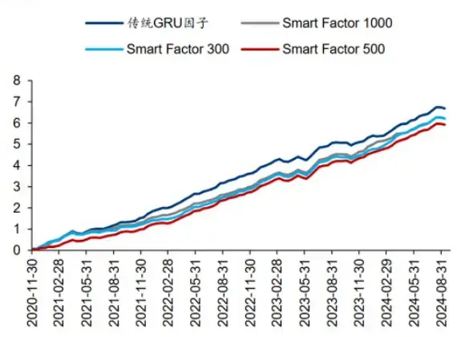

图表23：传统因子与 PortfolioNet 因子多头超额对比（300 成分内）
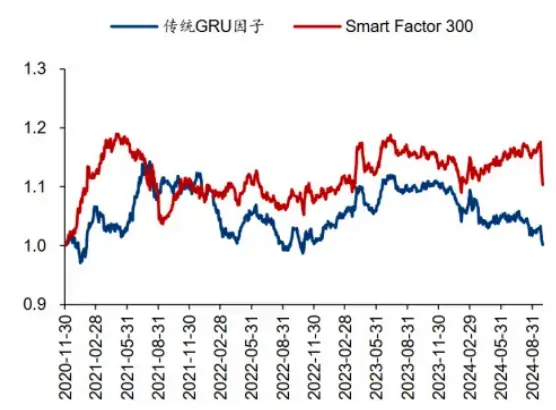

图表24：传统因子与 PortfolioNet 因子多头超额对比（500 成分内）
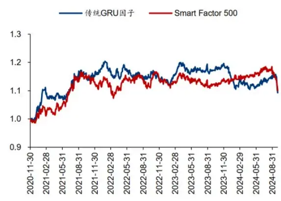

图表25：传统因子与 PortfolioNet 因子多头超额对比（1000 成分内）
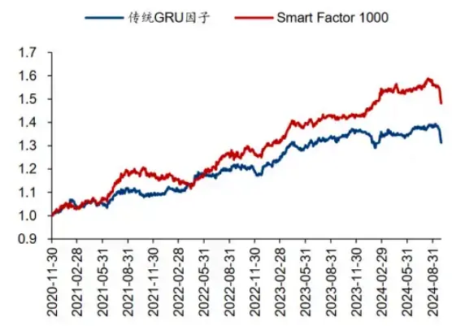

## 指数增强组合表现

整体来看，基于PortfolioNet构建的两项策略中，“Smart Factor”的表现明显好于“DecisionWeight”，这一现象的原因将在后面详细分析。分不同指数来看，1000指增组合表现最为优异，300指增也表现较好，超额收益、信息比率、回撤等主要指标均有明显改善；500指增在全区间表现不佳，但今年以来的超额收益也有一定提升。

基于三种策略构建的沪深300指数增强组合策略净值与绩效如下：

图表26：沪深300 指增组合绩效表现（实验区间为 2020-11-30至2024-09-30）

| 因子 | 年化 | 年化 | 夏普比率 | 最大回撤 | Calmar | 年化超额 年化跟踪 |  | 信息比率 | 超额收益 |  | 超额收益 相对基准 | 年化双边 |
| --- | --- | --- | --- | --- | --- | --- | --- | --- | --- | --- | --- | --- |
|  |  |  |  |  |  | 比率 收益率 | 误差 |  | 最大回撤 Calmar 比率 | 月胜率 |  |  |
| 传统 GRU+外部求解器 | 收益率 -4.93% | 波动率 17.78% | -0.28 | 45.11% | -0.11 | 0.51% | 4.74% | 0.11 | 8.52% | 0.06 | 54.35% | 换手率 15.49 |
| Decision Weight | -2.08% | 17.52% | -0.12 | 33.99% | -0.06 | 3.45% | 5.30% | 0.65 | 11.45% | 0.30 | 58.70% | 11.88 |
| Smart Factor+外部求解器 |  |  |  | 36.62% | -0.04 | 4.21% | 4.79% | 0.88 |  | 0.78 |  |  |
|  | -1.43% | 17.81% | -0.08 |  |  |  |  |  | 5.41% |  | 58.70% | 15.51 |

图表27：沪深300指增组合分年度超额收益

|  | 2021 | 2022 | 2023 | 2024 |
| --- | --- | --- | --- | --- |
| 传统 GRU+外部求解器 | 0.21% | 0.30% | 4.25% | -1.64% |
| Decision Weight | 7.07% | 4.86% | 5.26% | -1.85% |
| Smart Factor+外部求解器 | 4.52% | 3.19% | 9.33% | 1.21% |

300指增场景下“Smart Factor”策略表现优异，相比于传统GRU，年化超额提升3.70%，最大回撤显著降低，年度收益胜率为100%。“Decision Weight”的相对超额也有一定提升，但提升幅度不及前者。

图表28：沪深300指增组合累计超额收益与超额最大回撤
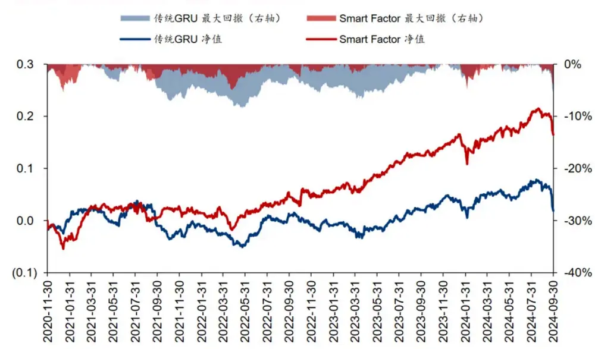

基于三种策略构建的中证500指数增强组合策略净值与绩效如下：

图表29：中证500 指增组合绩效表现（实验区间为2020-11-30 至2024-09-30）

| 因子 | 年化 | 年化 | 夏普比率 | 最大回撤 | Calmar 比率 | 年化超额 | 年化跟踪 | 信息比率 | 超额收益 | 超额收益 | 相对基准 | 年化双边 |  |
| --- | --- | --- | --- | --- | --- | --- | --- | --- | --- | --- | --- | --- | --- |
|  |  |  |  |  |  |  |  |  |  |  |  |  | 最大回撤 Calmar 比率 |
| 传统 GRU+外部求解器 | 收益率 4.57% | 波动率 19.63% | 0.23 | 31.24% | 0.15 | 收益率 7.12% | 误差 5.74% | 1.24 | 7.43% | 0.96 | 月胜率 73.91% | 换手率 15.52 |  |
| Decision Weight | 2.40% | 19.90% | 0.12 | 33.77% | 0.07 | 5.06% | 3.42% | 1.48 | 5.50% | 0.92 | 73.91% | 11.88 |  |
| Smart Factor+外部求解器 | 3.78% | 18.78% | 0.20 | 32.71% | 0.12 | 6.17% | 5.24% | 1.18 | 6.52% | 0.95 | 63.04% | 15.56 |  |

图表30：中证500指增组合分年度超额收益

|  | 2021 | 2022 | 2023 | 2024 |
| --- | --- | --- | --- | --- |
| 传统 GRU+外部求解器 | 10.02% | 16.39% | 7.01% | -5.10% |
| Decision Weight | 9.84% | 7.83% | 4.83% | -1.80% |
| Smart Factor+外部求解器 | 4.98% | 9.80% | 5.88% | 4.45% |

500指增场景下，两项PortfolioNet策略的整体表现均不及传统GRU，但今年以来超额有一定改善，“Smart Factor”的超额提升9.55%。

图表31：中证500指增组合累计超额收益与超额最大回撤
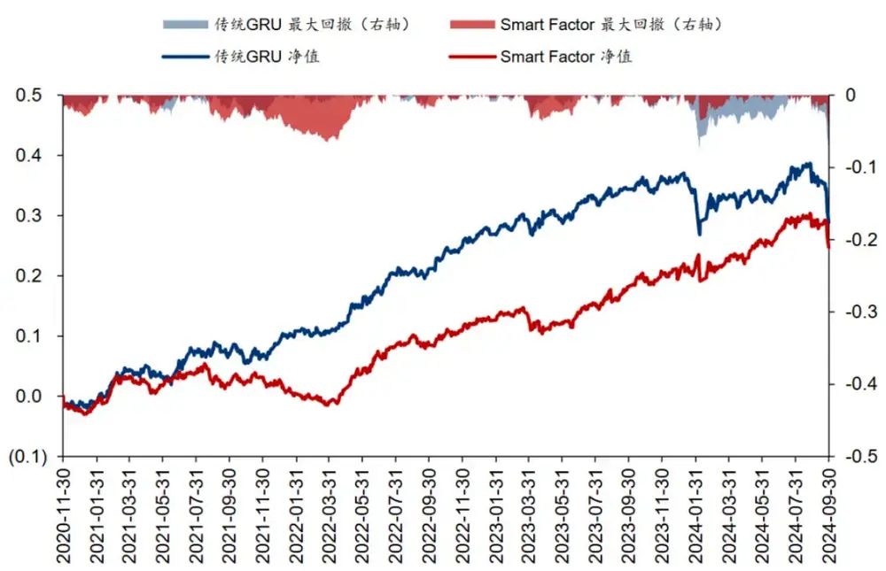

## 基于三种策略构建的中证1000指数增强组合策略净值与绩效如下：

图表32：中证1000指增组合绩效表现（实验区间为 2020-11-30 至2024-09-30）

| 因子 | 年化 | 年化 | 夏普比率 | 最大回撤 | Calmar | 年化超额 | 年化跟踪 | 信息比率 | 超额收益 | 超额收益 | 相对基准 | 年化双边 |  |
| --- | --- | --- | --- | --- | --- | --- | --- | --- | --- | --- | --- | --- | --- |
|  |  |  |  |  |  |  |  |  |  |  |  |  | 最大回撤 Calmar 比率 |
| 传统 GRU+外部求解器 | 收益率 3.75% | 波动率 22.46% | 0.17 | 35.82% | 比率 0.10 | 收益率 7.63% | 误差 6.66% | 1.15 | 8.99% | 0.85 | 月胜率 65.22% | 换手率 15.55 |  |
| Decision Weight | 0.50% | 23.59% | 0.02 | 41.00% | 0.01 | 4.67% | 4.23% | 1.10 | 5.46% | 0.86 | 67.39% | 13.68 |  |
| Smart Factor+外部求解器 | 9.45% | 22.34% | 0.42 | 33.13% | 0.29 | 13.55% | 6.05% | 2.24 | 6.44% | 2.11 | 76.09% | 15.59 |  |

图表33：中证1000指增组合分年度超额收益

|  | 2021 | 2022 | 2023 | 2024 |
| --- | --- | --- | --- | --- |
| 传统 GRU+外部求解器 | 7.19% | 14.70% | 11.27% | -2.32% |
| Decision Weight | 6.96% | 5.66% | 8.05% | -1.30% |
| Smart Factor+外部求解器 | 14.33% | 19.18% | 12.65% | 5.08% |

“Smart Factor”策略在1000指增取得较大幅度提升，年化超额收益提升5.92%，最大回撤显著降低，相较于传统GRU的年度收益胜率同样为100%。此外，“Smart Factor”的表现仍然好于“Decision Weight”。

图表34：中证1000指增组合累计超额收益与超额最大回撤
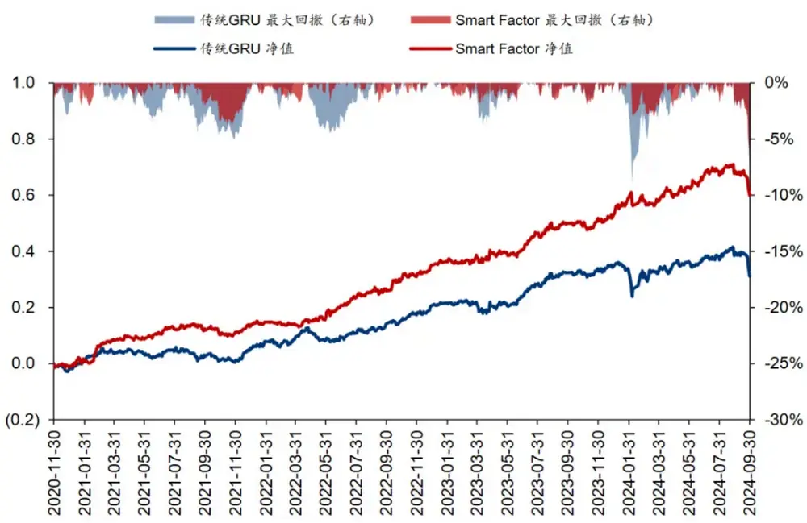

## 附加讨论

## 讨论1：为什么Decision Weight的回测效果不及Smart Factor+外部优化器？

从直觉上来讲，以LinSAT为代表的组合优化层，作为可嵌入神经网络的全新算法，其优势在于保证梯度可微的前提下，给出“相对准确”的最优解；但其毕竟是一种近似算法，不能过分苛求其输出值像传统优化器一样绝对精确。

图表35：LinSAT原论文中展示的各类求解器求解精度对比（以寻找最优路径问题为例，数值越小路径越好）
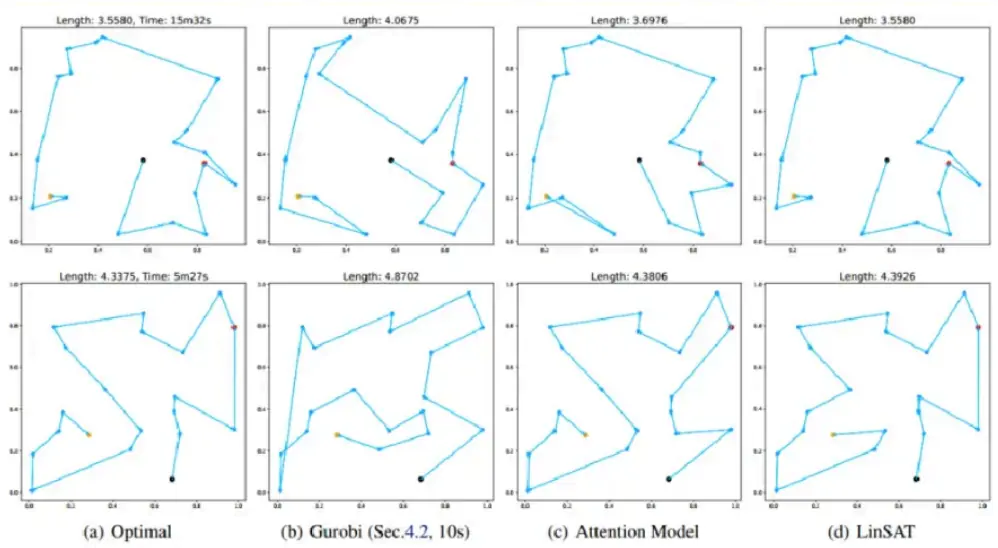

LinSAT原论文中的实验结果印证了这一猜测。由图表可见，LinSAT的求解精度和速度已相当不错；如果将传统求解器Gurobi限制在同样的运行时长，LinSAT的最优解甚至能跑赢Gurobi；但在Gurobi不限制运行时长的情况下，LinSAT表现稍显逊色。

综合来看，LinSAT的求解质量完全满足样本内网络训练、参数更新的需求。但在样本外的决策环节，此时不再强求网络层的可微性和求解速度，本着“精益求精”的目的，采用传统外部求解器或可帮助求得更好的投资组合。

## 讨论2：不同随机种子产生的Decision Weight取均值后，是否会破坏组合约束？

由于OptLayer处理的均为线性约束，只要原有的Decision Weight满足约束条件，取均值后的新的权重仍然会保持在可行域内。

## 讨论3：OptLayer未考虑换手率约束&跟踪误差约束，是否会造成影响？

首先，如果采用“Smart Factor+外部求解器”策略，那么OptLayer只用于训练产生更好的网络参数，而在样本外决策时仍然采用完整的外部求解器，不会产生上述问题。

如果采用“Decision Weight”策略，由于LinSAT算法仅支持线性约束条件的投影求解，部分约束确实无法纳入端到端网络中。忽略掉这些约束是否会造成负面影响？下面将展开分析。

1、 换手率上限：为一范数形式，无法加入网络。观察实验结果发现，即便不做限制，“DecisionWeight”策略的换手率也并未超过Benchmark的正常水平。此外在神经网络中加入换手率约束，可能导致严重的路径依赖和过拟合，即便通过惩罚项等形式加入换手率约束，也不一定带来更好的训练效果。

2、 跟踪误差上限：属二次约束，无法加入网络。但是根据过往经验，通过对风格、行业、个股偏离的严格约束，同样可实现对跟踪误差的有效控制。实验结果也印证了这一结论。

## 05 总结和讨论

本研究介绍了端到端组合优化的构建初衷、技术难点及解决方案。在传统两阶段优化框架下，模型最优解对不同方向的收益预测误差有着截然不同的敏感性，在某些情况下，强大的Alpha因子反而会做出更差的决策。而寻找可微的组合优化框架，将约束条件融入到因子挖掘的网络结构中，是解决这一问题的有效思路。学界业界陆续提出了LinSAT、SPO+、NCE等神经网络组合优化算法。经综合比选，我们选取LinSAT作为本研究的底层算法，这一开源算法求解准确度高、运行速度快、较为贴合金融投资场景，是行之有效的底层方法论。

本研究基于LinSAT算法构建了端到端组合优化网络PortfolioNet。这一网络达成了由“原始数据输入”至“投资组合输出”的一站式建模。具体来说，网络在传统AI收益预测模型基础之上，增加了约束矩阵生成器与组合优化层，并且以IC与组合收益率同时作为优化目标，引导网络向组合整体效益最大化的方向开展梯度下降。该网络内的所有参数可以实现联合优化，克服了传统两阶段方法各自为战、陷入局部最优的痛点。

PortfolioNet在沪深300、中证1000等指数增强场景均有明显的效果提升。实验结果表明，相比于传统GRU模型，基于PortfolioNet构建的300指增、1000指增超额收益在全历史区间上分别提升3.70%、5.92%；2024年以来则分别提升2.85%、7.40%；最大回撤显著降低。在不改变既有GRU框架的前提下，端到端组合优化模块的加入有力提升了AI量价因子的决策能力。

端到端组合优化的未来发展或有更为丰富的想象空间。本研究的收益预测模块仅采用了简单的GRU网络结构，组合优化层只加入了最简单的几项约束信息，投影优化算法也并未给出绝对准确的最优解，但端到端组合优化的思想已带来不错的信息增益。基于这一抛砖引玉的初步成果，我们有理由推断，配合更复杂的网络结构、更丰富的组合约束、更先进的可微优化算法，模型的优化决策能力或能得到更为显著的提升。

## 参考资料

Wang, R., Zhang, Y., Guo, Z., Chen, T., Yang, X., & Yan, J. (2023). LinSATNet: the positive linear satisfiability neural networks. In International Conference on Machine Learning (pp. 36605-36625). PMLR.

Tang, B., & Khalil, E. B. (2024). Pyepo: A pytorch-based end-to-end predict-thenoptimize library for linear and integer programming. Mathematical Programming Computation, 16(3), 297-335.

Sadana, U., Chenreddy, A., Delage, E., Forel, A., Frejinger, E., & Vidal, T. (2024). A survey of contextual optimization methods for decision-making under uncertainty. European Journal of Operational Research.

Kervadec, H., Dolz, J., Yuan, J., Desrosiers, C., Granger, E., & Ayed, I. B. (2022). Constrained deep networks: Lagrangian optimization via log-barrier extensions. In 2022 30th European Signal Processing Conference (EUSIPCO) (pp. 962-966). IEEE.

Shah, S., Wilder, B., Perrault, A., & Tambe, M. (2022). Learning (local) surrogate loss functions for predict-then-optimize problems. In Neural Information Processing Systems.

Elmachtoub, A. N., & Grigas, P. (2022). Smart ‘‘Predict, then Optimize’’. Management Science, 68(1), 9–26.

Pogančić, M. V., Paulus, A., Musil, V., Martius, G., & Rolinek, M. (2019). Differentiation of blackbox combinatorial solvers. In International Conference on Learning Representations.

Amos, B., & Kolter, J. Z. (2017). OptNet: Differentiable optimization as a layer in neural networks. Vol. 70, In International Conference on Machine Learning (pp. 136–145).

Agrawal, A., Amos, B., Barratt, S., Boyd, S., Diamond, S., & Kolter, J. Z. (2019). Differentiable convex optimization layers. In Advances in Neural Information Processing Systems: vol. 32, Curran Associates, Inc.

McKenzie, D., Fung, S. W., & Heaton, H. (2023). Faster predict-and-optimize with threeoperator splitting. arXiv preprint arXiv:2301.13395.

唐博. (2023). 当机器学习遇上运筹学：PyEPO与端对端预测后优化.

Runzhong, Wang. (2024). 如何为神经网络的输出添加约束.

## 风险提示：

人工智能挖掘市场规律是对历史的总结，市场规律在未来可能失效。神经网络存在一定的过拟合风险。本文回测假定以vwap价格成交，涨跌停时不可交易，未考虑其他影响交易因素。

## 相关研报

研报：《 PortfolioNet：神经网络求解组合优化》2024年10月31日

分析师：林晓明 S0570516010001 | BPY421

分析师：何康 S0570520080004 | BRB318

联系人：孙浩然 S0570124070018

## 关注我们

## 华泰证券金融工程

主要进行量化投资相关的研究和讨论工作。

427篇原创内容

公众号

## 华泰证券研究所国内站（研究Portal）

https://inst.htsc.com/research

访问权限：国内机构客户

## 华泰证券研究所海外站

## https://intl.inst.htsc.com/research

访问权限：美国及香港金控机构客户

添加权限请联系您的华泰对口客户经理

## 免责声明

## ▲向上滑动阅览

本公众号不是华泰证券股份有限公司（以下简称“华泰证券”）研究报告的发布平台，本公众号仅供华泰证券中国内地研究服务客户参考使用。其他任何读者在订阅本公众号前，请自行评估接收相关推送内容的适当性，且若使用本公众号所载内容，务必寻求专业投资顾问的指导及解读。华泰证券不因任何订阅本公众号的行为而将订阅者视为华泰证券的客户。

本公众号转发、摘编华泰证券向其客户已发布研究报告的部分内容及观点，完整的投资意见分析应以报告发布当日的完整研究报告内容为准。订阅者仅使用本公众号内容，可能会因缺乏对完整报告的了解或缺乏相关的解读而产生理解上的歧义。如需了解完整内容，请具体参见华泰证券所发布的完整报告。

本公众号内容基于华泰证券认为可靠的信息编制，但华泰证券对该等信息的准确性、完整性及时效性不作任何保证，也不对证券价格的涨跌或市场走势作确定性判断。本公众号所载的意见、评估及预测仅反映发布当日的观点和判断。在不同时期，华泰证券可能会发出与本公众号所载意见、评估及预测不一致的研究报告。

在任何情况下，本公众号中的信息或所表述的意见均不构成对任何人的投资建议。订阅者不应单独

人工智能 · 目录

上一篇 · 华泰金工 | SAM：提升AI量化模型的泛化性能

个人观点，仅供参考