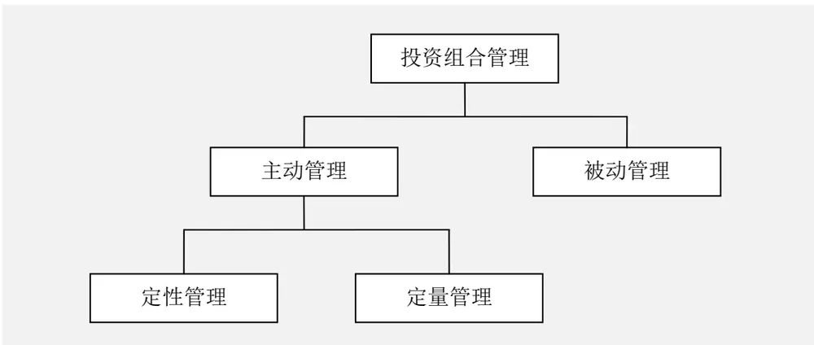
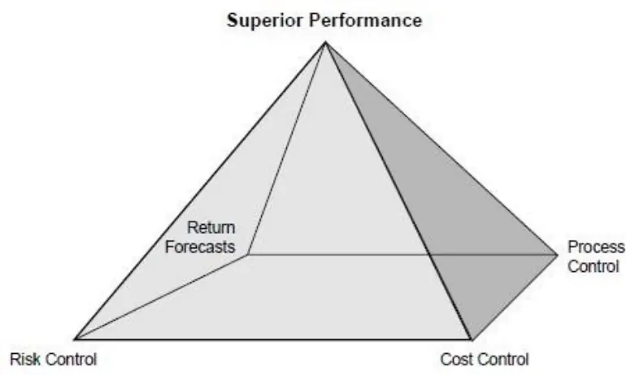
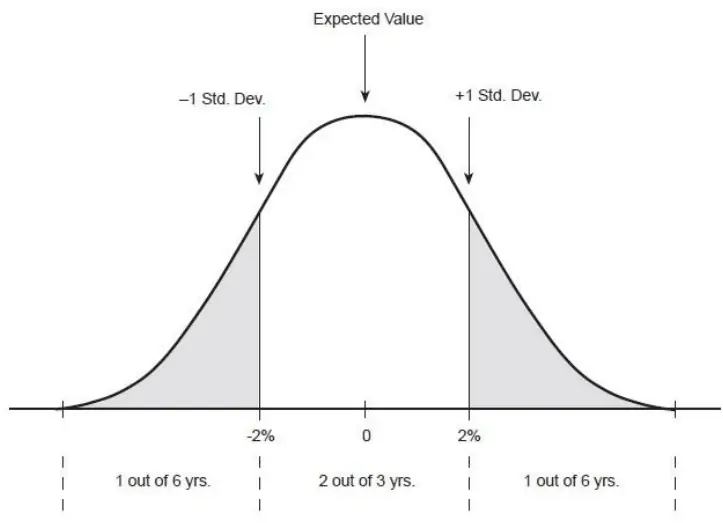
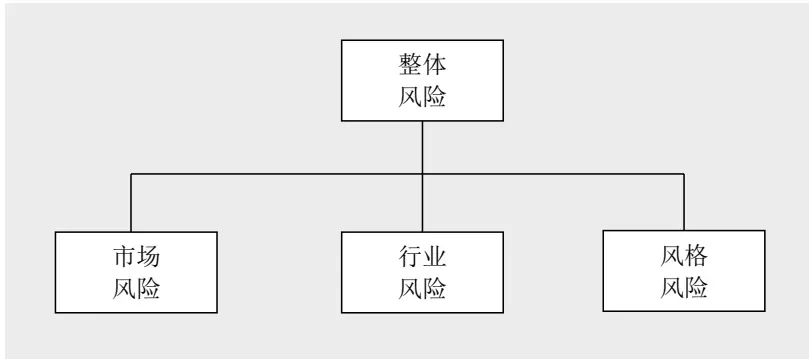
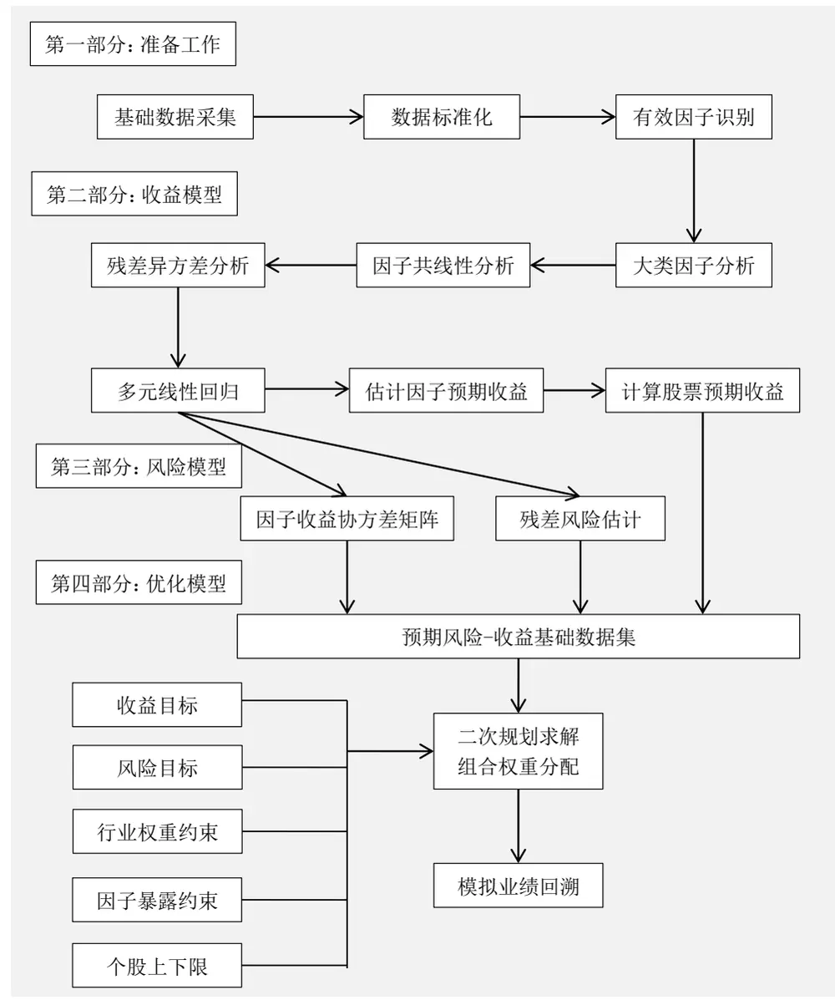
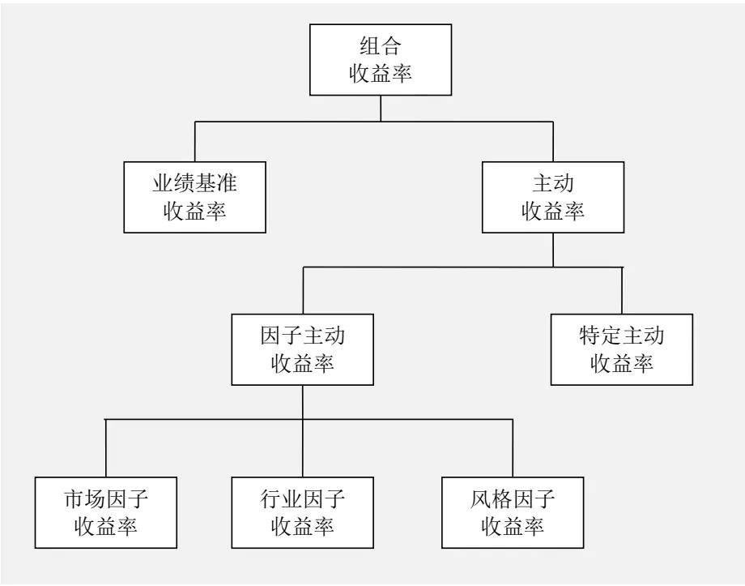
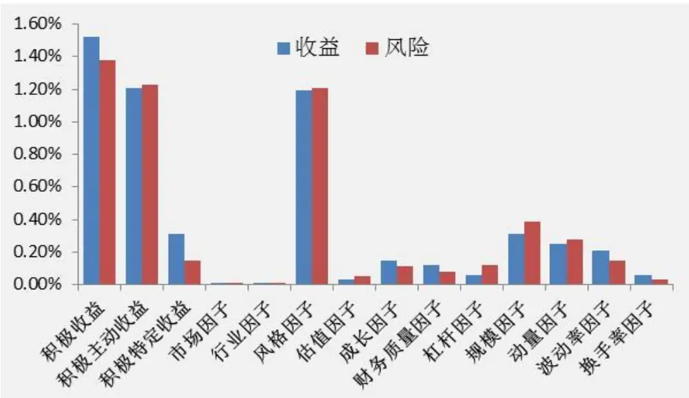

## 金融工程 / 量化选股

2016年09月21日

林晓明 执业证书编号：S0570516010001

研究员 0755-82080134

linxiaoming@htsc.com

陈烨 010-56793927

联系人 chenye@htsc.com

# 华泰多因子模型体系初探

华泰多因子系列之一

## 主动定量管理本质是统计套利，关注点是因子（共性），而非股票（个性）

定量管理主要从统计的角度研究因子收益率的变化规律，并从组合的角度对因子暴露进行管理以求超越基准；定性管理主要研究个股的残差收益率，即从因子角度无法解释的超额收益率。

多因子模型是风险-收益关系的定量表达，因子是不同类型风险的解释变量多因子模型是由 APT 理论发展而来，其一般表达式为：

$$
\widetilde{r_{j}}=\sum_{k=1}^{K}X_{jk}*\widetilde{f_{k}}+\widetilde{u_{j}}
$$

## f̃ : 因子k的因子收益

$\widetilde{u}_{J}\colon$ 股票j的残差收益率

多因子模型本质是将对N只股票的收益-风险预测转变成对于K个因子的收益-风险预测，将估算个股收益率的协方差阵转化为估算因子收益率的协方差阵，极大地降低了预测工作量，提高了准确度。

## 多因子模型构建流程主要包括：因子筛选、收益预测、风险预测、组合优化

1）数据处理及因子筛选：1.1 基础数据采集；1.2 数据标准化；1.3 识别有效因子；2）收益预测：2.1 大类因子分析；2.2 因子共线性分析；2.3 残差异方差分析；2.4多元线性回归：2.5 计算因子预期收益；2.6 计算股票预期收益；3）风险预测：3.1计算因子历史收益率协方差矩阵；3.2 残差风险估计；4）组合优化：4.1 确定组合的收益目标；4.2 确定组合的风险目标；4.3 行业权重约束；4.4 因子暴露约束；4.5个股上下限约束；4.6 二次规划求解组合权重分配；4.7 模拟业绩回溯。

## 华泰多因子模型服务体系

华泰多因子模型基础服务体系主要规划如下：1）依次对不同类别的风格因子进行单因子测试；2）对筛选出的有效因子进行大类因子分析；3）在收益预测和风险预测的基础上，构建选股模型；4）对选股模型进行回测和绩效分析。后期我们会持续对多因子模型进行深度挖掘，目前规划如下：1）寻找优质 Alpha 因子；2）优化因子使用方式；3）优化选股方法。

风险提示：多因子模型是历史经验的总结，存在失效的可能。

## 多因子模型基本理论

## 主动定量组合管理

投资组合管理可以分为被动管理和主动管理两种方式。

被动管理又称指数化管理，目标是尽可能的跟踪某个股票指数或者其他基准，使得投资组合的绩效与业绩基准偏离最小。被动投资组合经理根据基准指数的成分及权重对组合进行配置，再投资分红收入，根据申购赎回按照既定比例进行组合头寸调整，并根据指数公司的成份股调整及权重变化进行必要的调整以保证紧密跟踪指数。被动管理在国内外市场发展壮大的主要原因在于许多主动管理的基金经理并没有战胜基准指数，采用被动管理策略隐含的假设是投资组合经理不可能战胜市场。本报告不想就这一问题展开讨论，就结果而言，一部分主动投资经理战胜了市场，而另一部分没有战胜市场，因此对于投资者而言，这两种投资管理方式都很重要，适合于不同理念的投资者。

主动管理相信通过合理的选择股票，投资组合的收益可以战胜某个股票指数或者其他基准。其他基准有可能跟股票市场无关，而是某个绝对的收益率水平。主动管理投资经理的唯一目标就是寻找有潜力战胜基准的股票并进行积极的配置，无论是采用基本面分析方法还是技术分析方法，或者兼而有之。主动组合管理又可以分为定性管理和定量管理两种方式。

定性管理依赖于投资经理对于市场和个股的定性判断，判断可以是基于财务报表、技术分析、对上市公司进行调研、研究报告、以及其他的有效方法，综合形成最终的认知并根据本能反应进行投资决策。

定量管理根据能够得到的公开数据，基于数学和统计的方法，建立统一的定量模型对股票进行区分并依此进行投资决策。定量投资经理采用的公开数据主要包含由财务报表得出的股票基本面信息、股票的交易信息（例如股票的价格和成交量）、宏观经济数据、调查数据、分析师评级、以及任何其他可以定量的数据。投资经理根据自己的投资经验或者统计规律建立适合自己的量化模型，将公开数据输入模型得到所有股票的预期评价，并且通过预期评价进行股票选择和组合构建。

图1： 投资组合管理方式分类

资料来源：华泰证券研究所

## 定量管理的优势

根据《证券组合定量管理》一书中总结，定量管理与定性管理的优势和劣势：

表格1： 定量管理与定性管理的优势和劣势

|  | 准则 | 定量管理 | 定性管理 |
| --- | --- | --- | --- |
| 优势 | 客观性 | 高 | 低 |
|  | 宽度 | 高 | 低 |
|  | 行为失误 | 低 | 高 |
|  | 可复制性 | 高 | 低 |
|  | 成本 | 低 | 高 |
|  | 风险控制 | 高 | 低 |
| 劣势 | 定性投入 | 低 | 高 |
|  | 历史数据依赖性 | 高 | 低 |
|  | 数据挖掘 | 高 | 低 |
|  | 反应性 | 低 | 高 |

资料来源：华泰证券研究所

定量投资的最大优势在于客观，投资经理根据客观的数据和经过验证的模型进行投资决策，消除了投资经理个人行为偏好的影响。

定量投资的另外一个优势是通过海量数据对大量的股票进行数据分析，覆盖面广，这就是所谓的“宽度优势”。通过定性的方式，要对大量的股票进行分析并且给出投资观点，实践中基本不现实。

定量管理的主要问题在于历史数据的依赖性，市场环境的变化可能导致股票市场运行模式的改变，通过历史数据得出的规律可能会发生变化。不过这种变化是所有投资者共同面临的问题，当市场行为模式发生深刻改变的时候，多数投资者都是后知后觉的，而不仅仅是定量模型难以快速改变适应。

## 定量管理本质是统计套利

定量管理的关注点是因子（共性），而非股票（个性）。

《证券组合定量管理》一书中，对定量管理总结的七条准则：

1. 市场大多是有效的；

2. 纯套利机会不存在；

3. 定量分析创造统计上的套利机会；

4. 定量分析以有效的方式结合所有可获得的信息；

5. 定量模型应该基于合理的经济理论；

6. 定量模型应该反映持续和稳定的模式；

7. 证券投资组合与基准的偏差只有当不确定性足够小时才是合理的。主动定量管理本质是统计套利，关注点是因子（共性），而非股票（个性）。经典的多因子模型表达式：

$$
\widetilde{\tau_{j}}=\sum_{k=1}^{K}X_{jk}*\widetilde{f_{k}}+\widetilde{u_{j}}
$$

$\widetilde{f}_{k};$ 因子k的因子收益

ũ:股票j的残差收益率

定量管理主要从统计的角度研究因子收益率的变化规律，并且从组合的角度对因子暴露进行管理以超越基准；定性管理主要研究个股的残差收益率，即从因子角度无法解释的超额收益率。定量管理主要研究∑ K k=1 $X_{jk}*\widetilde{f}_{k}$ ，定性管理主要研究ũj。

即从投资标的而言，定量管理和定性管理是显著不同的，定量管理的投资标的是因子，主要关注股票市场的共性；而定性管理的投资标的是个股，主要关注股票的个性。

## Alpha定义的理论探讨

市场经济的本质是市场竞争，通过市场竞争实现优胜劣汰，进而实现生产要素的优化配置。金融市场作为整体市场经济的组成部分，遵循同样的行为模式。优胜劣汰的优，即超越行业竞争对手，超越行业平均水平。投资者无论是追求相对收益还是绝对收益，首要目标都是在相同的风险条件下，获取更高的收益，或者在同等收益水平条件下，更好地控制风险。超越同行平均水平或者基准的卓越表现即 Alpha 最朴素的定义。

卓越的投资表现，不仅仅单指收益率。参考《BARRA Handbook USE3》中的定义，卓越的投资表现包含四个方面的含义：

1. 收益预测：形成合理并且有效的收益预期；

2. 风险控制：在谨慎的前提下捕捉市场机会；

3. 过程控制：监控整个投资过程以保持投资生产上的一致性；

4. 成本控制：避免过度或者无效率的交易侵蚀投资利润。

这四个方面是所有的投资管理都必须面对的，无论是进行资产配置、主动组合管理、被动指数投资，也无论是进行自上而下投资或者自下而上投资，亦或是定性投资或者量化投资。投资管理就是不断进行风险—收益权衡的决策过程。Alpha 代表的是投资组合与同行或者参照基准相比的超额收益，Alpha 衡量的是经风险调整后的超额收益，即考虑到其相对于同行或者基准的风险之后的投资组合表现。从可操作性的角度而言，Alpha 的度量首先需要定量刻画风险，只有风险具备清晰的量化指标，进行收益的比较才是有意义的。

图2： 卓越的投资表现

BARRA Handbook USE3 ,

## 风险的定义及度量方法

## 风险的基本定义

风险与收益同源，本质上风险与收益只是从不同的角度去描述同一件事情。风险是在投资之前对于投资结果不确定性的描述，收益是在投资结果出来之后对于结果的简单描述。我们无法脱离风险仅从事后收益的角度来评价 Alpha，因此在讨论具体的 Alpha 定义之前，我们需要首先讨论风险的定义。

风险或者不确定性，是一个抽象的概念。有的经济学家认为风险是主观的，它体现在个人偏好中，即一个人认为有风险的东西，可能另外一个人不这么认为。

在定量投资中，我们需要一个具有可操作性并且客观可被广泛接受的定义，这个定义既要适用于个股，也要适用于投资组合；既要适用于讨论过去实现的风险，也能够对未来任意时期中的风险进行预测。（参考《主动投资组合管理》）

业界最标准的定义是收益的标准差（standard deviation），标准差衡量了收益率在均值附近分布范围的宽度。随着标准差的减小，收益率的分布范围越来越窄，收益的确定性越来越强。标准差是哈里·马科维茨（Harry Markowitz）对风险的定义，并且之后一直被机构投资者视为风险的标准定义。本报告中将沿用这一定义。（参考《主动投资组合管理》）

$$
Std(\tilde{r})=\sqrt{Var(\tilde{r})}
$$

$$
Var(\tilde{r})=E[(\tilde{r}-\bar{r})^{2}]
$$

r̃: 收益率

r̅:预期回报或者平均回报率

Std(x): x的标准差

$$
Var(x):x的方差
$$

$$
E(x):x的预期值
$$

图3： 收益率的正态分布

BARRA Handbook USE3 ,

其他对于风险的定义还有半方差（semivariance）、下行风险（downside risk）、损失概率（shortfall probability）或在险价值（value at risk）。

半方差是目标导向，即认为只有负的收益或者较低的收益才是投资真正的风险。半方差的定义与方差类似，唯一的区别在于半方差仅使用低于均值的收益率样本。另外一个变种是目标半方差（target semivariance），是仅关注低于某一目标收益率的样本。

损失概率的定义是收益率低于目标值的概率。

在险价值的定义与损失概率类似，是先取定一个目标概率，然后计算与该概率相应的收益率分位数。

## 投资组合标准差的特性

投资组合的收益率等于组合中各资产收益率的加权平均，但是投资组合的标准差并不等于组合中各资产标准差的加权平均，而是小于等于组合中各资产标准差的加权平均，即整体风险小于部分风险之和——这是进行组合投资分散风险的关键。

一个最简单的例子是：投资组合P由股票A和股票B组成，股票A和股票B各占50%的权重，它们收益率的相关系数为 $\rho_{AB}$ ，那么：

$$
\sigma_{P}=\sqrt{(0.5*\sigma_{A})^{2}+(0.5*\sigma_{B})^{2}+2*(0.5*\sigma_{A})*(0.5*\sigma_{B})*\rho_{AB}}.
$$

并且

$$
\sigma_{P}\leq0.5*\sigma_{A}+0.5*\sigma_{B}
$$

等号成立当且仅当两支股票收益率完全线性相关，即 $\rho_{AB}=1$ o

第二个例子：考虑一个有N只股票组成的等权重投资组合，每只股票的风险都是 $.\sigma$ ，并且股票之间的收益率互不相关，那么该组合的风险是：

$$
\sigma_{P}=\frac{\sigma}{\sqrt{N}}
$$

第三个例子：考虑一个有N只股票组成的等权重投资组合，每只股票的风险都是 $.\sigma$ ，并且任意两只股票收益率之间的相关系数都等于 $\cdot\rho$ ，那么该组合的风险是：

$$
\begin{array}{r}{\sigma_{P}=\;\sigma*\sqrt{\frac{1+\rho*(N-1)}{N}}}\end{array}
$$

当组合中的股票数目N很大时，上式变为：

$$
\sigma_{P}=\sigma*\sqrt{\rho}
$$

风险既不能沿着横截面也不能沿着时间相加。然而方差可以，只要任意不重叠的两段时间上收益率是不相关的。如果考察一只股票的月度收益率，并且观察到其月度收益率的标准差为$\sigma_{Monthly},$ ,那么风险的年化值是：

$$
\sigma_{Annual}=\sqrt{12}*\sigma_{Monthly}
$$

相对风险（跟踪误差）：

如果投资组合被设置相应的业绩基准，那么 $r_{PA}=r_{P}-r_{B}$ 称作组合的主动收益率（activereturn），相应的主动风险即主动收益率的标准差：

$$
\sigma_{PA}=Std(r_{PA})=Std(r_{P}-r_{B})
$$

主动风险也被称为跟踪误差（tracking error）。

## 投资组合风险的度量

对于一个由N只股票组成的投资组合，如果我们不对单只股票的风险 $\sigma_{i}$ 以及任意两只股票之间的相关系数ρ 做任何假设，那么在估计投资组合整体风险时，我们需要估计N个波动率以 $\rho_{ij}$ 及 $N*(N-1)/2$ 个相关系数的估计值。当 $N=100$ 时，我们需要100个波动率的估计值，以及任意两只股票之间的相关系数（4950个相关系数）。

我们可以将所有需要估计的参数总结到一个协方差（covariance）矩阵 V中：

$$
V=\begin{bmatrix}\sigma_{1}^{2}&\sigma_{12}&\cdots&\sigma_{1N}\\\sigma_{21}&\sigma_{2}^{2}&\cdots&\cdots\\\vdots&\vdots&\ddots&\vdots\\\sigma_{N1}&\cdots&\cdots&\sigma_{N}^{2}\end{bmatrix}
$$

协方差矩阵包含了计算投资组合风险所需的所有信息，风险模型的目标就是就是精准的预测协方差矩阵。由于随着股票数量N的增加，协方差矩阵包含的独立参数太多，这使得按照这种方式建立风险模型相当困难。

## 多因子模型的发展及基本理论

## 资本资产定价模型（CAPM）

资本资产定价模型（Capital Asset Pricing Model, CAPM）是现代金融市场价格理论的支柱，由美国学者威廉·夏普（William Sharpe）等人于1964年在资产组合理论的基础上发展起来。它开启了资产风险分类的研究进程。

$$
\begin{aligned}E(\widetilde{r_{i}})-r_{F}&=\beta_{i}*E(\widetilde{r_{M}}-r_{F})\\\widetilde{r_{i}}&:资产i的回报\\r_{F}&:无风险回报\\\widetilde{r_{M}}&:市场收益率\end{aligned}
$$

$$
\beta_{i}=\frac{Cov(\widetilde{r_{i}},\widetilde{r_{M}})}{Var(\widetilde{r_{M}})}
$$

在CAPM模型下，任何股票或者组合的预期只与其Beta有关，即预期超额收益率E $(\widetilde{r_{l}})-r_{F}$ 与股票或者组合的 Beta成正比（此处超额收益率是指超越市场无风险利率的收益率）。

股票或者组合的 Beta 定义为股票或者组合的超额收益率与市场组合（由市场上所有的股票组成的组合）超额收益率之间的协方差除以市场组合超额收益率的方差。

股票或者组合的 Beta值由简单线性回归确定，用股票或者组合P在T个时间点上的超额收益率对同期市场超额收益率 $\cdot r_{M}(t)$ 回归：

$$
r_{P}(t)=\alpha_{P}+\beta_{P}*r_{M}(t)+\varepsilon_{P}(t),t=1,2,3,\ldots,T
$$

回归分析得到的 $\prime\beta_{P}$ 和 ${}^{\prime}\alpha_{P}$ 的估计值称为实现的或者历史的 Beta 和 Alpha，这个回归估计值显示了股票或者组合P与市场组合在历史上的相关关系，历史 Beta是对于未来实现的 Beta的一个合理预测。

Beta 是一种将风险和收益分解为两个部分的工具，如果已知组合P的 Beta 值，就可以将它的超额收益分解为市场部分和残差部分：

$$
r_{P}=\beta_{P}*r_{M}+\theta_{P}
$$

由于残差收益率与市场收益率是独立的，所以组合P的方差也可以分解为：

$$
\sigma_{P}^{2}=\beta_{P}^{2}*\sigma_{P}^{2}+\omega_{P}^{2}
$$

Beta的提出是 CAPM 最重要的贡献之一，它使得我们能够将任意的超额收益率分解为市场和非市场（残差）两个部分。在此（二十世纪五十年代）之前，收益率仅仅是股票价格涨跌而已，投资者仅凭直觉或者财务报表进行投资决策，所谓组合投资不过是挑选一些“好”的股票。

CAPM 还第一次提出了，所有股票的收益率都受到共同的风险因素的影响——系统性风险，开启了对于股票或者组合风险的细分研究——对于影响股票市场的“共同风险因素”进行识别和分类，同时也使得对组合进行定量的风险管理和控制成为可能。在此之前，对于股票或者组合而言，风险只是标准差或者半方差这样一个简单的数字而已。

## 多因子模型（MFM）的基本形式

七十年代，投资者意识到具有某些相似特征的股票在市场会有相似的走势，利用 CAPM 模型仅通过单因子解释市场存在不足，套利定价模型（Arbitrage Pricing Theory，APT）被提出来了。

APT 模型认为，套利行为是现代有效市场（即市场均衡价格）形成的一个决定因素，如果市场未达到均衡状态的话，市场上就会存在无风险套利机会，套利行为会使得市场重新回到均衡状态。APT 模型用多个因素来解释风险资产的收益，并根据无套利原则，得到风险资产均衡收益与多个因素之间存在（近似的）线性关系。也就是说，股票或者组合的预期收益率是与一组影响它们的系统性因素的预期收益率线性相关的，影响股票预期收益率的因素从CAPM 中的单一因素扩展到多个因素。多因子模型（Multiple-Factor Model, MFM）正是基于 APT 模型的思想发展出来的完整的风险模型。

现代金融理论认为，股票的预期收益是对股票持有者所承担风险的报酬，多因子模型正是对于风险—收益关系的定量表达，不同因子代表不同风险类型的解释变量。多因子模型定量刻画了股票预期收益率与股票在每个因子上的因子载荷（风险敞口），以及每个因子每单位因子载荷（风险敞口）的因子收益率之间的线性关系。

多因子模型的一般表达式：

$$
\widetilde{r_{j}}=\sum_{k=1}^{K}X_{jk}*\widetilde{f_{k}}+\widetilde{u_{j}}
$$

$$
\widetilde{f}_{k}:因子k的因子收益
$$

ũ:股票j的残差收益率

多因子模型有三种主要的形式：

1. 宏观经济因子模型：宏观经济因子模型使用可观察到的宏观经济数据序列，比如通货膨胀率、利率等指标，作为股票市场收益率变动的主要解释变量。宏观经济因子模型的主要思想是，股票市场和外部经济之间存在关联，并且试图利用外部经济指标对股票市场收益率进行刻画。

宏观经济因子模型在实际操作中遇到的主要问题是数据问题，假设一个包含10个宏观经济因子和1000只股票的模型，如果每个月进行分析，需要进行1000次的回归。其次每个月的回归可能要用60个月的数据来估计10个宏观经济因子的载荷，这可能会导致严重的估计偏差，因为这些因子载荷并非静态，即使能够在统计意义下精确的描述过去，这些估计值也很难反映当前的情况。

2. 基本面因子模型：基本面因子模型使用可观察到的股票自身的基本属性，比如分红比例、估值水平、成长性、换手率等指标，作为股票市场收益率变动的主要解释变量。基本面因子主要是进行横截面分析，确定股票收益率对因子的敏感性（Beta 值），基本面因子一般可以归纳为基本面类、估值类、市场类。

3. 统计因子模型：统计因子模型则从股票收益率的协方差矩阵中提取统计因子，作为股票市场收益率变动的主要解释变量，常见的统计分析方法有主成分分析（PrincipalComponent Analysis）、最大似然分析（Maximum Likelihood Analysis）和预期最大化分析（Expectations Maximization Analysis）等。统计因子模型的主要缺点是因子很难有直观的含义，并且因子的估计过程很容易受到“伪相关性”影响。

BARRA 对三种多因子模型都做过研究，基本面因子的模型效果要明显好于其他两类模型。
现在的多因子模型的主流研究也是集中在基本面多因子模型的研究。

基本面多因子模型最基本的假设是：具有类似“属性”的股票，在市场上应该有相似的收益率。这些类似的属性可以是相同的行业、相似的交易属性（比如交易价格、交易量、市值大小、波动率等）、相似的财务属性（来自于三张财务报表的各种比例或者增长率等）、相似的估值属性（PB、PE、PS、PCF 等）。

多因子模型识别这些共同的基本面因子，并且估计收益率对这些因子的敏感性，得出股票或者组合的预期收益率，最后通过风险模型，根据投资者的收益—风险偏好挑选合适的股票并进行权重分配。

假设一个投资组合由N个股票组成，它们在组合中的权重分别是 $[h_{P1},h_{P2},\ldots,h_{PN}$ ，则组合的收益率为：

$$
\widetilde{r_{P}}=\sum_{k=1}^{K}X_{Pk}*\widetilde{f_{k}}+\sum_{j=1}^{N}h_{Pj}*\widetilde{u_{P}}
$$

$$
其中,\ X_{Pk}=\sum_{j=1}^{N}h_{Pj}*X_{jk}
$$

## 多因子模型风险预测

对于一个包含N只股票和K个因子的系统，多因子模型本质上是将对于N只股票的收益—风险预测转变成对于K个因子的收益—风险预测。对于一个使用多因子模型的投资经理而言，她/他原本面对的操作对象是N只股票，通过多因子模型，操作对象转换成了K个因子。

$$
\begin{aligned}\begin{bmatrix}\widetilde{\Gamma_{1}}\\\widetilde{\Gamma_{2}}\\\cdots\\\widetilde{\Gamma_{N}}\end{bmatrix}&=\begin{bmatrix}X_{11}&X_{12}&\cdots&X_{1K}\\X_{21}&X_{22}&\cdots&\cdots\\\vdots&\vdots&\ddots&\vdots\\X_{N1}&\cdots&\cdots&X_{NK}\end{bmatrix}\begin{bmatrix}\widetilde{f_{1}}\\\widetilde{f_{2}}\\\vdots\\\widetilde{f_{K}}\end{bmatrix}+\begin{bmatrix}\widetilde{u_{1}}\\\widetilde{u_{2}}\\\vdots\\\widetilde{u_{N}}\end{bmatrix}\end{aligned}
$$

多因子模型极大的降低了预测工作量，以一个1000只股票和20个因子组成系统而言，预测从1000只股票的预期收益和风险转换为对20个因子的预期收益和风险的预测。随着预测复杂程度的降低，预测的精度大幅提升。

特别是对于风险的预测，前面已经提到过，若对1000只股票估计协方差矩阵，我们需要预$则N*(N-1)/2=4950$ 个相关系数。协方差矩阵中包含的独立参数太多，如果采用历史数据的样本方差和协方差，估计值既不稳定也不合理。因为采用历史数据进行估计，采样时间长度为T，要求T > N（即T > 1000）。按照多因子模型最常规的月度频率，需要的数据超过80年，这显然不现实，同时也不合理，因为公司基本面数据是在不断发生变化的。

多因子模型并不是一个因果关系的模型，即所谓的因子只是在统计上和收益率存在相关关系，是试图解释收益风险的维度，多因子模型并不关心他们是否存在因果关系。

在多因子模型中，我们假设残差收益率 $.\widetilde{u}_{j}$ 与因子收益率 $\widetilde{f}_{k}$ 独立，并且不同股票的残差收益率之间也互相独立。在多因子模型的框架下，市场的风险结构变为：

$$
V_{i,j}=\sum_{k1,k2=1}^{K}X_{i,k1}*F_{k1,k2}*X_{j,k2}+\Delta_{i,j},
$$

$$
V_{i,j}:股票i和股票j的协方差
$$

$$
X_{i,k1}:股票i对因子k1的暴露度《因子载荷》
$$

$$
$F_{k1,k2}\colon 因子k1$和因子$k2$之间的收益率协方差
$$

$\Delta_{i,j};$ 股票i和股票j之间残差的协方差，i ≠j时为 0

对于任意一个投资组合P都可以用一个N维向量 $h_{P}$ 来描述，其中 $h_{P}$ 是组合P在N只股票上的持仓权重。则组合P的因子暴露度是：

$$
x_{P}=X^{T}*h_{P}
$$

组合P的方差为：

$$
\sigma_{P}^{2}=x_{P}^{T}*F*x_{P}+h_{P}^{T}*\Delta*h_{P}=h_{P}^{T}*V*h_{P}
$$

如果组合P存在业绩基准 $.B$ ，我们也可以根据类似的公式计算组合的主动风险（跟踪误差）。如果 $h_{B}$ 是业绩基准的持仓权重向量，那么我们可以给出如下定义：

$$
\begin{aligned}h_{PA}&=h_P-h_B\\x_{PA}&=X^T*h_{PA}\\\sigma_{PA}^2=x_{PA}^T*F*x_{PA}+h_{PA}^T*\Delta*h_{PA}&=h_{PA}^T*V*h_{PA}\end{aligned}
$$

## 多因子模型风险分解

影响股票收益的因子按照逻辑可以分成三种类型：

1. 市场风险（Market Risk）：所有的股票都会受到市场整体供需的影响而呈现出同涨同跌的现象，即我们所说的牛市和熊市。这是所有类别的风险中波及面最广，影响最大的风险；

2. 行业风险（Sector Risk）：从事相同或者相似业务公司的股票，由于受到共同的产业景气周期影响、或者共同的产业政策冲击、抑或是其他宏观环境的影响，在市场上也会表现出较高的相关性；

3. 风格风险（Style Risk）：风格风险是指剔除掉市场风险和行业风险之后，股票市场的结构表现在一定的时期内会呈现出很强烈的风格特征，比如小市值股票表现更优的小市值风格，前期收益低的股票近期收益更高的反转风格，成长性高的股票表现更好地成长风格，或者是低估值股票表现更好地低估值风格等等。

主要的风格因子暂时分成十二大类：估值因子（Value Factor）、成长因子（Growth Factor）、财务质量因子（Financial Quality Factor）、杠杆因子（Leverage Factor）、规模因子（SizeFactor）、动量因子（Momentum Factor）、波动率因子（Volatility Factor）、换手率因子（Turnover Factor）、改进的动量因子（Modified Momentum Factor）、分析师情绪因子（Sentiment Factor）、股东因子（Shareholder Factor）和技术因子（Technical Factor）。

图4： 多因子模型风险的分解

资料来源：华泰证券研究所

## Alpha的定义和业绩的衡量

## Alpha 的定义

Alpha 和 Beta 是相辅相成的，分别是使用线性回归将组合收益率分解为与业绩基准相关的部分和业绩基准不相关的残差部分。如果 $.r_{P}(t)$ 是投资组合在时点t = 1,2,3,⋯,T上的超额收益率， $r_{B}(t)$ 是业绩基准在同时期的超额收益率，那么回归模型为：

$$
r_{P}(t)=\alpha_{P}+\beta_{P}*r_{B}(t)+\varepsilon_{P}(t)
$$

利用回归分析计算出来的 $\cdot\beta_{P}$ 和 ${}^{\prime}\alpha_{P}$ 的估计值称为实现的或者历史的 Beta和 Alpha。组合P的残差收益率是：

$$
\theta_{P}(t)=\alpha_{P}+\varepsilon_{P}(t)
$$

$\alpha_{P}$ 是平均残差收益率， $\varepsilon_{P}(t)$ 是残差收益率中均值为零的随机项。

根据定义，业绩基准组合的残差收益率总是等于零，即 $\theta_{B}=0$ 总是成立。因此，业绩基准组合的 Alpha 必然等于零，即 $\alpha_{B}=0$ 。为了保证 $.\alpha_{B}=0$ ，我们要求股票层面的 Alpha 列向量满足业绩基准中性的约束。

## 业绩的衡量

业界最常用的业绩衡量指标是信息比率 IR（Information Ration），IR 是年化残差收益率对年化残差风险的比值。

$$
IR_{P}=\frac{\alpha_{P}}{\omega_{P}}
$$

由于主动管理是一个零和游戏，所以信息比率 IR 具有均值为零的对称分布，整体而言，费前信息比率的分布接近于表格 1 中的分布。

表格2： 信息比例分布

| 分位数 | 信息比率 |
| --- | --- |
| 90 | 1.0 |
| 75 | 0.5 |
| 50 | 0.0 |
| 25 | -0.5 |
| 10 | -1.0 |

资料来源：《主动投资组合管理》、华泰证券研究所

信息比例的一种分解方式是：

$$
IR=IC*{\sqrt{BR}}
$$

即投资组合的信息比率 IR取决于投资策略的广度 BR（Breadth）和信息系数 IC（InformationCoefficient）。

1. BR（Breadth）：投资策略的广度，即策略每年对超额收益率做出的独立预测数目；

2. IC（Information Coefficient）：信息系数是每个预测与实现结果之间的相关系数。这个定律明确地告诉我们：要想提高信息比率，就要做得频繁（高广度 BR）并且做得出色（高能力 IC）。

## 多因子模型的构建流程

## 多因子模型构建的流程图

图5： 多因子模型构建流程图

资料来源：华泰证券研究所

多因子模型的构建主要可以分成四个主要步骤：

## 第一部分：准备工作

1.1 基础数据采集：首先需要确定原始因子集合，然后按照原始因子集合逐个进行因子原始数据的采集和计算工作；

1.2 数据标准化：由于原始数据的量纲不一致，为保证数据之间的可比性和可叠加性，要对原始数据进行标准化、去量纲的工作；

1.3 识别有效因子：原始因子集合是在逻辑上被认为与股票收益率存在关联性的因素，实证中并不是每个原始因子和股票收益率都存在相关性，因此需要对原始因子进行有效性检验，排除跟收益率相关性不高的因子。

## 第二部分：收益模型

2.1 大类因子分析：大类因子是指在逻辑上具有一定相似性的因子，在实证中这些因子之间也很有可能表现出很强的相关性，即共线性问题。为尽量多的保留有用信息，需要首先根据因子所属大类对其进行处理，比如进行因子合成，或者尽量挑选效果显著，并且相关性不高的因子集合进行保留；

2.2 因子共线性分析：如果因子之间存在明显的多重共线性，那么进行多元线性回归时，会使得模型的估计失真或者难以估计准确，所以在进行多元线性回归之前需要进行因子共线性分析，剔除相对不重要但是会对模型造成共线性干扰的因子；

2.3 残差异方差分析：如果回归的残差项具有不同的方差，则称回归模型存在异方差。如果存在异方差，则传统的最小二乘回归得到的参数估计量不是有效估计量，所以在进行多元线性回归之前必须进行残差的异方差分析。根据 Barra 的文档，可以采用个股流通市值的平方根作为权重进行加权最小二乘法回归，经实践在大部分截面期上可以消除异方差的影响；

2.4 多元线性回归：通过多元线性回归计算每一期的因子收益；

2.5 估计因子预期收益：由于因子每期收益或多或少存在不稳定性，为保证模型的稳定性，需要对因子历史收益序列进行分析，给出下一期因子收益的合理预期值。因为很多因子存在明确的经济含义和投资逻辑，所以因子收益的方向（±号）需要进行约束；

2.6 计算股票预期收益：根据因子收益和每个股票的因子载荷计算出个股的预期收益率。

## 第三部分：风险模型

3.1 计算因子收益率协方差矩阵：根据因子收益率的历史序列，计算出因子的协方差阵；

3.2 残差风险估计：计算出个股的残差风险。

## 第四部分：优化模型

4.1 确定组合的收益目标：可以是两种，一种是确定目标收益，然后最小化风险；另外一种是确定风险目标，然后最大化收益；

4.2 确定组合的风险目标：和 4.1 一起联合确定；

4.3 行业权重约束：根据风险目标确定行业风险的暴露。如果组合存在基准组合，则需要根据基准组合在各个行业的权重分布，确定行业偏离约束；

4.4 因子暴露约束：多因子模型本身是一个追求宽度的模型，所以为避免在某些因子上暴露过大导致风险过高，需要对因子暴露进行一定的约束；

4.5 个股上下限约束：因为卖空约束以及避免在个股上暴露过高的风险，所以需要对个股权重的上下限进行约束；

4.6 二次规划求解组合权重分配：根据 2.6、3.1 和 3.2 获取的个股预期风险—收益数据集，以及 4.1~4.5 确定的约束条件，采用二次规划的方式，计算组合中的个股权重；

4.7 模拟业绩回溯：根据每期确定的组合成份股及权重分配，对模型进行模拟业绩回溯。

## 准备工作

## 基础数据采集

基础数据采集主要完成两个工作，第一是确定备选因子池，其次是确定因子的具体计算方法。
本部分的基础数据采集主要是指风格因子（Style Factor）基础数据采集。

主要的风格因子暂时分为十二大类：估值因子（Value Factor）、成长因子（Growth Factor）、财务质量因子（Financial Quality Factor）、杠杆因子（Leverage Factor）、规模因子（SizeFactor）、动量因子（Momentum Factor）、波动率因子（Volatility Factor）、换手率因子（Turnover Factor）、改进的动量因子（Modified Momentum Factor）、分析师情绪因子（Sentiment Factor）、股东因子（Shareholder Factor）和技术因子（Technical Factor）。因子库是多因子模型的重要组成部分，我们持续探索，力求发现新的有效因子。

表格3： 主要因子及其描述

| 大类因子 | 具体因子 | 因子描述 |
| --- | --- | --- |
| 估值因子 | EP | 净利润（TTM，过去12个月）/总市值 |
| (Value Factor) | EPcut | 扣除非经常性损益后净利润/总市值 |
|  | BP | 净资产/总市值 |
|  | SP | 营业收入/总市值 |
|  | NCFP | 净现金流/总市值 |
|  | OCFP | 经营性现金流/总市值 |
|  | FCFP | 自由现金流/总市值 |
|  | DP | 分红/总市值 |
| 成长因子 | sales_growth_q | 营业收入增长率_当季同比 |
| (Growth Factor) | sales_growth_ttm | 营业收入增长率_TTM同比 |
|  | sales_growth_3y | 营业收入增长率三年复合增长率 |
|  | profit_growth_q | 扣非后净利润增长率_当季同比 |
|  | profit_growth_ttm | 扣非后净利润增长率_TTM同比 |
|  | profit_growth_3y | 扣非和净利润增长率_三年复合增长率 |
|  | operationcashflow_growth_q | 经营性现金流增长率_当季同比 |
|  | operationcashflow_growth_ttm | 经营性现金流增长率_TTM同比 |
|  | operationcashflow_growth_3y | 经营性现金流增长率_三年复合增长率 |
| 财务质量因子 | roe_q | ROE_当季 |
| (Financial Quality | roe_ttm | ROE_TTM |
| Factor) | roa_q | ROA_当季 |
|  | roa_ttm | ROA_TTM |
|  | grossprofitmargin_q | 毛利率_当季 |
|  | grossprofitmargin_ttm | 毛利率_TTM |
|  | profitmargin_q | 扣非后利润率_当季 |
|  | profitmargin_ttm | 扣非后利润率_TTM |
|  | assetturnover_q | 资产周转率当季 |
|  | assetturnover_ttm | 资产周转率_TTM |
|  | operationcashflowratio_q | 经营性现金流/净利润_当季 |
|  | operationcashflowratio_ttm | 经营性现金流/净利润_TTM |
| 杠杆因子 | marketvalue_leverage | (市值+优先股+长期负债)/市值 |
| (Leverage | financial_leverage | 总资产/普通股权益 |
| Factor) | debtequityratio | 长期债务/普通股权益 |
|  | cashration | 现金比率 |
|  | currentratio | 流动比率 |
| 规模因子 (Size Factor) | In_capital | 市值对数 |
| 动量因子 HAlpha |  | 个股60个月收益对沪指回归的 Alpha |
| ( Momentum relative_strength_1m |  | 最近一个月收益率 |
| Factor) | relative_strength_2m | 最近两个月收益率 |
|  | relative_strength_3m | 最近三个月收益率 |
|  | relative_strength_6m | 最近六个月收益率 |
|  | relative_strength_12m | 最近十二个月收益率 |
| 波动率因子 | high_low_1m | 最高价/最低价（最近一个月内价格） |
| (Volatility Factor) high_low_2m |  | 最高价/最低价（最近两个月内价格） |
|  | high_low_3m | 最高价/最低价（最近三个月内价格） |
|  | high_low_6m | 最高价/最低价（最近六个月内价格） |
|  | high_low_12m | 最高价/最低价（最近十二个月内价格） |
|  | std_1m | 最近一个月的日收益率标准差 |
|  | std_2m | 最近两个月的日收益率标准差 |
|  | std_3m | 最近三个月的日收益率标准差 |
|  | std_6m | 最近六个月的日收益率标准差 |
|  | std_12m | 最近十二个月的日收益率标准差 |
|  | In_price | 股价取对数 |
|  | beta_consistence | 个股60个月收益对沪指回归beta乘以残差标准差 |
| 换手率因子 | turnover_1m | 最近一个月换手率 |
| ( | Turnover turnover_2m | 最近两个月换手率 |
| Factor) | turnover_3m | 最近三个月换手率 |
|  | turnover_6m | 最近六个月换手率 |
|  | turnover_12m | 最近十二个月换手率 |
| 改进的动量因子 | weighted_strength_1m | 最近一个月换手率加权日均收益率 |
| ( | Modified weighted _strength_2m | 最近两个月换手率加权日均收益率 |
| Momentum | weighted _strength_3m | 最近三个月换手率加权日均收益率 |
| Factor) | weighted _strength_6m | 最近六个月换手率加权日均收益率 |
|  | weighted_strength_12m | 最近十二个月换手率加权日均收益率 |
| 分析师情绪因子 | rating_average | Wind 平均评级 |
| ( Sentiment rating_change |  | Wind评级：（上调数-下调数）/总评级数 |
| Factor) |  | Wind一致目标价/现价-1 |
| 股东因子 | rating_targetprice holder_avgpct | 户均持股比例 |
| ( | Shareholder holder_avgpctchange_half | 户均持股比例过去半年增长率 |
| Factor) | holder_avgpctchange | 户均持股比例过去一年增长率 |
| 技术因子 | macd | macd |
| ( | Technical dif | dif |
| Factor) | dea | dea |

资料来源：Wind，华泰证券研究所

## 数据标准化

由于各个因子的量纲不一致，为方便进行比较和回归，需要对因子进行标准化处理。对因子进行标准化处理主要有两种方式：

1. 直接对因子载荷原始值进行标准化；

2. 首先将因子载荷原始值转换为排序值，然后再进行标准化。

第一种方式的好处在于能够更多保留因子载荷之间原始的分布关系，但是进行回归的时候会受到极端值的影响；第二种方式的好处在于标准化之后的分布是标准正态分布，容易看出因子载荷和收益率之间的相关性的方向。

方法一：因子载荷原始值标准化

由于少数极端值会因子和收益率之间的相关关系估计造成严重干扰，而多因子模型本身是一个追求投资宽度的模型，所以在进行因子载荷标准化之前，我们需要对极端值进行处理。比较常见的去极值方法是“中位数去极值法”：

$$
\widetilde{x_{\iota}}=\left\{\begin{matrix}x_{M}+n*D_{MAD},&\quad if\ x_{i}>x_{M}+n*D_{MAD},\\x_{M}-n*D_{MAD},&\quad if\ x_{i}<x_{M}-n*D_{MAD},\\x_{i},&\quad else\end{matrix}\right.
$$

$x_{M}\colon$ 序列 $x_{i}$ 的中位数

$D_{MAD}\colon$ 序列 $|x_{i}-x_{M}|$ 的中位数

$\widetilde{x_{i}};x_{i}$ 去极值修正后的值

数据去极值后的序列再进行标准化：

$$
\widetilde{x_{\iota}}=\frac{x_{i}-u}{\sigma}
$$

u:序列 $x_{i}$ 的均值

σ: 序列 $x_{i}的$ 标准差

${\widetilde{x}}_{l};$ 序列 $x_{i}$ 标准化之后的值

方法二：因子载荷排序值标准化

排序标准化只关注原始序列的序关系，在做相关性分析时也只是关注排序之间的相关性，对原始变量的分布不作要求，属于非参数统计方法，适用范围相对广。

第一步将原始序列转换为序关系序列；

$$
\begin{aligned}\widetilde{x}_{i}&=rank(x_{i})\\\widetilde{x}_{i}:x_{i}&在序列中的排序值\end{aligned}
$$

第二步标准化方法与前面的标准化方法一致。

## 有效因子识别

有效因子应该满足两个条件：第一是在逻辑上应该和收益率存在一定的相关性；第二是在实证中确实和收益率存在比较明显的相关性。

在前面的章节中，我们已经列举出了逻辑上应该和收益率存在相关性的风格因子集合。接下来我们介绍如何从实证角度验证有效因子的方法。

步骤一：单因子回归确定每个因子每期的因子收益

市场风险、行业风险、风格风险是影响股票收益最主要的三种因素，在验证风格因子有效性时，必须考虑市场因子和行业因子的影响。对于市场因子和行业因子的处理方式有两种：

1. 市场因子和行业因子同时纳入模型；

2. 仅纳入行业因子，而将市场因子包含在行业因子中。

第一种方式和第二种方式的区别在于，第一种方式行业因子收益率计算出来的是行业相对于市场的超额收益率，而第二种方式计算出来的收益率是行业绝对收益率。

对于验证风格因子有效性而言，这两种方式是没有区别的；对于回归而言，只是前者是带截距项的回归，而后者是穿越原点的回归。

实证中我们采用第二种方式，针对因子k，单因子的回归模型如下：

$$
\widetilde{r_{j}^{t}}=\sum_{s=1}^{S}X_{js}^{t}*\widetilde{f_{s}^{t}}+X_{jk}^{t}*\widetilde{f_{k}^{t}}+\widetilde{u_{j}^{t}},
$$

$\tilde{r_{j}^{t}}$ :股票j在第t期的收益率

Xt:股票j在第t期在行业s上的暴露f̃t:行业s在第t期的收益率
Xjkt :股票j在第t期在因子k上的暴露f̃t: 因子k在第t期的收益率

$X_{js}^{t}$ 是一个0−1哑变量，即如果股票j属于行业s，则暴露度为1，否则为0。在我们的报告体系中，不会对公司所属行业进行比例拆分，即股票（公司）j只能属于一个特定的行业s，在行业s上的暴露度为1，在其他所有行业的暴露度为0。

注：在有的模型中，会对公司所属行业进行拆分，比如公司j的业务50%属于行业a，30%属于行业b，20%属于行业c，则股票j在行业a的暴露度为0.5，在行业b的暴露度为0.3，在行业c的暴露度为0.2。

A股的行业分类，主要存在两种方式，一种是外来的 GICS风格的行业分类，一种是本土的行业分类。

GICS风格的行业分类，我们参考中证指数公司发布的中证行业指数系列；

1）中证能源；2）中证材料；3）中证工业；4）中证可选；5）中证消费；6）中证医药；7）中证金融；8）中证信息；9）中证电信；10）中证公用。本土的行业分类，我们参考中信行业指数系列；

1）石油石化；2）煤炭；3）有色金属；4）电力及公用事业；5）钢铁；6）基础化工；7）建筑；8）建材；9）轻工制造；10）机械；11）电力设备；12）国防军工；13）汽车；14）商贸零售；15）餐饮旅游；16）家电；17）纺织服装；18）医药；19）食品饮料；20）农林牧渔；21）银行；22）非银行金融；23）房地产；24）交通运输；25）电子元器件；26）通信；27）计算机；28）传媒；29）综合。

步骤二：因子收益率序列t检验

f̃t是因子k在第t期的因子收益，为确定因子k在第t期是否和股票收益率显著相关，即 $\widetilde{f_{k}^{t}}$ 是否显著不等于0，我们需要对 $\widetilde{f_{k}^{t}}.$ 进行t检验：

x̅ − ut =t:x的t统计量x̅:样本的均值u:总体的均值σ:样本的标准差n:样本的容量

对于t检验，需要进行三个方面的分析：

1. t值绝对值序列的均值：对于每一期的截面回归，都可以得到一个因子收益率 $\widetilde{f_{k}^{t}}$ 的t值。对于t值序列，首先取绝对值，然后计算|t|的均值，|t|是判断因子是否为有效因子的重要指标。之所以要取绝对值，是因为只要t值显著不等于0即可以认为在当期，因子和收益率存在明显的相关性。但是这种相关性有的时候为正，有的时候为负，如果不取绝对值，则很多正负抵消，会低估因子的有效性；

2. t值绝对值序列大于2的比例：检验|t| > 2的比例主要是为了保证|t|平均值的稳定性，避免出现少数数值特别大的样本值拉高均值；

3. 因子收益率 $\widetilde{f_{k}^{t}}$ 序列的t值检验：对于每一期的截面回归，都可以得到一个因子收益率 $\widetilde{f_{k}^{t}}$ 对于 $\widetilde{\boldsymbol{f}_{k}^{t}}$ 序列同样需要进行t检验，以观察因子收益率序列的方向一致性。

有效因子的分类—收益类因子和风险类因子

所谓有效因子，就是和收益率存在很明显相关性的因子，即满足前面的t的第一点和第二点。
根据第三点，我们可以大致将有效因子分成收益类因子和风险类因子。

收益类因子：即因子收益率 $\widetilde{f_{k}^{t}}$ 序列的t值显著不等于0，因子收益率的方向性相对明确，这类型的因子，用历史序列对下一期的因子收益进行预测时，相对比较准确，所以称之为收益类因子。

风险类因子：即因子收益率f̃t序列的t值在0附近，因子收益率的方向性相对不明确，这类型的因子，用历史序列对下一期的因子收益进行预测时，风险比较大，所以称之为风险类因子。收益类因子是多因子模型超额收益的主要来源，在模型中是需要风险暴露相对多的因子。而风险类因子也需要重点关注，因为风险类因子是进行风险控制的重点，需要风险暴露尽量少。

## 步骤三：辅助鉴别之因子 IC 值

在实际计算中，因子k的 IC 值一般是指个股第T期在因子k上的暴露度与T+1期的收益率的相关系数。因子 IC 值反映的是个股下期收益率和本期因子暴露度的线性相关程度，是使用该因子进行收益率预测的稳健性；而回归法中计算出的因子收益率本质上是一个斜率，反映的是从该因子可能获得的收益的大小，这并不能代表任何关于稳健性的信息。

举个例子，票池里5只个股第T期在动量因子上的暴露度为−2、−1、0、1、2，假设它们第T+1期收益率为−0.2、−0.1、0、0.1、0.2，则因子 IC 值为1，因子收益率为0.1；假设它们第T+1期收益率为−0.4、−0.2、0、0.2、0.4，则因子 IC值为1，因子收益率为0.2。而因子t值某种程度上反映的也是稳健性信息，在上述举例的两种简单情形下，因子t值都是正无穷。但是在更复杂的包括其它因子和行业哑变量的多元线性回归模型中，因子t值和 IC 的关系也随之变得复杂，无法用确定的公式表示，只能说它们之间具有某种正相关关系。在我们的后续多因子报告中会有更为详细的数学推导论述，欢迎继续关注。

在利用 IC 值评价因子有效性时，可以预先对因子进行提纯，排除行业、市值等重要因素的影响，使结果更明晰。具体来说，就是在因子标准化处理之后，在每个截面期上用其做因变量对市值因子及行业因子等做线性回归，取残差作为因子值的一个替代，这种做法可以消除因子在行业、板块、市值等方面的偏离。例如，股息率因子较高的个股可能较多分布在电力及公用事业、汽车、商贸零售等行业以及大市值板块，经过因子提纯之后，股息率因子较高的个股就会平均分布在各行业及板块了。

当得到各因子 IC值序列后，我们可以仿照上一小节t检验的分析方法进行计算：

1. IC 值序列的均值及绝对值均值：判断因子有效性；

2. IC 值序列的标准差：判断因子稳定性；

3. IC 值序列大于零（或小于零）的占比：判断因子效果的一致性。

## 步骤四：辅助鉴别之因子打分法回测

依照因子值对股票进行打分，构建投资组合回测，是最直观的衡量指标优劣的手段。具体来说，在某个截面期上，可以根据一个或几个因子值对个股进行打分，将所有个股依照分数进行排序，然后分为N个投资组合，进行回测。
构建方法详细说明如下：

1. 股票池、回溯区间、截面期（换仓期）可均与回归法相同；

2. 选取一个基准组合（比如沪深300），将所有个股在各个行业内按照得分进行排序，每个行业内按得分从高到低分成N个组合，每个行业内的每个组合中股票按流通市值配比，然后将各行业的N个组合中序数相同的组合结合在一起（最后一共形成N个组合），组合内行业间权重按沪深300配比。以上这种构造方法得到的N个组合为行业中性组合。也可以选择不做行业中性，直接在全股票池中不分行业按得分高低分成N个组合，每个组合中的股票等权配比或按流通市值配比。

3. 评价方法：回测年化收益率、年化波动率、夏普比率、最大回撤、胜率（分时间、分行业胜率）等。

一般来说，对于比较有效的因子（如市净率），分成3～5层进行回测，各个投资组合的最终净值一般可以保序。分成N层（N > 5）进行回测时，可以用最终净值的秩相关系数来衡量因子的优劣（秩相关系数的绝对值越接近1时效果越好）。

## 收益模型

## 大类因子分析

多因子模型强调因子本身的经济含义和实证有效性两个方面。在因子搜集的时候就会根据因子的具体经济含义对因子进行大类划分，但是同类型的因子可能存在较强的相关性，多元线性回归的时候会造成多重共线性（Multicollinearity），多重共线性是指回归模型中的解释变量之间由于存在精确相关关系或高度相关性而使模型估计失真或者难以估计准确。

所以在有效因子筛选出来之后，我们首先需要根据大类对因子的相关性进行t检验，对于相关性较高的因子，要么舍弃显著性较低的因子，要么进行因子合成。

## 步骤一：同类型因子的相关性检验

同类型的K候选因子，向前选取M个月的数据作为样本：

1. 按月计算出因子载荷之间的相关系数矩阵和每个因子的因子收益率；

$$
\rho^{t}=\begin{bmatrix}1&\rho_{12}^{t}&\cdots&\rho_{1K}^{t}\\\rho_{21}^{t}&1&\cdots&\cdots\\\vdots&\vdots&\ddots&\vdots\\\rho_{K1}^{t}&\cdots&\cdots&1\end{bmatrix}
$$

2. 然后根据M个月的相关系数进行检验，检验的方法包括相关系数绝对值的均值、中位数、t检验等方式。

$$
\left.\Sigma_{t=1}^{M}\left|\rho_{ij}^{t}\right|\right/_{M}
$$

$$
median\big(|\rho_{ij}^{t}|\big)\quad t=1,2,\cdots M
$$

$$
t=\frac{\overline{{|\rho_{ij}^{t}|}}-u}{\sigma\Big/_{\sqrt{M-1}}}
$$

## 步骤二：因子取舍或者因子合成

对于相关性较高的因子集合，可以采取两种方式处理：

1. 根据因子本身的有效性进行排序，挑选最有效的因子进行保留，删除其他因子；

2. 对因子集合进行合成，尽可能多的保留有效因子信息；

对于因子合成，主要的方法有三种：

2.1. 等权法：所有相关性很高的因子等权重进行合成，即按照每个因子载荷等权重的方式合成新的因子载荷。比如动量因子，HALPHA、一个月收益率、两个月收益率、三个月收益率、六个月收益率、十二个月收益率，这六个因子的因子载荷各占1/6的权重，合成新的动量因子载荷，然后再重新进行标准化处理；

2.2. 历史收益率加权法：所有相关性很高的因子，按照各自的历史收益率作为权重对因子载荷进行合成。这样可以获得最大解释力的大类因子，但是由于共线性问题通过回归计算出的因子收益率非常不稳定。还是以动量因子为例，如果这六个因子的历史收益率分别是1、2、3、4、5、6，则各自的权重分别是：4.76%、9.52%、14.29%、19.05%、23.81%、28.57%，然后再重新进行标准化处理；

2.3. 历史信息比例加权法：所有相关性很高的因子，按照各自的历史 IC 值对因子载荷进行合成。具体来说，设N ×K维矩阵A为过去K个截面期上N个因子的历史 IC值， $N\times1$ 维向量b为A的行均值， $N\times N$ 维矩阵V为A的N个行向量的协方差矩阵，则以 $\langle sV^{-1}b$ 作为因子在本期的权重，其中s是归一化常数。与历史收益率加权法的主要区别是，历史收益率加权法只考虑因子历史的收益率，而历史信息比例加权法同时考虑因子了历史收益率和波动率，更加稳健；

2.4. 主成分分析：对相关性高的因子进行主成分分析，结合收益率排序选取一个或几个主成分的组合系数作为权重合成大类因子。此种做法较偏重技术分析，组合出来的指标可能不具有特殊的经济学含义，可根据实际情况适度采用。

## 因子共线性分析

因子共线性分析和大类因子分析的本质目标都是一致的，都是避免最终的回归过程中出现多重共线性问题。分作两个环节进行的理由是：如果是经济含义类似的同类型因子，存在明显相关性，为尽可能多的保留因子信息，我们可以将因子进行合并；如果是经济含义不同的因子，存在明显相关性，我们只能有所取舍，保留更加显著的因子，而舍弃相对不显著的因子，因为多因子模型除了效果，最终还是要讲求因子本身的经济含义的。（多重共线性的判别步骤请参考大类因子分析部分）

## 残差异方差分析

异方差性（Heteroscedasticity）是相对于同方差而言的。所谓同方差，是为了保证回归参数估计量具有良好的统计性质，经典线性回归模型的一个重要假定：总体回归函数中的随机误差项满足同方差性，即它们都有相同的方差。如果这一假定不满足，即：随机误差项具有不同的方差，则称线性回归模型存在异方差性。

对于回归模型：

$$
\widetilde{\tau_{j}}=\sum_{k=1}^{K}X_{jk}*\widetilde{f_{k}}+\widetilde{u_{j}}
$$

如果残差项的条件方差相同，即 $Var\big(\widetilde{u_{j}}\big|X_{j1},X_{j2},\dots X_{jK}\big)=\sigma^{2}$ ，则称为同方差性；
如果残差项的条件方差不相同，即 $Var\big(\widetilde{u_{j}}\big|X_{j1},X_{j2},\dots X_{jK}\big)=\sigma_{j}^{2}$ ，则称为异方差性。

异方差性对普通最小二乘法（Ordinary Least Square，OLS）估计的影响，主要有三点：

1. 回归系数的 OLS 估计量仍然是无偏的、一致的、并且不影响 $1R^{2}$ 和调整的 $R^{2}$ 。

2. 回归标准差的估计不再是无偏的，从而回归系数 OLS 估计量的方差不再是无偏的，OLS估计量不再是有效的和渐近有效的。

3. t统计量不服从t分布，F统计量也不服从F分布，从而无法进行假设检验和区间估计，也无法进行区间预测。

对于模型是否存在异方差的检验，可以采用 Breusch-Pagan test 或者 White test 两种方法：

Breusch-Pagan test：

$$
Y=\beta_{0}+\beta_{1}*X_{1}+\beta_{2}*X_{2}+\cdots+\beta_{K}*X_{K}+u
$$

$$
Var(u|X_{1},X_{2},\ldots,X_{K})=E(u^{2}|X_{1},X_{2},\ldots,X_{K})=\alpha_{0}+\alpha_{1}*X_{1}+\cdots+\alpha_{K}*X_{K}+v
$$

首先根据模型1估计出 $\widetilde{u^{2}}$ ，然后 $以\widetilde{u^{2}}$ 为因变量，得到 $R_{u}^{2}$

$$
\widetilde{u^{2}}=\alpha_{0}+\alpha_{1}*X_{1}+\cdots+\alpha_{K}*X_{K}+v
$$

计算模型的F统计量，或者构造统计量 $LM=nR_{u}^{2}{\sim}{\chi}^{2}(K)$

对于 ${}^{:}H_{0}{:}\alpha_{1}=0,\alpha_{2}=0\ldots,\alpha_{K}=0$ ，如果F统计量或者LM统计量是显著的，则拒绝原假设，说明模型存在异方差。

White test：

$$
Y=\beta_{0}+\beta_{1}*X_{1}+\beta_{2}*X_{2}+\cdots+\beta_{K}*X_{K}+u
$$

首先根据模型1估计出 $\widetilde{u^{2}}$ ，然后 $以\widetilde{u^{2}}$ 为因变量，得到 $R_{u}^{2}$

$$
\widetilde{u^{2}}=\alpha_{0}+\alpha_{1}*X_{1}+\cdots+\alpha_{K}*X_{K}+\alpha_{K+1}*X_{1}^{2}+\cdots+\alpha_{2K}*X_{K}^{2}+
$$

$$
\alpha_{2K+1}*X_1*X_2+\cdots+\alpha_{\frac{\mathbf{k}*(\mathbf{k}+3)}{2}}*X_{K-1}*X_{K+1}+v
$$

计算模型的F统计量，或者构造统计量 $\begin{array}{r}{LM=nR_{u}^{2}{\sim}{\chi}^{2}(\frac{K(K+3)}{2})}\end{array}$对于 ${}^{:}H_{0}{:}\alpha_{1}=0,\alpha_{2}=0\ldots,\alpha_{K}=0$ ，如果F统计量或者LM统计量是显著的，则拒绝原假设，说明模型存在异方差。

对于存在异方差的模型，在进行回归的时候需要采用加权最小二乘法（Weighted LeastSquare，WLS）。

如果方差形式已知，加权最小二乘方法如下：

$$
Y_{i}=\beta_{0}+\beta_{1}*X_{1i}+\beta_{2}*X_{2i}+\cdots+\beta_{K}*X_{Ki}+u_{i}
$$

若已知方差：

$$
Var(u_{i}|X_{1i},X_{2i},\ldots,X_{Ki})=\sigma_{i}^{2}=\sigma^{2}*h(X_{1i},X_{2i},\ldots,X_{Ki})=\sigma^{2}*h_{i}
$$

那么可以做如下变换：

$$
\frac{Y_{i}}{\sqrt{h_{i}}}=\frac{\beta_{0}}{\sqrt{h_{i}}}+\beta_{1}\cdot\frac{X_{1i}}{\sqrt{h_{i}}}+\beta_{2}\cdot\frac{X_{2i}}{\sqrt{h_{i}}}+\cdots+\beta_{K}\cdot\frac{X_{Ki}}{\sqrt{h_{i}}}+\frac{u_{i}}{\sqrt{h_{i}}}
$$

新 $的$ 模型的残差记作 $u_{i}^{*}$

$$
Var(u_{i}^{*}|X_{1i},X_{2i},\ldots,X_{Ki})=E\bigl(u_{i}^{*2}\big|X_{1i},X_{2i},\ldots,X_{Ki}\bigr)=\cfrac{\sigma^{2}*h_{i}}{h_{i}}=\sigma^{2}
$$

如果方差形式未知，首先需要对异方差的函数形式做估计，然后再采用加权最小二乘法进行估计，这种方法属于可行的 $\begin{aligned}产\end{aligned}$ 义最小二乘法（Feasible Generalized Least Square，GFLS）：

$$
Y_{i}=\beta_{0}+\beta_{1}*X_{1i}+\beta_{2}*X_{2i}+\cdots+\beta_{K}*X_{Ki}+u_{i}
$$

假设：

$$
\sigma_{i}^{2}=\sigma^{2}*exp(\alpha_{0}+\alpha_{1}*X_{1i}+\cdots+\alpha_{K}*X_{ki})=\sigma^{2}*h_{i}
$$

首先估计出 $\widetilde{u_{\iota}^{2}}$ ，然后根据方程：

$$
ln\big(\widetilde{u_{\iota}^{2}}\big)=\alpha_{0}+\alpha_{1}*X_{1i}+\cdots+\alpha_{K}*X_{Ki}+v_{i}
$$

计算 $ln(\widetilde{u_{l}^{2}})$ 的估计值 $\widetilde{e_{i}^{2}}$ ：

$$
\begin{aligned}\widetilde{e_{\iota}^{2}}=\widetilde{\alpha_{0}}+\widetilde{\alpha_{1}}*X_{1i}+\cdots+\widetilde{\alpha_{K}}*X_{Ki}\\\widetilde{h_{\iota}}=exp(\widetilde{e_{\iota}^{2}})\end{aligned}
$$

$$
\frac{Y_{i}}{\sqrt{\widetilde{h}_{i}}}=\frac{\beta_{0}}{\sqrt{\widetilde{h}_{i}}}+\beta_{1}\cdot\frac{X_{1i}}{\sqrt{\widetilde{h}_{i}}}+\beta_{2}\cdot\frac{X_{2i}}{\sqrt{\widetilde{h}_{i}}}+\cdots+\beta_{K}\cdot\frac{X_{Ki}}{\sqrt{\widetilde{h}_{i}}}+\frac{u_{i}}{\sqrt{\widetilde{h}_{i}}}
$$

## 多元线性回归

因子集的转换步骤：

1. 因子集F1：最原始的因子集；

2. 因子集F2：对F1有效因子筛选后的因子集；

3. 因子集F3：对F2大类因子分析，经过因子取舍或者因子合成之后的因子集；

4. 因子集F4：对F3进行多重共线性分析，取舍之后的最终因子集。

在对因子集F4做残差的异方差分析处理之后，就可以正式进行多元线性回归，估计每期的因子收益序列。

$$
\widetilde{r_{j}^{t}}=\sum_{s=1}^{S}X_{js}^{t}*\widetilde{f_{s}^{t}}+\sum_{k=1}^{K}X_{jk}^{t}*\widetilde{f_{k}^{t}}+\widetilde{u_{j}^{t}},
$$

$\tilde{r_{j}^{t}};$ 股票j在第t期的收益率

$X_{js}^{t}$ :股票j在第t期在行业s上的暴露

$\widetilde{f_{s}^{t}};$ 行业s在第t期的收益率

$X_{jk}^{t};$ 股票j在第t期在因子k上的暴露

$$
\widetilde{f_k}:四子k在第t励的收益率
$$

$\widetilde{u_{j}^{t}}\colon$ 股票j的残差收益率

经典回归模型的基本假设：

1. 参数的线性性：回归模型对于参数而言是线性的；

2. 样本的随机性：样本是从总体中随机抽样得到的；

3. 不存在完全共线性：每个解释变量具有一定变异并且自变量之间不存在完全的线性相关关系；

4. 零条件均值： $E\bigl(u_{j}\bigl|X_{1j},X_{2j},\ldots,X_{Kj}\bigr)=0$ ；

5. 同方差性： $V\mathrm{ar}\big(u_{j}\big|X_{1j},X_{2j},\dots,X_{Kj}\big)=\sigma^{2}$

6. 正态性： $u_{j}$ 独立于所有变量，并且 $.u_{j}{\sim}N(0,{\sigma}^{2})$ o

所以前面的大类因子分析，因子共线性分析，残差异方差分析，本质都是让因子能够满足经典回归模型的基本假设。

## 估计因子预期收益

多元线性回归，我们可以得到所有因子的历史收益率序列 $\langle\widetilde{f_{k}^{t}},k=1{,}2{,}3,\cdots,K;t=$ $1{,}2{,}3{,}\cdots{,}T)$ ）：

$$
\boldsymbol{F}=\begin{bmatrix}\widetilde{f_{1}^{1}}&\widetilde{f_{2}^{1}}&\cdots&\widetilde{f_{K}^{1}}\\\widetilde{f_{1}^{2}}&\widetilde{f_{2}^{2}}&\cdots&\cdots\\\vdots&\vdots&\ddots&\vdots\\\widetilde{f_{1}^{T}}&\cdots&\cdots&\widetilde{f_{K}^{T}}\end{bmatrix}
$$

对于T+1期因子的预期收益率的估计，可以采用以下几种方式：

1. 历史均值法：用前N期因子历史收益率的均值作为T+1期因子的预期收益率，

$$
\widetilde{f_{k}^{T+1}}=\frac{\sum_{\mathrm{t=T-N+1}}^{T}\widetilde{f_{k}^{t}}}{N}
$$

一般情况下，N的取值为36或者60，即前36个月或者60个月的均值；

2. 指数加权移动平均法（Exponentially Weighted Moving Average，EWMA）：由于因子收益率包含的信息有可能也是存在衰减，所以离当前越近的观测值权重越重，越远的观测值权重越轻。

$$
\begin{aligned}EWMA(t)=\lambda*\widetilde{f_k^t}+(1-\lambda)*EWMA(t-1),\ t&=1,2,3,\cdots,n\\\widetilde{f_k^{T+1}}&=EWMA(t)\\EWMA(t)&\colon t时刻的修正估计量\\\widetilde{f_k^t}&\colon t时刻因子收益率观察值\\\lambda&\colon 权重因子\end{aligned}
$$

$0<\lambda<1$ ，λ越接近1，则当前观察值权重越大，之前的历史值权重越小。λ数值越小，则估计值约平稳，受到数据突变的影响越小；

3. 时间序列预测法：

3.1 $AR(q)$ ，自回归模型（Auto-Regress，AR）：变量在时刻t的取值x(t)依赖于变量的 $q_{1}$ 个历史取值 $\{x(t-1),x(t-2),\cdots,x(t-q)\}$ 的加总和以及一个随机输入项e(t)：

$$
x(t)=a_{0}+a_{1}*x(t-1)+\cdots+a_{q}*x(t-q)+e(t)
$$

3.2 MA(p)，移动平均模型（Moving Average，MA）：变量在时刻t的取值等 $于p+1$ 个（独立的）随机输 $\neg e(t),e(t-1),\cdots,e(t-p)$ 的加权平均之和：

$$
x(t)=e(t)+c_1*e(t-1)+\cdots+c_p*e(t-p)+c_0
$$

3.3 $ARMA(q,p)$ ，自回归移动平均模型（Auto-Regress Moving Average，ARMA）：是 $AR(q)和MA(p)$ 的组合。

$$
\begin{aligned}&x(t)=a_{0}+a_{1}*x(t-1)+\cdots+a_{q}*x(t-q)\\&\quad+e(t)+c_{1}*e(t-1)+\cdots+c_{p}*e(t-p)\\\end{aligned}
$$

自回归积分滑动平均模型(Autoregressive Integrated Moving Average Model，ARIMA)，是 ARMA模型在时间序列一阶差分上的应用；

4. 滤波法提取趋势项：由于因子收益率存在较大波动性，我们创新地通过 HP滤波法提取因子历史累积收益率的趋势项，以滤波曲线的终值除以样本期的长度作为因子的预期收益率。此种方法人工预设的参数很少，在获取因子收益率长期变化规律的同时能够尽量消除噪声的影响，经实证检验效果不错。

其他预测模型还有很多，比如 ARCH、GARCH、滤波、神经网络、遗传算法等等，在这里就不再一一列举。

在对T+1期因子预期收益做估计的时候，还需要考虑一个约束条件，即因子收益率方向。因为很多的因子都具有明确的经济含义和投资逻辑，所以因子收益率的方向（±号）在事前是确定的。如果通过模型估算出来的预期收益率方向与事前确定的因子收益率方向相反，则需要对T+1期因子预期收益率置0处理。

## 计算股票预期收益

估算出T+1期的因子收益率向量 $(\widetilde{f_{1}^{T+1}},\widetilde{f_{2}^{T+1}},\cdots,\widetilde{f_{k}^{T+1}})$ 后，以及计算出T+1期的因子载荷矩阵：

$$
X^{T+1}=\begin{bmatrix}X_{11}^{T+1}&X_{12}^{T+1}&\cdots&X_{1K}^{T+1}\\X_{21}^{T+1}&X_{22}^{T+1}&\cdots&\cdots\\\vdots&\vdots&\ddots&\vdots\\X_{N1}^{T+1}&\cdots&\cdots&X_{NK}^{T+1}\end{bmatrix}
$$

根据模型：

$$
\widehat{r_{J}^{T+1}}=\sum_{k=1}^{K}X_{jk}^{T+1}*\widehat{f_{k}^{T+1}}
$$

就可以计算出T+1期每只股票的预期收益率向量 $(\widetilde{\mathbf{r}_{1}^{T+1}},\widetilde{\mathbf{r}_{2}^{T+1}},\cdots,\widetilde{\mathbf{r}_{N}^{T+1}})$ o

## 风险模型

## 多因子模型的风险分解

多因子风险模型的主要观点是，股票的收益率可以被一组共同因子和一个仅与该股票有关的特异因子解释，即任何股票的收益率来自两个方面：共同（因子）部分，特异部分。多因子模型通过对于共同（因子）部分的定量建模，将投资的聚焦点从股票转移至因子，即从原来的对股票的收益和风险管理，变成对于因子的收益和风险管理。

从组合的角度而言，如果设置有业绩基准，那么组合收益率可以分成：

1. 业绩基准收益率；

2. 主动收益率（主动超额收益率）。

主动收益率可以进一步细分成：

1. 因子主动收益率（共同部分）；

2. 特定主动收益率（特异部分）。

因子主动收益率可以再细分成：

1. 市场因子收益率；

2. 行业因子收益率；

3. 风格因子收益率。

在多因子模型中，股票对于市场因子的因子暴露统一为1，对于行业因子的因子暴露是一个0−1哑变量（如果股票属于某一行业为1，否则为0）。由于多因子模型本质上是一个统计套利模型，不适合对市场因子和行业因子进行收益预测和风险管理。因此目前国内市场上多因子模型最流行的用法是：

1. 通过股指期货对冲组合的市场风险（市值对冲）；

2. 通过行业中性对冲组合的行业风险（以业绩基准的行业权重为基准进行对齐，即组合在每个行业上的权重分配与业绩基准一致）。

多因子模型关注的重点是风格因子的收益预测和风险管理。

图6： 多因子模型构建流程图

资料来源：华泰证券研究所

## 投资组合风险预测

对于一个包含N只股票和K个因子的系统而言，一般情况下N要远大于K。不借助多因子模型，将收益-风险的预测从N维降低为K维，基本上很难进行收益—风险预测，因为精度太低而失去了操作意义。在第一章第三节“多因子模型的发展及基本理论”中，我们已经对多因子模型风险预测进行了一些探讨，这里简要重复一下前面的结论。

多因子模型本质上是将对于N只股票的收益—风险预测转变成对于K个因子的收益—风险预测。对于一个使用多因子模型的投资经理而言，她/他原本面对的操作对象是N只股票，通过多因子模型，面对的操作对象转换成了K个因子。

$$
\begin{aligned}\begin{bmatrix}\widetilde{\Gamma_{1}}\\\widetilde{\Gamma_{2}}\\\cdots\\\widetilde{\Gamma_{N}}\end{bmatrix}&=\begin{bmatrix}X_{11}&X_{12}&\cdots&X_{1K}\\X_{21}&X_{22}&\cdots&\cdots\\\vdots&\vdots&\ddots&\vdots\\X_{N1}&\cdots&\cdots&X_{NK}\end{bmatrix}\begin{bmatrix}\widetilde{f_{1}}\\\widetilde{f_{2}}\\\vdots\\\widetilde{f_{K}}\end{bmatrix}+\begin{bmatrix}\widetilde{u_{1}}\\\widetilde{u_{2}}\\\vdots\\\widetilde{u_{N}}\end{bmatrix}\end{aligned}
$$

$$
X_{nk}:股票n对因子k的风险暴露《因子载荷》
$$

多因子模型极大的降低了预测工作量，以一个1000只股票和20个因子组成系统而言，若对个股直接预测风险，则需要预测 $N*(N-1)/2=4950$ 个相关系数，协方差矩阵中包含的独立参数太多，估计值既不稳定也不合理。若转变为对因子风险进行预测，则只要估计不到200个相关系数就够了。

在这里需要指出，多因子模型并不是一个因果关系的模型，即所谓的因子只是在统计上和收益率存在相关关系，是试图解释收益风险的维度，多因子模型并不关心他们是否存在因果关系。

在多因子模型中，我们假设残差收益率ũj与因子收益率 $\widetilde{f}_{k}$ 不相关，并且不同股票的残差收益率之间也互不相关。在多因子模型的框架下，市场的风险结构变为：

$$
V_{i,j}=\sum_{k1,k2=1}^{K}X_{i,k1}*F_{k1,k2}*X_{j,k2}+\Delta_{i,j},
$$

$V_{i,j};$ 股票i和股票j的协方差

$X_{i,k1}.$ 股票i对因子k1 的暴露度（因子载荷）

$$
$F_{k1,k2}\colon 因子k1$和因子$k2$之间的收益率协方差
$$

$\Delta_{i,j};$ 股票i和股票j之间残差的协方差，i ≠ j时为 0

对于任意一个投资组合P都可以用一个N维向量 $h_{P}$ 来描述，其中 $h_{P}$ 是组合P在N只股票上的持仓权重。则组合P的因子暴露度是：

$$
x_{P}=X^{T}*h_{P}
$$

组合P的方差为：

$$
\sigma_{P}^{2}=x_{P}^{T}*F*x_{P}+h_{P}^{T}*\Delta*h_{P}=h_{P}^{T}*V*h_{P}
$$

如果组合P在业绩基准B，我们也可以根据类似的公式计算组合的主动风险（跟踪误差）。如果 $h_{B}$ 是业绩基准的持仓权重向量，那么我们可以给出如下定义：

$$
\begin{aligned}h_{PA}&=h_P-h_B\\x_{PA}&=X^T*h_{PA}\\\sigma_{PA}^2=x_{PA}^T*F*x_{PA}+h_{PA}^T*\Delta*h_{PA}&=h_{PA}^T*V*h_{PA}\end{aligned}
$$

## 因子协方差矩阵

根据多元线性回归的结果，我们可以得到所有因子每期因子收益的历史序列值 $(\widetilde{f_{k}^{t}},k=$ $\overline{{1,}}2,\overline{{3}},\cdots,K;t=1,\overline{{2,}}3,\cdots,N)$ ）：

$$
\begin{bmatrix}\widetilde{f_1^1}&\widetilde{f_2^1}&\cdots&\widetilde{f_K^1}\\\widetilde{f_1^2}&\widetilde{f_2^2}&\cdots&\cdots\\\vdots&\vdots&\ddots&\vdots\\\widetilde{f_1^N}&\cdots&\cdots&\widetilde{f_K^N}\end{bmatrix}
$$

根据N期的历史数据计算出因子收益率之间的协方差矩阵：

$$
F=\begin{bmatrix}\sigma_{1}^{2}&\sigma_{12}&\cdots&\sigma_{1\mathrm{K}}\\\sigma_{21}&\sigma_{2}^{2}&\cdots&\cdots\\\vdots&\vdots&\ddots&\vdots\\\sigma_{K1}&\cdots&\cdots&\sigma_{K}^{2}\end{bmatrix}
$$

一般N的取值为36个月或者60个月。

## 残差风险估计

为了估计股票的协方差矩阵，不仅需要估计因子收益率的协方差矩阵V，还需要估计特异风险矩阵∆。多因子模型并不能解释一只股票的特异收益 $u_{j}$ ，但是需要对于特异收益的方差u2进行建模（参考《主动投资组合管理》）：

$$
u_{j}^{2}(t)=S(t)*[1+v_{j}(t)]
$$

其中：

$$
\Big(\frac{1}{N}\Big)*\sum_{n=1}^{N}u_{j}^{2}\left(t\right)=S(t),
$$

并且：

$$
\left(\frac{1}{N}\right)\ast\sum_{n=1}^{N}v_{j}\left(t\right)=0.
$$

S(t)衡量了股票空间上特异方差的平均水平，而v 则捕捉了特异方差在横截面上的起伏。为了预测特异风险，我们对S(t)建立时间序列模型，并对v (t)建立多因子模型。 $v_{j}(t)$ 的模型通常包含风险指数因子，以及衡量近期特意收益率平方的因子。关于 $v_{j}(t)$ 的模型的时间依赖性是由随时间变化的暴露度捕获的。我们通过剔除离群值的混合回归（即将多期横截面样本放在一起做面板回归）来估计模型系数。

## 优化模型

## 二次规划

第T+1期的股票预期收益、因子收益协方差矩阵、预期残差风险，都计算出来之后，关于股票的预期风险和收益的基础数据就全部得到了。接下来需要做的就是在这些数据的基础上，结合投资组合的风险-收益目标，以及各种约束条件，进行股票选择和权重分配。

对于投资组合的优化问题，一般可以采用二次规划的方法构建符合目标的投资组合。

一般二次规划问题可以表示成如下形式：

$$
\begin{aligned}\min_{H}\frac{1}{2}&*H^{T}*Q*H+H^{T}*c\\&s.t.\ A^{T}*H\leq b\end{aligned}
$$

其中：

## H: 需要求解的目标向量

$$
\begin{aligned}Q:&为最优化问题的二次项系数的对称半正定矩阵\\&\quad c:为与线性目标方程有关的系数向量\\&\quad A:为约束等式与非等式的系数矩阵\\&\quad b:为约束值的向量矩阵\end{aligned}
$$

二次与线性最优化的问题都可以通过一般二次规划最优化程序来解决。对于线性最优化问题，只要令 $Q=0$ ，则问题就变成一个线性规划问题。对于二次最优化而言，要使用恰当的Q。

## 收益目标和风险目标

站在投资者的角度，都是希望收益越高越好，风险越低越好。但是投资的收益和风险是两个矛盾的目标，无法同时满足。实际操作中有两种形式：

1. 将预期风险控制在一定水平之下，选择投资组合使得期望收益最大；

2. 在预期收益不低于某一特定水平的条件下，选择投资组合使得预期风险最小。要求解的目标是投资组合P的权重向量 $h_{P}$ ，组合的预期收益率；

$$
\widehat{r_{P}^{T+1}}=\sum_{j=1}^{N}\widehat{r_{j}^{T+1}}*h_{j}.
$$

组合的预期风险为：

$$
\sigma_{P}^{2}=x_{P}^{T}*F*x_{P}+h_{P}^{T}*\Delta*h_{P}=h_{P}^{T}*V*h_{P}
$$

注： $h_{P}^{T}$ 上的右角标T是转置的意思，不是代表第T期， $而\widehat{r_{P}^{T+1}}$ 的右角标T+1是代表第 $T+1$ 期。第一个模型是控制风险，最大化收益的模型：

$$
\begin{aligned}\max_{h_{j}}\sum_{j=1}^{N}\widetilde{r_{j}^{T+1}}*h_{j}\\s.t.h_{P}^{T}*V*h_{P}\leq\sigma^{2}\\\sum_{j=1}^{N}h_{j}=1,h_{j}\geq0j=1,&2,\cdots,N\\\end{aligned}
$$

第二个模型是保证收益，最小化风险的模型；

$$
\mathop{min}_{h_{P}}h_{P}^{T}*V*h_{P}
$$

$$
s.t.\sum_{j=1}^{N}\widetilde{r_{j}^{T+1}}*h_{j}\geq r.
$$

$$
\sum_{j=1}^{N}h_{j}=1,h_{j}\geq0j=1,2,\cdots,N
$$

## 个股上下限约束

多因子模型本质是统计套利模型，并且强调投资的宽度（通过多个不同维度的因子），因此必须对个股的权重进行上限约束，避免风险在单只股票上分配过多的权重。另外本报告讨论的模型是利用多因子模型构建纯多头组合，并非多空模型，所以个股权重的下限约束是0，即不允许卖空。

如果组合P存在业绩基准B，业绩基准B的个股权重向量 $h_{B}$ ，那么组合P的主动权重暴露 $.h_{PA}$ 是：

$$
h_{PA}=h_{P}-h_{B}
$$

对于 $\cdot h_{PA}$ 而言，个股权重的下限约束向量则变成 $-h_{B}$ 。假设股票j在基准B中的权重为 $h_{Bj}$ ，由于在组合P中的权重下限是0，其主动权重暴露就是 $-h_{Bj}$

接下来的讨论，我们做如下设定：

1. 组合P存在业绩基准组合B；

2. 优化的目标是控制风险，最大化收益。

则需要求解的权重向量变为 $h_{PA}$ ，个股权重为 $h_{PAj}$ ，个股权重上限为 $h_{j}^{upper}$ 优化的约束条件变为：

$$
\mathop{max}_{h_{j}}\sum_{j=1}^{N}\widetilde{r_{j}^{T+1}}*h_{PAj},
$$

$$
s.t.h_{PA}^{T}*V*h_{PA}\leq\sigma^{2}
$$

$$
\sum_{j=1}^{N}h_{PAj}=0,h_{j}^{upper}\geq h_{PAj}\geq-h_{Bj}j=1,2,\cdots,N
$$

## 行业权重约束

由于多因子模型本质上是一个统计套利模型，不适合对市场因子和行业因子进行收益预测和风险管理。因此目前国内市场上多因子模型最流行的用法是：

1. 通过股指期货对冲组合的市场风险（市值对冲）；

2. 通过行业中性对冲组合的行业风险（以业绩基准的行业权重为基准进行对齐，即组合在每个行业上的权重分配与业绩基准一致）。

对于任意一只股票，其行业哑变量 $(0{,}0{,}\cdots{,}1{,}\cdots0)$ ，对于所有股票组成的哑变量矩阵S：

$$
S=\begin{bmatrix}s_{11}&s_{12}&\cdots&s_{1S}\\s_{21}&s_{22}&\cdots&\vdots\\\vdots&\vdots&\ddots&\vdots\\s_{N1}&\cdots&\cdots&s_{NS}\end{bmatrix}
$$

要求：

$$
\sum_{j=1}^{N}h_{PAj}*s_{ji}=0.
$$

加上行业中性约束的最优化条件变为；

$$
\mathop{max}_{h_{j}}\sum_{j=1}^{N}\widetilde{r_{j}^{T+1}}*h_{PAj},
$$

$$
s.t.h_{PA}^{T}*V*h_{PA}\leq\sigma^{2}
$$

$$
\sum_{j=1}^{N}h_{PAj}=0,h_{j}^{upper}\geq h_{PAj}\geq-h_{Bj}j=1{,}2,\cdots,N
$$

$$
\sum_{j=1}^{N}h_{PAj}*s_{ji}=0\quad j=1{,}2,\cdots,N.
$$

## 因子暴露约束

实际操作中，需要对因子暴露进行约束，避免在单个因子上暴露过多的风险。组合P在因子k上的暴露度计算公式为：

$$
\sum_{j=1}^{N}h_{PAj}*X_{jk}
$$

如果对于因子k的暴露上限为 $x_{k}$ ，则要求：

$$
|\sum_{j=1}^{N}h_{PAj}*X_{jk}\:|\leq x_{k},
$$

最终的优化条件变为：

$$
\mathop{max}_{h_{j}}\sum_{j=1}^{N}\widetilde{r_{j}^{T+1}}*h_{PAj},
$$

$$
s.t.h_{PA}^{T}*V*h_{PA}\leq\sigma^{2}
$$

$$
\sum_{j=1}^{N}h_{PAj}=0,h_{j}^{upper}\geq h_{PAj}\geq-h_{Bj}j=1{,}2,\cdots,N
$$

$$
\sum_{j=1}^{N}h_{PAj}*s_{ji}=0\quad j=1{,}2,\cdots,N.
$$

$$
|\sum_{j=1}^{N}h_{PAj}*X_{jk}\:|\leq x_{k},
$$

## 多因子模型的绩效分析

常用的业绩分析指标

年化收益率：

$$
\begin{aligned}exp\left\{\left[ln(v_{t})-ln(v_{0})\right]*\frac{12}{t}\right\}-1\\v_{t}:t期的净值\\v_{0}:初始净值\end{aligned}
$$

最大回撤：

$$
\min_{i,j}\left[ln(v_j)-ln(v_i)\right]\quad i<j
$$

## 收益率回归

基于收益率回归的 Jensen 业绩分析的基本形式是：用组合P的收益率序列对业绩基准B的时间序列做回归。回归的截距项和系数分别是组合的α和 $^{\circ}\beta$ 。

$$
r_{P}(t)=\alpha_{P}+\beta_{P}*r_{B}(t)+\varepsilon_{P}(t)
$$

回归分析将组合P的收益率分解成基准部分 $\cdot\beta_{P}*r_{B}(t)$ 和主动超越基准部分 $\cdot\theta_{P}(\mathsf{t})=\alpha_{P}+$ $\varepsilon_{P}(t)$ 0

对于 $[\alpha_{P}$ 可以采用t统计量进行检验，如果t统计量大于等于2则意味着组合的业绩表现来源于能力而非运气，因为在正态分布的假设下， $\alpha_{P}$ 是运气的概率仅5%。

$\alpha_{P}$ 的t统计量为：

$$
t_{P}{\sim}\left(\frac{\alpha_{P}}{\omega_{P}}\right)*\sqrt{T}
$$

除了 $\alpha_{P}$ 及其t统计量 $t_{P}$ 的组合外，另外一个衡量业绩的指标就是信息比率（IR），信息比率是用年化超额收益除以年化残差风险。

$$
IR=\frac{\alpha_{P}}{\omega_{P}}
$$

## 基于多因子的业绩归因

## 收益归因方法

对于业绩进行归因的时候，同样可以采用多因子模型的框架；

$$
r_{P}(t)=\sum_{j}x_{Pj}\left(t\right)*b_{j}(t)+u_{P}(t),
$$

通过对资产收益率的后验分析，在期初我们能够获得每个因子的暴露度 $x_{Pj}(t)$ ，第t期各个因子收益率 $\cdot b_{j}(t)$ ，组合在第t期实现的投资收益。

归因到因子j的组合收益率是：

$$
r_{Pj}(t)=x_{Pj}(t)*b_{j}(t)
$$

组合的特异收益率是 $\overline{{u}}_{P}(t)$ o

一般情况下，业绩归因模型使用和风险模型相同的因子。但是从理论上讲，这两者的因子不必完全相同。正如我们在“有效因子识别”章节中分析的，对于有效因子可以分成两类：收益类因子和风险类因子。两者的共同点是都跟股票收益率存在明显的相关性，不同点在于前者规律性很强，容易预测；而后者规律性很差，预测风险大。收益类因子是多因子模型收益的主要来源，风险类因子则主要用于风险控制。

对组合进行因子归因之后，剩余的模型不能解释的特异收益率 $u_{P}(t)$ ，就是投资经理个股选择能力，也被称为特异资产选择收益率（Specific Asset Selection）。

如果组合P存在业绩基准B，进行归因的时候，我们只需关注主动头寸及主动收益率：

$$
r_{PA}(t)=\sum_{j}x_{PAj}\left(t\right)*b_{j}(t)+u_{PA}(t)
$$

将组合主动收益分解成系统部分以及残差部分，主动头寸的残差暴露度为：

$$
x_{PARj}=x_{PAj}-\beta_{PA}*x_{Bj}
$$

即原主动暴露度减去主动β与基准对该因子的暴露度乘积，而残差的头寸可以类似定义：

$$
h_{PARn}=h_{PAn}-\beta_{PA}*h_{Bn}
$$

$$
u_{PA}=\sum_{n}h_{PAn}*u_{n}
$$

综合起来可得：

$$
r_{PA}(t)=\beta_{PA}*r_{B}(t)+\sum_{j}x_{PARj}(t)*b_{j}(t)+u_{PAR}(t)
$$

利用这个公式我们可以对主动收益率的来源进行详细的分析。

## 风险归因方法

对于因子风险模型，组合的风险：

$$
\sigma_{P}^{2}=x_{PA}^{T}*F*x_{PA}+h_{PA}^{T}*\Delta*h_{PA}
$$

因此我们可以定义因子对主动风险的边际贡献（Factor Marginal Contribution to Active Risk，FMCAR）为：

$$
FMCAR=\frac{\partial\sigma_{P}}{\partial x_{PA}^{T}}=\frac{F*x_{PA}}{\sigma_{P}}
$$

进一步可以得到：

$$
x_{PA}^{T}*FMCAR=\frac{h_{PA}^{T}*V*h_{PA}-h_{PA}^{T}*\Delta*h_{PA}}{\sigma_{P}}
$$

因此我们可以将主动风险 $\sigma_{P}$ 归因到因子来源和特异来源上。因子j的风险边际贡献为$x_{PA}^{T}(j)*FMCAR(j)$ ，特异收益率的风险边际贡献 $\boldsymbol{\cdot}\boldsymbol{h}_{PA}^{T}*\boldsymbol{\Delta}*\boldsymbol{h}_{PA}/\sigma_{P}$ o

## 业绩归因形式

按照多因子模型的大类风险划分：市场风险、行业风险、风格风险。对应的业绩归因模型将业绩归因到市场收益、行业收益、风格收益、特定收益四大类。

图7： 多因子模型构建流程图（模拟图）

资料来源：华泰证券研究所

## 华泰多因子模型服务体系

## 基础服务体系

根据上述多因子模型构建流程和绩效分析方法，我们将打造华泰多因子模型基础服务体系，主要规划如下：

## 1. 依次对不同类别的风格因子进行单因子测试；

2.1 在每个时间截面上使用回归法来计算单因子收益率，并算出该因子收益率在回归中的显著度水平（t值）。我们将通过因子显著度水平这一重要特征对因子效果进行分析评价，识别出有效因子，排除与收益率相关性不高的因子；

2.2 计算每个时间截面上因子的 IC 值，对于受行业、市值等因素影响明显的因子，我们会先对其进行调整，再去计算 IC值。同时，我们还将讨论因子收益率、显著度水平和 IC值三者的区别与联系，并结合上述计算结果，系统地评价因子的有效性；

2.3 根据因子值用打分法构建分层模型进行回测，将分层模型在各段时间的收益与因子的t值和 IC 值序列相互印证，分析因子轮动特性，并能够额外发现因子的非线性特质，在选股时予以考虑。

2. 对筛选出的有效因子进行大类因子分析。我们将基于单因子测试的结果，对估值、成长、动量等大类因子通过历史信息比例加权法进行合并降维，这样做可以一定程度上消除因子共线性的影响，并且基于大类因子在不同行业板块、不同窗口期上的表现，能够得出关于市场风格轮动的一些结论；

3. 在收益预测和风险预测的基础上，构建选股模型。我们将使用多元线性回归法得出各个大类因子的历史收益率序列，利用滤波法预测下期因子收益率，然后进一步结合个股因子暴露度预测下期个股收益率。在多元线性回归的过程中将会注意处理多重共线性和异方差的问题。同时我们将通过多因子风险分解来预测下期投资组合的风险，然后利用二次规划构建选股模型，在使收益最大化的同时，要合理限制个股权重、行业权重、跟踪误差、风险因子暴露度等；

4. 对选股模型进行回测和绩效分析。除了用常见的指标和归因方法衡量模型效果之外，我们还将密切关注多因子组合的实时表现，每周进行追踪，分析因子轮动特点、组合业绩变化等，结合当前市场情况给出具体的投资建议。

## 后期探索规划

在上一小节中我们阐述了华泰多因子模型基础服务体系，之后我们还将持续对多因子模型进行探索挖掘，目前规划的几个方向为：

1. 寻找优质 Alpha 因子。目前多因子模型的构建方式已经比较成熟，市场的竞争热点已经逐渐转向构建独有的 Alpha 因子库。我们将从宏观、财务、事件、技术指标等角度对 Alpha 因子进行深度挖掘，致力于寻找未被市场广泛关注的创新型因子；

2. 优化因子使用方式。目前大部分多因子模型都是将因子标准化后直接进行回归，或与其它因子合并进行回归，这种做法比较简单直白，理论上还存在一定提升空间。首先，很多因子具有非线性特征，可以先用聚类分析等数学工具对其进行调整，再行计算；其次，因子间或多或少都会存在一些相关性，可以先用一些影响范围比较广的因子（如市值、账面市值比等）对所有其它因子进行提纯，再去进行合并计算，或许能得到不错的效果；

3. 优化选股方法。目前大数据工具风靡市场，我们也将尝试采用机器学习等数据挖掘工具改良选股模型，使 Alpha 因子的使用效率得到进一步提升。

我们的探索思路并不局限于以上几点，在模型开发过程中，我们将持续思考、深度挖掘，争取打造属于自己的独特竞争优势。

## 免责申明

本报告仅供华泰证券股份有限公司（以下简称“本公司”）客户使用。本公司不因接收人收到本报告而视其为客户。

本报告基于本公司认为可靠的、已公开的信息编制，但本公司对该等信息的准确性及完整性不作任何保证。本报告所载的意见、评估及预测仅反映报告发布当日的观点和判断。在不同时期，本公司可能会发出与本报告所载意见、评估及预测不一致的研究报告。同时，本报告所指的证券或投资标的的价格、价值及投资收入可能会波动。本公司不保证本报告所含信息保持在最新状态。本公司对本报告所含信息可在不发出通知的情形下做出修改，投资者应当自行关注相应的更新或修改。

本公司力求报告内容客观、公正，但本报告所载的观点、结论和建议仅供参考，不构成所述证券的买卖出价或征价。该等观点、建议并未考虑到个别投资者的具体投资目的、财务状况以及特定需求，在任何时候均不构成对客户私人投资建议。投资者应当充分考虑自身特定状况，并完整理解和使用本报告内容，不应视本报告为做出投资决策的唯一因素。对依据或者使用本报告所造成的一切后果，本公司及作者均不承担任何法律责任。任何形式的分享证券投资收益或者分担证券投资损失的书面或口头承诺均为无效。

本公司及作者在自身所知情的范围内，与本报告所指的证券或投资标的不存在法律禁止的利害关系。在法律许可的情况下，本公司及其所属关联机构可能会持有报告中提到的公司所发行的证券头寸并进行交易，也可能为之提供或者争取提供投资银行、财务顾问或者金融产品等相关服务。本公司的资产管理部门、自营部门以及其他投资业务部门可能独立做出与本报告中的意见或建议不一致的投资决策。

本报告版权仅为本公司所有。未经本公司书面许可，任何机构或个人不得以翻版、复制、发表、引用或再次分发他人等任何形式侵犯本公司版权。如征得本公司同意进行引用、刊发的，需在允许的范围内使用，并注明出处为“华泰证券研究所”，且不得对本报告进行任何有悖原意的引用、删节和修改。本公司保留追究相关责任的权力。所有本报告中使用的商标、服务标记及标记均为本公司的商标、服务标记及标记。

本公司具有中国证监会核准的“证券投资咨询”业务资格，经营许可证编号为：Z23032000。◎版权所有 2016 年华泰证券股份有限公司

## 评级说明

| 行业评级体系 |
| --- |
| 一报告发布日后的6个月内的行业涨跌幅相对同期的沪深300指数的涨跌幅为基准；一投资建议的评级标准 |
| 增持行业股票指数超越基准 |
| 中性行业股票指数基本与基准持平 |
| 减持行业股票指数明显弱于基准 |

| 公司评级体系 |
| --- |
| 一报告发布日后的6个月内的公司涨跌幅相对同期的沪深300指数的涨跌幅为基准；一投资建议的评级标准 |
| 买入股价超越基准20%以上 |
| 增持股价超越基准 5%-20% |
| 中性股价相对基准波动在-5%~5%之间 |
| 减持股价弱于基准 5%-20% |
| 卖出股价弱于基准20%以上 |

## 华泰证券研究

## 南京

南京市建邺区江东中路228号华泰证券广场1号楼/邮政编码：210019

电话：86 25 83389999 /传真：86 25 83387521

电子邮件：ht-rd@htsc.com

## 深圳

深圳市福田区深南大道4011号香港中旅大厦24层/邮政编码：518048

电话：86 755 82493932 /传真：86 755 82492062

电子邮件：ht-rd@htsc.com

## 北京

北京市西城区太平桥大街丰盛胡同28号太平洋保险大厦A座18层邮政编码：100032

电话：86 10 63211166/传真：86 10 63211275

电子邮件：ht-rd@htsc.com

## 上海

上海市浦东新区东方路18号保利广场E栋23楼/邮政编码：200120

电话：86 21 28972098 /传真：86 21 28972068

电子邮件：ht-rd@htsc.com