金融工程 / 量化选股

2016年09月29日

林晓明 执业证书编号：S0570516010001

研究员 0755-82080134

linxiaoming@htsc.com

陈烨 010-56793927

联系人 chenye@htsc.com

## 相关研究

1《华泰多因子模型体系初探》2016.09

# 华泰单因子测试之估值类因子

# 华泰多因子系列之二

## 估值因子在不同行业、不同规模上市公司间差异较大

估值因子是一类非常重要的风格因子，本报告中我们选取了十个具有代表性的估值因子——EP、EPcut、BP、SP、NCFP、OCFP、FCFP、DP、EV2EBITDA、PEG，首先经实证分析发现，不同一级行业间估值因子差异较大，并且随时间推移同一行业的估值水平也在不断变化。同时，估值因子在不同规模的上市公司间差异也比较大，近两年 EP、EPcut、BP、SP、NCFP、OCFP、DP 明显与市值因子呈现正相关性，FCFP、EV2EBITDA 与市值因子略微负相关，PEG 与市值因子相关性不明显。

## 各估值因子间也存在不同程度的相关性

各估值因子间，正相关性极强的为 EP和 EPcut、BP 和 SP这两对因子，DP与 EP、EPcut、BP、SP、OCFP 正相关性都比较强，BP 与 EP、EPcut、SP、OCFP 正相关性亦较强。总体来说，EP、EPcut、BP、SP、OCFP、DP 这几个因子两两之间大部分具有正向关联，除了 SP 与 EPcut 呈略负相关性。剩余因子的相关强度指标都比较弱，其中 FCFP、EV2EBITDA、PEG 与其它因子间多现弱负相关性。

## 单因子测试框架：分层回测、回归法、因子 IC值分析

首先，我们对各估值因子依次进行详细的分层模型回测，分析各分层组合的业绩表现和多空组合的表现，判别因子区分度、单调性、稳定性和在不同规模公司、不同一级行业间的业绩强弱。接下来我们使用回归法进行因子测试，对因子收益率序列和回归产生的 t值序列进行统计层面上的分析，鉴别有效因子。我们还计算了各因子的 IC 值序列、IR比率，辅助因子筛选。

## 测试结果：BP因子综合表现最优，NCFP、FCFP效果一般，其余因子互有优劣

在分层模型回测中，就 TOP 组合表现来说（EV2EBITDA、PEG 的 TOP 组合为因子值最小的组合、其余为因子值最大的组合），BP、OCFP、SP、NCFP因子在收益、信息比率角度较优秀，BP、DP、OCFP 因子在回撤角度较优秀，NCFP因子在胜率角度较优秀；就多空组合表现来说，BP因子一枝独秀，其次是 NCFP、OCFP、FCFP、PEG、SP因子。在回归统计和 IC 值分析框架下，NCFP、FCFP 效果不佳可以删去，其中 NCFP因子在分层测试中发现适于精选因子排名前 20%的股票，效果突出。综合来看，BP因子各项表现基本都是最优的，其余因子各具特点、互有优劣。

风险提示：单因子测试结果是历史经验的总结，存在失效的可能。

## 估值因子在 A股市场实证分析

## 估值因子的选取及测试框架

本文是我们的多因子系列研究第二篇，在上一篇文章中，我们系统地阐述了多因子模型的基本理论，详细描述了多因子模型构建的流程，从本文开始，我们将对不同的风格因子单独进行详细的研究和检验，通过综合对比评价，筛选出能持续获得稳健收益的优质因子，这正是构建多因子选股模型的关键一步。在上一篇文章中我们共列出了十二类风格因子：估值因子（Value Factor）、成长因子（Growth Factor）、财务质量因子（Financial Quality Factor）、杠杆因子（Leverage Factor）、规模因子（Size Factor）、动量因子（Momentum Factor）、波动率因子（Volatility Factor）、换手率因子（Turnover Factor）、改进的动量因子（ModifiedMomentum Factor）、分析师情绪因子（Sentiment Factor）、股东因子（Shareholder Factor）和技术因子（TechnicalFactor），在本文中，我们将主要针对估值因子进行分析，找出其在二级市场不同行业、不同规模上市公司中的分布规律，并通过分层回测、回归法、计算因子IC 值等测试因子有效性。

估值因子是一类非常重要的风格因子，投资者能够根据上市公司估值的高低判断股票当前价格是否合理，并对该公司的发展前景产生合理预期。在一个完全有效的市场中，股票价格能够反映所有关于该公司的有效信息，但是实际中市场总是存在局部无效性，价值投资理论的支持者们会试图找出价格被低估的股票来获得超额收益。那么如何才能知道上市公司的估值是否合理？我们引入 EP、BP、SP等十个因子，如表 1 所示：

表格1： 华泰单因子测试—估值因子及其描述

| 大类因子 | 具体因子 | 因子描述 |
| --- | --- | --- |
|  | EP | 净利润（TTM）/总市值 |
|  | EPcut | 扣非后净利润（TTM）/总市值 |
|  | BP | 净资产/总市值 |
|  | SP | 营业收入（TTM）/总市值 |
| 估值因子 (Value Factor) OCFP | NCFP | 净现金流（TTM）/总市值 |
|  |  | 经营现金流（TTM）/总市值 |
|  | FCFP | 自由现金流（最新年报）/总市值 |
|  | DP | 近12个月现金红利（按除息日计）/总市值 |
|  | EV2EBITDA | 企业价值（扣除现金）/EBITDA（最新年报） |
|  | PEG | (总市值/净利润（TTM))/（净利润（TTM）同比增长率） |

资料来源：Wind，华泰证券研究所

如果某只股票的因子值明显低于同类型股票的平均水平，则它存在较大被低估的可能性。所以，我们第一步将先观察估值因子在 A 股市场的分布规律，通过分析估值因子在不同行业及不同规模上市公司间的差异，判断在单因子回归测试中是否应该处理行业、规模因素的影响。第二步我们将建立分层模型进行回测，详细观察因子区分度、单调性等规律。第三步我们将使用回归法进行单因子测试，结合因子 IC 值分析，选出有效且稳健的因子。第四步，根据以上分析结果，针对几种大类因子合并方法进行讨论，构造最佳估值风格因子。

图1： 估值因子分析测试框架
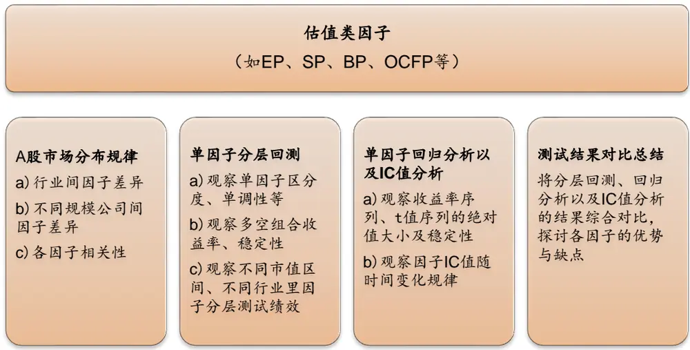
资料来源：华泰证券研究所

## 估值因子的行业间差异

估值因子在不同行业间存在显著差异。例如，钢铁、煤炭等基础行业通常具有较高的 BP、SP 值，但在目前的经济环境下净利润很小甚至为负；传媒、计算机等科技类行业则具有较低的 BP、SP值；银行、非银行金融行业又具有较高的 EP值。不同行业间因子值差异十分显著，故对上市公司直接进行跨行业比较意义不大。我们选取 EP、BP、SP、DP作为估值因子的代表，观察它们在各行业间的分布规律（2016 年 8 月 31 日），考虑日常使用情况以及便于理解的程度，我们取上述因子的倒数，作出各一级行业 PE、PB、PS、PD 值比较图，如图 2所示。

图2： 各一级行业 PE、PB、PS、PD 值比较（2016/08/31）
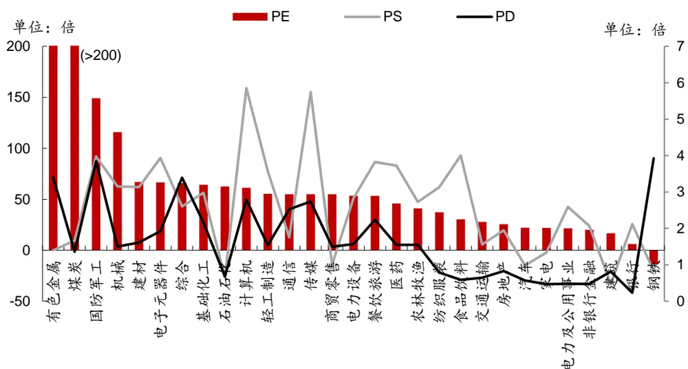
资料来源：Wind，华泰证券研究所

图 2 说明了，在同一时间点，不同行业间估值因子的水平存在明显差异。事实上，随时间变化，同一行业的估值因子的绝对大小和与其他行业对比的相对大小也在不断变化中。以 EP因子为例，在 2005 年至 2015 年间，每年末行业因子值在所有 29 个一级行业中的排位变化如表 2所示。

表格2： 一级行业 EP因子均值的行业间相对排名（由大到小排序）

| 行业 | 2005 | 2006 | 2007 | 2008 | 2009 | 2010 | 2011 | 2012 | 2013 | 2014 | 2015 |
| --- | --- | --- | --- | --- | --- | --- | --- | --- | --- | --- | --- |
| 银行 | 6 | 11 | 2 | 2 | 1 | 1 | 1 | 1 | 1 | 1 | 1 |
| 石油石化 | 4 | 4 | 3 | 10 | 3 | 2 | 3 | 5 | 4 | 3 | 9 |
| 煤炭 | 3 | 1 | 10 | 4 | 4 | 5 | 6 | 3 | 3 | 6 | 14 |
| 建筑 | 10 | 9 | 23 | 21 | 5 | 6 | 2 | 2 | 2 | 4 | 4 |
| 汽车 | 15 | 13 | 6 | 5 | 17 | 4 | 7 | 6 | 9 | 5 | 5 |
| 交通运输 | 9 | 6 | 11 | 3 | 28 | 3 | 4 | 10 | 10 | 12 | 8 |
| 房地产 | 12 | 17 | 17 | 11 | 7 | 9 | 8 | 7 | 5 | 8 | 7 |
| 电力及公用事业 | 8 | 5 | 4 | 29 | 16 | 11 | 18 | 11 | 6 | 7 | 6 |
| 机械 | 7 | 8 | 7 | 8 | 6 | 12 | 10 | 9 | 18 | 17 | 25 |
| 家电 | 29 | 27 | 19 | 9 | 8 | 10 | 9 | 4 | 7 | 2 | 3 |
| 商贸零售 | 13 | 15 | 8 | 13 | 15 | 13 | 14 | 12 | 13 | 14 | 12 |
| 建材 | 20 | 22 | 16 | 15 | 11 | 14 | 5 | 14 | 12 | 9 | 11 |
| 非银行金融 | 28 | 26 | 13 | 16 | 10 | 7 | 11 | 20 | 11 | 15 | 2 |
| 纺织服装 | 24 | 14 | 12 | 12 | 20 | 18 | 13 | 13 | 14 | 13 | 13 |
| 钢铁 | 2 | 2 | 1 | 1 | 29 | 8 | 12 | 29 | 29 | 28 | 29 |
| 食品饮料 | 21 | 19 | 26 | 22 | 14 | 16 | 23 | 8 | 8 | 10 | 10 |
| 医药 | 18 | 18 | 9 | 19 | 9 | 17 | 22 | 19 | 17 | 16 | 15 |
| 电力设备 | 14 | 7 | 14 | 18 | 12 | 19 | 20 | 23 | 27 | 23 | 16 |
| 有色金属 | 5 | 3 | 5 | 6 | 27 | 28 | 17 | 28 | 28 | 24 | 28 |
| 轻工制造 | 22 | 16 | 15 | 7 | 23 | 15 | 21 | 26 | 16 | 27 | 24 |
| 通信 | 1 | 24 | 27 | 17 | 2 | 22 | 27 | 27 | 25 | 21 | 20 |
| 基础化工 | 11 | 12 | 21 | 14 | 25 | 27 | 16 | 25 | 22 | 22 | 21 |
| 传媒 | 17 | 20 | 22 | 27 | 19 | 20 | 24 | 16 | 20 | 19 | 19 |
| 餐饮旅游 | 19 | 21 | 25 | 25 | 22 | 21 | 19 | 17 | 19 | 20 | 18 |
| 综合 | 27 | 29 | 29 | 23 | 24 | 23 | 15 | 15 | 15 | 11 | 22 |
| 计算机 | 26 | 23 | 18 | 24 | 13 | 24 | 25 | 18 | 21 | 26 | 23 |
| 国防军工 | 16 | 10 | 24 | 26 | 21 | 25 | 29 | 21 | 24 | 29 | 27 |
| 电子元器件 | 25 | 28 | 20 | 20 | 26 | 29 | 28 | 22 | 23 | 18 | 17 |
| 农林牧渔 | 23 | 25 | 28 | 28 | 18 | 26 | 26 | 24 | 26 | 25 | 26 |

资料来源：Wind，华泰证券研究所

从表 3可以看出，A股市场存在比较明显的行业轮动现象，例如：钢铁行业在 2008 年以前EP值很高，从 2009 年开始迅速衰落；电子元器件行业、通信行业则在 2009 年附近经历一次迅速的兴起和下沉；最近银行和非银行金融行业正在强势崛起；其他行业也存在年份间的波动，是当时政治、金融环境等多重因素影响的结果。

## 估值因子在不同规模上市公司间的差异

除去行业对估值因子存在较大影响外，上市公司的规模也是对估值因子产生作用的潜在因素。这里面的逻辑比较易于理解，当上市公司规模较小时，一方面它可能处于成长上升期，发展迅速，但现阶段利润较低，所以市盈率较高；另一方面，它的市值与大盘股有明显差距，一般投资者会认为有较大成长空间，利于股价抬高。图 3中，我们在每个一级行业内部按市值大小将所有个股均分成五组，再将不同行业间对应的组拼合到一起，全市场形成 5 个分组，原则上每组内股票个数相同。此处我们采用行业中性分层法是为了消除行业对估值因子的影响，从而能够仅关注规模对估值因子的影响。然后，我们再去计算每个分组里所有个股 EP值的平均值，可以看出，随着市值增大 EP因子也有增大的趋势，且这一效应随着时间推移是相对稳定的。从 2007 年到 2015 年（在每年最后一个交易日核算），虽然随着市场环境变化，估值因子整体水平存在一定的高低起伏，但五组股票组合的因子值相对大小关系基本没发生太大改变。尤其是市值最大的一组，EP因子值一直稳定且强势地为五组中最大的。综上，可以认为市值对估值因子有比较显著的影响。

图3： 按市值均分为五层的 EP因子均值随时间变化图
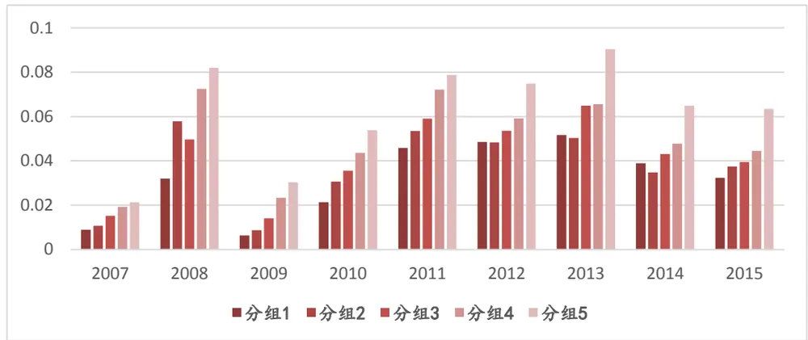
资料来源：Wind，华泰证券研究所

上图中我们以 EP因子为例形象地描述了估值因子和市值因子之间的关系，接下来我们将针对表 1中列出的十个因子，详细核算它们在不同时期与市值因子之间的相关性。表 3 中，我们分别计算了各因子从 2005 年到 2015 年（在每年最后一个交易日核算）与市值因子之间的相关系数。观察结果可以发现，DP、EPcut、EP、OCFP 四个因子一直稳定地与市值呈正相关关系且近两年与市值相关性还在逐渐增大；BP、SP因子在 2005～2008 年与市值因子略微负相关，在 2009 年以后亦稳定地与市值正相关；NCFP因子与市值正相关关系较为稳定，但相关性不高；FCFP、EV2EBITDA 因子与市值相关性不高且方向不稳定，总体略呈负相关；PEG 因子则与市值相关性一直非常小。

表格3： 各估值因子与市值因子之间相关系数

| 因子 | 2005 2006 2007 2014 2015 均值 | 2008 2009 2010 2011 2012 2013 |
| --- | --- | --- |
| 0.007 0.022 0.042 0.036 0.049 0.185 0.156 0.133 0.165 0.211 0.266 |  |  |
| 0.116 0.010 0.048 0.081 0.066 0.064 0.207 0.187 0.163 0.208 0.2340.275 0.140 |  |  |
| EPcut BP -0.015 -0.030 -0.020 -0.009 0.062 0.130 0.077 0.083 0.142 0.156 0.278 |  |  |
| 0.078 |  |  |
| SP -0.019 -0.032 -0.036 -0.0250.0060.031 0.020 0.018 0.035 0.037 0.091 0.012 |  |  |
| NCFP 0.0200.033 0.022 0.012 0.022 0.046 0.015 0.107-0.073 0.069 0.097 0.034 OCFP 0.002 0.050 0.132 0.025 0.179 0.191 0.071 0.201 0.094 0.120 0.179 0.113 |  |  |
| FCFP 0.001 0.012 0.012 -0.002 -0.012 0.010 0.012 -0.018 -0.016 -0.029 -0.060-0.008 DP 0.016-0.002 0.001 0.114 0.203 0.276 0.182 0.194 0.262 0.273 0.362 0.171 |  |  |
| 0.003 -0.002 -0.008 -0.011 -0.003 -0.007 -0.0030.002 -0.007 -0.003 PEG |  |  |
| -0.001 0.004 0.000 0.002 -0.005 0.002 0.000 -0.004 -0.004 -0.002 0.0030.000 |  |  |

资料来源：Wind，华泰证券研究所

## 估值因子间相关性分析

在本章前两个小节中，我们分析了估值因子在不同行业的分布差异性及估值因子与市值因子的相关性，接下来，我们将计算各估值因子之间的相关性。假设因子 A 和 B 之间的月度相关系数序列为 $\{Corr_{i}^{AB}\}$ }，其中 $Corr_{i}^{AB}$ 是在第i个月月末这一截面上因子 A、B 在所有个股上的因子暴露度的相关系数，我们构造了一个相关强度指标：

$$
C_{AB}=\frac{mean(Corr_{i}^{AB}|i=1,\ldots,N)}{std(Corr_{i}^{AB}|i=1,\ldots,N)}
$$

该指标结合了因子平均相关系数和相关系数的稳定性，能够综合反映因子之间的相关情况。我们分别计算各因子两两之间在过去 36 个月（2013 年 9 月到 2016 年 8 月）内的相关强度指标，如表 4 所示。计算过程中涉及的相关系数均值和方差详细展示在表 5和表 6中。通过观察可以发现，正相关性极强的为 EP 和 EPcut、BP和 SP这两对因子，DP与 EP、EPcut、BP、SP、OCFP 正相关性都比较强，BP与 EP、EPcut、SP、OCFP 正相关性亦较强。总体来说，EP、EPcut、BP、SP、OCFP、DP这几个因子两两之间大部分具有正向关联，除了SP与EPcut呈略负相关性。剩余因子的相关强度指标都比较弱，其中FCFP、EV2EBITDA、PEG 与其它因子间多现弱负相关性。

表格4： 各估值因子间相关强度（近 36个月）

| EV2EB |  |  |  |  |  |  |  |  |  |  |
| --- | --- | --- | --- | --- | --- | --- | --- | --- | --- | --- |
|  | EP | EPcut | BP | SP | NCFP | OCFP | FCFP | DP | ITDA | PEG |
| EP | - | 11.96 | 4.78 | 0.50 | 2.62 | 2.63 | -0.88 | 5.81 | 0.62 | -0.42 |
| EPcut | 11.96 | – | 5.11 | -0.98 | 1.88 | 2.67 | -0.60 | 6.01 | 0.69 | -0.44 |
| BP | 4.78 | 5.11 |  | 12.69 | 0.81 | 8.63 | -1.95 | 9.56 | -0.88 | 0.48 |
| SP | 0.50 | -0.98 | 12.69 | - | 0.92 | 3.83 | -0.90 | 4.08 | -1.04 | 0.47 |
| NCFP | 2.62 | 1.88 | 0.81 | 0.92 |  | 1.82 | -0.57 | 0.49 | 0.35 | 0.40 |
| OCFP | 2.63 | 2.67 | 8.63 | 3.83 | 1.82 | - | 1.54 | 5.40 | -0.62 | 0.40 |
| FCFP | -0.88 | -0.60 | -1.95 | -0.90 | -0.57 | 1.54 | - | 0.13 | 0.55 | 0.08 |
| DP | 5.81 | 6.01 | 9.56 | 4.08 | 0.49 | 5.40 | 0.13 |  | -0.54 | -0.20 |
| EV2EBITDA | 0.62 | 0.69 | -0.88 | -1.04 | 0.35 | -0.62 | 0.55 | -0.54 |  | 0.28 |
| PEG | -0.42 | -0.44 | 0.48 | 0.47 | 0.40 | 0.40 | 0.08 | -0.20 | 0.28 | - |

资料来源：Wind，华泰证券研究所

表格5： 各估值因子间月度相关系数序列均值（近 36个月）

| EV2EB |  |  |  |  |  |  |  |  |  |  |
| --- | --- | --- | --- | --- | --- | --- | --- | --- | --- | --- |
|  | EP | EPcut | BP | SP | NCFP | OCFP | FCFP | DP | ITDA | PEG |
| EP |  | 86.8% | 27.4% | 2.2% | 12.6% | 13.4% | -3.9% | 39.8% | 0.6% | -0.3% |
| EPcut | 86.8% |  | 23.8% | -3.5% | 11.8% | 15.9% | -2.3% | 43.7% | 0.6% | -0.5% |
| BP | 27.4% | 23.8% | - | 42.3% | 5.4% | 23.5% | 6-13.2% | 39.1% | -2.0% | 0.7% |
| SP | 2.2% | -3.5% | 42.3% | - | 2.9% | 12.9% | -5.1% | 14.1% | -0.9% | 1.0% |
| NCFP | 12.6% | 11.8% | 5.4% | 2.9% | ■ | 28.2% | -11.3% | 2.3% | 1.1% | 0.7% |
| OCFP | 13.4% | 15.9% | 23.5% | 12.9% | 28.2% | - | 29.1% | 18.2% | -0.5% | 0.6% |
| FCFP | -3.9% | -2.3%-13.2% |  | -5.1% | -11.3% | 29.1% | ■ | 0.6% | 2.6% | 0.1% |
| DP | 39.8% | 43.7% | 39.1% | 14.1% | 2.3% | 18.2% | 0.6% | ■ | -0.6% | -0.3% |
| EV2EBITDA | 0.6% | 0.6% | -2.0% | -0.9% | 1.1% | -0.5% | 2.6% | -0.6% | ■ | 1.9% |
| PEG | -0.3% | -0.5% | 0.7% | 1.0% | 0.7% | 0.6% | 0.1% | -0.3% | 1.9% | = |

资料来源：Wind，华泰证券研究所

表格6： 各估值因子间月度相关系数序列标准差（近 36个月）

|  | EP | EPcut | BP | SP | NCFP | OCFP | FCFP | DP | ITDA | PEG |
| --- | --- | --- | --- | --- | --- | --- | --- | --- | --- | --- |
| EP | ■ | 7.25% | 5.74% | 4.28% | 4.81% | 5.09% | 4.43% | 6.86% | 0.91% | 0.76% |
| EPcut | 7.25% | - | 4.65% | 3.57% | 6.27% | 5.95% | 3.90% | 7.28% | 0.94% | 1.08% |
| BP | 5.74% | 4.65% | - | 3.33% | 6.64% | 2.72% | 6.75% | 4.09% | 2.23% | 1.51% |
| SP | 4.28% | 3.57% | 3.33% | - | 3.12% | 3.36% | 5.65% | 3.47% | 0.82% | 2.13% |
| NCFP | 4.81% | 6.27% | 6.64% | 3.12% |  | - 15.53% 19.78% |  | 4.63% | 3.03% | 1.89% |
| OCFP | 5.09% | 5.95% | 2.72% | 3.36% 15.53% |  |  | - 18.88% | 3.38% | 0.86% | 1.59% |
| FCFP | 4.43% | 3.90% | 6.75% |  |  | 5.65% 19.78% 18.88% | 1 | 4.74% | 4.70% | 0.71% |
| DP | 6.86% | 7.28% | 4.09% | 3.47% | 4.63% | 3.38% | 4.74% | - | 1.03% | 1.30% |
| EV2EBITDA | 0.91% | 0.94% | 2.23% | 0.82% | 3.03% | 0.86% | 4.70% | 1.03% | 1 | 6.69% |
| PEG | 0.76% | 1.08% | 1.51% | 2.13% | 1.89% | 1.59% | 0.71% | 1.30% | 6.69% | 1 |

资料来源：Wind，华泰证券研究所

表 5 和表 6分别反映因子两两之间相关系数的平均大小和相关系数稳定性，能在表 4 数据之外提供一些补充信息。

表 4 对于构建风格因子具有一定参考意义，因子合成时要根据相关性关系赋予各因子合理权重，在后续报告中我们将详细阐述。

## 单因子测试流程

在上一篇报告《华泰多因子模型体系初探》（2016.09）中，我们系统地介绍了有效因子识别（即单因子测试）的理论基础和研究思路，本文中我们将着眼于实践过程，给出详细的流程说明。

## 回归法

回归法是一种最常用的测试因子有效性的方法，具体做法是将因子在第T期的暴露度与T+1期的股票收益进行线性回归，所得到的回归系数即为因子在T期的因子收益率，同时还能得到该因子收益率在本期回归中的显著度水平——t值。我们的回归模型为

$$
r_{i}^{T+1}=\sum_{j}X_{j}^{T}f_{ji}^{T}+X_{d}^{T}d_{i}^{T}+\mu_{i}^{T}
$$

$$
$r_{i}^{T+1}\colon 股票\;\mathrm{i}\;在第\;\mathrm{T}+1$期的收益率
$$

$$
$d_{i}^{T}:$$股票$i$在在第T期因子d$上的暴露度
$$

$f_{ji}^{T}$ : 股票 i 在第 T 期第 j 个行业因子上的暴露度(属于该行业则为 1，否则为 0)

$X_{j}^{T}\left(或X_{d}^{T}\right)$ : 第 T 期第 j 个行业因子(或因子 d)的因子收益率，需回归拟合

$$
$\mu_{i}^{T}\mathrm{:}$股票i在第T期的残差收益率
$$

在所有截面期上，我们对因子d进行回归测试，能够得到该因子的因子收益率序列（即所有截面期回归系数 $|X_{d}^{T}|$ 构成的序列）和对应的 t 值序列。t 值指的是对单个回归系数 $X_{d}^{T}$ 的 t 检验统计量，描述的是单个变量显著性，t 值的绝对值大于临界值说明该变量是显著的，即该解释变量（T期个股在因子 d的暴露度）是真正影响因变量（T+1期个股收益率）的一个因素。也就是说，在每个截面期上，对于每个因子的回归方程，我们设

$$
\begin{aligned}&假设检验\;H_0:X_d^T=0\\&备择假设\;H_1:X_d^T\neq0\\\end{aligned}
$$

该假设检验对应的 t统计量为

$$
\mathbf{t}=\frac{X_{d}^{T}}{SE(X_{d}^{T})}
$$

其中SE(XT)代表回归系数 $X_{d}^{T}$ 的标准差的无偏估计量。一般 t 值绝对值大于 2 我们就认为本期回归系数XT是显著异于零的（也就是说，本期因子d对下期收益率具有显著的解释作用）。注意，我们在回归模型中加入了行业因素，能在一定程度上规避行业因素对估值因子的影响。并且回归法单因子测试中并未对市值因素的影响进行调整，但是在后续计算因子 IC 值的部分会做一些调整。

1． 股票池：全 A股，剔除 ST、PT 股票，剔除每个截面期下一交易日停牌的股票。

2． 回溯区间：2005-04-29 至 2016-08-31。

3． 截面期：每个自然月的最后一个交易日计算因子暴露度，与下一整个自然月的个股超额收益（以沪深 300 指数为基准）进行回归。

## 4． 数据处理方法：

a) 因子暴露度具体计算公式详见表 7，Wind因子如有缺失值暂时不处理；

b) 中位数去极值：设第 T 期某因子在所有个股上的暴露度序列为 $D_{i},~D_{M}$ 为该序列中位数， $D_{M1}$ 为序列 $|D_{i}-D_{M}|$ 的中位数，则将序列 $D_{i}$ 中所有大于 $D_{M}+5D_{M1}$ 的数重设为$D_{M}+5D_{M1}$ ，将序列 $D_{i}$ 中所有小于 $D_{M}-5D_{M1}$ 的数重设为 $D_{M}-5D_{M1}$ ；

c) 标准化：将去极值处理后的因子暴露度序列减去其现在的均值、除以其标准差，得到一个新的近似服从N(0,1)分布的序列，这样做可以让不同因子的暴露度之间具有可比性；

d) 缺失值处理：得到新的因子暴露度序列后，将因子暴露度缺失的地方设为 0（这里解释一下，由于不同因子可能在不同个股处存在缺失值，若不对缺失值进行处理则每个单因子回归的票池并不完全相同，不同单因子回归结果的可比性较差，但如果将所有出现缺失值的个股都从回归票池中剔除，当数据源质量不佳时可能会造成票池大幅减少，回归结果同样不可信，所以这里折中处理，将因子暴露度缺失的地方设为新序列的均值，即设为零，可视作当存在缺失值时我们认为此个股的因子值与全市场平均情况相同，即持中性看法）。

表格7： 估值因子具体计算公式

| 因子 | 计算公式（Wind 因子均取自其Matlab 量化接口） |
| --- | --- |
| EP | Wind 因子 pe_ttm 的倒数 |
| EPcut | Wind 因子 val_pe_deducted_ttm 的倒数 |
| BP | Wind 因子 pb_If 的倒数 |
| SP | Wind 因子 ps_ttm 的倒数 |
| NCFP | Wind 因子 pcf_ncf_ttm 的倒数 |
| OCFP | Wind 因子 pcf_ocf_ttm 的倒数 |
| FCFP | Wind 因子 fcff（最近一期已公布财报）除以 mkt_cap_ard |
| DP | Wind 因子 dividendyield2 |
| EV2EBITDA | Wind 因子 ev2_to_ebitda |
| PEG | Wind 因子 pe_ttm 除以 profit_ttm 同比增长率 |

资料来源：Wind，华泰证券研究所

5． 回归权重：由于普通最小二乘回归（OLS）可能会夸大小盘股的影响（因为小盘股的估值等因子出现极端值概率较大，且小盘股数目很多，但占全市场的交易量比重较小），并且回归可能存在异方差性，故我们参考 Barra 手册，采用加权最小二乘回归（WLS），使用个股流通市值的平方根作为权重，此举也有利于消除异方差性。

6． 因子评价方法：

a) t 值序列绝对值平均值——因子显著性的重要判据；

b) t 值序列绝对值大于 2的占比——判断因子的显著性是否稳定；

c) 因子收益率序列平均值，以及该均值零假设检验的 t 值——判断因子收益率序列是否方向一致，并且显著不为零；

d) t 值序列均值的绝对值除以 t 值序列的标准差——结合显著性和波动性，辅助判断因子是否有效、稳健。

## 因子 IC 值的计算

因子的 IC值是指因子在第 T 期的暴露度与 T+1 期的股票收益的相关系数，即

$$
IC_{d}^{T}=\operatorname{corr}(\overrightarrow{R^{T+1}},\overrightarrow{d^{T}})
$$

其中， $IC_{d}^{T}$ 代表因子 d 在第 T 期的 IC 值， $\overrightarrow{R^{T+1}},$ 代表所有个股第 T+1 期的收益率向量， $\overrightarrow{d^{T}},$ 代表所有个股第 T 期在因子 d上的暴露度向量。

1. 股票池、回溯区间、截面期均与回归法相同。

2. 因子值在去极值、标准化、去空值处理后，在截面期上用其做因变量对市值因子及行业因子（哑变量）做线性回归，取残差作为因子值的一个替代。这样做可以消除行业因素和市值因素对因子的影响。计算残差序列和 T+1 期股票收益序列的相关系数作为 T期因子 IC 值。

3. 因子评价方法：

a) IC 值序列的均值大小——因子显著性；

b) IC 值序列的标准差——因子稳定性；

c) IR 比率（IC 值序列均值与标准差的比值）——因子有效性；

d) IC 值累积曲线——随时间变化效果是否稳定；

e) IC 值序列大于零的占比——因子作用方向是否稳定。

## 因子收益率、t值与IC值之间的关系

前两小节分别介绍了用回归法、IC 值评价因子有效性的两套思路，那它们之间到底具有怎样的区别和联系呢？为了说明这个问题，我们先介绍一个引理：

设X,Y为两个向量，则

$$
[corr(X,Y)]^{2}=R^{2}
$$

其中 $R^{2}$ 为线性回归 $\boldsymbol{Y}=a\boldsymbol{X}+b$ 或线性回归 $\mathtt{X}=aY+b$ 的可决系数（其中a，b是待回归系数）。

如果我们在单因子测试（线性回归法）中使用模型

$$
r=\beta X+c
$$

（r是股票收益率，X 是因子暴露度，c是常数项，c可以理解为市场因子）并且假设我们在计算因子 IC 值的时候，不预先对因子暴露度进行市值、行业调整了，就使用原始的因子暴露度 X，则本期因子 IC值为corr(X,r)，根据引理，因子 IC值的平方就等于单因子测试的回归模型的 $R^{2}$ 。

所以，因子 IC值本质上反映的是下期收益率和本期因子暴露度的线性相关程度（R2的平方根），是使用该因子预测收益率的稳健性（IC值越大，这个因子的收益越稳定，波动越小）；而回归法中计算出的因子收益率本质上是一个斜率，反映的是从该因子可能获得的收益率的大小，这并不能说明任何关于线性拟合优度的信息（也就是说，因子收益率很大时，也可能出现R2很小的情形）；至于回归法中计算出的 t 值，在一元线性回归中 t值与 $R^{2}$ 反映的信息一致（二者对应关系为，当 $R^{2}=0$ 时 t 值也为 0，当 $R^{2}=1$ 时 t值为无穷大），但是由于我们所采用的回归模型包括了行业变量，所以 t值仅代表被测因子对股票收益的解释能力（而不能代表模型的整体拟合优度）。

总结一下，IC值反映模型整体线性拟合优度，t值反映被测单因子对模型的解释能力是否显著，这两者反映的信息都属于因子稳健性信息；因子收益率与前两者差别较大，它反映的是可能获得的收益率的大小，而对这个收益是否稳健未知。

事实上，我们在计算因子 IC 值时也对因子暴露度进行市值、行业预调整了，情况还比上面分析的要复杂一些，但是精髓不变，我们的结论仍然大致正确。

## 分层模型回测

依照因子值对股票进行打分，构建投资组合回测，是最直观的衡量指标优劣的手段。一般来说，通过回归法和计算因子 IC 值都无法确定因子的单调性（例如，某因子值排名在中间 1/3的个股表现比前1/3和后1/3的个股表现要好），但是分层回测法是可以确定因子单调性的。分层回测法逻辑简单，结果清晰，操作方便，并且具有能区分因子单调性的独特优势，是接受度非常高的一种单因子测试手段。

1. 股票池、回溯区间都与回归法相同。

2. 换仓期：在每个自然月最后一个交易日核算因子值，在下个自然月首个交易日按当日收盘价换仓。

3. 分层方法：在每个一级行业内部对所有个股按因子大小进行排序，每个行业内均分成 N个分层组合。如图 4所示，黄色方块代表各行业内个股初始权重，可以相等也可以不等（我们直接取相等权重进行测试），分层具体操作方法为 N 等分行业内个股权重累加值，例如图示行业 1中，5 只个股初始权重相等（不妨设每只个股权重为 0.2），假设我们欲分成 3层，则分层组合 1 在权重累加值 1/3 处截断，即分层组合 1包含个股 1和个股 2，它们的权重配比为 0.2:(1/3-0.2)=3:2，同样推理，分层组合 2 包含个股 2、3、4，配比为(0.4-1/3):0.2:(2/3-0.6)=1:3:1，分层组合 4 包含个股 4、5，配比为 2:3。以上方法是用来计算各个一级行业内部个股权重配比的，行业间权重配比与基准组合（我们使用沪深300）相同，也即行业中性。

4. 评价方法：回测年化收益率、夏普比率、信息比率、最大回撤、胜率等。

图4： 单因子分层测试法示意图
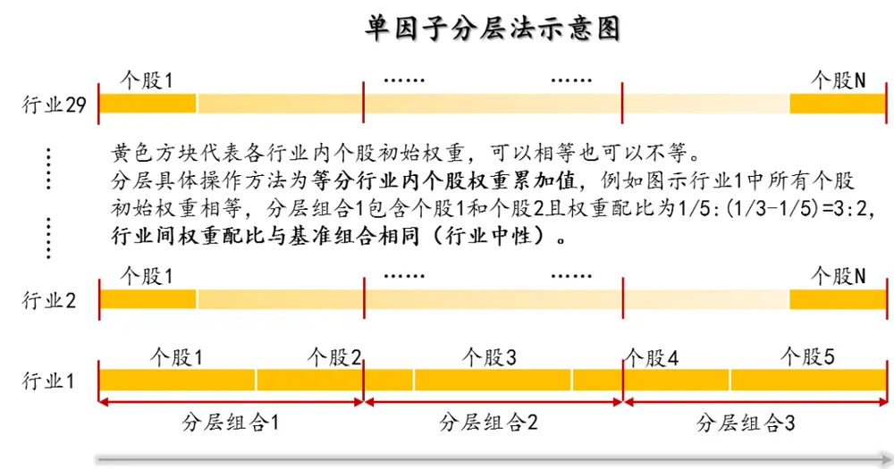
行业内个股按因子值排序
资料来源：Wind，华泰证券研究所

## 分层回测结果分析

## EP 因子

图 5 展示了 EP因子分五层回测净值曲线，其中组合 1～组合 5为按 EP因子从大到小排序构造的行业中性的分层组合（构建方法参见上一章“分层模型回测”小节）。基准组合为所有分层组合中个股合并，一级行业内部个股等权配置，行业权重按当期沪深 300 行业权重配置。回测模型于每月末核算因子值，下月初调仓。

观察图 5和表 8可以发现，EP因子具备选股能力。从收益率的角度来看，组合 1年化超额收益率 3.44%为五组中最高；从夏普比率、信息比率的角度来看，组合 1都是最优的；从胜率的角度来看，组合 1的胜率并列排名第一，但并不是特别高；从超额收益最大回撤的角度来看，组合 2是最优的，组合 1 排第二。

图 6 中展示了组合 1～组合 5 滚动 12 个月收益率曲线，图 7 展示了多空组合（做多组合 1、做空组合 5）月度收益和累积收益曲线，可以发现，随时间变化，EP 因子的效果并不是非常稳定，多空组合累积收益曲线波动很大。

图 8 是组合 1～组合 5 的重要绩效指标（年化收益率、夏普比率、信息比率）对比图，同样地，我们还进行了 EP因子分十层回测，将重要绩效指标对比展示在图 9 中。通过以上两图可以发现，EP因子在 EP较大的区间（EP排名前 50%）单调性较好，在 EP较小的区间难以观察到单调性。据此我们可以大致上推测，当上市公司利润非常小（甚至为负）的时候，EP因子效果不佳。

图5： EP因子分层组合回测净值
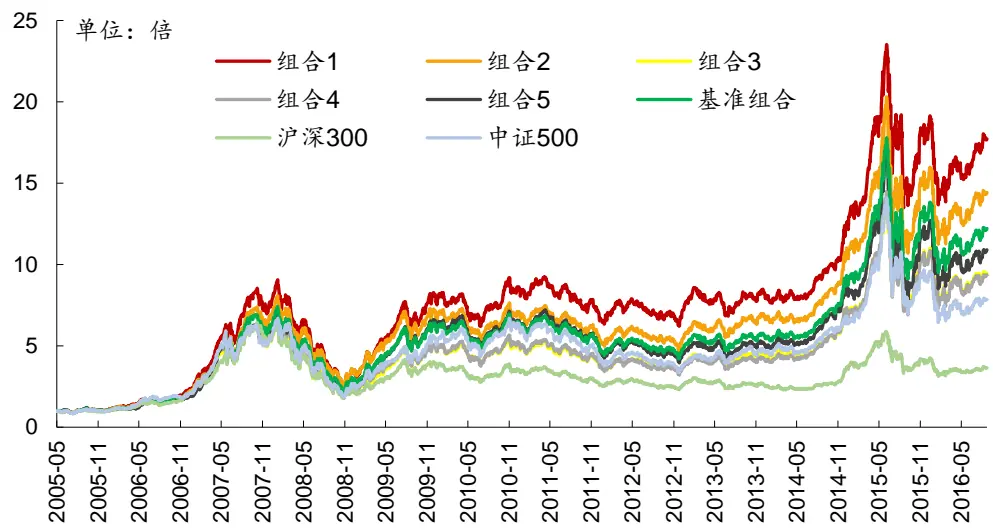
资料来源：Wind，华泰证券研究所

表格8： EP因子分层组合绩效分析

|  |  |  |  |  |  | 年化超额 超额收益 收益率 | 信息比率 | 相对基准 月胜率 | 超额收益 最大回撤 |
| --- | --- | --- | --- | --- | --- | --- | --- | --- | --- |
| 投资组合 | 年化收益率 | 年化波动率 | 夏普比率 | 最大回撤 | 年化波动率 |  |  |  |  |
| 组合1 | 29.78% | 32.21% | 0.92 | 72.28% | 3.44% | 5.70% | 0.60 | 52.94% | 12.77% |
| 组合2 | 27.37% | 32.15% | 0.85 | 68.28% | 1.52% | 3.72% | 0.41 | 52.94% | 9.78% |
| 组合3 | 22.62% | 32.35% | 0.70 | 71.41% | -2.27% | 3.20% | -0.71 | 47.06% | 24.40% |
| 组合4 | 22.49% | 33.15% | 0.68 | 70.57% | -2.36% | 4.09% | -0.58 | 45.59% | 27.70% |
| 组合5 | 24.18% | 32.19% | 0.75 | 70.05% | -1.02% | 5.89% | -0.17 | 52.94% | 19.75% |
| 基准组合 | 25.46% | 32.08% | 0.79 | 70.50% |  |  | - |  |  |

资料来源：Wind、华泰证券研究所

图6： EP因子分层组合滚动 12个月超额收益率
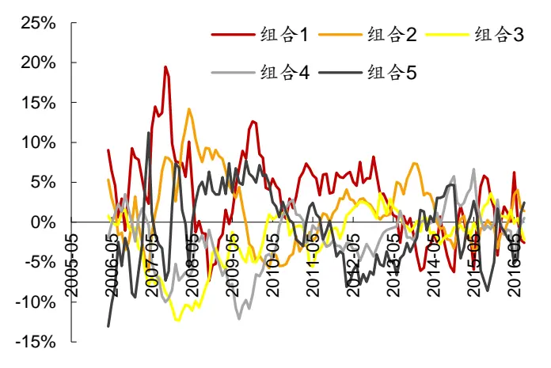
资料来源：Wind、华泰证券研究所

图7： EP因子多空组合月收益率及累积收益率
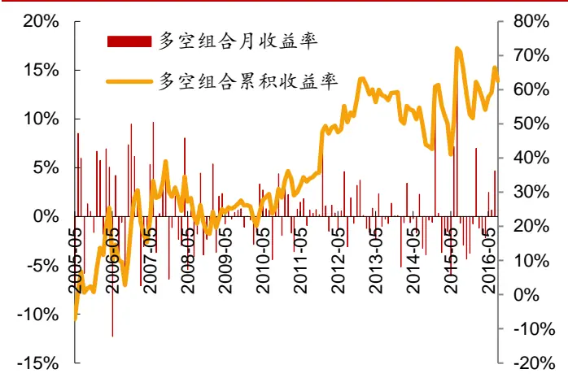
资料来源：Wind、华泰证券研究所

图8： EP因子分层组合绩效指标对比图示（分五层）
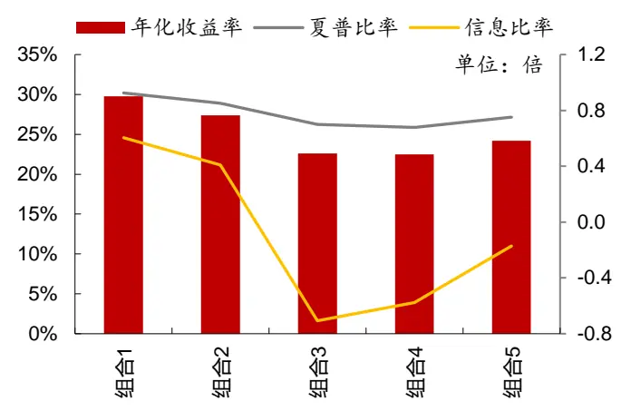
资料来源：Wind、华泰证券研究所

图9： EP 因子分层组合绩效指标对比图示（分十层）
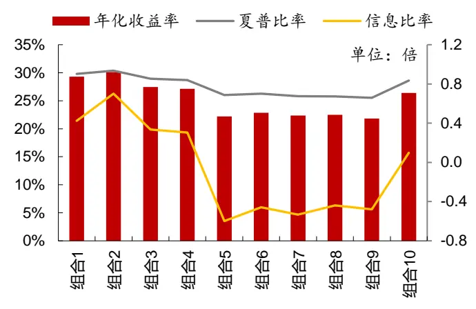
资料来源：Wind、华泰证券研究所

图10： 不同市值区间 EP因子分层组合绩效指标对比图示（分十层）
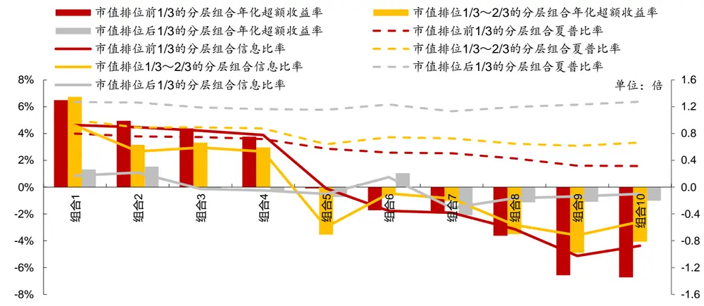
资料来源：Wind，华泰证券研究所

在图 10中，我们将全市场股票按市值排名前 1/3，1/3～2/3，后 1/3 分成三个大类，在这三类股票中分别进行分层测试（分十层），基准组合构成方法同前面所述（注意每个大类对应的基准组合并不相同）。我们发现，EP 因子对于大市值股票具有良好区分效果，收益率、夏普比率、信息比率从组合 1到组合 10 基本上都是单调下降的，而且区分度很高；对于中等市值股票 EP因子区分度有所下降，单调性基本还是维持的；对于小市值股票，EP因子的区分效果不佳。

我们在不同一级行业内部都做了分层测试（详见表 9），基准组合为各行业内 EP因子非空值的个股等权组合。从结果来看，EP因子在银行行业中选股效果非常好，组合 1 年化超额收益率高达 12.27%，其他绩效指标也都表现突出。其次是农林牧渔、煤炭行业。29 个一级行业中，组合 1收益率排第一的行业只有 9个，排前二的行业为 17 个，可见 EP因子在各行业中并不是稳定有效的。

表格9： 不同行业 EP因子分层组合绩效分析

|  | 组合1年化 | 组合1 |  | 组合1 组合1超额收益 | 组合1相对 | 所有组合年化 | 组合自身序数 |
| --- | --- | --- | --- | --- | --- | --- | --- |
| 行业 | 超额收益率 | 夏普比率 | 信息比率 | 最大回撤 | 基准月胜率 | 收益率排序 | 的秩相关系数 |
| 银行 | 12.27% | 1.11 | 0.93 | 25.34% | 61.76% | 1,2,4,3,5 | 0.90 |
| 农林牧渔 | 7.46% | 1.10 | 0.68 | 17.72% | 55.88% | 1,5,2,4,3 | 0.30 |
| 煤炭 | 6.61% | 0.50 | 0.48 | 21.84% | 54.41% | 1,5,2,3,4 | 0.40 |
| 房地产 | 4.82% | 0.90 | 0.42 | 29.31% | 44.85% | 1,5,2,3,4 | 0.40 |
| 汽车 | 4.77% | 1.03 | 0.38 | 32.17% | 46.32% | 1,5,2,3,4 | 0.40 |
| 通信 | 4.67% | 1.04 | 0.35 | 28.59% | 55.88% | 1,3,2,5,4 | 0.80 |
| 计算机 | 4.50% | 1.02 | 0.35 | 29.33% | 52.21% | 1,2,3,5,4 | 0.90 |
| 商贸零售 | 3.99% | 0.88 | 0.42 | 26.80% | 50.00% | 2,1,5,4,3 | 0.50 |
| 非银行金融 | 3.91% | 0.64 | 0.19 | 36.03% | 52.94% | 2,1,5,3,4 | 0.60 |
| 家电 | 3.70% | 0.99 | 0.22 | 35.51% | 50.00% | 1,2,3,4,5 | 1.00 |
| 电力设备 | 3.09% | 0.96 | 0.28 | 22.47% | 49.26% | 1,3,2,4,5 | 0.90 |
| 国防军工 | 1.19% | 0.75 | 0.07 | 42.97% | 50.74% | 3,1,5,2,4 | 0.30 |
| 传媒 | 1.06% | 0.78 | 0.06 | 53.33% | 46.32% | 5,1,4,2,3 | -0.30 |
| 电力及公用事业 | 0.71% | 0.71 | 0.06 | 24.99% | 48.53% | 2,1,4,5,3 | 0.60 |
| 有色金属 | 0.60% | 0.70 | 0.05 | 35.50% | 50.74% | 3,2,1,4,5 | 0.60 |
| 建筑 | 0.60% | 0.89 | 0.04 | 36.31% | 49.26% | 3,1,2,4,5 | 0.70 |
| 食品饮料 | 0.36% | 0.85 | 0.03 | 48.26% | 47.79% | 5,1,4,3,2 | -0.40 |
| 机械 | 0.27% | 0.83 | 0.03 | 37.01% | 43.38% | 5,2,1,3,4 | -0.10 |
| 轻工制造 | 0.08% | 0.72 | 0.01 | 32.99% | 40.44% | 4,2,1,5,3 | 0.10 |
| 建材 | -0.31% | 0.80 | -0.02 | 42.98% | 46.32% | 5,2,1,4,3 | -0.20 |
| 电子元器件 | -0.44% | 0.78 | -0.04 | 32.44% | 47.06% | 2,1,5,3,4 | 0.60 |
| 餐饮旅游 | -0.55% | 0.75 | -0.04 | 39.78% | 47.79% | 4,5,1,3,2 | -0.60 |
| 医药 | -0.95% | 0.92 | -0.10 | 39.02% | 43.38% | 3,2,1,5,4 | 0.50 |
| 钢铁 | -1.40% | 0.44 | -0.12 | 34.01% | 47.06% | 5,2,3,1,4 | -0.30 |
| 交通运输 | -1.56% | 0.55 | -0.14 | 32.09% | 43.38% | 5,3,1,4,2 | -0.50 |
| 纺织服装 | -1.69% | 0.76 | -0.15 | 34.48% | 47.79% | 5,3,1,2,4 | -0.30 |
| 基础化工 | -1.97% | 0.69 | -0.21 | 38.63% | 44.12% | 2,5,3,1,4 | 0.00 |
| 综合 石油石化 | -3.14% | 0.61 0.59 | -0.20 -0.24 | 53.91% 54.64% | 43.38% 45.59% | 4,3,5,2,1 | -0.70 |
|  | -4.02% |  |  |  |  | 3,2,5,1,4 | 0.10 |

资料来源：Wind、华泰证券研究所

## EPcut 因子

图 11 展示了 EPcut 因子分五层回测净值曲线，其中组合 1～组合 5 为按 EPcut 因子从大到小排序构造的行业中性的分层组合（构建方法参见上一章“分层模型回测”小节）。基准组合为所有分层组合中个股合并，一级行业内部个股等权配置，行业权重按当期沪深 300 行业权重配置。回测模型于每月末核算因子值，下月初调仓。

观察图 11 和表 10 可以发现，EPcut 因子具备选股能力。从收益率的角度来看，组合 1 年化超额收益率 2.82%为五组中最高；从夏普比率、信息比率的角度来看，组合 1 夏普比率最高，但是由于超额收益波动性较大的缘故信息比率只排第二（组合 2第一）；从胜率的角度来看，组合 1的胜率排名第三，绝对数值还不足 50%；从超额收益最大回撤的角度来看，组合 2是最优的，组合 1 排第二。

图 12 中展示了组合 1～组合 5 滚动 12 个月收益率曲线，图 13 展示了多空组合（做多组合1、做空组合 5）月度收益和累积收益曲线，可以发现，随时间变化，EPcut 因子的效果并不是非常稳定，多空组合累积收益曲线比EP因子要优（2013年以前基本呈直线上升状态），但是最近三年多空组合的收益波动依然很大。

图 14 是组合 1～组合 5的重要绩效指标（年化收益率、夏普比率、信息比率）对比图，同样地，我们还进行了 EPcut 因子分十层回测，将重要绩效指标对比展示在图 15 中。通过以上两图可以发现，EPcut 因子除了在某段区间（EPcut 排名 60%左右）存在一个“深 V”形，在 EPcut 较大、较大的其余区段都存在单调性，这个是优于 EP因子的。

图11： EPcut因子分层组合回测净值
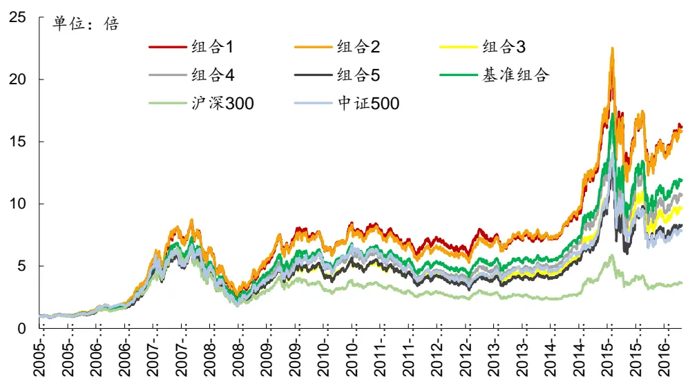
资料来源：Wind，华泰证券研究所

表格10： EPcut因子分层组合绩效分析

|  |  |  |  |  | 年化超额 收益率 | 超额收益 | 相对基准 |  | 超额收益 月胜率 最大回撤 |
| --- | --- | --- | --- | --- | --- | --- | --- | --- | --- |
| 投资组合 | 年化收益率 | 年化波动率 | 夏普比率 | 最大回撤 |  |  | 年化波动率 | 信息比率 |  |
| 组合1 | 28.72% | 32.13% | 0.89 | 71.42% | 2.82% | 5.82% | 0.48 | 47.06% | 14.89% |
| 组合2 | 28.47% | 32.26% | 0.88 | 69.88% | 2.63% | 3.62% | 0.73 | 53.68% | 7.02% |
| 组合3 | 22.86% | 32.44% | 0.70 | 71.29% | -1.86% | 3.32% | -0.56 | 44.85% | 24.78% |
| 组合4 | 24.02% | 33.34% | 0.72 | 68.36% | -0.93% | 4.02% | -0.23 | 49.26% | 15.20% |
| 组合5 | 21.15% | 34.08% | 0.62 | 72.11% | -3.22% | 5.62% | -0.57 | 44.85% | 36.51% |
| 基准组合 | 25.19% | 32.54% | 0.77 | 70.57% |  |  | 一 |  |  |

资料来源：Wind、华泰证券研究所

图12： EPcut因子分层组合滚动 12个月超额收益率
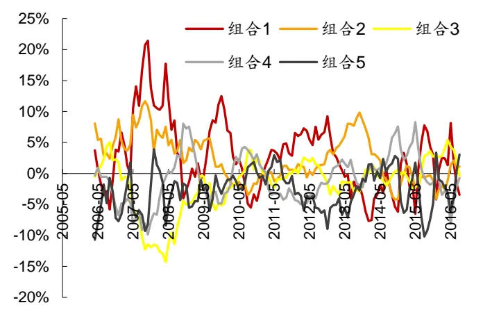
资料来源：Wind、华泰证券研究所

图13： EPcut因子多空组合月收益率及累积收益率
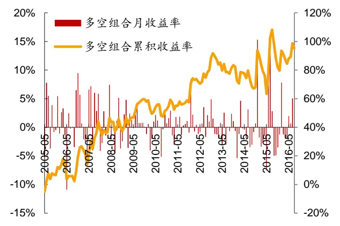
资料来源：Wind、华泰证券研究所

图14： EPcut因子分层组合绩效指标对比图示（分五层）
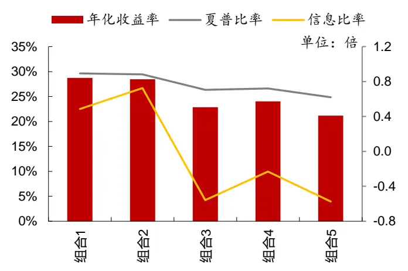
资料来源：Wind、华泰证券研究所

图15： EPcut 因子分层组合绩效指标对比图示（分十层）
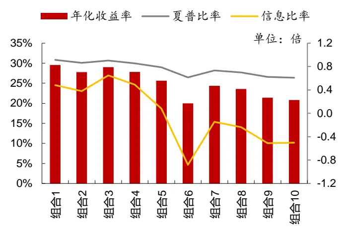
资料来源：Wind、华泰证券研究所

图16： 不同市值区间 EPcut因子分层组合绩效指标对比图示（分十层）
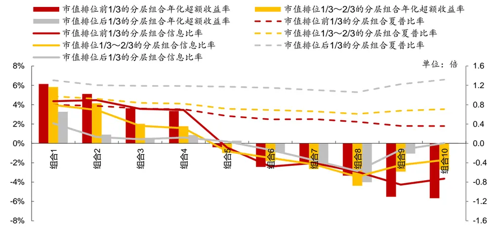
资料来源：Wind，华泰证券研究所

在图 16中，我们将全市场股票按市值排名前 1/3，1/3～2/3，后 1/3 分成三个大类，在这三类股票中分别进行分层测试（分十层），基准组合构成方法同前面所述（注意每个大类对应的基准组合并不相同）。我们发现，EPcut 因子对于大市值股具有良好区分效果，收益率、夏普比率、信息比率从组合 1 到组合 10 基本上都是单调下降的，而且区分度很高（这点与EP因子类似）；对于中等市值股票 EPcut 因子区分度有所下降，单调性基本还是维持的；对于小市值股票，EPcut 因子也有一定区分效果，这点优于 EP因子。

我们在不同一级行业内部都做了分层测试（详见表 11），基准组合为各行业内 EPcut 因子非空值的个股等权组合。从结果来看，EPcut 因子也是在银行行业中选股效果非常好，组合 1年化超额收益率为 10.38%（此数值比 EP因子略小），其他绩效指标也都表现突出。其次是农林牧渔、家电行业。29 个一级行业中，组合 1收益率排第一的行业只有 9个，排前二的行业为 15 个，可见 EPcut 因子在各行业中并不是稳定有效的（与 EP 因子类似）。

表格11： 不同行业 EPcut因子分层组合绩效分析

|  | 组合1年化 | 组合1 |  | 组合1 组合1超额收益 | 组合1相对 | 所有组合年化 | 组合自身序数 |
| --- | --- | --- | --- | --- | --- | --- | --- |
| 行业 | 超额收益率 | 夏普比率 | 信息比率 | 最大回撤 | 基准月胜率 | 收益率排序 | 的秩相关系数 |
| 银行 | 10.38% | 1.01 | 0.78 | 31.39% | 59.56% | 1,2,4,3,5 | 0.90 |
| 农林牧渔 | 9.96% | 1.15 | 0.74 | 28.77% | 54.41% | 1,3,2,5,4 | 0.80 |
| 家电 | 7.95% | 1.13 | 0.47 | 33.65% | 53.68% | 1,3,2,4,5 | 0.90 |
| 房地产 | 5.26% | 0.89 | 0.45 | 20.96% | 51.47% | 1,2,5,4,3 | 0.60 |
| 煤炭 | 5.24% | 0.42 | 0.39 | 26.76% | 50.00% | 1,2,4,3,5 | 0.90 |
| 商贸零售 | 4.60% | 0.92 | 0.44 | 24.98% | 50.74% | 2,1,3,5,4 | 0.80 |
| 汽车 | 3.92% | 0.98 | 0.29 | 35.86% | 47.79% | 1,2,4,3,5 | 0.90 |
| 电力设备 | 3.88% | 1.03 | 0.33 | 22.15% | 47.79% | 3,1,2,5,4 | 0.60 |
| 机械 | 3.54% | 0.91 | 0.32 | 21.13% | 48.53% | 1,2,3,5,4 | 0.90 |
| 通信 | 3.53% | 0.94 | 0.23 | 37.71% | 47.06% | 2,1,3,4,5 | 0.90 |
| 国防军工 | 3.02% | 0.81 | 0.17 | 38.86% | 52.94% | 1,4,3,2,5 | 0.60 |
| 非银行金融 | 2.86% | 0.75 | 0.16 | 36.71% | 50.74% | 2,1,4,5,3 | 0.60 |
| 电力及公用事业 | 2.60% | 0.74 | 0.21 | 22.12% | 49.26% | 1,3,2,5,4 | 0.80 |
| 计算机 | 1.38% | 0.97 | 0.10 | 37.74% | 49.26% | 2,4,1,3,5 | 0.50 |
| 食品饮料 | 0.70% | 0.83 | 0.04 | 54.07% | 51.47% | 3,1,4,5,2 | 0.20 |
| 电子元器件 | -0.50% | 0.74 | -0.05 | 28.53% | 44.12% | 3,2,1,4,5 | 0.60 |
| 传媒 | -0.50% | 0.63 | -0.02 | 47.03% | 47.79% | 2,1,3,5,4 | 0.80 |
| 建筑 | -0.50% | 0.83 | -0.03 | 33.58% | 47.06% | 3,4,1,2,5 | 0.20 |
| 轻工制造 | -0.94% | 0.70 | -0.07 | 36.29% | 45.59% | 2,3,1,4,5 | 0.70 |
| 钢铁 | -1.03% | 0.47 | -0.08 | 42.27% | 48.53% | 5,2,1,3,4 | -0.10 |
| 医药 | -1.06% | 0.92 | -0.11 | 43.28% | 47.06% | 3,2,4,1,5 | 0.30 |
| 建材 | -1.52% | 0.71 | -0.10 | 42.47% | 44.12% | 2,5,3,1,4 | 0.00 |
| 餐饮旅游 | -1.56% | 0.57 | -0.09 | 39.59% | 45.59% | 2,5,3,1,4 | 0.00 |
| 纺织服装 | -1.83% | 0.69 | -0.15 | 36.49% | 44.12% | 3,4,1,2,5 | 0.20 |
| 交通运输 | -2.55% | 0.48 | -0.23 | 37.47% | 45.59% | 5,4,3,2,1 | -1.00 |
| 基础化工 | -2.70% | 0.63 | -0.26 | 42.82% | 40.44% | 2,3,4,5,1 | 0.00 |
| 有色金属 | -3.77% | 0.59 | -0.29 | 44.90% | 52.21% | 2,4,3,1,5 | 0.30 |
| 综合 石油石化 | -5.20% -9.95% | 0.38 0.42 | -0.26 -0.52 | 53.48% 72.53% | 50.74% 39.71% | 5,2,3,1,4 2,5,3,4,1 | -0.30 -0.30 |

资料来源：Wind、华泰证券研究所

## BP 因子

图 17 展示了 BP因子分五层回测净值曲线，其中组合 1～组合 5 为按 BP因子从大到小排序构造的行业中性的分层组合（构建方法参见上一章“分层模型回测”小节）。基准组合为所有分层组合中个股合并，一级行业内部个股等权配置，行业权重按当期沪深 300 行业权重配置。回测模型于每月末核算因子值，下月初调仓。

观察图 17 和表 12 可以发现，BP因子具备非常好的选股能力。从收益率的角度来看，组合1 年化超额收益率 4.92%为五组中最高，且数值绝对大小非常大；从夏普比率、信息比率的角度来看，组合 1都是最优的；从胜率的角度来看，组合 1 的胜率排名第二（组合 2 第一），数值也不是很高；从超额收益最大回撤的角度来看，组合 2 是最优的，组合 1排第二，BP因子的回撤控制比 EP、EPcut 都要好。

图 18 中展示了组合 1～组合 5 滚动 12 个月收益率曲线，图 19 展示了多空组合（做多组合1、做空组合 5）月度收益和累积收益曲线，可以发现，随时间变化，BP因子的效果非常优秀且稳定，多空组合累积收益比 EP、EPcut 因子大很多，且基本上呈直线上升态势（2010～2013 年表现一般），最近两年多空组合的收益波动略变大，但还处在可接受范围。

图 20 是组合 1～组合 5的重要绩效指标（年化收益率、夏普比率、信息比率）对比图，同样地，我们还进行了 BP因子分十层回测，将重要绩效指标对比展示在图 21中。通过以上两图可以发现，BP因子除了在某段区间（BP排名 50%左右）存在一个“浅 V”形，在 BP较大、较大的其余区段单调性都很好，这个是优于 EP、EPcut 因子的。

图17： BP因子分层组合回测净值
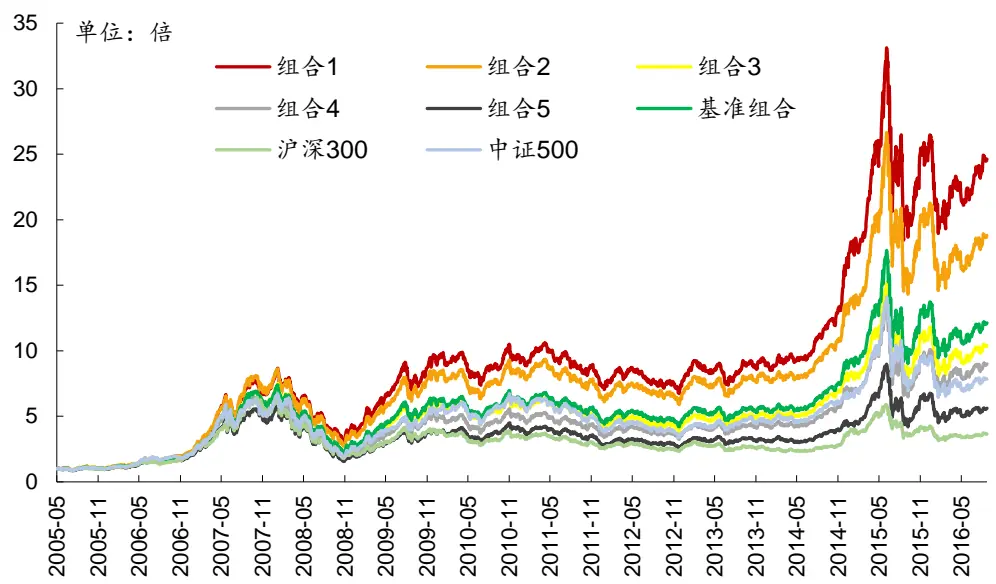
资料来源：Wind，华泰证券研究所

表格12： BP因子分层组合绩效分析

|  |  |  |  |  | 年化超额 收益率 | 超额收益 | 相对基准 |  | 超额收益 月胜率 最大回撤 |
| --- | --- | --- | --- | --- | --- | --- | --- | --- | --- |
| 投资组合 | 年化收益率 | 年化波动率 | 夏普比率 | 最大回撤 |  |  | 年化波动率 | 信息比率 |  |
| 组合1 | 33.70% | 32.47% | 1.04 | 64.62% | 6.64% | 4.92% | 1.35 | 55.88% | 8.18% |
| 组合2 | 30.46% | 32.67% | 0.93 | 68.45% | 4.06% | 3.42% | 1.19 | 59.56% | 4.90% |
| 组合3 | 23.66% | 32.72% | 0.72 | 71.70% | -1.37% | 2.93% | -0.47 | 48.53% | 18.50% |
| 组合4 | 22.04% | 32.82% | 0.67 | 73.50% | -2.66% | 3.51% | -0.76 | 44.85% | 31.19% |
| 组合5 | 16.91% | 31.73% | 0.53 | 73.33% | -6.75% | 5.38% | -1.26 | 45.59% | 53.97% |
| 基准组合 | 25.37% | 32.22% | 0.79 | 70.43% |  |  |  |  |  |

资料来源：Wind、华泰证券研究所

图18： BP因子分层组合滚动 12个月超额收益率
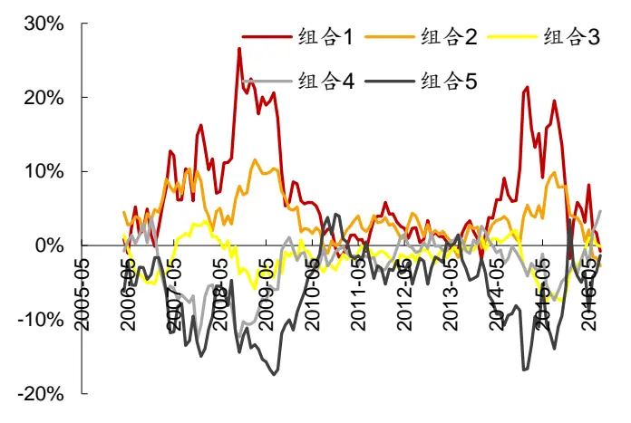
资料来源：Wind、华泰证券研究所

图19： BP因子多空组合月收益率及累积收益率
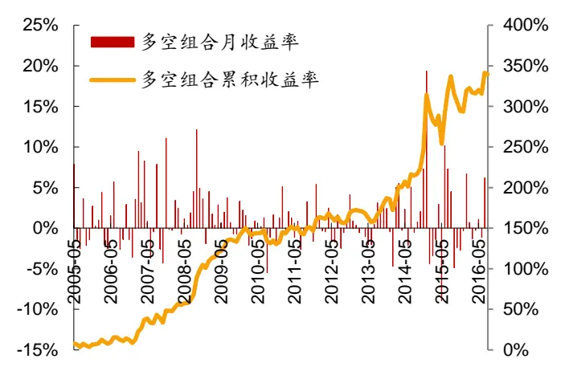
资料来源：Wind、华泰证券研究所

图20： BP因子分层组合绩效指标对比图示（分五层）
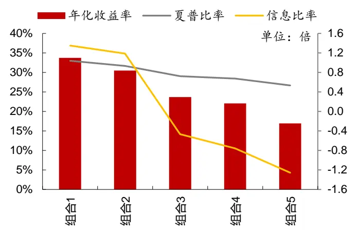
资料来源：Wind、华泰证券研究所

图21： BP 因子分层组合绩效指标对比图示（分十层）
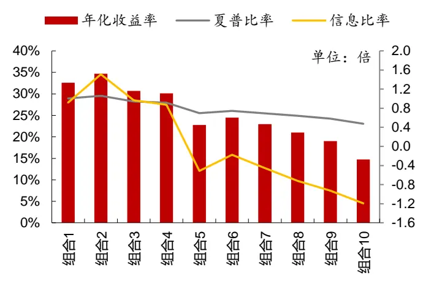
资料来源：Wind、华泰证券研究所

图22： 不同市值区间 BP因子分层组合绩效指标对比图示（分十层）
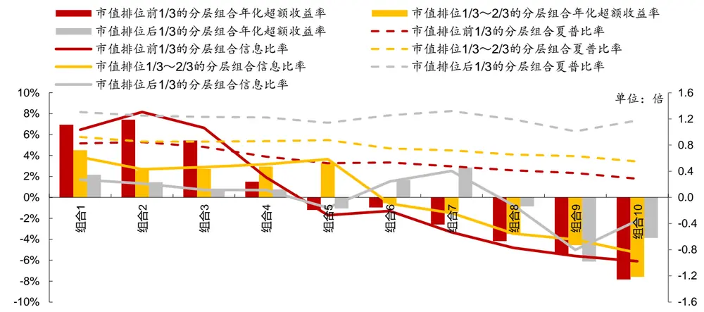
资料来源：Wind，华泰证券研究所

在图 22中，我们将全市场股票按市值排名前 1/3，1/3～2/3，后 1/3 分成三个大类，在这三类股票中分别进行分层测试（分十层），基准组合构成方法同前面所述（注意每个大类对应的基准组合并不相同）。我们发现，BP 因子对于大市值、中等市值股票都具有良好区分效果，收益率、夏普比率、信息比率从组合 1 到组合 10 基本上都是单调下降的，而且区分度较高；对于小市值股票，BP因子也有一定区分效果，但是单调性表现不好。

我们在不同一级行业内部都做了分层测试（详见表 13），基准组合为各行业内 BP因子非空值的个股等权组合。从结果来看，BP 因子在餐饮旅游、农林牧渔行业中选股效果最好，组合 1 年化超额收益率约为 14%（此数值比 EP、EPcut 因子都要好），其他绩效指标也都表现突出。其次是非银行金融、国防军工、银行行业，组合 1 的年化超额收益率都大于 10%。29 个一级行业中，组合 1收益率排前二的行业多达 26 个，可见 BP 因子在各行业中效果稳定，比 EP、EPcut 因子表现更好。

表格13： 不同行业 BP因子分层组合绩效分析

|  | 组合1年化 | 组合1 |  | 组合1 组合1超额收益 | 组合1相对 | 所有组合年化 | 组合自身序数 |
| --- | --- | --- | --- | --- | --- | --- | --- |
| 行业 | 超额收益率 | 夏普比率 | 信息比率 | 最大回撤 | 基准月胜率 | 收益率排序 | 的秩相关系数 |
| 餐饮旅游 | 14.29% | 1.19 | 0.95 | 16.54% | 60.29% | 1,2,5,3,4 | 0.70 |
| 农林牧渔 | 13.95% | 1.27 | 1.28 | 16.91% | 63.24% | 1,2,3,4,5 | 1.00 |
| 非银行金融 | 11.45% | 0.86 | 0.55 | 41.95% | 48.53% | 1,2,3,5,4 | 0.90 |
| 国防军工 | 10.68% | 1.02 | 0.66 | 26.69% | 59.56% | 2,1,4,3,5 | 0.80 |
| 银行 | 10.06% | 1.07 | 0.75 | 33.76% | 58.82% | 1,2,4,3,5 | 0.90 |
| 石油石化 | 9.32% | 1.06 | 0.57 | 26.96% | 48.53% | 1,3,2,4,5 | 0.90 |
| 商贸零售 | 9.15% | 1.03 | 0.97 | 15.27% | 56.62% | 1,2,3,4,5 | 1.00 |
| 通信 | 7.77% | 1.05 | 0.61 | 21.00% | 61.03% | 1,2,3,4,5 | 1.00 |
| 电力设备 | 7.30% | 1.07 | 0.65 | 17.71% | 52.94% | 1,4,3,2,5 | 0.60 |
| 食品饮料 | 7.02% | 1.02 | 0.58 | 27.00% | 56.62% | 1,2,3,4,5 | 1.00 |
| 纺织服装 | 6.07% | 0.99 | 0.58 | 19.15% | 55.15% | 1,2,3,4,5 | 1.00 |
| 交通运输 | 5.46% | 0.78 | 0.51 | 23.04% | 52.94% | 1,3,2,4,5 | 0.90 |
| 煤炭 | 4.74% | 0.48 | 0.36 | 21.46% | 51.47% | 1,2,4,3,5 | 0.90 |
| 汽车 | 4.47% | 0.97 | 0.45 | 20.71% | 50.00% | 3,1,2,4,5 | 0.70 |
| 房地产 | 4.42% | 0.91 | 0.46 | 18.75% | 55.88% | 1,2,3,4,5 | 1.00 |
| 计算机 | 3.91% | 0.93 | 0.28 | 23.62% | 47.06% | 2,1,3,4,5 | 0.90 |
| 电子元器件 | 3.27% | 0.89 | 0.35 | 21.46% | 55.15% | 2,1,3,4,5 | 0.90 |
| 医药 | 3.04% | 1.02 | 0.37 | 20.95% | 47.79% | 2,1,3,4,5 | 0.90 |
| 基础化工 | 2.95% | 0.83 | 0.34 | 22.06% | 53.68% | 3,1,2,4,5 | 0.70 |
| 综合 | 2.82% | 0.79 | 0.20 | 24.23% | 50.74% | 1,2,3,5,4 | 0.90 |
| 电力及公用事业 | 2.73% | 0.77 | 0.26 | 24.36% | 52.21% | 1,2,3,4,5 | 1.00 |
| 有色金属 | 2.71% | 0.79 | 0.21 | 31.48% | 50.74% | 2,1,4,3,5 | 0.80 |
| 建筑 | 1.73% | 0.92 | 0.12 | 42.70% | 48.53% | 2,1,3,5,4 | 0.80 |
| 传媒 | 1.44% | 0.72 | 0.08 | 41.67% | 53.68% | 5,1,2,3,4 | 0.00 |
| 机械 | 1.40% | 0.87 | 0.14 | 26.20% | 52.21% | 2,1,3,4,5 | 0.90 |
| 建材 | 1.04% | 0.84 | 0.08 | 35.99% | 47.06% | 2,1,3,4,5 | 0.90 |
| 家电 | -1.88% | 0.74 | -0.13 | 37.00% | 50.74% | 2,4,3,1,5 | 0.30 |
| 钢铁 | -2.09% | 0.43 | -0.15 | 44.13% | 42.65% | 5,4,1,2,3 | -0.60 |
| 轻工制造 | -2.28% | 0.62 | -0.18 | 44.58% | 46.32% | 3,2,4,1,5 | 0.30 |

资料来源：Wind、华泰证券研究所

## SP 因子

图 23 展示了 SP因子分五层回测净值曲线，其中组合 1～组合 5 为按 SP因子从大到小排序构造的行业中性的分层组合（构建方法参见上一章“分层模型回测”小节）。基准组合为所有分层组合中个股合并，一级行业内部个股等权配置，行业权重按当期沪深 300 行业权重配置。回测模型于每月末核算因子值，下月初调仓。

观察图 23 和表 14 可以发现，SP因子具备较好的选股能力。从收益率的角度来看，组合 1年化超额收益率 3.77%为五组中最高，且数值绝对大小也很大；从夏普比率、信息比率的角度来看，组合 1 都是最优的；从胜率的角度来看，组合 1 的胜率排名第一，但数值不是很高；从超额收益最大回撤的角度来看，组合 2 是最优的，组合 1 排第二，SP因子的回撤控制与BP因子差不多，比 EP、EPcut 都要好。

图 24 中展示了组合 1～组合 5 滚动 12 个月收益率曲线，图 25 展示了多空组合（做多组合1、做空组合 5）月度收益和累积收益曲线，可以发现，随时间变化，SP因子的效果非常稳定，多空组合累积收益虽然不是很高，但在 2014 年及以前且基本上呈直线上升态势，2015年以来出现过两次比较大的回撤，但总体来说还是比较优秀的。

图 26 是组合 1～组合 5的重要绩效指标（年化收益率、夏普比率、信息比率）对比图，同样地，我们还进行了 SP因子分十层回测，将重要绩效指标对比展示在图 27中。通过以上两图可以发现，SP因子在 SP排名后 1/3 区段单调性不太好，在 SP 排名前 2/3 的区段单调性较好。

图23： SP因子分层组合回测净值
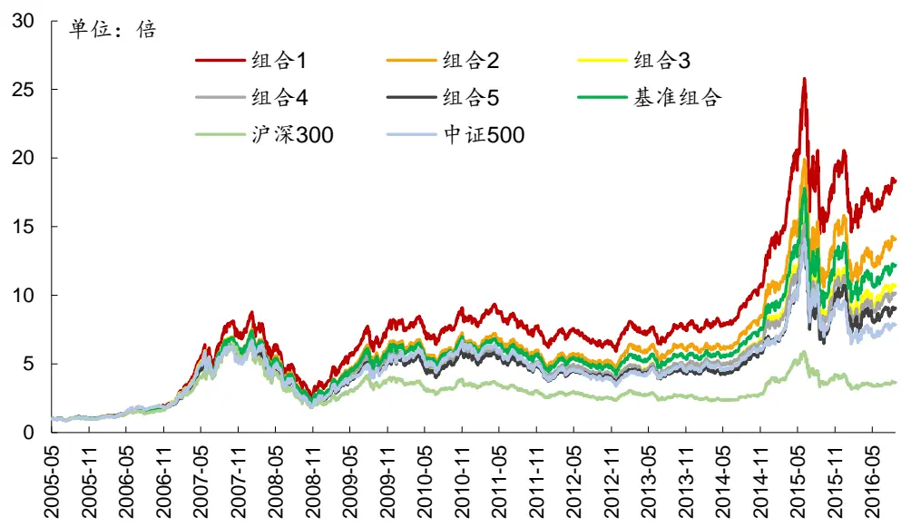
资料来源：Wind，华泰证券研究所

表格14： SP因子分层组合绩效分析

|  |  |  |  |  | 年化超额 收益率 | 超额收益 | 相对基准 |  | 超额收益 月胜率 最大回撤 |
| --- | --- | --- | --- | --- | --- | --- | --- | --- | --- |
| 投资组合 | 年化收益率 | 年化波动率 | 夏普比率 | 最大回撤 |  |  | 年化波动率 | 信息比率 |  |
| 组合1 | 30.18% | 32.21% | 0.94 | 70.57% | 3.77% | 4.67% | 0.81 | 55.15% | 9.51% |
| 组合2 | 27.13% | 32.48% | 0.84 | 71.27% | 1.34% | 3.24% | 0.41 | 52.94% | 5.95% |
| 组合3 | 23.99% | 32.58% | 0.74 | 70.78% | -1.17% | 3.05% | -0.38 | 45.59% | 18.50% |
| 组合4 | 23.40% | 32.26% | 0.73 | 68.99% | -1.64% | 3.47% | -0.47 | 49.26% | 21.13% |
| 组合5 | 22.13% | 32.11% | 0.69 | 71.09% | -2.65% | 4.78% | -0.55 | 50.74% | 29.07% |
| 基准组合 | 25.45% | 32.09% | 0.79 | 70.49% |  |  |  |  |  |

资料来源：Wind、华泰证券研究所

图24： SP因子分层组合滚动 12个月超额收益率
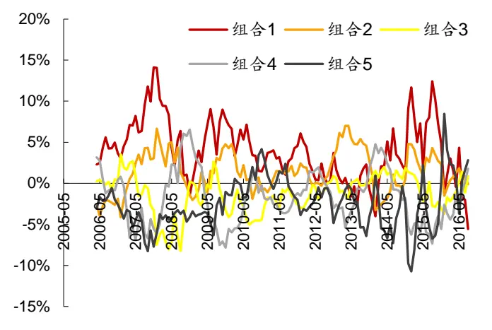
资料来源：Wind、华泰证券研究所

图25： SP因子多空组合月收益率及累积收益率
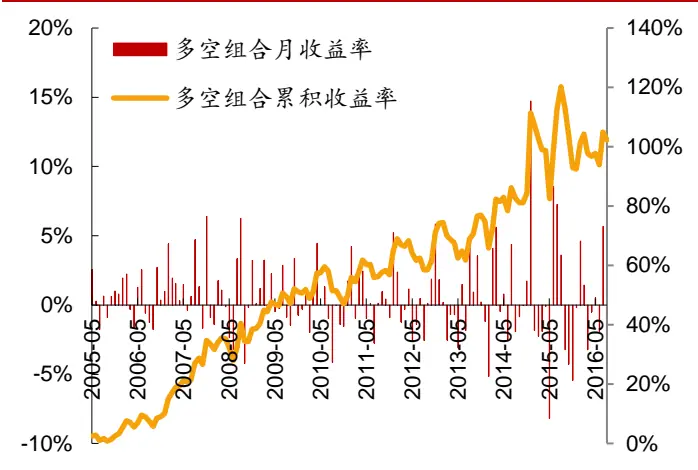
资料来源：Wind、华泰证券研究所

图26： SP因子分层组合绩效指标对比图示（分五层）
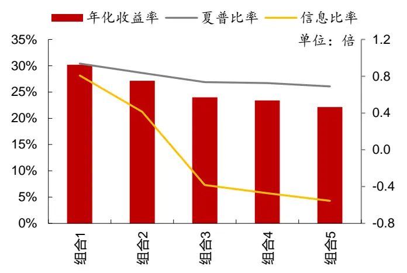
资料来源：Wind、华泰证券研究所

图27： SP 因子分层组合绩效指标对比图示（分十层）
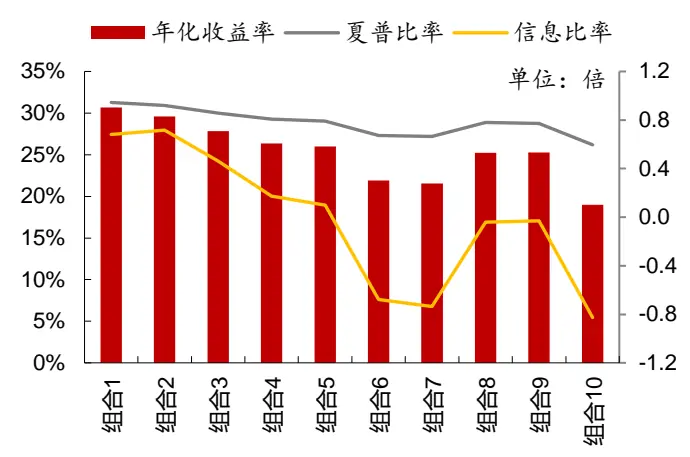
资料来源：Wind、华泰证券研究所

图28： 不同市值区间 SP因子分层组合绩效指标对比图示（分十层）
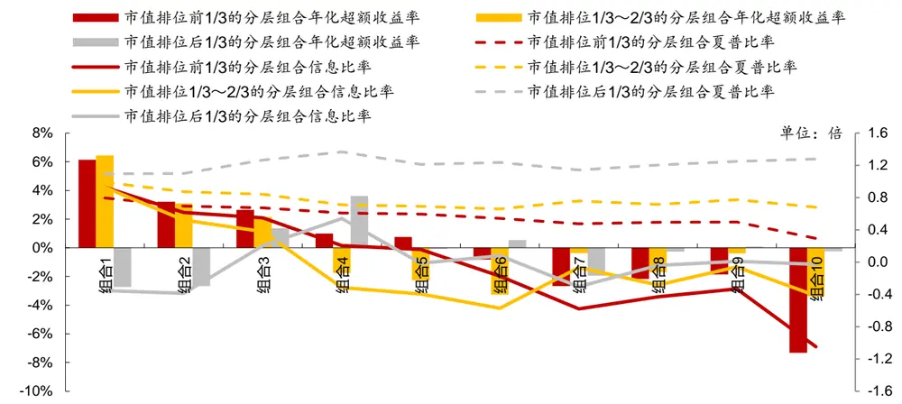
资料来源：Wind，华泰证券研究所

在图 28中，我们将全市场股票按市值排名前 1/3，1/3～2/3，后 1/3 分成三个大类，在这三类股票中分别进行分层测试（分十层），基准组合构成方法同前面所述（注意每个大类对应的基准组合并不相同）。我们发现，SP 因子对于大市值股票具有良好区分效果，收益率、夏普比率、信息比率从组合 1到组合 10 基本上呈下降态势，而且区分度较高；对于中等市值股票 SP 因子区分度有所下降，单调性基本还是维持的；对于小市值股票，SP因子的区分效果不佳。

我们在不同一级行业内部都做了分层测试（详见表 15），基准组合为各行业内 SP因子非空值的个股等权组合。从收益率来看，SP 因子在石油石化行业中选股效果最好，组合 1 年化超额收益率为 10.89%，但信息比率、最大回撤表现不太好，综合表现最好的是商贸零售行业。29 个一级行业中，组合 1 收益率排前二的行业为 21 个，可见 SP 因子在各行业中效果还算稳定，比 EP、EPcut 因子表现好，但不如 BP。

表格15： 不同行业 SP因子分层组合绩效分析

|  | 组合1年化 | 组合1 |  | 组合1 组合1超额收益 | 组合1相对 | 所有组合年化 | 组合自身序数 |
| --- | --- | --- | --- | --- | --- | --- | --- |
| 行业 | 超额收益率 | 夏普比率 | 信息比率 | 最大回撤 | 基准月胜率 | 收益率排序 | 的秩相关系数 |
| 石油石化 | 10.89% | 1.12 | 0.67 | 40.50% | 50.74% | 1,5,4,2,3 | 0.10 |
| 交通运输 | 7.75% | 0.80 | 0.73 | 20.58% | 54.41% | 1,3,2,5,4 | 0.80 |
| 国防军工 | 7.58% | 0.89 | 0.43 | 35.88% | 52.94% | 1,2,4,3,5 | 0.90 |
| 商贸零售 | 7.09% | 0.97 | 0.78 | 11.65% | 58.82% | 1,2,3,4,5 | 1.00 |
| 纺织服装 | 5.33% | 0.96 | 0.49 | 26.93% | 49.26% | 1,2,3,4,5 | 1.00 |
| 食品饮料 | 4.99% | 1.03 | 0.41 | 16.35% | 54.41% | 1,2,4,3,5 | 0.90 |
| 电力设备 | 4.98% | 1.00 | 0.43 | 21.05% | 55.15% | 1,4,5,3,2 | 0.10 |
| 传媒 | 4.96% | 0.86 | 0.26 | 34.69% | 54.41% | 1,2,4,5,3 | 0.70 |
| 银行 | 4.21% | 0.81 | 0.32 | 39.53% | 53.68% | 1,2,3,5,4 | 0.90 |
| 房地产 | 4.21% | 0.90 | 0.44 | 21.23% | 47.79% | 1,2,4,3,5 | 0.90 |
| 有色金属 | 3.41% | 0.79 | 0.29 | 24.66% | 46.32% | 2,1,5,4,3 | 0.50 |
| 汽车 | 3.09% | 0.93 | 0.29 | 28.54% | 47.06% | 1,3,2,5,4 | 0.80 |
| 建筑 | 2.12% | 0.94 | 0.13 | 56.38% | 52.21% | 1,2,5,4,3 | 0.60 |
| 电子元器件 | 2.01% | 0.86 | 0.21 | 23.06% | 52.21% | 2,1,4,3,5 | 0.80 |
| 基础化工 | 1.82% | 0.79 | 0.22 | 23.66% | 50.00% | 2,1,3,4,5 | 0.90 |
| 通信 | 1.45% | 0.89 | 0.11 | 26.84% | 49.26% | 2,1,5,3,4 | 0.60 |
| 电力及公用事业 | 1.29% | 0.71 | 0.11 | 25.89% | 47.79% | 4,1,5,2,3 | -0.10 |
| 家电 | 1.20% | 0.87 | 0.08 | 34.25% | 53.68% | 2,3,1,5,4 | 0.60 |
| 农林牧渔 | 1.08% | 0.86 | 0.10 | 27.63% | 53.68% | 2,1,3,4,5 | 0.90 |
| 计算机 | 0.56% | 0.81 | 0.04 | 29.68% | 47.06% | 2,4,1,5,3 | 0.30 |
| 医药 | 0.43% | 0.92 | 0.05 | 25.52% | 45.59% | 3,1,2,4,5 | 0.70 |
| 煤炭 | 0.24% | 0.35 | 0.02 | 42.20% | 45.59% | 3,1,4,2,5 | 0.50 |
| 轻工制造 | 0.12% | 0.71 | 0.01 | 49.47% | 46.32% | 2,4,3,1,5 | 0.30 |
| 非银行金融 | -0.14% | 0.63 | -0.01 | 52.59% | 48.53% | 2,1,4,3,5 | 0.80 |
| 餐饮旅游 | -0.16% | 0.69 | -0.01 | 39.85% | 46.32% | 2,3,1,5,4 | 0.60 |
| 钢铁 | -0.20% | 0.48 | -0.02 | 40.25% | 46.32% | 5,4,1,2,3 | -0.60 |
| 建材 | -0.47% | 0.80 | -0.04 | 35.81% | 45.59% | 2,3,1,4,5 | 0.70 |
| 机械 | -1.50% | 0.77 | -0.15 | 33.79% | 44.85% | 2,3,5,1,4 | 0.20 |
| 综合 | -2.45% | 0.63 | -0.17 | 37.56% | 42.65% | 5,3,1,2,4 | -0.30 |

资料来源：Wind、华泰证券研究所

## NCFP 因子

图 29 展示了 NCFP因子分五层回测净值曲线，其中组合 1～组合 5 为按 NCFP因子从大到小排序构造的行业中性的分层组合（构建方法参见上一章“分层模型回测”小节）。基准组合为所有分层组合中个股合并，一级行业内部个股等权配置，行业权重按当期沪深 300 行业权重配置。回测模型于每月末核算因子值，下月初调仓。

观察图 29 和表 16 可以发现，NCFP 因子具备较好的选股能力。从收益率的角度来看，组合 1 年化超额收益率 4.58%为五组中最高，且数值绝对大小也非常大；从夏普比率、信息比率的角度来看，组合 1 都是最优的；从胜率的角度来看，组合 1 的胜率为 63.24%排名第一，数值绝对大小也很大；从超额收益最大回撤的角度来看，组合 1 也是最优的，NCFP因子的回撤控制与 BP、SP因子差不多，比 EP、EPcut 因子要好。

图 30 中展示了组合 1～组合 5 滚动 12 个月收益率曲线，图 31 展示了多空组合（做多组合1、做空组合 5）月度收益和累积收益曲线，可以发现，随时间变化，NCFP因子的效果非常稳定，多空组合累积收益虽然不是很高，但在回测时间段内基本是直线上升的且没有明显回撤时段，波动性也不大，总体来看非常优秀。

图 32 是组合 1～组合 5的重要绩效指标（年化收益率、夏普比率、信息比率）对比图，同样地，我们还进行了 NCFP因子分十层回测，将重要绩效指标对比展示在图 33 中。通过以上两图可以发现，NCFP因子在 NCFP 排名后 1/3 区段单调性不太好（十层组合中的组合 7是收益最低的），在 NCFP排名前 2/3 的区段单调性非常好。

图29： NCFP因子分层组合回测净值
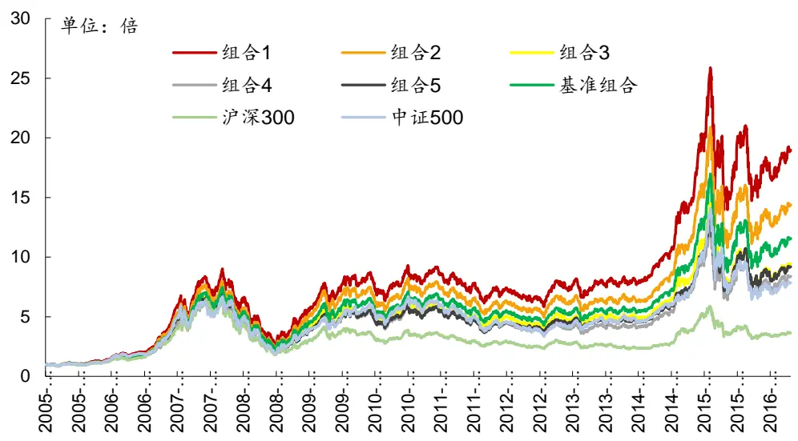
资料来源：Wind，华泰证券研究所

表格16： NCFP因子分层组合绩效分析

|  |  |  |  |  | 年化超额 | 超额收益 | 相对基准 |  | 超额收益 月胜率 最大回撤 |
| --- | --- | --- | --- | --- | --- | --- | --- | --- | --- |
| 投资组合 | 年化收益率 | 年化波动率 | 夏普比率 | 最大回撤 |  |  | 收益率 年化波动率 | 信息比率 |  |
| 组合1 | 30.58% | 33.07% | 0.92 | 71.12% | 4.58% | 4.18% | 1.10 | 63.24% | 5.74% |
| 组合2 | 27.34% | 32.81% | 0.83 | 70.82% | 1.99% | 3.84% | 0.52 | 53.68% | 6.83% |
| 组合3 | 22.57% | 32.56% | 0.69 | 69.36% | -1.83% | 3.45% | -0.53 | 41.91% | 21.32% |
| 组合4 | 21.28% | 31.91% | 0.67 | 69.60% | -2.87% | 3.57% | -0.80 | 41.91% | 28.67% |
| 组合5 | 22.30% | 31.50% | 0.71 | 71.47% | -2.05% | 4.73% | -0.43 | 40.44% | 24.29% |
| 基准组合 | 24.86% | 32.13% | 0.77 | 70.44% | I |  | 一 |  |  |

资料来源：Wind、华泰证券研究所

图30： NCFP因子分层组合滚动 12个月超额收益率
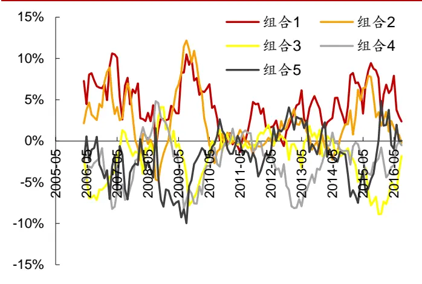
资料来源：Wind、华泰证券研究所

图31： NCFP因子多空组合月收益率及累积收益率
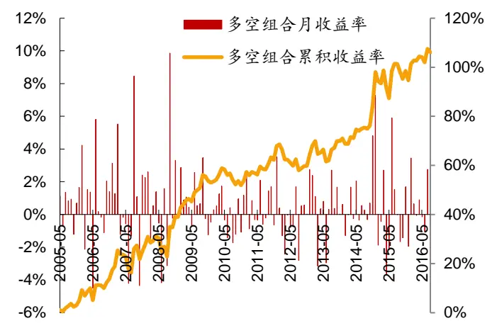
资料来源：Wind、华泰证券研究所

图32： NCFP因子分层组合绩效指标对比图示（分五层）
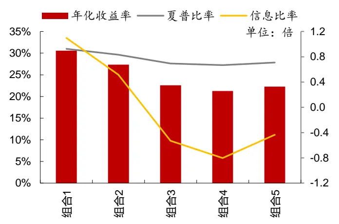
资料来源：Wind、华泰证券研究所

图33： NCFP 因子分层组合绩效指标对比图示（分十层）
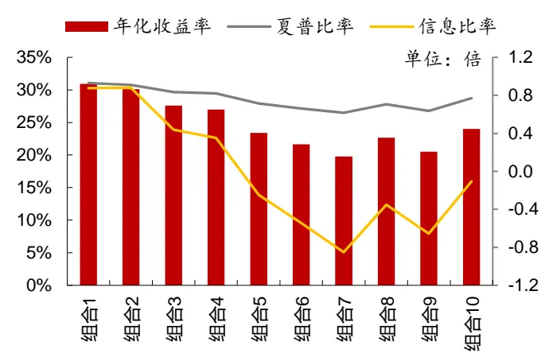
资料来源：Wind、华泰证券研究所

图34： 不同市值区间 NCFP因子分层组合绩效指标对比图示（分十层）
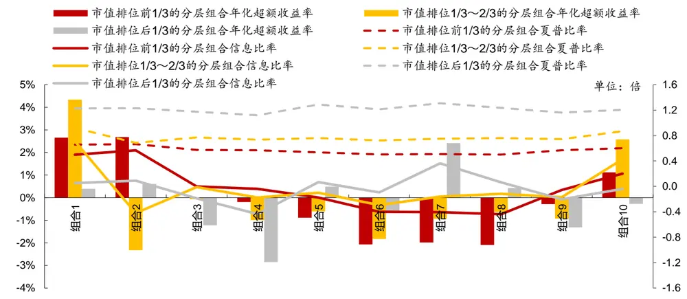
资料来源：Wind，华泰证券研究所

在图 34中，我们将全市场股票按市值排名前 1/3，1/3～2/3，后 1/3 分成三个大类，在这三类股票中分别进行分层测试（分十层），基准组合构成方法同前面所述（注意每个大类对应的基准组合并不相同）。我们发现，NCFP 因子对于这三类股票区分效果都不太好，对于大市值股票的分层收益率在组合 6～组合 8 处形成一个“U 型底”，非线性性质明确；对于中等市值股票也有类似的非线性性质；对于小市值股票，NCFP因子的区分效果不佳。

我们在不同一级行业内部都做了分层测试（详见表 17），基准组合为各行业内 NCFP因子非空值的个股等权组合。从收益率来看，NCFP因子在综合行业中选股效果最好，组合 1 年化超额收益率为 9.64%，但总体表现最好的是交通运输、电力及公用事业行业。餐饮旅游行业组合 1年化超额收益率是一个超大负值，为-12.37%。29 个一级行业中，组合 1 收益率排前二的行业为 23 个，可见 NCFP因子在各行业中效果还算稳定。

表格17： 不同行业 NCFP因子分层组合绩效分析

|  | 组合1年化 | 组合1 | 组合1 组合1超额收益 |  | 组合1相对 | 所有组合年化 | 组合自身序数 |
| --- | --- | --- | --- | --- | --- | --- | --- |
| 行业 | 超额收益率 | 夏普比率 | 信息比率 | 最大回撤 | 基准月胜率 | 收益率排序 | 的秩相关系数 |
| 综合 | 9.64% | 0.90 | 0.46 | 36.59% | 47.06% | 1,2,5,3,4 | 0.70 |
| 煤炭 | 7.75% | 0.52 | 0.46 | 36.92% | 57.35% | 1,4,5,3,2 | 0.10 |
| 电力及公用事业 | 7.34% | 0.89 | 0.63 | 23.62% | 54.41% | 1,2,4,3,5 | 0.90 |
| 交通运输 | 7.12% | 0.77 | 0.62 | 14.49% | 56.62% | 1,2,5,4,3 | 0.60 |
| 钢铁 | 6.75% | 0.58 | 0.44 | 20.97% | 52.94% | 1,3,4,2,5 | 0.70 |
| 非银行金融 | 6.37% | 0.55 | 0.34 | 30.96% | 44.12% | 1,2,3,5,4 | 0.90 |
| 商贸零售 | 6.31% | 1.02 | 0.57 | 27.63% | 52.94% | 1,3,2,4,5 | 0.90 |
| 计算机 | 5.23% | 0.93 | 0.30 | 46.54% | 55.15% | 2,1,3,4,5 | 0.90 |
| 传媒 | 5.11% | 0.77 | 0.24 | 31.83% | 50.00% | 1,5,2,4,3 | 0.30 |
| 机械 | 4.83% | 0.98 | 0.43 | 26.39% | 58.09% | 1,2,5,3,4 | 0.70 |
| 石油石化 | 4.70% | 0.80 | 0.22 | 52.31% | 50.74% | 1,5,2,3,4 | 0.40 |
| 银行 | 4.00% | 0.75 | 0.31 | 28.99% | 46.32% | 2,1,3,5,4 | 0.80 |
| 有色金属 | 3.46% | 0.75 | 0.25 | 36.46% | 51.47% | 4,1,2,3,5 | 0.40 |
| 食品饮料 | 3.39% | 0.90 | 0.22 | 35.59% | 52.94% | 1,2,5,3,4 | 0.70 |
| 医药 | 3.30% | 1.05 | 0.37 | 15.82% | 51.47% | 1,2,3,5,4 | 0.90 |
| 电子元器件 | 3.01% | 0.85 | 0.23 | 25.99% | 50.74% | 2,1,5,3,4 | 0.60 |
| 建材 | 2.90% | 0.71 | 0.18 | 26.48% | 52.94% | 1,2,3,5,4 | 0.90 |
| 房地产 | 2.81% | 0.83 | 0.26 | 17.16% | 52.94% | 1,3,4,2,5 | 0.70 |
| 家电 | 1.77% | 0.87 | 0.10 | 41.41% | 47.06% | 3,1,2,4,5 | 0.70 |
| 国防军工 | 1.22% | 0.74 | 0.05 | 58.61% | 50.00% | 2,1,4,3,5 | 0.80 |
| 基础化工 | 0.66% | 0.71 | 0.07 | 25.60% | 48.53% | 2,1,5,4,3 | 0.50 |
| 汽车 | 0.25% | 0.80 | 0.02 | 28.74% | 48.53% | 4,1,2,5,3 | 0.20 |
| 通信 | 0.04% | 0.79 | 0.00 | 33.32% | 50.00% | 2,5,1,4,3 | 0.10 |
| 纺织服装 | -0.46% | 0.73 | -0.03 | 44.01% | 46.32% | 5,1,3,2,4 | -0.10 |
| 电力设备 | -2.15% | 0.73 | -0.15 | 42.02% | 52.21% | 4,3,2,1,5 | 0.00 |
| 农林牧渔 | -2.38% | 0.70 | -0.16 | 40.96% | 49.26% | 2,3,5,1,4 | 0.20 |
| 轻工制造 | -3.07% | 0.60 | -0.19 | 55.69% | 47.79% | 3,5,2,1,4 | -0.20 |
| 建筑 餐饮旅游 | -4.19% -12.37% | 0.73 0.40 | -0.26 -0.61 | 55.41% 79.58% | 47.06% 44.85% | 2,3,4,1,5 2,4,5,3,1 | 0.40 -0.30 |

资料来源：Wind、华泰证券研究所

## OCFP 因子

图 35 展示了 OCFP 因子分五层回测净值曲线，其中组合 1～组合 5 为按 OCFP 因子从大到小排序构造的行业中性的分层组合（构建方法参见上一章“分层模型回测”小节）。基准组合为所有分层组合中个股合并，一级行业内部个股等权配置，行业权重按当期沪深 300 行业权重配置。回测模型于每月末核算因子值，下月初调仓。

观察图 35 和表 18 可以发现，OCFP 因子具备较好的选股能力，组合 1一枝独秀，剩下四个组合区分不是很大。从收益率的角度来看，组合 1 年化超额收益率 4.72%为五组中最高，且数值绝对大小也非常大；从夏普比率、信息比率的角度来看，组合 1 都是最优的；从胜率的角度来看，组合 1的胜率为 58.82%排名第一；从超额收益最大回撤的角度来看，组合 1也是最优的，OCFP 因子的回撤控制与 BP、SP因子差不多，比 EP、EPcut 因子要好。

图 36 中展示了组合 1～组合 5 滚动 12 个月收益率曲线，图 37 展示了多空组合（做多组合1、做空组合 5）月度收益和累积收益曲线，可以发现，随时间变化，OCFP 因子的效果非常稳定，多空组合累积收益虽然不是很高，但在回测时间段内基本呈稳步上升态势，回撤幅度都不是特别大，总体来看较为优秀。

图 38 是组合 1～组合 5的重要绩效指标（年化收益率、夏普比率、信息比率）对比图，同样地，我们还进行了 OCFP 因子分十层回测，将重要绩效指标对比展示在图 39 中。通过以上两图可以发现，OCFP因子总体来讲单调性很好，只有在 OCFP 排名 70%附近的区段存在一点小波动。

图35： OCFP因子分层组合回测净值
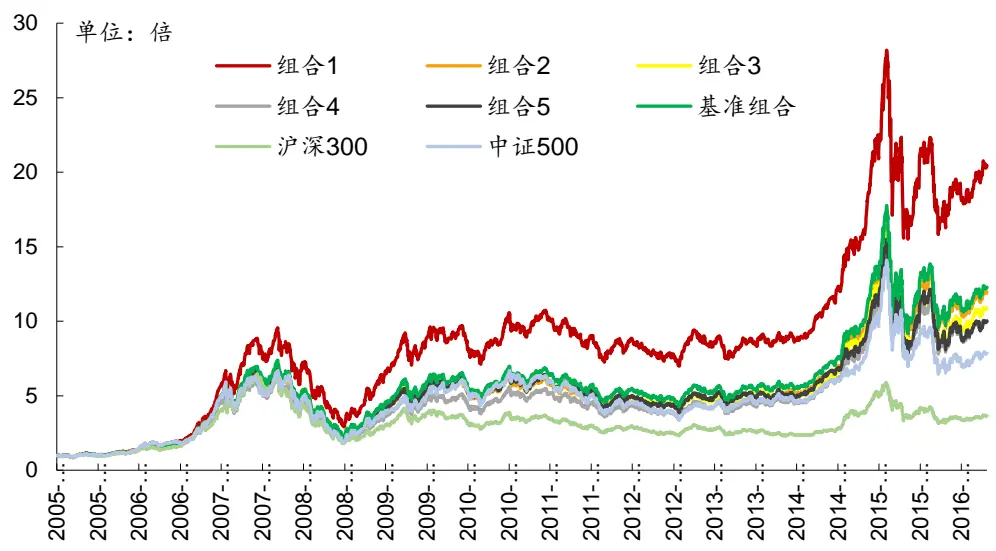
资料来源：Wind，华泰证券研究所

表格18： OCFP因子分层组合绩效分析

|  |  |  |  |  | 年化超额 收益率 | 超额收益 年化波动率 | 信息比率 | 相对基准 月胜率 | 超额收益 最大回撤 |
| --- | --- | --- | --- | --- | --- | --- | --- | --- | --- |
| 投资组合 | 年化收益率 | 年化波动率 | 夏普比率 | 最大回撤 |  |  |  |  |  |
| 组合1 | 31.46% | 32.51% | 0.97 | 69.47% | 4.72% | 4.43% | 1.07 | 58.82% | 7.00% |
| 组合2 | 25.23% | 32.25% | 0.78 | 72.24% | -0.24% | 3.44% | -0.07 | 47.79% | 14.05% |
| 组合3 | 24.15% | 32.19% | 0.75 | 69.48% | -1.10% | 3.29% | -0.33 | 41.91% | 17.02% |
| 组合4 | 23.22% | 32.02% | 0.73 | 69.73% | -1.85% | 3.67% | -0.50 | 41.91% | 22.20% |
| 组合5 | 23.23% | 32.09% | 0.72 | 69.25% | -1.83% | 4.71% | -0.39 | 46.32% | 22.52% |
| 基准组合 | 25.53% | 31.97% | 0.80 | 70.00% | I |  | - |  |  |

资料来源：Wind、华泰证券研究所

图36： OCFP因子分层组合滚动 12个月超额收益率
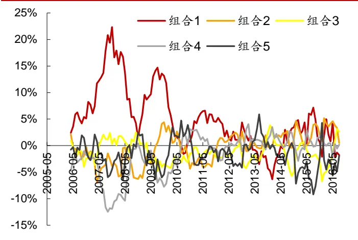
资料来源：Wind、华泰证券研究所

图37： OCFP因子多空组合月收益率及累积收益率
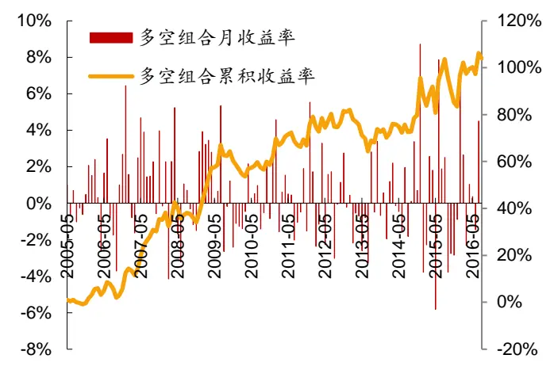
资料来源：Wind、华泰证券研究所

图38： OCFP因子分层组合绩效指标对比图示（分五层）
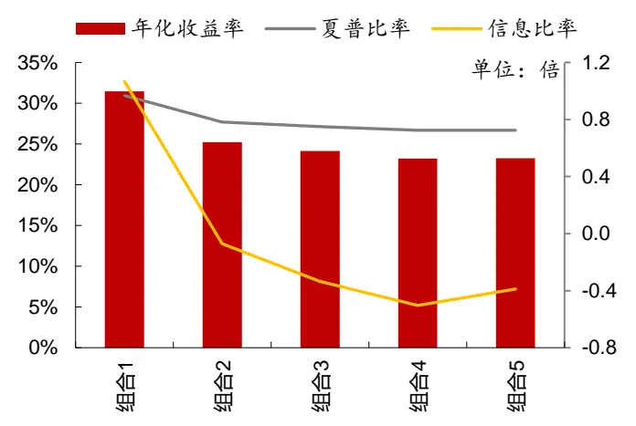
资料来源：Wind、华泰证券研究所

图39： OCFP 因子分层组合绩效指标对比图示（分十层）
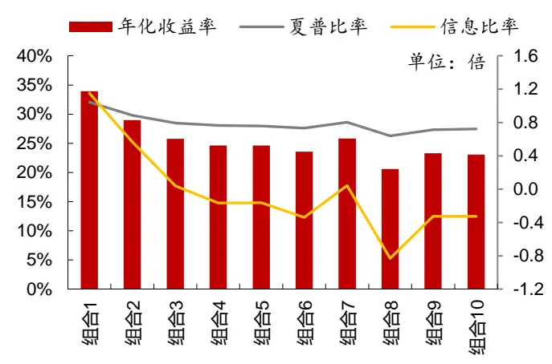
资料来源：Wind、华泰证券研究所

图40： 不同市值区间 OCFP因子分层组合绩效指标对比图示（分十层）
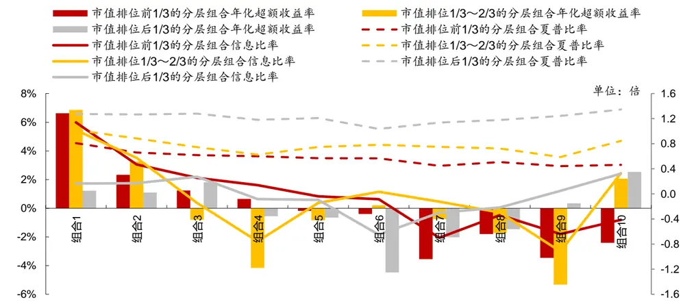
资料来源：Wind，华泰证券研究所

在图 40中，我们将全市场股票按市值排名前 1/3，1/3～2/3，后 1/3 分成三个大类，在这三类股票中分别进行分层测试（分十层），基准组合构成方法同前面所述（注意每个大类对应的基准组合并不相同）。我们发现，OCFP 因子对于这三类股票区分效果都不太好，对于大市值股票 OCFP 因子的单调性依稀可见；对于中等市值股票规律性不明显；对于小市值股票有比较明显的非线性性质，两端收益多、中间收益少。

我们在不同一级行业内部都做了分层测试（详见表 19），基准组合为各行业内 OCFP 因子非空值的个股等权组合。从收益率来看，OCFP 因子在国防军工行业中选股效果最好，组合 1年化超额收益率为 10.67%，但总体表现最好的是食品饮料、机械行业。29 个一级行业中，组合 1收益率排第一的行业为 18 个，排前二的行业为 25 个，可见 OCFP因子在各行业中效果稳定非常强。总体来说，该因子适合用来精选因子排名前 20%的股票，效果突出。

表格19： 不同行业 OCFP因子分层组合绩效分析

|  | 组合1年化 | 组合1 |  | 组合1 组合1超额收益 | 组合1相对 | 所有组合年化 | 组合自身序数 |
| --- | --- | --- | --- | --- | --- | --- | --- |
| 行业 | 超额收益率 | 夏普比率 | 信息比率 | 最大回撤 | 基准月胜率 | 收益率排序 | 的秩相关系数 |
| 国防军工 | 10.67% | 1.00 | 0.51 | 29.42% | 56.62% | 1,2,3,5,4 | 0.90 |
| 食品饮料 | 10.43% | 1.30 | 0.78 | 23.07% | 57.35% | 1,2,3,5,4 | 0.90 |
| 煤炭 | 7.47% | 0.53 | 0.58 | 27.25% | 58.09% | 1,3,2,5,4 | 0.80 |
| 农林牧渔 | 7.17% | 1.13 | 0.61 | 16.33% | 57.35% | 1,3,5,2,4 | 0.50 |
| 机械 | 6.97% | 1.12 | 0.73 | 15.68% | 55.15% | 1,2,3,5,4 | 0.90 |
| 银行 | 6.89% | 0.88 | 0.51 | 19.66% | 52.21% | 1,3,5,4,2 | 0.30 |
| 餐饮旅游 | 6.80% | 0.87 | 0.41 | 38.14% | 56.62% | 1,5,3,2,4 | 0.30 |
| 电力及公用事业 | 6.18% | 0.88 | 0.52 | 23.11% | 51.47% | 1,3,5,2,4 | 0.50 |
| 建材 | 6.06% | 0.98 | 0.42 | 27.47% | 46.32% | 1,2,3,5,4 | 0.90 |
| 商贸零售 | 5.49% | 0.92 | 0.55 | 14.67% | 54.41% | 1,3,2,5,4 | 0.80 |
| 交通运输 | 5.46% | 0.73 | 0.51 | 21.39% | 50.74% | 1,2,5,4,3 | 0.60 |
| 纺织服装 | 5.16% | 1.01 | 0.46 | 17.20% | 55.88% | 1,2,5,4,3 | 0.60 |
| 医药 | 4.94% | 1.10 | 0.61 | 14.98% | 55.88% | 1,2,4,3,5 | 0.90 |
| 家电 | 4.16% | 1.03 | 0.27 | 25.37% | 54.41% | 1,2,4,5,3 | 0.70 |
| 通信 | 4.11% | 0.96 | 0.28 | 29.87% | 47.79% | 5,1,3,4,2 | -0.30 |
| 基础化工 | 3.68% | 0.86 | 0.44 | 18.04% | 53.68% | 1,2,4,5,3 | 0.70 |
| 电子元器件 | 3.24% | 0.89 | 0.30 | 24.90% | 51.47% | 1,2,3,5,4 | 0.90 |
| 房地产 | 3.11% | 0.80 | 0.27 | 22.39% | 55.88% | 1,3,2,5,4 | 0.80 |
| 电力设备 | 2.68% | 0.88 | 0.20 | 34.71% | 52.21% | 3,1,4,2,5 | 0.50 |
| 建筑 | 2.08% | 0.96 | 0.13 | 48.12% | 50.00% | 2,4,1,5,3 | 0.30 |
| 轻工制造 | 1.68% | 0.80 | 0.12 | 52.91% | 50.74% | 2,1,3,5,4 | 0.80 |
| 有色金属 | 1.53% | 0.71 | 0.13 | 27.02% | 47.06% | 2,1,4,5,3 | 0.60 |
| 非银行金融 | 0.85% | 0.55 | 0.04 | 44.22% | 46.32% | 1,2,4,5,3 | 0.70 |
| 汽车 | 0.65% | 0.91 | 0.06 | 31.02% | 46.32% | 4,1,2,5,3 | 0.20 |
| 传媒 | -0.24% | 0.63 | -0.01 | 48.55% | 49.26% | 3,1,5,2,4 | 0.30 |
| 计算机 | -0.57% | 0.81 | -0.04 | 39.63% | 50.00% | 2,4,1,5,3 | 0.30 |
| 综合 | -0.65% | 0.67 | -0.04 | 41.75% | 47.06% | 2,1,3,4,5 | 0.90 |
| 石油石化 | -0.93% | 0.72 | -0.05 | 64.33% | 51.47% | 2,3,1,5,4 | 0.60 |
| 钢铁 | -2.80% | 0.39 | -0.22 | 53.36% | 47.79% | 4,3,5,1,2 | -0.60 |

资料来源：Wind、华泰证券研究所

## FCFP 因子

图 41 展示了 FCFP 因子分五层回测净值曲线，其中组合 1～组合 5 为按 FCFP 因子从大到小排序构造的行业中性的分层组合（构建方法参见上一章“分层模型回测”小节）。基准组合为所有分层组合中个股合并，一级行业内部个股等权配置，行业权重按当期沪深 300 行业权重配置。回测模型于每月末核算因子值，下月初调仓。

观察图 41 和表 20 可以发现，FCFP 因子具备较好的选股能力。从收益率的角度来看，组合1 年化超额收益 3.16%为五组中最高；从夏普比率、信息比率的角度来看，组合 1都是最优的；从胜率的角度来看，组合 1 的胜率并列排名第一，但数值不是很大；从超额收益最大回撤的角度来看，组合 1排名第二（组合 2排第一），FCFP 因子的回撤控制与 EP、EPcut因子差不多，比 BP、SP因子要差一些。

图 42 中展示了组合 1～组合 5 滚动 12 个月收益率曲线，图 43 展示了多空组合（做多组合1、做空组合 5）月度收益和累积收益曲线，可以发现，随时间变化，FCFP 因子的效果不是非常一致，2005 年到 2009年上半年表现较好，2009 年下半年至 2013 年收益甚少，自2014 年以来多空组合累积收益曲线增长非常快，2015 年多空组合收益约 50%，近期上升势头依然很猛。

图 44 是组合 1～组合 5的重要绩效指标（年化收益率、夏普比率、信息比率）对比图，同样地，我们还进行了 FCFP因子分十层回测，将重要绩效指标对比展示在图 45 中。通过以上两图可以发现，FCFP因子在单调性方面表现是很好的。

图41： FCFP因子分层组合回测净值
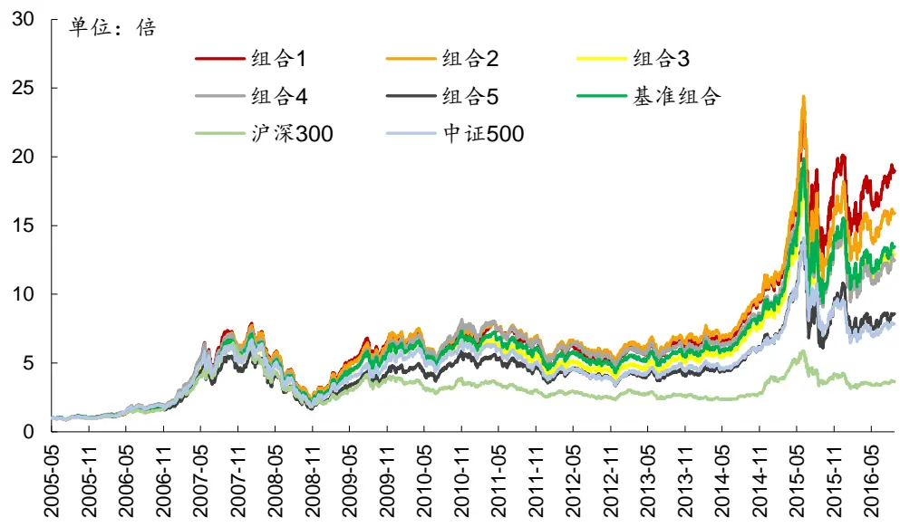
资料来源：Wind，华泰证券研究所

表格20： FCFP因子分层组合绩效分析

|  |  |  |  |  | 年化超额 收益率 | 超额收益 年化波动率 | 信息比率 | 相对基准 月胜率 | 超额收益 最大回撤 |
| --- | --- | --- | --- | --- | --- | --- | --- | --- | --- |
| 投资组合 | 年化收益率 | 年化波动率 | 夏普比率 | 最大回撤 |  |  |  |  |  |
| 组合1 | 30.57% | 34.45% | 0.89 | 72.13% | 3.16% | 5.22% | 0.60 | 55.15% | 12.89% |
| 组合2 | 28.49% | 34.83% | 0.82 | 71.42% | 1.52% | 4.36% | 0.35 | 55.15% | 8.99% |
| 组合3 | 26.07% | 34.95% | 0.75 | 70.91% | -0.40% | 4.04% | -0.10 | 45.59% | 14.31% |
| 组合4 | 25.72% | 34.98% | 0.74 | 72.16% | -0.68% | 4.35% | -0.16 | 52.94% | 20.72% |
| 组合5 | 21.52% | 34.50% | 0.62 | 72.09% | -3.99% | 5.31% | -0.75 | 38.97% | 38.09% |
| 基准组合 | 26.57% | 34.43% | 0.77 | 71.73% | I |  |  |  |  |

资料来源：Wind、华泰证券研究所

图42： FCFP因子分层组合滚动 12个月超额收益率
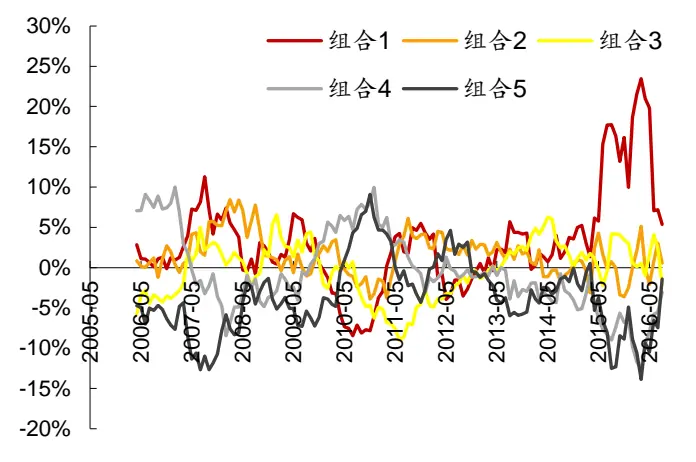
资料来源：Wind、华泰证券研究所

图43： FCFP因子多空组合月收益率及累积收益率
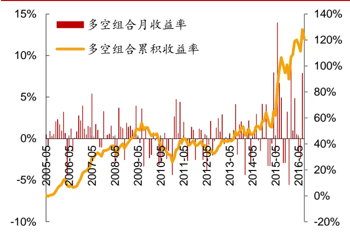
资料来源：Wind、华泰证券研究所

图44： FCFP因子分层组合绩效指标对比图示（分五层）
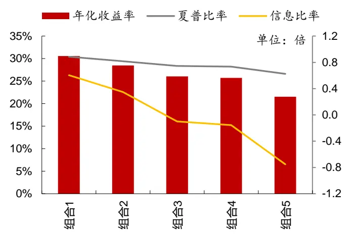
资料来源：Wind、华泰证券研究所

图45： FCFP 因子分层组合绩效指标对比图示（分十层）
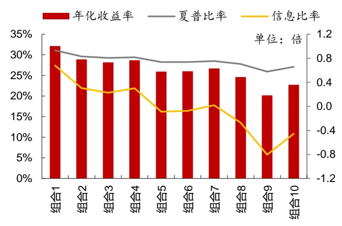
资料来源：Wind、华泰证券研究所

图46： 不同市值区间 FCFP因子分层组合绩效指标对比图示（分十层）
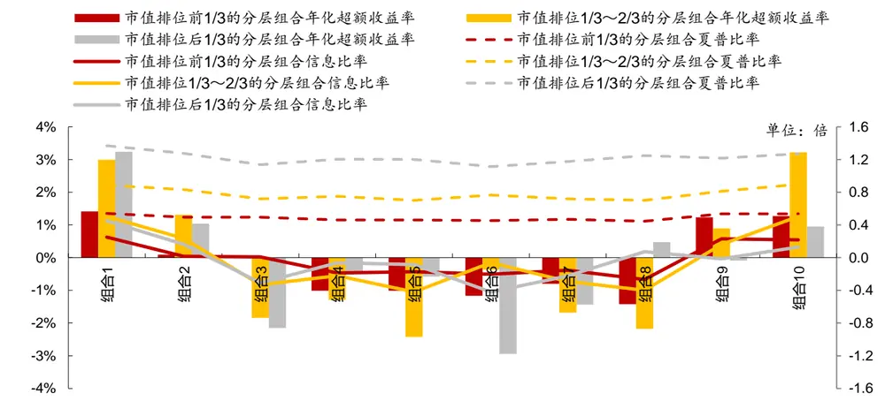
资料来源：Wind，华泰证券研究所

在图 46中，我们将全市场股票按市值排名前 1/3，1/3～2/3，后 1/3 分成三个大类，在这三类股票中分别进行分层测试（分十层），基准组合构成方法同前面所述（注意每个大类对应的基准组合并不相同）。我们发现，FCFP 因子对于这三类股票都有明确且一致的非线性特征，在组合 6附近存在一个较缓的“U 型底”，两端收益多、中间收益少。

我们在不同一级行业内部都做了分层测试（详见表 21），基准组合为各行业内 FCFP 因子非空值的个股等权组合。从收益率来看，FCFP 因子在煤炭行业中选股效果最好，组合 1 年化超额收益率为 11.35%，但总体表现最好的是纺织服装行业。28 个一级行业中，组合 1 收益率排第一的行业为 12个，排前二的行业为 19 个，可见 FCFP 因子在各行业中稳定性尚可。注意，银行行业因无法核算企业自由现金流 FCFF，故 FCFP 因子均为空值。

表格21： 不同行业 FCFP因子分层组合绩效分析

|  | 组合1年化 | 组合1 |  | 组合1 组合1超额收益 | 组合1相对 | 所有组合年化 | 组合自身序数 |
| --- | --- | --- | --- | --- | --- | --- | --- |
| 行业 | 超额收益率 | 夏普比率 | 信息比率 | 最大回撤 | 基准月胜率 | 收益率排序 | 的秩相关系数 |
| 煤炭 | 11.35% | 0.62 | 0.51 | 38.81% | 50.00% | 1,2,4,5,3 | 0.70 |
| 纺织服装 | 9.98% | 1.03 | 0.60 | 23.24% | 52.94% | 1,5,3,2,4 | 0.30 |
| 通信 | 6.72% | 1.05 | 0.34 | 32.34% | 53.68% | 1,2,4,3,5 | 0.90 |
| 机械 | 6.70% | 1.01 | 0.48 | 30.13% | 47.06% | 1,4,3,2,5 | 0.60 |
| 汽车 | 5.62% | 1.09 | 0.40 | 19.22% | 55.15% | 1,2,4,3,5 | 0.90 |
| 传媒 | 5.38% | 0.91 | 0.22 | 59.89% | 49.26% | 1,3,2,5,4 | 0.80 |
| 商贸零售 | 5.02% | 0.93 | 0.38 | 25.70% | 53.68% | 1,2,3,4,5 | 1.00 |
| 房地产 | 4.99% | 0.97 | 0.40 | 27.49% | 50.74% | 1,2,3,4,5 | 1.00 |
| 食品饮料 | 4.61% | 0.93 | 0.24 | 34.43% | 48.53% | 4,1,2,3,5 | 0.40 |
| 国防军工 | 4.52% | 0.64 | 0.17 | 65.51% | 46.32% | 5,1,4,3,2 | -0.40 |
| 有色金属 | 3.41% | 0.73 | 0.22 | 26.31% | 51.47% | 1,2,3,4,5 | 1.00 |
| 交通运输 | 3.01% | 0.68 | 0.22 | 19.55% | 50.74% | 4,1,3,5,2 | 0.00 |
| 计算机 | 2.77% | 0.79 | 0.16 | 47.66% | 48.53% | 1,3,2,5,4 | 0.80 |
| 医药 | 2.48% | 0.92 | 0.24 | 20.71% | 50.00% | 1,2,3,4,5 | 1.00 |
| 餐饮旅游 | 1.81% | 0.66 | 0.07 | 57.75% | 52.21% | 1,4,3,5,2 | 0.30 |
| 综合 | 1.79% | 0.73 | 0.08 | 46.28% | 46.32% | 3,1,4,5,2 | 0.20 |
| 电力设备 | 1.25% | 0.89 | 0.09 | 40.92% | 52.94% | 2,1,5,4,3 | 0.50 |
| 电子元器件 | 0.61% | 0.73 | 0.04 | 31.17% | 52.94% | 2,1,4,3,5 | 0.80 |
| 建材 | 0.35% | 0.86 | 0.02 | 40.83% | 49.26% | 2,1,5,3,4 | 0.60 |
| 基础化工 | -0.79% | 0.74 | -0.07 | 36.08% | 42.65% | 2,3,1,4,5 | 0.70 |
| 电力及公用事业 | -0.82% | 0.69 | -0.06 | 43.41% | 49.26% | 5,3,1,4,2 | -0.50 |
| 农林牧渔 | -2.99% | 0.59 | -0.19 | 54.91% | 50.74% | 2,4,5,1,3 | -0.10 |
| 非银行金融 | -3.48% | 0.52 | -0.16 | 65.41% | 35.29% | 4,3,5,1,2 | -0.60 |
| 钢铁 | -4.84% | 0.30 | -0.29 | 66.31% | 41.18% | 4,5,2,3,1 | -0.80 |
| 建筑 | -5.63% | 0.52 | -0.28 | 67.71% | 41.91% | 2,4,3,5,1 | -0.10 |
| 轻工制造 | -5.80% | 0.56 | -0.31 | 59.82% | 42.65% | 3,4,2,1,5 | 0.10 |
| 家电 | -6.82% | 0.44 | -0.32 | 72.76% | 40.44% | 3,5,2,4,1 | -0.50 |
| 石油石化 | -8.00% | 0.22 | -0.33 | 80.86% | 46.32% | 2,5,3,4,1 | -0.30 |
| 银行 | - |  |  |  |  | - |  |

资料来源：Wind、华泰证券研究所

## DP 因子

图 47 展示了 DP因子分五层回测净值曲线，其中组合 1～组合 5 为按 DP因子从大到小排序构造的行业中性的分层组合（构建方法参见上一章“分层模型回测”小节）。基准组合为所有分层组合中个股合并，一级行业内部个股等权配置，行业权重按当期沪深 300 行业权重配置。回测模型于每月末核算因子值，下月初调仓。

观察图 47 和表 22 可以发现，DP因子具备较好的选股能力。从收益率的角度来看，组合 1年化超额收益 2.19%为五组中最高；从夏普比率、信息比率的角度来看，组合 1 都是最优的；从胜率的角度来看，组合 1的胜率排名第二（组合 3 排第一），数值也不大；从超额收益最大回撤的角度来看，组合 1排名第三（组合 3、2 排第一、二），DP因子的回撤控制与 EP、EPcut 因子差不多，比 BP、SP因子要差一些。

图 48 中展示了组合 1～组合 5 滚动 12 个月收益率曲线，图 49 展示了多空组合（做多组合1、做空组合 5）月度收益和累积收益曲线，可以发现，随时间变化，DP因子的效果不是非常一致，2006 年到 2010 年表现较好，2011 年至今累积收益不多，且近期波动较大。

图 50 是组合 1～组合 5的重要绩效指标（年化收益率、夏普比率、信息比率）对比图，同样地，我们还进行了 DP因子分十层回测，将重要绩效指标对比展示在图 51中。通过以上两图可以发现，DP因子在单调性方面表现较好，从组合 1 到组合 10 绩效指标主要趋势都是向下的，存在一定波动。

图47： DP 因子分层组合回测净值
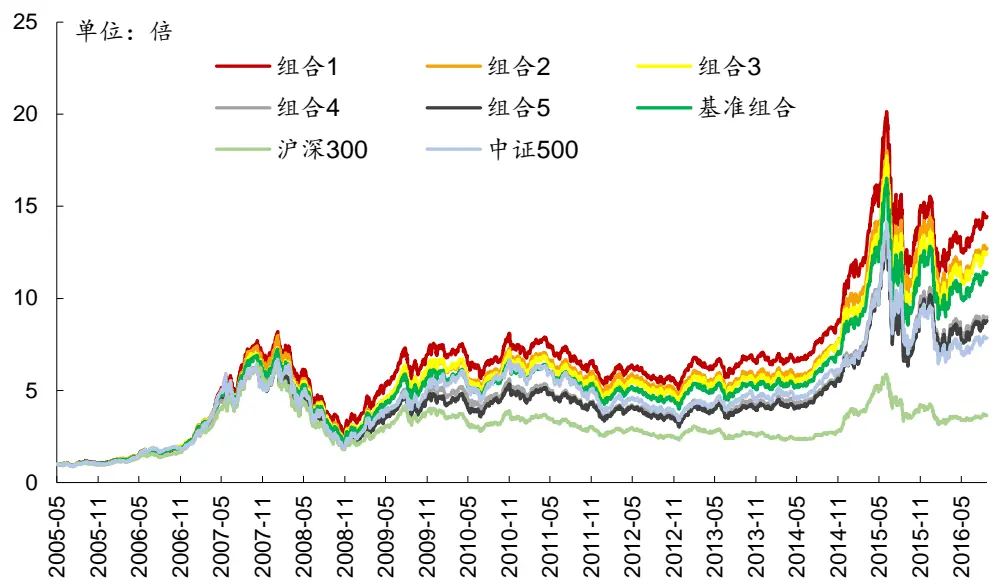
资料来源：Wind，华泰证券研究所

表格22： DP因子分层组合绩效分析

|  |  |  |  |  | 年化超额 收益率 | 超额收益 | 相对基准 |  | 超额收益 月胜率 最大回撤 |
| --- | --- | --- | --- | --- | --- | --- | --- | --- | --- |
| 投资组合 | 年化收益率 | 年化波动率 | 夏普比率 | 最大回撤 |  |  | 年化波动率 | 信息比率 |  |
| 组合1 | 27.39% | 31.31% | 0.87 | 67.87% | 2.19% | 4.80% | 0.46 | 52.21% | 10.73% |
| 组合2 | 25.94% | 32.24% | 0.80 | 71.14% | 1.02% | 3.35% | 0.30 | 48.53% | 7.31% |
| 组合3 | 25.67% | 32.61% | 0.79 | 68.92% | 0.80% | 3.37% | 0.24 | 59.56% | 5.32% |
| 组合4 | 22.04% | 33.21% | 0.66 | 69.97% | -2.11% | 3.70% | -0.57 | 45.59% | 23.16% |
| 组合5 | 21.78% | 33.43% | 0.65 | 72.05% | -2.32% | 4.45% | -0.52 | 47.06% | 28.01% |
| 基准组合 | 24.67% | 32.33% | 0.76 | 69.95% |  |  |  |  |  |

资料来源：Wind、华泰证券研究所

图48： DP因子分层组合滚动 12个月超额收益率
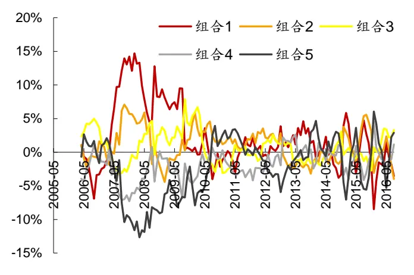
资料来源：Wind、华泰证券研究所

图49： DP因子多空组合月收益率及累积收益率
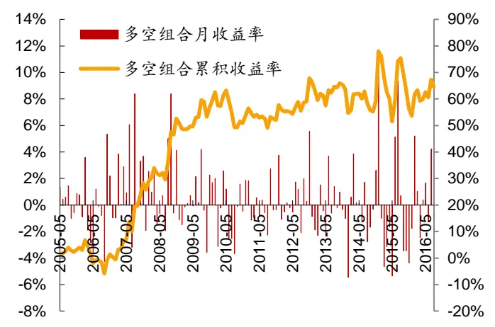
资料来源：Wind、华泰证券研究所

图50： DP因子分层组合绩效指标对比图示（分五层）
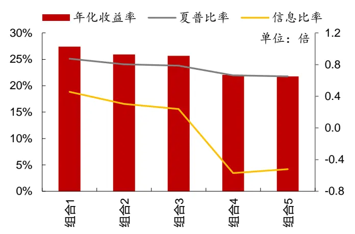
资料来源：Wind、华泰证券研究所

图51： DP 因子分层组合绩效指标对比图示（分十层）
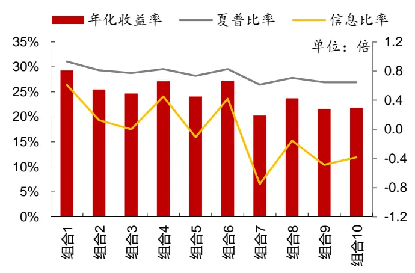
资料来源：Wind、华泰证券研究所

图52： 不同市值区间 DP因子分层组合绩效指标对比图示（分十层）
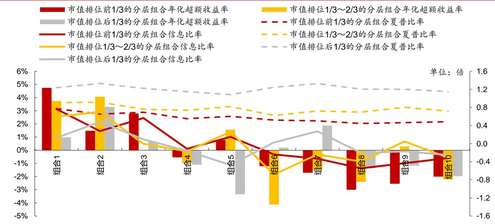
资料来源：Wind，华泰证券研究所

在图 52中，我们将全市场股票按市值排名前 1/3，1/3～2/3，后 1/3 分成三个大类，在这三类股票中分别进行分层测试（分十层），基准组合构成方法同前面所述（注意每个大类对应的基准组合并不相同）。我们发现，DP 因子对于这三类股票区分效果都不太好，对于大市值、中等市值股票 DP因子的单调性依稀可见，对于小市值股票单调性不佳。

我们在不同一级行业内部都做了分层测试（详见表 23），基准组合为各行业内 DP因子非空值的个股等权组合。从总体效果来看，DP因子在农林牧渔行业中选股效果最好，组合 1年化超额收益率为 12.58%，其次是房地产、商贸零售行业。29 个一级行业中，组合 1 收益率排第一的行业为 11 个，排前二的行业为 18 个，可见 DP因子在各行业中稳定性表现尚可。

表格23： 不同行业 DP因子分层组合绩效分析

|  | 组合1年化 | 组合1 |  | 组合1 组合1超额收益 | 组合1相对 | 所有组合年化 | 组合自身序数 |
| --- | --- | --- | --- | --- | --- | --- | --- |
| 行业 | 超额收益率 | 夏普比率 | 信息比率 | 最大回撤 | 基准月胜率 | 收益率排序 | 的秩相关系数 |
| 农林牧渔 | 12.58% | 1.18 | 0.92 | 20.30% | 56.62% | 1,4,2,3,5 | 0.70 |
| 房地产 | 9.88% | 1.03 | 0.98 | 21.23% | 54.41% | 1,2,3,4,5 | 1.00 |
| 传媒 | 9.06% | 1.05 | 0.39 | 37.93% | 50.74% | 1,2,3,4,5 | 1.00 |
| 商贸零售 | 8.09% | 1.01 | 0.73 | 21.27% | 56.62% | 1,4,2,5,3 | 0.50 |
| 综合 | 5.89% | 0.67 | 0.25 | 49.86% | 44.12% | 1,5,2,4,3 | 0.30 |
| 机械 | 4.47% | 0.88 | 0.45 | 22.61% | 54.41% | 1,4,2,5,3 | 0.50 |
| 医药 | 3.92% | 1.09 | 0.43 | 14.98% | 53.68% | 1,2,3,4,5 | 1.00 |
| 电子元器件 | 3.75% | 0.85 | 0.33 | 32.34% | 57.35% | 1,4,2,3,5 | 0.70 |
| 非银行金融 | 3.53% | 0.68 | 0.24 | 28.42% | 39.71% | 2,1,3,5,4 | 0.80 |
| 汽车 | 3.35% | 0.97 | 0.26 | 24.84% | 51.47% | 1,3,2,5,4 | 0.80 |
| 煤炭 | 2.43% | 0.38 | 0.18 | 32.01% | 47.06% | 1,2,5,4,3 | 0.60 |
| 建材 | 2.31% | 0.83 | 0.14 | 39.67% | 47.79% | 4,1,3,2,5 | 0.30 |
| 家电 | 2.29% | 0.97 | 0.13 | 29.79% | 52.21% | 3,2,1,4,5 | 0.60 |
| 建筑 | 2.23% | 0.87 | 0.13 | 46.99% | 47.06% | 1,3,5,2,4 | 0.50 |
| 轻工制造 | 1.66% | 0.70 | 0.11 | 30.04% | 47.79% | 2,1,5,3,4 | 0.60 |
| 餐饮旅游 | 0.52% | 0.61 | 0.03 | 43.30% | 49.26% | 3,1,2,4,5 | 0.70 |
| 有色金属 | 0.34% | 0.62 | 0.03 | 48.04% | 48.53% | 3,2,1,4,5 | 0.60 |
| 计算机 | 0.13% | 0.88 | 0.01 | 32.52% | 49.26% | 3,1,4,2,5 | 0.50 |
| 食品饮料 | 0.09% | 0.82 | 0.01 | 37.07% | 47.06% | 5,3,1,2,4 | -0.30 |
| 钢铁 | -0.01% | 0.48 | 0.00 | 45.31% | 44.85% | 3,4,1,2,5 | 0.20 |
| 基础化工 | -0.14% | 0.70 | -0.02 | 19.98% | 50.00% | 2,1,4,3,5 | 0.80 |
| 纺织服装 | -0.26% | 0.75 | -0.02 | 29.75% | 44.12% | 2,1,3,5,4 | 0.80 |
| 交通运输 | -0.66% | 0.53 | -0.06 | 25.67% | 47.06% | 3,4,1,2,5 | 0.20 |
| 电力及公用事业 | -1.45% | 0.55 | -0.12 | 32.53% | 45.59% | 2,3,1,5,4 | 0.60 |
| 电力设备 | -1.77% | 0.83 | -0.13 | 35.24% | 47.79% | 3,2,4,1,5 | 0.30 |
| 石油石化 | -2.74% | 0.66 | -0.15 | 68.36% | 41.91% | 3,5,2,1,4 | -0.20 |
| 通信 | -3.14% | 0.66 | -0.19 | 47.40% | 46.32% | 2,3,4,1,5 | 0.40 |
| 银行 国防军工 | -3.69% -4.19% | 0.66 0.50 | -0.27 -0.20 | 42.82% 62.07% | 44.85% 45.59% | 2,3,4,5,1 2,4,5,1,3 | 0.00 -0.10 |

资料来源：Wind、华泰证券研究所

## EV2EBITDA 因子

图 53展示了 EV2EBITDA 因子分五层回测净值曲线，其中组合 1～组合 5为按 EV2EBITDA因子从大到小排序构造的行业中性的分层组合（构建方法参见上一章“分层模型回测”小节）。基准组合为所有分层组合中个股合并，一级行业内部个股等权配置，行业权重按当期沪深300 行业权重配置。回测模型于每月末核算因子值，下月初调仓。

观察图53和表24可以发现，EV2EBITDA因子具备较好的选股能力。从收益率的角度来看，组合 5年化超额收益 3.63%为五组中最高；从夏普比率、信息比率的角度来看，组合 5 都是最优的；从胜率的角度来看，组合 5 的胜率排名第一，但绝对数值并不大；从超额收益最大回撤的角度来看，组合 5 排名第二（组合 4 排第一），EV2EBITDA 因子的回撤控制与 EP、EPcut 因子差不多，比 BP、SP因子要差一些。

图 54 中展示了组合 1～组合 5 滚动 12 个月收益率曲线，图 55 展示了多空组合（做多组合5、做空组合 1）月度收益和累积收益曲线，可以发现，随时间变化，EV2EBITDA 因子的效果不是非常一致，2005 年到 2008 年表现十分优秀，2009 年至今累积收益不多，且近期波动较大。

图 56 是组合 1～组合 5的重要绩效指标（年化收益率、夏普比率、信息比率）对比图，同样地，我们还进行了 EV2EBITDA 因子分十层回测，将重要绩效指标对比展示在图 57 中。通过以上两图可以发现，EV2EBITDA 因子在单调性方面表现较好，从组合 1到组合 10 绩效指标主要趋势都是向上的，存在一定波动。

图53： EV2EBITDA 因子分层组合回测净值
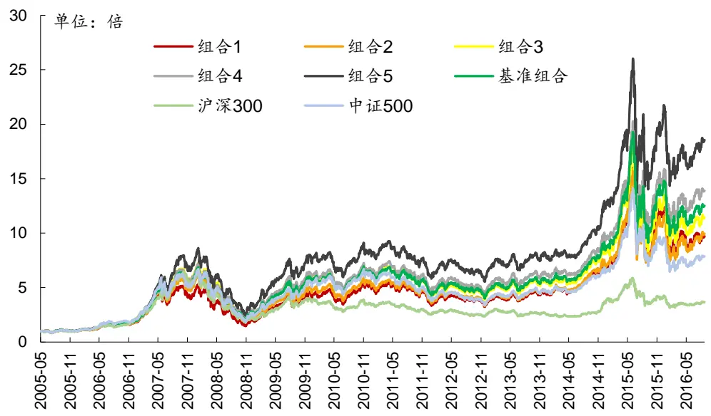
资料来源：Wind，华泰证券研究所

表格24： EV2EBITDA因子分层组合绩效分析

|  |  |  |  |  | 年化超额 收益率 | 超额收益 | 相对基准 |  | 超额收益 月胜率 最大回撤 |
| --- | --- | --- | --- | --- | --- | --- | --- | --- | --- |
| 投资组合 | 年化收益率 | 年化波动率 | 夏普比率 | 最大回撤 |  |  | 年化波动率 | 信息比率 |  |
| 组合1 | 22.87% | 35.37% | 0.65 | 72.64% | -2.28% | 6.27% | -0.36 | 45.59% | 29.93% |
| 组合2 | 23.13% | 35.80% | 0.65 | 71.69% | -2.07% | 4.12% | -0.50 | 47.79% | 26.08% |
| 组合3 | 24.73% | 35.43% | 0.70 | 71.78% | -0.80% | 3.70% | -0.22 | 49.26% | 17.75% |
| 组合4 | 26.94% | 34.83% | 0.77 | 71.96% | 0.95% | 3.90% | 0.24 | 50.74% | 7.88% |
| 组合5 | 30.31% | 34.20% | 0.89 | 71.97% | 3.63% | 5.93% | 0.61 | 51.47% | 11.75% |
| 基准组合 | 25.74% | 34.79% | 0.74 | 71.99% | 1 |  | - |  |  |

资料来源：Wind、华泰证券研究所

图54： EV2EBITDA因子分层组合滚动 12个月超额收益率
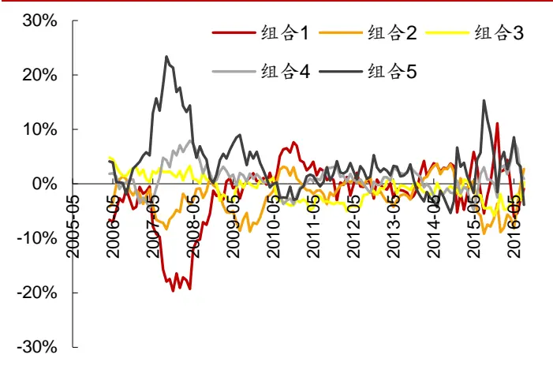
资料来源：Wind、华泰证券研究所

图55： EV2EBITDA因子多空组合月收益率及累积收益率
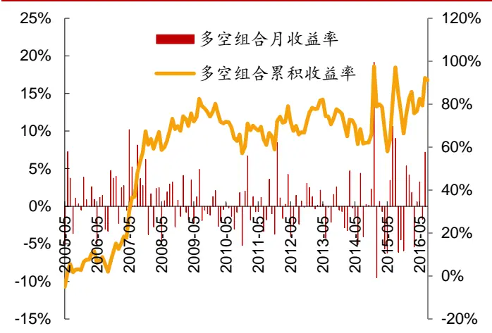
资料来源：Wind、华泰证券研究所

图56： EV2EBITDA因子分层组合绩效指标对比图示（分五层）
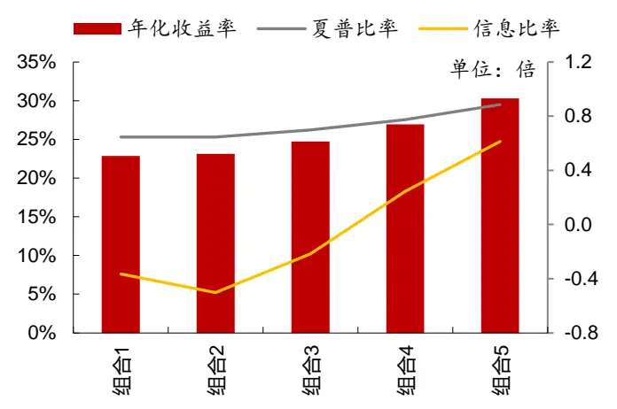
资料来源：Wind、华泰证券研究所

图57： EV2EBITDA因子分层组合绩效指标对比图示（分十层）
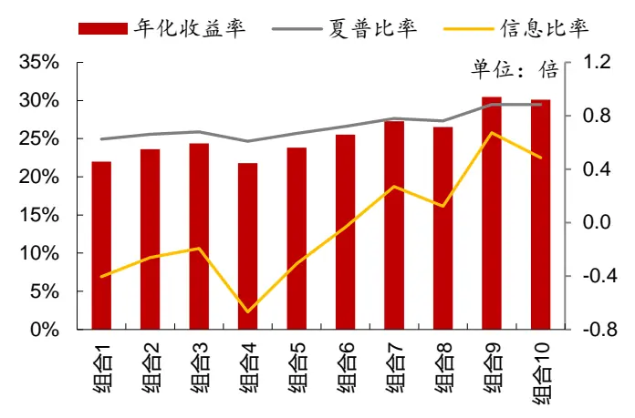
资料来源：Wind、华泰证券研究所

图58： 不同市值区间 EV2EBITDA因子分层组合绩效指标对比图示（分十层）
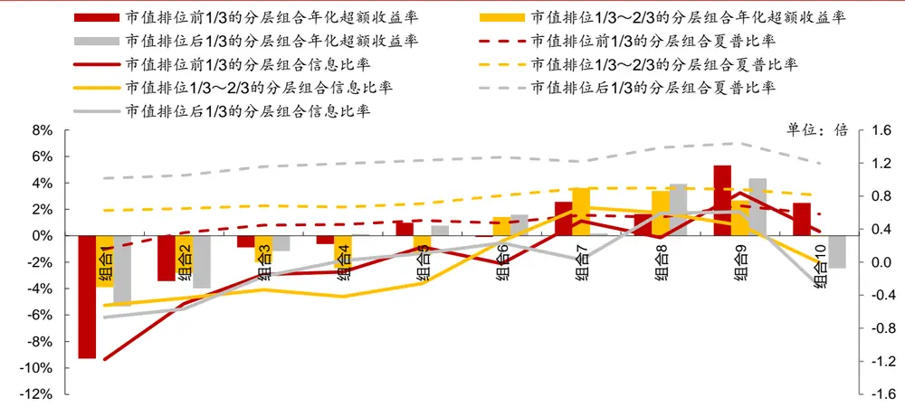
资料来源：Wind，华泰证券研究所

在图 58中，我们将全市场股票按市值排名前 1/3，1/3～2/3，后 1/3 分成三个大类，在这三类股票中分别进行分层测试（分十层），基准组合构成方法同前面所述（注意每个大类对应的基准组合并不相同）。我们发现，EV2EBITDA 因子对于这三类股票区分效果都还不错，单调性表现都比较好，只是三类股票在 EV2EBITDA后 10%的区段业绩都出现下滑。

我们在不同一级行业内部都做了分层测试（详见表 25），基准组合为各行业内 EV2EBITDA因子非空值的个股等权组合。从收益率来看，EV2EBITDA 因子在非银行金融行业中选股效果最好，组合 5年化超额收益率为 10.13%，但胜率、回撤都表现不太好，总体来看表现最好的行业是农林牧渔和通信行业。28 个一级行业中（银行行业无法计算该因子值），组合 5收益率排第一的行业为 15 个，排前二的行业为 19 个，可见 EV2EBITDA 因子在各行业中稳定性表现较好。

表格25： 不同行业 EV2EBITDA因子分层组合绩效分析

| 收益率排序与 |  |  |  |  |  |  |  |
| --- | --- | --- | --- | --- | --- | --- | --- |
|  | 组合5年化 | 组合5 | 组合5 | 组合5超额收益 | 组合 5 相对 | 所有组合年化 | 组合自身序数 |
| 行业 | 超额收益率 | 夏普比率 | 信息比率 | 最大回撤 | 基准月胜率 | 收益率排序 | 的秩相关系数 |
| 非银行金融 | 10.13% | 0.56 | 0.39 | 31.22% | 51.47% | 5,4,1,2,3 | 0.60 |
| 农林牧渔 | 9.11% | 1.21 | 0.76 | 28.09% | 55.15% | 5,4,3,1,2 | 0.90 |
| 通信 | 8.90% | 1.17 | 0.67 | 22.26% | 59.56% | 5,4,3,2,1 | 1.00 |
| 餐饮旅游 | 7.60% | 0.98 | 0.48 | 23.89% | 52.21% | 5,4,1,3,2 | 0.70 |
| 煤炭 | 6.44% | 0.48 | 0.50 | 24.35% | 51.47% | 5,2,1,4,3 | 0.20 |
| 国防军工 | 6.08% | 0.85 | 0.36 | 31.24% | 50.74% | 5,4,2,3,1 | 0.90 |
| 有色金属 | 5.63% | 0.85 | 0.45 | 20.13% | 58.09% | 5,4,2,1,3 | 0.70 |
| 房地产 | 5.31% | 0.93 | 0.57 | 22.77% | 52.21% | 5,4,3,1,2 | 0.90 |
| 机械 | 5.19% | 1.00 | 0.53 | 22.38% | 51.47% | 5,3,4,2,1 | 0.90 |
| 商贸零售 | 4.83% | 0.94 | 0.52 | 25.45% | 52.94% | 4,5,3,1,2 | 0.80 |
| 综合 | 3.70% | 0.85 | 0.22 | 24.59% | 46.32% | 5,3,1,4,2 | 0.50 |
| 电力设备 | 2.80% | 0.97 | 0.24 | 21.51% | 52.94% | 5,3,4,2,1 | 0.90 |
| 建筑 | 2.79% | 0.98 | 0.18 | 32.91% | 50.00% | 5,2,3,4,1 | 0.60 |
| 汽车 | 2.29% | 0.95 | 0.21 | 35.71% | 48.53% | 5,4,3,1,2 | 0.90 |
| 交通运输 | 2.27% | 0.65 | 0.22 | 22.76% | 43.38% | 5,2,3,4,1 | 0.60 |
| 家电 | 2.25% | 0.95 | 0.14 | 35.26% | 48.53% | 5,3,4,1,2 | 0.80 |
| 医药 | 1.37% | 0.98 | 0.16 | 33.70% | 52.21% | 4,5,3,2,1 | 0.90 |
| 纺织服装 | 1.34% | 0.83 | 0.12 | 21.70% | 52.21% | 3,5,2,4,1 | 0.50 |
| 电子元器件 | 0.70% | 0.82 | 0.07 | 26.47% | 46.32% | 4,3,5,2,1 | 0.70 |
| 食品饮料 | 0.63% | 0.84 | 0.04 | 41.55% | 45.59% | 4,3,2,5,1 | 0.40 |
| 计算机 | 0.59% | 0.88 | 0.05 | 32.19% | 39.71% | 4,3,5,2,1 | 0.70 |
| 电力及公用事业 | -0.02% | 0.67 | 0.00 | 23.32% | 50.74% | 1,2,5,4,3 | -0.60 |
| 基础化工 | -0.45% | 0.72 | -0.05 | 28.79% | 50.00% | 3,4,2,5,1 | 0.30 |
| 钢铁 | -0.49% | 0.47 | -0.04 | 29.48% | 51.47% | 1,5,3,4,2 | -0.10 |
| 传媒 | -1.18% | 0.62 | -0.07 | 55.74% | 48.53% | 4,2,3,5,1 | 0.30 |
| 建材 | -2.94% | 0.67 | -0.20 | 46.60% | 50.74% | 4,3,2,5,1 | 0.40 |
| 石油石化 | -4.02% | 0.61 | -0.22 | 54.84% | 46.32% | 3,4,2,5,1 | 0.30 |
| 轻工制造 | -6.23% | 0.52 | -0.48 | 63.80% | 40.44% | 3,4,2,1,5 | -0.10 |
| 银行 |  |  |  |  | ■ | ■ |  |

资料来源：Wind、华泰证券研究所

## PEG 因子

图 59 展示了 PEG 因子分五层回测净值曲线，其中组合 1～组合 5 为按 PEG 因子从大到小排序构造的行业中性的分层组合（构建方法参见上一章“分层模型回测”小节）。基准组合为所有分层组合中个股合并，一级行业内部个股等权配置，行业权重按当期沪深 300 行业权重配置。回测模型于每月末核算因子值，下月初调仓。

观察图 59 和表 26 可以发现，PEG 因子具备较好的选股能力。从收益率的角度来看，组合5 年化超额收益 3.41%为五组中最高；从夏普比率、信息比率的角度来看，组合 5都是最优的；从胜率的角度来看，组合 5 的胜率排名第一，但绝对数值并不大；从超额收益最大回撤的角度来看，组合 5排名第二（组合 4 排第一），PEG 因子的回撤控制与 EP、EPcut 因子差不多，比 BP、SP因子要差一些。

图 60 中展示了组合 1～组合 5 滚动 12 个月收益率曲线，图 61 展示了多空组合（做多组合5、做空组合 1）月度收益和累积收益曲线，可以发现，随时间变化，PEG 因子的累积收益曲线基本呈稳步上升态势，在 2008～2010 年以及 2014 年累积收益不多，其余时间都有稳定收益，回撤也控制得比较好，总体来看较为优秀。

图 62 是组合 1～组合 5的重要绩效指标（年化收益率、夏普比率、信息比率）对比图，同样地，我们还进行了 PEG 因子分十层回测，将重要绩效指标对比展示在图 63 中。通过以上两图可以发现，PEG 因子在单调性方面表现较好，从组合 1到组合 10绩效指标主要趋势都是向上的，存在一定波动。

图59： PEG因子分层组合回测净值
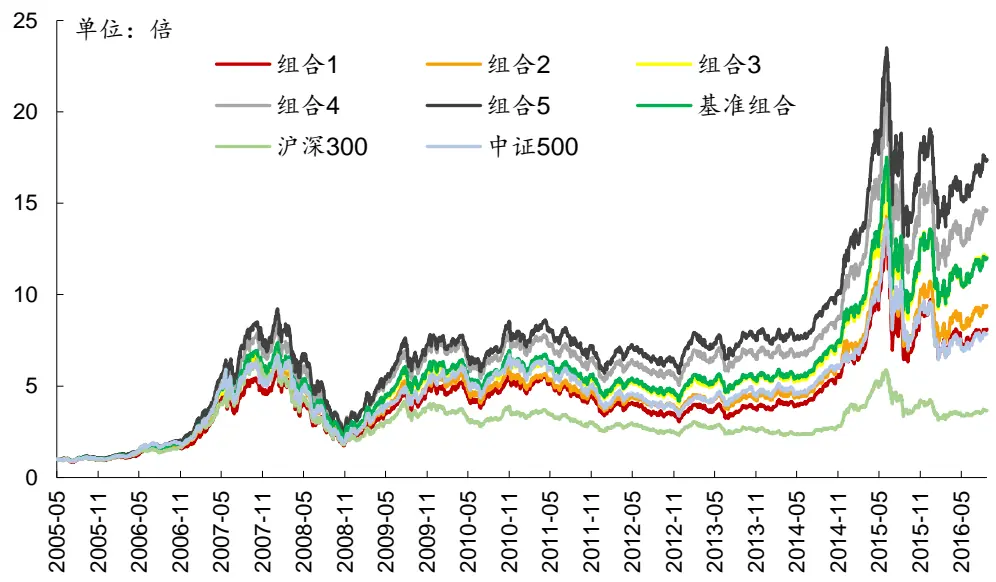
资料来源：Wind，华泰证券研究所

表格26： PEG因子分层组合绩效分析

|  |  |  |  |  | 年化超额 收益率 | 超额收益 | 相对基准 |  | 超额收益 月胜率 最大回撤 |
| --- | --- | --- | --- | --- | --- | --- | --- | --- | --- |
| 投资组合 | 年化收益率 | 年化波动率 | 夏普比率 | 最大回撤 |  |  | 年化波动率 | 信息比率 |  |
| 组合1 | 20.90% | 33.29% | 0.63 | 70.72% | -3.49% | 5.19% | -0.67 | 48.53% | 35.51% |
| 组合2 | 22.52% | 33.02% | 0.68 | 70.21% | -2.20% | 3.57% | -0.62 | 47.06% | 24.11% |
| 组合3 | 25.32% | 32.49% | 0.78 | 68.73% | 0.04% | 3.14% | 0.01 | 49.26% | 10.59% |
| 组合4 | 27.54% | 32.05% | 0.86 | 69.32% | 1.81% | 3.72% | 0.49 | 48.53% | 8.03% |
| 组合5 | 29.55% | 32.44% | 0.91 | 72.95% | 3.41% | 4.55% | 0.75 | 53.68% | 10.25% |
| 基准组合 | 25.27% | 32.40% | 0.78 | 70.37% | 1 |  | - |  |  |

资料来源：Wind、华泰证券研究所

图60： PEG因子分层组合滚动 12个月超额收益率
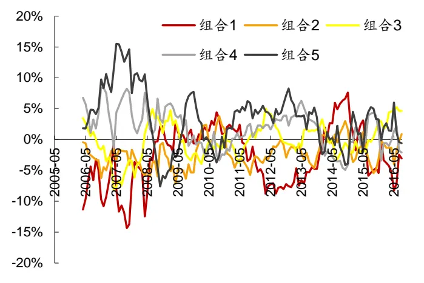
资料来源：Wind、华泰证券研究所

图61： PEG因子多空组合月收益率及累积收益率
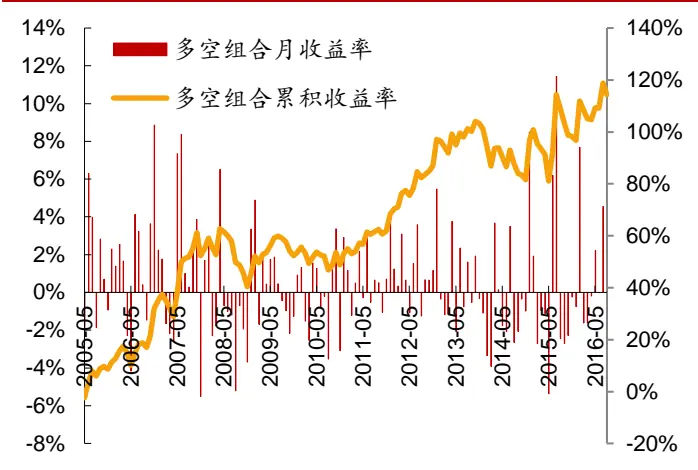
资料来源：Wind、华泰证券研究所

图62： PEG因子分层组合绩效指标对比图示（分五层）
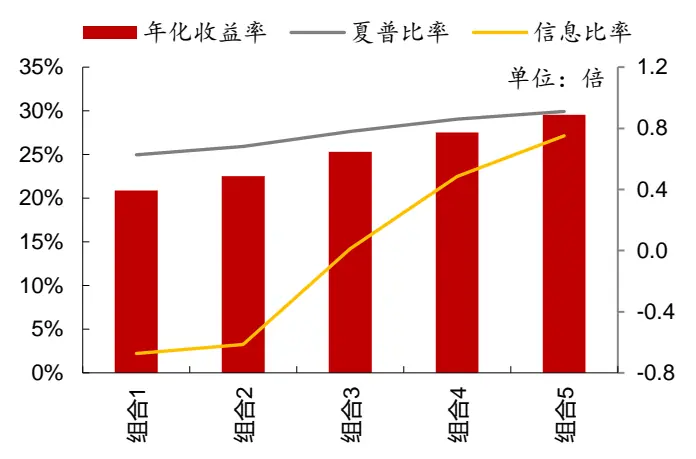
资料来源：Wind、华泰证券研究所

图63： PEG 因子分层组合绩效指标对比图示（分十层）
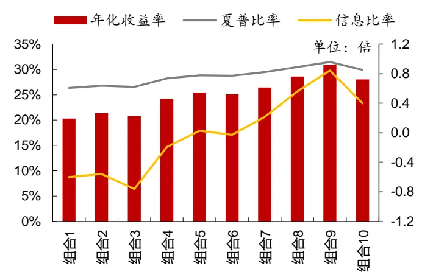
资料来源：Wind、华泰证券研究所

图64： 不同市值区间 PEG因子分层组合绩效指标对比图示（分十层）
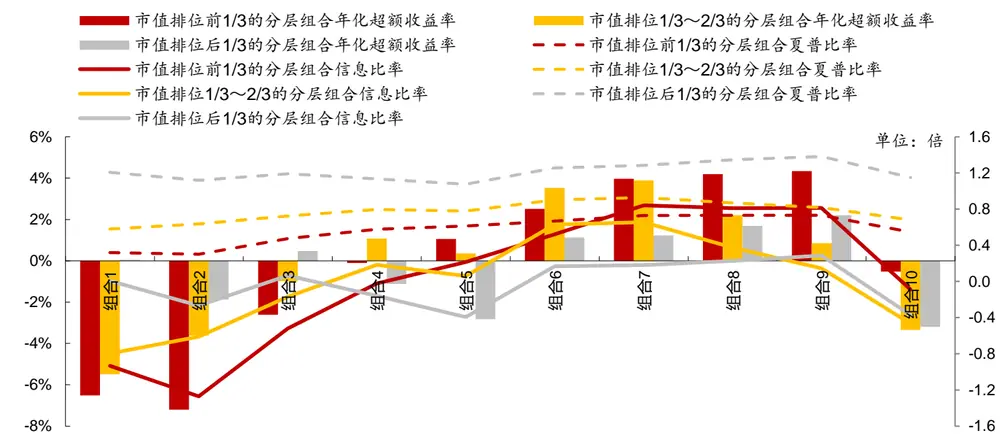
资料来源：Wind，华泰证券研究所

在图 64中，我们将全市场股票按市值排名前 1/3，1/3～2/3，后 1/3 分成三个大类，在这三类股票中分别进行分层测试（分十层），基准组合构成方法同前面所述（注意每个大类对应的基准组合并不相同）。我们发现，PEG 因子对于大市值、中等市值股票区分效果都还不错，单调性表现都比较好，只是这两类股票在PEG后10%的区段业绩指标都出现突然下滑；PEG因子对于小市值股票区分效果不佳。

我们在不同一级行业内部都做了分层测试（详见表 27），基准组合为各行业内 PEG 因子非空值的个股等权组合。从收益率来看，PEG 因子在煤炭行业中选股效果最好，组合 5 年化超额收益率为 7.62%，其次银行、机械、房地产、商贸零售行业表现也都不错。29 个一级行业中，组合 5 收益率排第一的行业为 13个，排前二的行业为 20 个，可见 PEG 因子在各行业中稳定性表现较好。

表格27： 不同行业 PEG因子分层组合绩效分析

|  | 组合5年化 | 组合5 |  | 组合5 组合5超额收益 | 组合5 相对 | 所有组合年化 | 组合自身序数 |
| --- | --- | --- | --- | --- | --- | --- | --- |
| 行业 | 超额收益率 | 夏普比率 | 信息比率 | 最大回撤 | 基准月胜率 | 收益率排序 | 的秩相关系数 |
| 煤炭 | 7.62% | 0.52 | 0.58 | 24.14% | 58.09% | 5,4,2,1,3 | 0.70 |
| 银行 | 7.25% | 0.91 | 0.48 | 36.19% | 61.03% | 5,3,4,2,1 | 0.90 |
| 机械 | 5.83% | 1.01 | 0.59 | 22.54% | 49.26% | 5,4,1,3,2 | 0.70 |
| 房地产 | 4.61% | 0.90 | 0.48 | 15.23% | 51.47% | 5,1,4,2,3 | 0.30 |
| 商贸零售 | 4.38% | 0.87 | 0.45 | 17.77% | 51.47% | 5,4,1,3,2 | 0.70 |
| 通信 | 4.36% | 1.03 | 0.29 | 30.28% | 56.62% | 5,4,3,1,2 | 0.90 |
| 建材 | 4.29% | 0.91 | 0.31 | 28.38% | 51.47% | 5,3,4,2,1 | 0.90 |
| 家电 | 4.23% | 1.01 | 0.27 | 38.28% | 50.00% | 4,5,3,2,1 | 0.90 |
| 食品饮料 | 4.15% | 0.96 | 0.30 | 44.31% | 52.21% | 5,2,3,4,1 | 0.60 |
| 纺织服装 | 4.09% | 0.92 | 0.33 | 24.90% | 49.26% | 5,2,4,3,1 | 0.70 |
| 有色金属 | 3.80% | 0.77 | 0.31 | 24.90% | 52.94% | 5,3,4,2,1 | 0.90 |
| 传媒 | 3.41% | 0.82 | 0.18 | 36.23% | 51.47% | 4,5,1,3,2 | 0.60 |
| 建筑 | 3.09% | 0.93 | 0.21 | 31.92% | 47.79% | 2,5,3,4,1 | 0.30 |
| 电力及公用事业 | 2.44% | 0.75 | 0.23 | 24.91% | 47.79% | 5,2,3,4,1 | 0.60 |
| 计算机 | 2.14% | 0.91 | 0.16 | 30.11% | 45.59% | 3,4,5,1,2 | 0.50 |
| 医药 | 1.75% | 0.99 | 0.21 | 42.88% | 50.00% | 4,5,2,3,1 | 0.80 |
| 餐饮旅游 | 1.58% | 0.74 | 0.10 | 31.22% | 51.47% | 3,2,5,4,1 | 0.20 |
| 国防军工 | 1.55% | 0.74 | 0.09 | 48.11% | 52.94% | 4,5,2,1,3 | 0.60 |
| 交通运输 | 1.48% | 0.62 | 0.13 | 34.69% | 50.00% | 5,1,4,3,2 | 0.40 |
| 汽车 | 1.20% | 0.92 | 0.10 | 29.77% | 46.32% | 3,5,4,2,1 | 0.70 |
| 非银行金融 | 0.81% | 0.63 | 0.04 | 45.45% | 50.00% | 5,4,1,2,3 | 0.60 |
| 基础化工 | 0.49% | 0.74 | 0.05 | 24.79% | 49.26% | 3,5,4,2,1 | 0.70 |
| 电子元器件 | 0.39% | 0.78 | 0.04 | 26.54% | 47.06% | 3,4,5,2,1 | 0.60 |
| 轻工制造 | -0.98% | 0.66 | -0.07 | 43.59% | 47.06% | 4,3,5,2,1 | 0.70 |
| 钢铁 | -1.93% | 0.42 | -0.15 | 36.02% | 50.74% | 3,1,5,4,2 | -0.10 |
| 电力设备 | -1.96% | 0.80 | -0.18 | 30.93% | 45.59% | 4,3,5,2,1 | 0.70 |
| 农林牧渔 | -1.97% | 0.73 | -0.16 | 39.92% | 47.06% | 4,3,5,1,2 | 0.60 |
| 石油石化 综合 | -3.16% -9.82% | 0.56 0.31 | -0.18 -0.54 | 58.08% 70.73% | 45.59% 35.29% | 3,4,1,5,2 3,1,4,2,5 | 0.10 -0.50 |

资料来源：Wind、华泰证券研究所

## 回归法测试与 IC 值分析

## 回归法测试结果分析

上一章中，我们依次展示了十个估值因子分层回测的结果，本章我们将使用回归法进行截面规律统计。回归法是多因子模型领域应用最广的方法，回归法单因子测试的结果不仅用于初步因子筛选，在后续构建收益预测模型时还会进一步应用。具体模型设置和表 28 中各指标含义参见第二章“单因子测试流程”的第一小节“回归法”。

表格28： 估值因子回归测试结果

| 因子 | It\|均值 \|t\|>2 占比 |  | t 均值 t 均值/t 标准差 |  | 因子收益率均值因子收益率序列t检验 |
| --- | --- | --- | --- | --- | --- |
| EP | 4.64 | 68.4% | 0.53 | 0.09 | 0.142% 0.96 |
| EPcut | 4.47 | 71.3% | 0.56 | 0.10 | 0.154% 1.03 |
| BP | 5.02 | 77.9% | 1.32 | 0.21 | 0.416% 2.70 |
| SP | 4.03 | 72.1% | 0.80 | 0.16 | 0.292% 2.50 |
| NCFP | 1.55 | 36.0% | 0.24 | 0.13 | 0.073% 1.59 |
| OCFP | 2.37 | 44.1% | 0.56 | 0.17 | 0.168% 2.52 |
| FCFP | 1.45 | 24.3% | 0.31 | 0.17 | 0.042% 1.12 |
| DP | 3.05 | 53.7% | 0.19 | 0.05 | 0.091% 1.05 |
| EV2EBITDA | 3.43 | 64.7% | -0.70 | -0.16 | -0.278% -2.53 |
| PEG | 2.51 | 55.1% | -0.73 | -0.24 | -0.225% -3.06 |

资料来源：Wind，华泰证券研究所

图65： 估值因子累积收益率展示一（回归法）
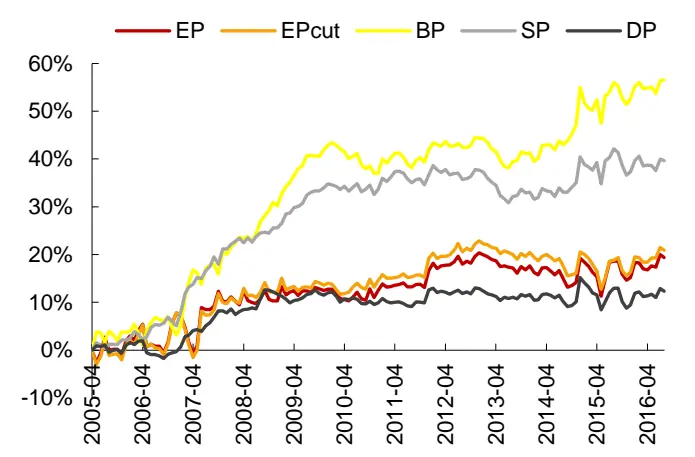
资料来源：Wind、华泰证券研究所

图66： 估值因子累积收益率展示二（回归法）
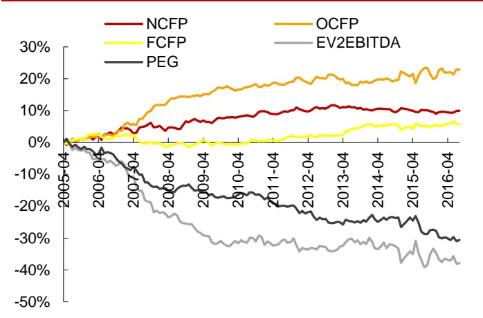
资料来源：Wind、华泰证券研究所

从上面的图表可以看出，所有估值因子中 BP因子在统计意义上效果最优，回归法得出的|t|均值为 5.02 是所有因子中最大的，其次是 EP、EPcut、SP，并且这四个因子的 t值序列中|t| > 2占比都超过 70%。接下去 EV2EBITDA、DP、PEG、OCFP 也都是比较有效的因子，而 NCFP 和 FCFP 从统计意义上效果不佳。

t 值反映的是回归参数的线性拟合优度信息。如果不管拟合优度，只看因子收益率大小的话，月均收益率绝对值超过 0.2%的因子依序为 BP、SP、EV2EBITDA、PEG。取假设检验 H：月均因子收益率显著异于 0。则假设检验 H 对应的 t 值在表 26 中最后一列，能通过该假设检验的因子除上述四个外还有 OCFP。

总体来说，BP因子表现最优秀，其次是 SP、EV2EBITDA、PEG，剩下的因子中 EP、EPcut、OCFP、DP 具有一定选股效果，而 NCFP 和 FCFP 可以排除了。

## 因子 IC值的计算与分析

在回归法因子测试完成之后，我们还将进行因子 IC 值的计算与分析。具体计算方法详见第二章“单因子测试流程”的第二小节“因子 IC 值的计算”。

表 29 中 IR 比率是指因子 IC 值均值与标准差的比值的绝对值，能够衡量因子有效性，根据计算结果，OCFP、PEG、EV2EBITDA、DP、SP、BP 因子的效果比较好，从 IC 序列均值的角度看，EPcut、EP 的效果也还不错，剩下的 NCFP 和 FCFP 效果一般，这与回归法的结果是一致的。

我们仿照回归法分析过程，画出各因子 IC 值累积曲线，可以从图中观察估值因子在各段历史时期的表现。

表格29： 估值因子 IC值分析

| 因子 | IC 序列均值 | 直IC 序列标准差 | IR 比率 | IC>0 占比 | \|IC\|>0.02 占比 |
| --- | --- | --- | --- | --- | --- |
| EP | 2.11% | 7.96% | 0.265 | 55.88% | 69.85% |
| EPcut | 2.21% | 7.74% | 0.285 | 61.76% | 74.26% |
| BP | 2.80% | 8.39% | 0.334 | 58.82% | 85.29% |
| SP | 2.29% | 6.56% | 0.350 | 61.03% | 75.74% |
| NCFP | 0.61% | 3.69% | 0.166 | 58.09% | 55.15% |
| OCFP | 1.71% | 3.24% | 0.526 | 69.85% | 55.15% |
| FCFP | 0.47% | 2.72% | 0.174 | 58.82% | 51.47% |
| DP | 1.64% | 4.39% | 0.372 | 66.18% | 64.71% |
| EV2EBITDA | -2.34% | 6.30% | 0.372 | 36.76% | 79.41% |
| PEG | -1.77% | 4.58% | 0.386 | 36.76% | 74.26% |

资料来源：Wind，华泰证券研究所

图67： 因子 IC值累积曲线展示一
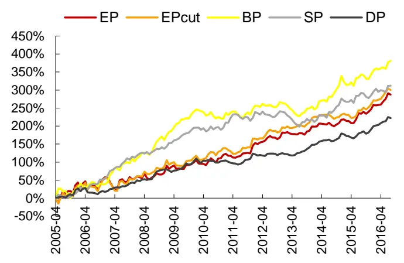
资料来源：Wind、华泰证券研究所

图68： 因子 IC值累积曲线展示二
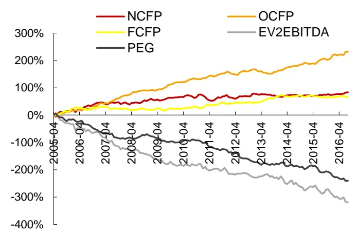
资料来源：Wind、华泰证券研究所

## 估值因子效果对比总结

我们将分层测试的结果汇总在表 30中，注意，TOP组合对 EV2EBITDA、PEG 因子指分五层组合中的组合 5，对其余八个因子指分五层组合中的组合 1。对于 TOP 组合表现来说，BP、OCFP、SP、NCFP因子在收益、信息比率角度较优秀，BP、DP、OCFP 因子在回撤角度较优秀，NCFP 因子在胜率角度较优秀；对于多空组合表现来说，BP 因子十分突出，其次是 NCFP、OCFP、FCFP、PEG、SP 因子。

我们将回归法测试和 IC值分析的结果汇总在表 31中。我们发现在统计意义下 NCFP、FCFP效果不佳可以删去，其中 NCFP 因子在分层测试中发现适于精选因子排名前 20%的股票，效果突出。

综上，基本可以判定 BP 因子是估值类因子中表现最好的，其余因子各具特点、互有优劣，我们将在后续报告中深入探讨如何在大类因子中进行因子精选并赋予合适权重从而构造优秀的风格因子，敬请关注。

表格30： 估值因子分层测试汇总对比分析

|  | TOP 组合 TOP 组合 TOP 组合 TOP 组合 |  |  |  | TOP 组合相对 | 多空组合 | 多空组合 |  | 多空组合多空组合 | 因子 |
| --- | --- | --- | --- | --- | --- | --- | --- | --- | --- | --- |
| 因子 | 年化收益率 | 夏普比率 | 信息比率 | 最大回撤 | 基准月胜率年化收益率 |  | 夏普比率 | 最大回撤 | 月胜率 | 单调性 |
| EP | 29.78% | 0.92 | 0.60 | 72.28% | 52.94% | 4.38% | 0.31 | 18.00% | 51.47% | 中间底部 |
| EPcut | 28.72% | 0.89 | 0.48 | 71.42% | 47.06% | 6.08% | 0.46 | 15.74% | 52.94% | 较好 |
| BP | 33.70% | 1.04 | 1.35 | 64.62% | 55.88% | 13.95% | 1.07 | 14.56% | 56.62% | 好 |
| SP | 30.18% | 0.94 | 0.81 | 70.57% | 55.15% | 6.41% | 0.63 | 13.64% | 53.68% | 好 |
| NCFP | 30.58% | 0.92 | 1.10 | 71.12% | 63.24% | 6.59% | 0.84 | 7.32% | 57.35% | 中间底部 |
| OCFP | 31.46% | 0.97 | 1.07 | 69.47% | 58.82% | 6.49% | 0.74 | 9.90% | 54.41% | 较好 |
| FCFP | 30.57% | 0.89 | 0.60 | 72.13% | 55.15% | 7.24% | 0.75 | 19.27% | 62.50% | 好 |
| DP | 27.39% | 0.87 | 0.46 | 67.87% | 52.21% | 4.49% | 0.46 | 14.86% | 50.00% | 较好 |
| EV2EBITDA | 30.31% | 0.89 | 0.61 | 71.97% | 51.47% | 5.89% | 0.44 | 20.07% | 54.41% | 好 |
| PEG | 29.55% | 0.91 | 0.75 | 72.95% | 53.68% | 6.96% | 0.67 | 13.67% | 51.47% | 好 |

资料来源：Wind、华泰证券研究所

表格31： 估值因子回归法测试及 IC值汇总对比分析

|  |  |  |  |  | 因子收益率因子收益率 | IC序列 均值 | IC 序列 标准差 | IR 比率 | IC>0 占比 |
| --- | --- | --- | --- | --- | --- | --- | --- | --- | --- |
| 因子 | It\|均值 | \|t\|>2 占比 | t 均值/t 标准差 | 均值序列 t检验 |  |  |  |  |  |
| EP | 4.64 | 68.4% | 0.09 | 0.142% | 0.96 | 2.11% | 7.96% | 0.265 | 55.88% |
| EPcut | 4.47 | 71.3% | 0.10 | 0.154% | 1.03 | 2.21% | 7.74% | 0.285 | 61.76% |
| BP | 5.02 | 77.9% | 0.21 | 0.416% | 2.70 | 2.80% | 8.39% | 0.334 | 58.82% |
| SP | 4.03 | 72.1% | 0.16 | 0.292% | 2.50 | 2.29% | 6.56% | 0.350 | 61.03% |
| NCFP | 1.55 | 36.0% | 0.13 | 0.073% | 1.59 | 0.61% | 3.69% | 0.166 | 58.09% |
| OCFP | 2.37 | 44.1% | 0.17 | 0.168% | 2.52 | 1.71% | 3.24% | 0.526 | 69.85% |
| FCFP | 1.45 | 24.3% | 0.17 | 0.042% | 1.12 | 0.47% | 2.72% | 0.174 | 58.82% |
| DP | 3.05 | 53.7% | 0.05 | 0.091% | 1.05 | 1.64% | 4.39% | 0.372 | 66.18% |
| EV2EBITDA | 3.43 | 64.7% | -0.16 | -0.278% | -2.53 | -2.34% | 6.30% | 0.372 | 36.76% |
| PEG | 2.51 | 55.1% | -0.24 | -0.225% | -3.06 | -1.77% | 4.58% | 0.386 | 36.76% |

资料来源：Wind、华泰证券研究所

## 免责申明

本报告仅供华泰证券股份有限公司（以下简称“本公司”）客户使用。本公司不因接收人收到本报告而视其为客户。

本报告基于本公司认为可靠的、已公开的信息编制，但本公司对该等信息的准确性及完整性不作任何保证。本报告所载的意见、评估及预测仅反映报告发布当日的观点和判断。在不同时期，本公司可能会发出与本报告所载意见、评估及预测不一致的研究报告。同时，本报告所指的证券或投资标的的价格、价值及投资收入可能会波动。本公司不保证本报告所含信息保持在最新状态。本公司对本报告所含信息可在不发出通知的情形下做出修改，投资者应当自行关注相应的更新或修改。

本公司力求报告内容客观、公正，但本报告所载的观点、结论和建议仅供参考，不构成所述证券的买卖出价或征价。该等观点、建议并未考虑到个别投资者的具体投资目的、财务状况以及特定需求，在任何时候均不构成对客户私人投资建议。投资者应当充分考虑自身特定状况，并完整理解和使用本报告内容，不应视本报告为做出投资决策的唯一因素。对依据或者使用本报告所造成的一切后果，本公司及作者均不承担任何法律责任。任何形式的分享证券投资收益或者分担证券投资损失的书面或口头承诺均为无效。

本公司及作者在自身所知情的范围内，与本报告所指的证券或投资标的不存在法律禁止的利害关系。在法律许可的情况下，本公司及其所属关联机构可能会持有报告中提到的公司所发行的证券头寸并进行交易，也可能为之提供或者争取提供投资银行、财务顾问或者金融产品等相关服务。本公司的资产管理部门、自营部门以及其他投资业务部门可能独立做出与本报告中的意见或建议不一致的投资决策。

本报告版权仅为本公司所有。未经本公司书面许可，任何机构或个人不得以翻版、复制、发表、引用或再次分发他人等任何形式侵犯本公司版权。如征得本公司同意进行引用、刊发的，需在允许的范围内使用，并注明出处为“华泰证券研究所”，且不得对本报告进行任何有悖原意的引用、删节和修改。本公司保留追究相关责任的权力。所有本报告中使用的商标、服务标记及标记均为本公司的商标、服务标记及标记。

本公司具有中国证监会核准的“证券投资咨询”业务资格，经营许可证编号为：Z23032000。◎版权所有 2016 年华泰证券股份有限公司

## 评级说明

| 行业评级体系 |
| --- |
| -报告发布日后的6个月内的行业涨跌幅相对同期的沪深300指 数的涨跌幅为基准； |
| -投资建议的评级标准 |
| 增持行业股票指数超越基准 |
| 中性行业股票指数基本与基准持平 |
| 减持行业股票指数明显弱于基准 |

| 公司评级体系 |
| --- |
| -报告发布日后的6个月内的公司涨跌幅相对同期的沪深300指数的涨跌幅为基准；-投资建议的评级标准 |
| 买入股价超越基准 20%以上 |
| 增持股价超越基准 5%-20% |
| 中性股价相对基准波动在-5%~5%之间 |
| 减持股价弱于基准 5%-20% |
| 卖出股价弱于基准20%以上 |

## 华泰证券研究

## 南京

南京市建邺区江东中路228号华泰证券广场1号楼/邮政编码：210019

电话：86 25 83389999 /传真：86 25 83387521

电子邮件：ht-rd@htsc.com

## 深圳

深圳市福田区深南大道4011号香港中旅大厦24层/邮政编码：518048

电话：86 755 82493932 /传真：86 755 82492062

电子邮件：ht-rd@htsc.com

## 北京

北京市西城区太平桥大街丰盛胡同28号太平洋保险大厦A座18层邮政编码：100032

电话：86 10 63211166/传真：86 10 63211275

电子邮件：ht-rd@htsc.com

## 上海

上海市浦东新区东方路18号保利广场E栋23楼/邮政编码：200120

电话：86 21 28972098 /传真：86 21 28972068

电子邮件：ht-rd@htsc.com