## 金工研究/深度研究

2017年01月09日

林晓明 执业证书编号：S0570516010001

研究员 0755-82080134

linxiaoming@htsc.com

陈烨 010-56793927

联系人 chenye@htsc.com

# 华泰单因子测试之换手率类因子

待测因子：近 N个月每日换手率均值、标准差，及衍生的换手率乖离率等换手率因子是一类非常重要的风格因子，本报告中我们选取了十二个具有代表性的换手率因子进行测试，包括 turn_Nm（个股最近 N 个月日均换手率，N=1、3、6），bias_turn_Nm（个股最近 N 个月日均换手率除以最近两年日均换手率再减 1，N=1、3、6），std_turn_Nm（个股最近 N 个月的日换手率序列标准差，N=1、3、6），bias_std_turn_Nm（个股最近 N 个月的日换手率序列标准差除以最近两年的日换手率序列标准差再减 1，N=1、3、6）。经实证检验，四类因子各具特点。

## 换手率因子总体与市值因子呈负相关，各因子两两间正相关性很强

因市值较大的公司一般换手率不高，所以日均换手率、换手率序列标准差因子与市值因子间呈一定负相关性。经实证检验，两种衍生的换手率乖离率因子与市值因子相关性较小。各换手率因子两两之间普遍具有比较强的正相关性，与之前测试过的估值、成长、动量类因子对比，相关性显得更加突出。如果要组合使用各换手率因子构建选股模型，需要小心处理多重共线性问题。

## 单因子测试框架：分层回测、回归法、因子 IC值分析

首先，我们对各换手率因子依次进行详细的分层模型回测，分析各分层组合的业绩表现和多空组合的表现，判别因子区分度、单调性、稳定性和在不同规模公司、不同一级行业间的业绩强弱。接下来我们使用回归法进行因子测试，对因子收益率序列和回归产生的 t 值序列进行统计层面上的分析。我们还计算了各因子的 IC 值序列、IR比率，综合识别有效因子。

## 测试结果：传统换手率 IC值表现佳，而换手率乖离率分层测试效果好

从分层测试的结果来看，bias_turn_1m、bias_std_turn_1m 因子各方面都表现出众，而 turn_1m、std_turn_1m 因子单调性不佳。但从回归测试的因子收益率表现和 IC 值均值、IR 比率等角度来看，turn_1m、std_turn_1m因子效果更好一些，与分层测试的结果略有出入。如果将回归方式由WLS（流通市值平方根加权）改成 OLS，则 bias_turn_1m、bias_std_turn_1m因子效果又会强于 turn_1m、std_turn_1m 因子，这从一定程度上说明前者在大市值股票中失效程度更高。综合之前单因子测试报告的结果来看，换手率因子的效果比估值、成长因子强一些，但比动量因子稍弱。

## 换手率因子可考虑采用更短的样本期

我们对动量类和换手率类因子进行了样本期长度的敏感性测试，发现对换手率类因子来说，用 5 天左右长度的样本期能使回归测试中因子收益率以及 IC 值均值、IR 比率达到最佳。但对于动量类因子，样本期长度在 21～33 天附近变动时，因子会有较好表现。因此，动量因子取 1个月左右样本期比较合适，换手率因子或可考虑采用更短的样本期。

风险提示：单因子测试结果是历史经验的总结，存在失效的可能。

## 换手率因子在 A股市场实证分析

## 换手率因子的选取及测试框架

本文是我们的多因子系列研究第五篇，是单因子测试系列的第四篇，在多因子系列首篇报告中，我们系统地阐述了多因子模型的基本理论，详细描述了多因子模型构建的流程，从多因子系列第二篇报告开始，我们对不同的风格因子单独进行详细的研究和检验，通过综合对比评价，筛选出能持续获得稳健收益的优质因子，这正是构建多因子选股模型的关键一步。在首篇报告中我们共列出了十二类风格因子：估值因子（Value Factor）、成长因子（Growth Factor）、财务质量因子（Financial Quality Factor）、杠杆因子（Leverage Factor）、规模因子（Size Factor）、动量因子（Momentum Factor）、波动率因子（Volatility Factor）、换手率因子（Turnover Factor）、改进的动量因子（Modified Momentum Factor）、分析师情绪因子（Sentiment Factor）、股东因子（Shareholder Factor）和技术因子（TechnicalFactor），在前三篇单因子测试报告中，我们对估值、成长、动量以及改进的动量类因子进行了详细的测试分析，在本文中，我们将主要针对换手率类因子进行分析，找出其在二级市场不同行业、不同规模上市公司中的分布规律，并通过分层回测、回归法、计算因子 IC值等测试因子有效性。

换手率类因子主要反映的是过去一段时间内资产的流通性强弱，是一类非常重要的风格因子。本报告中将测试的因子详细列表如下：

图表1： 华泰单因子测试—换手率因子及其描述

| 大类因子 | 具体因子 | 因子描述 |
| --- | --- | --- |
| 换手率因子 (Turnover Factor) | turn_1m turn_3m turn_6m | 个股最近N个月内日均换手率 N=1,3, 6 |
|  | bias_turn_1m bias_turn_3m bias_turn_6m | 个股最近N个月内日均换手率除以最近2年内日均换手率，再减去1 N=1, 3, 6 |
|  | std_turn_1m std_turn_3m std_turn_6m | 个股最近N个月内日换手率序列的标准差 N=1,3, 6 |
|  | bias_std_turn_1m bias_std_turn_3m bias_std_turn_6m | 个股最近N个月内日换手率序列的标准差除以最近 2年内日换手率序列的标准差，再减去1 N=1, 3, 6 |

资料来源：Wind，华泰证券研究所

如果某只股票在过去一段时间的换手率明显高于同类型股票的平均水平，则该股票可能是近期资金追逐的热门股，虽然流动性强，但风险也会相对较高。在本报告中，我们第一步将先观察换手率因子在 A股市场的分布规律，通过分析换手率因子在不同行业及不同规模上市公司间的差异，判断在单因子回归测试中是否应该处理行业、规模因素的影响。第二步我们将建立分层模型进行回测，详细观察因子区分度、单调性等规律。第三步我们将使用回归法进行单因子测试，结合因子 IC 值分析，选出有效且稳健的因子。第四步，根据以上分析结果进行对比总结，探讨各因子的特点和优劣。

图表2： 换手率因子分析测试框架
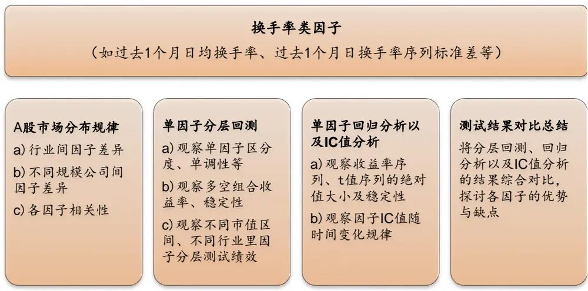
资料来源：华泰证券研究所

## 换手率因子的行业间差异

换手率因子在不同行业间存在显著差异。例如，计算机行业当前具有较高的日均换手率，但其日均换手率乖离率却处于低位；钢铁行业当前日均换手率不高，但其日均换手率乖离率比较大。不同行业间因子值差异十分显著，故对上市公司直接进行跨行业比较意义不大。我们选取 turn_1m、bias_turn_1m、std_turn_1m、bias_std_turn_1m 作为换手率因子的代表（因子具体定义见图表 1），计算它们在 2016/12/30 收盘时各一级行业的中位数分布规律，如下图所示。

图表3： 各一级行业 turn_1m、bias_turn_1m、std_turn_1m、bias_std_turn_1m 中位数比较（2016/12/30）
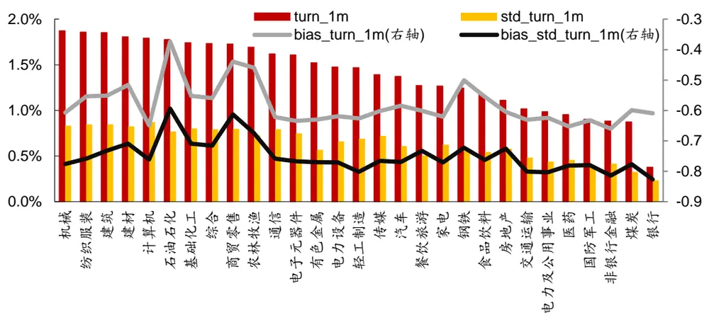
资料来源：Wind，华泰证券研究所

上图说明了，在同一时间点，不同行业间换手率因子的水平存在明显差异。事实上，随时间变化，同一行业的换手率因子的绝对大小和与其他行业对比的相对大小也在不断变化中。以 turn_1m 为例，在 2006 年至 2016 年间，每年末行业因子值在所有 29 个一级行业中的排位变化如下表所示。可以看出，同估值、成长等因子类似，换手率因子在 A股市场也存在比较明显的行业轮动现象，比如非银行金融行业在不同年份间换手率排名变化很大，计算机行业从 2009 年开始换手率一直较高；同时，也存在一些行业的换手率排名一直比较稳定，如银行行业一直换手率较低。行业换手率年份间的波动，一般是当时政治、金融环境等多重因素影响的结果。

图表4： 各一级行业 turn_1m中位数在不同年份的行业间相对排名

| 行业 | 2006 | 2007 | 2008 | 2009 | 2010 | 2011 | 2012 | 2013 | 2014 | 2015 | 2016 |
| --- | --- | --- | --- | --- | --- | --- | --- | --- | --- | --- | --- |
| 机械 | 15 | 19 | 6 | 6 | 3 | 7 | 6 | 7 | 7 | 6 | 1 |
| 纺织服装 | 22 | 14 | 12 | 9 | 17 | 25 | 17 | 12 | 26 | 12 | 2 |
| 建筑 | 8 | 17 | 23 | 2 | 10 | 15 | 2 | 18 | 3 | 22 | 3 |
| 建材 | 7 | 15 | 3 | 8 | 1 | 2 | 1 | 10 | 9 | 8 | 4 |
| 计算机 | 27 | 24 | 22 | 7 | 7 | 4 | 5 | 2 | 4 | 1 | 5 |
| 石油石化 | 26 | 23 | 26 | 26 | 15 | 23 | 24 | 19 | 29 | 21 | 6 |
| 基础化工 | 25 | 7 | 5 | 18 | 12 | 9 | 15 | 8 | 24 | 9 | 7 |
| 综合 | 23 | 13 | 18 | 19 | 22 | 8 | 22 | 13 | 6 | 4 | 8 |
| 商贸零售 | 21 | 20 | 27 | 21 | 25 | 21 | 27 | 21 | 25 | 17 | 9 |
| 农林牧渔 | 4 | 2 | 1 | 4 | 9 | 10 | 3 | 9 | 23 | 13 | 10 |
| 通信 | 2 | 4 | 13 | 5 | 11 | 6 | 13 | 3 | 11 | 2 | 11 |
| 电子元器件 | 13 | 18 | 15 | 1 | 2 | 3 | 4 | 6 | 18 | 3 | 12 |
| 有色金属 | 5 | 10 | 10 | 13 | 8 | 12 | 16 | 24 | 10 | 10 | 13 |
| 电力设备 | 20 | 9 | 11 | 12 | 5 | 5 | 9 | 11 | 12 | 11 | 14 |
| 轻工制造 | 6 | 5 | 14 | 15 | 14 | 17 | 14 | 16 | 14 | 5 | 15 |
| 传媒 | 16 | 3 | 9 | 16 | 6 | 1 | 8 | 1 | 13 | 7 | 16 |
| 汽车 | 11 | 26 | 21 | 14 | 19 | 19 | 20 | 14 | 21 | 14 | 17 |
| 餐饮旅游 | 12 | 12 | 2 | 10 | 18 | 22 | 26 | 23 | 22 | 15 | 18 |
| 家电 | 28 | 27 | 25 | 23 | 13 | 11 | 18 | 4 | 20 | 16 | 19 |
| 钢铁 | 9 | 11 | 19 | 27 | 24 | 24 | 25 | 27 | 17 | 26 | 20 |
| 食品饮料 | 3 | 6 | 20 | 25 | 21 | 18 | 12 | 20 | 27 | 18 | 21 |
| 房地产 | 14 | 21 | 16 | 17 | 20 | 26 | 11 | 25 | 15 | 19 | 22 |
| 交通运输 | 10 | 28 | 28 | 20 | 28 | 28 | 29 | 26 | 8 | 25 | 23 |
| 电力及公用事业 | 24 | 25 | 24 | 24 | 23 | 16 | 23 | 22 | 2 | 24 | 24 |
| 医药 | 19 | 8 | 17 | 22 | 16 | 14 | 21 | 17 | 28 | 20 | 25 |
| 国防军工 | 17 | 1 | 4 | 11 | 4 | 13 | 10 | 5 | 5 | 27 | 26 |
| 非银行金融 | 18 | 16 | 7 | 3 | 27 | 27 | 7 | 15 | 1 | 23 | 27 |
| 煤炭 | 1 | 22 29 | 8 29 | 28 29 | 26 29 | 20 29 | 19 28 | 28 29 | 16 19 | 28 29 | 28 29 |
| 银行 | 29 |  |  |  |  |  |  |  |  |  |  |

资料来源：Wind，华泰证券研究所

## 换手率因子与市值因子的相关性

除去行业对因子存在较大影响外，上市公司的规模也是对各大类因子产生作用的潜在因素。我们在前三篇单因子测试报告中对估值、成长、动量类因子进行了详细分析，发现市值因子与大部分估值、动量类因子具有一定相关性，但是与成长类因子间相关性不大。这里面的逻辑也是比较明晰的，因为估值因子的计算公式里包含了总市值因素，动量因子与市值因子的相关性反映的就是市值因子本身的 IC 值（2007 年之后一直是小盘股占上风），而成长因子完全由财报信息计算而得，与市值因子相关性较低。对于本报告中涉及的换手率类因子，由于大盘股一般换手率较小，所以猜测是负向关系。下面我们将进行详细计算。

图表5： 各换手率因子与市值因子之间相关系数

| 因子 | 2006 | 2007 | 2008 | 2009 | 2010 | 2011 | 2012 | 2013 | 2014 | 2015 | 2016 | 均值 |
| --- | --- | --- | --- | --- | --- | --- | --- | --- | --- | --- | --- | --- |
| turn_1m |  |  |  |  |  |  |  |  | 0.011-0.029 -0.101-0.072 -0.056-0.042 -0.071-0.082-0.037-0.141-0.084-0.064 |  |  |  |
| turn_3m |  |  |  |  |  |  | 0.017 0.002 -0.080-0.083 -0.070-0.051-0.073 -0.096-0.079 -0.155 -0.104 -0.070 |  |  |  |  |  |
| turn_6m |  |  |  |  | 0.012-0.014 -0.072-0.079-0.072-0.056-0.076-0.103-0.104-0.150-0.112-0.075 |  |  |  |  |  |  |  |
| bias_turn_1m | -0.025-0.046-0.086-0.073-0.064-0.016 |  |  |  |  |  |  |  |  |  |  | 0.045-0.006 0.397-0.104-0.027 0.000 |
| bias_turn_3m |  |  |  |  | -0.0120.024-0.050-0.121-0.063-0.041 |  |  | 0.017-0.016 |  |  |  | 0.261-0.142-0.082-0.021 |
| bias_turn_6m |  |  |  |  |  |  |  |  |  |  |  | -0.036-0.008-0.052 -0.084-0.109-0.070-0.006-0.010 0.143-0.080-0.129-0.040 |
| std_turn_1m |  |  |  |  |  |  |  |  |  |  |  | -0.003-0.026-0.098-0.073-0.060-0.040-0.073-0.084-0.055-0.109-0.065-0.062 |
| std_turn_3m |  |  |  |  |  |  |  |  |  |  |  | 0.026 0.045-0.096-0.082-0.071-0.056-0.078-0.100-0.049-0.128-0.085-0.061 |
| std_turn_6m |  |  |  |  |  |  |  |  |  |  |  | 0.032 0.029 -0.076-0.078 -0.070-0.064 -0.081-0.107-0.067-0.121-0.093-0.063 |
| bias_std_turn_1m | -0.046-0.068-0.091-0.062 -0.064-0.010 |  |  |  |  |  | 0.079 | 0.039 |  |  |  | 0.145-0.084-0.047-0.019 |
| bias_std_turn_3m | -0.011 0.031-0.092 -0.115 -0.033 -0.048 |  |  |  |  |  | 0.050 | 0.001 |  |  |  | 0.204-0.125-0.094-0.021 |
| bias_std_turn_6m | -0.003-0.007-0.087-0.058-0.059-0.080 |  |  |  |  |  | 0.007 | 0.024 |  |  |  | 0.163-0.005-0.133-0.022 |

资料来源：Wind，华泰证券研究所

我们针对图表 1 中列出的十二个因子，详细计算了它们从 2006 年到 2016 年（在每年最后一个交易日核算）与市值因子之间的相关系数，见上表。经观察发现，换手率类因子确实与市值因子间呈负相关关系，尤其是日均换手率和日换手率序列标准差。对于换手率衍生的乖离率类因子，其与市值因子的相关性比较小。

## 换手率因子间相关性分析

在本章前两个小节中，我们分析了换手率因子在不同行业的分布差异性及换手率因子与市值因子的相关性，接下来，我们将计算各换手率因子之间的相关性。假设因子 A和 B之间的月度相关系数序列为{CorrAB}，其中 $Corr_{i}^{AB}$ 是在第i个月月末这一截面上因子 A、B在所有个股上的因子暴露度的相关系数，我们构造了一个相关强度指标：

$$
C_{AB}=\frac{mean(Corr_{i}^{AB}|i=1,\ldots,N)}{std(Corr_{i}^{AB}|i=1,\ldots,N)}
$$

该指标结合了因子平均相关系数和相关系数的稳定性，能够综合反映因子之间的相关情况。我们分别计算各因子两两之间在过去 36 个月（2014 年 1 月到 2016 年 12 月）内的相关强度指标，如图表 6 所示。计算过程中涉及的相关系数均值和方差详细展示在图表 7 和 8中。通过观察可以发现，各换手率因子两两之间普遍具有非常强的正相关性，与之前测试过的估值、成长、动量类因子对比，相关性显得更加突出。如果要组合使用各换手率因子构建选股模型，需要注意处理多重共线性问题。

图表6： 各换手率因子间相关强度（近 36个月）

| bias_ |  |  |  |  | bias | bias | std_ | std_ |  | std_bias_std_bias_std_bias_std_ |  |  |
| --- | --- | --- | --- | --- | --- | --- | --- | --- | --- | --- | --- | --- |
|  | turn_1m turn_3m turn_6m turn_1m |  |  |  | turn_3m turn_6m turn_1m turn_3m |  |  |  | turn_6m | turn_1m | turn_3m | turn_6m |
| turn_1m |  | 27.70 | 15.80 | 1.96 | 1.35 | 0.91 | 17.01 | 20.29 | 16.48 | 2.25 | 2.04 | 1.59 |
| turn_3m | 27.70 |  | 52.80 | 1.01 | 1.30 | 0.95 | 12.15 | 21.90 | 27.23 | 0.99 | 1.68 | 1.49 |
| turn_6m | 15.80 | 52.80 |  | 0.35 | 0.58 | 0.82 | 9.95 | 21.94 | 34.41 | 0.24 | 0.70 | 1.14 |
| bias_turn_1m | 1.96 | 1.01 | 0.35 |  | 14.76 | 7.87 | 1.87 | 1.17 | 0.59 | 9.50 | 9.78 | 8.90 |
| bias_turn_3m | 1.35 | 1.30 | 0.58 | 14.76 |  | 19.96 | 1.30 | 1.26 | 0.72 | 7.39 | 9.63 | 11.76 |
| bias_turn_6m | 0.91 | 0.95 | 0.82 | 7.87 | 19.96 |  | 0.93 | 0.95 | 0.83 | 5.58 | 8.32 | 10.20 |
| std_turn_1m | 17.01 | 12.15 | 9.95 | 1.87 | 1.30 | 0.93 |  | 18.89 | 11.88 | 4.21 | 3.09 | 2.40 |
| std_turn_3m | 20.29 | 21.90 | 21.94 | 1.17 | 1.26 | 0.95 | 18.89 |  | 25.35 | 1.84 | 3.07 | 2.53 |
| std_turn_6m | 16.48 | 27.23 | 34.41 | 0.59 | 0.72 | 0.83 | 11.88 | 25.35 |  | 0.73 | 1.41 | 2.13 |
| bias_std_turn_1m | 2.25 | 0.99 | 0.24 | 9.50 | 7.39 | 5.58 | 4.21 | 1.84 | 0.73 |  | 8.66 | 6.89 |
| bias_std_turn_3m | 2.04 | 1.68 | 0.70 | 9.78 | 9.63 | 8.32 | 3.09 | 3.07 | 1.41 | 8.66 |  | 12.35 |
| bias_std_turn_6m | 1.59 | 1.49 | 1.14 | 8.90 | 11.76 | 10.20 | 2.40 | 2.53 | 2.13 | 6.89 | 12.35 |  |

资料来源：Wind，华泰证券研究所

图表 7和图表 8分别反映因子两两之间相关系数的平均大小和相关系数稳定性，能在图表6 数据之外提供一些补充信息。

图表7： 各换手率因子间月度相关系数序列均值（近 36个月）

| bias_ |  |  |  |  | bias_ | bias_ | std_ | std_ | std_bias_std_bias_std_bias_std_ |  |  | turn_6m |
| --- | --- | --- | --- | --- | --- | --- | --- | --- | --- | --- | --- | --- |
|  | turn_1m turn_3m turn_6m turn_1m |  |  |  |  |  |  |  | turn_3m turn_6m turn_1m turn_3m turn_6m | turn_1m | turn_3m |  |
| turn_1m |  | 0.91 | 0.85 | 0.37 | 0.28 | 0.19 | 0.84 | 0.84 | 0.81 | 0.29 | 0.27 | 0.21 |
| turn_3m | 0.91 |  | 0.94 | 0.20 | 0.29 | 0.22 | 0.74 | 0.89 | 0.88 | 0.13 | 0.25 | 0.22 |
| turn_6m | 0.85 | 0.94 |  | 0.07 | 0.13 | 0.20 | 0.70 | 0.83 | 0.92 | 0.03 | 0.11 | 0.19 |
| bias_turn_1m | 0.37 | 0.20 | 0.07 |  | 0.83 | 0.67 | 0.35 | 0.23 | 0.11 | 0.75 | 0.70 | 0.59 |
| bias_turn_3m | 0.28 | 0.29 | 0.13 | 0.83 |  | 0.85 | 0.24 | 0.27 | 0.15 | 0.56 | 0.78 | 0.71 |
| bias_turn_6m | 0.19 | 0.22 | 0.20 | 0.67 | 0.85 |  | 0.16 | 0.20 | 0.19 | 0.43 | 0.62 | 0.79 |
| std_turn_1m | 0.84 | 0.74 | 0.70 | 0.35 | 0.24 | 0.16 |  | 0.86 | 0.78 | 0.47 | 0.34 | 0.24 |
| std_turn_3m | 0.84 | 0.89 | 0.83 | 0.23 | 0.27 | 0.20 | 0.86 |  | 0.92 | 0.23 | 0.38 | 0.28 |
| std_turn_6m | 0.81 | 0.88 | 0.92 | 0.11 | 0.15 | 0.19 | 0.78 | 0.92 |  | 0.09 | 0.19 | 0.29 |
| bias_std_turn_1m | 0.29 | 0.13 | 0.03 | 0.75 | 0.56 | 0.43 | 0.47 | 0.23 | 0.09 |  | 0.73 | 0.54 |
| bias_std_turn_3m | 0.27 | 0.25 | 0.11 | 0.70 | 0.78 | 0.62 | 0.34 | 0.38 | 0.19 | 0.73 |  | 0.77 |
| bias_std_turn_6m | 0.21 | 0.22 | 0.19 | 0.59 | 0.71 | 0.79 | 0.24 | 0.28 | 0.29 | 0.54 | 0.77 |  |

资料来源：Wind，华泰证券研究所

图表8： 各换手率因子间月度相关系数序列标准差（近 36个月）

| bias_ |  |  |  |  | bias_ | bias | std_ | std_ | std_bias_std_bias_std_bias_std_ |  |  | turn_6m |
| --- | --- | --- | --- | --- | --- | --- | --- | --- | --- | --- | --- | --- |
|  | turn_1m | turn_3m turn_6m turn_1m |  | turn_3m |  |  |  |  | turn_6m turn_1m turn_3m | turn_6m | turn_1m turn_3m |  |
| turn_1m |  | 0.03 | 0.05 | 0.19 | 0.20 | 0.21 | 0.05 | 0.04 | 0.05 | 0.13 | 0.13 | 0.13 |
| turn_3m | 0.03 |  | 0.02 | 0.20 | 0.22 | 0.23 | 0.06 | 0.04 | 0.03 | 0.14 | 0.15 | 0.15 |
| turn_6m | 0.05 | 0.02 |  | 0.21 | 0.23 | 0.24 | 0.07 | 0.04 | 0.03 | 0.14 | 0.16 | 0.17 |
| bias_turn_1m | 0.19 | 0.20 | 0.21 |  | 0.06 | 0.08 | 0.19 | 0.19 | 0.18 | 0.08 | 0.07 | 0.07 |
| bias_turn_3m | 0.20 | 0.22 | 0.23 | 0.06 |  | 0.04 | 0.18 | 0.21 | 0.21 | 0.08 | 0.08 | 0.06 |
| bias_turn_6m | 0.21 | 0.23 | 0.24 | 0.08 | 0.04 |  | 0.18 | 0.21 | 0.23 | 0.08 | 0.07 | 0.08 |
| std_turn_1m | 0.05 | 0.06 | 0.07 | 0.19 | 0.18 | 0.18 |  | 0.05 | 0.07 | 0.11 | 0.11 | 0.10 |
| std_turn_3m | 0.04 | 0.04 | 0.04 | 0.19 | 0.21 | 0.21 | 0.05 |  | 0.04 | 0.13 | 0.12 | 0.11 |
| std_turn_6m | 0.05 | 0.03 | 0.03 | 0.18 | 0.21 | 0.23 | 0.07 | 0.04 |  | 0.12 | 0.13 | 0.14 |
| bias_std_turn_1m | 0.13 | 0.14 | 0.14 | 0.08 | 0.08 | 0.08 | 0.11 | 0.13 | 0.12 |  | 0.08 | 0.08 |
| bias_std_turn_3m | 0.13 | 0.15 | 0.16 | 0.07 | 0.08 | 0.07 | 0.11 | 0.12 | 0.13 | 0.08 |  | 0.06 |
| bias_std_turn_6m | 0.13 | 0.15 | 0.17 | 0.07 | 0.06 | 0.08 | 0.10 | 0.11 | 0.14 | 0.08 | 0.06 |  |

资料来源：Wind，华泰证券研究所

图表 6对于构建风格因子具有一定参考意义，因子合成时要根据相关性关系赋予各因子合理权重，在后续报告中我们将详细阐述。

## 单因子测试流程

在多因子系列首篇报告《华泰多因子模型体系初探》（2016.09）中，我们系统地介绍了有效因子识别（即单因子测试）的理论基础和研究思路，在多因子系列第二篇报告《华泰单因子测试之估值类因子》中我们着眼于实践过程，给出了详细的流程操作说明。为避免阅读障碍，我们此处将单因子详细测试流程再复述一遍。

## 回归法

回归法是一种最常用的测试因子有效性的方法，具体做法是将因子在第T期的暴露度与T+1期的股票收益进行线性回归，所得到的回归系数即为因子在T期的因子收益率，同时还能得到该因子收益率在本期回归中的显著度水平——t 值。我们的回归模型为

$$
r_{i}^{T+1}=\sum_{j}X_{j}^{T}f_{ji}^{T}+X_{d}^{T}d_{i}^{T}+\mu_{i}^{T}
$$

$$
$r_{i}^{T+1}\text{:}股票$i在第$\mathrm{T}+1$期的收益率
$$

$$
$d_{i}^{T}:$$\mathrm{股票}\;\mathrm{i}$在在第T期因子d上的暴露度
$$

$f_{ji}^{T}$ : 股票 i 在第 T 期第 j 个行业因子上的暴露度(属于该行业则为 1，否则为 0)

$$
$X_{j}^{T}\big(或X_{d}^{T}\big);$第T期第$\mathrm{j}$个行业因子$\left(或因子\;\mathrm{d}\right)$的因子收益率,1需回归拟合.
$$

$$
$\mu_{i}^{T}\mathrm{:}$股票i在第T期的残差收益率
$$

在所有截面期上，我们对因子d进行回归测试，能够得到该因子的因子收益率序列（即所有截面期回归系数 $X_{d}^{T}$ 构成的序列）和对应的 t 值序列。t 值指的是对单个回归系数 $X_{d}^{T}$ 的 t检验统计量，描述的是单个变量显著性，t 值的绝对值大于临界值说明该变量是显著的，即该解释变量（T期个股在因子 d的暴露度）是真正影响因变量（T+1期个股收益率）的一个因素。也就是说，在每个截面期上，对于每个因子的回归方程，我们设

$$
\begin{aligned}&假设检验\;H_0:X_d^T=0\\&备择假设\;H_1:X_d^T\neq0\\\end{aligned}
$$

该假设检验对应的 t统计量为

$$
\mathbf{t}=\frac{X_{d}^{T}}{SE(X_{d}^{T})}
$$

其中 $SE(X_{d}^{T})$ 代表回归系数 $X_{d}^{T}$ 的标准差的无偏估计量。一般 t值绝对值大于 2 我们就认为本期回归系数 $[X_{d}^{T}]$ 是显著异于零的（也就是说，本期因子 d对下期收益率具有显著的解释作用）。注意，我们在回归模型中加入了行业因素，能在一定程度上规避行业因素对成长因子的影响。并且回归法单因子测试中并未对市值因素的影响进行调整，但是在后续计算因子 IC值的部分会做一些调整。

1． 股票池：全 A股，剔除 ST、PT 股票，剔除每个截面期下一交易日停牌的股票。

2． 回溯区间：2005-04-29 至 2016-12-30。

3． 截面期：每个自然月的最后一个交易日计算因子暴露度，与下一整个自然月的个股超额收益（以沪深 300 指数为基准）进行回归。

4． 数据处理方法：

a) 因子暴露度的计算方法已在图表 1中进行说明，个股换手率均取自Wind，换手率为零的日期（即遇到停牌或类似情况）不参与平均值、标准差计算；

b) 中位数去极值：设第 T 期某因子在所有个股上的暴露度序列为 $D_{i},~D_{M}$ 为该序列中位数， $D_{M1}$ 为序列| $\left|D_{i}-D_{M}\right|$ |的中位数，则将序列 $D_{i}$ 中所有大于 $D_{M}+5D_{M1}$ 的数重设为 $D_{M}+5D_{M1}$ ，将序列 $D_{i}$ 中所有小于 $D_{M}-5D_{M1}$ 的数重设为 $D_{M}-5D_{M1}$ ；

c) 标准化：将去极值处理后的因子暴露度序列减去其现在的均值、除以其标准差，得到一个新的近似服从N(0,1)分布的序列，这样做可以让不同因子的暴露度之间具有可比性；

d) 缺失值处理：得到新的因子暴露度序列后，将因子暴露度缺失的地方设为 0（这里解释一下，由于不同因子可能在不同个股处存在缺失值，若不对缺失值进行处理则每个单因子回归的票池并不完全相同，不同单因子回归结果的可比性较差，但如果将所有出现缺失值的个股都从回归票池中剔除，当数据源质量不佳时可能会造成票池大幅减少，回归结果同样不可信，所以这里折中处理，将因子暴露度缺失的地方设为新序列的均值，即设为零，可视作当存在缺失值时我们认为此个股的因子值与全市场平均情况相同，即持中性看法）。

5． 回归权重：由于普通最小二乘回归（OLS）可能会夸大小盘股的影响（因为小盘股的估值等因子出现极端值概率较大，且小盘股数目很多，但占全市场的交易量比重较小），并且回归可能存在异方差性，故我们参考Barra手册，采用加权最小二乘回归（WLS），使用个股流通市值的平方根作为权重，此举也有利于消除异方差性。

6． 因子评价方法：

a) t 值序列绝对值平均值——因子显著性的重要判据；

b) t 值序列绝对值大于 2的占比——判断因子的显著性是否稳定；

c) 因子收益率序列平均值，以及该均值零假设检验的 t 值——判断因子收益率序列是否方向一致，并且显著不为零；

d) t 值序列均值的绝对值除以 t 值序列的标准差——结合显著性和波动性，辅助判断因子是否有效、稳健。

## 因子 IC 值的计算

因子的 IC值是指因子在第 T 期的暴露度与 T+1 期的股票收益的相关系数，即

$$
IC_{d}^{T}=\operatorname{corr}(\overrightarrow{R^{T+1}},\overrightarrow{d^{T}})
$$

其中， $IC_{d}^{T}$ 代表因子 d 在第 T 期的 IC 值， $\overrightarrow{R^{T+1}}$ 代表所有个股第 T+1 期的收益率向量， $\overrightarrow{d^{T}}.$ 代表所有个股第 T 期在因子 d上的暴露度向量。

1. 股票池、回溯区间、截面期均与回归法相同。

2. 因子值在去极值、标准化、去空值处理后，在截面期上用其做因变量对市值因子及行业因子（哑变量）做线性回归，取残差作为因子值的一个替代。这样做可以消除行业因素和市值因素对因子的影响。计算残差序列和 T+1 期股票收益序列的相关系数作为T 期因子 IC值。

3. 因子评价方法：

a) IC 值序列的均值大小——因子显著性；

b) IC 值序列的标准差——因子稳定性；

c) IR 比率（IC 值序列均值与标准差的比值）——因子有效性；

d) IC 值累积曲线——随时间变化效果是否稳定；

e) IC 值序列大于零的占比——因子作用方向是否稳定。

## 因子收益率、t值与IC值之间的关系

前两小节分别介绍了用回归法、IC 值评价因子有效性的两套思路，那它们之间到底具有怎样的区别和联系呢？为了说明这个问题，我们先介绍一个引理：

设X, Y为两个向量，则

$$
[corr(X,Y)]^{2}=R^{2}
$$

其中R2为线性回归Y = aX +b或线性回归 $\mathtt{X}=aY+b$ 的可决系数（其中a，b是待回归系数）。

如果我们在单因子测试（线性回归法）中使用模型

$$
r=\beta X+c
$$

（r是股票收益率，X 是因子暴露度，c是常数项，c可以理解为市场因子）并且假设我们在计算因子 IC值的时候，不预先对因子暴露度进行市值、行业调整了，就使用原始的因子暴露度 X，则本期因子 IC值为corr(X,r)，根据引理，因子 IC 值的平方就等于单因子测试的回归模型的 $R^{2}$

所以，因子 IC值本质上反映的是下期收益率和本期因子暴露度的线性相关程度（R2的平方根），是使用该因子预测收益率的稳健性（IC值越大，这个因子的收益越稳定，波动越小）；而回归法中计算出的因子收益率本质上是一个斜率，反映的是从该因子可能获得的收益率的大小，这并不能说明任何关于线性拟合优度的信息（也就是说，因子收益率很大时，也可能出现R2很小的情形）；至于回归法中计算出的 t值，在一元线性回归中 t值与R2反映的信息一致（二者对应关系为，当R2 = 0时 t值也为 0，当R2 = 1时 t 值为无穷大），但是由于我们所采用的回归模型包括了行业变量，所以 t 值仅代表被测因子对股票收益的解释能力（而不能代表模型的整体拟合优度）。

总结一下，IC值反映模型整体线性拟合优度，t值反映被测单因子对模型的解释能力是否显著，因子收益率与前两者差别较大，它反映的是可能获得的收益率的大小，而对这个收益是否稳健未知。

事实上，我们在计算因子 IC 值时也对因子暴露度进行市值、行业预调整了，情况还比上面分析的要复杂一些，但是精髓不变，我们的结论仍然大致正确。

## 分层模型回测

依照因子值对股票进行打分，构建投资组合回测，是最直观的衡量指标优劣的手段。一般来说，通过回归法和计算因子 IC 值都无法确定因子的单调性（例如，某因子值排名在中间 1/3 的个股表现比前 1/3 和后 1/3 的个股表现要好），但是分层回测法是可以确定因子单调性的。分层回测法逻辑简单，结果清晰，操作方便，并且具有能区分因子单调性的独特优势，是接受度非常高的一种单因子测试手段。

1. 股票池、回溯区间都与回归法相同。

2. 换仓期：在每个自然月最后一个交易日核算因子值，在下个自然月首个交易日按当日收盘价换仓。

3. 数据处理方法：不进行任何加工，因子值为空的股票不参与分层。

4. 分层方法：在每个一级行业内部对所有个股按因子大小进行排序，每个行业内均分成N 个分层组合。如图表 6 所示，黄色方块代表各行业内个股初始权重，可以相等也可以不等（我们直接取相等权重进行测试），分层具体操作方法为 N 等分行业内个股权重累加值，例如图示行业 1中，5只个股初始权重相等（不妨设每只个股权重为 0.2），假设我们欲分成 3 层，则分层组合 1在权重累加值 1/3 处截断，即分层组合 1包含个股 1 和个股 2，它们的权重配比为 0.2:(1/3-0.2)=3:2，同样推理，分层组合 2 包含个股 2、3、4，配比为(0.4-1/3):0.2:(2/3-0.6)=1:3:1，分层组合 4 包含个股 4、5，配比为 2:3。以上方法是用来计算各个一级行业内部个股权重配比的，行业间权重配比与基准组合（我们使用沪深 300）相同，也即行业中性。

5. 评价方法：回测年化收益率、夏普比率、信息比率、最大回撤、胜率等。

图表9： 单因子分层测试法示意图
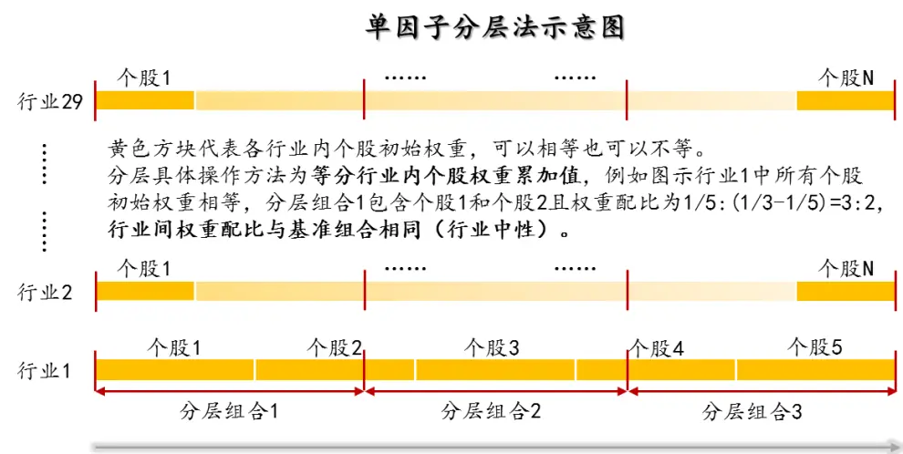
行业内个股按因子值排序
资料来源：华泰证券研究所

## 单因子测试结果分析

## 分层模型回测分析方法

在华泰单因子测试系列前两篇报告中，我们用图表夹杂文字说明的形式，对各个细分因子的分层回测结果一一进行了详细展示。从第三篇报告《华泰单因子测试之动量类因子》开始，我们对报告展示形式加以改进，在维持前两篇测试报告的细致程度的基础上，为了更高效地展示结果，我们会在此处集中说明所有图表的计算细节和分析方法，后面细分因子的测试结果均会使用相同的模板，便于读者速览和对比。

## 分层测试详细展示图表包括：

1． 分五层组合回测绩效分析表（20050509～20161230）。其中组合 1～组合 5 为按该因子从小到大排序构造的行业中性的分层组合。基准组合为行业中性的等权组合，具体来说就是将组合 1～组合 5 合并，一级行业内部个股等权配置，行业权重按当期沪深300 行业权重配置。多空组合是在假设所有个股可以卖空的基础上，每月调仓时买入组合 1，卖空组合 5。回测模型在每个自然月最后一个交易日核算因子值，在下个自然月首个交易日按当日收盘价调仓（分层组合构建法等更多细节参见上一章“分层模型回测”小节）。

2． 分五层组合回测净值图。按前面说明的回测方法计算组合 1～组合 5、基准组合的净值，与沪深 300、中证 500 净值对比作图。

3． 分五层组合回测，用组合 1～组合 5的净值除以基准组合净值的示意图。可以更清晰地展示各层组合在不同时期的效果。

4． 组合 1相对沪深 300 月超额收益分布直方图。该直方图以[-0.5%,0.5%]为中心区间，向正负无穷方向保持组距为 1%延伸，在正负两个方向上均延伸到最后一个频数不为零的组为止（即维持组距一致，组数是根据样本情况自适应调整的）。

5． 分五层时的多空组合收益图。再重复一下，多空组合是买入组合 1、卖空组合 5（月度调仓）的一个资产组合。多空组合收益率是由组合 1的净值除以组合 5 的净值近似核算的。

6． 分十层组合回测时，各层组合在不同年份间的收益率及排名表。每个单元格的内容为在指定年度某层组合的收益率（均为整年收益率），以及某层组合在全部十层组合中的收益率排名。最后一列是分层组合在 2006～2016 的排名的均值。

7． 不同市值区间分层组合回测绩效指标对比图（分十层）。我们将全市场股票按市值排名前 1/3，1/3～2/3，后 1/3 分成三个大类，在这三类股票中分别进行分层测试，基准组合构成方法同前面所述（注意每个大类对应的基准组合并不相同）。

8． 不同行业间分层组合回测绩效分析表（分五层）。我们在不同一级行业内部都做了分层测试，基准组合为各行业内该因子非空值的个股等权组合（注意每个行业对应的基准组合并不相同）。

turn_1m 因子

图表10： turn_1m 因子分层组合绩效分析（20050509～20161230）

| 投资组合 | 年化收益率 | 年化波动率夏普比率最大回撤 |  |  | 年化超额收益率 | 超额收益年化波动率信息比率 |  | 相对基准月胜率 | 超额收益最大回撤 |
| --- | --- | --- | --- | --- | --- | --- | --- | --- | --- |
| 组合1 | 26.91% | 28.17% | 0.95 | 70.59% | 1.89% | 6.84% | 0.28 | 50.71% | 14.31% |
| 组合2 | 29.52% | 31.03% | 0.95 | 68.55% | 3.98% | 3.45% | 1.16 | 62.14% | 4.97% |
| 组合3 | 27.63% | 32.13% | 0.86 | 68.86% | 2.47% | 3.09% | 0.80 | 56.43% | 5.97% |
| 组合4 | 24.29% | 33.47% | 0.73 | 71.64% | -0.21% | 3.97% | -0.05 | 50.71% | 15.32% |
| 组合5 | 14.15% | 35.18% | 0.40 | 73.05% | -8.35% | 6.36% | -1.31 | 40.00% | 63.50% |
| 基准组合 | 24.55% | 31.69% | 0.77 | 70.50% |  |  |  |  |  |
| 多空组合 | 11.18% | 12.53% | 0.89 | 21.08% |  |  |  |  |  |

资料来源：Wind，华泰证券研究所

图表11： turn_1m 因子分层组合回测净值
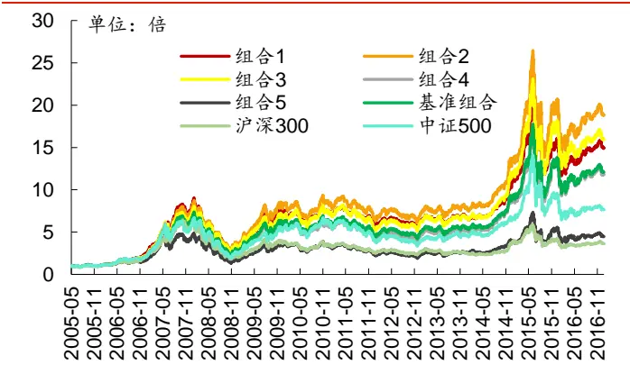
资料来源：Wind，华泰证券研究所

图表12： turn_1m因子各层组合净值除以基准组合净值示意图
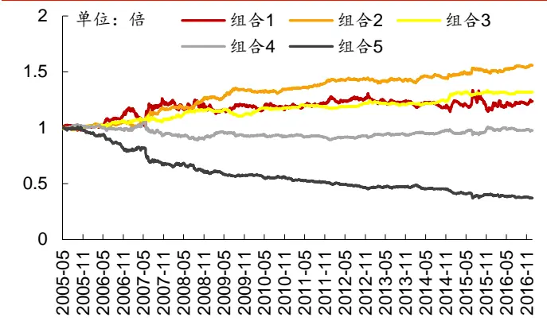
资料来源：Wind，华泰证券研究所

图表13： turn_1m因子分层组合 1相对沪深 300月超额收益分布图
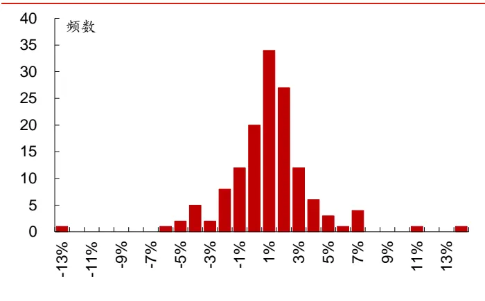
资料来源：Wind，华泰证券研究所

图表14： turn_1m因子多空组合月收益率及累积收益率
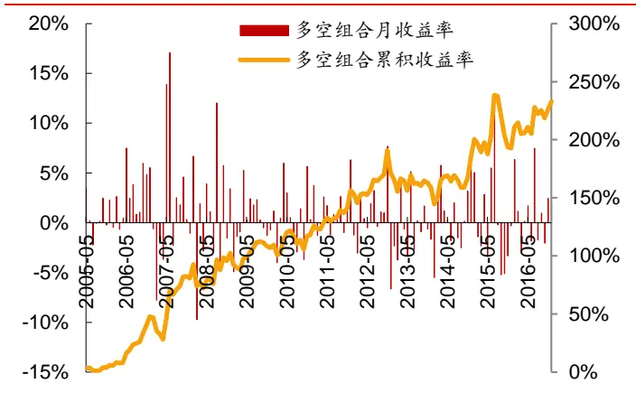
资料来源：Wind，华泰证券研究所

图表15： turn_1m分层组合在不同年份的收益及排名分析（分十层）

|  | 2006 | 2007 | 2008 | 2009 | 2010 | 2011 | 2012 | 2013 | 2014 | 2015 |  | 2016 排名均值 |
| --- | --- | --- | --- | --- | --- | --- | --- | --- | --- | --- | --- | --- |
| 组合1 | 136.5%(1) | 221.8%(5) | -62.8%(8) | 118.7%(8) | -3.1%(8) | -20.0%(1) | 12.1%(6) | 6.3%(8) | 63.6%(7) | 25.2%(9) | 3.1%(1) | 5.64 |
| 组合2 | 128.0%(2) | 230.8%(4) | -57.3%(4) | 130.3%(5) | 3.1%(5) | -25.8%(4) | 11.5%(7) | 5.7%(9) | 68.9%(6) | 30.0%(7) | 2.9%(2) | 5.00 |
| 组合3 | 107.6%(4) | 255.9%(2) | -55.4%(2) | 139.6%(1) | -1.3%(7) | -23.8%(2) | 16.6%(4) | 7.6%(7) | 77.5%(3) | 32.3%(5) | 2.9%(3) | 3.64 |
| 组合4 | 97.8%(7) | 258.5%(1) | -56.3%(3) | 134.8%(2) | 4.3%(2) | -24.3%(3) | 11.0%(8) | 9.2%(5) | 69.2%(5) | 38.3%(3) | -0.9%(5) | 4.00 |
| 组合5 | 109.2%(3) | 231.0%(3) | -52.7%(1) | 130.3%(4) | 7.7%(1) | -28.3%(5) | 17.2%(3) | 12.2%(3) | 73.4%(4) | 29.4%(8) | 0.3%(4) | 3.55 |
| 组合6 | 104.4%(5) | 216.8%(6) |  | -59.4%(6) 103.1%(10) | 4.1%(3) | -28.5%(6) | 19.4%(1) | 5.1%(10) | 81.2%(2) | 40.2%(2) | -4.7%(9) | 5.45 |
| 组合7 | 99.6%(6) | 211.3%(7) | -57.8%(5) | 126.6%(7) | -0.8%(6) | -32.5%(9) | 14.8%(5) | 15.0%(1) | 81.8%(1) | 41.2%(1) | -4.0%(6) | 4.91 |
| 组合8 | 89.0%(8) | 197.2%(8) | -63.4%(9) | 127.6%(6) | 3.3%(4) | -29.8%(7) | 18.7%(2) | 9.6%(4) | 59.6%(9) | 31.9%(6) | -4.1%(7) | 6.36 |
| 组合9 | 72.2%(9) | 168.6%(9) | -60.6%(7) | 133.8%(3) | -3.9%(9) | -31.2%(8) | 6.1%(9) | 14.2%(2) | 62.0%(8) | 33.9%(4) | -4.1%(8) | 6.91 |
| 组合10 |  | 61.2%(10) 165.0%(10) | -67.9%(10) | 105.9%(9) | -6.4%(10) | )-37.6%(10) | 5.0%(10) | 8.4%(6) | 39.3%(10) |  | 16.2%(10)-14.5%(10) | 9.55 |

资料来源：Wind，华泰证券研究所

图表16： 不同市值区间 turn_1m分层组合绩效指标对比图（分十层）
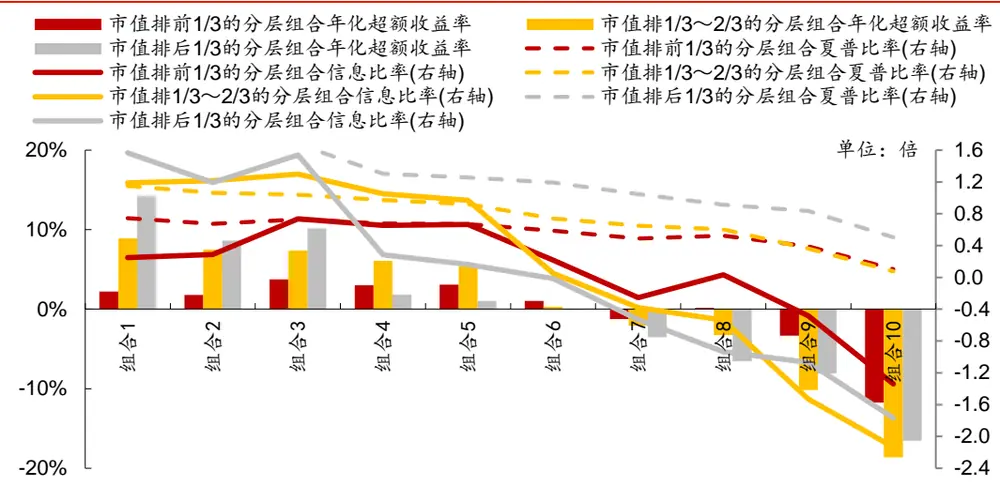
资料来源：Wind，华泰证券研究所

图表17： 不同行业 turn_1m因子分层组合绩效分析（分五层）

|  | 组合1年化 | 组合1 | 组合1 | 组合1 | 组合1超额收益 | 组合1相对 | 所有组合年化 |
| --- | --- | --- | --- | --- | --- | --- | --- |
| 行业 | 超额收益率 | 信息比率 | 年化收益率 | 夏普比率 | 最大回撤 | 基准月胜率 | 收益率排序 |
| 纺织服装 | 11.34% | 0.98 | 43.86% | 1.35 | 22.94% | 52.14% | 1,2,3,4,5 |
| 计算机 | 11.05% | 0.76 | 46.28% | 1.30 | 31.71% | 60.00% | 1,2,4,3,5 |
| 基础化工 | 6.86% | 0.72 | 36.25% | 1.13 | 24.55% | 61.43% | 2,1,3,4,5 |
| 通信 电子元器件 | 9.41% | 0.68 | 43.72% | 1.28 | 19.47% | 60.00% | 1,3,2,4,5 |
| 建筑 | 6.85% | 0.63 | 37.58% | 1.09 | 16.50% | 55.00% | 1,2,4,3,5 |
| 房地产 | 9.04% | 0.61 | 43.11% | 1.28 | 26.18% | 49.29% | 1,3,2,4,5 |
| 建材 | 6.12% | 0.61 | 36.06% | 1.05 | 17.48% | 53.57% | 2,1,3,4,5 |
| 汽车 | 7.30% | 0.58 | 41.31% | 1.20 | 30.01% | 57.14% | 3,1,2,4,5 |
| 交通运输 | 5.20% | 0.47 | 36.49% | 1.15 | 26.64% | 53.57% | 2,1,3,4,5 |
| 医药 | 4.76% | 0.46 | 25.54% | 0.84 | 22.85% | 51.43% | 1,2,4,3,5 |
| 轻工制造 | 4.85% | 0.46 | 37.65% | 1.28 | 23.82% | 52.14% | 1,2,3,4,5 |
| 农林牧渔 | 5.43% | 0.41 | 32.78% | 1.02 | 28.77% | 62.86% | 1,3,2,5,4 |
| 机械 | 4.38% | 0.37 | 36.25% | 1.11 | 28.13% | 58.57% | 2,3,1,4,5 |
| 商贸零售 | 3.73% | 0.35 0.34 | 35.24% | 1.08 | 19.07% | 52.14% | 2,3,1,4,5 |
| 电力设备 | 4.07% | 0.31 | 31.52% | 1.02 | 31.23% | 52.14% | 3,2,1,4,5 |
| 综合 | 4.01% | 0.30 | 36.10% | 1.10 | 22.57% | 53.57% | 1,2,3,4,5 |
| 煤炭 | 4.55% | 0.29 | 32.66% | 0.93 | 35.43% | 51.43% | 1,3,2,4,5 |
| 餐饮旅游 | 4.10% | 0.27 | 19.33% | 0.47 | 27.28% 41.17% | 48.57% | 4,1,3,2,5 |
| 食品饮料 | 4.42% | 0.18 | 32.57% | 0.95 |  | 45.71% | 1,2,3,4,5 |
| 国防军工 | 2.80% | 0.13 | 31.66% | 1.09 | 34.06% 31.18% | 53.57% | 3,2,1,4,5 |
| 家电 | 2.28% | 0.06 | 31.60% | 0.77 |  | 48.57% | 2,4,1,3,5 |
| 传媒 | 0.87% 0.73% | 0.04 | 29.62% 28.90% | 0.92 | 50.38% 48.90% | 47.14% 52.86% | 3,2,1,4,5 |
| 非银行金融 | -0.61% | -0.03 | 23.98% | 0.74 0.56 | 46.49% | 50.71% | 4,2,1,3,5 |
| 银行 | -1.42% | -0.10 | 22.21% | 0.66 | 46.44% | 37.86% | 2,3,1,5,4 |
| 有色金属 | -1.46% | -0.12 | 26.34% | 0.70 | 36.32% | 45.71% | 5,2,1,4,3 |
| 电力及公用事业 | -1.44% | -0.13 | 21.00% | 0.66 | 40.78% | 44.29% | 2,4,3,1,5 2,3,4,1,5 |
| 石油石化 | -4.86% | -0.27 | 19.87% | 0.64 | 55.48% | 42.14% | 3,2,4,1,5 |
|  |  |  |  |  | 49.22% |  |  |
| 钢铁 | -4.35% | -0.35 | 14.00% | 0.40 |  | 44.29% | 2,3,4,5,1 |

资料来源：Wind，华泰证券研究所

turn_3m 因子

图表18： turn_3m 因子分层组合绩效分析（20050509～20161230）

| 投资组合 | 年化收益率 | 年化波动率夏普比率最大回撤 |  |  | 年化超额收益率 | 超额收益年化波动率信息比率 |  | 相对基准月胜率 | 超额收益最大回撤 |
| --- | --- | --- | --- | --- | --- | --- | --- | --- | --- |
| 组合1 | 25.41% | 28.40% | 0.89 | 70.34% | 0.69% | 6.82% | 0.10 | 49.29% | 17.83% |
| 组合2 | 27.94% | 31.07% | 0.90 | 68.73% | 2.72% | 3.25% | 0.84 | 62.14% | 4.63% |
| 组合3 | 25.85% | 32.00% | 0.81 | 70.02% | 1.04% | 3.07% | 0.34 | 53.57% | 9.08% |
| 组合4 | 25.52% | 33.40% | 0.76 | 71.48% | 0.77% | 3.87% | 0.20 | 54.29% | 9.42% |
| 组合5 | 17.42% | 35.09% | 0.50 | 72.19% | -5.73% | 6.21% | -0.92 | 43.57% | 50.60% |
| 基准组合 | 24.55% | 31.69% | 0.77 | 70.50% |  |  |  |  |  |
| 多空组合 | 6.80% | 12.36% | 0.55 | 21.09% |  |  |  |  |  |

资料来源：Wind，华泰证券研究所

图表19： turn_3m 因子分层组合回测净值
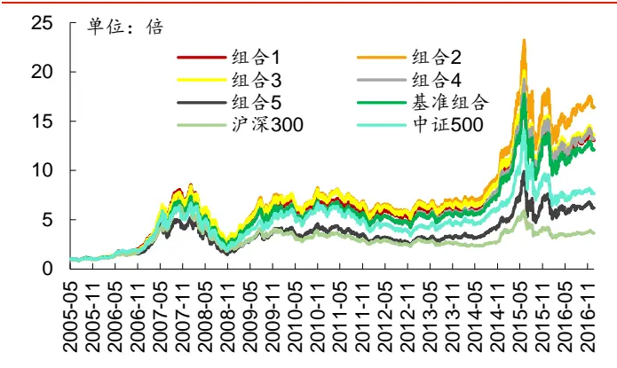
资料来源：Wind，华泰证券研究所

图表20： turn_3m因子各层组合净值除以基准组合净值示意图
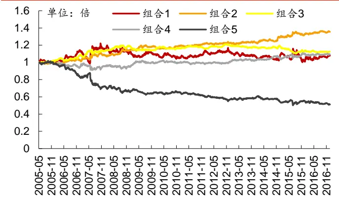
资料来源：Wind，华泰证券研究所

图表21： turn_3m因子分层组合 1相对沪深 300月超额收益分布图
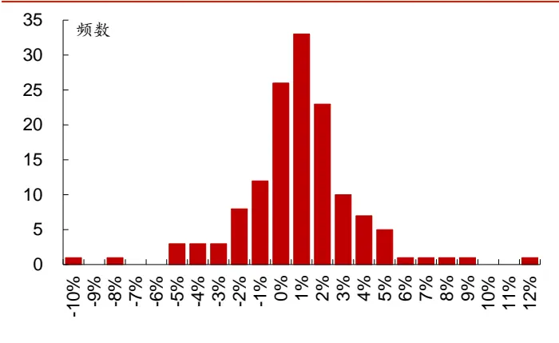
资料来源：Wind，华泰证券研究所

图表22： turn_3m因子多空组合月收益率及累积收益率
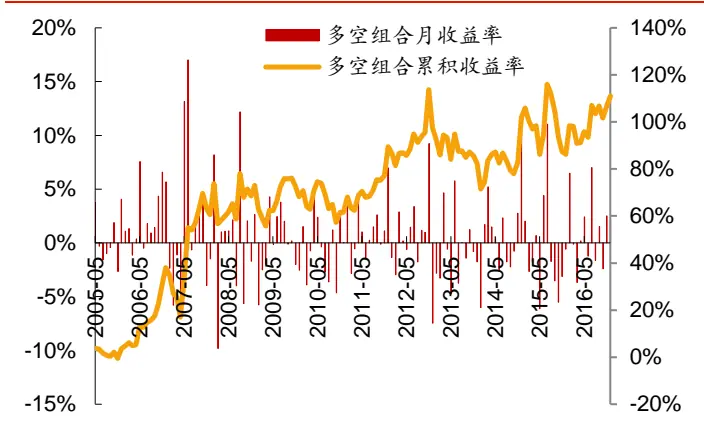
资料来源：Wind，华泰证券研究所

图表23： turn_3m分层组合在不同年份的收益及排名分析（分十层）

|  | 2006 | 2007 | 2008 | 2009 | 2010 | 2011 | 2012 | 2013 | 2014 | 2015 | 2016 排名均值 |  |
| --- | --- | --- | --- | --- | --- | --- | --- | --- | --- | --- | --- | --- |
| 组合1 | 129.2%(1) | 227.4%(3) | -59.9%(7) | 109.7%(9) | -2.4%(9) | -19.8%(1) | 11.8%(8) | 3.1%(10) | 68.1%(6) | 24.5%(8) | 3.3%(3) | 5.91 |
| 组合2 | 118.2%(3) | 212.7%(8) | -60.5%(9) | 123.3%(6) | -3.5%(10) | -25.4%(3) | 12.3%(6) | 5.0%(9) | 72.3%(2) | 22.4%(10) | 3.6%(1) | 6.09 |
| 组合3 | 117.0%(4) | 245.9%(1) | -56.7%(1) | 140.0%(1) | 1.6%(5) | -24.4%(2) | 15.7%(3) | 9.0%(6) | 82.0%(1) | 34.5%(5) | 3.4%(2) | 2.82 |
| 组合4 | 93.6%(7) | 219.8%(5) | -57.8%(3) | 126.7%(5) | 1.6%(4) | -28.7%(5) | 12.0%(7) | 10.6%(3) | 70.3%(5) | 35.7%(4) | -3.7%(9) | 5.18 |
| 组合5 | 120.2%(2) | 240.7%(2) | -57.0%(2) | 118.3%(7) | 2.4%(3) | -27.6%(4) | 16.8%(2) | 7.9%(8) | 65.5%(8) | 30.6%(7) | -3.1%(6) | 4.64 |
| 组合6 | 101.9%(6) | 220.5%(4) | -58.1%(4) | 116.9%(8) | 1.5%(6) | -29.4%(7) | 17.6%(1) | 8.0%(7) | 70.8%(4) | 22.7%(9) | -3.7%(7) | 5.73 |
| 组合7 | 104.8%(5) | 212.9%(7) | -59.5%(5) | 129.2%(4) | 2.7%(2) | -29.3%(6) | 15.1%(5) | 14.4%(2) | 70.9%(3) | 41.3%(1) | -3.7%(8) | 4.36 |
| 组合8 | 83.8%(8) | 219.7%(6) | -59.8%(6) | 139.9%(2) | 0.7%(7) | -29.5%(8) | 15.7%(4) | 9.8%(5) | 66.7%(7) | 38.9%(2) | -2.3%(4) | 5.36 |
| 组合9 | 80.9%(9) | 176.2%(9) | -60.2%(8) | 138.6%(3) | 2.7%(1) | -30.6%(9) | 9.3%(9) | 10.2%(4) | 62.7%(9) | 32.0%(6) | -3.1%(5) | 6.55 |
| 组合10 |  | 55.6%(10) 174.7%(10) |  | -65.7%(10) 107.6%(10) | -0.7%(8) | )-37.3%(10) | 5.5%(10) | 15.6%(1) | 45.2%(10) |  | 35.7%(3) -13.9%(10) | 8.36 |

资料来源：Wind，华泰证券研究所

图表24： 不同市值区间 turn_3m分层组合绩效指标对比图（分十层）
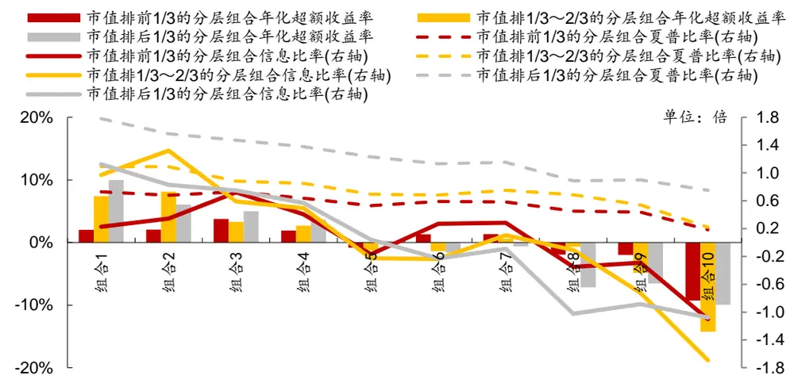
资料来源：Wind，华泰证券研究所

图表25： 不同行业 turn_3m因子分层组合绩效分析（分五层）

|  | 组合1年化 | 组合1 | 组合1 | 组合1 | 组合1超额收益 | 组合1相对 | 所有组合年化 |
| --- | --- | --- | --- | --- | --- | --- | --- |
| 行业 | 超额收益率 | 信息比率 | 年化收益率 | 夏普比率 | 最大回撤 | 基准月胜率 | 收益率排序 |
| 纺织服装 | 9.34% | 0.80 | 41.28% | 1.28 1.28 | 18.61% 22.15% | 57.14% 53.57% | 1,2,4,3,5 1,2,3,4,5 |
| 通信 | 9.18% | 0.64 0.58 | 43.41% 42.69% | 1.20 | 24.12% | 56.43% | 1,3,2,4,5 |
| 计算机 基础化工 | 8.33% | 0.52 | 33.81% | 1.05 | 21.95% | 56.43% | 1,2,3,4,5 |
| 汽车 | 4.94% | 0.47 | 36.60% | 1.14 | 17.34% | 51.43% | 1,2,3,4,5 |
| 建材 | 5.28% 5.98% | 0.47 | 39.57% | 1.14 | 31.13% | 52.14% | 1,3,2,4,5 |
| 建筑 | 6.23% | 0.44 | 39.42% | 1.16 | 27.41% | 49.29% | 1,3,2,4,5 |
| 交通运输 | 3.82% | 0.36 | 24.40% | 0.80 | 27.82% | 47.86% |  |
| 轻工制造 | 4.64% | 0.34 | 31.79% | 0.99 | 24.20% | 54.29% | 1,4,2,3,5 |
| 电子元器件 | 3.49% | 0.33 | 33.26% | 0.96 | 17.64% | 49.29% | 1,2,3,4,5 |
| 房地产 | 3.02% | 0.30 | 32.09% | 0.92 | 38.04% |  | 3,1,4,2,5 |
| 家电 | 4.22% | 0.26 | 33.93% | 1.05 | 45.19% | 49.29% 50.71% | 2,3,1,4,5 |
| 医药 | 2.30% | 0.22 | 34.31% | 1.16 | 29.93% | 47.14% | 1,4,2,3,5 |
| 煤炭 | 2.30% | 0.16 | 17.26% | 0.42 | 36.63% |  | 3,2,1,4,5 |
| 商贸零售 | 1.85% | 0.16 | 28.72% | 0.92 | 28.39% | 45.71% 48.57% | 3,4,1,2,5 |
| 机械 | 1.24% | 0.12 | 32.01% | 0.97 | 33.03% | 52.86% | 2,3,1,4,5 |
| 国防军工 | 1.63% | 0.10 | 30.76% | 0.74 | 40.73% | 46.43% | 2,1,3,4,5 |
| 农林牧渔 | 0.89% | 0.08 | 31.70% | 0.97 | 34.92% | 52.14% | 3,1,2,4,5 |
| 食品饮料 | 0.84% | 0.05 | 29.15% | 1.00 | 37.36% | 47.14% | 3,2,1,4,5 |
| 传媒 | 0.36% | 0.02 | 28.42% | 0.73 | 49.85% |  | 4,2,1,3,5 |
| 电力设备 | -0.12% | -0.01 | 30.70% | 0.93 | 32.64% | 50.00% 50.00% | 4,5,1,2,3 |
| 非银行金融 | -0.46% | -0.02 | 24.16% | 0.56 | 36.74% | 47.86% | 2,1,4,3,5 |
| 综合 | -0.62% | -0.04 | 26.09% | 0.74 | 46.12% | 46.43% | 4,3,2,1,5 |
| 餐饮旅游 | -1.65% | -0.10 | 24.87% | 0.73 | 39.46% | 45.00% | 2,1,4,3,5 |
| 钢铁 | -1.43% | -0.11 | 17.48% | 0.49 | 46.70% | 47.86% | 2,3,4,1,5 |
| 石油石化 | -3.03% | -0.17 | 22.17% | 0.72 | 58.88% | 44.29% | 4,3,1,2,5 |
| 电力及公用事业 | -2.70% | -0.24 | 19.46% | 0.61 | 41.48% | 43.57% | 3,2,4,1,5 2,4,3,1,5 |
| 银行 | -4.58% | -0.32 | 18.29% | 0.54 | 51.00% | 37.14% | 5,3,2,4,1 |
| 有色金属 | -4.30% | -0.33 | 22.70% | 0.59 | 51.41% | 42.86% | 4,2,3,1,5 |

资料来源：Wind，华泰证券研究所

turn_6m 因子

图表26： turn_6m 因子分层组合绩效分析（20050509～20161230）

| 投资组合 | 年化收益率 | 年化波动率夏普比率最大回撤 |  |  | 年化超额收益率 | 超额收益年化波动率信息比率 |  | 相对基准月胜率 | 超额收益最大回撤 |
| --- | --- | --- | --- | --- | --- | --- | --- | --- | --- |
| 组合1 | 24.60% | 28.60% | 0.86 | 69.94% | 0.03% | 6.69% | 0.01 | 45.71% | 18.84% |
| 组合2 | 25.44% | 31.02% | 0.82 | 70.77% | 0.71% | 3.31% | 0.22 | 53.57% | 8.45% |
| 组合3 | 25.76% | 32.15% | 0.80 | 70.25% | 0.97% | 3.17% | 0.31 | 47.86% | 8.08% |
| 组合4 | 27.61% | 33.36% | 0.83 | 71.31% | 2.45% | 3.85% | 0.64 | 59.29% | 7.32% |
| 组合5 | 18.67% | 34.79% | 0.54 | 70.58% | -4.72% | 5.90% | -0.80 | 41.43% | 44.02% |
| 基准组合 | 24.55% | 31.69% | 0.77 | 70.50% |  |  |  |  |  |
| 多空组合 | 5.00% | 11.93% | 0.42 | 20.22% |  |  |  |  |  |

资料来源：Wind，华泰证券研究所

图表27： turn_6m 因子分层组合回测净值
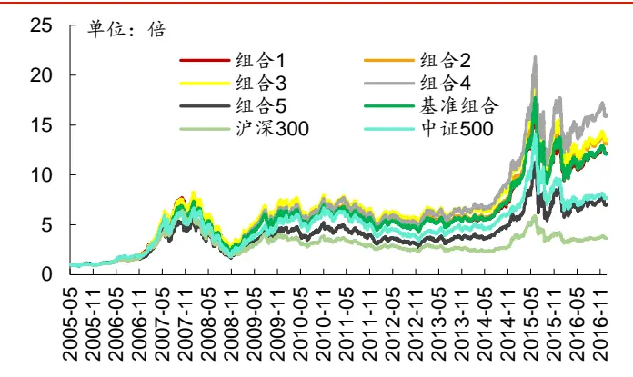
资料来源：Wind，华泰证券研究所

图表28： turn_6m因子各层组合净值除以基准组合净值示意图
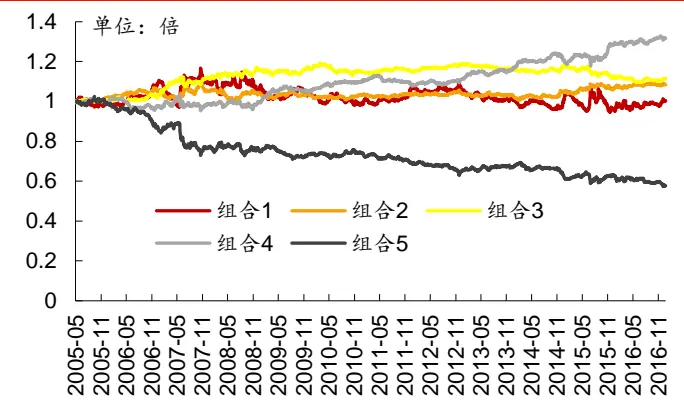
资料来源：Wind，华泰证券研究所

图表29： turn_6m因子分层组合 1相对沪深 300月超额收益分布图
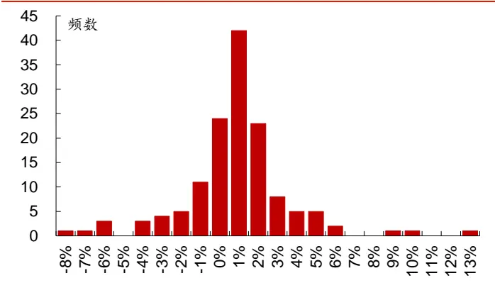
资料来源：Wind，华泰证券研究所

图表30： turn_6m因子多空组合月收益率及累积收益率
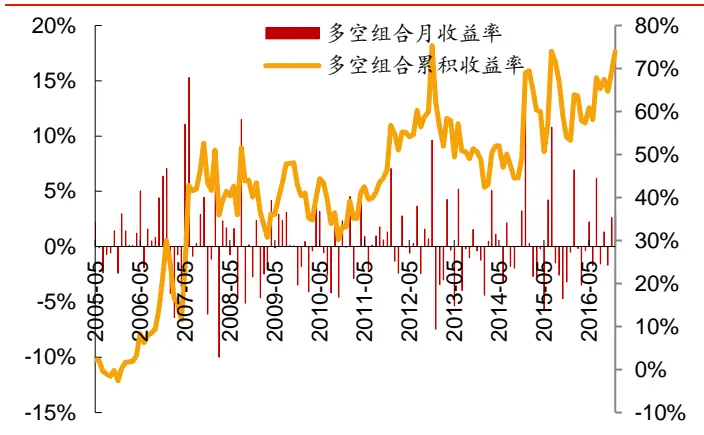
资料来源：Wind，华泰证券研究所

图表31： turn_6m分层组合在不同年份的收益及排名分析（分十层）

|  | 2006 | 2007 | 2008 | 2009 | 2010 | 2011 | 2012 | 2013 | 2014 | 2015 |  | 2016 排名均值 |
| --- | --- | --- | --- | --- | --- | --- | --- | --- | --- | --- | --- | --- |
| 组合1 | 127.1%(1) | 207.5%(7) |  | -59.5%(5) 104.2%(10) | -0.2%(7) | -21.0%(1) | 10.5%(8) | 2.2%(10) | 70.7%(4) | 20.7%(10) | 1.7%(2) | 5.91 |
| 组合2 | 118.8%(2) | 215.9%(5) | -60.8%(10) | 128.3%(5) | -7.0%(10) | -22.3%(2) | 11.6%(7) | 5.5%(7) | 74.1%(2) | 23.3%(8) | 3.2%(1) | 5.36 |
| 组合3 | 112.1%(4) | 201.8%(8) | -60.6%(7) | 134.7%(2) | -1.1%(8) | -27.3%(4) | 11.6%(6) | 4.9%(8) | 78.2%(1) | 37.8%(2) | 1.6%(3) | 4.82 |
| 组合4 | 100.9%(5) | 227.3%(3) | -59.3%(4) | 113.1%(9) | 2.7%(3) | -28.8%(6) | 15.6%(4) | 10.3%(5) | 66.9%(8) | 30.4%(7) | -3.7%(7) | 5.55 |
| 组合5 | 113.3%(3) | 243.3%(1) | -56.9%(1) | 122.7%(7) | -1.8%(9) | -28.9%(7) | 16.4%(3) | 9.3%(6) | 68.7%(7) | 22.8%(9) | -0.8%(6) | 5.36 |
| 组合6 | 99.1%(7) | 239.2%(2) | -59.2%(3) | 130.5%(4) | 0.5%(6) | -27.7%(5) | 18.5%(1) | 4.6%(9) | 69.3%(5) | 30.7%(6) | -5.6%(8) | 5.09 |
| 组合7 | 100.6%(6) | 214.4%(6) | -60.2%(6) | 131.7%(3) | 5.4%(1) | -26.4%(3) | 18.0%(2) | 17.7%(1) | 68.8%(6) | 47.9%(1) | 0.3%(4) | 3.55 |
| 组合8 | 86.3%(8) | 225.3%(4) | -57.8%(2) | 144.2%(1) | 5.3%(2) | -32.8%(9) | 14.8%(5) | 13.1%(3) | 73.3%(3) | 36.4%(3) | -0.8%(5) | 4.09 |
| 组合9 | 82.2%(9) | 195.8%(9) | -60.6%(8) | 126.5%(6) | 2.2%(4) | -30.4%(8) | 5.0%(10) | 12.0%(4) | 59.9%(9) | 34.0%(5) | -5.8%(9) | 7.36 |
| 组合10 |  | 62.0%(10) 177.6%(10) | -60.6%(9) | 114.8%(8) | 1.1%(5) | -36.6%(10) | 9.8%(9) | 14.3%(2) | 44.3%(10) |  | 35.0%(4) -13.4%(10) | 7.91 |

资料来源：Wind，华泰证券研究所

图表32： 不同市值区间 turn_6m分层组合绩效指标对比图（分十层）
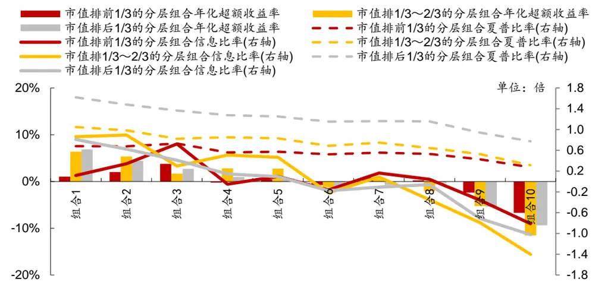
资料来源：Wind，华泰证券研究所

图表33： 不同行业 turn_6m因子分层组合绩效分析（分五层）

|  | 组合1年化 | 组合1 | 组合1 | 组合1 | 组合1超额收益 | 组合1相对 | 所有组合年化 |
| --- | --- | --- | --- | --- | --- | --- | --- |
| 行业 | 超额收益率 | 信息比率 | 年化收益率 | 夏普比率 | 最大回撤 | 基准月胜率 | 收益率排序 |
| 通信 | 10.98% | 0.77 | 45.77% | 1.34 | 27.53% | 55.00% | 1,2,3,4,5 |
| 纺织服装 | 5.22% | 0.45 | 35.95% | 1.11 | 23.63% | 50.00% | 1,2,3,4,5 |
| 计算机 | 6.12% | 0.44 | 39.78% | 1.10 | 23.91% | 52.86% | 1,2,3,4,5 |
| 医药 | 4.10% | 0.38 | 36.67% | 1.25 | 27.09% | 50.00% | 1,3,2,4,5 |
| 汽车 建筑 | 3.98% | 0.36 | 34.91% | 1.08 | 18.82% | 52.14% | 2,1,3,4,5 |
| 建材 | 4.88% | 0.34 0.25 | 37.65% | 1.09 | 27.37% | 51.43% 52.14% | 3,1,4,2,5 |
| 基础化工 | 3.09% |  | 35.77% | 1.02 | 38.65% |  | 1,3,2,4,5 |
| 轻工制造 | 2.23% | 0.24 | 30.35% | 0.94 | 19.31% | 53.57% | 2,1,4,3,5 |
| 电子元器件 | 3.12% | 0.23 | 29.87% | 0.92 | 30.02% | 54.29% | 2,1,4,3,5 |
| 机械 | 2.25% | 0.22 | 31.67% | 0.90 | 25.02% | 53.57% | 4,1,2,5,3 |
| 交通运输 | 1.70% | 0.16 | 32.60% | 0.98 | 25.15% | 48.57% | 3,1,2,4,5 |
| 房地产 | 1.61% | 0.15 | 21.75% | 0.71 | 35.45% | 47.14% | 2,1,4,3,5 |
| 家电 | 1.58% | 0.15 | 30.24% | 0.86 | 43.23% | 47.14% | 2,3,1,4,5 |
| 食品饮料 | 2.36% | 0.15 0.12 | 31.54% | 0.98 | 44.95% | 50.71% | 3,1,4,2,5 |
| 商贸零售 | 1.90% | 0.11 | 30.52% | 1.04 | 38.80% | 48.57% | 4,1,3,2,5 |
| 电力设备 | 1.32% | 0.09 | 28.05% | 0.90 | 38.41% | 50.00% | 3,2,1,4,5 |
| 农林牧渔 | 1.21% | 0.07 | 32.44% | 0.98 | 24.10% | 50.71% | 4,3,1,5,2 |
| 国防军工 | 0.80% | 0.04 | 31.58% 29.62% | 0.96 | 42.63% 36.71% | 50.71% | 3,1,2,4,5 |
| 餐饮旅游 | 0.75% | 0.04 |  | 0.71 |  | 48.57% | 3,4,1,2,5 |
| 煤炭 | 0.65% | -0.05 | 27.79% | 0.81 | 37.98% | 48.57% | 3,1,2,4,5 |
| 电力及公用事业 | -0.73% |  | 13.78% | 0.33 | 40.18% | 45.71% | 2,4,1,3,5 |
| 有色金属 | -1.00% -1.87% | -0.09 -0.15 | 21.54% | 0.68 | 39.47% 38.69% | 42.86% 45.00% | 4,2,3,1,5 |
| 钢铁 | -1.93% | -0.15 | 25.81% 16.89% | 0.66 | 47.82% | 44.29% | 4,3,1,2,5 |
| 非银行金融 | -3.38% | -0.15 | 20.53% | 0.47 0.48 | 44.10% | 44.29% | 4,3,1,2,5 |
| 传媒 | -3.39% | -0.18 | 23.62% | 0.61 | 58.08% | 46.43% | 4,2,3,1,5 |
| 综合 | -3.03% | -0.20 | 23.05% | 0.65 | 61.64% | 42.86% | 4,5,2,1,3 2,3,1,4,5 |
| 石油石化 | -4.81% | -0.27 | 19.94% | 0.64 | 58.36% | 45.00% | 2,5,3,4,1 |
|  |  |  |  |  | 60.83% |  |  |
| 银行 | -7.40% | -0.53 | 14.79% | 0.43 |  | 37.14% | 4,5,3,2,1 |

资料来源：Wind，华泰证券研究所

## bias_turn_1m 因子

图表34： bias_turn_1m 因子分层组合绩效分析（20050509～20161230）

| 投资组合 | 年化收益率 | 年化波动率夏普比率最大回撤 |  |  | 年化超额收益率 | 超额收益年化波动率信息比率 |  | 相对基准月胜率 | 超额收益最大回撤 |
| --- | --- | --- | --- | --- | --- | --- | --- | --- | --- |
| 组合1 | 30.96% | 29.74% | 1.04 | 68.83% | 5.15% | 4.88% | 1.05 | 62.14% | 10.40% |
| 组合2 | 29.54% | 31.12% | 0.95 | 67.51% | 4.00% | 3.22% | 1.24 | 62.14% | 6.37% |
| 组合3 | 26.58% | 31.97% | 0.83 | 69.85% | 1.63% | 2.93% | 0.55 | 56.43% | 7.81% |
| 组合4 | 23.31% | 32.65% | 0.71 | 71.21% | -1.00% | 3.40% | -0.29 | 47.14% | 13.46% |
| 组合5 | 12.56% | 34.12% | 0.37 | 75.34% | -9.63% | 5.22% | -1.85 | 30.71% | 68.65% |
| 基准组合 | 24.55% | 31.69% | 0.77 | 70.50% |  |  |  |  |  |
| 多空组合 | 16.35% | 9.23% | 1.77 | 18.28% |  |  |  |  |  |

资料来源：Wind，华泰证券研究所

图表35： bias_turn_1m 因子分层组合回测净值
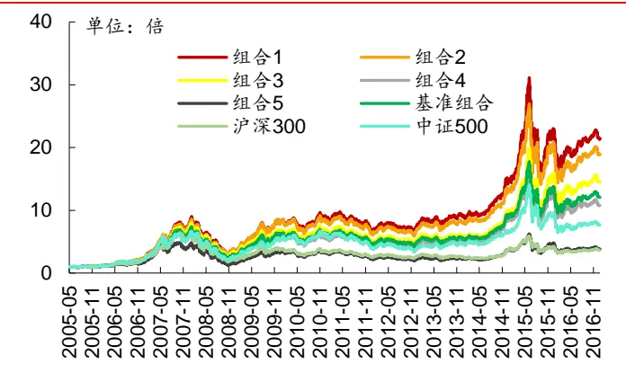
资料来源：Wind，华泰证券研究所

图表36： bias_turn_1m因子各层组合净值除以基准组合净值示意图
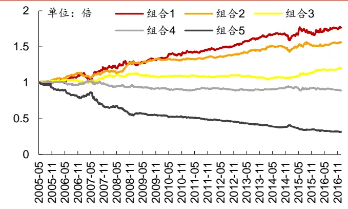
资料来源：Wind，华泰证券研究所

图表37： bias_turn_1m 分层组合 1相对沪深 300月超额收益分布图
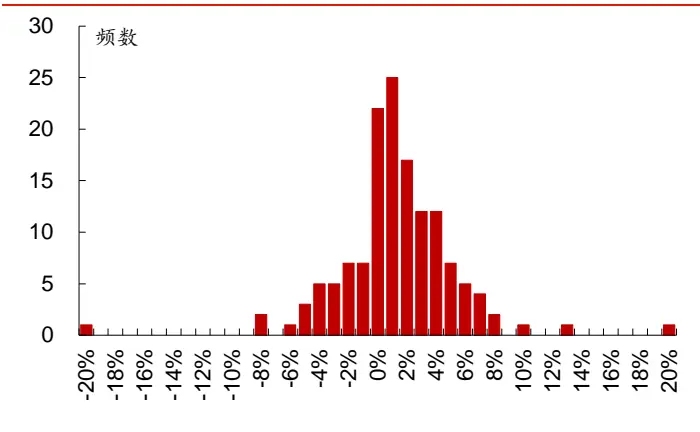
资料来源：Wind，华泰证券研究所

图表38： bias_turn_1m因子多空组合月收益率及累积收益率
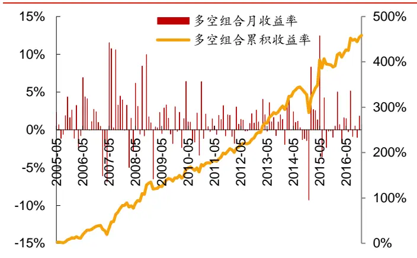
资料来源：Wind，华泰证券研究所

图表39： bias_turn_1m分层组合在不同年份的收益及排名分析（分十层）

|  | 2006 | 2007 | 2008 | 2009 | 2010 | 2011 | 2012 | 2013 | 2014 | 2015 | 2016 排名均值 |  |
| --- | --- | --- | --- | --- | --- | --- | --- | --- | --- | --- | --- | --- |
| 组合1 | 117.6%(3) | 247.9%(1) | -58.0%(5) | 146.9%(1) | 4.9%(2) | -24.6%(1) | 15.5%(5) | 20.2%(1) | 64.1%(7) | 41.6%(3) | 2.2%(4) | 3.00 |
| 组合2 | 119.5%(2) | 237.0%(5) | -55.4%(2) | 119.6%(6) | 8.3%(1) | -25.2%(2) | 19.2%(1) | 14.7%(4) | 58.8%(8) | 39.0%(4) | 2.2%(2) | 3.36 |
| 组合3 | 120.4%(1) | 219.9%(7) | -55.0%(1) | 135.2%(2) | 0.7%(4) | -25.5%(4) | 16.5%(3) | 17.7%(2) | 69.1%(5) | 44.6%(2) | 2.2%(3) | 3.09 |
| 组合4 | 105.3%(4) | 239.9%(4) | -55.6%(3) | 131.9%(3) | -0.5%(6) | -26.7%(5) | 15.1%(6) | 11.9%(5) | 58.1%(9) | 34.7%(6) | -0.4%(5) | 5.09 |
| 组合5 | 93.2%(7) | 227.8%(6) |  | -55.7%(4) 111.0%(10) | 0.4%(5) | -28.9%(7) | 16.0%(4) | 8.4%(6) | 66.8%(6) | 35.3%(5) | -1.0%(6) | 6.00 |
| 组合6 | 103.9%(5) | 243.9%(2) | -60.3%(7) | 120.5%(5) | 3.2%(3) | -29.4%(8) | 16.7%(2) | 3.2%(9) | 70.6%(4) | 50.3%(1) | 2.5%(1) | 4.27 |
| 组合7 | 93.7%(6) | 240.1%(3) | -59.1%(6) | 118.6%(7) | -1.2%(8) | -25.3%(3) | 12.5%(7) | 5.8%(7) | 74.4%(3) | 29.4%(7) | -5.9%(8) | 5.91 |
| 组合8 | 92.8%(8) | 186.6%(8) | -61.8%(8) | 118.6%(8) | -0.9%(7) | -28.6%(6) | 9.1%(9) | 15.0%(3) | 76.6%(2) | 26.3%(8) | -4.3%(7) | 6.73 |
| 组合9 | 86.9%(9) | 177.4%(9) | -63.8%(9) | 131.5%(4) | -1.8%(9) | -30.6%(9) | 10.0%(8) | 3.9%(8) | 79.5%(1) | 17.8%(9) | -7.4%(9) | 7.64 |
| 组合10 |  | 67.6%(10) 142.2%(10) | -68.5%(10) | 117.1%(9) | -6.1%(10) | )-37.5%(10) | 2.4%(10) | -4.9%(10) | 56.4%(10) |  | 4.1%(10) -12.8%(10) | 9.91 |

资料来源：Wind，华泰证券研究所

图表40： 不同市值区间 bias_turn_1m分层组合绩效指标对比图（分十层）
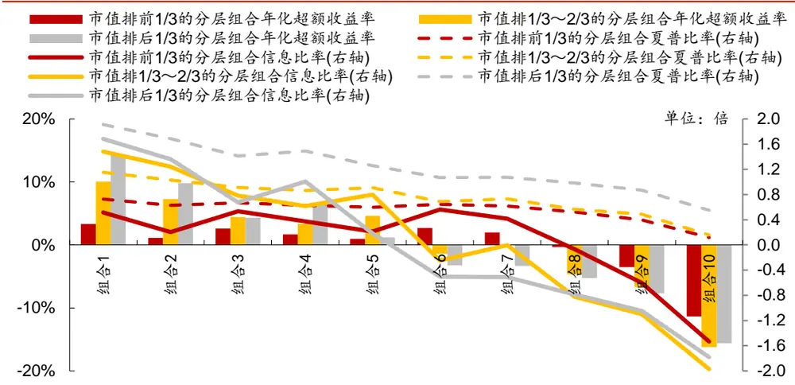
资料来源：Wind，华泰证券研究所

图表41： 不同行业 bias_turn_1m因子分层组合绩效分析（分五层）

|  | 组合1年化 | 组合1 | 组合1 | 组合1 | 组合1超额收益 | 组合1相对 | 所有组合年化 |
| --- | --- | --- | --- | --- | --- | --- | --- |
| 行业 | 超额收益率 | 信息比率 | 年化收益率 | 夏普比率 | 最大回撤 | 基准月胜率 | 收益率排序 |
| 基础化工 | 11.50% | 1.26 | 42.16% | 1.24 | 25.41% | 63.57% 66.43% | 1,2,3,4,5 |
| 电子元器件 | 12.14% | 1.20 | 44.40% | 1.24 | 23.13% 13.98% | 65.00% | 1,2,3,4,5 1,2,3,4,5 |
| 房地产 | 9.90% | 1.08 | 40.91% | 1.17 |  | 55.71% | 1,2,3,4,5 |
| 医药 家电 | 7.97% | 0.94 | 41.75% | 1.30 | 16.70% 29.47% |  |  |
| 纺织服装 | 12.12% | 0.91 0.84 | 44.08% 41.22% | 1.26 |  | 56.43% 58.57% | 1,4,3,2,5 |
| 计算机 | 9.30% | 0.83 | 46.14% | 1.23 | 21.61% | 58.57% | 1,2,3,4,5 |
| 机械 | 10.95% |  |  | 1.19 | 22.78% |  | 1,2,3,4,5 |
| 建材 | 7.21% | 0.80 | 39.79% | 1.19 | 13.17% | 58.57% | 1,2,3,4,5 |
| 餐饮旅游 | 8.94% | 0.72 | 43.48% | 1.27 | 21.07% | 60.71% | 1,2,3,4,5 |
| 汽车 | 11.23% | 0.72 | 41.22% | 1.10 | 25.70% | 52.14% | 1,3,2,4,5 |
| 农林牧渔 | 7.08% | 0.70 | 38.93% | 1.14 | 37.64% | 58.57% | 1,2,3,4,5 |
| 通信 | 7.59% | 0.66 0.61 | 40.44% 42.38% | 1.16 | 25.45% | 57.86% | 1,2,3,4,5 |
| 食品饮料 | 8.40% | 0.61 |  | 1.17 | 30.56% | 55.71% | 1,2,4,3,5 |
| 电力设备 | 7.59% 6.54% | 0.57 | 37.79% | 1.22 | 29.55% 17.54% | 57.14% | 2,1,3,4,5 |
| 商贸零售 | 5.26% | 0.56 | 39.42% 33.03% | 1.14 | 26.61% | 57.14% | 1,3,2,4,5 |
| 电力及公用事业 | 5.20% | 0.55 | 29.16% | 0.99 | 16.66% | 57.86% | 2,1,3,4,5 |
| 有色金属 | 6.22% | 0.54 | 36.19% | 0.87 | 20.94% | 57.86% | 2,1,3,4,5 |
| 煤炭 | 6.91% | 0.50 |  | 0.93 | 29.90% | 55.71% | 1,2,4,3,5 |
| 传媒 | 8.76% | 0.50 | 22.55% | 0.55 |  | 57.14% | 1,3,4,2,5 |
| 石油石化 | 6.45% | 0.40 | 39.17% | 0.99 | 36.71% 25.28% | 56.43% | 1,2,3,4,5 |
| 交通运输 | 3.23% | 0.32 | 34.12% | 0.98 | 23.02% | 56.43% | 1,3,2,4,5 |
| 轻工制造 | 3.67% | 0.29 | 23.69% 30.56% | 0.73 | 25.96% | 55.71% 55.71% | 4,1,2,3,5 |
| 国防军工 | 1.92% | 0.11 | 31.13% | 0.89 | 49.03% | 47.86% | 2,1,4,3,5 |
| 银行 | 1.13% | 0.08 | 25.37% | 0.75 | 25.34% | 43.57% | 3,1,2,4,5 |
| 钢铁 | -0.41% | -0.03 | 18.70% | 0.77 | 23.76% | 51.43% | 1,3,4,2,5 |
| 建筑 | -0.50% | -0.04 | 30.60% | 0.52 0.87 | 40.68% | 50.00% | 3,1,2,4,5 3,2,1,4,5 |
| 综合 | -1.13% | -0.07 | 25.46% | 0.70 | 44.54% | 49.29% | 2,3,1,4,5 |
| 非银行金融 | -3.70% | -0.19 | 20.12% | 0.44 | 53.31% | 50.71% | 2,3,1,4,5 |

资料来源：Wind，华泰证券研究所

## bias_turn_3m 因子

图表42： bias_turn_3m 因子分层组合绩效分析（20050509～20161230）

| 投资组合 | 年化收益率 | 年化波动率夏普比率最大回撤 |  |  | 年化超额收益率 | 超额收益年化波动率信息比率 |  | 相对基准月胜率 | 超额收益最大回撤 |
| --- | --- | --- | --- | --- | --- | --- | --- | --- | --- |
| 组合1 | 30.48% | 29.84% | 1.02 | 68.80% | 4.76% | 4.87% | 0.98 | 61.43% | 9.48% |
| 组合2 | 28.49% | 31.14% | 0.91 | 69.71% | 3.16% | 3.24% | 0.97 | 65.71% | 5.40% |
| 组合3 | 25.43% | 31.99% | 0.80 | 69.21% | 0.71% | 3.18% | 0.22 | 50.71% | 6.99% |
| 组合4 | 23.37% | 32.68% | 0.72 | 70.93% | -0.95% | 3.45% | -0.28 | 46.43% | 15.37% |
| 组合5 | 14.94% | 33.95% | 0.44 | 73.90% | -7.72% | 4.94% | -1.56 | 34.29% | 60.53% |
| 基准组合 | 24.55% | 31.69% | 0.77 | 70.50% |  |  |  |  |  |
| 多空组合 | 13.52% | 8.99% | 1.50 | 18.16% |  |  |  |  |  |

资料来源：Wind，华泰证券研究所

图表43： bias_turn_3m 因子分层组合回测净值
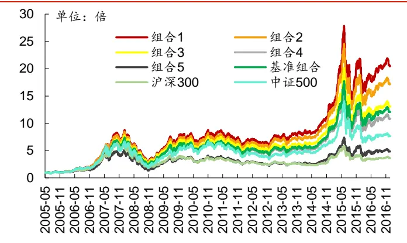
资料来源：Wind，华泰证券研究所

图表44： bias_turn_3m因子各层组合净值除以基准组合净值示意图
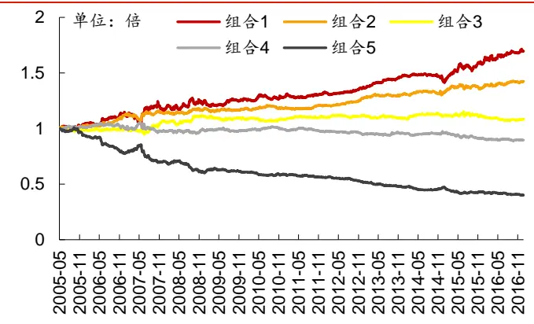
资料来源：Wind，华泰证券研究所

图表45： bias_turn_3m 分层组合 1相对沪深 300月超额收益分布图
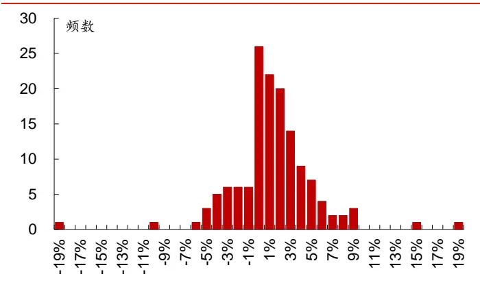
资料来源：Wind，华泰证券研究所

图表46： bias_turn_3m因子多空组合月收益率及累积收益率
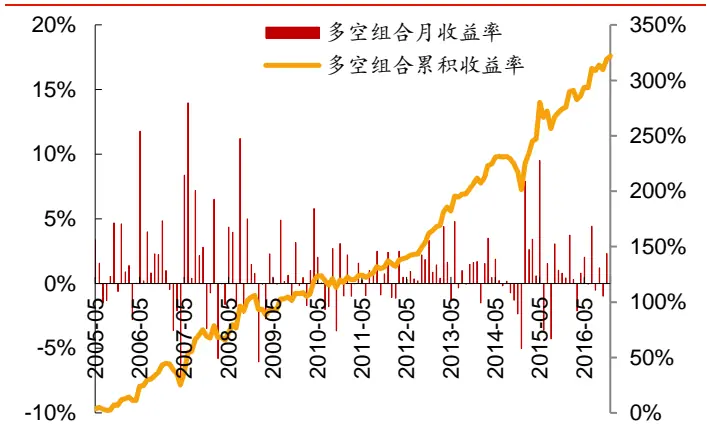
资料来源：Wind，华泰证券研究所

图表47： bias_turn_3m分层组合在不同年份的收益及排名分析（分十层）

|  | 2006 | 2007 | 2008 | 2009 | 2010 | 2011 | 2012 | 2013 | 2014 | 2015 | 2016 排名均值 |  |
| --- | --- | --- | --- | --- | --- | --- | --- | --- | --- | --- | --- | --- |
| 组合1 | 114.6%(4) | 233.7%(2) | -58.5%(5) | 134.3%(1) | 2.6%(4) | -26.0%(3) | 15.3%(4) | 17.6%(2) | 63.9%(5) | 51.5%(1) | 5.2%(1) | 2.91 |
| 组合2 | 116.6%(3) | 225.1%(3) | -55.4%(2) | 120.6%(9) | 2.3%(5) | -26.0%(2) | 18.2%(3) | 18.3%(1) | 58.0%(9) | 46.9%(2) | 1.6%(3) | 3.82 |
| 组合3 | 121.2%(1) | 223.0%(4) | -54.2%(1) | 128.2%(2) | 3.2%(2) | -28.2%(7) | 18.7%(2) | 15.8%(3) | 62.9%(8) | 41.1%(3) | 2.8%(2) | 3.18 |
| 组合4 | 118.6%(2) | 214.1%(7) | -61.6%(8) | 121.5%(8) | -1.3%(7) | -24.8%(1) | 20.4%(1) | 9.3%(5) | 74.5%(3) | 32.6%(5) | -0.2%(4) | 4.64 |
| 组合5 | 102.2%(6) | 253.0%(1) |  | -59.2%(6) 120.2%(10) | -3.6%(10) | -26.8%(4) | 14.5%(7) | 6.8%(7) | 63.0%(7) | 36.4%(4) | -5.8%(8) | 6.36 |
| 组合6 | 103.9%(5) | 217.1%(6) | -56.6%(3) | 121.9%(7) | 4.2%(1) | -27.0%(5) | 15.0%(5) | 6.8%(8) | 81.6%(2) | 25.1%(7) | -3.5%(6) | 5.00 |
| 组合7 | 98.7%(7) | 220.2%(5) | -61.0%(7) | 126.3%(3) | 2.7%(3) | -27.2%(6) | 15.0%(6) | 12.4%(4) | 56.8%(10) | 25.6%(6) | -0.7%(5) | 5.64 |
| 组合8 | 93.9%(8) | 196.8%(9) | -57.3%(4) | 124.7%(6) | 1.3%(6) | -32.6%(9) | 6.6%(9) | 8.2%(6) | 82.1%(1) | 22.9%(8) | -6.5%(9) | 6.82 |
| 组合9 | 66.5%(10) | 207.7%(8) | -61.7%(9) | 125.3%(5) | -2.5%(9) | -29.0%(8) | 9.1%(8) | 3.7%(9) | 69.6%(4) | 19.9%(9) | -5.4%(7) | 7.82 |
| 组合10 |  | 66.6%(9) 162.4%(10) | -68.0%(10) | 125.9%(4) | -2.2%(8) | )-35.1%(10) | 0.6%(10) | -3.8%(10) | 63.5%(6) |  | 19.2%(10) -10.4%(10) | 8.82 |

资料来源：Wind，华泰证券研究所

图表48： 不同市值区间 bias_turn_3m分层组合绩效指标对比图（分十层）
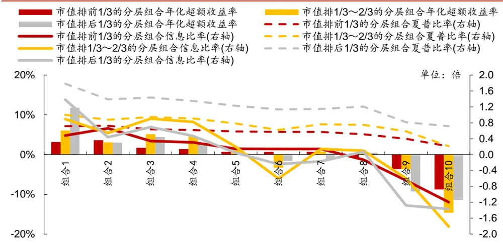
资料来源：Wind，华泰证券研究所

图表49： 不同行业 bias_turn_3m因子分层组合绩效分析（分五层）

|  | 组合1年化 | 组合1 | 组合1 | 组合1 | 组合1超额收益 | 组合1相对 | 所有组合年化 |
| --- | --- | --- | --- | --- | --- | --- | --- |
| 行业 | 超额收益率 | 信息比率 | 年化收益率 | 夏普比率 | 最大回撤 | 基准月胜率 | 收益率排序 |
| 电子元器件 | 11.48% | 1.13 | 43.55% | 1.20 | 18.17% | 64.29% | 1,2,3,4,5 |
| 医药 | 8.79% | 1.04 | 42.83% | 1.32 | 13.34% | 59.29% | 1,3,2,4,5 |
| 家电 | 10.56% | 0.76 | 42.07% | 1.21 | 26.21% | 57.14% | 1,2,4,3,5 |
| 计算机 | 9.89% | 0.75 | 44.75% | 1.14 | 28.82% | 60.71% | 1,3,2,5,4 |
| 纺织服装 | 8.12% | 0.74 | 39.69% | 1.19 | 18.69% | 60.71% | 1,2,4,3,5 |
| 房地产 | 6.70% | 0.73 | 36.81% | 1.04 | 19.81% | 62.14% | 1,2,3,4,5 |
| 汽车 | 7.15% | 0.71 | 39.01% | 1.15 | 24.33% | 55.71% | 1,2,4,3,5 |
| 通信 | 8.60% | 0.63 | 42.65% | 1.18 | 22.72% | 54.29% | 1,2,3,4,5 |
| 农林牧渔 | 7.26% | 0.63 | 40.01% | 1.14 | 23.02% | 57.14% | 1,3,2,4,5 |
| 食品饮料 | 7.76% | 0.58 | 38.01% | 1.23 | 25.69% | 55.00% | 1,3,2,4,5 |
| 基础化工 | 4.89% | 0.56 | 33.75% | 0.99 | 24.52% | 57.86% | 1,2,4,3,5 |
| 建材 | 6.21% | 0.51 | 39.88% | 1.16 | 28.94% | 50.71% | 2,1,3,4,5 |
| 电力及公用事业 | 4.74% | 0.50 | 28.59% | 0.85 | 25.16% | 55.00% | 1,4,2,3,5 |
| 有色金属 | 5.30% | 0.47 | 35.01% | 0.89 | 36.55% | 57.14% | 1,3,2,4,5 |
| 交通运输 | 4.51% | 0.44 | 25.23% | 0.77 | 20.99% | 51.43% | 1,2,3,4,5 |
| 机械 | 3.50% | 0.39 | 34.95% | 1.04 | 22.97% | 55.71% | 1,2,3,4,5 |
| 煤炭 | 4.86% | 0.36 | 20.19% | 0.50 | 30.50% | 50.71% | 1,3,4,2,5 |
| 国防军工 | 6.25% | 0.36 | 36.70% | 0.89 | 29.41% | 50.71% | 1,2,5,4,3 |
| 钢铁 | 2.58% | 0.21 | 22.26% | 0.62 | 28.70% | 59.29% | 3,1,2,4,5 |
| 传媒 | 3.24% | 0.18 | 32.11% | 0.80 | 35.10% | 52.14% | 4,1,2,3,5 |
| 商贸零售 | 1.60% | 0.17 | 28.40% | 0.85 | 21.08% | 50.00% | 2,1,4,3,5 |
| 石油石化 | 2.31% | 0.14 | 28.91% | 0.82 | 40.11% | 46.43% | 2,1,3,4,5 |
| 餐饮旅游 | 1.72% | 0.11 | 29.15% | 0.79 | 36.88% | 47.14% | 2,4,1,3,5 |
| 建筑 | 1.39% | 0.10 | 33.07% | 0.94 | 36.70% | 55.00% | 3,1,2,5,4 |
| 电力设备 | 0.98% | 0.08 | 32.14% | 0.93 | 31.29% | 56.43% | 2,3,1,4,5 |
| 银行 | 0.47% | 0.04 | 24.54% | 0.74 | 25.63% | 50.71% | 2,3,1,4,5 |
| 轻工制造 | 0.02% | 0.00 | 25.97% | 0.75 | 28.98% | 46.43% | 2,3,1,4,5 |
| 非银行金融 | -1.14% | -0.06 | 23.32% | 0.51 | 48.96% | 51.43% | 2,1,3,4,5 |
| 综合 | -3.43% | -0.24 | 22.53% | 0.62 | 51.79% | 51.43% | 2,3,1,5,4 |

资料来源：Wind，华泰证券研究所

## bias_turn_6m 因子

图表50： bias_turn_6m 因子分层组合绩效分析（20050509～20161230）

| 投资组合 | 年化收益率 | 年化波动率夏普比率最大回撤 |  |  | 年化超额收益率 | 超额收益年化波动率信息比率 |  | 相对基准月胜率 | 超额收益最大回撤 |
| --- | --- | --- | --- | --- | --- | --- | --- | --- | --- |
| 组合1 | 28.23% | 30.17% | 0.94 | 69.19% | 2.95% | 4.80% | 0.61 | 55.00% | 11.39% |
| 组合2 | 28.42% | 31.06% | 0.91 | 69.14% | 3.10% | 3.18% | 0.98 | 57.86% | 6.38% |
| 组合3 | 25.11% | 32.09% | 0.78 | 70.42% | 0.45% | 3.12% | 0.14 | 49.29% | 6.80% |
| 组合4 | 23.76% | 32.59% | 0.73 | 71.05% | -0.64% | 3.55% | -0.18 | 50.00% | 15.60% |
| 组合5 | 16.99% | 33.68% | 0.50 | 72.76% | -6.07% | 4.86% | -1.25 | 39.29% | 51.94% |
| 基准组合 | 24.55% | 31.69% | 0.77 | 70.50% |  |  |  |  |  |
| 多空组合 | 9.60% | 8.73% | 1.10 | 15.74% |  |  |  |  |  |

资料来源：Wind，华泰证券研究所

图表51： bias_turn_6m 因子分层组合回测净值
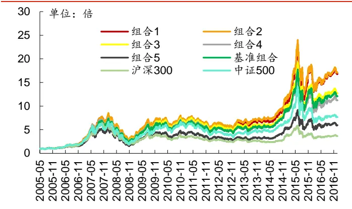
资料来源：Wind，华泰证券研究所

图表52： bias_turn_6m因子各层组合净值除以基准组合净值示意图
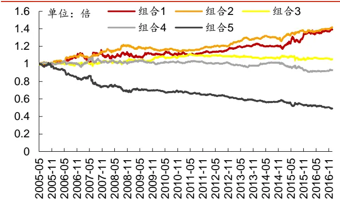
资料来源：Wind，华泰证券研究所

图表53： bias_turn_6m 分层组合 1相对沪深 300月超额收益分布图
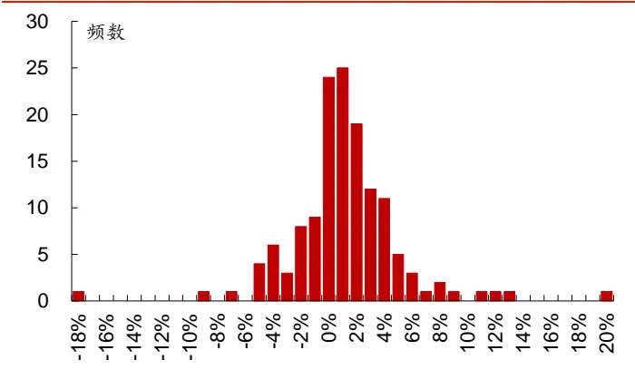
资料来源：Wind，华泰证券研究所

图表54： bias_turn_6m因子多空组合月收益率及累积收益率
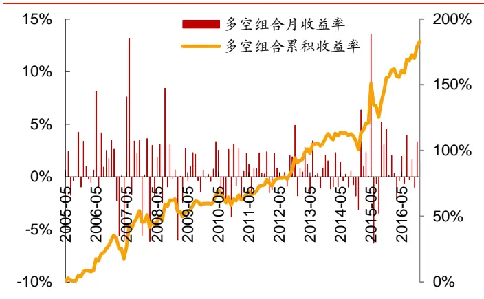
资料来源：Wind，华泰证券研究所

图表55： bias_turn_6m分层组合在不同年份的收益及排名分析（分十层）

|  | 2006 | 2007 | 2008 | 2009 | 2010 | 2011 | 2012 | 2013 | 2014 | 2015 | 2016 排名均值 |  |
| --- | --- | --- | --- | --- | --- | --- | --- | --- | --- | --- | --- | --- |
| 组合1 | 119.2%(2) | 217.7%(6) | -56.8%(2) | 130.5%(3) | 1.1%(5) | -25.0%(2) | 16.3%(3) | 13.6%(4) | 59.7%(10) | 58.6%(1) | 0.2%(4) | 3.82 |
| 组合2 | 116.4%(3) | 196.5%(8) | -59.9%(6) | 120.0%(8) | -0.0%(7) | -27.6%(4) | 17.0%(2) | 14.0%(3) | 60.3%(9) | 45.4%(3) | 1.4%(2) | 5.00 |
| 组合3 | 127.2%(1) | 218.8%(5) |  | -57.2%(3) 111.4%(10) | 0.6%(6) | -24.3%(1) | 18.5%(1) | 15.0%(2) | 66.7%(5) | 57.9%(2) | 4.7%(1) | 3.36 |
| 组合4 | 106.9%(4) | 229.5%(2) | -58.2%(5) | 126.6%(5) | -2.4%(10) | -25.7%(3) | 14.1%(5) | 16.1%(1) | 62.2%(8) | 26.7%(5) | -2.3%(7) | 5.00 |
| 组合5 | 99.0%(6) | 216.9%(7) | -62.4%(9) | 128.4%(4) | 1.3%(4) | -28.5%(7) | 10.2%(8) | 8.0%(6) | 77.1%(1) | 26.5%(6) | 0.8%(3) | 5.55 |
| 组合6 | 100.8%(5) | 229.1%(3) | -54.9%(1) | 132.0%(2) | 3.3%(1) | -27.8%(5) | 15.4%(4) | 7.9%(7) | 64.9%(6) | 29.8%(4) | -7.3%(9) | 4.27 |
| 组合7 | 98.8%(7) | 243.4%(1) | -57.2%(4) | 123.8%(7) | 3.0%(2) | -29.6%(8) | 13.4%(6) | 5.4%(9) | 74.6%(3) | 24.5%(7) | -2.1%(6) | 5.45 |
| 组合8 | 86.7%(8) | 228.9%(4) | -62.1%(8) | 116.2%(9) | 1.8%(3) | -28.2%(6) | 10.1%(9) | 10.3%(5) | 70.3%(4) | 16.5%(10) | -0.4%(5) | 6.45 |
| 组合9 | 75.7%(9) | 192.0%(9) | -62.0%(7) | 125.3%(6) | -0.6%(8) | -29.9%(9) | 10.9%(7) | 5.9%(8) | 77.0%(2) | 17.5%(9) | -6.7%(8) | 7.45 |
| 组合10 |  | 70.4%(10) 179.2%(10) | -63.6%(10) | 135.6%(1) |  | -1.4%(9) -36.0%(10) | 6.8%(10) | -1.6%(10) | 62.4%(7) |  | 20.7%(8) -11.1%(10) | 8.64 |

资料来源：Wind，华泰证券研究所

图表56： 不同市值区间 bias_turn_6m分层组合绩效指标对比图（分十层）
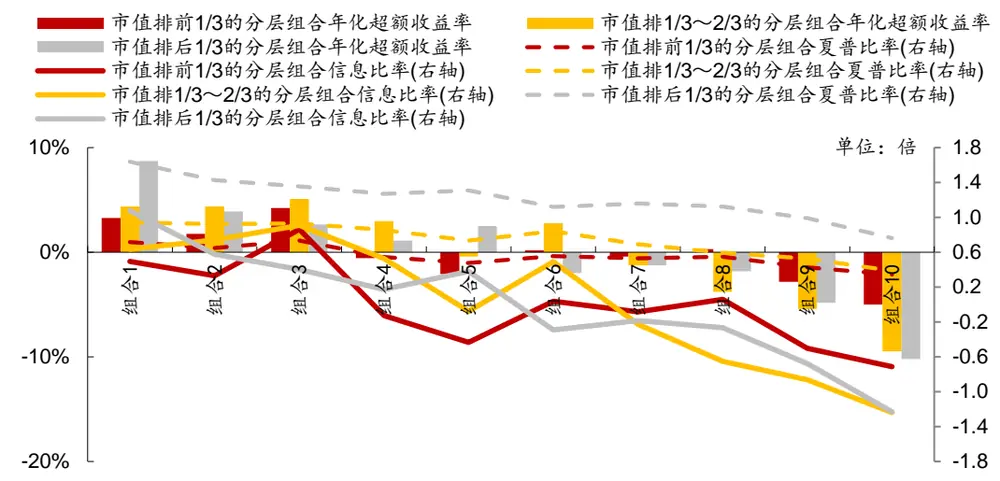
资料来源：Wind，华泰证券研究所

图表57： 不同行业 bias_turn_6m因子分层组合绩效分析（分五层）

|  | 组合1年化 | 组合1 | 组合1 | 组合1 | 组合1超额收益 | 组合1相对 | 所有组合年化 |
| --- | --- | --- | --- | --- | --- | --- | --- |
| 行业 | 超额收益率 | 信息比率 | 年化收益率 | 夏普比率 | 最大回撤 | 基准月胜率 | 收益率排序 |
| 医药 | 6.35% | 0.77 | 39.63% | 1.21 | 14.21% | 59.29% | 1,2,3,4,5 |
| 房地产 | 6.83% | 0.77 | 36.97% | 1.04 | 19.36% | 59.29% | 1,2,3,4,5 |
| 纺织服装 | 7.83% | 0.70 | 39.32% | 1.17 | 16.58% | 58.57% | 1,3,2,5,4 |
| 家电 | 9.43% | 0.70 | 40.62% | 1.14 | 25.16% | 52.14% | 1,2,4,3,5 |
| 通信 | 9.15% | 0.66 | 43.37% | 1.19 | 31.63% | 59.29% | 1,3,2,4,5 |
| 农林牧渔 | 7.38% | 0.64 | 40.16% | 1.14 | 27.75% | 54.29% | 1,2,4,3,5 |
| 计算机 | 8.04% | 0.63 | 42.31% | 1.07 | 26.05% | 55.00% | 1,2,4,3,5 |
| 电子元器件 | 6.22% | 0.61 | 36.77% | 1.00 | 22.24% | 59.29% | 1,2,3,4,5 |
| 建材 | 6.45% | 0.53 | 40.20% | 1.16 | 25.26% | 53.57% | 1,2,3,4,5 |
| 电力及公用事业 | 4.74% | 0.49 | 28.59% | 0.84 | 22.86% | 52.14% | 1,4,2,3,5 |
| 轻工制造 | 4.84% | 0.38 | 32.03% | 0.91 | 23.91% | 52.14% | 1,2,3,4,5 |
| 交通运输 | 3.57% | 0.36 | 24.11% | 0.72 | 20.59% | 47.14% | 1,4,2,3,5 |
| 商贸零售 | 3.34% | 0.35 | 30.60% | 0.93 | 12.90% | 47.86% | 3,2,1,4,5 |
| 电力设备 | 4.02% | 0.34 | 36.12% | 1.03 | 19.69% | 53.57% | 1,2,3,4,5 |
| 基础化工 | 2.85% | 0.33 | 31.14% | 0.90 | 24.29% | 54.29% | 2,1,4,3,5 |
| 煤炭 | 4.22% | 0.32 | 19.47% | 0.48 | 31.92% | 55.00% | 4,1,3,2,5 |
| 食品饮料 | 3.97% | 0.31 | 33.16% | 1.06 | 28.50% | 59.29% | 2,1,3,4,5 |
| 汽车 | 2.85% | 0.28 | 33.44% | 0.97 | 20.15% | 50.00% | 3,1,2,4,5 |
| 钢铁 | 2.80% | 0.23 | 22.52% | 0.62 | 39.74% | 54.29% | 2,1,4,3,5 |
| 建筑 | 3.12% | 0.23 | 35.34% | 1.00 | 29.81% | 49.29% | 1,5,2,4,3 |
| 机械 | 0.83% | 0.10 | 31.47% | 0.93 | 24.26% | 48.57% | 3,2,1,4,5 |
| 有色金属 国防军工 | 1.09% | 0.09 | 29.62% | 0.74 | 43.26% | 50.00% | 2,3,1,4,5 |
| 传媒 | 1.50% | 0.08 | 30.59% | 0.73 | 40.37% | 48.57% | 1,2,5,4,3 |
|  | 1.43% | 0.08 | 29.80% | 0.74 | 44.98% | 52.14% | 4,3,1,2,5 |
| 餐饮旅游 | 0.60% | 0.04 | 27.73% | 0.77 | 38.12% | 46.43% | 4,2,1,3,5 |
| 石油石化 | -1.64% | -0.10 | 23.93% | 0.67 | 44.24% | 51.43% | 2,3,4,1,5 |
| 综合 | -2.04% | -0.14 | 24.29% | 0.66 | 40.20% | 45.71% | 2,3,1,5,4 |
| 银行 | -1.75% | -0.14 | 21.79% | 0.65 | 42.94% | 48.57% | 4,2,1,5,3 |
| 非银行金融 | -4.60% | -0.23 | 19.01% | 0.41 | 57.30% | 47.14% | 2,3,5,1,4 |

资料来源：Wind，华泰证券研究所

std_turn_1m 因子

图表58： std_turn_1m 因子分层组合绩效分析（20050509～20161230）

| 投资组合 | 年化收益率 | 年化波动率夏普比率最大回撤 |  |  | 年化超额收益率 | 超额收益年化波动率信息比率 |  | 相对基准月胜率 | 超额收益最大回撤 |
| --- | --- | --- | --- | --- | --- | --- | --- | --- | --- |
| 组合1 | 27.68% | 28.78% | 0.96 | 70.19% | 2.51% | 6.28% | 0.40 | 50.71% | 14.63% |
| 组合2 | 30.04% | 31.27% | 0.96 | 69.01% | 4.40% | 3.26% | 1.35 | 63.57% | 3.47% |
| 组合3 | 27.54% | 32.26% | 0.85 | 68.54% | 2.40% | 3.00% | 0.80 | 61.43% | 6.78% |
| 组合4 | 23.46% | 33.03% | 0.71 | 71.25% | -0.88% | 3.86% | -0.23 | 50.00% | 15.71% |
| 组合5 | 13.91% | 34.54% | 0.40 | 73.57% | -8.55% | 5.80% | -1.47 | 34.29% | 64.03% |
| 基准组合 | 24.55% | 31.69% | 0.77 | 70.50% |  |  |  |  |  |
| 多空组合 | 12.09% | 11.39% | 1.06 | 18.34% |  |  |  |  |  |

资料来源：Wind，华泰证券研究所

图表59： std_turn_1m 因子分层组合回测净值
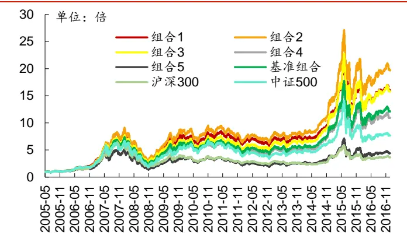
资料来源：Wind，华泰证券研究所

图表60： std_turn_1m因子各层组合净值除以基准组合净值示意图
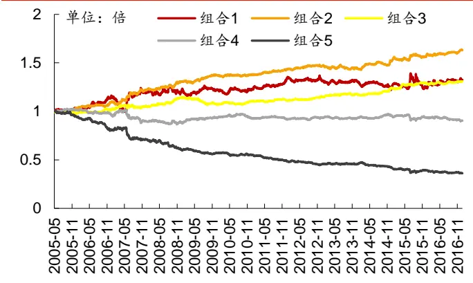
资料来源：Wind，华泰证券研究所

图表61： std_turn_1m分层组合 1相对沪深 300月超额收益分布图
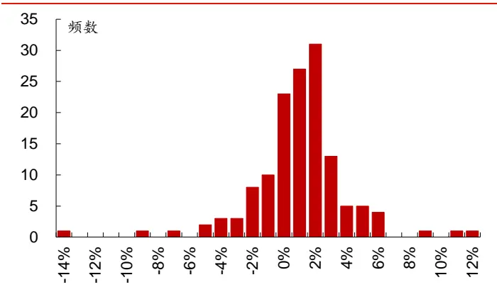
资料来源：Wind，华泰证券研究所

图表62： std_turn_1m因子多空组合月收益率及累积收益率
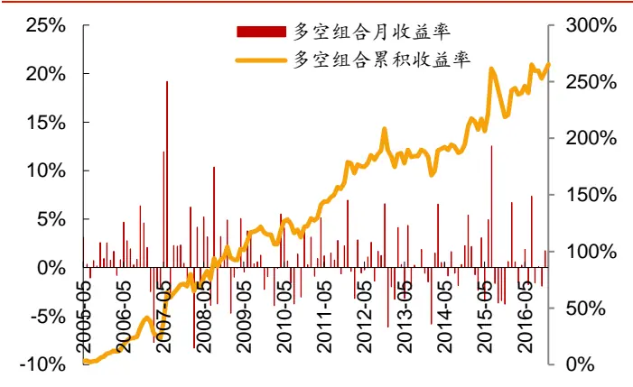
资料来源：Wind，华泰证券研究所

图表63： std_turn_1m分层组合在不同年份的收益及排名分析（分十层）

|  | 2006 | 2007 | 2008 | 2009 | 2010 | 2011 | 2012 | 2013 | 2014 | 2015 | 2016 排名均值 |  |
| --- | --- | --- | --- | --- | --- | --- | --- | --- | --- | --- | --- | --- |
| 组合1 | 130.1%(1) | 227.7%(5) | -59.4%(6) | 121.2%(6) | 0.6%(4) | -16.9%(1) | 12.1%(7) | 7.3%(7) | 62.1%(8) | 29.8%(6) | 5.2%(1) | 4.73 |
| 组合2 | 113.9%(3) | 234.3%(3) | -58.0%(5) | 128.8%(5) | 1.4%(3) | -25.6%(3) | 9.8%(8) | 8.9%(6) | 65.7%(6) | 28.8%(8) | 1.4%(3) | 4.82 |
| 组合3 | 112.0%(4) | 255.0%(1) | -57.8%(4) | 140.0%(2) | 0.1%(5) | -26.3%(5) | 16.0%(4) | 4.0%(10) | 78.6%(2) | 33.1%(4) | -0.2%(5) | 4.18 |
| 组合4 | 109.4%(5) | 250.3%(2) | -55.3%(2) | 131.8%(4) | 2.1%(2) | -24.2%(2) | 16.3%(3) | 10.0%(4) | 78.3%(3) | 39.9%(2) | 1.0%(4) | 3.00 |
| 组合5 | 116.4%(2) | 231.7%(4) |  | -51.4%(1) 105.5%(10) | 9.2%(1) | -29.4%(7) | 20.5%(1) | 9.7%(5) | 71.5%(5) | 33.4%(3) | 1.5%(2) | 3.73 |
| 组合6 | 101.9%(6) | 207.8%(7) | -60.0%(7) | 118.2%(7) | -1.3%(9) | -26.2%(4) | 13.2%(5) | 14.4%(2) | 81.6%(1) | 40.3%(1) | -2.2%(6) | 5.00 |
| 组合7 | 87.0%(8) | 221.5%(6) | -57.5%(3) | 136.5%(3) | -0.2%(6) | -29.8%(8) | 18.2%(2) | 12.3%(3) | 73.2%(4) | 29.1%(7) | -6.8%(9) | 5.36 |
| 组合8 | 88.1%(7) | 172.6%(9) | -62.6%(8) | 142.0%(1) | -0.4%(8) | -28.0%(6) | 12.4%(6) | 6.4%(8) | 65.6%(7) | 32.9%(5) | -4.6%(7) | 6.55 |
| 组合9 | 77.6%(9) | 197.7%(8) | -63.9%(9) | 116.1%(8) | -0.2%(7) | -34.8%(9) | 9.7%(9) | 14.9%(1) | 56.1%(9) | 23.3%(10) | -5.8%(8) | 7.91 |
| 组合10 |  | 66.6%(10) 157.4%(10) | )-67.4%(10) | 111.0%(9) |  | -4.7%(10) -39.8%(10) | 4.2%(10) | 5.8%(9) | 43.5%(10) |  | 27.2%(9) -12.7%(10) | 9.73 |

资料来源：Wind，华泰证券研究所

图表64： 不同市值区间 std_turn_1m分层组合绩效指标对比图（分十层）
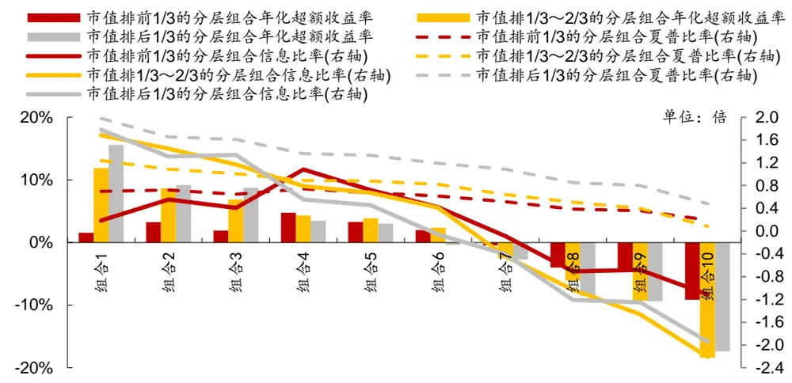
资料来源：Wind，华泰证券研究所

图表65： 不同行业 std_turn_1m因子分层组合绩效分析（分五层）

|  | 组合1年化 | 组合1 | 组合1 | 组合1 | 组合1超额收益 | 组合1相对 | 所有组合年化 |
| --- | --- | --- | --- | --- | --- | --- | --- |
| 行业 | 超额收益率 | 信息比率 | 年化收益率 | 夏普比率 | 最大回撤 | 基准月胜率 | 收益率排序 |
| 基础化工 | 11.24% | 1.25 | 41.83% | 1.27 | 21.21% | 62.86% | 1,2,3,4,5 |
| 纺织服装 | 12.60% | 1.12 | 45.49% | 1.38 | 18.62% | 57.86% | 1,3,2,4,5 |
| 房地产 | 10.66% | 1.06 | 41.88% | 1.19 | 20.35% | 60.71% | 1,2,3,4,5 |
| 农林牧渔 | 10.70% | 0.93 | 44.50% | 1.32 | 23.49% | 62.14% | 1,3,2,4,5 |
| 机械 汽车 | 7.95% | 0.82 | 40.75% | 1.21 | 15.17% | 60.00% | 1,2,4,3,5 |
| 计算机 | 8.92% | 0.82 | 41.32% | 1.26 | 25.56% | 56.43% | 1,2,3,4,5 |
| 电子元器件 | 11.02% | 0.81 | 46.23% | 1.25 | 21.08% | 58.57% | 1,3,2,4,5 |
| 通信 | 7.85% | 0.75 | 38.87% | 1.10 | 24.03% | 55.71% | 1,2,3,4,5 |
| 交通运输 | 9.38% | 0.68 | 43.68% | 1.25 | 22.72% | 56.43% | 1,2,3,4,5 |
| 餐饮旅游 | 6.37% | 0.63 | 27.46% | 0.89 | 22.06% | 53.57% | 1,2,3,4,5 |
| 家电 | 9.94% | 0.61 | 39.59% | 1.15 | 20.19% | 55.71% | 1,3,2,4,5 |
| 医药 | 7.94% | 0.53 | 38.70% | 1.17 | 47.47% | 57.86% | 1,4,3,2,5 |
| 轻工制造 | 4.94% | 0.52 | 37.78% | 1.25 | 24.60% | 54.29% | 2,3,1,4,5 |
| 电力设备 | 6.65% | 0.52 | 34.31% | 1.03 | 22.92% | 52.86% | 1,2,4,3,5 |
| 建筑 | 6.14% | 0.51 | 38.90% | 1.16 | 21.82% | 53.57% | 1,3,2,4,5 |
| 建材 | 6.40% | 0.45 0.43 | 39.65% | 1.16 | 26.78% | 52.14% | 2,1,3,5,4 |
| 综合 | 5.33% |  | 38.72% | 1.11 | 30.23% | 52.86% | 3,2,1,4,5 |
| 商贸零售 | 5.44% | 0.37 0.36 | 33.79% | 0.96 | 29.69% | 54.29% | 1,2,4,3,5 |
| 煤炭 | 3.83% | 0.23 | 31.22% | 0.98 | 26.36% | 55.00% | 2,3,1,4,5 |
| 传媒 | 3.27% | 0.18 | 18.37% | 0.45 | 30.11% | 42.86% | 1,4,2,3,5 |
| 有色金属 | 3.16% | 0.18 | 32.00% | 0.82 | 33.65% | 50.00% | 1,2,3,4,5 |
| 食品饮料 | 2.17% | 0.18 | 30.99% | 0.80 | 32.47% 34.65% | 46.43% 51.43% | 2,1,3,4,5 |
| 电力及公用事业 | 2.66% 0.74% | 0.07 | 31.48% 23.68% | 1.07 | 38.12% | 45.71% | 3,2,1,4,5 |
| 国防军工 | 0.31% | 0.02 | 29.07% | 0.74 0.70 | 41.39% | 50.00% | 2,3,1,4,5 |
| 非银行金融 | -1.82% | -0.08 | 22.47% | 0.52 | 49.94% | 48.57% | 2,3,1,4,5 |
| 石油石化 | -2.82% | -0.16 | 22.44% | 0.71 | 50.25% | 47.86% | 3,2,4,1,5 3,4,2,1,5 |
| 钢铁 | -3.56% | -0.30 | 14.95% | 0.42 | 51.97% | 42.86% | 3,2,5,1,4 |
|  |  |  |  | 0.47 | 59.07% | 35.00% |  |
| 银行 | -6.60% | -0.47 | 15.79% |  |  |  | 5,2,3,4,1 |

资料来源：Wind，华泰证券研究所

std_turn_3m 因子

图表66： std_turn_3m 因子分层组合绩效分析（20050509～20161230）

| 投资组合 | 年化收益率 | 年化波动率夏普比率最大回撤 |  |  | 年化超额收益率 | 超额收益年化波动率信息比率 |  | 相对基准月胜率 | 超额收益最大回撤 |
| --- | --- | --- | --- | --- | --- | --- | --- | --- | --- |
| 组合1 | 27.18% | 28.74% | 0.95 | 69.88% | 2.11% | 6.62% | 0.32 | 50.00% | 15.83% |
| 组合2 | 27.74% | 31.22% | 0.89 | 68.55% | 2.56% | 3.22% | 0.79 | 57.14% | 6.10% |
| 组合3 | 26.36% | 32.36% | 0.81 | 70.06% | 1.45% | 3.22% | 0.45 | 57.14% | 6.27% |
| 组合4 | 25.58% | 33.32% | 0.77 | 71.70% | 0.83% | 3.84% | 0.22 | 54.29% | 7.23% |
| 组合5 | 15.46% | 34.30% | 0.45 | 72.45% | -7.30% | 5.73% | -1.27 | 35.00% | 58.74% |
| 基准组合 | 24.55% | 31.69% | 0.77 | 70.50% |  |  |  |  |  |
| 多空组合 | 10.16% | 11.66% | 0.87 | 21.02% |  |  |  |  |  |

资料来源：Wind，华泰证券研究所

图表67： std_turn_3m 因子分层组合回测净值
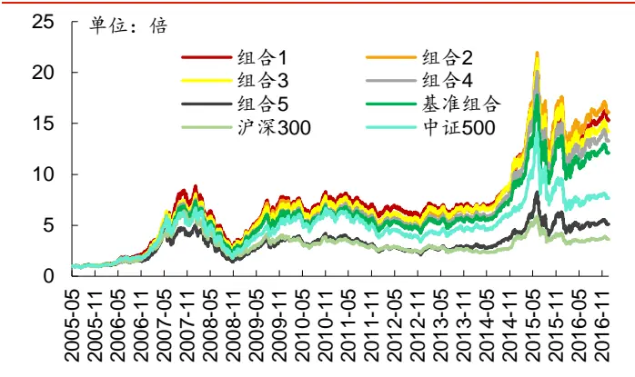
资料来源：Wind，华泰证券研究所

图表68： std_turn_3m 因子各层组合净值除以基准组合净值示意图
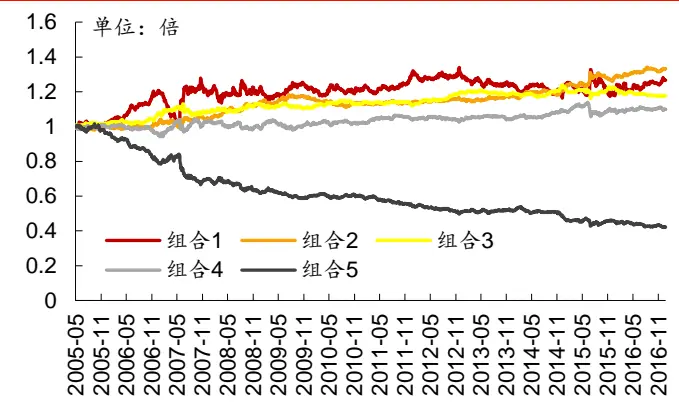
资料来源：Wind，华泰证券研究所

图表69： std_turn_3m分层组合 1相对沪深 300月超额收益分布图
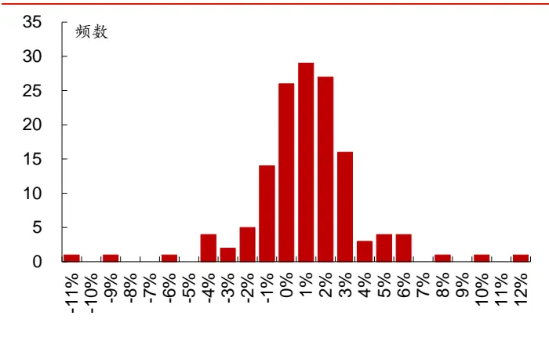
资料来源：Wind，华泰证券研究所

图表70： std_turn_3m因子多空组合月收益率及累积收益率
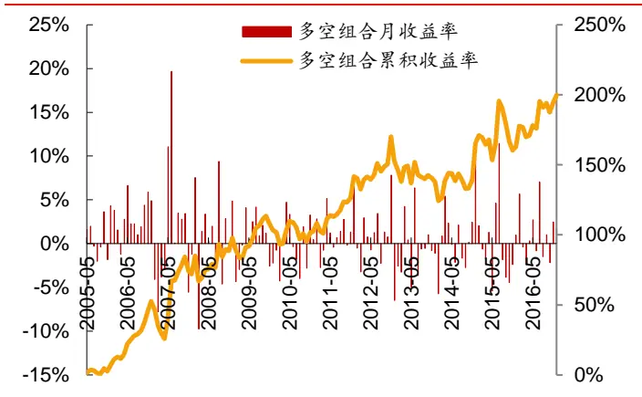
资料来源：Wind，华泰证券研究所

图表71： std_turn_3m分层组合在不同年份的收益及排名分析（分十层）

|  | 2006 | 2007 | 2008 | 2009 | 2010 | 2011 | 2012 | 2013 | 2014 | 2015 | 2016 排名均值 |  |
| --- | --- | --- | --- | --- | --- | --- | --- | --- | --- | --- | --- | --- |
| 组合1 | 135.1%(1) | 221.0%(5) | -59.4%(6) | 116.1%(9) | 0.1%(5) | -19.1%(1) | 10.9%(7) | 2.1%(10) | 63.0%(8) | 30.6%(6) | 3.8%(2) | 5.45 |
| 组合2 | 132.2%(2) | 207.9%(8) | -57.8%(3) | 134.1%(3) | -0.4%(8) | -25.7%(2) | 11.8%(6) | 6.9%(7) | 74.2%(3) | 22.7%(9) | 3.9%(1) | 4.73 |
| 组合3 | 112.4%(4) | 210.0%(7) | -58.6%(4) | 134.8%(2) | -1.1%(9) | -25.9%(3) | 14.8%(5) | 6.3%(8) | 79.4%(1) | 37.5%(4) | 2.0%(3) | 4.55 |
| 组合4 | 101.0%(6) | 227.8%(3) | -52.6%(1) | 122.3%(6) | -2.2%(10) | -29.5%(7) | 15.1%(4) | 15.6%(2) | 67.7%(7) | 41.7%(1) | 0.3%(4) | 4.64 |
| 组合5 | 115.2%(3) | 212.7%(6) | -56.8%(2) | 118.9%(8) | 5.2%(1) | -29.8%(8) | 16.4%(3) | 17.0%(1) | 68.3%(6) | 37.0%(5) | -4.0%(7) | 4.55 |
| 组合6 | 104.0%(5) | 224.8%(4) | -59.0%(5) | 124.7%(5) | 0.1%(6) | -27.7%(6) | 24.3%(1) | 2.4%(9) | 74.1%(4) | 26.5%(7) | -7.3%(9) | 5.55 |
| 组合7 | 97.4%(7) | 240.0%(2) | -60.9%(7) | 119.1%(7) | 0.8%(4) | -27.5%(5) | 16.7%(2) | 8.6%(6) | 75.1%(2) | 40.6%(2) | -3.0%(6) | 4.55 |
| 组合8 | 82.7%(8) | 244.9%(1) | -61.4%(8) | 141.9%(1) | 3.4%(2) | -26.9%(4) | 9.3%(9) | 13.2%(3) | 71.4%(5) | 25.5%(8) | -0.9%(5) | 4.91 |
| 组合9 | 71.3%(9) | 187.6%(9) | -62.3%(9) | 132.2%(4) | -0.3%(7) | -33.3%(9) | 9.3%(8) | 13.0%(4) | 58.6%(9) | 18.9%(10) | -6.6%(8) | 7.82 |
| 组合10 |  | 56.9%(10) 171.1%(10) |  | -65.6%(10) 106.0%(10) |  | 1.0%(3) -36.8%(10) | 3.8%(10) | 8.9%(5) | 43.5%(10) |  | 37.7%(3) -11.3%(10) | 8.27 |

资料来源：Wind，华泰证券研究所

图表72： 不同市值区间 std_turn_3m分层组合绩效指标对比图（分十层）
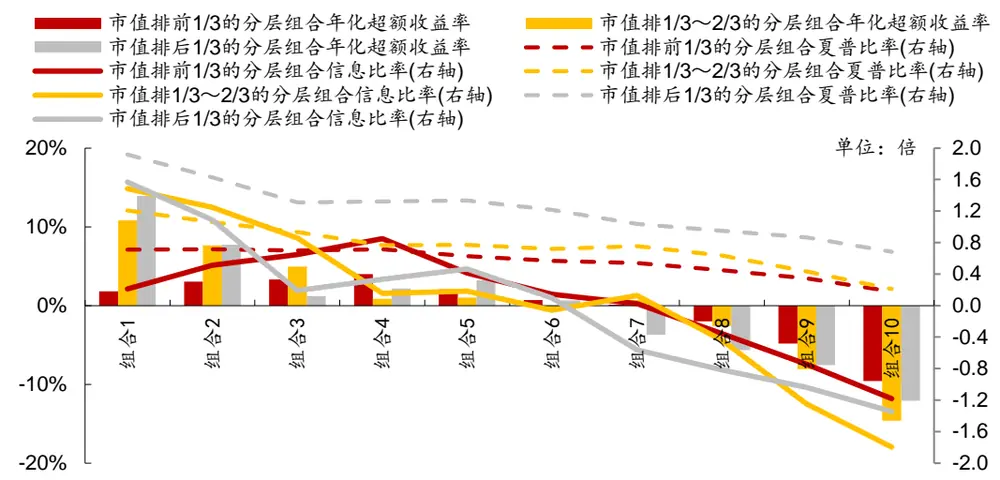
资料来源：Wind，华泰证券研究所

图表73： 不同行业 std_turn_3m因子分层组合绩效分析（分五层）

|  | 组合1年化 | 组合1 | 组合1 | 组合1 | 组合1超额收益 | 组合1相对 | 所有组合年化 |
| --- | --- | --- | --- | --- | --- | --- | --- |
| 行业 | 超额收益率 | 信息比率 | 年化收益率 | 夏普比率 | 最大回撤 | 基准月胜率 | 收益率排序 |
| 通信 | 11.87% | 0.84 | 46.94% | 1.36 1.12 | 27.99% 23.62% | 56.43% 58.57% | 1,2,3,4,5 1,2,4,3,5 |
| 基础化工 纺织服装 | 7.12% | 0.78 0.76 | 36.59% 40.13% | 1.23 | 20.43% | 58.57% | 1,2,3,4,5 |
| 汽车 | 8.45% | 0.63 | 38.86% | 1.20 | 15.43% | 52.14% | 1,2,3,4,5 |
| 计算机 | 7.02% | 0.60 |  | 1.18 | 28.62% | 54.29% | 1,2,3,4,5 |
| 交通运输 | 8.46% | 0.52 | 42.86% 26.36% | 0.86 | 29.14% | 48.57% | 1,3,4,2,5 |
| 电子元器件 | 5.45% 5.01% | 0.49 | 35.22% | 1.00 | 19.48% | 52.86% | 1,3,2,4,5 |
| 房地产 |  | 0.47 | 34.37% | 0.97 | 28.85% | 56.43% |  |
| 建筑 | 4.80% | 0.46 | 39.88% | 1.17 | 22.57% | 51.43% | 1,2,4,3,5 |
| 建材 | 6.58% 5.62% | 0.46 | 39.11% | 1.11 | 36.82% | 51.43% | 1,4,3,2,5 |
| 商贸零售 |  | 0.40 | 32.10% | 1.02 | 26.44% |  | 2,1,3,4,5 |
| 轻工制造 | 4.53% 4.90% | 0.37 | 32.11% | 0.98 | 30.12% | 52.86% 55.00% | 2,1,3,4,5 |
| 医药 | 2.69% | 0.27 | 34.82% | 1.16 | 25.02% | 47.86% | 1,2,3,4,5 |
| 电力设备 | 3.19% | 0.26 | 35.03% | 1.06 | 22.37% | 52.86% | 3,2,1,4,5 |
| 煤炭 | 3.61% | 0.25 | 18.76% | 0.45 | 36.19% | 52.14% | 1,3,2,5,4 |
| 家电 | 3.75% | 0.24 | 33.32% | 1.02 | 44.02% | 52.86% | 3,1,4,2,5 |
| 国防军工 | 3.97% | 0.24 | 33.77% | 0.81 | 38.87% | 50.71% | 1,2,3,4,5 |
| 农林牧渔 | 2.63% | 0.23 | 33.97% | 1.02 | 34.99% | 52.14% | 4,1,2,3,5 |
| 综合 | 2.87% | 0.19 | 30.53% | 0.86 | 35.71% | 49.29% | 3,1,2,5,4 |
| 餐饮旅游 | 1.85% | 0.12 | 29.32% | 0.86 | 30.61% | 46.43% | 3,1,2,5,4 |
| 机械 | 1.09% | 0.11 | 31.80% | 0.95 | 28.52% | 52.86% | 2,3,1,4,5 |
| 食品饮料 | 1.23% | 0.08 | 29.65% | 1.01 | 34.88% | 50.71% | 2,3,1,4,5 |
| 非银行金融 | 1.21% | 0.06 | 26.24% | 0.61 | 37.14% | 49.29% | 2,3,4,1,5 |
| 传媒 | 0.89% | 0.05 | 29.10% | 0.76 | 48.50% | 48.57% | 2,3,1,4,5 |
| 钢铁 | 0.35% | 0.03 | 19.61% | 0.55 | 29.39% | 49.29% | 1,2,5,3,4 |
| 有色金属 | 0.32% | 0.03 | 28.63% | 0.73 | 39.43% | 50.71% | 4,2,1,5,3 |
| 石油石化 | -1.48% | -0.08 | 24.14% | 0.77 | 49.19% | 46.43% | 4,3,2,1,5 3,2,1,4,5 |
| 电力及公用事业 | -2.40% | -0.22 | 19.83% | 0.62 | 40.93% | 40.00% | 2,3,1,5,4 |
| 银行 | -3.51% | -0.26 | 19.61% | 0.57 | 49.09% | 38.57% | 3,4,2,5,1 |

资料来源：Wind，华泰证券研究所

std_turn_6m 因子

图表74： std_turn_6m 因子分层组合绩效分析（20050509～20161230）

| 投资组合 | 年化收益率 | 年化波动率夏普比率最大回撤 |  |  | 年化超额收益率 | 超额收益年化波动率信息比率 |  | 相对基准月胜率 | 超额收益最大回撤 |
| --- | --- | --- | --- | --- | --- | --- | --- | --- | --- |
| 组合1 | 25.26% | 28.91% | 0.87 | 69.80% | 0.57% | 6.68% | 0.08 | 49.29% | 17.78% |
| 组合2 | 26.27% | 31.25% | 0.84 | 70.86% | 1.38% | 3.22% | 0.43 | 51.43% | 6.52% |
| 组合3 | 26.33% | 32.40% | 0.81 | 71.38% | 1.42% | 3.10% | 0.46 | 55.00% | 8.17% |
| 组合4 | 26.35% | 33.30% | 0.79 | 70.92% | 1.44% | 3.88% | 0.37 | 55.00% | 6.43% |
| 组合5 | 17.89% | 34.11% | 0.52 | 69.85% | -5.35% | 5.78% | -0.93 | 43.57% | 49.24% |
| 基准组合 | 24.55% | 31.69% | 0.77 | 70.50% |  |  |  |  |  |
| 多空组合 | 6.25% | 11.75% | 0.53 | 21.97% |  |  |  |  |  |

资料来源：Wind，华泰证券研究所

图表75： std_turn_6m 因子分层组合回测净值
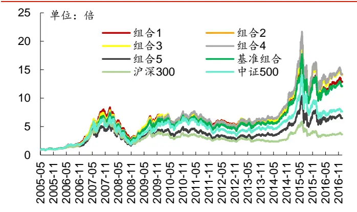
资料来源：Wind，华泰证券研究所

图表76： std_turn_6m 各层组合净值除以基准组合净值示意图
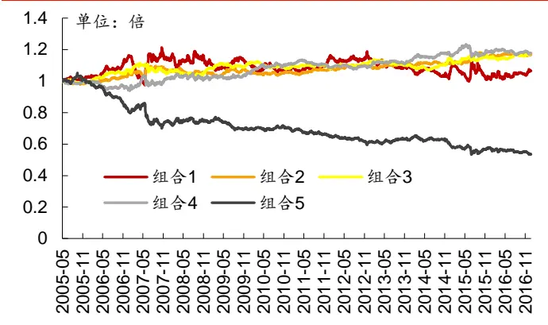
资料来源：Wind，华泰证券研究所

图表77： std_turn_6m分层组合 1相对沪深 300月超额收益分布图
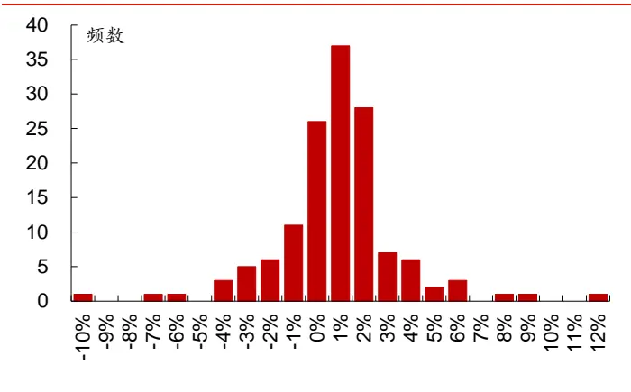
资料来源：Wind，华泰证券研究所

图表78： std_turn_6m因子多空组合月收益率及累积收益率
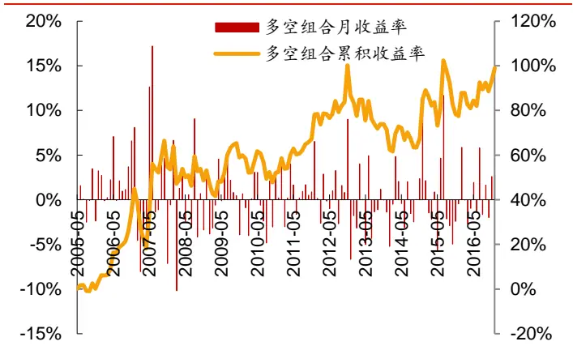
资料来源：Wind，华泰证券研究所

图表79： std_turn_6m分层组合在不同年份的收益及排名分析（分十层）

|  | 2006 | 2007 | 2008 | 2009 | 2010 | 2011 | 2012 | 2013 | 2014 | 2015 |  | 2016 排名均值 |
| --- | --- | --- | --- | --- | --- | --- | --- | --- | --- | --- | --- | --- |
| 组合1 | 132.2%(1) | 197.7%(8) | -58.4%(3) | 107.1%(9) | -1.3%(7) | -22.0%(1) | 9.9%(8) | 1.0%(10) | 62.3%(7) | 25.4%(9) | 2.7%(1) | 5.82 |
| 组合2 | 120.1%(3) | 221.0%(3) | -61.2%(9) | 135.9%(2) | -4.8%(10) | -23.1%(2) | 14.5%(5) | 5.9%(7) | 73.4%(4) | 21.3%(10) | 2.3%(3) | 5.27 |
| 组合3 | 123.6%(2) | 217.6%(4) | -61.1%(8) | 127.4%(6) | 1.3%(4) | -25.3%(3) | 14.0%(6) | 5.9%(8) | 78.7%(1) | 41.8%(1) | 0.3%(4) | 4.27 |
| 组合4 | 101.6%(6) | 216.6%(5) | -58.6%(4) | 126.2%(7) | -0.5%(6) | -28.2%(5) | 16.3%(2) | 15.0%(3) | 60.0%(8) | 33.1%(5) | -3.8%(7) | 5.27 |
| 组合5 | 113.5%(5) | 210.2%(7) | -56.8%(2) | 129.4%(4) | -2.1%(9) | -28.2%(4) | 15.5%(4) | 9.0%(6) | 70.3%(5) | 29.8%(6) | -3.5%(6) | 5.27 |
| 组合6 | 115.4%(4) | 215.4%(6) | -60.3%(7) | 132.5%(3) | -1.9%(8) | -28.8%(7) | 20.5%(1) | 4.7%(9) | 76.3%(2) | 38.3%(2) | 2.6%(2) | 4.64 |
| 组合7 | 92.6%(7) | 259.8%(1) | )-62.6%(10) | 139.4%(1) | 1.5%(3) | -28.6%(6) | 15.9%(3) | 9.1%(5) | 68.0%(6) | 35.3%(4) | -2.0%(5) | 4.64 |
| 组合8 | 86.5%(8) | 223.8%(2) | -56.8%(1) | 129.0%(5) | 11.4%(1) | -30.8%(8) | 11.4%(7) | 17.8%(1) | 74.9%(3) | 35.9%(3) | -4.8%(8) | 4.27 |
| 组合9 | 67.8%(9) | 195.2%(9) | -59.1%(5) | 122.1%(8) | 0.4%(5) | -32.0%(9) | 5.0%(10) | 16.1%(2) | 59.0%(9) | 29.6%(7) | -5.9%(9) | 7.45 |
| 组合10 |  | 55.0%(10) 188.5%(10) |  | -60.3%(6) 101.6%(10) | 3.1%(2) | )-35.5%(10) | 8.9%(9) | 9.5%(4) | 51.7%(10) |  | 27.7%(8) -11.1%(10) | 8.09 |

资料来源：Wind，华泰证券研究所

图表80： 不同市值区间 std_turn_6m分层组合绩效指标对比图（分十层）
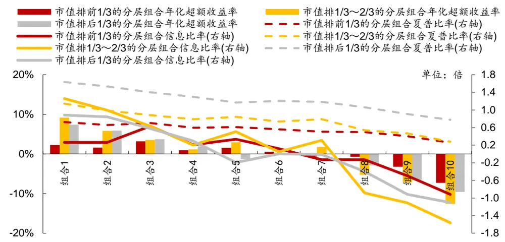
资料来源：Wind，华泰证券研究所

图表81： 不同行业 std_turn_6m因子分层组合绩效分析（分五层）

|  | 组合1年化 | 组合1 | 组合1 | 组合1 | 组合1超额收益 | 组合1相对 | 所有组合年化 |
| --- | --- | --- | --- | --- | --- | --- | --- |
| 行业 | 超额收益率 | 信息比率 | 年化收益率 | 夏普比率 | 最大回撤 | 基准月胜率 | 收益率排序 |
| 通信 | 7.39% | 0.53 | 41.06% | 1.20 | 28.00% | 57.14% | 1,2,4,3,5 |
| 纺织服装 | 4.94% | 0.44 | 35.59% | 1.08 | 22.22% | 55.00% | 1,2,4,3,5 |
| 汽车 | 4.68% | 0.42 | 35.82% | 1.10 | 25.24% | 50.00% | 1,2,3,4,5 |
| 计算机 | 5.63% | 0.41 | 39.14% | 1.07 | 27.01% | 57.14% | 1,2,3,4,5 |
| 煤炭 | 5.61% | 0.40 | 21.05% | 0.50 | 39.67% | 51.43% | 1,3,4,2,5 |
| 轻工制造 | 5.13% | 0.38 | 32.39% | 0.98 | 31.75% | 52.14% | 1,3,2,4,5 |
| 建材 | 4.13% | 0.34 | 37.14% | 1.06 | 29.15% | 50.71% | 2,1,3,4,5 |
| 医药 | 3.33% | 0.32 | 35.66% | 1.19 | 26.06% | 50.00% | 1,2,3,4,5 |
| 基础化工 | 2.39% | 0.26 | 30.56% | 0.93 | 23.96% | 52.14% | 2,1,3,4,5 |
| 房地产 | 1.90% | 0.19 | 30.64% | 0.86 | 39.19% | 47.86% | 2,1,3,4,5 |
| 交通运输 | 1.98% | 0.19 | 22.20% | 0.72 | 38.39% | 45.71% | 1,2,4,3,5 |
| 电子元器件 | 1.76% | 0.17 | 31.04% | 0.88 | 28.90% | 50.71% | 1,4,3,5,2 |
| 家电 | 2.56% | 0.16 | 31.80% | 0.98 | 45.89% | 47.86% | 1,3,2,4,5 |
| 机械 | 1.45% | 0.14 | 32.28% | 0.97 | 28.58% | 52.14% | 3,1,4,2,5 |
| 建筑 | 1.87% | 0.14 | 33.70% | 0.97 | 43.77% | 50.00% | 4,2,1,3,5 |
| 商贸零售 | 1.51% | 0.13 | 28.29% | 0.90 | 26.62% | 51.43% | 2,3,1,4,5 |
| 综合 | 1.70% | 0.11 | 29.04% | 0.82 | 39.45% | 51.43% | 3,1,2,5,4 |
| 有色金属 | 0.37% | 0.03 | 28.69% | 0.72 | 29.26% | 48.57% | 4,3,1,2,5 |
| 电力及公用事业 | -0.08% | -0.01 | 22.67% | 0.72 | 41.31% | 43.57% | 3,4,1,2,5 |
| 钢铁 非银行金融 | -0.12% | -0.01 | 19.05% | 0.53 | 36.94% | 47.86% | 4,1,5,2,3 |
|  | -0.26% | -0.01 | 24.42% | 0.57 | 42.87% | 48.57% | 2,4,1,3,5 |
| 食品饮料 | -0.31% | -0.02 | 27.69% | 0.93 | 37.96% | 50.71% | 3,2,1,4,5 |
| 电力设备 | -0.48% | -0.04 | 30.22% | 0.92 | 38.94% | 47.86% | 3,1,5,4,2 |
| 传媒 | -0.73% | -0.04 | 27.02% | 0.69 | 50.81% | 47.14% | 4,5,1,2,3 |
| 国防军工 | -1.05% | -0.06 | 27.31% | 0.65 | 46.87% | 47.86% | 4,3,1,2,5 |
| 农林牧渔 | -0.84% | -0.07 | 29.44% | 0.89 | 43.46% | 47.86% | 2,3,1,4,5 |
| 餐饮旅游 | -3.87% | -0.25 | 22.05% | 0.64 | 49.75% | 47.86% | 2,4,3,1,5 |
| 石油石化 | -4.62% | -0.26 | 20.17% | 0.64 | 55.44% | 47.14% | 3,2,4,1,5 |
| 银行 | -3.89% | -0.28 | 19.15% | 0.55 | 45.48% | 42.86% | 4,3,5,2,1 |

资料来源：Wind，华泰证券研究所

## bias_std_turn_1m 因子

图表82： bias_std_turn_1m 因子分层组合绩效分析（20050509～20161230）

| 投资组合 | 年化收益率 | 年化波动率夏普比率最大回撤 |  |  | 年化超额收益率 | 超额收益年化波动率信息比率 |  | 相对基准月胜率 | 超额收益最大回撤 |
| --- | --- | --- | --- | --- | --- | --- | --- | --- | --- |
| 组合1 | 31.80% | 30.24% | 1.05 | 68.37% | 5.81% | 4.43% | 1.31 | 67.14% | 8.10% |
| 组合2 | 27.76% | 31.46% | 0.88 | 68.48% | 2.57% | 3.22% | 0.80 | 60.71% | 7.49% |
| 组合3 | 28.16% | 31.91% | 0.88 | 70.40% | 2.90% | 3.02% | 0.96 | 61.43% | 5.64% |
| 组合4 | 21.93% | 32.65% | 0.67 | 70.40% | -2.10% | 3.40% | -0.62 | 43.57% | 22.04% |
| 组合5 | 13.38% | 33.28% | 0.40 | 74.78% | -8.97% | 4.74% | -1.89 | 27.14% | 65.73% |
| 基准组合 | 24.55% | 31.69% | 0.77 | 70.50% |  |  |  |  |  |
| 多空组合 | 16.24% | 8.21% | 1.98 | 12.69% |  |  |  |  |  |

资料来源：Wind，华泰证券研究所

图表83： bias_std_turn_1m 因子分层组合回测净值
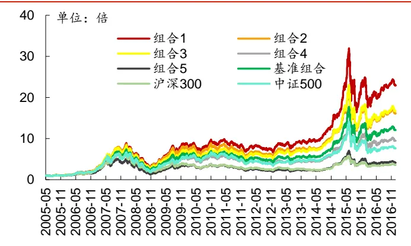
资料来源：Wind，华泰证券研究所

图表84： bias_std_turn_1m各层组合净值除以基准组合净值示意图
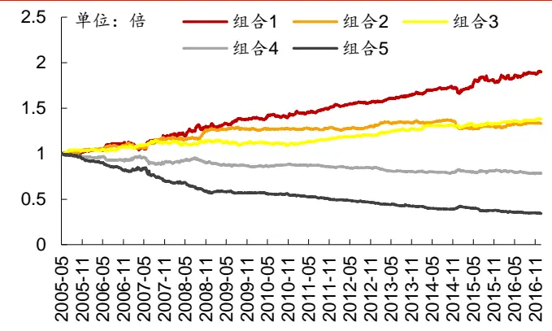
资料来源：Wind，华泰证券研究所

图表85： bias_std_turn_1m 组合 1 相对沪深 300 月超额收益分布图
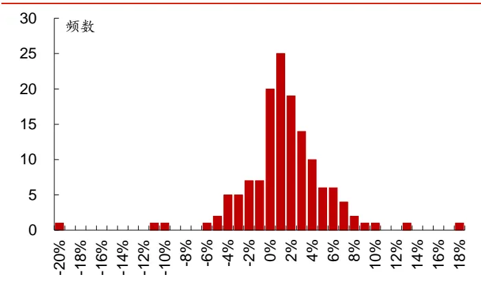
资料来源：Wind，华泰证券研究所

图表86： bias_std_turn_1m 因子多空组合月收益率及累积收益率
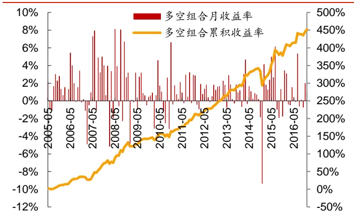
资料来源：Wind，华泰证券研究所

图表87： bias_std_turn_1m分层组合在不同年份的收益及排名分析（分十层）

|  | 2006 | 2007 | 2008 | 2009 | 2010 | 2011 | 2012 | 2013 | 2014 | 2015 |  | 2016 排名均值 |
| --- | --- | --- | --- | --- | --- | --- | --- | --- | --- | --- | --- | --- |
| 组合1 | 123.8%(1) | 246.7%(3) | -55.7%(3) | 138.0%(1) | 3.1%(3) | -20.7%(1) | 15.2%(5) | 22.7%(1) | 67.7%(5) | 49.2%(1) | 0.0%(4) | 2.55 |
| 组合2 | 101.7%(6) | 249.3%(1) | -55.3%(2) | 134.7%(2) | 3.7%(2) | -24.9%(3) | 16.0%(3) | 8.7%(6) | 66.9%(7) | 40.9%(2) | 3.2%(2) | 3.27 |
| 组合3 | 111.7%(3) | 222.0%(6) | -53.0%(1) | 128.7%(3) | 1.6%(5) | -27.0%(5) | 20.2%(1) | 16.1%(3) | 57.4%(10) | 37.0%(4) | 4.6%(1) | 3.82 |
| 组合4 | 109.6%(4) | 241.5%(4) | -57.9%(5) | 121.4%(7) | -0.5%(7) | -29.6%(7) | 13.6%(7) | 8.8%(5) | 59.8%(9) | 30.6%(7) | -3.3%(7) | 6.27 |
| 组合5 | 112.0%(2) | 248.7%(2) | -56.9%(4) | 119.3%(8) | -0.1%(6) | -22.8%(2) | 15.8%(4) | 11.5%(4) | 73.1%(2) | 38.9%(3) | 2.7%(3) | 3.64 |
| 组合6 | 106.7%(5) | 199.8%(7) | -61.0%(7) | 128.2%(4) | -1.1%(9) | -25.2%(4) | 17.4%(2) | 18.4%(2) | 67.4%(6) | 35.1%(5) | -0.7%(5) | 5.09 |
| 组合7 | 85.3%(8) | 225.8%(5) | -58.8%(6) | 115.6%(9) | 1.8%(4) | -28.5%(6) | 11.3%(8) | 3.2%(9) | 68.5%(4) | 33.1%(6) | -2.7%(6) | 6.45 |
| 组合8 | 100.0%(7) | 188.7%(8) |  | -61.3%(8) 113.9%(10) | 5.8%(1) | -32.7%(9) | 14.0%(6) | 4.7%(7) | 75.9%(1) | 26.5%(8) | -8.3%(8) | 6.64 |
| 组合9 | 73.7%(10) | 174.0%(9) | -66.4%(9) | 126.2%(5) | -0.6%(8) | -31.4%(8) | 3.4%(10) | 4.5%(8) | 70.9%(3) | 19.5%(9) | -9.6%(10) | 8.09 |
| 组合10 |  | 76.3%(9) 166.1%(10) | -66.8%(10) | 123.5%(6) | -6.9%(10) | -38.7%(10) | 6.3%(9) | -2.8%(10) | 65.5%(8) | 11.3%(10) | -8.5%(9) | 9.18 |

资料来源：Wind，华泰证券研究所

图表88： 不同市值区间 bias_std_turn_1m分层组合绩效指标对比图（分十层）
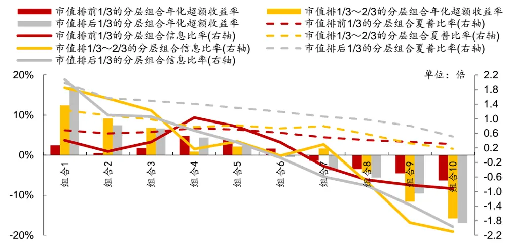
资料来源：Wind，华泰证券研究所

图表89： 不同行业 bias_std_turn_1m因子分层组合绩效分析（分五层）

|  | 组合1年化 | 组合1 | 组合1 | 组合1 | 组合1超额收益 | 组合1相对 | 所有组合年化 |
| --- | --- | --- | --- | --- | --- | --- | --- |
| 行业 | 超额收益率 | 信息比率 | 年化收益率 | 夏普比率 | 最大回撤 12.04% | 基准月胜率 66.43% | 收益率排序 |
| 房地产 | 14.35% 11.79% | 1.58 1.51 | 46.61% 46.77% | 1.31 1.40 | 14.31% | 66.43% | 1,2,3,4,5 1,2,3,4,5 |
| 医药 电子元器件 | 15.03% | 1.48 | 48.12% | 1.32 | 21.41% | 66.43% | 1,2,3,4,5 |
| 基础化工 | 10.52% | 1.31 | 40.93% | 1.18 | 17.45% | 65.71% | 1,2,3,4,5 |
| 纺织服装 | 13.75% | 1.25 | 46.97% | 1.39 | 11.55% | 61.43% | 1,2,3,4,5 |
| 食品饮料 | 13.37% | 1.11 | 45.20% | 1.42 | 26.57% | 62.86% | 1,3,2,4,5 |
| 汽车 | 9.52% | 1.02 | 42.10% | 1.21 | 32.17% | 64.29% | 1,2,3,4,5 |
| 计算机 | 13.08% | 1.00 | 48.95% | 1.25 | 20.12% | 65.00% | 1,3,2,4,5 |
| 餐饮旅游 | 15.54% | 1.00 | 46.70% | 1.26 | 25.61% | 62.86% | 1,2,4,3,5 |
| 农林牧渔 | 10.51% | 0.93 | 44.25% | 1.25 | 23.93% | 59.29% | 2,1,3,4,5 |
| 机械 | 7.85% | 0.91 | 40.62% | 1.18 | 21.52% | 61.43% | 2,1,3,4,5 |
| 轻工制造 | 10.89% | 0.86 | 39.65% | 1.16 | 22.54% | 57.14% | 1,3,2,5,4 |
| 商贸零售 | 7.45% | 0.81 | 35.79% | 1.05 | 24.21% | 55.71% | 1,3,2,4,5 |
| 有色金属 | 9.09% | 0.80 | 39.87% | 1.02 | 17.39% | 59.29% | 1,2,3,4,5 |
| 交通运输 | 7.52% | 0.77 | 28.84% | 0.88 | 13.90% | 57.14% | 1,2,3,4,5 |
| 家电 | 9.32% | 0.70 | 40.48% | 1.16 | 37.38% | 56.43% | 1,3,2,4,5 |
| 电力设备 | 7.56% | 0.68 | 40.75% | 1.17 | 24.19% | 58.57% | 2,1,3,4,5 |
| 电力及公用事业 | 6.06% | 0.67 | 30.21% | 0.90 | 17.24% | 58.57% | 2,1,3,4,5 |
| 通信 | 8.41% | 0.63 | 42.40% | 1.14 | 29.67% | 60.71% | 2,1,3,4,5 |
| 石油石化 | 9.40% | 0.59 | 37.83% | 1.06 | 32.98% | 53.57% | 1,3,4,2,5 |
| 建材 | 6.97% | 0.57 | 40.88% | 1.15 | 29.46% | 57.86% | 3,1,2,4,5 |
| 煤炭 | 6.52% | 0.48 | 22.10% | 0.54 | 28.17% | 55.71% | 1,3,2,4,5 |
| 传媒 | 7.69% | 0.45 | 37.80% | 0.94 | 25.05% | 52.86% | 3,1,2,4,5 |
| 建筑 | 3.99% | 0.29 | 36.48% | 1.03 | 27.02% | 49.29% | 3,1,2,4,5 |
| 国防军工 | 4.44% | 0.26 | 34.37% | 0.82 | 37.60% | 47.86% | 2,1,3,5,4 |
| 钢铁 | 0.24% | 0.02 | 19.48% | 0.54 | 30.47% | 52.14% | 4,3,1,2,5 |
| 综合 | -0.35% | -0.02 | 26.44% | 0.71 | 47.07% | 47.86% | 2,3,4,1,5 |
| 银行 | -2.13% | -0.16 | 21.33% | 0.64 | 41.53% | 46.43% | 3,2,5,1,4 |
| 非银行金融 | -6.30% | -0.32 | 16.87% | 0.37 | 69.65% | 49.29% | 2,4,3,1,5 |

资料来源：Wind，华泰证券研究所

## bias_std_turn_3m 因子

图表90： bias_std_turn_3m 因子分层组合绩效分析（20050509～20161230）

| 投资组合 | 年化收益率 | 年化波动率夏普比率最大回撤 |  |  | 年化超额收益率 | 超额收益年化波动率信息比率 |  | 相对基准月胜率 | 超额收益最大回撤 |
| --- | --- | --- | --- | --- | --- | --- | --- | --- | --- |
| 组合1 | 31.22% | 30.10% | 1.04 | 69.14% | 5.35% | 4.56% | 1.17 | 65.00% | 12.97% |
| 组合2 | 27.51% | 31.53% | 0.87 | 68.47% | 2.38% | 3.05% | 0.78 | 58.57% | 6.11% |
| 组合3 | 27.39% | 32.17% | 0.85 | 68.85% | 2.27% | 3.23% | 0.70 | 55.00% | 5.48% |
| 组合4 | 19.74% | 32.49% | 0.61 | 71.82% | -3.87% | 3.30% | -1.17 | 37.14% | 36.63% |
| 组合5 | 16.91% | 33.21% | 0.51 | 74.16% | -6.14% | 4.41% | -1.39 | 29.29% | 52.15% |
| 基准组合 | 24.55% | 31.69% | 0.77 | 70.50% |  |  |  |  |  |
| 多空组合 | 12.24% | 8.00% | 1.53 | 19.89% |  |  |  |  |  |

资料来源：Wind，华泰证券研究所

图表91： bias_std_turn_3m 因子分层组合回测净值
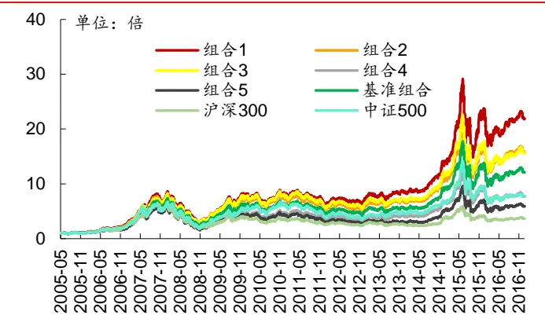
资料来源：Wind，华泰证券研究所

图表92： bias_std_turn_3m各层组合净值除以基准组合净值示意图
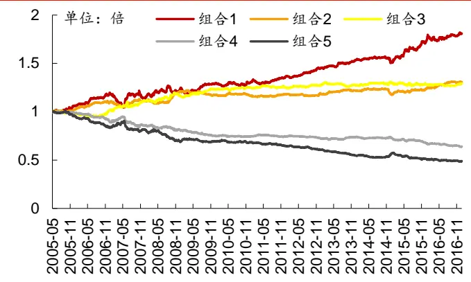
资料来源：Wind，华泰证券研究所

图表93： bias_std_turn_3m 组合 1 相对沪深 300 月超额收益分布图
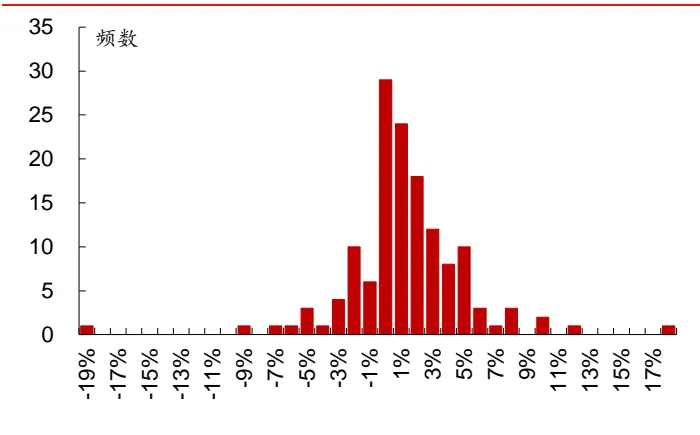
资料来源：Wind，华泰证券研究所

图表94： bias_std_turn_3m 因子多空组合月收益率及累积收益率
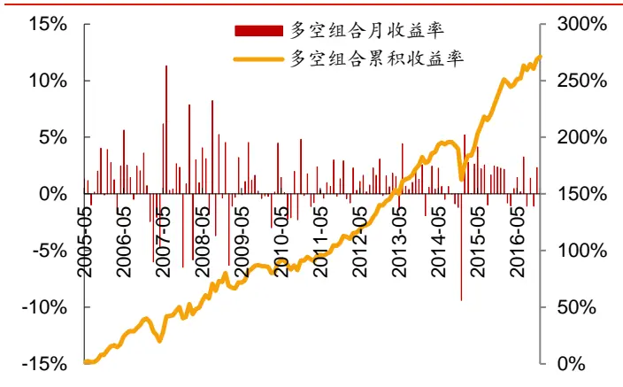
资料来源：Wind，华泰证券研究所

图表95： bias_std_turn_3m分层组合在不同年份的收益及排名分析（分十层）

|  | 2006 | 2007 | 2008 | 2009 | 2010 | 2011 | 2012 | 2013 | 2014 | 2015 | 2016 排名均值 |  |
| --- | --- | --- | --- | --- | --- | --- | --- | --- | --- | --- | --- | --- |
| 组合1 | 118.8%(2) | 232.4%(3) | -55.0%(2) | 130.3%(5) | 0.9%(5) | -23.8%(1) | 17.2%(4) | 21.2%(1) | 69.2%(4) | 57.7%(1) | 0.7%(3) | 2.82 |
| 组合2 |  | 122.9%(1) 184.5%(10) | -57.0%(4) | 135.5%(2) | 3.2%(3) | -26.2%(3) | 23.7%(1) | 10.0%(6) | 58.9%(10) | 48.6%(2) | 1.5%(2) | 4.00 |
| 组合3 | 116.5%(4) | 201.0%(7) | -53.3%(1) | 115.9%(8) | -4.4%(10) | -28.8%(6) | 19.0%(3) | 15.1%(2) | 60.3%(9) | 42.0%(3) | -1.2%(5) | 5.27 |
| 组合4 | 113.9%(5) | 232.4%(4) | -58.0%(5) | 121.3%(6) | 3.4%(2) | -24.8%(2) | 7.5%(9) | 10.5%(5) | 62.6%(7) | 36.7%(4) | 7.0%(1) | 4.55 |
| 组合5 | 117.2%(3) | 237.9%(2) | -56.9%(3) | 143.5%(1) | 3.5%(1) | -27.1%(4) | 9.7%(6) | 8.6%(8) | 73.1%(3) | 29.5%(6) | -1.9%(6) | 3.91 |
| 组合6 | 99.7%(6) | 250.2%(1) | -58.8%(6) | 135.4%(3) | 0.6%(6) | -29.3%(8) | 22.3%(2) | 9.7%(7) | 67.2%(6) | 31.4%(5) | -1.1%(4) | 4.91 |
| 组合7 | 87.0%(7) | 218.6%(5) | -59.1%(7) | 115.7%(9) | -0.7%(8) | -28.0%(5) | 11.1%(5) | 12.5%(3) | 61.0%(8) | 27.4%(7) | -4.9%(8) | 6.55 |
| 组合8 | 74.0%(9) | 189.1%(9) |  | -64.6%(9) 102.5%(10) | 1.3%(4) | -29.1%(7) | 9.4%(7) | 11.8%(4) | 68.7%(5) | 16.9%(9) | -9.9%(10) | 7.55 |
| 组合9 | 80.9%(8) 72.5%(10) | 199.4%(8) | -63.5%(8) | 117.8%(7) |  | -1.5%(9)-33.1%(10) | 5.0%(10) | 4.2%(9) | 78.6%(1) | 15.4%(10) | -4.2%(7) | 7.91 |
| 组合10 |  | 209.2%(6) | -67.3%(10) | 133.5%(4) | 0.2%(7) | -32.4%(9) | 8.9%(8) | -7.9%(10) | 74.5%(2) | 18.5%(8) | -8.7%(9) | 7.55 |

资料来源：Wind，华泰证券研究所

图表96： 不同市值区间 bias_std_turn_3m分层组合绩效指标对比图（分十层）
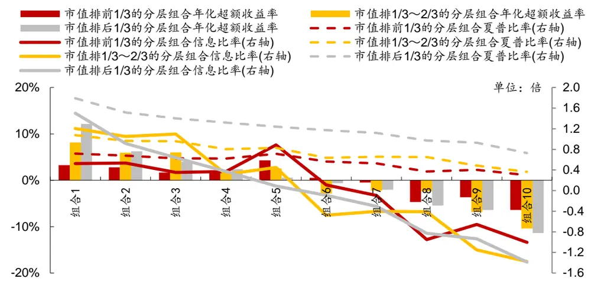
资料来源：Wind，华泰证券研究所

图表97： 不同行业 bias_std_turn_3m因子分层组合绩效分析（分五层）

|  | 组合1年化 | 组合1 | 组合1 | 组合1 | 组合1超额收益 | 组合1相对 | 所有组合年化 |
| --- | --- | --- | --- | --- | --- | --- | --- |
| 行业 | 超额收益率 | 信息比率 | 年化收益率 | 夏普比率 1.39 | 最大回撤 14.19% | 基准月胜率 68.57% | 收益率排序 1,2,3,4,5 |
| 医药 纺织服装 | 11.25% 12.22% | 1.45 1.10 | 46.07% 45.00% | 1.34 | 18.49% | 57.86% | 1,3,2,4,5 |
| 电子元器件 | 10.61% | 1.07 | 42.43% | 1.17 | 30.73% | 64.29% | 1,2,3,4,5 |
| 汽车 | 9.15% | 0.96 | 41.61% | 1.21 | 13.67% | 55.71% | 1,3,2,4,5 |
| 计算机 | 12.25% | 0.94 | 47.86% | 1.22 | 22.95% | 60.00% | 1,2,3,4,5 |
| 通信 | 11.35% | 0.88 | 46.26% | 1.27 | 23.33% | 59.29% | 1,2,3,4,5 |
| 农林牧渔 | 9.57% | 0.83 | 43.03% | 1.23 | 33.37% | 58.57% | 1,3,4,2,5 |
| 有色金属 | 8.98% | 0.78 | 39.73% | 1.00 | 19.08% | 60.00% | 1,3,2,5,4 |
| 基础化工 | 5.83% | 0.73 | 34.94% | 1.01 | 23.73% | 60.00% | 2,1,3,4,5 |
| 建材 | 7.87% | 0.64 | 42.07% | 1.19 | 22.83% | 55.00% | 1,2,3,4,5 |
| 交通运输 | 5.93% | 0.63 | 26.93% | 0.82 | 17.56% | 54.29% | 1,2,3,4,5 |
| 房地产 | 5.41% | 0.63 | 35.14% | 0.99 | 19.25% | 60.71% | 2,1,4,3,5 |
| 电力设备 | 6.98% | 0.60 | 39.99% | 1.15 | 15.96% | 50.71% | 1,2,3,4,5 |
| 商贸零售 | 4.42% | 0.51 | 31.97% | 0.94 | 17.23% | 57.86% | 2,1,3,4,5 |
| 国防军工 | 8.26% | 0.47 | 39.29% | 0.95 | 29.90% | 52.14% | 1,5,3,2,4 |
| 机械 | 3.94% | 0.44 | 35.52% | 1.03 | 24.74% | 58.57% | 2,1,3,4,5 |
| 电力及公用事业 | 4.23% | 0.44 | 27.97% | 0.83 | 19.80% | 52.14% | 1,3,2,4,5 |
| 建筑 | 5.53% | 0.41 | 38.50% | 1.11 | 22.42% | 54.29% | 1,3,2,4,5 |
| 餐饮旅游 | 6.42% | 0.40 | 35.11% | 0.96 | 29.22% | 53.57% | 1,2,3,4,5 |
| 钢铁 | 4.47% | 0.39 | 24.51% | 0.69 | 21.29% | 57.14% | 1,3,2,4,5 |
| 家电 | 5.04% | 0.38 | 34.98% | 1.01 | 39.16% | 55.71% | 2,1,3,4,5 |
| 轻工制造 | 4.49% | 0.35 | 31.59% | 0.93 | 30.82% | 56.43% | 1,2,4,5,3 |
| 煤炭 | 4.33% | 0.33 | 19.58% | 0.47 | 35.37% | 53.57% | 2,1,3,5,4 |
| 传媒 | 5.69% | 0.32 | 35.24% | 0.88 | 42.40% | 52.86% | 1,4,2,3,5 |
| 食品饮料 | 4.07% | 0.32 | 33.29% | 1.06 | 40.42% | 53.57% | 2,3,1,4,5 |
| 非银行金融 | 4.76% | 0.23 | 30.67% | 0.67 | 39.58% | 53.57% | 1,3,2,4,5 |
| 综合 | 2.88% | 0.19 | 30.54% | 0.83 | 38.10% | 54.29% | 3,1,2,5,4 |
| 银行 | 0.08% | 0.01 | 24.06% | 0.72 | 30.39% | 45.71% | 3,1,2,5,4 |
| 石油石化 | -0.26% | -0.02 | 25.66% | 0.71 | 43.72% | 44.29% | 3,2,1,4,5 |

资料来源：Wind，华泰证券研究所

## bias_std_turn_6m 因子

图表98： bias_std_turn_6m 因子分层组合绩效分析（20050509～20161230）

| 投资组合 | 年化收益率 | 年化波动率夏普比率最大回撤 |  |  | 年化超额收益率 | 超额收益年化波动率信息比率 |  | 相对基准月胜率 | 超额收益最大回撤 |
| --- | --- | --- | --- | --- | --- | --- | --- | --- | --- |
| 组合1 | 28.36% | 30.46% | 0.93 | 69.76% | 3.06% | 4.55% | 0.67 | 57.14% | 13.87% |
| 组合2 | 27.59% | 31.43% | 0.88 | 69.72% | 2.44% | 3.12% | 0.78 | 60.00% | 6.04% |
| 组合3 | 25.59% | 31.87% | 0.80 | 69.67% | 0.83% | 3.14% | 0.27 | 52.86% | 8.69% |
| 组合4 | 22.61% | 32.55% | 0.69 | 70.04% | -1.56% | 3.51% | -0.44 | 44.29% | 20.55% |
| 组合5 | 18.26% | 33.26% | 0.55 | 73.42% | -5.05% | 4.58% | -1.10 | 40.71% | 45.76% |
| 基准组合 | 24.55% | 31.69% | 0.77 | 70.50% |  |  |  |  |  |
| 多空组合 | 8.55% | 8.12% | 1.05 | 22.06% |  |  |  |  |  |

资料来源：Wind，华泰证券研究所

图表99： bias_std_turn_6m 因子分层组合回测净值
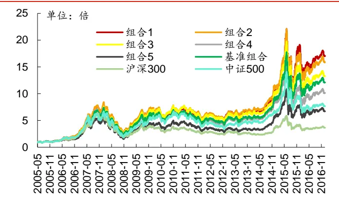
资料来源：Wind，华泰证券研究所

图表100： bias_std_turn_6m 各层组合净值除以基准组合净值示意图
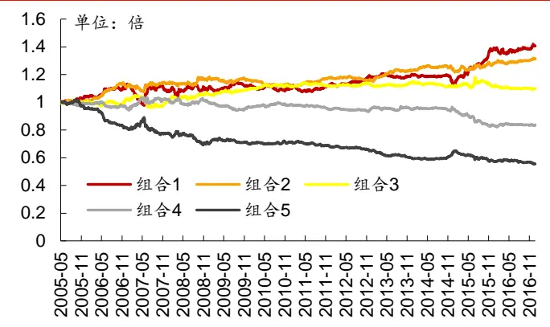
资料来源：Wind，华泰证券研究所

图表101： bias_std_turn_6m 组合 1 相对沪深 300 月超额收益分布图
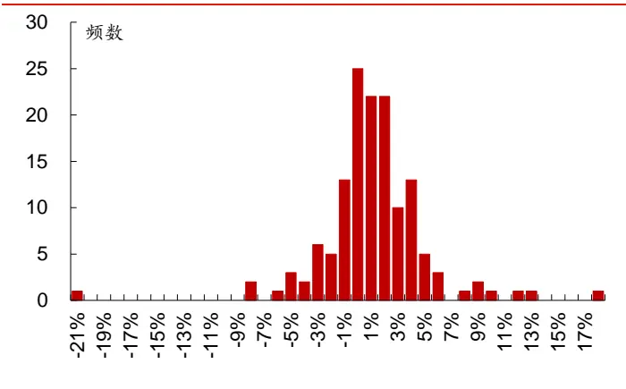
资料来源：Wind，华泰证券研究所

图表102： bias_std_turn_6m 因子多空组合月收益率及累积收益率
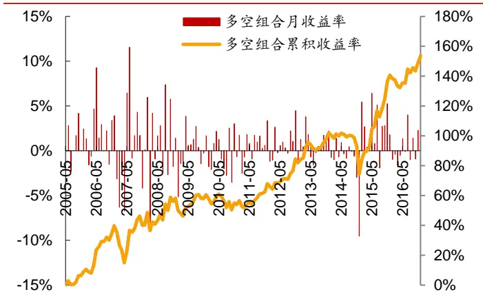
资料来源：Wind，华泰证券研究所

图表103： bias_std_turn_6m分层组合在不同年份的收益及排名分析（分十层）

|  | 2006 | 2007 | 2008 | 2009 | 2010 | 2011 | 2012 | 2013 | 2014 | 2015 | 2016 排名均值 |  |
| --- | --- | --- | --- | --- | --- | --- | --- | --- | --- | --- | --- | --- |
| 组合1 | 117.1%(3) | 217.3%(4) | -58.7%(5) | 120.8%(7) | -2.5%(8) | -25.1%(3) | 16.8%(2) | 16.6%(2) | 65.1%(6) | 72.0%(1) | 0.9%(3) | 4.00 |
| 组合2 | 113.5%(4) 190.9%(10) |  | -57.9%(3) | 131.0%(3) | 0.4%(6) | -26.8%(4) | 19.5%(1) | 4.6%(8) | 52.2%(10) | 51.0%(2) | -2.1%(5) | 5.09 |
| 组合3 | 126.2%(1) | 228.7%(3) | -59.4%(6) | 128.6%(5) | -2.5%(9) | -24.3%(1) | 10.9%(8) | 11.6%(5) | 59.0%(8) | 44.2%(3) | -1.9%(4) | 4.82 |
| 组合4 | 119.5%(2) | 209.7%(6) | -56.8%(2) | 116.1%(9) | -3.3%(10) | -24.4%(2) | 10.8%(9) | 22.1%(1) | 73.4%(3) | 33.2%(5) | 1.9%(2) | 4.64 |
| 组合5 | 108.3%(5) | 212.3%(5) | -60.9%(7) | 136.9%(1) | 1.2%(5) | -28.5%(6) | 13.7%(5) | 13.0%(3) | 68.6%(5) | 36.3%(4) | -4.0%(8) | 4.91 |
| 组合6 | 99.7%(6) | 207.9%(7) | -53.7%(1) | 132.2%(2) | 1.8%(3) | -27.4%(5) | 13.4%(6) | 11.6%(6) | 56.9%(9) | 27.6%(6) | -3.6%(7) | 5.27 |
| 组合7 | 94.1%(7) | 246.5%(1) | -58.3%(4) | 128.5%(6) | 4.2%(2) | -30.9%(9) | 16.2%(3) | 4.7%(7) | 62.0%(7) | 12.9%(10) | 2.3%(1) | 5.18 |
| 组合8 | 89.1%(8) | 230.6%(2) |  | -62.6%(9)110.1%(10) | 1.5%(4) | -30.9%(8) | 13.4%(7) | 12.2%(4) | 72.4%(4) | 17.5%(8) | -5.4%(9) | 6.64 |
| 组合9 | 69.8%(9) | 201.9%(9) | -62.0%(8) | 129.3%(4) | 7.8%(1) | -30.3%(7) | 2.7%(10) | -0.7%(10) | 81.9%(2) | 14.3%(9) | -3.0%(6) | 6.82 |
| 组合10 | 66.1%(10) | 203.3%(8) | -64.0%(10) | 116.4%(8) |  | -1.3%(7) -34.0%(10) | 15.6%(4) | -0.2%(9) | 84.9%(1) | 19.6%(7) | -8.4%(10) | 7.64 |

资料来源：Wind，华泰证券研究所

图表104： 不同市值区间 bias_std_turn_6m分层组合绩效指标对比图（分十层）
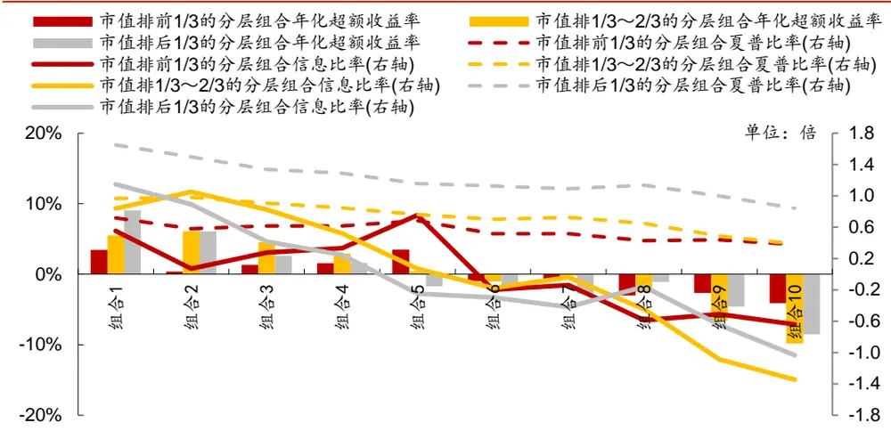
资料来源：Wind，华泰证券研究所

图表105： 不同行业 bias_std_turn_6m因子分层组合绩效分析（分五层）

|  | 组合1年化 | 组合1 | 组合1 | 组合1 | 组合1超额收益 | 组合1相对 | 所有组合年化 |
| --- | --- | --- | --- | --- | --- | --- | --- |
| 行业 | 超额收益率 | 信息比率 | 年化收益率 | 夏普比率 | 最大回撤 | 基准月胜率 | 收益率排序 |
| 医药 | 9.36% | 1.17 | 43.58% | 1.31 | 13.18% | 62.86% | 1,2,4,3,5 |
| 计算机 | 13.53% | 1.04 | 49.54% | 1.25 | 21.17% | 56.43% | 1,2,3,4,5 |
| 房地产 | 7.67% | 0.91 | 38.04% | 1.06 | 19.60% | 60.71% | 1,2,3,4,5 |
| 通信 | 11.40% | 0.88 | 46.33% | 1.26 | 22.14% | 56.43% | 1,4,2,3,5 |
| 交通运输 | 6.36% | 0.67 | 27.45% | 0.83 | 20.71% | 51.43% | 1,4,2,3,5 |
| 建材 | 7.51% | 0.62 | 41.59% | 1.19 | 25.68% | 59.29% | 1,2,3,4,5 |
| 电力设备 | 7.18% | 0.61 | 40.26% | 1.14 | 19.59% | 55.71% | 1,3,4,2,5 |
| 电子元器件 | 5.50% | 0.54 | 35.85% | 0.97 | 33.00% | 59.29% | 2,1,4,3,5 |
| 纺织服装 | 5.84% | 0.54 | 36.76% | 1.07 | 22.10% | 52.86% | 1,2,3,4,5 |
| 基础化工 | 4.02% | 0.48 | 32.63% | 0.94 | 22.42% | 52.14% | 1,2,3,5,4 |
| 机械 | 4.18% | 0.47 | 35.84% | 1.04 | 19.44% | 57.86% | 1,2,4,5,3 |
| 电力及公用事业 | 4.40% | 0.46 | 28.18% | 0.84 | 23.32% | 54.29% | 1,4,3,2,5 |
| 农林牧渔 | 5.16% | 0.45 | 37.28% | 1.06 | 29.99% | 53.57% | 1,3,4,2,5 |
| 食品饮料 | 5.55% | 0.43 | 35.18% | 1.11 | 37.68% | 56.43% | 2,1,3,5,4 |
| 煤炭 | 4.12% | 0.31 | 19.35% | 0.46 | 34.55% | 47.86% | 2,1,4,3,5 |
| 家电 | 4.12% | 0.30 | 33.80% | 0.97 | 42.34% | 50.00% | 2,1,4,3,5 |
| 有色金属 | 3.28% | 0.29 | 32.41% | 0.80 | 34.67% | 50.71% | 1,2,4,3,5 |
| 轻工制造 | 3.31% | 0.26 | 30.11% | 0.87 | 30.07% | 51.43% | 1,4,2,3,5 |
| 建筑 | 3.44% | 0.25 | 35.76% | 1.01 | 34.74% | 50.00% | 1,5,2,3,4 |
| 餐饮旅游 | 3.87% | 0.25 | 31.88% | 0.88 | 26.68% | 47.86% | 3,1,4,2,5 |
| 传媒 | 4.07% | 0.22 | 33.16% | 0.82 | 41.46% | 52.14% | 3,1,2,5,4 |
| 汽车 | 1.97% | 0.20 | 32.30% | 0.92 | 25.80% | 42.86% | 3,1,2,4,5 |
| 钢铁 | 2.02% | 0.18 | 21.60% | 0.60 | 29.22% | 52.14% | 3,1,2,5,4 |
| 商贸零售 | 1.61% | 0.18 | 28.42% | 0.84 | 16.35% | 47.86% | 2,1,3,4,5 |
| 综合 | 1.20% | 0.08 | 28.41% | 0.76 | 30.91% | 52.86% | 2,5,1,3,4 |
| 国防军工 | 1.00% | 0.06 | 29.95% | 0.70 | 33.46% | 42.14% | 5,1,3,2,4 |
| 非银行金融 | -0.51% | -0.02 | 24.10% | 0.52 | 49.10% | 48.57% | 2,1,4,3,5 |
| 银行 | -3.09% | -0.24 | 20.14% | 0.59 | 38.27% | 46.43% | 3,2,4,1,5 |
| 石油石化 | -4.64% | -0.29 | 20.16% | 0.55 | 59.94% | 43.57% | 3,4,2,1,5 |

资料来源：Wind，华泰证券研究所

## 回归法测试结果分析

上一章中，我们依次展示了十二个换手率因子分层回测的结果，本章我们将使用回归法进行截面规律统计。回归法是多因子模型领域应用最广的方法，回归法单因子测试的结果不仅用于初步因子筛选，在后续构建收益预测模型时还会进一步应用。具体模型设置和下面图表中各指标含义参见第二章“单因子测试流程”的第一小节“回归法”。我们还列出了前期报告因子回归测试结果（估值、成长、动量类因子）与本期换手率类因子回归结果进行对比，如下所示。

图表106： 换手率因子回归测试结果

| 因子 | It\|均值 | Itl>2 占比 | t均值 | t 均值/t 标准差 |  | 因子收益率均值因子收益率序列t检验 |
| --- | --- | --- | --- | --- | --- | --- |
| turn_1m | 5.26 | 77.08% | -1.86 | -0.29 | -0.528% | -3.51 |
| turn_3m | 5.28 | 80.56% | -1.31 | -0.20 | -0.391% | -2.53 |
| turn_6m | 5.12 | 79.17% | -1.02 | -0.16 | -0.312% | -2.10 |
| bias_turn_1m | 4.16 | 65.97% | -2.04 | -0.39 | -0.460% | -3.72 |
| bias_turn_3m | 3.94 | 63.89% | -1.55 | -0.31 | -0.360% | -2.99 |
| bias_turn_6m | 3.72 | 58.33% | -1.23 | -0.26 | -0.287% | -2.47 |
| std_turn_1m | 4.74 | 78.47% | -2.04 | -0.37 | -0.584% | -4.36 |
| std_turn_3m | 5.04 | 81.25% | -1.45 | -0.24 | -0.443% | -3.08 |
| std_turn_6m | 4.90 | 76.39% | -1.04 | -0.18 | -0.326% | -2.32 |
| bias_std_turn_1m | 3.54 | 64.58% | -2.03 | -0.49 | -0.468% | -4.89 |
| bias_std_turn_3m | 3.43 | 60.42% | -1.56 | -0.37 | -0.371% | -3.81 |
| bias_std_turn_6m | 3.21 | 58.33% | -1.06 | -0.26 | -0.269% | -2.74 |

资料来源：Wind，华泰证券研究所

图表107： 前期报告因子回归测试结果（估值、成长、动量因子）

| 因子 | It\|均值 | \|t\|>2 占比 | t均值 | t 均值/t 标准差 | 因子收益率均值 | 因子收益率序列t检验 |
| --- | --- | --- | --- | --- | --- | --- |
| EP | 4.64 | 68.4% | 0.53 | 0.09 | 0.142% | 0.96 |
| EPcut | 4.47 | 71.3% | 0.56 | 0.10 | 0.154% | 1.03 |
| BP | 5.02 | 77.9% | 1.32 | 0.21 | 0.416% | 2.70 |
| SP | 4.03 | 72.1% | 0.80 | 0.16 | 0.292% | 2.50 |
| DP | 3.05 | 53.7% | 0.19 | 0.05 | 0.091% | 1.05 |
| PEG | 2.51 | 55.1% | -0.73 | -0.24 | -0.225% | -3.06 |
| Sales_G_q | 2.58 | 58.9% | 0.83 | 0.27 | 0.199% | 2.62 |
| Profit_G_q | 2.94 | 55.3% | 1.12 | 0.31 | 0.283% | 3.15 |
| OCF_G_q | 1.47 | 25.5% | 0.42 | 0.23 | 0.110% | 2.03 |
| ROE_G_q | 2.45 | 47.5% | 1.03 | 0.35 | 0.265% | 3.52 |
| return_1m | 4.89 | 73.4% | -2.73 | -0.47 | -0.639% | -5.00 |
| wgt_return_1m | 4.23 | 72.7% | -2.91 | -0.64 | -0.790% | -6.79 |
| exp_wgt_return_3m | 4.39 | 72.7% | -3.20 | -0.68 | -0.856% | -7.66 |
| exp_wgt_return_6m | 4.51 | 71.3% | -3.15 | -0.66 | -0.860% | -7.30 |

资料来源：Wind，华泰证券研究所

图表108： 换手率因子累积收益率展示一（回归法）
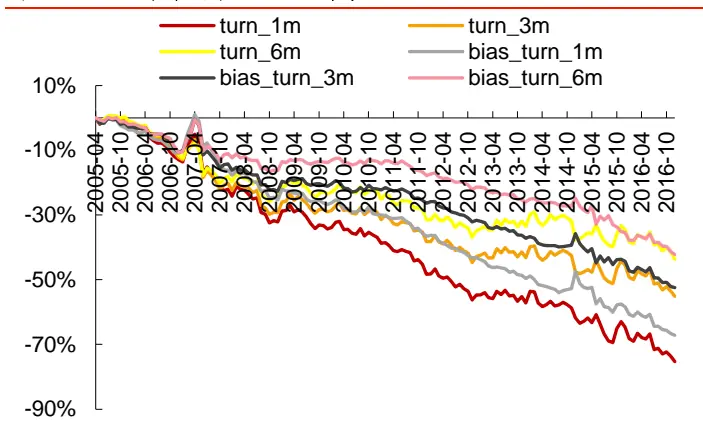
资料来源：Wind，华泰证券研究所

图表109： 换手率因子累积收益率展示二（回归法）
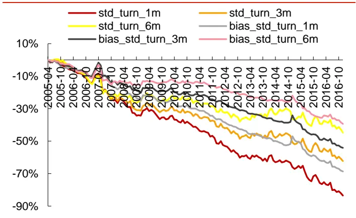
资料来源：Wind，华泰证券研究所

从上面的图表可以看出，换手率因子的整体效果都还不错。取假设检验 H：因子收益率序列均值显著异于 0。则假设检验 H对应的 t 值在图表 106中最后一列，所有十二个换手率因子都能通过该假设检验。如果从回归法得出的|t|均值和因子收益率均值来看，1 个月日均换手率（turn_1m）和 1个月内换手率序列标准差（std_turn_1m）这两个因子表现最好；如果从“因子收益率序列均值显著异于零”的 t 检验结果来看，1 个月日均换手率乖离率（bias_turn_1m）和 1 个月内换手率序列标准差乖离率（bias_std_turn_1m）因子要强于turn_1m 和 std_turn_1m 因 子 。 其 实 这 一 现 象 背 后 的 原 因 是 — — bias_turn_1m 、bias_std_turn_1m 这两个因子的因子收益率序列波动比较小，也就是说，这两个因子的表现相对更稳定一些。从上面的图表也确实可以看出，bias_turn_1m、bias_std_turn_1m 对应的曲线比较平滑。并且，在前一章分层回测中，也是 bias_turn_1m、bias_std_turn_1m因子的整体表现强于 turn_1m、std_turn_1m 因子。

由于换手率因子的分层测试结果与回归法结果并不完全一致，我们想要更全面地了解这种差异因何而产生。图表 106 中的结果是由WLS回归产生（用个股流通市值的平方根作为权重，具体描述参见第二章“单因子测试流程”的第一小节“回归法”中测试模型构建方法的第 5 点），我们将WLS回归改成 OLS回归，回归测试结果对比显示在图表 110中。通过观察可以发现，在 OLS 回归下所有换手率类因子的效果都有所提升，这也和换手率因子的特点有关——在大盘股中效果较差，在中、小盘股中效果很好。并且 OLS 回归下bias_turn_1m、bias_std_turn_1m 因子的效果是好于 turn_1m、std_turn_1m 因子的，可以从某种程度上说明，bias_turn_1m、bias_std_turn_1m 因子在大盘股中失效得更严重。

图表110： 换手率因子 OLS回归测试结果

| 因子 | It\|均值 | \|t\|>2 占比 | t 均值 | t 均值/t 标准差 |  | 因子收益率均值因子收益率序列t检验 |
| --- | --- | --- | --- | --- | --- | --- |
| turn_1m | 5.06 | 74.31% | -2.22 | -0.37 | -0.580% | -4.36 |
| turn_3m | 5.03 | 74.31% | -1.48 | -0.24 | -0.398% | -2.92 |
| turn_6m | 5.00 | 75.00% | -1.05 | -0.17 | -0.283% | -2.12 |
| bias_turn_1m | 4.15 | 73.61% | -2.65 | -0.58 | -0.661% | -5.68 |
| bias_turn_3m | 3.70 | 65.28% | -1.91 | -0.43 | -0.477% | -4.23 |
| bias_turn_6m | 3.44 | 60.42% | -1.39 | -0.33 | -0.349% | -3.13 |
| std_turn_1m | 4.63 | 73.61% | -2.59 | -0.49 | -0.660% | -5.85 |
| std_turn_3m | 4.73 | 73.61% | -1.66 | -0.29 | -0.433% | -3.51 |
| std_turn_6m | 4.78 | 74.31% | -1.10 | -0.19 | -0.290% | -2.29 |
| bias_std_turn_1m | 3.74 | 70.14% | -2.83 | -0.76 | -0.699% | -7.98 |
| bias_std_turn_3m | 3.25 | 64.58% | -1.93 | -0.52 | -0.484% | -5.62 |
| bias_std_turn_6m | 2.94 | 57.64% | -1.23 | -0.34 | -0.311% | -3.63 |

资料来源：Wind，华泰证券研究所

与前三篇单因子测试的报告结果进行对比，我们发现换手率因子的整体效果比估值、成长因子要好，但不如动量因子。这一结论也比较符合投资者的直观印象。估值与成长因子是部分或全部源于财务数据的因子，灵敏度不如量价类因子，在多因子模型中的贡献度也不如量价类因子。而“量”与“价”相比，通常还是价格因素给投资者带来的刺激更大，量、价间存在一定协同效应，由此还可以衍生出许多技术类因子，将在以后的测试报告中详加讨论，欢迎持续关注。

## 因子 IC值的计算与分析

在回归法因子测试完成之后，我们还将进行因子 IC值的计算与分析。请注意，我们此处计算的因子 IC值并不是因子原始暴露度和下期收益的相关系数，而是“经过市值和行业调整的”因子暴露度和下期收益的相关系数（具体计算方法详见第二章“单因子测试流程”的第二小节“因子 IC值的计算”），所以因子 IC值的计算结果和回归测试结果并不是完全一致的（回归模型中包含行业哑变量而不包含市值相关解释变量）。

我们还仿照回归法分析过程，画出各因子 IC值累积曲线，可以从图中观察换手率因子在各段历史时期的表现。

下面图表中 IR比率是指因子 IC 值均值与标准差的比值的绝对值，能够衡量因子有效性。因子 IC值的分析结果与回归法基本一致，turn_1m、std_turn_1m 因子 IC序列均值绝对值比较大，但是 IC 序列标准差也大；bias_turn_1m、bias_std_turn_1m 因子 IC 序列均值绝对值小一些，但是 IC序列标准差也小。从 IR比率来看还是 turn_1m、std_turn_1m 要稍好一些，尤其是 std_turn_1m 因子的 IR比率达到 0.82，比动量因子中经典的 1个月反转因子 IR值还要高。

图表111： 换手率因子 IC值分析

| 因子 | IC 序列均值 | IC 序列标准差 | IR 比率 | IC>0 占比 | \|IC\|>0.02 占比 |
| --- | --- | --- | --- | --- | --- |
| turn_1m | -6.79% | 10.36% | 0.66 | 26.39% | 87.50% |
| turn_3m | -5.37% | 10.32% | 0.52 | 28.47% | 86.11% |
| turn_6m | -4.68% | 9.89% | 0.47 | 29.17% | 83.33% |
| bias_turn_1m | -4.81% | 7.88% | 0.61 | 22.92% | 81.94% |
| bias_turn_3m | -3.48% | 7.91% | 0.44 | 28.47% | 77.78% |
| bias_turn_6m | -2.57% | 7.41% | 0.35 | 33.33% | 76.39% |
| std_turn_1m | -7.37% | 8.93% | 0.82 | 18.75% | 88.89% |
| std_turn_3m | -5.91% | 9.26% | 0.64 | 22.22% | 87.50% |
| std_turn_6m | -4.90% | 9.02% | 0.54 | 25.69% | 84.03% |
| bias_std_turn_1m | -4.92% | 6.33% | 0.78 | 18.06% | 84.03% |
| bias_std_turn_3m | -3.63% | 6.52% | 0.56 | 25.00% | 78.47% |
| bias_std_turn_6m | -2.43% | 6.34% | 0.38 | 31.94% | 73.61% |

资料来源：Wind，华泰证券研究所

图表112： 前期报告因子 IC值分析（估值、成长、动量因子）

| 因子 | IC 序列均值 | IC 序列标准差 | IR 比率 | IC>0 占比 | \|IC\|>0.02 占比 |
| --- | --- | --- | --- | --- | --- |
| EP | 2.11% | 7.96% | 0.27 | 55.88% | 69.85% |
| EPcut | 2.21% | 7.74% | 0.29 | 61.76% | 74.26% |
| BP | 2.80% | 8.39% | 0.33 | 58.82% | 85.29% |
| SP | 2.29% | 6.56% | 0.35 | 61.03% | 75.74% |
| DP | 1.64% | 4.39% | 0.37 | 66.18% | 64.71% |
| PEG | -1.77% | 4.58% | 0.39 | 36.76% | 74.26% |
| Sales_G_q | 1.89% | 5.26% | 0.36 | 65.25% | 72.34% |
| Profit_G_q | 2.31% | 6.42% | 0.36 | 62.41% | 81.56% |
| OCF_G_q | 1.07% | 2.72% | 0.39 | 70.92% | 44.68% |
| ROE_G_q | 2.01% | 5.84% | 0.34 | 68.09% | 73.05% |
| return_1m | -5.73% | 9.07% | 0.63 | 27.97% | 82.52% |
| wgt_return_1m | -7.24% | 7.84% | 0.92 | 18.18% | 86.71% |
| exp_wgt_return_3m | -7.74% | 8.07% | 0.96 | 15.38% | 84.62% |
| exp_wgt_return_6m | -7.70% | 8.35% | 0.92 | 16.08% | 85.31% |

资料来源：Wind，华泰证券研究所

图表113： 换手率因子 IC值累积曲线展示一
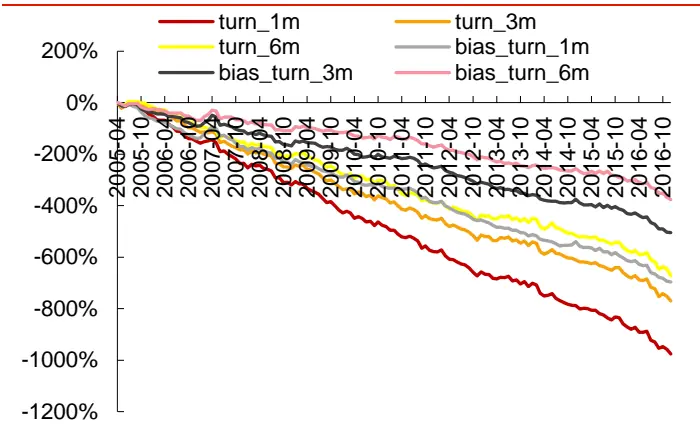
资料来源：Wind，华泰证券研究所

图表114： 换手率因子 IC值累积曲线展示二
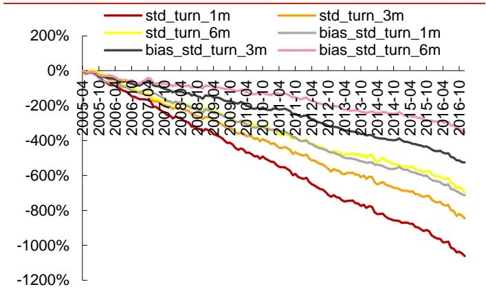
资料来源：Wind，华泰证券研究所

与前三篇单因子测试的报告结果进行对比，我们发现换手率因子在 IC值分析方面各项表现也都强于估值和成长因子，比动量因子稍弱一点。

## 换手率因子或可选用较短样本期

近 1 个月收益率、近 1个月换手率均为多因子模型中常见的因子，并且经测试验证，它们确实要比近 N个月收益率、近 N 个月换手率（N>1）因子效果出色。然而，我们还想刨根究底地问一下：为什么不用最近 K个交易日的量价信息构建因子，而一定要用近 1 个月的呢？究竟怎样的样本期长度能使因子的效果达到最优？俗话说的好，理不辨不明，事不鉴不清。于是，我们就对动量类和换手率类因子进行了样本期长度的敏感性测试，如下列图表所示。

在图表 115～122 中，我们分别针对本报告中详细讨论的四类换手率因子，选择样本期为N 天（N=1,3,5,……,21），进行回归测试、IC 值分析和分层测试。结果发现，1 个月的样本期长度对于换手率类因子来说并不是最优的。对于日均换手率和日均换手率乖离率来说，用 3～5天长度的样本期最佳；对于换手率序列标准差来说，也是用 5天左右长度的样本期最佳；对于换手率序列标准差乖离率来说，分层法的测试结果显示 11 天左右长度的样本期最佳，而回归法和 IC值分析的结果仍然支持 5 天左右最佳，两者不太一致。总而言之，我们只需要用过去几个交易日的换手率就能对下期收益率做出较好的预测了，更久以前的换手率并不能提供太多额外有效的信息。

图表115： 日均换手率因子参数敏感性分析（回归法、IC值分析）

| 因子收益率 |  |  |  |  | 因子收益率 序列t检验 | IC 序列 | IC 序列 |  |  |
| --- | --- | --- | --- | --- | --- | --- | --- | --- | --- |
| 因子 | It\|均值 | I\|tl>2 占比 | t 均值/t 标准差 | 均值 |  |  | 均值 | 标准差 | IR 比率 IC>0 占比 |
| turn_1d | 4.60 | 73.61% | -0.37 | -0.577% | -4.49 | -7.02% | 9.02% | 0.78 | 22.92% |
| turn_3d | 4.87 | 74.31% | -0.39 | -0.625% | -4.63 | -7.50% | 9.50% | 0.79 | 22.22% |
| turn_5d | 5.07 | 75.69% | -0.37 | -0.629% | -4.44 | -7.58% | 9.76% | 0.78 | 22.22% |
| turn_7d | 5.14 | 76.39% | -0.35 | -0.601% | -4.14 | -7.41% | 9.92% | 0.75 | 23.61% |
| turn_9d | 5.22 | 78.47% | -0.33 | -0.588% | -4.00 | -7.32% | 10.06% | 0.73 | 23.61% |
| turn_11d | 5.24 | 78.47% | -0.32 | -0.575% | -3.88 | -7.27% | 10.15% | 0.72 | 23.61% |
| turn_13d | 5.25 | 78.47% | -0.31 | -0.561% | -3.77 | -7.16% | 10.23% | 0.70 | 25.69% |
| turn_15d | 5.25 | 78.47% | -0.31 | -0.555% | -3.72 | -7.07% | 10.25% | 0.69 | 25.69% |
| turn_17d | 5.25 | 77.08% | -0.30 | -0.546% | -3.64 | -6.96% | 10.31% | 0.68 | 25.00% |
| turn_19d | 5.25 | 77.78% | -0.30 | -0.534% | -3.56 | -6.85% | 10.34% | 0.66 | 26.39% |
| turn_21d | 5.25 | 76.39% | -0.29 | -0.521% | -3.48 | -6.71% | 10.35% | 0.65 | 28.47% |
| turn_1m | 5.26 | 77.08% | -0.29 | -0.528% | -3.51 | -6.79% | 10.36% | 0.66 | 26.39% |

资料来源：Wind，华泰证券研究所

图表116： 日均换手率因子参数敏感性分析（分层测试法）

|  | TOP 组合 | TOP 组合 | TOP 组合 | TOP 组合 | TOP 组合相对 | 多空组合 | 多空组合 | 多空组合 | 多空组合 | 因子 |
| --- | --- | --- | --- | --- | --- | --- | --- | --- | --- | --- |
| 因子 | 年化收益率 | 夏普比率 | 信息比率 | 最大回撤 | 基准月胜率 | 年化收益率 | 夏普比率 | 最大回撤 |  | 月胜率单调性得分 |
| turn_1d | 28.01% | 0.98 | 0.43 | 68.72% | 53.57% 54.29% | 14.17% | 1.22 | 19.66% | 62.14% | 0.79 |
| turn_3d turn_5d | 27.12% | 0.96 | 0.31 0.28 | 69.74% |  | 13.81% | 1.15 | 21.33% | 60.00% | 0.69 |
| turn_7d | 26.83% | 0.95 0.96 | 0.33 | 70.27% | 52.14% | 13.51% | 1.11 | 21.29% | 60.00% | 0.63 |
| turn_9d | 27.27% 27.25% | 0.97 | 0.32 | 70.32% 70.11% | 52.14% 52.14% | 13.62% | 1.11 | 21.68% | 60.00% | 0.62 |
| turn_11d | 27.23% | 0.97 | 0.31 | 70.69% | 52.86% | 13.23% 12.59% | 1.06 | 20.75% 20.87% | 59.29% | 0.68 |
| turn_13d | 27.25% | 0.97 | 0.32 | 70.78% | 51.43% | 12.19% | 1.00 0.97 | 21.88% | 60.71% 59.29% | 0.65 |
| turn_15d | 26.99% | 0.96 | 0.29 | 70.85% | 51.43% | 11.96% | 0.96 | 20.58% | 58.57% | 0.70 0.64 |
| turn_17d | 26.75% | 0.95 | 0.26 | 70.78% | 50.71% | 11.61% | 0.93 | 21.37% | 59.29% | 0.64 |
| turn_19d | 26.51% | 0.94 | 0.23 | 70.91% | 50.71% | 11.14% | 0.89 | 20.33% | 57.86% | 0.67 |
| turn_21d | 26.70% | 0.95 | 0.25 | 70.75% | 51.43% | 11.01% | 0.88 | 21.13% | 56.43% | 0.66 |
| turn_1m | 26.91% | 0.95 | 0.28 | 70.59% | 50.71% | 11.18% | 0.89 | 21.08% | 58.27% |  |
|  |  |  |  |  |  |  |  |  |  | 0.68 |

资料来源：Wind，华泰证券研究所

图表117： 日均换手率乖离率因子参数敏感性分析（回归法、IC值分析）

| 因子收益率 |  |  |  |  | 因子收益率 序列t检验 | IC 序列 | IC 序列 |  |  |
| --- | --- | --- | --- | --- | --- | --- | --- | --- | --- |
| 因子 | It\|均值 | \|t\|>2 占比 | t 均值/t 标准差 | 均值 |  |  | 均值 | 标准差 | IR 比率 IC>0 占比 |
| bias_turn_1d | 3.73 | 68.06% | -0.47 | -0.476% | -4.72 | -5.12% | 6.64% | 0.77 | 20.14% |
| bias_turn_3d | 3.94 | 70.83% | -0.49 | -0.524% | -4.93 | -5.49% | 6.95% | 0.79 | 18.75% |
| bias_turn_5d | 4.11 | 72.92% | -0.48 | -0.534% | -4.73 | -5.58% | 7.23% | 0.77 | 19.44% |
| bias_turn_7d | 4.14 | 72.92% | -0.45 | -0.505% | -4.36 | -5.35% | 7.37% | 0.73 | 19.44% |
| bias_turn_9d | 4.18 | 72.92% | -0.43 | -0.489% | -4.11 | -5.20% | 7.55% | 0.69 | 22.22% |
| bias_turn_11d | 4.18 | 72.22% | -0.41 | -0.476% | -3.95 | -5.15% | 7.62% | 0.67 | 22.92% |
| bias_turn_13d | 4.19 | 72.22% | -0.40 | -0.469% | -3.85 | -5.06% | 7.69% | 0.66 | 23.61% |
| bias_turn_15d | 4.19 | 72.22% | -0.40 | -0.466% | -3.79 | -4.98% | 7.74% | 0.64 | 22.92% |
| bias_turn_17d | 4.19 | 68.75% | -0.40 | -0.464% | -3.76 | -4.93% | 7.80% | 0.63 | 23.61% |
| bias_turn_19d | 4.19 | 68.06% | -0.39 | -0.457% | -3.69 | -4.85% | 7.86% | 0.62 | 23.61% |
| bias_turn_21d | 4.16 | 65.97% | -0.39 | -0.456% | -3.68 | -4.76% | 7.89% | 0.60 | 24.31% |
| bias_turn_1m | 4.16 | 65.97% | -0.39 | -0.460% | -3.72 | -4.81% | 7.88% | 0.61 | 22.92% |

资料来源：Wind，华泰证券研究所

图表118： 日均换手率乖离率因子参数敏感性分析（分层测试法）

|  | TOP 组合 | TOP 组合 | TOP 组合 | TOP 组合 | TOP 组合相对 | 多空组合 | 多空组合 | 多空组合 | 多空组合 | 因子 |
| --- | --- | --- | --- | --- | --- | --- | --- | --- | --- | --- |
| 因子 | 年化收益率 | 夏普比率 | 信息比率 | 最大回撤 | 基准月胜率 | 年化收益率 | 夏普比率 | 最大回撤 |  | 月胜率单调性得分 |
| bias_turn_1d | 30.86% | 1.03 1.00 | 1.05 0.94 | 68.62% | 67.86% 65.71% | 16.59% 16.73% | 1.91 1.84 | 11.85% 15.67% | 70.71% 71.43% | 0.93 |
| bias_turn_3d bias_turn_5d | 30.11% | 1.03 | 1.07 | 69.32% | 65.00% |  | 1.93 | 14.94% | 71.43% | 0.92 |
| bias_turn_7d | 30.92% 31.18% | 1.05 | 1.10 | 68.50% 69.29% | 67.86% | 17.60% 17.49% | 1.89 | 17.45% | 71.43% | 0.91 |
| bias_turn_9d | 30.64% | 1.03 | 1.00 | 69.35% | 63.57% |  | 1.78 | 18.08% | 70.00% | 0.92 |
| bias_turn_11d | 31.21% | 1.05 | 1.08 | 69.48% | 63.57% | 16.47% 16.69% | 1.79 | 18.65% |  | 0.91 |
| bias_turn_13d | 31.24% | 1.05 | 1.11 | 69.33% | 66.43% | 17.04% | 1.85 | 20.48% | 70.00% 70.00% | 0.94 0.91 |
| bias_turn_15d | 31.31% | 1.05 | 1.12 | 69.58% | 65.00% | 16.89% | 1.84 | 19.79% | 70.71% | 0.93 |
| bias_turn_17d | 31.14% | 1.05 | 1.08 | 69.51% | 63.57% | 16.15% | 1.75 | 21.41% | 69.29% | 0.93 |
| bias_turn_19d | 30.45% | 1.02 | 0.97 | 69.05% | 65.71% | 15.46% | 1.67 | 20.92% | 67.86% | 0.94 |
| bias_turn_21d | 30.85% | 1.04 | 1.04 | 68.58% | 65.71% | 15.92% | 1.72 | 19.73% | 65.71% | 0.96 |
| bias_turn_1m | 30.96% | 1.04 | 1.05 | 68.83% | 62.14% | 16.35% | 1.77 | 18.28% | 66.19% | 0.92 |

资料来源：Wind，华泰证券研究所

图表119： 换手率序列标准差因子参数敏感性分析（回归法、IC值分析）

| 因子收益率 |  |  |  |  | 因子收益率 序列t检验 | IC 序列 | IC 序列 |  |  |
| --- | --- | --- | --- | --- | --- | --- | --- | --- | --- |
| 因子 | It\|均值 | Itl>2 占比 | t 均值/t 标准差 | 均值 |  |  | 均值 | 标准差 | IR 比率 IC>0 占比 |
| std_turn_3d | 3.80 | 69.44% | -0.43 | -0.545% | -5.17 | -6.26% | 7.15% | 0.88 | 19.44% |
| std_turn_5d | 4.28 | 77.08% | -0.45 | -0.633% | -5.43 | -7.27% | 7.86% | 0.93 | 18.06% |
| std_turn_7d | 4.39 | 75.69% | -0.42 | -0.613% | -5.00 | -7.38% | 8.14% | 0.91 | 18.75% |
| std_turn_9d | 4.58 | 77.08% | -0.40 | -0.605% | -4.73 | -7.43% | 8.49% | 0.88 | 20.83% |
| std_turn_11d | 4.62 | 75.69% | -0.39 | -0.605% | -4.68 | -7.57% | 8.66% | 0.87 | 21.53% |
| std_turn_13d | 4.68 | 75.69% | -0.39 | -0.601% | -4.58 | -7.59% | 8.75% | 0.87 | 20.83% |
| std_turn_15d | 4.68 | 77.08% | -0.39 | -0.601% | -4.57 | -7.55% | 8.79% | 0.86 | 20.14% |
| std_turn_17d | 4.71 | 78.47% | -0.38 | -0.600% | -4.49 | -7.53% | 8.88% | 0.85 | 20.14% |
| std_turn_19d | 4.71 | 77.08% | -0.38 | -0.589% | -4.43 | -7.45% | 8.86% | 0.84 | 20.14% |
| std_turn_21d | 4.73 | 77.08% | -0.37 | -0.579% | -4.35 | -7.30% | 8.93% | 0.82 | 20.83% |
| std_turn_1m | 4.74 | 78.47% | -0.37 | -0.584% | -4.36 | -7.37% | 8.93% | 0.82 | 18.75% |

资料来源：Wind，华泰证券研究所

图表120： 换手率序列标准差因子参数敏感性分析（分层测试法）

|  | TOP 组合 | TOP 组合 | TOP 组合 | TOP 组合 | TOP 组合相对 | 多空组合 | 多空组合 | 多空组合 | 多空组合 | 因子 |
| --- | --- | --- | --- | --- | --- | --- | --- | --- | --- | --- |
| 因子 | 年化收益率 | 夏普比率 | 信息比率 | 最大回撤 | 基准月胜率 | 年化收益率 | 夏普比率 | 最大回撤 |  | 月胜率单调性得分 |
| std_turn_3d | 28.00% | 0.94 | 0.56 | 69.77% | 52.14% | 12.52% | 1.35 | 17.40% | 60.00% | 0.77 |
| std_turn_5d | 27.81% | 0.95 | 0.49 | 70.69% | 55.71% | 12.73% | 1.29 | 18.68% | 62.86% | 0.81 |
| std_turn_7d | 28.45% | 0.98 | 0.54 | 69.16% | 52.14% | 13.77% | 1.31 | 19.42% | 62.14% | 0.81 |
| std_turn_9d | 26.95% | 0.93 | 0.33 | 70.77% | 53.57% | 12.57% | 1.16 | 19.22% | 60.00% | 0.71 |
| std_turn_11d | 27.65% | 0.96 | 0.41 | 70.83% | 55.00% | 13.27% | 1.20 | 17.41% | 60.00% | 0.78 |
| std_turn_13d | 27.67% | 0.96 | 0.41 | 70.45% | 55.71% | 12.75% | 1.14 | 17.07% | 60.71% | 0.78 |
| std_turn_15d | 27.73% | 0.96 | 0.41 | 70.43% | 54.29% | 12.70% | 1.14 | 18.39% | 58.57% | 0.81 |
| std_turn_17d | 27.51% | 0.96 | 0.38 | 70.50% | 50.71% | 11.90% | 1.06 | 19.74% | 60.71% | 0.78 |
| std_turn_19d | 26.96% | 0.94 | 0.31 | 70.60% | 49.29% | 11.16% | 0.97 | 20.42% | 60.00% | 0.79 |
| std_turn_21d | 27.05% | 0.94 0.96 | 0.32 | 70.67% | 49.29% | 11.05% | 0.97 | 18.92% | 58.57% | 0.72 |
| std_turn_1m | 27.68% |  | 0.40 | 70.19% | 50.71% | 12.09% | 1.06 | 18.34% | 63.31% | 0.78 |

资料来源：Wind，华泰证券研究所

图表121： 换手率序列标准差乖离率因子参数敏感性分析（回归法、IC值分析）

| 因子收益率 |  |  |  |  | 因子收益率 序列t检验 | IC 序列 | IC 序列 |  |  |
| --- | --- | --- | --- | --- | --- | --- | --- | --- | --- |
| 因子 | It\|均值 | \|t\|>2 占比 | t 均值/t 标准差 | 均值 |  |  | 均值 | 标准差 | IR 比率 IC>0 占比 |
| bias_std_turn_3d | 2.87 | 57.64% | -0.52 | -0.397% | -5.56 | -4.01% | 4.94% | 0.81 | 23.61% |
| bias_std_turn_5d | 3.26 | 64.58% | -0.61 | -0.504% | -6.61 | -5.00% | 5.31% | 0.94 | 20.14% |
| bias_std_turn_7d | 3.42 | 66.67% | -0.56 | -0.487% | -5.76 | -5.09% | 5.64% | 0.90 | 14.58% |
| bias_std_turn_9d | 3.58 | 68.75% | -0.52 | -0.482% | -5.26 | -5.06% | 6.00% | 0.84 | 15.97% |
| bias_std_turn_11d | 3.62 | 68.06% | -0.51 | -0.484% | -5.21 | -5.18% | 6.08% | 0.85 | 14.58% |
| bias_std_turn_13d | 3.63 | 65.97% | -0.51 | -0.482% | -5.14 | -5.18% | 6.10% | 0.85 | 14.58% |
| bias_std_turn_15d | 3.62 | 65.97% | -0.51 | -0.479% | -5.06 | -5.11% | 6.13% | 0.83 | 15.28% |
| bias_std_turn_17d | 3.62 | 65.97% | -0.50 | -0.476% | -4.99 | -5.08% | 6.20% | 0.82 | 19.44% |
| bias_std_turn_19d | 3.55 | 65.97% | -0.49 | -0.468% | -4.89 | -5.00% | 6.24% | 0.80 | 18.75% |
| bias_std_turn_21d | 3.51 | 62.50% | -0.49 | -0.465% | -4.85 | -4.86% | 6.31% | 0.77 | 18.06% |
| bias_std_turn_1m | 3.54 | 64.58% | -0.49 | -0.468% | -4.89 | -4.92% | 6.33% | 0.78 | 18.06% |

资料来源：Wind，华泰证券研究所

图表122： 换手率序列标准差乖离率因子参数敏感性分析（分层测试法）

|  | TOP 组合 | TOP 组合 | TOP 组合 | TOP 组合 | TOP 组合相对 | 多空组合 | 多空组合 | 多空组合 | 多空组合 | 因子 |
| --- | --- | --- | --- | --- | --- | --- | --- | --- | --- | --- |
| 因子 | 年化收益率 | 夏普比率 | 信息比率 | 最大回撤 | 基准月胜率 | 年化收益率 | 夏普比率 | 最大回撤 |  | 月胜率单调性得分 |
| bias_std_turn_3d | 29.26% | 0.94 | 0.98 | 70.25% | 61.43% | 12.19% | 1.69 | 9.65% | 68.57% | 0.89 |
| bias_std_turn_5d | 31.27% | 1.02 | 1.36 | 68.51% | 68.57% | 14.89% | 1.99 | 11.57% | 70.71% | 0.91 |
| bias_std_turn_7d | 31.99% | 1.05 | 1.43 | 68.25% | 65.00% | 15.37% | 1.93 | 13.57% | 69.29% | 0.97 |
| bias_std_turn_9d | 31.19% | 1.03 | 1.24 | 68.69% | 62.14% | 15.36% | 1.90 | 12.40% | 67.14% | 0.98 |
| bias_std_turn_11d | 32.68% | 1.08 | 1.49 | 69.32% | 68.57% | 16.72% | 2.06 | 12.21% | 74.29% | 0.98 |
| bias_std_turn_13d bias_std_turn_15d | 31.85% | 1.05 | 1.34 | 69.53% | 67.86% | 16.35% | 2.01 | 14.31% | 72.14% | 0.95 |
|  | 31.87% | 1.05 | 1.34 | 68.37% | 67.86% | 15.85% | 1.95 | 14.51% | 69.29% | 0.96 |
| bias_std_turn_17d | 31.87% | 1.05 | 1.33 | 68.36% | 65.71% | 16.13% | 1.98 | 14.95% | 70.71% | 0.95 |
| bias_std_turn_19d bias_std_turn_21d | 31.55% 31.20% | 1.04 1.03 | 1.29 | 67.97% | 65.00% | 15.76% | 1.92 | 14.67% | 71.43% | 0.96 |
| bias_std_turn_1m | 31.80% | 1.05 | 1.21 1.31 | 68.50% 68.37% | 63.57% 67.14% | 14.92% 16.24% | 1.82 1.98 | 15.03% 12.69% | 70.00% 71.94% | 0.97 |
|  |  |  |  |  |  |  |  |  |  | 0.92 |

资料来源：Wind，华泰证券研究所

关于换手率因子的测试结果似乎有些出乎意料，那么对于上篇报告中涉及的动量类因子呢？在图表 123～124 中，我们对过去 N个交易日的收益率因子和过去 N个交易日的日换手率加权日均收益率因子也进行了回归法测试和 IC 值分析（N=1,3,5,……,47）。结果发现，动量因子用过去 21～33 天的样本期长度较佳，在这段较宽泛的样本期选择区间内，因子表现变动不敏感。如此倒是证实了，动量因子确实是取 1个月左右最佳。

综上所述，对于换手率因子，我们或可选用较短的样本期，以便产生更好的效果。

图表123： 收益率因子参数敏感性分析（回归法、IC值分析）

| 因子收益率 |  |  |  |  | 因子收益率 | IC 序列 | IC 序列 |  |  |
| --- | --- | --- | --- | --- | --- | --- | --- | --- | --- |
| 因子 | It\|均值 | It>2 占比 | t 均值/t 标准差 | 均值 序列t检验 |  |  | 均值 | 标准差 IR 比率 | IC>0 占比 |
| return_1d | 3.37 | 61.81% | -0.16 | -0.129% | -1.14 | -1.66% | 7.43% | 0.22 | 39.58% |
| return_3d | 3.93 | 64.58% | -0.34 | -0.386% | -3.44 | -3.57% | 8.12% | 0.44 | 32.64% |
| return_5d | 4.43 | 70.83% | -0.43 | -0.531% | -4.53 | -4.66% | 8.52% | 0.55 | 28.47% |
| return_7d | 4.60 | 70.14% | -0.40 | -0.516% | -4.31 | -4.56% | 8.78% | 0.52 | 31.94% |
| return_9d | 4.71 | 74.31% | -0.37 | -0.484% | -3.99 | -4.31% | 8.94% | 0.48 | 34.03% |
| return_11d | 4.62 | 72.22% | -0.38 | -0.510% | -4.20 | -4.45% | 8.91% | 0.50 | 31.94% |
| return_13d | 4.82 | 72.22% | -0.45 | -0.594% | -4.85 | -5.06% | 8.83% | 0.57 | 27.08% |
| return_15d | 4.96 | 75.00% | -0.43 | -0.585% | -4.55 | -5.25% | 9.22% | 0.57 | 27.78% |
| return_17d | 4.95 | 70.14% | -0.42 | -0.572% | -4.35 | -5.27% | 9.48% | 0.56 | 26.39% |
| return_19d | 5.07 | 71.53% | -0.42 | -0.580% | -4.34 | -5.40% | 9.43% | 0.57 | 29.17% |
| return_21d | 5.12 | 73.61% | -0.45 | -0.633% | -4.77 | -5.55% | 9.35% | 0.59 | 27.78% |
| return_23d | 5.15 | 75.00% | -0.45 | -0.631% | -4.71 | -5.42% | 9.46% | 0.57 | 29.17% |
| return_25d | 5.25 | 74.31% | -0.44 | -0.637% | -4.69 | -5.38% | 9.50% | 0.57 | 27.08% |
| return_27d | 5.21 | 73.61% | -0.44 | -0.642% | -4.79 | -5.39% | 9.53% | 0.57 | 28.47% |
| return_29d | 5.29 | 71.53% | -0.44 | -0.651% | -4.79 | -5.41% | 9.82% | 0.55 | 27.78% |
| return_31d | 5.43 | 72.22% | -0.45 | -0.661% | -4.84 | -5.53% | 9.89% | 0.56 | 28.47% |
| return_33d | 5.43 | 75.00% | -0.46 | -0.678% | -4.98 | -5.61% | 9.87% | 0.57 | 31.94% |
| return_35d | 5.42 | 75.00% | -0.44 | -0.651% | -4.78 | -5.39% | 9.88% | 0.55 | 33.33% |
| return_37d | 5.36 | 76.39% | -0.43 | -0.632% | -4.65 | -5.27% | 9.97% | 0.53 | 33.33% |
| return_39d | 5.24 | 74.31% | -0.43 | -0.615% | -4.64 | -5.13% | 9.93% | 0.52 | 32.64% |
| return_41d | 5.20 | 75.00% | -0.39 | -0.558% | -4.17 | -4.77% | 10.04% | 0.48 | 31.25% |
| return_43d | 5.18 | 74.31% | -0.38 | -0.542% | -4.02 | -4.69% | 10.02% | 0.47 | 32.64% |
| return_45d | 5.28 | 75.69% | -0.37 | -0.538% | -3.94 | -4.50% | 10.16% | 0.44 | 33.33% |
| return_47d | 5.29 | 74.31% | -0.38 | -0.552% | -4.06 | -4.54% | 10.25% | 0.44 | 31.25% |
| return_1m | 4.87 | 73.61% | -0.47 | -0.637% | -5.02 | -5.71% | 9.04% | 0.63 | 27.78% |

资料来源：Wind，华泰证券研究所

图表124： 日换手率加权日均收益率因子参数敏感性分析（回归法、IC值分析）

| 因子收益率 |  |  |  |  | 因子收益率 | IC 序列 | IC 序列 |  |  |
| --- | --- | --- | --- | --- | --- | --- | --- | --- | --- |
| 因子 | It\|均值 | \|tl\|>2 占比 | t 均值/t 标准差 | 均值 序列t检验 |  |  | 均值 | 标准差 IR 比率 | IC>0 占比 |
| wgt_return_1d | 3.19 | 59.72% | -0.21 | -0.218% | -2.01 | -2.18% | 7.17% | 0.30 | 38.89% |
| wgt_return_3d | 3.31 | 59.03% | -0.40 | -0.448% | -4.37 | -3.97% | 7.02% | 0.57 | 25.69% |
| wgt_return_5d | 3.84 | 68.06% | -0.50 | -0.613% | -5.64 | -5.17% | 7.54% | 0.69 | 24.31% |
| wgt_return_7d | 3.80 | 63.89% | -0.50 | -0.611% | -5.72 | -5.38% | 7.73% | 0.70 | 21.53% |
| wgt_return_9d | 3.91 | 70.14% | -0.49 | -0.608% | -5.64 | -5.36% | 7.84% | 0.68 | 25.00% |
| wgt_return_11d | 3.90 | 72.92% | -0.51 | -0.620% | -5.93 | -5.64% | 7.62% | 0.74 | 21.53% |
| wgt_return_13d | 3.98 | 73.61% | -0.59 | -0.701% | -6.70 | -6.31% | 7.58% | 0.83 | 18.75% |
| wgt_return_15d | 4.06 | 73.61% | -0.61 | -0.710% | -6.65 | -6.63% | 7.65% | 0.87 | 18.06% |
| wgt_return_17d | 4.10 | 70.83% | -0.59 | -0.702% | -6.30 | -6.71% | 7.90% | 0.85 | 18.06% |
| wgt_return_19d | 4.14 | 67.36% | -0.60 | -0.739% | -6.42 | -6.99% | 7.85% | 0.89 | 18.06% |
| wgt_return_21d | 4.29 | 75.00% | -0.64 | -0.810% | -6.89 | -7.19% | 7.93% | 0.91 | 17.36% |
| wgt_return_23d | 4.40 | 75.00% | -0.64 | -0.819% | -6.75 | -7.13% | 8.14% | 0.88 | 17.36% |
| wgt_return_25d | 4.41 | 72.92% | -0.65 | -0.837% | -6.82 | -7.20% | 8.08% | 0.89 | 21.53% |
| wgt_return_27d | 4.41 | 70.83% | -0.64 | -0.837% | -6.87 | -7.17% | 8.01% | 0.90 | 21.53% |
| wgt_return_29d | 4.36 | 72.22% | -0.66 | -0.847% | -7.01 | -7.28% | 7.99% | 0.91 | 21.53% |
| wgt_return_31d | 4.37 | 71.53% | -0.68 | -0.851% | -7.13 | -7.28% | 7.95% | 0.92 | 20.83% |
| wgt_return_33d | 4.38 | 71.53% | -0.67 | -0.847% | -7.05 | -7.29% | 8.06% | 0.90 | 20.83% |
| wgt_return_35d | 4.42 | 70.83% | -0.66 | -0.840% | -6.97 | -7.28% | 8.07% | 0.90 | 20.14% |
| wgt_return_37d | 4.33 | 70.14% | -0.64 | -0.807% | -6.67 | -7.08% | 8.12% | 0.87 | 22.22% |
| wgt_return_39d | 4.29 | 71.53% | -0.64 | -0.790% | -6.66 | -6.99% | 8.11% | 0.86 | 20.83% |
| wgt_return_41d | 4.23 | 72.22% | -0.61 | -0.743% | -6.30 | -6.69% | 8.13% | 0.82 | 22.22% |
| wgt_return_43d | 4.23 | 72.92% | -0.59 | -0.727% | -6.19 | -6.56% | 8.17% | 0.80 | 25.00% |
| wgt_return_45d | 4.13 | 72.92% | -0.57 | -0.703% | -5.94 | -6.34% | 8.21% | 0.77 | 22.92% |
| wgt_return_47d | 4.24 | 72.22% | -0.57 | -0.719% | -6.05 | -6.37% | 8.38% | 0.76 | 24.31% |
| wgt_return_1m | 4.23 | 72.92% | -0.65 | -0.792% | -6.85 | -7.25% | 7.81% | 0.93 | 18.06% |

资料来源：Wind，华泰证券研究所

## 换手率因子效果对比总结

我们将分层测试的结果汇总在下面图表中，其中 TOP 组合是指分五层组合中的组合 1，因子单调性得分是指十层组合在 2006～2016 年的收益排序均值与向量（1,2,…,10）’的秩相关系数。从 TOP 组合信息比率、多空组合年化收益率、多空组合夏普比率、因子单调性等角度来说，都是 bias_turn_1m、bias_std_turn_1m 因子表现出众。同时我们将回归法测试和 IC 值分析的结果也汇总在下面，从因子收益率均值、IC值均值、IR比率等角度来说，是 turn_1m、std_turn_1m 因子效果突出，与分层测试的结果略有出入。但我们在上上章“回归法测试结果分析”中也指出了，如果将回归模型由 WLS 回归（用个股流通市值平方根作为权重）改成 OLS 回归，bias_turn_1m、bias_std_turn_1m 因子的表现就会强于 turn_1m、std_turn_1m 因子。这从侧面体现了换手率乖离率类因子在大盘股中失效程度更高。

我们将前三篇单因子测试报告中估值、成长、动量因子的结果也对比展示在下面。可以发现，换手率因子的效果整体比估值、成长因子强一些，但比动量因子稍弱。再次说明一下，估值和成长因子是部分或全部源于财务数据的因子，与量价信息相关性较低，并且逻辑清楚，是一类优质备选因子。动量、换手率以及将要测试的波动率等大类因子虽效果强于财务类因子，但彼此间相关性也比较大。需要注意的是，本期被测的十二个换手率因子间相关性很强，需要有所取舍地使用。另外，我们通过样本期长度敏感性测试发现，换手率因子或可考虑采用更短的样本期，以便取得更佳的效果。

图表125： 换手率因子分层测试汇总对比分析

|  | TOP 组合 | TOP 组合 | TOP 组合 | TOP 组合 | TOP 组合相对 | 多空组合 | 多空组合 | 多空组合 | 多空组合 | 因子 |
| --- | --- | --- | --- | --- | --- | --- | --- | --- | --- | --- |
| 因子 | 年化收益率 | 夏普比率 | 信息比率 | 最大回撤 | 基准月胜率 | 年化收益率 | 夏普比率 | 最大回撤 |  | 月胜率单调性得分 |
| turn_1m | 26.91% | 0.95 | 0.28 | 70.59% | 50.71% | 11.18% | 0.89 | 21.08% | 58.27% | 0.68 |
| turn_3m | 25.41% | 0.89 | 0.10 | 70.34% | 49.29% | 6.80% | 0.55 | 21.09% | 53.24% | 0.46 |
| turn_6m | 24.60% | 0.86 | 0.01 | 69.94% | 45.71% | 5.00% | 0.42 | 20.22% | 52.52% | 0.30 |
| bias_turn_1m | 30.96% | 1.04 | 1.05 | 68.83% | 62.14% | 16.35% | 1.77 | 18.28% | 66.19% | 0.92 |
| bias_turn_3m | 30.48% | 1.02 | 0.98 | 68.80% | 61.43% | 13.52% | 1.50 | 18.16% | 66.91% | 0.94 |
| bias_turn_6m | 28.23% | 0.94 | 0.61 | 69.19% | 55.00% | 9.60% | 1.10 | 15.74% | 62.59% | 0.86 |
| std_turn_1m | 27.68% | 0.96 | 0.40 | 70.19% | 50.71% | 12.09% | 1.06 | 18.34% | 63.31% | 0.78 |
| std_turn_3m | 27.18% | 0.95 | 0.32 | 69.88% | 50.00% | 10.16% | 0.87 | 21.02% | 57.55% | 0.65 |
| std_turn_6m | 25.26% | 0.87 1.05 | 0.08 | 69.80% | 49.29% | 6.25% | 0.53 | 21.97% | 54.68% | 0.47 |
| bias_std_turn_1m | 31.80% | 1.04 | 1.31 | 68.37% 69.14% | 67.14% | 16.24% | 1.98 | 12.69% | 71.94% | 0.92 |
| bias_std_turn_3m | 31.22% | 0.93 | 1.17 0.67 | 69.76% | 65.00% 57.14% | 12.24% | 1.53 | 19.89% | 69.06% | 0.91 |
| bias_std_turn_6m | 28.36% |  |  |  |  | 8.55% | 1.05 | 22.06% | 60.43% | 0.90 |

资料来源：Wind，华泰证券研究所

图表126： 前期报告因子分层测试汇总对比分析（估值、成长、动量因子）

|  | TOP 组合 | TOP 组合 | TOP 组合 | TOP 组合 | TOP 组合相对 | 多空组合 | 多空组合 | 多空组合 | 多空组合 | 因子 |
| --- | --- | --- | --- | --- | --- | --- | --- | --- | --- | --- |
| 因子 | 年化收益率 | 夏普比率 | 信息比率 | 最大回撤 | 基准月胜率 | 年化收益率 | 夏普比率 | 最大回撤 | 月胜率单调性得分 |  |
| EP | 29.78% | 0.92 | 0.60 | 72.28% | 52.94% | 4.38% | 0.31 | 18.00% | 51.47% | 0.73 |
| EPcut | 28.72% | 0.89 | 0.48 | 71.42% | 47.06% | 6.08% | 0.46 | 15.74% | 52.94% | 0.70 |
| BP | 33.70% | 1.04 | 1.35 | 64.62% | 55.88% | 13.95% | 1.07 | 14.56% | 56.62% | 0.90 |
| SP | 30.18% | 0.94 | 0.81 | 70.57% | 55.15% | 6.41% | 0.63 | 13.64% | 53.68% | 0.80 |
| DP | 27.39% | 0.87 | 0.46 | 67.87% | 52.21% | 4.49% | 0.46 | 14.86% | 50.00% | -0.01 |
| PEG | 29.55% | 0.91 | 0.75 | 72.95% | 53.68% | 6.96% | 0.67 | 13.67% | 51.47% | 0.90 |
| Sales_G_q | 28.89% | 0.88 | 0.83 | 71.56% | 62.77% | 5.90% | 0.87 | 15.03% | 55.47% | 0.87 |
| Profit_G_q | 29.07% | 0.87 | 0.75 | 71.74% | 58.39% | 5.61% | 0.71 | 16.67% | 54.74% | 0.84 |
| OCF_G_q | 27.10% | 0.85 | 0.37 | 69.98% | 53.28% | 3.59% | 0.54 | 15.21% | 52.55% | 0.64 |
| ROE_G_q | 29.45% | 0.88 | 0.86 | 71.98% | 62.04% | 6.50% | 0.94 | 14.46% | 61.31% | 0.85 |
| return_1m | 36.46% | 1.12 | 1.57 | 68.11% | 61.87% | 26.18% | 2.45 | 10.52% | 69.06% | 0.92 |
| wgt_return_1m | 36.88% | 1.17 | 1.65 | 66.24% | 68.35% | 25.38% | 2.52 | 14.36% | 71.22% | 0.96 |
| exp_wgt_return_3m | 36.60% | 1.15 | 1.57 | 69.24% | 65.47% | 26.42% | 2.57 | 10.34% | 74.10% | 0.96 |
| exp_wgt_return_6m | 38.25% | 1.24 | 1.78 | 68.15% | 64.03% | 27.73% | 2.62 | 9.57% | 75.54% | 0.97 |

资料来源：Wind，华泰证券研究所

图表127： 换手率因子回归法测试及 IC值汇总对比分析

| 因子收益率 |  |  |  |  | 因子收益率 序列t检验 | IC 序列 均值 | IC 序列 |  |  |
| --- | --- | --- | --- | --- | --- | --- | --- | --- | --- |
| 因子 | \|t\|均值 | \|t\|>2 占比 | t 均值/t 标准差 | 均值 |  |  |  | 标准差 | IR 比率 IC>0 占比 |
| turn_1m | 5.26 | 77.08% | -0.29 | -0.528% | -3.51 | -6.79% | 10.36% | 0.66 | 26.39% |
| turn_3m | 5.28 | 80.56% | -0.20 | -0.391% | -2.53 | -5.37% | 10.32% | 0.52 | 28.47% |
| turn_6m | 5.12 | 79.17% | -0.16 | -0.312% | -2.10 | -4.68% | 9.89% | 0.47 | 29.17% |
| bias_turn_1m | 4.16 | 65.97% | -0.39 | -0.460% | -3.72 | -4.81% | 7.88% | 0.61 | 22.92% |
| bias_turn_3m | 3.94 | 63.89% | -0.31 | -0.360% | -2.99 | -3.48% | 7.91% | 0.44 | 28.47% |
| bias_turn_6m | 3.72 | 58.33% | -0.26 | -0.287% | -2.47 | -2.57% | 7.41% | 0.35 | 33.33% |
| std_turn_1m | 4.74 | 78.47% | -0.37 | -0.584% | -4.36 | -7.37% | 8.93% | 0.82 | 18.75% |
| std_turn_3m | 5.04 | 81.25% | -0.24 | -0.443% | -3.08 | -5.91% | 9.26% | 0.64 | 22.22% |
| std_turn_6m | 4.90 | 76.39% | -0.18 | -0.326% | -2.32 | -4.90% | 9.02% | 0.54 | 25.69% |
| bias_std_turn_1m | 3.54 | 64.58% | -0.49 | -0.468% | -4.89 | -4.92% | 6.33% | 0.78 | 18.06% |
| bias_std_turn_3m | 3.43 | 60.42% | -0.37 | -0.371% | -3.81 | -3.63% | 6.52% | 0.56 | 25.00% |
| bias_std_turn_6m | 3.21 | 58.33% | -0.26 | -0.269% | -2.74 | -2.43% | 6.34% | 0.38 | 31.94% |

资料来源：Wind，华泰证券研究所

图表128： 前期报告因子回归测试及 IC值汇总对比分析（估值、成长、动量因子）

| 因子收益率 |  |  |  |  | 因子收益率 | IC 序列 均值 | IC 序列 标准差 | IR 比率 IC>0 占比 |  |
| --- | --- | --- | --- | --- | --- | --- | --- | --- | --- |
| 因子 | It\|均值 | \|t\|>2 占比 | t 均值/t 标准差 | 均值 序列t检验 |  |  |  |  |  |
| EP | 4.64 | 68.40% | 0.09 | 0.14% | 0.96 | 2.11% | 7.96% | 0.27 | 55.88% |
| EPcut | 4.47 | 71.30% | 0.10 | 0.15% | 1.03 | 2.21% | 7.74% | 0.29 | 61.76% |
| BP | 5.02 | 77.90% | 0.21 | 0.42% | 2.70 | 2.80% | 8.39% | 0.33 | 58.82% |
| SP | 4.03 | 72.10% | 0.16 | 0.29% | 2.50 | 2.29% | 6.56% | 0.35 | 61.03% |
| DP | 3.05 | 53.70% | 0.05 | 0.09% | 1.05 | 1.64% | 4.39% | 0.37 | 66.18% |
| PEG | 2.51 | 55.10% | -0.24 | -0.23% | -3.06 | -1.77% | 4.58% | 0.39 | 36.76% |
| Sales_G_q | 2.58 | 58.87% | 0.27 | 0.20% | 2.62 | 1.89% | 5.26% | 0.36 | 65.25% |
| Profit_G_q | 2.94 | 55.32% | 0.31 | 0.28% | 3.15 | 2.31% | 6.42% | 0.36 | 62.41% |
| OCF_G_q | 1.47 | 25.53% | 0.23 | 0.11% | 2.03 | 1.07% | 2.72% | 0.39 | 70.92% |
| ROE_G_q | 2.45 | 47.52% | 0.35 | 0.27% | 3.52 | 2.01% | 5.84% | 0.34 | 68.09% |
| return_1m | 4.89 | 73.43% | -0.47 | -0.64% | -5.00 | -5.73% | 9.07% | 0.63 | 27.97% |
| wgt_return_1m | 4.23 | 72.73% | -0.64 | -0.79% | -6.79 | -7.24% | 7.84% | 0.92 | 18.18% |
| exp_wgt_return_3m | 4.39 | 72.73% | -0.68 | -0.86% | -7.66 | -7.74% | 8.07% | 0.96 | 15.38% |
| exp_wgt_return_6m | 4.51 | 71.33% | -0.66 | -0.86% | -7.30 | -7.70% | 8.35% | 0.92 | 16.08% |

资料来源：Wind，华泰证券研究所

目前我们正在陆续推出单因子测试系列报告，后续规划包括财务质量因子、杠杆因子、规模因子、波动率因子、分析师情绪因子、股东因子、技术因子等大类因子的测试，在单因子测试系列之后我们将深入探讨如何在大类因子中进行因子精选并赋予合适权重从而构造优秀的风格因子，敬请关注。

## 免责申明

本报告仅供华泰证券股份有限公司（以下简称“本公司”）客户使用。本公司不因接收人收到本报告而视其为客户。

本报告基于本公司认为可靠的、已公开的信息编制，但本公司对该等信息的准确性及完整性不作任何保证。本报告所载的意见、评估及预测仅反映报告发布当日的观点和判断。在不同时期，本公司可能会发出与本报告所载意见、评估及预测不一致的研究报告。同时，本报告所指的证券或投资标的的价格、价值及投资收入可能会波动。本公司不保证本报告所含信息保持在最新状态。本公司对本报告所含信息可在不发出通知的情形下做出修改，投资者应当自行关注相应的更新或修改。

本公司力求报告内容客观、公正，但本报告所载的观点、结论和建议仅供参考，不构成所述证券的买卖出价或征价。该等观点、建议并未考虑到个别投资者的具体投资目的、财务状况以及特定需求，在任何时候均不构成对客户私人投资建议。投资者应当充分考虑自身特定状况，并完整理解和使用本报告内容，不应视本报告为做出投资决策的唯一因素。对依据或者使用本报告所造成的一切后果，本公司及作者均不承担任何法律责任。任何形式的分享证券投资收益或者分担证券投资损失的书面或口头承诺均为无效。

本公司及作者在自身所知情的范围内，与本报告所指的证券或投资标的不存在法律禁止的利害关系。在法律许可的情况下，本公司及其所属关联机构可能会持有报告中提到的公司所发行的证券头寸并进行交易，也可能为之提供或者争取提供投资银行、财务顾问或者金融产品等相关服务。本公司的资产管理部门、自营部门以及其他投资业务部门可能独立做出与本报告中的意见或建议不一致的投资决策。

本报告版权仅为本公司所有。未经本公司书面许可，任何机构或个人不得以翻版、复制、发表、引用或再次分发他人等任何形式侵犯本公司版权。如征得本公司同意进行引用、刊发的，需在允许的范围内使用，并注明出处为“华泰证券研究所”，且不得对本报告进行任何有悖原意的引用、删节和修改。本公司保留追究相关责任的权力。所有本报告中使用的商标、服务标记及标记均为本公司的商标、服务标记及标记。

本公司具有中国证监会核准的“证券投资咨询”业务资格，经营许可证编号为：Z23032000。全资子公司华泰金融控股（香港）有限公司具有香港证监会核准的“就证券提供意见”业务资格，经营许可证编号为：AOK809
©版权所有 2017年华泰证券股份有限公司

## 评级说明

## 行业评级体系

－报告发布日后的6个月内的行业涨跌幅相对同期的沪深300指数的涨跌幅为基准；

－投资建议的评级标准

增持行业股票指数超越基准

中性行业股票指数基本与基准持平

减持行业股票指数明显弱于基准

## 公司评级体系

－报告发布日后的6个月内的公司涨跌幅相对同期的沪深300指数的涨跌幅为基准；
－投资建议的评级标准
买入股价超越基准 20%以上
增持股价超越基准 5%-20%
中性股价相对基准波动在-5%~5%之间
减持股价弱于基准 5%-20%
卖出股价弱于基准 20%以上

## 华泰证券研究

## 南京

南京市建邺区江东中路228号华泰证券广场1号楼/邮政编码：210019

电话：86 25 83389999 /传真：86 25 83387521电子邮件：ht-rd@htsc.com

## 深圳

深圳市福田区深南大道4011号香港中旅大厦24层/邮政编码：518048

电话：86 755 82493932 /传真：86 755 82492062

电子邮件：ht-rd@htsc.com

## 北京

北京市西城区太平桥大街丰盛胡同28号太平洋保险大厦A座18层

邮政编码：100032

电话：86 10 63211166/传真：86 10 63211275

电子邮件：ht-rd@htsc.com

## 上海

上海市浦东新区东方路18号保利广场E栋23楼/邮政编码：200120

电话：86 21 28972098 /传真：86 21 28972068

电子邮件：ht-rd@htsc.com