## 金工研究/深度研究

2017年03月27日

林晓明 执业证书编号：S0570516010001

研究员 0755-82080134

linxiaoming@htsc.com

陈烨 010-56793927

联系人 chenye@htsc.com

## 相关研究

1《五因子模型 A股实证研究》2017.03

2《市场周期的量化分解》2017.03

3《周期研究对大类资产的预测观点》2017.02

# 华泰单因子测试之波动率类因子

# 华泰多因子系列之六

## 待测因子：日收益率标准差、特质波动率、日内最大涨/跌幅波动率等

波动率因子是一类非常重要的风格因子，本报告中我们选取了八个具有代表性的波动率因子进行测试，包括 std_4m（近 4 个月内日收益率序列的标准差），id1_std_3m（特质波动率 1：近 3 个月内 CAPM 回归残差的标准差），id2_std_3m（特质波动率 2：近 3 个月内 Fama-French 三因子回归残差的标准差），id2_std_up_3m、id2_std_down_3m、id2_std_upd_3m（三因子回归残差上行、下行波动率及两者的和），high_r_std_4m（近 4个月日内最大涨幅波动率），hml_r_std_5m（近 5 个月日内最大涨幅波动率减去日内最大跌幅波动率）。经实证检验，这几种波动率因子各具特点。

## 除 hml_r_std_5m 外其余波动率因子两两间正相关性很强

一般来说，市值较大的公司倾向于波动率较低，经实证检验，波动率类因子中除 hml_r_std_5m 外均与市值因子呈现明显的负相关性。并且，除hml_r_std_5m 外，各波动率因子两两之间普遍具有很强的正相关性，与之前测试过的估值、成长、动量反转、换手率类因子对比，相关性显得更加突出。如果要组合使用各波动率因子构建选股模型，需要小心处理多重共线性问题。

## 单因子测试框架：分层回测、回归法、因子 IC值分析

首先，我们对各波动率因子依次进行详细的分层模型回测，分析各分层组合的业绩表现和多空组合的表现，判别因子区分度、单调性、稳定性和在不同规模公司、不同一级行业间的业绩强弱。接下来我们使用回归法进行因子测试，对因子收益率序列和回归产生的 t 值序列进行统计层面上的分析。我们还计算了各因子的 IC 值序列、IR 比率，综合识别有效因子。我们在分层测试中以单边换手率 0.3%计算交易成本，更为真实地反应因子选股效果。

测试结果：波动率因子具有一定选股效果，各种波动率因子效果相差不大在考虑交易成本的条件下，波动率因子样本期一般取 3～5 个月较佳，列举出的八个因子 TOP 组合年化收益率均在 28%左右，整体效果相差不大，超过大部分估值、成长、换手率类因子（BP除外），略逊于动量反转因子。扣除交易成本后 BP 因子选股效果更为突出（因其换手不频繁、交易成本低），而换手率因子选股效果则变得一般，TOP 组合超额收益较低。若从IR 比率的角度看，已测过几类因子有效性排序大致为：动量反转>换手率、波动率>估值、成长。不过由于 A 股市场不具有良好的做空机制，所以还需正确看待各类因子 IR表现，建议更多关注因子在多头方向的选股能力。

风险提示：单因子测试结果是历史经验的总结，存在失效的可能。

## 波动率因子在 A 股市场实证分析

## 波动率因子的选取及测试框架

本文是我们的多因子系列研究第六篇，是单因子测试系列的第五篇，在多因子系列首篇报告中，我们系统地阐述了多因子模型的基本理论，详细描述了多因子模型构建的流程，从多因子系列第二篇报告开始，我们对不同的风格因子单独进行详细的研究和检验，通过综合对比评价，筛选出能持续获得稳健收益的优质因子，这正是构建多因子选股模型的关键一步。在首篇报告中我们共列出了十二类风格因子：估值因子（Value Factor）、成长因子（Growth Factor）、财务质量因子（Financial Quality Factor）、杠杆因子（Leverage Factor）、规模因子（Size Factor）、动量因子（Momentum Factor）、波动率因子（Volatility Factor）、换手率因子（Turnover Factor）、改进的动量因子（Modified Momentum Factor）、分析师情绪因子（Sentiment Factor）、股东因子（Shareholder Factor）和技术因子（TechnicalFactor），在前四篇单因子测试报告中，我们对估值因子、成长因子、动量因子（以及改进的动量因子）、换手率因子进行了详细的测试分析，在本文中，我们将主要针对波动率类因子进行分析，找出其在二级市场不同行业、不同规模上市公司中的分布规律，并通过分层回测、回归法、计算因子 IC 值等测试因子有效性。

波动率类因子主要反映的是过去一段时间内资产价格的波动性大小，是关于资产的价格序列的二阶矩信息（动量类因子相当于一阶矩信息），是一类非常重要的风格因子。本报告中将测试的因子详细列表如下：

图表1： 华泰单因子测试—波动率因子及其描述

| 大类因子 | 具体因子 因子描述 |  |
| --- | --- | --- |
| 波动率因子 (Volatility Factor) | std_Nm | 个股最近N个月内日收益率序列的标准差 |
|  | id1_std_Nm | 特质波动率1：个股最近N个月内日收益率序列对中证全指日收益率序列进 行一元线性回归的残差的标准差 |
|  | id2_std_Nm | 特质波动率2：个股最近N个月内日收益率序列对中证全指日收益率、规模 因子日收益率、BP因子日收益率序列进行多元线性回归的残差的标准差 |
|  | id2_std_up_Nm | 特质波动率2计算过程中回归残差的上行波动率 |
|  |  | id2_std_down_Nm特质波动率2 计算过程中回归残差的下行波动率 id2_std_umd_Nm 特质波动率2 计算过程中回归残差的上行波动率减下行波动率 |
|  | id2_std_upd_Nm | 特质波动率2计算过程中回归残差的上行波动率加下行波动率 |
| high_r_std_Nm low_r_std_Nm hml_r_std_Nm | 在过去N个月内，用个股每日最高（低）价除以前一日收盘价计算日内最大 涨（跌）幅，此处有复权处理，再计算最大涨（跌）幅序列的标准差，得到 high_r_std_Nm（low_r_std_Nm）因子，用二者相减、相加，分别得到 |  |

资料来源：Wind，华泰证券研究所

如果某只股票在过去一段时间的波动率明显高于同类型股票的平均水平，则该股票可能是近期资金多空角逐比较激烈的战场，一般来说，个股波动率高从统计意义上讲是负向指标。在本报告中，我们第一步将先观察波动率因子在 A股市场的分布规律，通过分析波动率因子在不同行业及不同规模上市公司间的差异，判断在单因子回归测试中是否应该处理行业、规模因素的影响。第二步我们将建立分层模型进行回测，详细观察因子区分度、单调性等规律。第三步我们将使用回归法进行单因子测试，结合因子 IC 值分析，选出有效且稳健的因子。第四步，根据以上分析结果进行对比总结，探讨各因子的特点和优劣。

图表2： 波动率因子分析测试框架
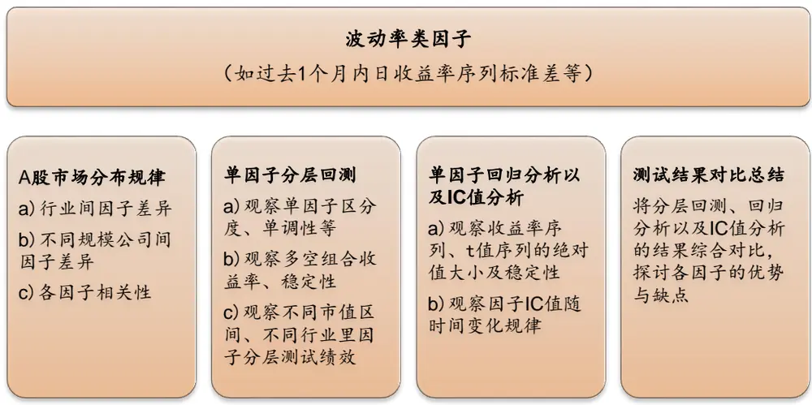
资料来源：华泰证券研究所

## 波动率因子的行业间差异

波动率因子在不同行业间存在一定差异。我们选取 std_4m、id2_std_3m、hml_r_std_5m作为波动率因子的代表（因子具体定义见图表 1），计算它们在 2017/2/28 收盘时各一级行业的中位数分布规律，如下图所示。可以发现，近期建材、石油石化、机械等行业具有较高的波动率，银行、非银行金融、电力及公用事业等行业波动率较低，并且由于三种波动率的计算方式各不相同，其在不同行业间的水平存在一定差异。我们认为对上市公司直接进行跨行业比较意义不大，在单因子测试中还是应考虑行业中性处理。

图表3： 各一级行业 std_4m、id2_std_3m、hml_r_std_5m 中位数比较（2017/2/28）
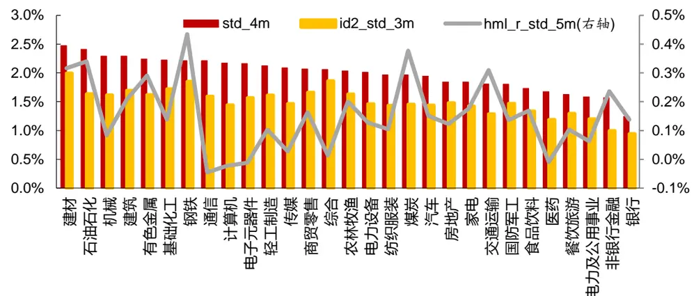
资料来源：Wind，华泰证券研究所

上图说明了，在同一时间点，不同行业间波动率因子的水平存在一定差异。事实上，随时间变化，同一行业的波动率因子的绝对大小和与其他行业对比的相对大小也在不断变化中。以 std_4m 为例，在 2006 年至 2016 年间，每年末各一级行业 std_4m 因子值中位数在所有 29 个一级行业中的排位变化如下表所示。可以看出，同估值、成长等因子类似，波动率因子在 A股市场也存在比较明显的行业轮动现象，比如非银行金融行业在不同年份间波动率排名变化很大，计算机行业从 2009 年开始波动率一直较高；同时，也存在一些行业的波动率排名一直比较稳定，如银行行业一直波动率较低。行业波动率年份间的波动，一般是当时政治、金融环境等多重因素影响的结果。

图表4： 各一级行业 std_4m因子值中位数在不同年份的行业间相对排名

| 行业 | 2006 | 2007 | 2008 | 2009 | 2010 | 2011 | 2012 | 2013 | 2014 | 2015 | 2016 |
| --- | --- | --- | --- | --- | --- | --- | --- | --- | --- | --- | --- |
| 机械 | 15 | 19 | 6 | 6 | 3 | 7 | 6 | 7 | 7 | 6 | 1 |
| 纺织服装 | 22 | 14 | 12 | 9 | 17 | 25 | 17 | 12 | 26 | 12 | 2 |
| 建筑 | 8 | 17 | 23 | 2 | 10 | 15 | 2 | 18 | 3 | 22 | 3 |
| 建材 | 7 | 15 | 3 | 8 | 1 | 2 | 1 | 10 | 9 | 8 | 4 |
| 计算机 | 27 | 24 | 22 | 7 | 7 | 4 | 5 | 2 | 4 | 1 | 5 |
| 石油石化 | 26 | 23 | 26 | 26 | 15 | 23 | 24 | 19 | 29 | 21 | 6 |
| 基础化工 | 25 | 7 | 5 | 18 | 12 | 9 | 15 | 8 | 24 | 9 | 7 |
| 综合 | 23 | 13 | 18 | 19 | 22 | 8 | 22 | 13 | 6 | 4 | 8 |
| 商贸零售 | 21 | 20 | 27 | 21 | 25 | 21 | 27 | 21 | 25 | 17 | 9 |
| 农林牧渔 | 4 | 2 | 1 | 4 | 9 | 10 | 3 | 9 | 23 | 13 | 10 |
| 通信 | 2 | 4 | 13 | 5 | 11 | 6 | 13 | 3 | 11 | 2 | 11 |
| 电子元器件 | 13 | 18 | 15 | 1 | 2 | 3 | 4 | 6 | 18 | 3 | 12 |
| 有色金属 | 5 | 10 | 10 | 13 | 8 | 12 | 16 | 24 | 10 | 10 | 13 |
| 电力设备 | 20 | 9 | 11 | 12 | 5 | 5 | 9 | 11 | 12 | 11 | 14 |
| 轻工制造 | 6 | 5 | 14 | 15 | 14 | 17 | 14 | 16 | 14 | 5 | 15 |
| 传媒 | 16 | 3 | 9 | 16 | 6 | 1 | 8 | 1 | 13 | 7 | 16 |
| 汽车 | 11 | 26 | 21 | 14 | 19 | 19 | 20 | 14 | 21 | 14 | 17 |
| 餐饮旅游 | 12 | 12 | 2 | 10 | 18 | 22 | 26 | 23 | 22 | 15 | 18 |
| 家电 | 28 | 27 | 25 | 23 | 13 | 11 | 18 | 4 | 20 | 16 | 19 |
| 钢铁 | 9 | 11 | 19 | 27 | 24 | 24 | 25 | 27 | 17 | 26 | 20 |
| 食品饮料 | 3 | 6 | 20 | 25 | 21 | 18 | 12 | 20 | 27 | 18 | 21 |
| 房地产 | 14 | 21 | 16 | 17 | 20 | 26 | 11 | 25 | 15 | 19 | 22 |
| 交通运输 | 10 | 28 | 28 | 20 | 28 | 28 | 29 | 26 | 8 | 25 | 23 |
| 电力及公用事业 | 24 | 25 | 24 | 24 | 23 | 16 | 23 | 22 | 2 | 24 | 24 |
| 医药 | 19 | 8 | 17 | 22 | 16 | 14 | 21 | 17 | 28 | 20 | 25 |
| 国防军工 | 17 | 1 | 4 | 11 | 4 | 13 | 10 | 5 | 5 | 27 | 26 |
| 非银行金融 | 18 | 16 | 7 | 3 | 27 | 27 | 7 | 15 | 1 | 23 | 27 |
| 煤炭 银行 | 1 29 | 22 29 | 8 29 | 28 29 | 26 29 | 20 29 | 19 28 | 28 29 | 16 19 | 28 29 | 28 29 |

资料来源：Wind，华泰证券研究所

## 波动率因子与市值因子的相关性

除去行业对因子存在较大影响外，上市公司的规模也是对各大类因子产生作用的潜在因素。我们在前四篇单因子测试报告中对估值、成长、动量反转、换手率类因子进行了详细分析，发现市值因子与大部分估值、动量反转、换手率类因子具有一定相关性，但是与成长类因子间相关性不大。这里面的逻辑也是比较明晰的，因为估值因子的计算公式里包含了总市值因素，动量反转因子与市值因子的相关性反映的就是市值因子本身的 IC 值（2007 年之后一直是小盘股占上风），换手率因子与市值因子是比较确定的负向关系（市值越大的股票换手率倾向于越低），而成长因子完全由财报信息计算而得，与市值因子相关性较低。对于本报告中涉及的波动率类因子，由于大盘股一般波动率较小，所以猜测是负向关系。下面我们将进行详细计算。

图表5： 各波动率因子与市值因子之间相关系数

| 因子 | 2006 | 2007 | 2008 | 2009 | 2010 | 2011 | 2012 | 2013 | 2014 | 2015 | 2016 | 均值 |
| --- | --- | --- | --- | --- | --- | --- | --- | --- | --- | --- | --- | --- |
| std_4m |  | 0.000 -0.001 -0.086 |  | -0.039 |  |  |  |  | -0.059-0.134-0.031-0.111-0.011-0.053 |  | -0.123-0.059 |  |
| id1_std_3m |  |  |  |  |  | 0.012-0.010-0.121-0.129-0.077-0.107-0.026-0.104 |  |  | 0.018-0.151-0.090-0.071 |  |  |  |
| id2_std_3m |  |  |  |  |  | 0.019-0.008-0.110-0.129-0.085-0.106-0.024-0.110 |  |  | 0.016 -0.166 -0.094 -0.073 |  |  |  |
| id2_std_up_3m |  |  |  |  |  | 0.012 -0.003-0.102 -0.024-0.071-0.037 |  | 0.000-0.081 | 0.009-0.137-0.076-0.046 |  |  |  |
| id2_std_down_3m |  |  |  |  |  | 0.007-0.004-0.075-0.120-0.056-0.085-0.005-0.068 |  |  |  | 0.047-0.124 -0.064-0.050 |  |  |
| id2_std_upd_3m |  |  |  |  |  | 0.011-0.003-0.095-0.035-0.067-0.051 |  | 0.000-0.078 |  | 0.026-0.136-0.072-0.046 |  |  |
| high_r_std_4m | 0.028 |  |  |  |  | 0.002-0.029-0.022-0.025-0.081-0.020-0.093 |  |  |  |  |  | 0.052 -0.025 -0.101-0.029 |
| hml_r_std_5m | 0.112 |  |  |  | 0.012-0.007-0.016 0.025 | 0.027 | 0.004 | 0.079 | 0.116 |  |  | 0.017 0.032 0.036 |

资料来源：Wind，华泰证券研究所

我们针对图表 1 中列出的八个因子，详细计算了它们从 2006 年到 2016 年（在每年最后一个交易日核算）与市值因子之间的相关系数，见上表。经观察发现，波动率类因子确实大部分与市值因子间呈负相关关系，只有 hml_r_std_5m 因子例外。

## 波动率因子间相关性分析

在本章前两个小节中，我们分析了波动率因子在不同行业的分布差异性及波动率因子与市值因子的相关性，接下来，我们将计算各波动率因子之间的相关性。假设因子 A和 B之间的月度相关系数序列为{CorrAB}，其中 $Corr_{i}^{AB}$ 是在第i个月月末这一截面上因子 A、B在所有个股上的因子暴露度的相关系数，我们构造了一个相关强度指标：

$$
C_{AB}={\frac{mean(Corr_{i}^{AB}|\mathrm{i}=1,\dots,\mathrm{N})}{\mathrm{std}(Corr_{i}^{AB}|\mathrm{i}=1,\dots,\mathrm{N})}}
$$

该指标结合了因子平均相关系数和相关系数的稳定性，能够综合反映因子之间的相关情况。我们分别计算各因子两两之间在过去 36 个月（2014 年 3 月到 2017 年 2 月）内的相关强度指标，如图表6所示。计算过程中涉及的相关系数均值和方差详细展示在图表7和8中。通过观察可以发现，各波动率因子两两之间普遍具有非常强的正相关性，除 hml_r_std_5m之外，其余因子提供的信息量几乎无太大差别。如果要组合使用各波动率因子构建选股模型，需要注意处理多重共线性问题。

图表6： 各波动率因子间相关强度（近 36个月）

| id2_std_ |  |  |  |  | id2_std_ down_3m | id2_std_ upd_3m | high_r_ std_4m | hml_r_ std_5m |
| --- | --- | --- | --- | --- | --- | --- | --- | --- |
|  | std_4m | id1_std_3m | id2_std_3m | up_3m |  |  |  |  |
| std_4m |  | 6.04 | 5.77 | 4.96 | 5.16 | 5.35 | 28.57 | 0.07 |
| id1_std_3m | 6.04 |  | 62.32 | 9.45 | 16.49 | 13.67 | 5.68 | 0.04 |
| id2_std_3m | 5.77 | 62.32 |  | 11.16 | 20.19 | 16.44 | 5.53 | 0.10 |
| id2_std_up_3m | 4.96 | 9.45 | 11.16 |  | 8.09 | 96.70 | 4.67 | 0.52 |
| id2_std_down_3m | 5.16 | 16.49 | 20.19 | 8.09 |  | 10.52 | 4.90 | 0.05 |
| id2_std_upd_3m | 5.35 | 13.67 | 16.44 | 96.70 | 10.52 |  | 4.98 | 0.33 |
| high_r_std_4m | 28.57 | 5.68 | 5.53 | 4.67 | 4.90 | 4.98 |  | 0.67 |
| hml_r_std_5m | 0.07 | 0.04 | 0.10 | 0.52 | 0.05 | 0.33 | 0.67 |  |

资料来源：Wind，华泰证券研究所

图表 7和图表 8分别反映因子两两之间相关系数的平均大小和相关系数稳定性，能在图表6 数据之外提供一些补充信息。

图表7： 各波动率因子间月度相关系数序列均值（近 36个月）

| id2_std_ |  |  |  |  | id2_std_ down_3m | id2_std_ upd_3m | high_r_ std_4m | hml_r_ std_5m |
| --- | --- | --- | --- | --- | --- | --- | --- | --- |
|  | std_4m | id1_std_3m | id2_std_3m | up_3m |  |  |  |  |
| std_4m |  | 0.88 | 0.86 | 0.74 | 0.78 | 0.78 | 0.94 | 0.03 |
| id1_std_3m | 0.88 |  | 0.98 | 0.83 | 0.87 | 0.86 | 0.86 | 0.01 |
| id2_std_3m | 0.86 | 0.98 |  | 0.85 | 0.89 | 0.89 | 0.85 | 0.03 |
| id2_std_up_3m | 0.74 | 0.83 | 0.85 |  | 0.86 | 0.98 | 0.75 | 0.16 |
| id2_std_down_3m | 0.78 | 0.87 | 0.89 | 0.86 |  | 0.93 | 0.75 | 0.02 |
| id2_std_upd_3m | 0.78 | 0.86 | 0.89 | 0.98 | 0.93 |  | 0.77 | 0.11 |
| high_r_std_4m | 0.94 | 0.86 | 0.85 | 0.75 | 0.75 | 0.77 |  | 0.23 |
| hml_r_std_5m | 0.03 | 0.01 | 0.03 | 0.16 | 0.02 | 0.11 | 0.23 |  |

资料来源：Wind，华泰证券研究所

图表8： 各波动率因子间月度相关系数序列标准差（近 36个月）

|  |  |  |  |  | id2_std id2_std down_3m | id2_std_ upd_3m | high_r_ std_4m | hml_r_ std_5m |
| --- | --- | --- | --- | --- | --- | --- | --- | --- |
|  | std_4m | id1_std_3m | id2_std_3m | up_3m |  |  |  |  |
| std_4m |  | 14.62% | 14.96% | 14.93% | 15.17% | 14.50% | 3.28% | 38.56% |
| id1_std_3m | 14.62% |  | 1.58% | 8.74% | 5.30% | 6.33% | 15.09% | 34.46% |
| id2_std_3m | 14.96% | 1.58% |  | 7.66% | 4.41% | 5.41% | 15.35% | 33.62% |
| id2_std_up_3m | 14.93% | 8.74% | 7.66% |  | 10.62% | 1.01% | 16.09% | 30.81% |
| id2_std_down_3m | 15.17% | 5.30% | 4.41% | 10.62% |  | 8.87% | 15.33% | 34.03% |
| id2_std_upd_3m | 14.50% | 6.33% | 5.41% | 1.01% | 8.87% |  | 15.53% | 33.67% |
| high_r_std_4m | 3.28% | 15.09% | 15.35% | 16.09% | 15.33% | 15.53% |  | 33.50% |
| hml_r_std_5m | 38.56% | 34.46% | 33.62% | 30.81% | 34.03% | 33.67% | 33.50% |  |

资料来源：Wind，华泰证券研究所

图表 6对于构建风格因子具有一定参考意义，因子合成时要根据相关性关系赋予各因子合理权重，在后续报告中我们将详细阐述。

需要注意的是，我们这里计算的是因子值之间的相关系数。在本报告结尾处最后一个图表里，我们给出了因子 IC值序列之间的相关系数矩阵以供参考。

## 单因子测试流程

在多因子系列首篇报告《华泰多因子模型体系初探》（2016.09）中，我们系统地介绍了有效因子识别（即单因子测试）的理论基础和研究思路，在多因子系列第二篇报告《华泰单因子测试之估值类因子》中我们着眼于实践过程，给出了详细的流程操作说明。为避免阅读障碍，我们此处将单因子详细测试流程再复述一遍。

## 回归法

回归法是一种最常用的测试因子有效性的方法，具体做法是将因子在第T期的暴露度与T+1期的股票收益进行线性回归，所得到的回归系数即为因子在T期的因子收益率，同时还能得到该因子收益率在本期回归中的显著度水平——t 值。我们的回归模型为

$$
r_{i}^{T+1}=\sum_{j}X_{j}^{T}f_{ji}^{T}+X_{d}^{T}d_{i}^{T}+\mu_{i}^{T}
$$

$$
r_{i}^{T+1}\colon\sharp\sharp\ :\frac{\ d\mathbb{D}}{\ d\cdot\ d{\tau}}\mathrm{~i~}/\ddagger\ddot{\mathcal{H}}\mathrm{~T~}+1\xrightarrow{\ddagger\ d{\romannumeral1}}\sharp\sharp\big\lim\frac{\ d{\tau}}{\ d{\tau}}\frac{\ d\dot{\xi}^{\star}}{\ d{\tau}^{\star}}\ :\frac{\ d{\tau}}{\ d{\tau}^{\star}}
$$

$$
d_{i}^{T}\colon\mathbb{H}\mathbin{\ P}\mathbin{\ P}\mathrm{~i~}\mathbin{/\Sigma}\mathbin{\ P}\mathbin{\ P}\mathbin{\ P}\mathbin{\ P}\mathbin{\ P}\mathbin{\ P}\mathbin{\ P}\mathbin{\ P}\mathbin{\ P}\mathbin{\ P}\mathbin{\ P}\mathbin{\ P}\mathbin{\ P}\mathbin{\ P}\mathbin{\ P}\mathbin{\ P}\mathbin{\ P}\mathbin{\ P}\mathbin{\ P}\mathbin{\ P}\mathbin{\ P}\mathbin{\ P}\mathbin{\ P}\mathbin{\ P}\mathbin{\ P}\mathbin{\ P}\mathbin{\ P}\mathbin{\ P}\mathbin{\ P}\mathbin{\ P}\mathbin{\ P}\mathbin{\ P}\mathbin{\ P}\mathbin{\ P}\mathbin{\ P}\mathbin{\ P}\mathbin{\ P}\mathbin{\ P}\mathbin{\ P}\mathbin{\ P}\mathbin{\ P}\mathbin{\ P}\mathbin{\ P}\mathbin{\ P}\mathbin{\ P}\mathbin{\ P}\mathbin{\ P}\mathbin{\ P}\mathbin{\ P}\mathbin{\ P}\mathbin{\ P}\mathbin{\ P}\mathbin{\ P}\mathbin{\ P}\mathbin{\ P}\mathbin{\ P}\mathbin{\ P}\mathbin{\ P}\mathbin{\ P}\mathbin{\ P}\mathbin{\ P}\mathbin{\ P}\mathbin{\ P}\mathbin{\ P}\mathbin{\ P}\mathbin{\ P}\mathbin{\ P}\mathbin{\ P}\mathbin{\ P}\mathbin{\ P}\mathbin{\ P}\mathbin{\ P}\mathbin{\ P}\mathbin{\ P}\mathbin{\ P}\mathbin{\ P}\mathbin{\ P}\mathbin{\ P}\mathbin{\ P}\mathbin{\ P}\mathbin{\ P}\mathbin{\ P}\mathbin{\ P}\mathbin{\ P}\mathbin{\ P}\mathbin{\ P}\mathbin{\ P}\mathbin{\ P}\mathbin{\ P}\mathbin{\ P}\mathbin{\ P}\mathbin{\ P}\mathbin\mathbin{P\ P}\mathbin\mathbin{\ P}\mathbin{\ P}
$$

$f_{ji}^{T}$ : 股票 i 在第 T 期第 j 个行业因子上的暴露度(属于该行业则为 1，否则为 0)

$$
X_{j}^{T}\left(\ddot{\mathfrak{s}}_{\mathrm{X}}X_{d}^{T}\right)\colon\stackrel{\ast\ast}{\hat{\eta}^{\sharp}}\textstyle\textsc{T}\stackrel{\ast\ast}{\hat{\eta}^{\sharp}}\textstyle{\frac{\ast\ast}{\hat{\eta}^{\sharp}}}\textstyle{\textrm{ j }}\wedge\llangle\bar{\tau}\llangle\big(\ddot{\mathfrak{s}}_{\mathrm{X}}\boxed{\Xi}\mp\mathrm{d}\big)\oplus\llangle\bar{\tau}\boxed{\Xi}\mp\mathrm{j}\mathbb{k}\stackrel{\ast\ast}{\hat{\eta}^{\sharp}}\dotsc\stackrel{\ast\ast}{\hat{\eta}^{\sharp}}\equiv\jmath\otimes\llangle\bar{\tau}\llangle\frac{\iff}{\Phi}\exp\big(\frac{\mathrm{i}\mathrm{i}\mathrm{i}\mathrm{k}\mathord{\big/{\vphantom{\frac{1}{\delta}}}}}{\varpi}\bigr)
$$

$$
\mu_{i}^{T}\colon\sharp_{\mathcal{X}}^{\pi}\triangleq\mathrm{~i~}/\pounds\stackrel{\varkappa\varkappa}{\div}\mathrm{~T~}\varkappa\varkappa\varkappa^{\xi}\varkappa\varkappa\varkappa\breve{\Xi}_{\mathcal{X}}\sharp_{\mathcal{X}}\ast\sharp_{\mathcal{X}}\varkappa\varkappa\varkappa.
$$

在所有截面期上，我们对因子d进行回归测试，能够得到该因子的因子收益率序列（即所有截面期回归系数 $X_{d}^{T}$ 构成的序列）和对应的 t 值序列。t 值指的是对单个回归系数 $X_{d}^{T}$ 的 t检验统计量，描述的是单个变量显著性，t 值的绝对值大于临界值说明该变量是显著的，即该解释变量（T期个股在因子 d的暴露度）是真正影响因变量（T+1期个股收益率）的一个因素。也就是说，在每个截面期上，对于每个因子的回归方程，我们设

$$
\begin{array}{r}{1_{\mathbb{R}}^{pz}\dot{\ i}_{\mathcal{X}}^{n}\dot{\ast}\dot{\ast}\dot{\ast}\dot{\ast}\dot{\ast}\dot{\ast}\enspace H_{0}\colon X_{d}^{T}=0}\\{\ddot{\ast}\dot{\ast}\ddot{\ast}\dot{\ast}\dot{\ast}\dot{\ast}\dot{\ast}\dot{\ast}\dot{\ast}\dot{\ast}\enspace H_{1}\colon X_{d}^{T}\neq0}\end{array}
$$

该假设检验对应的 t统计量为

$$
\mathsf{t}=\frac{X_{d}^{T}}{SE(X_{d}^{T})}
$$

其中 $SE(X_{d}^{T})$ 代表回归系数 $X_{d}^{T}$ 的标准差的无偏估计量。一般 t值绝对值大于 2 我们就认为本期回归系数 $X_{d}^{T}$ 是显著异于零的（也就是说，本期因子 d对下期收益率具有显著的解释作用）。注意，我们在回归模型中加入了行业因素，能在一定程度上规避行业因素对成长因子的影响。并且回归法单因子测试中并未对市值因素的影响进行调整，但是在后续计算因子 IC值的部分会做一些调整。

1． 股票池：全 A股，剔除 ST、PT 股票，剔除每个截面期下一交易日停牌的股票。

2． 回溯区间：2005-04-29 至 2016-12-30。

3． 截面期：每个自然月的最后一个交易日计算因子暴露度，与下一整个自然月的个股超额收益（以沪深 300 指数为基准）进行回归。

4． 数据处理方法：

a) 因子暴露度的计算方法已在图表 1 中进行说明，个股收益率均用 Wind 后复权收盘价进行计算，个股非交易状态的日期里收益率置为空值；

b) 中位数去极值：设第 T 期某因子在所有个股上的暴露度序列为 $D_{i},\ D_{M}$ 为该序列中位数， $D_{M1}$ 为序列| $D_{i}-D_{M}|$ |的中位数，则将序列 $D_{i}$ 中所有大于 $D_{M}+5D_{M1}$ 的数重设为 $D_{M}+5D_{M1}$ ，将序列 $D_{i}$ 中所有小于 $D_{M}-5D_{M1}$ 的数重设为 $D_{M}-5D_{M1}$ ；

c) 标准化：将去极值处理后的因子暴露度序列减去其现在的均值、除以其标准差，得到一个新的近似服从N(0,1)分布的序列，这样做可以让不同因子的暴露度之间具有可比性；

d) 缺失值处理：得到新的因子暴露度序列后，将因子暴露度缺失的地方设为 0（这里解释一下，由于不同因子可能在不同个股处存在缺失值，若不对缺失值进行处理则每个单因子回归的票池并不完全相同，不同单因子回归结果的可比性较差，但如果将所有出现缺失值的个股都从回归票池中剔除，当数据源质量不佳时可能会造成票池大幅减少，回归结果同样不可信，所以这里折中处理，将因子暴露度缺失的地方设为新序列的均值，即设为零，可视作当存在缺失值时我们认为此个股的因子值与全市场平均情况相同，即持中性看法）。

5． 回归权重：由于普通最小二乘回归（OLS）可能会夸大小盘股的影响（因为小盘股的估值等因子出现极端值概率较大，且小盘股数目很多，但占全市场的交易量比重较小），并且回归可能存在异方差性，故我们参考Barra手册，采用加权最小二乘回归（WLS），使用个股流通市值的平方根作为权重，此举也有利于消除异方差性。

6． 因子评价方法：

a) t 值序列绝对值平均值——因子显著性的重要判据；

b) t 值序列绝对值大于 2的占比——判断因子的显著性是否稳定；

c) 因子收益率序列平均值，以及该均值零假设检验的 t 值——判断因子收益率序列是否方向一致，并且显著不为零；

d) t 值序列均值的绝对值除以 t 值序列的标准差——结合显著性和波动性，辅助判断因子是否有效、稳健。

## 因子 IC 值的计算

因子的 IC值是指因子在第 T 期的暴露度与 T+1 期的股票收益的相关系数，即

$$
IC_{d}^{T}=\operatorname{corr}(\overrightarrow{R^{T+1}},\overrightarrow{d^{T}})
$$

其中， $IC_{d}^{T}$ 代表因子 d 在第 T 期的 IC 值， $\overrightarrow{R^{T+1}}$ 代表所有个股第 T+1 期的收益率向量， $\overrightarrow{d^{T}}$ 代表所有个股第 T 期在因子 d上的暴露度向量。

1. 股票池、回溯区间、截面期均与回归法相同。

2. 因子值在去极值、标准化、去空值处理后，在截面期上用其做因变量对市值因子及行业因子（哑变量）做线性回归，取残差作为因子值的一个替代。这样做可以消除行业因素和市值因素对因子的影响。计算残差序列和 T+1 期股票收益序列的相关系数作为T 期因子 IC值。

3. 因子评价方法：

a) IC 值序列的均值大小——因子显著性；

b) IC 值序列的标准差——因子稳定性；

c) IR 比率（IC 值序列均值与标准差的比值）——因子有效性；

d) IC 值累积曲线——随时间变化效果是否稳定；

e) IC 值序列大于零的占比——因子作用方向是否稳定。

## 因子收益率、t值与IC值之间的关系

前两小节分别介绍了用回归法、IC 值评价因子有效性的两套思路，那它们之间到底具有怎样的区别和联系呢？为了说明这个问题，我们先介绍一个引理：

设X, Y为两个向量，则

$$
[corr(X,Y)]^{2}=R^{2}
$$

其中R2为线性回归Y = aX +b或线性回归 $\mathrm{X}=aY+b$ 的可决系数（其中a，b是待回归系数）。

如果我们在单因子测试（线性回归法）中使用模型

$$
r=\beta X+c
$$

（r是股票收益率，X 是因子暴露度，c是常数项，c可以理解为市场因子）并且假设我们在计算因子 IC值的时候，不预先对因子暴露度进行市值、行业调整了，就使用原始的因子暴露度 X，则本期因子 IC值为corr(X,r)，根据引理，因子 IC 值的平方就等于单因子测试的回归模型的 $R^{2}$

所以，因子 IC值本质上反映的是下期收益率和本期因子暴露度的线性相关程度（R2的平方根），是使用该因子预测收益率的稳健性（IC值越大，这个因子的收益越稳定，波动越小）；而回归法中计算出的因子收益率本质上是一个斜率，反映的是从该因子可能获得的收益率的大小，这并不能说明任何关于线性拟合优度的信息（也就是说，因子收益率很大时，也可能出现R2很小的情形）；至于回归法中计算出的 t值，在一元线性回归中 t值与R2反映的信息一致（二者对应关系为，当R2 = 0时 t值也为 0，当R2 = 1时 t 值为无穷大），但是由于我们所采用的回归模型包括了行业变量，所以 t 值仅代表被测因子对股票收益的解释能力（而不能代表模型的整体拟合优度）。

总结一下，IC值反映模型整体线性拟合优度，t值反映被测单因子对模型的解释能力是否显著，因子收益率与前两者差别较大，它反映的是可能获得的收益率的大小，而对这个收益是否稳健未知。

事实上，我们在计算因子 IC 值时也对因子暴露度进行市值、行业预调整了，情况还比上面分析的要复杂一些，但是精髓不变，我们的结论仍然大致正确。

## 分层模型回测

依照因子值对股票进行打分，构建投资组合回测，是最直观的衡量指标优劣的手段。一般来说，通过回归法和计算因子 IC 值都无法确定因子的单调性（例如，某因子值排名在中间 1/3 的个股表现比前 1/3 和后 1/3 的个股表现要好），但是分层回测法是可以确定因子单调性的。分层回测法逻辑简单，结果清晰，操作方便，并且具有能区分因子单调性的独特优势，是接受度非常高的一种单因子测试手段。

1. 股票池、回溯区间都与回归法相同。

2. 换仓期：在每个自然月最后一个交易日核算因子值，在下个自然月首个交易日按当日收盘价换仓。

3. 数据处理方法：不进行任何加工，因子值为空的股票不参与分层。

4. 分层方法：在每个一级行业内部对所有个股按因子大小进行排序，每个行业内均分成N 个分层组合。如图表 6 所示，黄色方块代表各行业内个股初始权重，可以相等也可以不等（我们直接取相等权重进行测试），分层具体操作方法为 N 等分行业内个股权重累加值，例如图示行业 1中，5只个股初始权重相等（不妨设每只个股权重为 0.2），假设我们欲分成 3 层，则分层组合 1在权重累加值 1/3 处截断，即分层组合 1包含个股 1 和个股 2，它们的权重配比为 0.2:(1/3-0.2)=3:2，同样推理，分层组合 2 包含个股 2、3、4，配比为(0.4-1/3):0.2:(2/3-0.6)=1:3:1，分层组合 4 包含个股 4、5，配比为 2:3。以上方法是用来计算各个一级行业内部个股权重配比的，行业间权重配比与基准组合（我们使用沪深 300）相同，也即行业中性。

5. 评价方法：回测年化收益率、夏普比率、信息比率、最大回撤、胜率等。

图表9： 单因子分层测试法示意图

行业内个股按因子值排序
资料来源：华泰证券研究所

## 单因子测试结果分析

## 分层模型回测分析方法

在华泰单因子测试系列前两篇报告中，我们用图表夹杂文字说明的形式，对各个细分因子的分层回测结果一一进行了详细展示。从第三篇报告《华泰单因子测试之动量类因子》开始，我们对报告展示形式加以改进，在维持前两篇测试报告的细致程度的基础上，为了更高效地展示结果，我们会在此处集中说明所有图表的计算细节和分析方法，后面细分因子的测试结果均会使用相同的模板，便于读者速览和对比。

## 分层测试详细展示图表包括：

1． 分五层组合回测绩效分析表（20050509～20170228）。其中组合 1～组合 5 为按该因子从小到大排序构造的行业中性的分层组合。基准组合为行业中性的等权组合，具体来说就是将组合 1～组合 5 合并，一级行业内部个股等权配置，行业权重按当期沪深300 行业权重配置。多空组合是在假设所有个股可以卖空的基础上，每月调仓时买入组合 1，卖空组合 5。回测模型在每个自然月最后一个交易日核算因子值，在下个自然月首个交易日按当日收盘价调仓（分层组合构建法等更多细节参见上一章“分层模型回测”小节）。

2． 分五层组合回测净值图。按前面说明的回测方法计算组合 1～组合 5、基准组合的净值，与沪深 300、中证 500 净值对比作图。

3． 分五层组合回测，用组合 1～组合 5的净值除以基准组合净值的示意图。可以更清晰地展示各层组合在不同时期的效果。

4． 组合 1相对沪深 300 月超额收益分布直方图。该直方图以[-0.5%,0.5%]为中心区间，向正负无穷方向保持组距为 1%延伸，在正负两个方向上均延伸到最后一个频数不为零的组为止（即维持组距一致，组数是根据样本情况自适应调整的）。

5． 分五层时的多空组合收益图。再重复一下，多空组合是买入组合 1、卖空组合 5（月度调仓）的一个资产组合。多空组合收益率是由组合 1的净值除以组合 5 的净值近似核算的。

6． 分十层组合回测时，各层组合在不同年份间的收益率及排名表。每个单元格的内容为在指定年度某层组合的收益率（均为整年收益率），以及某层组合在全部十层组合中的收益率排名。最后一列是分层组合在 2006～2016 的排名的均值。

7． 不同市值区间分层组合回测绩效指标对比图（分十层）。我们将全市场股票按市值排名前 1/3，1/3～2/3，后 1/3 分成三个大类，在这三类股票中分别进行分层测试，基准组合构成方法同前面所述（注意每个大类对应的基准组合并不相同）。

8． 不同行业间分层组合回测绩效分析表（分五层）。我们在不同一级行业内部都做了分层测试，基准组合为各行业内该因子非空值的个股等权组合（注意每个行业对应的基准组合并不相同）。

另外，我们在进行分层测试详细展示之前，先对各种计算公式下的波动率因子进行了样本期长度敏感性测试，确定最佳样本期长度，再“择优”展示该种计算公式下的某个效果较好的细分因子。

## 日收益率序列标准差因子

该类因子的定义为过去一段时间内个股日收益率序列的标准差（剔除停牌的交易日），我们首先对该类因子进行样本期长度敏感性测试，确定最优样本期长度。在以下图表中，std_Nm（N=1,2,……,10）代表样本期为过去 N 个月，std_Nd（N=60,65,……,100）代表样本期为过去 N 个交易日。虽然 std_1m 的 IR 比率最高，但当样本期比较短时，分层组合的换手率非常高，交易成本很高（按单边换手率 0.3%计算交易成本），所以综合考虑，在实际选股应用中，还是 std_4m 最佳。在后两页的图表中，我们对 std_4m 进行了详细的测试并展示结果（各项图表内容解释请参看本章第一小节）。

图表10： 日收益率序列标准差因子参数敏感性分析（回归法、IC值分析）

| 因子收益率 |  |  |  |  | 因子收益率 | IC 序列 | IC 序列 |  |  |
| --- | --- | --- | --- | --- | --- | --- | --- | --- | --- |
| 因子 | It\|均值 | \|t\|>2 占比 | t 均值/t 标准差 | 均值 序列t检验 |  |  | 均值 | 标准差 | IR 比率 IC>0 占比 |
| std_1m | 5.16 | 78.77% | -0.14 | -0.268% | -2.12 | -3.57% | 10.56% | 0.34 | 34.25% |
| std_2m | 5.60 | 83.56% | -0.14 | -0.306% | -2.23 | -3.50% | 11.48% | 0.30 | 37.67% |
| std_3m | 5.85 | 82.19% | -0.14 | -0.332% | -2.32 | -3.45% | 11.79% | 0.29 | 38.36% |
| std_4m | 6.06 | 84.25% | -0.15 | -0.346% | -2.36 | -3.30% | 11.83% | 0.28 | 36.99% |
| std_5m | 6.15 | 85.62% | -0.13 | -0.315% | -2.13 | -3.13% | 11.91% | 0.26 | 39.04% |
| std_6m | 6.17 | 84.93% | -0.13 | -0.295% | -1.98 | -3.22% | 12.05% | 0.27 | 39.04% |
| std_7m | 6.14 | 82.19% | -0.12 | -0.278% | -1.87 | -3.22% | 12.01% | 0.27 | 39.73% |
| std_8m | 6.18 | 82.19% | -0.11 | -0.255% | -1.69 | -3.09% | 11.98% | 0.26 | 39.04% |
| std_9m | 6.19 | 83.56% | -0.11 | -0.240% | -1.58 | -3.09% | 11.92% | 0.26 | 39.73% |
| std_10m | 6.18 | 83.56% | -0.11 | -0.235% | -1.55 | -3.04% | 11.75% | 0.26 | 39.04% |
| std_60d | 5.82 | 82.19% | -0.14 | -0.330% | -2.30 | -3.47% | 11.75% | 0.29 | 37.67% |
| std_65d | 5.93 | 84.25% | -0.14 | -0.335% | -2.30 | -3.38% | 11.86% | 0.29 | 37.67% |
| std_70d | 6.00 | 83.56% | -0.14 | -0.329% | -2.26 | -3.30% | 11.85% | 0.28 | 36.99% |
| std_75d | 6.03 | 84.25% | -0.14 | -0.333% | -2.28 | -3.33% | 11.82% | 0.28 | 36.30% |
| std_80d | 6.05 | 84.25% | -0.14 | -0.343% | -2.36 | -3.29% | 11.83% | 0.28 | 36.99% |
| std_85d | 6.07 | 84.25% | -0.14 | -0.333% | -2.28 | -3.19% | 11.85% | 0.27 | 37.67% |
| std_90d | 6.06 | 83.56% | -0.14 | -0.327% | -2.25 | -3.15% | 11.84% | 0.27 | 37.67% |
| std_95d | 6.11 | 83.56% | -0.13 | -0.321% | -2.19 | -3.14% | 11.84% | 0.27 | 38.36% |
| std_100d | 6.12 | 84.25% | -0.13 | -0.319% | -2.17 | -3.11% | 11.87% | 0.26 | 38.36% |

资料来源：Wind，华泰证券研究所

图表11： 日收益率序列标准差因子参数敏感性分析（分层测试法、分五层）

|  | TOP 组合 | TOP 组合 | TOP 组合 | TOP 组合 | TOP 组合相对 | TOP 组合月均 | 多空组合 | 多空组合 | 多空组合 | 多空组合 |
| --- | --- | --- | --- | --- | --- | --- | --- | --- | --- | --- |
| 因子 | 年化收益率 | 夏普比率 | 信息比率 | 最大回撤 | 基准月胜率 | 双边换手率 | 年化收益率夏普比率 |  | 最大回撤 | 月胜率 |
| std_1m | 21.42% | 0.79 | -0.25 | 69.63% | 45.77% 46.48% | 112.29% 76.83% | 9.25% | 0.75 | 21.27% | 59.29% |
| std_2m | 24.31% 25.20% | 0.91 | 0.07 0.16 | 66.97% 66.86% | 48.59% | 61.64% | 10.36% 10.30% | 0.79 0.79 | 22.02% 23.28% | 59.29% |
| std_3m |  | 0.94 1.00 |  |  | 50.70% | 53.51% |  | 0.88 |  | 60.00% |
| std_4m | 26.66% |  | 0.32 0.17 | 66.17% 66.88% | 52.82% | 48.26% | 11.44% | 0.65 | 22.25% | 60.71% |
| std_5m std_6m | 25.27% | 0.95 | 0.15 | 66.17% | 49.30% | 45.68% | 8.42% |  | 22.93% | 57.86% |
| std_7m | 25.09% | 0.94 0.93 | 0.12 | 66.42% | 50.00% | 42.77% | 8.79% 7.77% | 0.68 0.61 | 23.45% | 58.57% |
| std_8m | 24.80% 24.60% | 0.92 | 0.10 | 66.48% | 48.59% | 39.87% | 7.56% | 0.60 | 23.30% | 55.71% |
| std_9m | 24.16% | 0.90 | 0.05 | 66.96% | 52.11% | 38.10% | 6.99% | 0.56 | 22.94% 21.68% | 57.14% |
| std_10m | 24.14% | 0.90 | 0.05 | 66.26% | 48.59% | 36.84% | 6.25% | 0.50 | 20.97% | 56.43% |
| std_60d | 25.30% | 0.95 | 0.17 | 66.82% | 48.59% | 61.11% |  | 0.81 | 23.39% | 57.14% |
| std_65d | 25.22% | 0.95 | 0.16 | 66.97% | 49.30% | 59.58% | 10.63% 10.71% | 0.82 | 23.31% | 62.86% |
| std_70d | 25.69% | 0.96 | 0.21 | 66.88% | 48.59% | 57.26% | 10.50% | 0.80 | 23.05% | 60.00% |
| std_75d | 26.40% | 0.99 | 0.29 | 66.18% | 50.00% | 54.91% | 10.87% | 0.83 | 22.99% | 60.00% |
| std_80d | 26.18% | 0.98 | 0.27 | 65.99% | 51.41% | 53.71% | 10.55% | 0.81 | 22.81% | 59.29% 59.29% |
| std_85d | 25.86% | 0.97 | 0.23 | 66.49% | 48.59% | 52.75% | 10.25% | 0.78 | 23.56% | 60.00% |
| std_90d | 25.28% | 0.95 | 0.17 | 66.25% | 49.30% | 51.26% | 9.35% | 0.71 | 23.43% | 60.71% |
| std_95d | 25.52% | 0.96 | 0.20 | 66.59% | 51.41% | 49.52% | 9.13% | 0.70 | 23.44% | 57.86% |
| std_100d | 25.53% | 0.95 | 0.20 | 66.60% | 52.82% | 48.59% | 8.68% | 0.67 | 23.07% | 60.00% |

资料来源：Wind，华泰证券研究所

图表12： std_4m 因子分层组合绩效分析（20050509～20170228）

|  |  |  |  |  |  | 年化超额 超额收益 | 相对基准 |  | 超额收益 最大回撤 | 月均双边 换手率 |
| --- | --- | --- | --- | --- | --- | --- | --- | --- | --- | --- |
| 投资组合 | 年化收益率年化波动率 |  | 夏普比率 | 最大回撤 | 收益率 年化波动率 |  | 信息比率 | 月胜率 |  |  |
| 组合1 | 26.66% | 26.74% | 1.00 | 66.17% | 2.41% | 7.55% | 0.32 | 50.70% | 16.73% | 53.51% |
| 组合2 | 22.69% | 30.65% | 0.74 | 67.86% | -0.80% | 3.67% | -0.22 | 50.70% | 15.29% | 95.08% |
| 组合3 | 20.59% | 32.44% | 0.63 | 71.70% | -2.50% | 3.29% | -0.76 | 42.25% | 27.28% | 106.13% |
| 组合4 | 18.60% | 33.84% | 0.55 | 73.51% | -4.11% | 4.26% | -0.96 | 38.03% | 39.58% | 101.57% |
| 组合5 | 13.67% | 34.98% | 0.39 | 74.91% | -8.10% | 6.32% | -1.28 | 35.21% | 64.24% | 62.46% |
| 基准组合 | 23.68% | 31.44% | 0.75 | 70.38% |  |  | 1 |  |  | - |
| 多空组合 | 11.44% | 13.03% | 0.88 | 22.25% |  |  |  |  |  |  |

资料来源：Wind，华泰证券研究所

图表13： std_4m因子分层组合回测净值
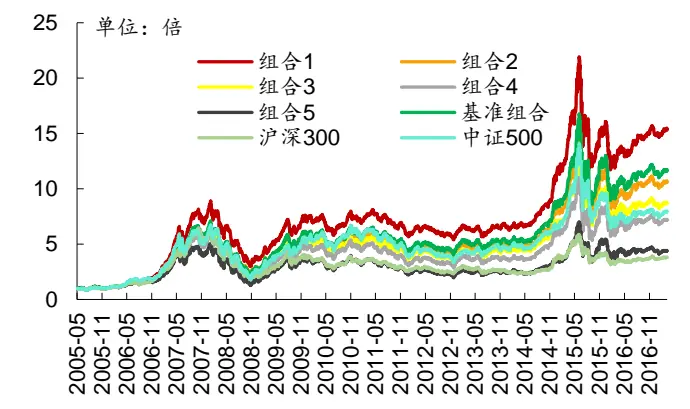
资料来源：Wind，华泰证券研究所

图表14： std_4m因子各层组合净值除以基准组合净值示意图
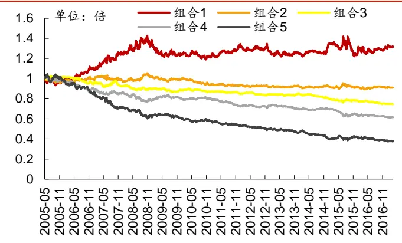
资料来源：Wind，华泰证券研究所

图表15： std_4m因子分层组合 1相对沪深 300月超额收益分布图
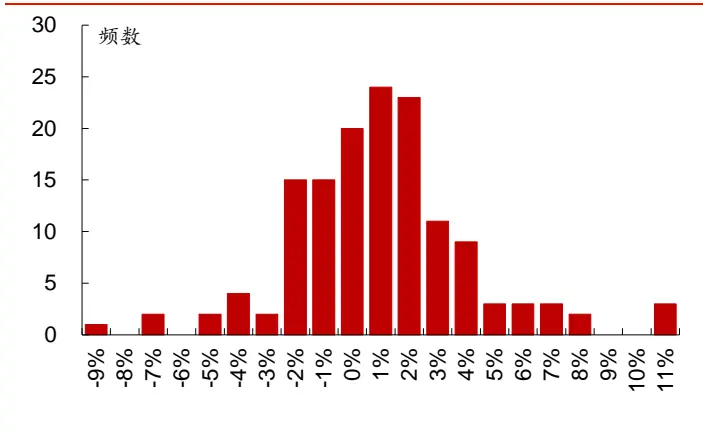
资料来源：Wind，华泰证券研究所

图表16： std_4m因子多空组合月收益率及累积收益率
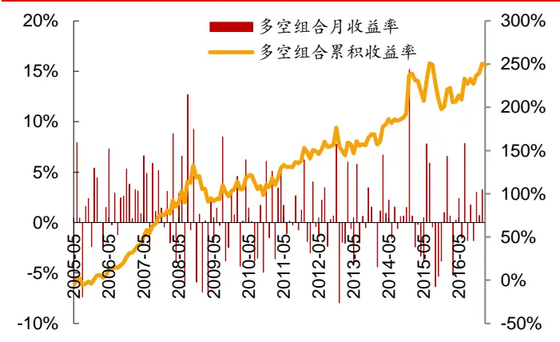
资料来源：Wind，华泰证券研究所

图表17： std_4m分层组合在不同年份的收益及排名分析（分十层）

|  | 2006 | 2007 | 2008 | 2009 | 2010 | 2011 | 2012 | 2013 | 2014 | 2015 | 2016 排名均值 |  |
| --- | --- | --- | --- | --- | --- | --- | --- | --- | --- | --- | --- | --- |
| 组合1 | 123.2%(1) | 251.6%(1) | -53.2%(1) 100.9%(10) |  | -5.0%(6) | -23.4%(2) | 7.3%(7) | 3.8%(7) | 76.9%(2) | 21.6%(8) | 3.4%(1) | 4.18 |
| 组合2 | 113.2%(2) | 239.5%(2) | -59.0%(3) | 102.1%(9) | -1.3%(5) | -20.4%(1) | 4.6%(10) | 7.0%(5) | 79.2%(1) | 19.7%(9) | -1.0%(2) | 4.45 |
| 组合3 | 99.1%(4) | 201.3%(4) | -59.7%(4) | 108.4%(7) | -7.1%(9) | -26.6%(3) | 7.6%(6) | 4.3%(6) | 70.7%(3) | 22.8%(6) | -5.0%(4) | 5.09 |
| 组合4 | 101.8%(3) | 197.5%(6) | -56.4%(2) | 123.0%(4) | -5.6%(7) | -32.8%(5) | 11.0%(3) | 12.7%(1) | 59.4%(7) | 34.1%(2) | -2.2%(3) | 3.91 |
| 组合5 | 90.9%(5) | 179.4%(7) | -60.5%(5) | 119.7%(5) | 0.9%(1) | -30.0%(4) | 10.0%(4) | 9.9%(2) | 66.1%(4) | 27.2%(4) | -6.9%(7) | 4.36 |
| 组合6 | 74.2%(8) | 219.4%(3) | -61.8%(6) | 116.2%(6) | -6.0%(8) | -33.0%(6) | 11.1%(2) | 7.0%(3) | 46.0%(9) | 24.8%(5) | -6.2%(6) | 5.64 |
| 组合7 | 76.0%(7) | 200.1%(5) | -64.4%(9) | 128.6%(1) | 0.5%(2) | -36.6%(9) | 9.7%(5) | -0.5%(9) | 63.6%(6) | 21.8%(7) | -7.6%(8) | 6.18 |
| 组合8 | 86.8%(6) | 177.8%(8) | -61.9%(7) | 123.6%(3) | -1.3%(4) | -36.3%(8) | 14.1%(1) | 7.0%(4) | 64.5%(5) | 17.0%(10) | -5.3%(5) | 5.55 |
| 组合9 | 72.0%(9) | 167.6%(9) | -66.9%(10) | 124.8%(2) | -8.5%(10) | -33.0%(7) | 6.0%(8) | 0.5%(8) | 46.3%(8) | 32.3%(3) | -9.9%(9) | 7.55 |
| 组合10 |  | 64.8%(10) 150.7%(10) | -63.4%(8) | 108.0%(8) |  | -0.2%(3) -38.9%(10) | 4.6%(9) | -0.8%(10) | 38.4%(10) |  | 37.5%(1) -11.2%(10) | 8.09 |

资料来源：Wind，华泰证券研究所

图表18： 不同市值区间 std_4m分层组合绩效指标对比图（分十层）
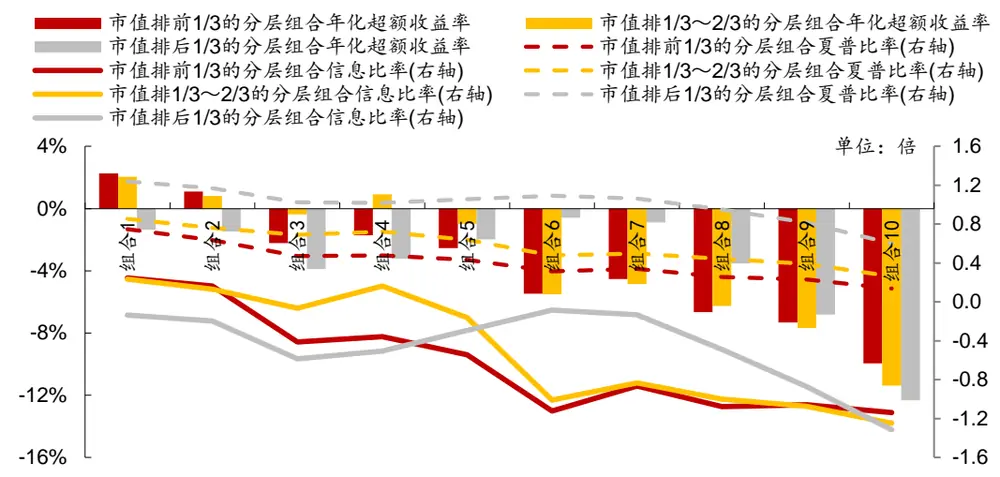
资料来源：Wind，华泰证券研究所

图表19： 不同行业 std_4m因子分层组合绩效分析（分五层）

|  | 组合1年化 | 组合1 | 组合1 | 组合1 | 组合1超额收益 | 组合1相对 | 所有组合年化 |
| --- | --- | --- | --- | --- | --- | --- | --- |
| 行业 | 超额收益率 | 信息比率 | 年化收益率 | 夏普比率 | 最大回撤 | 基准月胜率 | 收益率排序 |
| 房地产 | 8.15% | 0.77 | 37.56% | 1.18 | 18.38% | 55.63% | 1,2,3,4,5 |
| 通信 | 9.65% | 0.63 | 42.92% | 1.33 | 28.28% | 56.34% | 1,2,3,5,4 |
| 汽车 | 6.91% | 0.58 | 38.13% | 1.27 | 27.50% | 53.52% | 1,2,4,3,5 |
| 农林牧渔 | 4.91% | 0.39 | 35.53% | 1.10 | 37.70% | 54.23% | 1,3,2,4,5 |
| 非银行金融 | 8.37% | 0.37 | 33.93% | 0.84 | 29.68% | 51.41% | 1,4,3,2,5 |
| 钢铁 | 4.17% | 0.32 | 23.86% | 0.74 | 34.43% | 46.48% | 1,4,3,2,5 |
| 煤炭 | 4.24% | 0.30 | 18.92% | 0.50 | 43.65% | 50.70% | 1,2,3,4,5 |
| 纺织服装 | 3.26% | 0.27 | 32.22% | 1.02 | 32.40% | 49.30% | 1,4,3,2,5 |
| 食品饮料 | 3.78% | 0.26 | 32.21% | 1.14 | 39.97% | 51.41% | 1,2,4,3,5 |
| 电子元器件 | 2.59% | 0.23 | 31.30% | 0.93 | 21.81% | 54.23% | 2,1,3,4,5 |
| 建材 | 2.67% | 0.20 | 34.76% | 1.07 | 18.41% | 52.11% | 1,2,3,4,5 |
| 商贸零售 | 2.16% | 0.20 | 28.00% | 0.92 | 33.22% | 52.11% | 1,2,3,4,5 |
| 综合 | 2.69% | 0.17 | 29.00% | 0.87 | 28.10% | 50.00% | 2,1,3,5,4 |
| 有色金属 | 2.18% | 0.15 | 30.51% | 0.86 | 33.49% | 55.63% | 1,2,3,4,5 |
| 计算机 | 2.07% | 0.15 | 32.99% | 0.93 | 33.19% | 52.82% | 2,1,3,4,5 |
| 轻工制造 | 1.85% | 0.14 | 27.40% | 0.86 | 36.37% | 51.41% | 1,3,2,4,5 |
| 传媒 | 2.10% | 0.12 | 29.34% | 0.79 | 48.29% | 50.00% | 5,1,3,4,2 |
| 银行 | 0.89% | 0.06 | 24.59% | 0.82 | 35.65% | 47.89% | 2,1,3,4,5 |
| 家电 | 0.76% | 0.05 | 28.93% | 0.94 | 39.92% | 44.37% | 2,1,3,4,5 |
| 餐饮旅游 | -0.39% | -0.02 | 25.45% | 0.78 | 38.34% | 46.48% | 2,1,5,3,4 |
| 电力及公用事业 | -0.37% | -0.03 | 21.70% | 0.71 | 36.75% | 45.77% | 1,2,3,5,4 |
| 国防军工 | -1.15% | -0.07 | 26.63% | 0.67 | 50.27% | 50.00% | 2,1,4,5,3 |
| 交通运输 | -0.87% | -0.08 | 18.32% | 0.62 | 42.13% | 43.66% | 1,4,2,3,5 |
| 医药 | -0.81% | -0.08 | 29.21% | 1.02 | 38.18% | 48.59% | 3,2,1,4,5 |
| 基础化工 | -1.38% | -0.14 | 24.90% | 0.79 | 36.32% | 47.18% | 4,1,2,3,5 |
| 建筑 | -1.97% | -0.14 | 28.09% | 0.85 | 57.77% | 46.48% | 2,3,1,5,4 |
| 机械 | -1.74% | -0.17 | 27.31% | 0.85 | 32.35% | 45.77% | 2,3,1,4,5 |
| 电力设备 | -2.38% | -0.19 | 26.84% | 0.85 | 40.05% | 47.89% | 2,1,5,4,3 |
| 石油石化 | -4.12% | -0.23 | 20.11% | 0.69 | 52.24% | 45.77% | 4,3,1,2,5 |

资料来源：Wind，华泰证券研究所

## 特质波动率因子

特质波动率因子将股票的系统风险与公司层面的特质风险剥离开来，一般可以简单基于CAPM 模型计算股票特质波动率，即为过去一段时间内个股日收益率序列对市场组合（我们这里采用中证全指）日收益率序列进行一元线性回归的残差的标准差（剔除停牌的交易日）。我们首先对该类因子进行样本期长度敏感性测试，确定最优样本期长度。在以下图表 中 ， id1_std_Nm （ N=1,2, … … ,10 ） 代 表 样 本 期 为 过 去 N 个 月 ， id1_std_Nd（N=40,65,……,75）代表样本期为过去 N 个交易日。与上一小节情形类似，虽然id1_std_1m 的 IR比率最高，但其对应的分层组合的换手率也非常高，交易成本很高（按单边换手率 0.3%计算交易成本），所以综合考虑，在实际选股应用中，还是 id1_std_3m最佳。在后两页的图表中，我们对 id1_std_3m 进行了详细的测试并展示结果（各项图表内容解释请参看本章第一小节）。

图表20： 特质波动率因子 1参数敏感性分析（回归法、IC值分析）

| 因子收益率 |  |  |  |  | 因子收益率 序列t检验 | IC 序列 均值 | IC 序列 |  |  |
| --- | --- | --- | --- | --- | --- | --- | --- | --- | --- |
| 因子 | It\|均值 | \|t\|>2 占比 | t 均值/t 标准差 | 均值 |  |  |  | 标准差 | IR 比率 IC>0 占比 |
| id1_std_1m | 4.03 | 69.93% | -0.45 | -0.565% | -5.69 | -6.64% | 8.60% | 0.77 | 20.28% |
| id1_std_2m | 4.29 | 68.53% | -0.35 | -0.488% | -4.56 | -5.51% | 9.32% | 0.59 | 30.77% |
| id1_std_3m | 4.54 | 70.63% | -0.29 | -0.458% | -4.00 | -4.85% | 9.70% | 0.50 | 34.97% |
| id1_std_4m | 4.77 | 74.83% | -0.26 | -0.434% | -3.65 | -4.37% | 9.98% | 0.44 | 35.66% |
| id1_std_5m | 4.86 | 74.83% | -0.24 | -0.397% | -3.29 | -4.16% | 10.19% | 0.41 | 33.57% |
| id1_std_6m | 4.95 | 77.62% | -0.21 | -0.361% | -2.91 | -4.01% | 10.44% | 0.38 | 32.87% |
| id1_std_7m | 4.99 | 74.83% | -0.20 | -0.350% | -2.77 | -3.99% | 10.57% | 0.38 | 32.17% |
| id1_std_8m | 5.01 | 75.52% | -0.19 | -0.329% | -2.57 | -3.90% | 10.62% | 0.37 | 34.97% |
| id1_std_9m | 5.02 | 75.52% | -0.18 | -0.312% | -2.40 | -3.82% | 10.63% | 0.36 | 34.97% |
| id1_std_10m | 5.03 | 75.52% | -0.17 | -0.303% | -2.31 | -3.75% | 10.57% | 0.35 | 38.46% |
| id1_std_40d | 4.32 | 69.23% | -0.35 | -0.486% | -4.53 | -5.53% | 9.28% | 0.60 | 31.47% |
| id1_std_45d | 4.36 | 69.93% | -0.33 | -0.470% | -4.27 | -5.30% | 9.40% | 0.56 | 32.17% |
| id1_std_50d | 4.44 | 72.73% | -0.32 | -0.470% | -4.22 | -5.21% | 9.46% | 0.55 | 31.47% |
| id1_std_55d | 4.47 | 72.03% | -0.30 | -0.459% | -4.07 | -5.02% | 9.52% | 0.53 | 34.27% |
| id1_std_60d | 4.50 | 73.43% | -0.30 | -0.459% | -4.05 | -4.88% | 9.63% | 0.51 | 34.97% |
| id1_std_65d | 4.61 | 71.33% | -0.28 | -0.451% | -3.87 | -4.72% | 9.81% | 0.48 | 34.97% |
| id1_std_70d | 4.68 | 71.33% | -0.27 | -0.439% | -3.73 | -4.60% | 9.91% | 0.46 | 34.27% |
| id1_std_75d | 4.74 | 73.43% | -0.26 | -0.432% | -3.65 | -4.50% | 9.94% | 0.45 | 34.97% |

资料来源：Wind，华泰证券研究所

图表21： 特质波动率因子 1参数敏感性分析（分层测试法、分五层）

|  | TOP 组合 | TOP 组合 | TOP 组合 | TOP 组合 | TOP 组合相对 | TOP 组合月均 | 多空组合 | 多空组合 | 多空组合 | 多空组合 |
| --- | --- | --- | --- | --- | --- | --- | --- | --- | --- | --- |
| 因子 | 年化收益率 | 夏普比率 | 信息比率 | 最大回撤 | 基准月胜率 | 双边换手率 | 年化收益率 夏普比率 |  | 最大回撤 | 月胜率 |
| id1_std_1m | 25.48% | 0.85 | 0.29 | 68.47% | 49.30% | 123.61% | 18.09% | 1.94 | 12.69% | 69.29% |
| id1_std_2m | 27.20% | 0.91 | 0.56 | 65.89% | 53.52% | 87.15% | 15.00% | 1.55 | 14.34% | 68.57% |
| id1_std_3m | 28.27% | 0.95 | 0.73 | 66.42% | 54.23% | 70.38% | 15.40% | 1.57 | 13.89% | 65.71% |
| id1_std_4m | 27.89% | 0.94 | 0.66 | 65.16% | 55.63% | 60.24% | 13.40% | 1.34 | 14.71% | 63.57% |
| id1_std_5m | 26.90% | 0.91 | 0.50 | 66.42% | 54.93% | 53.85% | 11.69% | 1.16 | 16.07% | 61.43% |
| id1_std_6m | 27.23% | 0.92 | 0.55 | 65.66% | 54.23% | 49.37% | 12.23% | 1.22 | 17.12% | 60.00% |
| id1_std_7m | 26.80% | 0.91 | 0.49 | 65.92% | 51.41% | 45.83% | 10.35% | 1.03 | 16.52% | 57.86% |
| id1_std_8m | 26.66% | 0.90 | 0.48 | 65.43% | 49.30% | 42.97% | 10.53% | 1.07 | 15.90% | 60.00% |
| id1_std_9m id1_std_10m | 26.50% | 0.90 | 0.45 | 65.69% | 51.41% | 41.35% | 9.39% | 0.95 | 16.20% | 59.29% |
|  | 26.79% | 0.91 | 0.50 | 65.11% | 52.82% | 39.36% | 9.10% | 0.92 | 16.45% | 57.86% |
| id1_std_40d | 26.54% | 0.89 | 0.46 | 66.31% | 52.82% | 86.85% | 13.61% | 1.40 | 13.88% | 65.71% |
| id1_std_45d | 27.36% | 0.92 | 0.59 | 65.49% | 54.93% | 81.48% | 15.14% | 1.55 | 14.19% | 64.29% |
| id1_std_50d | 27.80% | 0.93 | 0.66 | 65.50% | 52.82% | 76.90% | 14.68% | 1.49 | 14.60% | 62.14% |
| id1_std_55d | 27.85% | 0.94 | 0.66 | 64.93% | 54.23% | 73.02% | 14.85% | 1.51 | 14.45% | 63.57% |
| id1_std_60d | 27.95% 28.08% | 0.94 0.95 | 0.68 0.69 | 65.78% 66.24% | 52.82% 53.52% | 70.06% 67.70% | 14.88% | 1.52 | 14.36% | 65.71% |
| id1_std_65d | 27.95% | 0.94 | 0.67 | 65.11% | 54.93% | 64.82% | 15.52% 14.42% | 1.56 1.45 | 13.66% 15.13% | 65.00% |
| id1_std_70d id1_std_75d | 27.70% | 0.94 | 0.63 | 65.81% | 52.11% | 62.46% | 13.36% | 1.34 | 14.87% | 63.57% |
|  |  |  |  |  |  |  |  |  |  | 62.14% |

资料来源：Wind，华泰证券研究所

图表22： id1_std_3m 因子分层组合绩效分析（20050509～20170228）

|  |  |  |  |  |  | 年化超额 超额收益 | 相对基准 |  | 超额收益 最大回撤 | 月均双边 换手率 |
| --- | --- | --- | --- | --- | --- | --- | --- | --- | --- | --- |
| 投资组合 | 年化收益率 | 年化波动率 | 夏普比率 | 最大回撤 | 收益率 年化波动率 |  | 信息比率 | 月胜率 |  |  |
| 组合1 | 28.27% | 29.63% | 0.95 | 66.42% | 3.71% | 5.12% | 0.73 | 54.23% | 10.99% | 70.38% |
| 组合2 | 22.47% | 30.93% | 0.73 | 68.45% | -0.98% | 3.58% | -0.27 | 35.92% | 18.22% | 113.67% |
| 组合3 | 20.12% | 31.63% | 0.64 | 71.93% | -2.88% | 3.34% | -0.86 | 37.32% | 29.46% | 121.19% |
| 组合4 | 16.95% | 32.72% | 0.52 | 73.37% | -5.44% | 3.79% | -1.44 | 33.10% | 50.04% | 114.81% |
| 组合5 | 11.15% | 33.58% | 0.33 | 74.45% | -10.13% | 5.60% | -1.81 | 32.39% | 71.84% | 75.00% |
| 基准组合 | 23.68% | 31.44% | 0.75 | 70.38% |  |  |  |  |  |  |
| 多空组合 | 15.40% | 9.84% | 1.57 | 13.89% |  |  |  |  |  |  |

资料来源：Wind，华泰证券研究所

图表23： id1_std_3m 因子分层组合回测净值
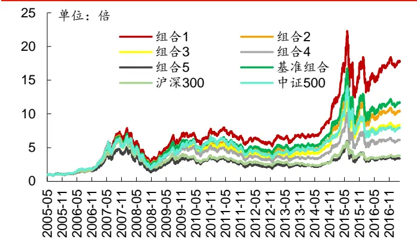
资料来源：Wind，华泰证券研究所

图表24： id1_std_3m因子各层组合净值除以基准组合净值示意图
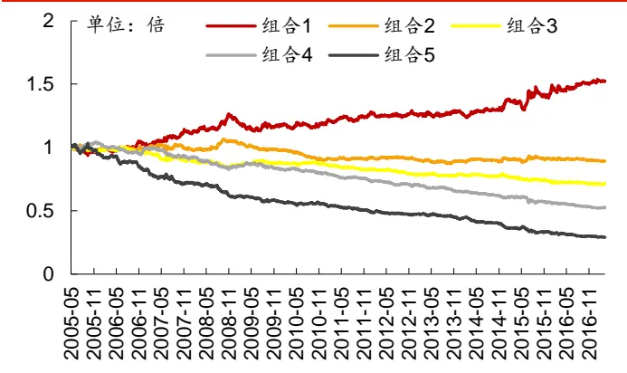
资料来源：Wind，华泰证券研究所

图表25： id1_std_3m因子分层组合1相对沪深300月超额收益分布图
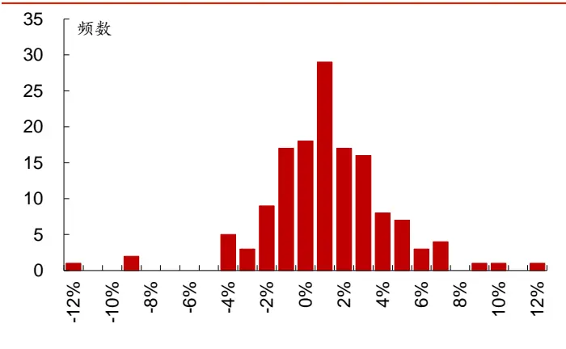
资料来源：Wind，华泰证券研究所

图表26： id1_std_3m因子多空组合月收益率及累积收益率
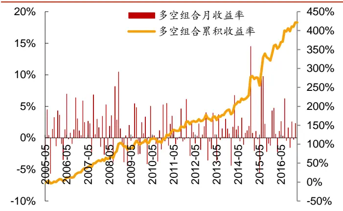
资料来源：Wind，华泰证券研究所

图表27： id1_std_3m分层组合在不同年份的收益及排名分析（分十层）

|  | 2006 | 2007 | 2008 | 2009 | 2010 | 2011 | 2012 | 2013 | 2014 | 2015 |  | 2016 排名均值 |
| --- | --- | --- | --- | --- | --- | --- | --- | --- | --- | --- | --- | --- |
| 组合1 | 108.9%(1) | 238.1%(1) | -55.7%(2) | 108.5%(6) | -0.2%(2) | -21.3%(1) | 9.1%(3) | 9.2%(2) | 79.8%(1) | 37.2%(1) | 4.6%(1) | 1.91 |
| 组合2 | 97.5%(2) | 225.4%(2) | -55.9%(3) | 112.3%(4) | 0.2%(1) | -27.1%(3) | 12.4%(1) | 7.6%(3) | 76.4%(2) | 32.4%(2) | 0.5%(2) | 2.27 |
| 组合3 | 90.4%(6) | 211.4%(3) | -54.5%(1) | 107.4%(7) | -9.3%(10) | -29.0%(4) | 11.7%(2) | 5.9%(5) | 73.4%(3) | 25.0%(5) | -2.1%(3) | 4.45 |
| 组合4 | 94.3%(4) | 206.9%(4) |  | -60.1%(5) 106.6%(10) | -7.9%(9) | -27.0%(2) | 7.3%(8) | 6.2%(4) | 65.7%(5) | 31.1%(3) | -5.5%(5) | 5.36 |
| 组合5 | 97.2%(3) | 201.3%(6) | -57.7%(4) | 137.1%(1) | -3.9%(7) | -31.3%(5) | 3.4%(10) | 3.7%(7) | 58.1%(6) | 28.2%(4) | -8.7%(7) | 5.45 |
| 组合6 | 87.1%(8) | 174.4%(8) | -65.4%(9) | 117.2%(3) | -0.7%(3) | -33.8%(6) | 7.5%(5) | 12.9%(1) | 66.4%(4) | 18.5%(9) | -3.1%(4) | 5.45 |
| 组合7 | 90.5%(5) | 201.8%(5) | -61.9%(6) | 124.2%(2) | -5.6%(8) | -34.8%(7) | 6.9%(9) | 1.7%(8) | 49.0%(8) | 23.2%(6) | -8.6%(6) | 6.36 |
| 组合8 | 88.1%(7) | 161.8%(9) | -64.1%(7) | 111.2%(5) | -2.7%(4) | -35.8%(8) | 7.4%(6) | -2.3%(9) | 56.2%(7) | 20.2%(8) | -11.5%(9) | 7.18 |
| 组合9 | 72.4%(9) | 187.5%(7) | -64.6%(8) | 107.3%(8) | -3.8%(6) | -37.0%(9) | 7.3%(7) | 4.9%(6) | 42.8%(9) | 9.8%(10) | -10.6%(8) | 7.91 |
| 组合10 |  | 65.8%(10) 151.0%(10) | -67.4%(10) | 106.6%(9) | -3.6%(5) | -38.4%(10) | 7.7%(4) | -5.8%(10) | 32.9%(10) | 22.0%(7) | ) -12.7%(10) | 8.64 |

资料来源：Wind，华泰证券研究所

图表28： 不同市值区间 id1_std_3m分层组合绩效指标对比图（分十层）
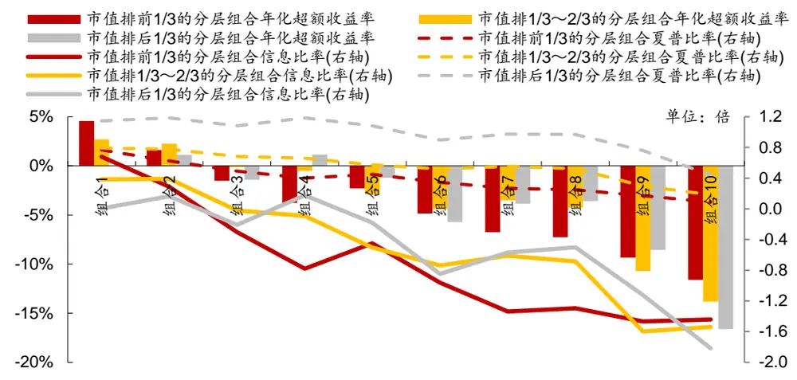
资料来源：Wind，华泰证券研究所

图表29： 不同行业 id1_std_3m因子分层组合绩效分析（分五层）

|  | 组合1年化 | 组合1 | 组合1 | 组合1 | 组合1超额收益 | 组合1相对 | 所有组合年化 |
| --- | --- | --- | --- | --- | --- | --- | --- |
| 行业 | 超额收益率 | 信息比率 | 年化收益率 | 夏普比率 | 最大回撤 | 基准月胜率 | 收益率排序 |
| 通信 | 14.51% | 1.12 | 49.26% | 1.33 | 18.39% | 58.45% | 1,2,5,3,4 |
| 房地产 | 8.88% | 1.01 | 38.49% | 1.09 | 10.27% | 53.52% | 1,2,3,4,5 |
| 商贸零售 | 6.66% | 0.76 | 33.63% | 1.00 | 11.51% | 60.56% | 1,2,3,4,5 |
| 食品饮料 | 7.05% | 0.59 | 36.38% | 1.15 | 19.67% | 55.63% | 1,3,2,4,5 |
| 汽车 | 5.13% | 0.52 | 35.83% | 1.07 | 19.05% | 53.52% | 1,2,3,4,5 |
| 综合 | 7.18% | 0.48 | 34.64% | 0.94 | 23.24% | 51.41% | 1,2,3,4,5 |
| 煤炭 | 5.47% | 0.44 | 20.33% | 0.51 | 25.02% | 53.52% | 1,2,3,4,5 |
| 电子元器件 | 4.26% | 0.43 | 33.44% | 0.91 | 17.91% | 47.89% | 1,3,2,4,5 |
| 建材 | 4.00% | 0.33 | 36.51% | 1.03 | 30.70% | 52.82% | 2,1,3,4,5 |
| 医药 | 2.34% | 0.28 | 33.32% | 1.03 | 26.76% | 51.41% | 1,2,3,4,5 |
| 国防军工 | 4.64% | 0.28 | 34.05% | 0.83 | 45.01% | 50.70% | 1,2,5,3,4 |
| 纺织服装 | 2.73% | 0.27 | 31.54% | 0.92 | 19.13% | 47.18% | 1,3,2,5,4 |
| 计算机 | 3.32% | 0.26 | 34.63% | 0.90 | 26.61% | 53.52% | 1,2,3,4,5 |
| 非银行金融 | 4.38% | 0.23 | 29.00% | 0.66 | 42.45% | 55.63% | 1,4,2,3,5 |
| 轻工制造 | 2.64% | 0.22 | 28.40% | 0.81 | 27.35% | 50.00% | 1,3,2,4,5 |
| 家电 | 2.70% | 0.20 | 31.41% | 0.92 | 26.54% | 52.11% | 1,2,4,3,5 |
| 电力及公用事业 | 1.79% | 0.19 | 24.33% | 0.75 | 22.33% | 50.70% | 1,2,3,4,5 |
| 建筑 | 2.33% | 0.19 | 33.70% | 0.98 | 36.81% | 54.93% | 1,2,3,5,4 |
| 有色金属 | 2.35% | 0.18 | 30.73% | 0.78 | 29.15% | 48.59% | 1,2,3,4,5 |
| 农林牧渔 | 1.43% | 0.13 | 31.04% | 0.90 | 25.77% | 54.23% | 1,2,3,5,4 |
| 电力设备 | 0.99% | 0.09 | 31.21% | 0.90 | 23.48% | 45.77% | 1,2,3,4,5 |
| 银行 | 1.16% | 0.08 | 24.93% | 0.81 | 28.38% | 47.89% | 1,2,3,4,5 |
| 餐饮旅游 | 0.74% | 0.05 | 26.88% | 0.77 | 31.76% | 51.41% | 1,3,2,5,4 |
| 石油石化 | -0.09% | -0.01 | 25.16% | 0.78 | 46.65% | 49.30% | 1,4,2,3,5 |
| 基础化工 | -0.22% | -0.03 | 26.37% | 0.75 | 18.91% | 49.30% | 1,4,2,3,5 |
| 机械 | -0.57% | -0.06 | 28.81% | 0.83 | 30.69% | 45.77% | 2,1,3,4,5 |
| 交通运输 | -1.10% | -0.11 | 18.06% | 0.57 | 42.27% | 42.96% | 2,1,4,3,5 |
| 传媒 | -2.14% | -0.13 | 23.98% | 0.62 | 55.82% | 47.89% | 4,1,2,5,3 |
| 钢铁 | -1.79% | -0.15 | 16.78% | 0.48 | 46.45% | 40.14% | 4,2,1,3,5 |

资料来源：Wind，华泰证券研究所

特质波动率的度量方式有许多种，对于上述 id1_std_Nm 因子，我们实际上是使用 CAPM回归残差序列的标准差进行计算，类似地，我们其实还可以更精细地使用 Fama-French三因子模型的回归残差序列的标准差进行计算。三因子与 CAPM 比较，相当于新引入了规模因子和账面市值比因子，我们此处也遵循此思路略加尝试。

接下来，我们提供第二种计算特质波动率因子的公式，即为过去一段时间内个股日收益率序列对市场组合（我们这里采用中证全指）日收益率序列、规模因子日收益率序列、账面市值比因子日收益率序列进行多元线性回归的残差的标准差（剔除停牌的交易日）。其中，规模（或账面市值比）因子日收益率的计算方法为前一日市值（或 PB）排后 30%的股票的本日收益均值减去前一日市值（或 PB）排前 30%的股票的本日收益均值。我们将此种特质波动率因子记为 id2_std_Nm。

在此之外，我们还可以计算上述残差序列的上行波动率、下行波动率。若设残差序列为$(r_{1},\ r_{2},\cdots,\ r_{K})^{\prime}$ ，则上行波动率的计算公式为

$$
(\sum_{r_{t}>0}r_{t}^{\ 2})/\sqrt{K}
$$

下行波动率的计算公式即把上式中求和号的条件改为 $r_{t}<0$ 。我们将上行、下行波动率分别记为 id2_std_up_Nm、id2_std_down_Nm，然后将此二者分别相减、相加得到衍生因子 id2_std_umd_Nm、id2_std_upd_Nm。

同样地，我们首先对因子的样本期长度进行敏感性测试。结果显示，在回归法、IC值测试中，这五种因子都是 1 个月最佳，id2_std_1m、id2_std_up_1m、id2_std_down_1m、id2_std_umd_1m、id2_std_upd_1m 的 IR 比率分别为 0.88、0.92、0.85、0.74、0.90。从 IR 比率来看，它们的表现都是非常优秀的，我们可以回忆一下，在动量类因子的单因子测试报告（华泰多因子系列之四）中 return_1m（一个月反转）的 IR比率是 0.63，改进的反转因子 wgt_return_1m（一个月内日换手率乘以日收益率的算术平均值）的 IR 比率是 0.92，这已经算是以前测过的估值、成长、动量、换手率因子中效果最好的。虽然这些因子的 IR 比率很高，但其对应的分层组合的换手率也非常高（TOP 组合月均双边换手率都在 120%以上），交易成本很高（按单边换手率 0.3%计算交易成本），所以综合考虑，在实际选股应用中，还是三个月左右样本期效果较好。

在分层法参数敏感性测试图表中，我们还可以发现，考虑交易成本后，这些因子对样本期长度其实并不敏感。虽然随着样本期长度增加，因子的效果有所下降，但 TOP 组合换手率也在逐渐下降，这意味着交易成本在逐渐降低，两种效果相互作用下，TOP 组合的年化收益率和夏普比率都没有发生太大变化。

在后两页的图表中，我们对 id2_std_3m、id2_std_up_3m、id2_std_down_3m、id2_std_upd_3m 进行了详细的测试并展示结果。

图表30： 特质波动率因子 2参数敏感性分析（回归法、IC值分析）

| 因子收益率 |  |  |  |  | 因子收益率 IC 序列 | IC 序列 |  |  |  |
| --- | --- | --- | --- | --- | --- | --- | --- | --- | --- |
| 因子 | It\|均值 | It\|>2 占比 | t 均值/t 标准差 | 均值 |  | 序列t检验 | 均值 | 标准差 | IR 比率 IC>0 占比 |
| id2_std_1m | 4.03 | 72.03% | -0.50 | -0.610% | -6.21 | -7.03% | 8.04% | 0.88 | 16.08% |
| id2_std_2m | 4.23 | 68.53% | -0.39 | -0.533% | -5.10 | -5.93% | 8.83% | 0.67 | 25.87% |
| id2_std_3m | 4.44 | 67.83% | -0.34 | -0.509% | -4.57 | -5.25% | 9.25% | 0.57 | 27.97% |
| id2_std_4m | 4.63 | 69.93% | -0.31 | -0.485% | -4.22 | -4.73% | 9.54% | 0.50 | 32.17% |
| id2_std_5m | 4.69 | 70.63% | -0.27 | -0.442% | -3.79 | -4.46% | 9.77% | 0.46 | 30.07% |
| id2_std_6m | 4.79 | 72.73% | -0.25 | -0.403% | -3.39 | -4.29% | 9.97% | 0.43 | 29.37% |
| id2_std_7m | 4.84 | 69.23% | -0.23 | -0.384% | -3.17 | -4.22% | 10.10% | 0.42 | 31.47% |
| id2_std_8m | 4.83 | 72.73% | -0.22 | -0.367% | -3.00 | -4.13% | 10.13% | 0.41 | 32.87% |
| id2_std_9m | 4.85 | 75.52% | -0.21 | -0.353% | -2.85 | -4.05% | 10.14% | 0.40 | 34.27% |
| id2_std_10m | 4.88 | 75.52% | -0.21 | -0.343% | -2.74 | -3.96% | 10.08% | 0.39 | 37.06% |
| id2_std_up_1m | 3.84 | 69.23% | -0.51 | -0.572% | -6.30 | -6.86% | 7.43% | 0.92 | 16.08% |
| id2_std_up_2m | 4.07 | 67.83% | -0.44 | -0.543% | -5.66 | -6.08% | 8.16% | 0.75 | 24.48% |
| id2_std_up_3m | 4.19 | 67.83% | -0.39 | -0.519% | -5.10 | -5.38% | 8.41% | 0.64 | 24.48% |
| id2_std_up_4m | 4.35 | 69.93% | -0.34 | -0.478% | -4.51 | -4.71% | 8.63% | 0.55 | 29.37% |
| id2_std_up_5m | 4.41 | 71.33% | -0.30 | -0.442% | -4.13 | -4.35% | 8.63% | 0.50 | 30.07% |
| id2_std_up_6m | 4.40 | 71.33% | -0.28 | -0.402% | -3.76 | -4.15% | 8.63% | 0.48 | 30.07% |
| id2_std_up_7m | 4.45 | 69.23% | -0.26 | -0.373% | -3.43 | -4.00% | 8.65% | 0.46 | 33.57% |
| id2_std_up_8m | 4.43 | 69.23% | -0.24 | -0.354% | -3.25 | -3.86% | 8.58% | 0.45 | 34.27% |
| id2_std_up_9m | 4.40 | 67.13% | -0.23 | -0.339% | -3.11 | -3.66% | 8.48% | 0.43 | 35.66% |
| id2_std_up_10m | 4.39 | 68.53% | -0.23 | -0.331% | -3.01 | -3.49% | 8.40% | 0.42 | 36.36% |
| id2_std_down_1m | 3.92 | 68.53% | -0.50 | -0.609% | -6.28 | -6.81% | 8.04% | 0.85 | 17.48% |
| id2_std_down_2m | 4.15 | 69.23% | -0.39 | -0.511% | -4.91 | -5.65% | 8.81% | 0.64 | 30.07% |
| id2_std_down_3m | 4.30 | 68.53% | -0.34 | -0.492% | -4.56 | -4.95% | 8.94% | 0.55 | 30.07% |
| id2_std_down_4m | 4.43 | 69.93% | -0.31 | -0.460% | -4.21 | -4.32% | 9.06% | 0.48 | 33.57% |
| id2_std_down_5m | 4.47 | 70.63% | -0.27 | -0.417% | -3.75 | -3.92% | 9.06% | 0.43 | 33.57% |
| id2_std_down_6m | 4.45 | 72.73% | -0.25 | -0.381% | -3.48 | -3.78% | 9.08% | 0.42 | 34.97% |
| id2_std_down_7m | 4.42 | 68.53% | -0.24 | -0.359% | -3.26 | -3.69% | 9.09% | 0.41 | 34.27% |
| id2_std_down_8m | 4.40 | 65.73% | -0.23 | -0.336% | -3.05 | -3.55% | 9.00% | 0.39 | 36.36% |
| id2_std_down_9m | 4.38 | 65.73% | -0.22 | -0.329% | -2.98 | -3.39% | 8.88% |  | 35.66% |
| id2_std_down_10m | 4.36 | 63.64% | -0.22 | -0.320% | -2.89 | -3.23% | 8.72% | 0.38 |  |
| id2_std_umd_1m | 2.36 | 47.55% | -0.39 | -0.234% | -4.15 | -3.53% | 4.74% | 0.37 | 34.97% 22.38% |
| id2_std_umd_2m | 2.69 | 56.64% | -0.46 | -0.338% | -5.44 | -3.94% | 5.50% | 0.74 0.72 | 22.38% |
| id2_std_umd_3m | 2.86 | 55.24% | -0.39 | -0.319% | -4.76 | -3.65% | 6.04% | 0.60 | 24.48% |
| id2_std_umd_4m | 3.05 | 55.24% | -0.33 | -0.301% | -4.12 | -3.30% | 6.54% | 0.50 | 25.17% |
| id2_std_umd_5m | 3.24 | 60.14% | -0.30 | -0.298% | -3.88 | -3.22% | 6.82% | 0.47 | 28.67% |
| id2_std_umd_6m | 3.34 | 62.24% | -0.27 | -0.270% | -3.38 | -3.11% | 6.86% | 0.45 | 29.37% |
| id2_std_umd_7m | 3.46 | 62.24% | -0.24 | -0.246% | -2.97 | -2.52% | 7.65% | 0.33 | 34.97% |
| id2_std_umd_8m | 3.51 | 63.64% | -0.23 | -0.237% | -2.81 | -2.90% | 7.02% | 0.41 | 28.67% |
| id2_std_umd_9m | 3.54 | 66.43% | -0.21 | -0.218% | -2.57 | -2.71% | 6.99% | 0.39 | 30.07% |

资料来源：Wind，华泰证券研究所

图表31： 特质波动率因子 2参数敏感性分析（分层测试法、分五层）

|  | TOP 组合 | TOP 组合 | TOP 组合 | TOP 组合 TOP 组合相对 |  | TOP 组合月均 | 多空组合 | 多空组合 | 多空组合 | 多空组合 |
| --- | --- | --- | --- | --- | --- | --- | --- | --- | --- | --- |
| 因子 | 年化收益率 | 夏普比率 | 信息比率 | 最大回撤 | 基准月胜率 | 双边换手率 | 年化收益率 | 夏普比率 | 最大回撤 | 月胜率 |
| id2_std_1m | 27.16% | 0.90 | 0.57 | 67.67% | 47.89% | 126.63% | 19.78% | 2.16 | 11.35% | 70.71% |
| id2_std_2m | 27.42% | 0.92 | 0.60 | 65.94% | 48.59% | 88.63% | 16.34% | 1.71 | 11.40% | 65.71% |
| id2_std_3m | 28.90% | 0.97 | 0.82 | 65.75% | 56.34% | 71.45% | 16.22% | 1.66 | 12.32% | 64.29% |
| id2_std_4m | 28.30% | 0.96 | 0.71 | 65.81% | 54.23% | 60.57% | 14.80% | 1.49 | 12.83% | 65.71% |
| id2_std_5m | 28.21% | 0.95 | 0.70 | 65.07% | 53.52% | 54.32% | 13.94% | 1.41 | 14.64% | 63.57% |
| id2_std_6m | 27.88% | 0.94 | 0.65 | 65.02% | 53.52% | 48.97% | 13.52% | 1.36 | 13.80% | 62.86% |
| id2_std_7m | 27.52% | 0.93 | 0.61 | 65.20% | 50.70% | 46.33% | 11.14% | 1.14 | 15.15% | 61.43% |
| id2_std_8m | 26.80% | 0.91 | 0.50 | 66.00% | 48.59% | 42.76% | 10.30% | 1.06 | 15.10% | 60.00% |
| id2_std_9m | 26.76% | 0.91 | 0.49 | 65.35% | 52.82% | 41.32% | 10.37% | 1.07 | 16.85% | 60.00% |
| id2_std_10m | 27.17% | 0.92 | 0.56 | 64.71% | 54.93% | 38.98% | 10.41% | 1.08 | 15.79% | 58.57% |
| id2_std_up_1m | 27.10% | 0.91 | 0.58 | 67.98% | 49.30% | 130.69% | 20.48% | 2.28 | 11.46% | 74.29% |
| id2_std_up_2m | 27.22% | 0.92 | 0.56 | 66.28% | 52.82% | 94.58% | 16.14% | 1.66 | 10.59% | 67.14% |
| id2_std_up_3m | 27.70% | 0.94 | 0.63 | 67.33% | 50.70% | 76.57% | 16.61% | 1.71 | 10.90% | 65.71% |
| id2_std_up_4m | 27.69% | 0.95 | 0.63 | 66.51% | 54.93% | 65.89% | 15.40% | 1.56 | 11.86% | 66.43% |
| id2_std_up_5m | 27.90% | 0.95 | 0.65 | 66.24% | 54.93% | 58.79% | 14.95% | 1.52 | 12.58% | 66.43% |
| id2_std_up_6m | 28.26% | 0.97 | 0.70 | 66.07% | 60.56% | 54.28% | 13.66% | 1.37 | 13.25% | 67.86% |
| id2_std_up_7m | 27.87% | 0.95 | 0.66 | 66.95% | 56.34% | 50.35% | 13.14% | 1.36 | 13.82% | 63.57% |
| id2_std_up_8m | 27.64% | 0.95 | 0.62 | 66.94% | 53.52% | 48.40% | 12.15% | 1.26 | 14.93% | 62.86% |
| id2_std_up_9m | 27.55% | 0.95 | 0.61 | 67.73% | 53.52% | 45.41% | 12.00% | 1.24 | 15.81% | 62.14% |
| id2_std_up_10m | 27.73% | 0.95 | 0.63 | 66.97% | 54.93% | 43.13% | 11.72% | 1.20 | 15.33% | 62.86% |
| id2_std_down_1m | 26.64% | 0.88 | 0.49 | 67.60% | 49.30% | 127.17% | 19.15% | 2.11 | 12.58% | 71.43% |
| id2_std_down_2m | 27.86% | 0.93 | 0.68 | 64.47% | 50.70% | 87.27% | 16.66% | 1.78 | 11.30% | 64.29% |
| id2_std_down_3m | 27.81% | 0.93 | 0.66 | 65.14% | 52.82% | 71.33% | 14.79% | 1.54 | 11.70% | 64.29% |
| id2_std_down_4m | 27.98% | 0.94 | 0.68 | 64.94% | 51.41% | 61.38% | 14.26% | 1.46 | 12.26% | 64.29% |
| id2_std_down_5m | 28.05% | 0.94 | 0.69 | 65.34% | 55.63% | 55.53% | 12.96% | 1.34 | 12.18% | 61.43% |
| id2_std_down_6m | 27.58% | 0.92 | 0.63 | 65.47% | 53.52% | 50.11% | 12.23% | 1.28 | 13.37% | 61.43% |
| id2_std_down_7m | 27.66% | 0.93 | 0.65 | 65.44% | 51.41% | 46.50% | 11.05% | 1.15 | 12.72% | 57.86% |
| id2_std_down_8m | 27.77% | 0.93 | 0.67 | 65.29% | 47.89% | 44.26% | 12.01% | 1.26 | 13.17% | 58.57% |
| id2_std_down_9m | 27.65% | 0.92 | 0.65 | 64.80% | 51.41% | 42.50% | 10.84% | 1.14 | 13.17% | 57.14% |
| id2_std_down_10m | 28.02% | 0.94 | 0.72 | 64.77% | 50.70% | 41.25% | 10.57% | 1.11 | 13.17% | 56.43% |
| id2_std_umd_1m | 18.57% | 0.60 | -0.99 | 71.85% | 31.69% | 161.28% | 7.56% | 1.09 | 13.75% | 64.29% |
| id2_std_umd_2m | 22.74% | 0.75 | -0.17 | 70.29% | 42.25% | 123.07% | 10.12% | 1.30 | 10.90% | 62.86% |
| id2_std_umd_3m | 23.82% | 0.80 | 0.03 | 70.57% | 48.59% | 100.03% | 10.07% | 1.22 | 11.07% | 67.86% |
| id2_std_umd_4m | 25.65% | 0.86 | 0.34 | 69.41% | 52.11% | 86.50% | 10.54% | 1.25 | 10.39% | 64.29% |
| id2_std_umd_5m | 25.42% | 0.86 | 0.30 | 69.24% | 54.23% | 76.08% | 11.34% | 1.33 | 10.89% | 65.00% |
| id2_std_umd_6m | 25.00% | 0.85 | 0.22 | 71.62% | 56.34% 55.63% | 69.03% 64.71% | 9.89% 8.47% | 1.15 0.98 | 9.97% 12.99% | 65.00% 62.14% |

资料来源：Wind，华泰证券研究所

以下是 id2_std_3m 因子详细测试结果（各项图表内容解释请参看本章第一小节）：

图表32： id2_std_3m 因子分层组合绩效分析（20050509～20170228）

|  |  |  |  |  |  | 年化超额 超额收益 | 相对基准 |  | 超额收益 最大回撤 | 月均双边 换手率 |
| --- | --- | --- | --- | --- | --- | --- | --- | --- | --- | --- |
| 投资组合 | 年化收益率 | 年化波动率 | 夏普比率 | 最大回撤 | 收益率 年化波动率 |  | 信息比率 | 月胜率 |  |  |
| 组合1 | 28.90% | 29.68% | 0.97 | 65.75% | 4.22% | 5.16% | 0.82 | 56.34% | 9.89% | 71.45% |
| 组合2 | 23.30% | 30.76% | 0.76 | 69.04% | -0.30% | 3.47% | -0.09 | 44.37% | 18.42% | 115.27% |
| 组合3 | 19.74% | 31.77% | 0.62 | 71.57% | -3.18% | 3.17% | -1.00 | 33.80% | 31.75% | 122.48% |
| 组合4 | 16.02% | 32.63% | 0.49 | 72.87% | -6.19% | 3.68% | -1.68 | 30.28% | 54.02% | 115.43% |
| 组合5 | 10.91% | 33.61% | 0.32 | 75.39% | -10.33% | 5.50% | -1.88 | 30.28% | 72.31% | 74.71% |
| 基准组合 | 23.68% | 31.44% | 0.75 | 70.38% |  |  |  |  |  | = |
| 多空组合 | 16.22% | 9.74% | 1.66 | 12.32% |  |  |  |  |  |  |

资料来源：Wind，华泰证券研究所

图表33： id2_std_3m 因子分层组合回测净值
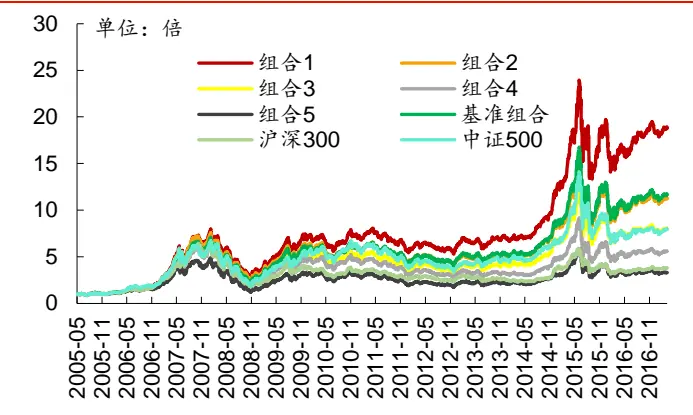
资料来源：Wind，华泰证券研究所

图表34： id2_std_3m因子各层组合净值除以基准组合净值示意图
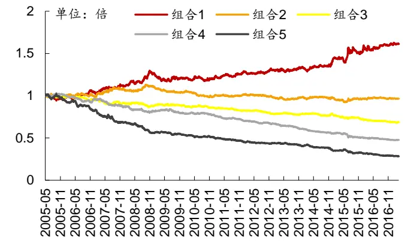
资料来源：Wind，华泰证券研究所

图表35： id2_std_3m因子分层组合1相对沪深300月超额收益分布图
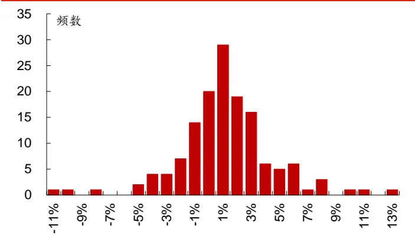
资料来源：Wind，华泰证券研究所

图表36： id2_std_3m因子多空组合月收益率及累积收益率
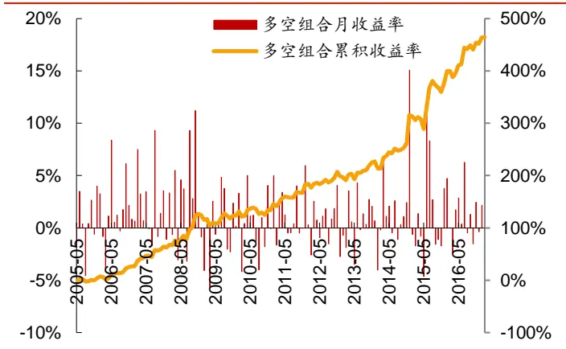
资料来源：Wind，华泰证券研究所

图表37： id2_std_3m分层组合在不同年份的收益及排名分析（分十层）

|  | 2006 | 2007 | 2008 | 2009 | 2010 | 2011 | 2012 | 2013 | 2014 | 2015 | 2016 排名均值 |  |
| --- | --- | --- | --- | --- | --- | --- | --- | --- | --- | --- | --- | --- |
| 组合1 | 113.8%(1) | 230.6%(1) | -54.1%(1) | 111.2%(5) | -3.2%(4) | -22.3%(1) | 11.5%(2) | 11.2%(2) | 81.7%(1) | 42.3%(1) | 3.4%(1) | 1.82 |
| 组合2 | 98.5%(3) | 224.0%(4) | -55.0%(2) | 109.9%(6) | 0.7%(1) | -26.3%(2) | 15.3%(1) | 6.8%(5) | 77.6%(2) | 31.4%(3) | 0.2%(2) | 2.82 |
| 组合3 | 101.2%(2) | 230.2%(2) | -57.8%(4) | 114.2%(4) | -6.9%(9) | -28.7%(4) | 7.3%(7) | 8.1%(3) | 68.1%(3) | 31.5%(2) | -3.3%(4) | 4.00 |
| 组合4 | 86.2%(6) | 229.9%(3) | -59.5%(5) | 104.3%(9) | -4.5%(7) | -27.0%(3) | 8.1%(6) | 7.1%(4) | 60.4%(5) | 25.4%(5) | -2.3%(3) | 5.09 |
| 组合5 | 84.9%(7) | 197.5%(5) | -57.0%(3) | 135.9%(1) | -5.4%(8) | -32.5%(6) | 9.0%(4) | 14.3%(1) | 67.8%(4) | 26.4%(4) | -7.6%(6) | 4.45 |
| 组合6 | 93.5%(4) | 190.5%(6) | -64.9%(8) | 109.5%(7) | -2.8%(3) | -31.1%(5) | 1.6%(10) | 1.9%(7) | 57.6%(6) | 16.9%(9) | -7.8%(7) | 6.55 |
| 组合7 | 84.4%(8) | 178.5%(7) | -64.2%(7) | 127.1%(2) | -1.9%(2) | -35.4%(7) | 10.2%(3) | 0.1%(8) | 52.3%(7) | 22.4%(6) | -5.2%(5) | 5.64 |
| 组合8 | 90.0%(5) | 172.5%(8) |  | -60.4%(6) 104.3%(10) | -3.4%(5) | -37.0%(8) | 2.8%(9) | -4.9%(9) | 50.5%(8) | 13.9%(10) | -11.8%(8) | 7.82 |
| 组合9 | 70.1%(9) | 165.9%(9) | -65.5%(9) | 118.6%(3) |  | -4.4%(6)-37.8%(10) | 8.9%(5) | 5.3%(6) | 45.5%(9) | 21.1%(7) | -11.8%(9) | 7.45 |
| 组合10 |  | 69.4%(10) 143.6%(10) | -68.7%(10) | 104.7%(8) | -6.9%(10) | -37.3%(9) | 6.3%(8) | -6.2%(10) | 37.3%(10) |  | 17.4%(8)-12.0%(10) | 9.36 |

资料来源：Wind，华泰证券研究所

图表38： 不同市值区间 id2_std_3m分层组合绩效指标对比图（分十层）
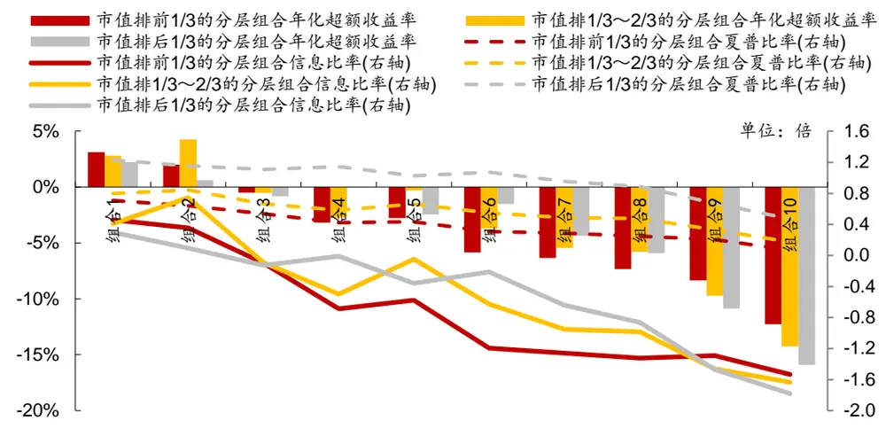
资料来源：Wind，华泰证券研究所

图表39： 不同行业 id2_std_3m因子分层组合绩效分析（分五层）

|  | 组合1年化 | 组合1 | 组合1 | 组合1 | 组合1超额收益 | 组合1相对 | 所有组合年化 |
| --- | --- | --- | --- | --- | --- | --- | --- |
| 行业 | 超额收益率 | 信息比率 | 年化收益率 | 夏普比率 | 最大回撤 | 基准月胜率 | 收益率排序 |
| 通信 | 17.23% | 1.36 | 52.80% | 1.40 | 14.58% | 64.08% | 1,2,3,5,4 |
| 商贸零售 | 10.65% | 1.23 | 38.63% | 1.13 | 12.30% | 65.49% | 1,2,3,4,5 |
| 房地产 | 9.04% | 1.00 | 38.69% | 1.10 | 10.65% | 56.34% | 1,2,3,4,5 |
| 电子元器件 | 8.31% | 0.86 | 38.62% | 1.05 | 12.85% | 58.45% | 1,3,2,4,5 |
| 食品饮料 | 10.60% | 0.86 | 40.90% | 1.30 | 21.65% | 54.93% | 1,3,2,4,5 |
| 综合 | 11.23% | 0.75 | 39.72% | 1.07 | 20.78% | 52.11% | 1,3,2,5,4 |
| 轻工制造 | 8.83% | 0.74 | 36.15% | 1.02 | 27.12% | 54.23% | 1,2,3,4,5 |
| 汽车 | 5.98% | 0.61 | 36.93% | 1.09 | 15.03% | 52.11% | 2,1,3,4,5 |
| 建材 | 6.92% | 0.58 | 40.35% | 1.12 | 18.33% | 55.63% | 1,2,3,4,5 |
| 医药 | 4.55% | 0.56 | 36.19% | 1.10 | 21.06% | 54.23% | 1,3,2,4,5 |
| 电力设备 | 5.04% | 0.46 | 36.48% | 1.02 | 14.94% | 48.59% | 1,2,3,4,5 |
| 煤炭 | 5.01% | 0.41 | 19.80% | 0.50 | 21.81% | 53.52% | 1,2,3,4,5 |
| 农林牧渔 | 4.10% | 0.38 | 34.48% | 1.00 | 19.37% | 57.04% | 1,2,3,5,4 |
| 基础化工 | 2.89% | 0.37 | 30.31% | 0.86 | 13.95% | 50.70% | 1,3,2,4,5 |
| 家电 | 4.58% | 0.35 | 33.81% | 0.98 | 22.82% | 56.34% | 1,2,4,3,5 |
| 国防军工 | 5.79% | 0.34 | 35.51% | 0.86 | 41.38% | 54.93% | 1,2,5,3,4 |
| 电力及公用事业 | 2.41% | 0.26 | 25.09% | 0.77 | 17.69% | 52.11% | 1,3,2,4,5 |
| 纺织服装 | 2.47% | 0.25 | 31.21% | 0.89 | 26.06% | 52.11% | 1,2,3,4,5 |
| 餐饮旅游 | 3.46% | 0.24 | 30.31% | 0.86 | 32.35% | 52.82% | 1,3,2,4,5 |
| 有色金属 | 2.71% | 0.21 | 31.20% | 0.80 | 27.65% | 46.48% | 1,2,4,3,5 |
| 机械 | 1.63% | 0.18 | 31.67% | 0.90 | 29.17% | 52.11% | 1,2,3,4,5 |
| 非银行金融 | 3.41% | 0.17 | 27.80% | 0.64 | 49.51% | 50.70% | 1,4,2,3,5 |
| 银行 | 2.16% | 0.14 | 26.17% | 0.83 | 29.57% | 46.48% | 1,2,3,5,4 |
| 计算机 | 1.25% | 0.10 | 31.93% | 0.82 | 32.33% | 50.70% | 2,1,3,4,5 |
| 建筑 | 0.62% | 0.05 | 31.48% | 0.92 | 40.05% | 51.41% | 2,1,3,4,5 |
| 钢铁 | 0.05% | 0.00 | 18.97% | 0.55 | 44.25% | 42.96% | 1,3,4,2,5 |
| 石油石化 | -0.22% | -0.01 | 24.99% | 0.78 | 44.82% | 47.89% | 1,2,3,4,5 |
| 传媒 | -0.79% | -0.05 | 25.68% | 0.65 | 42.37% | 47.18% | 2,1,5,4,3 |
| 交通运输 | -1.87% | -0.19 | 17.13% | 0.54 | 42.90% | 43.66% | 2,3,1,4,5 |

资料来源：Wind，华泰证券研究所

以下是 id2_std_up_3m 因子详细测试结果（各项图表内容解释请参看本章第一小节）：

图表40： id2_std_up_3m 因子分层组合绩效分析（20050509～20170228）

|  |  |  |  |  |  | 年化超额 超额收益 | 相对基准 |  | 超额收益 最大回撤 | 月均双边 换手率 |
| --- | --- | --- | --- | --- | --- | --- | --- | --- | --- | --- |
| 投资组合 | 年化收益率 | 年化波动率 | 夏普比率 | 最大回撤 | 收益率 年化波动率 |  | 信息比率 | 月胜率 |  |  |
| 组合1 | 27.70% | 29.32% | 0.94 | 67.33% | 3.25% | 5.15% | 0.63 | 50.70% | 10.84% | 76.57% |
| 组合2 | 23.88% | 30.76% | 0.78 | 68.73% | 0.16% | 3.46% | 0.05 | 47.18% | 11.48% | 117.91% |
| 组合3 | 20.87% | 31.74% | 0.66 | 71.35% | -2.27% | 3.23% | -0.70 | 38.03% | 24.62% | 125.42% |
| 组合4 | 16.40% | 32.68% | 0.50 | 72.90% | -5.89% | 3.73% | -1.58 | 32.39% | 51.92% | 117.80% |
| 组合5 | 9.51% | 33.89% | 0.28 | 74.73% | -11.46% | 5.47% | -2.10 | 26.76% | 76.19% | 75.31% |
| 基准组合 | 23.68% | 31.44% | 0.75 | 70.38% |  |  |  |  |  | = |
| 多空组合 | 16.61% | 9.69% | 1.71 | 10.90% |  |  |  |  |  |  |

资料来源：Wind，华泰证券研究所

图表41： id2_std_up_3m 因子分层组合回测净值
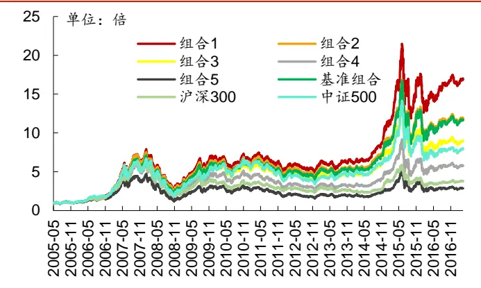
资料来源：Wind，华泰证券研究所

图表42： id2_std_up_3m因子各层组合净值除以基准组合净值示意图
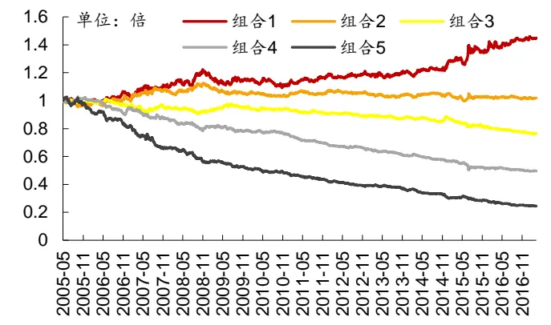
资料来源：Wind，华泰证券研究所

图表43： id2_std_up_3m 分层组合 1相对沪深 300 月超额收益分布图
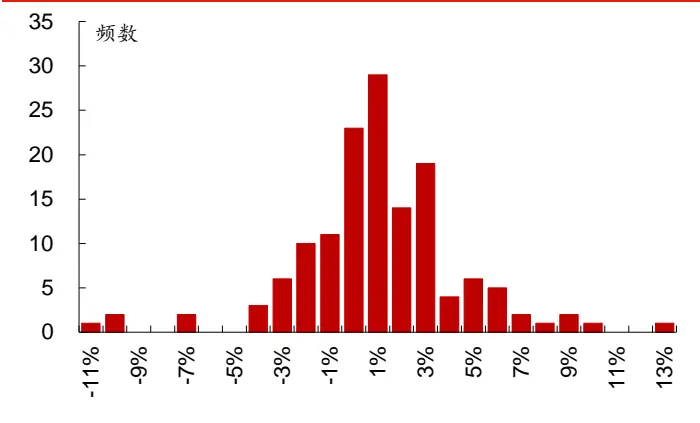
资料来源：Wind，华泰证券研究所

图表44： id2_std_up_3m因子多空组合月收益率及累积收益率
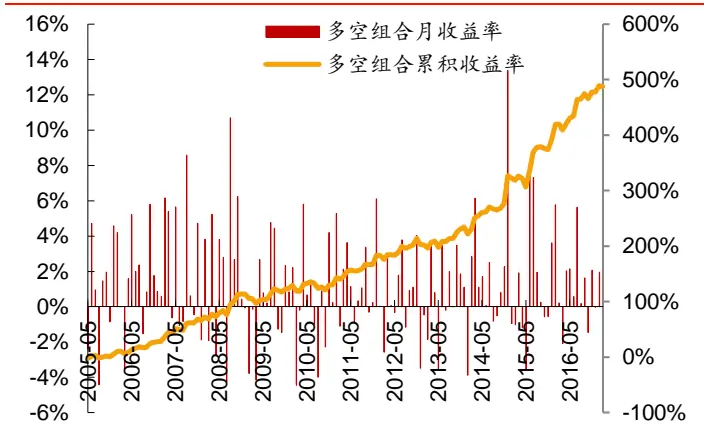
资料来源：Wind，华泰证券研究所

图表45： id2_std_up_3m分层组合在不同年份的收益及排名分析（分十层）

|  | 2006 | 2007 | 2008 | 2009 | 2010 | 2011 | 2012 | 2013 | 2014 | 2015 | 2016 排名均值 |  |
| --- | --- | --- | --- | --- | --- | --- | --- | --- | --- | --- | --- | --- |
| 组合1 | 108.8%(2) | 223.7%(2) | -54.4%(1) | 108.5%(9) | -5.8%(8) | -22.5%(1) | 9.5%(4) | 9.7%(1) | 80.3%(1) | 45.4%(1) | 2.0%(1) | 2.82 |
| 组合2 | 96.9%(3) | 223.6%(3) | -58.4%(4) | 116.3%(3) | -2.6%(4) | -26.5%(3) | 13.8%(1) | 7.5%(3) | 72.8%(2) | 30.2%(2) | 1.9%(2) | 2.73 |
| 组合3 | 113.1%(1) | 223.8%(1) | -56.1%(2) | 111.9%(4) | -0.6%(2) | -28.0%(4) | 10.6%(2) | 8.4%(2) | 68.3%(3) | 28.0%(3) | -2.8%(3) | 2.45 |
| 组合4 | 94.6%(4) | 222.6%(4) | -61.0%(6) | 110.2%(7) | -3.5%(5) | -26.1%(2) | 7.4%(6) | 5.9%(6) | 63.9%(5) | 25.3%(4) | -5.0%(5) | 4.91 |
| 组合5 | 86.8%(7) | 200.5%(6) | -57.6%(3) | 111.1%(5) | -5.7%(6) | -31.7%(6) | 10.1%(3) | 7.3%(4) | 66.6%(4) | 23.2%(6) | -9.4%(7) | 5.18 |
| 组合6 | 89.5%(5) | 207.7%(5) | -63.8%(8) | 145.9%(1) | 1.3%(1) | -31.2%(5) | 7.9%(5) | 6.0%(5) | 59.8%(7) | 18.6%(9) | -6.1%(6) | 5.18 |
| 组合7 | 80.2%(8) | 172.0%(8) | -63.8%(9) | 119.4%(2) | -2.2%(3) | -36.6%(8) | 7.2%(7) | 1.8%(8) | 46.2%(8) | 23.4%(5) | -2.9%(4) | 6.36 |
| 组合8 | 87.5%(6) | 185.1%(7) | -60.5%(5) | 110.1%(8) | -5.7%(7) | -36.5%(7) | 5.6%(8) | -1.5%(9) | 62.9%(6) | 13.9%(10) | -9.6%(8) | 7.36 |
| 组合9 | 62.1%(10) | 154.6%(9) | -62.1%(7) | 110.4%(6) |  | -6.6%(9)-39.0%(10) | 4.4%(9) | 4.2%(7) | 42.5%(9) | 19.3%(8) | -12.6%(9) | 8.45 |
| 组合10 |  | 73.4%(9) 144.8%(10) | )-70.1%(10) | 95.5%(10) | -7.4%(10) | -37.9%(9) | 3.8%(10) | -7.1%(10) | 34.6%(10) |  | 20.2%(7) -14.2%(10) | 9.55 |

资料来源：Wind，华泰证券研究所

图表46： 不同市值区间 id2_std_up_3m 分层组合绩效指标对比图（分十层）
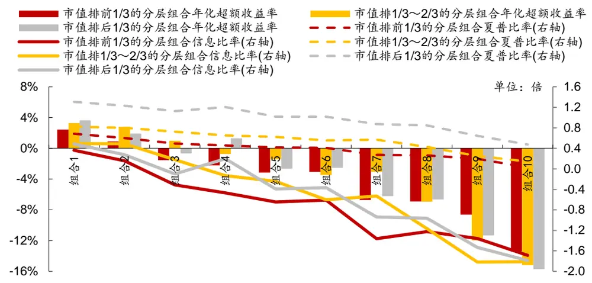
资料来源：Wind，华泰证券研究所

图表47： 不同行业 id2_std_up_3m 因子分层组合绩效分析（分五层）

|  | 组合1年化 | 组合1 | 组合1 | 组合1 | 组合1超额收益 | 组合1相对 | 所有组合年化 |
| --- | --- | --- | --- | --- | --- | --- | --- |
| 行业 | 超额收益率 | 信息比率 | 年化收益率 | 夏普比率 1.41 | 最大回撤 11.88% | 基准月胜率 59.15% | 收益率排序 1,2,3,5,4 |
| 通信 商贸零售 | 16.55% 9.30% | 1.30 1.07 | 51.92% 36.94% | 1.09 | 11.39% | 58.45% | 1,2,4,3,5 |
| 电子元器件 | 8.64% | 0.92 | 39.03% | 1.07 | 13.31% | 56.34% | 1,3,2,4,5 |
| 房地产 | 7.74% | 0.87 | 37.04% | 1.07 | 11.54% | 56.34% | 1,2,3,4,5 |
| 食品饮料 | 9.98% | 0.84 | 40.11% | 1.30 | 27.91% | 59.86% | 1,3,2,4,5 |
| 轻工制造 | 8.10% | 0.69 | 35.23% | 1.00 | 24.87% | 54.23% | 1,2,3,4,5 |
| 综合 | 9.96% | 0.67 | 38.13% | 1.03 | 15.16% | 54.93% | 1,3,2,5,4 |
| 电力设备 | 7.10% | 0.66 | 39.16% | 1.11 | 15.87% | 48.59% | 1,2,3,5,4 |
| 汽车 | 6.07% | 0.65 | 37.05% | 1.11 | 17.16% | 52.82% | 1,2,3,4,5 |
| 建材 | 6.98% | 0.60 | 40.42% | 1.14 | 19.39% | 54.23% | 1,2,3,4,5 |
| 煤炭 | 6.96% | 0.56 | 22.02% | 0.55 | 15.28% | 55.63% | 1,3,2,4,5 |
| 医药 | 4.14% | 0.53 | 35.67% | 1.10 | 22.33% | 50.00% | 1,2,3,4,5 |
| 餐饮旅游 | 6.86% | 0.47 | 34.59% | 0.97 | 25.03% | 57.04% | 1,3,2,4,5 |
| 纺织服装 | 4.01% | 0.41 | 33.18% | 0.96 | 16.46% | 49.30% | 1,2,3,4,5 |
| 农林牧渔 | 4.01% | 0.37 | 34.37% | 1.00 | 19.93% | 55.63% | 1,2,4,3,5 |
| 基础化工 | 2.81% | 0.36 | 30.21% | 0.87 | 13.55% | 56.34% | 1,2,3,4,5 |
| 国防军工 | 5.03% | 0.30 | 34.54% | 0.84 | 38.27% | 50.00% | 1,2,5,3,4 |
| 电力及公用事业 | 1.73% | 0.18 | 24.26% | 0.75 | 19.47% | 50.00% | 1,2,3,4,5 |
| 家电 | 2.22% | 0.18 | 30.80% | 0.90 | 25.91% | 55.63% | 1,2,4,3,5 |
| 计算机 | 1.69% | 0.14 | 32.49% | 0.83 | 37.81% | 52.82% | 1,2,3,4,5 |
| 建筑 | 1.68% | 0.13 | 32.85% | 0.96 | 41.85% | 51.41% | 2,1,3,5,4 |
| 石油石化 | 1.51% | 0.09 | 27.16% | 0.85 | 37.47% | 48.59% | 3,1,5,2,4 |
| 非银行金融 | 0.91% | 0.04 | 24.71% | 0.58 | 45.74% | 45.77% | 2,1,4,3,5 |
| 有色金属 | -0.03% | 0.00 | 27.69% | 0.72 | 35.53% | 49.30% | 2,1,4,3,5 |
| 钢铁 | -0.68% | -0.06 | 18.09% | 0.53 | 44.69% | 40.85% | 1,3,2,4,5 |
| 机械 | -0.55% | -0.06 | 28.84% | 0.83 | 33.33% | 52.11% | 2,1,3,4,5 |
| 传媒 | -1.15% | -0.07 | 25.22% | 0.65 | 50.26% | 49.30% | 1,2,3,4,5 |
| 银行 | -1.17% | -0.08 | 22.06% | 0.70 | 39.53% | 43.66% | 3,1,2,4,5 |
| 交通运输 | -0.97% | -0.10 | 18.21% | 0.58 | 41.20% | 47.18% | 2,1,3,4,5 |

资料来源：Wind，华泰证券研究所

以下是 id2_std_down_3m 因子详细测试结果（各项图表内容解释请参看本章第一小节）：

图表48： id2_std_down_3m 因子分层组合绩效分析（20050509～20170228）

|  |  |  |  |  |  | 年化超额 超额收益 | 相对基准 |  | 超额收益 最大回撤 | 月均双边 换手率 |
| --- | --- | --- | --- | --- | --- | --- | --- | --- | --- | --- |
| 投资组合 | 年化收益率 | 年化波动率 | 夏普比率 | 最大回撤 | 收益率 年化波动率 |  | 信息比率 | 月胜率 |  |  |
| 组合1 | 27.81% | 29.83% | 0.93 | 65.14% | 3.34% | 5.09% | 0.66 | 52.82% | 9.90% | 71.33% |
| 组合2 | 23.96% | 31.04% | 0.77 | 69.55% | 0.22% | 3.51% | 0.06 | 45.07% | 9.25% | 116.81% |
| 组合3 | 19.92% | 31.79% | 0.63 | 72.07% | -3.04% | 3.22% | -0.94 | 35.21% | 30.69% | 124.43% |
| 组合4 | 15.62% | 32.49% | 0.48 | 73.02% | -6.52% | 3.61% | -1.81 | 29.58% | 56.32% | 117.35% |
| 组合5 | 11.34% | 33.28% | 0.34 | 74.86% | -9.98% | 5.42% | -1.84 | 35.92% | 70.95% | 73.82% |
| 基准组合 | 23.68% | 31.44% | 0.75 | 70.38% |  |  |  |  |  | = |
| 多空组合 | 14.79% | 9.58% | 1.54 | 11.70% |  |  |  |  |  |  |

资料来源：Wind，华泰证券研究所

图表49： id2_std_down_3m 因子分层组合回测净值
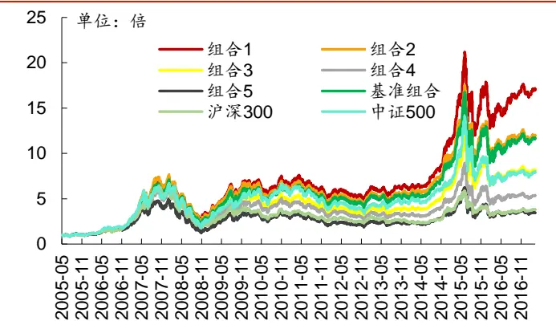
资料来源：Wind，华泰证券研究所

图表50： id2_std_down_3m各层组合净值除以基准组合净值示意图
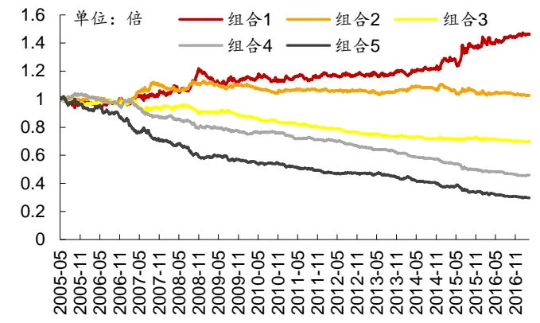
资料来源：Wind，华泰证券研究所

图表51： id2_std_down_3m 组合 1 相对沪深 300 月超额收益分布图
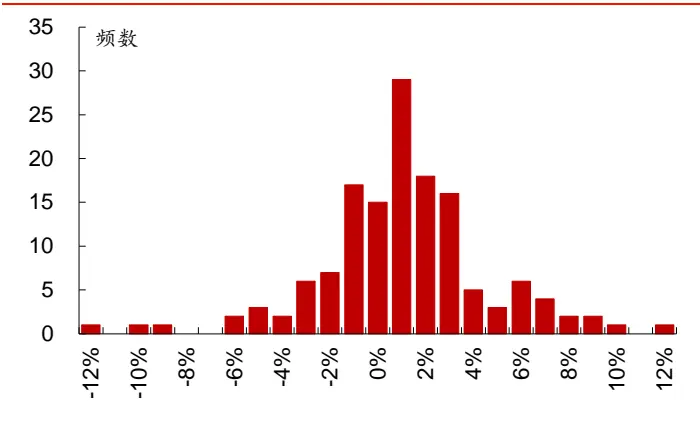
资料来源：Wind，华泰证券研究所

图表52： id2_std_down_3m因子多空组合月收益率及累积收益率
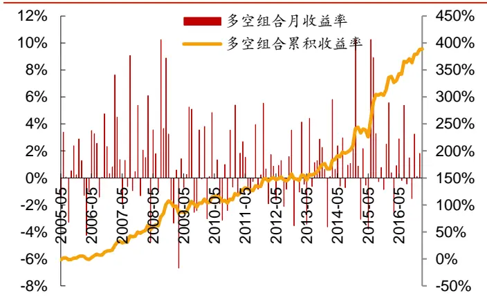
资料来源：Wind，华泰证券研究所

图表53： id2_std_down_3m分层组合在不同年份的收益及排名分析（分十层）

|  | 2006 | 2007 | 2008 | 2009 | 2010 | 2011 | 2012 | 2013 | 2014 | 2015 | 2016 排名均值 |  |
| --- | --- | --- | --- | --- | --- | --- | --- | --- | --- | --- | --- | --- |
| 组合1 | 97.4%(1) | 227.2%(2) | -52.3%(1) | 111.7%(8) | -3.8%(5) | -22.8%(1) | 11.0%(3) | 12.4%(1) | 75.2%(2) | 40.5%(1) | 2.8%(1) | 2.36 |
| 组合2 | 92.1%(4) | 222.8%(4) | -56.3%(2) | 113.4%(6) | -0.6%(2) | -29.0%(3) | 9.8%(5) | 6.5%(4) | 77.1%(1) | 39.4%(2) | 1.3%(2) | 3.18 |
| 组合3 | 88.5%(7) | 253.3%(1) | -57.3%(3) | 112.2%(7) | -5.6%(8) | -29.0%(4) | 11.5%(2) | 6.4%(5) | 74.2%(3) | 21.9%(6) | -5.0%(4) | 4.55 |
| 组合4 | 90.4%(5) | 227.1%(3) | -58.9%(5) | 119.9%(2) | -3.5%(3) | -28.4%(2) | 10.6%(4) | 9.4%(2) | 68.1%(4) | 23.1%(5) | -3.7%(3) | 3.45 |
| 组合5 | 96.7%(2) | 204.0%(5) | -58.7%(4) | 113.8%(5) | -3.7%(4) | -30.2%(5) | 8.0%(6) | 5.3%(7) | 60.7%(5) | 34.8%(3) | -5.3%(5) | 4.64 |
| 组合6 | 96.3%(3) | 192.6%(6) | -64.1%(8) | 113.9%(4) | -8.4%(10) | -34.5%(8) | 2.3%(9) | 5.8%(6) | 60.1%(6) | 27.0%(4) | -5.7%(6) | 6.36 |
| 组合7 | 89.2%(6) | 171.2%(7) | -63.9%(7) | 114.1%(3) | 1.7%(1) | -34.4%(7) | 1.9%(10) | 8.5%(3) | 53.2%(7) | 15.7%(8) | -9.6%(8) | 6.09 |
| 组合8 | 86.4%(8) | 162.4%(9) | -62.2%(6) | 111.7%(9) | -4.6%(7) | -33.7%(6) | 5.5%(8) | -6.9%(10) | 45.3%(8) | 14.0%(9) | -9.4%(7) | 7.91 |
| 组合9 | 82.1%(9) | 169.4%(8) | -64.7%(9) | 124.6%(1) | -4.4%(6) | -36.8%(9) | 12.0%(1) | -0.9%(8) | 44.7%(9) |  | 18.8%(7) -13.0%(10) | 7.00 |
|  |  | 组合 10 72.0%(10) 139.3%(10) |  | -68.9%(10)102.1%(10) |  | -5.9%(9) -37.7%(10) | 7.7%(7) | -3.1%(9) | 41.7%(10) | 12.8%(10) | -11.3%(9) | 9.45 |

资料来源：Wind，华泰证券研究所

图表54： 不同市值区间 id2_std_down_3m 分层组合绩效指标对比图（分十层）
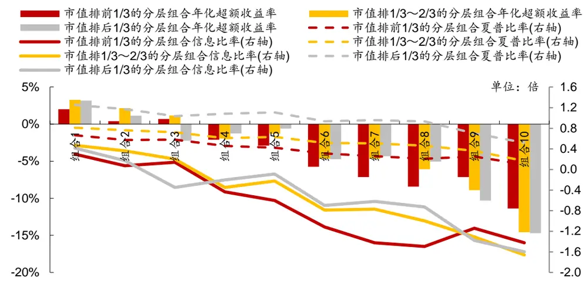
资料来源：Wind，华泰证券研究所

图表55： 不同行业 id2_std_down_3m因子分层组合绩效分析（分五层）

|  | 组合1年化 | 组合1 | 组合1 | 组合1 | 组合1超额收益 | 组合1相对 | 所有组合年化 |
| --- | --- | --- | --- | --- | --- | --- | --- |
| 行业 | 超额收益率 | 信息比率 | 年化收益率 | 夏普比率 | 最大回撤 | 基准月胜率 59.15% | 收益率排序 |
| 房地产 | 11.43% | 1.25 1.18 | 41.73% 50.01% | 1.19 1.34 | 10.55% 17.80% | 58.45% | 1,2,3,4,5 1,2,3,5,4 |
| 通信 商贸零售 | 15.08% 7.98% | 0.94 | 35.28% | 1.03 | 12.46% | 54.93% | 1,2,3,4,5 |
| 电子元器件 | 7.71% | 0.79 | 37.85% | 1.03 | 14.20% | 55.63% | 1,2,4,3,5 |
| 医药 | 6.53% | 0.79 | 38.77% | 1.16 | 15.66% | 56.34% | 1,3,2,4,5 |
| 轻工制造 | 9.15% | 0.77 | 36.55% | 1.04 | 26.38% | 54.93% | 1,2,4,3,5 |
| 汽车 | 7.22% | 0.71 | 38.54% | 1.12 | 14.70% | 56.34% | 2,1,3,4,5 |
| 农林牧渔 | 6.63% | 0.58 | 37.76% | 1.07 | 21.41% | 55.63% | 1,2,3,5,4 |
| 综合 | 8.35% | 0.56 | 36.11% | 0.97 | 21.61% | 50.70% | 1,3,2,4,5 |
| 机械 | 4.66% | 0.52 | 35.60% | 1.02 | 23.21% | 53.52% | 1,2,4,3,5 |
| 电力设备 | 5.01% | 0.46 | 36.44% | 1.00 | 14.79% | 49.30% | 1,4,2,3,5 |
| 食品饮料 | 5.60% | 0.46 | 34.54% | 1.07 | 23.70% | 52.11% | 2,1,3,4,5 |
| 家电 | 5.10% | 0.40 | 34.49% | 0.99 | 20.06% | 56.34% | 1,2,3,4,5 |
| 煤炭 | 4.75% | 0.37 | 19.50% | 0.49 | 30.97% | 52.11% | 1,3,2,4,5 |
| 电力及公用事业 | 3.48% | 0.36 | 26.40% | 0.81 | 19.62% | 49.30% | 1,2,3,4,5 |
| 纺织服装 | 3.31% | 0.33 | 32.29% | 0.91 | 26.77% | 54.23% | 1,3,2,4,5 |
| 国防军工 | 4.39% | 0.26 | 33.73% | 0.81 | 41.26% | 53.52% | 2,1,5,3,4 |
| 建材 | 2.50% | 0.21 | 34.54% | 0.96 | 39.15% | 51.41% | 2,1,3,4,5 |
| 基础化工 | 1.62% | 0.20 | 28.70% | 0.81 | 14.30% | 50.70% | 1,2,4,3,5 |
| 传媒 | 3.32% | 0.19 | 30.88% | 0.79 | 37.67% | 51.41% | 1,2,5,4,3 |
| 有色金属 | 2.33% | 0.18 | 30.71% | 0.78 | 33.09% | 50.70% | 1,2,4,3,5 |
| 建筑 | 2.27% | 0.18 | 33.62% | 0.97 | 46.10% | 50.70% | 1,3,2,4,5 |
| 计算机 | 0.27% | 0.02 | 30.65% | 0.78 | 43.35% | 50.00% | 2,1,3,4,5 |
| 餐饮旅游 | 0.19% | 0.01 | 26.19% | 0.73 | 34.63% | 48.59% | 3,1,2,5,4 |
| 交通运输 | -0.51% | -0.05 | 18.75% | 0.59 | 45.53% | 46.48% | 2,1,4,3,5 |
| 银行 | -1.48% | -0.10 | 21.68% | 0.69 | 41.15% | 43.66% | 2,1,3,5,4 |
| 非银行金融 | -2.23% | -0.11 | 20.82% | 0.47 | 37.95% | 48.59% | 3,1,2,4,5 |
| 石油石化 | -2.58% | -0.16 | 22.04% | 0.69 | 51.08% | 43.66% | 1,2,5,3,4 |
| 钢铁 | -2.44% | -0.20 | 16.01% | 0.46 | 47.64% | 42.25% | 2,3,1,4,5 |

资料来源：Wind，华泰证券研究所

以下是 id2_std_upd_3m 因子详细测试结果（各项图表内容解释请参看本章第一小节）：

图表56： id2_std_upd_3m 因子分层组合绩效分析（20050509～20170228）

|  |  |  |  |  |  | 年化超额 超额收益 | 相对基准 |  | 超额收益 最大回撤 | 月均双边 换手率 |
| --- | --- | --- | --- | --- | --- | --- | --- | --- | --- | --- |
| 投资组合 | 年化收益率 | 年化波动率 | 夏普比率 | 最大回撤 | 收益率 年化波动率 |  | 信息比率 | 月胜率 |  |  |
| 组合1 | 28.54% | 29.58% | 0.96 | 66.10% | 3.93% | 5.11% | 0.77 | 54.93% | 9.66% | 73.82% |
| 组合2 | 23.24% | 30.75% | 0.76 | 69.15% | -0.35% | 3.54% | -0.10 | 44.37% | 15.90% | 116.89% |
| 组合3 | 20.51% | 31.67% | 0.65 | 71.00% | -2.56% | 3.20% | -0.80 | 39.44% | 26.59% | 124.13% |
| 组合4 | 15.76% | 32.69% | 0.48 | 73.01% | -6.41% | 3.74% | -1.71 | 30.28% | 55.20% | 117.18% |
| 组合5 | 10.57% | 33.74% | 0.31 | 75.55% | -10.60% | 5.49% | -1.93 | 28.87% | 73.16% | 73.73% |
| 基准组合 | 23.68% | 31.44% | 0.75 | 70.38% |  |  |  |  |  | = |
| 多空组合 | 16.25% | 9.69% | 1.68 | 12.12% |  |  |  |  |  |  |

资料来源：Wind，华泰证券研究所

图表57： id2_std_upd_3m 因子分层组合回测净值
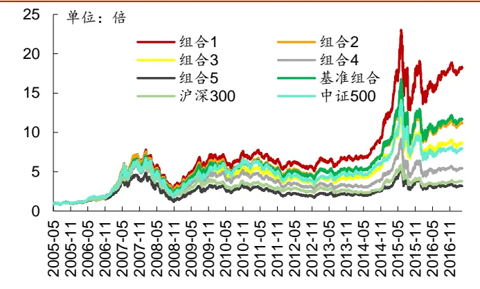
资料来源：Wind，华泰证券研究所

图表58： id2_std_upd_3m各层组合净值除以基准组合净值示意图
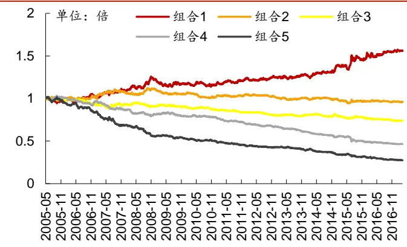
资料来源：Wind，华泰证券研究所

图表59： id2_std_upd_3m 组合 1 相对沪深 300 月超额收益分布图
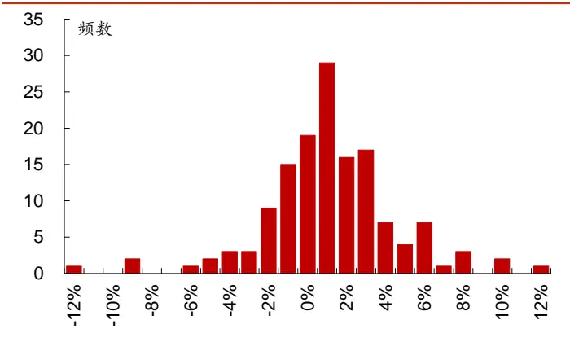
资料来源：Wind，华泰证券研究所

图表60： id2_std_upd_3m因子多空组合月收益率及累积收益率
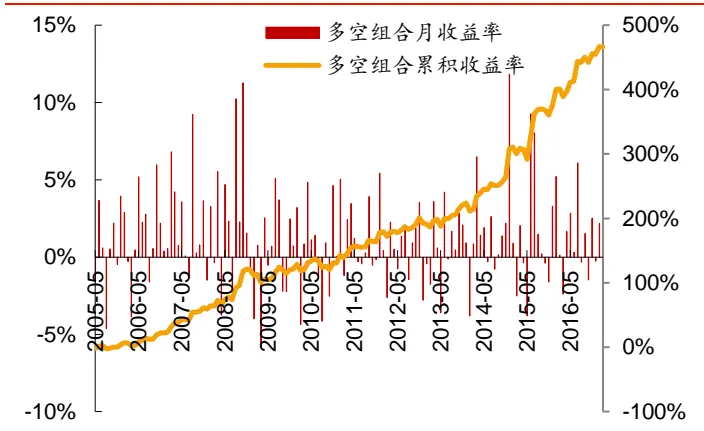
资料来源：Wind，华泰证券研究所

图表61： id2_std_upd_3m分层组合在不同年份的收益及排名分析（分十层）

|  | 2006 | 2007 | 2008 | 2009 | 2010 | 2011 | 2012 | 2013 | 2014 | 2015 | 2016 排名均值 |  |
| --- | --- | --- | --- | --- | --- | --- | --- | --- | --- | --- | --- | --- |
| 组合1 | 110.4%(1) | 228.7%(2) | -54.0%(1) | 111.3%(6) | -4.7%(7) | -22.3%(1) | 11.1%(2) | 11.3%(2) | 82.9%(1) | 44.9%(1) | 2.9%(1) | 2.27 |
| 组合2 | 95.2%(3) | 223.1%(3) | -56.0%(2) | 110.6%(7) | 0.6%(1) | -26.8%(3) | 14.9%(1) | 7.5%(4) | 77.1%(2) | 30.6%(2) | 0.9%(2) | 2.73 |
| 组合3 | 108.1%(2) | 232.5%(1) | -58.0%(4) | 115.3%(4) | -4.4%(5) | -28.4%(4) | 7.6%(7) | 7.6%(3) | 67.0%(3) | 30.2%(3) | -3.6%(3) | 3.55 |
| 组合4 | 88.9%(4) | 212.9%(4) | -58.9%(5) | 106.7%(9) | -4.5%(6) | -26.0%(2) | 7.6%(6) | 6.2%(5) | 60.1%(6) | 22.5%(6) | -3.7%(4) | 5.18 |
| 组合5 | 85.2%(7) | 204.1%(6) | -57.2%(3) | 130.4%(1) | -4.7%(8) | -32.6%(6) | 9.2%(4) | 16.1%(1) | 65.0%(4) | 23.8%(5) | -7.9%(7) | 4.73 |
| 组合6 | 83.3%(8) | 211.7%(5) | -64.1%(7) | 111.9%(5) | -5.0%(9) | -30.7%(5) | 2.7%(10) | 1.5%(7) | 63.5%(5) | 26.7%(4) | -6.0%(6) | 6.45 |
| 组合7 | 88.0%(5) | 170.9%(8) | -65.0%(8) | 123.0%(2) | -0.5%(2) | -36.0%(7) | 9.7%(3) | -0.2%(8) | 50.5%(7) | 21.3%(7) | -5.0%(5) | 5.64 |
| 组合8 | 87.0%(6) | 175.7%(7) | -59.5%(6) | 110.1%(8) | -3.3%(3) | -37.5%(9) | 3.2%(9) | -4.0%(9) | 46.5%(9) | 12.5%(10) | -11.2%(8) | 7.64 |
| 组合9 | 72.0%(10) | 160.1%(9) | -66.7%(9) | 120.6%(3) | -3.4%(4) | -37.2%(8) | 8.6%(5) | 4.7%(6) | 47.5%(8) | 19.4%(8) | -12.0%(9) | 7.18 |
| 组合10 |  | 72.6%(9) 142.0%(10) | -68.2%(10) | 98.6%(10) |  | -8.8%(10) -37.7%(10) | 6.2%(8) | -6.9%(10) | 39.0%(10) |  | 15.9%(9) -13.1%(10) | 9.64 |

资料来源：Wind，华泰证券研究所

图表62： 不同市值区间 id2_std_upd_3m 分层组合绩效指标对比图（分十层）
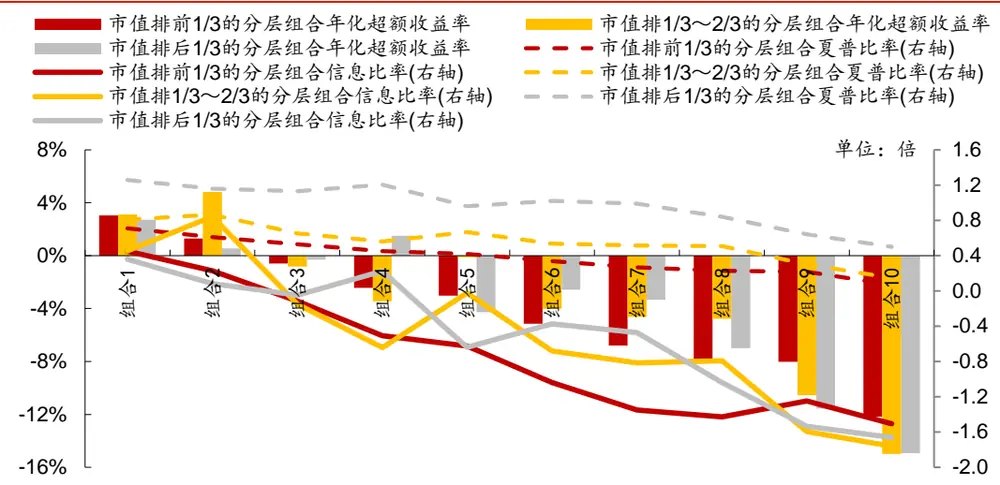
资料来源：Wind，华泰证券研究所

图表63： 不同行业 id2_std_upd_3m因子分层组合绩效分析（分五层）

|  | 组合1年化 | 组合1 | 组合1 | 组合1 | 组合1超额收益 | 组合1相对 | 所有组合年化 |
| --- | --- | --- | --- | --- | --- | --- | --- |
| 行业 | 超额收益率 | 信息比率 | 年化收益率 | 夏普比率 | 最大回撤 15.65% | 基准月胜率 66.20% | 收益率排序 1,2,3,5,4 |
| 通信 | 19.28% 11.02% | 1.51 1.27 | 55.47% 39.10% | 1.49 1.15 | 11.16% | 64.79% | 1,2,3,4,5 |
| 商贸零售 房地产 | 8.81% | 0.98 | 38.41% | 1.10 | 11.94% | 57.75% | 1,2,3,4,5 |
| 电子元器件 | 8.83% | 0.92 | 39.29% | 1.07 | 13.06% | 57.75% | 1,3,2,4,5 |
| 食品饮料 | 10.19% | 0.83 | 40.37% | 1.29 | 21.79% | 57.04% | 1,2,3,4,5 |
| 综合 | 11.27% | 0.76 | 39.78% | 1.07 | 23.62% | 52.82% | 1,2,3,4,5 |
| 轻工制造 | 9.02% | 0.75 | 36.38% | 1.03 | 27.17% | 53.52% | 1,2,3,4,5 |
| 汽车 | 6.06% | 0.63 | 37.03% | 1.09 | 15.38% | 52.82% | 2,1,3,4,5 |
| 医药 | 4.35% | 0.54 | 35.94% | 1.10 | 22.56% | 50.70% | 1,3,2,4,5 |
| 建材 | 6.18% | 0.52 | 39.37% | 1.11 | 17.77% | 57.04% | 1,2,3,4,5 |
| 农林牧渔 | 5.33% | 0.49 | 36.08% | 1.04 | 18.65% | 59.86% | 1,2,3,4,5 |
| 电力设备 | 5.20% | 0.48 | 36.69% | 1.02 | 14.65% | 49.30% | 1,2,3,5,4 |
| 国防军工 | 7.57% | 0.45 | 37.80% | 0.91 | 41.18% | 54.23% | 1,2,5,3,4 |
| 基础化工 | 3.32% | 0.42 | 30.85% | 0.88 | 14.10% | 53.52% | 1,3,2,4,5 |
| 煤炭 | 4.74% | 0.38 | 19.50% | 0.49 | 20.19% | 52.82% | 1,2,3,4,5 |
| 家电 | 3.90% | 0.30 | 32.94% | 0.95 | 29.00% | 57.04% | 1,2,4,3,5 |
| 餐饮旅游 | 3.97% | 0.27 | 30.95% | 0.87 | 33.59% | 54.93% | 1,3,2,5,4 |
| 电力及公用事业 | 2.53% | 0.27 | 25.24% | 0.78 | 19.97% | 53.52% | 1,3,2,4,5 |
| 机械 | 2.18% | 0.25 | 32.38% | 0.93 | 26.37% | 52.11% | 1,2,3,4,5 |
| 纺织服装 | 2.28% | 0.23 | 30.96% | 0.88 | 29.99% | 51.41% | 3,1,2,4,5 |
| 建筑 | 1.62% | 0.13 | 32.78% | 0.95 | 39.70% | 53.52% | 2,1,3,5,4 |
| 有色金属 | 1.58% | 0.12 | 29.75% | 0.76 | 30.96% | 47.18% | 1,2,3,4,5 |
| 计算机 | 1.27% | 0.10 | 31.95% | 0.82 | 36.58% | 51.41% | 1,2,3,4,5 |
| 银行 | 1.09% | 0.07 | 24.85% | 0.78 | 29.99% | 45.77% | 1,2,3,4,5 |
| 石油石化 | 0.63% | 0.04 | 26.06% | 0.82 | 42.32% | 50.70% | 1,3,2,5,4 |
| 传媒 | 0.26% | 0.02 | 27.01% | 0.69 | 43.85% | 46.48% | 1,2,4,5,3 |
| 非银行金融 | -0.21% | -0.01 | 23.33% | 0.54 | 55.73% | 47.89% | 2,1,3,4,5 |
| 钢铁 | -0.84% | -0.07 | 17.91% | 0.52 | 42.50% | 40.85% | 1,2,3,4,5 |
| 交通运输 | -1.50% | -0.15 | 17.58% | 0.56 | 42.05% | 45.07% | 2,1,3,4,5 |

资料来源：Wind，华泰证券研究所

## 日内最大涨/跌幅波动率因子

前两小节中波动率因子都是利用日频（复权）收盘价计算的，在本小节中，我们引入日频的最高/最低价信息，定义四种波动率类因子：

1. high_r_std_Nm（N=1,2,……,10），即在过去 N 个月内，用个股每日最高价除以前一日收盘价计算日内最大涨幅（此处有复权处理），再计算最大涨幅序列的标准差；

2. low_r_std_Nm（N=1,2,……,10），即在过去 N 个月内，用个股每日最低价除以前一日收盘价计算日内最大跌幅（此处有复权处理），再计算最大跌幅序列的标准差；

3. hml_r_std_Nm（N=1,2,……,10），等于 high_r_std_Nm 减去 low_r_std_Nm；

4. hpl_r_std_Nm（N=1,2,……,10），等于 high_r_std_Nm 加上 low_r_std_Nm。

我们首先对这四种波动率类因子进行样本期长度敏感性测试，如下所示：

图表64： 日内最大涨/跌幅波动率因子参数敏感性分析（回归法、IC值分析）

| 因子收益率 |  |  |  |  | 因子收益率 序列t检验 | IC 序列 | IC 序列 |  |  |
| --- | --- | --- | --- | --- | --- | --- | --- | --- | --- |
| 因子 | It\|均值 | \|t\|>2 占比 | t 均值/t 标准差 | 均值 |  |  | 均值 | 标准差 | IR 比率 IC>0 占比 |
| high_r_std_1m | 4.18 | 69.86% | -0.34 | -0.439% | -4.28 | -5.24% | 8.39% | 0.63 | 25.34% |
| high_r_std_2m | 4.59 | 76.03% | -0.30 | -0.437% | -3.95 | -4.75% | 9.41% | 0.50 | 32.88% |
| high_r_std_3m | 4.90 | 74.66% | -0.27 | -0.442% | -3.74 | -4.29% | 9.80% | 0.44 | 35.62% |
| high_r_std_4m | 5.06 | 78.08% | -0.27 | -0.450% | -3.73 | -4.08% | 9.93% | 0.41 | 36.99% |
| high_r_std_5m | 5.15 | 79.45% | -0.24 | -0.421% | -3.41 | -3.85% | 10.12% | 0.38 | 35.62% |
| high_r_std_6m | 5.25 | 79.45% | -0.23 | -0.401% | -3.17 | -3.80% | 10.33% | 0.37 | 36.30% |
| high_r_std_7m | 5.22 | 78.77% | -0.22 | -0.388% | -3.09 | -3.76% | 10.37% | 0.36 | 36.30% |
| high_r_std_8m | 5.19 | 76.71% | -0.21 | -0.362% | -2.87 | -3.61% | 10.30% | 0.35 | 37.67% |
| high_r_std_9m | 5.21 | 77.40% | -0.19 | -0.334% | -2.62 | -3.49% | 10.30% | 0.34 | 39.04% |
| high_r_std_10m | 5.22 | 75.34% | -0.19 | -0.330% | -2.58 | -3.44% | 10.19% | 0.34 | 38.36% |
| low_r_std_1m | 4.92 | 76.71% | -0.04 | -0.131% | -1.06 | -1.88% | 9.73% | 0.19 | 40.41% |
| low_r_std_2m | 5.29 | 80.82% | -0.03 | -0.141% | -1.07 | -1.73% | 10.57% | 0.16 | 41.10% |
| low_r_std_3m | 5.60 | 80.82% | -0.06 | -0.188% | -1.34 | -2.04% | 11.10% | 0.18 | 41.10% |
| low_r_std_4m | 5.75 | 80.82% | -0.08 | -0.207% | -1.46 | -2.04% | 11.02% | 0.19 | 41.10% |
| low_r_std_5m | 5.85 | 85.62% | -0.06 | -0.175% | -1.23 | -1.95% | 11.12% | 0.17 | 41.10% |
| low_r_std_6m | 5.85 | 82.19% | -0.07 | -0.171% | -1.19 | -2.12% | 11.28% | 0.19 | 41.10% |
| low_r_std_7m | 5.89 | 82.19% | -0.06 | -0.161% | -1.11 | -2.17% | 11.30% | 0.19 | 43.15% |
| low_r_std_8m | 5.97 | 82.19% | -0.06 | -0.147% | -0.99 | -2.17% | 11.38% | 0.19 | 42.47% |
| low_r_std_9m | 6.01 | 81.51% | -0.06 | -0.135% | -0.90 | -0.94% | 13.86% | 0.07 | 43.84% |
| low_r_std_10m | 5.99 | 80.14% | -0.06 | -0.128% | -0.85 | -2.11% | 11.30% | 0.19 | 44.52% |
| hml_r_std_1m | 3.10 | 61.64% | -0.58 | -0.424% | -5.74 | -4.69% | 5.41% | 0.87 | 17.81% |
| hml_r_std_2m | 3.26 | 58.90% | -0.55 | -0.432% | -5.34 | -4.45% | 5.86% | 0.76 | 22.60% |
| hml_r_std_3m | 3.30 | 63.01% | -0.48 | -0.400% | -4.74 | -3.74% | 6.01% | 0.62 | 26.03% |
| hml_r_std_4m | 3.25 | 61.64% | -0.48 | -0.402% | -4.94 | -3.58% | 6.02% | 0.59 | 28.77% |
| hml_r_std_5m | 3.21 | 59.59% | -0.47 | -0.411% | -4.94 | -3.40% | 6.13% | 0.56 | 29.45% |
| hml_r_std_6m | 3.29 | 58.22% | -0.43 | -0.388% | -4.52 | -3.10% | 6.31% | 0.49 | 30.14% |
| hml_r_std_7m | 3.19 | 58.22% | -0.43 | -0.388% | -4.48 | -2.90% | 6.20% | 0.47 | 31.51% |
| hml_r_std_8m | 3.18 | 58.22% | -0.41 | -0.371% | -4.27 | -2.74% | 6.17% | 0.44 | 32.88% |
| hml_r_std_9m | 3.10 | 61.64% | -0.40 | -0.355% | -4.09 | -2.57% | 6.18% | 0.42 | 32.19% |
| hml_r_std_10m | 3.10 | 59.59% | -0.41 | -0.365% | -4.20 | -2.55% | 6.23% | 0.41 | 32.88% |
| hpl_r_std_1m | 4.76 | 75.34% | -0.20 | -0.338% | -2.85 | -4.16% | 9.61% | 0.43 | 32.19% |
| hpl_r_std_2m | 5.16 | 80.14% | -0.17 | -0.327% | -2.58 | -3.64% | 10.55% | 0.35 | 37.67% |
| hpl_r_std_3m | 5.43 | 80.14% | -0.17 | -0.345% | -2.58 | -3.47% | 10.96% | 0.32 | 38.36% |
| hpl_r_std_4m | 5.61 | 82.88% | -0.17 | -0.354% | -2.61 | -3.33% | 10.94% | 0.30 | 39.04% |
| hpl_r_std_5m | 5.71 | 85.62% | -0.15 | -0.317% | -2.31 | -3.13% | 11.07% | 0.28 | 39.04% |
| hpl_r_std_6m | 5.75 | 84.25% | -0.15 | -0.304% | -2.17 | -3.18% | 11.26% | 0.28 | 39.73% |
| hpl_r_std_7m | 5.70 | 80.82% | -0.14 | -0.290% | -2.08 | -3.18% | 11.29% | 0.28 | 41.78% |
| hpl_r_std_8m | 5.74 | 82.19% | -0.13 | -0.266% | -1.88 | -3.07% | 11.28% | 0.27 | 39.73% |
| hpl_r_std_9m hpl_r_std_10m | 5.76 5.76 | 80.14% 80.14% | -0.13 -0.12 | -0.245% -0.240% | -1.71 -1.67 | -3.00% -2.93% | 11.27% 11.17% | 0.27 0.26 | 39.73% 41.78% |

资料来源：Wind，华泰证券研究所

图表65： 日内最大涨/跌幅波动率因子参数敏感性分析（分层测试法、分五层）

|  | TOP 组合 | TOP 组合 | TOP 组合 | TOP 组合 | TOP 组合相对 | TOP 组合月均 | 多空组合 | 多空组合 | 多空组合 | 多空组合 |
| --- | --- | --- | --- | --- | --- | --- | --- | --- | --- | --- |
| 因子 | 年化收益率 | 夏普比率 | 信息比率 | 最大回撤 | 基准月胜率 | 双边换手率 | 年化收益率夏普比率 |  | 最大回撤 | 月胜率 |
| high_r_std_1m | 24.59% | 0.87 | 0.12 | 69.21% | 48.59% | 124.57% | 14.40% | 1.33 | 18.34% | 68.57% |
| high_r_std_2m | 26.71% | 0.97 | 0.38 | 66.93% | 48.59% | 88.60% | 14.47% | 1.26 | 18.48% | 61.43% |
| high_r_std_3m | 26.70% | 0.97 | 0.37 | 67.12% | 50.00% | 71.39% | 13.56% | 1.17 | 20.24% | 59.29% |
| high_r_std_4m | 28.17% | 1.02 | 0.54 | 65.15% | 50.70% | 61.64% | 13.65% | 1.17 | 19.86% | 61.43% |
| high_r_std_5m | 28.06% | 1.02 | 0.53 | 66.03% | 50.00% | 54.70% | 12.98% | 1.11 | 20.11% 21.18% | 62.14% |
| high_r_std_6m | 27.09% | 0.98 | 0.42 | 66.08% | 50.00% | 49.68% | 11.14% | 0.96 |  | 59.29% |
| high_r_std_7m | 27.46% | 0.99 | 0.46 | 66.29% | 52.11% | 46.91% | 12.01% | 1.05 | 21.53% | 60.00% |
| high_r_std_8m | 27.29% | 0.99 | 0.44 | 66.41% | 50.00% 52.82% | 44.72% | 11.18% | 0.97 | 20.97% | 57.14% |
| high_r_std_9m | 26.96% | 0.97 | 0.41 | 66.44% |  | 42.08% | 10.26% | 0.91 | 20.99% | 55.71% |
| high_r_std_10m | 26.48% | 0.96 | 0.35 | 66.17% | 52.82% | 40.11% | 9.53% | 0.84 | 20.66% | 56.43% |
| low_r_std_1m | 18.34% | 0.67 | -0.64 | 70.32% | 43.66% | 119.53% | 3.29% | 0.29 | 22.06% | 56.43% |
| low_r_std_2m | 21.20% | 0.78 | -0.29 | 68.71% | 49.30% | 82.40% | 3.63% | 0.31 | 29.64% | 55.71% |
| low_r_std_3m | 23.73% | 0.88 | 0.01 | 67.94% | 52.11% | 65.77% | 5.48% | 0.46 | 27.24% | 55.00% |
| low_r_std_4m | 24.82% | 0.92 | 0.13 | 67.22% | 48.59% | 56.75% | 6.55% | 0.55 | 22.89% | 57.14% |
| low_r_std_5m | 24.53% | 0.91 | 0.09 | 67.54% | 50.00% | 51.45% | 5.11% | 0.43 | 21.34% | 55.71% |
| low_r_std_6m | 22.41% | 0.83 | -0.14 | 68.18% | 45.07% | 46.75% | 3.40% | 0.28 | 20.75% | 50.71% |
| low_r_std_7m | 23.39% | 0.87 | -0.03 | 67.79% | 45.77% | 43.41% | 3.47% | 0.29 | 22.19% | 50.71% |
| low_r_std_8m low_r_std_9m | 23.41% | 0.87 | -0.03 | 67.54% | 45.77% | 41.77% | 3.17% | 0.27 0.23 | 22.50% | 51.43% |
| low_r_std_10m | 22.95% | 0.85 | -0.08 | 67.96% | 46.48% | 39.58% | 2.76% | 0.23 | 23.94% | 51.43% |
| hml_r_std_1m | 23.50% | 0.87 | -0.02 | 68.05% | 47.89% | 38.18% | 2.70% | 1.76 | 22.70% | 52.14% |
| hml_r_std_2m | 23.69% | 0.76 | 0.00 | 70.50% | 43.66% 53.52% | 159.46% | 13.16% | 1.80 | 10.70% 15.08% | 69.29% |
| hml_r_std_3m | 25.63% | 0.82 | 0.37 | 68.79% | 54.93% | 120.68% | 13.44% | 1.80 | 11.26% | 68.57% |
| hml_r_std_4m | 27.09% | 0.87 | 0.63 | 69.67% |  | 99.33% | 13.71% | 1.65 |  | 70.00% |
| hml_r_std_5m | 26.74% | 0.85 | 0.57 | 69.62% | 55.63% | 86.77% | 12.56% | 1.90 | 12.81% 12.17% | 65.71% |
| hml_r_std_6m | 28.52% | 0.91 | 0.90 | 68.77% | 60.56% | 79.14% | 14.56% | 1.66 | 11.30% | 63.57% |
|  | 28.31% | 0.90 | 0.85 | 70.59% | 52.82% 50.00% | 71.24% | 13.00% | 1.43 | 14.59% | 59.29% |
| hml_r_std_7m hml_r_std_8m | 27.71% | 0.88 | 0.72 | 70.61% | 52.11% | 66.83% | 11.23% 11.34% | 1.45 | 16.37% | 59.29% |
| hml_r_std_9m | 27.66% 27.33% | 0.88 0.87 | 0.72 0.66 | 70.47% 70.93% | 53.52% | 63.75% 60.62% | 10.82% | 1.39 | 15.92% | 59.29% |
| hml_r_std_10m | 27.16% | 0.87 | 0.63 | 70.68% | 59.15% | 58.18% | 10.93% | 1.40 | 16.64% | 61.43% |
| hpl_r_std_1m | 22.65% | 0.83 | -0.12 | 69.33% | 46.48% | 113.78% | 11.24% | 0.96 | 19.93% | 62.14% |
| hpl_r_std_2m | 25.41% | 0.94 | 0.20 | 67.46% | 48.59% | 80.14% | 11.12% | 0.90 | 20.39% | 62.14% 59.29% |
| hpl_r_std_3m | 26.11% | 0.96 | 0.27 | 67.37% | 50.70% | 64.25% | 11.29% | 0.92 | 21.86% | 61.43% |
| hpl_r_std_4m | 26.68% | 0.99 | 0.34 | 66.05% | 49.30% | 55.37% | 11.19% | 0.90 | 21.13% | 60.00% |
| hpl_r_std_5m | 26.39% | 0.97 | 0.31 |  | 52.82% | 49.76% | 10.89% | 0.88 | 21.45% | 60.00% |
| hpl_r_std_6m | 25.51% |  |  | 66.72% | 48.59% | 45.83% |  | 0.73 | 21.43% |  |
| hpl_r_std_7m | 25.57% | 0.94 0.94 | 0.21 0.22 | 66.54% 67.02% | 49.30% | 43.70% | 8.93% 7.94% | 0.66 | 21.90% | 58.57% 55.71% |

资料来源：Wind，华泰证券研究所

从以上图表我们可以看出，high_r_std_Nm因子的选股效果大幅好于 low_r_std_Nm，即从某种角度来讲，个股“上方”波动率的预测能力好于“下方”波动率，两侧波动率的效果并非对称的。若考虑通过加/减法将这两种波动率结合起来，可以发现，hml_r_std_Nm（相减）的效果好于 hpl_r_std_Nm（相加），hml_r_std_1m 的 IR 比率高达 0.87，但其对应的分层组合中 TOP 组合的月均双边换手率为 159.46%，交易成本很高（按单边换手率 0.3%计算交易成本），所以综合考虑，在实际选股应用中，还是 hml_r_std_5m 最佳。同时，日内最大涨幅波动率因子中的 high_r_std_4m 也具有比较好的选股效果，在后两页的图表中，我们对 high_r_std_4m 和 hml_r_std_5m 进行了详细的测试并展示结果。

以下是 high_r_std_4m 因子详细测试结果（各项图表内容解释请参看本章第一小节）：

图表66： high_r_std_4m 因子分层组合绩效分析（20050509～20170228）

|  |  |  |  |  |  | 年化超额 超额收益 | 相对基准 |  | 超额收益 最大回撤 | 月均双边 换手率 |
| --- | --- | --- | --- | --- | --- | --- | --- | --- | --- | --- |
| 投资组合 | 年化收益率 | 年化波动率 | 夏普比率 | 最大回撤 | 收益率 年化波动率 |  | 信息比率 | 月胜率 |  |  |
| 组合1 | 28.17% | 27.55% | 1.02 | 65.15% | 3.63% | 6.67% | 0.54 | 50.70% | 12.51% | 61.64% |
| 组合2 | 23.82% | 30.79% | 0.77 | 68.62% | 0.11% | 3.50% | 0.03 | 47.18% | 12.13% | 104.35% |
| 组合3 | 20.65% | 32.34% | 0.64 | 71.53% | -2.45% | 3.38% | -0.72 | 34.51% | 26.33% | 113.20% |
| 组合4 | 15.71% | 33.32% | 0.47 | 75.41% | -6.44% | 3.83% | -1.68 | 28.87% | 55.52% | 105.78% |
| 组合5 | 12.78% | 34.51% | 0.37 | 73.83% | -8.82% | 5.93% | -1.49 | 32.39% | 66.73% | 66.09% |
| 基准组合 | 23.68% | 31.44% | 0.75 | 70.38% |  |  |  |  |  | = |
| 多空组合 | 13.65% | 11.71% | 1.17 | 19.86% |  |  |  |  |  |  |

资料来源：Wind，华泰证券研究所

图表67： high_r_std_4m 因子分层组合回测净值
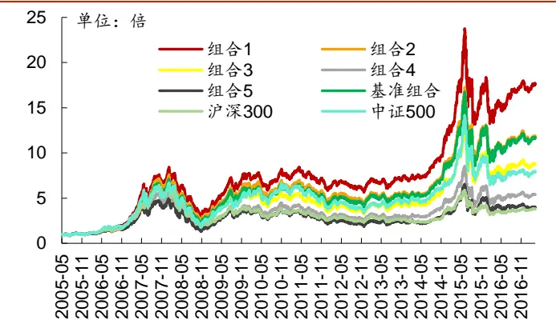
资料来源：Wind，华泰证券研究所

图表68： high_r_std_4m因子各层组合净值除以基准组合净值示意图
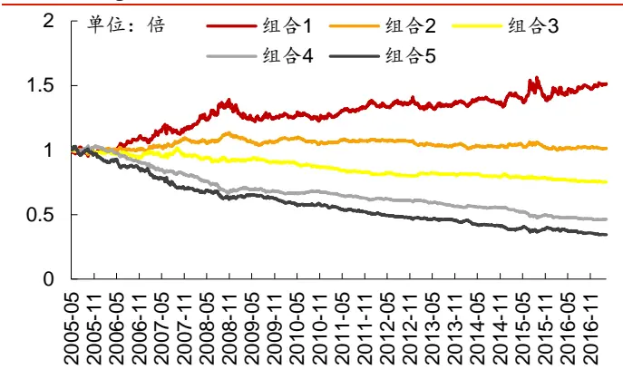
资料来源：Wind，华泰证券研究所

图表69： high_r_std_4m 分层组合 1相对沪深 300 月超额收益分布图
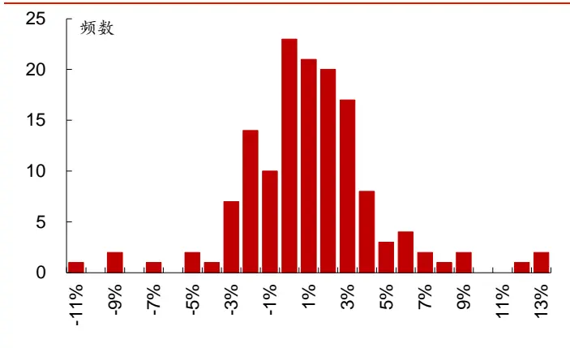
资料来源：Wind，华泰证券研究所

图表70： high_r_std_4m因子多空组合月收益率及累积收益率
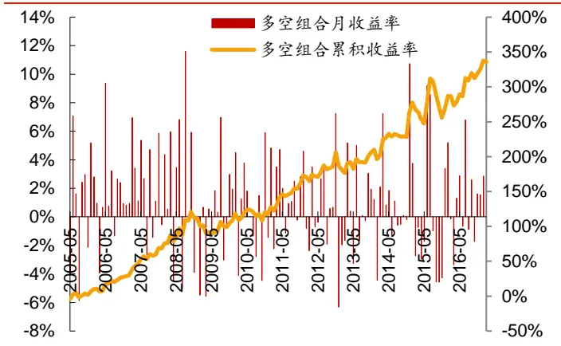
资料来源：Wind，华泰证券研究所

图表71： high_r_std_4m分层组合在不同年份的收益及排名分析（分十层）

|  | 2006 | 2007 | 2008 | 2009 | 2010 | 2011 | 2012 | 2013 | 2014 | 2015 | 2016 排名均值 |  |
| --- | --- | --- | --- | --- | --- | --- | --- | --- | --- | --- | --- | --- |
| 组合1 | 120.6%(1) | 231.5%(3) | -53.3%(1) | 118.9%(5) | -0.8%(3) | -19.2%(1) | 11.6%(1) | 7.7%(5) | 64.6%(4) | 34.9%(1) | 5.5%(1) | 2.36 |
| 组合2 | 101.7%(2) | 235.9%(2) | -56.2%(2) | 102.5%(9) | -3.9%(6) | -24.2%(2) | 8.0%(7) | 8.9%(3) | 76.9%(1) | 26.3%(6) | -1.7%(3) | 3.91 |
| 组合3 | 99.7%(4) | 241.8%(1) | -58.1%(3) | 99.3%(10) | -6.3%(8) | -28.9%(4) | 5.2%(9) | 5.5%(6) | 66.7%(2) | 26.3%(7) | -1.1%(2) | 5.09 |
| 组合4 | 95.0%(5) | 213.2%(5) | -58.8%(4) | 136.2%(1) | -1.8%(5) | -25.5%(3) | 8.9%(6) | 10.7%(1) | 58.3%(7) | 29.1%(3) | -3.4%(4) | 4.00 |
| 组合5 | 101.5%(3) | 220.5%(4) | -58.9%(5) | 114.1%(6) | -9.1%(10) | -32.4%(5) | 9.9%(3) | 10.5%(2) | 58.2%(8) | 26.8%(5) | -4.6%(5) | 5.09 |
| 组合6 | 87.7%(6) | 177.4%(7) | -63.3%(6) | 119.3%(4) | -0.6%(2) | -35.2%(7) | 9.8%(4) | 7.8%(4) | 65.7%(3) | 25.9%(8) | -7.5%(7) | 5.27 |
| 组合7 | 74.7%(8) | 180.8%(6) | -65.2%(9) | 111.2%(7) | 0.8%(1) | -35.1%(6) | 9.6%(5) | -0.6%(8) | 63.6%(5) | 11.6%(10) | -10.1%(8) | 6.64 |
| 组合8 | 66.9%(10) | 170.0%(8) | -66.2%(10) | 121.8%(3) | -1.2%(4) | -36.0%(8) | 11.5%(2) | -2.3%(10) | 59.6%(6) | 18.4%(9) | -6.5%(6) | 6.91 |
| 组合9 |  | 74.1%(9) 155.9%(10) | -63.9%(7) | 122.7%(2) | -4.6%(7) | -36.4%(9) | 6.6%(8) | 1.3%(7) | 48.7%(9) | 28.2%(4) | -11.5%(9) | 7.36 |
| 组合10 | 76.4%(7) | 156.5%(9) | -64.3%(8) | 104.4%(8) |  | -7.8%(9) -39.2%(10) | 2.6%(10) | -0.9%(9) | 42.1%(10) |  | 29.8%(2) -12.4%(10) | 8.36 |

资料来源：Wind，华泰证券研究所

图表72： 不同市值区间 high_r_std_4m分层组合绩效指标对比图（分十层）
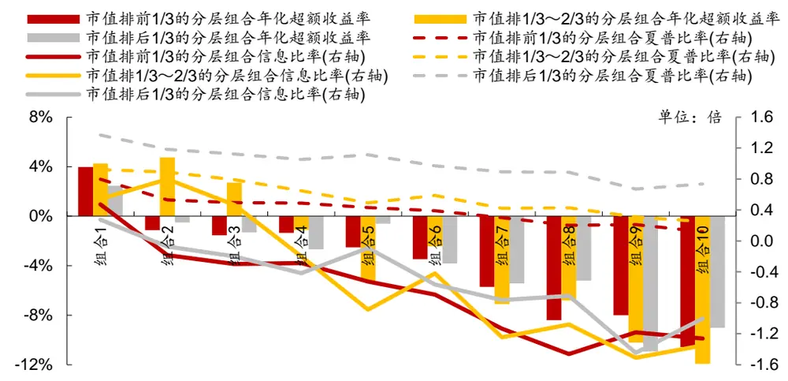
资料来源：Wind，华泰证券研究所

图表73： 不同行业 high_r_std_4m因子分层组合绩效分析（分五层）

|  | 组合1年化 | 组合1 | 组合1 | 组合1 | 组合1超额收益 | 组合1相对 | 所有组合年化 |
| --- | --- | --- | --- | --- | --- | --- | --- |
| 行业 | 超额收益率 | 信息比率 | 年化收益率 | 夏普比率 | 最大回撤 | 基准月胜率 | 收益率排序 |
| 房地产 | 10.89% | 1.06 | 41.05% | 1.27 | 13.32% | 60.56% 54.23% | 1,2,3,4,5 |
| 汽车 建材 | 7.00% 7.37% | 0.64 0.60 | 38.24% 40.93% | 1.24 1.23 | 18.75% 21.90% | 59.86% | 1,2,3,4,5 1,3,2,4,5 |
| 商贸零售 | 5.60% | 0.58 | 32.31% | 1.02 | 20.10% | 58.45% | 1,2,3,4,5 |
| 煤炭 | 7.39% | 0.55 | 22.52% | 0.59 | 17.97% | 57.75% | 1,2,3,4,5 |
| 通信 | 7.22% | 0.49 | 39.76% | 1.18 | 30.63% | 54.93% | 1,2,3,5,4 |
| 电子元器件 | 4.85% | 0.46 | 34.19% | 0.98 | 18.32% | 52.82% | 1,2,3,5,4 |
| 食品饮料 | 5.90% | 0.43 | 34.92% | 1.20 | 37.30% | 53.52% | 1,2,3,4,5 |
| 家电 | 5.69% | 0.41 | 35.24% | 1.09 | 22.19% | 52.11% | 1,2,3,4,5 |
| 农林牧渔 | 4.77% | 0.41 | 35.35% | 1.07 | 33.97% | 51.41% | 1,2,3,4,5 |
| 纺织服装 | 4.24% | 0.38 | 33.47% | 1.03 | 24.24% | 50.70% | 1,4,3,2,5 |
| 综合 | 5.49% | 0.35 | 32.51% | 0.98 | 25.08% | 52.11% | 1,2,3,5,4 |
| 钢铁 | 3.48% | 0.29 | 23.04% | 0.70 | 32.38% | 50.00% | 1,2,4,3,5 |
| 计算机 | 3.57% | 0.27 | 34.95% | 0.96 | 25.53% | 54.93% |  |
| 国防军工 | 4.32% | 0.25 | 33.63% | 0.82 | 40.52% | 47.18% | 2,1,3,5,4 1,2,4,3,5 |
| 非银行金融 | 5.17% | 0.23 | 29.97% | 0.72 | 35.37% | 49.30% | 1,2,3,5,4 |
| 餐饮旅游 | 3.38% | 0.21 | 30.20% | 0.93 | 29.90% | 50.00% | 1,2,3,5,4 |
| 传媒 | 3.64% | 0.21 | 31.30% | 0.83 | 39.13% | 49.30% | 1,4,5,2,3 |
| 机械 | 1.82% | 0.20 | 31.91% | 0.97 | 23.35% | 49.30% | 1,2,3,5,4 |
| 轻工制造 | 2.34% | 0.19 | 28.02% | 0.86 | 39.97% | 49.30% | 1,4,2,3,5 |
| 医药 | 1.45% | 0.15 | 32.16% | 1.08 | 19.81% | 51.41% | 1,2,3,4,5 |
| 有色金属 | 2.18% | 0.15 | 30.52% | 0.86 | 28.12% | 53.52% | 2,1,3,4,5 |
| 银行 | 1.36% | 0.08 | 25.18% | 0.81 | 27.68% | 47.89% | 3,1,2,5,4 |
| 电力及公用事业 | 0.77% | 0.08 | 23.08% | 0.74 | 22.14% | 52.11% | 1,2,3,4,5 |
| 石油石化 | 1.17% | 0.07 | 26.74% | 0.89 | 41.78% | 50.00% | 1,2,4,3,5 |
| 基础化工 | 0.07% | 0.01 | 26.73% | 0.82 | 27.32% | 50.70% | 1,2,4,3,5 |
| 交通运输 | -0.57% | -0.05 | 18.69% | 0.62 | 37.84% | 48.59% | 3,1,2,5,4 |
| 电力设备 | -0.84% | -0.07 | 28.84% | 0.86 | 37.03% | 47.18% | 2,1,5,4,3 |
| 建筑 | -2.25% | -0.17 | 27.71% | 0.83 | 60.41% | 45.07% | 2,1,3,5,4 |

资料来源：Wind，华泰证券研究所

以下是 hml_r_std_5m 因子详细测试结果（各项图表内容解释请参看本章第一小节）：

图表74： hml_r_std_5m 因子分层组合绩效分析（20050509～20170228）

| 年化超额 |  |  |  |  |  | 超额收益 | 相对基准 |  | 超额收益 最大回撤 | 月均双边 换手率 |
| --- | --- | --- | --- | --- | --- | --- | --- | --- | --- | --- |
| 投资组合 | 年化收益率 | 年化波动率 | 夏普比率 | 最大回撤 | 收益率 年化波动率 |  | 信息比率 | 月胜率 |  |  |
| 组合1 | 28.52% | 31.31% | 0.91 | 68.77% | 3.92% | 4.36% | 0.90 | 60.56% | 8.04% | 79.14% |
| 组合2 | 21.78% | 31.61% | 0.69 | 70.60% | -1.54% | 3.52% | -0.44 | 43.66% | 19.21% | 120.93% |
| 组合3 | 19.72% | 31.60% | 0.62 | 72.72% | -3.20% | 3.21% | -1.00 | 31.69% | 32.57% | 128.04% |
| 组合4 | 16.11% | 31.86% | 0.51 | 72.06% | -6.12% | 3.44% | -1.78 | 31.69% | 51.98% | 118.02% |
| 组合5 | 12.19% | 31.88% | 0.38 | 71.86% | -9.29% | 4.59% | -2.02 | 31.69% | 67.57% | 75.22% |
| 基准组合 | 23.68% | 31.44% | 0.75 | 70.38% |  |  |  |  |  | = |
| 多空组合 | 14.56% | 7.65% | 1.90 | 12.17% |  |  |  |  |  |  |

资料来源：Wind，华泰证券研究所

图表75： hml_r_std_5m 因子分层组合回测净值
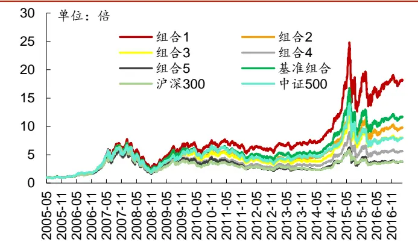
资料来源：Wind，华泰证券研究所

图表76： hml_r_std_5m因子各层组合净值除以基准组合净值示意图
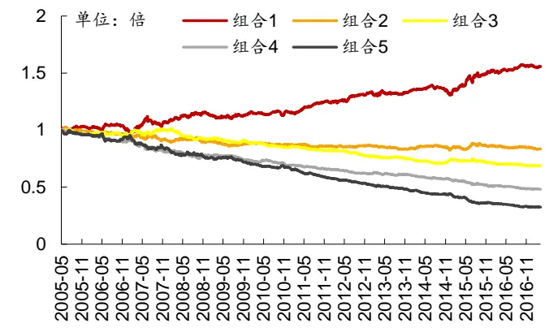
资料来源：Wind，华泰证券研究所

图表77： hml_r_std_5m 分层组合 1相对沪深 300月超额收益分布图
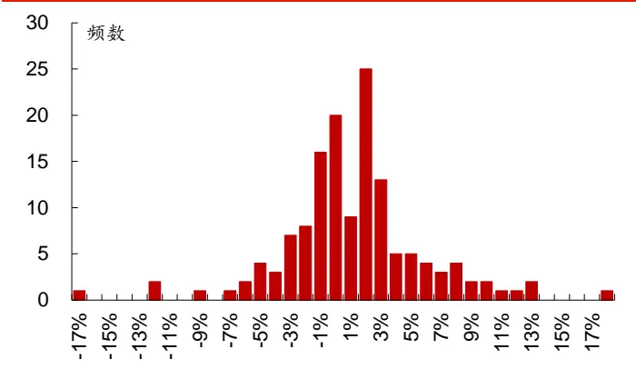
资料来源：Wind，华泰证券研究所

图表78： hml_r_std_5m因子多空组合月收益率及累积收益率
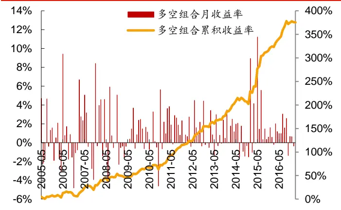
资料来源：Wind，华泰证券研究所

图表79： hml_r_std_5m分层组合在不同年份的收益及排名分析（分十层）

|  | 2006 | 2007 | 2008 | 2009 | 2010 | 2011 | 2012 | 2013 | 2014 | 2015 | 2016 排名均值 |  |
| --- | --- | --- | --- | --- | --- | --- | --- | --- | --- | --- | --- | --- |
| 组合1 | 89.0%(6) | 255.8%(1) | -60.0%(3) | 131.3%(1) | -1.8%(2) | -22.8%(1) | 24.1%(1) | 8.3%(2) | 57.2%(6) | 46.3%(2) | 3.4%(1) | 2.36 |
| 组合2 | 91.4%(4) | 207.7%(4) | -55.2%(1) | 115.9%(4) | 1.2%(1) | -25.4%(2) | 14.0%(2) | 9.3%(1) | 65.6%(3) | 53.3%(1) | -2.7%(3) | 2.36 |
| 组合3 | 80.1%(10) | 182.2%(6) | -57.8%(2) | 108.8%(6) | -1.8%(3) | -27.6%(3) | 10.8%(4) | 7.0%(3) | 63.4%(5) | 36.4%(3) | -6.6%(6) | 4.64 |
| 组合4 | 94.4%(2) | 201.2%(5) | -62.3%(7) | 128.1%(2) | -3.3%(4) | -32.1%(5) | 13.1%(3) | 2.3%(8) | 67.6%(1) | 28.5%(4) | -2.7%(2) | 3.91 |
| 组合5 | 91.2%(5) | 207.9%(3) | -62.1%(6) | 122.6%(3) | -3.7%(5) | -28.7%(4) | 9.2%(5) | 3.7%(6) | 63.6%(4) | 27.0%(5) | -5.1%(4) | 4.55 |
| 组合6 | 95.7%(1) | 228.9%(2) |  | -63.1%(8) 103.3%(10) | -5.4%(7) | -34.0%(7) | )-2.9%(10) | 6.1%(5) | 67.6%(2) | 19.4%(7) | -6.2%(5) | 5.82 |
| 组合7 | 84.5%(9) | 170.7%(9) | -61.5%(5) | 107.0%(8) | -9.2%(10) | -34.3%(8) | 2.4%(7) | 7.0%(4) | 52.0%(9) | 25.7%(6) | -8.3%(7) | 7.45 |
| 组合8 | 86.3%(7) | 172.4%(8) | -61.3%(4) | 111.1%(5) | -4.4%(6) | -32.5%(6) | 8.1%(6) | 3.5%(7) | 55.5%(8) | 11.4%(8) | -8.5%(8) | 6.64 |
| 组合9 |  | 85.3%(8) 169.4%(10) | -63.4%(9) | 106.9%(9) | -5.7%(8) | -38.3%(9) | 1.7%(8) | -2.3%(9) | 48.8%(10) |  | 6.1%(10)-12.2%(10) | 9.09 |
| 组合10 | 93.1%(3) | 177.4%(7) | -63.8%(10) | 107.6%(7) |  | -6.4%(9) -40.2%(10) | -0.9%(9) | -4.2%(10) | 56.5%(7) | 8.5%(9) | -10.8%(9) | 8.18 |

资料来源：Wind，华泰证券研究所

图表80： 不同市值区间 hml_r_std_5m分层组合绩效指标对比图（分十层）
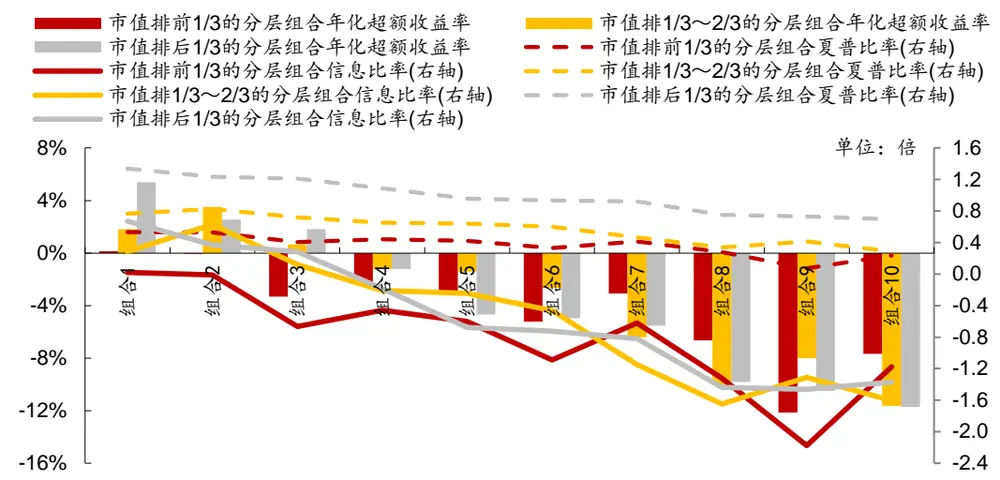
资料来源：Wind，华泰证券研究所

图表81： 不同行业 hml_r_std_5m因子分层组合绩效分析（分五层）

|  | 组合1年化 | 组合1 | 组合1 | 组合1 | 组合1超额收益 | 组合1相对 | 所有组合年化 |
| --- | --- | --- | --- | --- | --- | --- | --- |
| 行业 | 超额收益率 | 信息比率 | 年化收益率 | 夏普比率 | 最大回撤 | 基准月胜率 | 收益率排序 |
| 煤炭 | 13.00% | 0.92 | 28.92% | 0.71 | 18.56% | 57.75% | 1,2,4,5,3 |
| 电子元器件 | 7.81% | 0.84 | 37.98% | 1.00 | 16.89% | 57.04% | 1,2,3,5,4 |
| 家电 | 10.38% | 0.79 | 41.24% | 1.10 | 16.59% | 59.86% | 1,3,2,4,5 |
| 基础化工 | 5.60% | 0.75 | 33.74% | 0.93 | 14.63% | 55.63% | 1,2,3,4,5 |
| 机械 | 6.09% | 0.74 | 37.45% | 1.05 | 21.89% | 60.56% | 1,2,4,3,5 |
| 纺织服装 | 7.40% | 0.74 | 37.52% | 1.03 | 14.65% | 56.34% | 1,3,2,4,5 |
| 房地产 | 6.32% | 0.72 | 35.23% | 0.99 | 12.86% | 59.86% | 1,2,3,4,5 |
| 汽车 | 6.62% | 0.71 | 37.75% | 1.06 | 20.29% | 59.86% | 1,2,3,4,5 |
| 电力设备 | 6.89% | 0.63 | 38.88% | 1.03 | 24.17% | 57.04% | 1,2,4,3,5 |
| 钢铁 | 6.81% | 0.54 | 27.00% | 0.75 | 23.58% | 52.11% | 1,2,3,5,4 |
| 有色金属 | 6.51% | 0.52 | 36.04% | 0.93 | 28.78% | 54.23% | 1,2,4,3,5 |
| 建筑 | 6.62% | 0.50 | 39.31% | 1.05 | 21.61% | 54.23% | 1,2,4,3,5 |
| 国防军工 | 8.47% | 0.50 | 38.94% | 0.87 | 26.25% | 54.23% | 1,4,3,5,2 |
| 电力及公用事业 | 4.15% | 0.48 | 27.22% | 0.77 | 18.08% | 54.93% | 1,2,3,4,5 |
| 石油石化 | 7.20% | 0.44 | 34.29% | 0.90 | 25.21% | 54.93% | 1,4,2,3,5 |
| 餐饮旅游 | 6.55% | 0.44 | 34.20% | 0.93 | 24.73% | 57.04% | 1,2,3,5,4 |
| 商贸零售 | 3.29% | 0.38 | 29.42% | 0.84 | 21.15% | 57.04% | 1,2,4,3,5 |
| 计算机 | 4.24% | 0.34 | 35.81% | 0.87 | 45.30% | 53.52% | 1,2,3,4,5 |
| 医药 | 2.45% | 0.33 | 33.46% | 0.96 | 12.95% | 56.34% | 1,2,3,5,4 |
| 轻工制造 | 3.90% | 0.31 | 29.98% | 0.82 | 21.17% | 54.93% | 1,2,3,4,5 |
| 非银行金融 | 5.52% | 0.26 | 30.40% | 0.65 | 54.93% | 50.70% | 1,2,5,3,4 |
| 食品饮料 | 2.61% | 0.21 | 30.72% | 0.87 | 43.21% | 50.00% | 1,2,4,3,5 |
| 农林牧渔 | 2.01% | 0.19 | 31.79% | 0.87 | 30.96% | 49.30% | 1,2,5,3,4 |
| 传媒 | 2.99% | 0.17 | 30.47% | 0.73 | 42.74% | 50.70% | 1,2,3,5,4 |
| 建材 | 1.75% | 0.15 | 33.55% | 0.90 | 20.37% | 52.11% | 2,1,3,5,4 |
| 综合 | 0.85% | 0.05 | 26.68% | 0.72 | 40.56% | 46.48% | 1,2,3,4,5 |
| 交通运输 | -0.25% | -0.03 | 19.07% | 0.54 | 31.93% | 47.89% | 2,1,3,4,5 |
| 通信 | -0.46% | -0.04 | 29.75% | 0.75 | 31.84% | 52.11% | 3,2,1,4,5 |
| 银行 | -5.99% | -0.40 | 16.11% | 0.47 | 58.90% | 45.07% | 3,2,4,1,5 |

资料来源：Wind，华泰证券研究所

## 回归法测试结果分析

上一章中，我们选择性展示了八个波动率因子分层回测的结果，本章我们将使用回归法进行截面规律统计。回归法是多因子模型领域应用最广的方法，回归法单因子测试的结果不仅用于初步因子筛选，在后续构建收益预测模型时还会进一步应用。具体模型设置和下面图表中各指标含义参见第二章“单因子测试流程”的第一小节“回归法”。我们还列出了前期报告因子回归测试结果（估值、成长、动量类因子）与本期波动率类因子回归结果进行对比，如下所示。

图表82： 波动率因子与前期报告中因子回归测试结果对比展示

| 因子 | It\|均值 | \|t>2 占比 | t 均值 | t 均值/t 标准差 因子收益率均值 | 因子收益率序列t检验 |
| --- | --- | --- | --- | --- | --- |
| EP | 4.68 | 71.23% | 0.62 | 0.10 0.163% | 1.16 |
| EPcut | 4.48 | 67.81% | 0.61 | 0.10 0.167% | 1.19 |
| BP | 5.09 | 75.34% | 1.46 | 0.23 0.404% | 2.83 |
| SP | 4.05 | 71.23% | 0.91 | 0.17 0.277% | 2.54 |
| DP | 2.97 | 48.63% | 0.33 | 0.08 0.104% | 1.29 |
| PEG | 2.44 | 51.37% | -0.81 | -0.27 -0.233% | -3.51 |
| Sales_G_q | 2.60 | 57.53% | 0.71 | 0.22 0.175% | 2.37 |
| Profit_G_q | 2.97 | 56.85% | 1.03 | 0.28 0.265% | 3.04 |
| OCF_G_q | 1.47 | 28.77% | 0.44 | 0.24 0.117% | 2.28 |
| ROE_G_q | 2.51 | 49.32% | 0.99 | 0.32 0.253% | 3.46 |
| return_1m | 4.88 | 73.29% | -2.76 | -0.48 -0.637% | -5.09 |
| wgt_return_1m | 4.23 | 73.29% | -2.94 | -0.65 -0.789% | -6.92 |
| exp_wgt_return_3m | 4.38 | 72.60% | -3.22 | -0.69 -0.852% | -7.80 |
| exp_wgt_return_6m | 4.50 | 71.23% | -3.19 | -0.67 -0.858% | -7.45 |
| turn_1m | 5.33 | 77.40% | -1.91 | -0.30 -0.534% | -3.58 |
| bias_turn_1m | 4.13 | 65.75% | -2.03 | -0.39 -0.456% | -3.74 |
| std_turn_1m | 4.80 | 78.08% | -2.11 | -0.38 -0.595% | -4.48 |
| bias_std_turn_1m | 3.54 | 63.01% | -2.06 | -0.50 -0.473% | -4.99 |
| std_4m | 6.06 | 84.25% | -1.10 | -0.15 -0.346% | -2.36 |
| id1_std_3m | 4.54 | 70.63% | -1.67 | -0.29 -0.458% | -4.00 |
| id2_std_3m | 4.44 | 67.83% | -1.88 | -0.34 -0.509% | -4.57 |
| id2_std_up_3m | 4.19 | 67.83% | -1.96 | -0.39 -0.519% | -5.10 |
| id2_std_down_3m | 4.30 | 68.53% | -1.82 | -0.34 -0.492% | -4.56 |
| id2_std_upd_3m | 4.31 | 67.83% | -1.96 | -0.37 -0.526% | -4.94 |
| high_r_std_4m | 5.02 | 78.32% | -1.64 | -0.27 -0.447% | -3.68 |
| hml_r_std_5m | 3.25 | 60.84% | -1.76 | -0.47 -0.417% | -4.92 |

资料来源：Wind，华泰证券研究所

图表83： 波动率因子累积收益率展示一（回归法）
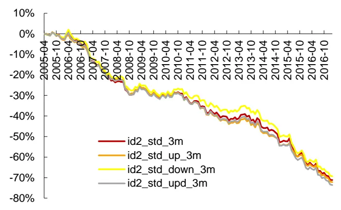
资料来源：Wind，华泰证券研究所

图表84： 波动率因子累积收益率展示二（回归法）
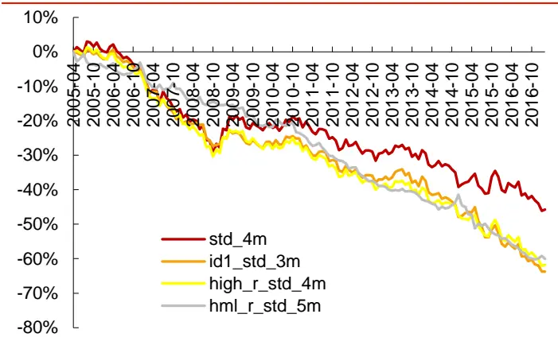
资料来源：Wind，华泰证券研究所

从上面的图表可以看出，波动率因子的整体效果都还不错。取假设检验 H：因子收益率序列均值显著异于 0。则假设检验 H 对应的 t 值在上表中最后一列，所有列举出的八个波动率因子都能通过该假设检验。如果从回归法得出的因子收益率均值来看，特质波动率因子id2_std_3m、id2_std_up_3m、id2_std_down_3m、id2_std_upd_3m 表现稍好，而且从图中可以发现，id2_std_up_3m（上行波动率）、id2_std_down_3m（下行波动率）效果基本对称；另外，hml_r_std_5m 虽然因子收益率均值不是很大，但在回测区间内累积收益率比较平稳，基本没有明显失效的时段。整体而言，波动率类几个细分因子表现相差不大，累积收益曲线形态也比较趋同。

与前四篇单因子测试的报告结果进行对比，我们发现波动率因子的整体效果比估值、成长因子要好，与换手率因子相差不远，但不如动量反转因子。这里需要额外说明，如上图表中所有因子的测试结果都是立足当前时点重新计算的，所以结果与之前报告中不完全一样。

## 因子 IC值的计算与分析

在回归法因子测试完成之后，我们还将进行因子 IC值的计算与分析。请注意，我们此处计算的因子 IC值并不是因子原始暴露度和下期收益的相关系数，而是“经过市值和行业调整的”因子暴露度和下期收益的相关系数（具体计算方法详见第二章“单因子测试流程”的第二小节“因子 IC值的计算”），所以因子 IC值的计算结果和回归测试结果并不是完全一致的（回归模型中包含行业哑变量而不包含市值相关解释变量）。

我们还仿照回归法分析过程，画出各因子 IC值累积曲线，可以从图中观察波动率因子在各段历史时期的表现。

下面图表中 IR比率是指因子 IC 值均值与标准差的比值的绝对值，能够衡量因子有效性。因子 IC值的分析结果与回归法基本一致，综合来看特质波动率因子 id2_std_3m、id2_std_up_3m、id2_std_down_3m、id2_std_upd_3m 表现稍好，id2_std_up_3m（上行波动率）略微强于 id2_std_down_3m（下行波动率）。从 IR比率来看，几类因子的有效性排序为：动量反转>换手率、波动率>估值、成长（若采用较短样本期，波动率因子的IR 比率与换手率因子基本相当）。

图表85： 波动率因子与前期报告中因子 IC值对比分析

| 因子 | IC 序列均值 | IC 序列标准差 | IR 比率 | IC>0 占比 | \|IC\|>0.02 占比 |
| --- | --- | --- | --- | --- | --- |
| EP | 1.49% | 8.81% | 0.17 | 54.11% | 76.71% |
| EPcut | 1.43% | 8.63% | 0.17 | 57.53% | 78.77% |
| BP | 2.93% | 9.26% | 0.32 | 57.53% | 82.19% |
| SP | 2.67% | 7.38% | 0.36 | 58.22% | 78.77% |
| DP | 1.62% | 4.82% | 0.34 | 65.75% | 71.92% |
| PEG | -1.88% | 4.61% | 0.41 | 34.93% | 69.86% |
| Sales_G_q | 1.84% | 5.77% | 0.32 | 59.59% | 73.29% |
| Profit_G_q | 2.20% | 6.76% | 0.33 | 63.70% | 80.14% |
| OCF_G_q | 1.17% | 2.77% | 0.42 | 65.75% | 55.48% |
| ROE_G_q | 2.09% | 6.01% | 0.35 | 69.18% | 75.34% |
| return_1m | -6.23% | 10.29% | 0.60 | 26.71% | 85.62% |
| wgt_return_1m | -7.94% | 8.26% | 0.96 | 17.81% | 86.30% |
| exp_wgt_return_3m | -8.61% | 8.39% | 1.03 | 16.44% | 89.73% |
| exp_wgt_return_6m | -8.48% | 8.63% | 0.98 | 15.75% | 88.36% |
| turn_1m | -8.07% | 10.84% | 0.74 | 26.03% | 84.93% |
| bias_turn_1m | -5.70% | 8.89% | 0.64 | 19.86% | 87.67% |
| std_turn_1m | -8.70% | 9.32% | 0.93 | 18.49% | 86.30% |
| bias_std_turn_1m | -6.04% | 7.23% | 0.84 | 15.07% | 86.99% |
| std_4m | -3.30% | 11.83% | 0.28 | 36.99% | 91.78% |
| id1_std_3m | -4.85% | 9.70% | 0.50 | 34.97% | 91.61% |
| id2_std_3m | -5.25% | 9.25% | 0.57 | 27.97% | 86.71% |
| id2_std_up_3m | -5.38% | 8.41% | 0.64 | 24.48% | 85.31% |
| id2_std_down_3m | -4.95% | 8.94% | 0.55 | 30.07% | 86.01% |
| id2_std_upd_3m | -5.37% | 8.82% | 0.61 | 27.27% | 86.01% |
| high_r_std_4m | -4.12% | 9.82% | 0.42 | 36.36% | 86.01% |
| hml_r_std_5m | -3.44% | 6.19% | 0.56 | 30.07% | 79.72% |

资料来源：Wind，华泰证券研究所

图表86： 波动率因子 IC值累积曲线展示一
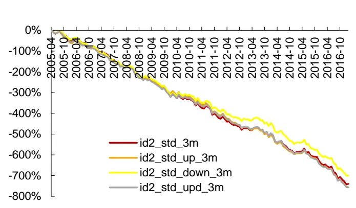
资料来源：Wind，华泰证券研究所

图表87： 波动率因子 IC值累积曲线展示二
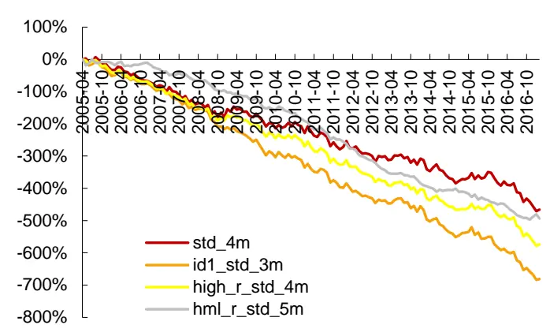
资料来源：Wind，华泰证券研究所

## 波动率因子效果对比总结

我们将分层测试的结果汇总在下面图表中，其中 TOP 组合是指分五层组合中的组合 1。从 TOP 组合信息比率、多空组合年化收益率、多空组合夏普比率、因子单调性等角度来说，我们推荐 id2_std_3m、id2_std_up_3m、id2_std_upd_3m、hml_r_std_5m 因子，但总体来说，波动率类细分因子的表现差异不明显。

这里需要指出的是，我们在前期报告中分层测试均没有考虑交易成本，本报告中首次加入交易成本（单边换手率 0.3%）的计算，以使结果更贴近真实选股情况。观察下面图表可以发现，估值、成长类因子的 TOP 组合换手率都不算太高，因此扣除交易成本后 TOP 组合收益率比之前报告中降低得不多，其中 BP 因子的 TOP 组合表现很好，年化收益率超过 30%。与之相对的是，动量反转类因子的 TOP 组合换手率非常高，扣除交易成本后收益降低较多。在列举的四个动量反转类因子中，exp_wgt_return_6m 表现最好，不过它能否代表动量反转类因子的最优水平尚未可知，我们将在后续报告中集中对所有类别因子进行扣除交易成本的分层选股测试，从一个新角度寻找每类因子中的最佳细分因子。

对于换手率因子而言，turn_1m、std_turn_1m 因子的 TOP 组合在扣除交易成本后没有超额收益（基准组合的年化收益率为 23.7%，基准组合的构建方式为行业内部所有个股等权、行业权重按沪深 300 指数配比，每月调仓一次）。bias_turn_1m、bias_std_turn_1m 因子的 TOP 组合还是有一定超额收益的，但效果也不太突出。

对于本文中详细测试的波动率类因子，由于我们进行了参数优化，所以列举出的八个因子TOP 组合年化收益率已经达到当前波动率因子库中的最优，基本均在 28%上下，这一水平可说能超过大部分估值、成长、换手率类因子（BP除外），可能不如动量反转（反转因子将在后续报告中再详加测试）。

如果从 IR 比率的角度来看，几类因子的有效性排序大致为：动量反转>换手率、波动率>估值、成长。不过前面刚刚讨论了，换手率因子在 Alpha 端的选股能力有限，而 A 股市场不具有良好的做空机制，所以还需正确看待各类因子的 IR 表现。

本报告最后一张图为目前已测的各大类因子 IC 序列的相关系数矩阵。请注意，我们这里对所有因子进行了方向调整，将所有逻辑上是负向的因子均乘以-1 使其变为正向因子再去计算 IC 序列。从图中可以看出，基本上只有各大类内部细分因子相关性比较严重，大类间只有动量反转、波动率、换手率因子相关性稍微严重一些。因为股票市场本来就是量价联动的，所以这也符合逻辑，这些因子也可以合称为市场交易类因子。还可以发现一个有趣的现象，估值因子中的 EP、EPcut 及成长因子收益率大体上与其余类别因子收益率均呈负向关系。在后续构建多因子组合的报告中，我们还会对此现象详加讨论。

图表88： 波动率因子与前期报告中因子分层测试法汇总对比分析（按单边换手率 0.3%计交易成本）

|  | TOP 组合 | TOP 组合 | TOP 组合 |  | TOP 组合 TOP 组合相对 | TOP 组合月均 | 多空组合 | 多空组合 | 多空组合 | 多空组合 |
| --- | --- | --- | --- | --- | --- | --- | --- | --- | --- | --- |
| 因子 | 年化收益率 | 夏普比率 | 信息比率 | 最大回撤 | 基准月胜率 | 双边换手率 | 年化收益率 | 夏普比率 | 最大回撤 | 月胜率 |
| EP | 26.92% | 0.85 | 0.47 | 72.41% | 50.00% | 42.50% | 4.51% | 0.43 | 19.39% | 52.14% |
| EPcut | 26.62% | 0.85 | 0.40 | 71.52% | 47.89% | 40.91% | 4.30% | 0.40 | 23.06% | 53.57% |
| BP | 30.72% | 0.97 | 1.17 | 64.89% | 54.93% | 38.59% | 13.85% | 1.44 | 15.58% | 57.14% |
| SP | 27.58% | 0.87 | 0.68 | 70.54% | 52.11% | 33.13% | 6.63% | 0.79 | 16.86% | 55.71% |
| DP | 23.40% | 0.76 | -0.05 | 68.75% | 42.96% | 38.04% | 0.50% | 0.06 | 26.38% | 45.71% |
| PEG | 25.70% | 0.84 | 0.35 | 73.02% | 50.70% | 44.87% | 6.75% | 0.95 | 14.58% | 55.00% |
| Sales_G_q | 26.23% | 0.82 | 0.56 | 71.63% | 59.86% | 37.73% | 5.88% | 0.88 | 14.70% | 57.86% |
| Profit_G_q | 26.41% | 0.81 | 0.52 | 71.73% | 53.52% | 44.06% | 5.65% | 0.73 | 15.85% | 56.43% |
| OCF_G_q | 23.61% | 0.76 | -0.01 | 70.42% | 47.18% | 59.05% | 3.40% | 0.52 | 16.26% | 52.86% |
| ROE_G_q | 26.73% | 0.82 | 0.61 | 71.99% | 58.45% | 44.26% | 6.62% | 0.97 | 14.33% | 62.14% |
| return_1m | 26.84% | 0.83 | 0.44 | 69.58% | 48.59% | 166.04% | 25.46% | 2.40 | 10.33% | 68.57% |
| wgt_return_1m | 27.38% | 0.88 | 0.52 | 67.51% | 53.52% | 163.57% | 24.03% | 2.39 | 14.53% | 71.43% |
| exp_wgt_return_3m | 27.89% | 0.88 | 0.59 | 70.49% | 55.63% | 144.27% | 25.01% | 2.45 | 10.32% | 74.29% |
| exp_wgt_return_6m | 30.80% | 1.01 | 0.99 | 69.21% | 52.82% | 116.57% | 26.06% | 2.47 | 9.98% | 75.71% |
| turn_1m | 23.97% | 0.86 | 0.03 | 71.05% | 47.89% | 62.31% | 12.20% | 0.97 | 20.77% | 60.71% |
| bias_turn_1m | 26.53% | 0.90 | 0.47 | 69.60% | 56.34% | 81.35% | 16.81% | 1.83 | 18.54% | 67.14% |
| std_turn_1m | 23.19% | 0.81 | -0.06 | 71.10% | 45.77% | 85.31% | 12.67% | 1.11 | 18.27% | 64.29% |
| bias_std_turn_1m | 26.01% | 0.87 | 0.42 | 69.56% | 57.75% | 102.42% | 16.77% | 2.06 | 12.32% | 72.14% |
| std_4m | 26.66% | 1.00 | 0.32 | 66.17% | 50.70% | 53.51% | 11.44% | 0.88 | 22.25% | 60.71% |
| id1_std_3m | 28.27% | 0.95 | 0.73 | 66.42% | 54.23% | 70.38% | 15.40% | 1.57 | 13.89% | 65.71% |
| id2_std_3m | 28.90% | 0.97 | 0.82 | 65.75% | 56.34% | 71.45% | 16.22% | 1.66 | 12.32% | 64.29% |
| id2_std_up_3m | 27.70% | 0.94 | 0.63 | 67.33% | 50.70% | 76.57% | 16.61% | 1.71 | 10.90% | 65.71% |
| id2_std_down_3m | 27.81% 28.54% | 0.93 0.96 | 0.66 0.77 | 65.14% 66.10% | 52.82% 54.93% | 71.33% 73.82% | 14.79% | 1.54 1.68 | 11.70% | 64.29% |
| id2_std_upd_3m | 28.17% | 1.02 | 0.54 | 65.15% | 50.70% | 61.64% | 16.25% 13.65% | 1.17 | 12.12% 19.86% | 67.86% |
| high_r_std_4m |  | 0.91 | 0.90 |  | 60.56% | 79.14% | 14.56% | 1.90 |  | 61.43% |
| hml_r_std_5m | 28.52% |  |  | 68.77% |  |  |  |  | 12.17% | 63.57% |

资料来源：Wind，华泰证券研究所

图表89： 波动率因子与前期报告中因子回归测试及 IC值汇总对比分析

| 因子收益率 |  |  |  |  | 因子收益率 序列t检验 | IC 序列 | IC 序列 IR 比率 |  |  | IC>0 占比 |
| --- | --- | --- | --- | --- | --- | --- | --- | --- | --- | --- |
| 因子 | \|t\|均值 | \|t\|>2 占比 | t 均值/t 标准差 | 均值 |  |  | 均值 | 标准差 |  |  |
| EP | 4.68 | 71.23% | 0.10 | 0.163% | 1.16 | 1.49% | 8.81% | 0.17 | 45.89% |  |
| EPcut | 4.48 | 67.81% | 0.10 | 0.167% | 1.19 | 1.43% | 8.63% | 0.17 | 42.47% |  |
| BP | 5.09 | 75.34% | 0.23 | 0.404% | 2.83 | 2.93% | 9.26% | 0.32 | 42.47% |  |
| SP | 4.05 | 71.23% | 0.17 | 0.277% | 2.54 | 2.67% | 7.38% | 0.36 | 41.78% |  |
| DP | 2.97 | 48.63% | 0.08 | 0.104% | 1.29 | 1.62% | 4.82% | 0.34 | 34.25% |  |
| PEG | 2.44 | 51.37% | -0.27 | -0.233% | -3.51 | -1.88% | 4.61% | 0.41 | 34.93% |  |
| Sales_G_q | 2.60 | 57.53% | 0.22 | 0.175% | 2.37 | 1.84% | 5.77% | 0.32 | 40.41% |  |
| Profit_G_q | 2.97 | 56.85% | 0.28 | 0.265% | 3.04 | 2.20% | 6.76% | 0.33 | 36.30% |  |
| OCF_G_q | 1.47 | 28.77% | 0.24 | 0.117% | 2.28 | 1.17% | 2.77% | 0.42 | 34.25% |  |
| ROE_G_q | 2.51 | 49.32% | 0.32 | 0.253% | 3.46 | 2.09% | 6.01% | 0.35 | 30.82% |  |
| return_1m | 4.88 | 73.29% | -0.48 | -0.637% | -5.09 | -6.23% | 10.29% | 0.60 | 26.71% |  |
| wgt_return_1m | 4.23 | 73.29% | -0.65 | -0.789% | -6.92 | -7.94% | 8.26% | 0.96 | 17.81% |  |
| exp_wgt_return_3m | 4.38 | 72.60% | -0.69 | -0.852% | -7.80 | -8.61% | 8.39% | 1.03 | 16.44% |  |
| exp_wgt_return_6m | 4.50 | 71.23% | -0.67 | -0.858% | -7.45 | -8.48% | 8.63% | 0.98 | 15.75% |  |
| turn_1m | 5.33 | 77.40% | -0.30 | -0.534% | -3.58 | -8.07% | 10.84% | 0.74 | 26.03% |  |
| bias_turn_1m | 4.13 | 65.75% | -0.39 | -0.456% | -3.74 | -5.70% | 8.89% | 0.64 | 19.86% |  |
| std_turn_1m | 4.80 | 78.08% | -0.38 | -0.595% | -4.48 | -8.70% | 9.32% | 0.93 | 18.49% |  |
| bias_std_turn_1m | 3.54 | 63.01% | -0.50 | -0.473% | -4.99 | -6.04% | 7.23% | 0.84 | 15.07% |  |
| std_4m | 6.06 | 84.25% | -0.15 | -0.346% | -2.36 | -3.30% | 11.83% | 0.28 | 36.99% |  |
| id1_std_3m | 4.54 | 70.63% | -0.29 | -0.458% | -4.00 | -4.85% | 9.70% | 0.50 | 34.97% |  |
| id2_std_3m | 4.44 | 67.83% | -0.34 | -0.509% | -4.57 | -5.25% | 9.25% | 0.57 | 27.97% |  |
| id2_std_up_3m | 4.19 | 67.83% | -0.39 | -0.519% | -5.10 | -5.38% | 8.41% | 0.64 | 24.48% |  |
| id2_std_down_3m | 4.30 | 68.53% | -0.34 | -0.492% | -4.56 | -4.95% | 8.94% | 0.55 | 30.07% |  |
| id2_std_upd_3m | 4.31 | 67.83% | -0.37 | -0.526% | -4.94 | -5.37% | 8.82% | 0.61 | 27.27% |  |
| high_r_std_4m | 5.02 | 78.32% | -0.27 | -0.447% | -3.68 | -4.12% | 9.82% | 0.42 | 36.36% |  |
| hml_r_std_5m | 3.25 | 60.84% | -0.47 | -0.417% | -4.92 | -3.44% | 6.19% | 0.56 | 30.07% |  |

资料来源：Wind，华泰证券研究所

图表90： 各大类因子间 IC序列相关系数
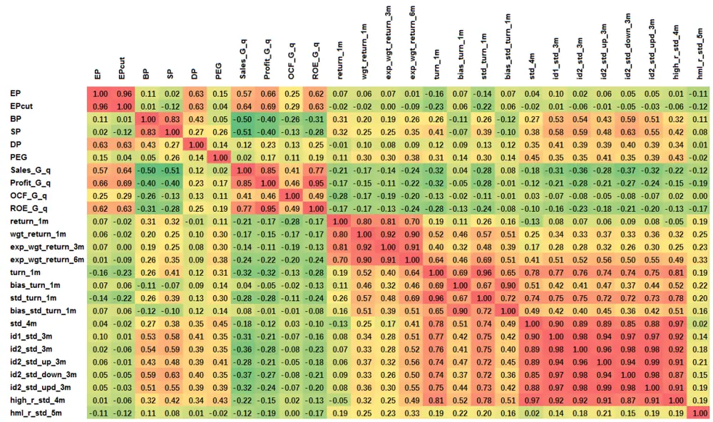
资料来源：Wind，华泰证券研究所

目前我们正在陆续推出单因子测试系列报告，后续规划包括财务质量因子、杠杆因子、规模因子、分析师情绪因子、股东因子、技术因子等大类因子的测试，在单因子测试系列之后我们将深入探讨如何在大类因子中进行因子精选并赋予合适权重从而构造优秀的风格因子，敬请关注。

## 免责申明

本报告仅供华泰证券股份有限公司（以下简称“本公司”）客户使用。本公司不因接收人收到本报告而视其为客户。

本报告基于本公司认为可靠的、已公开的信息编制，但本公司对该等信息的准确性及完整性不作任何保证。本报告所载的意见、评估及预测仅反映报告发布当日的观点和判断。在不同时期，本公司可能会发出与本报告所载意见、评估及预测不一致的研究报告。同时，本报告所指的证券或投资标的的价格、价值及投资收入可能会波动。本公司不保证本报告所含信息保持在最新状态。本公司对本报告所含信息可在不发出通知的情形下做出修改，投资者应当自行关注相应的更新或修改。

本公司力求报告内容客观、公正，但本报告所载的观点、结论和建议仅供参考，不构成所述证券的买卖出价或征价。该等观点、建议并未考虑到个别投资者的具体投资目的、财务状况以及特定需求，在任何时候均不构成对客户私人投资建议。投资者应当充分考虑自身特定状况，并完整理解和使用本报告内容，不应视本报告为做出投资决策的唯一因素。对依据或者使用本报告所造成的一切后果，本公司及作者均不承担任何法律责任。任何形式的分享证券投资收益或者分担证券投资损失的书面或口头承诺均为无效。

本公司及作者在自身所知情的范围内，与本报告所指的证券或投资标的不存在法律禁止的利害关系。在法律许可的情况下，本公司及其所属关联机构可能会持有报告中提到的公司所发行的证券头寸并进行交易，也可能为之提供或者争取提供投资银行、财务顾问或者金融产品等相关服务。本公司的资产管理部门、自营部门以及其他投资业务部门可能独立做出与本报告中的意见或建议不一致的投资决策。

本报告版权仅为本公司所有。未经本公司书面许可，任何机构或个人不得以翻版、复制、发表、引用或再次分发他人等任何形式侵犯本公司版权。如征得本公司同意进行引用、刊发的，需在允许的范围内使用，并注明出处为“华泰证券研究所”，且不得对本报告进行任何有悖原意的引用、删节和修改。本公司保留追究相关责任的权力。所有本报告中使用的商标、服务标记及标记均为本公司的商标、服务标记及标记。

本公司具有中国证监会核准的“证券投资咨询”业务资格，经营许可证编号为：Z23032000。全资子公司华泰金融控股（香港）有限公司具有香港证监会核准的“就证券提供意见”业务资格，经营许可证编号为：AOK809
©版权所有 2017年华泰证券股份有限公司

## 评级说明

## 行业评级体系

－报告发布日后的6个月内的行业涨跌幅相对同期的沪深300指数的涨跌幅为基准；

－投资建议的评级标准

增持行业股票指数超越基准

中性行业股票指数基本与基准持平

减持行业股票指数明显弱于基准

## 公司评级体系

－报告发布日后的6个月内的公司涨跌幅相对同期的沪深300指数的涨跌幅为基准；
－投资建议的评级标准
买入股价超越基准 20%以上
增持股价超越基准 5%-20%
中性股价相对基准波动在-5%~5%之间
减持股价弱于基准 5%-20%
卖出股价弱于基准 20%以上

## 华泰证券研究

## 南京

南京市建邺区江东中路228号华泰证券广场1号楼/邮政编码：210019

电话：86 25 83389999 /传真：86 25 83387521电子邮件：ht-rd@htsc.com

## 深圳

深圳市福田区深南大道4011号香港中旅大厦24层/邮政编码：518048

电话：86 755 82493932 /传真：86 755 82492062

电子邮件：ht-rd@htsc.com

## 北京

北京市西城区太平桥大街丰盛胡同28号太平洋保险大厦A座18层

邮政编码：100032

电话：86 10 63211166/传真：86 10 63211275

电子邮件：ht-rd@htsc.com

## 上海

上海市浦东新区东方路18号保利广场E栋23楼/邮政编码：200120

电话：86 21 28972098 /传真：86 21 28972068

电子邮件：ht-rd@htsc.com