## 金工研究/深度研究

2018年05月17日

林晓明 执业证书编号：S0570516010001

研究员 0755-82080134

linxiaoming@htsc.com

陈烨 010-56793927

联系人 chenye@htsc.com

李子钰

联系人 liziyu@htsc.com

2《金工: 市场拐点的判断方法》2018.05

3《金工: 人工智能选股之 stacking 集成学习》2018.05

# 华泰单因子测试之资金流向因子

# 华泰多因子系列之七

## 待测因子：流入类、净主动流入类、主力净流入类等

资金流向因子通过委托流数据构建, 反映了股票的微观供求信息。本文通过对资金流向因子进行相关强度分析并结合因子的定义，将 Wind 五十个资金流向因子分为八类，分别为流入类、流出类、主动净买入类、开盘主动净买入类、尾盘主动净买入类、主力净流入类、开盘主力净流入类以及尾盘主力净流入类，类内因子相关强度较高，类间因子相关强度较低。本文对八类因子进行单因子测试，发现其中四类因子（流入类因子、流出类因子、主力净流入类因子、开盘主力净流入类因子）在选股上存在一定的实用性。

## 单因子测试框架：分层回测、回归法、因子 IC值分析

首先，我们对各资金流向因子依次进行详细的分层模型回测，分析各分层组合的业绩表现和多空组合的表现，判别因子区分度、单调性、稳定性和在不同规模公司、不同一级行业间的业绩强弱。接下来我们使用回归法进行因子测试，对因子收益率序列和回归产生的 t 值序列进行统计层面上的分析。我们还计算了各因子的 IC 值序列、IR 比率，综合识别有效因子。我们在分层测试中以单边换手率 0.2%计算交易成本，更为真实地反应因子选股效果。

## 单因子分层回测：mfd_sellord 表现最好

本文挑选了四类因子中 t 值、IC 值、因子收益率较高的因子作为代表因子，并进行分层测试。2014 年 1 月至 2018 年 3 月，在持仓时间为 10 个交易日的情况下，mfd_buyord（主力流入单数）和 mfd_sellord（主力流出单数）在 2017 年之前表现不错，mfd_buyord 的多空组合年化收益率为27.56%，夏普比率为 3.53；mfd_sellord 的多空组合年化收益率为 42.12%，夏普比率为 4.43；mfd_volinflowrate_m（主力净流入率）的多空组合年化收益率为 12.25%，夏普比率为 2.02；mfd_volinflowrate_open_m（开盘主力净流入率）的多空组合年化收益率为 14.71%，夏普比率为 3.12。

单因子回归法分析和 IC 值分析：mfd_volinflowrate_open_m 表现最好本文对四个资金流向代表因子进行了回归法分析和 IC 值分析。2014 年 1月至 2018 年 3 月，在持仓时间为 10 个交易日的情况下，mfd_buyord 因子收益率均值为 0.18%，|t|>2 占比为 70.11%，IR 比率为 0.58，IC>0 占比为 72.64%；mfd_sellord 因子收益率均值为 0.24%, |t|>2 占比为 74.49%，IR 比率为 0.69，IC>0 占比为 75.66%；mfd_volinflowrate_m 因子收益率均值为 0.75%, |t|>2 占比为 66.99%，IR 比率为 0.5，IC>0 占比为 69.72%；mfd_volinflowrate_open_m 因 子 收 益 率 均 值 为 0.88%, |t|>2 占 比 为67.87%，IR 比率为 0.78，IC>0 占比为 81.05%。

## 因子残差分析：资金流向因子相比传统价量因子具有增量信息

本文将四个资金流向代表因子和三类传统价量因子（动量、换手率、波动率）进行对比。在持仓时间为 10 个交易日的情况下，动量、波动率类因子在 t 检验以及因子收益率上表现不如资金流向因子，换手率因子的表现与资金流向因子相近。本文随后将四个资金流向代表因子对三类量价因子做残差分析，其中换手率因子对四个代表因子影响均较大，动量因子对流入和流出因子影响较大，波动率因子则对四个代表因子影响均较小。在剔除了三类量价因子的后，资金流向因子仍然具有传统量价因子中没有的增量信息。

风险提示：单因子测试结果是历史经验的总结，如果市场规律改变，存在失效的可能。资金流向因子持仓时间较短，使用不当可能会造成过高换手率和交易成本。

## 资金流向因子在 A股市场实证分析

## 业界对资金流向因子的传统研究

个股的资金流向来自交易时产生的委托信息。进一步来说，个股的资金流向反映了股票的微观供求信息，根据个股委托流体现出的信息，投资者能够对个股的市场关注及偏好程度有一个大体的了解，从而对投资决策的制定提供一定的帮助。

与传统的基本面因子不同，资金流向因子在数据频率上要高于基本面因子，且有效时间也较短。对于资金流向因子的研究方式有不同做法，业界对于资金流向因子的传统研究基本遵从四个流程：一、定义资金流向指标，构建资金流向类因子计算公式；二、对资金流向因子的有效性、信息含量进行实证分析；三、在实证分析结果的基础上，通过演绎和推理提出解释问题的假说并引入理论模型；四、基于模型构建投资组合并回测。

本文主要工作有：1.本文延续华泰金工单因子测试系列报告的思路和方法，对全部 50 个Wind 资金流向因子进行系统的整理和测试，以求帮助投资者全面了解资金流向因子的选股能力和使用方法。2.本文将资金流向因子与传统的量价类因子（换手率、波动率、动量）进行比较，从增量信息的角度来分析资金流向因子的选股能力。

## 资金流向因子的选取及测试框架

在本文中，我们将主要针对资金流向类因子进行分析，找出其在二级市场不同行业、不同规模上市公司中的分布规律，并通过分层回测、回归法、计算因子 IC 值等测试因子有效性。

根据Wind 的因子说明，资金流因子具体计算方法遵循以下四个原则：

1、算法中根据挂单金额来划分超大单、大单、中单或小单。挂单额小于 4 万元为小单；挂单额 4 万元到 20 万元之间为中单；挂单额 20 万元至 100 万元之间为大单；挂单额大于 100 万元为超大单。

2、主动指主动去成交已经存在的对手单；被动是指挂单等待成交。

3、“主力”指超大单与大单的合计。

4、开盘指早盘 10:00 前，尾盘指午盘 2:30 后。

本报告中测试的资金流向因子如图表 1 所示，测试流程如图表 2所示。

图表1： 华泰单因子测试—资金流向因子及其描述

| 大类因子 | 具体因子 | 因子描述 |
| --- | --- | --- |
| 流入类 | mfd_buyamt_d | 主力流入额（traderType=1，2） |
|  | mfd_buyvol_d | 主力流入量（traderType=1，2） |
|  | mfd_buyord | 主力流入单数（traderType=1，2） |
|  | mfd_buyamt_a | 主力主动买入额(traderType=1，2） |
|  | mfd_buyvol_a | 主力主动买入量(traderType=1，2) |
| 流出类 | mfd_sellamt_d | 主力流出额（traderType=1，2） |
|  | mfd_sellvol_d | 主力流出量（traderType=1，2） |
|  | mfd_sellord | 主力流出单数（traderType=1，2） |
|  | mfd_sellamt_a | 主力主动卖出额（traderType=1，2） |
|  | mfd_sellvol_a | 主力主动卖出量（traderType=1，2) |
| 净主动买入类 | mfd_netbuyamt | 净买入额 |
|  | mfd_netbuyvol | 净买入量 |
|  | mfd_netbuyamt_a | 净主动买入额 |
|  | mfd_netbuyvol_a | 净主动买入量 |
|  | mf_amt | 净主动买入额（全单） |
|  | mf_amt_ratio | 净主动买入率（金额） |
|  | mfd_inflowproportion_a | 净主动买入额占比 |
|  | mf_vol | 净主动买入量（全单） |
|  | mfd_volinflowrate_a | 净主动买入率（量） |
|  | mf_vol_ratio | 净主动买入量占比 |
| 开盘净主动买入类 | mf_amt_open | 开盘净主动买入额 |
|  | mfd_inflowrate_open_a | 开盘净主动买入率（金额） |
|  | mfd_inflowproportion_open_a | 开盘净主动买入额占比 |
|  | mfd_inflowvolume_open_a | 开盘资金净主动买入量 |
|  | mfd_volinflowrate_open_a | 开盘净主动买入率（量） |
|  | mfd_volinflowproportion_open_a | 开盘净主动买入量占比 |
| 尾盘净主动买入类 | mf_amt_close | 尾盘净主动买入额 |
|  | mfd_inflowrate_close_a | 尾盘净主动买入率（金额） |
|  | mfd_inflowproportion_close_a | 尾盘净主动买入额占比 |
|  | mfd_inflowvolume_close_a | 尾盘资金净主动买入量 |
|  | mfd_volinflowrate_close_a | 尾盘净主动买入率（量） |
|  | mfd_volinflowproportion_close_a | 尾盘净主动买入量占比 |
| 主力净流入类 | mfd_inflow_m | 主力净流入额 |
|  | mfd_inflowrate_m | 主力净流入率（金额） |
|  | mfd_inflowproportion_m | 主力净流入额占比 |
|  | mfd_buyvol_m | 主力净流入量 |
|  | mfd_volinflowrate_m | 主力净流入率（量） |
|  | mfd_volinflowproportion_m | 主力净流入量占比 |
| 开盘主力净流入类 | mfd_inflow_open_m | 开盘主力净流入额 |
|  | mfd_inflowrate_open_m | 开盘主力净流入率（金额） |
|  | mfd_inflowproportion_open_m | 开盘主力净流入额占比 |
|  | mfd_buyvol_open_m | 开盘主力净流入量 |
|  | mfd_volinflowrate_open_m | 开盘主力净流入率（量） |
|  | mfd_volinflowproportion_open_m | 开盘主力净流入量占比 |
| 尾盘主力净流入类 | mfd_inflow_close_m | 尾盘主力净流入额 |
|  | mfd_inflowrate_close_m | 尾盘主力净流入率（金额） |
|  | mfd_inflowproportion_close_m | 尾盘主力净流入额占比 |
|  | mfd_buyvol_close_m | 尾盘主力净流入量 |
|  | mfd_volinflowrate_close_m | 尾盘主力净流入率（量） |
|  | mfd_volinflowproportion_close_m | 尾盘主力净流入量占比 |

资料来源：Wind，华泰证券研究所

图表2： 资金流向因子分析测试框架
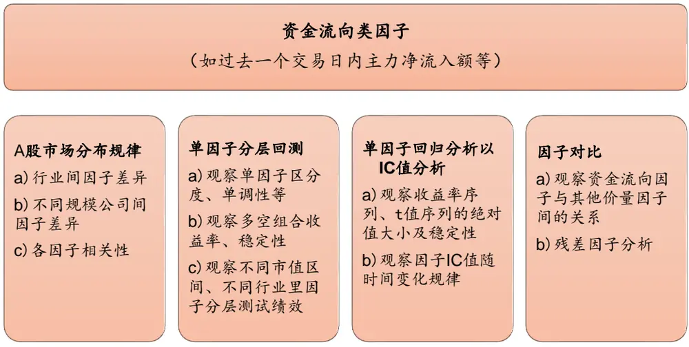
资料来源：Wind，华泰证券研究所

## 资金流向因子的选取及测试框架

与传统的基本面因子不同，资金流向因子作为交易类数据，有比较高的数据频率，因子的有效时间也较短。考虑到频繁调仓带来的高额交易成本，为了在因子有效性与交易成本间取得平衡，本文在单因子测试时采取了 10个交易日的持仓周期，在此特地说明。

本文选取的 50个资金流向因子数据来源于Wind，为了能够简明地展示因子测试结果，我们将这 50 个因子分为八类：流入类因子、流出类因子、净主动买入类因子、开盘净主动买入类因子、尾盘净主动买入类因子、主力净流入类因子、开盘主力净流入类因子、尾盘主力净流入类因子。

## 资金流向因子的行业间差异

资金流向因子在不同行业间存在一定差异。我们选取 mfd_buyord（主力流入单数）、mfd_volinflowrate_m（主力净流入率）、mfd_volinflowrate_open_m（开盘主力净流入率）作为资金流向因子的代表，计算它们在2018/03/20收盘时各一级行业的中位数分布规律，如下图所示。可以发现金融业在 2018/03/20 具有较高的资金流出，并且由于三种资金流向的计算方式各不相同，其在不同行业间的水平存在一定差异。我们认为对上市公司直接进行跨行业比较意义不大，在单因子测试中还是应考虑行业中性处理。

图表3： 各一级行业 mfd_buyord、mfd_volinflowrate_m、mfd_volinflowrate_open_m 中位数比较
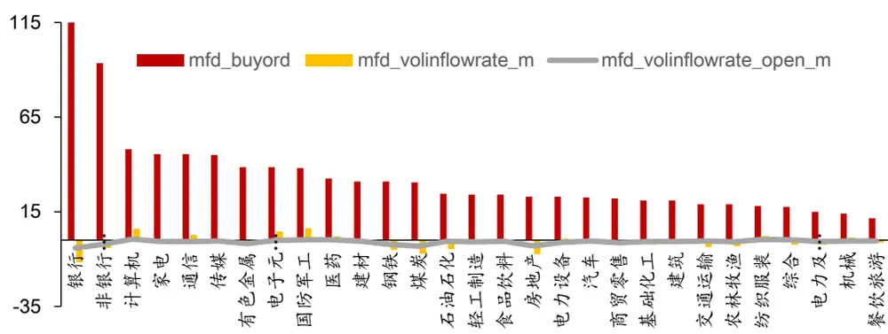
资料来源：Wind，华泰证券研究所

上图说明了在同一时间点不同行业间资金流向因子的水平存在一定差异。事实上，随时间变化，同一行业的资金流向因子的绝对大小和与其他行业对比的相对大小也在不断变化中。以 mfd_volinflowrate_m （主力净流入率）为例，2017 年间每月末各一级行业mfd_volinflowrate_m 因子值中位数在所有 29 个一级行业中的排位变化如下表所示。可以看出，金融业虽长期资金流出较多，但在特定的月末资金流入也排名较高，这一般是由当时的市场环境决定的。

图表4： 各一级行业 mfd_volinflowrate_m 因子值中位数在不同月末的行业间相对排名（2017年）

| 行业 | 1 | 2 | 3 | 4 | 5 | 6 | 7 | 8 | 9 | 10 | 11 | 12 |
| --- | --- | --- | --- | --- | --- | --- | --- | --- | --- | --- | --- | --- |
| 煤炭 | 2 | 27 | 26 | 22 | 7 | 3 | 22 | 29 | 29 | 29 | 7 | 27 |
| 交通运输 | 12 | 20 | 10 | 15 | 23 | 26 | 29 | 3 | 1 | 22 | 3 | 1 |
| 房地产 | 10 | 23 | 2 | 10 | 1 | 24 | 4 | 22 | 9 | 27 | 26 | 22 |
| 电力及公用事业 | 21 | 15 | 20 | 4 | 12 | 28 | 5 | 20 | 3 | 12 | 21 | 7 |
| 机械 | 3 | 16 | 27 | 26 | 24 | 1 | 3 | 21 | 16 | 1 | 23 | 4 |
| 电力设备 | 25 | 4 | 12 | 2 | 22 | 25 | 6 | 9 | 10 | 21 | 12 | 28 |
| 有色金属 | 9 | 13 | 5 | 14 | 19 | 19 | 13 | 2 | 21 | 24 | 4 | 24 |
| 基础化工 | 4 | 25 | 14 | 12 | 4 | 12 | 12 | 4 | 28 | 16 | 28 | 29 |
| 商贸零售 | 5 | 6 | 7 | 11 | 10 | 29 | 11 | 23 | 7 | 25 | 17 | 14 |
| 建筑 | 15 | 22 | 8 | 28 | 5 | 7 | 16 | 16 | 23 | 17 | 13 | 10 |
| 轻工制造 | 17 | 24 | 21 | 19 | 6 | 4 | 10 | 19 | 2 | 8 | 5 | 19 |
| 综合 | 23 | 19 | 28 | 1 | 15 | 22 | 20 | 10 | 22 | 10 | 2 | 5 |
| 医药 | 18 | 3 | 23 | 21 | 17 | 14 | 28 | 24 | 13 | 15 | 25 | 23 |
| 纺织服装 | 26 | 26 | 18 | 17 | 8 | 27 | 17 | 17 | 5 | 6 | 19 | 15 |
| 食品饮料 | 20 | 7 | 19 | 25 | 20 | 10 | 25 | 27 | 8 | 4 | 24 | 25 |
| 家电 | 27 | 8 | 13 | 6 | 28 | 2 | 14 | 15 | 17 | 13 | 9 | 6 |
| 汽车 | 11 | 9 | 9 | 7 | 21 | 16 | 23 | 25 | 24 | 5 | 8 | 26 |
| 电子元器件 | 8 | 21 | 15 | 5 | 13 | 18 | 9 | 1 | 20 | 28 | 27 | 9 |
| 建材 | 1 | 12 | 11 | 13 | 25 | 5 | 26 | 6 | 19 | 26 | 11 | 11 |
| 餐饮旅游 | 6 | 18 | 25 | 8 | 26 | 8 | 18 | 8 | 26 | 7 | 10 | 8 |
| 石油石化 | 13 | 5 | 3 | 20 | 18 | 9 | 2 | 7 | 18 | 19 | 6 | 2 |
| 国防军工 | 19 | 2 | 17 | 23 | 3 | 21 | 8 | 26 | 12 | 18 | 20 | 13 |
| 农林牧渔 | 28 | 14 | 6 | 29 | 2 | 6 | 19 | 13 | 6 | 9 | 15 | 18 |
| 钢铁 | 16 | 10 | 4 | 27 | 11 | 15 | 27 | 18 | 25 | 23 | 1 | 21 |
| 通信 | 24 | 28 | 24 | 18 | 9 | 17 | 15 | 5 | 4 | 3 | 14 | 17 |
| 计算机 | 14 | 17 | 16 | 9 | 27 | 20 | 21 | 12 | 27 | 11 | 18 | 16 |
| 非银行金融 | 22 | 11 | 22 | 16 | 14 | 13 | 24 | 11 | 15 | 20 | 16 | 12 |
| 传媒 | 29 | 1 | 1 | 3 | 29 | 23 | 1 | 28 | 14 11 | 14 | 22 29 | 3 20 |
| 银行 | 7 | 29 | 29 | 24 | 16 | 11 | 7 | 14 |  | 2 |  |  |

资料来源：Wind，华泰证券研究所

## 资金流向因子与市值因子的相关性

除去行业对因子存在较大影响外，上市公司的规模也是对各大类因子产生作用的潜在因素。我们在前五篇单因子测试报告中对估值、成长、动量反转、换手率、波动率类因子进行了详细分析，发现市值因子与大部分估值、动量反转、换手率、波动率类因子具有一定相关性，但是与成长类因子间相关性不大。对于本报告中涉及的资金流向类因子，由于大盘股一般资金流较大，所以猜测是正向关系。下面我们将进行详细计算。

我们针对图表1中列出的五十个因子，详细计算了它们在2017年 （在每月最后一个交易日核算）与市值因子之间的相关系数，见上表。经观察发现，部分资金流向类因子确实与市值因子间呈正相关关系，尤其是流入、流出类因子。对于其他因子，其与市值因子的相关性比较小。

图表5： 各资金流向因子与市值因子之间相关系数（2017年）

| 1 |  |  | 2 | 3 | 4 | 5 | 6 | 7 8 |  | 9 | 10 | 11 | 12 | 均值 |
| --- | --- | --- | --- | --- | --- | --- | --- | --- | --- | --- | --- | --- | --- | --- |
| mfd_buyamt_d 0.0459 |  |  | 0.0867 | 0.1070 | 0.0994 | 0.0596 | 0.0467 | 0.1073 | 0.1652 | 0.1357 | 0.1374 | 0.1330 | 0.1667 | 0.1075 |
| mfd_sellamt_d 0.0609 |  |  | 0.1126 | 0.0995 | 0.1154 | 0.0726 | 0.0553 | 0.1031 | 0.1786 | 0.1227 | 0.1231 | 0.1221 | 0.1599 | 0.1105 |
| mfd_buyvol_d |  | 0.0359 | 0.0456 | 0.0631 | 0.0689 | 0.0438 | 0.0512 | 0.0812 | 0.0815 | 0.0955 | 0.1050 | 0.0629 | 0.1070 | 0.0701 |
| mfd_sellvol_d |  | 0.0491 | 0.0590 | 0.0681 | 0.0698 | 0.0544 | 0.0574 | 0.0859 | 0.0886 | 0.0864 | 0.0822 | 0.0664 | 0.0943 | 0.0718 |
| mfd_netbuyamt |  | -0.0176 | -0.0789 | 0.0434 | -0.0956- | 0.0266 | -0.0201 | 0.0514 | 0.0018 | 0.0420 | 0.0473 | 0.0564 | -0.0567 | -0.0044 |
| mfd_netbuyvol |  | -0.0123 | -0.0316 | -0.0104 | -0.0378 | -0.0217 | -0.0348 | 0.0370 | 0.0339 | 0.0295 | 0.0346 | -0.0142 | -0.0131 | -0.0034 |
| mfd_buyord |  | 0.0568 | 0.1001 | 0.1218 | 0.1141 | 0.0708 | 0.0535 | 0.1212 | 0.1545 | 0.1438 | 0.1426 | 0.1310 | 0.1733 | 0.1153 |
| mfd_sellord |  | 0.0596 | 0.1251 | 0.1106 | 0.1242 | 0.0754 | 0.0597 | 0.1004 | 0.1745 | 0.1352 | 0.1227 | 0.1223 | 0.1715 | 0.1151 |
| mfd_buyamt_a |  | 0.0354 | 0.0771 | 0.1032 | 0.0945 | 0.0515 | 0.0383 | 0.1128 | 0.1034 | 0.1267 | 0.1329 | 0.1450 | 0.1368 | 0.0965 |
| mfd_sellamt_a |  | 0.0704 | 0.1172 | 0.1112 | 0.1138 | 0.0737 | 0.0624 | 0.1041 | 0.2315 | 0.1249 | 0.1211 | 0.1102 | 0.1720 | 0.1177 |
| mfd_buyvol_a |  | 0.0309 | 0.0403 | 0.0611 | 0.0620 | 0.0400 | 0.0476 | 0.0810 | 0.0402 | 0.0889 | 0.1073 | 0.0607 | 0.0915 | 0.0626 |
| mfd_sellvol_a |  | 0.0586 | 0.0631 | 0.0714 | 0.0683 | 0.0536 | 0.0631 | 0.0898 | 0.1501 | 0.0845 | 0.0747 | 0.0655 | 0.0935 | 0.0780 |
| mfd_netbuyamt_a |  | -0.0307 | -0.0791 | 0.0729 | -0.1095 | -0.0320 | -0.0382 | 0.0745 | -0.1298 | 0.0306 | 0.0482 | 0.0696 | -0.1010 | -0.0187 |
| mfd_netbuyvol_a |  | -0.0107 | -0.0402 | 0.0258 | -0.0550 | -0.0301 | -0.0384 | 0.0455 | -0.0391 | 0.0314 | 0.0395 | -0.0135 | -0.0328 | -0.0098 |
| mf_a | mt | -0.0286 | -0.0817 | 0.0563 | -0.1231 | -0.0207 | -0.0474 | 0.0666 | -0.1811 | 0.0387 | 0.0211 | 0.0593 | -0.1214 | -0.0302 |
| mf_a | mt_open | -0.0160 | -0.0261 | 0.0168 | -0.0333 | 0.0039 | -0.0527 | -0.0117 | -0.0701 | 0.0014 | 0.0682 | -0.0019 | -0.1118 | -0.0194 |
| mf_am | t_close | -0.0081 | -0.0594 | 0.0375 | -0.0997 | 0.0000 | 0.0166 | 0.1545 | -0.0772 | 0.0894 | 0.0616 | -0.0378 | -0.0196 | 0.0048 |
| mf_am | t_ratio | 0.0010 | -0.0327 | 0.0230 | -0.0315 | 0.0027 | -0.0194 | 0.0190 | -0.0242 | 0.0444 | 0.0107 | 0.0246 | -0.0116 | 0.0005 |
| mfd_i | nflowrate_open_a | -0.0095 | -0.0261 | -0.0056 | -0.0118 | 0.0038 | -0.0200 | 0.0056 | -0.0151 | 0.0254 | 0.0337 | 0.0028 | -0.0280 | -0.0037 |
| mfd_i | nflowrate_close_a | 0.0203 | -0.0136 | -0.0043 | -0.0309 | -0.0008 | 0.0123 | 0.0087 | -0.0115 | 0.0363 | -0.0196 | -0.0129 | 0.0016 | -0.0012 |
| mfd_i | nflowproportion_a | 0.0026 | -0.0141 | 0.0143 | -0.0067 | 0.0129 | 0.0125 | -0.0022 | -0.0204 | 0.0332 | 0.0180 | 0.0083 | 0.0167 | 0.0063 |
| mfd_i | nflowproportion_open_a | 0.0063 | -0.0261 | 0.0048 | -0.0050 | 0.0087 | 0.0132 | 0.0060 | -0.0084 | 0.0271 | 0.0223 | 0.0017 | 0.0033 | 0.0045 |
| mfd_i | nflowproportion_close_a | -0.0053 | 0.0032 | -0.0026 | 0.0024 | 0.0154 | -0.0003 | -0.0118 | 0.0123 | 0.0191 | -0.0157 | 0.0017 | 0.0028 | 0.0018 |
| mf_v | ol | -0.0063 | -0.0528 | 0.0272 | -0.0727 | -0.0195 | -0.0569 | 0.0361 | -0.0787 | 0.0375 | 0.0227 | -0.0097 | -0.0649 | -0.0198 |
| mfd_i | nflowvolume_open_a | -0.0102 | -0.0406 | -0.0116 | -0.0393 | -0.0086 | -0.0738 | -0.0192 | -0.0702 | 0.0156 | 0.0396 | -0.0089 | -0.0930 | -0.0267 |
| mfd_i | nflowvolume_close_a | 0.0260 | -0.0509 | 0.0127 | -0.0421 | -0.0059 | 0.0438 | 0.0604 | -0.0295 | 0.0899 | 0.0633 | -0.0182 | 0.0064 | 0.0130 |
| mfd_v | olinflowrate_a | 0.0010 | -0.0327 | 0.0230 | -0.0316 | 0.0027 | -0.0194 | 0.0190 | -0.0240 | 0.0443 | 0.0107 | 0.0246 | -0.0117 | 0.0005 |
| mfd_v | olinflowrate_open_a | -0.0095 | -0.0262 | -0.0056 | -0.0119 | 0.0038 | -0.0200 | 0.0056 | -0.0151 | 0.0255 | 0.0337 | 0.0028 | -0.0281 | -0.0037 |
| mfd_v | olinflowrate_close_a | 0.0204 | -0.0137 | -0.0043 | -0.0310 | -0.0007 | 0.0123 | 0.0085 | -0.0114 | 0.0362 | -0.0196 | -0.0128 | 0.0014 | -0.0012 |
| mf_vo | l_ratio | 0.0027 | -0.0143 | 0.0145 | -0.0067 | 0.0130 | 0.0126 | -0.0018 | -0.0216 | 0.0336 | 0.0180 | 0.0083 | 0.0166 | 0.0062 |
| mfd_v | olinflowproportion_open_a | 0.0063 | -0.0264 | 0.0047 | -0.0055 | 0.0089 | 0.0131 | 0.0059 | -0.0089 | 0.0274 | 0.0221 | 0.0018 | 0.0031 | 0.0044 |
| mfd_v | olinflowproportion_close_a | -0.0057 | 0.003 | -0.0033 | 0.0024 | 0.0153 | -0.0004 | -0.0119 | 0.0125 | 0.0189 | -0.0157 | 0.002 | 0.0028 | 0.0017 |
| mfd_i | nflow_m | -0.0074 | -0.0675 | 0.0619 | -0.1046 | -0.0253 | -0.0194 | 0.0245 | -0.0488 | 0.0333 | 0.0683 | 0.0373 | -0.0635 | -0.0093 |
| mfd_i | nflow_open_m | -0.0021 | 0.0022 | 0.0361 | -0.0149 | 0.0021 | -0.0227 | -0.0197 | 0.0094 | -0.0141 | 0.0606 | -0.0265 | -0.0828 | -0.006 |
| mfd_i | nflow_close_m | 0.0061 | -0.0217 | 0.0394 | -0.0508 | -0.0345 | 0.0157 | 0.1232 | -0.0666 | 0.0931 | 0.0394 | -0.0165 | 0.031 | 0.0132 |
| mfd_i | nflowrate_m | 0.0046 | -0.0237 | 0.0145 | -0.0233 | 0.0111 | -0.0171 | 0.0042 | 0.0023 | 0.0326 | 0.0271 | 0.0094 | 0.0096 | 0.0043 |
| mfd_i | nflowrate_open_m | 0.0061 | 0.019 | 0.0089 | -0.0172 | 0.0174 | -0.026 | 0.002 | 0.0043 | 0.0156 | 0.0229 | -0.0104 | -0.0068 | 0.003 |
| mfd_i | nflowrate_close_m | 0.0265 | -0.0177 | -0.0032 | -0.0143 | -0.0063 | 0.0062 | 0.0034 | -0.0014 | 0.0138- | 0.0178 | -0.005 | 0.0128 | -0.0002 |
| mfd_i | nflowproportion_m | 0.0022 | 0.0027 | 0.0098 | -0.0004 | 0.0106 | 0.0034 | -0.008 | 0.0449 | 0.0126 | 0.0118 | 0.0074 | 0.0157 | 0.0094 |
| mfd_i | nflowproportion_open_m | 0.0038 | 0.0184 | 0.0067 | 0.0068 | 0.0057 | 0.0012 | 0.0041 | 0.0281 | 0.0068 | 0.0078 | 0.0034 | 0.0088 | 0.0085 |
| mfd_i | nflowproportion_close_m | 0.0028 | 0.0003 | -0.0049 | -0.0052 | 0.0102 | -0.0042 | -0.0168 | 0.0089 | 0.0064 | -0.0127 | -0.0014 | 0.0121 | -0.0004 |
| mfd_ | buyvol_m | 0.0008 | -0.0298 | 0.0139 | -0.047 | -0.0173 | -0.0421 | 0.0276 | 0.0062 | 0.0418 | 0.0448 | -0.0179 | -0.0196 | -0.0032 |
| mfd_ | buyvol_open_m | -0.0054 | 0.0012 | -0.0146 | -0.0139 | 0.005 | -0.0593 | -0.0011 | 0.021 | 0.0092 | 0.0318 | -0.0118 | -0.0397 | -0.0065 |
| mfd_b | uyvol_close_m | 0.0276 | -0.0184 | 0.0206 | -0.0083 | -0.0443 | 0.0329 | 0.0555 | -0.0172 | 0.0724 | 0.0451 | -0.0129 | 0.0267 | 0.015 |
| mfd_v | olinflowrate_m | 0.0047 | -0.0237 | 0.0144 | -0.0232 | 0.0112 | -0.0171 | 0.0042 | 0.0023 | 0.0326 | 0.0272 | 0.0095 | 0.0096 | 0.0043 |
| mfd_volinflowrate_open_m |  | 0.0061 | 0.0191 | 0.0088 | -0.0171 | 0.0174 | -0.026 | 0.0022 | 0.0043 | 0.0157 | 0.0229 | -0.0103 | -0.0068 | 0.003 |
| mfd_volinflowrate_close_m |  | 0.0266 | -0.0177 | -0.0031 | -0.0142 | -0.0063 | 0.0063 | 0.0031 | -0.0014 | 0.0138 | -0.0177 | -0.0049 | 0.0127 | -0.0002 |
| mfd_volinflowproportion_m |  | 0.0023 | 0.0027 | 0.0098 | -0.0004 | 0.0105 | 0.0033 | -0.0076 | 0.0454 | 0.0124 | 0.0117 | 0.0074 | 0.0158 | 0.0095 |
| mfd_volinflowproportion_open_mmfd_volinflowproportion_close_m 0.0029 |  |  | 0.0036 | 0.0184 | 0.0067 | 0.0068 | 0.0057 | 0.0011 | 0.0043 | 0.0281 | 0.0067 | 0.0076 | 0.0034 | 0.0088 |
|  |  |  | 0.0003 | -0.0048 | -0.0052 | 0.0102 | -0.0042 | -0.0168 | 0.0089 | 0.0064 | -0.0127 | -0.0014 | 0.0122-0.0003 |  |

资料来源：Wind，华泰证券研究所

## 资金流向因子间相关性分析

在本章前两个小节中，我们分析了资金流向因子在不同行业的分布差异性及资金流向因子与市值因子的相关性，接下来，我们将计算各资金流向因子之间的相关性。假设因子 A和B 之间的日度相关系数序列为 $\{Corr_{i}^{AB}\}$ ，其中 $Corr_{i}^{AB}$ 是在第i日日末这一截面上因子 A、B在所有个股上的因子暴露度的相关系数，我们构造了一个相关强度指标：

$$
C_{AB}=mean\quad(Corr_{i}^{AB}|i=1,\ldots,\mathsf{N})
$$

我们在八类因子中选取特定因子作为代表（同一类别内因子相关性较高），分别计算代表因子两两之间在 20140103 至 20180320 内的相关强度指标，如图表 6所示。通过观察可以发现，除了 mfd_buyord（主力流入单数）与 mfd_sellord（主力流出单数）相关性较强，其余因子间相关性并不显著。如果要组合使用各资金流向因子构建选股模型，需要注意处理多重共线性问题。

图表6： 各资金流向因子间日度相关强度（20140103至 20180320）

|  |  |  |  |  | mf_amt | mfd_inflow_o mfd_inflow_cl |  |  |
| --- | --- | --- | --- | --- | --- | --- | --- | --- |
|  | mfd_buyord | mfd_sellord | mf_amt | mf_amt _open |  | _close mfd_inflow_m | pen_m | ose_m |
| mfd_buyord |  | 0.88 | 0.07 | 0.00 | 0.00 | 0.10 | -0.03 | 0.06 |
| mfd_sellord | 0.88 |  | -0.10 | -0.09 | -0.08 | -0.19 | -0.18 | -0.09 |
| mf_amt | 0.07 | -0.10 |  | 0.46 | 0.38 | 0.55 | 0.28 | 0.25 |
| mf_amt_open | 0.00 | -0.09 | 0.46 |  | 0.10 | 0.33 | 0.47 | 0.08 |
| mf_amt_close | 0.00 | -0.08 | 0.38 | 0.10 |  | 0.21 | 0.06 | 0.41 |
| mfd_inflow_m | 0.10 | -0.19 | 0.55 | 0.33 | 0.21 |  | 0.47 | 0.40 |
| mfd_inflow_open_m | -0.03 | -0.18 | 0.28 | 0.47 | 0.06 | 0.47 |  | 0.11 |
| mfd_inflow_close_m | 0.06 | -0.09 | 0.25 | 0.08 | 0.41 | 0.40 | 0.11 |  |

资料来源：Wind，华泰证券研究所

## 单因子测试流程

在多因子系列首篇报告《华泰多因子模型体系初探》（2016.09）中，我们系统地介绍了有效因子识别（即单因子测试）的理论基础和研究思路，在多因子系列第二篇报告《华泰单因子测试之估值类因子》中我们着眼于实践过程，给出了详细的流程操作说明。为避免阅读障碍，我们此处将单因子详细测试流程再复述一遍。

## 回归法

回归法是一种最常用的测试因子有效性的方法，具体做法是将因子在第T期的暴露度与T+1期的股票收益进行线性回归，所得到的回归系数即为因子在T期的因子收益率，同时还能得到该因子收益率在本期回归中的显著度水平——t 值。我们的回归模型为

$$
r_{i}^{T+1}=\sum_{j}X_{j}^{T}f_{ji}^{T}+X_{d}^{T}d_{i}^{T}+\mu_{i}^{T}
$$

$$
$r_{i}^{T+1}\colon 股票\;\mathrm{i}\;在第\;\mathrm{T}+1$期的收益率
$$

$$
$d_{i}^{T}:$$股票$i$在在第T期因子d$上的暴露度
$$

$f_{ji}^{T};$ : 股票 i 在第 T 期第 j 个行业因子上的暴露度(属于该行业则为 1，否则为 0)

$$
$X_{j}^{T}\big(或X_{d}^{T}\big);$第T期第$\mathrm{j}$个行业因子$\left(或因子\;\mathrm{d}\right)$的因子收益率,1需回归拟合.
$$

$$
$\mu_{i}^{T}\mathrm{:}$股票i在第T期的残差收益率
$$

在所有截面期上，我们对因子d进行回归测试，能够得到该因子的因子收益率序列（即所有截面期回归系数 $X_{d}^{T}$ 构成的序列）和对应的 t 值序列。t 值指的是对单个回归系数 $X_{d}^{T}$ 的 t检验统计量，描述的是单个变量显著性，t 值的绝对值大于临界值说明该变量是显著的，即该解释变量（T期个股在因子 d的暴露度）是真正影响因变量（T+1期个股收益率）的一个因素。也就是说，在每个截面期上，对于每个因子的回归方程，我们设

$$
假设检验$H_{0}\colon X_{d}^{T}=0$
$$

$$
备择假设$H_{1}\colon X_{d}^{T}\neq0$
$$

该假设检验对应的 t统计量为

$$
\mathbf{t}=\frac{X_{d}^{T}}{SE\quad\langle X_{d}^{T}\rangle}
$$

其中SE $(X_{d}^{T})$ 代表回归系数 $|X_{d}^{T}|$ 的标准差的无偏估计量。一般 t 值绝对值大于 2 我们就认为本期回归系数 $X_{d}^{T}$ 是显著异于零的（也就是说，本期因子 d 对下期收益率具有显著的解释作用）。注意，我们在回归模型中加入了行业因素，能在一定程度上规避行业因素对因子的影响。回归法单因子测试中并未对市值因素的影响进行调整，但是在后续计算因子 IC值的部分会做一些调整。

1． 股票池：全 A股，剔除 ST、PT 股票，剔除每个截面期下一交易日停牌的股票。

2． 回溯区间：2014-01-03 至 2018-03-20。

3． 截面期：每个交易日计算因子暴露度，与下十个交易日窗口的个股超额收益（以沪深300 指数为基准）进行回归。

4． 数据处理方法：

a) 因子暴露度的计算方法已在图表 1 中进行说明，个股收益率均用 Wind 后复权收盘价进行计算，个股非交易状态的日期里收益率置为空值；

b) 标准化：将去极值处理后的因子暴露度序列减去其现在的均值、除以其标准差，得到一个新的近似服从N（0,1）分布的序列，这样做可以让不同因子的暴露度之间具有可比性；

c) 缺失值处理：对于因子暴露度缺失的股票，我们不将其参与到分层处理。

5． 回归权重：由于普通最小二乘回归（OLS）可能会夸大小盘股的影响（因为小盘股的估值等因子出现极端值概率较大，且小盘股数目很多，但占全市场的交易量比重较小），并且回归可能存在异方差性，故我们参考Barra手册，采用加权最小二乘回归（WLS），使用个股流通市值的平方根作为权重，此举也有利于消除异方差性。

6． 因子评价方法：

a) t 值序列绝对值平均值——因子显著性的重要判据；

b) t 值序列绝对值大于 2的占比——判断因子的显著性是否稳定；

c) 因子收益率序列平均值，以及该均值零假设检验的 t 值——判断因子收益率序列是否方向一致，并且显著不为零；

t 值序列均值的绝对值除以 t 值序列的标准差——结合显著性和波动性，辅助判断因子是否有效、稳健。

## 因子 IC值的计算

因子的 IC值是指因子在第 T 期的暴露度与 T+1 期的股票收益的相关系数，即

$$
IC_{d}^{T}=\mathrm{corr}\quad(\overrightarrow{R^{T+1}},\overrightarrow{d^{T}})
$$

其中， $IC_{d}^{T}$ 代表因子 d 在第 T 期的 IC 值， $\overrightarrow{R^{T+1}}$ 代表所有个股第 T+1 期的收益率向量， $\overrightarrow{d^{T}}$ 代表所有个股第 T 期在因子 d上的暴露度向量。

1. 股票池、回溯区间、截面期均与回归法相同。

2. 因子值在去极值、标准化、去空值处理后，在截面期上用其做因变量对市值因子及行业因子（哑变量）做线性回归，取残差作为因子值的一个替代。这样做可以消除行业因素和市值因素对因子的影响。计算残差序列和 T+1 期股票收益序列的相关系数作为T 期因子 IC值。

3. 因子评价方法：

a) IC 值序列的均值大小——因子显著性；

b) IC 值序列的标准差——因子稳定性；

c) IR 比率（IC 值序列均值与标准差的比值）——因子有效性；

d) IC 值累积曲线——随时间变化效果是否稳定；

e) IC 值序列大于零的占比——因子作用方向是否稳定。

## 因子收益率、t 值与 IC 值之间的关系

前两小节分别介绍了用回归法、IC 值评价因子有效性的两套思路，那它们之间到底具有怎样的区别和联系呢？为了说明这个问题，我们先介绍一个引理：

设X, Y为两个向量，则

$$
[corr(X,Y)]^{2}=R^{2}
$$

其中 $R^{2}$ 为线性回归 $Y=aX+b$ 或线性回归X = aY + b的可决系数（其中a，b是待回归系数）。

如果我们在单因子测试（线性回归法）中使用模型

$$
r=\beta X+c
$$

（r是股票收益率，X 是因子暴露度，c是常数项，c可以理解为市场因子）并且假设我们在计算因子 IC 值的时候，不预先对因子暴露度进行市值、行业调整了，就使用原始的因子暴露度 X，则本期因子 IC值为 $corr(X,r)$ ，根据引理，因子 IC 值的平方就等于单因子测试的回归模型的R2。

所以，因子 IC 值本质上反映的是下期收益率和本期因子暴露度的线性相关程度（R2的平方根），是使用该因子预测收益率的稳健性（IC 值越大，这个因子的收益越稳定，波动越小）；而回归法中计算出的因子收益率本质上是一个斜率，反映的是从该因子可能获得的收益率的大小，这并不能说明任何关于线性拟合优度的信息（也就是说，因子收益率很大时，也可能出现R2很小的情形）；至于回归法中计算出的 t值，在一元线性回归中 t值与R2反映的信息一致（二者对应关系为，当 $R^{2}=0时\mathbf{t}$ 值也为 0，当 $R^{2}=1$ 时 t 值为无穷大），但是由于我们所采用的回归模型包括了行业变量，所以 t 值仅代表被测因子对股票收益的解释能力（而不能代表模型的整体拟合优度）。

总结一下，IC 值反映模型整体线性拟合优度，t 值反映被测单因子对模型的解释能力是否显著，因子收益率与前两者差别较大，它反映的是可能获得的收益率的大小，而对这个收益是否稳健未知。

事实上，我们在计算因子 IC 值时也对因子暴露度进行市值、行业预调整了，情况还比上面分析的要复杂一些，但是精髓不变，我们的结论仍然大致正确。

## 分层模型回测

依照因子值对股票进行打分，构建投资组合回测，是最直观的衡量指标优劣的手段。一般来说，通过回归法和计算因子 IC 值都无法确定因子的单调性（例如，某因子值排名在中间 1/3 的个股表现比前 1/3 和后 1/3 的个股表现要好），但是分层回测法是可以确定因子单调性的。分层回测法逻辑简单，结果清晰，操作方便，并且具有能区分因子单调性的独特优势，是接受度非常高的一种单因子测试手段。

1. 股票池、回溯区间都与回归法相同。

2. 换仓期：在每个十日窗口最后一个交易日核算因子值，在下个十日窗口首个交易日按当日收盘价换仓。

3. 数据处理方法：不进行任何加工，因子值为空的股票不参与分层。

4. 分层方法：在每个一级行业内部对所有个股按因子大小进行排序，每个行业内均分成N 个分层组合。如图表 7 所示，黄色方块代表各行业内个股初始权重，可以相等也可以不等（我们直接取相等权重进行测试），分层具体操作方法为 N 等分行业内个股权重累加值，例如图示行业 1中，5只个股初始权重相等（不妨设每只个股权重为 0.2），假设我们欲分成 3 层，则分层组合 1在权重累加值 1/3 处截断，即分层组合 1包含个股 1 和个股 2，它们的权重配比为 0.2:（1/3-0.2）=3:2，同样推理，分层组合 2 包含个股 2、3、4，配比为（0.4-1/3）:0.2:（2/3-0.6）=1:3:1，分层组合 4 包含个股 4、5，配比为 2:3。以上方法是用来计算各个一级行业内部个股权重配比的，行业间权重配比与基准组合（我们使用沪深 300）相同，也即行业中性。

5. 评价方法：回测年化收益率、夏普比率、信息比率、最大回撤、胜率等。

图表7： 单因子分层测试法示意图
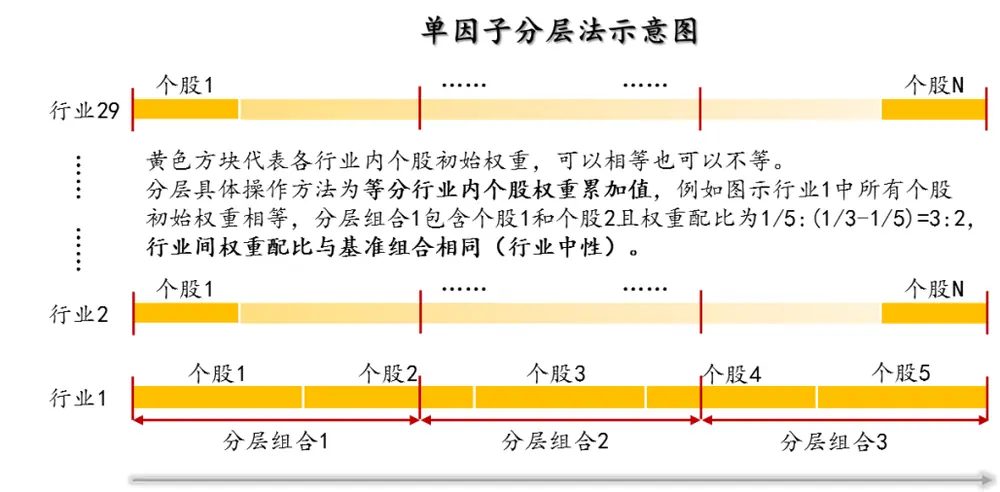
行业内个股按因子值排序
资料来源：华泰证券研究所

## 单因子测试结果分析

## 分层模型回测分析方法

在华泰单因子测试系列前两篇报告中，我们用图表结合文字说明的形式，对各个细分因子的分层回测结果一一进行了详细展示。从第三篇报告《华泰单因子测试之动量类因子》开始，我们对报告展示形式加以改进，在维持前两篇测试报告的细致程度的基础上，为了更高效地展示结果，我们会在此处集中说明所有图表的计算细节和分析方法，后面细分因子的测试结果均会使用相同的模板，便于读者速览和对比。

## 分层测试详细展示图表包括：

1． 分五层组合回测绩效分析表（20140103～20180320）。组合 1～组合 5为按该因子从大到小排序构造的行业中性的分层组合。基准组合为行业中性的等权组合，具体来说就是将组合 1～组合 5合并，一级行业内部个股等权配置，行业权重按当期中证 500行业权重配置。多空组合是在假设所有个股可以卖空的基础上，每十日调仓时买入组合 1，卖空组合 5。回测模型在每个十日窗口最后一个交易日核算因子值，在下个十日窗口首个交易日按当日收盘价调仓（分层组合构建法等更多细节参见上一章“分层模型回测”小节）。

2． 分五层组合回测净值图。按前面说明的回测方法计算组合 1～组合 5、基准组合的净值，与沪深 300、中证 500 净值对比作图。

3． 分五层组合回测，用组合 1～组合 5的净值除以基准组合净值的示意图。可以更清晰地展示各层组合在不同时期的效果。

4． 组合 1相对中证 500 日超额收益分布直方图。该直方图以[-0.2%,0.2%]为中心区间，向正负无穷方向保持组距为 0.2%延伸，在正负两个方向上均延伸到最后一个频数不为零的组为止（即维持组距一致，组数是根据样本情况自适应调整的）。

5． 分五层时的多空组合收益图。再重复一下，多空组合是买入组合 1、卖空组合 5（月度调仓）的一个资产组合。多空组合收益率是由组合 1的净值除以组合 5 的净值近似核算的。

6． 不同市值区间分层组合回测绩效指标对比图（分十层）。我们将全市场股票按市值排名前 1/3，1/3～2/3，后 1/3 分成三个大类，在这三类股票中分别进行分层测试，基准组合构成方法同前面所述（注意每个大类对应的基准组合并不相同）。

7． 不同行业间分层组合回测绩效分析表（分五层）。我们在不同一级行业内部都做了分层测试，基准组合为各行业内该因子非空值的个股等权组合（注意每个行业对应的基准组合并不相同）。

注意到基准组合为合并组合 1～组合 5 的结果，因此对于基准组合来说，调仓日的换手率基本等于 0（除新增入股票池的股票）。前期报告为月度调仓，换手率对组合净值的影响不大；本文中调仓周期为 10 日，经粗略估算在分层回测的时间窗口内，调仓会给投资组合1～5 带来年化 6%至 10%左右的交易成本，因此下文中组合 1～5的表现不能直接与基准组合进行对比。

由于在构建分层组合时行业内股票等权配置，所以我们选择的沪深 300 指数是 300 等权指数（000984.SH）,中证 500 指数是 500 等权指数（000982.SH）。

## 流入因子

该类因子为与当前交易日资金流入相关的指标，包括主力流入额、主力流入量、主力流入单数、主力主动买入额、主力主动买入量，注意流入类因子为反向因子（回测因子值为原因子值乘以-1）。mfd_buyord（主力流入单数）在组内的因子收益率、ICIR 值排名均较高，因此我们挑选其作为流入类代表因子进行展示。

图表8： 流入因子回归法、IC 值分析

| 因子收益率 |  |  |  |  | 因子收益率 序列t检验 | IC 序列 均值 | IC 序列 标准差 | IR 比率 | IC>0 占比 |
| --- | --- | --- | --- | --- | --- | --- | --- | --- | --- |
| 因子 | It\|均值 | \|t\|>2 占比 | t 均值/t 标准差 | 均值 |  |  |  |  |  |
| mfd_buyamt_d | 3.42 | 64.17% | 0.22 | 0.11% | 7.84 | 2.39% | 5.01% | 0.48 | 69.52% |
| mfd_buyvol_d | 3.25 | 61.05% | 0.13 | 0.05% | 3.14 | 1.34% | 4.64% | 0.29 | 62.41% |
| mfd_buyord | 4.01 | 70.11% | 0.32 | 0.18% | 10.71 | 3.35% | 5.76% | 0.58 | 72.64% |
| mfd_buyamt_a | 3.39 | 63.39% | 0.26 | 0.14% | 9.49 | 3.05% | 5.27% | 0.58 | 72.93% |
| mfd_buyvol_a | 3.20 | 59.40% | 0.16 | 0.06% | 4.14 | 1.91% | 4.85% | 0.39 | 65.82% |

资料来源：Wind，华泰证券研究所

图表9： 流入因子分层测试法（分五层）

|  | TOP 组合 | TOP 组合 | TOP 组合 | TOP 组合 | TOP 组合 | 多空组合 | 多空组合 | 多空组合 | 多空组合 |
| --- | --- | --- | --- | --- | --- | --- | --- | --- | --- |
| 因子 | 年化收益率 | 年化波动率 | 夏普比率 | 最大回撤 | 信息比率 | 年化收益率 | 年化波动率 | 夏普比率 | 最大回撤 |
| mfd_buyamt_d | 19.04% | 35.94% | 0.53 | -55.40% | 1.49 | 27.45% | 8.91% | 3.08 | -19.08% |
| mfd_buyvol_d | 16.45% | 36.04% | 0.46 | -55.70% | 0.87 | 21.14% | 8.66% | 2.44 | -16.72% |
| mfd_buyord | 24.18% | 35.77% | 0.68 | -55.08% | 2.03 | 27.56% | 7.80% | 3.53 | -15.78% |
| mfd_buyamt_a | 14.93% | 35.76% | 0.42 | -55.59% | 1.1 | 23.59% | 8.72% | 2.7 | -20.12% |
| mfd_buyvol_a | 11.55% | 35.79% | 0.32 | -57.45% | 0.29 | 16.74% | 8.45% | 1.98 | -18.53% |

资料来源：Wind，华泰证券研究所

图表10： mfd_buyord 因子分层组合绩效分析（20140103～20180320）

| 年化超额 |  |  |  |  |  | 超额收益 | 相对基准 |  | 超额收益 |
| --- | --- | --- | --- | --- | --- | --- | --- | --- | --- |
| 投资组合 | 年化收益率 | 年化波动率 | 夏普比率 | 最大回撤 | 收益率 |  | 年化波动率 信息比率 | 月胜率 | 最大回撤 |
| 组合1 | 24.18% | 35.77% | 0.68 | -55.08% | 6.39% | 3.15% | 2.03 | 56.28% | -8.86% |
| 组合2 | 15.63% | 35.08% | 0.45 | -56.09% | -1.17% | 2.80% | -0.42 | 49.56% | -11.56% |
| 组合3 | 12.41% | 35.49% | 0.35 | -58.27% | -3.77% | 2.42% | -1.56 | 47.71% | -15.11% |
| 组合4 | 6.34% | 35.24% | 0.18 | -63.04% | -9.05% | 2.24% | -4.03 | 41.09% | -32.29% |
| 组合5 | -2.62% | 34.83% | -0.08 | -69.72% | -16.93% | 5.23% | -3.24 | 38.36% | -56.32% |
| 基准组合 | 16.93% | 35.13% | 0.48 | -56.37% |  |  |  |  |  |
| 多空组合 | 27.56% | 7.80% | 3.53 | -15.78% |  |  |  |  |  |

资料来源：Wind，华泰证券研究所

图表11： mfd_buyord 因子分层组合回测净值
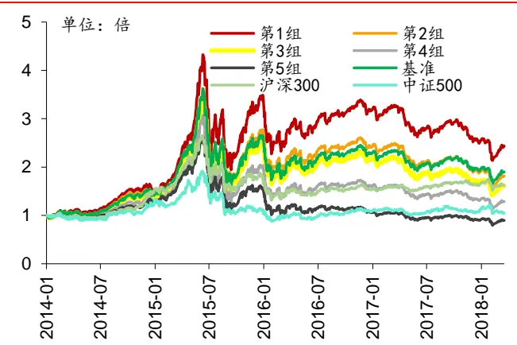
资料来源：Wind，华泰证券研究所

图表12： mfd_buyord因子各层组合净值除以基准组合净值示意图
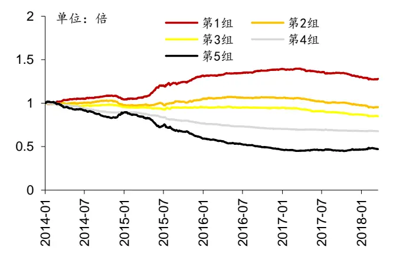
资料来源：Wind，华泰证券研究所

图表13： mfd_buyord因子分层组合 1相对基准组合日超额收益分布图
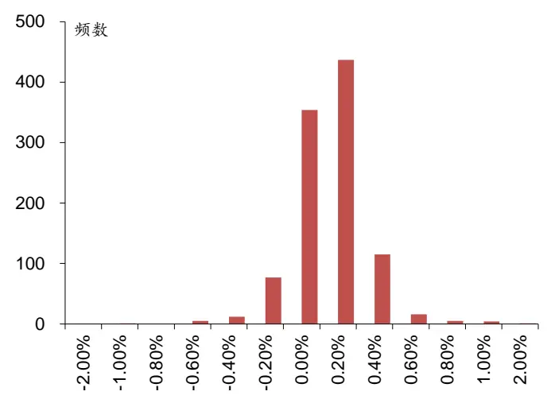
资料来源：Wind，华泰证券研究所

图表14： mfd_buyord 因子多空组合日收益率及累积收益率
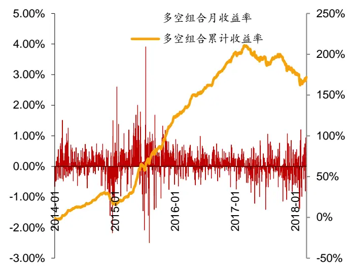
资料来源：Wind，华泰证券研究所

图表15： 不同市值区间 mfd_buyord分层组合绩效指标对比图（分十层）
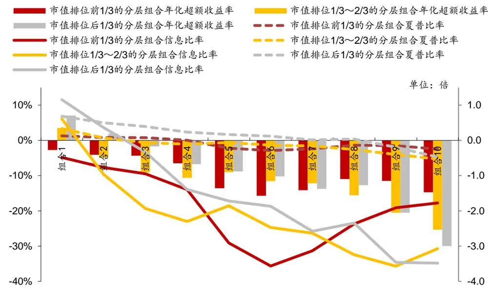
资料来源：Wind，华泰证券研究所

图表16： 不同行业 mfd_buyord因子分层组合绩效分析（分五层）

|  | 组合1年化 | 组合1 | 组合1 | 组合1超额收益 | 组合1相对 | 所有组合年化 |  |  |  |
| --- | --- | --- | --- | --- | --- | --- | --- | --- | --- |
| 行业 | 超额收益率 | 夏普比率 | 信息比率 | 最大回撤 | 基准月胜率 |  | 收益率排序 |  |  |
| 计算机 | 23.02% | 0.98 | 1.92 | -12.88% | 51.90% |  | 1 2 4 3 |  | 5 |
| 餐饮旅游 | 17.79% | 1.05 | 0.95 | -26.94% | 48.78% | 1 | 2 4 | 3 | 5 |
| 纺织服装 | 17.45% | 0.91 | 1.42 | -11.16% | 51.70% | 1 | 2 3 | 4 | 5 |
| 电力设备 | 16.47% | 0.65 | 1.58 | -10.01% | 51.70% | 1 | 2 3 | 4 | 5 |
| 农林牧渔 | 15.54% | 0.65 | 1.27 | -17.65% | 52.48% | 1 | 4 2 | 3 | 5 |
| 机械 | 14.51% | 0.52 | 1.55 | -14.50% | 52.39% | 1 | 2 3 | 4 | 5 |
| 建筑 | 11.84% | 0.76 | 0.92 | -24.83% | 52.00% | 1 | 2 4 | 3 | 5 |
| 家电 | 10.61% | 0.83 | 0.77 | -26.09% | 49.07% | 1 | 2 3 | 5 | 4 |
| 煤炭 | 9.63% | 0.47 | 0.65 | -24.70% | 50.63% | 1 | 2 3 | 4 | 5 |
| 汽车 | 9.55% | 0.68 | 0.99 | -12.15% | 52.87% | 1 | 2 3 | 4 | 5 |
| 石油石化 | 9.48% | 0.37 | 0.66 | -19.51% | 50.34% | 1 | 2 3 | 4 | 5 |
| 商贸零售 | 9.41% | 0.55 | 0.98 | -13.10% | 48.78% | 1 | 3 4 | 2 | 5 |
| 基础化工 | 7.27% | 0.58 | 0.84 | -11.93% | 52.58% | 1 | 2 4 | 3 | 5 |
| 国防军工 | 5.71% | 0.31 | 0.46 | -15.87% | 49.76% | 1 | 2 3 | 5 | 4 |
| 医药 | 3.86% | 0.43 | 0.55 | -18.22% | 49.95% | 1 | 2 3 | 4 | 5 |
| 电子元器件 | 3.16% | 0.52 | 0.34 | -20.61% | 49.27% | 1 | 2 3 | 4 | 5 |
| 轻工制造 | 2.97% | 0.46 | 0.21 | -26.93% | 44.60% | 1 | 2 3 | 4 | 5 |
| 通信 | 2.59% | 0.55 | 0.21 | -28.43% | 48.30% | 1 | 2 4 | 3 | 5 |
| 钢铁 | 1.45% | 0.46 | 0.10 | -37.56% | 50.05% | 1 | 2 4 | 3 | 5 |
| 房地产 | 1.10% | 0.51 | 0.12 | -23.05% | 48.00% | 2 | 1 3 | 5 | 4 |
| 建材 | 1.10% | 0.44 | 0.09 | -33.48% | 48.78% | 2 | 4 1 | 3 | 5 |
| 有色金属 | 0.60% | 0.34 | 0.06 | -18.80% | 48.88% | 2 | 1 3 | 5 | 4 |
| 食品饮料 | -0.47% | 0.24 | -0.04 | -32.36% | 50.05% | 1 | 3 4 | 2 | 5 |
| 综合 | -1.32% | 0.27 | -0.09 | -35.29% | 47.81% | 4 | 1 2 | 5 | 3 |
| 电力及公用事业 | -1.54% | 0.12 | -0.18 | -21.59% | 49.46% | 2 | 1 3 | 4 | 5 |
| 交通运输 | -1.92% | 0.36 | -0.18 | -22.21% | 50.73% | 2 | 1 5 | 4 | 3 |
| 非银行金融 | -1.97% | 0.24 | -0.14 | -25.77% | 47.03% | 1 | 3 4 | 5 | 2 |
| 传媒 | -3.98% | 0.05 | -0.31 | -26.46% | 49.37% |  | 2 1 3 | 5 | 4 |
| 银行 | -8.09% | 0.25 | -0.75 | -38.06% | 45.37% |  | 3 5 2 | 1 | 4 |

资料来源：Wind，华泰证券研究所

## 流出因子

该类因子的定义为与当前交易日资金流出相关的指标，包括主力流出额、主力流出量、主力流出单数、主力主动卖出额、主力主动卖出量，注意流出类因子为反向因子（回测因子值为原因子值乘以-1）。mfd_sellord（主力流出单数）在组内的因子收益率、ICIR 值排名均较高，因此我们挑选其作为流出类代表因子进行展示。

图表17： 流出因子回归法、IC 值分析

| 因子收益率 |  |  |  |  | 因子收益率 序列t检验 | IC 序列 均值 | IC 序列 标准差 | IR 比率 | IC>0 占比 |
| --- | --- | --- | --- | --- | --- | --- | --- | --- | --- |
| 因子 | It\|均值 | \|t\|>2 占比 | t 均值/t 标准差 | 均值 |  |  |  |  |  |
| mfd_sellamt_d | 4.04 | 71.18% | 0.35 | 0.18% | 11.17 | 3.71% | 5.80% | 0.64 | 75.46% |
| mfd_sellvol_d | 3.29 | 61.93% | 0.19 | 0.07% | 4.63 | 1.65% | 4.45% | 0.37 | 66.21% |
| mfd_sellord | 4.52 | 74.49% | 0.41 | 0.24% | 12.52 | 4.67% | 6.74% | 0.69 | 75.66% |
| mfd_sellamt_a | 3.46 | 65.04% | 0.27 | 0.13% | 8.88 | 2.49% | 5.10% | 0.49 | 71.28% |
| mfd_sellvol_a | 3.32 | 60.56% | 0.19 | 0.07% | 4.32 | 1.51% | 4.83% | 0.31 | 65.24% |

资料来源：Wind，华泰证券研究所

图表18： 流出因子分层测试法（分五层）

|  | TOP 组合 | TOP 组合 | TOP 组合 夏普比率 | TOP 组合 最大回撤 | TOP 组合 信息比率 | 多空组合 年化收益率 | 多空组合 年化波动率 | 多空组合 | 多空组合 |
| --- | --- | --- | --- | --- | --- | --- | --- | --- | --- |
| 因子 | 年化收益率 | 年化波动率 35.20% | 0.92 | -53.55% | 3.04 | 41.80% | 9.48% | 夏普比率 4.41 | 最大回撤 -17.44% |
| mfd_sellamt_d mfd_sellvol_d | 32.08% 16.70% | 35.87% | 0.47 | -56.67% | 0.94 | 21.76% | 8.95% | 2.43 | -17.05% |
| mfd_sellord | 32.02% | 34.95% | 0.92 | -53.48% | 3.01 | 42.12% | 9.51% | 4.43 | -16.45% |
| mfd_sellamt_a | 16.93% | 35.93% | 0.47 | -56.44% | 1.37 | 25.68% | 8.89% | 2.89 | -19.61% |
| mfd_sellvol_a | 15.00% | 36.03% | 0.42 | -56.89% | 0.84 | 20.08% | 8.91% | 2.25 | -16.34% |

资料来源：Wind，华泰证券研究所

图表19： mfd_sellord 因子分层组合绩效分析（20140103～20180320）

|  |  |  |  |  |  | 年化超额 收益率 年化波动率 | 超额收益 信息比率 | 相对基准 | 超额收益 月胜率 最大回撤 |
| --- | --- | --- | --- | --- | --- | --- | --- | --- | --- |
| 投资组合 | 年化收益率 | 年化波动率 | 夏普比率 | 最大回撤 |  |  |  |  |  |
| 组合1 | 32.02% | 34.95% | 0.92 | -53.48% | 12.74% | 4.23% | 3.01 | 56.96% | -12.10% |
| 组合2 | 17.30% | 35.58% | 0.49 | -55.73% | 0.43% | 2.98% | 0.15 | 51.22% | -11.12% |
| 组合3 | 10.13% | 35.68% | 0.28 | -60.79% | -5.66% | 2.53% | -2.24 | 46.06% | -22.16% |
| 组合4 | 2.46% | 35.53% | 0.07 | -66.03% | -12.28% | 2.46% | -5.00 | 37.88% | -42.53% |
| 组合5 | -7.54% | 34.97% | -0.22 | -73.44% | -21.12% | 5.92% | -3.57 | 36.51% | -64.63% |
| 基准组合 | 16.93% | 35.13% | 0.48 | -56.37% |  |  |  |  |  |
| 多空组合 | 42.12% | 9.51% | 4.43 | -16.45% |  |  |  |  |  |

资料来源：Wind，华泰证券研究所

图表20： mfd_sellord 因子分层组合回测净值
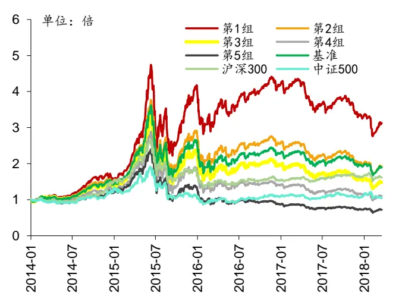
资料来源：Wind，华泰证券研究所

图表21： mfd_sellord因子各层组合净值除以基准组合净值示意图
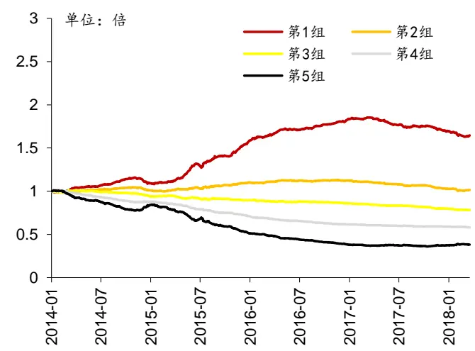
资料来源：Wind，华泰证券研究所

图表22： mfd_sellord因子分层组合1相对基准组合日超额收益分布图
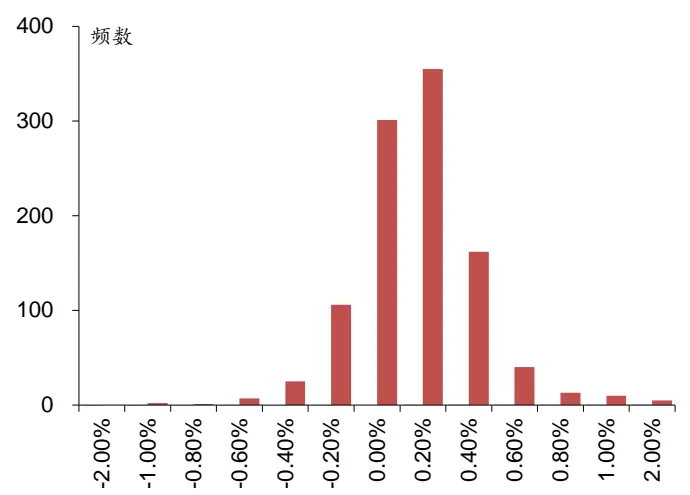
资料来源：Wind，华泰证券研究所

图表23： mfd_sellord因子多空组合日收益率及累积收益率
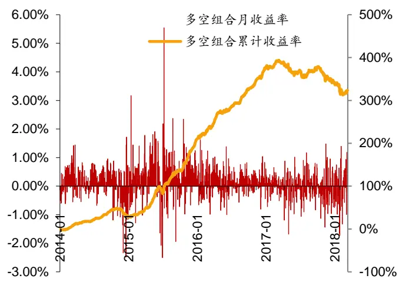
资料来源：Wind，华泰证券研究所

图表24： 不同市值区间 mfd_sellord分层组合绩效指标对比图（分十层）
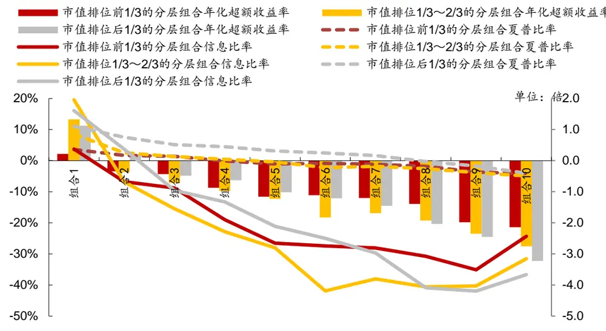
资料来源：Wind，华泰证券研究所

图表25： 不同行业 mfd_sellord因子分层组合绩效分析（分五层）

|  | 组合1年化 | 组合1 | 组合1 | 组合1超额收益 | 组合1相对 |  | 所有组合年化 |  |  |
| --- | --- | --- | --- | --- | --- | --- | --- | --- | --- |
| 行业 | 超额收益率 | 夏普比率 | 信息比率 | 最大回撤 | 基准月胜率 |  | 收益率排序 |  |  |
| 纺织服装 | 23.28% | 1.37 | 2.21 | -11.27% | 51.80% |  | 1 2 3 | 4 | 5 |
| 电力设备 | 19.51% | 1.01 | 2.09 | -8.42% | 52.78% | 1 | 2 3 | 4 | 5 |
| 石油石化 | 18.94% | 0.91 | 1.37 | -22.03% | 51.90% | 1 2 | 3 | 4 | 5 |
| 农林牧渔 | 18.59% | 1.03 | 1.74 | -13.26% | 52.97% | 1 | 2 3 | 4 | 5 |
| 机械 | 16.96% | 0.86 | 2.28 | -9.82% | 54.63% | 1 2 | 3 | 4 | 5 |
| 计算机 | 16.79% | 0.94 | 1.42 | -20.47% | 52.97% | 1 | 2 3 | 4 | 5 |
| 房地产 | 14.33% | 1.08 | 1.68 | -14.94% | 54.04% | 1 | 3 2 | 4 | 5 |
| 传媒 | 13.70% | 0.63 | 1.08 | -14.55% | 50.15% | 1 | 2 3 | 4 | 5 |
| 家电 | 13.32% | 1.06 | 1.11 | -18.95% | 51.31% | 1 4 | 2 | 3 | 5 |
| 基础化工 | 12.12% | 0.99 | 1.67 | -13.75% | 54.14% | 1 | 2 3 | 4 | 5 |
| 通信 | 12.08% | 0.87 | 1.09 | -20.23% | 51.51% | 1 | 4 3 | 2 | 5 |
| 汽车 | 11.14% | 0.96 | 1.21 | -11.48% | 50.63% | 1 | 2 3 | 4 | 5 |
| 建筑 | 10.87% | 0.88 | 0.94 | -20.21% | 50.93% | 1 | 2 3 | 4 | 5 |
| 医药 | 10.75% | 0.77 | 1.59 | -21.07% | 53.46% | 1 | 2 | 4 | 5 |
| 有色金属 | 10.71% | 0.78 | 0.93 | -19.90% | 50.93% | 1 | 2 4 | 3 | 5 |
| 轻工制造 | 10.68% | 0.85 | 0.92 | -19.53% | 49.56% | 1 | 2 3 | 4 | 5 |
| 煤炭 | 10.34% | 0.56 | 0.71 | -32.10% | 49.56% | 1 | 3 2 | 4 | 5 |
| 商贸零售 | 9.99% | 0.70 | 1.21 | -11.09% | 52.19% | 1 | 2 3 | 4 | 5 |
| 食品饮料 | 9.82% | 0.81 | 0.96 | -17.97% | 51.80% | 1 | 2 3 | 5 | 4 |
| 电力及公用事业 | 9.54% | 0.62 | 1.21 | -12.18% | 52.39% | 1 | 2 3 | 4 | 5 |
| 电子元器件 | 8.91% | 0.79 | 1.01 | -22.71% | 48.98% | 1 | 2 3 | 4 | 5 |
| 综合 | 7.96% | 0.66 | 0.58 | -17.20% | 47.61% | 1 | 2 4 | 5 | 3 |
| 国防军工 | 7.53% | 0.45 | 0.60 | -13.42% | 49.76% | 1 | 3 2 | 5 | 4 |
| 建材 | 7.41% | 0.95 | 0.72 | -17.82% | 49.66% | 1 | 2 3 | 4 | 5 |
| 交通运输 | 7.27% | 0.79 | 0.74 | -13.63% | 49.85% | 1 | 2 4 | 3 | 5 |
| 餐饮旅游 | 7.04% | 0.76 | 0.50 | -26.36% | 48.20% | 1 | 2 3 | 4 | 5 |
| 非银行金融 | 4.93% | 0.49 | 0.32 | -23.75% | 50.24% | 1 | 2 5 | 3 | 4 |
| 钢铁 | 3.22% | 0.70 | 0.24 | -32.80% | 49.85% |  | 1 2 4 | 3 | 5 |
| 银行 | -8.70% | 0.23 | -0.83 | -40.82% | 44.40% |  | 5 3 4 | 2 | 1 |

资料来源：Wind，华泰证券研究所

## 主力净流入因子

该类因子的定义为与当前交易日主力净流入相关的指标，包括主力净流入额、主力净流入率（金额）、主力净流入额占比、主力净流入量、主力净流入率（量）、主力净流入量占比。mfd_volinflowrate_m（主力净流入率）在组内的因子收益率、t 值排名均较高，因此我们挑选其作为流入类代表因子进行展示。

图表26： 主力净流入因子回归法、IC值分析

| 因子收益率 |  |  |  |  | 因子收益率 序列t检验 | IC 序列 均值 | IC 序列 标准差 IR 比率 |  |  |
| --- | --- | --- | --- | --- | --- | --- | --- | --- | --- |
| 因子 | It\|均值 | Itl>2 占比 | t 均值/t 标准差 | 均值 |  |  |  |  |  |
| mfd_inflow_m | 2.93 | 58.62% | 0.41 | 0.14% | 11.45 | 2.76% | 5.03% | 0.55 | IC>0 占比 71.37% |
| mfd_inflowrate_m | 4.42 | 67.09% | 0.72 | 0.74% | 17.80 | 3.92% | 7.92% | 0.50 | 69.52% |
| mfd_inflowproportion_m | 3.06 | 59.49% | 0.50 | 0.47% | 14.20 | 3.38% | 6.32% | 0.53 | 72.05% |
| mfd_buyvol_m | 2.54 | 51.61% | 0.37 | 0.11% | 9.87 | 2.03% | 4.36% | 0.47 | 68.35% |
| mfd_volinflowrate_m | 4.42 | 66.99% | 0.72 | 0.75% | 17.80 | 3.93% | 7.91% | 0.50 | 69.72% |
| mfd_volinflowproportion_m | 3.06 | 59.59% | 0.50 | 0.47% | 14.24 | 3.40% | 6.32% | 0.54 | 72.64% |

资料来源：Wind，华泰证券研究所

图表27： 主力净流入因子分层测试法（分五层）

|  | TOP 组合 年化收益率年化波动率 | TOP 组合 | 夏普比率 | TOP 组合 TOP 组合 最大回撤 | TOP 组合 | 多空组合 信息比率年化收益率年化波动率 | 多空组合 | 多空组合 夏普比率 | 多空组合 最大回撤 |
| --- | --- | --- | --- | --- | --- | --- | --- | --- | --- |
| 因子 mfd_inflow_m | 5.89% | 34.74% | 0.17 | -64.77% | -2.44 | 12.62% | 6.19% | 2.04 | -7.55% |
| mfd_inflowrate_m | 13.12% | 34.83% | 0.38 | -57.51% | -0.89 | 12.51% | 6.16% | 2.03 | -4.45% |
| mfd_inflowproportion_m | 11.26% | 35.77% | 0.31 | -58.72% | -1.11 | 16.81% | 7.17% | 2.34 | -4.39% |
| mfd_buyvol_m | 7.75% | 34.75% | 0.22 | -63.51% | -2.12 | 11.62% | 6.02% | 1.93 | -7.52% |
| mfd_volinflowrate_m | 13.01% | 34.81% | 0.37 | -57.59% | -0.92 | 12.25% | 6.08% | 2.02 | -4.49% |
| mfd_volinflowproportion_m | 11.23% | 35.73% | 0.31 | -58.61% | -1.13 | 16.84% | 7.13% | 2.36 | -4.48% |

资料来源：Wind，华泰证券研究所

图表28： mfd_volinflowrate_m 因子分层组合绩效分析（20140103～20180320）

|  |  |  |  |  | 年化超额 超额收益 |  | 相对基准 |  | 超额收益 |
| --- | --- | --- | --- | --- | --- | --- | --- | --- | --- |
| 投资组合 | 年化收益率 | 年化波动率 | 夏普比率 | 最大回撤 | 收益率 | 年化波动率 | 信息比率 | 月胜率 | 最大回撤 |
| 组合1 | 13.01% | 34.81% | 0.37 | -57.59% | -3.51% | 3.82% | -0.92 | 49.07% | -14.19% |
| 组合2 | 9.95% | 35.26% | 0.28 | -59.79% | -5.94% | 2.57% | -2.31 | 44.69% | -22.95% |
| 组合3 | 6.96% | 35.50% | 0.20 | -63.07% | -8.41% | 2.40% | -3.50 | 43.62% | -30.36% |
| 组合4 | 7.75% | 35.50% | 0.22 | -62.07% | -7.74% | 2.61% | -2.96 | 44.79% | -29.05% |
| 组合5 | 0.38% | 35.21% | 0.01 | -71.91% | -14.16% | 3.47% | -4.08 | 39.14% | -47.06% |
| 基准组合 | 16.90% | 35.13% | 0.48 | -56.37% |  |  |  |  |  |
| 多空组合 | 12.25% | 6.08% | 2.02 | -4.49% |  |  |  |  |  |

资料来源：Wind，华泰证券研究所

图表29： mfd_volinflowrate_m 因子分层组合回测净值
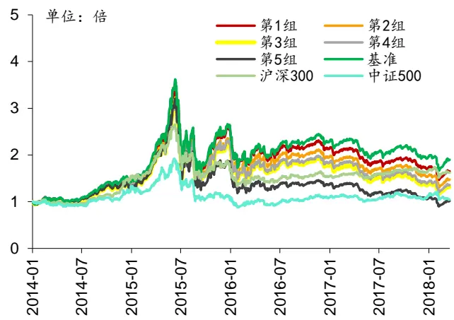
资料来源：Wind，华泰证券研究所

图表30： mfd_volinflowrate_m 各层组合净值除以基准净值示意图
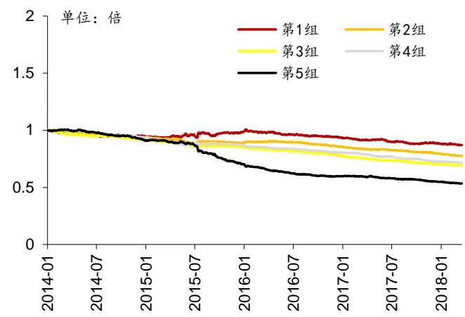
资料来源：Wind，华泰证券研究所

图表31： mfd_volinflowrate_m 组合 1 相基准组合日超额收益分布图
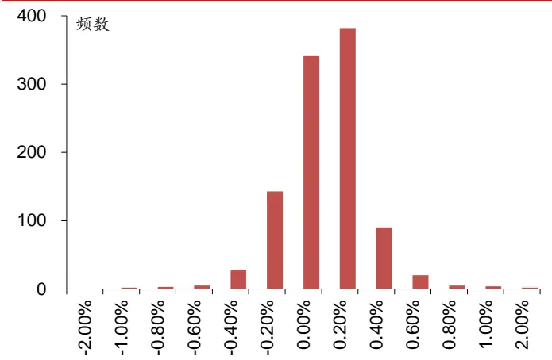
资料来源：Wind，华泰证券研究所

图表32： mfd_volinflowrate_m 因子多空组合日收益率及累积收益率
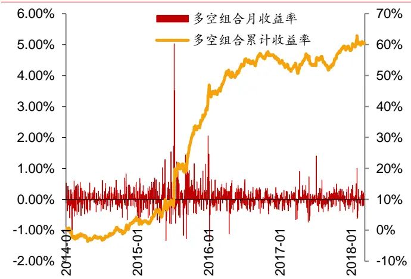
资料来源：Wind，华泰证券研究所

图表33： 不同市值区间 mfd_volinflowrate_m 分层组合绩效指标对比图（分十层）
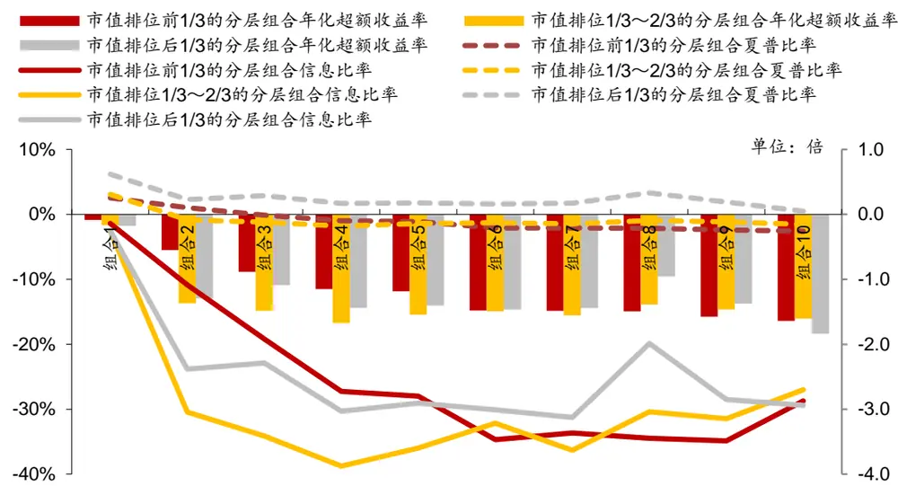
资料来源：Wind，华泰证券研究所

图表34： 不同行业 mfd_volinflowrate_m 因子分层组合绩效分析（分五层）

|  | 组合1年化 | 组合1 | 组合1 | 组合1超额收益 | 组合1相对 |  | 所有组合年化 |  |  |
| --- | --- | --- | --- | --- | --- | --- | --- | --- | --- |
| 行业 | 超额收益率 | 夏普比率 | 信息比率 | 最大回撤 | 基准月胜率 |  | 收益率排序 |  |  |
| 房地产 | 13.34% | 1.06 | 1.65 | -6.73% | 52.39% |  | 1 2 4 3 |  | 5 |
| 通信 | 7.33% | 0.74 | 0.61 | -12.87% | 50.54% | 1 | 2 3 | 4 | 5 |
| 计算机 | 2.88% | 0.47 | 0.24 | -32.98% | 47.32% | 1 | 3 2 | 4 | 5 |
| 非银行金融 | 2.36% | 0.40 | 0.18 | -25.93% | 46.45% | 1 | 2 4 | 5 | 3 |
| 钢铁 | 1.05% | 0.56 | 0.08 | -19.27% | 47.13% | 1 | 3 2 | 4 | 5 |
| 电力设备 | 0.32% | 0.40 | 0.03 | -19.07% | 46.64% | 1 | 2 4 | 5 | 3 |
| 综合 | -0.06% | 0.37 | 0.00 | -26.91% | 47.03% | 1 | 2 3 | 4 | 5 |
| 传媒 | -0.27% | 0.20 | -0.02 | -27.18% | 50.15% | 1 | 2 4 | 5 | 3 |
| 商贸零售 | -0.99% | 0.33 | -0.12 | -21.47% | 46.54% | 1 | 4 3 | 2 | 5 |
| 交通运输 | -1.21% | 0.44 | -0.12 | -15.51% | 46.15% | 3 | 7 2 | 5 | 4 |
| 餐饮旅游 | -3.99% | 0.37 | -0.27 | -35.89% | 48.39% | 1 | 2 4 | 3 | 5 |
| 有色金属 | -4.07% | 0.31 | -0.35 | -28.76% | 46.74% | 2 | 1 4 | 3 | 5 |
| 食品饮料 | -4.38% | 0.30 | -0.45 | -26.73% | 46.06% | 4 | 1 3 | 2 | 5 |
| 纺织服装 | -4.41% | 0.45 | -0.41 | -26.82% | 46.35% | 3 | 2 | 4 | 5 |
| 农林牧渔 | -5.34% | 0.24 | -0.50 | -25.13% | 45.28% | 3 | 1 2 | 4 | 5 |
| 医药 | -5.36% | 0.26 | -0.79 | -23.79% | 45.08% | 4 | 1 2 | 3 | 5 |
| 煤炭 | -5.46% | 0.08 | -0.44 | -36.56% | 47.42% | 1 | 3 2 | 4 | 5 |
| 建材 | -5.86% | 0.44 | -0.54 | -30.77% | 45.08% | 2 | 7 4 | 5 | 3 |
| 基础化工 | -5.98% | 0.37 | -0.81 | -24.13% | 47.03% | 2 | 3 | 4 | 5 |
| 银行 | -6.01% | 0.37 | -0.63 | -22.89% | 45.28% | 5 | 1 4 | 2 | 3 |
| 家电 | -6.14% | 0.36 | -0.51 | -28.90% | 47.91% | 2 | 3 1 | 4 | 5 |
| 国防军工 | -6.84% | 0.07 | -0.55 | -28.11% | 43.33% | 4 | 1 3 | 5 | 2 |
| 电力及公用事业 | -7.76% | 0.06 | -1.00 | -31.46% | 44.89% | 2 | 1 4 | 3 | 5 |
| 轻工制造 | -8.07% | 0.09 | -1.07 | -30.35% | 45.67% | 2 | 4 1 | 3 | 5 |
| 机械 | -8.11% | 0.20 | -0.69 | -32.24% | 46.45% | 2 | 4 1 | 3 | 5 |
| 汽车 | -8.87% | 0.29 | -1.11 | -36.27% | 47.03% | 4 | 2 1 | 3 | 5 |
| 电子元器件 | -9.00% | 0.21 | -1.06 | -37.44% | 45.67% | 3 | 2 4 | 1 | 5 |
| 石油石化 | -11.93% | -0.02 | -0.87 | -43.35% | 46.35% | 3 | 5 2 | 1 | 4 |
| 建筑 | -15.69% | 0.02 | -1.33 | -52.14% | 42.06% |  | 2 5 4 | 3 | 1 |

资料来源：Wind，华泰证券研究所

## 开盘主力净流入因子

该类因子的定义为与当前交易日开盘主力净流入相关的指标，包括开盘主力净流入额、开盘主力净流入率（金额）、开盘主力净流入额占比、开盘主力净流入量、开盘主力净流入率（量）、开盘主力净流入量占比。mfd_volinflowrate_open_m（开盘主力净流入率）在组内的因子收益率、t值排名均较高，因此我们挑选其作为流入类代表因子进行展示。

图表35： 开盘主力净流入因子回归法、IC值分析

|  |  |  |  |  | 因子收益率 因子收益率 | IC 序列 IC 序列 |  |  |  |
| --- | --- | --- | --- | --- | --- | --- | --- | --- | --- |
| 因子 | It\|均值 | \|t\|>2 占比 | t 均值/t 标准差 | 均值 |  | 序列t检验 | 均值 | 标准差 IR 比率 | IC>0 占比 |
| mfd_inflow_open_m | 2.83 | 58.52% | 0.65 | 0.20% | 18.65 | 3.77% | 4.69% | 0.80 | 80.41% |
| mfd_inflowrate_open_m | 4.38 | 67.96% | 0.96 | 0.88% | 21.69 | 5.50% | 7.09% | 0.78 | 80.96% |
| mfd_inflowproportion_open_m | 2.71 | 53.65% | 0.73 | 0.55% | 20.12 | 4.62% | 5.49% | 0.84 | 82.16% |
| mfd_buyvol_open_m | 2.53 | 52.48% | 0.51 | 0.14% | 13.66 | 2.80% | 4.35% | 0.64 | 76.80% |
| mfd_volinflowrate_open_m | 4.38 | 67.87% | 0.96 | 0.88% | 21.71 | 5.51% | 7.09% | 0.78 | 81.05% |
| mfd_volinflowproportion_open_m | 2.71 | 53.85% | 0.73 | 0.55% | 20.11 | 4.62% | 5.49% | 0.84 | 82.16% |

资料来源：Wind，华泰证券研究所

图表36： 开盘主力净流入因子分层测试法（分五层）

| 因子 | TOP 组合 年化收益率年化波动率 | TOP 组合 | TOP 组合 TOP 组合 夏普比率 | 最大回撤 | TOP 组合 信息比率年化收益率年化波动率 | 多空组合 | 多空组合 | 多空组合 夏普比率 | 多空组合 最大回撤 |
| --- | --- | --- | --- | --- | --- | --- | --- | --- | --- |
| mfd_inflow_open_m | 10.11% | 34.76% | 0.29 | -59.58% | -1.64 | 19.14% | 5.53% | 3.46 | -5.58% |
| mfd_inflowrate_open_m | 15.93% | 34.82% | 0.46 | -56.38% | -0.13 | 14.36% | 4.76% | 3.02 | -3.65% |
| mfd_inflowproportion_open_m | 12.45% | 35.62% | 0.35 | -58.17% | -0.91 | 17.41% | 5.70% | 3.06 | -3.64% |
| mfd_buyvol_open_m | 11.40% | 34.82% | 0.33 | -59.78% | -1.32 | 16.25% | 5.44% | 2.99 | -7.08% |
| mfd_volinflowrate_open_m | 16.06% | 34.81% | 0.46 | -56.47% | -0.21 | 14.71% | 4.72% | 3.12 | -3.79% |
| mfd_volinflowproportion_open_m | 12.53% | 35.62% | 0.35 | -58.15% | -0.88 | 17.46% | 5.69% | 3.07 | -3.70% |

资料来源：Wind，华泰证券研究所

图表37： mfd_volinflowrate_open_m 因子分层组合绩效分析（20140103～20180320）

|  |  |  |  |  |  | 年化超额 超额收益 收益率 |  | 相对基准 月胜率 | 超额收益 最大回撤 |
| --- | --- | --- | --- | --- | --- | --- | --- | --- | --- |
| 投资组合 | 年化收益率 | 年化波动率 | 夏普比率 | 最大回撤 | 年化波动率 信息比率 |  |  |  |  |
| 组合1 | 16.06% | 34.81% | 0.46 | -56.47% | -0.72% | 3.42% | -0.21 | 48.88% | -8.13% |
| 组合2 | 9.19% | 35.12% | 0.26 | -62.32% | -6.46% | 2.40% | -2.69 | 46.93% | -24.77% |
| 组合3 | 7.04% | 35.37% | 0.20 | -61.91% | -8.23% | 2.61% | -3.15 | 44.79% | -29.67% |
| 组合4 | 4.84% | 35.47% | 0.14 | -66.01% | -10.08% | 2.52% | -4.00 | 40.12% | -35.75% |
| 组合5 | 0.84% | 35.40% | 0.02 | -69.06% | -13.53% | 2.81% | -4.81 | 37.49% | -45.74% |
| 基准组合 | 16.69% | 35.13% | 0.48 | -56.37% |  |  |  |  |  |
| 多空组合 | 14.71% | 4.72% | 3.12 | -3.79% |  |  |  |  |  |

资料来源：Wind，华泰证券研究所

图表38： mfd_volinflowrate_open_m 因子分层组合回测净值
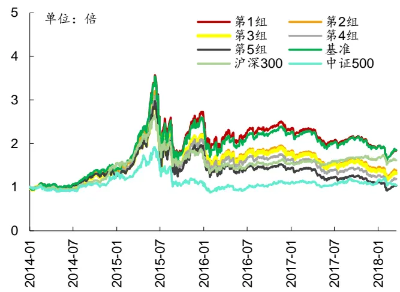
资料来源：Wind，华泰证券研究所

图表39： mfd_volinflowrate_open_m 各层组合净值除以基准净值图
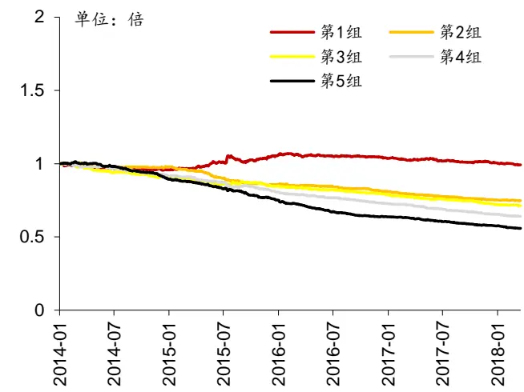
资料来源：Wind，华泰证券研究所

图表40： mfd_volinflowrate_open_m 组合 1 相对基准日超额收益分布
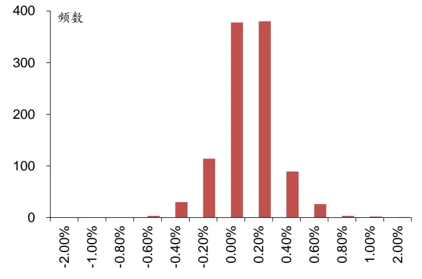
资料来源：Wind，华泰证券研究所

图表41： mfd_volinflowrate_open_m 多空组合累积收益率
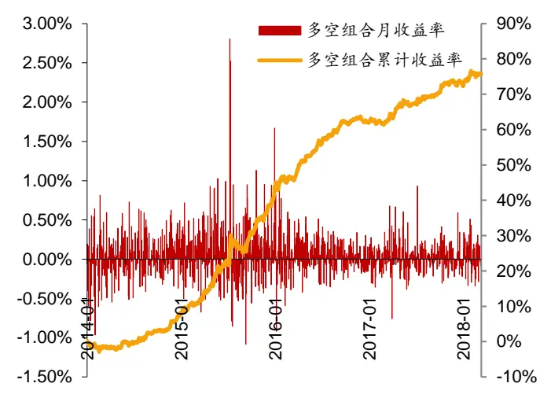
资料来源：Wind，华泰证券研究所

图表42： 不同市值区间 mfd_volinflowrate_open_m 分层组合绩效指标对比图（分十层）
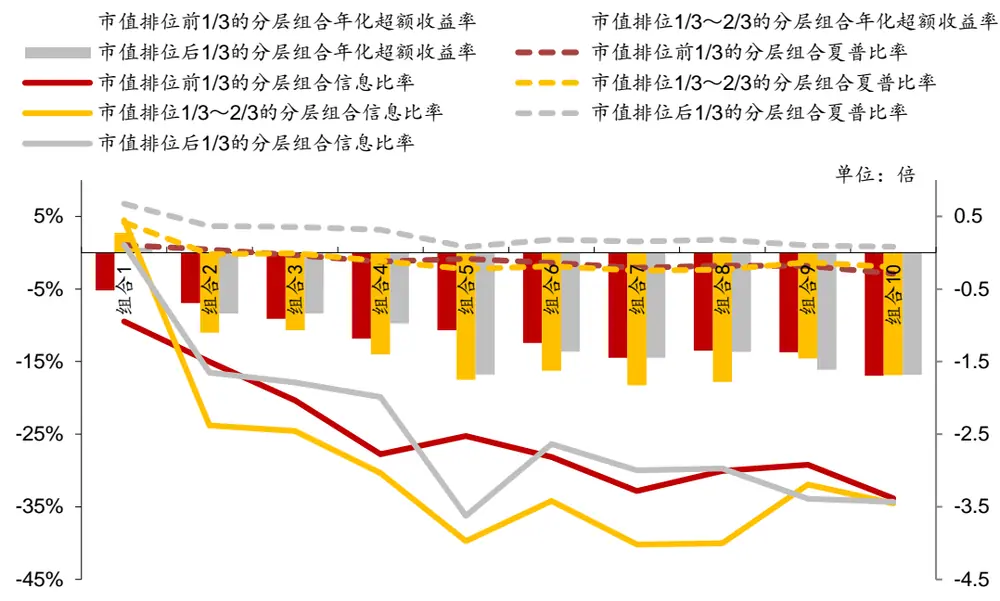
资料来源：Wind，华泰证券研究所

图表43： 不同行业 mfd_volinflowrate_open_m 因子分层组合绩效分析（分五层）

|  | 组合1年化 | 组合1 | 组合1 | 组合1超额收益 | 组合1相对 |  | 所有组合年化 |  |  |
| --- | --- | --- | --- | --- | --- | --- | --- | --- | --- |
| 行业 | 超额收益率 | 夏普比率 | 信息比率 | 最大回撤 | 基准月胜率 |  | 收益率排序 |  |  |
| 通信 | 10.04% | 0.80 | 0.80 | -12.02% | 49.27% | 1 | 2 3 |  | 5 |
| 房地产 | 4.91% | 0.78 | 0.63 | -7.42% | 50.73% | 1 | 2 3 | 4 | 5 |
| 餐饮旅游 | 3.99% | 0.63 | 0.26 | -23.64% | 48.39% | 1 | 2 3 | 4 | 5 |
| 综合 | 3.84% | 0.48 | 0.27 | -19.67% | 47.52% | 1 | 4 2 | 3 | 5 |
| 钢铁 | 3.41% | 0.67 | 0.30 | -21.93% | 49.37% | 1 | 4 3 | 2 | 5 |
| 传媒 | 3.37% | 0.63 | 0.29 | -18.00% | 47.61% | 1 | 2 4 | 3 | 5 |
| 建材 | 2.53% | 0.27 | 0.21 | -20.90% | 48.69% | 1 | 2 3 | 4 | 5 |
| 商贸零售 | 2.16% | 0.69 | 0.20 | -21.83% | 47.32% | 1 | 2 4 | 3 | 5 |
| 纺织服装 | 1.77% | 0.42 | 0.20 | -11.32% | 48.10% | 1 | 2 5 | 3 | 4 |
| 食品饮料 | 1.45% | 0.49 | 0.15 | -19.73% | 49.46% | 1 | 3 2 | 5 | 4 |
| 机械 | 1.03% | 0.46 | 0.10 | -16.84% | 47.71% | 1 | 3 2 | 5 | 4 |
| 农林牧渔 | 0.14% | 0.42 | 0.02 | -12.43% | 46.93% | 1 | 2 4 | 3 | 5 |
| 计算机 | -0.21% | 0.42 | -0.02 | -33.62% | 47.42% | 1 | 4 2 | 3 | 5 |
| 有色金属 | -0.24% | 0.38 | -0.02 | -19.72% | 44.99% | 1 | 3 2 | 5 | 4 |
| 医药 | -0.25% | 0.54 | -0.04 | -13.09% | 49.27% | 1 | 2 3 | 4 | 5 |
| 电力设备 | -0.37% | 0.36 | -0.04 | -15.03% | 47.13% | 1 | 3 2 | 4 | 5 |
| 基础化工 | -0.46% | 0.48 | -0.05 | -20.85% | 47.91% | 1 | 2 4 | 3 | 5 |
| 交通运输 | -0.71% | 0.30 | -0.10 | -13.22% | 48.98% | 1 | 2 3 | 5 | 4 |
| 电子元器件 | -2.04% | 0.52 | -0.21 | -25.58% | 47.03% | 1 | 3 | 2 | 4 |
| 银行 | -2.17% | 0.41 | -0.27 | -15.25% | 47.13% | 1 | 2 4 | 5 | 3 |
| 轻工制造 | -3.30% | 0.12 | -0.28 | -30.98% | 49.27% | 1 | 3 4 | 2 | 5 |
| 煤炭 | -3.43% | 0.36 | -0.29 | -22.58% | 46.06% | 2 | 1 3 | 5 | 4 |
| 非银行金融 | -4.19% | 0.20 | -0.32 | -35.31% | 44.89% | 2 | 1 4 | 3 | 5 |
| 国防军工 | -4.47% | 0.13 | -0.37 | -32.53% | 45.47% |  | 1 5 4 | 2 | 3 |
| 电力及公用事业 | -7.10% | 0.08 | -0.91 | -28.27% | 44.21% |  | 2 4 | 3 | 5 |
| 建筑 | -8.80% | 0.24 | -0.75 | -39.84% | 45.76% |  | 5 4 2 | 1 | 3 |
| 石油石化 | -9.24% | 0.06 | -0.69 | -32.04% | 46.06% |  | 3 2 5 | 1 | 4 |
| 汽车 | -9.33% | 0.27 | -1.11 | -36.41% | 46.25% |  | 3 2 4 | 1 | 5 |
| 家电 | -11.07% | 0.22 | -0.93 | -43.50% |  | 44.69% | 3 4 2 | 1 | 5 |

资料来源：Wind，华泰证券研究所

## 净主动买入因子

该类因子的定义为与当前交易日净主动买入相关的指标，包括净主动买入额、净主动买入量、净主动买入额（全单）、净主动买入率（金额）、净主动买入额占比、净主动买入量（全单）、净主动买入率（量）、净主动买入量占比，注意净主动买入类因子为反向因子（回测因子值为原因子值乘以-1）。

图表44： 净主动买入因子回归法、IC值分析

| 因子收益率 |  |  |  |  | 因子收益率 序列t检验 | IC 序列 | IC 序列 |  |  |
| --- | --- | --- | --- | --- | --- | --- | --- | --- | --- |
| 因子 | It\|均值 | \|t\|>2 占比 | t 均值/t 标准差 | 均值 |  |  | 均值 | 标准差 | IR 比率 IC>0 占比 |
| mfd_netbuyamt | 2.38 | 48.39% | -0.23 | -0.07% | -5.92 | -1.13% | 4.51% | 0.25 | 38.85% |
| mfd_netbuyvol | 2.12 | 41.97% | -0.20 | -0.05% | -4.97 | -0.77% | 4.16% | 0.19 | 40.41% |
| mfd_netbuyamt_a | 2.28 | 47.03% | -0.04 | 0.00% | -0.10 | 0.41% | 4.65% | 0.09 | 52.58% |
| mfd_netbuyvol_a | 2.09 | 43.91% | -0.07 | -0.01% | -0.84 | 0.31% | 4.21% | 0.07 | 50.83% |
| mf_amt | 2.57 | 50.63% | 0.03 | 0.01% | 1.04 | 0.46% | 4.79% | 0.10 | 53.46% |
| mf_amt_ratio | 4.09 | 68.35% | 0.67 | 0.62% | 18.29 | 5.03% | 7.83% | 0.64 | 75.07% |
| mfd_inflowproportion_a | 2.73 | 53.36% | 0.07 | 0.05% | 1.65 | 0.97% | 6.22% | 0.16 | 54.72% |
| mf_vol | 2.39 | 48.88% | -0.04 | -0.01% | -0.60 | 0.16% | 4.32% | 0.04 | 50.15% |
| mfd_volinflowrate_a | 4.09 | 68.45% | 0.67 | 0.62% | 18.26 | 5.02% | 7.83% | 0.64 | 75.17% |
| mf_vol_ratio | 2.74 | 53.75% | 0.07 | 0.04% | 1.51 | 0.93% | 6.17% | 0.15 | 53.94% |

资料来源：Wind，华泰证券研究所

观察发现净主动买入类因子的 IC 值与 t值均较低，反映模型整体线性拟合优度较差，被测单因子对模型的解释能力不显著，因此该类因子被我们定义为无效因子，后续步骤略过。

## 开盘净主动买入因子

该类因子的定义为与当前交易日开盘净主动买入相关的指标，包括开盘净主动买入额、开盘净主动买入率（金额）、开盘净主动买入额占比、开盘净主动买入量、开盘净主动买入率（量）、开盘净主动买入量占比，注意开盘净主动买入类因子为反向因子（回测因子值为原因子值乘以-1）。

图表45： 开盘净主动买入因子回归法、IC值分析

|  |  |  |  |  | 因子收益率 因子收益率 序列t检验 | IC 序列 均值 | IC 序列 标准差 | IR 比率 | IC>0 占比 |
| --- | --- | --- | --- | --- | --- | --- | --- | --- | --- |
| 因子 | It\|均值 | \|t\|>2 占比 | t 均值/t 标准差 | 均值 |  |  |  |  |  |
| mf_amt_open | 2.29 | 47.13% | -0.24 | -0.07% | -7.21 | -1.28% | 4.31% | 0.30 | 37.04% |
| mfd_inflowrate_open_a | 2.84 | 51.41% | 0.41 | 0.33% | 12.28 | 2.05% | 6.14% | 0.33 | 60.62% |
| mfd_inflowproportion_open_a | 2.19 | 45.47% | -0.23 | -0.16% | -7.10 | -1.49% | 5.35% | 0.28 | 36.35% |
| mfd_inflowvolume_open_a | 2.18 | 44.79% | -0.24 | -0.06% | -6.52 | -1.13% | 4.02% | 0.28 | 36.16% |
| mfd_volinflowrate_open_a | 2.83 | 51.41% | 0.41 | 0.33% | 12.24 | 2.04% | 6.14% | 0.33 | 60.43% |
| mfd_volinflowproportion_open_a | 2.24 | 46.64% | -0.23 | -0.16% | -7.09 | -1.50% | 5.18% | 0.29 | 35.28% |

资料来源：Wind，华泰证券研究所

观察发现开盘净主动买入类因子的 IC 值与 t 值均较低，反映模型整体线性拟合优度较差，被测单因子对模型的解释能力不显著，因此该类因子被我们定义为无效因子，后续步骤略过。

## 尾盘净主动买入因子

该类因子的定义为与当前交易日尾盘净主动买入相关的指标，包括尾盘净主动买入额、尾盘净主动买入率（金额）、尾盘净主动买入额占比、尾盘净主动买入量、尾盘净主动买入率（量）、尾盘净主动买入量占比，注意尾盘净主动买入类因子为反转因子（回测因子值为原因子值乘以-1）。

图表46： 尾盘净主动买入因子回归法、IC 值分析
因子收益率 因子收益率 IC序列 IC序列

| 因子 | It\|均值 | It>2 占比 | t 均值/t 标准差 | 均值 | 序列t检验 | 均值 | 标准差 | IR 比率 | IC>0 占比 |
| --- | --- | --- | --- | --- | --- | --- | --- | --- | --- |
| mf_amt_close | 2.59 | 51.90% | 0.28 | 0.08% | 7.40 | 2.18% | 4.26% | 0.51 | 69.66% |
| mfd_inflowrate_close_a | 2.54 | 50.83% | 0.67 | 0.34% | 18.47 | 3.49% | 4.64% | 0.75 | 79.51% |
| mfd_inflowproportion_close_a | 2.38 | 49.66% | 0.41 | 0.26% | 12.04 | 3.06% | 5.06% | 0.61 | 73.56% |
| mfd_inflowvolume_close_a | 2.31 | 48.39% | 0.20 | 0.05% | 4.73 | 1.57% | 3.83% | 0.41 | 65.46% |
| mfd_volinflowrate_close_a | 2.54 | 50.73% | 0.67 | 0.34% | 18.43 | 3.48% | 4.64% | 0.75 | 79.51% |
| mfd_volinflowproportion_close_a | 2.41 | 50.54% | 0.40 | 0.25% | 11.43 | 2.93% | 4.88% | 0.60 | 73.27% |

资料来源：Wind，华泰证券研究所

观察发现尾盘净主动买入类因子的 IC 值与 t 值均较低，反映模型整体线性拟合优度较差，被测单因子对模型的解释能力不显著，因此该类因子被我们定义为无效因子，后续步骤略过。

## 尾盘主力净流入因子

该类因子的定义为与当前交易日尾盘主力净流入相关的指标，包括尾盘主力净流入额、尾盘主力净流入率（金额）、尾盘主力净流入额占比、尾盘主力净流入量、尾盘主力净流入率（量）、尾盘主力净流入量占比。

图表47： 尾盘主力净流入因子回归法、IC值分析

|  |  |  |  |  | 因子收益率 因子收益率 | IC 序列 IC 序列 |  |  |  |
| --- | --- | --- | --- | --- | --- | --- | --- | --- | --- |
| 因子 | It\|均值 | Itl>2 占比 | t 均值/t 标准差 | 均值 |  | 序列t检验 | 均值 | 标准差 IR 比率 | IC>0 占比 |
| mfd_inflow_close_m | 2.52 | 48.20% | -0.05 | -0.01% | -0.85 | -0.57% | 4.28% | 0.13 | 46.24% |
| mfd_inflowrate_close_m | 2.12 | 39.34% | 0.02 | 0.08% | 3.75 | -0.80% | 4.69% | 0.17 | 40.59% |
| mfd_inflowproportion_close_m | 2.11 | 40.21% | -0.08 | -0.02% | -0.93 | -1.06% | 4.97% | 0.21 | 43.51% |
| mfd_buyvol_close_m | 2.22 | 44.11% | -0.02 | 0.00% | -0.30 | -0.45% | 3.74% | 0.12 | 46.34% |
| mfd_volinflowrate_close_m | 2.12 | 39.24% | 0.02 | 0.08% | 3.79 | -0.78% | 4.70% | 0.17 | 40.49% |
| mfd_volinflowproportion_close_m | 2.11 | 40.02% | -0.08 | -0.02% | -0.96 | -1.06% | 4.97% | 0.21 | 43.41% |

资料来源：Wind，华泰证券研究所

观察发现尾盘主力净流入类因子的 IC 值与 t 值均较低，反映模型整体线性拟合优度较差，被测单因子对模型的解释能力不显著，因此该类因子被我们定义为无效因子，后续步骤略过。

## 因子收益率和 IC值对比分析

上一节中，我们选择性展示了四个资金流向类因子分层回测的结果，本节我们将展示这四类因子中代表因子的因子收益率和 IC值对比分析。

值得注意的是，我们此处计算的因子IC值并不是因子原始暴露度和下期收益的相关系数，而是“经过市值和行业调整的”因子暴露度和下期收益的相关系数（具体计算方法详见第二章“单因子测试流程”的第二小节“因子 IC值的计算”），所以因子 IC值的计算结果和回归测试结果并不是完全一致的（回归模型中包含行业哑变量而不包含市值相关解释变量）。

图表 48中统一展示了 4个资金流向因子的回归测试结果。图表 49 和图表 50 展示了 4 个资金流向因子累积收益率曲线。

图表48： 4个资金流向因子回归测试结果对比展示

| 因子 | It\|均值 | \|tl>2 占比 | t 均值/t 标准差 | 因子收益率均值因子收益率序列t检验 |  |
| --- | --- | --- | --- | --- | --- |
| mfd_buyord | 4.01 | 70.11% | 0.32 | 0.18% | 10.71 |
| mfd_sellord | 4.52 | 74.49% | 0.41 | 0.24% | 12.52 |
| mfd_volinflowrate_m | 4.42 | 66.99% | 0.72 | 0.75% | 17.8 |
| mfd_volinflowrate_open_m | 4.38 | 67.87% | 0.96 | 0.88% | 21.71 |

资料来源：Wind，华泰证券研究所

图表49： 资金流向因子累积收益率展示一（回归法）
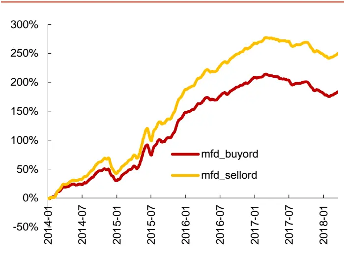
资料来源：Wind，华泰证券研究所

图表50： 资金流向因子累积收益率展示二（回归法）
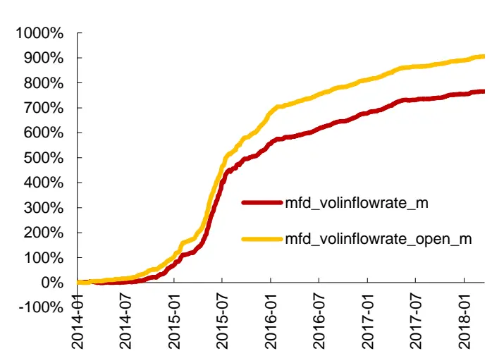
资料来源：Wind，华泰证券研究所

图表 51中统一展示了 4个资金流向因子的 IC 测试结果。图表 52 和图表 53展示了 4 个资金流向因子累积 IC 值曲线。

图表51： 4个资金流向因子 IC值对比分析

| 因子 | IC 序列均值 | IC 序列标准差 | IR 比率 | IC>0 占比 |
| --- | --- | --- | --- | --- |
| mfd_buyord | 3.35% | 5.76% | 0.58 | 72.64% |
| mfd_sellord | 4.67% | 6.74% | 0.69 | 75.66% |
| mfd_volinflowrate_m | 3.93% | 7.91% | 0.5 | 69.72% |
| mfd_volinflowrate_open_m | 5.51% | 7.09% | 0.78 | 81.05% |

资料来源：Wind，华泰证券研究所

图表52： 资金流向因子 IC值累积曲线展示一
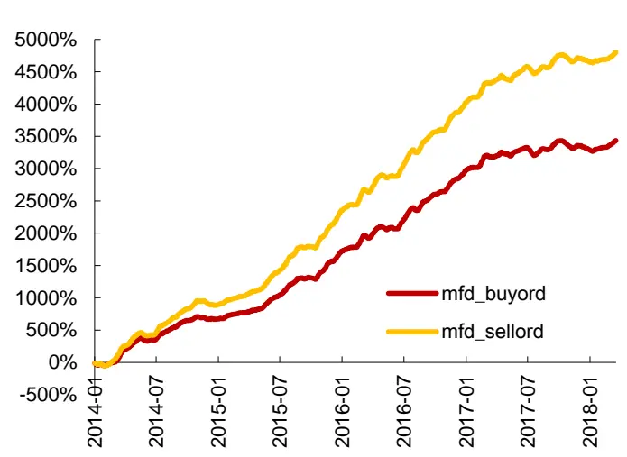
资料来源：Wind，华泰证券研究所

图表53： 资金流向因子 IC值累积曲线展示二
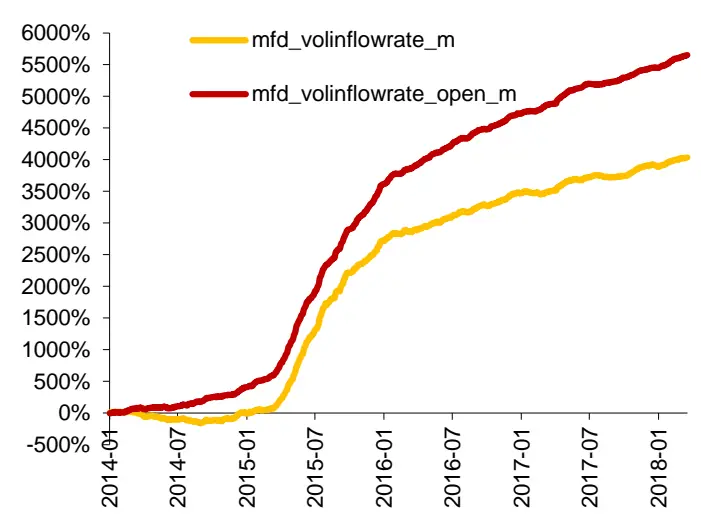
资料来源：Wind，华泰证券研究所

从上面的图表可以看出，流入类因子 mfd_buyord（主力流入单数）与流出类因子mfd_sellord（主力流出单数）在 2017 年之前表现较好，2017 年之后回撤较大，mfd_sellord的表现要比 mfd_buyord 更好；主力净流入类因子 mfd_volinflowrate_m（主力净流入率）与开盘主力净流入类因子 mfd_volinflowrate_open_m（开盘主力净流入率）表现比较平稳，2015年牛市期间因子收益率和IC值较大。取假设检验H:因子收益率序列均值显著异于0。则假设检验 H 对应的 t 值在图表 48 最后一列，所有列举出的四个资金流向因子都明显通过该假设检验。

## 资金流向因子与传统量价因子的对比

同样作为市场交易类数据，资金流向因子与换手率、动量反转、波动率类因子间可能存在一定的关系。我们首先通过回归测试和 IC 值测试对比传统价量因子和资金流向因子。接下来，为了考察资金流向因子带来的增量信息，我们分别对三类量价因子做回归，取残差进行后续测试。

## 回归测试和 IC值测试

图表 55 和图表 56 分别展示了资金流向因子和三种传统量价因子的回归测试结果和 IC 值测试结果（持仓周期为 10 个交易日）。因子说明如下：

图表54： 传统量价因子说明

| 类别 | 具体因子 因子描述 |  |
| --- | --- | --- |
| 波动率 std_Nd |  | 个股最近N日的日收益率序列标准差 |
|  | 动量反转return_Nd | 个股最近N日收益率 |
|  | 动量反转wgt_return_Nd | 个股最近N日用每日换手率乘以每日收益率求算术平均值 |
|  |  | 动量反转 exp_wgt_return_Nd个股最近 N 日用每日换手率乘以函数 exp(-x_i/N/4)再乘以每日收益率求算术平 |
| 换手率 turn_Nd |  | 均值，x_i为该日距离截面日的交易日的个数 个股最近N日内日均换手率（剔除停牌、涨跌停的交易日） |
|  | 换手率 bias_turn_Nd | 个股最近N日内日均换手率除以最近120日内日均换手率（剔除停牌、涨跌停的 |

资料来源：Wind，华泰证券研究所

图表55： 资金流向因子与传统价量因子回归测试结果对比展示

| 因子 | It\|均值 | \|tl>2 占比 | t 均值/t 标准差 | 因子收益率均值因子收益率序列t检验 |  |
| --- | --- | --- | --- | --- | --- |
| std_5d | 6.48 | 76.24% | -0.02 | -0.13% | -2.10 |
| std_10d | 7.11 | 78.19% | -0.02 | -0.13% | -1.99 |
| std_20d | 7.47 | 80.33% | -0.05 | -0.21% | -2.97 |
| std_60d | 6.99 | 80.23% | -0.15 | -0.36% | -5.45 |
| return_5d | 5.03 | 70.40% | 0.09 | 0.11% | 2.41 |
| return_10d | 5.14 | 71.08% | -0.03 | -0.03% | -0.66 |
| return_20d | 5.43 | 73.42% | -0.28 | -0.37% | -8.10 |
| return_60d | 5.44 | 74.78% | -0.35 | -0.40% | -11.04 |
| wgt_return_5d | 3.62 | 61.83% | -0.32 | -0.34% | -7.92 |
| wgt_return_10d | 4.00 | 66.11% | -0.36 | -0.44% | -9.50 |
| wgt_return_20d | 4.32 | 68.74% | -0.52 | -0.62% | -13.47 |
| wgt_return_60d | 3.86 | 66.50% | -0.51 | -0.53% | -14.56 |
| exp_wgt_return_5d | 3.62 | 61.73% | -0.32 | -0.33% | -7.84 |
| exp_wgt_return_10d | 4.00 | 65.53% | -0.36 | -0.43% | -9.40 |
| exp_wgt_return_20d | 4.30 | 68.84% | -0.51 | -0.61% | -13.27 |
| exp_wgt_return_60d | 3.86 | 66.41% | -0.51 | -0.53% | -14.27 |
| turn_5d | 5.59 | 78.19% | -0.43 | -0.63% | -12.69 |
| turn_10d | 5.59 | 77.80% | -0.42 | -0.64% | -12.75 |
| turn_20d | 5.69 | 77.99% | -0.40 | -0.63% | -12.37 |
| turn_60d | 5.71 | 78.38% | -0.32 | -0.53% | -9.97 |
| bias_turn_5d | 4.03 | 66.60% | -0.37 | -0.27% | -10.50 |
| bias_turn_10d | 4.07 | 67.77% | -0.33 | -0.25% | -9.64 |
| bias_turn_20d | 3.88 | 64.56% | -0.34 | -0.26% | -10.23 |
| bias_turn_60d | 3.02 | 54.33% | -0.25 | -0.13% | -6.40 |
| mfd_buyord | 4.01 | 70.11% | 0.32 | 0.18% | 10.71 |
| mfd_sellord | 4.52 | 74.49% | 0.41 | 0.24% | 12.52 |
| mfd_volinflowrate_m | 4.42 | 66.99% | 0.72 | 0.75% | 17.8 |
| mfd_volinflowrate_open_m | 4.38 | 67.87% | 0.96 | 0.88% | 21.71 |

资料来源：Wind，华泰证券研究所

图表56： 资金流向因子与传统价量因子 IC值测试结果对比展示

| 因子 | IC 序列均值 | IC 序列标准差 | IR 比率 | IC>0 占比 |
| --- | --- | --- | --- | --- |
| std_5d | -1.62% | 16.03% | 0.10 | 42.26% |
| std_10d | -1.89% | 17.71% | 0.11 | 41.09% |
| std_20d | -2.17% | 18.40% | 0.12 | 41.29% |
| std_60d | -2.06% | 17.02% | 0.12 | 41.48% |
| return_5d | -2.76% | 11.47% | 0.24 | 42.16% |
| return_10d | -3.49% | 12.22% | 0.29 | 40.31% |
| return_20d | -5.83% | 12.50% | 0.47 | 33.11% |
| return_60d | -6.53% | 12.42% | 0.53 | 29.41% |
| wgt_return_5d | -4.49% | 8.47% | 0.53 | 29.41% |
| wgt_return_10d | -5.43% | 9.22% | 0.59 | 26.87% |
| wgt_return_20d | -7.31% | 9.16% | 0.80 | 19.96% |
| wgt_return_60d | -6.85% | 8.15% | 0.84 | 20.16% |
| exp_wgt_return_5d | -4.47% | 8.48% | 0.53 | 29.21% |
| exp_wgt_return_10d | -5.46% | 9.24% | 0.59 | 27.07% |
| exp_wgt_return_20d | -7.35% | 9.24% | 0.79 | 20.06% |
| exp_wgt_return_60d | -7.08% | 8.33% | 0.85 | 19.86% |
| turn_5d | -7.67% | 8.93% | 0.86 | 19.08% |
| turn_10d | -7.25% | 8.94% | 0.81 | 20.06% |
| turn_20d | -6.65% | 8.99% | 0.74 | 22.88% |
| turn_60d | -4.82% | 8.86% | 0.54 | 30.19% |
| bias_turn_5d | -6.24% | 8.01% | 0.78 | 19.96% |
| bias_turn_10d | -5.79% | 7.90% | 0.73 | 21.91% |
| bias_turn_20d | -5.17% | 7.53% | 0.69 | 23.86% |
| bias_turn_60d | -2.84% | 6.13% | 0.46 | 32.62% |
| mfd_buyord | 3.35% | 5.76% | 0.58 | 72.64% |
| mfd_sellord | 4.67% | 6.74% | 0.69 | 75.66% |
| mfd_volinflowrate_m mfd_volinflowrate_open_m | 3.93% | 7.91% | 0.5 | 69.72% |
|  | 5.51% | 7.09% | 0.78 | 81.05% |

资料来源：Wind，华泰证券研究所

可以看出在较短的持仓周期内（10个交易日），波动率因子和部分动量反转因子在回归测试和 IC测试上的表现不如资金流向因子，换手率因子的表现与资金流向因子相近。

## 因子残差分层测试与回归分析

接下来，为了考察资金流向因子带来的增量信息，我们将资金流向因子分别对三类量价因子做回归，取残差进行后续测试。由于回归方程中的被解释项资金流向因子是日频因子，作为解释项的三类量价因子也必须为日频数据。参考《华泰单因子测试之换手率类因子》和《华泰单因子测试之波动率类因子》以及本文中图表 55、图表 56 展示的结果，我们选取了 5 日平均换手率（turnover）、20 日动量反转（return）、20 日波动率（std）作为量价因子的代表。

## 流入因子

mfd_buyord：主力流入单数因子。

mfd_buyord_turnover：主力流入单数因子与换手率因子回归取残差所得因子。

mfd_buyord_return：主力流入单数因子与动量因子回归取残差所得因子。

mfd_buyord_std：主力流入单数因子与波动率因子回归取残差所得因子。

从分层回测结果看，mfd_buyord 因子对于三类量价因子残差的表现均差于原 mfd_buyord因子，其中对换手率残差的表现差异最大，说明该因子包含了较多换手率的信息，这也和流入类因子的市场意义相一致。从回归法结果看，三类残差的回归结果与原因子相差不大，说明 mfd_buyord 因子相对量价因子存在一定的增量信息。

图表57： 流入因子对量价因子残差回归法、IC值分析

|  |  |  |  | 因子收益率 | 因子收益率 序列t检验 | IC 序列 均值 | IC 序列 | IC 大于 0 占比 |  |
| --- | --- | --- | --- | --- | --- | --- | --- | --- | --- |
| 因子 | It\|均值 | \|tl>2 占比 | 均值 |  |  |  |  | 标准差 IR 比率 |  |
| mfd_buyord | 4.01 | 70.11% | 0.32 | 0.18% | 10.71 | 3.35% | 5.76% | 0.58 | 72.64% |
| mfd_buyord_turnover | 3.94 | 69.91% | 0.27 | 0.14% | 8.54 | 2.64% | 5.35% | 0.49 | 70.40% |
| mfd_buyord_return | 3.83 | 68.35% | 0.28 | 0.15% | 9.16 | 2.67% | 5.61% | 0.48 | 69.04% |
| mfd_buyord_std | 3.92 | 69.13% | 0.31 | 0.17% | 9.99 | 3.23% | 5.71% | 0.57 | 72.54% |

资料来源：Wind，华泰证券研究所

图表58： 流入因子对量价因子残差分层测试法（分五层）

|  | TOP 组合 年化收益率 | TOP 组合 年化波动率 | TOP 组合 夏普比率 | TOP 组合 最大回撤 | 多空组合 年化收益率 | 多空组合 年化波动率 | 多空组合 夏普比率 | 多空组合 最大回撤 |
| --- | --- | --- | --- | --- | --- | --- | --- | --- |
| 因子 mfd_buyord | 24.18% | 35.77% | 0.68 | -55.08% | 27.56% | 7.80% | 3.53 | -15.78% |
| mfd_buyord_turnover | 15.16% | 36.40% | 0.42 | -56.36% | 18.92% | 7.77% | 2.43 | -19.81% |
| mfd_buyord_return | 17.56% | 35.41% | 0.50 | -56.16% | 19.83% | 6.88% | 2.88 | -15.98% |
| mfd_buyord_std | 19.62% | 36.03% | 0.54 | -55.00% | 23.33% | 7.89% | 2.96 | -20.27% |

资料来源：Wind，华泰证券研究所

图表59： 流入因子对量价因子残差 TOP组合回测净值
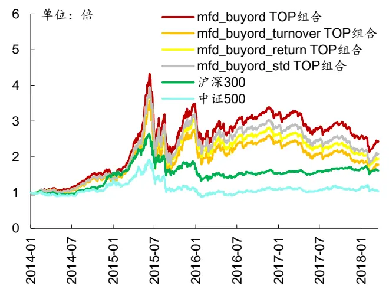
资料来源：Wind，华泰证券研究所

图表60： 流入因子对量价因子残差多空组合回测净值
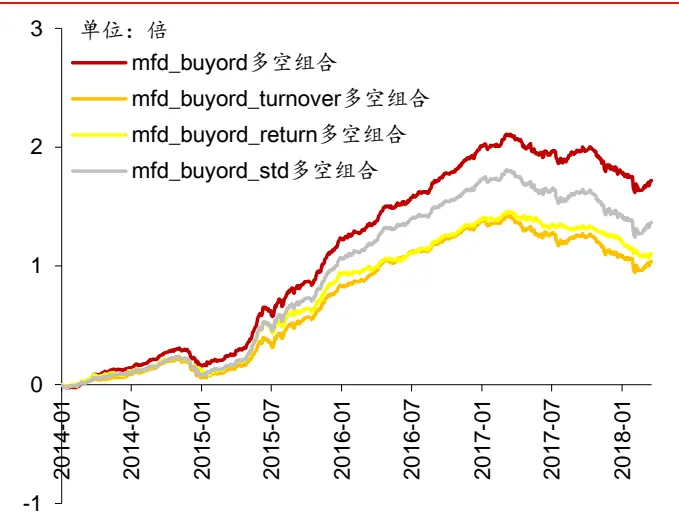
资料来源：Wind，华泰证券研究所

## 流出因子

mfd_sellord：主力流出单数因子。

mfd_sellord_turnover：主力流出单数因子与换手率因子回归取残差所得因子。

mfd_sellord_return：主力流出单数因子与动量因子回归取残差所得因子。

mfd_sellord_std：主力流出单数因子与波动率因子回归取残差所得因子。

从分层回测结果看，mfd_sellord 因子对于三类量价因子残差的表现均差于原 mfd_sellord因子，其中对动量残差的表现差异最大。从回归法结果看， 三类残差的回归结果与原因子相差不大，说明 mfd_sellord 因子相对量价因子存在一定的增量信息。

图表61： 流出因子对量价因子残差回归法、IC值分析

| 因子 | t均值 It 标准差 |  |  | 因子收益率 | 因子收益率 序列t检验 | IC 序列 均值 | IC 序列 | IC 大于 0 |  |
| --- | --- | --- | --- | --- | --- | --- | --- | --- | --- |
|  | It\|均值 | \|t\|>2 占比 | 均值 |  |  |  |  | 标准差 IR 比率 | 占比 |
| mfd_sellord | 4.52 | 74.49% | 0.41 | 0.24% | 12.52 | 4.67% | 6.74% | 0.69 | 75.66% |
| mfd_sellord_turnover | 4.60 | 75.75% | 0.34 | 0.20% | 10.23 | 3.91% | 6.19% | 0.63 | 74.49% |
| mfd_sellord_return | 4.43 | 73.90% | 0.36 | 0.21% | 11.11 | 3.96% | 6.59% | 0.60 | 70.79% |
| mfd_sellord_std | 4.57 | 74.78% | 0.37 | 0.22% | 11.41 | 4.53% | 6.61% | 0.69 | 75.85% |

图表62： 流出因子对量价因子残差分层测试法（分五层）

| 因子 | TOP 组合 年化收益率 | TOP 组合 年化波动率 | TOP 组合 夏普比率 | TOP 组合 最大回撤 | 多空组合 年化收益率 | 多空组合 年化波动率 | 多空组合 夏普比率 | 多空组合 最大回撤 |
| --- | --- | --- | --- | --- | --- | --- | --- | --- |
| mfd_sellord | 32.02% | 34.95% | 0.92 | -53.48% | 42.12% | 9.51% | 4.43 | -16.45% |
| mfd_sellord_turnover | 27.27% | 35.83% | 0.76 | -54.51% | 36.42% | 9.60% | 3.79 | -19.87% |
| mfd_sellord_return | 26.52% | 34.67% | 0.76 | -54.79% | 34.98% | 8.42% | 4.15 | -14.57% |
| mfd_sellord_std | 29.75% | 35.31% | 0.84 | -53.69% | 39.55% | 9.57% | 4.13 | -18.70% |

资料来源：Wind，华泰证券研究所

图表63： 流出因子对量价因子残差 TOP组合回测净值
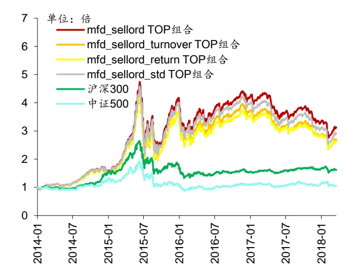
资料来源：Wind，华泰证券研究所

图表64： 流出因子对量价因子残差多空组合回测净值
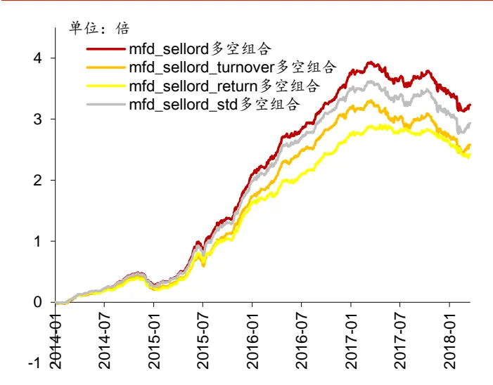
资料来源：Wind，华泰证券研究所

## 主力净流入因子

mfd_volinflowrate_m：主力净流入率因子。

mfd_volinflowrate_m_turnover：主力净流入率因子与换手率因子回归取残差所得因子。
mfd_volinflowrate_m_return：主力净流入率因子与动量因子回归取残差所得因子。
mfd_volinflowrate_m_std：主力净流入率因子与波动率因子回归取残差所得因子。

从分层回测结果看，mfd_volinflowrate_m 因子对动量及波动率因子的残差与原因子表现相差不大，说明 mfd_volinflowrate_m 因子与动量及波动率因子不存在较大关系；对换手率因子残差的表现则远不如原因子。回归法的结果与分层回测结果相一致。

图表65： 主力净流入因子对量价因子残差回归法、IC值分析

|  |  |  | t均值 I/t标准差 | 因子收益率 均值 | 因子收益率 序列t检验 | IC 序列 均值 | IC 序列 标准差 | IR 比率 | IC 大于 0 占比 |
| --- | --- | --- | --- | --- | --- | --- | --- | --- | --- |
| 因子 | It\|均值 | \|t>2 占比 |  |  |  |  |  |  |  |
| mfd_volinflowrate_m | 4.42 | 66.99% | 0.72 | 0.75% | 17.80 | 3.93% | 7.91% | 0.50 | 69.72% |
| mfd_volinflowrate_m_turnover | 3.12 | 56.77% | 0.40 | 0.32% | 10.92 | 1.25% | 6.08% | 0.21 | 59.01% |
| mfd_volinflowrate_m_return | 3.65 | 59.49% | 0.57 | 0.51% | 15.43 | 4.25% | 7.69% | 0.55 | 71.47% |
| mfd_volinflowrate_m_std | 4.31 | 66.11% | 0.70 | 0.71% | 17.46 | 3.89% | 7.89% | 0.49 | 69.62% |

图表66： 主力净流入因子对量价因子残差分层测试法（分五层）

|  | TOP 组合 年化收益率 | TOP 组合 年化波动率 | TOP 组合 夏普比率 | TOP 组合 最大回撤 | 多空组合 年化收益率 | 多空组合 年化波动率 | 多空组合 夏普比率 | 多空组合 最大回撤 |
| --- | --- | --- | --- | --- | --- | --- | --- | --- |
| 因子 mfd_volinflowrate_m | 13.01% | 34.81% | 0.37 | -57.59% | 12.21% | 6.08% | 2.01 | -4.47% |
| mfd_volinflowrate_m_turnover | 9.28% | 34.88% | 0.27 | -60.16% | 7.64% | 5.89% | 1.3 | -6.39% |
| mfd_volinflowrate_m_return | 13.51% | 34.77% | 0.39 | -57.13% | 12.91% | 5.90% | 2.19 | -4.44% |
| mfd_volinflowrate_m_std | 12.87% | 34.83% | 0.37 | -57.91% | 11.96% | 6.07% | 1.97 | -4.77% |

资料来源：Wind，华泰证券研究所

图表67： 主力净流入因子对量价因子残差 TOP组合回测净值
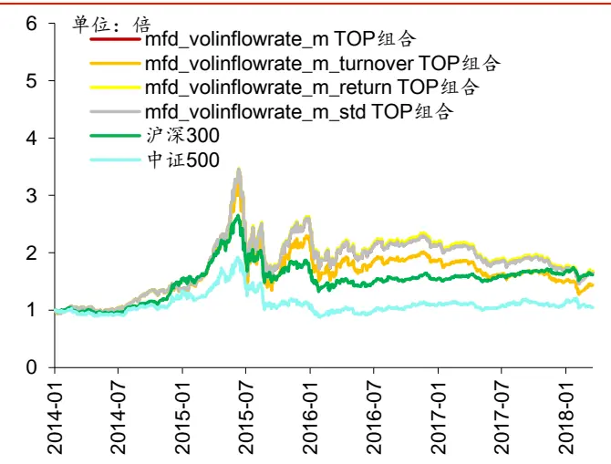
资料来源：Wind，华泰证券研究所

图表68： 主力净流入因子对量价因子残差多空组合回测净值
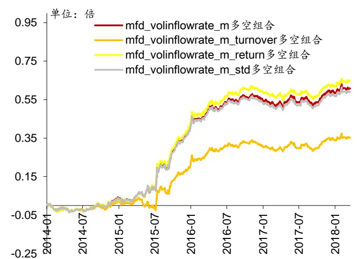
资料来源：Wind，华泰证券研究所

## 开盘主力净流入因子

mfd_volinflowrate_open_m：开盘主力净流入率因子。

mfd_volinflowrate_open_m_turnover：开盘主力净流入率因子与换手率因子回归取残差所得因子。

mfd_volinflowrate_open_m_return：开盘主力净流入率因子与动量因子回归取残差所得因子。

mfd_volinflowrate_open_m_std：开盘主力净流入率因子与波动率因子回归取残差所得因子。

从分层回测结果看，mfd_volinflowrate_open_m 因子对动量及波动率因子的残差与原因子表现相差不大，说明 mfd_volinflowrate_open_m 因子与动量及波动率因子不存在较大关系；对换手率因子残差的表现则远不如原因子。回归法的结果与分层回测结果相一致。

图表69： 开盘主力净流入因子对量价因子残差回归法、IC值分析

|  |  |  | t均值 | 因子收益率 | 因子收益率 序列t检验 | IC 序列 IC 序列 均值 |  |  | IC 大于 0 占比 |
| --- | --- | --- | --- | --- | --- | --- | --- | --- | --- |
|  | It\|均值 | It\|>2 占比 /t 标准差 |  |  |  |  | 均值 | 标准差 IR 比率 |  |
| mfd_volinflowrate_open_m | 4.41 | 67.48% | 0.96 | 0.88% | 21.67 | 5.52% | 7.17% | 0.77 | 80.76% |
| mfd_volinflowrate_open_m_turnover | 2.57 | 49.07% | 0.65 | 0.37% | 15.01 | 2.60% | 4.87% | 0.53 | 71.58% |
| mfd_volinflowrate_open_m_return | 3.66 | 58.23% | 0.84 | 0.65% | 20.43 | 5.71% | 7.14% | 0.80 | 81.93% |
| mfd_volinflowrate_open_m_std | 4.36 | 67.09% | 0.95 | 0.86% | 21.60 | 5.48% | 7.15% | 0.77 | 80.57% |

图表70： 开盘主力净流入因子对量价因子残差分层测试法（分五层）

| 因子 | TOP 组合 年化收益率 | TOP 组合 年化波动率 | TOP 组合 夏普比率 | TOP 组合 最大回撤 | 多空组合 年化收益率 | 多空组合 年化波动率 | 多空组合 夏普比率 | 多空组合 最大回撤 |
| --- | --- | --- | --- | --- | --- | --- | --- | --- |
| mfd_volinflowrate_open_m | 16.06% | 34.81% | 0.46 | -56.47% | 14.71% | 4.72% | 3.12 | -3.79% |
| mfd_volinflowrate_open_m_turnover | 11.15% | 34.97% | 0.32 | -58.99% | 8.70% | 4.39% | 1.98 | -4.68% |
| mfd_volinflowrate_open_m_return | 16.48% | 34.79% | 0.47 | -56.37% | 15.66% | 4.62% | 3.39 | -3.27% |
| mfd_volinflowrate_open_m_std | 15.61% | 34.88% | 0.45 | -56.68% | 13.96% | 4.71% | 2.96 | -3.85% |

资料来源：Wind，华泰证券研究所

图表71： 开盘主力净流入因子对量价因子残差 TOP组合回测净值
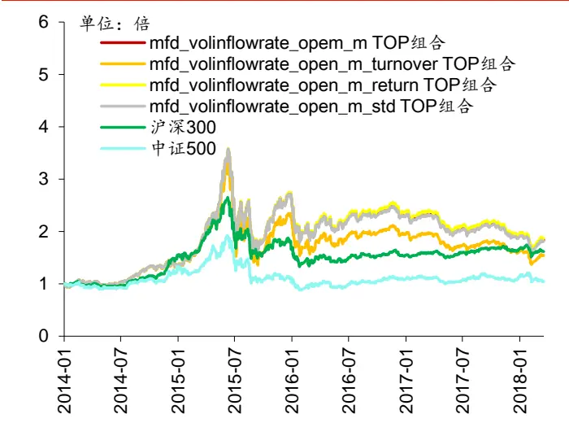
资料来源：Wind，华泰证券研究所

图表72： 开盘主力净流入因子对量价因子残差多空组合回测净值
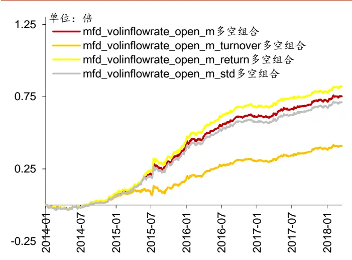
资料来源：Wind，华泰证券研究所

## 总结和展望

1. 本文通过对资金流向因子进行相关强度分析并结合因子的定义，将Wind五十个资金流向因子分为八类，分别为流入类、流出类、主动净买入类、开盘主动净买入类、尾盘主动净买入类、主力净流入类、开盘主力净流入类以及尾盘主力净流入类，类内因子相关强度较高，类间因子相关强度较低。本文对八类因子进行单因子测试，发现其中四类因子（流入类因子、流出类因子、主力净流入类因子、开盘主力净流入类因子）在选股上存在一定的实用性。

2. 本文挑选了四类因子中 t值、IC值、因子收益率较高的因子（主力流入单数 mfd_buyord、主力流出单数 mfd_sellord、主力净流入率 mfd_volinflowrate_m、开盘主力净流入率mfd_volinflowrate_open_m）作为代表因子，并进行分层测试。2014 年 1 月至 2018 年 3月，在持仓时间为 10 个交易日的情况下，mfd_buyord（主力流入单数）和 mfd_sellord（主力流出单数）在 2017年之前表现不错，mfd_buyord的多空组合年化收益率为 27.56%，夏普比率为 3.53；mfd_sellord 的多空组合年化收益率为 42.12%，夏普比率为 4.43；mfd_volinflowrate_m（主力净流入率）的多空组合年化收益率为12.25%，夏普比率为2.02；mfd_volinflowrate_open_m（开盘主力净流入率）的多空组合年化收益率为 14.71%，夏普比率为 3.12。

3. 本文对四个资金流向代表因子进行了回归法分析和 IC 值分析。2014 年 1 月至 2018 年3 月，在持仓时间为 10 个交易日的情况下，mfd_buyord 因子收益率均值为 0.18%，|t|>2占比为 70.11%，IR 比率为 0.58，IC>0 占比为 72.64%；mfd_sellord 因子收益率均值为0.24%, |t|>2 占比为 74.49%，IR 比率为 0.69，IC>0 占比为 75.66%；mfd_volinflowrate_m因子收益率均值为 0.75%, |t|>2 占比为 66.99%，IR 比率为 0.5，IC>0 占比为 69.72%；mfd_volinflowrate_open_m 因子收益率均值为 0.88%, |t|>2 占比为 67.87%，IR 比率为0.78，IC>0 占比为 81.05%。

4. 本文将四个资金流向代表因子和三类传统价量因子（动量、换手率、波动率）进行对比。在持仓时间为 10 个交易日的情况下，动量、波动率类因子在 t 检验以及因子收益率上表现不如资金流向因子，换手率因子的表现与资金流向因子相近。本文随后将四个资金流向代表因子对三类量价因子做残差分析，其中换手率因子对四个代表因子影响均较大，动量因子对流入和流出因子影响较大，波动率因子则对四个代表因子影响均较小。在剔除了三类量价因子的后，资金流向因子仍然具有传统量价因子中没有的增量信息。

5. 资金流向因子通过委托流数据构建，委托流数据依然有很大的挖掘价值，本文是一个初步探索，后续计划开展以下工作：（1）对资金流向因子的持仓时间进行更多测试（不限于持仓 10 个交易日）。（2）析表现较好的资金流向因子（如 mfd_sellord）对委托流数据的使用逻辑，借助机器学习和海量数据处理的手段，对委托流数据进行深度挖掘，以求找到更加稳健的 Alpha 因子。

## 风险提示

单因子测试结果是历史经验的总结，如果市场规律改变，存在失效的可能。资金流向因子持仓时间较短，使用不当可能会造成过高换手率和交易成本。

## 免责申明

本报告仅供华泰证券股份有限公司（以下简称“本公司”）客户使用。本公司不因接收人收到本报告而视其为客户。

本报告基于本公司认为可靠的、已公开的信息编制，但本公司对该等信息的准确性及完整性不作任何保证。本报告所载的意见、评估及预测仅反映报告发布当日的观点和判断。在不同时期，本公司可能会发出与本报告所载意见、评估及预测不一致的研究报告。同时，本报告所指的证券或投资标的的价格、价值及投资收入可能会波动。本公司不保证本报告所含信息保持在最新状态。本公司对本报告所含信息可在不发出通知的情形下做出修改，投资者应当自行关注相应的更新或修改。

本公司力求报告内容客观、公正，但本报告所载的观点、结论和建议仅供参考，不构成所述证券的买卖出价或征价。该等观点、建议并未考虑到个别投资者的具体投资目的、财务状况以及特定需求，在任何时候均不构成对客户私人投资建议。投资者应当充分考虑自身特定状况，并完整理解和使用本报告内容，不应视本报告为做出投资决策的唯一因素。对依据或者使用本报告所造成的一切后果，本公司及作者均不承担任何法律责任。任何形式的分享证券投资收益或者分担证券投资损失的书面或口头承诺均为无效。

本公司及作者在自身所知情的范围内，与本报告所指的证券或投资标的不存在法律禁止的利害关系。在法律许可的情况下，本公司及其所属关联机构可能会持有报告中提到的公司所发行的证券头寸并进行交易，也可能为之提供或者争取提供投资银行、财务顾问或者金融产品等相关服务。本公司的资产管理部门、自营部门以及其他投资业务部门可能独立做出与本报告中的意见或建议不一致的投资决策。

本报告版权仅为本公司所有。未经本公司书面许可，任何机构或个人不得以翻版、复制、发表、引用或再次分发他人等任何形式侵犯本公司版权。如征得本公司同意进行引用、刊发的，需在允许的范围内使用，并注明出处为“华泰证券研究所”，且不得对本报告进行任何有悖原意的引用、删节和修改。本公司保留追究相关责任的权力。所有本报告中使用的商标、服务标记及标记均为本公司的商标、服务标记及标记。

本公司具有中国证监会核准的“证券投资咨询”业务资格，经营许可证编号为：91320000704041011J。

全资子公司华泰金融控股（香港）有限公司具有香港证监会核准的“就证券提供意见”业务资格，经营许可证编号为：AOK809

©版权所有 2018年华泰证券股份有限公司

## 评级说明

## 行业评级体系

－报告发布日后的6个月内的行业涨跌幅相对同期的沪深300指数的涨跌幅为基准；

－投资建议的评级标准

增持行业股票指数超越基准

中性行业股票指数基本与基准持平

减持行业股票指数明显弱于基准

## 公司评级体系

－报告发布日后的6个月内的公司涨跌幅相对同期的沪深300指数的涨跌幅为基准；
－投资建议的评级标准
买入股价超越基准 20%以上
增持股价超越基准 5%-20%
中性股价相对基准波动在-5%~5%之间
减持股价弱于基准 5%-20%
卖出股价弱于基准 20%以上

## 华泰证券研究

## 南京

南京市建邺区江东中路228号华泰证券广场1号楼/邮政编码：210019

电话：86 25 83389999 /传真：86 25 83387521

电子邮件：ht-rd@htsc.com

## 深圳

深圳市福田区深南大道4011号香港中旅大厦24层/邮政编码：518048

电话：86 755 82493932 /传真：86 755 82492062

电子邮件：ht-rd@htsc.com

## 北京

北京市西城区太平桥大街丰盛胡同28号太平洋保险大厦A座18层

邮政编码：100032

电话：86 10 63211166/传真：86 10 63211275

电子邮件：ht-rd@htsc.com

## 上海

上海市浦东新区东方路18号保利广场E栋23楼/邮政编码：200120

电话：86 21 28972098 /传真：86 21 28972068

电子邮件：ht-rd@htsc.com