## 金工研究/深度研究

2018年05月25日

林晓明 执业证书编号：S0570516010001

研究员 0755-82080134

linxiaoming@htsc.com

陈烨 010-56793927

联系人 chenye@htsc.com

3《金工: 市场拐点的判断方法》2018.05

# 华泰单因子测试之财务质量因子

## 华泰多因子系列之八

## 财务质量因子具备一定选股能力，自 2016 年底以来持续表现优秀

财务质量因子是一类比较重要的风格因子，可以反映企业过去的经营状况和未来的持续盈利能力，这些信息能够在一定程度上影响股票的价格。自2016 年底以来，市场投资环境发生了比较大的变化，以往收益很高的市值因子、1 个月反转因子失效，而财务质量因子则开始发力。根据报告中对比结果，2017 年 qfa_roe 因子在沪深 300 成份股内、中证 500 成份股内和全 A股中的多空收益均超越了大部分价量型因子，2018 年以来依然表现优秀，且目前没有看到明显的下滑趋势。并且，财务指标的优势在于其随时间推移变化缓慢，因此有助于构建稳健的长线投资组合。

单因子测试框架：回归法、IC值分析、分层测试法，调仓频率为每年 3次本报告中我们对 51 个财务质量因子分为六个子类别（盈利能力、收益质量、现金流量、资本结构、偿债能力、营运能力）进行分析测试，所有因子采用统一的行业中性、市值中性的测试框架。首先采用回归法计算因子收益率序列和对应的 t 值序列，然后计算因子 Rank IC 值与 IC_IR，再结合分层测试法中的多空组合净值变化趋势，综合判别因子的有效性与稳健性。由于财务质量因子只会随着新财报的发布而产生变动，我们每年只调仓 3次，在 4月 30 日使用上年年报及本年度一季报构建因子，在 8月 31 日使用半年报构建因子，在 10 月 31 日使用三季报构建因子。

## 不同计算方式下财务质量因子效果排序：单季度>当年累计>TTM

财务质量因子可能存在多种计算方式，以 ROE为例，我们在报告中详细测试了 9种计算方式下 roe 因子的表现，发现 qfa_roe（单季度 roe、分母端净资产取为期初期末均值）因子效果相对最好。若同一因子存在单季度、当年累计（即财报原始值）、TTM 三种计算方式时，一般情况下的效果排序为：单季度>当年累计>TTM。说明目前 A股投资人对季度报表反应较为迅速、敏感，或者也可以理解为投资人对长期业绩关注度低。

财务质量因子历史优势并不明显，在偏大盘的股票池里选股效果相对更好将财务质量因子与前期测试的估值、成长、市值、动量反转、波动率、换手率等因子放到统一的月频调仓框架下进行回测，发现财务质量因子的Rank IC 和回归因子收益率水平都比较一般，与其它类别因子相比没有明显优势。在沪深 300 成份股票池里财务质量因子的水平与其它因子比较接近，在中证 500 成份股票池中逐渐拉开差距，在全 A股票池中财务质量因子的效果与价量类因子相差较大。由此推测，财务质量因子在偏大盘的股票池里选股效果更好，这与人们的直观感觉也是相符的。

风险提示：单因子测试结果是历史经验的总结，如果市场规律改变，存在失效的可能。财务质量因子的选股效果受市场宏观环境等因素影响较大，请谨慎使用。

## 财务质量因子的选取及测试框架

## 财务质量因子的选取

本文是华泰多因子系列研究第八篇，是单因子测试系列的第七篇，在多因子系列首篇报告中，我们系统地阐述了多因子模型的基本理论，详细描述了多因子模型构建的流程，从多因子系列第二篇报告开始，我们对不同的风格因子单独进行详细的研究和检验，通过综合对比评价，筛选出能持续获得稳健收益的优质因子，这正是构建多因子选股模型的关键一步。在前六篇单因子测试报告中，我们对估值因子（Value Factor）、成长因子（GrowthFactor）、动量反转因子（Momentum Factor）、换手率因子（Turnover Factor）、波动率因子（Volatility Factor）、资金流向因子（Money Flow Factor）进行了详细的测试分析，在本文中我们将主要针对财务质量因子（Financial Quality Factor）进行分析，先根据财务分析框架介绍财务因子的基本分类，然后通过回归法、IC 值分析、分层测试法等方法检验各类因子的有效性，探讨各因子的优缺点，并汇总对比财务质量因子与其它主要类别因子效果的异同。

技术面分析是对盘面价格波动的直观解读，而基本面分析是从影响价格的因素出发去探究价格的变化趋势。财务报表作为投资者最容易获取的信息，主要反映的是过去一段时间内公司的财务状况和经营情况。通过合理的因子构建方法，财务质量因子可以用于反映企业未来的经营趋势，能在很大程度上帮助我们去预测股票价格的变化趋势。本报告中将财务质量因子分为六个子类别分别进行测试（与Wind 关于财务质量因子的分类保持一致），如下图所示。

图表1： 财务质量因子的六个子类别简介
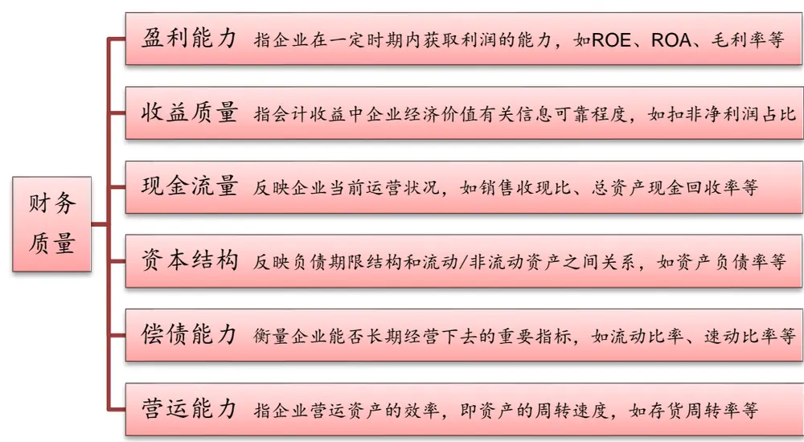
资料来源：华泰证券研究所

在下面图表中，我们列出了本报告所涉及的全部 51 个被测因子，其中重点展示的因子以浅红色底色标出（共 12 个），全部因子均从Wind 终端的数据接口直接提取，因子的英文名称与Wind 终端保持一致。

图表2： 华泰单因子测试——财务质量因子及其描述

| 大类 | 子类 | Wind 因子名称 | 因子描述 |
| --- | --- | --- | --- |
| 财务质量（全部因子均从 Wind 直接提取） | 盈利能力 | qfa_roe | 单季度 ROE（平均） |
|  |  | qfa_roe_deducted | 单季度 ROE（平均/扣非） |
|  |  | roe_basic | 当年累计 ROE-财报公布值（加权） |
|  |  | roe_avg | 当年累计 ROE（平均） |
|  |  | roe_diluted | 当年累计 ROE（摊薄） |
|  |  | roe_exbasic | 当年累计 ROE（扣非/加权） |
|  |  | roe_deducted | 当年累计 ROE（扣非/平均） |
|  |  | roe_exdiluted | 当年累计 ROE（扣非/摊薄） |
|  |  | roe_ttm2 | ROE 的 TTM 值（算法类似摊薄） |
|  |  | qfa_roa | 单季度总资产净利率 |
|  |  | roa | 当年累计总资产净利率 |
|  |  | roa2 | 当年累计总资产报酬率 |
|  |  | roa_ttm2 | 总资产净利率TTM |
|  |  | roa2_ttm2 | 总资产报酬率TTM |
|  |  | qfa_grossprofitmargin | 单季度销售毛利率 |
|  |  | grossprofitmargin | 当年累计销售毛利率 |
|  |  | grossprofitmargin_ttm2 | 销售毛利率TTM |
|  |  | qfa_netprofitmargin | 单季度销售净利率 |
|  |  | netprofitmargin | 当年累计销售净利率 |
|  |  | netprofitmargin_ttm2 | 销售净利率TTM |
|  |  | nptocostexpense_qfa | 单季度成本费用利润率 |
|  |  | nptocostexpense | 当年累计成本费用利润率 |
|  |  | roic | 投入资本回报率 |
|  |  | roic_ttm2 | 投入资本回报率TTM |
|  | 收益质量 | qfa_operateincometoebt | 单季度经营活动净收益/利润总额 |
|  |  | operateincometoebt | 当年累计经营活动净收益/利润总额 |
|  |  | operateincometoebt_ttm2 | 经营活动净收益/利润总额TTM |
|  |  | qfa_deductedprofittoprofit | 单季度扣非净利润/净利润 |
|  |  | deductedprofittoprofit | 当年累计扣非净利润/净利润 |
|  |  | taxtoebt | 当年累计所得税/利润总额 |
|  |  | taxtoebt_ttm | 税项/利润总额 TTM |
|  | 现金流量 | qfa_ocftosales | 单季度经营性现金流量净额/营业收入 |
|  |  | ocftoor | 当年累计经营性现金流量净额/营业收入 |
|  |  | ocftoor_ttm2 | 经营性现金流量净额/营业收入 TTM |
|  |  | ocftocf_qfa | 单季度经营性现金流量净额占比 |
|  |  | ocftocf | 当年累计经营性现金流量净额占比 |
|  |  | ocftoassets | 当年累计总资产现金回收率 |
|  |  | ocftodividend | 当年累计现金股利保障倍数 |
|  | 资本结构 | debttoassets | 资产负债率 |
|  |  | catoassets | 流动资产/总资产 |
|  |  | currentdebttodebt | 流动负债/负债合计 |
|  | 偿债能力 | current | 流动比率 |
|  |  | quick | 速动比率 |
|  |  | cashtocurrentdebt | 现金比率 |
|  |  | debttotangibleequity | 有形净值债务率 |
|  |  | ebittointerest | 利息保障倍数（EBIT/利息费用） |
|  | 营运能力 | invturn | 存货周转率 |
|  |  | caturn | 流动资产周转率 |
|  |  | assetsturn | 总资产周转率 |
|  |  | arturn | 应收账款周转率 |
|  |  | apturn | 应付账款周转率 |

资料来源：Wind，华泰证券研究所

财务质量因子是一类具有较强逻辑和解释力的因子，在实际投资中应用较广，我们将以上图表所列因子的内在逻辑逐个解释如下。

## 1. 盈利能力

盈利能力是指企业在一定时期内赚取利润的能力，它衡量的是企业利用资源实现收入的效率。企业从事经营活动，在获取利润的前提下才能保证自身持续稳定的发展。因此盈利能力直接反映了企业的经营业绩和内在价值。我们选择的指标如下所示：

ROE，即净资产收益率（Return on Equity），又称股东权益收益率，是净利润与股东权益的百分比。该指标反映股东权益的收益水平，指标值越高，说明投资带来的收益越高。

ROA，即总资产回报率（Return on Assets），衡量的是企业一段时间内净利润和总资产的比值。ROA与 ROE最大的区别在于分母的不同，ROA分母考虑到的是负债和股东权益，而 ROE分母只考虑了股东权益；对于举债经营的企业，可能会出现 ROE虚高的情况。

grossprofitmargin，即毛利率，反映的是收入和成本的差值占收入的比值。毛利率越高，意味着企业有可能存在较强盈利能力和成本控制能力，也可能意味着企业正处于新兴产业、市场竞争少，或者意味着企业具有某种高壁垒核心竞争力，在大多数情况下毛利率高不是一件坏事。

netprofitmargin，即销售净利率，指的是净利润/营业收入，反映整个企业销售收入的收益水平。销售净利率的值越大，说明从单位收入中获得净利润的水平越高，企业的盈利能力越强。

nptocostexpense，即成本费用利润率，在 Wind 中该因子的具体定义是净利润/（营业成本+销售费用+管理费用+财务费用），体现了公司投入的成本费用所带来的经营成果。成本费用利润率的值越大，说明从单位成本费用中获得利润的水平越高，企业的经济效益越好。

ROIC，即投入资本回报率，是指生产经营活动中所有投入资本赚取的收益率，这些投入资本既有债务也有权益。分子为企业如果完全按权益筹资所应报告的税后利润，分母则为企业所有要求回报的现金来源的总和。该值能较好地体现企业的盈利能力。

## 2. 收益质量

收益质量指的是会计收益所表达的与企业经济价值有关信息的可靠程度。企业除了追求高收益，还应当追求高的收益质量。特别是在舞弊事件频繁发生的情况下，收益质量显得更为重要。高质量收益能为企业未来的持续发展提供保证，这一类因子包括：

operateincometoebt，即经营活动净收益/利润总额，反映公司总利润中，由经营活动所产生的利润的比重，体现了企业的收益质量。

deductedprofittoprofit，即扣除非经常性损益后净利润/净利润，“非经常性损益”一般不具有可持续性，因此扣非后净利润和净利润比值能够反映收益质量。

taxtoebt，即所得税/利润总额，反映企业税负水平，体现了企业的收益质量。

## 3. 现金流量

现金流量表在财务报告体系中具有重要意义，它直接反映了企业当前的运营情况，很大程度上决定了企业的发展能力。同时，收付实现制的会计处理方式使得现金流量相比其它指标，直接反映了企业实际收到的现金收益，能帮助我们对其未来债务偿还和生产经营情况作出更好的预测。因此我们选择如下指标对现金流量进行分析：

ocftoor，指的是经营性现金流量净额/营业收入，反映了企业现金回收速度。说明公司每单位主营业务收入中，有多少实际收到现金的收益。其中，分子——经营性现金流量净额，对于企业来说是一项较为稳定的收入，可以很好地体现企业的现金流情况。

ocftocf，即经营性现金流量净额占比，指的是经营性现金流量净额/现金流量净额，体现了现金流量结构，反映出公司的财务状况和发展阶段。

ocftoassets，即总资产现金回收率，指的是经营性现金流量净额/期末资产总额，衡量某一经济行为发生损失大小。回收率越高，说明企业全部资产产生现金的能力越强。

ocftodividend，即现金股利保障倍数，指的是经营性现金流量净额/支付普通股股利，支付现金股利率越高，说明企业的现金股利占结余现金流量的比重越小，企业支付现金股利的能力越强。

## 4. 资本结构

资本结构主要反映的是负债期限结构（长期负债、短期负债）和流动资产、非流动资产之间的关系，我们选择的因子包括：

debttoassets，即资产负债率，指的是总负债/总资产，衡量企业利用债权人提供资金进行经营活动的能力,以及反映债权人发放贷款的安全程度。

catoassets，即流动资产比率，指的是流动资产/总资产，体现企业的偿还短期债务的能力。
流动资产越多，短期债务越少，则流动比率越大，企业的短期偿债能力越强。

currentdebttodebt，即流动负债率，指的是流动负债/负债合计。反映一个公司依赖短期债权人的程度。流动负债率越高，说明公司对短期资金的依赖性越强。

## 5. 偿债能力

即使是拥有很强盈利能力的公司，在举债经营时也可能因为资金调度不灵、不能及时偿还债务而被迫面临清算破产。因此，企业偿还到期债务的能力是衡量企业能否长期稳定经营下去的一个重要指标。根据债务期限，负债可以分成流动负债和长期负债两种类型。相应地，偿债能力可以分为短期偿债能力和长期偿债能力。

短期偿债能力是企业以流动资产偿还短期负债的能力，衡量了企业流动资产相对于短期负债的充足程度，同时反映了企业的变现能力，常见的衡量指标有如流动比率、速动比率。长期偿债能力是指企业偿还长期债务的能力，它不仅反映了企业的违约风险，还提供了企业资本结构和财务杠杆方面的信息，帮助我们评价企业的财务状况和控制企业的财务分析。我们选择的因子包括：

current，流动比率，指流动资产/流动负债，用来评价流动资产总体变现能力。

quick，速动比率，指速动资产/流动负债，其中速动资产=流动资产-存货净额。从流动资产中扣除存货部分，再除以流动负债，反映了企业对短期债务的支付偿还能力，能进一步反映变现能力。

cashtocurrentdebt，即现金比率，指的是现金及现金等价物和流动负债的比值。现金比率以更为保守的方式采用现金及现金等价物来反映企业即刻变现偿还短期债务的能力。

debttotangibleequity，即有形净值债务率，指的是负债总额/（归属母公司股东的权益-无形资产-开发支出-商誉-长期待摊费用-递延所得税资产），主要衡量企业的风险程度和长期偿债能力。有形净值债务率越大，表明风险越大，企业长期偿债能力越弱。

ebittointerest，即利息保障倍数，指的是 EBIT 和利息费用的比值，不仅反映了企业盈利

能力，还反映了其盈利能力对到期偿还债务的保障能力。

## 6. 营运能力

营运能力主要是指企业营运资产的效率，即资产的周转率或周转速度。分析企业的营运能力能发现企业的资产运营中存在的问题。例如，存货周转率的提高反映了企业资产变现能力的提高，能够为其短期债务的偿还提供保障。反之，若企业应收账款周转率降低，企业可能存在账款回收上的困难，同时存在坏账的可能性。

invturn，即存货周转率，是衡量和评价企业购入存货、投入生产、销售收回等各环节管理状况的综合性指标。存货周转速度越快，存货的占用水平越低，流动性越强，存货转换为现金、应收账款的速度越快，企业的营运能力越强。

assetturnover，即总资产周转率，衡量企业利用资产产生收入的效率。

caturn，即流动资产周转率，指的是主营业务收入净额/平均流动资产总额，反映了企业流动资产的周转速度，是用于评价企业资产利用率的一个重要指标。

arturn，即应收账款周转率，指的是企业在一定时期内赊销净收入与平均应收账款余额之比，衡量企业应收账款周转速度及管理效率。

apturn，即应付账款周转率，反映企业应付账款的流动速度。

## 财务质量因子的测试框架

如果某只股票在过去一段时间的某一财务质量因子明显高于同类型股票的平均水平，则该股票近期既可能表现优秀也可能表现较差（取决于财务质量因子的特性）。在本报告中，我们首先将先观察财务质量因子在 A股市场的分布规律，通过分析财务质量因子在不同行业及不同规模上市公司间的差异，判断在单因子回归测试中是否应该处理行业、规模因素的影响。随后我们将使用分层测试法、回归法、IC值分析等手段对因子进行全面测试，详细观察因子区分度、单调性等规律，选出有效且稳健的因子。最后我们将根据以上测试结果进行综合分析，并与之前测试过的其它类别因子进行对比。

图表3： 财务质量因子分析测试框架
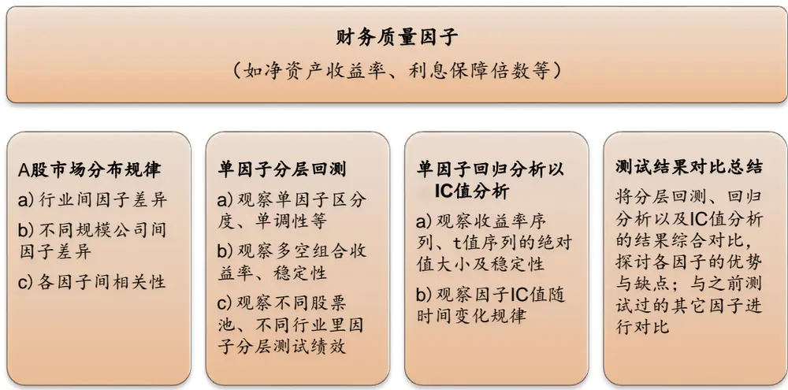
资料来源：华泰证券研究所

## 财务质量因子的行业间差异

财务质量因子在不同行业间存在一定差异。我们选取 roe_avg、assetsturn 因子作为代表（因子具体定义见图表 2），根据 2017 年年报计算它们在各一级行业的中位数，如下图所示。可以发现，银行行业具有较高的 ROE 和很低的资产周转率，商贸零售行业的资产周转率很高但 ROE 并不突出，这两个因子在不同行业间的水平存在一定差异。我们认为对上市公司直接进行跨行业比较意义不大，在单因子测试中还是应考虑行业中性处理。

图表4： 各一级行业 roe_avg、assetsturn 因子中位数比较（2017 年年报）
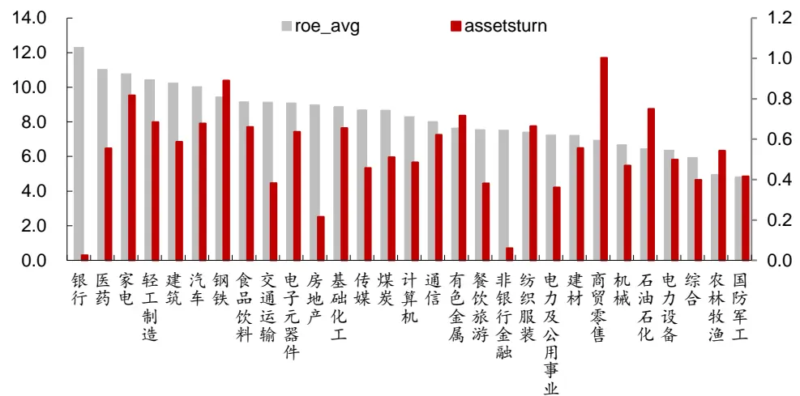
资料来源：Wind，华泰证券研究所

上图说明了，在同一时间点，不同行业间财务质量因子的水平存在一定差异。事实上，随着时间变化，金融系统存在周期性波动，同一行业的盈利能力、现金流量等因子的绝对大小和与其他行业对比的相对大小也在不断变化中。这里就不具体举例了。

## 财务质量因子与市值因子的相关性

除去行业对因子存在较大影响外，上市公司的规模也是对各大类因子产生作用的潜在因素。我们在前六篇单因子测试报告中涉及的大部分因子都与市值因子具有一定相关性，下面我们将对财务质量因子与市值因子的相关性进行详细计算。

图表5： 财务质量因子与市值因子之间 Spearman秩相关系数（根据年报信息与对应年底的公司总市值进行计算）

| 因子名称 | 2007 | 2008 | 2009 | 2010 | 2011 | 2012 | 2013 | 2014 | 2015 | 2016 | 2017 | 均值 |
| --- | --- | --- | --- | --- | --- | --- | --- | --- | --- | --- | --- | --- |
| qfa_roe | 30.1% | 18.2% | 27.2% | 23.9% | 21.0% | 24.0% | 28.8% | 28.2% | 26.1% | 16.3% | 18.6% | 23.9% |
| qfa_roa | 24.8% | 20.1% | 22.4% | 16.8% | 13.2% | 14.1% | 21.7% | 20.8% | 19.3% | 8.4% | 7.7% | 17.2% |
| qfa_grossprofitmargin | 12.7% | 11.2% | 11.8% | 11.5% | 7.5% | 6.3% | 16.0% | 12.9% | 13.2% | 6.8% | 4.8% | 10.4% |
| nptocostexpense_qfa | 24.6% | 21.8% | 24.5% | 16.3% | 13.0% | 15.1% | 22.7% | 21.7% | 20.7% | 13.3% | 12.6% | 18.7% |
| roic | 39.6% | 37.8% | 35.3% | 36.5% | 29.2% | 25.9% | 37.0% | 30.1% | 28.3% | 21.6% | 17.0% | 30.8% |
| qfa_operateincometoebt | 14.3% | 11.3% | 11.2% | 9.9% | 5.8% | 5.4% | 12.1% | 4.9% | 4.5% | 4.4% | 6.4% | 8.2% |
| qfa_deductedprofittoprofit | 25.9% | 18.6% | 19.2% | 15.1% | 9.4% | 12.4% | 19.0% | 13.8% | 12.7% | 13.0% | 15.1% | 15.8% |
| qfa_ocftosales | 1.5% | 0.3% | 0.3% | 3.3% | 1.4% | 0.6% | 6.4% | 9.4% | 6.1% | 4.0% | 4.6% | 3.4% |
| ocftocf_qfa | -1.7% | -5.6% | 0.2% | -0.8% | 1.6% | 1.2% | 0.2% | 1.9% | 3.2% | 0.9% | 3.7% | 0.4% |
| currentdebttodebt | -25.6% | -28.6% | -27.7% | -21.9% | -25.9% | -28.8% | -20.8% | -21.9% | -17.2% | -20.9% | -26.2% | -24.1% |
| current | 0.4% | 7.0% | 6.9% | 2.1% | -11.7% | -15.9% | -6.5% | -8.1% | -4.7% | -11.3% | -21.3% | -5.7% |
| assetsturn | 6.1% | 6.8% | 4.2% | 5.8% | 4.6% | 3.0% | 4.5% | 2.1% | 0.1% | -2.1% | -4.9% | 2.7% |

资料来源：Wind，华泰证券研究所

我们针对图表 2 中重点标出的 12 个因子，计算它们在 2007～2017 年年报中的值与对应年底市值因子之间的 Spearman秩相关系数，见上表。经观察发现，大部分盈利能力、收益质量因子与市值因子呈现明显正相关关系，资本结构因子 currentdebttodebt 与市值因子呈现明显负相关关系，其余因子与市值因子相关性较小。由此，我们认为在财务质量因子测试中还是应考虑进行市值中性处理。

## 财务质量因子在截面上的因子值相关性分析

在某一指定截面上，我们可以计算两个因子的因子值之间相关系数。若在这一截面上建立多元线性回归方程，以下期收益作为被解释变量，以这两个因子和其它一些风格因子作为解释变量，则由于这两个因子的线性相关程度较大，回归结果的准确性就会受到影响，当这两个因子完全线性相关时回归方程没有解。所以考察截面上因子值相关情况是一件有意义的工作。

对于任意两个财务质量因子，我们依次计算从 2007 年至 2017 年的 11 份年报上它们之间的 Spearman 秩相关系数，最后求均值，结果见下表。除了盈利能力类的几个因子间相关性较大，以及收益质量类两个因子间相关性较大，其余因子间相关性都在 40%以下，对回归方程的计算不产生本质影响，但在使用时仍需注意规避因子共线性带来的一些衍生问题。

图表6： 财务质量因子在截面上的两两因子值 Spearman秩相关系数均值（根据 2007～2017年年报信息计算）

| 因子序号 | 因子名称 | 因子1 | 因子2 | 因子3 | 因子4 | 因子5 | 因子6 | 因子7 | 因子8 |  | 因子 9 因子 10 因子 11 因子 12 |  |  |
| --- | --- | --- | --- | --- | --- | --- | --- | --- | --- | --- | --- | --- | --- |
| 因子1 | qfa_roe |  | 91.8% | 37.2% | 78.7% | 68.3% | 19.5% | 16.0% | 14.6% | 8.3% | 8.3% | 13.4% | 20.4% |
| 因子2 | qfa_roa | 91.8% |  | 45.2% | 87.2% | 75.7% | 20.7% | 15.4% | 18.3% | 8.0% | 14.6% | 31.7% | 20.6% |
| 因子3 | qfa_grossprofitmargin | 37.2% | 45.2% |  | 60.7% | 45.3% | 24.9% | 23.1% | 29.2% | 3.2% | -1.0% | 35.4% | -29.6% |
| 因子4 | nptocostexpense_qfa | 78.7% | 87.2% | 60.7% |  | 64.5% | 15.1% | 16.1% | 26.3% | 3.9% | 1.4% | 35.6% | -14.0% |
| 因子5 | roic | 68.3% | 75.7% | 45.3% | 64.5% |  | 30.0% | 29.3% | 15.9% | 6.8% | 24.5% | 33.8% | 39.7% |
| 因子6 | qfa_operateincometoebt | 19.5% | 20.7% | 24.9% | 15.1% | 30.0% |  | 66.4% | 5.6% | 4.1% | 9.4% | 13.7% | 15.0% |
| 因子7 | qfa_deductedprofittoprofit | 16.0% | 15.4% | 23.1% | 16.1% | 29.3% | 66.4% |  | 7.2% | 3.4% | 3.9% | 11.8% | 4.8% |
| 因子8 | qfa_ocftosales | 14.6% | 18.3% | 29.2% | 26.3% | 15.9% | 5.6% | 7.2% |  | 19.2% | -1.8% | 12.4% | -15.9% |
| 因子9 | ocftocf_qfa | 8.3% | 8.0% | 3.2% | 3.9% | 6.8% | 4.1% | 3.4% | 19.2% |  | 7.4% | 2.2% | 7.5% |
| 因子10 | currentdebttodebt | 8.3% | 14.6% | -1.0% | 1.4% | 24.5% | 9.4% | 3.9% | -1.8% | 7.4% |  | 14.7% | 33.0% |
| 因子11 | current | 13.4% | 31.7% | 35.4% | 35.6% | 33.8% | 13.7% | 11.8% | 12.4% | 2.2% | 14.7% |  | -2.2% |
| 因子12 | assetsturn | 20.4% | 20.6% | -29.6% -14.0% |  | 39.7% | 15.0% | 4.8% | -15.9% | 7.5% | 33.0% | -2.2% |  |

资料来源：Wind，华泰证券研究所

## 单因子测试方法简介及结果分析

在多因子系列首篇报告《华泰多因子模型体系初探》（2016.09）中，我们系统地介绍了有效因子识别（即单因子测试）的理论基础和研究思路，在多因子系列第二篇报告《华泰单因子测试之估值类因子》中我们着眼于实践过程，给出了详细的流程操作说明。之后的第三至第六篇报告中均沿用第二篇报告的测试方法。在第七篇报告中，由于资金流向因子适于更短持仓周期，我们将月调仓改为 10 日调仓，其余测试细节保持不动。

本报告中涉及的财务质量因子只会随着新财报的发布而产生变动，月频调仓并无太大意义，同时还可能对结果产生不必要干扰。所以我们将截面期调整为每年的 4月 30 日、8 月 31日、10 月 31 日，在 4 月 30 日及之后可以使用上年年报及本年度一季报信息，8 月 31 日及之后可以使用半年报信息，10 月 31 日及之后可以使用三季报信息。我们在每个截面期上使用最新财报数据构建因子，所有个股对齐使用同一个季度的财报信息（忽略财报延迟公布的个股）。实际在 4 月 30 日截面上，当被测因子的一季报信息较为齐全的时候，我们并不会直接使用上年年报信息（可能在计算过程中间接使用），如遇特殊情况需使用上年年报的在正文中都会明确指出。

## 单因子测试方法简介

回归法

回归法是一种最常用的测试因子有效性的方法，具体做法是将第T期的因子暴露度向量与T+1期的股票收益向量进行线性回归，所得到的回归系数即为因子在T期的因子收益率，同时还能得到该因子收益率在本期回归中的显著度水平——t 值。在某截面期上的个股的因子暴露度（Factor Exposure）即指当前时刻个股 $在$ 该因子上的因子值。第T期的回归模型具体表达式如下。

$$
r^{T+1}=X^{T}a^{T}+\sum_{j}Indus_{j}^{T}b_{j}^{T}+ln\_mkt^{\mathrm{T}}b^{T}+\varepsilon^{T}
$$

$r^{T+1}$ :所有个股在第T+1期的收益率向量

$X^{T};$ :所有个股第T期在被测单因子上的暴露度向量

$Indus_{j}^{T}$ :所有个股第 T 期在第 j 个行业因子上的暴露度向量（0/1 哑变量）

$ln\_mkt^{\mathrm{T}}\mathrm{:}$ :所有个股第T期在对数市值因子上的暴露度向量

$a^{T},b^{T},b_{j}^{T}$ :对应因子收益率，待拟合常数，通常比较关注 $a^{T}$

$\varepsilon^{T};$ :残差向量

在所有截面期上，我们对因子 X进行回归测试，能够得到该因子的因子收益率序列（即所有截面期回归系数 $|a^{T}|$ 构成的序列）和对应的 t 值序列。t 值指的是对单个回归系数 $a^{T}的$ t检验统计量，描述的是单个变量显著性，t 值的绝对值大于临界值说明该变量是显著的，即该解释变量（T期个股在因子 X的暴露度）是真正影响因变量（T+1期个股收益率）的一个因素。也就是说，在每个截面期上，对于每个因子的回归方程，我们设

$$
\begin{aligned}&假设检验H_{0}\colon a^{T}=0,\\&备择假设H_{1}\colon a^{T}\neq0.\end{aligned}
$$

该假设检验对应的 t统计量为

$$
\mathbf{t}=\frac{a^{T}}{SE(a^{T})}
$$

其中 $SE(a^{T})$ 代表回归系数 $a^{T}$ 的标准差的无偏估计量。一般 t值绝对值大于 2 我们就认为本期回归系数 $(a^{T}$ 是显著异于零的（也就是说，本期因子 X对下期收益率具有显著的解释作用）。注意，我们在回归模型中加入了市值、行业因子，能在一定程度上规避市值、行业因素对财务质量因子的影响。

回归模型构建方法如下：

1． 股票池：全 A股，剔除 ST、PT 股票，剔除每个截面期下一交易日停牌的股票。

2． 回溯区间：2007-04-30 至 2018-4-27。

3． 截面期：每年的 4月 30 日、8 月 31 日、10 月 31日前最后一个交易日，用当前截面期因子值与当前截面期至下个截面期内的个股收益进行回归。

4． 数据处理方法：

a) 因子列表见图表 2，所有因子均直接从Wind 下载，不进行二次加工；

b) 中位数去极值：设第 T 期某因子在所有个股上的暴露度向量为 $D_{i},~D_{M}$ 为该向量中位数， $D_{M1}$ 为向量 $|D_{i}-D_{M}|$ 的中位数，则将向量 $D_{i}$ 中所有大于 $D_{M}+5D_{M1}$ 的数重设为 $D_{M}+5D_{M1}$ ，将向量 $D_{i}$ 中所有小于 ${{\cdot}{D}_{M}}-5{{D}_{M1}}$ 的数重设为 $D_{M}-5D_{M1}$

c) 标准化：将去极值处理后的因子暴露度序列减去其现在的均值、除以其标准差，得到一个新的近似服从N(0,1)分布的序列，这样做可以让不同因子的暴露度之间具有可比性；

d) 缺失值处理：因本文主旨为单因子测试，为了不干扰测试结果，如文中未特殊指明均不填补缺失值（在构建完整多因子模型时需考虑填补缺失值）。

5． 回归权重：由于普通最小二乘回归（OLS）可能会夸大小盘股的影响（因为小盘股的财务质量因子出现极端值概率较大，且小盘股数目很多，但占全市场的交易量比重较小），并且回归可能存在异方差性，故我们参考 Barra 手册，采用加权最小二乘回归（WLS），使用个股流通市值的平方根作为权重，此举也有利于消除异方差性。

6． 因子评价方法：

a) t 值序列绝对值均值——因子显著性的重要判据；

b) t 值序列绝对值大于 2的占比——判断因子的显著性是否稳定；

c) t 值序列均值——与 a)结合，能判断因子 t 值正负方向是否稳定；

d) 因子收益率序列均值——判断因子收益率的大小。

## IC 值分析法

因子的 IC 值是指因子在第 T 期的暴露度向量与 T+1 期的股票收益向量的相关系数，即

$$
IC^{T}=\operatorname{corr}(r^{T+1},X^{T})
$$

上式中因子暴露度向量XT一般不会直接采用原始因子值，而是经过去极值、中性化等手段处理之后的因子值。在实际计算中，使用 Pearson 相关系数可能受因子极端值影响较大，使用Spearman秩相关系数则更稳健一些，这种方式下计算出来的 IC一般称为Rank IC。

IC 值分析模型构建方法如下：

1. 股票池、回溯区间、截面期均与回归法相同。

2. 因子暴露度向量 $[X^{T}$ 先用中位数法去极值（方法论详见上一小节），然后进行市值、行业中性化处理。中性化处理即在截面期 T 上用因子值（已去极值）做因变量、对数总市值因子（已去极值）及行业因子（0/1 哑变量）做自变量进行线性回归，取残差作为因子值的一个替代。这样做可以消除行业因素和市值因素对因子的影响。计算残差向量和 T+1 期股票收益向量的 Spearman 秩相关系数作为 T 期因子 Rank IC 值。

3. 因子评价方法：

a) Rank IC 值序列均值——因子显著性；

b) Rank IC 值序列标准差——因子稳定性；

c) IC_IR（Rank IC 值序列均值与标准差的比值）——因子有效性；

d) Rank IC 值序列大于零的占比——因子作用方向是否稳定。

## 分层回测法

依照因子值对股票进行打分，构建投资组合回测，是最直观的衡量因子优劣的手段。分层测试法与回归法、IC 值分析相比，能够发掘因子对收益预测的非线性规律。也即，若存在一个因子分层测试结果显示，其 Top组和 Bottom 组的绩效长期稳定地差于 Middle 组，则该因子对收益预测存在稳定的非线性规律，但在回归法和 IC 值分析过程中很可能被判定为无效因子。

分层测试模型构建方法如下：

1. 股票池、回溯区间、截面期均与回归法相同。

2. 换仓：在每个截面期核算因子值，构建分层组合，在截面期下一个交易日按当日收盘价换仓，交易费用以双边千分之四计。

3. 分层方法：因子暴露度向量 $X^{T}$ 先用中位数法去极值，然后进行市值、行业中性化处理（方法论详见上一小节），将股票池内所有个股按因子从大到小进行排序，等分 N层，每层内部的个股等权配置。当个股总数目无法被 N整除时采用任一种近似方法处理均可，实际上对分层组合的回测结果影响很小。

4. 多空组合收益计算方法：用 Top 组每天的收益减去 Bottom 组每天的收益，得到每日多空收益序列 $r_{1},r_{2},\cdots,r_{n}$ ，则多空组合在第 n天的净值等于 $(1+r_{1})(1+r_{2})\cdots(1+r_{n}).$

5. 评价方法：全部 N层组合年化收益率（观察是否单调变化），多空组合的年化收益率、夏普比率、最大回撤、月胜率等。

## 三种方法的关系

首先介绍一下回归法和 IC值分析法之间的关系。

我们先介绍一个引理。设X,Y为两个向量，则 $[corr(X,Y)]^{2}=R^{2}$ ，其中 $R^{2}$ 为线性回归 $Y=$ $aX+b$ 或线性回归 $X=aY+b的$ 可决系数（其中a，b是待回归系数）。

如果我们在单因子测试（线性回归法）中使用模型

$$
r=\beta X+c
$$

（r是股票收益率，X 是因子暴露度，c是常数项，c可以理解为市场因子）并且假设我们在计算因子 IC值的时候，不预先对因子暴露度进行市值、行业调整了，就使用原始的因子暴露度 $X,$ ，则本期因子 IC值为 $corr(X,r)$ ，根据引理，因子 IC 值的平方就等于单因子测试的回归模型的 $R^{2}$

所以，因子 IC值本质上反映的是下期收益率和本期因子暴露度的线性相关程度 $(R^{2}$ 的平方根），是使用该因子预测收益率的稳健性（IC值越大，这个因子的收益越稳定，波动越小）；而回归法中计算出的因子收益率本质上是一个斜率，反映的是从该因子可能获得的收益率的大小，这并不能说明任何关于线性拟合优度的信息（也就是说，因子收益率很大时，也可能出现R2很小的情形）；至于回归法中计算出的 t值，在一元线性回归中 t值与 $R^{2}$ 反映的信息一致（二者对应关系为，当 $R^{2}=0$ 时 t值也为 0，当 $R^{2}=1$ 时 t 值为无穷大），但是由于我们所采用的回归模型包括了行业变量，所以 t 值仅代表被测因子对股票收益的解释能力（而不能代表模型的整体拟合优度）。实际计算过程中因子会进行一些预处理，回归方程也有可能引入其它风格变量使其表达形式更复杂，导致 IC 值和 t值无法理论上互推，但前面所述结论的本质不变。

总结一下，IC值反映模型整体线性拟合优度，t值反映被测单因子对模型的解释能力是否显著，因子收益率与前两者差别较大，它反映的是可能获得的收益率的大小，而对这个收益是否稳健未知。

其次介绍一下回归法和分层测试法之间的关系。

假设本期因子值X与下期收益r完全线性相关，满足 $r=\beta X+c。$ 。此时 IC 值绝对值为 1，回归法中的因子收益率为 $\beta.$ 。并且假设本期因子值 X服从[0,1]均匀分布，那么当按因子从小到大等分 N 层测试时，第 i层组合的下期收益为 $\beta(2i-1)/2N+c$ ，多空收益（第 N 层收益减去第 1 层收益）为 $\beta(N-1)/N$ ，也即说明分层测试法中的多空收益与回归法中的因子收益率具有一定程度的等价关系。实际上因子 IC值大部分在 0.1 附近波动，所以回归拟合的因子收益率与分层测试下的多空收益也未必完全一致。

## 单因子测试结果分析（每年调仓 3 次）

## 盈利能力——ROE因子

首先我们观察一下wind中能下载到的9个ROE因子在全部非ST股票上的数据覆盖度随时间变化曲线，以及它们在各种股票池内回归法、IC 值分析结果汇总。

图表7： ROE因子数据覆盖度随时间变化情况
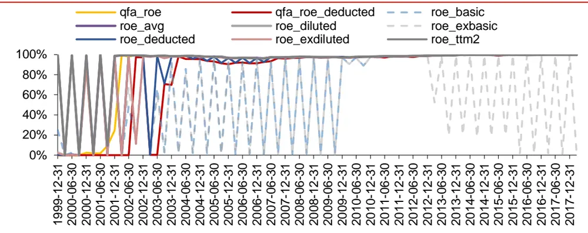
资料来源：Wind，华泰证券研究所

图表8： ROE因子在各种股票池内回归法、IC值分析结果汇总（行业中性、市值中性）

| 因子含义 |  |  |  | 因子收益率 |  | Rank IC 均值 | Rank IC |  |  |
| --- | --- | --- | --- | --- | --- | --- | --- | --- | --- |
| Wind 因子名称 |  | It\|均值 \|t\|>2 占比 |  | t均值 |  | 均值 | 标准差 | IC_IR IC>0 占比 |  |
| 沪深 300 成份股内 |  |  |  |  |  |  |  |  |  |
| qfa_roe | 单季度 ROE（平均） | 2.34 | 54.55% | 1.03 | 0.88% | 10.53% | 18.70% | 0.56 | 69.70% |
|  | qfa_roe_deducted 单季度 ROE（平均/扣非） | 2.34 | 60.61% | 1.03 | 0.93% | 10.46% | 18.40% | 0.57 | 66.67% |
| roe_basic | 当年累计 ROE-财报公布值（加权） | 2.51 | 60.61% | 0.83 | 1.09% | 9.46% | 20.59% | 0.46 | 66.67% |
| roe_avg | 当年累计 ROE（平均） | 2.38 | 57.58% | 0.80 | 0.74% | 9.27% | 19.71% | 0.47 | 66.67% |
| roe_diluted | 当年累计 ROE（摊薄） | 2.32 | 51.52% | 0.78 | 0.70% | 9.38% | 19.38% | 0.48 | 66.67% |
| roe_exbasic | 当年累计 ROE（扣非/加权） | 2.42 | 57.58% | 0.61 | 0.75% | 8.39% | 19.42% | 0.43 | 63.64% |
| roe_deducted | 当年累计 ROE（扣非/平均） | 2.36 | 54.55% | 0.76 | 0.71% | 9.52% | 19.25% | 0.49 | 63.64% |
| roe_exdiluted | 当年累计 ROE（扣非/摊薄） | 2.35 | 54.55% | 0.79 | 0.71% | 9.64% | 19.07% | 0.51 | 63.64% |
| roe_ttm2 | ROE 的 TTM 值（算法类似摊薄） | 2.37 | 54.55% | 0.50 | 0.61% | 7.91% | 19.61% | 0.40 | 69.70% |
| 中证 500 成份股内 |  |  |  |  |  |  |  |  |  |
| qfa_roe | 单季度 ROE（平均） | 2.47 | 48.48% | 2.17 | 1.95% | 8.86% | 13.33% | 0.67 | 72.73% |
| qfa_roe_deducted | 单季度 ROE（平均/扣非） | 2.42 | 51.52% | 2.16 | 1.92% | 8.84% | 13.05% | 0.68 | 72.73% |
| roe_basic | 当年累计 ROE-财报公布值（加权） | 1.97 | 45.45% | 1.55 | 1.45% | 6.31% | 14.46% | 0.44 | 63.64% |
| roe_avg | 当年累计 ROE（平均） | 2.04 | 45.45% | 1.65 | 1.51% | 6.83% | 13.97% | 0.49 | 66.67% |
| roe_diluted | 当年累计 ROE（摊薄） | 2.05 | 45.45% | 1.67 | 1.53% | 7.04% | 13.89% | 0.51 | 66.67% |
| roe_exbasic | 当年累计 ROE（扣非/加权） | 1.85 | 45.45% | 1.33 | 1.23% | 4.54% | 12.26% | 0.37 | 63.64% |
| roe_deducted | 当年累计 ROE（扣非/平均） | 2.15 | 45.45% | 1.75 | 1.57% | 7.19% | 13.48% | 0.53 | 69.70% |
| roe_exdiluted | 当年累计 ROE（扣非/摊薄） | 2.18 | 42.42% | 1.78 | 1.60% | 7.36% | 13.48% | 0.55 | 69.70% |
| roe_ttm2 | ROE 的 TTM 值（算法类似摊薄） | 1.84 | 42.42% | 1.31 | 1.28% | 4.57% | 13.22% | 0.35 | 63.64% |
| 全 A股 |  |  |  |  |  |  |  |  |  |
| qfa_roe | 单季度 ROE（平均） | 4.98 | 81.82% | 3.61 | 1.52% | 5.12% | 11.59% | 0.44 | 60.61% |
| qfa_roe_deducted | 单季度 ROE（平均/扣非） | 5.10 | 87.88% | 3.72 | 1.53% | 5.40% | 11.86% | 0.46 | 63.64% |
| roe_basic | 当年累计ROE-财报公布值（加权） | 4.64 | 81.82% | 2.53 | 1.14% | 2.34% | 13.18% | 0.18 | 54.55% |
| roe_avg | 当年累计 ROE（平均） | 4.57 | 72.73% | 2.70 | 1.13% | 2.86% | 12.57% | 0.23 | 54.55% |
| roe_diluted | 当年累计 ROE（摊薄） | 4.62 | 72.73% | 2.80 | 1.17% | 3.19% | 12.65% | 0.25 | 54.55% |
| roe_exbasic | 当年累计 ROE（扣非/加权） | 3.93 | 75.76% | 1.82 | 0.87% | 1.49% | 12.37% | 0.12 | 51.52% |
| roe_deducted | 当年累计 ROE（扣非/平均） | 4.74 | 78.79% | 2.94 | 1.22% | 3.29% | 12.51% | 0.26 | 57.58% |
| roe_exdiluted | 当年累计 ROE（扣非/摊薄） | 4.76 | 81.82% | 2.99 | 1.24% | 3.55% | 12.60% | 0.28 | 57.58% |
| roe_ttm2 | ROE 的 TTM 值（算法类似摊薄） | 4.10 | 81.82% | 1.81 | 0.86% | 1.30% | 12.42% | 0.10 | 54.55% |

资料来源：Wind，华泰证券研究所

请注意，由于 roe_basic 和 roe_exbasic 两个因子在部分时间段一季报、三季报数据缺失严重，我们令 roe_exbasic 因子在全回测期内的 4月 30 日截面采用上年年报信息、10 月31 日截面采用半年报信息，令 roe_basic 因子在 2009 年之前的 4 月 30 日截面采用上年年报信息、10 月 31日截面采用半年报信息，其余未指明部分与其它因子保持一致。除这两个因子之外的其余 ROE因子在 2003 年底之后基本具有接近 100%的数据覆盖度。

图表9： ROE因子在各种股票池内分层测试法结果汇总（分五层，行业中性、市值中性）

| 多空组合 多空组合多空组合多空组合 |  |  |  |  |  |  |  |  |  |
| --- | --- | --- | --- | --- | --- | --- | --- | --- | --- |
| Wind 因子名称 | 因子含义 | 分层组合1～5（从左到右）年化收益率 |  |  |  | 年化收益率 夏普比率最大回撤 |  |  | 月胜率 |
| 沪深 300 成份股内 |  |  |  |  |  |  |  |  |  |
| qfa_roe | 单季度 ROE(平均) | 7.39% | 3.85% | 2.40% | -1.50% -3.39% | 9.24% | 0.72 | 38.28% | 53.79% |
| qfa_roe_deducted 单季度 ROE（平均/扣非） |  | 7.42% | 2.66% | 2.64% | -0.74% -3.95% | 9.86% | 0.76 | 39.82% | 55.30% |
| roe_basic | 当年累计 ROE-财报公布值(加权) | 7.87% | 2.47% | 1.96% | 0.09% -2.89% | 9.19% | 0.67 | 43.40% | 56.06% |
| roe_avg | 当年累计 ROE（平均） | 7.70% | 2.68% | 1.03% | 0.40% -2.54% | 8.67% | 0.64 | 44.13% | 55.30% |
| roe_diluted | 当年累计 ROE（摊薄） | 8.09% | 2.50% | 0.76% | 0.70% -2.74% | 9.25% | 0.68 | 43.47% | 56.06% |
| roe_exbasic | 当年累计 ROE（扣非/加权） | 6.22% | 2.98% | 2.40% | 0.82% -2.46% | 6.96% | 0.50 | 44.47% | 52.27% |
| roe_deducted | 当年累计 ROE（扣非/平均） | 8.35% | 1.73% | 2.45% | 0.63% -4.04% | 10.91% | 0.79 | 41.47% | 57.58% |
| roe_exdiluted | 当年累计 ROE（扣非/摊薄） | 7.82% | 2.83% | 1.78% | 0.88% -4.09% | 10.30% | 0.75 | 42.01% | 57.58% |
| roe_ttm2 | ROE 的 TTM 值（算法类似摊薄） | 6.73% | 4.15% | 1.31% -0.32% | -2.31% | 7.34% | 0.55 | 40.91% | 51.52% |
| 中证 500 成份股内 |  |  |  |  |  |  |  |  |  |
| qfa_roe | 单季度 ROE（平均） | 11.81% | 6.79% | 3.28% | 1.72% 2.09% | 8.52% | 0.84 | 27.84% | 54.55% |
|  | qfa_roe_deducted 单季度 ROE（平均/扣非） | 11.27% | 7.13% | 4.06% | 1.25% 2.41% | 7.43% | 0.73 | 31.68% | 53.03% |
| roe_basic | 当年累计 ROE-财报公布值(加权) | 9.10% | 6.30% | 4.69% | 3.62% | 2.79% | 5.22% 0.51 | 31.58% | 49.24% |
| roe_avg | 当年累计 ROE（平均） | 9.37% | 7.37% | 3.68% | 3.46% 2.56% | 5.61% | 0.54 | 33.18% | 52.27% |
| roe_diluted | 当年累计 ROE（摊薄） | 9.65% | 7.09% | 3.77% | 3.44% 2.52% | 5.95% | 0.58 | 31.74% | 51.52% |
| roe_exbasic | 当年累计 ROE（扣非/加权） | 7.48% | 6.61% | 4.99% | 5.52% 1.80% | 4.22% | 0.40 | 24.11% | 48.48% |
| roe_deducted | 当年累计 ROE（扣非/平均） | 9.54% | 6.69% | 5.21% | 2.87% 2.52% | 5.53% | 0.52 | 29.84% | 50.00% |
| roe_exdiluted | 当年累计 ROE（扣非/摊薄） | 9.97% | 6.55% | 4.83% | 2.86% 2.44% | 6.00% | 0.56 | 29.86% | 51.52% |
| roe_ttm2 全 A股 | ROE 的 TTM 值（算法类似摊薄） | 8.00% | 7.08% | 4.56% | 2.94% 4.06% | 2.81% | 0.27 | 36.43% | 48.48% |
| qfa_roe | 单季度 ROE（平均） | 11.27% | 9.55% | 7.21% | 7.13% | 6.08% | 4.32% | 0.49 27.94% | 50.76% |
|  | qfa_roe_deducted 单季度 ROE（平均/扣非） 当年累计 ROE-财报公布值(加权) | 11.32% | 9.02% | 8.18% | 6.69% 6.08% |  | 4.36% 0.48 | 27.68% | 51.52% |
| roe_basic | 当年累计 ROE（平均） | 9.19% | 8.28% | 8.40% | 8.56% | 7.88% | 0.65% 0.07 | 45.19% | 43.94% |
| roe_avg roe_diluted | 当年累计 ROE（摊薄） | 9.45% 9.40% | 8.36% | 7.93% | 8.18% | 7.94% | 0.86% 0.75% | 0.09 43.91% | 45.45% |
| roe_exbasic | 当年累计 ROE（扣非/加权） | 8.62% | 8.66% 8.01% | 7.61% 9.52% | 8.02% 8.37% | 7.96% 7.71% | 0.08 0.27% | 44.41% 0.03 | 47.73% |
| roe_deducted | 当年累计 ROE（扣非/平均） | 9.78% | 8.44% | 8.40% | 7.90% | 7.39% | 1.65% | 45.77% 0.17 39.87% | 45.45% 46.97% |
| roe_exdiluted | 当年累计 ROE（扣非/摊薄） | 9.81% | 8.43% | 8.63% | 7.41% | 7.48% | 1.56% | 0.16 40.53% | 46.21% |
| roe_ttm2 | ROE 的 TTM 值（算法类似摊薄） | 8.17% | 9.51% | 7.54% | 8.86% | 7.93% | -0.32% | -0.03 48.91% | 43.18% |

资料来源：Wind，华泰证券研究所

通过回归法、IC值分析、分层测试法的结果我们可以发现各 ROE因子的效果还是存在一定差别的，不论是在沪深 300 成份股内、中证 500 成份股内，还是全 A 股票池中，它们的效果排序均为：单季度 ROE> 当年累计 ROE > ROE（TTM）。结合因子表现与数据覆盖度，我们选择最优的 qfa_roe 因子进行单独展示，其主要指标表现如下。

图表10： qfa_roe 因子 Rank IC 累积图
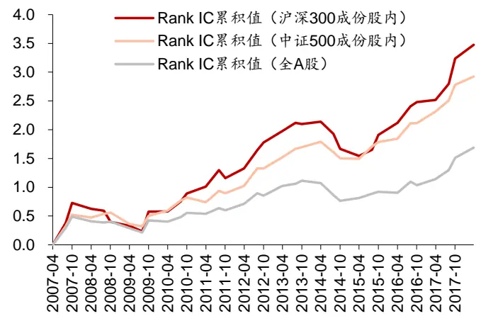
资料来源：Wind，华泰证券研究所

图表11： qfa_roe因子回归法因子收益率累积图
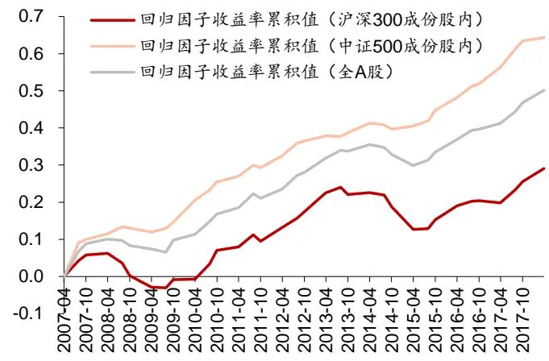
资料来源：Wind，华泰证券研究所

图表12： qfa_roe因子分层组合 1~5的净值除以基准净值示意图
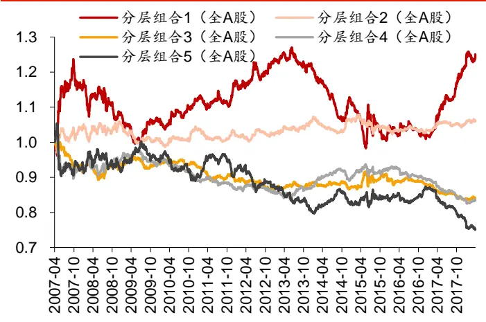
资料来源：Wind，华泰证券研究所

图表13： qfa_roe因子多空组合净值示意图
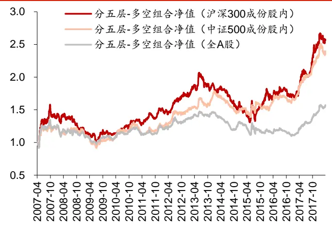
资料来源：Wind，华泰证券研究所

我们将 qfa_roe 因子应用到各行业中进行分层测试，结果如下表所示。

图表14： 不同行业 qfa_roe因子分层测试法结果（分五层，市值中性）

|  |  |  |  |  |  | 多空组合 | 多空组合 | 多空组合 | 多空组合 |
| --- | --- | --- | --- | --- | --- | --- | --- | --- | --- |
| 行业 |  |  | 分层组合1～5（从左到右）年化收益率 |  |  | 年化收益率 | 夏普比率 | 最大回撤 | 月胜率 |
| 家电 | 24.54% | 10.25% | 15.48% | 5.75% | -0.98% | 22.29% | 0.89 | 52.32% | 55.30% |
| 钢铁 | 8.84% | -2.53% | 5.74% | -3.25% | -2.43% | 10.74% | 0.47 | 50.15% | 52.27% |
| 银行 | 6.86% | 5.76% | 3.18% | 1.51% | -3.83% | 10.64% | 0.49 | 45.35% | 60.61% |
| 电子元器件 | 17.15% | 16.38% | 3.69% | 9.64% | 6.80% | 9.32% | 0.54 | 33.87% | 56.06% |
| 食品饮料 | 13.03% | 11.47% | 6.27% | 8.98% | 0.07% | 9.03% | 0.40 | 48.83% | 53.79% |
| 电力及公用事业 | 7.51% | 3.08% | 4.74% | 0.74% | -2.50% | 8.81% | 0.57 | 27.32% | 53.79% |
| 基础化工 | 10.01% | 12.89% | 4.69% | 4.02% | 2.86% | 5.92% | 0.39 | 41.78% | 55.30% |
| 电力设备 | 10.53% | 10.23% | 8.49% | 5.61% | 2.25% | 5.81% | 0.34 | 45.92% | 53.79% |
| 医药 | 18.18% | 16.07% | 12.17% | 13.69% | 10.33% | 5.21% | 0.36 | 35.18% | 50.00% |
| 有色金属 | 9.38% | 6.76% | 5.61% | 1.48% | 2.56% | 5.13% | 0.24 | 54.33% | 59.85% |
| 建材 | 13.35% | 9.78% | 6.14% | 8.60% | 6.01% | 4.33% | 0.20 | 56.68% | 50.00% |
| 汽车 | 8.05% | 8.77% | 8.99% | 7.51% | 2.91% | 3.54% | 0.21 | 40.34% | 57.58% |
| 国防军工 | 9.21% | 10.60% | 20.36% | 3.16% | 0.28% | 3.23% | 0.12 | 54.35% | 52.27% |
| 建筑 | 15.62% | 0.18% | 12.71% | 2.88% | 8.70% | 2.97% | 0.13 | 41.97% | 55.30% |
| 煤炭 | 2.25% | 4.89% | 4.75% | -0.71% | -2.00% | 1.97% | 0.06 | 81.03% | 47.73% |
| 轻工制造 | 14.57% | 5.28% | 2.34% | 5.03% | 10.05% | 1.82% | 0.09 | 54.47% | 50.00% |
| 商贸零售 | 6.98% | 2.55% | 1.34% | 6.42% | 4.08% | 0.77% | 0.05 | 40.24% | 45.45% |
| 机械 | 8.99% | 8.84% | 4.26% | 7.43% | 8.21% | 0.61% | 0.04 | 48.83% | 51.52% |
| 通信 | 12.12% | 12.36% | 8.15% | 2.72% | 9.72% | 0.22% | 0.01 | 39.74% | 50.76% |
| 计算机 | 10.86% | 13.17% | 20.76% | 15.02% | 8.96% | -0.18% | -0.01 | 38.87% | 48.48% |
| 交通运输 | 2.32% | 5.06% | 5.64% | 0.78% | 1.23% | -1.15% | -0.07 | 69.29% | 50.76% |
| 非银行金融 | 1.93% | -8.50% | -3.29% | -2.88% | -0.88% | -1.42% | -0.05 | 58.77% | 51.52% |
| 石油石化 | 4.57% | 4.86% | -0.06% | 8.84% | 3.68% | -2.41% | -0.10 | 62.11% | 46.97% |
| 餐饮旅游 | 6.34% | 6.52% | 4.52% | 0.99% | 5.82% | -2.59% | -0.10 | 76.16% | 46.97% |
| 房地产 | 4.66% | 3.61% | 5.35% | 4.99% | 8.44% | -2.86% | -0.18 | 55.26% | 47.73% |
| 纺织服装 | 4.55% | 6.53% | 7.05% | 4.88% | 6.72% | -3.46% | -0.19 | 69.01% | 43.18% |
| 农林牧渔 | 7.81% | 10.19% | 4.15% | 4.66% | 10.02% | -4.13% | -0.22 | 68.85% | 48.48% |
| 传媒 | 11.85% | 2.00% | 2.54% | 9.16% | 12.34% | -6.16% | -0.22 | 71.47% | 46.21% |
| 综合 | -0.92% | 7.02% | 1.63% | 1.99% | 6.10% | -9.05% | -0.33 | 79.01% | 46.97% |

资料来源：Wind，华泰证券研究所

## 盈利能力类其它因子

除上一小节涉及的 ROE因子外，我们观察另外 15 个常见的盈利能力因子在全部非 ST 股票上的数据覆盖度随时间变化曲线，以及它们在各种股票池内回归法、IC 值分析结果汇总。

图表15： 除 ROE外其余盈利能力因子数据覆盖度随时间变化情况
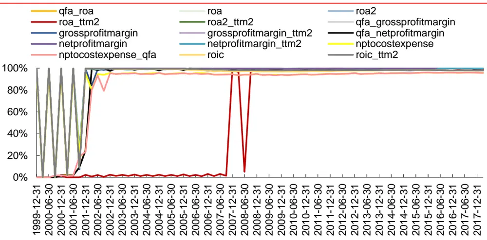
资料来源：Wind，华泰证券研究所

图表16： 除 ROE外其余盈利能力因子在各种股票池内回归法、IC值分析结果汇总（行业中性、市值中性）

| Wind 因子名称 | 因子含义 |  | It\|均值 Itl>2 占比 | t均值 | 因子收益率 均值 | 均值 | Rank IC 标准差 | IC_IR IC>0 占比 |  |
| --- | --- | --- | --- | --- | --- | --- | --- | --- | --- |
| 沪深 300 成份股内 |  |  |  |  |  |  |  |  |  |
| qfa_roa | 单季度总资产净利率 | 2.06 | 54.55% | 0.83 | 0.60% | 6.46% | 18.11% | 0.36 | 60.61% |
| roa | 当年累计总资产净利率 | 1.89 | 42.42% | 0.60 | 0.41% | 5.10% | 18.84% | 0.27 | 60.61% |
| roa2 | 当年累计总资产报酬率 | 2.07 | 45.45% | 0.69 | 0.64% | 6.89% | 19.90% | 0.35 | 63.64% |
| roa_ttm2 | 总资产净利率TTM | 1.95 | 51.52% | 0.60 | 0.51% | 3.92% | 19.69% | 0.20 | 54.55% |
| roa2_ttm2 | 总资产报酬率 TTM | 1.96 | 42.42% | 0.52 | 0.50% | 5.75% | 19.78% | 0.29 | 60.61% |
| qfa_grossprofitmargin | 单季度销售毛利率 | 1.84 | 33.33% | 0.70 | 0.52% | 5.55% | 16.92% | 0.33 | 63.64% |
| grossprofitmargin | 当年累计销售毛利率 | 1.78 | 36.36% | 0.56 | 0.34% | 4.83% | 16.95% | 0.29 | 60.61% |
| grossprofitmargin_ttm2 | 销售毛利率 TTM | 1.78 | 30.30% | 0.52 | 0.26% | 4.52% | 16.82% | 0.27 | 60.61% |
| qfa_netprofitmargin | 单季度销售净利率 | 1.60 | 39.39% | 0.17 | -0.07% | 4.92% | 14.49% | 0.34 | 57.58% |
| netprofitmargin | 当年累计销售净利率 | 1.43 | 30.30% | -0.01 | -0.25% | 4.21% | 14.91% | 0.28 | 54.55% |
| netprofitmargin_ttm2 | 销售净利率 TTM | 1.67 | 33.33% | 0.06 | -0.18% | 2.16% | 16.15% | 0.13 | 57.58% |
| nptocostexpense_qfa | 当年累计成本费用利润率 | 1.55 | 30.30% | 0.41 | 0.14% | 5.36% | 15.53% | 0.34 | 57.58% |
| nptocostexpense | 单季度成本费用利润率 | 1.46 | 30.30% | 0.17 | -0.08% | 4.41% | 16.06% | 0.27 | 51.52% |
| roic | 投入资本回报率 | 2.24 | 48.48% | 0.71 | 0.62% | 8.12% | 20.25% | 0.40 | 63.64% |
| roic_ttm2 | 投入资本回报率TTM | 2.13 | 45.45% | 0.54 | 0.54% |  |  |  |  |
| 中证 500 成份股内 |  |  |  |  |  | 7.26% | 19.95% | 0.36 | 63.64% |
| qfa_roa | 单季度总资产净利率 | 2.33 | 45.45% | 1.99 | 1.63% | 9.07% | 13.71% |  |  |
| roa | 当年累计总资产净利率 | 2.10 | 42.42% | 1.58 | 1.30% | 7.21% | 14.60% | 0.66 0.49 | 75.76% 69.70% |
| roa2 | 当年累计总资产报酬率 | 2.05 | 42.42% | 1.53 | 1.32% | 6.86% | 13.84% | 0.50 | 69.70% |
| roa_ttm2 | 总资产净利率 TTM | 1.99 | 42.42% | 1.22 | 1.07% | 5.02% | 14.41% | 0.35 | 66.67% |
| roa2_ttm2 | 总资产报酬率 TTM | 1.80 | 39.39% | 1.22 | 1.07% | 4.69% | 13.14% | 0.36 | 66.67% |
| qfa_grossprofitmargin | 单季度销售毛利率 | 1.67 | 39.39% | 1.16 | 1.00% | 5.69% | 11.15% | 0.51 | 66.67% |
| grossprofitmargin | 当年累计销售毛利率 | 1.62 | 36.36% | 1.08 | 0.89% | 5.35% | 11.28% | 0.47 | 63.64% |
| grossprofitmargin_ttm2 | 销售毛利率 TTM | 1.56 | 36.36% | 1.03 | 0.83% | 4.69% | 10.99% | 0.43 | 63.64% |
| qfa_netprofitmargin | 单季度销售净利率 | 1.71 | 42.42% | 1.49 | 1.29% | 6.78% | 11.67% | 0.58 | 75.76% |
| netprofitmargin | 当年累计销售净利率 | 1.62 | 36.36% | 1.31 | 1.13% | 5.81% | 12.61% | 0.46 | 66.67% |
| netprofitmargin_ttm2 | 销售净利率TTM | 1.50 | 33.33% | 1.12 | 1.00% | 3.77% | 11.80% | 0.32 | 63.64% |
| nptocostexpense_qfa | 当年累计成本费用利润率 | 1.73 | 42.42% | 1.53 | 1.36% | 7.16% | 11.72% | 0.61 | 69.70% |
| nptocostexpense | 单季度成本费用利润率 | 1.59 | 39.39% | 1.33 | 1.18% | 6.19% | 12.56% | 0.49 | 69.70% |
| roic | 投入资本回报率 | 2.15 | 45.45% | 1.60 | 1.29% | 7.09% | 14.41% |  | 69.70% |
| roic_ttm2 | 投入资本回报率 TTM | 1.95 | 39.39% | 1.36 | 1.12% | 5.27% | 14.06% | 0.49 | 69.70% |
| 全 A股 |  |  |  |  |  |  |  | 0.38 |  |
| qfa_roa | 单季度总资产净利率 | 4.61 | 81.82% | 2.98 | 1.08% | 4.88% | 11.03% | 0.44 | 69.70% |
| roa | 当年累计总资产净利率 | 4.23 | 84.85% | 2.25 | 0.76% | 2.87% | 11.86% | 0.24 | 57.58% |
| roa2 | 当年累计总资产报酬率 | 4.31 | 78.79% | 2.21 | 0.77% | 2.75% | 11.24% | 0.24 | 60.61% |
| roa_ttm2 | 总资产净利率TTM | 3.81 | 75.76% | 1.60 | 0.43% | 1.42% | 12.72% | 0.11 | 48.48% |
| roa2_ttm2 | 总资产报酬率 TTM | 3.68 | 72.73% | 1.37 | 0.49% | 1.16% | 11.40% | 0.10 | 48.48% |
| qfa_grossprofitmargin | 单季度销售毛利率 | 3.10 | 66.67% | 1.93 | 0.71% | 4.47% | 10.29% | 0.43 | 63.64% |
| grossprofitmargin | 当年累计销售毛利率 | 3.05 | 60.61% | 1.66 | 0.57% | 4.00% | 10.46% 10.31% | 0.38 0.34 | 63.64% 63.64% |

资料来源：Wind，华泰证券研究所

这 15 个盈利能力因子的数据覆盖度比较好，仅 roa_ttm2 因子在 2008 年三季报之前的数据缺失严重。由于缺失的部分与回测期重合度较小，我们就将该因子在 2008 年三季报之前的空值简单填补为 0了。

图表17： 除 ROE外其余盈利能力因子在各种股票池内分层测试法结果汇总（分五层，行业中性、市值中性）

| Wind 因子名称 | 因子含义 | 分层组合1～5（从左到右）年化收益率 |  |  |  | 年化收益率夏普比率最大回撤 |  |  | 月胜率 |
| --- | --- | --- | --- | --- | --- | --- | --- | --- | --- |
| 沪深 300 成份股内 |  |  |  |  |  |  |  |  |  |
| qfa_roa | 单季度总资产净利率 | 6.73% | 1.69% | 2.08% | 1.01% -2.61% | 8.13% | 0.62 | 35.84% | 54.55% |
| roa | 当年累计总资产净利率 | 6.16% | 2.34% | 0.53% | 1.87% -1.38% | 6.35% | 0.46 | 39.97% | 53.03% |
| roa2 | 当年累计总资产报酬率 | 6.97% | 2.18% | -0.05% | -1.04% 0.79% | 4.26% | 0.31 | 48.87% | 51.52% |
| roa_ttm2 | 总资产净利率TTM | 5.20% | 2.34% | 1.00% | 0.77% -0.90% | 4.85% | 0.35 | 41.30% | 55.30% |
| roa2_ttm2 | 总资产报酬率 TTM | 6.12% | 2.26% | 1.19% | 0.38% -0.92% | 5.06% | 0.37 | 48.89% | 49.24% |
| qfa_grossprofitmargin | 单季度销售毛利率 | 3.64% | 5.27% | 1.03% | 2.72% -2.98% | 5.03% | 0.38 | 39.72% | 53.79% |
| grossprofitmargin | 当年累计销售毛利率 | 3.92% | 4.69% | 0.84% | 3.02% -2.27% | 4.51% | 0.33 | 39.15% | 54.55% |
| grossprofitmargin_ttm2 | 销售毛利率 TTM | 3.58% | 4.89% | 0.62% | 3.03% -1.94% | 3.67% | 0.27 | 39.88% | 53.79% |
| qfa_netprofitmargin | 单季度销售净利率 | 2.69% | 1.54% | 4.28% | 2.93% -1.93% | 3.06% | 0.23 | 38.57% | 50.76% |
| netprofitmargin | 当年累计销售净利率 | 1.80% | 3.28% | 4.30% | 1.26% -0.54% | 0.83% | 0.06 | 37.34% | 46.21% |
| netprofitmargin_ttm2 | 销售净利率TTM | 0.67% | 2.99% | 3.15% | 2.96% -1.58% | 0.76% | 0.06 | 38.32% | 43.94% |
| nptocostexpense_qfa | 当年累计成本费用利润率 | 3.42% | 3.93% | 3.01% | 2.68% -2.86% | 4.84% | 0.42 | 33.91% | 52.27% |
| nptocostexpense | 单季度成本费用利润率 | 3.08% | 4.14% | 3.00% | 1.71% -1.29% | 2.85% | 0.24 | 37.02% | 48.48% |
| roic | 投入资本回报率 | 7.57% | 2.31% | 1.78% | -0.03% -2.46% | 8.30% | 0.59 | 44.87% | 51.52% |
| roic_ttm2 | 投入资本回报率TTM | 6.16% | 2.96% | 3.00% | 0.25% -2.97% | 7.38% | 0.52 | 46.24% | 52.27% |
| 中证 500 成份股内 |  |  |  |  |  |  |  |  |  |
| qfa_roa | 单季度总资产净利率 | 11.42% | 7.06% | 3.00% | 2.75% | 1.49% 8.69% | 0.84 | 27.78% | 51.52% |
| roa | 当年累计总资产净利率 | 10.58% | 5.84% | 3.77% | 4.22% | 2.10% 7.19% | 0.68 | 25.27% | 52.27% |
| roa2 | 当年累计总资产报酬率 | 10.01% | 6.49% | 3.98% | 3.87% | 2.10% 6.56% | 0.62 | 26.79% | 52.27% |
| roa_ttm2 | 总资产净利率 TTM | 8.57% | 8.81% | 2.02% | 5.27% | 1.65% 5.71% | 0.51 | 29.44% | 49.24% |
| roa2_ttm2 | 总资产报酬率 TTM | 8.05% | 7.35% | 3.70% | 5.06% 2.51% | 4.29% | 0.43 | 28.75% | 50.00% |
| qfa_grossprofitmargin | 单季度销售毛利率 | 7.91% | 7.80% | 4.28% | 3.95% | 2.67% 4.36% | 0.51 | 22.35% | 57.58% |
| grossprofitmargin | 当年累计销售毛利率 | 8.21% | 7.01% | 4.83% | 4.49% | 2.58% 4.78% | 0.55 | 20.30% | 56.82% |
| grossprofitmargin_ttm2 | 销售毛利率 TTM | 8.32% | 7.14% | 4.41% | 4.55% 3.13% | 4.31% | 0.50 | 24.05% | 56.82% |
| qfa_netprofitmargin | 单季度销售净利率 | 6.50% | 7.62% | 5.74% | 4.96% | 1.16% 4.61% | 0.54 | 23.18% | 54.55% |
| netprofitmargin | 当年累计销售净利率 | 5.67% | 7.85% | 6.60% | 5.27% | 1.29% 3.71% | 0.43 | 26.27% | 53.03% |
| netprofitmargin_ttm2 | 销售净利率 TTM | 6.84% | 6.26% | 5.45% | 4.93% | 3.60% 2.53% | 0.30 | 30.49% | 56.06% |
| nptocostexpense_qfa | 当年累计成本费用利润率 | 6.94% | 8.37% | 5.22% | 4.50% | 1.36% 4.79% | 0.53 | 22.21% | 50.76% |
| nptocostexpense | 单季度成本费用利润率 | 6.42% | 7.89% | 5.98% | 5.11% | 1.54% 4.12% | 0.46 | 24.65% | 52.27% |
| roic | 投入资本回报率 | 9.84% | 5.49% | 4.57% | 4.04% | 2.46% 6.03% | 0.56 | 27.85% | 51.52% |
| roic_ttm2 | 投入资本回报率 TTM | 7.86% | 7.91% | 3.12% | 4.48% | 3.30% 3.33% | 0.31 | 35.18% | 46.97% |
| 全 A股 |  |  |  |  |  |  |  |  |  |
| qfa_roa | 单季度总资产净利率 | 12.27% | 9.04% | 6.76% | 6.87% | 7.37% 4.65% | 0.50 | 25.30% | 50.76% |
| roa | 当年累计总资产净利率 | 10.50% | 8.66% | 7.16% | 7.71% | 8.89% 1.60% | 0.17 | 32.35% | 49.24% |
| roa2 | 当年累计总资产报酬率 | 9.97% | 8.91% | 7.39% | 7.46% | 9.48% 0.37% | 0.04 | 40.03% | 46.97% |
| roa_ttm2 | 总资产净利率TTM | 9.27% | 9.50% | 7.66% | 9.09% | 8.48% 0.84% | 0.08 | 34.95% | 52.27% |
| roa2_ttm2 | 总资产报酬率TTM | 9.02% | 8.59% | 8.58% | 7.90% | 9.55% -0.60% | -0.07 | 45.09% | 50.76% |
| qfa_grossprofitmargin grossprofitmargin | 单季度销售毛利率 当年累计销售毛利率 | 11.85% 11.58% | 10.20% | 9.00% | 7.23% | 5.99% 5.31% | 0.68 | 18.42% | 56.82% |
| grossprofitmargin_ttm2 | 销售毛利率 TTM | 11.92% | 10.37% | 8.71% | 7.75% 6.25% | 4.85% 4.92% | 0.61 0.61 | 20.78% 20.37% | 55.30% 55.30% |

资料来源：Wind，华泰证券研究所

通过回归法、IC值分析、分层测试法的结果我们可以发现，以上盈利能力因子的效果排序也基本上为：单季度指标 > 当年累计指标 > TTM指标。结合因子表现与数据覆盖度，我们选择效果较好的 qfa_roa、qfa_grossprofitmargin、nptocostexpense_qfa、roic 因子进行单独展示，其主要指标表现如下。

(1) qfa_roa 因子

图表18： qfa_roa 因子 Rank IC 累积图
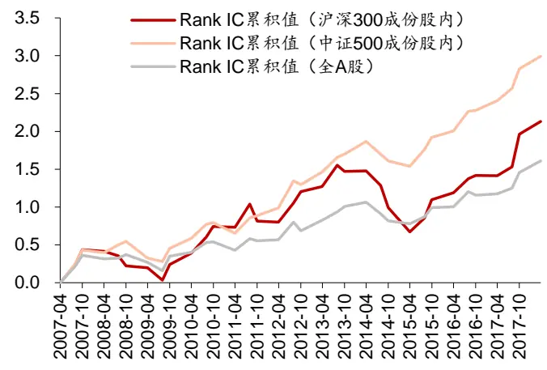
资料来源：Wind，华泰证券研究所

图表19： qfa_roa 因子回归法因子收益率累积图
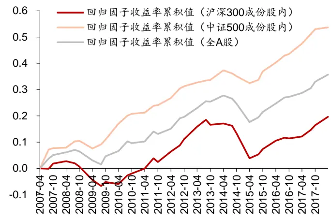
资料来源：Wind，华泰证券研究所

图表20： qfa_roa因子分层组合 1~5的净值除以基准净值示意图
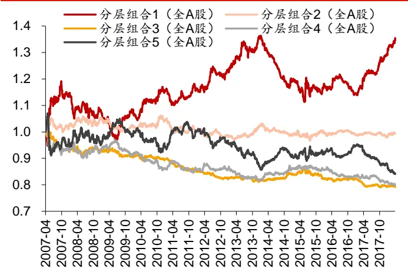
资料来源：Wind，华泰证券研究所

图表21： qfa_roa因子多空组合净值示意图
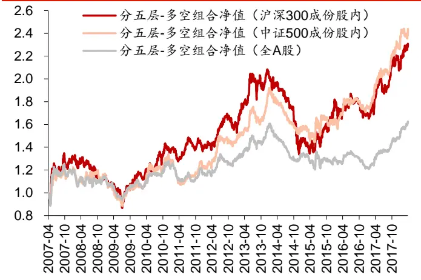
资料来源：Wind，华泰证券研究所

图表22： 不同行业 qfa_roa因子分层测试法结果（分五层，市值中性）

|  |  |  |  |  |  | 多空组合 | 多空组合 | 多空组合 | 多空组合 |
| --- | --- | --- | --- | --- | --- | --- | --- | --- | --- |
| 行业 |  |  | 分层组合1～5（从左到右）年化收益率 |  |  | 年化收益率 | 夏普比率 | 最大回撤 | 月胜率 |
| 家电 | 18.70% | 14.55% | 14.58% | 4.73% | 3.24% | 12.80% | 0.53 | 50.46% | 55.30% |
| 银行 | 10.06% | 1.05% | 3.98% | 4.00% | -3.34% | 11.36% | 0.63 | 38.48% | 56.82% |
| 食品饮料 | 13.42% | 10.12% | 8.95% | 6.64% | 2.12% | 8.77% | 0.41 | 54.64% | 51.52% |
| 电力及公用事业 | 6.83% | 6.01% | 0.15% | 3.15% | -2.88% | 8.59% | 0.57 | 26.24% | 59.09% |
| 国防军工 | 13.82% | 15.48% | 8.58% | 4.94% | 1.03% | 7.83% | 0.30 | 53.08% | 52.27% |
| 医药 | 17.68% | 19.33% | 11.11% | 12.91% | 9.08% | 6.41% | 0.44 | 31.36% | 55.30% |
| 电子元器件 | 16.81% | 15.06% | 7.02% | 5.09% | 10.06% | 6.27% | 0.35 | 33.61% | 56.82% |
| 钢铁 | 6.03% | -0.40% | 6.79% | -3.02% | -0.95% | 6.09% | 0.28 | 45.37% | 55.30% |
| 建筑 | 14.39% | 1.70% | 4.16% | 12.42% | 5.56% | 6.08% | 0.28 | 47.47% | 56.82% |
| 电力设备 | 15.13% | 6.49% | 9.94% | 0.28% | 7.27% | 5.40% | 0.31 | 53.34% | 54.55% |
| 有色金属 | 10.03% | 4.54% | 4.25% | 4.82% | 3.00% | 5.27% | 0.24 | 40.38% | 52.27% |
| 基础化工 | 9.69% | 10.65% | 7.25% | 3.76% | 4.24% | 4.56% | 0.30 | 49.34% | 51.52% |
| 轻工制造 | 14.88% | 4.35% | 3.98% | 4.95% | 10.14% | 2.58% | 0.12 | 55.23% | 53.03% |
| 煤炭 | 3.50% | 5.43% | -2.89% | 5.35% | -0.68% | 1.73% | 0.05 | 80.01% | 47.73% |
| 汽车 机械 | 8.60% | 8.66% | 9.45% | 4.83% | 5.52% | 1.66% | 0.10 | 43.25% | 55.30% |
| 建材 | 9.51% | 5.22% | 8.00% | 6.56% | 8.90% | 0.63% | 0.04 | 36.04% | 47.73% |
| 通信 | 10.93% | 9.24% | 10.06% | 7.75% | 7.87% | 0.58% | 0.03 | 53.88% | 47.73% |
|  | 13.43% | 7.98% | 10.94% | 6.51% | 13.11% | -0.12% | -0.01 | 43.68% | 49.24% |
| 餐饮旅游 石油石化 | 7.31% | 5.57% | 4.52% | 5.50% | 5.16% | -1.43% | -0.06 | 79.03% | 46.97% |
|  | 3.09% | -1.55% | 7.04% | 10.27% | 1.59% | -2.07% | -0.09 | 66.43% | 46.97% |
| 商贸零售 | 5.84% | 2.89% | 2.12% | 3.62% | 6.36% | -2.10% | -0.14 | 51.68% | 46.21% |
| 非银行金融 | 0.31% | -7.39% | -6.25% | 0.25% | -1.01% | -2.15% | -0.07 | 67.00% | 51.52% |
| 纺织服装 | 6.47% | 4.75% | 5.96% | 5.28% | 8.38% | -3.35% | -0.19 | 68.91% | 46.97% |
| 交通运输 | 2.98% | 3.42% | 3.10% | 2.84% | 4.49% | -3.41% | -0.20 | 64.11% | 50.76% |
| 房地产 | 3.77% | 4.17% | 5.20% | 5.98% | 9.03% | -4.06% | -0.26 | 49.94% | 49.24% |
| 农林牧渔 | 11.10% | 11.03% | 0.81% | 3.24% | 13.80% | -4.07% | -0.21 | 71.97% | 47.73% |
| 计算机 | 9.71% | 12.60% | 23.12% | 12.10% | 13.66% | -5.11% | -0.26 | 60.08% | 46.21% |
| 传媒 | 10.77% | 6.78% | -0.66% | 0.57% | 20.98% | -12.84% | -0.46 | 85.38% | 46.97% |
| 综合 | -3.89% | 3.98% | 4.34% | 6.55% | 9.65% | -13.90% | -0.50 | 86.14% | 44.70% |

资料来源：Wind，华泰证券研究所

(2) qfa_grossprofitmargin 因子
图表23： qfa_grossprofitmargin 因子 Rank IC 累积图
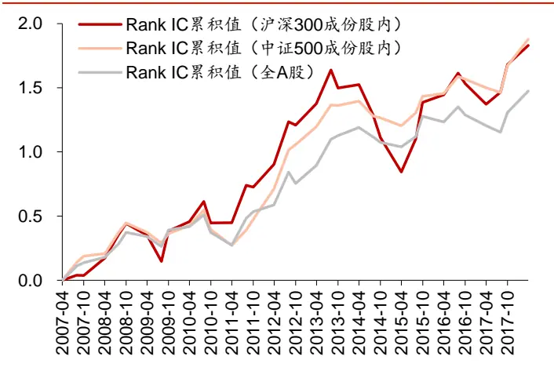
资料来源：Wind，华泰证券研究所

图表24： qfa_grossprofitmargin 因子回归法因子收益率累积图
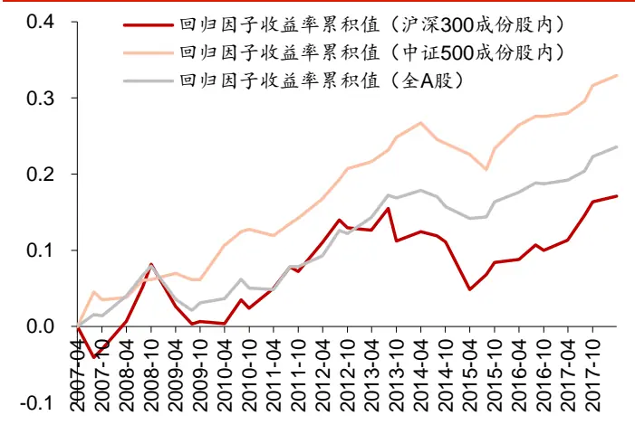
资料来源：Wind，华泰证券研究所

图表25： qfa_grossprofitmargin 分层组合 1~5 净值除基准净值示意图
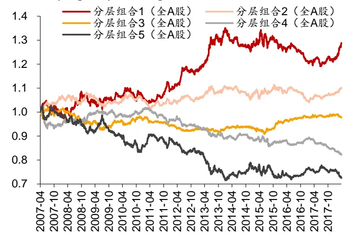
资料来源：Wind，华泰证券研究所

图表26： qfa_grossprofitmargin 因子多空组合净值示意图
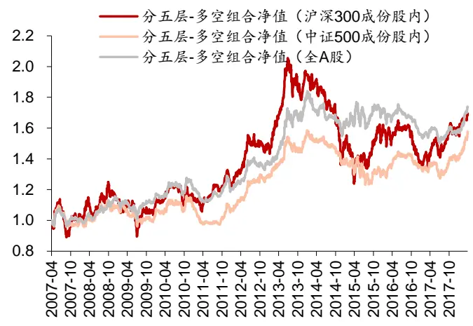
资料来源：Wind，华泰证券研究所

图表27： 不同行业 qfa_grossprofitmargin因子分层测试法结果（分五层，市值中性）

|  |  |  |  |  |  | 多空组合 年化收益率 | 多空组合 | 多空组合 | 多空组合 |
| --- | --- | --- | --- | --- | --- | --- | --- | --- | --- |
| 行业 |  | 分层组合1～5（从左到右）年化收益率 |  |  |  |  | 夏普比率 | 最大回撤 | 月胜率 |
| 汽车 | 14.44% | 6.78% | 9.18% | 3.81% | 3.42% | 10.37% | 0.66 | 32.04% | 56.06% |
| 电子元器件 | 16.77% | 13.82% | 10.91% | 6.08% | 6.76% | 9.57% | 0.60 | 22.60% | 53.79% |
| 建筑 | 17.15% | 5.67% | 3.41% | 7.59% | 4.69% | 9.12% | 0.39 | 57.51% | 60.61% |
| 食品饮料 | 14.36% | 9.75% | 9.53% | 6.10% | 2.70% | 9.07% | 0.38 | 61.19% | 48.48% |
| 电力及公用事业 建材 | 6.12% | 9.58% 11.45% | 2.24% | -0.75% | -3.15% | 7.84% | 0.52 | 22.87% | 54.55% |
| 计算机 | 15.22% |  | 4.54% | 8.19% | 7.22% | 6.08% | 0.31 | 41.18% | 52.27% |
| 基础化工 | 20.99% | 13.96% 11.42% | 15.60% | 7.70% | 13.86% | 4.94% | 0.23 | 36.99% | 53.79% |
| 机械 | 9.44% | 8.29% | 7.00% | 5.29% | 3.51% | 4.87% | 0.34 | 30.34% | 53.79% |
|  | 9.74% |  | 11.57% | 5.26% | 5.22% | 4.00% | 0.27 | 23.47% | 53.79% |
| 电力设备 | 12.62% | 8.63% | 8.79% | 3.38% | 6.73% | 3.87% | 0.23 | 33.86% | 51.52% |
| 钢铁 | 7.57% | -3.68% | -1.83% | 3.28% | 1.39% | 3.42% | 0.15 | 47.92% | 47.73% |
| 通信 | 12.51% | 11.27% | 8.19% | 13.94% | 4.80% | 3.07% | 0.14 | 36.38% | 52.27% |
| 医药 | 17.71% | 13.87% | 17.92% | 10.32% | 12.90% | 2.95% | 0.24 | 31.70% | 52.27% |
| 煤炭 有色金属 | 6.29% | 3.33% | 4.09% | -4.46% | 2.71% | 2.02% | 0.09 | 56.42% | 48.48% |
|  | 7.16% | 3.88% | 9.79% | 4.76% | 3.69% | 1.46% | 0.08 | 54.45% | 52.27% |
| 家电 国防军工 | 13.33% | 9.96% | 16.69% | 7.56% | 9.89% | 1.32% | 0.06 | 58.64% | 49.24% |
| 交通运输 | 5.01% | 11.56% 2.00% | 11.48% | 13.47% | 1.60% | -0.89% | -0.03 | 47.61% | 49.24% |
|  | 5.05% | 8.89% | 3.09% | 2.98% | 5.04% | -2.11% | -0.11 | 43.41% | 47.73% |
| 餐饮旅游 轻工制造 | 7.47% | 9.63% | -1.60% | 9.37% | 5.59% | -2.19% | -0.09 | 57.16% | 50.00% |
| 农林牧渔 | 9.66% | 8.30% | 7.80% | 1.08% | 9.50% | -2.46% | -0.12 | 52.82% | 49.24% |
|  | 10.19% | 7.85% | 6.15% | 5.57% | 11.85% | -3.39% | -0.19 | 58.99% | 48.48% |
| 纺织服装 | 3.48% | 6.63% | 8.31% | 6.59% | 5.73% | -3.75% | -0.20 | 61.61% | 47.73% |
| 房地产 | 4.13% | 2.05% | 3.15% | 7.67% | 7.95% | -4.01% | -0.29 | 44.23% | 43.94% |
| 综合 | 7.72% | 15.52% | 0.88% | 1.06% | 11.10% | -5.48% | -0.21 | 74.34% | 46.21% |
| 石油石化 | 1.10% | 4.31% | 2.92% | 0.70% | 4.40% | -6.09% | -0.24 | 73.45% | 46.97% |
| 商贸零售 | 1.13% |  | 5.15% | 5.52% | 6.64% | -6.85% | -0.47 | 65.16% | 48.48% |
| 传媒 | 9.50% | 6.91% | 10.83% | -3.86% | 16.14% | -8.63% | -0.30 | 80.93% | 41.67% |
| 非银行金融 | - |  |  |  |  | - | - | - |  |
| 银行 | = |  |  |  |  | 1 |  |  |  |

资料来源：Wind，华泰证券研究所

(3) nptocostexpense_qfa 因子

图表28： nptocostexpense_qfa 因子 Rank IC 累积图
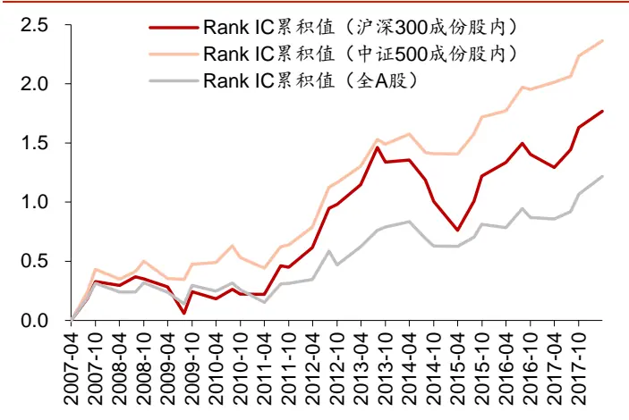
资料来源：Wind，华泰证券研究所

图表29： nptocostexpense_qfa 因子回归法因子收益率累积图
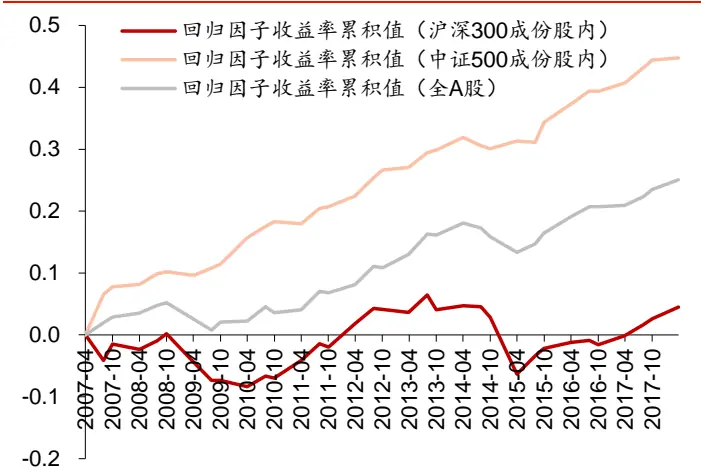
资料来源：Wind，华泰证券研究所

图表30： nptocostexpense_qfa 分层组合 1~5 净值除基准净值示意图
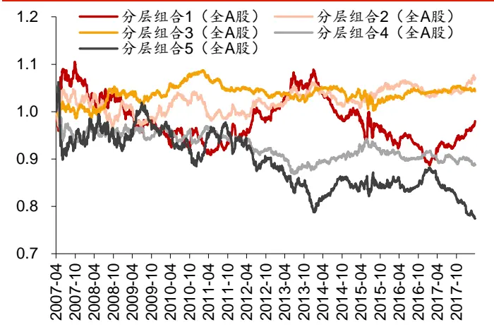
资料来源：Wind，华泰证券研究所

图表31： nptocostexpense_qfa 因子多空组合净值示意图
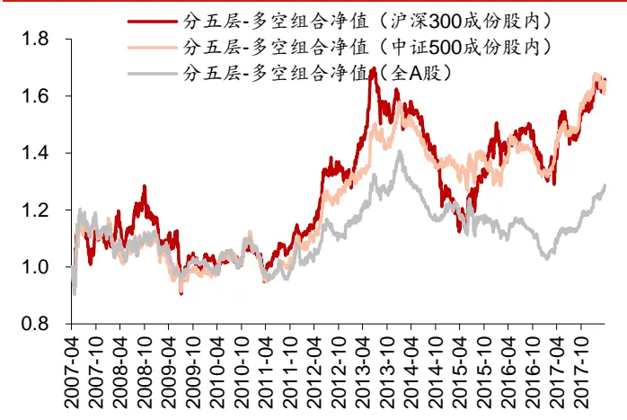
资料来源：Wind，华泰证券研究所

图表32： 不同行业 nptocostexpense_qfa 因子分层测试法结果（分五层，市值中性）

|  | 分层组合1～5（从左到右）年化收益率 |  |  |  |  | 多空组合 年化收益率 | 多空组合 夏普比率 | 多空组合 最大回撤 | 多空组合 月胜率 |
| --- | --- | --- | --- | --- | --- | --- | --- | --- | --- |
| 行业 |  |  |  |  |  |  |  |  |  |
| 电力及公用事业 | 9.28% | 3.50% 8.03% | 2.85% 12.12% | 4.30% 8.35% | -4.55% 1.45% | 11.89% 8.75% | 0.68 0.41 | 34.19% 55.41% | 57.58% 52.27% |
| 食品饮料 家电 | 12.06% 11.13% | 14.76% | 18.10% | 10.29% | 2.27% | 6.79% | 0.30 | 44.93% | 51.52% |
| 电力设备 | 13.09% | 10.38% | 4.97% | 6.00% | 4.22% | 6.16% | 0.33 | 33.71% | 58.33% |
| 医药 电子元器件 | 17.38% | 14.84% 12.07% | 14.33% | 15.51% | 9.59% 8.11% | 5.98% 5.82% | 0.46 | 34.57% | 57.58% |
| 国防军工 | 14.05% | 11.43% | 12.65% | 7.83% | 0.03% | 5.19% | 0.34 | 29.99% | 53.79% |
| 建筑 | 10.25% | 1.63% | 9.37% | 15.37% |  | 3.80% | 0.20 | 48.83% | 53.79% |
| 煤炭 | 14.14% | -1.46% | 8.41% | 9.85% | 7.33% |  | 0.16 | 54.97% | 56.06% |
| 基础化工 | 5.17% | 11.95% | 3.55% | 5.11% | 0.37% | 3.64% | 0.14 | 69.22% | 50.76% |
| 钢铁 | 7.54% |  | 7.69% | 4.45% | 3.85% | 3.02% | 0.20 | 39.91% | 52.27% |
| 汽车 | 2.35% | 5.86% 10.85% | 1.50% | 0.79% | -1.87% | 2.95% | 0.13 | 48.88% | 53.79% |
| 有色金属 | 8.16% | 6.48% | 7.19% | 5.93% | 4.82% | 2.19% | 0.13 | 43.76% | 52.27% |
| 餐饮旅游 | 6.18% | 7.50% | 7.23% | 5.13% | 3.51% | 1.88% | 0.09 | 46.61% | 56.06% |
| 石油石化 | 6.29% | 4.42% | 0.34% | 9.58% | 2.64% | 1.31% | 0.05 | 53.25% | 47.73% |
| 机械 | 3.87% | 6.73% | 4.69% | 6.62% | 0.90% | 0.37% | 0.01 | 47.78% | 46.21% |
| 建材 | 7.45% | 11.68% | 8.10% | 6.24% | 8.34% | -0.69% | -0.05 | 40.65% | 50.76% |
| 轻工制造 | 8.09% | 4.32% | 9.09% | 11.02% | 6.73% | -0.81% | -0.04 | 58.56% | 53.03% |
| 商贸零售 | 10.95% | 4.63% | 7.79% | 2.80% | 12.87% | -3.60% | -0.16 | 63.03% | 44.70% |
| 纺织服装 | 1.31% | 7.14% | 4.00% | 7.73% | 3.26% | -3.68% | -0.25 | 53.79% | 44.70% |
|  | 4.33% |  | 5.35% | 6.53% | 7.29% | -4.16% | -0.23 | 70.47% | 50.76% |
| 农林牧渔 | 8.95% | 8.05% | 3.20% | 6.97% | 13.07% | -5.52% | -0.29 | 73.08% | 46.97% |
| 通信 | 8.72% | 12.55% | 11.87% | 3.21% | 14.82% | -5.66% | -0.25 | 59.10% | 49.24% |
| 计算机 | 8.15% | 17.91% | 16.38% | 13.19% | 13.11% | -5.91% | -0.30 | 56.26% | 47.73% |
| 交通运输 | 1.18% | 0.48% | 4.92% | 7.44% | 4.50% | -6.21% | -0.30 | 67.01% | 46.97% |
| 房地产 | 2.51% | 6.24% | 2.46% | 4.46% | 10.15% | -6.55% | -0.43 | 64.64% | 47.73% |
| 综合 | -1.19% | 3.25% | -0.55% | 9.20% | 6.93% | -9.39% | -0.34 | 74.81% | 49.24% |
| 传媒 | 9.62% | 9.91% | -2.30% | 0.75% | 22.69% | -14.40% | -0.49 | 91.05% | 44.70% |
| 非银行金融 | - |  |  |  |  | - |  |  |  |
| 银行 |  |  |  |  |  |  | 1 |  |  |

资料来源：Wind，华泰证券研究所

## (4) roic 因子

图表33： roic 因子 Rank IC 累积图
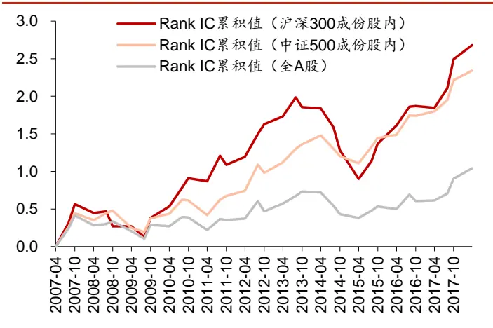
资料来源：Wind，华泰证券研究所

图表34： roic因子回归法因子收益率累积图
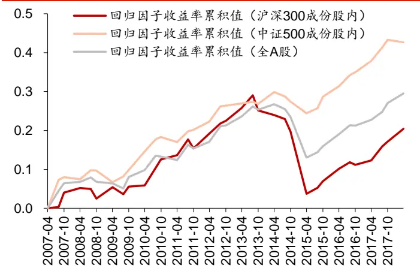
资料来源：Wind，华泰证券研究所

图表35： roic因子分层组合 1~5的净值除以基准净值示意图
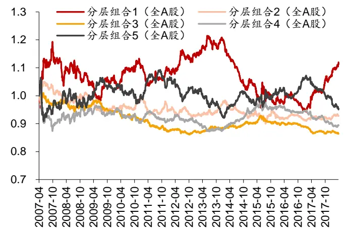
资料来源：Wind，华泰证券研究所

图表36： roic因子多空组合净值示意图
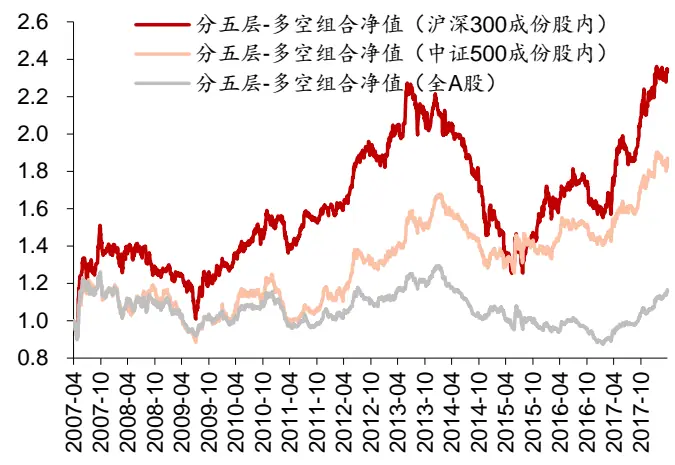
资料来源：Wind，华泰证券研究所

图表37： 不同行业 roic因子分层测试法结果（分五层，市值中性）

| 分层组合1～5（从左到右）年化收益率 |  |  |  |  |  | 多空组合 年化收益率 |  | 多空组合 夏普比率 | 多空组合 最大回撤 | 多空组合 |
| --- | --- | --- | --- | --- | --- | --- | --- | --- | --- | --- |
| 行业 |  | 15.27% | 2.48% | 11.14% | 1.15% | 6.36% | 0.27 | 67.24% | 月胜率 50.00% |  |
| 食品饮料 家电 | 10.93% 16.39% | 10.87% | 17.66% | 2.26% | 7.45% | 4.35% | 0.17 | 69.43% | 50.76% |  |
| 电子元器件 | 16.07% | 9.55% | 10.12% | 7.49% | 11.38% | 4.19% | 0.24 | 35.34% | 52.27% |  |
| 电力及公用事业 | 4.43% | 5.57% | 2.68% | 1.50% | -0.39% | 3.99% | 0.26 | 28.85% | 53.79% |  |
| 有色金属 | 8.78% | 5.58% | 3.99% | 4.75% | 3.48% | 3.44% | 0.16 | 47.62% | 53.03% |  |
| 基础化工 | 8.97% | 7.39% | 8.95% | 5.35% | 5.04% | 3.04% | 0.20 | 46.17% | 53.03% |  |
| 煤炭 | 5.53% | 1.60% | 2.89% | 1.58% | 0.45% | 2.31% | 0.07 | 82.01% | 41.67% |  |
| 国防军工 | 13.17% | 8.00% | 14.57% | 2.01% | 5.32% | 2.10% | 0.08 | 55.44% | 49.24% |  |
| 电力设备 | 9.98% | 11.96% | 5.54% | 4.09% | 6.02% | 1.73% | 0.10 | 58.98% | 51.52% |  |
| 建材 | 11.58% | 4.00% | 10.77% | 11.08% | 8.09% | 1.33% |  |  |  |  |
| 建筑 | 13.85% | 6.65% | 0.46% | 10.17% | 9.78% | 0.56% | 0.06 | 44.84% | 51.52% |  |
| 钢铁 | 4.88% | 0.74% | 1.78% | -2.27% | 3.84% | 0.36% | 0.02 | 59.81% | 53.79% |  |
| 医药 | 13.06% | 18.94% | 15.75% | 11.01% | 12.24% | -0.94% | 0.02 | 55.97% | 51.52% |  |
| 汽车 | 7.93% | 7.60% | 9.37% | 3.47% | 8.42% | -1.53% | -0.06 | 49.98% | 50.76% |  |
| 交通运输 | 4.07% | 0.91% | 2.83% | 4.79% | 3.75% | -1.75% | -0.09 | 51.50% | 49.24% |  |
| 农林牧渔 | 9.73% | 8.68% | 3.96% | 8.23% | 10.26% | -1.82% | -0.10 | 59.19% | 50.76% |  |
| 轻工制造 | 9.65% | 8.76% | 3.90% | 5.69% | 10.06% | -2.61% | -0.10 | 59.15% | 53.03% |  |
| 机械 | 7.89% | 8.15% | 5.13% | 6.35% | 11.01% | -2.82% | -0.12 | 57.97% | 49.24% |  |
| 餐饮旅游 | 1.69% | 8.33% | 3.18% | 10.52% | 1.97% | -3.33% | -0.19 | 60.20% | 46.21% |  |
| 通信 | 10.60% | 8.06% | 12.67% | 3.65% | 14.04% | -4.19% | -0.14 | 74.19% 51.55% | 42.42% |  |
| 纺织服装 | 5.46% | 3.28% | 6.84% | 5.24% | 9.84% | -5.53% | -0.19 -0.29 | 77.95% | 53.03% |  |
| 房地产 | 3.41% | 4.63% | 3.69% | 5.32% | 11.06% | -5.87% | -0.37 | 63.92% | 46.97% |  |
| 石油石化 | -2.04% | 10.48% | -3.44% | 12.73% | 3.51% | -8.14% | -0.35 | 68.96% | 47.73% |  |
| 商贸零售 | 1.39% | 6.31% | 2.36% | 3.39% | 8.24% | -8.28% | -0.51 | 77.87% | 46.21% |  |
| 综合 | -2.62% | 7.08% | 2.48% | 5.91% | 5.45% | -10.05% | -0.34 | 82.43% | 41.67% |  |
| 计算机 | 9.49% | 14.54% | 12.25% | 15.13% | 19.78% | -10.37% | -0.51 | 78.75% | 49.24% |  |
| 传媒 | 11.28% | 5.63% | -3.93% | 0.44% | 26.12% | -15.81% |  |  | 42.42% |  |
|  |  |  |  |  |  |  | -0.56 | 88.30% | 44.70% |  |
| 非银行金融 银行 | - |  |  |  |  | - | - |  | - |  |

资料来源：Wind，华泰证券研究所

## 收益质量因子

我们先来观察下收益质量类 7 个因子在全部非 ST 股票上的数据覆盖度随时间变化曲线，以及它们在各种股票池内回归法、IC 值分析结果汇总。

图表38： 收益质量因子数据覆盖度随时间变化情况
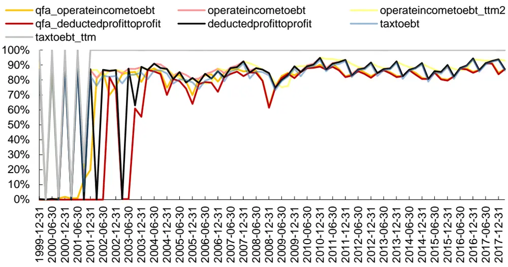
资料来源：Wind，华泰证券研究所

图表39： 收益质量因子在各种股票池内回归法、IC值分析结果汇总（行业中性、市值中性）

| Wind 因子名称 | 因子含义 | It\|均值 \|t>2 占比 t 均值 |  | 因子收益率 |  | Rank IC 均值 | Rank IC 标准差 | IC_IR | IC>0 占比 |
| --- | --- | --- | --- | --- | --- | --- | --- | --- | --- |
|  |  |  |  |  | 均值 |  |  |  |  |
| 沪深 300 成份股内 |  |  |  |  |  |  |  |  |  |
| qfa_operateincometoebt | 单季度经营活动净收益/利润总额 | 1.07 | 15.15% | -0.10 | -0.23% | 2.92% | 11.22% | 0.26 | 63.64% |
| operateincometoebt | 当年累计经营活动净收益/利润总额 | 1.25 | 24.24% | -0.09 | -0.27% | 2.44% | 11.04% | 0.22 | 63.64% |
| operateincometoebt_ttm2 | 经营活动净收益/利润总额TTM | 1.08 | 18.18% | 0.22 | 0.06% | 3.67% | 12.01% | 0.31 | 60.61% |
| qfa_deductedprofittoprofit 单季度扣非净利润/净利润 |  | 1.11 | 12.12% | 0.15 | -0.01% | 1.37% | 10.72% | 0.13 | 51.52% |
| deductedprofittoprofit | 当年累计扣非净利润/净利润 | 1.42 | 27.27% | 0.18 | -0.05% | 1.54% | 11.45% | 0.13 | 57.58% |
| taxtoebt | 当年累计所得税/利润总额 | 1.32 | 15.15% | 0.16 | 0.25% | 0.42% | 12.14% | 0.03 | 54.55% |
| taxtoebt_ttm | 税项/利润总额 TTM | 1.08 | 9.09% | 0.17 | 0.17% | 2.04% | 10.33% | 0.20 | 63.64% |
| 中证 500 成份股内 |  |  |  |  |  |  |  |  |  |
| qfa_operateincometoebt | 单季度经营活动净收益/利润总额 | 1.22 | 12.12% | 0.48 | 0.37% | 3.57% | 7.09% | 0.50 | 63.64% |
| operateincometoebt | 当年累计经营活动净收益/利润总额 | 1.30 | 15.15% | 0.40 | 0.30% | 3.14% | 7.85% | 0.40 | 57.58% |
| operateincometoebt_ttm2 | 经营活动净收益/利润总额TTM | 1.25 | 21.21% | 0.58 | 0.43% | 3.28% | 8.13% | 0.40 | 63.64% |
| qfa_deductedprofittoprofit 单季度扣非净利润/净利润 |  | 1.33 | 21.21% | 0.57 | 0.50% | 3.86% | 7.16% | 0.54 | 60.61% |
| deductedprofittoprofit | 当年累计扣非净利润/净利润 | 1.19 | 18.18% | 0.56 | 0.48% | 3.96% | 6.30% | 0.63 | 72.73% |
| taxtoebt | 当年累计所得税/利润总额 | 1.08 | 9.09% | -0.47 | -0.33% | -0.99% | 9.96% | -0.10 | 39.39% |
| taxtoebt_ttm | 税项/利润总额 TTM | 1.07 | 12.12% | -0.18 | -0.08% | 0.55% | 8.27% | 0.07 | 54.55% |
| 全A股 |  |  |  |  |  |  |  |  |  |
| qfa_operateincometoebt | 单季度经营活动净收益/利润总额 | 1.71 | 36.36% | 0.75 | 0.26% | 4.26% | 6.43% | 0.66 | 78.79% |
| operateincometoebt | 当年累计经营活动净收益/利润总额 | 1.97 | 30.30% | 0.75 | 0.24% | 3.93% | 6.45% | 0.61 | 75.76% |
|  | operateincometoebt_ttm2经营活动净收益/利润总额TTM | 2.23 | 51.52% | 1.22 | 0.47% | 3.27% | 6.57% | 0.50 | 69.70% |
| qfa_deductedprofittoprofit 单季度扣非净利润/净利润 |  | 1.79 | 39.39% | 0.92 | 0.34% | 4.83% | 6.57% | 0.74 | 75.76% |
| deductedprofittoprofit | 当年累计扣非净利润/净利润 | 1.96 | 36.36% | 1.08 | 0.40% | 4.67% | 6.02% | 0.78 | 75.76% |
| taxtoebt | 当年累计所得税/利润总额 税项/利润总额 TTM | 1.79 | 36.36% | -0.14 | 0.03% | 0.23% | 7.04% | 0.03 | 51.52% |
| taxtoebt_ttm |  | 1.32 | 18.18% | 0.09 | 0.02% | 0.12% | 6.07% | 0.02 | 48.48% |

资料来源：Wind，华泰证券研究所

这 7 个收益质量因子的数据覆盖度比较一般，只有 taxtoebt_ttm 因子在 2001 年之后覆盖度接近 100%，不过该因子效果不太好，其余因子覆盖度一直在 80%左右波动。

图表40： 收益质量因子在各种股票池内分层测试法结果汇总（分五层，行业中性、市值中性）
多空组合多空组合多空组合多空组合

| Wind 因子名称 | 因子含义 | 分层组合1～5（从左到右） 年化收益率年化收益率夏普比率最大回撤 |  |  |  |  |  | 月胜率 |
| --- | --- | --- | --- | --- | --- | --- | --- | --- |
| 沪深 300 成份股内 |  |  |  |  |  |  |  |  |
| qfa_operateincometoebt | 单季度经营活动净收益/利润总额 | 4.22% | 3.64% | 4.15% | 0.25% -1.46% | 5.07% | 0.51 41.55% | 55.30% |
| operateincometoebt | 当年累计经营活动净收益/利润总额 | 4.15% | 5.23% | 2.12% | 1.55% -1.76% | 5.01% | 0.48 41.41% | 54.55% |
| operateincometoebt_ttm2 | 经营活动净收益/利润总额 TTM | 5.08% | 3.47% | 3.61% | -0.62% 0.23% | 3.72% | 0.36 39.82% | 54.55% |
| qfa_deductedprofittoprofit | 单季度扣非凈利润/凈利润 | 3.56% | 2.39% | 1.80% | 3.99% -1.72% | 5.52% | 0.58 20.01% | 57.58% |
| deductedprofittoprofit | 当年累计扣非净利润/净利润 | 4.38% | 0.78% | 3.53% | 1.55% 0.03% | 4.39% | 0.47 20.22% | 57.58% |
| taxtoebt | 当年累计所得税/利润总额 | 3.02% | 1.65% | 3.51% | 3.14% -0.11% | 2.62% | 0.26 25.72% | 50.00% |
| taxtoebt_ttm | 税项/利润总额 TTM | 2.63% | 2.72% | 1.92% 3.99% | -1.14% | 3.17% | 0.33 16.73% | 55.30% |
| 中证 500 成份股内 |  |  |  |  |  |  |  |  |
| qfa_operateincometoebt | 单季度经营活动净收益/利润总额 | 7.76% | 5.82% | 5.14% 5.89% | 3.44% | 3.30% | 0.47 18.42% | 53.79% |
| operateincometoebt | 当年累计经营活动净收益/利润总额 | 7.19% | 4.86% | 7.22% | 5.68% 4.37% | 1.86% | 0.25 22.27% | 56.06% |
| operateincometoebt_ttm2 | 经营活动净收益/利润总额TTM | 7.77% | 5.52% | 6.73% | 4.41% 3.86% | 2.81% | 0.36 24.51% | 52.27% |
| qfa_deductedprofittoprofit | 单季度扣非凈利润/净利润 | 7.73% | 6.49% | 6.19% | 5.36% 2.19% | 4.66% | 0.69 23.11% | 59.85% |
| deductedprofittoprofit | 当年累计扣非净利润/净利润 | 9.28% | 4.82% | 6.64% | 4.85% 3.29% | 4.92% | 0.71 15.18% | 60.61% |
| taxtoebt | 当年累计所得税/利润总额 | 5.94% | 5.25% | 5.63% | 6.52% 6.06% | -0.72% | -0.09 32.82% | 45.45% |
| taxtoebt_ttm | 税项/利润总额 TTM | 4.35% | 6.40% | 6.67% 5.07% | 4.10% | -0.35% | -0.05 22.58% | 50.00% |
| 全 A股 |  |  |  |  |  |  |  |  |
| qfa_operateincometoebt | 单季度经营活动净收益/利润总额 | 12.99% | 8.04% | 7.22% | 8.46% 5.51% | 6.95% | 1.42 11.67% | 65.91% |
| operateincometoebt | 当年累计经营活动净收益/利润总额 | 12.50% | 7.98% | 8.08% 8.05% | 5.45% | 6.58% | 1.28 11.39% | 62.88% |
| operateincometoebt_ttm2 | 经营活动净收益/利润总额 TTM | 11.82% | 8.03% | 8.22% | 7.52% 6.43% | 5.07% | 0.96 9.10% | 62.12% |
| qfa_deductedprofittoprofit | 单季度扣非凈利润/凈利润 | 13.54% | 8.61% | 6.37% | 8.44% 4.65% | 8.58% | 1.81 8.83% | 68.94% |
| deductedprofittoprofit | 当年累计扣非净利润/净利润 | 13.72% | 8.04% | 5.95% | 8.39% 5.22% | 8.17% | 1.67 8.83% | 62.88% |
| taxtoebt | 当年累计所得税/利润总额 | 8.78% | 7.98% | 9.52% | 8.53% 7.51% | 0.92% | 0.16 18.85% | 48.48% |
| taxtoebt_ttm | 税项/利润总额TTM | 7.59% | 8.08% | 9.26% | 9.41% 8.97% | -0.81% | -0.13 20.98% | 46.97% |

资料来源：Wind，华泰证券研究所

通过回归法、IC值分析、分层测试法的结果我们可以发现，收益质量因子的效果排序大致为 ： 单 季 度 指 标 ≈ 当 年 累 计 指 标 > TTM 指 标 。 我 们 选 择 效 果 较 好 的qfa_operateincometoebt、qfa_deductedprofittoprofit 因子进行单独展示，其主要指标表现如下。

## (1) qfa_operateincometoebt 因子

图表41： qfa_operateincometoebt 因子 Rank IC 累积图
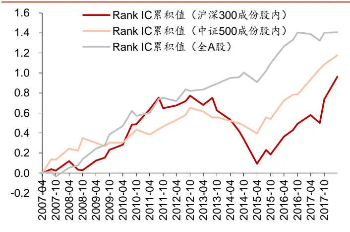
资料来源：Wind，华泰证券研究所

图表42： qfa_operateincometoebt 因子回归法因子收益率累积图
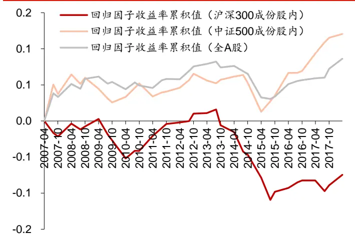
资料来源：Wind，华泰证券研究所

图表43： qfa_operateincometoebt 分层组合 1~5 净值除以基准示意图
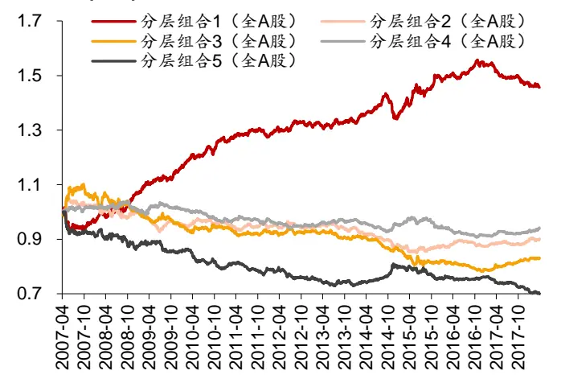
资料来源：Wind，华泰证券研究所

图表44： qfa_operateincometoebt 因子多空组合净值示意图
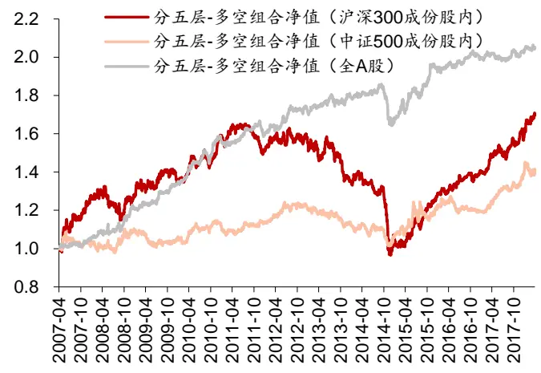
资料来源：Wind，华泰证券研究所

图表45： 不同行业 qfa_operateincometoebt因子分层测试法结果（分五层，市值中性）

| 分层组合1～5（从左到右）年化收益率 |  |  |  |  |  | 多空组合 年化收益率 |  | 多空组合 | 多空组合 | 多空组合 |
| --- | --- | --- | --- | --- | --- | --- | --- | --- | --- | --- |
| 行业 |  | -0.15% | -3.32% | 0.51% | -3.54% | 15.28% | 夏普比率 0.70 | 最大回撤 | 月胜率 |  |
| 钢铁 煤炭 | 14.01% 11.20% | 0.25% | 2.02% | 4.76% | -5.94% | 14.45% | 0.61 | 39.70% 39.69% | 56.82% 56.82% |  |
| 基础化工 | 14.90% | 8.55% | 2.17% | 6.29% | 3.90% | 9.84% | 0.77 | 16.70% | 57.58% |  |
| 家电 | 19.19% | 11.71% | 7.63% | 13.65% | 6.92% | 8.98% | 0.42 | 37.61% | 50.00% |  |
| 机械 | 12.59% | 7.82% | 7.56% | 4.79% | 3.05% | 8.81% | 0.68 | 20.05% | 56.06% |  |
| 房地产 | 11.18% | 4.25% | 1.49% | 6.53% | 0.56% | 8.80% | 0.62 | 25.74% | 59.09% |  |
| 电力及公用事业 | 9.93% | 3.55% | -0.94% | 2.24% | 1.54% | 7.57% | 0.50 | 23.01% | 55.30% |  |
| 纺织服装 | 8.42% | 8.84% | 0.86% | 6.81% | -0.82% | 6.89% | 0.40 | 34.89% | 59.09% |  |
| 医药 | 20.07% | 14.10% | 11.42% | 15.51% | 11.69% | 6.84% | 0.59 | 20.44% | 59.09% |  |
| 农林牧渔 | 10.16% | 9.06% | 4.72% | 7.07% | 0.99% | 6.82% | 0.36 | 36.21% |  |  |
| 交通运输 | 8.65% | 3.01% | 1.82% | 2.62% | 0.96% | 6.40% |  | 21.93% | 49.24% |  |
| 轻工制造 | 9.18% | 8.38% | 9.49% | 5.25% | 1.00% | 6.23% | 0.46 0.30 | 42.41% | 57.58% |  |
| 电力设备 | 11.46% | 3.65% | 11.32% | 10.62% | 4.40% | 5.93% |  |  | 58.33% |  |
| 通信 | 10.54% | 10.82% | 6.81% | 12.78% | 1.10% | 5.75% | 0.36 | 38.60% | 52.27% |  |
| 电子元器件 | 12.46% | 15.70% | 10.44% | 12.44% | 6.02% | 5.71% | 0.27 | 38.49% | 52.27% |  |
| 石油石化 | 9.07% | 7.73% | -0.09% | 8.79% | 1.09% | 5.64% | 0.37 | 33.42% | 57.58% |  |
| 建筑 | 12.90% | 7.59% | 6.13% | 5.81% | 5.91% | 5.13% | 0.21 | 43.03% | 49.24% |  |
| 商贸零售 | 8.08% | 2.81% | 1.57% | 5.04% | 1.19% | 4.96% | 0.25 | 45.13% | 51.52% |  |
| 汽车 | 12.13% | 9.59% | 8.11% | 2.09% | 5.57% | 4.76% | 0.34 | 34.39% | 55.30% |  |
| 传媒 | 12.68% | 0.49% | 3.73% | 9.26% | 4.36% | 4.35% | 0.31 0.16 | 32.45% | 50.76% |  |
| 银行 | 6.00% | 5.76% | 0.79% | 2.63% | 1.32% | 3.43% | 0.17 | 77.02% | 51.52% |  |
| 非银行金融 | 5.56% | -10.54% | -3.00% | -5.14% | -2.11% | 3.29% |  | 38.80% | 57.58% |  |
| 食品饮料 | 8.61% | 5.73% | 8.87% | 16.26% | 3.93% | 3.23% | 0.10 | 50.39% | 54.55% |  |
| 建材 | 8.98% | 13.05% | 12.52% | 7.28% |  | 0.89% | 0.17 | 39.85% | 53.03% |  |
| 综合 | -3.39% | 11.84% | -6.02% |  | 5.23% -5.61% | -0.77% | 0.04 | 45.07% | 49.24% |  |
|  | 16.94% | 8.48% | 16.42% | 5.07% 7.85% | 15.77% | -0.99% | -0.03 | 53.52% | 46.97% |  |
| 计算机 | 10.31% | 12.53% | 7.02% | 9.72% | 11.06% | -3.40% | -0.05 -0.10 | 51.68% | 52.27% |  |
| 国防军工 |  | 5.34% | 3.66% |  | 5.65% | -6.28% |  | 71.57% | 50.76% |  |
| 餐饮旅游 有色金属 | 2.88% 5.11% | 7.58% | 1.56% | 16.73% 1.68% | 11.64% | -8.19% | -0.22 -0.41 | 72.65% 74.89% | 40.15% 43.94% |  |

资料来源：Wind，华泰证券研究所

(2) qfa_deductedprofittoprofit 因子

图表46： qfa_deductedprofittoprofit 因子 Rank IC 累积图
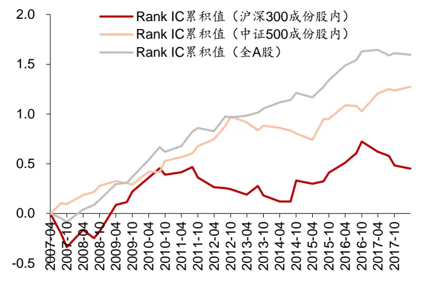
资料来源：Wind，华泰证券研究所

图表47： qfa_deductedprofittoprofit 因子回归法因子收益率累积图
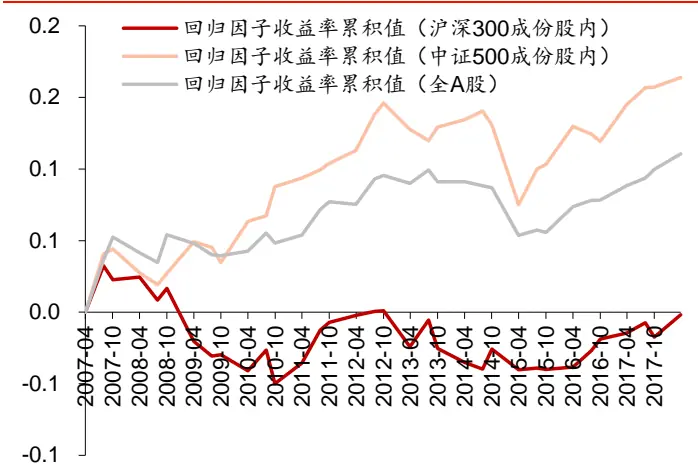
资料来源：Wind，华泰证券研究所

图表48： qfa_deductedprofittoprofit 分层组合 1~5 净值除基准示意图
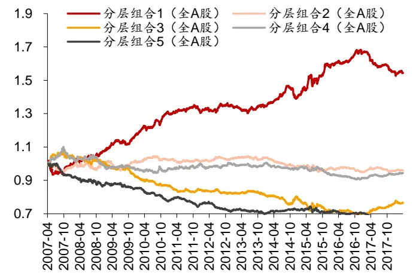
资料来源：Wind，华泰证券研究所

图表49： qfa_deductedprofittoprofit 因子多空组合净值示意图
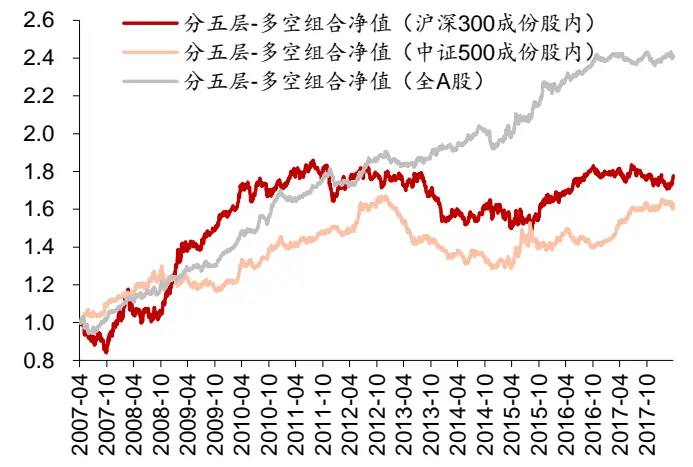
资料来源：Wind，华泰证券研究所

图表50： 不同行业 qfa_deductedprofittoprofit 因子分层测试法结果（分五层，市值中性）

|  | 分层组合1～5（从左到右）年化收益率 |  |  |  |  | 多空组合 年化收益率 | 多空组合 夏普比率 | 多空组合 最大回撤 | 多空组合 月胜率 |
| --- | --- | --- | --- | --- | --- | --- | --- | --- | --- |
| 行业 |  |  |  |  |  |  |  |  |  |
| 传媒 | 26.28% | 2.22% | -0.71% | 5.76% | 2.19% | 18.19% 16.23% | 0.69 | 36.63% | 60.61% |
| 交通运输 | 12.22% | 4.77% 9.35% | -2.26% | 4.39% -2.51% | -4.46% -3.57% | 14.99% | 1.04 | 22.93% 52.24% | 63.64% |
| 钢铁 | 13.55% |  | -7.30% |  |  |  | 0.61 |  | 56.82% |
| 电子元器件 | 17.73% | 13.76% | 8.49% | 13.60% | 4.52% | 12.82% | 0.84 | 15.85% | 66.67% |
| 医药 汽车 | 21.07% | 15.86% | 11.83% | 18.34% 2.04% | 7.25% | 12.72% | 1.11 | 20.64% | 62.88% |
| 电力及公用事业 | 15.84% | 7.18% 0.24% | 9.79% |  | 3.46% | 10.52% | 0.68 | 30.38% | 51.52% |
|  | 11.40% | 10.09% | 3.46% | 0.59% | 0.43% | 10.28% | 0.66 | 30.73% | 58.33% |
| 建材 机械 | 13.38% |  | 11.48% | 10.02% | 1.57% | 9.86% | 0.48 | 40.34% | 57.58% |
|  | 9.97% | 8.31% | 5.99% | 9.83% | 0.05% | 9.68% | 0.74 | 21.49% | 56.82% |
| 基础化工 | 14.61% | 10.47% | 2.80% | 2.95% | 4.22% | 9.16% | 0.70 | 23.23% | 55.30% |
| 房地产 | 9.54% | 3.70% | 1.51% | 7.53% | -0.79% | 9.01% | 0.62 | 27.01% | 51.52% |
| 轻工制造 | 10.41% | 9.13% | 1.16% | 12.77% | 1.11% | 7.93% | 0.38 | 34.40% | 57.58% |
| 综合 | 4.02% | 12.33% | -1.25% | -5.19% | -6.76% | 7.83% | 0.27 | 53.73% | 51.52% |
| 非银行金融 | 5.74% | -5.88% | -6.41% | -7.93% | -2.91% | 6.35% | 0.20 | 59.50% | 52.27% |
| 国防军工 | 16.63% | 12.75% | 5.59% | 8.42% | 6.13% | 6.10% | 0.20 | 64.68% | 51.52% |
| 商贸零售 | 6.71% | 6.84% | 0.81% | 5.96% | -0.26% | 5.81% | 0.40 | 25.41% | 57.58% |
| 煤炭 | 7.91% | 0.38% | 3.13% | 1.07% | -1.60% | 5.39% | 0.21 | 47.97% | 53.79% |
| 纺织服装 | 7.91% | 8.69% | 2.55% | 2.68% | 1.72% | 3.67% | 0.21 | 29.18% | 48.48% |
| 通信 | 9.41% | 7.76% | 14.74% | 4.88% | 4.44% | 2.26% | 0.10 | 44.23% | 52.27% |
| 计算机 | 14.98% | 9.77% | 18.62% | 8.18% | 11.04% | 1.81% | 0.09 | 42.26% | 50.00% |
| 家电 | 16.23% | 13.31% | 17.55% | 1.60% | 11.10% | 1.79% | 0.08 | 46.54% | 44.70% |
| 石油石化 | 7.73% | 13.24% | -2.90% | 0.96% | 4.32% | 1.64% | 0.06 | 54.53% | 50.76% |
| 农林牧渔 | 9.34% | 6.05% | 9.05% | 3.44% | 5.53% | 1.18% | 0.06 | 46.50% | 46.21% |
| 食品饮料 | 8.88% | 9.51% | 10.82% | 5.68% | 6.51% | 1.11% | 0.06 | 40.99% | 56.06% |
| 电力设备 | 10.05% | 7.42% | 6.67% | 8.69% | 8.09% | 0.47% | 0.03 | 57.78% | 52.27% |
| 有色金属 | 9.64% | 8.72% | 1.50% | 0.90% | 7.10% | 0.28% | 0.01 | 39.62% | 45.45% |
| 建筑 | 11.08% | 6.10% | 3.47% | 9.11% | 8.82% | 0.00% | 0.00 | 50.57% | 51.52% |
| 餐饮旅游 | 14.31% | -6.86% | 5.94% | 9.07% | 10.48% | -1.47% | -0.05 | 68.12% | 49.24% |
| 银行 | 0.47% | 1.03% | 6.78% | -0.16% | 4.40% | -3.59% | -0.14 | 66.81% | 52.27% |

资料来源：Wind，华泰证券研究所

## 现金流量因子

我们先来观察下现金流量类 7 个因子在全部非 ST 股票上的数据覆盖度随时间变化曲线，以及它们在各种股票池内回归法、IC 值分析、分层测试法结果汇总。

图表51： 现金流量因子数据覆盖度随时间变化情况
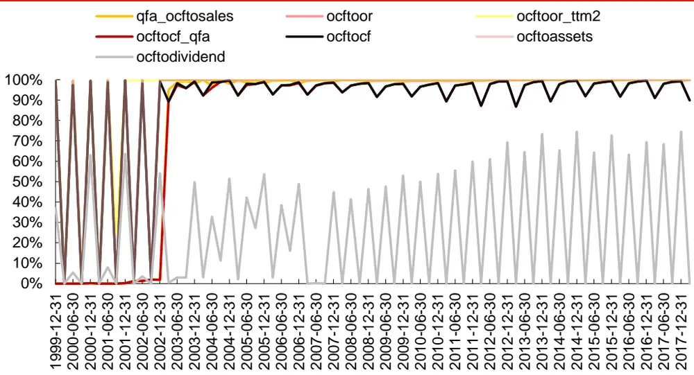
资料来源：Wind，华泰证券研究所

图表52： 现金流量因子在各种股票池内回归法、IC值分析结果汇总（行业中性、市值中性）

| Wind 因子名称 | 因子含义 |  | It\|均值 It\|>2 占比 t 均值 |  | 均值 | 均值 | 标准差 | IC_IR | IC>0 占比 |
| --- | --- | --- | --- | --- | --- | --- | --- | --- | --- |
| 沪深 300 成份股内 |  |  |  |  |  |  |  |  |  |
| qfa_ocftosales | 单季度经营性现金流量净额/营业收入 | 1.17 | 15.15% | 0.67 | 0.63% | 4.47% | 8.76% | 0.51 | 72.73% |
| ocftoor | 当年累计经营性现金流量净额/营业收入 | 1.13 | 18.18% | 0.37 | 0.33% | 4.57% | 9.54% | 0.48 | 72.73% |
| ocftoor_ttm2 | 经营性现金流量净额/营业收入TTM | 1.26 | 24.24% | 0.77 | 0.53% | 4.82% | 10.68% | 0.45 | 69.70% |
| ocftocf_qfa | 单季度经营性现金流量净额占比 | 1.03 | 6.06% | 0.31 | 0.27% | 2.09% | 5.89% | 0.36 | 57.58% |
| ocftocf | 当年累计经营性现金流量净额占比 | 0.86 | 6.06% | -0.09 | -0.11% | 2.68% | 4.80% | 0.56 | 72.73% |
| ocftoassets | 当年累计总资产现金回收率 | 1.03 | 9.09% | 0.49 | 0.42% | 5.39% | 10.05% | 0.54 | 69.70% |
| ocftodividend | 当年累计现金股利保障倍数 | 1.23 | 18.18% | 0.11 | 0.01% | 3.18% | 8.66% | 0.37 | 60.61% |
| 中证 500 成份股内 |  |  |  |  |  |  |  |  |  |
| qfa_ocftosales | 单季度经营性现金流量净额/营业收入 | 0.81 | 12.12% | 0.38 | 0.29% | 2.25% | 6.79% | 0.33 | 57.58% |
| ocftoor | 当年累计经营性现金流量净额/营业收入 | 0.92 | 9.09% | 0.47 | 0.28% | 2.43% | 7.81% | 0.31 | 63.64% |
| ocftoor_ttm2 | 经营性现金流量净额/营业收入 TTM | 1.26 | 18.18% | 0.93 | 0.60% | 3.44% | 7.70% | 0.45 | 63.64% |
| ocftocf_qfa | 单季度经营性现金流量净额占比 | 1.10 | 18.18% | 0.08 | 0.13% | 0.82% | 5.01% | 0.16 | 63.64% |
| ocftocf | 当年累计经营性现金流量净额占比 | 0.98 | 15.15% | 0.03 | -0.01% | 0.08% | 4.60% | 0.02 | 48.48% |
| ocftoassets | 当年累计总资产现金回收率 | 1.26 | 15.15% | 0.66 | 0.43% | 3.07% | 9.12% | 0.34 | 75.76% |
| ocftodividend | 当年累计现金股利保障倍数 | 1.09 | 15.15% | 0.16 | 0.16% | 1.18% | 8.12% | 0.15 | 60.61% |
| 全 A股 |  |  |  |  |  |  |  |  |  |
| qfa_ocftosales | 单季度经营性现金流量净额/营业收入 | 1.49 | 30.30% | 0.96 | 0.32% | 1.09% | 5.06% | 0.22 | 69.70% |
| ocftoor | 当年累计经营性现金流量净额/营业收入 | 1.54 | 36.36% | 0.86 | 0.22% | 0.88% | 6.78% | 0.13 | 66.67% |
| ocftoor_ttm2 | 经营性现金流量净额/营业收入 TTM | 1.94 | 54.55% | 1.38 | 0.39% | 2.07% | 5.23% | 0.40 | 66.67% |
| ocftocf_qfa | 单季度经营性现金流量净额占比 | 1.16 | 12.12% | 0.23 | 0.15% | 1.05% | 2.73% | 0.39 | 54.55% |
| ocftocf | 当年累计经营性现金流量净额占比 | 0.90 | 6.06% | -0.08 | -0.03% | 0.49% | 3.03% | 0.16 | 45.45% |
| ocftoassets | 当年累计总资产现金回收率 | 2.03 | 42.42% | 1.42 | 0.50% | 1.44% | 7.34% | 0.20 | 72.73% |
| ocftodividend | 当年累计现金股利保障倍数 | 1.29 | 18.18% | 0.32 | 0.05% | 0.42% | 7.02% | 0.06 | 63.64% |

资料来源：Wind，华泰证券研究所

图表53： 现金流量因子在各种股票池内分层测试法结果汇总（分五层，行业中性、市值中性）

| 多空组合多空组合多空组合多空组合 |  |  |  |  |  |  |  |
| --- | --- | --- | --- | --- | --- | --- | --- |
| Wind 因子名称 因子含义 | 分层组合1～5（从左到右）年化收益率 |  |  |  | 年化收益率夏普比率最大回撤 |  | 月胜率 |
| 沪深 300 成份股内 |  |  |  |  |  |  |  |
| qfa_ocftosales | 单季度经营性现金流量净额/营业收入 | 2.60% 4.25% | 1.99% | 0.39% | -0.40% 1.53% | 0.15 | 27.05% 50.76% |
| ocftoor | 当年累计经营性现金流量净额/营业收入 | 2.08% 4.47% | 1.69% | 0.10% 1.15% | -0.48% | -0.05 43.00% | 49.24% |
| ocftoor_ttm2 | 经营性现金流量净额/营业收入 TTM | 1.70% 3.95% | 4.13% | 0.72% -0.50% | 0.32% | 0.03 40.28% | 50.76% |
| ocftocf_qfa | 单季度经营性现金流量净额占比 | 1.83% 4.03% | 0.49% | 0.81% 0.11% | 1.60% | 0.24 15.50% | 53.79% |
| ocftocf | 当年累计经营性现金流量净额占比 | 2.12% 3.81% | 2.09% | -1.16% 0.93% | 1.12% | 0.16 17.16% | 55.30% |
| ocftoassets | 当年累计总资产现金回收率 | 4.61% 3.02% | -0.49% | 0.99% 0.98% | 2.27% | 0.22 38.45% | 52.27% |
| ocftodividend | 当年累计现金股利保障倍数 | 2.04% 4.58% | 2.73% | 0.88% 2.55% | -1.37% | -0.13 39.48% | 50.00% |
| 中证 500 成份股内 |  |  |  |  |  |  |  |
| qfa_ocftosales | 单季度经营性现金流量净额/营业收入 | 5.53% 6.58% | 4.25% | 5.55% | 3.11% 1.58% | 0.23 | 14.72% 50.76% |
| ocftoor | 当年累计经营性现金流量净额/营业收入 | 5.80% 6.92% | 4.65% | 4.45% 4.14% | 0.65% | 0.09 26.87% | 53.79% |
| ocftoor_ttm2 | 经营性现金流量净额/营业收入 TTM | 6.30% 7.21% | 6.08% | 5.75% 0.92% | 4.71% | 0.71 17.60% | 60.61% |
| ocftocf_qfa | 单季度经营性现金流量净额占比 | 5.23% 6.87% | 3.60% | 2.30% 5.59% | -0.48% | -0.08 18.70% | 56.82% |
| ocftocf | 当年累计经营性现金流量净额占比 | 4.74% 6.50% | 4.09% | 2.72% | 6.35% -1.68% | -0.28 21.49% | 48.48% |
| ocftoassets | 当年累计总资产现金回收率 | 6.95% 4.72% | 5.77% | 3.40% | 5.01% 0.84% | 0.11 38.39% | 56.82% |
| ocftodividend | 当年累计现金股利保障倍数 | 3.95% | 6.14% 10.66% | 6.53% | 2.83% 0.49% | 0.06 | 33.28% 47.73% |
| 全 A股 |  |  |  |  |  |  |  |
| qfa_ocftosales | 单季度经营性现金流量净额/营业收入 | 8.02% | 9.37% 8.10% | 8.03% | 8.34% -0.96% | -0.19 | 26.07% 47.73% |
| ocftoor | 当年累计经营性现金流量净额/营业收入 | 8.65% 9.23% | 7.34% | 7.84% | 9.67% -1.77% | -0.30 39.24% | 50.00% |
| ocftoor_ttm2 | 经营性现金流量净额/营业收入 TTM | 9.04% 9.79% | 8.88% | 7.59% | 7.77% 0.63% | 0.13 23.91% | 53.03% |
| ocftocf_qfa | 单季度经营性现金流量净额占比 | 8.83% 10.49% | 6.78% | 6.69% | 6.91% 1.57% | 0.49 | 7.88% 58.33% |
| ocftocf ocftoassets | 当年累计经营性现金流量净额占比 当年累计总资产现金回收率 | 8.05% 9.85% | 7.41% 8.42% 7.00% | 6.42% 7.54% | 8.58% -0.68% 9.80% -0.74% | -0.21 -0.13 | 10.30% 44.70% |
| ocftodividend | 当年累计现金股利保障倍数 | 9.81% 8.09% | 8.41% 9.31% | 8.78% | 8.57% -1.03% | -0.18 | 38.16% 51.52% |
|  |  |  |  |  |  |  | 34.86% 47.73% |

资料来源：Wind，华泰证券研究所

这 7 个现金流量因子中，只有 ocftodividend 因子的数据覆盖度比较差，一季报、三季报数据缺失很严重，近五年以来年报、半年报数据覆盖约为 60%~80%，其余 6 个因子的数据覆盖度比较好。对于 ocftodividend 因子，我们只采用年报、半年报数据进行回测。

该类因子整体效果一般，我们此处只选择展示效果尚可的两个因子：qfa_ocftosales、ocftocf_qfa，其主要指标表现如下。

(1) qfa_ocftosales 因子

图表54： qfa_ocftosales 因子 Rank IC 累积图
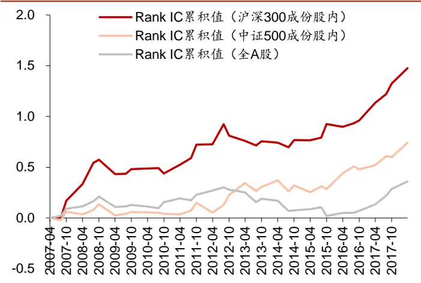
资料来源：Wind，华泰证券研究所

图表55： qfa_ocftosales 因子回归法因子收益率累积图
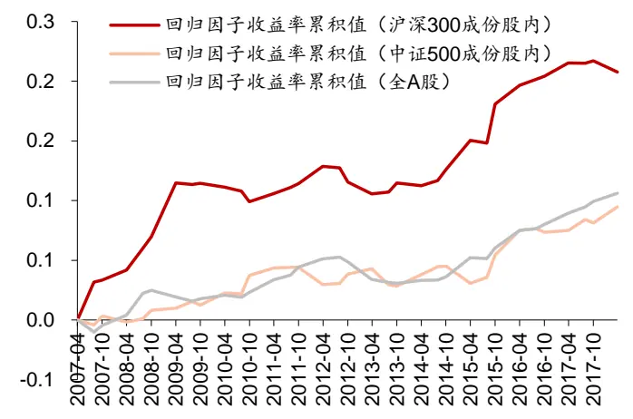
资料来源：Wind，华泰证券研究所

图表56： qfa_ocftosales因子分层组合 1~5净值除以基准净值示意图
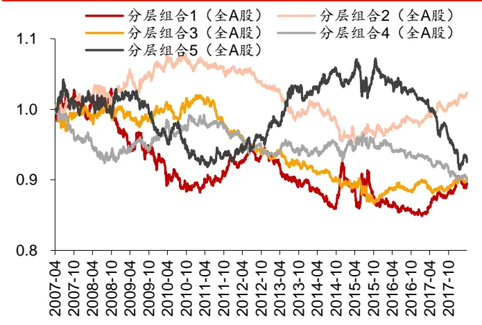
资料来源：Wind，华泰证券研究所

图表57： qfa_ocftosales 因子多空组合净值示意图
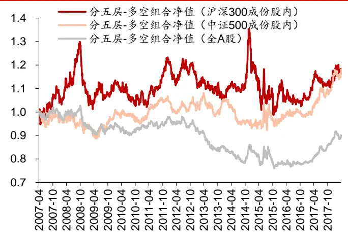
资料来源：Wind，华泰证券研究所

图表58： 不同行业 qfa_ocftosales 因子分层测试法结果（分五层，市值中性）

|  |  |  |  |  |  | 多空组合 |  | 多空组合 多空组合 | 多空组合 |
| --- | --- | --- | --- | --- | --- | --- | --- | --- | --- |
| 行业 |  | 分层组合1～5（从左到右）年化收益率 |  |  |  | 年化收益率 | 夏普比率 | 最大回撤 | 月胜率 |
| 食品饮料 | 15.81% | 7.65% | 11.40% | 5.32% | 1.83% | 11.47% | 0.60 | 41.30% | 57.58% |
| 家电 | 18.85% | 12.04% | 5.55% | 10.55% | 6.78% | 9.45% | 0.44 | 45.06% | 59.09% |
| 建筑 | 13.55% | 7.55% | 11.97% | 6.06% | 1.49% | 9.35% | 0.48 | 43.17% | 57.58% |
| 煤炭 | 6.52% | 8.95% | -3.33% | 4.77% | -4.30% | 8.98% | 0.41 | 41.48% | 55.30% |
| 银行 | 10.17% | 2.96% | 4.94% | 1.87% | 0.13% | 8.42% | 0.51 | 36.69% | 55.30% |
| 机械 | 14.09% | 1.38% | 7.35% | 8.88% | 5.85% | 6.75% | 0.56 | 19.49% | 57.58% |
| 国防军工 | 10.41% | 13.10% | 18.17% | 3.29% | 1.65% | 6.25% | 0.27 | 42.15% | 51.52% |
| 建材 | 12.25% | 17.35% | 3.83% | 7.23% | 4.20% | 6.10% | 0.33 | 48.25% | 54.55% |
| 基础化工 | 9.26% | 7.99% | 5.81% | 8.03% | 3.17% | 4.94% | 0.42 | 26.02% | 56.06% |
| 电力设备 | 9.64% | 8.89% | 3.97% | 9.76% | 4.88% | 3.59% | 0.22 | 47.10% | 53.79% |
| 商贸零售 | 6.11% | 4.79% | 2.17% | 5.71% | 1.89% | 2.55% | 0.18 | 41.85% | 53.03% |
| 医药 | 16.46% | 16.75% | 12.41% | 10.96% | 13.68% | 1.00% | 0.09 | 40.85% | 54.55% |
| 餐饮旅游 | 9.96% | 7.11% | 4.07% | 1.21% | 5.16% | 0.02% | 0.00 | 45.53% | 57.58% |
| 交通运输 | 4.13% | 3.67% | 2.12% | 4.12% | 2.91% | -0.80% | -0.05 | 53.11% | 46.21% |
| 通信 | 11.71% | 8.26% | 8.45% | 14.04% | 9.49% | -0.84% | -0.04 | 40.11% | 51.52% |
| 房地产 电力及公用事业 | 5.76% | 7.01% | 5.42% | 4.30% | 6.21% | -1.39% | -0.11 | 27.26% | 52.27% |
| 电子元器件 | 4.90% | 3.24% | -1.91% | 1.27% | 5.09% | -2.02% | -0.14 | 48.74% | 50.00% |
| 汽车 | 10.04% | 13.32% | 11.05% | 6.54% | 12.37% | -2.24% | -0.16 | 37.57% | 46.21% |
| 钢铁 | 5.78% | 9.91% | 10.91% | 2.85% | 6.71% | -2.32% | -0.15 | 46.22% | 47.73% |
| 有色金属 | 1.98% | -4.72% | 0.99% | 2.37% | 4.01% | -3.69% | -0.19 | 63.20% | 46.97% |
|  | 6.43% | 3.02% | 2.00% | 5.25% | 10.11% | -4.66% | -0.26 | 61.62% | 47.73% |
| 石油石化 | -0.18% | 10.74% | 3.82% | 5.15% | 1.64% | -4.67% | -0.19 | 72.58% | 49.24% |
| 轻工制造 | 4.97% | 3.03% | 8.31% | 14.39% | 6.83% | -4.82% | -0.24 | 58.77% | 43.94% |
| 非银行金融 | -4.71% | -2.05% | -2.12% | -1.56% | -4.23% | -5.50% | -0.20 | 62.80% | 53.79% |
| 纺织服装 | 4.54% | 4.35% | 8.24% | 1.47% | 10.94% | -6.78% | -0.40 | 64.66% | 51.52% |
| 农林牧渔 | 5.07% | 9.20% | 3.47% | 9.39% | 11.29% | -7.06% | -0.41 | 71.24% | 47.73% |
| 传媒 | 6.13% | 5.79% | 13.67% | 0.99% | 12.51% | -8.65% | -0.32 | 71.71% | 42.42% |
| 综合 | 6.26% | -0.76% | 3.59% | 3.93% | 9.40% | -9.45% | -0.32 | 71.38% | 45.45% |
| 计算机 | 8.01% | 14.27% | 14.84% | 13.68% | 17.93% | -9.57% | -0.54 | 72.56% | 44.70% |

资料来源：Wind，华泰证券研究所

(2) ocftocf_qfa 因子
图表59： ocftocf_qfa 因子 Rank IC 累积图
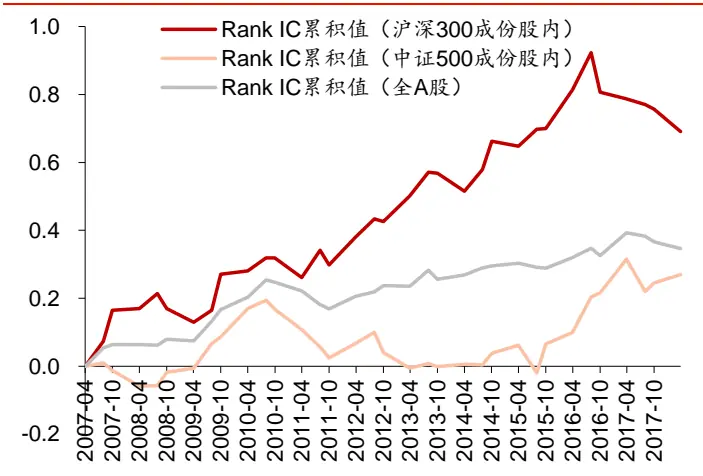
资料来源：Wind，华泰证券研究所

图表60： ocftocf_qfa因子回归法因子收益率累积图
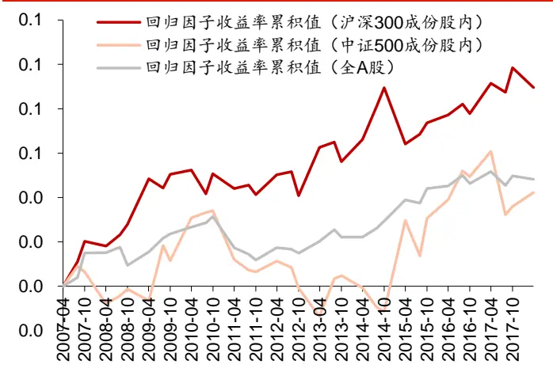
资料来源：Wind，华泰证券研究所

图表61： ocftocf_qfa因子分层组合 1~5净值除以基准净值示意图
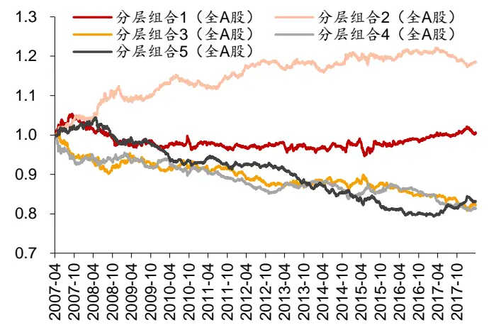
资料来源：Wind，华泰证券研究所

图表62： ocftocf_qfa因子多空组合净值示意图
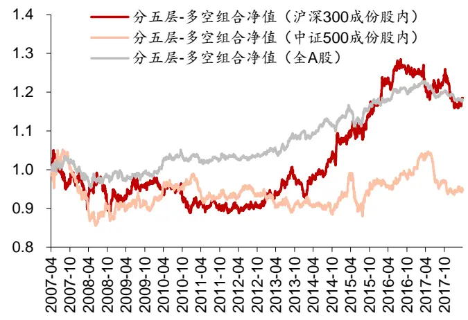
资料来源：Wind，华泰证券研究所

图表63： 不同行业 ocftocf_qfa因子分层测试法结果（分五层，市值中性）

|  |  |  |  |  |  | 多空组合 年化收益率 |  | 多空组合 | 多空组合 最大回撤 | 多空组合 |
| --- | --- | --- | --- | --- | --- | --- | --- | --- | --- | --- |
| 行业 |  | 分层组合1～5（从左到右）年化收益率 |  | 9.34% | -3.43% | 9.03% | 夏普比率 0.35 | 41.99% | 月胜率 |  |
| 传媒 钢铁 | 9.55% 4.36% | 6.18% 6.46% | 11.77% 2.29% | 1.79% | -5.15% | 8.36% | 0.48 | 30.68% | 53.79% 55.30% |  |
| 商贸零售 | 7.51% | 5.64% | 2.83% | 4.40% | -0.27% | 7.38% | 0.52 | 32.07% | 50.76% |  |
| 煤炭 | 10.10% | -2.16% | -6.00% | 5.09% | 1.08% | 6.52% | 0.33 | 37.68% | 52.27% |  |
| 轻工制造 | 6.20% | 18.47% | 7.60% | 7.75% | -2.16% | 5.83% | 0.30 | 27.20% | 49.24% |  |
| 房地产 | 10.17% | 4.91% | 4.56% | 3.42% | 4.30% | 4.90% | 0.41 | 21.64% | 54.55% |  |
| 基础化工 | 9.30% | 5.83% | 6.51% | 7.94% | 3.99% | 4.24% | 0.39 | 19.67% | 55.30% |  |
| 银行 | 5.85% | 0.85% | 1.23% | -1.37% | 1.65% | 3.63% | 0.21 | 33.26% | 51.52% |  |
| 家电 | 19.95% | 7.07% | 8.89% | 5.04% | 12.44% | 3.10% | 0.13 | 34.97% | 46.97% |  |
| 有色金属 | 10.79% | 0.58% | 9.26% | 2.50% | 6.20% | 2.84% | 0.16 | 39.28% | 53.03% |  |
| 食品饮料 | 8.44% | 13.47% | 7.57% | 2.84% | 4.36% | 2.74% | 0.16 | 43.48% | 52.27% |  |
| 机械 | 10.11% | 8.03% | 7.56% | 4.11% | 6.79% | 1.67% | 0.14 | 42.40% | 52.27% |  |
| 农林牧渔 | 9.30% | 9.95% | 7.22% | 7.22% | 6.78% | 0.39% | 0.02 | 39.81% | 46.97% |  |
| 通信 | 7.90% | 9.93% | 10.15% | 10.53% | 6.46% | -0.42% | -0.02 | 42.77% | 51.52% |  |
| 国防军工 | 13.95% | 2.89% | 11.12% | 5.41% | 8.19% | -0.44% | -0.02 | 62.30% | 46.97% |  |
| 建材 | 14.73% | 5.97% | 6.36% | 4.13% | 13.46% | -0.65% | -0.04 | 38.92% | 50.76% |  |
| 交通运输 | 2.88% | 4.31% | 5.17% | 1.04% | 3.13% | -0.75% | -0.05 | 36.22% | 45.45% |  |
| 电力设备 | 3.52% | 8.46% | 9.61% | 10.61% | 3.58% | -0.83% | -0.05 | 41.89% | 50.00% |  |
| 餐饮旅游 | 2.83% | 13.72% | 2.40% | 4.26% | 1.45% | -1.11% | -0.05 | 52.19% | 56.06% |  |
| 纺织服装 | 4.50% | 4.43% | 9.95% | 5.33% | 4.46% | -1.28% | -0.08 | 49.40% | 49.24% |  |
| 汽车 | 8.34% | 6.22% | 8.06% | 6.05% | 8.75% | -1.60% | -0.11 | 52.33% | 51.52% |  |
| 电力及公用事业 | 2.24% | 0.43% | 2.18% | 1.37% | 3.57% | -1.70% | -0.13 | 50.54% | 52.27% |  |
| 医药 | 14.49% | 14.98% | 11.75% | 12.41% | 15.75% | -2.20% | -0.21 | 30.97% |  |  |
| 电子元器件 | 12.42% | 14.61% | 5.16% | 6.40% | 14.49% | -2.46% | -0.18 | 44.06% | 47.73% |  |
| 计算机 | 7.98% | 19.72% | 9.12% | 18.20% | 9.72% | -3.63% | -0.20 | 47.93% | 43.18% |  |
| 建筑 | 5.84% | 10.53% | 3.38% | 9.46% | 7.81% | -3.90% | -0.20 | 60.25% | 54.55% |  |
| 石油石化 | 0.04% | -2.56% | 12.27% | 3.38% | 2.71% | -4.55% | -0.20 | 54.13% | 50.00% 50.00% |  |
| 综合 | 2.54% | 11.48% | -1.22% | -3.63% | 6.61% | -6.90% | -0.27 | 73.86% | 44.70% |  |
| 非银行金融 | -5.34% | -0.27% | -2.16% | -6.64% | -2.43% | -8.00% | -0.26 | 78.64% | 51.52% |  |

资料来源：Wind，华泰证券研究所

## 资本结构因子

我们先来观察下资本结构类 3 个因子在全部非 ST 股票上的数据覆盖度随时间变化曲线，以及它们在各种股票池内回归法、IC 值分析、分层测试法结果汇总。

图表64： 资本结构因子数据覆盖度随时间变化情况
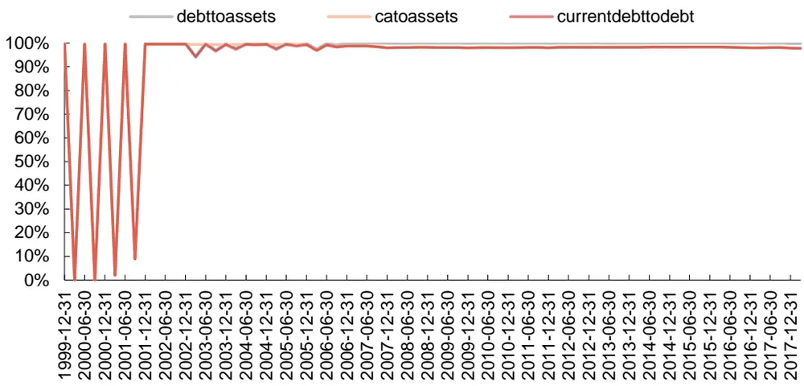
资料来源：Wind，华泰证券研究所

图表65： 资本结构因子在各种股票池内回归法、IC值分析结果汇总（行业中性、市值中性）

| Wind 因子名称 因子含义 |  | It\|均值 Itl>2 占比 t 均值 |  | 因子收益率 | 均值 | Rank IC Rank IC 均值 | 标准差 IC_IR | IC>0 占比 |
| --- | --- | --- | --- | --- | --- | --- | --- | --- |
| 沪深 300 成份股内 |  |  |  |  |  |  |  |  |
| debttoassets | 资产负债率 | 1.67 | 33.33% | 0.20 | 0.90% | 2.11% 15.30% | 0.14 | 60.61% |
| catoassets | 流动资产/总资产 | 1.58 | 30.30% | 0.26 | 0.52% 4.54% | 13.99% | 0.32 | 57.58% |
| currentdebttodebt | 流动负债/负债合计 | 1.03 | 12.12% | 0.17 | -0.18% 3.55% | 13.19% | 0.27 | 60.61% |
| 中证 500 成份股内 |  |  |  |  |  |  |  |  |
| debttoassets | 资产负债率 | 1.40 | 36.36% | 0.00 | 0.35% | -2.11% 11.93% | -0.18 | 30.30% |
| catoassets | 流动资产/总资产 | 1.35 | 21.21% | 0.60 | 0.68% 1.83% | 9.85% | 0.19 | 51.52% |
| currentdebttodebt | 流动负债/负债合计 | 1.05 | 12.12% | 0.06 | -0.02% 2.21% | 8.61% | 0.26 | 63.64% |
| 全 A股 |  |  |  |  |  |  |  |  |
| debttoassets | 资产负债率 | 3.25 | 69.70% | 0.39 | 0.73% | -0.54% | 12.94% -0.04 | 39.39% |
| catoassets | 流动资产/总资产 | 2.16 | 39.39% | 0.91 | 0.60% | 1.47% | 10.13% 0.14 | 51.52% |
| currentdebttodebt | 流动负债/负债合计 | 1.86 | 39.39% | 0.46 | 0.00% | 4.95% 12.79% | 0.39 | 69.70% |

资料来源：Wind，华泰证券研究所

图表66： 资本结构因子在各种股票池内分层测试法结果汇总（分五层，行业中性、市值中性）

| 多空组合多空组合多空组合多空组合 |  |  |  |  |  |  |  |  |  |  |
| --- | --- | --- | --- | --- | --- | --- | --- | --- | --- | --- |
| Wind 因子名称 | 因子含义 | 分层组合1～5（从左到右）年化收益率 |  |  |  |  | 年化收益率夏普比率最大回撤 |  |  | 月胜率 |
| 沪深 300 成份股内 |  |  |  |  |  |  |  |  |  |  |
| debttoassets | 资产负债率 | 4.95% | 1.68% | 0.74% | 1.94% | 1.09% | 3.07% | 0.21 | 35.60% | 46.97% |
| catoassets | 流动资产/总资产 | 6.51% | 2.90% | 2.68% | 0.32% | -2.23% | 8.64% | 0.74 | 26.36% | 58.33% |
| currentdebttodebt | 流动负债/负债合计 | 4.47% | 3.12% |  | 3.52% -0.68% -0.74% |  | 4.97% | 0.45 | 29.70% | 58.33% |
| 中证 500 成份股内 |  |  |  |  |  |  |  |  |  |  |
| debttoassets | 资产负债率 | 5.03% | 4.36% | 5.45% | 7.30% | 5.09% | -0.39% | -0.05 | 36.72% | 56.06% |
| catoassets | 流动资产/总资产 | 5.68% | 6.38% | 7.69% | 4.77% | 2.72% | 2.54% | 0.31 | 19.16% | 50.00% |
| currentdebttodebt | 流动负债/负债合计 | 7.39% | 6.43% | 5.26% | 4.51% | 3.47% | 3.29% | 0.43 | 17.10% | 57.58% |
| 全 A股 |  |  |  |  |  |  |  |  |  |  |
| debttoassets | 资产负债率 | 9.99% | 7.29% | 8.46% | 9.38% | 8.91% | -0.80% | -0.08 | 40.76% | 51.52% |
| catoassets | 流动资产/总资产 | 10.06% |  | 9.86% 10.72% | 7.58% | 6.56% | 3.62% | 0.50 | 17.51% | 48.48% |
| currentdebttodebt | 流动负债/负债合计 | 14.99% | 8.66% | 7.56% |  | 7.75% 4.87% | 9.45% | 1.13 | 24.56% | 62.12% |

资料来源：Wind，华泰证券研究所

这 3 个资本结构因子在 2001 年之后的数据覆盖度都接近 100%。根据以上测试结果，currentdebttodebt 因子的效果相对较好，我们此处对该因子加以展示，其主要指标表现如下。

图表67： currentdebttodebt 因子 Rank IC 累积图
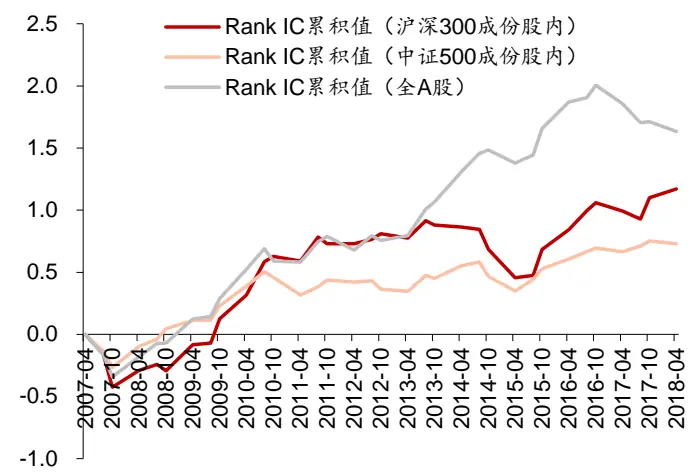
资料来源：Wind，华泰证券研究所

图表68： currentdebttodebt 因子回归法因子收益率累积图
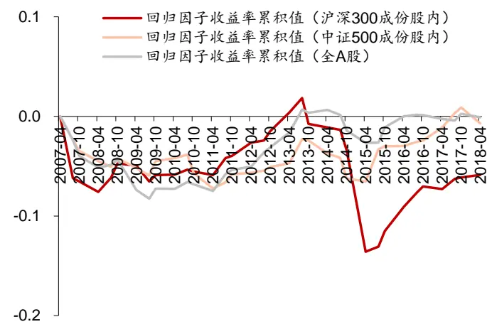
资料来源：Wind，华泰证券研究所

图表69： currentdebttodebt 分层组合 1~5 净值除以基准净值示意图
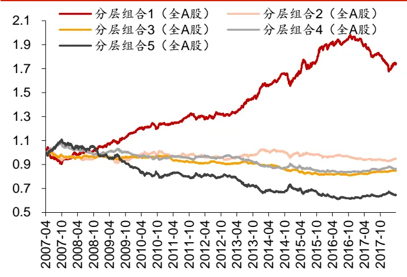
资料来源：Wind，华泰证券研究所

图表70： currentdebttodebt 因子多空组合净值示意图
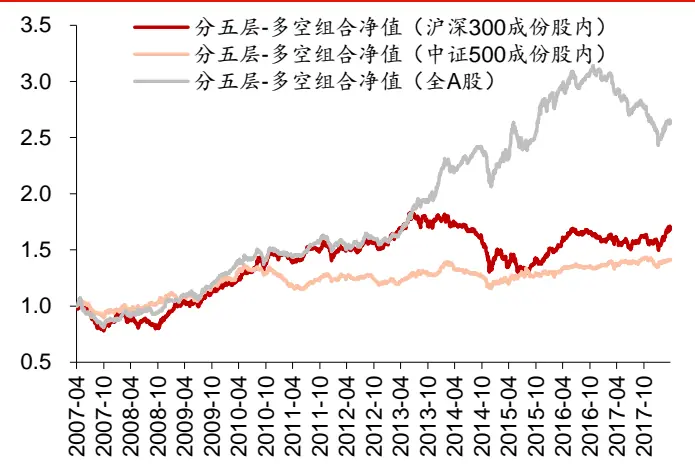
资料来源：Wind，华泰证券研究所

图表71： 不同行业 currentdebttodebt因子分层测试法结果（分五层，市值中性）

|  |  |  |  |  |  | 多空组合 多空组合 |  | 多空组合 | 多空组合 |
| --- | --- | --- | --- | --- | --- | --- | --- | --- | --- |
| 行业 |  |  | 分层组合1～5（从左到右）年化收益率 |  |  | 年化收益率 | 夏普比率 | 最大回撤 | 月胜率 |
| 钢铁 | 15.78% | 4.90% | -0.90% | -3.53% | -5.74% | 19.36% | 0.86 | 33.96% | 55.30% |
| 轻工制造 | 15.89% | 9.42% | 4.40% | 11.94% | -1.39% | 14.66% | 0.70 | 38.38% | 55.30% |
| 传媒 | 9.98% | 11.60% | 11.07% | 6.84% | -5.75% | 14.54% | 0.55 | 46.19% | 56.82% |
| 纺织服装 | 14.87% | 10.42% | 1.43% | 5.61% | 1.16% | 11.98% | 0.76 | 27.62% | 56.82% |
| 石油石化 | 8.17% | 8.02% | 7.21% | -0.04% | -4.04% | 10.06% | 0.39 | 33.45% | 52.27% |
| 餐饮旅游 | 11.79% | 0.78% | 8.89% | 5.09% | -0.64% | 10.01% | 0.43 | 35.98% | 53.79% |
| 国防军工 | 18.11% | 16.28% | 7.20% | 3.14% | 4.58% | 9.68% | 0.36 | 43.14% | 53.79% |
| 建筑 | 15.29% | 11.73% | 3.90% | 6.93% | 2.78% | 9.67% | 0.43 | 45.62% | 53.79% |
| 电力设备 | 15.57% | 11.74% | 5.65% | 2.26% | 5.43% | 8.21% | 0.45 | 37.26% | 58.33% |
| 机械 | 14.72% | 7.48% | 4.78% | 7.70% | 5.46% | 8.16% | 0.58 | 27.86% | 56.06% |
| 基础化工 | 12.17% | 10.23% | 5.99% | 4.79% | 3.31% | 7.92% | 0.62 | 37.89% | 59.85% |
| 商贸零售 | 12.29% | -0.60% | 3.72% | 3.84% | 4.03% | 7.36% | 0.46 | 31.78% | 54.55% |
| 交通运输 | 9.20% | 2.22% | 7.61% | -1.55% | 0.72% | 7.20% | 0.44 | 35.56% | 50.76% |
| 电子元器件 | 18.40% | 9.28% | 10.18% | 7.16% | 9.97% | 6.64% | 0.46 | 41.07% | 50.76% |
| 电力及公用事业 | 4.76% | 2.19% | 5.51% | 2.76% | -1.63% | 6.60% | 0.39 | 34.80% | 59.09% |
| 家电 | 15.67% | 12.70% | 14.04% | 3.61% | 7.51% | 5.19% | 0.24 | 43.31% | 50.76% |
| 通信 | 18.19% | 8.04% | 6.44% | 7.17% | 11.43% | 4.12% | 0.20 | 42.82% | 51.52% |
| 汽车 | 14.75% | 3.00% | 6.69% | 2.84% | 9.44% | 3.63% | 0.23 | 40.84% | 53.03% |
| 农林牧渔 | 12.82% | 6.50% | 6.21% | 7.62% | 7.42% | 3.61% | 0.21 | 35.92% | 50.00% |
| 食品饮料 | 9.75% | 9.73% | 6.45% | 11.15% | 5.87% | 3.54% | 0.19 | 45.84% | 49.24% |
| 建材 | 13.82% | 5.75% | 7.29% | 13.45% | 6.46% | 2.83% | 0.13 | 39.06% | 52.27% |
| 综合 | 7.86% | 4.23% | 4.98% | 6.42% | 0.78% | 1.90% | 0.07 | 58.99% | 50.76% |
| 房地产 | 9.55% | 7.78% | 4.86% | 0.71% | 6.34% | 1.05% | 0.07 | 40.40% | 53.79% |
| 计算机 | 17.67% | 14.89% | 14.73% | 6.96% | 15.98% | 0.86% | 0.05 | 48.83% | 58.33% |
| 有色金属 | 8.36% | 6.34% | 8.99% | -2.12% | 5.14% | -0.39% | -0.02 | 43.28% | 51.52% |
| 煤炭 | 3.16% | 7.91% | -0.87% | 2.69% | -0.46% | -2.70% | -0.09 | 82.22% | 56.06% |
| 医药 | 13.65% | 16.37% | 12.44% | 11.09% | 17.86% | -4.33% | -0.37 | 54.05% | 50.76% |
| 非银行金融 |  |  |  |  |  |  |  |  |  |
| 银行 | - |  |  |  |  |  |  |  | - |

资料来源：Wind，华泰证券研究所

## 偿债能力因子

我们先来观察下偿债能力类 5 个因子在全部非 ST 股票上的数据覆盖度随时间变化曲线，以及它们在各种股票池内回归法、IC 值分析、分层测试法结果汇总。

图表72： 偿债能力因子数据覆盖度随时间变化情况
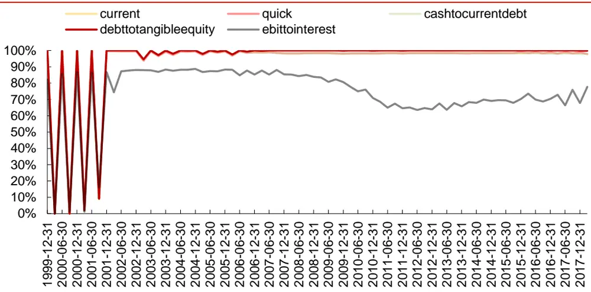
资料来源：Wind，华泰证券研究所

图表73： 偿债能力因子在各种股票池内回归法、IC值分析结果汇总（行业中性、市值中性）

| Wind 因子名称 | 因子含义 |  | It\|均值 \|t\|>2 占比 t 均值 |  | 均值 | 均值 | 标准差 | IC_IR | IC>0 占比 |
| --- | --- | --- | --- | --- | --- | --- | --- | --- | --- |
| 沪深 300 成份股内 |  |  |  |  |  |  |  |  |  |
| current | 流动比率 | 1.03 | 12.12% | -0.10 | -0.13% | 1.72% | 14.61% | 0.12 | 48.48% |
| quick | 速动比率 | 1.03 | 9.09% | -0.13 | -0.23% | 0.72% | 13.87% | 0.05 | 54.55% |
| cashtocurrentdebt | 现金比率 | 1.11 | 18.18% | -0.19 | -0.27% | 1.45% | 12.53% | 0.12 | 60.61% |
| debttotangibleequity | 有形净值债务率 | 1.71 | 36.36% | 0.30 | 0.90% | 2.34% | 13.98% | 0.17 | 63.64% |
| ebittointerest | 利息保障倍数（EBIT/利息费用） | 1.39 | 21.21% | 0.58 | 0.40% | 5.56% | 16.56% | 0.34 | 60.61% |
| 中证 500 成份股内 |  |  |  |  |  |  |  |  |  |
| current | 流动比率 | 1.24 | 27.27% | 0.19 | 0.00% | 3.29% | 10.06% | 0.33 | 57.58% |
| quick | 速动比率 | 1.29 | 24.24% | 0.16 | -0.03% | 3.33% | 11.69% | 0.28 | 66.67% |
| cashtocurrentdebt | 现金比率 | 1.10 | 21.21% | 0.30 | 0.18% | 2.86% | 9.58% | 0.30 | 57.58% |
| debttotangibleequity | 有形净值债务率 | 1.26 | 21.21% | -0.03 | 0.39% | -2.01% | 10.97% | -0.18 | 36.36% |
| ebittointerest | 利息保障倍数（EBIT/利息费用） | 1.35 | 21.21% | 0.88 | 0.80% | 5.67% | 11.81% | 0.48 | 57.58% |
| 全A股 |  |  |  |  |  |  |  |  |  |
| current | 流动比率 | 2.45 | 45.45% | -0.12 | -0.18% | 2.55% | 13.39% | 0.19 | 63.64% |
| quick | 速动比率 | 2.53 | 45.45% | -0.05 | -0.15% | 2.57% | 14.40% | 0.18 | 63.64% |
| cashtocurrentdebt | 现金比率 | 2.18 | 42.42% | 0.20 | 0.00% | 2.04% | 11.89% | 0.17 | 60.61% |
| debttotangibleequity | 有形净值债务率 | 2.60 | 57.58% | 0.23 | 0.54% | -1.28% | 11.50% | -0.11 | 39.39% |
| ebittointerest | 利息保障倍数（EBIT/利息费用） | 2.68 | 60.61% | 1.34 | 0.48% | 2.29% | 10.69% | 0.21 | 57.58% |

资料来源：Wind，华泰证券研究所

图表74： 偿债能力因子在各种股票池内分层测试法结果汇总（分五层，行业中性、市值中性）

| 多空组合多空组合多空组合多空组合 |  |  |  |  |  |  |  |  |
| --- | --- | --- | --- | --- | --- | --- | --- | --- |
| Wind 因子名称 因子含义 |  | 分层组合1～5（从左到右）年化收益率 |  |  |  | 年化收益率夏普比率最大回撤 |  | 月胜率 |
| 沪深 300 成份股内 |  |  |  |  |  |  |  |  |
| current 流动比率 |  | 2.18% 2.96% | 1.06% | 3.13% -0.41% | 2.28% | 0.19 | 42.41% | 53.03% |
| quick | 速动比率 | 1.58% | 1.84% 2.83% | 1.50% | 1.21% | -0.38% | -0.03 43.60% | 51.52% |
| cashtocurrentdebt | 现金比率 | 2.55% | 3.73% -1.39% | 1.29% | 3.20% | -1.41% | -0.12 45.46% | 53.03% |
| debttotangibleequity | 有形净值债务率 | 4.83% 1.29% | 0.62% | 2.88% | 0.87% | 3.06% | 0.23 28.77% | 52.27% |
| ebittointerest | 利息保障倍数（EBIT/利息费用） | 4.28% | 1.54% 1.66% | 1.25%-3.11% |  | 6.55% | 0.57 38.20% | 61.36% |
| 中证 500 成份股内 |  |  |  |  |  |  |  |  |
| current | 流动比率 | 6.15% | 6.11% 7.15% | 4.79% | 3.11% | 2.89% | 0.34 26.37% | 56.06% |
| quick | 速动比率 | 6.08% | 6.92% 6.33% | 4.91% | 2.74% | 2.73% | 0.28 28.71% | 49.24% |
| cashtocurrentdebt | 现金比率 | 6.36% | 6.70% 4.73% | 4.84% | 3.93% | 2.16% | 0.29 16.33% | 52.27% |
| debttotangibleequity | 有形净值债务率 | 5.64% | 3.86% 6.05% | 7.06% | 4.72% | 0.54% | 0.07 31.52% | 53.79% |
| ebittointerest | 利息保障倍数（EBIT/利息费用） | 5.64% | 7.24% 3.71% | 5.40% | 1.41% | 3.37% | 0.36 26.76% | 50.76% |
| 全 A股 |  |  |  |  |  |  |  |  |
| current | 流动比率 | 10.56% | 8.84% 10.15% | 8.44% | 6.42% | 4.80% | 0.46 30.80% | 56.82% |
| quick | 速动比率 | 10.50% | 9.83% 8.84% | 8.47% | 6.54% | 4.33% | 0.38 31.75% | 52.27% |
| cashtocurrentdebt | 现金比率 | 10.68% | 8.28% 9.19% | 8.08% | 7.83% | 3.46% | 0.36 22.78% | 51.52% |
| debttotangibleequity | 有形净值债务率 | 8.44% | 6.99% 9.02% | 9.77% | 9.77% | -1.80% | -0.20 44.28% | 50.00% |
| ebittointerest | 利息保障倍数（EBIT/利息费用） | 7.94% 7.38% | 8.36% | 7.69% | 7.36% | 0.92% | 0.11 27.26% | 51.52% |

资料来源：Wind，华泰证券研究所

这 5 个偿债能力因子中，只有 ebittointerest 因子的数据覆盖度比较差，近十年间覆盖度在70%左右波动。结合测试结果和数据覆盖度来看，current 因子相对较好，我们此处对该因子加以展示，其主要指标表现如下。

图表75： current 因子 Rank IC 累积图
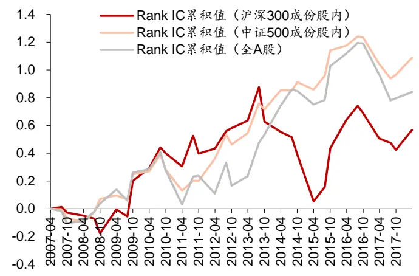
资料来源：Wind，华泰证券研究所

图表76： current因子回归法因子收益率累积图
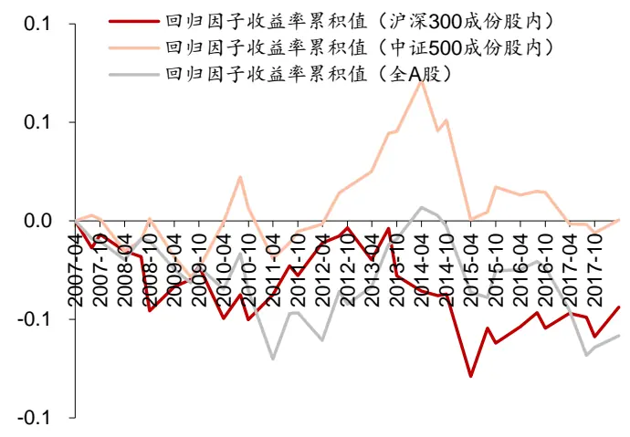
资料来源：Wind，华泰证券研究所

图表77： current因子分层组合 1~5净值除以基准净值示意图
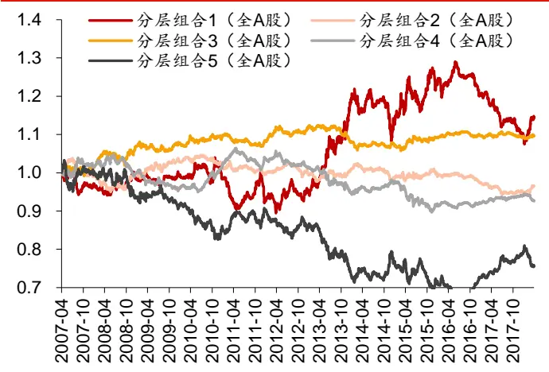
资料来源：Wind，华泰证券研究所

图表78： current因子多空组合净值示意图
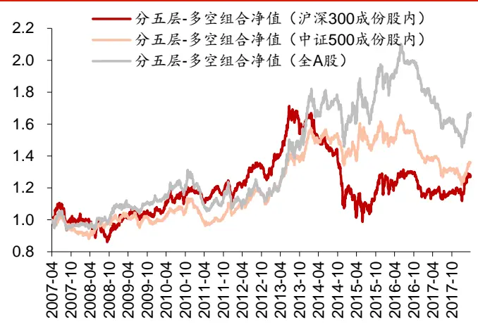
资料来源：Wind，华泰证券研究所

图表79： 不同行业 current因子分层测试法结果（分五层，市值中性）

|  |  |  |  |  |  | 多空组合 |  | 多空组合 | 多空组合 | 多空组合 |
| --- | --- | --- | --- | --- | --- | --- | --- | --- | --- | --- |
| 行业 |  | 分层组合1～5（从左到右）年化收益率 |  |  |  | 年化收益率 | 夏普比率 | 最大回撤 | 月胜率 |  |
| 电力及公用事业 | 7.34% | 4.76% | 0.82% | 1.71% | -1.02% | 8.06% | 0.41 | 45.07% | 56.06% |  |
| 食品饮料 | 6.11% | 14.04% | 7.84% | 12.36% | 3.75% | 2.62% | 0.14 | 38.47% | 54.55% |  |
| 电子元器件 | 9.83% | 13.92% | 10.27% | 13.73% | 7.98% | 2.54% | 0.16 | 34.06% | 56.82% |  |
| 农林牧渔 | 12.11% | 10.62% | 4.41% | 3.98% | 8.78% | 1.75% | 0.09 | 39.75% | 48.48% |  |
| 医药 | 13.77% | 14.70% | 17.14% | 14.54% | 12.92% | 0.79% | 0.06 | 34.12% | 49.24% |  |
| 基础化工 | 7.64% | 9.64% | 5.89% | 6.42% | 6.51% | 0.64% | 0.04 | 45.15% | 51.52% |  |
| 机械 | 9.37% | 6.57% | 10.29% | 4.82% | 8.81% | 0.57% | 0.04 | 38.77% | 49.24% |  |
| 石油石化 | -0.14% | 3.37% | 14.86% | 3.75% | -1.83% | 0.55% | 0.02 | 53.83% | 49.24% |  |
| 建材 | 12.09% | 5.12% | 13.42% | 6.11% | 10.02% | 0.51% | 0.02 | 39.28% | 50.76% |  |
| 传媒 | 11.10% | 1.43% | 0.44% | 13.73% | 7.79% | 0.38% | 0.01 | 66.00% | 49.24% |  |
| 轻工制造 | 9.90% | 6.82% | 13.83% | 2.31% | 8.01% | 0.34% | 0.02 | 43.93% | 53.03% |  |
| 钢铁 | 2.67% | 0.73% | 4.87% | 1.63% | -0.16% | 0.33% | 0.01 | 71.61% | 54.55% |  |
| 汽车 | 6.89% | 6.99% | 9.04% | 7.59% | 7.13% | -0.13% | -0.01 | 44.73% | 49.24% |  |
| 商贸零售 | 4.55% | 6.81% | 1.42% | 5.80% | 4.54% | -0.35% | -0.02 | 36.34% | 51.52% |  |
| 计算机 | 13.95% | 13.71% | 15.77% | 15.52% | 13.39% | -0.37% | -0.02 | 42.27% | 55.30% |  |
| 纺织服装 | 5.85% | 4.56% | 7.31% | 9.88% | 5.25% | -0.79% | -0.05 | 37.80% | 48.48% |  |
| 通信 | 10.16% | 9.24% | 10.13% | 9.64% | 11.43% | -1.23% | -0.05 | 48.60% | 47.73% |  |
| 房地产 | 4.27% | 6.16% | 5.25% | 8.31% | 7.27% | -2.03% | -0.16 | 35.39% | 46.97% |  |
| 交通运输 | 3.96% | 4.78% | 2.83% | 0.52% | 6.15% | -2.93% | -0.17 | 41.99% | 50.76% |  |
| 家电 | 9.24% | 11.26% | 14.86% | 10.27% | 10.83% | -3.14% | -0.14 | 73.38% | 47.73% |  |
| 电力设备 | 6.33% | 8.65% | 9.06% | 7.45% | 9.14% | -3.39% | -0.19 | 55.69% | 41.67% |  |
| 建筑 | 8.39% | 12.10% | 7.19% | 1.37% | 10.35% | -4.20% | -0.17 | 59.77% | 50.76% |  |
| 餐饮旅游 | 7.07% | 6.26% | 1.07% | 3.38% | 10.04% | -4.31% | -0.17 | 59.13% | 46.97% |  |
| 有色金属 | 4.48% | 6.00% | 7.34% | 0.05% | 10.61% | -6.25% | -0.31 | 60.70% | 47.73% |  |
| 综合 | 4.04% | 2.86% | 1.35% | 6.04% | 8.96% | -7.60% | -0.30 | 74.79% | 45.45% |  |
| 煤炭 | 1.41% | 3.55% | 1.58% | 1.58% | 6.90% | -7.77% | -0.35 | 75.41% | 43.18% |  |
| 国防军工 | 1.87% | 12.78% | 15.61% | 7.77% | 8.12% | -8.82% | -0.31 | 70.18% | 49.24% |  |
| 非银行金融 | - |  |  |  |  | 1 | - |  |  |  |
| 银行 |  |  |  |  |  |  |  | 1 | - |  |

资料来源：Wind，华泰证券研究所

## 营运能力因子

我们先来观察下营运能力类 5 个因子在全部非 ST 股票上的数据覆盖度随时间变化曲线，以及它们在各种股票池内回归法、IC 值分析、分层测试法结果汇总。

图表80： 营运能力因子数据覆盖度随时间变化情况
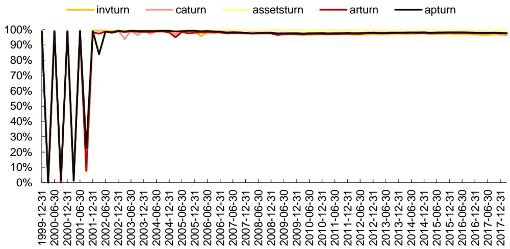
资料来源：Wind，华泰证券研究所

图表81： 营运能力因子在各种股票池内回归法、IC值分析结果汇总（行业中性、市值中性）

| Wind 因子名称 | 因子含义 | It\|均值 It\|>2 占比 |  | t均值 | 均值 | 均值 | 标准差 | IC_IR | IC>0 占比 |
| --- | --- | --- | --- | --- | --- | --- | --- | --- | --- |
| 沪深 300 成份股内 |  |  |  |  |  |  |  |  |  |
| invturn | 存货周转率 | 1.11 | 6.06% | 0.17 | -0.03% | -0.67% | 9.02% | -0.07 | 51.52% |
| caturn | 流动资产周转率 | 1.06 | 18.18% | 0.34 | 0.40% | 2.54% | 10.02% | 0.25 | 60.61% |
| assetsturn | 总资产周转率 | 1.19 | 15.15% | 0.57 | 0.75% | 2.45% | 14.93% | 0.16 | 57.58% |
| arturn | 应收账款周转率 | 1.08 | 9.09% | 0.06 | 0.18% | 1.78% | 12.64% | 0.14 | 51.52% |
| apturn | 应付账款周转率 | 1.08 | 21.21% | 0.03 | 0.14% | 0.95% | 9.52% | 0.10 | 51.52% |
| 中证 500 成份股内 |  |  |  |  |  |  |  |  |  |
| invturn | 存货周转率 | 0.78 | 3.03% | 0.02 | 0.10% | 0.41% | 8.49% | 0.05 | 54.55% |
| caturn | 流动资产周转率 | 1.10 | 6.06% | 0.07 | 0.17% | 1.61% | 10.50% | 0.15 | 54.55% |
| assetsturn | 总资产周转率 | 1.04 | 15.15% | 0.37 | 0.45% | 3.23% | 10.29% | 0.31 | 66.67% |
| arturn | 应收账款周转率 | 1.12 | 15.15% | -0.04 | -0.05% | -0.63% | 10.22% | -0.06 | 51.52% |
| apturn | 应付账款周转率 | 1.00 | 12.12% | -0.04 | 0.10% | 1.05% | 7.04% | 0.15 | 51.52% |
| 全 A股 |  |  |  |  |  |  |  |  |  |
| invturn | 存货周转率 | 1.12 | 12.12% | 0.26 | 0.08% | 0.01% | 4.94% | 0.00 | 51.52% |
| caturn | 流动资产周转率 | 1.54 | 33.33% | 0.70 | 0.27% | 0.69% | 7.58% | 0.09 | 51.52% |
| assetsturn | 总资产周转率 | 1.63 | 30.30% | 1.16 | 0.51% | 2.30% | 6.32% | 0.36 | 57.58% |
| arturn | 应收账款周转率 | 1.97 | 45.45% | 0.77 | 0.46% | -0.56% | 10.53% | -0.05 | 51.52% |
| apturn | 应付账款周转率 | 1.15 | 15.15% | 0.10 | 0.11% | 0.65% | 3.99% | 0.16 | 60.61% |

资料来源：Wind，华泰证券研究所

图表82： 营运能力因子在各种股票池内分层测试法结果汇总（分五层，行业中性、市值中性）

| 多空组合多空组合多空组合多空组合 |  |  |  |  |  |  |  |  |  |
| --- | --- | --- | --- | --- | --- | --- | --- | --- | --- |
| Wind 因子名称 因子含义 |  | 分层组合1～5（从左到右）年化收益率 |  |  |  |  | 年化收益率夏普比率最大回撤 |  | 月胜率 |
| 沪深 300 成份股内 |  |  |  |  |  |  |  |  |  |
| invturn | 存货周转率 | -0.22% | 3.29% | 1.58% | 4.61% | 1.59% | -2.85% | -0.25 40.90% | 48.48% |
| caturn | 流动资产周转率 | 1.38% | 2.90% | 2.43% | 2.43% 0.91% |  | -0.94% -0.07 | 44.59% | 50.00% |
| assetsturn | 总资产周转率 | 4.77% | 3.68% | 1.70% | 0.64% | -0.36% | 3.47% | 0.23 54.44% | 49.24% |
| arturn | 应收账款周转率 | 3.15% | 1.71% | 2.33% | 1.56% | 0.70% | 1.31% | 0.11 42.00% | 50.76% |
| apturn | 应付账款周转率 | 2.26% | -0.04% | 2.46% | 3.40% | 1.74% | -0.12% -0.01 | 44.63% | 47.73% |
| 中证 500 成份股内 |  |  |  |  |  |  |  |  |  |
| invturn | 存货周转率 | 5.01% | 6.54% | 5.15% | 5.44% | 5.29% | -1.24% | -0.15 29.20% | 49.24% |
| caturn | 流动资产周转率 | 6.48% | 6.00% | 6.63% | 4.91% | 3.13% | 2.09% | 0.22 29.35% | 56.82% |
| assetsturn | 总资产周转率 | 8.05% | 7.44% | 4.79% | 4.54% | 2.44% | 4.49% | 0.50 20.55% | 53.03% |
| arturn | 应收账款周转率 | 4.40% | 4.85% | 5.73% | 8.53% | 3.78% | -0.49% | -0.05 48.81% | 45.45% |
| apturn 全 A股 | 应付账款周转率 | 5.08% | 6.08% | 7.19% | 5.67% | 3.06% | 1.23% | 0.16 20.88% | 51.52% |
|  |  |  | 9.21% |  |  |  |  |  |  |
| invturn | 存货周转率 | 7.44% | 9.64% | 9.88% | 9.62% | 8.13% | -0.90% | -0.15 18.07% | 52.27% |
| caturn | 流动资产周转率 总资产周转率 | 8.13% 10.09% | 9.66% | 8.93% | 9.59% | 8.19% | -0.53% | -0.07 35.81% | 49.24% |
| assetsturn | 应收账款周转率 | 7.13% | 8.06% | 8.96% 9.13% 10.65% | 9.75% | 5.72% 9.22% | 4.31% | 0.62 19.70% | 56.06% |
| arturn |  |  | 8.84% |  | 9.51% 10.15% |  | -2.64% 0.93% | -0.28 55.00% | 46.97% |
| apturn | 应付账款周转率 | 8.20% |  |  |  | 7.64% |  | 0.16 13.85% | 49.24% |

资料来源：Wind，华泰证券研究所

这 5 个营运能力因子在 2001 年之后的数据覆盖度都接近 100%。根据以上测试结果，assetsturn 因子的效果相对较好，我们此处对该因子加以展示，其主要指标表现如下。

图表83： assetsturn 因子 Rank IC 累积图
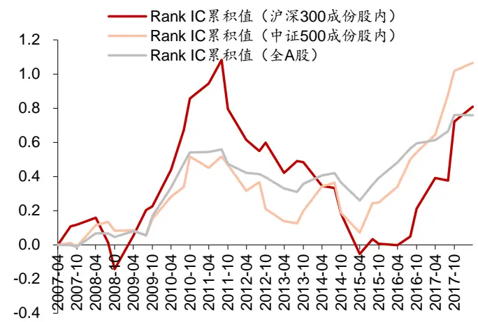
资料来源：Wind，华泰证券研究所

图表84： assetsturn因子回归法因子收益率累积图
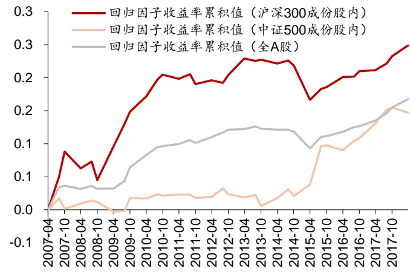
资料来源：Wind，华泰证券研究所

图表85： assetsturn因子分层组合 1~5净值除以基准净值示意图
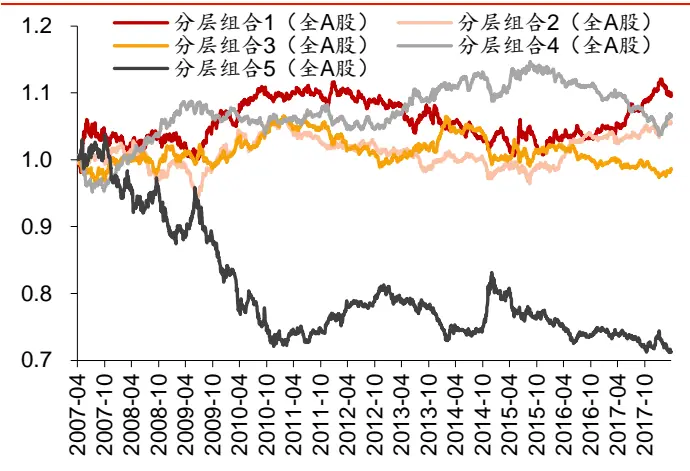
资料来源：Wind，华泰证券研究所

图表86： assetsturn因子多空组合净值示意图
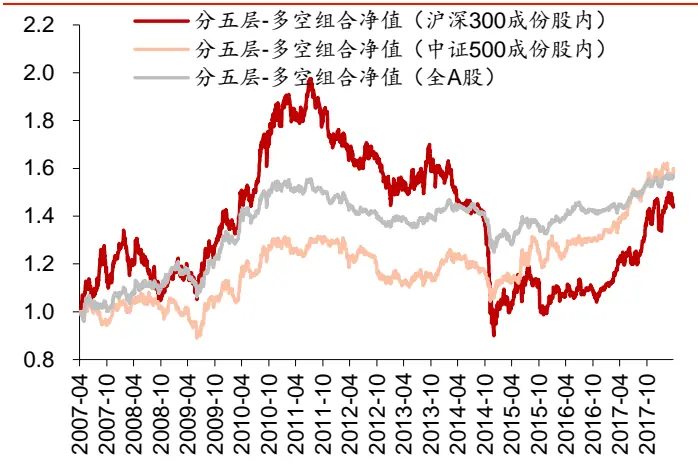
资料来源：Wind，华泰证券研究所

图表87： 不同行业 assetsturn因子分层测试法结果（分五层，市值中性）

| 行业 | 分层组合1～5（从左到右）年化收益率 |  |  |  | 年化收益率 |  | 多空组合 多空组合 夏普比率 |  | 多空组合 最大回撤 |
| --- | --- | --- | --- | --- | --- | --- | --- | --- | --- |
| 国防军工 | 20.39% | 16.23% | 6.49% | 2.87% | -0.87% | 15.51% | 0.54 | 49.21% | 月胜率 57.58% |
| 交通运输 | 7.08% | 5.72% | 5.29% | 2.69% | -1.64% | 8.04% | 0.45 | 28.43% | 54.55% |
| 食品饮料 | 12.30% | 13.33% | 6.15% | 8.71% | 2.67% | 7.48% | 0.39 | 41.59% | 52.27% |
| 轻工制造 | 15.79% | 10.30% | 2.64% | 1.87% | 7.82% | 6.66% | 0.32 | 43.35% | 53.03% |
| 家电 | 13.65% | 21.53% | 5.52% | 11.13% | 4.27% | 5.96% | 0.26 | 49.01% | 52.27% |
| 建材 | 10.24% | 14.39% | 10.17% | 10.44% | 2.10% | 5.68% | 0.32 | 31.36% | 56.82% |
| 银行 | 5.43% | 10.04% | -0.16% | -0.26% | -0.31% | 4.83% | 0.26 | 41.89% | 53.79% |
| 非银行金融 | 2.55% | 1.85% | -3.79% | -6.25% | -9.17% | 4.66% | 0.15 | 57.47% | 55.30% |
| 纺织服装 | 9.37% | 5.53% | 9.31% | 3.90% | 4.61% | 3.94% | 0.24 | 34.30% | 51.52% |
| 商贸零售 | 10.29% | 0.98% | 2.44% | 4.77% | 5.06% | 3.76% | 0.24 | 31.89% | 51.52% |
| 医药 | 15.03% | 12.73% | 17.65% | 16.29% | 10.78% | 3.53% | 0.29 | 26.32% | 51.52% |
| 农林牧渔 | 6.08% | 9.88% | 8.59% | 14.58% | 2.03% | 2.49% | 0.14 | 39.69% | 47.73% |
| 通信 | 11.77% | 10.71% | 11.65% | 9.17% | 8.76% | 2.07% | 0.10 | 40.22% | 54.55% |
| 有色金属 | 7.42% | 8.18% | 4.68% | 3.53% | 4.46% | 2.01% | 0.11 | 44.80% | 52.27% |
| 电子元器件 | 11.23% | 11.54% | 12.43% | 12.14% | 8.69% | 1.76% | 0.12 | 38.88% | 52.27% |
| 房地产 | 7.10% | 4.50% | 7.73% | 5.52% | 5.40% | 1.50% | 0.13 | 23.08% | 51.52% |
| 煤炭 | 3.02% | 0.53% | 1.72% | 6.76% | 1.10% | 0.51% | 0.02 | 56.82% | 47.73% |
| 钢铁 | 5.37% | 4.59% | -2.13% | -2.65% | 3.60% | 0.22% | 0.01 | 59.38% | 51.52% |
| 基础化工 | 7.87% | 7.99% | 7.51% | 4.83% | 7.97% | 0.13% | 0.01 | 41.39% | 51.52% |
| 电力设备 | 7.94% | 10.17% | 10.13% | 5.15% | 6.89% | -0.31% | -0.02 | 43.79% | 50.00% |
| 建筑 | 6.94% | 8.19% | 5.34% | 15.64% | 5.92% | -1.11% | -0.05 | 51.28% | 50.00% |
| 汽车 | 7.73% | 8.35% | 7.21% | 7.30% | 7.57% | -1.23% | -0.08 | 53.51% | 50.76% |
| 石油石化 | 3.41% | 9.09% | 4.96% | 5.12% | 0.08% | -1.40% | -0.05 | 71.76% | 46.21% |
| 机械 | 8.37% | 8.03% | 8.43% | 3.93% | 11.04% | -2.93% | -0.22 | 47.10% | 39.39% |
| 电力及公用事业 | 3.54% | 0.94% | 1.88% | 1.70% | 6.13% | -3.16% | -0.23 | 45.71% | 50.76% |
| 传媒 | 6.89% | 10.87% | 8.64% | 6.61% | 7.22% | -4.59% | -0.16 | 72.92% | 59.85% |
| 计算机 | 10.27% | 15.05% | 16.66% | 15.32% | 14.08% | -4.94% | -0.27 | 47.33% | 46.21% |
| 综合 | 1.71% | 1.71% | 5.14% | 9.06% | 6.13% | -6.06% | -0.23 | 67.26% | 52.27% |
| 餐饮旅游 | 2.14% | 10.36% | 6.21% | 4.86% | 5.60% | -6.22% | -0.25 | 73.46% | 45.45% |

资料来源：Wind，华泰证券研究所

## 财务质量因子测试结果汇总及对比

## 财务质量因子测试结果汇总（每年调仓 3次）

上一章节测试结果显示，六个子类中存在效果较好的 12 个因子，它们的结果汇总如下。

图表88： 财务质量部分精选因子在各种股票池内回归法、IC值分析结果汇总（行业中性、市值中性）

| Wind 因子名称 | 因子所属子类别 | It\|均值 Itl>2 占比 |  | t均值 | 因子收益率 均值 | Rank IC 均值 | Rank IC 标准差 | IC_IR IC>0 占比 |
| --- | --- | --- | --- | --- | --- | --- | --- | --- |
| 沪深 300 成份股内 |  |  |  |  |  |  |  |  |
| qfa_roe | 盈利能力 | 2.34 | 54.55% | 1.03 | 0.88% | 10.53% | 18.70% | 0.56 69.70% |
| qfa_roa | 盈利能力 | 2.06 | 54.55% | 0.83 | 0.60% | 6.46% | 18.11% 0.36 | 60.61% |
| qfa_grossprofitmargin | 盈利能力 | 1.84 | 33.33% | 0.70 | 0.52% | 5.55% 16.92% | 0.33 | 63.64% |
| nptocostexpense_qfa | 盈利能力 | 1.55 | 30.30% | 0.41 | 0.14% | 5.36% 15.53% | 0.34 | 57.58% |
| roic | 盈利能力 | 2.24 | 48.48% | 0.71 | 0.62% | 8.12% | 20.25% 0.40 | 63.64% |
| qfa_operateincometoebt | 收益质量 | 1.07 | 15.15% | -0.10 | -0.23% | 2.92% | 11.22% 0.26 | 63.64% |
| qfa_deductedprofittoprofit | 收益质量 | 1.11 | 12.12% | 0.15 | -0.01% | 1.37% | 10.72% 0.13 | 51.52% |
| qfa_ocftosales | 现金流量 | 1.17 | 15.15% | 0.67 | 0.63% | 4.47% | 8.76% | 0.51 72.73% |
| ocftocf_qfa | 现金流量 | 1.03 | 6.06% | 0.31 | 0.27% | 2.09% | 5.89% 0.36 | 57.58% |
| currentdebttodebt | 资本结构 | 1.03 | 12.12% | 0.17 | -0.18% | 3.55% | 13.19% 0.27 | 60.61% |
| current | 偿债能力 | 1.03 | 12.12% | -0.10 | -0.13% | 1.72% | 14.61% 0.12 | 48.48% |
| assetsturn | 营运能力 | 1.19 | 15.15% | 0.57 | 0.75% | 2.45% | 14.93% 0.16 | 57.58% |
| 中证 500 成份股内 |  |  |  |  |  |  |  |  |
| qfa_roe | 盈利能力 | 2.47 | 48.48% | 2.17 | 1.95% | 8.86% | 13.33% | 0.67 72.73% |
| qfa_roa | 盈利能力 | 2.33 | 45.45% | 1.99 | 1.63% | 9.07% | 13.71% | 0.66 75.76% |
| qfa_grossprofitmargin | 盈利能力 | 1.67 | 39.39% | 1.16 | 1.00% | 5.69% | 11.15% 0.51 | 66.67% |
| nptocostexpense_qfa | 盈利能力 | 1.73 | 42.42% | 1.53 | 1.36% | 7.16% | 11.72% 0.61 | 69.70% |
| roic | 盈利能力 | 2.15 | 45.45% | 1.60 | 1.29% | 7.09% | 14.41% 0.49 | 69.70% |
| qfa_operateincometoebt | 收益质量 | 1.22 | 12.12% | 0.48 | 0.37% | 3.57% | 7.09% | 0.50 63.64% |
| qfa_deductedprofittoprofit | 收益质量 | 1.33 | 21.21% | 0.57 | 0.50% | 3.86% | 7.16% 0.54 | 60.61% |
| qfa_ocftosales | 现金流量 | 0.81 | 12.12% | 0.38 | 0.29% | 2.25% | 6.79% 0.33 | 57.58% |
| ocftocf_qfa | 现金流量 | 1.10 | 18.18% | 0.08 | 0.13% | 0.82% | 5.01% 0.16 | 63.64% |
| currentdebttodebt | 资本结构 | 1.05 | 12.12% | 0.06 | -0.02% | 2.21% | 8.61% 0.26 | 63.64% |
| current | 偿债能力 | 1.24 | 27.27% | 0.19 | 0.00% | 3.29% | 10.06% 0.33 | 57.58% |
| assetsturn | 营运能力 | 1.04 | 15.15% | 0.37 | 0.45% | 3.23% | 10.29% 0.31 | 66.67% |
| 全 A股 |  |  |  |  |  |  |  |  |
| qfa_roe | 盈利能力 | 4.98 | 81.82% | 3.61 | 1.52% | 5.12% | 11.59% | 0.44 60.61% |
| qfa_roa | 盈利能力 | 4.61 | 81.82% | 2.98 | 1.08% | 4.88% | 11.03% | 0.44 69.70% |
| qfa_grossprofitmargin | 盈利能力 | 3.10 | 66.67% | 1.93 | 0.71% | 4.47% | 10.29% | 0.43 63.64% |
| nptocostexpense_qfa | 盈利能力 | 3.11 | 60.61% | 2.01 | 0.76% | 3.69% | 10.39% | 0.36 60.61% |
| roic | 盈利能力 | 4.42 | 81.82% | 2.51 | 0.89% | 3.16% | 12.10% | 0.26 57.58% |
| qfa_operateincometoebt | 收益质量 | 1.71 | 36.36% | 0.75 | 0.26% | 4.26% | 6.43% | 0.66 78.79% |
| qfa_deductedprofittoprofit | 收益质量 | 1.79 | 39.39% | 0.92 | 0.34% | 4.83% | 6.57% | 0.74 75.76% |
| qfa_ocftosales | 现金流量 | 1.49 | 30.30% | 0.96 | 0.32% | 1.09% | 5.06% | 0.22 69.70% |
| ocftocf_qfa | 现金流量 | 1.16 | 12.12% | 0.23 | 0.15% | 1.05% | 2.73% | 0.39 54.55% |
| currentdebttodebt | 资本结构 | 1.86 | 39.39% | 0.46 | 0.00% | 4.95% | 12.79% | 0.39 69.70% |
| current | 偿债能力 | 2.45 | 45.45% | -0.12 | -0.18% | 2.55% | 13.39% | 0.19 63.64% |
| assetsturn | 营运能力 | 1.63 | 30.30% | 1.16 | 0.51% | 2.30% | 6.32% 0.36 | 57.58% |

资料来源：Wind，华泰证券研究所

图表89： 财务质量部分精选因子在各种股票池内分层测试法结果汇总（分五层，行业中性、市值中性）

| Wind 因子名称 | 因子所属子类别 | 分层组合1～5（从左到右）年化收益率 |  |  |  |  | 年化收益率 夏普比率 | 最大回撤 | 月胜率 |
| --- | --- | --- | --- | --- | --- | --- | --- | --- | --- |
| 沪深 300 成份股内 |  |  |  |  |  |  |  |  |  |
| qfa_roe | 盈利能力 | 7.39% | 3.85% | 2.40% | -1.50% -3.39% | 9.24% | 0.72 | 38.28% | 53.79% |
| qfa_roa | 盈利能力 | 6.73% | 1.69% | 2.08% | 1.01% -2.61% | 8.13% | 0.62 | 35.84% | 54.55% |
| qfa_grossprofitmargin | 盈利能力 | 3.64% | 5.27% | 1.03% | 2.72% -2.98% | 5.03% | 0.38 | 39.72% | 53.79% |
| nptocostexpense_qfa | 盈利能力 | 3.42% | 3.93% | 3.01% | 2.68% -2.86% | 4.84% | 0.42 | 33.91% | 52.27% |
| roic | 盈利能力 | 7.57% | 2.31% | 1.78% | -0.03% -2.46% | 8.30% | 0.59 | 44.87% | 51.52% |
| qfa_operateincometoebt | 收益质量 | 4.22% | 3.64% | 4.15% | 0.25% -1.46% | 5.07% | 0.51 | 41.55% | 55.30% |
| qfa_deductedprofittoprofit | 收益质量 | 3.56% | 2.39% | 1.80% | 3.99% -1.72% | 5.52% | 0.58 | 20.01% | 57.58% |
| qfa_ocftosales | 现金流量 | 2.60% | 4.25% | 1.99% | 0.39% -0.40% | 1.53% | 0.15 | 27.05% | 50.76% |
| ocftocf_qfa | 现金流量 | 1.83% | 4.03% | 0.49% | 0.81% 0.11% | 1.60% | 0.24 | 15.50% | 53.79% |
| currentdebttodebt | 资本结构 | 4.47% | 3.12% | 3.52% | -0.68% -0.74% |  | 4.97% 0.45 | 29.70% | 58.33% |
| current | 偿债能力 | 2.18% | 2.96% | 1.06% | 3.13% -0.41% |  | 2.28% 0.19 | 42.41% | 53.03% |
| assetsturn | 营运能力 | 4.77% | 3.68% | 1.70% | 0.64% -0.36% | 3.47% | 0.23 | 54.44% | 49.24% |
| 中证 500 成份股内 |  |  |  |  |  |  |  |  |  |
| qfa_roe | 盈利能力 | 11.81% | 6.79% | 3.28% | 1.72% 2.09% | 8.52% | 0.84 | 27.84% | 54.55% |
| qfa_roa qfa_grossprofitmargin | 盈利能力 | 11.42% 7.91% | 7.06% | 3.00% 4.28% | 2.75% | 1.49% | 8.69% | 0.84 27.78% 22.35% | 51.52% |
| nptocostexpense_qfa | 盈利能力 | 6.94% | 7.80% 8.37% | 5.22% | 3.95% 4.50% | 2.67% 1.36% | 4.36% 4.79% | 0.51 0.53 22.21% | 57.58% |
| roic | 盈利能力 盈利能力 | 9.84% | 5.49% | 4.57% | 4.04% | 2.46% | 6.03% | 0.56 27.85% | 50.76% |
| qfa_operateincometoebt | 收益质量 | 7.76% | 5.82% | 5.14% | 5.89% | 3.44% | 3.30% | 0.47 18.42% | 51.52% |
| qfa_deductedprofittoprofit | 收益质量 | 7.73% | 6.49% | 6.19% | 5.36% | 2.19% | 4.66% | 0.69 23.11% | 53.79% |
| qfa_ocftosales | 现金流量 | 5.53% | 6.58% | 4.25% | 5.55% | 3.11% | 1.58% | 0.23 14.72% | 59.85% |
| ocftocf_qfa | 现金流量 | 5.23% | 6.87% | 3.60% | 2.30% | 5.59% | -0.48% | -0.08 18.70% | 50.76% |
| currentdebttodebt | 资本结构 | 7.39% | 6.43% | 5.26% | 4.51% |  |  | 0.43 | 56.82% |
| current | 偿债能力 | 6.15% | 6.11% |  |  | 3.47% | 3.29% | 17.10% | 57.58% |
| assetsturn |  | 8.05% |  | 7.15% | 4.79% | 3.11% | 2.89% 0.34 | 26.37% | 56.06% |
| 全 A股 | 营运能力 |  | 7.44% | 4.79% | 4.54% | 2.44% | 4.49% | 0.50 20.55% | 53.03% |
| qfa_roe | 盈利能力 | 11.27% | 9.55% | 7.21% | 7.13% | 6.08% | 4.32% | 0.49 27.94% | 50.76% |
| qfa_roa | 盈利能力 | 12.27% | 9.04% | 6.76% | 6.87% | 7.37% | 4.65% | 0.50 25.30% | 50.76% |
| qfa_grossprofitmargin | 盈利能力 盈利能力 | 11.85% 9.13% | 10.20% | 9.00% | 7.23% | 5.99% | 5.31% | 0.68 18.42% 27.08% | 56.82% |
| nptocostexpense_qfa roic | 盈利能力 | 10.35% | 10.04% 8.42% | 9.77% 7.69% | 8.12% 8.04% | 6.75% 8.67% | 2.39% 1.44% | 0.28 0.15 32.50% | 50.76% 50.00% |
| qfa_operateincometoebt | 收益质量 | 12.99% | 8.04% | 7.22% | 8.46% | 5.51% | 6.95% | 1.42 11.67% | 65.91% |
| qfa_deductedprofittoprofit | 收益质量 | 13.54% | 8.61% | 6.37% | 8.44% | 4.65% | 8.58% | 1.81 8.83% | 68.94% |
| qfa_ocftosales | 现金流量 | 8.02% | 9.37% | 8.10% | 8.03% | 8.34% | -0.96% | -0.19 26.07% | 47.73% |
| ocftocf_qfa | 现金流量 | 8.83% | 10.49% | 6.78% | 6.69% | 6.91% | 1.57% | 0.49 7.88% | 58.33% |
| currentdebttodebt | 资本结构 | 14.99% | 8.66% | 7.56% | 7.75% | 4.87% | 9.45% | 1.13 24.56% | 62.12% |
| current | 偿债能力 | 10.56% | 8.84% | 10.15% | 8.44% | 6.42% | 4.80% | 0.46 30.80% | 56.82% |
| assetsturn | 营运能力 | 10.09% | 9.66% | 8.96% | 9.75% | 5.72% | 4.31% | 0.62 19.70% | 56.06% |

资料来源：Wind，华泰证券研究所

这 12 个因子在分层测试法中计算的多空组合净值曲线如下列图表所示。

图表90： 财务质量因子多空组合净值示意图一（沪深 300成份股内）
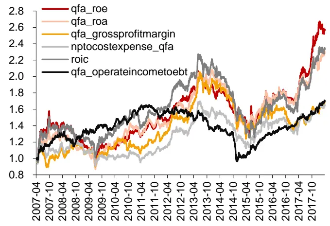
资料来源：Wind，华泰证券研究所

图表91： 财务质量因子多空组合净值示意图二（沪深 300成份股内）
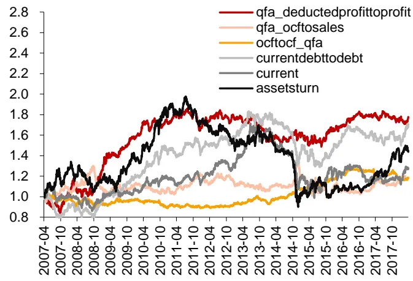
资料来源：Wind，华泰证券研究所

图表92： 财务质量因子多空组合净值示意图一（中证 500成份股内）
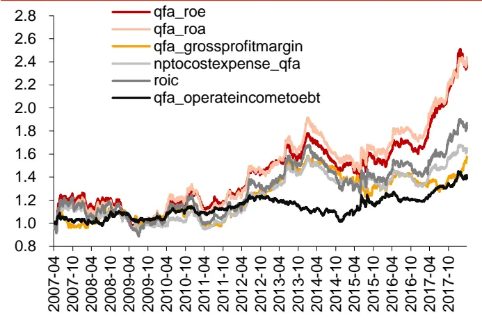
资料来源：Wind，华泰证券研究所

图表93： 财务质量因子多空组合净值示意图二（中证 500成份股内）
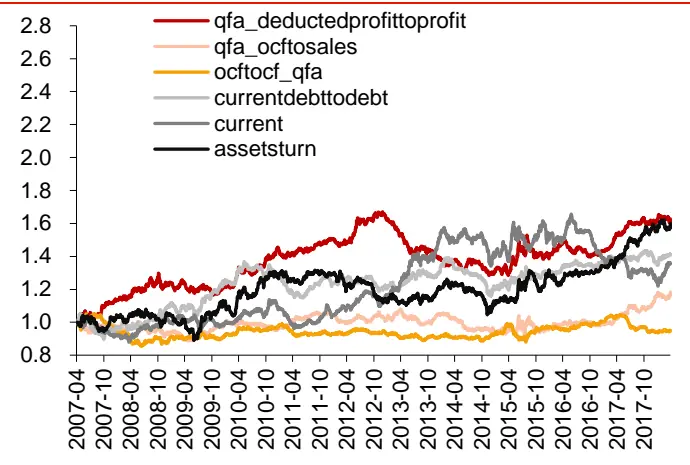
资料来源：Wind，华泰证券研究所

图表94： 财务质量因子多空组合净值示意图一（全 A股）
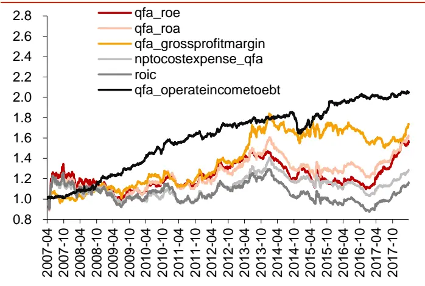
资料来源：Wind，华泰证券研究所

图表95： 财务质量因子多空组合净值示意图二（全 A股）
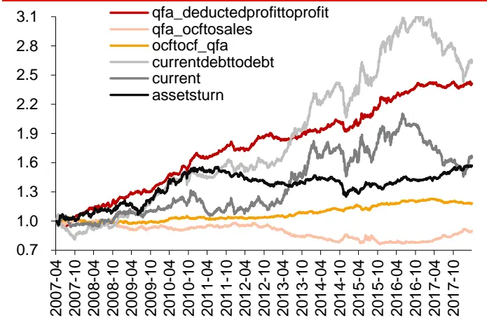
资料来源：Wind，华泰证券研究所

结合以上测试结果可以发现，财务质量因子还是具有一定选股能力的，但随时间推移，大部分因子的效果不太稳定，呈现周期性波动的特征。自 2016 年底开始，盈利能力类的因子多空收益累积速度很快，并且比较平稳；在全部回测区间来看，只有收益质量因子在全A 股中的多空收益累积比较平稳，近期依然持续有效。

## 财务质量因子与其它主要类别因子效果对比（每月调仓）

我们在财务质量的六个子类别中各筛选了一个因子，与之前回测的估值、成长、市值、动量反转、波动率、换手率因子进行对比。所选因子列表如下。

图表96： 用于绩效对比的因子及其计算方式

| 因子类别 | 因子名称 | 因子中文简称 | 因子方向 因子计算方式 |  |
| --- | --- | --- | --- | --- |
| 估值 | EP | 市盈率倒数 |  | 1 Wind 因子 pe_ttm 的倒数 |
| 估值 | BP | 市净率倒数 |  | 1 Wind 因子 pb_If 的倒数 |
| 成长 | Sales_G_q | 当年累计营业收入同比 |  | 1 由 Wind 因子 oper_rev 自行计算同比增长率 |
| 成长 | Profit_G_q | 当年累计净利润同比 |  | 1 由 Wind 因子 net_profit_is 自行计算同比增长率 |
| 市值 | In_capital | 对数总市值 |  | -1 Wind 因子 mkt_cap_ard 取对数 |
| 动量反转 | return_1m | 1个月反转 |  | -1 个股最近 1 个月收益率 |
| 动量反转 | exp_wgt_return_3m | 衰减换手率加权3个月反转 |  | -1 最近3个月内，在每个交易日针对某只个股计算：日换手率乘以函 |
|  |  |  |  | 数 exp(-x_i/12)乘以日收益率，其中x_i为该日距离截面日的交易日 个数。最终对3个月内所有交易日该计算值求和。 |
| 波动率 波动率 | std_1m | 1个月波动率 Fama-3 因子残差波动率 |  | -1 个股最近1个月内日收益率序列的标准差 -1 个股最近 1 个月内日收益率序列对 Fama-French 三因子(中证全指 |
|  | std_FF3factor_1m |  |  | 日收益率、总市值因子日收益率、BP因子日收益率）进行多元线 |
| 换手率 |  | 1个月日均换手率 |  | 性回归的残差的标准差 |
| 换手率 | turn_1m | 1个月换手率/2年换手率 |  | -1 个股最近1个月内日均换手率（剔除停牌、涨跌停） -1 个股最近1个月内日均换手率除以最近2年内日均换手率 |
| 财务质量 | bias_turn_1m | 单季度 roe |  |  |
| 财务质量 | qfa_roe |  |  | 1 Wind 因子 qfa_roe |
| 财务质量 |  | qfa_operateincometoebt 单季度经营活动净收益/利润 |  | 1 Wind 因子 qfa_operateincometoebt |
|  | qfa_ocftosales | 单季度经营现金净流量/营收 |  | 1 Wind 因子 qfa_ocftosales |
| 财务质量 | currentdebttodebt | 流动负债/负债合计 |  | 1 Wind 因子 currentdebttodebt（*部分金融企业不适用） |
| 财务质量 | current | 流动比率 |  | 1 Wind 因子 current (*部分金融企业不适用） |
| 财务质量 | assetsturn | 总资产周转率 | 1 | Wind 因子 assetsturn |

资料来源：Wind，华泰证券研究所

我们统一在月频调仓的框架下对所有因子进行回测，以每个自然月的最后一个交易日作为截面期，其余设置与第二章第一节所述一致。上表中第四列因子方向为 1 表示该因子值越大越好，-1 表示该因子值越小越好，在回测中预先将所有因子都乘以因子方向（1或-1）再进行回测。

回测结果对比如下面三个图表所示。

图表97： 财务质量与前期测试因子在各种股票池内回归法、IC值分析结果汇总（行业中性、市值中性）

| 因子名称 | 因子中文简称 | It\|均值 It\|>2 占比 |  | t均值 | 均值 | 均值 | 标准差 | IC_IR IC>0 占比 |
| --- | --- | --- | --- | --- | --- | --- | --- | --- |
| 沪深300 成份股内 |  |  |  |  |  |  |  |  |
| EP | 市盈率倒数 | 1.73 | 31.06% | 0.98 | 0.71% | 6.28% | 19.04% | 0.33 60.61% |
| BP | 市净率倒数 | 1.98 | 41.67% | 0.86 | 0.66% | 4.52% | 22.20% | 0.20 58.33% |
| Sales_G_q | 当年累计营业收入同比 | 1.33 | 25.00% | 0.31 | 0.14% | 3.06% | 12.85% | 0.24 62.12% |
| Profit_G_q | 当年累计净利润同比 | 1.29 | 20.45% | 0.34 | 0.17% | 4.08% | 13.39% | 0.30 64.39% |
| In_capital | 对数总市值 | 2.67 | 50.00% | 0.36 | 0.15% | 0.43% | 20.43% | 0.02 52.27% |
| return_1m | 1个月反转 | 1.98 | 40.91% | 1.00 | 0.63% | 4.29% | 18.49% | 0.23 56.82% |
| exp_wgt_return_3m | 衰减换手率加权3个月反转 | 1.96 | 41.67% | 1.10 | 0.63% | 7.13% | 15.98% | 0.45 69.70% |
| std_1m | 1个月波动率 | 2.19 | 48.48% | 0.51 | 0.31% | 4.21% | 20.98% | 0.20 61.36% |
| std_FF3factor_1m | Fama-3 因子残差波动率 | 1.78 | 38.64% | 0.75 | 0.38% | 5.96% | 15.73% | 0.38 66.67% |
| turn_1m | 1 个月日均换手率 | 2.14 | 49.24% | 1.03 | 0.50% | 6.67% | 19.67% | 0.34 64.39% |
| bias_turn_1m | 1 个月换手率/2 年换手率 | 1.69 | 30.30% | 0.57 | 0.26% | 3.65% | 15.17% | 0.24 61.36% |
| qfa_roe | 单季度 ROE | 1.94 | 43.18% | 0.57 | 0.25% | 5.04% | 16.48% | 0.31 59.85% |
| qfa_operateincometoebt 单季度经营活动净收益/利润 |  | 1.08 | 14.39% | -0.06 | -0.03% | 1.61% | 10.37% | 0.16 55.30% |
| qfa_ocftosales | 单季度经营现金净流量/营收 | 1.19 | 15.15% | 0.33 | 0.17% | 1.64% | 10.64% | 0.15 56.06% |
| currentdebttodebt | 流动负债/负债合计 | 1.05 | 10.61% | 0.13 | 0.02% | 2.02% | 13.14% | 0.15 58.33% |
| current | 流动比率 | 1.01 | 11.36% | -0.07 | -0.05% | 1.39% | 13.77% | 0.10 55.30% |
| assetsturn | 总资产周转率 | 1.25 | 19.70% | 0.28 | 0.19% | 1.42% | 16.17% | 0.09 55.30% |
| 中证 500 成份股内 |  |  |  |  |  |  |  |  |
| EP | 市盈率倒数 | 1.75 | 31.06% | 0.84 | 0.44% | 4.74% | 12.51% | 0.38 63.64% |
| BP | 市净率倒数 | 1.86 | 37.88% | 0.58 | 0.31% | 5.13% | 17.60% | 0.29 58.33% |
| Sales_G_q | 当年累计营业收入同比 | 1.38 | 25.76% | 0.70 | 0.32% | 2.30% | 9.80% | 0.23 54.55% |
| Profit_G_q | 当年累计净利润同比 | 1.51 | 27.27% | 0.83 | 0.45% | 2.78% | 10.78% | 0.26 60.61% |
| In_capital | 对数总市值 | 2.49 | 53.03% | 0.82 | 0.41% | 5.26% | 14.23% | 0.37 62.88% |
| return_1m | 1个月反转 | 2.21 | 42.42% | 1.17 | 0.57% | 6.94% | 13.88% | 0.50 68.94% |
| exp_wgt_return_3m | 衰减换手率加权3个月反转 | 2.10 | 41.67% | 1.53 | 0.73% | 9.12% | 12.37% | 0.74 75.00% |
| std_1m | 1个月波动率 | 2.21 | 47.73% | 0.66 | 0.28% | 5.06% | 15.51% | 0.33 62.88% |
| std_FF3factor_1m | Fama-3 因子残差波动率 | 1.88 | 39.39% | 1.21 | 0.55% | 9.03% | 11.70% | 0.77 78.79% |
| turn_1m | 1 个月日均换手率 | 2.46 | 55.30% | 1.56 | 0.70% | 8.39% | 14.44% | 0.58 73.48% |
| bias_turn_1m | 1 个月换手率/2 年换手率 | 2.18 | 49.24% | 1.31 | 0.59% | 7.06% | 12.62% | 0.56 |
| qfa_roe | 单季度 ROE | 1.87 | 37.88% | 1.11 | 0.53% | 3.81% | 13.55% | 72.73% 0.28 59.85% |
| qfa_operateincometoebt 单季度经营活动净收益/利润 |  | 1.22 | 18.18% | 0.19 | 0.09% | 1.82% | 7.30% | 0.25 61.36% |
| qfa_ocftosales | 单季度经营现金净流量/营收 | 1.04 | 9.09% | 0.20 | 0.09% | 1.27% | 6.46% | 0.20 59.85% |
| currentdebttodebt | 流动负债/负债合计 | 1.06 | 13.64% | -0.08 | -0.05% | 1.09% | 8.60% | 0.13 59.85% |
| current | 流动比率 | 1.21 | 14.39% | 0.06 | 0.02% | 1.53% |  |  |
| assetsturn | 总资产周转率 | 1.36 | 25.00% | 0.10 |  |  | 9.69% | 0.16 59.85% |
| 全 A股 |  |  |  |  | 0.05% | 1.49% | 10.43% | 0.14 53.03% |
| EP | 市盈率倒数 | 3.44 | 62.12% | 1.87 | 0.49% | 2.74% | 13.33% | 0.21 53.03% |
| BP | 市净率倒数 | 4.60 | 71.97% | 1.62 | 0.45% | 4.95% | 15.27% | 0.32 59.09% |
| Sales_G_q | 当年累计营业收入同比 | 2.37 | 50.00% | 0.99 | 0.21% | 1.87% | 7.84% | 0.24 58.33% |
| Profit_G_q | 当年累计净利润同比 | 2.60 | 56.82% | 1.19 | 0.28% | 2.45% | 8.62% | 0.28 61.36% |
| In_capital | 对数总市值 | 7.32 | 81.06% | 2.01 | 0.44% | 7.05% | 16.86% | 0.42 67.42% |
| return_1m | 1个月反转 | 4.32 | 65.15% | 2.82 | 0.70% | 7.27% | 13.64% | 0.53 69.70% |
| exp_wgt_return_3m | 衰减换手率加权3个月反转 | 4.18 | 63.64% | 3.46 | 0.91% | 9.20% 5.03% 17.15% | 12.63% | 0.73 76.52% 0.29 65.15% |

资料来源：Wind，华泰证券研究所

图表98： 财务质量与前期测试因子在各种股票池内分层测试法结果汇总（分五层，行业中性、市值中性）
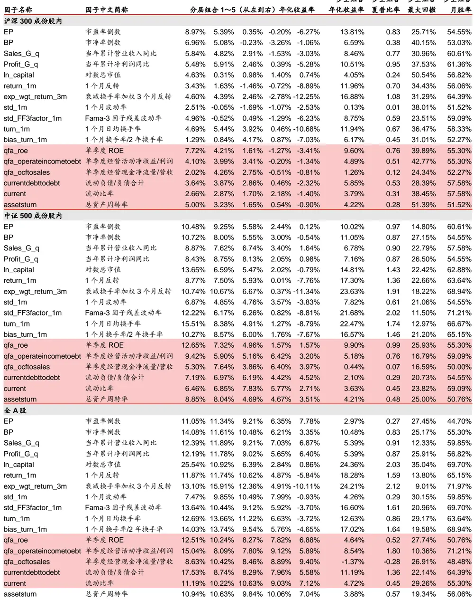
资料来源：Wind，华泰证券研究所

图表99： 财务质量与前期测试因子在各年份的多空收益展示（分五层，行业中性、市值中性）

| 因子名称 因子中文简称 2008 |  |  | 2009 | 2010 | 2011 | 2012 | 2013 | 2014 | 2015 | 2016 2017 2018 |  |  |
| --- | --- | --- | --- | --- | --- | --- | --- | --- | --- | --- | --- | --- |
| 沪深 300 成份股内 |  |  |  |  |  |  |  |  |  |  |  |  |
| EP 市盈率倒数 -1.6% |  |  | 2.1% | -6.1% | 22.5% | 17.5% | -4.1% | 37.4% | 2.5% | 14.5% | 31.9% | 1.5% |
| BP 市净率倒数 19.3% |  |  | 20.4% | -30.3% | 14.2% | 6.9%- | 17.5% | 84.1% | -15.0% | 24.0% | 6.4% | -4.5% |
| Sales_G_q 当年累计营业收入同比 -5.9% |  |  | -7.6% | 21.0% | -0.6% | 11.7% | 10.8% | 1.7% | 21.8% | -0.9% | 19.7% | 2.9% |
| Profit_G_q | 当年累计净利润同比 | -11.0%- | 10.9% | 34.4% | 6.0% | 19.6% | 28.5% | 10.5% | 7.2% | -5.2% | 23.4% | 5.8% |
| In_capital 对数总市值 |  | 27.6% | 63.6% | 27.5% | -7.4% | -9.0% | -5.4% | -16.0% | 25.3% | -2.5% | -26.2% | -4.4% |
| return_1m 1个月反转 41.9% |  |  | 25.0% | 17.9% | 17.5% | 3.1% | -9.1% | -12.6% | 77.6% | 7.7% | -19.7% | 5.9% |
| exp_wgt_return_3m 衰减换手率加权3个月反转 |  | 46.2% | 30.8% | 5.2% | 20.8% | 6.1% | 9.2% | -20.1% | 42.7% | 17.0% | -1.1% | 6.7% |
| std_1m | 1个月波动率 | 4.9% | -17.2% | -13.5% | 36.3% | -12.1% | -6.2% | -4.5% | 4.7% | 9.6% | 6.5% | 4.7% |
| std_FF3factor_1m | Fama-3 因子残差波动率 | 21.8% | 5.0% | -16.2% | 36.6% | 2.5% | -3.9% | 12.3% | 22.1% | 9.1% | -0.1% | 4.3% |
| turn_1m | 1个月日均换手率 | 26.6% | -19.4% | -13.8% | 35.5% | 2.1% | -4.3% | 11.7% | 9.2% | 17.6% | 31.9% | 9.0% |
| bias_turn_1m | 1 个月换手率/2 年换手率 | 20.1% | -18.0% | -11.2% | 17.5% | 5.8% | 1.0% | -14.7% | 32.7% | 9.2% | -8.0% | 6.3% |
| qfa_roe | 单季度 ROE | -16.7% | -1.6% | 16.3% | 13.3% | 14.4% | 10.2% | -18.1% | 10.0% | 3.5% | 36.2% | 10.2% |
| qfa_operateincometoebt | 单季度经营活动净收益/利润 1.1% |  | 14.3% | 16.2% | -4.6% | 3.0% | -12.5% | -30.4% | 25.9% | 11.0% | 14.3% | 9.8% |
| qfa_ocftosales | 单季度经营现金净流量/营收 3.5% |  | -1.1% | -5.3% | 14.4% | -4.5% | -9.1% | 24.3% | -19.0% | 4.3% | 6.2% | 3.0% |
| currentdebttodebt | 流动负债/负债合计 5.2% |  | 27.9% | 29.3% | 8.4% | -0.4% | 21.1% | -23.9% | 12.1% | 13.2% | -4.8% | 6.4% |
| current | 流动比率 -4.0% |  | 9.7% | 19.2% | 4.7% | 0.7% | 31.2% | -33.2% | 29.3% | -3.7% | -3.8% | 8.4% |
| assetsturn 总资产周转率 -10.8% |  |  | 27.0% | 33.7% | -8.1% | -9.7% | 6.4% | -39.7% | 14.9% | 5.9% | 30.1% | -2.4% |
| 中证 500 成份股内 |  |  |  |  |  |  |  |  |  |  |  |  |
| EP 市盈率倒数 |  | -1.3% | 6.2% | 0.6% | 10.0% | 19.4% | -1.3% | 13.2% | 11.8% | 12.8% | 22.7% | 0.3% |
| BP | 市净率倒数 | 17.3% | 52.7% | -18.6% | 19.9% | 8.2% | -15.0% | 46.1% | -5.6% | 33.6% | 7.7% | -4.2% |
| Sales_G_q | 当年累计营业收入同比 | -4.8% | -7.5% | 12.8% | 3.3% | 15.4% | 15.8% | -4.5% | 12.5% | 2.2% | 20.5% | 0.9% |
| Profit_G_q | 当年累计净利润同比 | -6.4% | -7.2% | 13.8% | -1.5% | 23.0% | 14.6% | -3.2% | 12.5% | 2.2% | 23.4% | 0.8% |
| In_capital | 对数总市值 | 35.4% | 51.2% | 2.4% | 16.3% | 9.5% | -7.6% | 22.0% | 26.2% | 28.0% | -16.9% | -3.6% |
| return_1m | 1个月反转 | 21.8% | 38.0% | 19.4% | 4.6% | 17.3% | 6.4% | -1.8% | 49.7% | 14.7% | -14.8% | 5.9% |
| exp_wgt_return_3m | 衰减换手率加权3个月反转 | 38.1% | 48.3% | 20.9% | 12.3% | 21.9% | 11.1% | -2.5% | 55.5% | 22.2%- | 11.3% | 4.7% |
| std_1m | 1个月波动率 | 23.7% | 3.4% | 1.2% | 24.3% | -3.7% | -1.2% | 9.8% | -5.3% | 15.5% | 5.8% | -0.4% |
| std_FF3factor_1m | Fama-3 因子残差波动率 | 42.8% | 39.7% | 8.5% | 29.0% | 8.2% | 4.1% | 20.6% | 34.5% | 28.1% | 0.5% | 0.2% |
| turn_1m | 1个月日均换手率 | 37.1% | 23.4% | 21.5% | 32.3% | 10.7% | 8.0% | 2.6% | 20.6% | 30.0% | 7.8% | 6.9% |
| bias_turn_1m | 1 个月换手率/2 年换手率 | 33.1% | 19.9% | 20.2% | 14.9% | 19.0% | 7.3% | -12.1% | 23.6% | 15.1% | -4.9% | 2.6% |
| qfa_roe | 单季度 ROE | 5.0% | -12.8% | 27.5% | -0.4% | 17.3% | 18.7% | -14.8% | 12.9% | 0.0% | 41.2% | 4.2% |
| qfa_operateincometoeb | 单季度经营活动净收益/利润t | 11.6% | -1.0% | 12.0% | -3.5% | 7.6% | -9.4% | -6.0% | 18.3% | 3.4% | 13.4% | 5.7% |
| qfa_ocftosales | 单季度经营现金净流量/营收 | -2.8% | -0.1% | -1.6% | 9.1% | -2.1% | 0.8% | -9.4% | -1.5% | 0.9% | 10.9% | 4.8% |
| currentdebttodebt | 流动负债/负债合计 | 11.4% | 14.0% | 2.7% | -3.6% | -6.1% | 1.5% | -8.8% | 10.8% | 1.6% | 2.9% | -0.3% |
| current | 流动比率 | 8.9% | -0.9% | 18.9% | -8.2% | 2.7% | 26.8% | -5.4% | 21.7% | -10.6% | -8.6% | 5.6% |
| assetsturn | 总资产周转率 6.3% |  | 2.5% | 17.6% | -1.4% | -14.8% | 3.3% | -11.2% | 12.9% | 6.2% | 24.1% | -0.7% |
| 全 A股 |  |  |  |  |  |  |  |  |  |  |  |  |
| EP | 市盈率倒数 | -3.6% | 3.3% | -8.6% | 1.3% | 9.4% | -7.9% | 5.1% | -17.5% | -0.6% | 33.7% | 3.7% |
| BP | 市净率倒数 | 26.0% | 36.4% | -14.3% | 11.2% | 6.8% | -13.2% | 44.6% | -16.4% | 24.3% | 26.4% | -2.4% |
| Sales_G_q | 当年累计营业收入同比 | 2.6% | -4.0% | 11.6% | 3.8% | 10.8% | 18.1% | -6.0% | 6.2% | -5.7% | 10.4% | 2.1% |
| Profit_G_q | 当年累计净利润同比 | -7.3% | -6.3% | 18.6% | 0.1% | 18.5% | 11.1% | -3.8% | 2.4% | -0.7% | 15.8% | 1.9% |
| In_capital | 对数总市值 | 38.3% | 48.0% | 29.3% | 15.7% | 10.1% | 27.1% | 20.9% | 90.8% | 37.5% | -26.1% | -0.2% |
| return_1m | 1个月反转 | 23.3% | 27.1% | 14.3% | 10.5% | 26.1% | -3.0% | 4.0% | 47.4% | 15.0% | -8.8% | 6.1% |
| exp_wgt_return_3m | 衰减换手率加权3个月反转 | 30.9% | 36.6% | 9.1% | 16.6% | 28.3% | 8.1% | 6.5% | 38.9% | 27.5% | 2.3% | 6.7% |
| std_1m | 1个月波动率 | 3.4% | 1.1% | -5.3% | 19.7% | -0.3%- | 12.0% | 17.0% | -25.3% | 12.7% | 34.8% | 1.3% |
| std_FF3factor_1m | Fama-3 因子残差波动率 | 27.2% | 21.6% | 3.4% | 25.6% | 11.7% | -7.4% | 24.1% | 4.3% | 18.0% | 22.5% | 3.4% |
| turn_1m | 1个月日均换手率 | 15.5% | 3.8% | -2.3% | 28.0% | 16.3% | -14.0% | 11.9% | -15.8% | 12.7% | 46.4% | 3.3% |
| bias_turn_1m | 1 个月换手率/2 年换手率 | 24.0% | 8.8% | 11.3% | 16.1% | 24.3% | 11.7% | -8.9% | 22.2% | 15.6% | 11.7% | 6.5% |
| qfa_roe | 单季度 ROE | -5.0% | -5.8% | 12.4% | 2.2% | 7.7% | 8.2% | -11.3% | -9.5% | -1.4% | 31.3% | 7.6% |
| qfa_operateincometoebt | 单季度经营活动净收益/利润 | 19.9% | 10.0% | 18.6% | 2.5% | 5.9% | 4.1% | -5.9% | 22.3% | 6.0% | 0.3% | 2.0% |
| qfa_ocftosales | 单季度经营现金净流量/营收 | -5.6% | -3.0% | -1.1% | 5.7% | -1.7% | -9.6% | -0.6% | -10.1% | 2.5% | 11.4% | 1.3% |
| currentdebttodebt | 流动负债/负债合计 18.6% |  | 22.1% | 18.8% | 4.4% | 2.1% | 31.6% | 3.4% | 38.3% | 11.1% | -14.5% | 1.7% |
| current | 流动比率 13.1% |  | 3.7% | 15.8%- | 12.5% | -2.8% | 39.3% | -8.2% | 31.2% | -2.7% | -16.5% | 7.3% |
| assetsturn 总资产周转率 4.8% |  |  | 11.9% | 18.8%- | 4.4% | -7.6% | 3.9% | -10.5% | 7.0% | 5.8% | 9.9% 0.2% |  |

资料来源：Wind，华泰证券研究所

注：上表中的 2018 那一列指代 2018 年 1月初到 4月底的多空收益。

## 总结

1． 本报告将财务质量因子分为六个子类别（盈利能力、收益质量、现金流量、资本结构、偿债能力、营运能力）进行分析测试，总共测试 51 个因子，全部因子均从Wind终端的数据接口直接提取。在测试过程中，通过对比同一个子类别内部细分因子的表现，择优详细展示了 12 个因子的测试图表。根据测试结果，财务质量因子具备一定选股能力，并且财务指标随时间推移变化缓慢，有助于构建稳健的长线投资组合。

2． 财务质量因子可能存在多种计算方式，以 ROE 为例，我们在报告中详细测试了 9 种计算方式下 ROE因子的表现，发现 qfa_roe（单季度 ROE、采用平均法计算净资产）因子效果相对最好。若同一因子存在单季度、当年累计（即财报原始值）、TTM 三种计算方式时，一般情况下的效果排序为：单季度>当年累计>TTM。说明目前 A股投资人对季度报表反应较为迅速、敏感，或者也可以理解为投资人对长期业绩关注度低。

3． 大部分财务质量因子随时间推移效果不够稳定，呈现一些周期性波动的特征。自 2016年底开始，盈利能力类的因子多空收益累积速度很快，并且比较平稳；在全部回测区间来看，只有收益质量因子在全A股中的多空收益累积比较平稳，近期依然持续有效。

4． 将财务质量因子与前期测试的估值、成长、市值、动量反转、波动率、换手率等因子放到统一的月频调仓框架下进行回测，发现财务质量因子的 Rank IC和回归因子收益率水平都比较一般，粗看下来与其它类别因子相比没有明显优势。在沪深 300 成份股票池里财务质量因子的水平与其它因子比较接近，在中证 500 成份股票池中逐渐拉开差距，在全 A 股票池中财务质量因子的效果与其它因子尤其是价量类因子相差较大。由此推测，财务质量因子在偏大盘的股票池里选股效果更好，这与人们的直观感觉也是相符的。

5． 从 2016 年底以来，市场投资环境发生了比较大的变化，以往收益很高的市值因子、1个月反转因子失效，而基本面型因子则迅速崛起。观察各类因子自 2008 年到 2018年的年度多空收益可以发现，2017 年 qfa_roe 因子在沪深 300 成份股、中证 500 成份股内的多空收益都是最高的，在全 A 股中的多空收益排第三。2018 年以来财务质量因子的多空收益依然优秀，且目前没有看到明显的下滑趋势（2018 年的回测数据截止到 4月底）。希望我们这篇研究报告能为您的投资带来及时的助益。

## 风险提示

单因子测试结果是历史经验的总结，如果市场规律改变，存在失效的可能。财务质量因子的选股效果受市场宏观环境等因素影响较大，请谨慎使用。

## 免责申明

本报告仅供华泰证券股份有限公司（以下简称“本公司”）客户使用。本公司不因接收人收到本报告而视其为客户。

本报告基于本公司认为可靠的、已公开的信息编制，但本公司对该等信息的准确性及完整性不作任何保证。本报告所载的意见、评估及预测仅反映报告发布当日的观点和判断。在不同时期，本公司可能会发出与本报告所载意见、评估及预测不一致的研究报告。同时，本报告所指的证券或投资标的的价格、价值及投资收入可能会波动。本公司不保证本报告所含信息保持在最新状态。本公司对本报告所含信息可在不发出通知的情形下做出修改，投资者应当自行关注相应的更新或修改。

本公司力求报告内容客观、公正，但本报告所载的观点、结论和建议仅供参考，不构成所述证券的买卖出价或征价。该等观点、建议并未考虑到个别投资者的具体投资目的、财务状况以及特定需求，在任何时候均不构成对客户私人投资建议。投资者应当充分考虑自身特定状况，并完整理解和使用本报告内容，不应视本报告为做出投资决策的唯一因素。对依据或者使用本报告所造成的一切后果，本公司及作者均不承担任何法律责任。任何形式的分享证券投资收益或者分担证券投资损失的书面或口头承诺均为无效。

本公司及作者在自身所知情的范围内，与本报告所指的证券或投资标的不存在法律禁止的利害关系。在法律许可的情况下，本公司及其所属关联机构可能会持有报告中提到的公司所发行的证券头寸并进行交易，也可能为之提供或者争取提供投资银行、财务顾问或者金融产品等相关服务。本公司的资产管理部门、自营部门以及其他投资业务部门可能独立做出与本报告中的意见或建议不一致的投资决策。

本报告版权仅为本公司所有。未经本公司书面许可，任何机构或个人不得以翻版、复制、发表、引用或再次分发他人等任何形式侵犯本公司版权。如征得本公司同意进行引用、刊发的，需在允许的范围内使用，并注明出处为“华泰证券研究所”，且不得对本报告进行任何有悖原意的引用、删节和修改。本公司保留追究相关责任的权力。所有本报告中使用的商标、服务标记及标记均为本公司的商标、服务标记及标记。

本公司具有中国证监会核准的“证券投资咨询”业务资格，经营许可证编号为：91320000704041011J。

全资子公司华泰金融控股（香港）有限公司具有香港证监会核准的“就证券提供意见”业务资格，经营许可证编号为：AOK809

©版权所有 2018年华泰证券股份有限公司

## 评级说明

## 行业评级体系

－报告发布日后的6个月内的行业涨跌幅相对同期的沪深300指数的涨跌幅为基准；

－投资建议的评级标准

增持行业股票指数超越基准

中性行业股票指数基本与基准持平

减持行业股票指数明显弱于基准

## 公司评级体系

－报告发布日后的6个月内的公司涨跌幅相对同期的沪深300指数的涨跌幅为基准；
－投资建议的评级标准
买入股价超越基准 20%以上
增持股价超越基准 5%-20%
中性股价相对基准波动在-5%~5%之间
减持股价弱于基准 5%-20%
卖出股价弱于基准 20%以上

## 华泰证券研究

## 南京

南京市建邺区江东中路228号华泰证券广场1号楼/邮政编码：210019

电话：86 25 83389999 /传真：86 25 83387521

电子邮件：ht-rd@htsc.com

## 深圳

深圳市福田区深南大道4011号香港中旅大厦24层/邮政编码：518048

电话：86 755 82493932 /传真：86 755 82492062

电子邮件：ht-rd@htsc.com

## 北京

北京市西城区太平桥大街丰盛胡同28号太平洋保险大厦A座18层

邮政编码：100032

电话：86 10 63211166/传真：86 10 63211275

电子邮件：ht-rd@htsc.com

## 上海

上海市浦东新区东方路18号保利广场E栋23楼/邮政编码：200120

电话：86 21 28972098 /传真：86 21 28972068

电子邮件：ht-rd@htsc.com