## 金工研究/深度研究

2018年12月14日

林晓明 执业证书编号：S0570516010001

研究员 0755-82080134

linxiaoming@htsc.com

陈烨执业证书编号：S0570518080004

研究员 010-56793942

chenye@htsc.com

李子钰

联系人 liziyu@htsc.com

# 华泰单因子测试之一致预期因子

## 华泰多因子系列之九

## 一致预期因子及其衍生因子长期来看具有较稳定的选股能力

分析师一致预期数据归纳总结了市场上卖方分析师报告对个股的财务指标预测、评级以及关注情况，是除公司财报数据、交易数据以外重要的第三方数据，我们基于朝阳永续一致预期数据库，进行一致预期因子的构建和测试。本文主要测试了两大类一致预期因子：财务指标类一致预期因子和关注度类一致预期因子，总共19个因子。根据测试结果，一致预期因子及其衍生因子长期来看具有较稳定的选股能力。

## 财务指标类一致预期因子的衍生因子选股表现相比原始因子各有优劣

对于财务指标类的一致预期因子，我们都构建了两个衍生因子：原始因子的同行业位序和原始因子的季度环比，该类因子2009年以来的覆盖度基本在90%左右。测试分析可得两条主要结论：（1）原始因子与其同行业位序因子相关性较高，大多数情况下，同行业位序因子的RankIC均值相比原始因子会有一定降低，但是ICIR会有较大提升，分层测试表现更加稳定。(2）原始因子与其季度环比因子相关性较低，大多数情况下，季度环比因子会比原始因子有更高的ICIR和多空组合夏普比率，但是换手率也更高，其多空组合的良好表现多数情况下来自于空头。

## 财务指标类一致预期因子选股表现排序：沪深300>全A>中证500

对于财务指标类的一致预期因子，我们分为沪深300、中证500、全A三个股票池测试，并总结各个股票池内表现较好的因子。总体来看，三个股票池内一致预期因子效果排序为：沪深300>全A>中证500。其中沪深300内 RankIC 均值最高的因子是一致预期 EP，RankIC 均值为 6.32%，ICIR为 0.33，多空组合夏普比率为 0.79。中证 500 内RankIC 均值最高的因子是一致预期 BP，RankIC 均值为 4.60%，IC_IR 为 0.26，多空组合夏普比率为 0.93。全 A 内 RankIC 均值最高的因子是一致预期 BP 同行业位序，RankIC 均值为 4.78%，ICIR 为 0.67，多空组合夏普比率为 1.94。

## 关注度类一致预期因子覆盖度较低，选股效果一般

对于关注度类的一致预期因子，考虑到其较低的覆盖率问题，我们仅测试该类因子在沪深300和中证500成分股内的选股效果。测试发现该类因子表现并不亮眼，其中个股季度买入评级报告数因子在沪深300内表现较好，RankIC 均值为 4.33%，ICIR 为 0.26，多空组合夏普比率为 0.81。

## 一致预期因子在银行行业内表现最好

我们测试了一致预期因子在行业内选股的表现，根据测试的RankIC均值和多空组合夏普比率进行综合排名。一致预期因子在银行行业内表现最好，有6个因子排名进入前50，其中4个因子的RankIC在10%以上，多空组合夏普比率在1以上。另外一致预期因子在电子元器件、农林牧渔、餐饮旅游、汽车、纺织服装行业的表现也较好。一致预期EP和一致预期BP的相关因子在行业内选股表现较好，一致预期ROE相关因子只在银行行业内选股排名进入前50，一致预期EPS和一致预期归母净利润相关因子没有一个排名进入前50。

风险提示：单因子测试结果是历史经验的总结，如果市场规律改变，存在失效的可能。一致预期因子的有效性可能吸引越来越多投资者的关注，逐渐削弱一致预期因子在未来的表现。

## 一致预期因子的选取及测试框架

## 一致预期因子的选取

本文是华泰多因子系列研究第九篇，是单因子测试系列的第八篇，在多因子系列首篇报告中，我们系统地阐述了多因子模型的基本理论，详细描述了多因子模型构建的流程，从多因子系列第二篇报告开始，我们对不同的风格因子单独进行详细的研究和检验，通过综合对比评价，筛选出能持续获得稳健收益的优质因子，这正是构建多因子选股模型的关键一步。在前七篇单因子测试报告中，我们对估值因子（ValueFactor)、成长因子（GrowthFactor)、动量反转因子(Momentum Factor)、换手率因子(Turnover Factor)、波动率因子（Volatility Factor)、资金流向因子（Money Flow Factor)、财务质量因子（FinancialQualityFactor）进行了详细的测试分析。在本文中，我们将基于朝阳永续数据库，对分析师一致预期相关因子进行系统全面的分析，我们先根据分析师一致预期数据的来源和特点进行一致预期因子的分类和构建，然后通过回归法、IC值分析、分层测试法等方法检验各类因子的有效性，探讨各因子的优缺点，并汇总对比一致预期因子与其它主要类别因子效果的异同。

分析师一致预期数据归纳总结了市场上卖方分析师报告对个股的财务指标预测、评级以及关注情况，是除公司财报数据、交易数据以外重要的第三方数据，蕴含丰富的信息，本文中，我们使用朝阳永续一致预期数据库进行研究。对于财务指标类因子，在考虑了因子的有效性和覆盖度后，选取图表1中的因子进行衍生因子的构造和测试。

图表1：本文测试的一致预期因子及其描述（财务指标类）

| 具体因子 | 因子名称 | 因子数据来源描述 |
| --- | --- | --- |
| 一致预期归母净利润 | CON_NP | 一般在分析师报告中直接披露 |
| 一致预期 EPS | CON_EPS | 一般在分析师报告中直接披露 |
| 一致预期EP | CON_EP | 一致预期EPS/统计日收盘价 |
| 一致预期 BP | CON_BP | 一致预期净资产/统计日收盘价 |
| 一致预期 ROE | CON_ROE | 一致预期净利润/一致预期净资产 |

资料来源：朝阳永续，华泰证券研究所

朝阳永续数据库中还统计了一段时间内所有卖方分析师和机构对个股的关注度数据，在考虑了因子的有效性和覆盖度后，本文选取图表2中的因子数据进行衍生因子的构造和测试。

图表2：本文测试的一致预期因子数据及其描述（关注度类）

| 具体因子 | 因子英文名称 | 因子数据来源描述 |
| --- | --- | --- |
| 个股季度报告数 | REPORT_NUMBER | 个股季度报告数量 |
| 个股季度关注研究员数 | AUTHOR_NUMBER | 个股季度关注的研究员数量 |
| 个股季度机构覆盖数 | ORGAN_NUMBER | 个股季度至少有一篇报告记录的机构总量 |
| 个股季度买入评级报告数 | BUY_NUMBER | 个股季度买入评级报告数 |

资料来源：朝阳永续，华泰证券研究所

## 一致预期因子的构建和测试框架

对于财务指标类的一致预期因子，我们不直接从基础的分析师报告数据开始构建因子，而是使用朝阳永续的一致预期数据表(CON_FORECAST_STK)进行因子构建。以股票000001.SZ的一致预期EPS 因子为例，在2018年10月31日这天，一致预期数据表会记录该股票未来3年（2018、2019、2020）的一致预期EPS因子值，该因子值并非单一分析师报告的预测EPS，而是通过对过去一段时间内所有卖方分析师相关报告中的预测EPS进行加权，得到加权后的一致预期EPS因子数据。在本文中，我们统一使用最远预测年份的一致预期因子数据(例如对上面的例子来说，使用2020年的一致预期因子数据)。

对于关注度类的一致预期因子，我们使用朝阳永续的个股报告数表(STOCK_REPORT_NUMBER)进行因子构建，由于市场上股票数量较多而分析师有限，为了提高因子的覆盖度，对于图表2中提到的因子，我们都取用季度的统计数据进行因子构建。

在本报告中，我们首先观察一致预期因子在A股市场的分布规律，通过分析一致预期因子在不同行业及不同规模上市公司间的差异，判断在单因子回归测试中是否应该处理行业、规模因素的影响。随后我们将使用分层测试法、回归法、IC值分析等手段对因子进行全面测试，详细观察因子区分度、单调性等规律，选出有效且稳健的因子。最后我们将根据以上测试结果进行综合分析，并与之前测试过的其它类别因子进行对比。

图表3：一致预期因子分析测试框架
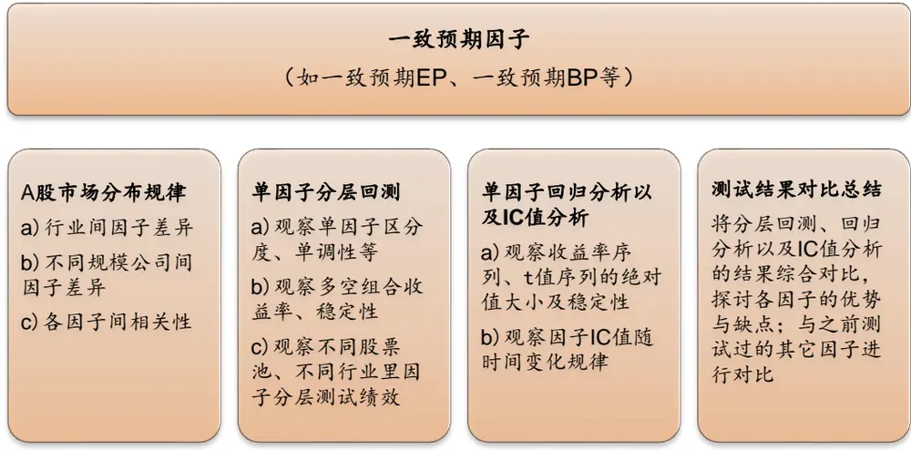
资料来源：华泰证券研究所

## 一致预期因子的行业间差异

一致预期因子在不同行业间存在一定差异。我们选取CON_EP(一致预期EP)、CON_BP(一致预期BP)作为代表，计算它们在2018年10月31日的行业中位数，如下图所示。可以发现，银行行业具有较高的 CON_EP和CON_BP，国防军工行业的 CON_EP和CON_BP都较低，这两个因子在不同行业间的水平存在一定差异。我们认为对上市公司直接进行跨行业比较意义不大，在单因子测试中还是应考虑行业中性处理。

图表4：各一级行业 CON_EP、CON_BP 因子中位数比较（2018年10月31日）
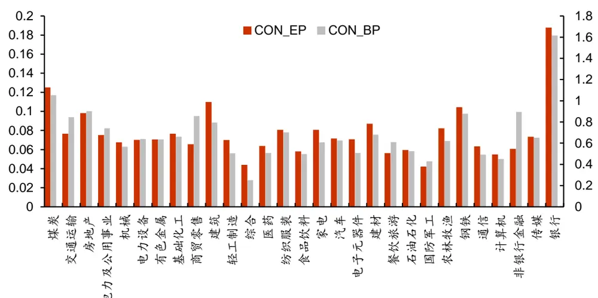
资料来源：朝阳永续，华泰证券研究所

上图说明了，在同一时间点，不同行业间一致预期因子的水平存在一定差异。事实上，随着时间变化，金融系统存在波动，同一行业的一致预期因子的绝对大小和与其他行业对比的相对大小也在不断变化中。这里就不具体举例了。

## 一致预期因子与市值因子的相关性

除去行业对因子存在较大影响外，上市公司的规模也是对各因子产生作用的潜在因素。我们在之前单因子测试报告中涉及的大部分因子都与市值因子具有一定相关性，下面我们将对一致预期因子与市值因子的相关性进行详细计算。

图表5：一致预期因子与市值因子之间 Spearman 秩相关系数（根据每年年底的因子值和市值进行计算）

| 因子名称 | 2009 2010 | 2011 | 2012 | 2013 | 2014 | 2015 | 2016 | 2017 |
| --- | --- | --- | --- | --- | --- | --- | --- | --- |
| CON_NP | 85.34% 84.72% 85.72% 84.41% 81.31% |  |  |  | 79.59%73.18%79.57% |  |  | 均值 84.02% 81.98% |
| CON_EP | 44.48%39.06%33.38%23.03% 25.41% 23.57% 23.98%40.50%29.76% 31.46% |  |  |  |  |  |  |  |
| CON_BP | 17.29%12.59% | 10.16% | 1.48% | 1.94% | 10.76% | 6.85% 28.47% |  | 18.33%11.99% |
| CON_EPS | 44.92%39.32% | 29.66% | 25.31% | 36.67% | 25.28% | 23.75% |  | 25.93% 23.03%30.43% |
| CON_ROE | 35.14% 36.32% | 33.94% | 28.12%32.77% |  | 23.55% | 24.86% |  | 19.66%16.85%27.91% |
| REPORT_NUMBER | 59.54%62.41% | 52.75% 52.34% |  | 60.27% |  | 49.23% 49.48%45.31% |  | 55.55% 54.10% |
| AUTHOR_NUMBER | 66.69% 67.63% | 59.89%57.56% |  | 64.31% |  | 54.82%51.54% 49.18% |  | 58.48% 58.90% |
| ORGAN_NUMBER | 65.81% 66.44% | 59.53% 57.06% |  | 64.22% |  | 55.08% 53.03% 50.64% |  | 59.30% 59.01% |
| BUY_NUMBER | 60.54% 61.71%55.09%49.20%56.41%48.57% 46.78% 45.91%55.32% 53.28% |  |  |  |  |  |  |  |

资料来源：朝阳永续，Wind，华泰证券研究所

我们针对图表5中的9个因子，计算它们在2009～2017年最后一个交易日与对应时间市值因子之间的Spearman秩相关系数，见上表。经观察发现，所有因子与市值具有正相关关系，CON_EP、CON_BP、CON_EPS、CON_ROE与市值相关性较小，CON_NP、REPORT NUMBER、AUTHOR NUMBER、ORGAN NUMBER、BUY NUMBER与市值相关性较大。由此，我们认为在一致预期因子测试中还是应考虑进行市值中性处理。

## 一致预期因子在截面上的因子值相关性分析

在某一指定截面上，我们可以计算两个因子的因子值之间相关系数。若在这一截面上建立多元线性回归方程，以下期收益作为被解释变量，以这两个因子和其它一些风格因子作为解释变量，则由于这两个因子的线性相关程度较大，回归结果的准确性就会受到影响，当这两个因子完全线性相关时回归方程没有解。所以考察截面上因子值相关情况是一件有意义的工作。

对于任意两个一致预期因子，我们依次计算从2009年至2019年的10月月末截面上它们之间的Spearman秩相关系数，最后求均值，结果见下表。关注度类的一致预期因子(REPORT_NUMBER,AUTHOR_NUMBER,ORGAN_NUMBER,BUY_NUMBER)之间的相关性较大，在使用时仍需注意规避因子共线性带来的一些衍生问题。CON_BP(一致预期BP）和其他因子的相关性较低。

图表6：一致预期因子在截面上的两两因子值 Spearman 秩相关系数均值（2009 年至今 2018 年 10月）
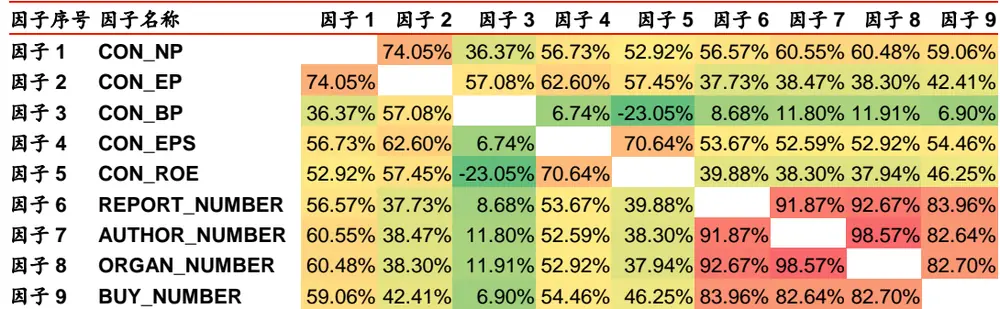
资料来源：朝阳永续，华泰证券研究所

## 单因子测试方法简介

在多因子系列首篇报告《华泰多因子模型体系初探》(2016.09）中，我们系统地介绍了有效因子识别（即单因子测试）的理论基础和研究思路，在多因子系列第二篇报告《华泰单因子测试之估值类因子》中我们着眼于实践过程，给出了详细的流程操作说明。本篇报告将沿用多因子系列第二篇报告的方法，对分析师一致预期因子进行月度调仓情况下的单因子测试。

## 单因子测试方法简介

回归法

回归法是一种最常用的测试因子有效性的方法，具体做法是将第T期的因子暴露度向量与T+1期的股票收益向量进行线性回归，所得到的回归系数即为因子在T期的因子收益率，同时还能得到该因子收益率在本期回归中的显著度水平—t值。在某截面期上的个股的因子暴露度（FactorExposure）即指当前时刻个股在该因子上的因子值。第T期的回归模型具体表达式如下。

$$
r^{T+1}=X^{T}a^{T}+\sum_{j}Indus_{j}^{T}b_{j}^{T}+ln\_mkt^{\mathrm{T}}b^{T}+\varepsilon^{T}
$$

$r^{T+1}$ :所有个股在第T+1期的收益率向量

$$
$X^{T};$所有个股第T期在被测单因子上的暴露度向量
$$

$Indus_{j}^{T}$ 所有个股第T期在第j个行业因子上的暴露度向量（0/1哑变量）

ln $\lfloor-mkt^{\mathrm{T}}\rfloor$ 所有个股第T期在对数市值因子上的暴露度向量

$a^{T},b^{T},b_{j}^{T}$ :对应因子收益率，待拟合常数，通常比较关注 $.a^{T}$

εT:残差向量

在所有截面期上，我们对因子X进行回归测试，能够得到该因子的因子收益率序列（即所有截面期回归系数 $|a^{T}|$ 构成的序列）和对应的t值序列。t值指的是对单个回归系数 $a^{T}的$ t检验统计量，描述的是单个变量显著性，t值的绝对值大于临界值说明该变量是显著的，即该解释变量（T期个股在因子X的暴露度）是真正影响因变量（T+1期个股收益率）的一个因素。也就是说，在每个截面期上，对于每个因子的回归方程，我们设

$$
\begin{aligned}&假设检验\;H_0:a^T=0,\\&备择假设\;H_1:a^T\neq0\end{aligned}
$$

该假设检验对应的t统计量为

$$
\mathbf{t}=\frac{a^{T}}{SE(a^{T})}
$$

其中 $SE(a^{T})$ 代表回归系数 $a^{T}$ 的标准差的无偏估计量。一般t值绝对值大于2我们就认为本期回归系数 $(a^{T}$ 是显著异于零的(也就是说，本期因子X对下期收益率具有显著的解释作用)。注意，我们在回归模型中加入了市值、行业因子，能在一定程度上规避市值、行业因素对财务质量因子的影响。

回归模型构建方法如下：

1. 股票池：全 A 股，沪深 300 成分股，中证500 成分股，剔除 ST、PT 股票，剔除每个截面期下一交易日停牌的股票。

2. 回溯区间：2009-01-31至2018-10-31。

3. 截面期：每个月月末，用当前截面期因子值与当前截面期至下个截面期内的个股收益进行回归。

4. 数据处理方法：

a) 因子列表见图表1和图表2，所有因子先从朝阳永续数据库下载，再处理成月频因子；

b) 中位数去极值：设第T期某因子在所有个股上的暴露度向量为 $D_{i},~D_{M}$ 为该向量中位数， $D_{M1}$ 为向量 $|D_{i}-D_{M}|$ 的中位数，则将向量 $D_{i}$ 中所有大于 $D_{M}+5D_{M1}$ 的数重设为 $D_{M}+5D_{M1}$ ，将向量 $D_{i}$ 中所有小于 ${{\cdot}{D}_{M}}-5{{D}_{M1}}$ 的数重设为 $D_{M}-5D_{M1}$

c) 标准化：将去极值处理后的因子暴露度序列减去其现在的均值、除以其标准差，得到一个新的近似服从N(0,1)分布的序列，这样做可以让不同因子的暴露度之间具有可比性；

d)缺失值处理：因本文主旨为单因子测试，为了不干扰测试结果，如文中未特殊指明均不填补缺失值（在构建完整多因子模型时需考虑填补缺失值)。

5.回归权重：由于普通最小二乘回归（OLS）可能会夸大小盘股的影响（因为小盘股的财务质量因子出现极端值概率较大，且小盘股数目很多，但占全市场的交易量比重较小)，并且回归可能存在异方差性，故我们参考Barra手册，采用加权最小二乘回归(WLS)，使用个股流通市值的平方根作为权重，此举也有利于消除异方差性。

6. 因子评价方法：

a) t值序列绝对值均值—因子显著性的重要判据；

b) t值序列绝对值大于2的占比——判断因子的显著性是否稳定；

c) t值序列均值—与a)结合，能判断因子t值正负方向是否稳定；

d) 因子收益率序列均值——判断因子收益率的大小。

## IC 值分析法

因子的IC 值是指因子在第T期的暴露度向量与 T+1 期的股票收益向量的相关系数，即

$$
IC^{T}=\operatorname{corr}(r^{T+1},X^{T})
$$

上式中因子暴露度向量 $X^{T}$ 一般不会直接采用原始因子值，而是经过去极值、中性化等手段处理之后的因子值。在实际计算中，使用Pearson相关系数可能受因子极端值影响较大，使用 Spearman秩相关系数则更稳健一些，这种方式下计算出来的IC一般称为 Rank IC。

## IC值分析模型构建方法如下：

1. 股票池、回溯区间、截面期均与回归法相同。

2. 因子暴露度向量XT先用中位数法去极值（方法论详见上一小节)，然后进行市值、行业中性化处理。中性化处理即在截面期T上用因子值（已去极值）做因变量、对数总市值因子（已去极值）及行业因子（0/1哑变量）做自变量进行线性回归，取残差作为因子值的一个替代。这样做可以消除行业因素和市值因素对因子的影响。计算残差向量和 T+1 期股票收益向量的 Spearman 秩相关系数作为 T 期因子 Rank IC 值。

3. 因子评价方法：

a) Rank IC 值序列均值——因子显著性；

b) Rank IC 值序列标准差——因子稳定性；

c) IC_IR（RankIC值序列均值与标准差的比值）——因子有效性；

d) RankIC 值序列大于零的占比——因子作用方向是否稳定。

## 分层回测法

依照因子值对股票进行打分，构建投资组合回测，是最直观的衡量因子优劣的手段。分层测试法与回归法、IC值分析相比，能够发掘因子对收益预测的非线性规律。也即，若存在一个因子分层测试结果显示，其 Top 组和Bottom 组的绩效长期稳定地差于Middle 组，则该因子对收益预测存在稳定的非线性规律，但在回归法和IC值分析过程中很可能被判定为无效因子。

分层测试模型构建方法如下：

1.股票池、回溯区间、截面期均与回归法相同。

2. 换仓：在每个截面期核算因子值，构建分层组合，在截面期下一个交易日按当日收盘价换仓，交易费用以双边千分之四计。

3. 分层方法：因子暴露度向量 $X^{T}$ 先用中位数法去极值，然后进行市值、行业中性化处理(方法论详见上一小节)，将股票池内所有个股按因子从大到小进行排序，等分N层，每层内部的个股等权配置。当个股总数目无法被N整除时采用任一种近似方法处理均可，实际上对分层组合的回测结果影响很小。

4. 多空组合收益计算方法：用 Top 组每天的收益减去 Bottom组每天的收益，得到每日多空收益序列 $r_{1},r_{2},\cdots,r_{n}$ ，则多空组合在第 n天的净值等于 $(1+r_{1})(1+r_{2})\cdots(1+r_{n})$

5. 评价方法：全部N层组合年化收益率(观察是否单调变化)，多空组合的年化收益率、夏普比率、最大回撤、月胜率等。

## 三种方法的关系

首先介绍一下回归法和IC值分析法之间的关系。

我们先介绍一个引理。设X,Y为两个向量，则 $[corr(X,Y)]^{2}=R^{2}$ ，其中 $R^{2}$ 为线性回归 $Y=$ $aX+b$ 或线性回归 $X=aY+b的$ 可决系数（其中a，b是待回归系数）。

如果我们在单因子测试（线性回归法）中使用模型

$$
r=\beta X+c
$$

(r是股票收益率，X是因子暴露度，C是常数项，C可以理解为市场因子)并且假设我们在计算因子IC值的时候，不预先对因子暴露度进行市值、行业调整了，就使用原始的因子暴露度 $X,$ 则本期因子IC值为 $corr(X,r)$ ，根据引理，因子IC值的平方就等于单因子测试的回归模型的 $R^{2}$

所以，因子IC值本质上反映的是下期收益率和本期因子暴露度的线性相关程度 $(R^{2}$ 的平方根)，是使用该因子预测收益率的稳健性（IC值越大，这个因子的收益越稳定，波动越小)；而回归法中计算出的因子收益率本质上是一个斜率，反映的是从该因子可能获得的收益率的大小，这并不能说明任何关于线性拟合优度的信息（也就是说，因子收益率很大时，也可能出现R²很小的情形)；至于回归法中计算出的t值，在一元线性回归中t值与 $R^{2}$ 反映的信息一致（二者对应关系为，当 $R^{2}=0$ 时t值也为0，当 $R^{2}=1$ 时t值为无穷大)，但是由于我们所采用的回归模型包括了行业变量，所以t值仅代表被测因子对股票收益的解释能力（而不能代表模型的整体拟合优度)。实际计算过程中因子会进行一些预处理，回归方程也有可能引入其它风格变量使其表达形式更复杂，导致IC值和t值无法理论上互推，但前面所述结论的本质不变。

总结一下，IC值反映模型整体线性拟合优度，t值反映被测单因子对模型的解释能力是否显著，因子收益率与前两者差别较大，它反映的是可能获得的收益率的大小，而对这个收益是否稳健未知。

其次介绍一下回归法和分层测试法之间的关系。

假设本期因子值X与下期收益r完全线性相关，满足 $r=\beta X+c。$ 此时IC值绝对值为1，回归法中的因子收益率为 $\beta.$ 。并且假设本期因子值X服从[0,1]均匀分布，那么当按因子从小到大等分N层测试时，第i层组合的下期收益为 $\beta(2i-1)/2N+c$ ，多空收益（第N层收益减去第1层收益）为 $\beta(N-1)/N$ ，也即说明分层测试法中的多空收益与回归法中的因子收益率具有一定程度的等价关系。实际上因子IC值大部分在0.1附近波动，所以回归拟合的因子收益率与分层测试下的多空收益也未必完全一致。

## 宽基指数内单因子测试结果分析

本章我们将展示图表1和图表2中的一致预期因子的单因子测试结果，并分别挑选出在沪深300、中证500、全A内表现较好的因子进行详细展示。对于财务指标类的一致预期因子，我们不仅测试原始因子，还测试原始因子的衍生因子（如同行业位序、季度环比等)。

## 一致预期EP

本节中，我们分别测试图表7中3个一致预期EP相关因子。首先，我们分析图表7中的因子和EP因子之间的相关性，如图表8所示，一致预期EP因子及其衍生因子与EP因子之间都有一定相关性，因此我们在测试时要进行EP因子中性。

图表7：一致预期 EP 相关因子

| 具体因子 | 因子描述 | 2009 年至 2018 年 10 月年平均覆盖度（全 A 股） |
| --- | --- | --- |
| CON_EP | 一致预期EP | 90.67% |
| CON_EP_RANK | 一致预期EP同行业位序(申万二级行业) | 90.67% |
| CON_EP_REL | 一致预期EP季度环比 | 87.20% |

资料来源：朝阳永续，华泰证券研究所

图表8：一致预期 EP 因子和 EP 因子在截面上的 Spearman 秩相关系数均值(2009 年至 2018 年 10 月）

| 因子名称 | EP | CON_EP | CON_EP_RANK | CON_EP_REL |
| --- | --- | --- | --- | --- |
| EP |  | 64.59% | 51.61% | 5.09% |
| CON_EP | 64.59% |  | 82.49% | 24.11% |
| CON_EP_RANK | 51.61% | 82.49% |  | 24.02% |
| CON_EP_REL | 5.09% | 24.11% | 24.02% |  |

资料来源：朝阳永续，华泰证券研究所

图表9~图表10展示了一致预期EP相关因子在各种股票池内回归法、RankIC值、分层测试分析结果汇总。可以看出，沪深300 成分股内，CON_EP和CON_EP_RANK具有较好的选股效果；中证500成分股和全A股内，CON_EP_RANK具有较好的选股效果。在各个股票池内，CON_EP_RANK虽然相对于CON_EP的 RankIC均值有所下降，但是IC_IR有大幅提升，表现更加稳定。

图表9：一致预期EP相关因子在各种股票池内回归法、IC值分析结果汇总（行业、市值、EP中性）

| 因子收益率 |  |  |  |  |  |  |  |  |
| --- | --- | --- | --- | --- | --- | --- | --- | --- |
| 具体因子 | It\|均值 | It\|>2 占比 t 均值 |  |  | 均值 RankIC 均值 RankIC 标准差 |  |  | IC_IR IC>0 占比 |
| 沪深 300 成分股内 |  |  |  |  |  |  |  |  |
| CON_EP | 1.93 | 40.17% | 1.15 | 0.78% | 6.32% | 19.03% | 0.33 | 66.67% |
| CON_EP_RANK | 1.54 | 29.91% | 0.96 | 0.42% | 5.27% | 9.67% | 0.54 | 70.09% |
| CON_EP_REL | 1.61 | 34.19% | 0.80 | 0.43% | 4.07% | 13.30% | 0.31 | 67.52% |
| 中证 500 成分股内 |  |  |  |  |  |  |  |  |
| CON_EP | 1.73 | 35.90% | 0.86 | 0.40% | 4.04% | 12.06% | 0.34 | 60.68% |
| CON_EP_RANK | 1.47 | 27.35% | 0.79 | 0.34% | 3.66% | 7.13% | 0.51 | 66.67% |
| CON_EP_REL | 1.23 | 19.66% | 0.71 | 0.33% | 4.35% | 9.09% | 0.48 | 68.38% |
| 全 A股 |  |  |  |  |  |  |  |  |
| CON_EP | 4.07 | 63.25% | 2.79 | 0.68% | 4.52% | 11.61% | 0.39 | 66.67% |
| CON_EP_RANK | 3.22 | 60.68% | 2.16 | 0.45% | 4.03% | 6.81% | 0.59 | 70.09% |
| CON_EP_REL | 2.43 | 47.01% | 1.73 | 0.40% | 4.77% | 8.12% | 0.59 | 72.65% |

资料来源：朝阳永续，Wind，华泰证券研究所

图表10：一致预期EP相关因子在各种股票池内分层测试法结果汇总(分五层）

|  |  |  |  |  |  | 多空组合年化多空组合夏多空组合最多空组合月 TOP组合月均 |  |  |  |  |
| --- | --- | --- | --- | --- | --- | --- | --- | --- | --- | --- |
| 具体因子 | 分层组合1～5（从左到右）年化收益率 |  |  |  |  |  | 收益率 | 普比率 大回撤 | 胜率 | 双边换手率 |
| 沪深 300 成分股内 |  |  |  |  |  |  |  |  |  |  |
| CON_EP | 14.60% | 3.29% | 3.63% | 2.28% | -0.77% | 12.87% | 0.79 | 25.91% | 61.54% | 32.49% |
| CON_EP_RANK | 10.02% | 7.87% | 2.61% | 2.34% | -0.63% | 10.23% | 1.31 | 15.19% | 62.39% | 47.76% |
| CON_EP_REL | 7.05% | 3.73% | 7.08% | -0.80% | -1.51% | 7.98% | 0.73 | 18.91% | 59.83% | 99.76% |
| 中证 500 成分股内 |  |  |  |  |  |  |  |  |  |  |
| CON_EP | 12.06% | 10.91% | 8.52% | 5.44% | 2.42% | 8.83% | 0.94 | 15.73% | 58.97% | 41.79% |
| CON_EP_RANK | 12.09% | 9.97% | 8.44% | 6.59% | 1.82% | 9.70% | 1.52 | 10.03% | 68.38% | 52.52% |
| CON_EP_REL | 10.92% | 9.20% | 9.58% | 4.31% | -1.33% | 12.04% | 1.67 | 9.68% | 68.38% | 95.64% |
| 全 A股 |  |  |  |  |  |  |  |  |  |  |
| CON_EP | 16.36% | 13.46% | 10.98% | 8.79% | 5.97% | 8.97% | 1.06 | 15.66% | 59.83% | 38.73% |
| CON_EP_RANK | 15.79% | 12.92% | 10.95% | 9.62% | 5.72% | 9.34% | 1.95 | 7.92% | 67.52% | 48.78% |
| CON_EP_REL | 15.85% | 12.86% | 11.15% | 6.04% | 2.26% | 13.16% | 2.11 | 10.24% | 75.21% | 93.22% |

资料来源：朝阳永续，Wind，华泰证券研究所

## 沪深300成分股内表现较好的一致预期EP相关因子详细展示

图表11：CON_EP 分层组合1~5 净值除以基准净值(沪深 300)
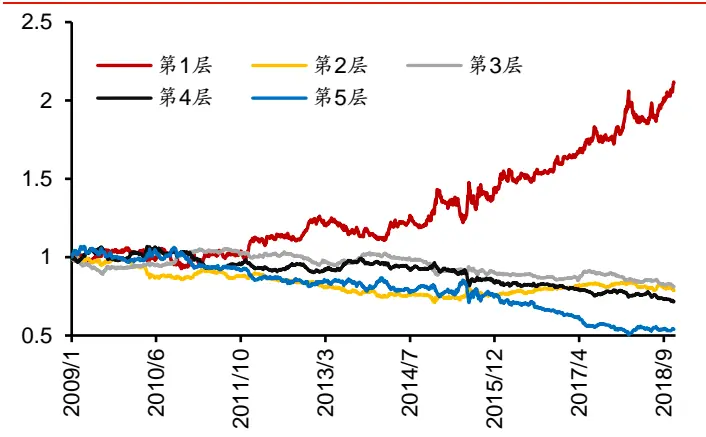
s资料来源：朝阳永续，Wind，华泰证券研究所

图表12: CON_EP 累积 RankIC 和累积因子收益率(沪深 300)
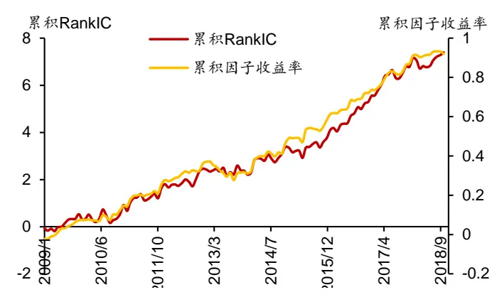
资料来源：朝阳永续，Wind，华泰证券研究所

图表13： CON_EP_RANK 分层组合 1~5 净值除以基准净值(沪深 300)
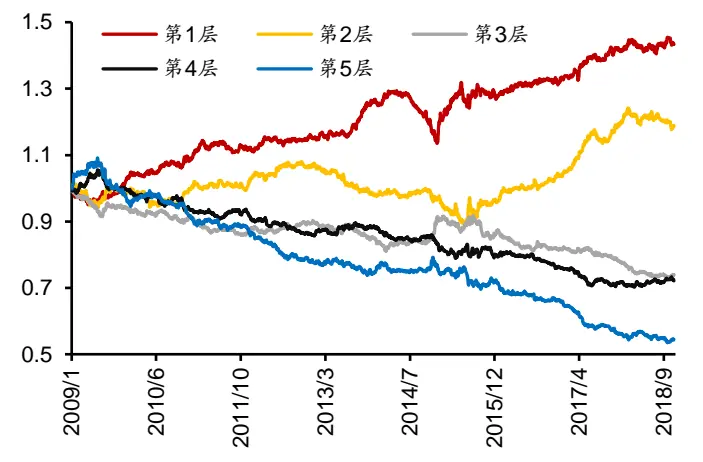
s资料来源：朝阳永续，Wind，华泰证券研究所

图表14：CON_EP_RANK 累积 RankIC 和累积因子收益率(沪深 300)
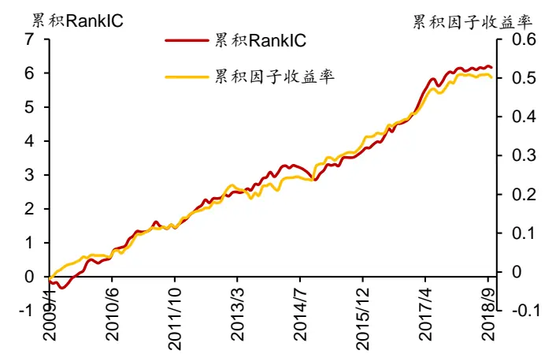
资料来源：朝阳永续，Wind，华泰证券研究所

中证500成分股内表现较好的一致预期EP相关因子详细展示

图表15： CON_EP_RANK 分层组合 1~5 净值除以基准净值(中证 500)
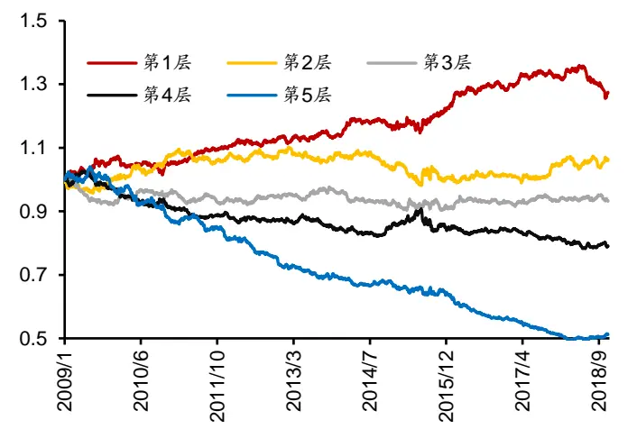
s资料来源：朝阳永续，Wind，华泰证券研究所

图表16: CON_EP_RANK 累积 RankIC 和累积因子收益率(中证 500)
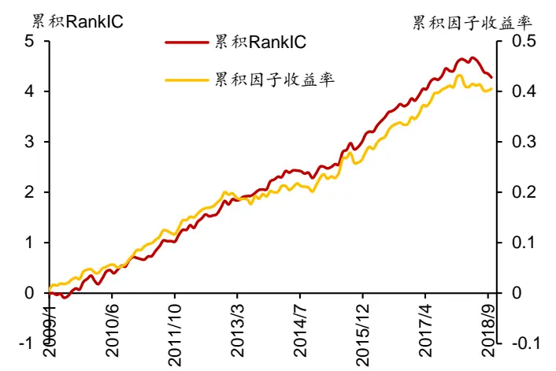
资料来源：朝阳永续，Wind，华泰证券研究所

全A股内表现较好因子的一致预期EP相关因子详细展示

图表17： CON_EP_RANK 分层组合 1~5 净值除以基准净值(全 A)
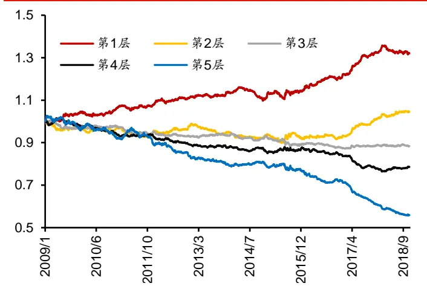
s资料来源：朝阳永续，Wind，华泰证券研究所

图表18:CON_EP_RANK 累积 RankIC 和累积因子收益率(全 A)
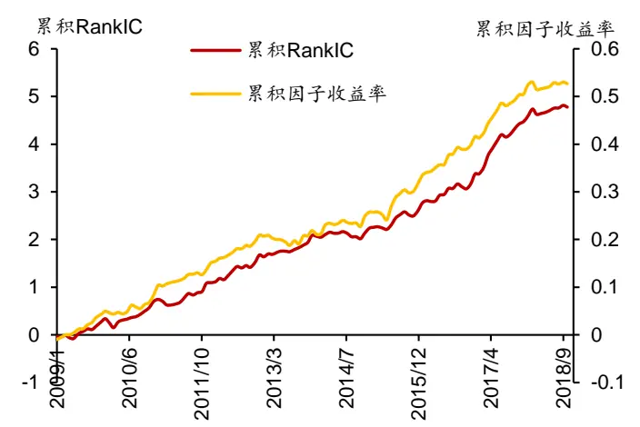
资料来源：朝阳永续，Wind，华泰证券研究所

## 一致预期BP

本节中，我们分别测试图表19中3个一致预期BP相关因子。首先，我们分析图表19中的因子和BP因子之间的相关性，如图表20所示，一致预期BP因子及其衍生因子与BP因子之间都有一定相关性，因此我们在测试时要进行BP因子中性。

图表19：一致预期 BP 相关因子

| 具体因子 | 因子描述 | 2009 年以来平均覆盖度(全 A 股） |
| --- | --- | --- |
| CON_BP | 一致预期 BP | 90.68% |
| CON_BP_RANK | 一致预期BP同行业位序（申万二级行业） | 90.68% |
| CON_BP_REL | 一致预期 BP季度环比 | 87.23% |

资料来源：朝阳永续，华泰证券研究所

图表20：一致预期 BP 因子和 BP 因子在截面上的 Spearman 秩相关系数均值(2009 年至 2018 年 10 月）

| 因子名称 | BP | CON_BP | CON_BP_RANK | CON_BP_REL |
| --- | --- | --- | --- | --- |
| BP |  | 92.24% | 71.71% | 11.32% |
| CON_BP | 92.24% |  | 78.73% | 17.74% |
| CON_BP_RANK | 71.71% | 78.73% |  | 17.38% |
| CON_BP_REL | 11.32% | 17.74% | 17.38% |  |

资料来源：朝阳永续，华泰证券研究所

图表 21~图表 22 展示了一致预期 BP相关因子在各种股票池内回归法、RankIC 值、分层测试分析结果汇总。可以看出，沪深300成分股和中证500成分股内，CON_BP和CON_BP_RANK具有较好的选股效果；全A股内，CON_BP_RANK具有较好的选股效果。在各个股票池内，CON_BP_RANK虽然相对于CON_BP的 RankIC 均值有所下降，但是ICIR有大幅提升，表现更加稳定。

图表21：一致预期BP相关因子在各种股票池内回归法、IC值分析结果汇总（行业、市值、BP中性）

| 具体因子 | It\|均值\|t\|>2 占比t 均值 |  | 因子收益率均值 RankIC 均值 RankIC 标准差 |  |  | IC_IRIC>0 占比 |
| --- | --- | --- | --- | --- | --- | --- |
| 沪深 300 成分股内 |  |  |  |  |  |  |
| CON_BP | 2.07 | 41.03% 0.92 | 0.66% | 5.54% | 23.23% | 0.24 58.97% |
| CON_BP_RANK | 1.69 | 35.04% 0.83 | 0.37% | 4.07% | 10.41% | 0.39 67.52% |
| CON_BP_REL | 1.85 | 32.48% 0.64 | 0.33% | 2.82% | 17.38% | 0.16 58.97% |
| 中证 500 成分股内 |  |  |  |  |  |  |
| CON_BP | 1.97 | 38.46% 0.62 | 0.30% | 4.60% | 17.57% | 0.26 57.26% |
| CON_BP_RANK | 1.61 | 31.62% 0.39 | 0.18% | 3.85% | 7.85% | 0.49 67.52% |
| CON_BP_REL | 1.64 | 32.48%0.65 | 0.29% | 4.26% | 12.78% | 0.33 60.68% |
| 全 A股 |  |  |  |  |  |  |
| CON_BP | 4.93 | 73.50% 2.10 | 0.52% | 5.04% | 16.24% | 0.31 59.83% |
| CON_BP_RANK | 4.05 | 64.10% 1.82 | 0.40% | 4.78% | 7.11% | 0.67 73.50% |
| CON_BP_REL | 3.27 | 55.56% 1.58 | 0.35% | 4.78% | 11.79% | 0.41 67.52% |

资料来源：朝阳永续，Wind，华泰证券研究所

图表22：一致预期BP相关因子在各种股票池内分层测试法结果汇总(分五层)

|  |  |  |  |  |  | 多空组合年多空组合夏多空组合最大多空组合月 TOP组合月均 |  |  |  |  |
| --- | --- | --- | --- | --- | --- | --- | --- | --- | --- | --- |
| 具体因子 | 分层组合1～5（从左到右）年化收益率 |  |  |  |  | 化收益率 | 普比率 | 回撤 | 胜率 | 双边换手率 |
| 沪深 300 成分股内 |  |  |  |  |  |  |  |  |  |  |
| CON_BP | 11.65% | 6.57% | 4.67% | 1.06% | -0.06% | 9.22% | 0.52 | 31.12% | 52.14% | 25.43% |
| CON_BP_RANK | 9.63% | 7.34% | 3.35% | 2.21% | 0.41% | 8.92% | 1.06 | 16.03% | 55.56% | 40.96% |
| CON_BP_REL | 4.35% | 2.96% | 5.12% | 2.36% | -0.15% | 3.35% | 0.23 | 28.95% | 52.99% | 97.43% |
| 中证 500 成分股内 |  |  |  |  |  |  |  |  |  |  |
| CON_BP | 14.54% | 8.26% | 8.79% | 6.85% | 1.96% | 11.62% | 0.93 | 25.43% | 54.70% | 31.52% |
| CON_BP_RANK | 10.66% | 11.58% | 8.37% | 8.21% | 0.99% | 9.56% | 1.34 | 11.84% | 64.10% | 41.08% |
| CON_BP_REL | 8.80% | 9.00% | 8.33% | 6.66% | -0.82% | 9.09% | 0.90 | 18.86% | 62.39% | 97.71% |
| 全 A股 |  |  |  |  |  |  |  |  |  |  |
| CON_BP | 15.81% | 13.32% | 12.68% | 9.72% | 4.58% | 9.63% | 0.80 | 27.88% | 55.56% | 29.36% |
| CON_BP_RANK | 16.14% | 13.37% | 12.37% | 9.83% | 4.31% | 11.54% | 1.94 | 7.93% | 69.23% | 37.54% |
| CON_BP_REL | 13.66% | 11.87% | 11.61% | 8.38% | 2.01% | 10.78% | 1.12 | 15.50% | 58.97% | 93.65% |

资料来源：朝阳永续，Wind，华泰证券研究所

沪深300成分股内表现较好的一致预期BP相关因子详细展示

图表23： CON_BP 分层组合 1~5 净值除以基准净值(沪深 300)
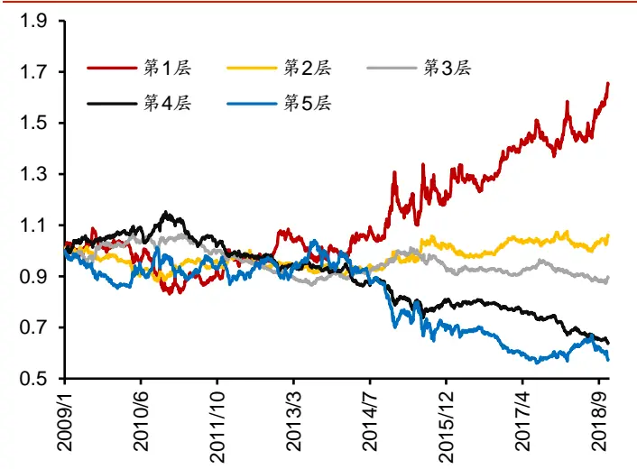
s资料来源：朝阳永续，Wind，华泰证券研究所

图表24: CON_BP 累积 RankIC 和累积因子收益率(沪深 300)
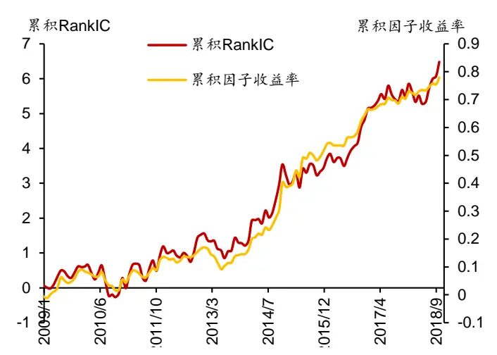
资料来源：朝阳永续，Wind，华泰证券研究所

图表25：CON_BP_RANK 分层组合 1~5 净值除以基准净值(沪深 300)
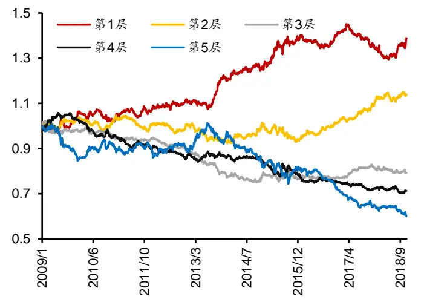
s资料来源：朝阳永续，Wind，华泰证券研究所

图表26：CON_BP_RANK 累积 RankIC 和累积因子收益率(沪深 300)
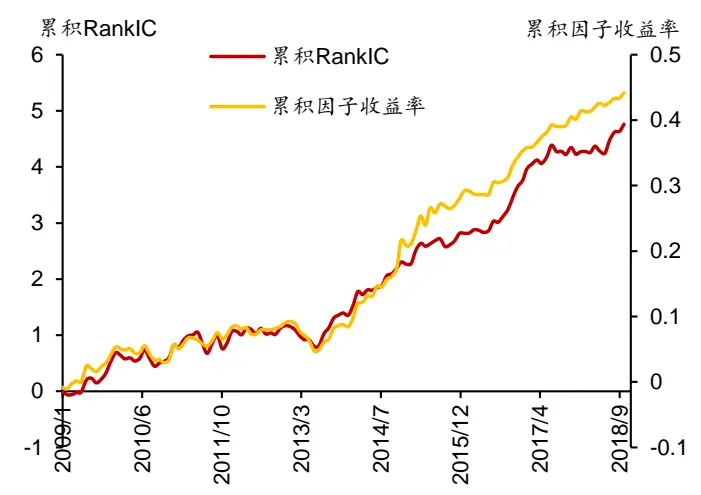
资料来源：朝阳永续，Wind，华泰证券研究所

中证500成分股内表现较好的一致预期BP相关因子详细展示

图表27： CON_BP 分层组合 1~5 净值除以基准净值(中证 500)
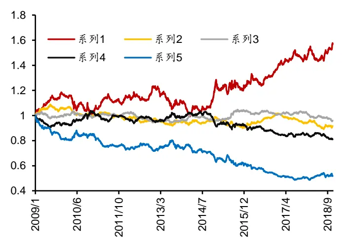
资料来源：朝阳永续，Wind，华泰证券研究所

图表28： CON_BP 累积 RankIC 和累积因子收益率(中证 500)
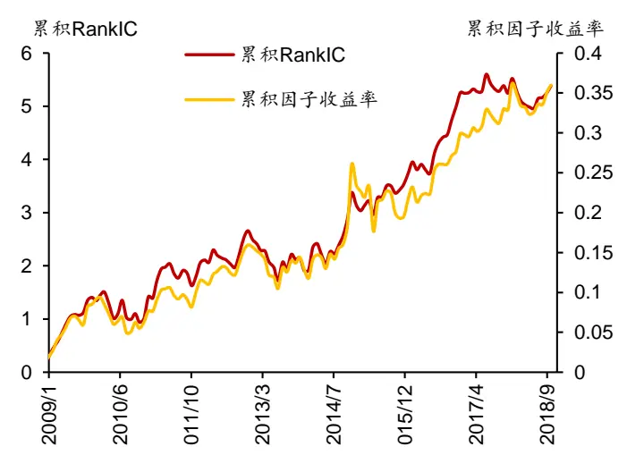
资料来源：朝阳永续，Wind，华泰证券研究所

图表29： CON_BP_RANK 分层组合 1~5 净值除以基准净值(中证 500)
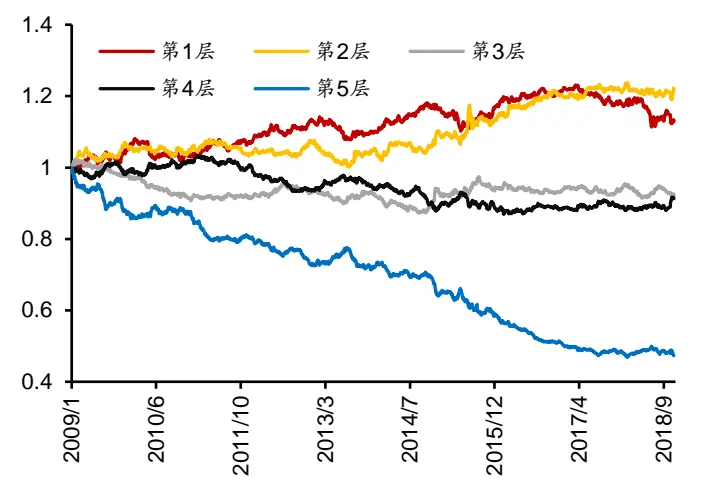
s资料来源：朝阳永续，Wind，华泰证券研究所

图表30： CON_BP_RANK 累积 RankIC 和累积因子收益率(中证 500)
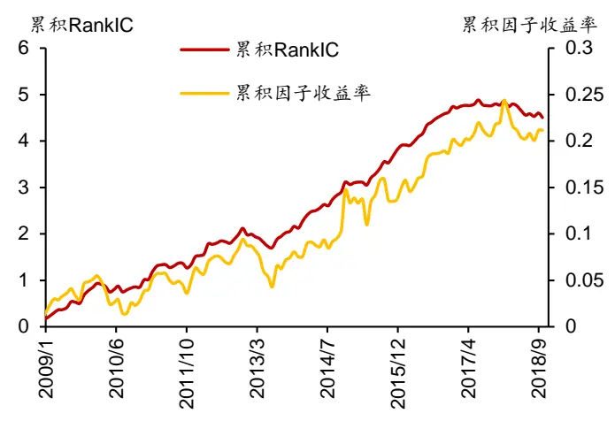
资料来源：朝阳永续，Wind，华泰证券研究所

全A股内表现较好因子的一致预期BP相关因子详细展示

图表31：CON_BP_RANK 分层组合 1~5 净值除以基准净值(全 A)
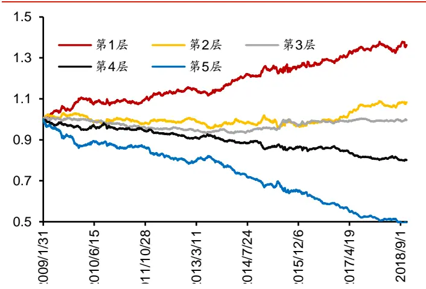
s资料来源：朝阳永续，Wind，华泰证券研究所

图表32： CON_BP_RANK 累积 RankIC 和累积因子收益率(全 A)
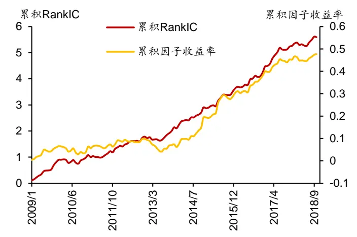
资料来源：朝阳永续，Wind，华泰证券研究所

## 一致预期EPS

本节中，我们分别测试图表33中3个一致预EPS相关因子。首先，我们分析图表33中的因子和EPS因子之间的相关性，如图表34所示，一致预期EPS因子及其衍生因子与EPS因子之间都有一定相关性，因此我们在测试时要进行EPS因子中性。

图表33：一致预期 EPS 相关因子

| 具体因子 | 因子描述 | 2009 年以来平均覆盖度(全 A 股） |
| --- | --- | --- |
| CON_EPS | 一致预期 EPS | 90.69% |
| CON_EPS_RANK | 一致预期EPS同行业位序（申万二级行业） | 90.69% |
| CON_EPS_REL | 一致预期 EPS 季度环比 | 87.43% |

资料来源：朝阳永续，华泰证券研究所

图表34：一致预期 EPS 因子和 EPS 因子在截面上的 Spearman 秩相关系数均值(2009 年至 2018 年 10 月）

| 因子名称 | EPS | CON_EPS | CON_EPS_RANK | CON_EPS_REL |
| --- | --- | --- | --- | --- |
| EPS |  | 75.75% | 67.61% | -2.46% |
| CON_EPS | 75.75% |  | 88.72% | 17.54% |
| CON_EPS_RANK | 67.61% | 88.72% |  | 17.27% |
| CON_EPS_REL | -2.46% | 17.54% | 17.27% |  |

资料来源：朝阳永续，华泰证券研究所

图表35~图表36展示了一致预期EPS相关因子在各种股票池内回归法、RankIC值、分层测试分析结果汇总。可以看出，沪深300成分股内，CONEPS具有较好的选股效果；全 A 股内，CON_EPS_REL具有较好的选股效果。

图表35：一致预期EPS相关因子在各种股票池内回归法、IC值分析结果汇总（行业、市值、EPS 中性）

| 具体因子 | It\|均值\|t\|>2 占比t 均值 |  | 因子收益率均值 RankIC 均值 RankIC 标准差 |  |  | IC_IRIC>0 占比 |  |
| --- | --- | --- | --- | --- | --- | --- | --- |
| 沪深 300 成分股内 |  |  |  |  |  |  |  |
| CON_EPS | 1.84 | 36.75% 0.57 |  | 0.21% 4.21% | 16.63% | 0.25 | 62.39% |
| CON_EPS_RANK | 1.65 | 29.06%0.53 |  | 0.19% 3.55% | 12.33% | 0.29 | 59.83% |
| CON_EPS_REL | 1.20 | 17.09% 0.41 |  | 0.20% 3.20% | 9.42% | 0.34 | 66.67% |
| 中证500 成份股内 |  |  |  |  |  |  |  |
| CON_EPS | 1.92 | 37.61%0.72 |  | 0.28% | 2.01% 13.25% | 0.15 | 52.99% |
| CON_EPS_RANK | 1.66 | 32.48% 0.60 |  | 0.24% 1.81% | 10.40% | 0.17 | 54.70% |
| CON_EPS_REL | 1.09 | 15.38% 0.42 |  | 0.19% | 1.72% 6.48% | 0.27 | 62.39% |
| 全 A股 |  |  |  |  |  |  |  |
| CON_EPS | 3.99 | 70.09% 1.56 |  | 0.29% | 1.62% 12.13% | 0.13 | 52.99% |
| CON_EPS_RANK | 3.57 | 64.10% | 1.56 | 0.32% | 1.64% | 9.44% 0.17 | 52.99% |
| CON_EPS_REL | 1.83 | 40.17% 1.04 |  | 0.22% | 1.74% | 4.62% 0.38 | 65.81% |

资料来源：朝阳永续，Wind，华泰证券研究所

图表36：一致预期EPS相关因子在各种股票池内分层测试法结果汇总(分五层）

|  |  |  |  |  | 多空组合年多空组合夏普多空组合最大多空组合TOP组合月均 |  |  |  |  |
| --- | --- | --- | --- | --- | --- | --- | --- | --- | --- |
| 具体因子 分层组合1～5（从左到右）年化收益率 |  |  |  |  | 化收益率 | 比率 |  | 回撤 月胜率 | 双边换手率 |
| 沪深 300 成分股内 |  |  |  |  |  |  |  |  |  |
| CON_EPS | 11.44% | 3.97% | 2.93% | 3.44% | 2.61% | 7.21% | 0.59 45.16% | 54.70% | 25.86% |
| CON_EPS_RANK | 7.89% | 6.90% | 4.01% | 3.32% | 1.31% | 6.05% | 0.70 30.48% | 57.26% | 40.14% |
| CON_EPS_REL | 7.92% | 5.75% | 2.32% | 1.89% | -0.68% | 8.23% | 0.99 | 15.67% 68.38% | 89.47% |
| 中证 500 成份股内 |  |  |  |  |  |  |  |  |  |
| CON_EPS | 12.44% | 8.36% | 7.35% | 7.65% | 5.28% | 6.04% | 0.64 25.86% | 53.85% | 33.85% |
| CON_EPS_RANK | 10.79% | 9.05% | 7.67% | 7.16% | 5.30% | 4.54% | 0.62 | 22.93% 52.14% | 42.63% |
| CON_EPS_REL | 9.66% | 9.91% | 6.20% | 4.89% | 3.36% | 5.82% | 0.92 | 8.24% 59.83% | 86.80% |
| 全 A股 CON_EPS | 13.56% | 13.02% | 10.43% | 10.77% | 9.01% | 3.75% | 0.45 | 26.18% 55.56% |  |
| CON_EPS_RANK | 14.22% | 10.82% | 10.92% | 10.04% | 9.88% | 3.77% | 0.60 | 19.15% 58.97% | 32.38% 40.30% |
| CON_EPS_REL | 14.16% | 9.60% | 10.30% | 7.29% | 8.19% | 5.40% | 1.22 | 8.75% 67.52% | 83.13% |

资料来源：朝阳永续，Wind，华泰证券研究所

沪深300成分股内表现较好的一致预期EPS相关因子详细展示

图表37：CON_EPS 分层组合 1~5 净值除以基准净值(沪深 300)
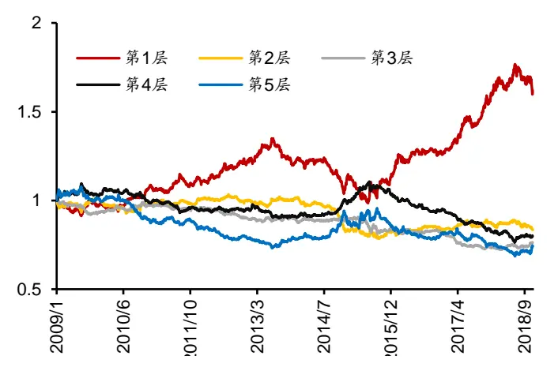
s资料来源：朝阳永续，Wind，华泰证券研究所

图表38： CON_EPS 累积 RankIC 和累积因子收益率(沪深 300)
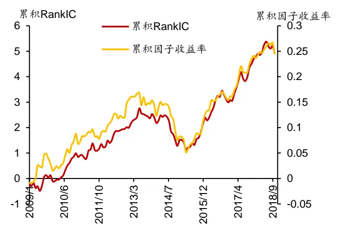
资料来源：朝阳永续，Wind，华泰证券研究所

全A股内表现的一致预期EPS相关因子详细展示

图表39：CON_EPS_REL 分层组合 1~5净值除以基准净值(全 A)
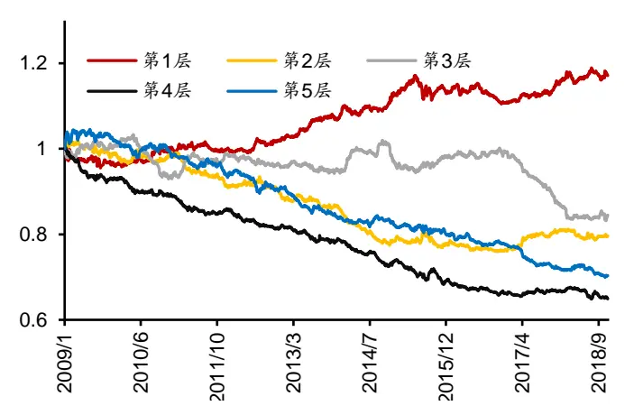
s资料来源：朝阳永续，Wind，华泰证券研究所

图表40：CON_EPS_REL 累积 RankIC 和累积因子收益率(全 A)
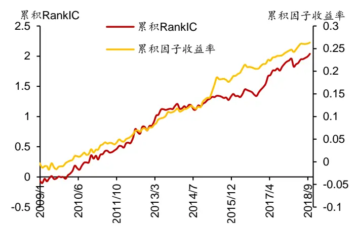
资料来源：朝阳永续，Wind，华泰证券研究所

## 一致预期 ROE

本节中，我们分别测试图表41中3个一致预期ROE相关因子。首先，我们分析图表41中的因子和ROE因子之间的相关性，如图表42所示，一致预期ROE因子及其衍生因子与ROE因子之间都有一定相关性，因此我们在测试时要进行ROE因子中性。

图表41：一致预期 ROE 相关因子

| 具体因子 | 因子描述 | 2009 年以来平均覆盖度(全 A 股） |
| --- | --- | --- |
| CON_ROE | 一致预期 ROE | 90.69% |
| CON_ROE_RANK | 一致预期 ROE同行业位序（申万二级行业） | 90.69% |
| CON_ROE_REL | 一致预期 ROE 季度环比 | 87.43% |

资料来源：朝阳永续，华泰证券研究所

图表42：一致预期 ROE 因子和 ROE 因子在截面上的 Spearman 秩相关系数均值(2009 年至 2018 年 10 月)

| 因子名称 | ROE | CON_ROE | CON_ROE_RANK | CON_ROE_REL |
| --- | --- | --- | --- | --- |
| ROE |  | 52.66% | 47.70% | 2.89% |
| CON_ROE | 52.66% |  | 87.14% | 21.04% |
| CON_ROE_RANK | 47.70% | 87.14% |  | 20.10% |
| CON_ROE_REL | 2.89% | 21.04% | 20.10% |  |

资料来源：朝阳永续，华泰证券研究所

图表 43~图 44 展示了一致预期 ROE相关因子在各种股票池内回归法、RankIC 值、分层测试分析结果汇总。可以看出，全A股内，CON_ROE_REL具有较好的选股效果。

图表43：一致预期ROE相关因子在各种股票池内回归法、IC值分析结果汇总（行业、市值、ROE中性）

| 具体因子 | It\|均值\|t\|>2 占比 |  | t均值 |  | 因子收益率均值 RankIC 均值 RankIC 标准差IC_IR IC>0 占比 |  |  |  |  |
| --- | --- | --- | --- | --- | --- | --- | --- | --- | --- |
| 沪深 300 成分股内 |  |  |  |  |  |  |  |  |  |
| CON_ROE | 1.93 | 40.17% |  | 0.19 | 0.03% | 1.33% | 17.35%0.08 |  | 53.85% |
| CON_ROE_RANK |  | 1.60 | 33.33% | 0.39 | 0.13% | 1.67% | 11.61%0.14 |  | 58.12% |
| CON_ROE_REL |  | 1.18 | 13.68% | 0.38 | 0.19% | 2.72% | 9.71% 0.28 |  | 64.96% |
| 中证 500 成份股内 |  |  |  |  |  |  |  |  |  |
| CON_ROE |  | 1.66 | 37.61% | 0.60 | 0.26% | 0.39% | 10.85% 0.04 |  | 47.86% |
| CON_ROE_RANK |  | 1.36 | 22.22% | 0.54 | 0.24% | 0.30% | 8.49% | 0.04 | 51.28% |
| CON_ROE_REL |  | 0.95 | 11.11% | 0.44 | 0.21% | 1.60% | 5.76% 0.28 |  | 58.12% |
| 全 A股 |  |  |  |  |  |  |  |  |  |
| CON_ROE | 3.50 |  | 65.81% | 1.08 | 0.21% | 0.76% | 9.16% 0.08 |  | 52.14% |
| CON_ROE_RANK | 3.07 |  | 61.54% | 0.98 | 0.17% | 0.72% | 6.85% 0.10 |  | 54.70% |
| CON_ROE_REL |  | 1.55 | 29.06% | 0.94 | 0.20% | 1.74% | 4.43%0.39 |  | 65.81% |

资料来源：朝阳永续，Wind，华泰证券研究所

图表44：一致预期ROE相关因子在各种股票池内分层测试法结果汇总(分五层)

| 多空组合年多空组合夏普多空组合最大多空组合 TOP组合月均 |  |  |  |  |  |  |  |  |  |  |  |
| --- | --- | --- | --- | --- | --- | --- | --- | --- | --- | --- | --- |
| 具体因子 | 分层组合1～5（从左到右）年化收益率 |  |  |  |  |  | 化收益率 | 比率 | 回撤 | 月胜率 | 双边换手率 |
| 沪深 300 成分股内 |  |  |  |  |  |  |  |  |  |  |  |
| CON_ROE | 8.52% | 3.42% | 4.32% | 3.57% | 3.97% | 3.22% | 0.25 | 47.15% | 54.70% | 28.90% |  |
| CON_ROE_RANK | 7.35% | 4.72% | 3.71% | 4.48% | 2.42% | 4.46% | 0.55 | 23.19% | 52.99% | 41.92% |  |
| CON_ROE_REL | 6.12% | 5.47% | 4.02% | 3.45% | -2.21% | 8.00% | 1.00 |  | 13.02% 61.54% | 88.92% |  |
| 中证 500 成份股内 |  |  |  |  |  |  |  |  |  |  |  |
| CON_ROE | 9.56% | 9.22% | 7.13% | 7.34% | 7.31% | 1.61% | 0.20 | 28.16% | 49.57% | 36.76% |  |
| CON_ROE_RANK | 7.95% | 9.20% | 9.19% | 6.57% | 6.56% | 0.83% | 0.12 | 17.26% | 52.14% | 43.91% |  |
| CON_ROE_REL | 9.13% | 8.80% | 8.42% | 4.78% | 2.94% | 5.89% | 1.00 | 6.48% | 62.39% | 85.04% |  |
| 全 A股 |  |  |  |  |  |  |  |  |  |  |  |
| CON_ROE | 12.97% | 11.85% | 10.70% | 9.62% | 11.05% | 1.64% | 0.24 | 25.93% | 52.99% | 31.51% |  |
| CON_ROE_RANK | 12.53% | 10.94% | 10.66% | 9.81% | 11.16% | 1.07% | 0.22 | 17.91% | 52.14% | 38.74% |  |
| CON_ROE_REL | 13.70% | 10.32% | 10.23% | 7.73% | 7.13% | 6.19% | 1.47 |  | 7.59% 69.23% | 82.30% |  |

资料来源：朝阳永续，Wind，华泰证券研究所

全A股内表现较好因子的一致预期ROE相关因子详细展示

图表45： CON_ROE_REL 分层组合 1~5 净值除以基准净值(全 A)
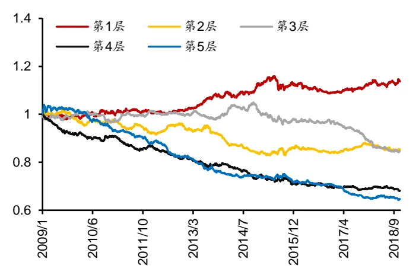
s资料来源：朝阳永续，Wind，华泰证券研究所

图表46： CON_ROE_REL 累积 RankIC 和累积因子收益率(全 A)
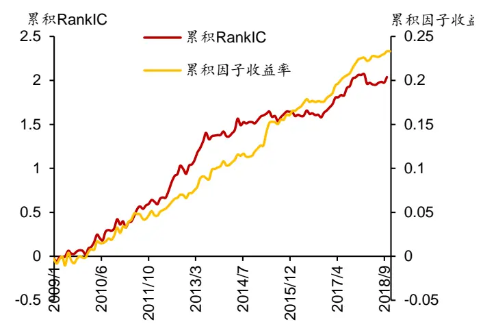
资料来源：朝阳永续，Wind，华泰证券研究所

## 一致预期归母净利润

本节中，我们分别测试图表47中3个一致预归母净利润相关因子。首先，我们分析图表47中的因子和净利润因子(NP因子)之间的相关性，如图表48所示，一致预期归母净利润因子及其衍生因子与净利润因子之间都有一定相关性，因此我们在测试时要进行净利润因子中性。

图表47：一致预期归母净利润相关因子

| 具体因子 | 因子描述 | 2009 年以来平均覆盖度(全 A 股) |
| --- | --- | --- |
| CON_NP | 一致预期归母净利润 | 90.69% |
| CON_NP_RANK | 一致预期归母净利润同行业位序（申万二级行业） | 90.69% |
| CON_NP_REL | 一致预期归母净利润季度环比 | 87.43% |

资料来源：朝阳永续，华泰证券研究所

图表48：一致预期归母净利润因子和净利润在截面上的Spearman秩相关系数均值(2009年至2018年10月)

| 因子名称 NP CON_NP CON_NP_RANK |  |  |  | CON_NP_REL |
| --- | --- | --- | --- | --- |
| NP |  | 79.44% | 67.24 | % 3.82% |
| CON_NPCON_NP_RANKCON_NP_REL | 79.44% |  | 84.74% | 14.91% |
|  | 67.24% | 84.74% |  | 15.33% |
|  | 3.82% | 14.91% 15.33% |  |  |

资料来源：朝阳永续，华泰证券研究所

图表49~图表50展示了一致预期归母净利润相关因子在各种股票池内回归法、RankIC值、分层测试分析结果汇总。可以看出，全A股内，CON_ROE_REL具有较好的选股效果。

图表49：一致预期归母净利润相关因子在各种股票池内回归法、IC值分析结果汇总（行业、市值、ROE中性）

| 具体因子 | \|t\|均值\|t\|>2 占比 |  | t 均值 |  | 因子收益率均值 RankIC 均值 RankIC 标准差IC_IR IC>0 占比 |  |  |  |
| --- | --- | --- | --- | --- | --- | --- | --- | --- |
| 沪深 300 成分股内 |  |  |  |  |  |  |  |  |
| CON_NP |  | 1.80 38.46% | 0.77 |  | 0.69% | 3.69% | 21.62% 0.17 | 57.26% |
| CON_NP_RANK | 1.29 | 20.51% |  | 0.27 | 0.12% | 1.89% | 13.60% 0.14 | 56.41% |
| CON_NP_REL |  | 1.29 | 18.80% | 0.45 | 0.21% | 3.15% | 10.40%0.30 | 66.67% |
| 中证 500 成份股内 |  |  |  |  |  |  |  |  |
| CON_NP | 1.90 | 37.61% |  | 0.98 | 0.53% | 1.13% | 11.44% 0.10 | 52.99% |
| CON_NP_RANK | 1.34 | 26.50% |  | 0.77 | 0.42% | 1.61% | 10.79% 0.15 | 59.83% |
| CON_NP_REL | 1.09 | 17.95% |  | 0.64 | 0.29% | 2.00% | 6.47% 0.31 | 57.26% |
| 全 A股 |  |  |  |  |  |  |  |  |
| CON_NP | 2.86 | 52.14% |  | 1.70 | 0.59% | -0.92% | 15.30% -0.06 | 49.57% |
| CON_NP_RANK | 2.86 | 52.99% |  | 2.11 | 0.67% | 0.00% | 9.99% 0.00 | 50.43% |
| CON_NP_REL |  | 2.02 | 47.86% | 1.23 | 0.26% | 2.22% | 5.15%0.43 | 68.38% |

资料来源：朝阳永续，Wind，华泰证券研究所

图表50：一致预期归母净利润相关因子在各种股票池内分层测试法结果汇总(分五层)

| 多空组合年化多空组合夏多空组合最大多空组合TOP 组合月均 |  |  |  |  |  |  |  |  |  |  |  |
| --- | --- | --- | --- | --- | --- | --- | --- | --- | --- | --- | --- |
| 具体因子 | 分层组合1～5（从左到右）年化收益率 |  |  |  |  |  | 收益率 | 普比率 | 回撤 | 月胜率 | 双边换手率 |
| 沪深 300 成分股内 |  |  |  |  |  |  |  |  |  |  |  |
| CON_NP | 10.88% | 4.36% | 3.68% | 3.33% | 2.55% | 4.87% | 0.26 | 40.75% | 53.85% | 15.62% |  |
| CON_NP_RANK | 7.47% | 5.26% | 5.00% | 3.48% | 2.83% | 3.44% | 0.32 | 24.75% | 53.85% | 34.82% |  |
| CON_NP_REL | 7.30% | 6.06% | 3.49% | 1.70% | -1.43% | 8.33% | 0.94 | 12.71% | 65.81% | 87.41% |  |
| 中证 500 成份股内 |  |  |  |  |  |  |  |  |  |  |  |
| CON_NP | 9.59% | 9.16% | 7.74% | 8.96% | 5.23% | 3.45% | 0.40 | 15.89% | 52.14% | 35.64% |  |
| CON_NP_RANK | 11.05% | 7.18% | 9.37% | 8.02% | 4.87% | 5.34% | 0.70 | 14.16% | 52.14% | 38.00% |  |
| CON_NP_REL | 10.77% | 9.70% | 7.17% | 4.43% | 2.04% | 8.25% | 1.31 | 8.25% | 64.10% | 85.38% |  |
| 全 A股 |  |  |  |  |  |  |  |  |  |  |  |
| CON_NP | 8.16% | 8.94% | 12.41% | 14.47% | 12.29% | -5.17% | -0.45 | 64.86% | 42.74% | 21.70% |  |
| CON_NP_RANK | 10.19% | 10.09% | 11.42% | 12.13% | 12.84% | -2.84% | -0.46 | 47.95% | 43.59% | 32.50% |  |
| CON_NP_REL | 14.92% | 11.07% | 10.40% | 6.94% | 6.45% | 7.95% | 1.72 |  | 8.82% 75.21% | 81.68% |  |

资料来源：朝阳永续，Wind，华泰证券研究所

## 全A股内表现较好因子的一致预期归母净利润相关因子详细展示

图表51：CON_NP_REL 分层组合 1~5 净值除以基准净值(全 A)
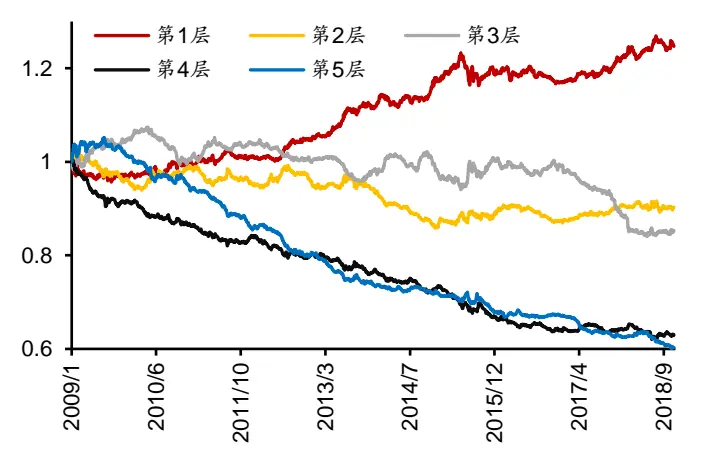
s资料来源：朝阳永续，Wind，华泰证券研究所

图表52：CON_NP_REL 累积 RankIC 和累积因子收益率(全 A)
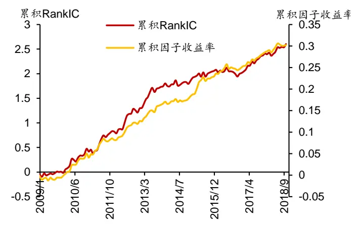
资料来源：朝阳永续，Wind，华泰证券研究所

## 一致预期个股关注度因子

本节中，我们分别测试图表53中的一致预期个股关注度因子。可以看出，一致预期个股关注度因子在全A股的平均覆盖度较低，具体在2018年10月，覆盖度已降到了50%左右，达到历史低位，因此我们只测试该类因子在沪深300和中证500内的选股表现。

图表53：一致预期个股关注度因子

| 2009年以来平均覆盖2009年以来平均覆盖度2009年以来平均覆盖 |  |  |  |  |
| --- | --- | --- | --- | --- |
| 具体因子 | 因子描述 | 度（沪深 300） | (中证 500) | 度(全 A) |
| REPORT_NUMBER个股季度报告数 |  | 92.88% | 76.18% | 65.26% |
|  | AUTHOR_NUMBER个股季度关注的分析 师数量 | 97.36% | 85.28% | 73.58% |
|  | ORGAN_NUMBER 个股季度至少有一篇 报告记录的机构总量 | 97.56% | 86.21% | 74.75% |
| BUY_NUMBER | 个股季度买入评级报 告数 | 84.14% | 61.68% | 49.33% |

资料来源：朝阳永续，Wind，华泰证券研究所

图表54~图表55展示了一致预期个股关注度因子在各种股票池内回归法、RankIC值、分层测试分析结果汇总。可以看出，全沪深300内，BUY_NUMBER具有较好的选股效果。

图表54：一致预期个股关注度相关因子在各种股票池内回归法、IC值分析结果汇总（行业、市值中性）

| 具体因子 | It\|均值\|t\|>2 占比 |  | t均值 | 因子收益率均值RankIC 均值RankIC 标准差IC_IR IC>0 占比 |  |  |  |
| --- | --- | --- | --- | --- | --- | --- | --- |
| 沪深 300 成分股内 |  |  |  |  |  |  |  |
| REPORT_NUMBER | 1.55 | 27.35% | 0.58 | 0.26% | 3.69% | 16.31%0.23 | 54.70% |
| AUTHOR_NUMBER | 1.63 | 29.91% | 0.65 | 0.35% | 3.86% | 16.69% 0.23 | 58.12% |
| ORGAN_NUMBER | 1.65 | 30.77% | 0.64 | 0.35% | 3.87% | 16.82% 0.23 | 57.26% |
| BUY_NUMBER |  | 1.83 34.19% | 0.72 | 0.28% | 4.33% | 16.69% 0.26 | 57.26% |
| 中证 500 成份股内 |  |  |  |  |  |  |  |
| REPORT_NUMBER | 1.94 | 42.74% | 0.79 | 0.33% | 2.45% | 13.32%0.18 | 56.41% |
| AUTHOR_NUMBER | 1.90 | 39.32% | 0.71 | 0.29% | 1.67% | 13.97%0.12 | 52.99% |
| ORGAN_NUMBER | 1.98 | 41.03% | 0.77 | 0.31% | 1.78% | 14.05%0.13 | 52.99% |
| BUY_NUMBER | 1.95 | 43.59% | 0.81 | 0.34% | 3.08% | 12.70% 0.24 | 58.12% |

资料来源：朝阳永续，Wind，华泰证券研究所

图表55：一致预期个股关注度相关因子在各种股票池内分层测试法结果汇总(分五层)

| 具体因子 分层组合1～5（从左到右）年化收益率 |  |  |  |  |  | 多空组合年化 多空组合夏 收益率 | 多空组合最 普比率 | 大回撤 | 多空组合 TOP 组合月均 月胜率 | 双边换手率 |
| --- | --- | --- | --- | --- | --- | --- | --- | --- | --- | --- |
| 沪深 300 成分股内 |  |  |  |  |  |  |  |  |  |  |
| REPORT_NUMBER | 9.13% | 5.68% | 5.25% | 2.52% | -1.75% | 9.40% | 0.79 | 33.22% | 50.43% | 49.82% |
| AUTHOR_NUMBER | 8.30% | 6.50% | 5.07% | 4.54% | -2.13% | 8.86% | 0.70 | 29.24% | 52.99% | 44.33% |
| ORGAN_NUMBER | 8.93% | 7.08% | 4.26% | 2.61% | -0.40% | 7.52% | 0.56 | 33.88% | 51.28% | 42.49% |
| BUY_NUMBER | 9.67% | 7.96% | 3.83% | 2.72% | -1.47% | 9.76% | 0.81 | 33.46% | 56.41% | 37.96% |
| 中证 500 成份股内 |  |  |  |  |  |  |  |  |  |  |
| REPORT_NUMBER | 12.67% | 7.99% | 6.28% | 6.78% | 4.80% | 6.57% | 0.69 | 25.50% | 56.41% | 46.79% |
| AUTHOR_NUMBER | 11.04% | 8.17% | 6.31% | 8.45% | 5.68% | 4.21% | 0.44 | 32.11% | 53.85% | 38.30% |
| ORGAN_NUMBER | 11.22% | 8.23% | 7.72% | 6.65% | 6.02% | 4.15% | 0.43 | 31.09% | 55.56% | 37.77% |
| BUY_NUMBER | 11.17% | 9.23% | 7.83% | 8.75% | 2.81% | 7.25% | 0.80 | 24.16% | 55.56% | 45.53% |

资料来源：朝阳永续，Wind，华泰证券研究所

沪深300成分股内表现较好的一致预期个股关注度因子详细展示

图表56： BUY_NUMBER 分层组合 1~5 净值除以基准净值(沪深 300)
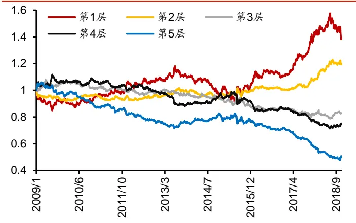
s资料来源：朝阳永续，Wind，华泰证券研究所

图表57： BUY_NUMBER 累积 RankIC 和累积因子收益率(沪深 300)
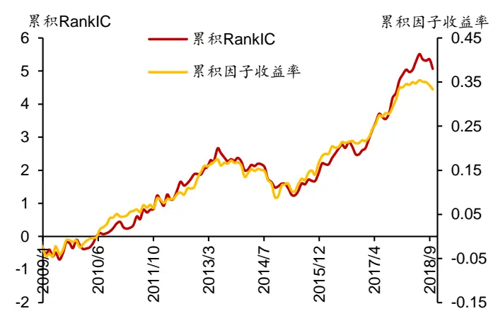
资料来源：朝阳永续，Wind，华泰证券研究所

## 各股票池内表现较好的一致预期因子总结

本节我们总结展示沪深 300、中证500 以及全 A 内表现较好的因子，在图表 58~图表 63内展示。总体来看，三个股票池内一致预期因子效果排序为：沪深300>全A>中证500。

图表58：沪深 300 内表现较好的一致预期因子

| 因子收益率 |  |  |  |  | 多空组合年多空组合夏普TOP组合年TOP 组合月均 |  |  |  |
| --- | --- | --- | --- | --- | --- | --- | --- | --- |
| 具体因子 | 因子描述 | 均值 | RankIC 均值 | IC_IR | 化收益率 | 比率 | 化收益率 | 双边换手率 |
| CON_EP | 一致预期EP | 0.78% | 6.32% | 0.33 | 12.87% | 0.79 | 14.60% | 32.49% |
| CON_EP_RANK | 一致预期EP 同行业位序 | 0.42% | 5.27% | 0.54 | 10.23% | 1.31 | 10.02% | 47.76% |
| CON_BP | 一致预期BP | 0.66% | 5.54% | 0.24 | 9.22% | 0.52 | 11.65% | 25.43% |
| CON_BP_RANK | 一致预期 BP 同行业位序 | 0.37% | 4.07% | 0.39 | 8.92% | 1.06 | 9.63% | 40.96% |
| CON_EPS | 一致预期 EPS | 0.21% | 4.21% | 0.25 | 7.21% | 0.59 | 11.44% | 25.86% |
| BUY_NUMBER | 个股季度买入评级报告数 | 0.28% | 4.33% | 0.26 | 9.76% | 0.81 | 9.67% | 37.96% |

资料来源：朝阳永续，Wind，华泰证券研究所

图表59：沪深300内表现较好的一致预期因子多空组合净值
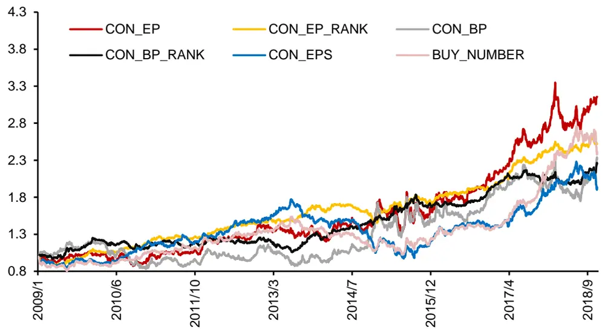
资料来源：朝阳永续，Wind，华泰证券研究所

图表60：中证 500内表现较好的一致预期因子

| 因子收益率 |  |  |  | 多空组合年化多空组合夏TOP 组合年 TOP 组合月均 |  |  |  |  |
| --- | --- | --- | --- | --- | --- | --- | --- | --- |
| 具体因子 | 因子描述 | 均值 | RankIC 均值 | IC_IR | 收益率 | 普比率 | 化收益率 | 双边换手率 |
| CON_EP_RANK | 一致预期 EP 同行业位序 | 0.34% | 3.66% | 0.51 | 9.70% | 1.52 | 12.09% | 52.52% |
| CON_BP | 一致预期 BP | 0.30% | 4.60% | 0.26 | 11.62% | 0.93 | 14.54% | 31.52% |
| CON_BP_RANK | 一致预期 BP 同行业位序 | 0.18% | 3.85% | 0.49 | 9.56% | 1.34 | 10.66% | 41.08% |

资料来源：朝阳永续，Wind，华泰证券研究所

图表61：中证500内表现较好的一致预期因子多空组合净值
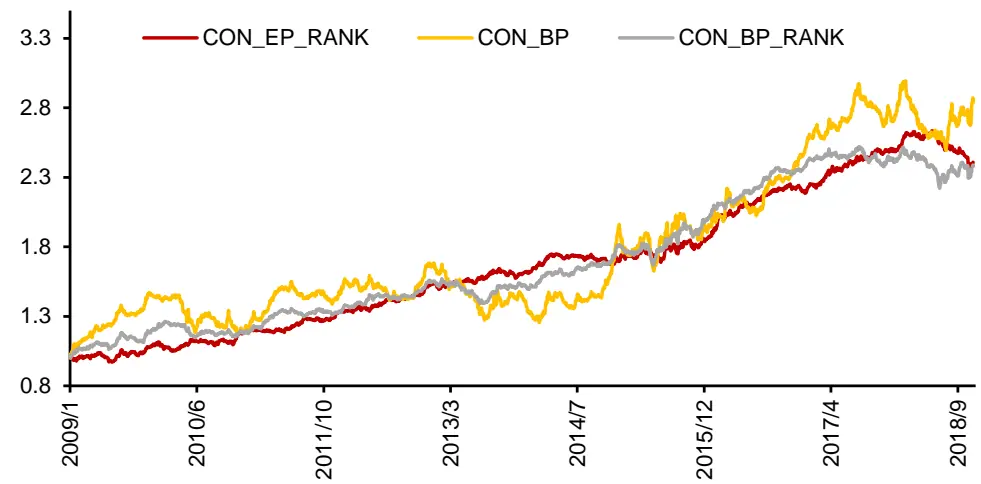
资料来源：朝阳永续，Wind，华泰证券研究所

图表62：全A 内表现较好的一致预期因子

| 因子收益率 |  |  |  |  | 多空组合年化多空组合夏TOP组合年 TOP 组合月均 |  |  |  |
| --- | --- | --- | --- | --- | --- | --- | --- | --- |
| 具体因子 | 因子描述 | 均值 | RankIC 均值 | IC_IR | 收益率 | 普比率 | 化收益率 | 双边换手率 |
| CON_EP_RANK | 一致预期EP 同行业位序 | 0.45% | 4.03% | 0.59 | 9.34% | 1.95 | 15.79% | 48.78% |
| CON_BP_RANK | 一致预期 BP 同行业位序 | 0.40% | 4.78% | 0.67 | 11.54% | 1.94 | 16.14% | 37.54% |
| CON_EPS_REL | 一致预期 EPS 季度环比 | 0.22% | 1.74% | 0.38 | 5.40% | 1.22 | 14.16% | 83.13% |
| CON_ROE_REL | 一致预期 ROE 季度环比 | 0.20% | 1.74% | 0.39 | 6.19% | 1.47 | 13.70% | 82.30% |
| CON_NP_REL | 一致预期归母净利润季度环比 | 0.26% | 2.22% | 0.43 | 7.95% | 1.72 | 14.92% | 81.68% |

资料来源：朝阳永续，Wind，华泰证券研究所

图表63：全A 内表现较好的一致预期因子多空组合净值
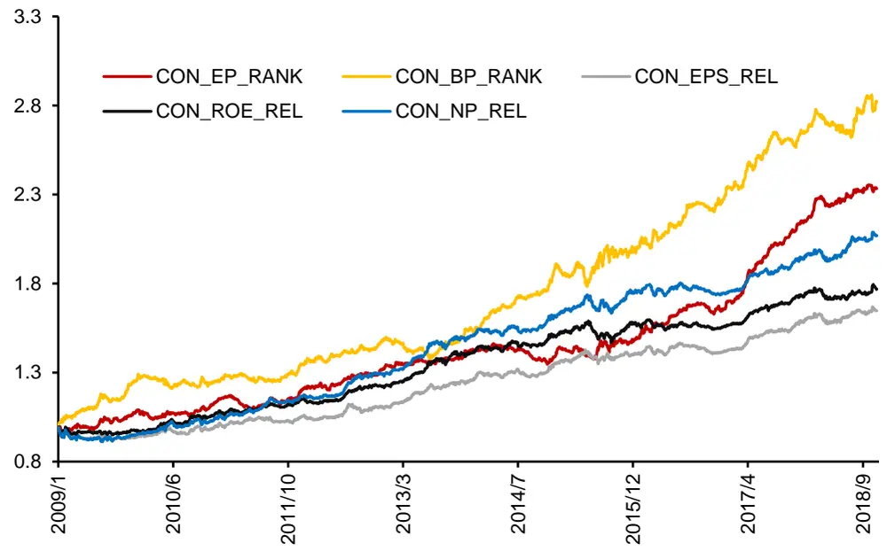
资料来源：朝阳永续，Wind，华泰证券研究所

## 行业内单因子测试结果分析

本章中，我们主要测试图表64中的16个因子在行业内选股的表现，总共得出了464条测试结果。我们根据测试的RankIC均值和多空组合夏普比率进行综合排名，取排名前50的因子，按照对应的行业归类得到图表65的结果，也就是说图表65展示了各个行业内表现较好的一致预期因子。

图表64：进行行业内选股测试的一致预期因子

| 具体因子 | 因子描述 |
| --- | --- |
| CON_EP | 一致预期EP |
| CON_EP_RANK | 一致预期EP同行业位序（申万二级行业） |
| CON_EP_REL | 一致预期EP季度环比 |
| CON_BP | 一致预期 BP |
| CON_BP_RANK | 一致预期BP同行业位序（申万二级行业） |
| CON_BP_REL | 一致预期 BP 季度环比 |
| CON_EPS | 一致预期 EPS |
| CON_EPS_RANK | 一致预期EPS同行业位序（申万二级行业） |
| CON_EPS_REL | 一致预期EPS 季度环比 |
| CON_ROE | 一致预期 ROE |
| CON_ROE_RANK | 一致预期ROE同行业位序（申万二级行业） |
| CON_ROE_REL | 一致预期 ROE季度环比 |
| CON_NP | 一致预期归母净利润 |
| CON_NP_RANK | 一致预期归母净利润同行业位序（申万二级行业） |
| CON_NP_REL | 一致预期归母净利润季度环比 |
| BUY_NUMBER | 个股季度买入评级报告数 |

资料来源：朝阳永续，华泰证券研究所

图表65：一致预期因子在行业内选股的表现（根据测试的 RankIC 均值和多空组合夏普比率取排名前50 的因子）
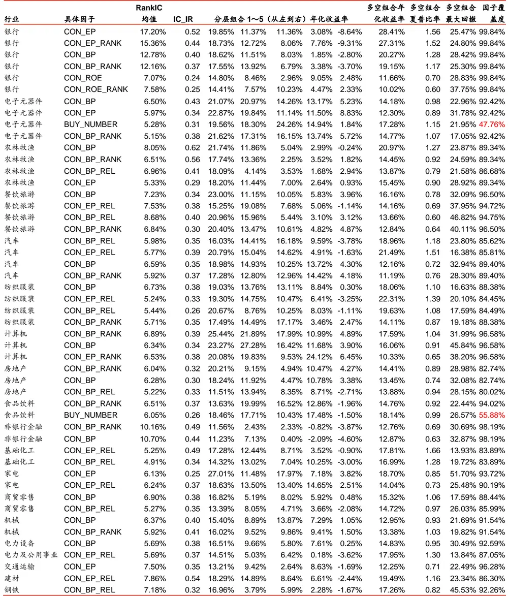
资料来源：朝阳永续，Wind，华泰证券研究所

从图表65中可以得出以下结论：

1. 除了BUY_NUMBER（个股季度买入评级报告数）因子，其他因子在各行业内都有较高覆盖度。

2. 一致预期因子在银行行业内表现最好，有6个因子排名进入前50，其中4个因子的RankIC在10%以上，多空组合夏普比率在1以上。另外有18个行业的选股效果也进入了前50名，电子元器件、农林牧渔、餐饮旅游、汽车、纺织服装表现较好。

3. 一致预期EP和一致预期BP的相关因子在行业内选股表现较好，在多个行业内都有入选，一致预期ROE相关因子只在银行行业内选股排名进入前50，一致预期EPS和一致预期归母净利润相关因子没有一个排名进入前50。

## 总结

1. 本报告主要测试了两大类一致预期因子：财务指标类一致预期因子和关注度类一致预期因子，总共19个因子，全部因子从朝阳永续数据库提取后构造。根据测试结果，一致预期因子及其衍生因子长期来看具有较稳定的选股能力。

2. 对于财务指标类的一致预期因子，我们都构建了两个衍生因子：原始因子的同行业位序和原始因子的季度环比，该类因子2009年以来的覆盖度基本在90%左右。测试分析可得两条主要结论：（1）原始因子与其同行业位序因子相关性较高，大多数情况下，同行业位序因子的RankIC均值相比原始因子会有一定降低，但是IC_IR会有较大提升，分层测试表现更加稳定。(2）原始因子与其季度环比因子相关性较低，大多数情况下，季度环比因子会比原始因子有更高的ICIR和多空组合夏普比率，但是换手率也更高，其多空组合的良好表现多数情况下来自于空头。

3. 对于财务指标类的一致预期因子，我们分为沪深300、中证500、全A三个股票池测试因子的表现，并总结各个股票池内表现较好的因子。总体来看，三个股票池内一致预期因子效果排序为：沪深300>全A>中证500。其中沪深300内RankIC均值最高的因子是一致预期 EP，RankIC 均值为 6.32%，IC_IR为 0.33，多空组合夏普比率为 0.79。中证500 内 RankIC 均值最高的因子是一致预期 BP，RankIC 均值为 4.60%，IC_IR 为 0.26，多空组合夏普比率为 0.93。全 A 内 RankIC 均值最高的因子是一致预期 BP 同行业位序，RankIC 均值为 4.78%，IC_IR 为 0.67，多空组合夏普比率为 1.94。

4. 对于关注度类的一致预期因子，考虑到其较低的覆盖率问题，我们仅测试该类因子在沪深300和中证500成分股内的选股效果。测试发现该类因子表现并不亮眼，其中个股季度买入评级报告数因子在沪深 300 内表现较好，RankIC 均值为4.33%，IC_IR 为 0.26，多空组合夏普比率为0.81。

5. 我们测试了一致预期因子在行业内选股的表现，根据测试的RankIC均值和多空组合夏普比率进行综合排名。一致预期因子在银行行业内表现最好，有6个因子排名进入前50，其中4个因子的RankIC在10%以上，多空组合夏普比率在1以上。另外一致预期因子在电子元器件、农林牧渔、餐饮旅游、汽车、纺织服装行业的表现也较好。一致预期EP和一致预期BP的相关因子在行业内选股表现较好，一致预期ROE相关因子只在银行行业内选股排名进入前50，一致预期EPS和一致预期归母净利润相关因子没有一个排名进入前50。

## 风险提示

单因子测试结果是历史经验的总结，如果市场规律改变，存在失效的可能。一致预期因子的有效性可能吸引越来越多投资者的关注，逐渐削弱一致预期因子在未来的表现。

## 免责申明

收到本报告而视其为客户。

本报告基于本公司认为可靠的、已公开的信息编制，但本公司对该等信息的准确性及完整性不作任何保证。本报告所载的意见、评估及预测仅反映报告发布当日的观点和判断。在不同时期，本公司可能会发出与本报告所载意见、评估及预测不一致的研究报告。同时，本报告所指的证券或投资标的的价格、价值及投资收入可能会波动。本公司不保证本报告所含信息保持在最新状态。本公司对本报告所含信息可在不发出通知的情形下做出修改，投资者应当自行关注相应的更新或修改。

本公司力求报告内容客观、公正，但本报告所载的观点、结论和建议仅供参考，不构成所述证券的买卖出价或征价。该等观点、建议并未考虑到个别投资者的具体投资目的、财务状况以及特定需求，在任何时候均不构成对客户私人投资建议。投资者应当充分考虑自身特定状况，并完整理解和使用本报告内容，不应视本报告为做出投资决策的唯一因素。对依据或者使用本报告所造成的一切后果，本公司及作者均不承担任何法律责任。任何形式的分享证券投资收益或者分担证券投资损失的书面或口头承诺均为无效。

本公司及作者在自身所知情的范围内，与本报告所指的证券或投资标的不存在法律禁止的利害关系。在法律许可的情况下，本公司及其所属关联机构可能会持有报告中提到的公司所发行的证券头寸并进行交易，也可能为之提供或者争取提供投资银行、财务顾问或者金融产品等相关服务。本公司的资产管理部门、自营部门以及其他投资业务部门可能独立做出与本报告中的意见或建议不一致的投资决策。

本报告版权仅为本公司所有。未经本公司书面许可，任何机构或个人不得以翻版、复制、发表、引用或再次分发他人等任何形式侵犯本公司版权。如征得本公司同意进行引用、刊发的，需在允许的范围内使用，并注明出处为“华泰证券研究所”，且不得对本报告进行任何有悖原意的引用、删节和修改。本公司保留追究相关责任的权力。所有本报告中使用的商标、服务标记及标记均为本公司的商标、服务标记及标记。

本公司具有中国证监会核准的“证券投资咨询”业务资格，经营许可证编号为：91320000704041011J。

全资子公司华泰金融控股（香港）有限公司具有香港证监会核准的“就证券提供意见”业务资格，经营许可证编号为：A0K809

版权所有2018年华泰证券股份有限公司

## 评级说明

## 行业评级体系

一报告发布日后的6个月内的行业涨跌幅相对同期的沪深300指数的涨跌幅为基准；

一投资建议的评级标准

增持行业股票指数超越基准 中性行业股票指数基本与基准持平 减持行业股票指数明显弱于基准

## 公司评级体系

一报告发布日后的6个月内的公司涨跌幅相对同期的沪深300指数的涨跌幅为基准；
一投资建议的评级标准
买入股价超越基准20%以上
增持股价超越基准 5%-20%
中性股价相对基准波动在-5%~5%之间
减持股价弱于基准 5%-20%
卖出股价弱于基准20%以上

## 华泰证券研究

## 南京

南京市建邺区江东中路228号华泰证券广场1号楼/邮政编码：210019

电话：862583389999/传真：86 25 83387521

电子邮件：ht-rd@htsc.com

## 深圳

深圳市福田区深南大道4011号香港中旅大厦24层/邮政编码：518048

电话：86 755 82493932/传真：86755 82492062

电子邮件：ht-rd@htsc.com

## 北京

北京市西城区太平桥大街丰盛胡同28号太平洋保险大厦A座18层

邮政编码：100032

电话：861063211166/传真：861063211275

电子邮件：ht-rd@htsc.com

## 上海

上海市浦东新区东方路18号保利广场E栋23楼/邮政编码：200120

电话：86 2128972098/传真：862128972068

电子邮件：ht-rd@htsc.com